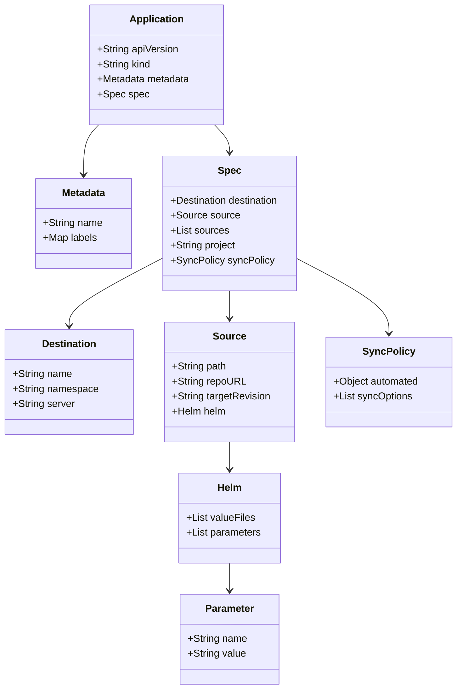

# Diagram: devops/k8s/container-insights/argocd/application.yaml


> Auto-generated by Obscura crawlers

## Diagram 1

```mermaid
flowchart TD
  App[Application: ${name_prefix}-container-insights]
  App --> Metadata[metadata]
  Metadata --> MetaName["name: ${name_prefix}-container-insights"]
  Metadata --> MetaLabels["labels: environment: ${env}"]
  App --> Spec[spec]
  Spec --> Destination[destination]
  Destination --> DestName["name: ''"]
  Destination --> DestNamespace["namespace: amazon-cloudwatch"]
  Destination --> DestServer["server: '${cluster_endpoint}'"]
  Spec --> Source[source]
  Source --> Path["path: devops/k8s/container-insights/helm"]
  Source --> Repo["repoURL: 'https://gitlab.com/freightverify-nextgen/devops.git'"]
  Source --> TargetRev["targetRevision: ${revision}"]
  Source --> Helm[helm]
  Helm --> ValueFiles["valueFiles: ['values.yaml']"]
  Helm --> Parameters[parameters]
  Parameters --> ParamName["name: cluster.name"]
  Parameters --> ParamValue["value: ${cluster_name}"]
  Spec --> SourcesList["sources: []"]
  Spec --> Project["project: ${env}-services"]
  Spec --> SyncPolicy[syncPolicy]
  SyncPolicy --> Automated["automated: {}"]
  SyncPolicy --> SyncOptions["syncOptions: ['CreateNamespace=true']"]
```

> SVG rendering failed for this diagram.

## Diagram 2



### SVG

<svg id="container" width="727.90625" xmlns="http://www.w3.org/2000/svg" class="classDiagram" height="1104" viewBox="0 0 727.90625 1104" role="graphics-document document" aria-roledescription="class"><style>#container{font-family:"trebuchet ms",verdana,arial,sans-serif;font-size:16px;fill:#333;}@keyframes edge-animation-frame{from{stroke-dashoffset:0;}}@keyframes dash{to{stroke-dashoffset:0;}}#container .edge-animation-slow{stroke-dasharray:9,5!important;stroke-dashoffset:900;animation:dash 50s linear infinite;stroke-linecap:round;}#container .edge-animation-fast{stroke-dasharray:9,5!important;stroke-dashoffset:900;animation:dash 20s linear infinite;stroke-linecap:round;}#container .error-icon{fill:#552222;}#container .error-text{fill:#552222;stroke:#552222;}#container .edge-thickness-normal{stroke-width:1px;}#container .edge-thickness-thick{stroke-width:3.5px;}#container .edge-pattern-solid{stroke-dasharray:0;}#container .edge-thickness-invisible{stroke-width:0;fill:none;}#container .edge-pattern-dashed{stroke-dasharray:3;}#container .edge-pattern-dotted{stroke-dasharray:2;}#container .marker{fill:#333333;stroke:#333333;}#container .marker.cross{stroke:#333333;}#container svg{font-family:"trebuchet ms",verdana,arial,sans-serif;font-size:16px;}#container p{margin:0;}#container g.classGroup text{fill:#9370DB;stroke:none;font-family:"trebuchet ms",verdana,arial,sans-serif;font-size:10px;}#container g.classGroup text .title{font-weight:bolder;}#container .nodeLabel,#container .edgeLabel{color:#131300;}#container .edgeLabel .label rect{fill:#ECECFF;}#container .label text{fill:#131300;}#container .labelBkg{background:#ECECFF;}#container .edgeLabel .label span{background:#ECECFF;}#container .classTitle{font-weight:bolder;}#container .node rect,#container .node circle,#container .node ellipse,#container .node polygon,#container .node path{fill:#ECECFF;stroke:#9370DB;stroke-width:1px;}#container .divider{stroke:#9370DB;stroke-width:1;}#container g.clickable{cursor:pointer;}#container g.classGroup rect{fill:#ECECFF;stroke:#9370DB;}#container g.classGroup line{stroke:#9370DB;stroke-width:1;}#container .classLabel .box{stroke:none;stroke-width:0;fill:#ECECFF;opacity:0.5;}#container .classLabel .label{fill:#9370DB;font-size:10px;}#container .relation{stroke:#333333;stroke-width:1;fill:none;}#container .dashed-line{stroke-dasharray:3;}#container .dotted-line{stroke-dasharray:1 2;}#container #compositionStart,#container .composition{fill:#333333!important;stroke:#333333!important;stroke-width:1;}#container #compositionEnd,#container .composition{fill:#333333!important;stroke:#333333!important;stroke-width:1;}#container #dependencyStart,#container .dependency{fill:#333333!important;stroke:#333333!important;stroke-width:1;}#container #dependencyStart,#container .dependency{fill:#333333!important;stroke:#333333!important;stroke-width:1;}#container #extensionStart,#container .extension{fill:transparent!important;stroke:#333333!important;stroke-width:1;}#container #extensionEnd,#container .extension{fill:transparent!important;stroke:#333333!important;stroke-width:1;}#container #aggregationStart,#container .aggregation{fill:transparent!important;stroke:#333333!important;stroke-width:1;}#container #aggregationEnd,#container .aggregation{fill:transparent!important;stroke:#333333!important;stroke-width:1;}#container #lollipopStart,#container .lollipop{fill:#ECECFF!important;stroke:#333333!important;stroke-width:1;}#container #lollipopEnd,#container .lollipop{fill:#ECECFF!important;stroke:#333333!important;stroke-width:1;}#container .edgeTerminals{font-size:11px;line-height:initial;}#container .classTitleText{text-anchor:middle;font-size:18px;fill:#333;}#container .label-icon{display:inline-block;height:1em;overflow:visible;vertical-align:-0.125em;}#container .node .label-icon path{fill:currentColor;stroke:revert;stroke-width:revert;}#container :root{--mermaid-font-family:"trebuchet ms",verdana,arial,sans-serif;}</style><g><defs><marker id="container_class-aggregationStart" class="marker aggregation class" refX="18" refY="7" markerWidth="190" markerHeight="240" orient="auto"><path d="M 18,7 L9,13 L1,7 L9,1 Z"></path></marker></defs><defs><marker id="container_class-aggregationEnd" class="marker aggregation class" refX="1" refY="7" markerWidth="20" markerHeight="28" orient="auto"><path d="M 18,7 L9,13 L1,7 L9,1 Z"></path></marker></defs><defs><marker id="container_class-extensionStart" class="marker extension class" refX="18" refY="7" markerWidth="190" markerHeight="240" orient="auto"><path d="M 1,7 L18,13 V 1 Z"></path></marker></defs><defs><marker id="container_class-extensionEnd" class="marker extension class" refX="1" refY="7" markerWidth="20" markerHeight="28" orient="auto"><path d="M 1,1 V 13 L18,7 Z"></path></marker></defs><defs><marker id="container_class-compositionStart" class="marker composition class" refX="18" refY="7" markerWidth="190" markerHeight="240" orient="auto"><path d="M 18,7 L9,13 L1,7 L9,1 Z"></path></marker></defs><defs><marker id="container_class-compositionEnd" class="marker composition class" refX="1" refY="7" markerWidth="20" markerHeight="28" orient="auto"><path d="M 18,7 L9,13 L1,7 L9,1 Z"></path></marker></defs><defs><marker id="container_class-dependencyStart" class="marker dependency class" refX="6" refY="7" markerWidth="190" markerHeight="240" orient="auto"><path d="M 5,7 L9,13 L1,7 L9,1 Z"></path></marker></defs><defs><marker id="container_class-dependencyEnd" class="marker dependency class" refX="13" refY="7" markerWidth="20" markerHeight="28" orient="auto"><path d="M 18,7 L9,13 L14,7 L9,1 Z"></path></marker></defs><defs><marker id="container_class-lollipopStart" class="marker lollipop class" refX="13" refY="7" markerWidth="190" markerHeight="240" orient="auto"><circle stroke="black" fill="transparent" cx="7" cy="7" r="6"></circle></marker></defs><defs><marker id="container_class-lollipopEnd" class="marker lollipop class" refX="1" refY="7" markerWidth="190" markerHeight="240" orient="auto"><circle stroke="black" fill="transparent" cx="7" cy="7" r="6"></circle></marker></defs><g class="root"><g class="clusters"></g><g class="edgePaths"><path d="M151.992,200L147.907,204.167C143.823,208.333,135.653,216.667,131.569,230C127.484,243.333,127.484,261.667,127.484,270.833L127.484,280" id="id_Application_Metadata_1" class="edge-thickness-normal edge-pattern-solid relation" style=";;;" data-edge="true" data-et="edge" data-id="id_Application_Metadata_1" data-points="W3sieCI6MTUxLjk5MTY1NDgyOTU0NTQ0LCJ5IjoyMDB9LHsieCI6MTI3LjQ4NDM3NSwieSI6MjI1fSx7IngiOjEyNy40ODQzNzUsInkiOjI4Nn1d" marker-end="url(#container_class-dependencyEnd)"></path><path d="M340.208,200L344.292,204.167C348.377,208.333,356.546,216.667,360.63,224C364.715,231.333,364.715,237.667,364.715,240.833L364.715,244" id="id_Application_Spec_2" class="edge-thickness-normal edge-pattern-solid relation" style=";;;" data-edge="true" data-et="edge" data-id="id_Application_Spec_2" data-points="W3sieCI6MzQwLjIwNzU2MzkyMDQ1NDU2LCJ5IjoyMDB9LHsieCI6MzY0LjcxNDg0Mzc1LCJ5IjoyMjV9LHsieCI6MzY0LjcxNDg0Mzc1LCJ5IjoyNTB9XQ==" marker-end="url(#container_class-dependencyEnd)"></path><path d="M254.297,415.544L230.165,428.12C206.034,440.696,157.771,465.848,133.639,483.591C109.508,501.333,109.508,511.667,109.508,516.833L109.508,522" id="id_Spec_Destination_3" class="edge-thickness-normal edge-pattern-solid relation" style=";;;" data-edge="true" data-et="edge" data-id="id_Spec_Destination_3" data-points="W3sieCI6MjU0LjI5Njg3NSwieSI6NDE1LjU0MzgyOTMwNTI1MTU2fSx7IngiOjEwOS41MDc4MTI1LCJ5Ijo0OTF9LHsieCI6MTA5LjUwNzgxMjUsInkiOjUyOH1d" marker-end="url(#container_class-dependencyEnd)"></path><path d="M364.715,466L364.715,470.167C364.715,474.333,364.715,482.667,364.715,490C364.715,497.333,364.715,503.667,364.715,506.833L364.715,510" id="id_Spec_Source_4" class="edge-thickness-normal edge-pattern-solid relation" style=";;;" data-edge="true" data-et="edge" data-id="id_Spec_Source_4" data-points="W3sieCI6MzY0LjcxNDg0Mzc1LCJ5Ijo0NjZ9LHsieCI6MzY0LjcxNDg0Mzc1LCJ5Ijo0OTF9LHsieCI6MzY0LjcxNDg0Mzc1LCJ5Ijo1MTZ9XQ==" marker-end="url(#container_class-dependencyEnd)"></path><path d="M475.133,415.716L499.137,428.263C523.142,440.811,571.151,465.905,595.156,485.619C619.16,505.333,619.16,519.667,619.16,526.833L619.16,534" id="id_Spec_SyncPolicy_5" class="edge-thickness-normal edge-pattern-solid relation" style=";;;" data-edge="true" data-et="edge" data-id="id_Spec_SyncPolicy_5" data-points="W3sieCI6NDc1LjEzMjgxMjUsInkiOjQxNS43MTYwOTUwNTk3MTkzNX0seyJ4Ijo2MTkuMTYwMTU2MjUsInkiOjQ5MX0seyJ4Ijo2MTkuMTYwMTU2MjUsInkiOjU0MH1d" marker-end="url(#container_class-dependencyEnd)"></path><path d="M364.715,708L364.715,712.167C364.715,716.333,364.715,724.667,364.715,732C364.715,739.333,364.715,745.667,364.715,748.833L364.715,752" id="id_Source_Helm_6" class="edge-thickness-normal edge-pattern-solid relation" style=";;;" data-edge="true" data-et="edge" data-id="id_Source_Helm_6" data-points="W3sieCI6MzY0LjcxNDg0Mzc1LCJ5Ijo3MDh9LHsieCI6MzY0LjcxNDg0Mzc1LCJ5Ijo3MzN9LHsieCI6MzY0LjcxNDg0Mzc1LCJ5Ijo3NTh9XQ==" marker-end="url(#container_class-dependencyEnd)"></path><path d="M364.715,902L364.715,906.167C364.715,910.333,364.715,918.667,364.715,926C364.715,933.333,364.715,939.667,364.715,942.833L364.715,946" id="id_Helm_Parameter_7" class="edge-thickness-normal edge-pattern-solid relation" style=";;;" data-edge="true" data-et="edge" data-id="id_Helm_Parameter_7" data-points="W3sieCI6MzY0LjcxNDg0Mzc1LCJ5Ijo5MDJ9LHsieCI6MzY0LjcxNDg0Mzc1LCJ5Ijo5Mjd9LHsieCI6MzY0LjcxNDg0Mzc1LCJ5Ijo5NTJ9XQ==" marker-end="url(#container_class-dependencyEnd)"></path></g><g class="edgeLabels"><g class="edgeLabel"><g class="label" data-id="id_Application_Metadata_1" transform="translate(0, 0)"><foreignObject width="0" height="0"><div xmlns="http://www.w3.org/1999/xhtml" class="labelBkg" style="display: table-cell; white-space: nowrap; line-height: 1.5; max-width: 200px; text-align: center;"><span class="edgeLabel"></span></div></foreignObject></g></g><g class="edgeLabel"><g class="label" data-id="id_Application_Spec_2" transform="translate(0, 0)"><foreignObject width="0" height="0"><div xmlns="http://www.w3.org/1999/xhtml" class="labelBkg" style="display: table-cell; white-space: nowrap; line-height: 1.5; max-width: 200px; text-align: center;"><span class="edgeLabel"></span></div></foreignObject></g></g><g class="edgeLabel"><g class="label" data-id="id_Spec_Destination_3" transform="translate(0, 0)"><foreignObject width="0" height="0"><div xmlns="http://www.w3.org/1999/xhtml" class="labelBkg" style="display: table-cell; white-space: nowrap; line-height: 1.5; max-width: 200px; text-align: center;"><span class="edgeLabel"></span></div></foreignObject></g></g><g class="edgeLabel"><g class="label" data-id="id_Spec_Source_4" transform="translate(0, 0)"><foreignObject width="0" height="0"><div xmlns="http://www.w3.org/1999/xhtml" class="labelBkg" style="display: table-cell; white-space: nowrap; line-height: 1.5; max-width: 200px; text-align: center;"><span class="edgeLabel"></span></div></foreignObject></g></g><g class="edgeLabel"><g class="label" data-id="id_Spec_SyncPolicy_5" transform="translate(0, 0)"><foreignObject width="0" height="0"><div xmlns="http://www.w3.org/1999/xhtml" class="labelBkg" style="display: table-cell; white-space: nowrap; line-height: 1.5; max-width: 200px; text-align: center;"><span class="edgeLabel"></span></div></foreignObject></g></g><g class="edgeLabel"><g class="label" data-id="id_Source_Helm_6" transform="translate(0, 0)"><foreignObject width="0" height="0"><div xmlns="http://www.w3.org/1999/xhtml" class="labelBkg" style="display: table-cell; white-space: nowrap; line-height: 1.5; max-width: 200px; text-align: center;"><span class="edgeLabel"></span></div></foreignObject></g></g><g class="edgeLabel"><g class="label" data-id="id_Helm_Parameter_7" transform="translate(0, 0)"><foreignObject width="0" height="0"><div xmlns="http://www.w3.org/1999/xhtml" class="labelBkg" style="display: table-cell; white-space: nowrap; line-height: 1.5; max-width: 200px; text-align: center;"><span class="edgeLabel"></span></div></foreignObject></g></g></g><g class="nodes"><g class="node default" id="classId-Application-0" transform="translate(246.099609375, 104)"><g class="basic label-container"><path d="M-107.76171875 -96 L107.76171875 -96 L107.76171875 96 L-107.76171875 96" stroke="none" stroke-width="0" fill="#ECECFF" style=""></path><path d="M-107.76171875 -96 C-40.04369811975151 -96, 27.674322510496978 -96, 107.76171875 -96 M-107.76171875 -96 C-48.41753181233595 -96, 10.926655125328097 -96, 107.76171875 -96 M107.76171875 -96 C107.76171875 -40.680390954587764, 107.76171875 14.639218090824471, 107.76171875 96 M107.76171875 -96 C107.76171875 -53.28810496345115, 107.76171875 -10.576209926902294, 107.76171875 96 M107.76171875 96 C40.3866517776183 96, -26.988415194763405 96, -107.76171875 96 M107.76171875 96 C27.979999884548135 96, -51.80171898090373 96, -107.76171875 96 M-107.76171875 96 C-107.76171875 49.669339660802244, -107.76171875 3.338679321604488, -107.76171875 -96 M-107.76171875 96 C-107.76171875 23.540302014928727, -107.76171875 -48.919395970142546, -107.76171875 -96" stroke="#9370DB" stroke-width="1.3" fill="none" stroke-dasharray="0 0" style=""></path></g><g class="annotation-group text" transform="translate(0, -72)"></g><g class="label-group text" transform="translate(-41.6796875, -72)"><g class="label" style="font-weight: bolder" transform="translate(0,-12)"><foreignObject width="83.359375" height="24"><div xmlns="http://www.w3.org/1999/xhtml" style="display: table-cell; white-space: nowrap; line-height: 1.5; max-width: 133px; text-align: center;"><span class="nodeLabel markdown-node-label" style=""><p>Application</p></span></div></foreignObject></g></g><g class="members-group text" transform="translate(-95.76171875, -24)"><g class="label" style="" transform="translate(0,-12)"><foreignObject width="131.046875" height="24"><div xmlns="http://www.w3.org/1999/xhtml" style="display: table-cell; white-space: nowrap; line-height: 1.5; max-width: 188px; text-align: center;"><span class="nodeLabel markdown-node-label" style=""><p>+String apiVersion</p></span></div></foreignObject></g><g class="label" style="" transform="translate(0,12)"><foreignObject width="86.125" height="24"><div xmlns="http://www.w3.org/1999/xhtml" style="display: table-cell; white-space: nowrap; line-height: 1.5; max-width: 143px; text-align: center;"><span class="nodeLabel markdown-node-label" style=""><p>+String kind</p></span></div></foreignObject></g><g class="label" style="" transform="translate(0,36)"><foreignObject width="149.84375" height="24"><div xmlns="http://www.w3.org/1999/xhtml" style="display: table-cell; white-space: nowrap; line-height: 1.5; max-width: 207px; text-align: center;"><span class="nodeLabel markdown-node-label" style=""><p>+Metadata metadata</p></span></div></foreignObject></g><g class="label" style="" transform="translate(0,60)"><foreignObject width="79.53125" height="24"><div xmlns="http://www.w3.org/1999/xhtml" style="display: table-cell; white-space: nowrap; line-height: 1.5; max-width: 137px; text-align: center;"><span class="nodeLabel markdown-node-label" style=""><p>+Spec spec</p></span></div></foreignObject></g></g><g class="methods-group text" transform="translate(-95.76171875, 96)"></g><g class="divider" style=""><path d="M-107.76171875 -48 C-55.118435868191845 -48, -2.4751529863836907 -48, 107.76171875 -48 M-107.76171875 -48 C-50.19373293360932 -48, 7.374252882781363 -48, 107.76171875 -48" stroke="#9370DB" stroke-width="1.3" fill="none" stroke-dasharray="0 0" style=""></path></g><g class="divider" style=""><path d="M-107.76171875 72 C-32.46258961326235 72, 42.836539523475295 72, 107.76171875 72 M-107.76171875 72 C-37.899037636780434 72, 31.96364347643913 72, 107.76171875 72" stroke="#9370DB" stroke-width="1.3" fill="none" stroke-dasharray="0 0" style=""></path></g></g><g class="node default" id="classId-Metadata-1" transform="translate(127.484375, 358)"><g class="basic label-container"><path d="M-76.8125 -72 L76.8125 -72 L76.8125 72 L-76.8125 72" stroke="none" stroke-width="0" fill="#ECECFF" style=""></path><path d="M-76.8125 -72 C-43.78156140856499 -72, -10.75062281712998 -72, 76.8125 -72 M-76.8125 -72 C-23.687447295139798 -72, 29.437605409720405 -72, 76.8125 -72 M76.8125 -72 C76.8125 -37.29292238520077, 76.8125 -2.585844770401536, 76.8125 72 M76.8125 -72 C76.8125 -35.57163754112495, 76.8125 0.8567249177500997, 76.8125 72 M76.8125 72 C28.256220856815304 72, -20.300058286369392 72, -76.8125 72 M76.8125 72 C42.465116762827826 72, 8.117733525655652 72, -76.8125 72 M-76.8125 72 C-76.8125 41.28404024921658, -76.8125 10.568080498433162, -76.8125 -72 M-76.8125 72 C-76.8125 41.1859752455129, -76.8125 10.3719504910258, -76.8125 -72" stroke="#9370DB" stroke-width="1.3" fill="none" stroke-dasharray="0 0" style=""></path></g><g class="annotation-group text" transform="translate(0, -48)"></g><g class="label-group text" transform="translate(-34.640625, -48)"><g class="label" style="font-weight: bolder" transform="translate(0,-12)"><foreignObject width="69.28125" height="24"><div xmlns="http://www.w3.org/1999/xhtml" style="display: table-cell; white-space: nowrap; line-height: 1.5; max-width: 118px; text-align: center;"><span class="nodeLabel markdown-node-label" style=""><p>Metadata</p></span></div></foreignObject></g></g><g class="members-group text" transform="translate(-64.8125, 0)"><g class="label" style="" transform="translate(0,-12)"><foreignObject width="94.984375" height="24"><div xmlns="http://www.w3.org/1999/xhtml" style="display: table-cell; white-space: nowrap; line-height: 1.5; max-width: 152px; text-align: center;"><span class="nodeLabel markdown-node-label" style=""><p>+String name</p></span></div></foreignObject></g><g class="label" style="" transform="translate(0,12)"><foreignObject width="86.578125" height="24"><div xmlns="http://www.w3.org/1999/xhtml" style="display: table-cell; white-space: nowrap; line-height: 1.5; max-width: 144px; text-align: center;"><span class="nodeLabel markdown-node-label" style=""><p>+Map labels</p></span></div></foreignObject></g></g><g class="methods-group text" transform="translate(-64.8125, 72)"></g><g class="divider" style=""><path d="M-76.8125 -24 C-18.312468621042 -24, 40.187562757916 -24, 76.8125 -24 M-76.8125 -24 C-38.902200273216835 -24, -0.9919005464336692 -24, 76.8125 -24" stroke="#9370DB" stroke-width="1.3" fill="none" stroke-dasharray="0 0" style=""></path></g><g class="divider" style=""><path d="M-76.8125 48 C-20.561423165469137 48, 35.68965366906173 48, 76.8125 48 M-76.8125 48 C-17.830021408162295 48, 41.15245718367541 48, 76.8125 48" stroke="#9370DB" stroke-width="1.3" fill="none" stroke-dasharray="0 0" style=""></path></g></g><g class="node default" id="classId-Spec-2" transform="translate(364.71484375, 358)"><g class="basic label-container"><path d="M-110.41796875 -108 L110.41796875 -108 L110.41796875 108 L-110.41796875 108" stroke="none" stroke-width="0" fill="#ECECFF" style=""></path><path d="M-110.41796875 -108 C-60.378528388753885 -108, -10.33908802750777 -108, 110.41796875 -108 M-110.41796875 -108 C-57.281617835221006 -108, -4.145266920442012 -108, 110.41796875 -108 M110.41796875 -108 C110.41796875 -41.13491046781172, 110.41796875 25.730179064376557, 110.41796875 108 M110.41796875 -108 C110.41796875 -54.530740412012264, 110.41796875 -1.0614808240245281, 110.41796875 108 M110.41796875 108 C36.967839600054944 108, -36.48228954989011 108, -110.41796875 108 M110.41796875 108 C34.02370261246874 108, -42.37056352506252 108, -110.41796875 108 M-110.41796875 108 C-110.41796875 61.64711770653894, -110.41796875 15.294235413077885, -110.41796875 -108 M-110.41796875 108 C-110.41796875 40.227491089610524, -110.41796875 -27.545017820778952, -110.41796875 -108" stroke="#9370DB" stroke-width="1.3" fill="none" stroke-dasharray="0 0" style=""></path></g><g class="annotation-group text" transform="translate(0, -84)"></g><g class="label-group text" transform="translate(-17.6015625, -84)"><g class="label" style="font-weight: bolder" transform="translate(0,-12)"><foreignObject width="35.203125" height="24"><div xmlns="http://www.w3.org/1999/xhtml" style="display: table-cell; white-space: nowrap; line-height: 1.5; max-width: 85px; text-align: center;"><span class="nodeLabel markdown-node-label" style=""><p>Spec</p></span></div></foreignObject></g></g><g class="members-group text" transform="translate(-98.41796875, -36)"><g class="label" style="" transform="translate(0,-12)"><foreignObject width="179.234375" height="24"><div xmlns="http://www.w3.org/1999/xhtml" style="display: table-cell; white-space: nowrap; line-height: 1.5; max-width: 237px; text-align: center;"><span class="nodeLabel markdown-node-label" style=""><p>+Destination destination</p></span></div></foreignObject></g><g class="label" style="" transform="translate(0,12)"><foreignObject width="108.578125" height="24"><div xmlns="http://www.w3.org/1999/xhtml" style="display: table-cell; white-space: nowrap; line-height: 1.5; max-width: 166px; text-align: center;"><span class="nodeLabel markdown-node-label" style=""><p>+Source source</p></span></div></foreignObject></g><g class="label" style="" transform="translate(0,36)"><foreignObject width="93.296875" height="24"><div xmlns="http://www.w3.org/1999/xhtml" style="display: table-cell; white-space: nowrap; line-height: 1.5; max-width: 151px; text-align: center;"><span class="nodeLabel markdown-node-label" style=""><p>+List sources</p></span></div></foreignObject></g><g class="label" style="" transform="translate(0,60)"><foreignObject width="105.640625" height="24"><div xmlns="http://www.w3.org/1999/xhtml" style="display: table-cell; white-space: nowrap; line-height: 1.5; max-width: 163px; text-align: center;"><span class="nodeLabel markdown-node-label" style=""><p>+String project</p></span></div></foreignObject></g><g class="label" style="" transform="translate(0,84)"><foreignObject width="162.90625" height="24"><div xmlns="http://www.w3.org/1999/xhtml" style="display: table-cell; white-space: nowrap; line-height: 1.5; max-width: 220px; text-align: center;"><span class="nodeLabel markdown-node-label" style=""><p>+SyncPolicy syncPolicy</p></span></div></foreignObject></g></g><g class="methods-group text" transform="translate(-98.41796875, 108)"></g><g class="divider" style=""><path d="M-110.41796875 -60 C-26.490895648700203 -60, 57.436177452599594 -60, 110.41796875 -60 M-110.41796875 -60 C-49.17678654442987 -60, 12.064395661140253 -60, 110.41796875 -60" stroke="#9370DB" stroke-width="1.3" fill="none" stroke-dasharray="0 0" style=""></path></g><g class="divider" style=""><path d="M-110.41796875 84 C-26.658918088921922 84, 57.100132572156156 84, 110.41796875 84 M-110.41796875 84 C-24.90276783514257 84, 60.61243307971486 84, 110.41796875 84" stroke="#9370DB" stroke-width="1.3" fill="none" stroke-dasharray="0 0" style=""></path></g></g><g class="node default" id="classId-Destination-3" transform="translate(109.5078125, 612)"><g class="basic label-container"><path d="M-101.5078125 -84 L101.5078125 -84 L101.5078125 84 L-101.5078125 84" stroke="none" stroke-width="0" fill="#ECECFF" style=""></path><path d="M-101.5078125 -84 C-41.021915959661406 -84, 19.463980580677188 -84, 101.5078125 -84 M-101.5078125 -84 C-40.54097692145541 -84, 20.42585865708918 -84, 101.5078125 -84 M101.5078125 -84 C101.5078125 -28.894268906118782, 101.5078125 26.211462187762436, 101.5078125 84 M101.5078125 -84 C101.5078125 -25.579234171032276, 101.5078125 32.84153165793545, 101.5078125 84 M101.5078125 84 C57.556920065422986 84, 13.606027630845972 84, -101.5078125 84 M101.5078125 84 C46.24728192301496 84, -9.01324865397008 84, -101.5078125 84 M-101.5078125 84 C-101.5078125 39.42274132058092, -101.5078125 -5.154517358838163, -101.5078125 -84 M-101.5078125 84 C-101.5078125 39.01640866852213, -101.5078125 -5.967182662955736, -101.5078125 -84" stroke="#9370DB" stroke-width="1.3" fill="none" stroke-dasharray="0 0" style=""></path></g><g class="annotation-group text" transform="translate(0, -60)"></g><g class="label-group text" transform="translate(-42.46875, -60)"><g class="label" style="font-weight: bolder" transform="translate(0,-12)"><foreignObject width="84.9375" height="24"><div xmlns="http://www.w3.org/1999/xhtml" style="display: table-cell; white-space: nowrap; line-height: 1.5; max-width: 134px; text-align: center;"><span class="nodeLabel markdown-node-label" style=""><p>Destination</p></span></div></foreignObject></g></g><g class="members-group text" transform="translate(-89.5078125, -12)"><g class="label" style="" transform="translate(0,-12)"><foreignObject width="94.984375" height="24"><div xmlns="http://www.w3.org/1999/xhtml" style="display: table-cell; white-space: nowrap; line-height: 1.5; max-width: 152px; text-align: center;"><span class="nodeLabel markdown-node-label" style=""><p>+String name</p></span></div></foreignObject></g><g class="label" style="" transform="translate(0,12)"><foreignObject width="136.546875" height="24"><div xmlns="http://www.w3.org/1999/xhtml" style="display: table-cell; white-space: nowrap; line-height: 1.5; max-width: 194px; text-align: center;"><span class="nodeLabel markdown-node-label" style=""><p>+String namespace</p></span></div></foreignObject></g><g class="label" style="" transform="translate(0,36)"><foreignObject width="99.546875" height="24"><div xmlns="http://www.w3.org/1999/xhtml" style="display: table-cell; white-space: nowrap; line-height: 1.5; max-width: 158px; text-align: center;"><span class="nodeLabel markdown-node-label" style=""><p>+String server</p></span></div></foreignObject></g></g><g class="methods-group text" transform="translate(-89.5078125, 84)"></g><g class="divider" style=""><path d="M-101.5078125 -36 C-44.190042995825316 -36, 13.127726508349369 -36, 101.5078125 -36 M-101.5078125 -36 C-31.030085998813746 -36, 39.44764050237251 -36, 101.5078125 -36" stroke="#9370DB" stroke-width="1.3" fill="none" stroke-dasharray="0 0" style=""></path></g><g class="divider" style=""><path d="M-101.5078125 60 C-32.83739999637913 60, 35.83301250724173 60, 101.5078125 60 M-101.5078125 60 C-58.14612362036916 60, -14.78443474073832 60, 101.5078125 60" stroke="#9370DB" stroke-width="1.3" fill="none" stroke-dasharray="0 0" style=""></path></g></g><g class="node default" id="classId-Source-4" transform="translate(364.71484375, 612)"><g class="basic label-container"><path d="M-103.69921875 -96 L103.69921875 -96 L103.69921875 96 L-103.69921875 96" stroke="none" stroke-width="0" fill="#ECECFF" style=""></path><path d="M-103.69921875 -96 C-45.12109989737412 -96, 13.457018955251755 -96, 103.69921875 -96 M-103.69921875 -96 C-33.13532213565139 -96, 37.428574478697215 -96, 103.69921875 -96 M103.69921875 -96 C103.69921875 -42.11278388441535, 103.69921875 11.7744322311693, 103.69921875 96 M103.69921875 -96 C103.69921875 -24.174421711227026, 103.69921875 47.65115657754595, 103.69921875 96 M103.69921875 96 C38.0261689404782 96, -27.6468808690436 96, -103.69921875 96 M103.69921875 96 C51.01969337686513 96, -1.6598319962697445 96, -103.69921875 96 M-103.69921875 96 C-103.69921875 29.975640001152925, -103.69921875 -36.04871999769415, -103.69921875 -96 M-103.69921875 96 C-103.69921875 47.84038912858105, -103.69921875 -0.3192217428378967, -103.69921875 -96" stroke="#9370DB" stroke-width="1.3" fill="none" stroke-dasharray="0 0" style=""></path></g><g class="annotation-group text" transform="translate(0, -72)"></g><g class="label-group text" transform="translate(-24.8828125, -72)"><g class="label" style="font-weight: bolder" transform="translate(0,-12)"><foreignObject width="49.765625" height="24"><div xmlns="http://www.w3.org/1999/xhtml" style="display: table-cell; white-space: nowrap; line-height: 1.5; max-width: 99px; text-align: center;"><span class="nodeLabel markdown-node-label" style=""><p>Source</p></span></div></foreignObject></g></g><g class="members-group text" transform="translate(-91.69921875, -24)"><g class="label" style="" transform="translate(0,-12)"><foreignObject width="87.671875" height="24"><div xmlns="http://www.w3.org/1999/xhtml" style="display: table-cell; white-space: nowrap; line-height: 1.5; max-width: 145px; text-align: center;"><span class="nodeLabel markdown-node-label" style=""><p>+String path</p></span></div></foreignObject></g><g class="label" style="" transform="translate(0,12)"><foreignObject width="115.96875" height="24"><div xmlns="http://www.w3.org/1999/xhtml" style="display: table-cell; white-space: nowrap; line-height: 1.5; max-width: 173px; text-align: center;"><span class="nodeLabel markdown-node-label" style=""><p>+String repoURL</p></span></div></foreignObject></g><g class="label" style="" transform="translate(0,36)"><foreignObject width="158.515625" height="24"><div xmlns="http://www.w3.org/1999/xhtml" style="display: table-cell; white-space: nowrap; line-height: 1.5; max-width: 216px; text-align: center;"><span class="nodeLabel markdown-node-label" style=""><p>+String targetRevision</p></span></div></foreignObject></g><g class="label" style="" transform="translate(0,60)"><foreignObject width="86.734375" height="24"><div xmlns="http://www.w3.org/1999/xhtml" style="display: table-cell; white-space: nowrap; line-height: 1.5; max-width: 144px; text-align: center;"><span class="nodeLabel markdown-node-label" style=""><p>+Helm helm</p></span></div></foreignObject></g></g><g class="methods-group text" transform="translate(-91.69921875, 96)"></g><g class="divider" style=""><path d="M-103.69921875 -48 C-23.662286745813788 -48, 56.374645258372425 -48, 103.69921875 -48 M-103.69921875 -48 C-25.7687618898384 -48, 52.1616949703232 -48, 103.69921875 -48" stroke="#9370DB" stroke-width="1.3" fill="none" stroke-dasharray="0 0" style=""></path></g><g class="divider" style=""><path d="M-103.69921875 72 C-58.77527358262102 72, -13.851328415242037 72, 103.69921875 72 M-103.69921875 72 C-58.24932241768508 72, -12.799426085370158 72, 103.69921875 72" stroke="#9370DB" stroke-width="1.3" fill="none" stroke-dasharray="0 0" style=""></path></g></g><g class="node default" id="classId-Helm-5" transform="translate(364.71484375, 830)"><g class="basic label-container"><path d="M-81.65234375 -72 L81.65234375 -72 L81.65234375 72 L-81.65234375 72" stroke="none" stroke-width="0" fill="#ECECFF" style=""></path><path d="M-81.65234375 -72 C-43.04669198475411 -72, -4.441040219508224 -72, 81.65234375 -72 M-81.65234375 -72 C-31.24401356747859 -72, 19.16431661504282 -72, 81.65234375 -72 M81.65234375 -72 C81.65234375 -35.74996480914829, 81.65234375 0.5000703817034235, 81.65234375 72 M81.65234375 -72 C81.65234375 -25.87944673123662, 81.65234375 20.24110653752676, 81.65234375 72 M81.65234375 72 C26.407105924576 72, -28.838131900847998 72, -81.65234375 72 M81.65234375 72 C32.93122592365285 72, -15.789891902694293 72, -81.65234375 72 M-81.65234375 72 C-81.65234375 20.207706335549773, -81.65234375 -31.584587328900454, -81.65234375 -72 M-81.65234375 72 C-81.65234375 19.53064656340873, -81.65234375 -32.93870687318254, -81.65234375 -72" stroke="#9370DB" stroke-width="1.3" fill="none" stroke-dasharray="0 0" style=""></path></g><g class="annotation-group text" transform="translate(0, -48)"></g><g class="label-group text" transform="translate(-18.8828125, -48)"><g class="label" style="font-weight: bolder" transform="translate(0,-12)"><foreignObject width="37.765625" height="24"><div xmlns="http://www.w3.org/1999/xhtml" style="display: table-cell; white-space: nowrap; line-height: 1.5; max-width: 88px; text-align: center;"><span class="nodeLabel markdown-node-label" style=""><p>Helm</p></span></div></foreignObject></g></g><g class="members-group text" transform="translate(-69.65234375, 0)"><g class="label" style="" transform="translate(0,-12)"><foreignObject width="109.453125" height="24"><div xmlns="http://www.w3.org/1999/xhtml" style="display: table-cell; white-space: nowrap; line-height: 1.5; max-width: 167px; text-align: center;"><span class="nodeLabel markdown-node-label" style=""><p>+List valueFiles</p></span></div></foreignObject></g><g class="label" style="" transform="translate(0,12)"><foreignObject width="120.421875" height="24"><div xmlns="http://www.w3.org/1999/xhtml" style="display: table-cell; white-space: nowrap; line-height: 1.5; max-width: 178px; text-align: center;"><span class="nodeLabel markdown-node-label" style=""><p>+List parameters</p></span></div></foreignObject></g></g><g class="methods-group text" transform="translate(-69.65234375, 72)"></g><g class="divider" style=""><path d="M-81.65234375 -24 C-46.67046995934161 -24, -11.688596168683219 -24, 81.65234375 -24 M-81.65234375 -24 C-33.793586424901434 -24, 14.065170900197131 -24, 81.65234375 -24" stroke="#9370DB" stroke-width="1.3" fill="none" stroke-dasharray="0 0" style=""></path></g><g class="divider" style=""><path d="M-81.65234375 48 C-48.38088052796455 48, -15.1094173059291 48, 81.65234375 48 M-81.65234375 48 C-17.61557441244703 48, 46.42119492510594 48, 81.65234375 48" stroke="#9370DB" stroke-width="1.3" fill="none" stroke-dasharray="0 0" style=""></path></g></g><g class="node default" id="classId-Parameter-6" transform="translate(364.71484375, 1024)"><g class="basic label-container"><path d="M-78.40625 -72 L78.40625 -72 L78.40625 72 L-78.40625 72" stroke="none" stroke-width="0" fill="#ECECFF" style=""></path><path d="M-78.40625 -72 C-32.55273920600614 -72, 13.300771587987725 -72, 78.40625 -72 M-78.40625 -72 C-33.10317682233908 -72, 12.19989635532184 -72, 78.40625 -72 M78.40625 -72 C78.40625 -25.49899813351302, 78.40625 21.00200373297396, 78.40625 72 M78.40625 -72 C78.40625 -26.82664178232028, 78.40625 18.34671643535944, 78.40625 72 M78.40625 72 C18.147865181615877 72, -42.110519636768245 72, -78.40625 72 M78.40625 72 C35.76604806184984 72, -6.874153876300326 72, -78.40625 72 M-78.40625 72 C-78.40625 21.996916691688853, -78.40625 -28.006166616622295, -78.40625 -72 M-78.40625 72 C-78.40625 31.522612095996124, -78.40625 -8.954775808007753, -78.40625 -72" stroke="#9370DB" stroke-width="1.3" fill="none" stroke-dasharray="0 0" style=""></path></g><g class="annotation-group text" transform="translate(0, -48)"></g><g class="label-group text" transform="translate(-37.828125, -48)"><g class="label" style="font-weight: bolder" transform="translate(0,-12)"><foreignObject width="75.65625" height="24"><div xmlns="http://www.w3.org/1999/xhtml" style="display: table-cell; white-space: nowrap; line-height: 1.5; max-width: 125px; text-align: center;"><span class="nodeLabel markdown-node-label" style=""><p>Parameter</p></span></div></foreignObject></g></g><g class="members-group text" transform="translate(-66.40625, 0)"><g class="label" style="" transform="translate(0,-12)"><foreignObject width="94.984375" height="24"><div xmlns="http://www.w3.org/1999/xhtml" style="display: table-cell; white-space: nowrap; line-height: 1.5; max-width: 152px; text-align: center;"><span class="nodeLabel markdown-node-label" style=""><p>+String name</p></span></div></foreignObject></g><g class="label" style="" transform="translate(0,12)"><foreignObject width="93.359375" height="24"><div xmlns="http://www.w3.org/1999/xhtml" style="display: table-cell; white-space: nowrap; line-height: 1.5; max-width: 151px; text-align: center;"><span class="nodeLabel markdown-node-label" style=""><p>+String value</p></span></div></foreignObject></g></g><g class="methods-group text" transform="translate(-66.40625, 72)"></g><g class="divider" style=""><path d="M-78.40625 -24 C-25.514968281139737 -24, 27.376313437720526 -24, 78.40625 -24 M-78.40625 -24 C-24.04070004787993 -24, 30.32484990424014 -24, 78.40625 -24" stroke="#9370DB" stroke-width="1.3" fill="none" stroke-dasharray="0 0" style=""></path></g><g class="divider" style=""><path d="M-78.40625 48 C-25.754132692290938 48, 26.897984615418125 48, 78.40625 48 M-78.40625 48 C-26.42941206758139 48, 25.547425864837223 48, 78.40625 48" stroke="#9370DB" stroke-width="1.3" fill="none" stroke-dasharray="0 0" style=""></path></g></g><g class="node default" id="classId-SyncPolicy-7" transform="translate(619.16015625, 612)"><g class="basic label-container"><path d="M-100.74609375 -72 L100.74609375 -72 L100.74609375 72 L-100.74609375 72" stroke="none" stroke-width="0" fill="#ECECFF" style=""></path><path d="M-100.74609375 -72 C-51.151074920184314 -72, -1.556056090368628 -72, 100.74609375 -72 M-100.74609375 -72 C-37.393479150210425 -72, 25.95913544957915 -72, 100.74609375 -72 M100.74609375 -72 C100.74609375 -23.67708125726388, 100.74609375 24.645837485472242, 100.74609375 72 M100.74609375 -72 C100.74609375 -16.74314225671523, 100.74609375 38.51371548656954, 100.74609375 72 M100.74609375 72 C23.010694906968695 72, -54.72470393606261 72, -100.74609375 72 M100.74609375 72 C54.53030621168115 72, 8.3145186733623 72, -100.74609375 72 M-100.74609375 72 C-100.74609375 41.63033399743567, -100.74609375 11.260667994871334, -100.74609375 -72 M-100.74609375 72 C-100.74609375 29.304487020253326, -100.74609375 -13.391025959493348, -100.74609375 -72" stroke="#9370DB" stroke-width="1.3" fill="none" stroke-dasharray="0 0" style=""></path></g><g class="annotation-group text" transform="translate(0, -48)"></g><g class="label-group text" transform="translate(-38.9296875, -48)"><g class="label" style="font-weight: bolder" transform="translate(0,-12)"><foreignObject width="77.859375" height="24"><div xmlns="http://www.w3.org/1999/xhtml" style="display: table-cell; white-space: nowrap; line-height: 1.5; max-width: 126px; text-align: center;"><span class="nodeLabel markdown-node-label" style=""><p>SyncPolicy</p></span></div></foreignObject></g></g><g class="members-group text" transform="translate(-88.74609375, 0)"><g class="label" style="" transform="translate(0,-12)"><foreignObject width="138.5625" height="24"><div xmlns="http://www.w3.org/1999/xhtml" style="display: table-cell; white-space: nowrap; line-height: 1.5; max-width: 196px; text-align: center;"><span class="nodeLabel markdown-node-label" style=""><p>+Object automated</p></span></div></foreignObject></g><g class="label" style="" transform="translate(0,12)"><foreignObject width="127.109375" height="24"><div xmlns="http://www.w3.org/1999/xhtml" style="display: table-cell; white-space: nowrap; line-height: 1.5; max-width: 184px; text-align: center;"><span class="nodeLabel markdown-node-label" style=""><p>+List syncOptions</p></span></div></foreignObject></g></g><g class="methods-group text" transform="translate(-88.74609375, 72)"></g><g class="divider" style=""><path d="M-100.74609375 -24 C-20.499782055560587 -24, 59.746529638878826 -24, 100.74609375 -24 M-100.74609375 -24 C-38.923598698595974 -24, 22.898896352808052 -24, 100.74609375 -24" stroke="#9370DB" stroke-width="1.3" fill="none" stroke-dasharray="0 0" style=""></path></g><g class="divider" style=""><path d="M-100.74609375 48 C-55.4723658651879 48, -10.198637980375807 48, 100.74609375 48 M-100.74609375 48 C-32.281333892943096 48, 36.18342596411381 48, 100.74609375 48" stroke="#9370DB" stroke-width="1.3" fill="none" stroke-dasharray="0 0" style=""></path></g></g></g></g></g></svg>
