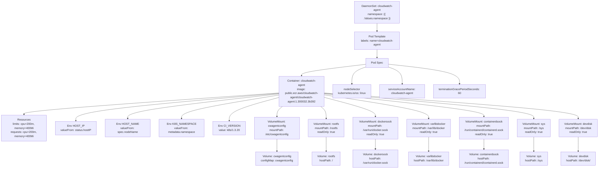

# Diagram: devops/k8s/container-insights/helm/templates/cwagent-daemonset.yaml

> Auto-generated by Obscura crawlers

## Mermaid

### SVG

<svg id="container" width="3894.34375" xmlns="http://www.w3.org/2000/svg" class="flowchart" height="878" viewBox="0 0 3894.34375 878" role="graphics-document document" aria-roledescription="flowchart-v2"><g><marker id="container_flowchart-v2-pointEnd" class="marker flowchart-v2" viewBox="0 0 10 10" refX="5" refY="5" markerUnits="userSpaceOnUse" markerWidth="8" markerHeight="8" orient="auto"><path d="M 0 0 L 10 5 L 0 10 z" class="arrowMarkerPath" style="stroke-width: 1; stroke-dasharray: 1, 0;"></path></marker><marker id="container_flowchart-v2-pointStart" class="marker flowchart-v2" viewBox="0 0 10 10" refX="4.5" refY="5" markerUnits="userSpaceOnUse" markerWidth="8" markerHeight="8" orient="auto"><path d="M 0 5 L 10 10 L 10 0 z" class="arrowMarkerPath" style="stroke-width: 1; stroke-dasharray: 1, 0;"></path></marker><marker id="container_flowchart-v2-circleEnd" class="marker flowchart-v2" viewBox="0 0 10 10" refX="11" refY="5" markerUnits="userSpaceOnUse" markerWidth="11" markerHeight="11" orient="auto"><circle cx="5" cy="5" r="5" class="arrowMarkerPath" style="stroke-width: 1; stroke-dasharray: 1, 0;"></circle></marker><marker id="container_flowchart-v2-circleStart" class="marker flowchart-v2" viewBox="0 0 10 10" refX="-1" refY="5" markerUnits="userSpaceOnUse" markerWidth="11" markerHeight="11" orient="auto"><circle cx="5" cy="5" r="5" class="arrowMarkerPath" style="stroke-width: 1; stroke-dasharray: 1, 0;"></circle></marker><marker id="container_flowchart-v2-crossEnd" class="marker cross flowchart-v2" viewBox="0 0 11 11" refX="12" refY="5.2" markerUnits="userSpaceOnUse" markerWidth="11" markerHeight="11" orient="auto"><path d="M 1,1 l 9,9 M 10,1 l -9,9" class="arrowMarkerPath" style="stroke-width: 2; stroke-dasharray: 1, 0;"></path></marker><marker id="container_flowchart-v2-crossStart" class="marker cross flowchart-v2" viewBox="0 0 11 11" refX="-1" refY="5.2" markerUnits="userSpaceOnUse" markerWidth="11" markerHeight="11" orient="auto"><path d="M 1,1 l 9,9 M 10,1 l -9,9" class="arrowMarkerPath" style="stroke-width: 2; stroke-dasharray: 1, 0;"></path></marker><g class="root"><g class="clusters"></g><g class="edgePaths"><path d="M2366.961,110L2366.961,114.167C2366.961,118.333,2366.961,126.667,2366.961,134.333C2366.961,142,2366.961,149,2366.961,152.5L2366.961,156" id="L_DS_PT_0" class="edge-thickness-normal edge-pattern-solid edge-thickness-normal edge-pattern-solid flowchart-link" style=";" data-edge="true" data-et="edge" data-id="L_DS_PT_0" data-points="W3sieCI6MjM2Ni45NjA5Mzc1LCJ5IjoxMTB9LHsieCI6MjM2Ni45NjA5Mzc1LCJ5IjoxMzV9LHsieCI6MjM2Ni45NjA5Mzc1LCJ5IjoxNjB9XQ==" marker-end="url(#container_flowchart-v2-pointEnd)"></path><path d="M2366.961,238L2366.961,242.167C2366.961,246.333,2366.961,254.667,2366.961,262.333C2366.961,270,2366.961,277,2366.961,280.5L2366.961,284" id="L_PT_SPEC_0" class="edge-thickness-normal edge-pattern-solid edge-thickness-normal edge-pattern-solid flowchart-link" style=";" data-edge="true" data-et="edge" data-id="L_PT_SPEC_0" data-points="W3sieCI6MjM2Ni45NjA5Mzc1LCJ5IjoyMzh9LHsieCI6MjM2Ni45NjA5Mzc1LCJ5IjoyNjN9LHsieCI6MjM2Ni45NjA5Mzc1LCJ5IjoyODh9XQ==" marker-end="url(#container_flowchart-v2-pointEnd)"></path><path d="M2303.68,321.597L2231.088,329.164C2158.496,336.731,2013.313,351.866,1940.721,362.933C1868.129,374,1868.129,381,1868.129,384.5L1868.129,388" id="L_SPEC_CONT_0" class="edge-thickness-normal edge-pattern-solid edge-thickness-normal edge-pattern-solid flowchart-link" style=";" data-edge="true" data-et="edge" data-id="L_SPEC_CONT_0" data-points="W3sieCI6MjMwMy42Nzk2ODc1LCJ5IjozMjEuNTk2NjU5Mzg0MDI5ODZ9LHsieCI6MTg2OC4xMjg5MDYyNSwieSI6MzY3fSx7IngiOjE4NjguMTI4OTA2MjUsInkiOjM5Mn1d" marker-end="url(#container_flowchart-v2-pointEnd)"></path><path d="M2303.68,334.79L2286.514,340.158C2269.348,345.527,2235.016,356.263,2217.85,371.132C2200.684,386,2200.684,405,2200.684,414.5L2200.684,424" id="L_SPEC_NODESEL_0" class="edge-thickness-normal edge-pattern-solid edge-thickness-normal edge-pattern-solid flowchart-link" style=";" data-edge="true" data-et="edge" data-id="L_SPEC_NODESEL_0" data-points="W3sieCI6MjMwMy42Nzk2ODc1LCJ5IjozMzQuNzg5OTc4MTUyMDg5NjV9LHsieCI6MjIwMC42ODM1OTM3NSwieSI6MzY3fSx7IngiOjIyMDAuNjgzNTkzNzUsInkiOjQyOH1d" marker-end="url(#container_flowchart-v2-pointEnd)"></path><path d="M2430.242,334.79L2447.408,340.158C2464.574,345.527,2498.906,356.263,2516.072,371.132C2533.238,386,2533.238,405,2533.238,414.5L2533.238,424" id="L_SPEC_SA_0" class="edge-thickness-normal edge-pattern-solid edge-thickness-normal edge-pattern-solid flowchart-link" style=";" data-edge="true" data-et="edge" data-id="L_SPEC_SA_0" data-points="W3sieCI6MjQzMC4yNDIxODc1LCJ5IjozMzQuNzg5OTc4MTUyMDg5NjV9LHsieCI6MjUzMy4yMzgyODEyNSwieSI6MzY3fSx7IngiOjI1MzMuMjM4MjgxMjUsInkiOjQyOH1d" marker-end="url(#container_flowchart-v2-pointEnd)"></path><path d="M2430.242,321.618L2502.571,329.181C2574.9,336.745,2719.557,351.873,2791.886,368.936C2864.215,386,2864.215,405,2864.215,414.5L2864.215,424" id="L_SPEC_TERM_0" class="edge-thickness-normal edge-pattern-solid edge-thickness-normal edge-pattern-solid flowchart-link" style=";" data-edge="true" data-et="edge" data-id="L_SPEC_TERM_0" data-points="W3sieCI6MjQzMC4yNDIxODc1LCJ5IjozMjEuNjE3NTk1MDcyOTM5NjV9LHsieCI6Mjg2NC4yMTQ4NDM3NSwieSI6MzY3fSx7IngiOjI4NjQuMjE0ODQzNzUsInkiOjQyOH1d" marker-end="url(#container_flowchart-v2-pointEnd)"></path><path d="M1738.129,474.514L1471.441,489.928C1204.753,505.343,671.376,536.171,404.688,555.086C138,574,138,581,138,584.5L138,588" id="L_CONT_RES_0" class="edge-thickness-normal edge-pattern-solid edge-thickness-normal edge-pattern-solid flowchart-link" style=";" data-edge="true" data-et="edge" data-id="L_CONT_RES_0" data-points="W3sieCI6MTczOC4xMjg5MDYyNSwieSI6NDc0LjUxMzg5MDk4OTg3ODM1fSx7IngiOjEzOCwieSI6NTY3fSx7IngiOjEzOCwieSI6NTkyfV0=" marker-end="url(#container_flowchart-v2-pointEnd)"></path><path d="M1738.129,476.154L1523.107,491.295C1308.086,506.436,878.043,536.718,663.021,559.359C448,582,448,597,448,604.5L448,612" id="L_CONT_ENV_HOST_IP_0" class="edge-thickness-normal edge-pattern-solid edge-thickness-normal edge-pattern-solid flowchart-link" style=";" data-edge="true" data-et="edge" data-id="L_CONT_ENV_HOST_IP_0" data-points="W3sieCI6MTczOC4xMjg5MDYyNSwieSI6NDc2LjE1NDA5ODU3NzA5ODh9LHsieCI6NDQ4LCJ5Ijo1Njd9LHsieCI6NDQ4LCJ5Ijo2MTZ9XQ==" marker-end="url(#container_flowchart-v2-pointEnd)"></path><path d="M1738.129,478.71L1574.774,493.425C1411.419,508.14,1084.71,537.57,921.355,557.785C758,578,758,589,758,594.5L758,600" id="L_CONT_ENV_HOST_NAME_0" class="edge-thickness-normal edge-pattern-solid edge-thickness-normal edge-pattern-solid flowchart-link" style=";" data-edge="true" data-et="edge" data-id="L_CONT_ENV_HOST_NAME_0" data-points="W3sieCI6MTczOC4xMjg5MDYyNSwieSI6NDc4LjcxMDM1MTc2Nzk4ODY0fSx7IngiOjc1OCwieSI6NTY3fSx7IngiOjc1OCwieSI6NjA0fV0=" marker-end="url(#container_flowchart-v2-pointEnd)"></path><path d="M1738.129,483.444L1628.036,497.37C1517.943,511.296,1297.757,539.148,1187.663,558.574C1077.57,578,1077.57,589,1077.57,594.5L1077.57,600" id="L_CONT_ENV_K8S_NS_0" class="edge-thickness-normal edge-pattern-solid edge-thickness-normal edge-pattern-solid flowchart-link" style=";" data-edge="true" data-et="edge" data-id="L_CONT_ENV_K8S_NS_0" data-points="W3sieCI6MTczOC4xMjg5MDYyNSwieSI6NDgzLjQ0NDA2ODkxODgzMjF9LHsieCI6MTA3Ny41NzAzMTI1LCJ5Ijo1Njd9LHsieCI6MTA3Ny41NzAzMTI1LCJ5Ijo2MDR9XQ==" marker-end="url(#container_flowchart-v2-pointEnd)"></path><path d="M1738.129,494.602L1681.298,506.668C1624.466,518.734,1510.803,542.867,1453.972,562.434C1397.141,582,1397.141,597,1397.141,604.5L1397.141,612" id="L_CONT_ENV_CI_VER_0" class="edge-thickness-normal edge-pattern-solid edge-thickness-normal edge-pattern-solid flowchart-link" style=";" data-edge="true" data-et="edge" data-id="L_CONT_ENV_CI_VER_0" data-points="W3sieCI6MTczOC4xMjg5MDYyNSwieSI6NDk0LjYwMTUzNTk5ODkzODR9LHsieCI6MTM5Ny4xNDA2MjUsInkiOjU2N30seyJ4IjoxMzk3LjE0MDYyNSwieSI6NjE2fV0=" marker-end="url(#container_flowchart-v2-pointEnd)"></path><path d="M1750.382,542L1743.84,546.167C1737.299,550.333,1724.216,558.667,1717.674,568.333C1711.133,578,1711.133,589,1711.133,594.5L1711.133,600" id="L_CONT_VM_CW_0" class="edge-thickness-normal edge-pattern-solid edge-thickness-normal edge-pattern-solid flowchart-link" style=";" data-edge="true" data-et="edge" data-id="L_CONT_VM_CW_0" data-points="W3sieCI6MTc1MC4zODE4MzU5Mzc1LCJ5Ijo1NDJ9LHsieCI6MTcxMS4xMzI4MTI1LCJ5Ijo1Njd9LHsieCI6MTcxMS4xMzI4MTI1LCJ5Ijo2MDR9XQ==" marker-end="url(#container_flowchart-v2-pointEnd)"></path><path d="M1985.876,542L1992.417,546.167C1998.959,550.333,2012.042,558.667,2018.583,568.333C2025.125,578,2025.125,589,2025.125,594.5L2025.125,600" id="L_CONT_VM_ROOT_0" class="edge-thickness-normal edge-pattern-solid edge-thickness-normal edge-pattern-solid flowchart-link" style=";" data-edge="true" data-et="edge" data-id="L_CONT_VM_ROOT_0" data-points="W3sieCI6MTk4NS44NzU5NzY1NjI1LCJ5Ijo1NDJ9LHsieCI6MjAyNS4xMjUsInkiOjU2N30seyJ4IjoyMDI1LjEyNSwieSI6NjA0fV0=" marker-end="url(#container_flowchart-v2-pointEnd)"></path><path d="M1998.129,493.546L2058.081,505.788C2118.034,518.031,2237.939,542.515,2297.891,558.258C2357.844,574,2357.844,581,2357.844,584.5L2357.844,588" id="L_CONT_VM_DOCK_0" class="edge-thickness-normal edge-pattern-solid edge-thickness-normal edge-pattern-solid flowchart-link" style=";" data-edge="true" data-et="edge" data-id="L_CONT_VM_DOCK_0" data-points="W3sieCI6MTk5OC4xMjg5MDYyNSwieSI6NDkzLjU0NjA2MDc2NTU5MjI0fSx7IngiOjIzNTcuODQzNzUsInkiOjU2N30seyJ4IjoyMzU3Ljg0Mzc1LCJ5Ijo1OTJ9XQ==" marker-end="url(#container_flowchart-v2-pointEnd)"></path><path d="M1998.129,482.768L2113.868,496.807C2229.607,510.846,2461.085,538.923,2576.824,556.461C2692.563,574,2692.563,581,2692.563,584.5L2692.563,588" id="L_CONT_VM_VARLIB_0" class="edge-thickness-normal edge-pattern-solid edge-thickness-normal edge-pattern-solid flowchart-link" style=";" data-edge="true" data-et="edge" data-id="L_CONT_VM_VARLIB_0" data-points="W3sieCI6MTk5OC4xMjg5MDYyNSwieSI6NDgyLjc2ODQwMTYwMTQ3ODN9LHsieCI6MjY5Mi41NjI1LCJ5Ijo1Njd9LHsieCI6MjY5Mi41NjI1LCJ5Ijo1OTJ9XQ==" marker-end="url(#container_flowchart-v2-pointEnd)"></path><path d="M1998.129,477.812L2176.85,492.677C2355.57,507.542,2713.012,537.271,2891.732,557.635C3070.453,578,3070.453,589,3070.453,594.5L3070.453,600" id="L_CONT_VM_CONTD_0" class="edge-thickness-normal edge-pattern-solid edge-thickness-normal edge-pattern-solid flowchart-link" style=";" data-edge="true" data-et="edge" data-id="L_CONT_VM_CONTD_0" data-points="W3sieCI6MTk5OC4xMjg5MDYyNSwieSI6NDc3LjgxMjM5MTM2NDM4MjE3fSx7IngiOjMwNzAuNDUzMTI1LCJ5Ijo1Njd9LHsieCI6MzA3MC40NTMxMjUsInkiOjYwNH1d" marker-end="url(#container_flowchart-v2-pointEnd)"></path><path d="M1998.129,475.237L2239.498,490.531C2480.867,505.825,2963.605,536.412,3204.975,557.206C3446.344,578,3446.344,589,3446.344,594.5L3446.344,600" id="L_CONT_VM_SYS_0" class="edge-thickness-normal edge-pattern-solid edge-thickness-normal edge-pattern-solid flowchart-link" style=";" data-edge="true" data-et="edge" data-id="L_CONT_VM_SYS_0" data-points="W3sieCI6MTk5OC4xMjg5MDYyNSwieSI6NDc1LjIzNzE1NDgxNTQ0MzY2fSx7IngiOjM0NDYuMzQzNzUsInkiOjU2N30seyJ4IjozNDQ2LjM0Mzc1LCJ5Ijo2MDR9XQ==" marker-end="url(#container_flowchart-v2-pointEnd)"></path><path d="M1998.129,473.885L2291.165,489.404C2584.201,504.923,3170.272,535.962,3463.308,556.981C3756.344,578,3756.344,589,3756.344,594.5L3756.344,600" id="L_CONT_VM_DEVDISK_0" class="edge-thickness-normal edge-pattern-solid edge-thickness-normal edge-pattern-solid flowchart-link" style=";" data-edge="true" data-et="edge" data-id="L_CONT_VM_DEVDISK_0" data-points="W3sieCI6MTk5OC4xMjg5MDYyNSwieSI6NDczLjg4NDgwOTc2NzgyMzg3fSx7IngiOjM3NTYuMzQzNzUsInkiOjU2N30seyJ4IjozNzU2LjM0Mzc1LCJ5Ijo2MDR9XQ==" marker-end="url(#container_flowchart-v2-pointEnd)"></path><path d="M1711.133,706L1711.133,712.167C1711.133,718.333,1711.133,730.667,1711.133,740.333C1711.133,750,1711.133,757,1711.133,760.5L1711.133,764" id="L_VM_CW_VOL_CW_0" class="edge-thickness-normal edge-pattern-solid edge-thickness-normal edge-pattern-solid flowchart-link" style=";" data-edge="true" data-et="edge" data-id="L_VM_CW_VOL_CW_0" data-points="W3sieCI6MTcxMS4xMzI4MTI1LCJ5Ijo3MDZ9LHsieCI6MTcxMS4xMzI4MTI1LCJ5Ijo3NDN9LHsieCI6MTcxMS4xMzI4MTI1LCJ5Ijo3Njh9XQ==" marker-end="url(#container_flowchart-v2-pointEnd)"></path><path d="M2025.125,706L2025.125,712.167C2025.125,718.333,2025.125,730.667,2025.125,742.333C2025.125,754,2025.125,765,2025.125,770.5L2025.125,776" id="L_VM_ROOT_VOL_ROOT_0" class="edge-thickness-normal edge-pattern-solid edge-thickness-normal edge-pattern-solid flowchart-link" style=";" data-edge="true" data-et="edge" data-id="L_VM_ROOT_VOL_ROOT_0" data-points="W3sieCI6MjAyNS4xMjUsInkiOjcwNn0seyJ4IjoyMDI1LjEyNSwieSI6NzQzfSx7IngiOjIwMjUuMTI1LCJ5Ijo3ODB9XQ==" marker-end="url(#container_flowchart-v2-pointEnd)"></path><path d="M2357.844,718L2357.844,722.167C2357.844,726.333,2357.844,734.667,2357.844,742.333C2357.844,750,2357.844,757,2357.844,760.5L2357.844,764" id="L_VM_DOCK_VOL_DOCK_0" class="edge-thickness-normal edge-pattern-solid edge-thickness-normal edge-pattern-solid flowchart-link" style=";" data-edge="true" data-et="edge" data-id="L_VM_DOCK_VOL_DOCK_0" data-points="W3sieCI6MjM1Ny44NDM3NSwieSI6NzE4fSx7IngiOjIzNTcuODQzNzUsInkiOjc0M30seyJ4IjoyMzU3Ljg0Mzc1LCJ5Ijo3Njh9XQ==" marker-end="url(#container_flowchart-v2-pointEnd)"></path><path d="M2692.563,718L2692.563,722.167C2692.563,726.333,2692.563,734.667,2692.563,742.333C2692.563,750,2692.563,757,2692.563,760.5L2692.563,764" id="L_VM_VARLIB_VOL_VARLIB_0" class="edge-thickness-normal edge-pattern-solid edge-thickness-normal edge-pattern-solid flowchart-link" style=";" data-edge="true" data-et="edge" data-id="L_VM_VARLIB_VOL_VARLIB_0" data-points="W3sieCI6MjY5Mi41NjI1LCJ5Ijo3MTh9LHsieCI6MjY5Mi41NjI1LCJ5Ijo3NDN9LHsieCI6MjY5Mi41NjI1LCJ5Ijo3Njh9XQ==" marker-end="url(#container_flowchart-v2-pointEnd)"></path><path d="M3070.453,706L3070.453,712.167C3070.453,718.333,3070.453,730.667,3070.453,740.333C3070.453,750,3070.453,757,3070.453,760.5L3070.453,764" id="L_VM_CONTD_VOL_CONTD_0" class="edge-thickness-normal edge-pattern-solid edge-thickness-normal edge-pattern-solid flowchart-link" style=";" data-edge="true" data-et="edge" data-id="L_VM_CONTD_VOL_CONTD_0" data-points="W3sieCI6MzA3MC40NTMxMjUsInkiOjcwNn0seyJ4IjozMDcwLjQ1MzEyNSwieSI6NzQzfSx7IngiOjMwNzAuNDUzMTI1LCJ5Ijo3Njh9XQ==" marker-end="url(#container_flowchart-v2-pointEnd)"></path><path d="M3446.344,706L3446.344,712.167C3446.344,718.333,3446.344,730.667,3446.344,742.333C3446.344,754,3446.344,765,3446.344,770.5L3446.344,776" id="L_VM_SYS_VOL_SYS_0" class="edge-thickness-normal edge-pattern-solid edge-thickness-normal edge-pattern-solid flowchart-link" style=";" data-edge="true" data-et="edge" data-id="L_VM_SYS_VOL_SYS_0" data-points="W3sieCI6MzQ0Ni4zNDM3NSwieSI6NzA2fSx7IngiOjM0NDYuMzQzNzUsInkiOjc0M30seyJ4IjozNDQ2LjM0Mzc1LCJ5Ijo3ODB9XQ==" marker-end="url(#container_flowchart-v2-pointEnd)"></path><path d="M3756.344,706L3756.344,712.167C3756.344,718.333,3756.344,730.667,3756.344,740.333C3756.344,750,3756.344,757,3756.344,760.5L3756.344,764" id="L_VM_DEVDISK_VOL_DEVDISK_0" class="edge-thickness-normal edge-pattern-solid edge-thickness-normal edge-pattern-solid flowchart-link" style=";" data-edge="true" data-et="edge" data-id="L_VM_DEVDISK_VOL_DEVDISK_0" data-points="W3sieCI6Mzc1Ni4zNDM3NSwieSI6NzA2fSx7IngiOjM3NTYuMzQzNzUsInkiOjc0M30seyJ4IjozNzU2LjM0Mzc1LCJ5Ijo3Njh9XQ==" marker-end="url(#container_flowchart-v2-pointEnd)"></path></g><g class="edgeLabels"><g class="edgeLabel"><g class="label" data-id="L_DS_PT_0" transform="translate(0, 0)"><foreignObject width="0" height="0">

</foreignObject></g></g><g class="edgeLabel"><g class="label" data-id="L_PT_SPEC_0" transform="translate(0, 0)"><foreignObject width="0" height="0">

</foreignObject></g></g><g class="edgeLabel"><g class="label" data-id="L_SPEC_CONT_0" transform="translate(0, 0)"><foreignObject width="0" height="0">

</foreignObject></g></g><g class="edgeLabel"><g class="label" data-id="L_SPEC_NODESEL_0" transform="translate(0, 0)"><foreignObject width="0" height="0">

</foreignObject></g></g><g class="edgeLabel"><g class="label" data-id="L_SPEC_SA_0" transform="translate(0, 0)"><foreignObject width="0" height="0">

</foreignObject></g></g><g class="edgeLabel"><g class="label" data-id="L_SPEC_TERM_0" transform="translate(0, 0)"><foreignObject width="0" height="0">

</foreignObject></g></g><g class="edgeLabel"><g class="label" data-id="L_CONT_RES_0" transform="translate(0, 0)"><foreignObject width="0" height="0">

</foreignObject></g></g><g class="edgeLabel"><g class="label" data-id="L_CONT_ENV_HOST_IP_0" transform="translate(0, 0)"><foreignObject width="0" height="0">

</foreignObject></g></g><g class="edgeLabel"><g class="label" data-id="L_CONT_ENV_HOST_NAME_0" transform="translate(0, 0)"><foreignObject width="0" height="0">

</foreignObject></g></g><g class="edgeLabel"><g class="label" data-id="L_CONT_ENV_K8S_NS_0" transform="translate(0, 0)"><foreignObject width="0" height="0">

</foreignObject></g></g><g class="edgeLabel"><g class="label" data-id="L_CONT_ENV_CI_VER_0" transform="translate(0, 0)"><foreignObject width="0" height="0">

</foreignObject></g></g><g class="edgeLabel"><g class="label" data-id="L_CONT_VM_CW_0" transform="translate(0, 0)"><foreignObject width="0" height="0">

</foreignObject></g></g><g class="edgeLabel"><g class="label" data-id="L_CONT_VM_ROOT_0" transform="translate(0, 0)"><foreignObject width="0" height="0">

</foreignObject></g></g><g class="edgeLabel"><g class="label" data-id="L_CONT_VM_DOCK_0" transform="translate(0, 0)"><foreignObject width="0" height="0">

</foreignObject></g></g><g class="edgeLabel"><g class="label" data-id="L_CONT_VM_VARLIB_0" transform="translate(0, 0)"><foreignObject width="0" height="0">

</foreignObject></g></g><g class="edgeLabel"><g class="label" data-id="L_CONT_VM_CONTD_0" transform="translate(0, 0)"><foreignObject width="0" height="0">

</foreignObject></g></g><g class="edgeLabel"><g class="label" data-id="L_CONT_VM_SYS_0" transform="translate(0, 0)"><foreignObject width="0" height="0">

</foreignObject></g></g><g class="edgeLabel"><g class="label" data-id="L_CONT_VM_DEVDISK_0" transform="translate(0, 0)"><foreignObject width="0" height="0">

</foreignObject></g></g><g class="edgeLabel"><g class="label" data-id="L_VM_CW_VOL_CW_0" transform="translate(0, 0)"><foreignObject width="0" height="0">

</foreignObject></g></g><g class="edgeLabel"><g class="label" data-id="L_VM_ROOT_VOL_ROOT_0" transform="translate(0, 0)"><foreignObject width="0" height="0">

</foreignObject></g></g><g class="edgeLabel"><g class="label" data-id="L_VM_DOCK_VOL_DOCK_0" transform="translate(0, 0)"><foreignObject width="0" height="0">

</foreignObject></g></g><g class="edgeLabel"><g class="label" data-id="L_VM_VARLIB_VOL_VARLIB_0" transform="translate(0, 0)"><foreignObject width="0" height="0">

</foreignObject></g></g><g class="edgeLabel"><g class="label" data-id="L_VM_CONTD_VOL_CONTD_0" transform="translate(0, 0)"><foreignObject width="0" height="0">

</foreignObject></g></g><g class="edgeLabel"><g class="label" data-id="L_VM_SYS_VOL_SYS_0" transform="translate(0, 0)"><foreignObject width="0" height="0">

</foreignObject></g></g><g class="edgeLabel"><g class="label" data-id="L_VM_DEVDISK_VOL_DEVDISK_0" transform="translate(0, 0)"><foreignObject width="0" height="0">

</foreignObject></g></g></g><g class="nodes"><g class="node default" id="flowchart-DS-0" transform="translate(2366.9609375, 59)"><rect class="basic label-container" style="" x="-130" y="-51" width="260" height="102"></rect><g class="label" style="" transform="translate(-100, -36)"><rect></rect><foreignObject width="200" height="72">

DaemonSet: cloudwatch-agent\nnamespace: {{ .Values.namespace }}

</foreignObject></g></g><g class="node default" id="flowchart-PT-2" transform="translate(2366.9609375, 199)"><rect class="basic label-container" style="" x="-130" y="-39" width="260" height="78"></rect><g class="label" style="" transform="translate(-100, -24)"><rect></rect><foreignObject width="200" height="48">

Pod Template\nlabels: name=cloudwatch-agent

</foreignObject></g></g><g class="node default" id="flowchart-SPEC-4" transform="translate(2366.9609375, 315)"><rect class="basic label-container" style="" x="-63.28125" y="-27" width="126.5625" height="54"></rect><g class="label" style="" transform="translate(-33.28125, -12)"><rect></rect><foreignObject width="66.5625" height="24">

Pod Spec

</foreignObject></g></g><g class="node default" id="flowchart-CONT-6" transform="translate(1868.12890625, 467)"><rect class="basic label-container" style="" x="-130" y="-75" width="260" height="150"></rect><g class="label" style="" transform="translate(-100, -60)"><rect></rect><foreignObject width="200" height="120">

Container: cloudwatch-agent\nimage: public.ecr.aws/cloudwatch-agent/cloudwatch-agent:1.300032.3b392

</foreignObject></g></g><g class="node default" id="flowchart-NODESEL-8" transform="translate(2200.68359375, 467)"><rect class="basic label-container" style="" x="-152.5546875" y="-39" width="305.109375" height="78"></rect><g class="label" style="" transform="translate(-122.5546875, -24)"><rect></rect><foreignObject width="245.109375" height="48">

nodeSelector\nkubernetes.io/os: linux

</foreignObject></g></g><g class="node default" id="flowchart-SA-10" transform="translate(2533.23828125, 467)"><rect class="basic label-container" style="" x="-130" y="-39" width="260" height="78"></rect><g class="label" style="" transform="translate(-100, -24)"><rect></rect><foreignObject width="200" height="48">

serviceAccountName: cloudwatch-agent

</foreignObject></g></g><g class="node default" id="flowchart-TERM-12" transform="translate(2864.21484375, 467)"><rect class="basic label-container" style="" x="-150.9765625" y="-39" width="301.953125" height="78"></rect><g class="label" style="" transform="translate(-120.9765625, -24)"><rect></rect><foreignObject width="241.953125" height="48">

terminationGracePeriodSeconds: 60

</foreignObject></g></g><g class="node default" id="flowchart-RES-14" transform="translate(138, 655)"><rect class="basic label-container" style="" x="-130" y="-63" width="260" height="126"></rect><g class="label" style="" transform="translate(-100, -48)"><rect></rect><foreignObject width="200" height="96">

Resources\nlimits: cpu=200m, memory=400Mi\nrequests: cpu=200m, memory=400Mi

</foreignObject></g></g><g class="node default" id="flowchart-ENV_HOST_IP-16" transform="translate(448, 655)"><rect class="basic label-container" style="" x="-130" y="-39" width="260" height="78"></rect><g class="label" style="" transform="translate(-100, -24)"><rect></rect><foreignObject width="200" height="48">

Env HOST_IP\nvalueFrom: status.hostIP

</foreignObject></g></g><g class="node default" id="flowchart-ENV_HOST_NAME-18" transform="translate(758, 655)"><rect class="basic label-container" style="" x="-130" y="-51" width="260" height="102"></rect><g class="label" style="" transform="translate(-100, -36)"><rect></rect><foreignObject width="200" height="72">

Env HOST_NAME\nvalueFrom: spec.nodeName

</foreignObject></g></g><g class="node default" id="flowchart-ENV_K8S_NS-20" transform="translate(1077.5703125, 655)"><rect class="basic label-container" style="" x="-139.5703125" y="-51" width="279.140625" height="102"></rect><g class="label" style="" transform="translate(-109.5703125, -36)"><rect></rect><foreignObject width="219.140625" height="72">

Env K8S_NAMESPACE\nvalueFrom: metadata.namespace

</foreignObject></g></g><g class="node default" id="flowchart-ENV_CI_VER-22" transform="translate(1397.140625, 655)"><rect class="basic label-container" style="" x="-130" y="-39" width="260" height="78"></rect><g class="label" style="" transform="translate(-100, -24)"><rect></rect><foreignObject width="200" height="48">

Env CI_VERSION\nvalue: k8s/1.3.20

</foreignObject></g></g><g class="node default" id="flowchart-VM_CW-24" transform="translate(1711.1328125, 655)"><rect class="basic label-container" style="" x="-133.9921875" y="-51" width="267.984375" height="102"></rect><g class="label" style="" transform="translate(-103.9921875, -36)"><rect></rect><foreignObject width="207.984375" height="72">

VolumeMount: cwagentconfig\nmountPath: /etc/cwagentconfig

</foreignObject></g></g><g class="node default" id="flowchart-VM_ROOT-26" transform="translate(2025.125, 655)"><rect class="basic label-container" style="" x="-130" y="-51" width="260" height="102"></rect><g class="label" style="" transform="translate(-100, -36)"><rect></rect><foreignObject width="200" height="72">

VolumeMount: rootfs\nmountPath: /rootfs\nreadOnly: true

</foreignObject></g></g><g class="node default" id="flowchart-VM_DOCK-28" transform="translate(2357.84375, 655)"><rect class="basic label-container" style="" x="-152.71875" y="-63" width="305.4375" height="126"></rect><g class="label" style="" transform="translate(-122.71875, -48)"><rect></rect><foreignObject width="245.4375" height="96">

VolumeMount: dockersock\nmountPath: /var/run/docker.sock\nreadOnly: true

</foreignObject></g></g><g class="node default" id="flowchart-VM_VARLIB-30" transform="translate(2692.5625, 655)"><rect class="basic label-container" style="" x="-132" y="-63" width="264" height="126"></rect><g class="label" style="" transform="translate(-102, -48)"><rect></rect><foreignObject width="204" height="96">

VolumeMount: varlibdocker\nmountPath: /var/lib/docker\nreadOnly: true

</foreignObject></g></g><g class="node default" id="flowchart-VM_CONTD-32" transform="translate(3070.453125, 655)"><rect class="basic label-container" style="" x="-195.890625" y="-51" width="391.78125" height="102"></rect><g class="label" style="" transform="translate(-165.890625, -36)"><rect></rect><foreignObject width="331.78125" height="72">

VolumeMount: containerdsock\nmountPath: /run/containerd/containerd.sock\nreadOnly: true

</foreignObject></g></g><g class="node default" id="flowchart-VM_SYS-34" transform="translate(3446.34375, 655)"><rect class="basic label-container" style="" x="-130" y="-51" width="260" height="102"></rect><g class="label" style="" transform="translate(-100, -36)"><rect></rect><foreignObject width="200" height="72">

VolumeMount: sys\nmountPath: /sys\nreadOnly: true

</foreignObject></g></g><g class="node default" id="flowchart-VM_DEVDISK-36" transform="translate(3756.34375, 655)"><rect class="basic label-container" style="" x="-130" y="-51" width="260" height="102"></rect><g class="label" style="" transform="translate(-100, -36)"><rect></rect><foreignObject width="200" height="72">

VolumeMount: devdisk\nmountPath: /dev/disk\nreadOnly: true

</foreignObject></g></g><g class="node default" id="flowchart-VOL_CW-38" transform="translate(1711.1328125, 819)"><rect class="basic label-container" style="" x="-131.2109375" y="-51" width="262.421875" height="102"></rect><g class="label" style="" transform="translate(-101.2109375, -36)"><rect></rect><foreignObject width="202.421875" height="72">

Volume: cwagentconfig\nconfigMap: cwagentconfig

</foreignObject></g></g><g class="node default" id="flowchart-VOL_ROOT-40" transform="translate(2025.125, 819)"><rect class="basic label-container" style="" x="-130" y="-39" width="260" height="78"></rect><g class="label" style="" transform="translate(-100, -24)"><rect></rect><foreignObject width="200" height="48">

Volume: rootfs\nhostPath: /

</foreignObject></g></g><g class="node default" id="flowchart-VOL_DOCK-42" transform="translate(2357.84375, 819)"><rect class="basic label-container" style="" x="-130" y="-51" width="260" height="102"></rect><g class="label" style="" transform="translate(-100, -36)"><rect></rect><foreignObject width="200" height="72">

Volume: dockersock\nhostPath: /var/run/docker.sock

</foreignObject></g></g><g class="node default" id="flowchart-VOL_VARLIB-44" transform="translate(2692.5625, 819)"><rect class="basic label-container" style="" x="-130" y="-51" width="260" height="102"></rect><g class="label" style="" transform="translate(-100, -36)"><rect></rect><foreignObject width="200" height="72">

Volume: varlibdocker\nhostPath: /var/lib/docker

</foreignObject></g></g><g class="node default" id="flowchart-VOL_CONTD-46" transform="translate(3070.453125, 819)"><rect class="basic label-container" style="" x="-150.4375" y="-51" width="300.875" height="102"></rect><g class="label" style="" transform="translate(-120.4375, -36)"><rect></rect><foreignObject width="240.875" height="72">

Volume: containerdsock\nhostPath: /run/containerd/containerd.sock

</foreignObject></g></g><g class="node default" id="flowchart-VOL_SYS-48" transform="translate(3446.34375, 819)"><rect class="basic label-container" style="" x="-130" y="-39" width="260" height="78"></rect><g class="label" style="" transform="translate(-100, -24)"><rect></rect><foreignObject width="200" height="48">

Volume: sys\nhostPath: /sys

</foreignObject></g></g><g class="node default" id="flowchart-VOL_DEVDISK-50" transform="translate(3756.34375, 819)"><rect class="basic label-container" style="" x="-130" y="-51" width="260" height="102"></rect><g class="label" style="" transform="translate(-100, -36)"><rect></rect><foreignObject width="200" height="72">

Volume: devdisk\nhostPath: /dev/disk/

</foreignObject></g></g></g></g></g></svg>
