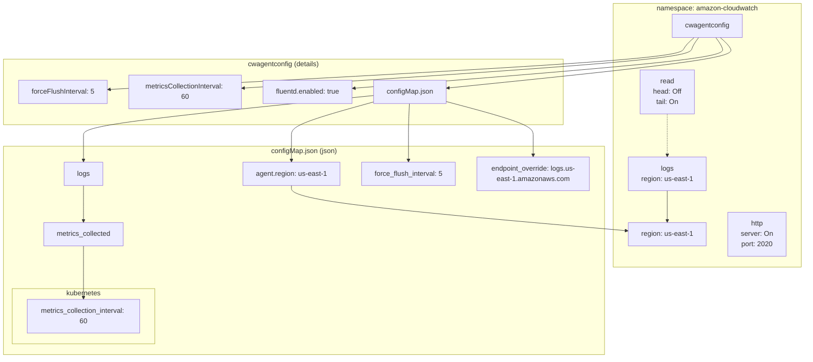

# Diagram: devops/k8s/container-insights/helm/values.yaml

> Auto-generated by Obscura crawlers

## Mermaid

### SVG

<svg id="container" width="2026.17578125" xmlns="http://www.w3.org/2000/svg" class="flowchart" height="782" viewBox="0 0 2026.17578125 782" role="graphics-document document" aria-roledescription="flowchart-v2"><g><marker id="container_flowchart-v2-pointEnd" class="marker flowchart-v2" viewBox="0 0 10 10" refX="5" refY="5" markerUnits="userSpaceOnUse" markerWidth="8" markerHeight="8" orient="auto"><path d="M 0 0 L 10 5 L 0 10 z" class="arrowMarkerPath" style="stroke-width: 1; stroke-dasharray: 1, 0;"></path></marker><marker id="container_flowchart-v2-pointStart" class="marker flowchart-v2" viewBox="0 0 10 10" refX="4.5" refY="5" markerUnits="userSpaceOnUse" markerWidth="8" markerHeight="8" orient="auto"><path d="M 0 5 L 10 10 L 10 0 z" class="arrowMarkerPath" style="stroke-width: 1; stroke-dasharray: 1, 0;"></path></marker><marker id="container_flowchart-v2-circleEnd" class="marker flowchart-v2" viewBox="0 0 10 10" refX="11" refY="5" markerUnits="userSpaceOnUse" markerWidth="11" markerHeight="11" orient="auto"><circle cx="5" cy="5" r="5" class="arrowMarkerPath" style="stroke-width: 1; stroke-dasharray: 1, 0;"></circle></marker><marker id="container_flowchart-v2-circleStart" class="marker flowchart-v2" viewBox="0 0 10 10" refX="-1" refY="5" markerUnits="userSpaceOnUse" markerWidth="11" markerHeight="11" orient="auto"><circle cx="5" cy="5" r="5" class="arrowMarkerPath" style="stroke-width: 1; stroke-dasharray: 1, 0;"></circle></marker><marker id="container_flowchart-v2-crossEnd" class="marker cross flowchart-v2" viewBox="0 0 11 11" refX="12" refY="5.2" markerUnits="userSpaceOnUse" markerWidth="11" markerHeight="11" orient="auto"><path d="M 1,1 l 9,9 M 10,1 l -9,9" class="arrowMarkerPath" style="stroke-width: 2; stroke-dasharray: 1, 0;"></path></marker><marker id="container_flowchart-v2-crossStart" class="marker cross flowchart-v2" viewBox="0 0 11 11" refX="-1" refY="5.2" markerUnits="userSpaceOnUse" markerWidth="11" markerHeight="11" orient="auto"><path d="M 1,1 l 9,9 M 10,1 l -9,9" class="arrowMarkerPath" style="stroke-width: 2; stroke-dasharray: 1, 0;"></path></marker><g class="root"><g class="clusters"><g class="cluster" id="config_json_details" data-look="classic"><rect style="" x="8" y="315" width="1397.42578125" height="459"></rect><g class="cluster-label" transform="translate(629.494140625, 315)"><foreignObject width="154.4375" height="24">

configMap.json (json)

</foreignObject></g></g><g class="cluster" id="cw_details" data-look="classic"><rect style="" x="8" y="137" width="1302.0703125" height="128"></rect><g class="cluster-label" transform="translate(575.69140625, 137)"><foreignObject width="166.6875" height="24">

cwagentconfig (details)

</foreignObject></g></g><g class="cluster" id="amazon_cloudwatch" data-look="classic"><rect style="" x="1425.42578125" y="8" width="592.75" height="563"></rect><g class="cluster-label" transform="translate(1621.80078125, 8)"><foreignObject width="200" height="48">

namespace: amazon-cloudwatch

</foreignObject></g></g><g class="cluster" id="kubernetes" data-look="classic"><rect style="" x="28" y="621" width="334.78125" height="128"></rect><g class="cluster-label" transform="translate(154.578125, 621)"><foreignObject width="81.625" height="24">

kubernetes

</foreignObject></g></g></g><g class="edgePaths"><path d="M1691.588,87L1686.926,91.167C1682.263,95.333,1672.938,103.667,1668.276,112C1663.613,120.333,1663.613,128.667,1428.589,142.746C1193.564,156.826,723.515,176.651,488.49,186.564L253.465,196.477" id="L_cwagent_f_flush_0" class="edge-thickness-normal edge-pattern-solid edge-thickness-normal edge-pattern-solid flowchart-link" style=";" data-edge="true" data-et="edge" data-id="L_cwagent_f_flush_0" data-points="W3sieCI6MTY5MS41ODgwNDA4NjUzODQ1LCJ5Ijo4N30seyJ4IjoxNjYzLjYxMzI4MTI1LCJ5IjoxMTJ9LHsieCI6MTY2My42MTMyODEyNSwieSI6MTM3fSx7IngiOjI0OS40Njg3NSwieSI6MTk2LjY0NTc4MTA0MjA0MTU2fV0=" marker-end="url(#container_flowchart-v2-pointEnd)"></path><path d="M1701.973,87L1698.913,91.167C1695.853,95.333,1689.733,103.667,1686.673,112C1683.613,120.333,1683.613,128.667,1496.922,142.36C1310.23,156.054,936.847,175.108,750.155,184.635L563.464,194.162" id="L_cwagent_m_interval_0" class="edge-thickness-normal edge-pattern-solid edge-thickness-normal edge-pattern-solid flowchart-link" style=";" data-edge="true" data-et="edge" data-id="L_cwagent_m_interval_0" data-points="W3sieCI6MTcwMS45NzI2NTYyNSwieSI6ODd9LHsieCI6MTY4My42MTMyODEyNSwieSI6MTEyfSx7IngiOjE2ODMuNjEzMjgxMjUsInkiOjEzN30seyJ4Ijo1NTkuNDY4NzUsInkiOjE5NC4zNjU5OTU4Njk5NDM3M31d" marker-end="url(#container_flowchart-v2-pointEnd)"></path><path d="M1741.629,87L1744.689,91.167C1747.749,95.333,1753.868,103.667,1756.928,112C1759.988,120.333,1759.988,128.667,1604.39,142.371C1448.792,156.076,1137.595,175.153,981.997,184.691L826.399,194.229" id="L_cwagent_fluentd_0" class="edge-thickness-normal edge-pattern-solid edge-thickness-normal edge-pattern-solid flowchart-link" style=";" data-edge="true" data-et="edge" data-id="L_cwagent_fluentd_0" data-points="W3sieCI6MTc0MS42Mjg5MDYyNSwieSI6ODd9LHsieCI6MTc1OS45ODgyODEyNSwieSI6MTEyfSx7IngiOjE3NTkuOTg4MjgxMjUsInkiOjEzN30seyJ4Ijo4MjIuNDA2MjUsInkiOjE5NC40NzM0OTc1MzI1MjI0M31d" marker-end="url(#container_flowchart-v2-pointEnd)"></path><path d="M1752.014,87L1756.676,91.167C1761.338,95.333,1770.663,103.667,1775.326,112C1779.988,120.333,1779.988,128.667,1657.486,142.356C1534.983,156.046,1289.978,175.092,1167.475,184.615L1044.972,194.138" id="L_cwagent_cfg_json_0" class="edge-thickness-normal edge-pattern-solid edge-thickness-normal edge-pattern-solid flowchart-link" style=";" data-edge="true" data-et="edge" data-id="L_cwagent_cfg_json_0" data-points="W3sieCI6MTc1Mi4wMTM1MjE2MzQ2MTU1LCJ5Ijo4N30seyJ4IjoxNzc5Ljk4ODI4MTI1LCJ5IjoxMTJ9LHsieCI6MTc3OS45ODgyODEyNSwieSI6MTM3fSx7IngiOjEwNDAuOTg0Mzc1LCJ5IjoxOTQuNDQ3NjU0NDc0NDU3MX1d" marker-end="url(#container_flowchart-v2-pointEnd)"></path><path d="M872.406,220.449L840.226,227.874C808.046,235.299,743.685,250.15,711.505,261.741C679.324,273.333,679.324,281.667,679.324,290C679.324,298.333,679.324,306.667,679.324,316.333C679.324,326,679.324,337,679.324,342.5L679.324,348" id="L_cfg_json_agent_region_0" class="edge-thickness-normal edge-pattern-solid edge-thickness-normal edge-pattern-solid flowchart-link" style=";" data-edge="true" data-et="edge" data-id="L_cfg_json_agent_region_0" data-points="W3sieCI6ODcyLjQwNjI1LCJ5IjoyMjAuNDQ4Njc0MDc0Mzg3MDR9LHsieCI6Njc5LjMyNDIxODc1LCJ5IjoyNjV9LHsieCI6Njc5LjMyNDIxODc1LCJ5IjoyOTB9LHsieCI6Njc5LjMyNDIxODc1LCJ5IjozMTV9LHsieCI6Njc5LjMyNDIxODc1LCJ5IjozNTJ9XQ==" marker-end="url(#container_flowchart-v2-pointEnd)"></path><path d="M872.406,208.086L759.57,217.572C646.734,227.057,421.063,246.029,308.227,259.681C195.391,273.333,195.391,281.667,195.391,290C195.391,298.333,195.391,306.667,195.391,316.333C195.391,326,195.391,337,195.391,342.5L195.391,348" id="L_cfg_json_logs_block_0" class="edge-thickness-normal edge-pattern-solid edge-thickness-normal edge-pattern-solid flowchart-link" style=";" data-edge="true" data-et="edge" data-id="L_cfg_json_logs_block_0" data-points="W3sieCI6ODcyLjQwNjI1LCJ5IjoyMDguMDg1ODYyMDU4MzQ5Njh9LHsieCI6MTk1LjM5MDYyNSwieSI6MjY1fSx7IngiOjE5NS4zOTA2MjUsInkiOjI5MH0seyJ4IjoxOTUuMzkwNjI1LCJ5IjozMTV9LHsieCI6MTk1LjM5MDYyNSwieSI6MzUyfV0=" marker-end="url(#container_flowchart-v2-pointEnd)"></path><path d="M954.185,228L953.612,234.167C953.039,240.333,951.893,252.667,951.319,263C950.746,273.333,950.746,281.667,950.746,290C950.746,298.333,950.746,306.667,950.746,316.333C950.746,326,950.746,337,950.746,342.5L950.746,348" id="L_cfg_json_fc_force_flush_0" class="edge-thickness-normal edge-pattern-solid edge-thickness-normal edge-pattern-solid flowchart-link" style=";" data-edge="true" data-et="edge" data-id="L_cfg_json_fc_force_flush_0" data-points="W3sieCI6OTU0LjE4NTQ4NTgzOTg0MzgsInkiOjIyOH0seyJ4Ijo5NTAuNzQ2MDkzNzUsInkiOjI2NX0seyJ4Ijo5NTAuNzQ2MDkzNzUsInkiOjI5MH0seyJ4Ijo5NTAuNzQ2MDkzNzUsInkiOjMxNX0seyJ4Ijo5NTAuNzQ2MDkzNzUsInkiOjM1Mn1d" marker-end="url(#container_flowchart-v2-pointEnd)"></path><path d="M1040.984,220.013L1074.225,227.511C1107.465,235.009,1173.945,250.004,1207.186,261.669C1240.426,273.333,1240.426,281.667,1240.426,290C1240.426,298.333,1240.426,306.667,1240.426,314.333C1240.426,322,1240.426,329,1240.426,332.5L1240.426,336" id="L_cfg_json_endpoint_0" class="edge-thickness-normal edge-pattern-solid edge-thickness-normal edge-pattern-solid flowchart-link" style=";" data-edge="true" data-et="edge" data-id="L_cfg_json_endpoint_0" data-points="W3sieCI6MTA0MC45ODQzNzUsInkiOjIyMC4wMTI3NjI0NDIzNDg3M30seyJ4IjoxMjQwLjQyNTc4MTI1LCJ5IjoyNjV9LHsieCI6MTI0MC40MjU3ODEyNSwieSI6MjkwfSx7IngiOjEyNDAuNDI1NzgxMjUsInkiOjMxNX0seyJ4IjoxMjQwLjQyNTc4MTI1LCJ5IjozNDB9XQ==" marker-end="url(#container_flowchart-v2-pointEnd)"></path><path d="M195.391,406L195.391,412.167C195.391,418.333,195.391,430.667,195.391,442.333C195.391,454,195.391,465,195.391,470.5L195.391,476" id="L_logs_block_mc_collected_0" class="edge-thickness-normal edge-pattern-solid edge-thickness-normal edge-pattern-solid flowchart-link" style=";" data-edge="true" data-et="edge" data-id="L_logs_block_mc_collected_0" data-points="W3sieCI6MTk1LjM5MDYyNSwieSI6NDA2fSx7IngiOjE5NS4zOTA2MjUsInkiOjQ0M30seyJ4IjoxOTUuMzkwNjI1LCJ5Ijo0ODB9XQ==" marker-end="url(#container_flowchart-v2-pointEnd)"></path><path d="M195.391,534L195.391,540.167C195.391,546.333,195.391,558.667,195.391,569C195.391,579.333,195.391,587.667,195.391,596C195.391,604.333,195.391,612.667,195.391,620.333C195.391,628,195.391,635,195.391,638.5L195.391,642" id="L_mc_collected_k8s_interval_0" class="edge-thickness-normal edge-pattern-solid edge-thickness-normal edge-pattern-solid flowchart-link" style=";" data-edge="true" data-et="edge" data-id="L_mc_collected_k8s_interval_0" data-points="W3sieCI6MTk1LjM5MDYyNSwieSI6NTM0fSx7IngiOjE5NS4zOTA2MjUsInkiOjU3MX0seyJ4IjoxOTUuMzkwNjI1LCJ5Ijo1OTZ9LHsieCI6MTk1LjM5MDYyNSwieSI6NjIxfSx7IngiOjE5NS4zOTA2MjUsInkiOjY0Nn1d" marker-end="url(#container_flowchart-v2-pointEnd)"></path><path d="M679.324,406L679.324,412.167C679.324,418.333,679.324,430.667,814.452,446.397C949.58,462.127,1219.836,481.253,1354.964,490.817L1490.092,500.38" id="L_agent_region_region_us_east_1_0" class="edge-thickness-normal edge-pattern-solid edge-thickness-normal edge-pattern-solid flowchart-link" style=";" data-edge="true" data-et="edge" data-id="L_agent_region_region_us_east_1_0" data-points="W3sieCI6Njc5LjMyNDIxODc1LCJ5Ijo0MDZ9LHsieCI6Njc5LjMyNDIxODc1LCJ5Ijo0NDN9LHsieCI6MTQ5NC4wODIwMzEyNSwieSI6NTAwLjY2MjUzNDIzMjk2NTZ9XQ==" marker-end="url(#container_flowchart-v2-pointEnd)"></path><path d="M1583.629,406L1583.629,412.167C1583.629,418.333,1583.629,430.667,1583.629,442.333C1583.629,454,1583.629,465,1583.629,470.5L1583.629,476" id="L_logs_top_region_us_east_1_0" class="edge-thickness-normal edge-pattern-solid edge-thickness-normal edge-pattern-solid flowchart-link" style=";" data-edge="true" data-et="edge" data-id="L_logs_top_region_us_east_1_0" data-points="W3sieCI6MTU4My42Mjg5MDYyNSwieSI6NDA2fSx7IngiOjE1ODMuNjI4OTA2MjUsInkiOjQ0M30seyJ4IjoxNTgzLjYyODkwNjI1LCJ5Ijo0ODB9XQ==" marker-end="url(#container_flowchart-v2-pointEnd)"></path><path d="M1583.629,228L1583.629,234.167C1583.629,240.333,1583.629,252.667,1583.629,263C1583.629,273.333,1583.629,281.667,1583.629,290C1583.629,298.333,1583.629,306.667,1583.629,316.333C1583.629,326,1583.629,337,1583.629,342.5L1583.629,348" id="L_read_logs_top_0" class="edge-thickness-normal edge-pattern-dotted edge-thickness-normal edge-pattern-solid flowchart-link" style=";" data-edge="true" data-et="edge" data-id="L_read_logs_top_0" data-points="W3sieCI6MTU4My42Mjg5MDYyNSwieSI6MjI4fSx7IngiOjE1ODMuNjI4OTA2MjUsInkiOjI2NX0seyJ4IjoxNTgzLjYyODkwNjI1LCJ5IjoyOTB9LHsieCI6MTU4My42Mjg5MDYyNSwieSI6MzE1fSx7IngiOjE1ODMuNjI4OTA2MjUsInkiOjM1Mn1d" marker-end="url(#container_flowchart-v2-pointEnd)"></path></g><g class="edgeLabels"><g class="edgeLabel"><g class="label" data-id="L_cwagent_f_flush_0" transform="translate(0, 0)"><foreignObject width="0" height="0">

</foreignObject></g></g><g class="edgeLabel"><g class="label" data-id="L_cwagent_m_interval_0" transform="translate(0, 0)"><foreignObject width="0" height="0">

</foreignObject></g></g><g class="edgeLabel"><g class="label" data-id="L_cwagent_fluentd_0" transform="translate(0, 0)"><foreignObject width="0" height="0">

</foreignObject></g></g><g class="edgeLabel"><g class="label" data-id="L_cwagent_cfg_json_0" transform="translate(0, 0)"><foreignObject width="0" height="0">

</foreignObject></g></g><g class="edgeLabel"><g class="label" data-id="L_cfg_json_agent_region_0" transform="translate(0, 0)"><foreignObject width="0" height="0">

</foreignObject></g></g><g class="edgeLabel"><g class="label" data-id="L_cfg_json_logs_block_0" transform="translate(0, 0)"><foreignObject width="0" height="0">

</foreignObject></g></g><g class="edgeLabel"><g class="label" data-id="L_cfg_json_fc_force_flush_0" transform="translate(0, 0)"><foreignObject width="0" height="0">

</foreignObject></g></g><g class="edgeLabel"><g class="label" data-id="L_cfg_json_endpoint_0" transform="translate(0, 0)"><foreignObject width="0" height="0">

</foreignObject></g></g><g class="edgeLabel"><g class="label" data-id="L_logs_block_mc_collected_0" transform="translate(0, 0)"><foreignObject width="0" height="0">

</foreignObject></g></g><g class="edgeLabel"><g class="label" data-id="L_mc_collected_k8s_interval_0" transform="translate(0, 0)"><foreignObject width="0" height="0">

</foreignObject></g></g><g class="edgeLabel"><g class="label" data-id="L_agent_region_region_us_east_1_0" transform="translate(0, 0)"><foreignObject width="0" height="0">

</foreignObject></g></g><g class="edgeLabel"><g class="label" data-id="L_logs_top_region_us_east_1_0" transform="translate(0, 0)"><foreignObject width="0" height="0">

</foreignObject></g></g><g class="edgeLabel"><g class="label" data-id="L_read_logs_top_0" transform="translate(0, 0)"><foreignObject width="0" height="0">

</foreignObject></g></g></g><g class="nodes"><g class="node default" id="flowchart-region_us_east_1-0" transform="translate(1583.62890625, 507)"><rect class="basic label-container" style="" x="-89.546875" y="-27" width="179.09375" height="54"></rect><g class="label" style="" transform="translate(-59.546875, -12)"><rect></rect><foreignObject width="119.09375" height="24">

region: us-east-1

</foreignObject></g></g><g class="node default" id="flowchart-cwagent-1" transform="translate(1721.80078125, 60)"><rect class="basic label-container" style="" x="-81.375" y="-27" width="162.75" height="54"></rect><g class="label" style="" transform="translate(-51.375, -12)"><rect></rect><foreignObject width="102.75" height="24">

cwagentconfig

</foreignObject></g></g><g class="node default" id="flowchart-logs_top-2" transform="translate(1583.62890625, 379)"><rect class="basic label-container" style="" x="-112.890625" y="-27" width="225.78125" height="54"></rect><g class="label" style="" transform="translate(-82.890625, -12)"><rect></rect><foreignObject width="165.78125" height="24">

logs\nregion: us-east-1

</foreignObject></g></g><g class="node default" id="flowchart-http-3" transform="translate(1853.17578125, 507)"><rect class="basic label-container" style="" x="-130" y="-39" width="260" height="78"></rect><g class="label" style="" transform="translate(-100, -24)"><rect></rect><foreignObject width="200" height="48">

http\nserver: On\nport: 2020

</foreignObject></g></g><g class="node default" id="flowchart-read-4" transform="translate(1583.62890625, 201)"><rect class="basic label-container" style="" x="-123.203125" y="-27" width="246.40625" height="54"></rect><g class="label" style="" transform="translate(-93.203125, -12)"><rect></rect><foreignObject width="186.40625" height="24">

read\nhead: Off\ntail: On

</foreignObject></g></g><g class="node default" id="flowchart-f_flush-5" transform="translate(146.234375, 201)"><rect class="basic label-container" style="" x="-103.234375" y="-27" width="206.46875" height="54"></rect><g class="label" style="" transform="translate(-73.234375, -12)"><rect></rect><foreignObject width="146.46875" height="24">

forceFlushInterval: 5

</foreignObject></g></g><g class="node default" id="flowchart-m_interval-6" transform="translate(429.46875, 201)"><rect class="basic label-container" style="" x="-130" y="-39" width="260" height="78"></rect><g class="label" style="" transform="translate(-100, -24)"><rect></rect><foreignObject width="200" height="48">

metricsCollectionInterval: 60

</foreignObject></g></g><g class="node default" id="flowchart-fluentd-7" transform="translate(715.9375, 201)"><rect class="basic label-container" style="" x="-106.46875" y="-27" width="212.9375" height="54"></rect><g class="label" style="" transform="translate(-76.46875, -12)"><rect></rect><foreignObject width="152.9375" height="24">

fluentd.enabled: true

</foreignObject></g></g><g class="node default" id="flowchart-cfg_json-8" transform="translate(956.6953125, 201)"><rect class="basic label-container" style="" x="-84.2890625" y="-27" width="168.578125" height="54"></rect><g class="label" style="" transform="translate(-54.2890625, -12)"><rect></rect><foreignObject width="108.578125" height="24">

configMap.json

</foreignObject></g></g><g class="node default" id="flowchart-agent_region-9" transform="translate(679.32421875, 379)"><rect class="basic label-container" style="" x="-111.7421875" y="-27" width="223.484375" height="54"></rect><g class="label" style="" transform="translate(-81.7421875, -12)"><rect></rect><foreignObject width="163.484375" height="24">

agent.region: us-east-1

</foreignObject></g></g><g class="node default" id="flowchart-logs_block-10" transform="translate(195.390625, 379)"><rect class="basic label-container" style="" x="-44.8203125" y="-27" width="89.640625" height="54"></rect><g class="label" style="" transform="translate(-14.8203125, -12)"><rect></rect><foreignObject width="29.640625" height="24">

logs

</foreignObject></g></g><g class="node default" id="flowchart-mc_collected-11" transform="translate(195.390625, 507)"><rect class="basic label-container" style="" x="-93.9296875" y="-27" width="187.859375" height="54"></rect><g class="label" style="" transform="translate(-63.9296875, -12)"><rect></rect><foreignObject width="127.859375" height="24">

metrics_collected

</foreignObject></g></g><g class="node default" id="flowchart-fc_force_flush-12" transform="translate(950.74609375, 379)"><rect class="basic label-container" style="" x="-109.6796875" y="-27" width="219.359375" height="54"></rect><g class="label" style="" transform="translate(-79.6796875, -12)"><rect></rect><foreignObject width="159.359375" height="24">

force_flush_interval: 5

</foreignObject></g></g><g class="node default" id="flowchart-endpoint-13" transform="translate(1240.42578125, 379)"><rect class="basic label-container" style="" x="-130" y="-39" width="260" height="78"></rect><g class="label" style="" transform="translate(-100, -24)"><rect></rect><foreignObject width="200" height="48">

endpoint_override: logs.us-east-1.amazonaws.com

</foreignObject></g></g><g class="node default" id="flowchart-k8s_interval-14" transform="translate(195.390625, 685)"><rect class="basic label-container" style="" x="-132.390625" y="-39" width="264.78125" height="78"></rect><g class="label" style="" transform="translate(-102.390625, -24)"><rect></rect><foreignObject width="204.78125" height="48">

metrics_collection_interval: 60

</foreignObject></g></g></g></g></g></svg>
