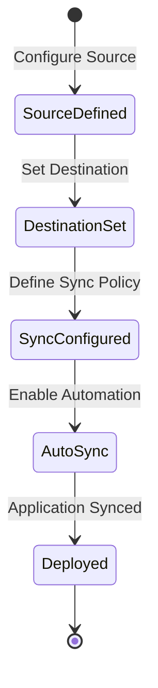

# Diagram: devops/k8s/descheduler/argocd/application.yaml


> Auto-generated by Obscura crawlers

## Diagram 1

```mermaid
flowchart TD
    A[ArgoCD Application<br/>${name_prefix}-descheduler] --> B[Destination]
    A --> C[Source]
    A --> D[Project: ${env}-services]
    A --> E[Sync Policy]
    
    B --> B1[Namespace: kube-system]
    B --> B2[Server: ${cluster_endpoint}]
    
    C --> C1[GitLab Repository]
    C --> C2[Path: devops/k8s/descheduler/helm]
    C --> C3[Revision: ${revision}]
    C --> C4[Helm Values: values.yaml]
    
    E --> E1[Automated Sync]
    E --> E2[CreateNamespace=true]
```

> SVG rendering failed for this diagram.

## Diagram 2

```mermaid
graph LR
    App[${name_prefix}-descheduler<br/>Application]
    App -->|deploys to| NS[kube-system namespace]
    App -->|syncs from| Repo[GitLab Repository]
    App -->|managed by| Proj[${env}-services project]
    Repo -->|helm chart| Chart[devops/k8s/descheduler/helm]
    App -->|targets| Cluster[${cluster_endpoint}]
    App -->|auto-sync| Sync[Automated Sync Policy]
```

> SVG rendering failed for this diagram.

## Diagram 3



### SVG

<svg id="container" width="154.34375" xmlns="http://www.w3.org/2000/svg" class="statediagram" height="664" viewBox="0 0 154.34375 664" role="graphics-document document" aria-roledescription="stateDiagram"><style>#container{font-family:"trebuchet ms",verdana,arial,sans-serif;font-size:16px;fill:#333;}@keyframes edge-animation-frame{from{stroke-dashoffset:0;}}@keyframes dash{to{stroke-dashoffset:0;}}#container .edge-animation-slow{stroke-dasharray:9,5!important;stroke-dashoffset:900;animation:dash 50s linear infinite;stroke-linecap:round;}#container .edge-animation-fast{stroke-dasharray:9,5!important;stroke-dashoffset:900;animation:dash 20s linear infinite;stroke-linecap:round;}#container .error-icon{fill:#552222;}#container .error-text{fill:#552222;stroke:#552222;}#container .edge-thickness-normal{stroke-width:1px;}#container .edge-thickness-thick{stroke-width:3.5px;}#container .edge-pattern-solid{stroke-dasharray:0;}#container .edge-thickness-invisible{stroke-width:0;fill:none;}#container .edge-pattern-dashed{stroke-dasharray:3;}#container .edge-pattern-dotted{stroke-dasharray:2;}#container .marker{fill:#333333;stroke:#333333;}#container .marker.cross{stroke:#333333;}#container svg{font-family:"trebuchet ms",verdana,arial,sans-serif;font-size:16px;}#container p{margin:0;}#container defs #statediagram-barbEnd{fill:#333333;stroke:#333333;}#container g.stateGroup text{fill:#9370DB;stroke:none;font-size:10px;}#container g.stateGroup text{fill:#333;stroke:none;font-size:10px;}#container g.stateGroup .state-title{font-weight:bolder;fill:#131300;}#container g.stateGroup rect{fill:#ECECFF;stroke:#9370DB;}#container g.stateGroup line{stroke:#333333;stroke-width:1;}#container .transition{stroke:#333333;stroke-width:1;fill:none;}#container .stateGroup .composit{fill:white;border-bottom:1px;}#container .stateGroup .alt-composit{fill:#e0e0e0;border-bottom:1px;}#container .state-note{stroke:#aaaa33;fill:#fff5ad;}#container .state-note text{fill:black;stroke:none;font-size:10px;}#container .stateLabel .box{stroke:none;stroke-width:0;fill:#ECECFF;opacity:0.5;}#container .edgeLabel .label rect{fill:#ECECFF;opacity:0.5;}#container .edgeLabel{background-color:rgba(232,232,232, 0.8);text-align:center;}#container .edgeLabel p{background-color:rgba(232,232,232, 0.8);}#container .edgeLabel rect{opacity:0.5;background-color:rgba(232,232,232, 0.8);fill:rgba(232,232,232, 0.8);}#container .edgeLabel .label text{fill:#333;}#container .label div .edgeLabel{color:#333;}#container .stateLabel text{fill:#131300;font-size:10px;font-weight:bold;}#container .node circle.state-start{fill:#333333;stroke:#333333;}#container .node .fork-join{fill:#333333;stroke:#333333;}#container .node circle.state-end{fill:#9370DB;stroke:white;stroke-width:1.5;}#container .end-state-inner{fill:white;stroke-width:1.5;}#container .node rect{fill:#ECECFF;stroke:#9370DB;stroke-width:1px;}#container .node polygon{fill:#ECECFF;stroke:#9370DB;stroke-width:1px;}#container #statediagram-barbEnd{fill:#333333;}#container .statediagram-cluster rect{fill:#ECECFF;stroke:#9370DB;stroke-width:1px;}#container .cluster-label,#container .nodeLabel{color:#131300;}#container .statediagram-cluster rect.outer{rx:5px;ry:5px;}#container .statediagram-state .divider{stroke:#9370DB;}#container .statediagram-state .title-state{rx:5px;ry:5px;}#container .statediagram-cluster.statediagram-cluster .inner{fill:white;}#container .statediagram-cluster.statediagram-cluster-alt .inner{fill:#f0f0f0;}#container .statediagram-cluster .inner{rx:0;ry:0;}#container .statediagram-state rect.basic{rx:5px;ry:5px;}#container .statediagram-state rect.divider{stroke-dasharray:10,10;fill:#f0f0f0;}#container .note-edge{stroke-dasharray:5;}#container .statediagram-note rect{fill:#fff5ad;stroke:#aaaa33;stroke-width:1px;rx:0;ry:0;}#container .statediagram-note rect{fill:#fff5ad;stroke:#aaaa33;stroke-width:1px;rx:0;ry:0;}#container .statediagram-note text{fill:black;}#container .statediagram-note .nodeLabel{color:black;}#container .statediagram .edgeLabel{color:red;}#container #dependencyStart,#container #dependencyEnd{fill:#333333;stroke:#333333;stroke-width:1;}#container .statediagramTitleText{text-anchor:middle;font-size:18px;fill:#333;}#container :root{--mermaid-font-family:"trebuchet ms",verdana,arial,sans-serif;}</style><g><defs><marker id="container_stateDiagram-barbEnd" refX="19" refY="7" markerWidth="20" markerHeight="14" markerUnits="userSpaceOnUse" orient="auto"><path d="M 19,7 L9,13 L14,7 L9,1 Z"></path></marker></defs><g class="root"><g class="clusters"></g><g class="edgePaths"><path d="M77.172,22L77.172,28.167C77.172,34.333,77.172,46.667,77.255,59.083C77.339,71.5,77.505,84,77.589,90.25L77.672,96.5" id="edge0" class="edge-thickness-normal edge-pattern-solid transition" style="fill:none;;;fill:none" data-edge="true" data-et="edge" data-id="edge0" data-points="W3sieCI6NzcuMTcxODc1LCJ5IjoyMn0seyJ4Ijo3Ny4xNzE4NzUsInkiOjU5fSx7IngiOjc3LjY3MTg3NSwieSI6OTYuNX1d" marker-end="url(#container_stateDiagram-barbEnd)"></path><path d="M77.672,136.5L77.589,142.583C77.505,148.667,77.339,160.833,77.339,173.167C77.339,185.5,77.505,198,77.589,204.25L77.672,210.5" id="edge1" class="edge-thickness-normal edge-pattern-solid transition" style="fill:none;;;fill:none" data-edge="true" data-et="edge" data-id="edge1" data-points="W3sieCI6NzcuNjcxODc1LCJ5IjoxMzYuNX0seyJ4Ijo3Ny4xNzE4NzUsInkiOjE3M30seyJ4Ijo3Ny42NzE4NzUsInkiOjIxMC41fV0=" marker-end="url(#container_stateDiagram-barbEnd)"></path><path d="M77.672,250.5L77.589,256.583C77.505,262.667,77.339,274.833,77.339,287.167C77.339,299.5,77.505,312,77.589,318.25L77.672,324.5" id="edge2" class="edge-thickness-normal edge-pattern-solid transition" style="fill:none;;;fill:none" data-edge="true" data-et="edge" data-id="edge2" data-points="W3sieCI6NzcuNjcxODc1LCJ5IjoyNTAuNX0seyJ4Ijo3Ny4xNzE4NzUsInkiOjI4N30seyJ4Ijo3Ny42NzE4NzUsInkiOjMyNC41fV0=" marker-end="url(#container_stateDiagram-barbEnd)"></path><path d="M77.672,364.5L77.589,370.583C77.505,376.667,77.339,388.833,77.339,401.167C77.339,413.5,77.505,426,77.589,432.25L77.672,438.5" id="edge3" class="edge-thickness-normal edge-pattern-solid transition" style="fill:none;;;fill:none" data-edge="true" data-et="edge" data-id="edge3" data-points="W3sieCI6NzcuNjcxODc1LCJ5IjozNjQuNX0seyJ4Ijo3Ny4xNzE4NzUsInkiOjQwMX0seyJ4Ijo3Ny42NzE4NzUsInkiOjQzOC41fV0=" marker-end="url(#container_stateDiagram-barbEnd)"></path><path d="M77.672,478.5L77.589,484.583C77.505,490.667,77.339,502.833,77.339,515.167C77.339,527.5,77.505,540,77.589,546.25L77.672,552.5" id="edge4" class="edge-thickness-normal edge-pattern-solid transition" style="fill:none;;;fill:none" data-edge="true" data-et="edge" data-id="edge4" data-points="W3sieCI6NzcuNjcxODc1LCJ5Ijo0NzguNX0seyJ4Ijo3Ny4xNzE4NzUsInkiOjUxNX0seyJ4Ijo3Ny42NzE4NzUsInkiOjU1Mi41fV0=" marker-end="url(#container_stateDiagram-barbEnd)"></path><path d="M77.672,592.5L77.589,596.583C77.505,600.667,77.339,608.833,77.255,617.083C77.172,625.333,77.172,633.667,77.172,637.833L77.172,642" id="edge5" class="edge-thickness-normal edge-pattern-solid transition" style="fill:none;;;fill:none" data-edge="true" data-et="edge" data-id="edge5" data-points="W3sieCI6NzcuNjcxODc1LCJ5Ijo1OTIuNX0seyJ4Ijo3Ny4xNzE4NzUsInkiOjYxN30seyJ4Ijo3Ny4xNzE4NzUsInkiOjY0Mn1d" marker-end="url(#container_stateDiagram-barbEnd)"></path></g><g class="edgeLabels"><g class="edgeLabel" transform="translate(77.171875, 59)"><g class="label" data-id="edge0" transform="translate(-60.90625, -12)"><foreignObject width="121.8125" height="24"><div xmlns="http://www.w3.org/1999/xhtml" class="labelBkg" style="display: table-cell; white-space: nowrap; line-height: 1.5; max-width: 200px; text-align: center;"><span class="edgeLabel"><p>Configure Source</p></span></div></foreignObject></g></g><g class="edgeLabel" transform="translate(77.171875, 173)"><g class="label" data-id="edge1" transform="translate(-55.671875, -12)"><foreignObject width="111.34375" height="24"><div xmlns="http://www.w3.org/1999/xhtml" class="labelBkg" style="display: table-cell; white-space: nowrap; line-height: 1.5; max-width: 200px; text-align: center;"><span class="edgeLabel"><p>Set Destination</p></span></div></foreignObject></g></g><g class="edgeLabel" transform="translate(77.171875, 287)"><g class="label" data-id="edge2" transform="translate(-65.5703125, -12)"><foreignObject width="131.140625" height="24"><div xmlns="http://www.w3.org/1999/xhtml" class="labelBkg" style="display: table-cell; white-space: nowrap; line-height: 1.5; max-width: 200px; text-align: center;"><span class="edgeLabel"><p>Define Sync Policy</p></span></div></foreignObject></g></g><g class="edgeLabel" transform="translate(77.171875, 401)"><g class="label" data-id="edge3" transform="translate(-69.171875, -12)"><foreignObject width="138.34375" height="24"><div xmlns="http://www.w3.org/1999/xhtml" class="labelBkg" style="display: table-cell; white-space: nowrap; line-height: 1.5; max-width: 200px; text-align: center;"><span class="edgeLabel"><p>Enable Automation</p></span></div></foreignObject></g></g><g class="edgeLabel" transform="translate(77.171875, 515)"><g class="label" data-id="edge4" transform="translate(-69.125, -12)"><foreignObject width="138.25" height="24"><div xmlns="http://www.w3.org/1999/xhtml" class="labelBkg" style="display: table-cell; white-space: nowrap; line-height: 1.5; max-width: 200px; text-align: center;"><span class="edgeLabel"><p>Application Synced</p></span></div></foreignObject></g></g><g class="edgeLabel"><g class="label" data-id="edge5" transform="translate(0, 0)"><foreignObject width="0" height="0"><div xmlns="http://www.w3.org/1999/xhtml" class="labelBkg" style="display: table-cell; white-space: nowrap; line-height: 1.5; max-width: 200px; text-align: center;"><span class="edgeLabel"></span></div></foreignObject></g></g></g><g class="nodes"><g class="node default" id="state-root_start-0" transform="translate(77.171875, 15)"><circle class="state-start" r="7" width="14" height="14"></circle></g><g class="node  statediagram-state" id="state-SourceDefined-1" transform="translate(77.171875, 116)"><g class="basic label-container outer-path"><path d="M-55.5078125 -20 C-15.158767668611667 -20, 25.190277162776667 -20, 55.5078125 -20 C55.5078125 -20, 55.5078125 -20, 55.5078125 -20 C55.655909704439985 -19.993874654315018, 55.80400690887998 -19.98774930863004, 55.92070922736166 -19.982922465033347 C56.0052419205348 -19.972385475817987, 56.089774613707945 -19.961848486602626, 56.33078545140367 -19.931806517013612 C56.49143615573487 -19.898121606591673, 56.65208686006606 -19.86443669616973, 56.735239935703994 -19.847001329696653 C56.84726438966742 -19.813650204752378, 56.95928884363086 -19.7802990798081, 57.13130984602342 -19.729086208503173 C57.24732503942964 -19.68381693956042, 57.36334023283586 -19.638547670617665, 57.516289623264846 -19.578866633275286 C57.64505112174185 -19.51591897235055, 57.77381262021885 -19.452971311425816, 57.887549465185366 -19.397368756032446 C57.96713127396669 -19.34994829089467, 58.04671308274801 -19.30252782575689, 58.242553290612136 -19.185832391312644 C58.32735259204313 -19.12528685382122, 58.41215189347412 -19.064741316329798, 58.57887606344834 -18.94570254698197 C58.66428667879998 -18.873363445816846, 58.74969729415162 -18.801024344651722, 58.894220358128706 -18.678619553365657 C58.98390537053329 -18.58893454096107, 59.07359038293788 -18.499249528556483, 59.18643205336566 -18.386407858128706 C59.26883562495652 -18.289114144999985, 59.35123919654739 -18.191820431871268, 59.45351504698197 -18.07106356344834 C59.50250276954395 -18.002451989019097, 59.551490492105934 -17.933840414589852, 59.693644891312644 -17.734740790612136 C59.73699746124127 -17.661985790841154, 59.780350031169895 -17.58923079107017, 59.90518125603245 -17.37973696518537 C59.95716895940074 -17.2733944182227, 60.00915666276902 -17.16705187126003, 60.08667913327529 -17.008477123264846 C60.12387733321775 -16.91314630698538, 60.16107553316021 -16.817815490705907, 60.236898708503176 -16.623497346023417 C60.284050754771535 -16.465116414486708, 60.33120280103989 -16.306735482950003, 60.35481382969665 -16.227427435703994 C60.37602097711657 -16.126285911882533, 60.397228124536475 -16.025144388061076, 60.43961901701361 -15.82297295140367 C60.45223660140724 -15.721748743204051, 60.46485418580087 -15.620524535004431, 60.49073496503335 -15.412896727361662 C60.49710709111887 -15.258832922943414, 60.503479217204394 -15.104769118525166, 60.5078125 -15 C60.5078125 -15, 60.5078125 -15, 60.5078125 -15 C60.5078125 -6.000758544479028, 60.5078125 2.9984829110419433, 60.5078125 15 C60.5078125 15, 60.5078125 15, 60.5078125 15 C60.502993041307384 15.116523767963018, 60.498173582614776 15.233047535926039, 60.49073496503335 15.412896727361662 C60.47727454362774 15.520882571268809, 60.46381412222214 15.628868415175955, 60.43961901701361 15.822972951403669 C60.421419220044655 15.909771763249193, 60.403219423075704 15.996570575094719, 60.35481382969665 16.227427435703994 C60.31457608687894 16.362583631346787, 60.27433834406122 16.49773982698958, 60.236898708503176 16.623497346023417 C60.1868872148904 16.75166581968173, 60.13687572127762 16.879834293340046, 60.08667913327529 17.008477123264846 C60.0308512982315 17.122674785121745, 59.97502346318771 17.236872446978644, 59.90518125603245 17.379736965185366 C59.82948234790193 17.506776124634666, 59.753783439771404 17.633815284083965, 59.693644891312644 17.734740790612133 C59.64245725493335 17.80643353605159, 59.59126961855406 17.87812628149105, 59.45351504698197 18.07106356344834 C59.39224170898137 18.143408856920185, 59.33096837098077 18.21575415039203, 59.18643205336566 18.386407858128706 C59.084453302146564 18.488386609347803, 58.98247455092746 18.590365360566896, 58.894220358128706 18.678619553365657 C58.78938758676449 18.767408381568266, 58.68455481540028 18.85619720977088, 58.57887606344834 18.94570254698197 C58.47567240190356 19.01938854502521, 58.37246874035877 19.093074543068443, 58.242553290612136 19.185832391312644 C58.11207787317759 19.263578864766057, 57.981602455743044 19.341325338219473, 57.887549465185366 19.397368756032446 C57.77211767980961 19.45379991730126, 57.65668589443385 19.510231078570072, 57.516289623264846 19.578866633275286 C57.381578793352624 19.631430962220076, 57.24686796344041 19.683995291164862, 57.13130984602342 19.729086208503173 C57.0144408978298 19.76387960186873, 56.89757194963617 19.79867299523429, 56.735239935703994 19.847001329696653 C56.64894526426539 19.865095419538346, 56.56265059282679 19.883189509380042, 56.33078545140367 19.931806517013612 C56.20543952512936 19.947430870429592, 56.08009359885505 19.963055223845572, 55.92070922736166 19.982922465033347 C55.75600811637171 19.989734553373086, 55.59130700538175 19.99654664171283, 55.5078125 20 C55.5078125 20, 55.5078125 20, 55.5078125 20 C18.12109393363002 20, -19.265624632739957 20, -55.5078125 20 C-55.5078125 20, -55.5078125 20, -55.5078125 20 C-55.624977180144036 19.995154032983496, -55.74214186028807 19.990308065966996, -55.92070922736166 19.982922465033347 C-56.05773871040447 19.965841757784958, -56.194768193447274 19.948761050536564, -56.33078545140367 19.931806517013612 C-56.44262077562363 19.90835711544366, -56.55445609984359 19.884907713873705, -56.735239935703994 19.847001329696653 C-56.81888679297452 19.822098581329445, -56.90253365024503 19.797195832962238, -57.13130984602342 19.729086208503173 C-57.22247009563813 19.693515368723183, -57.31363034525285 19.657944528943197, -57.516289623264846 19.578866633275286 C-57.656213433510416 19.510462050641387, -57.796137243755986 19.442057468007484, -57.887549465185366 19.397368756032446 C-57.962081858732795 19.35295708929636, -58.03661425228022 19.30854542256028, -58.242553290612136 19.185832391312644 C-58.34900025664377 19.10983071837479, -58.4554472226754 19.03382904543694, -58.57887606344834 18.94570254698197 C-58.64510696824443 18.889607832026734, -58.711337873040506 18.833513117071497, -58.894220358128706 18.67861955336566 C-59.01055440945518 18.56228550203918, -59.12688846078166 18.445951450712705, -59.18643205336566 18.386407858128706 C-59.27959109443545 18.276415186182486, -59.37275013550525 18.166422514236263, -59.45351504698197 18.07106356344834 C-59.513659163369475 17.986826487254785, -59.57380327975698 17.90258941106123, -59.693644891312644 17.734740790612133 C-59.767554822691686 17.61070392153128, -59.84146475407073 17.486667052450425, -59.90518125603244 17.37973696518537 C-59.95989942843681 17.26780915453751, -60.01461760084118 17.155881343889646, -60.08667913327528 17.00847712326485 C-60.137885233221205 16.877247135956754, -60.18909133316713 16.74601714864866, -60.236898708503176 16.623497346023417 C-60.260881081264465 16.542941975917618, -60.28486345402575 16.462386605811822, -60.35481382969665 16.227427435703994 C-60.37831174447626 16.115360741377902, -60.40180965925585 16.00329404705181, -60.43961901701361 15.82297295140367 C-60.45902783362266 15.667266277919104, -60.478436650231714 15.511559604434538, -60.49073496503335 15.412896727361664 C-60.49573159765682 15.292089288695061, -60.500728230280295 15.17128185002846, -60.5078125 15 C-60.5078125 15, -60.5078125 15, -60.5078125 15 C-60.5078125 5.952020281102827, -60.5078125 -3.0959594377943453, -60.5078125 -15 C-60.5078125 -15, -60.5078125 -15, -60.5078125 -15 C-60.5029767686017 -15.116917205712484, -60.498141037203396 -15.233834411424969, -60.49073496503335 -15.41289672736166 C-60.478701510081386 -15.509434773901923, -60.46666805512943 -15.605972820442185, -60.43961901701361 -15.822972951403669 C-60.412048209023666 -15.954464164148012, -60.38447740103371 -16.085955376892358, -60.35481382969665 -16.227427435703994 C-60.32437521782855 -16.32966893069481, -60.29393660596046 -16.431910425685633, -60.236898708503176 -16.623497346023417 C-60.19326675780795 -16.735316452380065, -60.14963480711272 -16.847135558736714, -60.08667913327529 -17.008477123264846 C-60.04423936849816 -17.095289049672225, -60.00179960372103 -17.182100976079603, -59.90518125603245 -17.379736965185366 C-59.83504958965754 -17.497433087455526, -59.764917923282624 -17.615129209725687, -59.693644891312644 -17.734740790612133 C-59.62835382650955 -17.826186616586874, -59.56306276170646 -17.917632442561615, -59.45351504698197 -18.07106356344834 C-59.39166038111548 -18.144095229434452, -59.329805715248995 -18.217126895420563, -59.18643205336566 -18.386407858128706 C-59.11562015611489 -18.45721975537947, -59.04480825886413 -18.52803165263023, -58.894220358128706 -18.678619553365657 C-58.78696028432067 -18.769464201870218, -58.679700210512635 -18.86030885037478, -58.57887606344834 -18.945702546981966 C-58.464288969550566 -19.02751615950644, -58.34970187565279 -19.10932977203091, -58.242553290612136 -19.185832391312644 C-58.125465396542104 -19.255601632346867, -58.00837750247208 -19.32537087338109, -57.887549465185366 -19.397368756032446 C-57.78661102760282 -19.44671455130799, -57.68567259002027 -19.49606034658354, -57.516289623264846 -19.578866633275286 C-57.40000397400364 -19.62424143442013, -57.28371832474244 -19.66961623556498, -57.13130984602342 -19.729086208503173 C-56.98835514762178 -19.771645666184803, -56.84540044922015 -19.814205123866433, -56.735239935703994 -19.847001329696653 C-56.643890283264945 -19.866155337594066, -56.552540630825895 -19.885309345491482, -56.33078545140367 -19.931806517013612 C-56.18155802195755 -19.950407696695528, -56.03233059251142 -19.969008876377444, -55.92070922736166 -19.982922465033347 C-55.758966511674025 -19.989612193238283, -55.597223795986395 -19.99630192144322, -55.5078125 -20 C-55.5078125 -20, -55.5078125 -20, -55.5078125 -20" stroke="none" stroke-width="0" fill="#ECECFF" style=""></path><path d="M-55.5078125 -20 C-24.11076634351789 -20, 7.286279812964217 -20, 55.5078125 -20 M-55.5078125 -20 C-33.30384004975519 -20, -11.099867599510375 -20, 55.5078125 -20 M55.5078125 -20 C55.5078125 -20, 55.5078125 -20, 55.5078125 -20 M55.5078125 -20 C55.5078125 -20, 55.5078125 -20, 55.5078125 -20 M55.5078125 -20 C55.63575832335925 -19.994708121601697, 55.763704146718496 -19.989416243203397, 55.92070922736166 -19.982922465033347 M55.5078125 -20 C55.667762506145316 -19.9933844188102, 55.82771251229063 -19.986768837620403, 55.92070922736166 -19.982922465033347 M55.92070922736166 -19.982922465033347 C56.0386227142129 -19.968224564225288, 56.156536201064135 -19.953526663417225, 56.33078545140367 -19.931806517013612 M55.92070922736166 -19.982922465033347 C56.07022436554148 -19.964285422495177, 56.21973950372129 -19.945648379957007, 56.33078545140367 -19.931806517013612 M56.33078545140367 -19.931806517013612 C56.489672658142034 -19.898491373152552, 56.6485598648804 -19.865176229291496, 56.735239935703994 -19.847001329696653 M56.33078545140367 -19.931806517013612 C56.467841400805504 -19.903068906446546, 56.60489735020733 -19.874331295879482, 56.735239935703994 -19.847001329696653 M56.735239935703994 -19.847001329696653 C56.85742539631235 -19.810625142007726, 56.9796108569207 -19.774248954318804, 57.13130984602342 -19.729086208503173 M56.735239935703994 -19.847001329696653 C56.89021010935395 -19.80086471004642, 57.04518028300391 -19.75472809039619, 57.13130984602342 -19.729086208503173 M57.13130984602342 -19.729086208503173 C57.28224267771548 -19.67019203482167, 57.43317550940753 -19.611297861140166, 57.516289623264846 -19.578866633275286 M57.13130984602342 -19.729086208503173 C57.274989552889004 -19.67302221291132, 57.41866925975459 -19.61695821731947, 57.516289623264846 -19.578866633275286 M57.516289623264846 -19.578866633275286 C57.599101928420446 -19.5383821641833, 57.681914233576045 -19.49789769509131, 57.887549465185366 -19.397368756032446 M57.516289623264846 -19.578866633275286 C57.645371168644395 -19.515762510953785, 57.774452714023944 -19.452658388632283, 57.887549465185366 -19.397368756032446 M57.887549465185366 -19.397368756032446 C58.013883604663135 -19.32208994861958, 58.14021774414091 -19.246811141206713, 58.242553290612136 -19.185832391312644 M57.887549465185366 -19.397368756032446 C57.9860286903155 -19.33868787489149, 58.08450791544564 -19.280006993750536, 58.242553290612136 -19.185832391312644 M58.242553290612136 -19.185832391312644 C58.32628776252193 -19.12604712748633, 58.41002223443172 -19.066261863660017, 58.57887606344834 -18.94570254698197 M58.242553290612136 -19.185832391312644 C58.33037497984104 -19.12312891041079, 58.41819666906994 -19.06042542950894, 58.57887606344834 -18.94570254698197 M58.57887606344834 -18.94570254698197 C58.663983071425115 -18.87362058814646, 58.74909007940188 -18.801538629310947, 58.894220358128706 -18.678619553365657 M58.57887606344834 -18.94570254698197 C58.65923992762769 -18.877637826022454, 58.739603791807035 -18.80957310506294, 58.894220358128706 -18.678619553365657 M58.894220358128706 -18.678619553365657 C58.95562451383023 -18.617215397664136, 59.01702866953175 -18.555811241962616, 59.18643205336566 -18.386407858128706 M58.894220358128706 -18.678619553365657 C58.97399022065268 -18.598849690841686, 59.05376008317665 -18.51907982831771, 59.18643205336566 -18.386407858128706 M59.18643205336566 -18.386407858128706 C59.25803456621654 -18.301866930956304, 59.329637079067425 -18.217326003783906, 59.45351504698197 -18.07106356344834 M59.18643205336566 -18.386407858128706 C59.26286380250698 -18.29616506244258, 59.3392955516483 -18.205922266756453, 59.45351504698197 -18.07106356344834 M59.45351504698197 -18.07106356344834 C59.53842633999039 -17.95213789808884, 59.623337632998805 -17.83321223272934, 59.693644891312644 -17.734740790612136 M59.45351504698197 -18.07106356344834 C59.50220387367675 -18.002870618728068, 59.55089270037153 -17.93467767400779, 59.693644891312644 -17.734740790612136 M59.693644891312644 -17.734740790612136 C59.761421715437 -17.620996603548626, 59.82919853956136 -17.507252416485116, 59.90518125603245 -17.37973696518537 M59.693644891312644 -17.734740790612136 C59.75246750750597 -17.63602370337326, 59.81129012369929 -17.537306616134384, 59.90518125603245 -17.37973696518537 M59.90518125603245 -17.37973696518537 C59.9757813787494 -17.23532210591737, 60.04638150146636 -17.09090724664937, 60.08667913327529 -17.008477123264846 M59.90518125603245 -17.37973696518537 C59.94890371054673 -17.290301254983472, 59.99262616506102 -17.200865544781575, 60.08667913327529 -17.008477123264846 M60.08667913327529 -17.008477123264846 C60.14158936479458 -16.867754260305727, 60.19649959631387 -16.727031397346607, 60.236898708503176 -16.623497346023417 M60.08667913327529 -17.008477123264846 C60.141723976546196 -16.867409279952312, 60.1967688198171 -16.726341436639782, 60.236898708503176 -16.623497346023417 M60.236898708503176 -16.623497346023417 C60.27728195950613 -16.48785239700196, 60.31766521050909 -16.352207447980504, 60.35481382969665 -16.227427435703994 M60.236898708503176 -16.623497346023417 C60.26286264649219 -16.536286015646432, 60.2888265844812 -16.449074685269448, 60.35481382969665 -16.227427435703994 M60.35481382969665 -16.227427435703994 C60.388211245499974 -16.068147856080973, 60.4216086613033 -15.90886827645795, 60.43961901701361 -15.82297295140367 M60.35481382969665 -16.227427435703994 C60.38022925101259 -16.106215733368007, 60.40564467232852 -15.985004031032018, 60.43961901701361 -15.82297295140367 M60.43961901701361 -15.82297295140367 C60.45207464722912 -15.723048015943878, 60.464530277444624 -15.623123080484085, 60.49073496503335 -15.412896727361662 M60.43961901701361 -15.82297295140367 C60.45472983568168 -15.701746842886749, 60.46984065434975 -15.580520734369827, 60.49073496503335 -15.412896727361662 M60.49073496503335 -15.412896727361662 C60.49672463449276 -15.268079871615344, 60.50271430395217 -15.123263015869025, 60.5078125 -15 M60.49073496503335 -15.412896727361662 C60.49459379432246 -15.319598837002493, 60.498452623611584 -15.226300946643324, 60.5078125 -15 M60.5078125 -15 C60.5078125 -15, 60.5078125 -15, 60.5078125 -15 M60.5078125 -15 C60.5078125 -15, 60.5078125 -15, 60.5078125 -15 M60.5078125 -15 C60.5078125 -8.790445817850973, 60.5078125 -2.5808916357019474, 60.5078125 15 M60.5078125 -15 C60.5078125 -6.810010179955105, 60.5078125 1.3799796400897897, 60.5078125 15 M60.5078125 15 C60.5078125 15, 60.5078125 15, 60.5078125 15 M60.5078125 15 C60.5078125 15, 60.5078125 15, 60.5078125 15 M60.5078125 15 C60.50371821743328 15.098990625754347, 60.49962393486657 15.197981251508693, 60.49073496503335 15.412896727361662 M60.5078125 15 C60.5040057152357 15.092039569763369, 60.5001989304714 15.18407913952674, 60.49073496503335 15.412896727361662 M60.49073496503335 15.412896727361662 C60.47787697413897 15.51604958980481, 60.465018983244605 15.619202452247956, 60.43961901701361 15.822972951403669 M60.49073496503335 15.412896727361662 C60.47100464026443 15.571182690819379, 60.451274315495525 15.729468654277094, 60.43961901701361 15.822972951403669 M60.43961901701361 15.822972951403669 C60.41977264547031 15.917624637482483, 60.399926273927 16.012276323561295, 60.35481382969665 16.227427435703994 M60.43961901701361 15.822972951403669 C60.41497512038322 15.940505083790129, 60.39033122375283 16.05803721617659, 60.35481382969665 16.227427435703994 M60.35481382969665 16.227427435703994 C60.31360923165841 16.365831240784903, 60.27240463362017 16.504235045865812, 60.236898708503176 16.623497346023417 M60.35481382969665 16.227427435703994 C60.314094426894485 16.364201498715396, 60.273375024092324 16.500975561726797, 60.236898708503176 16.623497346023417 M60.236898708503176 16.623497346023417 C60.201902247808604 16.71318558819822, 60.16690578711403 16.80287383037302, 60.08667913327529 17.008477123264846 M60.236898708503176 16.623497346023417 C60.195432061940004 16.7297672534747, 60.15396541537683 16.83603716092599, 60.08667913327529 17.008477123264846 M60.08667913327529 17.008477123264846 C60.02548559507156 17.13365050636551, 59.964292056867826 17.25882388946617, 59.90518125603245 17.379736965185366 M60.08667913327529 17.008477123264846 C60.02941084559528 17.12562127808431, 59.97214255791527 17.242765432903774, 59.90518125603245 17.379736965185366 M59.90518125603245 17.379736965185366 C59.84354377086518 17.483178012085503, 59.781906285697914 17.586619058985644, 59.693644891312644 17.734740790612133 M59.90518125603245 17.379736965185366 C59.844982641195756 17.48076327610229, 59.784784026359056 17.58178958701922, 59.693644891312644 17.734740790612133 M59.693644891312644 17.734740790612133 C59.61470904721766 17.845297319044448, 59.53577320312267 17.955853847476767, 59.45351504698197 18.07106356344834 M59.693644891312644 17.734740790612133 C59.60988394604244 17.85205529371848, 59.52612300077224 17.969369796824825, 59.45351504698197 18.07106356344834 M59.45351504698197 18.07106356344834 C59.39956978532081 18.134756613535703, 59.345624523659644 18.198449663623066, 59.18643205336566 18.386407858128706 M59.45351504698197 18.07106356344834 C59.384969664471114 18.151994943648962, 59.31642428196026 18.232926323849583, 59.18643205336566 18.386407858128706 M59.18643205336566 18.386407858128706 C59.1091846499614 18.463655261532963, 59.03193724655714 18.540902664937224, 58.894220358128706 18.678619553365657 M59.18643205336566 18.386407858128706 C59.12097581770818 18.451864093786185, 59.0555195820507 18.517320329443663, 58.894220358128706 18.678619553365657 M58.894220358128706 18.678619553365657 C58.82734282897244 18.73526193121753, 58.760465299816175 18.791904309069405, 58.57887606344834 18.94570254698197 M58.894220358128706 18.678619553365657 C58.81425516708888 18.746346615400075, 58.734289976049055 18.814073677434493, 58.57887606344834 18.94570254698197 M58.57887606344834 18.94570254698197 C58.474310872806946 19.02036065811545, 58.369745682165544 19.095018769248934, 58.242553290612136 19.185832391312644 M58.57887606344834 18.94570254698197 C58.458216071795775 19.03185212516287, 58.337556080143216 19.118001703343772, 58.242553290612136 19.185832391312644 M58.242553290612136 19.185832391312644 C58.156391550997824 19.237173644196428, 58.07022981138351 19.28851489708021, 57.887549465185366 19.397368756032446 M58.242553290612136 19.185832391312644 C58.13555559510803 19.249589179040566, 58.02855789960393 19.313345966768484, 57.887549465185366 19.397368756032446 M57.887549465185366 19.397368756032446 C57.80067806180382 19.43983759733048, 57.71380665842228 19.48230643862852, 57.516289623264846 19.578866633275286 M57.887549465185366 19.397368756032446 C57.784909625162776 19.44754631627779, 57.68226978514019 19.49772387652314, 57.516289623264846 19.578866633275286 M57.516289623264846 19.578866633275286 C57.37109040367545 19.635523544571853, 57.22589118408606 19.692180455868417, 57.13130984602342 19.729086208503173 M57.516289623264846 19.578866633275286 C57.428112361662336 19.613273507520997, 57.339935100059826 19.64768038176671, 57.13130984602342 19.729086208503173 M57.13130984602342 19.729086208503173 C56.97358748928332 19.77604218855965, 56.815865132543216 19.82299816861613, 56.735239935703994 19.847001329696653 M57.13130984602342 19.729086208503173 C57.00945432910749 19.76536416769893, 56.887598812191555 19.80164212689469, 56.735239935703994 19.847001329696653 M56.735239935703994 19.847001329696653 C56.60384754419048 19.87455141705346, 56.472455152676964 19.90210150441027, 56.33078545140367 19.931806517013612 M56.735239935703994 19.847001329696653 C56.5891513792907 19.877632878789072, 56.443062822877394 19.908264427881488, 56.33078545140367 19.931806517013612 M56.33078545140367 19.931806517013612 C56.17471889413763 19.95126019308924, 56.01865233687158 19.970713869164868, 55.92070922736166 19.982922465033347 M56.33078545140367 19.931806517013612 C56.243996456378504 19.942624753961525, 56.15720746135333 19.953442990909437, 55.92070922736166 19.982922465033347 M55.92070922736166 19.982922465033347 C55.75982517828825 19.989576678524415, 55.59894112921485 19.996230892015483, 55.5078125 20 M55.92070922736166 19.982922465033347 C55.7769324745208 19.988869115518376, 55.633155721679934 19.994815766003402, 55.5078125 20 M55.5078125 20 C55.5078125 20, 55.5078125 20, 55.5078125 20 M55.5078125 20 C55.5078125 20, 55.5078125 20, 55.5078125 20 M55.5078125 20 C30.771769969609792 20, 6.035727439219585 20, -55.5078125 20 M55.5078125 20 C11.303977736279236 20, -32.89985702744153 20, -55.5078125 20 M-55.5078125 20 C-55.5078125 20, -55.5078125 20, -55.5078125 20 M-55.5078125 20 C-55.5078125 20, -55.5078125 20, -55.5078125 20 M-55.5078125 20 C-55.635449464269385 19.99472089610815, -55.76308642853877 19.989441792216297, -55.92070922736166 19.982922465033347 M-55.5078125 20 C-55.66926638434597 19.99332221794772, -55.830720268691934 19.986644435895442, -55.92070922736166 19.982922465033347 M-55.92070922736166 19.982922465033347 C-56.067758820249146 19.96459275239536, -56.21480841313663 19.94626303975738, -56.33078545140367 19.931806517013612 M-55.92070922736166 19.982922465033347 C-56.07803993208096 19.963311213142, -56.23537063680026 19.943699961250655, -56.33078545140367 19.931806517013612 M-56.33078545140367 19.931806517013612 C-56.45606625213155 19.905537895486702, -56.581347052859435 19.879269273959792, -56.735239935703994 19.847001329696653 M-56.33078545140367 19.931806517013612 C-56.469023113237476 19.902821127405794, -56.60726077507128 19.873835737797975, -56.735239935703994 19.847001329696653 M-56.735239935703994 19.847001329696653 C-56.82410544920986 19.820544920052924, -56.912970962715725 19.794088510409196, -57.13130984602342 19.729086208503173 M-56.735239935703994 19.847001329696653 C-56.86153829308343 19.809400679586872, -56.98783665046286 19.771800029477088, -57.13130984602342 19.729086208503173 M-57.13130984602342 19.729086208503173 C-57.22434342351626 19.692784393916842, -57.3173770010091 19.65648257933051, -57.516289623264846 19.578866633275286 M-57.13130984602342 19.729086208503173 C-57.281088896471964 19.670642241659934, -57.4308679469205 19.61219827481669, -57.516289623264846 19.578866633275286 M-57.516289623264846 19.578866633275286 C-57.64546567724155 19.51571630851595, -57.77464173121827 19.45256598375662, -57.887549465185366 19.397368756032446 M-57.516289623264846 19.578866633275286 C-57.62690315486279 19.52479097274732, -57.73751668646073 19.470715312219355, -57.887549465185366 19.397368756032446 M-57.887549465185366 19.397368756032446 C-58.005096254897964 19.32732607254757, -58.12264304461057 19.2572833890627, -58.242553290612136 19.185832391312644 M-57.887549465185366 19.397368756032446 C-58.009367793531815 19.324780787991052, -58.13118612187826 19.25219281994966, -58.242553290612136 19.185832391312644 M-58.242553290612136 19.185832391312644 C-58.35762981193832 19.103669334320873, -58.4727063332645 19.021506277329102, -58.57887606344834 18.94570254698197 M-58.242553290612136 19.185832391312644 C-58.32331142127529 19.12817219429106, -58.404069551938456 19.070511997269477, -58.57887606344834 18.94570254698197 M-58.57887606344834 18.94570254698197 C-58.67253657187232 18.86637614280885, -58.7661970802963 18.78704973863573, -58.894220358128706 18.67861955336566 M-58.57887606344834 18.94570254698197 C-58.65081135956095 18.884776459031322, -58.72274665567356 18.82385037108067, -58.894220358128706 18.67861955336566 M-58.894220358128706 18.67861955336566 C-58.99437535119339 18.578464560300972, -59.094530344258075 18.478309567236288, -59.18643205336566 18.386407858128706 M-58.894220358128706 18.67861955336566 C-58.98121413628593 18.591625775208442, -59.06820791444314 18.50463199705122, -59.18643205336566 18.386407858128706 M-59.18643205336566 18.386407858128706 C-59.263113639676504 18.29587008025392, -59.33979522598736 18.205332302379134, -59.45351504698197 18.07106356344834 M-59.18643205336566 18.386407858128706 C-59.25554465373837 18.3048067650641, -59.32465725411108 18.223205671999494, -59.45351504698197 18.07106356344834 M-59.45351504698197 18.07106356344834 C-59.514218563221945 17.986042999013115, -59.57492207946193 17.90102243457789, -59.693644891312644 17.734740790612133 M-59.45351504698197 18.07106356344834 C-59.53733134107045 17.953671539498693, -59.62114763515893 17.83627951554904, -59.693644891312644 17.734740790612133 M-59.693644891312644 17.734740790612133 C-59.76498448411548 17.615017506235283, -59.83632407691831 17.49529422185843, -59.90518125603244 17.37973696518537 M-59.693644891312644 17.734740790612133 C-59.7572066772729 17.628070350299257, -59.820768463233144 17.521399909986382, -59.90518125603244 17.37973696518537 M-59.90518125603244 17.37973696518537 C-59.963087140657066 17.26128858496965, -60.02099302528169 17.14284020475393, -60.08667913327528 17.00847712326485 M-59.90518125603244 17.37973696518537 C-59.94444098732615 17.29942990123859, -59.983700718619865 17.21912283729181, -60.08667913327528 17.00847712326485 M-60.08667913327528 17.00847712326485 C-60.14239895274672 16.865679464201424, -60.19811877221815 16.722881805137998, -60.236898708503176 16.623497346023417 M-60.08667913327528 17.00847712326485 C-60.11812565068699 16.92788660601827, -60.14957216809869 16.84729608877169, -60.236898708503176 16.623497346023417 M-60.236898708503176 16.623497346023417 C-60.2811174784643 16.474969115923034, -60.32533624842543 16.326440885822652, -60.35481382969665 16.227427435703994 M-60.236898708503176 16.623497346023417 C-60.28397225507304 16.465380090325983, -60.3310458016429 16.307262834628553, -60.35481382969665 16.227427435703994 M-60.35481382969665 16.227427435703994 C-60.37528245932569 16.12980806473316, -60.39575108895472 16.03218869376233, -60.43961901701361 15.82297295140367 M-60.35481382969665 16.227427435703994 C-60.37898541827316 16.112147843715206, -60.403157006849675 15.996868251726417, -60.43961901701361 15.82297295140367 M-60.43961901701361 15.82297295140367 C-60.450457940160724 15.736018001939906, -60.46129686330783 15.649063052476142, -60.49073496503335 15.412896727361664 M-60.43961901701361 15.82297295140367 C-60.45701905111825 15.683381677833268, -60.47441908522289 15.543790404262865, -60.49073496503335 15.412896727361664 M-60.49073496503335 15.412896727361664 C-60.49725932639618 15.255152213291007, -60.50378368775902 15.09740769922035, -60.5078125 15 M-60.49073496503335 15.412896727361664 C-60.4970426608937 15.26039070216448, -60.50335035675404 15.107884676967295, -60.5078125 15 M-60.5078125 15 C-60.5078125 15, -60.5078125 15, -60.5078125 15 M-60.5078125 15 C-60.5078125 15, -60.5078125 15, -60.5078125 15 M-60.5078125 15 C-60.5078125 8.421189565644632, -60.5078125 1.8423791312892615, -60.5078125 -15 M-60.5078125 15 C-60.5078125 8.469316332597792, -60.5078125 1.9386326651955859, -60.5078125 -15 M-60.5078125 -15 C-60.5078125 -15, -60.5078125 -15, -60.5078125 -15 M-60.5078125 -15 C-60.5078125 -15, -60.5078125 -15, -60.5078125 -15 M-60.5078125 -15 C-60.50198428700738 -15.140913198287492, -60.49615607401477 -15.281826396574987, -60.49073496503335 -15.41289672736166 M-60.5078125 -15 C-60.50332132996664 -15.10858647998207, -60.49883015993328 -15.217172959964142, -60.49073496503335 -15.41289672736166 M-60.49073496503335 -15.41289672736166 C-60.47956494165641 -15.502507918904179, -60.46839491827948 -15.5921191104467, -60.43961901701361 -15.822972951403669 M-60.49073496503335 -15.41289672736166 C-60.474649402884076 -15.541942687444815, -60.4585638407348 -15.67098864752797, -60.43961901701361 -15.822972951403669 M-60.43961901701361 -15.822972951403669 C-60.407848544184716 -15.974493284186645, -60.37607807135582 -16.126013616969622, -60.35481382969665 -16.227427435703994 M-60.43961901701361 -15.822972951403669 C-60.41914121347188 -15.920636074770405, -60.398663409930144 -16.018299198137143, -60.35481382969665 -16.227427435703994 M-60.35481382969665 -16.227427435703994 C-60.313261475979466 -16.366999331519818, -60.27170912226229 -16.506571227335638, -60.236898708503176 -16.623497346023417 M-60.35481382969665 -16.227427435703994 C-60.30867235273599 -16.38241392477208, -60.26253087577533 -16.537400413840167, -60.236898708503176 -16.623497346023417 M-60.236898708503176 -16.623497346023417 C-60.2055268150368 -16.703896618488447, -60.17415492157042 -16.784295890953473, -60.08667913327529 -17.008477123264846 M-60.236898708503176 -16.623497346023417 C-60.18633988180385 -16.753068514166895, -60.13578105510452 -16.882639682310373, -60.08667913327529 -17.008477123264846 M-60.08667913327529 -17.008477123264846 C-60.043474277310104 -17.096854068711824, -60.000269421344925 -17.185231014158802, -59.90518125603245 -17.379736965185366 M-60.08667913327529 -17.008477123264846 C-60.02535085580339 -17.133926119943816, -59.96402257833148 -17.25937511662278, -59.90518125603245 -17.379736965185366 M-59.90518125603245 -17.379736965185366 C-59.854287324244 -17.46514800314019, -59.80339339245555 -17.55055904109501, -59.693644891312644 -17.734740790612133 M-59.90518125603245 -17.379736965185366 C-59.84722438106392 -17.477001151184126, -59.78926750609539 -17.57426533718289, -59.693644891312644 -17.734740790612133 M-59.693644891312644 -17.734740790612133 C-59.63371871574949 -17.81867262168897, -59.57379254018633 -17.902604452765814, -59.45351504698197 -18.07106356344834 M-59.693644891312644 -17.734740790612133 C-59.62474836065389 -17.83123638571208, -59.55585182999514 -17.92773198081203, -59.45351504698197 -18.07106356344834 M-59.45351504698197 -18.07106356344834 C-59.35653884122088 -18.18556315322919, -59.259562635459794 -18.300062743010034, -59.18643205336566 -18.386407858128706 M-59.45351504698197 -18.07106356344834 C-59.35840714793066 -18.183357247665285, -59.26329924887935 -18.29565093188223, -59.18643205336566 -18.386407858128706 M-59.18643205336566 -18.386407858128706 C-59.12324420431114 -18.44959570718322, -59.06005635525663 -18.51278355623774, -58.894220358128706 -18.678619553365657 M-59.18643205336566 -18.386407858128706 C-59.11835888173567 -18.45448102975869, -59.05028571010569 -18.522554201388676, -58.894220358128706 -18.678619553365657 M-58.894220358128706 -18.678619553365657 C-58.829186529341925 -18.73370039665889, -58.764152700555144 -18.788781239952122, -58.57887606344834 -18.945702546981966 M-58.894220358128706 -18.678619553365657 C-58.791965855025396 -18.765224699741502, -58.68971135192208 -18.85182984611735, -58.57887606344834 -18.945702546981966 M-58.57887606344834 -18.945702546981966 C-58.445160332875645 -19.0411737435834, -58.31144460230295 -19.136644940184834, -58.242553290612136 -19.185832391312644 M-58.57887606344834 -18.945702546981966 C-58.50813722449018 -18.996209107224406, -58.43739838553201 -19.04671566746685, -58.242553290612136 -19.185832391312644 M-58.242553290612136 -19.185832391312644 C-58.120960453489666 -19.258285995748974, -57.999367616367195 -19.3307396001853, -57.887549465185366 -19.397368756032446 M-58.242553290612136 -19.185832391312644 C-58.16954846788776 -19.229333823410066, -58.09654364516338 -19.27283525550749, -57.887549465185366 -19.397368756032446 M-57.887549465185366 -19.397368756032446 C-57.7775198497912 -19.451158957322686, -57.667490234397036 -19.504949158612924, -57.516289623264846 -19.578866633275286 M-57.887549465185366 -19.397368756032446 C-57.79285259852816 -19.443663233212963, -57.69815573187095 -19.48995771039348, -57.516289623264846 -19.578866633275286 M-57.516289623264846 -19.578866633275286 C-57.38690544596583 -19.62935249592069, -57.257521268666814 -19.679838358566087, -57.13130984602342 -19.729086208503173 M-57.516289623264846 -19.578866633275286 C-57.37951862726082 -19.632234841523626, -57.2427476312568 -19.685603049771963, -57.13130984602342 -19.729086208503173 M-57.13130984602342 -19.729086208503173 C-57.04437702278122 -19.754967231325704, -56.95744419953902 -19.78084825414824, -56.735239935703994 -19.847001329696653 M-57.13130984602342 -19.729086208503173 C-56.98068952477574 -19.77392782098466, -56.83006920352806 -19.818769433466148, -56.735239935703994 -19.847001329696653 M-56.735239935703994 -19.847001329696653 C-56.614176854883 -19.87238558835793, -56.493113774062 -19.897769847019205, -56.33078545140367 -19.931806517013612 M-56.735239935703994 -19.847001329696653 C-56.63464054811832 -19.868094803101783, -56.534041160532645 -19.889188276506914, -56.33078545140367 -19.931806517013612 M-56.33078545140367 -19.931806517013612 C-56.176382243523165 -19.95105285680456, -56.02197903564265 -19.970299196595505, -55.92070922736166 -19.982922465033347 M-56.33078545140367 -19.931806517013612 C-56.1993291195901 -19.948192531685752, -56.06787278777653 -19.964578546357888, -55.92070922736166 -19.982922465033347 M-55.92070922736166 -19.982922465033347 C-55.80916666370073 -19.98753589959206, -55.697624100039796 -19.992149334150774, -55.5078125 -20 M-55.92070922736166 -19.982922465033347 C-55.793105498569226 -19.988200194295704, -55.66550176977678 -19.99347792355806, -55.5078125 -20 M-55.5078125 -20 C-55.5078125 -20, -55.5078125 -20, -55.5078125 -20 M-55.5078125 -20 C-55.5078125 -20, -55.5078125 -20, -55.5078125 -20" stroke="#9370DB" stroke-width="1.3" fill="none" stroke-dasharray="0 0" style=""></path></g><g class="label" style="" transform="translate(-52.5078125, -12)"><rect></rect><foreignObject width="105.015625" height="24"><div xmlns="http://www.w3.org/1999/xhtml" style="display: table-cell; white-space: nowrap; line-height: 1.5; max-width: 200px; text-align: center;"><span class="nodeLabel"><p>SourceDefined</p></span></div></foreignObject></g></g><g class="node  statediagram-state" id="state-DestinationSet-2" transform="translate(77.171875, 230)"><g class="basic label-container outer-path"><path d="M-56.546875 -20 C-29.95180830736728 -20, -3.3567416147345597 -20, 56.546875 -20 C56.546875 -20, 56.546875 -20, 56.546875 -20 C56.70722904313538 -19.99336770771668, 56.86758308627076 -19.986735415433362, 56.95977172736166 -19.982922465033347 C57.05153242379259 -19.971484506151494, 57.143293120223504 -19.96004654726964, 57.36984795140367 -19.931806517013612 C57.513117109905856 -19.90176613349669, 57.65638626840804 -19.871725749979767, 57.774302435703994 -19.847001329696653 C57.92440174282486 -19.80231482984126, 58.074501049945724 -19.75762832998587, 58.17037234602342 -19.729086208503173 C58.32395354456994 -19.669158638868314, 58.47753474311646 -19.609231069233456, 58.555352123264846 -19.578866633275286 C58.68000986821472 -19.51792517520311, 58.80466761316459 -19.45698371713094, 58.926611965185366 -19.397368756032446 C59.0277359620791 -19.337111932988016, 59.128859958972825 -19.276855109943586, 59.281615790612136 -19.185832391312644 C59.39598863545328 -19.104171749674393, 59.51036148029442 -19.022511108036145, 59.61793856344834 -18.94570254698197 C59.699777528837444 -18.876388479027327, 59.781616494226554 -18.80707441107268, 59.933282858128706 -18.678619553365657 C60.02066114308411 -18.59124126841025, 60.10803942803952 -18.503862983454844, 60.22549455336566 -18.386407858128706 C60.3028115181405 -18.295119890319057, 60.380128482915346 -18.203831922509412, 60.49257754698197 -18.07106356344834 C60.583891252236256 -17.943170761807334, 60.67520495749054 -17.815277960166323, 60.732707391312644 -17.734740790612136 C60.796419288134835 -17.62781843176839, 60.86013118495703 -17.520896072924643, 60.94424375603245 -17.37973696518537 C61.004392194410514 -17.25670136794735, 61.06454063278857 -17.13366577070933, 61.12574163327529 -17.008477123264846 C61.17666945886545 -16.877960292010695, 61.2275972844556 -16.747443460756543, 61.275961208503176 -16.623497346023417 C61.322516198015855 -16.46712189277723, 61.36907118752854 -16.310746439531037, 61.39387632969665 -16.227427435703994 C61.41279911570343 -16.13718053102714, 61.431721901710205 -16.046933626350288, 61.47868151701361 -15.82297295140367 C61.49289984171006 -15.70890685012601, 61.50711816640651 -15.594840748848346, 61.52979746503335 -15.412896727361662 C61.533318364252025 -15.327769232813868, 61.53683926347071 -15.242641738266073, 61.546875 -15 C61.546875 -15, 61.546875 -15, 61.546875 -15 C61.546875 -5.627630735061787, 61.546875 3.7447385298764253, 61.546875 15 C61.546875 15, 61.546875 15, 61.546875 15 C61.54175138152446 15.123877673500942, 61.53662776304892 15.247755347001885, 61.52979746503335 15.412896727361662 C61.51799326902016 15.50759555065396, 61.50618907300697 15.602294373946256, 61.47868151701361 15.822972951403669 C61.45747703811522 15.924101748462407, 61.43627255921683 16.025230545521143, 61.39387632969665 16.227427435703994 C61.36806842386788 16.314114663293406, 61.34226051803912 16.400801890882818, 61.275961208503176 16.623497346023417 C61.23784185880337 16.721188866810614, 61.199722509103566 16.818880387597815, 61.12574163327529 17.008477123264846 C61.06973625967146 17.123037946050875, 61.01373088606763 17.237598768836904, 60.94424375603245 17.379736965185366 C60.88170595860289 17.484688931012435, 60.819168161173344 17.589640896839505, 60.732707391312644 17.734740790612133 C60.663313276754614 17.831933295324422, 60.593919162196585 17.92912580003671, 60.49257754698197 18.07106356344834 C60.38894982145478 18.193416587776973, 60.2853220959276 18.31576961210561, 60.22549455336566 18.386407858128706 C60.13138141077988 18.480521000714486, 60.0372682681941 18.574634143300266, 59.933282858128706 18.678619553365657 C59.82054583576669 18.77410294067208, 59.707808813404675 18.869586327978503, 59.61793856344834 18.94570254698197 C59.50597208642194 19.025645075023917, 59.394005609395535 19.105587603065867, 59.281615790612136 19.185832391312644 C59.153148056253634 19.26238254532103, 59.02468032189513 19.33893269932942, 58.926611965185366 19.397368756032446 C58.826335685140045 19.446390842213077, 58.726059405094716 19.495412928393705, 58.555352123264846 19.578866633275286 C58.45626816951045 19.6175293120049, 58.357184215756064 19.65619199073452, 58.17037234602342 19.729086208503173 C58.01836483861881 19.774340804196843, 57.866357331214196 19.819595399890513, 57.774302435703994 19.847001329696653 C57.65102154245713 19.87285061472186, 57.527740649210266 19.89869989974707, 57.36984795140367 19.931806517013612 C57.24338835898639 19.947569688769544, 57.1169287665691 19.96333286052548, 56.95977172736166 19.982922465033347 C56.85437542614566 19.98728168829693, 56.748979124929654 19.991640911560513, 56.546875 20 C56.546875 20, 56.546875 20, 56.546875 20 C33.46154800526402 20, 10.376221010528049 20, -56.546875 20 C-56.546875 20, -56.546875 20, -56.546875 20 C-56.709851789083615 19.99325923014185, -56.87282857816724 19.9865184602837, -56.95977172736166 19.982922465033347 C-57.11474266231437 19.963605358136654, -57.26971359726708 19.944288251239957, -57.36984795140367 19.931806517013612 C-57.524401006940266 19.899400149093466, -57.67895406247686 19.86699378117332, -57.774302435703994 19.847001329696653 C-57.926484376574926 19.80169480291005, -58.07866631744586 19.756388276123445, -58.17037234602342 19.729086208503173 C-58.319399256636636 19.670935727534395, -58.46842616724986 19.612785246565615, -58.555352123264846 19.578866633275286 C-58.64359941231606 19.535725162459656, -58.73184670136727 19.492583691644022, -58.926611965185366 19.397368756032446 C-59.03365967752559 19.33358216473924, -59.14070738986581 19.269795573446036, -59.281615790612136 19.185832391312644 C-59.37226922020726 19.121107086650266, -59.46292264980239 19.056381781987888, -59.61793856344834 18.94570254698197 C-59.70717335161858 18.87012453665715, -59.796408139788824 18.794546526332333, -59.933282858128706 18.67861955336566 C-60.044453955161934 18.567448456332432, -60.155625052195155 18.456277359299207, -60.22549455336566 18.386407858128706 C-60.31451460515591 18.281302081590443, -60.403534656946164 18.17619630505218, -60.49257754698197 18.07106356344834 C-60.57572574781054 17.954607262329446, -60.65887394863911 17.83815096121055, -60.732707391312644 17.734740790612133 C-60.78557752559906 17.646013256944972, -60.83844765988548 17.55728572327781, -60.94424375603244 17.37973696518537 C-60.98246293038627 17.301558394479834, -61.0206821047401 17.223379823774295, -61.12574163327528 17.00847712326485 C-61.17388983881173 16.88508384769556, -61.22203804434818 16.761690572126273, -61.275961208503176 16.623497346023417 C-61.308107830114636 16.515518747436126, -61.34025445172609 16.40754014884883, -61.39387632969665 16.227427435703994 C-61.42337503304426 16.086741668388942, -61.45287373639186 15.946055901073887, -61.47868151701361 15.82297295140367 C-61.49098523716263 15.724266710086738, -61.50328895731165 15.625560468769805, -61.52979746503335 15.412896727361664 C-61.535246106478205 15.281160722982728, -61.54069474792306 15.14942471860379, -61.546875 15 C-61.546875 15, -61.546875 15, -61.546875 15 C-61.546875 5.419157869824437, -61.546875 -4.161684260351127, -61.546875 -15 C-61.546875 -15, -61.546875 -15, -61.546875 -15 C-61.54328893568995 -15.086703041195282, -61.5397028713799 -15.173406082390562, -61.52979746503335 -15.41289672736166 C-61.509418847558734 -15.576383600420547, -61.489040230084115 -15.739870473479433, -61.47868151701361 -15.822972951403669 C-61.457043627779164 -15.926168777137251, -61.43540573854472 -16.029364602870835, -61.39387632969665 -16.227427435703994 C-61.353053856955725 -16.36454770453691, -61.312231384214805 -16.50166797336983, -61.275961208503176 -16.623497346023417 C-61.24382478387649 -16.705855943931496, -61.21168835924981 -16.788214541839576, -61.12574163327529 -17.008477123264846 C-61.07080319397076 -17.120855497058542, -61.01586475466624 -17.23323387085224, -60.94424375603245 -17.379736965185366 C-60.86190466325619 -17.517919792315162, -60.779565570479924 -17.656102619444955, -60.732707391312644 -17.734740790612133 C-60.670352289902766 -17.82207454400338, -60.60799718849288 -17.90940829739463, -60.49257754698197 -18.07106356344834 C-60.40759720025791 -18.171399669227842, -60.32261685353385 -18.27173577500734, -60.22549455336566 -18.386407858128706 C-60.1260048616014 -18.48589754989296, -60.02651516983715 -18.58538724165722, -59.933282858128706 -18.678619553365657 C-59.853204064842096 -18.746442831595086, -59.773125271555486 -18.814266109824516, -59.61793856344834 -18.945702546981966 C-59.54681019073583 -18.9964872289793, -59.47568181802333 -19.047271910976633, -59.281615790612136 -19.185832391312644 C-59.165370817012914 -19.25509936076732, -59.04912584341369 -19.324366330221995, -58.926611965185366 -19.397368756032446 C-58.83703332767505 -19.44116108345015, -58.74745469016473 -19.484953410867856, -58.555352123264846 -19.578866633275286 C-58.42051324140871 -19.63148092824364, -58.28567435955258 -19.684095223211994, -58.17037234602342 -19.729086208503173 C-58.01194965794066 -19.776250686233908, -57.85352696985791 -19.823415163964643, -57.774302435703994 -19.847001329696653 C-57.64090399016246 -19.874972042350542, -57.50750554462092 -19.90294275500443, -57.36984795140367 -19.931806517013612 C-57.26060542093737 -19.945423584235456, -57.15136289047106 -19.9590406514573, -56.95977172736166 -19.982922465033347 C-56.84487872546885 -19.987674474742374, -56.72998572357604 -19.9924264844514, -56.546875 -20 C-56.546875 -20, -56.546875 -20, -56.546875 -20" stroke="none" stroke-width="0" fill="#ECECFF" style=""></path><path d="M-56.546875 -20 C-32.28878108159354 -20, -8.030687163187075 -20, 56.546875 -20 M-56.546875 -20 C-27.000184101415567 -20, 2.546506797168867 -20, 56.546875 -20 M56.546875 -20 C56.546875 -20, 56.546875 -20, 56.546875 -20 M56.546875 -20 C56.546875 -20, 56.546875 -20, 56.546875 -20 M56.546875 -20 C56.66810087961994 -19.994986060530678, 56.78932675923989 -19.989972121061353, 56.95977172736166 -19.982922465033347 M56.546875 -20 C56.63228953754167 -19.996467228595275, 56.717704075083354 -19.992934457190547, 56.95977172736166 -19.982922465033347 M56.95977172736166 -19.982922465033347 C57.10894045539207 -19.96432860247527, 57.258109183422484 -19.945734739917192, 57.36984795140367 -19.931806517013612 M56.95977172736166 -19.982922465033347 C57.08075327174515 -19.967842131252716, 57.201734816128635 -19.95276179747209, 57.36984795140367 -19.931806517013612 M57.36984795140367 -19.931806517013612 C57.474116428830094 -19.90994371637067, 57.57838490625651 -19.88808091572773, 57.774302435703994 -19.847001329696653 M57.36984795140367 -19.931806517013612 C57.45996015290332 -19.91291197529295, 57.550072354402964 -19.894017433572287, 57.774302435703994 -19.847001329696653 M57.774302435703994 -19.847001329696653 C57.89070330407619 -19.812347289731676, 58.00710417244839 -19.7776932497667, 58.17037234602342 -19.729086208503173 M57.774302435703994 -19.847001329696653 C57.88250410369192 -19.81478829744726, 57.99070577167985 -19.78257526519787, 58.17037234602342 -19.729086208503173 M58.17037234602342 -19.729086208503173 C58.30333672812329 -19.677203345609428, 58.43630111022316 -19.625320482715683, 58.555352123264846 -19.578866633275286 M58.17037234602342 -19.729086208503173 C58.27963176294844 -19.686453051723536, 58.38889117987346 -19.6438198949439, 58.555352123264846 -19.578866633275286 M58.555352123264846 -19.578866633275286 C58.629638640597925 -19.542550167874747, 58.703925157930996 -19.506233702474205, 58.926611965185366 -19.397368756032446 M58.555352123264846 -19.578866633275286 C58.69772894629707 -19.509262845762873, 58.84010576932929 -19.43965905825046, 58.926611965185366 -19.397368756032446 M58.926611965185366 -19.397368756032446 C59.01073586668319 -19.347241791097623, 59.09485976818101 -19.297114826162797, 59.281615790612136 -19.185832391312644 M58.926611965185366 -19.397368756032446 C59.005464055889405 -19.350383108488966, 59.084316146593444 -19.30339746094549, 59.281615790612136 -19.185832391312644 M59.281615790612136 -19.185832391312644 C59.3553224961538 -19.133206815058646, 59.42902920169547 -19.080581238804648, 59.61793856344834 -18.94570254698197 M59.281615790612136 -19.185832391312644 C59.393432552605184 -19.10599675774992, 59.50524931459823 -19.026161124187198, 59.61793856344834 -18.94570254698197 M59.61793856344834 -18.94570254698197 C59.73296192371677 -18.84828273024662, 59.847985283985196 -18.75086291351127, 59.933282858128706 -18.678619553365657 M59.61793856344834 -18.94570254698197 C59.70941677576972 -18.86822445332492, 59.800894988091095 -18.790746359667867, 59.933282858128706 -18.678619553365657 M59.933282858128706 -18.678619553365657 C59.99506511656875 -18.61683729492561, 60.0568473750088 -18.555055036485562, 60.22549455336566 -18.386407858128706 M59.933282858128706 -18.678619553365657 C60.00935991548844 -18.602542496005928, 60.085436972848164 -18.526465438646195, 60.22549455336566 -18.386407858128706 M60.22549455336566 -18.386407858128706 C60.279502876120155 -18.322640351949133, 60.33351119887465 -18.258872845769563, 60.49257754698197 -18.07106356344834 M60.22549455336566 -18.386407858128706 C60.320986618803246 -18.273660589516584, 60.416478684240836 -18.160913320904466, 60.49257754698197 -18.07106356344834 M60.49257754698197 -18.07106356344834 C60.57321559754027 -17.958122946527247, 60.65385364809856 -17.845182329606153, 60.732707391312644 -17.734740790612136 M60.49257754698197 -18.07106356344834 C60.567117539689846 -17.966663807955303, 60.64165753239772 -17.86226405246227, 60.732707391312644 -17.734740790612136 M60.732707391312644 -17.734740790612136 C60.797626061523296 -17.625793204711595, 60.86254473173394 -17.516845618811058, 60.94424375603245 -17.37973696518537 M60.732707391312644 -17.734740790612136 C60.79548921576147 -17.62937929460588, 60.85827104021029 -17.524017798599623, 60.94424375603245 -17.37973696518537 M60.94424375603245 -17.37973696518537 C61.001731354645344 -17.262144202682382, 61.05921895325824 -17.14455144017939, 61.12574163327529 -17.008477123264846 M60.94424375603245 -17.37973696518537 C61.0130085969653 -17.23907623481076, 61.08177343789815 -17.098415504436147, 61.12574163327529 -17.008477123264846 M61.12574163327529 -17.008477123264846 C61.18582086522639 -16.854507247512753, 61.24590009717748 -16.70053737176066, 61.275961208503176 -16.623497346023417 M61.12574163327529 -17.008477123264846 C61.156967412990575 -16.928452308251593, 61.18819319270586 -16.84842749323834, 61.275961208503176 -16.623497346023417 M61.275961208503176 -16.623497346023417 C61.31511697733193 -16.491975436945715, 61.354272746160696 -16.360453527868017, 61.39387632969665 -16.227427435703994 M61.275961208503176 -16.623497346023417 C61.30021666282814 -16.542024711114433, 61.3244721171531 -16.46055207620545, 61.39387632969665 -16.227427435703994 M61.39387632969665 -16.227427435703994 C61.425755222028805 -16.075390026599795, 61.457634114360964 -15.923352617495592, 61.47868151701361 -15.82297295140367 M61.39387632969665 -16.227427435703994 C61.413286056993044 -16.134858201528118, 61.432695784289436 -16.042288967352242, 61.47868151701361 -15.82297295140367 M61.47868151701361 -15.82297295140367 C61.49127314926633 -15.72195694350872, 61.50386478151904 -15.62094093561377, 61.52979746503335 -15.412896727361662 M61.47868151701361 -15.82297295140367 C61.49399813223032 -15.700095845989434, 61.509314747447014 -15.577218740575198, 61.52979746503335 -15.412896727361662 M61.52979746503335 -15.412896727361662 C61.53402160722152 -15.310766385435116, 61.53824574940969 -15.208636043508571, 61.546875 -15 M61.52979746503335 -15.412896727361662 C61.5341414207067 -15.307869562443884, 61.53848537638005 -15.202842397526105, 61.546875 -15 M61.546875 -15 C61.546875 -15, 61.546875 -15, 61.546875 -15 M61.546875 -15 C61.546875 -15, 61.546875 -15, 61.546875 -15 M61.546875 -15 C61.546875 -8.75687687879139, 61.546875 -2.51375375758278, 61.546875 15 M61.546875 -15 C61.546875 -6.682088059240822, 61.546875 1.6358238815183554, 61.546875 15 M61.546875 15 C61.546875 15, 61.546875 15, 61.546875 15 M61.546875 15 C61.546875 15, 61.546875 15, 61.546875 15 M61.546875 15 C61.542674163918555 15.10156685221829, 61.53847332783711 15.203133704436581, 61.52979746503335 15.412896727361662 M61.546875 15 C61.54303222498244 15.092909733859985, 61.53918944996489 15.18581946771997, 61.52979746503335 15.412896727361662 M61.52979746503335 15.412896727361662 C61.51793082189428 15.508096530926732, 61.50606417875522 15.6032963344918, 61.47868151701361 15.822972951403669 M61.52979746503335 15.412896727361662 C61.509871471388266 15.572752438755373, 61.48994547774319 15.732608150149083, 61.47868151701361 15.822972951403669 M61.47868151701361 15.822972951403669 C61.44657526087766 15.97609470821022, 61.414469004741704 16.129216465016768, 61.39387632969665 16.227427435703994 M61.47868151701361 15.822972951403669 C61.45982855502207 15.9128868500821, 61.44097559303053 16.00280074876053, 61.39387632969665 16.227427435703994 M61.39387632969665 16.227427435703994 C61.36993893619867 16.30783172312758, 61.346001542700684 16.388236010551164, 61.275961208503176 16.623497346023417 M61.39387632969665 16.227427435703994 C61.36086193163204 16.33832084401628, 61.32784753356743 16.449214252328566, 61.275961208503176 16.623497346023417 M61.275961208503176 16.623497346023417 C61.231974053240435 16.736226763669848, 61.187986897977694 16.84895618131628, 61.12574163327529 17.008477123264846 M61.275961208503176 16.623497346023417 C61.2200158766388 16.766872943818665, 61.16407054477442 16.910248541613917, 61.12574163327529 17.008477123264846 M61.12574163327529 17.008477123264846 C61.082319926809184 17.097297643501328, 61.03889822034308 17.18611816373781, 60.94424375603245 17.379736965185366 M61.12574163327529 17.008477123264846 C61.07938509033197 17.1033009474691, 61.03302854738864 17.198124771673356, 60.94424375603245 17.379736965185366 M60.94424375603245 17.379736965185366 C60.86362829939757 17.515027157639118, 60.78301284276268 17.650317350092866, 60.732707391312644 17.734740790612133 M60.94424375603245 17.379736965185366 C60.88118628309351 17.485561059046105, 60.81812881015457 17.59138515290685, 60.732707391312644 17.734740790612133 M60.732707391312644 17.734740790612133 C60.65060672785519 17.849729924356293, 60.56850606439773 17.96471905810045, 60.49257754698197 18.07106356344834 M60.732707391312644 17.734740790612133 C60.65748903031989 17.840090660003806, 60.58227066932712 17.94544052939548, 60.49257754698197 18.07106356344834 M60.49257754698197 18.07106356344834 C60.42719291121179 18.14826305702411, 60.36180827544161 18.225462550599875, 60.22549455336566 18.386407858128706 M60.49257754698197 18.07106356344834 C60.387329350493744 18.195329874225283, 60.28208115400551 18.319596185002226, 60.22549455336566 18.386407858128706 M60.22549455336566 18.386407858128706 C60.15652955684579 18.455372854648573, 60.08756456032592 18.524337851168443, 59.933282858128706 18.678619553365657 M60.22549455336566 18.386407858128706 C60.130028385735955 18.481874025758408, 60.03456221810625 18.577340193388107, 59.933282858128706 18.678619553365657 M59.933282858128706 18.678619553365657 C59.86565457817492 18.73589778470797, 59.798026298221124 18.793176016050282, 59.61793856344834 18.94570254698197 M59.933282858128706 18.678619553365657 C59.846218584624125 18.752359231542496, 59.759154311119545 18.826098909719338, 59.61793856344834 18.94570254698197 M59.61793856344834 18.94570254698197 C59.50082959442106 19.02931674374034, 59.38372062539378 19.112930940498707, 59.281615790612136 19.185832391312644 M59.61793856344834 18.94570254698197 C59.541225260194665 19.000474792741755, 59.46451195694099 19.05524703850154, 59.281615790612136 19.185832391312644 M59.281615790612136 19.185832391312644 C59.19463823141651 19.23765976715099, 59.10766067222088 19.289487142989337, 58.926611965185366 19.397368756032446 M59.281615790612136 19.185832391312644 C59.1399002770811 19.270276508275938, 58.998184763550064 19.354720625239235, 58.926611965185366 19.397368756032446 M58.926611965185366 19.397368756032446 C58.79781355520714 19.460334461890568, 58.66901514522892 19.52330016774869, 58.555352123264846 19.578866633275286 M58.926611965185366 19.397368756032446 C58.82158090299097 19.448715313565387, 58.71654984079658 19.50006187109833, 58.555352123264846 19.578866633275286 M58.555352123264846 19.578866633275286 C58.41984318390962 19.631742385491115, 58.2843342445544 19.684618137706945, 58.17037234602342 19.729086208503173 M58.555352123264846 19.578866633275286 C58.4091494822443 19.635915080829268, 58.262946841223766 19.69296352838325, 58.17037234602342 19.729086208503173 M58.17037234602342 19.729086208503173 C58.06319857097897 19.760993223764537, 57.95602479593452 19.7929002390259, 57.774302435703994 19.847001329696653 M58.17037234602342 19.729086208503173 C58.070116944476304 19.75893353473453, 57.969861542929195 19.78878086096589, 57.774302435703994 19.847001329696653 M57.774302435703994 19.847001329696653 C57.65373245540796 19.87228219605049, 57.53316247511193 19.89756306240433, 57.36984795140367 19.931806517013612 M57.774302435703994 19.847001329696653 C57.65172762144131 19.872702565527604, 57.529152807178626 19.898403801358555, 57.36984795140367 19.931806517013612 M57.36984795140367 19.931806517013612 C57.210103278125196 19.95171866977206, 57.050358604846714 19.97163082253051, 56.95977172736166 19.982922465033347 M57.36984795140367 19.931806517013612 C57.21309688678976 19.951345516841172, 57.05634582217584 19.97088451666873, 56.95977172736166 19.982922465033347 M56.95977172736166 19.982922465033347 C56.81364187306589 19.988966440514467, 56.667512018770125 19.995010415995583, 56.546875 20 M56.95977172736166 19.982922465033347 C56.867562508817336 19.98673626652313, 56.77535329027302 19.99055006801291, 56.546875 20 M56.546875 20 C56.546875 20, 56.546875 20, 56.546875 20 M56.546875 20 C56.546875 20, 56.546875 20, 56.546875 20 M56.546875 20 C26.40445650555914 20, -3.7379619888817217 20, -56.546875 20 M56.546875 20 C21.27930822190237 20, -13.988258556195262 20, -56.546875 20 M-56.546875 20 C-56.546875 20, -56.546875 20, -56.546875 20 M-56.546875 20 C-56.546875 20, -56.546875 20, -56.546875 20 M-56.546875 20 C-56.689531735475384 19.99409967377587, -56.83218847095076 19.988199347551742, -56.95977172736166 19.982922465033347 M-56.546875 20 C-56.70648188630396 19.993398610351814, -56.866088772607924 19.986797220703632, -56.95977172736166 19.982922465033347 M-56.95977172736166 19.982922465033347 C-57.06209278387866 19.97016815863954, -57.16441384039565 19.957413852245732, -57.36984795140367 19.931806517013612 M-56.95977172736166 19.982922465033347 C-57.11831574065431 19.963159974386055, -57.27685975394695 19.943397483738764, -57.36984795140367 19.931806517013612 M-57.36984795140367 19.931806517013612 C-57.494592738400215 19.9056502857473, -57.619337525396766 19.879494054480986, -57.774302435703994 19.847001329696653 M-57.36984795140367 19.931806517013612 C-57.52770963924705 19.8987064018526, -57.68557132709043 19.865606286691584, -57.774302435703994 19.847001329696653 M-57.774302435703994 19.847001329696653 C-57.89880921189826 19.809934056415237, -58.02331598809252 19.77286678313382, -58.17037234602342 19.729086208503173 M-57.774302435703994 19.847001329696653 C-57.92755511642173 19.80137602984622, -58.08080779713947 19.75575072999579, -58.17037234602342 19.729086208503173 M-58.17037234602342 19.729086208503173 C-58.27284616050206 19.68910080201438, -58.375319974980705 19.649115395525588, -58.555352123264846 19.578866633275286 M-58.17037234602342 19.729086208503173 C-58.27777138816915 19.687178972215026, -58.385170430314886 19.645271735926883, -58.555352123264846 19.578866633275286 M-58.555352123264846 19.578866633275286 C-58.681261691711335 19.51731319598623, -58.80717126015782 19.455759758697173, -58.926611965185366 19.397368756032446 M-58.555352123264846 19.578866633275286 C-58.67279127041374 19.521454132632957, -58.790230417562626 19.464041631990625, -58.926611965185366 19.397368756032446 M-58.926611965185366 19.397368756032446 C-59.01095799749924 19.347109429861053, -59.09530402981312 19.296850103689657, -59.281615790612136 19.185832391312644 M-58.926611965185366 19.397368756032446 C-59.031815280073346 19.3346811870714, -59.13701859496132 19.271993618110354, -59.281615790612136 19.185832391312644 M-59.281615790612136 19.185832391312644 C-59.407164500636824 19.096192335303627, -59.53271321066152 19.006552279294606, -59.61793856344834 18.94570254698197 M-59.281615790612136 19.185832391312644 C-59.410303027541396 19.09395147016486, -59.538990264470655 19.002070549017073, -59.61793856344834 18.94570254698197 M-59.61793856344834 18.94570254698197 C-59.71344589542959 18.864811963045092, -59.80895322741083 18.78392137910821, -59.933282858128706 18.67861955336566 M-59.61793856344834 18.94570254698197 C-59.693700523987424 18.881535439587406, -59.7694624845265 18.81736833219284, -59.933282858128706 18.67861955336566 M-59.933282858128706 18.67861955336566 C-60.036469997922545 18.575432413571818, -60.13965713771639 18.472245273777975, -60.22549455336566 18.386407858128706 M-59.933282858128706 18.67861955336566 C-60.02178635818451 18.590116053309856, -60.11028985824031 18.501612553254056, -60.22549455336566 18.386407858128706 M-60.22549455336566 18.386407858128706 C-60.28202473597193 18.319662797648604, -60.338554918578204 18.252917737168502, -60.49257754698197 18.07106356344834 M-60.22549455336566 18.386407858128706 C-60.307472054619964 18.289617205295766, -60.38944955587427 18.19282655246283, -60.49257754698197 18.07106356344834 M-60.49257754698197 18.07106356344834 C-60.548477469423425 17.99277085073184, -60.60437739186488 17.91447813801534, -60.732707391312644 17.734740790612133 M-60.49257754698197 18.07106356344834 C-60.57461992381139 17.956156065206073, -60.656662300640804 17.841248566963806, -60.732707391312644 17.734740790612133 M-60.732707391312644 17.734740790612133 C-60.77758478473214 17.659426806842934, -60.82246217815163 17.584112823073735, -60.94424375603244 17.37973696518537 M-60.732707391312644 17.734740790612133 C-60.778709636853186 17.657539061411832, -60.82471188239373 17.58033733221153, -60.94424375603244 17.37973696518537 M-60.94424375603244 17.37973696518537 C-61.01552381506469 17.233931273954113, -61.08680387409694 17.08812558272286, -61.12574163327528 17.00847712326485 M-60.94424375603244 17.37973696518537 C-61.00504984599202 17.25535612013564, -61.06585593595159 17.130975275085913, -61.12574163327528 17.00847712326485 M-61.12574163327528 17.00847712326485 C-61.16634095478838 16.904429979418552, -61.20694027630148 16.800382835572254, -61.275961208503176 16.623497346023417 M-61.12574163327528 17.00847712326485 C-61.17952177647746 16.8706504284511, -61.23330191967963 16.732823733637346, -61.275961208503176 16.623497346023417 M-61.275961208503176 16.623497346023417 C-61.32297787240671 16.46557115583415, -61.369994536310244 16.307644965644887, -61.39387632969665 16.227427435703994 M-61.275961208503176 16.623497346023417 C-61.31953271273864 16.477143243170847, -61.36310421697411 16.33078914031828, -61.39387632969665 16.227427435703994 M-61.39387632969665 16.227427435703994 C-61.424134890923035 16.08311773999227, -61.45439345214942 15.938808044280549, -61.47868151701361 15.82297295140367 M-61.39387632969665 16.227427435703994 C-61.42544245609957 16.076881675714894, -61.45700858250248 15.926335915725792, -61.47868151701361 15.82297295140367 M-61.47868151701361 15.82297295140367 C-61.49789052934149 15.668869202022902, -61.517099541669374 15.514765452642134, -61.52979746503335 15.412896727361664 M-61.47868151701361 15.82297295140367 C-61.4973921179465 15.672867693116151, -61.51610271887938 15.522762434828632, -61.52979746503335 15.412896727361664 M-61.52979746503335 15.412896727361664 C-61.534922445165 15.288986132051113, -61.54004742529666 15.16507553674056, -61.546875 15 M-61.52979746503335 15.412896727361664 C-61.535887425173975 15.265655066505003, -61.5419773853146 15.11841340564834, -61.546875 15 M-61.546875 15 C-61.546875 15, -61.546875 15, -61.546875 15 M-61.546875 15 C-61.546875 15, -61.546875 15, -61.546875 15 M-61.546875 15 C-61.546875 6.569310717129573, -61.546875 -1.8613785657408535, -61.546875 -15 M-61.546875 15 C-61.546875 5.588197365533038, -61.546875 -3.8236052689339246, -61.546875 -15 M-61.546875 -15 C-61.546875 -15, -61.546875 -15, -61.546875 -15 M-61.546875 -15 C-61.546875 -15, -61.546875 -15, -61.546875 -15 M-61.546875 -15 C-61.54029231628879 -15.15915461844596, -61.53370963257758 -15.318309236891922, -61.52979746503335 -15.41289672736166 M-61.546875 -15 C-61.54211229529831 -15.115151582974788, -61.53734959059662 -15.230303165949575, -61.52979746503335 -15.41289672736166 M-61.52979746503335 -15.41289672736166 C-61.51864600307913 -15.502359010423858, -61.50749454112491 -15.591821293486053, -61.47868151701361 -15.822972951403669 M-61.52979746503335 -15.41289672736166 C-61.515684923574376 -15.52611418565661, -61.501572382115405 -15.639331643951557, -61.47868151701361 -15.822972951403669 M-61.47868151701361 -15.822972951403669 C-61.45707001737421 -15.92604291938738, -61.43545851773481 -16.029112887371088, -61.39387632969665 -16.227427435703994 M-61.47868151701361 -15.822972951403669 C-61.450758403138444 -15.956144387960133, -61.42283528926328 -16.089315824516596, -61.39387632969665 -16.227427435703994 M-61.39387632969665 -16.227427435703994 C-61.348789842629735 -16.37887027618509, -61.30370335556281 -16.530313116666186, -61.275961208503176 -16.623497346023417 M-61.39387632969665 -16.227427435703994 C-61.34887533598051 -16.378583109081898, -61.30387434226437 -16.529738782459805, -61.275961208503176 -16.623497346023417 M-61.275961208503176 -16.623497346023417 C-61.22724276714165 -16.748352010766403, -61.17852432578012 -16.87320667550939, -61.12574163327529 -17.008477123264846 M-61.275961208503176 -16.623497346023417 C-61.244970700001474 -16.702919212590967, -61.21398019149977 -16.782341079158517, -61.12574163327529 -17.008477123264846 M-61.12574163327529 -17.008477123264846 C-61.06630551070716 -17.130055655224695, -61.00686938813902 -17.251634187184543, -60.94424375603245 -17.379736965185366 M-61.12574163327529 -17.008477123264846 C-61.05613828358344 -17.150853050720805, -60.986534933891576 -17.293228978176764, -60.94424375603245 -17.379736965185366 M-60.94424375603245 -17.379736965185366 C-60.89736313640946 -17.4584127962964, -60.85048251678647 -17.537088627407435, -60.732707391312644 -17.734740790612133 M-60.94424375603245 -17.379736965185366 C-60.86476219958694 -17.513124227590122, -60.785280643141434 -17.64651148999488, -60.732707391312644 -17.734740790612133 M-60.732707391312644 -17.734740790612133 C-60.66284407567738 -17.832590452321107, -60.5929807600421 -17.93044011403008, -60.49257754698197 -18.07106356344834 M-60.732707391312644 -17.734740790612133 C-60.65832307199971 -17.838922511949562, -60.583938752686784 -17.943104233286995, -60.49257754698197 -18.07106356344834 M-60.49257754698197 -18.07106356344834 C-60.42634609532356 -18.149262890654033, -60.360114643665156 -18.227462217859724, -60.22549455336566 -18.386407858128706 M-60.49257754698197 -18.07106356344834 C-60.38714352714299 -18.195549275440932, -60.28170950730401 -18.320034987433523, -60.22549455336566 -18.386407858128706 M-60.22549455336566 -18.386407858128706 C-60.156346759278456 -18.455555652215907, -60.087198965191256 -18.524703446303107, -59.933282858128706 -18.678619553365657 M-60.22549455336566 -18.386407858128706 C-60.12865645029629 -18.483245961198072, -60.031818347226924 -18.580084064267435, -59.933282858128706 -18.678619553365657 M-59.933282858128706 -18.678619553365657 C-59.827637480113 -18.76809662429463, -59.721992102097296 -18.8575736952236, -59.61793856344834 -18.945702546981966 M-59.933282858128706 -18.678619553365657 C-59.81407957952753 -18.77957958034173, -59.69487630092636 -18.8805396073178, -59.61793856344834 -18.945702546981966 M-59.61793856344834 -18.945702546981966 C-59.51814244527771 -19.01695560581896, -59.41834632710708 -19.088208664655955, -59.281615790612136 -19.185832391312644 M-59.61793856344834 -18.945702546981966 C-59.52669246753693 -19.010851007260808, -59.435446371625524 -19.075999467539646, -59.281615790612136 -19.185832391312644 M-59.281615790612136 -19.185832391312644 C-59.17686314334132 -19.24825142066199, -59.0721104960705 -19.31067045001134, -58.926611965185366 -19.397368756032446 M-59.281615790612136 -19.185832391312644 C-59.196368484438565 -19.236628760136092, -59.111121178264995 -19.287425128959537, -58.926611965185366 -19.397368756032446 M-58.926611965185366 -19.397368756032446 C-58.79031607547274 -19.46399975639004, -58.6540201857601 -19.530630756747634, -58.555352123264846 -19.578866633275286 M-58.926611965185366 -19.397368756032446 C-58.83075943271188 -19.44422820380437, -58.7349069002384 -19.491087651576297, -58.555352123264846 -19.578866633275286 M-58.555352123264846 -19.578866633275286 C-58.4305195679602 -19.62757644750721, -58.30568701265554 -19.67628626173913, -58.17037234602342 -19.729086208503173 M-58.555352123264846 -19.578866633275286 C-58.40433971481065 -19.637791857905732, -58.253327306356454 -19.696717082536175, -58.17037234602342 -19.729086208503173 M-58.17037234602342 -19.729086208503173 C-58.012782719179086 -19.776002673157603, -57.855193092334744 -19.822919137812036, -57.774302435703994 -19.847001329696653 M-58.17037234602342 -19.729086208503173 C-58.02209026342719 -19.77323169717727, -57.873808180830956 -19.817377185851363, -57.774302435703994 -19.847001329696653 M-57.774302435703994 -19.847001329696653 C-57.62196539795903 -19.8789430475481, -57.46962836021407 -19.91088476539954, -57.36984795140367 -19.931806517013612 M-57.774302435703994 -19.847001329696653 C-57.62098688081208 -19.879148221017946, -57.467671325920165 -19.91129511233924, -57.36984795140367 -19.931806517013612 M-57.36984795140367 -19.931806517013612 C-57.2425912786421 -19.947669044730844, -57.11533460588053 -19.96353157244808, -56.95977172736166 -19.982922465033347 M-57.36984795140367 -19.931806517013612 C-57.2468187594543 -19.947142089797147, -57.123789567504936 -19.962477662580685, -56.95977172736166 -19.982922465033347 M-56.95977172736166 -19.982922465033347 C-56.859744573552376 -19.987059618717534, -56.7597174197431 -19.99119677240172, -56.546875 -20 M-56.95977172736166 -19.982922465033347 C-56.82003060468651 -19.988702200620047, -56.68028948201136 -19.994481936206746, -56.546875 -20 M-56.546875 -20 C-56.546875 -20, -56.546875 -20, -56.546875 -20 M-56.546875 -20 C-56.546875 -20, -56.546875 -20, -56.546875 -20" stroke="#9370DB" stroke-width="1.3" fill="none" stroke-dasharray="0 0" style=""></path></g><g class="label" style="" transform="translate(-53.546875, -12)"><rect></rect><foreignObject width="107.09375" height="24"><div xmlns="http://www.w3.org/1999/xhtml" style="display: table-cell; white-space: nowrap; line-height: 1.5; max-width: 200px; text-align: center;"><span class="nodeLabel"><p>DestinationSet</p></span></div></foreignObject></g></g><g class="node  statediagram-state" id="state-SyncConfigured-3" transform="translate(77.171875, 344)"><g class="basic label-container outer-path"><path d="M-58.7421875 -20 C-20.474988094940606 -20, 17.792211310118788 -20, 58.7421875 -20 C58.7421875 -20, 58.7421875 -20, 58.7421875 -20 C58.84055603762597 -19.995931447188596, 58.93892457525195 -19.991862894377196, 59.15508422736166 -19.982922465033347 C59.25750694921668 -19.97015548606837, 59.359929671071704 -19.957388507103396, 59.56516045140367 -19.931806517013612 C59.675364266645374 -19.908699206902355, 59.785568081887085 -19.885591896791098, 59.969614935703994 -19.847001329696653 C60.079755990348204 -19.81421091702361, 60.18989704499241 -19.781420504350564, 60.36568484602342 -19.729086208503173 C60.511133857336254 -19.672331828173665, 60.65658286864908 -19.615577447844153, 60.750664623264846 -19.578866633275286 C60.88076977906068 -19.51526209831363, 61.01087493485651 -19.451657563351972, 61.121924465185366 -19.397368756032446 C61.19916304138994 -19.351344554443052, 61.2764016175945 -19.305320352853656, 61.476928290612136 -19.185832391312644 C61.59163404547356 -19.10393405648855, 61.706339800334995 -19.022035721664455, 61.81325106344834 -18.94570254698197 C61.935744373297354 -18.84195600567985, 62.05823768314636 -18.738209464377732, 62.128595358128706 -18.678619553365657 C62.19884117635472 -18.60837373513964, 62.26908699458074 -18.538127916913627, 62.42080705336566 -18.386407858128706 C62.509149067529215 -18.28210263910353, 62.597491081692766 -18.177797420078353, 62.68789004698197 -18.07106356344834 C62.74216796979861 -17.995042602553774, 62.796445892615246 -17.919021641659207, 62.928019891312644 -17.734740790612136 C62.976715419960925 -17.6530191491619, 63.025410948609206 -17.571297507711662, 63.13955625603245 -17.37973696518537 C63.18365304800375 -17.289535535476293, 63.22774983997505 -17.199334105767218, 63.32105413327529 -17.008477123264846 C63.37305899071108 -16.875200095948458, 63.42506384814687 -16.741923068632072, 63.471273708503176 -16.623497346023417 C63.49778027060719 -16.534463373372994, 63.5242868327112 -16.445429400722567, 63.58918882969665 -16.227427435703994 C63.612740920967894 -16.11510236184145, 63.636293012239136 -16.002777287978905, 63.67399401701361 -15.82297295140367 C63.68781873587373 -15.712064541636689, 63.701643454733855 -15.601156131869708, 63.72510996503335 -15.412896727361662 C63.730703202886446 -15.277664704156345, 63.736296440739544 -15.142432680951027, 63.7421875 -15 C63.7421875 -15, 63.7421875 -15, 63.7421875 -15 C63.7421875 -4.49479212960377, 63.7421875 6.01041574079246, 63.7421875 15 C63.7421875 15, 63.7421875 15, 63.7421875 15 C63.73643411513759 15.139104020901073, 63.73068073027518 15.278208041802147, 63.72510996503335 15.412896727361662 C63.70973033091657 15.536279400090734, 63.694350696799795 15.659662072819806, 63.67399401701361 15.822972951403669 C63.645139924430154 15.960584429015036, 63.6162858318467 16.0981959066264, 63.58918882969665 16.227427435703994 C63.54739744032268 16.367802238137617, 63.50560605094872 16.508177040571244, 63.471273708503176 16.623497346023417 C63.42746270569213 16.73577532362609, 63.38365170288109 16.84805330122876, 63.32105413327529 17.008477123264846 C63.2592061981803 17.134989096601892, 63.19735826308531 17.261501069938934, 63.13955625603245 17.379736965185366 C63.06731788516698 17.500968593769926, 62.99507951430151 17.622200222354483, 62.928019891312644 17.734740790612133 C62.869377182878914 17.816875014127884, 62.81073447444518 17.899009237643636, 62.68789004698197 18.07106356344834 C62.621370067350405 18.149603554988207, 62.55485008771884 18.228143546528074, 62.42080705336566 18.386407858128706 C62.31419674565161 18.493018165842756, 62.20758643793756 18.59962847355681, 62.128595358128706 18.678619553365657 C62.01185848948804 18.777490637662726, 61.895121620847384 18.876361721959796, 61.81325106344834 18.94570254698197 C61.68748680753034 19.035496499800796, 61.56172255161235 19.125290452619627, 61.476928290612136 19.185832391312644 C61.377336655191506 19.245176125110593, 61.277745019770876 19.304519858908545, 61.121924465185366 19.397368756032446 C61.033974051896855 19.440365093131337, 60.94602363860834 19.48336143023023, 60.750664623264846 19.578866633275286 C60.60912613130563 19.63409512421801, 60.467587639346405 19.68932361516073, 60.36568484602342 19.729086208503173 C60.23857811137109 19.766927522954326, 60.11147137671876 19.804768837405476, 59.969614935703994 19.847001329696653 C59.81858620159561 19.878668725123017, 59.66755746748722 19.910336120549385, 59.56516045140367 19.931806517013612 C59.455940877430976 19.94542072271151, 59.34672130345828 19.959034928409412, 59.15508422736166 19.982922465033347 C58.99926628099347 19.98936714296659, 58.843448334625265 19.995811820899828, 58.7421875 20 C58.7421875 20, 58.7421875 20, 58.7421875 20 C33.47200078447915 20, 8.2018140689583 20, -58.7421875 20 C-58.7421875 20, -58.7421875 20, -58.7421875 20 C-58.84446640497463 19.995769713198708, -58.94674530994926 19.991539426397413, -59.15508422736166 19.982922465033347 C-59.26256411306528 19.96952511125204, -59.37004399876889 19.956127757470735, -59.56516045140367 19.931806517013612 C-59.7093917367751 19.901564396706675, -59.85362302214654 19.871322276399738, -59.969614935703994 19.847001329696653 C-60.11935935953816 19.80242048317334, -60.269103783372316 19.757839636650026, -60.36568484602342 19.729086208503173 C-60.457378906914734 19.693307074916696, -60.54907296780604 19.657527941330223, -60.750664623264846 19.578866633275286 C-60.89581173659965 19.507908533358215, -61.04095884993445 19.43695043344114, -61.121924465185366 19.397368756032446 C-61.261079967669644 19.314450074548116, -61.40023547015392 19.231531393063783, -61.476928290612136 19.185832391312644 C-61.54839665401387 19.134804960629012, -61.619865017415606 19.083777529945376, -61.81325106344834 18.94570254698197 C-61.89285112057289 18.87828473759873, -61.97245117769744 18.810866928215486, -62.128595358128706 18.67861955336566 C-62.21408234475501 18.59313256673935, -62.29956933138133 18.50764558011304, -62.42080705336566 18.386407858128706 C-62.48388147513163 18.311936029073436, -62.54695589689761 18.237464200018167, -62.68789004698197 18.07106356344834 C-62.77395882417091 17.950516740626334, -62.860027601359846 17.829969917804327, -62.928019891312644 17.734740790612133 C-63.002315585650265 17.61005652775487, -63.07661127998789 17.48537226489761, -63.13955625603244 17.37973696518537 C-63.18837458425592 17.279877478703217, -63.23719291247939 17.180017992221064, -63.32105413327528 17.00847712326485 C-63.37818794592215 16.862055710260744, -63.43532175856902 16.715634297256635, -63.471273708503176 16.623497346023417 C-63.50053817289122 16.52519974289667, -63.52980263727926 16.426902139769926, -63.58918882969665 16.227427435703994 C-63.61483437211118 16.10511823552378, -63.64047991452571 15.98280903534356, -63.67399401701361 15.82297295140367 C-63.68995631379232 15.694915884213538, -63.705918610571025 15.566858817023407, -63.72510996503335 15.412896727361664 C-63.73099578110617 15.270590814999904, -63.736881597178986 15.128284902638143, -63.7421875 15 C-63.7421875 15, -63.7421875 15, -63.7421875 15 C-63.7421875 6.535883193881206, -63.7421875 -1.9282336122375874, -63.7421875 -15 C-63.7421875 -15, -63.7421875 -15, -63.7421875 -15 C-63.73694893136417 -15.126656912137335, -63.73171036272834 -15.25331382427467, -63.72510996503335 -15.41289672736166 C-63.713347220414036 -15.50726300803779, -63.70158447579473 -15.60162928871392, -63.67399401701361 -15.822972951403669 C-63.642332678713025 -15.973972797754607, -63.61067134041243 -16.124972644105547, -63.58918882969665 -16.227427435703994 C-63.542494528101145 -16.384270829987702, -63.495800226505644 -16.54111422427141, -63.471273708503176 -16.623497346023417 C-63.418926047413755 -16.757652903811024, -63.366578386324335 -16.891808461598636, -63.32105413327529 -17.008477123264846 C-63.28292862663152 -17.086464093607027, -63.24480311998775 -17.16445106394921, -63.13955625603245 -17.379736965185366 C-63.059536685697154 -17.514027131397036, -62.979517115361865 -17.648317297608706, -62.928019891312644 -17.734740790612133 C-62.86937698923249 -17.816875285346573, -62.81073408715234 -17.89900978008101, -62.68789004698197 -18.07106356344834 C-62.61890259695999 -18.152516891773057, -62.54991514693801 -18.233970220097778, -62.42080705336566 -18.386407858128706 C-62.30448433422204 -18.50273057727232, -62.18816161507843 -18.619053296415938, -62.128595358128706 -18.678619553365657 C-62.008507653911565 -18.780328650628167, -61.88841994969443 -18.882037747890678, -61.81325106344834 -18.945702546981966 C-61.72177737685532 -19.01101350388417, -61.6303036902623 -19.07632446078637, -61.476928290612136 -19.185832391312644 C-61.36080864285937 -19.255024682772138, -61.24468899510659 -19.324216974231636, -61.121924465185366 -19.397368756032446 C-60.99756787933377 -19.45816298639271, -60.87321129348217 -19.518957216752977, -60.750664623264846 -19.578866633275286 C-60.61899377275316 -19.630244758577064, -60.48732292224147 -19.68162288387884, -60.36568484602342 -19.729086208503173 C-60.208640794765046 -19.775840248268302, -60.05159674350667 -19.822594288033436, -59.969614935703994 -19.847001329696653 C-59.83115629964561 -19.87603305272698, -59.69269766358724 -19.90506477575731, -59.56516045140367 -19.931806517013612 C-59.4106403545231 -19.95106742700322, -59.25612025764253 -19.97032833699283, -59.15508422736166 -19.982922465033347 C-59.02127014071025 -19.98845705659677, -58.88745605405884 -19.99399164816019, -58.7421875 -20 C-58.7421875 -20, -58.7421875 -20, -58.7421875 -20" stroke="none" stroke-width="0" fill="#ECECFF" style=""></path><path d="M-58.7421875 -20 C-20.215075613428738 -20, 18.312036273142525 -20, 58.7421875 -20 M-58.7421875 -20 C-20.616747479716217 -20, 17.508692540567566 -20, 58.7421875 -20 M58.7421875 -20 C58.7421875 -20, 58.7421875 -20, 58.7421875 -20 M58.7421875 -20 C58.7421875 -20, 58.7421875 -20, 58.7421875 -20 M58.7421875 -20 C58.88224900729712 -19.994207013207316, 59.02231051459424 -19.98841402641463, 59.15508422736166 -19.982922465033347 M58.7421875 -20 C58.87033321357558 -19.994699854081194, 58.998478927151154 -19.98939970816239, 59.15508422736166 -19.982922465033347 M59.15508422736166 -19.982922465033347 C59.31073293430486 -19.963520873946145, 59.46638164124806 -19.94411928285894, 59.56516045140367 -19.931806517013612 M59.15508422736166 -19.982922465033347 C59.2525747221062 -19.97077028753654, 59.35006521685074 -19.958618110039726, 59.56516045140367 -19.931806517013612 M59.56516045140367 -19.931806517013612 C59.67843427610651 -19.908055493610693, 59.79170810080934 -19.884304470207773, 59.969614935703994 -19.847001329696653 M59.56516045140367 -19.931806517013612 C59.65635375289505 -19.912685292462456, 59.74754705438644 -19.8935640679113, 59.969614935703994 -19.847001329696653 M59.969614935703994 -19.847001329696653 C60.11792989990028 -19.802846051746084, 60.266244864096564 -19.758690773795514, 60.36568484602342 -19.729086208503173 M59.969614935703994 -19.847001329696653 C60.057733349499394 -19.82076734127354, 60.1458517632948 -19.794533352850433, 60.36568484602342 -19.729086208503173 M60.36568484602342 -19.729086208503173 C60.447873380449785 -19.697016142852977, 60.53006191487614 -19.664946077202778, 60.750664623264846 -19.578866633275286 M60.36568484602342 -19.729086208503173 C60.510708553319695 -19.6724977823159, 60.65573226061596 -19.615909356128626, 60.750664623264846 -19.578866633275286 M60.750664623264846 -19.578866633275286 C60.889054503749804 -19.511211943207062, 61.02744438423476 -19.443557253138838, 61.121924465185366 -19.397368756032446 M60.750664623264846 -19.578866633275286 C60.83148326930352 -19.539356804736386, 60.91230191534219 -19.49984697619748, 61.121924465185366 -19.397368756032446 M61.121924465185366 -19.397368756032446 C61.20212820968882 -19.349577697643763, 61.28233195419228 -19.301786639255077, 61.476928290612136 -19.185832391312644 M61.121924465185366 -19.397368756032446 C61.25129051774339 -19.320283320563185, 61.380656570301426 -19.243197885093924, 61.476928290612136 -19.185832391312644 M61.476928290612136 -19.185832391312644 C61.585673075659365 -19.108190107131424, 61.6944178607066 -19.030547822950204, 61.81325106344834 -18.94570254698197 M61.476928290612136 -19.185832391312644 C61.60621184625015 -19.093525706790302, 61.73549540188815 -19.001219022267957, 61.81325106344834 -18.94570254698197 M61.81325106344834 -18.94570254698197 C61.92434970302887 -18.851606799107593, 62.0354483426094 -18.757511051233212, 62.128595358128706 -18.678619553365657 M61.81325106344834 -18.94570254698197 C61.914613497024284 -18.85985294495528, 62.01597593060023 -18.774003342928587, 62.128595358128706 -18.678619553365657 M62.128595358128706 -18.678619553365657 C62.21410905896844 -18.593105852525923, 62.29962275980817 -18.50759215168619, 62.42080705336566 -18.386407858128706 M62.128595358128706 -18.678619553365657 C62.23780865464917 -18.56940625684519, 62.34702195116964 -18.460192960324726, 62.42080705336566 -18.386407858128706 M62.42080705336566 -18.386407858128706 C62.47547719420852 -18.32185894480877, 62.53014733505138 -18.25731003148883, 62.68789004698197 -18.07106356344834 M62.42080705336566 -18.386407858128706 C62.50429143885939 -18.287838030436248, 62.58777582435313 -18.18926820274379, 62.68789004698197 -18.07106356344834 M62.68789004698197 -18.07106356344834 C62.75427368827306 -17.97808748889078, 62.820657329564156 -17.88511141433322, 62.928019891312644 -17.734740790612136 M62.68789004698197 -18.07106356344834 C62.76607647671275 -17.96155665513999, 62.84426290644352 -17.852049746831643, 62.928019891312644 -17.734740790612136 M62.928019891312644 -17.734740790612136 C63.00729471780623 -17.601700465831367, 63.08656954429981 -17.4686601410506, 63.13955625603245 -17.37973696518537 M62.928019891312644 -17.734740790612136 C62.999348979892694 -17.615035134595672, 63.070678068472745 -17.495329478579208, 63.13955625603245 -17.37973696518537 M63.13955625603245 -17.37973696518537 C63.18253705952271 -17.291818326401177, 63.22551786301297 -17.203899687616985, 63.32105413327529 -17.008477123264846 M63.13955625603245 -17.37973696518537 C63.1780028745526 -17.301093150001392, 63.21644949307275 -17.22244933481742, 63.32105413327529 -17.008477123264846 M63.32105413327529 -17.008477123264846 C63.3633510076605 -16.900079524256043, 63.4056478820457 -16.791681925247243, 63.471273708503176 -16.623497346023417 M63.32105413327529 -17.008477123264846 C63.363571138364826 -16.899515377610125, 63.406088143454355 -16.790553631955405, 63.471273708503176 -16.623497346023417 M63.471273708503176 -16.623497346023417 C63.51472732613719 -16.47753921728503, 63.55818094377121 -16.331581088546645, 63.58918882969665 -16.227427435703994 M63.471273708503176 -16.623497346023417 C63.516838001672 -16.470449583136983, 63.56240229484082 -16.317401820250552, 63.58918882969665 -16.227427435703994 M63.58918882969665 -16.227427435703994 C63.62286055242653 -16.066839626360263, 63.6565322751564 -15.906251817016534, 63.67399401701361 -15.82297295140367 M63.58918882969665 -16.227427435703994 C63.60650109913454 -16.144861436746876, 63.623813368572435 -16.062295437789757, 63.67399401701361 -15.82297295140367 M63.67399401701361 -15.82297295140367 C63.68902780796469 -15.702364795532722, 63.70406159891577 -15.581756639661773, 63.72510996503335 -15.412896727361662 M63.67399401701361 -15.82297295140367 C63.69091669972309 -15.687211215683051, 63.70783938243257 -15.551449479962434, 63.72510996503335 -15.412896727361662 M63.72510996503335 -15.412896727361662 C63.72979154693958 -15.299706512747386, 63.734473128845806 -15.186516298133112, 63.7421875 -15 M63.72510996503335 -15.412896727361662 C63.73072415735849 -15.27715807173275, 63.73633834968363 -15.141419416103837, 63.7421875 -15 M63.7421875 -15 C63.7421875 -15, 63.7421875 -15, 63.7421875 -15 M63.7421875 -15 C63.7421875 -15, 63.7421875 -15, 63.7421875 -15 M63.7421875 -15 C63.7421875 -3.430422339637465, 63.7421875 8.13915532072507, 63.7421875 15 M63.7421875 -15 C63.7421875 -8.048147490661561, 63.7421875 -1.0962949813231226, 63.7421875 15 M63.7421875 15 C63.7421875 15, 63.7421875 15, 63.7421875 15 M63.7421875 15 C63.7421875 15, 63.7421875 15, 63.7421875 15 M63.7421875 15 C63.73706634556021 15.123818098609252, 63.73194519112042 15.247636197218505, 63.72510996503335 15.412896727361662 M63.7421875 15 C63.73585916836323 15.153004952271221, 63.729530836726454 15.306009904542444, 63.72510996503335 15.412896727361662 M63.72510996503335 15.412896727361662 C63.70873812575522 15.54423933748415, 63.69236628647709 15.675581947606636, 63.67399401701361 15.822972951403669 M63.72510996503335 15.412896727361662 C63.71277420471406 15.511860010023828, 63.70043844439477 15.610823292685993, 63.67399401701361 15.822972951403669 M63.67399401701361 15.822972951403669 C63.648207498652475 15.945954496703177, 63.62242098029134 16.068936042002687, 63.58918882969665 16.227427435703994 M63.67399401701361 15.822972951403669 C63.654295291260425 15.916920482420851, 63.634596565507245 16.010868013438035, 63.58918882969665 16.227427435703994 M63.58918882969665 16.227427435703994 C63.56226863284367 16.31785078298486, 63.535348435990684 16.408274130265724, 63.471273708503176 16.623497346023417 M63.58918882969665 16.227427435703994 C63.554247452727466 16.344793452060085, 63.51930607575827 16.46215946841617, 63.471273708503176 16.623497346023417 M63.471273708503176 16.623497346023417 C63.42389392979499 16.744921312408312, 63.376514151086816 16.866345278793204, 63.32105413327529 17.008477123264846 M63.471273708503176 16.623497346023417 C63.43280762842223 16.72207746062199, 63.39434154834128 16.820657575220565, 63.32105413327529 17.008477123264846 M63.32105413327529 17.008477123264846 C63.270058689661504 17.112789970458035, 63.21906324604772 17.21710281765122, 63.13955625603245 17.379736965185366 M63.32105413327529 17.008477123264846 C63.26653149744195 17.120004957463646, 63.21200886160862 17.231532791662445, 63.13955625603245 17.379736965185366 M63.13955625603245 17.379736965185366 C63.06140042424221 17.51089937455028, 62.983244592451975 17.6420617839152, 62.928019891312644 17.734740790612133 M63.13955625603245 17.379736965185366 C63.072573572530665 17.49214841232346, 63.00559088902887 17.60455985946155, 62.928019891312644 17.734740790612133 M62.928019891312644 17.734740790612133 C62.84282280016381 17.854066741172854, 62.757625709014974 17.973392691733576, 62.68789004698197 18.07106356344834 M62.928019891312644 17.734740790612133 C62.8490496145094 17.845345545052975, 62.77007933770614 17.955950299493818, 62.68789004698197 18.07106356344834 M62.68789004698197 18.07106356344834 C62.62551415102183 18.144710644643123, 62.563138255061695 18.2183577258379, 62.42080705336566 18.386407858128706 M62.68789004698197 18.07106356344834 C62.59327227025576 18.18277856132954, 62.49865449352956 18.294493559210736, 62.42080705336566 18.386407858128706 M62.42080705336566 18.386407858128706 C62.32552042852961 18.48169448296476, 62.23023380369355 18.576981107800812, 62.128595358128706 18.678619553365657 M62.42080705336566 18.386407858128706 C62.31659474060797 18.49062017088639, 62.21238242785029 18.59483248364408, 62.128595358128706 18.678619553365657 M62.128595358128706 18.678619553365657 C62.00361840954621 18.784469629373145, 61.87864146096372 18.890319705380634, 61.81325106344834 18.94570254698197 M62.128595358128706 18.678619553365657 C62.05400253236304 18.741796454117857, 61.97940970659738 18.804973354870054, 61.81325106344834 18.94570254698197 M61.81325106344834 18.94570254698197 C61.73467738798197 19.001803072971086, 61.656103712515595 19.057903598960202, 61.476928290612136 19.185832391312644 M61.81325106344834 18.94570254698197 C61.72327189179604 19.009946440726246, 61.63329272014374 19.074190334470526, 61.476928290612136 19.185832391312644 M61.476928290612136 19.185832391312644 C61.38706615511063 19.239378601545997, 61.297204019609126 19.29292481177935, 61.121924465185366 19.397368756032446 M61.476928290612136 19.185832391312644 C61.391959158958514 19.236463004100543, 61.30699002730489 19.28709361688844, 61.121924465185366 19.397368756032446 M61.121924465185366 19.397368756032446 C61.021512211545485 19.446457315652932, 60.92109995790561 19.495545875273418, 60.750664623264846 19.578866633275286 M61.121924465185366 19.397368756032446 C60.99676012324411 19.458557874282675, 60.871595781302844 19.5197469925329, 60.750664623264846 19.578866633275286 M60.750664623264846 19.578866633275286 C60.622452605279385 19.62889511793724, 60.49424058729393 19.6789236025992, 60.36568484602342 19.729086208503173 M60.750664623264846 19.578866633275286 C60.61769012748685 19.630753442538477, 60.48471563170886 19.682640251801672, 60.36568484602342 19.729086208503173 M60.36568484602342 19.729086208503173 C60.27179091169988 19.757039643885737, 60.17789697737635 19.784993079268304, 59.969614935703994 19.847001329696653 M60.36568484602342 19.729086208503173 C60.2194447701626 19.772623765432364, 60.07320469430178 19.81616132236156, 59.969614935703994 19.847001329696653 M59.969614935703994 19.847001329696653 C59.81298213310917 19.879843774717415, 59.65634933051435 19.912686219738177, 59.56516045140367 19.931806517013612 M59.969614935703994 19.847001329696653 C59.83104149895114 19.87605712390131, 59.69246806219827 19.905112918105967, 59.56516045140367 19.931806517013612 M59.56516045140367 19.931806517013612 C59.416804382225926 19.950299081751346, 59.26844831304818 19.968791646489077, 59.15508422736166 19.982922465033347 M59.56516045140367 19.931806517013612 C59.40968613635614 19.95118637017369, 59.25421182130861 19.97056622333377, 59.15508422736166 19.982922465033347 M59.15508422736166 19.982922465033347 C59.06216235193201 19.98676574222994, 58.96924047650236 19.990609019426532, 58.7421875 20 M59.15508422736166 19.982922465033347 C59.01870059267599 19.9885633338896, 58.88231695799032 19.994204202745856, 58.7421875 20 M58.7421875 20 C58.7421875 20, 58.7421875 20, 58.7421875 20 M58.7421875 20 C58.7421875 20, 58.7421875 20, 58.7421875 20 M58.7421875 20 C24.476097899456647 20, -9.789991701086706 20, -58.7421875 20 M58.7421875 20 C31.096010345292076 20, 3.449833190584151 20, -58.7421875 20 M-58.7421875 20 C-58.7421875 20, -58.7421875 20, -58.7421875 20 M-58.7421875 20 C-58.7421875 20, -58.7421875 20, -58.7421875 20 M-58.7421875 20 C-58.85554506941458 19.99531149624803, -58.968902638829164 19.990622992496053, -59.15508422736166 19.982922465033347 M-58.7421875 20 C-58.82735051133627 19.996477631796083, -58.91251352267253 19.992955263592165, -59.15508422736166 19.982922465033347 M-59.15508422736166 19.982922465033347 C-59.30737157132017 19.96393986740523, -59.45965891527867 19.944957269777117, -59.56516045140367 19.931806517013612 M-59.15508422736166 19.982922465033347 C-59.31645589793496 19.9628075072736, -59.47782756850825 19.94269254951385, -59.56516045140367 19.931806517013612 M-59.56516045140367 19.931806517013612 C-59.654560630495 19.9130612706922, -59.743960809586326 19.894316024370784, -59.969614935703994 19.847001329696653 M-59.56516045140367 19.931806517013612 C-59.6556977438627 19.912822843091835, -59.746235036321735 19.893839169170054, -59.969614935703994 19.847001329696653 M-59.969614935703994 19.847001329696653 C-60.05886242280825 19.820431201585624, -60.1481099099125 19.79386107347459, -60.36568484602342 19.729086208503173 M-59.969614935703994 19.847001329696653 C-60.08404901574341 19.812932827987876, -60.198483095782834 19.7788643262791, -60.36568484602342 19.729086208503173 M-60.36568484602342 19.729086208503173 C-60.512710779141734 19.671716511375767, -60.659736712260056 19.614346814248357, -60.750664623264846 19.578866633275286 M-60.36568484602342 19.729086208503173 C-60.470081436558004 19.688350532469183, -60.57447802709259 19.64761485643519, -60.750664623264846 19.578866633275286 M-60.750664623264846 19.578866633275286 C-60.874663314414526 19.51824736697345, -60.998662005564206 19.457628100671617, -61.121924465185366 19.397368756032446 M-60.750664623264846 19.578866633275286 C-60.87036491418486 19.520348726800545, -60.99006520510487 19.4618308203258, -61.121924465185366 19.397368756032446 M-61.121924465185366 19.397368756032446 C-61.26129231396002 19.314323543623345, -61.400660162734674 19.231278331214245, -61.476928290612136 19.185832391312644 M-61.121924465185366 19.397368756032446 C-61.20934741758902 19.345275983448065, -61.29677036999268 19.293183210863685, -61.476928290612136 19.185832391312644 M-61.476928290612136 19.185832391312644 C-61.59282488337556 19.103083814568805, -61.708721476139 19.020335237824963, -61.81325106344834 18.94570254698197 M-61.476928290612136 19.185832391312644 C-61.57690975790606 19.114446995745233, -61.676891225199974 19.04306160017782, -61.81325106344834 18.94570254698197 M-61.81325106344834 18.94570254698197 C-61.88508347145656 18.88486360081061, -61.95691587946478 18.824024654639253, -62.128595358128706 18.67861955336566 M-61.81325106344834 18.94570254698197 C-61.928458445192135 18.848126872007356, -62.043665826935936 18.750551197032742, -62.128595358128706 18.67861955336566 M-62.128595358128706 18.67861955336566 C-62.200228858798894 18.606986052695472, -62.27186235946908 18.53535255202528, -62.42080705336566 18.386407858128706 M-62.128595358128706 18.67861955336566 C-62.22076038006022 18.586454531434143, -62.31292540199174 18.494289509502625, -62.42080705336566 18.386407858128706 M-62.42080705336566 18.386407858128706 C-62.51409975064063 18.27625737859923, -62.6073924479156 18.166106899069753, -62.68789004698197 18.07106356344834 M-62.42080705336566 18.386407858128706 C-62.475058564970894 18.322353219415643, -62.529310076576124 18.25829858070258, -62.68789004698197 18.07106356344834 M-62.68789004698197 18.07106356344834 C-62.77022966407319 17.95573975431674, -62.85256928116441 17.84041594518514, -62.928019891312644 17.734740790612133 M-62.68789004698197 18.07106356344834 C-62.76638788419982 17.961120501817074, -62.844885721417675 17.851177440185808, -62.928019891312644 17.734740790612133 M-62.928019891312644 17.734740790612133 C-63.00462047878296 17.60618841798381, -63.08122106625328 17.47763604535549, -63.13955625603244 17.37973696518537 M-62.928019891312644 17.734740790612133 C-63.012012467285174 17.593783060638888, -63.0960050432577 17.452825330665643, -63.13955625603244 17.37973696518537 M-63.13955625603244 17.37973696518537 C-63.19010618236308 17.27633543816092, -63.24065610869371 17.17293391113647, -63.32105413327528 17.00847712326485 M-63.13955625603244 17.37973696518537 C-63.18340787005987 17.290037054976512, -63.22725948408729 17.200337144767655, -63.32105413327528 17.00847712326485 M-63.32105413327528 17.00847712326485 C-63.36719859680278 16.890218998364738, -63.41334306033028 16.77196087346463, -63.471273708503176 16.623497346023417 M-63.32105413327528 17.00847712326485 C-63.35297904430691 16.926660588244264, -63.38490395533855 16.844844053223678, -63.471273708503176 16.623497346023417 M-63.471273708503176 16.623497346023417 C-63.51608209665761 16.47298862332308, -63.56089048481205 16.322479900622746, -63.58918882969665 16.227427435703994 M-63.471273708503176 16.623497346023417 C-63.51434768397335 16.478814412834733, -63.55742165944352 16.334131479646047, -63.58918882969665 16.227427435703994 M-63.58918882969665 16.227427435703994 C-63.619462656345405 16.083044935854605, -63.64973648299416 15.938662436005215, -63.67399401701361 15.82297295140367 M-63.58918882969665 16.227427435703994 C-63.61135771406918 16.12169917803395, -63.633526598441705 16.01597092036391, -63.67399401701361 15.82297295140367 M-63.67399401701361 15.82297295140367 C-63.68825775198917 15.708542547466815, -63.702521486964734 15.59411214352996, -63.72510996503335 15.412896727361664 M-63.67399401701361 15.82297295140367 C-63.69205571358213 15.678073509731364, -63.710117410150644 15.533174068059056, -63.72510996503335 15.412896727361664 M-63.72510996503335 15.412896727361664 C-63.72859196035311 15.328709842367731, -63.73207395567287 15.244522957373798, -63.7421875 15 M-63.72510996503335 15.412896727361664 C-63.73128438291194 15.263613066668782, -63.73745880079053 15.1143294059759, -63.7421875 15 M-63.7421875 15 C-63.7421875 15, -63.7421875 15, -63.7421875 15 M-63.7421875 15 C-63.7421875 15, -63.7421875 15, -63.7421875 15 M-63.7421875 15 C-63.7421875 4.956602753793982, -63.7421875 -5.086794492412036, -63.7421875 -15 M-63.7421875 15 C-63.7421875 7.3326234324721415, -63.7421875 -0.3347531350557169, -63.7421875 -15 M-63.7421875 -15 C-63.7421875 -15, -63.7421875 -15, -63.7421875 -15 M-63.7421875 -15 C-63.7421875 -15, -63.7421875 -15, -63.7421875 -15 M-63.7421875 -15 C-63.73803036548839 -15.10051024567632, -63.73387323097679 -15.201020491352642, -63.72510996503335 -15.41289672736166 M-63.7421875 -15 C-63.73565227983066 -15.158007055806246, -63.72911705966132 -15.316014111612493, -63.72510996503335 -15.41289672736166 M-63.72510996503335 -15.41289672736166 C-63.71209193383602 -15.51733350853609, -63.699073902638695 -15.62177028971052, -63.67399401701361 -15.822972951403669 M-63.72510996503335 -15.41289672736166 C-63.71406709537838 -15.501487831823754, -63.703024225723425 -15.590078936285845, -63.67399401701361 -15.822972951403669 M-63.67399401701361 -15.822972951403669 C-63.64020899416531 -15.984101113789668, -63.60642397131702 -16.14522927617567, -63.58918882969665 -16.227427435703994 M-63.67399401701361 -15.822972951403669 C-63.651738613212245 -15.929113839150716, -63.62948320941088 -16.035254726897765, -63.58918882969665 -16.227427435703994 M-63.58918882969665 -16.227427435703994 C-63.54967572893498 -16.36014960158669, -63.510162628173305 -16.492871767469392, -63.471273708503176 -16.623497346023417 M-63.58918882969665 -16.227427435703994 C-63.5501939621098 -16.3584088870371, -63.51119909452296 -16.489390338370207, -63.471273708503176 -16.623497346023417 M-63.471273708503176 -16.623497346023417 C-63.41250974172786 -16.77409648601342, -63.35374577495255 -16.92469562600342, -63.32105413327529 -17.008477123264846 M-63.471273708503176 -16.623497346023417 C-63.43830579403639 -16.70798686976415, -63.4053378795696 -16.792476393504877, -63.32105413327529 -17.008477123264846 M-63.32105413327529 -17.008477123264846 C-63.27801972989568 -17.096505402375136, -63.23498532651607 -17.184533681485426, -63.13955625603245 -17.379736965185366 M-63.32105413327529 -17.008477123264846 C-63.261951284808084 -17.129373932154955, -63.20284843634087 -17.250270741045064, -63.13955625603245 -17.379736965185366 M-63.13955625603245 -17.379736965185366 C-63.079625133559496 -17.48031436599397, -63.01969401108654 -17.58089176680257, -62.928019891312644 -17.734740790612133 M-63.13955625603245 -17.379736965185366 C-63.08335820796048 -17.47404945880079, -63.02716015988851 -17.56836195241621, -62.928019891312644 -17.734740790612133 M-62.928019891312644 -17.734740790612133 C-62.85128057795153 -17.842220886337415, -62.774541264590404 -17.949700982062698, -62.68789004698197 -18.07106356344834 M-62.928019891312644 -17.734740790612133 C-62.853026481852936 -17.83977559577861, -62.778033072393235 -17.94481040094509, -62.68789004698197 -18.07106356344834 M-62.68789004698197 -18.07106356344834 C-62.60553837378644 -18.168296000257474, -62.523186700590905 -18.26552843706661, -62.42080705336566 -18.386407858128706 M-62.68789004698197 -18.07106356344834 C-62.59476879285697 -18.181011620433146, -62.50164753873197 -18.290959677417952, -62.42080705336566 -18.386407858128706 M-62.42080705336566 -18.386407858128706 C-62.304424386734745 -18.502790524759614, -62.18804172010384 -18.619173191390523, -62.128595358128706 -18.678619553365657 M-62.42080705336566 -18.386407858128706 C-62.35024535043546 -18.45696956105891, -62.27968364750525 -18.52753126398911, -62.128595358128706 -18.678619553365657 M-62.128595358128706 -18.678619553365657 C-62.056635210982314 -18.73956668906827, -61.98467506383592 -18.80051382477088, -61.81325106344834 -18.945702546981966 M-62.128595358128706 -18.678619553365657 C-62.05669649063155 -18.739514787852862, -61.9847976231344 -18.800410022340063, -61.81325106344834 -18.945702546981966 M-61.81325106344834 -18.945702546981966 C-61.71656034515884 -19.014738392920318, -61.61986962686934 -19.08377423885867, -61.476928290612136 -19.185832391312644 M-61.81325106344834 -18.945702546981966 C-61.712989252325436 -19.017288104196016, -61.61272744120254 -19.08887366141007, -61.476928290612136 -19.185832391312644 M-61.476928290612136 -19.185832391312644 C-61.36713749106581 -19.251253507797205, -61.25734669151949 -19.31667462428177, -61.121924465185366 -19.397368756032446 M-61.476928290612136 -19.185832391312644 C-61.337496670596806 -19.268915603133188, -61.198065050581484 -19.351998814953728, -61.121924465185366 -19.397368756032446 M-61.121924465185366 -19.397368756032446 C-61.01803942418238 -19.448155057943772, -60.91415438317941 -19.498941359855095, -60.750664623264846 -19.578866633275286 M-61.121924465185366 -19.397368756032446 C-60.97754238724502 -19.46795285293483, -60.83316030930469 -19.538536949837216, -60.750664623264846 -19.578866633275286 M-60.750664623264846 -19.578866633275286 C-60.59780121394312 -19.638514120685503, -60.4449378046214 -19.69816160809572, -60.36568484602342 -19.729086208503173 M-60.750664623264846 -19.578866633275286 C-60.61477070511563 -19.63189260468268, -60.47887678696641 -19.684918576090073, -60.36568484602342 -19.729086208503173 M-60.36568484602342 -19.729086208503173 C-60.260913366072025 -19.760278029528216, -60.156141886120636 -19.791469850553263, -59.969614935703994 -19.847001329696653 M-60.36568484602342 -19.729086208503173 C-60.24369194617085 -19.765405068371265, -60.121699046318284 -19.801723928239362, -59.969614935703994 -19.847001329696653 M-59.969614935703994 -19.847001329696653 C-59.87098891160647 -19.867681032290104, -59.77236288750893 -19.888360734883552, -59.56516045140367 -19.931806517013612 M-59.969614935703994 -19.847001329696653 C-59.824151471345665 -19.877501810768145, -59.67868800698734 -19.908002291839637, -59.56516045140367 -19.931806517013612 M-59.56516045140367 -19.931806517013612 C-59.41048290768075 -19.95108705273165, -59.25580536395784 -19.970367588449694, -59.15508422736166 -19.982922465033347 M-59.56516045140367 -19.931806517013612 C-59.45591860156162 -19.94542349939573, -59.34667675171958 -19.95904048177785, -59.15508422736166 -19.982922465033347 M-59.15508422736166 -19.982922465033347 C-59.04599520290497 -19.98743442045993, -58.936906178448275 -19.99194637588651, -58.7421875 -20 M-59.15508422736166 -19.982922465033347 C-58.9908447149797 -19.989715461513438, -58.82660520259773 -19.99650845799353, -58.7421875 -20 M-58.7421875 -20 C-58.7421875 -20, -58.7421875 -20, -58.7421875 -20 M-58.7421875 -20 C-58.7421875 -20, -58.7421875 -20, -58.7421875 -20" stroke="#9370DB" stroke-width="1.3" fill="none" stroke-dasharray="0 0" style=""></path></g><g class="label" style="" transform="translate(-55.7421875, -12)"><rect></rect><foreignObject width="111.484375" height="24"><div xmlns="http://www.w3.org/1999/xhtml" style="display: table-cell; white-space: nowrap; line-height: 1.5; max-width: 200px; text-align: center;"><span class="nodeLabel"><p>SyncConfigured</p></span></div></foreignObject></g></g><g class="node  statediagram-state" id="state-AutoSync-4" transform="translate(77.171875, 458)"><g class="basic label-container outer-path"><path d="M-36.4140625 -20 C-17.727514514249446 -20, 0.9590334715011082 -20, 36.4140625 -20 C36.4140625 -20, 36.4140625 -20, 36.4140625 -20 C36.57085153175335 -19.993515157678132, 36.727640563506704 -19.987030315356265, 36.82695922736166 -19.982922465033347 C36.94549061937291 -19.968147542427413, 37.06402201138416 -19.953372619821483, 37.23703545140367 -19.931806517013612 C37.338016052965784 -19.91063311144322, 37.4389966545279 -19.88945970587283, 37.641489935703994 -19.847001329696653 C37.73591261580631 -19.81889047987547, 37.83033529590864 -19.79077963005429, 38.03755984602342 -19.729086208503173 C38.147322497782135 -19.686256688882093, 38.257085149540856 -19.643427169261013, 38.422539623264846 -19.578866633275286 C38.51454293440268 -19.533888955149777, 38.60654624554051 -19.488911277024265, 38.793799465185366 -19.397368756032446 C38.905138717332605 -19.331024962070412, 39.01647796947984 -19.26468116810838, 39.148803290612136 -19.185832391312644 C39.26903130722124 -19.09999123738463, 39.389259323830345 -19.014150083456613, 39.48512606344834 -18.94570254698197 C39.5898758713658 -18.85698398523445, 39.694625679283256 -18.76826542348693, 39.800470358128706 -18.678619553365657 C39.91440806415206 -18.564681847342303, 40.02834577017541 -18.450744141318946, 40.09268205336566 -18.386407858128706 C40.17494252340708 -18.28928310468014, 40.25720299344851 -18.192158351231576, 40.35976504698197 -18.07106356344834 C40.409787365498595 -18.001002947225892, 40.45980968401522 -17.930942331003447, 40.599894891312644 -17.734740790612136 C40.66266582160266 -17.629397577363342, 40.72543675189268 -17.524054364114548, 40.81143125603245 -17.37973696518537 C40.883508827221 -17.23229993676397, 40.95558639840955 -17.084862908342565, 40.99292913327529 -17.008477123264846 C41.04023097446281 -16.887252893627295, 41.08753281565033 -16.766028663989744, 41.143148708503176 -16.623497346023417 C41.17872525836874 -16.503997821517064, 41.21430180823431 -16.38449829701071, 41.26106382969665 -16.227427435703994 C41.28984933119336 -16.090143083985485, 41.31863483269006 -15.952858732266975, 41.34586901701361 -15.82297295140367 C41.36587261653923 -15.662494649063529, 41.38587621606485 -15.502016346723387, 41.39698496503335 -15.412896727361662 C41.40225471662486 -15.285485880866936, 41.40752446821637 -15.158075034372212, 41.4140625 -15 C41.4140625 -15, 41.4140625 -15, 41.4140625 -15 C41.4140625 -7.33448248301112, 41.4140625 0.33103503397775924, 41.4140625 15 C41.4140625 15, 41.4140625 15, 41.4140625 15 C41.4086922242153 15.129841297403905, 41.40332194843061 15.25968259480781, 41.39698496503335 15.412896727361662 C41.38031721721365 15.546613255255219, 41.36364946939395 15.680329783148775, 41.34586901701361 15.822972951403669 C41.32070224568898 15.942998787554076, 41.29553547436434 16.063024623704482, 41.26106382969665 16.227427435703994 C41.228220077410185 16.337747654951446, 41.19537632512372 16.448067874198898, 41.143148708503176 16.623497346023417 C41.09644540803509 16.74318764725992, 41.04974210756699 16.862877948496426, 40.99292913327529 17.008477123264846 C40.924385532681285 17.148685299292953, 40.85584193208729 17.288893475321064, 40.81143125603245 17.379736965185366 C40.753553422329944 17.476868502824384, 40.69567558862744 17.574000040463407, 40.599894891312644 17.734740790612133 C40.550612461749665 17.803765127878187, 40.50133003218669 17.872789465144244, 40.35976504698197 18.07106356344834 C40.28213182879608 18.162724930954823, 40.204498610610194 18.254386298461302, 40.09268205336566 18.386407858128706 C40.02381230674112 18.45527760475324, 39.95494256011659 18.52414735137777, 39.800470358128706 18.678619553365657 C39.69357915288564 18.769151786132102, 39.586687947642574 18.85968401889855, 39.48512606344834 18.94570254698197 C39.399438022717746 19.006882632136833, 39.31374998198715 19.068062717291696, 39.148803290612136 19.185832391312644 C39.02398398313354 19.260208554778274, 38.899164675654944 19.334584718243903, 38.793799465185366 19.397368756032446 C38.662817248767276 19.461402059805536, 38.531835032349186 19.525435363578627, 38.422539623264846 19.578866633275286 C38.31805615729087 19.61963620821092, 38.2135726913169 19.66040578314655, 38.03755984602342 19.729086208503173 C37.940677067502506 19.757929461356287, 37.8437942889816 19.786772714209405, 37.641489935703994 19.847001329696653 C37.50532133610623 19.875552882575473, 37.36915273650846 19.904104435454293, 37.23703545140367 19.931806517013612 C37.13707153229378 19.944267006536034, 37.03710761318389 19.95672749605846, 36.82695922736166 19.982922465033347 C36.732095849116526 19.98684604338038, 36.63723247087139 19.99076962172741, 36.4140625 20 C36.4140625 20, 36.4140625 20, 36.4140625 20 C12.127012392413143 20, -12.160037715173715 20, -36.4140625 20 C-36.4140625 20, -36.4140625 20, -36.4140625 20 C-36.56495793348698 19.993758918705538, -36.71585336697397 19.987517837411072, -36.82695922736166 19.982922465033347 C-36.986156976348624 19.96307848631674, -37.14535472533559 19.94323450760013, -37.23703545140367 19.931806517013612 C-37.3659276478727 19.90478066542945, -37.49481984434173 19.877754813845282, -37.641489935703994 19.847001329696653 C-37.747507563352784 19.81543851442808, -37.853525191001566 19.78387569915951, -38.03755984602342 19.729086208503173 C-38.14503198784197 19.68715044863418, -38.25250412966052 19.64521468876519, -38.422539623264846 19.578866633275286 C-38.504233729695514 19.53892881822986, -38.58592783612618 19.49899100318443, -38.793799465185366 19.397368756032446 C-38.92092262931344 19.321619791978318, -39.0480457934415 19.24587082792419, -39.148803290612136 19.185832391312644 C-39.24645680636948 19.11610912119506, -39.344110322126824 19.046385851077474, -39.48512606344834 18.94570254698197 C-39.589229016622035 18.857531843256027, -39.693331969795736 18.76936113953008, -39.800470358128706 18.67861955336566 C-39.88660932994727 18.592480581547097, -39.97274830176583 18.506341609728533, -40.09268205336566 18.386407858128706 C-40.19209306322108 18.269033500585913, -40.2915040730765 18.151659143043116, -40.35976504698197 18.07106356344834 C-40.421394303413265 17.984746419202562, -40.48302355984456 17.898429274956783, -40.599894891312644 17.734740790612133 C-40.67310327976041 17.611881262479884, -40.74631166820818 17.489021734347634, -40.81143125603244 17.37973696518537 C-40.882105239169576 17.23517102201305, -40.95277922230671 17.090605078840728, -40.99292913327528 17.00847712326485 C-41.03126450089506 16.910231995994703, -41.06959986851484 16.81198686872456, -41.143148708503176 16.623497346023417 C-41.185133233783006 16.482473811517593, -41.22711775906284 16.341450277011774, -41.26106382969665 16.227427435703994 C-41.29232281378731 16.078346504570778, -41.32358179787797 15.929265573437563, -41.34586901701361 15.82297295140367 C-41.356253991806426 15.739659789566872, -41.36663896659925 15.656346627730072, -41.39698496503335 15.412896727361664 C-41.4026069506847 15.276969646477273, -41.40822893633605 15.141042565592883, -41.4140625 15 C-41.4140625 15, -41.4140625 15, -41.4140625 15 C-41.4140625 3.0994522546027135, -41.4140625 -8.801095490794573, -41.4140625 -15 C-41.4140625 -15, -41.4140625 -15, -41.4140625 -15 C-41.40756251762164 -15.157155084570118, -41.40106253524328 -15.314310169140235, -41.39698496503335 -15.41289672736166 C-41.378445458529505 -15.561629385509018, -41.35990595202566 -15.710362043656376, -41.34586901701361 -15.822972951403669 C-41.32821152721688 -15.907185381748084, -41.310554037420154 -15.991397812092499, -41.26106382969665 -16.227427435703994 C-41.22524612677358 -16.34773697905182, -41.1894284238505 -16.468046522399646, -41.143148708503176 -16.623497346023417 C-41.10447290763165 -16.72261492894539, -41.06579710676012 -16.821732511867364, -40.99292913327529 -17.008477123264846 C-40.934923976938364 -17.12712856701373, -40.876918820601446 -17.245780010762612, -40.81143125603245 -17.379736965185366 C-40.73354984124286 -17.510438843401783, -40.65566842645328 -17.6411407216182, -40.599894891312644 -17.734740790612133 C-40.51924693020676 -17.847695288118764, -40.43859896910088 -17.960649785625392, -40.35976504698197 -18.07106356344834 C-40.29911653220273 -18.142671129536748, -40.2384680174235 -18.214278695625158, -40.09268205336566 -18.386407858128706 C-40.03407251858498 -18.445017392909385, -39.9754629838043 -18.503626927690064, -39.800470358128706 -18.678619553365657 C-39.67661203426073 -18.783522202568452, -39.55275371039275 -18.888424851771248, -39.48512606344834 -18.945702546981966 C-39.40175404329573 -19.0052290252277, -39.31838202314313 -19.064755503473435, -39.148803290612136 -19.185832391312644 C-39.0365656285746 -19.252711521371392, -38.924327966537064 -19.31959065143014, -38.793799465185366 -19.397368756032446 C-38.717619876946095 -19.434610687406273, -38.64144028870682 -19.4718526187801, -38.422539623264846 -19.578866633275286 C-38.34108918746037 -19.610648691949507, -38.259638751655885 -19.642430750623728, -38.03755984602342 -19.729086208503173 C-37.924024693043975 -19.76288708803097, -37.81048954006453 -19.796687967558764, -37.641489935703994 -19.847001329696653 C-37.51698734185111 -19.873106778400988, -37.39248474799823 -19.899212227105327, -37.23703545140367 -19.931806517013612 C-37.12196959787536 -19.94614946069814, -37.00690374434706 -19.960492404382673, -36.82695922736166 -19.982922465033347 C-36.67544854653087 -19.989188993146183, -36.523937865700084 -19.995455521259014, -36.4140625 -20 C-36.4140625 -20, -36.4140625 -20, -36.4140625 -20" stroke="none" stroke-width="0" fill="#ECECFF" style=""></path><path d="M-36.4140625 -20 C-13.886193777418388 -20, 8.641674945163224 -20, 36.4140625 -20 M-36.4140625 -20 C-20.663526204798234 -20, -4.912989909596469 -20, 36.4140625 -20 M36.4140625 -20 C36.4140625 -20, 36.4140625 -20, 36.4140625 -20 M36.4140625 -20 C36.4140625 -20, 36.4140625 -20, 36.4140625 -20 M36.4140625 -20 C36.54017520796088 -19.994783939815402, 36.66628791592176 -19.98956787963081, 36.82695922736166 -19.982922465033347 M36.4140625 -20 C36.55205960625311 -19.994292397466086, 36.69005671250623 -19.98858479493217, 36.82695922736166 -19.982922465033347 M36.82695922736166 -19.982922465033347 C36.9659066728386 -19.965602684016865, 37.104854118315544 -19.94828290300038, 37.23703545140367 -19.931806517013612 M36.82695922736166 -19.982922465033347 C36.94457669467948 -19.968261463021648, 37.0621941619973 -19.953600461009945, 37.23703545140367 -19.931806517013612 M37.23703545140367 -19.931806517013612 C37.376949062591144 -19.902469717780264, 37.516862673778625 -19.873132918546915, 37.641489935703994 -19.847001329696653 M37.23703545140367 -19.931806517013612 C37.32669938876359 -19.913005966399027, 37.41636332612351 -19.89420541578444, 37.641489935703994 -19.847001329696653 M37.641489935703994 -19.847001329696653 C37.785572976204016 -19.804105950017888, 37.929656016704044 -19.761210570339127, 38.03755984602342 -19.729086208503173 M37.641489935703994 -19.847001329696653 C37.73793613677101 -19.818288051582957, 37.83438233783803 -19.789574773469262, 38.03755984602342 -19.729086208503173 M38.03755984602342 -19.729086208503173 C38.18189782313005 -19.672765355066208, 38.32623580023668 -19.61644450162924, 38.422539623264846 -19.578866633275286 M38.03755984602342 -19.729086208503173 C38.189503526333674 -19.669797600466875, 38.34144720664393 -19.610508992430578, 38.422539623264846 -19.578866633275286 M38.422539623264846 -19.578866633275286 C38.53008684883951 -19.526289998419806, 38.63763407441417 -19.473713363564325, 38.793799465185366 -19.397368756032446 M38.422539623264846 -19.578866633275286 C38.52592467448233 -19.528324761475876, 38.62930972569982 -19.47778288967647, 38.793799465185366 -19.397368756032446 M38.793799465185366 -19.397368756032446 C38.9123356193201 -19.3267365393137, 39.030871773454834 -19.25610432259495, 39.148803290612136 -19.185832391312644 M38.793799465185366 -19.397368756032446 C38.89590295589791 -19.336528281357086, 38.998006446610454 -19.275687806681727, 39.148803290612136 -19.185832391312644 M39.148803290612136 -19.185832391312644 C39.21654454256272 -19.137466067056685, 39.28428579451331 -19.089099742800727, 39.48512606344834 -18.94570254698197 M39.148803290612136 -19.185832391312644 C39.21807549074952 -19.136372991061048, 39.287347690886904 -19.08691359080945, 39.48512606344834 -18.94570254698197 M39.48512606344834 -18.94570254698197 C39.60701502697893 -18.842467860901678, 39.728903990509515 -18.739233174821383, 39.800470358128706 -18.678619553365657 M39.48512606344834 -18.94570254698197 C39.57662211720576 -18.868209342399407, 39.668118170963176 -18.790716137816844, 39.800470358128706 -18.678619553365657 M39.800470358128706 -18.678619553365657 C39.909840650544005 -18.56924926095036, 40.0192109429593 -18.459878968535065, 40.09268205336566 -18.386407858128706 M39.800470358128706 -18.678619553365657 C39.88765809861906 -18.5914318128753, 39.97484583910942 -18.504244072384946, 40.09268205336566 -18.386407858128706 M40.09268205336566 -18.386407858128706 C40.164734604220826 -18.301335572088718, 40.23678715507599 -18.21626328604873, 40.35976504698197 -18.07106356344834 M40.09268205336566 -18.386407858128706 C40.15199624014252 -18.31637573013571, 40.21131042691939 -18.246343602142716, 40.35976504698197 -18.07106356344834 M40.35976504698197 -18.07106356344834 C40.448553400952555 -17.94670773634911, 40.53734175492315 -17.82235190924988, 40.599894891312644 -17.734740790612136 M40.35976504698197 -18.07106356344834 C40.42546820177966 -17.97904056952504, 40.49117135657735 -17.88701757560174, 40.599894891312644 -17.734740790612136 M40.599894891312644 -17.734740790612136 C40.65261269417735 -17.646268902055986, 40.70533049704205 -17.557797013499837, 40.81143125603245 -17.37973696518537 M40.599894891312644 -17.734740790612136 C40.649022206322265 -17.652294518149894, 40.698149521331885 -17.569848245687655, 40.81143125603245 -17.37973696518537 M40.81143125603245 -17.37973696518537 C40.86130011811405 -17.27772857734951, 40.91116898019566 -17.17572018951365, 40.99292913327529 -17.008477123264846 M40.81143125603245 -17.37973696518537 C40.84979421707702 -17.301264274102856, 40.88815717812159 -17.22279158302034, 40.99292913327529 -17.008477123264846 M40.99292913327529 -17.008477123264846 C41.04256606526084 -16.881268568788784, 41.0922029972464 -16.754060014312724, 41.143148708503176 -16.623497346023417 M40.99292913327529 -17.008477123264846 C41.03069782669389 -16.911684257508615, 41.06846652011248 -16.81489139175238, 41.143148708503176 -16.623497346023417 M41.143148708503176 -16.623497346023417 C41.175226168354726 -16.515751057692583, 41.20730362820627 -16.40800476936175, 41.26106382969665 -16.227427435703994 M41.143148708503176 -16.623497346023417 C41.17091366872636 -16.530236488600607, 41.19867862894954 -16.436975631177802, 41.26106382969665 -16.227427435703994 M41.26106382969665 -16.227427435703994 C41.29033657996345 -16.087819288044827, 41.31960933023025 -15.948211140385657, 41.34586901701361 -15.82297295140367 M41.26106382969665 -16.227427435703994 C41.29228549924487 -16.07852446578397, 41.323507168793085 -15.929621495863946, 41.34586901701361 -15.82297295140367 M41.34586901701361 -15.82297295140367 C41.365909283269026 -15.66220049127747, 41.38594954952443 -15.501428031151272, 41.39698496503335 -15.412896727361662 M41.34586901701361 -15.82297295140367 C41.35740734029962 -15.730407084424586, 41.36894566358564 -15.637841217445501, 41.39698496503335 -15.412896727361662 M41.39698496503335 -15.412896727361662 C41.40250818367418 -15.279357612626631, 41.40803140231502 -15.1458184978916, 41.4140625 -15 M41.39698496503335 -15.412896727361662 C41.40299133517131 -15.267676086436008, 41.408997705309275 -15.122455445510354, 41.4140625 -15 M41.4140625 -15 C41.4140625 -15, 41.4140625 -15, 41.4140625 -15 M41.4140625 -15 C41.4140625 -15, 41.4140625 -15, 41.4140625 -15 M41.4140625 -15 C41.4140625 -7.234709609496071, 41.4140625 0.530580781007858, 41.4140625 15 M41.4140625 -15 C41.4140625 -5.229363655250973, 41.4140625 4.541272689498054, 41.4140625 15 M41.4140625 15 C41.4140625 15, 41.4140625 15, 41.4140625 15 M41.4140625 15 C41.4140625 15, 41.4140625 15, 41.4140625 15 M41.4140625 15 C41.40930038487245 15.115137328386323, 41.404538269744904 15.230274656772645, 41.39698496503335 15.412896727361662 M41.4140625 15 C41.40868088675477 15.130115411926841, 41.403299273509546 15.260230823853684, 41.39698496503335 15.412896727361662 M41.39698496503335 15.412896727361662 C41.383796120763584 15.518703851500952, 41.37060727649383 15.624510975640241, 41.34586901701361 15.822972951403669 M41.39698496503335 15.412896727361662 C41.382186757270425 15.531614923875704, 41.3673885495075 15.650333120389746, 41.34586901701361 15.822972951403669 M41.34586901701361 15.822972951403669 C41.323964304896194 15.927441313817454, 41.302059592778775 16.03190967623124, 41.26106382969665 16.227427435703994 M41.34586901701361 15.822972951403669 C41.31205332289893 15.984247391766543, 41.27823762878425 16.145521832129415, 41.26106382969665 16.227427435703994 M41.26106382969665 16.227427435703994 C41.234404940331764 16.316973066604387, 41.20774605096688 16.406518697504776, 41.143148708503176 16.623497346023417 M41.26106382969665 16.227427435703994 C41.22027751499761 16.36442625181515, 41.179491200298564 16.501425067926306, 41.143148708503176 16.623497346023417 M41.143148708503176 16.623497346023417 C41.10031702627534 16.73326554006826, 41.0574853440475 16.843033734113106, 40.99292913327529 17.008477123264846 M41.143148708503176 16.623497346023417 C41.096573456921085 16.742859486089625, 41.049998205338994 16.862221626155833, 40.99292913327529 17.008477123264846 M40.99292913327529 17.008477123264846 C40.944511108849326 17.107517775241377, 40.89609308442336 17.206558427217907, 40.81143125603245 17.379736965185366 M40.99292913327529 17.008477123264846 C40.93531432744252 17.126330092295092, 40.87769952160975 17.24418306132534, 40.81143125603245 17.379736965185366 M40.81143125603245 17.379736965185366 C40.73004071864477 17.516327910975885, 40.64865018125709 17.652918856766405, 40.599894891312644 17.734740790612133 M40.81143125603245 17.379736965185366 C40.74827113668096 17.485733321953095, 40.685111017329476 17.59172967872082, 40.599894891312644 17.734740790612133 M40.599894891312644 17.734740790612133 C40.52170097477553 17.844258184845195, 40.44350705823841 17.95377557907826, 40.35976504698197 18.07106356344834 M40.599894891312644 17.734740790612133 C40.55123185215278 17.802897617642532, 40.50256881299291 17.871054444672932, 40.35976504698197 18.07106356344834 M40.35976504698197 18.07106356344834 C40.279069379209375 18.16634075834929, 40.19837371143678 18.261617953250234, 40.09268205336566 18.386407858128706 M40.35976504698197 18.07106356344834 C40.27601711462276 18.169944560336873, 40.192269182263544 18.268825557225405, 40.09268205336566 18.386407858128706 M40.09268205336566 18.386407858128706 C40.01861303812991 18.46047687336446, 39.94454402289415 18.534545888600213, 39.800470358128706 18.678619553365657 M40.09268205336566 18.386407858128706 C39.997898459929544 18.48119145156482, 39.90311486649343 18.575975045000934, 39.800470358128706 18.678619553365657 M39.800470358128706 18.678619553365657 C39.704250590592444 18.760113539437924, 39.608030823056176 18.841607525510195, 39.48512606344834 18.94570254698197 M39.800470358128706 18.678619553365657 C39.696412898036904 18.7667517264167, 39.5923554379451 18.85488389946774, 39.48512606344834 18.94570254698197 M39.48512606344834 18.94570254698197 C39.394591885304045 19.010342707744982, 39.30405770715976 19.074982868508, 39.148803290612136 19.185832391312644 M39.48512606344834 18.94570254698197 C39.366781952632735 19.03019861802692, 39.248437841817136 19.11469468907187, 39.148803290612136 19.185832391312644 M39.148803290612136 19.185832391312644 C39.05669702689158 19.24071581171508, 38.96459076317101 19.29559923211752, 38.793799465185366 19.397368756032446 M39.148803290612136 19.185832391312644 C39.04861955928607 19.24552893769015, 38.948435827960004 19.30522548406766, 38.793799465185366 19.397368756032446 M38.793799465185366 19.397368756032446 C38.66165914411742 19.46196822267003, 38.52951882304948 19.526567689307612, 38.422539623264846 19.578866633275286 M38.793799465185366 19.397368756032446 C38.71700394603286 19.434911797681764, 38.640208426880356 19.472454839331085, 38.422539623264846 19.578866633275286 M38.422539623264846 19.578866633275286 C38.325879783943485 19.61658341961792, 38.22921994462212 19.65430020596056, 38.03755984602342 19.729086208503173 M38.422539623264846 19.578866633275286 C38.28682281312426 19.631823496923264, 38.151106002983674 19.68478036057124, 38.03755984602342 19.729086208503173 M38.03755984602342 19.729086208503173 C37.949354805437274 19.755345986839284, 37.86114976485113 19.781605765175396, 37.641489935703994 19.847001329696653 M38.03755984602342 19.729086208503173 C37.91805023201194 19.76466576214456, 37.79854061800046 19.800245315785947, 37.641489935703994 19.847001329696653 M37.641489935703994 19.847001329696653 C37.50908672685775 19.874763363160064, 37.376683518011504 19.902525396623474, 37.23703545140367 19.931806517013612 M37.641489935703994 19.847001329696653 C37.536823290995585 19.86894761723922, 37.43215664628717 19.89089390478178, 37.23703545140367 19.931806517013612 M37.23703545140367 19.931806517013612 C37.13833500662426 19.944109514624984, 37.03963456184485 19.956412512236355, 36.82695922736166 19.982922465033347 M37.23703545140367 19.931806517013612 C37.09354869112819 19.949692123029653, 36.95006193085271 19.967577729045697, 36.82695922736166 19.982922465033347 M36.82695922736166 19.982922465033347 C36.733582966848225 19.98678453573602, 36.64020670633479 19.990646606438695, 36.4140625 20 M36.82695922736166 19.982922465033347 C36.682521769508526 19.98889644247982, 36.53808431165539 19.994870419926293, 36.4140625 20 M36.4140625 20 C36.4140625 20, 36.4140625 20, 36.4140625 20 M36.4140625 20 C36.4140625 20, 36.4140625 20, 36.4140625 20 M36.4140625 20 C10.851085121950895 20, -14.71189225609821 20, -36.4140625 20 M36.4140625 20 C11.564699658379801 20, -13.284663183240397 20, -36.4140625 20 M-36.4140625 20 C-36.4140625 20, -36.4140625 20, -36.4140625 20 M-36.4140625 20 C-36.4140625 20, -36.4140625 20, -36.4140625 20 M-36.4140625 20 C-36.558029448662566 19.9940454829576, -36.70199639732513 19.988090965915195, -36.82695922736166 19.982922465033347 M-36.4140625 20 C-36.562994603587114 19.99384012263086, -36.71192670717423 19.987680245261725, -36.82695922736166 19.982922465033347 M-36.82695922736166 19.982922465033347 C-36.96124451155462 19.966183821814862, -37.09552979574758 19.949445178596378, -37.23703545140367 19.931806517013612 M-36.82695922736166 19.982922465033347 C-36.96334676491844 19.96592177620634, -37.09973430247521 19.948921087379336, -37.23703545140367 19.931806517013612 M-37.23703545140367 19.931806517013612 C-37.39865962824019 19.89791749087194, -37.56028380507671 19.864028464730268, -37.641489935703994 19.847001329696653 M-37.23703545140367 19.931806517013612 C-37.36074792744724 19.905866738592145, -37.48446040349081 19.879926960170675, -37.641489935703994 19.847001329696653 M-37.641489935703994 19.847001329696653 C-37.770595675098456 19.808564885748677, -37.89970141449292 19.770128441800704, -38.03755984602342 19.729086208503173 M-37.641489935703994 19.847001329696653 C-37.79515716749742 19.801252612643708, -37.94882439929086 19.75550389559076, -38.03755984602342 19.729086208503173 M-38.03755984602342 19.729086208503173 C-38.144980399670104 19.68717057840131, -38.25240095331679 19.64525494829945, -38.422539623264846 19.578866633275286 M-38.03755984602342 19.729086208503173 C-38.11856571112284 19.69747762185637, -38.19957157622226 19.665869035209568, -38.422539623264846 19.578866633275286 M-38.422539623264846 19.578866633275286 C-38.52502398243136 19.52876508298885, -38.62750834159787 19.478663532702416, -38.793799465185366 19.397368756032446 M-38.422539623264846 19.578866633275286 C-38.56516566216554 19.509141011548675, -38.70779170106624 19.439415389822067, -38.793799465185366 19.397368756032446 M-38.793799465185366 19.397368756032446 C-38.906863063024495 19.32999747506025, -39.019926660863625 19.262626194088057, -39.148803290612136 19.185832391312644 M-38.793799465185366 19.397368756032446 C-38.87254457913914 19.350446852796043, -38.95128969309291 19.30352494955964, -39.148803290612136 19.185832391312644 M-39.148803290612136 19.185832391312644 C-39.21874888751718 19.135892195010197, -39.288694484422216 19.08595199870775, -39.48512606344834 18.94570254698197 M-39.148803290612136 19.185832391312644 C-39.25191167244276 19.11221442167776, -39.35502005427339 19.038596452042874, -39.48512606344834 18.94570254698197 M-39.48512606344834 18.94570254698197 C-39.60437490771807 18.84470392785323, -39.72362375198779 18.743705308724493, -39.800470358128706 18.67861955336566 M-39.48512606344834 18.94570254698197 C-39.611237414813715 18.838891680827555, -39.737348766179096 18.73208081467314, -39.800470358128706 18.67861955336566 M-39.800470358128706 18.67861955336566 C-39.89833100014675 18.58075891134762, -39.99619164216479 18.482898269329578, -40.09268205336566 18.386407858128706 M-39.800470358128706 18.67861955336566 C-39.89013319200843 18.588956719485935, -39.97979602588815 18.499293885606214, -40.09268205336566 18.386407858128706 M-40.09268205336566 18.386407858128706 C-40.19884064244359 18.261066648852253, -40.30499923152153 18.1357254395758, -40.35976504698197 18.07106356344834 M-40.09268205336566 18.386407858128706 C-40.197315855184875 18.2628669617667, -40.301949657004094 18.1393260654047, -40.35976504698197 18.07106356344834 M-40.35976504698197 18.07106356344834 C-40.45542058019471 17.937089653387687, -40.55107611340746 17.803115743327037, -40.599894891312644 17.734740790612133 M-40.35976504698197 18.07106356344834 C-40.43885757684366 17.960287582945547, -40.51795010670535 17.84951160244275, -40.599894891312644 17.734740790612133 M-40.599894891312644 17.734740790612133 C-40.65153027211294 17.64808544066436, -40.70316565291324 17.56143009071659, -40.81143125603244 17.37973696518537 M-40.599894891312644 17.734740790612133 C-40.68312356858452 17.595065048070825, -40.7663522458564 17.45538930552952, -40.81143125603244 17.37973696518537 M-40.81143125603244 17.37973696518537 C-40.87730931512782 17.24498124144181, -40.943187374223186 17.11022551769825, -40.99292913327528 17.00847712326485 M-40.81143125603244 17.37973696518537 C-40.87474839618143 17.25021968487514, -40.93806553633041 17.120702404564916, -40.99292913327528 17.00847712326485 M-40.99292913327528 17.00847712326485 C-41.02467267580794 16.927125395871546, -41.0564162183406 16.845773668478238, -41.143148708503176 16.623497346023417 M-40.99292913327528 17.00847712326485 C-41.04183608826502 16.883139339497692, -41.09074304325477 16.757801555730534, -41.143148708503176 16.623497346023417 M-41.143148708503176 16.623497346023417 C-41.18503784581286 16.482794214061403, -41.22692698312253 16.342091082099394, -41.26106382969665 16.227427435703994 M-41.143148708503176 16.623497346023417 C-41.17401444491676 16.519821164974402, -41.204880181330346 16.41614498392539, -41.26106382969665 16.227427435703994 M-41.26106382969665 16.227427435703994 C-41.2837057562891 16.119443136237862, -41.30634768288156 16.011458836771727, -41.34586901701361 15.82297295140367 M-41.26106382969665 16.227427435703994 C-41.27932436028797 16.140338971931627, -41.297584890879286 16.053250508159262, -41.34586901701361 15.82297295140367 M-41.34586901701361 15.82297295140367 C-41.365916732051915 15.662140733630777, -41.385964447090224 15.501308515857882, -41.39698496503335 15.412896727361664 M-41.34586901701361 15.82297295140367 C-41.35943473809302 15.714142343889474, -41.37300045917243 15.605311736375276, -41.39698496503335 15.412896727361664 M-41.39698496503335 15.412896727361664 C-41.40050360014891 15.327823973780252, -41.40402223526448 15.24275122019884, -41.4140625 15 M-41.39698496503335 15.412896727361664 C-41.40166220717452 15.299811438592545, -41.406339449315695 15.186726149823427, -41.4140625 15 M-41.4140625 15 C-41.4140625 15, -41.4140625 15, -41.4140625 15 M-41.4140625 15 C-41.4140625 15, -41.4140625 15, -41.4140625 15 M-41.4140625 15 C-41.4140625 4.929438285094404, -41.4140625 -5.141123429811191, -41.4140625 -15 M-41.4140625 15 C-41.4140625 8.2795716905901, -41.4140625 1.559143381180201, -41.4140625 -15 M-41.4140625 -15 C-41.4140625 -15, -41.4140625 -15, -41.4140625 -15 M-41.4140625 -15 C-41.4140625 -15, -41.4140625 -15, -41.4140625 -15 M-41.4140625 -15 C-41.409786082136016 -15.103394251238123, -41.40550966427203 -15.206788502476247, -41.39698496503335 -15.41289672736166 M-41.4140625 -15 C-41.40942870704952 -15.11203478419215, -41.40479491409905 -15.2240695683843, -41.39698496503335 -15.41289672736166 M-41.39698496503335 -15.41289672736166 C-41.386539688291386 -15.496693659852543, -41.376094411549424 -15.580490592343425, -41.34586901701361 -15.822972951403669 M-41.39698496503335 -15.41289672736166 C-41.38651324923844 -15.496905766395004, -41.376041533443534 -15.580914805428346, -41.34586901701361 -15.822972951403669 M-41.34586901701361 -15.822972951403669 C-41.31896371872734 -15.951290202831352, -41.29205842044106 -16.079607454259033, -41.26106382969665 -16.227427435703994 M-41.34586901701361 -15.822972951403669 C-41.3238214859354 -15.928122448674486, -41.301773954857175 -16.033271945945305, -41.26106382969665 -16.227427435703994 M-41.26106382969665 -16.227427435703994 C-41.21488748004077 -16.382531060090507, -41.16871113038489 -16.537634684477016, -41.143148708503176 -16.623497346023417 M-41.26106382969665 -16.227427435703994 C-41.225395235091526 -16.347236133040553, -41.1897266404864 -16.467044830377112, -41.143148708503176 -16.623497346023417 M-41.143148708503176 -16.623497346023417 C-41.09427621056662 -16.74874682393138, -41.045403712630055 -16.87399630183934, -40.99292913327529 -17.008477123264846 M-41.143148708503176 -16.623497346023417 C-41.10896288143196 -16.711108112268278, -41.07477705436073 -16.798718878513142, -40.99292913327529 -17.008477123264846 M-40.99292913327529 -17.008477123264846 C-40.954599395312876 -17.086881855446595, -40.91626965735046 -17.165286587628348, -40.81143125603245 -17.379736965185366 M-40.99292913327529 -17.008477123264846 C-40.93823767615078 -17.120350286934308, -40.88354621902627 -17.232223450603772, -40.81143125603245 -17.379736965185366 M-40.81143125603245 -17.379736965185366 C-40.766744147398676 -17.45473160988045, -40.7220570387649 -17.529726254575532, -40.599894891312644 -17.734740790612133 M-40.81143125603245 -17.379736965185366 C-40.74307335810228 -17.494456319918946, -40.67471546017211 -17.609175674652526, -40.599894891312644 -17.734740790612133 M-40.599894891312644 -17.734740790612133 C-40.531548539108684 -17.83046581284145, -40.463202186904724 -17.926190835070763, -40.35976504698197 -18.07106356344834 M-40.599894891312644 -17.734740790612133 C-40.5413345174956 -17.81675969732225, -40.482774143678554 -17.898778604032373, -40.35976504698197 -18.07106356344834 M-40.35976504698197 -18.07106356344834 C-40.284212984848686 -18.16026771464673, -40.2086609227154 -18.249471865845116, -40.09268205336566 -18.386407858128706 M-40.35976504698197 -18.07106356344834 C-40.27415286325075 -18.17214567777252, -40.18854067951953 -18.273227792096698, -40.09268205336566 -18.386407858128706 M-40.09268205336566 -18.386407858128706 C-39.9894119365657 -18.48967797492866, -39.88614181976575 -18.592948091728612, -39.800470358128706 -18.678619553365657 M-40.09268205336566 -18.386407858128706 C-39.99460722878703 -18.48448268270733, -39.89653240420841 -18.58255750728595, -39.800470358128706 -18.678619553365657 M-39.800470358128706 -18.678619553365657 C-39.711243813492125 -18.754190581773617, -39.622017268855544 -18.829761610181574, -39.48512606344834 -18.945702546981966 M-39.800470358128706 -18.678619553365657 C-39.69462377439243 -18.76826703684716, -39.58877719065615 -18.85791452032866, -39.48512606344834 -18.945702546981966 M-39.48512606344834 -18.945702546981966 C-39.40073230225534 -19.005958534308835, -39.316338541062336 -19.066214521635704, -39.148803290612136 -19.185832391312644 M-39.48512606344834 -18.945702546981966 C-39.399192214233196 -19.00705813602148, -39.31325836501806 -19.068413725060996, -39.148803290612136 -19.185832391312644 M-39.148803290612136 -19.185832391312644 C-39.061833458800585 -19.23765516262952, -38.97486362698904 -19.289477933946394, -38.793799465185366 -19.397368756032446 M-39.148803290612136 -19.185832391312644 C-39.00812588221022 -19.26965793188469, -38.86744847380832 -19.353483472456734, -38.793799465185366 -19.397368756032446 M-38.793799465185366 -19.397368756032446 C-38.69073472088774 -19.447754039320372, -38.58766997659011 -19.498139322608296, -38.422539623264846 -19.578866633275286 M-38.793799465185366 -19.397368756032446 C-38.705388638922315 -19.44059017531933, -38.61697781265927 -19.483811594606212, -38.422539623264846 -19.578866633275286 M-38.422539623264846 -19.578866633275286 C-38.27886107252807 -19.634930177744277, -38.13518252179129 -19.690993722213268, -38.03755984602342 -19.729086208503173 M-38.422539623264846 -19.578866633275286 C-38.28093739016202 -19.634119996089424, -38.13933515705919 -19.689373358903563, -38.03755984602342 -19.729086208503173 M-38.03755984602342 -19.729086208503173 C-37.93961427011126 -19.75824586984865, -37.84166869419909 -19.78740553119413, -37.641489935703994 -19.847001329696653 M-38.03755984602342 -19.729086208503173 C-37.88525893506866 -19.77442815421832, -37.732958024113906 -19.81977009993347, -37.641489935703994 -19.847001329696653 M-37.641489935703994 -19.847001329696653 C-37.522958080714815 -19.871854846113397, -37.40442622572564 -19.89670836253014, -37.23703545140367 -19.931806517013612 M-37.641489935703994 -19.847001329696653 C-37.4918125468205 -19.878385377825918, -37.342135157936994 -19.909769425955183, -37.23703545140367 -19.931806517013612 M-37.23703545140367 -19.931806517013612 C-37.14086812845841 -19.943793761317647, -37.044700805513145 -19.955781005621677, -36.82695922736166 -19.982922465033347 M-37.23703545140367 -19.931806517013612 C-37.085480836495385 -19.950697780060867, -36.9339262215871 -19.969589043108122, -36.82695922736166 -19.982922465033347 M-36.82695922736166 -19.982922465033347 C-36.66864311871205 -19.989470467722843, -36.51032701006243 -19.996018470412338, -36.4140625 -20 M-36.82695922736166 -19.982922465033347 C-36.736268061352895 -19.986673479405823, -36.645576895344135 -19.990424493778296, -36.4140625 -20 M-36.4140625 -20 C-36.4140625 -20, -36.4140625 -20, -36.4140625 -20 M-36.4140625 -20 C-36.4140625 -20, -36.4140625 -20, -36.4140625 -20" stroke="#9370DB" stroke-width="1.3" fill="none" stroke-dasharray="0 0" style=""></path></g><g class="label" style="" transform="translate(-33.4140625, -12)"><rect></rect><foreignObject width="66.828125" height="24"><div xmlns="http://www.w3.org/1999/xhtml" style="display: table-cell; white-space: nowrap; line-height: 1.5; max-width: 200px; text-align: center;"><span class="nodeLabel"><p>AutoSync</p></span></div></foreignObject></g></g><g class="node  statediagram-state" id="state-Deployed-5" transform="translate(77.171875, 572)"><g class="basic label-container outer-path"><path d="M-37.2578125 -20 C-21.379610014078303 -20, -5.501407528156605 -20, 37.2578125 -20 C37.2578125 -20, 37.2578125 -20, 37.2578125 -20 C37.40132266967381 -19.99406437547632, 37.54483283934762 -19.98812875095264, 37.67070922736166 -19.982922465033347 C37.822341544935426 -19.96402151635894, 37.97397386250918 -19.945120567684533, 38.08078545140367 -19.931806517013612 C38.18661652594952 -19.909616074209296, 38.29244760049536 -19.88742563140498, 38.485239935703994 -19.847001329696653 C38.572682960551454 -19.820968413275164, 38.66012598539891 -19.79493549685367, 38.88130984602342 -19.729086208503173 C39.000509350027386 -19.682574417709493, 39.11970885403135 -19.636062626915813, 39.266289623264846 -19.578866633275286 C39.384548517730536 -19.52105338258925, 39.50280741219623 -19.463240131903216, 39.637549465185366 -19.397368756032446 C39.75450247700879 -19.327679887371897, 39.87145548883221 -19.257991018711344, 39.992553290612136 -19.185832391312644 C40.0679146255367 -19.132025432386314, 40.14327596046126 -19.078218473459984, 40.32887606344834 -18.94570254698197 C40.40433279586803 -18.881793954617603, 40.479789528287725 -18.817885362253236, 40.644220358128706 -18.678619553365657 C40.70574186554662 -18.617098045947746, 40.76726337296453 -18.555576538529834, 40.93643205336566 -18.386407858128706 C41.03633385834328 -18.26845401988013, 41.1362356633209 -18.150500181631553, 41.20351504698197 -18.07106356344834 C41.25904143271116 -17.99329402144882, 41.314567818440345 -17.915524479449292, 41.443644891312644 -17.734740790612136 C41.49925443096057 -17.64141594156605, 41.55486397060849 -17.548091092519957, 41.65518125603245 -17.37973696518537 C41.712844629655294 -17.261784649152613, 41.770508003278145 -17.143832333119853, 41.83667913327529 -17.008477123264846 C41.88128281156316 -16.89416769251746, 41.92588648985104 -16.779858261770073, 41.986898708503176 -16.623497346023417 C42.012568827865124 -16.537272935017707, 42.038238947227065 -16.451048524011995, 42.10481382969665 -16.227427435703994 C42.12969511578031 -16.10876314110039, 42.15457640186396 -15.990098846496787, 42.18961901701361 -15.82297295140367 C42.20547603363526 -15.695760491248107, 42.221333050256895 -15.568548031092543, 42.24073496503335 -15.412896727361662 C42.24741881755485 -15.25129607260164, 42.254102670076364 -15.089695417841618, 42.2578125 -15 C42.2578125 -15, 42.2578125 -15, 42.2578125 -15 C42.2578125 -5.176902394902797, 42.2578125 4.646195210194406, 42.2578125 15 C42.2578125 15, 42.2578125 15, 42.2578125 15 C42.25348130350097 15.104718676524628, 42.24915010700193 15.209437353049259, 42.24073496503335 15.412896727361662 C42.22197575413563 15.563391957695142, 42.20321654323791 15.713887188028623, 42.18961901701361 15.822972951403669 C42.17069506289405 15.913225427065864, 42.15177110877448 16.00347790272806, 42.10481382969665 16.227427435703994 C42.07462970149026 16.32881413514316, 42.044445573283866 16.430200834582326, 41.986898708503176 16.623497346023417 C41.93057994703878 16.76782996186383, 41.87426118557438 16.91216257770424, 41.83667913327529 17.008477123264846 C41.79794205088888 17.08771509178389, 41.759204968502466 17.166953060302927, 41.65518125603245 17.379736965185366 C41.594977392927184 17.4807720838334, 41.53477352982191 17.581807202481432, 41.443644891312644 17.734740790612133 C41.390370226561956 17.809356601157514, 41.337095561811275 17.8839724117029, 41.20351504698197 18.07106356344834 C41.09702673418776 18.196794076780968, 40.99053842139354 18.322524590113595, 40.93643205336566 18.386407858128706 C40.84650528982158 18.476334621672784, 40.7565785262775 18.566261385216865, 40.644220358128706 18.678619553365657 C40.52983440652101 18.775499512503654, 40.41544845491332 18.872379471641647, 40.32887606344834 18.94570254698197 C40.22268133701064 19.021524124311323, 40.11648661057294 19.097345701640677, 39.992553290612136 19.185832391312644 C39.91011604649716 19.234954326594995, 39.82767880238218 19.284076261877345, 39.637549465185366 19.397368756032446 C39.51139519519273 19.459041820617987, 39.38524092520011 19.52071488520353, 39.266289623264846 19.578866633275286 C39.17108401330262 19.61601597756115, 39.0758784033404 19.653165321847016, 38.88130984602342 19.729086208503173 C38.762460238915565 19.764469269575947, 38.64361063180771 19.79985233064872, 38.485239935703994 19.847001329696653 C38.371485093389175 19.87085321188658, 38.257730251074356 19.89470509407651, 38.08078545140367 19.931806517013612 C37.919703821486806 19.951885321243243, 37.758622191569934 19.97196412547287, 37.67070922736166 19.982922465033347 C37.53550025471833 19.988514749508152, 37.40029128207499 19.994107033982953, 37.2578125 20 C37.2578125 20, 37.2578125 20, 37.2578125 20 C16.38658527923998 20, -4.484641941520039 20, -37.2578125 20 C-37.2578125 20, -37.2578125 20, -37.2578125 20 C-37.362874568322965 19.99565460071113, -37.46793663664592 19.991309201422258, -37.67070922736166 19.982922465033347 C-37.818619659597715 19.964485448882467, -37.966530091833775 19.946048432731587, -38.08078545140367 19.931806517013612 C-38.185493841393026 19.9098514764061, -38.29020223138238 19.887896435798584, -38.485239935703994 19.847001329696653 C-38.621332589795614 19.806484791119374, -38.75742524388724 19.7659682525421, -38.88130984602342 19.729086208503173 C-38.99696427946649 19.683957708534862, -39.11261871290956 19.638829208566552, -39.266289623264846 19.578866633275286 C-39.40069947558546 19.513157660415416, -39.53510932790607 19.447448687555546, -39.637549465185366 19.397368756032446 C-39.74814170858848 19.33147008266582, -39.85873395199158 19.265571409299195, -39.992553290612136 19.185832391312644 C-40.070332555681524 19.130299063445005, -40.14811182075091 19.074765735577365, -40.32887606344834 18.94570254698197 C-40.45141363532287 18.841918517656513, -40.573951207197396 18.738134488331053, -40.644220358128706 18.67861955336566 C-40.741831150805496 18.58100876068887, -40.839441943482285 18.48339796801208, -40.93643205336566 18.386407858128706 C-40.99560234364993 18.31654562840347, -41.0547726339342 18.24668339867824, -41.20351504698197 18.07106356344834 C-41.29094206733238 17.94861440271609, -41.37836908768279 17.826165241983833, -41.443644891312644 17.734740790612133 C-41.48995067947998 17.657029651155895, -41.53625646764732 17.579318511699658, -41.65518125603244 17.37973696518537 C-41.71341017179332 17.260627814219035, -41.7716390875542 17.1415186632527, -41.83667913327528 17.00847712326485 C-41.89240184901297 16.865672041707157, -41.94812456475065 16.72286696014946, -41.986898708503176 16.623497346023417 C-42.02341573447307 16.50083881796834, -42.05993276044296 16.378180289913267, -42.10481382969665 16.227427435703994 C-42.130635057554684 16.10428035322321, -42.15645628541271 15.981133270742424, -42.18961901701361 15.82297295140367 C-42.202096618551 15.722871751645451, -42.214574220088394 15.622770551887232, -42.24073496503335 15.412896727361664 C-42.24544916208221 15.298917951302029, -42.25016335913108 15.184939175242393, -42.2578125 15 C-42.2578125 15, -42.2578125 15, -42.2578125 15 C-42.2578125 6.435858849802884, -42.2578125 -2.1282823003942326, -42.2578125 -15 C-42.2578125 -15, -42.2578125 -15, -42.2578125 -15 C-42.252658617866715 -15.124609381283546, -42.24750473573342 -15.249218762567091, -42.24073496503335 -15.41289672736166 C-42.226487367447895 -15.527197669550153, -42.212239769862435 -15.641498611738644, -42.18961901701361 -15.822972951403669 C-42.171308381354436 -15.91030037720209, -42.15299774569526 -15.997627803000508, -42.10481382969665 -16.227427435703994 C-42.06504409278087 -16.36101162723286, -42.0252743558651 -16.494595818761724, -41.986898708503176 -16.623497346023417 C-41.92832766501895 -16.773602065991824, -41.86975662153473 -16.92370678596023, -41.83667913327529 -17.008477123264846 C-41.77054965713839 -17.143747128786856, -41.70442018100149 -17.27901713430887, -41.65518125603245 -17.379736965185366 C-41.583541093127046 -17.499964671278843, -41.51190093022164 -17.62019237737232, -41.443644891312644 -17.734740790612133 C-41.37559908605726 -17.830044870649143, -41.30755328080186 -17.925348950686153, -41.20351504698197 -18.07106356344834 C-41.11484420333911 -18.17575703070609, -41.026173359696244 -18.28045049796384, -40.93643205336566 -18.386407858128706 C-40.83234452027083 -18.490495391223536, -40.728256987175996 -18.594582924318367, -40.644220358128706 -18.678619553365657 C-40.544690423461276 -18.76291710798721, -40.44516048879384 -18.847214662608767, -40.32887606344834 -18.945702546981966 C-40.20926413624587 -19.031103821528454, -40.08965220904341 -19.116505096074942, -39.992553290612136 -19.185832391312644 C-39.89990733649227 -19.24103739739097, -39.80726138237241 -19.296242403469293, -39.637549465185366 -19.397368756032446 C-39.542980907884015 -19.443600506591096, -39.44841235058266 -19.489832257149747, -39.266289623264846 -19.578866633275286 C-39.137773414866146 -19.629013813404814, -39.009257206467446 -19.679160993534342, -38.88130984602342 -19.729086208503173 C-38.76706782023435 -19.76309753318432, -38.65282579444528 -19.797108857865467, -38.485239935703994 -19.847001329696653 C-38.40197472001467 -19.86446020946587, -38.31870950432535 -19.881919089235087, -38.08078545140367 -19.931806517013612 C-37.956570434084234 -19.947289902775378, -37.8323554167648 -19.962773288537143, -37.67070922736166 -19.982922465033347 C-37.506629055995504 -19.989708871120275, -37.34254888462934 -19.996495277207202, -37.2578125 -20 C-37.2578125 -20, -37.2578125 -20, -37.2578125 -20" stroke="none" stroke-width="0" fill="#ECECFF" style=""></path><path d="M-37.2578125 -20 C-20.334106986477515 -20, -3.41040147295503 -20, 37.2578125 -20 M-37.2578125 -20 C-10.542905764537071 -20, 16.172000970925858 -20, 37.2578125 -20 M37.2578125 -20 C37.2578125 -20, 37.2578125 -20, 37.2578125 -20 M37.2578125 -20 C37.2578125 -20, 37.2578125 -20, 37.2578125 -20 M37.2578125 -20 C37.37022488231875 -19.995350589475485, 37.4826372646375 -19.99070117895097, 37.67070922736166 -19.982922465033347 M37.2578125 -20 C37.38534134615773 -19.994725367906323, 37.512870192315454 -19.98945073581265, 37.67070922736166 -19.982922465033347 M37.67070922736166 -19.982922465033347 C37.80974223185425 -19.965592019096686, 37.94877523634684 -19.94826157316002, 38.08078545140367 -19.931806517013612 M37.67070922736166 -19.982922465033347 C37.794760568365895 -19.967459481502996, 37.91881190937013 -19.95199649797264, 38.08078545140367 -19.931806517013612 M38.08078545140367 -19.931806517013612 C38.190664540896215 -19.908767294731895, 38.30054363038876 -19.885728072450178, 38.485239935703994 -19.847001329696653 M38.08078545140367 -19.931806517013612 C38.20334726217092 -19.906108007728932, 38.325909072938174 -19.88040949844425, 38.485239935703994 -19.847001329696653 M38.485239935703994 -19.847001329696653 C38.63443360690915 -19.802584449335132, 38.783627278114295 -19.758167568973615, 38.88130984602342 -19.729086208503173 M38.485239935703994 -19.847001329696653 C38.582492364420574 -19.818048027212182, 38.679744793137154 -19.78909472472771, 38.88130984602342 -19.729086208503173 M38.88130984602342 -19.729086208503173 C39.00998723074833 -19.678876137175997, 39.13866461547324 -19.628666065848826, 39.266289623264846 -19.578866633275286 M38.88130984602342 -19.729086208503173 C39.02493669582424 -19.673042837801994, 39.168563545625055 -19.616999467100815, 39.266289623264846 -19.578866633275286 M39.266289623264846 -19.578866633275286 C39.40458992654758 -19.51125573483281, 39.54289022983031 -19.443644836390337, 39.637549465185366 -19.397368756032446 M39.266289623264846 -19.578866633275286 C39.39918888404613 -19.51389614361993, 39.53208814482742 -19.448925653964576, 39.637549465185366 -19.397368756032446 M39.637549465185366 -19.397368756032446 C39.761204011330854 -19.323686639674268, 39.88485855747634 -19.25000452331609, 39.992553290612136 -19.185832391312644 M39.637549465185366 -19.397368756032446 C39.74518662986811 -19.33323092738127, 39.85282379455086 -19.269093098730092, 39.992553290612136 -19.185832391312644 M39.992553290612136 -19.185832391312644 C40.10563650233261 -19.105092530024468, 40.21871971405309 -19.02435266873629, 40.32887606344834 -18.94570254698197 M39.992553290612136 -19.185832391312644 C40.105971780599695 -19.104853145942908, 40.21939027058726 -19.023873900573168, 40.32887606344834 -18.94570254698197 M40.32887606344834 -18.94570254698197 C40.4173285849088 -18.87078708276367, 40.50578110636927 -18.79587161854537, 40.644220358128706 -18.678619553365657 M40.32887606344834 -18.94570254698197 C40.448573150495186 -18.844324285586666, 40.56827023754203 -18.742946024191365, 40.644220358128706 -18.678619553365657 M40.644220358128706 -18.678619553365657 C40.75802746124502 -18.56481245024934, 40.871834564361336 -18.451005347133023, 40.93643205336566 -18.386407858128706 M40.644220358128706 -18.678619553365657 C40.73367024857513 -18.589169662919232, 40.823120139021555 -18.499719772472808, 40.93643205336566 -18.386407858128706 M40.93643205336566 -18.386407858128706 C41.00840022390609 -18.301435199738066, 41.08036839444652 -18.216462541347425, 41.20351504698197 -18.07106356344834 M40.93643205336566 -18.386407858128706 C41.00013930384476 -18.311188849623736, 41.06384655432387 -18.235969841118767, 41.20351504698197 -18.07106356344834 M41.20351504698197 -18.07106356344834 C41.28926524353238 -17.950962940572964, 41.37501544008278 -17.830862317697587, 41.443644891312644 -17.734740790612136 M41.20351504698197 -18.07106356344834 C41.268729872370336 -17.979724517417722, 41.3339446977587 -17.888385471387107, 41.443644891312644 -17.734740790612136 M41.443644891312644 -17.734740790612136 C41.52400163070448 -17.59988478171404, 41.60435837009633 -17.465028772815938, 41.65518125603245 -17.37973696518537 M41.443644891312644 -17.734740790612136 C41.49119826387928 -17.65493593438583, 41.538751636445916 -17.575131078159522, 41.65518125603245 -17.37973696518537 M41.65518125603245 -17.37973696518537 C41.72102993567337 -17.245041338076437, 41.78687861531429 -17.110345710967504, 41.83667913327529 -17.008477123264846 M41.65518125603245 -17.37973696518537 C41.71317582818339 -17.261107171734963, 41.77117040033432 -17.14247737828456, 41.83667913327529 -17.008477123264846 M41.83667913327529 -17.008477123264846 C41.877892205039466 -16.902857072328484, 41.91910527680364 -16.797237021392124, 41.986898708503176 -16.623497346023417 M41.83667913327529 -17.008477123264846 C41.87409549799313 -16.91258719858354, 41.91151186271098 -16.816697273902236, 41.986898708503176 -16.623497346023417 M41.986898708503176 -16.623497346023417 C42.0181653044293 -16.518474701606706, 42.04943190035544 -16.413452057189996, 42.10481382969665 -16.227427435703994 M41.986898708503176 -16.623497346023417 C42.01309190015677 -16.535515966161213, 42.03928509181038 -16.44753458629901, 42.10481382969665 -16.227427435703994 M42.10481382969665 -16.227427435703994 C42.13253216458454 -16.09523263492085, 42.16025049947242 -15.96303783413771, 42.18961901701361 -15.82297295140367 M42.10481382969665 -16.227427435703994 C42.12600613799624 -16.126356682892503, 42.14719844629583 -16.02528593008101, 42.18961901701361 -15.82297295140367 M42.18961901701361 -15.82297295140367 C42.20446176493355 -15.703897432759948, 42.21930451285349 -15.584821914116226, 42.24073496503335 -15.412896727361662 M42.18961901701361 -15.82297295140367 C42.20603731271114 -15.691257645991602, 42.222455608408666 -15.559542340579533, 42.24073496503335 -15.412896727361662 M42.24073496503335 -15.412896727361662 C42.24719638833452 -15.256673915324567, 42.25365781163569 -15.100451103287472, 42.2578125 -15 M42.24073496503335 -15.412896727361662 C42.24650839207787 -15.273308131173783, 42.252281819122395 -15.133719534985902, 42.2578125 -15 M42.2578125 -15 C42.2578125 -15, 42.2578125 -15, 42.2578125 -15 M42.2578125 -15 C42.2578125 -15, 42.2578125 -15, 42.2578125 -15 M42.2578125 -15 C42.2578125 -4.825274607327735, 42.2578125 5.34945078534453, 42.2578125 15 M42.2578125 -15 C42.2578125 -8.657078598084734, 42.2578125 -2.31415719616947, 42.2578125 15 M42.2578125 15 C42.2578125 15, 42.2578125 15, 42.2578125 15 M42.2578125 15 C42.2578125 15, 42.2578125 15, 42.2578125 15 M42.2578125 15 C42.25325649951667 15.110153935746597, 42.24870049903333 15.220307871493196, 42.24073496503335 15.412896727361662 M42.2578125 15 C42.25237089998766 15.131565758236986, 42.24692929997532 15.263131516473972, 42.24073496503335 15.412896727361662 M42.24073496503335 15.412896727361662 C42.22059173909933 15.574495178550656, 42.20044851316531 15.73609362973965, 42.18961901701361 15.822972951403669 M42.24073496503335 15.412896727361662 C42.22066565179952 15.573902216037471, 42.20059633856569 15.734907704713278, 42.18961901701361 15.822972951403669 M42.18961901701361 15.822972951403669 C42.16539912696974 15.938482903653341, 42.14117923692586 16.05399285590301, 42.10481382969665 16.227427435703994 M42.18961901701361 15.822972951403669 C42.16868056846979 15.92283299152349, 42.147742119925965 16.022693031643314, 42.10481382969665 16.227427435703994 M42.10481382969665 16.227427435703994 C42.068196199289616 16.35042388810664, 42.03157856888257 16.473420340509282, 41.986898708503176 16.623497346023417 M42.10481382969665 16.227427435703994 C42.080471286088745 16.309192598357814, 42.056128742480844 16.39095776101163, 41.986898708503176 16.623497346023417 M41.986898708503176 16.623497346023417 C41.93405746360149 16.758917850711637, 41.881216218699805 16.894338355399857, 41.83667913327529 17.008477123264846 M41.986898708503176 16.623497346023417 C41.952762657444936 16.710980547279757, 41.918626606386695 16.7984637485361, 41.83667913327529 17.008477123264846 M41.83667913327529 17.008477123264846 C41.789332174963725 17.10532687448617, 41.74198521665217 17.202176625707498, 41.65518125603245 17.379736965185366 M41.83667913327529 17.008477123264846 C41.76663187259017 17.151761085171067, 41.69658461190505 17.295045047077284, 41.65518125603245 17.379736965185366 M41.65518125603245 17.379736965185366 C41.5977854644216 17.47605953181469, 41.540389672810754 17.572382098444017, 41.443644891312644 17.734740790612133 M41.65518125603245 17.379736965185366 C41.58299618442409 17.500879146075235, 41.51081111281574 17.6220213269651, 41.443644891312644 17.734740790612133 M41.443644891312644 17.734740790612133 C41.36513352052217 17.84470280719122, 41.2866221497317 17.954664823770305, 41.20351504698197 18.07106356344834 M41.443644891312644 17.734740790612133 C41.370149759629456 17.837677127186826, 41.296654627946275 17.940613463761522, 41.20351504698197 18.07106356344834 M41.20351504698197 18.07106356344834 C41.14746808445461 18.137238087059377, 41.09142112192724 18.203412610670412, 40.93643205336566 18.386407858128706 M41.20351504698197 18.07106356344834 C41.13198305629557 18.155521225258482, 41.060451065609165 18.23997888706862, 40.93643205336566 18.386407858128706 M40.93643205336566 18.386407858128706 C40.87345288202757 18.44938702946679, 40.810473710689486 18.51236620080488, 40.644220358128706 18.678619553365657 M40.93643205336566 18.386407858128706 C40.849835535638626 18.473004375855737, 40.763239017911594 18.55960089358277, 40.644220358128706 18.678619553365657 M40.644220358128706 18.678619553365657 C40.52023967367409 18.78362583669893, 40.396258989219476 18.888632120032206, 40.32887606344834 18.94570254698197 M40.644220358128706 18.678619553365657 C40.526539166146584 18.778290438734867, 40.40885797416446 18.877961324104078, 40.32887606344834 18.94570254698197 M40.32887606344834 18.94570254698197 C40.24316246997544 19.00690087644417, 40.15744887650253 19.068099205906375, 39.992553290612136 19.185832391312644 M40.32887606344834 18.94570254698197 C40.20015150272059 19.037610116809674, 40.07142694199283 19.129517686637374, 39.992553290612136 19.185832391312644 M39.992553290612136 19.185832391312644 C39.90343449795198 19.238935665354507, 39.814315705291826 19.292038939396367, 39.637549465185366 19.397368756032446 M39.992553290612136 19.185832391312644 C39.87463453333461 19.256096719356936, 39.75671577605708 19.326361047401228, 39.637549465185366 19.397368756032446 M39.637549465185366 19.397368756032446 C39.54472424656292 19.442748240243354, 39.45189902794048 19.48812772445426, 39.266289623264846 19.578866633275286 M39.637549465185366 19.397368756032446 C39.53119027957741 19.449364593538764, 39.42483109396946 19.501360431045082, 39.266289623264846 19.578866633275286 M39.266289623264846 19.578866633275286 C39.134369823353666 19.630341898934184, 39.002450023442485 19.68181716459308, 38.88130984602342 19.729086208503173 M39.266289623264846 19.578866633275286 C39.185469651904555 19.610402683959993, 39.10464968054427 19.6419387346447, 38.88130984602342 19.729086208503173 M38.88130984602342 19.729086208503173 C38.79158442237025 19.755798624489703, 38.701858998717086 19.78251104047623, 38.485239935703994 19.847001329696653 M38.88130984602342 19.729086208503173 C38.78870308697481 19.756656435203166, 38.6960963279262 19.78422666190316, 38.485239935703994 19.847001329696653 M38.485239935703994 19.847001329696653 C38.33286981582758 19.878949984141617, 38.180499695951156 19.91089863858658, 38.08078545140367 19.931806517013612 M38.485239935703994 19.847001329696653 C38.33135821790283 19.87926693289638, 38.17747650010166 19.9115325360961, 38.08078545140367 19.931806517013612 M38.08078545140367 19.931806517013612 C37.98853716733144 19.94330525363157, 37.8962888832592 19.95480399024953, 37.67070922736166 19.982922465033347 M38.08078545140367 19.931806517013612 C37.95125554957114 19.947952402439036, 37.8217256477386 19.964098287864463, 37.67070922736166 19.982922465033347 M37.67070922736166 19.982922465033347 C37.55484188311259 19.987714773840324, 37.43897453886351 19.9925070826473, 37.2578125 20 M37.67070922736166 19.982922465033347 C37.56333730041278 19.98736340078167, 37.455965373463904 19.991804336529995, 37.2578125 20 M37.2578125 20 C37.2578125 20, 37.2578125 20, 37.2578125 20 M37.2578125 20 C37.2578125 20, 37.2578125 20, 37.2578125 20 M37.2578125 20 C10.767643191971615 20, -15.72252611605677 20, -37.2578125 20 M37.2578125 20 C21.030305760827126 20, 4.802799021654252 20, -37.2578125 20 M-37.2578125 20 C-37.2578125 20, -37.2578125 20, -37.2578125 20 M-37.2578125 20 C-37.2578125 20, -37.2578125 20, -37.2578125 20 M-37.2578125 20 C-37.348100352481964 19.996265666798386, -37.43838820496392 19.99253133359677, -37.67070922736166 19.982922465033347 M-37.2578125 20 C-37.41407595652357 19.99353689563043, -37.57033941304713 19.987073791260865, -37.67070922736166 19.982922465033347 M-37.67070922736166 19.982922465033347 C-37.797994285849036 19.967056399039084, -37.9252793443364 19.951190333044817, -38.08078545140367 19.931806517013612 M-37.67070922736166 19.982922465033347 C-37.795899094211904 19.96731756440429, -37.921088961062146 19.951712663775233, -38.08078545140367 19.931806517013612 M-38.08078545140367 19.931806517013612 C-38.21741767546141 19.90315775230825, -38.35404989951915 19.874508987602884, -38.485239935703994 19.847001329696653 M-38.08078545140367 19.931806517013612 C-38.22939627520252 19.900646104065313, -38.37800709900137 19.869485691117017, -38.485239935703994 19.847001329696653 M-38.485239935703994 19.847001329696653 C-38.57909631096585 19.81905907613122, -38.67295268622772 19.79111682256579, -38.88130984602342 19.729086208503173 M-38.485239935703994 19.847001329696653 C-38.62143992761886 19.80645283526485, -38.75763991953372 19.765904340833046, -38.88130984602342 19.729086208503173 M-38.88130984602342 19.729086208503173 C-39.02109581923115 19.6745415524993, -39.16088179243888 19.619996896495426, -39.266289623264846 19.578866633275286 M-38.88130984602342 19.729086208503173 C-38.974568103838465 19.692696723383065, -39.06782636165351 19.65630723826296, -39.266289623264846 19.578866633275286 M-39.266289623264846 19.578866633275286 C-39.342820032628026 19.5414531959046, -39.41935044199121 19.50403975853392, -39.637549465185366 19.397368756032446 M-39.266289623264846 19.578866633275286 C-39.38429973931545 19.52117500294552, -39.502309855366065 19.46348337261575, -39.637549465185366 19.397368756032446 M-39.637549465185366 19.397368756032446 C-39.713111625272646 19.352343481625827, -39.78867378535993 19.30731820721921, -39.992553290612136 19.185832391312644 M-39.637549465185366 19.397368756032446 C-39.77295175322662 19.31668650492555, -39.908354041267884 19.236004253818653, -39.992553290612136 19.185832391312644 M-39.992553290612136 19.185832391312644 C-40.11853584243422 19.09588257821405, -40.2445183942563 19.00593276511545, -40.32887606344834 18.94570254698197 M-39.992553290612136 19.185832391312644 C-40.11271940382769 19.1000354355581, -40.23288551704324 19.01423847980356, -40.32887606344834 18.94570254698197 M-40.32887606344834 18.94570254698197 C-40.39965922326639 18.88575226869649, -40.47044238308444 18.825801990411012, -40.644220358128706 18.67861955336566 M-40.32887606344834 18.94570254698197 C-40.408301661212 18.878432497140142, -40.48772725897567 18.811162447298315, -40.644220358128706 18.67861955336566 M-40.644220358128706 18.67861955336566 C-40.71814144903708 18.604698462457293, -40.79206253994544 18.530777371548922, -40.93643205336566 18.386407858128706 M-40.644220358128706 18.67861955336566 C-40.72775675614948 18.59508315534488, -40.811293154170265 18.5115467573241, -40.93643205336566 18.386407858128706 M-40.93643205336566 18.386407858128706 C-41.01678057229654 18.291540541090658, -41.097129091227416 18.196673224052606, -41.20351504698197 18.07106356344834 M-40.93643205336566 18.386407858128706 C-41.00974403610379 18.29984856367438, -41.08305601884193 18.21328926922006, -41.20351504698197 18.07106356344834 M-41.20351504698197 18.07106356344834 C-41.279506587196536 17.964630789178674, -41.3554981274111 17.858198014909004, -41.443644891312644 17.734740790612133 M-41.20351504698197 18.07106356344834 C-41.253703783271405 18.000769864632776, -41.30389251956085 17.93047616581721, -41.443644891312644 17.734740790612133 M-41.443644891312644 17.734740790612133 C-41.50890001371885 17.625228565073126, -41.574155136125064 17.51571633953412, -41.65518125603244 17.37973696518537 M-41.443644891312644 17.734740790612133 C-41.50511160967439 17.631586327388984, -41.56657832803612 17.528431864165835, -41.65518125603244 17.37973696518537 M-41.65518125603244 17.37973696518537 C-41.69991217699001 17.28823840390221, -41.74464309794759 17.19673984261905, -41.83667913327528 17.00847712326485 M-41.65518125603244 17.37973696518537 C-41.7242964314123 17.23835961424532, -41.79341160679216 17.096982263305268, -41.83667913327528 17.00847712326485 M-41.83667913327528 17.00847712326485 C-41.87353449645184 16.914024922316084, -41.910389859628395 16.81957272136732, -41.986898708503176 16.623497346023417 M-41.83667913327528 17.00847712326485 C-41.87098097273487 16.92056904274945, -41.90528281219446 16.83266096223405, -41.986898708503176 16.623497346023417 M-41.986898708503176 16.623497346023417 C-42.01118806506638 16.541910835503543, -42.03547742162958 16.46032432498367, -42.10481382969665 16.227427435703994 M-41.986898708503176 16.623497346023417 C-42.01406589882104 16.53224436231854, -42.041233089138906 16.44099137861366, -42.10481382969665 16.227427435703994 M-42.10481382969665 16.227427435703994 C-42.13839570837212 16.06726811230365, -42.17197758704759 15.907108788903306, -42.18961901701361 15.82297295140367 M-42.10481382969665 16.227427435703994 C-42.12754610676354 16.119012235066595, -42.15027838383043 16.010597034429196, -42.18961901701361 15.82297295140367 M-42.18961901701361 15.82297295140367 C-42.20896605700016 15.667761879097823, -42.22831309698671 15.512550806791975, -42.24073496503335 15.412896727361664 M-42.18961901701361 15.82297295140367 C-42.20212497392676 15.722644271458341, -42.2146309308399 15.622315591513011, -42.24073496503335 15.412896727361664 M-42.24073496503335 15.412896727361664 C-42.247022356600745 15.260881614706985, -42.25330974816814 15.108866502052305, -42.2578125 15 M-42.24073496503335 15.412896727361664 C-42.24726129130857 15.255104706089641, -42.25378761758378 15.097312684817618, -42.2578125 15 M-42.2578125 15 C-42.2578125 15, -42.2578125 15, -42.2578125 15 M-42.2578125 15 C-42.2578125 15, -42.2578125 15, -42.2578125 15 M-42.2578125 15 C-42.2578125 8.508085232952919, -42.2578125 2.0161704659058373, -42.2578125 -15 M-42.2578125 15 C-42.2578125 4.3059378854705965, -42.2578125 -6.388124229058807, -42.2578125 -15 M-42.2578125 -15 C-42.2578125 -15, -42.2578125 -15, -42.2578125 -15 M-42.2578125 -15 C-42.2578125 -15, -42.2578125 -15, -42.2578125 -15 M-42.2578125 -15 C-42.252723240284006 -15.123046955285536, -42.247633980568004 -15.246093910571075, -42.24073496503335 -15.41289672736166 M-42.2578125 -15 C-42.2514175306276 -15.154616104174174, -42.2450225612552 -15.30923220834835, -42.24073496503335 -15.41289672736166 M-42.24073496503335 -15.41289672736166 C-42.225005530781836 -15.539085661619232, -42.20927609653033 -15.665274595876804, -42.18961901701361 -15.822972951403669 M-42.24073496503335 -15.41289672736166 C-42.223134626217 -15.554094939725442, -42.20553428740066 -15.695293152089224, -42.18961901701361 -15.822972951403669 M-42.18961901701361 -15.822972951403669 C-42.16118856789584 -15.958563980680886, -42.13275811877808 -16.0941550099581, -42.10481382969665 -16.227427435703994 M-42.18961901701361 -15.822972951403669 C-42.170795235863295 -15.91274768026877, -42.15197145471298 -16.00252240913387, -42.10481382969665 -16.227427435703994 M-42.10481382969665 -16.227427435703994 C-42.067830321476514 -16.351652850017167, -42.030846813256375 -16.475878264330344, -41.986898708503176 -16.623497346023417 M-42.10481382969665 -16.227427435703994 C-42.06683433483362 -16.354998310178146, -42.02885483997059 -16.4825691846523, -41.986898708503176 -16.623497346023417 M-41.986898708503176 -16.623497346023417 C-41.93567862367731 -16.754763173507175, -41.884458538851455 -16.886029000990934, -41.83667913327529 -17.008477123264846 M-41.986898708503176 -16.623497346023417 C-41.94060559045622 -16.742136439806583, -41.89431247240926 -16.860775533589745, -41.83667913327529 -17.008477123264846 M-41.83667913327529 -17.008477123264846 C-41.782341984360286 -17.119625537907762, -41.72800483544528 -17.230773952550678, -41.65518125603245 -17.379736965185366 M-41.83667913327529 -17.008477123264846 C-41.79368189759084 -17.096429374639506, -41.750684661906384 -17.18438162601417, -41.65518125603245 -17.379736965185366 M-41.65518125603245 -17.379736965185366 C-41.59853161246708 -17.474807333825808, -41.5418819689017 -17.56987770246625, -41.443644891312644 -17.734740790612133 M-41.65518125603245 -17.379736965185366 C-41.573361819967964 -17.517047695827955, -41.49154238390347 -17.654358426470544, -41.443644891312644 -17.734740790612133 M-41.443644891312644 -17.734740790612133 C-41.3564685567199 -17.856838844095037, -41.26929222212716 -17.97893689757794, -41.20351504698197 -18.07106356344834 M-41.443644891312644 -17.734740790612133 C-41.38469039128411 -17.817311705427137, -41.32573589125558 -17.899882620242142, -41.20351504698197 -18.07106356344834 M-41.20351504698197 -18.07106356344834 C-41.13564660986493 -18.1511956757328, -41.067778172747886 -18.231327788017264, -40.93643205336566 -18.386407858128706 M-41.20351504698197 -18.07106356344834 C-41.116606746467326 -18.173675999966974, -41.029698445952675 -18.276288436485608, -40.93643205336566 -18.386407858128706 M-40.93643205336566 -18.386407858128706 C-40.8601105558694 -18.462729355624965, -40.78378905837314 -18.53905085312122, -40.644220358128706 -18.678619553365657 M-40.93643205336566 -18.386407858128706 C-40.84081691393517 -18.48202299755919, -40.745201774504686 -18.57763813698968, -40.644220358128706 -18.678619553365657 M-40.644220358128706 -18.678619553365657 C-40.53656493462936 -18.769799045978267, -40.42890951113001 -18.860978538590878, -40.32887606344834 -18.945702546981966 M-40.644220358128706 -18.678619553365657 C-40.573781247299344 -18.738278437021837, -40.50334213646999 -18.79793732067802, -40.32887606344834 -18.945702546981966 M-40.32887606344834 -18.945702546981966 C-40.20237655497835 -19.036021460032796, -40.07587704650835 -19.126340373083625, -39.992553290612136 -19.185832391312644 M-40.32887606344834 -18.945702546981966 C-40.252492277480606 -19.000239521921674, -40.17610849151286 -19.05477649686138, -39.992553290612136 -19.185832391312644 M-39.992553290612136 -19.185832391312644 C-39.90381535472389 -19.23870872397743, -39.81507741883564 -19.291585056642223, -39.637549465185366 -19.397368756032446 M-39.992553290612136 -19.185832391312644 C-39.89861909431184 -19.241805023112747, -39.804684898011544 -19.29777765491285, -39.637549465185366 -19.397368756032446 M-39.637549465185366 -19.397368756032446 C-39.55258285676665 -19.438906399815156, -39.46761624834794 -19.48044404359787, -39.266289623264846 -19.578866633275286 M-39.637549465185366 -19.397368756032446 C-39.499856869306974 -19.464682564427957, -39.362164273428576 -19.531996372823464, -39.266289623264846 -19.578866633275286 M-39.266289623264846 -19.578866633275286 C-39.125034328829386 -19.633984620201332, -38.98377903439392 -19.689102607127378, -38.88130984602342 -19.729086208503173 M-39.266289623264846 -19.578866633275286 C-39.18267578588072 -19.611492853865414, -39.09906194849659 -19.644119074455542, -38.88130984602342 -19.729086208503173 M-38.88130984602342 -19.729086208503173 C-38.754338914661695 -19.76688709256299, -38.627367983299976 -19.804687976622805, -38.485239935703994 -19.847001329696653 M-38.88130984602342 -19.729086208503173 C-38.75415055092657 -19.766943170876633, -38.626991255829715 -19.804800133250097, -38.485239935703994 -19.847001329696653 M-38.485239935703994 -19.847001329696653 C-38.372664181242676 -19.87060598316206, -38.26008842678136 -19.89421063662747, -38.08078545140367 -19.931806517013612 M-38.485239935703994 -19.847001329696653 C-38.39705838080101 -19.86549105739589, -38.30887682589803 -19.883980785095126, -38.08078545140367 -19.931806517013612 M-38.08078545140367 -19.931806517013612 C-37.95749657957093 -19.947174458860854, -37.83420770773818 -19.962542400708095, -37.67070922736166 -19.982922465033347 M-38.08078545140367 -19.931806517013612 C-37.970150556920956 -19.945597142229104, -37.85951566243824 -19.959387767444596, -37.67070922736166 -19.982922465033347 M-37.67070922736166 -19.982922465033347 C-37.55554976916617 -19.987685495456574, -37.44039031097067 -19.9924485258798, -37.2578125 -20 M-37.67070922736166 -19.982922465033347 C-37.55859452163091 -19.98755956356311, -37.446479815900155 -19.992196662092873, -37.2578125 -20 M-37.2578125 -20 C-37.2578125 -20, -37.2578125 -20, -37.2578125 -20 M-37.2578125 -20 C-37.2578125 -20, -37.2578125 -20, -37.2578125 -20" stroke="#9370DB" stroke-width="1.3" fill="none" stroke-dasharray="0 0" style=""></path></g><g class="label" style="" transform="translate(-34.2578125, -12)"><rect></rect><foreignObject width="68.515625" height="24"><div xmlns="http://www.w3.org/1999/xhtml" style="display: table-cell; white-space: nowrap; line-height: 1.5; max-width: 200px; text-align: center;"><span class="nodeLabel"><p>Deployed</p></span></div></foreignObject></g></g><g class="node default" id="state-root_end-5" transform="translate(77.171875, 649)"><g><path d="M7 0 C7 0.40517908122283747, 6.964012880168563 0.816513743121899, 6.893654271085456 1.2155372436685123 C6.823295662002349 1.6145607442151257, 6.716427752933756 2.013397210557766, 6.5778483455013586 2.394141003279681 C6.439268938068961 2.7748847960015954, 6.26476736710249 3.149104622578984, 6.062177826491071 3.4999999999999996 C5.859588285879653 3.8508953774210153, 5.622755194947063 4.189128084166967, 5.362311101832846 4.499513267805774 C5.10186700871863 4.809898451444582, 4.809898451444583 5.10186700871863, 4.499513267805775 5.362311101832846 C4.189128084166968 5.622755194947063, 3.8508953774210166 5.859588285879652, 3.500000000000001 6.06217782649107 C3.149104622578985 6.264767367102489, 2.7748847960015963 6.439268938068961, 2.3941410032796817 6.5778483455013586 C2.013397210557767 6.716427752933756, 1.6145607442151264 6.823295662002349, 1.2155372436685128 6.893654271085456 C0.8165137431218992 6.964012880168563, 0.4051790812228379 7, 4.286263797015736e-16 7 C-0.405179081222837 7, -0.8165137431218985 6.964012880168563, -1.2155372436685121 6.893654271085456 C-1.6145607442151257 6.823295662002349, -2.0133972105577667 6.716427752933756, -2.394141003279681 6.5778483455013586 C-2.774884796001595 6.439268938068961, -3.149104622578983 6.26476736710249, -3.4999999999999982 6.062177826491071 C-3.8508953774210135 5.859588285879653, -4.189128084166966 5.6227551949470636, -4.499513267805773 5.362311101832848 C-4.809898451444581 5.101867008718632, -5.101867008718628 4.809898451444586, -5.3623111018328435 4.499513267805779 C-5.622755194947059 4.189128084166971, -5.859588285879649 3.8508953774210206, -6.062177826491068 3.5000000000000053 C-6.264767367102486 3.14910462257899, -6.439268938068958 2.774884796001602, -6.577848345501356 2.394141003279688 C-6.716427752933754 2.0133972105577738, -6.823295662002347 1.614560744215134, -6.893654271085454 1.215537243668521 C-6.9640128801685615 0.816513743121908, -6.999999999999999 0.4051790812228472, -7 1.0183126166254463e-14 C-7.000000000000001 -0.40517908122282686, -6.964012880168565 -0.8165137431218878, -6.893654271085459 -1.215537243668501 C-6.823295662002352 -1.6145607442151142, -6.716427752933759 -2.0133972105577542, -6.577848345501363 -2.394141003279669 C-6.439268938068967 -2.7748847960015834, -6.264767367102496 -3.149104622578972, -6.062177826491078 -3.4999999999999876 C-5.859588285879661 -3.8508953774210033, -5.6227551949470715 -4.1891280841669545, -5.362311101832856 -4.499513267805763 C-5.10186700871864 -4.809898451444571, -4.809898451444594 -5.10186700871862, -4.499513267805787 -5.362311101832836 C-4.189128084166979 -5.622755194947053, -3.850895377421028 -5.859588285879643, -3.5000000000000133 -6.062177826491062 C-3.1491046225789985 -6.264767367102482, -2.774884796001611 -6.439268938068954, -2.3941410032796973 -6.577848345501353 C-2.0133972105577835 -6.716427752933752, -1.6145607442151435 -6.823295662002345, -1.2155372436685306 -6.893654271085453 C-0.8165137431219176 -6.9640128801685615, -0.40517908122285695 -6.999999999999999, -1.9937625952807352e-14 -7 C0.4051790812228171 -7.000000000000001, 0.8165137431218781 -6.964012880168565, 1.2155372436684913 -6.89365427108546 C1.6145607442151044 -6.823295662002354, 2.013397210557745 -6.716427752933763, 2.3941410032796595 -6.5778483455013665 C2.774884796001574 -6.43926893806897, 3.149104622578963 -6.2647673671025, 3.499999999999979 -6.062177826491083 C3.8508953774209953 -5.859588285879665, 4.189128084166947 -5.622755194947077, 4.499513267805756 -5.362311101832862 C4.809898451444564 -5.1018670087186475, 5.101867008718613 -4.809898451444602, 5.362311101832829 -4.499513267805796 C5.622755194947046 -4.189128084166989, 5.859588285879637 -3.8508953774210393, 6.062177826491056 -3.500000000000025 C6.2647673671024755 -3.1491046225790105, 6.439268938068949 -2.774884796001623, 6.577848345501348 -2.3941410032797092 C6.716427752933747 -2.0133972105577955, 6.823295662002342 -1.6145607442151562, 6.893654271085451 -1.2155372436685434 C6.96401288016856 -0.8165137431219307, 6.982275711847575 -0.2025895406114567, 7 -3.2800750208310675e-14 C7.017724288152425 0.2025895406113911, 7.017724288152424 -0.2025895406114242, 7 0" stroke="none" stroke-width="0" fill="#ECECFF" style=""></path><path d="M7 0 C7 0.40517908122283747, 6.964012880168563 0.816513743121899, 6.893654271085456 1.2155372436685123 C6.823295662002349 1.6145607442151257, 6.716427752933756 2.013397210557766, 6.5778483455013586 2.394141003279681 C6.439268938068961 2.7748847960015954, 6.26476736710249 3.149104622578984, 6.062177826491071 3.4999999999999996 C5.859588285879653 3.8508953774210153, 5.622755194947063 4.189128084166967, 5.362311101832846 4.499513267805774 C5.10186700871863 4.809898451444582, 4.809898451444583 5.10186700871863, 4.499513267805775 5.362311101832846 C4.189128084166968 5.622755194947063, 3.8508953774210166 5.859588285879652, 3.500000000000001 6.06217782649107 C3.149104622578985 6.264767367102489, 2.7748847960015963 6.439268938068961, 2.3941410032796817 6.5778483455013586 C2.013397210557767 6.716427752933756, 1.6145607442151264 6.823295662002349, 1.2155372436685128 6.893654271085456 C0.8165137431218992 6.964012880168563, 0.4051790812228379 7, 4.286263797015736e-16 7 C-0.405179081222837 7, -0.8165137431218985 6.964012880168563, -1.2155372436685121 6.893654271085456 C-1.6145607442151257 6.823295662002349, -2.0133972105577667 6.716427752933756, -2.394141003279681 6.5778483455013586 C-2.774884796001595 6.439268938068961, -3.149104622578983 6.26476736710249, -3.4999999999999982 6.062177826491071 C-3.8508953774210135 5.859588285879653, -4.189128084166966 5.6227551949470636, -4.499513267805773 5.362311101832848 C-4.809898451444581 5.101867008718632, -5.101867008718628 4.809898451444586, -5.3623111018328435 4.499513267805779 C-5.622755194947059 4.189128084166971, -5.859588285879649 3.8508953774210206, -6.062177826491068 3.5000000000000053 C-6.264767367102486 3.14910462257899, -6.439268938068958 2.774884796001602, -6.577848345501356 2.394141003279688 C-6.716427752933754 2.0133972105577738, -6.823295662002347 1.614560744215134, -6.893654271085454 1.215537243668521 C-6.9640128801685615 0.816513743121908, -6.999999999999999 0.4051790812228472, -7 1.0183126166254463e-14 C-7.000000000000001 -0.40517908122282686, -6.964012880168565 -0.8165137431218878, -6.893654271085459 -1.215537243668501 C-6.823295662002352 -1.6145607442151142, -6.716427752933759 -2.0133972105577542, -6.577848345501363 -2.394141003279669 C-6.439268938068967 -2.7748847960015834, -6.264767367102496 -3.149104622578972, -6.062177826491078 -3.4999999999999876 C-5.859588285879661 -3.8508953774210033, -5.6227551949470715 -4.1891280841669545, -5.362311101832856 -4.499513267805763 C-5.10186700871864 -4.809898451444571, -4.809898451444594 -5.10186700871862, -4.499513267805787 -5.362311101832836 C-4.189128084166979 -5.622755194947053, -3.850895377421028 -5.859588285879643, -3.5000000000000133 -6.062177826491062 C-3.1491046225789985 -6.264767367102482, -2.774884796001611 -6.439268938068954, -2.3941410032796973 -6.577848345501353 C-2.0133972105577835 -6.716427752933752, -1.6145607442151435 -6.823295662002345, -1.2155372436685306 -6.893654271085453 C-0.8165137431219176 -6.9640128801685615, -0.40517908122285695 -6.999999999999999, -1.9937625952807352e-14 -7 C0.4051790812228171 -7.000000000000001, 0.8165137431218781 -6.964012880168565, 1.2155372436684913 -6.89365427108546 C1.6145607442151044 -6.823295662002354, 2.013397210557745 -6.716427752933763, 2.3941410032796595 -6.5778483455013665 C2.774884796001574 -6.43926893806897, 3.149104622578963 -6.2647673671025, 3.499999999999979 -6.062177826491083 C3.8508953774209953 -5.859588285879665, 4.189128084166947 -5.622755194947077, 4.499513267805756 -5.362311101832862 C4.809898451444564 -5.1018670087186475, 5.101867008718613 -4.809898451444602, 5.362311101832829 -4.499513267805796 C5.622755194947046 -4.189128084166989, 5.859588285879637 -3.8508953774210393, 6.062177826491056 -3.500000000000025 C6.2647673671024755 -3.1491046225790105, 6.439268938068949 -2.774884796001623, 6.577848345501348 -2.3941410032797092 C6.716427752933747 -2.0133972105577955, 6.823295662002342 -1.6145607442151562, 6.893654271085451 -1.2155372436685434 C6.96401288016856 -0.8165137431219307, 6.982275711847575 -0.2025895406114567, 7 -3.2800750208310675e-14 C7.017724288152425 0.2025895406113911, 7.017724288152424 -0.2025895406114242, 7 0" stroke="#333333" stroke-width="2" fill="none" stroke-dasharray="0 0" style=""></path><g><path d="M2.5 0 C2.5 0.14470681472244193, 2.487147457203058 0.29161205111496386, 2.46201938253052 0.4341204441673258 C2.436891307857982 0.5766288372196877, 2.3987241974763416 0.7190704323420595, 2.3492315519647713 0.8550503583141718 C2.299738906453201 0.991030284286284, 2.2374169168223177 1.124680222349637, 2.165063509461097 1.2499999999999998 C2.092710102099876 1.3753197776503625, 2.0081268553382365 1.496117172916774, 1.915111107797445 1.6069690242163481 C1.8220953602566536 1.7178208755159223, 1.7178208755159226 1.8220953602566536, 1.6069690242163484 1.915111107797445 C1.4961171729167742 2.0081268553382365, 1.375319777650363 2.0927101020998755, 1.2500000000000002 2.1650635094610964 C1.1246802223496375 2.2374169168223172, 0.9910302842862845 2.2997389064532, 0.8550503583141721 2.349231551964771 C0.7190704323420597 2.3987241974763416, 0.576628837219688 2.436891307857982, 0.43412044416732604 2.46201938253052 C0.291612051114964 2.487147457203058, 0.14470681472244212 2.5, 1.5308084989341916e-16 2.5 C-0.1447068147224418 2.5, -0.2916120511149638 2.487147457203058, -0.43412044416732576 2.46201938253052 C-0.5766288372196877 2.436891307857982, -0.7190704323420595 2.3987241974763416, -0.8550503583141718 2.3492315519647713 C-0.991030284286284 2.299738906453201, -1.124680222349637 2.2374169168223177, -1.2499999999999996 2.165063509461097 C-1.375319777650362 2.092710102099876, -1.4961171729167733 2.008126855338237, -1.6069690242163475 1.9151111077974459 C-1.7178208755159217 1.8220953602566548, -1.822095360256653 1.7178208755159234, -1.9151111077974443 1.6069690242163495 C-2.0081268553382357 1.4961171729167755, -2.0927101020998746 1.3753197776503645, -2.1650635094610955 1.250000000000002 C-2.2374169168223164 1.1246802223496395, -2.2997389064531992 0.9910302842862865, -2.34923155196477 0.8550503583141743 C-2.3987241974763407 0.7190704323420621, -2.436891307857981 0.5766288372196907, -2.4620193825305194 0.434120444167329 C-2.487147457203058 0.29161205111496724, -2.5 0.14470681472244545, -2.5 3.636830773662308e-15 C-2.5 -0.14470681472243818, -2.4871474572030587 -0.2916120511149599, -2.4620193825305208 -0.4341204441673218 C-2.436891307857983 -0.5766288372196837, -2.398724197476343 -0.7190704323420553, -2.3492315519647726 -0.8550503583141675 C-2.2997389064532023 -0.9910302842862798, -2.23741691682232 -1.1246802223496328, -2.165063509461099 -1.2499999999999956 C-2.092710102099878 -1.3753197776503583, -2.00812685533824 -1.4961171729167695, -1.9151111077974488 -1.606969024216344 C-1.8220953602566576 -1.7178208755159183, -1.7178208755159263 -1.82209536025665, -1.6069690242163523 -1.9151111077974416 C-1.4961171729167784 -2.0081268553382334, -1.3753197776503672 -2.0927101020998724, -1.2500000000000047 -2.1650635094610937 C-1.1246802223496422 -2.237416916822315, -0.9910302842862897 -2.299738906453198, -0.8550503583141776 -2.3492315519647686 C-0.7190704323420656 -2.3987241974763394, -0.5766288372196942 -2.4368913078579806, -0.43412044416733236 -2.462019382530519 C-0.29161205111497057 -2.4871474572030574, -0.1447068147224489 -2.4999999999999996, -7.120580697431198e-15 -2.5 C0.14470681472243463 -2.5000000000000004, 0.29161205111495647 -2.487147457203059, 0.4341204441673183 -2.4620193825305217 C0.5766288372196802 -2.436891307857984, 0.7190704323420518 -2.3987241974763442, 0.8550503583141642 -2.349231551964774 C0.9910302842862766 -2.2997389064532037, 1.1246802223496295 -2.2374169168223212, 1.2499999999999925 -2.165063509461101 C1.3753197776503554 -2.0927101020998804, 1.4961171729167668 -2.008126855338242, 1.6069690242163412 -1.915111107797451 C1.7178208755159157 -1.82209536025666, 1.8220953602566472 -1.7178208755159294, 1.915111107797439 -1.6069690242163557 C2.0081268553382308 -1.496117172916782, 2.09271010209987 -1.3753197776503712, 2.1650635094610915 -1.2500000000000089 C2.237416916822313 -1.1246802223496466, 2.299738906453196 -0.9910302842862939, 2.3492315519647673 -0.855050358314182 C2.3987241974763385 -0.71907043234207, 2.4368913078579792 -0.5766288372196986, 2.462019382530518 -0.4341204441673369 C2.487147457203057 -0.29161205111497523, 2.4936698970884197 -0.07235340736123454, 2.5 -1.1714553645825241e-14 C2.5063301029115803 0.07235340736121111, 2.50633010291158 -0.07235340736122292, 2.5 0" stroke="none" stroke-width="0" fill="#9370DB" style=""></path><path d="M2.5 0 C2.5 0.14470681472244193, 2.487147457203058 0.29161205111496386, 2.46201938253052 0.4341204441673258 C2.436891307857982 0.5766288372196877, 2.3987241974763416 0.7190704323420595, 2.3492315519647713 0.8550503583141718 C2.299738906453201 0.991030284286284, 2.2374169168223177 1.124680222349637, 2.165063509461097 1.2499999999999998 C2.092710102099876 1.3753197776503625, 2.0081268553382365 1.496117172916774, 1.915111107797445 1.6069690242163481 C1.8220953602566536 1.7178208755159223, 1.7178208755159226 1.8220953602566536, 1.6069690242163484 1.915111107797445 C1.4961171729167742 2.0081268553382365, 1.375319777650363 2.0927101020998755, 1.2500000000000002 2.1650635094610964 C1.1246802223496375 2.2374169168223172, 0.9910302842862845 2.2997389064532, 0.8550503583141721 2.349231551964771 C0.7190704323420597 2.3987241974763416, 0.576628837219688 2.436891307857982, 0.43412044416732604 2.46201938253052 C0.291612051114964 2.487147457203058, 0.14470681472244212 2.5, 1.5308084989341916e-16 2.5 C-0.1447068147224418 2.5, -0.2916120511149638 2.487147457203058, -0.43412044416732576 2.46201938253052 C-0.5766288372196877 2.436891307857982, -0.7190704323420595 2.3987241974763416, -0.8550503583141718 2.3492315519647713 C-0.991030284286284 2.299738906453201, -1.124680222349637 2.2374169168223177, -1.2499999999999996 2.165063509461097 C-1.375319777650362 2.092710102099876, -1.4961171729167733 2.008126855338237, -1.6069690242163475 1.9151111077974459 C-1.7178208755159217 1.8220953602566548, -1.822095360256653 1.7178208755159234, -1.9151111077974443 1.6069690242163495 C-2.0081268553382357 1.4961171729167755, -2.0927101020998746 1.3753197776503645, -2.1650635094610955 1.250000000000002 C-2.2374169168223164 1.1246802223496395, -2.2997389064531992 0.9910302842862865, -2.34923155196477 0.8550503583141743 C-2.3987241974763407 0.7190704323420621, -2.436891307857981 0.5766288372196907, -2.4620193825305194 0.434120444167329 C-2.487147457203058 0.29161205111496724, -2.5 0.14470681472244545, -2.5 3.636830773662308e-15 C-2.5 -0.14470681472243818, -2.4871474572030587 -0.2916120511149599, -2.4620193825305208 -0.4341204441673218 C-2.436891307857983 -0.5766288372196837, -2.398724197476343 -0.7190704323420553, -2.3492315519647726 -0.8550503583141675 C-2.2997389064532023 -0.9910302842862798, -2.23741691682232 -1.1246802223496328, -2.165063509461099 -1.2499999999999956 C-2.092710102099878 -1.3753197776503583, -2.00812685533824 -1.4961171729167695, -1.9151111077974488 -1.606969024216344 C-1.8220953602566576 -1.7178208755159183, -1.7178208755159263 -1.82209536025665, -1.6069690242163523 -1.9151111077974416 C-1.4961171729167784 -2.0081268553382334, -1.3753197776503672 -2.0927101020998724, -1.2500000000000047 -2.1650635094610937 C-1.1246802223496422 -2.237416916822315, -0.9910302842862897 -2.299738906453198, -0.8550503583141776 -2.3492315519647686 C-0.7190704323420656 -2.3987241974763394, -0.5766288372196942 -2.4368913078579806, -0.43412044416733236 -2.462019382530519 C-0.29161205111497057 -2.4871474572030574, -0.1447068147224489 -2.4999999999999996, -7.120580697431198e-15 -2.5 C0.14470681472243463 -2.5000000000000004, 0.29161205111495647 -2.487147457203059, 0.4341204441673183 -2.4620193825305217 C0.5766288372196802 -2.436891307857984, 0.7190704323420518 -2.3987241974763442, 0.8550503583141642 -2.349231551964774 C0.9910302842862766 -2.2997389064532037, 1.1246802223496295 -2.2374169168223212, 1.2499999999999925 -2.165063509461101 C1.3753197776503554 -2.0927101020998804, 1.4961171729167668 -2.008126855338242, 1.6069690242163412 -1.915111107797451 C1.7178208755159157 -1.82209536025666, 1.8220953602566472 -1.7178208755159294, 1.915111107797439 -1.6069690242163557 C2.0081268553382308 -1.496117172916782, 2.09271010209987 -1.3753197776503712, 2.1650635094610915 -1.2500000000000089 C2.237416916822313 -1.1246802223496466, 2.299738906453196 -0.9910302842862939, 2.3492315519647673 -0.855050358314182 C2.3987241974763385 -0.71907043234207, 2.4368913078579792 -0.5766288372196986, 2.462019382530518 -0.4341204441673369 C2.487147457203057 -0.29161205111497523, 2.4936698970884197 -0.07235340736123454, 2.5 -1.1714553645825241e-14 C2.5063301029115803 0.07235340736121111, 2.50633010291158 -0.07235340736122292, 2.5 0" stroke="#9370DB" stroke-width="2" fill="none" stroke-dasharray="0 0" style=""></path></g></g></g></g></g></g></svg>
