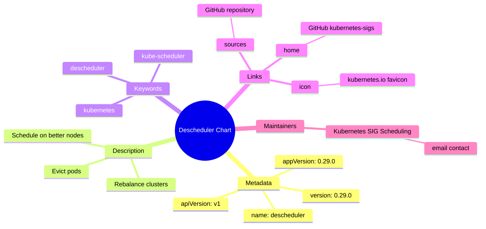
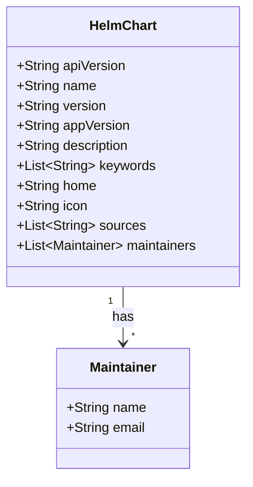
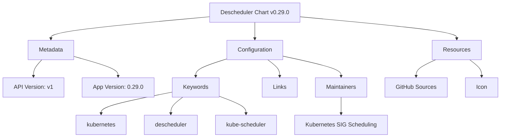
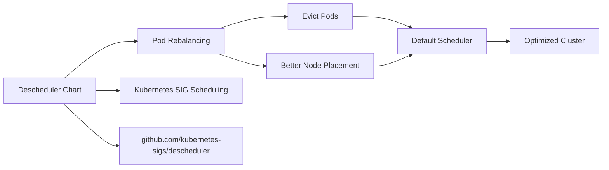

# Diagram: devops/k8s/descheduler/helm/Chart.yaml


> Auto-generated by Obscura crawlers

## Diagram 1

```mermaid
mindmap
    root((Descheduler Chart))
      Metadata
        apiVersion: v1...
  └ 139 lines...
```

> SVG rendering failed for this diagram.

## Diagram 2



### SVG

<svg id="container" width="100%" xmlns="http://www.w3.org/2000/svg" class="mindmapDiagram" style="max-width: 1124.5386962890625px;" viewBox="5 5 1124.5386962890625 589.4066772460938" role="graphics-document document" aria-roledescription="mindmap"><style>#container{font-family:"trebuchet ms",verdana,arial,sans-serif;font-size:16px;fill:#333;}@keyframes edge-animation-frame{from{stroke-dashoffset:0;}}@keyframes dash{to{stroke-dashoffset:0;}}#container .edge-animation-slow{stroke-dasharray:9,5!important;stroke-dashoffset:900;animation:dash 50s linear infinite;stroke-linecap:round;}#container .edge-animation-fast{stroke-dasharray:9,5!important;stroke-dashoffset:900;animation:dash 20s linear infinite;stroke-linecap:round;}#container .error-icon{fill:#552222;}#container .error-text{fill:#552222;stroke:#552222;}#container .edge-thickness-normal{stroke-width:1px;}#container .edge-thickness-thick{stroke-width:3.5px;}#container .edge-pattern-solid{stroke-dasharray:0;}#container .edge-thickness-invisible{stroke-width:0;fill:none;}#container .edge-pattern-dashed{stroke-dasharray:3;}#container .edge-pattern-dotted{stroke-dasharray:2;}#container .marker{fill:#333333;stroke:#333333;}#container .marker.cross{stroke:#333333;}#container svg{font-family:"trebuchet ms",verdana,arial,sans-serif;font-size:16px;}#container p{margin:0;}#container .edge{stroke-width:3;}#container .section--1 rect,#container .section--1 path,#container .section--1 circle,#container .section--1 polygon,#container .section--1 path{fill:hsl(240, 100%, 76.2745098039%);}#container .section--1 text{fill:#ffffff;}#container .node-icon--1{font-size:40px;color:#ffffff;}#container .section-edge--1{stroke:hsl(240, 100%, 76.2745098039%);}#container .edge-depth--1{stroke-width:17;}#container .section--1 line{stroke:hsl(60, 100%, 86.2745098039%);stroke-width:3;}#container .disabled,#container .disabled circle,#container .disabled text{fill:lightgray;}#container .disabled text{fill:#efefef;}#container .section-0 rect,#container .section-0 path,#container .section-0 circle,#container .section-0 polygon,#container .section-0 path{fill:hsl(60, 100%, 73.5294117647%);}#container .section-0 text{fill:black;}#container .node-icon-0{font-size:40px;color:black;}#container .section-edge-0{stroke:hsl(60, 100%, 73.5294117647%);}#container .edge-depth-0{stroke-width:14;}#container .section-0 line{stroke:hsl(240, 100%, 83.5294117647%);stroke-width:3;}#container .disabled,#container .disabled circle,#container .disabled text{fill:lightgray;}#container .disabled text{fill:#efefef;}#container .section-1 rect,#container .section-1 path,#container .section-1 circle,#container .section-1 polygon,#container .section-1 path{fill:hsl(80, 100%, 76.2745098039%);}#container .section-1 text{fill:black;}#container .node-icon-1{font-size:40px;color:black;}#container .section-edge-1{stroke:hsl(80, 100%, 76.2745098039%);}#container .edge-depth-1{stroke-width:11;}#container .section-1 line{stroke:hsl(260, 100%, 86.2745098039%);stroke-width:3;}#container .disabled,#container .disabled circle,#container .disabled text{fill:lightgray;}#container .disabled text{fill:#efefef;}#container .section-2 rect,#container .section-2 path,#container .section-2 circle,#container .section-2 polygon,#container .section-2 path{fill:hsl(270, 100%, 76.2745098039%);}#container .section-2 text{fill:#ffffff;}#container .node-icon-2{font-size:40px;color:#ffffff;}#container .section-edge-2{stroke:hsl(270, 100%, 76.2745098039%);}#container .edge-depth-2{stroke-width:8;}#container .section-2 line{stroke:hsl(90, 100%, 86.2745098039%);stroke-width:3;}#container .disabled,#container .disabled circle,#container .disabled text{fill:lightgray;}#container .disabled text{fill:#efefef;}#container .section-3 rect,#container .section-3 path,#container .section-3 circle,#container .section-3 polygon,#container .section-3 path{fill:hsl(300, 100%, 76.2745098039%);}#container .section-3 text{fill:black;}#container .node-icon-3{font-size:40px;color:black;}#container .section-edge-3{stroke:hsl(300, 100%, 76.2745098039%);}#container .edge-depth-3{stroke-width:5;}#container .section-3 line{stroke:hsl(120, 100%, 86.2745098039%);stroke-width:3;}#container .disabled,#container .disabled circle,#container .disabled text{fill:lightgray;}#container .disabled text{fill:#efefef;}#container .section-4 rect,#container .section-4 path,#container .section-4 circle,#container .section-4 polygon,#container .section-4 path{fill:hsl(330, 100%, 76.2745098039%);}#container .section-4 text{fill:black;}#container .node-icon-4{font-size:40px;color:black;}#container .section-edge-4{stroke:hsl(330, 100%, 76.2745098039%);}#container .edge-depth-4{stroke-width:2;}#container .section-4 line{stroke:hsl(150, 100%, 86.2745098039%);stroke-width:3;}#container .disabled,#container .disabled circle,#container .disabled text{fill:lightgray;}#container .disabled text{fill:#efefef;}#container .section-5 rect,#container .section-5 path,#container .section-5 circle,#container .section-5 polygon,#container .section-5 path{fill:hsl(0, 100%, 76.2745098039%);}#container .section-5 text{fill:black;}#container .node-icon-5{font-size:40px;color:black;}#container .section-edge-5{stroke:hsl(0, 100%, 76.2745098039%);}#container .edge-depth-5{stroke-width:-1;}#container .section-5 line{stroke:hsl(180, 100%, 86.2745098039%);stroke-width:3;}#container .disabled,#container .disabled circle,#container .disabled text{fill:lightgray;}#container .disabled text{fill:#efefef;}#container .section-6 rect,#container .section-6 path,#container .section-6 circle,#container .section-6 polygon,#container .section-6 path{fill:hsl(30, 100%, 76.2745098039%);}#container .section-6 text{fill:black;}#container .node-icon-6{font-size:40px;color:black;}#container .section-edge-6{stroke:hsl(30, 100%, 76.2745098039%);}#container .edge-depth-6{stroke-width:-4;}#container .section-6 line{stroke:hsl(210, 100%, 86.2745098039%);stroke-width:3;}#container .disabled,#container .disabled circle,#container .disabled text{fill:lightgray;}#container .disabled text{fill:#efefef;}#container .section-7 rect,#container .section-7 path,#container .section-7 circle,#container .section-7 polygon,#container .section-7 path{fill:hsl(90, 100%, 76.2745098039%);}#container .section-7 text{fill:black;}#container .node-icon-7{font-size:40px;color:black;}#container .section-edge-7{stroke:hsl(90, 100%, 76.2745098039%);}#container .edge-depth-7{stroke-width:-7;}#container .section-7 line{stroke:hsl(270, 100%, 86.2745098039%);stroke-width:3;}#container .disabled,#container .disabled circle,#container .disabled text{fill:lightgray;}#container .disabled text{fill:#efefef;}#container .section-8 rect,#container .section-8 path,#container .section-8 circle,#container .section-8 polygon,#container .section-8 path{fill:hsl(150, 100%, 76.2745098039%);}#container .section-8 text{fill:black;}#container .node-icon-8{font-size:40px;color:black;}#container .section-edge-8{stroke:hsl(150, 100%, 76.2745098039%);}#container .edge-depth-8{stroke-width:-10;}#container .section-8 line{stroke:hsl(330, 100%, 86.2745098039%);stroke-width:3;}#container .disabled,#container .disabled circle,#container .disabled text{fill:lightgray;}#container .disabled text{fill:#efefef;}#container .section-9 rect,#container .section-9 path,#container .section-9 circle,#container .section-9 polygon,#container .section-9 path{fill:hsl(180, 100%, 76.2745098039%);}#container .section-9 text{fill:black;}#container .node-icon-9{font-size:40px;color:black;}#container .section-edge-9{stroke:hsl(180, 100%, 76.2745098039%);}#container .edge-depth-9{stroke-width:-13;}#container .section-9 line{stroke:hsl(0, 100%, 86.2745098039%);stroke-width:3;}#container .disabled,#container .disabled circle,#container .disabled text{fill:lightgray;}#container .disabled text{fill:#efefef;}#container .section-10 rect,#container .section-10 path,#container .section-10 circle,#container .section-10 polygon,#container .section-10 path{fill:hsl(210, 100%, 76.2745098039%);}#container .section-10 text{fill:black;}#container .node-icon-10{font-size:40px;color:black;}#container .section-edge-10{stroke:hsl(210, 100%, 76.2745098039%);}#container .edge-depth-10{stroke-width:-16;}#container .section-10 line{stroke:hsl(30, 100%, 86.2745098039%);stroke-width:3;}#container .disabled,#container .disabled circle,#container .disabled text{fill:lightgray;}#container .disabled text{fill:#efefef;}#container .section-root rect,#container .section-root path,#container .section-root circle,#container .section-root polygon{fill:hsl(240, 100%, 46.2745098039%);}#container .section-root text{fill:#ffffff;}#container .section-root span{color:#ffffff;}#container .section-2 span{color:#ffffff;}#container .icon-container{height:100%;display:flex;justify-content:center;align-items:center;}#container .edge{fill:none;}#container .mindmap-node-label{dy:1em;alignment-baseline:middle;text-anchor:middle;dominant-baseline:middle;text-align:center;}#container :root{--mermaid-font-family:"trebuchet ms",verdana,arial,sans-serif;}</style><g><marker id="container_mindmap-pointEnd" class="marker mindmap" viewBox="0 0 10 10" refX="5" refY="5" markerUnits="userSpaceOnUse" markerWidth="8" markerHeight="8" orient="auto"><path d="M 0 0 L 10 5 L 0 10 z" class="arrowMarkerPath" style="stroke-width: 1; stroke-dasharray: 1, 0;"></path></marker><marker id="container_mindmap-pointStart" class="marker mindmap" viewBox="0 0 10 10" refX="4.5" refY="5" markerUnits="userSpaceOnUse" markerWidth="8" markerHeight="8" orient="auto"><path d="M 0 5 L 10 10 L 10 0 z" class="arrowMarkerPath" style="stroke-width: 1; stroke-dasharray: 1, 0;"></path></marker><g class="subgraphs"></g><g class="edgePaths"><path d="M439.503,351.383L447.159,361.084C454.816,370.785,470.128,390.188,485.441,409.59C500.754,428.993,516.067,448.396,523.723,458.097L531.38,467.798" id="edge_0_1" class="edge-thickness-normal edge-pattern-solid edge section-edge-0 edge-depth-1" style="undefined;;;undefined" data-edge="true" data-et="edge" data-id="edge_0_1" data-points="W3sieCI6NDM5LjUwMjkwMDc0MzA0NywieSI6MzUxLjM4MjUwOTk1NTc1MDR9LHsieCI6NDg1LjQ0MTI4Mzg4MTYxMjY2LCJ5Ijo0MDkuNTkwNDIzNTAxMTU5OX0seyJ4Ijo1MzEuMzc5NjY3MDIwMTc4MywieSI6NDY3Ljc5ODMzNzA0NjU2OTR9XQ=="></path><path d="M554.872,474.739L565.039,471.277C575.206,467.816,595.539,460.893,615.873,453.97C636.206,447.047,656.54,440.124,666.707,436.662L676.873,433.201" id="edge_1_2" class="edge-thickness-normal edge-pattern-solid edge section-edge-0 edge-depth-3" style="undefined;;;undefined" data-edge="true" data-et="edge" data-id="edge_1_2" data-points="W3sieCI6NTU0Ljg3MTk4ODA5MjAyNDMsInkiOjQ3NC43Mzg1NTE4MjA1MjUzNH0seyJ4Ijo2MTUuODcyNjM2NTg3NzM0MiwieSI6NDUzLjk2OTY0OTYxNzAyNDJ9LHsieCI6Njc2Ljg3MzI4NTA4MzQ0NDEsInkiOjQzMy4yMDA3NDc0MTM1MjN9XQ=="></path><path d="M555.327,482.773L568.637,485.68C581.947,488.586,608.568,494.399,635.188,500.212C661.808,506.025,688.429,511.838,701.739,514.745L715.049,517.651" id="edge_1_3" class="edge-thickness-normal edge-pattern-solid edge section-edge-0 edge-depth-3" style="undefined;;;undefined" data-edge="true" data-et="edge" data-id="edge_1_3" data-points="W3sieCI6NTU1LjMyNzEwNjYzMzI0NzcsInkiOjQ4Mi43NzMxNjEyODMxNzg2NH0seyJ4Ijo2MzUuMTg4MDUzOTcwNTcyOCwieSI6NTAwLjIxMjA4NjY5NDQ3MjY1fSx7IngiOjcxNS4wNDkwMDEzMDc4OTc5LCJ5Ijo1MTcuNjUxMDEyMTA1NzY2N31d"></path><path d="M526.24,483.66L514.635,486.946C503.03,490.232,479.821,496.804,456.611,503.377C433.402,509.949,410.192,516.521,398.587,519.807L386.983,523.094" id="edge_1_4" class="edge-thickness-normal edge-pattern-solid edge section-edge-0 edge-depth-3" style="undefined;;;undefined" data-edge="true" data-et="edge" data-id="edge_1_4" data-points="W3sieCI6NTI2LjIzOTkxODA3NTgwNTgsInkiOjQ4My42NTk5NDc5ODQwNjIxfSx7IngiOjQ1Ni42MTEyOTYxOTYwMTg1LCJ5Ijo1MDMuMzc2NzYwNzM3NDkyNH0seyJ4IjozODYuOTgyNjc0MzE2MjMxMTcsInkiOjUyMy4wOTM1NzM0OTA5MjI3fV0="></path><path d="M544.732,494.013L546.113,498.926C547.494,503.839,550.256,513.664,553.017,523.49C555.779,533.315,558.541,543.141,559.922,548.054L561.303,552.966" id="edge_1_5" class="edge-thickness-normal edge-pattern-solid edge section-edge-0 edge-depth-3" style="undefined;;;undefined" data-edge="true" data-et="edge" data-id="edge_1_5" data-points="W3sieCI6NTQ0LjczMTYxMjMxMjAxNTgsInkiOjQ5NC4wMTM0MDQ2NzQ4NDU0NX0seyJ4Ijo1NTMuMDE3NDU3MTY2NzQzLCJ5Ijo1MjMuNDg5ODgzNTU0MDAxMn0seyJ4Ijo1NjEuMzAzMzAyMDIxNDcwMiwieSI6NTUyLjk2NjM2MjQzMzE1Njl9XQ=="></path><path d="M415.977,344.342L403.152,348.608C390.326,352.875,364.676,361.407,339.025,369.939C313.375,378.472,287.724,387.004,274.899,391.27L262.073,395.537" id="edge_0_6" class="edge-thickness-normal edge-pattern-solid edge section-edge-1 edge-depth-1" style="undefined;;;undefined" data-edge="true" data-et="edge" data-id="edge_0_6" data-points="W3sieCI6NDE1Ljk3NjkyMzUxNzQzOTU2LCJ5IjozNDQuMzQyMjkxNzQ3NDQxMTV9LHsieCI6MzM5LjAyNTE5Mjk5Mzc4ODA0LCJ5IjozNjkuOTM5NDQxNjE5NTQ4OX0seyJ4IjoyNjIuMDczNDYyNDcwMTM2NSwieSI6Mzk1LjUzNjU5MTQ5MTY1Njd9XQ=="></path><path d="M238.545,412.044L235.047,416.473C231.55,420.902,224.555,429.76,217.561,438.618C210.566,447.476,203.572,456.334,200.075,460.763L196.577,465.192" id="edge_6_7" class="edge-thickness-normal edge-pattern-solid edge section-edge-1 edge-depth-3" style="undefined;;;undefined" data-edge="true" data-et="edge" data-id="edge_6_7" data-points="W3sieCI6MjM4LjU0NDU0MTA5MTczNjM2LCJ5Ijo0MTIuMDQzNTI5MDYxNTU0Mn0seyJ4IjoyMTcuNTYwOTU4MDM0NTEzNzYsInkiOjQzOC42MTc4ODAzMTE2NzI4fSx7IngiOjE5Ni41NzczNzQ5NzcyOTExNiwieSI6NDY1LjE5MjIzMTU2MTc5MTQ2fV0="></path><path d="M232.885,401.434L220.732,402.378C208.579,403.323,184.273,405.213,159.967,407.102C135.661,408.991,111.355,410.881,99.202,411.826L87.049,412.77" id="edge_6_8" class="edge-thickness-normal edge-pattern-solid edge section-edge-1 edge-depth-3" style="undefined;;;undefined" data-edge="true" data-et="edge" data-id="edge_6_8" data-points="W3sieCI6MjMyLjg4NTM2ODIxNzI5ODk3LCJ5Ijo0MDEuNDMzNjQzMTAxMjM5NDV9LHsieCI6MTU5Ljk2NzAwMDU4ODY2OTYzLCJ5Ijo0MDcuMTAyMDExMDMwODIxMTN9LHsieCI6ODcuMDQ4NjMyOTYwMDQwMywieSI6NDEyLjc3MDM3ODk2MDQwMjh9XQ=="></path><path d="M235.556,391.663L229.978,387.753C224.4,383.844,213.243,376.026,202.087,368.207C190.93,360.389,179.774,352.57,174.196,348.661L168.618,344.752" id="edge_6_9" class="edge-thickness-normal edge-pattern-solid edge section-edge-1 edge-depth-3" style="undefined;;;undefined" data-edge="true" data-et="edge" data-id="edge_6_9" data-points="W3sieCI6MjM1LjU1NjM4MzI5NTMyNiwieSI6MzkxLjY2MjU5NDgwNDIzMTl9LHsieCI6MjAyLjA4Njk2ODM4MTExMTgzLCJ5IjozNjguMjA3MjcyODc0OTk0NX0seyJ4IjoxNjguNjE3NTUzNDY2ODk3NjgsInkiOjM0NC43NTE5NTA5NDU3NTcxfV0="></path><path d="M417.995,330.903L407.729,323.587C397.464,316.271,376.933,301.64,356.402,287.009C335.871,272.378,315.341,257.747,305.075,250.432L294.81,243.116" id="edge_0_10" class="edge-thickness-normal edge-pattern-solid edge section-edge-2 edge-depth-1" style="undefined;;;undefined" data-edge="true" data-et="edge" data-id="edge_0_10" data-points="W3sieCI6NDE3Ljk5NDYxOTQzMzc5NDgsInkiOjMzMC45MDI1MzExMDAxMTE4fSx7IngiOjM1Ni40MDIxOTMzNzg2NzU4LCJ5IjoyODcuMDA5NDM1NjQzNjA0NDN9LHsieCI6Mjk0LjgwOTc2NzMyMzU1NjgsInkiOjI0My4xMTYzNDAxODcwOTcwOH1d"></path><path d="M269.792,226.594L263.314,222.638C256.835,218.683,243.878,210.771,230.922,202.86C217.965,194.948,205.008,187.037,198.53,183.081L192.051,179.125" id="edge_10_11" class="edge-thickness-normal edge-pattern-solid edge section-edge-2 edge-depth-3" style="undefined;;;undefined" data-edge="true" data-et="edge" data-id="edge_10_11" data-points="W3sieCI6MjY5Ljc5MjEyODg5MjE4MiwieSI6MjI2LjU5NDA5MTMwMzA2NTIzfSx7IngiOjIzMC45MjE2Mjc5NDcyMzMwNSwieSI6MjAyLjg1OTY2MTIyODEyNjkyfSx7IngiOjE5Mi4wNTExMjcwMDIyODQxLCJ5IjoxNzkuMTI1MjMxMTUzMTg4NjJ9XQ=="></path><path d="M293.002,223.61L297.144,219.311C301.285,215.013,309.569,206.416,317.852,197.82C326.135,189.223,334.419,180.627,338.56,176.328L342.702,172.03" id="edge_10_12" class="edge-thickness-normal edge-pattern-solid edge section-edge-2 edge-depth-3" style="undefined;;;undefined" data-edge="true" data-et="edge" data-id="edge_10_12" data-points="W3sieCI6MjkzLjAwMjIxMDY0NTEyMDMsInkiOjIyMy42MDk1MDkwMjE2MDYzfSx7IngiOjMxNy44NTIwNTg3ODIyMzY4NCwieSI6MTk3LjgxOTgyODY4NzkwOTJ9LHsieCI6MzQyLjcwMTkwNjkxOTM1MzQsInkiOjE3Mi4wMzAxNDgzNTQyMTIxfV0="></path><path d="M267.62,235.284L254.484,236.05C241.348,236.817,215.077,238.349,188.806,239.881C162.535,241.413,136.263,242.945,123.128,243.711L109.992,244.477" id="edge_10_13" class="edge-thickness-normal edge-pattern-solid edge section-edge-2 edge-depth-3" style="undefined;;;undefined" data-edge="true" data-et="edge" data-id="edge_10_13" data-points="W3sieCI6MjY3LjYxOTY5NTg0MzcxMjYsInkiOjIzNS4yODQ0MTA4MTI5NTAyM30seyJ4IjoxODguODA1ODM2MjE3MDc2MTUsInkiOjIzOS44ODA4MDAzNzY1NzU5Nn0seyJ4IjoxMDkuOTkxOTc2NTkwNDM5NzIsInkiOjI0NC40NzcxODk5NDAyMDE3fV0="></path><path d="M440.549,328.74L449.554,319.276C458.559,309.811,476.57,290.881,494.58,271.951C512.59,253.021,530.6,234.091,539.605,224.626L548.61,215.161" id="edge_0_14" class="edge-thickness-normal edge-pattern-solid edge section-edge-3 edge-depth-1" style="undefined;;;undefined" data-edge="true" data-et="edge" data-id="edge_0_14" data-points="W3sieCI6NDQwLjU0OTQyNTgwMzA0MjcsInkiOjMyOC43NDA0MzA3NjU1NzgyNX0seyJ4Ijo0OTQuNTc5NTYzODk0MzE3ODYsInkiOjI3MS45NTA4NjU2NzI3NTk1fSx7IngiOjU0OC42MDk3MDE5ODU1OTMsInkiOjIxNS4xNjEzMDA1Nzk5NDA3Nn1d"></path><path d="M572.086,197.053L579.145,193.162C586.205,189.271,600.323,181.489,614.442,173.707C628.561,165.926,642.68,158.144,649.739,154.253L656.799,150.362" id="edge_14_15" class="edge-thickness-normal edge-pattern-solid edge section-edge-3 edge-depth-3" style="undefined;;;undefined" data-edge="true" data-et="edge" data-id="edge_14_15" data-points="W3sieCI6NTcyLjA4NTcwMjUxNzgwMjQsInkiOjE5Ny4wNTMzMjE3MTIzNDM5NH0seyJ4Ijo2MTQuNDQyMTQwNzU2NjMwMSwieSI6MTczLjcwNzQ2NzQ4MzE0NzU4fSx7IngiOjY1Ni43OTg1Nzg5OTU0NTc5LCJ5IjoxNTAuMzYxNjEzMjUzOTUxMjJ9XQ=="></path><path d="M683.717,137.2L692.131,133.585C700.545,129.969,717.373,122.739,734.201,115.509C751.029,108.279,767.856,101.049,776.27,97.434L784.684,93.819" id="edge_15_16" class="edge-thickness-normal edge-pattern-solid edge section-edge-3 edge-depth-5" style="undefined;;;undefined" data-edge="true" data-et="edge" data-id="edge_15_16" data-points="W3sieCI6NjgzLjcxNzA1OTU3OTA2NDIsInkiOjEzNy4xOTk1ODk3NDI2NDA0OH0seyJ4Ijo3MzQuMjAwNjcwMjI4NjQ4LCJ5IjoxMTUuNTA5MTM4MTU4MDk0OH0seyJ4Ijo3ODQuNjg0MjgwODc4MjMxOSwieSI6OTMuODE4Njg2NTczNTQ5MTJ9XQ=="></path><path d="M573.126,209.193L581.238,211.997C589.351,214.8,605.575,220.407,621.799,226.014C638.024,231.621,654.248,237.228,662.36,240.031L670.473,242.834" id="edge_14_17" class="edge-thickness-normal edge-pattern-solid edge section-edge-3 edge-depth-3" style="undefined;;;undefined" data-edge="true" data-et="edge" data-id="edge_14_17" data-points="W3sieCI6NTczLjEyNjI5NDA0Nzk0NzUsInkiOjIwOS4xOTMzNjI3ODkwNjk4NX0seyJ4Ijo2MjEuNzk5NDU3ODcxNjkwNSwieSI6MjI2LjAxMzg2ODEzOTU1NDIzfSx7IngiOjY3MC40NzI2MjE2OTU0MzM1LCJ5IjoyNDIuODM0MzczNDkwMDM4NjJ9XQ=="></path><path d="M699.505,245.652L712.543,243.824C725.581,241.997,751.658,238.342,777.735,234.688C803.812,231.033,829.888,227.378,842.927,225.551L855.965,223.724" id="edge_17_18" class="edge-thickness-normal edge-pattern-solid edge section-edge-3 edge-depth-5" style="undefined;;;undefined" data-edge="true" data-et="edge" data-id="edge_17_18" data-points="W3sieCI6Njk5LjUwNDczODEwNDg1NiwieSI6MjQ1LjY1MTgzODAzMDEzNjN9LHsieCI6Nzc3LjczNDk1ODQzNTk1OTQsInkiOjIzNC42ODc2OTA4NTEyODI4fSx7IngiOjg1NS45NjUxNzg3NjcwNjI4LCJ5IjoyMjMuNzIzNTQzNjcyNDI5MzJ9XQ=="></path><path d="M553.342,190.381L551.407,185.579C549.472,180.778,545.602,171.174,541.732,161.57C537.862,151.967,533.992,142.363,532.056,137.561L530.121,132.76" id="edge_14_19" class="edge-thickness-normal edge-pattern-solid edge section-edge-3 edge-depth-3" style="undefined;;;undefined" data-edge="true" data-et="edge" data-id="edge_14_19" data-points="W3sieCI6NTUzLjM0MjI5ODAwNzI2OTMsInkiOjE5MC4zODExOTg0NTgzMjk4fSx7IngiOjU0MS43MzE4NjIwOTEwOTUsInkiOjE2MS41NzA0MjA4MjY0Nzk1fSx7IngiOjUzMC4xMjE0MjYxNzQ5MjA3LCJ5IjoxMzIuNzU5NjQzMTk0NjI5Mn1d"></path><path d="M521.358,104.183L520.326,99.39C519.294,94.596,517.231,85.01,515.167,75.423C513.103,65.837,511.04,56.251,510.008,51.457L508.976,46.664" id="edge_19_20" class="edge-thickness-normal edge-pattern-solid edge section-edge-3 edge-depth-5" style="undefined;;;undefined" data-edge="true" data-et="edge" data-id="edge_19_20" data-points="W3sieCI6NTIxLjM1Nzk3NTY4ODk1MTEsInkiOjEwNC4xODI4MTIxNDgwMzI0N30seyJ4Ijo1MTUuMTY2OTAzMzg1MTQyNywieSI6NzUuNDIzNDQwMTQ3NTEwNTh9LHsieCI6NTA4Ljk3NTgzMTA4MTMzNDQsInkiOjQ2LjY2NDA2ODE0Njk4ODY4fV0="></path><path d="M445.204,340.045L458.691,340.438C472.178,340.831,499.152,341.617,526.126,342.404C553.1,343.19,580.073,343.976,593.56,344.369L607.047,344.763" id="edge_0_21" class="edge-thickness-normal edge-pattern-solid edge section-edge-4 edge-depth-1" style="undefined;;;undefined" data-edge="true" data-et="edge" data-id="edge_0_21" data-points="W3sieCI6NDQ1LjIwMzc2NTk0ODM3Nzc0LCJ5IjozNDAuMDQ0ODM0MzkxNzI2NX0seyJ4Ijo1MjYuMTI1NTkwNzE2NTAzOCwieSI6MzQyLjQwMzcwNTg4ODQ4Mjd9LHsieCI6NjA3LjA0NzQxNTQ4NDYyOTgsInkiOjM0NC43NjI1NzczODUyMzg5fV0="></path><path d="M637.012,346.138L654.083,347.208C671.154,348.277,705.297,350.417,739.44,352.557C773.582,354.697,807.725,356.836,824.796,357.906L841.868,358.976" id="edge_21_22" class="edge-thickness-normal edge-pattern-solid edge section-edge-4 edge-depth-3" style="undefined;;;undefined" data-edge="true" data-et="edge" data-id="edge_21_22" data-points="W3sieCI6NjM3LjAxMTY3ODA1MDc3ODEsInkiOjM0Ni4xMzc4Mjg2ODI2ODUxNX0seyJ4Ijo3MzkuNDM5NzQ2ODEzNjEzNCwieSI6MzUyLjU1Njg0MTI3Mjg3MTM0fSx7IngiOjg0MS44Njc4MTU1NzY0NDg3LCJ5IjozNTguOTc1ODUzODYzMDU3NX1d"></path><path d="M871.442,356.488L885.132,353.276C898.822,350.064,926.203,343.64,953.583,337.216C980.963,330.792,1008.344,324.368,1022.034,321.156L1035.724,317.944" id="edge_22_23" class="edge-thickness-normal edge-pattern-solid edge section-edge-4 edge-depth-5" style="undefined;;;undefined" data-edge="true" data-et="edge" data-id="edge_22_23" data-points="W3sieCI6ODcxLjQ0MTkwNjQxODQ4MTIsInkiOjM1Ni40ODc4MjIyNjYxMDk4fSx7IngiOjk1My41ODMwODg0MTc2MjY5LCJ5IjozMzcuMjE2MTEyMTQ2MTA0OH0seyJ4IjoxMDM1LjcyNDI3MDQxNjc3MjUsInkiOjMxNy45NDQ0MDIwMjYwOTk4NX1d"></path></g><g class="edgeLabels"><g class="edgeLabel"><g class="label" data-id="edge_0_1" transform="translate(0, 0)"><foreignObject width="0" height="0"><div xmlns="http://www.w3.org/1999/xhtml" class="labelBkg" style="display: table-cell; white-space: nowrap; line-height: 1.5; max-width: 200px; text-align: center;"><span class="edgeLabel"></span></div></foreignObject></g></g><g class="edgeLabel"><g class="label" data-id="edge_1_2" transform="translate(0, 0)"><foreignObject width="0" height="0"><div xmlns="http://www.w3.org/1999/xhtml" class="labelBkg" style="display: table-cell; white-space: nowrap; line-height: 1.5; max-width: 200px; text-align: center;"><span class="edgeLabel"></span></div></foreignObject></g></g><g class="edgeLabel"><g class="label" data-id="edge_1_3" transform="translate(0, 0)"><foreignObject width="0" height="0"><div xmlns="http://www.w3.org/1999/xhtml" class="labelBkg" style="display: table-cell; white-space: nowrap; line-height: 1.5; max-width: 200px; text-align: center;"><span class="edgeLabel"></span></div></foreignObject></g></g><g class="edgeLabel"><g class="label" data-id="edge_1_4" transform="translate(0, 0)"><foreignObject width="0" height="0"><div xmlns="http://www.w3.org/1999/xhtml" class="labelBkg" style="display: table-cell; white-space: nowrap; line-height: 1.5; max-width: 200px; text-align: center;"><span class="edgeLabel"></span></div></foreignObject></g></g><g class="edgeLabel"><g class="label" data-id="edge_1_5" transform="translate(0, 0)"><foreignObject width="0" height="0"><div xmlns="http://www.w3.org/1999/xhtml" class="labelBkg" style="display: table-cell; white-space: nowrap; line-height: 1.5; max-width: 200px; text-align: center;"><span class="edgeLabel"></span></div></foreignObject></g></g><g class="edgeLabel"><g class="label" data-id="edge_0_6" transform="translate(0, 0)"><foreignObject width="0" height="0"><div xmlns="http://www.w3.org/1999/xhtml" class="labelBkg" style="display: table-cell; white-space: nowrap; line-height: 1.5; max-width: 200px; text-align: center;"><span class="edgeLabel"></span></div></foreignObject></g></g><g class="edgeLabel"><g class="label" data-id="edge_6_7" transform="translate(0, 0)"><foreignObject width="0" height="0"><div xmlns="http://www.w3.org/1999/xhtml" class="labelBkg" style="display: table-cell; white-space: nowrap; line-height: 1.5; max-width: 200px; text-align: center;"><span class="edgeLabel"></span></div></foreignObject></g></g><g class="edgeLabel"><g class="label" data-id="edge_6_8" transform="translate(0, 0)"><foreignObject width="0" height="0"><div xmlns="http://www.w3.org/1999/xhtml" class="labelBkg" style="display: table-cell; white-space: nowrap; line-height: 1.5; max-width: 200px; text-align: center;"><span class="edgeLabel"></span></div></foreignObject></g></g><g class="edgeLabel"><g class="label" data-id="edge_6_9" transform="translate(0, 0)"><foreignObject width="0" height="0"><div xmlns="http://www.w3.org/1999/xhtml" class="labelBkg" style="display: table-cell; white-space: nowrap; line-height: 1.5; max-width: 200px; text-align: center;"><span class="edgeLabel"></span></div></foreignObject></g></g><g class="edgeLabel"><g class="label" data-id="edge_0_10" transform="translate(0, 0)"><foreignObject width="0" height="0"><div xmlns="http://www.w3.org/1999/xhtml" class="labelBkg" style="display: table-cell; white-space: nowrap; line-height: 1.5; max-width: 200px; text-align: center;"><span class="edgeLabel"></span></div></foreignObject></g></g><g class="edgeLabel"><g class="label" data-id="edge_10_11" transform="translate(0, 0)"><foreignObject width="0" height="0"><div xmlns="http://www.w3.org/1999/xhtml" class="labelBkg" style="display: table-cell; white-space: nowrap; line-height: 1.5; max-width: 200px; text-align: center;"><span class="edgeLabel"></span></div></foreignObject></g></g><g class="edgeLabel"><g class="label" data-id="edge_10_12" transform="translate(0, 0)"><foreignObject width="0" height="0"><div xmlns="http://www.w3.org/1999/xhtml" class="labelBkg" style="display: table-cell; white-space: nowrap; line-height: 1.5; max-width: 200px; text-align: center;"><span class="edgeLabel"></span></div></foreignObject></g></g><g class="edgeLabel"><g class="label" data-id="edge_10_13" transform="translate(0, 0)"><foreignObject width="0" height="0"><div xmlns="http://www.w3.org/1999/xhtml" class="labelBkg" style="display: table-cell; white-space: nowrap; line-height: 1.5; max-width: 200px; text-align: center;"><span class="edgeLabel"></span></div></foreignObject></g></g><g class="edgeLabel"><g class="label" data-id="edge_0_14" transform="translate(0, 0)"><foreignObject width="0" height="0"><div xmlns="http://www.w3.org/1999/xhtml" class="labelBkg" style="display: table-cell; white-space: nowrap; line-height: 1.5; max-width: 200px; text-align: center;"><span class="edgeLabel"></span></div></foreignObject></g></g><g class="edgeLabel"><g class="label" data-id="edge_14_15" transform="translate(0, 0)"><foreignObject width="0" height="0"><div xmlns="http://www.w3.org/1999/xhtml" class="labelBkg" style="display: table-cell; white-space: nowrap; line-height: 1.5; max-width: 200px; text-align: center;"><span class="edgeLabel"></span></div></foreignObject></g></g><g class="edgeLabel"><g class="label" data-id="edge_15_16" transform="translate(0, 0)"><foreignObject width="0" height="0"><div xmlns="http://www.w3.org/1999/xhtml" class="labelBkg" style="display: table-cell; white-space: nowrap; line-height: 1.5; max-width: 200px; text-align: center;"><span class="edgeLabel"></span></div></foreignObject></g></g><g class="edgeLabel"><g class="label" data-id="edge_14_17" transform="translate(0, 0)"><foreignObject width="0" height="0"><div xmlns="http://www.w3.org/1999/xhtml" class="labelBkg" style="display: table-cell; white-space: nowrap; line-height: 1.5; max-width: 200px; text-align: center;"><span class="edgeLabel"></span></div></foreignObject></g></g><g class="edgeLabel"><g class="label" data-id="edge_17_18" transform="translate(0, 0)"><foreignObject width="0" height="0"><div xmlns="http://www.w3.org/1999/xhtml" class="labelBkg" style="display: table-cell; white-space: nowrap; line-height: 1.5; max-width: 200px; text-align: center;"><span class="edgeLabel"></span></div></foreignObject></g></g><g class="edgeLabel"><g class="label" data-id="edge_14_19" transform="translate(0, 0)"><foreignObject width="0" height="0"><div xmlns="http://www.w3.org/1999/xhtml" class="labelBkg" style="display: table-cell; white-space: nowrap; line-height: 1.5; max-width: 200px; text-align: center;"><span class="edgeLabel"></span></div></foreignObject></g></g><g class="edgeLabel"><g class="label" data-id="edge_19_20" transform="translate(0, 0)"><foreignObject width="0" height="0"><div xmlns="http://www.w3.org/1999/xhtml" class="labelBkg" style="display: table-cell; white-space: nowrap; line-height: 1.5; max-width: 200px; text-align: center;"><span class="edgeLabel"></span></div></foreignObject></g></g><g class="edgeLabel"><g class="label" data-id="edge_0_21" transform="translate(0, 0)"><foreignObject width="0" height="0"><div xmlns="http://www.w3.org/1999/xhtml" class="labelBkg" style="display: table-cell; white-space: nowrap; line-height: 1.5; max-width: 200px; text-align: center;"><span class="edgeLabel"></span></div></foreignObject></g></g><g class="edgeLabel"><g class="label" data-id="edge_21_22" transform="translate(0, 0)"><foreignObject width="0" height="0"><div xmlns="http://www.w3.org/1999/xhtml" class="labelBkg" style="display: table-cell; white-space: nowrap; line-height: 1.5; max-width: 200px; text-align: center;"><span class="edgeLabel"></span></div></foreignObject></g></g><g class="edgeLabel"><g class="label" data-id="edge_22_23" transform="translate(0, 0)"><foreignObject width="0" height="0"><div xmlns="http://www.w3.org/1999/xhtml" class="labelBkg" style="display: table-cell; white-space: nowrap; line-height: 1.5; max-width: 200px; text-align: center;"><span class="edgeLabel"></span></div></foreignObject></g></g></g><g class="nodes"><g class="node mindmap-node section-root section--1" id="node_0" transform="translate(430.2101348102368, 339.60776998758115)"><circle class="basic label-container" style="" r="76.8515625" cx="0" cy="0"></circle><g class="label" style="" transform="translate(-66.8515625, -12)"><rect></rect><foreignObject width="133.703125" height="24"><div xmlns="http://www.w3.org/1999/xhtml" style="display: table-cell; white-space: nowrap; line-height: 1.5; max-width: 200px; text-align: center;"><span class="nodeLabel"><p>Descheduler Chart</p></span></div></foreignObject></g></g><g class="node mindmap-node section-0" id="node_1" transform="translate(540.6724329529885, 479.5730770147386)"><path id="node-1" class="node-bkg node-0" style="" d="M-54.09375 12
    v-24
    q0,-5 5,-5
    h98.1875
    q5,0 5,5
    v24
    q0,5 -5,5
    h-98.1875
    q-5,0 -5,-5
    Z"></path><line class="node-line-" x1="-54.09375" y1="17" x2="54.09375" y2="17"></line><g class="label" style="" transform="translate(-34.09375, -12)"><rect></rect><foreignObject width="68.1875" height="24"><div xmlns="http://www.w3.org/1999/xhtml" style="display: table-cell; white-space: nowrap; line-height: 1.5; max-width: 200px; text-align: center;"><span class="nodeLabel"><p>Metadata</p></span></div></foreignObject></g></g><g class="node mindmap-node section-0" id="node_2" transform="translate(691.0728402224798, 428.36622221930975)"><path id="node-2" class="node-bkg node-0" style="" d="M-69.734375 12
    v-24
    q0,-5 5,-5
    h129.46875
    q5,0 5,5
    v24
    q0,5 -5,5
    h-129.46875
    q-5,0 -5,-5
    Z"></path><line class="node-line-" x1="-69.734375" y1="17" x2="69.734375" y2="17"></line><g class="label" style="" transform="translate(-49.734375, -12)"><rect></rect><foreignObject width="99.46875" height="24"><div xmlns="http://www.w3.org/1999/xhtml" style="display: table-cell; white-space: nowrap; line-height: 1.5; max-width: 200px; text-align: center;"><span class="nodeLabel"><p>apiVersion: v1</p></span></div></foreignObject></g></g><g class="node mindmap-node section-0" id="node_3" transform="translate(729.7036749881571, 520.8510963742067)"><path id="node-3" class="node-bkg node-0" style="" d="M-89.2421875 12
    v-24
    q0,-5 5,-5
    h168.484375
    q5,0 5,5
    v24
    q0,5 -5,5
    h-168.484375
    q-5,0 -5,-5
    Z"></path><line class="node-line-" x1="-89.2421875" y1="17" x2="89.2421875" y2="17"></line><g class="label" style="" transform="translate(-69.2421875, -12)"><rect></rect><foreignObject width="138.484375" height="24"><div xmlns="http://www.w3.org/1999/xhtml" style="display: table-cell; white-space: nowrap; line-height: 1.5; max-width: 200px; text-align: center;"><span class="nodeLabel"><p>name: descheduler</p></span></div></foreignObject></g></g><g class="node mindmap-node section-0" id="node_4" transform="translate(372.55015943904846, 527.1804444602462)"><path id="node-4" class="node-bkg node-0" style="" d="M-70.84375 12
    v-24
    q0,-5 5,-5
    h131.6875
    q5,0 5,5
    v24
    q0,5 -5,5
    h-131.6875
    q-5,0 -5,-5
    Z"></path><line class="node-line-" x1="-70.84375" y1="17" x2="70.84375" y2="17"></line><g class="label" style="" transform="translate(-50.84375, -12)"><rect></rect><foreignObject width="101.6875" height="24"><div xmlns="http://www.w3.org/1999/xhtml" style="display: table-cell; white-space: nowrap; line-height: 1.5; max-width: 200px; text-align: center;"><span class="nodeLabel"><p>version: 0.29.0</p></span></div></foreignObject></g></g><g class="node mindmap-node section-0" id="node_5" transform="translate(565.3624813804976, 567.4066900932637)"><path id="node-5" class="node-bkg node-0" style="" d="M-85.046875 12
    v-24
    q0,-5 5,-5
    h160.09375
    q5,0 5,5
    v24
    q0,5 -5,5
    h-160.09375
    q-5,0 -5,-5
    Z"></path><line class="node-line-" x1="-85.046875" y1="17" x2="85.046875" y2="17"></line><g class="label" style="" transform="translate(-65.046875, -12)"><rect></rect><foreignObject width="130.09375" height="24"><div xmlns="http://www.w3.org/1999/xhtml" style="display: table-cell; white-space: nowrap; line-height: 1.5; max-width: 200px; text-align: center;"><span class="nodeLabel"><p>appVersion: 0.29.0</p></span></div></foreignObject></g></g><g class="node mindmap-node section-1" id="node_6" transform="translate(247.84025117733927, 400.2711132515167)"><path id="node-6" class="node-bkg node-0" style="" d="M-61.6796875 12
    v-24
    q0,-5 5,-5
    h113.359375
    q5,0 5,5
    v24
    q0,5 -5,5
    h-113.359375
    q-5,0 -5,-5
    Z"></path><line class="node-line-" x1="-61.6796875" y1="17" x2="61.6796875" y2="17"></line><g class="label" style="" transform="translate(-41.6796875, -12)"><rect></rect><foreignObject width="83.359375" height="24"><div xmlns="http://www.w3.org/1999/xhtml" style="display: table-cell; white-space: nowrap; line-height: 1.5; max-width: 200px; text-align: center;"><span class="nodeLabel"><p>Description</p></span></div></foreignObject></g></g><g class="node mindmap-node section-1" id="node_7" transform="translate(187.28166489168825, 476.96464737182896)"><path id="node-7" class="node-bkg node-0" style="" d="M-87.90625 12
    v-24
    q0,-5 5,-5
    h165.8125
    q5,0 5,5
    v24
    q0,5 -5,5
    h-165.8125
    q-5,0 -5,-5
    Z"></path><line class="node-line-" x1="-87.90625" y1="17" x2="87.90625" y2="17"></line><g class="label" style="" transform="translate(-67.90625, -12)"><rect></rect><foreignObject width="135.8125" height="24"><div xmlns="http://www.w3.org/1999/xhtml" style="display: table-cell; white-space: nowrap; line-height: 1.5; max-width: 200px; text-align: center;"><span class="nodeLabel"><p>Rebalance clusters</p></span></div></foreignObject></g></g><g class="node mindmap-node section-1" id="node_8" transform="translate(72.09375, 413.9329088101256)"><path id="node-8" class="node-bkg node-0" style="" d="M-57.09375 12
    v-24
    q0,-5 5,-5
    h104.1875
    q5,0 5,5
    v24
    q0,5 -5,5
    h-104.1875
    q-5,0 -5,-5
    Z"></path><line class="node-line-" x1="-57.09375" y1="17" x2="57.09375" y2="17"></line><g class="label" style="" transform="translate(-37.09375, -12)"><rect></rect><foreignObject width="74.1875" height="24"><div xmlns="http://www.w3.org/1999/xhtml" style="display: table-cell; white-space: nowrap; line-height: 1.5; max-width: 200px; text-align: center;"><span class="nodeLabel"><p>Evict pods</p></span></div></foreignObject></g></g><g class="node mindmap-node section-1" id="node_9" transform="translate(156.3336855848844, 336.1434324984723)"><path id="node-9" class="node-bkg node-0" style="" d="M-113.515625 12
    v-24
    q0,-5 5,-5
    h217.03125
    q5,0 5,5
    v24
    q0,5 -5,5
    h-217.03125
    q-5,0 -5,-5
    Z"></path><line class="node-line-" x1="-113.515625" y1="17" x2="113.515625" y2="17"></line><g class="label" style="" transform="translate(-93.515625, -12)"><rect></rect><foreignObject width="187.03125" height="24"><div xmlns="http://www.w3.org/1999/xhtml" style="display: table-cell; white-space: nowrap; line-height: 1.5; max-width: 200px; text-align: center;"><span class="nodeLabel"><p>Schedule on better nodes</p></span></div></foreignObject></g></g><g class="node mindmap-node section-2" id="node_10" transform="translate(282.5942519471148, 234.41110129962772)"><path id="node-10" class="node-bkg node-0" style="" d="M-54.640625 12
    v-24
    q0,-5 5,-5
    h99.28125
    q5,0 5,5
    v24
    q0,5 -5,5
    h-99.28125
    q-5,0 -5,-5
    Z"></path><line class="node-line-" x1="-54.640625" y1="17" x2="54.640625" y2="17"></line><g class="label" style="" transform="translate(-34.640625, -12)"><rect></rect><foreignObject width="69.28125" height="24"><div xmlns="http://www.w3.org/1999/xhtml" style="display: table-cell; white-space: nowrap; line-height: 1.5; max-width: 200px; text-align: center;"><span class="nodeLabel"><p>Keywords</p></span></div></foreignObject></g></g><g class="node mindmap-node section-2" id="node_11" transform="translate(179.2490039473513, 171.30822115662613)"><path id="node-11" class="node-bkg node-0" style="" d="M-60.8125 12
    v-24
    q0,-5 5,-5
    h111.625
    q5,0 5,5
    v24
    q0,5 -5,5
    h-111.625
    q-5,0 -5,-5
    Z"></path><line class="node-line-" x1="-60.8125" y1="17" x2="60.8125" y2="17"></line><g class="label" style="" transform="translate(-40.8125, -12)"><rect></rect><foreignObject width="81.625" height="24"><div xmlns="http://www.w3.org/1999/xhtml" style="display: table-cell; white-space: nowrap; line-height: 1.5; max-width: 200px; text-align: center;"><span class="nodeLabel"><p>kubernetes</p></span></div></foreignObject></g></g><g class="node mindmap-node section-2" id="node_12" transform="translate(353.1098656173589, 161.22855607619067)"><path id="node-12" class="node-bkg node-0" style="" d="M-64.9453125 12
    v-24
    q0,-5 5,-5
    h119.890625
    q5,0 5,5
    v24
    q0,5 -5,5
    h-119.890625
    q-5,0 -5,-5
    Z"></path><line class="node-line-" x1="-64.9453125" y1="17" x2="64.9453125" y2="17"></line><g class="label" style="" transform="translate(-44.9453125, -12)"><rect></rect><foreignObject width="89.890625" height="24"><div xmlns="http://www.w3.org/1999/xhtml" style="display: table-cell; white-space: nowrap; line-height: 1.5; max-width: 200px; text-align: center;"><span class="nodeLabel"><p>descheduler</p></span></div></foreignObject></g></g><g class="node mindmap-node section-2" id="node_13" transform="translate(95.0174204870375, 245.3504994535242)"><path id="node-13" class="node-bkg node-0" style="" d="M-76.8359375 12
    v-24
    q0,-5 5,-5
    h143.671875
    q5,0 5,5
    v24
    q0,5 -5,5
    h-143.671875
    q-5,0 -5,-5
    Z"></path><line class="node-line-" x1="-76.8359375" y1="17" x2="76.8359375" y2="17"></line><g class="label" style="" transform="translate(-56.8359375, -12)"><rect></rect><foreignObject width="113.671875" height="24"><div xmlns="http://www.w3.org/1999/xhtml" style="display: table-cell; white-space: nowrap; line-height: 1.5; max-width: 200px; text-align: center;"><span class="nodeLabel"><p>kube-scheduler</p></span></div></foreignObject></g></g><g class="node mindmap-node section-3" id="node_14" transform="translate(558.9489929783989, 204.29396135793786)"><path id="node-14" class="node-bkg node-0" style="" d="M-38.7265625 12
    v-24
    q0,-5 5,-5
    h67.453125
    q5,0 5,5
    v24
    q0,5 -5,5
    h-67.453125
    q-5,0 -5,-5
    Z"></path><line class="node-line-" x1="-38.7265625" y1="17" x2="38.7265625" y2="17"></line><g class="label" style="" transform="translate(-18.7265625, -12)"><rect></rect><foreignObject width="37.453125" height="24"><div xmlns="http://www.w3.org/1999/xhtml" style="display: table-cell; white-space: nowrap; line-height: 1.5; max-width: 200px; text-align: center;"><span class="nodeLabel"><p>Links</p></span></div></foreignObject></g></g><g class="node mindmap-node section-3" id="node_15" transform="translate(669.9352885348613, 143.1209736083573)"><path id="node-15" class="node-bkg node-0" style="" d="M-40.578125 12
    v-24
    q0,-5 5,-5
    h71.15625
    q5,0 5,5
    v24
    q0,5 -5,5
    h-71.15625
    q-5,0 -5,-5
    Z"></path><line class="node-line-" x1="-40.578125" y1="17" x2="40.578125" y2="17"></line><g class="label" style="" transform="translate(-20.578125, -12)"><rect></rect><foreignObject width="41.15625" height="24"><div xmlns="http://www.w3.org/1999/xhtml" style="display: table-cell; white-space: nowrap; line-height: 1.5; max-width: 200px; text-align: center;"><span class="nodeLabel"><p>home</p></span></div></foreignObject></g></g><g class="node mindmap-node section-3" id="node_16" transform="translate(798.4660519224348, 87.8973027078323)"><path id="node-16" class="node-bkg node-0" style="" d="M-104.9453125 12
    v-24
    q0,-5 5,-5
    h199.890625
    q5,0 5,5
    v24
    q0,5 -5,5
    h-199.890625
    q-5,0 -5,-5
    Z"></path><line class="node-line-" x1="-104.9453125" y1="17" x2="104.9453125" y2="17"></line><g class="label" style="" transform="translate(-84.9453125, -12)"><rect></rect><foreignObject width="169.890625" height="24"><div xmlns="http://www.w3.org/1999/xhtml" style="display: table-cell; white-space: nowrap; line-height: 1.5; max-width: 200px; text-align: center;"><span class="nodeLabel"><p>GitHub kubernetes-sigs</p></span></div></foreignObject></g></g><g class="node mindmap-node section-3" id="node_17" transform="translate(684.6499227649821, 247.7337749211706)"><path id="node-17" class="node-bkg node-0" style="" d="M-35.28125 12
    v-24
    q0,-5 5,-5
    h60.5625
    q5,0 5,5
    v24
    q0,5 -5,5
    h-60.5625
    q-5,0 -5,-5
    Z"></path><line class="node-line-" x1="-35.28125" y1="17" x2="35.28125" y2="17"></line><g class="label" style="" transform="translate(-15.28125, -12)"><rect></rect><foreignObject width="30.5625" height="24"><div xmlns="http://www.w3.org/1999/xhtml" style="display: table-cell; white-space: nowrap; line-height: 1.5; max-width: 200px; text-align: center;"><span class="nodeLabel"><p>icon</p></span></div></foreignObject></g></g><g class="node mindmap-node section-3" id="node_18" transform="translate(870.8199941069366, 221.641606781395)"><path id="node-18" class="node-bkg node-0" style="" d="M-97.734375 12
    v-24
    q0,-5 5,-5
    h185.46875
    q5,0 5,5
    v24
    q0,5 -5,5
    h-185.46875
    q-5,0 -5,-5
    Z"></path><line class="node-line-" x1="-97.734375" y1="17" x2="97.734375" y2="17"></line><g class="label" style="" transform="translate(-77.734375, -12)"><rect></rect><foreignObject width="155.46875" height="24"><div xmlns="http://www.w3.org/1999/xhtml" style="display: table-cell; white-space: nowrap; line-height: 1.5; max-width: 200px; text-align: center;"><span class="nodeLabel"><p>kubernetes.io favicon</p></span></div></foreignObject></g></g><g class="node mindmap-node section-3" id="node_19" transform="translate(524.514731203791, 118.84688029502115)"><path id="node-19" class="node-bkg node-0" style="" d="M-47.6796875 12
    v-24
    q0,-5 5,-5
    h85.359375
    q5,0 5,5
    v24
    q0,5 -5,5
    h-85.359375
    q-5,0 -5,-5
    Z"></path><line class="node-line-" x1="-47.6796875" y1="17" x2="47.6796875" y2="17"></line><g class="label" style="" transform="translate(-27.6796875, -12)"><rect></rect><foreignObject width="55.359375" height="24"><div xmlns="http://www.w3.org/1999/xhtml" style="display: table-cell; white-space: nowrap; line-height: 1.5; max-width: 200px; text-align: center;"><span class="nodeLabel"><p>sources</p></span></div></foreignObject></g></g><g class="node mindmap-node section-3" id="node_20" transform="translate(505.81907556649446, 32)"><path id="node-20" class="node-bkg node-0" style="" d="M-84.25 12
    v-24
    q0,-5 5,-5
    h158.5
    q5,0 5,5
    v24
    q0,5 -5,5
    h-158.5
    q-5,0 -5,-5
    Z"></path><line class="node-line-" x1="-84.25" y1="17" x2="84.25" y2="17"></line><g class="label" style="" transform="translate(-64.25, -12)"><rect></rect><foreignObject width="128.5" height="24"><div xmlns="http://www.w3.org/1999/xhtml" style="display: table-cell; white-space: nowrap; line-height: 1.5; max-width: 200px; text-align: center;"><span class="nodeLabel"><p>GitHub repository</p></span></div></foreignObject></g></g><g class="node mindmap-node section-4" id="node_21" transform="translate(622.0410466227708, 345.19964178938426)"><path id="node-21" class="node-bkg node-0" style="" d="M-62.71875 12
    v-24
    q0,-5 5,-5
    h115.4375
    q5,0 5,5
    v24
    q0,5 -5,5
    h-115.4375
    q-5,0 -5,-5
    Z"></path><line class="node-line-" x1="-62.71875" y1="17" x2="62.71875" y2="17"></line><g class="label" style="" transform="translate(-42.71875, -12)"><rect></rect><foreignObject width="85.4375" height="24"><div xmlns="http://www.w3.org/1999/xhtml" style="display: table-cell; white-space: nowrap; line-height: 1.5; max-width: 200px; text-align: center;"><span class="nodeLabel"><p>Maintainers</p></span></div></foreignObject></g></g><g class="node mindmap-node section-4" id="node_22" transform="translate(856.838447004456, 359.9140407563584)"><path id="node-22" class="node-bkg node-0" style="" d="M-117.5390625 12
    v-24
    q0,-5 5,-5
    h225.078125
    q5,0 5,5
    v24
    q0,5 -5,5
    h-225.078125
    q-5,0 -5,-5
    Z"></path><line class="node-line-" x1="-117.5390625" y1="17" x2="117.5390625" y2="17"></line><g class="label" style="" transform="translate(-97.5390625, -12)"><rect></rect><foreignObject width="195.078125" height="24"><div xmlns="http://www.w3.org/1999/xhtml" style="display: table-cell; white-space: nowrap; line-height: 1.5; max-width: 200px; text-align: center;"><span class="nodeLabel"><p>Kubernetes SIG Scheduling</p></span></div></foreignObject></g></g><g class="node mindmap-node section-4" id="node_23" transform="translate(1050.3277298307976, 314.5181835358512)"><path id="node-23" class="node-bkg node-0" style="" d="M-69.2109375 12
    v-24
    q0,-5 5,-5
    h128.421875
    q5,0 5,5
    v24
    q0,5 -5,5
    h-128.421875
    q-5,0 -5,-5
    Z"></path><line class="node-line-" x1="-69.2109375" y1="17" x2="69.2109375" y2="17"></line><g class="label" style="" transform="translate(-49.2109375, -12)"><rect></rect><foreignObject width="98.421875" height="24"><div xmlns="http://www.w3.org/1999/xhtml" style="display: table-cell; white-space: nowrap; line-height: 1.5; max-width: 200px; text-align: center;"><span class="nodeLabel"><p>email contact</p></span></div></foreignObject></g></g></g></g></svg>

## Diagram 3



### SVG

<svg id="container" width="297.546875" xmlns="http://www.w3.org/2000/svg" class="classDiagram" height="570" viewBox="0 0 297.546875 570" role="graphics-document document" aria-roledescription="class"><style>#container{font-family:"trebuchet ms",verdana,arial,sans-serif;font-size:16px;fill:#333;}@keyframes edge-animation-frame{from{stroke-dashoffset:0;}}@keyframes dash{to{stroke-dashoffset:0;}}#container .edge-animation-slow{stroke-dasharray:9,5!important;stroke-dashoffset:900;animation:dash 50s linear infinite;stroke-linecap:round;}#container .edge-animation-fast{stroke-dasharray:9,5!important;stroke-dashoffset:900;animation:dash 20s linear infinite;stroke-linecap:round;}#container .error-icon{fill:#552222;}#container .error-text{fill:#552222;stroke:#552222;}#container .edge-thickness-normal{stroke-width:1px;}#container .edge-thickness-thick{stroke-width:3.5px;}#container .edge-pattern-solid{stroke-dasharray:0;}#container .edge-thickness-invisible{stroke-width:0;fill:none;}#container .edge-pattern-dashed{stroke-dasharray:3;}#container .edge-pattern-dotted{stroke-dasharray:2;}#container .marker{fill:#333333;stroke:#333333;}#container .marker.cross{stroke:#333333;}#container svg{font-family:"trebuchet ms",verdana,arial,sans-serif;font-size:16px;}#container p{margin:0;}#container g.classGroup text{fill:#9370DB;stroke:none;font-family:"trebuchet ms",verdana,arial,sans-serif;font-size:10px;}#container g.classGroup text .title{font-weight:bolder;}#container .nodeLabel,#container .edgeLabel{color:#131300;}#container .edgeLabel .label rect{fill:#ECECFF;}#container .label text{fill:#131300;}#container .labelBkg{background:#ECECFF;}#container .edgeLabel .label span{background:#ECECFF;}#container .classTitle{font-weight:bolder;}#container .node rect,#container .node circle,#container .node ellipse,#container .node polygon,#container .node path{fill:#ECECFF;stroke:#9370DB;stroke-width:1px;}#container .divider{stroke:#9370DB;stroke-width:1;}#container g.clickable{cursor:pointer;}#container g.classGroup rect{fill:#ECECFF;stroke:#9370DB;}#container g.classGroup line{stroke:#9370DB;stroke-width:1;}#container .classLabel .box{stroke:none;stroke-width:0;fill:#ECECFF;opacity:0.5;}#container .classLabel .label{fill:#9370DB;font-size:10px;}#container .relation{stroke:#333333;stroke-width:1;fill:none;}#container .dashed-line{stroke-dasharray:3;}#container .dotted-line{stroke-dasharray:1 2;}#container #compositionStart,#container .composition{fill:#333333!important;stroke:#333333!important;stroke-width:1;}#container #compositionEnd,#container .composition{fill:#333333!important;stroke:#333333!important;stroke-width:1;}#container #dependencyStart,#container .dependency{fill:#333333!important;stroke:#333333!important;stroke-width:1;}#container #dependencyStart,#container .dependency{fill:#333333!important;stroke:#333333!important;stroke-width:1;}#container #extensionStart,#container .extension{fill:transparent!important;stroke:#333333!important;stroke-width:1;}#container #extensionEnd,#container .extension{fill:transparent!important;stroke:#333333!important;stroke-width:1;}#container #aggregationStart,#container .aggregation{fill:transparent!important;stroke:#333333!important;stroke-width:1;}#container #aggregationEnd,#container .aggregation{fill:transparent!important;stroke:#333333!important;stroke-width:1;}#container #lollipopStart,#container .lollipop{fill:#ECECFF!important;stroke:#333333!important;stroke-width:1;}#container #lollipopEnd,#container .lollipop{fill:#ECECFF!important;stroke:#333333!important;stroke-width:1;}#container .edgeTerminals{font-size:11px;line-height:initial;}#container .classTitleText{text-anchor:middle;font-size:18px;fill:#333;}#container .label-icon{display:inline-block;height:1em;overflow:visible;vertical-align:-0.125em;}#container .node .label-icon path{fill:currentColor;stroke:revert;stroke-width:revert;}#container :root{--mermaid-font-family:"trebuchet ms",verdana,arial,sans-serif;}</style><g><defs><marker id="container_class-aggregationStart" class="marker aggregation class" refX="18" refY="7" markerWidth="190" markerHeight="240" orient="auto"><path d="M 18,7 L9,13 L1,7 L9,1 Z"></path></marker></defs><defs><marker id="container_class-aggregationEnd" class="marker aggregation class" refX="1" refY="7" markerWidth="20" markerHeight="28" orient="auto"><path d="M 18,7 L9,13 L1,7 L9,1 Z"></path></marker></defs><defs><marker id="container_class-extensionStart" class="marker extension class" refX="18" refY="7" markerWidth="190" markerHeight="240" orient="auto"><path d="M 1,7 L18,13 V 1 Z"></path></marker></defs><defs><marker id="container_class-extensionEnd" class="marker extension class" refX="1" refY="7" markerWidth="20" markerHeight="28" orient="auto"><path d="M 1,1 V 13 L18,7 Z"></path></marker></defs><defs><marker id="container_class-compositionStart" class="marker composition class" refX="18" refY="7" markerWidth="190" markerHeight="240" orient="auto"><path d="M 18,7 L9,13 L1,7 L9,1 Z"></path></marker></defs><defs><marker id="container_class-compositionEnd" class="marker composition class" refX="1" refY="7" markerWidth="20" markerHeight="28" orient="auto"><path d="M 18,7 L9,13 L1,7 L9,1 Z"></path></marker></defs><defs><marker id="container_class-dependencyStart" class="marker dependency class" refX="6" refY="7" markerWidth="190" markerHeight="240" orient="auto"><path d="M 5,7 L9,13 L1,7 L9,1 Z"></path></marker></defs><defs><marker id="container_class-dependencyEnd" class="marker dependency class" refX="13" refY="7" markerWidth="20" markerHeight="28" orient="auto"><path d="M 18,7 L9,13 L14,7 L9,1 Z"></path></marker></defs><defs><marker id="container_class-lollipopStart" class="marker lollipop class" refX="13" refY="7" markerWidth="190" markerHeight="240" orient="auto"><circle stroke="black" fill="transparent" cx="7" cy="7" r="6"></circle></marker></defs><defs><marker id="container_class-lollipopEnd" class="marker lollipop class" refX="1" refY="7" markerWidth="190" markerHeight="240" orient="auto"><circle stroke="black" fill="transparent" cx="7" cy="7" r="6"></circle></marker></defs><g class="root"><g class="clusters"></g><g class="edgePaths"><path d="M148.773,344L148.773,350.167C148.773,356.333,148.773,368.667,148.773,380C148.773,391.333,148.773,401.667,148.773,406.833L148.773,412" id="id_HelmChart_Maintainer_1" class="edge-thickness-normal edge-pattern-solid relation" style=";;;" data-edge="true" data-et="edge" data-id="id_HelmChart_Maintainer_1" data-points="W3sieCI6MTQ4Ljc3MzQzNzUsInkiOjM0NH0seyJ4IjoxNDguNzczNDM3NSwieSI6MzgxfSx7IngiOjE0OC43NzM0Mzc1LCJ5Ijo0MTh9XQ==" marker-end="url(#container_class-dependencyEnd)"></path></g><g class="edgeLabels"><g class="edgeLabel" transform="translate(148.7734375, 381)"><g class="label" data-id="id_HelmChart_Maintainer_1" transform="translate(-12.703125, -12)"><foreignObject width="25.40625" height="24"><div xmlns="http://www.w3.org/1999/xhtml" class="labelBkg" style="display: table-cell; white-space: nowrap; line-height: 1.5; max-width: 200px; text-align: center;"><span class="edgeLabel"><p>has</p></span></div></foreignObject></g></g><g class="edgeTerminals" transform="translate(133.77343875000003, 361.5000010714286)"><g class="inner" transform="translate(0, 0)"><foreignObject style="width: 9px; height: 12px;"><div xmlns="http://www.w3.org/1999/xhtml" style="display: inline-block; padding-right: 1px; white-space: nowrap;"><span class="edgeLabel">1</span></div></foreignObject></g></g><g class="edgeTerminals" transform="translate(158.77343874999997, 395.5000010714286)"><g class="inner" transform="translate(0, 0)"></g><foreignObject style="width: 9px; height: 12px;"><div xmlns="http://www.w3.org/1999/xhtml" style="display: inline-block; padding-right: 1px; white-space: nowrap;"><span class="edgeLabel">*</span></div></foreignObject></g></g><g class="nodes"><g class="node default" id="classId-HelmChart-0" transform="translate(148.7734375, 176)"><g class="basic label-container"><path d="M-140.7734375 -168 L140.7734375 -168 L140.7734375 168 L-140.7734375 168" stroke="none" stroke-width="0" fill="#ECECFF" style=""></path><path d="M-140.7734375 -168 C-51.68707138805307 -168, 37.39929472389386 -168, 140.7734375 -168 M-140.7734375 -168 C-82.67652757838181 -168, -24.579617656763602 -168, 140.7734375 -168 M140.7734375 -168 C140.7734375 -64.30927810216454, 140.7734375 39.38144379567092, 140.7734375 168 M140.7734375 -168 C140.7734375 -80.50071134859787, 140.7734375 6.99857730280425, 140.7734375 168 M140.7734375 168 C71.27677179608953 168, 1.780106092179068 168, -140.7734375 168 M140.7734375 168 C72.3763175160607 168, 3.9791975321213897 168, -140.7734375 168 M-140.7734375 168 C-140.7734375 97.53650622106183, -140.7734375 27.073012442123655, -140.7734375 -168 M-140.7734375 168 C-140.7734375 88.28761070563625, -140.7734375 8.575221411272508, -140.7734375 -168" stroke="#9370DB" stroke-width="1.3" fill="none" stroke-dasharray="0 0" style=""></path></g><g class="annotation-group text" transform="translate(0, -144)"></g><g class="label-group text" transform="translate(-38.703125, -144)"><g class="label" style="font-weight: bolder" transform="translate(0,-12)"><foreignObject width="77.40625" height="24"><div xmlns="http://www.w3.org/1999/xhtml" style="display: table-cell; white-space: nowrap; line-height: 1.5; max-width: 127px; text-align: center;"><span class="nodeLabel markdown-node-label" style=""><p>HelmChart</p></span></div></foreignObject></g></g><g class="members-group text" transform="translate(-128.7734375, -96)"><g class="label" style="" transform="translate(0,-12)"><foreignObject width="131.046875" height="24"><div xmlns="http://www.w3.org/1999/xhtml" style="display: table-cell; white-space: nowrap; line-height: 1.5; max-width: 188px; text-align: center;"><span class="nodeLabel markdown-node-label" style=""><p>+String apiVersion</p></span></div></foreignObject></g><g class="label" style="" transform="translate(0,12)"><foreignObject width="94.984375" height="24"><div xmlns="http://www.w3.org/1999/xhtml" style="display: table-cell; white-space: nowrap; line-height: 1.5; max-width: 152px; text-align: center;"><span class="nodeLabel markdown-node-label" style=""><p>+String name</p></span></div></foreignObject></g><g class="label" style="" transform="translate(0,36)"><foreignObject width="107.640625" height="24"><div xmlns="http://www.w3.org/1999/xhtml" style="display: table-cell; white-space: nowrap; line-height: 1.5; max-width: 165px; text-align: center;"><span class="nodeLabel markdown-node-label" style=""><p>+String version</p></span></div></foreignObject></g><g class="label" style="" transform="translate(0,60)"><foreignObject width="136.046875" height="24"><div xmlns="http://www.w3.org/1999/xhtml" style="display: table-cell; white-space: nowrap; line-height: 1.5; max-width: 193px; text-align: center;"><span class="nodeLabel markdown-node-label" style=""><p>+String appVersion</p></span></div></foreignObject></g><g class="label" style="" transform="translate(0,84)"><foreignObject width="137.078125" height="24"><div xmlns="http://www.w3.org/1999/xhtml" style="display: table-cell; white-space: nowrap; line-height: 1.5; max-width: 194px; text-align: center;"><span class="nodeLabel markdown-node-label" style=""><p>+String description</p></span></div></foreignObject></g><g class="label" style="" transform="translate(0,108)"><foreignObject width="164.96875" height="24"><div xmlns="http://www.w3.org/1999/xhtml" style="display: table-cell; white-space: nowrap; line-height: 1.5; max-width: 262px; text-align: center;"><span class="nodeLabel markdown-node-label" style=""><p>+List&lt;String&gt; keywords</p></span></div></foreignObject></g><g class="label" style="" transform="translate(0,132)"><foreignObject width="95.625" height="24"><div xmlns="http://www.w3.org/1999/xhtml" style="display: table-cell; white-space: nowrap; line-height: 1.5; max-width: 153px; text-align: center;"><span class="nodeLabel markdown-node-label" style=""><p>+String home</p></span></div></foreignObject></g><g class="label" style="" transform="translate(0,156)"><foreignObject width="85.03125" height="24"><div xmlns="http://www.w3.org/1999/xhtml" style="display: table-cell; white-space: nowrap; line-height: 1.5; max-width: 142px; text-align: center;"><span class="nodeLabel markdown-node-label" style=""><p>+String icon</p></span></div></foreignObject></g><g class="label" style="" transform="translate(0,180)"><foreignObject width="152.1875" height="24"><div xmlns="http://www.w3.org/1999/xhtml" style="display: table-cell; white-space: nowrap; line-height: 1.5; max-width: 249px; text-align: center;"><span class="nodeLabel markdown-node-label" style=""><p>+List&lt;String&gt; sources</p></span></div></foreignObject></g><g class="label" style="" transform="translate(0,204)"><foreignObject width="218.84375" height="24"><div xmlns="http://www.w3.org/1999/xhtml" style="display: table-cell; white-space: nowrap; line-height: 1.5; max-width: 315px; text-align: center;"><span class="nodeLabel markdown-node-label" style=""><p>+List&lt;Maintainer&gt; maintainers</p></span></div></foreignObject></g></g><g class="methods-group text" transform="translate(-128.7734375, 168)"></g><g class="divider" style=""><path d="M-140.7734375 -120 C-80.40329330293824 -120, -20.03314910587646 -120, 140.7734375 -120 M-140.7734375 -120 C-81.3082906151648 -120, -21.8431437303296 -120, 140.7734375 -120" stroke="#9370DB" stroke-width="1.3" fill="none" stroke-dasharray="0 0" style=""></path></g><g class="divider" style=""><path d="M-140.7734375 144 C-34.01637435061765 144, 72.7406887987647 144, 140.7734375 144 M-140.7734375 144 C-65.62279224811873 144, 9.527853003762544 144, 140.7734375 144" stroke="#9370DB" stroke-width="1.3" fill="none" stroke-dasharray="0 0" style=""></path></g></g><g class="node default" id="classId-Maintainer-1" transform="translate(148.7734375, 490)"><g class="basic label-container"><path d="M-79.203125 -72 L79.203125 -72 L79.203125 72 L-79.203125 72" stroke="none" stroke-width="0" fill="#ECECFF" style=""></path><path d="M-79.203125 -72 C-25.28896097805962 -72, 28.62520304388076 -72, 79.203125 -72 M-79.203125 -72 C-42.966436198853124 -72, -6.729747397706248 -72, 79.203125 -72 M79.203125 -72 C79.203125 -23.90330600816489, 79.203125 24.19338798367022, 79.203125 72 M79.203125 -72 C79.203125 -39.087954538417435, 79.203125 -6.17590907683487, 79.203125 72 M79.203125 72 C36.83293993494612 72, -5.537245130107763 72, -79.203125 72 M79.203125 72 C18.621078206057312 72, -41.960968587885375 72, -79.203125 72 M-79.203125 72 C-79.203125 16.653900699527824, -79.203125 -38.69219860094435, -79.203125 -72 M-79.203125 72 C-79.203125 25.643899765717535, -79.203125 -20.71220046856493, -79.203125 -72" stroke="#9370DB" stroke-width="1.3" fill="none" stroke-dasharray="0 0" style=""></path></g><g class="annotation-group text" transform="translate(0, -48)"></g><g class="label-group text" transform="translate(-39.421875, -48)"><g class="label" style="font-weight: bolder" transform="translate(0,-12)"><foreignObject width="78.84375" height="24"><div xmlns="http://www.w3.org/1999/xhtml" style="display: table-cell; white-space: nowrap; line-height: 1.5; max-width: 129px; text-align: center;"><span class="nodeLabel markdown-node-label" style=""><p>Maintainer</p></span></div></foreignObject></g></g><g class="members-group text" transform="translate(-67.203125, 0)"><g class="label" style="" transform="translate(0,-12)"><foreignObject width="94.984375" height="24"><div xmlns="http://www.w3.org/1999/xhtml" style="display: table-cell; white-space: nowrap; line-height: 1.5; max-width: 152px; text-align: center;"><span class="nodeLabel markdown-node-label" style=""><p>+String name</p></span></div></foreignObject></g><g class="label" style="" transform="translate(0,12)"><foreignObject width="94.8125" height="24"><div xmlns="http://www.w3.org/1999/xhtml" style="display: table-cell; white-space: nowrap; line-height: 1.5; max-width: 152px; text-align: center;"><span class="nodeLabel markdown-node-label" style=""><p>+String email</p></span></div></foreignObject></g></g><g class="methods-group text" transform="translate(-67.203125, 72)"></g><g class="divider" style=""><path d="M-79.203125 -24 C-36.661719142813126 -24, 5.879686714373747 -24, 79.203125 -24 M-79.203125 -24 C-38.4180560054597 -24, 2.3670129890806066 -24, 79.203125 -24" stroke="#9370DB" stroke-width="1.3" fill="none" stroke-dasharray="0 0" style=""></path></g><g class="divider" style=""><path d="M-79.203125 48 C-30.61562598499013 48, 17.971873030019736 48, 79.203125 48 M-79.203125 48 C-42.73765001230204 48, -6.272175024604081 48, 79.203125 48" stroke="#9370DB" stroke-width="1.3" fill="none" stroke-dasharray="0 0" style=""></path></g></g></g></g></g></svg>

## Diagram 4



### SVG

<svg id="container" width="1379.515625" xmlns="http://www.w3.org/2000/svg" class="flowchart" height="382" viewBox="0 0 1379.515625 382" role="graphics-document document" aria-roledescription="flowchart-v2"><style>#container{font-family:"trebuchet ms",verdana,arial,sans-serif;font-size:16px;fill:#333;}@keyframes edge-animation-frame{from{stroke-dashoffset:0;}}@keyframes dash{to{stroke-dashoffset:0;}}#container .edge-animation-slow{stroke-dasharray:9,5!important;stroke-dashoffset:900;animation:dash 50s linear infinite;stroke-linecap:round;}#container .edge-animation-fast{stroke-dasharray:9,5!important;stroke-dashoffset:900;animation:dash 20s linear infinite;stroke-linecap:round;}#container .error-icon{fill:#552222;}#container .error-text{fill:#552222;stroke:#552222;}#container .edge-thickness-normal{stroke-width:1px;}#container .edge-thickness-thick{stroke-width:3.5px;}#container .edge-pattern-solid{stroke-dasharray:0;}#container .edge-thickness-invisible{stroke-width:0;fill:none;}#container .edge-pattern-dashed{stroke-dasharray:3;}#container .edge-pattern-dotted{stroke-dasharray:2;}#container .marker{fill:#333333;stroke:#333333;}#container .marker.cross{stroke:#333333;}#container svg{font-family:"trebuchet ms",verdana,arial,sans-serif;font-size:16px;}#container p{margin:0;}#container .label{font-family:"trebuchet ms",verdana,arial,sans-serif;color:#333;}#container .cluster-label text{fill:#333;}#container .cluster-label span{color:#333;}#container .cluster-label span p{background-color:transparent;}#container .label text,#container span{fill:#333;color:#333;}#container .node rect,#container .node circle,#container .node ellipse,#container .node polygon,#container .node path{fill:#ECECFF;stroke:#9370DB;stroke-width:1px;}#container .rough-node .label text,#container .node .label text,#container .image-shape .label,#container .icon-shape .label{text-anchor:middle;}#container .node .katex path{fill:#000;stroke:#000;stroke-width:1px;}#container .rough-node .label,#container .node .label,#container .image-shape .label,#container .icon-shape .label{text-align:center;}#container .node.clickable{cursor:pointer;}#container .root .anchor path{fill:#333333!important;stroke-width:0;stroke:#333333;}#container .arrowheadPath{fill:#333333;}#container .edgePath .path{stroke:#333333;stroke-width:2.0px;}#container .flowchart-link{stroke:#333333;fill:none;}#container .edgeLabel{background-color:rgba(232,232,232, 0.8);text-align:center;}#container .edgeLabel p{background-color:rgba(232,232,232, 0.8);}#container .edgeLabel rect{opacity:0.5;background-color:rgba(232,232,232, 0.8);fill:rgba(232,232,232, 0.8);}#container .labelBkg{background-color:rgba(232, 232, 232, 0.5);}#container .cluster rect{fill:#ffffde;stroke:#aaaa33;stroke-width:1px;}#container .cluster text{fill:#333;}#container .cluster span{color:#333;}#container div.mermaidTooltip{position:absolute;text-align:center;max-width:200px;padding:2px;font-family:"trebuchet ms",verdana,arial,sans-serif;font-size:12px;background:hsl(80, 100%, 96.2745098039%);border:1px solid #aaaa33;border-radius:2px;pointer-events:none;z-index:100;}#container .flowchartTitleText{text-anchor:middle;font-size:18px;fill:#333;}#container rect.text{fill:none;stroke-width:0;}#container .icon-shape,#container .image-shape{background-color:rgba(232,232,232, 0.8);text-align:center;}#container .icon-shape p,#container .image-shape p{background-color:rgba(232,232,232, 0.8);padding:2px;}#container .icon-shape rect,#container .image-shape rect{opacity:0.5;background-color:rgba(232,232,232, 0.8);fill:rgba(232,232,232, 0.8);}#container .label-icon{display:inline-block;height:1em;overflow:visible;vertical-align:-0.125em;}#container .node .label-icon path{fill:currentColor;stroke:revert;stroke-width:revert;}#container :root{--mermaid-font-family:"trebuchet ms",verdana,arial,sans-serif;}</style><g><marker id="container_flowchart-v2-pointEnd" class="marker flowchart-v2" viewBox="0 0 10 10" refX="5" refY="5" markerUnits="userSpaceOnUse" markerWidth="8" markerHeight="8" orient="auto"><path d="M 0 0 L 10 5 L 0 10 z" class="arrowMarkerPath" style="stroke-width: 1; stroke-dasharray: 1, 0;"></path></marker><marker id="container_flowchart-v2-pointStart" class="marker flowchart-v2" viewBox="0 0 10 10" refX="4.5" refY="5" markerUnits="userSpaceOnUse" markerWidth="8" markerHeight="8" orient="auto"><path d="M 0 5 L 10 10 L 10 0 z" class="arrowMarkerPath" style="stroke-width: 1; stroke-dasharray: 1, 0;"></path></marker><marker id="container_flowchart-v2-circleEnd" class="marker flowchart-v2" viewBox="0 0 10 10" refX="11" refY="5" markerUnits="userSpaceOnUse" markerWidth="11" markerHeight="11" orient="auto"><circle cx="5" cy="5" r="5" class="arrowMarkerPath" style="stroke-width: 1; stroke-dasharray: 1, 0;"></circle></marker><marker id="container_flowchart-v2-circleStart" class="marker flowchart-v2" viewBox="0 0 10 10" refX="-1" refY="5" markerUnits="userSpaceOnUse" markerWidth="11" markerHeight="11" orient="auto"><circle cx="5" cy="5" r="5" class="arrowMarkerPath" style="stroke-width: 1; stroke-dasharray: 1, 0;"></circle></marker><marker id="container_flowchart-v2-crossEnd" class="marker cross flowchart-v2" viewBox="0 0 11 11" refX="12" refY="5.2" markerUnits="userSpaceOnUse" markerWidth="11" markerHeight="11" orient="auto"><path d="M 1,1 l 9,9 M 10,1 l -9,9" class="arrowMarkerPath" style="stroke-width: 2; stroke-dasharray: 1, 0;"></path></marker><marker id="container_flowchart-v2-crossStart" class="marker cross flowchart-v2" viewBox="0 0 11 11" refX="-1" refY="5.2" markerUnits="userSpaceOnUse" markerWidth="11" markerHeight="11" orient="auto"><path d="M 1,1 l 9,9 M 10,1 l -9,9" class="arrowMarkerPath" style="stroke-width: 2; stroke-dasharray: 1, 0;"></path></marker><g class="root"><g class="clusters"></g><g class="edgePaths"><path d="M571.852,46.416L498.902,53.18C425.953,59.944,280.055,73.472,207.105,83.736C134.156,94,134.156,101,134.156,104.5L134.156,108" id="L_A_B_0" class="edge-thickness-normal edge-pattern-solid edge-thickness-normal edge-pattern-solid flowchart-link" style=";" data-edge="true" data-et="edge" data-id="L_A_B_0" data-points="W3sieCI6NTcxLjg1MTU2MjUsInkiOjQ2LjQxNjMxMjYwMDEyNTM3fSx7IngiOjEzNC4xNTYyNSwieSI6ODd9LHsieCI6MTM0LjE1NjI1LCJ5IjoxMTJ9XQ==" marker-end="url(#container_flowchart-v2-pointEnd)"></path><path d="M694.977,62L694.977,66.167C694.977,70.333,694.977,78.667,694.977,86.333C694.977,94,694.977,101,694.977,104.5L694.977,108" id="L_A_C_0" class="edge-thickness-normal edge-pattern-solid edge-thickness-normal edge-pattern-solid flowchart-link" style=";" data-edge="true" data-et="edge" data-id="L_A_C_0" data-points="W3sieCI6Njk0Ljk3NjU2MjUsInkiOjYyfSx7IngiOjY5NC45NzY1NjI1LCJ5Ijo4N30seyJ4Ijo2OTQuOTc2NTYyNSwieSI6MTEyfV0=" marker-end="url(#container_flowchart-v2-pointEnd)"></path><path d="M818.102,46.423L890.993,53.186C963.885,59.949,1109.669,73.474,1182.561,83.737C1255.453,94,1255.453,101,1255.453,104.5L1255.453,108" id="L_A_D_0" class="edge-thickness-normal edge-pattern-solid edge-thickness-normal edge-pattern-solid flowchart-link" style=";" data-edge="true" data-et="edge" data-id="L_A_D_0" data-points="W3sieCI6ODE4LjEwMTU2MjUsInkiOjQ2LjQyMzMxNDQyMjcxNTA0NX0seyJ4IjoxMjU1LjQ1MzEyNSwieSI6ODd9LHsieCI6MTI1NS40NTMxMjUsInkiOjExMn1d" marker-end="url(#container_flowchart-v2-pointEnd)"></path><path d="M111.274,166L107.742,170.167C104.211,174.333,97.148,182.667,93.617,190.333C90.086,198,90.086,205,90.086,208.5L90.086,212" id="L_B_B1_0" class="edge-thickness-normal edge-pattern-solid edge-thickness-normal edge-pattern-solid flowchart-link" style=";" data-edge="true" data-et="edge" data-id="L_B_B1_0" data-points="W3sieCI6MTExLjI3MzU4Nzc0MDM4NDYxLCJ5IjoxNjZ9LHsieCI6OTAuMDg1OTM3NSwieSI6MTkxfSx7IngiOjkwLjA4NTkzNzUsInkiOjIxNn1d" marker-end="url(#container_flowchart-v2-pointEnd)"></path><path d="M198.25,156.975L218.47,162.646C238.69,168.317,279.13,179.658,299.35,188.829C319.57,198,319.57,205,319.57,208.5L319.57,212" id="L_B_B2_0" class="edge-thickness-normal edge-pattern-solid edge-thickness-normal edge-pattern-solid flowchart-link" style=";" data-edge="true" data-et="edge" data-id="L_B_B2_0" data-points="W3sieCI6MTk4LjI1LCJ5IjoxNTYuOTc1MzA4NjQxOTc1MzJ9LHsieCI6MzE5LjU3MDMxMjUsInkiOjE5MX0seyJ4IjozMTkuNTcwMzEyNSwieSI6MjE2fV0=" marker-end="url(#container_flowchart-v2-pointEnd)"></path><path d="M616.289,164.046L602.176,168.539C588.063,173.031,559.836,182.015,545.723,190.008C531.609,198,531.609,205,531.609,208.5L531.609,212" id="L_C_C1_0" class="edge-thickness-normal edge-pattern-solid edge-thickness-normal edge-pattern-solid flowchart-link" style=";" data-edge="true" data-et="edge" data-id="L_C_C1_0" data-points="W3sieCI6NjE2LjI4OTA2MjUsInkiOjE2NC4wNDYzMzkyNDcyODYxfSx7IngiOjUzMS42MDkzNzUsInkiOjE5MX0seyJ4Ijo1MzEuNjA5Mzc1LCJ5IjoyMTZ9XQ==" marker-end="url(#container_flowchart-v2-pointEnd)"></path><path d="M731.672,166L737.334,170.167C742.997,174.333,754.323,182.667,759.986,190.333C765.648,198,765.648,205,765.648,208.5L765.648,212" id="L_C_C2_0" class="edge-thickness-normal edge-pattern-solid edge-thickness-normal edge-pattern-solid flowchart-link" style=";" data-edge="true" data-et="edge" data-id="L_C_C2_0" data-points="W3sieCI6NzMxLjY3MTU3NDUxOTIzMDcsInkiOjE2Nn0seyJ4Ijo3NjUuNjQ4NDM3NSwieSI6MTkxfSx7IngiOjc2NS42NDg0Mzc1LCJ5IjoyMTZ9XQ==" marker-end="url(#container_flowchart-v2-pointEnd)"></path><path d="M773.664,155.9L800.902,161.75C828.141,167.6,882.617,179.3,909.855,188.65C937.094,198,937.094,205,937.094,208.5L937.094,212" id="L_C_C3_0" class="edge-thickness-normal edge-pattern-solid edge-thickness-normal edge-pattern-solid flowchart-link" style=";" data-edge="true" data-et="edge" data-id="L_C_C3_0" data-points="W3sieCI6NzczLjY2NDA2MjUsInkiOjE1NS44OTk4NzQxNTcwMTMzM30seyJ4Ijo5MzcuMDkzNzUsInkiOjE5MX0seyJ4Ijo5MzcuMDkzNzUsInkiOjIxNn1d" marker-end="url(#container_flowchart-v2-pointEnd)"></path><path d="M1198.244,166L1189.416,170.167C1180.587,174.333,1162.93,182.667,1154.102,190.333C1145.273,198,1145.273,205,1145.273,208.5L1145.273,212" id="L_D_D1_0" class="edge-thickness-normal edge-pattern-solid edge-thickness-normal edge-pattern-solid flowchart-link" style=";" data-edge="true" data-et="edge" data-id="L_D_D1_0" data-points="W3sieCI6MTE5OC4yNDQ0NDExMDU3NjkzLCJ5IjoxNjZ9LHsieCI6MTE0NS4yNzM0Mzc1LCJ5IjoxOTF9LHsieCI6MTE0NS4yNzM0Mzc1LCJ5IjoyMTZ9XQ==" marker-end="url(#container_flowchart-v2-pointEnd)"></path><path d="M1292.148,166L1297.811,170.167C1303.474,174.333,1314.799,182.667,1320.462,190.333C1326.125,198,1326.125,205,1326.125,208.5L1326.125,212" id="L_D_D2_0" class="edge-thickness-normal edge-pattern-solid edge-thickness-normal edge-pattern-solid flowchart-link" style=";" data-edge="true" data-et="edge" data-id="L_D_D2_0" data-points="W3sieCI6MTI5Mi4xNDgxMzcwMTkyMzA3LCJ5IjoxNjZ9LHsieCI6MTMyNi4xMjUsInkiOjE5MX0seyJ4IjoxMzI2LjEyNSwieSI6MjE2fV0=" marker-end="url(#container_flowchart-v2-pointEnd)"></path><path d="M466.969,255.616L433.337,262.18C399.706,268.744,332.443,281.872,298.811,291.936C265.18,302,265.18,309,265.18,312.5L265.18,316" id="L_C1_C1A_0" class="edge-thickness-normal edge-pattern-solid edge-thickness-normal edge-pattern-solid flowchart-link" style=";" data-edge="true" data-et="edge" data-id="L_C1_C1A_0" data-points="W3sieCI6NDY2Ljk2ODc1LCJ5IjoyNTUuNjE2MTMzNDc3OTkzMTV9LHsieCI6MjY1LjE3OTY4NzUsInkiOjI5NX0seyJ4IjoyNjUuMTc5Njg3NSwieSI6MzIwfV0=" marker-end="url(#container_flowchart-v2-pointEnd)"></path><path d="M494.914,270L489.252,274.167C483.589,278.333,472.263,286.667,466.6,294.333C460.938,302,460.938,309,460.938,312.5L460.938,316" id="L_C1_C1B_0" class="edge-thickness-normal edge-pattern-solid edge-thickness-normal edge-pattern-solid flowchart-link" style=";" data-edge="true" data-et="edge" data-id="L_C1_C1B_0" data-points="W3sieCI6NDk0LjkxNDM2Mjk4MDc2OTIsInkiOjI3MH0seyJ4Ijo0NjAuOTM3NSwieSI6Mjk1fSx7IngiOjQ2MC45Mzc1LCJ5IjozMjB9XQ==" marker-end="url(#container_flowchart-v2-pointEnd)"></path><path d="M596.25,266.821L608.995,271.517C621.74,276.214,647.229,285.607,659.974,293.803C672.719,302,672.719,309,672.719,312.5L672.719,316" id="L_C1_C1C_0" class="edge-thickness-normal edge-pattern-solid edge-thickness-normal edge-pattern-solid flowchart-link" style=";" data-edge="true" data-et="edge" data-id="L_C1_C1C_0" data-points="W3sieCI6NTk2LjI1LCJ5IjoyNjYuODIwNjE3ODcxNzc0OTd9LHsieCI6NjcyLjcxODc1LCJ5IjoyOTV9LHsieCI6NjcyLjcxODc1LCJ5IjozMjB9XQ==" marker-end="url(#container_flowchart-v2-pointEnd)"></path><path d="M937.094,270L937.094,274.167C937.094,278.333,937.094,286.667,937.094,294.333C937.094,302,937.094,309,937.094,312.5L937.094,316" id="L_C3_C3A_0" class="edge-thickness-normal edge-pattern-solid edge-thickness-normal edge-pattern-solid flowchart-link" style=";" data-edge="true" data-et="edge" data-id="L_C3_C3A_0" data-points="W3sieCI6OTM3LjA5Mzc1LCJ5IjoyNzB9LHsieCI6OTM3LjA5Mzc1LCJ5IjoyOTV9LHsieCI6OTM3LjA5Mzc1LCJ5IjozMjB9XQ==" marker-end="url(#container_flowchart-v2-pointEnd)"></path></g><g class="edgeLabels"><g class="edgeLabel"><g class="label" data-id="L_A_B_0" transform="translate(0, 0)"><foreignObject width="0" height="0"><div xmlns="http://www.w3.org/1999/xhtml" class="labelBkg" style="display: table-cell; white-space: nowrap; line-height: 1.5; max-width: 200px; text-align: center;"><span class="edgeLabel"></span></div></foreignObject></g></g><g class="edgeLabel"><g class="label" data-id="L_A_C_0" transform="translate(0, 0)"><foreignObject width="0" height="0"><div xmlns="http://www.w3.org/1999/xhtml" class="labelBkg" style="display: table-cell; white-space: nowrap; line-height: 1.5; max-width: 200px; text-align: center;"><span class="edgeLabel"></span></div></foreignObject></g></g><g class="edgeLabel"><g class="label" data-id="L_A_D_0" transform="translate(0, 0)"><foreignObject width="0" height="0"><div xmlns="http://www.w3.org/1999/xhtml" class="labelBkg" style="display: table-cell; white-space: nowrap; line-height: 1.5; max-width: 200px; text-align: center;"><span class="edgeLabel"></span></div></foreignObject></g></g><g class="edgeLabel"><g class="label" data-id="L_B_B1_0" transform="translate(0, 0)"><foreignObject width="0" height="0"><div xmlns="http://www.w3.org/1999/xhtml" class="labelBkg" style="display: table-cell; white-space: nowrap; line-height: 1.5; max-width: 200px; text-align: center;"><span class="edgeLabel"></span></div></foreignObject></g></g><g class="edgeLabel"><g class="label" data-id="L_B_B2_0" transform="translate(0, 0)"><foreignObject width="0" height="0"><div xmlns="http://www.w3.org/1999/xhtml" class="labelBkg" style="display: table-cell; white-space: nowrap; line-height: 1.5; max-width: 200px; text-align: center;"><span class="edgeLabel"></span></div></foreignObject></g></g><g class="edgeLabel"><g class="label" data-id="L_C_C1_0" transform="translate(0, 0)"><foreignObject width="0" height="0"><div xmlns="http://www.w3.org/1999/xhtml" class="labelBkg" style="display: table-cell; white-space: nowrap; line-height: 1.5; max-width: 200px; text-align: center;"><span class="edgeLabel"></span></div></foreignObject></g></g><g class="edgeLabel"><g class="label" data-id="L_C_C2_0" transform="translate(0, 0)"><foreignObject width="0" height="0"><div xmlns="http://www.w3.org/1999/xhtml" class="labelBkg" style="display: table-cell; white-space: nowrap; line-height: 1.5; max-width: 200px; text-align: center;"><span class="edgeLabel"></span></div></foreignObject></g></g><g class="edgeLabel"><g class="label" data-id="L_C_C3_0" transform="translate(0, 0)"><foreignObject width="0" height="0"><div xmlns="http://www.w3.org/1999/xhtml" class="labelBkg" style="display: table-cell; white-space: nowrap; line-height: 1.5; max-width: 200px; text-align: center;"><span class="edgeLabel"></span></div></foreignObject></g></g><g class="edgeLabel"><g class="label" data-id="L_D_D1_0" transform="translate(0, 0)"><foreignObject width="0" height="0"><div xmlns="http://www.w3.org/1999/xhtml" class="labelBkg" style="display: table-cell; white-space: nowrap; line-height: 1.5; max-width: 200px; text-align: center;"><span class="edgeLabel"></span></div></foreignObject></g></g><g class="edgeLabel"><g class="label" data-id="L_D_D2_0" transform="translate(0, 0)"><foreignObject width="0" height="0"><div xmlns="http://www.w3.org/1999/xhtml" class="labelBkg" style="display: table-cell; white-space: nowrap; line-height: 1.5; max-width: 200px; text-align: center;"><span class="edgeLabel"></span></div></foreignObject></g></g><g class="edgeLabel"><g class="label" data-id="L_C1_C1A_0" transform="translate(0, 0)"><foreignObject width="0" height="0"><div xmlns="http://www.w3.org/1999/xhtml" class="labelBkg" style="display: table-cell; white-space: nowrap; line-height: 1.5; max-width: 200px; text-align: center;"><span class="edgeLabel"></span></div></foreignObject></g></g><g class="edgeLabel"><g class="label" data-id="L_C1_C1B_0" transform="translate(0, 0)"><foreignObject width="0" height="0"><div xmlns="http://www.w3.org/1999/xhtml" class="labelBkg" style="display: table-cell; white-space: nowrap; line-height: 1.5; max-width: 200px; text-align: center;"><span class="edgeLabel"></span></div></foreignObject></g></g><g class="edgeLabel"><g class="label" data-id="L_C1_C1C_0" transform="translate(0, 0)"><foreignObject width="0" height="0"><div xmlns="http://www.w3.org/1999/xhtml" class="labelBkg" style="display: table-cell; white-space: nowrap; line-height: 1.5; max-width: 200px; text-align: center;"><span class="edgeLabel"></span></div></foreignObject></g></g><g class="edgeLabel"><g class="label" data-id="L_C3_C3A_0" transform="translate(0, 0)"><foreignObject width="0" height="0"><div xmlns="http://www.w3.org/1999/xhtml" class="labelBkg" style="display: table-cell; white-space: nowrap; line-height: 1.5; max-width: 200px; text-align: center;"><span class="edgeLabel"></span></div></foreignObject></g></g></g><g class="nodes"><g class="node default" id="flowchart-A-0" transform="translate(694.9765625, 35)"><rect class="basic label-container" style="" x="-123.125" y="-27" width="246.25" height="54"></rect><g class="label" style="" transform="translate(-93.125, -12)"><rect></rect><foreignObject width="186.25" height="24"><div xmlns="http://www.w3.org/1999/xhtml" style="display: table-cell; white-space: nowrap; line-height: 1.5; max-width: 200px; text-align: center;"><span class="nodeLabel"><p>Descheduler Chart v0.29.0</p></span></div></foreignObject></g></g><g class="node default" id="flowchart-B-1" transform="translate(134.15625, 139)"><rect class="basic label-container" style="" x="-64.09375" y="-27" width="128.1875" height="54"></rect><g class="label" style="" transform="translate(-34.09375, -12)"><rect></rect><foreignObject width="68.1875" height="24"><div xmlns="http://www.w3.org/1999/xhtml" style="display: table-cell; white-space: nowrap; line-height: 1.5; max-width: 200px; text-align: center;"><span class="nodeLabel"><p>Metadata</p></span></div></foreignObject></g></g><g class="node default" id="flowchart-C-3" transform="translate(694.9765625, 139)"><rect class="basic label-container" style="" x="-78.6875" y="-27" width="157.375" height="54"></rect><g class="label" style="" transform="translate(-48.6875, -12)"><rect></rect><foreignObject width="97.375" height="24"><div xmlns="http://www.w3.org/1999/xhtml" style="display: table-cell; white-space: nowrap; line-height: 1.5; max-width: 200px; text-align: center;"><span class="nodeLabel"><p>Configuration</p></span></div></foreignObject></g></g><g class="node default" id="flowchart-D-5" transform="translate(1255.453125, 139)"><rect class="basic label-container" style="" x="-66.7578125" y="-27" width="133.515625" height="54"></rect><g class="label" style="" transform="translate(-36.7578125, -12)"><rect></rect><foreignObject width="73.515625" height="24"><div xmlns="http://www.w3.org/1999/xhtml" style="display: table-cell; white-space: nowrap; line-height: 1.5; max-width: 200px; text-align: center;"><span class="nodeLabel"><p>Resources</p></span></div></foreignObject></g></g><g class="node default" id="flowchart-B1-7" transform="translate(90.0859375, 243)"><rect class="basic label-container" style="" x="-82.0859375" y="-27" width="164.171875" height="54"></rect><g class="label" style="" transform="translate(-52.0859375, -12)"><rect></rect><foreignObject width="104.171875" height="24"><div xmlns="http://www.w3.org/1999/xhtml" style="display: table-cell; white-space: nowrap; line-height: 1.5; max-width: 200px; text-align: center;"><span class="nodeLabel"><p>API Version: v1</p></span></div></foreignObject></g></g><g class="node default" id="flowchart-B2-9" transform="translate(319.5703125, 243)"><rect class="basic label-container" style="" x="-97.3984375" y="-27" width="194.796875" height="54"></rect><g class="label" style="" transform="translate(-67.3984375, -12)"><rect></rect><foreignObject width="134.796875" height="24"><div xmlns="http://www.w3.org/1999/xhtml" style="display: table-cell; white-space: nowrap; line-height: 1.5; max-width: 200px; text-align: center;"><span class="nodeLabel"><p>App Version: 0.29.0</p></span></div></foreignObject></g></g><g class="node default" id="flowchart-C1-11" transform="translate(531.609375, 243)"><rect class="basic label-container" style="" x="-64.640625" y="-27" width="129.28125" height="54"></rect><g class="label" style="" transform="translate(-34.640625, -12)"><rect></rect><foreignObject width="69.28125" height="24"><div xmlns="http://www.w3.org/1999/xhtml" style="display: table-cell; white-space: nowrap; line-height: 1.5; max-width: 200px; text-align: center;"><span class="nodeLabel"><p>Keywords</p></span></div></foreignObject></g></g><g class="node default" id="flowchart-C2-13" transform="translate(765.6484375, 243)"><rect class="basic label-container" style="" x="-48.7265625" y="-27" width="97.453125" height="54"></rect><g class="label" style="" transform="translate(-18.7265625, -12)"><rect></rect><foreignObject width="37.453125" height="24"><div xmlns="http://www.w3.org/1999/xhtml" style="display: table-cell; white-space: nowrap; line-height: 1.5; max-width: 200px; text-align: center;"><span class="nodeLabel"><p>Links</p></span></div></foreignObject></g></g><g class="node default" id="flowchart-C3-15" transform="translate(937.09375, 243)"><rect class="basic label-container" style="" x="-72.71875" y="-27" width="145.4375" height="54"></rect><g class="label" style="" transform="translate(-42.71875, -12)"><rect></rect><foreignObject width="85.4375" height="24"><div xmlns="http://www.w3.org/1999/xhtml" style="display: table-cell; white-space: nowrap; line-height: 1.5; max-width: 200px; text-align: center;"><span class="nodeLabel"><p>Maintainers</p></span></div></foreignObject></g></g><g class="node default" id="flowchart-D1-17" transform="translate(1145.2734375, 243)"><rect class="basic label-container" style="" x="-85.4609375" y="-27" width="170.921875" height="54"></rect><g class="label" style="" transform="translate(-55.4609375, -12)"><rect></rect><foreignObject width="110.921875" height="24"><div xmlns="http://www.w3.org/1999/xhtml" style="display: table-cell; white-space: nowrap; line-height: 1.5; max-width: 200px; text-align: center;"><span class="nodeLabel"><p>GitHub Sources</p></span></div></foreignObject></g></g><g class="node default" id="flowchart-D2-19" transform="translate(1326.125, 243)"><rect class="basic label-container" style="" x="-45.390625" y="-27" width="90.78125" height="54"></rect><g class="label" style="" transform="translate(-15.390625, -12)"><rect></rect><foreignObject width="30.78125" height="24"><div xmlns="http://www.w3.org/1999/xhtml" style="display: table-cell; white-space: nowrap; line-height: 1.5; max-width: 200px; text-align: center;"><span class="nodeLabel"><p>Icon</p></span></div></foreignObject></g></g><g class="node default" id="flowchart-C1A-21" transform="translate(265.1796875, 347)"><rect class="basic label-container" style="" x="-70.8125" y="-27" width="141.625" height="54"></rect><g class="label" style="" transform="translate(-40.8125, -12)"><rect></rect><foreignObject width="81.625" height="24"><div xmlns="http://www.w3.org/1999/xhtml" style="display: table-cell; white-space: nowrap; line-height: 1.5; max-width: 200px; text-align: center;"><span class="nodeLabel"><p>kubernetes</p></span></div></foreignObject></g></g><g class="node default" id="flowchart-C1B-23" transform="translate(460.9375, 347)"><rect class="basic label-container" style="" x="-74.9453125" y="-27" width="149.890625" height="54"></rect><g class="label" style="" transform="translate(-44.9453125, -12)"><rect></rect><foreignObject width="89.890625" height="24"><div xmlns="http://www.w3.org/1999/xhtml" style="display: table-cell; white-space: nowrap; line-height: 1.5; max-width: 200px; text-align: center;"><span class="nodeLabel"><p>descheduler</p></span></div></foreignObject></g></g><g class="node default" id="flowchart-C1C-25" transform="translate(672.71875, 347)"><rect class="basic label-container" style="" x="-86.8359375" y="-27" width="173.671875" height="54"></rect><g class="label" style="" transform="translate(-56.8359375, -12)"><rect></rect><foreignObject width="113.671875" height="24"><div xmlns="http://www.w3.org/1999/xhtml" style="display: table-cell; white-space: nowrap; line-height: 1.5; max-width: 200px; text-align: center;"><span class="nodeLabel"><p>kube-scheduler</p></span></div></foreignObject></g></g><g class="node default" id="flowchart-C3A-27" transform="translate(937.09375, 347)"><rect class="basic label-container" style="" x="-127.5390625" y="-27" width="255.078125" height="54"></rect><g class="label" style="" transform="translate(-97.5390625, -12)"><rect></rect><foreignObject width="195.078125" height="24"><div xmlns="http://www.w3.org/1999/xhtml" style="display: table-cell; white-space: nowrap; line-height: 1.5; max-width: 200px; text-align: center;"><span class="nodeLabel"><p>Kubernetes SIG Scheduling</p></span></div></foreignObject></g></g></g></g></g></svg>

## Diagram 5



### SVG

<svg id="container" width="1276.296875" xmlns="http://www.w3.org/2000/svg" class="flowchart" height="354" viewBox="0 0 1276.296875 354" role="graphics-document document" aria-roledescription="flowchart-v2"><style>#container{font-family:"trebuchet ms",verdana,arial,sans-serif;font-size:16px;fill:#333;}@keyframes edge-animation-frame{from{stroke-dashoffset:0;}}@keyframes dash{to{stroke-dashoffset:0;}}#container .edge-animation-slow{stroke-dasharray:9,5!important;stroke-dashoffset:900;animation:dash 50s linear infinite;stroke-linecap:round;}#container .edge-animation-fast{stroke-dasharray:9,5!important;stroke-dashoffset:900;animation:dash 20s linear infinite;stroke-linecap:round;}#container .error-icon{fill:#552222;}#container .error-text{fill:#552222;stroke:#552222;}#container .edge-thickness-normal{stroke-width:1px;}#container .edge-thickness-thick{stroke-width:3.5px;}#container .edge-pattern-solid{stroke-dasharray:0;}#container .edge-thickness-invisible{stroke-width:0;fill:none;}#container .edge-pattern-dashed{stroke-dasharray:3;}#container .edge-pattern-dotted{stroke-dasharray:2;}#container .marker{fill:#333333;stroke:#333333;}#container .marker.cross{stroke:#333333;}#container svg{font-family:"trebuchet ms",verdana,arial,sans-serif;font-size:16px;}#container p{margin:0;}#container .label{font-family:"trebuchet ms",verdana,arial,sans-serif;color:#333;}#container .cluster-label text{fill:#333;}#container .cluster-label span{color:#333;}#container .cluster-label span p{background-color:transparent;}#container .label text,#container span{fill:#333;color:#333;}#container .node rect,#container .node circle,#container .node ellipse,#container .node polygon,#container .node path{fill:#ECECFF;stroke:#9370DB;stroke-width:1px;}#container .rough-node .label text,#container .node .label text,#container .image-shape .label,#container .icon-shape .label{text-anchor:middle;}#container .node .katex path{fill:#000;stroke:#000;stroke-width:1px;}#container .rough-node .label,#container .node .label,#container .image-shape .label,#container .icon-shape .label{text-align:center;}#container .node.clickable{cursor:pointer;}#container .root .anchor path{fill:#333333!important;stroke-width:0;stroke:#333333;}#container .arrowheadPath{fill:#333333;}#container .edgePath .path{stroke:#333333;stroke-width:2.0px;}#container .flowchart-link{stroke:#333333;fill:none;}#container .edgeLabel{background-color:rgba(232,232,232, 0.8);text-align:center;}#container .edgeLabel p{background-color:rgba(232,232,232, 0.8);}#container .edgeLabel rect{opacity:0.5;background-color:rgba(232,232,232, 0.8);fill:rgba(232,232,232, 0.8);}#container .labelBkg{background-color:rgba(232, 232, 232, 0.5);}#container .cluster rect{fill:#ffffde;stroke:#aaaa33;stroke-width:1px;}#container .cluster text{fill:#333;}#container .cluster span{color:#333;}#container div.mermaidTooltip{position:absolute;text-align:center;max-width:200px;padding:2px;font-family:"trebuchet ms",verdana,arial,sans-serif;font-size:12px;background:hsl(80, 100%, 96.2745098039%);border:1px solid #aaaa33;border-radius:2px;pointer-events:none;z-index:100;}#container .flowchartTitleText{text-anchor:middle;font-size:18px;fill:#333;}#container rect.text{fill:none;stroke-width:0;}#container .icon-shape,#container .image-shape{background-color:rgba(232,232,232, 0.8);text-align:center;}#container .icon-shape p,#container .image-shape p{background-color:rgba(232,232,232, 0.8);padding:2px;}#container .icon-shape rect,#container .image-shape rect{opacity:0.5;background-color:rgba(232,232,232, 0.8);fill:rgba(232,232,232, 0.8);}#container .label-icon{display:inline-block;height:1em;overflow:visible;vertical-align:-0.125em;}#container .node .label-icon path{fill:currentColor;stroke:revert;stroke-width:revert;}#container :root{--mermaid-font-family:"trebuchet ms",verdana,arial,sans-serif;}</style><g><marker id="container_flowchart-v2-pointEnd" class="marker flowchart-v2" viewBox="0 0 10 10" refX="5" refY="5" markerUnits="userSpaceOnUse" markerWidth="8" markerHeight="8" orient="auto"><path d="M 0 0 L 10 5 L 0 10 z" class="arrowMarkerPath" style="stroke-width: 1; stroke-dasharray: 1, 0;"></path></marker><marker id="container_flowchart-v2-pointStart" class="marker flowchart-v2" viewBox="0 0 10 10" refX="4.5" refY="5" markerUnits="userSpaceOnUse" markerWidth="8" markerHeight="8" orient="auto"><path d="M 0 5 L 10 10 L 10 0 z" class="arrowMarkerPath" style="stroke-width: 1; stroke-dasharray: 1, 0;"></path></marker><marker id="container_flowchart-v2-circleEnd" class="marker flowchart-v2" viewBox="0 0 10 10" refX="11" refY="5" markerUnits="userSpaceOnUse" markerWidth="11" markerHeight="11" orient="auto"><circle cx="5" cy="5" r="5" class="arrowMarkerPath" style="stroke-width: 1; stroke-dasharray: 1, 0;"></circle></marker><marker id="container_flowchart-v2-circleStart" class="marker flowchart-v2" viewBox="0 0 10 10" refX="-1" refY="5" markerUnits="userSpaceOnUse" markerWidth="11" markerHeight="11" orient="auto"><circle cx="5" cy="5" r="5" class="arrowMarkerPath" style="stroke-width: 1; stroke-dasharray: 1, 0;"></circle></marker><marker id="container_flowchart-v2-crossEnd" class="marker cross flowchart-v2" viewBox="0 0 11 11" refX="12" refY="5.2" markerUnits="userSpaceOnUse" markerWidth="11" markerHeight="11" orient="auto"><path d="M 1,1 l 9,9 M 10,1 l -9,9" class="arrowMarkerPath" style="stroke-width: 2; stroke-dasharray: 1, 0;"></path></marker><marker id="container_flowchart-v2-crossStart" class="marker cross flowchart-v2" viewBox="0 0 11 11" refX="-1" refY="5.2" markerUnits="userSpaceOnUse" markerWidth="11" markerHeight="11" orient="auto"><path d="M 1,1 l 9,9 M 10,1 l -9,9" class="arrowMarkerPath" style="stroke-width: 2; stroke-dasharray: 1, 0;"></path></marker><g class="root"><g class="clusters"></g><g class="edgePaths"><path d="M136.486,164L151.522,151.167C166.558,138.333,196.631,112.667,221.787,99.833C246.943,87,267.182,87,277.302,87L287.422,87" id="L_Chart_Purpose_0" class="edge-thickness-normal edge-pattern-solid edge-thickness-normal edge-pattern-solid flowchart-link" style=";" data-edge="true" data-et="edge" data-id="L_Chart_Purpose_0" data-points="W3sieCI6MTM2LjQ4NjEwMjc2NDQyMzA3LCJ5IjoxNjR9LHsieCI6MjI2LjcwMzEyNSwieSI6ODd9LHsieCI6MjkxLjQyMTg3NSwieSI6ODd9XQ==" marker-end="url(#container_flowchart-v2-pointEnd)"></path><path d="M462.184,60L474.604,55.833C487.024,51.667,511.863,43.333,535.64,39.167C559.417,35,582.13,35,593.487,35L604.844,35" id="L_Purpose_Action1_0" class="edge-thickness-normal edge-pattern-solid edge-thickness-normal edge-pattern-solid flowchart-link" style=";" data-edge="true" data-et="edge" data-id="L_Purpose_Action1_0" data-points="W3sieCI6NDYyLjE4Mzg5NDIzMDc2OTIsInkiOjYwfSx7IngiOjUzNi43MDMxMjUsInkiOjM1fSx7IngiOjYwOC44NDM3NSwieSI6MzV9XQ==" marker-end="url(#container_flowchart-v2-pointEnd)"></path><path d="M462.184,114L474.604,118.167C487.024,122.333,511.863,130.667,527.783,134.833C543.703,139,550.703,139,554.203,139L557.703,139" id="L_Purpose_Action2_0" class="edge-thickness-normal edge-pattern-solid edge-thickness-normal edge-pattern-solid flowchart-link" style=";" data-edge="true" data-et="edge" data-id="L_Purpose_Action2_0" data-points="W3sieCI6NDYyLjE4Mzg5NDIzMDc2OTIsInkiOjExNH0seyJ4Ijo1MzYuNzAzMTI1LCJ5IjoxMzl9LHsieCI6NTYxLjcwMzEyNSwieSI6MTM5fV0=" marker-end="url(#container_flowchart-v2-pointEnd)"></path><path d="M742.344,35L754.367,35C766.391,35,790.438,35,811.449,38.901C832.461,42.802,850.437,50.605,859.425,54.506L868.414,58.407" id="L_Action1_Scheduler_0" class="edge-thickness-normal edge-pattern-solid edge-thickness-normal edge-pattern-solid flowchart-link" style=";" data-edge="true" data-et="edge" data-id="L_Action1_Scheduler_0" data-points="W3sieCI6NzQyLjM0Mzc1LCJ5IjozNX0seyJ4Ijo4MTQuNDg0Mzc1LCJ5IjozNX0seyJ4Ijo4NzIuMDgyNzgyNDUxOTIzMSwieSI6NjB9XQ==" marker-end="url(#container_flowchart-v2-pointEnd)"></path><path d="M789.484,139L793.651,139C797.818,139,806.151,139,819.306,135.099C832.461,131.198,850.437,123.395,859.425,119.494L868.414,115.593" id="L_Action2_Scheduler_0" class="edge-thickness-normal edge-pattern-solid edge-thickness-normal edge-pattern-solid flowchart-link" style=";" data-edge="true" data-et="edge" data-id="L_Action2_Scheduler_0" data-points="W3sieCI6Nzg5LjQ4NDM3NSwieSI6MTM5fSx7IngiOjgxNC40ODQzNzUsInkiOjEzOX0seyJ4Ijo4NzIuMDgyNzgyNDUxOTIzMSwieSI6MTE0fV0=" marker-end="url(#container_flowchart-v2-pointEnd)"></path><path d="M1029.094,87L1033.26,87C1037.427,87,1045.76,87,1053.427,87C1061.094,87,1068.094,87,1071.594,87L1075.094,87" id="L_Scheduler_Result_0" class="edge-thickness-normal edge-pattern-solid edge-thickness-normal edge-pattern-solid flowchart-link" style=";" data-edge="true" data-et="edge" data-id="L_Scheduler_Result_0" data-points="W3sieCI6MTAyOS4wOTM3NSwieSI6ODd9LHsieCI6MTA1NC4wOTM3NSwieSI6ODd9LHsieCI6MTA3OS4wOTM3NSwieSI6ODd9XQ==" marker-end="url(#container_flowchart-v2-pointEnd)"></path><path d="M201.703,191L205.87,191C210.036,191,218.37,191,226.447,191C234.523,191,242.344,191,246.254,191L250.164,191" id="L_Chart_Maintainer_0" class="edge-thickness-normal edge-pattern-solid edge-thickness-normal edge-pattern-solid flowchart-link" style=";" data-edge="true" data-et="edge" data-id="L_Chart_Maintainer_0" data-points="W3sieCI6MjAxLjcwMzEyNSwieSI6MTkxfSx7IngiOjIyNi43MDMxMjUsInkiOjE5MX0seyJ4IjoyNTQuMTY0MDYyNSwieSI6MTkxfV0=" marker-end="url(#container_flowchart-v2-pointEnd)"></path><path d="M133.214,218L148.795,232.833C164.377,247.667,195.54,277.333,214.622,292.167C233.703,307,240.703,307,244.203,307L247.703,307" id="L_Chart_Source_0" class="edge-thickness-normal edge-pattern-solid edge-thickness-normal edge-pattern-solid flowchart-link" style=";" data-edge="true" data-et="edge" data-id="L_Chart_Source_0" data-points="W3sieCI6MTMzLjIxMzU2NDExNjM3OTMsInkiOjIxOH0seyJ4IjoyMjYuNzAzMTI1LCJ5IjozMDd9LHsieCI6MjUxLjcwMzEyNSwieSI6MzA3fV0=" marker-end="url(#container_flowchart-v2-pointEnd)"></path></g><g class="edgeLabels"><g class="edgeLabel"><g class="label" data-id="L_Chart_Purpose_0" transform="translate(0, 0)"><foreignObject width="0" height="0"><div xmlns="http://www.w3.org/1999/xhtml" class="labelBkg" style="display: table-cell; white-space: nowrap; line-height: 1.5; max-width: 200px; text-align: center;"><span class="edgeLabel"></span></div></foreignObject></g></g><g class="edgeLabel"><g class="label" data-id="L_Purpose_Action1_0" transform="translate(0, 0)"><foreignObject width="0" height="0"><div xmlns="http://www.w3.org/1999/xhtml" class="labelBkg" style="display: table-cell; white-space: nowrap; line-height: 1.5; max-width: 200px; text-align: center;"><span class="edgeLabel"></span></div></foreignObject></g></g><g class="edgeLabel"><g class="label" data-id="L_Purpose_Action2_0" transform="translate(0, 0)"><foreignObject width="0" height="0"><div xmlns="http://www.w3.org/1999/xhtml" class="labelBkg" style="display: table-cell; white-space: nowrap; line-height: 1.5; max-width: 200px; text-align: center;"><span class="edgeLabel"></span></div></foreignObject></g></g><g class="edgeLabel"><g class="label" data-id="L_Action1_Scheduler_0" transform="translate(0, 0)"><foreignObject width="0" height="0"><div xmlns="http://www.w3.org/1999/xhtml" class="labelBkg" style="display: table-cell; white-space: nowrap; line-height: 1.5; max-width: 200px; text-align: center;"><span class="edgeLabel"></span></div></foreignObject></g></g><g class="edgeLabel"><g class="label" data-id="L_Action2_Scheduler_0" transform="translate(0, 0)"><foreignObject width="0" height="0"><div xmlns="http://www.w3.org/1999/xhtml" class="labelBkg" style="display: table-cell; white-space: nowrap; line-height: 1.5; max-width: 200px; text-align: center;"><span class="edgeLabel"></span></div></foreignObject></g></g><g class="edgeLabel"><g class="label" data-id="L_Scheduler_Result_0" transform="translate(0, 0)"><foreignObject width="0" height="0"><div xmlns="http://www.w3.org/1999/xhtml" class="labelBkg" style="display: table-cell; white-space: nowrap; line-height: 1.5; max-width: 200px; text-align: center;"><span class="edgeLabel"></span></div></foreignObject></g></g><g class="edgeLabel"><g class="label" data-id="L_Chart_Maintainer_0" transform="translate(0, 0)"><foreignObject width="0" height="0"><div xmlns="http://www.w3.org/1999/xhtml" class="labelBkg" style="display: table-cell; white-space: nowrap; line-height: 1.5; max-width: 200px; text-align: center;"><span class="edgeLabel"></span></div></foreignObject></g></g><g class="edgeLabel"><g class="label" data-id="L_Chart_Source_0" transform="translate(0, 0)"><foreignObject width="0" height="0"><div xmlns="http://www.w3.org/1999/xhtml" class="labelBkg" style="display: table-cell; white-space: nowrap; line-height: 1.5; max-width: 200px; text-align: center;"><span class="edgeLabel"></span></div></foreignObject></g></g></g><g class="nodes"><g class="node default" id="flowchart-Chart-0" transform="translate(104.8515625, 191)"><rect class="basic label-container" style="" x="-96.8515625" y="-27" width="193.703125" height="54"></rect><g class="label" style="" transform="translate(-66.8515625, -12)"><rect></rect><foreignObject width="133.703125" height="24"><div xmlns="http://www.w3.org/1999/xhtml" style="display: table-cell; white-space: nowrap; line-height: 1.5; max-width: 200px; text-align: center;"><span class="nodeLabel"><p>Descheduler Chart</p></span></div></foreignObject></g></g><g class="node default" id="flowchart-Purpose-1" transform="translate(381.703125, 87)"><rect class="basic label-container" style="" x="-90.28125" y="-27" width="180.5625" height="54"></rect><g class="label" style="" transform="translate(-60.28125, -12)"><rect></rect><foreignObject width="120.5625" height="24"><div xmlns="http://www.w3.org/1999/xhtml" style="display: table-cell; white-space: nowrap; line-height: 1.5; max-width: 200px; text-align: center;"><span class="nodeLabel"><p>Pod Rebalancing</p></span></div></foreignObject></g></g><g class="node default" id="flowchart-Action1-3" transform="translate(675.59375, 35)"><rect class="basic label-container" style="" x="-66.75" y="-27" width="133.5" height="54"></rect><g class="label" style="" transform="translate(-36.75, -12)"><rect></rect><foreignObject width="73.5" height="24"><div xmlns="http://www.w3.org/1999/xhtml" style="display: table-cell; white-space: nowrap; line-height: 1.5; max-width: 200px; text-align: center;"><span class="nodeLabel"><p>Evict Pods</p></span></div></foreignObject></g></g><g class="node default" id="flowchart-Action2-5" transform="translate(675.59375, 139)"><rect class="basic label-container" style="" x="-113.890625" y="-27" width="227.78125" height="54"></rect><g class="label" style="" transform="translate(-83.890625, -12)"><rect></rect><foreignObject width="167.78125" height="24"><div xmlns="http://www.w3.org/1999/xhtml" style="display: table-cell; white-space: nowrap; line-height: 1.5; max-width: 200px; text-align: center;"><span class="nodeLabel"><p>Better Node Placement</p></span></div></foreignObject></g></g><g class="node default" id="flowchart-Scheduler-7" transform="translate(934.2890625, 87)"><rect class="basic label-container" style="" x="-94.8046875" y="-27" width="189.609375" height="54"></rect><g class="label" style="" transform="translate(-64.8046875, -12)"><rect></rect><foreignObject width="129.609375" height="24"><div xmlns="http://www.w3.org/1999/xhtml" style="display: table-cell; white-space: nowrap; line-height: 1.5; max-width: 200px; text-align: center;"><span class="nodeLabel"><p>Default Scheduler</p></span></div></foreignObject></g></g><g class="node default" id="flowchart-Result-11" transform="translate(1173.6953125, 87)"><rect class="basic label-container" style="" x="-94.6015625" y="-27" width="189.203125" height="54"></rect><g class="label" style="" transform="translate(-64.6015625, -12)"><rect></rect><foreignObject width="129.203125" height="24"><div xmlns="http://www.w3.org/1999/xhtml" style="display: table-cell; white-space: nowrap; line-height: 1.5; max-width: 200px; text-align: center;"><span class="nodeLabel"><p>Optimized Cluster</p></span></div></foreignObject></g></g><g class="node default" id="flowchart-Maintainer-13" transform="translate(381.703125, 191)"><rect class="basic label-container" style="" x="-127.5390625" y="-27" width="255.078125" height="54"></rect><g class="label" style="" transform="translate(-97.5390625, -12)"><rect></rect><foreignObject width="195.078125" height="24"><div xmlns="http://www.w3.org/1999/xhtml" style="display: table-cell; white-space: nowrap; line-height: 1.5; max-width: 200px; text-align: center;"><span class="nodeLabel"><p>Kubernetes SIG Scheduling</p></span></div></foreignObject></g></g><g class="node default" id="flowchart-Source-15" transform="translate(381.703125, 307)"><rect class="basic label-container" style="" x="-130" y="-39" width="260" height="78"></rect><g class="label" style="" transform="translate(-100, -24)"><rect></rect><foreignObject width="200" height="48"><div xmlns="http://www.w3.org/1999/xhtml" style="display: table; white-space: break-spaces; line-height: 1.5; max-width: 200px; text-align: center; width: 200px;"><span class="nodeLabel"><p>github.com/kubernetes-sigs/descheduler</p></span></div></foreignObject></g></g></g></g></g></svg>
