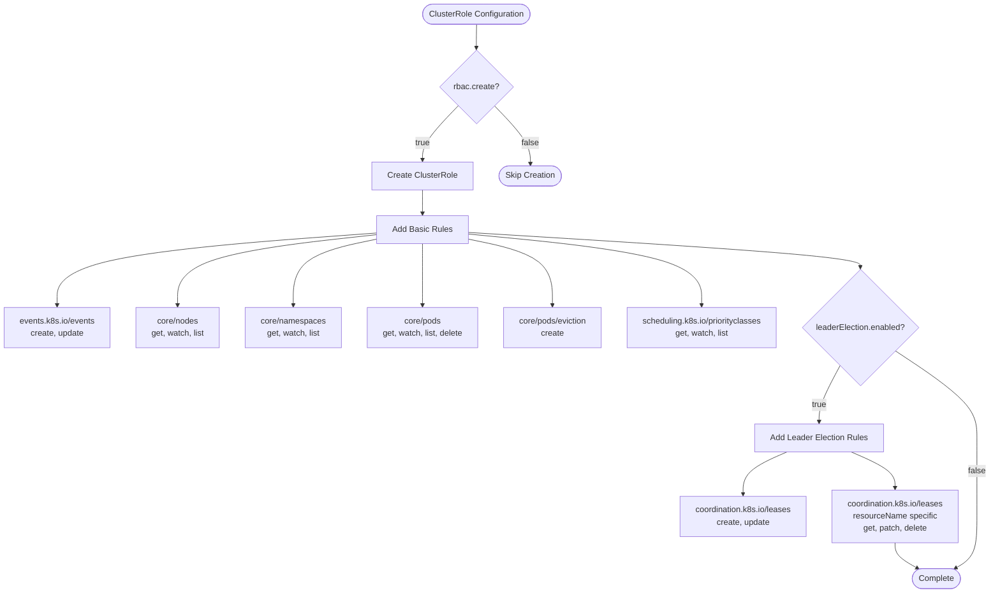
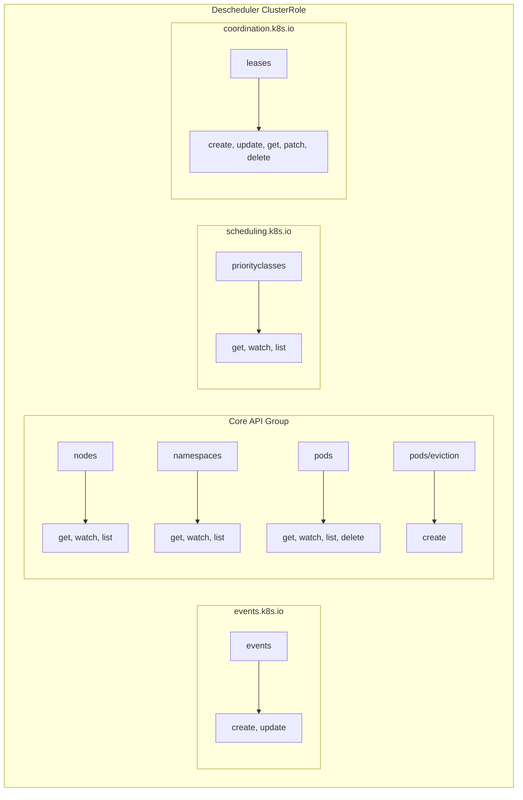
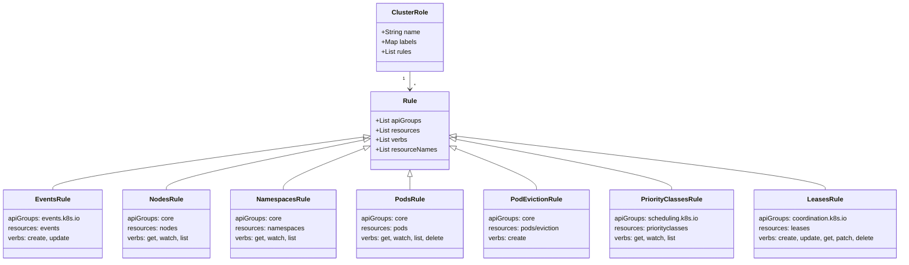
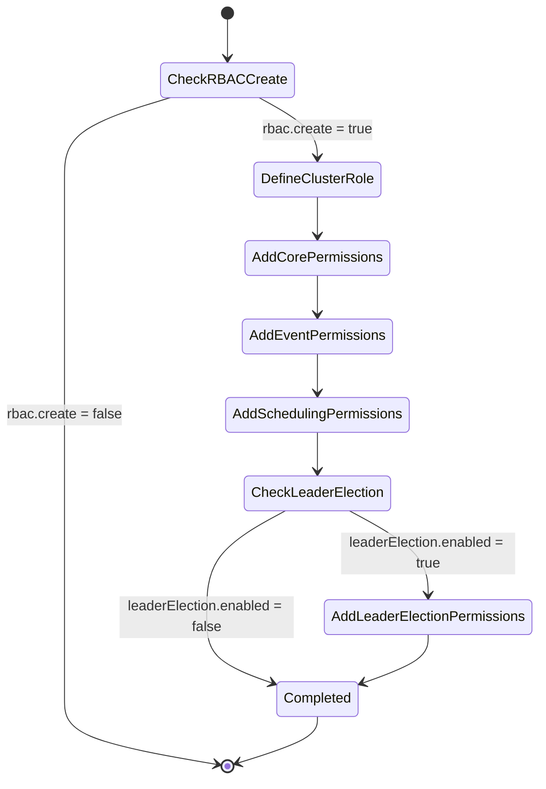

# Diagram: devops/k8s/descheduler/helm/templates/clusterrole.yaml


> Auto-generated by Obscura crawlers

## Diagram 1

```mermaid
flowchart TD
      Start([ClusterRole Configuration]) --> CheckRBAC{rbac.create?}
      CheckRBAC -->|true| CreateRole[Create ClusterRole]
      CheckRBAC -->|false| Skip([Skip Creation])...
  └ 238 lines...
```

> SVG rendering failed for this diagram.

## Diagram 2



### SVG

<svg id="container" width="1957.2890625" xmlns="http://www.w3.org/2000/svg" class="flowchart" height="1150.28125" viewBox="0 0 1957.2890625 1150.28125" role="graphics-document document" aria-roledescription="flowchart-v2"><style>#container{font-family:"trebuchet ms",verdana,arial,sans-serif;font-size:16px;fill:#333;}@keyframes edge-animation-frame{from{stroke-dashoffset:0;}}@keyframes dash{to{stroke-dashoffset:0;}}#container .edge-animation-slow{stroke-dasharray:9,5!important;stroke-dashoffset:900;animation:dash 50s linear infinite;stroke-linecap:round;}#container .edge-animation-fast{stroke-dasharray:9,5!important;stroke-dashoffset:900;animation:dash 20s linear infinite;stroke-linecap:round;}#container .error-icon{fill:#552222;}#container .error-text{fill:#552222;stroke:#552222;}#container .edge-thickness-normal{stroke-width:1px;}#container .edge-thickness-thick{stroke-width:3.5px;}#container .edge-pattern-solid{stroke-dasharray:0;}#container .edge-thickness-invisible{stroke-width:0;fill:none;}#container .edge-pattern-dashed{stroke-dasharray:3;}#container .edge-pattern-dotted{stroke-dasharray:2;}#container .marker{fill:#333333;stroke:#333333;}#container .marker.cross{stroke:#333333;}#container svg{font-family:"trebuchet ms",verdana,arial,sans-serif;font-size:16px;}#container p{margin:0;}#container .label{font-family:"trebuchet ms",verdana,arial,sans-serif;color:#333;}#container .cluster-label text{fill:#333;}#container .cluster-label span{color:#333;}#container .cluster-label span p{background-color:transparent;}#container .label text,#container span{fill:#333;color:#333;}#container .node rect,#container .node circle,#container .node ellipse,#container .node polygon,#container .node path{fill:#ECECFF;stroke:#9370DB;stroke-width:1px;}#container .rough-node .label text,#container .node .label text,#container .image-shape .label,#container .icon-shape .label{text-anchor:middle;}#container .node .katex path{fill:#000;stroke:#000;stroke-width:1px;}#container .rough-node .label,#container .node .label,#container .image-shape .label,#container .icon-shape .label{text-align:center;}#container .node.clickable{cursor:pointer;}#container .root .anchor path{fill:#333333!important;stroke-width:0;stroke:#333333;}#container .arrowheadPath{fill:#333333;}#container .edgePath .path{stroke:#333333;stroke-width:2.0px;}#container .flowchart-link{stroke:#333333;fill:none;}#container .edgeLabel{background-color:rgba(232,232,232, 0.8);text-align:center;}#container .edgeLabel p{background-color:rgba(232,232,232, 0.8);}#container .edgeLabel rect{opacity:0.5;background-color:rgba(232,232,232, 0.8);fill:rgba(232,232,232, 0.8);}#container .labelBkg{background-color:rgba(232, 232, 232, 0.5);}#container .cluster rect{fill:#ffffde;stroke:#aaaa33;stroke-width:1px;}#container .cluster text{fill:#333;}#container .cluster span{color:#333;}#container div.mermaidTooltip{position:absolute;text-align:center;max-width:200px;padding:2px;font-family:"trebuchet ms",verdana,arial,sans-serif;font-size:12px;background:hsl(80, 100%, 96.2745098039%);border:1px solid #aaaa33;border-radius:2px;pointer-events:none;z-index:100;}#container .flowchartTitleText{text-anchor:middle;font-size:18px;fill:#333;}#container rect.text{fill:none;stroke-width:0;}#container .icon-shape,#container .image-shape{background-color:rgba(232,232,232, 0.8);text-align:center;}#container .icon-shape p,#container .image-shape p{background-color:rgba(232,232,232, 0.8);padding:2px;}#container .icon-shape rect,#container .image-shape rect{opacity:0.5;background-color:rgba(232,232,232, 0.8);fill:rgba(232,232,232, 0.8);}#container .label-icon{display:inline-block;height:1em;overflow:visible;vertical-align:-0.125em;}#container .node .label-icon path{fill:currentColor;stroke:revert;stroke-width:revert;}#container :root{--mermaid-font-family:"trebuchet ms",verdana,arial,sans-serif;}</style><g><marker id="container_flowchart-v2-pointEnd" class="marker flowchart-v2" viewBox="0 0 10 10" refX="5" refY="5" markerUnits="userSpaceOnUse" markerWidth="8" markerHeight="8" orient="auto"><path d="M 0 0 L 10 5 L 0 10 z" class="arrowMarkerPath" style="stroke-width: 1; stroke-dasharray: 1, 0;"></path></marker><marker id="container_flowchart-v2-pointStart" class="marker flowchart-v2" viewBox="0 0 10 10" refX="4.5" refY="5" markerUnits="userSpaceOnUse" markerWidth="8" markerHeight="8" orient="auto"><path d="M 0 5 L 10 10 L 10 0 z" class="arrowMarkerPath" style="stroke-width: 1; stroke-dasharray: 1, 0;"></path></marker><marker id="container_flowchart-v2-circleEnd" class="marker flowchart-v2" viewBox="0 0 10 10" refX="11" refY="5" markerUnits="userSpaceOnUse" markerWidth="11" markerHeight="11" orient="auto"><circle cx="5" cy="5" r="5" class="arrowMarkerPath" style="stroke-width: 1; stroke-dasharray: 1, 0;"></circle></marker><marker id="container_flowchart-v2-circleStart" class="marker flowchart-v2" viewBox="0 0 10 10" refX="-1" refY="5" markerUnits="userSpaceOnUse" markerWidth="11" markerHeight="11" orient="auto"><circle cx="5" cy="5" r="5" class="arrowMarkerPath" style="stroke-width: 1; stroke-dasharray: 1, 0;"></circle></marker><marker id="container_flowchart-v2-crossEnd" class="marker cross flowchart-v2" viewBox="0 0 11 11" refX="12" refY="5.2" markerUnits="userSpaceOnUse" markerWidth="11" markerHeight="11" orient="auto"><path d="M 1,1 l 9,9 M 10,1 l -9,9" class="arrowMarkerPath" style="stroke-width: 2; stroke-dasharray: 1, 0;"></path></marker><marker id="container_flowchart-v2-crossStart" class="marker cross flowchart-v2" viewBox="0 0 11 11" refX="-1" refY="5.2" markerUnits="userSpaceOnUse" markerWidth="11" markerHeight="11" orient="auto"><path d="M 1,1 l 9,9 M 10,1 l -9,9" class="arrowMarkerPath" style="stroke-width: 2; stroke-dasharray: 1, 0;"></path></marker><g class="root"><g class="clusters"></g><g class="edgePaths"><path d="M932.218,47.5L932.134,51.583C932.051,55.667,931.884,63.833,931.801,71.417C931.718,79,931.718,86,931.718,89.5L931.718,93" id="L_Start_CheckRBAC_0" class="edge-thickness-normal edge-pattern-solid edge-thickness-normal edge-pattern-solid flowchart-link" style=";" data-edge="true" data-et="edge" data-id="L_Start_CheckRBAC_0" data-points="W3sieCI6OTMyLjIxNzY0NzU1MjQ5MDIsInkiOjQ3LjV9LHsieCI6OTMxLjcxNzY0NzU1MjQ5MDIsInkiOjcyfSx7IngiOjkzMS43MTc2NDc1NTI0OTAyLCJ5Ijo5N31d" marker-end="url(#container_flowchart-v2-pointEnd)"></path><path d="M897.108,203.671L885.643,215.606C874.178,227.541,851.249,251.411,839.785,268.846C828.32,286.281,828.32,297.281,828.32,302.781L828.32,308.281" id="L_CheckRBAC_CreateRole_0" class="edge-thickness-normal edge-pattern-solid edge-thickness-normal edge-pattern-solid flowchart-link" style=";" data-edge="true" data-et="edge" data-id="L_CheckRBAC_CreateRole_0" data-points="W3sieCI6ODk3LjEwNzUxMjE1NDkyNjYsInkiOjIwMy42NzExMTQ2MDI0MzYzNX0seyJ4Ijo4MjguMzIwMzEyNSwieSI6Mjc1LjI4MTI1fSx7IngiOjgyOC4zMjAzMTI1LCJ5IjozMTIuMjgxMjV9XQ==" marker-end="url(#container_flowchart-v2-pointEnd)"></path><path d="M966.328,203.671L977.792,215.606C989.257,227.541,1012.186,251.411,1023.726,270.18C1035.267,288.948,1035.419,302.615,1035.495,309.448L1035.571,316.281" id="L_CheckRBAC_Skip_0" class="edge-thickness-normal edge-pattern-solid edge-thickness-normal edge-pattern-solid flowchart-link" style=";" data-edge="true" data-et="edge" data-id="L_CheckRBAC_Skip_0" data-points="W3sieCI6OTY2LjMyNzc4Mjk1MDA1MzksInkiOjIwMy42NzExMTQ2MDI0MzY0fSx7IngiOjEwMzUuMTE0OTgyNjA0OTgwNSwieSI6Mjc1LjI4MTI1fSx7IngiOjEwMzUuNjE0OTgyNjA0OTgwNSwieSI6MzIwLjI4MTI1fV0=" marker-end="url(#container_flowchart-v2-pointEnd)"></path><path d="M828.32,366.281L828.32,370.448C828.32,374.615,828.32,382.948,828.32,390.615C828.32,398.281,828.32,405.281,828.32,408.781L828.32,412.281" id="L_CreateRole_AddBasicRules_0" class="edge-thickness-normal edge-pattern-solid edge-thickness-normal edge-pattern-solid flowchart-link" style=";" data-edge="true" data-et="edge" data-id="L_CreateRole_AddBasicRules_0" data-points="W3sieCI6ODI4LjMyMDMxMjUsInkiOjM2Ni4yODEyNX0seyJ4Ijo4MjguMzIwMzEyNSwieSI6MzkxLjI4MTI1fSx7IngiOjgyOC4zMjAzMTI1LCJ5Ijo0MTYuMjgxMjV9XQ==" marker-end="url(#container_flowchart-v2-pointEnd)"></path><path d="M741.078,449.62L636.328,457.23C531.578,464.84,322.078,480.061,217.328,503.754C112.578,527.448,112.578,559.615,112.578,575.698L112.578,591.781" id="L_AddBasicRules_Events_0" class="edge-thickness-normal edge-pattern-solid edge-thickness-normal edge-pattern-solid flowchart-link" style=";" data-edge="true" data-et="edge" data-id="L_AddBasicRules_Events_0" data-points="W3sieCI6NzQxLjA3ODEyNSwieSI6NDQ5LjYxOTU1NzA0NTc4OTQ2fSx7IngiOjExMi41NzgxMjUsInkiOjQ5NS4yODEyNX0seyJ4IjoxMTIuNTc4MTI1LCJ5Ijo1OTUuNzgxMjV9XQ==" marker-end="url(#container_flowchart-v2-pointEnd)"></path><path d="M741.078,452.747L675.74,459.836C610.401,466.925,479.724,481.103,414.385,504.276C349.047,527.448,349.047,559.615,349.047,575.698L349.047,591.781" id="L_AddBasicRules_Nodes_0" class="edge-thickness-normal edge-pattern-solid edge-thickness-normal edge-pattern-solid flowchart-link" style=";" data-edge="true" data-et="edge" data-id="L_AddBasicRules_Nodes_0" data-points="W3sieCI6NzQxLjA3ODEyNSwieSI6NDUyLjc0NjgxNDczODI5Mn0seyJ4IjozNDkuMDQ2ODc1LCJ5Ijo0OTUuMjgxMjV9LHsieCI6MzQ5LjA0Njg3NSwieSI6NTk1Ljc4MTI1fV0=" marker-end="url(#container_flowchart-v2-pointEnd)"></path><path d="M741.078,461.202L713.428,466.882C685.779,472.562,630.479,483.922,602.829,505.685C575.18,527.448,575.18,559.615,575.18,575.698L575.18,591.781" id="L_AddBasicRules_Namespaces_0" class="edge-thickness-normal edge-pattern-solid edge-thickness-normal edge-pattern-solid flowchart-link" style=";" data-edge="true" data-et="edge" data-id="L_AddBasicRules_Namespaces_0" data-points="W3sieCI6NzQxLjA3ODEyNSwieSI6NDYxLjIwMjQ4OTQyOTY2NDg3fSx7IngiOjU3NS4xNzk2ODc1LCJ5Ijo0OTUuMjgxMjV9LHsieCI6NTc1LjE3OTY4NzUsInkiOjU5NS43ODEyNX1d" marker-end="url(#container_flowchart-v2-pointEnd)"></path><path d="M828.32,470.281L828.32,474.448C828.32,478.615,828.32,486.948,828.32,507.198C828.32,527.448,828.32,559.615,828.32,575.698L828.32,591.781" id="L_AddBasicRules_Pods_0" class="edge-thickness-normal edge-pattern-solid edge-thickness-normal edge-pattern-solid flowchart-link" style=";" data-edge="true" data-et="edge" data-id="L_AddBasicRules_Pods_0" data-points="W3sieCI6ODI4LjMyMDMxMjUsInkiOjQ3MC4yODEyNX0seyJ4Ijo4MjguMzIwMzEyNSwieSI6NDk1LjI4MTI1fSx7IngiOjgyOC4zMjAzMTI1LCJ5Ijo1OTUuNzgxMjV9XQ==" marker-end="url(#container_flowchart-v2-pointEnd)"></path><path d="M915.563,460.802L944.176,466.549C972.789,472.295,1030.016,483.788,1058.629,505.618C1087.242,527.448,1087.242,559.615,1087.242,575.698L1087.242,591.781" id="L_AddBasicRules_PodEviction_0" class="edge-thickness-normal edge-pattern-solid edge-thickness-normal edge-pattern-solid flowchart-link" style=";" data-edge="true" data-et="edge" data-id="L_AddBasicRules_PodEviction_0" data-points="W3sieCI6OTE1LjU2MjUsInkiOjQ2MC44MDIzNDEwNjI2OTk5fSx7IngiOjEwODcuMjQyMTg3NSwieSI6NDk1LjI4MTI1fSx7IngiOjEwODcuMjQyMTg3NSwieSI6NTk1Ljc4MTI1fV0=" marker-end="url(#container_flowchart-v2-pointEnd)"></path><path d="M915.563,451.41L994.043,458.721C1072.523,466.033,1229.484,480.657,1307.965,504.053C1386.445,527.448,1386.445,559.615,1386.445,575.698L1386.445,591.781" id="L_AddBasicRules_Priority_0" class="edge-thickness-normal edge-pattern-solid edge-thickness-normal edge-pattern-solid flowchart-link" style=";" data-edge="true" data-et="edge" data-id="L_AddBasicRules_Priority_0" data-points="W3sieCI6OTE1LjU2MjUsInkiOjQ1MS40MDk1MjU0NzU5MjM4M30seyJ4IjoxMzg2LjQ0NTMxMjUsInkiOjQ5NS4yODEyNX0seyJ4IjoxMzg2LjQ0NTMxMjUsInkiOjU5NS43ODEyNX1d" marker-end="url(#container_flowchart-v2-pointEnd)"></path><path d="M915.563,448.485L1046.323,456.284C1177.083,464.084,1438.604,479.682,1569.365,490.982C1700.125,502.281,1700.125,509.281,1700.125,512.781L1700.125,516.281" id="L_AddBasicRules_CheckLeader_0" class="edge-thickness-normal edge-pattern-solid edge-thickness-normal edge-pattern-solid flowchart-link" style=";" data-edge="true" data-et="edge" data-id="L_AddBasicRules_CheckLeader_0" data-points="W3sieCI6OTE1LjU2MjUsInkiOjQ0OC40ODQ5MzEzMDA0NjMzfSx7IngiOjE3MDAuMTI1LCJ5Ijo0OTUuMjgxMjV9LHsieCI6MTcwMC4xMjUsInkiOjUyMC4yODEyNX1d" marker-end="url(#container_flowchart-v2-pointEnd)"></path><path d="M1660.348,709.504L1653.536,722.3C1646.724,735.096,1633.1,760.689,1626.288,778.985C1619.477,797.281,1619.477,808.281,1619.477,813.781L1619.477,819.281" id="L_CheckLeader_AddLeaderRules_0" class="edge-thickness-normal edge-pattern-solid edge-thickness-normal edge-pattern-solid flowchart-link" style=";" data-edge="true" data-et="edge" data-id="L_CheckLeader_AddLeaderRules_0" data-points="W3sieCI6MTY2MC4zNDc2NjUzMjA1NDUzLCJ5Ijo3MDkuNTAzOTE1MzIwNTQ1Mn0seyJ4IjoxNjE5LjQ3NjU2MjUsInkiOjc4Ni4yODEyNX0seyJ4IjoxNjE5LjQ3NjU2MjUsInkiOjgyMy4yODEyNX1d" marker-end="url(#container_flowchart-v2-pointEnd)"></path><path d="M1769.386,680.02L1796.5,697.731C1823.614,715.441,1877.842,750.861,1904.956,779.238C1932.07,807.615,1932.07,828.948,1932.07,850.281C1932.07,871.615,1932.07,892.948,1932.07,918.281C1932.07,943.615,1932.07,972.948,1932.07,1000.281C1932.07,1027.615,1932.07,1052.948,1924.874,1069.705C1917.677,1086.462,1903.284,1094.644,1896.087,1098.734L1888.891,1102.825" id="L_CheckLeader_End_0" class="edge-thickness-normal edge-pattern-solid edge-thickness-normal edge-pattern-solid flowchart-link" style=";" data-edge="true" data-et="edge" data-id="L_CheckLeader_End_0" data-points="W3sieCI6MTc2OS4zODU4MjM5NDQwOTI0LCJ5Ijo2ODAuMDIwNDI2MDU1OTA3Nn0seyJ4IjoxOTMyLjA3MDMxMjUsInkiOjc4Ni4yODEyNX0seyJ4IjoxOTMyLjA3MDMxMjUsInkiOjg1MC4yODEyNX0seyJ4IjoxOTMyLjA3MDMxMjUsInkiOjkxNC4yODEyNX0seyJ4IjoxOTMyLjA3MDMxMjUsInkiOjEwMDIuMjgxMjV9LHsieCI6MTkzMi4wNzAzMTI1LCJ5IjoxMDc4LjI4MTI1fSx7IngiOjE4ODUuNDEzMDQ1MDI1MTEsInkiOjExMDQuODAxNTczMTE3MDE3Nn1d" marker-end="url(#container_flowchart-v2-pointEnd)"></path><path d="M1555.648,877.281L1541.07,883.448C1526.492,889.615,1497.336,901.948,1482.758,915.615C1468.18,929.281,1468.18,944.281,1468.18,951.781L1468.18,959.281" id="L_AddLeaderRules_LeasesCreate_0" class="edge-thickness-normal edge-pattern-solid edge-thickness-normal edge-pattern-solid flowchart-link" style=";" data-edge="true" data-et="edge" data-id="L_AddLeaderRules_LeasesCreate_0" data-points="W3sieCI6MTU1NS42NDgxOTMzNTkzNzUsInkiOjg3Ny4yODEyNX0seyJ4IjoxNDY4LjE3OTY4NzUsInkiOjkxNC4yODEyNX0seyJ4IjoxNDY4LjE3OTY4NzUsInkiOjk2My4yODEyNX1d" marker-end="url(#container_flowchart-v2-pointEnd)"></path><path d="M1683.305,877.281L1697.883,883.448C1712.461,889.615,1741.617,901.948,1756.195,913.615C1770.773,925.281,1770.773,936.281,1770.773,941.781L1770.773,947.281" id="L_AddLeaderRules_LeasesSpecific_0" class="edge-thickness-normal edge-pattern-solid edge-thickness-normal edge-pattern-solid flowchart-link" style=";" data-edge="true" data-et="edge" data-id="L_AddLeaderRules_LeasesSpecific_0" data-points="W3sieCI6MTY4My4zMDQ5MzE2NDA2MjUsInkiOjg3Ny4yODEyNX0seyJ4IjoxNzcwLjc3MzQzNzUsInkiOjkxNC4yODEyNX0seyJ4IjoxNzcwLjc3MzQzNzUsInkiOjk1MS4yODEyNX1d" marker-end="url(#container_flowchart-v2-pointEnd)"></path><path d="M1770.773,1053.281L1770.773,1057.448C1770.773,1061.615,1770.773,1069.948,1778.134,1078.21C1785.494,1086.473,1800.215,1094.665,1807.575,1098.761L1814.935,1102.857" id="L_LeasesSpecific_End_0" class="edge-thickness-normal edge-pattern-solid edge-thickness-normal edge-pattern-solid flowchart-link" style=";" data-edge="true" data-et="edge" data-id="L_LeasesSpecific_End_0" data-points="W3sieCI6MTc3MC43NzM0Mzc1LCJ5IjoxMDUzLjI4MTI1fSx7IngiOjE3NzAuNzczNDM3NSwieSI6MTA3OC4yODEyNX0seyJ4IjoxODE4LjQzMDcwMzg2MzQ5MDYsInkiOjExMDQuODAxNTcyNTAzNzcyNH1d" marker-end="url(#container_flowchart-v2-pointEnd)"></path></g><g class="edgeLabels"><g class="edgeLabel"><g class="label" data-id="L_Start_CheckRBAC_0" transform="translate(0, 0)"><foreignObject width="0" height="0"><div xmlns="http://www.w3.org/1999/xhtml" class="labelBkg" style="display: table-cell; white-space: nowrap; line-height: 1.5; max-width: 200px; text-align: center;"><span class="edgeLabel"></span></div></foreignObject></g></g><g class="edgeLabel" transform="translate(828.3203125, 275.28125)"><g class="label" data-id="L_CheckRBAC_CreateRole_0" transform="translate(-14.9921875, -12)"><foreignObject width="29.984375" height="24"><div xmlns="http://www.w3.org/1999/xhtml" class="labelBkg" style="display: table-cell; white-space: nowrap; line-height: 1.5; max-width: 200px; text-align: center;"><span class="edgeLabel"><p>true</p></span></div></foreignObject></g></g><g class="edgeLabel" transform="translate(1035.1149826049805, 275.28125)"><g class="label" data-id="L_CheckRBAC_Skip_0" transform="translate(-17.21875, -12)"><foreignObject width="34.4375" height="24"><div xmlns="http://www.w3.org/1999/xhtml" class="labelBkg" style="display: table-cell; white-space: nowrap; line-height: 1.5; max-width: 200px; text-align: center;"><span class="edgeLabel"><p>false</p></span></div></foreignObject></g></g><g class="edgeLabel"><g class="label" data-id="L_CreateRole_AddBasicRules_0" transform="translate(0, 0)"><foreignObject width="0" height="0"><div xmlns="http://www.w3.org/1999/xhtml" class="labelBkg" style="display: table-cell; white-space: nowrap; line-height: 1.5; max-width: 200px; text-align: center;"><span class="edgeLabel"></span></div></foreignObject></g></g><g class="edgeLabel"><g class="label" data-id="L_AddBasicRules_Events_0" transform="translate(0, 0)"><foreignObject width="0" height="0"><div xmlns="http://www.w3.org/1999/xhtml" class="labelBkg" style="display: table-cell; white-space: nowrap; line-height: 1.5; max-width: 200px; text-align: center;"><span class="edgeLabel"></span></div></foreignObject></g></g><g class="edgeLabel"><g class="label" data-id="L_AddBasicRules_Nodes_0" transform="translate(0, 0)"><foreignObject width="0" height="0"><div xmlns="http://www.w3.org/1999/xhtml" class="labelBkg" style="display: table-cell; white-space: nowrap; line-height: 1.5; max-width: 200px; text-align: center;"><span class="edgeLabel"></span></div></foreignObject></g></g><g class="edgeLabel"><g class="label" data-id="L_AddBasicRules_Namespaces_0" transform="translate(0, 0)"><foreignObject width="0" height="0"><div xmlns="http://www.w3.org/1999/xhtml" class="labelBkg" style="display: table-cell; white-space: nowrap; line-height: 1.5; max-width: 200px; text-align: center;"><span class="edgeLabel"></span></div></foreignObject></g></g><g class="edgeLabel"><g class="label" data-id="L_AddBasicRules_Pods_0" transform="translate(0, 0)"><foreignObject width="0" height="0"><div xmlns="http://www.w3.org/1999/xhtml" class="labelBkg" style="display: table-cell; white-space: nowrap; line-height: 1.5; max-width: 200px; text-align: center;"><span class="edgeLabel"></span></div></foreignObject></g></g><g class="edgeLabel"><g class="label" data-id="L_AddBasicRules_PodEviction_0" transform="translate(0, 0)"><foreignObject width="0" height="0"><div xmlns="http://www.w3.org/1999/xhtml" class="labelBkg" style="display: table-cell; white-space: nowrap; line-height: 1.5; max-width: 200px; text-align: center;"><span class="edgeLabel"></span></div></foreignObject></g></g><g class="edgeLabel"><g class="label" data-id="L_AddBasicRules_Priority_0" transform="translate(0, 0)"><foreignObject width="0" height="0"><div xmlns="http://www.w3.org/1999/xhtml" class="labelBkg" style="display: table-cell; white-space: nowrap; line-height: 1.5; max-width: 200px; text-align: center;"><span class="edgeLabel"></span></div></foreignObject></g></g><g class="edgeLabel"><g class="label" data-id="L_AddBasicRules_CheckLeader_0" transform="translate(0, 0)"><foreignObject width="0" height="0"><div xmlns="http://www.w3.org/1999/xhtml" class="labelBkg" style="display: table-cell; white-space: nowrap; line-height: 1.5; max-width: 200px; text-align: center;"><span class="edgeLabel"></span></div></foreignObject></g></g><g class="edgeLabel" transform="translate(1619.4765625, 786.28125)"><g class="label" data-id="L_CheckLeader_AddLeaderRules_0" transform="translate(-14.9921875, -12)"><foreignObject width="29.984375" height="24"><div xmlns="http://www.w3.org/1999/xhtml" class="labelBkg" style="display: table-cell; white-space: nowrap; line-height: 1.5; max-width: 200px; text-align: center;"><span class="edgeLabel"><p>true</p></span></div></foreignObject></g></g><g class="edgeLabel" transform="translate(1932.0703125, 914.28125)"><g class="label" data-id="L_CheckLeader_End_0" transform="translate(-17.21875, -12)"><foreignObject width="34.4375" height="24"><div xmlns="http://www.w3.org/1999/xhtml" class="labelBkg" style="display: table-cell; white-space: nowrap; line-height: 1.5; max-width: 200px; text-align: center;"><span class="edgeLabel"><p>false</p></span></div></foreignObject></g></g><g class="edgeLabel"><g class="label" data-id="L_AddLeaderRules_LeasesCreate_0" transform="translate(0, 0)"><foreignObject width="0" height="0"><div xmlns="http://www.w3.org/1999/xhtml" class="labelBkg" style="display: table-cell; white-space: nowrap; line-height: 1.5; max-width: 200px; text-align: center;"><span class="edgeLabel"></span></div></foreignObject></g></g><g class="edgeLabel"><g class="label" data-id="L_AddLeaderRules_LeasesSpecific_0" transform="translate(0, 0)"><foreignObject width="0" height="0"><div xmlns="http://www.w3.org/1999/xhtml" class="labelBkg" style="display: table-cell; white-space: nowrap; line-height: 1.5; max-width: 200px; text-align: center;"><span class="edgeLabel"></span></div></foreignObject></g></g><g class="edgeLabel"><g class="label" data-id="L_LeasesSpecific_End_0" transform="translate(0, 0)"><foreignObject width="0" height="0"><div xmlns="http://www.w3.org/1999/xhtml" class="labelBkg" style="display: table-cell; white-space: nowrap; line-height: 1.5; max-width: 200px; text-align: center;"><span class="edgeLabel"></span></div></foreignObject></g></g></g><g class="nodes"><g class="node default" id="flowchart-Start-0" transform="translate(931.7176475524902, 27.5)"><g class="basic label-container outer-path"><path d="M-85.0859375 -19.5 C-47.10586230478618 -19.5, -9.125787109572357 -19.5, 85.0859375 -19.5 C85.0859375 -19.5, 85.0859375 -19.5, 85.0859375 -19.5 C85.54167660149112 -19.48538533405753, 85.99741570298224 -19.470770668115055, 86.3353067896239 -19.45993515863156 C86.76669875221785 -19.41831929482486, 87.1980907148118 -19.376703431018164, 87.57954215284786 -19.3399052695533 C88.04632109528794 -19.264440070064353, 88.51310003772801 -19.188974870575404, 88.81353075967675 -19.140403561325776 C89.1552462161117 -19.062409238296244, 89.49696167254668 -18.984414915266715, 90.03220188623538 -18.862249829261074 C90.4271851512535 -18.745020869513166, 90.82216841627161 -18.627791909765257, 91.2305477514606 -18.50658706670804 C91.48200002561165 -18.41405030542111, 91.7334522997627 -18.32151354413418, 92.4036440951478 -18.074876768247425 C92.63665023421257 -17.971731862364983, 92.86965637327735 -17.86858695648254, 93.54667041279238 -17.568892924097174 C93.96631577880099 -17.34996420544617, 94.3859611448096 -17.131035486795163, 94.65492976407678 -16.990714730406097 C94.89750436859855 -16.843664579618395, 95.14007897312031 -16.696614428830692, 95.7238680736057 -16.342718045390892 C96.05345348338295 -16.112813531052723, 96.38303889316019 -15.882909016714551, 96.74909284457871 -15.627565626425154 C97.06743298553553 -15.373697835399016, 97.38577312649235 -15.119830044372877, 97.72639120850187 -14.848196188198123 C97.99308438050396 -14.605992505700483, 98.25977755250605 -14.363788823202842, 98.65174723676799 -14.007812326905688 C98.84349863573425 -13.809813264390382, 99.03525003470051 -13.611814201875077, 99.52135844296865 -13.10986736009568 C99.7784877904082 -12.807828597518819, 100.03561713784778 -12.505789834941957, 100.33165140812658 -12.158051136245305 C100.51923543764171 -11.906705625951668, 100.70681946715685 -11.65536011565803, 101.07929646464063 -11.156274872382312 C101.34516344957325 -10.747831788244081, 101.61103043450586 -10.339388704105852, 101.76122137860425 -10.108655082055241 C102.00106309709099 -9.682791824274473, 102.24090481557775 -9.256928566493704, 102.3746239742735 -9.019496659696287 C102.5678232748667 -8.618314178211698, 102.7610225754599 -8.21713169672711, 102.91698364880834 -7.893275190886684 C103.0809846598758 -7.488189522806212, 103.24498567094327 -7.0831038547257394, 103.38607172997033 -6.734618561215508 C103.49403559311747 -6.409448607121851, 103.60199945626462 -6.084278653028193, 103.77996063421489 -5.548287939305138 C103.86270765801567 -5.232737674765801, 103.94545468181644 -4.9171874102264646, 104.09703178754556 -4.339158212148133 C104.18114202392263 -3.9072699250566236, 104.2652522602997 -3.475381637965114, 104.33598227658177 -3.1121979531509023 C104.38356353683848 -2.743167094582486, 104.43114479709519 -2.3741362360140696, 104.49583020250937 -1.872449005199798 C104.52086369557941 -1.482532143962023, 104.54589718864945 -1.092615282724248, 104.57591871591342 -0.6250057626472757 C104.57591871591342 -0.28068004476317354, 104.57591871591342 0.06364567312092861, 104.57591871591342 0.625005762647271 C104.55687475925079 0.9216307596727391, 104.53783080258818 1.2182557566982073, 104.49583020250937 1.8724490051997846 C104.43581124160289 2.3379442139059807, 104.37579228069642 2.8034394226121773, 104.33598227658177 3.1121979531508885 C104.26219891410395 3.4910599253553314, 104.18841555162614 3.869921897559774, 104.09703178754556 4.339158212148129 C103.97972794849645 4.786488590247828, 103.86242410944735 5.233818968347528, 103.77996063421489 5.548287939305125 C103.66069980351311 5.907482559745976, 103.54143897281133 6.266677180186826, 103.38607172997033 6.734618561215495 C103.2389390171501 7.098039206498939, 103.09180630432988 7.461459851782382, 102.91698364880834 7.893275190886679 C102.77728032024234 8.183372141826354, 102.63757699167634 8.473469092766027, 102.3746239742735 9.019496659696284 C102.19393657540869 9.340325432963922, 102.01324917654385 9.661154206231561, 101.76122137860425 10.108655082055236 C101.58915949846647 10.372988335031012, 101.41709761832868 10.637321588006786, 101.07929646464065 11.156274872382301 C100.85554764981156 11.456077900316913, 100.63179883498248 11.755880928251525, 100.33165140812659 12.158051136245302 C100.08542613746337 12.447281349781122, 99.83920086680016 12.736511563316942, 99.52135844296866 13.10986736009567 C99.24525509860595 13.394966731656321, 98.96915175424323 13.680066103216973, 98.65174723676799 14.007812326905684 C98.36428071524226 14.26888181580799, 98.07681419371653 14.529951304710297, 97.7263912085019 14.848196188198111 C97.347138560865 15.150640082351718, 96.96788591322813 15.453083976505322, 96.74909284457871 15.627565626425152 C96.51160941921663 15.793223783465951, 96.27412599385454 15.958881940506748, 95.7238680736057 16.34271804539089 C95.35345664957477 16.56726362741759, 94.98304522554383 16.791809209444292, 94.65492976407678 16.990714730406093 C94.39687548273155 17.125341483692246, 94.1388212013863 17.2599682369784, 93.54667041279238 17.56889292409717 C93.2025752641156 17.72121363919646, 92.85848011543881 17.873534354295753, 92.4036440951478 18.07487676824742 C92.0155599263468 18.21769532977692, 91.6274757575458 18.36051389130642, 91.23054775146062 18.506587066708033 C90.82214834689013 18.627797866252333, 90.41374894231966 18.749008665796634, 90.03220188623541 18.86224982926107 C89.68969131865435 18.940425631221114, 89.3471807510733 19.018601433181153, 88.81353075967677 19.140403561325773 C88.39760510056956 19.207647196338566, 87.98167944146235 19.27489083135136, 87.57954215284788 19.3399052695533 C87.18239016538791 19.378218044138414, 86.78523817792794 19.41653081872353, 86.3353067896239 19.45993515863156 C85.95824283765657 19.47202686566069, 85.58117888568925 19.484118572689827, 85.0859375 19.5 C85.0859375 19.5, 85.0859375 19.5, 85.0859375 19.5 C23.326517867707693 19.5, -38.432901764584614 19.5, -85.0859375 19.5 C-85.43135320962072 19.488923190503357, -85.77676891924146 19.47784638100671, -86.3353067896239 19.45993515863156 C-86.6512175505759 19.429459627460798, -86.96712831152789 19.398984096290036, -87.57954215284786 19.3399052695533 C-87.83964250664984 19.297854261458966, -88.0997428604518 19.255803253364633, -88.81353075967675 19.140403561325773 C-89.28216218198615 19.033441497289477, -89.75079360429557 18.92647943325318, -90.03220188623538 18.862249829261074 C-90.3920240945342 18.755456486583302, -90.751846302833 18.64866314390553, -91.23054775146059 18.506587066708043 C-91.57887113253383 18.378400842607054, -91.92719451360706 18.250214618506064, -92.4036440951478 18.074876768247425 C-92.68587530351391 17.949941384395082, -92.96810651188002 17.82500600054274, -93.54667041279238 17.568892924097174 C-93.85151976434908 17.409853212655374, -94.15636911590578 17.250813501213575, -94.65492976407678 16.990714730406097 C-94.94224616801536 16.816541837879928, -95.22956257195393 16.64236894535376, -95.72386807360569 16.3427180453909 C-96.12878495240905 16.06026555930685, -96.53370183121241 15.777813073222797, -96.74909284457871 15.627565626425156 C-97.12529534323566 15.327554144915167, -97.50149784189261 15.027542663405177, -97.72639120850187 14.848196188198125 C-98.0547355369066 14.550002556655816, -98.38307986531133 14.251808925113506, -98.65174723676797 14.007812326905697 C-98.93973844694614 13.710437757878662, -99.22772965712429 13.413063188851629, -99.52135844296865 13.109867360095677 C-99.7319843027677 12.862454240224773, -99.94261016256675 12.615041120353869, -100.33165140812658 12.158051136245307 C-100.63025854991403 11.757944769920364, -100.92886569170149 11.357838403595423, -101.07929646464063 11.156274872382316 C-101.34383798371717 10.749868059736446, -101.6083795027937 10.343461247090575, -101.76122137860425 10.108655082055249 C-101.92860442737215 9.811449529596214, -102.09598747614007 9.514243977137177, -102.3746239742735 9.019496659696289 C-102.50902095789372 8.740418447574104, -102.64341794151396 8.46134023545192, -102.91698364880834 7.893275190886686 C-103.07610686512074 7.500237770156988, -103.23523008143312 7.10720034942729, -103.38607172997033 6.73461856121551 C-103.48659335602163 6.431863439495094, -103.58711498207293 6.129108317774678, -103.77996063421489 5.5482879393051325 C-103.87396726366268 5.189799918489757, -103.96797389311048 4.8313118976743805, -104.09703178754556 4.339158212148136 C-104.16432820763978 3.9936053180677193, -104.231624627734 3.6480524239873033, -104.33598227658177 3.112197953150904 C-104.37441346244859 2.8141332646639006, -104.41284464831541 2.5160685761768966, -104.49583020250937 1.872449005199809 C-104.525525225818 1.4099250477764103, -104.55522024912663 0.9474010903530117, -104.57591871591342 0.6250057626472781 C-104.57591871591342 0.34171217822763217, -104.57591871591342 0.0584185938079862, -104.57591871591342 -0.6250057626472687 C-104.55091925198258 -1.0143925925742594, -104.52591978805172 -1.4037794225012503, -104.49583020250937 -1.8724490051997822 C-104.46270261953795 -2.1293799969449565, -104.42957503656652 -2.386310988690131, -104.33598227658177 -3.112197953150895 C-104.27137847301262 -3.4439248304598244, -104.20677466944345 -3.7756517077687537, -104.09703178754556 -4.339158212148126 C-104.01289885311697 -4.659993554568787, -103.92876591868838 -4.98082889698945, -103.77996063421489 -5.548287939305123 C-103.69238210294606 -5.812060521742834, -103.60480357167722 -6.0758331041805445, -103.38607172997033 -6.734618561215485 C-103.27500948408542 -7.008944455793671, -103.1639472382005 -7.283270350371857, -102.91698364880834 -7.893275190886676 C-102.70466634257605 -8.33415662014064, -102.49234903634375 -8.775038049394603, -102.3746239742735 -9.019496659696282 C-102.16893266219898 -9.384722412788495, -101.96324135012448 -9.749948165880708, -101.76122137860425 -10.108655082055243 C-101.58208276607024 -10.383860096360337, -101.40294415353624 -10.65906511066543, -101.07929646464063 -11.156274872382308 C-100.86745650563029 -11.440121118438901, -100.65561654661992 -11.723967364495492, -100.33165140812659 -12.158051136245302 C-100.08851611029607 -12.443651691867396, -99.84538081246555 -12.729252247489491, -99.52135844296866 -13.10986736009567 C-99.33637919570181 -13.300873619977335, -99.15139994843496 -13.491879879858999, -98.65174723676799 -14.007812326905677 C-98.28442555013582 -14.341404163905764, -97.91710386350366 -14.674996000905852, -97.7263912085019 -14.848196188198107 C-97.52170344893966 -15.011429229478951, -97.31701568937741 -15.174662270759795, -96.74909284457871 -15.627565626425149 C-96.36112630251628 -15.898194291366986, -95.97315976045384 -16.168822956308823, -95.72386807360571 -16.342718045390885 C-95.43595053447352 -16.517255349604092, -95.14803299534131 -16.691792653817295, -94.65492976407678 -16.99071473040609 C-94.37360802210142 -17.13748010299946, -94.09228628012607 -17.28424547559283, -93.5466704127924 -17.56889292409717 C-93.21586289713736 -17.715331598221365, -92.8850553814823 -17.86177027234556, -92.40364409514781 -18.07487676824742 C-92.01220756507404 -18.218929029714186, -91.62077103500027 -18.36298129118095, -91.23054775146062 -18.506587066708033 C-90.91352898962933 -18.600676571154125, -90.59651022779802 -18.694766075600214, -90.03220188623541 -18.862249829261067 C-89.66950548468266 -18.94503291610027, -89.30680908312992 -19.027816002939478, -88.81353075967677 -19.140403561325773 C-88.55721127902011 -19.181843307171082, -88.30089179836344 -19.22328305301639, -87.57954215284788 -19.3399052695533 C-87.2652007631783 -19.37022940536389, -86.95085937350872 -19.400553541174485, -86.3353067896239 -19.45993515863156 C-85.9418615856647 -19.4725521805279, -85.5484163817055 -19.485169202424238, -85.0859375 -19.5 C-85.0859375 -19.5, -85.0859375 -19.5, -85.0859375 -19.5" stroke="none" stroke-width="0" fill="#ECECFF" style=""></path><path d="M-85.0859375 -19.5 C-38.992138437733324 -19.5, 7.101660624533352 -19.5, 85.0859375 -19.5 M-85.0859375 -19.5 C-26.623448395599958 -19.5, 31.839040708800084 -19.5, 85.0859375 -19.5 M85.0859375 -19.5 C85.0859375 -19.5, 85.0859375 -19.5, 85.0859375 -19.5 M85.0859375 -19.5 C85.0859375 -19.5, 85.0859375 -19.5, 85.0859375 -19.5 M85.0859375 -19.5 C85.4930245898204 -19.48694550937641, 85.9001116796408 -19.473891018752823, 86.3353067896239 -19.45993515863156 M85.0859375 -19.5 C85.38720136043587 -19.490339054370352, 85.68846522087173 -19.480678108740705, 86.3353067896239 -19.45993515863156 M86.3353067896239 -19.45993515863156 C86.63170504747366 -19.43134197516785, 86.92810330532343 -19.40274879170414, 87.57954215284786 -19.3399052695533 M86.3353067896239 -19.45993515863156 C86.79988511321756 -19.415117846491658, 87.26446343681123 -19.370300534351756, 87.57954215284786 -19.3399052695533 M87.57954215284786 -19.3399052695533 C88.03893394903828 -19.26563436658182, 88.4983257452287 -19.19136346361034, 88.81353075967675 -19.140403561325776 M87.57954215284786 -19.3399052695533 C88.06707333059074 -19.26108500959658, 88.55460450833361 -19.182264749639867, 88.81353075967675 -19.140403561325776 M88.81353075967675 -19.140403561325776 C89.10741457911566 -19.073326497309992, 89.40129839855457 -19.006249433294208, 90.03220188623538 -18.862249829261074 M88.81353075967675 -19.140403561325776 C89.06480440552218 -19.083051991375335, 89.31607805136763 -19.02570042142489, 90.03220188623538 -18.862249829261074 M90.03220188623538 -18.862249829261074 C90.4057365042831 -18.751386715347735, 90.77927112233081 -18.640523601434396, 91.2305477514606 -18.50658706670804 M90.03220188623538 -18.862249829261074 C90.49124664352188 -18.72600775487355, 90.95029140080835 -18.58976568048602, 91.2305477514606 -18.50658706670804 M91.2305477514606 -18.50658706670804 C91.56322637209132 -18.384158259068478, 91.89590499272204 -18.261729451428916, 92.4036440951478 -18.074876768247425 M91.2305477514606 -18.50658706670804 C91.53646298533177 -18.39400743279403, 91.84237821920291 -18.281427798880024, 92.4036440951478 -18.074876768247425 M92.4036440951478 -18.074876768247425 C92.75719675749755 -17.918369492392287, 93.11074941984731 -17.761862216537146, 93.54667041279238 -17.568892924097174 M92.4036440951478 -18.074876768247425 C92.79195055792617 -17.902985015877398, 93.18025702070454 -17.731093263507372, 93.54667041279238 -17.568892924097174 M93.54667041279238 -17.568892924097174 C93.9684070929123 -17.34887316821385, 94.39014377303222 -17.12885341233052, 94.65492976407678 -16.990714730406097 M93.54667041279238 -17.568892924097174 C93.90264972189927 -17.38317874655174, 94.25862903100617 -17.197464569006303, 94.65492976407678 -16.990714730406097 M94.65492976407678 -16.990714730406097 C95.00919177104157 -16.775959019909404, 95.36345377800636 -16.56120330941271, 95.7238680736057 -16.342718045390892 M94.65492976407678 -16.990714730406097 C95.02049453001753 -16.769107220995796, 95.38605929595828 -16.54749971158549, 95.7238680736057 -16.342718045390892 M95.7238680736057 -16.342718045390892 C96.05980059723619 -16.108386059190835, 96.39573312086667 -15.874054072990777, 96.74909284457871 -15.627565626425154 M95.7238680736057 -16.342718045390892 C96.0515721361229 -16.114125877459124, 96.3792761986401 -15.885533709527355, 96.74909284457871 -15.627565626425154 M96.74909284457871 -15.627565626425154 C97.02051489125391 -15.411113767045688, 97.29193693792911 -15.194661907666221, 97.72639120850187 -14.848196188198123 M96.74909284457871 -15.627565626425154 C97.01130138074251 -15.41846129649672, 97.27350991690629 -15.209356966568286, 97.72639120850187 -14.848196188198123 M97.72639120850187 -14.848196188198123 C97.91190010832042 -14.679721913679439, 98.09740900813897 -14.511247639160754, 98.65174723676799 -14.007812326905688 M97.72639120850187 -14.848196188198123 C97.99118702612441 -14.607715632746748, 98.25598284374695 -14.367235077295371, 98.65174723676799 -14.007812326905688 M98.65174723676799 -14.007812326905688 C98.87166971562013 -13.780724311519544, 99.09159219447227 -13.5536362961334, 99.52135844296865 -13.10986736009568 M98.65174723676799 -14.007812326905688 C98.99800720880724 -13.650270477302755, 99.3442671808465 -13.292728627699821, 99.52135844296865 -13.10986736009568 M99.52135844296865 -13.10986736009568 C99.82440650690002 -12.75388986027856, 100.12745457083138 -12.397912360461438, 100.33165140812658 -12.158051136245305 M99.52135844296865 -13.10986736009568 C99.69575394238322 -12.905012483098288, 99.87014944179779 -12.700157606100897, 100.33165140812658 -12.158051136245305 M100.33165140812658 -12.158051136245305 C100.48356815552572 -11.954496534630866, 100.63548490292484 -11.750941933016428, 101.07929646464063 -11.156274872382312 M100.33165140812658 -12.158051136245305 C100.59279582933696 -11.808141402569573, 100.85394025054737 -11.458231668893841, 101.07929646464063 -11.156274872382312 M101.07929646464063 -11.156274872382312 C101.34328291771399 -10.750720790173409, 101.60726937078735 -10.345166707964504, 101.76122137860425 -10.108655082055241 M101.07929646464063 -11.156274872382312 C101.30758080889285 -10.805568816681255, 101.53586515314507 -10.454862760980197, 101.76122137860425 -10.108655082055241 M101.76122137860425 -10.108655082055241 C101.91847968198115 -9.82942704027958, 102.07573798535806 -9.550198998503916, 102.3746239742735 -9.019496659696287 M101.76122137860425 -10.108655082055241 C101.92554837000615 -9.816875868908898, 102.08987536140808 -9.525096655762557, 102.3746239742735 -9.019496659696287 M102.3746239742735 -9.019496659696287 C102.54517077820334 -8.665352572218957, 102.71571758213318 -8.311208484741625, 102.91698364880834 -7.893275190886684 M102.3746239742735 -9.019496659696287 C102.56226521290256 -8.629855612803729, 102.7499064515316 -8.24021456591117, 102.91698364880834 -7.893275190886684 M102.91698364880834 -7.893275190886684 C103.0522813793612 -7.55908718061745, 103.18757910991407 -7.224899170348215, 103.38607172997033 -6.734618561215508 M102.91698364880834 -7.893275190886684 C103.0422879557345 -7.583771130185111, 103.16759226266065 -7.274267069483539, 103.38607172997033 -6.734618561215508 M103.38607172997033 -6.734618561215508 C103.52816799247131 -6.306647258527429, 103.67026425497228 -5.878675955839349, 103.77996063421489 -5.548287939305138 M103.38607172997033 -6.734618561215508 C103.51123079004905 -6.357659413646502, 103.63638985012778 -5.980700266077497, 103.77996063421489 -5.548287939305138 M103.77996063421489 -5.548287939305138 C103.89926065488773 -5.093345255523545, 104.01856067556058 -4.638402571741951, 104.09703178754556 -4.339158212148133 M103.77996063421489 -5.548287939305138 C103.89350663737588 -5.115287818103208, 104.00705264053687 -4.682287696901277, 104.09703178754556 -4.339158212148133 M104.09703178754556 -4.339158212148133 C104.15777470297621 -4.027256179431425, 104.21851761840688 -3.7153541467147173, 104.33598227658177 -3.1121979531509023 M104.09703178754556 -4.339158212148133 C104.18236133833683 -3.9010090032418945, 104.2676908891281 -3.462859794335656, 104.33598227658177 -3.1121979531509023 M104.33598227658177 -3.1121979531509023 C104.38227539962976 -2.7531576324018343, 104.42856852267775 -2.3941173116527663, 104.49583020250937 -1.872449005199798 M104.33598227658177 -3.1121979531509023 C104.38674955273994 -2.7184569844007225, 104.43751682889813 -2.324716015650543, 104.49583020250937 -1.872449005199798 M104.49583020250937 -1.872449005199798 C104.51241138710259 -1.6141836710689965, 104.52899257169582 -1.355918336938195, 104.57591871591342 -0.6250057626472757 M104.49583020250937 -1.872449005199798 C104.51657735190545 -1.5492954065582794, 104.53732450130153 -1.2261418079167608, 104.57591871591342 -0.6250057626472757 M104.57591871591342 -0.6250057626472757 C104.57591871591342 -0.32588311966388606, 104.57591871591342 -0.026760476680496414, 104.57591871591342 0.625005762647271 M104.57591871591342 -0.6250057626472757 C104.57591871591342 -0.31924554060543825, 104.57591871591342 -0.013485318563600801, 104.57591871591342 0.625005762647271 M104.57591871591342 0.625005762647271 C104.5466340658569 1.081137825421563, 104.51734941580038 1.5372698881958549, 104.49583020250937 1.8724490051997846 M104.57591871591342 0.625005762647271 C104.54722693629277 1.0719033898263808, 104.51853515667214 1.5188010170054902, 104.49583020250937 1.8724490051997846 M104.49583020250937 1.8724490051997846 C104.45416151310604 2.1956231317985084, 104.41249282370272 2.518797258397232, 104.33598227658177 3.1121979531508885 M104.49583020250937 1.8724490051997846 C104.44270519170387 2.284476098287296, 104.38958018089836 2.696503191374807, 104.33598227658177 3.1121979531508885 M104.33598227658177 3.1121979531508885 C104.25476771171263 3.5292175790496003, 104.17355314684347 3.9462372049483116, 104.09703178754556 4.339158212148129 M104.33598227658177 3.1121979531508885 C104.24074782115288 3.601206753969015, 104.14551336572397 4.090215554787141, 104.09703178754556 4.339158212148129 M104.09703178754556 4.339158212148129 C104.00325321439117 4.696776555476536, 103.90947464123677 5.054394898804944, 103.77996063421489 5.548287939305125 M104.09703178754556 4.339158212148129 C104.02777339351542 4.603270485362921, 103.95851499948527 4.867382758577714, 103.77996063421489 5.548287939305125 M103.77996063421489 5.548287939305125 C103.65269315294216 5.931597315579159, 103.52542567166942 6.314906691853192, 103.38607172997033 6.734618561215495 M103.77996063421489 5.548287939305125 C103.63533952900032 5.983863665967496, 103.49071842378574 6.419439392629865, 103.38607172997033 6.734618561215495 M103.38607172997033 6.734618561215495 C103.27721420180788 7.00349876039386, 103.16835667364543 7.272378959572226, 102.91698364880834 7.893275190886679 M103.38607172997033 6.734618561215495 C103.28242362978621 6.99063137256994, 103.1787755296021 7.246644183924385, 102.91698364880834 7.893275190886679 M102.91698364880834 7.893275190886679 C102.71962829028955 8.303087815579165, 102.52227293177076 8.71290044027165, 102.3746239742735 9.019496659696284 M102.91698364880834 7.893275190886679 C102.71698180423924 8.308583300488344, 102.51697995967015 8.723891410090008, 102.3746239742735 9.019496659696284 M102.3746239742735 9.019496659696284 C102.15394488609647 9.411334726935422, 101.93326579791943 9.803172794174563, 101.76122137860425 10.108655082055236 M102.3746239742735 9.019496659696284 C102.20260523940965 9.32493334223279, 102.0305865045458 9.630370024769297, 101.76122137860425 10.108655082055236 M101.76122137860425 10.108655082055236 C101.54648845155185 10.438542521872339, 101.33175552449946 10.76842996168944, 101.07929646464065 11.156274872382301 M101.76122137860425 10.108655082055236 C101.5570993862415 10.4222412767541, 101.35297739387877 10.735827471452964, 101.07929646464065 11.156274872382301 M101.07929646464065 11.156274872382301 C100.88834339208836 11.412134593419589, 100.69739031953607 11.667994314456877, 100.33165140812659 12.158051136245302 M101.07929646464065 11.156274872382301 C100.91141030316253 11.381227034019034, 100.7435241416844 11.606179195655765, 100.33165140812659 12.158051136245302 M100.33165140812659 12.158051136245302 C100.0473842709834 12.491967490792021, 99.76311713384021 12.825883845338742, 99.52135844296866 13.10986736009567 M100.33165140812659 12.158051136245302 C100.13191419684719 12.392673829983377, 99.93217698556778 12.627296523721453, 99.52135844296866 13.10986736009567 M99.52135844296866 13.10986736009567 C99.19038629396553 13.451623277260191, 98.8594141449624 13.793379194424713, 98.65174723676799 14.007812326905684 M99.52135844296866 13.10986736009567 C99.31544783580685 13.322486967565492, 99.10953722864504 13.535106575035314, 98.65174723676799 14.007812326905684 M98.65174723676799 14.007812326905684 C98.35653794746976 14.275913592636561, 98.06132865817153 14.544014858367438, 97.7263912085019 14.848196188198111 M98.65174723676799 14.007812326905684 C98.44043705971059 14.199718638748307, 98.22912688265319 14.391624950590927, 97.7263912085019 14.848196188198111 M97.7263912085019 14.848196188198111 C97.49277694860072 15.034497343732754, 97.25916268869955 15.220798499267396, 96.74909284457871 15.627565626425152 M97.7263912085019 14.848196188198111 C97.52906873594662 15.005555609089416, 97.33174626339135 15.162915029980724, 96.74909284457871 15.627565626425152 M96.74909284457871 15.627565626425152 C96.44779033474533 15.837741214109487, 96.14648782491196 16.04791680179382, 95.7238680736057 16.34271804539089 M96.74909284457871 15.627565626425152 C96.52673958811906 15.782669632614066, 96.30438633165942 15.937773638802982, 95.7238680736057 16.34271804539089 M95.7238680736057 16.34271804539089 C95.32275351602915 16.585876047404575, 94.92163895845262 16.829034049418265, 94.65492976407678 16.990714730406093 M95.7238680736057 16.34271804539089 C95.45931692930093 16.503090503743532, 95.19476578499615 16.663462962096176, 94.65492976407678 16.990714730406093 M94.65492976407678 16.990714730406093 C94.22904235833283 17.212899917188807, 93.8031549525889 17.43508510397152, 93.54667041279238 17.56889292409717 M94.65492976407678 16.990714730406093 C94.35561098237142 17.146869147098958, 94.05629220066604 17.303023563791818, 93.54667041279238 17.56889292409717 M93.54667041279238 17.56889292409717 C93.2174644718676 17.714622628597304, 92.88825853094282 17.86035233309744, 92.4036440951478 18.07487676824742 M93.54667041279238 17.56889292409717 C93.16629342096068 17.737274534898503, 92.78591642912899 17.905656145699837, 92.4036440951478 18.07487676824742 M92.4036440951478 18.07487676824742 C92.1675784705604 18.161751100262297, 91.931512845973 18.24862543227717, 91.23054775146062 18.506587066708033 M92.4036440951478 18.07487676824742 C91.93817669061751 18.246173075848088, 91.47270928608724 18.41746938344875, 91.23054775146062 18.506587066708033 M91.23054775146062 18.506587066708033 C90.80137055462325 18.633964605932288, 90.37219335778587 18.761342145156544, 90.03220188623541 18.86224982926107 M91.23054775146062 18.506587066708033 C90.84631021744572 18.62062674989968, 90.46207268343082 18.734666433091334, 90.03220188623541 18.86224982926107 M90.03220188623541 18.86224982926107 C89.76994531039924 18.922108181311586, 89.50768873456305 18.981966533362097, 88.81353075967677 19.140403561325773 M90.03220188623541 18.86224982926107 C89.68324344850245 18.941897315507003, 89.33428501076948 19.02154480175293, 88.81353075967677 19.140403561325773 M88.81353075967677 19.140403561325773 C88.43476314541932 19.201639771812196, 88.05599553116188 19.262875982298624, 87.57954215284788 19.3399052695533 M88.81353075967677 19.140403561325773 C88.39814570613001 19.20755979542401, 87.98276065258325 19.27471602952225, 87.57954215284788 19.3399052695533 M87.57954215284788 19.3399052695533 C87.20569059667761 19.375970279554767, 86.83183904050733 19.412035289556233, 86.3353067896239 19.45993515863156 M87.57954215284788 19.3399052695533 C87.15701895198295 19.380665574582242, 86.73449575111803 19.42142587961119, 86.3353067896239 19.45993515863156 M86.3353067896239 19.45993515863156 C85.90931823995143 19.473595782283144, 85.48332969027898 19.487256405934726, 85.0859375 19.5 M86.3353067896239 19.45993515863156 C85.9990450871376 19.470718416936595, 85.66278338465129 19.481501675241635, 85.0859375 19.5 M85.0859375 19.5 C85.0859375 19.5, 85.0859375 19.5, 85.0859375 19.5 M85.0859375 19.5 C85.0859375 19.5, 85.0859375 19.5, 85.0859375 19.5 M85.0859375 19.5 C33.14940802967823 19.5, -18.787121440643546 19.5, -85.0859375 19.5 M85.0859375 19.5 C26.289373933916593 19.5, -32.50718963216681 19.5, -85.0859375 19.5 M-85.0859375 19.5 C-85.50284752890533 19.48663050683915, -85.91975755781068 19.473261013678297, -86.3353067896239 19.45993515863156 M-85.0859375 19.5 C-85.51339105401281 19.486292396510677, -85.94084460802563 19.47258479302136, -86.3353067896239 19.45993515863156 M-86.3353067896239 19.45993515863156 C-86.8143704110954 19.413720467226504, -87.2934340325669 19.367505775821446, -87.57954215284786 19.3399052695533 M-86.3353067896239 19.45993515863156 C-86.6323487391565 19.43127987900536, -86.92939068868908 19.402624599379163, -87.57954215284786 19.3399052695533 M-87.57954215284786 19.3399052695533 C-88.06789197890573 19.260952656885724, -88.5562418049636 19.18200004421815, -88.81353075967675 19.140403561325773 M-87.57954215284786 19.3399052695533 C-87.82901335304044 19.299572700584214, -88.078484553233 19.259240131615133, -88.81353075967675 19.140403561325773 M-88.81353075967675 19.140403561325773 C-89.17719167844002 19.05740032972733, -89.5408525972033 18.974397098128886, -90.03220188623538 18.862249829261074 M-88.81353075967675 19.140403561325773 C-89.21067788764783 19.049757320993585, -89.60782501561891 18.959111080661394, -90.03220188623538 18.862249829261074 M-90.03220188623538 18.862249829261074 C-90.48110401528803 18.72901803369361, -90.93000614434068 18.595786238126145, -91.23054775146059 18.506587066708043 M-90.03220188623538 18.862249829261074 C-90.42464542025459 18.745774648342323, -90.8170889542738 18.629299467423568, -91.23054775146059 18.506587066708043 M-91.23054775146059 18.506587066708043 C-91.55492249089114 18.38721416411038, -91.8792972303217 18.26784126151271, -92.4036440951478 18.074876768247425 M-91.23054775146059 18.506587066708043 C-91.49359779013614 18.409782220867537, -91.7566478288117 18.312977375027035, -92.4036440951478 18.074876768247425 M-92.4036440951478 18.074876768247425 C-92.7511822811677 17.921031922650407, -93.0987204671876 17.767187077053393, -93.54667041279238 17.568892924097174 M-92.4036440951478 18.074876768247425 C-92.83920510938891 17.882066827701305, -93.27476612363003 17.68925688715518, -93.54667041279238 17.568892924097174 M-93.54667041279238 17.568892924097174 C-93.8726170539395 17.398846770189504, -94.19856369508665 17.228800616281834, -94.65492976407678 16.990714730406097 M-93.54667041279238 17.568892924097174 C-93.8121569914482 17.4303887460647, -94.07764357010403 17.29188456803223, -94.65492976407678 16.990714730406097 M-94.65492976407678 16.990714730406097 C-94.95151750824293 16.81092149694953, -95.24810525240908 16.631128263492965, -95.72386807360569 16.3427180453909 M-94.65492976407678 16.990714730406097 C-95.07063397958935 16.738712392013248, -95.48633819510191 16.4867100536204, -95.72386807360569 16.3427180453909 M-95.72386807360569 16.3427180453909 C-96.1096747703413 16.07359599505086, -96.49548146707691 15.80447394471082, -96.74909284457871 15.627565626425156 M-95.72386807360569 16.3427180453909 C-96.0336406761995 16.126634087661298, -96.3434132787933 15.910550129931693, -96.74909284457871 15.627565626425156 M-96.74909284457871 15.627565626425156 C-96.97531207108538 15.447161813232528, -97.20153129759204 15.266758000039898, -97.72639120850187 14.848196188198125 M-96.74909284457871 15.627565626425156 C-97.02246548600601 15.409558219638393, -97.29583812743331 15.19155081285163, -97.72639120850187 14.848196188198125 M-97.72639120850187 14.848196188198125 C-98.05502559092591 14.549739137269887, -98.38365997334995 14.251282086341647, -98.65174723676797 14.007812326905697 M-97.72639120850187 14.848196188198125 C-97.98506621656095 14.613274390044534, -98.24374122462002 14.378352591890941, -98.65174723676797 14.007812326905697 M-98.65174723676797 14.007812326905697 C-98.87016473669308 13.782278325822778, -99.0885822366182 13.55674432473986, -99.52135844296865 13.109867360095677 M-98.65174723676797 14.007812326905697 C-98.92294711924878 13.727776182319824, -99.19414700172959 13.447740037733949, -99.52135844296865 13.109867360095677 M-99.52135844296865 13.109867360095677 C-99.73427203412682 12.859766940794753, -99.94718562528499 12.609666521493827, -100.33165140812658 12.158051136245307 M-99.52135844296865 13.109867360095677 C-99.77618203140094 12.810537073250172, -100.03100561983321 12.511206786404667, -100.33165140812658 12.158051136245307 M-100.33165140812658 12.158051136245307 C-100.60217505373083 11.795574096346723, -100.87269869933509 11.433097056448137, -101.07929646464063 11.156274872382316 M-100.33165140812658 12.158051136245307 C-100.49674626111896 11.936839073686041, -100.66184111411133 11.715627011126777, -101.07929646464063 11.156274872382316 M-101.07929646464063 11.156274872382316 C-101.33533741532447 10.762927215509844, -101.59137836600831 10.369579558637373, -101.76122137860425 10.108655082055249 M-101.07929646464063 11.156274872382316 C-101.24179345821891 10.906635853693619, -101.40429045179718 10.656996835004922, -101.76122137860425 10.108655082055249 M-101.76122137860425 10.108655082055249 C-101.97426872121552 9.730367951866148, -102.1873160638268 9.352080821677047, -102.3746239742735 9.019496659696289 M-101.76122137860425 10.108655082055249 C-101.94040058689927 9.790504253865137, -102.1195797951943 9.472353425675026, -102.3746239742735 9.019496659696289 M-102.3746239742735 9.019496659696289 C-102.54259808904051 8.670694816312302, -102.71057220380752 8.321892972928314, -102.91698364880834 7.893275190886686 M-102.3746239742735 9.019496659696289 C-102.54760475229217 8.6602983729448, -102.72058553031083 8.301100086193312, -102.91698364880834 7.893275190886686 M-102.91698364880834 7.893275190886686 C-103.08707370383337 7.473149466507382, -103.25716375885838 7.053023742128078, -103.38607172997033 6.73461856121551 M-102.91698364880834 7.893275190886686 C-103.03335040574783 7.605847051447961, -103.14971716268731 7.318418912009237, -103.38607172997033 6.73461856121551 M-103.38607172997033 6.73461856121551 C-103.46593489386223 6.494083436040254, -103.54579805775413 6.253548310864999, -103.77996063421489 5.5482879393051325 M-103.38607172997033 6.73461856121551 C-103.5040331727919 6.379337490040466, -103.62199461561349 6.024056418865422, -103.77996063421489 5.5482879393051325 M-103.77996063421489 5.5482879393051325 C-103.86343245987841 5.229973691132051, -103.94690428554192 4.911659442958969, -104.09703178754556 4.339158212148136 M-103.77996063421489 5.5482879393051325 C-103.89268108156337 5.118436020214476, -104.00540152891185 4.688584101123821, -104.09703178754556 4.339158212148136 M-104.09703178754556 4.339158212148136 C-104.16973111755868 3.9658625175395743, -104.2424304475718 3.592566822931013, -104.33598227658177 3.112197953150904 M-104.09703178754556 4.339158212148136 C-104.18068184331935 3.9096328551952437, -104.26433189909315 3.480107498242351, -104.33598227658177 3.112197953150904 M-104.33598227658177 3.112197953150904 C-104.39719281648824 2.6374610930246525, -104.45840335639471 2.1627242328984004, -104.49583020250937 1.872449005199809 M-104.33598227658177 3.112197953150904 C-104.38387734654205 2.740733248490365, -104.43177241650233 2.369268543829825, -104.49583020250937 1.872449005199809 M-104.49583020250937 1.872449005199809 C-104.52429099876187 1.4291491304257626, -104.55275179501439 0.9858492556517163, -104.57591871591342 0.6250057626472781 M-104.49583020250937 1.872449005199809 C-104.5266732011718 1.3920444050118463, -104.55751619983425 0.9116398048238836, -104.57591871591342 0.6250057626472781 M-104.57591871591342 0.6250057626472781 C-104.57591871591342 0.14309342102823597, -104.57591871591342 -0.3388189205908062, -104.57591871591342 -0.6250057626472687 M-104.57591871591342 0.6250057626472781 C-104.57591871591342 0.17293117430460397, -104.57591871591342 -0.2791434140380702, -104.57591871591342 -0.6250057626472687 M-104.57591871591342 -0.6250057626472687 C-104.54734700805133 -1.070033175266714, -104.51877530018925 -1.5150605878861592, -104.49583020250937 -1.8724490051997822 M-104.57591871591342 -0.6250057626472687 C-104.55469421174003 -0.955594547259293, -104.53346970756662 -1.2861833318713174, -104.49583020250937 -1.8724490051997822 M-104.49583020250937 -1.8724490051997822 C-104.43811661976346 -2.320064156140979, -104.38040303701757 -2.767679307082176, -104.33598227658177 -3.112197953150895 M-104.49583020250937 -1.8724490051997822 C-104.44296249772505 -2.282480483597772, -104.39009479294074 -2.692511961995762, -104.33598227658177 -3.112197953150895 M-104.33598227658177 -3.112197953150895 C-104.28512722870282 -3.37332787579113, -104.23427218082388 -3.6344577984313644, -104.09703178754556 -4.339158212148126 M-104.33598227658177 -3.112197953150895 C-104.28582370903015 -3.3697515965114366, -104.23566514147855 -3.627305239871978, -104.09703178754556 -4.339158212148126 M-104.09703178754556 -4.339158212148126 C-103.97729743894195 -4.79575717656866, -103.85756309033833 -5.2523561409891935, -103.77996063421489 -5.548287939305123 M-104.09703178754556 -4.339158212148126 C-104.01848542435832 -4.638689537190229, -103.93993906117107 -4.938220862232332, -103.77996063421489 -5.548287939305123 M-103.77996063421489 -5.548287939305123 C-103.62699727662203 -6.0089892009734385, -103.4740339190292 -6.469690462641755, -103.38607172997033 -6.734618561215485 M-103.77996063421489 -5.548287939305123 C-103.64635789132137 -5.950678114194082, -103.51275514842787 -6.353068289083041, -103.38607172997033 -6.734618561215485 M-103.38607172997033 -6.734618561215485 C-103.20896878494227 -7.172066259487304, -103.0318658399142 -7.609513957759122, -102.91698364880834 -7.893275190886676 M-103.38607172997033 -6.734618561215485 C-103.22816869910753 -7.124642100294002, -103.07026566824474 -7.514665639372518, -102.91698364880834 -7.893275190886676 M-102.91698364880834 -7.893275190886676 C-102.76157519443188 -8.21598417160762, -102.60616674005543 -8.53869315232856, -102.3746239742735 -9.019496659696282 M-102.91698364880834 -7.893275190886676 C-102.7284590724678 -8.284750507437552, -102.53993449612726 -8.676225823988428, -102.3746239742735 -9.019496659696282 M-102.3746239742735 -9.019496659696282 C-102.14948970946458 -9.419245344180904, -101.92435544465565 -9.818994028665529, -101.76122137860425 -10.108655082055243 M-102.3746239742735 -9.019496659696282 C-102.1851281365105 -9.355965708178795, -101.99563229874751 -9.69243475666131, -101.76122137860425 -10.108655082055243 M-101.76122137860425 -10.108655082055243 C-101.5668941862697 -10.407193833638717, -101.37256699393515 -10.70573258522219, -101.07929646464063 -11.156274872382308 M-101.76122137860425 -10.108655082055243 C-101.55758552415348 -10.421494438375001, -101.35394966970271 -10.734333794694757, -101.07929646464063 -11.156274872382308 M-101.07929646464063 -11.156274872382308 C-100.92495996664935 -11.363071719346415, -100.77062346865807 -11.569868566310522, -100.33165140812659 -12.158051136245302 M-101.07929646464063 -11.156274872382308 C-100.79257397121681 -11.540456892613719, -100.505851477793 -11.924638912845131, -100.33165140812659 -12.158051136245302 M-100.33165140812659 -12.158051136245302 C-100.03422952116037 -12.50741980846062, -99.73680763419415 -12.856788480675938, -99.52135844296866 -13.10986736009567 M-100.33165140812659 -12.158051136245302 C-100.03933976052569 -12.50141703052126, -99.74702811292478 -12.844782924797217, -99.52135844296866 -13.10986736009567 M-99.52135844296866 -13.10986736009567 C-99.28772217563441 -13.351115988012568, -99.05408590830015 -13.592364615929466, -98.65174723676799 -14.007812326905677 M-99.52135844296866 -13.10986736009567 C-99.3134837906306 -13.324515005461071, -99.10560913829254 -13.539162650826473, -98.65174723676799 -14.007812326905677 M-98.65174723676799 -14.007812326905677 C-98.30012081331422 -14.32715014116104, -97.94849438986047 -14.646487955416402, -97.7263912085019 -14.848196188198107 M-98.65174723676799 -14.007812326905677 C-98.41120658407681 -14.22626498332289, -98.17066593138564 -14.444717639740103, -97.7263912085019 -14.848196188198107 M-97.7263912085019 -14.848196188198107 C-97.51657518359642 -15.015518884621311, -97.30675915869094 -15.182841581044515, -96.74909284457871 -15.627565626425149 M-97.7263912085019 -14.848196188198107 C-97.51362217698835 -15.017873828808435, -97.30085314547482 -15.187551469418764, -96.74909284457871 -15.627565626425149 M-96.74909284457871 -15.627565626425149 C-96.50229469087235 -15.799721334730828, -96.25549653716598 -15.971877043036507, -95.72386807360571 -16.342718045390885 M-96.74909284457871 -15.627565626425149 C-96.33931309713893 -15.913410239159784, -95.92953334969914 -16.19925485189442, -95.72386807360571 -16.342718045390885 M-95.72386807360571 -16.342718045390885 C-95.42485613789293 -16.523980838009155, -95.12584420218013 -16.705243630627425, -94.65492976407678 -16.99071473040609 M-95.72386807360571 -16.342718045390885 C-95.33578210555046 -16.57797803987227, -94.94769613749521 -16.81323803435366, -94.65492976407678 -16.99071473040609 M-94.65492976407678 -16.99071473040609 C-94.40562916232658 -17.120774694654514, -94.15632856057638 -17.250834658902942, -93.5466704127924 -17.56889292409717 M-94.65492976407678 -16.99071473040609 C-94.40007490867016 -17.1236723452294, -94.14522005326353 -17.256629960052713, -93.5466704127924 -17.56889292409717 M-93.5466704127924 -17.56889292409717 C-93.13032712542018 -17.75319574703204, -92.71398383804795 -17.937498569966916, -92.40364409514781 -18.07487676824742 M-93.5466704127924 -17.56889292409717 C-93.17142574955272 -17.735002605275927, -92.79618108631307 -17.901112286454683, -92.40364409514781 -18.07487676824742 M-92.40364409514781 -18.07487676824742 C-92.05870849478855 -18.201816257729362, -91.7137728944293 -18.328755747211307, -91.23054775146062 -18.506587066708033 M-92.40364409514781 -18.07487676824742 C-92.1423075223883 -18.17105104279172, -91.88097094962878 -18.267225317336017, -91.23054775146062 -18.506587066708033 M-91.23054775146062 -18.506587066708033 C-90.98295477870838 -18.580071361378867, -90.73536180595612 -18.653555656049697, -90.03220188623541 -18.862249829261067 M-91.23054775146062 -18.506587066708033 C-90.93082393049437 -18.595543523488377, -90.6311001095281 -18.68449998026872, -90.03220188623541 -18.862249829261067 M-90.03220188623541 -18.862249829261067 C-89.5488281424858 -18.972576731963454, -89.0654543987362 -19.082903634665836, -88.81353075967677 -19.140403561325773 M-90.03220188623541 -18.862249829261067 C-89.63912652118749 -18.951966716276782, -89.24605115613957 -19.041683603292494, -88.81353075967677 -19.140403561325773 M-88.81353075967677 -19.140403561325773 C-88.52962499911997 -19.18630324297054, -88.2457192385632 -19.232202924615304, -87.57954215284788 -19.3399052695533 M-88.81353075967677 -19.140403561325773 C-88.43539193770803 -19.201538113551315, -88.05725311573929 -19.26267266577686, -87.57954215284788 -19.3399052695533 M-87.57954215284788 -19.3399052695533 C-87.08511059126576 -19.387602487658175, -86.59067902968364 -19.43529970576305, -86.3353067896239 -19.45993515863156 M-87.57954215284788 -19.3399052695533 C-87.1543547529358 -19.380922586660155, -86.72916735302373 -19.421939903767008, -86.3353067896239 -19.45993515863156 M-86.3353067896239 -19.45993515863156 C-85.89776676322178 -19.47396621565828, -85.46022673681965 -19.487997272684996, -85.0859375 -19.5 M-86.3353067896239 -19.45993515863156 C-85.93052227212577 -19.47291581024246, -85.52573775462764 -19.485896461853354, -85.0859375 -19.5 M-85.0859375 -19.5 C-85.0859375 -19.5, -85.0859375 -19.5, -85.0859375 -19.5 M-85.0859375 -19.5 C-85.0859375 -19.5, -85.0859375 -19.5, -85.0859375 -19.5" stroke="#9370DB" stroke-width="1.3" fill="none" stroke-dasharray="0 0" style=""></path></g><g class="label" style="" transform="translate(-92.2109375, -12)"><rect></rect><foreignObject width="184.421875" height="24"><div xmlns="http://www.w3.org/1999/xhtml" style="display: table-cell; white-space: nowrap; line-height: 1.5; max-width: 200px; text-align: center;"><span class="nodeLabel"><p>ClusterRole Configuration</p></span></div></foreignObject></g></g><g class="node default" id="flowchart-CheckRBAC-1" transform="translate(931.7176475524902, 167.640625)"><polygon points="70.640625,0 141.28125,-70.640625 70.640625,-141.28125 0,-70.640625" class="label-container" transform="translate(-70.140625, 70.640625)"></polygon><g class="label" style="" transform="translate(-43.640625, -12)"><rect></rect><foreignObject width="87.28125" height="24"><div xmlns="http://www.w3.org/1999/xhtml" style="display: table-cell; white-space: nowrap; line-height: 1.5; max-width: 200px; text-align: center;"><span class="nodeLabel"><p>rbac.create?</p></span></div></foreignObject></g></g><g class="node default" id="flowchart-CreateRole-3" transform="translate(828.3203125, 339.28125)"><rect class="basic label-container" style="" x="-96.5" y="-27" width="193" height="54"></rect><g class="label" style="" transform="translate(-66.5, -12)"><rect></rect><foreignObject width="133" height="24"><div xmlns="http://www.w3.org/1999/xhtml" style="display: table-cell; white-space: nowrap; line-height: 1.5; max-width: 200px; text-align: center;"><span class="nodeLabel"><p>Create ClusterRole</p></span></div></foreignObject></g></g><g class="node default" id="flowchart-Skip-5" transform="translate(1035.1149826049805, 339.28125)"><g class="basic label-container outer-path"><path d="M-40.8046875 -19.5 C-8.653239321610151 -19.5, 23.498208856779698 -19.5, 40.8046875 -19.5 C40.8046875 -19.5, 40.8046875 -19.5, 40.8046875 -19.5 C41.19081879164142 -19.487617521036025, 41.576950083282846 -19.47523504207205, 42.0540567896239 -19.45993515863156 C42.3490375807981 -19.43147871647329, 42.64401837197229 -19.40302227431502, 43.298292152847864 -19.3399052695533 C43.56906822283561 -19.296128294457464, 43.839844292823365 -19.25235131936163, 44.53228075967676 -19.140403561325776 C44.97382688287039 -19.03962354006456, 45.41537300606402 -18.938843518803345, 45.75095188623539 -18.862249829261074 C46.16379207376085 -18.739721028645885, 46.57663226128631 -18.617192228030692, 46.949297751460605 -18.50658706670804 C47.338040102101154 -18.36352628817742, 47.7267824527417 -18.2204655096468, 48.1223940951478 -18.074876768247425 C48.42939114235066 -17.93897828219456, 48.73638818955352 -17.803079796141695, 49.26542041279238 -17.568892924097174 C49.55800688496723 -17.416250748974136, 49.850593357142074 -17.263608573851098, 50.37367976407678 -16.990714730406097 C50.680286853006095 -16.804847711273894, 50.986893941935406 -16.61898069214169, 51.4426180736057 -16.342718045390892 C51.81286104805442 -16.084452573975508, 52.183104022503144 -15.826187102560127, 52.46784284457871 -15.627565626425154 C52.7270412938796 -15.42086176066811, 52.986239743180484 -15.214157894911068, 53.445141208501866 -14.848196188198123 C53.765133158759056 -14.557587965497596, 54.08512510901625 -14.26697974279707, 54.37049723676799 -14.007812326905688 C54.6424224250654 -13.727027244515456, 54.9143476133628 -13.446242162125225, 55.24010844296865 -13.10986736009568 C55.490254177434316 -12.816031946696791, 55.74039991189999 -12.522196533297903, 56.05040140812658 -12.158051136245305 C56.29325110918485 -11.832654660890125, 56.53610081024312 -11.507258185534944, 56.798046464640635 -11.156274872382312 C57.013935509929865 -10.82461132449222, 57.229824555219096 -10.49294777660213, 57.47997137860425 -10.108655082055241 C57.71826264731172 -9.685544804857653, 57.95655391601918 -9.262434527660062, 58.093373974273504 -9.019496659696287 C58.25448252824569 -8.684951300202211, 58.41559108221787 -8.350405940708137, 58.63573364880834 -7.893275190886684 C58.79930657310194 -7.489246905414142, 58.96287949739554 -7.085218619941601, 59.104821729970325 -6.734618561215508 C59.21619645366498 -6.399175638599592, 59.32757117735963 -6.063732715983678, 59.49871063421488 -5.548287939305138 C59.61630028194922 -5.0998676488184, 59.733889929683556 -4.651447358331662, 59.81578178754556 -4.339158212148133 C59.9038770346015 -3.8868077374529206, 59.991972281657446 -3.434457262757708, 60.054732276581774 -3.1121979531509023 C60.10618667045982 -2.7131278350521244, 60.15764106433787 -2.3140577169533465, 60.21458020250937 -1.872449005199798 C60.24626335368787 -1.3789583514152106, 60.277946504866385 -0.8854676976306232, 60.29466871591342 -0.6250057626472757 C60.29466871591342 -0.36945273745012946, 60.29466871591342 -0.11389971225298323, 60.29466871591342 0.625005762647271 C60.26753081246226 1.0477005142204194, 60.240392909011106 1.470395265793568, 60.21458020250937 1.8724490051997846 C60.15610742366963 2.3259523311245784, 60.09763464482989 2.779455657049372, 60.054732276581774 3.1121979531508885 C59.97822531638062 3.5050450240320594, 59.901718356179465 3.8978920949132303, 59.81578178754556 4.339158212148129 C59.74772044063225 4.598705625902923, 59.679659093718946 4.858253039657717, 59.49871063421489 5.548287939305125 C59.39738450835677 5.853466086264016, 59.296058382498664 6.158644233222907, 59.104821729970325 6.734618561215495 C58.95302402102859 7.109561837110636, 58.801226312086854 7.484505113005778, 58.63573364880834 7.893275190886679 C58.45468899491916 8.269218288422598, 58.27364434102998 8.645161385958518, 58.093373974273504 9.019496659696284 C57.89357087810495 9.374267289200942, 57.6937677819364 9.729037918705599, 57.47997137860425 10.108655082055236 C57.29799830490316 10.388214589872371, 57.116025231202066 10.667774097689504, 56.79804646464064 11.156274872382301 C56.57543077654829 11.454559613719656, 56.352815088455934 11.75284435505701, 56.05040140812658 12.158051136245302 C55.740570921697966 12.521995655458463, 55.43074043526936 12.885940174671624, 55.24010844296866 13.10986736009567 C54.92095636794851 13.43941808042664, 54.601804292928364 13.76896880075761, 54.37049723676799 14.007812326905684 C54.18482664221645 14.176433448302658, 53.99915604766492 14.345054569699633, 53.44514120850189 14.848196188198111 C53.07515980536261 15.143246511583058, 52.70517840222333 15.438296834968003, 52.46784284457871 15.627565626425152 C52.204826217456194 15.811034639699542, 51.94180959033367 15.994503652973933, 51.44261807360571 16.34271804539089 C51.096815806368795 16.55234541194959, 50.75101353913188 16.761972778508294, 50.37367976407678 16.990714730406093 C49.991415136480995 17.190141941770637, 49.60915050888521 17.38956915313518, 49.26542041279239 17.56889292409717 C49.0298432621307 17.673175940547218, 48.794266111469 17.77745895699726, 48.122394095147804 18.07487676824742 C47.78232155910299 18.200026605107976, 47.442249023058174 18.32517644196853, 46.94929775146062 18.506587066708033 C46.67639465659506 18.587583272766555, 46.403491561729496 18.66857947882508, 45.75095188623541 18.86224982926107 C45.3280170872657 18.958781937218415, 44.90508228829599 19.055314045175763, 44.532280759676766 19.140403561325773 C44.12037826989781 19.20699676152172, 43.70847578011886 19.273589961717665, 43.29829215284788 19.3399052695533 C42.805847789373274 19.387410785046697, 42.31340342589867 19.434916300540095, 42.0540567896239 19.45993515863156 C41.60358879399454 19.47438079046863, 41.15312079836519 19.488826422305703, 40.80468750000001 19.5 C40.80468750000001 19.5, 40.8046875 19.5, 40.8046875 19.5 C14.423245598199482 19.5, -11.958196303601035 19.5, -40.80468749999999 19.5 C-41.216632888978666 19.48678971317851, -41.62857827795734 19.473579426357023, -42.05405678962389 19.45993515863156 C-42.435241542090175 19.423162724002875, -42.816426294556464 19.386390289374187, -43.29829215284787 19.3399052695533 C-43.77949383785728 19.262108312895776, -44.26069552286669 19.184311356238258, -44.53228075967676 19.140403561325773 C-44.98836747919773 19.0363047438391, -45.444454198718695 18.93220592635243, -45.750951886235384 18.862249829261074 C-46.170051463987285 18.737863274482887, -46.589151041739186 18.6134767197047, -46.94929775146059 18.506587066708043 C-47.244289102393715 18.3980275226945, -47.539280453326846 18.28946797868095, -48.1223940951478 18.074876768247425 C-48.41036286206428 17.94740153742346, -48.69833162898076 17.819926306599495, -49.26542041279238 17.568892924097174 C-49.57354301149258 17.408145561717223, -49.88166561019278 17.247398199337272, -50.37367976407678 16.990714730406097 C-50.795416283930855 16.73505557367167, -51.21715280378493 16.479396416937238, -51.442618073605686 16.3427180453909 C-51.69776760276279 16.164736779096007, -51.95291713191989 15.986755512801112, -52.46784284457871 15.627565626425156 C-52.77123275137757 15.385620249297556, -53.07462265817642 15.143674872169955, -53.445141208501866 14.848196188198125 C-53.69282960740575 14.623252137789533, -53.94051800630963 14.398308087380943, -54.370497236767974 14.007812326905697 C-54.6217968909979 13.748324801827984, -54.873096545227824 13.488837276750273, -55.240108442968655 13.109867360095677 C-55.558216740077214 12.736199253437082, -55.87632503718577 12.362531146778489, -56.050401408126575 12.158051136245307 C-56.24756848151948 11.89386522018872, -56.444735554912384 11.629679304132132, -56.798046464640635 11.156274872382316 C-57.03989857411734 10.784725085841353, -57.28175068359404 10.413175299300393, -57.47997137860425 10.108655082055249 C-57.619002887738965 9.861790559119637, -57.75803439687369 9.614926036184023, -58.093373974273504 9.019496659696289 C-58.309588954293076 8.570521627426187, -58.52580393431265 8.121546595156087, -58.63573364880834 7.893275190886686 C-58.74626892447401 7.620250922938313, -58.85680420013968 7.34722665498994, -59.104821729970325 6.73461856121551 C-59.20107739736362 6.444711827284808, -59.297333064756906 6.154805093354105, -59.49871063421488 5.5482879393051325 C-59.5822129269959 5.229857506808495, -59.665715219776914 4.911427074311857, -59.81578178754556 4.339158212148136 C-59.89247032791754 3.9453787654667494, -59.969158868289526 3.5515993187853634, -60.054732276581774 3.112197953150904 C-60.118053395184354 2.6210918614385115, -60.18137451378693 2.129985769726119, -60.21458020250937 1.872449005199809 C-60.23194843918837 1.6019246995360379, -60.24931667586737 1.3314003938722667, -60.29466871591342 0.6250057626472781 C-60.29466871591342 0.268387310396541, -60.29466871591342 -0.08823114185419612, -60.29466871591342 -0.6250057626472687 C-60.26488212282116 -1.0889559933643274, -60.23509552972891 -1.552906224081386, -60.21458020250937 -1.8724490051997822 C-60.168617517976806 -2.2289265100756315, -60.12265483344425 -2.5854040149514805, -60.054732276581774 -3.112197953150895 C-59.967847819966515 -3.558331274833847, -59.880963363351256 -4.004464596516799, -59.81578178754556 -4.339158212148126 C-59.732298264641145 -4.657517066970383, -59.64881474173672 -4.975875921792641, -59.49871063421489 -5.548287939305123 C-59.411035368176364 -5.812351871456569, -59.32336010213783 -6.076415803608016, -59.10482172997033 -6.734618561215485 C-58.9874603640374 -7.024503404097476, -58.87009899810447 -7.314388246979467, -58.63573364880834 -7.893275190886676 C-58.51841065353375 -8.136898900884324, -58.40108765825916 -8.380522610881972, -58.093373974273504 -9.019496659696282 C-57.887685883655365 -9.384716692766494, -57.681997793037226 -9.749936725836706, -57.47997137860425 -10.108655082055243 C-57.25256154035776 -10.458017661693754, -57.02515170211127 -10.807380241332266, -56.79804646464064 -11.156274872382308 C-56.61716726092971 -11.3986365269205, -56.43628805721879 -11.640998181458693, -56.05040140812659 -12.158051136245302 C-55.72662169210149 -12.538381214276145, -55.40284197607639 -12.918711292306986, -55.24010844296866 -13.10986736009567 C-55.013724859710386 -13.343626996247684, -54.78734127645212 -13.577386632399696, -54.370497236767996 -14.007812326905677 C-54.12814731073476 -14.227908117501396, -53.885797384701526 -14.448003908097117, -53.44514120850189 -14.848196188198107 C-53.12882455108284 -15.100450304950026, -52.812507893663806 -15.352704421701944, -52.46784284457872 -15.627565626425149 C-52.24943127535245 -15.779920082232948, -52.03101970612619 -15.932274538040748, -51.442618073605715 -16.342718045390885 C-51.0469097770428 -16.582598740207395, -50.65120148047988 -16.822479435023908, -50.37367976407679 -16.99071473040609 C-50.04315463644276 -17.163149477781317, -49.712629508808725 -17.335584225156545, -49.26542041279239 -17.56889292409717 C-48.8919889493234 -17.734199955524108, -48.518557485854416 -17.89950698695105, -48.122394095147804 -18.07487676824742 C-47.71444577172811 -18.225005522298833, -47.30649744830841 -18.375134276350245, -46.94929775146062 -18.506587066708033 C-46.5497673977497 -18.62516557851181, -46.150237044038775 -18.74374409031559, -45.75095188623541 -18.862249829261067 C-45.43056361328527 -18.935376361833068, -45.11017534033513 -19.008502894405066, -44.532280759676766 -19.140403561325773 C-44.206178956164344 -19.193125171960403, -43.88007715265193 -19.245846782595038, -43.29829215284788 -19.3399052695533 C-42.880018381163865 -19.380255637259847, -42.461744609479844 -19.420606004966395, -42.0540567896239 -19.45993515863156 C-41.745566974295826 -19.469827826570132, -41.43707715896776 -19.479720494508705, -40.80468750000001 -19.5 C-40.80468750000001 -19.5, -40.80468750000001 -19.5, -40.8046875 -19.5" stroke="none" stroke-width="0" fill="#ECECFF" style=""></path><path d="M-40.8046875 -19.5 C-13.834492066063184 -19.5, 13.135703367873631 -19.5, 40.8046875 -19.5 M-40.8046875 -19.5 C-15.380331486930093 -19.5, 10.044024526139815 -19.5, 40.8046875 -19.5 M40.8046875 -19.5 C40.8046875 -19.5, 40.8046875 -19.5, 40.8046875 -19.5 M40.8046875 -19.5 C40.8046875 -19.5, 40.8046875 -19.5, 40.8046875 -19.5 M40.8046875 -19.5 C41.12100148840503 -19.489856426059678, 41.43731547681005 -19.47971285211936, 42.0540567896239 -19.45993515863156 M40.8046875 -19.5 C41.21040285058231 -19.48698949838385, 41.61611820116462 -19.4739789967677, 42.0540567896239 -19.45993515863156 M42.0540567896239 -19.45993515863156 C42.50584323534715 -19.416351863565332, 42.9576296810704 -19.372768568499108, 43.298292152847864 -19.3399052695533 M42.0540567896239 -19.45993515863156 C42.385791702453936 -19.42793309056045, 42.717526615283965 -19.39593102248934, 43.298292152847864 -19.3399052695533 M43.298292152847864 -19.3399052695533 C43.63887263409891 -19.28484285858571, 43.979453115349955 -19.22978044761812, 44.53228075967676 -19.140403561325776 M43.298292152847864 -19.3399052695533 C43.737108855847495 -19.268960788086677, 44.17592555884712 -19.198016306620055, 44.53228075967676 -19.140403561325776 M44.53228075967676 -19.140403561325776 C44.87726416976112 -19.061663349201158, 45.22224757984549 -18.98292313707654, 45.75095188623539 -18.862249829261074 M44.53228075967676 -19.140403561325776 C44.99700794775179 -19.034332613275964, 45.46173513582683 -18.928261665226156, 45.75095188623539 -18.862249829261074 M45.75095188623539 -18.862249829261074 C46.215243612577325 -18.724450481999792, 46.67953533891926 -18.586651134738513, 46.949297751460605 -18.50658706670804 M45.75095188623539 -18.862249829261074 C46.020458833815425 -18.782261581890157, 46.289965781395466 -18.702273334519237, 46.949297751460605 -18.50658706670804 M46.949297751460605 -18.50658706670804 C47.307511106963474 -18.374761240595024, 47.665724462466336 -18.242935414482012, 48.1223940951478 -18.074876768247425 M46.949297751460605 -18.50658706670804 C47.21154605872127 -18.410077265439337, 47.47379436598193 -18.313567464170635, 48.1223940951478 -18.074876768247425 M48.1223940951478 -18.074876768247425 C48.43298883191666 -17.937385691745362, 48.743583568685516 -17.799894615243296, 49.26542041279238 -17.568892924097174 M48.1223940951478 -18.074876768247425 C48.49961021836574 -17.907894380217567, 48.87682634158368 -17.74091199218771, 49.26542041279238 -17.568892924097174 M49.26542041279238 -17.568892924097174 C49.69739064752013 -17.34353432932985, 50.12936088224787 -17.118175734562527, 50.37367976407678 -16.990714730406097 M49.26542041279238 -17.568892924097174 C49.67899129604064 -17.35313325921135, 50.092562179288905 -17.137373594325524, 50.37367976407678 -16.990714730406097 M50.37367976407678 -16.990714730406097 C50.75674652897051 -16.758497406377334, 51.13981329386424 -16.52628008234857, 51.4426180736057 -16.342718045390892 M50.37367976407678 -16.990714730406097 C50.778974736080045 -16.745022536600093, 51.1842697080833 -16.49933034279409, 51.4426180736057 -16.342718045390892 M51.4426180736057 -16.342718045390892 C51.78318890998989 -16.105150573003172, 52.12375974637408 -15.867583100615455, 52.46784284457871 -15.627565626425154 M51.4426180736057 -16.342718045390892 C51.75299432667316 -16.126213007222475, 52.06337057974063 -15.909707969054057, 52.46784284457871 -15.627565626425154 M52.46784284457871 -15.627565626425154 C52.76242493206834 -15.392644250810744, 53.05700701955798 -15.157722875196333, 53.445141208501866 -14.848196188198123 M52.46784284457871 -15.627565626425154 C52.80280896398987 -15.36043906001755, 53.137775083401024 -15.093312493609945, 53.445141208501866 -14.848196188198123 M53.445141208501866 -14.848196188198123 C53.77941485043413 -14.544617710991155, 54.113688492366386 -14.241039233784186, 54.37049723676799 -14.007812326905688 M53.445141208501866 -14.848196188198123 C53.74600426006746 -14.574960325166382, 54.04686731163305 -14.30172446213464, 54.37049723676799 -14.007812326905688 M54.37049723676799 -14.007812326905688 C54.651190406644794 -13.717973583670057, 54.93188357652159 -13.428134840434424, 55.24010844296865 -13.10986736009568 M54.37049723676799 -14.007812326905688 C54.60505233146531 -13.765614934299292, 54.83960742616263 -13.523417541692893, 55.24010844296865 -13.10986736009568 M55.24010844296865 -13.10986736009568 C55.55937050531682 -12.73484397513554, 55.87863256766499 -12.3598205901754, 56.05040140812658 -12.158051136245305 M55.24010844296865 -13.10986736009568 C55.54275621275036 -12.754360068564127, 55.845403982532076 -12.398852777032575, 56.05040140812658 -12.158051136245305 M56.05040140812658 -12.158051136245305 C56.237653881347136 -11.907149881181011, 56.42490635456769 -11.656248626116717, 56.798046464640635 -11.156274872382312 M56.05040140812658 -12.158051136245305 C56.348704704961456 -11.758351894475977, 56.64700800179633 -11.358652652706649, 56.798046464640635 -11.156274872382312 M56.798046464640635 -11.156274872382312 C57.007099637823885 -10.835113059735685, 57.21615281100714 -10.513951247089059, 57.47997137860425 -10.108655082055241 M56.798046464640635 -11.156274872382312 C57.037929902748516 -10.787749493726139, 57.277813340856405 -10.419224115069966, 57.47997137860425 -10.108655082055241 M57.47997137860425 -10.108655082055241 C57.66978643554048 -9.771619227606212, 57.859601492476706 -9.434583373157183, 58.093373974273504 -9.019496659696287 M57.47997137860425 -10.108655082055241 C57.65759392956016 -9.793268256599386, 57.83521648051606 -9.477881431143532, 58.093373974273504 -9.019496659696287 M58.093373974273504 -9.019496659696287 C58.30883483914157 -8.572087563673767, 58.52429570400963 -8.124678467651247, 58.63573364880834 -7.893275190886684 M58.093373974273504 -9.019496659696287 C58.25237554618938 -8.689326493524343, 58.41137711810525 -8.3591563273524, 58.63573364880834 -7.893275190886684 M58.63573364880834 -7.893275190886684 C58.73547499310682 -7.6469121421017325, 58.8352163374053 -7.40054909331678, 59.104821729970325 -6.734618561215508 M58.63573364880834 -7.893275190886684 C58.73182117611187 -7.655937140721011, 58.827908703415396 -7.418599090555337, 59.104821729970325 -6.734618561215508 M59.104821729970325 -6.734618561215508 C59.20788069734282 -6.424221371706095, 59.31093966471531 -6.113824182196682, 59.49871063421488 -5.548287939305138 M59.104821729970325 -6.734618561215508 C59.230481332680796 -6.356151858990334, 59.35614093539127 -5.977685156765159, 59.49871063421488 -5.548287939305138 M59.49871063421488 -5.548287939305138 C59.57575770384223 -5.254474070404856, 59.652804773469576 -4.960660201504574, 59.81578178754556 -4.339158212148133 M59.49871063421488 -5.548287939305138 C59.62518005434671 -5.066005228149081, 59.75164947447853 -4.5837225169930225, 59.81578178754556 -4.339158212148133 M59.81578178754556 -4.339158212148133 C59.88944536445781 -3.9609113135062026, 59.963108941370066 -3.582664414864272, 60.054732276581774 -3.1121979531509023 M59.81578178754556 -4.339158212148133 C59.90570826543376 -3.877404754160054, 59.99563474332196 -3.415651296171974, 60.054732276581774 -3.1121979531509023 M60.054732276581774 -3.1121979531509023 C60.111673215747494 -2.6705752732418535, 60.16861415491321 -2.2289525933328047, 60.21458020250937 -1.872449005199798 M60.054732276581774 -3.1121979531509023 C60.097694994608915 -2.7789875960806567, 60.14065771263606 -2.4457772390104107, 60.21458020250937 -1.872449005199798 M60.21458020250937 -1.872449005199798 C60.23522297816156 -1.55092111186831, 60.25586575381375 -1.2293932185368222, 60.29466871591342 -0.6250057626472757 M60.21458020250937 -1.872449005199798 C60.23291330971048 -1.586896062324601, 60.251246416911606 -1.3013431194494038, 60.29466871591342 -0.6250057626472757 M60.29466871591342 -0.6250057626472757 C60.29466871591342 -0.24087248808475153, 60.29466871591342 0.14326078647777263, 60.29466871591342 0.625005762647271 M60.29466871591342 -0.6250057626472757 C60.29466871591342 -0.3015285062162406, 60.29466871591342 0.021948750214794477, 60.29466871591342 0.625005762647271 M60.29466871591342 0.625005762647271 C60.271055734910405 0.9927970018243923, 60.24744275390739 1.3605882410015135, 60.21458020250937 1.8724490051997846 M60.29466871591342 0.625005762647271 C60.262706944056525 1.1228361583962085, 60.23074517219964 1.620666554145146, 60.21458020250937 1.8724490051997846 M60.21458020250937 1.8724490051997846 C60.150787470375185 2.3672128383326854, 60.086994738241 2.8619766714655857, 60.054732276581774 3.1121979531508885 M60.21458020250937 1.8724490051997846 C60.1579924632398 2.3113323364614864, 60.101404723970234 2.7502156677231877, 60.054732276581774 3.1121979531508885 M60.054732276581774 3.1121979531508885 C60.004142318549505 3.3719666954551952, 59.95355236051723 3.631735437759502, 59.81578178754556 4.339158212148129 M60.054732276581774 3.1121979531508885 C60.00499640820599 3.367581125581052, 59.9552605398302 3.6229642980112153, 59.81578178754556 4.339158212148129 M59.81578178754556 4.339158212148129 C59.73143636509768 4.660803863479247, 59.64709094264979 4.982449514810365, 59.49871063421489 5.548287939305125 M59.81578178754556 4.339158212148129 C59.712517650082575 4.732949123254769, 59.609253512619595 5.126740034361408, 59.49871063421489 5.548287939305125 M59.49871063421489 5.548287939305125 C59.38162464500621 5.90093228368268, 59.26453865579754 6.253576628060234, 59.104821729970325 6.734618561215495 M59.49871063421489 5.548287939305125 C59.341563309564094 6.021590643127355, 59.1844159849133 6.494893346949585, 59.104821729970325 6.734618561215495 M59.104821729970325 6.734618561215495 C58.956119319116326 7.101916390990409, 58.807416908262326 7.4692142207653225, 58.63573364880834 7.893275190886679 M59.104821729970325 6.734618561215495 C58.95932756758893 7.0939919552358095, 58.81383340520753 7.453365349256125, 58.63573364880834 7.893275190886679 M58.63573364880834 7.893275190886679 C58.425528887616096 8.329769875163759, 58.21532412642385 8.76626455944084, 58.093373974273504 9.019496659696284 M58.63573364880834 7.893275190886679 C58.511765374466336 8.15069796505401, 58.387797100124324 8.40812073922134, 58.093373974273504 9.019496659696284 M58.093373974273504 9.019496659696284 C57.89530700194449 9.371184625522242, 57.69724002961548 9.722872591348198, 57.47997137860425 10.108655082055236 M58.093373974273504 9.019496659696284 C57.89005434442461 9.38051125083803, 57.68673471457573 9.741525841979776, 57.47997137860425 10.108655082055236 M57.47997137860425 10.108655082055236 C57.22280780362558 10.503727391311404, 56.9656442286469 10.898799700567572, 56.79804646464064 11.156274872382301 M57.47997137860425 10.108655082055236 C57.29071974790027 10.399396407995031, 57.10146811719628 10.690137733934826, 56.79804646464064 11.156274872382301 M56.79804646464064 11.156274872382301 C56.51892497799504 11.530272235996858, 56.23980349134945 11.904269599611412, 56.05040140812658 12.158051136245302 M56.79804646464064 11.156274872382301 C56.51156390263614 11.54013540637003, 56.22508134063163 11.92399594035776, 56.05040140812658 12.158051136245302 M56.05040140812658 12.158051136245302 C55.79573881205885 12.457192312298679, 55.54107621599112 12.756333488352057, 55.24010844296866 13.10986736009567 M56.05040140812658 12.158051136245302 C55.74318195585412 12.518928586166599, 55.43596250358165 12.879806036087896, 55.24010844296866 13.10986736009567 M55.24010844296866 13.10986736009567 C54.95207196360022 13.40728867327834, 54.66403548423178 13.704709986461006, 54.37049723676799 14.007812326905684 M55.24010844296866 13.10986736009567 C54.943837808799046 13.41579111414723, 54.64756717462944 13.721714868198791, 54.37049723676799 14.007812326905684 M54.37049723676799 14.007812326905684 C54.07075546717177 14.28002987132034, 53.77101369757555 14.552247415734994, 53.44514120850189 14.848196188198111 M54.37049723676799 14.007812326905684 C54.151649606620545 14.206563954214603, 53.9328019764731 14.405315581523523, 53.44514120850189 14.848196188198111 M53.44514120850189 14.848196188198111 C53.05943132813908 15.155789553616465, 52.67372144777627 15.463382919034817, 52.46784284457871 15.627565626425152 M53.44514120850189 14.848196188198111 C53.17711622399927 15.061938980894567, 52.909091239496654 15.275681773591021, 52.46784284457871 15.627565626425152 M52.46784284457871 15.627565626425152 C52.134774833607686 15.859899452596729, 51.80170682263666 16.092233278768305, 51.44261807360571 16.34271804539089 M52.46784284457871 15.627565626425152 C52.248140954280125 15.780820154355904, 52.02843906398153 15.934074682286656, 51.44261807360571 16.34271804539089 M51.44261807360571 16.34271804539089 C51.12706076769872 16.53401073865227, 50.81150346179174 16.725303431913648, 50.37367976407678 16.990714730406093 M51.44261807360571 16.34271804539089 C51.08575376897758 16.559051284023894, 50.72888946434945 16.7753845226569, 50.37367976407678 16.990714730406093 M50.37367976407678 16.990714730406093 C49.9971137387394 17.187168984622556, 49.62054771340202 17.383623238839018, 49.26542041279239 17.56889292409717 M50.37367976407678 16.990714730406093 C50.09772541793422 17.13467993603147, 49.821771071791666 17.278645141656853, 49.26542041279239 17.56889292409717 M49.26542041279239 17.56889292409717 C49.01651526247255 17.679075850634813, 48.767610112152724 17.789258777172456, 48.122394095147804 18.07487676824742 M49.26542041279239 17.56889292409717 C48.82845155814907 17.762326073827243, 48.39148270350575 17.955759223557315, 48.122394095147804 18.07487676824742 M48.122394095147804 18.07487676824742 C47.76392134808941 18.206798052850658, 47.40544860103101 18.3387193374539, 46.94929775146062 18.506587066708033 M48.122394095147804 18.07487676824742 C47.786019480948234 18.19866573568571, 47.44964486674866 18.322454703124, 46.94929775146062 18.506587066708033 M46.94929775146062 18.506587066708033 C46.691695132451 18.583042171846348, 46.434092513441385 18.659497276984663, 45.75095188623541 18.86224982926107 M46.94929775146062 18.506587066708033 C46.53169775324265 18.630528554152004, 46.114097755024694 18.754470041595976, 45.75095188623541 18.86224982926107 M45.75095188623541 18.86224982926107 C45.388954647118304 18.944873336836803, 45.02695740800119 19.027496844412532, 44.532280759676766 19.140403561325773 M45.75095188623541 18.86224982926107 C45.389218695835986 18.94481306944007, 45.027485505436566 19.027376309619065, 44.532280759676766 19.140403561325773 M44.532280759676766 19.140403561325773 C44.10562727584238 19.209381587844934, 43.678973792007994 19.278359614364092, 43.29829215284788 19.3399052695533 M44.532280759676766 19.140403561325773 C44.11392395367748 19.20804024531425, 43.69556714767819 19.275676929302733, 43.29829215284788 19.3399052695533 M43.29829215284788 19.3399052695533 C42.97324930328185 19.371261762329713, 42.648206453715815 19.402618255106127, 42.0540567896239 19.45993515863156 M43.29829215284788 19.3399052695533 C42.87636684335045 19.380607896721088, 42.45444153385303 19.42131052388888, 42.0540567896239 19.45993515863156 M42.0540567896239 19.45993515863156 C41.59424077849192 19.474680563130992, 41.13442476735995 19.48942596763042, 40.80468750000001 19.5 M42.0540567896239 19.45993515863156 C41.647453213477164 19.472974143912737, 41.24084963733043 19.48601312919391, 40.80468750000001 19.5 M40.80468750000001 19.5 C40.80468750000001 19.5, 40.80468750000001 19.5, 40.8046875 19.5 M40.80468750000001 19.5 C40.80468750000001 19.5, 40.8046875 19.5, 40.8046875 19.5 M40.8046875 19.5 C8.342752760067853 19.5, -24.119181979864294 19.5, -40.80468749999999 19.5 M40.8046875 19.5 C24.059089724856342 19.5, 7.3134919497126845 19.5, -40.80468749999999 19.5 M-40.80468749999999 19.5 C-41.282360714052196 19.484681949759853, -41.7600339281044 19.469363899519706, -42.05405678962389 19.45993515863156 M-40.80468749999999 19.5 C-41.23226100052602 19.486288550059463, -41.65983450105205 19.472577100118922, -42.05405678962389 19.45993515863156 M-42.05405678962389 19.45993515863156 C-42.322213154480664 19.43406643661904, -42.59036951933743 19.40819771460652, -43.29829215284787 19.3399052695533 M-42.05405678962389 19.45993515863156 C-42.43847329755849 19.4228509604396, -42.822889805493084 19.38576676224764, -43.29829215284787 19.3399052695533 M-43.29829215284787 19.3399052695533 C-43.72432715810788 19.27102723385367, -44.150362163367895 19.202149198154043, -44.53228075967676 19.140403561325773 M-43.29829215284787 19.3399052695533 C-43.728416967758164 19.27036602514636, -44.15854178266845 19.200826780739423, -44.53228075967676 19.140403561325773 M-44.53228075967676 19.140403561325773 C-44.87257345515744 19.062733974199674, -45.21286615063813 18.98506438707357, -45.750951886235384 18.862249829261074 M-44.53228075967676 19.140403561325773 C-44.989910681372 19.035952518013158, -45.447540603067246 18.931501474700543, -45.750951886235384 18.862249829261074 M-45.750951886235384 18.862249829261074 C-46.14744914999603 18.744571522633525, -46.543946413756665 18.62689321600598, -46.94929775146059 18.506587066708043 M-45.750951886235384 18.862249829261074 C-46.141961611445126 18.746200195270752, -46.532971336654875 18.630150561280434, -46.94929775146059 18.506587066708043 M-46.94929775146059 18.506587066708043 C-47.404018399623574 18.33924566479247, -47.85873904778656 18.171904262876904, -48.1223940951478 18.074876768247425 M-46.94929775146059 18.506587066708043 C-47.22182331767487 18.406295139142472, -47.494348883889145 18.3060032115769, -48.1223940951478 18.074876768247425 M-48.1223940951478 18.074876768247425 C-48.37322453413806 17.96384157352704, -48.624054973128324 17.852806378806658, -49.26542041279238 17.568892924097174 M-48.1223940951478 18.074876768247425 C-48.4608299058113 17.925061274208318, -48.79926571647481 17.775245780169207, -49.26542041279238 17.568892924097174 M-49.26542041279238 17.568892924097174 C-49.48939602762937 17.452044989299946, -49.71337164246636 17.335197054502714, -50.37367976407678 16.990714730406097 M-49.26542041279238 17.568892924097174 C-49.67113807808532 17.357230277988414, -50.07685574337826 17.145567631879658, -50.37367976407678 16.990714730406097 M-50.37367976407678 16.990714730406097 C-50.60190589907186 16.852362706166442, -50.830132034066935 16.714010681926784, -51.442618073605686 16.3427180453909 M-50.37367976407678 16.990714730406097 C-50.62671631027108 16.837322489095314, -50.87975285646538 16.683930247784527, -51.442618073605686 16.3427180453909 M-51.442618073605686 16.3427180453909 C-51.794967846788644 16.096934096594314, -52.1473176199716 15.85115014779773, -52.46784284457871 15.627565626425156 M-51.442618073605686 16.3427180453909 C-51.65127938015779 16.19716495074253, -51.8599406867099 16.05161185609416, -52.46784284457871 15.627565626425156 M-52.46784284457871 15.627565626425156 C-52.7001259230307 15.442326052672016, -52.932409001482675 15.257086478918875, -53.445141208501866 14.848196188198125 M-52.46784284457871 15.627565626425156 C-52.85838617995597 15.316117709256416, -53.248929515333224 15.004669792087675, -53.445141208501866 14.848196188198125 M-53.445141208501866 14.848196188198125 C-53.63029184823861 14.680047276006691, -53.81544248797536 14.51189836381526, -54.370497236767974 14.007812326905697 M-53.445141208501866 14.848196188198125 C-53.67109376510271 14.642992054670282, -53.897046321703556 14.437787921142439, -54.370497236767974 14.007812326905697 M-54.370497236767974 14.007812326905697 C-54.70116137461902 13.666374456543895, -55.03182551247006 13.324936586182092, -55.240108442968655 13.109867360095677 M-54.370497236767974 14.007812326905697 C-54.57105445652675 13.800720531450793, -54.771611676285524 13.593628735995887, -55.240108442968655 13.109867360095677 M-55.240108442968655 13.109867360095677 C-55.55746641656316 12.737080626131307, -55.87482439015766 12.364293892166938, -56.050401408126575 12.158051136245307 M-55.240108442968655 13.109867360095677 C-55.4208372624161 12.897573005011552, -55.60156608186355 12.685278649927424, -56.050401408126575 12.158051136245307 M-56.050401408126575 12.158051136245307 C-56.30395208454956 11.818316328780325, -56.55750276097254 11.478581521315343, -56.798046464640635 11.156274872382316 M-56.050401408126575 12.158051136245307 C-56.308110877145154 11.812743925576026, -56.56582034616373 11.467436714906745, -56.798046464640635 11.156274872382316 M-56.798046464640635 11.156274872382316 C-57.009033060761965 10.832142802906054, -57.22001965688329 10.508010733429792, -57.47997137860425 10.108655082055249 M-56.798046464640635 11.156274872382316 C-56.952225349012835 10.919414703159218, -57.10640423338504 10.68255453393612, -57.47997137860425 10.108655082055249 M-57.47997137860425 10.108655082055249 C-57.71248640214733 9.695801113055273, -57.945001425690414 9.282947144055298, -58.093373974273504 9.019496659696289 M-57.47997137860425 10.108655082055249 C-57.706094766990724 9.707150108499071, -57.9322181553772 9.305645134942893, -58.093373974273504 9.019496659696289 M-58.093373974273504 9.019496659696289 C-58.30157135497076 8.587170343968111, -58.509768735668025 8.154844028239934, -58.63573364880834 7.893275190886686 M-58.093373974273504 9.019496659696289 C-58.2639286623717 8.665336200574668, -58.43448335046989 8.311175741453049, -58.63573364880834 7.893275190886686 M-58.63573364880834 7.893275190886686 C-58.80320934188954 7.47960699105387, -58.97068503497074 7.065938791221053, -59.104821729970325 6.73461856121551 M-58.63573364880834 7.893275190886686 C-58.769321676405966 7.563310179971749, -58.902909704003584 7.233345169056811, -59.104821729970325 6.73461856121551 M-59.104821729970325 6.73461856121551 C-59.19978389252881 6.44860765775525, -59.29474605508729 6.16259675429499, -59.49871063421488 5.5482879393051325 M-59.104821729970325 6.73461856121551 C-59.25513874527696 6.281887660875875, -59.40545576058359 5.8291567605362395, -59.49871063421488 5.5482879393051325 M-59.49871063421488 5.5482879393051325 C-59.601863132707216 5.154922755978214, -59.70501563119955 4.761557572651296, -59.81578178754556 4.339158212148136 M-59.49871063421488 5.5482879393051325 C-59.57324824871974 5.264043710391626, -59.6477858632246 4.97979948147812, -59.81578178754556 4.339158212148136 M-59.81578178754556 4.339158212148136 C-59.8690618418578 4.065576393998267, -59.92234189617003 3.7919945758483977, -60.054732276581774 3.112197953150904 M-59.81578178754556 4.339158212148136 C-59.89083489075021 3.953776389671236, -59.96588799395486 3.568394567194336, -60.054732276581774 3.112197953150904 M-60.054732276581774 3.112197953150904 C-60.09008324184413 2.8380228474138054, -60.12543420710647 2.563847741676707, -60.21458020250937 1.872449005199809 M-60.054732276581774 3.112197953150904 C-60.11093480388849 2.676302249804376, -60.1671373311952 2.240406546457848, -60.21458020250937 1.872449005199809 M-60.21458020250937 1.872449005199809 C-60.24611135154779 1.3813259074409578, -60.27764250058622 0.8902028096821064, -60.29466871591342 0.6250057626472781 M-60.21458020250937 1.872449005199809 C-60.2379954151429 1.5077381680131332, -60.26141062777643 1.1430273308264574, -60.29466871591342 0.6250057626472781 M-60.29466871591342 0.6250057626472781 C-60.29466871591342 0.24433490424615806, -60.29466871591342 -0.13633595415496202, -60.29466871591342 -0.6250057626472687 M-60.29466871591342 0.6250057626472781 C-60.29466871591342 0.3145004734070344, -60.29466871591342 0.003995184166790677, -60.29466871591342 -0.6250057626472687 M-60.29466871591342 -0.6250057626472687 C-60.26524974259411 -1.0832300186633006, -60.235830769274806 -1.5414542746793325, -60.21458020250937 -1.8724490051997822 M-60.29466871591342 -0.6250057626472687 C-60.263351902240714 -1.112790414076628, -60.23203508856801 -1.6005750655059872, -60.21458020250937 -1.8724490051997822 M-60.21458020250937 -1.8724490051997822 C-60.17092515699351 -2.2110289175569244, -60.127270111477664 -2.5496088299140665, -60.054732276581774 -3.112197953150895 M-60.21458020250937 -1.8724490051997822 C-60.173523504075156 -2.190876650693361, -60.13246680564095 -2.509304296186939, -60.054732276581774 -3.112197953150895 M-60.054732276581774 -3.112197953150895 C-60.00314670563479 -3.377078957349373, -59.95156113468781 -3.641959961547851, -59.81578178754556 -4.339158212148126 M-60.054732276581774 -3.112197953150895 C-59.99167056040609 -3.4360065376145843, -59.92860884423041 -3.759815122078274, -59.81578178754556 -4.339158212148126 M-59.81578178754556 -4.339158212148126 C-59.72176605300374 -4.697680954633196, -59.62775031846192 -5.056203697118266, -59.49871063421489 -5.548287939305123 M-59.81578178754556 -4.339158212148126 C-59.74443484139984 -4.611235039763839, -59.67308789525411 -4.883311867379551, -59.49871063421489 -5.548287939305123 M-59.49871063421489 -5.548287939305123 C-59.37843010052423 -5.910553742680875, -59.25814956683357 -6.272819546056628, -59.10482172997033 -6.734618561215485 M-59.49871063421489 -5.548287939305123 C-59.370954534722465 -5.9330689558061245, -59.24319843523005 -6.317849972307125, -59.10482172997033 -6.734618561215485 M-59.10482172997033 -6.734618561215485 C-58.97923655304599 -7.044816376242816, -58.853651376121654 -7.355014191270148, -58.63573364880834 -7.893275190886676 M-59.10482172997033 -6.734618561215485 C-58.99267351972437 -7.011626808761148, -58.88052530947841 -7.288635056306812, -58.63573364880834 -7.893275190886676 M-58.63573364880834 -7.893275190886676 C-58.427880751199766 -8.324886180110445, -58.22002785359119 -8.756497169334214, -58.093373974273504 -9.019496659696282 M-58.63573364880834 -7.893275190886676 C-58.517888712462465 -8.137982722686585, -58.4000437761166 -8.382690254486496, -58.093373974273504 -9.019496659696282 M-58.093373974273504 -9.019496659696282 C-57.91801787959592 -9.330859162526393, -57.74266178491834 -9.642221665356502, -57.47997137860425 -10.108655082055243 M-58.093373974273504 -9.019496659696282 C-57.9704565421004 -9.23774900725931, -57.8475391099273 -9.456001354822341, -57.47997137860425 -10.108655082055243 M-57.47997137860425 -10.108655082055243 C-57.334976505745715 -10.33140614334095, -57.18998163288718 -10.554157204626655, -56.79804646464064 -11.156274872382308 M-57.47997137860425 -10.108655082055243 C-57.2781784915118 -10.418663145606596, -57.07638560441936 -10.728671209157948, -56.79804646464064 -11.156274872382308 M-56.79804646464064 -11.156274872382308 C-56.59856575390179 -11.423560851705767, -56.39908504316294 -11.690846831029226, -56.05040140812659 -12.158051136245302 M-56.79804646464064 -11.156274872382308 C-56.52889946568356 -11.516907331188774, -56.259752466726475 -11.877539789995241, -56.05040140812659 -12.158051136245302 M-56.05040140812659 -12.158051136245302 C-55.84093829640468 -12.404098426062559, -55.63147518468277 -12.650145715879816, -55.24010844296866 -13.10986736009567 M-56.05040140812659 -12.158051136245302 C-55.873267549209636 -12.366122646131256, -55.69613369029268 -12.57419415601721, -55.24010844296866 -13.10986736009567 M-55.24010844296866 -13.10986736009567 C-54.90536372277342 -13.455518766749899, -54.570619002578184 -13.801170173404126, -54.370497236767996 -14.007812326905677 M-55.24010844296866 -13.10986736009567 C-55.000882975648324 -13.356887295880053, -54.761657508327986 -13.603907231664436, -54.370497236767996 -14.007812326905677 M-54.370497236767996 -14.007812326905677 C-54.11160531999221 -14.242931115816695, -53.85271340321641 -14.478049904727712, -53.44514120850189 -14.848196188198107 M-54.370497236767996 -14.007812326905677 C-54.12901423048726 -14.227120803919622, -53.88753122420651 -14.446429280933566, -53.44514120850189 -14.848196188198107 M-53.44514120850189 -14.848196188198107 C-53.07067151988154 -15.146825799815915, -52.6962018312612 -15.445455411433722, -52.46784284457872 -15.627565626425149 M-53.44514120850189 -14.848196188198107 C-53.22793683366646 -15.0214108970782, -53.010732458831036 -15.19462560595829, -52.46784284457872 -15.627565626425149 M-52.46784284457872 -15.627565626425149 C-52.19240808581494 -15.819696990760226, -51.91697332705116 -16.011828355095304, -51.442618073605715 -16.342718045390885 M-52.46784284457872 -15.627565626425149 C-52.0589006141465 -15.912826023550831, -51.64995838371428 -16.198086420676514, -51.442618073605715 -16.342718045390885 M-51.442618073605715 -16.342718045390885 C-51.16349447365698 -16.51192441199215, -50.88437087370826 -16.681130778593417, -50.37367976407679 -16.99071473040609 M-51.442618073605715 -16.342718045390885 C-51.067324795930986 -16.570223035785407, -50.69203151825626 -16.797728026179932, -50.37367976407679 -16.99071473040609 M-50.37367976407679 -16.99071473040609 C-49.994648270803346 -17.188455217665588, -49.6156167775299 -17.386195704925086, -49.26542041279239 -17.56889292409717 M-50.37367976407679 -16.99071473040609 C-50.07662205726376 -17.145689545775905, -49.779564350450734 -17.30066436114572, -49.26542041279239 -17.56889292409717 M-49.26542041279239 -17.56889292409717 C-48.96782758693656 -17.700628440326017, -48.670234761080735 -17.832363956554865, -48.122394095147804 -18.07487676824742 M-49.26542041279239 -17.56889292409717 C-48.93489662369468 -17.715206000890884, -48.604372834596965 -17.861519077684594, -48.122394095147804 -18.07487676824742 M-48.122394095147804 -18.07487676824742 C-47.845198503009065 -18.176887308522442, -47.568002910870334 -18.27889784879746, -46.94929775146062 -18.506587066708033 M-48.122394095147804 -18.07487676824742 C-47.66698620797714 -18.242471080470587, -47.211578320806474 -18.410065392693753, -46.94929775146062 -18.506587066708033 M-46.94929775146062 -18.506587066708033 C-46.479517929423324 -18.646015251964094, -46.009738107386035 -18.78544343722016, -45.75095188623541 -18.862249829261067 M-46.94929775146062 -18.506587066708033 C-46.480406589840285 -18.645751502217013, -46.01151542821995 -18.784915937725998, -45.75095188623541 -18.862249829261067 M-45.75095188623541 -18.862249829261067 C-45.28446438946205 -18.968722556284185, -44.81797689268869 -19.0751952833073, -44.532280759676766 -19.140403561325773 M-45.75095188623541 -18.862249829261067 C-45.281792311899885 -18.96933244055081, -44.81263273756436 -19.076415051840556, -44.532280759676766 -19.140403561325773 M-44.532280759676766 -19.140403561325773 C-44.07070599898891 -19.215027389068055, -43.60913123830107 -19.289651216810338, -43.29829215284788 -19.3399052695533 M-44.532280759676766 -19.140403561325773 C-44.180764105019065 -19.19723404799846, -43.82924745036136 -19.254064534671148, -43.29829215284788 -19.3399052695533 M-43.29829215284788 -19.3399052695533 C-42.923878501938944 -19.376024504158188, -42.54946485103002 -19.412143738763074, -42.0540567896239 -19.45993515863156 M-43.29829215284788 -19.3399052695533 C-42.87873743900475 -19.380379208209376, -42.45918272516162 -19.420853146865458, -42.0540567896239 -19.45993515863156 M-42.0540567896239 -19.45993515863156 C-41.688868294618985 -19.471646042870084, -41.32367979961407 -19.483356927108606, -40.80468750000001 -19.5 M-42.0540567896239 -19.45993515863156 C-41.76412069178336 -19.469232844962928, -41.47418459394282 -19.478530531294293, -40.80468750000001 -19.5 M-40.80468750000001 -19.5 C-40.80468750000001 -19.5, -40.80468750000001 -19.5, -40.8046875 -19.5 M-40.80468750000001 -19.5 C-40.80468750000001 -19.5, -40.8046875 -19.5, -40.8046875 -19.5" stroke="#9370DB" stroke-width="1.3" fill="none" stroke-dasharray="0 0" style=""></path></g><g class="label" style="" transform="translate(-47.9296875, -12)"><rect></rect><foreignObject width="95.859375" height="24"><div xmlns="http://www.w3.org/1999/xhtml" style="display: table-cell; white-space: nowrap; line-height: 1.5; max-width: 200px; text-align: center;"><span class="nodeLabel"><p>Skip Creation</p></span></div></foreignObject></g></g><g class="node default" id="flowchart-AddBasicRules-7" transform="translate(828.3203125, 443.28125)"><rect class="basic label-container" style="" x="-87.2421875" y="-27" width="174.484375" height="54"></rect><g class="label" style="" transform="translate(-57.2421875, -12)"><rect></rect><foreignObject width="114.484375" height="24"><div xmlns="http://www.w3.org/1999/xhtml" style="display: table-cell; white-space: nowrap; line-height: 1.5; max-width: 200px; text-align: center;"><span class="nodeLabel"><p>Add Basic Rules</p></span></div></foreignObject></g></g><g class="node default" id="flowchart-Events-9" transform="translate(112.578125, 634.78125)"><rect class="basic label-container" style="" x="-104.578125" y="-39" width="209.15625" height="78"></rect><g class="label" style="" transform="translate(-74.578125, -24)"><rect></rect><foreignObject width="149.15625" height="48"><div xmlns="http://www.w3.org/1999/xhtml" style="display: table-cell; white-space: nowrap; line-height: 1.5; max-width: 200px; text-align: center;"><span class="nodeLabel"><p>events.k8s.io/events<br/>create, update</p></span></div></foreignObject></g></g><g class="node default" id="flowchart-Nodes-11" transform="translate(349.046875, 634.78125)"><rect class="basic label-container" style="" x="-81.890625" y="-39" width="163.78125" height="78"></rect><g class="label" style="" transform="translate(-51.890625, -24)"><rect></rect><foreignObject width="103.78125" height="48"><div xmlns="http://www.w3.org/1999/xhtml" style="display: table-cell; white-space: nowrap; line-height: 1.5; max-width: 200px; text-align: center;"><span class="nodeLabel"><p>core/nodes<br/>get, watch, list</p></span></div></foreignObject></g></g><g class="node default" id="flowchart-Namespaces-13" transform="translate(575.1796875, 634.78125)"><rect class="basic label-container" style="" x="-94.2421875" y="-39" width="188.484375" height="78"></rect><g class="label" style="" transform="translate(-64.2421875, -24)"><rect></rect><foreignObject width="128.484375" height="48"><div xmlns="http://www.w3.org/1999/xhtml" style="display: table-cell; white-space: nowrap; line-height: 1.5; max-width: 200px; text-align: center;"><span class="nodeLabel"><p>core/namespaces<br/>get, watch, list</p></span></div></foreignObject></g></g><g class="node default" id="flowchart-Pods-15" transform="translate(828.3203125, 634.78125)"><rect class="basic label-container" style="" x="-108.8984375" y="-39" width="217.796875" height="78"></rect><g class="label" style="" transform="translate(-78.8984375, -24)"><rect></rect><foreignObject width="157.796875" height="48"><div xmlns="http://www.w3.org/1999/xhtml" style="display: table-cell; white-space: nowrap; line-height: 1.5; max-width: 200px; text-align: center;"><span class="nodeLabel"><p>core/pods<br/>get, watch, list, delete</p></span></div></foreignObject></g></g><g class="node default" id="flowchart-PodEviction-17" transform="translate(1087.2421875, 634.78125)"><rect class="basic label-container" style="" x="-100.0234375" y="-39" width="200.046875" height="78"></rect><g class="label" style="" transform="translate(-70.0234375, -24)"><rect></rect><foreignObject width="140.046875" height="48"><div xmlns="http://www.w3.org/1999/xhtml" style="display: table-cell; white-space: nowrap; line-height: 1.5; max-width: 200px; text-align: center;"><span class="nodeLabel"><p>core/pods/eviction<br/>create</p></span></div></foreignObject></g></g><g class="node default" id="flowchart-Priority-19" transform="translate(1386.4453125, 634.78125)"><rect class="basic label-container" style="" x="-149.1796875" y="-39" width="298.359375" height="78"></rect><g class="label" style="" transform="translate(-119.1796875, -24)"><rect></rect><foreignObject width="238.359375" height="48"><div xmlns="http://www.w3.org/1999/xhtml" style="display: table; white-space: break-spaces; line-height: 1.5; max-width: 200px; text-align: center; width: 200px;"><span class="nodeLabel"><p>scheduling.k8s.io/priorityclasses<br/>get, watch, list</p></span></div></foreignObject></g></g><g class="node default" id="flowchart-CheckLeader-21" transform="translate(1700.125, 634.78125)"><polygon points="114.5,0 229,-114.5 114.5,-229 0,-114.5" class="label-container" transform="translate(-114, 114.5)"></polygon><g class="label" style="" transform="translate(-87.5, -12)"><rect></rect><foreignObject width="175" height="24"><div xmlns="http://www.w3.org/1999/xhtml" style="display: table-cell; white-space: nowrap; line-height: 1.5; max-width: 200px; text-align: center;"><span class="nodeLabel"><p>leaderElection.enabled?</p></span></div></foreignObject></g></g><g class="node default" id="flowchart-AddLeaderRules-23" transform="translate(1619.4765625, 850.28125)"><rect class="basic label-container" style="" x="-124.2734375" y="-27" width="248.546875" height="54"></rect><g class="label" style="" transform="translate(-94.2734375, -12)"><rect></rect><foreignObject width="188.546875" height="24"><div xmlns="http://www.w3.org/1999/xhtml" style="display: table-cell; white-space: nowrap; line-height: 1.5; max-width: 200px; text-align: center;"><span class="nodeLabel"><p>Add Leader Election Rules</p></span></div></foreignObject></g></g><g class="node default" id="flowchart-End-25" transform="translate(1851.421875, 1122.78125)"><g class="basic label-container outer-path"><path d="M-27.2734375 -19.5 C-16.263937173401217 -19.5, -5.254436846802431 -19.5, 27.2734375 -19.5 C27.2734375 -19.5, 27.2734375 -19.5, 27.2734375 -19.5 C27.604729445566036 -19.48937611212635, 27.936021391132076 -19.478752224252702, 28.5228067896239 -19.45993515863156 C28.8610720549857 -19.42730311530561, 29.199337320347503 -19.394671071979655, 29.767042152847864 -19.3399052695533 C30.060378852754294 -19.29248086677251, 30.353715552660727 -19.245056463991723, 31.00103075967676 -19.140403561325776 C31.34284959070493 -19.062385643719928, 31.684668421733097 -18.984367726114076, 32.21970188623539 -18.862249829261074 C32.48594603536235 -18.783229963344247, 32.75219018448932 -18.704210097427424, 33.418047751460605 -18.50658706670804 C33.713288394563264 -18.397935780871673, 34.00852903766593 -18.289284495035307, 34.5911440951478 -18.074876768247425 C35.02275634187048 -17.88381482994569, 35.45436858859316 -17.692752891643952, 35.73417041279238 -17.568892924097174 C36.02759699239887 -17.415812465465162, 36.32102357200536 -17.26273200683315, 36.84242976407678 -16.990714730406097 C37.20194715200279 -16.772773177086666, 37.5614645399288 -16.55483162376724, 37.9113680736057 -16.342718045390892 C38.11935552398693 -16.19763500363656, 38.32734297436816 -16.052551961882227, 38.93659284457871 -15.627565626425154 C39.27445668545721 -15.35812820425895, 39.61232052633571 -15.088690782092748, 39.913891208501866 -14.848196188198123 C40.14685360270133 -14.636625905633354, 40.379815996900795 -14.425055623068584, 40.83924723676799 -14.007812326905688 C41.10660022269574 -13.731748418846925, 41.37395320862349 -13.455684510788162, 41.70885844296865 -13.10986736009568 C41.92020384431446 -12.86160902578088, 42.13154924566027 -12.61335069146608, 42.51915140812658 -12.158051136245305 C42.81602989307555 -11.760261012600058, 43.112908378024514 -11.362470888954812, 43.266796464640635 -11.156274872382312 C43.479404983560585 -10.829651093940111, 43.692013502480535 -10.50302731549791, 43.94872137860425 -10.108655082055241 C44.13868913890327 -9.771348087322684, 44.328656899202294 -9.434041092590125, 44.562123974273504 -9.019496659696287 C44.711594230684895 -8.709118474106873, 44.86106448709629 -8.398740288517457, 45.10448364880834 -7.893275190886684 C45.20928844277053 -7.6344053235372416, 45.31409323673271 -7.375535456187799, 45.573571729970325 -6.734618561215508 C45.71487960767227 -6.3090217479300446, 45.85618748537422 -5.88342493464458, 45.96746063421488 -5.548287939305138 C46.06769148459684 -5.16606426647337, 46.167922334978805 -4.783840593641602, 46.28453178754556 -4.339158212148133 C46.35028204123518 -4.001544555772947, 46.41603229492481 -3.663930899397761, 46.523482276581774 -3.1121979531509023 C46.57853683453516 -2.6852056734166263, 46.63359139248854 -2.25821339368235, 46.68333020250937 -1.872449005199798 C46.70752235819936 -1.4956366527715352, 46.73171451388936 -1.1188243003432727, 46.76341871591342 -0.6250057626472757 C46.76341871591342 -0.2952717355147038, 46.76341871591342 0.03446229161786807, 46.76341871591342 0.625005762647271 C46.73416623867052 1.0806367078800094, 46.704913761427626 1.536267653112748, 46.68333020250937 1.8724490051997846 C46.64586325898685 2.1630352204755905, 46.608396315464326 2.453621435751396, 46.523482276581774 3.1121979531508885 C46.454155911634345 3.468174185023526, 46.384829546686916 3.8241504168961633, 46.28453178754556 4.339158212148129 C46.21384207723002 4.60872871469555, 46.14315236691447 4.878299217242972, 45.96746063421489 5.548287939305125 C45.88816453623686 5.787115152297492, 45.80886843825882 6.025942365289858, 45.573571729970325 6.734618561215495 C45.45997995880094 7.0151924321513635, 45.34638818763156 7.295766303087233, 45.10448364880834 7.893275190886679 C44.97640718234424 8.159228713896768, 44.84833071588014 8.425182236906856, 44.562123974273504 9.019496659696284 C44.42148503452803 9.26921533845128, 44.28084609478256 9.518934017206277, 43.94872137860425 10.108655082055236 C43.67862637425667 10.523593539397025, 43.408531369909106 10.938531996738815, 43.26679646464064 11.156274872382301 C43.04657226916635 11.451355231480917, 42.82634807369205 11.746435590579534, 42.51915140812658 12.158051136245302 C42.20273109171351 12.529736444730158, 41.88631077530043 12.901421753215017, 41.70885844296866 13.10986736009567 C41.49075159507329 13.335080587452874, 41.27264474717792 13.560293814810075, 40.83924723676799 14.007812326905684 C40.48952373951289 14.325421953936084, 40.1398002422578 14.643031580966484, 39.91389120850189 14.848196188198111 C39.59956775494075 15.098860777914728, 39.28524430137962 15.349525367631347, 38.93659284457871 15.627565626425152 C38.53855851939326 15.905217141046293, 38.14052419420782 16.182868655667434, 37.91136807360571 16.34271804539089 C37.67192507248814 16.48786979979162, 37.43248207137057 16.63302155419235, 36.84242976407678 16.990714730406093 C36.61141409401978 17.111235457502232, 36.380398423962774 17.231756184598375, 35.73417041279239 17.56889292409717 C35.39846286075902 17.717500698971634, 35.06275530872565 17.866108473846097, 34.591144095147804 18.07487676824742 C34.146131468315026 18.23864552857351, 33.70111884148225 18.402414288899603, 33.41804775146062 18.506587066708033 C33.1409224387622 18.588836404856472, 32.86379712606378 18.671085743004916, 32.21970188623541 18.86224982926107 C31.803760502464723 18.957185735835537, 31.387819118694033 19.052121642410007, 31.001030759676766 19.140403561325773 C30.660996101520315 19.19537772784835, 30.320961443363863 19.25035189437093, 29.76704215284788 19.3399052695533 C29.2968575778377 19.385263410024848, 28.826673002827516 19.430621550496394, 28.5228067896239 19.45993515863156 C28.228646778222657 19.46936829764947, 27.934486766821415 19.47880143666738, 27.273437500000004 19.5 C27.273437500000004 19.5, 27.2734375 19.5, 27.2734375 19.5 C13.27646970531981 19.5, -0.7204980893603796 19.5, -27.273437499999996 19.5 C-27.710268523199474 19.485991679326, -28.147099546398955 19.471983358651997, -28.522806789623893 19.45993515863156 C-28.821607089920313 19.431110253021902, -29.12040739021673 19.402285347412242, -29.76704215284787 19.3399052695533 C-30.158481801041756 19.27662034289312, -30.54992144923564 19.21333541623294, -31.00103075967676 19.140403561325773 C-31.42003353669651 19.044768911719665, -31.839036313716264 18.949134262113553, -32.219701886235384 18.862249829261074 C-32.64837739564954 18.735021188230622, -33.077052905063695 18.607792547200166, -33.41804775146059 18.506587066708043 C-33.67927379860173 18.410453466612996, -33.94049984574287 18.31431986651795, -34.5911440951478 18.074876768247425 C-35.044994598038436 17.873970613614567, -35.498845100929074 17.673064458981706, -35.73417041279238 17.568892924097174 C-36.155388360224194 17.34914379072497, -36.576606307656014 17.129394657352762, -36.84242976407678 16.990714730406097 C-37.22440300420867 16.75916030751423, -37.60637624434055 16.52760588462236, -37.911368073605686 16.3427180453909 C-38.162281779341484 16.16769150614887, -38.413195485077274 15.992664966906839, -38.93659284457871 15.627565626425156 C-39.20649653298355 15.412324617361087, -39.47640022138839 15.197083608297017, -39.913891208501866 14.848196188198125 C-40.103011629724 14.676442025496323, -40.292132050946144 14.504687862794523, -40.839247236767974 14.007812326905697 C-41.046140788138054 13.79417774883962, -41.25303433950813 13.580543170773543, -41.708858442968655 13.109867360095677 C-42.01127849312688 12.754627560991484, -42.313698543285106 12.39938776188729, -42.519151408126575 12.158051136245307 C-42.72866983083645 11.877315537335049, -42.93818825354633 11.596579938424789, -43.266796464640635 11.156274872382316 C-43.510092546130615 10.78250675706819, -43.75338862762059 10.408738641754061, -43.94872137860425 10.108655082055249 C-44.183470089600924 9.69183497479603, -44.41821880059761 9.275014867536813, -44.562123974273504 9.019496659696289 C-44.67652018353671 8.781950483474475, -44.790916392799915 8.54440430725266, -45.10448364880834 7.893275190886686 C-45.19965622996 7.658197075405419, -45.29482881111165 7.423118959924151, -45.573571729970325 6.73461856121551 C-45.70792675655634 6.329962627704852, -45.842281783142354 5.925306694194194, -45.96746063421488 5.5482879393051325 C-46.076078742855344 5.134080015672978, -46.18469685149581 4.719872092040823, -46.28453178754556 4.339158212148136 C-46.36352564957879 3.9335414259661374, -46.442519511612026 3.527924639784139, -46.523482276581774 3.112197953150904 C-46.57896424615562 2.681890753290286, -46.63444621572947 2.251583553429667, -46.68333020250937 1.872449005199809 C-46.703266267389516 1.5619287025896065, -46.72320233226966 1.251408399979404, -46.76341871591342 0.6250057626472781 C-46.76341871591342 0.23513617212271753, -46.76341871591342 -0.15473341840184307, -46.76341871591342 -0.6250057626472687 C-46.74400933962576 -0.9273224652940446, -46.72459996333811 -1.2296391679408205, -46.68333020250937 -1.8724490051997822 C-46.62177407276581 -2.349866191858104, -46.56021794302225 -2.8272833785164257, -46.523482276581774 -3.112197953150895 C-46.44189876597532 -3.531112037433985, -46.36031525536886 -3.9500261217170745, -46.28453178754556 -4.339158212148126 C-46.186677644529574 -4.712318469721955, -46.08882350151358 -5.085478727295785, -45.96746063421489 -5.548287939305123 C-45.81808920808043 -5.9981708757173315, -45.66871778194597 -6.448053812129541, -45.57357172997033 -6.734618561215485 C-45.38928974643198 -7.18979862340499, -45.20500776289362 -7.644978685594495, -45.10448364880834 -7.893275190886676 C-44.96569276938464 -8.181477421659084, -44.82690188996094 -8.46967965243149, -44.562123974273504 -9.019496659696282 C-44.38249133341663 -9.338452603314977, -44.20285869255976 -9.65740854693367, -43.94872137860425 -10.108655082055243 C-43.75843970972061 -10.400978823242964, -43.568158040836984 -10.693302564430683, -43.26679646464064 -11.156274872382308 C-42.98886415953674 -11.528678841067661, -42.710931854432836 -11.901082809753014, -42.51915140812659 -12.158051136245302 C-42.25705344257982 -12.465926320373265, -41.99495547703305 -12.773801504501229, -41.70885844296866 -13.10986736009567 C-41.470995138209496 -13.355480751200018, -41.23313183345033 -13.601094142304365, -40.839247236767996 -14.007812326905677 C-40.53149829404609 -14.287301774094887, -40.22374935132419 -14.566791221284099, -39.91389120850189 -14.848196188198107 C-39.57939543455743 -15.114947666612434, -39.24489966061298 -15.38169914502676, -38.93659284457872 -15.627565626425149 C-38.543321123976426 -15.901894954258912, -38.150049403374126 -16.176224282092676, -37.911368073605715 -16.342718045390885 C-37.55552514141295 -16.55843212205132, -37.19968220922019 -16.774146198711758, -36.84242976407679 -16.99071473040609 C-36.47019877400736 -17.184907399499984, -36.097967783937925 -17.379100068593882, -35.73417041279239 -17.56889292409717 C-35.34357647127489 -17.74179727544936, -34.9529825297574 -17.914701626801552, -34.591144095147804 -18.07487676824742 C-34.299996203222406 -18.182021883817576, -34.008848311297015 -18.28916699938773, -33.41804775146062 -18.506587066708033 C-33.12571635856967 -18.593349489639273, -32.833384965678725 -18.68011191257051, -32.21970188623541 -18.862249829261067 C-31.862583714277303 -18.943759721596646, -31.50546554231919 -19.025269613932224, -31.001030759676766 -19.140403561325773 C-30.721850071510477 -19.185539329909925, -30.442669383344185 -19.230675098494082, -29.767042152847882 -19.3399052695533 C-29.458002204638305 -19.36971798168216, -29.148962256428728 -19.399530693811023, -28.522806789623903 -19.45993515863156 C-28.21357175039411 -19.46985172445017, -27.904336711164316 -19.47976829026878, -27.273437500000007 -19.5 C-27.273437500000007 -19.5, -27.273437500000004 -19.5, -27.2734375 -19.5" stroke="none" stroke-width="0" fill="#ECECFF" style=""></path><path d="M-27.2734375 -19.5 C-10.704694737590245 -19.5, 5.86404802481951 -19.5, 27.2734375 -19.5 M-27.2734375 -19.5 C-15.602320450926944 -19.5, -3.931203401853889 -19.5, 27.2734375 -19.5 M27.2734375 -19.5 C27.2734375 -19.5, 27.2734375 -19.5, 27.2734375 -19.5 M27.2734375 -19.5 C27.2734375 -19.5, 27.2734375 -19.5, 27.2734375 -19.5 M27.2734375 -19.5 C27.749262247449025 -19.484741226485994, 28.22508699489805 -19.46948245297199, 28.5228067896239 -19.45993515863156 M27.2734375 -19.5 C27.70109400074651 -19.48628588840394, 28.128750501493023 -19.472571776807882, 28.5228067896239 -19.45993515863156 M28.5228067896239 -19.45993515863156 C28.773579572867114 -19.435743409830483, 29.024352356110327 -19.411551661029407, 29.767042152847864 -19.3399052695533 M28.5228067896239 -19.45993515863156 C28.9671902649753 -19.41706601921373, 29.411573740326702 -19.374196879795903, 29.767042152847864 -19.3399052695533 M29.767042152847864 -19.3399052695533 C30.236783168444433 -19.26396118504763, 30.706524184041 -19.18801710054196, 31.00103075967676 -19.140403561325776 M29.767042152847864 -19.3399052695533 C30.177716030444266 -19.273510701846998, 30.588389908040668 -19.2071161341407, 31.00103075967676 -19.140403561325776 M31.00103075967676 -19.140403561325776 C31.40165981082561 -19.048962594749934, 31.802288861974457 -18.95752162817409, 32.21970188623539 -18.862249829261074 M31.00103075967676 -19.140403561325776 C31.397154511645518 -19.049990899887966, 31.793278263614276 -18.959578238450153, 32.21970188623539 -18.862249829261074 M32.21970188623539 -18.862249829261074 C32.583019524362676 -18.754419061358096, 32.94633716248996 -18.646588293455117, 33.418047751460605 -18.50658706670804 M32.21970188623539 -18.862249829261074 C32.5748901682596 -18.756831811577626, 32.930078450283816 -18.65141379389418, 33.418047751460605 -18.50658706670804 M33.418047751460605 -18.50658706670804 C33.712259244380775 -18.39831451765219, 34.006470737300944 -18.29004196859634, 34.5911440951478 -18.074876768247425 M33.418047751460605 -18.50658706670804 C33.865456027002324 -18.341936685511925, 34.31286430254404 -18.17728630431581, 34.5911440951478 -18.074876768247425 M34.5911440951478 -18.074876768247425 C34.90922369474119 -17.934072365003505, 35.2273032943346 -17.793267961759586, 35.73417041279238 -17.568892924097174 M34.5911440951478 -18.074876768247425 C34.91207008667043 -17.93281235173165, 35.23299607819307 -17.790747935215872, 35.73417041279238 -17.568892924097174 M35.73417041279238 -17.568892924097174 C36.10840127569977 -17.373656922624697, 36.48263213860716 -17.17842092115222, 36.84242976407678 -16.990714730406097 M35.73417041279238 -17.568892924097174 C36.09985763148561 -17.378114136338755, 36.46554485017885 -17.18733534858034, 36.84242976407678 -16.990714730406097 M36.84242976407678 -16.990714730406097 C37.12721352713213 -16.81807713966679, 37.41199729018748 -16.64543954892748, 37.9113680736057 -16.342718045390892 M36.84242976407678 -16.990714730406097 C37.17232368082016 -16.790731099404415, 37.50221759756355 -16.59074746840273, 37.9113680736057 -16.342718045390892 M37.9113680736057 -16.342718045390892 C38.25616790667274 -16.102200607987534, 38.60096773973977 -15.861683170584177, 38.93659284457871 -15.627565626425154 M37.9113680736057 -16.342718045390892 C38.15184896752528 -16.174968984042707, 38.392329861444864 -16.00721992269452, 38.93659284457871 -15.627565626425154 M38.93659284457871 -15.627565626425154 C39.29016823531749 -15.345598661347283, 39.643743626056256 -15.063631696269411, 39.913891208501866 -14.848196188198123 M38.93659284457871 -15.627565626425154 C39.18043466550688 -15.433108263138314, 39.42427648643504 -15.238650899851473, 39.913891208501866 -14.848196188198123 M39.913891208501866 -14.848196188198123 C40.10672241887715 -14.67307198496954, 40.29955362925242 -14.497947781740956, 40.83924723676799 -14.007812326905688 M39.913891208501866 -14.848196188198123 C40.141999599767395 -14.641034182668074, 40.370107991032924 -14.433872177138024, 40.83924723676799 -14.007812326905688 M40.83924723676799 -14.007812326905688 C41.10640556931829 -13.731949414440477, 41.37356390186859 -13.456086501975266, 41.70885844296865 -13.10986736009568 M40.83924723676799 -14.007812326905688 C41.023765931241826 -13.817281625594896, 41.20828462571566 -13.626750924284105, 41.70885844296865 -13.10986736009568 M41.70885844296865 -13.10986736009568 C41.98525003592279 -12.785202067884581, 42.26164162887692 -12.460536775673482, 42.51915140812658 -12.158051136245305 M41.70885844296865 -13.10986736009568 C41.94150027116683 -12.83659303099906, 42.17414209936502 -12.56331870190244, 42.51915140812658 -12.158051136245305 M42.51915140812658 -12.158051136245305 C42.74169948744044 -11.859856984511849, 42.964247566754295 -11.561662832778392, 43.266796464640635 -11.156274872382312 M42.51915140812658 -12.158051136245305 C42.765697822198966 -11.827701402228696, 43.01224423627135 -11.497351668212087, 43.266796464640635 -11.156274872382312 M43.266796464640635 -11.156274872382312 C43.52672360245172 -10.756956988495038, 43.7866507402628 -10.357639104607763, 43.94872137860425 -10.108655082055241 M43.266796464640635 -11.156274872382312 C43.523678729187345 -10.761634731492071, 43.78056099373405 -10.366994590601829, 43.94872137860425 -10.108655082055241 M43.94872137860425 -10.108655082055241 C44.137767643824205 -9.772984295147063, 44.326813909044155 -9.437313508238885, 44.562123974273504 -9.019496659696287 M43.94872137860425 -10.108655082055241 C44.15181633079431 -9.74803942884782, 44.354911282984375 -9.3874237756404, 44.562123974273504 -9.019496659696287 M44.562123974273504 -9.019496659696287 C44.71667038826174 -8.698577724286187, 44.871216802249975 -8.377658788876088, 45.10448364880834 -7.893275190886684 M44.562123974273504 -9.019496659696287 C44.70487799364262 -8.723064884029613, 44.84763201301174 -8.426633108362937, 45.10448364880834 -7.893275190886684 M45.10448364880834 -7.893275190886684 C45.246892651580225 -7.541522200749365, 45.38930165435211 -7.189769210612047, 45.573571729970325 -6.734618561215508 M45.10448364880834 -7.893275190886684 C45.216405452444064 -7.616826172045576, 45.32832725607979 -7.340377153204467, 45.573571729970325 -6.734618561215508 M45.573571729970325 -6.734618561215508 C45.69040713259045 -6.3827289437170975, 45.807242535210584 -6.030839326218687, 45.96746063421488 -5.548287939305138 M45.573571729970325 -6.734618561215508 C45.70599511199679 -6.335780433352433, 45.838418494023266 -5.936942305489358, 45.96746063421488 -5.548287939305138 M45.96746063421488 -5.548287939305138 C46.06773189840117 -5.165910151122008, 46.16800316258747 -4.783532362938876, 46.28453178754556 -4.339158212148133 M45.96746063421488 -5.548287939305138 C46.08417758677872 -5.10319561373197, 46.20089453934257 -4.658103288158802, 46.28453178754556 -4.339158212148133 M46.28453178754556 -4.339158212148133 C46.36845413386356 -3.9082347007993805, 46.452376480181556 -3.477311189450628, 46.523482276581774 -3.1121979531509023 M46.28453178754556 -4.339158212148133 C46.369251719313276 -3.904139268084834, 46.45397165108099 -3.469120324021535, 46.523482276581774 -3.1121979531509023 M46.523482276581774 -3.1121979531509023 C46.557657596163686 -2.847140923153788, 46.5918329157456 -2.5820838931566743, 46.68333020250937 -1.872449005199798 M46.523482276581774 -3.1121979531509023 C46.56090151968811 -2.821981692883493, 46.59832076279445 -2.531765432616084, 46.68333020250937 -1.872449005199798 M46.68333020250937 -1.872449005199798 C46.712850802924585 -1.4126418251330408, 46.7423714033398 -0.9528346450662838, 46.76341871591342 -0.6250057626472757 M46.68333020250937 -1.872449005199798 C46.707323432751195 -1.4987350771964227, 46.73131666299303 -1.1250211491930475, 46.76341871591342 -0.6250057626472757 M46.76341871591342 -0.6250057626472757 C46.76341871591342 -0.15048959275970736, 46.76341871591342 0.324026577127861, 46.76341871591342 0.625005762647271 M46.76341871591342 -0.6250057626472757 C46.76341871591342 -0.3206127231430711, 46.76341871591342 -0.0162196836388665, 46.76341871591342 0.625005762647271 M46.76341871591342 0.625005762647271 C46.74693956530795 0.881681835058422, 46.73046041470248 1.1383579074695729, 46.68333020250937 1.8724490051997846 M46.76341871591342 0.625005762647271 C46.74369150025778 0.9322730700056372, 46.72396428460215 1.2395403773640032, 46.68333020250937 1.8724490051997846 M46.68333020250937 1.8724490051997846 C46.63958051301136 2.2117629575929327, 46.59583082351336 2.551076909986081, 46.523482276581774 3.1121979531508885 M46.68333020250937 1.8724490051997846 C46.63239418849146 2.2674986714690286, 46.581458174473546 2.662548337738272, 46.523482276581774 3.1121979531508885 M46.523482276581774 3.1121979531508885 C46.460515153098136 3.4355208241331097, 46.3975480296145 3.758843695115331, 46.28453178754556 4.339158212148129 M46.523482276581774 3.1121979531508885 C46.46316824104138 3.4218977782748805, 46.402854205500994 3.731597603398873, 46.28453178754556 4.339158212148129 M46.28453178754556 4.339158212148129 C46.168612119043736 4.7812101480477125, 46.05269245054192 5.223262083947296, 45.96746063421489 5.548287939305125 M46.28453178754556 4.339158212148129 C46.16212905397748 4.80593288492352, 46.03972632040941 5.2727075576989115, 45.96746063421489 5.548287939305125 M45.96746063421489 5.548287939305125 C45.832957944995314 5.953388609141219, 45.698455255775734 6.358489278977312, 45.573571729970325 6.734618561215495 M45.96746063421489 5.548287939305125 C45.868003222089904 5.847837818238933, 45.76854580996492 6.147387697172741, 45.573571729970325 6.734618561215495 M45.573571729970325 6.734618561215495 C45.45390297402237 7.0302027020449565, 45.33423421807441 7.325786842874417, 45.10448364880834 7.893275190886679 M45.573571729970325 6.734618561215495 C45.473469495516696 6.981873015660995, 45.37336726106307 7.229127470106495, 45.10448364880834 7.893275190886679 M45.10448364880834 7.893275190886679 C44.987125600413044 8.136971689439491, 44.86976755201774 8.380668187992303, 44.562123974273504 9.019496659696284 M45.10448364880834 7.893275190886679 C44.91914821242983 8.278128190069722, 44.73381277605133 8.662981189252765, 44.562123974273504 9.019496659696284 M44.562123974273504 9.019496659696284 C44.42638825810052 9.260509168493096, 44.29065254192755 9.501521677289908, 43.94872137860425 10.108655082055236 M44.562123974273504 9.019496659696284 C44.35486891661537 9.387499001418632, 44.14761385895722 9.755501343140983, 43.94872137860425 10.108655082055236 M43.94872137860425 10.108655082055236 C43.68439405904931 10.514732826715317, 43.42006673949437 10.920810571375396, 43.26679646464064 11.156274872382301 M43.94872137860425 10.108655082055236 C43.78450211286495 10.360939973278095, 43.62028284712566 10.613224864500953, 43.26679646464064 11.156274872382301 M43.26679646464064 11.156274872382301 C43.00280636528042 11.509997555532193, 42.7388162659202 11.863720238682083, 42.51915140812658 12.158051136245302 M43.26679646464064 11.156274872382301 C43.08202363754347 11.403853627541672, 42.8972508104463 11.651432382701042, 42.51915140812658 12.158051136245302 M42.51915140812658 12.158051136245302 C42.32345026172195 12.387932838522872, 42.12774911531732 12.617814540800442, 41.70885844296866 13.10986736009567 M42.51915140812658 12.158051136245302 C42.199647059757936 12.533359124151563, 41.88014271138929 12.908667112057826, 41.70885844296866 13.10986736009567 M41.70885844296866 13.10986736009567 C41.433217415115934 13.394489351902871, 41.1575763872632 13.679111343710073, 40.83924723676799 14.007812326905684 M41.70885844296866 13.10986736009567 C41.50493718184814 13.320432804449506, 41.30101592072762 13.530998248803343, 40.83924723676799 14.007812326905684 M40.83924723676799 14.007812326905684 C40.593890651501965 14.230638685864783, 40.348534066235935 14.453465044823881, 39.91389120850189 14.848196188198111 M40.83924723676799 14.007812326905684 C40.62091331526653 14.20609741761431, 40.40257939376506 14.404382508322936, 39.91389120850189 14.848196188198111 M39.91389120850189 14.848196188198111 C39.532252087993605 15.152543230959953, 39.150612967485316 15.456890273721793, 38.93659284457871 15.627565626425152 M39.91389120850189 14.848196188198111 C39.69662684757474 15.02145873439005, 39.4793624866476 15.19472128058199, 38.93659284457871 15.627565626425152 M38.93659284457871 15.627565626425152 C38.71551654853558 15.781778880306229, 38.49444025249245 15.935992134187305, 37.91136807360571 16.34271804539089 M38.93659284457871 15.627565626425152 C38.69981015384721 15.79273498132197, 38.46302746311571 15.95790433621879, 37.91136807360571 16.34271804539089 M37.91136807360571 16.34271804539089 C37.57577298364789 16.546157761098975, 37.240177893690074 16.749597476807057, 36.84242976407678 16.990714730406093 M37.91136807360571 16.34271804539089 C37.524910611647734 16.57699082990594, 37.13845314968976 16.811263614420998, 36.84242976407678 16.990714730406093 M36.84242976407678 16.990714730406093 C36.61189376992973 17.11098521088726, 36.38135777578268 17.231255691368425, 35.73417041279239 17.56889292409717 M36.84242976407678 16.990714730406093 C36.402732742457125 17.220104384945685, 35.96303572083747 17.449494039485277, 35.73417041279239 17.56889292409717 M35.73417041279239 17.56889292409717 C35.338122113345136 17.744211757907085, 34.942073813897885 17.919530591717002, 34.591144095147804 18.07487676824742 M35.73417041279239 17.56889292409717 C35.287345812258266 17.76668892017279, 34.84052121172414 17.964484916248406, 34.591144095147804 18.07487676824742 M34.591144095147804 18.07487676824742 C34.30787544921129 18.179122248458718, 34.02460680327477 18.283367728670015, 33.41804775146062 18.506587066708033 M34.591144095147804 18.07487676824742 C34.32428006602668 18.173085197828037, 34.057416036905565 18.271293627408653, 33.41804775146062 18.506587066708033 M33.41804775146062 18.506587066708033 C33.06171212411848 18.612345610459304, 32.705376496776346 18.718104154210575, 32.21970188623541 18.86224982926107 M33.41804775146062 18.506587066708033 C33.030511339452964 18.621605839571767, 32.64297492744531 18.736624612435506, 32.21970188623541 18.86224982926107 M32.21970188623541 18.86224982926107 C31.826981528071737 18.951885688272093, 31.434261169908062 19.04152154728311, 31.001030759676766 19.140403561325773 M32.21970188623541 18.86224982926107 C31.975856045740716 18.917906051111167, 31.732010205246016 18.973562272961264, 31.001030759676766 19.140403561325773 M31.001030759676766 19.140403561325773 C30.66799576958517 19.194246075798862, 30.334960779493574 19.248088590271948, 29.76704215284788 19.3399052695533 M31.001030759676766 19.140403561325773 C30.664703569450612 19.194778333185223, 30.32837637922446 19.249153105044673, 29.76704215284788 19.3399052695533 M29.76704215284788 19.3399052695533 C29.430427198204388 19.372378109389043, 29.0938122435609 19.404850949224787, 28.5228067896239 19.45993515863156 M29.76704215284788 19.3399052695533 C29.485866149740605 19.367029980409438, 29.204690146633336 19.394154691265577, 28.5228067896239 19.45993515863156 M28.5228067896239 19.45993515863156 C28.19173195561061 19.470552084160293, 27.860657121597324 19.48116900968903, 27.273437500000004 19.5 M28.5228067896239 19.45993515863156 C28.0391580571403 19.47544483211716, 27.555509324656693 19.490954505602758, 27.273437500000004 19.5 M27.273437500000004 19.5 C27.273437500000004 19.5, 27.2734375 19.5, 27.2734375 19.5 M27.273437500000004 19.5 C27.273437500000004 19.5, 27.273437500000004 19.5, 27.2734375 19.5 M27.2734375 19.5 C9.370006344983857 19.5, -8.533424810032287 19.5, -27.273437499999996 19.5 M27.2734375 19.5 C9.602836459867557 19.5, -8.067764580264885 19.5, -27.273437499999996 19.5 M-27.273437499999996 19.5 C-27.632689300216384 19.48847949400827, -27.991941100432776 19.476958988016538, -28.522806789623893 19.45993515863156 M-27.273437499999996 19.5 C-27.56116019211218 19.49077329328221, -27.848882884224363 19.481546586564416, -28.522806789623893 19.45993515863156 M-28.522806789623893 19.45993515863156 C-28.79418142676166 19.43375597376263, -29.065556063899425 19.407576788893703, -29.76704215284787 19.3399052695533 M-28.522806789623893 19.45993515863156 C-28.9717740488832 19.41662382709294, -29.420741308142507 19.373312495554327, -29.76704215284787 19.3399052695533 M-29.76704215284787 19.3399052695533 C-30.036174803271702 19.29639398978765, -30.305307453695534 19.252882710022, -31.00103075967676 19.140403561325773 M-29.76704215284787 19.3399052695533 C-30.231553070116266 19.264806746785307, -30.69606398738466 19.189708224017316, -31.00103075967676 19.140403561325773 M-31.00103075967676 19.140403561325773 C-31.4039526467609 19.048439269909853, -31.80687453384504 18.956474978493933, -32.219701886235384 18.862249829261074 M-31.00103075967676 19.140403561325773 C-31.41000240416044 19.047058452261762, -31.818974048644126 18.953713343197755, -32.219701886235384 18.862249829261074 M-32.219701886235384 18.862249829261074 C-32.595827639924174 18.750617679890613, -32.971953393612964 18.638985530520152, -33.41804775146059 18.506587066708043 M-32.219701886235384 18.862249829261074 C-32.6103762459602 18.746299729986312, -33.00105060568501 18.63034963071155, -33.41804775146059 18.506587066708043 M-33.41804775146059 18.506587066708043 C-33.66036768354904 18.4174110917186, -33.90268761563748 18.32823511672915, -34.5911440951478 18.074876768247425 M-33.41804775146059 18.506587066708043 C-33.82451659815179 18.357002773768855, -34.23098544484298 18.207418480829663, -34.5911440951478 18.074876768247425 M-34.5911440951478 18.074876768247425 C-34.98230124697091 17.901723100399973, -35.37345839879403 17.728569432552526, -35.73417041279238 17.568892924097174 M-34.5911440951478 18.074876768247425 C-35.01535391648896 17.88709166407694, -35.43956373783013 17.699306559906454, -35.73417041279238 17.568892924097174 M-35.73417041279238 17.568892924097174 C-36.08679890195372 17.38492686717103, -36.43942739111507 17.200960810244887, -36.84242976407678 16.990714730406097 M-35.73417041279238 17.568892924097174 C-36.040520185137254 17.40907044409125, -36.34686995748212 17.249247964085324, -36.84242976407678 16.990714730406097 M-36.84242976407678 16.990714730406097 C-37.08524732305719 16.84351729919781, -37.32806488203759 16.696319867989523, -37.911368073605686 16.3427180453909 M-36.84242976407678 16.990714730406097 C-37.07302888286375 16.850924189446594, -37.303628001650715 16.711133648487095, -37.911368073605686 16.3427180453909 M-37.911368073605686 16.3427180453909 C-38.299811408355644 16.07175679051028, -38.688254743105595 15.800795535629653, -38.93659284457871 15.627565626425156 M-37.911368073605686 16.3427180453909 C-38.12419843269057 16.194256800171036, -38.33702879177546 16.045795554951173, -38.93659284457871 15.627565626425156 M-38.93659284457871 15.627565626425156 C-39.20717830407314 15.411780923059831, -39.477763763567566 15.195996219694507, -39.913891208501866 14.848196188198125 M-38.93659284457871 15.627565626425156 C-39.28616023668728 15.348794933597548, -39.635727628795856 15.070024240769941, -39.913891208501866 14.848196188198125 M-39.913891208501866 14.848196188198125 C-40.12059087692812 14.660477018306937, -40.32729054535437 14.47275784841575, -40.839247236767974 14.007812326905697 M-39.913891208501866 14.848196188198125 C-40.217077196461275 14.572850695795049, -40.520263184420685 14.297505203391973, -40.839247236767974 14.007812326905697 M-40.839247236767974 14.007812326905697 C-41.0222854921691 13.818810300483792, -41.20532374757022 13.629808274061887, -41.708858442968655 13.109867360095677 M-40.839247236767974 14.007812326905697 C-41.18298360645301 13.652876303925108, -41.52671997613804 13.297940280944518, -41.708858442968655 13.109867360095677 M-41.708858442968655 13.109867360095677 C-41.90445964020761 12.880103063795374, -42.10006083744657 12.65033876749507, -42.519151408126575 12.158051136245307 M-41.708858442968655 13.109867360095677 C-41.927189080173775 12.853403770269344, -42.1455197173789 12.59694018044301, -42.519151408126575 12.158051136245307 M-42.519151408126575 12.158051136245307 C-42.802318461862875 11.778633081287959, -43.085485515599174 11.39921502633061, -43.266796464640635 11.156274872382316 M-42.519151408126575 12.158051136245307 C-42.69505333844603 11.922358574612753, -42.87095526876549 11.6866660129802, -43.266796464640635 11.156274872382316 M-43.266796464640635 11.156274872382316 C-43.43716273013802 10.894546538830477, -43.607528995635406 10.632818205278639, -43.94872137860425 10.108655082055249 M-43.266796464640635 11.156274872382316 C-43.475005939979425 10.836409206189384, -43.68321541531821 10.516543539996452, -43.94872137860425 10.108655082055249 M-43.94872137860425 10.108655082055249 C-44.145955715875985 9.75844554408692, -44.34319005314773 9.40823600611859, -44.562123974273504 9.019496659696289 M-43.94872137860425 10.108655082055249 C-44.10294353753943 9.834818022178817, -44.25716569647462 9.560980962302386, -44.562123974273504 9.019496659696289 M-44.562123974273504 9.019496659696289 C-44.697042429975866 8.739335599637833, -44.83196088567823 8.459174539579378, -45.10448364880834 7.893275190886686 M-44.562123974273504 9.019496659696289 C-44.687729051667745 8.75867502896903, -44.81333412906198 8.497853398241771, -45.10448364880834 7.893275190886686 M-45.10448364880834 7.893275190886686 C-45.240509290044045 7.557289227157634, -45.37653493127975 7.221303263428583, -45.573571729970325 6.73461856121551 M-45.10448364880834 7.893275190886686 C-45.21712363542687 7.615052246192919, -45.329763622045405 7.336829301499152, -45.573571729970325 6.73461856121551 M-45.573571729970325 6.73461856121551 C-45.692591420658985 6.376150216073728, -45.81161111134764 6.017681870931947, -45.96746063421488 5.5482879393051325 M-45.573571729970325 6.73461856121551 C-45.69946874783325 6.355436802378101, -45.82536576569618 5.976255043540691, -45.96746063421488 5.5482879393051325 M-45.96746063421488 5.5482879393051325 C-46.06315074029248 5.18338009247695, -46.15884084637007 4.818472245648768, -46.28453178754556 4.339158212148136 M-45.96746063421488 5.5482879393051325 C-46.06083514025871 5.192210478993098, -46.15420964630254 4.836133018681064, -46.28453178754556 4.339158212148136 M-46.28453178754556 4.339158212148136 C-46.33954126674088 4.056696162737711, -46.3945507459362 3.7742341133272865, -46.523482276581774 3.112197953150904 M-46.28453178754556 4.339158212148136 C-46.353121123054024 3.986966470673352, -46.421710458562494 3.6347747291985684, -46.523482276581774 3.112197953150904 M-46.523482276581774 3.112197953150904 C-46.575429429362565 2.7093060943086966, -46.627376582143356 2.306414235466489, -46.68333020250937 1.872449005199809 M-46.523482276581774 3.112197953150904 C-46.57776708887808 2.691175668729402, -46.6320519011744 2.2701533843078994, -46.68333020250937 1.872449005199809 M-46.68333020250937 1.872449005199809 C-46.711650167304725 1.4313426940480165, -46.739970132100076 0.9902363828962241, -46.76341871591342 0.6250057626472781 M-46.68333020250937 1.872449005199809 C-46.70974749163692 1.4609784033862758, -46.73616478076446 1.0495078015727426, -46.76341871591342 0.6250057626472781 M-46.76341871591342 0.6250057626472781 C-46.76341871591342 0.22175470175443857, -46.76341871591342 -0.181496359138401, -46.76341871591342 -0.6250057626472687 M-46.76341871591342 0.6250057626472781 C-46.76341871591342 0.1983003745628243, -46.76341871591342 -0.22840501352162956, -46.76341871591342 -0.6250057626472687 M-46.76341871591342 -0.6250057626472687 C-46.74171756611832 -0.9630186875587985, -46.72001641632321 -1.3010316124703283, -46.68333020250937 -1.8724490051997822 M-46.76341871591342 -0.6250057626472687 C-46.74153251773011 -0.9659009655735735, -46.71964631954679 -1.3067961684998783, -46.68333020250937 -1.8724490051997822 M-46.68333020250937 -1.8724490051997822 C-46.627068484649804 -2.308803778785714, -46.57080676679024 -2.7451585523716453, -46.523482276581774 -3.112197953150895 M-46.68333020250937 -1.8724490051997822 C-46.64540206985016 -2.166612112347666, -46.607473937190946 -2.4607752194955497, -46.523482276581774 -3.112197953150895 M-46.523482276581774 -3.112197953150895 C-46.459721193121204 -3.4395976408111766, -46.39596010966063 -3.7669973284714584, -46.28453178754556 -4.339158212148126 M-46.523482276581774 -3.112197953150895 C-46.460388177352975 -3.436172817748202, -46.39729407812417 -3.7601476823455084, -46.28453178754556 -4.339158212148126 M-46.28453178754556 -4.339158212148126 C-46.18333164994575 -4.725078197233287, -46.08213151234594 -5.11099818231845, -45.96746063421489 -5.548287939305123 M-46.28453178754556 -4.339158212148126 C-46.20251264938749 -4.651932733264198, -46.12049351122942 -4.96470725438027, -45.96746063421489 -5.548287939305123 M-45.96746063421489 -5.548287939305123 C-45.82466536427841 -5.978364541017213, -45.68187009434194 -6.408441142729304, -45.57357172997033 -6.734618561215485 M-45.96746063421489 -5.548287939305123 C-45.83263286976551 -5.954367683939685, -45.69780510531613 -6.360447428574246, -45.57357172997033 -6.734618561215485 M-45.57357172997033 -6.734618561215485 C-45.40993742657951 -7.138798454244844, -45.24630312318869 -7.542978347274204, -45.10448364880834 -7.893275190886676 M-45.57357172997033 -6.734618561215485 C-45.434380741027255 -7.0784229949795785, -45.295189752084184 -7.422227428743671, -45.10448364880834 -7.893275190886676 M-45.10448364880834 -7.893275190886676 C-44.891413414198226 -8.335720092027275, -44.678343179588104 -8.778164993167872, -44.562123974273504 -9.019496659696282 M-45.10448364880834 -7.893275190886676 C-44.908647066224255 -8.299934044854146, -44.71281048364016 -8.706592898821615, -44.562123974273504 -9.019496659696282 M-44.562123974273504 -9.019496659696282 C-44.3982105230751 -9.310541590335815, -44.234297071876696 -9.601586520975346, -43.94872137860425 -10.108655082055243 M-44.562123974273504 -9.019496659696282 C-44.33570571233019 -9.421525211111817, -44.10928745038687 -9.823553762527352, -43.94872137860425 -10.108655082055243 M-43.94872137860425 -10.108655082055243 C-43.71966055401748 -10.460554020064334, -43.49059972943071 -10.812452958073425, -43.26679646464064 -11.156274872382308 M-43.94872137860425 -10.108655082055243 C-43.70909665543938 -10.476783005084249, -43.469471932274516 -10.844910928113256, -43.26679646464064 -11.156274872382308 M-43.26679646464064 -11.156274872382308 C-42.972634695548514 -11.550424844277295, -42.67847292645639 -11.944574816172281, -42.51915140812659 -12.158051136245302 M-43.26679646464064 -11.156274872382308 C-43.02597609508044 -11.478952228405982, -42.78515572552024 -11.801629584429653, -42.51915140812659 -12.158051136245302 M-42.51915140812659 -12.158051136245302 C-42.288338191627304 -12.429177473989443, -42.05752497512802 -12.700303811733582, -41.70885844296866 -13.10986736009567 M-42.51915140812659 -12.158051136245302 C-42.24344339381183 -12.481913458089856, -41.96773537949707 -12.805775779934413, -41.70885844296866 -13.10986736009567 M-41.70885844296866 -13.10986736009567 C-41.41089087100267 -13.417543341743176, -41.11292329903668 -13.725219323390682, -40.839247236767996 -14.007812326905677 M-41.70885844296866 -13.10986736009567 C-41.41016896673134 -13.418288767172763, -41.11147949049403 -13.726710174249854, -40.839247236767996 -14.007812326905677 M-40.839247236767996 -14.007812326905677 C-40.51793853200955 -14.29961639120483, -40.1966298272511 -14.591420455503982, -39.91389120850189 -14.848196188198107 M-40.839247236767996 -14.007812326905677 C-40.615186164421544 -14.21129866447961, -40.3911250920751 -14.414785002053543, -39.91389120850189 -14.848196188198107 M-39.91389120850189 -14.848196188198107 C-39.6638401573362 -15.047605247364812, -39.413789106170526 -15.247014306531517, -38.93659284457872 -15.627565626425149 M-39.91389120850189 -14.848196188198107 C-39.54694163071814 -15.140828711542285, -39.17999205293438 -15.433461234886463, -38.93659284457872 -15.627565626425149 M-38.93659284457872 -15.627565626425149 C-38.63553827848204 -15.837568259292071, -38.334483712385364 -16.047570892158994, -37.911368073605715 -16.342718045390885 M-38.93659284457872 -15.627565626425149 C-38.631770729414775 -15.840196338426827, -38.32694861425083 -16.052827050428505, -37.911368073605715 -16.342718045390885 M-37.911368073605715 -16.342718045390885 C-37.68851209166863 -16.477814651288263, -37.46565610973155 -16.612911257185644, -36.84242976407679 -16.99071473040609 M-37.911368073605715 -16.342718045390885 C-37.64889390701856 -16.501831427645435, -37.3864197404314 -16.66094480989998, -36.84242976407679 -16.99071473040609 M-36.84242976407679 -16.99071473040609 C-36.58409723173434 -17.12548664705926, -36.32576469939189 -17.260258563712433, -35.73417041279239 -17.56889292409717 M-36.84242976407679 -16.99071473040609 C-36.538806176915266 -17.14911496134807, -36.23518258975374 -17.307515192290044, -35.73417041279239 -17.56889292409717 M-35.73417041279239 -17.56889292409717 C-35.429009136904256 -17.703978768645225, -35.123847861016124 -17.839064613193283, -34.591144095147804 -18.07487676824742 M-35.73417041279239 -17.56889292409717 C-35.408212897438204 -17.71318464695832, -35.08225538208402 -17.857476369819473, -34.591144095147804 -18.07487676824742 M-34.591144095147804 -18.07487676824742 C-34.22485982332774 -18.209672766171895, -33.858575551507684 -18.34446876409637, -33.41804775146062 -18.506587066708033 M-34.591144095147804 -18.07487676824742 C-34.29171985249971 -18.185067657389276, -33.992295609851624 -18.29525854653113, -33.41804775146062 -18.506587066708033 M-33.41804775146062 -18.506587066708033 C-33.05040939802778 -18.615700200233803, -32.68277104459494 -18.72481333375957, -32.21970188623541 -18.862249829261067 M-33.41804775146062 -18.506587066708033 C-33.01691527207464 -18.62564108100244, -32.61578279268866 -18.744695095296848, -32.21970188623541 -18.862249829261067 M-32.21970188623541 -18.862249829261067 C-31.746793412545113 -18.970188102364684, -31.273884938854817 -19.0781263754683, -31.001030759676766 -19.140403561325773 M-32.21970188623541 -18.862249829261067 C-31.741765918845886 -18.97133559499407, -31.26382995145636 -19.080421360727076, -31.001030759676766 -19.140403561325773 M-31.001030759676766 -19.140403561325773 C-30.752202189317305 -19.180632234887106, -30.503373618957845 -19.220860908448444, -29.767042152847882 -19.3399052695533 M-31.001030759676766 -19.140403561325773 C-30.515112403780837 -19.218963072753898, -30.029194047884904 -19.297522584182023, -29.767042152847882 -19.3399052695533 M-29.767042152847882 -19.3399052695533 C-29.45768723837952 -19.369748366098342, -29.14833232391116 -19.39959146264339, -28.522806789623903 -19.45993515863156 M-29.767042152847882 -19.3399052695533 C-29.326117780347566 -19.382440713479262, -28.885193407847247 -19.424976157405226, -28.522806789623903 -19.45993515863156 M-28.522806789623903 -19.45993515863156 C-28.203614830359214 -19.47017102349572, -27.88442287109453 -19.48040688835988, -27.273437500000007 -19.5 M-28.522806789623903 -19.45993515863156 C-28.07697175942763 -19.474232220284712, -27.631136729231354 -19.488529281937865, -27.273437500000007 -19.5 M-27.273437500000007 -19.5 C-27.273437500000004 -19.5, -27.273437500000004 -19.5, -27.2734375 -19.5 M-27.273437500000007 -19.5 C-27.273437500000007 -19.5, -27.273437500000004 -19.5, -27.2734375 -19.5" stroke="#9370DB" stroke-width="1.3" fill="none" stroke-dasharray="0 0" style=""></path></g><g class="label" style="" transform="translate(-34.3984375, -12)"><rect></rect><foreignObject width="68.796875" height="24"><div xmlns="http://www.w3.org/1999/xhtml" style="display: table-cell; white-space: nowrap; line-height: 1.5; max-width: 200px; text-align: center;"><span class="nodeLabel"><p>Complete</p></span></div></foreignObject></g></g><g class="node default" id="flowchart-LeasesCreate-27" transform="translate(1468.1796875, 1002.28125)"><rect class="basic label-container" style="" x="-126.296875" y="-39" width="252.59375" height="78"></rect><g class="label" style="" transform="translate(-96.296875, -24)"><rect></rect><foreignObject width="192.59375" height="48"><div xmlns="http://www.w3.org/1999/xhtml" style="display: table-cell; white-space: nowrap; line-height: 1.5; max-width: 200px; text-align: center;"><span class="nodeLabel"><p>coordination.k8s.io/leases<br/>create, update</p></span></div></foreignObject></g></g><g class="node default" id="flowchart-LeasesSpecific-29" transform="translate(1770.7734375, 1002.28125)"><rect class="basic label-container" style="" x="-126.296875" y="-51" width="252.59375" height="102"></rect><g class="label" style="" transform="translate(-96.296875, -36)"><rect></rect><foreignObject width="192.59375" height="72"><div xmlns="http://www.w3.org/1999/xhtml" style="display: table-cell; white-space: nowrap; line-height: 1.5; max-width: 200px; text-align: center;"><span class="nodeLabel"><p>coordination.k8s.io/leases<br/>resourceName specific<br/>get, patch, delete</p></span></div></foreignObject></g></g></g></g></g></svg>

## Diagram 3



### SVG

<svg id="container" width="989.3515625" xmlns="http://www.w3.org/2000/svg" class="flowchart" height="1492" viewBox="0 0 989.3515625 1492" role="graphics-document document" aria-roledescription="flowchart-v2"><style>#container{font-family:"trebuchet ms",verdana,arial,sans-serif;font-size:16px;fill:#333;}@keyframes edge-animation-frame{from{stroke-dashoffset:0;}}@keyframes dash{to{stroke-dashoffset:0;}}#container .edge-animation-slow{stroke-dasharray:9,5!important;stroke-dashoffset:900;animation:dash 50s linear infinite;stroke-linecap:round;}#container .edge-animation-fast{stroke-dasharray:9,5!important;stroke-dashoffset:900;animation:dash 20s linear infinite;stroke-linecap:round;}#container .error-icon{fill:#552222;}#container .error-text{fill:#552222;stroke:#552222;}#container .edge-thickness-normal{stroke-width:1px;}#container .edge-thickness-thick{stroke-width:3.5px;}#container .edge-pattern-solid{stroke-dasharray:0;}#container .edge-thickness-invisible{stroke-width:0;fill:none;}#container .edge-pattern-dashed{stroke-dasharray:3;}#container .edge-pattern-dotted{stroke-dasharray:2;}#container .marker{fill:#333333;stroke:#333333;}#container .marker.cross{stroke:#333333;}#container svg{font-family:"trebuchet ms",verdana,arial,sans-serif;font-size:16px;}#container p{margin:0;}#container .label{font-family:"trebuchet ms",verdana,arial,sans-serif;color:#333;}#container .cluster-label text{fill:#333;}#container .cluster-label span{color:#333;}#container .cluster-label span p{background-color:transparent;}#container .label text,#container span{fill:#333;color:#333;}#container .node rect,#container .node circle,#container .node ellipse,#container .node polygon,#container .node path{fill:#ECECFF;stroke:#9370DB;stroke-width:1px;}#container .rough-node .label text,#container .node .label text,#container .image-shape .label,#container .icon-shape .label{text-anchor:middle;}#container .node .katex path{fill:#000;stroke:#000;stroke-width:1px;}#container .rough-node .label,#container .node .label,#container .image-shape .label,#container .icon-shape .label{text-align:center;}#container .node.clickable{cursor:pointer;}#container .root .anchor path{fill:#333333!important;stroke-width:0;stroke:#333333;}#container .arrowheadPath{fill:#333333;}#container .edgePath .path{stroke:#333333;stroke-width:2.0px;}#container .flowchart-link{stroke:#333333;fill:none;}#container .edgeLabel{background-color:rgba(232,232,232, 0.8);text-align:center;}#container .edgeLabel p{background-color:rgba(232,232,232, 0.8);}#container .edgeLabel rect{opacity:0.5;background-color:rgba(232,232,232, 0.8);fill:rgba(232,232,232, 0.8);}#container .labelBkg{background-color:rgba(232, 232, 232, 0.5);}#container .cluster rect{fill:#ffffde;stroke:#aaaa33;stroke-width:1px;}#container .cluster text{fill:#333;}#container .cluster span{color:#333;}#container div.mermaidTooltip{position:absolute;text-align:center;max-width:200px;padding:2px;font-family:"trebuchet ms",verdana,arial,sans-serif;font-size:12px;background:hsl(80, 100%, 96.2745098039%);border:1px solid #aaaa33;border-radius:2px;pointer-events:none;z-index:100;}#container .flowchartTitleText{text-anchor:middle;font-size:18px;fill:#333;}#container rect.text{fill:none;stroke-width:0;}#container .icon-shape,#container .image-shape{background-color:rgba(232,232,232, 0.8);text-align:center;}#container .icon-shape p,#container .image-shape p{background-color:rgba(232,232,232, 0.8);padding:2px;}#container .icon-shape rect,#container .image-shape rect{opacity:0.5;background-color:rgba(232,232,232, 0.8);fill:rgba(232,232,232, 0.8);}#container .label-icon{display:inline-block;height:1em;overflow:visible;vertical-align:-0.125em;}#container .node .label-icon path{fill:currentColor;stroke:revert;stroke-width:revert;}#container :root{--mermaid-font-family:"trebuchet ms",verdana,arial,sans-serif;}</style><g><marker id="container_flowchart-v2-pointEnd" class="marker flowchart-v2" viewBox="0 0 10 10" refX="5" refY="5" markerUnits="userSpaceOnUse" markerWidth="8" markerHeight="8" orient="auto"><path d="M 0 0 L 10 5 L 0 10 z" class="arrowMarkerPath" style="stroke-width: 1; stroke-dasharray: 1, 0;"></path></marker><marker id="container_flowchart-v2-pointStart" class="marker flowchart-v2" viewBox="0 0 10 10" refX="4.5" refY="5" markerUnits="userSpaceOnUse" markerWidth="8" markerHeight="8" orient="auto"><path d="M 0 5 L 10 10 L 10 0 z" class="arrowMarkerPath" style="stroke-width: 1; stroke-dasharray: 1, 0;"></path></marker><marker id="container_flowchart-v2-circleEnd" class="marker flowchart-v2" viewBox="0 0 10 10" refX="11" refY="5" markerUnits="userSpaceOnUse" markerWidth="11" markerHeight="11" orient="auto"><circle cx="5" cy="5" r="5" class="arrowMarkerPath" style="stroke-width: 1; stroke-dasharray: 1, 0;"></circle></marker><marker id="container_flowchart-v2-circleStart" class="marker flowchart-v2" viewBox="0 0 10 10" refX="-1" refY="5" markerUnits="userSpaceOnUse" markerWidth="11" markerHeight="11" orient="auto"><circle cx="5" cy="5" r="5" class="arrowMarkerPath" style="stroke-width: 1; stroke-dasharray: 1, 0;"></circle></marker><marker id="container_flowchart-v2-crossEnd" class="marker cross flowchart-v2" viewBox="0 0 11 11" refX="12" refY="5.2" markerUnits="userSpaceOnUse" markerWidth="11" markerHeight="11" orient="auto"><path d="M 1,1 l 9,9 M 10,1 l -9,9" class="arrowMarkerPath" style="stroke-width: 2; stroke-dasharray: 1, 0;"></path></marker><marker id="container_flowchart-v2-crossStart" class="marker cross flowchart-v2" viewBox="0 0 11 11" refX="-1" refY="5.2" markerUnits="userSpaceOnUse" markerWidth="11" markerHeight="11" orient="auto"><path d="M 1,1 l 9,9 M 10,1 l -9,9" class="arrowMarkerPath" style="stroke-width: 2; stroke-dasharray: 1, 0;"></path></marker><g class="root"><g class="clusters"></g><g class="edgePaths"></g><g class="edgeLabels"></g><g class="nodes"><g class="root" transform="translate(0, 0)"><g class="clusters"><g class="cluster" id="ClusterRole" data-look="classic"><rect style="" x="8" y="8" width="973.3515625" height="1476"></rect><g class="cluster-label" transform="translate(405.83203125, 8)"><foreignObject width="177.6875" height="24"><div xmlns="http://www.w3.org/1999/xhtml" style="display: table-cell; white-space: nowrap; line-height: 1.5; max-width: 200px; text-align: center;"><span class="nodeLabel"><p>Descheduler ClusterRole</p></span></div></foreignObject></g></g></g><g class="edgePaths"></g><g class="edgeLabels"></g><g class="nodes"><g class="root" transform="translate(321.67578125, 35)"><g class="clusters"><g class="cluster" id="CoordinationAPI" data-look="classic"><rect style="" x="8" y="8" width="330" height="332"></rect><g class="cluster-label" transform="translate(103.546875, 8)"><foreignObject width="138.90625" height="24"><div xmlns="http://www.w3.org/1999/xhtml" style="display: table-cell; white-space: nowrap; line-height: 1.5; max-width: 200px; text-align: center;"><span class="nodeLabel"><p>coordination.k8s.io</p></span></div></foreignObject></g></g></g><g class="edgePaths"><path d="M173,112L173,120.333C173,128.667,173,145.333,173,161.333C173,177.333,173,192.667,173,200.333L173,208" id="L_Leases1_LeasesVerbs1_0" class="edge-thickness-normal edge-pattern-solid edge-thickness-normal edge-pattern-solid flowchart-link" style=";" data-edge="true" data-et="edge" data-id="L_Leases1_LeasesVerbs1_0" data-points="W3sieCI6MTczLCJ5IjoxMTJ9LHsieCI6MTczLCJ5IjoxNjJ9LHsieCI6MTczLCJ5IjoyMTJ9XQ==" marker-end="url(#container_flowchart-v2-pointEnd)"></path></g><g class="edgeLabels"><g class="edgeLabel"><g class="label" data-id="L_Leases1_LeasesVerbs1_0" transform="translate(0, 0)"><foreignObject width="0" height="0"><div xmlns="http://www.w3.org/1999/xhtml" class="labelBkg" style="display: table-cell; white-space: nowrap; line-height: 1.5; max-width: 200px; text-align: center;"><span class="edgeLabel"></span></div></foreignObject></g></g></g><g class="nodes"><g class="node default" id="flowchart-Leases1-24" transform="translate(173, 85)"><rect class="basic label-container" style="" x="-52.6953125" y="-27" width="105.390625" height="54"></rect><g class="label" style="" transform="translate(-22.6953125, -12)"><rect></rect><foreignObject width="45.390625" height="24"><div xmlns="http://www.w3.org/1999/xhtml" style="display: table-cell; white-space: nowrap; line-height: 1.5; max-width: 200px; text-align: center;"><span class="nodeLabel"><p>leases</p></span></div></foreignObject></g></g><g class="node default" id="flowchart-LeasesVerbs1-25" transform="translate(173, 251)"><rect class="basic label-container" style="" x="-130" y="-39" width="260" height="78"></rect><g class="label" style="" transform="translate(-100, -24)"><rect></rect><foreignObject width="200" height="48"><div xmlns="http://www.w3.org/1999/xhtml" style="display: table; white-space: break-spaces; line-height: 1.5; max-width: 200px; text-align: center; width: 200px;"><span class="nodeLabel"><p>create, update, get, patch, delete</p></span></div></foreignObject></g></g></g></g><g class="root" transform="translate(368.91796875, 417)"><g class="clusters"><g class="cluster" id="SchedulingAPI" data-look="classic"><rect style="" x="8" y="8" width="235.515625" height="308"></rect><g class="cluster-label" transform="translate(63.25, 8)"><foreignObject width="125.015625" height="24"><div xmlns="http://www.w3.org/1999/xhtml" style="display: table-cell; white-space: nowrap; line-height: 1.5; max-width: 200px; text-align: center;"><span class="nodeLabel"><p>scheduling.k8s.io</p></span></div></foreignObject></g></g></g><g class="edgePaths"><path d="M125.758,112L125.758,120.333C125.758,128.667,125.758,145.333,125.758,161.333C125.758,177.333,125.758,192.667,125.758,200.333L125.758,208" id="L_Priority1_PriorityVerbs1_0" class="edge-thickness-normal edge-pattern-solid edge-thickness-normal edge-pattern-solid flowchart-link" style=";" data-edge="true" data-et="edge" data-id="L_Priority1_PriorityVerbs1_0" data-points="W3sieCI6MTI1Ljc1NzgxMjUsInkiOjExMn0seyJ4IjoxMjUuNzU3ODEyNSwieSI6MTYyfSx7IngiOjEyNS43NTc4MTI1LCJ5IjoyMTJ9XQ==" marker-end="url(#container_flowchart-v2-pointEnd)"></path></g><g class="edgeLabels"><g class="edgeLabel"><g class="label" data-id="L_Priority1_PriorityVerbs1_0" transform="translate(0, 0)"><foreignObject width="0" height="0"><div xmlns="http://www.w3.org/1999/xhtml" class="labelBkg" style="display: table-cell; white-space: nowrap; line-height: 1.5; max-width: 200px; text-align: center;"><span class="edgeLabel"></span></div></foreignObject></g></g></g><g class="nodes"><g class="node default" id="flowchart-Priority1-20" transform="translate(125.7578125, 85)"><rect class="basic label-container" style="" x="-82.7578125" y="-27" width="165.515625" height="54"></rect><g class="label" style="" transform="translate(-52.7578125, -12)"><rect></rect><foreignObject width="105.515625" height="24"><div xmlns="http://www.w3.org/1999/xhtml" style="display: table-cell; white-space: nowrap; line-height: 1.5; max-width: 200px; text-align: center;"><span class="nodeLabel"><p>priorityclasses</p></span></div></foreignObject></g></g><g class="node default" id="flowchart-PriorityVerbs1-21" transform="translate(125.7578125, 239)"><rect class="basic label-container" style="" x="-81.890625" y="-27" width="163.78125" height="54"></rect><g class="label" style="" transform="translate(-51.890625, -12)"><rect></rect><foreignObject width="103.78125" height="24"><div xmlns="http://www.w3.org/1999/xhtml" style="display: table-cell; white-space: nowrap; line-height: 1.5; max-width: 200px; text-align: center;"><span class="nodeLabel"><p>get, watch, list</p></span></div></foreignObject></g></g></g></g><g class="root" transform="translate(37.5, 775)"><g class="clusters"><g class="cluster" id="CoreAPI" data-look="classic"><rect style="" x="8" y="8" width="898.3515625" height="308"></rect><g class="cluster-label" transform="translate(403.16015625, 8)"><foreignObject width="108.03125" height="24"><div xmlns="http://www.w3.org/1999/xhtml" style="display: table-cell; white-space: nowrap; line-height: 1.5; max-width: 200px; text-align: center;"><span class="nodeLabel"><p>Core API Group</p></span></div></foreignObject></g></g></g><g class="edgePaths"><path d="M124.891,112L124.891,120.333C124.891,128.667,124.891,145.333,124.891,161.333C124.891,177.333,124.891,192.667,124.891,200.333L124.891,208" id="L_Nodes1_NodesVerbs1_0" class="edge-thickness-normal edge-pattern-solid edge-thickness-normal edge-pattern-solid flowchart-link" style=";" data-edge="true" data-et="edge" data-id="L_Nodes1_NodesVerbs1_0" data-points="W3sieCI6MTI0Ljg5MDYyNSwieSI6MTEyfSx7IngiOjEyNC44OTA2MjUsInkiOjE2Mn0seyJ4IjoxMjQuODkwNjI1LCJ5IjoyMTJ9XQ==" marker-end="url(#container_flowchart-v2-pointEnd)"></path><path d="M338.672,112L338.672,120.333C338.672,128.667,338.672,145.333,338.672,161.333C338.672,177.333,338.672,192.667,338.672,200.333L338.672,208" id="L_Namespaces1_NamespacesVerbs1_0" class="edge-thickness-normal edge-pattern-solid edge-thickness-normal edge-pattern-solid flowchart-link" style=";" data-edge="true" data-et="edge" data-id="L_Namespaces1_NamespacesVerbs1_0" data-points="W3sieCI6MzM4LjY3MTg3NSwieSI6MTEyfSx7IngiOjMzOC42NzE4NzUsInkiOjE2Mn0seyJ4IjozMzguNjcxODc1LCJ5IjoyMTJ9XQ==" marker-end="url(#container_flowchart-v2-pointEnd)"></path><path d="M579.461,112L579.461,120.333C579.461,128.667,579.461,145.333,579.461,161.333C579.461,177.333,579.461,192.667,579.461,200.333L579.461,208" id="L_Pods1_PodsVerbs1_0" class="edge-thickness-normal edge-pattern-solid edge-thickness-normal edge-pattern-solid flowchart-link" style=";" data-edge="true" data-et="edge" data-id="L_Pods1_PodsVerbs1_0" data-points="W3sieCI6NTc5LjQ2MDkzNzUsInkiOjExMn0seyJ4Ijo1NzkuNDYwOTM3NSwieSI6MTYyfSx7IngiOjU3OS40NjA5Mzc1LCJ5IjoyMTJ9XQ==" marker-end="url(#container_flowchart-v2-pointEnd)"></path><path d="M790.797,112L790.797,120.333C790.797,128.667,790.797,145.333,790.797,161.333C790.797,177.333,790.797,192.667,790.797,200.333L790.797,208" id="L_PodEviction1_PodEvictionVerbs1_0" class="edge-thickness-normal edge-pattern-solid edge-thickness-normal edge-pattern-solid flowchart-link" style=";" data-edge="true" data-et="edge" data-id="L_PodEviction1_PodEvictionVerbs1_0" data-points="W3sieCI6NzkwLjc5Njg3NSwieSI6MTEyfSx7IngiOjc5MC43OTY4NzUsInkiOjE2Mn0seyJ4Ijo3OTAuNzk2ODc1LCJ5IjoyMTJ9XQ==" marker-end="url(#container_flowchart-v2-pointEnd)"></path></g><g class="edgeLabels"><g class="edgeLabel"><g class="label" data-id="L_Nodes1_NodesVerbs1_0" transform="translate(0, 0)"><foreignObject width="0" height="0"><div xmlns="http://www.w3.org/1999/xhtml" class="labelBkg" style="display: table-cell; white-space: nowrap; line-height: 1.5; max-width: 200px; text-align: center;"><span class="edgeLabel"></span></div></foreignObject></g></g><g class="edgeLabel"><g class="label" data-id="L_Namespaces1_NamespacesVerbs1_0" transform="translate(0, 0)"><foreignObject width="0" height="0"><div xmlns="http://www.w3.org/1999/xhtml" class="labelBkg" style="display: table-cell; white-space: nowrap; line-height: 1.5; max-width: 200px; text-align: center;"><span class="edgeLabel"></span></div></foreignObject></g></g><g class="edgeLabel"><g class="label" data-id="L_Pods1_PodsVerbs1_0" transform="translate(0, 0)"><foreignObject width="0" height="0"><div xmlns="http://www.w3.org/1999/xhtml" class="labelBkg" style="display: table-cell; white-space: nowrap; line-height: 1.5; max-width: 200px; text-align: center;"><span class="edgeLabel"></span></div></foreignObject></g></g><g class="edgeLabel"><g class="label" data-id="L_PodEviction1_PodEvictionVerbs1_0" transform="translate(0, 0)"><foreignObject width="0" height="0"><div xmlns="http://www.w3.org/1999/xhtml" class="labelBkg" style="display: table-cell; white-space: nowrap; line-height: 1.5; max-width: 200px; text-align: center;"><span class="edgeLabel"></span></div></foreignObject></g></g></g><g class="nodes"><g class="node default" id="flowchart-Nodes1-4" transform="translate(124.890625, 85)"><rect class="basic label-container" style="" x="-52.2421875" y="-27" width="104.484375" height="54"></rect><g class="label" style="" transform="translate(-22.2421875, -12)"><rect></rect><foreignObject width="44.484375" height="24"><div xmlns="http://www.w3.org/1999/xhtml" style="display: table-cell; white-space: nowrap; line-height: 1.5; max-width: 200px; text-align: center;"><span class="nodeLabel"><p>nodes</p></span></div></foreignObject></g></g><g class="node default" id="flowchart-NodesVerbs1-5" transform="translate(124.890625, 239)"><rect class="basic label-container" style="" x="-81.890625" y="-27" width="163.78125" height="54"></rect><g class="label" style="" transform="translate(-51.890625, -12)"><rect></rect><foreignObject width="103.78125" height="24"><div xmlns="http://www.w3.org/1999/xhtml" style="display: table-cell; white-space: nowrap; line-height: 1.5; max-width: 200px; text-align: center;"><span class="nodeLabel"><p>get, watch, list</p></span></div></foreignObject></g></g><g class="node default" id="flowchart-Namespaces1-8" transform="translate(338.671875, 85)"><rect class="basic label-container" style="" x="-74.78125" y="-27" width="149.5625" height="54"></rect><g class="label" style="" transform="translate(-44.78125, -12)"><rect></rect><foreignObject width="89.5625" height="24"><div xmlns="http://www.w3.org/1999/xhtml" style="display: table-cell; white-space: nowrap; line-height: 1.5; max-width: 200px; text-align: center;"><span class="nodeLabel"><p>namespaces</p></span></div></foreignObject></g></g><g class="node default" id="flowchart-NamespacesVerbs1-9" transform="translate(338.671875, 239)"><rect class="basic label-container" style="" x="-81.890625" y="-27" width="163.78125" height="54"></rect><g class="label" style="" transform="translate(-51.890625, -12)"><rect></rect><foreignObject width="103.78125" height="24"><div xmlns="http://www.w3.org/1999/xhtml" style="display: table-cell; white-space: nowrap; line-height: 1.5; max-width: 200px; text-align: center;"><span class="nodeLabel"><p>get, watch, list</p></span></div></foreignObject></g></g><g class="node default" id="flowchart-Pods1-12" transform="translate(579.4609375, 85)"><rect class="basic label-container" style="" x="-47.9453125" y="-27" width="95.890625" height="54"></rect><g class="label" style="" transform="translate(-17.9453125, -12)"><rect></rect><foreignObject width="35.890625" height="24"><div xmlns="http://www.w3.org/1999/xhtml" style="display: table-cell; white-space: nowrap; line-height: 1.5; max-width: 200px; text-align: center;"><span class="nodeLabel"><p>pods</p></span></div></foreignObject></g></g><g class="node default" id="flowchart-PodsVerbs1-13" transform="translate(579.4609375, 239)"><rect class="basic label-container" style="" x="-108.8984375" y="-27" width="217.796875" height="54"></rect><g class="label" style="" transform="translate(-78.8984375, -12)"><rect></rect><foreignObject width="157.796875" height="24"><div xmlns="http://www.w3.org/1999/xhtml" style="display: table-cell; white-space: nowrap; line-height: 1.5; max-width: 200px; text-align: center;"><span class="nodeLabel"><p>get, watch, list, delete</p></span></div></foreignObject></g></g><g class="node default" id="flowchart-PodEviction1-16" transform="translate(790.796875, 85)"><rect class="basic label-container" style="" x="-80.5546875" y="-27" width="161.109375" height="54"></rect><g class="label" style="" transform="translate(-50.5546875, -12)"><rect></rect><foreignObject width="101.109375" height="24"><div xmlns="http://www.w3.org/1999/xhtml" style="display: table-cell; white-space: nowrap; line-height: 1.5; max-width: 200px; text-align: center;"><span class="nodeLabel"><p>pods/eviction</p></span></div></foreignObject></g></g><g class="node default" id="flowchart-PodEvictionVerbs1-17" transform="translate(790.796875, 239)"><rect class="basic label-container" style="" x="-52.4375" y="-27" width="104.875" height="54"></rect><g class="label" style="" transform="translate(-22.4375, -12)"><rect></rect><foreignObject width="44.875" height="24"><div xmlns="http://www.w3.org/1999/xhtml" style="display: table-cell; white-space: nowrap; line-height: 1.5; max-width: 200px; text-align: center;"><span class="nodeLabel"><p>create</p></span></div></foreignObject></g></g></g></g><g class="root" transform="translate(369.60546875, 1133)"><g class="clusters"><g class="cluster" id="EventsAPI" data-look="classic"><rect style="" x="8" y="8" width="234.140625" height="308"></rect><g class="cluster-label" transform="translate(78.15625, 8)"><foreignObject width="93.828125" height="24"><div xmlns="http://www.w3.org/1999/xhtml" style="display: table-cell; white-space: nowrap; line-height: 1.5; max-width: 200px; text-align: center;"><span class="nodeLabel"><p>events.k8s.io</p></span></div></foreignObject></g></g></g><g class="edgePaths"><path d="M125.07,112L125.07,120.333C125.07,128.667,125.07,145.333,125.07,161.333C125.07,177.333,125.07,192.667,125.07,200.333L125.07,208" id="L_Events1_EventsVerbs1_0" class="edge-thickness-normal edge-pattern-solid edge-thickness-normal edge-pattern-solid flowchart-link" style=";" data-edge="true" data-et="edge" data-id="L_Events1_EventsVerbs1_0" data-points="W3sieCI6MTI1LjA3MDMxMjUsInkiOjExMn0seyJ4IjoxMjUuMDcwMzEyNSwieSI6MTYyfSx7IngiOjEyNS4wNzAzMTI1LCJ5IjoyMTJ9XQ==" marker-end="url(#container_flowchart-v2-pointEnd)"></path></g><g class="edgeLabels"><g class="edgeLabel"><g class="label" data-id="L_Events1_EventsVerbs1_0" transform="translate(0, 0)"><foreignObject width="0" height="0"><div xmlns="http://www.w3.org/1999/xhtml" class="labelBkg" style="display: table-cell; white-space: nowrap; line-height: 1.5; max-width: 200px; text-align: center;"><span class="edgeLabel"></span></div></foreignObject></g></g></g><g class="nodes"><g class="node default" id="flowchart-Events1-0" transform="translate(125.0703125, 85)"><rect class="basic label-container" style="" x="-53.90625" y="-27" width="107.8125" height="54"></rect><g class="label" style="" transform="translate(-23.90625, -12)"><rect></rect><foreignObject width="47.8125" height="24"><div xmlns="http://www.w3.org/1999/xhtml" style="display: table-cell; white-space: nowrap; line-height: 1.5; max-width: 200px; text-align: center;"><span class="nodeLabel"><p>events</p></span></div></foreignObject></g></g><g class="node default" id="flowchart-EventsVerbs1-1" transform="translate(125.0703125, 239)"><rect class="basic label-container" style="" x="-82.0703125" y="-27" width="164.140625" height="54"></rect><g class="label" style="" transform="translate(-52.0703125, -12)"><rect></rect><foreignObject width="104.140625" height="24"><div xmlns="http://www.w3.org/1999/xhtml" style="display: table-cell; white-space: nowrap; line-height: 1.5; max-width: 200px; text-align: center;"><span class="nodeLabel"><p>create, update</p></span></div></foreignObject></g></g></g></g></g></g></g></g></g></svg>

## Diagram 4



### SVG

<svg id="container" width="2202.640625" xmlns="http://www.w3.org/2000/svg" class="classDiagram" height="644" viewBox="0 0 2202.640625 644" role="graphics-document document" aria-roledescription="class"><style>#container{font-family:"trebuchet ms",verdana,arial,sans-serif;font-size:16px;fill:#333;}@keyframes edge-animation-frame{from{stroke-dashoffset:0;}}@keyframes dash{to{stroke-dashoffset:0;}}#container .edge-animation-slow{stroke-dasharray:9,5!important;stroke-dashoffset:900;animation:dash 50s linear infinite;stroke-linecap:round;}#container .edge-animation-fast{stroke-dasharray:9,5!important;stroke-dashoffset:900;animation:dash 20s linear infinite;stroke-linecap:round;}#container .error-icon{fill:#552222;}#container .error-text{fill:#552222;stroke:#552222;}#container .edge-thickness-normal{stroke-width:1px;}#container .edge-thickness-thick{stroke-width:3.5px;}#container .edge-pattern-solid{stroke-dasharray:0;}#container .edge-thickness-invisible{stroke-width:0;fill:none;}#container .edge-pattern-dashed{stroke-dasharray:3;}#container .edge-pattern-dotted{stroke-dasharray:2;}#container .marker{fill:#333333;stroke:#333333;}#container .marker.cross{stroke:#333333;}#container svg{font-family:"trebuchet ms",verdana,arial,sans-serif;font-size:16px;}#container p{margin:0;}#container g.classGroup text{fill:#9370DB;stroke:none;font-family:"trebuchet ms",verdana,arial,sans-serif;font-size:10px;}#container g.classGroup text .title{font-weight:bolder;}#container .nodeLabel,#container .edgeLabel{color:#131300;}#container .edgeLabel .label rect{fill:#ECECFF;}#container .label text{fill:#131300;}#container .labelBkg{background:#ECECFF;}#container .edgeLabel .label span{background:#ECECFF;}#container .classTitle{font-weight:bolder;}#container .node rect,#container .node circle,#container .node ellipse,#container .node polygon,#container .node path{fill:#ECECFF;stroke:#9370DB;stroke-width:1px;}#container .divider{stroke:#9370DB;stroke-width:1;}#container g.clickable{cursor:pointer;}#container g.classGroup rect{fill:#ECECFF;stroke:#9370DB;}#container g.classGroup line{stroke:#9370DB;stroke-width:1;}#container .classLabel .box{stroke:none;stroke-width:0;fill:#ECECFF;opacity:0.5;}#container .classLabel .label{fill:#9370DB;font-size:10px;}#container .relation{stroke:#333333;stroke-width:1;fill:none;}#container .dashed-line{stroke-dasharray:3;}#container .dotted-line{stroke-dasharray:1 2;}#container #compositionStart,#container .composition{fill:#333333!important;stroke:#333333!important;stroke-width:1;}#container #compositionEnd,#container .composition{fill:#333333!important;stroke:#333333!important;stroke-width:1;}#container #dependencyStart,#container .dependency{fill:#333333!important;stroke:#333333!important;stroke-width:1;}#container #dependencyStart,#container .dependency{fill:#333333!important;stroke:#333333!important;stroke-width:1;}#container #extensionStart,#container .extension{fill:transparent!important;stroke:#333333!important;stroke-width:1;}#container #extensionEnd,#container .extension{fill:transparent!important;stroke:#333333!important;stroke-width:1;}#container #aggregationStart,#container .aggregation{fill:transparent!important;stroke:#333333!important;stroke-width:1;}#container #aggregationEnd,#container .aggregation{fill:transparent!important;stroke:#333333!important;stroke-width:1;}#container #lollipopStart,#container .lollipop{fill:#ECECFF!important;stroke:#333333!important;stroke-width:1;}#container #lollipopEnd,#container .lollipop{fill:#ECECFF!important;stroke:#333333!important;stroke-width:1;}#container .edgeTerminals{font-size:11px;line-height:initial;}#container .classTitleText{text-anchor:middle;font-size:18px;fill:#333;}#container .label-icon{display:inline-block;height:1em;overflow:visible;vertical-align:-0.125em;}#container .node .label-icon path{fill:currentColor;stroke:revert;stroke-width:revert;}#container :root{--mermaid-font-family:"trebuchet ms",verdana,arial,sans-serif;}</style><g><defs><marker id="container_class-aggregationStart" class="marker aggregation class" refX="18" refY="7" markerWidth="190" markerHeight="240" orient="auto"><path d="M 18,7 L9,13 L1,7 L9,1 Z"></path></marker></defs><defs><marker id="container_class-aggregationEnd" class="marker aggregation class" refX="1" refY="7" markerWidth="20" markerHeight="28" orient="auto"><path d="M 18,7 L9,13 L1,7 L9,1 Z"></path></marker></defs><defs><marker id="container_class-extensionStart" class="marker extension class" refX="18" refY="7" markerWidth="190" markerHeight="240" orient="auto"><path d="M 1,7 L18,13 V 1 Z"></path></marker></defs><defs><marker id="container_class-extensionEnd" class="marker extension class" refX="1" refY="7" markerWidth="20" markerHeight="28" orient="auto"><path d="M 1,1 V 13 L18,7 Z"></path></marker></defs><defs><marker id="container_class-compositionStart" class="marker composition class" refX="18" refY="7" markerWidth="190" markerHeight="240" orient="auto"><path d="M 18,7 L9,13 L1,7 L9,1 Z"></path></marker></defs><defs><marker id="container_class-compositionEnd" class="marker composition class" refX="1" refY="7" markerWidth="20" markerHeight="28" orient="auto"><path d="M 18,7 L9,13 L1,7 L9,1 Z"></path></marker></defs><defs><marker id="container_class-dependencyStart" class="marker dependency class" refX="6" refY="7" markerWidth="190" markerHeight="240" orient="auto"><path d="M 5,7 L9,13 L1,7 L9,1 Z"></path></marker></defs><defs><marker id="container_class-dependencyEnd" class="marker dependency class" refX="13" refY="7" markerWidth="20" markerHeight="28" orient="auto"><path d="M 18,7 L9,13 L14,7 L9,1 Z"></path></marker></defs><defs><marker id="container_class-lollipopStart" class="marker lollipop class" refX="13" refY="7" markerWidth="190" markerHeight="240" orient="auto"><circle stroke="black" fill="transparent" cx="7" cy="7" r="6"></circle></marker></defs><defs><marker id="container_class-lollipopEnd" class="marker lollipop class" refX="1" refY="7" markerWidth="190" markerHeight="240" orient="auto"><circle stroke="black" fill="transparent" cx="7" cy="7" r="6"></circle></marker></defs><g class="root"><g class="clusters"></g><g class="edgePaths"><path d="M998.574,176L998.574,180.167C998.574,184.333,998.574,192.667,998.574,200C998.574,207.333,998.574,213.667,998.574,216.833L998.574,220" id="id_ClusterRole_Rule_1" class="edge-thickness-normal edge-pattern-solid relation" style=";;;" data-edge="true" data-et="edge" data-id="id_ClusterRole_Rule_1" data-points="W3sieCI6OTk4LjU3NDIxODc1LCJ5IjoxNzZ9LHsieCI6OTk4LjU3NDIxODc1LCJ5IjoyMDF9LHsieCI6OTk4LjU3NDIxODc1LCJ5IjoyMjZ9XQ==" marker-end="url(#container_class-dependencyEnd)"></path><path d="M886.465,337.586L760.088,355.155C633.711,372.724,380.957,407.862,254.58,429.598C128.203,451.333,128.203,459.667,128.203,463.833L128.203,468" id="id_Rule_EventsRule_2" class="edge-thickness-normal edge-pattern-solid relation" style=";;;" data-edge="true" data-et="edge" data-id="id_Rule_EventsRule_2" data-points="W3sieCI6OTAzLjU1MDc4MTI1LCJ5IjozMzUuMjEwMjY4NjA4NDg2ODR9LHsieCI6MTI4LjIwMzEyNSwieSI6NDQzfSx7IngiOjEyOC4yMDMxMjUsInkiOjQ2OH1d" marker-start="url(#container_class-extensionStart)"></path><path d="M886.649,344.848L806.514,361.207C726.38,377.565,566.11,410.283,485.975,430.808C405.84,451.333,405.84,459.667,405.84,463.833L405.84,468" id="id_Rule_NodesRule_3" class="edge-thickness-normal edge-pattern-solid relation" style=";;;" data-edge="true" data-et="edge" data-id="id_Rule_NodesRule_3" data-points="W3sieCI6OTAzLjU1MDc4MTI1LCJ5IjozNDEuMzk3OTU3MDMxNzY0ODZ9LHsieCI6NDA1LjgzOTg0Mzc1LCJ5Ijo0NDN9LHsieCI6NDA1LjgzOTg0Mzc1LCJ5Ijo0Njh9XQ==" marker-start="url(#container_class-extensionStart)"></path><path d="M887.491,365.557L854.575,378.465C821.658,391.372,755.825,417.186,722.909,434.26C689.992,451.333,689.992,459.667,689.992,463.833L689.992,468" id="id_Rule_NamespacesRule_4" class="edge-thickness-normal edge-pattern-solid relation" style=";;;" data-edge="true" data-et="edge" data-id="id_Rule_NamespacesRule_4" data-points="W3sieCI6OTAzLjU1MDc4MTI1LCJ5IjozNTkuMjYwMjI1MDcxODM4Mn0seyJ4Ijo2ODkuOTkyMTg3NSwieSI6NDQzfSx7IngiOjY4OS45OTIxODc1LCJ5Ijo0Njh9XQ==" marker-start="url(#container_class-extensionStart)"></path><path d="M998.574,435.25L998.574,436.542C998.574,437.833,998.574,440.417,998.574,445.875C998.574,451.333,998.574,459.667,998.574,463.833L998.574,468" id="id_Rule_PodsRule_5" class="edge-thickness-normal edge-pattern-solid relation" style=";;;" data-edge="true" data-et="edge" data-id="id_Rule_PodsRule_5" data-points="W3sieCI6OTk4LjU3NDIxODc1LCJ5Ijo0MTh9LHsieCI6OTk4LjU3NDIxODc1LCJ5Ijo0NDN9LHsieCI6OTk4LjU3NDIxODc1LCJ5Ijo0Njh9XQ==" marker-start="url(#container_class-extensionStart)"></path><path d="M1109.687,364.964L1143.322,377.97C1176.958,390.976,1244.229,416.988,1277.864,434.161C1311.5,451.333,1311.5,459.667,1311.5,463.833L1311.5,468" id="id_Rule_PodEvictionRule_6" class="edge-thickness-normal edge-pattern-solid relation" style=";;;" data-edge="true" data-et="edge" data-id="id_Rule_PodEvictionRule_6" data-points="W3sieCI6MTA5My41OTc2NTYyNSwieSI6MzU4Ljc0MzAxMjY0NTI3MDh9LHsieCI6MTMxMS41LCJ5Ijo0NDN9LHsieCI6MTMxMS41LCJ5Ijo0Njh9XQ==" marker-start="url(#container_class-extensionStart)"></path><path d="M1110.552,343.006L1199.391,359.672C1288.23,376.338,1465.908,409.669,1554.747,430.501C1643.586,451.333,1643.586,459.667,1643.586,463.833L1643.586,468" id="id_Rule_PriorityClassesRule_7" class="edge-thickness-normal edge-pattern-solid relation" style=";;;" data-edge="true" data-et="edge" data-id="id_Rule_PriorityClassesRule_7" data-points="W3sieCI6MTA5My41OTc2NTYyNSwieSI6MzM5LjgyNTc3ODM1OTE2MjU0fSx7IngiOjE2NDMuNTg1OTM3NSwieSI6NDQzfSx7IngiOjE2NDMuNTg1OTM3NSwieSI6NDY4fV0=" marker-start="url(#container_class-extensionStart)"></path><path d="M1110.728,335.291L1262.211,353.242C1413.694,371.194,1716.659,407.097,1868.142,429.215C2019.625,451.333,2019.625,459.667,2019.625,463.833L2019.625,468" id="id_Rule_LeasesRule_8" class="edge-thickness-normal edge-pattern-solid relation" style=";;;" data-edge="true" data-et="edge" data-id="id_Rule_LeasesRule_8" data-points="W3sieCI6MTA5My41OTc2NTYyNSwieSI6MzMzLjI2MDc4NzU2MTgzMzF9LHsieCI6MjAxOS42MjUsInkiOjQ0M30seyJ4IjoyMDE5LjYyNSwieSI6NDY4fV0=" marker-start="url(#container_class-extensionStart)"></path></g><g class="edgeLabels"><g class="edgeLabel"><g class="label" data-id="id_ClusterRole_Rule_1" transform="translate(0, 0)"><foreignObject width="0" height="0"><div xmlns="http://www.w3.org/1999/xhtml" class="labelBkg" style="display: table-cell; white-space: nowrap; line-height: 1.5; max-width: 200px; text-align: center;"><span class="edgeLabel"></span></div></foreignObject></g></g><g class="edgeLabel"><g class="label" data-id="id_Rule_EventsRule_2" transform="translate(0, 0)"><foreignObject width="0" height="0"><div xmlns="http://www.w3.org/1999/xhtml" class="labelBkg" style="display: table-cell; white-space: nowrap; line-height: 1.5; max-width: 200px; text-align: center;"><span class="edgeLabel"></span></div></foreignObject></g></g><g class="edgeLabel"><g class="label" data-id="id_Rule_NodesRule_3" transform="translate(0, 0)"><foreignObject width="0" height="0"><div xmlns="http://www.w3.org/1999/xhtml" class="labelBkg" style="display: table-cell; white-space: nowrap; line-height: 1.5; max-width: 200px; text-align: center;"><span class="edgeLabel"></span></div></foreignObject></g></g><g class="edgeLabel"><g class="label" data-id="id_Rule_NamespacesRule_4" transform="translate(0, 0)"><foreignObject width="0" height="0"><div xmlns="http://www.w3.org/1999/xhtml" class="labelBkg" style="display: table-cell; white-space: nowrap; line-height: 1.5; max-width: 200px; text-align: center;"><span class="edgeLabel"></span></div></foreignObject></g></g><g class="edgeLabel"><g class="label" data-id="id_Rule_PodsRule_5" transform="translate(0, 0)"><foreignObject width="0" height="0"><div xmlns="http://www.w3.org/1999/xhtml" class="labelBkg" style="display: table-cell; white-space: nowrap; line-height: 1.5; max-width: 200px; text-align: center;"><span class="edgeLabel"></span></div></foreignObject></g></g><g class="edgeLabel"><g class="label" data-id="id_Rule_PodEvictionRule_6" transform="translate(0, 0)"><foreignObject width="0" height="0"><div xmlns="http://www.w3.org/1999/xhtml" class="labelBkg" style="display: table-cell; white-space: nowrap; line-height: 1.5; max-width: 200px; text-align: center;"><span class="edgeLabel"></span></div></foreignObject></g></g><g class="edgeLabel"><g class="label" data-id="id_Rule_PriorityClassesRule_7" transform="translate(0, 0)"><foreignObject width="0" height="0"><div xmlns="http://www.w3.org/1999/xhtml" class="labelBkg" style="display: table-cell; white-space: nowrap; line-height: 1.5; max-width: 200px; text-align: center;"><span class="edgeLabel"></span></div></foreignObject></g></g><g class="edgeLabel"><g class="label" data-id="id_Rule_LeasesRule_8" transform="translate(0, 0)"><foreignObject width="0" height="0"><div xmlns="http://www.w3.org/1999/xhtml" class="labelBkg" style="display: table-cell; white-space: nowrap; line-height: 1.5; max-width: 200px; text-align: center;"><span class="edgeLabel"></span></div></foreignObject></g></g><g class="edgeTerminals" transform="translate(983.574219375, 193.50000053571426)"><g class="inner" transform="translate(0, 0)"><foreignObject style="width: 9px; height: 12px;"><div xmlns="http://www.w3.org/1999/xhtml" style="display: inline-block; padding-right: 1px; white-space: nowrap;"><span class="edgeLabel">1</span></div></foreignObject></g></g><g class="edgeTerminals" transform="translate(1008.574219375, 203.50000053571426)"><g class="inner" transform="translate(0, 0)"></g><foreignObject style="width: 9px; height: 12px;"><div xmlns="http://www.w3.org/1999/xhtml" style="display: inline-block; padding-right: 1px; white-space: nowrap;"><span class="edgeLabel">*</span></div></foreignObject></g></g><g class="nodes"><g class="node default" id="classId-ClusterRole-0" transform="translate(998.57421875, 92)"><g class="basic label-container"><path d="M-80.56640625 -84 L80.56640625 -84 L80.56640625 84 L-80.56640625 84" stroke="none" stroke-width="0" fill="#ECECFF" style=""></path><path d="M-80.56640625 -84 C-34.92484913151455 -84, 10.716707986970903 -84, 80.56640625 -84 M-80.56640625 -84 C-45.50845415321364 -84, -10.450502056427283 -84, 80.56640625 -84 M80.56640625 -84 C80.56640625 -18.60392479748245, 80.56640625 46.7921504050351, 80.56640625 84 M80.56640625 -84 C80.56640625 -47.08495679165718, 80.56640625 -10.169913583314354, 80.56640625 84 M80.56640625 84 C23.332878590767393 84, -33.90064906846521 84, -80.56640625 84 M80.56640625 84 C45.651998062729554 84, 10.737589875459108 84, -80.56640625 84 M-80.56640625 84 C-80.56640625 37.007514822030245, -80.56640625 -9.98497035593951, -80.56640625 -84 M-80.56640625 84 C-80.56640625 27.07954793189242, -80.56640625 -29.84090413621516, -80.56640625 -84" stroke="#9370DB" stroke-width="1.3" fill="none" stroke-dasharray="0 0" style=""></path></g><g class="annotation-group text" transform="translate(0, -60)"></g><g class="label-group text" transform="translate(-42.1484375, -60)"><g class="label" style="font-weight: bolder" transform="translate(0,-12)"><foreignObject width="84.296875" height="24"><div xmlns="http://www.w3.org/1999/xhtml" style="display: table-cell; white-space: nowrap; line-height: 1.5; max-width: 133px; text-align: center;"><span class="nodeLabel markdown-node-label" style=""><p>ClusterRole</p></span></div></foreignObject></g></g><g class="members-group text" transform="translate(-68.56640625, -12)"><g class="label" style="" transform="translate(0,-12)"><foreignObject width="94.984375" height="24"><div xmlns="http://www.w3.org/1999/xhtml" style="display: table-cell; white-space: nowrap; line-height: 1.5; max-width: 152px; text-align: center;"><span class="nodeLabel markdown-node-label" style=""><p>+String name</p></span></div></foreignObject></g><g class="label" style="" transform="translate(0,12)"><foreignObject width="86.578125" height="24"><div xmlns="http://www.w3.org/1999/xhtml" style="display: table-cell; white-space: nowrap; line-height: 1.5; max-width: 144px; text-align: center;"><span class="nodeLabel markdown-node-label" style=""><p>+Map labels</p></span></div></foreignObject></g><g class="label" style="" transform="translate(0,36)"><foreignObject width="74.25" height="24"><div xmlns="http://www.w3.org/1999/xhtml" style="display: table-cell; white-space: nowrap; line-height: 1.5; max-width: 132px; text-align: center;"><span class="nodeLabel markdown-node-label" style=""><p>+List rules</p></span></div></foreignObject></g></g><g class="methods-group text" transform="translate(-68.56640625, 84)"></g><g class="divider" style=""><path d="M-80.56640625 -36 C-43.34667982418104 -36, -6.126953398362076 -36, 80.56640625 -36 M-80.56640625 -36 C-46.12380733687849 -36, -11.681208423756985 -36, 80.56640625 -36" stroke="#9370DB" stroke-width="1.3" fill="none" stroke-dasharray="0 0" style=""></path></g><g class="divider" style=""><path d="M-80.56640625 60 C-25.70804516124936 60, 29.150315927501282 60, 80.56640625 60 M-80.56640625 60 C-32.969652057709006 60, 14.627102134581989 60, 80.56640625 60" stroke="#9370DB" stroke-width="1.3" fill="none" stroke-dasharray="0 0" style=""></path></g></g><g class="node default" id="classId-Rule-1" transform="translate(998.57421875, 322)"><g class="basic label-container"><path d="M-95.0234375 -96 L95.0234375 -96 L95.0234375 96 L-95.0234375 96" stroke="none" stroke-width="0" fill="#ECECFF" style=""></path><path d="M-95.0234375 -96 C-55.81837166326168 -96, -16.61330582652336 -96, 95.0234375 -96 M-95.0234375 -96 C-39.52384211703552 -96, 15.975753265928958 -96, 95.0234375 -96 M95.0234375 -96 C95.0234375 -49.8480858004296, 95.0234375 -3.696171600859202, 95.0234375 96 M95.0234375 -96 C95.0234375 -36.675962481349046, 95.0234375 22.648075037301908, 95.0234375 96 M95.0234375 96 C31.779024987400177 96, -31.465387525199645 96, -95.0234375 96 M95.0234375 96 C46.987353010830944 96, -1.0487314783381123 96, -95.0234375 96 M-95.0234375 96 C-95.0234375 27.739256637880104, -95.0234375 -40.52148672423979, -95.0234375 -96 M-95.0234375 96 C-95.0234375 55.07134994312827, -95.0234375 14.142699886256537, -95.0234375 -96" stroke="#9370DB" stroke-width="1.3" fill="none" stroke-dasharray="0 0" style=""></path></g><g class="annotation-group text" transform="translate(0, -72)"></g><g class="label-group text" transform="translate(-16.265625, -72)"><g class="label" style="font-weight: bolder" transform="translate(0,-12)"><foreignObject width="32.53125" height="24"><div xmlns="http://www.w3.org/1999/xhtml" style="display: table-cell; white-space: nowrap; line-height: 1.5; max-width: 82px; text-align: center;"><span class="nodeLabel markdown-node-label" style=""><p>Rule</p></span></div></foreignObject></g></g><g class="members-group text" transform="translate(-83.0234375, -24)"><g class="label" style="" transform="translate(0,-12)"><foreignObject width="112.109375" height="24"><div xmlns="http://www.w3.org/1999/xhtml" style="display: table-cell; white-space: nowrap; line-height: 1.5; max-width: 169px; text-align: center;"><span class="nodeLabel markdown-node-label" style=""><p>+List apiGroups</p></span></div></foreignObject></g><g class="label" style="" transform="translate(0,12)"><foreignObject width="107.71875" height="24"><div xmlns="http://www.w3.org/1999/xhtml" style="display: table-cell; white-space: nowrap; line-height: 1.5; max-width: 165px; text-align: center;"><span class="nodeLabel markdown-node-label" style=""><p>+List resources</p></span></div></foreignObject></g><g class="label" style="" transform="translate(0,36)"><foreignObject width="77.640625" height="24"><div xmlns="http://www.w3.org/1999/xhtml" style="display: table-cell; white-space: nowrap; line-height: 1.5; max-width: 135px; text-align: center;"><span class="nodeLabel markdown-node-label" style=""><p>+List verbs</p></span></div></foreignObject></g><g class="label" style="" transform="translate(0,60)"><foreignObject width="149.78125" height="24"><div xmlns="http://www.w3.org/1999/xhtml" style="display: table-cell; white-space: nowrap; line-height: 1.5; max-width: 207px; text-align: center;"><span class="nodeLabel markdown-node-label" style=""><p>+List resourceNames</p></span></div></foreignObject></g></g><g class="methods-group text" transform="translate(-83.0234375, 96)"></g><g class="divider" style=""><path d="M-95.0234375 -48 C-35.65110429071851 -48, 23.721228918562986 -48, 95.0234375 -48 M-95.0234375 -48 C-45.67646599018023 -48, 3.6705055196395335 -48, 95.0234375 -48" stroke="#9370DB" stroke-width="1.3" fill="none" stroke-dasharray="0 0" style=""></path></g><g class="divider" style=""><path d="M-95.0234375 72 C-20.08030661913432 72, 54.86282426173136 72, 95.0234375 72 M-95.0234375 72 C-40.71062497084381 72, 13.60218755831238 72, 95.0234375 72" stroke="#9370DB" stroke-width="1.3" fill="none" stroke-dasharray="0 0" style=""></path></g></g><g class="node default" id="classId-EventsRule-2" transform="translate(128.203125, 552)"><g class="basic label-container"><path d="M-120.203125 -84 L120.203125 -84 L120.203125 84 L-120.203125 84" stroke="none" stroke-width="0" fill="#ECECFF" style=""></path><path d="M-120.203125 -84 C-28.411681378994103 -84, 63.37976224201179 -84, 120.203125 -84 M-120.203125 -84 C-30.084221100944376 -84, 60.03468279811125 -84, 120.203125 -84 M120.203125 -84 C120.203125 -43.6606621436585, 120.203125 -3.3213242873169975, 120.203125 84 M120.203125 -84 C120.203125 -28.375662722454322, 120.203125 27.248674555091355, 120.203125 84 M120.203125 84 C44.10388769017696 84, -31.995349619646078 84, -120.203125 84 M120.203125 84 C56.78781656922739 84, -6.627491861545224 84, -120.203125 84 M-120.203125 84 C-120.203125 36.29573734639521, -120.203125 -11.408525307209587, -120.203125 -84 M-120.203125 84 C-120.203125 42.1209310409107, -120.203125 0.24186208182139524, -120.203125 -84" stroke="#9370DB" stroke-width="1.3" fill="none" stroke-dasharray="0 0" style=""></path></g><g class="annotation-group text" transform="translate(0, -60)"></g><g class="label-group text" transform="translate(-40.34375, -60)"><g class="label" style="font-weight: bolder" transform="translate(0,-12)"><foreignObject width="80.6875" height="24"><div xmlns="http://www.w3.org/1999/xhtml" style="display: table-cell; white-space: nowrap; line-height: 1.5; max-width: 130px; text-align: center;"><span class="nodeLabel markdown-node-label" style=""><p>EventsRule</p></span></div></foreignObject></g></g><g class="members-group text" transform="translate(-108.203125, -12)"><g class="label" style="" transform="translate(0,-12)"><foreignObject width="176.0625" height="24"><div xmlns="http://www.w3.org/1999/xhtml" style="display: table-cell; white-space: nowrap; line-height: 1.5; max-width: 226px; text-align: center;"><span class="nodeLabel markdown-node-label" style=""><p>apiGroups: events.k8s.io</p></span></div></foreignObject></g><g class="label" style="" transform="translate(0,12)"><foreignObject width="125.65625" height="24"><div xmlns="http://www.w3.org/1999/xhtml" style="display: table-cell; white-space: nowrap; line-height: 1.5; max-width: 176px; text-align: center;"><span class="nodeLabel markdown-node-label" style=""><p>resources: events</p></span></div></foreignObject></g><g class="label" style="" transform="translate(0,36)"><foreignObject width="151.890625" height="24"><div xmlns="http://www.w3.org/1999/xhtml" style="display: table-cell; white-space: nowrap; line-height: 1.5; max-width: 202px; text-align: center;"><span class="nodeLabel markdown-node-label" style=""><p>verbs: create, update</p></span></div></foreignObject></g></g><g class="methods-group text" transform="translate(-108.203125, 84)"></g><g class="divider" style=""><path d="M-120.203125 -36 C-38.78449757166237 -36, 42.63412985667526 -36, 120.203125 -36 M-120.203125 -36 C-35.7121334363834 -36, 48.77885812723321 -36, 120.203125 -36" stroke="#9370DB" stroke-width="1.3" fill="none" stroke-dasharray="0 0" style=""></path></g><g class="divider" style=""><path d="M-120.203125 60 C-35.822685141630004 60, 48.55775471673999 60, 120.203125 60 M-120.203125 60 C-63.27565088315975 60, -6.348176766319497 60, 120.203125 60" stroke="#9370DB" stroke-width="1.3" fill="none" stroke-dasharray="0 0" style=""></path></g></g><g class="node default" id="classId-NodesRule-3" transform="translate(405.83984375, 552)"><g class="basic label-container"><path d="M-107.43359375 -84 L107.43359375 -84 L107.43359375 84 L-107.43359375 84" stroke="none" stroke-width="0" fill="#ECECFF" style=""></path><path d="M-107.43359375 -84 C-53.134225328036685 -84, 1.1651430939266305 -84, 107.43359375 -84 M-107.43359375 -84 C-64.2376246180325 -84, -21.04165548606501 -84, 107.43359375 -84 M107.43359375 -84 C107.43359375 -22.77679056379374, 107.43359375 38.44641887241252, 107.43359375 84 M107.43359375 -84 C107.43359375 -29.320425149472783, 107.43359375 25.359149701054434, 107.43359375 84 M107.43359375 84 C49.50283428969299 84, -8.427925170614017 84, -107.43359375 84 M107.43359375 84 C45.465789913590086 84, -16.502013922819827 84, -107.43359375 84 M-107.43359375 84 C-107.43359375 22.808731301767068, -107.43359375 -38.382537396465864, -107.43359375 -84 M-107.43359375 84 C-107.43359375 43.7710678481449, -107.43359375 3.5421356962898045, -107.43359375 -84" stroke="#9370DB" stroke-width="1.3" fill="none" stroke-dasharray="0 0" style=""></path></g><g class="annotation-group text" transform="translate(0, -60)"></g><g class="label-group text" transform="translate(-39.3203125, -60)"><g class="label" style="font-weight: bolder" transform="translate(0,-12)"><foreignObject width="78.640625" height="24"><div xmlns="http://www.w3.org/1999/xhtml" style="display: table-cell; white-space: nowrap; line-height: 1.5; max-width: 128px; text-align: center;"><span class="nodeLabel markdown-node-label" style=""><p>NodesRule</p></span></div></foreignObject></g></g><g class="members-group text" transform="translate(-95.43359375, -12)"><g class="label" style="" transform="translate(0,-12)"><foreignObject width="113.3125" height="24"><div xmlns="http://www.w3.org/1999/xhtml" style="display: table-cell; white-space: nowrap; line-height: 1.5; max-width: 163px; text-align: center;"><span class="nodeLabel markdown-node-label" style=""><p>apiGroups: core</p></span></div></foreignObject></g><g class="label" style="" transform="translate(0,12)"><foreignObject width="122.328125" height="24"><div xmlns="http://www.w3.org/1999/xhtml" style="display: table-cell; white-space: nowrap; line-height: 1.5; max-width: 172px; text-align: center;"><span class="nodeLabel markdown-node-label" style=""><p>resources: nodes</p></span></div></foreignObject></g><g class="label" style="" transform="translate(0,36)"><foreignObject width="151.546875" height="24"><div xmlns="http://www.w3.org/1999/xhtml" style="display: table-cell; white-space: nowrap; line-height: 1.5; max-width: 202px; text-align: center;"><span class="nodeLabel markdown-node-label" style=""><p>verbs: get, watch, list</p></span></div></foreignObject></g></g><g class="methods-group text" transform="translate(-95.43359375, 84)"></g><g class="divider" style=""><path d="M-107.43359375 -36 C-52.53545685800341 -36, 2.362680033993186 -36, 107.43359375 -36 M-107.43359375 -36 C-46.88686982117784 -36, 13.659854107644321 -36, 107.43359375 -36" stroke="#9370DB" stroke-width="1.3" fill="none" stroke-dasharray="0 0" style=""></path></g><g class="divider" style=""><path d="M-107.43359375 60 C-46.14063257319347 60, 15.152328603613057 60, 107.43359375 60 M-107.43359375 60 C-50.991942489342954 60, 5.449708771314093 60, 107.43359375 60" stroke="#9370DB" stroke-width="1.3" fill="none" stroke-dasharray="0 0" style=""></path></g></g><g class="node default" id="classId-NamespacesRule-4" transform="translate(689.9921875, 552)"><g class="basic label-container"><path d="M-126.71875 -84 L126.71875 -84 L126.71875 84 L-126.71875 84" stroke="none" stroke-width="0" fill="#ECECFF" style=""></path><path d="M-126.71875 -84 C-36.248835328795266 -84, 54.22107934240947 -84, 126.71875 -84 M-126.71875 -84 C-67.31299293430993 -84, -7.907235868619878 -84, 126.71875 -84 M126.71875 -84 C126.71875 -48.891085894523734, 126.71875 -13.782171789047467, 126.71875 84 M126.71875 -84 C126.71875 -17.403166382244848, 126.71875 49.193667235510304, 126.71875 84 M126.71875 84 C63.40486953826796 84, 0.09098907653591937 84, -126.71875 84 M126.71875 84 C44.40743251895982 84, -37.903884962080355 84, -126.71875 84 M-126.71875 84 C-126.71875 35.7913263647387, -126.71875 -12.417347270522598, -126.71875 -84 M-126.71875 84 C-126.71875 25.816859929894328, -126.71875 -32.366280140211344, -126.71875 -84" stroke="#9370DB" stroke-width="1.3" fill="none" stroke-dasharray="0 0" style=""></path></g><g class="annotation-group text" transform="translate(0, -60)"></g><g class="label-group text" transform="translate(-62.03125, -60)"><g class="label" style="font-weight: bolder" transform="translate(0,-12)"><foreignObject width="124.0625" height="24"><div xmlns="http://www.w3.org/1999/xhtml" style="display: table-cell; white-space: nowrap; line-height: 1.5; max-width: 173px; text-align: center;"><span class="nodeLabel markdown-node-label" style=""><p>NamespacesRule</p></span></div></foreignObject></g></g><g class="members-group text" transform="translate(-114.71875, -12)"><g class="label" style="" transform="translate(0,-12)"><foreignObject width="113.3125" height="24"><div xmlns="http://www.w3.org/1999/xhtml" style="display: table-cell; white-space: nowrap; line-height: 1.5; max-width: 163px; text-align: center;"><span class="nodeLabel markdown-node-label" style=""><p>apiGroups: core</p></span></div></foreignObject></g><g class="label" style="" transform="translate(0,12)"><foreignObject width="167.40625" height="24"><div xmlns="http://www.w3.org/1999/xhtml" style="display: table-cell; white-space: nowrap; line-height: 1.5; max-width: 217px; text-align: center;"><span class="nodeLabel markdown-node-label" style=""><p>resources: namespaces</p></span></div></foreignObject></g><g class="label" style="" transform="translate(0,36)"><foreignObject width="151.546875" height="24"><div xmlns="http://www.w3.org/1999/xhtml" style="display: table-cell; white-space: nowrap; line-height: 1.5; max-width: 202px; text-align: center;"><span class="nodeLabel markdown-node-label" style=""><p>verbs: get, watch, list</p></span></div></foreignObject></g></g><g class="methods-group text" transform="translate(-114.71875, 84)"></g><g class="divider" style=""><path d="M-126.71875 -36 C-72.2442634803501 -36, -17.769776960700213 -36, 126.71875 -36 M-126.71875 -36 C-62.63522366433692 -36, 1.4483026713261609 -36, 126.71875 -36" stroke="#9370DB" stroke-width="1.3" fill="none" stroke-dasharray="0 0" style=""></path></g><g class="divider" style=""><path d="M-126.71875 60 C-61.44521566922859 60, 3.8283186615428235 60, 126.71875 60 M-126.71875 60 C-43.096980215085395 60, 40.52478956982921 60, 126.71875 60" stroke="#9370DB" stroke-width="1.3" fill="none" stroke-dasharray="0 0" style=""></path></g></g><g class="node default" id="classId-PodsRule-5" transform="translate(998.57421875, 552)"><g class="basic label-container"><path d="M-131.86328125 -84 L131.86328125 -84 L131.86328125 84 L-131.86328125 84" stroke="none" stroke-width="0" fill="#ECECFF" style=""></path><path d="M-131.86328125 -84 C-31.894496758065387 -84, 68.07428773386923 -84, 131.86328125 -84 M-131.86328125 -84 C-58.556215606397586 -84, 14.750850037204827 -84, 131.86328125 -84 M131.86328125 -84 C131.86328125 -48.989124613103726, 131.86328125 -13.978249226207453, 131.86328125 84 M131.86328125 -84 C131.86328125 -32.116199360650015, 131.86328125 19.76760127869997, 131.86328125 84 M131.86328125 84 C75.55901932005472 84, 19.254757390109432 84, -131.86328125 84 M131.86328125 84 C51.33373770552653 84, -29.19580583894694 84, -131.86328125 84 M-131.86328125 84 C-131.86328125 26.821341108770525, -131.86328125 -30.35731778245895, -131.86328125 -84 M-131.86328125 84 C-131.86328125 40.12651448774399, -131.86328125 -3.746971024512021, -131.86328125 -84" stroke="#9370DB" stroke-width="1.3" fill="none" stroke-dasharray="0 0" style=""></path></g><g class="annotation-group text" transform="translate(0, -60)"></g><g class="label-group text" transform="translate(-34.1640625, -60)"><g class="label" style="font-weight: bolder" transform="translate(0,-12)"><foreignObject width="68.328125" height="24"><div xmlns="http://www.w3.org/1999/xhtml" style="display: table-cell; white-space: nowrap; line-height: 1.5; max-width: 118px; text-align: center;"><span class="nodeLabel markdown-node-label" style=""><p>PodsRule</p></span></div></foreignObject></g></g><g class="members-group text" transform="translate(-119.86328125, -12)"><g class="label" style="" transform="translate(0,-12)"><foreignObject width="113.3125" height="24"><div xmlns="http://www.w3.org/1999/xhtml" style="display: table-cell; white-space: nowrap; line-height: 1.5; max-width: 163px; text-align: center;"><span class="nodeLabel markdown-node-label" style=""><p>apiGroups: core</p></span></div></foreignObject></g><g class="label" style="" transform="translate(0,12)"><foreignObject width="113.734375" height="24"><div xmlns="http://www.w3.org/1999/xhtml" style="display: table-cell; white-space: nowrap; line-height: 1.5; max-width: 164px; text-align: center;"><span class="nodeLabel markdown-node-label" style=""><p>resources: pods</p></span></div></foreignObject></g><g class="label" style="" transform="translate(0,36)"><foreignObject width="205.5625" height="24"><div xmlns="http://www.w3.org/1999/xhtml" style="display: table-cell; white-space: nowrap; line-height: 1.5; max-width: 256px; text-align: center;"><span class="nodeLabel markdown-node-label" style=""><p>verbs: get, watch, list, delete</p></span></div></foreignObject></g></g><g class="methods-group text" transform="translate(-119.86328125, 84)"></g><g class="divider" style=""><path d="M-131.86328125 -36 C-64.38798303728677 -36, 3.087315175426454 -36, 131.86328125 -36 M-131.86328125 -36 C-69.2824158256844 -36, -6.701550401368792 -36, 131.86328125 -36" stroke="#9370DB" stroke-width="1.3" fill="none" stroke-dasharray="0 0" style=""></path></g><g class="divider" style=""><path d="M-131.86328125 60 C-73.49894315220034 60, -15.13460505440068 60, 131.86328125 60 M-131.86328125 60 C-56.487467721156605 60, 18.88834580768679 60, 131.86328125 60" stroke="#9370DB" stroke-width="1.3" fill="none" stroke-dasharray="0 0" style=""></path></g></g><g class="node default" id="classId-PodEvictionRule-6" transform="translate(1311.5, 552)"><g class="basic label-container"><path d="M-131.0625 -84 L131.0625 -84 L131.0625 84 L-131.0625 84" stroke="none" stroke-width="0" fill="#ECECFF" style=""></path><path d="M-131.0625 -84 C-64.7351531040013 -84, 1.5921937919974027 -84, 131.0625 -84 M-131.0625 -84 C-40.278945088052595 -84, 50.50460982389481 -84, 131.0625 -84 M131.0625 -84 C131.0625 -46.005749889257466, 131.0625 -8.011499778514931, 131.0625 84 M131.0625 -84 C131.0625 -31.504074267711673, 131.0625 20.991851464576655, 131.0625 84 M131.0625 84 C66.99517824333653 84, 2.9278564866730505 84, -131.0625 84 M131.0625 84 C65.60717879229259 84, 0.15185758458517284 84, -131.0625 84 M-131.0625 84 C-131.0625 17.3868150509238, -131.0625 -49.2263698981524, -131.0625 -84 M-131.0625 84 C-131.0625 41.58277785773834, -131.0625 -0.8344442845233146, -131.0625 -84" stroke="#9370DB" stroke-width="1.3" fill="none" stroke-dasharray="0 0" style=""></path></g><g class="annotation-group text" transform="translate(0, -60)"></g><g class="label-group text" transform="translate(-59.171875, -60)"><g class="label" style="font-weight: bolder" transform="translate(0,-12)"><foreignObject width="118.34375" height="24"><div xmlns="http://www.w3.org/1999/xhtml" style="display: table-cell; white-space: nowrap; line-height: 1.5; max-width: 167px; text-align: center;"><span class="nodeLabel markdown-node-label" style=""><p>PodEvictionRule</p></span></div></foreignObject></g></g><g class="members-group text" transform="translate(-119.0625, -12)"><g class="label" style="" transform="translate(0,-12)"><foreignObject width="113.3125" height="24"><div xmlns="http://www.w3.org/1999/xhtml" style="display: table-cell; white-space: nowrap; line-height: 1.5; max-width: 163px; text-align: center;"><span class="nodeLabel markdown-node-label" style=""><p>apiGroups: core</p></span></div></foreignObject></g><g class="label" style="" transform="translate(0,12)"><foreignObject width="178.953125" height="24"><div xmlns="http://www.w3.org/1999/xhtml" style="display: table-cell; white-space: nowrap; line-height: 1.5; max-width: 229px; text-align: center;"><span class="nodeLabel markdown-node-label" style=""><p>resources: pods/eviction</p></span></div></foreignObject></g><g class="label" style="" transform="translate(0,36)"><foreignObject width="92.625" height="24"><div xmlns="http://www.w3.org/1999/xhtml" style="display: table-cell; white-space: nowrap; line-height: 1.5; max-width: 143px; text-align: center;"><span class="nodeLabel markdown-node-label" style=""><p>verbs: create</p></span></div></foreignObject></g></g><g class="methods-group text" transform="translate(-119.0625, 84)"></g><g class="divider" style=""><path d="M-131.0625 -36 C-41.966470389671784 -36, 47.12955922065643 -36, 131.0625 -36 M-131.0625 -36 C-34.95587172849348 -36, 61.150756543013046 -36, 131.0625 -36" stroke="#9370DB" stroke-width="1.3" fill="none" stroke-dasharray="0 0" style=""></path></g><g class="divider" style=""><path d="M-131.0625 60 C-32.99830418247849 60, 65.06589163504302 60, 131.0625 60 M-131.0625 60 C-28.157995021752257 60, 74.74650995649549 60, 131.0625 60" stroke="#9370DB" stroke-width="1.3" fill="none" stroke-dasharray="0 0" style=""></path></g></g><g class="node default" id="classId-PriorityClassesRule-7" transform="translate(1643.5859375, 552)"><g class="basic label-container"><path d="M-151.0234375 -84 L151.0234375 -84 L151.0234375 84 L-151.0234375 84" stroke="none" stroke-width="0" fill="#ECECFF" style=""></path><path d="M-151.0234375 -84 C-34.32698371286622 -84, 82.36947007426755 -84, 151.0234375 -84 M-151.0234375 -84 C-37.01541734786805 -84, 76.9926028042639 -84, 151.0234375 -84 M151.0234375 -84 C151.0234375 -18.241073306667104, 151.0234375 47.51785338666579, 151.0234375 84 M151.0234375 -84 C151.0234375 -21.09134677554416, 151.0234375 41.81730644891168, 151.0234375 84 M151.0234375 84 C33.45915223835419 84, -84.10513302329161 84, -151.0234375 84 M151.0234375 84 C87.07149395962546 84, 23.119550419250928 84, -151.0234375 84 M-151.0234375 84 C-151.0234375 23.144714800124866, -151.0234375 -37.71057039975027, -151.0234375 -84 M-151.0234375 84 C-151.0234375 42.95861894258859, -151.0234375 1.9172378851771867, -151.0234375 -84" stroke="#9370DB" stroke-width="1.3" fill="none" stroke-dasharray="0 0" style=""></path></g><g class="annotation-group text" transform="translate(0, -60)"></g><g class="label-group text" transform="translate(-70.8125, -60)"><g class="label" style="font-weight: bolder" transform="translate(0,-12)"><foreignObject width="141.625" height="24"><div xmlns="http://www.w3.org/1999/xhtml" style="display: table-cell; white-space: nowrap; line-height: 1.5; max-width: 189px; text-align: center;"><span class="nodeLabel markdown-node-label" style=""><p>PriorityClassesRule</p></span></div></foreignObject></g></g><g class="members-group text" transform="translate(-139.0234375, -12)"><g class="label" style="" transform="translate(0,-12)"><foreignObject width="207.234375" height="24"><div xmlns="http://www.w3.org/1999/xhtml" style="display: table-cell; white-space: nowrap; line-height: 1.5; max-width: 257px; text-align: center;"><span class="nodeLabel markdown-node-label" style=""><p>apiGroups: scheduling.k8s.io</p></span></div></foreignObject></g><g class="label" style="" transform="translate(0,12)"><foreignObject width="183.359375" height="24"><div xmlns="http://www.w3.org/1999/xhtml" style="display: table-cell; white-space: nowrap; line-height: 1.5; max-width: 233px; text-align: center;"><span class="nodeLabel markdown-node-label" style=""><p>resources: priorityclasses</p></span></div></foreignObject></g><g class="label" style="" transform="translate(0,36)"><foreignObject width="151.546875" height="24"><div xmlns="http://www.w3.org/1999/xhtml" style="display: table-cell; white-space: nowrap; line-height: 1.5; max-width: 202px; text-align: center;"><span class="nodeLabel markdown-node-label" style=""><p>verbs: get, watch, list</p></span></div></foreignObject></g></g><g class="methods-group text" transform="translate(-139.0234375, 84)"></g><g class="divider" style=""><path d="M-151.0234375 -36 C-44.05429829214799 -36, 62.91484091570402 -36, 151.0234375 -36 M-151.0234375 -36 C-58.19887409979019 -36, 34.62568930041962 -36, 151.0234375 -36" stroke="#9370DB" stroke-width="1.3" fill="none" stroke-dasharray="0 0" style=""></path></g><g class="divider" style=""><path d="M-151.0234375 60 C-46.39125242268547 60, 58.24093265462906 60, 151.0234375 60 M-151.0234375 60 C-42.7262236130109 60, 65.5709902739782 60, 151.0234375 60" stroke="#9370DB" stroke-width="1.3" fill="none" stroke-dasharray="0 0" style=""></path></g></g><g class="node default" id="classId-LeasesRule-8" transform="translate(2019.625, 552)"><g class="basic label-container"><path d="M-175.015625 -84 L175.015625 -84 L175.015625 84 L-175.015625 84" stroke="none" stroke-width="0" fill="#ECECFF" style=""></path><path d="M-175.015625 -84 C-97.08674976458136 -84, -19.15787452916271 -84, 175.015625 -84 M-175.015625 -84 C-43.02613406627535 -84, 88.9633568674493 -84, 175.015625 -84 M175.015625 -84 C175.015625 -22.121948369825837, 175.015625 39.756103260348326, 175.015625 84 M175.015625 -84 C175.015625 -44.36794407077158, 175.015625 -4.735888141543157, 175.015625 84 M175.015625 84 C89.32040869309269 84, 3.6251923861853754 84, -175.015625 84 M175.015625 84 C42.086077917543975 84, -90.84346916491205 84, -175.015625 84 M-175.015625 84 C-175.015625 25.959596674787342, -175.015625 -32.080806650425316, -175.015625 -84 M-175.015625 84 C-175.015625 49.88889349190054, -175.015625 15.777786983801079, -175.015625 -84" stroke="#9370DB" stroke-width="1.3" fill="none" stroke-dasharray="0 0" style=""></path></g><g class="annotation-group text" transform="translate(0, -60)"></g><g class="label-group text" transform="translate(-40.953125, -60)"><g class="label" style="font-weight: bolder" transform="translate(0,-12)"><foreignObject width="81.90625" height="24"><div xmlns="http://www.w3.org/1999/xhtml" style="display: table-cell; white-space: nowrap; line-height: 1.5; max-width: 131px; text-align: center;"><span class="nodeLabel markdown-node-label" style=""><p>LeasesRule</p></span></div></foreignObject></g></g><g class="members-group text" transform="translate(-163.015625, -12)"><g class="label" style="" transform="translate(0,-12)"><foreignObject width="221.125" height="24"><div xmlns="http://www.w3.org/1999/xhtml" style="display: table-cell; white-space: nowrap; line-height: 1.5; max-width: 271px; text-align: center;"><span class="nodeLabel markdown-node-label" style=""><p>apiGroups: coordination.k8s.io</p></span></div></foreignObject></g><g class="label" style="" transform="translate(0,12)"><foreignObject width="123.21875" height="24"><div xmlns="http://www.w3.org/1999/xhtml" style="display: table-cell; white-space: nowrap; line-height: 1.5; max-width: 173px; text-align: center;"><span class="nodeLabel markdown-node-label" style=""><p>resources: leases</p></span></div></foreignObject></g><g class="label" style="" transform="translate(0,36)"><foreignObject width="285.078125" height="24"><div xmlns="http://www.w3.org/1999/xhtml" style="display: table-cell; white-space: nowrap; line-height: 1.5; max-width: 335px; text-align: center;"><span class="nodeLabel markdown-node-label" style=""><p>verbs: create, update, get, patch, delete</p></span></div></foreignObject></g></g><g class="methods-group text" transform="translate(-163.015625, 84)"></g><g class="divider" style=""><path d="M-175.015625 -36 C-53.70954145635315 -36, 67.5965420872937 -36, 175.015625 -36 M-175.015625 -36 C-44.23469510518697 -36, 86.54623478962606 -36, 175.015625 -36" stroke="#9370DB" stroke-width="1.3" fill="none" stroke-dasharray="0 0" style=""></path></g><g class="divider" style=""><path d="M-175.015625 60 C-76.2920673276331 60, 22.43149034473379 60, 175.015625 60 M-175.015625 60 C-55.49137320703163 60, 64.03287858593674 60, 175.015625 60" stroke="#9370DB" stroke-width="1.3" fill="none" stroke-dasharray="0 0" style=""></path></g></g></g></g></g></svg>

## Diagram 5



### SVG

<svg id="container" width="619.5859375" xmlns="http://www.w3.org/2000/svg" class="statediagram" height="894" viewBox="0 0 619.5859375 894" role="graphics-document document" aria-roledescription="stateDiagram"><style>#container{font-family:"trebuchet ms",verdana,arial,sans-serif;font-size:16px;fill:#333;}@keyframes edge-animation-frame{from{stroke-dashoffset:0;}}@keyframes dash{to{stroke-dashoffset:0;}}#container .edge-animation-slow{stroke-dasharray:9,5!important;stroke-dashoffset:900;animation:dash 50s linear infinite;stroke-linecap:round;}#container .edge-animation-fast{stroke-dasharray:9,5!important;stroke-dashoffset:900;animation:dash 20s linear infinite;stroke-linecap:round;}#container .error-icon{fill:#552222;}#container .error-text{fill:#552222;stroke:#552222;}#container .edge-thickness-normal{stroke-width:1px;}#container .edge-thickness-thick{stroke-width:3.5px;}#container .edge-pattern-solid{stroke-dasharray:0;}#container .edge-thickness-invisible{stroke-width:0;fill:none;}#container .edge-pattern-dashed{stroke-dasharray:3;}#container .edge-pattern-dotted{stroke-dasharray:2;}#container .marker{fill:#333333;stroke:#333333;}#container .marker.cross{stroke:#333333;}#container svg{font-family:"trebuchet ms",verdana,arial,sans-serif;font-size:16px;}#container p{margin:0;}#container defs #statediagram-barbEnd{fill:#333333;stroke:#333333;}#container g.stateGroup text{fill:#9370DB;stroke:none;font-size:10px;}#container g.stateGroup text{fill:#333;stroke:none;font-size:10px;}#container g.stateGroup .state-title{font-weight:bolder;fill:#131300;}#container g.stateGroup rect{fill:#ECECFF;stroke:#9370DB;}#container g.stateGroup line{stroke:#333333;stroke-width:1;}#container .transition{stroke:#333333;stroke-width:1;fill:none;}#container .stateGroup .composit{fill:white;border-bottom:1px;}#container .stateGroup .alt-composit{fill:#e0e0e0;border-bottom:1px;}#container .state-note{stroke:#aaaa33;fill:#fff5ad;}#container .state-note text{fill:black;stroke:none;font-size:10px;}#container .stateLabel .box{stroke:none;stroke-width:0;fill:#ECECFF;opacity:0.5;}#container .edgeLabel .label rect{fill:#ECECFF;opacity:0.5;}#container .edgeLabel{background-color:rgba(232,232,232, 0.8);text-align:center;}#container .edgeLabel p{background-color:rgba(232,232,232, 0.8);}#container .edgeLabel rect{opacity:0.5;background-color:rgba(232,232,232, 0.8);fill:rgba(232,232,232, 0.8);}#container .edgeLabel .label text{fill:#333;}#container .label div .edgeLabel{color:#333;}#container .stateLabel text{fill:#131300;font-size:10px;font-weight:bold;}#container .node circle.state-start{fill:#333333;stroke:#333333;}#container .node .fork-join{fill:#333333;stroke:#333333;}#container .node circle.state-end{fill:#9370DB;stroke:white;stroke-width:1.5;}#container .end-state-inner{fill:white;stroke-width:1.5;}#container .node rect{fill:#ECECFF;stroke:#9370DB;stroke-width:1px;}#container .node polygon{fill:#ECECFF;stroke:#9370DB;stroke-width:1px;}#container #statediagram-barbEnd{fill:#333333;}#container .statediagram-cluster rect{fill:#ECECFF;stroke:#9370DB;stroke-width:1px;}#container .cluster-label,#container .nodeLabel{color:#131300;}#container .statediagram-cluster rect.outer{rx:5px;ry:5px;}#container .statediagram-state .divider{stroke:#9370DB;}#container .statediagram-state .title-state{rx:5px;ry:5px;}#container .statediagram-cluster.statediagram-cluster .inner{fill:white;}#container .statediagram-cluster.statediagram-cluster-alt .inner{fill:#f0f0f0;}#container .statediagram-cluster .inner{rx:0;ry:0;}#container .statediagram-state rect.basic{rx:5px;ry:5px;}#container .statediagram-state rect.divider{stroke-dasharray:10,10;fill:#f0f0f0;}#container .note-edge{stroke-dasharray:5;}#container .statediagram-note rect{fill:#fff5ad;stroke:#aaaa33;stroke-width:1px;rx:0;ry:0;}#container .statediagram-note rect{fill:#fff5ad;stroke:#aaaa33;stroke-width:1px;rx:0;ry:0;}#container .statediagram-note text{fill:black;}#container .statediagram-note .nodeLabel{color:black;}#container .statediagram .edgeLabel{color:red;}#container #dependencyStart,#container #dependencyEnd{fill:#333333;stroke:#333333;stroke-width:1;}#container .statediagramTitleText{text-anchor:middle;font-size:18px;fill:#333;}#container :root{--mermaid-font-family:"trebuchet ms",verdana,arial,sans-serif;}</style><g><defs><marker id="container_stateDiagram-barbEnd" refX="19" refY="7" markerWidth="20" markerHeight="14" markerUnits="userSpaceOnUse" orient="auto"><path d="M 19,7 L9,13 L14,7 L9,1 Z"></path></marker></defs><g class="root"><g class="clusters"></g><g class="edgePaths"><path d="M261.117,22L261.117,26.167C261.117,30.333,261.117,38.667,261.201,47.083C261.284,55.5,261.451,64,261.534,68.25L261.617,72.5" id="edge0" class="edge-thickness-normal edge-pattern-solid transition" style="fill:none;;;fill:none" data-edge="true" data-et="edge" data-id="edge0" data-points="W3sieCI6MjYxLjExNzE4NzUsInkiOjIyfSx7IngiOjI2MS4xMTcxODc1LCJ5Ijo0N30seyJ4IjoyNjEuNjE3MTg3NSwieSI6NzIuNX1d" marker-end="url(#container_stateDiagram-barbEnd)"></path><path d="M297.886,112.5L308.986,118.583C320.086,124.667,342.285,136.833,353.468,149.167C364.651,161.5,364.818,174,364.901,180.25L364.984,186.5" id="edge1" class="edge-thickness-normal edge-pattern-solid transition" style="fill:none;;;fill:none" data-edge="true" data-et="edge" data-id="edge1" data-points="W3sieCI6Mjk3Ljg4NjM3NjA5NjQ5MTIzLCJ5IjoxMTIuNX0seyJ4IjozNjQuNDg0Mzc1LCJ5IjoxNDl9LHsieCI6MzY0Ljk4NDM3NSwieSI6MTg2LjV9XQ==" marker-end="url(#container_stateDiagram-barbEnd)"></path><path d="M195.874,112.5L175.52,118.583C155.166,124.667,114.458,136.833,94.104,152.417C73.75,168,73.75,187,73.75,204C73.75,221,73.75,236,73.75,251C73.75,266,73.75,281,73.75,296C73.75,311,73.75,326,73.75,341C73.75,356,73.75,371,73.75,386C73.75,401,73.75,416,73.75,431C73.75,446,73.75,461,73.75,476C73.75,491,73.75,506,73.75,521C73.75,536,73.75,551,73.75,570C73.75,589,73.75,612,73.75,635.667C73.75,659.333,73.75,683.667,73.75,704C73.75,724.333,73.75,740.667,73.75,756.333C73.75,772,73.75,787,73.75,802C73.75,817,73.75,832,103.828,844.637C133.906,857.274,194.061,867.548,224.139,872.685L254.217,877.822" id="edge2" class="edge-thickness-normal edge-pattern-solid transition" style="fill:none;;;fill:none" data-edge="true" data-et="edge" data-id="edge2" data-points="W3sieCI6MTk1Ljg3NDMxNDY5Mjk4MjQ3LCJ5IjoxMTIuNX0seyJ4Ijo3My43NSwieSI6MTQ5fSx7IngiOjczLjc1LCJ5IjoyMDZ9LHsieCI6NzMuNzUsInkiOjI1MX0seyJ4Ijo3My43NSwieSI6Mjk2fSx7IngiOjczLjc1LCJ5IjozNDF9LHsieCI6NzMuNzUsInkiOjM4Nn0seyJ4Ijo3My43NSwieSI6NDMxfSx7IngiOjczLjc1LCJ5Ijo0NzZ9LHsieCI6NzMuNzUsInkiOjUyMX0seyJ4Ijo3My43NSwieSI6NTY2fSx7IngiOjczLjc1LCJ5Ijo2MzV9LHsieCI6NzMuNzUsInkiOjcwOH0seyJ4Ijo3My43NSwieSI6NzU3fSx7IngiOjczLjc1LCJ5Ijo4MDJ9LHsieCI6NzMuNzUsInkiOjg0N30seyJ4IjoyNTQuMjE3MDk2NTU5MDI4LCJ5Ijo4NzcuODIxNTQ5NzQzODA5M31d" marker-end="url(#container_stateDiagram-barbEnd)"></path><path d="M364.984,226.5L364.901,230.583C364.818,234.667,364.651,242.833,364.651,251.167C364.651,259.5,364.818,268,364.901,272.25L364.984,276.5" id="edge3" class="edge-thickness-normal edge-pattern-solid transition" style="fill:none;;;fill:none" data-edge="true" data-et="edge" data-id="edge3" data-points="W3sieCI6MzY0Ljk4NDM3NSwieSI6MjI2LjV9LHsieCI6MzY0LjQ4NDM3NSwieSI6MjUxfSx7IngiOjM2NC45ODQzNzUsInkiOjI3Ni41fV0=" marker-end="url(#container_stateDiagram-barbEnd)"></path><path d="M364.984,316.5L364.901,320.583C364.818,324.667,364.651,332.833,364.651,341.167C364.651,349.5,364.818,358,364.901,362.25L364.984,366.5" id="edge4" class="edge-thickness-normal edge-pattern-solid transition" style="fill:none;;;fill:none" data-edge="true" data-et="edge" data-id="edge4" data-points="W3sieCI6MzY0Ljk4NDM3NSwieSI6MzE2LjV9LHsieCI6MzY0LjQ4NDM3NSwieSI6MzQxfSx7IngiOjM2NC45ODQzNzUsInkiOjM2Ni41fV0=" marker-end="url(#container_stateDiagram-barbEnd)"></path><path d="M364.984,406.5L364.901,410.583C364.818,414.667,364.651,422.833,364.651,431.167C364.651,439.5,364.818,448,364.901,452.25L364.984,456.5" id="edge5" class="edge-thickness-normal edge-pattern-solid transition" style="fill:none;;;fill:none" data-edge="true" data-et="edge" data-id="edge5" data-points="W3sieCI6MzY0Ljk4NDM3NSwieSI6NDA2LjV9LHsieCI6MzY0LjQ4NDM3NSwieSI6NDMxfSx7IngiOjM2NC45ODQzNzUsInkiOjQ1Ni41fV0=" marker-end="url(#container_stateDiagram-barbEnd)"></path><path d="M364.984,496.5L364.901,500.583C364.818,504.667,364.651,512.833,364.651,521.167C364.651,529.5,364.818,538,364.901,542.25L364.984,546.5" id="edge6" class="edge-thickness-normal edge-pattern-solid transition" style="fill:none;;;fill:none" data-edge="true" data-et="edge" data-id="edge6" data-points="W3sieCI6MzY0Ljk4NDM3NSwieSI6NDk2LjV9LHsieCI6MzY0LjQ4NDM3NSwieSI6NTIxfSx7IngiOjM2NC45ODQzNzUsInkiOjU0Ni41fV0=" marker-end="url(#container_stateDiagram-barbEnd)"></path><path d="M401.902,586.5L416.894,594.583C431.885,602.667,461.869,618.833,476.943,635.833C492.018,652.833,492.185,670.667,492.268,679.583L492.352,688.5" id="edge7" class="edge-thickness-normal edge-pattern-solid transition" style="fill:none;;;fill:none" data-edge="true" data-et="edge" data-id="edge7" data-points="W3sieCI6NDAxLjkwMjQwMDM2MjMxODgsInkiOjU4Ni41fSx7IngiOjQ5MS44NTE1NjI1LCJ5Ijo2MzV9LHsieCI6NDkyLjM1MTU2MjUsInkiOjY4OC41fV0=" marker-end="url(#container_stateDiagram-barbEnd)"></path><path d="M328.066,586.5L312.908,594.583C297.75,602.667,267.434,618.833,252.275,639.083C237.117,659.333,237.117,683.667,237.117,704C237.117,724.333,237.117,740.667,250.608,753.654C264.099,766.641,291.08,776.281,304.571,781.102L318.062,785.922" id="edge8" class="edge-thickness-normal edge-pattern-solid transition" style="fill:none;;;fill:none" data-edge="true" data-et="edge" data-id="edge8" data-points="W3sieCI6MzI4LjA2NjM0OTYzNzY4MTIsInkiOjU4Ni41fSx7IngiOjIzNy4xMTcxODc1LCJ5Ijo2MzV9LHsieCI6MjM3LjExNzE4NzUsInkiOjcwOH0seyJ4IjoyMzcuMTE3MTg3NSwieSI6NzU3fSx7IngiOjMxOC4wNjIwNzk2NTA3OTc0NCwieSI6Nzg1LjkyMTkyMTA0NDUwNjd9XQ==" marker-end="url(#container_stateDiagram-barbEnd)"></path><path d="M492.352,728.5L492.268,733.25C492.185,738,492.018,747.5,478.611,757.07C465.203,766.641,438.555,776.281,425.231,781.102L411.907,785.922" id="edge9" class="edge-thickness-normal edge-pattern-solid transition" style="fill:none;;;fill:none" data-edge="true" data-et="edge" data-id="edge9" data-points="W3sieCI6NDkyLjM1MTU2MjUsInkiOjcyOC41fSx7IngiOjQ5MS44NTE1NjI1LCJ5Ijo3NTd9LHsieCI6NDExLjkwNjY3MDM0OTIyODgsInkiOjc4NS45MjE5MjEwNDQ0OTc1fV0=" marker-end="url(#container_stateDiagram-barbEnd)"></path><path d="M364.984,822.5L364.901,826.583C364.818,830.667,364.651,838.833,348.454,847.905C332.258,856.977,300.031,866.953,283.917,871.942L267.804,876.93" id="edge10" class="edge-thickness-normal edge-pattern-solid transition" style="fill:none;;;fill:none" data-edge="true" data-et="edge" data-id="edge10" data-points="W3sieCI6MzY0Ljk4NDM3NSwieSI6ODIyLjV9LHsieCI6MzY0LjQ4NDM3NSwieSI6ODQ3fSx7IngiOjI2Ny44MDQwOTAxNTc5MjEyLCJ5Ijo4NzYuOTI5ODk1NDUxMDczNX1d" marker-end="url(#container_stateDiagram-barbEnd)"></path></g><g class="edgeLabels"><g class="edgeLabel"><g class="label" data-id="edge0" transform="translate(0, 0)"><foreignObject width="0" height="0"><div xmlns="http://www.w3.org/1999/xhtml" class="labelBkg" style="display: table-cell; white-space: nowrap; line-height: 1.5; max-width: 200px; text-align: center;"><span class="edgeLabel"></span></div></foreignObject></g></g><g class="edgeLabel" transform="translate(364.484375, 149)"><g class="label" data-id="edge1" transform="translate(-63.5234375, -12)"><foreignObject width="127.046875" height="24"><div xmlns="http://www.w3.org/1999/xhtml" class="labelBkg" style="display: table-cell; white-space: nowrap; line-height: 1.5; max-width: 200px; text-align: center;"><span class="edgeLabel"><p>rbac.create = true</p></span></div></foreignObject></g></g><g class="edgeLabel" transform="translate(73.75, 476)"><g class="label" data-id="edge2" transform="translate(-65.75, -12)"><foreignObject width="131.5" height="24"><div xmlns="http://www.w3.org/1999/xhtml" class="labelBkg" style="display: table-cell; white-space: nowrap; line-height: 1.5; max-width: 200px; text-align: center;"><span class="edgeLabel"><p>rbac.create = false</p></span></div></foreignObject></g></g><g class="edgeLabel"><g class="label" data-id="edge3" transform="translate(0, 0)"><foreignObject width="0" height="0"><div xmlns="http://www.w3.org/1999/xhtml" class="labelBkg" style="display: table-cell; white-space: nowrap; line-height: 1.5; max-width: 200px; text-align: center;"><span class="edgeLabel"></span></div></foreignObject></g></g><g class="edgeLabel"><g class="label" data-id="edge4" transform="translate(0, 0)"><foreignObject width="0" height="0"><div xmlns="http://www.w3.org/1999/xhtml" class="labelBkg" style="display: table-cell; white-space: nowrap; line-height: 1.5; max-width: 200px; text-align: center;"><span class="edgeLabel"></span></div></foreignObject></g></g><g class="edgeLabel"><g class="label" data-id="edge5" transform="translate(0, 0)"><foreignObject width="0" height="0"><div xmlns="http://www.w3.org/1999/xhtml" class="labelBkg" style="display: table-cell; white-space: nowrap; line-height: 1.5; max-width: 200px; text-align: center;"><span class="edgeLabel"></span></div></foreignObject></g></g><g class="edgeLabel"><g class="label" data-id="edge6" transform="translate(0, 0)"><foreignObject width="0" height="0"><div xmlns="http://www.w3.org/1999/xhtml" class="labelBkg" style="display: table-cell; white-space: nowrap; line-height: 1.5; max-width: 200px; text-align: center;"><span class="edgeLabel"></span></div></foreignObject></g></g><g class="edgeLabel" transform="translate(491.8515625, 635)"><g class="label" data-id="edge7" transform="translate(-100, -24)"><foreignObject width="200" height="48"><div xmlns="http://www.w3.org/1999/xhtml" class="labelBkg" style="display: table; white-space: break-spaces; line-height: 1.5; max-width: 200px; text-align: center; width: 200px;"><span class="edgeLabel"><p>leaderElection.enabled = true</p></span></div></foreignObject></g></g><g class="edgeLabel" transform="translate(237.1171875, 708)"><g class="label" data-id="edge8" transform="translate(-100, -24)"><foreignObject width="200" height="48"><div xmlns="http://www.w3.org/1999/xhtml" class="labelBkg" style="display: table; white-space: break-spaces; line-height: 1.5; max-width: 200px; text-align: center; width: 200px;"><span class="edgeLabel"><p>leaderElection.enabled = false</p></span></div></foreignObject></g></g><g class="edgeLabel"><g class="label" data-id="edge9" transform="translate(0, 0)"><foreignObject width="0" height="0"><div xmlns="http://www.w3.org/1999/xhtml" class="labelBkg" style="display: table-cell; white-space: nowrap; line-height: 1.5; max-width: 200px; text-align: center;"><span class="edgeLabel"></span></div></foreignObject></g></g><g class="edgeLabel"><g class="label" data-id="edge10" transform="translate(0, 0)"><foreignObject width="0" height="0"><div xmlns="http://www.w3.org/1999/xhtml" class="labelBkg" style="display: table-cell; white-space: nowrap; line-height: 1.5; max-width: 200px; text-align: center;"><span class="edgeLabel"></span></div></foreignObject></g></g></g><g class="nodes"><g class="node default" id="state-root_start-0" transform="translate(261.1171875, 15)"><circle class="state-start" r="7" width="14" height="14"></circle></g><g class="node  statediagram-state" id="state-CheckRBACCreate-2" transform="translate(261.1171875, 92)"><g class="basic label-container outer-path"><path d="M-65.828125 -20 C-37.7769550879584 -20, -9.725785175916805 -20, 65.828125 -20 C65.828125 -20, 65.828125 -20, 65.828125 -20 C65.92023844379625 -19.996190159783097, 66.0123518875925 -19.992380319566198, 66.24102172736166 -19.982922465033347 C66.38120866224682 -19.965448181823252, 66.52139559713198 -19.94797389861316, 66.65109795140367 -19.931806517013612 C66.79712340119326 -19.901188199988713, 66.94314885098287 -19.870569882963814, 67.055552435704 -19.847001329696653 C67.14090794453864 -19.821589893718972, 67.22626345337328 -19.79617845774129, 67.45162234602341 -19.729086208503173 C67.56198012367605 -19.686024470037687, 67.67233790132867 -19.6429627315722, 67.83660212326485 -19.578866633275286 C67.94730467382978 -19.524747454026155, 68.0580072243947 -19.47062827477702, 68.20786196518537 -19.397368756032446 C68.34151670124578 -19.317727819882485, 68.4751714373062 -19.238086883732528, 68.56286579061214 -19.185832391312644 C68.68908012143768 -19.09571709118636, 68.81529445226323 -19.005601791060073, 68.89918856344833 -18.94570254698197 C68.97026171955449 -18.88550665436932, 69.04133487566065 -18.82531076175667, 69.2145328581287 -18.678619553365657 C69.30650312932333 -18.58664928217104, 69.39847340051794 -18.494679010976423, 69.50674455336566 -18.386407858128706 C69.56157207787892 -18.32167312226026, 69.61639960239219 -18.256938386391813, 69.77382754698196 -18.07106356344834 C69.83470825062767 -17.985794832610594, 69.89558895427338 -17.90052610177285, 70.01395739131264 -17.734740790612136 C70.0574776388196 -17.66170439155633, 70.10099788632657 -17.588667992500525, 70.22549375603245 -17.37973696518537 C70.2837202232659 -17.26063282276192, 70.34194669049937 -17.14152868033847, 70.40699163327528 -17.008477123264846 C70.45462431043002 -16.8864050337078, 70.50225698758474 -16.76433294415075, 70.55721120850318 -16.623497346023417 C70.59242144609718 -16.50522824274786, 70.62763168369118 -16.386959139472303, 70.67512632969665 -16.227427435703994 C70.69640215959247 -16.125958350134855, 70.71767798948828 -16.024489264565716, 70.75993151701361 -15.82297295140367 C70.77101904854284 -15.734023548338802, 70.78210658007205 -15.645074145273934, 70.81104746503335 -15.412896727361662 C70.81477897930577 -15.322677030303758, 70.8185104935782 -15.232457333245854, 70.828125 -15 C70.828125 -15, 70.828125 -15, 70.828125 -15 C70.828125 -6.330294840104328, 70.828125 2.3394103197913445, 70.828125 15 C70.828125 15, 70.828125 15, 70.828125 15 C70.82399870628159 15.099764584045458, 70.81987241256316 15.199529168090917, 70.81104746503335 15.412896727361662 C70.79233776500884 15.562994758137679, 70.77362806498432 15.713092788913695, 70.75993151701361 15.822972951403669 C70.74252056784195 15.906009575591327, 70.7251096186703 15.989046199778983, 70.67512632969665 16.227427435703994 C70.63106979490783 16.37541072746656, 70.58701326011901 16.523394019229126, 70.55721120850318 16.623497346023417 C70.49977627352986 16.77069046941201, 70.44234133855656 16.917883592800603, 70.40699163327528 17.008477123264846 C70.35301777184847 17.1188824214731, 70.29904391042164 17.22928771968135, 70.22549375603245 17.379736965185366 C70.17682506468773 17.461413567828963, 70.128156373343 17.54309017047256, 70.01395739131264 17.734740790612133 C69.96205675584321 17.80743215341085, 69.91015612037377 17.88012351620957, 69.77382754698196 18.07106356344834 C69.67919715823636 18.1827934523127, 69.58456676949076 18.29452334117706, 69.50674455336566 18.386407858128706 C69.39582903192877 18.497323379565593, 69.28491351049188 18.608238901002483, 69.2145328581287 18.678619553365657 C69.12484630869493 18.75458018596303, 69.03515975926113 18.830540818560397, 68.89918856344833 18.94570254698197 C68.77112560167205 19.037137744237675, 68.64306263989577 19.12857294149338, 68.56286579061214 19.185832391312644 C68.43635896608018 19.261214096683183, 68.30985214154823 19.336595802053726, 68.20786196518537 19.397368756032446 C68.1071822617241 19.446588063903533, 68.00650255826285 19.49580737177462, 67.83660212326485 19.578866633275286 C67.751023250825 19.612259612923495, 67.66544437838516 19.645652592571704, 67.45162234602341 19.729086208503173 C67.35625272918898 19.757478973604005, 67.26088311235456 19.785871738704838, 67.055552435704 19.847001329696653 C66.92693033017574 19.873970549165925, 66.79830822464747 19.900939768635194, 66.65109795140367 19.931806517013612 C66.55416742331089 19.943888894740073, 66.45723689521809 19.955971272466535, 66.24102172736166 19.982922465033347 C66.12635402259843 19.987665156384168, 66.01168631783521 19.992407847734984, 65.828125 20 C65.828125 20, 65.828125 20, 65.828125 20 C14.272972118697403 20, -37.28218076260519 20, -65.828125 20 C-65.828125 20, -65.828125 20, -65.828125 20 C-65.93120663562722 19.995736512013327, -66.03428827125445 19.99147302402665, -66.24102172736166 19.982922465033347 C-66.37731054687374 19.96593408139778, -66.51359936638582 19.948945697762213, -66.65109795140367 19.931806517013612 C-66.7891135094388 19.902867697675084, -66.92712906747394 19.873928878336557, -67.055552435704 19.847001329696653 C-67.211387493603 19.80060722284937, -67.367222551502 19.754213116002084, -67.45162234602341 19.729086208503173 C-67.59006796550756 19.67506456014519, -67.72851358499172 19.62104291178721, -67.83660212326485 19.578866633275286 C-67.91925970160415 19.53845780551463, -68.00191727994343 19.498048977753974, -68.20786196518537 19.397368756032446 C-68.27904591141701 19.35495233081745, -68.35022985764866 19.312535905602456, -68.56286579061214 19.185832391312644 C-68.63555198483058 19.13393544613859, -68.70823817904905 19.082038500964533, -68.89918856344833 18.94570254698197 C-69.00086339255928 18.859588359433708, -69.10253822167023 18.77347417188545, -69.2145328581287 18.67861955336566 C-69.29735201123462 18.59580040025975, -69.38017116434052 18.51298124715384, -69.50674455336566 18.386407858128706 C-69.5996271915573 18.27674153444405, -69.69250982974893 18.16707521075939, -69.77382754698196 18.07106356344834 C-69.83103457838561 17.990940130723722, -69.88824160978925 17.910816697999106, -70.01395739131264 17.734740790612133 C-70.0853290321448 17.614963722702512, -70.15670067297694 17.495186654792892, -70.22549375603245 17.37973696518537 C-70.27383063611971 17.280862296606646, -70.32216751620697 17.181987628027922, -70.40699163327528 17.00847712326485 C-70.4642802472969 16.86165898833768, -70.52156886131851 16.714840853410507, -70.55721120850318 16.623497346023417 C-70.59512371570965 16.4961514791213, -70.63303622291612 16.36880561221918, -70.67512632969665 16.227427435703994 C-70.70023356225677 16.107685552942037, -70.7253407948169 15.98794367018008, -70.75993151701361 15.82297295140367 C-70.77766855786251 15.680678050912178, -70.79540559871143 15.538383150420687, -70.81104746503335 15.412896727361664 C-70.81628145974888 15.286350402421242, -70.82151545446442 15.159804077480818, -70.828125 15 C-70.828125 15, -70.828125 15, -70.828125 15 C-70.828125 5.226701195013543, -70.828125 -4.546597609972913, -70.828125 -15 C-70.828125 -15, -70.828125 -15, -70.828125 -15 C-70.82381427689378 -15.10422367552419, -70.81950355378758 -15.208447351048381, -70.81104746503335 -15.41289672736166 C-70.7924452342569 -15.562132589183433, -70.77384300348047 -15.711368451005205, -70.75993151701361 -15.822972951403669 C-70.73407362737684 -15.946294881924821, -70.70821573774006 -16.06961681244597, -70.67512632969665 -16.227427435703994 C-70.64875876385003 -16.315994528155848, -70.6223911980034 -16.4045616206077, -70.55721120850318 -16.623497346023417 C-70.50057002305721 -16.76865626371174, -70.44392883761124 -16.913815181400064, -70.40699163327528 -17.008477123264846 C-70.36944195272113 -17.085286222514245, -70.33189227216698 -17.16209532176364, -70.22549375603245 -17.379736965185366 C-70.16162159792009 -17.4869282771765, -70.09774943980773 -17.594119589167633, -70.01395739131264 -17.734740790612133 C-69.92385550920669 -17.860936328330897, -69.83375362710075 -17.987131866049666, -69.77382754698196 -18.07106356344834 C-69.70903064823348 -18.14756911723388, -69.64423374948501 -18.224074671019412, -69.50674455336566 -18.386407858128706 C-69.40091635829934 -18.492236053195022, -69.29508816323303 -18.598064248261334, -69.2145328581287 -18.678619553365657 C-69.12606824400825 -18.753545259544524, -69.0376036298878 -18.82847096572339, -68.89918856344833 -18.945702546981966 C-68.79471819708034 -19.020292954885548, -68.69024783071234 -19.094883362789133, -68.56286579061214 -19.185832391312644 C-68.4288018865175 -19.26571713869031, -68.29473798242287 -19.345601886067975, -68.20786196518537 -19.397368756032446 C-68.07077406314616 -19.464386947623225, -67.93368616110693 -19.53140513921401, -67.83660212326485 -19.578866633275286 C-67.75135550611807 -19.612129966505833, -67.6661088889713 -19.645393299736376, -67.45162234602341 -19.729086208503173 C-67.36390604666784 -19.755200482270688, -67.27618974731227 -19.781314756038203, -67.055552435704 -19.847001329696653 C-66.89606460150274 -19.880442411893114, -66.73657676730147 -19.91388349408957, -66.65109795140367 -19.931806517013612 C-66.56147072403624 -19.942978539254035, -66.47184349666882 -19.95415056149446, -66.24102172736167 -19.982922465033347 C-66.0873889572351 -19.989276763408693, -65.93375618710853 -19.995631061784042, -65.828125 -20 C-65.828125 -20, -65.828125 -20, -65.828125 -20" stroke="none" stroke-width="0" fill="#ECECFF" style=""></path><path d="M-65.828125 -20 C-17.78831511124087 -20, 30.25149477751826 -20, 65.828125 -20 M-65.828125 -20 C-34.13550995472089 -20, -2.442894909441783 -20, 65.828125 -20 M65.828125 -20 C65.828125 -20, 65.828125 -20, 65.828125 -20 M65.828125 -20 C65.828125 -20, 65.828125 -20, 65.828125 -20 M65.828125 -20 C65.98819321635149 -19.99337952959991, 66.14826143270298 -19.98675905919982, 66.24102172736166 -19.982922465033347 M65.828125 -20 C65.93070504462612 -19.99575725797059, 66.03328508925223 -19.99151451594118, 66.24102172736166 -19.982922465033347 M66.24102172736166 -19.982922465033347 C66.3836593234761 -19.96514270721959, 66.52629691959055 -19.94736294940584, 66.65109795140367 -19.931806517013612 M66.24102172736166 -19.982922465033347 C66.33782372787113 -19.97085610825344, 66.43462572838058 -19.95878975147353, 66.65109795140367 -19.931806517013612 M66.65109795140367 -19.931806517013612 C66.74518074267479 -19.912079430167605, 66.83926353394591 -19.892352343321598, 67.055552435704 -19.847001329696653 M66.65109795140367 -19.931806517013612 C66.76827929078588 -19.90723617394138, 66.8854606301681 -19.88266583086915, 67.055552435704 -19.847001329696653 M67.055552435704 -19.847001329696653 C67.15304387234782 -19.817976871469288, 67.25053530899164 -19.788952413241923, 67.45162234602341 -19.729086208503173 M67.055552435704 -19.847001329696653 C67.19298174904793 -19.806086850418442, 67.33041106239187 -19.765172371140228, 67.45162234602341 -19.729086208503173 M67.45162234602341 -19.729086208503173 C67.5639595851356 -19.685252081779357, 67.67629682424781 -19.64141795505554, 67.83660212326485 -19.578866633275286 M67.45162234602341 -19.729086208503173 C67.58822936014728 -19.67578198618303, 67.72483637427115 -19.622477763862882, 67.83660212326485 -19.578866633275286 M67.83660212326485 -19.578866633275286 C67.92768743489391 -19.534337737763295, 68.01877274652297 -19.489808842251307, 68.20786196518537 -19.397368756032446 M67.83660212326485 -19.578866633275286 C67.94559860574826 -19.525581499889082, 68.05459508823168 -19.47229636650288, 68.20786196518537 -19.397368756032446 M68.20786196518537 -19.397368756032446 C68.3445706610109 -19.315908054853367, 68.48127935683645 -19.234447353674287, 68.56286579061214 -19.185832391312644 M68.20786196518537 -19.397368756032446 C68.30312682044845 -19.34060322359435, 68.39839167571154 -19.283837691156254, 68.56286579061214 -19.185832391312644 M68.56286579061214 -19.185832391312644 C68.63815676474002 -19.132075669029554, 68.71344773886791 -19.078318946746464, 68.89918856344833 -18.94570254698197 M68.56286579061214 -19.185832391312644 C68.66541194009908 -19.112615847855444, 68.767958089586 -19.039399304398245, 68.89918856344833 -18.94570254698197 M68.89918856344833 -18.94570254698197 C68.96476769060428 -18.89015985952886, 69.0303468177602 -18.834617172075752, 69.2145328581287 -18.678619553365657 M68.89918856344833 -18.94570254698197 C69.01425364073567 -18.848247397733928, 69.129318718023 -18.750792248485887, 69.2145328581287 -18.678619553365657 M69.2145328581287 -18.678619553365657 C69.29091869300949 -18.602233718484882, 69.36730452789025 -18.525847883604104, 69.50674455336566 -18.386407858128706 M69.2145328581287 -18.678619553365657 C69.27567134103595 -18.617481070458414, 69.33680982394318 -18.556342587551175, 69.50674455336566 -18.386407858128706 M69.50674455336566 -18.386407858128706 C69.58111953219054 -18.29859348656638, 69.65549451101543 -18.210779115004055, 69.77382754698196 -18.07106356344834 M69.50674455336566 -18.386407858128706 C69.61092116190329 -18.26340676885424, 69.71509777044092 -18.140405679579768, 69.77382754698196 -18.07106356344834 M69.77382754698196 -18.07106356344834 C69.86659544641472 -17.94113403613624, 69.95936334584746 -17.811204508824144, 70.01395739131264 -17.734740790612136 M69.77382754698196 -18.07106356344834 C69.82767256608341 -17.99564892193182, 69.88151758518485 -17.9202342804153, 70.01395739131264 -17.734740790612136 M70.01395739131264 -17.734740790612136 C70.08626797229562 -17.61338797781425, 70.1585785532786 -17.49203516501636, 70.22549375603245 -17.37973696518537 M70.01395739131264 -17.734740790612136 C70.08861352073127 -17.609451639641456, 70.1632696501499 -17.484162488670776, 70.22549375603245 -17.37973696518537 M70.22549375603245 -17.37973696518537 C70.27008499534895 -17.288524127265873, 70.31467623466544 -17.197311289346377, 70.40699163327528 -17.008477123264846 M70.22549375603245 -17.37973696518537 C70.29741910942171 -17.232611303249122, 70.36934446281097 -17.08548564131288, 70.40699163327528 -17.008477123264846 M70.40699163327528 -17.008477123264846 C70.4459460981414 -16.90864538573018, 70.48490056300753 -16.80881364819551, 70.55721120850318 -16.623497346023417 M70.40699163327528 -17.008477123264846 C70.44153487173604 -16.91995039013006, 70.4760781101968 -16.831423656995277, 70.55721120850318 -16.623497346023417 M70.55721120850318 -16.623497346023417 C70.59711732615249 -16.489455059685753, 70.63702344380178 -16.355412773348093, 70.67512632969665 -16.227427435703994 M70.55721120850318 -16.623497346023417 C70.59865548701266 -16.48428846843111, 70.64009976552214 -16.345079590838807, 70.67512632969665 -16.227427435703994 M70.67512632969665 -16.227427435703994 C70.7031068665844 -16.09398213624271, 70.73108740347216 -15.960536836781419, 70.75993151701361 -15.82297295140367 M70.67512632969665 -16.227427435703994 C70.69744921957198 -16.12096469211177, 70.71977210944729 -16.014501948519545, 70.75993151701361 -15.82297295140367 M70.75993151701361 -15.82297295140367 C70.7764151084278 -15.690733812981179, 70.79289869984198 -15.558494674558688, 70.81104746503335 -15.412896727361662 M70.75993151701361 -15.82297295140367 C70.77015649416103 -15.74094336607916, 70.78038147130844 -15.658913780754649, 70.81104746503335 -15.412896727361662 M70.81104746503335 -15.412896727361662 C70.81610246355241 -15.290678131445105, 70.82115746207148 -15.168459535528548, 70.828125 -15 M70.81104746503335 -15.412896727361662 C70.81737054497069 -15.260018749476243, 70.823693624908 -15.107140771590824, 70.828125 -15 M70.828125 -15 C70.828125 -15, 70.828125 -15, 70.828125 -15 M70.828125 -15 C70.828125 -15, 70.828125 -15, 70.828125 -15 M70.828125 -15 C70.828125 -3.410674217618377, 70.828125 8.178651564763246, 70.828125 15 M70.828125 -15 C70.828125 -6.182117098337866, 70.828125 2.6357658033242686, 70.828125 15 M70.828125 15 C70.828125 15, 70.828125 15, 70.828125 15 M70.828125 15 C70.828125 15, 70.828125 15, 70.828125 15 M70.828125 15 C70.82322481869677 15.118475460746001, 70.81832463739356 15.236950921492005, 70.81104746503335 15.412896727361662 M70.828125 15 C70.82454649716887 15.086520221490735, 70.82096799433774 15.173040442981472, 70.81104746503335 15.412896727361662 M70.81104746503335 15.412896727361662 C70.79855870127943 15.513087475681186, 70.78606993752551 15.613278224000709, 70.75993151701361 15.822972951403669 M70.81104746503335 15.412896727361662 C70.79383938984867 15.550948016013159, 70.77663131466397 15.688999304664655, 70.75993151701361 15.822972951403669 M70.75993151701361 15.822972951403669 C70.74171051291276 15.909872904698977, 70.72348950881191 15.996772857994287, 70.67512632969665 16.227427435703994 M70.75993151701361 15.822972951403669 C70.74172546827889 15.909801579287338, 70.72351941954416 15.996630207171009, 70.67512632969665 16.227427435703994 M70.67512632969665 16.227427435703994 C70.62847868042995 16.38411412757757, 70.58183103116323 16.540800819451142, 70.55721120850318 16.623497346023417 M70.67512632969665 16.227427435703994 C70.64909411301166 16.314868110178008, 70.62306189632666 16.40230878465202, 70.55721120850318 16.623497346023417 M70.55721120850318 16.623497346023417 C70.50803593054037 16.749522782636344, 70.45886065257758 16.87554821924927, 70.40699163327528 17.008477123264846 M70.55721120850318 16.623497346023417 C70.52064300599257 16.71721361725703, 70.48407480348195 16.810929888490644, 70.40699163327528 17.008477123264846 M70.40699163327528 17.008477123264846 C70.33863727261668 17.148298202817955, 70.27028291195808 17.288119282371067, 70.22549375603245 17.379736965185366 M70.40699163327528 17.008477123264846 C70.34013971307657 17.145224911735394, 70.27328779287787 17.28197270020594, 70.22549375603245 17.379736965185366 M70.22549375603245 17.379736965185366 C70.17134380522548 17.47061230810151, 70.1171938544185 17.56148765101766, 70.01395739131264 17.734740790612133 M70.22549375603245 17.379736965185366 C70.17063386439786 17.47180374253863, 70.11577397276326 17.563870519891893, 70.01395739131264 17.734740790612133 M70.01395739131264 17.734740790612133 C69.96434122823526 17.804232550747958, 69.91472506515787 17.87372431088378, 69.77382754698196 18.07106356344834 M70.01395739131264 17.734740790612133 C69.94381622215077 17.83297961039834, 69.87367505298892 17.93121843018455, 69.77382754698196 18.07106356344834 M69.77382754698196 18.07106356344834 C69.67211075208846 18.191160356241227, 69.57039395719495 18.31125714903411, 69.50674455336566 18.386407858128706 M69.77382754698196 18.07106356344834 C69.66887565005796 18.194980033990873, 69.56392375313396 18.31889650453341, 69.50674455336566 18.386407858128706 M69.50674455336566 18.386407858128706 C69.40920076700286 18.483951644491516, 69.31165698064004 18.58149543085433, 69.2145328581287 18.678619553365657 M69.50674455336566 18.386407858128706 C69.42143875509203 18.471713656402343, 69.33613295681839 18.557019454675977, 69.2145328581287 18.678619553365657 M69.2145328581287 18.678619553365657 C69.1091446622329 18.767878802150243, 69.0037564663371 18.85713805093483, 68.89918856344833 18.94570254698197 M69.2145328581287 18.678619553365657 C69.12533357896908 18.754167489092602, 69.03613429980945 18.829715424819547, 68.89918856344833 18.94570254698197 M68.89918856344833 18.94570254698197 C68.82417761689953 18.99925933341651, 68.74916667035072 19.052816119851055, 68.56286579061214 19.185832391312644 M68.89918856344833 18.94570254698197 C68.80759244850282 19.011100916047734, 68.71599633355729 19.0764992851135, 68.56286579061214 19.185832391312644 M68.56286579061214 19.185832391312644 C68.48096173180026 19.234636617115093, 68.39905767298838 19.283440842917543, 68.20786196518537 19.397368756032446 M68.56286579061214 19.185832391312644 C68.43604469173276 19.261401363546852, 68.30922359285339 19.33697033578106, 68.20786196518537 19.397368756032446 M68.20786196518537 19.397368756032446 C68.12412484356308 19.43830534034561, 68.04038772194079 19.47924192465878, 67.83660212326485 19.578866633275286 M68.20786196518537 19.397368756032446 C68.12302083428966 19.43884505759201, 68.03817970339396 19.480321359151578, 67.83660212326485 19.578866633275286 M67.83660212326485 19.578866633275286 C67.74368712214347 19.615122179217895, 67.65077212102209 19.651377725160504, 67.45162234602341 19.729086208503173 M67.83660212326485 19.578866633275286 C67.7358314092458 19.618187487902564, 67.63506069522676 19.65750834252984, 67.45162234602341 19.729086208503173 M67.45162234602341 19.729086208503173 C67.30460017346468 19.772856605707574, 67.15757800090594 19.816627002911975, 67.055552435704 19.847001329696653 M67.45162234602341 19.729086208503173 C67.33145521510637 19.764861513408633, 67.21128808418933 19.800636818314096, 67.055552435704 19.847001329696653 M67.055552435704 19.847001329696653 C66.94380865558311 19.870431536487537, 66.83206487546222 19.89386174327842, 66.65109795140367 19.931806517013612 M67.055552435704 19.847001329696653 C66.97328663928673 19.86425065328127, 66.89102084286944 19.88149997686589, 66.65109795140367 19.931806517013612 M66.65109795140367 19.931806517013612 C66.50742352843696 19.94971551515972, 66.36374910547025 19.96762451330583, 66.24102172736166 19.982922465033347 M66.65109795140367 19.931806517013612 C66.56555079556712 19.942469958868095, 66.48000363973057 19.953133400722574, 66.24102172736166 19.982922465033347 M66.24102172736166 19.982922465033347 C66.09858247773269 19.98881379597633, 65.95614322810374 19.994705126919314, 65.828125 20 M66.24102172736166 19.982922465033347 C66.08125843191331 19.989530323811596, 65.92149513646496 19.996138182589846, 65.828125 20 M65.828125 20 C65.828125 20, 65.828125 20, 65.828125 20 M65.828125 20 C65.828125 20, 65.828125 20, 65.828125 20 M65.828125 20 C28.724793517821894 20, -8.378537964356212 20, -65.828125 20 M65.828125 20 C16.214258254002097 20, -33.39960849199581 20, -65.828125 20 M-65.828125 20 C-65.828125 20, -65.828125 20, -65.828125 20 M-65.828125 20 C-65.828125 20, -65.828125 20, -65.828125 20 M-65.828125 20 C-65.95637495180421 19.99469554275617, -66.08462490360843 19.989391085512338, -66.24102172736166 19.982922465033347 M-65.828125 20 C-65.93185664389617 19.995709627472458, -66.03558828779232 19.991419254944912, -66.24102172736166 19.982922465033347 M-66.24102172736166 19.982922465033347 C-66.33896531922568 19.970713809039495, -66.4369089110897 19.95850515304564, -66.65109795140367 19.931806517013612 M-66.24102172736166 19.982922465033347 C-66.33314818897439 19.971438913569127, -66.42527465058714 19.95995536210491, -66.65109795140367 19.931806517013612 M-66.65109795140367 19.931806517013612 C-66.77053770609609 19.90676263404788, -66.88997746078853 19.881718751082147, -67.055552435704 19.847001329696653 M-66.65109795140367 19.931806517013612 C-66.802499012045 19.900061052922922, -66.95390007268634 19.868315588832232, -67.055552435704 19.847001329696653 M-67.055552435704 19.847001329696653 C-67.17621405418993 19.81107880946356, -67.29687567267584 19.775156289230466, -67.45162234602341 19.729086208503173 M-67.055552435704 19.847001329696653 C-67.20720430574885 19.801852611832338, -67.35885617579369 19.756703893968023, -67.45162234602341 19.729086208503173 M-67.45162234602341 19.729086208503173 C-67.54786596276088 19.691531832716752, -67.64410957949835 19.653977456930328, -67.83660212326485 19.578866633275286 M-67.45162234602341 19.729086208503173 C-67.54781772134352 19.69155065657622, -67.64401309666363 19.65401510464926, -67.83660212326485 19.578866633275286 M-67.83660212326485 19.578866633275286 C-67.94245999743154 19.52711587199902, -68.04831787159823 19.475365110722752, -68.20786196518537 19.397368756032446 M-67.83660212326485 19.578866633275286 C-67.9781780953133 19.509654357952265, -68.11975406736174 19.440442082629247, -68.20786196518537 19.397368756032446 M-68.20786196518537 19.397368756032446 C-68.29848289727519 19.34337040117315, -68.38910382936503 19.289372046313858, -68.56286579061214 19.185832391312644 M-68.20786196518537 19.397368756032446 C-68.30092145173636 19.34191733811034, -68.39398093828734 19.28646592018823, -68.56286579061214 19.185832391312644 M-68.56286579061214 19.185832391312644 C-68.6500342681346 19.12359529460493, -68.73720274565709 19.061358197897214, -68.89918856344833 18.94570254698197 M-68.56286579061214 19.185832391312644 C-68.67277439643014 19.107359155072604, -68.78268300224815 19.028885918832568, -68.89918856344833 18.94570254698197 M-68.89918856344833 18.94570254698197 C-69.01845175867739 18.844691773210698, -69.13771495390642 18.743680999439427, -69.2145328581287 18.67861955336566 M-68.89918856344833 18.94570254698197 C-68.96697367945208 18.888291482281215, -69.03475879545583 18.830880417580456, -69.2145328581287 18.67861955336566 M-69.2145328581287 18.67861955336566 C-69.30569274149583 18.58745966999853, -69.39685262486297 18.4962997866314, -69.50674455336566 18.386407858128706 M-69.2145328581287 18.67861955336566 C-69.31581384349596 18.577338567998414, -69.4170948288632 18.476057582631164, -69.50674455336566 18.386407858128706 M-69.50674455336566 18.386407858128706 C-69.61347799464318 18.260387922142737, -69.7202114359207 18.134367986156768, -69.77382754698196 18.07106356344834 M-69.50674455336566 18.386407858128706 C-69.57829170651455 18.30193229403294, -69.64983885966343 18.217456729937176, -69.77382754698196 18.07106356344834 M-69.77382754698196 18.07106356344834 C-69.86451206915153 17.944051987546953, -69.9551965913211 17.817040411645568, -70.01395739131264 17.734740790612133 M-69.77382754698196 18.07106356344834 C-69.84186697566003 17.97576841436356, -69.90990640433809 17.880473265278784, -70.01395739131264 17.734740790612133 M-70.01395739131264 17.734740790612133 C-70.0750298018064 17.632248061373666, -70.13610221230016 17.5297553321352, -70.22549375603245 17.37973696518537 M-70.01395739131264 17.734740790612133 C-70.09014369933452 17.606883668605096, -70.16633000735638 17.47902654659806, -70.22549375603245 17.37973696518537 M-70.22549375603245 17.37973696518537 C-70.2663559810848 17.296151947862224, -70.30721820613715 17.212566930539083, -70.40699163327528 17.00847712326485 M-70.22549375603245 17.37973696518537 C-70.29470878641044 17.238155357581906, -70.36392381678843 17.096573749978447, -70.40699163327528 17.00847712326485 M-70.40699163327528 17.00847712326485 C-70.46466581623825 16.86067085982692, -70.52233999920124 16.71286459638899, -70.55721120850318 16.623497346023417 M-70.40699163327528 17.00847712326485 C-70.444917957323 16.911280284828017, -70.4828442813707 16.814083446391187, -70.55721120850318 16.623497346023417 M-70.55721120850318 16.623497346023417 C-70.60311441201075 16.46931120337606, -70.64901761551832 16.3151250607287, -70.67512632969665 16.227427435703994 M-70.55721120850318 16.623497346023417 C-70.5840094097996 16.533483774593645, -70.61080761109604 16.44347020316387, -70.67512632969665 16.227427435703994 M-70.67512632969665 16.227427435703994 C-70.7022636440058 16.098003649123854, -70.72940095831494 15.96857986254371, -70.75993151701361 15.82297295140367 M-70.67512632969665 16.227427435703994 C-70.70232539324249 16.097709153510152, -70.72952445678833 15.967990871316307, -70.75993151701361 15.82297295140367 M-70.75993151701361 15.82297295140367 C-70.7787166492689 15.672269767724039, -70.79750178152419 15.52156658404441, -70.81104746503335 15.412896727361664 M-70.75993151701361 15.82297295140367 C-70.7763758281803 15.69104893763785, -70.792820139347 15.55912492387203, -70.81104746503335 15.412896727361664 M-70.81104746503335 15.412896727361664 C-70.81694168674713 15.270387585338955, -70.82283590846089 15.127878443316245, -70.828125 15 M-70.81104746503335 15.412896727361664 C-70.81729535318522 15.261836719236216, -70.82354324133708 15.110776711110766, -70.828125 15 M-70.828125 15 C-70.828125 15, -70.828125 15, -70.828125 15 M-70.828125 15 C-70.828125 15, -70.828125 15, -70.828125 15 M-70.828125 15 C-70.828125 3.2733670098047245, -70.828125 -8.453265980390551, -70.828125 -15 M-70.828125 15 C-70.828125 5.194190453024323, -70.828125 -4.611619093951354, -70.828125 -15 M-70.828125 -15 C-70.828125 -15, -70.828125 -15, -70.828125 -15 M-70.828125 -15 C-70.828125 -15, -70.828125 -15, -70.828125 -15 M-70.828125 -15 C-70.82341465186008 -15.113885718021185, -70.81870430372015 -15.22777143604237, -70.81104746503335 -15.41289672736166 M-70.828125 -15 C-70.82375135227105 -15.105745052634573, -70.81937770454209 -15.211490105269146, -70.81104746503335 -15.41289672736166 M-70.81104746503335 -15.41289672736166 C-70.79458342783083 -15.544978992683049, -70.7781193906283 -15.677061258004436, -70.75993151701361 -15.822972951403669 M-70.81104746503335 -15.41289672736166 C-70.79523504653714 -15.539751400337543, -70.77942262804093 -15.666606073313424, -70.75993151701361 -15.822972951403669 M-70.75993151701361 -15.822972951403669 C-70.73401249486365 -15.946586436249286, -70.70809347271367 -16.070199921094904, -70.67512632969665 -16.227427435703994 M-70.75993151701361 -15.822972951403669 C-70.73543353633262 -15.939809178717205, -70.71093555565162 -16.056645406030743, -70.67512632969665 -16.227427435703994 M-70.67512632969665 -16.227427435703994 C-70.63334052812387 -16.367783469044294, -70.59155472655108 -16.508139502384594, -70.55721120850318 -16.623497346023417 M-70.67512632969665 -16.227427435703994 C-70.64641831798272 -16.32385594724605, -70.61771030626878 -16.420284458788103, -70.55721120850318 -16.623497346023417 M-70.55721120850318 -16.623497346023417 C-70.51405985320037 -16.73408479194676, -70.47090849789755 -16.844672237870103, -70.40699163327528 -17.008477123264846 M-70.55721120850318 -16.623497346023417 C-70.50291641881594 -16.762642966741975, -70.4486216291287 -16.90178858746053, -70.40699163327528 -17.008477123264846 M-70.40699163327528 -17.008477123264846 C-70.33987262098091 -17.14577125734957, -70.27275360868654 -17.28306539143429, -70.22549375603245 -17.379736965185366 M-70.40699163327528 -17.008477123264846 C-70.33870638001328 -17.148156841378764, -70.27042112675127 -17.287836559492682, -70.22549375603245 -17.379736965185366 M-70.22549375603245 -17.379736965185366 C-70.16859047095576 -17.475232999204543, -70.11168718587906 -17.57072903322372, -70.01395739131264 -17.734740790612133 M-70.22549375603245 -17.379736965185366 C-70.14434050289047 -17.51592969663081, -70.06318724974848 -17.652122428076257, -70.01395739131264 -17.734740790612133 M-70.01395739131264 -17.734740790612133 C-69.92721629919758 -17.856229249076318, -69.84047520708252 -17.977717707540506, -69.77382754698196 -18.07106356344834 M-70.01395739131264 -17.734740790612133 C-69.92518789022478 -17.8590702126062, -69.83641838913691 -17.983399634600264, -69.77382754698196 -18.07106356344834 M-69.77382754698196 -18.07106356344834 C-69.67619784769572 -18.186334731576355, -69.57856814840947 -18.30160589970437, -69.50674455336566 -18.386407858128706 M-69.77382754698196 -18.07106356344834 C-69.67273233139443 -18.190426458941452, -69.57163711580691 -18.30978935443456, -69.50674455336566 -18.386407858128706 M-69.50674455336566 -18.386407858128706 C-69.40025982353522 -18.492892587959147, -69.29377509370477 -18.599377317789592, -69.2145328581287 -18.678619553365657 M-69.50674455336566 -18.386407858128706 C-69.39766498332465 -18.495487428169717, -69.28858541328363 -18.604566998210732, -69.2145328581287 -18.678619553365657 M-69.2145328581287 -18.678619553365657 C-69.14638615017813 -18.736336870823333, -69.07823944222757 -18.79405418828101, -68.89918856344833 -18.945702546981966 M-69.2145328581287 -18.678619553365657 C-69.11779472341694 -18.760552574040293, -69.02105658870518 -18.842485594714933, -68.89918856344833 -18.945702546981966 M-68.89918856344833 -18.945702546981966 C-68.81642907415385 -19.004791686600978, -68.73366958485937 -19.06388082621999, -68.56286579061214 -19.185832391312644 M-68.89918856344833 -18.945702546981966 C-68.80659391614705 -19.011813854446537, -68.71399926884577 -19.077925161911104, -68.56286579061214 -19.185832391312644 M-68.56286579061214 -19.185832391312644 C-68.44709002681262 -19.254819772413025, -68.3313142630131 -19.323807153513403, -68.20786196518537 -19.397368756032446 M-68.56286579061214 -19.185832391312644 C-68.47714722410211 -19.23690957034508, -68.3914286575921 -19.287986749377517, -68.20786196518537 -19.397368756032446 M-68.20786196518537 -19.397368756032446 C-68.12596193411407 -19.43740724150038, -68.04406190304279 -19.477445726968316, -67.83660212326485 -19.578866633275286 M-68.20786196518537 -19.397368756032446 C-68.09049464806417 -19.454746141113986, -67.97312733094296 -19.51212352619553, -67.83660212326485 -19.578866633275286 M-67.83660212326485 -19.578866633275286 C-67.75261356992121 -19.611639068486536, -67.66862501657756 -19.64441150369779, -67.45162234602341 -19.729086208503173 M-67.83660212326485 -19.578866633275286 C-67.71646510233855 -19.625744244307242, -67.59632808141224 -19.6726218553392, -67.45162234602341 -19.729086208503173 M-67.45162234602341 -19.729086208503173 C-67.3248799979519 -19.766819040369008, -67.1981376498804 -19.804551872234843, -67.055552435704 -19.847001329696653 M-67.45162234602341 -19.729086208503173 C-67.32394786512641 -19.767096548334703, -67.19627338422941 -19.80510688816623, -67.055552435704 -19.847001329696653 M-67.055552435704 -19.847001329696653 C-66.91410627796628 -19.87665947014962, -66.77266012022855 -19.90631761060259, -66.65109795140367 -19.931806517013612 M-67.055552435704 -19.847001329696653 C-66.9026613814532 -19.879059212593553, -66.7497703272024 -19.911117095490457, -66.65109795140367 -19.931806517013612 M-66.65109795140367 -19.931806517013612 C-66.54452050491686 -19.945091381863854, -66.43794305843006 -19.958376246714096, -66.24102172736167 -19.982922465033347 M-66.65109795140367 -19.931806517013612 C-66.56656560888844 -19.94234346251951, -66.4820332663732 -19.952880408025408, -66.24102172736167 -19.982922465033347 M-66.24102172736167 -19.982922465033347 C-66.1368346213551 -19.987231675613124, -66.03264751534854 -19.991540886192897, -65.828125 -20 M-66.24102172736167 -19.982922465033347 C-66.14541467476798 -19.986876801978955, -66.04980762217428 -19.990831138924566, -65.828125 -20 M-65.828125 -20 C-65.828125 -20, -65.828125 -20, -65.828125 -20 M-65.828125 -20 C-65.828125 -20, -65.828125 -20, -65.828125 -20" stroke="#9370DB" stroke-width="1.3" fill="none" stroke-dasharray="0 0" style=""></path></g><g class="label" style="" transform="translate(-62.828125, -12)"><rect></rect><foreignObject width="125.65625" height="24"><div xmlns="http://www.w3.org/1999/xhtml" style="display: table-cell; white-space: nowrap; line-height: 1.5; max-width: 200px; text-align: center;"><span class="nodeLabel"><p>CheckRBACCreate</p></span></div></foreignObject></g></g><g class="node  statediagram-state" id="state-DefineClusterRole-3" transform="translate(364.484375, 206)"><g class="basic label-container outer-path"><path d="M-67.5703125 -20 C-31.38024402554076 -20, 4.8098244489184765 -20, 67.5703125 -20 C67.5703125 -20, 67.5703125 -20, 67.5703125 -20 C67.72787289064352 -19.99348325403844, 67.88543328128704 -19.986966508076886, 67.98320922736166 -19.982922465033347 C68.14642410523413 -19.96257775172336, 68.30963898310661 -19.942233038413374, 68.39328545140367 -19.931806517013612 C68.53794024952998 -19.901475595420244, 68.6825950476563 -19.871144673826876, 68.797739935704 -19.847001329696653 C68.91149264522167 -19.813135680781173, 69.02524535473933 -19.779270031865696, 69.19380984602341 -19.729086208503173 C69.27559939100159 -19.697171829018767, 69.35738893597978 -19.665257449534362, 69.57878962326485 -19.578866633275286 C69.69520725496379 -19.52195352110648, 69.81162488666273 -19.465040408937675, 69.95004946518537 -19.397368756032446 C70.03645023676994 -19.345885071010144, 70.12285100835449 -19.294401385987843, 70.30505329061214 -19.185832391312644 C70.39383526329723 -19.122443281201367, 70.48261723598233 -19.059054171090093, 70.64137606344833 -18.94570254698197 C70.75604823554254 -18.84858017145763, 70.87072040763674 -18.75145779593329, 70.9567203581287 -18.678619553365657 C71.01931407444427 -18.616025837050103, 71.08190779075981 -18.55343212073455, 71.24893205336566 -18.386407858128706 C71.30471715259814 -18.3205425159257, 71.36050225183062 -18.254677173722694, 71.51601504698196 -18.07106356344834 C71.59782777948948 -17.956477702091007, 71.679640511997 -17.841891840733673, 71.75614489131264 -17.734740790612136 C71.83470856722731 -17.602893930493128, 71.91327224314198 -17.471047070374123, 71.96768125603245 -17.37973696518537 C72.00932801501054 -17.294547158067008, 72.05097477398863 -17.209357350948647, 72.14917913327528 -17.008477123264846 C72.18610586965312 -16.913842008477527, 72.22303260603097 -16.819206893690207, 72.29939870850318 -16.623497346023417 C72.34583173927244 -16.46753154497518, 72.3922647700417 -16.311565743926945, 72.41731382969665 -16.227427435703994 C72.44827887142166 -16.079748379994573, 72.47924391314669 -15.93206932428515, 72.50211901701361 -15.82297295140367 C72.51453156355993 -15.723393653441807, 72.52694411010626 -15.623814355479945, 72.55323496503335 -15.412896727361662 C72.55718788483023 -15.317323938265224, 72.56114080462712 -15.221751149168785, 72.5703125 -15 C72.5703125 -15, 72.5703125 -15, 72.5703125 -15 C72.5703125 -5.728905496394216, 72.5703125 3.5421890072115687, 72.5703125 15 C72.5703125 15, 72.5703125 15, 72.5703125 15 C72.56417014084214 15.148508552288849, 72.55802778168429 15.2970171045777, 72.55323496503335 15.412896727361662 C72.53692000347743 15.543783037592288, 72.5206050419215 15.674669347822915, 72.50211901701361 15.822972951403669 C72.48343062780336 15.912101966497804, 72.46474223859312 16.00123098159194, 72.41731382969665 16.227427435703994 C72.38108044236952 16.349133238352326, 72.34484705504238 16.470839041000655, 72.29939870850318 16.623497346023417 C72.25699238690846 16.73217543419132, 72.21458606531374 16.84085352235922, 72.14917913327528 17.008477123264846 C72.08325649555137 17.143324034050593, 72.01733385782744 17.278170944836337, 71.96768125603245 17.379736965185366 C71.91505820435346 17.46804984073476, 71.86243515267446 17.55636271628416, 71.75614489131264 17.734740790612133 C71.70321581493246 17.808872574528703, 71.65028673855228 17.883004358445273, 71.51601504698196 18.07106356344834 C71.42161772577043 18.18251826999521, 71.32722040455891 18.29397297654208, 71.24893205336566 18.386407858128706 C71.16494332571803 18.47039658577634, 71.08095459807039 18.55438531342397, 70.9567203581287 18.678619553365657 C70.8510088726827 18.768152614432015, 70.7452973872367 18.857685675498374, 70.64137606344833 18.94570254698197 C70.56952425714209 18.997003750637305, 70.49767245083584 19.048304954292643, 70.30505329061214 19.185832391312644 C70.2088559564216 19.243153560587196, 70.11265862223107 19.30047472986175, 69.95004946518537 19.397368756032446 C69.85036636656855 19.44610085348298, 69.75068326795173 19.49483295093352, 69.57878962326485 19.578866633275286 C69.4820510687552 19.616614134379706, 69.38531251424553 19.65436163548413, 69.19380984602341 19.729086208503173 C69.05488536139397 19.770445819559242, 68.91596087676452 19.811805430615312, 68.797739935704 19.847001329696653 C68.71516114425826 19.86431628143734, 68.6325823528125 19.881631233178027, 68.39328545140367 19.931806517013612 C68.28828764672897 19.944894479717316, 68.18328984205428 19.957982442421024, 67.98320922736166 19.982922465033347 C67.84737835221203 19.988540471586077, 67.71154747706241 19.994158478138807, 67.5703125 20 C67.5703125 20, 67.5703125 20, 67.5703125 20 C20.30571562687772 20, -26.95888124624456 20, -67.5703125 20 C-67.5703125 20, -67.5703125 20, -67.5703125 20 C-67.68711400692541 19.99516905393893, -67.80391551385084 19.99033810787786, -67.98320922736166 19.982922465033347 C-68.13713166753531 19.963736052874566, -68.29105410770897 19.94454964071578, -68.39328545140367 19.931806517013612 C-68.47753654945441 19.914140919451473, -68.56178764750516 19.896475321889334, -68.797739935704 19.847001329696653 C-68.92327822004202 19.809626963135454, -69.04881650438003 19.772252596574255, -69.19380984602341 19.729086208503173 C-69.32425982463407 19.67818446889546, -69.45470980324471 19.62728272928775, -69.57878962326485 19.578866633275286 C-69.69096572937585 19.524027076615475, -69.80314183548684 19.469187519955668, -69.95004946518537 19.397368756032446 C-70.0614820120454 19.33096937048807, -70.17291455890543 19.264569984943694, -70.30505329061214 19.185832391312644 C-70.3741247038603 19.136516350144483, -70.44319611710846 19.087200308976318, -70.64137606344833 18.94570254698197 C-70.72210678427614 18.877327114290708, -70.80283750510394 18.808951681599442, -70.9567203581287 18.67861955336566 C-71.04463417641168 18.590705735082686, -71.13254799469466 18.502791916799712, -71.24893205336566 18.386407858128706 C-71.33383680761693 18.286161004213177, -71.41874156186819 18.18591415029765, -71.51601504698196 18.07106356344834 C-71.57974194596618 17.98180848801045, -71.64346884495039 17.89255341257256, -71.75614489131264 17.734740790612133 C-71.81178519481641 17.641364313154426, -71.86742549832019 17.547987835696716, -71.96768125603245 17.37973696518537 C-72.01512581052556 17.282687577783793, -72.06257036501869 17.185638190382218, -72.14917913327528 17.00847712326485 C-72.186897746025 16.91181260326329, -72.22461635877472 16.815148083261732, -72.29939870850318 16.623497346023417 C-72.33437608192149 16.506010419726074, -72.3693534553398 16.388523493428735, -72.41731382969665 16.227427435703994 C-72.44085458447827 16.11515642803962, -72.4643953392599 16.002885420375243, -72.50211901701361 15.82297295140367 C-72.51982199081934 15.680951352787034, -72.53752496462508 15.538929754170397, -72.55323496503335 15.412896727361664 C-72.55859792682823 15.283232265927852, -72.56396088862309 15.153567804494042, -72.5703125 15 C-72.5703125 15, -72.5703125 15, -72.5703125 15 C-72.5703125 8.262143311183339, -72.5703125 1.5242866223666773, -72.5703125 -15 C-72.5703125 -15, -72.5703125 -15, -72.5703125 -15 C-72.56666648441889 -15.088152529290156, -72.56302046883778 -15.176305058580311, -72.55323496503335 -15.41289672736166 C-72.53982105359783 -15.520509446370333, -72.52640714216233 -15.628122165379004, -72.50211901701361 -15.822972951403669 C-72.48103107579266 -15.923545954793173, -72.4599431345717 -16.024118958182676, -72.41731382969665 -16.227427435703994 C-72.38350976283053 -16.340973294764186, -72.34970569596439 -16.45451915382438, -72.29939870850318 -16.623497346023417 C-72.24337310840916 -16.767078653661198, -72.18734750831514 -16.910659961298975, -72.14917913327528 -17.008477123264846 C-72.08660276698097 -17.13647912643594, -72.02402640068668 -17.26448112960703, -71.96768125603245 -17.379736965185366 C-71.90066434112 -17.492205860042894, -71.83364742620758 -17.604674754900422, -71.75614489131264 -17.734740790612133 C-71.70155542201616 -17.81119809950111, -71.64696595271967 -17.88765540839008, -71.51601504698196 -18.07106356344834 C-71.44576256067897 -18.154010517287656, -71.375510074376 -18.23695747112697, -71.24893205336566 -18.386407858128706 C-71.17551240122872 -18.459827510265647, -71.10209274909178 -18.533247162402592, -70.9567203581287 -18.678619553365657 C-70.85340926326501 -18.766119587314087, -70.7500981684013 -18.85361962126252, -70.64137606344833 -18.945702546981966 C-70.52365094573538 -19.029756665446282, -70.40592582802243 -19.113810783910598, -70.30505329061214 -19.185832391312644 C-70.23099480004109 -19.229961673168138, -70.15693630947003 -19.27409095502363, -69.95004946518537 -19.397368756032446 C-69.8605319423847 -19.441131206289157, -69.77101441958402 -19.484893656545864, -69.57878962326485 -19.578866633275286 C-69.49396593891025 -19.61196493761822, -69.40914225455565 -19.645063241961154, -69.19380984602341 -19.729086208503173 C-69.11154295649878 -19.753578122672277, -69.02927606697415 -19.77807003684138, -68.797739935704 -19.847001329696653 C-68.65916411926214 -19.876057622869624, -68.52058830282029 -19.90511391604259, -68.39328545140367 -19.931806517013612 C-68.26387514118242 -19.947937495360236, -68.13446483096119 -19.96406847370686, -67.98320922736167 -19.982922465033347 C-67.82180955122016 -19.989598005017704, -67.66040987507863 -19.99627354500206, -67.5703125 -20 C-67.5703125 -20, -67.5703125 -20, -67.5703125 -20" stroke="none" stroke-width="0" fill="#ECECFF" style=""></path><path d="M-67.5703125 -20 C-30.08162027145726 -20, 7.407071957085478 -20, 67.5703125 -20 M-67.5703125 -20 C-20.828434982557987 -20, 25.913442534884027 -20, 67.5703125 -20 M67.5703125 -20 C67.5703125 -20, 67.5703125 -20, 67.5703125 -20 M67.5703125 -20 C67.5703125 -20, 67.5703125 -20, 67.5703125 -20 M67.5703125 -20 C67.69275937717721 -19.994935559698153, 67.81520625435442 -19.989871119396305, 67.98320922736166 -19.982922465033347 M67.5703125 -20 C67.70316483439336 -19.99450518680421, 67.83601716878674 -19.989010373608426, 67.98320922736166 -19.982922465033347 M67.98320922736166 -19.982922465033347 C68.09502352687831 -19.968984827133692, 68.20683782639495 -19.955047189234033, 68.39328545140367 -19.931806517013612 M67.98320922736166 -19.982922465033347 C68.07631284190909 -19.97131711158284, 68.1694164564565 -19.95971175813234, 68.39328545140367 -19.931806517013612 M68.39328545140367 -19.931806517013612 C68.48524468900075 -19.91252469254964, 68.57720392659785 -19.893242868085668, 68.797739935704 -19.847001329696653 M68.39328545140367 -19.931806517013612 C68.50266492428966 -19.908872053317967, 68.61204439717564 -19.885937589622326, 68.797739935704 -19.847001329696653 M68.797739935704 -19.847001329696653 C68.89216911990161 -19.818888543522405, 68.98659830409922 -19.79077575734816, 69.19380984602341 -19.729086208503173 M68.797739935704 -19.847001329696653 C68.87718612733674 -19.823349173674046, 68.95663231896948 -19.799697017651436, 69.19380984602341 -19.729086208503173 M69.19380984602341 -19.729086208503173 C69.28998628724788 -19.691558044683262, 69.38616272847234 -19.65402988086335, 69.57878962326485 -19.578866633275286 M69.19380984602341 -19.729086208503173 C69.34257522942788 -19.671037775767918, 69.49134061283236 -19.612989343032663, 69.57878962326485 -19.578866633275286 M69.57878962326485 -19.578866633275286 C69.68971630473325 -19.524637883104088, 69.80064298620164 -19.470409132932893, 69.95004946518537 -19.397368756032446 M69.57878962326485 -19.578866633275286 C69.6828483839233 -19.527995404999345, 69.78690714458175 -19.477124176723404, 69.95004946518537 -19.397368756032446 M69.95004946518537 -19.397368756032446 C70.06675063138427 -19.327829954791078, 70.18345179758317 -19.258291153549713, 70.30505329061214 -19.185832391312644 M69.95004946518537 -19.397368756032446 C70.04713721732215 -19.33951701282618, 70.14422496945893 -19.281665269619914, 70.30505329061214 -19.185832391312644 M70.30505329061214 -19.185832391312644 C70.37678654367613 -19.13461583304533, 70.44851979674011 -19.083399274778017, 70.64137606344833 -18.94570254698197 M70.30505329061214 -19.185832391312644 C70.40045836683116 -19.117714476169297, 70.49586344305018 -19.049596561025954, 70.64137606344833 -18.94570254698197 M70.64137606344833 -18.94570254698197 C70.70851283986102 -18.8888405979043, 70.7756496162737 -18.83197864882663, 70.9567203581287 -18.678619553365657 M70.64137606344833 -18.94570254698197 C70.73851065914626 -18.863433740980565, 70.83564525484417 -18.781164934979156, 70.9567203581287 -18.678619553365657 M70.9567203581287 -18.678619553365657 C71.03572840834615 -18.599611503148214, 71.1147364585636 -18.52060345293077, 71.24893205336566 -18.386407858128706 M70.9567203581287 -18.678619553365657 C71.02433577923462 -18.61100413225975, 71.09195120034052 -18.543388711153845, 71.24893205336566 -18.386407858128706 M71.24893205336566 -18.386407858128706 C71.31963202085555 -18.302932564250376, 71.39033198834545 -18.219457270372043, 71.51601504698196 -18.07106356344834 M71.24893205336566 -18.386407858128706 C71.33845328281075 -18.28071034225154, 71.42797451225584 -18.17501282637437, 71.51601504698196 -18.07106356344834 M71.51601504698196 -18.07106356344834 C71.58869084968836 -17.96927476850517, 71.66136665239475 -17.867485973562, 71.75614489131264 -17.734740790612136 M71.51601504698196 -18.07106356344834 C71.6066924445071 -17.944061966232333, 71.69736984203226 -17.817060369016325, 71.75614489131264 -17.734740790612136 M71.75614489131264 -17.734740790612136 C71.8237347742479 -17.621310331343615, 71.89132465718315 -17.507879872075094, 71.96768125603245 -17.37973696518537 M71.75614489131264 -17.734740790612136 C71.81264826191466 -17.6399158996777, 71.86915163251668 -17.545091008743263, 71.96768125603245 -17.37973696518537 M71.96768125603245 -17.37973696518537 C72.01230069174403 -17.288466450617857, 72.05692012745561 -17.19719593605035, 72.14917913327528 -17.008477123264846 M71.96768125603245 -17.37973696518537 C72.00891664040452 -17.295388638273394, 72.0501520247766 -17.21104031136142, 72.14917913327528 -17.008477123264846 M72.14917913327528 -17.008477123264846 C72.19124198165272 -16.90067928151273, 72.23330483003016 -16.792881439760617, 72.29939870850318 -16.623497346023417 M72.14917913327528 -17.008477123264846 C72.19586776216536 -16.888824422060356, 72.24255639105543 -16.769171720855866, 72.29939870850318 -16.623497346023417 M72.29939870850318 -16.623497346023417 C72.34189844968898 -16.480743231795397, 72.3843981908748 -16.337989117567382, 72.41731382969665 -16.227427435703994 M72.29939870850318 -16.623497346023417 C72.3247386938035 -16.538381835783408, 72.35007867910383 -16.453266325543396, 72.41731382969665 -16.227427435703994 M72.41731382969665 -16.227427435703994 C72.44181808046312 -16.11056130498166, 72.46632233122958 -15.993695174259324, 72.50211901701361 -15.82297295140367 M72.41731382969665 -16.227427435703994 C72.44573913234414 -16.091860951069027, 72.47416443499162 -15.956294466434061, 72.50211901701361 -15.82297295140367 M72.50211901701361 -15.82297295140367 C72.51956173846406 -15.683039219828263, 72.53700445991451 -15.543105488252854, 72.55323496503335 -15.412896727361662 M72.50211901701361 -15.82297295140367 C72.51547828333035 -15.715798621290027, 72.5288375496471 -15.608624291176383, 72.55323496503335 -15.412896727361662 M72.55323496503335 -15.412896727361662 C72.55717207948776 -15.317706076213966, 72.56110919394217 -15.22251542506627, 72.5703125 -15 M72.55323496503335 -15.412896727361662 C72.55813917266667 -15.294323918929308, 72.56304338029997 -15.175751110496954, 72.5703125 -15 M72.5703125 -15 C72.5703125 -15, 72.5703125 -15, 72.5703125 -15 M72.5703125 -15 C72.5703125 -15, 72.5703125 -15, 72.5703125 -15 M72.5703125 -15 C72.5703125 -7.233503658187289, 72.5703125 0.5329926836254213, 72.5703125 15 M72.5703125 -15 C72.5703125 -7.639098798747444, 72.5703125 -0.2781975974948878, 72.5703125 15 M72.5703125 15 C72.5703125 15, 72.5703125 15, 72.5703125 15 M72.5703125 15 C72.5703125 15, 72.5703125 15, 72.5703125 15 M72.5703125 15 C72.56469988527114 15.135700512867572, 72.55908727054228 15.271401025735143, 72.55323496503335 15.412896727361662 M72.5703125 15 C72.56379446910303 15.157591457517693, 72.55727643820605 15.315182915035388, 72.55323496503335 15.412896727361662 M72.55323496503335 15.412896727361662 C72.53375166662819 15.569200928915109, 72.51426836822303 15.725505130468555, 72.50211901701361 15.822972951403669 M72.55323496503335 15.412896727361662 C72.53874129699034 15.529171762724502, 72.52424762894731 15.645446798087344, 72.50211901701361 15.822972951403669 M72.50211901701361 15.822972951403669 C72.47802606541784 15.937877506434267, 72.45393311382206 16.052782061464868, 72.41731382969665 16.227427435703994 M72.50211901701361 15.822972951403669 C72.47937524423291 15.931442977614195, 72.45663147145223 16.03991300382472, 72.41731382969665 16.227427435703994 M72.41731382969665 16.227427435703994 C72.37960407448406 16.35409227066364, 72.34189431927147 16.480757105623283, 72.29939870850318 16.623497346023417 M72.41731382969665 16.227427435703994 C72.37437276513879 16.371663929007923, 72.33143170058092 16.515900422311848, 72.29939870850318 16.623497346023417 M72.29939870850318 16.623497346023417 C72.26527370926947 16.710952223880895, 72.23114871003575 16.79840710173837, 72.14917913327528 17.008477123264846 M72.29939870850318 16.623497346023417 C72.24689549510221 16.758051550220177, 72.19439228170124 16.892605754416934, 72.14917913327528 17.008477123264846 M72.14917913327528 17.008477123264846 C72.09818997259723 17.112777118507598, 72.04720081191915 17.21707711375035, 71.96768125603245 17.379736965185366 M72.14917913327528 17.008477123264846 C72.08378440321896 17.14224418165673, 72.01838967316264 17.276011240048607, 71.96768125603245 17.379736965185366 M71.96768125603245 17.379736965185366 C71.91725330165087 17.46436599215015, 71.86682534726931 17.54899501911493, 71.75614489131264 17.734740790612133 M71.96768125603245 17.379736965185366 C71.88612584343642 17.51660460727707, 71.80457043084039 17.653472249368775, 71.75614489131264 17.734740790612133 M71.75614489131264 17.734740790612133 C71.67594530016414 17.84706730692074, 71.59574570901565 17.959393823229345, 71.51601504698196 18.07106356344834 M71.75614489131264 17.734740790612133 C71.68431466149507 17.835345287037992, 71.6124844316775 17.935949783463855, 71.51601504698196 18.07106356344834 M71.51601504698196 18.07106356344834 C71.45182992946287 18.14684678850127, 71.38764481194379 18.2226300135542, 71.24893205336566 18.386407858128706 M71.51601504698196 18.07106356344834 C71.42420205075025 18.179466963257376, 71.33238905451853 18.28787036306641, 71.24893205336566 18.386407858128706 M71.24893205336566 18.386407858128706 C71.16806143250024 18.467278478994125, 71.08719081163483 18.548149099859543, 70.9567203581287 18.678619553365657 M71.24893205336566 18.386407858128706 C71.1879820948045 18.44735781668987, 71.12703213624333 18.508307775251033, 70.9567203581287 18.678619553365657 M70.9567203581287 18.678619553365657 C70.87665780416779 18.746429077587813, 70.79659525020689 18.814238601809965, 70.64137606344833 18.94570254698197 M70.9567203581287 18.678619553365657 C70.84072008864253 18.77686677000254, 70.72471981915635 18.875113986639423, 70.64137606344833 18.94570254698197 M70.64137606344833 18.94570254698197 C70.56738789396552 18.998529084627318, 70.49339972448271 19.051355622272663, 70.30505329061214 19.185832391312644 M70.64137606344833 18.94570254698197 C70.55001071966659 19.01093614860375, 70.45864537588484 19.07616975022553, 70.30505329061214 19.185832391312644 M70.30505329061214 19.185832391312644 C70.20355107292748 19.24631458503041, 70.10204885524283 19.30679677874818, 69.95004946518537 19.397368756032446 M70.30505329061214 19.185832391312644 C70.17957687570852 19.26060010581509, 70.0541004608049 19.33536782031754, 69.95004946518537 19.397368756032446 M69.95004946518537 19.397368756032446 C69.80877482870451 19.466433717372965, 69.66750019222367 19.535498678713488, 69.57878962326485 19.578866633275286 M69.95004946518537 19.397368756032446 C69.85927376354265 19.4417462924451, 69.76849806189992 19.486123828857753, 69.57878962326485 19.578866633275286 M69.57878962326485 19.578866633275286 C69.4946338187362 19.61170433010144, 69.41047801420756 19.644542026927596, 69.19380984602341 19.729086208503173 M69.57878962326485 19.578866633275286 C69.5010231415366 19.60921120860829, 69.42325665980835 19.63955578394129, 69.19380984602341 19.729086208503173 M69.19380984602341 19.729086208503173 C69.07616126722762 19.76411170795543, 68.95851268843181 19.799137207407682, 68.797739935704 19.847001329696653 M69.19380984602341 19.729086208503173 C69.04385071796143 19.773730975244572, 68.89389158989945 19.81837574198597, 68.797739935704 19.847001329696653 M68.797739935704 19.847001329696653 C68.63985881296395 19.880105519926968, 68.48197769022389 19.913209710157286, 68.39328545140367 19.931806517013612 M68.797739935704 19.847001329696653 C68.64093345293982 19.87988019161936, 68.48412697017564 19.912759053542068, 68.39328545140367 19.931806517013612 M68.39328545140367 19.931806517013612 C68.27825038191703 19.94614562347135, 68.1632153124304 19.960484729929085, 67.98320922736166 19.982922465033347 M68.39328545140367 19.931806517013612 C68.28348653849477 19.9454929372346, 68.17368762558587 19.959179357455586, 67.98320922736166 19.982922465033347 M67.98320922736166 19.982922465033347 C67.85883182279647 19.988066752538593, 67.7344544182313 19.99321104004384, 67.5703125 20 M67.98320922736166 19.982922465033347 C67.84931660643616 19.988460304798373, 67.71542398551067 19.993998144563395, 67.5703125 20 M67.5703125 20 C67.5703125 20, 67.5703125 20, 67.5703125 20 M67.5703125 20 C67.5703125 20, 67.5703125 20, 67.5703125 20 M67.5703125 20 C33.26978819282405 20, -1.030736114351896 20, -67.5703125 20 M67.5703125 20 C20.058024742163212 20, -27.454263015673575 20, -67.5703125 20 M-67.5703125 20 C-67.5703125 20, -67.5703125 20, -67.5703125 20 M-67.5703125 20 C-67.5703125 20, -67.5703125 20, -67.5703125 20 M-67.5703125 20 C-67.66495354255417 19.996085617525168, -67.75959458510835 19.99217123505034, -67.98320922736166 19.982922465033347 M-67.5703125 20 C-67.6753049866387 19.99565747863088, -67.7802974732774 19.991314957261757, -67.98320922736166 19.982922465033347 M-67.98320922736166 19.982922465033347 C-68.10807996991011 19.967357343207023, -68.23295071245857 19.9517922213807, -68.39328545140367 19.931806517013612 M-67.98320922736166 19.982922465033347 C-68.07385312504015 19.97162371497081, -68.16449702271865 19.96032496490827, -68.39328545140367 19.931806517013612 M-68.39328545140367 19.931806517013612 C-68.52588032384972 19.90400429591942, -68.65847519629575 19.87620207482523, -68.797739935704 19.847001329696653 M-68.39328545140367 19.931806517013612 C-68.54521752037815 19.899949712183957, -68.69714958935263 19.868092907354303, -68.797739935704 19.847001329696653 M-68.797739935704 19.847001329696653 C-68.9450647392238 19.803140835351517, -69.0923895427436 19.75928034100638, -69.19380984602341 19.729086208503173 M-68.797739935704 19.847001329696653 C-68.95100214030565 19.80137319446313, -69.10426434490729 19.755745059229607, -69.19380984602341 19.729086208503173 M-69.19380984602341 19.729086208503173 C-69.32312622836345 19.678626799532854, -69.4524426107035 19.628167390562535, -69.57878962326485 19.578866633275286 M-69.19380984602341 19.729086208503173 C-69.34319087135252 19.67079755154348, -69.49257189668164 19.612508894583787, -69.57878962326485 19.578866633275286 M-69.57878962326485 19.578866633275286 C-69.65448842948337 19.54185974190938, -69.73018723570186 19.504852850543475, -69.95004946518537 19.397368756032446 M-69.57878962326485 19.578866633275286 C-69.66745422515174 19.535521150645636, -69.75611882703863 19.49217566801599, -69.95004946518537 19.397368756032446 M-69.95004946518537 19.397368756032446 C-70.07942245675854 19.32027918580763, -70.20879544833171 19.24318961558282, -70.30505329061214 19.185832391312644 M-69.95004946518537 19.397368756032446 C-70.08222267713 19.318610616639166, -70.21439588907465 19.239852477245886, -70.30505329061214 19.185832391312644 M-70.30505329061214 19.185832391312644 C-70.38310720840241 19.130102965171446, -70.46116112619268 19.074373539030248, -70.64137606344833 18.94570254698197 M-70.30505329061214 19.185832391312644 C-70.43871074477426 19.090402803268613, -70.57236819893639 18.99497321522458, -70.64137606344833 18.94570254698197 M-70.64137606344833 18.94570254698197 C-70.71335426974433 18.88474011595987, -70.78533247604031 18.823777684937767, -70.9567203581287 18.67861955336566 M-70.64137606344833 18.94570254698197 C-70.71491836499351 18.8834153948582, -70.78846066653868 18.821128242734428, -70.9567203581287 18.67861955336566 M-70.9567203581287 18.67861955336566 C-71.05149312513743 18.583846786356936, -71.14626589214615 18.489074019348216, -71.24893205336566 18.386407858128706 M-70.9567203581287 18.67861955336566 C-71.03912963520123 18.596210276293125, -71.12153891227378 18.513800999220592, -71.24893205336566 18.386407858128706 M-71.24893205336566 18.386407858128706 C-71.32292582726703 18.299043574369076, -71.3969196011684 18.211679290609446, -71.51601504698196 18.07106356344834 M-71.24893205336566 18.386407858128706 C-71.31587613539993 18.307367129828172, -71.38282021743419 18.22832640152764, -71.51601504698196 18.07106356344834 M-71.51601504698196 18.07106356344834 C-71.58382853033413 17.976084870482236, -71.6516420136863 17.881106177516127, -71.75614489131264 17.734740790612133 M-71.51601504698196 18.07106356344834 C-71.61087971086833 17.938197334798726, -71.70574437475469 17.805331106149108, -71.75614489131264 17.734740790612133 M-71.75614489131264 17.734740790612133 C-71.83173960729795 17.607876488143955, -71.90733432328325 17.481012185675777, -71.96768125603245 17.37973696518537 M-71.75614489131264 17.734740790612133 C-71.81698230031657 17.632642444760087, -71.8778197093205 17.530544098908045, -71.96768125603245 17.37973696518537 M-71.96768125603245 17.37973696518537 C-72.01527055572082 17.28239149675449, -72.0628598554092 17.185046028323605, -72.14917913327528 17.00847712326485 M-71.96768125603245 17.37973696518537 C-72.01043828838996 17.292276057569346, -72.05319532074746 17.204815149953326, -72.14917913327528 17.00847712326485 M-72.14917913327528 17.00847712326485 C-72.1872920029761 16.910802209291802, -72.22540487267692 16.813127295318754, -72.29939870850318 16.623497346023417 M-72.14917913327528 17.00847712326485 C-72.18302029922094 16.921749647783788, -72.21686146516662 16.835022172302725, -72.29939870850318 16.623497346023417 M-72.29939870850318 16.623497346023417 C-72.34030279523144 16.486102940639434, -72.38120688195968 16.34870853525545, -72.41731382969665 16.227427435703994 M-72.29939870850318 16.623497346023417 C-72.3245595375787 16.538983610934686, -72.3497203666542 16.454469875845955, -72.41731382969665 16.227427435703994 M-72.41731382969665 16.227427435703994 C-72.43873194957965 16.125279738068695, -72.46015006946264 16.023132040433392, -72.50211901701361 15.82297295140367 M-72.41731382969665 16.227427435703994 C-72.44788717427826 16.081616469331422, -72.47846051885988 15.935805502958852, -72.50211901701361 15.82297295140367 M-72.50211901701361 15.82297295140367 C-72.51736479214276 15.700664158556147, -72.53261056727189 15.578355365708623, -72.55323496503335 15.412896727361664 M-72.50211901701361 15.82297295140367 C-72.51573551722666 15.713734969749158, -72.5293520174397 15.604496988094645, -72.55323496503335 15.412896727361664 M-72.55323496503335 15.412896727361664 C-72.55793099094332 15.299357288934658, -72.56262701685328 15.185817850507652, -72.5703125 15 M-72.55323496503335 15.412896727361664 C-72.55698583055596 15.322209160210736, -72.56073669607858 15.231521593059808, -72.5703125 15 M-72.5703125 15 C-72.5703125 15, -72.5703125 15, -72.5703125 15 M-72.5703125 15 C-72.5703125 15, -72.5703125 15, -72.5703125 15 M-72.5703125 15 C-72.5703125 4.826188533982158, -72.5703125 -5.347622932035684, -72.5703125 -15 M-72.5703125 15 C-72.5703125 7.849377105069949, -72.5703125 0.6987542101398976, -72.5703125 -15 M-72.5703125 -15 C-72.5703125 -15, -72.5703125 -15, -72.5703125 -15 M-72.5703125 -15 C-72.5703125 -15, -72.5703125 -15, -72.5703125 -15 M-72.5703125 -15 C-72.56529308975719 -15.121358150727952, -72.56027367951437 -15.242716301455905, -72.55323496503335 -15.41289672736166 M-72.5703125 -15 C-72.56431376154532 -15.145036123836121, -72.55831502309063 -15.290072247672242, -72.55323496503335 -15.41289672736166 M-72.55323496503335 -15.41289672736166 C-72.54197544328105 -15.503225917048603, -72.53071592152875 -15.593555106735547, -72.50211901701361 -15.822972951403669 M-72.55323496503335 -15.41289672736166 C-72.54166025493679 -15.505754506482758, -72.53008554484022 -15.598612285603854, -72.50211901701361 -15.822972951403669 M-72.50211901701361 -15.822972951403669 C-72.4798205123558 -15.929319396560802, -72.45752200769799 -16.035665841717933, -72.41731382969665 -16.227427435703994 M-72.50211901701361 -15.822972951403669 C-72.47188697285378 -15.96715618142599, -72.44165492869396 -16.11133941144831, -72.41731382969665 -16.227427435703994 M-72.41731382969665 -16.227427435703994 C-72.38889996256056 -16.3228679330254, -72.36048609542448 -16.4183084303468, -72.29939870850318 -16.623497346023417 M-72.41731382969665 -16.227427435703994 C-72.37746577198985 -16.36127470213253, -72.33761771428304 -16.495121968561065, -72.29939870850318 -16.623497346023417 M-72.29939870850318 -16.623497346023417 C-72.24151647611605 -16.771836794439686, -72.18363424372893 -16.920176242855955, -72.14917913327528 -17.008477123264846 M-72.29939870850318 -16.623497346023417 C-72.24184494090409 -16.770995011331603, -72.184291173305 -16.918492676639787, -72.14917913327528 -17.008477123264846 M-72.14917913327528 -17.008477123264846 C-72.1078413828096 -17.093034843368137, -72.06650363234391 -17.17759256347143, -71.96768125603245 -17.379736965185366 M-72.14917913327528 -17.008477123264846 C-72.10823240567952 -17.09223499330334, -72.06728567808375 -17.17599286334183, -71.96768125603245 -17.379736965185366 M-71.96768125603245 -17.379736965185366 C-71.88947694748097 -17.51098072905265, -71.8112726389295 -17.642224492919937, -71.75614489131264 -17.734740790612133 M-71.96768125603245 -17.379736965185366 C-71.88455723406885 -17.519237073457642, -71.80143321210525 -17.658737181729922, -71.75614489131264 -17.734740790612133 M-71.75614489131264 -17.734740790612133 C-71.66640579531163 -17.86042821477634, -71.5766666993106 -17.986115638940554, -71.51601504698196 -18.07106356344834 M-71.75614489131264 -17.734740790612133 C-71.68924005398598 -17.828446845636563, -71.62233521665932 -17.92215290066099, -71.51601504698196 -18.07106356344834 M-71.51601504698196 -18.07106356344834 C-71.4170878240353 -18.187866714867322, -71.31816060108865 -18.304669866286307, -71.24893205336566 -18.386407858128706 M-71.51601504698196 -18.07106356344834 C-71.44285674546745 -18.157441406824812, -71.36969844395293 -18.243819250201287, -71.24893205336566 -18.386407858128706 M-71.24893205336566 -18.386407858128706 C-71.14406503139416 -18.4912748801002, -71.03919800942268 -18.596141902071693, -70.9567203581287 -18.678619553365657 M-71.24893205336566 -18.386407858128706 C-71.14902414185616 -18.486315769638203, -71.04911623034667 -18.586223681147704, -70.9567203581287 -18.678619553365657 M-70.9567203581287 -18.678619553365657 C-70.87313905288875 -18.74940930789879, -70.78955774764879 -18.820199062431925, -70.64137606344833 -18.945702546981966 M-70.9567203581287 -18.678619553365657 C-70.88412911512117 -18.740101199997103, -70.81153787211363 -18.80158284662855, -70.64137606344833 -18.945702546981966 M-70.64137606344833 -18.945702546981966 C-70.56477381843808 -19.000395498680042, -70.48817157342782 -19.05508845037812, -70.30505329061214 -19.185832391312644 M-70.64137606344833 -18.945702546981966 C-70.56550556041145 -18.999873044953002, -70.48963505737457 -19.05404354292404, -70.30505329061214 -19.185832391312644 M-70.30505329061214 -19.185832391312644 C-70.2091284983132 -19.242991160869632, -70.11320370601427 -19.300149930426617, -69.95004946518537 -19.397368756032446 M-70.30505329061214 -19.185832391312644 C-70.2074064865448 -19.24401725716326, -70.10975968247746 -19.302202123013878, -69.95004946518537 -19.397368756032446 M-69.95004946518537 -19.397368756032446 C-69.80536491671124 -19.468100721768494, -69.66068036823712 -19.538832687504545, -69.57878962326485 -19.578866633275286 M-69.95004946518537 -19.397368756032446 C-69.85293171683887 -19.44484673015513, -69.75581396849238 -19.492324704277813, -69.57878962326485 -19.578866633275286 M-69.57878962326485 -19.578866633275286 C-69.45826179002236 -19.62589673974623, -69.33773395677986 -19.672926846217173, -69.19380984602341 -19.729086208503173 M-69.57878962326485 -19.578866633275286 C-69.44454172953097 -19.631250323962746, -69.31029383579707 -19.68363401465021, -69.19380984602341 -19.729086208503173 M-69.19380984602341 -19.729086208503173 C-69.05117527867537 -19.771550359040788, -68.90854071132735 -19.814014509578403, -68.797739935704 -19.847001329696653 M-69.19380984602341 -19.729086208503173 C-69.05013697293022 -19.77185947605419, -68.90646409983702 -19.81463274360521, -68.797739935704 -19.847001329696653 M-68.797739935704 -19.847001329696653 C-68.66461279718914 -19.874915155249248, -68.53148565867426 -19.902828980801843, -68.39328545140367 -19.931806517013612 M-68.797739935704 -19.847001329696653 C-68.63936662491075 -19.880208720909195, -68.48099331411751 -19.913416112121737, -68.39328545140367 -19.931806517013612 M-68.39328545140367 -19.931806517013612 C-68.29972467061086 -19.943468856177176, -68.20616388981804 -19.95513119534074, -67.98320922736167 -19.982922465033347 M-68.39328545140367 -19.931806517013612 C-68.3055769252918 -19.942739373391948, -68.21786839917995 -19.953672229770284, -67.98320922736167 -19.982922465033347 M-67.98320922736167 -19.982922465033347 C-67.83764121073145 -19.988943202736728, -67.69207319410124 -19.99496394044011, -67.5703125 -20 M-67.98320922736167 -19.982922465033347 C-67.86401308850928 -19.987852453803537, -67.7448169496569 -19.99278244257373, -67.5703125 -20 M-67.5703125 -20 C-67.5703125 -20, -67.5703125 -20, -67.5703125 -20 M-67.5703125 -20 C-67.5703125 -20, -67.5703125 -20, -67.5703125 -20" stroke="#9370DB" stroke-width="1.3" fill="none" stroke-dasharray="0 0" style=""></path></g><g class="label" style="" transform="translate(-64.5703125, -12)"><rect></rect><foreignObject width="129.140625" height="24"><div xmlns="http://www.w3.org/1999/xhtml" style="display: table-cell; white-space: nowrap; line-height: 1.5; max-width: 200px; text-align: center;"><span class="nodeLabel"><p>DefineClusterRole</p></span></div></foreignObject></g></g><g class="node default" id="state-root_end-10" transform="translate(261.1171875, 879)"><g><path d="M7 0 C7 0.40517908122283747, 6.964012880168563 0.816513743121899, 6.893654271085456 1.2155372436685123 C6.823295662002349 1.6145607442151257, 6.716427752933756 2.013397210557766, 6.5778483455013586 2.394141003279681 C6.439268938068961 2.7748847960015954, 6.26476736710249 3.149104622578984, 6.062177826491071 3.4999999999999996 C5.859588285879653 3.8508953774210153, 5.622755194947063 4.189128084166967, 5.362311101832846 4.499513267805774 C5.10186700871863 4.809898451444582, 4.809898451444583 5.10186700871863, 4.499513267805775 5.362311101832846 C4.189128084166968 5.622755194947063, 3.8508953774210166 5.859588285879652, 3.500000000000001 6.06217782649107 C3.149104622578985 6.264767367102489, 2.7748847960015963 6.439268938068961, 2.3941410032796817 6.5778483455013586 C2.013397210557767 6.716427752933756, 1.6145607442151264 6.823295662002349, 1.2155372436685128 6.893654271085456 C0.8165137431218992 6.964012880168563, 0.4051790812228379 7, 4.286263797015736e-16 7 C-0.405179081222837 7, -0.8165137431218985 6.964012880168563, -1.2155372436685121 6.893654271085456 C-1.6145607442151257 6.823295662002349, -2.0133972105577667 6.716427752933756, -2.394141003279681 6.5778483455013586 C-2.774884796001595 6.439268938068961, -3.149104622578983 6.26476736710249, -3.4999999999999982 6.062177826491071 C-3.8508953774210135 5.859588285879653, -4.189128084166966 5.6227551949470636, -4.499513267805773 5.362311101832848 C-4.809898451444581 5.101867008718632, -5.101867008718628 4.809898451444586, -5.3623111018328435 4.499513267805779 C-5.622755194947059 4.189128084166971, -5.859588285879649 3.8508953774210206, -6.062177826491068 3.5000000000000053 C-6.264767367102486 3.14910462257899, -6.439268938068958 2.774884796001602, -6.577848345501356 2.394141003279688 C-6.716427752933754 2.0133972105577738, -6.823295662002347 1.614560744215134, -6.893654271085454 1.215537243668521 C-6.9640128801685615 0.816513743121908, -6.999999999999999 0.4051790812228472, -7 1.0183126166254463e-14 C-7.000000000000001 -0.40517908122282686, -6.964012880168565 -0.8165137431218878, -6.893654271085459 -1.215537243668501 C-6.823295662002352 -1.6145607442151142, -6.716427752933759 -2.0133972105577542, -6.577848345501363 -2.394141003279669 C-6.439268938068967 -2.7748847960015834, -6.264767367102496 -3.149104622578972, -6.062177826491078 -3.4999999999999876 C-5.859588285879661 -3.8508953774210033, -5.6227551949470715 -4.1891280841669545, -5.362311101832856 -4.499513267805763 C-5.10186700871864 -4.809898451444571, -4.809898451444594 -5.10186700871862, -4.499513267805787 -5.362311101832836 C-4.189128084166979 -5.622755194947053, -3.850895377421028 -5.859588285879643, -3.5000000000000133 -6.062177826491062 C-3.1491046225789985 -6.264767367102482, -2.774884796001611 -6.439268938068954, -2.3941410032796973 -6.577848345501353 C-2.0133972105577835 -6.716427752933752, -1.6145607442151435 -6.823295662002345, -1.2155372436685306 -6.893654271085453 C-0.8165137431219176 -6.9640128801685615, -0.40517908122285695 -6.999999999999999, -1.9937625952807352e-14 -7 C0.4051790812228171 -7.000000000000001, 0.8165137431218781 -6.964012880168565, 1.2155372436684913 -6.89365427108546 C1.6145607442151044 -6.823295662002354, 2.013397210557745 -6.716427752933763, 2.3941410032796595 -6.5778483455013665 C2.774884796001574 -6.43926893806897, 3.149104622578963 -6.2647673671025, 3.499999999999979 -6.062177826491083 C3.8508953774209953 -5.859588285879665, 4.189128084166947 -5.622755194947077, 4.499513267805756 -5.362311101832862 C4.809898451444564 -5.1018670087186475, 5.101867008718613 -4.809898451444602, 5.362311101832829 -4.499513267805796 C5.622755194947046 -4.189128084166989, 5.859588285879637 -3.8508953774210393, 6.062177826491056 -3.500000000000025 C6.2647673671024755 -3.1491046225790105, 6.439268938068949 -2.774884796001623, 6.577848345501348 -2.3941410032797092 C6.716427752933747 -2.0133972105577955, 6.823295662002342 -1.6145607442151562, 6.893654271085451 -1.2155372436685434 C6.96401288016856 -0.8165137431219307, 6.982275711847575 -0.2025895406114567, 7 -3.2800750208310675e-14 C7.017724288152425 0.2025895406113911, 7.017724288152424 -0.2025895406114242, 7 0" stroke="none" stroke-width="0" fill="#ECECFF" style=""></path><path d="M7 0 C7 0.40517908122283747, 6.964012880168563 0.816513743121899, 6.893654271085456 1.2155372436685123 C6.823295662002349 1.6145607442151257, 6.716427752933756 2.013397210557766, 6.5778483455013586 2.394141003279681 C6.439268938068961 2.7748847960015954, 6.26476736710249 3.149104622578984, 6.062177826491071 3.4999999999999996 C5.859588285879653 3.8508953774210153, 5.622755194947063 4.189128084166967, 5.362311101832846 4.499513267805774 C5.10186700871863 4.809898451444582, 4.809898451444583 5.10186700871863, 4.499513267805775 5.362311101832846 C4.189128084166968 5.622755194947063, 3.8508953774210166 5.859588285879652, 3.500000000000001 6.06217782649107 C3.149104622578985 6.264767367102489, 2.7748847960015963 6.439268938068961, 2.3941410032796817 6.5778483455013586 C2.013397210557767 6.716427752933756, 1.6145607442151264 6.823295662002349, 1.2155372436685128 6.893654271085456 C0.8165137431218992 6.964012880168563, 0.4051790812228379 7, 4.286263797015736e-16 7 C-0.405179081222837 7, -0.8165137431218985 6.964012880168563, -1.2155372436685121 6.893654271085456 C-1.6145607442151257 6.823295662002349, -2.0133972105577667 6.716427752933756, -2.394141003279681 6.5778483455013586 C-2.774884796001595 6.439268938068961, -3.149104622578983 6.26476736710249, -3.4999999999999982 6.062177826491071 C-3.8508953774210135 5.859588285879653, -4.189128084166966 5.6227551949470636, -4.499513267805773 5.362311101832848 C-4.809898451444581 5.101867008718632, -5.101867008718628 4.809898451444586, -5.3623111018328435 4.499513267805779 C-5.622755194947059 4.189128084166971, -5.859588285879649 3.8508953774210206, -6.062177826491068 3.5000000000000053 C-6.264767367102486 3.14910462257899, -6.439268938068958 2.774884796001602, -6.577848345501356 2.394141003279688 C-6.716427752933754 2.0133972105577738, -6.823295662002347 1.614560744215134, -6.893654271085454 1.215537243668521 C-6.9640128801685615 0.816513743121908, -6.999999999999999 0.4051790812228472, -7 1.0183126166254463e-14 C-7.000000000000001 -0.40517908122282686, -6.964012880168565 -0.8165137431218878, -6.893654271085459 -1.215537243668501 C-6.823295662002352 -1.6145607442151142, -6.716427752933759 -2.0133972105577542, -6.577848345501363 -2.394141003279669 C-6.439268938068967 -2.7748847960015834, -6.264767367102496 -3.149104622578972, -6.062177826491078 -3.4999999999999876 C-5.859588285879661 -3.8508953774210033, -5.6227551949470715 -4.1891280841669545, -5.362311101832856 -4.499513267805763 C-5.10186700871864 -4.809898451444571, -4.809898451444594 -5.10186700871862, -4.499513267805787 -5.362311101832836 C-4.189128084166979 -5.622755194947053, -3.850895377421028 -5.859588285879643, -3.5000000000000133 -6.062177826491062 C-3.1491046225789985 -6.264767367102482, -2.774884796001611 -6.439268938068954, -2.3941410032796973 -6.577848345501353 C-2.0133972105577835 -6.716427752933752, -1.6145607442151435 -6.823295662002345, -1.2155372436685306 -6.893654271085453 C-0.8165137431219176 -6.9640128801685615, -0.40517908122285695 -6.999999999999999, -1.9937625952807352e-14 -7 C0.4051790812228171 -7.000000000000001, 0.8165137431218781 -6.964012880168565, 1.2155372436684913 -6.89365427108546 C1.6145607442151044 -6.823295662002354, 2.013397210557745 -6.716427752933763, 2.3941410032796595 -6.5778483455013665 C2.774884796001574 -6.43926893806897, 3.149104622578963 -6.2647673671025, 3.499999999999979 -6.062177826491083 C3.8508953774209953 -5.859588285879665, 4.189128084166947 -5.622755194947077, 4.499513267805756 -5.362311101832862 C4.809898451444564 -5.1018670087186475, 5.101867008718613 -4.809898451444602, 5.362311101832829 -4.499513267805796 C5.622755194947046 -4.189128084166989, 5.859588285879637 -3.8508953774210393, 6.062177826491056 -3.500000000000025 C6.2647673671024755 -3.1491046225790105, 6.439268938068949 -2.774884796001623, 6.577848345501348 -2.3941410032797092 C6.716427752933747 -2.0133972105577955, 6.823295662002342 -1.6145607442151562, 6.893654271085451 -1.2155372436685434 C6.96401288016856 -0.8165137431219307, 6.982275711847575 -0.2025895406114567, 7 -3.2800750208310675e-14 C7.017724288152425 0.2025895406113911, 7.017724288152424 -0.2025895406114242, 7 0" stroke="#333333" stroke-width="2" fill="none" stroke-dasharray="0 0" style=""></path><g><path d="M2.5 0 C2.5 0.14470681472244193, 2.487147457203058 0.29161205111496386, 2.46201938253052 0.4341204441673258 C2.436891307857982 0.5766288372196877, 2.3987241974763416 0.7190704323420595, 2.3492315519647713 0.8550503583141718 C2.299738906453201 0.991030284286284, 2.2374169168223177 1.124680222349637, 2.165063509461097 1.2499999999999998 C2.092710102099876 1.3753197776503625, 2.0081268553382365 1.496117172916774, 1.915111107797445 1.6069690242163481 C1.8220953602566536 1.7178208755159223, 1.7178208755159226 1.8220953602566536, 1.6069690242163484 1.915111107797445 C1.4961171729167742 2.0081268553382365, 1.375319777650363 2.0927101020998755, 1.2500000000000002 2.1650635094610964 C1.1246802223496375 2.2374169168223172, 0.9910302842862845 2.2997389064532, 0.8550503583141721 2.349231551964771 C0.7190704323420597 2.3987241974763416, 0.576628837219688 2.436891307857982, 0.43412044416732604 2.46201938253052 C0.291612051114964 2.487147457203058, 0.14470681472244212 2.5, 1.5308084989341916e-16 2.5 C-0.1447068147224418 2.5, -0.2916120511149638 2.487147457203058, -0.43412044416732576 2.46201938253052 C-0.5766288372196877 2.436891307857982, -0.7190704323420595 2.3987241974763416, -0.8550503583141718 2.3492315519647713 C-0.991030284286284 2.299738906453201, -1.124680222349637 2.2374169168223177, -1.2499999999999996 2.165063509461097 C-1.375319777650362 2.092710102099876, -1.4961171729167733 2.008126855338237, -1.6069690242163475 1.9151111077974459 C-1.7178208755159217 1.8220953602566548, -1.822095360256653 1.7178208755159234, -1.9151111077974443 1.6069690242163495 C-2.0081268553382357 1.4961171729167755, -2.0927101020998746 1.3753197776503645, -2.1650635094610955 1.250000000000002 C-2.2374169168223164 1.1246802223496395, -2.2997389064531992 0.9910302842862865, -2.34923155196477 0.8550503583141743 C-2.3987241974763407 0.7190704323420621, -2.436891307857981 0.5766288372196907, -2.4620193825305194 0.434120444167329 C-2.487147457203058 0.29161205111496724, -2.5 0.14470681472244545, -2.5 3.636830773662308e-15 C-2.5 -0.14470681472243818, -2.4871474572030587 -0.2916120511149599, -2.4620193825305208 -0.4341204441673218 C-2.436891307857983 -0.5766288372196837, -2.398724197476343 -0.7190704323420553, -2.3492315519647726 -0.8550503583141675 C-2.2997389064532023 -0.9910302842862798, -2.23741691682232 -1.1246802223496328, -2.165063509461099 -1.2499999999999956 C-2.092710102099878 -1.3753197776503583, -2.00812685533824 -1.4961171729167695, -1.9151111077974488 -1.606969024216344 C-1.8220953602566576 -1.7178208755159183, -1.7178208755159263 -1.82209536025665, -1.6069690242163523 -1.9151111077974416 C-1.4961171729167784 -2.0081268553382334, -1.3753197776503672 -2.0927101020998724, -1.2500000000000047 -2.1650635094610937 C-1.1246802223496422 -2.237416916822315, -0.9910302842862897 -2.299738906453198, -0.8550503583141776 -2.3492315519647686 C-0.7190704323420656 -2.3987241974763394, -0.5766288372196942 -2.4368913078579806, -0.43412044416733236 -2.462019382530519 C-0.29161205111497057 -2.4871474572030574, -0.1447068147224489 -2.4999999999999996, -7.120580697431198e-15 -2.5 C0.14470681472243463 -2.5000000000000004, 0.29161205111495647 -2.487147457203059, 0.4341204441673183 -2.4620193825305217 C0.5766288372196802 -2.436891307857984, 0.7190704323420518 -2.3987241974763442, 0.8550503583141642 -2.349231551964774 C0.9910302842862766 -2.2997389064532037, 1.1246802223496295 -2.2374169168223212, 1.2499999999999925 -2.165063509461101 C1.3753197776503554 -2.0927101020998804, 1.4961171729167668 -2.008126855338242, 1.6069690242163412 -1.915111107797451 C1.7178208755159157 -1.82209536025666, 1.8220953602566472 -1.7178208755159294, 1.915111107797439 -1.6069690242163557 C2.0081268553382308 -1.496117172916782, 2.09271010209987 -1.3753197776503712, 2.1650635094610915 -1.2500000000000089 C2.237416916822313 -1.1246802223496466, 2.299738906453196 -0.9910302842862939, 2.3492315519647673 -0.855050358314182 C2.3987241974763385 -0.71907043234207, 2.4368913078579792 -0.5766288372196986, 2.462019382530518 -0.4341204441673369 C2.487147457203057 -0.29161205111497523, 2.4936698970884197 -0.07235340736123454, 2.5 -1.1714553645825241e-14 C2.5063301029115803 0.07235340736121111, 2.50633010291158 -0.07235340736122292, 2.5 0" stroke="none" stroke-width="0" fill="#9370DB" style=""></path><path d="M2.5 0 C2.5 0.14470681472244193, 2.487147457203058 0.29161205111496386, 2.46201938253052 0.4341204441673258 C2.436891307857982 0.5766288372196877, 2.3987241974763416 0.7190704323420595, 2.3492315519647713 0.8550503583141718 C2.299738906453201 0.991030284286284, 2.2374169168223177 1.124680222349637, 2.165063509461097 1.2499999999999998 C2.092710102099876 1.3753197776503625, 2.0081268553382365 1.496117172916774, 1.915111107797445 1.6069690242163481 C1.8220953602566536 1.7178208755159223, 1.7178208755159226 1.8220953602566536, 1.6069690242163484 1.915111107797445 C1.4961171729167742 2.0081268553382365, 1.375319777650363 2.0927101020998755, 1.2500000000000002 2.1650635094610964 C1.1246802223496375 2.2374169168223172, 0.9910302842862845 2.2997389064532, 0.8550503583141721 2.349231551964771 C0.7190704323420597 2.3987241974763416, 0.576628837219688 2.436891307857982, 0.43412044416732604 2.46201938253052 C0.291612051114964 2.487147457203058, 0.14470681472244212 2.5, 1.5308084989341916e-16 2.5 C-0.1447068147224418 2.5, -0.2916120511149638 2.487147457203058, -0.43412044416732576 2.46201938253052 C-0.5766288372196877 2.436891307857982, -0.7190704323420595 2.3987241974763416, -0.8550503583141718 2.3492315519647713 C-0.991030284286284 2.299738906453201, -1.124680222349637 2.2374169168223177, -1.2499999999999996 2.165063509461097 C-1.375319777650362 2.092710102099876, -1.4961171729167733 2.008126855338237, -1.6069690242163475 1.9151111077974459 C-1.7178208755159217 1.8220953602566548, -1.822095360256653 1.7178208755159234, -1.9151111077974443 1.6069690242163495 C-2.0081268553382357 1.4961171729167755, -2.0927101020998746 1.3753197776503645, -2.1650635094610955 1.250000000000002 C-2.2374169168223164 1.1246802223496395, -2.2997389064531992 0.9910302842862865, -2.34923155196477 0.8550503583141743 C-2.3987241974763407 0.7190704323420621, -2.436891307857981 0.5766288372196907, -2.4620193825305194 0.434120444167329 C-2.487147457203058 0.29161205111496724, -2.5 0.14470681472244545, -2.5 3.636830773662308e-15 C-2.5 -0.14470681472243818, -2.4871474572030587 -0.2916120511149599, -2.4620193825305208 -0.4341204441673218 C-2.436891307857983 -0.5766288372196837, -2.398724197476343 -0.7190704323420553, -2.3492315519647726 -0.8550503583141675 C-2.2997389064532023 -0.9910302842862798, -2.23741691682232 -1.1246802223496328, -2.165063509461099 -1.2499999999999956 C-2.092710102099878 -1.3753197776503583, -2.00812685533824 -1.4961171729167695, -1.9151111077974488 -1.606969024216344 C-1.8220953602566576 -1.7178208755159183, -1.7178208755159263 -1.82209536025665, -1.6069690242163523 -1.9151111077974416 C-1.4961171729167784 -2.0081268553382334, -1.3753197776503672 -2.0927101020998724, -1.2500000000000047 -2.1650635094610937 C-1.1246802223496422 -2.237416916822315, -0.9910302842862897 -2.299738906453198, -0.8550503583141776 -2.3492315519647686 C-0.7190704323420656 -2.3987241974763394, -0.5766288372196942 -2.4368913078579806, -0.43412044416733236 -2.462019382530519 C-0.29161205111497057 -2.4871474572030574, -0.1447068147224489 -2.4999999999999996, -7.120580697431198e-15 -2.5 C0.14470681472243463 -2.5000000000000004, 0.29161205111495647 -2.487147457203059, 0.4341204441673183 -2.4620193825305217 C0.5766288372196802 -2.436891307857984, 0.7190704323420518 -2.3987241974763442, 0.8550503583141642 -2.349231551964774 C0.9910302842862766 -2.2997389064532037, 1.1246802223496295 -2.2374169168223212, 1.2499999999999925 -2.165063509461101 C1.3753197776503554 -2.0927101020998804, 1.4961171729167668 -2.008126855338242, 1.6069690242163412 -1.915111107797451 C1.7178208755159157 -1.82209536025666, 1.8220953602566472 -1.7178208755159294, 1.915111107797439 -1.6069690242163557 C2.0081268553382308 -1.496117172916782, 2.09271010209987 -1.3753197776503712, 2.1650635094610915 -1.2500000000000089 C2.237416916822313 -1.1246802223496466, 2.299738906453196 -0.9910302842862939, 2.3492315519647673 -0.855050358314182 C2.3987241974763385 -0.71907043234207, 2.4368913078579792 -0.5766288372196986, 2.462019382530518 -0.4341204441673369 C2.487147457203057 -0.29161205111497523, 2.4936698970884197 -0.07235340736123454, 2.5 -1.1714553645825241e-14 C2.5063301029115803 0.07235340736121111, 2.50633010291158 -0.07235340736122292, 2.5 0" stroke="#9370DB" stroke-width="2" fill="none" stroke-dasharray="0 0" style=""></path></g></g></g><g class="node  statediagram-state" id="state-AddCorePermissions-4" transform="translate(364.484375, 296)"><g class="basic label-container outer-path"><path d="M-77.0703125 -20 C-23.2309892233554 -20, 30.608334053289198 -20, 77.0703125 -20 C77.0703125 -20, 77.0703125 -20, 77.0703125 -20 C77.2196282774656 -19.993824253761865, 77.3689440549312 -19.98764850752373, 77.48320922736166 -19.982922465033347 C77.64029889117462 -19.963341258859643, 77.7973885549876 -19.943760052685935, 77.89328545140367 -19.931806517013612 C78.02494551057038 -19.90420030565188, 78.1566055697371 -19.876594094290148, 78.297739935704 -19.847001329696653 C78.4369025436566 -19.80557082625574, 78.57606515160919 -19.764140322814825, 78.69380984602341 -19.729086208503173 C78.84014583622442 -19.671985727937514, 78.98648182642542 -19.614885247371852, 79.07878962326485 -19.578866633275286 C79.21418014645734 -19.512678239639396, 79.34957066964984 -19.446489846003505, 79.45004946518537 -19.397368756032446 C79.52576287705106 -19.35225335512839, 79.60147628891676 -19.307137954224338, 79.80505329061214 -19.185832391312644 C79.9343384460572 -19.093524564550023, 80.06362360150224 -19.001216737787402, 80.14137606344833 -18.94570254698197 C80.22704404555108 -18.873145467297803, 80.31271202765383 -18.800588387613637, 80.4567203581287 -18.678619553365657 C80.56565377780902 -18.56968613368535, 80.67458719748932 -18.460752714005046, 80.74893205336566 -18.386407858128706 C80.83347548190847 -18.286587620671018, 80.91801891045127 -18.18676738321333, 81.01601504698196 -18.07106356344834 C81.08842007015593 -17.96965401883712, 81.16082509332989 -17.868244474225897, 81.25614489131264 -17.734740790612136 C81.33526848948847 -17.60195425969508, 81.4143920876643 -17.46916772877803, 81.46768125603245 -17.37973696518537 C81.50691606297892 -17.299480884805778, 81.54615086992537 -17.21922480442619, 81.64917913327528 -17.008477123264846 C81.69038838906577 -16.902866851830915, 81.73159764485627 -16.797256580396983, 81.79939870850318 -16.623497346023417 C81.82944666507359 -16.522568039046764, 81.859494621644 -16.42163873207011, 81.91731382969665 -16.227427435703994 C81.93507546320453 -16.142718321226013, 81.9528370967124 -16.058009206748032, 82.00211901701361 -15.82297295140367 C82.02229480512597 -15.661113271074756, 82.04247059323832 -15.499253590745841, 82.05323496503335 -15.412896727361662 C82.05975251662613 -15.25531685835104, 82.06627006821891 -15.097736989340419, 82.0703125 -15 C82.0703125 -15, 82.0703125 -15, 82.0703125 -15 C82.0703125 -6.065947237971349, 82.0703125 2.8681055240573023, 82.0703125 15 C82.0703125 15, 82.0703125 15, 82.0703125 15 C82.06568523818825 15.111876875816515, 82.0610579763765 15.22375375163303, 82.05323496503335 15.412896727361662 C82.04234618589035 15.500251645119718, 82.03145740674735 15.587606562877774, 82.00211901701361 15.822972951403669 C81.978011569396 15.937946641132505, 81.95390412177841 16.05292033086134, 81.91731382969665 16.227427435703994 C81.87562312628748 16.367464039943503, 81.8339324228783 16.507500644183015, 81.79939870850318 16.623497346023417 C81.76083217720011 16.72233489504126, 81.72226564589705 16.821172444059105, 81.64917913327528 17.008477123264846 C81.61246664485266 17.08357371863745, 81.57575415643004 17.15867031401005, 81.46768125603245 17.379736965185366 C81.38312377240781 17.521642732522203, 81.29856628878316 17.66354849985904, 81.25614489131264 17.734740790612133 C81.20240600012991 17.810006790730107, 81.14866710894717 17.885272790848077, 81.01601504698196 18.07106356344834 C80.95155788265619 18.147167993558963, 80.88710071833042 18.22327242366958, 80.74893205336566 18.386407858128706 C80.68811490082373 18.447225010670635, 80.6272977482818 18.50804216321257, 80.4567203581287 18.678619553365657 C80.34958535366519 18.769358273538845, 80.24245034920166 18.860096993712034, 80.14137606344833 18.94570254698197 C80.04182583037513 19.016780047233766, 79.94227559730193 19.087857547485562, 79.80505329061214 19.185832391312644 C79.70984619719123 19.242563505163567, 79.61463910377032 19.299294619014486, 79.45004946518537 19.397368756032446 C79.33587571595876 19.453184900903626, 79.22170196673214 19.509001045774806, 79.07878962326485 19.578866633275286 C78.94216243392734 19.632178727988222, 78.80553524458982 19.685490822701162, 78.69380984602341 19.729086208503173 C78.59208682579019 19.759370463748144, 78.49036380555698 19.78965471899312, 78.297739935704 19.847001329696653 C78.2022620347373 19.867020940284277, 78.10678413377059 19.887040550871905, 77.89328545140367 19.931806517013612 C77.74770193526012 19.949953483376046, 77.60211841911658 19.968100449738476, 77.48320922736166 19.982922465033347 C77.31938026061066 19.98969848122054, 77.15555129385966 19.99647449740773, 77.0703125 20 C77.0703125 20, 77.0703125 20, 77.0703125 20 C36.256473958027165 20, -4.55736458394567 20, -77.0703125 20 C-77.0703125 20, -77.0703125 20, -77.0703125 20 C-77.16770049955805 19.995972002543077, -77.26508849911609 19.991944005086154, -77.48320922736166 19.982922465033347 C-77.61345750671101 19.966687033943835, -77.74370578606037 19.950451602854322, -77.89328545140367 19.931806517013612 C-78.05456318909401 19.897990131522068, -78.21584092678434 19.86417374603052, -78.297739935704 19.847001329696653 C-78.42673353877153 19.808598270179647, -78.55572714183907 19.77019521066264, -78.69380984602341 19.729086208503173 C-78.79886825714726 19.688092289273893, -78.90392666827111 19.647098370044613, -79.07878962326485 19.578866633275286 C-79.18744714297891 19.525747208689644, -79.29610466269298 19.472627784104002, -79.45004946518537 19.397368756032446 C-79.57013614092273 19.325812628978802, -79.6902228166601 19.25425650192516, -79.80505329061214 19.185832391312644 C-79.92833082420483 19.097813924107925, -80.05160835779752 19.00979545690321, -80.14137606344833 18.94570254698197 C-80.21117945581216 18.88658208940083, -80.280982848176 18.827461631819688, -80.4567203581287 18.67861955336566 C-80.55931872878428 18.57602118271009, -80.66191709943985 18.47342281205452, -80.74893205336566 18.386407858128706 C-80.8230542660975 18.29889192692851, -80.89717647882932 18.211375995728307, -81.01601504698196 18.07106356344834 C-81.110595993483 17.938594705721105, -81.20517693998406 17.806125847993872, -81.25614489131264 17.734740790612133 C-81.33371172780541 17.604566842895597, -81.41127856429816 17.47439289517906, -81.46768125603245 17.37973696518537 C-81.53807622115237 17.23574176248968, -81.60847118627227 17.091746559793993, -81.64917913327528 17.00847712326485 C-81.7079435799215 16.857876753471114, -81.76670802656773 16.707276383677378, -81.79939870850318 16.623497346023417 C-81.83901085793666 16.490442481516816, -81.87862300737014 16.357387617010218, -81.91731382969665 16.227427435703994 C-81.9342851970018 16.14648727356959, -81.95125656430695 16.065547111435187, -82.00211901701361 15.82297295140367 C-82.01912011967727 15.686582093854282, -82.03612122234092 15.550191236304896, -82.05323496503335 15.412896727361664 C-82.05805776426737 15.296292192553828, -82.0628805635014 15.179687657745992, -82.0703125 15 C-82.0703125 15, -82.0703125 15, -82.0703125 15 C-82.0703125 7.117556222701726, -82.0703125 -0.7648875545965481, -82.0703125 -15 C-82.0703125 -15, -82.0703125 -15, -82.0703125 -15 C-82.06440874843445 -15.142739552595517, -82.05850499686889 -15.285479105191031, -82.05323496503335 -15.41289672736166 C-82.03452423374748 -15.563003031402351, -82.01581350246158 -15.713109335443043, -82.00211901701361 -15.822972951403669 C-81.97546592412101 -15.950087380154303, -81.94881283122841 -16.077201808904935, -81.91731382969665 -16.227427435703994 C-81.88727229537109 -16.328335170740463, -81.85723076104553 -16.429242905776928, -81.79939870850318 -16.623497346023417 C-81.7399656709636 -16.775811167428223, -81.68053263342402 -16.92812498883303, -81.64917913327528 -17.008477123264846 C-81.59405277552756 -17.121239890378043, -81.53892641777983 -17.234002657491242, -81.46768125603245 -17.379736965185366 C-81.38318238678221 -17.521544364909786, -81.29868351753197 -17.663351764634207, -81.25614489131264 -17.734740790612133 C-81.17552923188819 -17.84765004679903, -81.09491357246374 -17.96055930298592, -81.01601504698196 -18.07106356344834 C-80.93554395932242 -18.16607559711087, -80.85507287166287 -18.2610876307734, -80.74893205336566 -18.386407858128706 C-80.68815619451243 -18.44718371698194, -80.6273803356592 -18.507959575835176, -80.4567203581287 -18.678619553365657 C-80.38038341251237 -18.743273648279285, -80.30404646689604 -18.807927743192913, -80.14137606344833 -18.945702546981966 C-80.01615671592096 -19.03510744268786, -79.8909373683936 -19.124512338393753, -79.80505329061214 -19.185832391312644 C-79.69166215124048 -19.253398844674894, -79.57827101186881 -19.320965298037144, -79.45004946518537 -19.397368756032446 C-79.30246792579439 -19.469516974329185, -79.15488638640339 -19.541665192625928, -79.07878962326485 -19.578866633275286 C-78.95282913843418 -19.628016566974, -78.82686865360351 -19.677166500672712, -78.69380984602341 -19.729086208503173 C-78.5442126506146 -19.77362322322517, -78.39461545520578 -19.818160237947165, -78.297739935704 -19.847001329696653 C-78.14600075656367 -19.87881768978122, -77.99426157742334 -19.910634049865788, -77.89328545140367 -19.931806517013612 C-77.76715425182903 -19.9475287546444, -77.6410230522544 -19.963250992275185, -77.48320922736167 -19.982922465033347 C-77.3387155261112 -19.988898768723942, -77.19422182486073 -19.994875072414537, -77.0703125 -20 C-77.0703125 -20, -77.0703125 -20, -77.0703125 -20" stroke="none" stroke-width="0" fill="#ECECFF" style=""></path><path d="M-77.0703125 -20 C-21.62351394685504 -20, 33.82328460628992 -20, 77.0703125 -20 M-77.0703125 -20 C-27.14316716609575 -20, 22.7839781678085 -20, 77.0703125 -20 M77.0703125 -20 C77.0703125 -20, 77.0703125 -20, 77.0703125 -20 M77.0703125 -20 C77.0703125 -20, 77.0703125 -20, 77.0703125 -20 M77.0703125 -20 C77.16856972852047 -19.995936050967256, 77.26682695704092 -19.99187210193451, 77.48320922736166 -19.982922465033347 M77.0703125 -20 C77.20968889971566 -19.99423534946649, 77.34906529943133 -19.98847069893298, 77.48320922736166 -19.982922465033347 M77.48320922736166 -19.982922465033347 C77.57290380507763 -19.971742047580733, 77.66259838279362 -19.960561630128115, 77.89328545140367 -19.931806517013612 M77.48320922736166 -19.982922465033347 C77.62689477202834 -19.965012080568783, 77.77058031669502 -19.94710169610422, 77.89328545140367 -19.931806517013612 M77.89328545140367 -19.931806517013612 C78.00028786966168 -19.909370469260462, 78.10729028791967 -19.886934421507316, 78.297739935704 -19.847001329696653 M77.89328545140367 -19.931806517013612 C78.02175766520193 -19.904868726535078, 78.1502298790002 -19.877930936056543, 78.297739935704 -19.847001329696653 M78.297739935704 -19.847001329696653 C78.37829318447677 -19.823019588483564, 78.45884643324956 -19.79903784727048, 78.69380984602341 -19.729086208503173 M78.297739935704 -19.847001329696653 C78.43315723982434 -19.80668585151714, 78.56857454394466 -19.76637037333763, 78.69380984602341 -19.729086208503173 M78.69380984602341 -19.729086208503173 C78.84740994381731 -19.669151264359105, 79.00101004161122 -19.609216320215033, 79.07878962326485 -19.578866633275286 M78.69380984602341 -19.729086208503173 C78.83795147331892 -19.672841971000253, 78.98209310061443 -19.616597733497336, 79.07878962326485 -19.578866633275286 M79.07878962326485 -19.578866633275286 C79.20751084586246 -19.515938662028212, 79.33623206846006 -19.453010690781138, 79.45004946518537 -19.397368756032446 M79.07878962326485 -19.578866633275286 C79.18848077396086 -19.52524189729344, 79.29817192465687 -19.471617161311592, 79.45004946518537 -19.397368756032446 M79.45004946518537 -19.397368756032446 C79.5657501885269 -19.328426089339494, 79.68145091186845 -19.25948342264654, 79.80505329061214 -19.185832391312644 M79.45004946518537 -19.397368756032446 C79.58382302629975 -19.31765701551883, 79.71759658741415 -19.23794527500521, 79.80505329061214 -19.185832391312644 M79.80505329061214 -19.185832391312644 C79.89839998491337 -19.119184132610716, 79.99174667921459 -19.05253587390879, 80.14137606344833 -18.94570254698197 M79.80505329061214 -19.185832391312644 C79.87763395414014 -19.134010793603334, 79.95021461766815 -19.082189195894024, 80.14137606344833 -18.94570254698197 M80.14137606344833 -18.94570254698197 C80.23699742553626 -18.864715384471236, 80.33261878762418 -18.783728221960498, 80.4567203581287 -18.678619553365657 M80.14137606344833 -18.94570254698197 C80.24231294070337 -18.860213372773565, 80.3432498179584 -18.774724198565163, 80.4567203581287 -18.678619553365657 M80.4567203581287 -18.678619553365657 C80.54895816029843 -18.586381751195937, 80.64119596246815 -18.494143949026217, 80.74893205336566 -18.386407858128706 M80.4567203581287 -18.678619553365657 C80.55528621363256 -18.58005369786181, 80.6538520691364 -18.481487842357964, 80.74893205336566 -18.386407858128706 M80.74893205336566 -18.386407858128706 C80.84774879457811 -18.269735152246803, 80.94656553579057 -18.153062446364903, 81.01601504698196 -18.07106356344834 M80.74893205336566 -18.386407858128706 C80.81666127556534 -18.30644011658658, 80.88439049776501 -18.226472375044448, 81.01601504698196 -18.07106356344834 M81.01601504698196 -18.07106356344834 C81.07977923844706 -17.98175625664116, 81.14354342991216 -17.89244894983398, 81.25614489131264 -17.734740790612136 M81.01601504698196 -18.07106356344834 C81.0718471055065 -17.992865900061414, 81.12767916403104 -17.91466823667449, 81.25614489131264 -17.734740790612136 M81.25614489131264 -17.734740790612136 C81.32413655232457 -17.62063606073117, 81.3921282133365 -17.506531330850198, 81.46768125603245 -17.37973696518537 M81.25614489131264 -17.734740790612136 C81.32553269439111 -17.618293032027246, 81.39492049746958 -17.50184527344236, 81.46768125603245 -17.37973696518537 M81.46768125603245 -17.37973696518537 C81.53359396006266 -17.244910374094875, 81.59950666409289 -17.11008378300438, 81.64917913327528 -17.008477123264846 M81.46768125603245 -17.37973696518537 C81.51985537995465 -17.273013088884706, 81.57202950387685 -17.166289212584044, 81.64917913327528 -17.008477123264846 M81.64917913327528 -17.008477123264846 C81.69764260968074 -16.884275877704056, 81.74610608608619 -16.760074632143265, 81.79939870850318 -16.623497346023417 M81.64917913327528 -17.008477123264846 C81.70563756084417 -16.863786573874748, 81.76209598841305 -16.71909602448465, 81.79939870850318 -16.623497346023417 M81.79939870850318 -16.623497346023417 C81.8426612571058 -16.478181006848235, 81.88592380570844 -16.332864667673054, 81.91731382969665 -16.227427435703994 M81.79939870850318 -16.623497346023417 C81.8240067602196 -16.54084035735384, 81.84861481193603 -16.458183368684264, 81.91731382969665 -16.227427435703994 M81.91731382969665 -16.227427435703994 C81.93548724746218 -16.140754432048457, 81.95366066522772 -16.054081428392916, 82.00211901701361 -15.82297295140367 M81.91731382969665 -16.227427435703994 C81.9388097566655 -16.12490865906062, 81.96030568363437 -16.022389882417244, 82.00211901701361 -15.82297295140367 M82.00211901701361 -15.82297295140367 C82.01989360176813 -15.680376856008309, 82.03766818652265 -15.537780760612947, 82.05323496503335 -15.412896727361662 M82.00211901701361 -15.82297295140367 C82.01250449359881 -15.739655763951957, 82.022889970184 -15.656338576500243, 82.05323496503335 -15.412896727361662 M82.05323496503335 -15.412896727361662 C82.05828413365532 -15.290819085361177, 82.0633333022773 -15.16874144336069, 82.0703125 -15 M82.05323496503335 -15.412896727361662 C82.05707346599615 -15.320090330618346, 82.06091196695894 -15.227283933875027, 82.0703125 -15 M82.0703125 -15 C82.0703125 -15, 82.0703125 -15, 82.0703125 -15 M82.0703125 -15 C82.0703125 -15, 82.0703125 -15, 82.0703125 -15 M82.0703125 -15 C82.0703125 -3.85531959736125, 82.0703125 7.2893608052775, 82.0703125 15 M82.0703125 -15 C82.0703125 -6.200751642799592, 82.0703125 2.5984967144008166, 82.0703125 15 M82.0703125 15 C82.0703125 15, 82.0703125 15, 82.0703125 15 M82.0703125 15 C82.0703125 15, 82.0703125 15, 82.0703125 15 M82.0703125 15 C82.06555545501679 15.115014743598213, 82.06079841003358 15.230029487196427, 82.05323496503335 15.412896727361662 M82.0703125 15 C82.06686206949743 15.083423718076594, 82.06341163899485 15.166847436153187, 82.05323496503335 15.412896727361662 M82.05323496503335 15.412896727361662 C82.0426283367884 15.497988097648426, 82.03202170854345 15.583079467935189, 82.00211901701361 15.822972951403669 M82.05323496503335 15.412896727361662 C82.0407629206329 15.512953345148432, 82.02829087623246 15.613009962935203, 82.00211901701361 15.822972951403669 M82.00211901701361 15.822972951403669 C81.97205917035409 15.966334933889316, 81.94199932369456 16.109696916374965, 81.91731382969665 16.227427435703994 M82.00211901701361 15.822972951403669 C81.9710778669855 15.971014984254642, 81.94003671695738 16.119057017105618, 81.91731382969665 16.227427435703994 M81.91731382969665 16.227427435703994 C81.88967383401182 16.320268544641646, 81.862033838327 16.4131096535793, 81.79939870850318 16.623497346023417 M81.91731382969665 16.227427435703994 C81.89268924703572 16.310139950837353, 81.8680646643748 16.392852465970716, 81.79939870850318 16.623497346023417 M81.79939870850318 16.623497346023417 C81.7448075493733 16.763402496529174, 81.69021639024344 16.903307647034936, 81.64917913327528 17.008477123264846 M81.79939870850318 16.623497346023417 C81.74904695266558 16.752537837029102, 81.69869519682798 16.881578328034788, 81.64917913327528 17.008477123264846 M81.64917913327528 17.008477123264846 C81.58054268281248 17.148875226735285, 81.51190623234969 17.289273330205724, 81.46768125603245 17.379736965185366 M81.64917913327528 17.008477123264846 C81.61017495061789 17.088261454120964, 81.57117076796048 17.16804578497708, 81.46768125603245 17.379736965185366 M81.46768125603245 17.379736965185366 C81.39768542329612 17.497205129196978, 81.32768959055981 17.61467329320859, 81.25614489131264 17.734740790612133 M81.46768125603245 17.379736965185366 C81.397728355592 17.49713307950809, 81.32777545515154 17.614529193830812, 81.25614489131264 17.734740790612133 M81.25614489131264 17.734740790612133 C81.19452609369766 17.82104328637423, 81.13290729608269 17.907345782136332, 81.01601504698196 18.07106356344834 M81.25614489131264 17.734740790612133 C81.20543733364435 17.80576114398089, 81.15472977597607 17.87678149734965, 81.01601504698196 18.07106356344834 M81.01601504698196 18.07106356344834 C80.95165597232028 18.147052179311412, 80.8872968976586 18.223040795174484, 80.74893205336566 18.386407858128706 M81.01601504698196 18.07106356344834 C80.91101403420825 18.19503802496505, 80.80601302143452 18.31901248648176, 80.74893205336566 18.386407858128706 M80.74893205336566 18.386407858128706 C80.64991438418731 18.48542552730706, 80.55089671500895 18.584443196485413, 80.4567203581287 18.678619553365657 M80.74893205336566 18.386407858128706 C80.68390349222996 18.45143641926441, 80.61887493109425 18.516464980400116, 80.4567203581287 18.678619553365657 M80.4567203581287 18.678619553365657 C80.33289769190597 18.783492002083463, 80.20907502568325 18.888364450801273, 80.14137606344833 18.94570254698197 M80.4567203581287 18.678619553365657 C80.36045283891022 18.760153983049733, 80.26418531969172 18.841688412733806, 80.14137606344833 18.94570254698197 M80.14137606344833 18.94570254698197 C80.06002083815648 19.00378906137431, 79.97866561286462 19.061875575766646, 79.80505329061214 19.185832391312644 M80.14137606344833 18.94570254698197 C80.0648687592131 19.000327712269588, 79.98836145497785 19.05495287755721, 79.80505329061214 19.185832391312644 M79.80505329061214 19.185832391312644 C79.6778942824589 19.261602713769808, 79.55073527430565 19.33737303622697, 79.45004946518537 19.397368756032446 M79.80505329061214 19.185832391312644 C79.72765432843197 19.23195216219961, 79.6502553662518 19.278071933086576, 79.45004946518537 19.397368756032446 M79.45004946518537 19.397368756032446 C79.37088239815886 19.436071176791245, 79.29171533113235 19.474773597550048, 79.07878962326485 19.578866633275286 M79.45004946518537 19.397368756032446 C79.35812091902969 19.44230988378536, 79.26619237287402 19.487251011538273, 79.07878962326485 19.578866633275286 M79.07878962326485 19.578866633275286 C78.95969831395693 19.625336206367564, 78.840607004649 19.671805779459838, 78.69380984602341 19.729086208503173 M79.07878962326485 19.578866633275286 C78.97835504965487 19.618056325507936, 78.87792047604488 19.657246017740587, 78.69380984602341 19.729086208503173 M78.69380984602341 19.729086208503173 C78.53707476171402 19.775748264822237, 78.38033967740465 19.8224103211413, 78.297739935704 19.847001329696653 M78.69380984602341 19.729086208503173 C78.61229060497766 19.753355538076224, 78.5307713639319 19.777624867649273, 78.297739935704 19.847001329696653 M78.297739935704 19.847001329696653 C78.20755294927697 19.86591155216761, 78.11736596284996 19.884821774638567, 77.89328545140367 19.931806517013612 M78.297739935704 19.847001329696653 C78.13874793481801 19.880338446579803, 77.97975593393203 19.913675563462952, 77.89328545140367 19.931806517013612 M77.89328545140367 19.931806517013612 C77.77473353594824 19.946583997864195, 77.65618162049282 19.961361478714775, 77.48320922736166 19.982922465033347 M77.89328545140367 19.931806517013612 C77.78261529626846 19.945601537464853, 77.67194514113326 19.959396557916094, 77.48320922736166 19.982922465033347 M77.48320922736166 19.982922465033347 C77.39897473113663 19.98640642956819, 77.31474023491161 19.989890394103035, 77.0703125 20 M77.48320922736166 19.982922465033347 C77.36889478383847 19.9876505453912, 77.25458034031529 19.992378625749055, 77.0703125 20 M77.0703125 20 C77.0703125 20, 77.0703125 20, 77.0703125 20 M77.0703125 20 C77.0703125 20, 77.0703125 20, 77.0703125 20 M77.0703125 20 C15.545241921725513 20, -45.979828656548975 20, -77.0703125 20 M77.0703125 20 C31.863626414273703 20, -13.343059671452593 20, -77.0703125 20 M-77.0703125 20 C-77.0703125 20, -77.0703125 20, -77.0703125 20 M-77.0703125 20 C-77.0703125 20, -77.0703125 20, -77.0703125 20 M-77.0703125 20 C-77.21124293614866 19.99417107404417, -77.35217337229734 19.988342148088346, -77.48320922736166 19.982922465033347 M-77.0703125 20 C-77.18389494450824 19.995302195345356, -77.29747738901648 19.99060439069071, -77.48320922736166 19.982922465033347 M-77.48320922736166 19.982922465033347 C-77.61316583722126 19.966723390507816, -77.74312244708086 19.95052431598229, -77.89328545140367 19.931806517013612 M-77.48320922736166 19.982922465033347 C-77.59664811393269 19.968782322568547, -77.7100870005037 19.954642180103747, -77.89328545140367 19.931806517013612 M-77.89328545140367 19.931806517013612 C-78.03979750554373 19.901086169785827, -78.18630955968379 19.870365822558043, -78.297739935704 19.847001329696653 M-77.89328545140367 19.931806517013612 C-78.02114094985853 19.90499803814429, -78.14899644831341 19.878189559274965, -78.297739935704 19.847001329696653 M-78.297739935704 19.847001329696653 C-78.42304120231064 19.809697526371366, -78.5483424689173 19.77239372304608, -78.69380984602341 19.729086208503173 M-78.297739935704 19.847001329696653 C-78.38138900542172 19.822097922655374, -78.46503807513945 19.797194515614095, -78.69380984602341 19.729086208503173 M-78.69380984602341 19.729086208503173 C-78.83674280668708 19.673313594183497, -78.97967576735077 19.617540979863822, -79.07878962326485 19.578866633275286 M-78.69380984602341 19.729086208503173 C-78.78168870267187 19.694795772231856, -78.86956755932032 19.66050533596054, -79.07878962326485 19.578866633275286 M-79.07878962326485 19.578866633275286 C-79.16329914703768 19.537552444559843, -79.24780867081049 19.4962382558444, -79.45004946518537 19.397368756032446 M-79.07878962326485 19.578866633275286 C-79.2107126637608 19.514373388636777, -79.34263570425674 19.449880143998264, -79.45004946518537 19.397368756032446 M-79.45004946518537 19.397368756032446 C-79.53452907581669 19.347029834460514, -79.61900868644801 19.29669091288858, -79.80505329061214 19.185832391312644 M-79.45004946518537 19.397368756032446 C-79.58285045811546 19.318236540367337, -79.71565145104553 19.23910432470223, -79.80505329061214 19.185832391312644 M-79.80505329061214 19.185832391312644 C-79.92560327566696 19.09976135633287, -80.04615326072178 19.013690321353096, -80.14137606344833 18.94570254698197 M-79.80505329061214 19.185832391312644 C-79.90501739107609 19.1144593954235, -80.00498149154004 19.043086399534353, -80.14137606344833 18.94570254698197 M-80.14137606344833 18.94570254698197 C-80.23278217911697 18.86828551607497, -80.3241882947856 18.79086848516797, -80.4567203581287 18.67861955336566 M-80.14137606344833 18.94570254698197 C-80.24208216498486 18.86040882983682, -80.3427882665214 18.775115112691672, -80.4567203581287 18.67861955336566 M-80.4567203581287 18.67861955336566 C-80.56729299620731 18.56804691528706, -80.67786563428591 18.45747427720846, -80.74893205336566 18.386407858128706 M-80.4567203581287 18.67861955336566 C-80.5200362156699 18.61530369582447, -80.58335207321109 18.551987838283274, -80.74893205336566 18.386407858128706 M-80.74893205336566 18.386407858128706 C-80.8547935831403 18.26141738610888, -80.96065511291495 18.13642691408906, -81.01601504698196 18.07106356344834 M-80.74893205336566 18.386407858128706 C-80.80388699221275 18.321522684440584, -80.85884193105983 18.256637510752466, -81.01601504698196 18.07106356344834 M-81.01601504698196 18.07106356344834 C-81.1086329751934 17.94134408390077, -81.20125090340484 17.8116246043532, -81.25614489131264 17.734740790612133 M-81.01601504698196 18.07106356344834 C-81.08163374663663 17.9791588563126, -81.14725244629129 17.88725414917686, -81.25614489131264 17.734740790612133 M-81.25614489131264 17.734740790612133 C-81.30480160018111 17.653084297158355, -81.35345830904956 17.571427803704577, -81.46768125603245 17.37973696518537 M-81.25614489131264 17.734740790612133 C-81.30177458557327 17.658164283130628, -81.3474042798339 17.58158777564912, -81.46768125603245 17.37973696518537 M-81.46768125603245 17.37973696518537 C-81.52589961286382 17.260649412854548, -81.5841179696952 17.141561860523723, -81.64917913327528 17.00847712326485 M-81.46768125603245 17.37973696518537 C-81.50950564677112 17.294183806493123, -81.5513300375098 17.208630647800877, -81.64917913327528 17.00847712326485 M-81.64917913327528 17.00847712326485 C-81.69981156086988 16.878717332192434, -81.75044398846447 16.748957541120014, -81.79939870850318 16.623497346023417 M-81.64917913327528 17.00847712326485 C-81.70631928879679 16.86203945486616, -81.76345944431831 16.715601786467474, -81.79939870850318 16.623497346023417 M-81.79939870850318 16.623497346023417 C-81.84452360066426 16.471925505105002, -81.88964849282534 16.320353664186587, -81.91731382969665 16.227427435703994 M-81.79939870850318 16.623497346023417 C-81.83406278372861 16.507062769805504, -81.86872685895406 16.39062819358759, -81.91731382969665 16.227427435703994 M-81.91731382969665 16.227427435703994 C-81.9507085152628 16.068160877179146, -81.98410320082894 15.908894318654296, -82.00211901701361 15.82297295140367 M-81.91731382969665 16.227427435703994 C-81.95100939456579 16.06672591798409, -81.98470495943494 15.906024400264187, -82.00211901701361 15.82297295140367 M-82.00211901701361 15.82297295140367 C-82.01879386850834 15.689199434481372, -82.03546872000307 15.555425917559074, -82.05323496503335 15.412896727361664 M-82.00211901701361 15.82297295140367 C-82.02246538692894 15.659744783462509, -82.04281175684426 15.496516615521347, -82.05323496503335 15.412896727361664 M-82.05323496503335 15.412896727361664 C-82.05762574408915 15.306737477431975, -82.06201652314495 15.200578227502286, -82.0703125 15 M-82.05323496503335 15.412896727361664 C-82.05996867859864 15.250090543710149, -82.06670239216392 15.087284360058632, -82.0703125 15 M-82.0703125 15 C-82.0703125 15, -82.0703125 15, -82.0703125 15 M-82.0703125 15 C-82.0703125 15, -82.0703125 15, -82.0703125 15 M-82.0703125 15 C-82.0703125 5.781679717183268, -82.0703125 -3.436640565633464, -82.0703125 -15 M-82.0703125 15 C-82.0703125 6.863722470441433, -82.0703125 -1.2725550591171348, -82.0703125 -15 M-82.0703125 -15 C-82.0703125 -15, -82.0703125 -15, -82.0703125 -15 M-82.0703125 -15 C-82.0703125 -15, -82.0703125 -15, -82.0703125 -15 M-82.0703125 -15 C-82.06413479457878 -15.14936314614548, -82.05795708915755 -15.298726292290961, -82.05323496503335 -15.41289672736166 M-82.0703125 -15 C-82.06641046448134 -15.094342520677218, -82.06250842896266 -15.188685041354434, -82.05323496503335 -15.41289672736166 M-82.05323496503335 -15.41289672736166 C-82.03371716533843 -15.569477714520723, -82.0141993656435 -15.726058701679785, -82.00211901701361 -15.822972951403669 M-82.05323496503335 -15.41289672736166 C-82.0394097395599 -15.523809201419535, -82.02558451408645 -15.634721675477412, -82.00211901701361 -15.822972951403669 M-82.00211901701361 -15.822972951403669 C-81.97584045046528 -15.94830118211355, -81.94956188391696 -16.07362941282343, -81.91731382969665 -16.227427435703994 M-82.00211901701361 -15.822972951403669 C-81.97953474839325 -15.930682267391745, -81.95695047977289 -16.03839158337982, -81.91731382969665 -16.227427435703994 M-81.91731382969665 -16.227427435703994 C-81.87988391175558 -16.35315231383781, -81.8424539938145 -16.47887719197163, -81.79939870850318 -16.623497346023417 M-81.91731382969665 -16.227427435703994 C-81.87100919169932 -16.382961973033478, -81.82470455370199 -16.53849651036296, -81.79939870850318 -16.623497346023417 M-81.79939870850318 -16.623497346023417 C-81.74770398556346 -16.75597956674395, -81.69600926262376 -16.888461787464482, -81.64917913327528 -17.008477123264846 M-81.79939870850318 -16.623497346023417 C-81.76341044469045 -16.71572736175148, -81.72742218087771 -16.807957377479543, -81.64917913327528 -17.008477123264846 M-81.64917913327528 -17.008477123264846 C-81.609881733885 -17.088861238534705, -81.57058433449473 -17.169245353804566, -81.46768125603245 -17.379736965185366 M-81.64917913327528 -17.008477123264846 C-81.59634412168234 -17.11655286690355, -81.54350911008939 -17.224628610542254, -81.46768125603245 -17.379736965185366 M-81.46768125603245 -17.379736965185366 C-81.4176524964276 -17.463696056874397, -81.36762373682276 -17.547655148563432, -81.25614489131264 -17.734740790612133 M-81.46768125603245 -17.379736965185366 C-81.39746431707206 -17.497576193318622, -81.32724737811166 -17.61541542145188, -81.25614489131264 -17.734740790612133 M-81.25614489131264 -17.734740790612133 C-81.16972039598926 -17.85578582768009, -81.08329590066587 -17.976830864748045, -81.01601504698196 -18.07106356344834 M-81.25614489131264 -17.734740790612133 C-81.19042146846449 -17.826792171706344, -81.12469804561634 -17.91884355280056, -81.01601504698196 -18.07106356344834 M-81.01601504698196 -18.07106356344834 C-80.94416883520675 -18.155892225396993, -80.87232262343153 -18.240720887345645, -80.74893205336566 -18.386407858128706 M-81.01601504698196 -18.07106356344834 C-80.92159325159481 -18.182547166599768, -80.82717145620767 -18.294030769751195, -80.74893205336566 -18.386407858128706 M-80.74893205336566 -18.386407858128706 C-80.66212339967132 -18.473216511823047, -80.57531474597698 -18.560025165517384, -80.4567203581287 -18.678619553365657 M-80.74893205336566 -18.386407858128706 C-80.67653458780656 -18.45880532368781, -80.60413712224745 -18.531202789246915, -80.4567203581287 -18.678619553365657 M-80.4567203581287 -18.678619553365657 C-80.33381878897728 -18.782711872658687, -80.21091721982584 -18.88680419195172, -80.14137606344833 -18.945702546981966 M-80.4567203581287 -18.678619553365657 C-80.37217907709537 -18.75022236592146, -80.28763779606203 -18.821825178477265, -80.14137606344833 -18.945702546981966 M-80.14137606344833 -18.945702546981966 C-80.0560207102707 -19.0066450977896, -79.97066535709307 -19.067587648597236, -79.80505329061214 -19.185832391312644 M-80.14137606344833 -18.945702546981966 C-80.06922395702868 -18.997218160797146, -79.99707185060903 -19.04873377461233, -79.80505329061214 -19.185832391312644 M-79.80505329061214 -19.185832391312644 C-79.72932731727543 -19.230955277228755, -79.65360134393873 -19.276078163144867, -79.45004946518537 -19.397368756032446 M-79.80505329061214 -19.185832391312644 C-79.73312367799727 -19.228693137249568, -79.6611940653824 -19.27155388318649, -79.45004946518537 -19.397368756032446 M-79.45004946518537 -19.397368756032446 C-79.34534422126166 -19.448556030718667, -79.24063897733794 -19.49974330540489, -79.07878962326485 -19.578866633275286 M-79.45004946518537 -19.397368756032446 C-79.32261184181844 -19.459669213852827, -79.19517421845151 -19.521969671673208, -79.07878962326485 -19.578866633275286 M-79.07878962326485 -19.578866633275286 C-78.94591183110786 -19.63071570866847, -78.81303403895087 -19.68256478406165, -78.69380984602341 -19.729086208503173 M-79.07878962326485 -19.578866633275286 C-78.99260296504755 -19.612496771669786, -78.90641630683027 -19.646126910064282, -78.69380984602341 -19.729086208503173 M-78.69380984602341 -19.729086208503173 C-78.56067121853465 -19.768723295256898, -78.4275325910459 -19.808360382010623, -78.297739935704 -19.847001329696653 M-78.69380984602341 -19.729086208503173 C-78.56856356852536 -19.76637364086153, -78.4433172910273 -19.803661073219885, -78.297739935704 -19.847001329696653 M-78.297739935704 -19.847001329696653 C-78.1499384908086 -19.877992033735342, -78.0021370459132 -19.90898273777403, -77.89328545140367 -19.931806517013612 M-78.297739935704 -19.847001329696653 C-78.16732059695028 -19.87434738934511, -78.03690125819655 -19.901693448993573, -77.89328545140367 -19.931806517013612 M-77.89328545140367 -19.931806517013612 C-77.79339161863938 -19.944258270282166, -77.6934977858751 -19.95671002355072, -77.48320922736167 -19.982922465033347 M-77.89328545140367 -19.931806517013612 C-77.73559050794948 -19.951463171215917, -77.57789556449528 -19.971119825418217, -77.48320922736167 -19.982922465033347 M-77.48320922736167 -19.982922465033347 C-77.38327528216008 -19.987055763581004, -77.28334133695849 -19.991189062128658, -77.0703125 -20 M-77.48320922736167 -19.982922465033347 C-77.3823452374122 -19.987094230516316, -77.28148124746272 -19.991265995999285, -77.0703125 -20 M-77.0703125 -20 C-77.0703125 -20, -77.0703125 -20, -77.0703125 -20 M-77.0703125 -20 C-77.0703125 -20, -77.0703125 -20, -77.0703125 -20" stroke="#9370DB" stroke-width="1.3" fill="none" stroke-dasharray="0 0" style=""></path></g><g class="label" style="" transform="translate(-74.0703125, -12)"><rect></rect><foreignObject width="148.140625" height="24"><div xmlns="http://www.w3.org/1999/xhtml" style="display: table-cell; white-space: nowrap; line-height: 1.5; max-width: 200px; text-align: center;"><span class="nodeLabel"><p>AddCorePermissions</p></span></div></foreignObject></g></g><g class="node  statediagram-state" id="state-AddEventPermissions-5" transform="translate(364.484375, 386)"><g class="basic label-container outer-path"><path d="M-80.828125 -20 C-28.38308931405053 -20, 24.06194637189894 -20, 80.828125 -20 C80.828125 -20, 80.828125 -20, 80.828125 -20 C80.98728421095869 -19.993417126341058, 81.14644342191738 -19.98683425268212, 81.24102172736166 -19.982922465033347 C81.36470174569116 -19.96750576682613, 81.48838176402069 -19.95208906861891, 81.65109795140367 -19.931806517013612 C81.74743115721384 -19.911607567859402, 81.84376436302402 -19.89140861870519, 82.055552435704 -19.847001329696653 C82.16386159851639 -19.81475629485145, 82.27217076132877 -19.782511260006242, 82.45162234602341 -19.729086208503173 C82.53628715187901 -19.696049898742928, 82.62095195773459 -19.663013588982682, 82.83660212326485 -19.578866633275286 C82.96101661757668 -19.518044093193854, 83.0854311118885 -19.457221553112426, 83.20786196518537 -19.397368756032446 C83.2999695820806 -19.342484529312916, 83.39207719897584 -19.287600302593386, 83.56286579061214 -19.185832391312644 C83.64257540386917 -19.128920821329867, 83.7222850171262 -19.07200925134709, 83.89918856344833 -18.94570254698197 C84.00619429027059 -18.855073319385685, 84.11320001709284 -18.764444091789404, 84.2145328581287 -18.678619553365657 C84.29929467000125 -18.593857741493114, 84.3840564818738 -18.50909592962057, 84.50674455336566 -18.386407858128706 C84.5760696554929 -18.304555864716637, 84.64539475762012 -18.22270387130457, 84.77382754698196 -18.07106356344834 C84.8273223809536 -17.99613938672261, 84.88081721492524 -17.92121520999688, 85.01395739131264 -17.734740790612136 C85.07416743252442 -17.633695303763606, 85.13437747373618 -17.532649816915075, 85.22549375603245 -17.37973696518537 C85.26706262550616 -17.2947064835948, 85.30863149497986 -17.20967600200423, 85.40699163327528 -17.008477123264846 C85.45893794842229 -16.875350126976457, 85.5108842635693 -16.742223130688064, 85.55721120850318 -16.623497346023417 C85.597163197857 -16.489300979346346, 85.63711518721082 -16.355104612669276, 85.67512632969665 -16.227427435703994 C85.69875879191477 -16.114719055219545, 85.72239125413289 -16.0020106747351, 85.75993151701361 -15.82297295140367 C85.77203016247243 -15.725911915895525, 85.78412880793125 -15.628850880387379, 85.81104746503335 -15.412896727361662 C85.81740548026559 -15.259174091920634, 85.82376349549784 -15.105451456479605, 85.828125 -15 C85.828125 -15, 85.828125 -15, 85.828125 -15 C85.828125 -3.1192401834890955, 85.828125 8.761519633021809, 85.828125 15 C85.828125 15, 85.828125 15, 85.828125 15 C85.82214802247915 15.14450999296384, 85.81617104495832 15.28901998592768, 85.81104746503335 15.412896727361662 C85.79321591585969 15.555949818172607, 85.77538436668603 15.699002908983552, 85.75993151701361 15.822972951403669 C85.72845196286359 15.973105829386304, 85.69697240871356 16.12323870736894, 85.67512632969665 16.227427435703994 C85.64843907304966 16.317068350625362, 85.62175181640266 16.40670926554673, 85.55721120850318 16.623497346023417 C85.52108965294478 16.716068959219562, 85.48496809738639 16.808640572415708, 85.40699163327528 17.008477123264846 C85.34226673011253 17.140874028846135, 85.27754182694979 17.273270934427423, 85.22549375603245 17.379736965185366 C85.17090170514122 17.471354247773874, 85.11630965424999 17.56297153036238, 85.01395739131264 17.734740790612133 C84.92912396121831 17.853557402175177, 84.84429053112397 17.97237401373822, 84.77382754698196 18.07106356344834 C84.70655161015905 18.150496111957438, 84.63927567333614 18.229928660466534, 84.50674455336566 18.386407858128706 C84.44025258236056 18.452899829133813, 84.37376061135545 18.51939180013892, 84.2145328581287 18.678619553365657 C84.11376951150585 18.76396175462574, 84.01300616488298 18.849303955885826, 83.89918856344833 18.94570254698197 C83.82038607793896 19.00196644020175, 83.74158359242959 19.058230333421523, 83.56286579061214 19.185832391312644 C83.46451091344775 19.244439177148838, 83.36615603628337 19.303045962985035, 83.20786196518537 19.397368756032446 C83.12302613838015 19.438842464580176, 83.03819031157494 19.48031617312791, 82.83660212326485 19.578866633275286 C82.69210427717985 19.635249867781184, 82.54760643109486 19.691633102287085, 82.45162234602341 19.729086208503173 C82.32307461182657 19.767356527106127, 82.19452687762973 19.805626845709085, 82.055552435704 19.847001329696653 C81.91701888102378 19.87604876151006, 81.77848532634354 19.90509619332347, 81.65109795140367 19.931806517013612 C81.55374485670589 19.943941567612455, 81.4563917620081 19.9560766182113, 81.24102172736166 19.982922465033347 C81.138876170446 19.987147236518126, 81.03673061353034 19.9913720080029, 80.828125 20 C80.828125 20, 80.828125 20, 80.828125 20 C16.468760306764892 20, -47.890604386470216 20, -80.828125 20 C-80.828125 20, -80.828125 20, -80.828125 20 C-80.95070512857481 19.99493004837958, -81.07328525714964 19.98986009675916, -81.24102172736166 19.982922465033347 C-81.35165513316399 19.969132025381672, -81.46228853896632 19.955341585729997, -81.65109795140367 19.931806517013612 C-81.79074746806174 19.902525092579914, -81.93039698471982 19.873243668146216, -82.055552435704 19.847001329696653 C-82.207111421959 19.801880264534677, -82.35867040821401 19.756759199372702, -82.45162234602341 19.729086208503173 C-82.55350246597152 19.689332462339067, -82.65538258591963 19.64957871617496, -82.83660212326485 19.578866633275286 C-82.94814590735703 19.524336200014208, -83.05968969144922 19.469805766753133, -83.20786196518537 19.397368756032446 C-83.33187596288855 19.32347245303638, -83.4558899605917 19.24957615004032, -83.56286579061214 19.185832391312644 C-83.6351936212654 19.13419131280618, -83.70752145191868 19.082550234299717, -83.89918856344833 18.94570254698197 C-84.02406880865594 18.839934374555092, -84.14894905386355 18.73416620212822, -84.2145328581287 18.67861955336566 C-84.321210579056 18.571941832438366, -84.4278882999833 18.465264111511072, -84.50674455336566 18.386407858128706 C-84.60647641121375 18.268654676076807, -84.70620826906183 18.15090149402491, -84.77382754698196 18.07106356344834 C-84.86982089490472 17.936616514447834, -84.96581424282748 17.802169465447324, -85.01395739131264 17.734740790612133 C-85.08582413224755 17.61413283752264, -85.15769087318247 17.493524884433146, -85.22549375603245 17.37973696518537 C-85.2796225130939 17.269014822892196, -85.33375127015536 17.158292680599025, -85.40699163327528 17.00847712326485 C-85.45715052376434 16.879930903786743, -85.50730941425338 16.751384684308636, -85.55721120850318 16.623497346023417 C-85.603329299234 16.468589409916625, -85.64944738996483 16.313681473809833, -85.67512632969665 16.227427435703994 C-85.70840698519375 16.068704711515604, -85.74168764069084 15.909981987327216, -85.75993151701361 15.82297295140367 C-85.77751997021461 15.681870091047394, -85.79510842341563 15.540767230691117, -85.81104746503335 15.412896727361664 C-85.81458200051826 15.327439538293584, -85.81811653600316 15.241982349225502, -85.828125 15 C-85.828125 15, -85.828125 15, -85.828125 15 C-85.828125 4.271098892755189, -85.828125 -6.457802214489622, -85.828125 -15 C-85.828125 -15, -85.828125 -15, -85.828125 -15 C-85.82288543755539 -15.126680940218487, -85.81764587511077 -15.253361880436973, -85.81104746503335 -15.41289672736166 C-85.79340656985633 -15.55442030196349, -85.7757656746793 -15.695943876565318, -85.75993151701361 -15.822972951403669 C-85.74017332456198 -15.917204092110445, -85.72041513211036 -16.011435232817224, -85.67512632969665 -16.227427435703994 C-85.63715594740307 -16.35496770159692, -85.5991855651095 -16.48250796748984, -85.55721120850318 -16.623497346023417 C-85.50850282078426 -16.748326245488553, -85.45979443306534 -16.87315514495369, -85.40699163327528 -17.008477123264846 C-85.35396690881042 -17.116940930785656, -85.30094218434557 -17.225404738306462, -85.22549375603245 -17.379736965185366 C-85.16879628535055 -17.474887598083665, -85.11209881466866 -17.57003823098196, -85.01395739131264 -17.734740790612133 C-84.92074440888094 -17.865293695450532, -84.82753142644924 -17.99584660028893, -84.77382754698196 -18.07106356344834 C-84.6901086580019 -18.169910268883907, -84.60638976902185 -18.268756974319473, -84.50674455336566 -18.386407858128706 C-84.42462689417016 -18.468525517324203, -84.34250923497467 -18.550643176519696, -84.2145328581287 -18.678619553365657 C-84.11530086590675 -18.76266476360805, -84.01606887368479 -18.84670997385044, -83.89918856344833 -18.945702546981966 C-83.817845149356 -19.003780628339936, -83.73650173526366 -19.061858709697905, -83.56286579061214 -19.185832391312644 C-83.4685385324382 -19.242039237151875, -83.37421127426428 -19.298246082991103, -83.20786196518537 -19.397368756032446 C-83.09969548415782 -19.450248126431823, -82.99152900313027 -19.503127496831198, -82.83660212326485 -19.578866633275286 C-82.72038479518748 -19.62421477541147, -82.60416746711012 -19.669562917547655, -82.45162234602341 -19.729086208503173 C-82.31103945367192 -19.77093954892983, -82.17045656132045 -19.812792889356494, -82.055552435704 -19.847001329696653 C-81.92571869105731 -19.874224603172955, -81.79588494641062 -19.901447876649257, -81.65109795140367 -19.931806517013612 C-81.51833278943795 -19.948355677194076, -81.38556762747223 -19.964904837374544, -81.24102172736167 -19.982922465033347 C-81.15627410398643 -19.986427652664112, -81.0715264806112 -19.989932840294877, -80.828125 -20 C-80.828125 -20, -80.828125 -20, -80.828125 -20" stroke="none" stroke-width="0" fill="#ECECFF" style=""></path><path d="M-80.828125 -20 C-35.49648820798805 -20, 9.835148584023898 -20, 80.828125 -20 M-80.828125 -20 C-39.023272653922504 -20, 2.781579692154992 -20, 80.828125 -20 M80.828125 -20 C80.828125 -20, 80.828125 -20, 80.828125 -20 M80.828125 -20 C80.828125 -20, 80.828125 -20, 80.828125 -20 M80.828125 -20 C80.95920394042 -19.99457853492151, 81.09028288084 -19.989157069843017, 81.24102172736166 -19.982922465033347 M80.828125 -20 C80.95680033812509 -19.99467794864779, 81.08547567625018 -19.989355897295585, 81.24102172736166 -19.982922465033347 M81.24102172736166 -19.982922465033347 C81.39301743532663 -19.963976219793913, 81.5450131432916 -19.945029974554483, 81.65109795140367 -19.931806517013612 M81.24102172736166 -19.982922465033347 C81.33853410409792 -19.970767559949113, 81.43604648083418 -19.95861265486488, 81.65109795140367 -19.931806517013612 M81.65109795140367 -19.931806517013612 C81.7436217638674 -19.912406313648727, 81.83614557633112 -19.893006110283846, 82.055552435704 -19.847001329696653 M81.65109795140367 -19.931806517013612 C81.73285075648626 -19.914664756400647, 81.81460356156886 -19.897522995787686, 82.055552435704 -19.847001329696653 M82.055552435704 -19.847001329696653 C82.20665279240878 -19.802016804467627, 82.35775314911355 -19.7570322792386, 82.45162234602341 -19.729086208503173 M82.055552435704 -19.847001329696653 C82.15178184584144 -19.81835259303907, 82.24801125597888 -19.789703856381486, 82.45162234602341 -19.729086208503173 M82.45162234602341 -19.729086208503173 C82.54037967365504 -19.694452991790538, 82.62913700128667 -19.659819775077903, 82.83660212326485 -19.578866633275286 M82.45162234602341 -19.729086208503173 C82.59807847104143 -19.671938851186454, 82.74453459605944 -19.61479149386973, 82.83660212326485 -19.578866633275286 M82.83660212326485 -19.578866633275286 C82.94351602177137 -19.526599613157224, 83.05042992027788 -19.474332593039158, 83.20786196518537 -19.397368756032446 M82.83660212326485 -19.578866633275286 C82.94460684124778 -19.526066344009664, 83.05261155923071 -19.47326605474404, 83.20786196518537 -19.397368756032446 M83.20786196518537 -19.397368756032446 C83.29242893344669 -19.34697778061164, 83.376995901708 -19.29658680519083, 83.56286579061214 -19.185832391312644 M83.20786196518537 -19.397368756032446 C83.3498185850314 -19.31278097088945, 83.49177520487744 -19.228193185746456, 83.56286579061214 -19.185832391312644 M83.56286579061214 -19.185832391312644 C83.66755794139347 -19.11108363238156, 83.77225009217481 -19.036334873450482, 83.89918856344833 -18.94570254698197 M83.56286579061214 -19.185832391312644 C83.63647196326302 -19.133278594163016, 83.7100781359139 -19.08072479701339, 83.89918856344833 -18.94570254698197 M83.89918856344833 -18.94570254698197 C83.9728470104105 -18.88331702470789, 84.04650545737269 -18.820931502433808, 84.2145328581287 -18.678619553365657 M83.89918856344833 -18.94570254698197 C83.97262653568836 -18.883503757272273, 84.04606450792838 -18.82130496756258, 84.2145328581287 -18.678619553365657 M84.2145328581287 -18.678619553365657 C84.29365863760334 -18.599493773891016, 84.372784417078 -18.52036799441638, 84.50674455336566 -18.386407858128706 M84.2145328581287 -18.678619553365657 C84.31152865866504 -18.581623752829323, 84.40852445920137 -18.48462795229299, 84.50674455336566 -18.386407858128706 M84.50674455336566 -18.386407858128706 C84.565976995129 -18.316472246290804, 84.62520943689233 -18.246536634452898, 84.77382754698196 -18.07106356344834 M84.50674455336566 -18.386407858128706 C84.5972473460902 -18.279551412677446, 84.68775013881472 -18.17269496722618, 84.77382754698196 -18.07106356344834 M84.77382754698196 -18.07106356344834 C84.85536705955549 -17.956860370418006, 84.93690657212902 -17.842657177387675, 85.01395739131264 -17.734740790612136 M84.77382754698196 -18.07106356344834 C84.83450007937549 -17.98608639459014, 84.895172611769 -17.901109225731933, 85.01395739131264 -17.734740790612136 M85.01395739131264 -17.734740790612136 C85.08353302910223 -17.617977804708854, 85.15310866689181 -17.501214818805575, 85.22549375603245 -17.37973696518537 M85.01395739131264 -17.734740790612136 C85.07310597011671 -17.63547666752949, 85.1322545489208 -17.53621254444684, 85.22549375603245 -17.37973696518537 M85.22549375603245 -17.37973696518537 C85.27630523427038 -17.275800425183167, 85.32711671250833 -17.17186388518097, 85.40699163327528 -17.008477123264846 M85.22549375603245 -17.37973696518537 C85.28507554622152 -17.257860465344333, 85.34465733641058 -17.135983965503293, 85.40699163327528 -17.008477123264846 M85.40699163327528 -17.008477123264846 C85.45102783196972 -16.895622018074807, 85.49506403066417 -16.782766912884767, 85.55721120850318 -16.623497346023417 M85.40699163327528 -17.008477123264846 C85.46563190128238 -16.858194996048713, 85.52427216928949 -16.707912868832576, 85.55721120850318 -16.623497346023417 M85.55721120850318 -16.623497346023417 C85.59631764754187 -16.49214113278974, 85.63542408658056 -16.360784919556068, 85.67512632969665 -16.227427435703994 M85.55721120850318 -16.623497346023417 C85.58445611981878 -16.531983302088992, 85.61170103113439 -16.440469258154565, 85.67512632969665 -16.227427435703994 M85.67512632969665 -16.227427435703994 C85.70485190303893 -16.085659675770312, 85.7345774763812 -15.943891915836634, 85.75993151701361 -15.82297295140367 M85.67512632969665 -16.227427435703994 C85.70552147093714 -16.082466360036403, 85.73591661217763 -15.937505284368811, 85.75993151701361 -15.82297295140367 M85.75993151701361 -15.82297295140367 C85.7725472297264 -15.721763758709779, 85.7851629424392 -15.620554566015889, 85.81104746503335 -15.412896727361662 M85.75993151701361 -15.82297295140367 C85.77279604748924 -15.719767625357902, 85.78566057796486 -15.61656229931213, 85.81104746503335 -15.412896727361662 M85.81104746503335 -15.412896727361662 C85.81748783944637 -15.257182830519248, 85.82392821385939 -15.101468933676834, 85.828125 -15 M85.81104746503335 -15.412896727361662 C85.81714129173763 -15.265561581615014, 85.8232351184419 -15.118226435868365, 85.828125 -15 M85.828125 -15 C85.828125 -15, 85.828125 -15, 85.828125 -15 M85.828125 -15 C85.828125 -15, 85.828125 -15, 85.828125 -15 M85.828125 -15 C85.828125 -7.6883526146041286, 85.828125 -0.3767052292082571, 85.828125 15 M85.828125 -15 C85.828125 -8.366807235739836, 85.828125 -1.7336144714796724, 85.828125 15 M85.828125 15 C85.828125 15, 85.828125 15, 85.828125 15 M85.828125 15 C85.828125 15, 85.828125 15, 85.828125 15 M85.828125 15 C85.82134479893526 15.163930147761679, 85.81456459787051 15.327860295523358, 85.81104746503335 15.412896727361662 M85.828125 15 C85.82167191283483 15.156021262851045, 85.81521882566966 15.312042525702092, 85.81104746503335 15.412896727361662 M85.81104746503335 15.412896727361662 C85.79411457273171 15.548740369241967, 85.77718168043008 15.684584011122272, 85.75993151701361 15.822972951403669 M85.81104746503335 15.412896727361662 C85.79381737408175 15.551124636870565, 85.77658728313014 15.689352546379467, 85.75993151701361 15.822972951403669 M85.75993151701361 15.822972951403669 C85.73133551871 15.959353520952012, 85.70273952040638 16.095734090500358, 85.67512632969665 16.227427435703994 M85.75993151701361 15.822972951403669 C85.74011284267387 15.917492543461622, 85.72029416833412 16.012012135519573, 85.67512632969665 16.227427435703994 M85.67512632969665 16.227427435703994 C85.63856037056497 16.35025032735217, 85.6019944114333 16.473073219000348, 85.55721120850318 16.623497346023417 M85.67512632969665 16.227427435703994 C85.6423059401853 16.33766918077316, 85.60948555067394 16.44791092584233, 85.55721120850318 16.623497346023417 M85.55721120850318 16.623497346023417 C85.51758985271083 16.72503817852677, 85.47796849691849 16.82657901103012, 85.40699163327528 17.008477123264846 M85.55721120850318 16.623497346023417 C85.50378993277519 16.760404342322065, 85.45036865704722 16.897311338620717, 85.40699163327528 17.008477123264846 M85.40699163327528 17.008477123264846 C85.35698873204656 17.1107596925585, 85.30698583081785 17.213042261852156, 85.22549375603245 17.379736965185366 M85.40699163327528 17.008477123264846 C85.3427706913234 17.13984315971246, 85.27854974937149 17.27120919616007, 85.22549375603245 17.379736965185366 M85.22549375603245 17.379736965185366 C85.18061173415968 17.45505871650138, 85.13572971228692 17.53038046781739, 85.01395739131264 17.734740790612133 M85.22549375603245 17.379736965185366 C85.16579676483266 17.47992144301953, 85.10609977363288 17.580105920853697, 85.01395739131264 17.734740790612133 M85.01395739131264 17.734740790612133 C84.92561399228698 17.858473419535873, 84.83727059326134 17.982206048459613, 84.77382754698196 18.07106356344834 M85.01395739131264 17.734740790612133 C84.9527035569584 17.82053212352326, 84.89144972260415 17.90632345643439, 84.77382754698196 18.07106356344834 M84.77382754698196 18.07106356344834 C84.6993980671459 18.158942284232964, 84.62496858730985 18.24682100501759, 84.50674455336566 18.386407858128706 M84.77382754698196 18.07106356344834 C84.67091217151265 18.192575517652948, 84.56799679604335 18.314087471857555, 84.50674455336566 18.386407858128706 M84.50674455336566 18.386407858128706 C84.43343967524848 18.459712736245883, 84.36013479713131 18.533017614363064, 84.2145328581287 18.678619553365657 M84.50674455336566 18.386407858128706 C84.41658612373023 18.476566287764136, 84.3264276940948 18.566724717399566, 84.2145328581287 18.678619553365657 M84.2145328581287 18.678619553365657 C84.11095077387792 18.766349103617255, 84.00736868962714 18.85407865386885, 83.89918856344833 18.94570254698197 M84.2145328581287 18.678619553365657 C84.14135458544632 18.74059838876996, 84.06817631276394 18.802577224174264, 83.89918856344833 18.94570254698197 M83.89918856344833 18.94570254698197 C83.76787401211476 19.03945933455889, 83.63655946078117 19.133216122135813, 83.56286579061214 19.185832391312644 M83.89918856344833 18.94570254698197 C83.81658093478536 19.004683260194117, 83.73397330612238 19.063663973406268, 83.56286579061214 19.185832391312644 M83.56286579061214 19.185832391312644 C83.4737278543158 19.238947072485686, 83.38458991801946 19.29206175365873, 83.20786196518537 19.397368756032446 M83.56286579061214 19.185832391312644 C83.45233493726661 19.25169448414497, 83.34180408392109 19.3175565769773, 83.20786196518537 19.397368756032446 M83.20786196518537 19.397368756032446 C83.11034495047201 19.44504191958813, 83.01282793575864 19.492715083143814, 82.83660212326485 19.578866633275286 M83.20786196518537 19.397368756032446 C83.09497483790135 19.45255590976312, 82.98208771061731 19.507743063493795, 82.83660212326485 19.578866633275286 M82.83660212326485 19.578866633275286 C82.72612109182037 19.62197646551959, 82.6156400603759 19.665086297763896, 82.45162234602341 19.729086208503173 M82.83660212326485 19.578866633275286 C82.6834874196843 19.63861217600957, 82.53037271610376 19.698357718743857, 82.45162234602341 19.729086208503173 M82.45162234602341 19.729086208503173 C82.34226342653274 19.761643769452277, 82.23290450704206 19.794201330401386, 82.055552435704 19.847001329696653 M82.45162234602341 19.729086208503173 C82.32171120165533 19.76776243190068, 82.19180005728725 19.806438655298194, 82.055552435704 19.847001329696653 M82.055552435704 19.847001329696653 C81.90281257151938 19.87902751137035, 81.75007270733475 19.91105369304405, 81.65109795140367 19.931806517013612 M82.055552435704 19.847001329696653 C81.9617954128229 19.86666011009432, 81.8680383899418 19.88631889049199, 81.65109795140367 19.931806517013612 M81.65109795140367 19.931806517013612 C81.55872504213417 19.94332078814621, 81.46635213286467 19.954835059278807, 81.24102172736166 19.982922465033347 M81.65109795140367 19.931806517013612 C81.50010123918274 19.950628237563414, 81.3491045269618 19.969449958113213, 81.24102172736166 19.982922465033347 M81.24102172736166 19.982922465033347 C81.12543510048387 19.987703163283964, 81.00984847360608 19.992483861534577, 80.828125 20 M81.24102172736166 19.982922465033347 C81.13969505187508 19.987113367331688, 81.03836837638852 19.991304269630024, 80.828125 20 M80.828125 20 C80.828125 20, 80.828125 20, 80.828125 20 M80.828125 20 C80.828125 20, 80.828125 20, 80.828125 20 M80.828125 20 C23.958226287758258 20, -32.911672424483484 20, -80.828125 20 M80.828125 20 C18.03322204250054 20, -44.76168091499892 20, -80.828125 20 M-80.828125 20 C-80.828125 20, -80.828125 20, -80.828125 20 M-80.828125 20 C-80.828125 20, -80.828125 20, -80.828125 20 M-80.828125 20 C-80.98572206596627 19.993481737135873, -81.14331913193254 19.986963474271747, -81.24102172736166 19.982922465033347 M-80.828125 20 C-80.99069671748154 19.99327598402724, -81.15326843496308 19.98655196805448, -81.24102172736166 19.982922465033347 M-81.24102172736166 19.982922465033347 C-81.3620184225168 19.967840242711002, -81.48301511767195 19.952758020388654, -81.65109795140367 19.931806517013612 M-81.24102172736166 19.982922465033347 C-81.33521370542832 19.97118144721165, -81.42940568349498 19.959440429389954, -81.65109795140367 19.931806517013612 M-81.65109795140367 19.931806517013612 C-81.76059962217211 19.908846431116427, -81.87010129294056 19.885886345219237, -82.055552435704 19.847001329696653 M-81.65109795140367 19.931806517013612 C-81.80867269830308 19.89876656704163, -81.96624744520251 19.865726617069644, -82.055552435704 19.847001329696653 M-82.055552435704 19.847001329696653 C-82.15160975788113 19.81840382584461, -82.24766708005826 19.789806321992568, -82.45162234602341 19.729086208503173 M-82.055552435704 19.847001329696653 C-82.14072912409087 19.82164313087287, -82.22590581247773 19.796284932049094, -82.45162234602341 19.729086208503173 M-82.45162234602341 19.729086208503173 C-82.55687443184256 19.68801671717328, -82.6621265176617 19.646947225843387, -82.83660212326485 19.578866633275286 M-82.45162234602341 19.729086208503173 C-82.60144936578547 19.670623523975713, -82.75127638554754 19.612160839448258, -82.83660212326485 19.578866633275286 M-82.83660212326485 19.578866633275286 C-82.9615489611448 19.517783846281397, -83.08649579902475 19.456701059287507, -83.20786196518537 19.397368756032446 M-82.83660212326485 19.578866633275286 C-82.93905835730851 19.528778832523596, -83.04151459135215 19.47869103177191, -83.20786196518537 19.397368756032446 M-83.20786196518537 19.397368756032446 C-83.34148320425076 19.31774777975911, -83.47510444331616 19.23812680348577, -83.56286579061214 19.185832391312644 M-83.20786196518537 19.397368756032446 C-83.31278346329988 19.334849113418965, -83.4177049614144 19.272329470805484, -83.56286579061214 19.185832391312644 M-83.56286579061214 19.185832391312644 C-83.64625391210824 19.12629441692862, -83.72964203360434 19.066756442544595, -83.89918856344833 18.94570254698197 M-83.56286579061214 19.185832391312644 C-83.65839410546707 19.117626485474513, -83.75392242032198 19.049420579636383, -83.89918856344833 18.94570254698197 M-83.89918856344833 18.94570254698197 C-83.97936119343541 18.877799793121326, -84.05953382342248 18.80989703926068, -84.2145328581287 18.67861955336566 M-83.89918856344833 18.94570254698197 C-83.96856036193776 18.88694763076608, -84.03793216042719 18.82819271455019, -84.2145328581287 18.67861955336566 M-84.2145328581287 18.67861955336566 C-84.30802514082058 18.58512727067379, -84.40151742351244 18.491634987981918, -84.50674455336566 18.386407858128706 M-84.2145328581287 18.67861955336566 C-84.32682369146686 18.566328720027506, -84.43911452480502 18.454037886689353, -84.50674455336566 18.386407858128706 M-84.50674455336566 18.386407858128706 C-84.60110272264315 18.274999378183004, -84.69546089192063 18.163590898237306, -84.77382754698196 18.07106356344834 M-84.50674455336566 18.386407858128706 C-84.56611149414587 18.316313443601665, -84.62547843492607 18.246219029074627, -84.77382754698196 18.07106356344834 M-84.77382754698196 18.07106356344834 C-84.86298814369925 17.94618637794367, -84.95214874041655 17.821309192438992, -85.01395739131264 17.734740790612133 M-84.77382754698196 18.07106356344834 C-84.8279886110036 17.995206273479692, -84.88214967502525 17.919348983511043, -85.01395739131264 17.734740790612133 M-85.01395739131264 17.734740790612133 C-85.0584450169763 17.66008092153635, -85.10293264263993 17.585421052460568, -85.22549375603245 17.37973696518537 M-85.01395739131264 17.734740790612133 C-85.06683861038111 17.64599465428044, -85.11971982944956 17.557248517948747, -85.22549375603245 17.37973696518537 M-85.22549375603245 17.37973696518537 C-85.27775139892069 17.272842248109065, -85.3300090418089 17.165947531032757, -85.40699163327528 17.00847712326485 M-85.22549375603245 17.37973696518537 C-85.2868505008074 17.254229737707288, -85.34820724558234 17.12872251022921, -85.40699163327528 17.00847712326485 M-85.40699163327528 17.00847712326485 C-85.44280865374648 16.916685966609418, -85.4786256742177 16.82489480995399, -85.55721120850318 16.623497346023417 M-85.40699163327528 17.00847712326485 C-85.4427413853188 16.916858360814825, -85.47849113736231 16.825239598364803, -85.55721120850318 16.623497346023417 M-85.55721120850318 16.623497346023417 C-85.58621629675143 16.52607097199254, -85.61522138499967 16.428644597961664, -85.67512632969665 16.227427435703994 M-85.55721120850318 16.623497346023417 C-85.5831096988496 16.536505850402726, -85.60900818919602 16.449514354782035, -85.67512632969665 16.227427435703994 M-85.67512632969665 16.227427435703994 C-85.6942322709657 16.136307023527284, -85.71333821223475 16.045186611350573, -85.75993151701361 15.82297295140367 M-85.67512632969665 16.227427435703994 C-85.69289633726257 16.142678383511917, -85.71066634482848 16.057929331319844, -85.75993151701361 15.82297295140367 M-85.75993151701361 15.82297295140367 C-85.77201938725894 15.725998359736142, -85.78410725750426 15.629023768068611, -85.81104746503335 15.412896727361664 M-85.75993151701361 15.82297295140367 C-85.77743799074207 15.682527769009972, -85.79494446447055 15.542082586616273, -85.81104746503335 15.412896727361664 M-85.81104746503335 15.412896727361664 C-85.81599670440198 15.29323515195137, -85.8209459437706 15.173573576541077, -85.828125 15 M-85.81104746503335 15.412896727361664 C-85.81585810677838 15.296586133537154, -85.8206687485234 15.180275539712644, -85.828125 15 M-85.828125 15 C-85.828125 15, -85.828125 15, -85.828125 15 M-85.828125 15 C-85.828125 15, -85.828125 15, -85.828125 15 M-85.828125 15 C-85.828125 3.027619058201511, -85.828125 -8.944761883596978, -85.828125 -15 M-85.828125 15 C-85.828125 8.786922084220487, -85.828125 2.5738441684409743, -85.828125 -15 M-85.828125 -15 C-85.828125 -15, -85.828125 -15, -85.828125 -15 M-85.828125 -15 C-85.828125 -15, -85.828125 -15, -85.828125 -15 M-85.828125 -15 C-85.82461179687859 -15.084941420071496, -85.82109859375717 -15.169882840142995, -85.81104746503335 -15.41289672736166 M-85.828125 -15 C-85.82339179120311 -15.114438437747122, -85.81865858240623 -15.228876875494244, -85.81104746503335 -15.41289672736166 M-85.81104746503335 -15.41289672736166 C-85.798061830238 -15.517073609332254, -85.78507619544264 -15.621250491302849, -85.75993151701361 -15.822972951403669 M-85.81104746503335 -15.41289672736166 C-85.80060098791844 -15.496703289810016, -85.79015451080353 -15.580509852258372, -85.75993151701361 -15.822972951403669 M-85.75993151701361 -15.822972951403669 C-85.742505000757 -15.906083818423824, -85.72507848450039 -15.98919468544398, -85.67512632969665 -16.227427435703994 M-85.75993151701361 -15.822972951403669 C-85.73630121582735 -15.93567102545457, -85.71267091464111 -16.048369099505468, -85.67512632969665 -16.227427435703994 M-85.67512632969665 -16.227427435703994 C-85.647318625635 -16.32083186714939, -85.61951092157332 -16.414236298594787, -85.55721120850318 -16.623497346023417 M-85.67512632969665 -16.227427435703994 C-85.64919432010942 -16.314531520469888, -85.6232623105222 -16.401635605235782, -85.55721120850318 -16.623497346023417 M-85.55721120850318 -16.623497346023417 C-85.52247834024553 -16.71251005867753, -85.48774547198789 -16.801522771331644, -85.40699163327528 -17.008477123264846 M-85.55721120850318 -16.623497346023417 C-85.51689655060578 -16.726814959545873, -85.4765818927084 -16.83013257306833, -85.40699163327528 -17.008477123264846 M-85.40699163327528 -17.008477123264846 C-85.35418368800845 -17.116497501848556, -85.30137574274163 -17.22451788043227, -85.22549375603245 -17.379736965185366 M-85.40699163327528 -17.008477123264846 C-85.36474260578409 -17.09489889031776, -85.32249357829288 -17.181320657370673, -85.22549375603245 -17.379736965185366 M-85.22549375603245 -17.379736965185366 C-85.16840246947324 -17.47554850640147, -85.11131118291402 -17.571360047617574, -85.01395739131264 -17.734740790612133 M-85.22549375603245 -17.379736965185366 C-85.16633883579998 -17.47901173055801, -85.10718391556752 -17.57828649593066, -85.01395739131264 -17.734740790612133 M-85.01395739131264 -17.734740790612133 C-84.93794996370548 -17.841195816559626, -84.86194253609831 -17.947650842507116, -84.77382754698196 -18.07106356344834 M-85.01395739131264 -17.734740790612133 C-84.94434632089046 -17.832237160918556, -84.87473525046826 -17.929733531224976, -84.77382754698196 -18.07106356344834 M-84.77382754698196 -18.07106356344834 C-84.69227042180614 -18.16735787918331, -84.61071329663031 -18.26365219491828, -84.50674455336566 -18.386407858128706 M-84.77382754698196 -18.07106356344834 C-84.71100007288418 -18.14524382194275, -84.64817259878637 -18.219424080437157, -84.50674455336566 -18.386407858128706 M-84.50674455336566 -18.386407858128706 C-84.39118745664938 -18.501964954844986, -84.2756303599331 -18.617522051561263, -84.2145328581287 -18.678619553365657 M-84.50674455336566 -18.386407858128706 C-84.4291781635966 -18.46397424789777, -84.35161177382753 -18.541540637666834, -84.2145328581287 -18.678619553365657 M-84.2145328581287 -18.678619553365657 C-84.14652196346546 -18.736221842836585, -84.0785110688022 -18.793824132307513, -83.89918856344833 -18.945702546981966 M-84.2145328581287 -18.678619553365657 C-84.09001663983976 -18.784079410719674, -83.9655004215508 -18.88953926807369, -83.89918856344833 -18.945702546981966 M-83.89918856344833 -18.945702546981966 C-83.7878835875602 -19.025172772289206, -83.67657861167206 -19.104642997596446, -83.56286579061214 -19.185832391312644 M-83.89918856344833 -18.945702546981966 C-83.76752214716582 -19.039710561303668, -83.63585573088329 -19.133718575625366, -83.56286579061214 -19.185832391312644 M-83.56286579061214 -19.185832391312644 C-83.45081687056394 -19.252599055557123, -83.33876795051575 -19.319365719801606, -83.20786196518537 -19.397368756032446 M-83.56286579061214 -19.185832391312644 C-83.43468618001548 -19.262210860824126, -83.30650656941881 -19.33858933033561, -83.20786196518537 -19.397368756032446 M-83.20786196518537 -19.397368756032446 C-83.13200387613753 -19.434453516028732, -83.05614578708969 -19.47153827602502, -82.83660212326485 -19.578866633275286 M-83.20786196518537 -19.397368756032446 C-83.07685921016332 -19.461412100517187, -82.94585645514127 -19.525455445001928, -82.83660212326485 -19.578866633275286 M-82.83660212326485 -19.578866633275286 C-82.72943774193293 -19.62068230462975, -82.62227336060099 -19.66249797598421, -82.45162234602341 -19.729086208503173 M-82.83660212326485 -19.578866633275286 C-82.70383251953231 -19.630673493414253, -82.57106291579976 -19.68248035355322, -82.45162234602341 -19.729086208503173 M-82.45162234602341 -19.729086208503173 C-82.34491479869357 -19.760854421760047, -82.2382072513637 -19.792622635016922, -82.055552435704 -19.847001329696653 M-82.45162234602341 -19.729086208503173 C-82.32028498694025 -19.768187034418055, -82.18894762785709 -19.807287860332938, -82.055552435704 -19.847001329696653 M-82.055552435704 -19.847001329696653 C-81.960045011544 -19.86702713064694, -81.86453758738399 -19.88705293159723, -81.65109795140367 -19.931806517013612 M-82.055552435704 -19.847001329696653 C-81.93683790885515 -19.871893148374536, -81.8181233820063 -19.89678496705242, -81.65109795140367 -19.931806517013612 M-81.65109795140367 -19.931806517013612 C-81.50633346691042 -19.949851391187305, -81.36156898241718 -19.967896265360995, -81.24102172736167 -19.982922465033347 M-81.65109795140367 -19.931806517013612 C-81.52550463202071 -19.947461707948428, -81.39991131263776 -19.963116898883243, -81.24102172736167 -19.982922465033347 M-81.24102172736167 -19.982922465033347 C-81.15560535480935 -19.986455312334677, -81.07018898225704 -19.989988159636003, -80.828125 -20 M-81.24102172736167 -19.982922465033347 C-81.11506700619285 -19.98813199083589, -80.98911228502402 -19.99334151663843, -80.828125 -20 M-80.828125 -20 C-80.828125 -20, -80.828125 -20, -80.828125 -20 M-80.828125 -20 C-80.828125 -20, -80.828125 -20, -80.828125 -20" stroke="#9370DB" stroke-width="1.3" fill="none" stroke-dasharray="0 0" style=""></path></g><g class="label" style="" transform="translate(-77.828125, -12)"><rect></rect><foreignObject width="155.65625" height="24"><div xmlns="http://www.w3.org/1999/xhtml" style="display: table-cell; white-space: nowrap; line-height: 1.5; max-width: 200px; text-align: center;"><span class="nodeLabel"><p>AddEventPermissions</p></span></div></foreignObject></g></g><g class="node  statediagram-state" id="state-AddSchedulingPermissions-6" transform="translate(364.484375, 476)"><g class="basic label-container outer-path"><path d="M-100.984375 -20 C-45.99870515421411 -20, 8.986964691571785 -20, 100.984375 -20 C100.984375 -20, 100.984375 -20, 100.984375 -20 C101.10027849354644 -19.995206196047025, 101.21618198709287 -19.99041239209405, 101.39727172736166 -19.982922465033347 C101.51685449742271 -19.96801648829018, 101.63643726748376 -19.95311051154701, 101.80734795140367 -19.931806517013612 C101.94316464519363 -19.903328751023324, 102.0789813389836 -19.874850985033035, 102.211802435704 -19.847001329696653 C102.36456435953174 -19.801522134502626, 102.5173262833595 -19.756042939308596, 102.60787234602341 -19.729086208503173 C102.71959989734287 -19.685489982694317, 102.83132744866232 -19.641893756885462, 102.99285212326485 -19.578866633275286 C103.11327562045093 -19.51999517280068, 103.233699117637 -19.461123712326078, 103.36411196518537 -19.397368756032446 C103.47228145121777 -19.332913732705876, 103.58045093725018 -19.26845870937931, 103.71911579061214 -19.185832391312644 C103.80052741422152 -19.127705609295564, 103.8819390378309 -19.069578827278484, 104.05543856344833 -18.94570254698197 C104.13054070542735 -18.882094277401308, 104.20564284740637 -18.818486007820646, 104.3707828581287 -18.678619553365657 C104.44447223152686 -18.60493017996751, 104.518161604925 -18.531240806569365, 104.66299455336566 -18.386407858128706 C104.75230347089028 -18.280961018462357, 104.84161238841489 -18.17551417879601, 104.93007754698196 -18.07106356344834 C105.01974413429234 -17.945477694024067, 105.10941072160271 -17.81989182459979, 105.17020739131264 -17.734740790612136 C105.21912001971535 -17.652654808763863, 105.26803264811807 -17.570568826915586, 105.38174375603245 -17.37973696518537 C105.4239502536047 -17.29340219447216, 105.46615675117695 -17.207067423758957, 105.56324163327528 -17.008477123264846 C105.60012332259151 -16.913957454202333, 105.63700501190776 -16.819437785139815, 105.71346120850318 -16.623497346023417 C105.74309620919126 -16.52395513340432, 105.77273120987935 -16.424412920785226, 105.83137632969665 -16.227427435703994 C105.86145009375007 -16.083999078123323, 105.89152385780348 -15.94057072054265, 105.91618151701361 -15.82297295140367 C105.93387985667107 -15.680988530108442, 105.95157819632851 -15.539004108813211, 105.96729746503335 -15.412896727361662 C105.97331406938675 -15.267428645920292, 105.97933067374014 -15.121960564478922, 105.984375 -15 C105.984375 -15, 105.984375 -15, 105.984375 -15 C105.984375 -6.577359206776192, 105.984375 1.8452815864476158, 105.984375 15 C105.984375 15, 105.984375 15, 105.984375 15 C105.97878544412045 15.135143001292583, 105.9731958882409 15.270286002585168, 105.96729746503335 15.412896727361662 C105.94921649601804 15.5579507816845, 105.93113552700274 15.703004836007338, 105.91618151701361 15.822972951403669 C105.88451090239184 15.974017038558957, 105.85284028777006 16.125061125714247, 105.83137632969665 16.227427435703994 C105.79909356372914 16.33586333512216, 105.76681079776162 16.444299234540328, 105.71346120850318 16.623497346023417 C105.66249676444683 16.754108022363564, 105.61153232039048 16.88471869870371, 105.56324163327528 17.008477123264846 C105.50503448704869 17.127541743937044, 105.44682734082211 17.246606364609246, 105.38174375603245 17.379736965185366 C105.30565305222852 17.507433642612853, 105.22956234842461 17.635130320040336, 105.17020739131264 17.734740790612133 C105.08013958890955 17.860888596737215, 104.99007178650645 17.9870364028623, 104.93007754698196 18.07106356344834 C104.85091558918208 18.164529910406337, 104.7717536313822 18.257996257364333, 104.66299455336566 18.386407858128706 C104.57780749158798 18.471594919906394, 104.49262042981029 18.556781981684082, 104.3707828581287 18.678619553365657 C104.25937707769504 18.772975436273082, 104.14797129726138 18.867331319180504, 104.05543856344833 18.94570254698197 C103.95900858521584 19.014552228097845, 103.86257860698335 19.08340190921372, 103.71911579061214 19.185832391312644 C103.62247269296964 19.243419177950727, 103.52582959532714 19.30100596458881, 103.36411196518537 19.397368756032446 C103.2795666365168 19.43870044869483, 103.19502130784822 19.480032141357217, 102.99285212326485 19.578866633275286 C102.87037269197866 19.62665825566595, 102.74789326069246 19.674449878056617, 102.60787234602341 19.729086208503173 C102.47228283908063 19.769452953684166, 102.33669333213786 19.809819698865155, 102.211802435704 19.847001329696653 C102.10626511308486 19.86913017919904, 102.0007277904657 19.891259028701427, 101.80734795140367 19.931806517013612 C101.64777464152567 19.951697309346468, 101.48820133164767 19.971588101679323, 101.39727172736166 19.982922465033347 C101.28836045270205 19.98742706867394, 101.17944917804246 19.991931672314532, 100.984375 20 C100.984375 20, 100.984375 20, 100.984375 20 C34.86651828265782 20, -31.251338434684357 20, -100.984375 20 C-100.984375 20, -100.984375 20, -100.984375 20 C-101.0925407896326 19.995526229848203, -101.20070657926517 19.9910524596964, -101.39727172736166 19.982922465033347 C-101.55968414290224 19.962677778548716, -101.72209655844284 19.942433092064082, -101.80734795140367 19.931806517013612 C-101.94962331726018 19.901974509901805, -102.09189868311668 19.87214250279, -102.211802435704 19.847001329696653 C-102.29431984848225 19.82243483152346, -102.37683726126049 19.797868333350266, -102.60787234602341 19.729086208503173 C-102.6869861662538 19.698215900055228, -102.76609998648419 19.667345591607283, -102.99285212326485 19.578866633275286 C-103.0822849200291 19.53514560305388, -103.17171771679335 19.491424572832475, -103.36411196518537 19.397368756032446 C-103.4948338642791 19.319475411389426, -103.62555576337284 19.241582066746407, -103.71911579061214 19.185832391312644 C-103.83106172080593 19.105904533427207, -103.94300765099972 19.025976675541767, -104.05543856344833 18.94570254698197 C-104.14146095070502 18.872845301443963, -104.2274833379617 18.79998805590596, -104.3707828581287 18.67861955336566 C-104.44926435152097 18.600138059973407, -104.52774584491321 18.52165656658115, -104.66299455336566 18.386407858128706 C-104.73067584133544 18.306496712424874, -104.79835712930522 18.226585566721038, -104.93007754698196 18.07106356344834 C-104.98290721471821 17.997071010000464, -105.03573688245444 17.923078456552584, -105.17020739131264 17.734740790612133 C-105.25154259035581 17.598242714546494, -105.33287778939899 17.46174463848085, -105.38174375603245 17.37973696518537 C-105.42277857703894 17.295798897195063, -105.46381339804542 17.21186082920476, -105.56324163327528 17.00847712326485 C-105.61129479949292 16.885327412595345, -105.65934796571055 16.76217770192584, -105.71346120850318 16.623497346023417 C-105.74935444633945 16.50293408537458, -105.78524768417573 16.382370824725744, -105.83137632969665 16.227427435703994 C-105.86421803505027 16.070798160743514, -105.8970597404039 15.914168885783038, -105.91618151701361 15.82297295140367 C-105.92979651158241 15.71374704873693, -105.9434115061512 15.604521146070192, -105.96729746503335 15.412896727361664 C-105.97104381018691 15.322318452658033, -105.97479015534046 15.231740177954402, -105.984375 15 C-105.984375 15, -105.984375 15, -105.984375 15 C-105.984375 6.417578829606679, -105.984375 -2.1648423407866417, -105.984375 -15 C-105.984375 -15, -105.984375 -15, -105.984375 -15 C-105.98016401892816 -15.10181213547131, -105.97595303785634 -15.203624270942617, -105.96729746503335 -15.41289672736166 C-105.94855700724011 -15.5632415114534, -105.92981654944687 -15.713586295545142, -105.91618151701361 -15.822972951403669 C-105.88266084520205 -15.98284036588476, -105.84914017339048 -16.142707780365853, -105.83137632969665 -16.227427435703994 C-105.79457317068022 -16.35104706772039, -105.75777001166381 -16.474666699736787, -105.71346120850318 -16.623497346023417 C-105.67169692592529 -16.730530029207966, -105.62993264334739 -16.83756271239252, -105.56324163327528 -17.008477123264846 C-105.51036169004031 -17.116644776046353, -105.45748174680533 -17.22481242882786, -105.38174375603245 -17.379736965185366 C-105.30870383459731 -17.502313769191094, -105.23566391316218 -17.62489057319682, -105.17020739131264 -17.734740790612133 C-105.10776777136235 -17.822192919584513, -105.04532815141204 -17.909645048556893, -104.93007754698196 -18.07106356344834 C-104.87195873844338 -18.139684311022386, -104.81383992990479 -18.20830505859643, -104.66299455336566 -18.386407858128706 C-104.57214007745513 -18.47726233403923, -104.48128560154461 -18.568116809949753, -104.3707828581287 -18.678619553365657 C-104.28227288265253 -18.75358367865304, -104.19376290717638 -18.82854780394042, -104.05543856344833 -18.945702546981966 C-103.9328410488481 -19.033235489958205, -103.81024353424787 -19.12076843293444, -103.71911579061214 -19.185832391312644 C-103.58337506772114 -19.266716305817734, -103.44763434483015 -19.34760022032283, -103.36411196518537 -19.397368756032446 C-103.2719387262148 -19.442429506813397, -103.17976548724424 -19.487490257594345, -102.99285212326485 -19.578866633275286 C-102.85258358496687 -19.633599586761687, -102.71231504666886 -19.68833254024809, -102.60787234602341 -19.729086208503173 C-102.52441862427344 -19.753931457934666, -102.44096490252348 -19.77877670736616, -102.211802435704 -19.847001329696653 C-102.06039278209563 -19.87874859554306, -101.90898312848725 -19.910495861389467, -101.80734795140367 -19.931806517013612 C-101.69794825661572 -19.94544317474772, -101.58854856182776 -19.959079832481827, -101.39727172736167 -19.982922465033347 C-101.23520563900563 -19.98962556803078, -101.07313955064959 -19.996328671028216, -100.984375 -20 C-100.984375 -20, -100.984375 -20, -100.984375 -20" stroke="none" stroke-width="0" fill="#ECECFF" style=""></path><path d="M-100.984375 -20 C-59.83671201548404 -20, -18.68904903096808 -20, 100.984375 -20 M-100.984375 -20 C-22.011782717908773 -20, 56.960809564182455 -20, 100.984375 -20 M100.984375 -20 C100.984375 -20, 100.984375 -20, 100.984375 -20 M100.984375 -20 C100.984375 -20, 100.984375 -20, 100.984375 -20 M100.984375 -20 C101.08710691920172 -19.995750976391676, 101.18983883840343 -19.991501952783356, 101.39727172736166 -19.982922465033347 M100.984375 -20 C101.13610682911394 -19.993724325126514, 101.28783865822787 -19.987448650253032, 101.39727172736166 -19.982922465033347 M101.39727172736166 -19.982922465033347 C101.51167507443337 -19.96866210269251, 101.62607842150508 -19.954401740351674, 101.80734795140367 -19.931806517013612 M101.39727172736166 -19.982922465033347 C101.5533632095043 -19.963465682075093, 101.70945469164693 -19.944008899116838, 101.80734795140367 -19.931806517013612 M101.80734795140367 -19.931806517013612 C101.90982213924569 -19.910319939333235, 102.01229632708771 -19.888833361652857, 102.211802435704 -19.847001329696653 M101.80734795140367 -19.931806517013612 C101.93419263470905 -19.905209983793117, 102.06103731801441 -19.87861345057262, 102.211802435704 -19.847001329696653 M102.211802435704 -19.847001329696653 C102.35361989985259 -19.8047804413213, 102.49543736400118 -19.762559552945945, 102.60787234602341 -19.729086208503173 M102.211802435704 -19.847001329696653 C102.33280618576885 -19.810976952479372, 102.45380993583369 -19.774952575262088, 102.60787234602341 -19.729086208503173 M102.60787234602341 -19.729086208503173 C102.7061177823122 -19.690750720303946, 102.80436321860098 -19.652415232104723, 102.99285212326485 -19.578866633275286 M102.60787234602341 -19.729086208503173 C102.69893066616889 -19.6935551417255, 102.78998898631437 -19.65802407494783, 102.99285212326485 -19.578866633275286 M102.99285212326485 -19.578866633275286 C103.06771597434975 -19.542267926601696, 103.14257982543464 -19.50566921992811, 103.36411196518537 -19.397368756032446 M102.99285212326485 -19.578866633275286 C103.07284598401719 -19.539760017693315, 103.15283984476953 -19.500653402111343, 103.36411196518537 -19.397368756032446 M103.36411196518537 -19.397368756032446 C103.49997317686108 -19.316413045795365, 103.63583438853676 -19.235457335558284, 103.71911579061214 -19.185832391312644 M103.36411196518537 -19.397368756032446 C103.45840076546689 -19.341184826123055, 103.5526895657484 -19.285000896213663, 103.71911579061214 -19.185832391312644 M103.71911579061214 -19.185832391312644 C103.79172453014165 -19.13399074772355, 103.86433326967118 -19.082149104134455, 104.05543856344833 -18.94570254698197 M103.71911579061214 -19.185832391312644 C103.79470295693801 -19.131864191864942, 103.87029012326387 -19.077895992417243, 104.05543856344833 -18.94570254698197 M104.05543856344833 -18.94570254698197 C104.14489163781504 -18.869939657679474, 104.23434471218175 -18.79417676837698, 104.3707828581287 -18.678619553365657 M104.05543856344833 -18.94570254698197 C104.14247637349051 -18.871985282214478, 104.22951418353267 -18.798268017446986, 104.3707828581287 -18.678619553365657 M104.3707828581287 -18.678619553365657 C104.48749162373278 -18.56191078776158, 104.60420038933687 -18.445202022157506, 104.66299455336566 -18.386407858128706 M104.3707828581287 -18.678619553365657 C104.43183292251474 -18.61756948897962, 104.49288298690078 -18.556519424593578, 104.66299455336566 -18.386407858128706 M104.66299455336566 -18.386407858128706 C104.74534322862085 -18.28917896098104, 104.82769190387604 -18.19195006383337, 104.93007754698196 -18.07106356344834 M104.66299455336566 -18.386407858128706 C104.73636369643353 -18.299781074600592, 104.80973283950141 -18.213154291072478, 104.93007754698196 -18.07106356344834 M104.93007754698196 -18.07106356344834 C105.02530731740694 -17.937685971274597, 105.1205370878319 -17.804308379100853, 105.17020739131264 -17.734740790612136 M104.93007754698196 -18.07106356344834 C105.00252384307929 -17.969596212511263, 105.07497013917663 -17.868128861574185, 105.17020739131264 -17.734740790612136 M105.17020739131264 -17.734740790612136 C105.22600491887825 -17.641100457133856, 105.28180244644385 -17.54746012365558, 105.38174375603245 -17.37973696518537 M105.17020739131264 -17.734740790612136 C105.24499719754613 -17.60922730100018, 105.3197870037796 -17.48371381138822, 105.38174375603245 -17.37973696518537 M105.38174375603245 -17.37973696518537 C105.42446482656918 -17.292349618649517, 105.4671858971059 -17.204962272113665, 105.56324163327528 -17.008477123264846 M105.38174375603245 -17.37973696518537 C105.4398932105195 -17.260790354852592, 105.49804266500657 -17.14184374451981, 105.56324163327528 -17.008477123264846 M105.56324163327528 -17.008477123264846 C105.59776194652368 -16.920009142414067, 105.63228225977208 -16.831541161563287, 105.71346120850318 -16.623497346023417 M105.56324163327528 -17.008477123264846 C105.61987769236447 -16.863331343303024, 105.67651375145365 -16.718185563341205, 105.71346120850318 -16.623497346023417 M105.71346120850318 -16.623497346023417 C105.74515345770243 -16.517044957465256, 105.7768457069017 -16.4105925689071, 105.83137632969665 -16.227427435703994 M105.71346120850318 -16.623497346023417 C105.74020287548913 -16.533673669995114, 105.7669445424751 -16.443849993966815, 105.83137632969665 -16.227427435703994 M105.83137632969665 -16.227427435703994 C105.85466427738545 -16.116362120351486, 105.87795222507425 -16.00529680499898, 105.91618151701361 -15.82297295140367 M105.83137632969665 -16.227427435703994 C105.85823200561971 -16.099346844178353, 105.88508768154279 -15.971266252652713, 105.91618151701361 -15.82297295140367 M105.91618151701361 -15.82297295140367 C105.9320661003589 -15.695539337999957, 105.94795068370416 -15.568105724596244, 105.96729746503335 -15.412896727361662 M105.91618151701361 -15.82297295140367 C105.93295925726429 -15.688374012393526, 105.94973699751496 -15.553775073383381, 105.96729746503335 -15.412896727361662 M105.96729746503335 -15.412896727361662 C105.97363799026546 -15.259596961136262, 105.97997851549758 -15.106297194910862, 105.984375 -15 M105.96729746503335 -15.412896727361662 C105.97267261188613 -15.282937658389972, 105.9780477587389 -15.15297858941828, 105.984375 -15 M105.984375 -15 C105.984375 -15, 105.984375 -15, 105.984375 -15 M105.984375 -15 C105.984375 -15, 105.984375 -15, 105.984375 -15 M105.984375 -15 C105.984375 -5.506428935818837, 105.984375 3.9871421283623256, 105.984375 15 M105.984375 -15 C105.984375 -3.6344195030922304, 105.984375 7.731160993815539, 105.984375 15 M105.984375 15 C105.984375 15, 105.984375 15, 105.984375 15 M105.984375 15 C105.984375 15, 105.984375 15, 105.984375 15 M105.984375 15 C105.9779947817233 15.154259455562492, 105.9716145634466 15.308518911124986, 105.96729746503335 15.412896727361662 M105.984375 15 C105.97875727555935 15.135824054308667, 105.97313955111868 15.271648108617335, 105.96729746503335 15.412896727361662 M105.96729746503335 15.412896727361662 C105.95090181113792 15.54443038956706, 105.9345061572425 15.675964051772457, 105.91618151701361 15.822972951403669 M105.96729746503335 15.412896727361662 C105.95272382875042 15.529813305631148, 105.93815019246748 15.646729883900631, 105.91618151701361 15.822972951403669 M105.91618151701361 15.822972951403669 C105.88826306002399 15.956122178254589, 105.86034460303436 16.089271405105507, 105.83137632969665 16.227427435703994 M105.91618151701361 15.822972951403669 C105.88582138559971 15.967767057552, 105.8554612541858 16.112561163700335, 105.83137632969665 16.227427435703994 M105.83137632969665 16.227427435703994 C105.79409205415773 16.352663109632513, 105.75680777861879 16.47789878356103, 105.71346120850318 16.623497346023417 M105.83137632969665 16.227427435703994 C105.79029612223678 16.365413420197346, 105.74921591477691 16.503399404690693, 105.71346120850318 16.623497346023417 M105.71346120850318 16.623497346023417 C105.6692976121635 16.736678943396672, 105.62513401582385 16.84986054076993, 105.56324163327528 17.008477123264846 M105.71346120850318 16.623497346023417 C105.68062401330667 16.707651864985465, 105.64778681811015 16.791806383947513, 105.56324163327528 17.008477123264846 M105.56324163327528 17.008477123264846 C105.52348597458459 17.08979862291635, 105.48373031589391 17.171120122567853, 105.38174375603245 17.379736965185366 M105.56324163327528 17.008477123264846 C105.52459670004423 17.08752659767382, 105.48595176681317 17.166576072082787, 105.38174375603245 17.379736965185366 M105.38174375603245 17.379736965185366 C105.32583625199499 17.473561862997393, 105.26992874795751 17.56738676080942, 105.17020739131264 17.734740790612133 M105.38174375603245 17.379736965185366 C105.32042853021234 17.482637191119945, 105.25911330439222 17.585537417054525, 105.17020739131264 17.734740790612133 M105.17020739131264 17.734740790612133 C105.07791590402259 17.86400306120198, 104.98562441673252 17.99326533179183, 104.93007754698196 18.07106356344834 M105.17020739131264 17.734740790612133 C105.12030851348938 17.80462851738643, 105.07040963566611 17.874516244160727, 104.93007754698196 18.07106356344834 M104.93007754698196 18.07106356344834 C104.83744980311124 18.18042893397698, 104.74482205924052 18.289794304505623, 104.66299455336566 18.386407858128706 M104.93007754698196 18.07106356344834 C104.82672088996782 18.1930965377884, 104.72336423295368 18.31512951212846, 104.66299455336566 18.386407858128706 M104.66299455336566 18.386407858128706 C104.57658466171267 18.4728177497817, 104.49017477005967 18.5592276414347, 104.3707828581287 18.678619553365657 M104.66299455336566 18.386407858128706 C104.55738716158498 18.492015249909382, 104.4517797698043 18.59762264169006, 104.3707828581287 18.678619553365657 M104.3707828581287 18.678619553365657 C104.27006915390612 18.76391970965743, 104.16935544968355 18.8492198659492, 104.05543856344833 18.94570254698197 M104.3707828581287 18.678619553365657 C104.27740281600896 18.75770841469622, 104.1840227738892 18.836797276026786, 104.05543856344833 18.94570254698197 M104.05543856344833 18.94570254698197 C103.94206761464045 19.026647848601844, 103.82869666583257 19.107593150221717, 103.71911579061214 19.185832391312644 M104.05543856344833 18.94570254698197 C103.97198944665519 19.00528407117103, 103.88854032986202 19.064865595360093, 103.71911579061214 19.185832391312644 M103.71911579061214 19.185832391312644 C103.58703409015911 19.264536001692775, 103.45495238970607 19.34323961207291, 103.36411196518537 19.397368756032446 M103.71911579061214 19.185832391312644 C103.60312921268216 19.254945390368647, 103.48714263475219 19.32405838942465, 103.36411196518537 19.397368756032446 M103.36411196518537 19.397368756032446 C103.22826185080042 19.463781830111554, 103.09241173641547 19.53019490419066, 102.99285212326485 19.578866633275286 M103.36411196518537 19.397368756032446 C103.25760261405485 19.449438004989464, 103.15109326292432 19.50150725394648, 102.99285212326485 19.578866633275286 M102.99285212326485 19.578866633275286 C102.87233874550493 19.62589109919943, 102.751825367745 19.672915565123567, 102.60787234602341 19.729086208503173 M102.99285212326485 19.578866633275286 C102.83959747881933 19.638666781104526, 102.68634283437382 19.69846692893377, 102.60787234602341 19.729086208503173 M102.60787234602341 19.729086208503173 C102.52251402108196 19.75449848287218, 102.43715569614051 19.779910757241183, 102.211802435704 19.847001329696653 M102.60787234602341 19.729086208503173 C102.50810183912574 19.758789175342752, 102.40833133222809 19.78849214218233, 102.211802435704 19.847001329696653 M102.211802435704 19.847001329696653 C102.12510123792124 19.86518065914899, 102.0384000401385 19.88335998860133, 101.80734795140367 19.931806517013612 M102.211802435704 19.847001329696653 C102.06318404301578 19.87816332967416, 101.91456565032756 19.90932532965167, 101.80734795140367 19.931806517013612 M101.80734795140367 19.931806517013612 C101.68665012403947 19.946851485504666, 101.56595229667529 19.961896453995724, 101.39727172736166 19.982922465033347 M101.80734795140367 19.931806517013612 C101.66373940361827 19.949707303826933, 101.52013085583287 19.967608090640255, 101.39727172736166 19.982922465033347 M101.39727172736166 19.982922465033347 C101.3084637658029 19.986595589493614, 101.21965580424414 19.990268713953885, 100.984375 20 M101.39727172736166 19.982922465033347 C101.27928296619547 19.987802516293048, 101.16129420502928 19.992682567552748, 100.984375 20 M100.984375 20 C100.984375 20, 100.984375 20, 100.984375 20 M100.984375 20 C100.984375 20, 100.984375 20, 100.984375 20 M100.984375 20 C43.10210595303103 20, -14.780163093937944 20, -100.984375 20 M100.984375 20 C27.98936367088237 20, -45.00564765823526 20, -100.984375 20 M-100.984375 20 C-100.984375 20, -100.984375 20, -100.984375 20 M-100.984375 20 C-100.984375 20, -100.984375 20, -100.984375 20 M-100.984375 20 C-101.08158394590157 19.99597940825709, -101.17879289180313 19.991958816514177, -101.39727172736166 19.982922465033347 M-100.984375 20 C-101.1410822565964 19.99351853992364, -101.29778951319282 19.987037079847283, -101.39727172736166 19.982922465033347 M-101.39727172736166 19.982922465033347 C-101.50328734490897 19.969707632087378, -101.60930296245628 19.95649279914141, -101.80734795140367 19.931806517013612 M-101.39727172736166 19.982922465033347 C-101.50424703466886 19.969588006883562, -101.61122234197606 19.956253548733777, -101.80734795140367 19.931806517013612 M-101.80734795140367 19.931806517013612 C-101.955087687904 19.90082875186473, -102.10282742440431 19.869850986715846, -102.211802435704 19.847001329696653 M-101.80734795140367 19.931806517013612 C-101.92578438493678 19.90697300837221, -102.04422081846987 19.8821394997308, -102.211802435704 19.847001329696653 M-102.211802435704 19.847001329696653 C-102.33258560530712 19.811042622128085, -102.45336877491025 19.775083914559517, -102.60787234602341 19.729086208503173 M-102.211802435704 19.847001329696653 C-102.31872203113242 19.815169986985634, -102.42564162656085 19.78333864427461, -102.60787234602341 19.729086208503173 M-102.60787234602341 19.729086208503173 C-102.70073778795965 19.692850000614616, -102.79360322989588 19.65661379272606, -102.99285212326485 19.578866633275286 M-102.60787234602341 19.729086208503173 C-102.68933460552334 19.697299536208675, -102.77079686502326 19.665512863914177, -102.99285212326485 19.578866633275286 M-102.99285212326485 19.578866633275286 C-103.09661454693853 19.528140275323608, -103.2003769706122 19.477413917371926, -103.36411196518537 19.397368756032446 M-102.99285212326485 19.578866633275286 C-103.10202918533165 19.525493219910057, -103.21120624739845 19.47211980654483, -103.36411196518537 19.397368756032446 M-103.36411196518537 19.397368756032446 C-103.47071063644266 19.333849735146913, -103.57730930769993 19.27033071426138, -103.71911579061214 19.185832391312644 M-103.36411196518537 19.397368756032446 C-103.43745003972383 19.353668748955716, -103.5107881142623 19.309968741878983, -103.71911579061214 19.185832391312644 M-103.71911579061214 19.185832391312644 C-103.82575641686661 19.109692447633346, -103.9323970431211 19.033552503954045, -104.05543856344833 18.94570254698197 M-103.71911579061214 19.185832391312644 C-103.80328926189739 19.125733687956792, -103.88746273318264 19.06563498460094, -104.05543856344833 18.94570254698197 M-104.05543856344833 18.94570254698197 C-104.15892886353129 18.85805073395513, -104.26241916361424 18.770398920928294, -104.3707828581287 18.67861955336566 M-104.05543856344833 18.94570254698197 C-104.17209080699072 18.846903136487043, -104.2887430505331 18.74810372599212, -104.3707828581287 18.67861955336566 M-104.3707828581287 18.67861955336566 C-104.45235460221754 18.597047809276827, -104.53392634630637 18.515476065187993, -104.66299455336566 18.386407858128706 M-104.3707828581287 18.67861955336566 C-104.43492554797145 18.614476863522924, -104.49906823781419 18.550334173680188, -104.66299455336566 18.386407858128706 M-104.66299455336566 18.386407858128706 C-104.74199186263581 18.293135911322416, -104.82098917190598 18.19986396451613, -104.93007754698196 18.07106356344834 M-104.66299455336566 18.386407858128706 C-104.75015029962059 18.28350326297659, -104.83730604587551 18.180598667824476, -104.93007754698196 18.07106356344834 M-104.93007754698196 18.07106356344834 C-105.02180310282296 17.942593929170386, -105.11352865866395 17.814124294892427, -105.17020739131264 17.734740790612133 M-104.93007754698196 18.07106356344834 C-104.99431558055038 17.981092599483024, -105.05855361411878 17.89112163551771, -105.17020739131264 17.734740790612133 M-105.17020739131264 17.734740790612133 C-105.22938208853827 17.63543283516252, -105.2885567857639 17.5361248797129, -105.38174375603245 17.37973696518537 M-105.17020739131264 17.734740790612133 C-105.2243465682503 17.64388352858166, -105.27848574518794 17.553026266551186, -105.38174375603245 17.37973696518537 M-105.38174375603245 17.37973696518537 C-105.44960467877729 17.240925229017662, -105.51746560152213 17.10211349284996, -105.56324163327528 17.00847712326485 M-105.38174375603245 17.37973696518537 C-105.44243310434801 17.25559491898528, -105.50312245266359 17.131452872785193, -105.56324163327528 17.00847712326485 M-105.56324163327528 17.00847712326485 C-105.59566284871673 16.9253886690497, -105.62808406415816 16.842300214834548, -105.71346120850318 16.623497346023417 M-105.56324163327528 17.00847712326485 C-105.62097274796169 16.86052495632418, -105.6787038626481 16.71257278938351, -105.71346120850318 16.623497346023417 M-105.71346120850318 16.623497346023417 C-105.75203586428611 16.49392736125884, -105.79061052006905 16.36435737649426, -105.83137632969665 16.227427435703994 M-105.71346120850318 16.623497346023417 C-105.75911336741859 16.470154447296725, -105.80476552633401 16.31681154857003, -105.83137632969665 16.227427435703994 M-105.83137632969665 16.227427435703994 C-105.85438457046627 16.117696103817966, -105.8773928112359 16.00796477193194, -105.91618151701361 15.82297295140367 M-105.83137632969665 16.227427435703994 C-105.85841127464492 16.098491870992923, -105.88544621959319 15.969556306281854, -105.91618151701361 15.82297295140367 M-105.91618151701361 15.82297295140367 C-105.93338032301634 15.684996024498162, -105.95057912901905 15.547019097592653, -105.96729746503335 15.412896727361664 M-105.91618151701361 15.82297295140367 C-105.9266079182487 15.73932744712423, -105.9370343194838 15.655681942844792, -105.96729746503335 15.412896727361664 M-105.96729746503335 15.412896727361664 C-105.9738725355438 15.25392617913902, -105.98044760605427 15.094955630916376, -105.984375 15 M-105.96729746503335 15.412896727361664 C-105.9739164842345 15.252863597765867, -105.98053550343563 15.09283046817007, -105.984375 15 M-105.984375 15 C-105.984375 15, -105.984375 15, -105.984375 15 M-105.984375 15 C-105.984375 15, -105.984375 15, -105.984375 15 M-105.984375 15 C-105.984375 7.054986399921425, -105.984375 -0.8900272001571494, -105.984375 -15 M-105.984375 15 C-105.984375 4.553982111737509, -105.984375 -5.892035776524981, -105.984375 -15 M-105.984375 -15 C-105.984375 -15, -105.984375 -15, -105.984375 -15 M-105.984375 -15 C-105.984375 -15, -105.984375 -15, -105.984375 -15 M-105.984375 -15 C-105.98086695115768 -15.084816801092748, -105.97735890231536 -15.169633602185494, -105.96729746503335 -15.41289672736166 M-105.984375 -15 C-105.97988120278421 -15.108649999396981, -105.97538740556841 -15.21729999879396, -105.96729746503335 -15.41289672736166 M-105.96729746503335 -15.41289672736166 C-105.95399879558049 -15.519584920876243, -105.94070012612764 -15.626273114390823, -105.91618151701361 -15.822972951403669 M-105.96729746503335 -15.41289672736166 C-105.94740697244579 -15.57246763254168, -105.92751647985823 -15.732038537721701, -105.91618151701361 -15.822972951403669 M-105.91618151701361 -15.822972951403669 C-105.88832923687681 -15.955806566371246, -105.86047695674003 -16.088640181338825, -105.83137632969665 -16.227427435703994 M-105.91618151701361 -15.822972951403669 C-105.88830458955628 -15.955924114832971, -105.86042766209897 -16.08887527826227, -105.83137632969665 -16.227427435703994 M-105.83137632969665 -16.227427435703994 C-105.79266145604804 -16.35746840397704, -105.75394658239942 -16.48750937225009, -105.71346120850318 -16.623497346023417 M-105.83137632969665 -16.227427435703994 C-105.7884636292423 -16.371568655663655, -105.74555092878795 -16.515709875623315, -105.71346120850318 -16.623497346023417 M-105.71346120850318 -16.623497346023417 C-105.67754146073133 -16.715551770187464, -105.64162171295949 -16.80760619435151, -105.56324163327528 -17.008477123264846 M-105.71346120850318 -16.623497346023417 C-105.67596044159778 -16.719603574973423, -105.63845967469237 -16.815709803923426, -105.56324163327528 -17.008477123264846 M-105.56324163327528 -17.008477123264846 C-105.49978340592772 -17.138283002052574, -105.43632517858015 -17.268088880840306, -105.38174375603245 -17.379736965185366 M-105.56324163327528 -17.008477123264846 C-105.51021764488301 -17.1169394251251, -105.45719365649076 -17.225401726985353, -105.38174375603245 -17.379736965185366 M-105.38174375603245 -17.379736965185366 C-105.31702032194957 -17.48835690258769, -105.25229688786669 -17.596976839990013, -105.17020739131264 -17.734740790612133 M-105.38174375603245 -17.379736965185366 C-105.32109180376953 -17.48152407446776, -105.26043985150663 -17.583311183750155, -105.17020739131264 -17.734740790612133 M-105.17020739131264 -17.734740790612133 C-105.0907522962759 -17.846024575237948, -105.01129720123913 -17.957308359863763, -104.93007754698196 -18.07106356344834 M-105.17020739131264 -17.734740790612133 C-105.11700993647446 -17.809248461946673, -105.06381248163629 -17.883756133281214, -104.93007754698196 -18.07106356344834 M-104.93007754698196 -18.07106356344834 C-104.82501544482855 -18.19511015305937, -104.71995334267513 -18.319156742670398, -104.66299455336566 -18.386407858128706 M-104.93007754698196 -18.07106356344834 C-104.85419581583051 -18.16065695412097, -104.77831408467905 -18.250250344793596, -104.66299455336566 -18.386407858128706 M-104.66299455336566 -18.386407858128706 C-104.58667012964479 -18.462732281849583, -104.51034570592391 -18.539056705570463, -104.3707828581287 -18.678619553365657 M-104.66299455336566 -18.386407858128706 C-104.60005939934784 -18.44934301214652, -104.53712424533003 -18.51227816616434, -104.3707828581287 -18.678619553365657 M-104.3707828581287 -18.678619553365657 C-104.24852141688045 -18.78216971198047, -104.1262599756322 -18.885719870595278, -104.05543856344833 -18.945702546981966 M-104.3707828581287 -18.678619553365657 C-104.25121304896581 -18.779890015892107, -104.1316432398029 -18.88116047841856, -104.05543856344833 -18.945702546981966 M-104.05543856344833 -18.945702546981966 C-103.96914659221574 -19.00731383022731, -103.88285462098314 -19.068925113472652, -103.71911579061214 -19.185832391312644 M-104.05543856344833 -18.945702546981966 C-103.96709109020998 -19.00878143045106, -103.8787436169716 -19.071860313920155, -103.71911579061214 -19.185832391312644 M-103.71911579061214 -19.185832391312644 C-103.592351508509 -19.261367508096747, -103.46558722640586 -19.336902624880846, -103.36411196518537 -19.397368756032446 M-103.71911579061214 -19.185832391312644 C-103.60711043937093 -19.252573094183237, -103.4951050881297 -19.31931379705383, -103.36411196518537 -19.397368756032446 M-103.36411196518537 -19.397368756032446 C-103.22394667470301 -19.465891391160646, -103.08378138422067 -19.534414026288847, -102.99285212326485 -19.578866633275286 M-103.36411196518537 -19.397368756032446 C-103.23744733632212 -19.45929131986674, -103.11078270745885 -19.521213883701037, -102.99285212326485 -19.578866633275286 M-102.99285212326485 -19.578866633275286 C-102.8448366263183 -19.63662245940667, -102.69682112937174 -19.694378285538058, -102.60787234602341 -19.729086208503173 M-102.99285212326485 -19.578866633275286 C-102.84811488208322 -19.63534328003776, -102.70337764090159 -19.691819926800232, -102.60787234602341 -19.729086208503173 M-102.60787234602341 -19.729086208503173 C-102.49466415549226 -19.762789747092636, -102.3814559649611 -19.796493285682097, -102.211802435704 -19.847001329696653 M-102.60787234602341 -19.729086208503173 C-102.45905691664802 -19.773390481393047, -102.31024148727262 -19.817694754282922, -102.211802435704 -19.847001329696653 M-102.211802435704 -19.847001329696653 C-102.06364524120515 -19.878066626583063, -101.9154880467063 -19.909131923469477, -101.80734795140367 -19.931806517013612 M-102.211802435704 -19.847001329696653 C-102.08071795957599 -19.874486853986518, -101.94963348344797 -19.901972378276383, -101.80734795140367 -19.931806517013612 M-101.80734795140367 -19.931806517013612 C-101.65283288966049 -19.951066799374, -101.4983178279173 -19.97032708173439, -101.39727172736167 -19.982922465033347 M-101.80734795140367 -19.931806517013612 C-101.68242185992418 -19.947378538076997, -101.55749576844468 -19.962950559140378, -101.39727172736167 -19.982922465033347 M-101.39727172736167 -19.982922465033347 C-101.26750681712755 -19.98828958142133, -101.13774190689344 -19.993656697809314, -100.984375 -20 M-101.39727172736167 -19.982922465033347 C-101.29874092045362 -19.986997729351902, -101.20021011354558 -19.991072993670453, -100.984375 -20 M-100.984375 -20 C-100.984375 -20, -100.984375 -20, -100.984375 -20 M-100.984375 -20 C-100.984375 -20, -100.984375 -20, -100.984375 -20" stroke="#9370DB" stroke-width="1.3" fill="none" stroke-dasharray="0 0" style=""></path></g><g class="label" style="" transform="translate(-97.984375, -12)"><rect></rect><foreignObject width="195.96875" height="24"><div xmlns="http://www.w3.org/1999/xhtml" style="display: table-cell; white-space: nowrap; line-height: 1.5; max-width: 200px; text-align: center;"><span class="nodeLabel"><p>AddSchedulingPermissions</p></span></div></foreignObject></g></g><g class="node  statediagram-state" id="state-CheckLeaderElection-8" transform="translate(364.484375, 566)"><g class="basic label-container outer-path"><path d="M-78.234375 -20 C-44.68423999980324 -20, -11.134104999606478 -20, 78.234375 -20 C78.234375 -20, 78.234375 -20, 78.234375 -20 C78.31886788219049 -19.996505348542573, 78.40336076438096 -19.993010697085147, 78.64727172736166 -19.982922465033347 C78.79828828740546 -19.964098270455008, 78.94930484744924 -19.945274075876668, 79.05734795140367 -19.931806517013612 C79.19176093752164 -19.903623077571012, 79.3261739236396 -19.875439638128412, 79.461802435704 -19.847001329696653 C79.60449368546385 -19.804520304073893, 79.74718493522371 -19.762039278451137, 79.85787234602341 -19.729086208503173 C79.97477464481982 -19.68347078996303, 80.0916769436162 -19.63785537142289, 80.24285212326485 -19.578866633275286 C80.36496317213582 -19.519170179052473, 80.48707422100678 -19.459473724829664, 80.61411196518537 -19.397368756032446 C80.70940345313733 -19.340587353956384, 80.80469494108928 -19.28380595188032, 80.96911579061214 -19.185832391312644 C81.04407423774438 -19.13231308874106, 81.11903268487661 -19.078793786169477, 81.30543856344833 -18.94570254698197 C81.41899033181176 -18.849529105012245, 81.53254210017516 -18.753355663042516, 81.6207828581287 -18.678619553365657 C81.70456874076783 -18.594833670726537, 81.78835462340695 -18.511047788087417, 81.91299455336566 -18.386407858128706 C82.01070022757717 -18.271046986575932, 82.1084059017887 -18.155686115023155, 82.18007754698196 -18.07106356344834 C82.25858210422938 -17.961111089830077, 82.33708666147677 -17.851158616211816, 82.42020739131264 -17.734740790612136 C82.47340676073206 -17.64546072910026, 82.52660613015146 -17.556180667588386, 82.63174375603245 -17.37973696518537 C82.67290838711052 -17.295533366449522, 82.7140730181886 -17.211329767713675, 82.81324163327528 -17.008477123264846 C82.8644785918483 -16.877168052073277, 82.91571555042131 -16.745858980881703, 82.96346120850318 -16.623497346023417 C83.00103752199759 -16.497280733894012, 83.03861383549201 -16.371064121764608, 83.08137632969665 -16.227427435703994 C83.09845423707122 -16.14597916067929, 83.11553214444581 -16.064530885654584, 83.16618151701361 -15.82297295140367 C83.18274934914787 -15.690057994225247, 83.19931718128213 -15.557143037046824, 83.21729746503335 -15.412896727361662 C83.22232566525736 -15.291326054482663, 83.22735386548136 -15.169755381603663, 83.234375 -15 C83.234375 -15, 83.234375 -15, 83.234375 -15 C83.234375 -5.854355687312976, 83.234375 3.2912886253740474, 83.234375 15 C83.234375 15, 83.234375 15, 83.234375 15 C83.22793939074799 15.155598685871398, 83.22150378149598 15.311197371742796, 83.21729746503335 15.412896727361662 C83.199753034546 15.553646416762733, 83.18220860405866 15.694396106163804, 83.16618151701361 15.822972951403669 C83.14185794223489 15.938977398828522, 83.11753436745619 16.054981846253376, 83.08137632969665 16.227427435703994 C83.04948599909919 16.334545167950317, 83.01759566850171 16.441662900196643, 82.96346120850318 16.623497346023417 C82.90565554394419 16.77164056791343, 82.84784987938521 16.919783789803443, 82.81324163327528 17.008477123264846 C82.74476642650859 17.148545397483087, 82.6762912197419 17.288613671701327, 82.63174375603245 17.379736965185366 C82.57059744498204 17.4823537155601, 82.50945113393162 17.584970465934834, 82.42020739131264 17.734740790612133 C82.36126124481827 17.817300005574594, 82.30231509832389 17.899859220537053, 82.18007754698196 18.07106356344834 C82.10971871475299 18.154136079685202, 82.03935988252401 18.237208595922066, 81.91299455336566 18.386407858128706 C81.83564301734384 18.46375939415053, 81.75829148132202 18.54111093017235, 81.6207828581287 18.678619553365657 C81.49968901877398 18.78118080362115, 81.37859517941924 18.88374205387664, 81.30543856344833 18.94570254698197 C81.19571232625164 19.024045574529104, 81.08598608905493 19.102388602076235, 80.96911579061214 19.185832391312644 C80.89752624018857 19.228490504166277, 80.825936689765 19.271148617019907, 80.61411196518537 19.397368756032446 C80.50353814957516 19.45142500059711, 80.39296433396495 19.505481245161775, 80.24285212326485 19.578866633275286 C80.09897334816932 19.6350083055315, 79.9550945730738 19.691149977787713, 79.85787234602341 19.729086208503173 C79.73558866264528 19.765491638377636, 79.61330497926714 19.8018970682521, 79.461802435704 19.847001329696653 C79.34468385272145 19.871558514135625, 79.22756526973889 19.896115698574597, 79.05734795140367 19.931806517013612 C78.91018928034225 19.950149826231797, 78.76303060928085 19.968493135449982, 78.64727172736166 19.982922465033347 C78.50688195203035 19.988729029092358, 78.36649217669907 19.994535593151365, 78.234375 20 C78.234375 20, 78.234375 20, 78.234375 20 C28.697777804412723 20, -20.838819391174553 20, -78.234375 20 C-78.234375 20, -78.234375 20, -78.234375 20 C-78.37583962494426 19.994148979832154, -78.51730424988851 19.98829795966431, -78.64727172736166 19.982922465033347 C-78.74976667203393 19.97014648350359, -78.85226161670619 19.957370501973834, -79.05734795140367 19.931806517013612 C-79.18119360247576 19.90583881472511, -79.30503925354786 19.879871112436614, -79.461802435704 19.847001329696653 C-79.55379724578953 19.819613288096477, -79.64579205587505 19.7922252464963, -79.85787234602341 19.729086208503173 C-79.97702058695785 19.682594420621296, -80.09616882789228 19.636102632739423, -80.24285212326485 19.578866633275286 C-80.32805338092794 19.537214276466976, -80.41325463859103 19.495561919658666, -80.61411196518537 19.397368756032446 C-80.72025726879276 19.334119883628897, -80.82640257240017 19.270871011225353, -80.96911579061214 19.185832391312644 C-81.0875191671156 19.101294005379877, -81.20592254361908 19.01675561944711, -81.30543856344833 18.94570254698197 C-81.39066029839549 18.873523419359156, -81.47588203334264 18.801344291736342, -81.6207828581287 18.67861955336566 C-81.7054906825755 18.59391172891887, -81.7901985070223 18.509203904472074, -81.91299455336566 18.386407858128706 C-82.01324919186555 18.26803743012759, -82.11350383036543 18.14966700212647, -82.18007754698196 18.07106356344834 C-82.23198570301318 17.998361667447472, -82.2838938590444 17.925659771446604, -82.42020739131264 17.734740790612133 C-82.49223514071174 17.613862630455454, -82.56426289011085 17.492984470298772, -82.63174375603245 17.37973696518537 C-82.69782666389018 17.244562216600915, -82.76390957174793 17.109387468016465, -82.81324163327528 17.00847712326485 C-82.87188873492426 16.858177482925537, -82.93053583657323 16.70787784258622, -82.96346120850318 16.623497346023417 C-83.00811764421887 16.473499022567694, -83.05277407993457 16.32350069911197, -83.08137632969665 16.227427435703994 C-83.1107232069826 16.087465760079695, -83.14007008426856 15.9475040844554, -83.16618151701361 15.82297295140367 C-83.17795951194917 15.728484325503661, -83.18973750688474 15.633995699603652, -83.21729746503335 15.412896727361664 C-83.2213420036242 15.315108800057802, -83.22538654221505 15.21732087275394, -83.234375 15 C-83.234375 15, -83.234375 15, -83.234375 15 C-83.234375 6.342495138584228, -83.234375 -2.315009722831544, -83.234375 -15 C-83.234375 -15, -83.234375 -15, -83.234375 -15 C-83.22979691333366 -15.11068793041854, -83.22521882666733 -15.221375860837082, -83.21729746503335 -15.41289672736166 C-83.20206565325117 -15.535093499659517, -83.18683384146898 -15.657290271957374, -83.16618151701361 -15.822972951403669 C-83.14838092489646 -15.907867868009138, -83.1305803327793 -15.992762784614605, -83.08137632969665 -16.227427435703994 C-83.04186561785812 -16.360141577335316, -83.00235490601958 -16.492855718966638, -82.96346120850318 -16.623497346023417 C-82.91423064993968 -16.749664454674154, -82.86500009137619 -16.875831563324894, -82.81324163327528 -17.008477123264846 C-82.75050010314516 -17.136816974462086, -82.68775857301505 -17.26515682565932, -82.63174375603245 -17.379736965185366 C-82.57788911960901 -17.47011670661947, -82.52403448318559 -17.560496448053577, -82.42020739131264 -17.734740790612133 C-82.34282735045701 -17.843118281028964, -82.26544730960138 -17.9514957714458, -82.18007754698196 -18.07106356344834 C-82.09361117521547 -18.173154215680015, -82.00714480344897 -18.275244867911685, -81.91299455336566 -18.386407858128706 C-81.85415572189612 -18.445246689598253, -81.79531689042656 -18.5040855210678, -81.6207828581287 -18.678619553365657 C-81.50677887988257 -18.77517599756899, -81.39277490163644 -18.871732441772327, -81.30543856344833 -18.945702546981966 C-81.20784622603898 -19.015382136598657, -81.11025388862964 -19.085061726215347, -80.96911579061214 -19.185832391312644 C-80.86570534619226 -19.247451641359717, -80.76229490177239 -19.30907089140679, -80.61411196518537 -19.397368756032446 C-80.4820322937367 -19.461938572877862, -80.34995262228803 -19.526508389723276, -80.24285212326485 -19.578866633275286 C-80.12961728089817 -19.623051005875855, -80.01638243853148 -19.667235378476423, -79.85787234602341 -19.729086208503173 C-79.70389613180213 -19.774926913610447, -79.54991991758084 -19.82076761871772, -79.461802435704 -19.847001329696653 C-79.33766552900425 -19.873030101868213, -79.21352862230451 -19.899058874039778, -79.05734795140367 -19.931806517013612 C-78.92656667908396 -19.948108385607593, -78.79578540676424 -19.964410254201578, -78.64727172736167 -19.982922465033347 C-78.53040712401202 -19.987756020781827, -78.41354252066236 -19.992589576530307, -78.234375 -20 C-78.234375 -20, -78.234375 -20, -78.234375 -20" stroke="none" stroke-width="0" fill="#ECECFF" style=""></path><path d="M-78.234375 -20 C-27.060963711249407 -20, 24.112447577501186 -20, 78.234375 -20 M-78.234375 -20 C-26.47729869646053 -20, 25.27977760707894 -20, 78.234375 -20 M78.234375 -20 C78.234375 -20, 78.234375 -20, 78.234375 -20 M78.234375 -20 C78.234375 -20, 78.234375 -20, 78.234375 -20 M78.234375 -20 C78.34946557409378 -19.995239818644293, 78.46455614818757 -19.99047963728859, 78.64727172736166 -19.982922465033347 M78.234375 -20 C78.34528603528186 -19.995412685648258, 78.4561970705637 -19.990825371296516, 78.64727172736166 -19.982922465033347 M78.64727172736166 -19.982922465033347 C78.80127286337434 -19.96372624344846, 78.95527399938702 -19.944530021863574, 79.05734795140367 -19.931806517013612 M78.64727172736166 -19.982922465033347 C78.78312722906512 -19.965988094406296, 78.91898273076859 -19.949053723779244, 79.05734795140367 -19.931806517013612 M79.05734795140367 -19.931806517013612 C79.16414452671837 -19.90941362998693, 79.27094110203306 -19.887020742960246, 79.461802435704 -19.847001329696653 M79.05734795140367 -19.931806517013612 C79.15732424751728 -19.910843692151285, 79.25730054363089 -19.88988086728896, 79.461802435704 -19.847001329696653 M79.461802435704 -19.847001329696653 C79.58638202867371 -19.809912377921925, 79.7109616216434 -19.7728234261472, 79.85787234602341 -19.729086208503173 M79.461802435704 -19.847001329696653 C79.6064669542759 -19.803932836495427, 79.75113147284779 -19.7608643432942, 79.85787234602341 -19.729086208503173 M79.85787234602341 -19.729086208503173 C79.98276891812692 -19.68035141483882, 80.10766549023045 -19.631616621174473, 80.24285212326485 -19.578866633275286 M79.85787234602341 -19.729086208503173 C79.99264979475319 -19.67649588481511, 80.12742724348297 -19.62390556112705, 80.24285212326485 -19.578866633275286 M80.24285212326485 -19.578866633275286 C80.32379073380562 -19.539298157664938, 80.40472934434639 -19.499729682054586, 80.61411196518537 -19.397368756032446 M80.24285212326485 -19.578866633275286 C80.37850509952351 -19.51254993415357, 80.51415807578218 -19.446233235031848, 80.61411196518537 -19.397368756032446 M80.61411196518537 -19.397368756032446 C80.70384437457194 -19.34389984578517, 80.7935767839585 -19.290430935537895, 80.96911579061214 -19.185832391312644 M80.61411196518537 -19.397368756032446 C80.70555483550942 -19.34288063229282, 80.79699770583346 -19.2883925085532, 80.96911579061214 -19.185832391312644 M80.96911579061214 -19.185832391312644 C81.04237871721253 -19.13352366713258, 81.11564164381294 -19.081214942952514, 81.30543856344833 -18.94570254698197 M80.96911579061214 -19.185832391312644 C81.08256121194675 -19.10483391733069, 81.19600663328139 -19.023835443348737, 81.30543856344833 -18.94570254698197 M81.30543856344833 -18.94570254698197 C81.40391982129205 -18.86229317632359, 81.50240107913578 -18.778883805665206, 81.6207828581287 -18.678619553365657 M81.30543856344833 -18.94570254698197 C81.36916315557076 -18.89173057057983, 81.4328877476932 -18.837758594177696, 81.6207828581287 -18.678619553365657 M81.6207828581287 -18.678619553365657 C81.73204497475025 -18.567357436744118, 81.8433070913718 -18.456095320122575, 81.91299455336566 -18.386407858128706 M81.6207828581287 -18.678619553365657 C81.73374286384166 -18.56565954765271, 81.8467028695546 -18.452699541939765, 81.91299455336566 -18.386407858128706 M81.91299455336566 -18.386407858128706 C81.98558713610024 -18.300697957653554, 82.05817971883481 -18.214988057178402, 82.18007754698196 -18.07106356344834 M81.91299455336566 -18.386407858128706 C81.97582214429372 -18.312227461693066, 82.03864973522178 -18.238047065257426, 82.18007754698196 -18.07106356344834 M82.18007754698196 -18.07106356344834 C82.22907762207635 -18.002434688221022, 82.27807769717073 -17.933805812993704, 82.42020739131264 -17.734740790612136 M82.18007754698196 -18.07106356344834 C82.24389029630741 -17.98168824712622, 82.30770304563286 -17.892312930804092, 82.42020739131264 -17.734740790612136 M82.42020739131264 -17.734740790612136 C82.49707905652217 -17.6057334908391, 82.57395072173169 -17.476726191066064, 82.63174375603245 -17.37973696518537 M82.42020739131264 -17.734740790612136 C82.47577376425244 -17.641488384649485, 82.53134013719222 -17.548235978686833, 82.63174375603245 -17.37973696518537 M82.63174375603245 -17.37973696518537 C82.69716276303015 -17.245920247516153, 82.76258177002786 -17.11210352984694, 82.81324163327528 -17.008477123264846 M82.63174375603245 -17.37973696518537 C82.68302575912462 -17.27483795121017, 82.73430776221677 -17.16993893723497, 82.81324163327528 -17.008477123264846 M82.81324163327528 -17.008477123264846 C82.85368235267258 -16.90483644180617, 82.89412307206986 -16.801195760347497, 82.96346120850318 -16.623497346023417 M82.81324163327528 -17.008477123264846 C82.8448111109922 -16.927571485762876, 82.87638058870913 -16.8466658482609, 82.96346120850318 -16.623497346023417 M82.96346120850318 -16.623497346023417 C83.01040954831069 -16.465800652427227, 83.05735788811819 -16.30810395883104, 83.08137632969665 -16.227427435703994 M82.96346120850318 -16.623497346023417 C82.99029345035909 -16.53336943436991, 83.01712569221499 -16.4432415227164, 83.08137632969665 -16.227427435703994 M83.08137632969665 -16.227427435703994 C83.11091582473888 -16.086547123876567, 83.14045531978111 -15.945666812049142, 83.16618151701361 -15.82297295140367 M83.08137632969665 -16.227427435703994 C83.10498963437063 -16.11481042173714, 83.12860293904458 -16.002193407770285, 83.16618151701361 -15.82297295140367 M83.16618151701361 -15.82297295140367 C83.18559437748128 -15.667233836179575, 83.20500723794895 -15.51149472095548, 83.21729746503335 -15.412896727361662 M83.16618151701361 -15.82297295140367 C83.18071069955369 -15.706413002008846, 83.19523988209376 -15.589853052614021, 83.21729746503335 -15.412896727361662 M83.21729746503335 -15.412896727361662 C83.22329183246336 -15.267966285158808, 83.22928619989335 -15.123035842955954, 83.234375 -15 M83.21729746503335 -15.412896727361662 C83.222941627716 -15.276433455296232, 83.22858579039864 -15.1399701832308, 83.234375 -15 M83.234375 -15 C83.234375 -15, 83.234375 -15, 83.234375 -15 M83.234375 -15 C83.234375 -15, 83.234375 -15, 83.234375 -15 M83.234375 -15 C83.234375 -5.610920816570967, 83.234375 3.778158366858065, 83.234375 15 M83.234375 -15 C83.234375 -7.216699185176409, 83.234375 0.5666016296471827, 83.234375 15 M83.234375 15 C83.234375 15, 83.234375 15, 83.234375 15 M83.234375 15 C83.234375 15, 83.234375 15, 83.234375 15 M83.234375 15 C83.23042758967681 15.095439582304211, 83.2264801793536 15.190879164608424, 83.21729746503335 15.412896727361662 M83.234375 15 C83.22980575907046 15.11047406022109, 83.22523651814093 15.220948120442179, 83.21729746503335 15.412896727361662 M83.21729746503335 15.412896727361662 C83.2039724495072 15.519796281492079, 83.19064743398106 15.626695835622495, 83.16618151701361 15.822972951403669 M83.21729746503335 15.412896727361662 C83.20445601813873 15.515916866042273, 83.1916145712441 15.618937004722882, 83.16618151701361 15.822972951403669 M83.16618151701361 15.822972951403669 C83.13348742121195 15.978898244130226, 83.10079332541028 16.134823536856786, 83.08137632969665 16.227427435703994 M83.16618151701361 15.822972951403669 C83.13359745139523 15.97837348612369, 83.10101338577687 16.133774020843713, 83.08137632969665 16.227427435703994 M83.08137632969665 16.227427435703994 C83.057365744519 16.308077569645892, 83.03335515934135 16.38872770358779, 82.96346120850318 16.623497346023417 M83.08137632969665 16.227427435703994 C83.05496143532 16.316153501885896, 83.02854654094334 16.404879568067795, 82.96346120850318 16.623497346023417 M82.96346120850318 16.623497346023417 C82.91791889073376 16.74021230360023, 82.87237657296433 16.85692726117705, 82.81324163327528 17.008477123264846 M82.96346120850318 16.623497346023417 C82.9190300297088 16.73736469845658, 82.87459885091441 16.851232050889745, 82.81324163327528 17.008477123264846 M82.81324163327528 17.008477123264846 C82.74167899523778 17.154860839090198, 82.67011635720027 17.30124455491555, 82.63174375603245 17.379736965185366 M82.81324163327528 17.008477123264846 C82.76312895495668 17.110984245184973, 82.71301627663809 17.2134913671051, 82.63174375603245 17.379736965185366 M82.63174375603245 17.379736965185366 C82.5557198315703 17.507321572417155, 82.47969590710817 17.634906179648944, 82.42020739131264 17.734740790612133 M82.63174375603245 17.379736965185366 C82.55646376898333 17.506073084348206, 82.4811837819342 17.632409203511045, 82.42020739131264 17.734740790612133 M82.42020739131264 17.734740790612133 C82.349522261799 17.833741474273843, 82.27883713228535 17.932742157935554, 82.18007754698196 18.07106356344834 M82.42020739131264 17.734740790612133 C82.34309860371033 17.842738367209627, 82.26598981610803 17.95073594380712, 82.18007754698196 18.07106356344834 M82.18007754698196 18.07106356344834 C82.07514510051179 18.194957068883436, 81.97021265404162 18.318850574318535, 81.91299455336566 18.386407858128706 M82.18007754698196 18.07106356344834 C82.10432235140301 18.160507553852824, 82.02856715582406 18.249951544257303, 81.91299455336566 18.386407858128706 M81.91299455336566 18.386407858128706 C81.84648337945933 18.452919032035034, 81.77997220555301 18.51943020594136, 81.6207828581287 18.678619553365657 M81.91299455336566 18.386407858128706 C81.84618814167531 18.453214269819057, 81.77938172998496 18.52002068150941, 81.6207828581287 18.678619553365657 M81.6207828581287 18.678619553365657 C81.51246132652034 18.770363210768405, 81.40413979491197 18.862106868171153, 81.30543856344833 18.94570254698197 M81.6207828581287 18.678619553365657 C81.52095019907837 18.763173502460774, 81.42111754002804 18.847727451555894, 81.30543856344833 18.94570254698197 M81.30543856344833 18.94570254698197 C81.21671179003009 19.009052245574225, 81.12798501661186 19.07240194416648, 80.96911579061214 19.185832391312644 M81.30543856344833 18.94570254698197 C81.177228360478 19.037242872429584, 81.04901815750767 19.1287831978772, 80.96911579061214 19.185832391312644 M80.96911579061214 19.185832391312644 C80.86707162122605 19.246637518149896, 80.76502745183997 19.307442644987148, 80.61411196518537 19.397368756032446 M80.96911579061214 19.185832391312644 C80.87072391828501 19.24446122148098, 80.77233204595788 19.303090051649317, 80.61411196518537 19.397368756032446 M80.61411196518537 19.397368756032446 C80.51367798035795 19.44646793938317, 80.41324399553054 19.495567122733892, 80.24285212326485 19.578866633275286 M80.61411196518537 19.397368756032446 C80.53431956648657 19.4363768828178, 80.45452716778779 19.47538500960315, 80.24285212326485 19.578866633275286 M80.24285212326485 19.578866633275286 C80.16306246418027 19.610000654862468, 80.08327280509569 19.64113467644965, 79.85787234602341 19.729086208503173 M80.24285212326485 19.578866633275286 C80.14043035117948 19.618831732759208, 80.0380085790941 19.65879683224313, 79.85787234602341 19.729086208503173 M79.85787234602341 19.729086208503173 C79.75100142510306 19.760903060185292, 79.6441305041827 19.79271991186741, 79.461802435704 19.847001329696653 M79.85787234602341 19.729086208503173 C79.75715642949093 19.759070635985843, 79.65644051295844 19.789055063468513, 79.461802435704 19.847001329696653 M79.461802435704 19.847001329696653 C79.3111624115291 19.878587221220847, 79.16052238735418 19.910173112745042, 79.05734795140367 19.931806517013612 M79.461802435704 19.847001329696653 C79.33687724045033 19.87319538859656, 79.21195204519667 19.89938944749647, 79.05734795140367 19.931806517013612 M79.05734795140367 19.931806517013612 C78.94143883666383 19.946254573098543, 78.82552972192398 19.960702629183473, 78.64727172736166 19.982922465033347 M79.05734795140367 19.931806517013612 C78.95466887479103 19.9446054505658, 78.8519897981784 19.95740438411799, 78.64727172736166 19.982922465033347 M78.64727172736166 19.982922465033347 C78.556631210056 19.986671384559966, 78.46599069275035 19.990420304086584, 78.234375 20 M78.64727172736166 19.982922465033347 C78.51224508884042 19.988507208113077, 78.37721845031919 19.994091951192807, 78.234375 20 M78.234375 20 C78.234375 20, 78.234375 20, 78.234375 20 M78.234375 20 C78.234375 20, 78.234375 20, 78.234375 20 M78.234375 20 C26.851545500808577 20, -24.531283998382847 20, -78.234375 20 M78.234375 20 C42.68140477816006 20, 7.128434556320116 20, -78.234375 20 M-78.234375 20 C-78.234375 20, -78.234375 20, -78.234375 20 M-78.234375 20 C-78.234375 20, -78.234375 20, -78.234375 20 M-78.234375 20 C-78.3818456743983 19.993900567789225, -78.52931634879661 19.98780113557845, -78.64727172736166 19.982922465033347 M-78.234375 20 C-78.32584385774976 19.99621682005919, -78.4173127154995 19.992433640118378, -78.64727172736166 19.982922465033347 M-78.64727172736166 19.982922465033347 C-78.78754819532297 19.96543702153695, -78.9278246632843 19.947951578040552, -79.05734795140367 19.931806517013612 M-78.64727172736166 19.982922465033347 C-78.73476155657714 19.972016869194718, -78.82225138579261 19.961111273356085, -79.05734795140367 19.931806517013612 M-79.05734795140367 19.931806517013612 C-79.17259189248493 19.907642403646324, -79.28783583356619 19.883478290279037, -79.461802435704 19.847001329696653 M-79.05734795140367 19.931806517013612 C-79.16682373986214 19.908851858066132, -79.27629952832062 19.885897199118656, -79.461802435704 19.847001329696653 M-79.461802435704 19.847001329696653 C-79.55112581595557 19.820408607216724, -79.64044919620714 19.79381588473679, -79.85787234602341 19.729086208503173 M-79.461802435704 19.847001329696653 C-79.5730189188478 19.813890748087367, -79.6842354019916 19.78078016647808, -79.85787234602341 19.729086208503173 M-79.85787234602341 19.729086208503173 C-79.96011398323107 19.68919139786665, -80.06235562043872 19.64929658723013, -80.24285212326485 19.578866633275286 M-79.85787234602341 19.729086208503173 C-79.94550482384285 19.694891909549266, -80.03313730166228 19.660697610595356, -80.24285212326485 19.578866633275286 M-80.24285212326485 19.578866633275286 C-80.38962895245639 19.507111813823517, -80.53640578164793 19.435356994371748, -80.61411196518537 19.397368756032446 M-80.24285212326485 19.578866633275286 C-80.39124176804383 19.506323356327037, -80.53963141282281 19.433780079378785, -80.61411196518537 19.397368756032446 M-80.61411196518537 19.397368756032446 C-80.71885352280299 19.334956334682097, -80.82359508042062 19.27254391333175, -80.96911579061214 19.185832391312644 M-80.61411196518537 19.397368756032446 C-80.72209426339508 19.333025272437833, -80.8300765616048 19.268681788843217, -80.96911579061214 19.185832391312644 M-80.96911579061214 19.185832391312644 C-81.03944354151564 19.135619342299723, -81.10977129241914 19.085406293286805, -81.30543856344833 18.94570254698197 M-80.96911579061214 19.185832391312644 C-81.05539251074391 19.124231997143987, -81.14166923087569 19.06263160297533, -81.30543856344833 18.94570254698197 M-81.30543856344833 18.94570254698197 C-81.39422504226114 18.87050423531436, -81.48301152107396 18.795305923646755, -81.6207828581287 18.67861955336566 M-81.30543856344833 18.94570254698197 C-81.38890221502369 18.875012440019702, -81.47236586659905 18.80432233305744, -81.6207828581287 18.67861955336566 M-81.6207828581287 18.67861955336566 C-81.71586585507546 18.583536556418906, -81.81094885202222 18.48845355947215, -81.91299455336566 18.386407858128706 M-81.6207828581287 18.67861955336566 C-81.70549332438344 18.59390908711092, -81.79020379063819 18.509198620856182, -81.91299455336566 18.386407858128706 M-81.91299455336566 18.386407858128706 C-81.99206485806609 18.293049725780754, -82.07113516276651 18.199691593432807, -82.18007754698196 18.07106356344834 M-81.91299455336566 18.386407858128706 C-82.00087675901571 18.282645533989555, -82.08875896466576 18.178883209850405, -82.18007754698196 18.07106356344834 M-82.18007754698196 18.07106356344834 C-82.27403370844246 17.939469771616604, -82.36798986990294 17.807875979784868, -82.42020739131264 17.734740790612133 M-82.18007754698196 18.07106356344834 C-82.2735547890794 17.94014053991947, -82.36703203117683 17.809217516390596, -82.42020739131264 17.734740790612133 M-82.42020739131264 17.734740790612133 C-82.46425825183366 17.660813908021446, -82.50830911235468 17.586887025430762, -82.63174375603245 17.37973696518537 M-82.42020739131264 17.734740790612133 C-82.487518028631 17.621778965955734, -82.55482866594936 17.508817141299335, -82.63174375603245 17.37973696518537 M-82.63174375603245 17.37973696518537 C-82.67207670964568 17.29723458989533, -82.7124096632589 17.214732214605288, -82.81324163327528 17.00847712326485 M-82.63174375603245 17.37973696518537 C-82.67036790303443 17.300730009687555, -82.70899205003641 17.22172305418974, -82.81324163327528 17.00847712326485 M-82.81324163327528 17.00847712326485 C-82.86203207754335 16.88343793088706, -82.91082252181141 16.75839873850927, -82.96346120850318 16.623497346023417 M-82.81324163327528 17.00847712326485 C-82.84373805350918 16.93032149640663, -82.8742344737431 16.85216586954841, -82.96346120850318 16.623497346023417 M-82.96346120850318 16.623497346023417 C-83.00384832732503 16.487839405227305, -83.04423544614689 16.352181464431194, -83.08137632969665 16.227427435703994 M-82.96346120850318 16.623497346023417 C-82.9908649673862 16.53144974251541, -83.01826872626923 16.4394021390074, -83.08137632969665 16.227427435703994 M-83.08137632969665 16.227427435703994 C-83.11197249447181 16.081507634837852, -83.14256865924698 15.935587833971713, -83.16618151701361 15.82297295140367 M-83.08137632969665 16.227427435703994 C-83.10234563727434 16.127420222103108, -83.12331494485204 16.027413008502222, -83.16618151701361 15.82297295140367 M-83.16618151701361 15.82297295140367 C-83.18554024025329 15.667668150535366, -83.20489896349297 15.512363349667062, -83.21729746503335 15.412896727361664 M-83.16618151701361 15.82297295140367 C-83.18110372826374 15.70325994047718, -83.19602593951385 15.583546929550689, -83.21729746503335 15.412896727361664 M-83.21729746503335 15.412896727361664 C-83.22396014473652 15.251807984152078, -83.23062282443968 15.090719240942493, -83.234375 15 M-83.21729746503335 15.412896727361664 C-83.22297808573924 15.27555198156407, -83.22865870644513 15.138207235766476, -83.234375 15 M-83.234375 15 C-83.234375 15, -83.234375 15, -83.234375 15 M-83.234375 15 C-83.234375 15, -83.234375 15, -83.234375 15 M-83.234375 15 C-83.234375 6.177455137268085, -83.234375 -2.64508972546383, -83.234375 -15 M-83.234375 15 C-83.234375 7.719756532537555, -83.234375 0.43951306507510957, -83.234375 -15 M-83.234375 -15 C-83.234375 -15, -83.234375 -15, -83.234375 -15 M-83.234375 -15 C-83.234375 -15, -83.234375 -15, -83.234375 -15 M-83.234375 -15 C-83.22953733875181 -15.11696386518099, -83.22469967750362 -15.23392773036198, -83.21729746503335 -15.41289672736166 M-83.234375 -15 C-83.2300666139438 -15.104167170864304, -83.22575822788762 -15.20833434172861, -83.21729746503335 -15.41289672736166 M-83.21729746503335 -15.41289672736166 C-83.20240460663436 -15.532374255883544, -83.18751174823537 -15.651851784405428, -83.16618151701361 -15.822972951403669 M-83.21729746503335 -15.41289672736166 C-83.19982477921609 -15.553070847208748, -83.18235209339882 -15.693244967055834, -83.16618151701361 -15.822972951403669 M-83.16618151701361 -15.822972951403669 C-83.14724210663272 -15.913299141356244, -83.12830269625184 -16.003625331308818, -83.08137632969665 -16.227427435703994 M-83.16618151701361 -15.822972951403669 C-83.14629738894189 -15.917804706623462, -83.12641326087017 -16.012636461843258, -83.08137632969665 -16.227427435703994 M-83.08137632969665 -16.227427435703994 C-83.04950274855935 -16.334488907505353, -83.01762916742206 -16.441550379306708, -82.96346120850318 -16.623497346023417 M-83.08137632969665 -16.227427435703994 C-83.04024786590399 -16.365575510361907, -82.99911940211133 -16.503723585019824, -82.96346120850318 -16.623497346023417 M-82.96346120850318 -16.623497346023417 C-82.91431259559073 -16.749454445968983, -82.86516398267828 -16.87541154591455, -82.81324163327528 -17.008477123264846 M-82.96346120850318 -16.623497346023417 C-82.90650570786123 -16.769461784523152, -82.8495502072193 -16.91542622302289, -82.81324163327528 -17.008477123264846 M-82.81324163327528 -17.008477123264846 C-82.75589253914279 -17.125786570324813, -82.6985434450103 -17.243096017384783, -82.63174375603245 -17.379736965185366 M-82.81324163327528 -17.008477123264846 C-82.74064666654868 -17.156972501175428, -82.66805169982209 -17.305467879086013, -82.63174375603245 -17.379736965185366 M-82.63174375603245 -17.379736965185366 C-82.57837657347248 -17.469298653484838, -82.5250093909125 -17.558860341784314, -82.42020739131264 -17.734740790612133 M-82.63174375603245 -17.379736965185366 C-82.56556172605475 -17.49080474233901, -82.49937969607706 -17.601872519492655, -82.42020739131264 -17.734740790612133 M-82.42020739131264 -17.734740790612133 C-82.33954107245326 -17.847720999752305, -82.25887475359387 -17.960701208892477, -82.18007754698196 -18.07106356344834 M-82.42020739131264 -17.734740790612133 C-82.33879821375007 -17.84876143810173, -82.25738903618749 -17.962782085591325, -82.18007754698196 -18.07106356344834 M-82.18007754698196 -18.07106356344834 C-82.11846576616652 -18.143808455596574, -82.05685398535108 -18.21655334774481, -81.91299455336566 -18.386407858128706 M-82.18007754698196 -18.07106356344834 C-82.09561364513556 -18.170789903913025, -82.01114974328915 -18.270516244377713, -81.91299455336566 -18.386407858128706 M-81.91299455336566 -18.386407858128706 C-81.81256967155286 -18.486832739941498, -81.71214478974008 -18.58725762175429, -81.6207828581287 -18.678619553365657 M-81.91299455336566 -18.386407858128706 C-81.81082027236336 -18.488582139131015, -81.70864599136104 -18.590756420133324, -81.6207828581287 -18.678619553365657 M-81.6207828581287 -18.678619553365657 C-81.52434170391997 -18.76030104438482, -81.42790054971125 -18.841982535403986, -81.30543856344833 -18.945702546981966 M-81.6207828581287 -18.678619553365657 C-81.54445179817813 -18.743268663374668, -81.46812073822755 -18.80791777338368, -81.30543856344833 -18.945702546981966 M-81.30543856344833 -18.945702546981966 C-81.19307025377559 -19.025931978018917, -81.08070194410284 -19.106161409055872, -80.96911579061214 -19.185832391312644 M-81.30543856344833 -18.945702546981966 C-81.18211387867804 -19.033754679480424, -81.05878919390774 -19.12180681197888, -80.96911579061214 -19.185832391312644 M-80.96911579061214 -19.185832391312644 C-80.89209727355274 -19.231725466113375, -80.81507875649334 -19.2776185409141, -80.61411196518537 -19.397368756032446 M-80.96911579061214 -19.185832391312644 C-80.83924820338797 -19.263216676575784, -80.70938061616381 -19.340600961838927, -80.61411196518537 -19.397368756032446 M-80.61411196518537 -19.397368756032446 C-80.50987682002398 -19.448326213437554, -80.4056416748626 -19.49928367084266, -80.24285212326485 -19.578866633275286 M-80.61411196518537 -19.397368756032446 C-80.47977027577251 -19.463044406077223, -80.34542858635965 -19.528720056122005, -80.24285212326485 -19.578866633275286 M-80.24285212326485 -19.578866633275286 C-80.10879845896542 -19.631174535402238, -79.97474479466601 -19.68348243752919, -79.85787234602341 -19.729086208503173 M-80.24285212326485 -19.578866633275286 C-80.15186029261416 -19.614371755771582, -80.06086846196348 -19.64987687826788, -79.85787234602341 -19.729086208503173 M-79.85787234602341 -19.729086208503173 C-79.72711255390695 -19.768015085282055, -79.59635276179047 -19.80694396206094, -79.461802435704 -19.847001329696653 M-79.85787234602341 -19.729086208503173 C-79.72263496360819 -19.769348121670273, -79.58739758119295 -19.80961003483737, -79.461802435704 -19.847001329696653 M-79.461802435704 -19.847001329696653 C-79.30847525123158 -19.87915065948455, -79.15514806675917 -19.911299989272447, -79.05734795140367 -19.931806517013612 M-79.461802435704 -19.847001329696653 C-79.32696093963001 -19.875274618228577, -79.19211944355601 -19.9035479067605, -79.05734795140367 -19.931806517013612 M-79.05734795140367 -19.931806517013612 C-78.93566604088352 -19.946974151342136, -78.81398413036335 -19.962141785670656, -78.64727172736167 -19.982922465033347 M-79.05734795140367 -19.931806517013612 C-78.9387873376953 -19.94658508210029, -78.82022672398693 -19.96136364718697, -78.64727172736167 -19.982922465033347 M-78.64727172736167 -19.982922465033347 C-78.50744450917792 -19.988705761556623, -78.36761729099416 -19.9944890580799, -78.234375 -20 M-78.64727172736167 -19.982922465033347 C-78.5574153874124 -19.98663895074459, -78.46755904746314 -19.990355436455836, -78.234375 -20 M-78.234375 -20 C-78.234375 -20, -78.234375 -20, -78.234375 -20 M-78.234375 -20 C-78.234375 -20, -78.234375 -20, -78.234375 -20" stroke="#9370DB" stroke-width="1.3" fill="none" stroke-dasharray="0 0" style=""></path></g><g class="label" style="" transform="translate(-75.234375, -12)"><rect></rect><foreignObject width="150.46875" height="24"><div xmlns="http://www.w3.org/1999/xhtml" style="display: table-cell; white-space: nowrap; line-height: 1.5; max-width: 200px; text-align: center;"><span class="nodeLabel"><p>CheckLeaderElection</p></span></div></foreignObject></g></g><g class="node  statediagram-state" id="state-AddLeaderElectionPermissions-9" transform="translate(491.8515625, 708)"><g class="basic label-container outer-path"><path d="M-114.734375 -20 C-40.60287947507 -20, 33.528616049860005 -20, 114.734375 -20 C114.734375 -20, 114.734375 -20, 114.734375 -20 C114.87119235034143 -19.994341192531532, 115.00800970068286 -19.98868238506306, 115.14727172736166 -19.982922465033347 C115.29900606812271 -19.964008799181908, 115.45074040888375 -19.94509513333047, 115.55734795140367 -19.931806517013612 C115.64775814713123 -19.912849492474, 115.73816834285878 -19.893892467934386, 115.961802435704 -19.847001329696653 C116.06475887995113 -19.816349868212846, 116.16771532419827 -19.78569840672904, 116.35787234602341 -19.729086208503173 C116.48132603522984 -19.680914429492365, 116.60477972443627 -19.632742650481557, 116.74285212326485 -19.578866633275286 C116.83726398102945 -19.532711488452225, 116.93167583879406 -19.486556343629164, 117.11411196518537 -19.397368756032446 C117.22347574864727 -19.33220208590509, 117.33283953210918 -19.267035415777737, 117.46911579061214 -19.185832391312644 C117.56900989822147 -19.114509369361162, 117.6689040058308 -19.043186347409677, 117.80543856344833 -18.94570254698197 C117.86992985640602 -18.891081208096537, 117.9344211493637 -18.8364598692111, 118.1207828581287 -18.678619553365657 C118.1812681365026 -18.61813427499177, 118.24175341487648 -18.557648996617885, 118.41299455336566 -18.386407858128706 C118.49566874967327 -18.288794619000708, 118.57834294598089 -18.191181379872706, 118.68007754698196 -18.07106356344834 C118.74819193724028 -17.975663424137977, 118.81630632749858 -17.880263284827613, 118.92020739131264 -17.734740790612136 C118.98740425405968 -17.621969904322803, 119.05460111680672 -17.50919901803347, 119.13174375603245 -17.37973696518537 C119.18063829828004 -17.279721580425075, 119.22953284052764 -17.179706195664778, 119.31324163327528 -17.008477123264846 C119.35437903076048 -16.90305100888449, 119.39551642824568 -16.797624894504132, 119.46346120850318 -16.623497346023417 C119.5020627271157 -16.493837130604838, 119.54066424572821 -16.364176915186256, 119.58137632969665 -16.227427435703994 C119.60343619052804 -16.122219135143936, 119.62549605135942 -16.01701083458388, 119.66618151701361 -15.82297295140367 C119.68365218504444 -15.682815019190286, 119.70112285307528 -15.542657086976902, 119.71729746503335 -15.412896727361662 C119.72232480322228 -15.291346896569395, 119.72735214141119 -15.169797065777127, 119.734375 -15 C119.734375 -15, 119.734375 -15, 119.734375 -15 C119.734375 -8.571512249877726, 119.734375 -2.1430244997554517, 119.734375 15 C119.734375 15, 119.734375 15, 119.734375 15 C119.73010516249637 15.10323515279337, 119.72583532499273 15.20647030558674, 119.71729746503335 15.412896727361662 C119.69741350543448 15.57241522182764, 119.67752954583561 15.73193371629362, 119.66618151701361 15.822972951403669 C119.6441352976119 15.928116193002404, 119.62208907821018 16.03325943460114, 119.58137632969665 16.227427435703994 C119.54183210190719 16.36025415542999, 119.50228787411773 16.493080875155982, 119.46346120850318 16.623497346023417 C119.40566226195178 16.77162335113555, 119.34786331540036 16.919749356247685, 119.31324163327528 17.008477123264846 C119.25446641693102 17.128703749935635, 119.19569120058677 17.248930376606427, 119.13174375603245 17.379736965185366 C119.07072851044232 17.482133759337234, 119.0097132648522 17.584530553489103, 118.92020739131264 17.734740790612133 C118.85675977806667 17.823604702035567, 118.79331216482069 17.912468613459005, 118.68007754698196 18.07106356344834 C118.58324632310342 18.185391973443927, 118.4864150992249 18.299720383439514, 118.41299455336566 18.386407858128706 C118.30937006602811 18.490032345466258, 118.20574557869055 18.59365683280381, 118.1207828581287 18.678619553365657 C118.05568424145758 18.73375526919786, 117.99058562478646 18.78889098503006, 117.80543856344833 18.94570254698197 C117.72453597927861 19.003465881824848, 117.6436333951089 19.061229216667726, 117.46911579061214 19.185832391312644 C117.36172579288274 19.249822940427535, 117.25433579515334 19.313813489542426, 117.11411196518537 19.397368756032446 C117.0097485820959 19.44838890514051, 116.90538519900642 19.499409054248577, 116.74285212326485 19.578866633275286 C116.66217606586446 19.610346528558583, 116.58150000846406 19.641826423841884, 116.35787234602341 19.729086208503173 C116.22634526016333 19.768243518526823, 116.09481817430324 19.807400828550477, 115.961802435704 19.847001329696653 C115.87935649024203 19.864288426563736, 115.79691054478008 19.88157552343082, 115.55734795140367 19.931806517013612 C115.39768976465979 19.951707889236765, 115.23803157791592 19.971609261459918, 115.14727172736166 19.982922465033347 C115.05868654073772 19.986586375454156, 114.9701013541138 19.99025028587496, 114.734375 20 C114.734375 20, 114.734375 20, 114.734375 20 C39.281945458706375 20, -36.17048408258725 20, -114.734375 20 C-114.734375 20, -114.734375 20, -114.734375 20 C-114.8857672680664 19.993738369475327, -115.0371595361328 19.987476738950658, -115.14727172736166 19.982922465033347 C-115.29483375115439 19.964528877949636, -115.4423957749471 19.94613529086593, -115.55734795140367 19.931806517013612 C-115.65435438338079 19.91146640717653, -115.7513608153579 19.891126297339447, -115.961802435704 19.847001329696653 C-116.1144599032067 19.80155323249797, -116.26711737070939 19.75610513529929, -116.35787234602341 19.729086208503173 C-116.43969592286508 19.697158549744426, -116.52151949970676 19.665230890985683, -116.74285212326485 19.578866633275286 C-116.84662713213824 19.528134122794366, -116.95040214101164 19.477401612313447, -117.11411196518537 19.397368756032446 C-117.25368864311557 19.314199108456044, -117.39326532104575 19.23102946087964, -117.46911579061214 19.185832391312644 C-117.57106731046497 19.113040405253887, -117.67301883031779 19.040248419195127, -117.80543856344833 18.94570254698197 C-117.92876209429822 18.84125284436056, -118.05208562514812 18.736803141739152, -118.1207828581287 18.67861955336566 C-118.19673435604228 18.60266805545208, -118.27268585395586 18.526716557538503, -118.41299455336566 18.386407858128706 C-118.4901615434682 18.295296965080038, -118.56732853357074 18.204186072031366, -118.68007754698196 18.07106356344834 C-118.73529846188973 17.993721859954153, -118.79051937679748 17.91638015645996, -118.92020739131264 17.734740790612133 C-118.98024869221234 17.633978486545757, -119.04028999311204 17.533216182479382, -119.13174375603245 17.37973696518537 C-119.19662053346907 17.247029395811392, -119.2614973109057 17.114321826437415, -119.31324163327528 17.00847712326485 C-119.36437089187065 16.877444063460874, -119.41550015046602 16.746411003656895, -119.46346120850318 16.623497346023417 C-119.50813783561586 16.473431200860762, -119.55281446272853 16.32336505569811, -119.58137632969665 16.227427435703994 C-119.6049191785938 16.115146440744695, -119.62846202749095 16.0028654457854, -119.66618151701361 15.82297295140367 C-119.67819044344867 15.726631684185346, -119.69019936988373 15.630290416967023, -119.71729746503335 15.412896727361664 C-119.72209134365683 15.29699142844878, -119.72688522228032 15.181086129535895, -119.734375 15 C-119.734375 15, -119.734375 15, -119.734375 15 C-119.734375 7.046748052990116, -119.734375 -0.9065038940197674, -119.734375 -15 C-119.734375 -15, -119.734375 -15, -119.734375 -15 C-119.72851662676861 -15.141642405629938, -119.72265825353722 -15.283284811259875, -119.71729746503335 -15.41289672736166 C-119.70432749486832 -15.516947940285638, -119.69135752470329 -15.620999153209615, -119.66618151701361 -15.822972951403669 C-119.64228717647602 -15.936930286863682, -119.61839283593842 -16.050887622323696, -119.58137632969665 -16.227427435703994 C-119.53806077784094 -16.372921809667936, -119.49474522598524 -16.518416183631874, -119.46346120850318 -16.623497346023417 C-119.40482155715726 -16.773777892872378, -119.34618190581133 -16.924058439721335, -119.31324163327528 -17.008477123264846 C-119.27258857329808 -17.09163428658819, -119.23193551332088 -17.174791449911528, -119.13174375603245 -17.379736965185366 C-119.06726186585196 -17.4879515396163, -119.00277997567147 -17.59616611404724, -118.92020739131264 -17.734740790612133 C-118.8523731351768 -17.829748577671985, -118.78453887904098 -17.924756364731838, -118.68007754698196 -18.07106356344834 C-118.61704430001365 -18.145486777511888, -118.55401105304531 -18.219909991575435, -118.41299455336566 -18.386407858128706 C-118.32250946729778 -18.476892944196596, -118.23202438122988 -18.567378030264486, -118.1207828581287 -18.678619553365657 C-118.03781234258496 -18.748891995414354, -117.95484182704121 -18.81916443746305, -117.80543856344833 -18.945702546981966 C-117.72724680174389 -19.0015303917862, -117.64905504003946 -19.057358236590435, -117.46911579061214 -19.185832391312644 C-117.33180932487421 -19.267649286045557, -117.19450285913629 -19.349466180778474, -117.11411196518537 -19.397368756032446 C-116.99372373794023 -19.456222974083584, -116.87333551069509 -19.515077192134726, -116.74285212326485 -19.578866633275286 C-116.61537867493207 -19.628606927164473, -116.48790522659931 -19.67834722105366, -116.35787234602341 -19.729086208503173 C-116.20313881153088 -19.775152377623844, -116.04840527703836 -19.82121854674451, -115.961802435704 -19.847001329696653 C-115.84855721731805 -19.870746354985677, -115.73531199893209 -19.894491380274705, -115.55734795140367 -19.931806517013612 C-115.4035833050472 -19.950973260193596, -115.24981865869073 -19.97014000337358, -115.14727172736167 -19.982922465033347 C-115.02675673968983 -19.987907001794202, -114.90624175201799 -19.99289153855506, -114.734375 -20 C-114.734375 -20, -114.734375 -20, -114.734375 -20" stroke="none" stroke-width="0" fill="#ECECFF" style=""></path><path d="M-114.734375 -20 C-53.978551595012924 -20, 6.7772718099741525 -20, 114.734375 -20 M-114.734375 -20 C-36.69553360863635 -20, 41.343307782727294 -20, 114.734375 -20 M114.734375 -20 C114.734375 -20, 114.734375 -20, 114.734375 -20 M114.734375 -20 C114.734375 -20, 114.734375 -20, 114.734375 -20 M114.734375 -20 C114.852178397173 -19.995127615451768, 114.96998179434601 -19.990255230903536, 115.14727172736166 -19.982922465033347 M114.734375 -20 C114.83691407299096 -19.995758952569954, 114.93945314598191 -19.991517905139908, 115.14727172736166 -19.982922465033347 M115.14727172736166 -19.982922465033347 C115.3062433999242 -19.963106666713657, 115.46521507248676 -19.943290868393962, 115.55734795140367 -19.931806517013612 M115.14727172736166 -19.982922465033347 C115.2307004122747 -19.972523090304094, 115.31412909718775 -19.96212371557484, 115.55734795140367 -19.931806517013612 M115.55734795140367 -19.931806517013612 C115.66009046769365 -19.91026367677422, 115.76283298398363 -19.88872083653483, 115.961802435704 -19.847001329696653 M115.55734795140367 -19.931806517013612 C115.71743964557353 -19.89823881869658, 115.8775313397434 -19.864671120379544, 115.961802435704 -19.847001329696653 M115.961802435704 -19.847001329696653 C116.10883010484692 -19.80322929608824, 116.25585777398985 -19.759457262479827, 116.35787234602341 -19.729086208503173 M115.961802435704 -19.847001329696653 C116.05071035459353 -19.82053229542322, 116.13961827348308 -19.794063261149788, 116.35787234602341 -19.729086208503173 M116.35787234602341 -19.729086208503173 C116.47741834226943 -19.6824392160171, 116.59696433851545 -19.63579222353103, 116.74285212326485 -19.578866633275286 M116.35787234602341 -19.729086208503173 C116.44010320773451 -19.69699962669522, 116.52233406944562 -19.664913044887268, 116.74285212326485 -19.578866633275286 M116.74285212326485 -19.578866633275286 C116.8373021671375 -19.532692820401536, 116.93175221101012 -19.486519007527782, 117.11411196518537 -19.397368756032446 M116.74285212326485 -19.578866633275286 C116.87236476176807 -19.515551762367476, 117.00187740027127 -19.452236891459666, 117.11411196518537 -19.397368756032446 M117.11411196518537 -19.397368756032446 C117.22995613538144 -19.328340613567224, 117.3458003055775 -19.259312471102003, 117.46911579061214 -19.185832391312644 M117.11411196518537 -19.397368756032446 C117.23652389542401 -19.324427078038163, 117.35893582566267 -19.25148540004388, 117.46911579061214 -19.185832391312644 M117.46911579061214 -19.185832391312644 C117.58051805834856 -19.106292700960896, 117.691920326085 -19.026753010609145, 117.80543856344833 -18.94570254698197 M117.46911579061214 -19.185832391312644 C117.55465532450643 -19.124758338000888, 117.64019485840072 -19.063684284689135, 117.80543856344833 -18.94570254698197 M117.80543856344833 -18.94570254698197 C117.87761444986954 -18.884572689434286, 117.94979033629073 -18.823442831886602, 118.1207828581287 -18.678619553365657 M117.80543856344833 -18.94570254698197 C117.87844214765224 -18.883871665171778, 117.95144573185615 -18.822040783361587, 118.1207828581287 -18.678619553365657 M118.1207828581287 -18.678619553365657 C118.22245922168518 -18.576943189809178, 118.32413558524166 -18.4752668262527, 118.41299455336566 -18.386407858128706 M118.1207828581287 -18.678619553365657 C118.22714856392155 -18.572253847572817, 118.33351426971439 -18.465888141779978, 118.41299455336566 -18.386407858128706 M118.41299455336566 -18.386407858128706 C118.5175246840433 -18.262989366052263, 118.62205481472094 -18.13957087397582, 118.68007754698196 -18.07106356344834 M118.41299455336566 -18.386407858128706 C118.51509496941372 -18.26585812469452, 118.6171953854618 -18.145308391260336, 118.68007754698196 -18.07106356344834 M118.68007754698196 -18.07106356344834 C118.76888221988426 -17.94668488026315, 118.85768689278657 -17.822306197077953, 118.92020739131264 -17.734740790612136 M118.68007754698196 -18.07106356344834 C118.75038055606386 -17.972598072750767, 118.82068356514576 -17.874132582053196, 118.92020739131264 -17.734740790612136 M118.92020739131264 -17.734740790612136 C118.9963658120933 -17.606930469434474, 119.07252423287395 -17.47912014825681, 119.13174375603245 -17.37973696518537 M118.92020739131264 -17.734740790612136 C118.991735497054 -17.61470114070444, 119.06326360279536 -17.494661490796744, 119.13174375603245 -17.37973696518537 M119.13174375603245 -17.37973696518537 C119.18861368976576 -17.263407656387955, 119.24548362349906 -17.147078347590536, 119.31324163327528 -17.008477123264846 M119.13174375603245 -17.37973696518537 C119.18859456024862 -17.26344678644069, 119.24544536446479 -17.147156607696008, 119.31324163327528 -17.008477123264846 M119.31324163327528 -17.008477123264846 C119.35598268255725 -16.898941201553725, 119.39872373183924 -16.7894052798426, 119.46346120850318 -16.623497346023417 M119.31324163327528 -17.008477123264846 C119.36055893019962 -16.887213283968535, 119.40787622712395 -16.765949444672223, 119.46346120850318 -16.623497346023417 M119.46346120850318 -16.623497346023417 C119.49087456970723 -16.53141748888766, 119.51828793091127 -16.439337631751897, 119.58137632969665 -16.227427435703994 M119.46346120850318 -16.623497346023417 C119.50382076897907 -16.48793197207966, 119.54418032945496 -16.352366598135905, 119.58137632969665 -16.227427435703994 M119.58137632969665 -16.227427435703994 C119.60200693310148 -16.129035576374495, 119.6226375365063 -16.030643717044995, 119.66618151701361 -15.82297295140367 M119.58137632969665 -16.227427435703994 C119.6129493612822 -16.076848743388815, 119.64452239286776 -15.926270051073638, 119.66618151701361 -15.82297295140367 M119.66618151701361 -15.82297295140367 C119.67667260157553 -15.738808526993584, 119.68716368613745 -15.654644102583498, 119.71729746503335 -15.412896727361662 M119.66618151701361 -15.82297295140367 C119.6848175351561 -15.673466031408774, 119.70345355329859 -15.523959111413877, 119.71729746503335 -15.412896727361662 M119.71729746503335 -15.412896727361662 C119.72300462702572 -15.27491027242123, 119.72871178901808 -15.136923817480797, 119.734375 -15 M119.71729746503335 -15.412896727361662 C119.72319956287694 -15.270197158076861, 119.72910166072053 -15.12749758879206, 119.734375 -15 M119.734375 -15 C119.734375 -15, 119.734375 -15, 119.734375 -15 M119.734375 -15 C119.734375 -15, 119.734375 -15, 119.734375 -15 M119.734375 -15 C119.734375 -3.9765077452601876, 119.734375 7.046984509479625, 119.734375 15 M119.734375 -15 C119.734375 -6.683913146372257, 119.734375 1.632173707255486, 119.734375 15 M119.734375 15 C119.734375 15, 119.734375 15, 119.734375 15 M119.734375 15 C119.734375 15, 119.734375 15, 119.734375 15 M119.734375 15 C119.72886139935463 15.133306573044623, 119.72334779870926 15.266613146089245, 119.71729746503335 15.412896727361662 M119.734375 15 C119.73082005505717 15.085950644265402, 119.72726511011433 15.171901288530806, 119.71729746503335 15.412896727361662 M119.71729746503335 15.412896727361662 C119.69751610679128 15.571592105391156, 119.67773474854923 15.73028748342065, 119.66618151701361 15.822972951403669 M119.71729746503335 15.412896727361662 C119.70123560350252 15.54175254991447, 119.68517374197168 15.67060837246728, 119.66618151701361 15.822972951403669 M119.66618151701361 15.822972951403669 C119.63732115720718 15.960614318771976, 119.60846079740075 16.09825568614028, 119.58137632969665 16.227427435703994 M119.66618151701361 15.822972951403669 C119.64596536690166 15.919388192342991, 119.6257492167897 16.01580343328231, 119.58137632969665 16.227427435703994 M119.58137632969665 16.227427435703994 C119.55467086959493 16.317129494951953, 119.5279654094932 16.40683155419991, 119.46346120850318 16.623497346023417 M119.58137632969665 16.227427435703994 C119.54799832706593 16.339542170224775, 119.5146203244352 16.45165690474556, 119.46346120850318 16.623497346023417 M119.46346120850318 16.623497346023417 C119.4333011126383 16.700791047393718, 119.40314101677343 16.77808474876402, 119.31324163327528 17.008477123264846 M119.46346120850318 16.623497346023417 C119.42447326743392 16.723414875714017, 119.38548532636467 16.823332405404617, 119.31324163327528 17.008477123264846 M119.31324163327528 17.008477123264846 C119.2498108216092 17.138226922379758, 119.18638000994312 17.26797672149467, 119.13174375603245 17.379736965185366 M119.31324163327528 17.008477123264846 C119.27081440990773 17.09526339580889, 119.22838718654019 17.182049668352935, 119.13174375603245 17.379736965185366 M119.13174375603245 17.379736965185366 C119.07436387525391 17.47603282999279, 119.01698399447538 17.57232869480021, 118.92020739131264 17.734740790612133 M119.13174375603245 17.379736965185366 C119.0675173872212 17.487522719428927, 119.00329101840994 17.59530847367249, 118.92020739131264 17.734740790612133 M118.92020739131264 17.734740790612133 C118.82538190365297 17.86755214954229, 118.7305564159933 18.000363508472454, 118.68007754698196 18.07106356344834 M118.92020739131264 17.734740790612133 C118.82566643449742 17.86715363929951, 118.73112547768221 17.99956648798689, 118.68007754698196 18.07106356344834 M118.68007754698196 18.07106356344834 C118.61855690426503 18.14370084904701, 118.55703626154809 18.216338134645678, 118.41299455336566 18.386407858128706 M118.68007754698196 18.07106356344834 C118.59141882120048 18.17574272317421, 118.50276009541898 18.28042188290008, 118.41299455336566 18.386407858128706 M118.41299455336566 18.386407858128706 C118.30929869089807 18.4901037205963, 118.20560282843047 18.59379958306389, 118.1207828581287 18.678619553365657 M118.41299455336566 18.386407858128706 C118.3167470014934 18.482655410000973, 118.22049944962113 18.57890296187324, 118.1207828581287 18.678619553365657 M118.1207828581287 18.678619553365657 C117.99501420394253 18.78514016981501, 117.86924554975636 18.891660786264357, 117.80543856344833 18.94570254698197 M118.1207828581287 18.678619553365657 C118.0398034334146 18.74720562750374, 117.9588240087005 18.81579170164182, 117.80543856344833 18.94570254698197 M117.80543856344833 18.94570254698197 C117.69650891445194 19.023476821485943, 117.58757926545553 19.101251095989916, 117.46911579061214 19.185832391312644 M117.80543856344833 18.94570254698197 C117.69853190277206 19.022032435587544, 117.5916252420958 19.09836232419312, 117.46911579061214 19.185832391312644 M117.46911579061214 19.185832391312644 C117.34498669233145 19.25979727936611, 117.22085759405076 19.33376216741958, 117.11411196518537 19.397368756032446 M117.46911579061214 19.185832391312644 C117.35695745533889 19.25266425287979, 117.24479912006562 19.319496114446938, 117.11411196518537 19.397368756032446 M117.11411196518537 19.397368756032446 C117.00572993033971 19.450353504272357, 116.89734789549404 19.50333825251227, 116.74285212326485 19.578866633275286 M117.11411196518537 19.397368756032446 C117.00064202823489 19.45284082804771, 116.88717209128441 19.508312900062975, 116.74285212326485 19.578866633275286 M116.74285212326485 19.578866633275286 C116.58921595384525 19.638815652611378, 116.43557978442566 19.698764671947472, 116.35787234602341 19.729086208503173 M116.74285212326485 19.578866633275286 C116.61177233569377 19.630014125101955, 116.48069254812269 19.681161616928623, 116.35787234602341 19.729086208503173 M116.35787234602341 19.729086208503173 C116.26883586378402 19.75559351774419, 116.17979938154463 19.78210082698521, 115.961802435704 19.847001329696653 M116.35787234602341 19.729086208503173 C116.24596848599829 19.762401431076476, 116.13406462597318 19.79571665364978, 115.961802435704 19.847001329696653 M115.961802435704 19.847001329696653 C115.84849547973415 19.870759299995733, 115.73518852376432 19.894517270294813, 115.55734795140367 19.931806517013612 M115.961802435704 19.847001329696653 C115.85705396205697 19.868964774963356, 115.75230548840992 19.89092822023006, 115.55734795140367 19.931806517013612 M115.55734795140367 19.931806517013612 C115.43981836225261 19.94645656502325, 115.32228877310155 19.96110661303289, 115.14727172736166 19.982922465033347 M115.55734795140367 19.931806517013612 C115.45344513334891 19.944757989777482, 115.34954231529414 19.957709462541356, 115.14727172736166 19.982922465033347 M115.14727172736166 19.982922465033347 C114.99345974804618 19.989284175555575, 114.83964776873069 19.995645886077803, 114.734375 20 M115.14727172736166 19.982922465033347 C115.00884655429596 19.988647772541594, 114.87042138123026 19.994373080049844, 114.734375 20 M114.734375 20 C114.734375 20, 114.734375 20, 114.734375 20 M114.734375 20 C114.734375 20, 114.734375 20, 114.734375 20 M114.734375 20 C53.34023507841526 20, -8.053904843169477 20, -114.734375 20 M114.734375 20 C51.108011971489844 20, -12.518351057020311 20, -114.734375 20 M-114.734375 20 C-114.734375 20, -114.734375 20, -114.734375 20 M-114.734375 20 C-114.734375 20, -114.734375 20, -114.734375 20 M-114.734375 20 C-114.88447728513468 19.993791723564048, -115.03457957026936 19.98758344712809, -115.14727172736166 19.982922465033347 M-114.734375 20 C-114.865082449276 19.99459389990888, -114.99578989855199 19.98918779981776, -115.14727172736166 19.982922465033347 M-115.14727172736166 19.982922465033347 C-115.28042838154276 19.966324505399125, -115.41358503572387 19.949726545764904, -115.55734795140367 19.931806517013612 M-115.14727172736166 19.982922465033347 C-115.23332089543885 19.972196447418327, -115.31937006351603 19.96147042980331, -115.55734795140367 19.931806517013612 M-115.55734795140367 19.931806517013612 C-115.6683760083023 19.908526381601057, -115.77940406520094 19.885246246188505, -115.961802435704 19.847001329696653 M-115.55734795140367 19.931806517013612 C-115.679845670732 19.906121446290484, -115.80234339006034 19.880436375567356, -115.961802435704 19.847001329696653 M-115.961802435704 19.847001329696653 C-116.09342605875167 19.807815279307025, -116.22504968179936 19.768629228917398, -116.35787234602341 19.729086208503173 M-115.961802435704 19.847001329696653 C-116.04224677810011 19.82305201131668, -116.12269112049621 19.799102692936707, -116.35787234602341 19.729086208503173 M-116.35787234602341 19.729086208503173 C-116.4591299857441 19.689575354877526, -116.5603876254648 19.65006450125188, -116.74285212326485 19.578866633275286 M-116.35787234602341 19.729086208503173 C-116.50717824760868 19.670826864919295, -116.65648414919393 19.612567521335414, -116.74285212326485 19.578866633275286 M-116.74285212326485 19.578866633275286 C-116.88431962177803 19.509707387432336, -117.0257871202912 19.44054814158939, -117.11411196518537 19.397368756032446 M-116.74285212326485 19.578866633275286 C-116.89028088844005 19.506793101741653, -117.03770965361524 19.43471957020802, -117.11411196518537 19.397368756032446 M-117.11411196518537 19.397368756032446 C-117.23170337135562 19.327299486909386, -117.34929477752587 19.257230217786326, -117.46911579061214 19.185832391312644 M-117.11411196518537 19.397368756032446 C-117.21713732816693 19.335978964717217, -117.32016269114848 19.274589173401992, -117.46911579061214 19.185832391312644 M-117.46911579061214 19.185832391312644 C-117.54999850496519 19.128083243246184, -117.63088121931824 19.070334095179724, -117.80543856344833 18.94570254698197 M-117.46911579061214 19.185832391312644 C-117.55622235797831 19.12363949760691, -117.64332892534449 19.061446603901175, -117.80543856344833 18.94570254698197 M-117.80543856344833 18.94570254698197 C-117.90959095020864 18.85748997514387, -118.01374333696896 18.76927740330577, -118.1207828581287 18.67861955336566 M-117.80543856344833 18.94570254698197 C-117.8918897510434 18.872482126083035, -117.97834093863845 18.7992617051841, -118.1207828581287 18.67861955336566 M-118.1207828581287 18.67861955336566 C-118.21923920512978 18.580163206364592, -118.31769555213084 18.48170685936352, -118.41299455336566 18.386407858128706 M-118.1207828581287 18.67861955336566 C-118.18026939956364 18.619133011930717, -118.23975594099859 18.559646470495778, -118.41299455336566 18.386407858128706 M-118.41299455336566 18.386407858128706 C-118.48412939338156 18.302419111229145, -118.55526423339748 18.218430364329585, -118.68007754698196 18.07106356344834 M-118.41299455336566 18.386407858128706 C-118.46780247105183 18.321696271997276, -118.52261038873799 18.256984685865845, -118.68007754698196 18.07106356344834 M-118.68007754698196 18.07106356344834 C-118.75361593249374 17.968066646117393, -118.82715431800553 17.865069728786448, -118.92020739131264 17.734740790612133 M-118.68007754698196 18.07106356344834 C-118.73780232415459 17.990214982655882, -118.79552710132721 17.909366401863423, -118.92020739131264 17.734740790612133 M-118.92020739131264 17.734740790612133 C-118.98878304923528 17.61965598745812, -119.05735870715792 17.50457118430411, -119.13174375603245 17.37973696518537 M-118.92020739131264 17.734740790612133 C-119.00242089833574 17.596768723570083, -119.08463440535886 17.458796656528033, -119.13174375603245 17.37973696518537 M-119.13174375603245 17.37973696518537 C-119.18214090626722 17.27664794665997, -119.232538056502 17.17355892813457, -119.31324163327528 17.00847712326485 M-119.13174375603245 17.37973696518537 C-119.19381064785189 17.25277710870972, -119.25587753967135 17.12581725223407, -119.31324163327528 17.00847712326485 M-119.31324163327528 17.00847712326485 C-119.34806545673652 16.919231312401237, -119.38288928019774 16.829985501537628, -119.46346120850318 16.623497346023417 M-119.31324163327528 17.00847712326485 C-119.35883374535624 16.89163455380434, -119.40442585743719 16.774791984343835, -119.46346120850318 16.623497346023417 M-119.46346120850318 16.623497346023417 C-119.49852975662694 16.50570416928894, -119.5335983047507 16.387910992554463, -119.58137632969665 16.227427435703994 M-119.46346120850318 16.623497346023417 C-119.51054261065579 16.465353703888645, -119.5576240128084 16.307210061753874, -119.58137632969665 16.227427435703994 M-119.58137632969665 16.227427435703994 C-119.61351654608941 16.074143715005984, -119.64565676248218 15.920859994307973, -119.66618151701361 15.82297295140367 M-119.58137632969665 16.227427435703994 C-119.60126207626966 16.13258796149762, -119.62114782284267 16.037748487291246, -119.66618151701361 15.82297295140367 M-119.66618151701361 15.82297295140367 C-119.68461186682158 15.675115999712073, -119.70304221662956 15.527259048020477, -119.71729746503335 15.412896727361664 M-119.66618151701361 15.82297295140367 C-119.68364571032753 15.68286696242071, -119.70110990364142 15.542760973437751, -119.71729746503335 15.412896727361664 M-119.71729746503335 15.412896727361664 C-119.72361619560623 15.260123907413302, -119.72993492617911 15.10735108746494, -119.734375 15 M-119.71729746503335 15.412896727361664 C-119.72122000612625 15.318058427609383, -119.72514254721914 15.2232201278571, -119.734375 15 M-119.734375 15 C-119.734375 15, -119.734375 15, -119.734375 15 M-119.734375 15 C-119.734375 15, -119.734375 15, -119.734375 15 M-119.734375 15 C-119.734375 5.921797835008228, -119.734375 -3.1564043299835447, -119.734375 -15 M-119.734375 15 C-119.734375 8.092988428462423, -119.734375 1.185976856924846, -119.734375 -15 M-119.734375 -15 C-119.734375 -15, -119.734375 -15, -119.734375 -15 M-119.734375 -15 C-119.734375 -15, -119.734375 -15, -119.734375 -15 M-119.734375 -15 C-119.72857447606198 -15.140243738670092, -119.72277395212396 -15.280487477340184, -119.71729746503335 -15.41289672736166 M-119.734375 -15 C-119.72912821661676 -15.126855526418105, -119.72388143323352 -15.25371105283621, -119.71729746503335 -15.41289672736166 M-119.71729746503335 -15.41289672736166 C-119.70410894584364 -15.518701243555567, -119.69092042665393 -15.624505759749473, -119.66618151701361 -15.822972951403669 M-119.71729746503335 -15.41289672736166 C-119.70472450514801 -15.513762936725975, -119.69215154526266 -15.614629146090287, -119.66618151701361 -15.822972951403669 M-119.66618151701361 -15.822972951403669 C-119.64626273997945 -15.917969955102667, -119.6263439629453 -16.012966958801663, -119.58137632969665 -16.227427435703994 M-119.66618151701361 -15.822972951403669 C-119.63561926809845 -15.96873100011639, -119.6050570191833 -16.11448904882911, -119.58137632969665 -16.227427435703994 M-119.58137632969665 -16.227427435703994 C-119.55100761026567 -16.329434166136885, -119.52063889083469 -16.43144089656978, -119.46346120850318 -16.623497346023417 M-119.58137632969665 -16.227427435703994 C-119.5560209843088 -16.31259453956853, -119.53066563892095 -16.397761643433064, -119.46346120850318 -16.623497346023417 M-119.46346120850318 -16.623497346023417 C-119.431664900482 -16.704984299774427, -119.39986859246083 -16.786471253525438, -119.31324163327528 -17.008477123264846 M-119.46346120850318 -16.623497346023417 C-119.40751918518572 -16.76686446473959, -119.35157716186825 -16.91023158345577, -119.31324163327528 -17.008477123264846 M-119.31324163327528 -17.008477123264846 C-119.25855212164039 -17.120346307371687, -119.2038626100055 -17.23221549147853, -119.13174375603245 -17.379736965185366 M-119.31324163327528 -17.008477123264846 C-119.2758259503119 -17.085012126061322, -119.23841026734851 -17.1615471288578, -119.13174375603245 -17.379736965185366 M-119.13174375603245 -17.379736965185366 C-119.08170473291744 -17.463713281266884, -119.03166570980244 -17.5476895973484, -118.92020739131264 -17.734740790612133 M-119.13174375603245 -17.379736965185366 C-119.06308782863843 -17.494956477893645, -118.99443190124443 -17.610175990601924, -118.92020739131264 -17.734740790612133 M-118.92020739131264 -17.734740790612133 C-118.86357970081002 -17.814052805918838, -118.80695201030741 -17.893364821225543, -118.68007754698196 -18.07106356344834 M-118.92020739131264 -17.734740790612133 C-118.84565870442215 -17.839152723065563, -118.77111001753167 -17.943564655518994, -118.68007754698196 -18.07106356344834 M-118.68007754698196 -18.07106356344834 C-118.58027381773277 -18.18890160390317, -118.4804700884836 -18.306739644358, -118.41299455336566 -18.386407858128706 M-118.68007754698196 -18.07106356344834 C-118.5796529596877 -18.18963464961181, -118.47922837239344 -18.30820573577528, -118.41299455336566 -18.386407858128706 M-118.41299455336566 -18.386407858128706 C-118.32911523437872 -18.470287177115647, -118.24523591539177 -18.554166496102585, -118.1207828581287 -18.678619553365657 M-118.41299455336566 -18.386407858128706 C-118.34600892454048 -18.453393486953885, -118.2790232957153 -18.520379115779065, -118.1207828581287 -18.678619553365657 M-118.1207828581287 -18.678619553365657 C-118.00239594082872 -18.778888157589293, -117.88400902352872 -18.879156761812933, -117.80543856344833 -18.945702546981966 M-118.1207828581287 -18.678619553365657 C-118.04494975989039 -18.74284691131808, -117.96911666165207 -18.807074269270498, -117.80543856344833 -18.945702546981966 M-117.80543856344833 -18.945702546981966 C-117.72960783193103 -18.999844648633815, -117.65377710041375 -19.053986750285667, -117.46911579061214 -19.185832391312644 M-117.80543856344833 -18.945702546981966 C-117.67404671995419 -19.039514520100827, -117.54265487646005 -19.133326493219684, -117.46911579061214 -19.185832391312644 M-117.46911579061214 -19.185832391312644 C-117.34184693975308 -19.261668165815713, -117.21457808889403 -19.33750394031878, -117.11411196518537 -19.397368756032446 M-117.46911579061214 -19.185832391312644 C-117.3284226800219 -19.269667288358054, -117.18772956943167 -19.353502185403464, -117.11411196518537 -19.397368756032446 M-117.11411196518537 -19.397368756032446 C-117.01036561954376 -19.448087253913197, -116.90661927390215 -19.498805751793952, -116.74285212326485 -19.578866633275286 M-117.11411196518537 -19.397368756032446 C-116.97518923130909 -19.4652839422505, -116.8362664974328 -19.533199128468556, -116.74285212326485 -19.578866633275286 M-116.74285212326485 -19.578866633275286 C-116.62180490479685 -19.62609940449012, -116.50075768632883 -19.67333217570495, -116.35787234602341 -19.729086208503173 M-116.74285212326485 -19.578866633275286 C-116.64940935867821 -19.615328113161077, -116.55596659409157 -19.651789593046868, -116.35787234602341 -19.729086208503173 M-116.35787234602341 -19.729086208503173 C-116.20092409012106 -19.77581172875516, -116.0439758342187 -19.82253724900714, -115.961802435704 -19.847001329696653 M-116.35787234602341 -19.729086208503173 C-116.23678358183072 -19.76513589552291, -116.11569481763803 -19.801185582542647, -115.961802435704 -19.847001329696653 M-115.961802435704 -19.847001329696653 C-115.87132926698084 -19.86597155828492, -115.78085609825767 -19.88494178687319, -115.55734795140367 -19.931806517013612 M-115.961802435704 -19.847001329696653 C-115.87700805358297 -19.864780841949162, -115.79221367146194 -19.882560354201672, -115.55734795140367 -19.931806517013612 M-115.55734795140367 -19.931806517013612 C-115.45388074489921 -19.944703690854364, -115.35041353839475 -19.957600864695117, -115.14727172736167 -19.982922465033347 M-115.55734795140367 -19.931806517013612 C-115.42936560744943 -19.94775949955068, -115.30138326349518 -19.96371248208775, -115.14727172736167 -19.982922465033347 M-115.14727172736167 -19.982922465033347 C-115.02491028326456 -19.987983371796865, -114.90254883916747 -19.99304427856038, -114.734375 -20 M-115.14727172736167 -19.982922465033347 C-115.01689802934348 -19.988314761070335, -114.88652433132529 -19.993707057107322, -114.734375 -20 M-114.734375 -20 C-114.734375 -20, -114.734375 -20, -114.734375 -20 M-114.734375 -20 C-114.734375 -20, -114.734375 -20, -114.734375 -20" stroke="#9370DB" stroke-width="1.3" fill="none" stroke-dasharray="0 0" style=""></path></g><g class="label" style="" transform="translate(-111.734375, -12)"><rect></rect><foreignObject width="223.46875" height="24"><div xmlns="http://www.w3.org/1999/xhtml" style="display: table; white-space: break-spaces; line-height: 1.5; max-width: 200px; text-align: center; width: 200px;"><span class="nodeLabel"><p>AddLeaderElectionPermissions</p></span></div></foreignObject></g></g><g class="node  statediagram-state" id="state-Completed-10" transform="translate(364.484375, 802)"><g class="basic label-container outer-path"><path d="M-42.1796875 -20 C-18.14821678825667 -20, 5.883253923486663 -20, 42.1796875 -20 C42.1796875 -20, 42.1796875 -20, 42.1796875 -20 C42.26733679013194 -19.996374798544434, 42.35498608026389 -19.992749597088864, 42.59258422736166 -19.982922465033347 C42.740881602814945 -19.964437216460738, 42.88917897826822 -19.94595196788813, 43.00266045140367 -19.931806517013612 C43.099023102663416 -19.911601393797884, 43.19538575392316 -19.891396270582156, 43.407114935703994 -19.847001329696653 C43.54137456083297 -19.807030507485727, 43.67563418596195 -19.767059685274806, 43.80318484602342 -19.729086208503173 C43.95550031480624 -19.669652528154707, 44.107815783589054 -19.610218847806237, 44.188164623264846 -19.578866633275286 C44.29372819864694 -19.52725974590793, 44.39929177402903 -19.475652858540574, 44.559424465185366 -19.397368756032446 C44.655565370735665 -19.340081210929146, 44.751706276285965 -19.282793665825846, 44.914428290612136 -19.185832391312644 C45.041853337296246 -19.09485265667842, 45.169278383980355 -19.0038729220442, 45.25075106344834 -18.94570254698197 C45.32600093960752 -18.881969152933348, 45.40125081576669 -18.81823575888472, 45.566095358128706 -18.678619553365657 C45.62860950866524 -18.61610540282912, 45.69112365920178 -18.553591252292588, 45.85830705336566 -18.386407858128706 C45.93537442328485 -18.295414586408263, 46.01244179320404 -18.20442131468782, 46.12539004698197 -18.07106356344834 C46.2076598542276 -17.955837529088992, 46.28992966147323 -17.840611494729647, 46.365519891312644 -17.734740790612136 C46.4348965853554 -17.618311675394686, 46.50427327939817 -17.501882560177236, 46.57705625603245 -17.37973696518537 C46.635588105616286 -17.260008153179836, 46.69411995520012 -17.140279341174303, 46.75855413327529 -17.008477123264846 C46.80986249026642 -16.876985073609507, 46.86117084725755 -16.74549302395417, 46.908773708503176 -16.623497346023417 C46.954437615613266 -16.47011498580644, 47.00010152272335 -16.316732625589463, 47.02668882969665 -16.227427435703994 C47.04955623278473 -16.118367789520942, 47.0724236358728 -16.00930814333789, 47.11149401701361 -15.82297295140367 C47.12470886313933 -15.71695722812217, 47.13792370926505 -15.61094150484067, 47.16260996503335 -15.412896727361662 C47.16941678297912 -15.248323042749355, 47.1762236009249 -15.08374935813705, 47.1796875 -15 C47.1796875 -15, 47.1796875 -15, 47.1796875 -15 C47.1796875 -3.6427795276670114, 47.1796875 7.714440944665977, 47.1796875 15 C47.1796875 15, 47.1796875 15, 47.1796875 15 C47.17597547906435 15.089748391628033, 47.1722634581287 15.179496783256065, 47.16260996503335 15.412896727361662 C47.152226973052734 15.496193982144536, 47.14184398107212 15.57949123692741, 47.11149401701361 15.822972951403669 C47.07980478354432 15.974105835914514, 47.04811555007503 16.12523872042536, 47.02668882969665 16.227427435703994 C46.99072677529536 16.34822184712008, 46.95476472089407 16.46901625853616, 46.908773708503176 16.623497346023417 C46.875779004670804 16.708055525024154, 46.84278430083843 16.792613704024888, 46.75855413327529 17.008477123264846 C46.697598478712706 17.133163907600004, 46.63664282415012 17.257850691935165, 46.57705625603245 17.379736965185366 C46.51156853745961 17.489639537457627, 46.44608081888677 17.599542109729885, 46.365519891312644 17.734740790612133 C46.30301869217167 17.822279166607306, 46.240517493030694 17.90981754260248, 46.12539004698197 18.07106356344834 C46.03853373074691 18.173614622244045, 45.95167741451185 18.27616568103975, 45.85830705336566 18.386407858128706 C45.75878999762896 18.4859249138654, 45.65927294189227 18.585441969602094, 45.566095358128706 18.678619553365657 C45.44550181298163 18.780757076041724, 45.32490826783456 18.88289459871779, 45.25075106344834 18.94570254698197 C45.128112623585665 19.03326471003396, 45.00547418372298 19.120826873085957, 44.914428290612136 19.185832391312644 C44.812972197730026 19.24628710061375, 44.71151610484792 19.306741809914854, 44.559424465185366 19.397368756032446 C44.41200328211221 19.46943858090226, 44.264582099039046 19.541508405772074, 44.188164623264846 19.578866633275286 C44.10413257677968 19.611656039563023, 44.02010053029452 19.64444544585076, 43.80318484602342 19.729086208503173 C43.660615913179456 19.771530818802308, 43.5180469803355 19.81397542910144, 43.407114935703994 19.847001329696653 C43.30181369852557 19.869080677287698, 43.19651246134714 19.891160024878744, 43.00266045140367 19.931806517013612 C42.86492176642601 19.948975626190993, 42.727183081448345 19.96614473536837, 42.59258422736166 19.982922465033347 C42.47937560530692 19.98760480827695, 42.366166983252185 19.992287151520546, 42.1796875 20 C42.1796875 20, 42.1796875 20, 42.1796875 20 C10.029345391626443 20, -22.120996716747115 20, -42.1796875 20 C-42.1796875 20, -42.1796875 20, -42.1796875 20 C-42.32457578337142 19.99400737627216, -42.46946406674285 19.988014752544327, -42.59258422736166 19.982922465033347 C-42.7253311891113 19.966375573507452, -42.85807815086094 19.949828681981554, -43.00266045140367 19.931806517013612 C-43.08574759252473 19.914384975554896, -43.168834733645795 19.896963434096175, -43.407114935703994 19.847001329696653 C-43.49022758430883 19.822257622139954, -43.57334023291368 19.79751391458326, -43.80318484602342 19.729086208503173 C-43.895811078177 19.692943340561452, -43.988437310330575 19.656800472619732, -44.188164623264846 19.578866633275286 C-44.303494846547856 19.522485122688177, -44.41882506983087 19.46610361210107, -44.559424465185366 19.397368756032446 C-44.66666659302303 19.33346631824794, -44.77390872086069 19.269563880463437, -44.914428290612136 19.185832391312644 C-44.99702765412818 19.12685757930198, -45.07962701764423 19.067882767291316, -45.25075106344834 18.94570254698197 C-45.36365159101712 18.850080677829418, -45.47655211858589 18.75445880867687, -45.566095358128706 18.67861955336566 C-45.675804986946886 18.568909924547484, -45.78551461576506 18.459200295729303, -45.85830705336566 18.386407858128706 C-45.955423448558385 18.271742746998697, -46.05253984375111 18.157077635868685, -46.12539004698197 18.07106356344834 C-46.20643070013011 17.95755906651581, -46.28747135327825 17.844054569583278, -46.365519891312644 17.734740790612133 C-46.40867594635524 17.662315585372635, -46.45183200139783 17.589890380133134, -46.57705625603244 17.37973696518537 C-46.61398439655286 17.30419924639605, -46.650912537073275 17.228661527606725, -46.75855413327528 17.00847712326485 C-46.80563106799641 16.887829279502462, -46.85270800271753 16.76718143574007, -46.908773708503176 16.623497346023417 C-46.952971240018556 16.475040454604777, -46.997168771533936 16.326583563186137, -47.02668882969665 16.227427435703994 C-47.047273460540445 16.12925482957174, -47.067858091384245 16.03108222343948, -47.11149401701361 15.82297295140367 C-47.1249118412967 15.715328841687759, -47.138329665579796 15.60768473197185, -47.16260996503335 15.412896727361664 C-47.16775606919934 15.288475399989101, -47.172902173365344 15.164054072616539, -47.1796875 15 C-47.1796875 15, -47.1796875 15, -47.1796875 15 C-47.1796875 6.091119398321149, -47.1796875 -2.8177612033577013, -47.1796875 -15 C-47.1796875 -15, -47.1796875 -15, -47.1796875 -15 C-47.175965288034234 -15.089994788018979, -47.17224307606847 -15.179989576037958, -47.16260996503335 -15.41289672736166 C-47.14748725625925 -15.534218223912498, -47.13236454748515 -15.655539720463336, -47.11149401701361 -15.822972951403669 C-47.08507045353332 -15.948992704191381, -47.058646890053026 -16.075012456979096, -47.02668882969665 -16.227427435703994 C-46.99154752163809 -16.345465008751344, -46.95640621357953 -16.463502581798693, -46.908773708503176 -16.623497346023417 C-46.85727583637905 -16.75547508133972, -46.80577796425492 -16.887452816656022, -46.75855413327529 -17.008477123264846 C-46.69685621366597 -17.134682235021252, -46.63515829405664 -17.26088734677766, -46.57705625603245 -17.379736965185366 C-46.527582486535216 -17.462764663297996, -46.47810871703798 -17.54579236141063, -46.365519891312644 -17.734740790612133 C-46.27504969989476 -17.861452177618183, -46.184579508476865 -17.988163564624234, -46.12539004698197 -18.07106356344834 C-46.034596005879 -18.17826388521022, -45.943801964776036 -18.2854642069721, -45.85830705336566 -18.386407858128706 C-45.79709311230518 -18.447621799189186, -45.7358791712447 -18.508835740249662, -45.566095358128706 -18.678619553365657 C-45.49489200553085 -18.738925716781832, -45.423688652932995 -18.799231880198008, -45.25075106344834 -18.945702546981966 C-45.122632461889815 -19.03717747027863, -44.994513860331296 -19.12865239357529, -44.914428290612136 -19.185832391312644 C-44.836450383257855 -19.232297138644174, -44.758472475903574 -19.278761885975708, -44.559424465185366 -19.397368756032446 C-44.48278035004151 -19.434837780772117, -44.40613623489765 -19.472306805511785, -44.188164623264846 -19.578866633275286 C-44.07189261872527 -19.62423611023323, -43.9556206141857 -19.669605587191178, -43.80318484602342 -19.729086208503173 C-43.648013786369695 -19.77528263450795, -43.49284272671596 -19.821479060512726, -43.407114935703994 -19.847001329696653 C-43.28111508045321 -19.873420721102182, -43.15511522520243 -19.899840112507714, -43.00266045140367 -19.931806517013612 C-42.90480741424313 -19.944003885375448, -42.80695437708259 -19.956201253737284, -42.59258422736166 -19.982922465033347 C-42.43843779793006 -19.9892980085147, -42.28429136849845 -19.995673551996056, -42.1796875 -20 C-42.1796875 -20, -42.1796875 -20, -42.1796875 -20" stroke="none" stroke-width="0" fill="#ECECFF" style=""></path><path d="M-42.1796875 -20 C-22.523039002541733 -20, -2.8663905050834657 -20, 42.1796875 -20 M-42.1796875 -20 C-14.741633514893536 -20, 12.696420470212928 -20, 42.1796875 -20 M42.1796875 -20 C42.1796875 -20, 42.1796875 -20, 42.1796875 -20 M42.1796875 -20 C42.1796875 -20, 42.1796875 -20, 42.1796875 -20 M42.1796875 -20 C42.332380203751484 -19.993684583057533, 42.48507290750296 -19.98736916611507, 42.59258422736166 -19.982922465033347 M42.1796875 -20 C42.30362215317142 -19.99487402482786, 42.427556806342835 -19.989748049655713, 42.59258422736166 -19.982922465033347 M42.59258422736166 -19.982922465033347 C42.67834440908467 -19.97223246952981, 42.76410459080768 -19.961542474026274, 43.00266045140367 -19.931806517013612 M42.59258422736166 -19.982922465033347 C42.740380837873005 -19.964499636745657, 42.888177448384354 -19.946076808457963, 43.00266045140367 -19.931806517013612 M43.00266045140367 -19.931806517013612 C43.1637922575843 -19.898020730141926, 43.324924063764925 -19.86423494327024, 43.407114935703994 -19.847001329696653 M43.00266045140367 -19.931806517013612 C43.133034331977385 -19.904469988943166, 43.263408212551106 -19.877133460872724, 43.407114935703994 -19.847001329696653 M43.407114935703994 -19.847001329696653 C43.521379465675565 -19.812983305230095, 43.63564399564713 -19.778965280763536, 43.80318484602342 -19.729086208503173 M43.407114935703994 -19.847001329696653 C43.496815432614504 -19.820296334722943, 43.586515929525014 -19.793591339749234, 43.80318484602342 -19.729086208503173 M43.80318484602342 -19.729086208503173 C43.90107338769974 -19.69088998101387, 43.998961929376065 -19.65269375352457, 44.188164623264846 -19.578866633275286 M43.80318484602342 -19.729086208503173 C43.89425691277147 -19.693549777784533, 43.98532897951952 -19.65801334706589, 44.188164623264846 -19.578866633275286 M44.188164623264846 -19.578866633275286 C44.287008160546435 -19.530544972351823, 44.38585169782802 -19.48222331142836, 44.559424465185366 -19.397368756032446 M44.188164623264846 -19.578866633275286 C44.280578303733954 -19.533688337808222, 44.37299198420306 -19.488510042341154, 44.559424465185366 -19.397368756032446 M44.559424465185366 -19.397368756032446 C44.64583617128631 -19.34587855545262, 44.73224787738726 -19.294388354872794, 44.914428290612136 -19.185832391312644 M44.559424465185366 -19.397368756032446 C44.64929274455286 -19.343818884849593, 44.73916102392035 -19.290269013666745, 44.914428290612136 -19.185832391312644 M44.914428290612136 -19.185832391312644 C45.045616655337994 -19.092165699241935, 45.17680502006385 -18.998499007171226, 45.25075106344834 -18.94570254698197 M44.914428290612136 -19.185832391312644 C44.99075865531828 -19.131333558420597, 45.06708902002443 -19.076834725528546, 45.25075106344834 -18.94570254698197 M45.25075106344834 -18.94570254698197 C45.351358578827 -18.86049232805326, 45.451966094205666 -18.775282109124554, 45.566095358128706 -18.678619553365657 M45.25075106344834 -18.94570254698197 C45.37036270571453 -18.84439665362437, 45.48997434798071 -18.743090760266767, 45.566095358128706 -18.678619553365657 M45.566095358128706 -18.678619553365657 C45.659400700353075 -18.585314211141284, 45.75270604257745 -18.492008868916912, 45.85830705336566 -18.386407858128706 M45.566095358128706 -18.678619553365657 C45.64730671016691 -18.59740820132745, 45.72851806220512 -18.516196849289244, 45.85830705336566 -18.386407858128706 M45.85830705336566 -18.386407858128706 C45.92650221453483 -18.305889983484843, 45.994697375704 -18.22537210884098, 46.12539004698197 -18.07106356344834 M45.85830705336566 -18.386407858128706 C45.95279499099648 -18.27484616097775, 46.047282928627304 -18.16328446382679, 46.12539004698197 -18.07106356344834 M46.12539004698197 -18.07106356344834 C46.188653906321264 -17.982457015384245, 46.25191776566055 -17.893850467320146, 46.365519891312644 -17.734740790612136 M46.12539004698197 -18.07106356344834 C46.183052524274586 -17.990302239066885, 46.2407150015672 -17.90954091468543, 46.365519891312644 -17.734740790612136 M46.365519891312644 -17.734740790612136 C46.433792609269574 -17.620164386318265, 46.502065327226504 -17.505587982024394, 46.57705625603245 -17.37973696518537 M46.365519891312644 -17.734740790612136 C46.41269328156439 -17.655573626990414, 46.45986667181612 -17.576406463368688, 46.57705625603245 -17.37973696518537 M46.57705625603245 -17.37973696518537 C46.639674220016126 -17.25164987258065, 46.702292183999795 -17.12356277997593, 46.75855413327529 -17.008477123264846 M46.57705625603245 -17.37973696518537 C46.64039208649804 -17.25018145322145, 46.703727916963636 -17.12062594125753, 46.75855413327529 -17.008477123264846 M46.75855413327529 -17.008477123264846 C46.802173136361 -16.89669119878759, 46.845792139446715 -16.78490527431033, 46.908773708503176 -16.623497346023417 M46.75855413327529 -17.008477123264846 C46.81300678246417 -16.868926943315664, 46.86745943165305 -16.72937676336648, 46.908773708503176 -16.623497346023417 M46.908773708503176 -16.623497346023417 C46.932982903284035 -16.54218009418404, 46.957192098064894 -16.460862842344664, 47.02668882969665 -16.227427435703994 M46.908773708503176 -16.623497346023417 C46.94346775354956 -16.506962102951462, 46.97816179859595 -16.39042685987951, 47.02668882969665 -16.227427435703994 M47.02668882969665 -16.227427435703994 C47.05118064089491 -16.11062063200282, 47.07567245209317 -15.993813828301644, 47.11149401701361 -15.82297295140367 M47.02668882969665 -16.227427435703994 C47.05182780003006 -16.107534188560525, 47.07696677036347 -15.987640941417055, 47.11149401701361 -15.82297295140367 M47.11149401701361 -15.82297295140367 C47.12984725614078 -15.675734617932815, 47.14820049526794 -15.528496284461957, 47.16260996503335 -15.412896727361662 M47.11149401701361 -15.82297295140367 C47.12744976900358 -15.694968389593102, 47.143405520993554 -15.566963827782532, 47.16260996503335 -15.412896727361662 M47.16260996503335 -15.412896727361662 C47.16914858001195 -15.254807592635007, 47.17568719499055 -15.09671845790835, 47.1796875 -15 M47.16260996503335 -15.412896727361662 C47.16661845259479 -15.315980433586073, 47.17062694015624 -15.219064139810483, 47.1796875 -15 M47.1796875 -15 C47.1796875 -15, 47.1796875 -15, 47.1796875 -15 M47.1796875 -15 C47.1796875 -15, 47.1796875 -15, 47.1796875 -15 M47.1796875 -15 C47.1796875 -7.65958384043292, 47.1796875 -0.31916768086584035, 47.1796875 15 M47.1796875 -15 C47.1796875 -4.265758271893652, 47.1796875 6.468483456212695, 47.1796875 15 M47.1796875 15 C47.1796875 15, 47.1796875 15, 47.1796875 15 M47.1796875 15 C47.1796875 15, 47.1796875 15, 47.1796875 15 M47.1796875 15 C47.175589949870634 15.09906962813539, 47.17149239974127 15.198139256270782, 47.16260996503335 15.412896727361662 M47.1796875 15 C47.174329137460404 15.129553261693651, 47.1689707749208 15.259106523387302, 47.16260996503335 15.412896727361662 M47.16260996503335 15.412896727361662 C47.15080114962067 15.507632609653655, 47.138992334207984 15.602368491945647, 47.11149401701361 15.822972951403669 M47.16260996503335 15.412896727361662 C47.14736896818005 15.535167186628595, 47.132127971326746 15.657437645895527, 47.11149401701361 15.822972951403669 M47.11149401701361 15.822972951403669 C47.08254275587127 15.961047847122071, 47.053591494728934 16.09912274284047, 47.02668882969665 16.227427435703994 M47.11149401701361 15.822972951403669 C47.08338522782487 15.957029914135777, 47.05527643863613 16.091086876867887, 47.02668882969665 16.227427435703994 M47.02668882969665 16.227427435703994 C47.00224483638926 16.309533361891546, 46.977800843081866 16.391639288079098, 46.908773708503176 16.623497346023417 M47.02668882969665 16.227427435703994 C46.996149307432766 16.330007882739363, 46.96560978516887 16.43258832977473, 46.908773708503176 16.623497346023417 M46.908773708503176 16.623497346023417 C46.855438185800885 16.760184576151946, 46.80210266309859 16.896871806280476, 46.75855413327529 17.008477123264846 M46.908773708503176 16.623497346023417 C46.87036961280679 16.72191860825855, 46.8319655171104 16.820339870493683, 46.75855413327529 17.008477123264846 M46.75855413327529 17.008477123264846 C46.70926829733838 17.109292912059853, 46.659982461401476 17.210108700854857, 46.57705625603245 17.379736965185366 M46.75855413327529 17.008477123264846 C46.714849583582456 17.09787620856908, 46.671145033889616 17.187275293873313, 46.57705625603245 17.379736965185366 M46.57705625603245 17.379736965185366 C46.5073913881025 17.4966496985858, 46.437726520172546 17.61356243198623, 46.365519891312644 17.734740790612133 M46.57705625603245 17.379736965185366 C46.506089610370076 17.498834363503704, 46.43512296470771 17.61793176182204, 46.365519891312644 17.734740790612133 M46.365519891312644 17.734740790612133 C46.29775754020572 17.829647868412916, 46.229995189098794 17.9245549462137, 46.12539004698197 18.07106356344834 M46.365519891312644 17.734740790612133 C46.276154787862104 17.859904405618238, 46.18678968441156 17.985068020624347, 46.12539004698197 18.07106356344834 M46.12539004698197 18.07106356344834 C46.02063229115389 18.194750812032055, 45.91587453532581 18.31843806061577, 45.85830705336566 18.386407858128706 M46.12539004698197 18.07106356344834 C46.04796740081298 18.16247630904427, 45.970544754643996 18.253889054640197, 45.85830705336566 18.386407858128706 M45.85830705336566 18.386407858128706 C45.793400220221216 18.451314691273147, 45.72849338707678 18.516221524417585, 45.566095358128706 18.678619553365657 M45.85830705336566 18.386407858128706 C45.77156497635896 18.4731499351354, 45.68482289935227 18.559892012142097, 45.566095358128706 18.678619553365657 M45.566095358128706 18.678619553365657 C45.453504823098456 18.773978872230842, 45.340914288068205 18.869338191096027, 45.25075106344834 18.94570254698197 M45.566095358128706 18.678619553365657 C45.47646539908108 18.754532256350856, 45.38683544003345 18.830444959336052, 45.25075106344834 18.94570254698197 M45.25075106344834 18.94570254698197 C45.156087218263586 19.013291233339018, 45.061423373078824 19.080879919696066, 44.914428290612136 19.185832391312644 M45.25075106344834 18.94570254698197 C45.1332266131607 19.02961339165844, 45.01570216287307 19.11352423633491, 44.914428290612136 19.185832391312644 M44.914428290612136 19.185832391312644 C44.83811048800416 19.231307930928832, 44.761792685396195 19.276783470545023, 44.559424465185366 19.397368756032446 M44.914428290612136 19.185832391312644 C44.817570852321246 19.24354689725493, 44.72071341403036 19.301261403197216, 44.559424465185366 19.397368756032446 M44.559424465185366 19.397368756032446 C44.417937101734665 19.466537713251594, 44.276449738283965 19.535706670470745, 44.188164623264846 19.578866633275286 M44.559424465185366 19.397368756032446 C44.464565961387045 19.443742252796238, 44.36970745758873 19.490115749560026, 44.188164623264846 19.578866633275286 M44.188164623264846 19.578866633275286 C44.07107784395035 19.624554036336967, 43.95399106463586 19.670241439398644, 43.80318484602342 19.729086208503173 M44.188164623264846 19.578866633275286 C44.07822451090887 19.621765398236292, 43.968284398552896 19.6646641631973, 43.80318484602342 19.729086208503173 M43.80318484602342 19.729086208503173 C43.72204827670154 19.753241611767955, 43.64091170737967 19.77739701503274, 43.407114935703994 19.847001329696653 M43.80318484602342 19.729086208503173 C43.670527114776505 19.768580126242636, 43.53786938352958 19.808074043982103, 43.407114935703994 19.847001329696653 M43.407114935703994 19.847001329696653 C43.286859748417754 19.872216190897383, 43.16660456113151 19.897431052098113, 43.00266045140367 19.931806517013612 M43.407114935703994 19.847001329696653 C43.31097489346132 19.86715977670993, 43.21483485121865 19.887318223723206, 43.00266045140367 19.931806517013612 M43.00266045140367 19.931806517013612 C42.907546001383125 19.943662520844445, 42.81243155136257 19.95551852467528, 42.59258422736166 19.982922465033347 M43.00266045140367 19.931806517013612 C42.84521600296201 19.951431947045165, 42.68777155452036 19.971057377076715, 42.59258422736166 19.982922465033347 M42.59258422736166 19.982922465033347 C42.45525214987606 19.988602561773977, 42.317920072390464 19.994282658514607, 42.1796875 20 M42.59258422736166 19.982922465033347 C42.48523518714467 19.98736245417944, 42.377886146927665 19.99180244332553, 42.1796875 20 M42.1796875 20 C42.1796875 20, 42.1796875 20, 42.1796875 20 M42.1796875 20 C42.1796875 20, 42.1796875 20, 42.1796875 20 M42.1796875 20 C23.03609422653132 20, 3.892500953062637 20, -42.1796875 20 M42.1796875 20 C14.899279242395018 20, -12.381129015209964 20, -42.1796875 20 M-42.1796875 20 C-42.1796875 20, -42.1796875 20, -42.1796875 20 M-42.1796875 20 C-42.1796875 20, -42.1796875 20, -42.1796875 20 M-42.1796875 20 C-42.26306408711739 19.99655151884832, -42.34644067423478 19.99310303769664, -42.59258422736166 19.982922465033347 M-42.1796875 20 C-42.29641609228457 19.995172069710783, -42.41314468456915 19.990344139421566, -42.59258422736166 19.982922465033347 M-42.59258422736166 19.982922465033347 C-42.70587676943862 19.96880056439071, -42.819169311515566 19.954678663748073, -43.00266045140367 19.931806517013612 M-42.59258422736166 19.982922465033347 C-42.70265570486858 19.969202069670647, -42.812727182375504 19.955481674307947, -43.00266045140367 19.931806517013612 M-43.00266045140367 19.931806517013612 C-43.10136128222102 19.91111112910047, -43.20006211303837 19.89041574118733, -43.407114935703994 19.847001329696653 M-43.00266045140367 19.931806517013612 C-43.148345037532195 19.901259671582547, -43.29402962366071 19.870712826151482, -43.407114935703994 19.847001329696653 M-43.407114935703994 19.847001329696653 C-43.55521410075228 19.802910297936027, -43.70331326580056 19.758819266175404, -43.80318484602342 19.729086208503173 M-43.407114935703994 19.847001329696653 C-43.52219854266267 19.81273945544579, -43.63728214962134 19.778477581194927, -43.80318484602342 19.729086208503173 M-43.80318484602342 19.729086208503173 C-43.929484983838535 19.67980374179866, -44.05578512165365 19.630521275094154, -44.188164623264846 19.578866633275286 M-43.80318484602342 19.729086208503173 C-43.936169577721095 19.677195405171727, -44.06915430941877 19.625304601840277, -44.188164623264846 19.578866633275286 M-44.188164623264846 19.578866633275286 C-44.282661070829924 19.53267013501862, -44.37715751839501 19.486473636761954, -44.559424465185366 19.397368756032446 M-44.188164623264846 19.578866633275286 C-44.322920592682436 19.512988454077195, -44.45767656210003 19.44711027487911, -44.559424465185366 19.397368756032446 M-44.559424465185366 19.397368756032446 C-44.689521924724836 19.319847496600445, -44.81961938426431 19.242326237168445, -44.914428290612136 19.185832391312644 M-44.559424465185366 19.397368756032446 C-44.64059410479057 19.34900214908938, -44.72176374439578 19.30063554214631, -44.914428290612136 19.185832391312644 M-44.914428290612136 19.185832391312644 C-45.007951547688585 19.119058069212244, -45.101474804765026 19.052283747111844, -45.25075106344834 18.94570254698197 M-44.914428290612136 19.185832391312644 C-45.00883764563349 19.11842540743981, -45.10324700065485 19.051018423566973, -45.25075106344834 18.94570254698197 M-45.25075106344834 18.94570254698197 C-45.32477892167871 18.883004149323593, -45.39880677990907 18.820305751665217, -45.566095358128706 18.67861955336566 M-45.25075106344834 18.94570254698197 C-45.37301767726265 18.84214800742718, -45.495284291076956 18.738593467872395, -45.566095358128706 18.67861955336566 M-45.566095358128706 18.67861955336566 C-45.67236885301407 18.572346058480296, -45.778642347899435 18.46607256359493, -45.85830705336566 18.386407858128706 M-45.566095358128706 18.67861955336566 C-45.64766822556039 18.59704668593398, -45.72924109299206 18.5154738185023, -45.85830705336566 18.386407858128706 M-45.85830705336566 18.386407858128706 C-45.93726893935611 18.293177735509733, -46.01623082534656 18.199947612890764, -46.12539004698197 18.07106356344834 M-45.85830705336566 18.386407858128706 C-45.95425125521026 18.273126753069576, -46.05019545705486 18.159845648010446, -46.12539004698197 18.07106356344834 M-46.12539004698197 18.07106356344834 C-46.17981077946003 17.99484258517796, -46.234231511938084 17.918621606907582, -46.365519891312644 17.734740790612133 M-46.12539004698197 18.07106356344834 C-46.21216554237207 17.949526920199432, -46.29894103776216 17.827990276950526, -46.365519891312644 17.734740790612133 M-46.365519891312644 17.734740790612133 C-46.40988500075118 17.660286530291362, -46.45425011018972 17.58583226997059, -46.57705625603244 17.37973696518537 M-46.365519891312644 17.734740790612133 C-46.41669644938892 17.64885544454732, -46.467873007465194 17.562970098482506, -46.57705625603244 17.37973696518537 M-46.57705625603244 17.37973696518537 C-46.64448541342974 17.241808419152505, -46.71191457082705 17.103879873119645, -46.75855413327528 17.00847712326485 M-46.57705625603244 17.37973696518537 C-46.62786926663126 17.27579729068889, -46.67868227723008 17.171857616192412, -46.75855413327528 17.00847712326485 M-46.75855413327528 17.00847712326485 C-46.79963336925713 16.90320006404305, -46.84071260523898 16.797923004821254, -46.908773708503176 16.623497346023417 M-46.75855413327528 17.00847712326485 C-46.799466997551 16.90362643818416, -46.84037986182672 16.798775753103467, -46.908773708503176 16.623497346023417 M-46.908773708503176 16.623497346023417 C-46.94825779667114 16.490872631725146, -46.98774188483911 16.35824791742688, -47.02668882969665 16.227427435703994 M-46.908773708503176 16.623497346023417 C-46.94778361399565 16.49246538325572, -46.98679351948812 16.361433420488027, -47.02668882969665 16.227427435703994 M-47.02668882969665 16.227427435703994 C-47.05331151025462 16.10045805002807, -47.079934190812594 15.973488664352145, -47.11149401701361 15.82297295140367 M-47.02668882969665 16.227427435703994 C-47.04656774593838 16.132620536841216, -47.06644666218011 16.037813637978434, -47.11149401701361 15.82297295140367 M-47.11149401701361 15.82297295140367 C-47.1283783678993 15.687518731637814, -47.145262718785 15.55206451187196, -47.16260996503335 15.412896727361664 M-47.11149401701361 15.82297295140367 C-47.12495372537502 15.71499282787308, -47.13841343373643 15.607012704342491, -47.16260996503335 15.412896727361664 M-47.16260996503335 15.412896727361664 C-47.1690164405307 15.258002430734987, -47.17542291602804 15.103108134108309, -47.1796875 15 M-47.16260996503335 15.412896727361664 C-47.166619574233074 15.315953314872692, -47.1706291834328 15.21900990238372, -47.1796875 15 M-47.1796875 15 C-47.1796875 15, -47.1796875 15, -47.1796875 15 M-47.1796875 15 C-47.1796875 15, -47.1796875 15, -47.1796875 15 M-47.1796875 15 C-47.1796875 6.810590779336781, -47.1796875 -1.3788184413264375, -47.1796875 -15 M-47.1796875 15 C-47.1796875 8.56580362871177, -47.1796875 2.1316072574235374, -47.1796875 -15 M-47.1796875 -15 C-47.1796875 -15, -47.1796875 -15, -47.1796875 -15 M-47.1796875 -15 C-47.1796875 -15, -47.1796875 -15, -47.1796875 -15 M-47.1796875 -15 C-47.175334308590614 -15.105250464427296, -47.170981117181235 -15.210500928854593, -47.16260996503335 -15.41289672736166 M-47.1796875 -15 C-47.17600451297454 -15.089046416400185, -47.17232152594907 -15.17809283280037, -47.16260996503335 -15.41289672736166 M-47.16260996503335 -15.41289672736166 C-47.14406815460294 -15.561647868693695, -47.12552634417253 -15.71039901002573, -47.11149401701361 -15.822972951403669 M-47.16260996503335 -15.41289672736166 C-47.14673914479138 -15.540219926664575, -47.13086832454942 -15.667543125967489, -47.11149401701361 -15.822972951403669 M-47.11149401701361 -15.822972951403669 C-47.09022838818794 -15.924393385838455, -47.068962759362265 -16.025813820273243, -47.02668882969665 -16.227427435703994 M-47.11149401701361 -15.822972951403669 C-47.08182786480224 -15.964457318969279, -47.05216171259088 -16.10594168653489, -47.02668882969665 -16.227427435703994 M-47.02668882969665 -16.227427435703994 C-46.987079772267485 -16.36047191435119, -46.94747071483832 -16.493516392998387, -46.908773708503176 -16.623497346023417 M-47.02668882969665 -16.227427435703994 C-46.98766496887155 -16.358506273607702, -46.94864110804645 -16.48958511151141, -46.908773708503176 -16.623497346023417 M-46.908773708503176 -16.623497346023417 C-46.853100254011956 -16.76617618182611, -46.79742679952074 -16.908855017628806, -46.75855413327529 -17.008477123264846 M-46.908773708503176 -16.623497346023417 C-46.848891655893965 -16.776961894430517, -46.789009603284754 -16.93042644283762, -46.75855413327529 -17.008477123264846 M-46.75855413327529 -17.008477123264846 C-46.688503595645685 -17.15176778826815, -46.61845305801608 -17.295058453271448, -46.57705625603245 -17.379736965185366 M-46.75855413327529 -17.008477123264846 C-46.70661584450153 -17.11471859105881, -46.65467755572777 -17.220960058852775, -46.57705625603245 -17.379736965185366 M-46.57705625603245 -17.379736965185366 C-46.5281744554565 -17.461771211264978, -46.479292654880545 -17.543805457344586, -46.365519891312644 -17.734740790612133 M-46.57705625603245 -17.379736965185366 C-46.52098760794593 -17.473832297605334, -46.46491895985941 -17.5679276300253, -46.365519891312644 -17.734740790612133 M-46.365519891312644 -17.734740790612133 C-46.2741710155835 -17.862682851568078, -46.18282213985435 -17.990624912524023, -46.12539004698197 -18.07106356344834 M-46.365519891312644 -17.734740790612133 C-46.28121344494053 -17.852819315548793, -46.196906998568416 -17.970897840485456, -46.12539004698197 -18.07106356344834 M-46.12539004698197 -18.07106356344834 C-46.03404696709553 -18.178912134076924, -45.942703887209085 -18.286760704705504, -45.85830705336566 -18.386407858128706 M-46.12539004698197 -18.07106356344834 C-46.036263360274326 -18.17629524359566, -45.947136673566675 -18.28152692374298, -45.85830705336566 -18.386407858128706 M-45.85830705336566 -18.386407858128706 C-45.76498075452264 -18.47973415697172, -45.67165445567963 -18.573060455814733, -45.566095358128706 -18.678619553365657 M-45.85830705336566 -18.386407858128706 C-45.77753267309833 -18.467182238396035, -45.696758292831 -18.547956618663363, -45.566095358128706 -18.678619553365657 M-45.566095358128706 -18.678619553365657 C-45.47330931397157 -18.757205324084683, -45.380523269814425 -18.835791094803707, -45.25075106344834 -18.945702546981966 M-45.566095358128706 -18.678619553365657 C-45.49771698379553 -18.736533082240605, -45.429338609462356 -18.794446611115553, -45.25075106344834 -18.945702546981966 M-45.25075106344834 -18.945702546981966 C-45.120257543722474 -19.03887312925828, -44.989764023996614 -19.132043711534596, -44.914428290612136 -19.185832391312644 M-45.25075106344834 -18.945702546981966 C-45.18008866100754 -18.996154532599977, -45.109426258566735 -19.04660651821799, -44.914428290612136 -19.185832391312644 M-44.914428290612136 -19.185832391312644 C-44.823931239473815 -19.23975692914727, -44.733434188335494 -19.293681466981894, -44.559424465185366 -19.397368756032446 M-44.914428290612136 -19.185832391312644 C-44.817958773592096 -19.243315746350188, -44.72148925657206 -19.300799101387735, -44.559424465185366 -19.397368756032446 M-44.559424465185366 -19.397368756032446 C-44.47301980512379 -19.43960942042518, -44.38661514506222 -19.481850084817918, -44.188164623264846 -19.578866633275286 M-44.559424465185366 -19.397368756032446 C-44.46257490344069 -19.44471562171452, -44.36572534169601 -19.492062487396588, -44.188164623264846 -19.578866633275286 M-44.188164623264846 -19.578866633275286 C-44.064257292031904 -19.62721542395413, -43.94034996079896 -19.675564214632974, -43.80318484602342 -19.729086208503173 M-44.188164623264846 -19.578866633275286 C-44.05651627684082 -19.63023597745481, -43.92486793041679 -19.681605321634333, -43.80318484602342 -19.729086208503173 M-43.80318484602342 -19.729086208503173 C-43.69153546700895 -19.762325668797065, -43.57988608799448 -19.795565129090956, -43.407114935703994 -19.847001329696653 M-43.80318484602342 -19.729086208503173 C-43.70589606844808 -19.75805033251176, -43.60860729087274 -19.787014456520346, -43.407114935703994 -19.847001329696653 M-43.407114935703994 -19.847001329696653 C-43.27681138212759 -19.874323111746442, -43.14650782855118 -19.901644893796227, -43.00266045140367 -19.931806517013612 M-43.407114935703994 -19.847001329696653 C-43.26836624740959 -19.876093870285356, -43.12961755911518 -19.905186410874055, -43.00266045140367 -19.931806517013612 M-43.00266045140367 -19.931806517013612 C-42.89650293166693 -19.945039038049046, -42.79034541193019 -19.95827155908448, -42.59258422736166 -19.982922465033347 M-43.00266045140367 -19.931806517013612 C-42.918866158110234 -19.942251464779954, -42.8350718648168 -19.9526964125463, -42.59258422736166 -19.982922465033347 M-42.59258422736166 -19.982922465033347 C-42.45968654358495 -19.988419153893503, -42.32678885980824 -19.993915842753662, -42.1796875 -20 M-42.59258422736166 -19.982922465033347 C-42.49994307838504 -19.986754131297957, -42.40730192940841 -19.990585797562566, -42.1796875 -20 M-42.1796875 -20 C-42.1796875 -20, -42.1796875 -20, -42.1796875 -20 M-42.1796875 -20 C-42.1796875 -20, -42.1796875 -20, -42.1796875 -20" stroke="#9370DB" stroke-width="1.3" fill="none" stroke-dasharray="0 0" style=""></path></g><g class="label" style="" transform="translate(-39.1796875, -12)"><rect></rect><foreignObject width="78.359375" height="24"><div xmlns="http://www.w3.org/1999/xhtml" style="display: table-cell; white-space: nowrap; line-height: 1.5; max-width: 200px; text-align: center;"><span class="nodeLabel"><p>Completed</p></span></div></foreignObject></g></g></g></g></g></svg>
