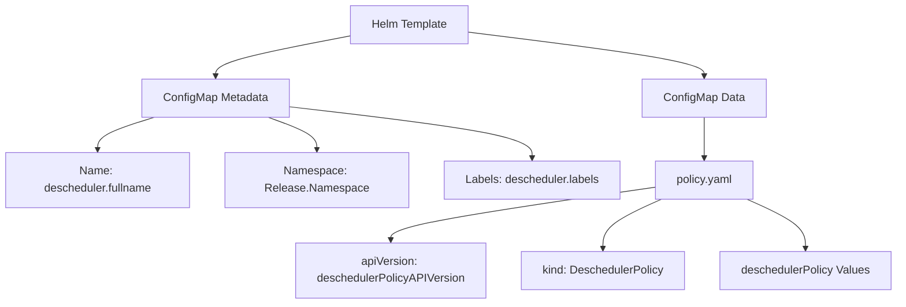
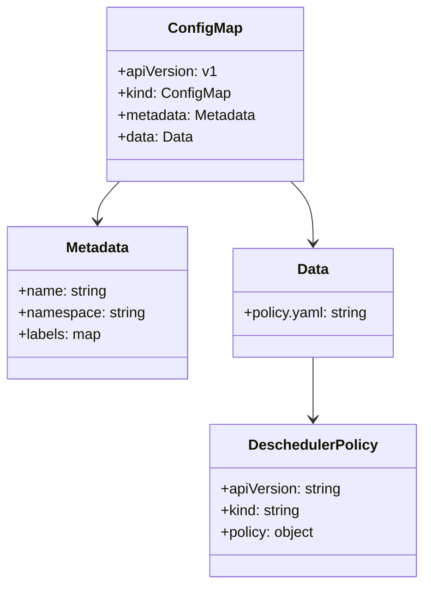
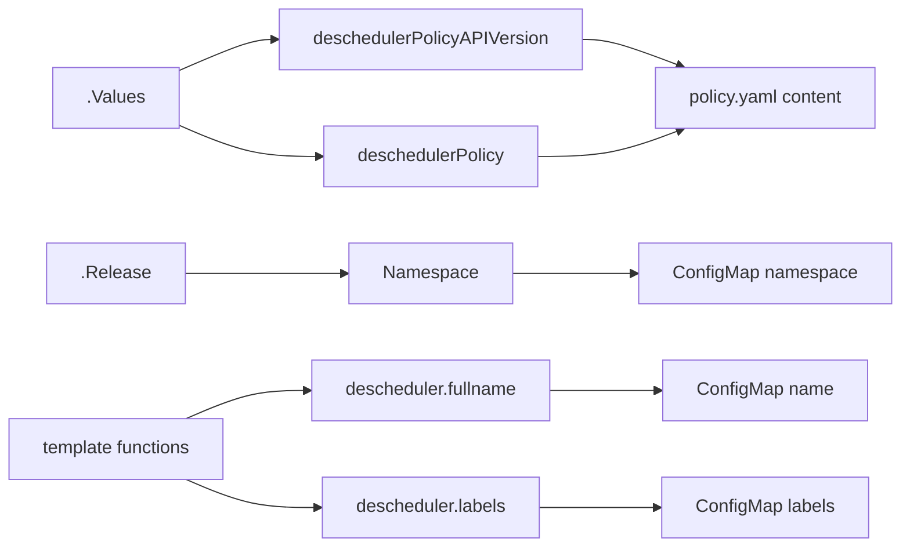

# Diagram: devops/k8s/descheduler/helm/templates/configmap.yaml

> Auto-generated by Obscura crawlers

## Diagram 1

### SVG

<svg id="container" width="1273.875" xmlns="http://www.w3.org/2000/svg" class="flowchart" height="430" viewBox="0 0 1273.875 430" role="graphics-document document" aria-roledescription="flowchart-v2"><g><marker id="container_flowchart-v2-pointEnd" class="marker flowchart-v2" viewBox="0 0 10 10" refX="5" refY="5" markerUnits="userSpaceOnUse" markerWidth="8" markerHeight="8" orient="auto"><path d="M 0 0 L 10 5 L 0 10 z" class="arrowMarkerPath" style="stroke-width: 1; stroke-dasharray: 1, 0;"></path></marker><marker id="container_flowchart-v2-pointStart" class="marker flowchart-v2" viewBox="0 0 10 10" refX="4.5" refY="5" markerUnits="userSpaceOnUse" markerWidth="8" markerHeight="8" orient="auto"><path d="M 0 5 L 10 10 L 10 0 z" class="arrowMarkerPath" style="stroke-width: 1; stroke-dasharray: 1, 0;"></path></marker><marker id="container_flowchart-v2-circleEnd" class="marker flowchart-v2" viewBox="0 0 10 10" refX="11" refY="5" markerUnits="userSpaceOnUse" markerWidth="11" markerHeight="11" orient="auto"><circle cx="5" cy="5" r="5" class="arrowMarkerPath" style="stroke-width: 1; stroke-dasharray: 1, 0;"></circle></marker><marker id="container_flowchart-v2-circleStart" class="marker flowchart-v2" viewBox="0 0 10 10" refX="-1" refY="5" markerUnits="userSpaceOnUse" markerWidth="11" markerHeight="11" orient="auto"><circle cx="5" cy="5" r="5" class="arrowMarkerPath" style="stroke-width: 1; stroke-dasharray: 1, 0;"></circle></marker><marker id="container_flowchart-v2-crossEnd" class="marker cross flowchart-v2" viewBox="0 0 11 11" refX="12" refY="5.2" markerUnits="userSpaceOnUse" markerWidth="11" markerHeight="11" orient="auto"><path d="M 1,1 l 9,9 M 10,1 l -9,9" class="arrowMarkerPath" style="stroke-width: 2; stroke-dasharray: 1, 0;"></path></marker><marker id="container_flowchart-v2-crossStart" class="marker cross flowchart-v2" viewBox="0 0 11 11" refX="-1" refY="5.2" markerUnits="userSpaceOnUse" markerWidth="11" markerHeight="11" orient="auto"><path d="M 1,1 l 9,9 M 10,1 l -9,9" class="arrowMarkerPath" style="stroke-width: 2; stroke-dasharray: 1, 0;"></path></marker><g class="root"><g class="clusters"></g><g class="edgePaths"><path d="M494.895,50.946L463.027,56.955C431.159,62.964,367.423,74.982,335.555,84.491C303.688,94,303.688,101,303.688,104.5L303.688,108" id="L_A_B_0" class="edge-thickness-normal edge-pattern-solid edge-thickness-normal edge-pattern-solid flowchart-link" style=";" data-edge="true" data-et="edge" data-id="L_A_B_0" data-points="W3sieCI6NDk0Ljg5NDUzMTI1LCJ5Ijo1MC45NDY0MDE1MDcxMDM1fSx7IngiOjMwMy42ODc1LCJ5Ijo4N30seyJ4IjozMDMuNjg3NSwieSI6MTEyfV0=" marker-end="url(#container_flowchart-v2-pointEnd)"></path><path d="M217.657,166L204.381,170.167C191.105,174.333,164.552,182.667,151.276,190.333C138,198,138,205,138,208.5L138,212" id="L_B_C_0" class="edge-thickness-normal edge-pattern-solid edge-thickness-normal edge-pattern-solid flowchart-link" style=";" data-edge="true" data-et="edge" data-id="L_B_C_0" data-points="W3sieCI6MjE3LjY1NzQ1MTkyMzA3NjksInkiOjE2Nn0seyJ4IjoxMzgsInkiOjE5MX0seyJ4IjoxMzgsInkiOjIxNn1d" marker-end="url(#container_flowchart-v2-pointEnd)"></path><path d="M378.619,166L390.182,170.167C401.746,174.333,424.873,182.667,436.436,190.333C448,198,448,205,448,208.5L448,212" id="L_B_D_0" class="edge-thickness-normal edge-pattern-solid edge-thickness-normal edge-pattern-solid flowchart-link" style=";" data-edge="true" data-et="edge" data-id="L_B_D_0" data-points="W3sieCI6Mzc4LjYxODk5MDM4NDYxNTM2LCJ5IjoxNjZ9LHsieCI6NDQ4LCJ5IjoxOTF9LHsieCI6NDQ4LCJ5IjoyMTZ9XQ==" marker-end="url(#container_flowchart-v2-pointEnd)"></path><path d="M407.664,151.018L465.314,157.682C522.964,164.346,638.263,177.673,695.913,189.836C753.563,202,753.563,213,753.563,218.5L753.563,224" id="L_B_E_0" class="edge-thickness-normal edge-pattern-solid edge-thickness-normal edge-pattern-solid flowchart-link" style=";" data-edge="true" data-et="edge" data-id="L_B_E_0" data-points="W3sieCI6NDA3LjY2NDA2MjUsInkiOjE1MS4wMTg0MDc4OTEwODA4N30seyJ4Ijo3NTMuNTYyNSwieSI6MTkxfSx7IngiOjc1My41NjI1LCJ5IjoyMjh9XQ==" marker-end="url(#container_flowchart-v2-pointEnd)"></path><path d="M664.035,45.468L719.955,52.39C775.875,59.312,887.715,73.156,943.635,83.578C999.555,94,999.555,101,999.555,104.5L999.555,108" id="L_A_F_0" class="edge-thickness-normal edge-pattern-solid edge-thickness-normal edge-pattern-solid flowchart-link" style=";" data-edge="true" data-et="edge" data-id="L_A_F_0" data-points="W3sieCI6NjY0LjAzNTE1NjI1LCJ5Ijo0NS40NjgzNzA3OTEyMTg0fSx7IngiOjk5OS41NTQ2ODc1LCJ5Ijo4N30seyJ4Ijo5OTkuNTU0Njg3NSwieSI6MTEyfV0=" marker-end="url(#container_flowchart-v2-pointEnd)"></path><path d="M999.555,166L999.555,170.167C999.555,174.333,999.555,182.667,999.555,192.333C999.555,202,999.555,213,999.555,218.5L999.555,224" id="L_F_G_0" class="edge-thickness-normal edge-pattern-solid edge-thickness-normal edge-pattern-solid flowchart-link" style=";" data-edge="true" data-et="edge" data-id="L_F_G_0" data-points="W3sieCI6OTk5LjU1NDY4NzUsInkiOjE2Nn0seyJ4Ijo5OTkuNTU0Njg3NSwieSI6MTkxfSx7IngiOjk5OS41NTQ2ODc1LCJ5IjoyMjh9XQ==" marker-end="url(#container_flowchart-v2-pointEnd)"></path><path d="M929.125,265.11L866.557,274.092C803.99,283.073,678.854,301.037,616.286,313.518C553.719,326,553.719,333,553.719,336.5L553.719,340" id="L_G_H_0" class="edge-thickness-normal edge-pattern-solid edge-thickness-normal edge-pattern-solid flowchart-link" style=";" data-edge="true" data-et="edge" data-id="L_G_H_0" data-points="W3sieCI6OTI5LjEyNSwieSI6MjY1LjExMDIyMTMxODgwMDd9LHsieCI6NTUzLjcxODc1LCJ5IjozMTl9LHsieCI6NTUzLjcxODc1LCJ5IjozNDR9XQ==" marker-end="url(#container_flowchart-v2-pointEnd)"></path><path d="M938.673,282L924.768,288.167C910.863,294.333,883.052,306.667,869.147,318.333C855.242,330,855.242,341,855.242,346.5L855.242,352" id="L_G_I_0" class="edge-thickness-normal edge-pattern-solid edge-thickness-normal edge-pattern-solid flowchart-link" style=";" data-edge="true" data-et="edge" data-id="L_G_I_0" data-points="W3sieCI6OTM4LjY3Mjg1MTU2MjUsInkiOjI4Mn0seyJ4Ijo4NTUuMjQyMTg3NSwieSI6MzE5fSx7IngiOjg1NS4yNDIxODc1LCJ5IjozNTZ9XQ==" marker-end="url(#container_flowchart-v2-pointEnd)"></path><path d="M1060.437,282L1074.342,288.167C1088.247,294.333,1116.057,306.667,1129.962,318.333C1143.867,330,1143.867,341,1143.867,346.5L1143.867,352" id="L_G_J_0" class="edge-thickness-normal edge-pattern-solid edge-thickness-normal edge-pattern-solid flowchart-link" style=";" data-edge="true" data-et="edge" data-id="L_G_J_0" data-points="W3sieCI6MTA2MC40MzY1MjM0Mzc1LCJ5IjoyODJ9LHsieCI6MTE0My44NjcxODc1LCJ5IjozMTl9LHsieCI6MTE0My44NjcxODc1LCJ5IjozNTZ9XQ==" marker-end="url(#container_flowchart-v2-pointEnd)"></path></g><g class="edgeLabels"><g class="edgeLabel"><g class="label" data-id="L_A_B_0" transform="translate(0, 0)"><foreignObject width="0" height="0">

</foreignObject></g></g><g class="edgeLabel"><g class="label" data-id="L_B_C_0" transform="translate(0, 0)"><foreignObject width="0" height="0">

</foreignObject></g></g><g class="edgeLabel"><g class="label" data-id="L_B_D_0" transform="translate(0, 0)"><foreignObject width="0" height="0">

</foreignObject></g></g><g class="edgeLabel"><g class="label" data-id="L_B_E_0" transform="translate(0, 0)"><foreignObject width="0" height="0">

</foreignObject></g></g><g class="edgeLabel"><g class="label" data-id="L_A_F_0" transform="translate(0, 0)"><foreignObject width="0" height="0">

</foreignObject></g></g><g class="edgeLabel"><g class="label" data-id="L_F_G_0" transform="translate(0, 0)"><foreignObject width="0" height="0">

</foreignObject></g></g><g class="edgeLabel"><g class="label" data-id="L_G_H_0" transform="translate(0, 0)"><foreignObject width="0" height="0">

</foreignObject></g></g><g class="edgeLabel"><g class="label" data-id="L_G_I_0" transform="translate(0, 0)"><foreignObject width="0" height="0">

</foreignObject></g></g><g class="edgeLabel"><g class="label" data-id="L_G_J_0" transform="translate(0, 0)"><foreignObject width="0" height="0">

</foreignObject></g></g></g><g class="nodes"><g class="node default" id="flowchart-A-0" transform="translate(579.46484375, 35)"><rect class="basic label-container" style="" x="-84.5703125" y="-27" width="169.140625" height="54"></rect><g class="label" style="" transform="translate(-54.5703125, -12)"><rect></rect><foreignObject width="109.140625" height="24">

Helm Template

</foreignObject></g></g><g class="node default" id="flowchart-B-1" transform="translate(303.6875, 139)"><rect class="basic label-container" style="" x="-103.9765625" y="-27" width="207.953125" height="54"></rect><g class="label" style="" transform="translate(-73.9765625, -12)"><rect></rect><foreignObject width="147.953125" height="24">

ConfigMap Metadata

</foreignObject></g></g><g class="node default" id="flowchart-C-3" transform="translate(138, 255)"><rect class="basic label-container" style="" x="-130" y="-39" width="260" height="78"></rect><g class="label" style="" transform="translate(-100, -24)"><rect></rect><foreignObject width="200" height="48">

Name: descheduler.fullname

</foreignObject></g></g><g class="node default" id="flowchart-D-5" transform="translate(448, 255)"><rect class="basic label-container" style="" x="-130" y="-39" width="260" height="78"></rect><g class="label" style="" transform="translate(-100, -24)"><rect></rect><foreignObject width="200" height="48">

Namespace: Release.Namespace

</foreignObject></g></g><g class="node default" id="flowchart-E-7" transform="translate(753.5625, 255)"><rect class="basic label-container" style="" x="-125.5625" y="-27" width="251.125" height="54"></rect><g class="label" style="" transform="translate(-95.5625, -12)"><rect></rect><foreignObject width="191.125" height="24">

Labels: descheduler.labels

</foreignObject></g></g><g class="node default" id="flowchart-F-9" transform="translate(999.5546875, 139)"><rect class="basic label-container" style="" x="-86.5" y="-27" width="173" height="54"></rect><g class="label" style="" transform="translate(-56.5, -12)"><rect></rect><foreignObject width="113" height="24">

ConfigMap Data

</foreignObject></g></g><g class="node default" id="flowchart-G-11" transform="translate(999.5546875, 255)"><rect class="basic label-container" style="" x="-70.4296875" y="-27" width="140.859375" height="54"></rect><g class="label" style="" transform="translate(-40.4296875, -12)"><rect></rect><foreignObject width="80.859375" height="24">

policy.yaml

</foreignObject></g></g><g class="node default" id="flowchart-H-13" transform="translate(553.71875, 383)"><rect class="basic label-container" style="" x="-134.90625" y="-39" width="269.8125" height="78"></rect><g class="label" style="" transform="translate(-104.90625, -24)"><rect></rect><foreignObject width="209.8125" height="48">

apiVersion: deschedulerPolicyAPIVersion

</foreignObject></g></g><g class="node default" id="flowchart-I-15" transform="translate(855.2421875, 383)"><rect class="basic label-container" style="" x="-116.6171875" y="-27" width="233.234375" height="54"></rect><g class="label" style="" transform="translate(-86.6171875, -12)"><rect></rect><foreignObject width="173.234375" height="24">

kind: DeschedulerPolicy

</foreignObject></g></g><g class="node default" id="flowchart-J-17" transform="translate(1143.8671875, 383)"><rect class="basic label-container" style="" x="-122.0078125" y="-27" width="244.015625" height="54"></rect><g class="label" style="" transform="translate(-92.0078125, -12)"><rect></rect><foreignObject width="184.015625" height="24">

deschedulerPolicy Values

</foreignObject></g></g></g></g></g></svg>

## Diagram 2

### SVG

<svg id="container" width="467.015625" xmlns="http://www.w3.org/2000/svg" class="classDiagram" height="644" viewBox="0 0 467.015625 644" role="graphics-document document" aria-roledescription="class"><g><defs><marker id="container_class-aggregationStart" class="marker aggregation class" refX="18" refY="7" markerWidth="190" markerHeight="240" orient="auto"><path d="M 18,7 L9,13 L1,7 L9,1 Z"></path></marker></defs><defs><marker id="container_class-aggregationEnd" class="marker aggregation class" refX="1" refY="7" markerWidth="20" markerHeight="28" orient="auto"><path d="M 18,7 L9,13 L1,7 L9,1 Z"></path></marker></defs><defs><marker id="container_class-extensionStart" class="marker extension class" refX="18" refY="7" markerWidth="190" markerHeight="240" orient="auto"><path d="M 1,7 L18,13 V 1 Z"></path></marker></defs><defs><marker id="container_class-extensionEnd" class="marker extension class" refX="1" refY="7" markerWidth="20" markerHeight="28" orient="auto"><path d="M 1,1 V 13 L18,7 Z"></path></marker></defs><defs><marker id="container_class-compositionStart" class="marker composition class" refX="18" refY="7" markerWidth="190" markerHeight="240" orient="auto"><path d="M 18,7 L9,13 L1,7 L9,1 Z"></path></marker></defs><defs><marker id="container_class-compositionEnd" class="marker composition class" refX="1" refY="7" markerWidth="20" markerHeight="28" orient="auto"><path d="M 18,7 L9,13 L1,7 L9,1 Z"></path></marker></defs><defs><marker id="container_class-dependencyStart" class="marker dependency class" refX="6" refY="7" markerWidth="190" markerHeight="240" orient="auto"><path d="M 5,7 L9,13 L1,7 L9,1 Z"></path></marker></defs><defs><marker id="container_class-dependencyEnd" class="marker dependency class" refX="13" refY="7" markerWidth="20" markerHeight="28" orient="auto"><path d="M 18,7 L9,13 L14,7 L9,1 Z"></path></marker></defs><defs><marker id="container_class-lollipopStart" class="marker lollipop class" refX="13" refY="7" markerWidth="190" markerHeight="240" orient="auto"><circle stroke="black" fill="transparent" cx="7" cy="7" r="6"></circle></marker></defs><defs><marker id="container_class-lollipopEnd" class="marker lollipop class" refX="1" refY="7" markerWidth="190" markerHeight="240" orient="auto"><circle stroke="black" fill="transparent" cx="7" cy="7" r="6"></circle></marker></defs><g class="root"><g class="clusters"></g><g class="edgePaths"><path d="M131.903,200L127.787,204.167C123.672,208.333,115.442,216.667,111.326,224C107.211,231.333,107.211,237.667,107.211,240.833L107.211,244" id="id_ConfigMap_Metadata_1" class="edge-thickness-normal edge-pattern-solid relation" style=";;;" data-edge="true" data-et="edge" data-id="id_ConfigMap_Metadata_1" data-points="W3sieCI6MTMxLjkwMjYzNDI5NzUyMDY1LCJ5IjoyMDB9LHsieCI6MTA3LjIxMDkzNzUsInkiOjIyNX0seyJ4IjoxMDcuMjEwOTM3NSwieSI6MjUwfV0=" marker-end="url(#container_class-dependencyEnd)"></path><path d="M321.535,200L325.65,204.167C329.765,208.333,337.996,216.667,342.111,228C346.227,239.333,346.227,253.667,346.227,260.833L346.227,268" id="id_ConfigMap_Data_2" class="edge-thickness-normal edge-pattern-solid relation" style=";;;" data-edge="true" data-et="edge" data-id="id_ConfigMap_Data_2" data-points="W3sieCI6MzIxLjUzNDg2NTcwMjQ3OTM1LCJ5IjoyMDB9LHsieCI6MzQ2LjIyNjU2MjUsInkiOjIyNX0seyJ4IjozNDYuMjI2NTYyNSwieSI6Mjc0fV0=" marker-end="url(#container_class-dependencyEnd)"></path><path d="M346.227,394L346.227,402.167C346.227,410.333,346.227,426.667,346.227,438C346.227,449.333,346.227,455.667,346.227,458.833L346.227,462" id="id_Data_DeschedulerPolicy_3" class="edge-thickness-normal edge-pattern-solid relation" style=";;;" data-edge="true" data-et="edge" data-id="id_Data_DeschedulerPolicy_3" data-points="W3sieCI6MzQ2LjIyNjU2MjUsInkiOjM5NH0seyJ4IjozNDYuMjI2NTYyNSwieSI6NDQzfSx7IngiOjM0Ni4yMjY1NjI1LCJ5Ijo0Njh9XQ==" marker-end="url(#container_class-dependencyEnd)"></path></g><g class="edgeLabels"><g class="edgeLabel"><g class="label" data-id="id_ConfigMap_Metadata_1" transform="translate(0, 0)"><foreignObject width="0" height="0">

</foreignObject></g></g><g class="edgeLabel"><g class="label" data-id="id_ConfigMap_Data_2" transform="translate(0, 0)"><foreignObject width="0" height="0">

</foreignObject></g></g><g class="edgeLabel"><g class="label" data-id="id_Data_DeschedulerPolicy_3" transform="translate(0, 0)"><foreignObject width="0" height="0">

</foreignObject></g></g></g><g class="nodes"><g class="node default" id="classId-ConfigMap-0" transform="translate(226.71875, 104)"><g class="basic label-container"><path d="M-108.03515625 -96 L108.03515625 -96 L108.03515625 96 L-108.03515625 96" stroke="none" stroke-width="0" fill="#ECECFF" style=""></path><path d="M-108.03515625 -96 C-24.440293875510875 -96, 59.15456849897825 -96, 108.03515625 -96 M-108.03515625 -96 C-64.6438434446035 -96, -21.252530639206995 -96, 108.03515625 -96 M108.03515625 -96 C108.03515625 -25.964325495867996, 108.03515625 44.07134900826401, 108.03515625 96 M108.03515625 -96 C108.03515625 -51.054013051265514, 108.03515625 -6.108026102531028, 108.03515625 96 M108.03515625 96 C43.20873907683476 96, -21.61767809633048 96, -108.03515625 96 M108.03515625 96 C51.85781063610947 96, -4.3195349777810605 96, -108.03515625 96 M-108.03515625 96 C-108.03515625 33.2129488536903, -108.03515625 -29.5741022926194, -108.03515625 -96 M-108.03515625 96 C-108.03515625 34.26646402847936, -108.03515625 -27.467071943041276, -108.03515625 -96" stroke="#9370DB" stroke-width="1.3" fill="none" stroke-dasharray="0 0" style=""></path></g><g class="annotation-group text" transform="translate(0, -72)"></g><g class="label-group text" transform="translate(-38.3828125, -72)"><g class="label" style="font-weight: bolder" transform="translate(0,-12)"><foreignObject width="76.765625" height="24">

ConfigMap

</foreignObject></g></g><g class="members-group text" transform="translate(-96.03515625, -24)"><g class="label" style="" transform="translate(0,-12)"><foreignObject width="107.203125" height="24">

+apiVersion: v1

</foreignObject></g><g class="label" style="" transform="translate(0,12)"><foreignObject width="123.25" height="24">

+kind: ConfigMap

</foreignObject></g><g class="label" style="" transform="translate(0,36)"><foreignObject width="153.6875" height="24">

+metadata: Metadata

</foreignObject></g><g class="label" style="" transform="translate(0,60)"><foreignObject width="81.921875" height="24">

+data: Data

</foreignObject></g></g><g class="methods-group text" transform="translate(-96.03515625, 96)"></g><g class="divider" style=""><path d="M-108.03515625 -48 C-31.310614931674138 -48, 45.413926386651724 -48, 108.03515625 -48 M-108.03515625 -48 C-22.889549777265728 -48, 62.256056695468544 -48, 108.03515625 -48" stroke="#9370DB" stroke-width="1.3" fill="none" stroke-dasharray="0 0" style=""></path></g><g class="divider" style=""><path d="M-108.03515625 72 C-32.03128475911548 72, 43.97258673176904 72, 108.03515625 72 M-108.03515625 72 C-35.390142667687 72, 37.254870914626 72, 108.03515625 72" stroke="#9370DB" stroke-width="1.3" fill="none" stroke-dasharray="0 0" style=""></path></g></g><g class="node default" id="classId-Metadata-1" transform="translate(107.2109375, 334)"><g class="basic label-container"><path d="M-99.2109375 -84 L99.2109375 -84 L99.2109375 84 L-99.2109375 84" stroke="none" stroke-width="0" fill="#ECECFF" style=""></path><path d="M-99.2109375 -84 C-27.86048277665175 -84, 43.4899719466965 -84, 99.2109375 -84 M-99.2109375 -84 C-24.584090619592246 -84, 50.04275626081551 -84, 99.2109375 -84 M99.2109375 -84 C99.2109375 -25.029518893375396, 99.2109375 33.94096221324921, 99.2109375 84 M99.2109375 -84 C99.2109375 -45.51432275428261, 99.2109375 -7.028645508565219, 99.2109375 84 M99.2109375 84 C42.841808063284766 84, -13.527321373430468 84, -99.2109375 84 M99.2109375 84 C22.436437587680814 84, -54.33806232463837 84, -99.2109375 84 M-99.2109375 84 C-99.2109375 20.960603598856792, -99.2109375 -42.078792802286415, -99.2109375 -84 M-99.2109375 84 C-99.2109375 31.669547926144197, -99.2109375 -20.660904147711605, -99.2109375 -84" stroke="#9370DB" stroke-width="1.3" fill="none" stroke-dasharray="0 0" style=""></path></g><g class="annotation-group text" transform="translate(0, -60)"></g><g class="label-group text" transform="translate(-34.640625, -60)"><g class="label" style="font-weight: bolder" transform="translate(0,-12)"><foreignObject width="69.28125" height="24">

Metadata

</foreignObject></g></g><g class="members-group text" transform="translate(-87.2109375, -12)"><g class="label" style="" transform="translate(0,-12)"><foreignObject width="98.21875" height="24">

+name: string

</foreignObject></g><g class="label" style="" transform="translate(0,12)"><foreignObject width="139.78125" height="24">

+namespace: string

</foreignObject></g><g class="label" style="" transform="translate(0,36)"><foreignObject width="91.6875" height="24">

+labels: map

</foreignObject></g></g><g class="methods-group text" transform="translate(-87.2109375, 84)"></g><g class="divider" style=""><path d="M-99.2109375 -36 C-47.35027149917575 -36, 4.510394501648506 -36, 99.2109375 -36 M-99.2109375 -36 C-36.047515484113326 -36, 27.115906531773348 -36, 99.2109375 -36" stroke="#9370DB" stroke-width="1.3" fill="none" stroke-dasharray="0 0" style=""></path></g><g class="divider" style=""><path d="M-99.2109375 60 C-39.458539507291114 60, 20.293858485417772 60, 99.2109375 60 M-99.2109375 60 C-22.940735607526136 60, 53.32946628494773 60, 99.2109375 60" stroke="#9370DB" stroke-width="1.3" fill="none" stroke-dasharray="0 0" style=""></path></g></g><g class="node default" id="classId-Data-2" transform="translate(346.2265625, 334)"><g class="basic label-container"><path d="M-89.8046875 -60 L89.8046875 -60 L89.8046875 60 L-89.8046875 60" stroke="none" stroke-width="0" fill="#ECECFF" style=""></path><path d="M-89.8046875 -60 C-30.281740682953867 -60, 29.241206134092266 -60, 89.8046875 -60 M-89.8046875 -60 C-53.51569004146866 -60, -17.226692582937318 -60, 89.8046875 -60 M89.8046875 -60 C89.8046875 -19.955013722319087, 89.8046875 20.089972555361825, 89.8046875 60 M89.8046875 -60 C89.8046875 -29.09282410844783, 89.8046875 1.8143517831043425, 89.8046875 60 M89.8046875 60 C36.424490020472 60, -16.955707459056 60, -89.8046875 60 M89.8046875 60 C47.75898035158788 60, 5.71327320317576 60, -89.8046875 60 M-89.8046875 60 C-89.8046875 33.271154837662266, -89.8046875 6.542309675324525, -89.8046875 -60 M-89.8046875 60 C-89.8046875 22.242551480304208, -89.8046875 -15.514897039391585, -89.8046875 -60" stroke="#9370DB" stroke-width="1.3" fill="none" stroke-dasharray="0 0" style=""></path></g><g class="annotation-group text" transform="translate(0, -36)"></g><g class="label-group text" transform="translate(-16.890625, -36)"><g class="label" style="font-weight: bolder" transform="translate(0,-12)"><foreignObject width="33.78125" height="24">

Data

</foreignObject></g></g><g class="members-group text" transform="translate(-77.8046875, 12)"><g class="label" style="" transform="translate(0,-12)"><foreignObject width="138.71875" height="24">

+policy.yaml: string

</foreignObject></g></g><g class="methods-group text" transform="translate(-77.8046875, 60)"></g><g class="divider" style=""><path d="M-89.8046875 -12 C-47.18501269903748 -12, -4.565337898074958 -12, 89.8046875 -12 M-89.8046875 -12 C-26.816340835972944 -12, 36.17200582805411 -12, 89.8046875 -12" stroke="#9370DB" stroke-width="1.3" fill="none" stroke-dasharray="0 0" style=""></path></g><g class="divider" style=""><path d="M-89.8046875 36 C-45.47464666908453 36, -1.1446058381690563 36, 89.8046875 36 M-89.8046875 36 C-41.690385685786005 36, 6.42391612842799 36, 89.8046875 36" stroke="#9370DB" stroke-width="1.3" fill="none" stroke-dasharray="0 0" style=""></path></g></g><g class="node default" id="classId-DeschedulerPolicy-3" transform="translate(346.2265625, 552)"><g class="basic label-container"><path d="M-112.7890625 -84 L112.7890625 -84 L112.7890625 84 L-112.7890625 84" stroke="none" stroke-width="0" fill="#ECECFF" style=""></path><path d="M-112.7890625 -84 C-29.396616484550748 -84, 53.995829530898504 -84, 112.7890625 -84 M-112.7890625 -84 C-25.29645183285338 -84, 62.19615883429324 -84, 112.7890625 -84 M112.7890625 -84 C112.7890625 -33.545903679634044, 112.7890625 16.90819264073191, 112.7890625 84 M112.7890625 -84 C112.7890625 -43.02738617360617, 112.7890625 -2.054772347212335, 112.7890625 84 M112.7890625 84 C63.18567349056592 84, 13.582284481131836 84, -112.7890625 84 M112.7890625 84 C36.262309515710285 84, -40.26444346857943 84, -112.7890625 84 M-112.7890625 84 C-112.7890625 48.09250571144856, -112.7890625 12.18501142289712, -112.7890625 -84 M-112.7890625 84 C-112.7890625 23.09940616176423, -112.7890625 -37.80118767647154, -112.7890625 -84" stroke="#9370DB" stroke-width="1.3" fill="none" stroke-dasharray="0 0" style=""></path></g><g class="annotation-group text" transform="translate(0, -60)"></g><g class="label-group text" transform="translate(-67.53125, -60)"><g class="label" style="font-weight: bolder" transform="translate(0,-12)"><foreignObject width="135.0625" height="24">

DeschedulerPolicy

</foreignObject></g></g><g class="members-group text" transform="translate(-100.7890625, -12)"><g class="label" style="" transform="translate(0,-12)"><foreignObject width="134.046875" height="24">

+apiVersion: string

</foreignObject></g><g class="label" style="" transform="translate(0,12)"><foreignObject width="89.359375" height="24">

+kind: string

</foreignObject></g><g class="label" style="" transform="translate(0,36)"><foreignObject width="105.171875" height="24">

+policy: object

</foreignObject></g></g><g class="methods-group text" transform="translate(-100.7890625, 84)"></g><g class="divider" style=""><path d="M-112.7890625 -36 C-58.14475222222917 -36, -3.500441944458345 -36, 112.7890625 -36 M-112.7890625 -36 C-66.52984184514739 -36, -20.27062119029479 -36, 112.7890625 -36" stroke="#9370DB" stroke-width="1.3" fill="none" stroke-dasharray="0 0" style=""></path></g><g class="divider" style=""><path d="M-112.7890625 60 C-60.06879230411731 60, -7.348522108234619 60, 112.7890625 60 M-112.7890625 60 C-48.497869051737155 60, 15.79332439652569 60, 112.7890625 60" stroke="#9370DB" stroke-width="1.3" fill="none" stroke-dasharray="0 0" style=""></path></g></g></g></g></g></svg>

## Diagram 3

### SVG

<svg id="container" width="805.140625" xmlns="http://www.w3.org/2000/svg" class="flowchart" height="486" viewBox="0 0 805.140625 486" role="graphics-document document" aria-roledescription="flowchart-v2"><g><marker id="container_flowchart-v2-pointEnd" class="marker flowchart-v2" viewBox="0 0 10 10" refX="5" refY="5" markerUnits="userSpaceOnUse" markerWidth="8" markerHeight="8" orient="auto"><path d="M 0 0 L 10 5 L 0 10 z" class="arrowMarkerPath" style="stroke-width: 1; stroke-dasharray: 1, 0;"></path></marker><marker id="container_flowchart-v2-pointStart" class="marker flowchart-v2" viewBox="0 0 10 10" refX="4.5" refY="5" markerUnits="userSpaceOnUse" markerWidth="8" markerHeight="8" orient="auto"><path d="M 0 5 L 10 10 L 10 0 z" class="arrowMarkerPath" style="stroke-width: 1; stroke-dasharray: 1, 0;"></path></marker><marker id="container_flowchart-v2-circleEnd" class="marker flowchart-v2" viewBox="0 0 10 10" refX="11" refY="5" markerUnits="userSpaceOnUse" markerWidth="11" markerHeight="11" orient="auto"><circle cx="5" cy="5" r="5" class="arrowMarkerPath" style="stroke-width: 1; stroke-dasharray: 1, 0;"></circle></marker><marker id="container_flowchart-v2-circleStart" class="marker flowchart-v2" viewBox="0 0 10 10" refX="-1" refY="5" markerUnits="userSpaceOnUse" markerWidth="11" markerHeight="11" orient="auto"><circle cx="5" cy="5" r="5" class="arrowMarkerPath" style="stroke-width: 1; stroke-dasharray: 1, 0;"></circle></marker><marker id="container_flowchart-v2-crossEnd" class="marker cross flowchart-v2" viewBox="0 0 11 11" refX="12" refY="5.2" markerUnits="userSpaceOnUse" markerWidth="11" markerHeight="11" orient="auto"><path d="M 1,1 l 9,9 M 10,1 l -9,9" class="arrowMarkerPath" style="stroke-width: 2; stroke-dasharray: 1, 0;"></path></marker><marker id="container_flowchart-v2-crossStart" class="marker cross flowchart-v2" viewBox="0 0 11 11" refX="-1" refY="5.2" markerUnits="userSpaceOnUse" markerWidth="11" markerHeight="11" orient="auto"><path d="M 1,1 l 9,9 M 10,1 l -9,9" class="arrowMarkerPath" style="stroke-width: 2; stroke-dasharray: 1, 0;"></path></marker><g class="root"><g class="clusters"></g><g class="edgePaths"><path d="M161.758,63.876L173.21,59.063C184.661,54.251,207.565,44.625,222.517,39.813C237.469,35,244.469,35,247.969,35L251.469,35" id="L_A_B_0" class="edge-thickness-normal edge-pattern-solid edge-thickness-normal edge-pattern-solid flowchart-link" style=";" data-edge="true" data-et="edge" data-id="L_A_B_0" data-points="W3sieCI6MTYxLjc1NzgxMjUsInkiOjYzLjg3NjEyMDcyMjMxMzQyfSx7IngiOjIzMC40Njg3NSwieSI6MzV9LHsieCI6MjU1LjQ2ODc1LCJ5IjozNX1d" marker-end="url(#container_flowchart-v2-pointEnd)"></path><path d="M161.758,110.124L173.21,114.937C184.661,119.749,207.565,129.375,228.936,134.187C250.307,139,270.146,139,280.065,139L289.984,139" id="L_A_C_0" class="edge-thickness-normal edge-pattern-solid edge-thickness-normal edge-pattern-solid flowchart-link" style=";" data-edge="true" data-et="edge" data-id="L_A_C_0" data-points="W3sieCI6MTYxLjc1NzgxMjUsInkiOjExMC4xMjM4NzkyNzc2ODY1N30seyJ4IjoyMzAuNDY4NzUsInkiOjEzOX0seyJ4IjoyOTMuOTg0Mzc1LCJ5IjoxMzl9XQ==" marker-end="url(#container_flowchart-v2-pointEnd)"></path><path d="M166.688,243L177.318,243C187.948,243,209.208,243,233.853,243C258.497,243,286.526,243,300.54,243L314.555,243" id="L_D_E_0" class="edge-thickness-normal edge-pattern-solid edge-thickness-normal edge-pattern-solid flowchart-link" style=";" data-edge="true" data-et="edge" data-id="L_D_E_0" data-points="W3sieCI6MTY2LjY4NzUsInkiOjI0M30seyJ4IjoyMzAuNDY4NzUsInkiOjI0M30seyJ4IjozMTguNTU0Njg3NSwieSI6MjQzfV0=" marker-end="url(#container_flowchart-v2-pointEnd)"></path><path d="M170.981,372L180.896,367.833C190.81,363.667,210.64,355.333,228.472,351.167C246.305,347,262.141,347,270.059,347L277.977,347" id="L_F_G_0" class="edge-thickness-normal edge-pattern-solid edge-thickness-normal edge-pattern-solid flowchart-link" style=";" data-edge="true" data-et="edge" data-id="L_F_G_0" data-points="W3sieCI6MTcwLjk4MTA2OTcxMTUzODQ1LCJ5IjozNzJ9LHsieCI6MjMwLjQ2ODc1LCJ5IjozNDd9LHsieCI6MjgxLjk3NjU2MjUsInkiOjM0N31d" marker-end="url(#container_flowchart-v2-pointEnd)"></path><path d="M170.981,426L180.896,430.167C190.81,434.333,210.64,442.667,230.192,446.833C249.745,451,269.021,451,278.659,451L288.297,451" id="L_F_H_0" class="edge-thickness-normal edge-pattern-solid edge-thickness-normal edge-pattern-solid flowchart-link" style=";" data-edge="true" data-et="edge" data-id="L_F_H_0" data-points="W3sieCI6MTcwLjk4MTA2OTcxMTUzODQ1LCJ5Ijo0MjZ9LHsieCI6MjMwLjQ2ODc1LCJ5Ijo0NTF9LHsieCI6MjkyLjI5Njg3NSwieSI6NDUxfV0=" marker-end="url(#container_flowchart-v2-pointEnd)"></path><path d="M525.281,35L529.448,35C533.615,35,541.948,35,556.384,38.928C570.82,42.857,591.358,50.714,601.627,54.642L611.896,58.571" id="L_B_I_0" class="edge-thickness-normal edge-pattern-solid edge-thickness-normal edge-pattern-solid flowchart-link" style=";" data-edge="true" data-et="edge" data-id="L_B_I_0" data-points="W3sieCI6NTI1LjI4MTI1LCJ5IjozNX0seyJ4Ijo1NTAuMjgxMjUsInkiOjM1fSx7IngiOjYxNS42MzIwNjEyOTgwNzY5LCJ5Ijo2MH1d" marker-end="url(#container_flowchart-v2-pointEnd)"></path><path d="M486.766,139L497.352,139C507.938,139,529.109,139,549.964,135.072C570.82,131.143,591.358,123.286,601.627,119.358L611.896,115.429" id="L_C_I_0" class="edge-thickness-normal edge-pattern-solid edge-thickness-normal edge-pattern-solid flowchart-link" style=";" data-edge="true" data-et="edge" data-id="L_C_I_0" data-points="W3sieCI6NDg2Ljc2NTYyNSwieSI6MTM5fSx7IngiOjU1MC4yODEyNSwieSI6MTM5fSx7IngiOjYxNS42MzIwNjEyOTgwNzY5LCJ5IjoxMTR9XQ==" marker-end="url(#container_flowchart-v2-pointEnd)"></path><path d="M462.195,243L476.876,243C491.557,243,520.919,243,539.1,243C557.281,243,564.281,243,567.781,243L571.281,243" id="L_E_J_0" class="edge-thickness-normal edge-pattern-solid edge-thickness-normal edge-pattern-solid flowchart-link" style=";" data-edge="true" data-et="edge" data-id="L_E_J_0" data-points="W3sieCI6NDYyLjE5NTMxMjUsInkiOjI0M30seyJ4Ijo1NTAuMjgxMjUsInkiOjI0M30seyJ4Ijo1NzUuMjgxMjUsInkiOjI0M31d" marker-end="url(#container_flowchart-v2-pointEnd)"></path><path d="M498.773,347L507.358,347C515.943,347,533.112,347,548.66,347C564.208,347,578.135,347,585.099,347L592.063,347" id="L_G_K_0" class="edge-thickness-normal edge-pattern-solid edge-thickness-normal edge-pattern-solid flowchart-link" style=";" data-edge="true" data-et="edge" data-id="L_G_K_0" data-points="W3sieCI6NDk4Ljc3MzQzNzUsInkiOjM0N30seyJ4Ijo1NTAuMjgxMjUsInkiOjM0N30seyJ4Ijo1OTYuMDYyNSwieSI6MzQ3fV0=" marker-end="url(#container_flowchart-v2-pointEnd)"></path><path d="M488.453,451L498.758,451C509.063,451,529.672,451,546.674,451C563.677,451,577.073,451,583.771,451L590.469,451" id="L_H_L_0" class="edge-thickness-normal edge-pattern-solid edge-thickness-normal edge-pattern-solid flowchart-link" style=";" data-edge="true" data-et="edge" data-id="L_H_L_0" data-points="W3sieCI6NDg4LjQ1MzEyNSwieSI6NDUxfSx7IngiOjU1MC4yODEyNSwieSI6NDUxfSx7IngiOjU5NC40Njg3NSwieSI6NDUxfV0=" marker-end="url(#container_flowchart-v2-pointEnd)"></path></g><g class="edgeLabels"><g class="edgeLabel"><g class="label" data-id="L_A_B_0" transform="translate(0, 0)"><foreignObject width="0" height="0">

</foreignObject></g></g><g class="edgeLabel"><g class="label" data-id="L_A_C_0" transform="translate(0, 0)"><foreignObject width="0" height="0">

</foreignObject></g></g><g class="edgeLabel"><g class="label" data-id="L_D_E_0" transform="translate(0, 0)"><foreignObject width="0" height="0">

</foreignObject></g></g><g class="edgeLabel"><g class="label" data-id="L_F_G_0" transform="translate(0, 0)"><foreignObject width="0" height="0">

</foreignObject></g></g><g class="edgeLabel"><g class="label" data-id="L_F_H_0" transform="translate(0, 0)"><foreignObject width="0" height="0">

</foreignObject></g></g><g class="edgeLabel"><g class="label" data-id="L_B_I_0" transform="translate(0, 0)"><foreignObject width="0" height="0">

</foreignObject></g></g><g class="edgeLabel"><g class="label" data-id="L_C_I_0" transform="translate(0, 0)"><foreignObject width="0" height="0">

</foreignObject></g></g><g class="edgeLabel"><g class="label" data-id="L_E_J_0" transform="translate(0, 0)"><foreignObject width="0" height="0">

</foreignObject></g></g><g class="edgeLabel"><g class="label" data-id="L_G_K_0" transform="translate(0, 0)"><foreignObject width="0" height="0">

</foreignObject></g></g><g class="edgeLabel"><g class="label" data-id="L_H_L_0" transform="translate(0, 0)"><foreignObject width="0" height="0">

</foreignObject></g></g></g><g class="nodes"><g class="node default" id="flowchart-A-0" transform="translate(106.734375, 87)"><rect class="basic label-container" style="" x="-55.0234375" y="-27" width="110.046875" height="54"></rect><g class="label" style="" transform="translate(-25.0234375, -12)"><rect></rect><foreignObject width="50.046875" height="24">

.Values

</foreignObject></g></g><g class="node default" id="flowchart-B-1" transform="translate(390.375, 35)"><rect class="basic label-container" style="" x="-134.90625" y="-27" width="269.8125" height="54"></rect><g class="label" style="" transform="translate(-104.90625, -12)"><rect></rect><foreignObject width="209.8125" height="24">

deschedulerPolicyAPIVersion

</foreignObject></g></g><g class="node default" id="flowchart-C-3" transform="translate(390.375, 139)"><rect class="basic label-container" style="" x="-96.390625" y="-27" width="192.78125" height="54"></rect><g class="label" style="" transform="translate(-66.390625, -12)"><rect></rect><foreignObject width="132.78125" height="24">

deschedulerPolicy

</foreignObject></g></g><g class="node default" id="flowchart-D-4" transform="translate(106.734375, 243)"><rect class="basic label-container" style="" x="-59.953125" y="-27" width="119.90625" height="54"></rect><g class="label" style="" transform="translate(-29.953125, -12)"><rect></rect><foreignObject width="59.90625" height="24">

.Release

</foreignObject></g></g><g class="node default" id="flowchart-E-5" transform="translate(390.375, 243)"><rect class="basic label-container" style="" x="-71.8203125" y="-27" width="143.640625" height="54"></rect><g class="label" style="" transform="translate(-41.8203125, -12)"><rect></rect><foreignObject width="83.640625" height="24">

Namespace

</foreignObject></g></g><g class="node default" id="flowchart-F-6" transform="translate(106.734375, 399)"><rect class="basic label-container" style="" x="-98.734375" y="-27" width="197.46875" height="54"></rect><g class="label" style="" transform="translate(-68.734375, -12)"><rect></rect><foreignObject width="137.46875" height="24">

template functions

</foreignObject></g></g><g class="node default" id="flowchart-G-7" transform="translate(390.375, 347)"><rect class="basic label-container" style="" x="-108.3984375" y="-27" width="216.796875" height="54"></rect><g class="label" style="" transform="translate(-78.3984375, -12)"><rect></rect><foreignObject width="156.796875" height="24">

descheduler.fullname

</foreignObject></g></g><g class="node default" id="flowchart-H-9" transform="translate(390.375, 451)"><rect class="basic label-container" style="" x="-98.078125" y="-27" width="196.15625" height="54"></rect><g class="label" style="" transform="translate(-68.078125, -12)"><rect></rect><foreignObject width="136.15625" height="24">

descheduler.labels

</foreignObject></g></g><g class="node default" id="flowchart-I-11" transform="translate(686.2109375, 87)"><rect class="basic label-container" style="" x="-100.2734375" y="-27" width="200.546875" height="54"></rect><g class="label" style="" transform="translate(-70.2734375, -12)"><rect></rect><foreignObject width="140.546875" height="24">

policy.yaml content

</foreignObject></g></g><g class="node default" id="flowchart-J-15" transform="translate(686.2109375, 243)"><rect class="basic label-container" style="" x="-110.9296875" y="-27" width="221.859375" height="54"></rect><g class="label" style="" transform="translate(-80.9296875, -12)"><rect></rect><foreignObject width="161.859375" height="24">

ConfigMap namespace

</foreignObject></g></g><g class="node default" id="flowchart-K-17" transform="translate(686.2109375, 347)"><rect class="basic label-container" style="" x="-90.1484375" y="-27" width="180.296875" height="54"></rect><g class="label" style="" transform="translate(-60.1484375, -12)"><rect></rect><foreignObject width="120.296875" height="24">

ConfigMap name

</foreignObject></g></g><g class="node default" id="flowchart-L-19" transform="translate(686.2109375, 451)"><rect class="basic label-container" style="" x="-91.7421875" y="-27" width="183.484375" height="54"></rect><g class="label" style="" transform="translate(-61.7421875, -12)"><rect></rect><foreignObject width="123.484375" height="24">

ConfigMap labels

</foreignObject></g></g></g></g></g></svg>
