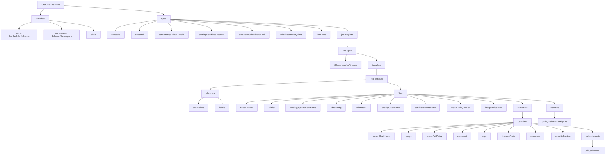
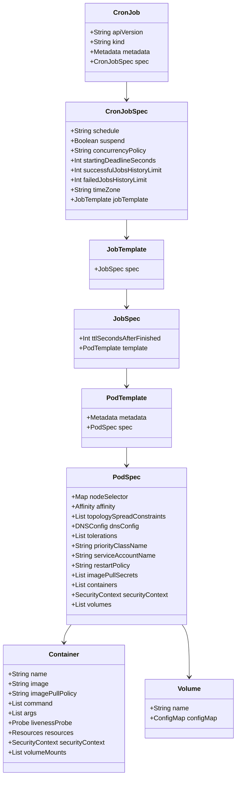

# Diagram: devops/k8s/descheduler/helm/templates/cronjob.yaml

> Auto-generated by Obscura crawlers

## Diagram 1

### SVG

<svg id="container" width="4446.5078125" xmlns="http://www.w3.org/2000/svg" class="flowchart" height="1134" viewBox="0 0 4446.5078125 1134" role="graphics-document document" aria-roledescription="flowchart-v2"><g><marker id="container_flowchart-v2-pointEnd" class="marker flowchart-v2" viewBox="0 0 10 10" refX="5" refY="5" markerUnits="userSpaceOnUse" markerWidth="8" markerHeight="8" orient="auto"><path d="M 0 0 L 10 5 L 0 10 z" class="arrowMarkerPath" style="stroke-width: 1; stroke-dasharray: 1, 0;"></path></marker><marker id="container_flowchart-v2-pointStart" class="marker flowchart-v2" viewBox="0 0 10 10" refX="4.5" refY="5" markerUnits="userSpaceOnUse" markerWidth="8" markerHeight="8" orient="auto"><path d="M 0 5 L 10 10 L 10 0 z" class="arrowMarkerPath" style="stroke-width: 1; stroke-dasharray: 1, 0;"></path></marker><marker id="container_flowchart-v2-circleEnd" class="marker flowchart-v2" viewBox="0 0 10 10" refX="11" refY="5" markerUnits="userSpaceOnUse" markerWidth="11" markerHeight="11" orient="auto"><circle cx="5" cy="5" r="5" class="arrowMarkerPath" style="stroke-width: 1; stroke-dasharray: 1, 0;"></circle></marker><marker id="container_flowchart-v2-circleStart" class="marker flowchart-v2" viewBox="0 0 10 10" refX="-1" refY="5" markerUnits="userSpaceOnUse" markerWidth="11" markerHeight="11" orient="auto"><circle cx="5" cy="5" r="5" class="arrowMarkerPath" style="stroke-width: 1; stroke-dasharray: 1, 0;"></circle></marker><marker id="container_flowchart-v2-crossEnd" class="marker cross flowchart-v2" viewBox="0 0 11 11" refX="12" refY="5.2" markerUnits="userSpaceOnUse" markerWidth="11" markerHeight="11" orient="auto"><path d="M 1,1 l 9,9 M 10,1 l -9,9" class="arrowMarkerPath" style="stroke-width: 2; stroke-dasharray: 1, 0;"></path></marker><marker id="container_flowchart-v2-crossStart" class="marker cross flowchart-v2" viewBox="0 0 11 11" refX="-1" refY="5.2" markerUnits="userSpaceOnUse" markerWidth="11" markerHeight="11" orient="auto"><path d="M 1,1 l 9,9 M 10,1 l -9,9" class="arrowMarkerPath" style="stroke-width: 2; stroke-dasharray: 1, 0;"></path></marker><g class="root"><g class="clusters"></g><g class="edgePaths"><path d="M332.031,62L325.525,66.167C319.02,70.333,306.01,78.667,299.505,86.333C293,94,293,101,293,104.5L293,108" id="L_A_B_0" class="edge-thickness-normal edge-pattern-solid edge-thickness-normal edge-pattern-solid flowchart-link" style=";" data-edge="true" data-et="edge" data-id="L_A_B_0" data-points="W3sieCI6MzMyLjAzMDU3MzkxODI2OTIsInkiOjYyfSx7IngiOjI5MywieSI6ODd9LHsieCI6MjkzLCJ5IjoxMTJ9XQ==" marker-end="url(#container_flowchart-v2-pointEnd)"></path><path d="M467.754,40.931L588.899,48.609C710.044,56.287,952.335,71.644,1073.48,82.822C1194.625,94,1194.625,101,1194.625,104.5L1194.625,108" id="L_A_C_0" class="edge-thickness-normal edge-pattern-solid edge-thickness-normal edge-pattern-solid flowchart-link" style=";" data-edge="true" data-et="edge" data-id="L_A_C_0" data-points="W3sieCI6NDY3Ljc1MzkwNjI1LCJ5Ijo0MC45MzA1MzQ3MjU0OTU1Mn0seyJ4IjoxMTk0LjYyNSwieSI6ODd9LHsieCI6MTE5NC42MjUsInkiOjExMn1d" marker-end="url(#container_flowchart-v2-pointEnd)"></path><path d="M228.906,160.502L213.755,165.585C198.604,170.668,168.302,180.834,153.151,189.417C138,198,138,205,138,208.5L138,212" id="L_B_B1_0" class="edge-thickness-normal edge-pattern-solid edge-thickness-normal edge-pattern-solid flowchart-link" style=";" data-edge="true" data-et="edge" data-id="L_B_B1_0" data-points="W3sieCI6MjI4LjkwNjI1LCJ5IjoxNjAuNTAyNDE5MzU0ODM4N30seyJ4IjoxMzgsInkiOjE5MX0seyJ4IjoxMzgsInkiOjIxNn1d" marker-end="url(#container_flowchart-v2-pointEnd)"></path><path d="M357.094,160.502L372.245,165.585C387.396,170.668,417.698,180.834,432.849,189.417C448,198,448,205,448,208.5L448,212" id="L_B_B2_0" class="edge-thickness-normal edge-pattern-solid edge-thickness-normal edge-pattern-solid flowchart-link" style=";" data-edge="true" data-et="edge" data-id="L_B_B2_0" data-points="W3sieCI6MzU3LjA5Mzc1LCJ5IjoxNjAuNTAyNDE5MzU0ODM4N30seyJ4Ijo0NDgsInkiOjE5MX0seyJ4Ijo0NDgsInkiOjIxNn1d" marker-end="url(#container_flowchart-v2-pointEnd)"></path><path d="M357.094,147.615L410.887,154.846C464.68,162.077,572.266,176.538,626.059,189.269C679.852,202,679.852,213,679.852,218.5L679.852,224" id="L_B_B3_0" class="edge-thickness-normal edge-pattern-solid edge-thickness-normal edge-pattern-solid flowchart-link" style=";" data-edge="true" data-et="edge" data-id="L_B_B3_0" data-points="W3sieCI6MzU3LjA5Mzc1LCJ5IjoxNDcuNjE1Mzg0NjE1Mzg0Nn0seyJ4Ijo2NzkuODUxNTYyNSwieSI6MTkxfSx7IngiOjY3OS44NTE1NjI1LCJ5IjoyMjh9XQ==" marker-end="url(#container_flowchart-v2-pointEnd)"></path><path d="M1147.328,146.023L1096.844,153.519C1046.359,161.015,945.391,176.008,894.906,189.004C844.422,202,844.422,213,844.422,218.5L844.422,224" id="L_C_C1_0" class="edge-thickness-normal edge-pattern-solid edge-thickness-normal edge-pattern-solid flowchart-link" style=";" data-edge="true" data-et="edge" data-id="L_C_C1_0" data-points="W3sieCI6MTE0Ny4zMjgxMjUsInkiOjE0Ni4wMjI4ODg1MDIyMDg1M30seyJ4Ijo4NDQuNDIxODc1LCJ5IjoxOTF9LHsieCI6ODQ0LjQyMTg3NSwieSI6MjI4fV0=" marker-end="url(#container_flowchart-v2-pointEnd)"></path><path d="M1147.328,152.914L1125.75,159.261C1104.172,165.609,1061.016,178.305,1039.438,190.152C1017.859,202,1017.859,213,1017.859,218.5L1017.859,224" id="L_C_C2_0" class="edge-thickness-normal edge-pattern-solid edge-thickness-normal edge-pattern-solid flowchart-link" style=";" data-edge="true" data-et="edge" data-id="L_C_C2_0" data-points="W3sieCI6MTE0Ny4zMjgxMjUsInkiOjE1Mi45MTM1NTA3ODIyODU4NX0seyJ4IjoxMDE3Ljg1OTM3NSwieSI6MTkxfSx7IngiOjEwMTcuODU5Mzc1LCJ5IjoyMjh9XQ==" marker-end="url(#container_flowchart-v2-pointEnd)"></path><path d="M1224.136,166L1228.69,170.167C1233.244,174.333,1242.353,182.667,1246.907,192.333C1251.461,202,1251.461,213,1251.461,218.5L1251.461,224" id="L_C_C3_0" class="edge-thickness-normal edge-pattern-solid edge-thickness-normal edge-pattern-solid flowchart-link" style=";" data-edge="true" data-et="edge" data-id="L_C_C3_0" data-points="W3sieCI6MTIyNC4xMzU5Njc1NDgwNzcsInkiOjE2Nn0seyJ4IjoxMjUxLjQ2MDkzNzUsInkiOjE5MX0seyJ4IjoxMjUxLjQ2MDkzNzUsInkiOjIyOH1d" marker-end="url(#container_flowchart-v2-pointEnd)"></path><path d="M1241.922,146.023L1292.406,153.519C1342.891,161.015,1443.859,176.008,1494.344,189.004C1544.828,202,1544.828,213,1544.828,218.5L1544.828,224" id="L_C_C4_0" class="edge-thickness-normal edge-pattern-solid edge-thickness-normal edge-pattern-solid flowchart-link" style=";" data-edge="true" data-et="edge" data-id="L_C_C4_0" data-points="W3sieCI6MTI0MS45MjE4NzUsInkiOjE0Ni4wMjI4ODg1MDIyMDg1M30seyJ4IjoxNTQ0LjgyODEyNSwieSI6MTkxfSx7IngiOjE1NDQuODI4MTI1LCJ5IjoyMjh9XQ==" marker-end="url(#container_flowchart-v2-pointEnd)"></path><path d="M1241.922,142.798L1341.969,150.832C1442.016,158.865,1642.109,174.933,1742.156,188.466C1842.203,202,1842.203,213,1842.203,218.5L1842.203,224" id="L_C_C5_0" class="edge-thickness-normal edge-pattern-solid edge-thickness-normal edge-pattern-solid flowchart-link" style=";" data-edge="true" data-et="edge" data-id="L_C_C5_0" data-points="W3sieCI6MTI0MS45MjE4NzUsInkiOjE0Mi43OTc5MDA4MzI0Mjg1Mn0seyJ4IjoxODQyLjIwMzEyNSwieSI6MTkxfSx7IngiOjE4NDIuMjAzMTI1LCJ5IjoyMjh9XQ==" marker-end="url(#container_flowchart-v2-pointEnd)"></path><path d="M1241.922,141.631L1389.833,149.859C1537.745,158.087,1833.568,174.544,1981.479,188.272C2129.391,202,2129.391,213,2129.391,218.5L2129.391,224" id="L_C_C6_0" class="edge-thickness-normal edge-pattern-solid edge-thickness-normal edge-pattern-solid flowchart-link" style=";" data-edge="true" data-et="edge" data-id="L_C_C6_0" data-points="W3sieCI6MTI0MS45MjE4NzUsInkiOjE0MS42MzEwNzM5NjU3MzMzOH0seyJ4IjoyMTI5LjM5MDYyNSwieSI6MTkxfSx7IngiOjIxMjkuMzkwNjI1LCJ5IjoyMjh9XQ==" marker-end="url(#container_flowchart-v2-pointEnd)"></path><path d="M1241.922,141.122L1427.23,149.435C1612.539,157.748,1983.156,174.374,2168.465,188.187C2353.773,202,2353.773,213,2353.773,218.5L2353.773,224" id="L_C_C7_0" class="edge-thickness-normal edge-pattern-solid edge-thickness-normal edge-pattern-solid flowchart-link" style=";" data-edge="true" data-et="edge" data-id="L_C_C7_0" data-points="W3sieCI6MTI0MS45MjE4NzUsInkiOjE0MS4xMjE3NjIzMzkwMDE1NX0seyJ4IjoyMzUzLjc3MzQzNzUsInkiOjE5MX0seyJ4IjoyMzUzLjc3MzQzNzUsInkiOjIyOH1d" marker-end="url(#container_flowchart-v2-pointEnd)"></path><path d="M1241.922,140.824L1458.764,149.187C1675.607,157.549,2109.292,174.275,2326.134,188.137C2542.977,202,2542.977,213,2542.977,218.5L2542.977,224" id="L_C_C8_0" class="edge-thickness-normal edge-pattern-solid edge-thickness-normal edge-pattern-solid flowchart-link" style=";" data-edge="true" data-et="edge" data-id="L_C_C8_0" data-points="W3sieCI6MTI0MS45MjE4NzUsInkiOjE0MC44MjQwMzI4MTc4NTA1fSx7IngiOjI1NDIuOTc2NTYyNSwieSI6MTkxfSx7IngiOjI1NDIuOTc2NTYyNSwieSI6MjI4fV0=" marker-end="url(#container_flowchart-v2-pointEnd)"></path><path d="M2542.977,282L2542.977,288.167C2542.977,294.333,2542.977,306.667,2542.977,316.333C2542.977,326,2542.977,333,2542.977,336.5L2542.977,340" id="L_C8_D_0" class="edge-thickness-normal edge-pattern-solid edge-thickness-normal edge-pattern-solid flowchart-link" style=";" data-edge="true" data-et="edge" data-id="L_C8_D_0" data-points="W3sieCI6MjU0Mi45NzY1NjI1LCJ5IjoyODJ9LHsieCI6MjU0Mi45NzY1NjI1LCJ5IjozMTl9LHsieCI6MjU0Mi45NzY1NjI1LCJ5IjozNDR9XQ==" marker-end="url(#container_flowchart-v2-pointEnd)"></path><path d="M2538.188,398L2537.449,402.167C2536.71,406.333,2535.232,414.667,2534.493,422.333C2533.754,430,2533.754,437,2533.754,440.5L2533.754,444" id="L_D_D1_0" class="edge-thickness-normal edge-pattern-solid edge-thickness-normal edge-pattern-solid flowchart-link" style=";" data-edge="true" data-et="edge" data-id="L_D_D1_0" data-points="W3sieCI6MjUzOC4xODc4NzU2MDA5NjE0LCJ5IjozOTh9LHsieCI6MjUzMy43NTM5MDYyNSwieSI6NDIzfSx7IngiOjI1MzMuNzUzOTA2MjUsInkiOjQ0OH1d" marker-end="url(#container_flowchart-v2-pointEnd)"></path><path d="M2604.258,385.517L2630.628,391.764C2656.999,398.012,2709.74,410.506,2736.11,420.253C2762.48,430,2762.48,437,2762.48,440.5L2762.48,444" id="L_D_D2_0" class="edge-thickness-normal edge-pattern-solid edge-thickness-normal edge-pattern-solid flowchart-link" style=";" data-edge="true" data-et="edge" data-id="L_D_D2_0" data-points="W3sieCI6MjYwNC4yNTc4MTI1LCJ5IjozODUuNTE3Mzk1NDA1MTIxNjV9LHsieCI6Mjc2Mi40ODA0Njg3NSwieSI6NDIzfSx7IngiOjI3NjIuNDgwNDY4NzUsInkiOjQ0OH1d" marker-end="url(#container_flowchart-v2-pointEnd)"></path><path d="M2762.48,502L2762.48,506.167C2762.48,510.333,2762.48,518.667,2762.48,526.333C2762.48,534,2762.48,541,2762.48,544.5L2762.48,548" id="L_D2_E_0" class="edge-thickness-normal edge-pattern-solid edge-thickness-normal edge-pattern-solid flowchart-link" style=";" data-edge="true" data-et="edge" data-id="L_D2_E_0" data-points="W3sieCI6Mjc2Mi40ODA0Njg3NSwieSI6NTAyfSx7IngiOjI3NjIuNDgwNDY4NzUsInkiOjUyN30seyJ4IjoyNzYyLjQ4MDQ2ODc1LCJ5Ijo1NTJ9XQ==" marker-end="url(#container_flowchart-v2-pointEnd)"></path><path d="M2683.043,582.386L2492.984,590.489C2302.926,598.591,1922.809,614.795,1732.75,626.398C1542.691,638,1542.691,645,1542.691,648.5L1542.691,652" id="L_E_E1_0" class="edge-thickness-normal edge-pattern-solid edge-thickness-normal edge-pattern-solid flowchart-link" style=";" data-edge="true" data-et="edge" data-id="L_E_E1_0" data-points="W3sieCI6MjY4My4wNDI5Njg3NSwieSI6NTgyLjM4NjQ0NjE3MDg5Mjh9LHsieCI6MTU0Mi42OTE0MDYyNSwieSI6NjMxfSx7IngiOjE1NDIuNjkxNDA2MjUsInkiOjY1Nn1d" marker-end="url(#container_flowchart-v2-pointEnd)"></path><path d="M2841.918,602.221L2858.326,607.018C2874.734,611.814,2907.551,621.407,2923.959,629.704C2940.367,638,2940.367,645,2940.367,648.5L2940.367,652" id="L_E_E2_0" class="edge-thickness-normal edge-pattern-solid edge-thickness-normal edge-pattern-solid flowchart-link" style=";" data-edge="true" data-et="edge" data-id="L_E_E2_0" data-points="W3sieCI6Mjg0MS45MTc5Njg3NSwieSI6NjAyLjIyMTIzODkzODA1MzF9LHsieCI6Mjk0MC4zNjcxODc1LCJ5Ijo2MzF9LHsieCI6Mjk0MC4zNjcxODc1LCJ5Ijo2NTZ9XQ==" marker-end="url(#container_flowchart-v2-pointEnd)"></path><path d="M1497.082,710L1490.044,714.167C1483.005,718.333,1468.928,726.667,1461.89,734.333C1454.852,742,1454.852,749,1454.852,752.5L1454.852,756" id="L_E1_E1A_0" class="edge-thickness-normal edge-pattern-solid edge-thickness-normal edge-pattern-solid flowchart-link" style=";" data-edge="true" data-et="edge" data-id="L_E1_E1A_0" data-points="W3sieCI6MTQ5Ny4wODIyNTY2MTA1NzcsInkiOjcxMH0seyJ4IjoxNDU0Ljg1MTU2MjUsInkiOjczNX0seyJ4IjoxNDU0Ljg1MTU2MjUsInkiOjc2MH1d" marker-end="url(#container_flowchart-v2-pointEnd)"></path><path d="M1588.301,710L1595.339,714.167C1602.377,718.333,1616.454,726.667,1623.493,734.333C1630.531,742,1630.531,749,1630.531,752.5L1630.531,756" id="L_E1_E1B_0" class="edge-thickness-normal edge-pattern-solid edge-thickness-normal edge-pattern-solid flowchart-link" style=";" data-edge="true" data-et="edge" data-id="L_E1_E1B_0" data-points="W3sieCI6MTU4OC4zMDA1NTU4ODk0MjMsInkiOjcxMH0seyJ4IjoxNjMwLjUzMTI1LCJ5Ijo3MzV9LHsieCI6MTYzMC41MzEyNSwieSI6NzYwfV0=" marker-end="url(#container_flowchart-v2-pointEnd)"></path><path d="M2893.07,685.177L2712.663,693.481C2532.255,701.785,2171.44,718.392,1991.033,730.196C1810.625,742,1810.625,749,1810.625,752.5L1810.625,756" id="L_E2_E2A_0" class="edge-thickness-normal edge-pattern-solid edge-thickness-normal edge-pattern-solid flowchart-link" style=";" data-edge="true" data-et="edge" data-id="L_E2_E2A_0" data-points="W3sieCI6Mjg5My4wNzAzMTI1LCJ5Ijo2ODUuMTc2OTkwMDQ4ODkxMn0seyJ4IjoxODEwLjYyNSwieSI6NzM1fSx7IngiOjE4MTAuNjI1LCJ5Ijo3NjB9XQ==" marker-end="url(#container_flowchart-v2-pointEnd)"></path><path d="M2893.07,685.599L2743.264,693.833C2593.458,702.066,2293.846,718.533,2144.04,730.267C1994.234,742,1994.234,749,1994.234,752.5L1994.234,756" id="L_E2_E2B_0" class="edge-thickness-normal edge-pattern-solid edge-thickness-normal edge-pattern-solid flowchart-link" style=";" data-edge="true" data-et="edge" data-id="L_E2_E2B_0" data-points="W3sieCI6Mjg5My4wNzAzMTI1LCJ5Ijo2ODUuNTk5NDYzMjc1NjY5OX0seyJ4IjoxOTk0LjIzNDM3NSwieSI6NzM1fSx7IngiOjE5OTQuMjM0Mzc1LCJ5Ijo3NjB9XQ==" marker-end="url(#container_flowchart-v2-pointEnd)"></path><path d="M2893.07,686.452L2782.217,694.544C2671.365,702.635,2449.659,718.817,2338.806,730.409C2227.953,742,2227.953,749,2227.953,752.5L2227.953,756" id="L_E2_E2C_0" class="edge-thickness-normal edge-pattern-solid edge-thickness-normal edge-pattern-solid flowchart-link" style=";" data-edge="true" data-et="edge" data-id="L_E2_E2C_0" data-points="W3sieCI6Mjg5My4wNzAzMTI1LCJ5Ijo2ODYuNDUyMjU4NDk2MDkwNX0seyJ4IjoyMjI3Ljk1MzEyNSwieSI6NzM1fSx7IngiOjIyMjcuOTUzMTI1LCJ5Ijo3NjB9XQ==" marker-end="url(#container_flowchart-v2-pointEnd)"></path><path d="M2893.07,688.251L2822.884,696.042C2752.698,703.834,2612.326,719.417,2542.139,730.708C2471.953,742,2471.953,749,2471.953,752.5L2471.953,756" id="L_E2_E2D_0" class="edge-thickness-normal edge-pattern-solid edge-thickness-normal edge-pattern-solid flowchart-link" style=";" data-edge="true" data-et="edge" data-id="L_E2_E2D_0" data-points="W3sieCI6Mjg5My4wNzAzMTI1LCJ5Ijo2ODguMjUwNTYyOTAzNDE0MX0seyJ4IjoyNDcxLjk1MzEyNSwieSI6NzM1fSx7IngiOjI0NzEuOTUzMTI1LCJ5Ijo3NjB9XQ==" marker-end="url(#container_flowchart-v2-pointEnd)"></path><path d="M2893.07,691.683L2853.743,698.902C2814.417,706.122,2735.763,720.561,2696.436,731.28C2657.109,742,2657.109,749,2657.109,752.5L2657.109,756" id="L_E2_E2E_0" class="edge-thickness-normal edge-pattern-solid edge-thickness-normal edge-pattern-solid flowchart-link" style=";" data-edge="true" data-et="edge" data-id="L_E2_E2E_0" data-points="W3sieCI6Mjg5My4wNzAzMTI1LCJ5Ijo2OTEuNjgyNjgxOTY0ODYyfSx7IngiOjI2NTcuMTA5Mzc1LCJ5Ijo3MzV9LHsieCI6MjY1Ny4xMDkzNzUsInkiOjc2MH1d" marker-end="url(#container_flowchart-v2-pointEnd)"></path><path d="M2905.343,710L2899.939,714.167C2894.534,718.333,2883.724,726.667,2878.319,734.333C2872.914,742,2872.914,749,2872.914,752.5L2872.914,756" id="L_E2_E2F_0" class="edge-thickness-normal edge-pattern-solid edge-thickness-normal edge-pattern-solid flowchart-link" style=";" data-edge="true" data-et="edge" data-id="L_E2_E2F_0" data-points="W3sieCI6MjkwNS4zNDM0NDk1MTkyMzEsInkiOjcxMH0seyJ4IjoyODcyLjkxNDA2MjUsInkiOjczNX0seyJ4IjoyODcyLjkxNDA2MjUsInkiOjc2MH1d" marker-end="url(#container_flowchart-v2-pointEnd)"></path><path d="M2987.664,696.36L3010.464,702.8C3033.263,709.24,3078.862,722.12,3101.661,732.06C3124.461,742,3124.461,749,3124.461,752.5L3124.461,756" id="L_E2_E2G_0" class="edge-thickness-normal edge-pattern-solid edge-thickness-normal edge-pattern-solid flowchart-link" style=";" data-edge="true" data-et="edge" data-id="L_E2_E2G_0" data-points="W3sieCI6Mjk4Ny42NjQwNjI1LCJ5Ijo2OTYuMzU5NzAxMjM5MTc4NH0seyJ4IjozMTI0LjQ2MDkzNzUsInkiOjczNX0seyJ4IjozMTI0LjQ2MDkzNzUsInkiOjc2MH1d" marker-end="url(#container_flowchart-v2-pointEnd)"></path><path d="M2987.664,688.588L3053.133,696.324C3118.602,704.059,3249.539,719.529,3315.008,730.765C3380.477,742,3380.477,749,3380.477,752.5L3380.477,756" id="L_E2_E2H_0" class="edge-thickness-normal edge-pattern-solid edge-thickness-normal edge-pattern-solid flowchart-link" style=";" data-edge="true" data-et="edge" data-id="L_E2_E2H_0" data-points="W3sieCI6Mjk4Ny42NjQwNjI1LCJ5Ijo2ODguNTg4MjQxNTU5MjcxNX0seyJ4IjozMzgwLjQ3NjU2MjUsInkiOjczNX0seyJ4IjozMzgwLjQ3NjU2MjUsInkiOjc2MH1d" marker-end="url(#container_flowchart-v2-pointEnd)"></path><path d="M2987.664,686.602L3093.582,694.668C3199.5,702.735,3411.336,718.867,3517.254,730.434C3623.172,742,3623.172,749,3623.172,752.5L3623.172,756" id="L_E2_E2I_0" class="edge-thickness-normal edge-pattern-solid edge-thickness-normal edge-pattern-solid flowchart-link" style=";" data-edge="true" data-et="edge" data-id="L_E2_E2I_0" data-points="W3sieCI6Mjk4Ny42NjQwNjI1LCJ5Ijo2ODYuNjAxOTYzNDA5MTkyM30seyJ4IjozNjIzLjE3MTg3NSwieSI6NzM1fSx7IngiOjM2MjMuMTcxODc1LCJ5Ijo3NjB9XQ==" marker-end="url(#container_flowchart-v2-pointEnd)"></path><path d="M2987.664,685.754L3128.607,693.962C3269.549,702.17,3551.435,718.585,3692.378,730.292C3833.32,742,3833.32,749,3833.32,752.5L3833.32,756" id="L_E2_E2J_0" class="edge-thickness-normal edge-pattern-solid edge-thickness-normal edge-pattern-solid flowchart-link" style=";" data-edge="true" data-et="edge" data-id="L_E2_E2J_0" data-points="W3sieCI6Mjk4Ny42NjQwNjI1LCJ5Ijo2ODUuNzU0MjczOTE1NTU0MX0seyJ4IjozODMzLjMyMDMxMjUsInkiOjczNX0seyJ4IjozODMzLjMyMDMxMjUsInkiOjc2MH1d" marker-end="url(#container_flowchart-v2-pointEnd)"></path><path d="M2987.664,685.177L3168.072,693.481C3348.479,701.785,3709.294,718.392,3889.702,730.196C4070.109,742,4070.109,749,4070.109,752.5L4070.109,756" id="L_E2_E2K_0" class="edge-thickness-normal edge-pattern-solid edge-thickness-normal edge-pattern-solid flowchart-link" style=";" data-edge="true" data-et="edge" data-id="L_E2_E2K_0" data-points="W3sieCI6Mjk4Ny42NjQwNjI1LCJ5Ijo2ODUuMTc2OTkwMDQ4ODkxMn0seyJ4Ijo0MDcwLjEwOTM3NSwieSI6NzM1fSx7IngiOjQwNzAuMTA5Mzc1LCJ5Ijo3NjB9XQ==" marker-end="url(#container_flowchart-v2-pointEnd)"></path><path d="M3833.32,814L3833.32,818.167C3833.32,822.333,3833.32,830.667,3833.32,838.333C3833.32,846,3833.32,853,3833.32,856.5L3833.32,860" id="L_E2J_F_0" class="edge-thickness-normal edge-pattern-solid edge-thickness-normal edge-pattern-solid flowchart-link" style=";" data-edge="true" data-et="edge" data-id="L_E2J_F_0" data-points="W3sieCI6MzgzMy4zMjAzMTI1LCJ5Ijo4MTR9LHsieCI6MzgzMy4zMjAzMTI1LCJ5Ijo4Mzl9LHsieCI6MzgzMy4zMjAzMTI1LCJ5Ijo4NjR9XQ==" marker-end="url(#container_flowchart-v2-pointEnd)"></path><path d="M3768.063,894.299L3607.501,902.416C3446.94,910.533,3125.818,926.766,2965.257,938.383C2804.695,950,2804.695,957,2804.695,960.5L2804.695,964" id="L_F_F1_0" class="edge-thickness-normal edge-pattern-solid edge-thickness-normal edge-pattern-solid flowchart-link" style=";" data-edge="true" data-et="edge" data-id="L_F_F1_0" data-points="W3sieCI6Mzc2OC4wNjI1LCJ5Ijo4OTQuMjk4OTczMTQzNzU5OX0seyJ4IjoyODA0LjY5NTMxMjUsInkiOjk0M30seyJ4IjoyODA0LjY5NTMxMjUsInkiOjk2OH1d" marker-end="url(#container_flowchart-v2-pointEnd)"></path><path d="M3768.063,895.088L3640.582,903.073C3513.102,911.058,3258.141,927.029,3130.66,938.515C3003.18,950,3003.18,957,3003.18,960.5L3003.18,964" id="L_F_F2_0" class="edge-thickness-normal edge-pattern-solid edge-thickness-normal edge-pattern-solid flowchart-link" style=";" data-edge="true" data-et="edge" data-id="L_F_F2_0" data-points="W3sieCI6Mzc2OC4wNjI1LCJ5Ijo4OTUuMDg3NzQ4Njg3MTU3N30seyJ4IjozMDAzLjE3OTY4NzUsInkiOjk0M30seyJ4IjozMDAzLjE3OTY4NzUsInkiOjk2OH1d" marker-end="url(#container_flowchart-v2-pointEnd)"></path><path d="M3768.063,896.291L3672.044,904.076C3576.026,911.861,3383.99,927.43,3287.971,938.715C3191.953,950,3191.953,957,3191.953,960.5L3191.953,964" id="L_F_F3_0" class="edge-thickness-normal edge-pattern-solid edge-thickness-normal edge-pattern-solid flowchart-link" style=";" data-edge="true" data-et="edge" data-id="L_F_F3_0" data-points="W3sieCI6Mzc2OC4wNjI1LCJ5Ijo4OTYuMjkwODk0Njk1MTcwMn0seyJ4IjozMTkxLjk1MzEyNSwieSI6OTQzfSx7IngiOjMxOTEuOTUzMTI1LCJ5Ijo5Njh9XQ==" marker-end="url(#container_flowchart-v2-pointEnd)"></path><path d="M3768.063,898.739L3705.855,906.116C3643.648,913.492,3519.234,928.246,3457.027,939.123C3394.82,950,3394.82,957,3394.82,960.5L3394.82,964" id="L_F_F4_0" class="edge-thickness-normal edge-pattern-solid edge-thickness-normal edge-pattern-solid flowchart-link" style=";" data-edge="true" data-et="edge" data-id="L_F_F4_0" data-points="W3sieCI6Mzc2OC4wNjI1LCJ5Ijo4OTguNzM4NjY4NzU3MTI2Nn0seyJ4IjozMzk0LjgyMDMxMjUsInkiOjk0M30seyJ4IjozMzk0LjgyMDMxMjUsInkiOjk2OH1d" marker-end="url(#container_flowchart-v2-pointEnd)"></path><path d="M3768.063,903.23L3732.695,909.859C3697.328,916.487,3626.594,929.743,3591.227,939.872C3555.859,950,3555.859,957,3555.859,960.5L3555.859,964" id="L_F_F5_0" class="edge-thickness-normal edge-pattern-solid edge-thickness-normal edge-pattern-solid flowchart-link" style=";" data-edge="true" data-et="edge" data-id="L_F_F5_0" data-points="W3sieCI6Mzc2OC4wNjI1LCJ5Ijo5MDMuMjMwMjEyNTg2MjMxMX0seyJ4IjozNTU1Ljg1OTM3NSwieSI6OTQzfSx7IngiOjM1NTUuODU5Mzc1LCJ5Ijo5Njh9XQ==" marker-end="url(#container_flowchart-v2-pointEnd)"></path><path d="M3780.428,918L3772.265,922.167C3764.103,926.333,3747.778,934.667,3739.616,942.333C3731.453,950,3731.453,957,3731.453,960.5L3731.453,964" id="L_F_F6_0" class="edge-thickness-normal edge-pattern-solid edge-thickness-normal edge-pattern-solid flowchart-link" style=";" data-edge="true" data-et="edge" data-id="L_F_F6_0" data-points="W3sieCI6Mzc4MC40Mjc3MzQzNzUsInkiOjkxOH0seyJ4IjozNzMxLjQ1MzEyNSwieSI6OTQzfSx7IngiOjM3MzEuNDUzMTI1LCJ5Ijo5Njh9XQ==" marker-end="url(#container_flowchart-v2-pointEnd)"></path><path d="M3881.84,918L3889.328,922.167C3896.815,926.333,3911.79,934.667,3919.278,942.333C3926.766,950,3926.766,957,3926.766,960.5L3926.766,964" id="L_F_F7_0" class="edge-thickness-normal edge-pattern-solid edge-thickness-normal edge-pattern-solid flowchart-link" style=";" data-edge="true" data-et="edge" data-id="L_F_F7_0" data-points="W3sieCI6Mzg4MS44Mzk5OTM5OTAzODQ4LCJ5Ijo5MTh9LHsieCI6MzkyNi43NjU2MjUsInkiOjk0M30seyJ4IjozOTI2Ljc2NTYyNSwieSI6OTY4fV0=" marker-end="url(#container_flowchart-v2-pointEnd)"></path><path d="M3898.578,902.524L3936.779,909.27C3974.979,916.016,4051.38,929.508,4089.581,939.754C4127.781,950,4127.781,957,4127.781,960.5L4127.781,964" id="L_F_F8_0" class="edge-thickness-normal edge-pattern-solid edge-thickness-normal edge-pattern-solid flowchart-link" style=";" data-edge="true" data-et="edge" data-id="L_F_F8_0" data-points="W3sieCI6Mzg5OC41NzgxMjUsInkiOjkwMi41MjQxMzA0MjkwMTQ5fSx7IngiOjQxMjcuNzgxMjUsInkiOjk0M30seyJ4Ijo0MTI3Ljc4MTI1LCJ5Ijo5Njh9XQ==" marker-end="url(#container_flowchart-v2-pointEnd)"></path><path d="M3898.578,897.599L3973.41,905.166C4048.242,912.732,4197.906,927.866,4272.738,938.933C4347.57,950,4347.57,957,4347.57,960.5L4347.57,964" id="L_F_F9_0" class="edge-thickness-normal edge-pattern-solid edge-thickness-normal edge-pattern-solid flowchart-link" style=";" data-edge="true" data-et="edge" data-id="L_F_F9_0" data-points="W3sieCI6Mzg5OC41NzgxMjUsInkiOjg5Ny41OTg3NDgxNzY5NTY3fSx7IngiOjQzNDcuNTcwMzEyNSwieSI6OTQzfSx7IngiOjQzNDcuNTcwMzEyNSwieSI6OTY4fV0=" marker-end="url(#container_flowchart-v2-pointEnd)"></path><path d="M4347.57,1022L4347.57,1026.167C4347.57,1030.333,4347.57,1038.667,4347.57,1046.333C4347.57,1054,4347.57,1061,4347.57,1064.5L4347.57,1068" id="L_F9_F9A_0" class="edge-thickness-normal edge-pattern-solid edge-thickness-normal edge-pattern-solid flowchart-link" style=";" data-edge="true" data-et="edge" data-id="L_F9_F9A_0" data-points="W3sieCI6NDM0Ny41NzAzMTI1LCJ5IjoxMDIyfSx7IngiOjQzNDcuNTcwMzEyNSwieSI6MTA0N30seyJ4Ijo0MzQ3LjU3MDMxMjUsInkiOjEwNzJ9XQ==" marker-end="url(#container_flowchart-v2-pointEnd)"></path><path d="M4070.109,814L4070.109,818.167C4070.109,822.333,4070.109,830.667,4070.109,838.333C4070.109,846,4070.109,853,4070.109,856.5L4070.109,860" id="L_E2K_K1_0" class="edge-thickness-normal edge-pattern-solid edge-thickness-normal edge-pattern-solid flowchart-link" style=";" data-edge="true" data-et="edge" data-id="L_E2K_K1_0" data-points="W3sieCI6NDA3MC4xMDkzNzUsInkiOjgxNH0seyJ4Ijo0MDcwLjEwOTM3NSwieSI6ODM5fSx7IngiOjQwNzAuMTA5Mzc1LCJ5Ijo4NjR9XQ==" marker-end="url(#container_flowchart-v2-pointEnd)"></path></g><g class="edgeLabels"><g class="edgeLabel"><g class="label" data-id="L_A_B_0" transform="translate(0, 0)"><foreignObject width="0" height="0">

</foreignObject></g></g><g class="edgeLabel"><g class="label" data-id="L_A_C_0" transform="translate(0, 0)"><foreignObject width="0" height="0">

</foreignObject></g></g><g class="edgeLabel"><g class="label" data-id="L_B_B1_0" transform="translate(0, 0)"><foreignObject width="0" height="0">

</foreignObject></g></g><g class="edgeLabel"><g class="label" data-id="L_B_B2_0" transform="translate(0, 0)"><foreignObject width="0" height="0">

</foreignObject></g></g><g class="edgeLabel"><g class="label" data-id="L_B_B3_0" transform="translate(0, 0)"><foreignObject width="0" height="0">

</foreignObject></g></g><g class="edgeLabel"><g class="label" data-id="L_C_C1_0" transform="translate(0, 0)"><foreignObject width="0" height="0">

</foreignObject></g></g><g class="edgeLabel"><g class="label" data-id="L_C_C2_0" transform="translate(0, 0)"><foreignObject width="0" height="0">

</foreignObject></g></g><g class="edgeLabel"><g class="label" data-id="L_C_C3_0" transform="translate(0, 0)"><foreignObject width="0" height="0">

</foreignObject></g></g><g class="edgeLabel"><g class="label" data-id="L_C_C4_0" transform="translate(0, 0)"><foreignObject width="0" height="0">

</foreignObject></g></g><g class="edgeLabel"><g class="label" data-id="L_C_C5_0" transform="translate(0, 0)"><foreignObject width="0" height="0">

</foreignObject></g></g><g class="edgeLabel"><g class="label" data-id="L_C_C6_0" transform="translate(0, 0)"><foreignObject width="0" height="0">

</foreignObject></g></g><g class="edgeLabel"><g class="label" data-id="L_C_C7_0" transform="translate(0, 0)"><foreignObject width="0" height="0">

</foreignObject></g></g><g class="edgeLabel"><g class="label" data-id="L_C_C8_0" transform="translate(0, 0)"><foreignObject width="0" height="0">

</foreignObject></g></g><g class="edgeLabel"><g class="label" data-id="L_C8_D_0" transform="translate(0, 0)"><foreignObject width="0" height="0">

</foreignObject></g></g><g class="edgeLabel"><g class="label" data-id="L_D_D1_0" transform="translate(0, 0)"><foreignObject width="0" height="0">

</foreignObject></g></g><g class="edgeLabel"><g class="label" data-id="L_D_D2_0" transform="translate(0, 0)"><foreignObject width="0" height="0">

</foreignObject></g></g><g class="edgeLabel"><g class="label" data-id="L_D2_E_0" transform="translate(0, 0)"><foreignObject width="0" height="0">

</foreignObject></g></g><g class="edgeLabel"><g class="label" data-id="L_E_E1_0" transform="translate(0, 0)"><foreignObject width="0" height="0">

</foreignObject></g></g><g class="edgeLabel"><g class="label" data-id="L_E_E2_0" transform="translate(0, 0)"><foreignObject width="0" height="0">

</foreignObject></g></g><g class="edgeLabel"><g class="label" data-id="L_E1_E1A_0" transform="translate(0, 0)"><foreignObject width="0" height="0">

</foreignObject></g></g><g class="edgeLabel"><g class="label" data-id="L_E1_E1B_0" transform="translate(0, 0)"><foreignObject width="0" height="0">

</foreignObject></g></g><g class="edgeLabel"><g class="label" data-id="L_E2_E2A_0" transform="translate(0, 0)"><foreignObject width="0" height="0">

</foreignObject></g></g><g class="edgeLabel"><g class="label" data-id="L_E2_E2B_0" transform="translate(0, 0)"><foreignObject width="0" height="0">

</foreignObject></g></g><g class="edgeLabel"><g class="label" data-id="L_E2_E2C_0" transform="translate(0, 0)"><foreignObject width="0" height="0">

</foreignObject></g></g><g class="edgeLabel"><g class="label" data-id="L_E2_E2D_0" transform="translate(0, 0)"><foreignObject width="0" height="0">

</foreignObject></g></g><g class="edgeLabel"><g class="label" data-id="L_E2_E2E_0" transform="translate(0, 0)"><foreignObject width="0" height="0">

</foreignObject></g></g><g class="edgeLabel"><g class="label" data-id="L_E2_E2F_0" transform="translate(0, 0)"><foreignObject width="0" height="0">

</foreignObject></g></g><g class="edgeLabel"><g class="label" data-id="L_E2_E2G_0" transform="translate(0, 0)"><foreignObject width="0" height="0">

</foreignObject></g></g><g class="edgeLabel"><g class="label" data-id="L_E2_E2H_0" transform="translate(0, 0)"><foreignObject width="0" height="0">

</foreignObject></g></g><g class="edgeLabel"><g class="label" data-id="L_E2_E2I_0" transform="translate(0, 0)"><foreignObject width="0" height="0">

</foreignObject></g></g><g class="edgeLabel"><g class="label" data-id="L_E2_E2J_0" transform="translate(0, 0)"><foreignObject width="0" height="0">

</foreignObject></g></g><g class="edgeLabel"><g class="label" data-id="L_E2_E2K_0" transform="translate(0, 0)"><foreignObject width="0" height="0">

</foreignObject></g></g><g class="edgeLabel"><g class="label" data-id="L_E2J_F_0" transform="translate(0, 0)"><foreignObject width="0" height="0">

</foreignObject></g></g><g class="edgeLabel"><g class="label" data-id="L_F_F1_0" transform="translate(0, 0)"><foreignObject width="0" height="0">

</foreignObject></g></g><g class="edgeLabel"><g class="label" data-id="L_F_F2_0" transform="translate(0, 0)"><foreignObject width="0" height="0">

</foreignObject></g></g><g class="edgeLabel"><g class="label" data-id="L_F_F3_0" transform="translate(0, 0)"><foreignObject width="0" height="0">

</foreignObject></g></g><g class="edgeLabel"><g class="label" data-id="L_F_F4_0" transform="translate(0, 0)"><foreignObject width="0" height="0">

</foreignObject></g></g><g class="edgeLabel"><g class="label" data-id="L_F_F5_0" transform="translate(0, 0)"><foreignObject width="0" height="0">

</foreignObject></g></g><g class="edgeLabel"><g class="label" data-id="L_F_F6_0" transform="translate(0, 0)"><foreignObject width="0" height="0">

</foreignObject></g></g><g class="edgeLabel"><g class="label" data-id="L_F_F7_0" transform="translate(0, 0)"><foreignObject width="0" height="0">

</foreignObject></g></g><g class="edgeLabel"><g class="label" data-id="L_F_F8_0" transform="translate(0, 0)"><foreignObject width="0" height="0">

</foreignObject></g></g><g class="edgeLabel"><g class="label" data-id="L_F_F9_0" transform="translate(0, 0)"><foreignObject width="0" height="0">

</foreignObject></g></g><g class="edgeLabel"><g class="label" data-id="L_F9_F9A_0" transform="translate(0, 0)"><foreignObject width="0" height="0">

</foreignObject></g></g><g class="edgeLabel"><g class="label" data-id="L_E2K_K1_0" transform="translate(0, 0)"><foreignObject width="0" height="0">

</foreignObject></g></g></g><g class="nodes"><g class="node default" id="flowchart-A-0" transform="translate(374.18359375, 35)"><rect class="basic label-container" style="" x="-93.5703125" y="-27" width="187.140625" height="54"></rect><g class="label" style="" transform="translate(-63.5703125, -12)"><rect></rect><foreignObject width="127.140625" height="24">

CronJob Resource

</foreignObject></g></g><g class="node default" id="flowchart-B-1" transform="translate(293, 139)"><rect class="basic label-container" style="" x="-64.09375" y="-27" width="128.1875" height="54"></rect><g class="label" style="" transform="translate(-34.09375, -12)"><rect></rect><foreignObject width="68.1875" height="24">

Metadata

</foreignObject></g></g><g class="node default" id="flowchart-C-3" transform="translate(1194.625, 139)"><rect class="basic label-container" style="" x="-47.296875" y="-27" width="94.59375" height="54"></rect><g class="label" style="" transform="translate(-17.296875, -12)"><rect></rect><foreignObject width="34.59375" height="24">

Spec

</foreignObject></g></g><g class="node default" id="flowchart-B1-5" transform="translate(138, 255)"><rect class="basic label-container" style="" x="-130" y="-39" width="260" height="78"></rect><g class="label" style="" transform="translate(-100, -24)"><rect></rect><foreignObject width="200" height="48">

name: descheduler.fullname

</foreignObject></g></g><g class="node default" id="flowchart-B2-7" transform="translate(448, 255)"><rect class="basic label-container" style="" x="-130" y="-39" width="260" height="78"></rect><g class="label" style="" transform="translate(-100, -24)"><rect></rect><foreignObject width="200" height="48">

namespace: Release.Namespace

</foreignObject></g></g><g class="node default" id="flowchart-B3-9" transform="translate(679.8515625, 255)"><rect class="basic label-container" style="" x="-51.8515625" y="-27" width="103.703125" height="54"></rect><g class="label" style="" transform="translate(-21.8515625, -12)"><rect></rect><foreignObject width="43.703125" height="24">

labels

</foreignObject></g></g><g class="node default" id="flowchart-C1-11" transform="translate(844.421875, 255)"><rect class="basic label-container" style="" x="-62.71875" y="-27" width="125.4375" height="54"></rect><g class="label" style="" transform="translate(-32.71875, -12)"><rect></rect><foreignObject width="65.4375" height="24">

schedule

</foreignObject></g></g><g class="node default" id="flowchart-C2-13" transform="translate(1017.859375, 255)"><rect class="basic label-container" style="" x="-60.71875" y="-27" width="121.4375" height="54"></rect><g class="label" style="" transform="translate(-30.71875, -12)"><rect></rect><foreignObject width="61.4375" height="24">

suspend

</foreignObject></g></g><g class="node default" id="flowchart-C3-15" transform="translate(1251.4609375, 255)"><rect class="basic label-container" style="" x="-122.8828125" y="-27" width="245.765625" height="54"></rect><g class="label" style="" transform="translate(-92.8828125, -12)"><rect></rect><foreignObject width="185.765625" height="24">

concurrencyPolicy: Forbid

</foreignObject></g></g><g class="node default" id="flowchart-C4-17" transform="translate(1544.828125, 255)"><rect class="basic label-container" style="" x="-120.484375" y="-27" width="240.96875" height="54"></rect><g class="label" style="" transform="translate(-90.484375, -12)"><rect></rect><foreignObject width="180.96875" height="24">

startingDeadlineSeconds

</foreignObject></g></g><g class="node default" id="flowchart-C5-19" transform="translate(1842.203125, 255)"><rect class="basic label-container" style="" x="-126.890625" y="-27" width="253.78125" height="54"></rect><g class="label" style="" transform="translate(-96.890625, -12)"><rect></rect><foreignObject width="193.78125" height="24">

successfulJobsHistoryLimit

</foreignObject></g></g><g class="node default" id="flowchart-C6-21" transform="translate(2129.390625, 255)"><rect class="basic label-container" style="" x="-110.296875" y="-27" width="220.59375" height="54"></rect><g class="label" style="" transform="translate(-80.296875, -12)"><rect></rect><foreignObject width="160.59375" height="24">

failedJobsHistoryLimit

</foreignObject></g></g><g class="node default" id="flowchart-C7-23" transform="translate(2353.7734375, 255)"><rect class="basic label-container" style="" x="-64.0859375" y="-27" width="128.171875" height="54"></rect><g class="label" style="" transform="translate(-34.0859375, -12)"><rect></rect><foreignObject width="68.171875" height="24">

timeZone

</foreignObject></g></g><g class="node default" id="flowchart-C8-25" transform="translate(2542.9765625, 255)"><rect class="basic label-container" style="" x="-75.1171875" y="-27" width="150.234375" height="54"></rect><g class="label" style="" transform="translate(-45.1171875, -12)"><rect></rect><foreignObject width="90.234375" height="24">

jobTemplate

</foreignObject></g></g><g class="node default" id="flowchart-D-27" transform="translate(2542.9765625, 371)"><rect class="basic label-container" style="" x="-61.28125" y="-27" width="122.5625" height="54"></rect><g class="label" style="" transform="translate(-31.28125, -12)"><rect></rect><foreignObject width="62.5625" height="24">

Job Spec

</foreignObject></g></g><g class="node default" id="flowchart-D1-29" transform="translate(2533.75390625, 475)"><rect class="basic label-container" style="" x="-116.203125" y="-27" width="232.40625" height="54"></rect><g class="label" style="" transform="translate(-86.203125, -12)"><rect></rect><foreignObject width="172.40625" height="24">

ttlSecondsAfterFinished

</foreignObject></g></g><g class="node default" id="flowchart-D2-31" transform="translate(2762.48046875, 475)"><rect class="basic label-container" style="" x="-62.5234375" y="-27" width="125.046875" height="54"></rect><g class="label" style="" transform="translate(-32.5234375, -12)"><rect></rect><foreignObject width="65.046875" height="24">

template

</foreignObject></g></g><g class="node default" id="flowchart-E-33" transform="translate(2762.48046875, 579)"><rect class="basic label-container" style="" x="-79.4375" y="-27" width="158.875" height="54"></rect><g class="label" style="" transform="translate(-49.4375, -12)"><rect></rect><foreignObject width="98.875" height="24">

Pod Template

</foreignObject></g></g><g class="node default" id="flowchart-E1-35" transform="translate(1542.69140625, 683)"><rect class="basic label-container" style="" x="-64.09375" y="-27" width="128.1875" height="54"></rect><g class="label" style="" transform="translate(-34.09375, -12)"><rect></rect><foreignObject width="68.1875" height="24">

Metadata

</foreignObject></g></g><g class="node default" id="flowchart-E2-37" transform="translate(2940.3671875, 683)"><rect class="basic label-container" style="" x="-47.296875" y="-27" width="94.59375" height="54"></rect><g class="label" style="" transform="translate(-17.296875, -12)"><rect></rect><foreignObject width="34.59375" height="24">

Spec

</foreignObject></g></g><g class="node default" id="flowchart-E1A-39" transform="translate(1454.8515625, 787)"><rect class="basic label-container" style="" x="-73.828125" y="-27" width="147.65625" height="54"></rect><g class="label" style="" transform="translate(-43.828125, -12)"><rect></rect><foreignObject width="87.65625" height="24">

annotations

</foreignObject></g></g><g class="node default" id="flowchart-E1B-41" transform="translate(1630.53125, 787)"><rect class="basic label-container" style="" x="-51.8515625" y="-27" width="103.703125" height="54"></rect><g class="label" style="" transform="translate(-21.8515625, -12)"><rect></rect><foreignObject width="43.703125" height="24">

labels

</foreignObject></g></g><g class="node default" id="flowchart-E2A-43" transform="translate(1810.625, 787)"><rect class="basic label-container" style="" x="-78.2421875" y="-27" width="156.484375" height="54"></rect><g class="label" style="" transform="translate(-48.2421875, -12)"><rect></rect><foreignObject width="96.484375" height="24">

nodeSelector

</foreignObject></g></g><g class="node default" id="flowchart-E2B-45" transform="translate(1994.234375, 787)"><rect class="basic label-container" style="" x="-55.3671875" y="-27" width="110.734375" height="54"></rect><g class="label" style="" transform="translate(-25.3671875, -12)"><rect></rect><foreignObject width="50.734375" height="24">

affinity

</foreignObject></g></g><g class="node default" id="flowchart-E2C-47" transform="translate(2227.953125, 787)"><rect class="basic label-container" style="" x="-128.3515625" y="-27" width="256.703125" height="54"></rect><g class="label" style="" transform="translate(-98.3515625, -12)"><rect></rect><foreignObject width="196.703125" height="24">

topologySpreadConstraints

</foreignObject></g></g><g class="node default" id="flowchart-E2D-49" transform="translate(2471.953125, 787)"><rect class="basic label-container" style="" x="-65.6484375" y="-27" width="131.296875" height="54"></rect><g class="label" style="" transform="translate(-35.6484375, -12)"><rect></rect><foreignObject width="71.296875" height="24">

dnsConfig

</foreignObject></g></g><g class="node default" id="flowchart-E2E-51" transform="translate(2657.109375, 787)"><rect class="basic label-container" style="" x="-69.5078125" y="-27" width="139.015625" height="54"></rect><g class="label" style="" transform="translate(-39.5078125, -12)"><rect></rect><foreignObject width="79.015625" height="24">

tolerations

</foreignObject></g></g><g class="node default" id="flowchart-E2F-53" transform="translate(2872.9140625, 787)"><rect class="basic label-container" style="" x="-96.296875" y="-27" width="192.59375" height="54"></rect><g class="label" style="" transform="translate(-66.296875, -12)"><rect></rect><foreignObject width="132.59375" height="24">

priorityClassName

</foreignObject></g></g><g class="node default" id="flowchart-E2G-55" transform="translate(3124.4609375, 787)"><rect class="basic label-container" style="" x="-105.25" y="-27" width="210.5" height="54"></rect><g class="label" style="" transform="translate(-75.25, -12)"><rect></rect><foreignObject width="150.5" height="24">

serviceAccountName

</foreignObject></g></g><g class="node default" id="flowchart-E2H-57" transform="translate(3380.4765625, 787)"><rect class="basic label-container" style="" x="-100.765625" y="-27" width="201.53125" height="54"></rect><g class="label" style="" transform="translate(-70.765625, -12)"><rect></rect><foreignObject width="141.53125" height="24">

restartPolicy: Never

</foreignObject></g></g><g class="node default" id="flowchart-E2I-59" transform="translate(3623.171875, 787)"><rect class="basic label-container" style="" x="-91.9296875" y="-27" width="183.859375" height="54"></rect><g class="label" style="" transform="translate(-61.9296875, -12)"><rect></rect><foreignObject width="123.859375" height="24">

imagePullSecrets

</foreignObject></g></g><g class="node default" id="flowchart-E2J-61" transform="translate(3833.3203125, 787)"><rect class="basic label-container" style="" x="-68.21875" y="-27" width="136.4375" height="54"></rect><g class="label" style="" transform="translate(-38.21875, -12)"><rect></rect><foreignObject width="76.4375" height="24">

containers

</foreignObject></g></g><g class="node default" id="flowchart-E2K-63" transform="translate(4070.109375, 787)"><rect class="basic label-container" style="" x="-60.53125" y="-27" width="121.0625" height="54"></rect><g class="label" style="" transform="translate(-30.53125, -12)"><rect></rect><foreignObject width="61.0625" height="24">

volumes

</foreignObject></g></g><g class="node default" id="flowchart-F-65" transform="translate(3833.3203125, 891)"><rect class="basic label-container" style="" x="-65.2578125" y="-27" width="130.515625" height="54"></rect><g class="label" style="" transform="translate(-35.2578125, -12)"><rect></rect><foreignObject width="70.515625" height="24">

Container

</foreignObject></g></g><g class="node default" id="flowchart-F1-67" transform="translate(2804.6953125, 995)"><rect class="basic label-container" style="" x="-96.703125" y="-27" width="193.40625" height="54"></rect><g class="label" style="" transform="translate(-66.703125, -12)"><rect></rect><foreignObject width="133.40625" height="24">

name: Chart.Name

</foreignObject></g></g><g class="node default" id="flowchart-F2-69" transform="translate(3003.1796875, 995)"><rect class="basic label-container" style="" x="-51.78125" y="-27" width="103.5625" height="54"></rect><g class="label" style="" transform="translate(-21.78125, -12)"><rect></rect><foreignObject width="43.5625" height="24">

image

</foreignObject></g></g><g class="node default" id="flowchart-F3-71" transform="translate(3191.953125, 995)"><rect class="basic label-container" style="" x="-86.9921875" y="-27" width="173.984375" height="54"></rect><g class="label" style="" transform="translate(-56.9921875, -12)"><rect></rect><foreignObject width="113.984375" height="24">

imagePullPolicy

</foreignObject></g></g><g class="node default" id="flowchart-F4-73" transform="translate(3394.8203125, 995)"><rect class="basic label-container" style="" x="-65.875" y="-27" width="131.75" height="54"></rect><g class="label" style="" transform="translate(-35.875, -12)"><rect></rect><foreignObject width="71.75" height="24">

command

</foreignObject></g></g><g class="node default" id="flowchart-F5-75" transform="translate(3555.859375, 995)"><rect class="basic label-container" style="" x="-45.1640625" y="-27" width="90.328125" height="54"></rect><g class="label" style="" transform="translate(-15.1640625, -12)"><rect></rect><foreignObject width="30.328125" height="24">

args

</foreignObject></g></g><g class="node default" id="flowchart-F6-77" transform="translate(3731.453125, 995)"><rect class="basic label-container" style="" x="-80.4296875" y="-27" width="160.859375" height="54"></rect><g class="label" style="" transform="translate(-50.4296875, -12)"><rect></rect><foreignObject width="100.859375" height="24">

livenessProbe

</foreignObject></g></g><g class="node default" id="flowchart-F7-79" transform="translate(3926.765625, 995)"><rect class="basic label-container" style="" x="-64.8828125" y="-27" width="129.765625" height="54"></rect><g class="label" style="" transform="translate(-34.8828125, -12)"><rect></rect><foreignObject width="69.765625" height="24">

resources

</foreignObject></g></g><g class="node default" id="flowchart-F8-81" transform="translate(4127.78125, 995)"><rect class="basic label-container" style="" x="-86.1328125" y="-27" width="172.265625" height="54"></rect><g class="label" style="" transform="translate(-56.1328125, -12)"><rect></rect><foreignObject width="112.265625" height="24">

securityContext

</foreignObject></g></g><g class="node default" id="flowchart-F9-83" transform="translate(4347.5703125, 995)"><rect class="basic label-container" style="" x="-83.65625" y="-27" width="167.3125" height="54"></rect><g class="label" style="" transform="translate(-53.65625, -12)"><rect></rect><foreignObject width="107.3125" height="24">

volumeMounts

</foreignObject></g></g><g class="node default" id="flowchart-F9A-85" transform="translate(4347.5703125, 1099)"><rect class="basic label-container" style="" x="-90.9375" y="-27" width="181.875" height="54"></rect><g class="label" style="" transform="translate(-60.9375, -12)"><rect></rect><foreignObject width="121.875" height="24">

policy-dir mount

</foreignObject></g></g><g class="node default" id="flowchart-K1-87" transform="translate(4070.109375, 891)"><rect class="basic label-container" style="" x="-121.53125" y="-27" width="243.0625" height="54"></rect><g class="label" style="" transform="translate(-91.53125, -12)"><rect></rect><foreignObject width="183.0625" height="24">

policy-volume ConfigMap

</foreignObject></g></g></g></g></g></svg>

## Diagram 2

```mermaid
flowchart TD
    Start([Start Template Rendering]) --> CheckKind{kind == CronJob?}
    CheckKind -->|Yes| SetAPIVersion[Set apiVersion]
    CheckKind -->|No| End([Skip Template])
    SetAPIVersion --> SetMetadata[Set Metadata]
    SetMetadata --> SetSchedule[Set schedule]
    SetSchedule --> CheckSuspend{suspend defined?}
    CheckSuspend -->|Yes| SetSuspend[Set suspend]
    CheckSuspend -->|No| CheckDeadline{startingDeadlineSeconds?}
    SetSuspend --> CheckDeadline
    CheckDeadline -->|Yes| SetDeadline[Set startingDeadlineSeconds]
    CheckDeadline -->|No| CheckSuccessHistory{successfulJobsHistoryLimit?}
    SetDeadline --> CheckSuccessHistory
    CheckSuccessHistory -->|Yes| SetSuccessHistory[Set successfulJobsHistoryLimit]
    CheckSuccessHistory -->|No| CheckFailHistory{failedJobsHistoryLimit?}
    SetSuccessHistory --> CheckFailHistory
    CheckFailHistory -->|Yes| SetFailHistory[Set failedJobsHistoryLimit]
    CheckFailHistory -->|No| CheckTimeZone{timeZone?}
    SetFailHistory --> CheckTimeZone
    CheckTimeZone -->|Yes| SetTimeZone[Set timeZone]
    CheckTimeZone -->|No| ConfigureJobTemplate[Configure jobTemplate]
    SetTimeZone --> ConfigureJobTemplate
    ConfigureJobTemplate --> CheckTTL{ttlSecondsAfterFinished?}
    CheckTTL -->|Yes| SetTTL[Set ttlSecondsAfterFinished]
    CheckTTL -->|No| SetPodMeta[Set Pod Metadata]
    SetTTL --> SetPodMeta
    SetPodMeta --> AddAnnotations[Add checksum annotation]
    AddAnnotations --> CheckPodAnnotations{podAnnotations?}
    CheckPodAnnotations -->|Yes| AddPodAnnotations[Add podAnnotations]
    CheckPodAnnotations -->|No| AddLabels[Add selectorLabels]
    AddPodAnnotations --> AddLabels
    AddLabels --> CheckPodLabels{podLabels?}
    CheckPodLabels -->|Yes| AddPodLabels[Add podLabels]
    CheckPodLabels -->|No| ConfigurePodSpec[Configure Pod Spec]
    AddPodLabels --> ConfigurePodSpec
    ConfigurePodSpec --> SetContainer[Configure Container]
    SetContainer --> SetVolumes[Configure Volumes]
    SetVolumes --> End
```

### SVG

<svg id="container" width="427.51171875" xmlns="http://www.w3.org/2000/svg" class="flowchart" height="4504.03125" viewBox="0 0 427.51171875 4504.03125" role="graphics-document document" aria-roledescription="flowchart-v2"><g><marker id="container_flowchart-v2-pointEnd" class="marker flowchart-v2" viewBox="0 0 10 10" refX="5" refY="5" markerUnits="userSpaceOnUse" markerWidth="8" markerHeight="8" orient="auto"><path d="M 0 0 L 10 5 L 0 10 z" class="arrowMarkerPath" style="stroke-width: 1; stroke-dasharray: 1, 0;"></path></marker><marker id="container_flowchart-v2-pointStart" class="marker flowchart-v2" viewBox="0 0 10 10" refX="4.5" refY="5" markerUnits="userSpaceOnUse" markerWidth="8" markerHeight="8" orient="auto"><path d="M 0 5 L 10 10 L 10 0 z" class="arrowMarkerPath" style="stroke-width: 1; stroke-dasharray: 1, 0;"></path></marker><marker id="container_flowchart-v2-circleEnd" class="marker flowchart-v2" viewBox="0 0 10 10" refX="11" refY="5" markerUnits="userSpaceOnUse" markerWidth="11" markerHeight="11" orient="auto"><circle cx="5" cy="5" r="5" class="arrowMarkerPath" style="stroke-width: 1; stroke-dasharray: 1, 0;"></circle></marker><marker id="container_flowchart-v2-circleStart" class="marker flowchart-v2" viewBox="0 0 10 10" refX="-1" refY="5" markerUnits="userSpaceOnUse" markerWidth="11" markerHeight="11" orient="auto"><circle cx="5" cy="5" r="5" class="arrowMarkerPath" style="stroke-width: 1; stroke-dasharray: 1, 0;"></circle></marker><marker id="container_flowchart-v2-crossEnd" class="marker cross flowchart-v2" viewBox="0 0 11 11" refX="12" refY="5.2" markerUnits="userSpaceOnUse" markerWidth="11" markerHeight="11" orient="auto"><path d="M 1,1 l 9,9 M 10,1 l -9,9" class="arrowMarkerPath" style="stroke-width: 2; stroke-dasharray: 1, 0;"></path></marker><marker id="container_flowchart-v2-crossStart" class="marker cross flowchart-v2" viewBox="0 0 11 11" refX="-1" refY="5.2" markerUnits="userSpaceOnUse" markerWidth="11" markerHeight="11" orient="auto"><path d="M 1,1 l 9,9 M 10,1 l -9,9" class="arrowMarkerPath" style="stroke-width: 2; stroke-dasharray: 1, 0;"></path></marker><g class="root"><g class="clusters"></g><g class="edgePaths"><path d="M121.281,47.5L121.198,51.583C121.115,55.667,120.948,63.833,120.865,71.417C120.781,79,120.781,86,120.781,89.5L120.781,93" id="L_Start_CheckKind_0" class="edge-thickness-normal edge-pattern-solid edge-thickness-normal edge-pattern-solid flowchart-link" style=";" data-edge="true" data-et="edge" data-id="L_Start_CheckKind_0" data-points="W3sieCI6MTIxLjI4MTI1LCJ5Ijo0Ny41fSx7IngiOjEyMC43ODEyNSwieSI6NzJ9LHsieCI6MTIwLjc4MTI1LCJ5Ijo5N31d" marker-end="url(#container_flowchart-v2-pointEnd)"></path><path d="M155.164,236.32L162.96,248.217C170.757,260.115,186.349,283.909,194.145,301.306C201.941,318.703,201.941,329.703,201.941,335.203L201.941,340.703" id="L_CheckKind_SetAPIVersion_0" class="edge-thickness-normal edge-pattern-solid edge-thickness-normal edge-pattern-solid flowchart-link" style=";" data-edge="true" data-et="edge" data-id="L_CheckKind_SetAPIVersion_0" data-points="W3sieCI6MTU1LjE2NDA5NjE0MTg0NTkzLCJ5IjoyMzYuMzIwMjc4ODU4MTU0MDd9LHsieCI6MjAxLjk0MTQwNjI1LCJ5IjozMDcuNzAzMTI1fSx7IngiOjIwMS45NDE0MDYyNSwieSI6MzQ0LjcwMzEyNX1d" marker-end="url(#container_flowchart-v2-pointEnd)"></path><path d="M81.422,231.344L70.875,244.071C60.328,256.797,39.235,282.25,28.688,305.643C18.141,329.036,18.141,350.37,18.141,369.703C18.141,389.036,18.141,406.37,18.141,423.703C18.141,441.036,18.141,458.37,18.141,475.703C18.141,493.036,18.141,510.37,18.141,527.703C18.141,545.036,18.141,562.37,18.141,579.703C18.141,597.036,18.141,614.37,18.141,642.384C18.141,670.398,18.141,709.094,18.141,749.789C18.141,790.484,18.141,833.18,18.141,865.194C18.141,897.208,18.141,918.542,18.141,937.875C18.141,957.208,18.141,974.542,18.141,1007.527C18.141,1040.513,18.141,1089.151,18.141,1139.789C18.141,1190.427,18.141,1243.065,18.141,1282.051C18.141,1321.036,18.141,1346.37,18.141,1369.703C18.141,1393.036,18.141,1414.37,18.141,1450.423C18.141,1486.477,18.141,1537.25,18.141,1590.023C18.141,1642.797,18.141,1697.57,18.141,1737.624C18.141,1777.677,18.141,1803.01,18.141,1826.344C18.141,1849.677,18.141,1871.01,18.141,1904.299C18.141,1937.589,18.141,1982.833,18.141,2030.078C18.141,2077.323,18.141,2126.568,18.141,2161.857C18.141,2197.146,18.141,2218.479,18.141,2237.813C18.141,2257.146,18.141,2274.479,18.141,2298.052C18.141,2321.625,18.141,2351.438,18.141,2383.25C18.141,2415.063,18.141,2448.875,18.141,2476.448C18.141,2504.021,18.141,2525.354,18.141,2546.688C18.141,2568.021,18.141,2589.354,18.141,2610.688C18.141,2632.021,18.141,2653.354,18.141,2672.688C18.141,2692.021,18.141,2709.354,18.141,2741.667C18.141,2773.979,18.141,2821.271,18.141,2870.563C18.141,2919.854,18.141,2971.146,18.141,3007.458C18.141,3043.771,18.141,3065.104,18.141,3084.438C18.141,3103.771,18.141,3121.104,18.141,3138.438C18.141,3155.771,18.141,3173.104,18.141,3190.438C18.141,3207.771,18.141,3225.104,18.141,3242.438C18.141,3259.771,18.141,3277.104,18.141,3294.438C18.141,3311.771,18.141,3329.104,18.141,3356.721C18.141,3384.339,18.141,3422.24,18.141,3462.141C18.141,3502.042,18.141,3543.943,18.141,3575.56C18.141,3607.177,18.141,3628.51,18.141,3647.844C18.141,3667.177,18.141,3684.51,18.141,3701.844C18.141,3719.177,18.141,3736.51,18.141,3753.844C18.141,3771.177,18.141,3788.51,18.141,3812.693C18.141,3836.875,18.141,3867.906,18.141,3900.938C18.141,3933.969,18.141,3969,18.141,3997.182C18.141,4025.365,18.141,4046.698,18.141,4066.031C18.141,4085.365,18.141,4102.698,18.141,4120.031C18.141,4137.365,18.141,4154.698,18.141,4172.031C18.141,4189.365,18.141,4206.698,18.141,4224.031C18.141,4241.365,18.141,4258.698,18.141,4276.031C18.141,4293.365,18.141,4310.698,18.141,4328.031C18.141,4345.365,18.141,4362.698,18.141,4380.031C18.141,4397.365,18.141,4414.698,27.236,4427.352C36.332,4440.006,54.523,4447.982,63.618,4451.969L72.714,4455.957" id="L_CheckKind_End_0" class="edge-thickness-normal edge-pattern-solid edge-thickness-normal edge-pattern-solid flowchart-link" style=";" data-edge="true" data-et="edge" data-id="L_CheckKind_End_0" data-points="W3sieCI6ODEuNDIyMjgyNDU0MDM3NDYsInkiOjIzMS4zNDQxNTc0NTQwMzc0Nn0seyJ4IjoxOC4xNDA2MjUsInkiOjMwNy43MDMxMjV9LHsieCI6MTguMTQwNjI1LCJ5IjozNzEuNzAzMTI1fSx7IngiOjE4LjE0MDYyNSwieSI6NDIzLjcwMzEyNX0seyJ4IjoxOC4xNDA2MjUsInkiOjQ3NS43MDMxMjV9LHsieCI6MTguMTQwNjI1LCJ5Ijo1MjcuNzAzMTI1fSx7IngiOjE4LjE0MDYyNSwieSI6NTc5LjcwMzEyNX0seyJ4IjoxOC4xNDA2MjUsInkiOjYzMS43MDMxMjV9LHsieCI6MTguMTQwNjI1LCJ5Ijo3NDcuNzg5MDYyNX0seyJ4IjoxOC4xNDA2MjUsInkiOjg3NS44NzV9LHsieCI6MTguMTQwNjI1LCJ5Ijo5MzkuODc1fSx7IngiOjE4LjE0MDYyNSwieSI6OTkxLjg3NX0seyJ4IjoxOC4xNDA2MjUsInkiOjExMzcuNzg5MDYyNX0seyJ4IjoxOC4xNDA2MjUsInkiOjEyOTUuNzAzMTI1fSx7IngiOjE4LjE0MDYyNSwieSI6MTM3MS43MDMxMjV9LHsieCI6MTguMTQwNjI1LCJ5IjoxNDM1LjcwMzEyNX0seyJ4IjoxOC4xNDA2MjUsInkiOjE1ODguMDIzNDM3NX0seyJ4IjoxOC4xNDA2MjUsInkiOjE3NTIuMzQzNzV9LHsieCI6MTguMTQwNjI1LCJ5IjoxODI4LjM0Mzc1fSx7IngiOjE4LjE0MDYyNSwieSI6MTg5Mi4zNDM3NX0seyJ4IjoxOC4xNDA2MjUsInkiOjIwMjguMDc4MTI1fSx7IngiOjE4LjE0MDYyNSwieSI6MjE3NS44MTI1fSx7IngiOjE4LjE0MDYyNSwieSI6MjIzOS44MTI1fSx7IngiOjE4LjE0MDYyNSwieSI6MjI5MS44MTI1fSx7IngiOjE4LjE0MDYyNSwieSI6MjM4MS4yNX0seyJ4IjoxOC4xNDA2MjUsInkiOjI0ODIuNjg3NX0seyJ4IjoxOC4xNDA2MjUsInkiOjI1NDYuNjg3NX0seyJ4IjoxOC4xNDA2MjUsInkiOjI2MTAuNjg3NX0seyJ4IjoxOC4xNDA2MjUsInkiOjI2NzQuNjg3NX0seyJ4IjoxOC4xNDA2MjUsInkiOjI3MjYuNjg3NX0seyJ4IjoxOC4xNDA2MjUsInkiOjI4NjguNTYyNX0seyJ4IjoxOC4xNDA2MjUsInkiOjMwMjIuNDM3NX0seyJ4IjoxOC4xNDA2MjUsInkiOjMwODYuNDM3NX0seyJ4IjoxOC4xNDA2MjUsInkiOjMxMzguNDM3NX0seyJ4IjoxOC4xNDA2MjUsInkiOjMxOTAuNDM3NX0seyJ4IjoxOC4xNDA2MjUsInkiOjMyNDIuNDM3NX0seyJ4IjoxOC4xNDA2MjUsInkiOjMyOTQuNDM3NX0seyJ4IjoxOC4xNDA2MjUsInkiOjMzNDYuNDM3NX0seyJ4IjoxOC4xNDA2MjUsInkiOjM0NjAuMTQwNjI1fSx7IngiOjE4LjE0MDYyNSwieSI6MzU4NS44NDM3NX0seyJ4IjoxOC4xNDA2MjUsInkiOjM2NDkuODQzNzV9LHsieCI6MTguMTQwNjI1LCJ5IjozNzAxLjg0Mzc1fSx7IngiOjE4LjE0MDYyNSwieSI6Mzc1My44NDM3NX0seyJ4IjoxOC4xNDA2MjUsInkiOjM4MDUuODQzNzV9LHsieCI6MTguMTQwNjI1LCJ5IjozODk4LjkzNzV9LHsieCI6MTguMTQwNjI1LCJ5Ijo0MDA0LjAzMTI1fSx7IngiOjE4LjE0MDYyNSwieSI6NDA2OC4wMzEyNX0seyJ4IjoxOC4xNDA2MjUsInkiOjQxMjAuMDMxMjV9LHsieCI6MTguMTQwNjI1LCJ5Ijo0MTcyLjAzMTI1fSx7IngiOjE4LjE0MDYyNSwieSI6NDIyNC4wMzEyNX0seyJ4IjoxOC4xNDA2MjUsInkiOjQyNzYuMDMxMjV9LHsieCI6MTguMTQwNjI1LCJ5Ijo0MzI4LjAzMTI1fSx7IngiOjE4LjE0MDYyNSwieSI6NDM4MC4wMzEyNX0seyJ4IjoxOC4xNDA2MjUsInkiOjQ0MzIuMDMxMjV9LHsieCI6NzYuMzc3MTI4MDYyNTM2OCwieSI6NDQ1Ny41NjI5OTkyMzQ2MDJ9XQ==" marker-end="url(#container_flowchart-v2-pointEnd)"></path><path d="M201.941,398.703L201.941,402.87C201.941,407.036,201.941,415.37,201.941,423.036C201.941,430.703,201.941,437.703,201.941,441.203L201.941,444.703" id="L_SetAPIVersion_SetMetadata_0" class="edge-thickness-normal edge-pattern-solid edge-thickness-normal edge-pattern-solid flowchart-link" style=";" data-edge="true" data-et="edge" data-id="L_SetAPIVersion_SetMetadata_0" data-points="W3sieCI6MjAxLjk0MTQwNjI1LCJ5IjozOTguNzAzMTI1fSx7IngiOjIwMS45NDE0MDYyNSwieSI6NDIzLjcwMzEyNX0seyJ4IjoyMDEuOTQxNDA2MjUsInkiOjQ0OC43MDMxMjV9XQ==" marker-end="url(#container_flowchart-v2-pointEnd)"></path><path d="M201.941,502.703L201.941,506.87C201.941,511.036,201.941,519.37,201.941,527.036C201.941,534.703,201.941,541.703,201.941,545.203L201.941,548.703" id="L_SetMetadata_SetSchedule_0" class="edge-thickness-normal edge-pattern-solid edge-thickness-normal edge-pattern-solid flowchart-link" style=";" data-edge="true" data-et="edge" data-id="L_SetMetadata_SetSchedule_0" data-points="W3sieCI6MjAxLjk0MTQwNjI1LCJ5Ijo1MDIuNzAzMTI1fSx7IngiOjIwMS45NDE0MDYyNSwieSI6NTI3LjcwMzEyNX0seyJ4IjoyMDEuOTQxNDA2MjUsInkiOjU1Mi43MDMxMjV9XQ==" marker-end="url(#container_flowchart-v2-pointEnd)"></path><path d="M201.941,606.703L201.941,610.87C201.941,615.036,201.941,623.37,201.941,631.036C201.941,638.703,201.941,645.703,201.941,649.203L201.941,652.703" id="L_SetSchedule_CheckSuspend_0" class="edge-thickness-normal edge-pattern-solid edge-thickness-normal edge-pattern-solid flowchart-link" style=";" data-edge="true" data-et="edge" data-id="L_SetSchedule_CheckSuspend_0" data-points="W3sieCI6MjAxLjk0MTQwNjI1LCJ5Ijo2MDYuNzAzMTI1fSx7IngiOjIwMS45NDE0MDYyNSwieSI6NjMxLjcwMzEyNX0seyJ4IjoyMDEuOTQxNDA2MjUsInkiOjY1Ni43MDMxMjV9XQ==" marker-end="url(#container_flowchart-v2-pointEnd)"></path><path d="M230.93,809.887L236.064,820.885C241.198,831.883,251.466,853.879,256.6,870.377C261.734,886.875,261.734,897.875,261.734,903.375L261.734,908.875" id="L_CheckSuspend_SetSuspend_0" class="edge-thickness-normal edge-pattern-solid edge-thickness-normal edge-pattern-solid flowchart-link" style=";" data-edge="true" data-et="edge" data-id="L_CheckSuspend_SetSuspend_0" data-points="W3sieCI6MjMwLjkyOTc1MTU3OTQ5MDQxLCJ5Ijo4MDkuODg2NjU0NjcwNTA5Nn0seyJ4IjoyNjEuNzM0Mzc1LCJ5Ijo4NzUuODc1fSx7IngiOjI2MS43MzQzNzUsInkiOjkxMi44NzV9XQ==" marker-end="url(#container_flowchart-v2-pointEnd)"></path><path d="M164.955,801.888L156.524,814.219C148.093,826.55,131.232,851.213,122.802,874.211C114.371,897.208,114.371,918.542,114.371,937.875C114.371,957.208,114.371,974.542,121.065,994.362C127.758,1014.182,141.146,1036.488,147.84,1047.642L154.533,1058.795" id="L_CheckSuspend_CheckDeadline_0" class="edge-thickness-normal edge-pattern-solid edge-thickness-normal edge-pattern-solid flowchart-link" style=";" data-edge="true" data-et="edge" data-id="L_CheckSuspend_CheckDeadline_0" data-points="W3sieCI6MTY0Ljk1NDY1NTI5MjI1ODM3LCJ5Ijo4MDEuODg4MjQ5MDQyMjU4NH0seyJ4IjoxMTQuMzcxMDkzNzUsInkiOjg3NS44NzV9LHsieCI6MTE0LjM3MTA5Mzc1LCJ5Ijo5MzkuODc1fSx7IngiOjExNC4zNzEwOTM3NSwieSI6OTkxLjg3NX0seyJ4IjoxNTYuNTkxNTUyNTg3MzMxODUsInkiOjEwNjIuMjI0ODUzNjYyNjY4Mn1d" marker-end="url(#container_flowchart-v2-pointEnd)"></path><path d="M261.734,966.875L261.734,971.042C261.734,975.208,261.734,983.542,257.879,997.116C254.024,1010.69,246.314,1029.505,242.459,1038.912L238.604,1048.32" id="L_SetSuspend_CheckDeadline_0" class="edge-thickness-normal edge-pattern-solid edge-thickness-normal edge-pattern-solid flowchart-link" style=";" data-edge="true" data-et="edge" data-id="L_SetSuspend_CheckDeadline_0" data-points="W3sieCI6MjYxLjczNDM3NSwieSI6OTY2Ljg3NX0seyJ4IjoyNjEuNzM0Mzc1LCJ5Ijo5OTEuODc1fSx7IngiOjIzNy4wODc1NTkwODk2MjUxNiwieSI6MTA1Mi4wMjExNTI4Mzk2MjV9XQ==" marker-end="url(#container_flowchart-v2-pointEnd)"></path><path d="M245.074,1215.57L252.481,1228.926C259.887,1242.281,274.699,1268.992,282.106,1287.848C289.512,1306.703,289.512,1317.703,289.512,1323.203L289.512,1328.703" id="L_CheckDeadline_SetDeadline_0" class="edge-thickness-normal edge-pattern-solid edge-thickness-normal edge-pattern-solid flowchart-link" style=";" data-edge="true" data-et="edge" data-id="L_CheckDeadline_SetDeadline_0" data-points="W3sieCI6MjQ1LjA3NDQyNTM2MjgwMzE0LCJ5IjoxMjE1LjU3MDEwNTg4NzE5Njl9LHsieCI6Mjg5LjUxMTcxODc1LCJ5IjoxMjk1LjcwMzEyNX0seyJ4IjoyODkuNTExNzE4NzUsInkiOjEzMzIuNzAzMTI1fV0=" marker-end="url(#container_flowchart-v2-pointEnd)"></path><path d="M158.808,1215.57L151.402,1228.926C143.996,1242.281,129.184,1268.992,121.777,1295.014C114.371,1321.036,114.371,1346.37,114.371,1369.703C114.371,1393.036,114.371,1414.37,120.888,1436.371C127.404,1458.373,140.437,1481.043,146.954,1492.378L153.47,1503.713" id="L_CheckDeadline_CheckSuccessHistory_0" class="edge-thickness-normal edge-pattern-solid edge-thickness-normal edge-pattern-solid flowchart-link" style=";" data-edge="true" data-et="edge" data-id="L_CheckDeadline_CheckSuccessHistory_0" data-points="W3sieCI6MTU4LjgwODM4NzEzNzE5Njg2LCJ5IjoxMjE1LjU3MDEwNTg4NzE5Njl9LHsieCI6MTE0LjM3MTA5Mzc1LCJ5IjoxMjk1LjcwMzEyNX0seyJ4IjoxMTQuMzcxMDkzNzUsInkiOjEzNzEuNzAzMTI1fSx7IngiOjExNC4zNzEwOTM3NSwieSI6MTQzNS43MDMxMjV9LHsieCI6MTU1LjQ2NDA2MDM2Mjc5NTU1LCJ5IjoxNTA3LjE4MDQ3MDg4NzIwNDR9XQ==" marker-end="url(#container_flowchart-v2-pointEnd)"></path><path d="M289.512,1410.703L289.512,1414.87C289.512,1419.036,289.512,1427.37,282.995,1442.871C276.479,1458.373,263.446,1481.043,256.929,1492.378L250.412,1503.713" id="L_SetDeadline_CheckSuccessHistory_0" class="edge-thickness-normal edge-pattern-solid edge-thickness-normal edge-pattern-solid flowchart-link" style=";" data-edge="true" data-et="edge" data-id="L_SetDeadline_CheckSuccessHistory_0" data-points="W3sieCI6Mjg5LjUxMTcxODc1LCJ5IjoxNDEwLjcwMzEyNX0seyJ4IjoyODkuNTExNzE4NzUsInkiOjE0MzUuNzAzMTI1fSx7IngiOjI0OC40MTg3NTIxMzcyMDQ0NSwieSI6MTUwNy4xODA0NzA4ODcyMDQ0fV0=" marker-end="url(#container_flowchart-v2-pointEnd)"></path><path d="M246.205,1671.081L253.422,1684.624C260.64,1698.168,275.076,1725.256,282.294,1744.3C289.512,1763.344,289.512,1774.344,289.512,1779.844L289.512,1785.344" id="L_CheckSuccessHistory_SetSuccessHistory_0" class="edge-thickness-normal edge-pattern-solid edge-thickness-normal edge-pattern-solid flowchart-link" style=";" data-edge="true" data-et="edge" data-id="L_CheckSuccessHistory_SetSuccessHistory_0" data-points="W3sieCI6MjQ2LjIwNDU4NDE3OTc5NjU0LCJ5IjoxNjcxLjA4MDU3MjA3MDIwMzV9LHsieCI6Mjg5LjUxMTcxODc1LCJ5IjoxNzUyLjM0Mzc1fSx7IngiOjI4OS41MTE3MTg3NSwieSI6MTc4OS4zNDM3NX1d" marker-end="url(#container_flowchart-v2-pointEnd)"></path><path d="M157.678,1671.081L150.46,1684.624C143.243,1698.168,128.807,1725.256,121.589,1751.467C114.371,1777.677,114.371,1803.01,114.371,1826.344C114.371,1849.677,114.371,1871.01,121.367,1892.521C128.363,1914.032,142.356,1935.72,149.352,1946.564L156.348,1957.408" id="L_CheckSuccessHistory_CheckFailHistory_0" class="edge-thickness-normal edge-pattern-solid edge-thickness-normal edge-pattern-solid flowchart-link" style=";" data-edge="true" data-et="edge" data-id="L_CheckSuccessHistory_CheckFailHistory_0" data-points="W3sieCI6MTU3LjY3ODIyODMyMDIwMzQ2LCJ5IjoxNjcxLjA4MDU3MjA3MDIwMzV9LHsieCI6MTE0LjM3MTA5Mzc1LCJ5IjoxNzUyLjM0Mzc1fSx7IngiOjExNC4zNzEwOTM3NSwieSI6MTgyOC4zNDM3NX0seyJ4IjoxMTQuMzcxMDkzNzUsInkiOjE4OTIuMzQzNzV9LHsieCI6MTU4LjUxNjIzNzExNTM3NDU0LCJ5IjoxOTYwLjc2ODkxOTEzNDYyNTV9XQ==" marker-end="url(#container_flowchart-v2-pointEnd)"></path><path d="M289.512,1867.344L289.512,1871.51C289.512,1875.677,289.512,1884.01,282.516,1899.021C275.52,1914.032,261.527,1935.72,254.531,1946.564L247.535,1957.408" id="L_SetSuccessHistory_CheckFailHistory_0" class="edge-thickness-normal edge-pattern-solid edge-thickness-normal edge-pattern-solid flowchart-link" style=";" data-edge="true" data-et="edge" data-id="L_SetSuccessHistory_CheckFailHistory_0" data-points="W3sieCI6Mjg5LjUxMTcxODc1LCJ5IjoxODY3LjM0Mzc1fSx7IngiOjI4OS41MTE3MTg3NSwieSI6MTg5Mi4zNDM3NX0seyJ4IjoyNDUuMzY2NTc1Mzg0NjI1NDYsInkiOjE5NjAuNzY4OTE5MTM0NjI1NX1d" marker-end="url(#container_flowchart-v2-pointEnd)"></path><path d="M242.259,2098.495L249.637,2111.381C257.015,2124.268,271.771,2150.04,279.149,2168.426C286.527,2186.813,286.527,2197.813,286.527,2203.313L286.527,2208.813" id="L_CheckFailHistory_SetFailHistory_0" class="edge-thickness-normal edge-pattern-solid edge-thickness-normal edge-pattern-solid flowchart-link" style=";" data-edge="true" data-et="edge" data-id="L_CheckFailHistory_SetFailHistory_0" data-points="W3sieCI6MjQyLjI1ODg5MjE0NzE5ODc2LCJ5IjoyMDk4LjQ5NTAxNDEwMjgwMX0seyJ4IjoyODYuNTI3MzQzNzUsInkiOjIxNzUuODEyNX0seyJ4IjoyODYuNTI3MzQzNzUsInkiOjIyMTIuODEyNX1d" marker-end="url(#container_flowchart-v2-pointEnd)"></path><path d="M160.731,2097.602L153.004,2110.637C145.278,2123.672,129.824,2149.742,122.098,2173.444C114.371,2197.146,114.371,2218.479,114.371,2237.813C114.371,2257.146,114.371,2274.479,123.187,2292.149C132.002,2309.819,149.633,2327.826,158.449,2336.83L167.264,2345.833" id="L_CheckFailHistory_CheckTimeZone_0" class="edge-thickness-normal edge-pattern-solid edge-thickness-normal edge-pattern-solid flowchart-link" style=";" data-edge="true" data-et="edge" data-id="L_CheckFailHistory_CheckTimeZone_0" data-points="W3sieCI6MTYwLjczMDgyMTI1Nzk2ODQsInkiOjIwOTcuNjAxOTE1MDA3OTY4M30seyJ4IjoxMTQuMzcxMDkzNzUsInkiOjIxNzUuODEyNX0seyJ4IjoxMTQuMzcxMDkzNzUsInkiOjIyMzkuODEyNX0seyJ4IjoxMTQuMzcxMDkzNzUsInkiOjIyOTEuODEyNX0seyJ4IjoxNzAuMDYyNTE5NDgyMTEzNywieSI6MjM0OC42OTEzODY3Njc4ODYzfV0=" marker-end="url(#container_flowchart-v2-pointEnd)"></path><path d="M286.527,2266.813L286.527,2270.979C286.527,2275.146,286.527,2283.479,278.108,2296.548C269.688,2309.617,252.849,2327.422,244.43,2336.324L236.01,2345.227" id="L_SetFailHistory_CheckTimeZone_0" class="edge-thickness-normal edge-pattern-solid edge-thickness-normal edge-pattern-solid flowchart-link" style=";" data-edge="true" data-et="edge" data-id="L_SetFailHistory_CheckTimeZone_0" data-points="W3sieCI6Mjg2LjUyNzM0Mzc1LCJ5IjoyMjY2LjgxMjV9LHsieCI6Mjg2LjUyNzM0Mzc1LCJ5IjoyMjkxLjgxMjV9LHsieCI6MjMzLjI2MTkzNjU1MzAzMDMsInkiOjIzNDguMTMzMDMwMzAzMDMwNH1d" marker-end="url(#container_flowchart-v2-pointEnd)"></path><path d="M226.257,2421.372L232.451,2431.591C238.644,2441.81,251.031,2462.249,257.225,2477.968C263.418,2493.688,263.418,2504.688,263.418,2510.188L263.418,2515.688" id="L_CheckTimeZone_SetTimeZone_0" class="edge-thickness-normal edge-pattern-solid edge-thickness-normal edge-pattern-solid flowchart-link" style=";" data-edge="true" data-et="edge" data-id="L_CheckTimeZone_SetTimeZone_0" data-points="W3sieCI6MjI2LjI1NzI2OTA3NTQ5MjczLCJ5IjoyNDIxLjM3MTYzNzE3NDUwN30seyJ4IjoyNjMuNDE3OTY4NzUsInkiOjI0ODIuNjg3NX0seyJ4IjoyNjMuNDE3OTY4NzUsInkiOjI1MTkuNjg3NX1d" marker-end="url(#container_flowchart-v2-pointEnd)"></path><path d="M172.086,2415.833L162.467,2426.975C152.848,2438.118,133.61,2460.403,123.99,2482.212C114.371,2504.021,114.371,2525.354,114.371,2546.688C114.371,2568.021,114.371,2589.354,122.271,2605.794C130.17,2622.234,145.969,2633.781,153.869,2639.554L161.768,2645.327" id="L_CheckTimeZone_ConfigureJobTemplate_0" class="edge-thickness-normal edge-pattern-solid edge-thickness-normal edge-pattern-solid flowchart-link" style=";" data-edge="true" data-et="edge" data-id="L_CheckTimeZone_ConfigureJobTemplate_0" data-points="W3sieCI6MTcyLjA4NjQ5MjEyMTk0NjQzLCJ5IjoyNDE1LjgzMjU4NTg3MTk0NjN9LHsieCI6MTE0LjM3MTA5Mzc1LCJ5IjoyNDgyLjY4NzV9LHsieCI6MTE0LjM3MTA5Mzc1LCJ5IjoyNTQ2LjY4NzV9LHsieCI6MTE0LjM3MTA5Mzc1LCJ5IjoyNjEwLjY4NzV9LHsieCI6MTY0Ljk5NzY4MDY2NDA2MjUsInkiOjI2NDcuNjg3NX1d" marker-end="url(#container_flowchart-v2-pointEnd)"></path><path d="M263.418,2573.688L263.418,2579.854C263.418,2586.021,263.418,2598.354,257.956,2610.207C252.495,2622.059,241.571,2633.431,236.11,2639.117L230.648,2644.803" id="L_SetTimeZone_ConfigureJobTemplate_0" class="edge-thickness-normal edge-pattern-solid edge-thickness-normal edge-pattern-solid flowchart-link" style=";" data-edge="true" data-et="edge" data-id="L_SetTimeZone_ConfigureJobTemplate_0" data-points="W3sieCI6MjYzLjQxNzk2ODc1LCJ5IjoyNTczLjY4NzV9LHsieCI6MjYzLjQxNzk2ODc1LCJ5IjoyNjEwLjY4NzV9LHsieCI6MjI3Ljg3NjgzMTA1NDY4NzUsInkiOjI2NDcuNjg3NX1d" marker-end="url(#container_flowchart-v2-pointEnd)"></path><path d="M201.941,2701.688L201.941,2705.854C201.941,2710.021,201.941,2718.354,201.941,2726.021C201.941,2733.688,201.941,2740.688,201.941,2744.188L201.941,2747.688" id="L_ConfigureJobTemplate_CheckTTL_0" class="edge-thickness-normal edge-pattern-solid edge-thickness-normal edge-pattern-solid flowchart-link" style=";" data-edge="true" data-et="edge" data-id="L_ConfigureJobTemplate_CheckTTL_0" data-points="W3sieCI6MjAxLjk0MTQwNjI1LCJ5IjoyNzAxLjY4NzV9LHsieCI6MjAxLjk0MTQwNjI1LCJ5IjoyNzI2LjY4NzV9LHsieCI6MjAxLjk0MTQwNjI1LCJ5IjoyNzUxLjY4NzV9XQ==" marker-end="url(#container_flowchart-v2-pointEnd)"></path><path d="M244.32,2943.059L251.846,2956.289C259.372,2969.518,274.424,2995.978,281.951,3014.708C289.477,3033.438,289.477,3044.438,289.477,3049.938L289.477,3055.438" id="L_CheckTTL_SetTTL_0" class="edge-thickness-normal edge-pattern-solid edge-thickness-normal edge-pattern-solid flowchart-link" style=";" data-edge="true" data-et="edge" data-id="L_CheckTTL_SetTTL_0" data-points="W3sieCI6MjQ0LjMyMDIwMDY4Njk4MzIsInkiOjI5NDMuMDU4NzA1NTYzMDE2N30seyJ4IjoyODkuNDc2NTYyNSwieSI6MzAyMi40Mzc1fSx7IngiOjI4OS40NzY1NjI1LCJ5IjozMDU5LjQzNzV9XQ==" marker-end="url(#container_flowchart-v2-pointEnd)"></path><path d="M159.552,2943.048L152.022,2956.279C144.492,2969.511,129.431,2995.974,121.901,3019.873C114.371,3043.771,114.371,3065.104,114.371,3084.438C114.371,3103.771,114.371,3121.104,120.815,3133.597C127.258,3146.09,140.146,3153.743,146.589,3157.569L153.033,3161.395" id="L_CheckTTL_SetPodMeta_0" class="edge-thickness-normal edge-pattern-solid edge-thickness-normal edge-pattern-solid flowchart-link" style=";" data-edge="true" data-et="edge" data-id="L_CheckTTL_SetPodMeta_0" data-points="W3sieCI6MTU5LjU1MTc2NDYwNjI1MzA0LCJ5IjoyOTQzLjA0Nzg1ODM1NjI1M30seyJ4IjoxMTQuMzcxMDkzNzUsInkiOjMwMjIuNDM3NX0seyJ4IjoxMTQuMzcxMDkzNzUsInkiOjMwODYuNDM3NX0seyJ4IjoxMTQuMzcxMDkzNzUsInkiOjMxMzguNDM3NX0seyJ4IjoxNTYuNDcyMjA1NTI4ODQ2MTYsInkiOjMxNjMuNDM3NX1d" marker-end="url(#container_flowchart-v2-pointEnd)"></path><path d="M289.477,3113.438L289.477,3117.604C289.477,3121.771,289.477,3130.104,283.036,3138.097C276.595,3146.09,263.713,3153.742,257.272,3157.568L250.831,3161.395" id="L_SetTTL_SetPodMeta_0" class="edge-thickness-normal edge-pattern-solid edge-thickness-normal edge-pattern-solid flowchart-link" style=";" data-edge="true" data-et="edge" data-id="L_SetTTL_SetPodMeta_0" data-points="W3sieCI6Mjg5LjQ3NjU2MjUsInkiOjMxMTMuNDM3NX0seyJ4IjoyODkuNDc2NTYyNSwieSI6MzEzOC40Mzc1fSx7IngiOjI0Ny4zOTIzNTI3NjQ0MjMxLCJ5IjozMTYzLjQzNzV9XQ==" marker-end="url(#container_flowchart-v2-pointEnd)"></path><path d="M201.941,3217.438L201.941,3221.604C201.941,3225.771,201.941,3234.104,201.941,3241.771C201.941,3249.438,201.941,3256.438,201.941,3259.938L201.941,3263.438" id="L_SetPodMeta_AddAnnotations_0" class="edge-thickness-normal edge-pattern-solid edge-thickness-normal edge-pattern-solid flowchart-link" style=";" data-edge="true" data-et="edge" data-id="L_SetPodMeta_AddAnnotations_0" data-points="W3sieCI6MjAxLjk0MTQwNjI1LCJ5IjozMjE3LjQzNzV9LHsieCI6MjAxLjk0MTQwNjI1LCJ5IjozMjQyLjQzNzV9LHsieCI6MjAxLjk0MTQwNjI1LCJ5IjozMjY3LjQzNzV9XQ==" marker-end="url(#container_flowchart-v2-pointEnd)"></path><path d="M201.941,3321.438L201.941,3325.604C201.941,3329.771,201.941,3338.104,201.941,3345.771C201.941,3353.438,201.941,3360.438,201.941,3363.938L201.941,3367.438" id="L_AddAnnotations_CheckPodAnnotations_0" class="edge-thickness-normal edge-pattern-solid edge-thickness-normal edge-pattern-solid flowchart-link" style=";" data-edge="true" data-et="edge" data-id="L_AddAnnotations_CheckPodAnnotations_0" data-points="W3sieCI6MjAxLjk0MTQwNjI1LCJ5IjozMzIxLjQzNzV9LHsieCI6MjAxLjk0MTQwNjI1LCJ5IjozMzQ2LjQzNzV9LHsieCI6MjAxLjk0MTQwNjI1LCJ5IjozMzcxLjQzNzV9XQ==" marker-end="url(#container_flowchart-v2-pointEnd)"></path><path d="M235.044,3515.741L242,3527.425C248.957,3539.109,262.869,3562.476,269.825,3579.66C276.781,3596.844,276.781,3607.844,276.781,3613.344L276.781,3618.844" id="L_CheckPodAnnotations_AddPodAnnotations_0" class="edge-thickness-normal edge-pattern-solid edge-thickness-normal edge-pattern-solid flowchart-link" style=";" data-edge="true" data-et="edge" data-id="L_CheckPodAnnotations_AddPodAnnotations_0" data-points="W3sieCI6MjM1LjA0NDE3NzQ3NDExODEzLCJ5IjozNTE1Ljc0MDk3ODc3NTg4Mn0seyJ4IjoyNzYuNzgxMjUsInkiOjM1ODUuODQzNzV9LHsieCI6Mjc2Ljc4MTI1LCJ5IjozNjIyLjg0Mzc1fV0=" marker-end="url(#container_flowchart-v2-pointEnd)"></path><path d="M165.52,3512.422L156.995,3524.659C148.47,3536.896,131.421,3561.37,122.896,3584.273C114.371,3607.177,114.371,3628.51,114.371,3647.844C114.371,3667.177,114.371,3684.51,120.815,3697.003C127.258,3709.496,140.146,3717.149,146.589,3720.975L153.033,3724.801" id="L_CheckPodAnnotations_AddLabels_0" class="edge-thickness-normal edge-pattern-solid edge-thickness-normal edge-pattern-solid flowchart-link" style=";" data-edge="true" data-et="edge" data-id="L_CheckPodAnnotations_AddLabels_0" data-points="W3sieCI6MTY1LjUxOTgwMzY5NTg3NzEzLCJ5IjozNTEyLjQyMjE0NzQ0NTg3NzN9LHsieCI6MTE0LjM3MTA5Mzc1LCJ5IjozNTg1Ljg0Mzc1fSx7IngiOjExNC4zNzEwOTM3NSwieSI6MzY0OS44NDM3NX0seyJ4IjoxMTQuMzcxMDkzNzUsInkiOjM3MDEuODQzNzV9LHsieCI6MTU2LjQ3MjIwNTUyODg0NjE2LCJ5IjozNzI2Ljg0Mzc1fV0=" marker-end="url(#container_flowchart-v2-pointEnd)"></path><path d="M276.781,3676.844L276.781,3681.01C276.781,3685.177,276.781,3693.51,271.332,3701.463C265.883,3709.416,254.984,3716.989,249.535,3720.775L244.085,3724.561" id="L_AddPodAnnotations_AddLabels_0" class="edge-thickness-normal edge-pattern-solid edge-thickness-normal edge-pattern-solid flowchart-link" style=";" data-edge="true" data-et="edge" data-id="L_AddPodAnnotations_AddLabels_0" data-points="W3sieCI6Mjc2Ljc4MTI1LCJ5IjozNjc2Ljg0Mzc1fSx7IngiOjI3Ni43ODEyNSwieSI6MzcwMS44NDM3NX0seyJ4IjoyNDAuODAwNTU1ODg5NDIzMSwieSI6MzcyNi44NDM3NX1d" marker-end="url(#container_flowchart-v2-pointEnd)"></path><path d="M201.941,3780.844L201.941,3785.01C201.941,3789.177,201.941,3797.51,201.941,3805.177C201.941,3812.844,201.941,3819.844,201.941,3823.344L201.941,3826.844" id="L_AddLabels_CheckPodLabels_0" class="edge-thickness-normal edge-pattern-solid edge-thickness-normal edge-pattern-solid flowchart-link" style=";" data-edge="true" data-et="edge" data-id="L_AddLabels_CheckPodLabels_0" data-points="W3sieCI6MjAxLjk0MTQwNjI1LCJ5IjozNzgwLjg0Mzc1fSx7IngiOjIwMS45NDE0MDYyNSwieSI6MzgwNS44NDM3NX0seyJ4IjoyMDEuOTQxNDA2MjUsInkiOjM4MzAuODQzNzV9XQ==" marker-end="url(#container_flowchart-v2-pointEnd)"></path><path d="M227.848,3941.125L234.286,3951.609C240.724,3962.094,253.6,3983.063,260.038,3999.047C266.477,4015.031,266.477,4026.031,266.477,4031.531L266.477,4037.031" id="L_CheckPodLabels_AddPodLabels_0" class="edge-thickness-normal edge-pattern-solid edge-thickness-normal edge-pattern-solid flowchart-link" style=";" data-edge="true" data-et="edge" data-id="L_CheckPodLabels_AddPodLabels_0" data-points="W3sieCI6MjI3Ljg0NzYwODc1NDMxNzc4LCJ5IjozOTQxLjEyNTA0NzQ5NTY4MjN9LHsieCI6MjY2LjQ3NjU2MjUsInkiOjQwMDQuMDMxMjV9LHsieCI6MjY2LjQ3NjU2MjUsInkiOjQwNDEuMDMxMjV9XQ==" marker-end="url(#container_flowchart-v2-pointEnd)"></path><path d="M170.991,3936.081L161.555,3947.406C152.118,3958.731,133.244,3981.381,123.808,4003.373C114.371,4025.365,114.371,4046.698,114.371,4066.031C114.371,4085.365,114.371,4102.698,120.815,4115.191C127.258,4127.684,140.146,4135.336,146.589,4139.163L153.033,4142.989" id="L_CheckPodLabels_ConfigurePodSpec_0" class="edge-thickness-normal edge-pattern-solid edge-thickness-normal edge-pattern-solid flowchart-link" style=";" data-edge="true" data-et="edge" data-id="L_CheckPodLabels_ConfigurePodSpec_0" data-points="W3sieCI6MTcwLjk5MTIwNzgwOTE0MTk3LCJ5IjozOTM2LjA4MTA1MTU1OTE0Mn0seyJ4IjoxMTQuMzcxMDkzNzUsInkiOjQwMDQuMDMxMjV9LHsieCI6MTE0LjM3MTA5Mzc1LCJ5Ijo0MDY4LjAzMTI1fSx7IngiOjExNC4zNzEwOTM3NSwieSI6NDEyMC4wMzEyNX0seyJ4IjoxNTYuNDcyMjA1NTI4ODQ2MTYsInkiOjQxNDUuMDMxMjV9XQ==" marker-end="url(#container_flowchart-v2-pointEnd)"></path><path d="M266.477,4095.031L266.477,4099.198C266.477,4103.365,266.477,4111.698,261.825,4119.613C257.173,4127.528,247.869,4135.025,243.217,4138.773L238.565,4142.522" id="L_AddPodLabels_ConfigurePodSpec_0" class="edge-thickness-normal edge-pattern-solid edge-thickness-normal edge-pattern-solid flowchart-link" style=";" data-edge="true" data-et="edge" data-id="L_AddPodLabels_ConfigurePodSpec_0" data-points="W3sieCI6MjY2LjQ3NjU2MjUsInkiOjQwOTUuMDMxMjV9LHsieCI6MjY2LjQ3NjU2MjUsInkiOjQxMjAuMDMxMjV9LHsieCI6MjM1LjQ1MDA0NTA3MjExNTQsInkiOjQxNDUuMDMxMjV9XQ==" marker-end="url(#container_flowchart-v2-pointEnd)"></path><path d="M201.941,4199.031L201.941,4203.198C201.941,4207.365,201.941,4215.698,201.941,4223.365C201.941,4231.031,201.941,4238.031,201.941,4241.531L201.941,4245.031" id="L_ConfigurePodSpec_SetContainer_0" class="edge-thickness-normal edge-pattern-solid edge-thickness-normal edge-pattern-solid flowchart-link" style=";" data-edge="true" data-et="edge" data-id="L_ConfigurePodSpec_SetContainer_0" data-points="W3sieCI6MjAxLjk0MTQwNjI1LCJ5Ijo0MTk5LjAzMTI1fSx7IngiOjIwMS45NDE0MDYyNSwieSI6NDIyNC4wMzEyNX0seyJ4IjoyMDEuOTQxNDA2MjUsInkiOjQyNDkuMDMxMjV9XQ==" marker-end="url(#container_flowchart-v2-pointEnd)"></path><path d="M201.941,4303.031L201.941,4307.198C201.941,4311.365,201.941,4319.698,201.941,4327.365C201.941,4335.031,201.941,4342.031,201.941,4345.531L201.941,4349.031" id="L_SetContainer_SetVolumes_0" class="edge-thickness-normal edge-pattern-solid edge-thickness-normal edge-pattern-solid flowchart-link" style=";" data-edge="true" data-et="edge" data-id="L_SetContainer_SetVolumes_0" data-points="W3sieCI6MjAxLjk0MTQwNjI1LCJ5Ijo0MzAzLjAzMTI1fSx7IngiOjIwMS45NDE0MDYyNSwieSI6NDMyOC4wMzEyNX0seyJ4IjoyMDEuOTQxNDA2MjUsInkiOjQzNTMuMDMxMjV9XQ==" marker-end="url(#container_flowchart-v2-pointEnd)"></path><path d="M201.941,4407.031L201.941,4411.198C201.941,4415.365,201.941,4423.698,195.006,4431.786C188.07,4439.875,174.199,4447.719,167.263,4451.641L160.328,4455.562" id="L_SetVolumes_End_0" class="edge-thickness-normal edge-pattern-solid edge-thickness-normal edge-pattern-solid flowchart-link" style=";" data-edge="true" data-et="edge" data-id="L_SetVolumes_End_0" data-points="W3sieCI6MjAxLjk0MTQwNjI1LCJ5Ijo0NDA3LjAzMTI1fSx7IngiOjIwMS45NDE0MDYyNSwieSI6NDQzMi4wMzEyNX0seyJ4IjoxNTYuODQ1ODEyODUxMTIzNTgsInkiOjQ0NTcuNTMxMjV9XQ==" marker-end="url(#container_flowchart-v2-pointEnd)"></path></g><g class="edgeLabels"><g class="edgeLabel"><g class="label" data-id="L_Start_CheckKind_0" transform="translate(0, 0)"><foreignObject width="0" height="0">

</foreignObject></g></g><g class="edgeLabel" transform="translate(201.94140625, 307.703125)"><g class="label" data-id="L_CheckKind_SetAPIVersion_0" transform="translate(-12.03125, -12)"><foreignObject width="24.0625" height="24">

Yes

</foreignObject></g></g><g class="edgeLabel" transform="translate(18.140625, 2610.6875)"><g class="label" data-id="L_CheckKind_End_0" transform="translate(-10.140625, -12)"><foreignObject width="20.28125" height="24">

No

</foreignObject></g></g><g class="edgeLabel"><g class="label" data-id="L_SetAPIVersion_SetMetadata_0" transform="translate(0, 0)"><foreignObject width="0" height="0">

</foreignObject></g></g><g class="edgeLabel"><g class="label" data-id="L_SetMetadata_SetSchedule_0" transform="translate(0, 0)"><foreignObject width="0" height="0">

</foreignObject></g></g><g class="edgeLabel"><g class="label" data-id="L_SetSchedule_CheckSuspend_0" transform="translate(0, 0)"><foreignObject width="0" height="0">

</foreignObject></g></g><g class="edgeLabel" transform="translate(261.734375, 875.875)"><g class="label" data-id="L_CheckSuspend_SetSuspend_0" transform="translate(-12.03125, -12)"><foreignObject width="24.0625" height="24">

Yes

</foreignObject></g></g><g class="edgeLabel" transform="translate(114.37109375, 939.875)"><g class="label" data-id="L_CheckSuspend_CheckDeadline_0" transform="translate(-10.140625, -12)"><foreignObject width="20.28125" height="24">

No

</foreignObject></g></g><g class="edgeLabel"><g class="label" data-id="L_SetSuspend_CheckDeadline_0" transform="translate(0, 0)"><foreignObject width="0" height="0">

</foreignObject></g></g><g class="edgeLabel" transform="translate(289.51171875, 1295.703125)"><g class="label" data-id="L_CheckDeadline_SetDeadline_0" transform="translate(-12.03125, -12)"><foreignObject width="24.0625" height="24">

Yes

</foreignObject></g></g><g class="edgeLabel" transform="translate(114.37109375, 1371.703125)"><g class="label" data-id="L_CheckDeadline_CheckSuccessHistory_0" transform="translate(-10.140625, -12)"><foreignObject width="20.28125" height="24">

No

</foreignObject></g></g><g class="edgeLabel"><g class="label" data-id="L_SetDeadline_CheckSuccessHistory_0" transform="translate(0, 0)"><foreignObject width="0" height="0">

</foreignObject></g></g><g class="edgeLabel" transform="translate(289.51171875, 1752.34375)"><g class="label" data-id="L_CheckSuccessHistory_SetSuccessHistory_0" transform="translate(-12.03125, -12)"><foreignObject width="24.0625" height="24">

Yes

</foreignObject></g></g><g class="edgeLabel" transform="translate(114.37109375, 1828.34375)"><g class="label" data-id="L_CheckSuccessHistory_CheckFailHistory_0" transform="translate(-10.140625, -12)"><foreignObject width="20.28125" height="24">

No

</foreignObject></g></g><g class="edgeLabel"><g class="label" data-id="L_SetSuccessHistory_CheckFailHistory_0" transform="translate(0, 0)"><foreignObject width="0" height="0">

</foreignObject></g></g><g class="edgeLabel" transform="translate(286.52734375, 2175.8125)"><g class="label" data-id="L_CheckFailHistory_SetFailHistory_0" transform="translate(-12.03125, -12)"><foreignObject width="24.0625" height="24">

Yes

</foreignObject></g></g><g class="edgeLabel" transform="translate(114.37109375, 2239.8125)"><g class="label" data-id="L_CheckFailHistory_CheckTimeZone_0" transform="translate(-10.140625, -12)"><foreignObject width="20.28125" height="24">

No

</foreignObject></g></g><g class="edgeLabel"><g class="label" data-id="L_SetFailHistory_CheckTimeZone_0" transform="translate(0, 0)"><foreignObject width="0" height="0">

</foreignObject></g></g><g class="edgeLabel" transform="translate(263.41796875, 2482.6875)"><g class="label" data-id="L_CheckTimeZone_SetTimeZone_0" transform="translate(-12.03125, -12)"><foreignObject width="24.0625" height="24">

Yes

</foreignObject></g></g><g class="edgeLabel" transform="translate(114.37109375, 2546.6875)"><g class="label" data-id="L_CheckTimeZone_ConfigureJobTemplate_0" transform="translate(-10.140625, -12)"><foreignObject width="20.28125" height="24">

No

</foreignObject></g></g><g class="edgeLabel"><g class="label" data-id="L_SetTimeZone_ConfigureJobTemplate_0" transform="translate(0, 0)"><foreignObject width="0" height="0">

</foreignObject></g></g><g class="edgeLabel"><g class="label" data-id="L_ConfigureJobTemplate_CheckTTL_0" transform="translate(0, 0)"><foreignObject width="0" height="0">

</foreignObject></g></g><g class="edgeLabel" transform="translate(289.4765625, 3022.4375)"><g class="label" data-id="L_CheckTTL_SetTTL_0" transform="translate(-12.03125, -12)"><foreignObject width="24.0625" height="24">

Yes

</foreignObject></g></g><g class="edgeLabel" transform="translate(114.37109375, 3086.4375)"><g class="label" data-id="L_CheckTTL_SetPodMeta_0" transform="translate(-10.140625, -12)"><foreignObject width="20.28125" height="24">

No

</foreignObject></g></g><g class="edgeLabel"><g class="label" data-id="L_SetTTL_SetPodMeta_0" transform="translate(0, 0)"><foreignObject width="0" height="0">

</foreignObject></g></g><g class="edgeLabel"><g class="label" data-id="L_SetPodMeta_AddAnnotations_0" transform="translate(0, 0)"><foreignObject width="0" height="0">

</foreignObject></g></g><g class="edgeLabel"><g class="label" data-id="L_AddAnnotations_CheckPodAnnotations_0" transform="translate(0, 0)"><foreignObject width="0" height="0">

</foreignObject></g></g><g class="edgeLabel" transform="translate(276.78125, 3585.84375)"><g class="label" data-id="L_CheckPodAnnotations_AddPodAnnotations_0" transform="translate(-12.03125, -12)"><foreignObject width="24.0625" height="24">

Yes

</foreignObject></g></g><g class="edgeLabel" transform="translate(114.37109375, 3649.84375)"><g class="label" data-id="L_CheckPodAnnotations_AddLabels_0" transform="translate(-10.140625, -12)"><foreignObject width="20.28125" height="24">

No

</foreignObject></g></g><g class="edgeLabel"><g class="label" data-id="L_AddPodAnnotations_AddLabels_0" transform="translate(0, 0)"><foreignObject width="0" height="0">

</foreignObject></g></g><g class="edgeLabel"><g class="label" data-id="L_AddLabels_CheckPodLabels_0" transform="translate(0, 0)"><foreignObject width="0" height="0">

</foreignObject></g></g><g class="edgeLabel" transform="translate(266.4765625, 4004.03125)"><g class="label" data-id="L_CheckPodLabels_AddPodLabels_0" transform="translate(-12.03125, -12)"><foreignObject width="24.0625" height="24">

Yes

</foreignObject></g></g><g class="edgeLabel" transform="translate(114.37109375, 4068.03125)"><g class="label" data-id="L_CheckPodLabels_ConfigurePodSpec_0" transform="translate(-10.140625, -12)"><foreignObject width="20.28125" height="24">

No

</foreignObject></g></g><g class="edgeLabel"><g class="label" data-id="L_AddPodLabels_ConfigurePodSpec_0" transform="translate(0, 0)"><foreignObject width="0" height="0">

</foreignObject></g></g><g class="edgeLabel"><g class="label" data-id="L_ConfigurePodSpec_SetContainer_0" transform="translate(0, 0)"><foreignObject width="0" height="0">

</foreignObject></g></g><g class="edgeLabel"><g class="label" data-id="L_SetContainer_SetVolumes_0" transform="translate(0, 0)"><foreignObject width="0" height="0">

</foreignObject></g></g><g class="edgeLabel"><g class="label" data-id="L_SetVolumes_End_0" transform="translate(0, 0)"><foreignObject width="0" height="0">

</foreignObject></g></g></g><g class="nodes"><g class="node default" id="flowchart-Start-0" transform="translate(120.78125, 27.5)"><g class="basic label-container outer-path"><path d="M-85.1875 -19.5 C-30.388103654600265 -19.5, 24.41129269079947 -19.5, 85.1875 -19.5 C85.1875 -19.5, 85.1875 -19.5, 85.1875 -19.5 C85.61246181649523 -19.486372301682994, 86.03742363299044 -19.47274460336599, 86.4368692896239 -19.45993515863156 C86.86036218375412 -19.41908130845954, 87.28385507788434 -19.378227458287515, 87.68110465284786 -19.3399052695533 C87.94446668226809 -19.29732693903968, 88.2078287116883 -19.25474860852606, 88.91509325967675 -19.140403561325776 C89.37480548822161 -19.035477245063056, 89.83451771676648 -18.93055092880034, 90.13376438623538 -18.862249829261074 C90.48409357569612 -18.758273964744568, 90.83442276515686 -18.654298100228065, 91.3321102514606 -18.50658706670804 C91.78118060099466 -18.341325026918703, 92.2302509505287 -18.176062987129367, 92.5052065951478 -18.074876768247425 C92.88779441487314 -17.905516489519457, 93.27038223459847 -17.736156210791485, 93.64823291279238 -17.568892924097174 C94.04271444596117 -17.3630921609205, 94.43719597912995 -17.157291397743823, 94.75649226407678 -16.990714730406097 C95.12933175638966 -16.76469723911797, 95.50217124870254 -16.538679747829846, 95.8254305736057 -16.342718045390892 C96.08776200495609 -16.15972699502549, 96.3500934363065 -15.976735944660089, 96.85065534457871 -15.627565626425154 C97.17071740617257 -15.372324649513207, 97.49077946776643 -15.11708367260126, 97.82795370850187 -14.848196188198123 C98.07539789686297 -14.623473923343033, 98.32284208522407 -14.398751658487942, 98.75330973676799 -14.007812326905688 C98.9460265465903 -13.808816398419811, 99.1387433564126 -13.609820469933936, 99.62292094296865 -13.10986736009568 C99.85515232621569 -12.83707516299366, 100.08738370946271 -12.564282965891639, 100.43321390812658 -12.158051136245305 C100.70000863862491 -11.800570502877495, 100.96680336912326 -11.443089869509684, 101.18085896464063 -11.156274872382312 C101.43610254710458 -10.76415218721895, 101.69134612956852 -10.372029502055588, 101.86278387860425 -10.108655082055241 C102.07840178336636 -9.725803658469701, 102.29401968812846 -9.342952234884159, 102.4761864742735 -9.019496659696287 C102.65602790934591 -8.646052071778168, 102.83586934441831 -8.272607483860051, 103.01854614880834 -7.893275190886684 C103.1757410328045 -7.505000788259865, 103.33293591680064 -7.116726385633047, 103.48763422997033 -6.734618561215508 C103.61264168030723 -6.358116038033149, 103.73764913064414 -5.98161351485079, 103.88152313421489 -5.548287939305138 C103.98537360179382 -5.152261097349291, 104.08922406937276 -4.7562342553934425, 104.19859428754556 -4.339158212148133 C104.26989249405214 -3.9730569906181414, 104.34119070055871 -3.6069557690881497, 104.43754477658177 -3.1121979531509023 C104.4757995816899 -2.815501238998044, 104.51405438679801 -2.518804524845185, 104.59739270250937 -1.872449005199798 C104.6227295586251 -1.4778070196552036, 104.64806641474082 -1.0831650341106092, 104.67748121591342 -0.6250057626472757 C104.67748121591342 -0.32117713683488636, 104.67748121591342 -0.017348511022497015, 104.67748121591342 0.625005762647271 C104.65114866920567 1.0351564328695577, 104.62481612249792 1.4453071030918443, 104.59739270250937 1.8724490051997846 C104.56387887403703 2.1323756407772914, 104.53036504556468 2.3923022763547976, 104.43754477658177 3.1121979531508885 C104.386998958539 3.371740045938138, 104.33645314049622 3.6312821387253877, 104.19859428754556 4.339158212148129 C104.13075152166506 4.597872081691195, 104.06290875578456 4.856585951234261, 103.88152313421489 5.548287939305125 C103.80124489535538 5.790073204149603, 103.72096665649586 6.03185846899408, 103.48763422997033 6.734618561215495 C103.30532923327138 7.184915427689234, 103.12302423657242 7.635212294162975, 103.01854614880834 7.893275190886679 C102.84187853127558 8.26012927877492, 102.66521091374281 8.626983366663163, 102.4761864742735 9.019496659696284 C102.29428348051843 9.342483844783883, 102.11238048676337 9.665471029871485, 101.86278387860425 10.108655082055236 C101.70593412186463 10.349618428464348, 101.549084365125 10.590581774873458, 101.18085896464065 11.156274872382301 C100.9239679980225 11.50048536440211, 100.66707703140436 11.844695856421918, 100.43321390812659 12.158051136245302 C100.13115632640087 12.512865159303633, 99.82909874467515 12.867679182361963, 99.62292094296866 13.10986736009567 C99.27684784130727 13.467216250691108, 98.9307747396459 13.824565141286543, 98.75330973676799 14.007812326905684 C98.45502185369202 14.27870949005038, 98.15673397061605 14.549606653195077, 97.8279537085019 14.848196188198111 C97.51661906434602 15.096477281949593, 97.20528442019014 15.344758375701076, 96.85065534457871 15.627565626425152 C96.61749428747387 15.790208686482, 96.38433323036904 15.952851746538848, 95.8254305736057 16.34271804539089 C95.53865999589115 16.51656005485242, 95.25188941817662 16.690402064313954, 94.75649226407678 16.990714730406093 C94.38889391404841 17.182490554157916, 94.02129556402004 17.374266377909734, 93.64823291279238 17.56889292409717 C93.22690378058567 17.75540283264044, 92.80557464837896 17.941912741183707, 92.5052065951478 18.07487676824742 C92.17250239733018 18.1973149885282, 91.83979819951256 18.319753208808972, 91.33211025146062 18.506587066708033 C91.03099300880127 18.595957083732664, 90.72987576614194 18.685327100757295, 90.13376438623541 18.86224982926107 C89.72462972325094 18.955632146234088, 89.31549506026647 19.049014463207108, 88.91509325967677 19.140403561325773 C88.57074830605596 19.196074582992185, 88.22640335243517 19.2517456046586, 87.68110465284788 19.3399052695533 C87.30605909644535 19.37608546332118, 86.93101354004283 19.412265657089055, 86.4368692896239 19.45993515863156 C86.11487834672933 19.47026078145284, 85.79288740383474 19.480586404274117, 85.1875 19.5 C85.1875 19.5, 85.1875 19.5, 85.1875 19.5 C25.044052680684345 19.5, -35.09939463863131 19.5, -85.1875 19.5 C-85.52152096101648 19.489288597912562, -85.85554192203294 19.47857719582512, -86.4368692896239 19.45993515863156 C-86.7994686162849 19.424955637678064, -87.16206794294588 19.389976116724572, -87.68110465284786 19.3399052695533 C-88.06958949858803 19.277098052439, -88.4580743443282 19.214290835324704, -88.91509325967675 19.140403561325773 C-89.30192547004044 19.052111633626343, -89.68875768040414 18.963819705926912, -90.13376438623538 18.862249829261074 C-90.43340728585638 18.77331738951124, -90.73305018547738 18.684384949761405, -91.33211025146059 18.506587066708043 C-91.69789040126723 18.371976590344563, -92.06367055107387 18.23736611398108, -92.5052065951478 18.074876768247425 C-92.960941057611 17.87313664059747, -93.4166755200742 17.67139651294751, -93.64823291279238 17.568892924097174 C-94.09037344727047 17.338228490464488, -94.53251398174854 17.107564056831805, -94.75649226407678 16.990714730406097 C-95.0222025403138 16.82963959946431, -95.28791281655081 16.66856446852253, -95.82543057360569 16.3427180453909 C-96.20520662118014 16.077802714843095, -96.58498266875458 15.81288738429529, -96.85065534457871 15.627565626425156 C-97.19055062963155 15.35650818158892, -97.53044591468438 15.085450736752684, -97.82795370850187 14.848196188198125 C-98.1157549941665 14.586822675362246, -98.40355627983114 14.325449162526366, -98.75330973676797 14.007812326905697 C-99.06310422064159 13.687924087706035, -99.37289870451522 13.368035848506372, -99.62292094296865 13.109867360095677 C-99.94529608060509 12.731187179762934, -100.26767121824152 12.35250699943019, -100.43321390812658 12.158051136245307 C-100.68689237898653 11.818145095877107, -100.94057084984647 11.478239055508906, -101.18085896464063 11.156274872382316 C-101.35346962264568 10.891098549234934, -101.52608028065073 10.625922226087553, -101.86278387860425 10.108655082055249 C-102.03659654931646 9.800033084764292, -102.21040922002865 9.491411087473336, -102.4761864742735 9.019496659696289 C-102.6426050500603 8.673924926287915, -102.80902362584709 8.328353192879542, -103.01854614880834 7.893275190886686 C-103.14764200527037 7.574405929526894, -103.27673786173239 7.255536668167103, -103.48763422997033 6.73461856121551 C-103.59127085442029 6.422481560625925, -103.69490747887025 6.1103445600363395, -103.88152313421489 5.5482879393051325 C-103.95567968971567 5.26549685352621, -104.02983624521644 4.982705767747287, -104.19859428754556 4.339158212148136 C-104.27216299235799 3.961398461687546, -104.34573169717044 3.583638711226956, -104.43754477658177 3.112197953150904 C-104.48159733762293 2.770534988877811, -104.52564989866408 2.428872024604718, -104.59739270250937 1.872449005199809 C-104.61770267243874 1.5561048296372895, -104.6380126423681 1.2397606540747697, -104.67748121591342 0.6250057626472781 C-104.67748121591342 0.22561655531429153, -104.67748121591342 -0.17377265201869507, -104.67748121591342 -0.6250057626472687 C-104.64563189659971 -1.1210846192661839, -104.61378257728599 -1.6171634758850992, -104.59739270250937 -1.8724490051997822 C-104.54812150017392 -2.2545867208140575, -104.49885029783849 -2.6367244364283327, -104.43754477658177 -3.112197953150895 C-104.3575510097493 -3.522949039147071, -104.27755724291681 -3.933700125143247, -104.19859428754556 -4.339158212148126 C-104.0737078639453 -4.815404271454314, -103.94882144034503 -5.291650330760503, -103.88152313421489 -5.548287939305123 C-103.76228620404417 -5.907410575154432, -103.64304927387346 -6.2665332110037415, -103.48763422997033 -6.734618561215485 C-103.34226112865977 -7.093692932050274, -103.19688802734922 -7.452767302885063, -103.01854614880834 -7.893275190886676 C-102.90276871320066 -8.133689513166312, -102.78699127759297 -8.374103835445949, -102.4761864742735 -9.019496659696282 C-102.30278699806314 -9.327384988308737, -102.12938752185278 -9.635273316921193, -101.86278387860425 -10.108655082055243 C-101.7028479980441 -10.35435954339294, -101.54291211748398 -10.600064004730639, -101.18085896464063 -11.156274872382308 C-100.94593291434536 -11.471054377574513, -100.71100686405009 -11.785833882766717, -100.43321390812659 -12.158051136245302 C-100.21854595959378 -12.410212323544249, -100.00387801106096 -12.662373510843196, -99.62292094296866 -13.10986736009567 C-99.32476072604517 -13.41774226347823, -99.02660050912169 -13.725617166860792, -98.75330973676799 -14.007812326905677 C-98.55272575919932 -14.189977388172325, -98.35214178163065 -14.372142449438972, -97.8279537085019 -14.848196188198107 C-97.6264444854778 -15.008894431174188, -97.42493526245372 -15.169592674150268, -96.85065534457871 -15.627565626425149 C-96.48112539416056 -15.885333723143122, -96.1115954437424 -16.143101819861094, -95.82543057360571 -16.342718045390885 C-95.40684722600297 -16.59646573057646, -94.98826387840023 -16.850213415762028, -94.75649226407678 -16.99071473040609 C-94.4263821014688 -17.16293299079302, -94.09627193886084 -17.335151251179955, -93.6482329127924 -17.56889292409717 C-93.28743526859418 -17.72860733850187, -92.92663762439598 -17.888321752906567, -92.50520659514781 -18.07487676824742 C-92.20905686987851 -18.183862604724574, -91.9129071446092 -18.292848441201727, -91.33211025146062 -18.506587066708033 C-90.90161595351472 -18.634355514627693, -90.47112165556881 -18.762123962547356, -90.13376438623541 -18.862249829261067 C-89.80129001950105 -18.93813493387018, -89.4688156527667 -19.0140200384793, -88.91509325967677 -19.140403561325773 C-88.58297595196424 -19.194097712028544, -88.25085864425172 -19.24779186273132, -87.68110465284788 -19.3399052695533 C-87.33450046488596 -19.37334175871346, -86.98789627692403 -19.406778247873625, -86.4368692896239 -19.45993515863156 C-86.00283996939923 -19.47385363414434, -85.56881064917457 -19.487772109657126, -85.1875 -19.5 C-85.1875 -19.5, -85.1875 -19.5, -85.1875 -19.5" stroke="none" stroke-width="0" fill="#ECECFF" style=""></path><path d="M-85.1875 -19.5 C-43.89028604954753 -19.5, -2.5930720990950533 -19.5, 85.1875 -19.5 M-85.1875 -19.5 C-44.47171629716135 -19.5, -3.755932594322701 -19.5, 85.1875 -19.5 M85.1875 -19.5 C85.1875 -19.5, 85.1875 -19.5, 85.1875 -19.5 M85.1875 -19.5 C85.1875 -19.5, 85.1875 -19.5, 85.1875 -19.5 M85.1875 -19.5 C85.67145745776284 -19.48448042629559, 86.15541491552568 -19.468960852591184, 86.4368692896239 -19.45993515863156 M85.1875 -19.5 C85.60484023330139 -19.486616711021508, 86.02218046660278 -19.47323342204302, 86.4368692896239 -19.45993515863156 M86.4368692896239 -19.45993515863156 C86.72432729113541 -19.43220443094457, 87.01178529264692 -19.404473703257583, 87.68110465284786 -19.3399052695533 M86.4368692896239 -19.45993515863156 C86.91106802936986 -19.41418977651569, 87.38526676911582 -19.36844439439982, 87.68110465284786 -19.3399052695533 M87.68110465284786 -19.3399052695533 C88.12063829058292 -19.268844879638564, 88.56017192831796 -19.197784489723833, 88.91509325967675 -19.140403561325776 M87.68110465284786 -19.3399052695533 C88.03809690960969 -19.282189529996344, 88.39508916637152 -19.224473790439394, 88.91509325967675 -19.140403561325776 M88.91509325967675 -19.140403561325776 C89.20346790792497 -19.074583929683563, 89.4918425561732 -19.008764298041353, 90.13376438623538 -18.862249829261074 M88.91509325967675 -19.140403561325776 C89.30765797766865 -19.050803226168316, 89.70022269566056 -18.961202891010853, 90.13376438623538 -18.862249829261074 M90.13376438623538 -18.862249829261074 C90.4752188005912 -18.760907951411067, 90.81667321494699 -18.659566073561063, 91.3321102514606 -18.50658706670804 M90.13376438623538 -18.862249829261074 C90.58833785750463 -18.727334809093207, 91.04291132877387 -18.59241978892534, 91.3321102514606 -18.50658706670804 M91.3321102514606 -18.50658706670804 C91.57555527512655 -18.416997047617844, 91.81900029879247 -18.327407028527652, 92.5052065951478 -18.074876768247425 M91.3321102514606 -18.50658706670804 C91.6667977252767 -18.383418982526624, 92.00148519909278 -18.26025089834521, 92.5052065951478 -18.074876768247425 M92.5052065951478 -18.074876768247425 C92.79346422491803 -17.94727366640692, 93.08172185468824 -17.819670564566415, 93.64823291279238 -17.568892924097174 M92.5052065951478 -18.074876768247425 C92.92643797315266 -17.888410132589538, 93.34766935115753 -17.701943496931648, 93.64823291279238 -17.568892924097174 M93.64823291279238 -17.568892924097174 C94.03902221209387 -17.365018396964082, 94.42981151139536 -17.161143869830987, 94.75649226407678 -16.990714730406097 M93.64823291279238 -17.568892924097174 C94.04392415381135 -17.362461057109915, 94.43961539483033 -17.156029190122656, 94.75649226407678 -16.990714730406097 M94.75649226407678 -16.990714730406097 C94.98547201883962 -16.851905857434467, 95.21445177360243 -16.71309698446284, 95.8254305736057 -16.342718045390892 M94.75649226407678 -16.990714730406097 C95.08141983704473 -16.793741726186553, 95.4063474100127 -16.596768721967006, 95.8254305736057 -16.342718045390892 M95.8254305736057 -16.342718045390892 C96.2134812389666 -16.07203069967769, 96.6015319043275 -15.801343353964485, 96.85065534457871 -15.627565626425154 M95.8254305736057 -16.342718045390892 C96.06452287143003 -16.175937608567395, 96.30361516925436 -16.0091571717439, 96.85065534457871 -15.627565626425154 M96.85065534457871 -15.627565626425154 C97.22101971950109 -15.332209893234499, 97.59138409442345 -15.036854160043843, 97.82795370850187 -14.848196188198123 M96.85065534457871 -15.627565626425154 C97.16792685981572 -15.374550035973236, 97.48519837505273 -15.12153444552132, 97.82795370850187 -14.848196188198123 M97.82795370850187 -14.848196188198123 C98.14156404732034 -14.563383576158053, 98.45517438613882 -14.278570964117982, 98.75330973676799 -14.007812326905688 M97.82795370850187 -14.848196188198123 C98.04924197499933 -14.647228039531809, 98.27053024149681 -14.446259890865495, 98.75330973676799 -14.007812326905688 M98.75330973676799 -14.007812326905688 C99.0374988806656 -13.71436370346877, 99.3216880245632 -13.420915080031854, 99.62292094296865 -13.10986736009568 M98.75330973676799 -14.007812326905688 C98.94840990362813 -13.806355386600998, 99.14351007048828 -13.604898446296309, 99.62292094296865 -13.10986736009568 M99.62292094296865 -13.10986736009568 C99.84799658565723 -12.845480703026789, 100.07307222834582 -12.581094045957897, 100.43321390812658 -12.158051136245305 M99.62292094296865 -13.10986736009568 C99.88391939237458 -12.803283730190982, 100.14491784178051 -12.496700100286283, 100.43321390812658 -12.158051136245305 M100.43321390812658 -12.158051136245305 C100.7302576549199 -11.760039576784292, 101.02730140171322 -11.36202801732328, 101.18085896464063 -11.156274872382312 M100.43321390812658 -12.158051136245305 C100.58544912302327 -11.95406981719712, 100.73768433791997 -11.750088498148932, 101.18085896464063 -11.156274872382312 M101.18085896464063 -11.156274872382312 C101.42678859501152 -10.778460918780226, 101.6727182253824 -10.400646965178142, 101.86278387860425 -10.108655082055241 M101.18085896464063 -11.156274872382312 C101.43816495338564 -10.760983777337604, 101.69547094213065 -10.365692682292895, 101.86278387860425 -10.108655082055241 M101.86278387860425 -10.108655082055241 C102.03415132831898 -9.804374822250756, 102.20551877803373 -9.500094562446272, 102.4761864742735 -9.019496659696287 M101.86278387860425 -10.108655082055241 C102.07413413897106 -9.733381293239411, 102.28548439933786 -9.35810750442358, 102.4761864742735 -9.019496659696287 M102.4761864742735 -9.019496659696287 C102.68787239150856 -8.579926323204633, 102.89955830874364 -8.14035598671298, 103.01854614880834 -7.893275190886684 M102.4761864742735 -9.019496659696287 C102.63115055764207 -8.697710424881238, 102.78611464101064 -8.37592419006619, 103.01854614880834 -7.893275190886684 M103.01854614880834 -7.893275190886684 C103.20353358955462 -7.436352635754489, 103.38852103030092 -6.979430080622294, 103.48763422997033 -6.734618561215508 M103.01854614880834 -7.893275190886684 C103.19489650284174 -7.457686406922028, 103.37124685687515 -7.022097622957372, 103.48763422997033 -6.734618561215508 M103.48763422997033 -6.734618561215508 C103.62039924163861 -6.334751499302589, 103.75316425330689 -5.9348844373896705, 103.88152313421489 -5.548287939305138 M103.48763422997033 -6.734618561215508 C103.62617157379825 -6.317366154534001, 103.76470891762617 -5.900113747852495, 103.88152313421489 -5.548287939305138 M103.88152313421489 -5.548287939305138 C103.94649018248597 -5.300540427350642, 104.01145723075706 -5.052792915396147, 104.19859428754556 -4.339158212148133 M103.88152313421489 -5.548287939305138 C103.98252678410688 -5.163117247008193, 104.08353043399887 -4.777946554711249, 104.19859428754556 -4.339158212148133 M104.19859428754556 -4.339158212148133 C104.27983421439896 -3.922008357820525, 104.36107414125236 -3.504858503492917, 104.43754477658177 -3.1121979531509023 M104.19859428754556 -4.339158212148133 C104.28159620586703 -3.9129609040289863, 104.36459812418852 -3.4867635959098395, 104.43754477658177 -3.1121979531509023 M104.43754477658177 -3.1121979531509023 C104.48756174249137 -2.724276242523241, 104.53757870840094 -2.33635453189558, 104.59739270250937 -1.872449005199798 M104.43754477658177 -3.1121979531509023 C104.496740591835 -2.6530868995827293, 104.55593640708824 -2.193975846014556, 104.59739270250937 -1.872449005199798 M104.59739270250937 -1.872449005199798 C104.62785109964004 -1.3980348843138155, 104.65830949677073 -0.9236207634278333, 104.67748121591342 -0.6250057626472757 M104.59739270250937 -1.872449005199798 C104.62261565158502 -1.4795812137484357, 104.64783860066068 -1.0867134222970734, 104.67748121591342 -0.6250057626472757 M104.67748121591342 -0.6250057626472757 C104.67748121591342 -0.1694921252246746, 104.67748121591342 0.2860215121979265, 104.67748121591342 0.625005762647271 M104.67748121591342 -0.6250057626472757 C104.67748121591342 -0.13564410816253042, 104.67748121591342 0.35371754632221486, 104.67748121591342 0.625005762647271 M104.67748121591342 0.625005762647271 C104.65474618914021 0.979122156023261, 104.63201116236701 1.333238549399251, 104.59739270250937 1.8724490051997846 M104.67748121591342 0.625005762647271 C104.65970707317248 0.9018523828670854, 104.64193293043155 1.1786990030868996, 104.59739270250937 1.8724490051997846 M104.59739270250937 1.8724490051997846 C104.53874884794861 2.327279160634059, 104.48010499338785 2.7821093160683326, 104.43754477658177 3.1121979531508885 M104.59739270250937 1.8724490051997846 C104.5385943383603 2.3284775064896706, 104.47979597421123 2.784506007779557, 104.43754477658177 3.1121979531508885 M104.43754477658177 3.1121979531508885 C104.34321683082774 3.5965520183794464, 104.24888888507371 4.080906083608004, 104.19859428754556 4.339158212148129 M104.43754477658177 3.1121979531508885 C104.34654444658194 3.5794654147734737, 104.25554411658212 4.046732876396058, 104.19859428754556 4.339158212148129 M104.19859428754556 4.339158212148129 C104.0974642220423 4.724810981959708, 103.99633415653904 5.110463751771287, 103.88152313421489 5.548287939305125 M104.19859428754556 4.339158212148129 C104.1097294973119 4.678038171552766, 104.02086470707826 5.016918130957404, 103.88152313421489 5.548287939305125 M103.88152313421489 5.548287939305125 C103.79512003036021 5.808520321650352, 103.70871692650552 6.068752703995579, 103.48763422997033 6.734618561215495 M103.88152313421489 5.548287939305125 C103.73448558183664 5.991141619815912, 103.58744802945839 6.433995300326699, 103.48763422997033 6.734618561215495 M103.48763422997033 6.734618561215495 C103.37083425736084 7.023116751734789, 103.25403428475134 7.311614942254083, 103.01854614880834 7.893275190886679 M103.48763422997033 6.734618561215495 C103.3891069567546 6.977982830953583, 103.29057968353887 7.221347100691672, 103.01854614880834 7.893275190886679 M103.01854614880834 7.893275190886679 C102.87935259745598 8.182313578534755, 102.74015904610361 8.47135196618283, 102.4761864742735 9.019496659696284 M103.01854614880834 7.893275190886679 C102.90332053149801 8.132543650664825, 102.7880949141877 8.371812110442972, 102.4761864742735 9.019496659696284 M102.4761864742735 9.019496659696284 C102.27155892772308 9.382833589382527, 102.06693138117267 9.74617051906877, 101.86278387860425 10.108655082055236 M102.4761864742735 9.019496659696284 C102.33212958446224 9.27528425489807, 102.18807269465098 9.531071850099856, 101.86278387860425 10.108655082055236 M101.86278387860425 10.108655082055236 C101.70966281743362 10.343890150775403, 101.55654175626302 10.57912521949557, 101.18085896464065 11.156274872382301 M101.86278387860425 10.108655082055236 C101.70698233485327 10.348008091829191, 101.5511807911023 10.587361101603149, 101.18085896464065 11.156274872382301 M101.18085896464065 11.156274872382301 C100.88808834189848 11.548560834904375, 100.59531771915633 11.94084679742645, 100.43321390812659 12.158051136245302 M101.18085896464065 11.156274872382301 C101.00621684396732 11.390279403860056, 100.83157472329401 11.624283935337811, 100.43321390812659 12.158051136245302 M100.43321390812659 12.158051136245302 C100.22042591356143 12.408004022641432, 100.00763791899627 12.657956909037562, 99.62292094296866 13.10986736009567 M100.43321390812659 12.158051136245302 C100.1191910656376 12.526920235438803, 99.8051682231486 12.895789334632305, 99.62292094296866 13.10986736009567 M99.62292094296866 13.10986736009567 C99.4444365410043 13.294167158965811, 99.26595213903991 13.478466957835952, 98.75330973676799 14.007812326905684 M99.62292094296866 13.10986736009567 C99.34467575621251 13.397178359776072, 99.06643056945636 13.684489359456474, 98.75330973676799 14.007812326905684 M98.75330973676799 14.007812326905684 C98.40569252159905 14.323509084274603, 98.05807530643013 14.639205841643522, 97.8279537085019 14.848196188198111 M98.75330973676799 14.007812326905684 C98.4645453155629 14.270060533956231, 98.17578089435783 14.53230874100678, 97.8279537085019 14.848196188198111 M97.8279537085019 14.848196188198111 C97.44672967204453 15.152212212475193, 97.06550563558716 15.456228236752276, 96.85065534457871 15.627565626425152 M97.8279537085019 14.848196188198111 C97.53608895686745 15.080950560779359, 97.24422420523298 15.313704933360606, 96.85065534457871 15.627565626425152 M96.85065534457871 15.627565626425152 C96.54674144083141 15.839562809458412, 96.24282753708412 16.051559992491672, 95.8254305736057 16.34271804539089 M96.85065534457871 15.627565626425152 C96.63366761790986 15.77892687130205, 96.416679891241 15.930288116178945, 95.8254305736057 16.34271804539089 M95.8254305736057 16.34271804539089 C95.60551612029406 16.47603147934919, 95.3856016669824 16.609344913307492, 94.75649226407678 16.990714730406093 M95.8254305736057 16.34271804539089 C95.45495988732553 16.567299552541343, 95.08448920104534 16.791881059691793, 94.75649226407678 16.990714730406093 M94.75649226407678 16.990714730406093 C94.37392646229132 17.190299064152477, 93.99136066050586 17.389883397898863, 93.64823291279238 17.56889292409717 M94.75649226407678 16.990714730406093 C94.33138701790139 17.212491865042892, 93.90628177172599 17.434268999679688, 93.64823291279238 17.56889292409717 M93.64823291279238 17.56889292409717 C93.19944990448158 17.767555849201422, 92.75066689617077 17.966218774305673, 92.5052065951478 18.07487676824742 M93.64823291279238 17.56889292409717 C93.24604725321704 17.746928585177468, 92.84386159364172 17.924964246257762, 92.5052065951478 18.07487676824742 M92.5052065951478 18.07487676824742 C92.18858058887749 18.191398065413612, 91.87195458260719 18.307919362579803, 91.33211025146062 18.506587066708033 M92.5052065951478 18.07487676824742 C92.03677498821557 18.24726392973279, 91.56834338128334 18.419651091218157, 91.33211025146062 18.506587066708033 M91.33211025146062 18.506587066708033 C91.07790006670808 18.582035315166095, 90.82368988195554 18.65748356362416, 90.13376438623541 18.86224982926107 M91.33211025146062 18.506587066708033 C90.86663365682207 18.64473807666025, 90.40115706218354 18.782889086612464, 90.13376438623541 18.86224982926107 M90.13376438623541 18.86224982926107 C89.86682471563765 18.923177067130865, 89.59988504503988 18.984104305000663, 88.91509325967677 19.140403561325773 M90.13376438623541 18.86224982926107 C89.82789025844829 18.93206360291326, 89.52201613066117 19.001877376565446, 88.91509325967677 19.140403561325773 M88.91509325967677 19.140403561325773 C88.4830488601633 19.210253149284753, 88.05100446064984 19.28010273724373, 87.68110465284788 19.3399052695533 M88.91509325967677 19.140403561325773 C88.65459802397591 19.182518410863164, 88.39410278827503 19.224633260400555, 87.68110465284788 19.3399052695533 M87.68110465284788 19.3399052695533 C87.30847490518647 19.375852413157357, 86.93584515752505 19.411799556761416, 86.4368692896239 19.45993515863156 M87.68110465284788 19.3399052695533 C87.27420354392316 19.379158530161085, 86.86730243499845 19.41841179076887, 86.4368692896239 19.45993515863156 M86.4368692896239 19.45993515863156 C86.13962021339054 19.469467357946137, 85.84237113715717 19.47899955726071, 85.1875 19.5 M86.4368692896239 19.45993515863156 C86.0045321930004 19.473799367827166, 85.57219509637692 19.487663577022772, 85.1875 19.5 M85.1875 19.5 C85.1875 19.5, 85.1875 19.5, 85.1875 19.5 M85.1875 19.5 C85.1875 19.5, 85.1875 19.5, 85.1875 19.5 M85.1875 19.5 C25.96084508322283 19.5, -33.26580983355434 19.5, -85.1875 19.5 M85.1875 19.5 C36.17386510452671 19.5, -12.839769790946576 19.5, -85.1875 19.5 M-85.1875 19.5 C-85.6040167547222 19.48664311837674, -86.02053350944439 19.47328623675348, -86.4368692896239 19.45993515863156 M-85.1875 19.5 C-85.48249345732545 19.490540133993505, -85.77748691465088 19.48108026798701, -86.4368692896239 19.45993515863156 M-86.4368692896239 19.45993515863156 C-86.8482613477041 19.4202486615599, -87.25965340578429 19.38056216448824, -87.68110465284786 19.3399052695533 M-86.4368692896239 19.45993515863156 C-86.8623662799046 19.418887975714178, -87.28786327018531 19.3778407927968, -87.68110465284786 19.3399052695533 M-87.68110465284786 19.3399052695533 C-88.04941841356845 19.280359157035868, -88.41773217428903 19.220813044518437, -88.91509325967675 19.140403561325773 M-87.68110465284786 19.3399052695533 C-88.01826062913766 19.285396505990413, -88.35541660542744 19.230887742427527, -88.91509325967675 19.140403561325773 M-88.91509325967675 19.140403561325773 C-89.20148823867231 19.075035776271932, -89.48788321766787 19.00966799121809, -90.13376438623538 18.862249829261074 M-88.91509325967675 19.140403561325773 C-89.30351070765661 19.051749813485095, -89.69192815563646 18.963096065644418, -90.13376438623538 18.862249829261074 M-90.13376438623538 18.862249829261074 C-90.47136391080623 18.762052062464512, -90.80896343537708 18.661854295667954, -91.33211025146059 18.506587066708043 M-90.13376438623538 18.862249829261074 C-90.52695081815638 18.74555416014462, -90.92013725007736 18.628858491028172, -91.33211025146059 18.506587066708043 M-91.33211025146059 18.506587066708043 C-91.62320339670293 18.39946209842332, -91.91429654194529 18.2923371301386, -92.5052065951478 18.074876768247425 M-91.33211025146059 18.506587066708043 C-91.79172495233375 18.337444608155, -92.2513396532069 18.16830214960196, -92.5052065951478 18.074876768247425 M-92.5052065951478 18.074876768247425 C-92.95644587386171 17.87512652509839, -93.40768515257561 17.675376281949358, -93.64823291279238 17.568892924097174 M-92.5052065951478 18.074876768247425 C-92.78335998789704 17.951746512404565, -93.0615133806463 17.828616256561702, -93.64823291279238 17.568892924097174 M-93.64823291279238 17.568892924097174 C-93.96521133446758 17.40352548454359, -94.2821897561428 17.23815804499, -94.75649226407678 16.990714730406097 M-93.64823291279238 17.568892924097174 C-94.04254902960183 17.363178458529216, -94.43686514641126 17.157463992961258, -94.75649226407678 16.990714730406097 M-94.75649226407678 16.990714730406097 C-95.09269025013133 16.786909535541163, -95.42888823618588 16.583104340676226, -95.82543057360569 16.3427180453909 M-94.75649226407678 16.990714730406097 C-94.99170762954238 16.84812579358194, -95.22692299500795 16.70553685675778, -95.82543057360569 16.3427180453909 M-95.82543057360569 16.3427180453909 C-96.1783626881839 16.09652788044614, -96.53129480276212 15.850337715501375, -96.85065534457871 15.627565626425156 M-95.82543057360569 16.3427180453909 C-96.16244483683595 16.10763148447379, -96.4994591000662 15.872544923556681, -96.85065534457871 15.627565626425156 M-96.85065534457871 15.627565626425156 C-97.05748004942089 15.462628428150056, -97.26430475426308 15.297691229874959, -97.82795370850187 14.848196188198125 M-96.85065534457871 15.627565626425156 C-97.14639215584134 15.391723389330274, -97.44212896710397 15.155881152235391, -97.82795370850187 14.848196188198125 M-97.82795370850187 14.848196188198125 C-98.12522255530615 14.578224486833157, -98.42249140211042 14.30825278546819, -98.75330973676797 14.007812326905697 M-97.82795370850187 14.848196188198125 C-98.17882202438005 14.529546867184477, -98.52969034025824 14.21089754617083, -98.75330973676797 14.007812326905697 M-98.75330973676797 14.007812326905697 C-99.09638769903636 13.653556163639054, -99.43946566130474 13.29930000037241, -99.62292094296865 13.109867360095677 M-98.75330973676797 14.007812326905697 C-99.03756164293216 13.71429889627566, -99.32181354909635 13.420785465645622, -99.62292094296865 13.109867360095677 M-99.62292094296865 13.109867360095677 C-99.85764065349518 12.834152232181324, -100.09236036402172 12.558437104266972, -100.43321390812658 12.158051136245307 M-99.62292094296865 13.109867360095677 C-99.84486629463441 12.849157720980786, -100.0668116463002 12.588448081865897, -100.43321390812658 12.158051136245307 M-100.43321390812658 12.158051136245307 C-100.60158393394855 11.932450640468762, -100.76995395977053 11.706850144692218, -101.18085896464063 11.156274872382316 M-100.43321390812658 12.158051136245307 C-100.71085265957475 11.78604050271534, -100.98849141102293 11.414029869185372, -101.18085896464063 11.156274872382316 M-101.18085896464063 11.156274872382316 C-101.33587822354647 10.918123662203389, -101.49089748245233 10.67997245202446, -101.86278387860425 10.108655082055249 M-101.18085896464063 11.156274872382316 C-101.42830705522489 10.776128156128829, -101.67575514580915 10.395981439875342, -101.86278387860425 10.108655082055249 M-101.86278387860425 10.108655082055249 C-102.08567173682933 9.712895119933588, -102.3085595950544 9.317135157811927, -102.4761864742735 9.019496659696289 M-101.86278387860425 10.108655082055249 C-102.03741480801601 9.798580183585551, -102.21204573742777 9.488505285115854, -102.4761864742735 9.019496659696289 M-102.4761864742735 9.019496659696289 C-102.6094949457458 8.74267876633973, -102.74280341721808 8.465860872983171, -103.01854614880834 7.893275190886686 M-102.4761864742735 9.019496659696289 C-102.68594930736488 8.58391964857642, -102.89571214045625 8.148342637456555, -103.01854614880834 7.893275190886686 M-103.01854614880834 7.893275190886686 C-103.17911381688837 7.4966699463643165, -103.33968148496842 7.100064701841946, -103.48763422997033 6.73461856121551 M-103.01854614880834 7.893275190886686 C-103.18905802376746 7.472107563114832, -103.35956989872658 7.050939935342978, -103.48763422997033 6.73461856121551 M-103.48763422997033 6.73461856121551 C-103.62154265932945 6.331307707396655, -103.75545108868857 5.927996853577799, -103.88152313421489 5.5482879393051325 M-103.48763422997033 6.73461856121551 C-103.58076928166693 6.4541106245606485, -103.67390433336354 6.173602687905787, -103.88152313421489 5.5482879393051325 M-103.88152313421489 5.5482879393051325 C-103.95975831814995 5.249943275617523, -104.03799350208502 4.951598611929912, -104.19859428754556 4.339158212148136 M-103.88152313421489 5.5482879393051325 C-103.96077323349604 5.246072963535814, -104.04002333277718 4.943857987766496, -104.19859428754556 4.339158212148136 M-104.19859428754556 4.339158212148136 C-104.25784306734562 4.034928250108869, -104.31709184714568 3.730698288069601, -104.43754477658177 3.112197953150904 M-104.19859428754556 4.339158212148136 C-104.26015246148839 4.023069999276348, -104.32171063543123 3.706981786404561, -104.43754477658177 3.112197953150904 M-104.43754477658177 3.112197953150904 C-104.49637026433555 2.655959086539023, -104.55519575208935 2.1997202199271415, -104.59739270250937 1.872449005199809 M-104.43754477658177 3.112197953150904 C-104.4789049700306 2.791416460255827, -104.52026516347942 2.4706349673607497, -104.59739270250937 1.872449005199809 M-104.59739270250937 1.872449005199809 C-104.62384290166834 1.4604658030823838, -104.65029310082731 1.0484826009649584, -104.67748121591342 0.6250057626472781 M-104.59739270250937 1.872449005199809 C-104.62905414258817 1.3792965193180506, -104.66071558266697 0.8861440334362922, -104.67748121591342 0.6250057626472781 M-104.67748121591342 0.6250057626472781 C-104.67748121591342 0.22293009762460775, -104.67748121591342 -0.17914556739806264, -104.67748121591342 -0.6250057626472687 M-104.67748121591342 0.6250057626472781 C-104.67748121591342 0.32140310768233393, -104.67748121591342 0.017800452717389725, -104.67748121591342 -0.6250057626472687 M-104.67748121591342 -0.6250057626472687 C-104.65462154074262 -0.9810636554301017, -104.63176186557182 -1.3371215482129346, -104.59739270250937 -1.8724490051997822 M-104.67748121591342 -0.6250057626472687 C-104.6474351423955 -1.0929976104429404, -104.61738906887757 -1.5609894582386121, -104.59739270250937 -1.8724490051997822 M-104.59739270250937 -1.8724490051997822 C-104.55422747750573 -2.207229966390214, -104.51106225250209 -2.542010927580646, -104.43754477658177 -3.112197953150895 M-104.59739270250937 -1.8724490051997822 C-104.56512856566438 -2.122683279295063, -104.53286442881938 -2.372917553390344, -104.43754477658177 -3.112197953150895 M-104.43754477658177 -3.112197953150895 C-104.35032142150537 -3.5600714468056234, -104.26309806642897 -4.0079449404603515, -104.19859428754556 -4.339158212148126 M-104.43754477658177 -3.112197953150895 C-104.36729863626611 -3.4728970371448202, -104.29705249595045 -3.8335961211387453, -104.19859428754556 -4.339158212148126 M-104.19859428754556 -4.339158212148126 C-104.11717062570592 -4.649661923980947, -104.03574696386629 -4.960165635813768, -103.88152313421489 -5.548287939305123 M-104.19859428754556 -4.339158212148126 C-104.12145432592942 -4.633326318461296, -104.0443143643133 -4.927494424774466, -103.88152313421489 -5.548287939305123 M-103.88152313421489 -5.548287939305123 C-103.7243797143487 -6.02157888253825, -103.56723629448251 -6.494869825771379, -103.48763422997033 -6.734618561215485 M-103.88152313421489 -5.548287939305123 C-103.79632168384218 -5.804901132820138, -103.71112023346946 -6.061514326335153, -103.48763422997033 -6.734618561215485 M-103.48763422997033 -6.734618561215485 C-103.35113830639948 -7.071766131404638, -103.21464238282863 -7.408913701593789, -103.01854614880834 -7.893275190886676 M-103.48763422997033 -6.734618561215485 C-103.37718564345393 -7.007428705289129, -103.26673705693754 -7.280238849362774, -103.01854614880834 -7.893275190886676 M-103.01854614880834 -7.893275190886676 C-102.82675363684912 -8.291536445672348, -102.63496112488991 -8.68979770045802, -102.4761864742735 -9.019496659696282 M-103.01854614880834 -7.893275190886676 C-102.86968325990723 -8.202392164845394, -102.72082037100613 -8.511509138804112, -102.4761864742735 -9.019496659696282 M-102.4761864742735 -9.019496659696282 C-102.34535730038758 -9.251797105821154, -102.21452812650165 -9.484097551946029, -101.86278387860425 -10.108655082055243 M-102.4761864742735 -9.019496659696282 C-102.25783179761586 -9.407207498910537, -102.03947712095824 -9.794918338124795, -101.86278387860425 -10.108655082055243 M-101.86278387860425 -10.108655082055243 C-101.65837251478618 -10.422685829016602, -101.45396115096811 -10.73671657597796, -101.18085896464063 -11.156274872382308 M-101.86278387860425 -10.108655082055243 C-101.60433147124678 -10.505707383945197, -101.3458790638893 -10.90275968583515, -101.18085896464063 -11.156274872382308 M-101.18085896464063 -11.156274872382308 C-101.0296752420606 -11.358847287519078, -100.87849151948059 -11.561419702655847, -100.43321390812659 -12.158051136245302 M-101.18085896464063 -11.156274872382308 C-100.98695677812653 -11.416086137458619, -100.79305459161243 -11.675897402534929, -100.43321390812659 -12.158051136245302 M-100.43321390812659 -12.158051136245302 C-100.19356810805257 -12.439552729244568, -99.95392230797854 -12.721054322243836, -99.62292094296866 -13.10986736009567 M-100.43321390812659 -12.158051136245302 C-100.19648292420685 -12.436128820332021, -99.95975194028709 -12.71420650441874, -99.62292094296866 -13.10986736009567 M-99.62292094296866 -13.10986736009567 C-99.423762395186 -13.315514911902135, -99.22460384740333 -13.521162463708599, -98.75330973676799 -14.007812326905677 M-99.62292094296866 -13.10986736009567 C-99.4362166683865 -13.302654852307754, -99.24951239380437 -13.495442344519839, -98.75330973676799 -14.007812326905677 M-98.75330973676799 -14.007812326905677 C-98.53385148244568 -14.207118506933973, -98.3143932281234 -14.40642468696227, -97.8279537085019 -14.848196188198107 M-98.75330973676799 -14.007812326905677 C-98.43332741218431 -14.298411807824202, -98.11334508760065 -14.589011288742725, -97.8279537085019 -14.848196188198107 M-97.8279537085019 -14.848196188198107 C-97.54971265092391 -15.07008602731105, -97.27147159334591 -15.291975866423991, -96.85065534457871 -15.627565626425149 M-97.8279537085019 -14.848196188198107 C-97.49469255938433 -15.113963086167734, -97.16143141026676 -15.379729984137361, -96.85065534457871 -15.627565626425149 M-96.85065534457871 -15.627565626425149 C-96.51700625088388 -15.860304790750186, -96.18335715718905 -16.093043955075224, -95.82543057360571 -16.342718045390885 M-96.85065534457871 -15.627565626425149 C-96.47283078758096 -15.891119681625321, -96.09500623058321 -16.154673736825494, -95.82543057360571 -16.342718045390885 M-95.82543057360571 -16.342718045390885 C-95.49960982781016 -16.540232496227386, -95.17378908201461 -16.737746947063883, -94.75649226407678 -16.99071473040609 M-95.82543057360571 -16.342718045390885 C-95.49216061043668 -16.544748255575648, -95.15889064726764 -16.74677846576041, -94.75649226407678 -16.99071473040609 M-94.75649226407678 -16.99071473040609 C-94.36792553846898 -17.19342974226682, -93.97935881286116 -17.39614475412755, -93.6482329127924 -17.56889292409717 M-94.75649226407678 -16.99071473040609 C-94.39342970201083 -17.18012423648323, -94.03036713994487 -17.36953374256037, -93.6482329127924 -17.56889292409717 M-93.6482329127924 -17.56889292409717 C-93.19962720731593 -17.767477362496162, -92.75102150183947 -17.96606180089515, -92.50520659514781 -18.07487676824742 M-93.6482329127924 -17.56889292409717 C-93.19880866818689 -17.76783970548749, -92.74938442358138 -17.966786486877808, -92.50520659514781 -18.07487676824742 M-92.50520659514781 -18.07487676824742 C-92.04424435573678 -18.24451513343891, -91.58328211632575 -18.4141534986304, -91.33211025146062 -18.506587066708033 M-92.50520659514781 -18.07487676824742 C-92.04514633562302 -18.244183196502966, -91.58508607609822 -18.41348962475851, -91.33211025146062 -18.506587066708033 M-91.33211025146062 -18.506587066708033 C-91.06144161018555 -18.58692009866978, -90.7907729689105 -18.66725313063153, -90.13376438623541 -18.862249829261067 M-91.33211025146062 -18.506587066708033 C-91.0247008825398 -18.597824553779024, -90.71729151361899 -18.68906204085002, -90.13376438623541 -18.862249829261067 M-90.13376438623541 -18.862249829261067 C-89.79484237396409 -18.93960656688918, -89.45592036169275 -19.016963304517287, -88.91509325967677 -19.140403561325773 M-90.13376438623541 -18.862249829261067 C-89.71820750843537 -18.95709797485687, -89.30265063063533 -19.05194612045268, -88.91509325967677 -19.140403561325773 M-88.91509325967677 -19.140403561325773 C-88.51055407724031 -19.205806319093885, -88.10601489480385 -19.271209076861997, -87.68110465284788 -19.3399052695533 M-88.91509325967677 -19.140403561325773 C-88.5744056428134 -19.195483293148314, -88.23371802595004 -19.25056302497085, -87.68110465284788 -19.3399052695533 M-87.68110465284788 -19.3399052695533 C-87.33257621215424 -19.37352738906024, -86.9840477714606 -19.407149508567176, -86.4368692896239 -19.45993515863156 M-87.68110465284788 -19.3399052695533 C-87.37502540306406 -19.369432366665787, -87.06894615328025 -19.39895946377828, -86.4368692896239 -19.45993515863156 M-86.4368692896239 -19.45993515863156 C-86.18627463989425 -19.467971241295494, -85.9356799901646 -19.47600732395943, -85.1875 -19.5 M-86.4368692896239 -19.45993515863156 C-85.95512721463 -19.47538368932255, -85.47338513963608 -19.490832220013537, -85.1875 -19.5 M-85.1875 -19.5 C-85.1875 -19.5, -85.1875 -19.5, -85.1875 -19.5 M-85.1875 -19.5 C-85.1875 -19.5, -85.1875 -19.5, -85.1875 -19.5" stroke="#9370DB" stroke-width="1.3" fill="none" stroke-dasharray="0 0" style=""></path></g><g class="label" style="" transform="translate(-92.3125, -12)"><rect></rect><foreignObject width="184.625" height="24">

Start Template Rendering

</foreignObject></g></g><g class="node default" id="flowchart-CheckKind-1" transform="translate(120.78125, 183.8515625)"><polygon points="86.8515625,0 173.703125,-86.8515625 86.8515625,-173.703125 0,-86.8515625" class="label-container" transform="translate(-86.3515625, 86.8515625)"></polygon><g class="label" style="" transform="translate(-59.8515625, -12)"><rect></rect><foreignObject width="119.703125" height="24">

kind == CronJob?

</foreignObject></g></g><g class="node default" id="flowchart-SetAPIVersion-3" transform="translate(201.94140625, 371.703125)"><rect class="basic label-container" style="" x="-82.0234375" y="-27" width="164.046875" height="54"></rect><g class="label" style="" transform="translate(-52.0234375, -12)"><rect></rect><foreignObject width="104.046875" height="24">

Set apiVersion

</foreignObject></g></g><g class="node default" id="flowchart-End-5" transform="translate(120.78125, 4476.53125)"><g class="basic label-container outer-path"><path d="M-43.9140625 -19.5 C-11.437999572443488 -19.5, 21.038063355113024 -19.5, 43.9140625 -19.5 C43.9140625 -19.5, 43.9140625 -19.5, 43.9140625 -19.5 C44.22439011831255 -19.490048397296782, 44.5347177366251 -19.480096794593564, 45.1634317896239 -19.45993515863156 C45.505433919143734 -19.426942624514517, 45.847436048663575 -19.393950090397478, 46.407667152847864 -19.3399052695533 C46.719833905383425 -19.289436569892672, 47.03200065791899 -19.238967870232045, 47.64165575967676 -19.140403561325776 C48.031727967775424 -19.0513721252863, 48.42180017587409 -18.962340689246822, 48.86032688623539 -18.862249829261074 C49.198382398340215 -18.761916727757956, 49.53643791044503 -18.661583626254842, 50.058672751460605 -18.50658706670804 C50.362070240849086 -18.39493398603743, 50.665467730237566 -18.283280905366823, 51.2317690951478 -18.074876768247425 C51.48463581935589 -17.962940170465366, 51.73750254356398 -17.851003572683304, 52.37479541279238 -17.568892924097174 C52.78922549224433 -17.352685017102228, 53.203655571696274 -17.136477110107283, 53.48305476407678 -16.990714730406097 C53.71882431957643 -16.847789840326513, 53.954593875076064 -16.704864950246932, 54.5519930736057 -16.342718045390892 C54.88758553901599 -16.10862326908436, 55.223178004426266 -15.874528492777834, 55.57721784457871 -15.627565626425154 C55.805206090190914 -15.445751067571436, 56.03319433580312 -15.263936508717716, 56.554516208501866 -14.848196188198123 C56.75371078007271 -14.667292948697042, 56.952905351643544 -14.486389709195963, 57.47987223676799 -14.007812326905688 C57.66065290378678 -13.821141445839991, 57.84143357080558 -13.634470564774293, 58.34948344296865 -13.10986736009568 C58.57991609162836 -12.839188058990826, 58.81034874028808 -12.568508757885972, 59.15977640812658 -12.158051136245305 C59.426169573168934 -11.80110856400515, 59.69256273821128 -11.444165991764994, 59.907421464640635 -11.156274872382312 C60.07673757070564 -10.896159865725899, 60.24605367677065 -10.636044859069486, 60.58934637860425 -10.108655082055241 C60.77546467589229 -9.77818319869908, 60.96158297318033 -9.447711315342922, 61.202748974273504 -9.019496659696287 C61.40714921772649 -8.595055180701557, 61.611549461179486 -8.170613701706829, 61.74510864880834 -7.893275190886684 C61.85187253252689 -7.629566333962596, 61.95863641624544 -7.3658574770385075, 62.214196729970325 -6.734618561215508 C62.31095638797695 -6.443193887857436, 62.407716045983584 -6.151769214499364, 62.60808563421488 -5.548287939305138 C62.694156708638204 -5.220061629089381, 62.78022778306153 -4.891835318873624, 62.92515678754556 -4.339158212148133 C62.99596060811387 -3.9755955579226554, 63.06676442868217 -3.6120329036971777, 63.164107276581774 -3.1121979531509023 C63.20743379615637 -2.776166023119347, 63.25076031573097 -2.4401340930877913, 63.32395520250937 -1.872449005199798 C63.352155435747406 -1.4332076096988005, 63.380355668985445 -0.9939662141978028, 63.40404371591342 -0.6250057626472757 C63.40404371591342 -0.35179019322937505, 63.40404371591342 -0.0785746238114744, 63.40404371591342 0.625005762647271 C63.381015806107314 0.9836840456715785, 63.35798789630121 1.3423623286958861, 63.32395520250937 1.8724490051997846 C63.28271254157053 2.192318939156817, 63.24146988063169 2.512188873113849, 63.164107276581774 3.1121979531508885 C63.098389931799794 3.4496426292406226, 63.032672587017814 3.787087305330357, 62.92515678754556 4.339158212148129 C62.85576069777528 4.603795578897769, 62.786364608005 4.86843294564741, 62.60808563421489 5.548287939305125 C62.460801085003396 5.991885534924037, 62.313516535791905 6.435483130542949, 62.214196729970325 6.734618561215495 C62.065240294347255 7.1025438370812415, 61.916283858724185 7.470469112946989, 61.74510864880834 7.893275190886679 C61.63060930093339 8.13103553664259, 61.51610995305845 8.368795882398501, 61.202748974273504 9.019496659696284 C60.97340343512478 9.426722888208971, 60.74405789597606 9.833949116721659, 60.58934637860425 10.108655082055236 C60.44207420868191 10.334904683170826, 60.29480203875958 10.561154284286417, 59.90742146464064 11.156274872382301 C59.740942987742876 11.379340864924057, 59.57446451084511 11.60240685746581, 59.15977640812658 12.158051136245302 C58.9509059770074 12.40340222970211, 58.74203554588823 12.648753323158918, 58.34948344296866 13.10986736009567 C58.04205453155693 13.42731295151132, 57.73462562014519 13.744758542926972, 57.47987223676799 14.007812326905684 C57.118759506028525 14.335765354443984, 56.75764677528906 14.663718381982283, 56.55451620850189 14.848196188198111 C56.279598893118084 15.067435431359685, 56.00468157773428 15.286674674521258, 55.57721784457871 15.627565626425152 C55.182834777849955 15.90267018120734, 54.78845171112119 16.177774735989527, 54.55199307360571 16.34271804539089 C54.1270651804165 16.600311831395665, 53.70213728722729 16.857905617400444, 53.48305476407678 16.990714730406093 C53.257003954177605 17.108645293138043, 53.03095314427842 17.226575855869992, 52.37479541279239 17.56889292409717 C52.14240023992778 17.671767373366464, 51.91000506706317 17.77464182263576, 51.231769095147804 18.07487676824742 C50.891843751127944 18.199972437082167, 50.551918407108076 18.32506810591691, 50.05867275146062 18.506587066708033 C49.60493241550433 18.641254816688235, 49.15119207954804 18.775922566668438, 48.86032688623541 18.86224982926107 C48.483567967875956 18.94824259379491, 48.1068090495165 19.034235358328743, 47.641655759676766 19.140403561325773 C47.26242734318508 19.201714270743857, 46.8831989266934 19.263024980161937, 46.40766715284788 19.3399052695533 C46.059211723020766 19.373520345789753, 45.710756293193654 19.407135422026204, 45.1634317896239 19.45993515863156 C44.84168151687227 19.47025306362979, 44.51993124412064 19.480570968628022, 43.91406250000001 19.5 C43.91406250000001 19.5, 43.9140625 19.5, 43.9140625 19.5 C20.907416044883064 19.5, -2.099230410233872 19.5, -43.91406249999999 19.5 C-44.17447109604727 19.491649203179346, -44.434879692094555 19.483298406358696, -45.16343178962389 19.45993515863156 C-45.591633209807696 19.41862708261398, -46.01983462999151 19.3773190065964, -46.40766715284787 19.3399052695533 C-46.76701798899319 19.281808213172678, -47.126368825138506 19.22371115679206, -47.64165575967676 19.140403561325773 C-47.92167143842597 19.076491809924338, -48.20168711717518 19.0125800585229, -48.860326886235384 18.862249829261074 C-49.17777844905734 18.768031871752775, -49.49523001187929 18.673813914244477, -50.05867275146059 18.506587066708043 C-50.44463745330685 18.36454848861003, -50.8306021551531 18.222509910512013, -51.2317690951478 18.074876768247425 C-51.680905489832554 17.876057409478257, -52.13004188451732 17.67723805070909, -52.37479541279238 17.568892924097174 C-52.752782799909774 17.371697146350506, -53.130770187027174 17.17450136860384, -53.48305476407678 16.990714730406097 C-53.760749517872085 16.822374538739872, -54.03844427166739 16.654034347073644, -54.551993073605686 16.3427180453909 C-54.81029833676513 16.162535475665496, -55.068603599924565 15.982352905940097, -55.57721784457871 15.627565626425156 C-55.79753570828434 15.451867993024496, -56.01785357198997 15.276170359623835, -56.554516208501866 14.848196188198125 C-56.868706712732376 14.562856685281176, -57.18289721696289 14.277517182364226, -57.479872236767974 14.007812326905697 C-57.75502507000425 13.723694436121509, -58.03017790324053 13.439576545337319, -58.349483442968655 13.109867360095677 C-58.62447707459523 12.786844192806186, -58.899470706221805 12.463821025516692, -59.159776408126575 12.158051136245307 C-59.40082944846115 11.835062022580713, -59.64188248879574 11.51207290891612, -59.907421464640635 11.156274872382316 C-60.09941874846847 10.861315485933185, -60.291416032296304 10.566356099484056, -60.58934637860425 10.108655082055249 C-60.82425819075587 9.69154537217964, -61.0591700029075 9.27443566230403, -61.202748974273504 9.019496659696289 C-61.38699303877693 8.636909917563475, -61.57123710328035 8.254323175430661, -61.74510864880834 7.893275190886686 C-61.868571273915386 7.588320119884818, -61.99203389902243 7.28336504888295, -62.214196729970325 6.73461856121551 C-62.344745432622574 6.341426668937998, -62.475294135274815 5.948234776660485, -62.60808563421488 5.5482879393051325 C-62.67385483029991 5.297481490083027, -62.73962402638494 5.046675040860921, -62.92515678754556 4.339158212148136 C-62.99416999391362 3.984789983394466, -63.063183200281685 3.6304217546407966, -63.164107276581774 3.112197953150904 C-63.21413682130137 2.724178683756732, -63.26416636602098 2.3361594143625593, -63.32395520250937 1.872449005199809 C-63.35083108761867 1.4538354007983687, -63.37770697272798 1.0352217963969284, -63.40404371591342 0.6250057626472781 C-63.40404371591342 0.3512043413968116, -63.40404371591342 0.07740292014634509, -63.40404371591342 -0.6250057626472687 C-63.37359431472599 -1.099279764455717, -63.34314491353856 -1.5735537662641654, -63.32395520250937 -1.8724490051997822 C-63.26188814859432 -2.353828818838725, -63.19982109467929 -2.8352086324776673, -63.164107276581774 -3.112197953150895 C-63.10674623217745 -3.406734792906067, -63.049385187773126 -3.701271632661239, -62.92515678754556 -4.339158212148126 C-62.82741634251965 -4.711884890008771, -62.729675897493735 -5.084611567869417, -62.60808563421489 -5.548287939305123 C-62.45211309134034 -6.01805238759337, -62.296140548465786 -6.487816835881616, -62.21419672997033 -6.734618561215485 C-62.0455098563218 -7.1512784004662, -61.87682298267326 -7.567938239716916, -61.74510864880834 -7.893275190886676 C-61.58063869918895 -8.234800560364514, -61.416168749569565 -8.576325929842351, -61.202748974273504 -9.019496659696282 C-61.06756736711321 -9.259525291831446, -60.93238575995292 -9.499553923966609, -60.58934637860425 -10.108655082055243 C-60.442654652266775 -10.334012965953557, -60.2959629259293 -10.559370849851872, -59.90742146464064 -11.156274872382308 C-59.61473569237141 -11.548447143000692, -59.32204992010218 -11.940619413619075, -59.15977640812659 -12.158051136245302 C-58.912605414291356 -12.448392250032143, -58.66543442045612 -12.738733363818982, -58.34948344296866 -13.10986736009567 C-58.16672970551088 -13.298575598381715, -57.9839759680531 -13.487283836667759, -57.479872236767996 -14.007812326905677 C-57.14327549949522 -14.313500577835173, -56.80667876222244 -14.619188828764669, -56.55451620850189 -14.848196188198107 C-56.35231419913727 -15.009446909844945, -56.15011218977264 -15.17069763149178, -55.57721784457872 -15.627565626425149 C-55.25289738299393 -15.853797540820194, -54.928576921409146 -16.08002945521524, -54.551993073605715 -16.342718045390885 C-54.17023737161868 -16.574140595380946, -53.78848166963165 -16.805563145371007, -53.48305476407679 -16.99071473040609 C-53.1850557102622 -17.146180645903662, -52.8870566564476 -17.30164656140123, -52.37479541279239 -17.56889292409717 C-52.115177483702865 -17.683818080012863, -51.85555955461334 -17.79874323592856, -51.231769095147804 -18.07487676824742 C-50.78847341265386 -18.23801367718556, -50.34517773015992 -18.401150586123702, -50.05867275146062 -18.506587066708033 C-49.73089897485883 -18.60386860308378, -49.40312519825705 -18.701150139459525, -48.86032688623541 -18.862249829261067 C-48.45230662341305 -18.955377791669225, -48.04428636059068 -19.048505754077386, -47.641655759676766 -19.140403561325773 C-47.15918295122177 -19.218406023364267, -46.67671014276677 -19.29640848540276, -46.40766715284788 -19.3399052695533 C-45.981067142084754 -19.38105885953004, -45.55446713132163 -19.422212449506784, -45.1634317896239 -19.45993515863156 C-44.67902970448178 -19.475468990670606, -44.194627619339656 -19.491002822709653, -43.91406250000001 -19.5 C-43.91406250000001 -19.5, -43.9140625 -19.5, -43.9140625 -19.5" stroke="none" stroke-width="0" fill="#ECECFF" style=""></path><path d="M-43.9140625 -19.5 C-13.468740237628314 -19.5, 16.976582024743372 -19.5, 43.9140625 -19.5 M-43.9140625 -19.5 C-15.992261352610111 -19.5, 11.929539794779778 -19.5, 43.9140625 -19.5 M43.9140625 -19.5 C43.9140625 -19.5, 43.9140625 -19.5, 43.9140625 -19.5 M43.9140625 -19.5 C43.9140625 -19.5, 43.9140625 -19.5, 43.9140625 -19.5 M43.9140625 -19.5 C44.36846251971931 -19.485428275803585, 44.822862539438624 -19.47085655160717, 45.1634317896239 -19.45993515863156 M43.9140625 -19.5 C44.27299956136501 -19.48848958707063, 44.63193662273003 -19.476979174141263, 45.1634317896239 -19.45993515863156 M45.1634317896239 -19.45993515863156 C45.43837646007433 -19.43341157694255, 45.71332113052477 -19.40688799525354, 46.407667152847864 -19.3399052695533 M45.1634317896239 -19.45993515863156 C45.434254683635196 -19.43380919975847, 45.70507757764649 -19.407683240885387, 46.407667152847864 -19.3399052695533 M46.407667152847864 -19.3399052695533 C46.78020819697612 -19.279675722637588, 47.15274924110438 -19.219446175721878, 47.64165575967676 -19.140403561325776 M46.407667152847864 -19.3399052695533 C46.840197878670345 -19.269977056128198, 47.272728604492826 -19.200048842703094, 47.64165575967676 -19.140403561325776 M47.64165575967676 -19.140403561325776 C47.919787755293775 -19.076921748307083, 48.1979197509108 -19.013439935288385, 48.86032688623539 -18.862249829261074 M47.64165575967676 -19.140403561325776 C47.93406398837591 -19.073663291267213, 48.226472217075056 -19.00692302120865, 48.86032688623539 -18.862249829261074 M48.86032688623539 -18.862249829261074 C49.153428736712534 -18.775258738562467, 49.44653058718968 -18.68826764786386, 50.058672751460605 -18.50658706670804 M48.86032688623539 -18.862249829261074 C49.20307068264816 -18.760525269584665, 49.54581447906094 -18.658800709908256, 50.058672751460605 -18.50658706670804 M50.058672751460605 -18.50658706670804 C50.35554029331015 -18.397337067093932, 50.65240783515969 -18.288087067479825, 51.2317690951478 -18.074876768247425 M50.058672751460605 -18.50658706670804 C50.40620235215271 -18.37869296112493, 50.753731952844824 -18.250798855541824, 51.2317690951478 -18.074876768247425 M51.2317690951478 -18.074876768247425 C51.47892175763236 -17.965469616088754, 51.726074420116916 -17.85606246393008, 52.37479541279238 -17.568892924097174 M51.2317690951478 -18.074876768247425 C51.46115901117278 -17.973332657033254, 51.69054892719776 -17.871788545819086, 52.37479541279238 -17.568892924097174 M52.37479541279238 -17.568892924097174 C52.7534093619531 -17.371370269333834, 53.132023311113834 -17.17384761457049, 53.48305476407678 -16.990714730406097 M52.37479541279238 -17.568892924097174 C52.605292283459384 -17.44864285431049, 52.835789154126395 -17.328392784523803, 53.48305476407678 -16.990714730406097 M53.48305476407678 -16.990714730406097 C53.78276472915593 -16.809028788283864, 54.08247469423507 -16.627342846161632, 54.5519930736057 -16.342718045390892 M53.48305476407678 -16.990714730406097 C53.75466658434459 -16.826062048791524, 54.0262784046124 -16.661409367176955, 54.5519930736057 -16.342718045390892 M54.5519930736057 -16.342718045390892 C54.94326776635418 -16.069781757738006, 55.33454245910267 -15.796845470085119, 55.57721784457871 -15.627565626425154 M54.5519930736057 -16.342718045390892 C54.82540643610187 -16.151996719587263, 55.09881979859804 -15.961275393783636, 55.57721784457871 -15.627565626425154 M55.57721784457871 -15.627565626425154 C55.884987210109834 -15.38212774750086, 56.192756575640956 -15.136689868576568, 56.554516208501866 -14.848196188198123 M55.57721784457871 -15.627565626425154 C55.851569716627836 -15.408777309275909, 56.12592158867695 -15.189988992126663, 56.554516208501866 -14.848196188198123 M56.554516208501866 -14.848196188198123 C56.90904419894162 -14.52622324757734, 57.263572189381385 -14.204250306956558, 57.47987223676799 -14.007812326905688 M56.554516208501866 -14.848196188198123 C56.745694204000486 -14.674573390978857, 56.9368721994991 -14.500950593759589, 57.47987223676799 -14.007812326905688 M57.47987223676799 -14.007812326905688 C57.81457132665344 -13.66220803729263, 58.1492704165389 -13.316603747679569, 58.34948344296865 -13.10986736009568 M57.47987223676799 -14.007812326905688 C57.79955765790459 -13.677710882920941, 58.119243079041205 -13.347609438936196, 58.34948344296865 -13.10986736009568 M58.34948344296865 -13.10986736009568 C58.57845581711463 -12.840903380526631, 58.80742819126061 -12.571939400957582, 59.15977640812658 -12.158051136245305 M58.34948344296865 -13.10986736009568 C58.61383326753295 -12.79934701423132, 58.878183092097245 -12.488826668366958, 59.15977640812658 -12.158051136245305 M59.15977640812658 -12.158051136245305 C59.36414723735521 -11.884212843644502, 59.56851806658384 -11.6103745510437, 59.907421464640635 -11.156274872382312 M59.15977640812658 -12.158051136245305 C59.363365445007105 -11.88526037416822, 59.56695448188763 -11.612469612091136, 59.907421464640635 -11.156274872382312 M59.907421464640635 -11.156274872382312 C60.06599721839472 -10.912659931063892, 60.224572972148806 -10.669044989745474, 60.58934637860425 -10.108655082055241 M59.907421464640635 -11.156274872382312 C60.163567402541545 -10.762765926951403, 60.419713340442456 -10.369256981520493, 60.58934637860425 -10.108655082055241 M60.58934637860425 -10.108655082055241 C60.72616096193711 -9.865726935368901, 60.86297554526998 -9.62279878868256, 61.202748974273504 -9.019496659696287 M60.58934637860425 -10.108655082055241 C60.71472440986426 -9.886033691650724, 60.84010244112428 -9.663412301246208, 61.202748974273504 -9.019496659696287 M61.202748974273504 -9.019496659696287 C61.39601094134225 -8.618184049934374, 61.589272908411 -8.216871440172461, 61.74510864880834 -7.893275190886684 M61.202748974273504 -9.019496659696287 C61.4019373192554 -8.605877799393534, 61.60112566423731 -8.19225893909078, 61.74510864880834 -7.893275190886684 M61.74510864880834 -7.893275190886684 C61.89450797276857 -7.5242559722654745, 62.04390729672881 -7.155236753644264, 62.214196729970325 -6.734618561215508 M61.74510864880834 -7.893275190886684 C61.91263435502429 -7.479483457644113, 62.08016006124023 -7.0656917244015425, 62.214196729970325 -6.734618561215508 M62.214196729970325 -6.734618561215508 C62.35282232198283 -6.317100365062464, 62.49144791399533 -5.899582168909419, 62.60808563421488 -5.548287939305138 M62.214196729970325 -6.734618561215508 C62.36224850809338 -6.288710194356283, 62.510300286216435 -5.842801827497059, 62.60808563421488 -5.548287939305138 M62.60808563421488 -5.548287939305138 C62.725032638450074 -5.1023183270040935, 62.84197964268527 -4.656348714703048, 62.92515678754556 -4.339158212148133 M62.60808563421488 -5.548287939305138 C62.7255367070843 -5.100396094837051, 62.842987779953724 -4.652504250368964, 62.92515678754556 -4.339158212148133 M62.92515678754556 -4.339158212148133 C63.00828710466446 -3.912301603341317, 63.09141742178336 -3.485444994534501, 63.164107276581774 -3.1121979531509023 M62.92515678754556 -4.339158212148133 C62.986265516222005 -4.025377805728981, 63.04737424489844 -3.71159739930983, 63.164107276581774 -3.1121979531509023 M63.164107276581774 -3.1121979531509023 C63.21151735561556 -2.7444947423438815, 63.25892743464935 -2.37679153153686, 63.32395520250937 -1.872449005199798 M63.164107276581774 -3.1121979531509023 C63.201481536063284 -2.8223305769946245, 63.238855795544794 -2.5324632008383468, 63.32395520250937 -1.872449005199798 M63.32395520250937 -1.872449005199798 C63.352024490232665 -1.4352471917882066, 63.38009377795596 -0.9980453783766154, 63.40404371591342 -0.6250057626472757 M63.32395520250937 -1.872449005199798 C63.34809519079871 -1.4964492021454623, 63.37223517908805 -1.1204493990911266, 63.40404371591342 -0.6250057626472757 M63.40404371591342 -0.6250057626472757 C63.40404371591342 -0.3650918993625218, 63.40404371591342 -0.10517803607776788, 63.40404371591342 0.625005762647271 M63.40404371591342 -0.6250057626472757 C63.40404371591342 -0.19130543874174288, 63.40404371591342 0.24239488516378993, 63.40404371591342 0.625005762647271 M63.40404371591342 0.625005762647271 C63.3779875977163 1.0308508356874055, 63.35193147951919 1.4366959087275402, 63.32395520250937 1.8724490051997846 M63.40404371591342 0.625005762647271 C63.37536370759217 1.071720042336735, 63.34668369927092 1.5184343220261987, 63.32395520250937 1.8724490051997846 M63.32395520250937 1.8724490051997846 C63.273138155720524 2.2665759851331035, 63.22232110893169 2.660702965066423, 63.164107276581774 3.1121979531508885 M63.32395520250937 1.8724490051997846 C63.28640994724812 2.163642590856758, 63.248864691986874 2.454836176513732, 63.164107276581774 3.1121979531508885 M63.164107276581774 3.1121979531508885 C63.10696947898047 3.405588467755805, 63.04983168137916 3.698978982360722, 62.92515678754556 4.339158212148129 M63.164107276581774 3.1121979531508885 C63.10143293642889 3.434017443609451, 63.03875859627601 3.755836934068013, 62.92515678754556 4.339158212148129 M62.92515678754556 4.339158212148129 C62.83699982297477 4.675338925526692, 62.74884285840398 5.011519638905255, 62.60808563421489 5.548287939305125 M62.92515678754556 4.339158212148129 C62.844281155956914 4.647572047116099, 62.76340552436827 4.955985882084069, 62.60808563421489 5.548287939305125 M62.60808563421489 5.548287939305125 C62.468862738664455 5.967605118547003, 62.32963984311403 6.386922297788882, 62.214196729970325 6.734618561215495 M62.60808563421489 5.548287939305125 C62.49296521843055 5.895012289700184, 62.37784480264621 6.241736640095242, 62.214196729970325 6.734618561215495 M62.214196729970325 6.734618561215495 C62.11203960665891 6.986948630868299, 62.0098824833475 7.239278700521104, 61.74510864880834 7.893275190886679 M62.214196729970325 6.734618561215495 C62.119960400071385 6.967384118001373, 62.025724070172444 7.2001496747872515, 61.74510864880834 7.893275190886679 M61.74510864880834 7.893275190886679 C61.55231882232243 8.293607390626148, 61.35952899583651 8.693939590365618, 61.202748974273504 9.019496659696284 M61.74510864880834 7.893275190886679 C61.57519099849764 8.246112827412146, 61.40527334818694 8.598950463937614, 61.202748974273504 9.019496659696284 M61.202748974273504 9.019496659696284 C61.0312326317515 9.324041293757091, 60.859716289229496 9.6285859278179, 60.58934637860425 10.108655082055236 M61.202748974273504 9.019496659696284 C61.07434002917508 9.2474997445342, 60.945931084076655 9.475502829372118, 60.58934637860425 10.108655082055236 M60.58934637860425 10.108655082055236 C60.32959975499136 10.507695647659236, 60.06985313137847 10.906736213263237, 59.90742146464064 11.156274872382301 M60.58934637860425 10.108655082055236 C60.40019827730226 10.39923735903203, 60.21105017600028 10.689819636008824, 59.90742146464064 11.156274872382301 M59.90742146464064 11.156274872382301 C59.68453845965346 11.454917794005652, 59.461655454666285 11.753560715629005, 59.15977640812658 12.158051136245302 M59.90742146464064 11.156274872382301 C59.65515755047017 11.494285535655376, 59.402893636299694 11.83229619892845, 59.15977640812658 12.158051136245302 M59.15977640812658 12.158051136245302 C58.937528310098884 12.419116398463668, 58.715280212071185 12.680181660682033, 58.34948344296866 13.10986736009567 M59.15977640812658 12.158051136245302 C58.90518375215113 12.457110156686584, 58.65059109617568 12.756169177127866, 58.34948344296866 13.10986736009567 M58.34948344296866 13.10986736009567 C58.04681036895739 13.422402158933828, 57.74413729494612 13.734936957771987, 57.47987223676799 14.007812326905684 M58.34948344296866 13.10986736009567 C58.01655690862994 13.453641340577208, 57.68363037429122 13.797415321058747, 57.47987223676799 14.007812326905684 M57.47987223676799 14.007812326905684 C57.27226937368556 14.19635175428639, 57.06466651060313 14.384891181667093, 56.55451620850189 14.848196188198111 M57.47987223676799 14.007812326905684 C57.12877077180884 14.326673387745878, 56.777669306849695 14.64553444858607, 56.55451620850189 14.848196188198111 M56.55451620850189 14.848196188198111 C56.317848095140555 15.036932710600777, 56.08117998177922 15.225669233003444, 55.57721784457871 15.627565626425152 M56.55451620850189 14.848196188198111 C56.18757616831207 15.140821105564926, 55.82063612812226 15.433446022931742, 55.57721784457871 15.627565626425152 M55.57721784457871 15.627565626425152 C55.20477257580144 15.887367323028347, 54.83232730702417 16.14716901963154, 54.55199307360571 16.34271804539089 M55.57721784457871 15.627565626425152 C55.355284304025055 15.782376856967257, 55.1333507634714 15.937188087509362, 54.55199307360571 16.34271804539089 M54.55199307360571 16.34271804539089 C54.28574977939401 16.504116294961285, 54.01950648518232 16.665514544531682, 53.48305476407678 16.990714730406093 M54.55199307360571 16.34271804539089 C54.14840461871929 16.587375738492057, 53.74481616383287 16.83203343159322, 53.48305476407678 16.990714730406093 M53.48305476407678 16.990714730406093 C53.19807975631188 17.13938600942184, 52.913104748546964 17.288057288437592, 52.37479541279239 17.56889292409717 M53.48305476407678 16.990714730406093 C53.07524187423478 17.203470453820046, 52.66742898439277 17.416226177233998, 52.37479541279239 17.56889292409717 M52.37479541279239 17.56889292409717 C52.109971664896726 17.686122541573212, 51.845147917001064 17.803352159049254, 51.231769095147804 18.07487676824742 M52.37479541279239 17.56889292409717 C51.99973400358442 17.73492148415213, 51.624672594376456 17.900950044207097, 51.231769095147804 18.07487676824742 M51.231769095147804 18.07487676824742 C50.819698851993024 18.22652242686395, 50.40762860883825 18.37816808548048, 50.05867275146062 18.506587066708033 M51.231769095147804 18.07487676824742 C50.92978508540176 18.18600967534355, 50.627801075655725 18.297142582439676, 50.05867275146062 18.506587066708033 M50.05867275146062 18.506587066708033 C49.58253662423766 18.647901769978276, 49.10640049701471 18.789216473248516, 48.86032688623541 18.86224982926107 M50.05867275146062 18.506587066708033 C49.67354484179645 18.620891008718708, 49.28841693213227 18.735194950729387, 48.86032688623541 18.86224982926107 M48.86032688623541 18.86224982926107 C48.52043303514166 18.939828382758556, 48.1805391840479 19.017406936256045, 47.641655759676766 19.140403561325773 M48.86032688623541 18.86224982926107 C48.532825356726484 18.936999916224277, 48.20532382721756 19.01175000318748, 47.641655759676766 19.140403561325773 M47.641655759676766 19.140403561325773 C47.15425745016951 19.219202340176565, 46.666859140662254 19.298001119027354, 46.40766715284788 19.3399052695533 M47.641655759676766 19.140403561325773 C47.37063346044654 19.184220344855994, 47.099611161216316 19.228037128386216, 46.40766715284788 19.3399052695533 M46.40766715284788 19.3399052695533 C46.115352200719386 19.36810454142497, 45.8230372485909 19.39630381329664, 45.1634317896239 19.45993515863156 M46.40766715284788 19.3399052695533 C46.131385591318974 19.3665578195168, 45.85510402979007 19.393210369480304, 45.1634317896239 19.45993515863156 M45.1634317896239 19.45993515863156 C44.67402279156197 19.47562955262258, 44.18461379350004 19.4913239466136, 43.91406250000001 19.5 M45.1634317896239 19.45993515863156 C44.71783689682867 19.474224519545658, 44.272242004033444 19.48851388045976, 43.91406250000001 19.5 M43.91406250000001 19.5 C43.91406250000001 19.5, 43.9140625 19.5, 43.9140625 19.5 M43.91406250000001 19.5 C43.91406250000001 19.5, 43.9140625 19.5, 43.9140625 19.5 M43.9140625 19.5 C10.193192896960063 19.5, -23.527676706079873 19.5, -43.91406249999999 19.5 M43.9140625 19.5 C14.321587945186472 19.5, -15.270886609627055 19.5, -43.91406249999999 19.5 M-43.91406249999999 19.5 C-44.37819525505982 19.485116165924836, -44.84232801011966 19.47023233184967, -45.16343178962389 19.45993515863156 M-43.91406249999999 19.5 C-44.31103015210256 19.48727002004773, -44.70799780420513 19.474540040095462, -45.16343178962389 19.45993515863156 M-45.16343178962389 19.45993515863156 C-45.612062590643546 19.41665628481467, -46.0606933916632 19.373377410997783, -46.40766715284787 19.3399052695533 M-45.16343178962389 19.45993515863156 C-45.56711965216598 19.42099187603781, -45.97080751470806 19.38204859344406, -46.40766715284787 19.3399052695533 M-46.40766715284787 19.3399052695533 C-46.90022493584395 19.26027234704115, -47.39278271884003 19.180639424528998, -47.64165575967676 19.140403561325773 M-46.40766715284787 19.3399052695533 C-46.88247254525514 19.263142415879702, -47.35727793766242 19.186379562206106, -47.64165575967676 19.140403561325773 M-47.64165575967676 19.140403561325773 C-48.043150607910526 19.04876498221515, -48.44464545614429 18.95712640310453, -48.860326886235384 18.862249829261074 M-47.64165575967676 19.140403561325773 C-48.079715163128604 19.040419361092646, -48.51777456658045 18.940435160859522, -48.860326886235384 18.862249829261074 M-48.860326886235384 18.862249829261074 C-49.19352932477563 18.76335709451762, -49.52673176331588 18.66446435977417, -50.05867275146059 18.506587066708043 M-48.860326886235384 18.862249829261074 C-49.330106249254115 18.72282178023931, -49.79988561227285 18.58339373121755, -50.05867275146059 18.506587066708043 M-50.05867275146059 18.506587066708043 C-50.351432440825 18.39884879478104, -50.64419213018942 18.291110522854034, -51.2317690951478 18.074876768247425 M-50.05867275146059 18.506587066708043 C-50.443645457682955 18.364913552169526, -50.828618163905325 18.22324003763101, -51.2317690951478 18.074876768247425 M-51.2317690951478 18.074876768247425 C-51.65775289836286 17.88630637492467, -52.08373670157792 17.697735981601912, -52.37479541279238 17.568892924097174 M-51.2317690951478 18.074876768247425 C-51.50602598394886 17.953471379116746, -51.780282872749915 17.832065989986067, -52.37479541279238 17.568892924097174 M-52.37479541279238 17.568892924097174 C-52.77302646657241 17.361136038419296, -53.17125752035245 17.153379152741415, -53.48305476407678 16.990714730406097 M-52.37479541279238 17.568892924097174 C-52.610440787261226 17.445956883174844, -52.84608616173007 17.323020842252514, -53.48305476407678 16.990714730406097 M-53.48305476407678 16.990714730406097 C-53.716376644098375 16.849273635585444, -53.94969852411997 16.70783254076479, -54.551993073605686 16.3427180453909 M-53.48305476407678 16.990714730406097 C-53.83317291654417 16.77847104885772, -54.18329106901155 16.566227367309345, -54.551993073605686 16.3427180453909 M-54.551993073605686 16.3427180453909 C-54.83453825177539 16.145626760283342, -55.117083429945104 15.948535475175786, -55.57721784457871 15.627565626425156 M-54.551993073605686 16.3427180453909 C-54.78846065337479 16.177768498260516, -55.0249282331439 16.012818951130132, -55.57721784457871 15.627565626425156 M-55.57721784457871 15.627565626425156 C-55.79913576257342 15.450591992308185, -56.02105368056813 15.273618358191216, -56.554516208501866 14.848196188198125 M-55.57721784457871 15.627565626425156 C-55.936818112872785 15.340793981825655, -56.296418381166866 15.054022337226156, -56.554516208501866 14.848196188198125 M-56.554516208501866 14.848196188198125 C-56.83271531895691 14.59554311682796, -57.110914429411956 14.342890045457796, -57.479872236767974 14.007812326905697 M-56.554516208501866 14.848196188198125 C-56.84118563402161 14.587850600798456, -57.12785505954135 14.327505013398788, -57.479872236767974 14.007812326905697 M-57.479872236767974 14.007812326905697 C-57.71024970093969 13.769928680806832, -57.94062716511141 13.532045034707966, -58.349483442968655 13.109867360095677 M-57.479872236767974 14.007812326905697 C-57.80718394963937 13.669836110574591, -58.13449566251076 13.331859894243488, -58.349483442968655 13.109867360095677 M-58.349483442968655 13.109867360095677 C-58.643718274770926 12.764242384224502, -58.937953106573204 12.418617408353326, -59.159776408126575 12.158051136245307 M-58.349483442968655 13.109867360095677 C-58.562872477550826 12.85920845789542, -58.77626151213299 12.608549555695165, -59.159776408126575 12.158051136245307 M-59.159776408126575 12.158051136245307 C-59.35008180640514 11.903059239730474, -59.540387204683704 11.648067343215642, -59.907421464640635 11.156274872382316 M-59.159776408126575 12.158051136245307 C-59.380479152737436 11.862329564900413, -59.601181897348305 11.566607993555522, -59.907421464640635 11.156274872382316 M-59.907421464640635 11.156274872382316 C-60.1111907524911 10.843230526528737, -60.31496004034156 10.530186180675159, -60.58934637860425 10.108655082055249 M-59.907421464640635 11.156274872382316 C-60.104761095302926 10.85310820657447, -60.30210072596522 10.549941540766627, -60.58934637860425 10.108655082055249 M-60.58934637860425 10.108655082055249 C-60.810032045005755 9.716805334512443, -61.03071771140726 9.324955586969637, -61.202748974273504 9.019496659696289 M-60.58934637860425 10.108655082055249 C-60.80405378026562 9.727420348923497, -61.018761181927 9.346185615791745, -61.202748974273504 9.019496659696289 M-61.202748974273504 9.019496659696289 C-61.371943324810104 8.66816097062788, -61.5411376753467 8.316825281559474, -61.74510864880834 7.893275190886686 M-61.202748974273504 9.019496659696289 C-61.35001775272976 8.713689890184801, -61.49728653118601 8.407883120673313, -61.74510864880834 7.893275190886686 M-61.74510864880834 7.893275190886686 C-61.89657500791974 7.51915035547869, -62.048041367031146 7.145025520070694, -62.214196729970325 6.73461856121551 M-61.74510864880834 7.893275190886686 C-61.92290433362875 7.454116411934562, -62.10070001844915 7.014957632982437, -62.214196729970325 6.73461856121551 M-62.214196729970325 6.73461856121551 C-62.34013865187754 6.355301558551195, -62.46608057378476 5.975984555886881, -62.60808563421488 5.5482879393051325 M-62.214196729970325 6.73461856121551 C-62.3378055439002 6.36232850804866, -62.46141435783009 5.990038454881809, -62.60808563421488 5.5482879393051325 M-62.60808563421488 5.5482879393051325 C-62.67604978187846 5.289111188415974, -62.74401392954204 5.029934437526815, -62.92515678754556 4.339158212148136 M-62.60808563421488 5.5482879393051325 C-62.702980664895534 5.186412059553345, -62.79787569557619 4.824536179801558, -62.92515678754556 4.339158212148136 M-62.92515678754556 4.339158212148136 C-62.98282938168672 4.043021630340352, -63.04050197582789 3.746885048532568, -63.164107276581774 3.112197953150904 M-62.92515678754556 4.339158212148136 C-62.98150872069638 4.049802945403969, -63.0378606538472 3.760447678659802, -63.164107276581774 3.112197953150904 M-63.164107276581774 3.112197953150904 C-63.21908707902612 2.685785462382601, -63.27406688147046 2.2593729716142983, -63.32395520250937 1.872449005199809 M-63.164107276581774 3.112197953150904 C-63.20663866585641 2.782332896709601, -63.24917005513105 2.452467840268298, -63.32395520250937 1.872449005199809 M-63.32395520250937 1.872449005199809 C-63.34281709521198 1.578659801310928, -63.36167898791459 1.2848705974220471, -63.40404371591342 0.6250057626472781 M-63.32395520250937 1.872449005199809 C-63.34609417753891 1.5276165988557424, -63.36823315256844 1.1827841925116755, -63.40404371591342 0.6250057626472781 M-63.40404371591342 0.6250057626472781 C-63.40404371591342 0.2699861319994204, -63.40404371591342 -0.08503349864843734, -63.40404371591342 -0.6250057626472687 M-63.40404371591342 0.6250057626472781 C-63.40404371591342 0.15690954146417468, -63.40404371591342 -0.31118667971892877, -63.40404371591342 -0.6250057626472687 M-63.40404371591342 -0.6250057626472687 C-63.38496783641067 -0.9221279836754437, -63.36589195690791 -1.2192502047036187, -63.32395520250937 -1.8724490051997822 M-63.40404371591342 -0.6250057626472687 C-63.374771581075876 -1.080942890783867, -63.34549944623834 -1.5368800189204654, -63.32395520250937 -1.8724490051997822 M-63.32395520250937 -1.8724490051997822 C-63.283551624988085 -2.185811173866, -63.24314804746681 -2.4991733425322176, -63.164107276581774 -3.112197953150895 M-63.32395520250937 -1.8724490051997822 C-63.27454172166693 -2.255690204818237, -63.225128240824496 -2.638931404436692, -63.164107276581774 -3.112197953150895 M-63.164107276581774 -3.112197953150895 C-63.110215508806725 -3.38892079064663, -63.056323741031676 -3.665643628142365, -62.92515678754556 -4.339158212148126 M-63.164107276581774 -3.112197953150895 C-63.07811380435993 -3.553756258283267, -62.99212033213809 -3.9953145634156386, -62.92515678754556 -4.339158212148126 M-62.92515678754556 -4.339158212148126 C-62.849101134466075 -4.629191380068776, -62.77304548138658 -4.919224547989427, -62.60808563421489 -5.548287939305123 M-62.92515678754556 -4.339158212148126 C-62.814398013771594 -4.76152941970447, -62.70363923999763 -5.1839006272608135, -62.60808563421489 -5.548287939305123 M-62.60808563421489 -5.548287939305123 C-62.50892978652352 -5.846929554212659, -62.409773938832146 -6.1455711691201955, -62.21419672997033 -6.734618561215485 M-62.60808563421489 -5.548287939305123 C-62.46686769111833 -5.97361388388828, -62.325649748021775 -6.3989398284714385, -62.21419672997033 -6.734618561215485 M-62.21419672997033 -6.734618561215485 C-62.08703585527912 -7.048708380191038, -61.95987498058791 -7.362798199166591, -61.74510864880834 -7.893275190886676 M-62.21419672997033 -6.734618561215485 C-62.084632682750474 -7.054644262798983, -61.95506863553061 -7.374669964382482, -61.74510864880834 -7.893275190886676 M-61.74510864880834 -7.893275190886676 C-61.62413672396277 -8.144475981213048, -61.5031647991172 -8.395676771539419, -61.202748974273504 -9.019496659696282 M-61.74510864880834 -7.893275190886676 C-61.550262878278595 -8.297876602423324, -61.35541710774885 -8.70247801395997, -61.202748974273504 -9.019496659696282 M-61.202748974273504 -9.019496659696282 C-60.99131048096737 -9.394927115030441, -60.77987198766124 -9.770357570364602, -60.58934637860425 -10.108655082055243 M-61.202748974273504 -9.019496659696282 C-61.062008400250164 -9.269395800403222, -60.921267826226824 -9.519294941110164, -60.58934637860425 -10.108655082055243 M-60.58934637860425 -10.108655082055243 C-60.444789621386434 -10.330733080066276, -60.30023286416863 -10.55281107807731, -59.90742146464064 -11.156274872382308 M-60.58934637860425 -10.108655082055243 C-60.35953647986741 -10.461704799113422, -60.12972658113056 -10.814754516171602, -59.90742146464064 -11.156274872382308 M-59.90742146464064 -11.156274872382308 C-59.61836721512479 -11.543581233349686, -59.32931296560895 -11.930887594317063, -59.15977640812659 -12.158051136245302 M-59.90742146464064 -11.156274872382308 C-59.73659879566533 -11.385161686543938, -59.56577612669002 -11.61404850070557, -59.15977640812659 -12.158051136245302 M-59.15977640812659 -12.158051136245302 C-58.94698131396309 -12.408012362233617, -58.7341862197996 -12.657973588221932, -58.34948344296866 -13.10986736009567 M-59.15977640812659 -12.158051136245302 C-58.93620919965532 -12.42066590065019, -58.71264199118406 -12.683280665055081, -58.34948344296866 -13.10986736009567 M-58.34948344296866 -13.10986736009567 C-58.07660995590943 -13.391631638814253, -57.80373646885021 -13.673395917532837, -57.479872236767996 -14.007812326905677 M-58.34948344296866 -13.10986736009567 C-58.021094329603784 -13.448956080892527, -57.6927052162389 -13.788044801689384, -57.479872236767996 -14.007812326905677 M-57.479872236767996 -14.007812326905677 C-57.129616736706225 -14.325905104809074, -56.779361236644455 -14.643997882712473, -56.55451620850189 -14.848196188198107 M-57.479872236767996 -14.007812326905677 C-57.11208444319017 -14.34182746990129, -56.744296649612345 -14.675842612896902, -56.55451620850189 -14.848196188198107 M-56.55451620850189 -14.848196188198107 C-56.2009851377683 -15.13012780925125, -55.847454067034704 -15.412059430304394, -55.57721784457872 -15.627565626425149 M-56.55451620850189 -14.848196188198107 C-56.22602238322667 -15.11016127226728, -55.89752855795145 -15.372126356336455, -55.57721784457872 -15.627565626425149 M-55.57721784457872 -15.627565626425149 C-55.20579136367134 -15.886656660712925, -54.83436488276396 -16.1457476950007, -54.551993073605715 -16.342718045390885 M-55.57721784457872 -15.627565626425149 C-55.3118474351866 -15.81267653631722, -55.04647702579448 -15.997787446209289, -54.551993073605715 -16.342718045390885 M-54.551993073605715 -16.342718045390885 C-54.2063990189216 -16.552219192276493, -53.86080496423749 -16.761720339162096, -53.48305476407679 -16.99071473040609 M-54.551993073605715 -16.342718045390885 C-54.321313932812416 -16.482557096160885, -54.09063479201912 -16.622396146930885, -53.48305476407679 -16.99071473040609 M-53.48305476407679 -16.99071473040609 C-53.12954352398363 -17.175141317927938, -52.776032283890466 -17.359567905449783, -52.37479541279239 -17.56889292409717 M-53.48305476407679 -16.99071473040609 C-53.140676194422106 -17.169333410891, -52.798297624767415 -17.34795209137591, -52.37479541279239 -17.56889292409717 M-52.37479541279239 -17.56889292409717 C-51.932485531339346 -17.764690387959977, -51.490175649886304 -17.960487851822784, -51.231769095147804 -18.07487676824742 M-52.37479541279239 -17.56889292409717 C-52.0512669306537 -17.71210938600853, -51.72773844851502 -17.85532584791989, -51.231769095147804 -18.07487676824742 M-51.231769095147804 -18.07487676824742 C-50.911911367064 -18.192587368914687, -50.5920536389802 -18.310297969581953, -50.05867275146062 -18.506587066708033 M-51.231769095147804 -18.07487676824742 C-50.85604350693618 -18.213147257878564, -50.48031791872455 -18.351417747509704, -50.05867275146062 -18.506587066708033 M-50.05867275146062 -18.506587066708033 C-49.649939352544514 -18.62789699402094, -49.2412059536284 -18.74920692133385, -48.86032688623541 -18.862249829261067 M-50.05867275146062 -18.506587066708033 C-49.596007621221766 -18.643903648784097, -49.13334249098292 -18.78122023086016, -48.86032688623541 -18.862249829261067 M-48.86032688623541 -18.862249829261067 C-48.52390635633954 -18.93903561986068, -48.18748582644366 -19.015821410460287, -47.641655759676766 -19.140403561325773 M-48.86032688623541 -18.862249829261067 C-48.52199673399733 -18.939471478698838, -48.18366658175923 -19.01669312813661, -47.641655759676766 -19.140403561325773 M-47.641655759676766 -19.140403561325773 C-47.32638032488211 -19.19137484862586, -47.01110489008746 -19.242346135925946, -46.40766715284788 -19.3399052695533 M-47.641655759676766 -19.140403561325773 C-47.162160966582746 -19.217924560935558, -46.68266617348872 -19.295445560545343, -46.40766715284788 -19.3399052695533 M-46.40766715284788 -19.3399052695533 C-45.93086044944779 -19.385902238786347, -45.45405374604771 -19.431899208019395, -45.1634317896239 -19.45993515863156 M-46.40766715284788 -19.3399052695533 C-46.04562588541055 -19.37483095520465, -45.68358461797322 -19.409756640856003, -45.1634317896239 -19.45993515863156 M-45.1634317896239 -19.45993515863156 C-44.9054983434777 -19.46820658221247, -44.647564897331506 -19.476478005793382, -43.91406250000001 -19.5 M-45.1634317896239 -19.45993515863156 C-44.70250690005101 -19.47471612270429, -44.241582010478126 -19.48949708677702, -43.91406250000001 -19.5 M-43.91406250000001 -19.5 C-43.91406250000001 -19.5, -43.9140625 -19.5, -43.9140625 -19.5 M-43.91406250000001 -19.5 C-43.91406250000001 -19.5, -43.91406250000001 -19.5, -43.9140625 -19.5" stroke="#9370DB" stroke-width="1.3" fill="none" stroke-dasharray="0 0" style=""></path></g><g class="label" style="" transform="translate(-51.0390625, -12)"><rect></rect><foreignObject width="102.078125" height="24">

Skip Template

</foreignObject></g></g><g class="node default" id="flowchart-SetMetadata-7" transform="translate(201.94140625, 475.703125)"><rect class="basic label-container" style="" x="-77.8203125" y="-27" width="155.640625" height="54"></rect><g class="label" style="" transform="translate(-47.8203125, -12)"><rect></rect><foreignObject width="95.640625" height="24">

Set Metadata

</foreignObject></g></g><g class="node default" id="flowchart-SetSchedule-9" transform="translate(201.94140625, 579.703125)"><rect class="basic label-container" style="" x="-76.4453125" y="-27" width="152.890625" height="54"></rect><g class="label" style="" transform="translate(-46.4453125, -12)"><rect></rect><foreignObject width="92.890625" height="24">

Set schedule

</foreignObject></g></g><g class="node default" id="flowchart-CheckSuspend-11" transform="translate(201.94140625, 747.7890625)"><polygon points="91.0859375,0 182.171875,-91.0859375 91.0859375,-182.171875 0,-91.0859375" class="label-container" transform="translate(-90.5859375, 91.0859375)"></polygon><g class="label" style="" transform="translate(-64.0859375, -12)"><rect></rect><foreignObject width="128.171875" height="24">

suspend defined?

</foreignObject></g></g><g class="node default" id="flowchart-SetSuspend-13" transform="translate(261.734375, 939.875)"><rect class="basic label-container" style="" x="-74.4453125" y="-27" width="148.890625" height="54"></rect><g class="label" style="" transform="translate(-44.4453125, -12)"><rect></rect><foreignObject width="88.890625" height="24">

Set suspend

</foreignObject></g></g><g class="node default" id="flowchart-CheckDeadline-15" transform="translate(201.94140625, 1137.7890625)"><polygon points="120.9140625,0 241.828125,-120.9140625 120.9140625,-241.828125 0,-120.9140625" class="label-container" transform="translate(-120.4140625, 120.9140625)"></polygon><g class="label" style="" transform="translate(-93.9140625, -12)"><rect></rect><foreignObject width="187.828125" height="24">

startingDeadlineSeconds?

</foreignObject></g></g><g class="node default" id="flowchart-SetDeadline-19" transform="translate(289.51171875, 1371.703125)"><rect class="basic label-container" style="" x="-130" y="-39" width="260" height="78"></rect><g class="label" style="" transform="translate(-100, -24)"><rect></rect><foreignObject width="200" height="48">

Set startingDeadlineSeconds

</foreignObject></g></g><g class="node default" id="flowchart-CheckSuccessHistory-21" transform="translate(201.94140625, 1588.0234375)"><polygon points="127.3203125,0 254.640625,-127.3203125 127.3203125,-254.640625 0,-127.3203125" class="label-container" transform="translate(-126.8203125, 127.3203125)"></polygon><g class="label" style="" transform="translate(-100.3203125, -12)"><rect></rect><foreignObject width="200.640625" height="24">

successfulJobsHistoryLimit?

</foreignObject></g></g><g class="node default" id="flowchart-SetSuccessHistory-25" transform="translate(289.51171875, 1828.34375)"><rect class="basic label-container" style="" x="-130" y="-39" width="260" height="78"></rect><g class="label" style="" transform="translate(-100, -24)"><rect></rect><foreignObject width="200" height="48">

Set successfulJobsHistoryLimit

</foreignObject></g></g><g class="node default" id="flowchart-CheckFailHistory-27" transform="translate(201.94140625, 2028.078125)"><polygon points="110.734375,0 221.46875,-110.734375 110.734375,-221.46875 0,-110.734375" class="label-container" transform="translate(-110.234375, 110.734375)"></polygon><g class="label" style="" transform="translate(-83.734375, -12)"><rect></rect><foreignObject width="167.46875" height="24">

failedJobsHistoryLimit?

</foreignObject></g></g><g class="node default" id="flowchart-SetFailHistory-31" transform="translate(286.52734375, 2239.8125)"><rect class="basic label-container" style="" x="-124.03125" y="-27" width="248.0625" height="54"></rect><g class="label" style="" transform="translate(-94.03125, -12)"><rect></rect><foreignObject width="188.0625" height="24">

Set failedJobsHistoryLimit

</foreignObject></g></g><g class="node default" id="flowchart-CheckTimeZone-33" transform="translate(201.94140625, 2381.25)"><polygon points="64.4375,0 128.875,-64.4375 64.4375,-128.875 0,-64.4375" class="label-container" transform="translate(-63.9375, 64.4375)"></polygon><g class="label" style="" transform="translate(-37.4375, -12)"><rect></rect><foreignObject width="74.875" height="24">

timeZone?

</foreignObject></g></g><g class="node default" id="flowchart-SetTimeZone-37" transform="translate(263.41796875, 2546.6875)"><rect class="basic label-container" style="" x="-77.8125" y="-27" width="155.625" height="54"></rect><g class="label" style="" transform="translate(-47.8125, -12)"><rect></rect><foreignObject width="95.625" height="24">

Set timeZone

</foreignObject></g></g><g class="node default" id="flowchart-ConfigureJobTemplate-39" transform="translate(201.94140625, 2674.6875)"><rect class="basic label-container" style="" x="-111.4609375" y="-27" width="222.921875" height="54"></rect><g class="label" style="" transform="translate(-81.4609375, -12)"><rect></rect><foreignObject width="162.921875" height="24">

Configure jobTemplate

</foreignObject></g></g><g class="node default" id="flowchart-CheckTTL-43" transform="translate(201.94140625, 2868.5625)"><polygon points="116.875,0 233.75,-116.875 116.875,-233.75 0,-116.875" class="label-container" transform="translate(-116.375, 116.875)"></polygon><g class="label" style="" transform="translate(-89.875, -12)"><rect></rect><foreignObject width="179.75" height="24">

ttlSecondsAfterFinished?

</foreignObject></g></g><g class="node default" id="flowchart-SetTTL-45" transform="translate(289.4765625, 3086.4375)"><rect class="basic label-container" style="" x="-129.9296875" y="-27" width="259.859375" height="54"></rect><g class="label" style="" transform="translate(-99.9296875, -12)"><rect></rect><foreignObject width="199.859375" height="24">

Set ttlSecondsAfterFinished

</foreignObject></g></g><g class="node default" id="flowchart-SetPodMeta-47" transform="translate(201.94140625, 3190.4375)"><rect class="basic label-container" style="" x="-93.8046875" y="-27" width="187.609375" height="54"></rect><g class="label" style="" transform="translate(-63.8046875, -12)"><rect></rect><foreignObject width="127.609375" height="24">

Set Pod Metadata

</foreignObject></g></g><g class="node default" id="flowchart-AddAnnotations-51" transform="translate(201.94140625, 3294.4375)"><rect class="basic label-container" style="" x="-124.484375" y="-27" width="248.96875" height="54"></rect><g class="label" style="" transform="translate(-94.484375, -12)"><rect></rect><foreignObject width="188.96875" height="24">

Add checksum annotation

</foreignObject></g></g><g class="node default" id="flowchart-CheckPodAnnotations-53" transform="translate(201.94140625, 3460.140625)"><polygon points="88.703125,0 177.40625,-88.703125 88.703125,-177.40625 0,-88.703125" class="label-container" transform="translate(-88.203125, 88.703125)"></polygon><g class="label" style="" transform="translate(-61.703125, -12)"><rect></rect><foreignObject width="123.40625" height="24">

podAnnotations?

</foreignObject></g></g><g class="node default" id="flowchart-AddPodAnnotations-55" transform="translate(276.78125, 3649.84375)"><rect class="basic label-container" style="" x="-104.5390625" y="-27" width="209.078125" height="54"></rect><g class="label" style="" transform="translate(-74.5390625, -12)"><rect></rect><foreignObject width="149.078125" height="24">

Add podAnnotations

</foreignObject></g></g><g class="node default" id="flowchart-AddLabels-57" transform="translate(201.94140625, 3753.84375)"><rect class="basic label-container" style="" x="-98.8359375" y="-27" width="197.671875" height="54"></rect><g class="label" style="" transform="translate(-68.8359375, -12)"><rect></rect><foreignObject width="137.671875" height="24">

Add selectorLabels

</foreignObject></g></g><g class="node default" id="flowchart-CheckPodLabels-61" transform="translate(201.94140625, 3898.9375)"><polygon points="68.09375,0 136.1875,-68.09375 68.09375,-136.1875 0,-68.09375" class="label-container" transform="translate(-67.59375, 68.09375)"></polygon><g class="label" style="" transform="translate(-41.09375, -12)"><rect></rect><foreignObject width="82.1875" height="24">

podLabels?

</foreignObject></g></g><g class="node default" id="flowchart-AddPodLabels-63" transform="translate(266.4765625, 4068.03125)"><rect class="basic label-container" style="" x="-83.9296875" y="-27" width="167.859375" height="54"></rect><g class="label" style="" transform="translate(-53.9296875, -12)"><rect></rect><foreignObject width="107.859375" height="24">

Add podLabels

</foreignObject></g></g><g class="node default" id="flowchart-ConfigurePodSpec-65" transform="translate(201.94140625, 4172.03125)"><rect class="basic label-container" style="" x="-99.625" y="-27" width="199.25" height="54"></rect><g class="label" style="" transform="translate(-69.625, -12)"><rect></rect><foreignObject width="139.25" height="24">

Configure Pod Spec

</foreignObject></g></g><g class="node default" id="flowchart-SetContainer-69" transform="translate(201.94140625, 4276.03125)"><rect class="basic label-container" style="" x="-101.6015625" y="-27" width="203.203125" height="54"></rect><g class="label" style="" transform="translate(-71.6015625, -12)"><rect></rect><foreignObject width="143.203125" height="24">

Configure Container

</foreignObject></g></g><g class="node default" id="flowchart-SetVolumes-71" transform="translate(201.94140625, 4380.03125)"><rect class="basic label-container" style="" x="-97.21875" y="-27" width="194.4375" height="54"></rect><g class="label" style="" transform="translate(-67.21875, -12)"><rect></rect><foreignObject width="134.4375" height="24">

Configure Volumes

</foreignObject></g></g></g></g></g></svg>

## Diagram 3

### SVG

<svg id="container" width="576.109375" xmlns="http://www.w3.org/2000/svg" class="classDiagram" height="1900" viewBox="0 0 576.109375 1900" role="graphics-document document" aria-roledescription="class"><g><defs><marker id="container_class-aggregationStart" class="marker aggregation class" refX="18" refY="7" markerWidth="190" markerHeight="240" orient="auto"><path d="M 18,7 L9,13 L1,7 L9,1 Z"></path></marker></defs><defs><marker id="container_class-aggregationEnd" class="marker aggregation class" refX="1" refY="7" markerWidth="20" markerHeight="28" orient="auto"><path d="M 18,7 L9,13 L1,7 L9,1 Z"></path></marker></defs><defs><marker id="container_class-extensionStart" class="marker extension class" refX="18" refY="7" markerWidth="190" markerHeight="240" orient="auto"><path d="M 1,7 L18,13 V 1 Z"></path></marker></defs><defs><marker id="container_class-extensionEnd" class="marker extension class" refX="1" refY="7" markerWidth="20" markerHeight="28" orient="auto"><path d="M 1,1 V 13 L18,7 Z"></path></marker></defs><defs><marker id="container_class-compositionStart" class="marker composition class" refX="18" refY="7" markerWidth="190" markerHeight="240" orient="auto"><path d="M 18,7 L9,13 L1,7 L9,1 Z"></path></marker></defs><defs><marker id="container_class-compositionEnd" class="marker composition class" refX="1" refY="7" markerWidth="20" markerHeight="28" orient="auto"><path d="M 18,7 L9,13 L1,7 L9,1 Z"></path></marker></defs><defs><marker id="container_class-dependencyStart" class="marker dependency class" refX="6" refY="7" markerWidth="190" markerHeight="240" orient="auto"><path d="M 5,7 L9,13 L1,7 L9,1 Z"></path></marker></defs><defs><marker id="container_class-dependencyEnd" class="marker dependency class" refX="13" refY="7" markerWidth="20" markerHeight="28" orient="auto"><path d="M 18,7 L9,13 L14,7 L9,1 Z"></path></marker></defs><defs><marker id="container_class-lollipopStart" class="marker lollipop class" refX="13" refY="7" markerWidth="190" markerHeight="240" orient="auto"><circle stroke="black" fill="transparent" cx="7" cy="7" r="6"></circle></marker></defs><defs><marker id="container_class-lollipopEnd" class="marker lollipop class" refX="1" refY="7" markerWidth="190" markerHeight="240" orient="auto"><circle stroke="black" fill="transparent" cx="7" cy="7" r="6"></circle></marker></defs><g class="root"><g class="clusters"></g><g class="edgePaths"><path d="M309.008,200L309.008,204.167C309.008,208.333,309.008,216.667,309.008,224C309.008,231.333,309.008,237.667,309.008,240.833L309.008,244" id="id_CronJob_CronJobSpec_1" class="edge-thickness-normal edge-pattern-solid relation" style=";;;" data-edge="true" data-et="edge" data-id="id_CronJob_CronJobSpec_1" data-points="W3sieCI6MzA5LjAwNzgxMjUsInkiOjIwMH0seyJ4IjozMDkuMDA3ODEyNSwieSI6MjI1fSx7IngiOjMwOS4wMDc4MTI1LCJ5IjoyNTB9XQ==" marker-end="url(#container_class-dependencyEnd)"></path><path d="M309.008,538L309.008,542.167C309.008,546.333,309.008,554.667,309.008,562C309.008,569.333,309.008,575.667,309.008,578.833L309.008,582" id="id_CronJobSpec_JobTemplate_2" class="edge-thickness-normal edge-pattern-solid relation" style=";;;" data-edge="true" data-et="edge" data-id="id_CronJobSpec_JobTemplate_2" data-points="W3sieCI6MzA5LjAwNzgxMjUsInkiOjUzOH0seyJ4IjozMDkuMDA3ODEyNSwieSI6NTYzfSx7IngiOjMwOS4wMDc4MTI1LCJ5Ijo1ODh9XQ==" marker-end="url(#container_class-dependencyEnd)"></path><path d="M309.008,708L309.008,712.167C309.008,716.333,309.008,724.667,309.008,732C309.008,739.333,309.008,745.667,309.008,748.833L309.008,752" id="id_JobTemplate_JobSpec_3" class="edge-thickness-normal edge-pattern-solid relation" style=";;;" data-edge="true" data-et="edge" data-id="id_JobTemplate_JobSpec_3" data-points="W3sieCI6MzA5LjAwNzgxMjUsInkiOjcwOH0seyJ4IjozMDkuMDA3ODEyNSwieSI6NzMzfSx7IngiOjMwOS4wMDc4MTI1LCJ5Ijo3NTh9XQ==" marker-end="url(#container_class-dependencyEnd)"></path><path d="M309.008,902L309.008,906.167C309.008,910.333,309.008,918.667,309.008,926C309.008,933.333,309.008,939.667,309.008,942.833L309.008,946" id="id_JobSpec_PodTemplate_4" class="edge-thickness-normal edge-pattern-solid relation" style=";;;" data-edge="true" data-et="edge" data-id="id_JobSpec_PodTemplate_4" data-points="W3sieCI6MzA5LjAwNzgxMjUsInkiOjkwMn0seyJ4IjozMDkuMDA3ODEyNSwieSI6OTI3fSx7IngiOjMwOS4wMDc4MTI1LCJ5Ijo5NTJ9XQ==" marker-end="url(#container_class-dependencyEnd)"></path><path d="M309.008,1096L309.008,1100.167C309.008,1104.333,309.008,1112.667,309.008,1120C309.008,1127.333,309.008,1133.667,309.008,1136.833L309.008,1140" id="id_PodTemplate_PodSpec_5" class="edge-thickness-normal edge-pattern-solid relation" style=";;;" data-edge="true" data-et="edge" data-id="id_PodTemplate_PodSpec_5" data-points="W3sieCI6MzA5LjAwNzgxMjUsInkiOjEwOTZ9LHsieCI6MzA5LjAwNzgxMjUsInkiOjExMjF9LHsieCI6MzA5LjAwNzgxMjUsInkiOjExNDZ9XQ==" marker-end="url(#container_class-dependencyEnd)"></path><path d="M174.053,1530L171.124,1534.167C168.195,1538.333,162.338,1546.667,159.409,1554C156.48,1561.333,156.48,1567.667,156.48,1570.833L156.48,1574" id="id_PodSpec_Container_6" class="edge-thickness-normal edge-pattern-solid relation" style=";;;" data-edge="true" data-et="edge" data-id="id_PodSpec_Container_6" data-points="W3sieCI6MTc0LjA1Mjc0MzM3NTU3NjAzLCJ5IjoxNTMwfSx7IngiOjE1Ni40ODA0Njg3NSwieSI6MTU1NX0seyJ4IjoxNTYuNDgwNDY4NzUsInkiOjE1ODB9XQ==" marker-end="url(#container_class-dependencyEnd)"></path><path d="M443.963,1530L446.892,1534.167C449.82,1538.333,455.678,1546.667,458.606,1568C461.535,1589.333,461.535,1623.667,461.535,1640.833L461.535,1658" id="id_PodSpec_Volume_7" class="edge-thickness-normal edge-pattern-solid relation" style=";;;" data-edge="true" data-et="edge" data-id="id_PodSpec_Volume_7" data-points="W3sieCI6NDQzLjk2Mjg4MTYyNDQyMzk3LCJ5IjoxNTMwfSx7IngiOjQ2MS41MzUxNTYyNSwieSI6MTU1NX0seyJ4Ijo0NjEuNTM1MTU2MjUsInkiOjE2NjR9XQ==" marker-end="url(#container_class-dependencyEnd)"></path></g><g class="edgeLabels"><g class="edgeLabel"><g class="label" data-id="id_CronJob_CronJobSpec_1" transform="translate(0, 0)"><foreignObject width="0" height="0">

</foreignObject></g></g><g class="edgeLabel"><g class="label" data-id="id_CronJobSpec_JobTemplate_2" transform="translate(0, 0)"><foreignObject width="0" height="0">

</foreignObject></g></g><g class="edgeLabel"><g class="label" data-id="id_JobTemplate_JobSpec_3" transform="translate(0, 0)"><foreignObject width="0" height="0">

</foreignObject></g></g><g class="edgeLabel"><g class="label" data-id="id_JobSpec_PodTemplate_4" transform="translate(0, 0)"><foreignObject width="0" height="0">

</foreignObject></g></g><g class="edgeLabel"><g class="label" data-id="id_PodTemplate_PodSpec_5" transform="translate(0, 0)"><foreignObject width="0" height="0">

</foreignObject></g></g><g class="edgeLabel"><g class="label" data-id="id_PodSpec_Container_6" transform="translate(0, 0)"><foreignObject width="0" height="0">

</foreignObject></g></g><g class="edgeLabel"><g class="label" data-id="id_PodSpec_Volume_7" transform="translate(0, 0)"><foreignObject width="0" height="0">

</foreignObject></g></g></g><g class="nodes"><g class="node default" id="classId-CronJob-0" transform="translate(309.0078125, 104)"><g class="basic label-container"><path d="M-101.296875 -96 L101.296875 -96 L101.296875 96 L-101.296875 96" stroke="none" stroke-width="0" fill="#ECECFF" style=""></path><path d="M-101.296875 -96 C-21.64437658088258 -96, 58.00812183823484 -96, 101.296875 -96 M-101.296875 -96 C-23.254063407001425 -96, 54.78874818599715 -96, 101.296875 -96 M101.296875 -96 C101.296875 -39.94738414541759, 101.296875 16.105231709164826, 101.296875 96 M101.296875 -96 C101.296875 -26.56576203039249, 101.296875 42.86847593921502, 101.296875 96 M101.296875 96 C59.78386511759813 96, 18.270855235196265 96, -101.296875 96 M101.296875 96 C56.06764325567854 96, 10.83841151135708 96, -101.296875 96 M-101.296875 96 C-101.296875 33.31907468553342, -101.296875 -29.361850628933155, -101.296875 -96 M-101.296875 96 C-101.296875 44.36686723368123, -101.296875 -7.266265532637533, -101.296875 -96" stroke="#9370DB" stroke-width="1.3" fill="none" stroke-dasharray="0 0" style=""></path></g><g class="annotation-group text" transform="translate(0, -72)"></g><g class="label-group text" transform="translate(-28.75, -72)"><g class="label" style="font-weight: bolder" transform="translate(0,-12)"><foreignObject width="57.5" height="24">

CronJob

</foreignObject></g></g><g class="members-group text" transform="translate(-89.296875, -24)"><g class="label" style="" transform="translate(0,-12)"><foreignObject width="131.046875" height="24">

+String apiVersion

</foreignObject></g><g class="label" style="" transform="translate(0,12)"><foreignObject width="86.125" height="24">

+String kind

</foreignObject></g><g class="label" style="" transform="translate(0,36)"><foreignObject width="149.84375" height="24">

+Metadata metadata

</foreignObject></g><g class="label" style="" transform="translate(0,60)"><foreignObject width="137.03125" height="24">

+CronJobSpec spec

</foreignObject></g></g><g class="methods-group text" transform="translate(-89.296875, 96)"></g><g class="divider" style=""><path d="M-101.296875 -48 C-45.49002448965753 -48, 10.316826020684942 -48, 101.296875 -48 M-101.296875 -48 C-53.89707418976095 -48, -6.4972733795219 -48, 101.296875 -48" stroke="#9370DB" stroke-width="1.3" fill="none" stroke-dasharray="0 0" style=""></path></g><g class="divider" style=""><path d="M-101.296875 72 C-32.644625692929196 72, 36.00762361414161 72, 101.296875 72 M-101.296875 72 C-47.56533320652562 72, 6.1662085869487555 72, 101.296875 72" stroke="#9370DB" stroke-width="1.3" fill="none" stroke-dasharray="0 0" style=""></path></g></g><g class="node default" id="classId-CronJobSpec-1" transform="translate(309.0078125, 394)"><g class="basic label-container"><path d="M-148.11328125 -144 L148.11328125 -144 L148.11328125 144 L-148.11328125 144" stroke="none" stroke-width="0" fill="#ECECFF" style=""></path><path d="M-148.11328125 -144 C-46.978830527701916 -144, 54.15562019459617 -144, 148.11328125 -144 M-148.11328125 -144 C-40.11407146031422 -144, 67.88513832937156 -144, 148.11328125 -144 M148.11328125 -144 C148.11328125 -41.5486415572108, 148.11328125 60.9027168855784, 148.11328125 144 M148.11328125 -144 C148.11328125 -61.89628468300512, 148.11328125 20.20743063398976, 148.11328125 144 M148.11328125 144 C71.75694844875024 144, -4.599384352499527 144, -148.11328125 144 M148.11328125 144 C51.49979054679258 144, -45.113700156414836 144, -148.11328125 144 M-148.11328125 144 C-148.11328125 68.42604799719822, -148.11328125 -7.14790400560355, -148.11328125 -144 M-148.11328125 144 C-148.11328125 71.8126515133242, -148.11328125 -0.3746969733516039, -148.11328125 -144" stroke="#9370DB" stroke-width="1.3" fill="none" stroke-dasharray="0 0" style=""></path></g><g class="annotation-group text" transform="translate(0, -120)"></g><g class="label-group text" transform="translate(-46.3515625, -120)"><g class="label" style="font-weight: bolder" transform="translate(0,-12)"><foreignObject width="92.703125" height="24">

CronJobSpec

</foreignObject></g></g><g class="members-group text" transform="translate(-136.11328125, -72)"><g class="label" style="" transform="translate(0,-12)"><foreignObject width="119.890625" height="24">

+String schedule

</foreignObject></g><g class="label" style="" transform="translate(0,12)"><foreignObject width="133.3125" height="24">

+Boolean suspend

</foreignObject></g><g class="label" style="" transform="translate(0,36)"><foreignObject width="185.6875" height="24">

+String concurrencyPolicy

</foreignObject></g><g class="label" style="" transform="translate(0,60)"><foreignObject width="213.0625" height="24">

+Int startingDeadlineSeconds

</foreignObject></g><g class="label" style="" transform="translate(0,84)"><foreignObject width="225.875" height="24">

+Int successfulJobsHistoryLimit

</foreignObject></g><g class="label" style="" transform="translate(0,108)"><foreignObject width="192.703125" height="24">

+Int failedJobsHistoryLimit

</foreignObject></g><g class="label" style="" transform="translate(0,132)"><foreignObject width="122.625" height="24">

+String timeZone

</foreignObject></g><g class="label" style="" transform="translate(0,156)"><foreignObject width="192.9375" height="24">

+JobTemplate jobTemplate

</foreignObject></g></g><g class="methods-group text" transform="translate(-136.11328125, 144)"></g><g class="divider" style=""><path d="M-148.11328125 -96 C-45.15420180054254 -96, 57.804877648914925 -96, 148.11328125 -96 M-148.11328125 -96 C-74.32825057373734 -96, -0.5432198974746711 -96, 148.11328125 -96" stroke="#9370DB" stroke-width="1.3" fill="none" stroke-dasharray="0 0" style=""></path></g><g class="divider" style=""><path d="M-148.11328125 120 C-46.881650768276245 120, 54.34997971344751 120, 148.11328125 120 M-148.11328125 120 C-50.27109378156709 120, 47.57109368686582 120, 148.11328125 120" stroke="#9370DB" stroke-width="1.3" fill="none" stroke-dasharray="0 0" style=""></path></g></g><g class="node default" id="classId-JobTemplate-2" transform="translate(309.0078125, 648)"><g class="basic label-container"><path d="M-86.82421875 -60 L86.82421875 -60 L86.82421875 60 L-86.82421875 60" stroke="none" stroke-width="0" fill="#ECECFF" style=""></path><path d="M-86.82421875 -60 C-38.56302106312321 -60, 9.698176623753582 -60, 86.82421875 -60 M-86.82421875 -60 C-49.885408550530364 -60, -12.946598351060729 -60, 86.82421875 -60 M86.82421875 -60 C86.82421875 -14.539898337003613, 86.82421875 30.920203325992773, 86.82421875 60 M86.82421875 -60 C86.82421875 -30.946165752042734, 86.82421875 -1.892331504085469, 86.82421875 60 M86.82421875 60 C48.46330326514751 60, 10.102387780295018 60, -86.82421875 60 M86.82421875 60 C27.694957918206732 60, -31.434302913586535 60, -86.82421875 60 M-86.82421875 60 C-86.82421875 24.454689316083403, -86.82421875 -11.090621367833194, -86.82421875 -60 M-86.82421875 60 C-86.82421875 27.91053057011751, -86.82421875 -4.178938859764983, -86.82421875 -60" stroke="#9370DB" stroke-width="1.3" fill="none" stroke-dasharray="0 0" style=""></path></g><g class="annotation-group text" transform="translate(0, -36)"></g><g class="label-group text" transform="translate(-45.8984375, -36)"><g class="label" style="font-weight: bolder" transform="translate(0,-12)"><foreignObject width="91.796875" height="24">

JobTemplate

</foreignObject></g></g><g class="members-group text" transform="translate(-74.82421875, 12)"><g class="label" style="" transform="translate(0,-12)"><foreignObject width="103.75" height="24">

+JobSpec spec

</foreignObject></g></g><g class="methods-group text" transform="translate(-74.82421875, 60)"></g><g class="divider" style=""><path d="M-86.82421875 -12 C-43.86402279841666 -12, -0.9038268468333257 -12, 86.82421875 -12 M-86.82421875 -12 C-40.05629487165662 -12, 6.711629006686763 -12, 86.82421875 -12" stroke="#9370DB" stroke-width="1.3" fill="none" stroke-dasharray="0 0" style=""></path></g><g class="divider" style=""><path d="M-86.82421875 36 C-52.047982369293926 36, -17.271745988587853 36, 86.82421875 36 M-86.82421875 36 C-23.571005248104356 36, 39.68220825379129 36, 86.82421875 36" stroke="#9370DB" stroke-width="1.3" fill="none" stroke-dasharray="0 0" style=""></path></g></g><g class="node default" id="classId-JobSpec-3" transform="translate(309.0078125, 830)"><g class="basic label-container"><path d="M-129.04296875 -72 L129.04296875 -72 L129.04296875 72 L-129.04296875 72" stroke="none" stroke-width="0" fill="#ECECFF" style=""></path><path d="M-129.04296875 -72 C-65.36792444881648 -72, -1.6928801476329625 -72, 129.04296875 -72 M-129.04296875 -72 C-74.95051474275647 -72, -20.85806073551295 -72, 129.04296875 -72 M129.04296875 -72 C129.04296875 -28.53170172716839, 129.04296875 14.936596545663221, 129.04296875 72 M129.04296875 -72 C129.04296875 -40.17832885403105, 129.04296875 -8.356657708062102, 129.04296875 72 M129.04296875 72 C61.98021153179427 72, -5.082545686411464 72, -129.04296875 72 M129.04296875 72 C71.61957016235016 72, 14.196171574700315 72, -129.04296875 72 M-129.04296875 72 C-129.04296875 18.990967601181104, -129.04296875 -34.01806479763779, -129.04296875 -72 M-129.04296875 72 C-129.04296875 32.33626314693455, -129.04296875 -7.3274737061309025, -129.04296875 -72" stroke="#9370DB" stroke-width="1.3" fill="none" stroke-dasharray="0 0" style=""></path></g><g class="annotation-group text" transform="translate(0, -48)"></g><g class="label-group text" transform="translate(-29.5859375, -48)"><g class="label" style="font-weight: bolder" transform="translate(0,-12)"><foreignObject width="59.171875" height="24">

JobSpec

</foreignObject></g></g><g class="members-group text" transform="translate(-117.04296875, 0)"><g class="label" style="" transform="translate(0,-12)"><foreignObject width="204.5" height="24">

+Int ttlSecondsAfterFinished

</foreignObject></g><g class="label" style="" transform="translate(0,12)"><foreignObject width="171.890625" height="24">

+PodTemplate template

</foreignObject></g></g><g class="methods-group text" transform="translate(-117.04296875, 72)"></g><g class="divider" style=""><path d="M-129.04296875 -24 C-73.41098920539147 -24, -17.77900966078296 -24, 129.04296875 -24 M-129.04296875 -24 C-32.26176243212822 -24, 64.51944388574356 -24, 129.04296875 -24" stroke="#9370DB" stroke-width="1.3" fill="none" stroke-dasharray="0 0" style=""></path></g><g class="divider" style=""><path d="M-129.04296875 48 C-76.11174493143838 48, -23.180521112876747 48, 129.04296875 48 M-129.04296875 48 C-61.906771176393306 48, 5.229426397213388 48, 129.04296875 48" stroke="#9370DB" stroke-width="1.3" fill="none" stroke-dasharray="0 0" style=""></path></g></g><g class="node default" id="classId-PodTemplate-4" transform="translate(309.0078125, 1024)"><g class="basic label-container"><path d="M-110.89453125 -72 L110.89453125 -72 L110.89453125 72 L-110.89453125 72" stroke="none" stroke-width="0" fill="#ECECFF" style=""></path><path d="M-110.89453125 -72 C-42.3871964101199 -72, 26.120138429760203 -72, 110.89453125 -72 M-110.89453125 -72 C-57.08525005533541 -72, -3.2759688606708153 -72, 110.89453125 -72 M110.89453125 -72 C110.89453125 -37.4414094097448, 110.89453125 -2.8828188194896, 110.89453125 72 M110.89453125 -72 C110.89453125 -16.766505360321382, 110.89453125 38.466989279357236, 110.89453125 72 M110.89453125 72 C64.56794789428055 72, 18.2413645385611 72, -110.89453125 72 M110.89453125 72 C46.898337263359686 72, -17.09785672328063 72, -110.89453125 72 M-110.89453125 72 C-110.89453125 29.660695987417085, -110.89453125 -12.678608025165829, -110.89453125 -72 M-110.89453125 72 C-110.89453125 35.111275792899356, -110.89453125 -1.777448414201288, -110.89453125 -72" stroke="#9370DB" stroke-width="1.3" fill="none" stroke-dasharray="0 0" style=""></path></g><g class="annotation-group text" transform="translate(0, -48)"></g><g class="label-group text" transform="translate(-47.9453125, -48)"><g class="label" style="font-weight: bolder" transform="translate(0,-12)"><foreignObject width="95.890625" height="24">

PodTemplate

</foreignObject></g></g><g class="members-group text" transform="translate(-98.89453125, 0)"><g class="label" style="" transform="translate(0,-12)"><foreignObject width="149.84375" height="24">

+Metadata metadata

</foreignObject></g><g class="label" style="" transform="translate(0,12)"><foreignObject width="107.890625" height="24">

+PodSpec spec

</foreignObject></g></g><g class="methods-group text" transform="translate(-98.89453125, 72)"></g><g class="divider" style=""><path d="M-110.89453125 -24 C-51.25099772598816 -24, 8.392535798023687 -24, 110.89453125 -24 M-110.89453125 -24 C-39.412258134421364 -24, 32.07001498115727 -24, 110.89453125 -24" stroke="#9370DB" stroke-width="1.3" fill="none" stroke-dasharray="0 0" style=""></path></g><g class="divider" style=""><path d="M-110.89453125 48 C-42.45076690362282 48, 25.99299744275436 48, 110.89453125 48 M-110.89453125 48 C-26.017227464296553 48, 58.86007632140689 48, 110.89453125 48" stroke="#9370DB" stroke-width="1.3" fill="none" stroke-dasharray="0 0" style=""></path></g></g><g class="node default" id="classId-PodSpec-5" transform="translate(309.0078125, 1338)"><g class="basic label-container"><path d="M-146.49609375 -192 L146.49609375 -192 L146.49609375 192 L-146.49609375 192" stroke="none" stroke-width="0" fill="#ECECFF" style=""></path><path d="M-146.49609375 -192 C-85.3484950828726 -192, -24.20089641574522 -192, 146.49609375 -192 M-146.49609375 -192 C-53.69642629497844 -192, 39.103241160043126 -192, 146.49609375 -192 M146.49609375 -192 C146.49609375 -89.6705294971749, 146.49609375 12.658941005650206, 146.49609375 192 M146.49609375 -192 C146.49609375 -38.63047064337991, 146.49609375 114.73905871324018, 146.49609375 192 M146.49609375 192 C44.62191867862008 192, -57.25225639275985 192, -146.49609375 192 M146.49609375 192 C64.64014090631481 192, -17.215811937370376 192, -146.49609375 192 M-146.49609375 192 C-146.49609375 106.51114355654333, -146.49609375 21.022287113086662, -146.49609375 -192 M-146.49609375 192 C-146.49609375 95.60725687023321, -146.49609375 -0.7854862595335703, -146.49609375 -192" stroke="#9370DB" stroke-width="1.3" fill="none" stroke-dasharray="0 0" style=""></path></g><g class="annotation-group text" transform="translate(0, -168)"></g><g class="label-group text" transform="translate(-31.6328125, -168)"><g class="label" style="font-weight: bolder" transform="translate(0,-12)"><foreignObject width="63.265625" height="24">

PodSpec

</foreignObject></g></g><g class="members-group text" transform="translate(-134.49609375, -120)"><g class="label" style="" transform="translate(0,-12)"><foreignObject width="139.375" height="24">

+Map nodeSelector

</foreignObject></g><g class="label" style="" transform="translate(0,12)"><foreignObject width="113.96875" height="24">

+Affinity affinity

</foreignObject></g><g class="label" style="" transform="translate(0,36)"><foreignObject width="234.640625" height="24">

+List topologySpreadConstraints

</foreignObject></g><g class="label" style="" transform="translate(0,60)"><foreignObject width="158.359375" height="24">

+DNSConfig dnsConfig

</foreignObject></g><g class="label" style="" transform="translate(0,84)"><foreignObject width="116.96875" height="24">

+List tolerations

</foreignObject></g><g class="label" style="" transform="translate(0,108)"><foreignObject width="187.0625" height="24">

+String priorityClassName

</foreignObject></g><g class="label" style="" transform="translate(0,132)"><foreignObject width="204.96875" height="24">

+String serviceAccountName

</foreignObject></g><g class="label" style="" transform="translate(0,156)"><foreignObject width="145.5625" height="24">

+String restartPolicy

</foreignObject></g><g class="label" style="" transform="translate(0,180)"><foreignObject width="161.8125" height="24">

+List imagePullSecrets

</foreignObject></g><g class="label" style="" transform="translate(0,204)"><foreignObject width="114.390625" height="24">

+List containers

</foreignObject></g><g class="label" style="" transform="translate(0,228)"><foreignObject width="237.359375" height="24">

+SecurityContext securityContext

</foreignObject></g><g class="label" style="" transform="translate(0,252)"><foreignObject width="99.015625" height="24">

+List volumes

</foreignObject></g></g><g class="methods-group text" transform="translate(-134.49609375, 192)"></g><g class="divider" style=""><path d="M-146.49609375 -144 C-84.89225718881569 -144, -23.288420627631382 -144, 146.49609375 -144 M-146.49609375 -144 C-86.57014504659618 -144, -26.644196343192363 -144, 146.49609375 -144" stroke="#9370DB" stroke-width="1.3" fill="none" stroke-dasharray="0 0" style=""></path></g><g class="divider" style=""><path d="M-146.49609375 168 C-44.091776462550726 168, 58.31254082489855 168, 146.49609375 168 M-146.49609375 168 C-65.52132272986222 168, 15.45344829027556 168, 146.49609375 168" stroke="#9370DB" stroke-width="1.3" fill="none" stroke-dasharray="0 0" style=""></path></g></g><g class="node default" id="classId-Container-6" transform="translate(156.48046875, 1736)"><g class="basic label-container"><path d="M-148.48046875 -156 L148.48046875 -156 L148.48046875 156 L-148.48046875 156" stroke="none" stroke-width="0" fill="#ECECFF" style=""></path><path d="M-148.48046875 -156 C-84.77494376449994 -156, -21.06941877899986 -156, 148.48046875 -156 M-148.48046875 -156 C-75.74167030877636 -156, -3.0028718675527273 -156, 148.48046875 -156 M148.48046875 -156 C148.48046875 -54.56489547870936, 148.48046875 46.87020904258128, 148.48046875 156 M148.48046875 -156 C148.48046875 -91.50660132860146, 148.48046875 -27.013202657202925, 148.48046875 156 M148.48046875 156 C82.52639343073162 156, 16.572318111463233 156, -148.48046875 156 M148.48046875 156 C37.52083390613329 156, -73.43880093773342 156, -148.48046875 156 M-148.48046875 156 C-148.48046875 71.22202495301295, -148.48046875 -13.555950093974104, -148.48046875 -156 M-148.48046875 156 C-148.48046875 49.275235071466994, -148.48046875 -57.44952985706601, -148.48046875 -156" stroke="#9370DB" stroke-width="1.3" fill="none" stroke-dasharray="0 0" style=""></path></g><g class="annotation-group text" transform="translate(0, -132)"></g><g class="label-group text" transform="translate(-35.6015625, -132)"><g class="label" style="font-weight: bolder" transform="translate(0,-12)"><foreignObject width="71.203125" height="24">

Container

</foreignObject></g></g><g class="members-group text" transform="translate(-136.48046875, -84)"><g class="label" style="" transform="translate(0,-12)"><foreignObject width="94.984375" height="24">

+String name

</foreignObject></g><g class="label" style="" transform="translate(0,12)"><foreignObject width="98.03125" height="24">

+String image

</foreignObject></g><g class="label" style="" transform="translate(0,36)"><foreignObject width="168.453125" height="24">

+String imagePullPolicy

</foreignObject></g><g class="label" style="" transform="translate(0,60)"><foreignObject width="109.703125" height="24">

+List command

</foreignObject></g><g class="label" style="" transform="translate(0,84)"><foreignObject width="68.28125" height="24">

+List args

</foreignObject></g><g class="label" style="" transform="translate(0,108)"><foreignObject width="155.3125" height="24">

+Probe livenessProbe

</foreignObject></g><g class="label" style="" transform="translate(0,132)"><foreignObject width="155.5" height="24">

+Resources resources

</foreignObject></g><g class="label" style="" transform="translate(0,156)"><foreignObject width="237.359375" height="24">

+SecurityContext securityContext

</foreignObject></g><g class="label" style="" transform="translate(0,180)"><foreignObject width="145.265625" height="24">

+List volumeMounts

</foreignObject></g></g><g class="methods-group text" transform="translate(-136.48046875, 156)"></g><g class="divider" style=""><path d="M-148.48046875 -108 C-33.2995412872866 -108, 81.8813861754268 -108, 148.48046875 -108 M-148.48046875 -108 C-63.37983102020786 -108, 21.72080670958428 -108, 148.48046875 -108" stroke="#9370DB" stroke-width="1.3" fill="none" stroke-dasharray="0 0" style=""></path></g><g class="divider" style=""><path d="M-148.48046875 132 C-34.985788334835675 132, 78.50889208032865 132, 148.48046875 132 M-148.48046875 132 C-43.06877435455979 132, 62.342920040880415 132, 148.48046875 132" stroke="#9370DB" stroke-width="1.3" fill="none" stroke-dasharray="0 0" style=""></path></g></g><g class="node default" id="classId-Volume-7" transform="translate(461.53515625, 1736)"><g class="basic label-container"><path d="M-106.57421875 -72 L106.57421875 -72 L106.57421875 72 L-106.57421875 72" stroke="none" stroke-width="0" fill="#ECECFF" style=""></path><path d="M-106.57421875 -72 C-40.21203396333439 -72, 26.150150823331217 -72, 106.57421875 -72 M-106.57421875 -72 C-34.366677273415846 -72, 37.84086420316831 -72, 106.57421875 -72 M106.57421875 -72 C106.57421875 -39.95724452853531, 106.57421875 -7.914489057070625, 106.57421875 72 M106.57421875 -72 C106.57421875 -35.091354579638, 106.57421875 1.8172908407239987, 106.57421875 72 M106.57421875 72 C31.226023998763438 72, -44.122170752473124 72, -106.57421875 72 M106.57421875 72 C63.70588888078002 72, 20.837559011560046 72, -106.57421875 72 M-106.57421875 72 C-106.57421875 14.879757993404517, -106.57421875 -42.240484013190965, -106.57421875 -72 M-106.57421875 72 C-106.57421875 15.03325611725964, -106.57421875 -41.93348776548072, -106.57421875 -72" stroke="#9370DB" stroke-width="1.3" fill="none" stroke-dasharray="0 0" style=""></path></g><g class="annotation-group text" transform="translate(0, -48)"></g><g class="label-group text" transform="translate(-27.1640625, -48)"><g class="label" style="font-weight: bolder" transform="translate(0,-12)"><foreignObject width="54.328125" height="24">

Volume

</foreignObject></g></g><g class="members-group text" transform="translate(-94.57421875, 0)"><g class="label" style="" transform="translate(0,-12)"><foreignObject width="94.984375" height="24">

+String name

</foreignObject></g><g class="label" style="" transform="translate(0,12)"><foreignObject width="161.984375" height="24">

+ConfigMap configMap

</foreignObject></g></g><g class="methods-group text" transform="translate(-94.57421875, 72)"></g><g class="divider" style=""><path d="M-106.57421875 -24 C-32.22299708437917 -24, 42.12822458124165 -24, 106.57421875 -24 M-106.57421875 -24 C-59.883825480729605 -24, -13.19343221145921 -24, 106.57421875 -24" stroke="#9370DB" stroke-width="1.3" fill="none" stroke-dasharray="0 0" style=""></path></g><g class="divider" style=""><path d="M-106.57421875 48 C-61.46453905759549 48, -16.354859365190975 48, 106.57421875 48 M-106.57421875 48 C-61.962276071151 48, -17.350333392302005 48, 106.57421875 48" stroke="#9370DB" stroke-width="1.3" fill="none" stroke-dasharray="0 0" style=""></path></g></g></g></g></g></svg>
