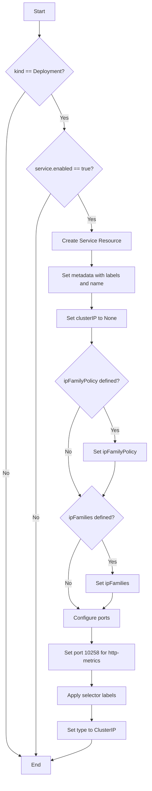
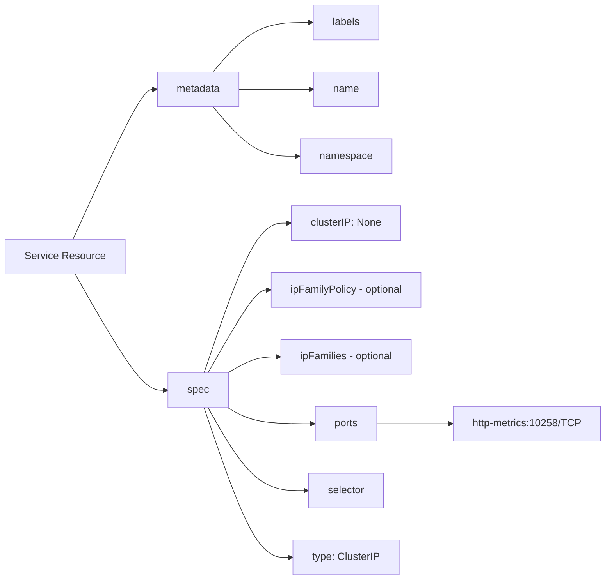

# Diagram: devops/k8s/descheduler/helm/templates/service.yaml

> Auto-generated by Obscura crawlers

## Diagram 1

### SVG

<svg id="container" width="449.17578125" xmlns="http://www.w3.org/2000/svg" class="flowchart" height="2329.40625" viewBox="0 0 449.17578125 2329.40625" role="graphics-document document" aria-roledescription="flowchart-v2"><g><marker id="container_flowchart-v2-pointEnd" class="marker flowchart-v2" viewBox="0 0 10 10" refX="5" refY="5" markerUnits="userSpaceOnUse" markerWidth="8" markerHeight="8" orient="auto"><path d="M 0 0 L 10 5 L 0 10 z" class="arrowMarkerPath" style="stroke-width: 1; stroke-dasharray: 1, 0;"></path></marker><marker id="container_flowchart-v2-pointStart" class="marker flowchart-v2" viewBox="0 0 10 10" refX="4.5" refY="5" markerUnits="userSpaceOnUse" markerWidth="8" markerHeight="8" orient="auto"><path d="M 0 5 L 10 10 L 10 0 z" class="arrowMarkerPath" style="stroke-width: 1; stroke-dasharray: 1, 0;"></path></marker><marker id="container_flowchart-v2-circleEnd" class="marker flowchart-v2" viewBox="0 0 10 10" refX="11" refY="5" markerUnits="userSpaceOnUse" markerWidth="11" markerHeight="11" orient="auto"><circle cx="5" cy="5" r="5" class="arrowMarkerPath" style="stroke-width: 1; stroke-dasharray: 1, 0;"></circle></marker><marker id="container_flowchart-v2-circleStart" class="marker flowchart-v2" viewBox="0 0 10 10" refX="-1" refY="5" markerUnits="userSpaceOnUse" markerWidth="11" markerHeight="11" orient="auto"><circle cx="5" cy="5" r="5" class="arrowMarkerPath" style="stroke-width: 1; stroke-dasharray: 1, 0;"></circle></marker><marker id="container_flowchart-v2-crossEnd" class="marker cross flowchart-v2" viewBox="0 0 11 11" refX="12" refY="5.2" markerUnits="userSpaceOnUse" markerWidth="11" markerHeight="11" orient="auto"><path d="M 1,1 l 9,9 M 10,1 l -9,9" class="arrowMarkerPath" style="stroke-width: 2; stroke-dasharray: 1, 0;"></path></marker><marker id="container_flowchart-v2-crossStart" class="marker cross flowchart-v2" viewBox="0 0 11 11" refX="-1" refY="5.2" markerUnits="userSpaceOnUse" markerWidth="11" markerHeight="11" orient="auto"><path d="M 1,1 l 9,9 M 10,1 l -9,9" class="arrowMarkerPath" style="stroke-width: 2; stroke-dasharray: 1, 0;"></path></marker><g class="root"><g class="clusters"></g><g class="edgePaths"><path d="M118.496,62L118.496,66.167C118.496,70.333,118.496,78.667,118.496,86.333C118.496,94,118.496,101,118.496,104.5L118.496,108" id="L_A_B_0" class="edge-thickness-normal edge-pattern-solid edge-thickness-normal edge-pattern-solid flowchart-link" style=";" data-edge="true" data-et="edge" data-id="L_A_B_0" data-points="W3sieCI6MTE4LjQ5NjA5Mzc1LCJ5Ijo2Mn0seyJ4IjoxMTguNDk2MDkzNzUsInkiOjg3fSx7IngiOjExOC40OTYwOTM3NSwieSI6MTEyfV0=" marker-end="url(#container_flowchart-v2-pointEnd)"></path><path d="M75.625,274.004L66.044,287.316C56.464,300.628,37.302,327.251,27.721,365.788C18.141,404.326,18.141,454.776,18.141,505.227C18.141,555.677,18.141,606.128,18.141,642.02C18.141,677.911,18.141,699.245,18.141,718.578C18.141,737.911,18.141,755.245,18.141,774.578C18.141,793.911,18.141,815.245,18.141,836.578C18.141,857.911,18.141,879.245,18.141,898.578C18.141,917.911,18.141,935.245,18.141,952.578C18.141,969.911,18.141,987.245,18.141,1018.733C18.141,1050.221,18.141,1095.865,18.141,1143.508C18.141,1191.151,18.141,1240.794,18.141,1276.283C18.141,1311.771,18.141,1333.104,18.141,1354.438C18.141,1375.771,18.141,1397.104,18.141,1430.102C18.141,1463.099,18.141,1507.76,18.141,1552.422C18.141,1597.083,18.141,1641.745,18.141,1674.742C18.141,1707.74,18.141,1729.073,18.141,1748.406C18.141,1767.74,18.141,1785.073,18.141,1802.406C18.141,1819.74,18.141,1837.073,18.141,1854.406C18.141,1871.74,18.141,1889.073,18.141,1908.406C18.141,1927.74,18.141,1949.073,18.141,1970.406C18.141,1991.74,18.141,2013.073,18.141,2032.406C18.141,2051.74,18.141,2069.073,18.141,2086.406C18.141,2103.74,18.141,2121.073,18.141,2138.406C18.141,2155.74,18.141,2173.073,18.141,2190.406C18.141,2207.74,18.141,2225.073,25.242,2237.854C32.342,2250.635,46.544,2258.864,53.645,2262.978L60.746,2267.092" id="L_B_Z_0" class="edge-thickness-normal edge-pattern-solid edge-thickness-normal edge-pattern-solid flowchart-link" style=";" data-edge="true" data-et="edge" data-id="L_B_Z_0" data-points="W3sieCI6NzUuNjI1MDk4MDU4NzI5ODYsInkiOjI3NC4wMDQwMDQzMDg3Mjk4Nn0seyJ4IjoxOC4xNDA2MjUsInkiOjM1My44NzV9LHsieCI6MTguMTQwNjI1LCJ5Ijo1MDUuMjI2NTYyNX0seyJ4IjoxOC4xNDA2MjUsInkiOjY1Ni41NzgxMjV9LHsieCI6MTguMTQwNjI1LCJ5Ijo3MjAuNTc4MTI1fSx7IngiOjE4LjE0MDYyNSwieSI6NzcyLjU3ODEyNX0seyJ4IjoxOC4xNDA2MjUsInkiOjgzNi41NzgxMjV9LHsieCI6MTguMTQwNjI1LCJ5Ijo5MDAuNTc4MTI1fSx7IngiOjE4LjE0MDYyNSwieSI6OTUyLjU3ODEyNX0seyJ4IjoxOC4xNDA2MjUsInkiOjEwMDQuNTc4MTI1fSx7IngiOjE4LjE0MDYyNSwieSI6MTE0MS41MDc4MTI1fSx7IngiOjE4LjE0MDYyNSwieSI6MTI5MC40Mzc1fSx7IngiOjE4LjE0MDYyNSwieSI6MTM1NC40Mzc1fSx7IngiOjE4LjE0MDYyNSwieSI6MTQxOC40Mzc1fSx7IngiOjE4LjE0MDYyNSwieSI6MTU1Mi40MjE4NzV9LHsieCI6MTguMTQwNjI1LCJ5IjoxNjg2LjQwNjI1fSx7IngiOjE4LjE0MDYyNSwieSI6MTc1MC40MDYyNX0seyJ4IjoxOC4xNDA2MjUsInkiOjE4MDIuNDA2MjV9LHsieCI6MTguMTQwNjI1LCJ5IjoxODU0LjQwNjI1fSx7IngiOjE4LjE0MDYyNSwieSI6MTkwNi40MDYyNX0seyJ4IjoxOC4xNDA2MjUsInkiOjE5NzAuNDA2MjV9LHsieCI6MTguMTQwNjI1LCJ5IjoyMDM0LjQwNjI1fSx7IngiOjE4LjE0MDYyNSwieSI6MjA4Ni40MDYyNX0seyJ4IjoxOC4xNDA2MjUsInkiOjIxMzguNDA2MjV9LHsieCI6MTguMTQwNjI1LCJ5IjoyMTkwLjQwNjI1fSx7IngiOjE4LjE0MDYyNSwieSI6MjI0Mi40MDYyNX0seyJ4Ijo2NC4yMDcwMzEyNSwieSI6MjI2OS4wOTc2OTcyMjUyNDQ3fV0=" marker-end="url(#container_flowchart-v2-pointEnd)"></path><path d="M154.223,281.148L160.714,293.269C167.206,305.39,180.189,329.633,186.68,347.254C193.172,364.875,193.172,375.875,193.172,381.375L193.172,386.875" id="L_B_C_0" class="edge-thickness-normal edge-pattern-solid edge-thickness-normal edge-pattern-solid flowchart-link" style=";" data-edge="true" data-et="edge" data-id="L_B_C_0" data-points="W3sieCI6MTU0LjIyMjk3NzY1NTI3Nzk2LCJ5IjoyODEuMTQ4MTE2MDk0NzIyMDd9LHsieCI6MTkzLjE3MTg3NSwieSI6MzUzLjg3NX0seyJ4IjoxOTMuMTcxODc1LCJ5IjozOTAuODc1fV0=" marker-end="url(#container_flowchart-v2-pointEnd)"></path><path d="M151.959,578.365L144.614,591.401C137.268,604.436,122.577,630.507,115.232,654.209C107.887,677.911,107.887,699.245,107.887,718.578C107.887,737.911,107.887,755.245,107.887,774.578C107.887,793.911,107.887,815.245,107.887,836.578C107.887,857.911,107.887,879.245,107.887,898.578C107.887,917.911,107.887,935.245,107.887,952.578C107.887,969.911,107.887,987.245,107.887,1018.733C107.887,1050.221,107.887,1095.865,107.887,1143.508C107.887,1191.151,107.887,1240.794,107.887,1276.283C107.887,1311.771,107.887,1333.104,107.887,1354.438C107.887,1375.771,107.887,1397.104,107.887,1430.102C107.887,1463.099,107.887,1507.76,107.887,1552.422C107.887,1597.083,107.887,1641.745,107.887,1674.742C107.887,1707.74,107.887,1729.073,107.887,1748.406C107.887,1767.74,107.887,1785.073,107.887,1802.406C107.887,1819.74,107.887,1837.073,107.887,1854.406C107.887,1871.74,107.887,1889.073,107.887,1908.406C107.887,1927.74,107.887,1949.073,107.887,1970.406C107.887,1991.74,107.887,2013.073,107.887,2032.406C107.887,2051.74,107.887,2069.073,107.887,2086.406C107.887,2103.74,107.887,2121.073,107.887,2138.406C107.887,2155.74,107.887,2173.073,107.887,2190.406C107.887,2207.74,107.887,2225.073,107.887,2237.24C107.887,2249.406,107.887,2256.406,107.887,2259.906L107.887,2263.406" id="L_C_Z_0" class="edge-thickness-normal edge-pattern-solid edge-thickness-normal edge-pattern-solid flowchart-link" style=";" data-edge="true" data-et="edge" data-id="L_C_Z_0" data-points="W3sieCI6MTUxLjk1ODk1MTk3MjgzNzEzLCJ5Ijo1NzguMzY1MjAxOTcyODM3MX0seyJ4IjoxMDcuODg2NzE4NzUsInkiOjY1Ni41NzgxMjV9LHsieCI6MTA3Ljg4NjcxODc1LCJ5Ijo3MjAuNTc4MTI1fSx7IngiOjEwNy44ODY3MTg3NSwieSI6NzcyLjU3ODEyNX0seyJ4IjoxMDcuODg2NzE4NzUsInkiOjgzNi41NzgxMjV9LHsieCI6MTA3Ljg4NjcxODc1LCJ5Ijo5MDAuNTc4MTI1fSx7IngiOjEwNy44ODY3MTg3NSwieSI6OTUyLjU3ODEyNX0seyJ4IjoxMDcuODg2NzE4NzUsInkiOjEwMDQuNTc4MTI1fSx7IngiOjEwNy44ODY3MTg3NSwieSI6MTE0MS41MDc4MTI1fSx7IngiOjEwNy44ODY3MTg3NSwieSI6MTI5MC40Mzc1fSx7IngiOjEwNy44ODY3MTg3NSwieSI6MTM1NC40Mzc1fSx7IngiOjEwNy44ODY3MTg3NSwieSI6MTQxOC40Mzc1fSx7IngiOjEwNy44ODY3MTg3NSwieSI6MTU1Mi40MjE4NzV9LHsieCI6MTA3Ljg4NjcxODc1LCJ5IjoxNjg2LjQwNjI1fSx7IngiOjEwNy44ODY3MTg3NSwieSI6MTc1MC40MDYyNX0seyJ4IjoxMDcuODg2NzE4NzUsInkiOjE4MDIuNDA2MjV9LHsieCI6MTA3Ljg4NjcxODc1LCJ5IjoxODU0LjQwNjI1fSx7IngiOjEwNy44ODY3MTg3NSwieSI6MTkwNi40MDYyNX0seyJ4IjoxMDcuODg2NzE4NzUsInkiOjE5NzAuNDA2MjV9LHsieCI6MTA3Ljg4NjcxODc1LCJ5IjoyMDM0LjQwNjI1fSx7IngiOjEwNy44ODY3MTg3NSwieSI6MjA4Ni40MDYyNX0seyJ4IjoxMDcuODg2NzE4NzUsInkiOjIxMzguNDA2MjV9LHsieCI6MTA3Ljg4NjcxODc1LCJ5IjoyMTkwLjQwNjI1fSx7IngiOjEwNy44ODY3MTg3NSwieSI6MjI0Mi40MDYyNX0seyJ4IjoxMDcuODg2NzE4NzUsInkiOjIyNjcuNDA2MjV9XQ==" marker-end="url(#container_flowchart-v2-pointEnd)"></path><path d="M233.514,579.236L240.54,592.127C247.566,605.017,261.619,630.798,268.646,649.188C275.672,667.578,275.672,678.578,275.672,684.078L275.672,689.578" id="L_C_D_0" class="edge-thickness-normal edge-pattern-solid edge-thickness-normal edge-pattern-solid flowchart-link" style=";" data-edge="true" data-et="edge" data-id="L_C_D_0" data-points="W3sieCI6MjMzLjUxMzcyMTc5MTE2Njk0LCJ5Ijo1NzkuMjM2Mjc4MjA4ODMzfSx7IngiOjI3NS42NzE4NzUsInkiOjY1Ni41NzgxMjV9LHsieCI6Mjc1LjY3MTg3NSwieSI6NjkzLjU3ODEyNX1d" marker-end="url(#container_flowchart-v2-pointEnd)"></path><path d="M275.672,747.578L275.672,751.745C275.672,755.911,275.672,764.245,275.672,771.911C275.672,779.578,275.672,786.578,275.672,790.078L275.672,793.578" id="L_D_E_0" class="edge-thickness-normal edge-pattern-solid edge-thickness-normal edge-pattern-solid flowchart-link" style=";" data-edge="true" data-et="edge" data-id="L_D_E_0" data-points="W3sieCI6Mjc1LjY3MTg3NSwieSI6NzQ3LjU3ODEyNX0seyJ4IjoyNzUuNjcxODc1LCJ5Ijo3NzIuNTc4MTI1fSx7IngiOjI3NS42NzE4NzUsInkiOjc5Ny41NzgxMjV9XQ==" marker-end="url(#container_flowchart-v2-pointEnd)"></path><path d="M275.672,875.578L275.672,879.745C275.672,883.911,275.672,892.245,275.672,899.911C275.672,907.578,275.672,914.578,275.672,918.078L275.672,921.578" id="L_E_F_0" class="edge-thickness-normal edge-pattern-solid edge-thickness-normal edge-pattern-solid flowchart-link" style=";" data-edge="true" data-et="edge" data-id="L_E_F_0" data-points="W3sieCI6Mjc1LjY3MTg3NSwieSI6ODc1LjU3ODEyNX0seyJ4IjoyNzUuNjcxODc1LCJ5Ijo5MDAuNTc4MTI1fSx7IngiOjI3NS42NzE4NzUsInkiOjkyNS41NzgxMjV9XQ==" marker-end="url(#container_flowchart-v2-pointEnd)"></path><path d="M275.672,979.578L275.672,983.745C275.672,987.911,275.672,996.245,275.672,1003.911C275.672,1011.578,275.672,1018.578,275.672,1022.078L275.672,1025.578" id="L_F_G_0" class="edge-thickness-normal edge-pattern-solid edge-thickness-normal edge-pattern-solid flowchart-link" style=";" data-edge="true" data-et="edge" data-id="L_F_G_0" data-points="W3sieCI6Mjc1LjY3MTg3NSwieSI6OTc5LjU3ODEyNX0seyJ4IjoyNzUuNjcxODc1LCJ5IjoxMDA0LjU3ODEyNX0seyJ4IjoyNzUuNjcxODc1LCJ5IjoxMDI5LjU3ODEyNX1d" marker-end="url(#container_flowchart-v2-pointEnd)"></path><path d="M311.535,1217.575L317.26,1229.719C322.985,1241.862,334.436,1266.15,340.161,1283.794C345.887,1301.438,345.887,1312.438,345.887,1317.938L345.887,1323.438" id="L_G_H_0" class="edge-thickness-normal edge-pattern-solid edge-thickness-normal edge-pattern-solid flowchart-link" style=";" data-edge="true" data-et="edge" data-id="L_G_H_0" data-points="W3sieCI6MzExLjUzNDYyNDkxMTk4OTEsInkiOjEyMTcuNTc0NzUwMDg4MDExfSx7IngiOjM0NS44ODY3MTg3NSwieSI6MTI5MC40Mzc1fSx7IngiOjM0NS44ODY3MTg3NSwieSI6MTMyNy40Mzc1fV0=" marker-end="url(#container_flowchart-v2-pointEnd)"></path><path d="M239.809,1217.575L234.084,1229.719C228.358,1241.862,216.908,1266.15,211.182,1288.96C205.457,1311.771,205.457,1333.104,205.457,1354.438C205.457,1375.771,205.457,1397.104,211.292,1418.905C217.127,1440.706,228.797,1462.975,234.632,1474.109L240.467,1485.243" id="L_G_I_0" class="edge-thickness-normal edge-pattern-solid edge-thickness-normal edge-pattern-solid flowchart-link" style=";" data-edge="true" data-et="edge" data-id="L_G_I_0" data-points="W3sieCI6MjM5LjgwOTEyNTA4ODAxMDkyLCJ5IjoxMjE3LjU3NDc1MDA4ODAxMX0seyJ4IjoyMDUuNDU3MDMxMjUsInkiOjEyOTAuNDM3NX0seyJ4IjoyMDUuNDU3MDMxMjUsInkiOjEzNTQuNDM3NX0seyJ4IjoyMDUuNDU3MDMxMjUsInkiOjE0MTguNDM3NX0seyJ4IjoyNDIuMzIzMzUwMDcxNzM2LCJ5IjoxNDg4Ljc4NjAyNDkyODI2NH1d" marker-end="url(#container_flowchart-v2-pointEnd)"></path><path d="M345.887,1381.438L345.887,1387.604C345.887,1393.771,345.887,1406.104,340.052,1423.405C334.217,1440.706,322.547,1462.975,316.712,1474.109L310.877,1485.243" id="L_H_I_0" class="edge-thickness-normal edge-pattern-solid edge-thickness-normal edge-pattern-solid flowchart-link" style=";" data-edge="true" data-et="edge" data-id="L_H_I_0" data-points="W3sieCI6MzQ1Ljg4NjcxODc1LCJ5IjoxMzgxLjQzNzV9LHsieCI6MzQ1Ljg4NjcxODc1LCJ5IjoxNDE4LjQzNzV9LHsieCI6MzA5LjAyMDM5OTkyODI2NCwieSI6MTQ4OC43ODYwMjQ5MjgyNjR9XQ==" marker-end="url(#container_flowchart-v2-pointEnd)"></path><path d="M306.605,1618.474L311.907,1629.796C317.209,1641.118,327.813,1663.762,333.116,1680.584C338.418,1697.406,338.418,1708.406,338.418,1713.906L338.418,1719.406" id="L_I_J_0" class="edge-thickness-normal edge-pattern-solid edge-thickness-normal edge-pattern-solid flowchart-link" style=";" data-edge="true" data-et="edge" data-id="L_I_J_0" data-points="W3sieCI6MzA2LjYwNDUwNDQyMjg4OTgsInkiOjE2MTguNDczNjIwNTc3MTF9LHsieCI6MzM4LjQxNzk2ODc1LCJ5IjoxNjg2LjQwNjI1fSx7IngiOjMzOC40MTc5Njg3NSwieSI6MTcyMy40MDYyNX1d" marker-end="url(#container_flowchart-v2-pointEnd)"></path><path d="M242.323,1616.058L236.179,1627.782C230.035,1639.507,217.746,1662.957,211.601,1685.348C205.457,1707.74,205.457,1729.073,205.457,1748.406C205.457,1767.74,205.457,1785.073,210.547,1797.509C215.638,1809.946,225.819,1817.486,230.909,1821.256L236,1825.026" id="L_I_K_0" class="edge-thickness-normal edge-pattern-solid edge-thickness-normal edge-pattern-solid flowchart-link" style=";" data-edge="true" data-et="edge" data-id="L_I_K_0" data-points="W3sieCI6MjQyLjMyMzM1MDA3MTczNiwieSI6MTYxNi4wNTc3MjUwNzE3MzZ9LHsieCI6MjA1LjQ1NzAzMTI1LCJ5IjoxNjg2LjQwNjI1fSx7IngiOjIwNS40NTcwMzEyNSwieSI6MTc1MC40MDYyNX0seyJ4IjoyMDUuNDU3MDMxMjUsInkiOjE4MDIuNDA2MjV9LHsieCI6MjM5LjIxNDE2NzY2ODI2OTIzLCJ5IjoxODI3LjQwNjI1fV0=" marker-end="url(#container_flowchart-v2-pointEnd)"></path><path d="M338.418,1777.406L338.418,1781.573C338.418,1785.74,338.418,1794.073,333.904,1801.981C329.389,1809.889,320.36,1817.371,315.846,1821.113L311.331,1824.854" id="L_J_K_0" class="edge-thickness-normal edge-pattern-solid edge-thickness-normal edge-pattern-solid flowchart-link" style=";" data-edge="true" data-et="edge" data-id="L_J_K_0" data-points="W3sieCI6MzM4LjQxNzk2ODc1LCJ5IjoxNzc3LjQwNjI1fSx7IngiOjMzOC40MTc5Njg3NSwieSI6MTgwMi40MDYyNX0seyJ4IjozMDguMjUxNTc3NTI0MDM4NDUsInkiOjE4MjcuNDA2MjV9XQ==" marker-end="url(#container_flowchart-v2-pointEnd)"></path><path d="M275.672,1881.406L275.672,1885.573C275.672,1889.74,275.672,1898.073,275.672,1905.74C275.672,1913.406,275.672,1920.406,275.672,1923.906L275.672,1927.406" id="L_K_L_0" class="edge-thickness-normal edge-pattern-solid edge-thickness-normal edge-pattern-solid flowchart-link" style=";" data-edge="true" data-et="edge" data-id="L_K_L_0" data-points="W3sieCI6Mjc1LjY3MTg3NSwieSI6MTg4MS40MDYyNX0seyJ4IjoyNzUuNjcxODc1LCJ5IjoxOTA2LjQwNjI1fSx7IngiOjI3NS42NzE4NzUsInkiOjE5MzEuNDA2MjV9XQ==" marker-end="url(#container_flowchart-v2-pointEnd)"></path><path d="M275.672,2009.406L275.672,2013.573C275.672,2017.74,275.672,2026.073,275.672,2033.74C275.672,2041.406,275.672,2048.406,275.672,2051.906L275.672,2055.406" id="L_L_M_0" class="edge-thickness-normal edge-pattern-solid edge-thickness-normal edge-pattern-solid flowchart-link" style=";" data-edge="true" data-et="edge" data-id="L_L_M_0" data-points="W3sieCI6Mjc1LjY3MTg3NSwieSI6MjAwOS40MDYyNX0seyJ4IjoyNzUuNjcxODc1LCJ5IjoyMDM0LjQwNjI1fSx7IngiOjI3NS42NzE4NzUsInkiOjIwNTkuNDA2MjV9XQ==" marker-end="url(#container_flowchart-v2-pointEnd)"></path><path d="M275.672,2113.406L275.672,2117.573C275.672,2121.74,275.672,2130.073,275.672,2137.74C275.672,2145.406,275.672,2152.406,275.672,2155.906L275.672,2159.406" id="L_M_N_0" class="edge-thickness-normal edge-pattern-solid edge-thickness-normal edge-pattern-solid flowchart-link" style=";" data-edge="true" data-et="edge" data-id="L_M_N_0" data-points="W3sieCI6Mjc1LjY3MTg3NSwieSI6MjExMy40MDYyNX0seyJ4IjoyNzUuNjcxODc1LCJ5IjoyMTM4LjQwNjI1fSx7IngiOjI3NS42NzE4NzUsInkiOjIxNjMuNDA2MjV9XQ==" marker-end="url(#container_flowchart-v2-pointEnd)"></path><path d="M275.672,2217.406L275.672,2221.573C275.672,2225.74,275.672,2234.073,255.624,2244.453C235.577,2254.832,195.482,2267.259,175.435,2273.472L155.387,2279.685" id="L_N_Z_0" class="edge-thickness-normal edge-pattern-solid edge-thickness-normal edge-pattern-solid flowchart-link" style=";" data-edge="true" data-et="edge" data-id="L_N_Z_0" data-points="W3sieCI6Mjc1LjY3MTg3NSwieSI6MjIxNy40MDYyNX0seyJ4IjoyNzUuNjcxODc1LCJ5IjoyMjQyLjQwNjI1fSx7IngiOjE1MS41NjY0MDYyNSwieSI6MjI4MC44NjkwMzQ5MDQ0MzA1fV0=" marker-end="url(#container_flowchart-v2-pointEnd)"></path></g><g class="edgeLabels"><g class="edgeLabel"><g class="label" data-id="L_A_B_0" transform="translate(0, 0)"><foreignObject width="0" height="0">

</foreignObject></g></g><g class="edgeLabel" transform="translate(18.140625, 1418.4375)"><g class="label" data-id="L_B_Z_0" transform="translate(-10.140625, -12)"><foreignObject width="20.28125" height="24">

No

</foreignObject></g></g><g class="edgeLabel" transform="translate(193.171875, 353.875)"><g class="label" data-id="L_B_C_0" transform="translate(-12.03125, -12)"><foreignObject width="24.0625" height="24">

Yes

</foreignObject></g></g><g class="edgeLabel" transform="translate(107.88671875, 1552.421875)"><g class="label" data-id="L_C_Z_0" transform="translate(-10.140625, -12)"><foreignObject width="20.28125" height="24">

No

</foreignObject></g></g><g class="edgeLabel" transform="translate(275.671875, 656.578125)"><g class="label" data-id="L_C_D_0" transform="translate(-12.03125, -12)"><foreignObject width="24.0625" height="24">

Yes

</foreignObject></g></g><g class="edgeLabel"><g class="label" data-id="L_D_E_0" transform="translate(0, 0)"><foreignObject width="0" height="0">

</foreignObject></g></g><g class="edgeLabel"><g class="label" data-id="L_E_F_0" transform="translate(0, 0)"><foreignObject width="0" height="0">

</foreignObject></g></g><g class="edgeLabel"><g class="label" data-id="L_F_G_0" transform="translate(0, 0)"><foreignObject width="0" height="0">

</foreignObject></g></g><g class="edgeLabel" transform="translate(345.88671875, 1290.4375)"><g class="label" data-id="L_G_H_0" transform="translate(-12.03125, -12)"><foreignObject width="24.0625" height="24">

Yes

</foreignObject></g></g><g class="edgeLabel" transform="translate(205.45703125, 1354.4375)"><g class="label" data-id="L_G_I_0" transform="translate(-10.140625, -12)"><foreignObject width="20.28125" height="24">

No

</foreignObject></g></g><g class="edgeLabel"><g class="label" data-id="L_H_I_0" transform="translate(0, 0)"><foreignObject width="0" height="0">

</foreignObject></g></g><g class="edgeLabel" transform="translate(338.41796875, 1686.40625)"><g class="label" data-id="L_I_J_0" transform="translate(-12.03125, -12)"><foreignObject width="24.0625" height="24">

Yes

</foreignObject></g></g><g class="edgeLabel" transform="translate(205.45703125, 1750.40625)"><g class="label" data-id="L_I_K_0" transform="translate(-10.140625, -12)"><foreignObject width="20.28125" height="24">

No

</foreignObject></g></g><g class="edgeLabel"><g class="label" data-id="L_J_K_0" transform="translate(0, 0)"><foreignObject width="0" height="0">

</foreignObject></g></g><g class="edgeLabel"><g class="label" data-id="L_K_L_0" transform="translate(0, 0)"><foreignObject width="0" height="0">

</foreignObject></g></g><g class="edgeLabel"><g class="label" data-id="L_L_M_0" transform="translate(0, 0)"><foreignObject width="0" height="0">

</foreignObject></g></g><g class="edgeLabel"><g class="label" data-id="L_M_N_0" transform="translate(0, 0)"><foreignObject width="0" height="0">

</foreignObject></g></g><g class="edgeLabel"><g class="label" data-id="L_N_Z_0" transform="translate(0, 0)"><foreignObject width="0" height="0">

</foreignObject></g></g></g><g class="nodes"><g class="node default" id="flowchart-A-0" transform="translate(118.49609375, 35)"><rect class="basic label-container" style="" x="-47.5234375" y="-27" width="95.046875" height="54"></rect><g class="label" style="" transform="translate(-17.5234375, -12)"><rect></rect><foreignObject width="35.046875" height="24">

Start

</foreignObject></g></g><g class="node default" id="flowchart-B-1" transform="translate(118.49609375, 214.4375)"><polygon points="102.4375,0 204.875,-102.4375 102.4375,-204.875 0,-102.4375" class="label-container" transform="translate(-101.9375, 102.4375)"></polygon><g class="label" style="" transform="translate(-75.4375, -12)"><rect></rect><foreignObject width="150.875" height="24">

kind == Deployment?

</foreignObject></g></g><g class="node default" id="flowchart-Z-3" transform="translate(107.88671875, 2294.40625)"><rect class="basic label-container" style="" x="-43.6796875" y="-27" width="87.359375" height="54"></rect><g class="label" style="" transform="translate(-13.6796875, -12)"><rect></rect><foreignObject width="27.359375" height="24">

End

</foreignObject></g></g><g class="node default" id="flowchart-C-5" transform="translate(193.171875, 505.2265625)"><polygon points="114.3515625,0 228.703125,-114.3515625 114.3515625,-228.703125 0,-114.3515625" class="label-container" transform="translate(-113.8515625, 114.3515625)"></polygon><g class="label" style="" transform="translate(-87.3515625, -12)"><rect></rect><foreignObject width="174.703125" height="24">

service.enabled == true?

</foreignObject></g></g><g class="node default" id="flowchart-D-9" transform="translate(275.671875, 720.578125)"><rect class="basic label-container" style="" x="-116.25" y="-27" width="232.5" height="54"></rect><g class="label" style="" transform="translate(-86.25, -12)"><rect></rect><foreignObject width="172.5" height="24">

Create Service Resource

</foreignObject></g></g><g class="node default" id="flowchart-E-11" transform="translate(275.671875, 836.578125)"><rect class="basic label-container" style="" x="-130" y="-39" width="260" height="78"></rect><g class="label" style="" transform="translate(-100, -24)"><rect></rect><foreignObject width="200" height="48">

Set metadata with labels and name

</foreignObject></g></g><g class="node default" id="flowchart-F-13" transform="translate(275.671875, 952.578125)"><rect class="basic label-container" style="" x="-106.3828125" y="-27" width="212.765625" height="54"></rect><g class="label" style="" transform="translate(-76.3828125, -12)"><rect></rect><foreignObject width="152.765625" height="24">

Set clusterIP to None

</foreignObject></g></g><g class="node default" id="flowchart-G-15" transform="translate(275.671875, 1141.5078125)"><polygon points="111.9296875,0 223.859375,-111.9296875 111.9296875,-223.859375 0,-111.9296875" class="label-container" transform="translate(-111.4296875, 111.9296875)"></polygon><g class="label" style="" transform="translate(-84.9296875, -12)"><rect></rect><foreignObject width="169.859375" height="24">

ipFamilyPolicy defined?

</foreignObject></g></g><g class="node default" id="flowchart-H-17" transform="translate(345.88671875, 1354.4375)"><rect class="basic label-container" style="" x="-95.2890625" y="-27" width="190.578125" height="54"></rect><g class="label" style="" transform="translate(-65.2890625, -12)"><rect></rect><foreignObject width="130.578125" height="24">

Set ipFamilyPolicy

</foreignObject></g></g><g class="node default" id="flowchart-I-19" transform="translate(275.671875, 1552.421875)"><polygon points="96.984375,0 193.96875,-96.984375 96.984375,-193.96875 0,-96.984375" class="label-container" transform="translate(-96.484375, 96.984375)"></polygon><g class="label" style="" transform="translate(-69.984375, -12)"><rect></rect><foreignObject width="139.96875" height="24">

ipFamilies defined?

</foreignObject></g></g><g class="node default" id="flowchart-J-23" transform="translate(338.41796875, 1750.40625)"><rect class="basic label-container" style="" x="-80.3515625" y="-27" width="160.703125" height="54"></rect><g class="label" style="" transform="translate(-50.3515625, -12)"><rect></rect><foreignObject width="100.703125" height="24">

Set ipFamilies

</foreignObject></g></g><g class="node default" id="flowchart-K-25" transform="translate(275.671875, 1854.40625)"><rect class="basic label-container" style="" x="-85.484375" y="-27" width="170.96875" height="54"></rect><g class="label" style="" transform="translate(-55.484375, -12)"><rect></rect><foreignObject width="110.96875" height="24">

Configure ports

</foreignObject></g></g><g class="node default" id="flowchart-L-29" transform="translate(275.671875, 1970.40625)"><rect class="basic label-container" style="" x="-130" y="-39" width="260" height="78"></rect><g class="label" style="" transform="translate(-100, -24)"><rect></rect><foreignObject width="200" height="48">

Set port 10258 for http-metrics

</foreignObject></g></g><g class="node default" id="flowchart-M-31" transform="translate(275.671875, 2086.40625)"><rect class="basic label-container" style="" x="-105.4921875" y="-27" width="210.984375" height="54"></rect><g class="label" style="" transform="translate(-75.4921875, -12)"><rect></rect><foreignObject width="150.984375" height="24">

Apply selector labels

</foreignObject></g></g><g class="node default" id="flowchart-N-33" transform="translate(275.671875, 2190.40625)"><rect class="basic label-container" style="" x="-103.671875" y="-27" width="207.34375" height="54"></rect><g class="label" style="" transform="translate(-73.671875, -12)"><rect></rect><foreignObject width="147.34375" height="24">

Set type to ClusterIP

</foreignObject></g></g></g></g></g></svg>

## Diagram 2

### SVG

<svg id="container" width="945.734375" xmlns="http://www.w3.org/2000/svg" class="flowchart" height="902" viewBox="0 0 945.734375 902" role="graphics-document document" aria-roledescription="flowchart-v2"><g><marker id="container_flowchart-v2-pointEnd" class="marker flowchart-v2" viewBox="0 0 10 10" refX="5" refY="5" markerUnits="userSpaceOnUse" markerWidth="8" markerHeight="8" orient="auto"><path d="M 0 0 L 10 5 L 0 10 z" class="arrowMarkerPath" style="stroke-width: 1; stroke-dasharray: 1, 0;"></path></marker><marker id="container_flowchart-v2-pointStart" class="marker flowchart-v2" viewBox="0 0 10 10" refX="4.5" refY="5" markerUnits="userSpaceOnUse" markerWidth="8" markerHeight="8" orient="auto"><path d="M 0 5 L 10 10 L 10 0 z" class="arrowMarkerPath" style="stroke-width: 1; stroke-dasharray: 1, 0;"></path></marker><marker id="container_flowchart-v2-circleEnd" class="marker flowchart-v2" viewBox="0 0 10 10" refX="11" refY="5" markerUnits="userSpaceOnUse" markerWidth="11" markerHeight="11" orient="auto"><circle cx="5" cy="5" r="5" class="arrowMarkerPath" style="stroke-width: 1; stroke-dasharray: 1, 0;"></circle></marker><marker id="container_flowchart-v2-circleStart" class="marker flowchart-v2" viewBox="0 0 10 10" refX="-1" refY="5" markerUnits="userSpaceOnUse" markerWidth="11" markerHeight="11" orient="auto"><circle cx="5" cy="5" r="5" class="arrowMarkerPath" style="stroke-width: 1; stroke-dasharray: 1, 0;"></circle></marker><marker id="container_flowchart-v2-crossEnd" class="marker cross flowchart-v2" viewBox="0 0 11 11" refX="12" refY="5.2" markerUnits="userSpaceOnUse" markerWidth="11" markerHeight="11" orient="auto"><path d="M 1,1 l 9,9 M 10,1 l -9,9" class="arrowMarkerPath" style="stroke-width: 2; stroke-dasharray: 1, 0;"></path></marker><marker id="container_flowchart-v2-crossStart" class="marker cross flowchart-v2" viewBox="0 0 11 11" refX="-1" refY="5.2" markerUnits="userSpaceOnUse" markerWidth="11" markerHeight="11" orient="auto"><path d="M 1,1 l 9,9 M 10,1 l -9,9" class="arrowMarkerPath" style="stroke-width: 2; stroke-dasharray: 1, 0;"></path></marker><g class="root"><g class="clusters"></g><g class="edgePaths"><path d="M111.227,372L128.577,333.167C145.928,294.333,180.628,216.667,201.478,177.833C222.328,139,229.328,139,232.828,139L236.328,139" id="L_Service_Metadata_0" class="edge-thickness-normal edge-pattern-solid edge-thickness-normal edge-pattern-solid flowchart-link" style=";" data-edge="true" data-et="edge" data-id="L_Service_Metadata_0" data-points="W3sieCI6MTExLjIyNzI1MzYwNTc2OTIzLCJ5IjozNzJ9LHsieCI6MjE1LjMyODEyNSwieSI6MTM5fSx7IngiOjI0MC4zMjgxMjUsInkiOjEzOX1d" marker-end="url(#container_flowchart-v2-pointEnd)"></path><path d="M114.243,426L131.091,456.167C147.938,486.333,181.633,546.667,204.988,576.833C228.344,607,241.359,607,247.867,607L254.375,607" id="L_Service_Spec_0" class="edge-thickness-normal edge-pattern-solid edge-thickness-normal edge-pattern-solid flowchart-link" style=";" data-edge="true" data-et="edge" data-id="L_Service_Spec_0" data-points="W3sieCI6MTE0LjI0MzA1MTM4MjIxMTUzLCJ5Ijo0MjZ9LHsieCI6MjE1LjMyODEyNSwieSI6NjA3fSx7IngiOjI1OC4zNzUsInkiOjYwN31d" marker-end="url(#container_flowchart-v2-pointEnd)"></path><path d="M328.349,112L339.421,99.167C350.493,86.333,372.637,60.667,398.496,47.833C424.354,35,453.927,35,468.714,35L483.5,35" id="L_Metadata_Labels_0" class="edge-thickness-normal edge-pattern-solid edge-thickness-normal edge-pattern-solid flowchart-link" style=";" data-edge="true" data-et="edge" data-id="L_Metadata_Labels_0" data-points="W3sieCI6MzI4LjM0OTA4MzUzMzY1Mzg3LCJ5IjoxMTJ9LHsieCI6Mzk0Ljc4MTI1LCJ5IjozNX0seyJ4Ijo0ODcuNSwieSI6MzV9XQ==" marker-end="url(#container_flowchart-v2-pointEnd)"></path><path d="M369.781,139L373.948,139C378.115,139,386.448,139,405.667,139C424.885,139,454.99,139,470.042,139L485.094,139" id="L_Metadata_Name_0" class="edge-thickness-normal edge-pattern-solid edge-thickness-normal edge-pattern-solid flowchart-link" style=";" data-edge="true" data-et="edge" data-id="L_Metadata_Name_0" data-points="W3sieCI6MzY5Ljc4MTI1LCJ5IjoxMzl9LHsieCI6Mzk0Ljc4MTI1LCJ5IjoxMzl9LHsieCI6NDg5LjA5Mzc1LCJ5IjoxMzl9XQ==" marker-end="url(#container_flowchart-v2-pointEnd)"></path><path d="M328.349,166L339.421,178.833C350.493,191.667,372.637,217.333,395.296,230.167C417.956,243,441.13,243,452.717,243L464.305,243" id="L_Metadata_Namespace_0" class="edge-thickness-normal edge-pattern-solid edge-thickness-normal edge-pattern-solid flowchart-link" style=";" data-edge="true" data-et="edge" data-id="L_Metadata_Namespace_0" data-points="W3sieCI6MzI4LjM0OTA4MzUzMzY1Mzg3LCJ5IjoxNjZ9LHsieCI6Mzk0Ljc4MTI1LCJ5IjoyNDN9LHsieCI6NDY4LjMwNDY4NzUsInkiOjI0M31d" marker-end="url(#container_flowchart-v2-pointEnd)"></path><path d="M314.372,580L327.774,541.167C341.175,502.333,367.978,424.667,390.647,385.833C413.315,347,431.849,347,441.116,347L450.383,347" id="L_Spec_ClusterIP_0" class="edge-thickness-normal edge-pattern-solid edge-thickness-normal edge-pattern-solid flowchart-link" style=";" data-edge="true" data-et="edge" data-id="L_Spec_ClusterIP_0" data-points="W3sieCI6MzE0LjM3MjQ0NTkxMzQ2MTU1LCJ5Ijo1ODB9LHsieCI6Mzk0Ljc4MTI1LCJ5IjozNDd9LHsieCI6NDU0LjM4MjgxMjUsInkiOjM0N31d" marker-end="url(#container_flowchart-v2-pointEnd)"></path><path d="M320.584,580L332.95,558.5C345.317,537,370.049,494,385.915,472.5C401.781,451,408.781,451,412.281,451L415.781,451" id="L_Spec_IPFamilyPolicy_0" class="edge-thickness-normal edge-pattern-solid edge-thickness-normal edge-pattern-solid flowchart-link" style=";" data-edge="true" data-et="edge" data-id="L_Spec_IPFamilyPolicy_0" data-points="W3sieCI6MzIwLjU4NDI4NDg1NTc2OTIsInkiOjU4MH0seyJ4IjozOTQuNzgxMjUsInkiOjQ1MX0seyJ4Ijo0MTkuNzgxMjUsInkiOjQ1MX1d" marker-end="url(#container_flowchart-v2-pointEnd)"></path><path d="M351.643,580L358.833,575.833C366.023,571.667,380.402,563.333,393.583,559.167C406.763,555,418.745,555,424.736,555L430.727,555" id="L_Spec_IPFamilies_0" class="edge-thickness-normal edge-pattern-solid edge-thickness-normal edge-pattern-solid flowchart-link" style=";" data-edge="true" data-et="edge" data-id="L_Spec_IPFamilies_0" data-points="W3sieCI6MzUxLjY0MzQ3OTU2NzMwNzcsInkiOjU4MH0seyJ4IjozOTQuNzgxMjUsInkiOjU1NX0seyJ4Ijo0MzQuNzI2NTYyNSwieSI6NTU1fV0=" marker-end="url(#container_flowchart-v2-pointEnd)"></path><path d="M351.643,634L358.833,638.167C366.023,642.333,380.402,650.667,402.83,654.833C425.258,659,455.734,659,470.973,659L486.211,659" id="L_Spec_Ports_0" class="edge-thickness-normal edge-pattern-solid edge-thickness-normal edge-pattern-solid flowchart-link" style=";" data-edge="true" data-et="edge" data-id="L_Spec_Ports_0" data-points="W3sieCI6MzUxLjY0MzQ3OTU2NzMwNzcsInkiOjYzNH0seyJ4IjozOTQuNzgxMjUsInkiOjY1OX0seyJ4Ijo0OTAuMjEwOTM3NSwieSI6NjU5fV0=" marker-end="url(#container_flowchart-v2-pointEnd)"></path><path d="M320.584,634L332.95,655.5C345.317,677,370.049,720,395.991,741.5C421.932,763,449.083,763,462.659,763L476.234,763" id="L_Spec_Selector_0" class="edge-thickness-normal edge-pattern-solid edge-thickness-normal edge-pattern-solid flowchart-link" style=";" data-edge="true" data-et="edge" data-id="L_Spec_Selector_0" data-points="W3sieCI6MzIwLjU4NDI4NDg1NTc2OTIsInkiOjYzNH0seyJ4IjozOTQuNzgxMjUsInkiOjc2M30seyJ4Ijo0ODAuMjM0Mzc1LCJ5Ijo3NjN9XQ==" marker-end="url(#container_flowchart-v2-pointEnd)"></path><path d="M314.372,634L327.774,672.833C341.175,711.667,367.978,789.333,391.092,828.167C414.206,867,433.63,867,443.342,867L453.055,867" id="L_Spec_Type_0" class="edge-thickness-normal edge-pattern-solid edge-thickness-normal edge-pattern-solid flowchart-link" style=";" data-edge="true" data-et="edge" data-id="L_Spec_Type_0" data-points="W3sieCI6MzE0LjM3MjQ0NTkxMzQ2MTU1LCJ5Ijo2MzR9LHsieCI6Mzk0Ljc4MTI1LCJ5Ijo4Njd9LHsieCI6NDU3LjA1NDY4NzUsInkiOjg2N31d" marker-end="url(#container_flowchart-v2-pointEnd)"></path><path d="M588.492,659L604.397,659C620.302,659,652.112,659,671.517,659C690.922,659,697.922,659,701.422,659L704.922,659" id="L_Ports_Port_0" class="edge-thickness-normal edge-pattern-solid edge-thickness-normal edge-pattern-solid flowchart-link" style=";" data-edge="true" data-et="edge" data-id="L_Ports_Port_0" data-points="W3sieCI6NTg4LjQ5MjE4NzUsInkiOjY1OX0seyJ4Ijo2ODMuOTIxODc1LCJ5Ijo2NTl9LHsieCI6NzA4LjkyMTg3NSwieSI6NjU5fV0=" marker-end="url(#container_flowchart-v2-pointEnd)"></path></g><g class="edgeLabels"><g class="edgeLabel"><g class="label" data-id="L_Service_Metadata_0" transform="translate(0, 0)"><foreignObject width="0" height="0">

</foreignObject></g></g><g class="edgeLabel"><g class="label" data-id="L_Service_Spec_0" transform="translate(0, 0)"><foreignObject width="0" height="0">

</foreignObject></g></g><g class="edgeLabel"><g class="label" data-id="L_Metadata_Labels_0" transform="translate(0, 0)"><foreignObject width="0" height="0">

</foreignObject></g></g><g class="edgeLabel"><g class="label" data-id="L_Metadata_Name_0" transform="translate(0, 0)"><foreignObject width="0" height="0">

</foreignObject></g></g><g class="edgeLabel"><g class="label" data-id="L_Metadata_Namespace_0" transform="translate(0, 0)"><foreignObject width="0" height="0">

</foreignObject></g></g><g class="edgeLabel"><g class="label" data-id="L_Spec_ClusterIP_0" transform="translate(0, 0)"><foreignObject width="0" height="0">

</foreignObject></g></g><g class="edgeLabel"><g class="label" data-id="L_Spec_IPFamilyPolicy_0" transform="translate(0, 0)"><foreignObject width="0" height="0">

</foreignObject></g></g><g class="edgeLabel"><g class="label" data-id="L_Spec_IPFamilies_0" transform="translate(0, 0)"><foreignObject width="0" height="0">

</foreignObject></g></g><g class="edgeLabel"><g class="label" data-id="L_Spec_Ports_0" transform="translate(0, 0)"><foreignObject width="0" height="0">

</foreignObject></g></g><g class="edgeLabel"><g class="label" data-id="L_Spec_Selector_0" transform="translate(0, 0)"><foreignObject width="0" height="0">

</foreignObject></g></g><g class="edgeLabel"><g class="label" data-id="L_Spec_Type_0" transform="translate(0, 0)"><foreignObject width="0" height="0">

</foreignObject></g></g><g class="edgeLabel"><g class="label" data-id="L_Ports_Port_0" transform="translate(0, 0)"><foreignObject width="0" height="0">

</foreignObject></g></g></g><g class="nodes"><g class="node default" id="flowchart-Service-0" transform="translate(99.1640625, 399)"><rect class="basic label-container" style="" x="-91.1640625" y="-27" width="182.328125" height="54"></rect><g class="label" style="" transform="translate(-61.1640625, -12)"><rect></rect><foreignObject width="122.328125" height="24">

Service Resource

</foreignObject></g></g><g class="node default" id="flowchart-Metadata-1" transform="translate(305.0546875, 139)"><rect class="basic label-container" style="" x="-64.7265625" y="-27" width="129.453125" height="54"></rect><g class="label" style="" transform="translate(-34.7265625, -12)"><rect></rect><foreignObject width="69.453125" height="24">

metadata

</foreignObject></g></g><g class="node default" id="flowchart-Spec-3" transform="translate(305.0546875, 607)"><rect class="basic label-container" style="" x="-46.6796875" y="-27" width="93.359375" height="54"></rect><g class="label" style="" transform="translate(-16.6796875, -12)"><rect></rect><foreignObject width="33.359375" height="24">

spec

</foreignObject></g></g><g class="node default" id="flowchart-Labels-5" transform="translate(539.3515625, 35)"><rect class="basic label-container" style="" x="-51.8515625" y="-27" width="103.703125" height="54"></rect><g class="label" style="" transform="translate(-21.8515625, -12)"><rect></rect><foreignObject width="43.703125" height="24">

labels

</foreignObject></g></g><g class="node default" id="flowchart-Name-7" transform="translate(539.3515625, 139)"><rect class="basic label-container" style="" x="-50.2578125" y="-27" width="100.515625" height="54"></rect><g class="label" style="" transform="translate(-20.2578125, -12)"><rect></rect><foreignObject width="40.515625" height="24">

name

</foreignObject></g></g><g class="node default" id="flowchart-Namespace-9" transform="translate(539.3515625, 243)"><rect class="basic label-container" style="" x="-71.046875" y="-27" width="142.09375" height="54"></rect><g class="label" style="" transform="translate(-41.046875, -12)"><rect></rect><foreignObject width="82.09375" height="24">

namespace

</foreignObject></g></g><g class="node default" id="flowchart-ClusterIP-11" transform="translate(539.3515625, 347)"><rect class="basic label-container" style="" x="-84.96875" y="-27" width="169.9375" height="54"></rect><g class="label" style="" transform="translate(-54.96875, -12)"><rect></rect><foreignObject width="109.9375" height="24">

clusterIP: None

</foreignObject></g></g><g class="node default" id="flowchart-IPFamilyPolicy-13" transform="translate(539.3515625, 451)"><rect class="basic label-container" style="" x="-119.5703125" y="-27" width="239.140625" height="54"></rect><g class="label" style="" transform="translate(-89.5703125, -12)"><rect></rect><foreignObject width="179.140625" height="24">

ipFamilyPolicy - optional

</foreignObject></g></g><g class="node default" id="flowchart-IPFamilies-15" transform="translate(539.3515625, 555)"><rect class="basic label-container" style="" x="-104.625" y="-27" width="209.25" height="54"></rect><g class="label" style="" transform="translate(-74.625, -12)"><rect></rect><foreignObject width="149.25" height="24">

ipFamilies - optional

</foreignObject></g></g><g class="node default" id="flowchart-Ports-17" transform="translate(539.3515625, 659)"><rect class="basic label-container" style="" x="-49.140625" y="-27" width="98.28125" height="54"></rect><g class="label" style="" transform="translate(-19.140625, -12)"><rect></rect><foreignObject width="38.28125" height="24">

ports

</foreignObject></g></g><g class="node default" id="flowchart-Selector-19" transform="translate(539.3515625, 763)"><rect class="basic label-container" style="" x="-59.1171875" y="-27" width="118.234375" height="54"></rect><g class="label" style="" transform="translate(-29.1171875, -12)"><rect></rect><foreignObject width="58.234375" height="24">

selector

</foreignObject></g></g><g class="node default" id="flowchart-Type-21" transform="translate(539.3515625, 867)"><rect class="basic label-container" style="" x="-82.296875" y="-27" width="164.59375" height="54"></rect><g class="label" style="" transform="translate(-52.296875, -12)"><rect></rect><foreignObject width="104.59375" height="24">

type: ClusterIP

</foreignObject></g></g><g class="node default" id="flowchart-Port-23" transform="translate(823.328125, 659)"><rect class="basic label-container" style="" x="-114.40625" y="-27" width="228.8125" height="54"></rect><g class="label" style="" transform="translate(-84.40625, -12)"><rect></rect><foreignObject width="168.8125" height="24">

http-metrics:10258/TCP

</foreignObject></g></g></g></g></g></svg>
