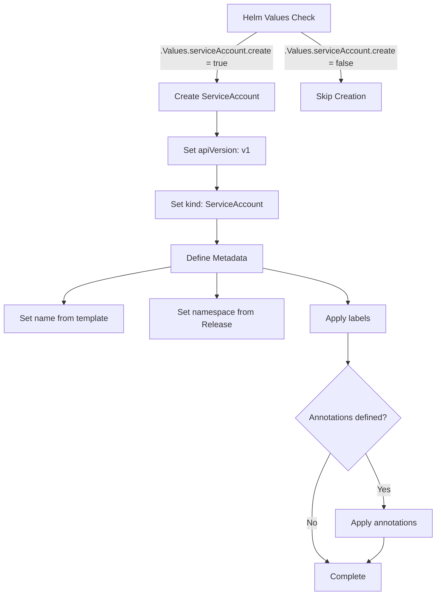
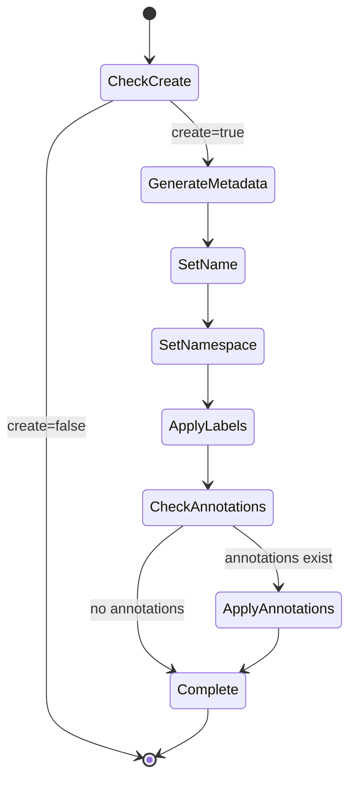

# Diagram: devops/k8s/descheduler/helm/templates/serviceaccount.yaml

> Auto-generated by Obscura crawlers

## Diagram 1

### SVG

<svg id="container" width="852.7890625" xmlns="http://www.w3.org/2000/svg" class="flowchart" height="1152.859375" viewBox="0 0 852.7890625 1152.859375" role="graphics-document document" aria-roledescription="flowchart-v2"><g><marker id="container_flowchart-v2-pointEnd" class="marker flowchart-v2" viewBox="0 0 10 10" refX="5" refY="5" markerUnits="userSpaceOnUse" markerWidth="8" markerHeight="8" orient="auto"><path d="M 0 0 L 10 5 L 0 10 z" class="arrowMarkerPath" style="stroke-width: 1; stroke-dasharray: 1, 0;"></path></marker><marker id="container_flowchart-v2-pointStart" class="marker flowchart-v2" viewBox="0 0 10 10" refX="4.5" refY="5" markerUnits="userSpaceOnUse" markerWidth="8" markerHeight="8" orient="auto"><path d="M 0 5 L 10 10 L 10 0 z" class="arrowMarkerPath" style="stroke-width: 1; stroke-dasharray: 1, 0;"></path></marker><marker id="container_flowchart-v2-circleEnd" class="marker flowchart-v2" viewBox="0 0 10 10" refX="11" refY="5" markerUnits="userSpaceOnUse" markerWidth="11" markerHeight="11" orient="auto"><circle cx="5" cy="5" r="5" class="arrowMarkerPath" style="stroke-width: 1; stroke-dasharray: 1, 0;"></circle></marker><marker id="container_flowchart-v2-circleStart" class="marker flowchart-v2" viewBox="0 0 10 10" refX="-1" refY="5" markerUnits="userSpaceOnUse" markerWidth="11" markerHeight="11" orient="auto"><circle cx="5" cy="5" r="5" class="arrowMarkerPath" style="stroke-width: 1; stroke-dasharray: 1, 0;"></circle></marker><marker id="container_flowchart-v2-crossEnd" class="marker cross flowchart-v2" viewBox="0 0 11 11" refX="12" refY="5.2" markerUnits="userSpaceOnUse" markerWidth="11" markerHeight="11" orient="auto"><path d="M 1,1 l 9,9 M 10,1 l -9,9" class="arrowMarkerPath" style="stroke-width: 2; stroke-dasharray: 1, 0;"></path></marker><marker id="container_flowchart-v2-crossStart" class="marker cross flowchart-v2" viewBox="0 0 11 11" refX="-1" refY="5.2" markerUnits="userSpaceOnUse" markerWidth="11" markerHeight="11" orient="auto"><path d="M 1,1 l 9,9 M 10,1 l -9,9" class="arrowMarkerPath" style="stroke-width: 2; stroke-dasharray: 1, 0;"></path></marker><g class="root"><g class="clusters"></g><g class="edgePaths"><path d="M500.288,62L487.508,70.167C474.728,78.333,449.169,94.667,436.389,110.333C423.609,126,423.609,141,423.609,148.5L423.609,156" id="L_A_B_0" class="edge-thickness-normal edge-pattern-solid edge-thickness-normal edge-pattern-solid flowchart-link" style=";" data-edge="true" data-et="edge" data-id="L_A_B_0" data-points="W3sieCI6NTAwLjI4NzcyNjE1MTMxNTgsInkiOjYyfSx7IngiOjQyMy42MDkzNzUsInkiOjExMX0seyJ4Ijo0MjMuNjA5Mzc1LCJ5IjoxNjB9XQ==" marker-end="url(#container_flowchart-v2-pointEnd)"></path><path d="M584.79,62L597.57,70.167C610.35,78.333,635.909,94.667,648.689,110.333C661.469,126,661.469,141,661.469,148.5L661.469,156" id="L_A_C_0" class="edge-thickness-normal edge-pattern-solid edge-thickness-normal edge-pattern-solid flowchart-link" style=";" data-edge="true" data-et="edge" data-id="L_A_C_0" data-points="W3sieCI6NTg0Ljc5MDM5ODg0ODY4NDIsInkiOjYyfSx7IngiOjY2MS40Njg3NSwieSI6MTExfSx7IngiOjY2MS40Njg3NSwieSI6MTYwfV0=" marker-end="url(#container_flowchart-v2-pointEnd)"></path><path d="M423.609,214L423.609,218.167C423.609,222.333,423.609,230.667,423.609,238.333C423.609,246,423.609,253,423.609,256.5L423.609,260" id="L_B_D_0" class="edge-thickness-normal edge-pattern-solid edge-thickness-normal edge-pattern-solid flowchart-link" style=";" data-edge="true" data-et="edge" data-id="L_B_D_0" data-points="W3sieCI6NDIzLjYwOTM3NSwieSI6MjE0fSx7IngiOjQyMy42MDkzNzUsInkiOjIzOX0seyJ4Ijo0MjMuNjA5Mzc1LCJ5IjoyNjR9XQ==" marker-end="url(#container_flowchart-v2-pointEnd)"></path><path d="M423.609,318L423.609,322.167C423.609,326.333,423.609,334.667,423.609,342.333C423.609,350,423.609,357,423.609,360.5L423.609,364" id="L_D_E_0" class="edge-thickness-normal edge-pattern-solid edge-thickness-normal edge-pattern-solid flowchart-link" style=";" data-edge="true" data-et="edge" data-id="L_D_E_0" data-points="W3sieCI6NDIzLjYwOTM3NSwieSI6MzE4fSx7IngiOjQyMy42MDkzNzUsInkiOjM0M30seyJ4Ijo0MjMuNjA5Mzc1LCJ5IjozNjh9XQ==" marker-end="url(#container_flowchart-v2-pointEnd)"></path><path d="M423.609,422L423.609,426.167C423.609,430.333,423.609,438.667,423.609,446.333C423.609,454,423.609,461,423.609,464.5L423.609,468" id="L_E_F_0" class="edge-thickness-normal edge-pattern-solid edge-thickness-normal edge-pattern-solid flowchart-link" style=";" data-edge="true" data-et="edge" data-id="L_E_F_0" data-points="W3sieCI6NDIzLjYwOTM3NSwieSI6NDIyfSx7IngiOjQyMy42MDkzNzUsInkiOjQ0N30seyJ4Ijo0MjMuNjA5Mzc1LCJ5Ijo0NzJ9XQ==" marker-end="url(#container_flowchart-v2-pointEnd)"></path><path d="M334.234,514.606L299.496,520.672C264.758,526.737,195.281,538.869,160.543,550.434C125.805,562,125.805,573,125.805,578.5L125.805,584" id="L_F_G_0" class="edge-thickness-normal edge-pattern-solid edge-thickness-normal edge-pattern-solid flowchart-link" style=";" data-edge="true" data-et="edge" data-id="L_F_G_0" data-points="W3sieCI6MzM0LjIzNDM3NSwieSI6NTE0LjYwNTg2NTg0MTE4MTV9LHsieCI6MTI1LjgwNDY4NzUsInkiOjU1MX0seyJ4IjoxMjUuODA0Njg3NSwieSI6NTg4fV0=" marker-end="url(#container_flowchart-v2-pointEnd)"></path><path d="M423.609,526L423.609,530.167C423.609,534.333,423.609,542.667,423.609,550.333C423.609,558,423.609,565,423.609,568.5L423.609,572" id="L_F_H_0" class="edge-thickness-normal edge-pattern-solid edge-thickness-normal edge-pattern-solid flowchart-link" style=";" data-edge="true" data-et="edge" data-id="L_F_H_0" data-points="W3sieCI6NDIzLjYwOTM3NSwieSI6NTI2fSx7IngiOjQyMy42MDkzNzUsInkiOjU1MX0seyJ4Ijo0MjMuNjA5Mzc1LCJ5Ijo1NzZ9XQ==" marker-end="url(#container_flowchart-v2-pointEnd)"></path><path d="M512.984,517.279L540.465,522.899C567.945,528.519,622.906,539.76,650.387,550.88C677.867,562,677.867,573,677.867,578.5L677.867,584" id="L_F_I_0" class="edge-thickness-normal edge-pattern-solid edge-thickness-normal edge-pattern-solid flowchart-link" style=";" data-edge="true" data-et="edge" data-id="L_F_I_0" data-points="W3sieCI6NTEyLjk4NDM3NSwieSI6NTE3LjI3ODY5MTA0MzE3MX0seyJ4Ijo2NzcuODY3MTg3NSwieSI6NTUxfSx7IngiOjY3Ny44NjcxODc1LCJ5Ijo1ODh9XQ==" marker-end="url(#container_flowchart-v2-pointEnd)"></path><path d="M677.867,642L677.867,648.167C677.867,654.333,677.867,666.667,677.867,676.333C677.867,686,677.867,693,677.867,696.5L677.867,700" id="L_I_J_0" class="edge-thickness-normal edge-pattern-solid edge-thickness-normal edge-pattern-solid flowchart-link" style=";" data-edge="true" data-et="edge" data-id="L_I_J_0" data-points="W3sieCI6Njc3Ljg2NzE4NzUsInkiOjY0Mn0seyJ4Ijo2NzcuODY3MTg3NSwieSI6Njc5fSx7IngiOjY3Ny44NjcxODc1LCJ5Ijo3MDR9XQ==" marker-end="url(#container_flowchart-v2-pointEnd)"></path><path d="M712.668,878.058L718.649,890.025C724.63,901.992,736.592,925.926,742.574,943.393C748.555,960.859,748.555,971.859,748.555,977.359L748.555,982.859" id="L_J_K_0" class="edge-thickness-normal edge-pattern-solid edge-thickness-normal edge-pattern-solid flowchart-link" style=";" data-edge="true" data-et="edge" data-id="L_J_K_0" data-points="W3sieCI6NzEyLjY2ODEwODczNjc4NjgsInkiOjg3OC4wNTg0NTM3NjMyMTMyfSx7IngiOjc0OC41NTQ2ODc1LCJ5Ijo5NDkuODU5Mzc1fSx7IngiOjc0OC41NTQ2ODc1LCJ5Ijo5ODYuODU5Mzc1fV0=" marker-end="url(#container_flowchart-v2-pointEnd)"></path><path d="M643.066,878.058L637.085,890.025C631.104,901.992,619.142,925.926,613.161,948.559C607.18,971.193,607.18,992.526,607.18,1011.859C607.18,1031.193,607.18,1048.526,612.307,1060.964C617.434,1073.403,627.688,1080.946,632.815,1084.717L637.942,1088.489" id="L_J_L_0" class="edge-thickness-normal edge-pattern-solid edge-thickness-normal edge-pattern-solid flowchart-link" style=";" data-edge="true" data-et="edge" data-id="L_J_L_0" data-points="W3sieCI6NjQzLjA2NjI2NjI2MzIxMzIsInkiOjg3OC4wNTg0NTM3NjMyMTMyfSx7IngiOjYwNy4xNzk2ODc1LCJ5Ijo5NDkuODU5Mzc1fSx7IngiOjYwNy4xNzk2ODc1LCJ5IjoxMDEzLjg1OTM3NX0seyJ4Ijo2MDcuMTc5Njg3NSwieSI6MTA2NS44NTkzNzV9LHsieCI6NjQxLjE2NDA2MjUsInkiOjEwOTAuODU5Mzc1fV0=" marker-end="url(#container_flowchart-v2-pointEnd)"></path><path d="M748.555,1040.859L748.555,1045.026C748.555,1049.193,748.555,1057.526,743.428,1065.464C738.301,1073.403,728.046,1080.946,722.919,1084.717L717.792,1088.489" id="L_K_L_0" class="edge-thickness-normal edge-pattern-solid edge-thickness-normal edge-pattern-solid flowchart-link" style=";" data-edge="true" data-et="edge" data-id="L_K_L_0" data-points="W3sieCI6NzQ4LjU1NDY4NzUsInkiOjEwNDAuODU5Mzc1fSx7IngiOjc0OC41NTQ2ODc1LCJ5IjoxMDY1Ljg1OTM3NX0seyJ4Ijo3MTQuNTcwMzEyNSwieSI6MTA5MC44NTkzNzV9XQ==" marker-end="url(#container_flowchart-v2-pointEnd)"></path></g><g class="edgeLabels"><g class="edgeLabel" transform="translate(423.609375, 111)"><g class="label" data-id="L_A_B_0" transform="translate(-107.609375, -24)"><foreignObject width="215.21875" height="48">

.Values.serviceAccount.create = true

</foreignObject></g></g><g class="edgeLabel" transform="translate(661.46875, 111)"><g class="label" data-id="L_A_C_0" transform="translate(-107.609375, -24)"><foreignObject width="215.21875" height="48">

.Values.serviceAccount.create = false

</foreignObject></g></g><g class="edgeLabel"><g class="label" data-id="L_B_D_0" transform="translate(0, 0)"><foreignObject width="0" height="0">

</foreignObject></g></g><g class="edgeLabel"><g class="label" data-id="L_D_E_0" transform="translate(0, 0)"><foreignObject width="0" height="0">

</foreignObject></g></g><g class="edgeLabel"><g class="label" data-id="L_E_F_0" transform="translate(0, 0)"><foreignObject width="0" height="0">

</foreignObject></g></g><g class="edgeLabel"><g class="label" data-id="L_F_G_0" transform="translate(0, 0)"><foreignObject width="0" height="0">

</foreignObject></g></g><g class="edgeLabel"><g class="label" data-id="L_F_H_0" transform="translate(0, 0)"><foreignObject width="0" height="0">

</foreignObject></g></g><g class="edgeLabel"><g class="label" data-id="L_F_I_0" transform="translate(0, 0)"><foreignObject width="0" height="0">

</foreignObject></g></g><g class="edgeLabel"><g class="label" data-id="L_I_J_0" transform="translate(0, 0)"><foreignObject width="0" height="0">

</foreignObject></g></g><g class="edgeLabel" transform="translate(748.5546875, 949.859375)"><g class="label" data-id="L_J_K_0" transform="translate(-12.03125, -12)"><foreignObject width="24.0625" height="24">

Yes

</foreignObject></g></g><g class="edgeLabel" transform="translate(607.1796875, 1013.859375)"><g class="label" data-id="L_J_L_0" transform="translate(-10.140625, -12)"><foreignObject width="20.28125" height="24">

No

</foreignObject></g></g><g class="edgeLabel"><g class="label" data-id="L_K_L_0" transform="translate(0, 0)"><foreignObject width="0" height="0">

</foreignObject></g></g></g><g class="nodes"><g class="node default" id="flowchart-A-0" transform="translate(542.5390625, 35)"><rect class="basic label-container" style="" x="-98.109375" y="-27" width="196.21875" height="54"></rect><g class="label" style="" transform="translate(-68.109375, -12)"><rect></rect><foreignObject width="136.21875" height="24">

Helm Values Check

</foreignObject></g></g><g class="node default" id="flowchart-B-1" transform="translate(423.609375, 187)"><rect class="basic label-container" style="" x="-109.9296875" y="-27" width="219.859375" height="54"></rect><g class="label" style="" transform="translate(-79.9296875, -12)"><rect></rect><foreignObject width="159.859375" height="24">

Create ServiceAccount

</foreignObject></g></g><g class="node default" id="flowchart-C-3" transform="translate(661.46875, 187)"><rect class="basic label-container" style="" x="-77.9296875" y="-27" width="155.859375" height="54"></rect><g class="label" style="" transform="translate(-47.9296875, -12)"><rect></rect><foreignObject width="95.859375" height="24">

Skip Creation

</foreignObject></g></g><g class="node default" id="flowchart-D-5" transform="translate(423.609375, 291)"><rect class="basic label-container" style="" x="-93.4609375" y="-27" width="186.921875" height="54"></rect><g class="label" style="" transform="translate(-63.4609375, -12)"><rect></rect><foreignObject width="126.921875" height="24">

Set apiVersion: v1

</foreignObject></g></g><g class="node default" id="flowchart-E-7" transform="translate(423.609375, 395)"><rect class="basic label-container" style="" x="-118.4375" y="-27" width="236.875" height="54"></rect><g class="label" style="" transform="translate(-88.4375, -12)"><rect></rect><foreignObject width="176.875" height="24">

Set kind: ServiceAccount

</foreignObject></g></g><g class="node default" id="flowchart-F-9" transform="translate(423.609375, 499)"><rect class="basic label-container" style="" x="-89.375" y="-27" width="178.75" height="54"></rect><g class="label" style="" transform="translate(-59.375, -12)"><rect></rect><foreignObject width="118.75" height="24">

Define Metadata

</foreignObject></g></g><g class="node default" id="flowchart-G-11" transform="translate(125.8046875, 615)"><rect class="basic label-container" style="" x="-117.8046875" y="-27" width="235.609375" height="54"></rect><g class="label" style="" transform="translate(-87.8046875, -12)"><rect></rect><foreignObject width="175.609375" height="24">

Set name from template

</foreignObject></g></g><g class="node default" id="flowchart-H-13" transform="translate(423.609375, 615)"><rect class="basic label-container" style="" x="-130" y="-39" width="260" height="78"></rect><g class="label" style="" transform="translate(-100, -24)"><rect></rect><foreignObject width="200" height="48">

Set namespace from Release

</foreignObject></g></g><g class="node default" id="flowchart-I-15" transform="translate(677.8671875, 615)"><rect class="basic label-container" style="" x="-74.2578125" y="-27" width="148.515625" height="54"></rect><g class="label" style="" transform="translate(-44.2578125, -12)"><rect></rect><foreignObject width="88.515625" height="24">

Apply labels

</foreignObject></g></g><g class="node default" id="flowchart-J-17" transform="translate(677.8671875, 808.4296875)"><polygon points="104.4296875,0 208.859375,-104.4296875 104.4296875,-208.859375 0,-104.4296875" class="label-container" transform="translate(-103.9296875, 104.4296875)"></polygon><g class="label" style="" transform="translate(-77.4296875, -12)"><rect></rect><foreignObject width="154.859375" height="24">

Annotations defined?

</foreignObject></g></g><g class="node default" id="flowchart-K-19" transform="translate(748.5546875, 1013.859375)"><rect class="basic label-container" style="" x="-96.234375" y="-27" width="192.46875" height="54"></rect><g class="label" style="" transform="translate(-66.234375, -12)"><rect></rect><foreignObject width="132.46875" height="24">

Apply annotations

</foreignObject></g></g><g class="node default" id="flowchart-L-21" transform="translate(677.8671875, 1117.859375)"><rect class="basic label-container" style="" x="-64.3984375" y="-27" width="128.796875" height="54"></rect><g class="label" style="" transform="translate(-34.3984375, -12)"><rect></rect><foreignObject width="68.796875" height="24">

Complete

</foreignObject></g></g></g></g></g></svg>

## Diagram 2

### SVG

<svg id="container" width="397.50390625" xmlns="http://www.w3.org/2000/svg" class="statediagram" height="862" viewBox="0 0 397.50390625 862" role="graphics-document document" aria-roledescription="stateDiagram"><g><defs><marker id="container_stateDiagram-barbEnd" refX="19" refY="7" markerWidth="20" markerHeight="14" markerUnits="userSpaceOnUse" orient="auto"><path d="M 19,7 L9,13 L14,7 L9,1 Z"></path></marker></defs><g class="root"><g class="clusters"></g><g class="edgePaths"><path d="M170.629,22L170.629,26.167C170.629,30.333,170.629,38.667,170.712,47.083C170.796,55.5,170.962,64,171.046,68.25L171.129,72.5" id="edge0" class="edge-thickness-normal edge-pattern-solid transition" style="fill:none;;;fill:none" data-edge="true" data-et="edge" data-id="edge0" data-points="W3sieCI6MTcwLjYyODkwNjI1LCJ5IjoyMn0seyJ4IjoxNzAuNjI4OTA2MjUsInkiOjQ3fSx7IngiOjE3MS4xMjg5MDYyNSwieSI6NzIuNX1d" marker-end="url(#container_stateDiagram-barbEnd)"></path><path d="M194.004,112.5L200.974,118.583C207.944,124.667,221.884,136.833,228.938,149.167C235.991,161.5,236.158,174,236.241,180.25L236.324,186.5" id="edge1" class="edge-thickness-normal edge-pattern-solid transition" style="fill:none;;;fill:none" data-edge="true" data-et="edge" data-id="edge1" data-points="W3sieCI6MTk0LjAwNDQ1NDQ5NTYxNDAzLCJ5IjoxMTIuNX0seyJ4IjoyMzUuODI0MjE4NzUsInkiOjE0OX0seyJ4IjoyMzYuMzI0MjE4NzUsInkiOjE4Ni41fV0=" marker-end="url(#container_stateDiagram-barbEnd)"></path><path d="M129.381,112.5L116.426,118.583C103.47,124.667,77.559,136.833,64.604,152.417C51.648,168,51.648,187,51.648,204C51.648,221,51.648,236,51.648,251C51.648,266,51.648,281,51.648,296C51.648,311,51.648,326,51.648,341C51.648,356,51.648,371,51.648,386C51.648,401,51.648,416,51.648,431C51.648,446,51.648,461,51.648,476C51.648,491,51.648,506,51.648,521C51.648,536,51.648,551,51.648,568C51.648,585,51.648,604,51.648,623C51.648,642,51.648,661,51.648,678C51.648,695,51.648,710,51.648,725C51.648,740,51.648,755,51.648,770C51.648,785,51.648,800,70.352,812.53C89.055,825.061,126.462,835.121,145.166,840.152L163.869,845.182" id="edge2" class="edge-thickness-normal edge-pattern-solid transition" style="fill:none;;;fill:none" data-edge="true" data-et="edge" data-id="edge2" data-points="W3sieCI6MTI5LjM4MTM3MzM1NTI2MzE1LCJ5IjoxMTIuNX0seyJ4Ijo1MS42NDg0Mzc1LCJ5IjoxNDl9LHsieCI6NTEuNjQ4NDM3NSwieSI6MjA2fSx7IngiOjUxLjY0ODQzNzUsInkiOjI1MX0seyJ4Ijo1MS42NDg0Mzc1LCJ5IjoyOTZ9LHsieCI6NTEuNjQ4NDM3NSwieSI6MzQxfSx7IngiOjUxLjY0ODQzNzUsInkiOjM4Nn0seyJ4Ijo1MS42NDg0Mzc1LCJ5Ijo0MzF9LHsieCI6NTEuNjQ4NDM3NSwieSI6NDc2fSx7IngiOjUxLjY0ODQzNzUsInkiOjUyMX0seyJ4Ijo1MS42NDg0Mzc1LCJ5Ijo1NjZ9LHsieCI6NTEuNjQ4NDM3NSwieSI6NjIzfSx7IngiOjUxLjY0ODQzNzUsInkiOjY4MH0seyJ4Ijo1MS42NDg0Mzc1LCJ5Ijo3MjV9LHsieCI6NTEuNjQ4NDM3NSwieSI6NzcwfSx7IngiOjUxLjY0ODQzNzUsInkiOjgxNX0seyJ4IjoxNjMuODY5MTIyNjE1MjYwNjYsInkiOjg0NS4xODE5NDQ2NjIxNDMxfV0=" marker-end="url(#container_stateDiagram-barbEnd)"></path><path d="M236.324,226.5L236.241,230.583C236.158,234.667,235.991,242.833,235.991,251.167C235.991,259.5,236.158,268,236.241,272.25L236.324,276.5" id="edge3" class="edge-thickness-normal edge-pattern-solid transition" style="fill:none;;;fill:none" data-edge="true" data-et="edge" data-id="edge3" data-points="W3sieCI6MjM2LjMyNDIxODc1LCJ5IjoyMjYuNX0seyJ4IjoyMzUuODI0MjE4NzUsInkiOjI1MX0seyJ4IjoyMzYuMzI0MjE4NzUsInkiOjI3Ni41fV0=" marker-end="url(#container_stateDiagram-barbEnd)"></path><path d="M236.324,316.5L236.241,320.583C236.158,324.667,235.991,332.833,235.991,341.167C235.991,349.5,236.158,358,236.241,362.25L236.324,366.5" id="edge4" class="edge-thickness-normal edge-pattern-solid transition" style="fill:none;;;fill:none" data-edge="true" data-et="edge" data-id="edge4" data-points="W3sieCI6MjM2LjMyNDIxODc1LCJ5IjozMTYuNX0seyJ4IjoyMzUuODI0MjE4NzUsInkiOjM0MX0seyJ4IjoyMzYuMzI0MjE4NzUsInkiOjM2Ni41fV0=" marker-end="url(#container_stateDiagram-barbEnd)"></path><path d="M236.324,406.5L236.241,410.583C236.158,414.667,235.991,422.833,235.991,431.167C235.991,439.5,236.158,448,236.241,452.25L236.324,456.5" id="edge5" class="edge-thickness-normal edge-pattern-solid transition" style="fill:none;;;fill:none" data-edge="true" data-et="edge" data-id="edge5" data-points="W3sieCI6MjM2LjMyNDIxODc1LCJ5Ijo0MDYuNX0seyJ4IjoyMzUuODI0MjE4NzUsInkiOjQzMX0seyJ4IjoyMzYuMzI0MjE4NzUsInkiOjQ1Ni41fV0=" marker-end="url(#container_stateDiagram-barbEnd)"></path><path d="M236.324,496.5L236.241,500.583C236.158,504.667,235.991,512.833,235.991,521.167C235.991,529.5,236.158,538,236.241,542.25L236.324,546.5" id="edge6" class="edge-thickness-normal edge-pattern-solid transition" style="fill:none;;;fill:none" data-edge="true" data-et="edge" data-id="edge6" data-points="W3sieCI6MjM2LjMyNDIxODc1LCJ5Ijo0OTYuNX0seyJ4IjoyMzUuODI0MjE4NzUsInkiOjUyMX0seyJ4IjoyMzYuMzI0MjE4NzUsInkiOjU0Ni41fV0=" marker-end="url(#container_stateDiagram-barbEnd)"></path><path d="M264.86,586.5L273.576,592.583C282.291,598.667,299.722,610.833,308.52,623.167C317.319,635.5,317.486,648,317.569,654.25L317.652,660.5" id="edge7" class="edge-thickness-normal edge-pattern-solid transition" style="fill:none;;;fill:none" data-edge="true" data-et="edge" data-id="edge7" data-points="W3sieCI6MjY0Ljg2MDQwMjk2MDUyNjMsInkiOjU4Ni41fSx7IngiOjMxNy4xNTIzNDM3NSwieSI6NjIzfSx7IngiOjMxNy42NTIzNDM3NSwieSI6NjYwLjV9XQ==" marker-end="url(#container_stateDiagram-barbEnd)"></path><path d="M207.788,586.5L198.906,592.583C190.024,598.667,172.26,610.833,163.378,626.417C154.496,642,154.496,661,154.496,678C154.496,695,154.496,710,162.11,721.75C169.724,733.5,184.951,742,192.565,746.25L200.178,750.5" id="edge8" class="edge-thickness-normal edge-pattern-solid transition" style="fill:none;;;fill:none" data-edge="true" data-et="edge" data-id="edge8" data-points="W3sieCI6MjA3Ljc4ODAzNDUzOTQ3MzY3LCJ5Ijo1ODYuNX0seyJ4IjoxNTQuNDk2MDkzNzUsInkiOjYyM30seyJ4IjoxNTQuNDk2MDkzNzUsInkiOjY4MH0seyJ4IjoxNTQuNDk2MDkzNzUsInkiOjcyNX0seyJ4IjoyMDAuMTc4Mzg1NDE2NjY2NjYsInkiOjc1MC41fV0=" marker-end="url(#container_stateDiagram-barbEnd)"></path><path d="M317.652,700.5L317.569,704.583C317.486,708.667,317.319,716.833,309.789,725.167C302.258,733.5,287.364,742,279.917,746.25L272.47,750.5" id="edge9" class="edge-thickness-normal edge-pattern-solid transition" style="fill:none;;;fill:none" data-edge="true" data-et="edge" data-id="edge9" data-points="W3sieCI6MzE3LjY1MjM0Mzc1LCJ5Ijo3MDAuNX0seyJ4IjozMTcuMTUyMzQzNzUsInkiOjcyNX0seyJ4IjoyNzIuNDcwMDUyMDgzMzMzMywieSI6NzUwLjV9XQ==" marker-end="url(#container_stateDiagram-barbEnd)"></path><path d="M236.324,790.5L236.241,794.583C236.158,798.667,235.991,806.833,226.089,815.736C216.187,824.639,196.55,834.277,186.731,839.096L176.913,843.916" id="edge10" class="edge-thickness-normal edge-pattern-solid transition" style="fill:none;;;fill:none" data-edge="true" data-et="edge" data-id="edge10" data-points="W3sieCI6MjM2LjMyNDIxODc1LCJ5Ijo3OTAuNX0seyJ4IjoyMzUuODI0MjE4NzUsInkiOjgxNX0seyJ4IjoxNzYuOTEyNzY5MDY4MjI1MTIsInkiOjg0My45MTU2NzM4MDQyNn1d" marker-end="url(#container_stateDiagram-barbEnd)"></path></g><g class="edgeLabels"><g class="edgeLabel"><g class="label" data-id="edge0" transform="translate(0, 0)"><foreignObject width="0" height="0">

</foreignObject></g></g><g class="edgeLabel" transform="translate(235.82421875, 149)"><g class="label" data-id="edge1" transform="translate(-41.4296875, -12)"><foreignObject width="82.859375" height="24">

create=true

</foreignObject></g></g><g class="edgeLabel" transform="translate(51.6484375, 476)"><g class="label" data-id="edge2" transform="translate(-43.6484375, -12)"><foreignObject width="87.296875" height="24">

create=false

</foreignObject></g></g><g class="edgeLabel"><g class="label" data-id="edge3" transform="translate(0, 0)"><foreignObject width="0" height="0">

</foreignObject></g></g><g class="edgeLabel"><g class="label" data-id="edge4" transform="translate(0, 0)"><foreignObject width="0" height="0">

</foreignObject></g></g><g class="edgeLabel"><g class="label" data-id="edge5" transform="translate(0, 0)"><foreignObject width="0" height="0">

</foreignObject></g></g><g class="edgeLabel"><g class="label" data-id="edge6" transform="translate(0, 0)"><foreignObject width="0" height="0">

</foreignObject></g></g><g class="edgeLabel" transform="translate(317.15234375, 623)"><g class="label" data-id="edge7" transform="translate(-62.9921875, -12)"><foreignObject width="125.984375" height="24">

annotations exist

</foreignObject></g></g><g class="edgeLabel" transform="translate(154.49609375, 680)"><g class="label" data-id="edge8" transform="translate(-55.3046875, -12)"><foreignObject width="110.609375" height="24">

no annotations

</foreignObject></g></g><g class="edgeLabel"><g class="label" data-id="edge9" transform="translate(0, 0)"><foreignObject width="0" height="0">

</foreignObject></g></g><g class="edgeLabel"><g class="label" data-id="edge10" transform="translate(0, 0)"><foreignObject width="0" height="0">

</foreignObject></g></g></g><g class="nodes"><g class="node default" id="state-root_start-0" transform="translate(170.62890625, 15)"><circle class="state-start" r="7" width="14" height="14"></circle></g><g class="node  statediagram-state" id="state-CheckCreate-2" transform="translate(170.62890625, 92)"><g class="basic label-container outer-path"><path d="M-47.34375 -20 C-27.325191144438552 -20, -7.306632288877104 -20, 47.34375 -20 C47.34375 -20, 47.34375 -20, 47.34375 -20 C47.46607412132829 -19.99494063691762, 47.588398242656574 -19.98988127383524, 47.75664672736166 -19.982922465033347 C47.839076118003454 -19.972647652205104, 47.921505508645254 -19.96237283937686, 48.16672295140367 -19.931806517013612 C48.32212817575102 -19.89922146808379, 48.477533400098366 -19.866636419153973, 48.571177435703994 -19.847001329696653 C48.70022677346466 -19.808581677242582, 48.829276111225326 -19.77016202478851, 48.96724734602342 -19.729086208503173 C49.07923345404622 -19.685389093555603, 49.191219562069016 -19.64169197860803, 49.352227123264846 -19.578866633275286 C49.44716181851895 -19.532455888778433, 49.54209651377305 -19.486045144281576, 49.723486965185366 -19.397368756032446 C49.85421483271431 -19.319471854973983, 49.98494270024326 -19.241574953915517, 50.078490790612136 -19.185832391312644 C50.20633960866832 -19.094550089734316, 50.334188426724516 -19.00326778815599, 50.41481356344834 -18.94570254698197 C50.53240468806052 -18.84610794478388, 50.649995812672685 -18.746513342585793, 50.730157858128706 -18.678619553365657 C50.7938123684909 -18.614965043003465, 50.85746687885309 -18.551310532641274, 51.02236955336566 -18.386407858128706 C51.125590102627406 -18.264535585908238, 51.22881065188915 -18.142663313687766, 51.28945254698197 -18.07106356344834 C51.364073146064214 -17.966550911703646, 51.43869374514646 -17.862038259958954, 51.529582391312644 -17.734740790612136 C51.576032482614934 -17.656787479248493, 51.622482573917225 -17.57883416788485, 51.74111875603245 -17.37973696518537 C51.806543086663915 -17.245909357849253, 51.87196741729538 -17.112081750513134, 51.92261663327529 -17.008477123264846 C51.962419519701086 -16.906471067619144, 52.00222240612688 -16.80446501197344, 52.072836208503176 -16.623497346023417 C52.100259674372346 -16.531383547915816, 52.127683140241516 -16.439269749808215, 52.19075132969665 -16.227427435703994 C52.213747339004264 -16.117754438335183, 52.23674334831187 -16.00808144096637, 52.27555651701361 -15.82297295140367 C52.290880850695345 -15.700033924825563, 52.30620518437707 -15.577094898247456, 52.32667246503335 -15.412896727361662 C52.33246096775094 -15.272943635004603, 52.33824947046853 -15.132990542647542, 52.34375 -15 C52.34375 -15, 52.34375 -15, 52.34375 -15 C52.34375 -4.1896301303605075, 52.34375 6.620739739278985, 52.34375 15 C52.34375 15, 52.34375 15, 52.34375 15 C52.33935155987865 15.106344477417132, 52.3349531197573 15.212688954834263, 52.32667246503335 15.412896727361662 C52.31633073410575 15.495862966532473, 52.30598900317815 15.578829205703281, 52.27555651701361 15.822972951403669 C52.2547945646091 15.921991242837318, 52.23403261220458 16.02100953427097, 52.19075132969665 16.227427435703994 C52.14663730049962 16.375603847779487, 52.102523271302594 16.523780259854977, 52.072836208503176 16.623497346023417 C52.024978814199194 16.746145336277362, 51.97712141989521 16.868793326531307, 51.92261663327529 17.008477123264846 C51.87198075114724 17.112054475683205, 51.82134486901919 17.215631828101568, 51.74111875603245 17.379736965185366 C51.6605596637522 17.51493256604708, 51.58000057147195 17.65012816690879, 51.529582391312644 17.734740790612133 C51.455327043466475 17.83874187617129, 51.3810716956203 17.942742961730445, 51.28945254698197 18.07106356344834 C51.185714657387614 18.193546658245296, 51.08197676779326 18.316029753042255, 51.02236955336566 18.386407858128706 C50.916305714632344 18.492471696862015, 50.81024187589904 18.598535535595328, 50.730157858128706 18.678619553365657 C50.64440682002034 18.75124697789827, 50.55865578191198 18.82387440243088, 50.41481356344834 18.94570254698197 C50.32388681092931 19.010623000461113, 50.23296005841027 19.075543453940256, 50.078490790612136 19.185832391312644 C49.93824366681779 19.26940153791043, 49.79799654302344 19.352970684508215, 49.723486965185366 19.397368756032446 C49.61495405560373 19.45042726243636, 49.50642114602209 19.503485768840275, 49.352227123264846 19.578866633275286 C49.26349292421494 19.61349082518733, 49.17475872516503 19.64811501709938, 48.96724734602342 19.729086208503173 C48.83477707201703 19.768524317804125, 48.702306798010646 19.807962427105082, 48.571177435703994 19.847001329696653 C48.43624474519336 19.875293739691145, 48.301312054682725 19.903586149685637, 48.16672295140367 19.931806517013612 C48.066532767382476 19.944295210427814, 47.96634258336129 19.95678390384202, 47.75664672736166 19.982922465033347 C47.59511915518984 19.989603294836648, 47.43359158301803 19.996284124639946, 47.34375 20 C47.34375 20, 47.34375 20, 47.34375 20 C21.961840357766064 20, -3.4200692844678713 20, -47.34375 20 C-47.34375 20, -47.34375 20, -47.34375 20 C-47.44463644892794 19.99582730560681, -47.545522897855875 19.991654611213622, -47.75664672736166 19.982922465033347 C-47.861853970098146 19.969808395902465, -47.96706121283463 19.956694326771586, -48.16672295140367 19.931806517013612 C-48.2896830335616 19.906024499000015, -48.412643115719526 19.880242480986414, -48.571177435703994 19.847001329696653 C-48.723898924528335 19.80153417252471, -48.876620413352676 19.756067015352766, -48.96724734602342 19.729086208503173 C-49.05815991442201 19.693612014233615, -49.14907248282061 19.65813781996406, -49.352227123264846 19.578866633275286 C-49.472953086453394 19.519847306182243, -49.59367904964194 19.4608279790892, -49.723486965185366 19.397368756032446 C-49.807639186220555 19.347224916316122, -49.89179140725575 19.2970810765998, -50.078490790612136 19.185832391312644 C-50.16161323405086 19.126484107415596, -50.24473567748958 19.067135823518548, -50.41481356344834 18.94570254698197 C-50.51493732157879 18.860902049542492, -50.61506107970924 18.776101552103018, -50.730157858128706 18.67861955336566 C-50.791417636154854 18.617359775339512, -50.852677414181 18.556099997313364, -51.02236955336566 18.386407858128706 C-51.10575789659656 18.287951427321698, -51.18914623982746 18.18949499651469, -51.28945254698197 18.07106356344834 C-51.37429415895906 17.95223549244549, -51.45913577093615 17.833407421442637, -51.529582391312644 17.734740790612133 C-51.60908994786063 17.601309894405436, -51.68859750440861 17.467878998198735, -51.74111875603244 17.37973696518537 C-51.779078689460306 17.30208868026969, -51.81703862288818 17.22444039535401, -51.92261663327528 17.00847712326485 C-51.96955078997538 16.88819518821073, -52.01648494667548 16.767913253156614, -52.072836208503176 16.623497346023417 C-52.10815814218862 16.504853062190225, -52.14348007587407 16.386208778357037, -52.19075132969665 16.227427435703994 C-52.2222795540393 16.077062438929097, -52.25380777838194 15.926697442154202, -52.27555651701361 15.82297295140367 C-52.29294097425648 15.683506642759209, -52.31032543149934 15.544040334114749, -52.32667246503335 15.412896727361664 C-52.333320505982435 15.252161916593963, -52.339968546931516 15.09142710582626, -52.34375 15 C-52.34375 15, -52.34375 15, -52.34375 15 C-52.34375 5.402777991983623, -52.34375 -4.1944440160327545, -52.34375 -15 C-52.34375 -15, -52.34375 -15, -52.34375 -15 C-52.338080768800744 -15.137069372916002, -52.33241153760149 -15.274138745832007, -52.32667246503335 -15.41289672736166 C-52.30648307918462 -15.57486549513985, -52.28629369333591 -15.736834262918038, -52.27555651701361 -15.822972951403669 C-52.25327619538155 -15.929232677734555, -52.23099587374949 -16.03549240406544, -52.19075132969665 -16.227427435703994 C-52.15892864899496 -16.334317935955966, -52.12710596829327 -16.44120843620794, -52.072836208503176 -16.623497346023417 C-52.02556967220951 -16.74463109697237, -51.97830313591583 -16.86576484792132, -51.92261663327529 -17.008477123264846 C-51.85609012601918 -17.14455926892201, -51.789563618763076 -17.280641414579172, -51.74111875603245 -17.379736965185366 C-51.66890325770015 -17.50093020870651, -51.59668775936786 -17.622123452227655, -51.529582391312644 -17.734740790612133 C-51.44596816623751 -17.851849799299504, -51.36235394116239 -17.968958807986873, -51.28945254698197 -18.07106356344834 C-51.2298656580378 -18.141417670281847, -51.17027876909364 -18.211771777115356, -51.02236955336566 -18.386407858128706 C-50.9503600759391 -18.458417335555264, -50.87835059851254 -18.530426812981823, -50.730157858128706 -18.678619553365657 C-50.63542598829404 -18.758853354367066, -50.54069411845937 -18.83908715536847, -50.41481356344834 -18.945702546981966 C-50.31308843493804 -19.018332892729006, -50.211363306427735 -19.09096323847605, -50.078490790612136 -19.185832391312644 C-49.976043349632064 -19.246877815861854, -49.87359590865199 -19.307923240411064, -49.723486965185366 -19.397368756032446 C-49.629470909012255 -19.443330405247973, -49.535454852839145 -19.4892920544635, -49.352227123264846 -19.578866633275286 C-49.21309787345841 -19.63315503501279, -49.073968623651965 -19.687443436750296, -48.96724734602342 -19.729086208503173 C-48.87019029165371 -19.757981345524456, -48.773133237284 -19.786876482545736, -48.571177435703994 -19.847001329696653 C-48.474259734495284 -19.867322834648075, -48.377342033286574 -19.887644339599497, -48.16672295140367 -19.931806517013612 C-48.048377783183184 -19.946558226848232, -47.930032614962705 -19.961309936682856, -47.75664672736166 -19.982922465033347 C-47.605224106819016 -19.98918535094572, -47.45380148627637 -19.9954482368581, -47.34375 -20 C-47.34375 -20, -47.34375 -20, -47.34375 -20" stroke="none" stroke-width="0" fill="#ECECFF" style=""></path><path d="M-47.34375 -20 C-19.828264456247865 -20, 7.68722108750427 -20, 47.34375 -20 M-47.34375 -20 C-19.89999601248113 -20, 7.543757975037742 -20, 47.34375 -20 M47.34375 -20 C47.34375 -20, 47.34375 -20, 47.34375 -20 M47.34375 -20 C47.34375 -20, 47.34375 -20, 47.34375 -20 M47.34375 -20 C47.462376248232715 -19.99509358208019, 47.58100249646544 -19.990187164160385, 47.75664672736166 -19.982922465033347 M47.34375 -20 C47.44571360048918 -19.99578275428869, 47.54767720097836 -19.99156550857738, 47.75664672736166 -19.982922465033347 M47.75664672736166 -19.982922465033347 C47.860430820676825 -19.96998579129283, 47.964214913991995 -19.95704911755232, 48.16672295140367 -19.931806517013612 M47.75664672736166 -19.982922465033347 C47.869235714016426 -19.96888826248263, 47.98182470067119 -19.95485405993191, 48.16672295140367 -19.931806517013612 M48.16672295140367 -19.931806517013612 C48.283500283406894 -19.907320885380575, 48.40027761541012 -19.882835253747537, 48.571177435703994 -19.847001329696653 M48.16672295140367 -19.931806517013612 C48.28746753981829 -19.90648903918734, 48.408212128232904 -19.881171561361064, 48.571177435703994 -19.847001329696653 M48.571177435703994 -19.847001329696653 C48.71616722646779 -19.803835998768225, 48.861157017231584 -19.7606706678398, 48.96724734602342 -19.729086208503173 M48.571177435703994 -19.847001329696653 C48.65495247616531 -19.822060419540115, 48.73872751662663 -19.797119509383574, 48.96724734602342 -19.729086208503173 M48.96724734602342 -19.729086208503173 C49.0443760081858 -19.69899051113707, 49.12150467034818 -19.668894813770965, 49.352227123264846 -19.578866633275286 M48.96724734602342 -19.729086208503173 C49.1111140293964 -19.672949254451737, 49.254980712769374 -19.616812300400305, 49.352227123264846 -19.578866633275286 M49.352227123264846 -19.578866633275286 C49.44057626361851 -19.53567537039194, 49.528925403972174 -19.492484107508588, 49.723486965185366 -19.397368756032446 M49.352227123264846 -19.578866633275286 C49.48437646396231 -19.514262757209515, 49.61652580465978 -19.449658881143744, 49.723486965185366 -19.397368756032446 M49.723486965185366 -19.397368756032446 C49.80563499346203 -19.348419155983333, 49.8877830217387 -19.29946955593422, 50.078490790612136 -19.185832391312644 M49.723486965185366 -19.397368756032446 C49.840936970619055 -19.327383743459986, 49.95838697605274 -19.25739873088753, 50.078490790612136 -19.185832391312644 M50.078490790612136 -19.185832391312644 C50.20877717764384 -19.09280969893741, 50.339063564675534 -18.999787006562176, 50.41481356344834 -18.94570254698197 M50.078490790612136 -19.185832391312644 C50.20033639254214 -19.09883630366419, 50.322181994472146 -19.011840216015734, 50.41481356344834 -18.94570254698197 M50.41481356344834 -18.94570254698197 C50.53677992703004 -18.842402306402338, 50.658746290611745 -18.739102065822703, 50.730157858128706 -18.678619553365657 M50.41481356344834 -18.94570254698197 C50.4989164118642 -18.87447106791134, 50.58301926028007 -18.803239588840707, 50.730157858128706 -18.678619553365657 M50.730157858128706 -18.678619553365657 C50.81234450031977 -18.596432911174595, 50.89453114251083 -18.51424626898353, 51.02236955336566 -18.386407858128706 M50.730157858128706 -18.678619553365657 C50.83492504907599 -18.573852362418368, 50.939692240023284 -18.469085171471082, 51.02236955336566 -18.386407858128706 M51.02236955336566 -18.386407858128706 C51.110693815220976 -18.282123599214255, 51.199018077076296 -18.177839340299805, 51.28945254698197 -18.07106356344834 M51.02236955336566 -18.386407858128706 C51.095209218258624 -18.300406228300396, 51.16804888315159 -18.21440459847209, 51.28945254698197 -18.07106356344834 M51.28945254698197 -18.07106356344834 C51.3698454429181 -17.95846630693932, 51.450238338854234 -17.845869050430302, 51.529582391312644 -17.734740790612136 M51.28945254698197 -18.07106356344834 C51.339394499666426 -18.001115506577236, 51.38933645235089 -17.931167449706127, 51.529582391312644 -17.734740790612136 M51.529582391312644 -17.734740790612136 C51.59097037362493 -17.631718463529236, 51.65235835593722 -17.52869613644633, 51.74111875603245 -17.37973696518537 M51.529582391312644 -17.734740790612136 C51.608033060684335 -17.603083579942332, 51.68648373005602 -17.47142636927253, 51.74111875603245 -17.37973696518537 M51.74111875603245 -17.37973696518537 C51.789810652928765 -17.280136098116547, 51.83850254982509 -17.180535231047724, 51.92261663327529 -17.008477123264846 M51.74111875603245 -17.37973696518537 C51.78040991857048 -17.299365607600702, 51.81970108110851 -17.21899425001603, 51.92261663327529 -17.008477123264846 M51.92261663327529 -17.008477123264846 C51.97299941071851 -16.879357130697493, 52.02338218816173 -16.750237138130142, 52.072836208503176 -16.623497346023417 M51.92261663327529 -17.008477123264846 C51.98248359096545 -16.85505125981984, 52.04235054865561 -16.701625396374837, 52.072836208503176 -16.623497346023417 M52.072836208503176 -16.623497346023417 C52.11893539849704 -16.468652896372994, 52.1650345884909 -16.313808446722575, 52.19075132969665 -16.227427435703994 M52.072836208503176 -16.623497346023417 C52.11796696154698 -16.471905818746944, 52.1630977145908 -16.320314291470467, 52.19075132969665 -16.227427435703994 M52.19075132969665 -16.227427435703994 C52.22129521368692 -16.081756973334265, 52.25183909767719 -15.936086510964538, 52.27555651701361 -15.82297295140367 M52.19075132969665 -16.227427435703994 C52.20848642820796 -16.142844872427546, 52.22622152671928 -16.058262309151093, 52.27555651701361 -15.82297295140367 M52.27555651701361 -15.82297295140367 C52.28631111032314 -15.736694535638462, 52.297065703632676 -15.650416119873253, 52.32667246503335 -15.412896727361662 M52.27555651701361 -15.82297295140367 C52.28800362573946 -15.723116379349781, 52.30045073446531 -15.623259807295893, 52.32667246503335 -15.412896727361662 M52.32667246503335 -15.412896727361662 C52.33072922989412 -15.314813196105078, 52.33478599475488 -15.216729664848492, 52.34375 -15 M52.32667246503335 -15.412896727361662 C52.33234665823464 -15.275707384297403, 52.338020851435935 -15.138518041233144, 52.34375 -15 M52.34375 -15 C52.34375 -15, 52.34375 -15, 52.34375 -15 M52.34375 -15 C52.34375 -15, 52.34375 -15, 52.34375 -15 M52.34375 -15 C52.34375 -8.00670687772513, 52.34375 -1.0134137554502605, 52.34375 15 M52.34375 -15 C52.34375 -3.9650557501173687, 52.34375 7.069888499765263, 52.34375 15 M52.34375 15 C52.34375 15, 52.34375 15, 52.34375 15 M52.34375 15 C52.34375 15, 52.34375 15, 52.34375 15 M52.34375 15 C52.34031575385784 15.083032416319051, 52.336881507715674 15.166064832638101, 52.32667246503335 15.412896727361662 M52.34375 15 C52.33975922690265 15.096487997521688, 52.3357684538053 15.192975995043374, 52.32667246503335 15.412896727361662 M52.32667246503335 15.412896727361662 C52.31243528112044 15.52711412616139, 52.29819809720753 15.641331524961117, 52.27555651701361 15.822972951403669 M52.32667246503335 15.412896727361662 C52.31612400020594 15.497521483302702, 52.30557553537852 15.582146239243743, 52.27555651701361 15.822972951403669 M52.27555651701361 15.822972951403669 C52.24411767637346 15.972911657754123, 52.21267883573331 16.12285036410458, 52.19075132969665 16.227427435703994 M52.27555651701361 15.822972951403669 C52.245086985983576 15.968288808245862, 52.21461745495353 16.113604665088058, 52.19075132969665 16.227427435703994 M52.19075132969665 16.227427435703994 C52.16578557431133 16.311285929817704, 52.14081981892601 16.395144423931413, 52.072836208503176 16.623497346023417 M52.19075132969665 16.227427435703994 C52.16545835085546 16.31238505403103, 52.14016537201427 16.397342672358064, 52.072836208503176 16.623497346023417 M52.072836208503176 16.623497346023417 C52.04046988681677 16.70644511960121, 52.00810356513038 16.789392893179002, 51.92261663327529 17.008477123264846 M52.072836208503176 16.623497346023417 C52.0421961156833 16.702021174163367, 52.01155602286343 16.780545002303317, 51.92261663327529 17.008477123264846 M51.92261663327529 17.008477123264846 C51.87206919032861 17.111873570446228, 51.82152174738192 17.21527001762761, 51.74111875603245 17.379736965185366 M51.92261663327529 17.008477123264846 C51.85570000937264 17.14535726527727, 51.78878338546999 17.28223740728969, 51.74111875603245 17.379736965185366 M51.74111875603245 17.379736965185366 C51.693005402886186 17.460481590080736, 51.64489204973993 17.54122621497611, 51.529582391312644 17.734740790612133 M51.74111875603245 17.379736965185366 C51.695091984688325 17.45697985399482, 51.649065213344194 17.534222742804275, 51.529582391312644 17.734740790612133 M51.529582391312644 17.734740790612133 C51.47047532137443 17.817525392881187, 51.41136825143621 17.90030999515024, 51.28945254698197 18.07106356344834 M51.529582391312644 17.734740790612133 C51.45240502355611 17.84283441969196, 51.37522765579958 17.95092804877179, 51.28945254698197 18.07106356344834 M51.28945254698197 18.07106356344834 C51.22700228046574 18.144798453792774, 51.1645520139495 18.21853334413721, 51.02236955336566 18.386407858128706 M51.28945254698197 18.07106356344834 C51.21576078351465 18.1580712641623, 51.14206902004732 18.245078964876253, 51.02236955336566 18.386407858128706 M51.02236955336566 18.386407858128706 C50.9631524238512 18.44562498764316, 50.90393529433675 18.504842117157615, 50.730157858128706 18.678619553365657 M51.02236955336566 18.386407858128706 C50.928945871248956 18.479831540245403, 50.83552218913226 18.5732552223621, 50.730157858128706 18.678619553365657 M50.730157858128706 18.678619553365657 C50.63457345821143 18.759575410514753, 50.53898905829414 18.840531267663852, 50.41481356344834 18.94570254698197 M50.730157858128706 18.678619553365657 C50.661992571115654 18.736352606486577, 50.5938272841026 18.7940856596075, 50.41481356344834 18.94570254698197 M50.41481356344834 18.94570254698197 C50.29527639897794 19.031050441963753, 50.175739234507546 19.11639833694554, 50.078490790612136 19.185832391312644 M50.41481356344834 18.94570254698197 C50.313754855584456 19.01785707753299, 50.21269614772057 19.090011608084012, 50.078490790612136 19.185832391312644 M50.078490790612136 19.185832391312644 C49.980818912734755 19.244032197911068, 49.883147034857366 19.302232004509488, 49.723486965185366 19.397368756032446 M50.078490790612136 19.185832391312644 C49.98928460487803 19.238987740323395, 49.900078419143924 19.292143089334147, 49.723486965185366 19.397368756032446 M49.723486965185366 19.397368756032446 C49.616965915907706 19.449443723865123, 49.510444866630046 19.501518691697797, 49.352227123264846 19.578866633275286 M49.723486965185366 19.397368756032446 C49.578724069318696 19.468139023474812, 49.43396117345203 19.538909290917182, 49.352227123264846 19.578866633275286 M49.352227123264846 19.578866633275286 C49.264880943087874 19.612949218542447, 49.1775347629109 19.647031803809607, 48.96724734602342 19.729086208503173 M49.352227123264846 19.578866633275286 C49.27153490635919 19.610352834017103, 49.19084268945355 19.64183903475892, 48.96724734602342 19.729086208503173 M48.96724734602342 19.729086208503173 C48.86850776810176 19.75848225448868, 48.769768190180095 19.78787830047419, 48.571177435703994 19.847001329696653 M48.96724734602342 19.729086208503173 C48.819000364961454 19.773221246997746, 48.67075338389949 19.817356285492316, 48.571177435703994 19.847001329696653 M48.571177435703994 19.847001329696653 C48.481699280597915 19.865762925869024, 48.392221125491844 19.884524522041392, 48.16672295140367 19.931806517013612 M48.571177435703994 19.847001329696653 C48.42955942883728 19.87669550312277, 48.28794142197057 19.906389676548894, 48.16672295140367 19.931806517013612 M48.16672295140367 19.931806517013612 C48.04112841433807 19.94746185973241, 47.915533877272466 19.96311720245121, 47.75664672736166 19.982922465033347 M48.16672295140367 19.931806517013612 C48.06411193789297 19.944596966508993, 47.961500924382264 19.957387416004373, 47.75664672736166 19.982922465033347 M47.75664672736166 19.982922465033347 C47.61446216107078 19.98880326219555, 47.472277594779904 19.994684059357752, 47.34375 20 M47.75664672736166 19.982922465033347 C47.603225137602955 19.98926802892407, 47.44980354784425 19.99561359281479, 47.34375 20 M47.34375 20 C47.34375 20, 47.34375 20, 47.34375 20 M47.34375 20 C47.34375 20, 47.34375 20, 47.34375 20 M47.34375 20 C9.937839998390835 20, -27.46807000321833 20, -47.34375 20 M47.34375 20 C25.248355065880723 20, 3.1529601317614464 20, -47.34375 20 M-47.34375 20 C-47.34375 20, -47.34375 20, -47.34375 20 M-47.34375 20 C-47.34375 20, -47.34375 20, -47.34375 20 M-47.34375 20 C-47.46567442481579 19.994957168487662, -47.58759884963157 19.989914336975325, -47.75664672736166 19.982922465033347 M-47.34375 20 C-47.47078841605041 19.99474565224561, -47.597826832100814 19.989491304491214, -47.75664672736166 19.982922465033347 M-47.75664672736166 19.982922465033347 C-47.89204252617006 19.966045396312406, -48.02743832497845 19.94916832759147, -48.16672295140367 19.931806517013612 M-47.75664672736166 19.982922465033347 C-47.91330238052705 19.963395358230443, -48.06995803369243 19.943868251427542, -48.16672295140367 19.931806517013612 M-48.16672295140367 19.931806517013612 C-48.25531492170936 19.913230734253904, -48.34390689201505 19.894654951494196, -48.571177435703994 19.847001329696653 M-48.16672295140367 19.931806517013612 C-48.25937061015036 19.912380345813947, -48.352018268897055 19.892954174614278, -48.571177435703994 19.847001329696653 M-48.571177435703994 19.847001329696653 C-48.71711716273184 19.803553190489225, -48.863056889759676 19.7601050512818, -48.96724734602342 19.729086208503173 M-48.571177435703994 19.847001329696653 C-48.66108044734826 19.820236043474473, -48.75098345899253 19.793470757252294, -48.96724734602342 19.729086208503173 M-48.96724734602342 19.729086208503173 C-49.06022698213595 19.692805441908753, -49.15320661824848 19.656524675314333, -49.352227123264846 19.578866633275286 M-48.96724734602342 19.729086208503173 C-49.08069726324174 19.684817913435072, -49.194147180460064 19.640549618366972, -49.352227123264846 19.578866633275286 M-49.352227123264846 19.578866633275286 C-49.429523698668035 19.54107864015099, -49.50682027407123 19.50329064702669, -49.723486965185366 19.397368756032446 M-49.352227123264846 19.578866633275286 C-49.48264537861959 19.515109033266214, -49.61306363397433 19.45135143325714, -49.723486965185366 19.397368756032446 M-49.723486965185366 19.397368756032446 C-49.824639452673026 19.337094956278932, -49.925791940160686 19.27682115652542, -50.078490790612136 19.185832391312644 M-49.723486965185366 19.397368756032446 C-49.84044824229204 19.327674962332086, -49.957409519398716 19.25798116863173, -50.078490790612136 19.185832391312644 M-50.078490790612136 19.185832391312644 C-50.19222486443205 19.104627823417474, -50.30595893825197 19.023423255522303, -50.41481356344834 18.94570254698197 M-50.078490790612136 19.185832391312644 C-50.15490039080416 19.131276985371056, -50.23130999099618 19.076721579429467, -50.41481356344834 18.94570254698197 M-50.41481356344834 18.94570254698197 C-50.539325643396076 18.840246194624168, -50.66383772334382 18.734789842266366, -50.730157858128706 18.67861955336566 M-50.41481356344834 18.94570254698197 C-50.49815111027319 18.875119245295217, -50.58148865709804 18.804535943608464, -50.730157858128706 18.67861955336566 M-50.730157858128706 18.67861955336566 C-50.82195647187633 18.58682093961804, -50.91375508562394 18.49502232587042, -51.02236955336566 18.386407858128706 M-50.730157858128706 18.67861955336566 C-50.80429317942276 18.604484232071606, -50.87842850071681 18.530348910777555, -51.02236955336566 18.386407858128706 M-51.02236955336566 18.386407858128706 C-51.08997796091593 18.306582762173583, -51.157586368466205 18.22675766621846, -51.28945254698197 18.07106356344834 M-51.02236955336566 18.386407858128706 C-51.07815149671741 18.320546242067035, -51.13393344006917 18.25468462600536, -51.28945254698197 18.07106356344834 M-51.28945254698197 18.07106356344834 C-51.373331262764125 17.953584112477024, -51.45720997854629 17.836104661505704, -51.529582391312644 17.734740790612133 M-51.28945254698197 18.07106356344834 C-51.36061744054076 17.971390928432907, -51.43178233409954 17.871718293417477, -51.529582391312644 17.734740790612133 M-51.529582391312644 17.734740790612133 C-51.598573157934524 17.618959345174442, -51.667563924556404 17.503177899736755, -51.74111875603244 17.37973696518537 M-51.529582391312644 17.734740790612133 C-51.60695616273949 17.604890847881897, -51.68432993416635 17.47504090515166, -51.74111875603244 17.37973696518537 M-51.74111875603244 17.37973696518537 C-51.796666234818474 17.26611278121989, -51.8522137136045 17.152488597254408, -51.92261663327528 17.00847712326485 M-51.74111875603244 17.37973696518537 C-51.77859574579511 17.303076557326552, -51.81607273555778 17.226416149467738, -51.92261663327528 17.00847712326485 M-51.92261663327528 17.00847712326485 C-51.97926077168837 16.863310637770404, -52.03590491010145 16.718144152275958, -52.072836208503176 16.623497346023417 M-51.92261663327528 17.00847712326485 C-51.95845121969092 16.916640948952004, -51.994285806106554 16.82480477463916, -52.072836208503176 16.623497346023417 M-52.072836208503176 16.623497346023417 C-52.105294255931724 16.514472686556076, -52.13775230336027 16.405448027088735, -52.19075132969665 16.227427435703994 M-52.072836208503176 16.623497346023417 C-52.10983814638436 16.49921002757, -52.14684008426555 16.374922709116582, -52.19075132969665 16.227427435703994 M-52.19075132969665 16.227427435703994 C-52.21331982353999 16.119793353077352, -52.23588831738333 16.012159270450713, -52.27555651701361 15.82297295140367 M-52.19075132969665 16.227427435703994 C-52.21076714275068 16.131967646005496, -52.230782955804706 16.036507856306997, -52.27555651701361 15.82297295140367 M-52.27555651701361 15.82297295140367 C-52.29518951848021 15.665467761341992, -52.314822519946794 15.507962571280311, -52.32667246503335 15.412896727361664 M-52.27555651701361 15.82297295140367 C-52.28707859683675 15.730537397138699, -52.298600676659895 15.638101842873729, -52.32667246503335 15.412896727361664 M-52.32667246503335 15.412896727361664 C-52.33028208047121 15.325624272394638, -52.33389169590906 15.238351817427613, -52.34375 15 M-52.32667246503335 15.412896727361664 C-52.33091674644992 15.310279463785474, -52.33516102786649 15.207662200209285, -52.34375 15 M-52.34375 15 C-52.34375 15, -52.34375 15, -52.34375 15 M-52.34375 15 C-52.34375 15, -52.34375 15, -52.34375 15 M-52.34375 15 C-52.34375 7.1850098539615885, -52.34375 -0.6299802920768229, -52.34375 -15 M-52.34375 15 C-52.34375 5.713867807452953, -52.34375 -3.572264385094094, -52.34375 -15 M-52.34375 -15 C-52.34375 -15, -52.34375 -15, -52.34375 -15 M-52.34375 -15 C-52.34375 -15, -52.34375 -15, -52.34375 -15 M-52.34375 -15 C-52.33864111185023 -15.123521527059713, -52.33353222370046 -15.247043054119429, -52.32667246503335 -15.41289672736166 M-52.34375 -15 C-52.340205508529884 -15.085697902597222, -52.33666101705977 -15.171395805194443, -52.32667246503335 -15.41289672736166 M-52.32667246503335 -15.41289672736166 C-52.31396245928656 -15.514862383211035, -52.301252453539774 -15.61682803906041, -52.27555651701361 -15.822972951403669 M-52.32667246503335 -15.41289672736166 C-52.309946560925816 -15.547079812403087, -52.293220656818285 -15.681262897444514, -52.27555651701361 -15.822972951403669 M-52.27555651701361 -15.822972951403669 C-52.247174663116475 -15.958332219446426, -52.218792809219345 -16.093691487489185, -52.19075132969665 -16.227427435703994 M-52.27555651701361 -15.822972951403669 C-52.246667392811446 -15.960751502465719, -52.21777826860927 -16.098530053527767, -52.19075132969665 -16.227427435703994 M-52.19075132969665 -16.227427435703994 C-52.15516735552369 -16.3469518980193, -52.11958338135073 -16.466476360334603, -52.072836208503176 -16.623497346023417 M-52.19075132969665 -16.227427435703994 C-52.14637772118707 -16.376475759320616, -52.10200411267749 -16.525524082937235, -52.072836208503176 -16.623497346023417 M-52.072836208503176 -16.623497346023417 C-52.013910992181614 -16.774509733183766, -51.95498577586006 -16.925522120344116, -51.92261663327529 -17.008477123264846 M-52.072836208503176 -16.623497346023417 C-52.025516258231875 -16.74476798526525, -51.978196307960566 -16.86603862450708, -51.92261663327529 -17.008477123264846 M-51.92261663327529 -17.008477123264846 C-51.88456745679944 -17.086307957752954, -51.846518280323586 -17.16413879224106, -51.74111875603245 -17.379736965185366 M-51.92261663327529 -17.008477123264846 C-51.867746568322495 -17.120715635086597, -51.8128765033697 -17.232954146908344, -51.74111875603245 -17.379736965185366 M-51.74111875603245 -17.379736965185366 C-51.65894795514304 -17.51763736208762, -51.576777154253634 -17.655537758989873, -51.529582391312644 -17.734740790612133 M-51.74111875603245 -17.379736965185366 C-51.66594204623615 -17.505899762754638, -51.590765336439844 -17.632062560323913, -51.529582391312644 -17.734740790612133 M-51.529582391312644 -17.734740790612133 C-51.45005446183411 -17.84612658622075, -51.37052653235556 -17.957512381829364, -51.28945254698197 -18.07106356344834 M-51.529582391312644 -17.734740790612133 C-51.480152564381406 -17.803971570737218, -51.43072273745017 -17.873202350862307, -51.28945254698197 -18.07106356344834 M-51.28945254698197 -18.07106356344834 C-51.186629577564 -18.192466414034296, -51.08380660814603 -18.31386926462025, -51.02236955336566 -18.386407858128706 M-51.28945254698197 -18.07106356344834 C-51.20509294855745 -18.17066675309551, -51.12073335013293 -18.27026994274268, -51.02236955336566 -18.386407858128706 M-51.02236955336566 -18.386407858128706 C-50.939503531520046 -18.469273879974317, -50.856637509674435 -18.552139901819928, -50.730157858128706 -18.678619553365657 M-51.02236955336566 -18.386407858128706 C-50.94829449862248 -18.46048291287188, -50.87421944387931 -18.534557967615054, -50.730157858128706 -18.678619553365657 M-50.730157858128706 -18.678619553365657 C-50.65461838448631 -18.74259822397094, -50.57907891084392 -18.806576894576224, -50.41481356344834 -18.945702546981966 M-50.730157858128706 -18.678619553365657 C-50.65228237112379 -18.74457672636504, -50.57440688411887 -18.81053389936442, -50.41481356344834 -18.945702546981966 M-50.41481356344834 -18.945702546981966 C-50.29223265494985 -19.033223633429454, -50.16965174645135 -19.120744719876942, -50.078490790612136 -19.185832391312644 M-50.41481356344834 -18.945702546981966 C-50.30353150031906 -19.02515641289382, -50.19224943718977 -19.104610278805676, -50.078490790612136 -19.185832391312644 M-50.078490790612136 -19.185832391312644 C-49.99813498516438 -19.233714058356984, -49.91777917971661 -19.28159572540132, -49.723486965185366 -19.397368756032446 M-50.078490790612136 -19.185832391312644 C-49.94288624388422 -19.266635162437197, -49.807281697156306 -19.34743793356175, -49.723486965185366 -19.397368756032446 M-49.723486965185366 -19.397368756032446 C-49.6163080016285 -19.449765358557595, -49.50912903807162 -19.50216196108275, -49.352227123264846 -19.578866633275286 M-49.723486965185366 -19.397368756032446 C-49.60142347472158 -19.45704196036671, -49.47935998425779 -19.51671516470097, -49.352227123264846 -19.578866633275286 M-49.352227123264846 -19.578866633275286 C-49.26040624455926 -19.614695251326445, -49.16858536585369 -19.650523869377604, -48.96724734602342 -19.729086208503173 M-49.352227123264846 -19.578866633275286 C-49.2301379353672 -19.626505982223218, -49.10804874746956 -19.67414533117115, -48.96724734602342 -19.729086208503173 M-48.96724734602342 -19.729086208503173 C-48.84062951105471 -19.766781971212215, -48.714011676085995 -19.804477733921253, -48.571177435703994 -19.847001329696653 M-48.96724734602342 -19.729086208503173 C-48.863286988785205 -19.76003654783386, -48.75932663154699 -19.79098688716455, -48.571177435703994 -19.847001329696653 M-48.571177435703994 -19.847001329696653 C-48.42033379018129 -19.87862991612772, -48.26949014465858 -19.91025850255879, -48.16672295140367 -19.931806517013612 M-48.571177435703994 -19.847001329696653 C-48.45459670622462 -19.871445738115437, -48.33801597674525 -19.89589014653422, -48.16672295140367 -19.931806517013612 M-48.16672295140367 -19.931806517013612 C-48.036980557280835 -19.9479788895754, -47.907238163158006 -19.96415126213719, -47.75664672736166 -19.982922465033347 M-48.16672295140367 -19.931806517013612 C-48.02595559782162 -19.949353149338823, -47.885188244239565 -19.966899781664033, -47.75664672736166 -19.982922465033347 M-47.75664672736166 -19.982922465033347 C-47.64825164460154 -19.98740571881905, -47.53985656184141 -19.991888972604755, -47.34375 -20 M-47.75664672736166 -19.982922465033347 C-47.660765444301084 -19.986888144234968, -47.5648841612405 -19.990853823436584, -47.34375 -20 M-47.34375 -20 C-47.34375 -20, -47.34375 -20, -47.34375 -20 M-47.34375 -20 C-47.34375 -20, -47.34375 -20, -47.34375 -20" stroke="#9370DB" stroke-width="1.3" fill="none" stroke-dasharray="0 0" style=""></path></g><g class="label" style="" transform="translate(-44.34375, -12)"><rect></rect><foreignObject width="88.6875" height="24">

CheckCreate

</foreignObject></g></g><g class="node  statediagram-state" id="state-GenerateMetadata-3" transform="translate(235.82421875, 206)"><g class="basic label-container outer-path"><path d="M-69.8359375 -20 C-22.970522375408848 -20, 23.894892749182304 -20, 69.8359375 -20 C69.8359375 -20, 69.8359375 -20, 69.8359375 -20 C69.93267230488007 -19.995999018874798, 70.02940710976016 -19.991998037749596, 70.24883422736166 -19.982922465033347 C70.37000404745966 -19.96781866270938, 70.49117386755765 -19.95271486038541, 70.65891045140367 -19.931806517013612 C70.77934207714918 -19.90655466055836, 70.8997737028947 -19.88130280410311, 71.063364935704 -19.847001329696653 C71.18248475517179 -19.81153782291887, 71.30160457463957 -19.776074316141084, 71.45943484602341 -19.729086208503173 C71.55996167193209 -19.68986051931187, 71.66048849784076 -19.650634830120573, 71.84441462326485 -19.578866633275286 C71.94041359716199 -19.53193559465368, 72.03641257105915 -19.485004556032077, 72.21567446518537 -19.397368756032446 C72.34649965569037 -19.319413863067748, 72.47732484619536 -19.24145897010305, 72.57067829061214 -19.185832391312644 C72.69661652339569 -19.095914221399354, 72.82255475617923 -19.005996051486065, 72.90700106344833 -18.94570254698197 C73.02548948923824 -18.8453479694529, 73.14397791502815 -18.744993391923828, 73.2223453581287 -18.678619553365657 C73.28975186956232 -18.61121304193204, 73.35715838099594 -18.543806530498426, 73.51455705336566 -18.386407858128706 C73.58464194838756 -18.303658778941067, 73.65472684340945 -18.220909699753427, 73.78164004698196 -18.07106356344834 C73.86990545171368 -17.947440172329998, 73.95817085644538 -17.823816781211654, 74.02176989131264 -17.734740790612136 C74.07425268230469 -17.646663302867054, 74.12673547329672 -17.558585815121976, 74.23330625603245 -17.37973696518537 C74.27595476068437 -17.292498054539408, 74.3186032653363 -17.20525914389345, 74.41480413327528 -17.008477123264846 C74.4516196902888 -16.914126936768994, 74.48843524730229 -16.819776750273146, 74.56502370850318 -16.623497346023417 C74.59104376723583 -16.53609750939144, 74.61706382596849 -16.44869767275946, 74.68293882969665 -16.227427435703994 C74.70539287436004 -16.12033918624535, 74.72784691902342 -16.013250936786704, 74.76774401701361 -15.82297295140367 C74.78063653586598 -15.719543089409719, 74.79352905471836 -15.616113227415768, 74.81885996503335 -15.412896727361662 C74.82327863595117 -15.306063114383285, 74.82769730686897 -15.199229501404908, 74.8359375 -15 C74.8359375 -15, 74.8359375 -15, 74.8359375 -15 C74.8359375 -7.472989184754725, 74.8359375 0.0540216304905492, 74.8359375 15 C74.8359375 15, 74.8359375 15, 74.8359375 15 C74.83104624722394 15.11825958886203, 74.82615499444789 15.236519177724059, 74.81885996503335 15.412896727361662 C74.80607115045373 15.515494624807648, 74.79328233587411 15.618092522253631, 74.76774401701361 15.822972951403669 C74.73720332995059 15.968628166928223, 74.70666264288757 16.114283382452776, 74.68293882969665 16.227427435703994 C74.64139915606928 16.36695673984891, 74.59985948244191 16.506486043993824, 74.56502370850318 16.623497346023417 C74.5092470395396 16.766440697848854, 74.45347037057601 16.90938404967429, 74.41480413327528 17.008477123264846 C74.34301074374261 17.155332848817906, 74.27121735420995 17.302188574370962, 74.23330625603245 17.379736965185366 C74.16991934393927 17.48611392928266, 74.10653243184608 17.59249089337995, 74.02176989131264 17.734740790612133 C73.95020691578166 17.83497097412003, 73.8786439402507 17.935201157627926, 73.78164004698196 18.07106356344834 C73.68049005509245 18.190491133198986, 73.57934006320295 18.309918702949634, 73.51455705336566 18.386407858128706 C73.42579225389308 18.475172657601284, 73.33702745442051 18.563937457073862, 73.2223453581287 18.678619553365657 C73.11052640832513 18.773325372879032, 72.99870745852155 18.868031192392408, 72.90700106344833 18.94570254698197 C72.78030680593587 19.036160508176515, 72.6536125484234 19.126618469371063, 72.57067829061214 19.185832391312644 C72.4453944768873 19.260485340423056, 72.32011066316245 19.335138289533468, 72.21567446518537 19.397368756032446 C72.13046505337513 19.439025099160393, 72.0452556415649 19.48068144228834, 71.84441462326485 19.578866633275286 C71.76631091164897 19.60934279611877, 71.68820720003309 19.63981895896226, 71.45943484602341 19.729086208503173 C71.30923527663838 19.773802557727887, 71.15903570725335 19.818518906952605, 71.063364935704 19.847001329696653 C70.94200537543918 19.87244775356006, 70.82064581517436 19.897894177423467, 70.65891045140367 19.931806517013612 C70.5313192527541 19.947710743339297, 70.40372805410455 19.963614969664984, 70.24883422736166 19.982922465033347 C70.16044902187167 19.986578104173272, 70.0720638163817 19.990233743313198, 69.8359375 20 C69.8359375 20, 69.8359375 20, 69.8359375 20 C33.16608460007412 20, -3.5037682998517568 20, -69.8359375 20 C-69.8359375 20, -69.8359375 20, -69.8359375 20 C-69.96189863809067 19.994790208791606, -70.08785977618135 19.989580417583216, -70.24883422736166 19.982922465033347 C-70.39012283188492 19.965310858846074, -70.53141143640819 19.9476992526588, -70.65891045140367 19.931806517013612 C-70.74962002927394 19.91278671863991, -70.84032960714423 19.893766920266213, -71.063364935704 19.847001329696653 C-71.16542906179862 19.81661552283683, -71.26749318789324 19.786229715977004, -71.45943484602341 19.729086208503173 C-71.55773345051227 19.6907299740079, -71.65603205500112 19.652373739512633, -71.84441462326485 19.578866633275286 C-71.93531986592414 19.534425768118535, -72.02622510858343 19.489984902961783, -72.21567446518537 19.397368756032446 C-72.32236081350389 19.333797490958332, -72.4290471618224 19.27022622588422, -72.57067829061214 19.185832391312644 C-72.70070435353894 19.092995566775787, -72.83073041646574 19.000158742238927, -72.90700106344833 18.94570254698197 C-73.00617341394012 18.861707850708306, -73.10534576443189 18.777713154434647, -73.2223453581287 18.67861955336566 C-73.33031324563287 18.5706516658615, -73.43828113313702 18.46268377835734, -73.51455705336566 18.386407858128706 C-73.61865329299282 18.263501660247524, -73.72274953261997 18.140595462366342, -73.78164004698196 18.07106356344834 C-73.86284306831385 17.957331655725074, -73.94404608964575 17.843599748001804, -74.02176989131264 17.734740790612133 C-74.08204883401085 17.633579672149658, -74.14232777670904 17.532418553687187, -74.23330625603245 17.37973696518537 C-74.2775749098933 17.289183986362243, -74.32184356375414 17.19863100753912, -74.41480413327528 17.00847712326485 C-74.45305526447142 16.910447875446902, -74.49130639566756 16.812418627628954, -74.56502370850318 16.623497346023417 C-74.60880148424557 16.476450389392422, -74.65257925998797 16.329403432761424, -74.68293882969665 16.227427435703994 C-74.71403495602878 16.079123208836428, -74.74513108236091 15.930818981968866, -74.76774401701361 15.82297295140367 C-74.78639025844782 15.673384015344762, -74.80503649988202 15.523795079285854, -74.81885996503335 15.412896727361664 C-74.8246140577417 15.273775592323826, -74.83036815045003 15.134654457285988, -74.8359375 15 C-74.8359375 15, -74.8359375 15, -74.8359375 15 C-74.8359375 7.643146784569153, -74.8359375 0.28629356913830684, -74.8359375 -15 C-74.8359375 -15, -74.8359375 -15, -74.8359375 -15 C-74.83020798388239 -15.138526927858711, -74.82447846776476 -15.277053855717423, -74.81885996503335 -15.41289672736166 C-74.80851230170272 -15.495910559065283, -74.7981646383721 -15.578924390768908, -74.76774401701361 -15.822972951403669 C-74.74775085859635 -15.918324696185106, -74.72775770017908 -16.01367644096654, -74.68293882969665 -16.227427435703994 C-74.64435209092439 -16.35703800651429, -74.60576535215212 -16.486648577324583, -74.56502370850318 -16.623497346023417 C-74.51930311414951 -16.740669187329186, -74.47358251979583 -16.857841028634958, -74.41480413327528 -17.008477123264846 C-74.35628152699653 -17.128187027787646, -74.29775892071775 -17.247896932310447, -74.23330625603245 -17.379736965185366 C-74.15959274369129 -17.503444200588685, -74.08587923135012 -17.62715143599201, -74.02176989131264 -17.734740790612133 C-73.97092599045773 -17.805952104495237, -73.92008208960283 -17.877163418378338, -73.78164004698196 -18.07106356344834 C-73.68623333872652 -18.183710051025948, -73.59082663047107 -18.296356538603554, -73.51455705336566 -18.386407858128706 C-73.42362782619752 -18.47733708529685, -73.33269859902937 -18.568266312464996, -73.2223453581287 -18.678619553365657 C-73.09906332108712 -18.783034112524113, -72.97578128404552 -18.887448671682566, -72.90700106344833 -18.945702546981966 C-72.79632740657382 -19.024722019177286, -72.68565374969931 -19.10374149137261, -72.57067829061214 -19.185832391312644 C-72.47729012875911 -19.2414796572048, -72.38390196690608 -19.29712692309695, -72.21567446518537 -19.397368756032446 C-72.07384916089248 -19.46670292246241, -71.9320238565996 -19.536037088892375, -71.84441462326485 -19.578866633275286 C-71.69228291045182 -19.63822861182184, -71.5401511976388 -19.697590590368392, -71.45943484602341 -19.729086208503173 C-71.34616997728023 -19.76280662092745, -71.23290510853704 -19.796527033351726, -71.063364935704 -19.847001329696653 C-70.91161553708957 -19.8788198325796, -70.75986613847516 -19.91063833546255, -70.65891045140367 -19.931806517013612 C-70.57201992368559 -19.942637409998497, -70.48512939596749 -19.953468302983385, -70.24883422736167 -19.982922465033347 C-70.12343185254112 -19.988109145621937, -69.99802947772056 -19.993295826210527, -69.8359375 -20 C-69.8359375 -20, -69.8359375 -20, -69.8359375 -20" stroke="none" stroke-width="0" fill="#ECECFF" style=""></path><path d="M-69.8359375 -20 C-22.618198863782624 -20, 24.599539772434753 -20, 69.8359375 -20 M-69.8359375 -20 C-17.690015824550436 -20, 34.45590585089913 -20, 69.8359375 -20 M69.8359375 -20 C69.8359375 -20, 69.8359375 -20, 69.8359375 -20 M69.8359375 -20 C69.8359375 -20, 69.8359375 -20, 69.8359375 -20 M69.8359375 -20 C69.9383082485257 -19.995765914521336, 70.0406789970514 -19.99153182904267, 70.24883422736166 -19.982922465033347 M69.8359375 -20 C69.9418425234081 -19.99561973583091, 70.0477475468162 -19.991239471661824, 70.24883422736166 -19.982922465033347 M70.24883422736166 -19.982922465033347 C70.3453446709763 -19.97089245078248, 70.44185511459095 -19.95886243653161, 70.65891045140367 -19.931806517013612 M70.24883422736166 -19.982922465033347 C70.39163967559743 -19.96512178447449, 70.5344451238332 -19.94732110391563, 70.65891045140367 -19.931806517013612 M70.65891045140367 -19.931806517013612 C70.79326319457073 -19.90363570918949, 70.92761593773777 -19.87546490136537, 71.063364935704 -19.847001329696653 M70.65891045140367 -19.931806517013612 C70.74474228461413 -19.913809474142983, 70.8305741178246 -19.895812431272354, 71.063364935704 -19.847001329696653 M71.063364935704 -19.847001329696653 C71.16431432617921 -19.816947394009663, 71.2652637166544 -19.786893458322673, 71.45943484602341 -19.729086208503173 M71.063364935704 -19.847001329696653 C71.18333664505761 -19.81128420431136, 71.30330835441123 -19.775567078926066, 71.45943484602341 -19.729086208503173 M71.45943484602341 -19.729086208503173 C71.58853042606486 -19.67871295685712, 71.71762600610633 -19.62833970521106, 71.84441462326485 -19.578866633275286 M71.45943484602341 -19.729086208503173 C71.5797559028782 -19.68213678642908, 71.70007695973301 -19.63518736435499, 71.84441462326485 -19.578866633275286 M71.84441462326485 -19.578866633275286 C71.98602321137486 -19.50963841293137, 72.12763179948486 -19.440410192587457, 72.21567446518537 -19.397368756032446 M71.84441462326485 -19.578866633275286 C71.95064011283988 -19.526936155776795, 72.05686560241489 -19.4750056782783, 72.21567446518537 -19.397368756032446 M72.21567446518537 -19.397368756032446 C72.29615191723622 -19.349414603346116, 72.37662936928704 -19.301460450659786, 72.57067829061214 -19.185832391312644 M72.21567446518537 -19.397368756032446 C72.31906024645822 -19.33576420203114, 72.42244602773106 -19.27415964802983, 72.57067829061214 -19.185832391312644 M72.57067829061214 -19.185832391312644 C72.65834220422998 -19.12324156003188, 72.74600611784781 -19.060650728751114, 72.90700106344833 -18.94570254698197 M72.57067829061214 -19.185832391312644 C72.66386810489648 -19.119296142789857, 72.75705791918081 -19.052759894267066, 72.90700106344833 -18.94570254698197 M72.90700106344833 -18.94570254698197 C72.9883992199171 -18.876761825138367, 73.06979737638586 -18.80782110329476, 73.2223453581287 -18.678619553365657 M72.90700106344833 -18.94570254698197 C73.02339742321455 -18.84711985899038, 73.13979378298077 -18.74853717099879, 73.2223453581287 -18.678619553365657 M73.2223453581287 -18.678619553365657 C73.32098264936761 -18.579982262126762, 73.4196199406065 -18.481344970887868, 73.51455705336566 -18.386407858128706 M73.2223453581287 -18.678619553365657 C73.30880024165243 -18.59216466984193, 73.39525512517616 -18.50570978631821, 73.51455705336566 -18.386407858128706 M73.51455705336566 -18.386407858128706 C73.60005871868239 -18.285456232649945, 73.68556038399912 -18.184504607171185, 73.78164004698196 -18.07106356344834 M73.51455705336566 -18.386407858128706 C73.56959905445615 -18.32141989024405, 73.62464105554662 -18.256431922359397, 73.78164004698196 -18.07106356344834 M73.78164004698196 -18.07106356344834 C73.856969267484 -17.965558425653192, 73.93229848798605 -17.860053287858044, 74.02176989131264 -17.734740790612136 M73.78164004698196 -18.07106356344834 C73.86052243569833 -17.9605819039321, 73.9394048244147 -17.850100244415856, 74.02176989131264 -17.734740790612136 M74.02176989131264 -17.734740790612136 C74.06546847728349 -17.661405100997083, 74.10916706325432 -17.588069411382033, 74.23330625603245 -17.37973696518537 M74.02176989131264 -17.734740790612136 C74.08547559269034 -17.627828829065795, 74.14918129406803 -17.520916867519457, 74.23330625603245 -17.37973696518537 M74.23330625603245 -17.37973696518537 C74.2842391158627 -17.275552135167555, 74.33517197569294 -17.17136730514974, 74.41480413327528 -17.008477123264846 M74.23330625603245 -17.37973696518537 C74.27449452093653 -17.295485022685735, 74.31568278584061 -17.2112330801861, 74.41480413327528 -17.008477123264846 M74.41480413327528 -17.008477123264846 C74.45254527981992 -16.911754854096237, 74.49028642636453 -16.815032584927625, 74.56502370850318 -16.623497346023417 M74.41480413327528 -17.008477123264846 C74.4469577843188 -16.926074377834006, 74.47911143536233 -16.84367163240316, 74.56502370850318 -16.623497346023417 M74.56502370850318 -16.623497346023417 C74.5888731537102 -16.54338847170175, 74.61272259891722 -16.463279597380083, 74.68293882969665 -16.227427435703994 M74.56502370850318 -16.623497346023417 C74.61050393003916 -16.4707319747738, 74.65598415157514 -16.31796660352418, 74.68293882969665 -16.227427435703994 M74.68293882969665 -16.227427435703994 C74.71500976987397 -16.074474108427413, 74.74708071005128 -15.921520781150832, 74.76774401701361 -15.82297295140367 M74.68293882969665 -16.227427435703994 C74.70502594169761 -16.122089168356666, 74.72711305369859 -16.016750901009335, 74.76774401701361 -15.82297295140367 M74.76774401701361 -15.82297295140367 C74.78126827711684 -15.714474963379438, 74.79479253722006 -15.605976975355205, 74.81885996503335 -15.412896727361662 M74.76774401701361 -15.82297295140367 C74.78632034810519 -15.673944869059476, 74.80489667919676 -15.524916786715282, 74.81885996503335 -15.412896727361662 M74.81885996503335 -15.412896727361662 C74.82502422386445 -15.263858689791203, 74.83118848269555 -15.114820652220745, 74.8359375 -15 M74.81885996503335 -15.412896727361662 C74.8243973212209 -15.279015798261534, 74.82993467740845 -15.145134869161405, 74.8359375 -15 M74.8359375 -15 C74.8359375 -15, 74.8359375 -15, 74.8359375 -15 M74.8359375 -15 C74.8359375 -15, 74.8359375 -15, 74.8359375 -15 M74.8359375 -15 C74.8359375 -7.822872764377613, 74.8359375 -0.6457455287552261, 74.8359375 15 M74.8359375 -15 C74.8359375 -8.113242652836663, 74.8359375 -1.2264853056733251, 74.8359375 15 M74.8359375 15 C74.8359375 15, 74.8359375 15, 74.8359375 15 M74.8359375 15 C74.8359375 15, 74.8359375 15, 74.8359375 15 M74.8359375 15 C74.83053602920992 15.130595523096174, 74.82513455841985 15.261191046192348, 74.81885996503335 15.412896727361662 M74.8359375 15 C74.8307517173718 15.12538066414, 74.82556593474361 15.25076132828, 74.81885996503335 15.412896727361662 M74.81885996503335 15.412896727361662 C74.80378900027671 15.533803109019473, 74.78871803552006 15.654709490677284, 74.76774401701361 15.822972951403669 M74.81885996503335 15.412896727361662 C74.8075822130331 15.50337216868891, 74.79630446103285 15.593847610016159, 74.76774401701361 15.822972951403669 M74.76774401701361 15.822972951403669 C74.73965197209579 15.956950057045976, 74.71155992717796 16.09092716268828, 74.68293882969665 16.227427435703994 M74.76774401701361 15.822972951403669 C74.74446984638674 15.933972560934988, 74.72119567575984 16.04497217046631, 74.68293882969665 16.227427435703994 M74.68293882969665 16.227427435703994 C74.64619920194868 16.35083366995138, 74.6094595742007 16.474239904198765, 74.56502370850318 16.623497346023417 M74.68293882969665 16.227427435703994 C74.64476507434905 16.35565081964361, 74.60659131900147 16.483874203583227, 74.56502370850318 16.623497346023417 M74.56502370850318 16.623497346023417 C74.53207867868072 16.707928221447077, 74.49913364885826 16.792359096870737, 74.41480413327528 17.008477123264846 M74.56502370850318 16.623497346023417 C74.52598878166802 16.723535289912117, 74.48695385483288 16.823573233800822, 74.41480413327528 17.008477123264846 M74.41480413327528 17.008477123264846 C74.36268259890541 17.11509342591682, 74.31056106453555 17.221709728568793, 74.23330625603245 17.379736965185366 M74.41480413327528 17.008477123264846 C74.35231532262554 17.136300028502365, 74.28982651197582 17.26412293373988, 74.23330625603245 17.379736965185366 M74.23330625603245 17.379736965185366 C74.1571829370421 17.507488377958083, 74.08105961805173 17.635239790730804, 74.02176989131264 17.734740790612133 M74.23330625603245 17.379736965185366 C74.15428203701421 17.512356716356738, 74.07525781799598 17.64497646752811, 74.02176989131264 17.734740790612133 M74.02176989131264 17.734740790612133 C73.93892147229641 17.85077722117869, 73.85607305328018 17.96681365174524, 73.78164004698196 18.07106356344834 M74.02176989131264 17.734740790612133 C73.92932260996369 17.86422126435797, 73.83687532861472 17.993701738103805, 73.78164004698196 18.07106356344834 M73.78164004698196 18.07106356344834 C73.6836113173656 18.18680586579685, 73.58558258774924 18.302548168145357, 73.51455705336566 18.386407858128706 M73.78164004698196 18.07106356344834 C73.70965579317266 18.15605521131867, 73.63767153936334 18.241046859188998, 73.51455705336566 18.386407858128706 M73.51455705336566 18.386407858128706 C73.408960741951 18.492004169543367, 73.30336443053633 18.597600480958025, 73.2223453581287 18.678619553365657 M73.51455705336566 18.386407858128706 C73.40093214410385 18.500032767390515, 73.28730723484203 18.613657676652323, 73.2223453581287 18.678619553365657 M73.2223453581287 18.678619553365657 C73.14213702080725 18.746552549795837, 73.06192868348582 18.814485546226017, 72.90700106344833 18.94570254698197 M73.2223453581287 18.678619553365657 C73.10710080933832 18.776226707222985, 72.99185626054793 18.873833861080314, 72.90700106344833 18.94570254698197 M72.90700106344833 18.94570254698197 C72.79062523593107 19.028793290763346, 72.6742494084138 19.111884034544723, 72.57067829061214 19.185832391312644 M72.90700106344833 18.94570254698197 C72.80650703116196 19.01745390691989, 72.70601299887558 19.089205266857814, 72.57067829061214 19.185832391312644 M72.57067829061214 19.185832391312644 C72.49340374036605 19.231878028778002, 72.41612919011995 19.277923666243364, 72.21567446518537 19.397368756032446 M72.57067829061214 19.185832391312644 C72.47981342815486 19.23997609712165, 72.38894856569758 19.294119802930656, 72.21567446518537 19.397368756032446 M72.21567446518537 19.397368756032446 C72.09181373592689 19.457920576875427, 71.96795300666841 19.51847239771841, 71.84441462326485 19.578866633275286 M72.21567446518537 19.397368756032446 C72.073207253066 19.467016732076964, 71.93074004094663 19.53666470812148, 71.84441462326485 19.578866633275286 M71.84441462326485 19.578866633275286 C71.74132463080733 19.619092473157533, 71.63823463834979 19.659318313039776, 71.45943484602341 19.729086208503173 M71.84441462326485 19.578866633275286 C71.74268093507823 19.61856324158876, 71.6409472468916 19.65825984990223, 71.45943484602341 19.729086208503173 M71.45943484602341 19.729086208503173 C71.30331572858957 19.775564883538053, 71.14719661115574 19.822043558572936, 71.063364935704 19.847001329696653 M71.45943484602341 19.729086208503173 C71.35456607842549 19.7603069933155, 71.24969731082759 19.791527778127822, 71.063364935704 19.847001329696653 M71.063364935704 19.847001329696653 C70.98007919654468 19.864464512784995, 70.89679345738536 19.881927695873337, 70.65891045140367 19.931806517013612 M71.063364935704 19.847001329696653 C70.97519580816414 19.86548845165186, 70.88702668062429 19.883975573607064, 70.65891045140367 19.931806517013612 M70.65891045140367 19.931806517013612 C70.5088757501673 19.950508323019243, 70.35884104893093 19.969210129024873, 70.24883422736166 19.982922465033347 M70.65891045140367 19.931806517013612 C70.572178349584 19.942617662230855, 70.48544624776433 19.9534288074481, 70.24883422736166 19.982922465033347 M70.24883422736166 19.982922465033347 C70.10285358501422 19.98896026906263, 69.95687294266679 19.994998073091917, 69.8359375 20 M70.24883422736166 19.982922465033347 C70.13715760522508 19.987541444291626, 70.02548098308851 19.992160423549905, 69.8359375 20 M69.8359375 20 C69.8359375 20, 69.8359375 20, 69.8359375 20 M69.8359375 20 C69.8359375 20, 69.8359375 20, 69.8359375 20 M69.8359375 20 C18.69695684175265 20, -32.4420238164947 20, -69.8359375 20 M69.8359375 20 C25.909842582200135 20, -18.01625233559973 20, -69.8359375 20 M-69.8359375 20 C-69.8359375 20, -69.8359375 20, -69.8359375 20 M-69.8359375 20 C-69.8359375 20, -69.8359375 20, -69.8359375 20 M-69.8359375 20 C-69.9385125074097 19.995757466311403, -70.0410875148194 19.991514932622803, -70.24883422736166 19.982922465033347 M-69.8359375 20 C-69.96336136668798 19.99472970988931, -70.09078523337595 19.989459419778623, -70.24883422736166 19.982922465033347 M-70.24883422736166 19.982922465033347 C-70.37261503590884 19.9674932033386, -70.496395844456 19.952063941643853, -70.65891045140367 19.931806517013612 M-70.24883422736166 19.982922465033347 C-70.39975310114306 19.964110447034916, -70.55067197492447 19.945298429036484, -70.65891045140367 19.931806517013612 M-70.65891045140367 19.931806517013612 C-70.81076700855725 19.8999655453478, -70.96262356571083 19.868124573681985, -71.063364935704 19.847001329696653 M-70.65891045140367 19.931806517013612 C-70.77878174409445 19.906672150044848, -70.89865303678522 19.881537783076084, -71.063364935704 19.847001329696653 M-71.063364935704 19.847001329696653 C-71.210501759362 19.80319679938112, -71.35763858302 19.75939226906559, -71.45943484602341 19.729086208503173 M-71.063364935704 19.847001329696653 C-71.18078504166508 19.812043849554357, -71.29820514762616 19.77708636941206, -71.45943484602341 19.729086208503173 M-71.45943484602341 19.729086208503173 C-71.55981450556037 19.68991794380831, -71.66019416509732 19.650749679113453, -71.84441462326485 19.578866633275286 M-71.45943484602341 19.729086208503173 C-71.54236696456842 19.696725995429524, -71.62529908311342 19.664365782355873, -71.84441462326485 19.578866633275286 M-71.84441462326485 19.578866633275286 C-71.94509345179053 19.529647753134146, -72.0457722803162 19.480428872993002, -72.21567446518537 19.397368756032446 M-71.84441462326485 19.578866633275286 C-71.93331257671906 19.535407072015698, -72.02221053017325 19.491947510756106, -72.21567446518537 19.397368756032446 M-72.21567446518537 19.397368756032446 C-72.32429944458188 19.332642317573146, -72.4329244239784 19.267915879113843, -72.57067829061214 19.185832391312644 M-72.21567446518537 19.397368756032446 C-72.35767149274429 19.312756893118795, -72.4996685203032 19.228145030205145, -72.57067829061214 19.185832391312644 M-72.57067829061214 19.185832391312644 C-72.68789527627197 19.10214107216098, -72.8051122619318 19.018449753009318, -72.90700106344833 18.94570254698197 M-72.57067829061214 19.185832391312644 C-72.64529199253012 19.13255923209298, -72.71990569444812 19.079286072873316, -72.90700106344833 18.94570254698197 M-72.90700106344833 18.94570254698197 C-72.98043809943441 18.883504550238914, -73.05387513542048 18.821306553495862, -73.2223453581287 18.67861955336566 M-72.90700106344833 18.94570254698197 C-72.98065995330212 18.883316649597823, -73.05431884315593 18.820930752213677, -73.2223453581287 18.67861955336566 M-73.2223453581287 18.67861955336566 C-73.29632960319977 18.604635308294597, -73.37031384827084 18.530651063223534, -73.51455705336566 18.386407858128706 M-73.2223453581287 18.67861955336566 C-73.32502717604898 18.575937735445386, -73.42770899396925 18.473255917525115, -73.51455705336566 18.386407858128706 M-73.51455705336566 18.386407858128706 C-73.61656601098478 18.265966109457526, -73.7185749686039 18.145524360786347, -73.78164004698196 18.07106356344834 M-73.51455705336566 18.386407858128706 C-73.57289261014616 18.317531196389034, -73.63122816692663 18.24865453464936, -73.78164004698196 18.07106356344834 M-73.78164004698196 18.07106356344834 C-73.83737415488966 17.993003088436105, -73.89310826279734 17.914942613423868, -74.02176989131264 17.734740790612133 M-73.78164004698196 18.07106356344834 C-73.83897777821443 17.990757074223776, -73.89631550944688 17.91045058499921, -74.02176989131264 17.734740790612133 M-74.02176989131264 17.734740790612133 C-74.07799483876967 17.64038315400387, -74.13421978622671 17.546025517395606, -74.23330625603245 17.37973696518537 M-74.02176989131264 17.734740790612133 C-74.08640152955853 17.626274906501486, -74.1510331678044 17.517809022390843, -74.23330625603245 17.37973696518537 M-74.23330625603245 17.37973696518537 C-74.26979236848258 17.305103429265785, -74.30627848093272 17.2304698933462, -74.41480413327528 17.00847712326485 M-74.23330625603245 17.37973696518537 C-74.28311255329214 17.27785655573828, -74.33291885055182 17.175976146291188, -74.41480413327528 17.00847712326485 M-74.41480413327528 17.00847712326485 C-74.47044590482555 16.865879483880995, -74.52608767637582 16.72328184449714, -74.56502370850318 16.623497346023417 M-74.41480413327528 17.00847712326485 C-74.46880453453905 16.87008595541648, -74.52280493580282 16.731694787568113, -74.56502370850318 16.623497346023417 M-74.56502370850318 16.623497346023417 C-74.60605512332235 16.485675253121173, -74.64708653814151 16.347853160218925, -74.68293882969665 16.227427435703994 M-74.56502370850318 16.623497346023417 C-74.59461219225251 16.524111381047327, -74.62420067600185 16.424725416071237, -74.68293882969665 16.227427435703994 M-74.68293882969665 16.227427435703994 C-74.70144091155083 16.139186961134357, -74.71994299340501 16.05094648656472, -74.76774401701361 15.82297295140367 M-74.68293882969665 16.227427435703994 C-74.70648634629643 16.11512417945011, -74.7300338628962 16.002820923196225, -74.76774401701361 15.82297295140367 M-74.76774401701361 15.82297295140367 C-74.78533899573905 15.681817740215154, -74.8029339744645 15.540662529026637, -74.81885996503335 15.412896727361664 M-74.76774401701361 15.82297295140367 C-74.78461139566915 15.6876548908665, -74.80147877432469 15.552336830329331, -74.81885996503335 15.412896727361664 M-74.81885996503335 15.412896727361664 C-74.8239895059929 15.288875861399301, -74.82911904695246 15.164854995436936, -74.8359375 15 M-74.81885996503335 15.412896727361664 C-74.82540047489542 15.254761778576645, -74.8319409847575 15.096626829791624, -74.8359375 15 M-74.8359375 15 C-74.8359375 15, -74.8359375 15, -74.8359375 15 M-74.8359375 15 C-74.8359375 15, -74.8359375 15, -74.8359375 15 M-74.8359375 15 C-74.8359375 7.742883756826872, -74.8359375 0.4857675136537445, -74.8359375 -15 M-74.8359375 15 C-74.8359375 8.339608307617233, -74.8359375 1.6792166152344663, -74.8359375 -15 M-74.8359375 -15 C-74.8359375 -15, -74.8359375 -15, -74.8359375 -15 M-74.8359375 -15 C-74.8359375 -15, -74.8359375 -15, -74.8359375 -15 M-74.8359375 -15 C-74.83009313410334 -15.141303739500298, -74.82424876820669 -15.282607479000594, -74.81885996503335 -15.41289672736166 M-74.8359375 -15 C-74.83012931641699 -15.140428931811803, -74.82432113283396 -15.280857863623607, -74.81885996503335 -15.41289672736166 M-74.81885996503335 -15.41289672736166 C-74.80567683293229 -15.51865802579165, -74.79249370083124 -15.624419324221641, -74.76774401701361 -15.822972951403669 M-74.81885996503335 -15.41289672736166 C-74.80290056494125 -15.54093055596668, -74.78694116484917 -15.6689643845717, -74.76774401701361 -15.822972951403669 M-74.76774401701361 -15.822972951403669 C-74.73427296897977 -15.982603699236616, -74.70080192094592 -16.142234447069562, -74.68293882969665 -16.227427435703994 M-74.76774401701361 -15.822972951403669 C-74.73752318873467 -15.967102690437258, -74.70730236045573 -16.11123242947085, -74.68293882969665 -16.227427435703994 M-74.68293882969665 -16.227427435703994 C-74.6446853533461 -16.35591859777225, -74.60643187699556 -16.484409759840503, -74.56502370850318 -16.623497346023417 M-74.68293882969665 -16.227427435703994 C-74.64309754812231 -16.361251941504815, -74.60325626654797 -16.49507644730564, -74.56502370850318 -16.623497346023417 M-74.56502370850318 -16.623497346023417 C-74.52752292843795 -16.719603608699174, -74.49002214837272 -16.815709871374928, -74.41480413327528 -17.008477123264846 M-74.56502370850318 -16.623497346023417 C-74.51110608394411 -16.761676375358615, -74.45718845938505 -16.899855404693813, -74.41480413327528 -17.008477123264846 M-74.41480413327528 -17.008477123264846 C-74.37592082801838 -17.0880141954462, -74.33703752276148 -17.167551267627548, -74.23330625603245 -17.379736965185366 M-74.41480413327528 -17.008477123264846 C-74.35312189339062 -17.13465016163181, -74.29143965350596 -17.260823199998775, -74.23330625603245 -17.379736965185366 M-74.23330625603245 -17.379736965185366 C-74.17246496136072 -17.481841832029378, -74.11162366668898 -17.583946698873387, -74.02176989131264 -17.734740790612133 M-74.23330625603245 -17.379736965185366 C-74.18501162538779 -17.460785812976315, -74.13671699474314 -17.541834660767268, -74.02176989131264 -17.734740790612133 M-74.02176989131264 -17.734740790612133 C-73.97160474213631 -17.805001453620335, -73.92143959295996 -17.875262116628534, -73.78164004698196 -18.07106356344834 M-74.02176989131264 -17.734740790612133 C-73.9435116108727 -17.844348332100026, -73.86525333043275 -17.95395587358792, -73.78164004698196 -18.07106356344834 M-73.78164004698196 -18.07106356344834 C-73.71453415049626 -18.15029534571066, -73.64742825401058 -18.22952712797298, -73.51455705336566 -18.386407858128706 M-73.78164004698196 -18.07106356344834 C-73.71659785307946 -18.147858736674966, -73.65155565917695 -18.22465390990159, -73.51455705336566 -18.386407858128706 M-73.51455705336566 -18.386407858128706 C-73.42465545976323 -18.476309451731137, -73.3347538661608 -18.566211045333567, -73.2223453581287 -18.678619553365657 M-73.51455705336566 -18.386407858128706 C-73.435554102877 -18.46541080861736, -73.35655115238835 -18.544413759106014, -73.2223453581287 -18.678619553365657 M-73.2223453581287 -18.678619553365657 C-73.14139787603447 -18.747178573484742, -73.06045039394023 -18.81573759360383, -72.90700106344833 -18.945702546981966 M-73.2223453581287 -18.678619553365657 C-73.14465682160937 -18.74441838738067, -73.06696828509003 -18.810217221395682, -72.90700106344833 -18.945702546981966 M-72.90700106344833 -18.945702546981966 C-72.80425360546907 -19.019062821940064, -72.70150614748981 -19.092423096898163, -72.57067829061214 -19.185832391312644 M-72.90700106344833 -18.945702546981966 C-72.79262458201701 -19.027365785095704, -72.67824810058569 -19.10902902320944, -72.57067829061214 -19.185832391312644 M-72.57067829061214 -19.185832391312644 C-72.45970271880732 -19.251959478828027, -72.34872714700252 -19.318086566343407, -72.21567446518537 -19.397368756032446 M-72.57067829061214 -19.185832391312644 C-72.44863952126158 -19.25855171368124, -72.32660075191104 -19.331271036049834, -72.21567446518537 -19.397368756032446 M-72.21567446518537 -19.397368756032446 C-72.10516860475907 -19.451391779332013, -71.99466274433279 -19.50541480263158, -71.84441462326485 -19.578866633275286 M-72.21567446518537 -19.397368756032446 C-72.10259178888947 -19.45265150784981, -71.98950911259357 -19.507934259667177, -71.84441462326485 -19.578866633275286 M-71.84441462326485 -19.578866633275286 C-71.73219118039447 -19.62265635656776, -71.61996773752408 -19.666446079860233, -71.45943484602341 -19.729086208503173 M-71.84441462326485 -19.578866633275286 C-71.7144964630929 -19.629560856684275, -71.58457830292095 -19.68025508009326, -71.45943484602341 -19.729086208503173 M-71.45943484602341 -19.729086208503173 C-71.37430097296266 -19.754431660652095, -71.28916709990192 -19.779777112801018, -71.063364935704 -19.847001329696653 M-71.45943484602341 -19.729086208503173 C-71.37610432614868 -19.75389477914723, -71.29277380627394 -19.77870334979129, -71.063364935704 -19.847001329696653 M-71.063364935704 -19.847001329696653 C-70.92678899070852 -19.87563829392359, -70.79021304571303 -19.904275258150527, -70.65891045140367 -19.931806517013612 M-71.063364935704 -19.847001329696653 C-70.92961168821908 -19.875046436494845, -70.79585844073416 -19.903091543293034, -70.65891045140367 -19.931806517013612 M-70.65891045140367 -19.931806517013612 C-70.57027377399936 -19.942855067329898, -70.48163709659505 -19.953903617646187, -70.24883422736167 -19.982922465033347 M-70.65891045140367 -19.931806517013612 C-70.51020492017022 -19.95034264215116, -70.36149938893678 -19.96887876728871, -70.24883422736167 -19.982922465033347 M-70.24883422736167 -19.982922465033347 C-70.09600299751983 -19.98924361145729, -69.94317176767798 -19.995564757881237, -69.8359375 -20 M-70.24883422736167 -19.982922465033347 C-70.15011119744887 -19.987005679754187, -70.05138816753608 -19.991088894475027, -69.8359375 -20 M-69.8359375 -20 C-69.8359375 -20, -69.8359375 -20, -69.8359375 -20 M-69.8359375 -20 C-69.8359375 -20, -69.8359375 -20, -69.8359375 -20" stroke="#9370DB" stroke-width="1.3" fill="none" stroke-dasharray="0 0" style=""></path></g><g class="label" style="" transform="translate(-66.8359375, -12)"><rect></rect><foreignObject width="133.671875" height="24">

GenerateMetadata

</foreignObject></g></g><g class="node default" id="state-root_end-10" transform="translate(170.62890625, 847)"><g><path d="M7 0 C7 0.40517908122283747, 6.964012880168563 0.816513743121899, 6.893654271085456 1.2155372436685123 C6.823295662002349 1.6145607442151257, 6.716427752933756 2.013397210557766, 6.5778483455013586 2.394141003279681 C6.439268938068961 2.7748847960015954, 6.26476736710249 3.149104622578984, 6.062177826491071 3.4999999999999996 C5.859588285879653 3.8508953774210153, 5.622755194947063 4.189128084166967, 5.362311101832846 4.499513267805774 C5.10186700871863 4.809898451444582, 4.809898451444583 5.10186700871863, 4.499513267805775 5.362311101832846 C4.189128084166968 5.622755194947063, 3.8508953774210166 5.859588285879652, 3.500000000000001 6.06217782649107 C3.149104622578985 6.264767367102489, 2.7748847960015963 6.439268938068961, 2.3941410032796817 6.5778483455013586 C2.013397210557767 6.716427752933756, 1.6145607442151264 6.823295662002349, 1.2155372436685128 6.893654271085456 C0.8165137431218992 6.964012880168563, 0.4051790812228379 7, 4.286263797015736e-16 7 C-0.405179081222837 7, -0.8165137431218985 6.964012880168563, -1.2155372436685121 6.893654271085456 C-1.6145607442151257 6.823295662002349, -2.0133972105577667 6.716427752933756, -2.394141003279681 6.5778483455013586 C-2.774884796001595 6.439268938068961, -3.149104622578983 6.26476736710249, -3.4999999999999982 6.062177826491071 C-3.8508953774210135 5.859588285879653, -4.189128084166966 5.6227551949470636, -4.499513267805773 5.362311101832848 C-4.809898451444581 5.101867008718632, -5.101867008718628 4.809898451444586, -5.3623111018328435 4.499513267805779 C-5.622755194947059 4.189128084166971, -5.859588285879649 3.8508953774210206, -6.062177826491068 3.5000000000000053 C-6.264767367102486 3.14910462257899, -6.439268938068958 2.774884796001602, -6.577848345501356 2.394141003279688 C-6.716427752933754 2.0133972105577738, -6.823295662002347 1.614560744215134, -6.893654271085454 1.215537243668521 C-6.9640128801685615 0.816513743121908, -6.999999999999999 0.4051790812228472, -7 1.0183126166254463e-14 C-7.000000000000001 -0.40517908122282686, -6.964012880168565 -0.8165137431218878, -6.893654271085459 -1.215537243668501 C-6.823295662002352 -1.6145607442151142, -6.716427752933759 -2.0133972105577542, -6.577848345501363 -2.394141003279669 C-6.439268938068967 -2.7748847960015834, -6.264767367102496 -3.149104622578972, -6.062177826491078 -3.4999999999999876 C-5.859588285879661 -3.8508953774210033, -5.6227551949470715 -4.1891280841669545, -5.362311101832856 -4.499513267805763 C-5.10186700871864 -4.809898451444571, -4.809898451444594 -5.10186700871862, -4.499513267805787 -5.362311101832836 C-4.189128084166979 -5.622755194947053, -3.850895377421028 -5.859588285879643, -3.5000000000000133 -6.062177826491062 C-3.1491046225789985 -6.264767367102482, -2.774884796001611 -6.439268938068954, -2.3941410032796973 -6.577848345501353 C-2.0133972105577835 -6.716427752933752, -1.6145607442151435 -6.823295662002345, -1.2155372436685306 -6.893654271085453 C-0.8165137431219176 -6.9640128801685615, -0.40517908122285695 -6.999999999999999, -1.9937625952807352e-14 -7 C0.4051790812228171 -7.000000000000001, 0.8165137431218781 -6.964012880168565, 1.2155372436684913 -6.89365427108546 C1.6145607442151044 -6.823295662002354, 2.013397210557745 -6.716427752933763, 2.3941410032796595 -6.5778483455013665 C2.774884796001574 -6.43926893806897, 3.149104622578963 -6.2647673671025, 3.499999999999979 -6.062177826491083 C3.8508953774209953 -5.859588285879665, 4.189128084166947 -5.622755194947077, 4.499513267805756 -5.362311101832862 C4.809898451444564 -5.1018670087186475, 5.101867008718613 -4.809898451444602, 5.362311101832829 -4.499513267805796 C5.622755194947046 -4.189128084166989, 5.859588285879637 -3.8508953774210393, 6.062177826491056 -3.500000000000025 C6.2647673671024755 -3.1491046225790105, 6.439268938068949 -2.774884796001623, 6.577848345501348 -2.3941410032797092 C6.716427752933747 -2.0133972105577955, 6.823295662002342 -1.6145607442151562, 6.893654271085451 -1.2155372436685434 C6.96401288016856 -0.8165137431219307, 6.982275711847575 -0.2025895406114567, 7 -3.2800750208310675e-14 C7.017724288152425 0.2025895406113911, 7.017724288152424 -0.2025895406114242, 7 0" stroke="none" stroke-width="0" fill="#ECECFF" style=""></path><path d="M7 0 C7 0.40517908122283747, 6.964012880168563 0.816513743121899, 6.893654271085456 1.2155372436685123 C6.823295662002349 1.6145607442151257, 6.716427752933756 2.013397210557766, 6.5778483455013586 2.394141003279681 C6.439268938068961 2.7748847960015954, 6.26476736710249 3.149104622578984, 6.062177826491071 3.4999999999999996 C5.859588285879653 3.8508953774210153, 5.622755194947063 4.189128084166967, 5.362311101832846 4.499513267805774 C5.10186700871863 4.809898451444582, 4.809898451444583 5.10186700871863, 4.499513267805775 5.362311101832846 C4.189128084166968 5.622755194947063, 3.8508953774210166 5.859588285879652, 3.500000000000001 6.06217782649107 C3.149104622578985 6.264767367102489, 2.7748847960015963 6.439268938068961, 2.3941410032796817 6.5778483455013586 C2.013397210557767 6.716427752933756, 1.6145607442151264 6.823295662002349, 1.2155372436685128 6.893654271085456 C0.8165137431218992 6.964012880168563, 0.4051790812228379 7, 4.286263797015736e-16 7 C-0.405179081222837 7, -0.8165137431218985 6.964012880168563, -1.2155372436685121 6.893654271085456 C-1.6145607442151257 6.823295662002349, -2.0133972105577667 6.716427752933756, -2.394141003279681 6.5778483455013586 C-2.774884796001595 6.439268938068961, -3.149104622578983 6.26476736710249, -3.4999999999999982 6.062177826491071 C-3.8508953774210135 5.859588285879653, -4.189128084166966 5.6227551949470636, -4.499513267805773 5.362311101832848 C-4.809898451444581 5.101867008718632, -5.101867008718628 4.809898451444586, -5.3623111018328435 4.499513267805779 C-5.622755194947059 4.189128084166971, -5.859588285879649 3.8508953774210206, -6.062177826491068 3.5000000000000053 C-6.264767367102486 3.14910462257899, -6.439268938068958 2.774884796001602, -6.577848345501356 2.394141003279688 C-6.716427752933754 2.0133972105577738, -6.823295662002347 1.614560744215134, -6.893654271085454 1.215537243668521 C-6.9640128801685615 0.816513743121908, -6.999999999999999 0.4051790812228472, -7 1.0183126166254463e-14 C-7.000000000000001 -0.40517908122282686, -6.964012880168565 -0.8165137431218878, -6.893654271085459 -1.215537243668501 C-6.823295662002352 -1.6145607442151142, -6.716427752933759 -2.0133972105577542, -6.577848345501363 -2.394141003279669 C-6.439268938068967 -2.7748847960015834, -6.264767367102496 -3.149104622578972, -6.062177826491078 -3.4999999999999876 C-5.859588285879661 -3.8508953774210033, -5.6227551949470715 -4.1891280841669545, -5.362311101832856 -4.499513267805763 C-5.10186700871864 -4.809898451444571, -4.809898451444594 -5.10186700871862, -4.499513267805787 -5.362311101832836 C-4.189128084166979 -5.622755194947053, -3.850895377421028 -5.859588285879643, -3.5000000000000133 -6.062177826491062 C-3.1491046225789985 -6.264767367102482, -2.774884796001611 -6.439268938068954, -2.3941410032796973 -6.577848345501353 C-2.0133972105577835 -6.716427752933752, -1.6145607442151435 -6.823295662002345, -1.2155372436685306 -6.893654271085453 C-0.8165137431219176 -6.9640128801685615, -0.40517908122285695 -6.999999999999999, -1.9937625952807352e-14 -7 C0.4051790812228171 -7.000000000000001, 0.8165137431218781 -6.964012880168565, 1.2155372436684913 -6.89365427108546 C1.6145607442151044 -6.823295662002354, 2.013397210557745 -6.716427752933763, 2.3941410032796595 -6.5778483455013665 C2.774884796001574 -6.43926893806897, 3.149104622578963 -6.2647673671025, 3.499999999999979 -6.062177826491083 C3.8508953774209953 -5.859588285879665, 4.189128084166947 -5.622755194947077, 4.499513267805756 -5.362311101832862 C4.809898451444564 -5.1018670087186475, 5.101867008718613 -4.809898451444602, 5.362311101832829 -4.499513267805796 C5.622755194947046 -4.189128084166989, 5.859588285879637 -3.8508953774210393, 6.062177826491056 -3.500000000000025 C6.2647673671024755 -3.1491046225790105, 6.439268938068949 -2.774884796001623, 6.577848345501348 -2.3941410032797092 C6.716427752933747 -2.0133972105577955, 6.823295662002342 -1.6145607442151562, 6.893654271085451 -1.2155372436685434 C6.96401288016856 -0.8165137431219307, 6.982275711847575 -0.2025895406114567, 7 -3.2800750208310675e-14 C7.017724288152425 0.2025895406113911, 7.017724288152424 -0.2025895406114242, 7 0" stroke="#333333" stroke-width="2" fill="none" stroke-dasharray="0 0" style=""></path><g><path d="M2.5 0 C2.5 0.14470681472244193, 2.487147457203058 0.29161205111496386, 2.46201938253052 0.4341204441673258 C2.436891307857982 0.5766288372196877, 2.3987241974763416 0.7190704323420595, 2.3492315519647713 0.8550503583141718 C2.299738906453201 0.991030284286284, 2.2374169168223177 1.124680222349637, 2.165063509461097 1.2499999999999998 C2.092710102099876 1.3753197776503625, 2.0081268553382365 1.496117172916774, 1.915111107797445 1.6069690242163481 C1.8220953602566536 1.7178208755159223, 1.7178208755159226 1.8220953602566536, 1.6069690242163484 1.915111107797445 C1.4961171729167742 2.0081268553382365, 1.375319777650363 2.0927101020998755, 1.2500000000000002 2.1650635094610964 C1.1246802223496375 2.2374169168223172, 0.9910302842862845 2.2997389064532, 0.8550503583141721 2.349231551964771 C0.7190704323420597 2.3987241974763416, 0.576628837219688 2.436891307857982, 0.43412044416732604 2.46201938253052 C0.291612051114964 2.487147457203058, 0.14470681472244212 2.5, 1.5308084989341916e-16 2.5 C-0.1447068147224418 2.5, -0.2916120511149638 2.487147457203058, -0.43412044416732576 2.46201938253052 C-0.5766288372196877 2.436891307857982, -0.7190704323420595 2.3987241974763416, -0.8550503583141718 2.3492315519647713 C-0.991030284286284 2.299738906453201, -1.124680222349637 2.2374169168223177, -1.2499999999999996 2.165063509461097 C-1.375319777650362 2.092710102099876, -1.4961171729167733 2.008126855338237, -1.6069690242163475 1.9151111077974459 C-1.7178208755159217 1.8220953602566548, -1.822095360256653 1.7178208755159234, -1.9151111077974443 1.6069690242163495 C-2.0081268553382357 1.4961171729167755, -2.0927101020998746 1.3753197776503645, -2.1650635094610955 1.250000000000002 C-2.2374169168223164 1.1246802223496395, -2.2997389064531992 0.9910302842862865, -2.34923155196477 0.8550503583141743 C-2.3987241974763407 0.7190704323420621, -2.436891307857981 0.5766288372196907, -2.4620193825305194 0.434120444167329 C-2.487147457203058 0.29161205111496724, -2.5 0.14470681472244545, -2.5 3.636830773662308e-15 C-2.5 -0.14470681472243818, -2.4871474572030587 -0.2916120511149599, -2.4620193825305208 -0.4341204441673218 C-2.436891307857983 -0.5766288372196837, -2.398724197476343 -0.7190704323420553, -2.3492315519647726 -0.8550503583141675 C-2.2997389064532023 -0.9910302842862798, -2.23741691682232 -1.1246802223496328, -2.165063509461099 -1.2499999999999956 C-2.092710102099878 -1.3753197776503583, -2.00812685533824 -1.4961171729167695, -1.9151111077974488 -1.606969024216344 C-1.8220953602566576 -1.7178208755159183, -1.7178208755159263 -1.82209536025665, -1.6069690242163523 -1.9151111077974416 C-1.4961171729167784 -2.0081268553382334, -1.3753197776503672 -2.0927101020998724, -1.2500000000000047 -2.1650635094610937 C-1.1246802223496422 -2.237416916822315, -0.9910302842862897 -2.299738906453198, -0.8550503583141776 -2.3492315519647686 C-0.7190704323420656 -2.3987241974763394, -0.5766288372196942 -2.4368913078579806, -0.43412044416733236 -2.462019382530519 C-0.29161205111497057 -2.4871474572030574, -0.1447068147224489 -2.4999999999999996, -7.120580697431198e-15 -2.5 C0.14470681472243463 -2.5000000000000004, 0.29161205111495647 -2.487147457203059, 0.4341204441673183 -2.4620193825305217 C0.5766288372196802 -2.436891307857984, 0.7190704323420518 -2.3987241974763442, 0.8550503583141642 -2.349231551964774 C0.9910302842862766 -2.2997389064532037, 1.1246802223496295 -2.2374169168223212, 1.2499999999999925 -2.165063509461101 C1.3753197776503554 -2.0927101020998804, 1.4961171729167668 -2.008126855338242, 1.6069690242163412 -1.915111107797451 C1.7178208755159157 -1.82209536025666, 1.8220953602566472 -1.7178208755159294, 1.915111107797439 -1.6069690242163557 C2.0081268553382308 -1.496117172916782, 2.09271010209987 -1.3753197776503712, 2.1650635094610915 -1.2500000000000089 C2.237416916822313 -1.1246802223496466, 2.299738906453196 -0.9910302842862939, 2.3492315519647673 -0.855050358314182 C2.3987241974763385 -0.71907043234207, 2.4368913078579792 -0.5766288372196986, 2.462019382530518 -0.4341204441673369 C2.487147457203057 -0.29161205111497523, 2.4936698970884197 -0.07235340736123454, 2.5 -1.1714553645825241e-14 C2.5063301029115803 0.07235340736121111, 2.50633010291158 -0.07235340736122292, 2.5 0" stroke="none" stroke-width="0" fill="#9370DB" style=""></path><path d="M2.5 0 C2.5 0.14470681472244193, 2.487147457203058 0.29161205111496386, 2.46201938253052 0.4341204441673258 C2.436891307857982 0.5766288372196877, 2.3987241974763416 0.7190704323420595, 2.3492315519647713 0.8550503583141718 C2.299738906453201 0.991030284286284, 2.2374169168223177 1.124680222349637, 2.165063509461097 1.2499999999999998 C2.092710102099876 1.3753197776503625, 2.0081268553382365 1.496117172916774, 1.915111107797445 1.6069690242163481 C1.8220953602566536 1.7178208755159223, 1.7178208755159226 1.8220953602566536, 1.6069690242163484 1.915111107797445 C1.4961171729167742 2.0081268553382365, 1.375319777650363 2.0927101020998755, 1.2500000000000002 2.1650635094610964 C1.1246802223496375 2.2374169168223172, 0.9910302842862845 2.2997389064532, 0.8550503583141721 2.349231551964771 C0.7190704323420597 2.3987241974763416, 0.576628837219688 2.436891307857982, 0.43412044416732604 2.46201938253052 C0.291612051114964 2.487147457203058, 0.14470681472244212 2.5, 1.5308084989341916e-16 2.5 C-0.1447068147224418 2.5, -0.2916120511149638 2.487147457203058, -0.43412044416732576 2.46201938253052 C-0.5766288372196877 2.436891307857982, -0.7190704323420595 2.3987241974763416, -0.8550503583141718 2.3492315519647713 C-0.991030284286284 2.299738906453201, -1.124680222349637 2.2374169168223177, -1.2499999999999996 2.165063509461097 C-1.375319777650362 2.092710102099876, -1.4961171729167733 2.008126855338237, -1.6069690242163475 1.9151111077974459 C-1.7178208755159217 1.8220953602566548, -1.822095360256653 1.7178208755159234, -1.9151111077974443 1.6069690242163495 C-2.0081268553382357 1.4961171729167755, -2.0927101020998746 1.3753197776503645, -2.1650635094610955 1.250000000000002 C-2.2374169168223164 1.1246802223496395, -2.2997389064531992 0.9910302842862865, -2.34923155196477 0.8550503583141743 C-2.3987241974763407 0.7190704323420621, -2.436891307857981 0.5766288372196907, -2.4620193825305194 0.434120444167329 C-2.487147457203058 0.29161205111496724, -2.5 0.14470681472244545, -2.5 3.636830773662308e-15 C-2.5 -0.14470681472243818, -2.4871474572030587 -0.2916120511149599, -2.4620193825305208 -0.4341204441673218 C-2.436891307857983 -0.5766288372196837, -2.398724197476343 -0.7190704323420553, -2.3492315519647726 -0.8550503583141675 C-2.2997389064532023 -0.9910302842862798, -2.23741691682232 -1.1246802223496328, -2.165063509461099 -1.2499999999999956 C-2.092710102099878 -1.3753197776503583, -2.00812685533824 -1.4961171729167695, -1.9151111077974488 -1.606969024216344 C-1.8220953602566576 -1.7178208755159183, -1.7178208755159263 -1.82209536025665, -1.6069690242163523 -1.9151111077974416 C-1.4961171729167784 -2.0081268553382334, -1.3753197776503672 -2.0927101020998724, -1.2500000000000047 -2.1650635094610937 C-1.1246802223496422 -2.237416916822315, -0.9910302842862897 -2.299738906453198, -0.8550503583141776 -2.3492315519647686 C-0.7190704323420656 -2.3987241974763394, -0.5766288372196942 -2.4368913078579806, -0.43412044416733236 -2.462019382530519 C-0.29161205111497057 -2.4871474572030574, -0.1447068147224489 -2.4999999999999996, -7.120580697431198e-15 -2.5 C0.14470681472243463 -2.5000000000000004, 0.29161205111495647 -2.487147457203059, 0.4341204441673183 -2.4620193825305217 C0.5766288372196802 -2.436891307857984, 0.7190704323420518 -2.3987241974763442, 0.8550503583141642 -2.349231551964774 C0.9910302842862766 -2.2997389064532037, 1.1246802223496295 -2.2374169168223212, 1.2499999999999925 -2.165063509461101 C1.3753197776503554 -2.0927101020998804, 1.4961171729167668 -2.008126855338242, 1.6069690242163412 -1.915111107797451 C1.7178208755159157 -1.82209536025666, 1.8220953602566472 -1.7178208755159294, 1.915111107797439 -1.6069690242163557 C2.0081268553382308 -1.496117172916782, 2.09271010209987 -1.3753197776503712, 2.1650635094610915 -1.2500000000000089 C2.237416916822313 -1.1246802223496466, 2.299738906453196 -0.9910302842862939, 2.3492315519647673 -0.855050358314182 C2.3987241974763385 -0.71907043234207, 2.4368913078579792 -0.5766288372196986, 2.462019382530518 -0.4341204441673369 C2.487147457203057 -0.29161205111497523, 2.4936698970884197 -0.07235340736123454, 2.5 -1.1714553645825241e-14 C2.5063301029115803 0.07235340736121111, 2.50633010291158 -0.07235340736122292, 2.5 0" stroke="#9370DB" stroke-width="2" fill="none" stroke-dasharray="0 0" style=""></path></g></g></g><g class="node  statediagram-state" id="state-SetName-4" transform="translate(235.82421875, 296)"><g class="basic label-container outer-path"><path d="M-35.640625 -20 C-7.321945799454479 -20, 20.996733401091042 -20, 35.640625 -20 C35.640625 -20, 35.640625 -20, 35.640625 -20 C35.80373033779958 -19.993253913327628, 35.96683567559916 -19.98650782665526, 36.05352172736166 -19.982922465033347 C36.16569085951156 -19.968940597292082, 36.27785999166146 -19.954958729550818, 36.46359795140367 -19.931806517013612 C36.59191045492719 -19.90490221425815, 36.7202229584507 -19.87799791150269, 36.868052435703994 -19.847001329696653 C36.97343813807875 -19.81562664673334, 37.07882384045351 -19.78425196377003, 37.26412234602342 -19.729086208503173 C37.381271105154575 -19.683374620841985, 37.49841986428572 -19.6376630331808, 37.649102123264846 -19.578866633275286 C37.740417207967035 -19.53422540855256, 37.831732292669216 -19.489584183829837, 38.020361965185366 -19.397368756032446 C38.156563540091284 -19.316210233331816, 38.292765114997195 -19.235051710631186, 38.375365790612136 -19.185832391312644 C38.4661609109909 -19.12100592137522, 38.556956031369666 -19.056179451437796, 38.71168856344834 -18.94570254698197 C38.7955506954054 -18.874674944352147, 38.879412827362465 -18.803647341722325, 39.027032858128706 -18.678619553365657 C39.12387243169304 -18.581779979801325, 39.22071200525737 -18.48494040623699, 39.31924455336566 -18.386407858128706 C39.387311194974366 -18.30604172624314, 39.455377836583075 -18.22567559435758, 39.58632754698197 -18.07106356344834 C39.66828239124586 -17.95627866219203, 39.75023723550974 -17.841493760935716, 39.826457391312644 -17.734740790612136 C39.87660048310288 -17.65058982475888, 39.92674357489311 -17.56643885890563, 40.03799375603245 -17.37973696518537 C40.1077265709419 -17.237096212394, 40.17745938585134 -17.09445545960263, 40.21949163327529 -17.008477123264846 C40.275861236762566 -16.864014210486687, 40.332230840249835 -16.71955129770853, 40.369711208503176 -16.623497346023417 C40.41479234935758 -16.472072463153605, 40.45987349021199 -16.32064758028379, 40.48762632969665 -16.227427435703994 C40.50745093074459 -16.132879577878562, 40.527275531792526 -16.03833172005313, 40.57243151701361 -15.82297295140367 C40.584090314684225 -15.729440582136254, 40.595749112354845 -15.635908212868838, 40.62354746503335 -15.412896727361662 C40.62916191006122 -15.277151961944025, 40.63477635508909 -15.141407196526389, 40.640625 -15 C40.640625 -15, 40.640625 -15, 40.640625 -15 C40.640625 -5.105254356313932, 40.640625 4.789491287372137, 40.640625 15 C40.640625 15, 40.640625 15, 40.640625 15 C40.63469229946882 15.14343947405316, 40.62875959893764 15.28687894810632, 40.62354746503335 15.412896727361662 C40.607778119597455 15.539405847948972, 40.59200877416157 15.665914968536281, 40.57243151701361 15.822972951403669 C40.54168637769372 15.969603244452763, 40.510941238373825 16.11623353750186, 40.48762632969665 16.227427435703994 C40.45902747877382 16.323489282612165, 40.43042862785098 16.419551129520336, 40.369711208503176 16.623497346023417 C40.31100998639809 16.77393568520479, 40.25230876429301 16.924374024386164, 40.21949163327529 17.008477123264846 C40.163821991561356 17.122351195493437, 40.10815234984742 17.236225267722023, 40.03799375603245 17.379736965185366 C39.99421550377131 17.453206352086234, 39.95043725151017 17.5266757389871, 39.826457391312644 17.734740790612133 C39.77664517002727 17.80450714735352, 39.7268329487419 17.8742735040949, 39.58632754698197 18.07106356344834 C39.487578703039226 18.187656103175375, 39.38882985909648 18.30424864290241, 39.31924455336566 18.386407858128706 C39.230558786016545 18.475093625477818, 39.14187301866743 18.563779392826934, 39.027032858128706 18.678619553365657 C38.915738907734 18.77288072106153, 38.8044449573393 18.867141888757406, 38.71168856344834 18.94570254698197 C38.60775520869883 19.01990953595955, 38.50382185394932 19.094116524937128, 38.375365790612136 19.185832391312644 C38.26807684461175 19.2497627266668, 38.16078789861135 19.313693062020956, 38.020361965185366 19.397368756032446 C37.91600485747995 19.448385837292182, 37.81164774977452 19.49940291855192, 37.649102123264846 19.578866633275286 C37.53355938154039 19.623951550999752, 37.41801663981594 19.66903646872422, 37.26412234602342 19.729086208503173 C37.11164313828389 19.774481235470994, 36.95916393054436 19.81987626243881, 36.868052435703994 19.847001329696653 C36.73295850896364 19.87532754737333, 36.59786458222329 19.903653765050006, 36.46359795140367 19.931806517013612 C36.3202207240763 19.94967846976191, 36.17684349674892 19.96755042251021, 36.05352172736166 19.982922465033347 C35.91155134509363 19.988794403478835, 35.7695809628256 19.994666341924326, 35.640625 20 C35.640625 20, 35.640625 20, 35.640625 20 C12.73985652201172 20, -10.160911955976559 20, -35.640625 20 C-35.640625 20, -35.640625 20, -35.640625 20 C-35.79111567454648 19.99377565965915, -35.941606349092964 19.987551319318296, -36.05352172736166 19.982922465033347 C-36.13857807756887 19.972320202036762, -36.22363442777609 19.961717939040174, -36.46359795140367 19.931806517013612 C-36.62010228769257 19.898991008544577, -36.77660662398146 19.866175500075542, -36.868052435703994 19.847001329696653 C-37.010835873530965 19.804492858497184, -37.153619311357936 19.761984387297716, -37.26412234602342 19.729086208503173 C-37.39397709453042 19.678416728402627, -37.52383184303743 19.627747248302086, -37.649102123264846 19.578866633275286 C-37.73325888772607 19.53772489807892, -37.81741565218729 19.49658316288256, -38.020361965185366 19.397368756032446 C-38.15437221930668 19.317515977099937, -38.28838247342799 19.23766319816743, -38.375365790612136 19.185832391312644 C-38.47200444391609 19.116833719059468, -38.56864309722005 19.04783504680629, -38.71168856344834 18.94570254698197 C-38.83581207658804 18.840575293923127, -38.95993558972775 18.73544804086428, -39.027032858128706 18.67861955336566 C-39.09222724770548 18.613425163788882, -39.15742163728226 18.548230774212104, -39.31924455336566 18.386407858128706 C-39.4208302991996 18.266465794668076, -39.52241604503354 18.146523731207445, -39.58632754698197 18.07106356344834 C-39.673130943753506 17.949487841883297, -39.759934340525035 17.827912120318253, -39.826457391312644 17.734740790612133 C-39.900363884638075 17.6107096913297, -39.974270377963514 17.486678592047266, -40.03799375603244 17.37973696518537 C-40.079539986385676 17.29475279265592, -40.1210862167389 17.20976862012647, -40.21949163327528 17.00847712326485 C-40.25096735288713 16.927811767193248, -40.28244307249898 16.847146411121646, -40.369711208503176 16.623497346023417 C-40.40873194650154 16.49242899750982, -40.4477526844999 16.36136064899622, -40.48762632969665 16.227427435703994 C-40.51814286536059 16.081887403483332, -40.54865940102452 15.93634737126267, -40.57243151701361 15.82297295140367 C-40.587174270396446 15.70469963606026, -40.60191702377928 15.58642632071685, -40.62354746503335 15.412896727361664 C-40.629413398528946 15.271071531396192, -40.63527933202454 15.12924633543072, -40.640625 15 C-40.640625 15, -40.640625 15, -40.640625 15 C-40.640625 4.692990040698707, -40.640625 -5.614019918602587, -40.640625 -15 C-40.640625 -15, -40.640625 -15, -40.640625 -15 C-40.63510939886062 -15.133354940530225, -40.62959379772125 -15.26670988106045, -40.62354746503335 -15.41289672736166 C-40.61007451426657 -15.520983087708728, -40.596601563499796 -15.629069448055795, -40.57243151701361 -15.822972951403669 C-40.55122425651763 -15.924115014509631, -40.53001699602165 -16.025257077615592, -40.48762632969665 -16.227427435703994 C-40.45880351125205 -16.324241576256647, -40.42998069280744 -16.421055716809295, -40.369711208503176 -16.623497346023417 C-40.322907777775185 -16.743444259123546, -40.27610434704719 -16.863391172223675, -40.21949163327529 -17.008477123264846 C-40.14974557760627 -17.151144960462833, -40.07999952193724 -17.293812797660816, -40.03799375603245 -17.379736965185366 C-39.958191760171175 -17.51366199431673, -39.8783897643099 -17.6475870234481, -39.826457391312644 -17.734740790612133 C-39.75475016237998 -17.8351730135799, -39.68304293344732 -17.935605236547673, -39.58632754698197 -18.07106356344834 C-39.52776052392175 -18.140213516908073, -39.46919350086153 -18.209363470367805, -39.31924455336566 -18.386407858128706 C-39.228409381497016 -18.477243029997343, -39.13757420962838 -18.56807820186598, -39.027032858128706 -18.678619553365657 C-38.91819781305497 -18.770798134487993, -38.80936276798123 -18.86297671561033, -38.71168856344834 -18.945702546981966 C-38.60743895545539 -19.020135336435306, -38.503189347462445 -19.094568125888646, -38.375365790612136 -19.185832391312644 C-38.25856262846375 -19.255431968948024, -38.14175946631537 -19.3250315465834, -38.020361965185366 -19.397368756032446 C-37.87338615987982 -19.469220848979045, -37.72641035457428 -19.54107294192565, -37.649102123264846 -19.578866633275286 C-37.56183341753693 -19.612918987918615, -37.474564711809016 -19.646971342561944, -37.26412234602342 -19.729086208503173 C-37.17266496145143 -19.756314251595736, -37.08120757687945 -19.783542294688296, -36.868052435703994 -19.847001329696653 C-36.73839337412313 -19.874187975985738, -36.60873431254226 -19.90137462227482, -36.46359795140367 -19.931806517013612 C-36.33495175321784 -19.94784224889435, -36.206305555032 -19.96387798077509, -36.05352172736166 -19.982922465033347 C-35.9467729548179 -19.987337626924827, -35.84002418227415 -19.991752788816303, -35.640625 -20 C-35.640625 -20, -35.640625 -20, -35.640625 -20" stroke="none" stroke-width="0" fill="#ECECFF" style=""></path><path d="M-35.640625 -20 C-9.408158960619541 -20, 16.824307078760917 -20, 35.640625 -20 M-35.640625 -20 C-16.435571757858856 -20, 2.769481484282288 -20, 35.640625 -20 M35.640625 -20 C35.640625 -20, 35.640625 -20, 35.640625 -20 M35.640625 -20 C35.640625 -20, 35.640625 -20, 35.640625 -20 M35.640625 -20 C35.74042340674486 -19.995872307364383, 35.84022181348973 -19.991744614728763, 36.05352172736166 -19.982922465033347 M35.640625 -20 C35.76785625567829 -19.9947376763396, 35.895087511356586 -19.9894753526792, 36.05352172736166 -19.982922465033347 M36.05352172736166 -19.982922465033347 C36.20117385890485 -19.964517646030256, 36.348825990448034 -19.946112827027164, 36.46359795140367 -19.931806517013612 M36.05352172736166 -19.982922465033347 C36.17798433488973 -19.96740821718426, 36.302446942417795 -19.951893969335174, 36.46359795140367 -19.931806517013612 M36.46359795140367 -19.931806517013612 C36.61700916242198 -19.899639568711788, 36.77042037344029 -19.867472620409966, 36.868052435703994 -19.847001329696653 M36.46359795140367 -19.931806517013612 C36.5968648177116 -19.903863393623748, 36.730131684019526 -19.875920270233884, 36.868052435703994 -19.847001329696653 M36.868052435703994 -19.847001329696653 C37.01320310449938 -19.80378810330306, 37.15835377329477 -19.76057487690947, 37.26412234602342 -19.729086208503173 M36.868052435703994 -19.847001329696653 C37.010338788940714 -19.80464084699158, 37.15262514217744 -19.762280364286504, 37.26412234602342 -19.729086208503173 M37.26412234602342 -19.729086208503173 C37.38238945925296 -19.68293823771865, 37.500656572482505 -19.636790266934124, 37.649102123264846 -19.578866633275286 M37.26412234602342 -19.729086208503173 C37.40629889985018 -19.673608745047147, 37.54847545367694 -19.61813128159112, 37.649102123264846 -19.578866633275286 M37.649102123264846 -19.578866633275286 C37.76017008523989 -19.524568815272996, 37.87123804721493 -19.47027099727071, 38.020361965185366 -19.397368756032446 M37.649102123264846 -19.578866633275286 C37.78618473501598 -19.511851027948758, 37.923267346767105 -19.44483542262223, 38.020361965185366 -19.397368756032446 M38.020361965185366 -19.397368756032446 C38.153487285856855 -19.318043282981133, 38.286612606528344 -19.238717809929817, 38.375365790612136 -19.185832391312644 M38.020361965185366 -19.397368756032446 C38.14755160568632 -19.321580180657953, 38.27474124618726 -19.245791605283465, 38.375365790612136 -19.185832391312644 M38.375365790612136 -19.185832391312644 C38.50378221218895 -19.09414482861001, 38.63219863376577 -19.002457265907378, 38.71168856344834 -18.94570254698197 M38.375365790612136 -19.185832391312644 C38.45121862267022 -19.13167451017797, 38.52707145472829 -19.077516629043295, 38.71168856344834 -18.94570254698197 M38.71168856344834 -18.94570254698197 C38.797905028753114 -18.872680925722086, 38.88412149405788 -18.7996593044622, 39.027032858128706 -18.678619553365657 M38.71168856344834 -18.94570254698197 C38.78611912880587 -18.882663073785242, 38.8605496941634 -18.819623600588514, 39.027032858128706 -18.678619553365657 M39.027032858128706 -18.678619553365657 C39.104424464053686 -18.601227947440677, 39.181816069978666 -18.5238363415157, 39.31924455336566 -18.386407858128706 M39.027032858128706 -18.678619553365657 C39.095345053653794 -18.61030735784057, 39.16365724917888 -18.54199516231548, 39.31924455336566 -18.386407858128706 M39.31924455336566 -18.386407858128706 C39.39515445584576 -18.2967812056312, 39.47106435832586 -18.207154553133687, 39.58632754698197 -18.07106356344834 M39.31924455336566 -18.386407858128706 C39.38438137877462 -18.309500953693536, 39.44951820418359 -18.23259404925837, 39.58632754698197 -18.07106356344834 M39.58632754698197 -18.07106356344834 C39.64561683966259 -17.988023742348958, 39.7049061323432 -17.904983921249574, 39.826457391312644 -17.734740790612136 M39.58632754698197 -18.07106356344834 C39.6525564364634 -17.97830423228589, 39.71878532594483 -17.88554490112344, 39.826457391312644 -17.734740790612136 M39.826457391312644 -17.734740790612136 C39.89660576284977 -17.617016633462498, 39.966754134386896 -17.49929247631286, 40.03799375603245 -17.37973696518537 M39.826457391312644 -17.734740790612136 C39.89297478330425 -17.62311020338091, 39.95949217529585 -17.511479616149686, 40.03799375603245 -17.37973696518537 M40.03799375603245 -17.37973696518537 C40.105868520696944 -17.240896914918455, 40.17374328536145 -17.102056864651544, 40.21949163327529 -17.008477123264846 M40.03799375603245 -17.37973696518537 C40.10500264378173 -17.242668094458118, 40.17201153153102 -17.105599223730866, 40.21949163327529 -17.008477123264846 M40.21949163327529 -17.008477123264846 C40.2569692433944 -16.91243024007196, 40.29444685351352 -16.816383356879076, 40.369711208503176 -16.623497346023417 M40.21949163327529 -17.008477123264846 C40.27462751389301 -16.86717597122777, 40.329763394510735 -16.72587481919069, 40.369711208503176 -16.623497346023417 M40.369711208503176 -16.623497346023417 C40.398155665796786 -16.52795409817415, 40.426600123090395 -16.43241085032488, 40.48762632969665 -16.227427435703994 M40.369711208503176 -16.623497346023417 C40.394530039702744 -16.540132361550246, 40.41934887090231 -16.456767377077075, 40.48762632969665 -16.227427435703994 M40.48762632969665 -16.227427435703994 C40.508954903388954 -16.125706803434895, 40.530283477081255 -16.023986171165795, 40.57243151701361 -15.82297295140367 M40.48762632969665 -16.227427435703994 C40.507783344542595 -16.131294223780525, 40.527940359388545 -16.035161011857056, 40.57243151701361 -15.82297295140367 M40.57243151701361 -15.82297295140367 C40.58709229790063 -15.705357258052253, 40.60175307878765 -15.587741564700833, 40.62354746503335 -15.412896727361662 M40.57243151701361 -15.82297295140367 C40.583356700345576 -15.735325982085817, 40.59428188367754 -15.647679012767963, 40.62354746503335 -15.412896727361662 M40.62354746503335 -15.412896727361662 C40.62851419352389 -15.29281230396891, 40.633480922014435 -15.17272788057616, 40.640625 -15 M40.62354746503335 -15.412896727361662 C40.628801772590286 -15.285859283196023, 40.63405608014723 -15.158821839030383, 40.640625 -15 M40.640625 -15 C40.640625 -15, 40.640625 -15, 40.640625 -15 M40.640625 -15 C40.640625 -15, 40.640625 -15, 40.640625 -15 M40.640625 -15 C40.640625 -6.677528728481647, 40.640625 1.6449425430367057, 40.640625 15 M40.640625 -15 C40.640625 -4.790053715786533, 40.640625 5.419892568426935, 40.640625 15 M40.640625 15 C40.640625 15, 40.640625 15, 40.640625 15 M40.640625 15 C40.640625 15, 40.640625 15, 40.640625 15 M40.640625 15 C40.63548997245693 15.124153519321476, 40.63035494491386 15.248307038642954, 40.62354746503335 15.412896727361662 M40.640625 15 C40.63617335201838 15.107630924870978, 40.63172170403676 15.215261849741957, 40.62354746503335 15.412896727361662 M40.62354746503335 15.412896727361662 C40.608557609155234 15.533152415372328, 40.59356775327712 15.653408103382993, 40.57243151701361 15.822972951403669 M40.62354746503335 15.412896727361662 C40.611925217236205 15.506135876319494, 40.60030296943906 15.599375025277324, 40.57243151701361 15.822972951403669 M40.57243151701361 15.822972951403669 C40.55299031929045 15.915692274927038, 40.5335491215673 16.008411598450405, 40.48762632969665 16.227427435703994 M40.57243151701361 15.822972951403669 C40.55198981000593 15.920463922505585, 40.53154810299825 16.0179548936075, 40.48762632969665 16.227427435703994 M40.48762632969665 16.227427435703994 C40.457754966545494 16.32776357584149, 40.427883603394335 16.428099715978988, 40.369711208503176 16.623497346023417 M40.48762632969665 16.227427435703994 C40.46233794380531 16.31236962658444, 40.437049557913966 16.39731181746489, 40.369711208503176 16.623497346023417 M40.369711208503176 16.623497346023417 C40.31094283896913 16.77410776931702, 40.25217446943509 16.924718192610626, 40.21949163327529 17.008477123264846 M40.369711208503176 16.623497346023417 C40.31392340701028 16.766469228076357, 40.25813560551739 16.909441110129293, 40.21949163327529 17.008477123264846 M40.21949163327529 17.008477123264846 C40.15876208329825 17.132701403277856, 40.0980325333212 17.256925683290866, 40.03799375603245 17.379736965185366 M40.21949163327529 17.008477123264846 C40.16796364642587 17.113879305057875, 40.116435659576446 17.219281486850907, 40.03799375603245 17.379736965185366 M40.03799375603245 17.379736965185366 C39.975321284436355 17.48491494342581, 39.91264881284027 17.59009292166626, 39.826457391312644 17.734740790612133 M40.03799375603245 17.379736965185366 C39.98035738133561 17.4764632823281, 39.92272100663877 17.573189599470833, 39.826457391312644 17.734740790612133 M39.826457391312644 17.734740790612133 C39.75556916726469 17.834025925867593, 39.684680943216726 17.933311061123053, 39.58632754698197 18.07106356344834 M39.826457391312644 17.734740790612133 C39.73583714465348 17.861662343059987, 39.64521689799432 17.98858389550784, 39.58632754698197 18.07106356344834 M39.58632754698197 18.07106356344834 C39.52374298917925 18.144957011215123, 39.46115843137652 18.218850458981905, 39.31924455336566 18.386407858128706 M39.58632754698197 18.07106356344834 C39.526707380449324 18.141456961056328, 39.46708721391667 18.21185035866431, 39.31924455336566 18.386407858128706 M39.31924455336566 18.386407858128706 C39.22325302373254 18.482399387761827, 39.127261494099415 18.578390917394945, 39.027032858128706 18.678619553365657 M39.31924455336566 18.386407858128706 C39.22815571047114 18.477496701023217, 39.137066867576635 18.56858554391773, 39.027032858128706 18.678619553365657 M39.027032858128706 18.678619553365657 C38.963581619683055 18.732360011013398, 38.90013038123741 18.786100468661136, 38.71168856344834 18.94570254698197 M39.027032858128706 18.678619553365657 C38.92058979440703 18.768772229624773, 38.81414673068535 18.858924905883885, 38.71168856344834 18.94570254698197 M38.71168856344834 18.94570254698197 C38.58585393523743 19.035546744652194, 38.46001930702652 19.125390942322422, 38.375365790612136 19.185832391312644 M38.71168856344834 18.94570254698197 C38.630107034951315 19.00395063875716, 38.54852550645429 19.062198730532348, 38.375365790612136 19.185832391312644 M38.375365790612136 19.185832391312644 C38.250511931258245 19.260229143227104, 38.125658071904354 19.334625895141563, 38.020361965185366 19.397368756032446 M38.375365790612136 19.185832391312644 C38.23692271795705 19.268326556762524, 38.09847964530196 19.350820722212408, 38.020361965185366 19.397368756032446 M38.020361965185366 19.397368756032446 C37.89425982401803 19.45901633638817, 37.768157682850685 19.520663916743896, 37.649102123264846 19.578866633275286 M38.020361965185366 19.397368756032446 C37.90731778770659 19.452632686924957, 37.79427361022782 19.50789661781747, 37.649102123264846 19.578866633275286 M37.649102123264846 19.578866633275286 C37.54552764142865 19.619281521499726, 37.441953159592444 19.65969640972417, 37.26412234602342 19.729086208503173 M37.649102123264846 19.578866633275286 C37.54867575681494 19.618053123064136, 37.44824939036503 19.657239612852987, 37.26412234602342 19.729086208503173 M37.26412234602342 19.729086208503173 C37.145875552166764 19.764289804295398, 37.027628758310115 19.799493400087623, 36.868052435703994 19.847001329696653 M37.26412234602342 19.729086208503173 C37.148894215901244 19.76339110916401, 37.03366608577907 19.797696009824847, 36.868052435703994 19.847001329696653 M36.868052435703994 19.847001329696653 C36.72961232934509 19.876029167457574, 36.59117222298618 19.905057005218495, 36.46359795140367 19.931806517013612 M36.868052435703994 19.847001329696653 C36.71281081457366 19.879552074639243, 36.557569193443314 19.912102819581833, 36.46359795140367 19.931806517013612 M36.46359795140367 19.931806517013612 C36.306600631118336 19.9513762125786, 36.149603310833 19.970945908143594, 36.05352172736166 19.982922465033347 M36.46359795140367 19.931806517013612 C36.359218182124536 19.9448174416856, 36.2548384128454 19.95782836635759, 36.05352172736166 19.982922465033347 M36.05352172736166 19.982922465033347 C35.957196864704144 19.986906490822804, 35.860872002046634 19.990890516612264, 35.640625 20 M36.05352172736166 19.982922465033347 C35.9258207261659 19.988204217512067, 35.79811972497014 19.993485969990783, 35.640625 20 M35.640625 20 C35.640625 20, 35.640625 20, 35.640625 20 M35.640625 20 C35.640625 20, 35.640625 20, 35.640625 20 M35.640625 20 C17.76245385092809 20, -0.11571729814382081 20, -35.640625 20 M35.640625 20 C12.219916219016682 20, -11.200792561966637 20, -35.640625 20 M-35.640625 20 C-35.640625 20, -35.640625 20, -35.640625 20 M-35.640625 20 C-35.640625 20, -35.640625 20, -35.640625 20 M-35.640625 20 C-35.7715898369021 19.99458325427792, -35.902554673804204 19.989166508555837, -36.05352172736166 19.982922465033347 M-35.640625 20 C-35.7501429594253 19.99547030369189, -35.859660918850594 19.990940607383774, -36.05352172736166 19.982922465033347 M-36.05352172736166 19.982922465033347 C-36.192726627150215 19.965570592370387, -36.331931526938774 19.948218719707427, -36.46359795140367 19.931806517013612 M-36.05352172736166 19.982922465033347 C-36.155829652449114 19.970169795470525, -36.258137577536566 19.957417125907707, -36.46359795140367 19.931806517013612 M-36.46359795140367 19.931806517013612 C-36.55863446173156 19.91187945631048, -36.65367097205945 19.891952395607348, -36.868052435703994 19.847001329696653 M-36.46359795140367 19.931806517013612 C-36.61218153877451 19.900651814943718, -36.76076512614534 19.869497112873823, -36.868052435703994 19.847001329696653 M-36.868052435703994 19.847001329696653 C-36.99136704851908 19.81028897883089, -37.114681661334174 19.773576627965127, -37.26412234602342 19.729086208503173 M-36.868052435703994 19.847001329696653 C-36.981926514721884 19.813099547515417, -37.095800593739774 19.77919776533418, -37.26412234602342 19.729086208503173 M-37.26412234602342 19.729086208503173 C-37.40687354333095 19.67338451846515, -37.549624740638485 19.617682828427125, -37.649102123264846 19.578866633275286 M-37.26412234602342 19.729086208503173 C-37.40508286271228 19.67408324421078, -37.546043379401134 19.61908027991839, -37.649102123264846 19.578866633275286 M-37.649102123264846 19.578866633275286 C-37.73245672271576 19.538117052656744, -37.81581132216667 19.4973674720382, -38.020361965185366 19.397368756032446 M-37.649102123264846 19.578866633275286 C-37.75208481607359 19.528521462516043, -37.85506750888233 19.4781762917568, -38.020361965185366 19.397368756032446 M-38.020361965185366 19.397368756032446 C-38.150013891945946 19.320112976512657, -38.27966581870653 19.242857196992873, -38.375365790612136 19.185832391312644 M-38.020361965185366 19.397368756032446 C-38.09959558372313 19.350155767245845, -38.1788292022609 19.302942778459244, -38.375365790612136 19.185832391312644 M-38.375365790612136 19.185832391312644 C-38.48570081416268 19.107054698663454, -38.596035837713224 19.028277006014267, -38.71168856344834 18.94570254698197 M-38.375365790612136 19.185832391312644 C-38.44869500884424 19.13347633581729, -38.52202422707634 19.08112028032193, -38.71168856344834 18.94570254698197 M-38.71168856344834 18.94570254698197 C-38.81356097238847 18.859421017854533, -38.9154333813286 18.7731394887271, -39.027032858128706 18.67861955336566 M-38.71168856344834 18.94570254698197 C-38.81221079582699 18.86056455906975, -38.912733028205636 18.775426571157535, -39.027032858128706 18.67861955336566 M-39.027032858128706 18.67861955336566 C-39.11833968394289 18.587312727551474, -39.20964650975708 18.496005901737288, -39.31924455336566 18.386407858128706 M-39.027032858128706 18.67861955336566 C-39.11857738602569 18.58707502546867, -39.210121913922684 18.495530497571682, -39.31924455336566 18.386407858128706 M-39.31924455336566 18.386407858128706 C-39.42241354768218 18.264596456717037, -39.5255825419987 18.142785055305367, -39.58632754698197 18.07106356344834 M-39.31924455336566 18.386407858128706 C-39.41359702381521 18.275006106776445, -39.50794949426475 18.163604355424184, -39.58632754698197 18.07106356344834 M-39.58632754698197 18.07106356344834 C-39.64630334823145 17.987062227273235, -39.70627914948092 17.90306089109813, -39.826457391312644 17.734740790612133 M-39.58632754698197 18.07106356344834 C-39.64802961427175 17.984644441250236, -39.70973168156153 17.89822531905213, -39.826457391312644 17.734740790612133 M-39.826457391312644 17.734740790612133 C-39.87583640456379 17.651872113998646, -39.92521541781495 17.569003437385163, -40.03799375603244 17.37973696518537 M-39.826457391312644 17.734740790612133 C-39.89224292908566 17.62433841323313, -39.95802846685868 17.513936035854126, -40.03799375603244 17.37973696518537 M-40.03799375603244 17.37973696518537 C-40.100738948157755 17.251389623257243, -40.16348414028307 17.123042281329116, -40.21949163327528 17.00847712326485 M-40.03799375603244 17.37973696518537 C-40.09121527978287 17.27087059829163, -40.1444368035333 17.162004231397887, -40.21949163327528 17.00847712326485 M-40.21949163327528 17.00847712326485 C-40.26474566035966 16.89250099139395, -40.309999687444034 16.77652485952305, -40.369711208503176 16.623497346023417 M-40.21949163327528 17.00847712326485 C-40.269183836485674 16.881126920779263, -40.31887603969606 16.753776718293675, -40.369711208503176 16.623497346023417 M-40.369711208503176 16.623497346023417 C-40.40681602673539 16.498864458562448, -40.443920844967614 16.374231571101483, -40.48762632969665 16.227427435703994 M-40.369711208503176 16.623497346023417 C-40.41139748909489 16.483475597765874, -40.45308376968661 16.34345384950833, -40.48762632969665 16.227427435703994 M-40.48762632969665 16.227427435703994 C-40.51284993615598 16.107130540367006, -40.53807354261531 15.986833645030016, -40.57243151701361 15.82297295140367 M-40.48762632969665 16.227427435703994 C-40.511706408215794 16.11258427519108, -40.53578648673493 15.997741114678165, -40.57243151701361 15.82297295140367 M-40.57243151701361 15.82297295140367 C-40.59272947894638 15.660133135111433, -40.613027440879144 15.497293318819196, -40.62354746503335 15.412896727361664 M-40.57243151701361 15.82297295140367 C-40.589994119883215 15.682077474588208, -40.60755672275281 15.541181997772746, -40.62354746503335 15.412896727361664 M-40.62354746503335 15.412896727361664 C-40.62773889062431 15.311557399826025, -40.63193031621527 15.210218072290386, -40.640625 15 M-40.62354746503335 15.412896727361664 C-40.62717571146491 15.325173816497847, -40.63080395789647 15.237450905634027, -40.640625 15 M-40.640625 15 C-40.640625 15, -40.640625 15, -40.640625 15 M-40.640625 15 C-40.640625 15, -40.640625 15, -40.640625 15 M-40.640625 15 C-40.640625 5.956043824981128, -40.640625 -3.087912350037744, -40.640625 -15 M-40.640625 15 C-40.640625 8.813529317045859, -40.640625 2.627058634091716, -40.640625 -15 M-40.640625 -15 C-40.640625 -15, -40.640625 -15, -40.640625 -15 M-40.640625 -15 C-40.640625 -15, -40.640625 -15, -40.640625 -15 M-40.640625 -15 C-40.63717576340847 -15.083394851968977, -40.633726526816936 -15.166789703937955, -40.62354746503335 -15.41289672736166 M-40.640625 -15 C-40.63719462566701 -15.082938804604007, -40.63376425133402 -15.165877609208012, -40.62354746503335 -15.41289672736166 M-40.62354746503335 -15.41289672736166 C-40.609428443106474 -15.526166175024109, -40.59530942117961 -15.639435622686555, -40.57243151701361 -15.822972951403669 M-40.62354746503335 -15.41289672736166 C-40.607094643868706 -15.544889012341466, -40.59064182270407 -15.676881297321273, -40.57243151701361 -15.822972951403669 M-40.57243151701361 -15.822972951403669 C-40.54579017298528 -15.950031347251256, -40.51914882895694 -16.077089743098842, -40.48762632969665 -16.227427435703994 M-40.57243151701361 -15.822972951403669 C-40.55501057883535 -15.906057215348318, -40.53758964065708 -15.989141479292966, -40.48762632969665 -16.227427435703994 M-40.48762632969665 -16.227427435703994 C-40.44951135003495 -16.355453395594804, -40.411396370373254 -16.483479355485613, -40.369711208503176 -16.623497346023417 M-40.48762632969665 -16.227427435703994 C-40.45816397079875 -16.326389754772006, -40.42870161190084 -16.425352073840013, -40.369711208503176 -16.623497346023417 M-40.369711208503176 -16.623497346023417 C-40.31227338126377 -16.770697881654755, -40.25483555402437 -16.917898417286096, -40.21949163327529 -17.008477123264846 M-40.369711208503176 -16.623497346023417 C-40.312317501356944 -16.77058481154645, -40.25492379421071 -16.91767227706948, -40.21949163327529 -17.008477123264846 M-40.21949163327529 -17.008477123264846 C-40.160635616929724 -17.128869028980027, -40.10177960058416 -17.249260934695208, -40.03799375603245 -17.379736965185366 M-40.21949163327529 -17.008477123264846 C-40.17517066603579 -17.09913711081437, -40.13084969879629 -17.189797098363897, -40.03799375603245 -17.379736965185366 M-40.03799375603245 -17.379736965185366 C-39.97216763157071 -17.49020745581655, -39.90634150710898 -17.600677946447735, -39.826457391312644 -17.734740790612133 M-40.03799375603245 -17.379736965185366 C-39.95533736864515 -17.51845228137848, -39.872680981257844 -17.65716759757159, -39.826457391312644 -17.734740790612133 M-39.826457391312644 -17.734740790612133 C-39.77552707438463 -17.806073137736263, -39.7245967574566 -17.87740548486039, -39.58632754698197 -18.07106356344834 M-39.826457391312644 -17.734740790612133 C-39.77355751836283 -17.80883167257958, -39.72065764541301 -17.882922554547022, -39.58632754698197 -18.07106356344834 M-39.58632754698197 -18.07106356344834 C-39.5318382145287 -18.135398996706087, -39.477348882075425 -18.19973442996383, -39.31924455336566 -18.386407858128706 M-39.58632754698197 -18.07106356344834 C-39.52209628370375 -18.14690127269611, -39.45786502042554 -18.22273898194388, -39.31924455336566 -18.386407858128706 M-39.31924455336566 -18.386407858128706 C-39.22585473488803 -18.479797676606328, -39.13246491641041 -18.573187495083953, -39.027032858128706 -18.678619553365657 M-39.31924455336566 -18.386407858128706 C-39.2487325268468 -18.456919884647565, -39.17822050032794 -18.527431911166424, -39.027032858128706 -18.678619553365657 M-39.027032858128706 -18.678619553365657 C-38.90879667644573 -18.778760491033992, -38.79056049476275 -18.878901428702328, -38.71168856344834 -18.945702546981966 M-39.027032858128706 -18.678619553365657 C-38.95627657860538 -18.738547065202827, -38.88552029908206 -18.798474577039997, -38.71168856344834 -18.945702546981966 M-38.71168856344834 -18.945702546981966 C-38.628053511676086 -19.005416826194455, -38.54441845990383 -19.065131105406945, -38.375365790612136 -19.185832391312644 M-38.71168856344834 -18.945702546981966 C-38.582108368690676 -19.038221027764862, -38.45252817393301 -19.130739508547762, -38.375365790612136 -19.185832391312644 M-38.375365790612136 -19.185832391312644 C-38.28887905458757 -19.237367300022783, -38.202392318563 -19.288902208732917, -38.020361965185366 -19.397368756032446 M-38.375365790612136 -19.185832391312644 C-38.30387154198415 -19.228433716622188, -38.232377293356166 -19.27103504193173, -38.020361965185366 -19.397368756032446 M-38.020361965185366 -19.397368756032446 C-37.93938481840953 -19.436956070860163, -37.85840767163369 -19.476543385687883, -37.649102123264846 -19.578866633275286 M-38.020361965185366 -19.397368756032446 C-37.873685316107085 -19.469074600411112, -37.72700866702881 -19.540780444789775, -37.649102123264846 -19.578866633275286 M-37.649102123264846 -19.578866633275286 C-37.52494259563488 -19.627313831293616, -37.40078306800491 -19.67576102931195, -37.26412234602342 -19.729086208503173 M-37.649102123264846 -19.578866633275286 C-37.519645485923974 -19.629380769916757, -37.39018884858311 -19.679894906558225, -37.26412234602342 -19.729086208503173 M-37.26412234602342 -19.729086208503173 C-37.132695716982376 -19.768213611236007, -37.00126908794133 -19.80734101396884, -36.868052435703994 -19.847001329696653 M-37.26412234602342 -19.729086208503173 C-37.11761743137989 -19.772702611354124, -36.97111251673637 -19.816319014205074, -36.868052435703994 -19.847001329696653 M-36.868052435703994 -19.847001329696653 C-36.744759939194424 -19.8728530476702, -36.62146744268486 -19.898704765643753, -36.46359795140367 -19.931806517013612 M-36.868052435703994 -19.847001329696653 C-36.73252657007036 -19.875418115435192, -36.597000704436724 -19.90383490117373, -36.46359795140367 -19.931806517013612 M-36.46359795140367 -19.931806517013612 C-36.30876002110643 -19.95110704489729, -36.15392209080918 -19.970407572780974, -36.05352172736166 -19.982922465033347 M-36.46359795140367 -19.931806517013612 C-36.33618181796267 -19.94768892148381, -36.20876568452166 -19.963571325954003, -36.05352172736166 -19.982922465033347 M-36.05352172736166 -19.982922465033347 C-35.95499046803814 -19.986997748063942, -35.856459208714625 -19.99107303109454, -35.640625 -20 M-36.05352172736166 -19.982922465033347 C-35.952806125077494 -19.98708809315708, -35.852090522793326 -19.991253721280813, -35.640625 -20 M-35.640625 -20 C-35.640625 -20, -35.640625 -20, -35.640625 -20 M-35.640625 -20 C-35.640625 -20, -35.640625 -20, -35.640625 -20" stroke="#9370DB" stroke-width="1.3" fill="none" stroke-dasharray="0 0" style=""></path></g><g class="label" style="" transform="translate(-32.640625, -12)"><rect></rect><foreignObject width="65.28125" height="24">

SetName

</foreignObject></g></g><g class="node  statediagram-state" id="state-SetNamespace-5" transform="translate(235.82421875, 386)"><g class="basic label-container outer-path"><path d="M-56.4296875 -20 C-30.32905411666361 -20, -4.228420733327219 -20, 56.4296875 -20 C56.4296875 -20, 56.4296875 -20, 56.4296875 -20 C56.566813202549845 -19.994328438989854, 56.70393890509969 -19.988656877979704, 56.84258422736166 -19.982922465033347 C56.96281676570277 -19.967935494758535, 57.083049304043875 -19.952948524483723, 57.25266045140367 -19.931806517013612 C57.40114919992448 -19.900671700559414, 57.5496379484453 -19.869536884105212, 57.657114935703994 -19.847001329696653 C57.81080641448882 -19.801245394001608, 57.96449789327365 -19.75548945830656, 58.05318484602342 -19.729086208503173 C58.15512986590833 -19.689307138305143, 58.25707488579324 -19.64952806810711, 58.438164623264846 -19.578866633275286 C58.555270587701024 -19.52161701573601, 58.6723765521372 -19.464367398196732, 58.809424465185366 -19.397368756032446 C58.948928822296196 -19.314242202310602, 59.08843317940703 -19.23111564858876, 59.164428290612136 -19.185832391312644 C59.2521648372568 -19.123189701047497, 59.33990138390146 -19.060547010782347, 59.50075106344834 -18.94570254698197 C59.62198537523143 -18.843022322648558, 59.74321968701452 -18.74034209831515, 59.816095358128706 -18.678619553365657 C59.928243885261544 -18.56647102623282, 60.04039241239438 -18.45432249909998, 60.10830705336566 -18.386407858128706 C60.178445513715396 -18.303595534477992, 60.248583974065134 -18.22078321082728, 60.37539004698197 -18.07106356344834 C60.42786927590054 -17.997561830103216, 60.48034850481911 -17.92406009675809, 60.615519891312644 -17.734740790612136 C60.66106971971171 -17.658298315340236, 60.70661954811077 -17.58185584006834, 60.82705625603245 -17.37973696518537 C60.89247918127998 -17.245912232608042, 60.957902106527506 -17.112087500030714, 61.00855413327529 -17.008477123264846 C61.03974212543906 -16.928549149446503, 61.070930117602835 -16.84862117562816, 61.158773708503176 -16.623497346023417 C61.19858105681448 -16.489786820043953, 61.23838840512578 -16.356076294064486, 61.27668882969665 -16.227427435703994 C61.302074562126435 -16.106357326158687, 61.327460294556225 -15.985287216613381, 61.36149401701361 -15.82297295140367 C61.376779477414146 -15.70034578460681, 61.39206493781469 -15.577718617809952, 61.41260996503335 -15.412896727361662 C61.41681460538732 -15.311237896313816, 61.4210192457413 -15.20957906526597, 61.4296875 -15 C61.4296875 -15, 61.4296875 -15, 61.4296875 -15 C61.4296875 -8.946432492771432, 61.4296875 -2.8928649855428663, 61.4296875 15 C61.4296875 15, 61.4296875 15, 61.4296875 15 C61.42290968444469 15.163872471461126, 61.41613186888938 15.32774494292225, 61.41260996503335 15.412896727361662 C61.40024719900166 15.512076662575431, 61.387884432969976 15.6112565977892, 61.36149401701361 15.822972951403669 C61.32782973592276 15.983525269943495, 61.294165454831905 16.144077588483324, 61.27668882969665 16.227427435703994 C61.252117058811486 16.309962559209573, 61.22754528792631 16.39249768271515, 61.158773708503176 16.623497346023417 C61.11837777049264 16.727023262623575, 61.07798183248211 16.830549179223734, 61.00855413327529 17.008477123264846 C60.94155119737051 17.145533819299576, 60.87454826146572 17.282590515334306, 60.82705625603245 17.379736965185366 C60.746745470250744 17.514515853975006, 60.66643468446903 17.64929474276465, 60.615519891312644 17.734740790612133 C60.5227109904933 17.86472774393918, 60.42990208967396 17.994714697266225, 60.37539004698197 18.07106356344834 C60.285231475408374 18.177513587754678, 60.19507290383477 18.28396361206101, 60.10830705336566 18.386407858128706 C60.006606019494804 18.48810889199956, 59.90490498562395 18.589809925870412, 59.816095358128706 18.678619553365657 C59.71875836307569 18.76105978287647, 59.62142136802268 18.84350001238728, 59.50075106344834 18.94570254698197 C59.39967212763622 19.017871520010434, 59.298593191824104 19.090040493038895, 59.164428290612136 19.185832391312644 C59.04227948143155 19.258617283187686, 58.92013067225096 19.33140217506273, 58.809424465185366 19.397368756032446 C58.703144152329315 19.449326034999903, 58.596863839473265 19.50128331396736, 58.438164623264846 19.578866633275286 C58.28797430418072 19.63747107763811, 58.13778398509659 19.69607552200094, 58.05318484602342 19.729086208503173 C57.919562892144434 19.768867187757678, 57.78594093826545 19.80864816701218, 57.657114935703994 19.847001329696653 C57.516099951013395 19.87656906266881, 57.3750849663228 19.906136795640972, 57.25266045140367 19.931806517013612 C57.159188138285394 19.943457828693045, 57.065715825167125 19.95510914037248, 56.84258422736166 19.982922465033347 C56.715221301714955 19.988190234603923, 56.58785837606825 19.993458004174503, 56.4296875 20 C56.4296875 20, 56.4296875 20, 56.4296875 20 C26.119432365312075 20, -4.190822769375849 20, -56.4296875 20 C-56.4296875 20, -56.4296875 20, -56.4296875 20 C-56.53863241509332 19.995494004980777, -56.647577330186635 19.990988009961555, -56.84258422736166 19.982922465033347 C-56.95344291600865 19.969103943904372, -57.06430160465564 19.955285422775393, -57.25266045140367 19.931806517013612 C-57.366377072238635 19.907962649025244, -57.4800936930736 19.884118781036875, -57.657114935703994 19.847001329696653 C-57.77557236394796 19.81173502533036, -57.894029792191915 19.77646872096407, -58.05318484602342 19.729086208503173 C-58.14694794793982 19.692499732603434, -58.24071104985622 19.65591325670369, -58.438164623264846 19.578866633275286 C-58.55780798466398 19.520376557947426, -58.677451346063116 19.461886482619565, -58.809424465185366 19.397368756032446 C-58.89848657319044 19.344299258713573, -58.98754868119552 19.291229761394696, -59.164428290612136 19.185832391312644 C-59.262847630532455 19.115562333252363, -59.36126697045278 19.045292275192082, -59.50075106344834 18.94570254698197 C-59.590897087386075 18.86935275933066, -59.68104311132381 18.79300297167935, -59.816095358128706 18.67861955336566 C-59.923202163290654 18.571512748203713, -60.0303089684526 18.464405943041765, -60.10830705336566 18.386407858128706 C-60.196443993393956 18.282344769677493, -60.28458093342225 18.178281681226284, -60.37539004698197 18.07106356344834 C-60.45133760207417 17.96469239417558, -60.527285157166375 17.858321224902816, -60.615519891312644 17.734740790612133 C-60.66423624880223 17.65298419385597, -60.712952606291815 17.571227597099806, -60.82705625603244 17.37973696518537 C-60.87988816215727 17.27166757388324, -60.932720068282094 17.163598182581108, -61.00855413327528 17.00847712326485 C-61.05947573502436 16.8779762423484, -61.11039733677343 16.747475361431945, -61.158773708503176 16.623497346023417 C-61.19487913643119 16.502221351420246, -61.230984564359204 16.380945356817076, -61.27668882969665 16.227427435703994 C-61.30207237009666 16.106367780428084, -61.32745591049666 15.98530812515217, -61.36149401701361 15.82297295140367 C-61.381065057420855 15.665964842159998, -61.400636097828105 15.508956732916324, -61.41260996503335 15.412896727361664 C-61.417744591083306 15.288752915248581, -61.42287921713327 15.164609103135499, -61.4296875 15 C-61.4296875 15, -61.4296875 15, -61.4296875 15 C-61.4296875 8.363619715575759, -61.4296875 1.7272394311515171, -61.4296875 -15 C-61.4296875 -15, -61.4296875 -15, -61.4296875 -15 C-61.4240124361635 -15.137210393082794, -61.418337372327 -15.274420786165589, -61.41260996503335 -15.41289672736166 C-61.394126229651846 -15.561181963282781, -61.375642494270345 -15.7094671992039, -61.36149401701361 -15.822972951403669 C-61.33620641882047 -15.943575037313547, -61.310918820627315 -16.064177123223423, -61.27668882969665 -16.227427435703994 C-61.234423164145504 -16.369395303734827, -61.19215749859435 -16.51136317176566, -61.158773708503176 -16.623497346023417 C-61.12180719044943 -16.718234412508483, -61.084840672395686 -16.81297147899355, -61.00855413327529 -17.008477123264846 C-60.96266443839451 -17.102345994493707, -60.91677474351373 -17.196214865722567, -60.82705625603245 -17.379736965185366 C-60.77343249736631 -17.469729243749185, -60.71980873870016 -17.55972152231301, -60.615519891312644 -17.734740790612133 C-60.55820305155174 -17.815018019510212, -60.50088621179085 -17.895295248408292, -60.37539004698197 -18.07106356344834 C-60.30921082177239 -18.14920122700242, -60.243031596562815 -18.227338890556496, -60.10830705336566 -18.386407858128706 C-59.995732266472004 -18.498982645022362, -59.883157479578344 -18.611557431916015, -59.816095358128706 -18.678619553365657 C-59.72790134290431 -18.75331607397038, -59.63970732767991 -18.828012594575107, -59.50075106344834 -18.945702546981966 C-59.42578271614714 -18.99922891813832, -59.350814368845946 -19.052755289294673, -59.164428290612136 -19.185832391312644 C-59.02484821159689 -19.26900406549585, -58.88526813258165 -19.35217573967906, -58.809424465185366 -19.397368756032446 C-58.717125708092084 -19.442490868884526, -58.624826950998795 -19.48761298173661, -58.438164623264846 -19.578866633275286 C-58.28800016801676 -19.637460985537974, -58.13783571276867 -19.696055337800658, -58.05318484602342 -19.729086208503173 C-57.946146642461244 -19.76095286238553, -57.839108438899075 -19.79281951626789, -57.657114935703994 -19.847001329696653 C-57.5721599956711 -19.86481450740305, -57.487205055638206 -19.882627685109448, -57.25266045140367 -19.931806517013612 C-57.16642432319972 -19.942555839184127, -57.08018819499576 -19.953305161354645, -56.84258422736166 -19.982922465033347 C-56.75015852469611 -19.986745220372615, -56.65773282203055 -19.990567975711883, -56.4296875 -20 C-56.4296875 -20, -56.4296875 -20, -56.4296875 -20" stroke="none" stroke-width="0" fill="#ECECFF" style=""></path><path d="M-56.4296875 -20 C-25.1017402024047 -20, 6.226207095190603 -20, 56.4296875 -20 M-56.4296875 -20 C-25.43598742947231 -20, 5.557712641055382 -20, 56.4296875 -20 M56.4296875 -20 C56.4296875 -20, 56.4296875 -20, 56.4296875 -20 M56.4296875 -20 C56.4296875 -20, 56.4296875 -20, 56.4296875 -20 M56.4296875 -20 C56.577538807991765 -19.993884824667347, 56.72539011598353 -19.987769649334698, 56.84258422736166 -19.982922465033347 M56.4296875 -20 C56.583414799848285 -19.993641791846443, 56.73714209969657 -19.987283583692886, 56.84258422736166 -19.982922465033347 M56.84258422736166 -19.982922465033347 C57.00400691766267 -19.962801147671172, 57.16542960796368 -19.942679830308997, 57.25266045140367 -19.931806517013612 M56.84258422736166 -19.982922465033347 C56.92636391796788 -19.972479337490068, 57.0101436085741 -19.96203620994679, 57.25266045140367 -19.931806517013612 M57.25266045140367 -19.931806517013612 C57.384313204936795 -19.90420183748216, 57.51596595846992 -19.876597157950705, 57.657114935703994 -19.847001329696653 M57.25266045140367 -19.931806517013612 C57.366904190154465 -19.90785212402101, 57.48114792890526 -19.883897731028405, 57.657114935703994 -19.847001329696653 M57.657114935703994 -19.847001329696653 C57.80837203935877 -19.80197013887874, 57.95962914301355 -19.756938948060824, 58.05318484602342 -19.729086208503173 M57.657114935703994 -19.847001329696653 C57.74728380757789 -19.82015689345479, 57.837452679451786 -19.79331245721293, 58.05318484602342 -19.729086208503173 M58.05318484602342 -19.729086208503173 C58.19941165659849 -19.672028329959748, 58.34563846717356 -19.614970451416326, 58.438164623264846 -19.578866633275286 M58.05318484602342 -19.729086208503173 C58.13262300927381 -19.698089341016097, 58.212061172524194 -19.66709247352902, 58.438164623264846 -19.578866633275286 M58.438164623264846 -19.578866633275286 C58.52310216318374 -19.537343200216213, 58.608039703102634 -19.495819767157144, 58.809424465185366 -19.397368756032446 M58.438164623264846 -19.578866633275286 C58.57483169442807 -19.512054173363634, 58.711498765591294 -19.445241713451978, 58.809424465185366 -19.397368756032446 M58.809424465185366 -19.397368756032446 C58.93642177102287 -19.32169478724132, 59.06341907686038 -19.246020818450198, 59.164428290612136 -19.185832391312644 M58.809424465185366 -19.397368756032446 C58.88292921110537 -19.353569434369142, 58.956433957025375 -19.309770112705838, 59.164428290612136 -19.185832391312644 M59.164428290612136 -19.185832391312644 C59.26853450752291 -19.111501981124174, 59.37264072443368 -19.0371715709357, 59.50075106344834 -18.94570254698197 M59.164428290612136 -19.185832391312644 C59.24475955085219 -19.12847697391507, 59.32509081109224 -19.071121556517493, 59.50075106344834 -18.94570254698197 M59.50075106344834 -18.94570254698197 C59.61870963465318 -18.845796733394874, 59.73666820585802 -18.745890919807778, 59.816095358128706 -18.678619553365657 M59.50075106344834 -18.94570254698197 C59.57265597041637 -18.88480219732386, 59.6445608773844 -18.82390184766575, 59.816095358128706 -18.678619553365657 M59.816095358128706 -18.678619553365657 C59.919550444086646 -18.575164467407713, 60.02300553004459 -18.47170938144977, 60.10830705336566 -18.386407858128706 M59.816095358128706 -18.678619553365657 C59.914524807208736 -18.580190104285627, 60.012954256288765 -18.481760655205598, 60.10830705336566 -18.386407858128706 M60.10830705336566 -18.386407858128706 C60.21382397368026 -18.261824265729498, 60.31934089399488 -18.13724067333029, 60.37539004698197 -18.07106356344834 M60.10830705336566 -18.386407858128706 C60.19944686100683 -18.2787992905866, 60.290586668648 -18.171190723044496, 60.37539004698197 -18.07106356344834 M60.37539004698197 -18.07106356344834 C60.44571698272647 -17.972564561374725, 60.51604391847097 -17.874065559301112, 60.615519891312644 -17.734740790612136 M60.37539004698197 -18.07106356344834 C60.462410276430866 -17.949184148823008, 60.54943050587976 -17.82730473419767, 60.615519891312644 -17.734740790612136 M60.615519891312644 -17.734740790612136 C60.68837281364412 -17.612477811594545, 60.76122573597561 -17.490214832576957, 60.82705625603245 -17.37973696518537 M60.615519891312644 -17.734740790612136 C60.69291283208895 -17.604858677562646, 60.77030577286526 -17.47497656451316, 60.82705625603245 -17.37973696518537 M60.82705625603245 -17.37973696518537 C60.87562999306259 -17.280377797986013, 60.924203730092735 -17.181018630786657, 61.00855413327529 -17.008477123264846 M60.82705625603245 -17.37973696518537 C60.885861203532535 -17.259449522463296, 60.94466615103262 -17.139162079741222, 61.00855413327529 -17.008477123264846 M61.00855413327529 -17.008477123264846 C61.060145513602905 -16.876259746961047, 61.11173689393051 -16.74404237065725, 61.158773708503176 -16.623497346023417 M61.00855413327529 -17.008477123264846 C61.06767599922958 -16.856960766287735, 61.12679786518386 -16.70544440931062, 61.158773708503176 -16.623497346023417 M61.158773708503176 -16.623497346023417 C61.20001215618529 -16.48497984199299, 61.2412506038674 -16.346462337962564, 61.27668882969665 -16.227427435703994 M61.158773708503176 -16.623497346023417 C61.18560304018178 -16.53337920948315, 61.21243237186039 -16.44326107294288, 61.27668882969665 -16.227427435703994 M61.27668882969665 -16.227427435703994 C61.3049091047978 -16.092838772274845, 61.33312937989895 -15.958250108845697, 61.36149401701361 -15.82297295140367 M61.27668882969665 -16.227427435703994 C61.29690462067483 -16.131013907552198, 61.31712041165301 -16.034600379400406, 61.36149401701361 -15.82297295140367 M61.36149401701361 -15.82297295140367 C61.374490345285125 -15.718710281327919, 61.38748667355663 -15.614447611252167, 61.41260996503335 -15.412896727361662 M61.36149401701361 -15.82297295140367 C61.381263631620826 -15.664371786347282, 61.40103324622804 -15.505770621290893, 61.41260996503335 -15.412896727361662 M61.41260996503335 -15.412896727361662 C61.41742329529049 -15.296521131307124, 61.42223662554764 -15.180145535252583, 61.4296875 -15 M61.41260996503335 -15.412896727361662 C61.41665416573328 -15.315116969507024, 61.4206983664332 -15.217337211652385, 61.4296875 -15 M61.4296875 -15 C61.4296875 -15, 61.4296875 -15, 61.4296875 -15 M61.4296875 -15 C61.4296875 -15, 61.4296875 -15, 61.4296875 -15 M61.4296875 -15 C61.4296875 -3.9242165741741033, 61.4296875 7.151566851651793, 61.4296875 15 M61.4296875 -15 C61.4296875 -3.724893116413286, 61.4296875 7.550213767173428, 61.4296875 15 M61.4296875 15 C61.4296875 15, 61.4296875 15, 61.4296875 15 M61.4296875 15 C61.4296875 15, 61.4296875 15, 61.4296875 15 M61.4296875 15 C61.4256788525481 15.096920159570251, 61.421670205096206 15.193840319140502, 61.41260996503335 15.412896727361662 M61.4296875 15 C61.42572720457056 15.095751115450396, 61.42176690914113 15.191502230900793, 61.41260996503335 15.412896727361662 M61.41260996503335 15.412896727361662 C61.40163811483952 15.500918080237717, 61.390666264645695 15.588939433113772, 61.36149401701361 15.822972951403669 M61.41260996503335 15.412896727361662 C61.392684247947166 15.572750220069588, 61.37275853086098 15.732603712777513, 61.36149401701361 15.822972951403669 M61.36149401701361 15.822972951403669 C61.3337285265512 15.955392647434177, 61.305963036088784 16.087812343464684, 61.27668882969665 16.227427435703994 M61.36149401701361 15.822972951403669 C61.344224492072364 15.905335092508551, 61.32695496713111 15.987697233613432, 61.27668882969665 16.227427435703994 M61.27668882969665 16.227427435703994 C61.24857657024631 16.321854850667222, 61.220464310795954 16.41628226563045, 61.158773708503176 16.623497346023417 M61.27668882969665 16.227427435703994 C61.24625152543325 16.329664538528053, 61.21581422116986 16.431901641352113, 61.158773708503176 16.623497346023417 M61.158773708503176 16.623497346023417 C61.12425978101224 16.711948961580383, 61.0897458535213 16.80040057713735, 61.00855413327529 17.008477123264846 M61.158773708503176 16.623497346023417 C61.1043656855106 16.762933158833118, 61.049957662518025 16.90236897164282, 61.00855413327529 17.008477123264846 M61.00855413327529 17.008477123264846 C60.944320191399036 17.139869751482767, 60.880086249522776 17.271262379700687, 60.82705625603245 17.379736965185366 M61.00855413327529 17.008477123264846 C60.948485024894865 17.131350448399026, 60.88841591651444 17.25422377353321, 60.82705625603245 17.379736965185366 M60.82705625603245 17.379736965185366 C60.76058578725581 17.49128880510127, 60.69411531847918 17.602840645017178, 60.615519891312644 17.734740790612133 M60.82705625603245 17.379736965185366 C60.755973573958265 17.499029097728886, 60.68489089188408 17.61832123027241, 60.615519891312644 17.734740790612133 M60.615519891312644 17.734740790612133 C60.55401796630833 17.820879596098273, 60.49251604130401 17.90701840158441, 60.37539004698197 18.07106356344834 M60.615519891312644 17.734740790612133 C60.542526730513856 17.836974073219526, 60.46953356971507 17.93920735582692, 60.37539004698197 18.07106356344834 M60.37539004698197 18.07106356344834 C60.294544648507056 18.16651754505546, 60.213699250032136 18.261971526662578, 60.10830705336566 18.386407858128706 M60.37539004698197 18.07106356344834 C60.298497784545624 18.16185008615447, 60.22160552210927 18.252636608860595, 60.10830705336566 18.386407858128706 M60.10830705336566 18.386407858128706 C60.03022927065795 18.464485640836415, 59.95215148795024 18.542563423544127, 59.816095358128706 18.678619553365657 M60.10830705336566 18.386407858128706 C60.00064358495783 18.494071326536535, 59.89298011655 18.601734794944363, 59.816095358128706 18.678619553365657 M59.816095358128706 18.678619553365657 C59.748081814803 18.736224086139252, 59.680068271477296 18.793828618912848, 59.50075106344834 18.94570254698197 M59.816095358128706 18.678619553365657 C59.73486903901686 18.747414736391928, 59.653642719905015 18.816209919418196, 59.50075106344834 18.94570254698197 M59.50075106344834 18.94570254698197 C59.372629250886035 19.037179762891267, 59.24450743832373 19.12865697880056, 59.164428290612136 19.185832391312644 M59.50075106344834 18.94570254698197 C59.38183109808494 19.030609770271397, 59.26291113272154 19.115516993560824, 59.164428290612136 19.185832391312644 M59.164428290612136 19.185832391312644 C59.03706752605344 19.261722934492827, 58.909706761494746 19.33761347767301, 58.809424465185366 19.397368756032446 M59.164428290612136 19.185832391312644 C59.07404400484146 19.239689735572917, 58.98365971907079 19.293547079833193, 58.809424465185366 19.397368756032446 M58.809424465185366 19.397368756032446 C58.66148905017966 19.46968997357561, 58.513553635173956 19.54201119111877, 58.438164623264846 19.578866633275286 M58.809424465185366 19.397368756032446 C58.71671598905932 19.44269116831451, 58.62400751293327 19.48801358059658, 58.438164623264846 19.578866633275286 M58.438164623264846 19.578866633275286 C58.35878674650546 19.609839976900577, 58.27940886974608 19.640813320525865, 58.05318484602342 19.729086208503173 M58.438164623264846 19.578866633275286 C58.312633350256704 19.627849088001142, 58.18710207724857 19.676831542727, 58.05318484602342 19.729086208503173 M58.05318484602342 19.729086208503173 C57.897286021575574 19.77549929947457, 57.74138719712773 19.821912390445966, 57.657114935703994 19.847001329696653 M58.05318484602342 19.729086208503173 C57.94298726357951 19.761893450231337, 57.8327896811356 19.794700691959502, 57.657114935703994 19.847001329696653 M57.657114935703994 19.847001329696653 C57.50473894694729 19.878951214716405, 57.35236295819059 19.91090109973616, 57.25266045140367 19.931806517013612 M57.657114935703994 19.847001329696653 C57.52943506468262 19.87377298336568, 57.40175519366125 19.900544637034702, 57.25266045140367 19.931806517013612 M57.25266045140367 19.931806517013612 C57.12134742607955 19.948174668550468, 56.990034400755434 19.964542820087328, 56.84258422736166 19.982922465033347 M57.25266045140367 19.931806517013612 C57.1623556065297 19.94306300418814, 57.07205076165574 19.954319491362668, 56.84258422736166 19.982922465033347 M56.84258422736166 19.982922465033347 C56.752933670546845 19.986630439491194, 56.66328311373203 19.990338413949036, 56.4296875 20 M56.84258422736166 19.982922465033347 C56.758495179299004 19.986400413787695, 56.67440613123635 19.989878362542047, 56.4296875 20 M56.4296875 20 C56.4296875 20, 56.4296875 20, 56.4296875 20 M56.4296875 20 C56.4296875 20, 56.4296875 20, 56.4296875 20 M56.4296875 20 C15.496663132449164 20, -25.43636123510167 20, -56.4296875 20 M56.4296875 20 C12.697312850830002 20, -31.035061798339996 20, -56.4296875 20 M-56.4296875 20 C-56.4296875 20, -56.4296875 20, -56.4296875 20 M-56.4296875 20 C-56.4296875 20, -56.4296875 20, -56.4296875 20 M-56.4296875 20 C-56.54904511023969 19.99506333272383, -56.66840272047938 19.990126665447658, -56.84258422736166 19.982922465033347 M-56.4296875 20 C-56.56868902316017 19.994250854475514, -56.70769054632033 19.98850170895103, -56.84258422736166 19.982922465033347 M-56.84258422736166 19.982922465033347 C-56.93165993392016 19.971819189790065, -57.02073564047865 19.96071591454678, -57.25266045140367 19.931806517013612 M-56.84258422736166 19.982922465033347 C-56.98346890749824 19.965361207968368, -57.12435358763482 19.947799950903384, -57.25266045140367 19.931806517013612 M-57.25266045140367 19.931806517013612 C-57.36022077137959 19.9092534895717, -57.467781091355505 19.886700462129788, -57.657114935703994 19.847001329696653 M-57.25266045140367 19.931806517013612 C-57.397425962177465 19.901452381419233, -57.54219147295126 19.871098245824854, -57.657114935703994 19.847001329696653 M-57.657114935703994 19.847001329696653 C-57.7466448590234 19.820347116681237, -57.8361747823428 19.79369290366582, -58.05318484602342 19.729086208503173 M-57.657114935703994 19.847001329696653 C-57.78482097266885 19.808981595216682, -57.9125270096337 19.770961860736715, -58.05318484602342 19.729086208503173 M-58.05318484602342 19.729086208503173 C-58.16523555153755 19.68536388753627, -58.27728625705167 19.641641566569362, -58.438164623264846 19.578866633275286 M-58.05318484602342 19.729086208503173 C-58.15760462343595 19.68834148492133, -58.26202440084849 19.647596761339486, -58.438164623264846 19.578866633275286 M-58.438164623264846 19.578866633275286 C-58.5156511407058 19.54098578314692, -58.593137658146745 19.503104933018548, -58.809424465185366 19.397368756032446 M-58.438164623264846 19.578866633275286 C-58.58055854858483 19.509254484963847, -58.72295247390481 19.43964233665241, -58.809424465185366 19.397368756032446 M-58.809424465185366 19.397368756032446 C-58.89668454215448 19.345373036141186, -58.98394461912359 19.293377316249924, -59.164428290612136 19.185832391312644 M-58.809424465185366 19.397368756032446 C-58.90073930568966 19.342956921506367, -58.99205414619395 19.288545086980285, -59.164428290612136 19.185832391312644 M-59.164428290612136 19.185832391312644 C-59.271511504328515 19.10937644625933, -59.3785947180449 19.032920501206018, -59.50075106344834 18.94570254698197 M-59.164428290612136 19.185832391312644 C-59.297242208587456 19.091005076529854, -59.43005612656277 18.996177761747063, -59.50075106344834 18.94570254698197 M-59.50075106344834 18.94570254698197 C-59.60588996833044 18.856654436915754, -59.711028873212534 18.76760632684954, -59.816095358128706 18.67861955336566 M-59.50075106344834 18.94570254698197 C-59.58205716073014 18.876839795292447, -59.663363258011934 18.80797704360293, -59.816095358128706 18.67861955336566 M-59.816095358128706 18.67861955336566 C-59.91272199684072 18.58199291465364, -60.00934863555274 18.485366275941622, -60.10830705336566 18.386407858128706 M-59.816095358128706 18.67861955336566 C-59.90789530421582 18.586819607278542, -59.999695250302935 18.495019661191428, -60.10830705336566 18.386407858128706 M-60.10830705336566 18.386407858128706 C-60.170257002297305 18.31326369164014, -60.23220695122896 18.240119525151574, -60.37539004698197 18.07106356344834 M-60.10830705336566 18.386407858128706 C-60.16185799610609 18.32318037951129, -60.21540893884652 18.259952900893875, -60.37539004698197 18.07106356344834 M-60.37539004698197 18.07106356344834 C-60.424593044354744 18.002150477886698, -60.47379604172752 17.933237392325058, -60.615519891312644 17.734740790612133 M-60.37539004698197 18.07106356344834 C-60.45558440210438 17.958744380650558, -60.53577875722679 17.846425197852774, -60.615519891312644 17.734740790612133 M-60.615519891312644 17.734740790612133 C-60.67188087669708 17.640154852904452, -60.72824186208151 17.54556891519677, -60.82705625603244 17.37973696518537 M-60.615519891312644 17.734740790612133 C-60.681649555212196 17.623760895076806, -60.74777921911174 17.512780999541476, -60.82705625603244 17.37973696518537 M-60.82705625603244 17.37973696518537 C-60.87751028227118 17.276531604934323, -60.927964308509914 17.173326244683278, -61.00855413327528 17.00847712326485 M-60.82705625603244 17.37973696518537 C-60.8697162090789 17.29247463647408, -60.91237616212536 17.205212307762793, -61.00855413327528 17.00847712326485 M-61.00855413327528 17.00847712326485 C-61.05741632407576 16.883254060282813, -61.106278514876244 16.758030997300775, -61.158773708503176 16.623497346023417 M-61.00855413327528 17.00847712326485 C-61.04065784698926 16.926202356241436, -61.07276156070324 16.843927589218023, -61.158773708503176 16.623497346023417 M-61.158773708503176 16.623497346023417 C-61.19073187294457 16.516151763911797, -61.22269003738596 16.40880618180018, -61.27668882969665 16.227427435703994 M-61.158773708503176 16.623497346023417 C-61.199523591968926 16.486620900267805, -61.24027347543467 16.349744454512194, -61.27668882969665 16.227427435703994 M-61.27668882969665 16.227427435703994 C-61.30392998179824 16.097508423983452, -61.33117113389983 15.96758941226291, -61.36149401701361 15.82297295140367 M-61.27668882969665 16.227427435703994 C-61.30779116871991 16.0790935791538, -61.33889350774317 15.930759722603607, -61.36149401701361 15.82297295140367 M-61.36149401701361 15.82297295140367 C-61.37729030901631 15.696247652758501, -61.393086601019014 15.56952235411333, -61.41260996503335 15.412896727361664 M-61.36149401701361 15.82297295140367 C-61.37894212214239 15.682996029423583, -61.39639022727116 15.543019107443495, -61.41260996503335 15.412896727361664 M-61.41260996503335 15.412896727361664 C-61.41784821113349 15.28624761341832, -61.42308645723363 15.159598499474976, -61.4296875 15 M-61.41260996503335 15.412896727361664 C-61.41760315946741 15.292172416450745, -61.422596353901476 15.171448105539826, -61.4296875 15 M-61.4296875 15 C-61.4296875 15, -61.4296875 15, -61.4296875 15 M-61.4296875 15 C-61.4296875 15, -61.4296875 15, -61.4296875 15 M-61.4296875 15 C-61.4296875 5.855413277916377, -61.4296875 -3.289173444167247, -61.4296875 -15 M-61.4296875 15 C-61.4296875 5.040655496927576, -61.4296875 -4.918689006144849, -61.4296875 -15 M-61.4296875 -15 C-61.4296875 -15, -61.4296875 -15, -61.4296875 -15 M-61.4296875 -15 C-61.4296875 -15, -61.4296875 -15, -61.4296875 -15 M-61.4296875 -15 C-61.426169803895306 -15.085050050391809, -61.42265210779061 -15.170100100783618, -61.41260996503335 -15.41289672736166 M-61.4296875 -15 C-61.4237034724471 -15.144680447023504, -61.417719444894196 -15.289360894047007, -61.41260996503335 -15.41289672736166 M-61.41260996503335 -15.41289672736166 C-61.39246865211568 -15.57447983143196, -61.372327339198016 -15.73606293550226, -61.36149401701361 -15.822972951403669 M-61.41260996503335 -15.41289672736166 C-61.39702650991355 -15.537914548230136, -61.381443054793756 -15.66293236909861, -61.36149401701361 -15.822972951403669 M-61.36149401701361 -15.822972951403669 C-61.33519235222977 -15.948411342650093, -61.30889068744592 -16.07384973389652, -61.27668882969665 -16.227427435703994 M-61.36149401701361 -15.822972951403669 C-61.34364829245494 -15.908083114492722, -61.32580256789626 -15.993193277581776, -61.27668882969665 -16.227427435703994 M-61.27668882969665 -16.227427435703994 C-61.23444116841777 -16.369334828450327, -61.192193507138875 -16.511242221196664, -61.158773708503176 -16.623497346023417 M-61.27668882969665 -16.227427435703994 C-61.231255052404066 -16.380036803490007, -61.18582127511148 -16.532646171276024, -61.158773708503176 -16.623497346023417 M-61.158773708503176 -16.623497346023417 C-61.123656408476315 -16.71349527286586, -61.08853910844945 -16.803493199708303, -61.00855413327529 -17.008477123264846 M-61.158773708503176 -16.623497346023417 C-61.11437634185334 -16.737278045356586, -61.069978975203504 -16.85105874468975, -61.00855413327529 -17.008477123264846 M-61.00855413327529 -17.008477123264846 C-60.94763092082878 -17.13309754619089, -60.88670770838227 -17.25771796911693, -60.82705625603245 -17.379736965185366 M-61.00855413327529 -17.008477123264846 C-60.959418427413674 -17.108985816082384, -60.91028272155206 -17.209494508899926, -60.82705625603245 -17.379736965185366 M-60.82705625603245 -17.379736965185366 C-60.76673677238894 -17.480966120132685, -60.70641728874543 -17.58219527508, -60.615519891312644 -17.734740790612133 M-60.82705625603245 -17.379736965185366 C-60.76581737940408 -17.48250906064377, -60.70457850277572 -17.585281156102177, -60.615519891312644 -17.734740790612133 M-60.615519891312644 -17.734740790612133 C-60.56145030487933 -17.81046995824661, -60.507380718446015 -17.88619912588109, -60.37539004698197 -18.07106356344834 M-60.615519891312644 -17.734740790612133 C-60.528959106370344 -17.855976713168193, -60.44239832142805 -17.977212635724253, -60.37539004698197 -18.07106356344834 M-60.37539004698197 -18.07106356344834 C-60.31637152976083 -18.140746595056555, -60.25735301253968 -18.21042962666477, -60.10830705336566 -18.386407858128706 M-60.37539004698197 -18.07106356344834 C-60.30967348309753 -18.14865496380806, -60.24395691921309 -18.226246364167782, -60.10830705336566 -18.386407858128706 M-60.10830705336566 -18.386407858128706 C-60.04659115287989 -18.448123758614468, -59.98487525239413 -18.509839659100233, -59.816095358128706 -18.678619553365657 M-60.10830705336566 -18.386407858128706 C-60.015941069198476 -18.47877384229589, -59.92357508503129 -18.57113982646307, -59.816095358128706 -18.678619553365657 M-59.816095358128706 -18.678619553365657 C-59.702662791423265 -18.774692036681007, -59.58923022471783 -18.870764519996357, -59.50075106344834 -18.945702546981966 M-59.816095358128706 -18.678619553365657 C-59.73070506155505 -18.750941445403672, -59.645314764981386 -18.823263337441688, -59.50075106344834 -18.945702546981966 M-59.50075106344834 -18.945702546981966 C-59.41260475591812 -19.008637800896114, -59.324458448387894 -19.07157305481026, -59.164428290612136 -19.185832391312644 M-59.50075106344834 -18.945702546981966 C-59.41772214069083 -19.00498405839605, -59.33469321793331 -19.06426556981014, -59.164428290612136 -19.185832391312644 M-59.164428290612136 -19.185832391312644 C-59.030953640687805 -19.26536601941735, -58.897478990763474 -19.34489964752206, -58.809424465185366 -19.397368756032446 M-59.164428290612136 -19.185832391312644 C-59.07151131147268 -19.241198893249003, -58.97859433233322 -19.29656539518536, -58.809424465185366 -19.397368756032446 M-58.809424465185366 -19.397368756032446 C-58.666701086414236 -19.46714196432205, -58.52397770764311 -19.536915172611653, -58.438164623264846 -19.578866633275286 M-58.809424465185366 -19.397368756032446 C-58.73000062157609 -19.43619670721343, -58.65057677796682 -19.475024658394418, -58.438164623264846 -19.578866633275286 M-58.438164623264846 -19.578866633275286 C-58.352829023801334 -19.612164687513566, -58.26749342433783 -19.645462741751842, -58.05318484602342 -19.729086208503173 M-58.438164623264846 -19.578866633275286 C-58.293093442750816 -19.63547358356961, -58.14802226223679 -19.692080533863933, -58.05318484602342 -19.729086208503173 M-58.05318484602342 -19.729086208503173 C-57.957027312870004 -19.757713546455474, -57.86086977971659 -19.78634088440777, -57.657114935703994 -19.847001329696653 M-58.05318484602342 -19.729086208503173 C-57.941121698822435 -19.76244885292337, -57.82905855162146 -19.795811497343568, -57.657114935703994 -19.847001329696653 M-57.657114935703994 -19.847001329696653 C-57.50500490498568 -19.87889544918001, -57.35289487426737 -19.910789568663372, -57.25266045140367 -19.931806517013612 M-57.657114935703994 -19.847001329696653 C-57.56315406924897 -19.866702851597115, -57.46919320279393 -19.886404373497577, -57.25266045140367 -19.931806517013612 M-57.25266045140367 -19.931806517013612 C-57.14177100805731 -19.945628871711868, -57.03088156471095 -19.959451226410124, -56.84258422736166 -19.982922465033347 M-57.25266045140367 -19.931806517013612 C-57.154690248150644 -19.944018490113645, -57.05672004489762 -19.95623046321368, -56.84258422736166 -19.982922465033347 M-56.84258422736166 -19.982922465033347 C-56.71321264649052 -19.98827331319854, -56.58384106561937 -19.993624161363737, -56.4296875 -20 M-56.84258422736166 -19.982922465033347 C-56.735765086223616 -19.987340537391415, -56.62894594508556 -19.991758609749482, -56.4296875 -20 M-56.4296875 -20 C-56.4296875 -20, -56.4296875 -20, -56.4296875 -20 M-56.4296875 -20 C-56.4296875 -20, -56.4296875 -20, -56.4296875 -20" stroke="#9370DB" stroke-width="1.3" fill="none" stroke-dasharray="0 0" style=""></path></g><g class="label" style="" transform="translate(-53.4296875, -12)"><rect></rect><foreignObject width="106.859375" height="24">

SetNamespace

</foreignObject></g></g><g class="node  statediagram-state" id="state-ApplyLabels-6" transform="translate(235.82421875, 476)"><g class="basic label-container outer-path"><path d="M-46.7421875 -20 C-21.818947480312698 -20, 3.1042925393746046 -20, 46.7421875 -20 C46.7421875 -20, 46.7421875 -20, 46.7421875 -20 C46.830972296034254 -19.99632783367291, 46.91975709206851 -19.992655667345826, 47.15508422736166 -19.982922465033347 C47.29963157521998 -19.964904656912974, 47.444178923078304 -19.946886848792598, 47.56516045140367 -19.931806517013612 C47.68245010855308 -19.90721346209396, 47.79973976570248 -19.882620407174308, 47.969614935703994 -19.847001329696653 C48.07551092233553 -19.81547472852796, 48.18140690896706 -19.783948127359267, 48.36568484602342 -19.729086208503173 C48.48053229286634 -19.68427259568337, 48.595379739709266 -19.63945898286357, 48.750664623264846 -19.578866633275286 C48.87705697822227 -19.517077176042775, 49.0034493331797 -19.455287718810265, 49.121924465185366 -19.397368756032446 C49.20476542522953 -19.348006258271823, 49.287606385273705 -19.298643760511197, 49.476928290612136 -19.185832391312644 C49.57080849742016 -19.118803212002444, 49.66468870422818 -19.05177403269224, 49.81325106344834 -18.94570254698197 C49.90301905921878 -18.86967293285622, 49.992787054989215 -18.793643318730467, 50.128595358128706 -18.678619553365657 C50.23958810664558 -18.567626804848786, 50.35058085516245 -18.456634056331918, 50.42080705336566 -18.386407858128706 C50.52400551209324 -18.264561668152638, 50.62720397082082 -18.14271547817657, 50.68789004698197 -18.07106356344834 C50.76389306274673 -17.964614716670603, 50.839896078511494 -17.858165869892865, 50.928019891312644 -17.734740790612136 C50.98727484954581 -17.63529813981239, 51.04652980777899 -17.535855489012643, 51.13955625603245 -17.37973696518537 C51.1839341485794 -17.2889605350583, 51.228312041126344 -17.198184104931233, 51.32105413327529 -17.008477123264846 C51.37229363443905 -16.87716153597162, 51.423533135602824 -16.745845948678394, 51.471273708503176 -16.623497346023417 C51.49563571477845 -16.541666809422278, 51.519997721053734 -16.45983627282114, 51.58918882969665 -16.227427435703994 C51.609944185852584 -16.128440603222383, 51.63069954200851 -16.02945377074077, 51.67399401701361 -15.82297295140367 C51.687894142010535 -15.711459598071176, 51.70179426700746 -15.599946244738684, 51.72510996503335 -15.412896727361662 C51.73042329684927 -15.284432208187054, 51.73573662866518 -15.155967689012448, 51.7421875 -15 C51.7421875 -15, 51.7421875 -15, 51.7421875 -15 C51.7421875 -8.737186988366677, 51.7421875 -2.4743739767333555, 51.7421875 15 C51.7421875 15, 51.7421875 15, 51.7421875 15 C51.73784660686508 15.104953119565408, 51.733505713730146 15.209906239130817, 51.72510996503335 15.412896727361662 C51.70863980600202 15.545028104878705, 51.6921696469707 15.677159482395746, 51.67399401701361 15.822972951403669 C51.647468358711144 15.94947961672539, 51.62094270040867 16.07598628204711, 51.58918882969665 16.227427435703994 C51.555016450412865 16.342210434367267, 51.520844071129076 16.456993433030544, 51.471273708503176 16.623497346023417 C51.43959296405866 16.70468813570971, 51.40791221961415 16.785878925396005, 51.32105413327529 17.008477123264846 C51.2550180984819 17.143555991463675, 51.188982063688506 17.278634859662503, 51.13955625603245 17.379736965185366 C51.07645589262809 17.48563303853445, 51.01335552922373 17.591529111883535, 50.928019891312644 17.734740790612133 C50.83713294870897 17.862035873971198, 50.7462460061053 17.989330957330264, 50.68789004698197 18.07106356344834 C50.603952644995175 18.17016826670344, 50.52001524300839 18.269272969958532, 50.42080705336566 18.386407858128706 C50.35348509819364 18.453729813300722, 50.286163143021625 18.52105176847274, 50.128595358128706 18.678619553365657 C50.042283821141595 18.751721696233055, 49.95597228415448 18.824823839100457, 49.81325106344834 18.94570254698197 C49.72056788385875 19.011877065285436, 49.62788470426915 19.0780515835889, 49.476928290612136 19.185832391312644 C49.391775135779206 19.23657265811435, 49.30662198094627 19.28731292491606, 49.121924465185366 19.397368756032446 C49.032695911726364 19.440989937786128, 48.94346735826736 19.484611119539807, 48.750664623264846 19.578866633275286 C48.63528212391872 19.6238890242297, 48.519899624572595 19.668911415184116, 48.36568484602342 19.729086208503173 C48.238025736223264 19.767091972160898, 48.11036662642311 19.805097735818627, 47.969614935703994 19.847001329696653 C47.88864689840326 19.86397854180954, 47.80767886110252 19.880955753922432, 47.56516045140367 19.931806517013612 C47.44086811571499 19.947299540500055, 47.31657578002631 19.962792563986493, 47.15508422736166 19.982922465033347 C47.02717332013306 19.988212899289802, 46.89926241290445 19.99350333354626, 46.7421875 20 C46.7421875 20, 46.7421875 20, 46.7421875 20 C11.605059425057398 20, -23.532068649885204 20, -46.7421875 20 C-46.7421875 20, -46.7421875 20, -46.7421875 20 C-46.87379872723091 19.99455651937616, -47.005409954461825 19.989113038752322, -47.15508422736166 19.982922465033347 C-47.30167559480683 19.96464987013718, -47.448266962252 19.946377275241016, -47.56516045140367 19.931806517013612 C-47.65307452991371 19.91337287321624, -47.74098860842375 19.89493922941887, -47.969614935703994 19.847001329696653 C-48.12134080589227 19.801830581035116, -48.27306667608053 19.75665983237358, -48.36568484602342 19.729086208503173 C-48.48805423589792 19.68133752440459, -48.61042362577243 19.633588840306007, -48.750664623264846 19.578866633275286 C-48.84191462892634 19.534257223756914, -48.93316463458783 19.489647814238545, -49.121924465185366 19.397368756032446 C-49.26168903817708 19.314087147301215, -49.4014536111688 19.23080553856998, -49.476928290612136 19.185832391312644 C-49.56454864890237 19.12327265793807, -49.65216900719259 19.060712924563497, -49.81325106344834 18.94570254698197 C-49.93748868613135 18.840478648069876, -50.061726308814364 18.735254749157782, -50.128595358128706 18.67861955336566 C-50.21054076650246 18.596674144991905, -50.29248617487622 18.51472873661815, -50.42080705336566 18.386407858128706 C-50.499911515660244 18.293009395985543, -50.57901597795483 18.19961093384238, -50.68789004698197 18.07106356344834 C-50.75395379085833 17.97853553309721, -50.8200175347347 17.886007502746086, -50.928019891312644 17.734740790612133 C-50.99359568689868 17.6246904060398, -51.05917148248472 17.514640021467464, -51.13955625603244 17.37973696518537 C-51.20990628810781 17.23583367450138, -51.28025632018317 17.091930383817388, -51.32105413327528 17.00847712326485 C-51.35268080710409 16.927424904690593, -51.384307480932904 16.846372686116336, -51.471273708503176 16.623497346023417 C-51.49769161558225 16.534761160352495, -51.52410952266131 16.44602497468157, -51.58918882969665 16.227427435703994 C-51.610070104480414 16.12784006974919, -51.630951379264175 16.028252703794386, -51.67399401701361 15.82297295140367 C-51.694094502199675 15.661717386636866, -51.71419498738574 15.50046182187006, -51.72510996503335 15.412896727361664 C-51.72956995453799 15.305064123058354, -51.73402994404264 15.197231518755043, -51.7421875 15 C-51.7421875 15, -51.7421875 15, -51.7421875 15 C-51.7421875 5.986195846114889, -51.7421875 -3.0276083077702225, -51.7421875 -15 C-51.7421875 -15, -51.7421875 -15, -51.7421875 -15 C-51.73559089253918 -15.159491263673582, -51.728994285078365 -15.318982527347163, -51.72510996503335 -15.41289672736166 C-51.70593545861104 -15.566723654106593, -51.68676095218873 -15.720550580851526, -51.67399401701361 -15.822972951403669 C-51.640089885498966 -15.984669169067272, -51.60618575398433 -16.146365386730874, -51.58918882969665 -16.227427435703994 C-51.54843530712484 -16.364316105001407, -51.50768178455303 -16.501204774298824, -51.471273708503176 -16.623497346023417 C-51.42122794271282 -16.751753651745364, -51.37118217692246 -16.880009957467315, -51.32105413327529 -17.008477123264846 C-51.25639380791278 -17.14074193284438, -51.191733482550276 -17.273006742423913, -51.13955625603245 -17.379736965185366 C-51.08629898593773 -17.469114196568043, -51.033041715843005 -17.558491427950724, -50.928019891312644 -17.734740790612133 C-50.87048117275817 -17.815328780096, -50.8129424542037 -17.895916769579866, -50.68789004698197 -18.07106356344834 C-50.58174035498122 -18.196394267965612, -50.475590662980466 -18.321724972482887, -50.42080705336566 -18.386407858128706 C-50.333818211898055 -18.473396699596307, -50.246829370430454 -18.56038554106391, -50.128595358128706 -18.678619553365657 C-50.06513845845396 -18.732364805829857, -50.00168155877921 -18.786110058294057, -49.81325106344834 -18.945702546981966 C-49.70389292956602 -19.023782753814242, -49.5945347956837 -19.101862960646518, -49.476928290612136 -19.185832391312644 C-49.37877416960611 -19.244319552443713, -49.28062004860009 -19.302806713574782, -49.121924465185366 -19.397368756032446 C-49.04759385005153 -19.43370677953415, -48.97326323491768 -19.470044803035854, -48.750664623264846 -19.578866633275286 C-48.611252896373905 -19.633265257913198, -48.47184116948297 -19.68766388255111, -48.36568484602342 -19.729086208503173 C-48.22033975689892 -19.77235731633656, -48.074994667774426 -19.815628424169947, -47.969614935703994 -19.847001329696653 C-47.88063057474446 -19.865659388124435, -47.79164621378492 -19.884317446552213, -47.56516045140367 -19.931806517013612 C-47.438705960726345 -19.947569052838322, -47.31225147004903 -19.96333158866303, -47.15508422736166 -19.982922465033347 C-46.99187287802451 -19.989672936375346, -46.82866152868735 -19.996423407717344, -46.7421875 -20 C-46.7421875 -20, -46.7421875 -20, -46.7421875 -20" stroke="none" stroke-width="0" fill="#ECECFF" style=""></path><path d="M-46.7421875 -20 C-23.174560322189457 -20, 0.3930668556210861 -20, 46.7421875 -20 M-46.7421875 -20 C-17.952392315926147 -20, 10.837402868147706 -20, 46.7421875 -20 M46.7421875 -20 C46.7421875 -20, 46.7421875 -20, 46.7421875 -20 M46.7421875 -20 C46.7421875 -20, 46.7421875 -20, 46.7421875 -20 M46.7421875 -20 C46.83557658967882 -19.99613739867912, 46.928965679357646 -19.99227479735824, 47.15508422736166 -19.982922465033347 M46.7421875 -20 C46.87198272301877 -19.994631629865967, 47.00177794603754 -19.98926325973194, 47.15508422736166 -19.982922465033347 M47.15508422736166 -19.982922465033347 C47.27808009687737 -19.967591045886834, 47.40107596639307 -19.952259626740325, 47.56516045140367 -19.931806517013612 M47.15508422736166 -19.982922465033347 C47.239425031128214 -19.972409394807574, 47.323765834894765 -19.9618963245818, 47.56516045140367 -19.931806517013612 M47.56516045140367 -19.931806517013612 C47.684950417911615 -19.90668920235218, 47.80474038441957 -19.881571887690747, 47.969614935703994 -19.847001329696653 M47.56516045140367 -19.931806517013612 C47.66647151551532 -19.910563820733135, 47.76778257962697 -19.889321124452657, 47.969614935703994 -19.847001329696653 M47.969614935703994 -19.847001329696653 C48.11603103545525 -19.80341136818475, 48.2624471352065 -19.759821406672852, 48.36568484602342 -19.729086208503173 M47.969614935703994 -19.847001329696653 C48.0742581182294 -19.815847704470226, 48.178901300754816 -19.784694079243803, 48.36568484602342 -19.729086208503173 M48.36568484602342 -19.729086208503173 C48.51172252150653 -19.672102130701646, 48.657760196989635 -19.615118052900115, 48.750664623264846 -19.578866633275286 M48.36568484602342 -19.729086208503173 C48.45558036485362 -19.694008868206687, 48.545475883683814 -19.6589315279102, 48.750664623264846 -19.578866633275286 M48.750664623264846 -19.578866633275286 C48.88892395685271 -19.51127576369619, 49.02718329044056 -19.44368489411709, 49.121924465185366 -19.397368756032446 M48.750664623264846 -19.578866633275286 C48.8770656049947 -19.51707295867072, 49.00346658672456 -19.45527928406615, 49.121924465185366 -19.397368756032446 M49.121924465185366 -19.397368756032446 C49.23306456578027 -19.33114363063788, 49.34420466637517 -19.264918505243312, 49.476928290612136 -19.185832391312644 M49.121924465185366 -19.397368756032446 C49.25758475660087 -19.31653276828396, 49.39324504801637 -19.235696780535473, 49.476928290612136 -19.185832391312644 M49.476928290612136 -19.185832391312644 C49.593704277580045 -19.10245593917504, 49.71048026454795 -19.019079487037438, 49.81325106344834 -18.94570254698197 M49.476928290612136 -19.185832391312644 C49.601414181344715 -19.09695117369275, 49.725900072077295 -19.008069956072863, 49.81325106344834 -18.94570254698197 M49.81325106344834 -18.94570254698197 C49.90058071215367 -18.871738107475235, 49.987910360859 -18.797773667968503, 50.128595358128706 -18.678619553365657 M49.81325106344834 -18.94570254698197 C49.93861223696695 -18.83952704905346, 50.06397341048555 -18.733351551124947, 50.128595358128706 -18.678619553365657 M50.128595358128706 -18.678619553365657 C50.23637989939214 -18.57083501210222, 50.34416444065558 -18.463050470838784, 50.42080705336566 -18.386407858128706 M50.128595358128706 -18.678619553365657 C50.199463766332336 -18.607751145162027, 50.270332174535966 -18.536882736958397, 50.42080705336566 -18.386407858128706 M50.42080705336566 -18.386407858128706 C50.513453710287195 -18.27702015700316, 50.60610036720874 -18.16763245587762, 50.68789004698197 -18.07106356344834 M50.42080705336566 -18.386407858128706 C50.50332837405974 -18.288975118896527, 50.58584969475382 -18.19154237966435, 50.68789004698197 -18.07106356344834 M50.68789004698197 -18.07106356344834 C50.769133974271554 -17.95727436336662, 50.85037790156114 -17.843485163284893, 50.928019891312644 -17.734740790612136 M50.68789004698197 -18.07106356344834 C50.7531026103873 -17.979727685522082, 50.818315173792634 -17.888391807595823, 50.928019891312644 -17.734740790612136 M50.928019891312644 -17.734740790612136 C50.977473086637474 -17.65174762041587, 51.0269262819623 -17.5687544502196, 51.13955625603245 -17.37973696518537 M50.928019891312644 -17.734740790612136 C50.98806500471347 -17.633972088343327, 51.048110118114295 -17.533203386074515, 51.13955625603245 -17.37973696518537 M51.13955625603245 -17.37973696518537 C51.17825583386615 -17.300575713455096, 51.21695541169985 -17.221414461724823, 51.32105413327529 -17.008477123264846 M51.13955625603245 -17.37973696518537 C51.1796083203897 -17.297809158052022, 51.21966038474695 -17.215881350918675, 51.32105413327529 -17.008477123264846 M51.32105413327529 -17.008477123264846 C51.358520369768335 -16.912459388177474, 51.39598660626139 -16.816441653090106, 51.471273708503176 -16.623497346023417 M51.32105413327529 -17.008477123264846 C51.38019337065996 -16.856916247127092, 51.43933260804464 -16.705355370989338, 51.471273708503176 -16.623497346023417 M51.471273708503176 -16.623497346023417 C51.51411235346373 -16.479604874082582, 51.556950998424284 -16.335712402141752, 51.58918882969665 -16.227427435703994 M51.471273708503176 -16.623497346023417 C51.49894111637366 -16.53056416117723, 51.526608524244146 -16.437630976331047, 51.58918882969665 -16.227427435703994 M51.58918882969665 -16.227427435703994 C51.61056319818032 -16.125488398060025, 51.63193756666399 -16.023549360416055, 51.67399401701361 -15.82297295140367 M51.58918882969665 -16.227427435703994 C51.620455934979745 -16.078307772828044, 51.65172304026284 -15.929188109952095, 51.67399401701361 -15.82297295140367 M51.67399401701361 -15.82297295140367 C51.68528375319603 -15.732401367319367, 51.69657348937846 -15.641829783235066, 51.72510996503335 -15.412896727361662 M51.67399401701361 -15.82297295140367 C51.6849183475406 -15.73533282368924, 51.695842678067585 -15.647692695974808, 51.72510996503335 -15.412896727361662 M51.72510996503335 -15.412896727361662 C51.728682703684534 -15.326515870892896, 51.73225544233573 -15.24013501442413, 51.7421875 -15 M51.72510996503335 -15.412896727361662 C51.731633131184985 -15.255181110833401, 51.73815629733663 -15.097465494305142, 51.7421875 -15 M51.7421875 -15 C51.7421875 -15, 51.7421875 -15, 51.7421875 -15 M51.7421875 -15 C51.7421875 -15, 51.7421875 -15, 51.7421875 -15 M51.7421875 -15 C51.7421875 -4.879003063334501, 51.7421875 5.241993873330998, 51.7421875 15 M51.7421875 -15 C51.7421875 -3.1888678240813757, 51.7421875 8.622264351837249, 51.7421875 15 M51.7421875 15 C51.7421875 15, 51.7421875 15, 51.7421875 15 M51.7421875 15 C51.7421875 15, 51.7421875 15, 51.7421875 15 M51.7421875 15 C51.73721973852568 15.120109398637666, 51.73225197705137 15.240218797275334, 51.72510996503335 15.412896727361662 M51.7421875 15 C51.73805038245612 15.100026280017111, 51.73391326491225 15.200052560034223, 51.72510996503335 15.412896727361662 M51.72510996503335 15.412896727361662 C51.71343673633295 15.506544869150764, 51.701763507632556 15.600193010939867, 51.67399401701361 15.822972951403669 M51.72510996503335 15.412896727361662 C51.71479962407738 15.49561114138712, 51.70448928312142 15.578325555412578, 51.67399401701361 15.822972951403669 M51.67399401701361 15.822972951403669 C51.641843938860895 15.976303704991567, 51.60969386070818 16.129634458579464, 51.58918882969665 16.227427435703994 M51.67399401701361 15.822972951403669 C51.65270714495365 15.924494699468436, 51.63142027289369 16.026016447533202, 51.58918882969665 16.227427435703994 M51.58918882969665 16.227427435703994 C51.557311339187486 16.334502038853973, 51.525433848678325 16.441576642003955, 51.471273708503176 16.623497346023417 M51.58918882969665 16.227427435703994 C51.543911454920014 16.37951145669954, 51.49863408014338 16.531595477695088, 51.471273708503176 16.623497346023417 M51.471273708503176 16.623497346023417 C51.44097882671463 16.70113647411187, 51.41068394492608 16.778775602200323, 51.32105413327529 17.008477123264846 M51.471273708503176 16.623497346023417 C51.41995605569754 16.755013218809612, 51.368638402891904 16.886529091595808, 51.32105413327529 17.008477123264846 M51.32105413327529 17.008477123264846 C51.26499907550465 17.1231395766385, 51.208944017734005 17.237802030012155, 51.13955625603245 17.379736965185366 M51.32105413327529 17.008477123264846 C51.26108363518853 17.131148737819313, 51.20111313710176 17.253820352373776, 51.13955625603245 17.379736965185366 M51.13955625603245 17.379736965185366 C51.06110706673469 17.511391691970616, 50.98265787743694 17.64304641875587, 50.928019891312644 17.734740790612133 M51.13955625603245 17.379736965185366 C51.055372038998705 17.521016310356696, 50.97118782196495 17.662295655528023, 50.928019891312644 17.734740790612133 M50.928019891312644 17.734740790612133 C50.835901955217345 17.86375998762979, 50.743784019122046 17.99277918464745, 50.68789004698197 18.07106356344834 M50.928019891312644 17.734740790612133 C50.85930403536428 17.830983335035477, 50.79058817941593 17.92722587945882, 50.68789004698197 18.07106356344834 M50.68789004698197 18.07106356344834 C50.60726570307486 18.16625654642044, 50.526641359167755 18.261449529392536, 50.42080705336566 18.386407858128706 M50.68789004698197 18.07106356344834 C50.63026151435276 18.139105443350022, 50.57263298172355 18.207147323251707, 50.42080705336566 18.386407858128706 M50.42080705336566 18.386407858128706 C50.317631343985184 18.48958356750918, 50.21445563460471 18.59275927688965, 50.128595358128706 18.678619553365657 M50.42080705336566 18.386407858128706 C50.35034996998682 18.456864941507543, 50.27989288660798 18.527322024886377, 50.128595358128706 18.678619553365657 M50.128595358128706 18.678619553365657 C50.0516555223778 18.743784270176302, 49.9747156866269 18.808948986986948, 49.81325106344834 18.94570254698197 M50.128595358128706 18.678619553365657 C50.01377199362051 18.77586998233261, 49.89894862911231 18.873120411299563, 49.81325106344834 18.94570254698197 M49.81325106344834 18.94570254698197 C49.69469354277219 19.030350989738654, 49.576136022096044 19.114999432495335, 49.476928290612136 19.185832391312644 M49.81325106344834 18.94570254698197 C49.741173553523 18.99716489992393, 49.669096043597655 19.048627252865888, 49.476928290612136 19.185832391312644 M49.476928290612136 19.185832391312644 C49.34565360240411 19.26405512677153, 49.21437891419608 19.342277862230418, 49.121924465185366 19.397368756032446 M49.476928290612136 19.185832391312644 C49.40323025690637 19.229746887496944, 49.329532223200594 19.273661383681247, 49.121924465185366 19.397368756032446 M49.121924465185366 19.397368756032446 C49.01569602688908 19.449300675072926, 48.9094675885928 19.501232594113404, 48.750664623264846 19.578866633275286 M49.121924465185366 19.397368756032446 C49.037014175033356 19.43887886749223, 48.952103884881346 19.480388978952018, 48.750664623264846 19.578866633275286 M48.750664623264846 19.578866633275286 C48.606786453748946 19.6350080692336, 48.46290828423304 19.69114950519191, 48.36568484602342 19.729086208503173 M48.750664623264846 19.578866633275286 C48.628328519301085 19.62660232917119, 48.505992415337325 19.6743380250671, 48.36568484602342 19.729086208503173 M48.36568484602342 19.729086208503173 C48.28594484940832 19.75282583405881, 48.206204852793206 19.776565459614446, 47.969614935703994 19.847001329696653 M48.36568484602342 19.729086208503173 C48.24679425149944 19.76448147205842, 48.12790365697546 19.799876735613672, 47.969614935703994 19.847001329696653 M47.969614935703994 19.847001329696653 C47.88810264505239 19.864092659736674, 47.80659035440079 19.881183989776698, 47.56516045140367 19.931806517013612 M47.969614935703994 19.847001329696653 C47.88299865916863 19.86516285303589, 47.79638238263326 19.883324376375125, 47.56516045140367 19.931806517013612 M47.56516045140367 19.931806517013612 C47.42759998829913 19.948953410857676, 47.290039525194594 19.966100304701737, 47.15508422736166 19.982922465033347 M47.56516045140367 19.931806517013612 C47.461145874510066 19.944771920502216, 47.35713129761646 19.957737323990823, 47.15508422736166 19.982922465033347 M47.15508422736166 19.982922465033347 C47.04441275075574 19.98749987116496, 46.93374127414981 19.992077277296577, 46.7421875 20 M47.15508422736166 19.982922465033347 C47.032664910258795 19.987985765442087, 46.910245593155935 19.99304906585083, 46.7421875 20 M46.7421875 20 C46.7421875 20, 46.7421875 20, 46.7421875 20 M46.7421875 20 C46.7421875 20, 46.7421875 20, 46.7421875 20 M46.7421875 20 C18.029690126705656 20, -10.682807246588688 20, -46.7421875 20 M46.7421875 20 C27.37390028930504 20, 8.005613078610082 20, -46.7421875 20 M-46.7421875 20 C-46.7421875 20, -46.7421875 20, -46.7421875 20 M-46.7421875 20 C-46.7421875 20, -46.7421875 20, -46.7421875 20 M-46.7421875 20 C-46.87776954102195 19.99439228530292, -47.013351582043896 19.988784570605837, -47.15508422736166 19.982922465033347 M-46.7421875 20 C-46.84001405186339 19.995953863885553, -46.93784060372679 19.99190772777111, -47.15508422736166 19.982922465033347 M-47.15508422736166 19.982922465033347 C-47.24460468905569 19.971763751120232, -47.33412515074972 19.96060503720712, -47.56516045140367 19.931806517013612 M-47.15508422736166 19.982922465033347 C-47.29939371862019 19.964934305707217, -47.44370320987871 19.946946146381087, -47.56516045140367 19.931806517013612 M-47.56516045140367 19.931806517013612 C-47.72568381952379 19.898148306187426, -47.88620718764391 19.864490095361244, -47.969614935703994 19.847001329696653 M-47.56516045140367 19.931806517013612 C-47.69003564929993 19.905622941457132, -47.814910847196195 19.87943936590065, -47.969614935703994 19.847001329696653 M-47.969614935703994 19.847001329696653 C-48.112287869449574 19.804525756987605, -48.25496080319515 19.762050184278557, -48.36568484602342 19.729086208503173 M-47.969614935703994 19.847001329696653 C-48.062476929290014 19.819355116382614, -48.15533892287603 19.791708903068574, -48.36568484602342 19.729086208503173 M-48.36568484602342 19.729086208503173 C-48.478971263029855 19.68488171141572, -48.5922576800363 19.64067721432827, -48.750664623264846 19.578866633275286 M-48.36568484602342 19.729086208503173 C-48.45469782333199 19.69435323697704, -48.54371080064056 19.65962026545091, -48.750664623264846 19.578866633275286 M-48.750664623264846 19.578866633275286 C-48.84151089463406 19.534454597425555, -48.93235716600328 19.490042561575823, -49.121924465185366 19.397368756032446 M-48.750664623264846 19.578866633275286 C-48.838954792529336 19.535704199600744, -48.927244961793825 19.492541765926198, -49.121924465185366 19.397368756032446 M-49.121924465185366 19.397368756032446 C-49.237192656646904 19.32868382239747, -49.35246084810844 19.259998888762496, -49.476928290612136 19.185832391312644 M-49.121924465185366 19.397368756032446 C-49.1953614765171 19.353609795423143, -49.26879848784883 19.309850834813844, -49.476928290612136 19.185832391312644 M-49.476928290612136 19.185832391312644 C-49.57488768218864 19.11589073005782, -49.67284707376514 19.045949068802997, -49.81325106344834 18.94570254698197 M-49.476928290612136 19.185832391312644 C-49.555920565976876 19.129432990740685, -49.63491284134162 19.07303359016873, -49.81325106344834 18.94570254698197 M-49.81325106344834 18.94570254698197 C-49.924156585709355 18.851770361133877, -50.03506210797037 18.757838175285787, -50.128595358128706 18.67861955336566 M-49.81325106344834 18.94570254698197 C-49.893592834485666 18.877656537959247, -49.97393460552299 18.80961052893652, -50.128595358128706 18.67861955336566 M-50.128595358128706 18.67861955336566 C-50.23865896429288 18.568555947201485, -50.348722570457056 18.45849234103731, -50.42080705336566 18.386407858128706 M-50.128595358128706 18.67861955336566 C-50.20447625020295 18.60273866129142, -50.28035714227719 18.526857769217173, -50.42080705336566 18.386407858128706 M-50.42080705336566 18.386407858128706 C-50.5171606891711 18.272643335305492, -50.61351432497654 18.158878812482275, -50.68789004698197 18.07106356344834 M-50.42080705336566 18.386407858128706 C-50.47773124787414 18.31919758867474, -50.534655442382615 18.25198731922077, -50.68789004698197 18.07106356344834 M-50.68789004698197 18.07106356344834 C-50.75593899340295 17.97575508393519, -50.82398793982392 17.880446604422044, -50.928019891312644 17.734740790612133 M-50.68789004698197 18.07106356344834 C-50.73704046253268 18.00222412331068, -50.786190878083396 17.933384683173017, -50.928019891312644 17.734740790612133 M-50.928019891312644 17.734740790612133 C-50.985010939390115 17.639097471273715, -51.04200198746759 17.5434541519353, -51.13955625603244 17.37973696518537 M-50.928019891312644 17.734740790612133 C-50.979423261222095 17.648474805178115, -51.03082663113155 17.562208819744097, -51.13955625603244 17.37973696518537 M-51.13955625603244 17.37973696518537 C-51.20040036649556 17.25527834795258, -51.26124447695867 17.13081973071979, -51.32105413327528 17.00847712326485 M-51.13955625603244 17.37973696518537 C-51.19144880023998 17.273589069397215, -51.24334134444752 17.16744117360906, -51.32105413327528 17.00847712326485 M-51.32105413327528 17.00847712326485 C-51.37833681941831 16.861674180188512, -51.43561950556133 16.714871237112174, -51.471273708503176 16.623497346023417 M-51.32105413327528 17.00847712326485 C-51.357113906480265 16.91606384467069, -51.393173679685255 16.823650566076527, -51.471273708503176 16.623497346023417 M-51.471273708503176 16.623497346023417 C-51.49833880501014 16.532587289384345, -51.525403901517116 16.441677232745278, -51.58918882969665 16.227427435703994 M-51.471273708503176 16.623497346023417 C-51.51601526809978 16.47321309649193, -51.56075682769637 16.322928846960437, -51.58918882969665 16.227427435703994 M-51.58918882969665 16.227427435703994 C-51.608328974381 16.13614389995979, -51.627469119065346 16.044860364215587, -51.67399401701361 15.82297295140367 M-51.58918882969665 16.227427435703994 C-51.612214769339396 16.117611694021488, -51.63524070898214 16.007795952338984, -51.67399401701361 15.82297295140367 M-51.67399401701361 15.82297295140367 C-51.69115622738477 15.685289611900691, -51.70831843775592 15.547606272397712, -51.72510996503335 15.412896727361664 M-51.67399401701361 15.82297295140367 C-51.691886778261924 15.679428788482928, -51.70977953951024 15.535884625562186, -51.72510996503335 15.412896727361664 M-51.72510996503335 15.412896727361664 C-51.73110062737671 15.268055865894649, -51.73709128972007 15.123215004427633, -51.7421875 15 M-51.72510996503335 15.412896727361664 C-51.73158490420539 15.256347131695597, -51.738059843377435 15.099797536029527, -51.7421875 15 M-51.7421875 15 C-51.7421875 15, -51.7421875 15, -51.7421875 15 M-51.7421875 15 C-51.7421875 15, -51.7421875 15, -51.7421875 15 M-51.7421875 15 C-51.7421875 7.485752781942757, -51.7421875 -0.02849443611448521, -51.7421875 -15 M-51.7421875 15 C-51.7421875 7.129974194074119, -51.7421875 -0.7400516118517615, -51.7421875 -15 M-51.7421875 -15 C-51.7421875 -15, -51.7421875 -15, -51.7421875 -15 M-51.7421875 -15 C-51.7421875 -15, -51.7421875 -15, -51.7421875 -15 M-51.7421875 -15 C-51.738055568985 -15.099900881310496, -51.733923637969994 -15.199801762620991, -51.72510996503335 -15.41289672736166 M-51.7421875 -15 C-51.73808926321301 -15.099086229986007, -51.733991026426025 -15.198172459972012, -51.72510996503335 -15.41289672736166 M-51.72510996503335 -15.41289672736166 C-51.711622881774076 -15.521096465223657, -51.698135798514805 -15.629296203085651, -51.67399401701361 -15.822972951403669 M-51.72510996503335 -15.41289672736166 C-51.71272366611828 -15.512265454456093, -51.70033736720321 -15.611634181550528, -51.67399401701361 -15.822972951403669 M-51.67399401701361 -15.822972951403669 C-51.65328535701582 -15.921737079695198, -51.63257669701802 -16.02050120798673, -51.58918882969665 -16.227427435703994 M-51.67399401701361 -15.822972951403669 C-51.6522451309986 -15.926698145057575, -51.63049624498359 -16.03042333871148, -51.58918882969665 -16.227427435703994 M-51.58918882969665 -16.227427435703994 C-51.56350765043099 -16.313688996271434, -51.537826471165324 -16.399950556838874, -51.471273708503176 -16.623497346023417 M-51.58918882969665 -16.227427435703994 C-51.54850589372532 -16.364079008789844, -51.50782295775398 -16.500730581875697, -51.471273708503176 -16.623497346023417 M-51.471273708503176 -16.623497346023417 C-51.43151019529696 -16.725402496755226, -51.39174668209074 -16.827307647487036, -51.32105413327529 -17.008477123264846 M-51.471273708503176 -16.623497346023417 C-51.42077793174398 -16.75290693101858, -51.37028215498477 -16.882316516013738, -51.32105413327529 -17.008477123264846 M-51.32105413327529 -17.008477123264846 C-51.26683493145208 -17.119384273275248, -51.21261572962887 -17.230291423285646, -51.13955625603245 -17.379736965185366 M-51.32105413327529 -17.008477123264846 C-51.27699778055565 -17.098595833162513, -51.232941427835996 -17.188714543060183, -51.13955625603245 -17.379736965185366 M-51.13955625603245 -17.379736965185366 C-51.05601701974015 -17.51993389301041, -50.972477783447864 -17.66013082083545, -50.928019891312644 -17.734740790612133 M-51.13955625603245 -17.379736965185366 C-51.05879659575016 -17.515269162584868, -50.97803693546788 -17.650801359984374, -50.928019891312644 -17.734740790612133 M-50.928019891312644 -17.734740790612133 C-50.87646458867712 -17.806948484683307, -50.8249092860416 -17.879156178754485, -50.68789004698197 -18.07106356344834 M-50.928019891312644 -17.734740790612133 C-50.865592698009614 -17.822175514982106, -50.803165504706584 -17.90961023935208, -50.68789004698197 -18.07106356344834 M-50.68789004698197 -18.07106356344834 C-50.5934970898006 -18.182513117394535, -50.49910413261924 -18.293962671340726, -50.42080705336566 -18.386407858128706 M-50.68789004698197 -18.07106356344834 C-50.62039763423241 -18.150751704601056, -50.55290522148285 -18.230439845753768, -50.42080705336566 -18.386407858128706 M-50.42080705336566 -18.386407858128706 C-50.35036390113674 -18.45685101035762, -50.27992074890783 -18.527294162586536, -50.128595358128706 -18.678619553365657 M-50.42080705336566 -18.386407858128706 C-50.356419167253144 -18.45079574424122, -50.29203128114063 -18.51518363035373, -50.128595358128706 -18.678619553365657 M-50.128595358128706 -18.678619553365657 C-50.03321172886804 -18.759405366442596, -49.937828099607366 -18.84019117951954, -49.81325106344834 -18.945702546981966 M-50.128595358128706 -18.678619553365657 C-50.01469717048288 -18.775086397501056, -49.90079898283706 -18.871553241636455, -49.81325106344834 -18.945702546981966 M-49.81325106344834 -18.945702546981966 C-49.725570610211854 -19.00830518732347, -49.63789015697537 -19.070907827664968, -49.476928290612136 -19.185832391312644 M-49.81325106344834 -18.945702546981966 C-49.72995725934484 -19.005173180042025, -49.646663455241345 -19.064643813102084, -49.476928290612136 -19.185832391312644 M-49.476928290612136 -19.185832391312644 C-49.36097023435442 -19.254928395140894, -49.2450121780967 -19.324024398969147, -49.121924465185366 -19.397368756032446 M-49.476928290612136 -19.185832391312644 C-49.34225455428714 -19.26608051982556, -49.20758081796213 -19.346328648338474, -49.121924465185366 -19.397368756032446 M-49.121924465185366 -19.397368756032446 C-49.00782078997105 -19.45315064380645, -48.89371711475673 -19.508932531580456, -48.750664623264846 -19.578866633275286 M-49.121924465185366 -19.397368756032446 C-48.99591117962882 -19.458972897526976, -48.86989789407227 -19.52057703902151, -48.750664623264846 -19.578866633275286 M-48.750664623264846 -19.578866633275286 C-48.61783401410184 -19.63069729780709, -48.48500340493882 -19.68252796233889, -48.36568484602342 -19.729086208503173 M-48.750664623264846 -19.578866633275286 C-48.62307952263848 -19.62865049402463, -48.49549442201211 -19.678434354773973, -48.36568484602342 -19.729086208503173 M-48.36568484602342 -19.729086208503173 C-48.24683807591245 -19.76446842496538, -48.12799130580147 -19.79985064142759, -47.969614935703994 -19.847001329696653 M-48.36568484602342 -19.729086208503173 C-48.27209258522585 -19.756949831785782, -48.17850032442828 -19.78481345506839, -47.969614935703994 -19.847001329696653 M-47.969614935703994 -19.847001329696653 C-47.82424881911334 -19.87748139908774, -47.678882702522685 -19.907961468478824, -47.56516045140367 -19.931806517013612 M-47.969614935703994 -19.847001329696653 C-47.8697225716817 -19.867946555850097, -47.76983020765941 -19.88889178200354, -47.56516045140367 -19.931806517013612 M-47.56516045140367 -19.931806517013612 C-47.464927754404904 -19.944300509664945, -47.36469505740614 -19.956794502316278, -47.15508422736166 -19.982922465033347 M-47.56516045140367 -19.931806517013612 C-47.45333692835562 -19.94574530462526, -47.34151340530757 -19.959684092236905, -47.15508422736166 -19.982922465033347 M-47.15508422736166 -19.982922465033347 C-47.01624108670653 -19.98866505980897, -46.877397946051396 -19.994407654584588, -46.7421875 -20 M-47.15508422736166 -19.982922465033347 C-47.01792247553523 -19.9885955170526, -46.88076072370879 -19.99426856907186, -46.7421875 -20 M-46.7421875 -20 C-46.7421875 -20, -46.7421875 -20, -46.7421875 -20 M-46.7421875 -20 C-46.7421875 -20, -46.7421875 -20, -46.7421875 -20" stroke="#9370DB" stroke-width="1.3" fill="none" stroke-dasharray="0 0" style=""></path></g><g class="label" style="" transform="translate(-43.7421875, -12)"><rect></rect><foreignObject width="87.484375" height="24">

ApplyLabels

</foreignObject></g></g><g class="node  statediagram-state" id="state-CheckAnnotations-8" transform="translate(235.82421875, 566)"><g class="basic label-container outer-path"><path d="M-68.4296875 -20 C-30.074921212216346 -20, 8.279845075567309 -20, 68.4296875 -20 C68.4296875 -20, 68.4296875 -20, 68.4296875 -20 C68.57446776304234 -19.994011844026023, 68.71924802608466 -19.988023688052046, 68.84258422736166 -19.982922465033347 C68.94879663498531 -19.969683102229943, 69.05500904260896 -19.956443739426543, 69.25266045140367 -19.931806517013612 C69.40755431930636 -19.89932868825506, 69.56244818720903 -19.866850859496505, 69.657114935704 -19.847001329696653 C69.7713547748244 -19.812990656014975, 69.88559461394479 -19.778979982333297, 70.05318484602341 -19.729086208503173 C70.19404776498126 -19.674121326963597, 70.33491068393911 -19.619156445424018, 70.43816462326485 -19.578866633275286 C70.52761468272263 -19.535137163837256, 70.61706474218039 -19.49140769439923, 70.80942446518537 -19.397368756032446 C70.93563580634533 -19.322163120534594, 71.06184714750529 -19.24695748503674, 71.16442829061214 -19.185832391312644 C71.2364117554992 -19.134437185237395, 71.30839522038629 -19.083041979162147, 71.50075106344833 -18.94570254698197 C71.59825929437095 -18.863117288087594, 71.69576752529356 -18.78053202919322, 71.8160953581287 -18.678619553365657 C71.90705210015365 -18.58766281134071, 71.9980088421786 -18.496706069315763, 72.10830705336566 -18.386407858128706 C72.18042281055071 -18.30126094451604, 72.25253856773575 -18.21611403090338, 72.37539004698196 -18.07106356344834 C72.4387123506099 -17.982375159064926, 72.50203465423785 -17.893686754681507, 72.61551989131264 -17.734740790612136 C72.66080501071916 -17.658742554349008, 72.70609013012566 -17.582744318085883, 72.82705625603245 -17.37973696518537 C72.86531787561661 -17.301471571373447, 72.90357949520077 -17.22320617756153, 73.00855413327528 -17.008477123264846 C73.0493147722637 -16.9040165581609, 73.09007541125213 -16.799555993056956, 73.15877370850318 -16.623497346023417 C73.19424192914762 -16.50436169295662, 73.22971014979207 -16.385226039889826, 73.27668882969665 -16.227427435703994 C73.2984765198245 -16.12351717674988, 73.32026420995237 -16.019606917795766, 73.36149401701361 -15.82297295140367 C73.3734328761561 -15.727193797026425, 73.38537173529859 -15.63141464264918, 73.41260996503335 -15.412896727361662 C73.41906871857863 -15.256738464070933, 73.4255274721239 -15.100580200780204, 73.4296875 -15 C73.4296875 -15, 73.4296875 -15, 73.4296875 -15 C73.4296875 -6.259935422602485, 73.4296875 2.48012915479503, 73.4296875 15 C73.4296875 15, 73.4296875 15, 73.4296875 15 C73.42510874382954 15.110704117535851, 73.42052998765908 15.221408235071705, 73.41260996503335 15.412896727361662 C73.39453080724635 15.557936251157415, 73.37645164945936 15.702975774953165, 73.36149401701361 15.822972951403669 C73.33418189707868 15.953230424241333, 73.30686977714375 16.083487897078996, 73.27668882969665 16.227427435703994 C73.24383811012528 16.337771057648883, 73.21098739055392 16.448114679593772, 73.15877370850318 16.623497346023417 C73.10780695729473 16.754113935087673, 73.05684020608628 16.88473052415193, 73.00855413327528 17.008477123264846 C72.96530013863546 17.096954583477398, 72.92204614399562 17.18543204368995, 72.82705625603245 17.379736965185366 C72.77094693822306 17.473900550206803, 72.71483762041368 17.56806413522824, 72.61551989131264 17.734740790612133 C72.52886269410745 17.856111746944116, 72.44220549690226 17.977482703276102, 72.37539004698196 18.07106356344834 C72.32177729212596 18.13436402349271, 72.26816453726995 18.19766448353708, 72.10830705336566 18.386407858128706 C72.02418598594735 18.470528925547008, 71.94006491852906 18.55464999296531, 71.8160953581287 18.678619553365657 C71.6927933677983 18.783051012097683, 71.5694913774679 18.88748247082971, 71.50075106344833 18.94570254698197 C71.39222757416897 19.02318682902185, 71.2837040848896 19.100671111061732, 71.16442829061214 19.185832391312644 C71.04670326863682 19.255981278174023, 70.92897824666149 19.3261301650354, 70.80942446518537 19.397368756032446 C70.73447398268803 19.434009814222915, 70.65952350019069 19.470650872413387, 70.43816462326485 19.578866633275286 C70.3405718216285 19.616947462642898, 70.24297901999215 19.655028292010506, 70.05318484602341 19.729086208503173 C69.94165149413756 19.762291126024245, 69.83011814225172 19.79549604354532, 69.657114935704 19.847001329696653 C69.54197520490352 19.87114359246585, 69.42683547410304 19.89528585523505, 69.25266045140367 19.931806517013612 C69.1295673246367 19.94715005926385, 69.00647419786972 19.96249360151409, 68.84258422736166 19.982922465033347 C68.72996190001996 19.987580558948242, 68.61733957267825 19.99223865286314, 68.4296875 20 C68.4296875 20, 68.4296875 20, 68.4296875 20 C14.937782820819024 20, -38.55412185836195 20, -68.4296875 20 C-68.4296875 20, -68.4296875 20, -68.4296875 20 C-68.59425102971137 19.993193602064032, -68.75881455942276 19.986387204128068, -68.84258422736166 19.982922465033347 C-68.96996220524545 19.967044816648396, -69.09734018312925 19.951167168263446, -69.25266045140367 19.931806517013612 C-69.36390106304773 19.908481813557678, -69.47514167469178 19.885157110101748, -69.657114935704 19.847001329696653 C-69.81024989232523 19.80141107782827, -69.96338484894646 19.755820825959884, -70.05318484602341 19.729086208503173 C-70.1953525992653 19.673612179046017, -70.3375203525072 19.618138149588866, -70.43816462326485 19.578866633275286 C-70.53242607203467 19.532785018929236, -70.6266875208045 19.486703404583185, -70.80942446518537 19.397368756032446 C-70.88215929962531 19.354028202032993, -70.95489413406524 19.310687648033543, -71.16442829061214 19.185832391312644 C-71.26073511576973 19.117070639802176, -71.35704194092733 19.048308888291704, -71.50075106344833 18.94570254698197 C-71.58622149980668 18.873312780008643, -71.67169193616503 18.800923013035312, -71.8160953581287 18.67861955336566 C-71.88045201389342 18.614262897600945, -71.94480866965814 18.549906241836226, -72.10830705336566 18.386407858128706 C-72.17808419998566 18.30402213679257, -72.24786134660567 18.221636415456437, -72.37539004698196 18.07106356344834 C-72.44970530526014 17.96697856810834, -72.52402056353831 17.862893572768332, -72.61551989131264 17.734740790612133 C-72.67061767004441 17.642274787198478, -72.72571544877617 17.54980878378482, -72.82705625603245 17.37973696518537 C-72.88036374541748 17.270694752775434, -72.9336712348025 17.1616525403655, -73.00855413327528 17.00847712326485 C-73.06806058608942 16.855975154636187, -73.12756703890356 16.70347318600753, -73.15877370850318 16.623497346023417 C-73.18820044324401 16.52465468638967, -73.21762717798487 16.425812026755928, -73.27668882969665 16.227427435703994 C-73.3084224699603 16.076082765479526, -73.34015611022397 15.92473809525506, -73.36149401701361 15.82297295140367 C-73.375654787718 15.709368575373372, -73.38981555842238 15.595764199343071, -73.41260996503335 15.412896727361664 C-73.41816215395367 15.278657175847284, -73.42371434287399 15.144417624332904, -73.4296875 15 C-73.4296875 15, -73.4296875 15, -73.4296875 15 C-73.4296875 5.344896110605809, -73.4296875 -4.3102077787883815, -73.4296875 -15 C-73.4296875 -15, -73.4296875 -15, -73.4296875 -15 C-73.42351313191695 -15.149282456747933, -73.4173387638339 -15.298564913495866, -73.41260996503335 -15.41289672736166 C-73.3930779797704 -15.56959151783258, -73.37354599450745 -15.726286308303496, -73.36149401701361 -15.822972951403669 C-73.32819566140414 -15.981780091298834, -73.29489730579466 -16.140587231194, -73.27668882969665 -16.227427435703994 C-73.25028533400845 -16.316115214366302, -73.22388183832024 -16.40480299302861, -73.15877370850318 -16.623497346023417 C-73.12100110567934 -16.72030023072662, -73.0832285028555 -16.81710311542983, -73.00855413327528 -17.008477123264846 C-72.95480641070786 -17.11841984704266, -72.90105868814044 -17.228362570820476, -72.82705625603245 -17.379736965185366 C-72.75679507731626 -17.49765043720841, -72.68653389860005 -17.615563909231454, -72.61551989131264 -17.734740790612133 C-72.55388422627999 -17.82106691066258, -72.49224856124734 -17.907393030713028, -72.37539004698196 -18.07106356344834 C-72.31291617024938 -18.144826330322545, -72.2504422935168 -18.218589097196748, -72.10830705336566 -18.386407858128706 C-72.0105040619908 -18.484210849503572, -71.91270107061592 -18.58201384087844, -71.8160953581287 -18.678619553365657 C-71.74034565559147 -18.742776278762246, -71.66459595305423 -18.806933004158836, -71.50075106344833 -18.945702546981966 C-71.39769754672415 -19.019281343683794, -71.29464402999996 -19.092860140385618, -71.16442829061214 -19.185832391312644 C-71.0595674586272 -19.24831588475929, -70.95470662664226 -19.31079937820594, -70.80942446518537 -19.397368756032446 C-70.71064491556896 -19.445659135292534, -70.61186536595255 -19.493949514552625, -70.43816462326485 -19.578866633275286 C-70.29808728131253 -19.633524981716096, -70.15800993936021 -19.688183330156907, -70.05318484602341 -19.729086208503173 C-69.89498858045557 -19.776183277330603, -69.73679231488775 -19.823280346158032, -69.657114935704 -19.847001329696653 C-69.54727358739935 -19.870032638483444, -69.43743223909469 -19.89306394727024, -69.25266045140367 -19.931806517013612 C-69.14886270102508 -19.94474489310531, -69.04506495064648 -19.957683269197002, -68.84258422736167 -19.982922465033347 C-68.72080294021946 -19.987959376327716, -68.59902165307726 -19.99299628762208, -68.4296875 -20 C-68.4296875 -20, -68.4296875 -20, -68.4296875 -20" stroke="none" stroke-width="0" fill="#ECECFF" style=""></path><path d="M-68.4296875 -20 C-31.065504390749346 -20, 6.298678718501307 -20, 68.4296875 -20 M-68.4296875 -20 C-34.70776762435403 -20, -0.9858477487080535 -20, 68.4296875 -20 M68.4296875 -20 C68.4296875 -20, 68.4296875 -20, 68.4296875 -20 M68.4296875 -20 C68.4296875 -20, 68.4296875 -20, 68.4296875 -20 M68.4296875 -20 C68.56206639201014 -19.99452476852603, 68.69444528402028 -19.98904953705206, 68.84258422736166 -19.982922465033347 M68.4296875 -20 C68.55963349303704 -19.994625393971887, 68.6895794860741 -19.98925078794377, 68.84258422736166 -19.982922465033347 M68.84258422736166 -19.982922465033347 C68.94912726881549 -19.969641888765995, 69.0556703102693 -19.95636131249864, 69.25266045140367 -19.931806517013612 M68.84258422736166 -19.982922465033347 C68.9871757016695 -19.964899156556775, 69.13176717597734 -19.946875848080204, 69.25266045140367 -19.931806517013612 M69.25266045140367 -19.931806517013612 C69.37509305971835 -19.90613509863438, 69.49752566803305 -19.880463680255144, 69.657114935704 -19.847001329696653 M69.25266045140367 -19.931806517013612 C69.40103563259488 -19.900695513124322, 69.5494108137861 -19.86958450923503, 69.657114935704 -19.847001329696653 M69.657114935704 -19.847001329696653 C69.80017192210524 -19.804411419558132, 69.94322890850647 -19.76182150941961, 70.05318484602341 -19.729086208503173 M69.657114935704 -19.847001329696653 C69.73708729854012 -19.823192525719737, 69.81705966137623 -19.79938372174282, 70.05318484602341 -19.729086208503173 M70.05318484602341 -19.729086208503173 C70.16251670837653 -19.686424783429775, 70.27184857072966 -19.643763358356374, 70.43816462326485 -19.578866633275286 M70.05318484602341 -19.729086208503173 C70.14599013747345 -19.692873471407164, 70.23879542892348 -19.656660734311156, 70.43816462326485 -19.578866633275286 M70.43816462326485 -19.578866633275286 C70.58296735390789 -19.50807689179739, 70.72777008455093 -19.437287150319495, 70.80942446518537 -19.397368756032446 M70.43816462326485 -19.578866633275286 C70.55125819797172 -19.523578553549452, 70.6643517726786 -19.46829047382362, 70.80942446518537 -19.397368756032446 M70.80942446518537 -19.397368756032446 C70.93323575353736 -19.32359324159181, 71.05704704188935 -19.249817727151168, 71.16442829061214 -19.185832391312644 M70.80942446518537 -19.397368756032446 C70.94163200554617 -19.31859016134308, 71.07383954590695 -19.23981156665372, 71.16442829061214 -19.185832391312644 M71.16442829061214 -19.185832391312644 C71.28885849623514 -19.096990932096805, 71.41328870185814 -19.008149472880962, 71.50075106344833 -18.94570254698197 M71.16442829061214 -19.185832391312644 C71.25701802565037 -19.119724591136478, 71.3496077606886 -19.053616790960312, 71.50075106344833 -18.94570254698197 M71.50075106344833 -18.94570254698197 C71.60422810199937 -18.85806196589972, 71.7077051405504 -18.770421384817464, 71.8160953581287 -18.678619553365657 M71.50075106344833 -18.94570254698197 C71.59777916487927 -18.863523937023775, 71.69480726631019 -18.78134532706558, 71.8160953581287 -18.678619553365657 M71.8160953581287 -18.678619553365657 C71.93039903077248 -18.56431588072189, 72.04470270341625 -18.450012208078125, 72.10830705336566 -18.386407858128706 M71.8160953581287 -18.678619553365657 C71.90656231635155 -18.588152595142805, 71.99702927457442 -18.497685636919954, 72.10830705336566 -18.386407858128706 M72.10830705336566 -18.386407858128706 C72.16225688558174 -18.322709411597355, 72.2162067177978 -18.259010965066, 72.37539004698196 -18.07106356344834 M72.10830705336566 -18.386407858128706 C72.19588975117045 -18.282999162234226, 72.28347244897525 -18.179590466339747, 72.37539004698196 -18.07106356344834 M72.37539004698196 -18.07106356344834 C72.43629196858427 -17.98576511501336, 72.49719389018657 -17.90046666657838, 72.61551989131264 -17.734740790612136 M72.37539004698196 -18.07106356344834 C72.4609431148899 -17.95123903641531, 72.54649618279782 -17.831414509382274, 72.61551989131264 -17.734740790612136 M72.61551989131264 -17.734740790612136 C72.68356766858047 -17.620541885502544, 72.75161544584829 -17.50634298039295, 72.82705625603245 -17.37973696518537 M72.61551989131264 -17.734740790612136 C72.66596508997522 -17.650082824009814, 72.71641028863779 -17.565424857407493, 72.82705625603245 -17.37973696518537 M72.82705625603245 -17.37973696518537 C72.88214046209629 -17.267060420719687, 72.93722466816013 -17.15438387625401, 73.00855413327528 -17.008477123264846 M72.82705625603245 -17.37973696518537 C72.89021101371519 -17.250551843518895, 72.95336577139793 -17.121366721852425, 73.00855413327528 -17.008477123264846 M73.00855413327528 -17.008477123264846 C73.04966486954686 -16.903119335719175, 73.09077560581844 -16.797761548173504, 73.15877370850318 -16.623497346023417 M73.00855413327528 -17.008477123264846 C73.04437449288562 -16.916677409129214, 73.08019485249596 -16.82487769499358, 73.15877370850318 -16.623497346023417 M73.15877370850318 -16.623497346023417 C73.18427723181524 -16.537832521285086, 73.2097807551273 -16.45216769654676, 73.27668882969665 -16.227427435703994 M73.15877370850318 -16.623497346023417 C73.19984571542768 -16.4855389066428, 73.2409177223522 -16.34758046726219, 73.27668882969665 -16.227427435703994 M73.27668882969665 -16.227427435703994 C73.30844253646418 -16.075987063934242, 73.3401962432317 -15.924546692164487, 73.36149401701361 -15.82297295140367 M73.27668882969665 -16.227427435703994 C73.30355960294453 -16.099274841734715, 73.3304303761924 -15.971122247765436, 73.36149401701361 -15.82297295140367 M73.36149401701361 -15.82297295140367 C73.37491797867997 -15.715279604706819, 73.38834194034635 -15.607586258009967, 73.41260996503335 -15.412896727361662 M73.36149401701361 -15.82297295140367 C73.37307877525005 -15.73003456136922, 73.38466353348649 -15.637096171334768, 73.41260996503335 -15.412896727361662 M73.41260996503335 -15.412896727361662 C73.41725110425112 -15.30068432680219, 73.42189224346889 -15.188471926242716, 73.4296875 -15 M73.41260996503335 -15.412896727361662 C73.41703131774848 -15.305998274502148, 73.42145267046361 -15.199099821642633, 73.4296875 -15 M73.4296875 -15 C73.4296875 -15, 73.4296875 -15, 73.4296875 -15 M73.4296875 -15 C73.4296875 -15, 73.4296875 -15, 73.4296875 -15 M73.4296875 -15 C73.4296875 -5.950660720981846, 73.4296875 3.0986785580363083, 73.4296875 15 M73.4296875 -15 C73.4296875 -7.071174641863217, 73.4296875 0.8576507162735663, 73.4296875 15 M73.4296875 15 C73.4296875 15, 73.4296875 15, 73.4296875 15 M73.4296875 15 C73.4296875 15, 73.4296875 15, 73.4296875 15 M73.4296875 15 C73.42368533906517 15.145118871776754, 73.41768317813035 15.290237743553506, 73.41260996503335 15.412896727361662 M73.4296875 15 C73.42314838789183 15.1581011542114, 73.41660927578367 15.3162023084228, 73.41260996503335 15.412896727361662 M73.41260996503335 15.412896727361662 C73.40080636355731 15.507590780996859, 73.38900276208125 15.602284834632057, 73.36149401701361 15.822972951403669 M73.41260996503335 15.412896727361662 C73.3950386091415 15.553862425046686, 73.37746725324962 15.69482812273171, 73.36149401701361 15.822972951403669 M73.36149401701361 15.822972951403669 C73.33049168216 15.970829866198999, 73.29948934730638 16.11868678099433, 73.27668882969665 16.227427435703994 M73.36149401701361 15.822972951403669 C73.32922686821692 15.976862040494806, 73.29695971942022 16.130751129585946, 73.27668882969665 16.227427435703994 M73.27668882969665 16.227427435703994 C73.25035313465625 16.31588747600481, 73.22401743961585 16.404347516305627, 73.15877370850318 16.623497346023417 M73.27668882969665 16.227427435703994 C73.23517080443307 16.36688402427678, 73.19365277916948 16.50634061284956, 73.15877370850318 16.623497346023417 M73.15877370850318 16.623497346023417 C73.11424377551084 16.737617783775665, 73.06971384251851 16.851738221527913, 73.00855413327528 17.008477123264846 M73.15877370850318 16.623497346023417 C73.11151261922959 16.744617137456267, 73.064251529956 16.865736928889113, 73.00855413327528 17.008477123264846 M73.00855413327528 17.008477123264846 C72.9452613275964 17.13794462662089, 72.8819685219175 17.26741212997693, 72.82705625603245 17.379736965185366 M73.00855413327528 17.008477123264846 C72.96616894388087 17.095177413942555, 72.92378375448646 17.18187770462026, 72.82705625603245 17.379736965185366 M72.82705625603245 17.379736965185366 C72.76135860916372 17.489991842595337, 72.69566096229501 17.60024672000531, 72.61551989131264 17.734740790612133 M72.82705625603245 17.379736965185366 C72.76546761676668 17.48309603808583, 72.70387897750093 17.58645511098629, 72.61551989131264 17.734740790612133 M72.61551989131264 17.734740790612133 C72.54559314995336 17.832679285574752, 72.47566640859408 17.93061778053737, 72.37539004698196 18.07106356344834 M72.61551989131264 17.734740790612133 C72.54096681436702 17.839158871720343, 72.4664137374214 17.94357695282855, 72.37539004698196 18.07106356344834 M72.37539004698196 18.07106356344834 C72.27000949518909 18.195486145838192, 72.16462894339621 18.319908728228043, 72.10830705336566 18.386407858128706 M72.37539004698196 18.07106356344834 C72.29992907331841 18.160160166693753, 72.22446809965484 18.249256769939166, 72.10830705336566 18.386407858128706 M72.10830705336566 18.386407858128706 C71.99312193380679 18.501592977687576, 71.87793681424792 18.616778097246446, 71.8160953581287 18.678619553365657 M72.10830705336566 18.386407858128706 C72.02382224980906 18.47089266168531, 71.93933744625245 18.555377465241914, 71.8160953581287 18.678619553365657 M71.8160953581287 18.678619553365657 C71.7424582019046 18.740987043304422, 71.6688210456805 18.80335453324319, 71.50075106344833 18.94570254698197 M71.8160953581287 18.678619553365657 C71.73715775888944 18.74547628954057, 71.65822015965017 18.812333025715482, 71.50075106344833 18.94570254698197 M71.50075106344833 18.94570254698197 C71.37942813725108 19.032325451330102, 71.25810521105382 19.11894835567824, 71.16442829061214 19.185832391312644 M71.50075106344833 18.94570254698197 C71.39521106809575 19.021056655301656, 71.28967107274316 19.096410763621346, 71.16442829061214 19.185832391312644 M71.16442829061214 19.185832391312644 C71.04235435901435 19.258572665832805, 70.92028042741656 19.331312940352962, 70.80942446518537 19.397368756032446 M71.16442829061214 19.185832391312644 C71.02691514369177 19.267772441298717, 70.88940199677138 19.34971249128479, 70.80942446518537 19.397368756032446 M70.80942446518537 19.397368756032446 C70.67797984566302 19.461628114908667, 70.54653522614066 19.525887473784888, 70.43816462326485 19.578866633275286 M70.80942446518537 19.397368756032446 C70.66347313687133 19.468720012696078, 70.51752180855729 19.540071269359714, 70.43816462326485 19.578866633275286 M70.43816462326485 19.578866633275286 C70.32839605011485 19.621698463430416, 70.21862747696484 19.664530293585546, 70.05318484602341 19.729086208503173 M70.43816462326485 19.578866633275286 C70.31438724805167 19.62716471495786, 70.1906098728385 19.67546279664044, 70.05318484602341 19.729086208503173 M70.05318484602341 19.729086208503173 C69.93746826516427 19.763536527248913, 69.82175168430513 19.797986845994657, 69.657114935704 19.847001329696653 M70.05318484602341 19.729086208503173 C69.96830024781006 19.754357448314636, 69.88341564959673 19.7796286881261, 69.657114935704 19.847001329696653 M69.657114935704 19.847001329696653 C69.5576423024871 19.86785854755508, 69.45816966927019 19.88871576541351, 69.25266045140367 19.931806517013612 M69.657114935704 19.847001329696653 C69.51443652807335 19.876917845781605, 69.3717581204427 19.90683436186656, 69.25266045140367 19.931806517013612 M69.25266045140367 19.931806517013612 C69.14182940425303 19.94562159263366, 69.03099835710239 19.959436668253712, 68.84258422736166 19.982922465033347 M69.25266045140367 19.931806517013612 C69.12460168974833 19.947769025007187, 68.99654292809299 19.963731533000765, 68.84258422736166 19.982922465033347 M68.84258422736166 19.982922465033347 C68.69311983891102 19.98910435786729, 68.54365545046038 19.99528625070123, 68.4296875 20 M68.84258422736166 19.982922465033347 C68.75669725654272 19.98647477642296, 68.6708102857238 19.99002708781257, 68.4296875 20 M68.4296875 20 C68.4296875 20, 68.4296875 20, 68.4296875 20 M68.4296875 20 C68.4296875 20, 68.4296875 20, 68.4296875 20 M68.4296875 20 C33.868067448214205 20, -0.6935526035715895 20, -68.4296875 20 M68.4296875 20 C37.23799552419278 20, 6.046303548385559 20, -68.4296875 20 M-68.4296875 20 C-68.4296875 20, -68.4296875 20, -68.4296875 20 M-68.4296875 20 C-68.4296875 20, -68.4296875 20, -68.4296875 20 M-68.4296875 20 C-68.5938651275962 19.99320956309358, -68.75804275519242 19.98641912618716, -68.84258422736166 19.982922465033347 M-68.4296875 20 C-68.58102418336074 19.99374066847576, -68.73236086672149 19.987481336951518, -68.84258422736166 19.982922465033347 M-68.84258422736166 19.982922465033347 C-68.96601205208624 19.967537202726202, -69.08943987681081 19.952151940419053, -69.25266045140367 19.931806517013612 M-68.84258422736166 19.982922465033347 C-68.95610166786567 19.96877253083101, -69.0696191083697 19.954622596628674, -69.25266045140367 19.931806517013612 M-69.25266045140367 19.931806517013612 C-69.33411708327044 19.914726857393518, -69.4155737151372 19.897647197773427, -69.657114935704 19.847001329696653 M-69.25266045140367 19.931806517013612 C-69.37884258122413 19.905348906649895, -69.50502471104458 19.878891296286174, -69.657114935704 19.847001329696653 M-69.657114935704 19.847001329696653 C-69.74961164310336 19.81946386679219, -69.84210835050273 19.791926403887732, -70.05318484602341 19.729086208503173 M-69.657114935704 19.847001329696653 C-69.79611875975834 19.805618098270397, -69.93512258381267 19.76423486684414, -70.05318484602341 19.729086208503173 M-70.05318484602341 19.729086208503173 C-70.16003869405577 19.687391707618207, -70.26689254208814 19.645697206733246, -70.43816462326485 19.578866633275286 M-70.05318484602341 19.729086208503173 C-70.13127659328775 19.698614714164147, -70.20936834055209 19.66814321982512, -70.43816462326485 19.578866633275286 M-70.43816462326485 19.578866633275286 C-70.56321449516301 19.51773347601918, -70.68826436706117 19.456600318763076, -70.80942446518537 19.397368756032446 M-70.43816462326485 19.578866633275286 C-70.56262328186286 19.51802250258995, -70.68708194046086 19.457178371904615, -70.80942446518537 19.397368756032446 M-70.80942446518537 19.397368756032446 C-70.89670291873804 19.34536208607416, -70.98398137229071 19.293355416115876, -71.16442829061214 19.185832391312644 M-70.80942446518537 19.397368756032446 C-70.92530650845359 19.32831804611462, -71.04118855172182 19.259267336196796, -71.16442829061214 19.185832391312644 M-71.16442829061214 19.185832391312644 C-71.2520903091794 19.12324291307199, -71.33975232774664 19.060653434831337, -71.50075106344833 18.94570254698197 M-71.16442829061214 19.185832391312644 C-71.25205613566162 19.1232673124947, -71.33968398071111 19.060702233676757, -71.50075106344833 18.94570254698197 M-71.50075106344833 18.94570254698197 C-71.60285436095249 18.859225465215996, -71.70495765845665 18.772748383450022, -71.8160953581287 18.67861955336566 M-71.50075106344833 18.94570254698197 C-71.61378321045788 18.84996920184951, -71.72681535746742 18.754235856717052, -71.8160953581287 18.67861955336566 M-71.8160953581287 18.67861955336566 C-71.92929691163185 18.565417999862515, -72.042498465135 18.452216446359373, -72.10830705336566 18.386407858128706 M-71.8160953581287 18.67861955336566 C-71.87778639009069 18.61692852140368, -71.93947742205268 18.555237489441694, -72.10830705336566 18.386407858128706 M-72.10830705336566 18.386407858128706 C-72.20901615125642 18.267500850938713, -72.30972524914719 18.14859384374872, -72.37539004698196 18.07106356344834 M-72.10830705336566 18.386407858128706 C-72.19854736071619 18.279861328572906, -72.28878766806672 18.173314799017106, -72.37539004698196 18.07106356344834 M-72.37539004698196 18.07106356344834 C-72.46578637920504 17.944455622680998, -72.55618271142814 17.81784768191365, -72.61551989131264 17.734740790612133 M-72.37539004698196 18.07106356344834 C-72.42797374460184 17.99741551258323, -72.48055744222171 17.92376746171812, -72.61551989131264 17.734740790612133 M-72.61551989131264 17.734740790612133 C-72.67823651412478 17.62948871707081, -72.74095313693691 17.524236643529484, -72.82705625603245 17.37973696518537 M-72.61551989131264 17.734740790612133 C-72.67120805770894 17.641283988856696, -72.72689622410522 17.54782718710126, -72.82705625603245 17.37973696518537 M-72.82705625603245 17.37973696518537 C-72.87964642502438 17.272162055092117, -72.93223659401629 17.16458714499887, -73.00855413327528 17.00847712326485 M-72.82705625603245 17.37973696518537 C-72.87275474888035 17.286259203966036, -72.91845324172827 17.192781442746707, -73.00855413327528 17.00847712326485 M-73.00855413327528 17.00847712326485 C-73.05921231750898 16.878651323583576, -73.10987050174266 16.7488255239023, -73.15877370850318 16.623497346023417 M-73.00855413327528 17.00847712326485 C-73.05305243906233 16.89443773909317, -73.09755074484939 16.780398354921495, -73.15877370850318 16.623497346023417 M-73.15877370850318 16.623497346023417 C-73.19371855047238 16.506119690937446, -73.22866339244158 16.388742035851475, -73.27668882969665 16.227427435703994 M-73.15877370850318 16.623497346023417 C-73.189183674126 16.52135207207432, -73.21959363974882 16.419206798125217, -73.27668882969665 16.227427435703994 M-73.27668882969665 16.227427435703994 C-73.29414981213168 16.14415219194163, -73.31161079456669 16.06087694817926, -73.36149401701361 15.82297295140367 M-73.27668882969665 16.227427435703994 C-73.30482725025395 16.093229154495184, -73.33296567081125 15.95903087328637, -73.36149401701361 15.82297295140367 M-73.36149401701361 15.82297295140367 C-73.37612130237123 15.705625974974325, -73.39074858772885 15.588278998544979, -73.41260996503335 15.412896727361664 M-73.36149401701361 15.82297295140367 C-73.37683847730005 15.699872459717623, -73.39218293758651 15.576771968031576, -73.41260996503335 15.412896727361664 M-73.41260996503335 15.412896727361664 C-73.41790275835393 15.284928783221083, -73.42319555167452 15.1569608390805, -73.4296875 15 M-73.41260996503335 15.412896727361664 C-73.41740875517553 15.296872678875134, -73.4222075453177 15.180848630388606, -73.4296875 15 M-73.4296875 15 C-73.4296875 15, -73.4296875 15, -73.4296875 15 M-73.4296875 15 C-73.4296875 15, -73.4296875 15, -73.4296875 15 M-73.4296875 15 C-73.4296875 4.665919734124177, -73.4296875 -5.668160531751646, -73.4296875 -15 M-73.4296875 15 C-73.4296875 7.544465569637323, -73.4296875 0.08893113927464569, -73.4296875 -15 M-73.4296875 -15 C-73.4296875 -15, -73.4296875 -15, -73.4296875 -15 M-73.4296875 -15 C-73.4296875 -15, -73.4296875 -15, -73.4296875 -15 M-73.4296875 -15 C-73.42584824821753 -15.092824549889174, -73.42200899643508 -15.185649099778349, -73.41260996503335 -15.41289672736166 M-73.4296875 -15 C-73.42527808430134 -15.106609842410487, -73.42086866860268 -15.213219684820976, -73.41260996503335 -15.41289672736166 M-73.41260996503335 -15.41289672736166 C-73.39855235731102 -15.525673481333115, -73.38449474958868 -15.638450235304571, -73.36149401701361 -15.822972951403669 M-73.41260996503335 -15.41289672736166 C-73.39271352639399 -15.57251533457132, -73.37281708775463 -15.73213394178098, -73.36149401701361 -15.822972951403669 M-73.36149401701361 -15.822972951403669 C-73.3389069717624 -15.930695509751507, -73.31631992651117 -16.038418068099343, -73.27668882969665 -16.227427435703994 M-73.36149401701361 -15.822972951403669 C-73.3435386336628 -15.908606101253612, -73.325583250312 -15.994239251103554, -73.27668882969665 -16.227427435703994 M-73.27668882969665 -16.227427435703994 C-73.22973573270414 -16.385140108402936, -73.18278263571163 -16.542852781101878, -73.15877370850318 -16.623497346023417 M-73.27668882969665 -16.227427435703994 C-73.230274518027 -16.383330360405015, -73.18386020635734 -16.539233285106032, -73.15877370850318 -16.623497346023417 M-73.15877370850318 -16.623497346023417 C-73.0991691572362 -16.776250719440444, -73.03956460596923 -16.929004092857475, -73.00855413327528 -17.008477123264846 M-73.15877370850318 -16.623497346023417 C-73.12172467250218 -16.71844588788312, -73.08467563650119 -16.813394429742825, -73.00855413327528 -17.008477123264846 M-73.00855413327528 -17.008477123264846 C-72.96053307065168 -17.1067057768961, -72.91251200802807 -17.204934430527352, -72.82705625603245 -17.379736965185366 M-73.00855413327528 -17.008477123264846 C-72.95430634623537 -17.11944274527061, -72.90005855919546 -17.23040836727637, -72.82705625603245 -17.379736965185366 M-72.82705625603245 -17.379736965185366 C-72.76461824800695 -17.484521462784343, -72.70218023998146 -17.58930596038332, -72.61551989131264 -17.734740790612133 M-72.82705625603245 -17.379736965185366 C-72.74301317408987 -17.520779455112763, -72.65897009214729 -17.661821945040156, -72.61551989131264 -17.734740790612133 M-72.61551989131264 -17.734740790612133 C-72.52714420954804 -17.858518634325023, -72.43876852778342 -17.982296478037913, -72.37539004698196 -18.07106356344834 M-72.61551989131264 -17.734740790612133 C-72.5487231758273 -17.828295411575624, -72.48192646034198 -17.921850032539112, -72.37539004698196 -18.07106356344834 M-72.37539004698196 -18.07106356344834 C-72.27527592992702 -18.189268078092937, -72.17516181287206 -18.30747259273753, -72.10830705336566 -18.386407858128706 M-72.37539004698196 -18.07106356344834 C-72.31290211636222 -18.14484292371576, -72.25041418574249 -18.218622283983176, -72.10830705336566 -18.386407858128706 M-72.10830705336566 -18.386407858128706 C-72.03327633008615 -18.461438581408217, -71.95824560680664 -18.536469304687728, -71.8160953581287 -18.678619553365657 M-72.10830705336566 -18.386407858128706 C-72.02042363404922 -18.474291277445143, -71.93254021473278 -18.56217469676158, -71.8160953581287 -18.678619553365657 M-71.8160953581287 -18.678619553365657 C-71.7120051952837 -18.76677942423579, -71.60791503243868 -18.854939295105925, -71.50075106344833 -18.945702546981966 M-71.8160953581287 -18.678619553365657 C-71.71313518421938 -18.765822372426744, -71.61017501031004 -18.853025191487834, -71.50075106344833 -18.945702546981966 M-71.50075106344833 -18.945702546981966 C-71.37075399250261 -19.038518671642198, -71.24075692155691 -19.131334796302426, -71.16442829061214 -19.185832391312644 M-71.50075106344833 -18.945702546981966 C-71.40517848230061 -19.01394005834567, -71.30960590115289 -19.082177569709376, -71.16442829061214 -19.185832391312644 M-71.16442829061214 -19.185832391312644 C-71.06973508444912 -19.242257294822647, -70.9750418782861 -19.29868219833265, -70.80942446518537 -19.397368756032446 M-71.16442829061214 -19.185832391312644 C-71.09193259336413 -19.22903045047506, -71.01943689611613 -19.27222850963748, -70.80942446518537 -19.397368756032446 M-70.80942446518537 -19.397368756032446 C-70.7348066223363 -19.433847196607893, -70.66018877948723 -19.470325637183336, -70.43816462326485 -19.578866633275286 M-70.80942446518537 -19.397368756032446 C-70.7126688294818 -19.44466970407099, -70.61591319377823 -19.491970652109533, -70.43816462326485 -19.578866633275286 M-70.43816462326485 -19.578866633275286 C-70.34289520366416 -19.616040876159346, -70.24762578406346 -19.653215119043406, -70.05318484602341 -19.729086208503173 M-70.43816462326485 -19.578866633275286 C-70.30321657724683 -19.63152352423179, -70.1682685312288 -19.68418041518829, -70.05318484602341 -19.729086208503173 M-70.05318484602341 -19.729086208503173 C-69.9438740280953 -19.761629448996647, -69.83456321016716 -19.794172689490118, -69.657114935704 -19.847001329696653 M-70.05318484602341 -19.729086208503173 C-69.92885565789928 -19.766100611525413, -69.80452646977513 -19.80311501454765, -69.657114935704 -19.847001329696653 M-69.657114935704 -19.847001329696653 C-69.55148342573402 -19.869149928209723, -69.44585191576402 -19.89129852672279, -69.25266045140367 -19.931806517013612 M-69.657114935704 -19.847001329696653 C-69.54649450093348 -19.87019599573683, -69.43587406616295 -19.893390661777005, -69.25266045140367 -19.931806517013612 M-69.25266045140367 -19.931806517013612 C-69.13842511226143 -19.94604593718788, -69.02418977311919 -19.96028535736215, -68.84258422736167 -19.982922465033347 M-69.25266045140367 -19.931806517013612 C-69.1173064225628 -19.948678379113527, -68.98195239372194 -19.965550241213446, -68.84258422736167 -19.982922465033347 M-68.84258422736167 -19.982922465033347 C-68.71502375688031 -19.988198405118723, -68.58746328639896 -19.9934743452041, -68.4296875 -20 M-68.84258422736167 -19.982922465033347 C-68.72563926910672 -19.987759344285294, -68.60869431085179 -19.99259622353724, -68.4296875 -20 M-68.4296875 -20 C-68.4296875 -20, -68.4296875 -20, -68.4296875 -20 M-68.4296875 -20 C-68.4296875 -20, -68.4296875 -20, -68.4296875 -20" stroke="#9370DB" stroke-width="1.3" fill="none" stroke-dasharray="0 0" style=""></path></g><g class="label" style="" transform="translate(-65.4296875, -12)"><rect></rect><foreignObject width="130.859375" height="24">

CheckAnnotations

</foreignObject></g></g><g class="node  statediagram-state" id="state-ApplyAnnotations-9" transform="translate(317.15234375, 680)"><g class="basic label-container outer-path"><path d="M-67.3515625 -20 C-32.347219485206644 -20, 2.6571235295867126 -20, 67.3515625 -20 C67.3515625 -20, 67.3515625 -20, 67.3515625 -20 C67.44094876118184 -19.996302956890393, 67.53033502236367 -19.99260591378079, 67.76445922736166 -19.982922465033347 C67.86703644134337 -19.97013622864486, 67.96961365532508 -19.95734999225638, 68.17453545140367 -19.931806517013612 C68.27200418256926 -19.9113694732302, 68.36947291373484 -19.890932429446785, 68.578989935704 -19.847001329696653 C68.69979103090704 -19.811037285445767, 68.82059212611009 -19.77507324119488, 68.97505984602341 -19.729086208503173 C69.08038503996204 -19.68798819029654, 69.18571023390065 -19.646890172089904, 69.36003962326485 -19.578866633275286 C69.44864860506648 -19.535548341648454, 69.53725758686811 -19.492230050021625, 69.73129946518537 -19.397368756032446 C69.82999015404607 -19.338561869858218, 69.92868084290679 -19.279754983683993, 70.08630329061214 -19.185832391312644 C70.17858911728774 -19.119941577536753, 70.27087494396335 -19.054050763760866, 70.42262606344833 -18.94570254698197 C70.49655740197608 -18.883085897341722, 70.57048874050383 -18.820469247701475, 70.7379703581287 -18.678619553365657 C70.8299981031676 -18.586591808326762, 70.9220258482065 -18.49456406328787, 71.03018205336566 -18.386407858128706 C71.09942721339988 -18.304650252167512, 71.16867237343409 -18.22289264620632, 71.29726504698196 -18.07106356344834 C71.37348962154974 -17.964304404259494, 71.4497141961175 -17.85754524507065, 71.53739489131264 -17.734740790612136 C71.5888603269441 -17.64837064545707, 71.64032576257557 -17.562000500302005, 71.74893125603245 -17.37973696518537 C71.79842366493297 -17.27849862463945, 71.84791607383349 -17.177260284093528, 71.93042913327528 -17.008477123264846 C71.97221788436782 -16.901381732651494, 72.01400663546036 -16.794286342038138, 72.08064870850318 -16.623497346023417 C72.10455378893772 -16.543201596266655, 72.12845886937227 -16.46290584650989, 72.19856382969665 -16.227427435703994 C72.21593161886645 -16.14459665100382, 72.23329940803626 -16.061765866303645, 72.28336901701361 -15.82297295140367 C72.29910491861847 -15.696732132989725, 72.31484082022332 -15.57049131457578, 72.33448496503335 -15.412896727361662 C72.33878810626383 -15.308856364691673, 72.34309124749431 -15.204816002021685, 72.3515625 -15 C72.3515625 -15, 72.3515625 -15, 72.3515625 -15 C72.3515625 -7.960637806967649, 72.3515625 -0.9212756139352987, 72.3515625 15 C72.3515625 15, 72.3515625 15, 72.3515625 15 C72.34563067171604 15.143418385059748, 72.33969884343209 15.286836770119498, 72.33448496503335 15.412896727361662 C72.32076976404306 15.522926533165213, 72.30705456305277 15.632956338968766, 72.28336901701361 15.822972951403669 C72.26213821936669 15.924227268329787, 72.24090742171977 16.025481585255903, 72.19856382969665 16.227427435703994 C72.17086216991122 16.320475670704443, 72.14316051012578 16.41352390570489, 72.08064870850318 16.623497346023417 C72.02514218497339 16.7657483744365, 71.9696356614436 16.907999402849583, 71.93042913327528 17.008477123264846 C71.86231399482304 17.14780886597355, 71.7941988563708 17.28714060868225, 71.74893125603245 17.379736965185366 C71.69701202575328 17.46686867602256, 71.64509279547411 17.55400038685976, 71.53739489131264 17.734740790612133 C71.44889474725748 17.85869295460907, 71.36039460320232 17.982645118606, 71.29726504698196 18.07106356344834 C71.22308209255912 18.1586512122276, 71.14889913813627 18.246238861006855, 71.03018205336566 18.386407858128706 C70.9423369950306 18.474252916463765, 70.85449193669554 18.562097974798824, 70.7379703581287 18.678619553365657 C70.63780757139094 18.763453106349363, 70.53764478465315 18.848286659333073, 70.42262606344833 18.94570254698197 C70.29725771112345 19.035213830068443, 70.17188935879855 19.124725113154916, 70.08630329061214 19.185832391312644 C70.0062589627977 19.233528457973193, 69.92621463498328 19.28122452463374, 69.73129946518537 19.397368756032446 C69.62040912170207 19.451579741645205, 69.50951877821876 19.505790727257967, 69.36003962326485 19.578866633275286 C69.21963586356031 19.633652350318258, 69.07923210385576 19.688438067361226, 68.97505984602341 19.729086208503173 C68.8456051914043 19.767626529014173, 68.7161505367852 19.80616684952517, 68.578989935704 19.847001329696653 C68.46911100033839 19.870040519661348, 68.35923206497279 19.893079709626047, 68.17453545140367 19.931806517013612 C68.034222095407 19.94929655859882, 67.89390873941034 19.96678660018403, 67.76445922736166 19.982922465033347 C67.64211968680905 19.987982465859563, 67.51978014625644 19.993042466685775, 67.3515625 20 C67.3515625 20, 67.3515625 20, 67.3515625 20 C37.317546236402045 20, 7.283529972804089 20, -67.3515625 20 C-67.3515625 20, -67.3515625 20, -67.3515625 20 C-67.49469295370142 19.994080080645112, -67.63782340740283 19.98816016129022, -67.76445922736166 19.982922465033347 C-67.87321932119774 19.969365533474747, -67.9819794150338 19.95580860191615, -68.17453545140367 19.931806517013612 C-68.26852112618593 19.912099793353942, -68.36250680096819 19.892393069694275, -68.578989935704 19.847001329696653 C-68.70819663516212 19.808534828635448, -68.83740333462023 19.77006832757424, -68.97505984602341 19.729086208503173 C-69.10239961906802 19.679398074873287, -69.22973939211263 19.6297099412434, -69.36003962326485 19.578866633275286 C-69.45843668392594 19.53076324147148, -69.55683374458702 19.482659849667673, -69.73129946518537 19.397368756032446 C-69.86792597546881 19.315957026806807, -70.00455248575224 19.234545297581164, -70.08630329061214 19.185832391312644 C-70.1829729987459 19.11681154633716, -70.27964270687967 19.047790701361674, -70.42262606344833 18.94570254698197 C-70.51634330412492 18.866328093041925, -70.61006054480151 18.786953639101878, -70.7379703581287 18.67861955336566 C-70.7974677419365 18.61912216955787, -70.85696512574428 18.55962478575008, -71.03018205336566 18.386407858128706 C-71.13074120700797 18.26767788977833, -71.23130036065027 18.148947921427954, -71.29726504698196 18.07106356344834 C-71.38728319102877 17.94498530817866, -71.47730133507558 17.818907052908973, -71.53739489131264 17.734740790612133 C-71.6109033097453 17.61137774719768, -71.68441172817796 17.488014703783225, -71.74893125603245 17.37973696518537 C-71.78689074196065 17.302089595644894, -71.82485022788885 17.22444222610442, -71.93042913327528 17.00847712326485 C-71.96486150523985 16.920234516609188, -71.99929387720444 16.831991909953523, -72.08064870850318 16.623497346023417 C-72.11807356702187 16.497789462189832, -72.15549842554054 16.372081578356248, -72.19856382969665 16.227427435703994 C-72.21601031386302 16.14422133735544, -72.2334567980294 16.061015239006885, -72.28336901701361 15.82297295140367 C-72.29377361618019 15.739502353592291, -72.30417821534678 15.656031755780914, -72.33448496503335 15.412896727361664 C-72.34000777786916 15.279367424087578, -72.34553059070497 15.145838120813492, -72.3515625 15 C-72.3515625 15, -72.3515625 15, -72.3515625 15 C-72.3515625 3.8026345533679873, -72.3515625 -7.394730893264025, -72.3515625 -15 C-72.3515625 -15, -72.3515625 -15, -72.3515625 -15 C-72.34770469912793 -15.093273025527639, -72.34384689825585 -15.186546051055275, -72.33448496503335 -15.41289672736166 C-72.32259598403553 -15.508275735756714, -72.3107070030377 -15.603654744151768, -72.28336901701361 -15.822972951403669 C-72.25586903691615 -15.954126370439399, -72.2283690568187 -16.085279789475127, -72.19856382969665 -16.227427435703994 C-72.16320448302176 -16.34619738755353, -72.12784513634685 -16.464967339403064, -72.08064870850318 -16.623497346023417 C-72.04963664727906 -16.702974447484692, -72.01862458605494 -16.78245154894597, -71.93042913327528 -17.008477123264846 C-71.87924060489514 -17.11318493166046, -71.82805207651501 -17.217892740056072, -71.74893125603245 -17.379736965185366 C-71.66697138868768 -17.517283369924805, -71.58501152134293 -17.654829774664243, -71.53739489131264 -17.734740790612133 C-71.4502709303502 -17.856765490261758, -71.36314696938776 -17.978790189911386, -71.29726504698196 -18.07106356344834 C-71.2275990378224 -18.153318065032888, -71.15793302866284 -18.23557256661743, -71.03018205336566 -18.386407858128706 C-70.93984828512912 -18.47674162636525, -70.84951451689257 -18.56707539460179, -70.7379703581287 -18.678619553365657 C-70.62642831760681 -18.773090842680904, -70.5148862770849 -18.86756213199615, -70.42262606344833 -18.945702546981966 C-70.28814278458158 -19.04172176253203, -70.15365950571481 -19.137740978082093, -70.08630329061214 -19.185832391312644 C-69.98652065936338 -19.245289933921278, -69.8867380281146 -19.30474747652991, -69.73129946518537 -19.397368756032446 C-69.59979905755789 -19.461655388051394, -69.4682986499304 -19.525942020070342, -69.36003962326485 -19.578866633275286 C-69.21101680670918 -19.63701551673785, -69.06199399015351 -19.695164400200415, -68.97505984602341 -19.729086208503173 C-68.84305492736756 -19.76838577551367, -68.71105000871171 -19.807685342524174, -68.578989935704 -19.847001329696653 C-68.45340484815476 -19.873333753460614, -68.32781976060552 -19.89966617722457, -68.17453545140367 -19.931806517013612 C-68.02631873964506 -19.950281710867166, -67.87810202788646 -19.968756904720717, -67.76445922736167 -19.982922465033347 C-67.64693780995982 -19.987783186811974, -67.52941639255798 -19.9926439085906, -67.3515625 -20 C-67.3515625 -20, -67.3515625 -20, -67.3515625 -20" stroke="none" stroke-width="0" fill="#ECECFF" style=""></path><path d="M-67.3515625 -20 C-23.08572658037172 -20, 21.18010933925656 -20, 67.3515625 -20 M-67.3515625 -20 C-17.92187839359287 -20, 31.50780571281426 -20, 67.3515625 -20 M67.3515625 -20 C67.3515625 -20, 67.3515625 -20, 67.3515625 -20 M67.3515625 -20 C67.3515625 -20, 67.3515625 -20, 67.3515625 -20 M67.3515625 -20 C67.47119601890226 -19.995051921057133, 67.59082953780451 -19.990103842114266, 67.76445922736166 -19.982922465033347 M67.3515625 -20 C67.44111810698125 -19.99629595269632, 67.5306737139625 -19.99259190539264, 67.76445922736166 -19.982922465033347 M67.76445922736166 -19.982922465033347 C67.91702680285755 -19.963904936580526, 68.06959437835343 -19.944887408127702, 68.17453545140367 -19.931806517013612 M67.76445922736166 -19.982922465033347 C67.92229240877747 -19.9632485794871, 68.08012559019328 -19.943574693940853, 68.17453545140367 -19.931806517013612 M68.17453545140367 -19.931806517013612 C68.33337409443135 -19.898501555891876, 68.49221273745903 -19.865196594770143, 68.578989935704 -19.847001329696653 M68.17453545140367 -19.931806517013612 C68.28655951896648 -19.90831754012637, 68.3985835865293 -19.88482856323913, 68.578989935704 -19.847001329696653 M68.578989935704 -19.847001329696653 C68.71379254598621 -19.806868853801664, 68.84859515626842 -19.766736377906675, 68.97505984602341 -19.729086208503173 M68.578989935704 -19.847001329696653 C68.67654755861882 -19.817957166962675, 68.77410518153366 -19.788913004228696, 68.97505984602341 -19.729086208503173 M68.97505984602341 -19.729086208503173 C69.1193336380178 -19.67279040017472, 69.2636074300122 -19.616494591846266, 69.36003962326485 -19.578866633275286 M68.97505984602341 -19.729086208503173 C69.1221260665329 -19.671700791186954, 69.26919228704237 -19.614315373870735, 69.36003962326485 -19.578866633275286 M69.36003962326485 -19.578866633275286 C69.48889080147985 -19.51587513059812, 69.61774197969486 -19.45288362792095, 69.73129946518537 -19.397368756032446 M69.36003962326485 -19.578866633275286 C69.48131509580305 -19.51957866743055, 69.60259056834126 -19.460290701585812, 69.73129946518537 -19.397368756032446 M69.73129946518537 -19.397368756032446 C69.81221730019314 -19.349152192061727, 69.8931351352009 -19.30093562809101, 70.08630329061214 -19.185832391312644 M69.73129946518537 -19.397368756032446 C69.83990434414632 -19.33265429483301, 69.94850922310725 -19.267939833633577, 70.08630329061214 -19.185832391312644 M70.08630329061214 -19.185832391312644 C70.18276649575843 -19.116958986636305, 70.27922970090471 -19.048085581959967, 70.42262606344833 -18.94570254698197 M70.08630329061214 -19.185832391312644 C70.20511085703562 -19.101005419323826, 70.3239184234591 -19.01617844733501, 70.42262606344833 -18.94570254698197 M70.42262606344833 -18.94570254698197 C70.52580769408335 -18.85831216364192, 70.62898932471839 -18.770921780301865, 70.7379703581287 -18.678619553365657 M70.42262606344833 -18.94570254698197 C70.51689546092796 -18.865860440084862, 70.61116485840758 -18.78601833318775, 70.7379703581287 -18.678619553365657 M70.7379703581287 -18.678619553365657 C70.8347818361452 -18.581808075349162, 70.9315933141617 -18.484996597332668, 71.03018205336566 -18.386407858128706 M70.7379703581287 -18.678619553365657 C70.79657246968102 -18.620017441813342, 70.85517458123334 -18.561415330261024, 71.03018205336566 -18.386407858128706 M71.03018205336566 -18.386407858128706 C71.08751189856514 -18.318718637808907, 71.14484174376463 -18.251029417489107, 71.29726504698196 -18.07106356344834 M71.03018205336566 -18.386407858128706 C71.11329849750655 -18.288272457970656, 71.19641494164742 -18.190137057812606, 71.29726504698196 -18.07106356344834 M71.29726504698196 -18.07106356344834 C71.382559161323 -17.951601723451965, 71.46785327566404 -17.832139883455586, 71.53739489131264 -17.734740790612136 M71.29726504698196 -18.07106356344834 C71.36729675810719 -17.972978049181048, 71.43732846923241 -17.87489253491376, 71.53739489131264 -17.734740790612136 M71.53739489131264 -17.734740790612136 C71.61183861384208 -17.609808104395448, 71.68628233637152 -17.48487541817876, 71.74893125603245 -17.37973696518537 M71.53739489131264 -17.734740790612136 C71.61181636120155 -17.609845449144775, 71.68623783109045 -17.484950107677417, 71.74893125603245 -17.37973696518537 M71.74893125603245 -17.37973696518537 C71.81940935880218 -17.235571701708825, 71.8898874615719 -17.091406438232276, 71.93042913327528 -17.008477123264846 M71.74893125603245 -17.37973696518537 C71.80371259188075 -17.267679951647807, 71.85849392772907 -17.155622938110245, 71.93042913327528 -17.008477123264846 M71.93042913327528 -17.008477123264846 C71.97951049099134 -16.882692383615744, 72.02859184870742 -16.756907643966645, 72.08064870850318 -16.623497346023417 M71.93042913327528 -17.008477123264846 C71.97942697578473 -16.88290641474711, 72.02842481829418 -16.757335706229373, 72.08064870850318 -16.623497346023417 M72.08064870850318 -16.623497346023417 C72.11595909996294 -16.504891831842908, 72.15126949142268 -16.3862863176624, 72.19856382969665 -16.227427435703994 M72.08064870850318 -16.623497346023417 C72.10886226359354 -16.528729685003093, 72.13707581868391 -16.43396202398277, 72.19856382969665 -16.227427435703994 M72.19856382969665 -16.227427435703994 C72.21786645558335 -16.135368991572932, 72.23716908147003 -16.043310547441873, 72.28336901701361 -15.82297295140367 M72.19856382969665 -16.227427435703994 C72.22385349937393 -16.106815470433276, 72.24914316905121 -15.986203505162557, 72.28336901701361 -15.82297295140367 M72.28336901701361 -15.82297295140367 C72.29451113267798 -15.733585648683162, 72.30565324834237 -15.644198345962653, 72.33448496503335 -15.412896727361662 M72.28336901701361 -15.82297295140367 C72.29616485293107 -15.72031872547667, 72.30896068884853 -15.617664499549667, 72.33448496503335 -15.412896727361662 M72.33448496503335 -15.412896727361662 C72.3397151940832 -15.286441447823467, 72.34494542313303 -15.159986168285272, 72.3515625 -15 M72.33448496503335 -15.412896727361662 C72.33841218153935 -15.31794538654244, 72.34233939804537 -15.222994045723219, 72.3515625 -15 M72.3515625 -15 C72.3515625 -15, 72.3515625 -15, 72.3515625 -15 M72.3515625 -15 C72.3515625 -15, 72.3515625 -15, 72.3515625 -15 M72.3515625 -15 C72.3515625 -7.290549024991702, 72.3515625 0.41890195001659514, 72.3515625 15 M72.3515625 -15 C72.3515625 -3.5383062142046953, 72.3515625 7.9233875715906095, 72.3515625 15 M72.3515625 15 C72.3515625 15, 72.3515625 15, 72.3515625 15 M72.3515625 15 C72.3515625 15, 72.3515625 15, 72.3515625 15 M72.3515625 15 C72.34814521032503 15.082622446740741, 72.34472792065004 15.165244893481482, 72.33448496503335 15.412896727361662 M72.3515625 15 C72.34749578993988 15.098323984007715, 72.34342907987977 15.196647968015428, 72.33448496503335 15.412896727361662 M72.33448496503335 15.412896727361662 C72.31788497635377 15.546069659500848, 72.3012849876742 15.679242591640035, 72.28336901701361 15.822972951403669 M72.33448496503335 15.412896727361662 C72.32161621288726 15.516135921637439, 72.30874746074117 15.619375115913215, 72.28336901701361 15.822972951403669 M72.28336901701361 15.822972951403669 C72.25244402681624 15.97046099261892, 72.22151903661887 16.117949033834172, 72.19856382969665 16.227427435703994 M72.28336901701361 15.822972951403669 C72.26268764830566 15.9216069215656, 72.24200627959772 16.020240891727532, 72.19856382969665 16.227427435703994 M72.19856382969665 16.227427435703994 C72.15786543525456 16.3641309328778, 72.11716704081248 16.5008344300516, 72.08064870850318 16.623497346023417 M72.19856382969665 16.227427435703994 C72.16115769659505 16.353072421970317, 72.12375156349346 16.478717408236637, 72.08064870850318 16.623497346023417 M72.08064870850318 16.623497346023417 C72.03144977770667 16.749583399654053, 71.98225084691016 16.875669453284686, 71.93042913327528 17.008477123264846 M72.08064870850318 16.623497346023417 C72.03715885147797 16.734952297513093, 71.99366899445276 16.84640724900277, 71.93042913327528 17.008477123264846 M71.93042913327528 17.008477123264846 C71.88499467339837 17.10141479640954, 71.83956021352144 17.194352469554232, 71.74893125603245 17.379736965185366 M71.93042913327528 17.008477123264846 C71.86294464474626 17.146518850936687, 71.79546015621723 17.284560578608527, 71.74893125603245 17.379736965185366 M71.74893125603245 17.379736965185366 C71.6899859182546 17.478660005816828, 71.63104058047675 17.57758304644829, 71.53739489131264 17.734740790612133 M71.74893125603245 17.379736965185366 C71.68877906153944 17.480685372713868, 71.62862686704644 17.58163378024237, 71.53739489131264 17.734740790612133 M71.53739489131264 17.734740790612133 C71.48731397011142 17.804883485001238, 71.43723304891017 17.875026179390343, 71.29726504698196 18.07106356344834 M71.53739489131264 17.734740790612133 C71.47413262559643 17.823345106668242, 71.4108703598802 17.91194942272435, 71.29726504698196 18.07106356344834 M71.29726504698196 18.07106356344834 C71.19113966297978 18.19636556756595, 71.08501427897758 18.321667571683562, 71.03018205336566 18.386407858128706 M71.29726504698196 18.07106356344834 C71.19113961677577 18.19636562211892, 71.08501418656957 18.321667680789496, 71.03018205336566 18.386407858128706 M71.03018205336566 18.386407858128706 C70.95390046935981 18.46268944213456, 70.87761888535395 18.538971026140416, 70.7379703581287 18.678619553365657 M71.03018205336566 18.386407858128706 C70.96400679329452 18.452583118199858, 70.89783153322335 18.51875837827101, 70.7379703581287 18.678619553365657 M70.7379703581287 18.678619553365657 C70.6204440376251 18.778159269283552, 70.50291771712149 18.877698985201448, 70.42262606344833 18.94570254698197 M70.7379703581287 18.678619553365657 C70.6595690194333 18.745022100028237, 70.58116768073792 18.81142464669082, 70.42262606344833 18.94570254698197 M70.42262606344833 18.94570254698197 C70.3439341266235 19.001887509958088, 70.26524218979866 19.058072472934207, 70.08630329061214 19.185832391312644 M70.42262606344833 18.94570254698197 C70.34629875568378 19.00019919725968, 70.2699714479192 19.05469584753739, 70.08630329061214 19.185832391312644 M70.08630329061214 19.185832391312644 C69.94467489953541 19.27022459456135, 69.8030465084587 19.354616797810056, 69.73129946518537 19.397368756032446 M70.08630329061214 19.185832391312644 C69.95871462615719 19.261858733355044, 69.83112596170223 19.33788507539744, 69.73129946518537 19.397368756032446 M69.73129946518537 19.397368756032446 C69.62719219069372 19.44826370127626, 69.52308491620207 19.49915864652008, 69.36003962326485 19.578866633275286 M69.73129946518537 19.397368756032446 C69.64693925731659 19.43860994865038, 69.56257904944782 19.479851141268313, 69.36003962326485 19.578866633275286 M69.36003962326485 19.578866633275286 C69.21269164263826 19.636361993730368, 69.06534366201167 19.693857354185447, 68.97505984602341 19.729086208503173 M69.36003962326485 19.578866633275286 C69.25025648291111 19.621704147570952, 69.14047334255736 19.664541661866622, 68.97505984602341 19.729086208503173 M68.97505984602341 19.729086208503173 C68.89440660165826 19.753097719693947, 68.81375335729312 19.777109230884722, 68.578989935704 19.847001329696653 M68.97505984602341 19.729086208503173 C68.8637514775594 19.76222414555751, 68.7524431090954 19.79536208261185, 68.578989935704 19.847001329696653 M68.578989935704 19.847001329696653 C68.47477388771992 19.868853137041583, 68.37055783973582 19.890704944386513, 68.17453545140367 19.931806517013612 M68.578989935704 19.847001329696653 C68.47489744913433 19.86882722893745, 68.37080496256466 19.890653128178254, 68.17453545140367 19.931806517013612 M68.17453545140367 19.931806517013612 C68.03757756662226 19.948878299548028, 67.90061968184085 19.965950082082443, 67.76445922736166 19.982922465033347 M68.17453545140367 19.931806517013612 C68.0793804034386 19.943667581372953, 67.98422535547355 19.95552864573229, 67.76445922736166 19.982922465033347 M67.76445922736166 19.982922465033347 C67.63178371511268 19.988409964811144, 67.4991082028637 19.993897464588944, 67.3515625 20 M67.76445922736166 19.982922465033347 C67.61232925762327 19.989214607124868, 67.46019928788488 19.99550674921639, 67.3515625 20 M67.3515625 20 C67.3515625 20, 67.3515625 20, 67.3515625 20 M67.3515625 20 C67.3515625 20, 67.3515625 20, 67.3515625 20 M67.3515625 20 C31.320091297211142 20, -4.711379905577715 20, -67.3515625 20 M67.3515625 20 C38.03201653319556 20, 8.712470566391119 20, -67.3515625 20 M-67.3515625 20 C-67.3515625 20, -67.3515625 20, -67.3515625 20 M-67.3515625 20 C-67.3515625 20, -67.3515625 20, -67.3515625 20 M-67.3515625 20 C-67.44154181185078 19.996278428133287, -67.53152112370157 19.992556856266575, -67.76445922736166 19.982922465033347 M-67.3515625 20 C-67.46446673949173 19.99533024611233, -67.57737097898345 19.99066049222466, -67.76445922736166 19.982922465033347 M-67.76445922736166 19.982922465033347 C-67.88816744675536 19.967502251567144, -68.01187566614908 19.95208203810094, -68.17453545140367 19.931806517013612 M-67.76445922736166 19.982922465033347 C-67.84726193400824 19.972601118413635, -67.93006464065482 19.962279771793924, -68.17453545140367 19.931806517013612 M-68.17453545140367 19.931806517013612 C-68.3215069587717 19.900989832574663, -68.46847846613974 19.87017314813571, -68.578989935704 19.847001329696653 M-68.17453545140367 19.931806517013612 C-68.30749344742696 19.903928156911984, -68.44045144345027 19.876049796810353, -68.578989935704 19.847001329696653 M-68.578989935704 19.847001329696653 C-68.72894268824628 19.802358461029705, -68.87889544078857 19.757715592362757, -68.97505984602341 19.729086208503173 M-68.578989935704 19.847001329696653 C-68.70936831145654 19.808186005489183, -68.8397466872091 19.769370681281718, -68.97505984602341 19.729086208503173 M-68.97505984602341 19.729086208503173 C-69.06809835293281 19.69278247045253, -69.16113685984222 19.656478732401894, -69.36003962326485 19.578866633275286 M-68.97505984602341 19.729086208503173 C-69.07308577069914 19.690836374001154, -69.17111169537488 19.652586539499136, -69.36003962326485 19.578866633275286 M-69.36003962326485 19.578866633275286 C-69.43506268869892 19.542190091449225, -69.510085754133 19.505513549623164, -69.73129946518537 19.397368756032446 M-69.36003962326485 19.578866633275286 C-69.44188815879515 19.538853322443344, -69.52373669432544 19.498840011611403, -69.73129946518537 19.397368756032446 M-69.73129946518537 19.397368756032446 C-69.84568574011276 19.329209330587126, -69.96007201504014 19.261049905141807, -70.08630329061214 19.185832391312644 M-69.73129946518537 19.397368756032446 C-69.8699235689109 19.31476671947865, -70.00854767263642 19.232164682924854, -70.08630329061214 19.185832391312644 M-70.08630329061214 19.185832391312644 C-70.21473673980871 19.094132671123173, -70.34317018900529 19.002432950933702, -70.42262606344833 18.94570254698197 M-70.08630329061214 19.185832391312644 C-70.17448962929817 19.122868555702613, -70.2626759679842 19.059904720092582, -70.42262606344833 18.94570254698197 M-70.42262606344833 18.94570254698197 C-70.49200000890437 18.88694581237812, -70.5613739543604 18.82818907777427, -70.7379703581287 18.67861955336566 M-70.42262606344833 18.94570254698197 C-70.51853436359144 18.864472360335228, -70.61444266373455 18.783242173688485, -70.7379703581287 18.67861955336566 M-70.7379703581287 18.67861955336566 C-70.8085849029232 18.608005008571162, -70.8791994477177 18.537390463776667, -71.03018205336566 18.386407858128706 M-70.7379703581287 18.67861955336566 C-70.83102546574139 18.585564445752983, -70.92408057335406 18.492509338140305, -71.03018205336566 18.386407858128706 M-71.03018205336566 18.386407858128706 C-71.13650285628847 18.26087512332752, -71.24282365921127 18.135342388526333, -71.29726504698196 18.07106356344834 M-71.03018205336566 18.386407858128706 C-71.11426126765892 18.28713571739976, -71.19834048195217 18.187863576670814, -71.29726504698196 18.07106356344834 M-71.29726504698196 18.07106356344834 C-71.39180528182439 17.938651725946777, -71.48634551666682 17.806239888445212, -71.53739489131264 17.734740790612133 M-71.29726504698196 18.07106356344834 C-71.35303567698736 17.992951936055583, -71.40880630699277 17.914840308662825, -71.53739489131264 17.734740790612133 M-71.53739489131264 17.734740790612133 C-71.61021161800723 17.612538555710955, -71.68302834470181 17.490336320809774, -71.74893125603245 17.37973696518537 M-71.53739489131264 17.734740790612133 C-71.60983351484836 17.613173094684804, -71.68227213838409 17.49160539875747, -71.74893125603245 17.37973696518537 M-71.74893125603245 17.37973696518537 C-71.80214181830658 17.270893020349792, -71.8553523805807 17.162049075514215, -71.93042913327528 17.00847712326485 M-71.74893125603245 17.37973696518537 C-71.81931355382686 17.23576767391816, -71.88969585162125 17.091798382650957, -71.93042913327528 17.00847712326485 M-71.93042913327528 17.00847712326485 C-71.96813130826484 16.911854729632186, -72.00583348325442 16.81523233599952, -72.08064870850318 16.623497346023417 M-71.93042913327528 17.00847712326485 C-71.9694237505318 16.908542483972635, -72.00841836778832 16.80860784468042, -72.08064870850318 16.623497346023417 M-72.08064870850318 16.623497346023417 C-72.12214690000395 16.48410737788554, -72.16364509150473 16.344717409747663, -72.19856382969665 16.227427435703994 M-72.08064870850318 16.623497346023417 C-72.11693656740547 16.501608576579358, -72.15322442630779 16.3797198071353, -72.19856382969665 16.227427435703994 M-72.19856382969665 16.227427435703994 C-72.2162989458065 16.142844788496284, -72.23403406191635 16.058262141288573, -72.28336901701361 15.82297295140367 M-72.19856382969665 16.227427435703994 C-72.21766239309662 16.1363422101984, -72.23676095649658 16.045256984692806, -72.28336901701361 15.82297295140367 M-72.28336901701361 15.82297295140367 C-72.29952324813154 15.693376096492946, -72.31567747924946 15.563779241582223, -72.33448496503335 15.412896727361664 M-72.28336901701361 15.82297295140367 C-72.29937597012466 15.694557630070713, -72.3153829232357 15.566142308737756, -72.33448496503335 15.412896727361664 M-72.33448496503335 15.412896727361664 C-72.33798637312343 15.328240484855304, -72.34148778121349 15.243584242348945, -72.3515625 15 M-72.33448496503335 15.412896727361664 C-72.33882706230277 15.307914494508319, -72.3431691595722 15.202932261654972, -72.3515625 15 M-72.3515625 15 C-72.3515625 15, -72.3515625 15, -72.3515625 15 M-72.3515625 15 C-72.3515625 15, -72.3515625 15, -72.3515625 15 M-72.3515625 15 C-72.3515625 4.789260481113375, -72.3515625 -5.421479037773249, -72.3515625 -15 M-72.3515625 15 C-72.3515625 8.88197797027962, -72.3515625 2.7639559405592387, -72.3515625 -15 M-72.3515625 -15 C-72.3515625 -15, -72.3515625 -15, -72.3515625 -15 M-72.3515625 -15 C-72.3515625 -15, -72.3515625 -15, -72.3515625 -15 M-72.3515625 -15 C-72.34583724592602 -15.138423881144208, -72.34011199185204 -15.276847762288414, -72.33448496503335 -15.41289672736166 M-72.3515625 -15 C-72.3448669180929 -15.161884245157173, -72.33817133618581 -15.323768490314349, -72.33448496503335 -15.41289672736166 M-72.33448496503335 -15.41289672736166 C-72.32214163341804 -15.511920750528542, -72.30979830180274 -15.610944773695424, -72.28336901701361 -15.822972951403669 M-72.33448496503335 -15.41289672736166 C-72.32281925437375 -15.5064845558845, -72.31115354371416 -15.60007238440734, -72.28336901701361 -15.822972951403669 M-72.28336901701361 -15.822972951403669 C-72.25687905920601 -15.949309353258046, -72.2303891013984 -16.075645755112422, -72.19856382969665 -16.227427435703994 M-72.28336901701361 -15.822972951403669 C-72.25415001700605 -15.962324752321901, -72.22493101699851 -16.101676553240136, -72.19856382969665 -16.227427435703994 M-72.19856382969665 -16.227427435703994 C-72.15908090401298 -16.36004824528636, -72.1195979783293 -16.492669054868728, -72.08064870850318 -16.623497346023417 M-72.19856382969665 -16.227427435703994 C-72.15631959813518 -16.3693233082326, -72.11407536657372 -16.511219180761213, -72.08064870850318 -16.623497346023417 M-72.08064870850318 -16.623497346023417 C-72.03389358907872 -16.74332044786362, -71.98713846965425 -16.86314354970383, -71.93042913327528 -17.008477123264846 M-72.08064870850318 -16.623497346023417 C-72.03375858212105 -16.743666441043324, -71.98686845573894 -16.86383553606323, -71.93042913327528 -17.008477123264846 M-71.93042913327528 -17.008477123264846 C-71.87303191467977 -17.125885010487345, -71.81563469608425 -17.243292897709843, -71.74893125603245 -17.379736965185366 M-71.93042913327528 -17.008477123264846 C-71.89105023050489 -17.089027956363452, -71.8516713277345 -17.16957878946206, -71.74893125603245 -17.379736965185366 M-71.74893125603245 -17.379736965185366 C-71.6921037839585 -17.475105768569627, -71.63527631188455 -17.57047457195389, -71.53739489131264 -17.734740790612133 M-71.74893125603245 -17.379736965185366 C-71.70123713312294 -17.459778030964646, -71.65354301021344 -17.539819096743923, -71.53739489131264 -17.734740790612133 M-71.53739489131264 -17.734740790612133 C-71.47976438117836 -17.815457342202606, -71.42213387104407 -17.89617389379308, -71.29726504698196 -18.07106356344834 M-71.53739489131264 -17.734740790612133 C-71.45974526192417 -17.843495863262202, -71.38209563253571 -17.952250935912275, -71.29726504698196 -18.07106356344834 M-71.29726504698196 -18.07106356344834 C-71.2190084530423 -18.163460949316498, -71.14075185910265 -18.255858335184655, -71.03018205336566 -18.386407858128706 M-71.29726504698196 -18.07106356344834 C-71.19644202320228 -18.1901050826812, -71.09561899942261 -18.30914660191406, -71.03018205336566 -18.386407858128706 M-71.03018205336566 -18.386407858128706 C-70.9202540784859 -18.496335833008473, -70.81032610360613 -18.60626380788824, -70.7379703581287 -18.678619553365657 M-71.03018205336566 -18.386407858128706 C-70.9517828786223 -18.464807032872077, -70.87338370387891 -18.543206207615448, -70.7379703581287 -18.678619553365657 M-70.7379703581287 -18.678619553365657 C-70.61552251289645 -18.78232758810162, -70.49307466766417 -18.886035622837582, -70.42262606344833 -18.945702546981966 M-70.7379703581287 -18.678619553365657 C-70.66210642190728 -18.742873029757455, -70.58624248568587 -18.807126506149253, -70.42262606344833 -18.945702546981966 M-70.42262606344833 -18.945702546981966 C-70.32167395605465 -19.01778096626018, -70.22072184866097 -19.08985938553839, -70.08630329061214 -19.185832391312644 M-70.42262606344833 -18.945702546981966 C-70.29579152416994 -19.03626066743225, -70.16895698489155 -19.126818787882534, -70.08630329061214 -19.185832391312644 M-70.08630329061214 -19.185832391312644 C-69.94996074974868 -19.267074911491818, -69.81361820888522 -19.34831743167099, -69.73129946518537 -19.397368756032446 M-70.08630329061214 -19.185832391312644 C-69.96998219564664 -19.25514471925629, -69.85366110068114 -19.32445704719994, -69.73129946518537 -19.397368756032446 M-69.73129946518537 -19.397368756032446 C-69.65229695668415 -19.43599072903027, -69.57329444818293 -19.474612702028097, -69.36003962326485 -19.578866633275286 M-69.73129946518537 -19.397368756032446 C-69.5851583531178 -19.468812792319707, -69.43901724105022 -19.540256828606967, -69.36003962326485 -19.578866633275286 M-69.36003962326485 -19.578866633275286 C-69.22086076163663 -19.63317439360572, -69.0816819000084 -19.687482153936156, -68.97505984602341 -19.729086208503173 M-69.36003962326485 -19.578866633275286 C-69.2096097482489 -19.637564552652776, -69.05917987323292 -19.696262472030266, -68.97505984602341 -19.729086208503173 M-68.97505984602341 -19.729086208503173 C-68.83832846952497 -19.76979290297982, -68.70159709302652 -19.81049959745647, -68.578989935704 -19.847001329696653 M-68.97505984602341 -19.729086208503173 C-68.88825600877433 -19.754928830531767, -68.80145217152527 -19.780771452560362, -68.578989935704 -19.847001329696653 M-68.578989935704 -19.847001329696653 C-68.49491609643012 -19.864629760001762, -68.41084225715623 -19.88225819030687, -68.17453545140367 -19.931806517013612 M-68.578989935704 -19.847001329696653 C-68.42088290485161 -19.880152887876953, -68.26277587399922 -19.913304446057253, -68.17453545140367 -19.931806517013612 M-68.17453545140367 -19.931806517013612 C-68.05674183953593 -19.946489475420563, -67.93894822766818 -19.961172433827514, -67.76445922736167 -19.982922465033347 M-68.17453545140367 -19.931806517013612 C-68.04231409823286 -19.948287891498484, -67.91009274506204 -19.964769265983353, -67.76445922736167 -19.982922465033347 M-67.76445922736167 -19.982922465033347 C-67.61419443022324 -19.989137463015496, -67.46392963308479 -19.995352460997644, -67.3515625 -20 M-67.76445922736167 -19.982922465033347 C-67.65288865456573 -19.987537058058454, -67.54131808176977 -19.99215165108356, -67.3515625 -20 M-67.3515625 -20 C-67.3515625 -20, -67.3515625 -20, -67.3515625 -20 M-67.3515625 -20 C-67.3515625 -20, -67.3515625 -20, -67.3515625 -20" stroke="#9370DB" stroke-width="1.3" fill="none" stroke-dasharray="0 0" style=""></path></g><g class="label" style="" transform="translate(-64.3515625, -12)"><rect></rect><foreignObject width="128.703125" height="24">

ApplyAnnotations

</foreignObject></g></g><g class="node  statediagram-state" id="state-Complete-10" transform="translate(235.82421875, 770)"><g class="basic label-container outer-path"><path d="M-37.3984375 -20 C-8.376930752363336 -20, 20.64457599527333 -20, 37.3984375 -20 C37.3984375 -20, 37.3984375 -20, 37.3984375 -20 C37.489928364661075 -19.996215909846605, 37.58141922932215 -19.99243181969321, 37.81133422736166 -19.982922465033347 C37.92912483672258 -19.968239880888483, 38.046915446083496 -19.953557296743618, 38.22141045140367 -19.931806517013612 C38.3583821096562 -19.903086580441972, 38.495353767908725 -19.874366643870335, 38.625864935703994 -19.847001329696653 C38.77744871311562 -19.801872883887572, 38.92903249052724 -19.756744438078492, 39.02193484602342 -19.729086208503173 C39.152537985886774 -19.6781247051892, 39.28314112575013 -19.62716320187523, 39.406914623264846 -19.578866633275286 C39.50423992673735 -19.531287191634366, 39.60156523020985 -19.483707749993446, 39.778174465185366 -19.397368756032446 C39.87770045050788 -19.338064141201965, 39.9772264358304 -19.278759526371484, 40.133178290612136 -19.185832391312644 C40.266287967006214 -19.090793909077654, 40.3993976434003 -18.99575542684266, 40.46950106344834 -18.94570254698197 C40.538477222866426 -18.887282719966514, 40.607453382284504 -18.828862892951058, 40.784845358128706 -18.678619553365657 C40.88166127958526 -18.581803631909104, 40.97847720104181 -18.48498771045255, 41.07705705336566 -18.386407858128706 C41.131911820736335 -18.321640956679293, 41.18676658810701 -18.256874055229876, 41.34414004698197 -18.07106356344834 C41.40464723367914 -17.986317975646738, 41.46515442037631 -17.901572387845135, 41.584269891312644 -17.734740790612136 C41.64262482394526 -17.63680857765886, 41.70097975657789 -17.538876364705587, 41.79580625603245 -17.37973696518537 C41.84079434130295 -17.28771236589219, 41.88578242657346 -17.195687766599008, 41.97730413327529 -17.008477123264846 C42.034155920154404 -16.862778480359648, 42.09100770703352 -16.717079837454452, 42.127523708503176 -16.623497346023417 C42.16647712908849 -16.49265511271437, 42.20543054967381 -16.361812879405328, 42.24543882969665 -16.227427435703994 C42.27694682350927 -16.077158922750993, 42.30845481732189 -15.926890409797991, 42.33024401701361 -15.82297295140367 C42.348887244096446 -15.673408197891993, 42.367530471179286 -15.523843444380315, 42.38135996503335 -15.412896727361662 C42.38719671328851 -15.27177716545206, 42.393033461543666 -15.130657603542456, 42.3984375 -15 C42.3984375 -15, 42.3984375 -15, 42.3984375 -15 C42.3984375 -4.284777932552645, 42.3984375 6.43044413489471, 42.3984375 15 C42.3984375 15, 42.3984375 15, 42.3984375 15 C42.394085537894696 15.105220742594899, 42.38973357578939 15.210441485189795, 42.38135996503335 15.412896727361662 C42.36507685028442 15.543527547498368, 42.34879373553549 15.674158367635075, 42.33024401701361 15.822972951403669 C42.30640648517993 15.936659353731283, 42.28256895334625 16.050345756058896, 42.24543882969665 16.227427435703994 C42.20152776968878 16.374922086290937, 42.15761670968091 16.522416736877883, 42.127523708503176 16.623497346023417 C42.069703994825524 16.77167657271886, 42.01188428114787 16.9198557994143, 41.97730413327529 17.008477123264846 C41.936559085714556 17.091822450197796, 41.89581403815383 17.17516777713075, 41.79580625603245 17.379736965185366 C41.742480255941985 17.469229540383477, 41.68915425585153 17.558722115581585, 41.584269891312644 17.734740790612133 C41.52239511219744 17.82140181077253, 41.460520333082236 17.908062830932927, 41.34414004698197 18.07106356344834 C41.28616754387044 18.139511568531077, 41.228195040758905 18.20795957361381, 41.07705705336566 18.386407858128706 C40.96144942745131 18.50201548404305, 40.84584180153697 18.617623109957396, 40.784845358128706 18.678619553365657 C40.690940219268796 18.75815314894912, 40.59703508040889 18.837686744532583, 40.46950106344834 18.94570254698197 C40.38488933082981 19.00611416291537, 40.300277598211274 19.066525778848774, 40.133178290612136 19.185832391312644 C40.0281056201866 19.248442113071274, 39.92303294976107 19.311051834829904, 39.778174465185366 19.397368756032446 C39.69674036395297 19.437179462281744, 39.61530626272057 19.47699016853104, 39.406914623264846 19.578866633275286 C39.27665039309979 19.629695893614617, 39.14638616293474 19.680525153953948, 39.02193484602342 19.729086208503173 C38.888979001483754 19.76866887841524, 38.75602315694408 19.80825154832731, 38.625864935703994 19.847001329696653 C38.48038537037349 19.87750518678699, 38.334905805042986 19.90800904387733, 38.22141045140367 19.931806517013612 C38.061225235843814 19.951773583310167, 37.90104002028396 19.971740649606723, 37.81133422736166 19.982922465033347 C37.70924208075831 19.987145027451266, 37.607149934154954 19.99136758986919, 37.3984375 20 C37.3984375 20, 37.3984375 20, 37.3984375 20 C8.053390789608407 20, -21.291655920783185 20, -37.3984375 20 C-37.3984375 20, -37.3984375 20, -37.3984375 20 C-37.53865896352912 19.994200397368623, -37.678880427058246 19.988400794737245, -37.81133422736166 19.982922465033347 C-37.953139741597965 19.965246426117538, -38.094945255834276 19.94757038720173, -38.22141045140367 19.931806517013612 C-38.33010223478268 19.909016246644335, -38.43879401816169 19.886225976275057, -38.625864935703994 19.847001329696653 C-38.716760120434664 19.819940660748646, -38.80765530516534 19.79287999180064, -39.02193484602342 19.729086208503173 C-39.13260600816724 19.685902187029768, -39.24327717031105 19.642718165556364, -39.406914623264846 19.578866633275286 C-39.53220102540592 19.517617843429424, -39.65748742754699 19.456369053583565, -39.778174465185366 19.397368756032446 C-39.900795892975594 19.32430224459327, -40.02341732076582 19.251235733154093, -40.133178290612136 19.185832391312644 C-40.232791401467566 19.114709997187234, -40.33240451232299 19.043587603061823, -40.46950106344834 18.94570254698197 C-40.56114013563987 18.868088211964615, -40.652779207831394 18.79047387694726, -40.784845358128706 18.67861955336566 C-40.86600521810839 18.59745969338597, -40.947165078088084 18.516299833406283, -41.07705705336566 18.386407858128706 C-41.147572766409525 18.303150113063715, -41.21808847945339 18.21989236799872, -41.34414004698197 18.07106356344834 C-41.396307459214306 17.99799855654521, -41.44847487144664 17.92493354964208, -41.584269891312644 17.734740790612133 C-41.63797203018954 17.644616973082467, -41.69167416906643 17.554493155552798, -41.79580625603244 17.37973696518537 C-41.83568584270122 17.298161966802912, -41.87556542936999 17.21658696842045, -41.97730413327528 17.00847712326485 C-42.014946577129365 16.912007807413158, -42.05258902098344 16.815538491561462, -42.127523708503176 16.623497346023417 C-42.168148575193406 16.487040824214517, -42.20877344188363 16.350584302405615, -42.24543882969665 16.227427435703994 C-42.27152866893929 16.102999286787572, -42.29761850818193 15.978571137871151, -42.33024401701361 15.82297295140367 C-42.344222972194444 15.71082718518613, -42.35820192737528 15.598681418968589, -42.38135996503335 15.412896727361664 C-42.38676026744749 15.282329452991018, -42.392160569861645 15.151762178620372, -42.3984375 15 C-42.3984375 15, -42.3984375 15, -42.3984375 15 C-42.3984375 7.018059129890662, -42.3984375 -0.9638817402186763, -42.3984375 -15 C-42.3984375 -15, -42.3984375 -15, -42.3984375 -15 C-42.39311567589167 -15.128669843874711, -42.387793851783336 -15.257339687749422, -42.38135996503335 -15.41289672736166 C-42.3679988829519 -15.52008562439549, -42.35463780087046 -15.627274521429317, -42.33024401701361 -15.822972951403669 C-42.31110306864496 -15.914260320094089, -42.2919621202763 -16.00554768878451, -42.24543882969665 -16.227427435703994 C-42.206822398183846 -16.357137742671647, -42.16820596667104 -16.486848049639296, -42.127523708503176 -16.623497346023417 C-42.09364967203326 -16.710309061438497, -42.059775635563334 -16.79712077685358, -41.97730413327529 -17.008477123264846 C-41.913565700267235 -17.138856171892353, -41.84982726725917 -17.26923522051986, -41.79580625603245 -17.379736965185366 C-41.718197555110095 -17.50998117047996, -41.64058885418773 -17.640225375774556, -41.584269891312644 -17.734740790612133 C-41.50645095598849 -17.843732990979113, -41.42863202066434 -17.952725191346094, -41.34414004698197 -18.07106356344834 C-41.249284532050694 -18.183059258297845, -41.154429017119426 -18.295054953147353, -41.07705705336566 -18.386407858128706 C-41.001929315222434 -18.46153559627193, -40.92680157707921 -18.536663334415152, -40.784845358128706 -18.678619553365657 C-40.71409161599585 -18.738544916142725, -40.643337873863 -18.798470278919794, -40.46950106344834 -18.945702546981966 C-40.35367775140732 -19.02839880229567, -40.23785443936629 -19.11109505760937, -40.133178290612136 -19.185832391312644 C-40.00852642733952 -19.26010877968829, -39.8838745640669 -19.33438516806394, -39.778174465185366 -19.397368756032446 C-39.658802099796674 -19.455726349483513, -39.53942973440798 -19.514083942934576, -39.406914623264846 -19.578866633275286 C-39.31694401493118 -19.613973273586947, -39.226973406597516 -19.649079913898607, -39.02193484602342 -19.729086208503173 C-38.90790461933056 -19.76303447786139, -38.7938743926377 -19.79698274721961, -38.625864935703994 -19.847001329696653 C-38.530211416918924 -19.867057763468495, -38.43455789813386 -19.887114197240336, -38.22141045140367 -19.931806517013612 C-38.1222431453892 -19.944167708817247, -38.02307583937473 -19.956528900620878, -37.81133422736166 -19.982922465033347 C-37.69246006952227 -19.987839136570333, -37.57358591168288 -19.99275580810732, -37.3984375 -20 C-37.3984375 -20, -37.3984375 -20, -37.3984375 -20" stroke="none" stroke-width="0" fill="#ECECFF" style=""></path><path d="M-37.3984375 -20 C-22.395681311471385 -20, -7.392925122942767 -20, 37.3984375 -20 M-37.3984375 -20 C-17.513827884032334 -20, 2.370781731935331 -20, 37.3984375 -20 M37.3984375 -20 C37.3984375 -20, 37.3984375 -20, 37.3984375 -20 M37.3984375 -20 C37.3984375 -20, 37.3984375 -20, 37.3984375 -20 M37.3984375 -20 C37.49318299804566 -19.996081297214083, 37.587928496091315 -19.99216259442817, 37.81133422736166 -19.982922465033347 M37.3984375 -20 C37.52198667489658 -19.99488996832724, 37.64553584979316 -19.98977993665448, 37.81133422736166 -19.982922465033347 M37.81133422736166 -19.982922465033347 C37.92958483260147 -19.968182542461975, 38.04783543784128 -19.953442619890602, 38.22141045140367 -19.931806517013612 M37.81133422736166 -19.982922465033347 C37.95533804193289 -19.964972408266554, 38.09934185650412 -19.94702235149976, 38.22141045140367 -19.931806517013612 M38.22141045140367 -19.931806517013612 C38.347695794215205 -19.905327265161464, 38.47398113702673 -19.87884801330932, 38.625864935703994 -19.847001329696653 M38.22141045140367 -19.931806517013612 C38.37013420131031 -19.90062242595048, 38.518857951216944 -19.86943833488735, 38.625864935703994 -19.847001329696653 M38.625864935703994 -19.847001329696653 C38.712471883934654 -19.821217324068506, 38.799078832165314 -19.79543331844036, 39.02193484602342 -19.729086208503173 M38.625864935703994 -19.847001329696653 C38.71426359134723 -19.820683909660612, 38.80266224699047 -19.794366489624572, 39.02193484602342 -19.729086208503173 M39.02193484602342 -19.729086208503173 C39.15042718721135 -19.678948341388185, 39.27891952839928 -19.6288104742732, 39.406914623264846 -19.578866633275286 M39.02193484602342 -19.729086208503173 C39.14547773289902 -19.680879624453848, 39.269020619774615 -19.632673040404523, 39.406914623264846 -19.578866633275286 M39.406914623264846 -19.578866633275286 C39.486897604532246 -19.539765336349415, 39.566880585799645 -19.50066403942354, 39.778174465185366 -19.397368756032446 M39.406914623264846 -19.578866633275286 C39.54407339445574 -19.511813795867376, 39.68123216564663 -19.444760958459465, 39.778174465185366 -19.397368756032446 M39.778174465185366 -19.397368756032446 C39.87725660825284 -19.338328613780615, 39.97633875132031 -19.279288471528783, 40.133178290612136 -19.185832391312644 M39.778174465185366 -19.397368756032446 C39.886618124260984 -19.33275036103292, 39.9950617833366 -19.268131966033394, 40.133178290612136 -19.185832391312644 M40.133178290612136 -19.185832391312644 C40.26288093109453 -19.093226485962656, 40.39258357157693 -19.00062058061267, 40.46950106344834 -18.94570254698197 M40.133178290612136 -19.185832391312644 C40.25053308284912 -19.102042680156064, 40.3678878750861 -19.018252968999487, 40.46950106344834 -18.94570254698197 M40.46950106344834 -18.94570254698197 C40.55783097694622 -18.870890926410883, 40.6461608904441 -18.7960793058398, 40.784845358128706 -18.678619553365657 M40.46950106344834 -18.94570254698197 C40.569493894087536 -18.86101293947106, 40.66948672472673 -18.77632333196015, 40.784845358128706 -18.678619553365657 M40.784845358128706 -18.678619553365657 C40.88885762816621 -18.574607283328156, 40.99286989820371 -18.47059501329066, 41.07705705336566 -18.386407858128706 M40.784845358128706 -18.678619553365657 C40.85617246582653 -18.60729244566783, 40.92749957352436 -18.535965337970005, 41.07705705336566 -18.386407858128706 M41.07705705336566 -18.386407858128706 C41.15415260907695 -18.295381307506414, 41.23124816478825 -18.20435475688412, 41.34414004698197 -18.07106356344834 M41.07705705336566 -18.386407858128706 C41.16254598524348 -18.285471266992847, 41.24803491712131 -18.184534675856984, 41.34414004698197 -18.07106356344834 M41.34414004698197 -18.07106356344834 C41.414584197813156 -17.972400391431243, 41.48502834864434 -17.873737219414142, 41.584269891312644 -17.734740790612136 M41.34414004698197 -18.07106356344834 C41.41582480952778 -17.97066280661317, 41.487509572073584 -17.870262049778, 41.584269891312644 -17.734740790612136 M41.584269891312644 -17.734740790612136 C41.63556316843901 -17.648659564707287, 41.686856445565375 -17.562578338802442, 41.79580625603245 -17.37973696518537 M41.584269891312644 -17.734740790612136 C41.641128542256965 -17.63931966233201, 41.69798719320129 -17.543898534051884, 41.79580625603245 -17.37973696518537 M41.79580625603245 -17.37973696518537 C41.86792269826407 -17.232220424774496, 41.940039140495685 -17.084703884363623, 41.97730413327529 -17.008477123264846 M41.79580625603245 -17.37973696518537 C41.858193761975215 -17.252121282038086, 41.92058126791798 -17.1245055988908, 41.97730413327529 -17.008477123264846 M41.97730413327529 -17.008477123264846 C42.025996873465395 -16.883688324979246, 42.0746896136555 -16.758899526693646, 42.127523708503176 -16.623497346023417 M41.97730413327529 -17.008477123264846 C42.01309714927708 -16.916747484792207, 42.04889016527887 -16.825017846319568, 42.127523708503176 -16.623497346023417 M42.127523708503176 -16.623497346023417 C42.152092209664886 -16.54097320532535, 42.17666071082659 -16.458449064627285, 42.24543882969665 -16.227427435703994 M42.127523708503176 -16.623497346023417 C42.17132412432563 -16.476374342704048, 42.21512454014808 -16.329251339384676, 42.24543882969665 -16.227427435703994 M42.24543882969665 -16.227427435703994 C42.27293751645127 -16.096280184903073, 42.3004362032059 -15.965132934102147, 42.33024401701361 -15.82297295140367 M42.24543882969665 -16.227427435703994 C42.276885727126135 -16.077450304763275, 42.308332624555625 -15.927473173822557, 42.33024401701361 -15.82297295140367 M42.33024401701361 -15.82297295140367 C42.3440102892003 -15.712533428394728, 42.35777656138698 -15.602093905385788, 42.38135996503335 -15.412896727361662 M42.33024401701361 -15.82297295140367 C42.348022923292234 -15.680342186705337, 42.36580182957086 -15.537711422007005, 42.38135996503335 -15.412896727361662 M42.38135996503335 -15.412896727361662 C42.38803304459337 -15.251556538795857, 42.3947061241534 -15.090216350230051, 42.3984375 -15 M42.38135996503335 -15.412896727361662 C42.38678448661519 -15.281743887503906, 42.392209008197035 -15.15059104764615, 42.3984375 -15 M42.3984375 -15 C42.3984375 -15, 42.3984375 -15, 42.3984375 -15 M42.3984375 -15 C42.3984375 -15, 42.3984375 -15, 42.3984375 -15 M42.3984375 -15 C42.3984375 -5.767859181304948, 42.3984375 3.464281637390105, 42.3984375 15 M42.3984375 -15 C42.3984375 -6.667531456605051, 42.3984375 1.664937086789898, 42.3984375 15 M42.3984375 15 C42.3984375 15, 42.3984375 15, 42.3984375 15 M42.3984375 15 C42.3984375 15, 42.3984375 15, 42.3984375 15 M42.3984375 15 C42.39163316202545 15.164513724436272, 42.3848288240509 15.329027448872546, 42.38135996503335 15.412896727361662 M42.3984375 15 C42.39278406522244 15.13668745065156, 42.387130630444894 15.273374901303121, 42.38135996503335 15.412896727361662 M42.38135996503335 15.412896727361662 C42.361594680338186 15.571463155823045, 42.341829395643025 15.730029584284429, 42.33024401701361 15.822972951403669 M42.38135996503335 15.412896727361662 C42.36206825890046 15.567663885416724, 42.34277655276756 15.722431043471786, 42.33024401701361 15.822972951403669 M42.33024401701361 15.822972951403669 C42.30261728121165 15.954730896114315, 42.274990545409686 16.08648884082496, 42.24543882969665 16.227427435703994 M42.33024401701361 15.822972951403669 C42.30115818256785 15.961689656635812, 42.2720723481221 16.100406361867954, 42.24543882969665 16.227427435703994 M42.24543882969665 16.227427435703994 C42.201342424552124 16.375544649630655, 42.157246019407594 16.523661863557315, 42.127523708503176 16.623497346023417 M42.24543882969665 16.227427435703994 C42.21742990350723 16.321507760362156, 42.1894209773178 16.41558808502032, 42.127523708503176 16.623497346023417 M42.127523708503176 16.623497346023417 C42.07362173155922 16.761636273957926, 42.01971975461526 16.899775201892435, 41.97730413327529 17.008477123264846 M42.127523708503176 16.623497346023417 C42.08169213821363 16.74095359427819, 42.03586056792409 16.858409842532964, 41.97730413327529 17.008477123264846 M41.97730413327529 17.008477123264846 C41.936588444113596 17.091762396632706, 41.895872754951895 17.175047670000566, 41.79580625603245 17.379736965185366 M41.97730413327529 17.008477123264846 C41.92409145593165 17.11732539454426, 41.870878778588015 17.226173665823673, 41.79580625603245 17.379736965185366 M41.79580625603245 17.379736965185366 C41.712429770713264 17.519660761635947, 41.62905328539408 17.65958455808653, 41.584269891312644 17.734740790612133 M41.79580625603245 17.379736965185366 C41.75334445228428 17.450997066421795, 41.71088264853612 17.522257167658225, 41.584269891312644 17.734740790612133 M41.584269891312644 17.734740790612133 C41.50006664569841 17.852674773894062, 41.415863400084184 17.970608757175995, 41.34414004698197 18.07106356344834 M41.584269891312644 17.734740790612133 C41.492602881261405 17.863128426409634, 41.400935871210166 17.991516062207133, 41.34414004698197 18.07106356344834 M41.34414004698197 18.07106356344834 C41.26000912766944 18.17039675217818, 41.17587820835691 18.26972994090802, 41.07705705336566 18.386407858128706 M41.34414004698197 18.07106356344834 C41.2594966640476 18.17100181683314, 41.174853281113236 18.270940070217943, 41.07705705336566 18.386407858128706 M41.07705705336566 18.386407858128706 C40.97384152748854 18.48962338400582, 40.87062600161143 18.592838909882936, 40.784845358128706 18.678619553365657 M41.07705705336566 18.386407858128706 C41.00570242122635 18.45776249026801, 40.93434778908705 18.529117122407314, 40.784845358128706 18.678619553365657 M40.784845358128706 18.678619553365657 C40.65975936454589 18.78456198577729, 40.53467337096308 18.890504418188925, 40.46950106344834 18.94570254698197 M40.784845358128706 18.678619553365657 C40.68590141418472 18.7624207991613, 40.58695747024074 18.84622204495695, 40.46950106344834 18.94570254698197 M40.46950106344834 18.94570254698197 C40.383674678992485 19.00698140765813, 40.29784829453662 19.068260268334292, 40.133178290612136 19.185832391312644 M40.46950106344834 18.94570254698197 C40.365045403731486 19.020282454538457, 40.26058974401464 19.094862362094943, 40.133178290612136 19.185832391312644 M40.133178290612136 19.185832391312644 C40.02905433005653 19.247876804692364, 39.924930369500935 19.30992121807208, 39.778174465185366 19.397368756032446 M40.133178290612136 19.185832391312644 C40.03344811964377 19.24525867437923, 39.93371794867541 19.304684957445815, 39.778174465185366 19.397368756032446 M39.778174465185366 19.397368756032446 C39.636331270973066 19.466711668311085, 39.49448807676077 19.536054580589724, 39.406914623264846 19.578866633275286 M39.778174465185366 19.397368756032446 C39.66290557931576 19.45372028058532, 39.54763669344616 19.510071805138193, 39.406914623264846 19.578866633275286 M39.406914623264846 19.578866633275286 C39.3209259859299 19.612419503681725, 39.23493734859495 19.64597237408816, 39.02193484602342 19.729086208503173 M39.406914623264846 19.578866633275286 C39.27476560495252 19.63043134023186, 39.14261658664019 19.681996047188427, 39.02193484602342 19.729086208503173 M39.02193484602342 19.729086208503173 C38.88738516982273 19.769143382659504, 38.75283549362204 19.809200556815835, 38.625864935703994 19.847001329696653 M39.02193484602342 19.729086208503173 C38.934374358711516 19.75515409501547, 38.84681387139961 19.78122198152777, 38.625864935703994 19.847001329696653 M38.625864935703994 19.847001329696653 C38.52319775091558 19.868528374581192, 38.42053056612716 19.89005541946573, 38.22141045140367 19.931806517013612 M38.625864935703994 19.847001329696653 C38.536850415073154 19.8656657119425, 38.447835894442306 19.884330094188346, 38.22141045140367 19.931806517013612 M38.22141045140367 19.931806517013612 C38.12666154298467 19.94361695613133, 38.03191263456568 19.95542739524905, 37.81133422736166 19.982922465033347 M38.22141045140367 19.931806517013612 C38.112939112900094 19.94532745525755, 38.00446777439652 19.95884839350149, 37.81133422736166 19.982922465033347 M37.81133422736166 19.982922465033347 C37.70827448023786 19.987185047704823, 37.60521473311405 19.9914476303763, 37.3984375 20 M37.81133422736166 19.982922465033347 C37.65434009968845 19.98941579018521, 37.497345972015225 19.995909115337067, 37.3984375 20 M37.3984375 20 C37.3984375 20, 37.3984375 20, 37.3984375 20 M37.3984375 20 C37.3984375 20, 37.3984375 20, 37.3984375 20 M37.3984375 20 C12.173243575746273 20, -13.051950348507454 20, -37.3984375 20 M37.3984375 20 C10.543908375459168 20, -16.310620749081664 20, -37.3984375 20 M-37.3984375 20 C-37.3984375 20, -37.3984375 20, -37.3984375 20 M-37.3984375 20 C-37.3984375 20, -37.3984375 20, -37.3984375 20 M-37.3984375 20 C-37.48320853164282 19.996493844196127, -37.56797956328565 19.99298768839225, -37.81133422736166 19.982922465033347 M-37.3984375 20 C-37.51145597393622 19.995325521340757, -37.624474447872444 19.990651042681513, -37.81133422736166 19.982922465033347 M-37.81133422736166 19.982922465033347 C-37.90905866913648 19.970741126069626, -38.0067831109113 19.9585597871059, -38.22141045140367 19.931806517013612 M-37.81133422736166 19.982922465033347 C-37.96706566229917 19.963510561912408, -38.122797097236685 19.944098658791468, -38.22141045140367 19.931806517013612 M-38.22141045140367 19.931806517013612 C-38.30279711638433 19.914741527906795, -38.384183781364996 19.89767653879998, -38.625864935703994 19.847001329696653 M-38.22141045140367 19.931806517013612 C-38.369158174377134 19.90082707727741, -38.5169058973506 19.86984763754121, -38.625864935703994 19.847001329696653 M-38.625864935703994 19.847001329696653 C-38.74063250665458 19.812833543441936, -38.855400077605154 19.77866575718722, -39.02193484602342 19.729086208503173 M-38.625864935703994 19.847001329696653 C-38.75059112777968 19.8098687334771, -38.87531731985537 19.772736137257546, -39.02193484602342 19.729086208503173 M-39.02193484602342 19.729086208503173 C-39.12099924911559 19.69043115846563, -39.22006365220776 19.651776108428084, -39.406914623264846 19.578866633275286 M-39.02193484602342 19.729086208503173 C-39.10608868474008 19.696249278739238, -39.19024252345674 19.6634123489753, -39.406914623264846 19.578866633275286 M-39.406914623264846 19.578866633275286 C-39.51796414987323 19.524577827774586, -39.629013676481605 19.47028902227389, -39.778174465185366 19.397368756032446 M-39.406914623264846 19.578866633275286 C-39.54957782480919 19.509122843839236, -39.692241026353535 19.439379054403187, -39.778174465185366 19.397368756032446 M-39.778174465185366 19.397368756032446 C-39.85420446835786 19.352064707656602, -39.93023447153035 19.306760659280762, -40.133178290612136 19.185832391312644 M-39.778174465185366 19.397368756032446 C-39.86084805613221 19.34810598860676, -39.94352164707906 19.298843221181073, -40.133178290612136 19.185832391312644 M-40.133178290612136 19.185832391312644 C-40.25382695890257 19.099690897856906, -40.374475627193014 19.013549404401164, -40.46950106344834 18.94570254698197 M-40.133178290612136 19.185832391312644 C-40.259801069254245 19.095425465050603, -40.38642384789636 19.005018538788566, -40.46950106344834 18.94570254698197 M-40.46950106344834 18.94570254698197 C-40.59435764500137 18.839954416648165, -40.71921422655439 18.734206286314357, -40.784845358128706 18.67861955336566 M-40.46950106344834 18.94570254698197 C-40.53403359173211 18.89104628355685, -40.59856612001588 18.83639002013173, -40.784845358128706 18.67861955336566 M-40.784845358128706 18.67861955336566 C-40.89026113407629 18.573203777418076, -40.995676910023874 18.467788001470492, -41.07705705336566 18.386407858128706 M-40.784845358128706 18.67861955336566 C-40.872651220571164 18.590813690923202, -40.96045708301362 18.50300782848074, -41.07705705336566 18.386407858128706 M-41.07705705336566 18.386407858128706 C-41.176384848508015 18.269131752011965, -41.27571264365037 18.15185564589523, -41.34414004698197 18.07106356344834 M-41.07705705336566 18.386407858128706 C-41.137792667624154 18.314697453879464, -41.198528281882645 18.24298704963022, -41.34414004698197 18.07106356344834 M-41.34414004698197 18.07106356344834 C-41.43183870578026 17.9482339493982, -41.51953736457855 17.82540433534806, -41.584269891312644 17.734740790612133 M-41.34414004698197 18.07106356344834 C-41.437284325074934 17.94060688502351, -41.53042860316789 17.810150206598678, -41.584269891312644 17.734740790612133 M-41.584269891312644 17.734740790612133 C-41.63303953350277 17.65289477059037, -41.681809175692884 17.571048750568607, -41.79580625603244 17.37973696518537 M-41.584269891312644 17.734740790612133 C-41.62864733042039 17.6602658384366, -41.67302476952813 17.585790886261066, -41.79580625603244 17.37973696518537 M-41.79580625603244 17.37973696518537 C-41.83587164631653 17.29778189943299, -41.87593703660062 17.215826833680612, -41.97730413327528 17.00847712326485 M-41.79580625603244 17.37973696518537 C-41.84922775045968 17.270461551734236, -41.902649244886916 17.161186138283103, -41.97730413327528 17.00847712326485 M-41.97730413327528 17.00847712326485 C-42.01953659293085 16.90024460506013, -42.06176905258641 16.792012086855415, -42.127523708503176 16.623497346023417 M-41.97730413327528 17.00847712326485 C-42.01315624572333 16.916596033580326, -42.049008358171385 16.824714943895803, -42.127523708503176 16.623497346023417 M-42.127523708503176 16.623497346023417 C-42.15620694372423 16.527152057253943, -42.18489017894528 16.430806768484466, -42.24543882969665 16.227427435703994 M-42.127523708503176 16.623497346023417 C-42.152155617418785 16.540760222434372, -42.176787526334394 16.458023098845324, -42.24543882969665 16.227427435703994 M-42.24543882969665 16.227427435703994 C-42.274416595495616 16.089226133481883, -42.30339436129457 15.951024831259769, -42.33024401701361 15.82297295140367 M-42.24543882969665 16.227427435703994 C-42.265550384779075 16.13151103133434, -42.28566193986149 16.035594626964688, -42.33024401701361 15.82297295140367 M-42.33024401701361 15.82297295140367 C-42.34268201826859 15.72318944377309, -42.35512001952357 15.623405936142513, -42.38135996503335 15.412896727361664 M-42.33024401701361 15.82297295140367 C-42.34292313131405 15.721255121294895, -42.355602245614485 15.619537291186118, -42.38135996503335 15.412896727361664 M-42.38135996503335 15.412896727361664 C-42.38775540679671 15.258269201827185, -42.39415084856006 15.103641676292707, -42.3984375 15 M-42.38135996503335 15.412896727361664 C-42.38499865780868 15.324921247191725, -42.38863735058402 15.236945767021785, -42.3984375 15 M-42.3984375 15 C-42.3984375 15, -42.3984375 15, -42.3984375 15 M-42.3984375 15 C-42.3984375 15, -42.3984375 15, -42.3984375 15 M-42.3984375 15 C-42.3984375 6.393921336615767, -42.3984375 -2.212157326768466, -42.3984375 -15 M-42.3984375 15 C-42.3984375 4.43437549805582, -42.3984375 -6.13124900388836, -42.3984375 -15 M-42.3984375 -15 C-42.3984375 -15, -42.3984375 -15, -42.3984375 -15 M-42.3984375 -15 C-42.3984375 -15, -42.3984375 -15, -42.3984375 -15 M-42.3984375 -15 C-42.39182750463633 -15.159814953321117, -42.38521750927266 -15.319629906642232, -42.38135996503335 -15.41289672736166 M-42.3984375 -15 C-42.39209265269351 -15.153404264349309, -42.38574780538702 -15.306808528698618, -42.38135996503335 -15.41289672736166 M-42.38135996503335 -15.41289672736166 C-42.36374365264303 -15.554223087263571, -42.34612734025272 -15.695549447165483, -42.33024401701361 -15.822972951403669 M-42.38135996503335 -15.41289672736166 C-42.3626939104772 -15.562644613621998, -42.34402785592105 -15.712392499882336, -42.33024401701361 -15.822972951403669 M-42.33024401701361 -15.822972951403669 C-42.313142952929994 -15.904531665837926, -42.296041888846375 -15.98609038027218, -42.24543882969665 -16.227427435703994 M-42.33024401701361 -15.822972951403669 C-42.30336052931766 -15.951186183356375, -42.2764770416217 -16.07939941530908, -42.24543882969665 -16.227427435703994 M-42.24543882969665 -16.227427435703994 C-42.20772164149878 -16.354117237621107, -42.1700044533009 -16.48080703953822, -42.127523708503176 -16.623497346023417 M-42.24543882969665 -16.227427435703994 C-42.209727578944346 -16.34737941251326, -42.17401632819203 -16.467331389322524, -42.127523708503176 -16.623497346023417 M-42.127523708503176 -16.623497346023417 C-42.07364676336399 -16.76157212294025, -42.01976981822481 -16.899646899857085, -41.97730413327529 -17.008477123264846 M-42.127523708503176 -16.623497346023417 C-42.077044346899 -16.752864862581646, -42.02656498529483 -16.88223237913988, -41.97730413327529 -17.008477123264846 M-41.97730413327529 -17.008477123264846 C-41.90662420991337 -17.15305521736119, -41.835944286551445 -17.297633311457528, -41.79580625603245 -17.379736965185366 M-41.97730413327529 -17.008477123264846 C-41.91941304607272 -17.12689523486996, -41.86152195887015 -17.245313346475072, -41.79580625603245 -17.379736965185366 M-41.79580625603245 -17.379736965185366 C-41.74731158003307 -17.461121532398735, -41.69881690403369 -17.54250609961211, -41.584269891312644 -17.734740790612133 M-41.79580625603245 -17.379736965185366 C-41.74140632063864 -17.47103183636911, -41.68700638524483 -17.562326707552852, -41.584269891312644 -17.734740790612133 M-41.584269891312644 -17.734740790612133 C-41.520738361089144 -17.823722235075454, -41.45720683086564 -17.912703679538772, -41.34414004698197 -18.07106356344834 M-41.584269891312644 -17.734740790612133 C-41.51752270722513 -17.82822603853662, -41.450775523137615 -17.921711286461107, -41.34414004698197 -18.07106356344834 M-41.34414004698197 -18.07106356344834 C-41.24996757087748 -18.18225279587897, -41.155795094773 -18.293442028309602, -41.07705705336566 -18.386407858128706 M-41.34414004698197 -18.07106356344834 C-41.24087490435562 -18.192988486954906, -41.13760976172927 -18.31491341046147, -41.07705705336566 -18.386407858128706 M-41.07705705336566 -18.386407858128706 C-40.995810252186686 -18.467654659307676, -40.914563451007716 -18.548901460486643, -40.784845358128706 -18.678619553365657 M-41.07705705336566 -18.386407858128706 C-41.00532114685309 -18.45814376464127, -40.93358524034053 -18.529879671153836, -40.784845358128706 -18.678619553365657 M-40.784845358128706 -18.678619553365657 C-40.70539488308972 -18.745910673184902, -40.62594440805072 -18.813201793004147, -40.46950106344834 -18.945702546981966 M-40.784845358128706 -18.678619553365657 C-40.69116430188525 -18.75796336065413, -40.597483245641804 -18.837307167942605, -40.46950106344834 -18.945702546981966 M-40.46950106344834 -18.945702546981966 C-40.34787890140721 -19.032539101616106, -40.226256739366086 -19.119375656250245, -40.133178290612136 -19.185832391312644 M-40.46950106344834 -18.945702546981966 C-40.38744318983607 -19.00429074263239, -40.3053853162238 -19.062878938282815, -40.133178290612136 -19.185832391312644 M-40.133178290612136 -19.185832391312644 C-40.0241054192252 -19.250825715469094, -39.915032547838265 -19.31581903962555, -39.778174465185366 -19.397368756032446 M-40.133178290612136 -19.185832391312644 C-40.060059288479266 -19.229401859569872, -39.986940286346396 -19.272971327827104, -39.778174465185366 -19.397368756032446 M-39.778174465185366 -19.397368756032446 C-39.67663891981602 -19.44700645951769, -39.575103374446684 -19.496644163002937, -39.406914623264846 -19.578866633275286 M-39.778174465185366 -19.397368756032446 C-39.64564724390549 -19.462157366658257, -39.51312002262562 -19.526945977284072, -39.406914623264846 -19.578866633275286 M-39.406914623264846 -19.578866633275286 C-39.31196871184072 -19.615914642877133, -39.217022800416586 -19.65296265247898, -39.02193484602342 -19.729086208503173 M-39.406914623264846 -19.578866633275286 C-39.32472110817333 -19.610938642387058, -39.24252759308181 -19.64301065149883, -39.02193484602342 -19.729086208503173 M-39.02193484602342 -19.729086208503173 C-38.882883227709264 -19.77048366889707, -38.74383160939511 -19.81188112929097, -38.625864935703994 -19.847001329696653 M-39.02193484602342 -19.729086208503173 C-38.92486492293368 -19.7579851767084, -38.827794999843945 -19.78688414491363, -38.625864935703994 -19.847001329696653 M-38.625864935703994 -19.847001329696653 C-38.47758410220695 -19.878092550954804, -38.32930326870989 -19.909183772212952, -38.22141045140367 -19.931806517013612 M-38.625864935703994 -19.847001329696653 C-38.5384858579295 -19.865322795636306, -38.45110678015501 -19.883644261575963, -38.22141045140367 -19.931806517013612 M-38.22141045140367 -19.931806517013612 C-38.109577069513996 -19.945746533528585, -37.99774368762433 -19.95968655004356, -37.81133422736166 -19.982922465033347 M-38.22141045140367 -19.931806517013612 C-38.06425046965198 -19.95139648830924, -37.9070904879003 -19.970986459604866, -37.81133422736166 -19.982922465033347 M-37.81133422736166 -19.982922465033347 C-37.72104315127596 -19.986656931564198, -37.63075207519026 -19.99039139809505, -37.3984375 -20 M-37.81133422736166 -19.982922465033347 C-37.65877401024869 -19.98923240228791, -37.50621379313573 -19.995542339542475, -37.3984375 -20 M-37.3984375 -20 C-37.3984375 -20, -37.3984375 -20, -37.3984375 -20 M-37.3984375 -20 C-37.3984375 -20, -37.3984375 -20, -37.3984375 -20" stroke="#9370DB" stroke-width="1.3" fill="none" stroke-dasharray="0 0" style=""></path></g><g class="label" style="" transform="translate(-34.3984375, -12)"><rect></rect><foreignObject width="68.796875" height="24">

Complete

</foreignObject></g></g></g></g></g></svg>
