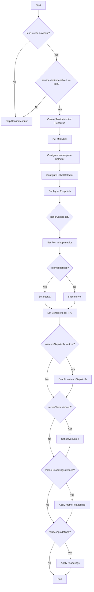
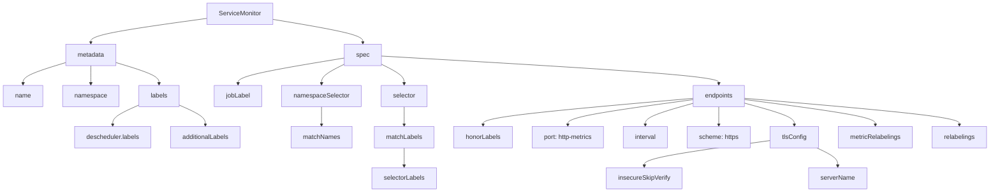

# Diagram: devops/k8s/descheduler/helm/templates/servicemonitor.yaml

> Auto-generated by Obscura crawlers

## Diagram 1

### SVG

<svg id="container" width="607.71484375" xmlns="http://www.w3.org/2000/svg" class="flowchart" height="3782.96875" viewBox="0 0 607.71484375 3782.96875" role="graphics-document document" aria-roledescription="flowchart-v2"><g><marker id="container_flowchart-v2-pointEnd" class="marker flowchart-v2" viewBox="0 0 10 10" refX="5" refY="5" markerUnits="userSpaceOnUse" markerWidth="8" markerHeight="8" orient="auto"><path d="M 0 0 L 10 5 L 0 10 z" class="arrowMarkerPath" style="stroke-width: 1; stroke-dasharray: 1, 0;"></path></marker><marker id="container_flowchart-v2-pointStart" class="marker flowchart-v2" viewBox="0 0 10 10" refX="4.5" refY="5" markerUnits="userSpaceOnUse" markerWidth="8" markerHeight="8" orient="auto"><path d="M 0 5 L 10 10 L 10 0 z" class="arrowMarkerPath" style="stroke-width: 1; stroke-dasharray: 1, 0;"></path></marker><marker id="container_flowchart-v2-circleEnd" class="marker flowchart-v2" viewBox="0 0 10 10" refX="11" refY="5" markerUnits="userSpaceOnUse" markerWidth="11" markerHeight="11" orient="auto"><circle cx="5" cy="5" r="5" class="arrowMarkerPath" style="stroke-width: 1; stroke-dasharray: 1, 0;"></circle></marker><marker id="container_flowchart-v2-circleStart" class="marker flowchart-v2" viewBox="0 0 10 10" refX="-1" refY="5" markerUnits="userSpaceOnUse" markerWidth="11" markerHeight="11" orient="auto"><circle cx="5" cy="5" r="5" class="arrowMarkerPath" style="stroke-width: 1; stroke-dasharray: 1, 0;"></circle></marker><marker id="container_flowchart-v2-crossEnd" class="marker cross flowchart-v2" viewBox="0 0 11 11" refX="12" refY="5.2" markerUnits="userSpaceOnUse" markerWidth="11" markerHeight="11" orient="auto"><path d="M 1,1 l 9,9 M 10,1 l -9,9" class="arrowMarkerPath" style="stroke-width: 2; stroke-dasharray: 1, 0;"></path></marker><marker id="container_flowchart-v2-crossStart" class="marker cross flowchart-v2" viewBox="0 0 11 11" refX="-1" refY="5.2" markerUnits="userSpaceOnUse" markerWidth="11" markerHeight="11" orient="auto"><path d="M 1,1 l 9,9 M 10,1 l -9,9" class="arrowMarkerPath" style="stroke-width: 2; stroke-dasharray: 1, 0;"></path></marker><g class="root"><g class="clusters"></g><g class="edgePaths"><path d="M250.965,62L250.965,66.167C250.965,70.333,250.965,78.667,250.965,86.333C250.965,94,250.965,101,250.965,104.5L250.965,108" id="L_A_B_0" class="edge-thickness-normal edge-pattern-solid edge-thickness-normal edge-pattern-solid flowchart-link" style=";" data-edge="true" data-et="edge" data-id="L_A_B_0" data-points="W3sieCI6MjUwLjk2NDg0Mzc1LCJ5Ijo2Mn0seyJ4IjoyNTAuOTY0ODQzNzUsInkiOjg3fSx7IngiOjI1MC45NjQ4NDM3NSwieSI6MTEyfV0=" marker-end="url(#container_flowchart-v2-pointEnd)"></path><path d="M196.865,262.775L179.872,277.959C162.879,293.142,128.893,323.508,111.899,368.025C94.906,412.542,94.906,471.208,94.906,529.875C94.906,588.542,94.906,647.208,96.396,684.054C97.886,720.9,100.865,735.926,102.355,743.439L103.845,750.951" id="L_B_C_0" class="edge-thickness-normal edge-pattern-solid edge-thickness-normal edge-pattern-solid flowchart-link" style=";" data-edge="true" data-et="edge" data-id="L_B_C_0" data-points="W3sieCI6MTk2Ljg2NTEzNjM5MjE0MDQ3LCJ5IjoyNjIuNzc1MjkyNjQyMTQwNDd9LHsieCI6OTQuOTA2MjUsInkiOjM1My44NzV9LHsieCI6OTQuOTA2MjUsInkiOjUyOS44NzV9LHsieCI6OTQuOTA2MjUsInkiOjcwNS44NzV9LHsieCI6MTA0LjYyMjYzNTY5MDc4OTQ4LCJ5Ijo3NTQuODc1fV0=" marker-end="url(#container_flowchart-v2-pointEnd)"></path><path d="M298.325,269.514L310.416,283.574C322.506,297.635,346.687,325.755,358.777,345.315C370.867,364.875,370.867,375.875,370.867,381.375L370.867,386.875" id="L_B_D_0" class="edge-thickness-normal edge-pattern-solid edge-thickness-normal edge-pattern-solid flowchart-link" style=";" data-edge="true" data-et="edge" data-id="L_B_D_0" data-points="W3sieCI6Mjk4LjMyNTQ2NTg1OTkyNDUsInkiOjI2OS41MTQzNzc4OTAwNzU1fSx7IngiOjM3MC44NjcxODc1LCJ5IjozNTMuODc1fSx7IngiOjM3MC44NjcxODc1LCJ5IjozOTAuODc1fV0=" marker-end="url(#container_flowchart-v2-pointEnd)"></path><path d="M309.044,607.051L295.849,623.522C282.655,639.993,256.267,672.934,230.752,697.214C205.237,721.495,180.594,737.114,168.273,744.924L155.952,752.734" id="L_D_C_0" class="edge-thickness-normal edge-pattern-solid edge-thickness-normal edge-pattern-solid flowchart-link" style=";" data-edge="true" data-et="edge" data-id="L_D_C_0" data-points="W3sieCI6MzA5LjA0MzU0MjEwNjk1NzU1LCJ5Ijo2MDcuMDUxMzU0NjA2OTU3Nn0seyJ4IjoyMjkuODc4OTA2MjUsInkiOjcwNS44NzV9LHsieCI6MTUyLjU3MzQ0Nzc3OTYwNTI2LCJ5Ijo3NTQuODc1fV0=" marker-end="url(#container_flowchart-v2-pointEnd)"></path><path d="M385.739,654.004L386.774,662.649C387.81,671.294,389.882,688.585,390.917,702.73C391.953,716.875,391.953,727.875,391.953,733.375L391.953,738.875" id="L_D_E_0" class="edge-thickness-normal edge-pattern-solid edge-thickness-normal edge-pattern-solid flowchart-link" style=";" data-edge="true" data-et="edge" data-id="L_D_E_0" data-points="W3sieCI6Mzg1LjczODU5NTExODgyMTEsInkiOjY1NC4wMDM1OTIzODExNzg5fSx7IngiOjM5MS45NTMxMjUsInkiOjcwNS44NzV9LHsieCI6MzkxLjk1MzEyNSwieSI6NzQyLjg3NX1d" marker-end="url(#container_flowchart-v2-pointEnd)"></path><path d="M391.953,820.875L391.953,825.042C391.953,829.208,391.953,837.542,391.953,845.208C391.953,852.875,391.953,859.875,391.953,863.375L391.953,866.875" id="L_E_F_0" class="edge-thickness-normal edge-pattern-solid edge-thickness-normal edge-pattern-solid flowchart-link" style=";" data-edge="true" data-et="edge" data-id="L_E_F_0" data-points="W3sieCI6MzkxLjk1MzEyNSwieSI6ODIwLjg3NX0seyJ4IjozOTEuOTUzMTI1LCJ5Ijo4NDUuODc1fSx7IngiOjM5MS45NTMxMjUsInkiOjg3MC44NzV9XQ==" marker-end="url(#container_flowchart-v2-pointEnd)"></path><path d="M391.953,924.875L391.953,929.042C391.953,933.208,391.953,941.542,391.953,949.208C391.953,956.875,391.953,963.875,391.953,967.375L391.953,970.875" id="L_F_G_0" class="edge-thickness-normal edge-pattern-solid edge-thickness-normal edge-pattern-solid flowchart-link" style=";" data-edge="true" data-et="edge" data-id="L_F_G_0" data-points="W3sieCI6MzkxLjk1MzEyNSwieSI6OTI0Ljg3NX0seyJ4IjozOTEuOTUzMTI1LCJ5Ijo5NDkuODc1fSx7IngiOjM5MS45NTMxMjUsInkiOjk3NC44NzV9XQ==" marker-end="url(#container_flowchart-v2-pointEnd)"></path><path d="M391.953,1052.875L391.953,1057.042C391.953,1061.208,391.953,1069.542,391.953,1077.208C391.953,1084.875,391.953,1091.875,391.953,1095.375L391.953,1098.875" id="L_G_H_0" class="edge-thickness-normal edge-pattern-solid edge-thickness-normal edge-pattern-solid flowchart-link" style=";" data-edge="true" data-et="edge" data-id="L_G_H_0" data-points="W3sieCI6MzkxLjk1MzEyNSwieSI6MTA1Mi44NzV9LHsieCI6MzkxLjk1MzEyNSwieSI6MTA3Ny44NzV9LHsieCI6MzkxLjk1MzEyNSwieSI6MTEwMi44NzV9XQ==" marker-end="url(#container_flowchart-v2-pointEnd)"></path><path d="M391.953,1156.875L391.953,1161.042C391.953,1165.208,391.953,1173.542,391.953,1181.208C391.953,1188.875,391.953,1195.875,391.953,1199.375L391.953,1202.875" id="L_H_I_0" class="edge-thickness-normal edge-pattern-solid edge-thickness-normal edge-pattern-solid flowchart-link" style=";" data-edge="true" data-et="edge" data-id="L_H_I_0" data-points="W3sieCI6MzkxLjk1MzEyNSwieSI6MTE1Ni44NzV9LHsieCI6MzkxLjk1MzEyNSwieSI6MTE4MS44NzV9LHsieCI6MzkxLjk1MzEyNSwieSI6MTIwNi44NzV9XQ==" marker-end="url(#container_flowchart-v2-pointEnd)"></path><path d="M391.953,1260.875L391.953,1265.042C391.953,1269.208,391.953,1277.542,391.953,1285.208C391.953,1292.875,391.953,1299.875,391.953,1303.375L391.953,1306.875" id="L_I_J_0" class="edge-thickness-normal edge-pattern-solid edge-thickness-normal edge-pattern-solid flowchart-link" style=";" data-edge="true" data-et="edge" data-id="L_I_J_0" data-points="W3sieCI6MzkxLjk1MzEyNSwieSI6MTI2MC44NzV9LHsieCI6MzkxLjk1MzEyNSwieSI6MTI4NS44NzV9LHsieCI6MzkxLjk1MzEyNSwieSI6MTMxMC44NzV9XQ==" marker-end="url(#container_flowchart-v2-pointEnd)"></path><path d="M391.953,1488.469L391.953,1492.635C391.953,1496.802,391.953,1505.135,391.953,1512.802C391.953,1520.469,391.953,1527.469,391.953,1530.969L391.953,1534.469" id="L_J_K_0" class="edge-thickness-normal edge-pattern-solid edge-thickness-normal edge-pattern-solid flowchart-link" style=";" data-edge="true" data-et="edge" data-id="L_J_K_0" data-points="W3sieCI6MzkxLjk1MzEyNSwieSI6MTQ4OC40Njg3NX0seyJ4IjozOTEuOTUzMTI1LCJ5IjoxNTEzLjQ2ODc1fSx7IngiOjM5MS45NTMxMjUsInkiOjE1MzguNDY4NzV9XQ==" marker-end="url(#container_flowchart-v2-pointEnd)"></path><path d="M391.953,1592.469L391.953,1596.635C391.953,1600.802,391.953,1609.135,391.953,1616.802C391.953,1624.469,391.953,1631.469,391.953,1634.969L391.953,1638.469" id="L_K_L_0" class="edge-thickness-normal edge-pattern-solid edge-thickness-normal edge-pattern-solid flowchart-link" style=";" data-edge="true" data-et="edge" data-id="L_K_L_0" data-points="W3sieCI6MzkxLjk1MzEyNSwieSI6MTU5Mi40Njg3NX0seyJ4IjozOTEuOTUzMTI1LCJ5IjoxNjE3LjQ2ODc1fSx7IngiOjM5MS45NTMxMjUsInkiOjE2NDIuNDY4NzV9XQ==" marker-end="url(#container_flowchart-v2-pointEnd)"></path><path d="M353.216,1779.638L343.281,1792.261C333.346,1804.884,313.476,1830.129,303.541,1848.252C293.605,1866.375,293.605,1877.375,293.605,1882.875L293.605,1888.375" id="L_L_M_0" class="edge-thickness-normal edge-pattern-solid edge-thickness-normal edge-pattern-solid flowchart-link" style=";" data-edge="true" data-et="edge" data-id="L_L_M_0" data-points="W3sieCI6MzUzLjIxNjIwODU2MjkzMTg1LCJ5IjoxNzc5LjYzODA4MzU2MjkzMTh9LHsieCI6MjkzLjYwNTQ2ODc1LCJ5IjoxODU1LjM3NX0seyJ4IjoyOTMuNjA1NDY4NzUsInkiOjE4OTIuMzc1fV0=" marker-end="url(#container_flowchart-v2-pointEnd)"></path><path d="M430.69,1779.638L440.625,1792.261C450.56,1804.884,470.431,1830.129,480.366,1848.252C490.301,1866.375,490.301,1877.375,490.301,1882.875L490.301,1888.375" id="L_L_N_0" class="edge-thickness-normal edge-pattern-solid edge-thickness-normal edge-pattern-solid flowchart-link" style=";" data-edge="true" data-et="edge" data-id="L_L_N_0" data-points="W3sieCI6NDMwLjY5MDA0MTQzNzA2ODE1LCJ5IjoxNzc5LjYzODA4MzU2MjkzMTh9LHsieCI6NDkwLjMwMDc4MTI1LCJ5IjoxODU1LjM3NX0seyJ4Ijo0OTAuMzAwNzgxMjUsInkiOjE4OTIuMzc1fV0=" marker-end="url(#container_flowchart-v2-pointEnd)"></path><path d="M293.605,1946.375L293.605,1950.542C293.605,1954.708,293.605,1963.042,300.897,1971.063C308.188,1979.085,322.77,1986.795,330.061,1990.65L337.352,1994.505" id="L_M_O_0" class="edge-thickness-normal edge-pattern-solid edge-thickness-normal edge-pattern-solid flowchart-link" style=";" data-edge="true" data-et="edge" data-id="L_M_O_0" data-points="W3sieCI6MjkzLjYwNTQ2ODc1LCJ5IjoxOTQ2LjM3NX0seyJ4IjoyOTMuNjA1NDY4NzUsInkiOjE5NzEuMzc1fSx7IngiOjM0MC44ODc5OTU3OTMyNjkyLCJ5IjoxOTk2LjM3NX1d" marker-end="url(#container_flowchart-v2-pointEnd)"></path><path d="M490.301,1946.375L490.301,1950.542C490.301,1954.708,490.301,1963.042,483.01,1971.063C475.719,1979.085,461.137,1986.795,453.845,1990.65L446.554,1994.505" id="L_N_O_0" class="edge-thickness-normal edge-pattern-solid edge-thickness-normal edge-pattern-solid flowchart-link" style=";" data-edge="true" data-et="edge" data-id="L_N_O_0" data-points="W3sieCI6NDkwLjMwMDc4MTI1LCJ5IjoxOTQ2LjM3NX0seyJ4Ijo0OTAuMzAwNzgxMjUsInkiOjE5NzEuMzc1fSx7IngiOjQ0My4wMTgyNTQyMDY3MzA4LCJ5IjoxOTk2LjM3NX1d" marker-end="url(#container_flowchart-v2-pointEnd)"></path><path d="M391.953,2050.375L391.953,2054.542C391.953,2058.708,391.953,2067.042,391.953,2074.708C391.953,2082.375,391.953,2089.375,391.953,2092.875L391.953,2096.375" id="L_O_P_0" class="edge-thickness-normal edge-pattern-solid edge-thickness-normal edge-pattern-solid flowchart-link" style=";" data-edge="true" data-et="edge" data-id="L_O_P_0" data-points="W3sieCI6MzkxLjk1MzEyNSwieSI6MjA1MC4zNzV9LHsieCI6MzkxLjk1MzEyNSwieSI6MjA3NS4zNzV9LHsieCI6MzkxLjk1MzEyNSwieSI6MjEwMC4zNzV9XQ==" marker-end="url(#container_flowchart-v2-pointEnd)"></path><path d="M434.612,2306.247L441.553,2319.524C448.493,2332.8,462.373,2359.353,469.314,2378.13C476.254,2396.906,476.254,2407.906,476.254,2413.406L476.254,2418.906" id="L_P_Q_0" class="edge-thickness-normal edge-pattern-solid edge-thickness-normal edge-pattern-solid flowchart-link" style=";" data-edge="true" data-et="edge" data-id="L_P_Q_0" data-points="W3sieCI6NDM0LjYxMjQxNzk3OTAwMjYsInkiOjIzMDYuMjQ2OTU3MDIwOTk3M30seyJ4Ijo0NzYuMjUzOTA2MjUsInkiOjIzODUuOTA2MjV9LHsieCI6NDc2LjI1MzkwNjI1LCJ5IjoyNDIyLjkwNjI1fV0=" marker-end="url(#container_flowchart-v2-pointEnd)"></path><path d="M349.294,2306.247L342.354,2319.524C335.413,2332.8,321.533,2359.353,314.593,2383.296C307.652,2407.24,307.652,2428.573,307.652,2447.906C307.652,2467.24,307.652,2484.573,314.489,2503.697C321.326,2522.82,335,2543.734,341.837,2554.192L348.674,2564.649" id="L_P_R_0" class="edge-thickness-normal edge-pattern-solid edge-thickness-normal edge-pattern-solid flowchart-link" style=";" data-edge="true" data-et="edge" data-id="L_P_R_0" data-points="W3sieCI6MzQ5LjI5MzgzMjAyMDk5NzQsInkiOjIzMDYuMjQ2OTU3MDIwOTk3M30seyJ4IjozMDcuNjUyMzQzNzUsInkiOjIzODUuOTA2MjV9LHsieCI6MzA3LjY1MjM0Mzc1LCJ5IjoyNDQ5LjkwNjI1fSx7IngiOjMwNy42NTIzNDM3NSwieSI6MjUwMS45MDYyNX0seyJ4IjozNTAuODYyODgzNjA1MjEzNSwieSI6MjU2Ny45OTY0OTEzOTQ3ODY1fV0=" marker-end="url(#container_flowchart-v2-pointEnd)"></path><path d="M476.254,2476.906L476.254,2481.073C476.254,2485.24,476.254,2493.573,469.417,2508.197C462.58,2522.82,448.906,2543.734,442.069,2554.192L435.232,2564.649" id="L_Q_R_0" class="edge-thickness-normal edge-pattern-solid edge-thickness-normal edge-pattern-solid flowchart-link" style=";" data-edge="true" data-et="edge" data-id="L_Q_R_0" data-points="W3sieCI6NDc2LjI1MzkwNjI1LCJ5IjoyNDc2LjkwNjI1fSx7IngiOjQ3Ni4yNTM5MDYyNSwieSI6MjUwMS45MDYyNX0seyJ4Ijo0MzMuMDQzMzY2Mzk0Nzg2NSwieSI6MjU2Ny45OTY0OTEzOTQ3ODY1fV0=" marker-end="url(#container_flowchart-v2-pointEnd)"></path><path d="M425.177,2701.557L430.676,2713.261C436.176,2724.965,447.174,2748.373,452.673,2765.577C458.172,2782.781,458.172,2793.781,458.172,2799.281L458.172,2804.781" id="L_R_S_0" class="edge-thickness-normal edge-pattern-solid edge-thickness-normal edge-pattern-solid flowchart-link" style=";" data-edge="true" data-et="edge" data-id="L_R_S_0" data-points="W3sieCI6NDI1LjE3NzM3NjM5NTM4MzkzLCJ5IjoyNzAxLjU1Njk5ODYwNDYxNn0seyJ4Ijo0NTguMTcxODc1LCJ5IjoyNzcxLjc4MTI1fSx7IngiOjQ1OC4xNzE4NzUsInkiOjI4MDguNzgxMjV9XQ==" marker-end="url(#container_flowchart-v2-pointEnd)"></path><path d="M358.729,2701.557L353.23,2713.261C347.731,2724.965,336.733,2748.373,331.233,2770.744C325.734,2793.115,325.734,2814.448,325.734,2833.781C325.734,2853.115,325.734,2870.448,330.109,2889.065C334.483,2907.681,343.232,2927.581,347.607,2937.531L351.981,2947.481" id="L_R_T_0" class="edge-thickness-normal edge-pattern-solid edge-thickness-normal edge-pattern-solid flowchart-link" style=";" data-edge="true" data-et="edge" data-id="L_R_T_0" data-points="W3sieCI6MzU4LjcyODg3MzYwNDYxNjA3LCJ5IjoyNzAxLjU1Njk5ODYwNDYxNn0seyJ4IjozMjUuNzM0Mzc1LCJ5IjoyNzcxLjc4MTI1fSx7IngiOjMyNS43MzQzNzUsInkiOjI4MzUuNzgxMjV9LHsieCI6MzI1LjczNDM3NSwieSI6Mjg4Ny43ODEyNX0seyJ4IjozNTMuNTkxMzQyMjEzMTE0NzMsInkiOjI5NTEuMTQzMDMyNzg2ODg1fV0=" marker-end="url(#container_flowchart-v2-pointEnd)"></path><path d="M458.172,2862.781L458.172,2866.948C458.172,2871.115,458.172,2879.448,453.797,2893.565C449.423,2907.681,440.674,2927.581,436.299,2937.531L431.925,2947.481" id="L_S_T_0" class="edge-thickness-normal edge-pattern-solid edge-thickness-normal edge-pattern-solid flowchart-link" style=";" data-edge="true" data-et="edge" data-id="L_S_T_0" data-points="W3sieCI6NDU4LjE3MTg3NSwieSI6Mjg2Mi43ODEyNX0seyJ4Ijo0NTguMTcxODc1LCJ5IjoyODg3Ljc4MTI1fSx7IngiOjQzMC4zMTQ5MDc3ODY4ODUyNywieSI6Mjk1MS4xNDMwMzI3ODY4ODV9XQ==" marker-end="url(#container_flowchart-v2-pointEnd)"></path><path d="M433.856,3122.112L440.439,3135.263C447.021,3148.413,460.186,3174.715,466.769,3193.365C473.352,3212.016,473.352,3223.016,473.352,3228.516L473.352,3234.016" id="L_T_U_0" class="edge-thickness-normal edge-pattern-solid edge-thickness-normal edge-pattern-solid flowchart-link" style=";" data-edge="true" data-et="edge" data-id="L_T_U_0" data-points="W3sieCI6NDMzLjg1NjM1NDcwMzYwODI1LCJ5IjozMTIyLjExMjM5NTI5NjM5MTd9LHsieCI6NDczLjM1MTU2MjUsInkiOjMyMDEuMDE1NjI1fSx7IngiOjQ3My4zNTE1NjI1LCJ5IjozMjM4LjAxNTYyNX1d" marker-end="url(#container_flowchart-v2-pointEnd)"></path><path d="M350.05,3122.112L343.467,3135.263C336.885,3148.413,323.72,3174.715,317.137,3198.532C310.555,3222.349,310.555,3243.682,310.555,3263.016C310.555,3282.349,310.555,3299.682,317.169,3318.545C323.784,3337.408,337.013,3357.801,343.627,3367.998L350.242,3378.194" id="L_T_V_0" class="edge-thickness-normal edge-pattern-solid edge-thickness-normal edge-pattern-solid flowchart-link" style=";" data-edge="true" data-et="edge" data-id="L_T_V_0" data-points="W3sieCI6MzUwLjA0OTg5NTI5NjM5MTc1LCJ5IjozMTIyLjExMjM5NTI5NjM5MTd9LHsieCI6MzEwLjU1NDY4NzUsInkiOjMyMDEuMDE1NjI1fSx7IngiOjMxMC41NTQ2ODc1LCJ5IjozMjY1LjAxNTYyNX0seyJ4IjozMTAuNTU0Njg3NSwieSI6MzMxNy4wMTU2MjV9LHsieCI6MzUyLjQxODkzNjc1NjUxNDM3LCJ5IjozMzgxLjU0OTgxMzI0MzQ4NTV9XQ==" marker-end="url(#container_flowchart-v2-pointEnd)"></path><path d="M473.352,3292.016L473.352,3296.182C473.352,3300.349,473.352,3308.682,466.737,3323.045C460.122,3337.408,446.893,3357.801,440.279,3367.998L433.664,3378.194" id="L_U_V_0" class="edge-thickness-normal edge-pattern-solid edge-thickness-normal edge-pattern-solid flowchart-link" style=";" data-edge="true" data-et="edge" data-id="L_U_V_0" data-points="W3sieCI6NDczLjM1MTU2MjUsInkiOjMyOTIuMDE1NjI1fSx7IngiOjQ3My4zNTE1NjI1LCJ5IjozMzE3LjAxNTYyNX0seyJ4Ijo0MzEuNDg3MzEzMjQzNDg1NjMsInkiOjMzODEuNTQ5ODEzMjQzNDg1NX1d" marker-end="url(#container_flowchart-v2-pointEnd)"></path><path d="M425.474,3509.447L431.359,3521.201C437.243,3532.955,449.012,3556.462,454.897,3573.715C460.781,3590.969,460.781,3601.969,460.781,3607.469L460.781,3612.969" id="L_V_W_0" class="edge-thickness-normal edge-pattern-solid edge-thickness-normal edge-pattern-solid flowchart-link" style=";" data-edge="true" data-et="edge" data-id="L_V_W_0" data-points="W3sieCI6NDI1LjQ3NDQ4MzU2NDk2Mzg2LCJ5IjozNTA5LjQ0NzM5MTQzNTAzNn0seyJ4Ijo0NjAuNzgxMjUsInkiOjM1NzkuOTY4NzV9LHsieCI6NDYwLjc4MTI1LCJ5IjozNjE2Ljk2ODc1fV0=" marker-end="url(#container_flowchart-v2-pointEnd)"></path><path d="M358.432,3509.447L352.547,3521.201C346.663,3532.955,334.894,3556.462,329.009,3578.882C323.125,3601.302,323.125,3622.635,323.125,3641.969C323.125,3661.302,323.125,3678.635,328.108,3691.067C333.091,3703.498,343.058,3711.028,348.041,3714.793L353.024,3718.558" id="L_V_X_0" class="edge-thickness-normal edge-pattern-solid edge-thickness-normal edge-pattern-solid flowchart-link" style=";" data-edge="true" data-et="edge" data-id="L_V_X_0" data-points="W3sieCI6MzU4LjQzMTc2NjQzNTAzNjE0LCJ5IjozNTA5LjQ0NzM5MTQzNTAzNn0seyJ4IjozMjMuMTI1LCJ5IjozNTc5Ljk2ODc1fSx7IngiOjMyMy4xMjUsInkiOjM2NDMuOTY4NzV9LHsieCI6MzIzLjEyNSwieSI6MzY5NS45Njg3NX0seyJ4IjozNTYuMjE1NDQ0NzExNTM4NDUsInkiOjM3MjAuOTY4NzV9XQ==" marker-end="url(#container_flowchart-v2-pointEnd)"></path><path d="M460.781,3670.969L460.781,3675.135C460.781,3679.302,460.781,3687.635,455.798,3695.567C450.815,3703.498,440.849,3711.028,435.866,3714.793L430.882,3718.558" id="L_W_X_0" class="edge-thickness-normal edge-pattern-solid edge-thickness-normal edge-pattern-solid flowchart-link" style=";" data-edge="true" data-et="edge" data-id="L_W_X_0" data-points="W3sieCI6NDYwLjc4MTI1LCJ5IjozNjcwLjk2ODc1fSx7IngiOjQ2MC43ODEyNSwieSI6MzY5NS45Njg3NX0seyJ4Ijo0MjcuNjkwODA1Mjg4NDYxNTUsInkiOjM3MjAuOTY4NzV9XQ==" marker-end="url(#container_flowchart-v2-pointEnd)"></path></g><g class="edgeLabels"><g class="edgeLabel"><g class="label" data-id="L_A_B_0" transform="translate(0, 0)"><foreignObject width="0" height="0">

</foreignObject></g></g><g class="edgeLabel" transform="translate(94.90625, 529.875)"><g class="label" data-id="L_B_C_0" transform="translate(-10.140625, -12)"><foreignObject width="20.28125" height="24">

No

</foreignObject></g></g><g class="edgeLabel" transform="translate(370.8671875, 353.875)"><g class="label" data-id="L_B_D_0" transform="translate(-12.03125, -12)"><foreignObject width="24.0625" height="24">

Yes

</foreignObject></g></g><g class="edgeLabel" transform="translate(240.8498, 692.1797)"><g class="label" data-id="L_D_C_0" transform="translate(-10.140625, -12)"><foreignObject width="20.28125" height="24">

No

</foreignObject></g></g><g class="edgeLabel" transform="translate(391.953125, 705.875)"><g class="label" data-id="L_D_E_0" transform="translate(-12.03125, -12)"><foreignObject width="24.0625" height="24">

Yes

</foreignObject></g></g><g class="edgeLabel"><g class="label" data-id="L_E_F_0" transform="translate(0, 0)"><foreignObject width="0" height="0">

</foreignObject></g></g><g class="edgeLabel"><g class="label" data-id="L_F_G_0" transform="translate(0, 0)"><foreignObject width="0" height="0">

</foreignObject></g></g><g class="edgeLabel"><g class="label" data-id="L_G_H_0" transform="translate(0, 0)"><foreignObject width="0" height="0">

</foreignObject></g></g><g class="edgeLabel"><g class="label" data-id="L_H_I_0" transform="translate(0, 0)"><foreignObject width="0" height="0">

</foreignObject></g></g><g class="edgeLabel"><g class="label" data-id="L_I_J_0" transform="translate(0, 0)"><foreignObject width="0" height="0">

</foreignObject></g></g><g class="edgeLabel"><g class="label" data-id="L_J_K_0" transform="translate(0, 0)"><foreignObject width="0" height="0">

</foreignObject></g></g><g class="edgeLabel"><g class="label" data-id="L_K_L_0" transform="translate(0, 0)"><foreignObject width="0" height="0">

</foreignObject></g></g><g class="edgeLabel" transform="translate(293.60546875, 1855.375)"><g class="label" data-id="L_L_M_0" transform="translate(-12.03125, -12)"><foreignObject width="24.0625" height="24">

Yes

</foreignObject></g></g><g class="edgeLabel" transform="translate(490.30078125, 1855.375)"><g class="label" data-id="L_L_N_0" transform="translate(-10.140625, -12)"><foreignObject width="20.28125" height="24">

No

</foreignObject></g></g><g class="edgeLabel"><g class="label" data-id="L_M_O_0" transform="translate(0, 0)"><foreignObject width="0" height="0">

</foreignObject></g></g><g class="edgeLabel"><g class="label" data-id="L_N_O_0" transform="translate(0, 0)"><foreignObject width="0" height="0">

</foreignObject></g></g><g class="edgeLabel"><g class="label" data-id="L_O_P_0" transform="translate(0, 0)"><foreignObject width="0" height="0">

</foreignObject></g></g><g class="edgeLabel" transform="translate(476.25390625, 2385.90625)"><g class="label" data-id="L_P_Q_0" transform="translate(-12.03125, -12)"><foreignObject width="24.0625" height="24">

Yes

</foreignObject></g></g><g class="edgeLabel" transform="translate(307.65234375, 2449.90625)"><g class="label" data-id="L_P_R_0" transform="translate(-10.140625, -12)"><foreignObject width="20.28125" height="24">

No

</foreignObject></g></g><g class="edgeLabel"><g class="label" data-id="L_Q_R_0" transform="translate(0, 0)"><foreignObject width="0" height="0">

</foreignObject></g></g><g class="edgeLabel" transform="translate(458.171875, 2771.78125)"><g class="label" data-id="L_R_S_0" transform="translate(-12.03125, -12)"><foreignObject width="24.0625" height="24">

Yes

</foreignObject></g></g><g class="edgeLabel" transform="translate(325.734375, 2835.78125)"><g class="label" data-id="L_R_T_0" transform="translate(-10.140625, -12)"><foreignObject width="20.28125" height="24">

No

</foreignObject></g></g><g class="edgeLabel"><g class="label" data-id="L_S_T_0" transform="translate(0, 0)"><foreignObject width="0" height="0">

</foreignObject></g></g><g class="edgeLabel" transform="translate(473.3515625, 3201.015625)"><g class="label" data-id="L_T_U_0" transform="translate(-12.03125, -12)"><foreignObject width="24.0625" height="24">

Yes

</foreignObject></g></g><g class="edgeLabel" transform="translate(310.5546875, 3265.015625)"><g class="label" data-id="L_T_V_0" transform="translate(-10.140625, -12)"><foreignObject width="20.28125" height="24">

No

</foreignObject></g></g><g class="edgeLabel"><g class="label" data-id="L_U_V_0" transform="translate(0, 0)"><foreignObject width="0" height="0">

</foreignObject></g></g><g class="edgeLabel" transform="translate(460.78125, 3579.96875)"><g class="label" data-id="L_V_W_0" transform="translate(-12.03125, -12)"><foreignObject width="24.0625" height="24">

Yes

</foreignObject></g></g><g class="edgeLabel" transform="translate(323.125, 3643.96875)"><g class="label" data-id="L_V_X_0" transform="translate(-10.140625, -12)"><foreignObject width="20.28125" height="24">

No

</foreignObject></g></g><g class="edgeLabel"><g class="label" data-id="L_W_X_0" transform="translate(0, 0)"><foreignObject width="0" height="0">

</foreignObject></g></g></g><g class="nodes"><g class="node default" id="flowchart-A-0" transform="translate(250.96484375, 35)"><rect class="basic label-container" style="" x="-47.5234375" y="-27" width="95.046875" height="54"></rect><g class="label" style="" transform="translate(-17.5234375, -12)"><rect></rect><foreignObject width="35.046875" height="24">

Start

</foreignObject></g></g><g class="node default" id="flowchart-B-1" transform="translate(250.96484375, 214.4375)"><polygon points="102.4375,0 204.875,-102.4375 102.4375,-204.875 0,-102.4375" class="label-container" transform="translate(-101.9375, 102.4375)"></polygon><g class="label" style="" transform="translate(-75.4375, -12)"><rect></rect><foreignObject width="150.875" height="24">

kind == Deployment?

</foreignObject></g></g><g class="node default" id="flowchart-C-3" transform="translate(109.9765625, 781.875)"><rect class="basic label-container" style="" x="-101.9765625" y="-27" width="203.953125" height="54"></rect><g class="label" style="" transform="translate(-71.9765625, -12)"><rect></rect><foreignObject width="143.953125" height="24">

Skip ServiceMonitor

</foreignObject></g></g><g class="node default" id="flowchart-D-5" transform="translate(370.8671875, 529.875)"><polygon points="139,0 278,-139 139,-278 0,-139" class="label-container" transform="translate(-138.5, 139)"></polygon><g class="label" style="" transform="translate(-100, -24)"><rect></rect><foreignObject width="200" height="48">

serviceMonitor.enabled == true?

</foreignObject></g></g><g class="node default" id="flowchart-E-9" transform="translate(391.953125, 781.875)"><rect class="basic label-container" style="" x="-130" y="-39" width="260" height="78"></rect><g class="label" style="" transform="translate(-100, -24)"><rect></rect><foreignObject width="200" height="48">

Create ServiceMonitor Resource

</foreignObject></g></g><g class="node default" id="flowchart-F-11" transform="translate(391.953125, 897.875)"><rect class="basic label-container" style="" x="-77.8203125" y="-27" width="155.640625" height="54"></rect><g class="label" style="" transform="translate(-47.8203125, -12)"><rect></rect><foreignObject width="95.640625" height="24">

Set Metadata

</foreignObject></g></g><g class="node default" id="flowchart-G-13" transform="translate(391.953125, 1013.875)"><rect class="basic label-container" style="" x="-130" y="-39" width="260" height="78"></rect><g class="label" style="" transform="translate(-100, -24)"><rect></rect><foreignObject width="200" height="48">

Configure Namespace Selector

</foreignObject></g></g><g class="node default" id="flowchart-H-15" transform="translate(391.953125, 1129.875)"><rect class="basic label-container" style="" x="-117.9140625" y="-27" width="235.828125" height="54"></rect><g class="label" style="" transform="translate(-87.9140625, -12)"><rect></rect><foreignObject width="175.828125" height="24">

Configure Label Selector

</foreignObject></g></g><g class="node default" id="flowchart-I-17" transform="translate(391.953125, 1233.875)"><rect class="basic label-container" style="" x="-103.015625" y="-27" width="206.03125" height="54"></rect><g class="label" style="" transform="translate(-73.015625, -12)"><rect></rect><foreignObject width="146.03125" height="24">

Configure Endpoints

</foreignObject></g></g><g class="node default" id="flowchart-J-19" transform="translate(391.953125, 1399.671875)"><polygon points="88.796875,0 177.59375,-88.796875 88.796875,-177.59375 0,-88.796875" class="label-container" transform="translate(-88.296875, 88.796875)"></polygon><g class="label" style="" transform="translate(-61.796875, -12)"><rect></rect><foreignObject width="123.59375" height="24">

honorLabels set?

</foreignObject></g></g><g class="node default" id="flowchart-K-21" transform="translate(391.953125, 1565.46875)"><rect class="basic label-container" style="" x="-115.9140625" y="-27" width="231.828125" height="54"></rect><g class="label" style="" transform="translate(-85.9140625, -12)"><rect></rect><foreignObject width="171.828125" height="24">

Set Port to http-metrics

</foreignObject></g></g><g class="node default" id="flowchart-L-23" transform="translate(391.953125, 1730.421875)"><polygon points="87.953125,0 175.90625,-87.953125 87.953125,-175.90625 0,-87.953125" class="label-container" transform="translate(-87.453125, 87.953125)"></polygon><g class="label" style="" transform="translate(-60.953125, -12)"><rect></rect><foreignObject width="121.90625" height="24">

interval defined?

</foreignObject></g></g><g class="node default" id="flowchart-M-25" transform="translate(293.60546875, 1919.375)"><rect class="basic label-container" style="" x="-71.421875" y="-27" width="142.84375" height="54"></rect><g class="label" style="" transform="translate(-41.421875, -12)"><rect></rect><foreignObject width="82.84375" height="24">

Set Interval

</foreignObject></g></g><g class="node default" id="flowchart-N-27" transform="translate(490.30078125, 1919.375)"><rect class="basic label-container" style="" x="-75.2734375" y="-27" width="150.546875" height="54"></rect><g class="label" style="" transform="translate(-45.2734375, -12)"><rect></rect><foreignObject width="90.546875" height="24">

Skip Interval

</foreignObject></g></g><g class="node default" id="flowchart-O-29" transform="translate(391.953125, 2023.375)"><rect class="basic label-container" style="" x="-106.421875" y="-27" width="212.84375" height="54"></rect><g class="label" style="" transform="translate(-76.421875, -12)"><rect></rect><foreignObject width="152.84375" height="24">

Set Scheme to HTTPS

</foreignObject></g></g><g class="node default" id="flowchart-P-33" transform="translate(391.953125, 2224.640625)"><polygon points="124.265625,0 248.53125,-124.265625 124.265625,-248.53125 0,-124.265625" class="label-container" transform="translate(-123.765625, 124.265625)"></polygon><g class="label" style="" transform="translate(-97.265625, -12)"><rect></rect><foreignObject width="194.53125" height="24">

insecureSkipVerify == true?

</foreignObject></g></g><g class="node default" id="flowchart-Q-35" transform="translate(476.25390625, 2449.90625)"><rect class="basic label-container" style="" x="-123.4609375" y="-27" width="246.921875" height="54"></rect><g class="label" style="" transform="translate(-93.4609375, -12)"><rect></rect><foreignObject width="186.921875" height="24">

Enable insecureSkipVerify

</foreignObject></g></g><g class="node default" id="flowchart-R-37" transform="translate(391.953125, 2630.84375)"><polygon points="103.9375,0 207.875,-103.9375 103.9375,-207.875 0,-103.9375" class="label-container" transform="translate(-103.4375, 103.9375)"></polygon><g class="label" style="" transform="translate(-76.9375, -12)"><rect></rect><foreignObject width="153.875" height="24">

serverName defined?

</foreignObject></g></g><g class="node default" id="flowchart-S-41" transform="translate(458.171875, 2835.78125)"><rect class="basic label-container" style="" x="-87.296875" y="-27" width="174.59375" height="54"></rect><g class="label" style="" transform="translate(-57.296875, -12)"><rect></rect><foreignObject width="114.59375" height="24">

Set serverName

</foreignObject></g></g><g class="node default" id="flowchart-T-43" transform="translate(391.953125, 3038.3984375)"><polygon points="125.6171875,0 251.234375,-125.6171875 125.6171875,-251.234375 0,-125.6171875" class="label-container" transform="translate(-125.1171875, 125.6171875)"></polygon><g class="label" style="" transform="translate(-98.6171875, -12)"><rect></rect><foreignObject width="197.234375" height="24">

metricRelabelings defined?

</foreignObject></g></g><g class="node default" id="flowchart-U-47" transform="translate(473.3515625, 3265.015625)"><rect class="basic label-container" style="" x="-117.65625" y="-27" width="235.3125" height="54"></rect><g class="label" style="" transform="translate(-87.65625, -12)"><rect></rect><foreignObject width="175.3125" height="24">

Apply metricRelabelings

</foreignObject></g></g><g class="node default" id="flowchart-V-49" transform="translate(391.953125, 3442.4921875)"><polygon points="100.4765625,0 200.953125,-100.4765625 100.4765625,-200.953125 0,-100.4765625" class="label-container" transform="translate(-99.9765625, 100.4765625)"></polygon><g class="label" style="" transform="translate(-73.4765625, -12)"><rect></rect><foreignObject width="146.953125" height="24">

relabelings defined?

</foreignObject></g></g><g class="node default" id="flowchart-W-53" transform="translate(460.78125, 3643.96875)"><rect class="basic label-container" style="" x="-92.515625" y="-27" width="185.03125" height="54"></rect><g class="label" style="" transform="translate(-62.515625, -12)"><rect></rect><foreignObject width="125.03125" height="24">

Apply relabelings

</foreignObject></g></g><g class="node default" id="flowchart-X-55" transform="translate(391.953125, 3747.96875)"><rect class="basic label-container" style="" x="-43.6796875" y="-27" width="87.359375" height="54"></rect><g class="label" style="" transform="translate(-13.6796875, -12)"><rect></rect><foreignObject width="27.359375" height="24">

End

</foreignObject></g></g></g></g></g></svg>

## Diagram 2

### SVG

<svg id="container" width="2532.9609375" xmlns="http://www.w3.org/2000/svg" class="flowchart" height="486" viewBox="0 0 2532.9609375 486" role="graphics-document document" aria-roledescription="flowchart-v2"><g><marker id="container_flowchart-v2-pointEnd" class="marker flowchart-v2" viewBox="0 0 10 10" refX="5" refY="5" markerUnits="userSpaceOnUse" markerWidth="8" markerHeight="8" orient="auto"><path d="M 0 0 L 10 5 L 0 10 z" class="arrowMarkerPath" style="stroke-width: 1; stroke-dasharray: 1, 0;"></path></marker><marker id="container_flowchart-v2-pointStart" class="marker flowchart-v2" viewBox="0 0 10 10" refX="4.5" refY="5" markerUnits="userSpaceOnUse" markerWidth="8" markerHeight="8" orient="auto"><path d="M 0 5 L 10 10 L 10 0 z" class="arrowMarkerPath" style="stroke-width: 1; stroke-dasharray: 1, 0;"></path></marker><marker id="container_flowchart-v2-circleEnd" class="marker flowchart-v2" viewBox="0 0 10 10" refX="11" refY="5" markerUnits="userSpaceOnUse" markerWidth="11" markerHeight="11" orient="auto"><circle cx="5" cy="5" r="5" class="arrowMarkerPath" style="stroke-width: 1; stroke-dasharray: 1, 0;"></circle></marker><marker id="container_flowchart-v2-circleStart" class="marker flowchart-v2" viewBox="0 0 10 10" refX="-1" refY="5" markerUnits="userSpaceOnUse" markerWidth="11" markerHeight="11" orient="auto"><circle cx="5" cy="5" r="5" class="arrowMarkerPath" style="stroke-width: 1; stroke-dasharray: 1, 0;"></circle></marker><marker id="container_flowchart-v2-crossEnd" class="marker cross flowchart-v2" viewBox="0 0 11 11" refX="12" refY="5.2" markerUnits="userSpaceOnUse" markerWidth="11" markerHeight="11" orient="auto"><path d="M 1,1 l 9,9 M 10,1 l -9,9" class="arrowMarkerPath" style="stroke-width: 2; stroke-dasharray: 1, 0;"></path></marker><marker id="container_flowchart-v2-crossStart" class="marker cross flowchart-v2" viewBox="0 0 11 11" refX="-1" refY="5.2" markerUnits="userSpaceOnUse" markerWidth="11" markerHeight="11" orient="auto"><path d="M 1,1 l 9,9 M 10,1 l -9,9" class="arrowMarkerPath" style="stroke-width: 2; stroke-dasharray: 1, 0;"></path></marker><g class="root"><g class="clusters"></g><g class="edgePaths"><path d="M524.262,46.577L475.145,53.314C426.029,60.051,327.796,73.526,278.679,83.763C229.563,94,229.563,101,229.563,104.5L229.563,108" id="L_SM_MD_0" class="edge-thickness-normal edge-pattern-solid edge-thickness-normal edge-pattern-solid flowchart-link" style=";" data-edge="true" data-et="edge" data-id="L_SM_MD_0" data-points="W3sieCI6NTI0LjI2MTcxODc1LCJ5Ijo0Ni41NzY3NDk4ODkyMzEyMX0seyJ4IjoyMjkuNTYyNSwieSI6ODd9LHsieCI6MjI5LjU2MjUsInkiOjExMn1d" marker-end="url(#container_flowchart-v2-pointEnd)"></path><path d="M693.059,48.938L731.47,55.282C769.882,61.626,846.704,74.313,885.116,84.156C923.527,94,923.527,101,923.527,104.5L923.527,108" id="L_SM_SP_0" class="edge-thickness-normal edge-pattern-solid edge-thickness-normal edge-pattern-solid flowchart-link" style=";" data-edge="true" data-et="edge" data-id="L_SM_SP_0" data-points="W3sieCI6NjkzLjA1ODU5Mzc1LCJ5Ijo0OC45MzgzMTcyNDY4NTUwN30seyJ4Ijo5MjMuNTI3MzQzNzUsInkiOjg3fSx7IngiOjkyMy41MjczNDM3NSwieSI6MTEyfV0=" marker-end="url(#container_flowchart-v2-pointEnd)"></path><path d="M164.836,158.648L147.073,164.04C129.31,169.432,93.784,180.216,76.021,189.108C58.258,198,58.258,205,58.258,208.5L58.258,212" id="L_MD_N_0" class="edge-thickness-normal edge-pattern-solid edge-thickness-normal edge-pattern-solid flowchart-link" style=";" data-edge="true" data-et="edge" data-id="L_MD_N_0" data-points="W3sieCI6MTY0LjgzNTkzNzUsInkiOjE1OC42NDc5MjI2NTI0Mzc2NH0seyJ4Ijo1OC4yNTc4MTI1LCJ5IjoxOTF9LHsieCI6NTguMjU3ODEyNSwieSI6MjE2fV0=" marker-end="url(#container_flowchart-v2-pointEnd)"></path><path d="M229.563,166L229.563,170.167C229.563,174.333,229.563,182.667,229.563,190.333C229.563,198,229.563,205,229.563,208.5L229.563,212" id="L_MD_NS_0" class="edge-thickness-normal edge-pattern-solid edge-thickness-normal edge-pattern-solid flowchart-link" style=";" data-edge="true" data-et="edge" data-id="L_MD_NS_0" data-points="W3sieCI6MjI5LjU2MjUsInkiOjE2Nn0seyJ4IjoyMjkuNTYyNSwieSI6MTkxfSx7IngiOjIyOS41NjI1LCJ5IjoyMTZ9XQ==" marker-end="url(#container_flowchart-v2-pointEnd)"></path><path d="M294.289,158.467L312.318,163.889C330.346,169.311,366.404,180.156,384.432,189.078C402.461,198,402.461,205,402.461,208.5L402.461,212" id="L_MD_L_0" class="edge-thickness-normal edge-pattern-solid edge-thickness-normal edge-pattern-solid flowchart-link" style=";" data-edge="true" data-et="edge" data-id="L_MD_L_0" data-points="W3sieCI6Mjk0LjI4OTA2MjUsInkiOjE1OC40NjY4MTEyNjAyMjMyfSx7IngiOjQwMi40NjA5Mzc1LCJ5IjoxOTF9LHsieCI6NDAyLjQ2MDkzNzUsInkiOjIxNn1d" marker-end="url(#container_flowchart-v2-pointEnd)"></path><path d="M350.609,265.579L339.349,270.483C328.089,275.386,305.568,285.193,294.307,293.597C283.047,302,283.047,309,283.047,312.5L283.047,316" id="L_L_DL_0" class="edge-thickness-normal edge-pattern-solid edge-thickness-normal edge-pattern-solid flowchart-link" style=";" data-edge="true" data-et="edge" data-id="L_L_DL_0" data-points="W3sieCI6MzUwLjYwOTM3NSwieSI6MjY1LjU3OTI2MDcxMzExNzQzfSx7IngiOjI4My4wNDY4NzUsInkiOjI5NX0seyJ4IjoyODMuMDQ2ODc1LCJ5IjozMjB9XQ==" marker-end="url(#container_flowchart-v2-pointEnd)"></path><path d="M454.313,265.579L465.573,270.483C476.833,275.386,499.354,285.193,510.615,293.597C521.875,302,521.875,309,521.875,312.5L521.875,316" id="L_L_AL_0" class="edge-thickness-normal edge-pattern-solid edge-thickness-normal edge-pattern-solid flowchart-link" style=";" data-edge="true" data-et="edge" data-id="L_L_AL_0" data-points="W3sieCI6NDU0LjMxMjUsInkiOjI2NS41NzkyNjA3MTMxMTc0M30seyJ4Ijo1MjEuODc1LCJ5IjoyOTV9LHsieCI6NTIxLjg3NSwieSI6MzIwfV0=" marker-end="url(#container_flowchart-v2-pointEnd)"></path><path d="M876.848,146.655L831.775,154.045C786.703,161.436,696.559,176.218,651.486,187.109C606.414,198,606.414,205,606.414,208.5L606.414,212" id="L_SP_JL_0" class="edge-thickness-normal edge-pattern-solid edge-thickness-normal edge-pattern-solid flowchart-link" style=";" data-edge="true" data-et="edge" data-id="L_SP_JL_0" data-points="W3sieCI6ODc2Ljg0NzY1NjI1LCJ5IjoxNDYuNjU0NTAwNDM3Mjk0NDR9LHsieCI6NjA2LjQxNDA2MjUsInkiOjE5MX0seyJ4Ijo2MDYuNDE0MDYyNSwieSI6MjE2fV0=" marker-end="url(#container_flowchart-v2-pointEnd)"></path><path d="M876.848,162.129L867.136,166.941C857.424,171.752,838.001,181.376,828.29,189.688C818.578,198,818.578,205,818.578,208.5L818.578,212" id="L_SP_NSS_0" class="edge-thickness-normal edge-pattern-solid edge-thickness-normal edge-pattern-solid flowchart-link" style=";" data-edge="true" data-et="edge" data-id="L_SP_NSS_0" data-points="W3sieCI6ODc2Ljg0NzY1NjI1LCJ5IjoxNjIuMTI4NzQ1MzAwOTI2OH0seyJ4Ijo4MTguNTc4MTI1LCJ5IjoxOTF9LHsieCI6ODE4LjU3ODEyNSwieSI6MjE2fV0=" marker-end="url(#container_flowchart-v2-pointEnd)"></path><path d="M970.207,162.129L979.919,166.941C989.63,171.752,1009.053,181.376,1018.765,189.688C1028.477,198,1028.477,205,1028.477,208.5L1028.477,212" id="L_SP_SEL_0" class="edge-thickness-normal edge-pattern-solid edge-thickness-normal edge-pattern-solid flowchart-link" style=";" data-edge="true" data-et="edge" data-id="L_SP_SEL_0" data-points="W3sieCI6OTcwLjIwNzAzMTI1LCJ5IjoxNjIuMTI4NzQ1MzAwOTI2OH0seyJ4IjoxMDI4LjQ3NjU2MjUsInkiOjE5MX0seyJ4IjoxMDI4LjQ3NjU2MjUsInkiOjIxNn1d" marker-end="url(#container_flowchart-v2-pointEnd)"></path><path d="M970.207,141.646L1115.3,149.872C1260.393,158.098,1550.579,174.549,1695.673,186.274C1840.766,198,1840.766,205,1840.766,208.5L1840.766,212" id="L_SP_EP_0" class="edge-thickness-normal edge-pattern-solid edge-thickness-normal edge-pattern-solid flowchart-link" style=";" data-edge="true" data-et="edge" data-id="L_SP_EP_0" data-points="W3sieCI6OTcwLjIwNzAzMTI1LCJ5IjoxNDEuNjQ2MzYxMTQ2OTU1MjN9LHsieCI6MTg0MC43NjU2MjUsInkiOjE5MX0seyJ4IjoxODQwLjc2NTYyNSwieSI6MjE2fV0=" marker-end="url(#container_flowchart-v2-pointEnd)"></path><path d="M818.578,270L818.578,274.167C818.578,278.333,818.578,286.667,818.578,294.333C818.578,302,818.578,309,818.578,312.5L818.578,316" id="L_NSS_MN_0" class="edge-thickness-normal edge-pattern-solid edge-thickness-normal edge-pattern-solid flowchart-link" style=";" data-edge="true" data-et="edge" data-id="L_NSS_MN_0" data-points="W3sieCI6ODE4LjU3ODEyNSwieSI6MjcwfSx7IngiOjgxOC41NzgxMjUsInkiOjI5NX0seyJ4Ijo4MTguNTc4MTI1LCJ5IjozMjB9XQ==" marker-end="url(#container_flowchart-v2-pointEnd)"></path><path d="M1028.477,270L1028.477,274.167C1028.477,278.333,1028.477,286.667,1028.477,294.333C1028.477,302,1028.477,309,1028.477,312.5L1028.477,316" id="L_SEL_ML_0" class="edge-thickness-normal edge-pattern-solid edge-thickness-normal edge-pattern-solid flowchart-link" style=";" data-edge="true" data-et="edge" data-id="L_SEL_ML_0" data-points="W3sieCI6MTAyOC40NzY1NjI1LCJ5IjoyNzB9LHsieCI6MTAyOC40NzY1NjI1LCJ5IjoyOTV9LHsieCI6MTAyOC40NzY1NjI1LCJ5IjozMjB9XQ==" marker-end="url(#container_flowchart-v2-pointEnd)"></path><path d="M1028.477,374L1028.477,378.167C1028.477,382.333,1028.477,390.667,1028.477,398.333C1028.477,406,1028.477,413,1028.477,416.5L1028.477,420" id="L_ML_SSL_0" class="edge-thickness-normal edge-pattern-solid edge-thickness-normal edge-pattern-solid flowchart-link" style=";" data-edge="true" data-et="edge" data-id="L_ML_SSL_0" data-points="W3sieCI6MTAyOC40NzY1NjI1LCJ5IjozNzR9LHsieCI6MTAyOC40NzY1NjI1LCJ5IjozOTl9LHsieCI6MTAyOC40NzY1NjI1LCJ5Ijo0MjR9XQ==" marker-end="url(#container_flowchart-v2-pointEnd)"></path><path d="M1773.938,248.687L1683.227,256.406C1592.516,264.124,1411.094,279.562,1320.383,290.781C1229.672,302,1229.672,309,1229.672,312.5L1229.672,316" id="L_EP_HL_0" class="edge-thickness-normal edge-pattern-solid edge-thickness-normal edge-pattern-solid flowchart-link" style=";" data-edge="true" data-et="edge" data-id="L_EP_HL_0" data-points="W3sieCI6MTc3My45Mzc1LCJ5IjoyNDguNjg2NjI3NDYxMDA3NDJ9LHsieCI6MTIyOS42NzE4NzUsInkiOjI5NX0seyJ4IjoxMjI5LjY3MTg3NSwieSI6MzIwfV0=" marker-end="url(#container_flowchart-v2-pointEnd)"></path><path d="M1773.938,251.89L1719.923,259.075C1665.909,266.26,1557.88,280.63,1503.866,291.315C1449.852,302,1449.852,309,1449.852,312.5L1449.852,316" id="L_EP_PT_0" class="edge-thickness-normal edge-pattern-solid edge-thickness-normal edge-pattern-solid flowchart-link" style=";" data-edge="true" data-et="edge" data-id="L_EP_PT_0" data-points="W3sieCI6MTc3My45Mzc1LCJ5IjoyNTEuODg5NTgxNzA5NTM0OTV9LHsieCI6MTQ0OS44NTE1NjI1LCJ5IjoyOTV9LHsieCI6MTQ0OS44NTE1NjI1LCJ5IjozMjB9XQ==" marker-end="url(#container_flowchart-v2-pointEnd)"></path><path d="M1773.938,261.445L1753.674,267.037C1733.411,272.63,1692.885,283.815,1672.622,292.907C1652.359,302,1652.359,309,1652.359,312.5L1652.359,316" id="L_EP_INT_0" class="edge-thickness-normal edge-pattern-solid edge-thickness-normal edge-pattern-solid flowchart-link" style=";" data-edge="true" data-et="edge" data-id="L_EP_INT_0" data-points="W3sieCI6MTc3My45Mzc1LCJ5IjoyNjEuNDQ0NTE4MTYyMjE1OTZ9LHsieCI6MTY1Mi4zNTkzNzUsInkiOjI5NX0seyJ4IjoxNjUyLjM1OTM3NSwieSI6MzIwfV0=" marker-end="url(#container_flowchart-v2-pointEnd)"></path><path d="M1840.766,270L1840.766,274.167C1840.766,278.333,1840.766,286.667,1840.766,294.333C1840.766,302,1840.766,309,1840.766,312.5L1840.766,316" id="L_EP_SCH_0" class="edge-thickness-normal edge-pattern-solid edge-thickness-normal edge-pattern-solid flowchart-link" style=";" data-edge="true" data-et="edge" data-id="L_EP_SCH_0" data-points="W3sieCI6MTg0MC43NjU2MjUsInkiOjI3MH0seyJ4IjoxODQwLjc2NTYyNSwieSI6Mjk1fSx7IngiOjE4NDAuNzY1NjI1LCJ5IjozMjB9XQ==" marker-end="url(#container_flowchart-v2-pointEnd)"></path><path d="M1907.594,261.085L1928.48,266.738C1949.367,272.39,1991.141,283.695,2012.027,292.848C2032.914,302,2032.914,309,2032.914,312.5L2032.914,316" id="L_EP_TLS_0" class="edge-thickness-normal edge-pattern-solid edge-thickness-normal edge-pattern-solid flowchart-link" style=";" data-edge="true" data-et="edge" data-id="L_EP_TLS_0" data-points="W3sieCI6MTkwNy41OTM3NSwieSI6MjYxLjA4NTMwMTg5MDYyODE2fSx7IngiOjIwMzIuOTE0MDYyNSwieSI6Mjk1fSx7IngiOjIwMzIuOTE0MDYyNSwieSI6MzIwfV0=" marker-end="url(#container_flowchart-v2-pointEnd)"></path><path d="M1907.594,251.715L1962.91,258.93C2018.227,266.144,2128.859,280.572,2184.176,291.286C2239.492,302,2239.492,309,2239.492,312.5L2239.492,316" id="L_EP_MR_0" class="edge-thickness-normal edge-pattern-solid edge-thickness-normal edge-pattern-solid flowchart-link" style=";" data-edge="true" data-et="edge" data-id="L_EP_MR_0" data-points="W3sieCI6MTkwNy41OTM3NSwieSI6MjUxLjcxNTQwMjU1MTA5MDR9LHsieCI6MjIzOS40OTIxODc1LCJ5IjoyOTV9LHsieCI6MjIzOS40OTIxODc1LCJ5IjozMjB9XQ==" marker-end="url(#container_flowchart-v2-pointEnd)"></path><path d="M1907.594,248.659L1998.803,256.382C2090.013,264.106,2272.432,279.553,2363.642,290.776C2454.852,302,2454.852,309,2454.852,312.5L2454.852,316" id="L_EP_RL_0" class="edge-thickness-normal edge-pattern-solid edge-thickness-normal edge-pattern-solid flowchart-link" style=";" data-edge="true" data-et="edge" data-id="L_EP_RL_0" data-points="W3sieCI6MTkwNy41OTM3NSwieSI6MjQ4LjY1ODkxODg3MDc4MX0seyJ4IjoyNDU0Ljg1MTU2MjUsInkiOjI5NX0seyJ4IjoyNDU0Ljg1MTU2MjUsInkiOjMyMH1d" marker-end="url(#container_flowchart-v2-pointEnd)"></path><path d="M1971.586,355.228L1917.208,362.523C1862.831,369.819,1754.076,384.409,1699.698,395.205C1645.32,406,1645.32,413,1645.32,416.5L1645.32,420" id="L_TLS_ISV_0" class="edge-thickness-normal edge-pattern-solid edge-thickness-normal edge-pattern-solid flowchart-link" style=";" data-edge="true" data-et="edge" data-id="L_TLS_ISV_0" data-points="W3sieCI6MTk3MS41ODU5Mzc1LCJ5IjozNTUuMjI3ODQ4MTAxMjY1OH0seyJ4IjoxNjQ1LjMyMDMxMjUsInkiOjM5OX0seyJ4IjoxNjQ1LjMyMDMxMjUsInkiOjQyNH1d" marker-end="url(#container_flowchart-v2-pointEnd)"></path><path d="M2090.096,374L2098.921,378.167C2107.745,382.333,2125.394,390.667,2134.219,398.333C2143.043,406,2143.043,413,2143.043,416.5L2143.043,420" id="L_TLS_SN_0" class="edge-thickness-normal edge-pattern-solid edge-thickness-normal edge-pattern-solid flowchart-link" style=";" data-edge="true" data-et="edge" data-id="L_TLS_SN_0" data-points="W3sieCI6MjA5MC4wOTYzNzkyMDY3MzEsInkiOjM3NH0seyJ4IjoyMTQzLjA0Mjk2ODc1LCJ5IjozOTl9LHsieCI6MjE0My4wNDI5Njg3NSwieSI6NDI0fV0=" marker-end="url(#container_flowchart-v2-pointEnd)"></path></g><g class="edgeLabels"><g class="edgeLabel"><g class="label" data-id="L_SM_MD_0" transform="translate(0, 0)"><foreignObject width="0" height="0">

</foreignObject></g></g><g class="edgeLabel"><g class="label" data-id="L_SM_SP_0" transform="translate(0, 0)"><foreignObject width="0" height="0">

</foreignObject></g></g><g class="edgeLabel"><g class="label" data-id="L_MD_N_0" transform="translate(0, 0)"><foreignObject width="0" height="0">

</foreignObject></g></g><g class="edgeLabel"><g class="label" data-id="L_MD_NS_0" transform="translate(0, 0)"><foreignObject width="0" height="0">

</foreignObject></g></g><g class="edgeLabel"><g class="label" data-id="L_MD_L_0" transform="translate(0, 0)"><foreignObject width="0" height="0">

</foreignObject></g></g><g class="edgeLabel"><g class="label" data-id="L_L_DL_0" transform="translate(0, 0)"><foreignObject width="0" height="0">

</foreignObject></g></g><g class="edgeLabel"><g class="label" data-id="L_L_AL_0" transform="translate(0, 0)"><foreignObject width="0" height="0">

</foreignObject></g></g><g class="edgeLabel"><g class="label" data-id="L_SP_JL_0" transform="translate(0, 0)"><foreignObject width="0" height="0">

</foreignObject></g></g><g class="edgeLabel"><g class="label" data-id="L_SP_NSS_0" transform="translate(0, 0)"><foreignObject width="0" height="0">

</foreignObject></g></g><g class="edgeLabel"><g class="label" data-id="L_SP_SEL_0" transform="translate(0, 0)"><foreignObject width="0" height="0">

</foreignObject></g></g><g class="edgeLabel"><g class="label" data-id="L_SP_EP_0" transform="translate(0, 0)"><foreignObject width="0" height="0">

</foreignObject></g></g><g class="edgeLabel"><g class="label" data-id="L_NSS_MN_0" transform="translate(0, 0)"><foreignObject width="0" height="0">

</foreignObject></g></g><g class="edgeLabel"><g class="label" data-id="L_SEL_ML_0" transform="translate(0, 0)"><foreignObject width="0" height="0">

</foreignObject></g></g><g class="edgeLabel"><g class="label" data-id="L_ML_SSL_0" transform="translate(0, 0)"><foreignObject width="0" height="0">

</foreignObject></g></g><g class="edgeLabel"><g class="label" data-id="L_EP_HL_0" transform="translate(0, 0)"><foreignObject width="0" height="0">

</foreignObject></g></g><g class="edgeLabel"><g class="label" data-id="L_EP_PT_0" transform="translate(0, 0)"><foreignObject width="0" height="0">

</foreignObject></g></g><g class="edgeLabel"><g class="label" data-id="L_EP_INT_0" transform="translate(0, 0)"><foreignObject width="0" height="0">

</foreignObject></g></g><g class="edgeLabel"><g class="label" data-id="L_EP_SCH_0" transform="translate(0, 0)"><foreignObject width="0" height="0">

</foreignObject></g></g><g class="edgeLabel"><g class="label" data-id="L_EP_TLS_0" transform="translate(0, 0)"><foreignObject width="0" height="0">

</foreignObject></g></g><g class="edgeLabel"><g class="label" data-id="L_EP_MR_0" transform="translate(0, 0)"><foreignObject width="0" height="0">

</foreignObject></g></g><g class="edgeLabel"><g class="label" data-id="L_EP_RL_0" transform="translate(0, 0)"><foreignObject width="0" height="0">

</foreignObject></g></g><g class="edgeLabel"><g class="label" data-id="L_TLS_ISV_0" transform="translate(0, 0)"><foreignObject width="0" height="0">

</foreignObject></g></g><g class="edgeLabel"><g class="label" data-id="L_TLS_SN_0" transform="translate(0, 0)"><foreignObject width="0" height="0">

</foreignObject></g></g></g><g class="nodes"><g class="node default" id="flowchart-SM-0" transform="translate(608.66015625, 35)"><rect class="basic label-container" style="" x="-84.3984375" y="-27" width="168.796875" height="54"></rect><g class="label" style="" transform="translate(-54.3984375, -12)"><rect></rect><foreignObject width="108.796875" height="24">

ServiceMonitor

</foreignObject></g></g><g class="node default" id="flowchart-MD-1" transform="translate(229.5625, 139)"><rect class="basic label-container" style="" x="-64.7265625" y="-27" width="129.453125" height="54"></rect><g class="label" style="" transform="translate(-34.7265625, -12)"><rect></rect><foreignObject width="69.453125" height="24">

metadata

</foreignObject></g></g><g class="node default" id="flowchart-SP-3" transform="translate(923.52734375, 139)"><rect class="basic label-container" style="" x="-46.6796875" y="-27" width="93.359375" height="54"></rect><g class="label" style="" transform="translate(-16.6796875, -12)"><rect></rect><foreignObject width="33.359375" height="24">

spec

</foreignObject></g></g><g class="node default" id="flowchart-N-5" transform="translate(58.2578125, 243)"><rect class="basic label-container" style="" x="-50.2578125" y="-27" width="100.515625" height="54"></rect><g class="label" style="" transform="translate(-20.2578125, -12)"><rect></rect><foreignObject width="40.515625" height="24">

name

</foreignObject></g></g><g class="node default" id="flowchart-NS-7" transform="translate(229.5625, 243)"><rect class="basic label-container" style="" x="-71.046875" y="-27" width="142.09375" height="54"></rect><g class="label" style="" transform="translate(-41.046875, -12)"><rect></rect><foreignObject width="82.09375" height="24">

namespace

</foreignObject></g></g><g class="node default" id="flowchart-L-9" transform="translate(402.4609375, 243)"><rect class="basic label-container" style="" x="-51.8515625" y="-27" width="103.703125" height="54"></rect><g class="label" style="" transform="translate(-21.8515625, -12)"><rect></rect><foreignObject width="43.703125" height="24">

labels

</foreignObject></g></g><g class="node default" id="flowchart-DL-11" transform="translate(283.046875, 347)"><rect class="basic label-container" style="" x="-98.078125" y="-27" width="196.15625" height="54"></rect><g class="label" style="" transform="translate(-68.078125, -12)"><rect></rect><foreignObject width="136.15625" height="24">

descheduler.labels

</foreignObject></g></g><g class="node default" id="flowchart-AL-13" transform="translate(521.875, 347)"><rect class="basic label-container" style="" x="-90.75" y="-27" width="181.5" height="54"></rect><g class="label" style="" transform="translate(-60.75, -12)"><rect></rect><foreignObject width="121.5" height="24">

additionalLabels

</foreignObject></g></g><g class="node default" id="flowchart-JL-15" transform="translate(606.4140625, 243)"><rect class="basic label-container" style="" x="-61.3828125" y="-27" width="122.765625" height="54"></rect><g class="label" style="" transform="translate(-31.3828125, -12)"><rect></rect><foreignObject width="62.765625" height="24">

jobLabel

</foreignObject></g></g><g class="node default" id="flowchart-NSS-17" transform="translate(818.578125, 243)"><rect class="basic label-container" style="" x="-100.78125" y="-27" width="201.5625" height="54"></rect><g class="label" style="" transform="translate(-70.78125, -12)"><rect></rect><foreignObject width="141.5625" height="24">

namespaceSelector

</foreignObject></g></g><g class="node default" id="flowchart-SEL-19" transform="translate(1028.4765625, 243)"><rect class="basic label-container" style="" x="-59.1171875" y="-27" width="118.234375" height="54"></rect><g class="label" style="" transform="translate(-29.1171875, -12)"><rect></rect><foreignObject width="58.234375" height="24">

selector

</foreignObject></g></g><g class="node default" id="flowchart-EP-21" transform="translate(1840.765625, 243)"><rect class="basic label-container" style="" x="-66.828125" y="-27" width="133.65625" height="54"></rect><g class="label" style="" transform="translate(-36.828125, -12)"><rect></rect><foreignObject width="73.65625" height="24">

endpoints

</foreignObject></g></g><g class="node default" id="flowchart-MN-23" transform="translate(818.578125, 347)"><rect class="basic label-container" style="" x="-77.2578125" y="-27" width="154.515625" height="54"></rect><g class="label" style="" transform="translate(-47.2578125, -12)"><rect></rect><foreignObject width="94.515625" height="24">

matchNames

</foreignObject></g></g><g class="node default" id="flowchart-ML-25" transform="translate(1028.4765625, 347)"><rect class="basic label-container" style="" x="-75.9375" y="-27" width="151.875" height="54"></rect><g class="label" style="" transform="translate(-45.9375, -12)"><rect></rect><foreignObject width="91.875" height="24">

matchLabels

</foreignObject></g></g><g class="node default" id="flowchart-SSL-27" transform="translate(1028.4765625, 451)"><rect class="basic label-container" style="" x="-82.5625" y="-27" width="165.125" height="54"></rect><g class="label" style="" transform="translate(-52.5625, -12)"><rect></rect><foreignObject width="105.125" height="24">

selectorLabels

</foreignObject></g></g><g class="node default" id="flowchart-HL-29" transform="translate(1229.671875, 347)"><rect class="basic label-container" style="" x="-75.2578125" y="-27" width="150.515625" height="54"></rect><g class="label" style="" transform="translate(-45.2578125, -12)"><rect></rect><foreignObject width="90.515625" height="24">

honorLabels

</foreignObject></g></g><g class="node default" id="flowchart-PT-31" transform="translate(1449.8515625, 347)"><rect class="basic label-container" style="" x="-94.921875" y="-27" width="189.84375" height="54"></rect><g class="label" style="" transform="translate(-64.921875, -12)"><rect></rect><foreignObject width="129.84375" height="24">

port: http-metrics

</foreignObject></g></g><g class="node default" id="flowchart-INT-33" transform="translate(1652.359375, 347)"><rect class="basic label-container" style="" x="-57.5859375" y="-27" width="115.171875" height="54"></rect><g class="label" style="" transform="translate(-27.5859375, -12)"><rect></rect><foreignObject width="55.171875" height="24">

interval

</foreignObject></g></g><g class="node default" id="flowchart-SCH-35" transform="translate(1840.765625, 347)"><rect class="basic label-container" style="" x="-80.8203125" y="-27" width="161.640625" height="54"></rect><g class="label" style="" transform="translate(-50.8203125, -12)"><rect></rect><foreignObject width="101.640625" height="24">

scheme: https

</foreignObject></g></g><g class="node default" id="flowchart-TLS-37" transform="translate(2032.9140625, 347)"><rect class="basic label-container" style="" x="-61.328125" y="-27" width="122.65625" height="54"></rect><g class="label" style="" transform="translate(-31.328125, -12)"><rect></rect><foreignObject width="62.65625" height="24">

tlsConfig

</foreignObject></g></g><g class="node default" id="flowchart-MR-39" transform="translate(2239.4921875, 347)"><rect class="basic label-container" style="" x="-95.25" y="-27" width="190.5" height="54"></rect><g class="label" style="" transform="translate(-65.25, -12)"><rect></rect><foreignObject width="130.5" height="24">

metricRelabelings

</foreignObject></g></g><g class="node default" id="flowchart-RL-41" transform="translate(2454.8515625, 347)"><rect class="basic label-container" style="" x="-70.109375" y="-27" width="140.21875" height="54"></rect><g class="label" style="" transform="translate(-40.109375, -12)"><rect></rect><foreignObject width="80.21875" height="24">

relabelings

</foreignObject></g></g><g class="node default" id="flowchart-ISV-43" transform="translate(1645.3203125, 451)"><rect class="basic label-container" style="" x="-96.6875" y="-27" width="193.375" height="54"></rect><g class="label" style="" transform="translate(-66.6875, -12)"><rect></rect><foreignObject width="133.375" height="24">

insecureSkipVerify

</foreignObject></g></g><g class="node default" id="flowchart-SN-45" transform="translate(2143.04296875, 451)"><rect class="basic label-container" style="" x="-73.5703125" y="-27" width="147.140625" height="54"></rect><g class="label" style="" transform="translate(-43.5703125, -12)"><rect></rect><foreignObject width="87.140625" height="24">

serverName

</foreignObject></g></g></g></g></g></svg>
