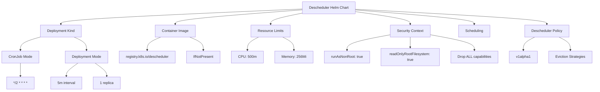
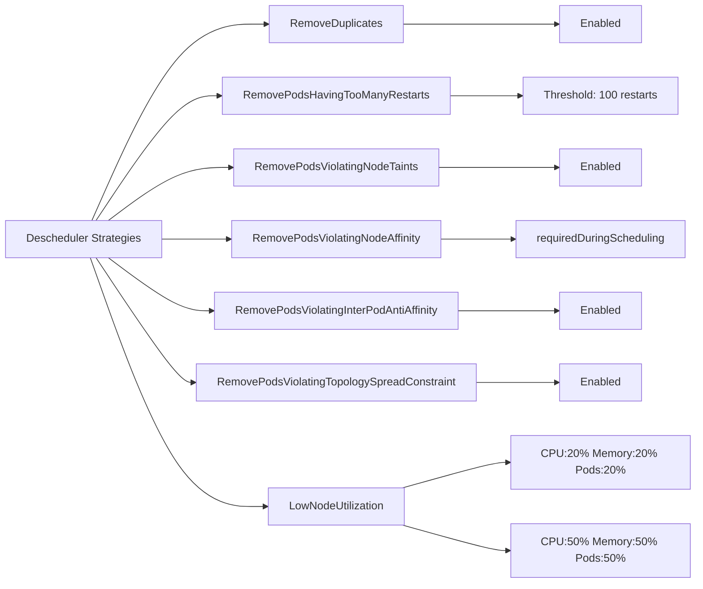
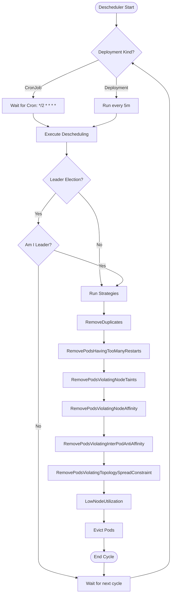
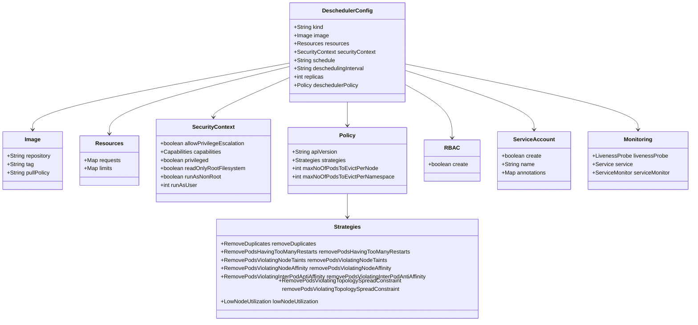
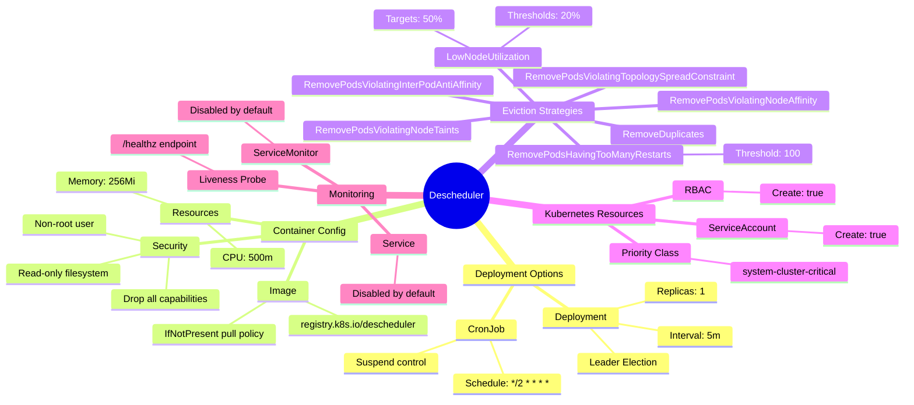

# Diagram: devops/k8s/descheduler/helm/values.yaml


> Auto-generated by Obscura crawlers

## Diagram 1

```mermaid
graph TB
      Root[Descheduler Helm Chart]
      Root --> Kind[Deployment Kind]
      Kind --> CronJob[CronJob Mode]...
  └ 474 lines...
```

> SVG rendering failed for this diagram.

## Diagram 2



### SVG

<svg id="container" width="2641.8515625" xmlns="http://www.w3.org/2000/svg" class="flowchart" height="406" viewBox="0 0 2641.8515625 406" role="graphics-document document" aria-roledescription="flowchart-v2"><style>#container{font-family:"trebuchet ms",verdana,arial,sans-serif;font-size:16px;fill:#333;}@keyframes edge-animation-frame{from{stroke-dashoffset:0;}}@keyframes dash{to{stroke-dashoffset:0;}}#container .edge-animation-slow{stroke-dasharray:9,5!important;stroke-dashoffset:900;animation:dash 50s linear infinite;stroke-linecap:round;}#container .edge-animation-fast{stroke-dasharray:9,5!important;stroke-dashoffset:900;animation:dash 20s linear infinite;stroke-linecap:round;}#container .error-icon{fill:#552222;}#container .error-text{fill:#552222;stroke:#552222;}#container .edge-thickness-normal{stroke-width:1px;}#container .edge-thickness-thick{stroke-width:3.5px;}#container .edge-pattern-solid{stroke-dasharray:0;}#container .edge-thickness-invisible{stroke-width:0;fill:none;}#container .edge-pattern-dashed{stroke-dasharray:3;}#container .edge-pattern-dotted{stroke-dasharray:2;}#container .marker{fill:#333333;stroke:#333333;}#container .marker.cross{stroke:#333333;}#container svg{font-family:"trebuchet ms",verdana,arial,sans-serif;font-size:16px;}#container p{margin:0;}#container .label{font-family:"trebuchet ms",verdana,arial,sans-serif;color:#333;}#container .cluster-label text{fill:#333;}#container .cluster-label span{color:#333;}#container .cluster-label span p{background-color:transparent;}#container .label text,#container span{fill:#333;color:#333;}#container .node rect,#container .node circle,#container .node ellipse,#container .node polygon,#container .node path{fill:#ECECFF;stroke:#9370DB;stroke-width:1px;}#container .rough-node .label text,#container .node .label text,#container .image-shape .label,#container .icon-shape .label{text-anchor:middle;}#container .node .katex path{fill:#000;stroke:#000;stroke-width:1px;}#container .rough-node .label,#container .node .label,#container .image-shape .label,#container .icon-shape .label{text-align:center;}#container .node.clickable{cursor:pointer;}#container .root .anchor path{fill:#333333!important;stroke-width:0;stroke:#333333;}#container .arrowheadPath{fill:#333333;}#container .edgePath .path{stroke:#333333;stroke-width:2.0px;}#container .flowchart-link{stroke:#333333;fill:none;}#container .edgeLabel{background-color:rgba(232,232,232, 0.8);text-align:center;}#container .edgeLabel p{background-color:rgba(232,232,232, 0.8);}#container .edgeLabel rect{opacity:0.5;background-color:rgba(232,232,232, 0.8);fill:rgba(232,232,232, 0.8);}#container .labelBkg{background-color:rgba(232, 232, 232, 0.5);}#container .cluster rect{fill:#ffffde;stroke:#aaaa33;stroke-width:1px;}#container .cluster text{fill:#333;}#container .cluster span{color:#333;}#container div.mermaidTooltip{position:absolute;text-align:center;max-width:200px;padding:2px;font-family:"trebuchet ms",verdana,arial,sans-serif;font-size:12px;background:hsl(80, 100%, 96.2745098039%);border:1px solid #aaaa33;border-radius:2px;pointer-events:none;z-index:100;}#container .flowchartTitleText{text-anchor:middle;font-size:18px;fill:#333;}#container rect.text{fill:none;stroke-width:0;}#container .icon-shape,#container .image-shape{background-color:rgba(232,232,232, 0.8);text-align:center;}#container .icon-shape p,#container .image-shape p{background-color:rgba(232,232,232, 0.8);padding:2px;}#container .icon-shape rect,#container .image-shape rect{opacity:0.5;background-color:rgba(232,232,232, 0.8);fill:rgba(232,232,232, 0.8);}#container .label-icon{display:inline-block;height:1em;overflow:visible;vertical-align:-0.125em;}#container .node .label-icon path{fill:currentColor;stroke:revert;stroke-width:revert;}#container :root{--mermaid-font-family:"trebuchet ms",verdana,arial,sans-serif;}</style><g><marker id="container_flowchart-v2-pointEnd" class="marker flowchart-v2" viewBox="0 0 10 10" refX="5" refY="5" markerUnits="userSpaceOnUse" markerWidth="8" markerHeight="8" orient="auto"><path d="M 0 0 L 10 5 L 0 10 z" class="arrowMarkerPath" style="stroke-width: 1; stroke-dasharray: 1, 0;"></path></marker><marker id="container_flowchart-v2-pointStart" class="marker flowchart-v2" viewBox="0 0 10 10" refX="4.5" refY="5" markerUnits="userSpaceOnUse" markerWidth="8" markerHeight="8" orient="auto"><path d="M 0 5 L 10 10 L 10 0 z" class="arrowMarkerPath" style="stroke-width: 1; stroke-dasharray: 1, 0;"></path></marker><marker id="container_flowchart-v2-circleEnd" class="marker flowchart-v2" viewBox="0 0 10 10" refX="11" refY="5" markerUnits="userSpaceOnUse" markerWidth="11" markerHeight="11" orient="auto"><circle cx="5" cy="5" r="5" class="arrowMarkerPath" style="stroke-width: 1; stroke-dasharray: 1, 0;"></circle></marker><marker id="container_flowchart-v2-circleStart" class="marker flowchart-v2" viewBox="0 0 10 10" refX="-1" refY="5" markerUnits="userSpaceOnUse" markerWidth="11" markerHeight="11" orient="auto"><circle cx="5" cy="5" r="5" class="arrowMarkerPath" style="stroke-width: 1; stroke-dasharray: 1, 0;"></circle></marker><marker id="container_flowchart-v2-crossEnd" class="marker cross flowchart-v2" viewBox="0 0 11 11" refX="12" refY="5.2" markerUnits="userSpaceOnUse" markerWidth="11" markerHeight="11" orient="auto"><path d="M 1,1 l 9,9 M 10,1 l -9,9" class="arrowMarkerPath" style="stroke-width: 2; stroke-dasharray: 1, 0;"></path></marker><marker id="container_flowchart-v2-crossStart" class="marker cross flowchart-v2" viewBox="0 0 11 11" refX="-1" refY="5.2" markerUnits="userSpaceOnUse" markerWidth="11" markerHeight="11" orient="auto"><path d="M 1,1 l 9,9 M 10,1 l -9,9" class="arrowMarkerPath" style="stroke-width: 2; stroke-dasharray: 1, 0;"></path></marker><g class="root"><g class="clusters"></g><g class="edgePaths"><path d="M1348.488,40.124L1168.617,47.937C988.746,55.749,629.004,71.375,449.133,82.687C269.262,94,269.262,101,269.262,104.5L269.262,108" id="L_Root_Kind_0" class="edge-thickness-normal edge-pattern-solid edge-thickness-normal edge-pattern-solid flowchart-link" style=";" data-edge="true" data-et="edge" data-id="L_Root_Kind_0" data-points="W3sieCI6MTM0OC40ODgyODEyNSwieSI6NDAuMTIzOTU1MDc3Mjk2NTR9LHsieCI6MjY5LjI2MTcxODc1LCJ5Ijo4N30seyJ4IjoyNjkuMjYxNzE4NzUsInkiOjExMn1d" marker-end="url(#container_flowchart-v2-pointEnd)"></path><path d="M176.762,165.623L162.067,169.853C147.372,174.082,117.983,182.541,103.288,192.271C88.594,202,88.594,213,88.594,218.5L88.594,224" id="L_Kind_CronJob_0" class="edge-thickness-normal edge-pattern-solid edge-thickness-normal edge-pattern-solid flowchart-link" style=";" data-edge="true" data-et="edge" data-id="L_Kind_CronJob_0" data-points="W3sieCI6MTc2Ljc2MTcxODc1LCJ5IjoxNjUuNjIzNDI0MzU4MzkyMjR9LHsieCI6ODguNTkzNzUsInkiOjE5MX0seyJ4Ijo4OC41OTM3NSwieSI6MjI4fV0=" marker-end="url(#container_flowchart-v2-pointEnd)"></path><path d="M328.959,166L338.172,170.167C347.384,174.333,365.809,182.667,375.022,192.333C384.234,202,384.234,213,384.234,218.5L384.234,224" id="L_Kind_Deployment_0" class="edge-thickness-normal edge-pattern-solid edge-thickness-normal edge-pattern-solid flowchart-link" style=";" data-edge="true" data-et="edge" data-id="L_Kind_Deployment_0" data-points="W3sieCI6MzI4Ljk1OTA1OTQ5NTE5MjMsInkiOjE2Nn0seyJ4IjozODQuMjM0Mzc1LCJ5IjoxOTF9LHsieCI6Mzg0LjIzNDM3NSwieSI6MjI4fV0=" marker-end="url(#container_flowchart-v2-pointEnd)"></path><path d="M1348.488,43.994L1254.48,51.162C1160.471,58.33,972.454,72.665,878.446,83.332C784.438,94,784.438,101,784.438,104.5L784.438,108" id="L_Root_Image_0" class="edge-thickness-normal edge-pattern-solid edge-thickness-normal edge-pattern-solid flowchart-link" style=";" data-edge="true" data-et="edge" data-id="L_Root_Image_0" data-points="W3sieCI6MTM0OC40ODgyODEyNSwieSI6NDMuOTk0NDI3MTY2NTYwNzF9LHsieCI6Nzg0LjQzNzUsInkiOjg3fSx7IngiOjc4NC40Mzc1LCJ5IjoxMTJ9XQ==" marker-end="url(#container_flowchart-v2-pointEnd)"></path><path d="M719.311,166L709.26,170.167C699.21,174.333,679.109,182.667,669.058,192.333C659.008,202,659.008,213,659.008,218.5L659.008,224" id="L_Image_Repo_0" class="edge-thickness-normal edge-pattern-solid edge-thickness-normal edge-pattern-solid flowchart-link" style=";" data-edge="true" data-et="edge" data-id="L_Image_Repo_0" data-points="W3sieCI6NzE5LjMxMDU0Njg3NSwieSI6MTY2fSx7IngiOjY1OS4wMDc4MTI1LCJ5IjoxOTF9LHsieCI6NjU5LjAwNzgxMjUsInkiOjIyOH1d" marker-end="url(#container_flowchart-v2-pointEnd)"></path><path d="M851.252,166L861.563,170.167C871.874,174.333,892.495,182.667,902.806,192.333C913.117,202,913.117,213,913.117,218.5L913.117,224" id="L_Image_Pull_0" class="edge-thickness-normal edge-pattern-solid edge-thickness-normal edge-pattern-solid flowchart-link" style=";" data-edge="true" data-et="edge" data-id="L_Image_Pull_0" data-points="W3sieCI6ODUxLjI1MTk1MzEyNSwieSI6MTY2fSx7IngiOjkxMy4xMTcxODc1LCJ5IjoxOTF9LHsieCI6OTEzLjExNzE4NzUsInkiOjIyOH1d" marker-end="url(#container_flowchart-v2-pointEnd)"></path><path d="M1348.488,58.577L1324.786,63.315C1301.085,68.052,1253.681,77.526,1229.979,85.763C1206.277,94,1206.277,101,1206.277,104.5L1206.277,108" id="L_Root_Resources_0" class="edge-thickness-normal edge-pattern-solid edge-thickness-normal edge-pattern-solid flowchart-link" style=";" data-edge="true" data-et="edge" data-id="L_Root_Resources_0" data-points="W3sieCI6MTM0OC40ODgyODEyNSwieSI6NTguNTc3NDU1NDg0NDkwODh9LHsieCI6MTIwNi4yNzczNDM3NSwieSI6ODd9LHsieCI6MTIwNi4yNzczNDM3NSwieSI6MTEyfV0=" marker-end="url(#container_flowchart-v2-pointEnd)"></path><path d="M1154.632,166L1146.662,170.167C1138.692,174.333,1122.752,182.667,1114.782,192.333C1106.813,202,1106.813,213,1106.813,218.5L1106.813,224" id="L_Resources_CPU_0" class="edge-thickness-normal edge-pattern-solid edge-thickness-normal edge-pattern-solid flowchart-link" style=";" data-edge="true" data-et="edge" data-id="L_Resources_CPU_0" data-points="W3sieCI6MTE1NC42MzIxMzY0MTgyNjkzLCJ5IjoxNjZ9LHsieCI6MTEwNi44MTI1LCJ5IjoxOTF9LHsieCI6MTEwNi44MTI1LCJ5IjoyMjh9XQ==" marker-end="url(#container_flowchart-v2-pointEnd)"></path><path d="M1259.61,166L1267.84,170.167C1276.071,174.333,1292.531,182.667,1300.762,192.333C1308.992,202,1308.992,213,1308.992,218.5L1308.992,224" id="L_Resources_Memory_0" class="edge-thickness-normal edge-pattern-solid edge-thickness-normal edge-pattern-solid flowchart-link" style=";" data-edge="true" data-et="edge" data-id="L_Resources_Memory_0" data-points="W3sieCI6MTI1OS42MTAwNTEwODE3MzA3LCJ5IjoxNjZ9LHsieCI6MTMwOC45OTIxODc1LCJ5IjoxOTF9LHsieCI6MTMwOC45OTIxODc1LCJ5IjoyMjh9XQ==" marker-end="url(#container_flowchart-v2-pointEnd)"></path><path d="M1584.426,52.057L1624.705,57.881C1664.984,63.705,1745.543,75.352,1785.822,84.676C1826.102,94,1826.102,101,1826.102,104.5L1826.102,108" id="L_Root_Security_0" class="edge-thickness-normal edge-pattern-solid edge-thickness-normal edge-pattern-solid flowchart-link" style=";" data-edge="true" data-et="edge" data-id="L_Root_Security_0" data-points="W3sieCI6MTU4NC40MjU3ODEyNSwieSI6NTIuMDU2NzcyNjM3OTEyODd9LHsieCI6MTgyNi4xMDE1NjI1LCJ5Ijo4N30seyJ4IjoxODI2LjEwMTU2MjUsInkiOjExMn1d" marker-end="url(#container_flowchart-v2-pointEnd)"></path><path d="M1737.227,155.412L1705.107,161.343C1672.987,167.275,1608.747,179.137,1576.628,190.569C1544.508,202,1544.508,213,1544.508,218.5L1544.508,224" id="L_Security_NonRoot_0" class="edge-thickness-normal edge-pattern-solid edge-thickness-normal edge-pattern-solid flowchart-link" style=";" data-edge="true" data-et="edge" data-id="L_Security_NonRoot_0" data-points="W3sieCI6MTczNy4yMjY1NjI1LCJ5IjoxNTUuNDExOTQwOTYxMDQ3Nn0seyJ4IjoxNTQ0LjUwNzgxMjUsInkiOjE5MX0seyJ4IjoxNTQ0LjUwNzgxMjUsInkiOjIyOH1d" marker-end="url(#container_flowchart-v2-pointEnd)"></path><path d="M1826.102,166L1826.102,170.167C1826.102,174.333,1826.102,182.667,1826.102,190.333C1826.102,198,1826.102,205,1826.102,208.5L1826.102,212" id="L_Security_ReadOnly_0" class="edge-thickness-normal edge-pattern-solid edge-thickness-normal edge-pattern-solid flowchart-link" style=";" data-edge="true" data-et="edge" data-id="L_Security_ReadOnly_0" data-points="W3sieCI6MTgyNi4xMDE1NjI1LCJ5IjoxNjZ9LHsieCI6MTgyNi4xMDE1NjI1LCJ5IjoxOTF9LHsieCI6MTgyNi4xMDE1NjI1LCJ5IjoyMTZ9XQ==" marker-end="url(#container_flowchart-v2-pointEnd)"></path><path d="M1914.977,155.149L1947.862,161.124C1980.747,167.099,2046.518,179.05,2079.404,190.525C2112.289,202,2112.289,213,2112.289,218.5L2112.289,224" id="L_Security_DropAll_0" class="edge-thickness-normal edge-pattern-solid edge-thickness-normal edge-pattern-solid flowchart-link" style=";" data-edge="true" data-et="edge" data-id="L_Security_DropAll_0" data-points="W3sieCI6MTkxNC45NzY1NjI1LCJ5IjoxNTUuMTQ4NTA0MDQwMTgzNDR9LHsieCI6MjExMi4yODkwNjI1LCJ5IjoxOTF9LHsieCI6MjExMi4yODkwNjI1LCJ5IjoyMjh9XQ==" marker-end="url(#container_flowchart-v2-pointEnd)"></path><path d="M1584.426,44.527L1672.08,51.606C1759.734,58.685,1935.043,72.842,2022.697,83.421C2110.352,94,2110.352,101,2110.352,104.5L2110.352,108" id="L_Root_Schedule_0" class="edge-thickness-normal edge-pattern-solid edge-thickness-normal edge-pattern-solid flowchart-link" style=";" data-edge="true" data-et="edge" data-id="L_Root_Schedule_0" data-points="W3sieCI6MTU4NC40MjU3ODEyNSwieSI6NDQuNTI2OTg3MjY2MjA4NDR9LHsieCI6MjExMC4zNTE1NjI1LCJ5Ijo4N30seyJ4IjoyMTEwLjM1MTU2MjUsInkiOjExMn1d" marker-end="url(#container_flowchart-v2-pointEnd)"></path><path d="M88.594,282L88.594,288.167C88.594,294.333,88.594,306.667,88.594,316.333C88.594,326,88.594,333,88.594,336.5L88.594,340" id="L_CronJob_CronSchedule_0" class="edge-thickness-normal edge-pattern-solid edge-thickness-normal edge-pattern-solid flowchart-link" style=";" data-edge="true" data-et="edge" data-id="L_CronJob_CronSchedule_0" data-points="W3sieCI6ODguNTkzNzUsInkiOjI4Mn0seyJ4Ijo4OC41OTM3NSwieSI6MzE5fSx7IngiOjg4LjU5Mzc1LCJ5IjozNDR9XQ==" marker-end="url(#container_flowchart-v2-pointEnd)"></path><path d="M346.094,282L337.383,288.167C328.672,294.333,311.25,306.667,302.539,316.333C293.828,326,293.828,333,293.828,336.5L293.828,340" id="L_Deployment_Interval_0" class="edge-thickness-normal edge-pattern-solid edge-thickness-normal edge-pattern-solid flowchart-link" style=";" data-edge="true" data-et="edge" data-id="L_Deployment_Interval_0" data-points="W3sieCI6MzQ2LjA5NDIzODI4MTI1LCJ5IjoyODJ9LHsieCI6MjkzLjgyODEyNSwieSI6MzE5fSx7IngiOjI5My44MjgxMjUsInkiOjM0NH1d" marker-end="url(#container_flowchart-v2-pointEnd)"></path><path d="M422.375,282L431.086,288.167C439.797,294.333,457.219,306.667,465.93,316.333C474.641,326,474.641,333,474.641,336.5L474.641,340" id="L_Deployment_Replicas_0" class="edge-thickness-normal edge-pattern-solid edge-thickness-normal edge-pattern-solid flowchart-link" style=";" data-edge="true" data-et="edge" data-id="L_Deployment_Replicas_0" data-points="W3sieCI6NDIyLjM3NDUxMTcxODc1LCJ5IjoyODJ9LHsieCI6NDc0LjY0MDYyNSwieSI6MzE5fSx7IngiOjQ3NC42NDA2MjUsInkiOjM0NH1d" marker-end="url(#container_flowchart-v2-pointEnd)"></path><path d="M1584.426,41.345L1725.887,48.955C1867.349,56.564,2150.272,71.782,2291.734,82.891C2433.195,94,2433.195,101,2433.195,104.5L2433.195,108" id="L_Root_Policy_0" class="edge-thickness-normal edge-pattern-solid edge-thickness-normal edge-pattern-solid flowchart-link" style=";" data-edge="true" data-et="edge" data-id="L_Root_Policy_0" data-points="W3sieCI6MTU4NC40MjU3ODEyNSwieSI6NDEuMzQ1NDM1MDc2ODczMzR9LHsieCI6MjQzMy4xOTUzMTI1LCJ5Ijo4N30seyJ4IjoyNDMzLjE5NTMxMjUsInkiOjExMn1d" marker-end="url(#container_flowchart-v2-pointEnd)"></path><path d="M2379.276,166L2370.956,170.167C2362.635,174.333,2345.993,182.667,2337.672,192.333C2329.352,202,2329.352,213,2329.352,218.5L2329.352,224" id="L_Policy_APIVersion_0" class="edge-thickness-normal edge-pattern-solid edge-thickness-normal edge-pattern-solid flowchart-link" style=";" data-edge="true" data-et="edge" data-id="L_Policy_APIVersion_0" data-points="W3sieCI6MjM3OS4yNzY0NDIzMDc2OTI0LCJ5IjoxNjZ9LHsieCI6MjMyOS4zNTE1NjI1LCJ5IjoxOTF9LHsieCI6MjMyOS4zNTE1NjI1LCJ5IjoyMjh9XQ==" marker-end="url(#container_flowchart-v2-pointEnd)"></path><path d="M2487.114,166L2495.435,170.167C2503.756,174.333,2520.397,182.667,2528.718,192.333C2537.039,202,2537.039,213,2537.039,218.5L2537.039,224" id="L_Policy_Strategies_0" class="edge-thickness-normal edge-pattern-solid edge-thickness-normal edge-pattern-solid flowchart-link" style=";" data-edge="true" data-et="edge" data-id="L_Policy_Strategies_0" data-points="W3sieCI6MjQ4Ny4xMTQxODI2OTIzMDc2LCJ5IjoxNjZ9LHsieCI6MjUzNy4wMzkwNjI1LCJ5IjoxOTF9LHsieCI6MjUzNy4wMzkwNjI1LCJ5IjoyMjh9XQ==" marker-end="url(#container_flowchart-v2-pointEnd)"></path></g><g class="edgeLabels"><g class="edgeLabel"><g class="label" data-id="L_Root_Kind_0" transform="translate(0, 0)"><foreignObject width="0" height="0"><div xmlns="http://www.w3.org/1999/xhtml" class="labelBkg" style="display: table-cell; white-space: nowrap; line-height: 1.5; max-width: 200px; text-align: center;"><span class="edgeLabel"></span></div></foreignObject></g></g><g class="edgeLabel"><g class="label" data-id="L_Kind_CronJob_0" transform="translate(0, 0)"><foreignObject width="0" height="0"><div xmlns="http://www.w3.org/1999/xhtml" class="labelBkg" style="display: table-cell; white-space: nowrap; line-height: 1.5; max-width: 200px; text-align: center;"><span class="edgeLabel"></span></div></foreignObject></g></g><g class="edgeLabel"><g class="label" data-id="L_Kind_Deployment_0" transform="translate(0, 0)"><foreignObject width="0" height="0"><div xmlns="http://www.w3.org/1999/xhtml" class="labelBkg" style="display: table-cell; white-space: nowrap; line-height: 1.5; max-width: 200px; text-align: center;"><span class="edgeLabel"></span></div></foreignObject></g></g><g class="edgeLabel"><g class="label" data-id="L_Root_Image_0" transform="translate(0, 0)"><foreignObject width="0" height="0"><div xmlns="http://www.w3.org/1999/xhtml" class="labelBkg" style="display: table-cell; white-space: nowrap; line-height: 1.5; max-width: 200px; text-align: center;"><span class="edgeLabel"></span></div></foreignObject></g></g><g class="edgeLabel"><g class="label" data-id="L_Image_Repo_0" transform="translate(0, 0)"><foreignObject width="0" height="0"><div xmlns="http://www.w3.org/1999/xhtml" class="labelBkg" style="display: table-cell; white-space: nowrap; line-height: 1.5; max-width: 200px; text-align: center;"><span class="edgeLabel"></span></div></foreignObject></g></g><g class="edgeLabel"><g class="label" data-id="L_Image_Pull_0" transform="translate(0, 0)"><foreignObject width="0" height="0"><div xmlns="http://www.w3.org/1999/xhtml" class="labelBkg" style="display: table-cell; white-space: nowrap; line-height: 1.5; max-width: 200px; text-align: center;"><span class="edgeLabel"></span></div></foreignObject></g></g><g class="edgeLabel"><g class="label" data-id="L_Root_Resources_0" transform="translate(0, 0)"><foreignObject width="0" height="0"><div xmlns="http://www.w3.org/1999/xhtml" class="labelBkg" style="display: table-cell; white-space: nowrap; line-height: 1.5; max-width: 200px; text-align: center;"><span class="edgeLabel"></span></div></foreignObject></g></g><g class="edgeLabel"><g class="label" data-id="L_Resources_CPU_0" transform="translate(0, 0)"><foreignObject width="0" height="0"><div xmlns="http://www.w3.org/1999/xhtml" class="labelBkg" style="display: table-cell; white-space: nowrap; line-height: 1.5; max-width: 200px; text-align: center;"><span class="edgeLabel"></span></div></foreignObject></g></g><g class="edgeLabel"><g class="label" data-id="L_Resources_Memory_0" transform="translate(0, 0)"><foreignObject width="0" height="0"><div xmlns="http://www.w3.org/1999/xhtml" class="labelBkg" style="display: table-cell; white-space: nowrap; line-height: 1.5; max-width: 200px; text-align: center;"><span class="edgeLabel"></span></div></foreignObject></g></g><g class="edgeLabel"><g class="label" data-id="L_Root_Security_0" transform="translate(0, 0)"><foreignObject width="0" height="0"><div xmlns="http://www.w3.org/1999/xhtml" class="labelBkg" style="display: table-cell; white-space: nowrap; line-height: 1.5; max-width: 200px; text-align: center;"><span class="edgeLabel"></span></div></foreignObject></g></g><g class="edgeLabel"><g class="label" data-id="L_Security_NonRoot_0" transform="translate(0, 0)"><foreignObject width="0" height="0"><div xmlns="http://www.w3.org/1999/xhtml" class="labelBkg" style="display: table-cell; white-space: nowrap; line-height: 1.5; max-width: 200px; text-align: center;"><span class="edgeLabel"></span></div></foreignObject></g></g><g class="edgeLabel"><g class="label" data-id="L_Security_ReadOnly_0" transform="translate(0, 0)"><foreignObject width="0" height="0"><div xmlns="http://www.w3.org/1999/xhtml" class="labelBkg" style="display: table-cell; white-space: nowrap; line-height: 1.5; max-width: 200px; text-align: center;"><span class="edgeLabel"></span></div></foreignObject></g></g><g class="edgeLabel"><g class="label" data-id="L_Security_DropAll_0" transform="translate(0, 0)"><foreignObject width="0" height="0"><div xmlns="http://www.w3.org/1999/xhtml" class="labelBkg" style="display: table-cell; white-space: nowrap; line-height: 1.5; max-width: 200px; text-align: center;"><span class="edgeLabel"></span></div></foreignObject></g></g><g class="edgeLabel"><g class="label" data-id="L_Root_Schedule_0" transform="translate(0, 0)"><foreignObject width="0" height="0"><div xmlns="http://www.w3.org/1999/xhtml" class="labelBkg" style="display: table-cell; white-space: nowrap; line-height: 1.5; max-width: 200px; text-align: center;"><span class="edgeLabel"></span></div></foreignObject></g></g><g class="edgeLabel"><g class="label" data-id="L_CronJob_CronSchedule_0" transform="translate(0, 0)"><foreignObject width="0" height="0"><div xmlns="http://www.w3.org/1999/xhtml" class="labelBkg" style="display: table-cell; white-space: nowrap; line-height: 1.5; max-width: 200px; text-align: center;"><span class="edgeLabel"></span></div></foreignObject></g></g><g class="edgeLabel"><g class="label" data-id="L_Deployment_Interval_0" transform="translate(0, 0)"><foreignObject width="0" height="0"><div xmlns="http://www.w3.org/1999/xhtml" class="labelBkg" style="display: table-cell; white-space: nowrap; line-height: 1.5; max-width: 200px; text-align: center;"><span class="edgeLabel"></span></div></foreignObject></g></g><g class="edgeLabel"><g class="label" data-id="L_Deployment_Replicas_0" transform="translate(0, 0)"><foreignObject width="0" height="0"><div xmlns="http://www.w3.org/1999/xhtml" class="labelBkg" style="display: table-cell; white-space: nowrap; line-height: 1.5; max-width: 200px; text-align: center;"><span class="edgeLabel"></span></div></foreignObject></g></g><g class="edgeLabel"><g class="label" data-id="L_Root_Policy_0" transform="translate(0, 0)"><foreignObject width="0" height="0"><div xmlns="http://www.w3.org/1999/xhtml" class="labelBkg" style="display: table-cell; white-space: nowrap; line-height: 1.5; max-width: 200px; text-align: center;"><span class="edgeLabel"></span></div></foreignObject></g></g><g class="edgeLabel"><g class="label" data-id="L_Policy_APIVersion_0" transform="translate(0, 0)"><foreignObject width="0" height="0"><div xmlns="http://www.w3.org/1999/xhtml" class="labelBkg" style="display: table-cell; white-space: nowrap; line-height: 1.5; max-width: 200px; text-align: center;"><span class="edgeLabel"></span></div></foreignObject></g></g><g class="edgeLabel"><g class="label" data-id="L_Policy_Strategies_0" transform="translate(0, 0)"><foreignObject width="0" height="0"><div xmlns="http://www.w3.org/1999/xhtml" class="labelBkg" style="display: table-cell; white-space: nowrap; line-height: 1.5; max-width: 200px; text-align: center;"><span class="edgeLabel"></span></div></foreignObject></g></g></g><g class="nodes"><g class="node default" id="flowchart-Root-0" transform="translate(1466.45703125, 35)"><rect class="basic label-container" style="" x="-117.96875" y="-27" width="235.9375" height="54"></rect><g class="label" style="" transform="translate(-87.96875, -12)"><rect></rect><foreignObject width="175.9375" height="24"><div xmlns="http://www.w3.org/1999/xhtml" style="display: table-cell; white-space: nowrap; line-height: 1.5; max-width: 200px; text-align: center;"><span class="nodeLabel"><p>Descheduler Helm Chart</p></span></div></foreignObject></g></g><g class="node default" id="flowchart-Kind-2" transform="translate(269.26171875, 139)"><rect class="basic label-container" style="" x="-92.5" y="-27" width="185" height="54"></rect><g class="label" style="" transform="translate(-62.5, -12)"><rect></rect><foreignObject width="125" height="24"><div xmlns="http://www.w3.org/1999/xhtml" style="display: table-cell; white-space: nowrap; line-height: 1.5; max-width: 200px; text-align: center;"><span class="nodeLabel"><p>Deployment Kind</p></span></div></foreignObject></g></g><g class="node default" id="flowchart-CronJob-4" transform="translate(88.59375, 255)"><rect class="basic label-container" style="" x="-80.59375" y="-27" width="161.1875" height="54"></rect><g class="label" style="" transform="translate(-50.59375, -12)"><rect></rect><foreignObject width="101.1875" height="24"><div xmlns="http://www.w3.org/1999/xhtml" style="display: table-cell; white-space: nowrap; line-height: 1.5; max-width: 200px; text-align: center;"><span class="nodeLabel"><p>CronJob Mode</p></span></div></foreignObject></g></g><g class="node default" id="flowchart-Deployment-6" transform="translate(384.234375, 255)"><rect class="basic label-container" style="" x="-96.1015625" y="-27" width="192.203125" height="54"></rect><g class="label" style="" transform="translate(-66.1015625, -12)"><rect></rect><foreignObject width="132.203125" height="24"><div xmlns="http://www.w3.org/1999/xhtml" style="display: table-cell; white-space: nowrap; line-height: 1.5; max-width: 200px; text-align: center;"><span class="nodeLabel"><p>Deployment Mode</p></span></div></foreignObject></g></g><g class="node default" id="flowchart-Image-8" transform="translate(784.4375, 139)"><rect class="basic label-container" style="" x="-89.2578125" y="-27" width="178.515625" height="54"></rect><g class="label" style="" transform="translate(-59.2578125, -12)"><rect></rect><foreignObject width="118.515625" height="24"><div xmlns="http://www.w3.org/1999/xhtml" style="display: table-cell; white-space: nowrap; line-height: 1.5; max-width: 200px; text-align: center;"><span class="nodeLabel"><p>Container Image</p></span></div></foreignObject></g></g><g class="node default" id="flowchart-Repo-10" transform="translate(659.0078125, 255)"><rect class="basic label-container" style="" x="-128.671875" y="-27" width="257.34375" height="54"></rect><g class="label" style="" transform="translate(-98.671875, -12)"><rect></rect><foreignObject width="197.34375" height="24"><div xmlns="http://www.w3.org/1999/xhtml" style="display: table-cell; white-space: nowrap; line-height: 1.5; max-width: 200px; text-align: center;"><span class="nodeLabel"><p>registry.k8s.io/descheduler</p></span></div></foreignObject></g></g><g class="node default" id="flowchart-Pull-12" transform="translate(913.1171875, 255)"><rect class="basic label-container" style="" x="-75.4375" y="-27" width="150.875" height="54"></rect><g class="label" style="" transform="translate(-45.4375, -12)"><rect></rect><foreignObject width="90.875" height="24"><div xmlns="http://www.w3.org/1999/xhtml" style="display: table-cell; white-space: nowrap; line-height: 1.5; max-width: 200px; text-align: center;"><span class="nodeLabel"><p>IfNotPresent</p></span></div></foreignObject></g></g><g class="node default" id="flowchart-Resources-14" transform="translate(1206.27734375, 139)"><rect class="basic label-container" style="" x="-87.1171875" y="-27" width="174.234375" height="54"></rect><g class="label" style="" transform="translate(-57.1171875, -12)"><rect></rect><foreignObject width="114.234375" height="24"><div xmlns="http://www.w3.org/1999/xhtml" style="display: table-cell; white-space: nowrap; line-height: 1.5; max-width: 200px; text-align: center;"><span class="nodeLabel"><p>Resource Limits</p></span></div></foreignObject></g></g><g class="node default" id="flowchart-CPU-16" transform="translate(1106.8125, 255)"><rect class="basic label-container" style="" x="-68.2578125" y="-27" width="136.515625" height="54"></rect><g class="label" style="" transform="translate(-38.2578125, -12)"><rect></rect><foreignObject width="76.515625" height="24"><div xmlns="http://www.w3.org/1999/xhtml" style="display: table-cell; white-space: nowrap; line-height: 1.5; max-width: 200px; text-align: center;"><span class="nodeLabel"><p>CPU: 500m</p></span></div></foreignObject></g></g><g class="node default" id="flowchart-Memory-18" transform="translate(1308.9921875, 255)"><rect class="basic label-container" style="" x="-83.921875" y="-27" width="167.84375" height="54"></rect><g class="label" style="" transform="translate(-53.921875, -12)"><rect></rect><foreignObject width="107.84375" height="24"><div xmlns="http://www.w3.org/1999/xhtml" style="display: table-cell; white-space: nowrap; line-height: 1.5; max-width: 200px; text-align: center;"><span class="nodeLabel"><p>Memory: 256Mi</p></span></div></foreignObject></g></g><g class="node default" id="flowchart-Security-20" transform="translate(1826.1015625, 139)"><rect class="basic label-container" style="" x="-88.875" y="-27" width="177.75" height="54"></rect><g class="label" style="" transform="translate(-58.875, -12)"><rect></rect><foreignObject width="117.75" height="24"><div xmlns="http://www.w3.org/1999/xhtml" style="display: table-cell; white-space: nowrap; line-height: 1.5; max-width: 200px; text-align: center;"><span class="nodeLabel"><p>Security Context</p></span></div></foreignObject></g></g><g class="node default" id="flowchart-NonRoot-22" transform="translate(1544.5078125, 255)"><rect class="basic label-container" style="" x="-101.59375" y="-27" width="203.1875" height="54"></rect><g class="label" style="" transform="translate(-71.59375, -12)"><rect></rect><foreignObject width="143.1875" height="24"><div xmlns="http://www.w3.org/1999/xhtml" style="display: table-cell; white-space: nowrap; line-height: 1.5; max-width: 200px; text-align: center;"><span class="nodeLabel"><p>runAsNonRoot: true</p></span></div></foreignObject></g></g><g class="node default" id="flowchart-ReadOnly-24" transform="translate(1826.1015625, 255)"><rect class="basic label-container" style="" x="-130" y="-39" width="260" height="78"></rect><g class="label" style="" transform="translate(-100, -24)"><rect></rect><foreignObject width="200" height="48"><div xmlns="http://www.w3.org/1999/xhtml" style="display: table; white-space: break-spaces; line-height: 1.5; max-width: 200px; text-align: center; width: 200px;"><span class="nodeLabel"><p>readOnlyRootFilesystem: true</p></span></div></foreignObject></g></g><g class="node default" id="flowchart-DropAll-26" transform="translate(2112.2890625, 255)"><rect class="basic label-container" style="" x="-106.1875" y="-27" width="212.375" height="54"></rect><g class="label" style="" transform="translate(-76.1875, -12)"><rect></rect><foreignObject width="152.375" height="24"><div xmlns="http://www.w3.org/1999/xhtml" style="display: table-cell; white-space: nowrap; line-height: 1.5; max-width: 200px; text-align: center;"><span class="nodeLabel"><p>Drop ALL capabilities</p></span></div></foreignObject></g></g><g class="node default" id="flowchart-Schedule-28" transform="translate(2110.3515625, 139)"><rect class="basic label-container" style="" x="-70.125" y="-27" width="140.25" height="54"></rect><g class="label" style="" transform="translate(-40.125, -12)"><rect></rect><foreignObject width="80.25" height="24"><div xmlns="http://www.w3.org/1999/xhtml" style="display: table-cell; white-space: nowrap; line-height: 1.5; max-width: 200px; text-align: center;"><span class="nodeLabel"><p>Scheduling</p></span></div></foreignObject></g></g><g class="node default" id="flowchart-CronSchedule-30" transform="translate(88.59375, 371)"><rect class="basic label-container" style="" x="-63.203125" y="-27" width="126.40625" height="54"></rect><g class="label" style="" transform="translate(-33.203125, -12)"><rect></rect><foreignObject width="66.40625" height="24"><div xmlns="http://www.w3.org/1999/xhtml" style="display: table-cell; white-space: nowrap; line-height: 1.5; max-width: 200px; text-align: center;"><span class="nodeLabel"><p>*/2 * * * *</p></span></div></foreignObject></g></g><g class="node default" id="flowchart-Interval-32" transform="translate(293.828125, 371)"><rect class="basic label-container" style="" x="-70.5703125" y="-27" width="141.140625" height="54"></rect><g class="label" style="" transform="translate(-40.5703125, -12)"><rect></rect><foreignObject width="81.140625" height="24"><div xmlns="http://www.w3.org/1999/xhtml" style="display: table-cell; white-space: nowrap; line-height: 1.5; max-width: 200px; text-align: center;"><span class="nodeLabel"><p>5m interval</p></span></div></foreignObject></g></g><g class="node default" id="flowchart-Replicas-34" transform="translate(474.640625, 371)"><rect class="basic label-container" style="" x="-60.2421875" y="-27" width="120.484375" height="54"></rect><g class="label" style="" transform="translate(-30.2421875, -12)"><rect></rect><foreignObject width="60.484375" height="24"><div xmlns="http://www.w3.org/1999/xhtml" style="display: table-cell; white-space: nowrap; line-height: 1.5; max-width: 200px; text-align: center;"><span class="nodeLabel"><p>1 replica</p></span></div></foreignObject></g></g><g class="node default" id="flowchart-Policy-36" transform="translate(2433.1953125, 139)"><rect class="basic label-container" style="" x="-98.875" y="-27" width="197.75" height="54"></rect><g class="label" style="" transform="translate(-68.875, -12)"><rect></rect><foreignObject width="137.75" height="24"><div xmlns="http://www.w3.org/1999/xhtml" style="display: table-cell; white-space: nowrap; line-height: 1.5; max-width: 200px; text-align: center;"><span class="nodeLabel"><p>Descheduler Policy</p></span></div></foreignObject></g></g><g class="node default" id="flowchart-APIVersion-38" transform="translate(2329.3515625, 255)"><rect class="basic label-container" style="" x="-60.875" y="-27" width="121.75" height="54"></rect><g class="label" style="" transform="translate(-30.875, -12)"><rect></rect><foreignObject width="61.75" height="24"><div xmlns="http://www.w3.org/1999/xhtml" style="display: table-cell; white-space: nowrap; line-height: 1.5; max-width: 200px; text-align: center;"><span class="nodeLabel"><p>v1alpha1</p></span></div></foreignObject></g></g><g class="node default" id="flowchart-Strategies-40" transform="translate(2537.0390625, 255)"><rect class="basic label-container" style="" x="-96.8125" y="-27" width="193.625" height="54"></rect><g class="label" style="" transform="translate(-66.8125, -12)"><rect></rect><foreignObject width="133.625" height="24"><div xmlns="http://www.w3.org/1999/xhtml" style="display: table-cell; white-space: nowrap; line-height: 1.5; max-width: 200px; text-align: center;"><span class="nodeLabel"><p>Eviction Strategies</p></span></div></foreignObject></g></g></g></g></g></svg>

## Diagram 3



### SVG

<svg id="container" width="1010.984375" xmlns="http://www.w3.org/2000/svg" class="flowchart" height="846" viewBox="0 0 1010.984375 846" role="graphics-document document" aria-roledescription="flowchart-v2"><style>#container{font-family:"trebuchet ms",verdana,arial,sans-serif;font-size:16px;fill:#333;}@keyframes edge-animation-frame{from{stroke-dashoffset:0;}}@keyframes dash{to{stroke-dashoffset:0;}}#container .edge-animation-slow{stroke-dasharray:9,5!important;stroke-dashoffset:900;animation:dash 50s linear infinite;stroke-linecap:round;}#container .edge-animation-fast{stroke-dasharray:9,5!important;stroke-dashoffset:900;animation:dash 20s linear infinite;stroke-linecap:round;}#container .error-icon{fill:#552222;}#container .error-text{fill:#552222;stroke:#552222;}#container .edge-thickness-normal{stroke-width:1px;}#container .edge-thickness-thick{stroke-width:3.5px;}#container .edge-pattern-solid{stroke-dasharray:0;}#container .edge-thickness-invisible{stroke-width:0;fill:none;}#container .edge-pattern-dashed{stroke-dasharray:3;}#container .edge-pattern-dotted{stroke-dasharray:2;}#container .marker{fill:#333333;stroke:#333333;}#container .marker.cross{stroke:#333333;}#container svg{font-family:"trebuchet ms",verdana,arial,sans-serif;font-size:16px;}#container p{margin:0;}#container .label{font-family:"trebuchet ms",verdana,arial,sans-serif;color:#333;}#container .cluster-label text{fill:#333;}#container .cluster-label span{color:#333;}#container .cluster-label span p{background-color:transparent;}#container .label text,#container span{fill:#333;color:#333;}#container .node rect,#container .node circle,#container .node ellipse,#container .node polygon,#container .node path{fill:#ECECFF;stroke:#9370DB;stroke-width:1px;}#container .rough-node .label text,#container .node .label text,#container .image-shape .label,#container .icon-shape .label{text-anchor:middle;}#container .node .katex path{fill:#000;stroke:#000;stroke-width:1px;}#container .rough-node .label,#container .node .label,#container .image-shape .label,#container .icon-shape .label{text-align:center;}#container .node.clickable{cursor:pointer;}#container .root .anchor path{fill:#333333!important;stroke-width:0;stroke:#333333;}#container .arrowheadPath{fill:#333333;}#container .edgePath .path{stroke:#333333;stroke-width:2.0px;}#container .flowchart-link{stroke:#333333;fill:none;}#container .edgeLabel{background-color:rgba(232,232,232, 0.8);text-align:center;}#container .edgeLabel p{background-color:rgba(232,232,232, 0.8);}#container .edgeLabel rect{opacity:0.5;background-color:rgba(232,232,232, 0.8);fill:rgba(232,232,232, 0.8);}#container .labelBkg{background-color:rgba(232, 232, 232, 0.5);}#container .cluster rect{fill:#ffffde;stroke:#aaaa33;stroke-width:1px;}#container .cluster text{fill:#333;}#container .cluster span{color:#333;}#container div.mermaidTooltip{position:absolute;text-align:center;max-width:200px;padding:2px;font-family:"trebuchet ms",verdana,arial,sans-serif;font-size:12px;background:hsl(80, 100%, 96.2745098039%);border:1px solid #aaaa33;border-radius:2px;pointer-events:none;z-index:100;}#container .flowchartTitleText{text-anchor:middle;font-size:18px;fill:#333;}#container rect.text{fill:none;stroke-width:0;}#container .icon-shape,#container .image-shape{background-color:rgba(232,232,232, 0.8);text-align:center;}#container .icon-shape p,#container .image-shape p{background-color:rgba(232,232,232, 0.8);padding:2px;}#container .icon-shape rect,#container .image-shape rect{opacity:0.5;background-color:rgba(232,232,232, 0.8);fill:rgba(232,232,232, 0.8);}#container .label-icon{display:inline-block;height:1em;overflow:visible;vertical-align:-0.125em;}#container .node .label-icon path{fill:currentColor;stroke:revert;stroke-width:revert;}#container :root{--mermaid-font-family:"trebuchet ms",verdana,arial,sans-serif;}</style><g><marker id="container_flowchart-v2-pointEnd" class="marker flowchart-v2" viewBox="0 0 10 10" refX="5" refY="5" markerUnits="userSpaceOnUse" markerWidth="8" markerHeight="8" orient="auto"><path d="M 0 0 L 10 5 L 0 10 z" class="arrowMarkerPath" style="stroke-width: 1; stroke-dasharray: 1, 0;"></path></marker><marker id="container_flowchart-v2-pointStart" class="marker flowchart-v2" viewBox="0 0 10 10" refX="4.5" refY="5" markerUnits="userSpaceOnUse" markerWidth="8" markerHeight="8" orient="auto"><path d="M 0 5 L 10 10 L 10 0 z" class="arrowMarkerPath" style="stroke-width: 1; stroke-dasharray: 1, 0;"></path></marker><marker id="container_flowchart-v2-circleEnd" class="marker flowchart-v2" viewBox="0 0 10 10" refX="11" refY="5" markerUnits="userSpaceOnUse" markerWidth="11" markerHeight="11" orient="auto"><circle cx="5" cy="5" r="5" class="arrowMarkerPath" style="stroke-width: 1; stroke-dasharray: 1, 0;"></circle></marker><marker id="container_flowchart-v2-circleStart" class="marker flowchart-v2" viewBox="0 0 10 10" refX="-1" refY="5" markerUnits="userSpaceOnUse" markerWidth="11" markerHeight="11" orient="auto"><circle cx="5" cy="5" r="5" class="arrowMarkerPath" style="stroke-width: 1; stroke-dasharray: 1, 0;"></circle></marker><marker id="container_flowchart-v2-crossEnd" class="marker cross flowchart-v2" viewBox="0 0 11 11" refX="12" refY="5.2" markerUnits="userSpaceOnUse" markerWidth="11" markerHeight="11" orient="auto"><path d="M 1,1 l 9,9 M 10,1 l -9,9" class="arrowMarkerPath" style="stroke-width: 2; stroke-dasharray: 1, 0;"></path></marker><marker id="container_flowchart-v2-crossStart" class="marker cross flowchart-v2" viewBox="0 0 11 11" refX="-1" refY="5.2" markerUnits="userSpaceOnUse" markerWidth="11" markerHeight="11" orient="auto"><path d="M 1,1 l 9,9 M 10,1 l -9,9" class="arrowMarkerPath" style="stroke-width: 2; stroke-dasharray: 1, 0;"></path></marker><g class="root"><g class="clusters"></g><g class="edgePaths"><path d="M133.469,320L154.552,272.5C175.635,225,217.802,130,260.227,82.5C302.651,35,345.333,35,366.674,35L388.016,35" id="L_Strategies_RemoveDup_0" class="edge-thickness-normal edge-pattern-solid edge-thickness-normal edge-pattern-solid flowchart-link" style=";" data-edge="true" data-et="edge" data-id="L_Strategies_RemoveDup_0" data-points="W3sieCI6MTMzLjQ2ODU5OTc1OTYxNTQsInkiOjMyMH0seyJ4IjoyNTkuOTY4NzUsInkiOjM1fSx7IngiOjM5Mi4wMTU2MjUsInkiOjM1fV0=" marker-end="url(#container_flowchart-v2-pointEnd)"></path><path d="M585.938,35L607.945,35C629.953,35,673.969,35,711.236,35C748.503,35,779.021,35,794.28,35L809.539,35" id="L_RemoveDup_DupEnabled_0" class="edge-thickness-normal edge-pattern-solid edge-thickness-normal edge-pattern-solid flowchart-link" style=";" data-edge="true" data-et="edge" data-id="L_RemoveDup_DupEnabled_0" data-points="W3sieCI6NTg1LjkzNzUsInkiOjM1fSx7IngiOjcxNy45ODQzNzUsInkiOjM1fSx7IngiOjgxMy41MzkwNjI1LCJ5IjozNX1d" marker-end="url(#container_flowchart-v2-pointEnd)"></path><path d="M139.461,320L159.545,289.833C179.63,259.667,219.799,199.333,250.21,169.167C280.62,139,301.271,139,311.596,139L321.922,139" id="L_Strategies_RemoveRestarts_0" class="edge-thickness-normal edge-pattern-solid edge-thickness-normal edge-pattern-solid flowchart-link" style=";" data-edge="true" data-et="edge" data-id="L_Strategies_RemoveRestarts_0" data-points="W3sieCI6MTM5LjQ2MDcxMjEzOTQyMzA3LCJ5IjozMjB9LHsieCI6MjU5Ljk2ODc1LCJ5IjoxMzl9LHsieCI6MzI1LjkyMTg3NSwieSI6MTM5fV0=" marker-end="url(#container_flowchart-v2-pointEnd)"></path><path d="M652.031,139L663.023,139C674.016,139,696,139,713.391,139C730.781,139,743.578,139,749.977,139L756.375,139" id="L_RemoveRestarts_RestartThreshold_0" class="edge-thickness-normal edge-pattern-solid edge-thickness-normal edge-pattern-solid flowchart-link" style=";" data-edge="true" data-et="edge" data-id="L_RemoveRestarts_RestartThreshold_0" data-points="W3sieCI6NjUyLjAzMTI1LCJ5IjoxMzl9LHsieCI6NzE3Ljk4NDM3NSwieSI6MTM5fSx7IngiOjc2MC4zNzUsInkiOjEzOX1d" marker-end="url(#container_flowchart-v2-pointEnd)"></path><path d="M157.437,320L174.526,307.167C191.614,294.333,225.792,268.667,255.48,255.833C285.169,243,310.37,243,322.97,243L335.57,243" id="L_Strategies_RemoveTaints_0" class="edge-thickness-normal edge-pattern-solid edge-thickness-normal edge-pattern-solid flowchart-link" style=";" data-edge="true" data-et="edge" data-id="L_Strategies_RemoveTaints_0" data-points="W3sieCI6MTU3LjQzNzA0OTI3ODg0NjE2LCJ5IjozMjB9LHsieCI6MjU5Ljk2ODc1LCJ5IjoyNDN9LHsieCI6MzM5LjU3MDMxMjUsInkiOjI0M31d" marker-end="url(#container_flowchart-v2-pointEnd)"></path><path d="M638.383,243L651.65,243C664.917,243,691.451,243,719.977,243C748.503,243,779.021,243,794.28,243L809.539,243" id="L_RemoveTaints_TaintsEnabled_0" class="edge-thickness-normal edge-pattern-solid edge-thickness-normal edge-pattern-solid flowchart-link" style=";" data-edge="true" data-et="edge" data-id="L_RemoveTaints_TaintsEnabled_0" data-points="W3sieCI6NjM4LjM4MjgxMjUsInkiOjI0M30seyJ4Ijo3MTcuOTg0Mzc1LCJ5IjoyNDN9LHsieCI6ODEzLjUzOTA2MjUsInkiOjI0M31d" marker-end="url(#container_flowchart-v2-pointEnd)"></path><path d="M234.969,347L239.135,347C243.302,347,251.635,347,267.746,347C283.857,347,307.745,347,319.689,347L331.633,347" id="L_Strategies_RemoveAffinity_0" class="edge-thickness-normal edge-pattern-solid edge-thickness-normal edge-pattern-solid flowchart-link" style=";" data-edge="true" data-et="edge" data-id="L_Strategies_RemoveAffinity_0" data-points="W3sieCI6MjM0Ljk2ODc1LCJ5IjozNDd9LHsieCI6MjU5Ljk2ODc1LCJ5IjozNDd9LHsieCI6MzM1LjYzMjgxMjUsInkiOjM0N31d" marker-end="url(#container_flowchart-v2-pointEnd)"></path><path d="M642.32,347L654.931,347C667.542,347,692.763,347,709.703,347C726.643,347,735.302,347,739.632,347L743.961,347" id="L_RemoveAffinity_AffinityType_0" class="edge-thickness-normal edge-pattern-solid edge-thickness-normal edge-pattern-solid flowchart-link" style=";" data-edge="true" data-et="edge" data-id="L_RemoveAffinity_AffinityType_0" data-points="W3sieCI6NjQyLjMyMDMxMjUsInkiOjM0N30seyJ4Ijo3MTcuOTg0Mzc1LCJ5IjozNDd9LHsieCI6NzQ3Ljk2MDkzNzUsInkiOjM0N31d" marker-end="url(#container_flowchart-v2-pointEnd)"></path><path d="M157.437,374L174.526,386.833C191.614,399.667,225.792,425.333,250.448,438.167C275.104,451,290.24,451,297.807,451L305.375,451" id="L_Strategies_RemoveAntiAffinity_0" class="edge-thickness-normal edge-pattern-solid edge-thickness-normal edge-pattern-solid flowchart-link" style=";" data-edge="true" data-et="edge" data-id="L_Strategies_RemoveAntiAffinity_0" data-points="W3sieCI6MTU3LjQzNzA0OTI3ODg0NjE2LCJ5IjozNzR9LHsieCI6MjU5Ljk2ODc1LCJ5Ijo0NTF9LHsieCI6MzA5LjM3NSwieSI6NDUxfV0=" marker-end="url(#container_flowchart-v2-pointEnd)"></path><path d="M668.578,451L676.813,451C685.047,451,701.516,451,725.009,451C748.503,451,779.021,451,794.28,451L809.539,451" id="L_RemoveAntiAffinity_AntiAffinityEnabled_0" class="edge-thickness-normal edge-pattern-solid edge-thickness-normal edge-pattern-solid flowchart-link" style=";" data-edge="true" data-et="edge" data-id="L_RemoveAntiAffinity_AntiAffinityEnabled_0" data-points="W3sieCI6NjY4LjU3ODEyNSwieSI6NDUxfSx7IngiOjcxNy45ODQzNzUsInkiOjQ1MX0seyJ4Ijo4MTMuNTM5MDYyNSwieSI6NDUxfV0=" marker-end="url(#container_flowchart-v2-pointEnd)"></path><path d="M139.461,374L159.545,404.167C179.63,434.333,219.799,494.667,243.384,524.833C266.969,555,273.969,555,277.469,555L280.969,555" id="L_Strategies_RemoveTopology_0" class="edge-thickness-normal edge-pattern-solid edge-thickness-normal edge-pattern-solid flowchart-link" style=";" data-edge="true" data-et="edge" data-id="L_Strategies_RemoveTopology_0" data-points="W3sieCI6MTM5LjQ2MDcxMjEzOTQyMzA3LCJ5IjozNzR9LHsieCI6MjU5Ljk2ODc1LCJ5Ijo1NTV9LHsieCI6Mjg0Ljk2ODc1LCJ5Ijo1NTV9XQ==" marker-end="url(#container_flowchart-v2-pointEnd)"></path><path d="M692.984,555L697.151,555C701.318,555,709.651,555,729.077,555C748.503,555,779.021,555,794.28,555L809.539,555" id="L_RemoveTopology_TopologyEnabled_0" class="edge-thickness-normal edge-pattern-solid edge-thickness-normal edge-pattern-solid flowchart-link" style=";" data-edge="true" data-et="edge" data-id="L_RemoveTopology_TopologyEnabled_0" data-points="W3sieCI6NjkyLjk4NDM3NSwieSI6NTU1fSx7IngiOjcxNy45ODQzNzUsInkiOjU1NX0seyJ4Ijo4MTMuNTM5MDYyNSwieSI6NTU1fV0=" marker-end="url(#container_flowchart-v2-pointEnd)"></path><path d="M131.121,374L152.596,434.167C174.07,494.333,217.02,614.667,259.204,674.833C301.388,735,342.807,735,363.517,735L384.227,735" id="L_Strategies_LowUtil_0" class="edge-thickness-normal edge-pattern-solid edge-thickness-normal edge-pattern-solid flowchart-link" style=";" data-edge="true" data-et="edge" data-id="L_Strategies_LowUtil_0" data-points="W3sieCI6MTMxLjEyMTE3NDI5MTIzNzEsInkiOjM3NH0seyJ4IjoyNTkuOTY4NzUsInkiOjczNX0seyJ4IjozODguMjI2NTYyNSwieSI6NzM1fV0=" marker-end="url(#container_flowchart-v2-pointEnd)"></path><path d="M585.589,708L607.655,701.833C629.721,695.667,673.853,683.333,699.419,677.167C724.984,671,731.984,671,735.484,671L738.984,671" id="L_LowUtil_Thresholds_0" class="edge-thickness-normal edge-pattern-solid edge-thickness-normal edge-pattern-solid flowchart-link" style=";" data-edge="true" data-et="edge" data-id="L_LowUtil_Thresholds_0" data-points="W3sieCI6NTg1LjU4OTIzMzM5ODQzNzUsInkiOjcwOH0seyJ4Ijo3MTcuOTg0Mzc1LCJ5Ijo2NzF9LHsieCI6NzQyLjk4NDM3NSwieSI6NjcxfV0=" marker-end="url(#container_flowchart-v2-pointEnd)"></path><path d="M585.589,762L607.655,768.167C629.721,774.333,673.853,786.667,699.419,792.833C724.984,799,731.984,799,735.484,799L738.984,799" id="L_LowUtil_Targets_0" class="edge-thickness-normal edge-pattern-solid edge-thickness-normal edge-pattern-solid flowchart-link" style=";" data-edge="true" data-et="edge" data-id="L_LowUtil_Targets_0" data-points="W3sieCI6NTg1LjU4OTIzMzM5ODQzNzUsInkiOjc2Mn0seyJ4Ijo3MTcuOTg0Mzc1LCJ5Ijo3OTl9LHsieCI6NzQyLjk4NDM3NSwieSI6Nzk5fV0=" marker-end="url(#container_flowchart-v2-pointEnd)"></path></g><g class="edgeLabels"><g class="edgeLabel"><g class="label" data-id="L_Strategies_RemoveDup_0" transform="translate(0, 0)"><foreignObject width="0" height="0"><div xmlns="http://www.w3.org/1999/xhtml" class="labelBkg" style="display: table-cell; white-space: nowrap; line-height: 1.5; max-width: 200px; text-align: center;"><span class="edgeLabel"></span></div></foreignObject></g></g><g class="edgeLabel"><g class="label" data-id="L_RemoveDup_DupEnabled_0" transform="translate(0, 0)"><foreignObject width="0" height="0"><div xmlns="http://www.w3.org/1999/xhtml" class="labelBkg" style="display: table-cell; white-space: nowrap; line-height: 1.5; max-width: 200px; text-align: center;"><span class="edgeLabel"></span></div></foreignObject></g></g><g class="edgeLabel"><g class="label" data-id="L_Strategies_RemoveRestarts_0" transform="translate(0, 0)"><foreignObject width="0" height="0"><div xmlns="http://www.w3.org/1999/xhtml" class="labelBkg" style="display: table-cell; white-space: nowrap; line-height: 1.5; max-width: 200px; text-align: center;"><span class="edgeLabel"></span></div></foreignObject></g></g><g class="edgeLabel"><g class="label" data-id="L_RemoveRestarts_RestartThreshold_0" transform="translate(0, 0)"><foreignObject width="0" height="0"><div xmlns="http://www.w3.org/1999/xhtml" class="labelBkg" style="display: table-cell; white-space: nowrap; line-height: 1.5; max-width: 200px; text-align: center;"><span class="edgeLabel"></span></div></foreignObject></g></g><g class="edgeLabel"><g class="label" data-id="L_Strategies_RemoveTaints_0" transform="translate(0, 0)"><foreignObject width="0" height="0"><div xmlns="http://www.w3.org/1999/xhtml" class="labelBkg" style="display: table-cell; white-space: nowrap; line-height: 1.5; max-width: 200px; text-align: center;"><span class="edgeLabel"></span></div></foreignObject></g></g><g class="edgeLabel"><g class="label" data-id="L_RemoveTaints_TaintsEnabled_0" transform="translate(0, 0)"><foreignObject width="0" height="0"><div xmlns="http://www.w3.org/1999/xhtml" class="labelBkg" style="display: table-cell; white-space: nowrap; line-height: 1.5; max-width: 200px; text-align: center;"><span class="edgeLabel"></span></div></foreignObject></g></g><g class="edgeLabel"><g class="label" data-id="L_Strategies_RemoveAffinity_0" transform="translate(0, 0)"><foreignObject width="0" height="0"><div xmlns="http://www.w3.org/1999/xhtml" class="labelBkg" style="display: table-cell; white-space: nowrap; line-height: 1.5; max-width: 200px; text-align: center;"><span class="edgeLabel"></span></div></foreignObject></g></g><g class="edgeLabel"><g class="label" data-id="L_RemoveAffinity_AffinityType_0" transform="translate(0, 0)"><foreignObject width="0" height="0"><div xmlns="http://www.w3.org/1999/xhtml" class="labelBkg" style="display: table-cell; white-space: nowrap; line-height: 1.5; max-width: 200px; text-align: center;"><span class="edgeLabel"></span></div></foreignObject></g></g><g class="edgeLabel"><g class="label" data-id="L_Strategies_RemoveAntiAffinity_0" transform="translate(0, 0)"><foreignObject width="0" height="0"><div xmlns="http://www.w3.org/1999/xhtml" class="labelBkg" style="display: table-cell; white-space: nowrap; line-height: 1.5; max-width: 200px; text-align: center;"><span class="edgeLabel"></span></div></foreignObject></g></g><g class="edgeLabel"><g class="label" data-id="L_RemoveAntiAffinity_AntiAffinityEnabled_0" transform="translate(0, 0)"><foreignObject width="0" height="0"><div xmlns="http://www.w3.org/1999/xhtml" class="labelBkg" style="display: table-cell; white-space: nowrap; line-height: 1.5; max-width: 200px; text-align: center;"><span class="edgeLabel"></span></div></foreignObject></g></g><g class="edgeLabel"><g class="label" data-id="L_Strategies_RemoveTopology_0" transform="translate(0, 0)"><foreignObject width="0" height="0"><div xmlns="http://www.w3.org/1999/xhtml" class="labelBkg" style="display: table-cell; white-space: nowrap; line-height: 1.5; max-width: 200px; text-align: center;"><span class="edgeLabel"></span></div></foreignObject></g></g><g class="edgeLabel"><g class="label" data-id="L_RemoveTopology_TopologyEnabled_0" transform="translate(0, 0)"><foreignObject width="0" height="0"><div xmlns="http://www.w3.org/1999/xhtml" class="labelBkg" style="display: table-cell; white-space: nowrap; line-height: 1.5; max-width: 200px; text-align: center;"><span class="edgeLabel"></span></div></foreignObject></g></g><g class="edgeLabel"><g class="label" data-id="L_Strategies_LowUtil_0" transform="translate(0, 0)"><foreignObject width="0" height="0"><div xmlns="http://www.w3.org/1999/xhtml" class="labelBkg" style="display: table-cell; white-space: nowrap; line-height: 1.5; max-width: 200px; text-align: center;"><span class="edgeLabel"></span></div></foreignObject></g></g><g class="edgeLabel"><g class="label" data-id="L_LowUtil_Thresholds_0" transform="translate(0, 0)"><foreignObject width="0" height="0"><div xmlns="http://www.w3.org/1999/xhtml" class="labelBkg" style="display: table-cell; white-space: nowrap; line-height: 1.5; max-width: 200px; text-align: center;"><span class="edgeLabel"></span></div></foreignObject></g></g><g class="edgeLabel"><g class="label" data-id="L_LowUtil_Targets_0" transform="translate(0, 0)"><foreignObject width="0" height="0"><div xmlns="http://www.w3.org/1999/xhtml" class="labelBkg" style="display: table-cell; white-space: nowrap; line-height: 1.5; max-width: 200px; text-align: center;"><span class="edgeLabel"></span></div></foreignObject></g></g></g><g class="nodes"><g class="node default" id="flowchart-Strategies-0" transform="translate(121.484375, 347)"><rect class="basic label-container" style="" x="-113.484375" y="-27" width="226.96875" height="54"></rect><g class="label" style="" transform="translate(-83.484375, -12)"><rect></rect><foreignObject width="166.96875" height="24"><div xmlns="http://www.w3.org/1999/xhtml" style="display: table-cell; white-space: nowrap; line-height: 1.5; max-width: 200px; text-align: center;"><span class="nodeLabel"><p>Descheduler Strategies</p></span></div></foreignObject></g></g><g class="node default" id="flowchart-RemoveDup-2" transform="translate(488.9765625, 35)"><rect class="basic label-container" style="" x="-96.9609375" y="-27" width="193.921875" height="54"></rect><g class="label" style="" transform="translate(-66.9609375, -12)"><rect></rect><foreignObject width="133.921875" height="24"><div xmlns="http://www.w3.org/1999/xhtml" style="display: table-cell; white-space: nowrap; line-height: 1.5; max-width: 200px; text-align: center;"><span class="nodeLabel"><p>RemoveDuplicates</p></span></div></foreignObject></g></g><g class="node default" id="flowchart-DupEnabled-4" transform="translate(872.984375, 35)"><rect class="basic label-container" style="" x="-59.4453125" y="-27" width="118.890625" height="54"></rect><g class="label" style="" transform="translate(-29.4453125, -12)"><rect></rect><foreignObject width="58.890625" height="24"><div xmlns="http://www.w3.org/1999/xhtml" style="display: table-cell; white-space: nowrap; line-height: 1.5; max-width: 200px; text-align: center;"><span class="nodeLabel"><p>Enabled</p></span></div></foreignObject></g></g><g class="node default" id="flowchart-RemoveRestarts-6" transform="translate(488.9765625, 139)"><rect class="basic label-container" style="" x="-163.0546875" y="-27" width="326.109375" height="54"></rect><g class="label" style="" transform="translate(-133.0546875, -12)"><rect></rect><foreignObject width="266.109375" height="24"><div xmlns="http://www.w3.org/1999/xhtml" style="display: table; white-space: break-spaces; line-height: 1.5; max-width: 200px; text-align: center; width: 200px;"><span class="nodeLabel"><p>RemovePodsHavingTooManyRestarts</p></span></div></foreignObject></g></g><g class="node default" id="flowchart-RestartThreshold-8" transform="translate(872.984375, 139)"><rect class="basic label-container" style="" x="-112.609375" y="-27" width="225.21875" height="54"></rect><g class="label" style="" transform="translate(-82.609375, -12)"><rect></rect><foreignObject width="165.21875" height="24"><div xmlns="http://www.w3.org/1999/xhtml" style="display: table-cell; white-space: nowrap; line-height: 1.5; max-width: 200px; text-align: center;"><span class="nodeLabel"><p>Threshold: 100 restarts</p></span></div></foreignObject></g></g><g class="node default" id="flowchart-RemoveTaints-10" transform="translate(488.9765625, 243)"><rect class="basic label-container" style="" x="-149.40625" y="-27" width="298.8125" height="54"></rect><g class="label" style="" transform="translate(-119.40625, -12)"><rect></rect><foreignObject width="238.8125" height="24"><div xmlns="http://www.w3.org/1999/xhtml" style="display: table; white-space: break-spaces; line-height: 1.5; max-width: 200px; text-align: center; width: 200px;"><span class="nodeLabel"><p>RemovePodsViolatingNodeTaints</p></span></div></foreignObject></g></g><g class="node default" id="flowchart-TaintsEnabled-12" transform="translate(872.984375, 243)"><rect class="basic label-container" style="" x="-59.4453125" y="-27" width="118.890625" height="54"></rect><g class="label" style="" transform="translate(-29.4453125, -12)"><rect></rect><foreignObject width="58.890625" height="24"><div xmlns="http://www.w3.org/1999/xhtml" style="display: table-cell; white-space: nowrap; line-height: 1.5; max-width: 200px; text-align: center;"><span class="nodeLabel"><p>Enabled</p></span></div></foreignObject></g></g><g class="node default" id="flowchart-RemoveAffinity-14" transform="translate(488.9765625, 347)"><rect class="basic label-container" style="" x="-153.34375" y="-27" width="306.6875" height="54"></rect><g class="label" style="" transform="translate(-123.34375, -12)"><rect></rect><foreignObject width="246.6875" height="24"><div xmlns="http://www.w3.org/1999/xhtml" style="display: table; white-space: break-spaces; line-height: 1.5; max-width: 200px; text-align: center; width: 200px;"><span class="nodeLabel"><p>RemovePodsViolatingNodeAffinity</p></span></div></foreignObject></g></g><g class="node default" id="flowchart-AffinityType-16" transform="translate(872.984375, 347)"><rect class="basic label-container" style="" x="-125.0234375" y="-27" width="250.046875" height="54"></rect><g class="label" style="" transform="translate(-95.0234375, -12)"><rect></rect><foreignObject width="190.046875" height="24"><div xmlns="http://www.w3.org/1999/xhtml" style="display: table-cell; white-space: nowrap; line-height: 1.5; max-width: 200px; text-align: center;"><span class="nodeLabel"><p>requiredDuringScheduling</p></span></div></foreignObject></g></g><g class="node default" id="flowchart-RemoveAntiAffinity-18" transform="translate(488.9765625, 451)"><rect class="basic label-container" style="" x="-179.6015625" y="-27" width="359.203125" height="54"></rect><g class="label" style="" transform="translate(-149.6015625, -12)"><rect></rect><foreignObject width="299.203125" height="24"><div xmlns="http://www.w3.org/1999/xhtml" style="display: table; white-space: break-spaces; line-height: 1.5; max-width: 200px; text-align: center; width: 200px;"><span class="nodeLabel"><p>RemovePodsViolatingInterPodAntiAffinity</p></span></div></foreignObject></g></g><g class="node default" id="flowchart-AntiAffinityEnabled-20" transform="translate(872.984375, 451)"><rect class="basic label-container" style="" x="-59.4453125" y="-27" width="118.890625" height="54"></rect><g class="label" style="" transform="translate(-29.4453125, -12)"><rect></rect><foreignObject width="58.890625" height="24"><div xmlns="http://www.w3.org/1999/xhtml" style="display: table-cell; white-space: nowrap; line-height: 1.5; max-width: 200px; text-align: center;"><span class="nodeLabel"><p>Enabled</p></span></div></foreignObject></g></g><g class="node default" id="flowchart-RemoveTopology-22" transform="translate(488.9765625, 555)"><rect class="basic label-container" style="" x="-204.0078125" y="-27" width="408.015625" height="54"></rect><g class="label" style="" transform="translate(-174.0078125, -12)"><rect></rect><foreignObject width="348.015625" height="24"><div xmlns="http://www.w3.org/1999/xhtml" style="display: table; white-space: break-spaces; line-height: 1.5; max-width: 200px; text-align: center; width: 200px;"><span class="nodeLabel"><p>RemovePodsViolatingTopologySpreadConstraint</p></span></div></foreignObject></g></g><g class="node default" id="flowchart-TopologyEnabled-24" transform="translate(872.984375, 555)"><rect class="basic label-container" style="" x="-59.4453125" y="-27" width="118.890625" height="54"></rect><g class="label" style="" transform="translate(-29.4453125, -12)"><rect></rect><foreignObject width="58.890625" height="24"><div xmlns="http://www.w3.org/1999/xhtml" style="display: table-cell; white-space: nowrap; line-height: 1.5; max-width: 200px; text-align: center;"><span class="nodeLabel"><p>Enabled</p></span></div></foreignObject></g></g><g class="node default" id="flowchart-LowUtil-26" transform="translate(488.9765625, 735)"><rect class="basic label-container" style="" x="-100.75" y="-27" width="201.5" height="54"></rect><g class="label" style="" transform="translate(-70.75, -12)"><rect></rect><foreignObject width="141.5" height="24"><div xmlns="http://www.w3.org/1999/xhtml" style="display: table-cell; white-space: nowrap; line-height: 1.5; max-width: 200px; text-align: center;"><span class="nodeLabel"><p>LowNodeUtilization</p></span></div></foreignObject></g></g><g class="node default" id="flowchart-Thresholds-28" transform="translate(872.984375, 671)"><rect class="basic label-container" style="" x="-130" y="-39" width="260" height="78"></rect><g class="label" style="" transform="translate(-100, -24)"><rect></rect><foreignObject width="200" height="48"><div xmlns="http://www.w3.org/1999/xhtml" style="display: table; white-space: break-spaces; line-height: 1.5; max-width: 200px; text-align: center; width: 200px;"><span class="nodeLabel"><p>CPU:20% Memory:20% Pods:20%</p></span></div></foreignObject></g></g><g class="node default" id="flowchart-Targets-30" transform="translate(872.984375, 799)"><rect class="basic label-container" style="" x="-130" y="-39" width="260" height="78"></rect><g class="label" style="" transform="translate(-100, -24)"><rect></rect><foreignObject width="200" height="48"><div xmlns="http://www.w3.org/1999/xhtml" style="display: table; white-space: break-spaces; line-height: 1.5; max-width: 200px; text-align: center; width: 200px;"><span class="nodeLabel"><p>CPU:50% Memory:50% Pods:50%</p></span></div></foreignObject></g></g></g></g></g></svg>

## Diagram 4

```mermaid
graph TB
    Chart[Descheduler Chart]
    
    Chart --> RBAC[RBAC Resources]
    RBAC --> CreateRBAC[create: true]
    
    Chart --> SA[ServiceAccount]
    SA --> CreateSA[create: true]
    
    Chart --> Pod[Pod Configuration]
    Pod --> PodSec[podSecurityContext]
    Pod --> PodAnnot[podAnnotations]
    Pod --> PodLabels[podLabels]
    
    Chart --> Leader[Leader Election]
    Leader --> LeaderConfig[Optional for Deployment]
    
    Chart --> Monitoring[Monitoring]
    Monitoring --> Liveness[Liveness Probe]
    Liveness --> HealthEndpoint[/healthz:10258]
    Monitoring --> Service[Service]
    Service --> ServiceDisabled[enabled: false]
    Monitoring --> ServiceMon[ServiceMonitor]
    ServiceMon --> MonitorDisabled[enabled: false]
    
    Chart --> Priority[Priority Class]
    Priority --> SysCluster[system-cluster-critical]
    
    Chart --> Placement[Pod Placement]
    Placement --> NodeSelector[nodeSelector]
    Placement --> Affinity[affinity]
    Placement --> Tolerations[tolerations]
    Placement --> Topology[topologySpreadConstraints]
```

> SVG rendering failed for this diagram.

## Diagram 5



### SVG

<svg id="container" width="626.3909912109375" xmlns="http://www.w3.org/2000/svg" class="flowchart" height="2143.4375" viewBox="0 0 626.3909912109375 2143.4375" role="graphics-document document" aria-roledescription="flowchart-v2"><style>#container{font-family:"trebuchet ms",verdana,arial,sans-serif;font-size:16px;fill:#333;}@keyframes edge-animation-frame{from{stroke-dashoffset:0;}}@keyframes dash{to{stroke-dashoffset:0;}}#container .edge-animation-slow{stroke-dasharray:9,5!important;stroke-dashoffset:900;animation:dash 50s linear infinite;stroke-linecap:round;}#container .edge-animation-fast{stroke-dasharray:9,5!important;stroke-dashoffset:900;animation:dash 20s linear infinite;stroke-linecap:round;}#container .error-icon{fill:#552222;}#container .error-text{fill:#552222;stroke:#552222;}#container .edge-thickness-normal{stroke-width:1px;}#container .edge-thickness-thick{stroke-width:3.5px;}#container .edge-pattern-solid{stroke-dasharray:0;}#container .edge-thickness-invisible{stroke-width:0;fill:none;}#container .edge-pattern-dashed{stroke-dasharray:3;}#container .edge-pattern-dotted{stroke-dasharray:2;}#container .marker{fill:#333333;stroke:#333333;}#container .marker.cross{stroke:#333333;}#container svg{font-family:"trebuchet ms",verdana,arial,sans-serif;font-size:16px;}#container p{margin:0;}#container .label{font-family:"trebuchet ms",verdana,arial,sans-serif;color:#333;}#container .cluster-label text{fill:#333;}#container .cluster-label span{color:#333;}#container .cluster-label span p{background-color:transparent;}#container .label text,#container span{fill:#333;color:#333;}#container .node rect,#container .node circle,#container .node ellipse,#container .node polygon,#container .node path{fill:#ECECFF;stroke:#9370DB;stroke-width:1px;}#container .rough-node .label text,#container .node .label text,#container .image-shape .label,#container .icon-shape .label{text-anchor:middle;}#container .node .katex path{fill:#000;stroke:#000;stroke-width:1px;}#container .rough-node .label,#container .node .label,#container .image-shape .label,#container .icon-shape .label{text-align:center;}#container .node.clickable{cursor:pointer;}#container .root .anchor path{fill:#333333!important;stroke-width:0;stroke:#333333;}#container .arrowheadPath{fill:#333333;}#container .edgePath .path{stroke:#333333;stroke-width:2.0px;}#container .flowchart-link{stroke:#333333;fill:none;}#container .edgeLabel{background-color:rgba(232,232,232, 0.8);text-align:center;}#container .edgeLabel p{background-color:rgba(232,232,232, 0.8);}#container .edgeLabel rect{opacity:0.5;background-color:rgba(232,232,232, 0.8);fill:rgba(232,232,232, 0.8);}#container .labelBkg{background-color:rgba(232, 232, 232, 0.5);}#container .cluster rect{fill:#ffffde;stroke:#aaaa33;stroke-width:1px;}#container .cluster text{fill:#333;}#container .cluster span{color:#333;}#container div.mermaidTooltip{position:absolute;text-align:center;max-width:200px;padding:2px;font-family:"trebuchet ms",verdana,arial,sans-serif;font-size:12px;background:hsl(80, 100%, 96.2745098039%);border:1px solid #aaaa33;border-radius:2px;pointer-events:none;z-index:100;}#container .flowchartTitleText{text-anchor:middle;font-size:18px;fill:#333;}#container rect.text{fill:none;stroke-width:0;}#container .icon-shape,#container .image-shape{background-color:rgba(232,232,232, 0.8);text-align:center;}#container .icon-shape p,#container .image-shape p{background-color:rgba(232,232,232, 0.8);padding:2px;}#container .icon-shape rect,#container .image-shape rect{opacity:0.5;background-color:rgba(232,232,232, 0.8);fill:rgba(232,232,232, 0.8);}#container .label-icon{display:inline-block;height:1em;overflow:visible;vertical-align:-0.125em;}#container .node .label-icon path{fill:currentColor;stroke:revert;stroke-width:revert;}#container :root{--mermaid-font-family:"trebuchet ms",verdana,arial,sans-serif;}</style><g><marker id="container_flowchart-v2-pointEnd" class="marker flowchart-v2" viewBox="0 0 10 10" refX="5" refY="5" markerUnits="userSpaceOnUse" markerWidth="8" markerHeight="8" orient="auto"><path d="M 0 0 L 10 5 L 0 10 z" class="arrowMarkerPath" style="stroke-width: 1; stroke-dasharray: 1, 0;"></path></marker><marker id="container_flowchart-v2-pointStart" class="marker flowchart-v2" viewBox="0 0 10 10" refX="4.5" refY="5" markerUnits="userSpaceOnUse" markerWidth="8" markerHeight="8" orient="auto"><path d="M 0 5 L 10 10 L 10 0 z" class="arrowMarkerPath" style="stroke-width: 1; stroke-dasharray: 1, 0;"></path></marker><marker id="container_flowchart-v2-circleEnd" class="marker flowchart-v2" viewBox="0 0 10 10" refX="11" refY="5" markerUnits="userSpaceOnUse" markerWidth="11" markerHeight="11" orient="auto"><circle cx="5" cy="5" r="5" class="arrowMarkerPath" style="stroke-width: 1; stroke-dasharray: 1, 0;"></circle></marker><marker id="container_flowchart-v2-circleStart" class="marker flowchart-v2" viewBox="0 0 10 10" refX="-1" refY="5" markerUnits="userSpaceOnUse" markerWidth="11" markerHeight="11" orient="auto"><circle cx="5" cy="5" r="5" class="arrowMarkerPath" style="stroke-width: 1; stroke-dasharray: 1, 0;"></circle></marker><marker id="container_flowchart-v2-crossEnd" class="marker cross flowchart-v2" viewBox="0 0 11 11" refX="12" refY="5.2" markerUnits="userSpaceOnUse" markerWidth="11" markerHeight="11" orient="auto"><path d="M 1,1 l 9,9 M 10,1 l -9,9" class="arrowMarkerPath" style="stroke-width: 2; stroke-dasharray: 1, 0;"></path></marker><marker id="container_flowchart-v2-crossStart" class="marker cross flowchart-v2" viewBox="0 0 11 11" refX="-1" refY="5.2" markerUnits="userSpaceOnUse" markerWidth="11" markerHeight="11" orient="auto"><path d="M 1,1 l 9,9 M 10,1 l -9,9" class="arrowMarkerPath" style="stroke-width: 2; stroke-dasharray: 1, 0;"></path></marker><g class="root"><g class="clusters"></g><g class="edgePaths"><path d="M426.418,47.5L426.335,51.583C426.251,55.667,426.085,63.833,426.001,71.417C425.918,79,425.918,86,425.918,89.5L425.918,93" id="L_Start_CheckKind_0" class="edge-thickness-normal edge-pattern-solid edge-thickness-normal edge-pattern-solid flowchart-link" style=";" data-edge="true" data-et="edge" data-id="L_Start_CheckKind_0" data-points="W3sieCI6NDI2LjQxNzk2ODc1LCJ5Ijo0Ny41fSx7IngiOjQyNS45MTc5Njg3NSwieSI6NzJ9LHsieCI6NDI1LjkxNzk2ODc1LCJ5Ijo5N31d" marker-end="url(#container_flowchart-v2-pointEnd)"></path><path d="M360.703,218.129L320.965,235.165C281.227,252.201,201.75,286.272,162.012,308.808C122.273,331.344,122.273,342.344,122.273,347.844L122.273,353.344" id="L_CheckKind_CronSchedule_0" class="edge-thickness-normal edge-pattern-solid edge-thickness-normal edge-pattern-solid flowchart-link" style=";" data-edge="true" data-et="edge" data-id="L_CheckKind_CronSchedule_0" data-points="W3sieCI6MzYwLjcwMzQ0NTA0MjU3OTQ2LCJ5IjoyMTguMTI5MjI2MjkyNTc5NX0seyJ4IjoxMjIuMjczNDM3NSwieSI6MzIwLjM0Mzc1fSx7IngiOjEyMi4yNzM0Mzc1LCJ5IjozNTcuMzQzNzV9XQ==" marker-end="url(#container_flowchart-v2-pointEnd)"></path><path d="M425.918,283.344L425.918,289.51C425.918,295.677,425.918,308.01,425.918,319.677C425.918,331.344,425.918,342.344,425.918,347.844L425.918,353.344" id="L_CheckKind_DeployLoop_0" class="edge-thickness-normal edge-pattern-solid edge-thickness-normal edge-pattern-solid flowchart-link" style=";" data-edge="true" data-et="edge" data-id="L_CheckKind_DeployLoop_0" data-points="W3sieCI6NDI1LjkxNzk2ODc1LCJ5IjoyODMuMzQzNzV9LHsieCI6NDI1LjkxNzk2ODc1LCJ5IjozMjAuMzQzNzV9LHsieCI6NDI1LjkxNzk2ODc1LCJ5IjozNTcuMzQzNzV9XQ==" marker-end="url(#container_flowchart-v2-pointEnd)"></path><path d="M122.273,411.344L122.273,415.51C122.273,419.677,122.273,428.01,131.403,436.082C140.533,444.153,158.793,451.962,167.922,455.866L177.052,459.771" id="L_CronSchedule_Execute_0" class="edge-thickness-normal edge-pattern-solid edge-thickness-normal edge-pattern-solid flowchart-link" style=";" data-edge="true" data-et="edge" data-id="L_CronSchedule_Execute_0" data-points="W3sieCI6MTIyLjI3MzQzNzUsInkiOjQxMS4zNDM3NX0seyJ4IjoxMjIuMjczNDM3NSwieSI6NDM2LjM0Mzc1fSx7IngiOjE4MC43MzAwOTMxNDkwMzg0NSwieSI6NDYxLjM0Mzc1fV0=" marker-end="url(#container_flowchart-v2-pointEnd)"></path><path d="M425.918,411.344L425.918,415.51C425.918,419.677,425.918,428.01,411.971,436.161C398.025,444.311,370.131,452.278,356.185,456.262L342.238,460.245" id="L_DeployLoop_Execute_0" class="edge-thickness-normal edge-pattern-solid edge-thickness-normal edge-pattern-solid flowchart-link" style=";" data-edge="true" data-et="edge" data-id="L_DeployLoop_Execute_0" data-points="W3sieCI6NDI1LjkxNzk2ODc1LCJ5Ijo0MTEuMzQzNzV9LHsieCI6NDI1LjkxNzk2ODc1LCJ5Ijo0MzYuMzQzNzV9LHsieCI6MzM4LjM5MTY3NjY4MjY5MjMsInkiOjQ2MS4zNDM3NX1d" marker-end="url(#container_flowchart-v2-pointEnd)"></path><path d="M243.863,515.344L243.863,519.51C243.863,523.677,243.863,532.01,243.863,539.677C243.863,547.344,243.863,554.344,243.863,557.844L243.863,561.344" id="L_Execute_CheckLeader_0" class="edge-thickness-normal edge-pattern-solid edge-thickness-normal edge-pattern-solid flowchart-link" style=";" data-edge="true" data-et="edge" data-id="L_Execute_CheckLeader_0" data-points="W3sieCI6MjQzLjg2MzI4MTI1LCJ5Ijo1MTUuMzQzNzV9LHsieCI6MjQzLjg2MzI4MTI1LCJ5Ijo1NDAuMzQzNzV9LHsieCI6MjQzLjg2MzI4MTI1LCJ5Ijo1NjUuMzQzNzV9XQ==" marker-end="url(#container_flowchart-v2-pointEnd)"></path><path d="M204.448,698.773L193.769,711.508C183.091,724.244,161.733,749.716,151.054,767.952C140.375,786.188,140.375,797.188,140.375,802.688L140.375,808.188" id="L_CheckLeader_AmILeader_0" class="edge-thickness-normal edge-pattern-solid edge-thickness-normal edge-pattern-solid flowchart-link" style=";" data-edge="true" data-et="edge" data-id="L_CheckLeader_AmILeader_0" data-points="W3sieCI6MjA0LjQ0ODMzNjM0ODY0MTczLCJ5Ijo2OTguNzcyNTU1MDk4NjQxOH0seyJ4IjoxNDAuMzc1LCJ5Ijo3NzUuMTg3NX0seyJ4IjoxNDAuMzc1LCJ5Ijo4MTIuMTg3NX1d" marker-end="url(#container_flowchart-v2-pointEnd)"></path><path d="M286.377,695.673L299.209,708.926C312.041,722.178,337.704,748.683,350.536,780.289C363.367,811.896,363.367,848.604,363.367,885.313C363.367,922.021,363.367,958.729,364.749,982.603C366.13,1006.477,368.893,1017.517,370.274,1023.037L371.655,1028.557" id="L_CheckLeader_RunStrategies_0" class="edge-thickness-normal edge-pattern-solid edge-thickness-normal edge-pattern-solid flowchart-link" style=";" data-edge="true" data-et="edge" data-id="L_CheckLeader_RunStrategies_0" data-points="W3sieCI6Mjg2LjM3NzMwMTc2NjA4ODA3LCJ5Ijo2OTUuNjczNDc5NDgzOTExOX0seyJ4IjozNjMuMzY3MTg3NSwieSI6Nzc1LjE4NzV9LHsieCI6MzYzLjM2NzE4NzUsInkiOjg4NS4zMTI1fSx7IngiOjM2My4zNjcxODc1LCJ5Ijo5OTUuNDM3NX0seyJ4IjozNzIuNjI2MjIwNzAzMTI1LCJ5IjoxMDMyLjQzNzV9XQ==" marker-end="url(#container_flowchart-v2-pointEnd)"></path><path d="M195.708,903.104L243.569,918.493C291.429,933.882,387.15,964.66,425.606,985.865C464.062,1007.07,445.253,1018.702,435.848,1024.518L426.444,1030.334" id="L_AmILeader_RunStrategies_0" class="edge-thickness-normal edge-pattern-solid edge-thickness-normal edge-pattern-solid flowchart-link" style=";" data-edge="true" data-et="edge" data-id="L_AmILeader_RunStrategies_0" data-points="W3sieCI6MTk1LjcwODMxNzg3MDczNTU2LCJ5Ijo5MDMuMTA0MTgyMTI5MjY0NX0seyJ4Ijo0ODIuODcxMDkzNzUsInkiOjk5NS40Mzc1fSx7IngiOjQyMy4wNDE5MzExNTIzNDM3NSwieSI6MTAzMi40Mzc1fV0=" marker-end="url(#container_flowchart-v2-pointEnd)"></path><path d="M140.375,958.438L140.375,964.604C140.375,970.771,140.375,983.104,140.375,999.938C140.375,1016.771,140.375,1038.104,140.375,1057.438C140.375,1076.771,140.375,1094.104,140.375,1111.438C140.375,1128.771,140.375,1146.104,140.375,1163.438C140.375,1180.771,140.375,1198.104,140.375,1215.438C140.375,1232.771,140.375,1250.104,140.375,1267.438C140.375,1284.771,140.375,1302.104,140.375,1319.438C140.375,1336.771,140.375,1354.104,140.375,1371.438C140.375,1388.771,140.375,1406.104,140.375,1423.438C140.375,1440.771,140.375,1458.104,140.375,1477.438C140.375,1496.771,140.375,1518.104,140.375,1539.438C140.375,1560.771,140.375,1582.104,140.375,1601.438C140.375,1620.771,140.375,1638.104,140.375,1655.438C140.375,1672.771,140.375,1690.104,140.375,1707.438C140.375,1724.771,140.375,1742.104,140.375,1759.438C140.375,1776.771,140.375,1794.104,140.375,1811.438C140.375,1828.771,140.375,1846.104,140.375,1863.438C140.375,1880.771,140.375,1898.104,140.375,1915.438C140.375,1932.771,140.375,1950.104,140.375,1966.188C140.375,1982.271,140.375,1997.104,140.375,2011.938C140.375,2026.771,140.375,2041.604,163.467,2054.045C186.559,2066.486,232.743,2076.534,255.835,2081.558L278.927,2086.582" id="L_AmILeader_Wait_0" class="edge-thickness-normal edge-pattern-solid edge-thickness-normal edge-pattern-solid flowchart-link" style=";" data-edge="true" data-et="edge" data-id="L_AmILeader_Wait_0" data-points="W3sieCI6MTQwLjM3NSwieSI6OTU4LjQzNzV9LHsieCI6MTQwLjM3NSwieSI6OTk1LjQzNzV9LHsieCI6MTQwLjM3NSwieSI6MTA1OS40Mzc1fSx7IngiOjE0MC4zNzUsInkiOjExMTEuNDM3NX0seyJ4IjoxNDAuMzc1LCJ5IjoxMTYzLjQzNzV9LHsieCI6MTQwLjM3NSwieSI6MTIxNS40Mzc1fSx7IngiOjE0MC4zNzUsInkiOjEyNjcuNDM3NX0seyJ4IjoxNDAuMzc1LCJ5IjoxMzE5LjQzNzV9LHsieCI6MTQwLjM3NSwieSI6MTM3MS40Mzc1fSx7IngiOjE0MC4zNzUsInkiOjE0MjMuNDM3NX0seyJ4IjoxNDAuMzc1LCJ5IjoxNDc1LjQzNzV9LHsieCI6MTQwLjM3NSwieSI6MTUzOS40Mzc1fSx7IngiOjE0MC4zNzUsInkiOjE2MDMuNDM3NX0seyJ4IjoxNDAuMzc1LCJ5IjoxNjU1LjQzNzV9LHsieCI6MTQwLjM3NSwieSI6MTcwNy40Mzc1fSx7IngiOjE0MC4zNzUsInkiOjE3NTkuNDM3NX0seyJ4IjoxNDAuMzc1LCJ5IjoxODExLjQzNzV9LHsieCI6MTQwLjM3NSwieSI6MTg2My40Mzc1fSx7IngiOjE0MC4zNzUsInkiOjE5MTUuNDM3NX0seyJ4IjoxNDAuMzc1LCJ5IjoxOTY3LjQzNzV9LHsieCI6MTQwLjM3NSwieSI6MjAxMS45Mzc1fSx7IngiOjE0MC4zNzUsInkiOjIwNTYuNDM3NX0seyJ4IjoyODIuODM1OTM3NSwieSI6MjA4Ny40MzIxNzE5ODM3ODd9XQ==" marker-end="url(#container_flowchart-v2-pointEnd)"></path><path d="M379.383,1086.438L379.383,1090.604C379.383,1094.771,379.383,1103.104,379.383,1110.771C379.383,1118.438,379.383,1125.438,379.383,1128.938L379.383,1132.438" id="L_RunStrategies_Strategy1_0" class="edge-thickness-normal edge-pattern-solid edge-thickness-normal edge-pattern-solid flowchart-link" style=";" data-edge="true" data-et="edge" data-id="L_RunStrategies_Strategy1_0" data-points="W3sieCI6Mzc5LjM4MjgxMjUsInkiOjEwODYuNDM3NX0seyJ4IjozNzkuMzgyODEyNSwieSI6MTExMS40Mzc1fSx7IngiOjM3OS4zODI4MTI1LCJ5IjoxMTM2LjQzNzV9XQ==" marker-end="url(#container_flowchart-v2-pointEnd)"></path><path d="M379.383,1190.438L379.383,1194.604C379.383,1198.771,379.383,1207.104,379.383,1214.771C379.383,1222.438,379.383,1229.438,379.383,1232.938L379.383,1236.438" id="L_Strategy1_Strategy2_0" class="edge-thickness-normal edge-pattern-solid edge-thickness-normal edge-pattern-solid flowchart-link" style=";" data-edge="true" data-et="edge" data-id="L_Strategy1_Strategy2_0" data-points="W3sieCI6Mzc5LjM4MjgxMjUsInkiOjExOTAuNDM3NX0seyJ4IjozNzkuMzgyODEyNSwieSI6MTIxNS40Mzc1fSx7IngiOjM3OS4zODI4MTI1LCJ5IjoxMjQwLjQzNzV9XQ==" marker-end="url(#container_flowchart-v2-pointEnd)"></path><path d="M379.383,1294.438L379.383,1298.604C379.383,1302.771,379.383,1311.104,379.383,1318.771C379.383,1326.438,379.383,1333.438,379.383,1336.938L379.383,1340.438" id="L_Strategy2_Strategy3_0" class="edge-thickness-normal edge-pattern-solid edge-thickness-normal edge-pattern-solid flowchart-link" style=";" data-edge="true" data-et="edge" data-id="L_Strategy2_Strategy3_0" data-points="W3sieCI6Mzc5LjM4MjgxMjUsInkiOjEyOTQuNDM3NX0seyJ4IjozNzkuMzgyODEyNSwieSI6MTMxOS40Mzc1fSx7IngiOjM3OS4zODI4MTI1LCJ5IjoxMzQ0LjQzNzV9XQ==" marker-end="url(#container_flowchart-v2-pointEnd)"></path><path d="M379.383,1398.438L379.383,1402.604C379.383,1406.771,379.383,1415.104,379.383,1422.771C379.383,1430.438,379.383,1437.438,379.383,1440.938L379.383,1444.438" id="L_Strategy3_Strategy4_0" class="edge-thickness-normal edge-pattern-solid edge-thickness-normal edge-pattern-solid flowchart-link" style=";" data-edge="true" data-et="edge" data-id="L_Strategy3_Strategy4_0" data-points="W3sieCI6Mzc5LjM4MjgxMjUsInkiOjEzOTguNDM3NX0seyJ4IjozNzkuMzgyODEyNSwieSI6MTQyMy40Mzc1fSx7IngiOjM3OS4zODI4MTI1LCJ5IjoxNDQ4LjQzNzV9XQ==" marker-end="url(#container_flowchart-v2-pointEnd)"></path><path d="M379.383,1502.438L379.383,1508.604C379.383,1514.771,379.383,1527.104,379.383,1538.771C379.383,1550.438,379.383,1561.438,379.383,1566.938L379.383,1572.438" id="L_Strategy4_Strategy5_0" class="edge-thickness-normal edge-pattern-solid edge-thickness-normal edge-pattern-solid flowchart-link" style=";" data-edge="true" data-et="edge" data-id="L_Strategy4_Strategy5_0" data-points="W3sieCI6Mzc5LjM4MjgxMjUsInkiOjE1MDIuNDM3NX0seyJ4IjozNzkuMzgyODEyNSwieSI6MTUzOS40Mzc1fSx7IngiOjM3OS4zODI4MTI1LCJ5IjoxNTc2LjQzNzV9XQ==" marker-end="url(#container_flowchart-v2-pointEnd)"></path><path d="M379.383,1630.438L379.383,1634.604C379.383,1638.771,379.383,1647.104,379.383,1654.771C379.383,1662.438,379.383,1669.438,379.383,1672.938L379.383,1676.438" id="L_Strategy5_Strategy6_0" class="edge-thickness-normal edge-pattern-solid edge-thickness-normal edge-pattern-solid flowchart-link" style=";" data-edge="true" data-et="edge" data-id="L_Strategy5_Strategy6_0" data-points="W3sieCI6Mzc5LjM4MjgxMjUsInkiOjE2MzAuNDM3NX0seyJ4IjozNzkuMzgyODEyNSwieSI6MTY1NS40Mzc1fSx7IngiOjM3OS4zODI4MTI1LCJ5IjoxNjgwLjQzNzV9XQ==" marker-end="url(#container_flowchart-v2-pointEnd)"></path><path d="M379.383,1734.438L379.383,1738.604C379.383,1742.771,379.383,1751.104,379.383,1758.771C379.383,1766.438,379.383,1773.438,379.383,1776.938L379.383,1780.438" id="L_Strategy6_Strategy7_0" class="edge-thickness-normal edge-pattern-solid edge-thickness-normal edge-pattern-solid flowchart-link" style=";" data-edge="true" data-et="edge" data-id="L_Strategy6_Strategy7_0" data-points="W3sieCI6Mzc5LjM4MjgxMjUsInkiOjE3MzQuNDM3NX0seyJ4IjozNzkuMzgyODEyNSwieSI6MTc1OS40Mzc1fSx7IngiOjM3OS4zODI4MTI1LCJ5IjoxNzg0LjQzNzV9XQ==" marker-end="url(#container_flowchart-v2-pointEnd)"></path><path d="M379.383,1838.438L379.383,1842.604C379.383,1846.771,379.383,1855.104,379.383,1862.771C379.383,1870.438,379.383,1877.438,379.383,1880.938L379.383,1884.438" id="L_Strategy7_EvictPods_0" class="edge-thickness-normal edge-pattern-solid edge-thickness-normal edge-pattern-solid flowchart-link" style=";" data-edge="true" data-et="edge" data-id="L_Strategy7_EvictPods_0" data-points="W3sieCI6Mzc5LjM4MjgxMjUsInkiOjE4MzguNDM3NX0seyJ4IjozNzkuMzgyODEyNSwieSI6MTg2My40Mzc1fSx7IngiOjM3OS4zODI4MTI1LCJ5IjoxODg4LjQzNzV9XQ==" marker-end="url(#container_flowchart-v2-pointEnd)"></path><path d="M379.383,1942.438L379.383,1946.604C379.383,1950.771,379.383,1959.104,379.453,1966.854C379.523,1974.604,379.664,1981.771,379.734,1985.355L379.804,1988.938" id="L_EvictPods_End_0" class="edge-thickness-normal edge-pattern-solid edge-thickness-normal edge-pattern-solid flowchart-link" style=";" data-edge="true" data-et="edge" data-id="L_EvictPods_End_0" data-points="W3sieCI6Mzc5LjM4MjgxMjUsInkiOjE5NDIuNDM3NX0seyJ4IjozNzkuMzgyODEyNSwieSI6MTk2Ny40Mzc1fSx7IngiOjM3OS44ODI4MTI1LCJ5IjoxOTkyLjkzNzV9XQ==" marker-end="url(#container_flowchart-v2-pointEnd)"></path><path d="M379.883,2031.938L379.799,2036.021C379.716,2040.104,379.549,2048.271,379.466,2055.854C379.383,2063.438,379.383,2070.438,379.383,2073.938L379.383,2077.438" id="L_End_Wait_0" class="edge-thickness-normal edge-pattern-solid edge-thickness-normal edge-pattern-solid flowchart-link" style=";" data-edge="true" data-et="edge" data-id="L_End_Wait_0" data-points="W3sieCI6Mzc5Ljg4MjgxMjUsInkiOjIwMzEuOTM3NX0seyJ4IjozNzkuMzgyODEyNSwieSI6MjA1Ni40Mzc1fSx7IngiOjM3OS4zODI4MTI1LCJ5IjoyMDgxLjQzNzV9XQ==" marker-end="url(#container_flowchart-v2-pointEnd)"></path><path d="M475.93,2087.432L499.673,2082.266C523.417,2077.101,570.904,2066.769,594.647,2054.187C618.391,2041.604,618.391,2026.771,618.391,2011.938C618.391,1997.104,618.391,1982.271,618.391,1966.188C618.391,1950.104,618.391,1932.771,618.391,1915.438C618.391,1898.104,618.391,1880.771,618.391,1863.438C618.391,1846.104,618.391,1828.771,618.391,1811.438C618.391,1794.104,618.391,1776.771,618.391,1759.438C618.391,1742.104,618.391,1724.771,618.391,1707.438C618.391,1690.104,618.391,1672.771,618.391,1655.438C618.391,1638.104,618.391,1620.771,618.391,1601.438C618.391,1582.104,618.391,1560.771,618.391,1539.438C618.391,1518.104,618.391,1496.771,618.391,1477.438C618.391,1458.104,618.391,1440.771,618.391,1423.438C618.391,1406.104,618.391,1388.771,618.391,1371.438C618.391,1354.104,618.391,1336.771,618.391,1319.438C618.391,1302.104,618.391,1284.771,618.391,1267.438C618.391,1250.104,618.391,1232.771,618.391,1215.438C618.391,1198.104,618.391,1180.771,618.391,1163.438C618.391,1146.104,618.391,1128.771,618.391,1111.438C618.391,1094.104,618.391,1076.771,618.391,1057.438C618.391,1038.104,618.391,1016.771,618.391,987.75C618.391,958.729,618.391,922.021,618.391,885.313C618.391,848.604,618.391,811.896,618.391,772.971C618.391,734.047,618.391,692.906,618.391,653.766C618.391,614.625,618.391,577.484,618.391,550.247C618.391,523.01,618.391,505.677,618.391,488.344C618.391,471.01,618.391,453.677,618.391,436.344C618.391,419.01,618.391,401.677,618.391,382.344C618.391,363.01,618.391,341.677,596.128,315.954C573.865,290.23,529.339,260.117,507.076,245.06L484.813,230.003" id="L_Wait_CheckKind_0" class="edge-thickness-normal edge-pattern-solid edge-thickness-normal edge-pattern-solid flowchart-link" style=";" data-edge="true" data-et="edge" data-id="L_Wait_CheckKind_0" data-points="W3sieCI6NDc1LjkyOTY4NzUsInkiOjIwODcuNDMyMTcxOTgzNzg3fSx7IngiOjYxOC4zOTA2MjUsInkiOjIwNTYuNDM3NX0seyJ4Ijo2MTguMzkwNjI1LCJ5IjoyMDExLjkzNzV9LHsieCI6NjE4LjM5MDYyNSwieSI6MTk2Ny40Mzc1fSx7IngiOjYxOC4zOTA2MjUsInkiOjE5MTUuNDM3NX0seyJ4Ijo2MTguMzkwNjI1LCJ5IjoxODYzLjQzNzV9LHsieCI6NjE4LjM5MDYyNSwieSI6MTgxMS40Mzc1fSx7IngiOjYxOC4zOTA2MjUsInkiOjE3NTkuNDM3NX0seyJ4Ijo2MTguMzkwNjI1LCJ5IjoxNzA3LjQzNzV9LHsieCI6NjE4LjM5MDYyNSwieSI6MTY1NS40Mzc1fSx7IngiOjYxOC4zOTA2MjUsInkiOjE2MDMuNDM3NX0seyJ4Ijo2MTguMzkwNjI1LCJ5IjoxNTM5LjQzNzV9LHsieCI6NjE4LjM5MDYyNSwieSI6MTQ3NS40Mzc1fSx7IngiOjYxOC4zOTA2MjUsInkiOjE0MjMuNDM3NX0seyJ4Ijo2MTguMzkwNjI1LCJ5IjoxMzcxLjQzNzV9LHsieCI6NjE4LjM5MDYyNSwieSI6MTMxOS40Mzc1fSx7IngiOjYxOC4zOTA2MjUsInkiOjEyNjcuNDM3NX0seyJ4Ijo2MTguMzkwNjI1LCJ5IjoxMjE1LjQzNzV9LHsieCI6NjE4LjM5MDYyNSwieSI6MTE2My40Mzc1fSx7IngiOjYxOC4zOTA2MjUsInkiOjExMTEuNDM3NX0seyJ4Ijo2MTguMzkwNjI1LCJ5IjoxMDU5LjQzNzV9LHsieCI6NjE4LjM5MDYyNSwieSI6OTk1LjQzNzV9LHsieCI6NjE4LjM5MDYyNSwieSI6ODg1LjMxMjV9LHsieCI6NjE4LjM5MDYyNSwieSI6Nzc1LjE4NzV9LHsieCI6NjE4LjM5MDYyNSwieSI6NjUxLjc2NTYyNX0seyJ4Ijo2MTguMzkwNjI1LCJ5Ijo1NDAuMzQzNzV9LHsieCI6NjE4LjM5MDYyNSwieSI6NDg4LjM0Mzc1fSx7IngiOjYxOC4zOTA2MjUsInkiOjQzNi4zNDM3NX0seyJ4Ijo2MTguMzkwNjI1LCJ5IjozODQuMzQzNzV9LHsieCI6NjE4LjM5MDYyNSwieSI6MzIwLjM0Mzc1fSx7IngiOjQ4MS40OTkzNzk2NTkyOTQ1LCJ5IjoyMjcuNzYyMzM5MDkwNzA1NDd9XQ==" marker-end="url(#container_flowchart-v2-pointEnd)"></path></g><g class="edgeLabels"><g class="edgeLabel"><g class="label" data-id="L_Start_CheckKind_0" transform="translate(0, 0)"><foreignObject width="0" height="0"><div xmlns="http://www.w3.org/1999/xhtml" class="labelBkg" style="display: table-cell; white-space: nowrap; line-height: 1.5; max-width: 200px; text-align: center;"><span class="edgeLabel"></span></div></foreignObject></g></g><g class="edgeLabel" transform="translate(122.2734375, 320.34375)"><g class="label" data-id="L_CheckKind_CronSchedule_0" transform="translate(-28.4375, -12)"><foreignObject width="56.875" height="24"><div xmlns="http://www.w3.org/1999/xhtml" class="labelBkg" style="display: table-cell; white-space: nowrap; line-height: 1.5; max-width: 200px; text-align: center;"><span class="edgeLabel"><p>CronJob</p></span></div></foreignObject></g></g><g class="edgeLabel" transform="translate(425.91796875, 320.34375)"><g class="label" data-id="L_CheckKind_DeployLoop_0" transform="translate(-43.9375, -12)"><foreignObject width="87.875" height="24"><div xmlns="http://www.w3.org/1999/xhtml" class="labelBkg" style="display: table-cell; white-space: nowrap; line-height: 1.5; max-width: 200px; text-align: center;"><span class="edgeLabel"><p>Deployment</p></span></div></foreignObject></g></g><g class="edgeLabel"><g class="label" data-id="L_CronSchedule_Execute_0" transform="translate(0, 0)"><foreignObject width="0" height="0"><div xmlns="http://www.w3.org/1999/xhtml" class="labelBkg" style="display: table-cell; white-space: nowrap; line-height: 1.5; max-width: 200px; text-align: center;"><span class="edgeLabel"></span></div></foreignObject></g></g><g class="edgeLabel"><g class="label" data-id="L_DeployLoop_Execute_0" transform="translate(0, 0)"><foreignObject width="0" height="0"><div xmlns="http://www.w3.org/1999/xhtml" class="labelBkg" style="display: table-cell; white-space: nowrap; line-height: 1.5; max-width: 200px; text-align: center;"><span class="edgeLabel"></span></div></foreignObject></g></g><g class="edgeLabel"><g class="label" data-id="L_Execute_CheckLeader_0" transform="translate(0, 0)"><foreignObject width="0" height="0"><div xmlns="http://www.w3.org/1999/xhtml" class="labelBkg" style="display: table-cell; white-space: nowrap; line-height: 1.5; max-width: 200px; text-align: center;"><span class="edgeLabel"></span></div></foreignObject></g></g><g class="edgeLabel" transform="translate(140.375, 775.1875)"><g class="label" data-id="L_CheckLeader_AmILeader_0" transform="translate(-12.03125, -12)"><foreignObject width="24.0625" height="24"><div xmlns="http://www.w3.org/1999/xhtml" class="labelBkg" style="display: table-cell; white-space: nowrap; line-height: 1.5; max-width: 200px; text-align: center;"><span class="edgeLabel"><p>Yes</p></span></div></foreignObject></g></g><g class="edgeLabel" transform="translate(363.3671875, 885.3125)"><g class="label" data-id="L_CheckLeader_RunStrategies_0" transform="translate(-10.140625, -12)"><foreignObject width="20.28125" height="24"><div xmlns="http://www.w3.org/1999/xhtml" class="labelBkg" style="display: table-cell; white-space: nowrap; line-height: 1.5; max-width: 200px; text-align: center;"><span class="edgeLabel"><p>No</p></span></div></foreignObject></g></g><g class="edgeLabel" transform="translate(372.77425, 960.03734)"><g class="label" data-id="L_AmILeader_RunStrategies_0" transform="translate(-12.03125, -12)"><foreignObject width="24.0625" height="24"><div xmlns="http://www.w3.org/1999/xhtml" class="labelBkg" style="display: table-cell; white-space: nowrap; line-height: 1.5; max-width: 200px; text-align: center;"><span class="edgeLabel"><p>Yes</p></span></div></foreignObject></g></g><g class="edgeLabel" transform="translate(140.375, 1539.4375)"><g class="label" data-id="L_AmILeader_Wait_0" transform="translate(-10.140625, -12)"><foreignObject width="20.28125" height="24"><div xmlns="http://www.w3.org/1999/xhtml" class="labelBkg" style="display: table-cell; white-space: nowrap; line-height: 1.5; max-width: 200px; text-align: center;"><span class="edgeLabel"><p>No</p></span></div></foreignObject></g></g><g class="edgeLabel"><g class="label" data-id="L_RunStrategies_Strategy1_0" transform="translate(0, 0)"><foreignObject width="0" height="0"><div xmlns="http://www.w3.org/1999/xhtml" class="labelBkg" style="display: table-cell; white-space: nowrap; line-height: 1.5; max-width: 200px; text-align: center;"><span class="edgeLabel"></span></div></foreignObject></g></g><g class="edgeLabel"><g class="label" data-id="L_Strategy1_Strategy2_0" transform="translate(0, 0)"><foreignObject width="0" height="0"><div xmlns="http://www.w3.org/1999/xhtml" class="labelBkg" style="display: table-cell; white-space: nowrap; line-height: 1.5; max-width: 200px; text-align: center;"><span class="edgeLabel"></span></div></foreignObject></g></g><g class="edgeLabel"><g class="label" data-id="L_Strategy2_Strategy3_0" transform="translate(0, 0)"><foreignObject width="0" height="0"><div xmlns="http://www.w3.org/1999/xhtml" class="labelBkg" style="display: table-cell; white-space: nowrap; line-height: 1.5; max-width: 200px; text-align: center;"><span class="edgeLabel"></span></div></foreignObject></g></g><g class="edgeLabel"><g class="label" data-id="L_Strategy3_Strategy4_0" transform="translate(0, 0)"><foreignObject width="0" height="0"><div xmlns="http://www.w3.org/1999/xhtml" class="labelBkg" style="display: table-cell; white-space: nowrap; line-height: 1.5; max-width: 200px; text-align: center;"><span class="edgeLabel"></span></div></foreignObject></g></g><g class="edgeLabel"><g class="label" data-id="L_Strategy4_Strategy5_0" transform="translate(0, 0)"><foreignObject width="0" height="0"><div xmlns="http://www.w3.org/1999/xhtml" class="labelBkg" style="display: table-cell; white-space: nowrap; line-height: 1.5; max-width: 200px; text-align: center;"><span class="edgeLabel"></span></div></foreignObject></g></g><g class="edgeLabel"><g class="label" data-id="L_Strategy5_Strategy6_0" transform="translate(0, 0)"><foreignObject width="0" height="0"><div xmlns="http://www.w3.org/1999/xhtml" class="labelBkg" style="display: table-cell; white-space: nowrap; line-height: 1.5; max-width: 200px; text-align: center;"><span class="edgeLabel"></span></div></foreignObject></g></g><g class="edgeLabel"><g class="label" data-id="L_Strategy6_Strategy7_0" transform="translate(0, 0)"><foreignObject width="0" height="0"><div xmlns="http://www.w3.org/1999/xhtml" class="labelBkg" style="display: table-cell; white-space: nowrap; line-height: 1.5; max-width: 200px; text-align: center;"><span class="edgeLabel"></span></div></foreignObject></g></g><g class="edgeLabel"><g class="label" data-id="L_Strategy7_EvictPods_0" transform="translate(0, 0)"><foreignObject width="0" height="0"><div xmlns="http://www.w3.org/1999/xhtml" class="labelBkg" style="display: table-cell; white-space: nowrap; line-height: 1.5; max-width: 200px; text-align: center;"><span class="edgeLabel"></span></div></foreignObject></g></g><g class="edgeLabel"><g class="label" data-id="L_EvictPods_End_0" transform="translate(0, 0)"><foreignObject width="0" height="0"><div xmlns="http://www.w3.org/1999/xhtml" class="labelBkg" style="display: table-cell; white-space: nowrap; line-height: 1.5; max-width: 200px; text-align: center;"><span class="edgeLabel"></span></div></foreignObject></g></g><g class="edgeLabel"><g class="label" data-id="L_End_Wait_0" transform="translate(0, 0)"><foreignObject width="0" height="0"><div xmlns="http://www.w3.org/1999/xhtml" class="labelBkg" style="display: table-cell; white-space: nowrap; line-height: 1.5; max-width: 200px; text-align: center;"><span class="edgeLabel"></span></div></foreignObject></g></g><g class="edgeLabel"><g class="label" data-id="L_Wait_CheckKind_0" transform="translate(0, 0)"><foreignObject width="0" height="0"><div xmlns="http://www.w3.org/1999/xhtml" class="labelBkg" style="display: table-cell; white-space: nowrap; line-height: 1.5; max-width: 200px; text-align: center;"><span class="edgeLabel"></span></div></foreignObject></g></g></g><g class="nodes"><g class="node default" id="flowchart-Start-0" transform="translate(425.91796875, 27.5)"><g class="basic label-container outer-path"><path d="M-57.828125 -19.5 C-20.471459810334572 -19.5, 16.885205379330856 -19.5, 57.828125 -19.5 C57.828125 -19.5, 57.828125 -19.5, 57.828125 -19.5 C58.164630869112436 -19.489208911746505, 58.501136738224865 -19.478417823493007, 59.0774942896239 -19.45993515863156 C59.440734361570264 -19.424893825750996, 59.80397443351662 -19.38985249287043, 60.321729652847864 -19.3399052695533 C60.79526411287455 -19.26334789037077, 61.26879857290123 -19.18679051118824, 61.55571825967676 -19.140403561325776 C61.825628250496 -19.078798367248577, 62.09553824131525 -19.01719317317138, 62.77438938623539 -18.862249829261074 C63.23421570629563 -18.725775791144805, 63.694042026355866 -18.589301753028536, 63.972735251460605 -18.50658706670804 C64.34324077445588 -18.370237609330268, 64.71374629745115 -18.233888151952495, 65.1458315951478 -18.074876768247425 C65.56544348507171 -17.889127031922566, 65.98505537499562 -17.70337729559771, 66.28885791279238 -17.568892924097174 C66.68579303168448 -17.361812126820244, 67.08272815057659 -17.15473132954331, 67.39711726407678 -16.990714730406097 C67.76694162702456 -16.76652502825796, 68.13676598997235 -16.542335326109818, 68.4660555736057 -16.342718045390892 C68.82958105844466 -16.089138403931837, 69.19310654328363 -15.835558762472779, 69.49128034457871 -15.627565626425154 C69.76594636613214 -15.408526783406096, 70.04061238768556 -15.189487940387039, 70.46857870850187 -14.848196188198123 C70.67856402588917 -14.657493078854019, 70.88854934327648 -14.466789969509914, 71.39393473676799 -14.007812326905688 C71.70377677872509 -13.68787498008024, 72.0136188206822 -13.367937633254792, 72.26354594296865 -13.10986736009568 C72.51459491208787 -12.81497095587722, 72.7656438812071 -12.520074551658757, 73.07383890812658 -12.158051136245305 C73.2519628740203 -11.91938124937484, 73.43008683991403 -11.680711362504375, 73.82148396464063 -11.156274872382312 C74.09240171076581 -10.74007246273301, 74.363319456891 -10.323870053083711, 74.50340887860425 -10.108655082055241 C74.73337069371776 -9.70033459316236, 74.96333250883127 -9.292014104269478, 75.1168114742735 -9.019496659696287 C75.23354238028584 -8.7771024357204, 75.35027328629818 -8.53470821174451, 75.65917114880834 -7.893275190886684 C75.78320421664503 -7.586911115313815, 75.90723728448174 -7.280547039740946, 76.12825922997033 -6.734618561215508 C76.27225095419327 -6.300938429821683, 76.41624267841621 -5.867258298427857, 76.52214813421489 -5.548287939305138 C76.63646749814407 -5.112338658317385, 76.75078686207327 -4.676389377329631, 76.83921928754556 -4.339158212148133 C76.8950525278489 -4.052466323549973, 76.95088576815225 -3.7657744349518127, 77.07816977658177 -3.1121979531509023 C77.11680744912275 -2.812531794794531, 77.15544512166373 -2.5128656364381596, 77.23801770250937 -1.872449005199798 C77.2696404336823 -1.3798994417723234, 77.30126316485521 -0.8873498783448488, 77.31810621591342 -0.6250057626472757 C77.31810621591342 -0.2100053248309845, 77.31810621591342 0.2049951129853067, 77.31810621591342 0.625005762647271 C77.2970669540906 0.9527092481242303, 77.27602769226777 1.2804127336011897, 77.23801770250937 1.8724490051997846 C77.1781370296482 2.336871679134699, 77.11825635678703 2.8012943530696135, 77.07816977658177 3.1121979531508885 C77.0265276319247 3.377369451393877, 76.97488548726761 3.642540949636865, 76.83921928754556 4.339158212148129 C76.73924251346574 4.720412981922494, 76.6392657393859 5.101667751696859, 76.52214813421489 5.548287939305125 C76.42592562745725 5.838094798684689, 76.32970312069959 6.127901658064252, 76.12825922997033 6.734618561215495 C75.96472914584163 7.13854103065247, 75.80119906171294 7.542463500089446, 75.65917114880834 7.893275190886679 C75.54184529698183 8.136904832575508, 75.42451944515531 8.380534474264337, 75.1168114742735 9.019496659696284 C74.90379098763945 9.397736104378364, 74.69077050100539 9.775975549060444, 74.50340887860425 10.108655082055236 C74.35065363466501 10.343328157272328, 74.19789839072577 10.57800123248942, 73.82148396464065 11.156274872382301 C73.56914837107784 11.494381579510973, 73.31681277751504 11.832488286639647, 73.07383890812659 12.158051136245302 C72.76302075446327 12.523155825592204, 72.45220260079995 12.888260514939107, 72.26354594296866 13.10986736009567 C72.01157556995135 13.370047457388399, 71.75960519693403 13.63022755468113, 71.39393473676799 14.007812326905684 C71.18833578208613 14.194531857697507, 70.98273682740427 14.381251388489332, 70.4685787085019 14.848196188198111 C70.19883060808093 15.063313119985407, 69.92908250765996 15.278430051772704, 69.49128034457871 15.627565626425152 C69.28281025386735 15.772985337180616, 69.07434016315601 15.918405047936078, 68.4660555736057 16.34271804539089 C68.11425864711855 16.55597940961562, 67.76246172063138 16.76924077384035, 67.39711726407678 16.990714730406093 C67.01437597927575 17.190390613529296, 66.63163469447473 17.390066496652498, 66.28885791279238 17.56889292409717 C65.95868812615625 17.715049294502254, 65.62851833952011 17.861205664907338, 65.1458315951478 18.07487676824742 C64.81259604176364 18.19751053228848, 64.4793604883795 18.320144296329534, 63.97273525146062 18.506587066708033 C63.50989157184455 18.643956641302033, 63.04704789222848 18.781326215896033, 62.77438938623541 18.86224982926107 C62.48156422092989 18.92908526237927, 62.188739055624374 18.995920695497475, 61.555718259676766 19.140403561325773 C61.197673572649734 19.198289449646285, 60.83962888562271 19.2561753379668, 60.32172965284788 19.3399052695533 C59.86103636272583 19.384347797186628, 59.40034307260378 19.42879032481996, 59.0774942896239 19.45993515863156 C58.7255801526008 19.471220360046576, 58.3736660155777 19.482505561461593, 57.82812500000001 19.5 C57.82812500000001 19.5, 57.828125 19.5, 57.828125 19.5 C33.11218621834509 19.5, 8.396247436690174 19.5, -57.82812499999999 19.5 C-58.08486882345046 19.49176672530348, -58.341612646900934 19.48353345060696, -59.07749428962389 19.45993515863156 C-59.38634795859585 19.430140416636718, -59.6952016275678 19.400345674641873, -60.32172965284787 19.3399052695533 C-60.609521553773426 19.29337730687118, -60.897313454698974 19.24684934418906, -61.55571825967676 19.140403561325773 C-61.94210640050338 19.052212989600356, -62.328494541329995 18.964022417874936, -62.774389386235384 18.862249829261074 C-63.20517158171003 18.73439593486609, -63.635953777184675 18.6065420404711, -63.97273525146059 18.506587066708043 C-64.26114766497642 18.400448632479097, -64.54956007849223 18.294310198250148, -65.1458315951478 18.074876768247425 C-65.57933740128122 17.882976607365, -66.01284320741465 17.691076446482572, -66.28885791279238 17.568892924097174 C-66.68217375890715 17.363700299109922, -67.07548960502191 17.15850767412267, -67.39711726407678 16.990714730406097 C-67.63647919755373 16.845612119685516, -67.87584113103067 16.700509508964934, -68.46605557360569 16.3427180453909 C-68.76274635342085 16.135759400928695, -69.05943713323602 15.928800756466492, -69.49128034457871 15.627565626425156 C-69.70367591402687 15.458185811873724, -69.91607148347502 15.288805997322292, -70.46857870850187 14.848196188198125 C-70.67116276506022 14.66421470811224, -70.87374682161858 14.480233228026355, -71.39393473676797 14.007812326905697 C-71.69399667760042 13.697973737452692, -71.99405861843287 13.388135147999687, -72.26354594296865 13.109867360095677 C-72.51793765257032 12.811044382699206, -72.772329362172 12.512221405302736, -73.07383890812658 12.158051136245307 C-73.36314579121549 11.770406269305417, -73.6524526743044 11.382761402365526, -73.82148396464063 11.156274872382316 C-74.06107294394378 10.78820186152348, -74.30066192324693 10.420128850664643, -74.50340887860425 10.108655082055249 C-74.64377284914376 9.859424638969084, -74.78413681968327 9.610194195882919, -75.1168114742735 9.019496659696289 C-75.29564898971952 8.648136732362799, -75.47448650516553 8.276776805029307, -75.65917114880834 7.893275190886686 C-75.80846421220127 7.5245184379211265, -75.9577572755942 7.155761684955567, -76.12825922997033 6.73461856121551 C-76.24536250871569 6.3819221435081825, -76.36246578746103 6.029225725800855, -76.52214813421489 5.5482879393051325 C-76.61703906390697 5.1864276984001485, -76.71192999359904 4.824567457495164, -76.83921928754556 4.339158212148136 C-76.91324127288883 3.9590709619626407, -76.98726325823208 3.578983711777146, -77.07816977658177 3.112197953150904 C-77.12183868836361 2.7735104967730297, -77.16550760014543 2.4348230403951554, -77.23801770250937 1.872449005199809 C-77.25467547484259 1.6129907551982172, -77.27133324717579 1.3535325051966254, -77.31810621591342 0.6250057626472781 C-77.31810621591342 0.14516299218537465, -77.31810621591342 -0.33467977827652884, -77.31810621591342 -0.6250057626472687 C-77.30014736674929 -0.9047293345006668, -77.28218851758517 -1.184452906354065, -77.23801770250937 -1.8724490051997822 C-77.20334051698343 -2.141398408354107, -77.1686633314575 -2.410347811508432, -77.07816977658177 -3.112197953150895 C-76.98919841236474 -3.569047104300895, -76.9002270481477 -4.025896255450895, -76.83921928754556 -4.339158212148126 C-76.74381746207044 -4.702966720097496, -76.6484156365953 -5.066775228046867, -76.52214813421489 -5.548287939305123 C-76.43574225843624 -5.808528670243713, -76.34933638265757 -6.068769401182302, -76.12825922997033 -6.734618561215485 C-76.01283503383131 -7.019718557253883, -75.89741083769229 -7.304818553292282, -75.65917114880834 -7.893275190886676 C-75.50183603438657 -8.21998492241564, -75.3445009199648 -8.5466946539446, -75.1168114742735 -9.019496659696282 C-74.99008416152978 -9.244513836004694, -74.86335684878605 -9.469531012313107, -74.50340887860425 -10.108655082055243 C-74.29128218272771 -10.434538650915158, -74.07915548685116 -10.760422219775073, -73.82148396464063 -11.156274872382308 C-73.55346805600685 -11.515391773200005, -73.28545214737308 -11.8745086740177, -73.07383890812659 -12.158051136245302 C-72.90845828008436 -12.352316632368021, -72.74307765204213 -12.54658212849074, -72.26354594296866 -13.10986736009567 C-72.02837058386339 -13.35270522662792, -71.79319522475814 -13.59554309316017, -71.39393473676799 -14.007812326905677 C-71.16923955615977 -14.211874544825367, -70.94454437555154 -14.415936762745059, -70.4685787085019 -14.848196188198107 C-70.25647326058095 -15.017344638552043, -70.04436781266 -15.186493088905978, -69.49128034457871 -15.627565626425149 C-69.23775508037299 -15.804413875803256, -68.98422981616729 -15.981262125181363, -68.46605557360571 -16.342718045390885 C-68.03866396944076 -16.601805347467526, -67.61127236527582 -16.86089264954417, -67.39711726407678 -16.99071473040609 C-66.99833744777783 -17.198757905138592, -66.59955763147889 -17.406801079871094, -66.2888579127924 -17.56889292409717 C-65.9554791433848 -17.71646981598408, -65.62210037397723 -17.864046707870994, -65.14583159514781 -18.07487676824742 C-64.75449704352609 -18.218891500701154, -64.36316249190436 -18.362906233154888, -63.97273525146062 -18.506587066708033 C-63.551801065418985 -18.63151812359656, -63.13086687937734 -18.756449180485088, -62.77438938623541 -18.862249829261067 C-62.31417081947757 -18.967291713916733, -61.85395225271973 -19.0723335985724, -61.555718259676766 -19.140403561325773 C-61.27799096988109 -19.18530435573264, -61.0002636800854 -19.230205150139504, -60.32172965284788 -19.3399052695533 C-59.90680401566434 -19.379932646751307, -59.4918783784808 -19.419960023949315, -59.0774942896239 -19.45993515863156 C-58.77423885031153 -19.4696599703194, -58.470983410999146 -19.479384782007248, -57.82812500000001 -19.5 C-57.82812500000001 -19.5, -57.82812500000001 -19.5, -57.828125 -19.5" stroke="none" stroke-width="0" fill="#ECECFF" style=""></path><path d="M-57.828125 -19.5 C-18.37684953876589 -19.5, 21.074425922468222 -19.5, 57.828125 -19.5 M-57.828125 -19.5 C-17.932363469265177 -19.5, 21.963398061469647 -19.5, 57.828125 -19.5 M57.828125 -19.5 C57.828125 -19.5, 57.828125 -19.5, 57.828125 -19.5 M57.828125 -19.5 C57.828125 -19.5, 57.828125 -19.5, 57.828125 -19.5 M57.828125 -19.5 C58.123749678816715 -19.49051989194888, 58.41937435763344 -19.481039783897756, 59.0774942896239 -19.45993515863156 M57.828125 -19.5 C58.178918079484376 -19.488750748718243, 58.52971115896875 -19.47750149743649, 59.0774942896239 -19.45993515863156 M59.0774942896239 -19.45993515863156 C59.54582948494576 -19.414755425594336, 60.014164680267626 -19.369575692557117, 60.321729652847864 -19.3399052695533 M59.0774942896239 -19.45993515863156 C59.51210510817692 -19.418008775661733, 59.946715926729944 -19.376082392691902, 60.321729652847864 -19.3399052695533 M60.321729652847864 -19.3399052695533 C60.70839896736106 -19.277391573448124, 61.09506828187427 -19.21487787734295, 61.55571825967676 -19.140403561325776 M60.321729652847864 -19.3399052695533 C60.63851044109477 -19.28869060838124, 60.95529122934168 -19.237475947209187, 61.55571825967676 -19.140403561325776 M61.55571825967676 -19.140403561325776 C62.02018299577825 -19.034392516226266, 62.48464773187975 -18.928381471126755, 62.77438938623539 -18.862249829261074 M61.55571825967676 -19.140403561325776 C61.826512425662735 -19.07859656003655, 62.09730659164872 -19.01678955874733, 62.77438938623539 -18.862249829261074 M62.77438938623539 -18.862249829261074 C63.213098361897224 -18.73204330811505, 63.65180733755905 -18.601836786969024, 63.972735251460605 -18.50658706670804 M62.77438938623539 -18.862249829261074 C63.16255259184095 -18.74704502734759, 63.5507157974465 -18.631840225434107, 63.972735251460605 -18.50658706670804 M63.972735251460605 -18.50658706670804 C64.41042731680591 -18.345512340679868, 64.84811938215121 -18.1844376146517, 65.1458315951478 -18.074876768247425 M63.972735251460605 -18.50658706670804 C64.37730963194436 -18.357699954845444, 64.7818840124281 -18.208812842982848, 65.1458315951478 -18.074876768247425 M65.1458315951478 -18.074876768247425 C65.46229536647671 -17.93478764424435, 65.77875913780564 -17.794698520241273, 66.28885791279238 -17.568892924097174 M65.1458315951478 -18.074876768247425 C65.49359756371173 -17.920931090075094, 65.84136353227568 -17.766985411902763, 66.28885791279238 -17.568892924097174 M66.28885791279238 -17.568892924097174 C66.55255207053455 -17.431323850907255, 66.81624622827671 -17.293754777717336, 67.39711726407678 -16.990714730406097 M66.28885791279238 -17.568892924097174 C66.62246109368382 -17.394852358309148, 66.95606427457525 -17.220811792521122, 67.39711726407678 -16.990714730406097 M67.39711726407678 -16.990714730406097 C67.72092899537732 -16.794418155962752, 68.04474072667787 -16.598121581519408, 68.4660555736057 -16.342718045390892 M67.39711726407678 -16.990714730406097 C67.7280136758686 -16.790123381014737, 68.05891008766042 -16.589532031623378, 68.4660555736057 -16.342718045390892 M68.4660555736057 -16.342718045390892 C68.83470203883313 -16.08556622969651, 69.20334850406056 -15.82841441400213, 69.49128034457871 -15.627565626425154 M68.4660555736057 -16.342718045390892 C68.74126819065994 -16.150741637496033, 69.01648080771417 -15.958765229601175, 69.49128034457871 -15.627565626425154 M69.49128034457871 -15.627565626425154 C69.74976713883017 -15.421429286632101, 70.0082539330816 -15.21529294683905, 70.46857870850187 -14.848196188198123 M69.49128034457871 -15.627565626425154 C69.69491251296046 -15.465174391020295, 69.89854468134219 -15.302783155615435, 70.46857870850187 -14.848196188198123 M70.46857870850187 -14.848196188198123 C70.8160866467215 -14.532598673263246, 71.16359458494115 -14.217001158328369, 71.39393473676799 -14.007812326905688 M70.46857870850187 -14.848196188198123 C70.7606223907799 -14.582969843005625, 71.05266607305792 -14.317743497813126, 71.39393473676799 -14.007812326905688 M71.39393473676799 -14.007812326905688 C71.62637815984615 -13.767795408617527, 71.85882158292434 -13.527778490329364, 72.26354594296865 -13.10986736009568 M71.39393473676799 -14.007812326905688 C71.73854565748384 -13.651973258183805, 72.08315657819968 -13.296134189461922, 72.26354594296865 -13.10986736009568 M72.26354594296865 -13.10986736009568 C72.43687322606786 -12.906267270765534, 72.61020050916709 -12.702667181435386, 73.07383890812658 -12.158051136245305 M72.26354594296865 -13.10986736009568 C72.55969084990242 -12.761998701288686, 72.85583575683621 -12.41413004248169, 73.07383890812658 -12.158051136245305 M73.07383890812658 -12.158051136245305 C73.35058741630479 -11.787233347594256, 73.627335924483 -11.416415558943209, 73.82148396464063 -11.156274872382312 M73.07383890812658 -12.158051136245305 C73.24937647670075 -11.922846786157388, 73.42491404527493 -11.68764243606947, 73.82148396464063 -11.156274872382312 M73.82148396464063 -11.156274872382312 C74.04204461888567 -10.817434478633453, 74.2626052731307 -10.478594084884596, 74.50340887860425 -10.108655082055241 M73.82148396464063 -11.156274872382312 C74.07318618433368 -10.769592671424117, 74.32488840402671 -10.382910470465921, 74.50340887860425 -10.108655082055241 M74.50340887860425 -10.108655082055241 C74.6798841806444 -9.795305313220865, 74.85635948268454 -9.48195554438649, 75.1168114742735 -9.019496659696287 M74.50340887860425 -10.108655082055241 C74.74748147367451 -9.675279474477739, 74.99155406874478 -9.241903866900238, 75.1168114742735 -9.019496659696287 M75.1168114742735 -9.019496659696287 C75.25836061996546 -8.725566830000421, 75.3999097656574 -8.431637000304553, 75.65917114880834 -7.893275190886684 M75.1168114742735 -9.019496659696287 C75.26070989925834 -8.720688501282195, 75.4046083242432 -8.421880342868102, 75.65917114880834 -7.893275190886684 M75.65917114880834 -7.893275190886684 C75.82287309405437 -7.488928221167181, 75.9865750393004 -7.084581251447679, 76.12825922997033 -6.734618561215508 M75.65917114880834 -7.893275190886684 C75.83809974175904 -7.451318106949469, 76.01702833470972 -7.0093610230122545, 76.12825922997033 -6.734618561215508 M76.12825922997033 -6.734618561215508 C76.235451224271 -6.41177335310684, 76.34264321857167 -6.088928144998172, 76.52214813421489 -5.548287939305138 M76.12825922997033 -6.734618561215508 C76.27246928015401 -6.300280866813425, 76.41667933033771 -5.8659431724113436, 76.52214813421489 -5.548287939305138 M76.52214813421489 -5.548287939305138 C76.61703514721033 -5.186442634461931, 76.71192216020577 -4.824597329618725, 76.83921928754556 -4.339158212148133 M76.52214813421489 -5.548287939305138 C76.60929608163977 -5.215955045614718, 76.69644402906465 -4.8836221519243, 76.83921928754556 -4.339158212148133 M76.83921928754556 -4.339158212148133 C76.91870031712638 -3.931039923572178, 76.9981813467072 -3.522921634996223, 77.07816977658177 -3.1121979531509023 M76.83921928754556 -4.339158212148133 C76.89689815200529 -4.0429894335797485, 76.95457701646501 -3.7468206550113634, 77.07816977658177 -3.1121979531509023 M77.07816977658177 -3.1121979531509023 C77.12793188564109 -2.726252861926771, 77.1776939947004 -2.3403077707026396, 77.23801770250937 -1.872449005199798 M77.07816977658177 -3.1121979531509023 C77.11376824659563 -2.8361032494365186, 77.14936671660948 -2.560008545722135, 77.23801770250937 -1.872449005199798 M77.23801770250937 -1.872449005199798 C77.25423609734763 -1.619834414341135, 77.27045449218589 -1.367219823482472, 77.31810621591342 -0.6250057626472757 M77.23801770250937 -1.872449005199798 C77.25798918401638 -1.5613770600383443, 77.2779606655234 -1.2503051148768907, 77.31810621591342 -0.6250057626472757 M77.31810621591342 -0.6250057626472757 C77.31810621591342 -0.36871002931167507, 77.31810621591342 -0.11241429597607444, 77.31810621591342 0.625005762647271 M77.31810621591342 -0.6250057626472757 C77.31810621591342 -0.27504941188299215, 77.31810621591342 0.07490693888129141, 77.31810621591342 0.625005762647271 M77.31810621591342 0.625005762647271 C77.2881741367477 1.091222056392867, 77.25824205758197 1.5574383501384628, 77.23801770250937 1.8724490051997846 M77.31810621591342 0.625005762647271 C77.29882810485199 0.9252779034400789, 77.27954999379057 1.2255500442328868, 77.23801770250937 1.8724490051997846 M77.23801770250937 1.8724490051997846 C77.19659060871886 2.193749363934001, 77.15516351492835 2.515049722668218, 77.07816977658177 3.1121979531508885 M77.23801770250937 1.8724490051997846 C77.20501001321298 2.128450125276973, 77.17200232391662 2.384451245354162, 77.07816977658177 3.1121979531508885 M77.07816977658177 3.1121979531508885 C76.99307799036508 3.549126291218236, 76.90798620414839 3.9860546292855834, 76.83921928754556 4.339158212148129 M77.07816977658177 3.1121979531508885 C77.01939785515813 3.413979348211326, 76.96062593373448 3.715760743271763, 76.83921928754556 4.339158212148129 M76.83921928754556 4.339158212148129 C76.75315699988124 4.667351014643612, 76.66709471221692 4.995543817139094, 76.52214813421489 5.548287939305125 M76.83921928754556 4.339158212148129 C76.77479564731905 4.584833473714117, 76.71037200709253 4.830508735280106, 76.52214813421489 5.548287939305125 M76.52214813421489 5.548287939305125 C76.42062903172688 5.854047301126602, 76.31910992923888 6.159806662948079, 76.12825922997033 6.734618561215495 M76.52214813421489 5.548287939305125 C76.41069909181529 5.883954698019256, 76.29925004941569 6.219621456733385, 76.12825922997033 6.734618561215495 M76.12825922997033 6.734618561215495 C75.9434656734733 7.191062218503523, 75.75867211697627 7.647505875791553, 75.65917114880834 7.893275190886679 M76.12825922997033 6.734618561215495 C75.99214068665151 7.070833994885967, 75.8560221433327 7.407049428556438, 75.65917114880834 7.893275190886679 M75.65917114880834 7.893275190886679 C75.51760809238424 8.187233906515514, 75.37604503596013 8.48119262214435, 75.1168114742735 9.019496659696284 M75.65917114880834 7.893275190886679 C75.4435128709711 8.341094219163656, 75.22785459313386 8.788913247440632, 75.1168114742735 9.019496659696284 M75.1168114742735 9.019496659696284 C74.97556198556471 9.270299429960453, 74.83431249685592 9.521102200224624, 74.50340887860425 10.108655082055236 M75.1168114742735 9.019496659696284 C74.97828090974437 9.265471704758529, 74.83975034521524 9.511446749820772, 74.50340887860425 10.108655082055236 M74.50340887860425 10.108655082055236 C74.3595978433671 10.329587450849594, 74.21578680812993 10.55051981964395, 73.82148396464065 11.156274872382301 M74.50340887860425 10.108655082055236 C74.31058088888462 10.40489065582994, 74.11775289916498 10.701126229604643, 73.82148396464065 11.156274872382301 M73.82148396464065 11.156274872382301 C73.63718479762962 11.403218966177562, 73.4528856306186 11.650163059972822, 73.07383890812659 12.158051136245302 M73.82148396464065 11.156274872382301 C73.58996221170433 11.466492929251377, 73.358440458768 11.776710986120454, 73.07383890812659 12.158051136245302 M73.07383890812659 12.158051136245302 C72.79292179135444 12.488032366242635, 72.51200467458229 12.818013596239968, 72.26354594296866 13.10986736009567 M73.07383890812659 12.158051136245302 C72.83749090233223 12.435678952433856, 72.6011428965379 12.713306768622411, 72.26354594296866 13.10986736009567 M72.26354594296866 13.10986736009567 C71.98907592997402 13.393280182919783, 71.71460591697938 13.676693005743896, 71.39393473676799 14.007812326905684 M72.26354594296866 13.10986736009567 C72.00344957931492 13.378438209876759, 71.74335321566116 13.647009059657849, 71.39393473676799 14.007812326905684 M71.39393473676799 14.007812326905684 C71.17409593301426 14.207464111858815, 70.95425712926053 14.407115896811948, 70.4685787085019 14.848196188198111 M71.39393473676799 14.007812326905684 C71.09267938068012 14.281404470524752, 70.79142402459226 14.55499661414382, 70.4685787085019 14.848196188198111 M70.4685787085019 14.848196188198111 C70.13207749301401 15.11654695287628, 69.79557627752612 15.38489771755445, 69.49128034457871 15.627565626425152 M70.4685787085019 14.848196188198111 C70.19933041089077 15.062914540544876, 69.93008211327962 15.277632892891642, 69.49128034457871 15.627565626425152 M69.49128034457871 15.627565626425152 C69.10461807443664 15.897284487736355, 68.71795580429459 16.167003349047558, 68.4660555736057 16.34271804539089 M69.49128034457871 15.627565626425152 C69.12972148596758 15.879773434561548, 68.76816262735645 16.131981242697943, 68.4660555736057 16.34271804539089 M68.4660555736057 16.34271804539089 C68.08310938834634 16.57486227333669, 67.70016320308699 16.80700650128249, 67.39711726407678 16.990714730406093 M68.4660555736057 16.34271804539089 C68.08227130198935 16.575370326211438, 67.69848703037302 16.808022607031987, 67.39711726407678 16.990714730406093 M67.39711726407678 16.990714730406093 C66.97933264327023 17.208672699477052, 66.56154802246367 17.42663066854801, 66.28885791279238 17.56889292409717 M67.39711726407678 16.990714730406093 C66.98095169051753 17.207828043565186, 66.56478611695827 17.424941356724275, 66.28885791279238 17.56889292409717 M66.28885791279238 17.56889292409717 C66.04848502697408 17.675298870240617, 65.80811214115577 17.781704816384067, 65.1458315951478 18.07487676824742 M66.28885791279238 17.56889292409717 C66.01536048055561 17.689962124335317, 65.74186304831883 17.811031324573467, 65.1458315951478 18.07487676824742 M65.1458315951478 18.07487676824742 C64.68125854494585 18.24584394518794, 64.2166854947439 18.416811122128454, 63.97273525146062 18.506587066708033 M65.1458315951478 18.07487676824742 C64.83322687846564 18.18991819367278, 64.52062216178348 18.304959619098142, 63.97273525146062 18.506587066708033 M63.97273525146062 18.506587066708033 C63.545198550269205 18.633477715435706, 63.117661849077784 18.76036836416338, 62.77438938623541 18.86224982926107 M63.97273525146062 18.506587066708033 C63.53186853239798 18.637433994769193, 63.091001813335346 18.768280922830353, 62.77438938623541 18.86224982926107 M62.77438938623541 18.86224982926107 C62.39764764022533 18.948238674318223, 62.02090589421525 19.034227519375374, 61.555718259676766 19.140403561325773 M62.77438938623541 18.86224982926107 C62.31531377903443 18.96703084085639, 61.85623817183345 19.07181185245171, 61.555718259676766 19.140403561325773 M61.555718259676766 19.140403561325773 C61.116371787422054 19.211433691777135, 60.67702531516734 19.2824638222285, 60.32172965284788 19.3399052695533 M61.555718259676766 19.140403561325773 C61.22044266506492 19.194608319361546, 60.88516707045308 19.248813077397323, 60.32172965284788 19.3399052695533 M60.32172965284788 19.3399052695533 C59.868015255295965 19.383674551813733, 59.41430085774405 19.42744383407417, 59.0774942896239 19.45993515863156 M60.32172965284788 19.3399052695533 C60.0063229471677 19.370332175118204, 59.69091624148753 19.40075908068311, 59.0774942896239 19.45993515863156 M59.0774942896239 19.45993515863156 C58.608817202145744 19.474964720602372, 58.140140114667595 19.48999428257319, 57.82812500000001 19.5 M59.0774942896239 19.45993515863156 C58.6916021182124 19.47230996947518, 58.30570994680091 19.4846847803188, 57.82812500000001 19.5 M57.82812500000001 19.5 C57.82812500000001 19.5, 57.82812500000001 19.5, 57.828125 19.5 M57.82812500000001 19.5 C57.82812500000001 19.5, 57.828125 19.5, 57.828125 19.5 M57.828125 19.5 C30.977109979548196 19.5, 4.126094959096392 19.5, -57.82812499999999 19.5 M57.828125 19.5 C20.574151890469444 19.5, -16.67982121906111 19.5, -57.82812499999999 19.5 M-57.82812499999999 19.5 C-58.304425994032925 19.48472595418501, -58.78072698806585 19.469451908370015, -59.07749428962389 19.45993515863156 M-57.82812499999999 19.5 C-58.12116152995907 19.490602888845217, -58.41419805991814 19.481205777690434, -59.07749428962389 19.45993515863156 M-59.07749428962389 19.45993515863156 C-59.547824202431 19.414562997597535, -60.018154115238104 19.36919083656351, -60.32172965284787 19.3399052695533 M-59.07749428962389 19.45993515863156 C-59.5517686139706 19.414182484960158, -60.02604293831732 19.36842981128876, -60.32172965284787 19.3399052695533 M-60.32172965284787 19.3399052695533 C-60.73980149826679 19.27231465578155, -61.157873343685715 19.2047240420098, -61.55571825967676 19.140403561325773 M-60.32172965284787 19.3399052695533 C-60.74922355637633 19.27079137049555, -61.17671745990478 19.201677471437808, -61.55571825967676 19.140403561325773 M-61.55571825967676 19.140403561325773 C-61.97372126772059 19.044997102464315, -62.39172427576443 18.949590643602857, -62.774389386235384 18.862249829261074 M-61.55571825967676 19.140403561325773 C-61.85137888307172 19.07292095340175, -62.14703950646668 19.005438345477724, -62.774389386235384 18.862249829261074 M-62.774389386235384 18.862249829261074 C-63.03702739348522 18.784300247324357, -63.29966540073505 18.70635066538764, -63.97273525146059 18.506587066708043 M-62.774389386235384 18.862249829261074 C-63.198504192377996 18.736374781021997, -63.6226189985206 18.610499732782916, -63.97273525146059 18.506587066708043 M-63.97273525146059 18.506587066708043 C-64.21915693043579 18.415901610948143, -64.46557860941097 18.325216155188244, -65.1458315951478 18.074876768247425 M-63.97273525146059 18.506587066708043 C-64.22260493485048 18.414632713450533, -64.47247461824035 18.322678360193024, -65.1458315951478 18.074876768247425 M-65.1458315951478 18.074876768247425 C-65.52038995124258 17.909070894883126, -65.89494830733736 17.74326502151883, -66.28885791279238 17.568892924097174 M-65.1458315951478 18.074876768247425 C-65.53487589426884 17.902658397615635, -65.92392019338988 17.73044002698385, -66.28885791279238 17.568892924097174 M-66.28885791279238 17.568892924097174 C-66.72981212571887 17.338847393658078, -67.17076633864536 17.108801863218986, -67.39711726407678 16.990714730406097 M-66.28885791279238 17.568892924097174 C-66.646784759814 17.382162717269086, -67.00471160683561 17.195432510440998, -67.39711726407678 16.990714730406097 M-67.39711726407678 16.990714730406097 C-67.73904533307858 16.783435925584833, -68.08097340208039 16.576157120763565, -68.46605557360569 16.3427180453909 M-67.39711726407678 16.990714730406097 C-67.7932081195881 16.7506021261069, -68.1892989750994 16.510489521807706, -68.46605557360569 16.3427180453909 M-68.46605557360569 16.3427180453909 C-68.73392568514657 16.155863451490212, -69.00179579668746 15.969008857589527, -69.49128034457871 15.627565626425156 M-68.46605557360569 16.3427180453909 C-68.73680077749026 16.153857911531997, -69.00754598137483 15.964997777673094, -69.49128034457871 15.627565626425156 M-69.49128034457871 15.627565626425156 C-69.7572042925782 15.415498354429019, -70.02312824057768 15.203431082432882, -70.46857870850187 14.848196188198125 M-69.49128034457871 15.627565626425156 C-69.76259331562878 15.411200751954107, -70.03390628667884 15.194835877483056, -70.46857870850187 14.848196188198125 M-70.46857870850187 14.848196188198125 C-70.79298888250489 14.553575451591433, -71.11739905650789 14.258954714984743, -71.39393473676797 14.007812326905697 M-70.46857870850187 14.848196188198125 C-70.66256246598145 14.67202527218413, -70.85654622346105 14.495854356170137, -71.39393473676797 14.007812326905697 M-71.39393473676797 14.007812326905697 C-71.62885866312293 13.765234085331155, -71.86378258947788 13.522655843756615, -72.26354594296865 13.109867360095677 M-71.39393473676797 14.007812326905697 C-71.72319704033842 13.667821965531347, -72.05245934390885 13.327831604156998, -72.26354594296865 13.109867360095677 M-72.26354594296865 13.109867360095677 C-72.43619208437009 12.907067378561804, -72.60883822577152 12.70426739702793, -73.07383890812658 12.158051136245307 M-72.26354594296865 13.109867360095677 C-72.56769989467344 12.752590821573092, -72.87185384637824 12.395314283050507, -73.07383890812658 12.158051136245307 M-73.07383890812658 12.158051136245307 C-73.33940534333816 11.802216306661746, -73.60497177854974 11.446381477078184, -73.82148396464063 11.156274872382316 M-73.07383890812658 12.158051136245307 C-73.32100668388262 11.82686883417981, -73.56817445963866 11.495686532114313, -73.82148396464063 11.156274872382316 M-73.82148396464063 11.156274872382316 C-74.0615954332123 10.78739917769901, -74.30170690178399 10.418523483015704, -74.50340887860425 10.108655082055249 M-73.82148396464063 11.156274872382316 C-74.03066899274867 10.83491049516322, -74.23985402085671 10.513546117944124, -74.50340887860425 10.108655082055249 M-74.50340887860425 10.108655082055249 C-74.68551368703218 9.785309554580016, -74.86761849546012 9.461964027104784, -75.1168114742735 9.019496659696289 M-74.50340887860425 10.108655082055249 C-74.65753724092275 9.834984567569688, -74.81166560324124 9.561314053084125, -75.1168114742735 9.019496659696289 M-75.1168114742735 9.019496659696289 C-75.23123503417074 8.7818936892977, -75.34565859406797 8.544290718899113, -75.65917114880834 7.893275190886686 M-75.1168114742735 9.019496659696289 C-75.27272094267985 8.695747312622274, -75.42863041108622 8.37199796554826, -75.65917114880834 7.893275190886686 M-75.65917114880834 7.893275190886686 C-75.84245575465549 7.440558670877433, -76.02574036050265 6.987842150868181, -76.12825922997033 6.73461856121551 M-75.65917114880834 7.893275190886686 C-75.77428214095637 7.608948814761422, -75.8893931331044 7.324622438636157, -76.12825922997033 6.73461856121551 M-76.12825922997033 6.73461856121551 C-76.23185055246663 6.422618002892477, -76.33544187496292 6.110617444569446, -76.52214813421489 5.5482879393051325 M-76.12825922997033 6.73461856121551 C-76.26010461199671 6.337521277260923, -76.39194999402308 5.940423993306336, -76.52214813421489 5.5482879393051325 M-76.52214813421489 5.5482879393051325 C-76.63590608122901 5.114479584334174, -76.74966402824313 4.680671229363216, -76.83921928754556 4.339158212148136 M-76.52214813421489 5.5482879393051325 C-76.63503632345582 5.117796347678723, -76.74792451269677 4.687304756052313, -76.83921928754556 4.339158212148136 M-76.83921928754556 4.339158212148136 C-76.90898770312714 3.980912143696586, -76.97875611870872 3.6226660752450366, -77.07816977658177 3.112197953150904 M-76.83921928754556 4.339158212148136 C-76.89987481284868 4.027704909266437, -76.9605303381518 3.716251606384739, -77.07816977658177 3.112197953150904 M-77.07816977658177 3.112197953150904 C-77.11437316851448 2.8314115944892877, -77.15057656044716 2.550625235827671, -77.23801770250937 1.872449005199809 M-77.07816977658177 3.112197953150904 C-77.12198019039897 2.7724130349295035, -77.16579060421616 2.432628116708103, -77.23801770250937 1.872449005199809 M-77.23801770250937 1.872449005199809 C-77.25469665306919 1.6126608872239294, -77.27137560362902 1.3528727692480498, -77.31810621591342 0.6250057626472781 M-77.23801770250937 1.872449005199809 C-77.26633692288578 1.4313542889738942, -77.2946561432622 0.9902595727479792, -77.31810621591342 0.6250057626472781 M-77.31810621591342 0.6250057626472781 C-77.31810621591342 0.22090058715102512, -77.31810621591342 -0.1832045883452279, -77.31810621591342 -0.6250057626472687 M-77.31810621591342 0.6250057626472781 C-77.31810621591342 0.2038881129212624, -77.31810621591342 -0.21722953680475332, -77.31810621591342 -0.6250057626472687 M-77.31810621591342 -0.6250057626472687 C-77.2930502581996 -1.0152725288451094, -77.26799430048577 -1.4055392950429502, -77.23801770250937 -1.8724490051997822 M-77.31810621591342 -0.6250057626472687 C-77.29524650169296 -0.9810642636601368, -77.2723867874725 -1.3371227646730048, -77.23801770250937 -1.8724490051997822 M-77.23801770250937 -1.8724490051997822 C-77.18551328870517 -2.279662870495984, -77.13300887490095 -2.6868767357921852, -77.07816977658177 -3.112197953150895 M-77.23801770250937 -1.8724490051997822 C-77.19636273160972 -2.1955167337930255, -77.15470776071008 -2.5185844623862685, -77.07816977658177 -3.112197953150895 M-77.07816977658177 -3.112197953150895 C-77.01770926112854 -3.422649921668789, -76.9572487456753 -3.7331018901866826, -76.83921928754556 -4.339158212148126 M-77.07816977658177 -3.112197953150895 C-76.99669626308813 -3.530547225507585, -76.91522274959449 -3.9488964978642747, -76.83921928754556 -4.339158212148126 M-76.83921928754556 -4.339158212148126 C-76.7643426910816 -4.624695126187394, -76.68946609461764 -4.910232040226661, -76.52214813421489 -5.548287939305123 M-76.83921928754556 -4.339158212148126 C-76.71642006896057 -4.807444854130665, -76.5936208503756 -5.275731496113204, -76.52214813421489 -5.548287939305123 M-76.52214813421489 -5.548287939305123 C-76.38090769001029 -5.973681653640638, -76.23966724580569 -6.3990753679761525, -76.12825922997033 -6.734618561215485 M-76.52214813421489 -5.548287939305123 C-76.41177892681402 -5.880702407051392, -76.30140971941317 -6.21311687479766, -76.12825922997033 -6.734618561215485 M-76.12825922997033 -6.734618561215485 C-75.96638013051067 -7.134463066600297, -75.80450103105103 -7.534307571985109, -75.65917114880834 -7.893275190886676 M-76.12825922997033 -6.734618561215485 C-75.95183533638772 -7.170388989288485, -75.7754114428051 -7.606159417361485, -75.65917114880834 -7.893275190886676 M-75.65917114880834 -7.893275190886676 C-75.50523247049719 -8.212932150159842, -75.35129379218604 -8.532589109433006, -75.1168114742735 -9.019496659696282 M-75.65917114880834 -7.893275190886676 C-75.49122165948322 -8.242025899013699, -75.32327217015809 -8.590776607140722, -75.1168114742735 -9.019496659696282 M-75.1168114742735 -9.019496659696282 C-74.96798413189524 -9.28375467649148, -74.81915678951698 -9.548012693286678, -74.50340887860425 -10.108655082055243 M-75.1168114742735 -9.019496659696282 C-74.98469793655525 -9.254077623861384, -74.85258439883701 -9.488658588026487, -74.50340887860425 -10.108655082055243 M-74.50340887860425 -10.108655082055243 C-74.24495218811025 -10.505713963993093, -73.98649549761623 -10.902772845930944, -73.82148396464063 -11.156274872382308 M-74.50340887860425 -10.108655082055243 C-74.28801622168768 -10.439556044105979, -74.0726235647711 -10.770457006156716, -73.82148396464063 -11.156274872382308 M-73.82148396464063 -11.156274872382308 C-73.62312067942574 -11.422063603303227, -73.42475739421084 -11.687852334224146, -73.07383890812659 -12.158051136245302 M-73.82148396464063 -11.156274872382308 C-73.64304678184689 -11.395364441364158, -73.46460959905315 -11.634454010346007, -73.07383890812659 -12.158051136245302 M-73.07383890812659 -12.158051136245302 C-72.8043550249017 -12.474602239548604, -72.53487114167682 -12.791153342851908, -72.26354594296866 -13.10986736009567 M-73.07383890812659 -12.158051136245302 C-72.89103784820158 -12.3727796629082, -72.70823678827655 -12.5875081895711, -72.26354594296866 -13.10986736009567 M-72.26354594296866 -13.10986736009567 C-72.02801761203614 -13.353069699019098, -71.7924892811036 -13.596272037942528, -71.39393473676799 -14.007812326905677 M-72.26354594296866 -13.10986736009567 C-72.077923232315 -13.301538048753535, -71.89230052166135 -13.493208737411402, -71.39393473676799 -14.007812326905677 M-71.39393473676799 -14.007812326905677 C-71.02812363895974 -14.340032287103869, -70.6623125411515 -14.67225224730206, -70.4685787085019 -14.848196188198107 M-71.39393473676799 -14.007812326905677 C-71.08391562785124 -14.28936347896774, -70.77389651893449 -14.570914631029803, -70.4685787085019 -14.848196188198107 M-70.4685787085019 -14.848196188198107 C-70.15450914212015 -15.098658309645378, -69.84043957573842 -15.34912043109265, -69.49128034457871 -15.627565626425149 M-70.4685787085019 -14.848196188198107 C-70.17161862410472 -15.085013953065118, -69.87465853970757 -15.32183171793213, -69.49128034457871 -15.627565626425149 M-69.49128034457871 -15.627565626425149 C-69.14449853781967 -15.869465602877794, -68.79771673106063 -16.11136557933044, -68.46605557360571 -16.342718045390885 M-69.49128034457871 -15.627565626425149 C-69.24418420257193 -15.799929198469497, -68.99708806056513 -15.972292770513846, -68.46605557360571 -16.342718045390885 M-68.46605557360571 -16.342718045390885 C-68.17783370520955 -16.51743983579234, -67.8896118368134 -16.692161626193798, -67.39711726407678 -16.99071473040609 M-68.46605557360571 -16.342718045390885 C-68.04553619831567 -16.59763936193786, -67.62501682302563 -16.852560678484835, -67.39711726407678 -16.99071473040609 M-67.39711726407678 -16.99071473040609 C-66.9767783412298 -17.210005277215433, -66.55643941838281 -17.42929582402478, -66.2888579127924 -17.56889292409717 M-67.39711726407678 -16.99071473040609 C-66.96761587461533 -17.214785330179364, -66.53811448515387 -17.43885592995264, -66.2888579127924 -17.56889292409717 M-66.2888579127924 -17.56889292409717 C-65.91282932084046 -17.73534962726243, -65.53680072888852 -17.901806330427693, -65.14583159514781 -18.07487676824742 M-66.2888579127924 -17.56889292409717 C-65.9423024792858 -17.72230273430886, -65.5957470457792 -17.87571254452055, -65.14583159514781 -18.07487676824742 M-65.14583159514781 -18.07487676824742 C-64.8996803873419 -18.16546268811682, -64.65352917953598 -18.256048607986216, -63.97273525146062 -18.506587066708033 M-65.14583159514781 -18.07487676824742 C-64.86181566566735 -18.179397255710704, -64.57779973618688 -18.283917743173987, -63.97273525146062 -18.506587066708033 M-63.97273525146062 -18.506587066708033 C-63.60013703369862 -18.617172261931838, -63.22753881593663 -18.72775745715564, -62.77438938623541 -18.862249829261067 M-63.97273525146062 -18.506587066708033 C-63.661720230093856 -18.598894692498526, -63.35070520872709 -18.691202318289022, -62.77438938623541 -18.862249829261067 M-62.77438938623541 -18.862249829261067 C-62.47838888115156 -18.929810012962644, -62.182388376067706 -18.997370196664225, -61.555718259676766 -19.140403561325773 M-62.77438938623541 -18.862249829261067 C-62.41713007264731 -18.943791936252655, -62.059870759059216 -19.025334043244243, -61.555718259676766 -19.140403561325773 M-61.555718259676766 -19.140403561325773 C-61.23410685222952 -19.192399199548127, -60.91249544478227 -19.244394837770486, -60.32172965284788 -19.3399052695533 M-61.555718259676766 -19.140403561325773 C-61.18904610765556 -19.199684271279555, -60.82237395563434 -19.258964981233337, -60.32172965284788 -19.3399052695533 M-60.32172965284788 -19.3399052695533 C-59.82956004067411 -19.387384280119143, -59.33739042850034 -19.434863290684987, -59.0774942896239 -19.45993515863156 M-60.32172965284788 -19.3399052695533 C-59.851951207487076 -19.38522423118601, -59.38217276212628 -19.430543192818728, -59.0774942896239 -19.45993515863156 M-59.0774942896239 -19.45993515863156 C-58.67585076933871 -19.47281508457542, -58.27420724905352 -19.48569501051928, -57.82812500000001 -19.5 M-59.0774942896239 -19.45993515863156 C-58.74851100021908 -19.470485012395645, -58.41952771081427 -19.48103486615973, -57.82812500000001 -19.5 M-57.82812500000001 -19.5 C-57.82812500000001 -19.5, -57.828125 -19.5, -57.828125 -19.5 M-57.82812500000001 -19.5 C-57.82812500000001 -19.5, -57.828125 -19.5, -57.828125 -19.5" stroke="#9370DB" stroke-width="1.3" fill="none" stroke-dasharray="0 0" style=""></path></g><g class="label" style="" transform="translate(-64.953125, -12)"><rect></rect><foreignObject width="129.90625" height="24"><div xmlns="http://www.w3.org/1999/xhtml" style="display: table-cell; white-space: nowrap; line-height: 1.5; max-width: 200px; text-align: center;"><span class="nodeLabel"><p>Descheduler Start</p></span></div></foreignObject></g></g><g class="node default" id="flowchart-CheckKind-2" transform="translate(425.91796875, 190.171875)"><polygon points="93.171875,0 186.34375,-93.171875 93.171875,-186.34375 0,-93.171875" class="label-container" transform="translate(-92.671875, 93.171875)"></polygon><g class="label" style="" transform="translate(-66.171875, -12)"><rect></rect><foreignObject width="132.34375" height="24"><div xmlns="http://www.w3.org/1999/xhtml" style="display: table-cell; white-space: nowrap; line-height: 1.5; max-width: 200px; text-align: center;"><span class="nodeLabel"><p>Deployment Kind?</p></span></div></foreignObject></g></g><g class="node default" id="flowchart-CronSchedule-4" transform="translate(122.2734375, 384.34375)"><rect class="basic label-container" style="" x="-114.2734375" y="-27" width="228.546875" height="54"></rect><g class="label" style="" transform="translate(-84.2734375, -12)"><rect></rect><foreignObject width="168.546875" height="24"><div xmlns="http://www.w3.org/1999/xhtml" style="display: table-cell; white-space: nowrap; line-height: 1.5; max-width: 200px; text-align: center;"><span class="nodeLabel"><p>Wait for Cron: */2 * * * *</p></span></div></foreignObject></g></g><g class="node default" id="flowchart-DeployLoop-6" transform="translate(425.91796875, 384.34375)"><rect class="basic label-container" style="" x="-78.90625" y="-27" width="157.8125" height="54"></rect><g class="label" style="" transform="translate(-48.90625, -12)"><rect></rect><foreignObject width="97.8125" height="24"><div xmlns="http://www.w3.org/1999/xhtml" style="display: table-cell; white-space: nowrap; line-height: 1.5; max-width: 200px; text-align: center;"><span class="nodeLabel"><p>Run every 5m</p></span></div></foreignObject></g></g><g class="node default" id="flowchart-Execute-8" transform="translate(243.86328125, 488.34375)"><rect class="basic label-container" style="" x="-109.109375" y="-27" width="218.21875" height="54"></rect><g class="label" style="" transform="translate(-79.109375, -12)"><rect></rect><foreignObject width="158.21875" height="24"><div xmlns="http://www.w3.org/1999/xhtml" style="display: table-cell; white-space: nowrap; line-height: 1.5; max-width: 200px; text-align: center;"><span class="nodeLabel"><p>Execute Descheduling</p></span></div></foreignObject></g></g><g class="node default" id="flowchart-CheckLeader-12" transform="translate(243.86328125, 651.765625)"><polygon points="86.421875,0 172.84375,-86.421875 86.421875,-172.84375 0,-86.421875" class="label-container" transform="translate(-85.921875, 86.421875)"></polygon><g class="label" style="" transform="translate(-59.421875, -12)"><rect></rect><foreignObject width="118.84375" height="24"><div xmlns="http://www.w3.org/1999/xhtml" style="display: table-cell; white-space: nowrap; line-height: 1.5; max-width: 200px; text-align: center;"><span class="nodeLabel"><p>Leader Election?</p></span></div></foreignObject></g></g><g class="node default" id="flowchart-AmILeader-14" transform="translate(140.375, 885.3125)"><polygon points="73.125,0 146.25,-73.125 73.125,-146.25 0,-73.125" class="label-container" transform="translate(-72.625, 73.125)"></polygon><g class="label" style="" transform="translate(-46.125, -12)"><rect></rect><foreignObject width="92.25" height="24"><div xmlns="http://www.w3.org/1999/xhtml" style="display: table-cell; white-space: nowrap; line-height: 1.5; max-width: 200px; text-align: center;"><span class="nodeLabel"><p>Am I Leader?</p></span></div></foreignObject></g></g><g class="node default" id="flowchart-RunStrategies-16" transform="translate(379.3828125, 1059.4375)"><rect class="basic label-container" style="" x="-82.359375" y="-27" width="164.71875" height="54"></rect><g class="label" style="" transform="translate(-52.359375, -12)"><rect></rect><foreignObject width="104.71875" height="24"><div xmlns="http://www.w3.org/1999/xhtml" style="display: table-cell; white-space: nowrap; line-height: 1.5; max-width: 200px; text-align: center;"><span class="nodeLabel"><p>Run Strategies</p></span></div></foreignObject></g></g><g class="node default" id="flowchart-Wait-20" transform="translate(379.3828125, 2108.4375)"><rect class="basic label-container" style="" x="-96.546875" y="-27" width="193.09375" height="54"></rect><g class="label" style="" transform="translate(-66.546875, -12)"><rect></rect><foreignObject width="133.09375" height="24"><div xmlns="http://www.w3.org/1999/xhtml" style="display: table-cell; white-space: nowrap; line-height: 1.5; max-width: 200px; text-align: center;"><span class="nodeLabel"><p>Wait for next cycle</p></span></div></foreignObject></g></g><g class="node default" id="flowchart-Strategy1-22" transform="translate(379.3828125, 1163.4375)"><rect class="basic label-container" style="" x="-96.9609375" y="-27" width="193.921875" height="54"></rect><g class="label" style="" transform="translate(-66.9609375, -12)"><rect></rect><foreignObject width="133.921875" height="24"><div xmlns="http://www.w3.org/1999/xhtml" style="display: table-cell; white-space: nowrap; line-height: 1.5; max-width: 200px; text-align: center;"><span class="nodeLabel"><p>RemoveDuplicates</p></span></div></foreignObject></g></g><g class="node default" id="flowchart-Strategy2-24" transform="translate(379.3828125, 1267.4375)"><rect class="basic label-container" style="" x="-163.0546875" y="-27" width="326.109375" height="54"></rect><g class="label" style="" transform="translate(-133.0546875, -12)"><rect></rect><foreignObject width="266.109375" height="24"><div xmlns="http://www.w3.org/1999/xhtml" style="display: table; white-space: break-spaces; line-height: 1.5; max-width: 200px; text-align: center; width: 200px;"><span class="nodeLabel"><p>RemovePodsHavingTooManyRestarts</p></span></div></foreignObject></g></g><g class="node default" id="flowchart-Strategy3-26" transform="translate(379.3828125, 1371.4375)"><rect class="basic label-container" style="" x="-149.40625" y="-27" width="298.8125" height="54"></rect><g class="label" style="" transform="translate(-119.40625, -12)"><rect></rect><foreignObject width="238.8125" height="24"><div xmlns="http://www.w3.org/1999/xhtml" style="display: table; white-space: break-spaces; line-height: 1.5; max-width: 200px; text-align: center; width: 200px;"><span class="nodeLabel"><p>RemovePodsViolatingNodeTaints</p></span></div></foreignObject></g></g><g class="node default" id="flowchart-Strategy4-28" transform="translate(379.3828125, 1475.4375)"><rect class="basic label-container" style="" x="-153.34375" y="-27" width="306.6875" height="54"></rect><g class="label" style="" transform="translate(-123.34375, -12)"><rect></rect><foreignObject width="246.6875" height="24"><div xmlns="http://www.w3.org/1999/xhtml" style="display: table; white-space: break-spaces; line-height: 1.5; max-width: 200px; text-align: center; width: 200px;"><span class="nodeLabel"><p>RemovePodsViolatingNodeAffinity</p></span></div></foreignObject></g></g><g class="node default" id="flowchart-Strategy5-30" transform="translate(379.3828125, 1603.4375)"><rect class="basic label-container" style="" x="-179.6015625" y="-27" width="359.203125" height="54"></rect><g class="label" style="" transform="translate(-149.6015625, -12)"><rect></rect><foreignObject width="299.203125" height="24"><div xmlns="http://www.w3.org/1999/xhtml" style="display: table; white-space: break-spaces; line-height: 1.5; max-width: 200px; text-align: center; width: 200px;"><span class="nodeLabel"><p>RemovePodsViolatingInterPodAntiAffinity</p></span></div></foreignObject></g></g><g class="node default" id="flowchart-Strategy6-32" transform="translate(379.3828125, 1707.4375)"><rect class="basic label-container" style="" x="-204.0078125" y="-27" width="408.015625" height="54"></rect><g class="label" style="" transform="translate(-174.0078125, -12)"><rect></rect><foreignObject width="348.015625" height="24"><div xmlns="http://www.w3.org/1999/xhtml" style="display: table; white-space: break-spaces; line-height: 1.5; max-width: 200px; text-align: center; width: 200px;"><span class="nodeLabel"><p>RemovePodsViolatingTopologySpreadConstraint</p></span></div></foreignObject></g></g><g class="node default" id="flowchart-Strategy7-34" transform="translate(379.3828125, 1811.4375)"><rect class="basic label-container" style="" x="-100.75" y="-27" width="201.5" height="54"></rect><g class="label" style="" transform="translate(-70.75, -12)"><rect></rect><foreignObject width="141.5" height="24"><div xmlns="http://www.w3.org/1999/xhtml" style="display: table-cell; white-space: nowrap; line-height: 1.5; max-width: 200px; text-align: center;"><span class="nodeLabel"><p>LowNodeUtilization</p></span></div></foreignObject></g></g><g class="node default" id="flowchart-EvictPods-36" transform="translate(379.3828125, 1915.4375)"><rect class="basic label-container" style="" x="-66.75" y="-27" width="133.5" height="54"></rect><g class="label" style="" transform="translate(-36.75, -12)"><rect></rect><foreignObject width="73.5" height="24"><div xmlns="http://www.w3.org/1999/xhtml" style="display: table-cell; white-space: nowrap; line-height: 1.5; max-width: 200px; text-align: center;"><span class="nodeLabel"><p>Evict Pods</p></span></div></foreignObject></g></g><g class="node default" id="flowchart-End-38" transform="translate(379.3828125, 2011.9375)"><g class="basic label-container outer-path"><path d="M-27.140625 -19.5 C-7.36524649092603 -19.5, 12.41013201814794 -19.5, 27.140625 -19.5 C27.140625 -19.5, 27.140625 -19.5, 27.140625 -19.5 C27.526304096880967 -19.487632022041847, 27.911983193761937 -19.475264044083698, 28.3899942896239 -19.45993515863156 C28.829163633261977 -19.417569020229205, 29.26833297690005 -19.375202881826848, 29.634229652847864 -19.3399052695533 C30.111576715917835 -19.26273149827791, 30.58892377898781 -19.185557727002518, 30.86821825967676 -19.140403561325776 C31.137105913569822 -19.079031708980608, 31.405993567462886 -19.017659856635436, 32.08688938623539 -18.862249829261074 C32.34549224278313 -18.7854978588718, 32.60409509933087 -18.708745888482525, 33.285235251460605 -18.50658706670804 C33.67535933552395 -18.36301779750523, 34.06548341958729 -18.21944852830242, 34.4583315951478 -18.074876768247425 C34.875682664322035 -17.890127830203586, 35.29303373349627 -17.705378892159743, 35.60135791279238 -17.568892924097174 C35.973085664563506 -17.374962794101165, 36.34481341633464 -17.181032664105157, 36.70961726407678 -16.990714730406097 C37.11810935261986 -16.74308442576531, 37.52660144116294 -16.495454121124528, 37.7785555736057 -16.342718045390892 C38.15047370081967 -16.08328405992267, 38.52239182803363 -15.823850074454448, 38.80378034457871 -15.627565626425154 C39.03478925966936 -15.443342164045765, 39.265798174760015 -15.259118701666376, 39.781078708501866 -14.848196188198123 C40.13140426490363 -14.530039786980335, 40.48172982130539 -14.211883385762546, 40.70643473676799 -14.007812326905688 C40.94093416887399 -13.765672410494817, 41.17543360097998 -13.523532494083948, 41.57604594296865 -13.10986736009568 C41.87394277867084 -12.759940786069743, 42.17183961437303 -12.410014212043805, 42.38633890812658 -12.158051136245305 C42.67584132919159 -11.77014426623132, 42.9653437502566 -11.382237396217334, 43.133983964640635 -11.156274872382312 C43.29238684578046 -10.91292550982219, 43.45078972692029 -10.669576147262067, 43.81590887860425 -10.108655082055241 C43.99693896769021 -9.787217827598816, 44.17796905677618 -9.465780573142393, 44.429311474273504 -9.019496659696287 C44.540225770025444 -8.789180751381636, 44.651140065777376 -8.558864843066987, 44.97167114880834 -7.893275190886684 C45.10166335587966 -7.5721919261921835, 45.231655562950976 -7.251108661497682, 45.440759229970325 -6.734618561215508 C45.548080024163745 -6.411385428351351, 45.65540081835717 -6.088152295487193, 45.83464813421488 -5.548287939305138 C45.90483458347514 -5.280636589276219, 45.97502103273541 -5.0129852392473015, 46.15171928754556 -4.339158212148133 C46.22529797969781 -3.9613471788084302, 46.29887667185005 -3.5835361454687273, 46.390669776581774 -3.1121979531509023 C46.446329499171085 -2.680512136003661, 46.50198922176039 -2.24882631885642, 46.55051770250937 -1.872449005199798 C46.56932784241385 -1.5794658929158534, 46.58813798231833 -1.2864827806319088, 46.63060621591342 -0.6250057626472757 C46.63060621591342 -0.13331012412629178, 46.63060621591342 0.35838551439469213, 46.63060621591342 0.625005762647271 C46.60020198326496 1.0985762280018128, 46.56979775061651 1.5721466933563544, 46.55051770250937 1.8724490051997846 C46.488613355005235 2.352566900045721, 46.42670900750111 2.832684794891657, 46.390669776581774 3.1121979531508885 C46.31979258964497 3.4761373281726256, 46.248915402708164 3.840076703194363, 46.15171928754556 4.339158212148129 C46.07346114267062 4.637590435850833, 45.99520299779567 4.9360226595535375, 45.83464813421489 5.548287939305125 C45.697165133871195 5.962364831398973, 45.559682133527495 6.376441723492819, 45.440759229970325 6.734618561215495 C45.286130598136474 7.116554271386327, 45.13150196630262 7.498489981557158, 44.97167114880834 7.893275190886679 C44.76110023550026 8.33053019786669, 44.55052932219218 8.7677852048467, 44.429311474273504 9.019496659696284 C44.29438014017586 9.259080906665824, 44.15944880607821 9.498665153635367, 43.81590887860425 10.108655082055236 C43.60228209126862 10.436843194227277, 43.388655303932985 10.76503130639932, 43.13398396464064 11.156274872382301 C42.8942950834763 11.477436137036232, 42.65460620231196 11.798597401690163, 42.38633890812658 12.158051136245302 C42.107784919330506 12.48525650165615, 41.829230930534436 12.812461867066997, 41.57604594296866 13.10986736009567 C41.36840796053618 13.324270624352598, 41.16076997810371 13.538673888609527, 40.70643473676799 14.007812326905684 C40.337014216031896 14.34331026950684, 39.96759369529581 14.678808212107997, 39.78107870850189 14.848196188198111 C39.41196657834034 15.142553289515643, 39.04285444817879 15.436910390833177, 38.80378034457871 15.627565626425152 C38.397688241587595 15.910837898027948, 37.991596138596485 16.194110169630743, 37.77855557360571 16.34271804539089 C37.4563766765531 16.538024786117536, 37.13419777950048 16.733331526844186, 36.70961726407678 16.990714730406093 C36.43866574024896 17.132069966834337, 36.16771421642114 17.273425203262576, 35.60135791279239 17.56889292409717 C35.30106002561432 17.70182589073058, 35.00076213843626 17.834758857363987, 34.458331595147804 18.07487676824742 C34.04269106241743 18.227836326431166, 33.627050529687054 18.38079588461491, 33.28523525146062 18.506587066708033 C32.90126405459449 18.62054770243196, 32.51729285772837 18.734508338155884, 32.08688938623541 18.86224982926107 C31.762517631708786 18.936285565508257, 31.43814587718216 19.010321301755443, 30.868218259676766 19.140403561325773 C30.418557007725184 19.213101305366216, 29.9688957557736 19.28579904940666, 29.63422965284788 19.3399052695533 C29.16811880578955 19.384870422388705, 28.702007958731222 19.429835575224114, 28.3899942896239 19.45993515863156 C27.954807875067786 19.473890739907404, 27.51962146051167 19.487846321183248, 27.140625000000004 19.5 C27.140625000000004 19.5, 27.140625 19.5, 27.140625 19.5 C14.146000321126117 19.5, 1.1513756422522334 19.5, -27.140624999999996 19.5 C-27.586867237801652 19.485689879991526, -28.03310947560331 19.471379759983048, -28.389994289623893 19.45993515863156 C-28.774718091293202 19.42282131618259, -29.159441892962512 19.385707473733614, -29.63422965284787 19.3399052695533 C-30.090289735067266 19.266173012258825, -30.546349817286657 19.192440754964355, -30.86821825967676 19.140403561325773 C-31.1273421991307 19.08126021308714, -31.386466138584645 19.022116864848513, -32.086889386235384 18.862249829261074 C-32.55430605133501 18.723523016579648, -33.02172271643463 18.584796203898225, -33.28523525146059 18.506587066708043 C-33.63488000581951 18.377914565023282, -33.98452476017844 18.24924206333852, -34.4583315951478 18.074876768247425 C-34.817748524132234 17.915773555510402, -35.17716545311667 17.75667034277338, -35.60135791279238 17.568892924097174 C-35.97022808070035 17.376453593772204, -36.33909824860833 17.18401426344723, -36.70961726407678 16.990714730406097 C-37.119097981601065 16.74248511306708, -37.52857869912534 16.49425549572806, -37.778555573605686 16.3427180453909 C-38.14461280125834 16.087372369742397, -38.510670028910994 15.832026694093894, -38.80378034457871 15.627565626425156 C-39.13836421215156 15.360743895686452, -39.47294807972441 15.093922164947749, -39.781078708501866 14.848196188198125 C-40.1483715732862 14.514630526437664, -40.51566443807054 14.1810648646772, -40.706434736767974 14.007812326905697 C-41.054233451933044 13.6486815986922, -41.40203216709811 13.289550870478704, -41.576045942968655 13.109867360095677 C-41.86591277408064 12.769373286381594, -42.15577960519263 12.428879212667512, -42.386338908126575 12.158051136245307 C-42.65602501569397 11.796696321014833, -42.92571112326136 11.43534150578436, -43.133983964640635 11.156274872382316 C-43.3691481634985 10.794999512507346, -43.60431236235637 10.433724152632376, -43.81590887860425 10.108655082055249 C-44.052446175891745 9.688659158722686, -44.288983473179236 9.268663235390122, -44.429311474273504 9.019496659696289 C-44.61125503719513 8.641686958320925, -44.79319860011675 8.26387725694556, -44.97167114880834 7.893275190886686 C-45.08748716132131 7.607207400829377, -45.20330317383428 7.321139610772067, -45.440759229970325 6.73461856121551 C-45.538045724054285 6.44160714153244, -45.635332218138245 6.148595721849371, -45.83464813421488 5.5482879393051325 C-45.95357402917701 5.094771959005599, -46.07249992413915 4.641255978706066, -46.15171928754556 4.339158212148136 C-46.21892248968214 3.9940839725785864, -46.286125691818725 3.6490097330090374, -46.390669776581774 3.112197953150904 C-46.44536430790394 2.6879979688730593, -46.5000588392261 2.263797984595215, -46.55051770250937 1.872449005199809 C-46.56788869926146 1.6018817091698256, -46.585259696013544 1.3313144131398422, -46.63060621591342 0.6250057626472781 C-46.63060621591342 0.21113310857049672, -46.63060621591342 -0.2027395455062847, -46.63060621591342 -0.6250057626472687 C-46.60761056841745 -0.9831815341495704, -46.584614920921474 -1.3413573056518722, -46.55051770250937 -1.8724490051997822 C-46.51577751760185 -2.14188701911705, -46.48103733269433 -2.4113250330343177, -46.390669776581774 -3.112197953150895 C-46.31608560279295 -3.4951719221857713, -46.24150142900414 -3.878145891220647, -46.15171928754556 -4.339158212148126 C-46.031126987068674 -4.799028918900136, -45.91053468659179 -5.2588996256521465, -45.83464813421489 -5.548287939305123 C-45.678460489874446 -6.0187002389368685, -45.522272845534005 -6.489112538568615, -45.44075922997033 -6.734618561215485 C-45.33999279928538 -6.983513593193714, -45.239226368600434 -7.232408625171942, -44.97167114880834 -7.893275190886676 C-44.854995313719975 -8.135555058910622, -44.7383194786316 -8.377834926934566, -44.429311474273504 -9.019496659696282 C-44.2851446589903 -9.275479438704663, -44.1409778437071 -9.531462217713043, -43.81590887860425 -10.108655082055243 C-43.60081235077764 -10.439101110302014, -43.38571582295103 -10.769547138548782, -43.13398396464064 -11.156274872382308 C-42.87565165638972 -11.502416630881108, -42.61731934813881 -11.848558389379907, -42.38633890812659 -12.158051136245302 C-42.15271762591442 -12.43247598775926, -41.91909634370225 -12.706900839273217, -41.57604594296866 -13.10986736009567 C-41.25470669726213 -13.441676513730384, -40.9333674515556 -13.773485667365096, -40.706434736767996 -14.007812326905677 C-40.36852093362638 -14.314696702209599, -40.03060713048476 -14.62158107751352, -39.78107870850189 -14.848196188198107 C-39.545735325768185 -15.035876273177802, -39.31039194303448 -15.223556358157495, -38.80378034457872 -15.627565626425149 C-38.39548047048987 -15.91237794357285, -37.98718059640103 -16.19719026072055, -37.778555573605715 -16.342718045390885 C-37.533989997244625 -16.490975135007833, -37.289424420883535 -16.63923222462478, -36.70961726407679 -16.99071473040609 C-36.353635416804686 -17.176430232110693, -35.997653569532574 -17.362145733815296, -35.60135791279239 -17.56889292409717 C-35.20775795156528 -17.743127951204404, -34.81415799033817 -17.917362978311633, -34.458331595147804 -18.07487676824742 C-34.11766075912918 -18.200246785028963, -33.77698992311055 -18.325616801810504, -33.28523525146062 -18.506587066708033 C-32.817404507962216 -18.645436775684676, -32.34957376446381 -18.78428648466132, -32.08688938623541 -18.862249829261067 C-31.753765907411083 -18.938283089468868, -31.42064242858675 -19.014316349676665, -30.868218259676766 -19.140403561325773 C-30.40922495221552 -19.214610039729845, -29.950231644754275 -19.28881651813392, -29.634229652847882 -19.3399052695533 C-29.147431695988214 -19.386866082991354, -28.660633739128542 -19.433826896429405, -28.389994289623903 -19.45993515863156 C-27.97195468581125 -19.473340875061105, -27.553915081998603 -19.48674659149065, -27.140625000000007 -19.5 C-27.140625000000007 -19.5, -27.140625000000004 -19.5, -27.140625 -19.5" stroke="none" stroke-width="0" fill="#ECECFF" style=""></path><path d="M-27.140625 -19.5 C-9.174657803545607 -19.5, 8.791309392908786 -19.5, 27.140625 -19.5 M-27.140625 -19.5 C-13.258748310844512 -19.5, 0.6231283783109767 -19.5, 27.140625 -19.5 M27.140625 -19.5 C27.140625 -19.5, 27.140625 -19.5, 27.140625 -19.5 M27.140625 -19.5 C27.140625 -19.5, 27.140625 -19.5, 27.140625 -19.5 M27.140625 -19.5 C27.56993087422258 -19.486232996206873, 27.999236748445167 -19.47246599241375, 28.3899942896239 -19.45993515863156 M27.140625 -19.5 C27.597540814905265 -19.48534759914867, 28.05445662981053 -19.47069519829734, 28.3899942896239 -19.45993515863156 M28.3899942896239 -19.45993515863156 C28.86663357061586 -19.413954340436867, 29.34327285160782 -19.367973522242178, 29.634229652847864 -19.3399052695533 M28.3899942896239 -19.45993515863156 C28.83398570242127 -19.417103841016793, 29.27797711521864 -19.374272523402027, 29.634229652847864 -19.3399052695533 M29.634229652847864 -19.3399052695533 C30.07545269104305 -19.26857175047367, 30.516675729238237 -19.197238231394035, 30.86821825967676 -19.140403561325776 M29.634229652847864 -19.3399052695533 C30.037410890799865 -19.274722053718417, 30.440592128751867 -19.20953883788354, 30.86821825967676 -19.140403561325776 M30.86821825967676 -19.140403561325776 C31.28394667836623 -19.045516262641367, 31.6996750970557 -18.95062896395696, 32.08688938623539 -18.862249829261074 M30.86821825967676 -19.140403561325776 C31.152071572292837 -19.075615895037128, 31.435924884908914 -19.010828228748483, 32.08688938623539 -18.862249829261074 M32.08688938623539 -18.862249829261074 C32.55036022785038 -18.72469411627784, 33.01383106946537 -18.587138403294603, 33.285235251460605 -18.50658706670804 M32.08688938623539 -18.862249829261074 C32.35564252289308 -18.782485309015076, 32.62439565955077 -18.702720788769074, 33.285235251460605 -18.50658706670804 M33.285235251460605 -18.50658706670804 C33.7227695209077 -18.34557041102906, 34.160303790354796 -18.184553755350077, 34.4583315951478 -18.074876768247425 M33.285235251460605 -18.50658706670804 C33.57647137620406 -18.39940948064522, 33.86770750094752 -18.292231894582404, 34.4583315951478 -18.074876768247425 M34.4583315951478 -18.074876768247425 C34.79766254406329 -17.92466502305749, 35.136993492978796 -17.774453277867558, 35.60135791279238 -17.568892924097174 M34.4583315951478 -18.074876768247425 C34.85596804060237 -17.898854909310746, 35.25360448605694 -17.722833050374064, 35.60135791279238 -17.568892924097174 M35.60135791279238 -17.568892924097174 C36.00246722493901 -17.359634452873053, 36.40357653708565 -17.15037598164893, 36.70961726407678 -16.990714730406097 M35.60135791279238 -17.568892924097174 C36.0165365496598 -17.35229449517805, 36.43171518652722 -17.13569606625893, 36.70961726407678 -16.990714730406097 M36.70961726407678 -16.990714730406097 C36.97011276943825 -16.832800824214466, 37.23060827479972 -16.674886918022832, 37.7785555736057 -16.342718045390892 M36.70961726407678 -16.990714730406097 C37.009036291148156 -16.809205156613913, 37.308455318219536 -16.627695582821733, 37.7785555736057 -16.342718045390892 M37.7785555736057 -16.342718045390892 C38.104498737795666 -16.11535420390414, 38.430441901985624 -15.88799036241739, 38.80378034457871 -15.627565626425154 M37.7785555736057 -16.342718045390892 C37.99487243753123 -16.19182476532256, 38.211189301456756 -16.040931485254227, 38.80378034457871 -15.627565626425154 M38.80378034457871 -15.627565626425154 C39.078632317614 -15.408378492047685, 39.35348429064929 -15.189191357670218, 39.781078708501866 -14.848196188198123 M38.80378034457871 -15.627565626425154 C39.00103589439093 -15.470259574640544, 39.19829144420314 -15.312953522855933, 39.781078708501866 -14.848196188198123 M39.781078708501866 -14.848196188198123 C40.125720701515874 -14.53520144887025, 40.470362694529875 -14.222206709542379, 40.70643473676799 -14.007812326905688 M39.781078708501866 -14.848196188198123 C39.99865811088438 -14.65059633178985, 40.21623751326689 -14.452996475381578, 40.70643473676799 -14.007812326905688 M40.70643473676799 -14.007812326905688 C40.978667179807836 -13.726709978767806, 41.25089962284768 -13.445607630629922, 41.57604594296865 -13.10986736009568 M40.70643473676799 -14.007812326905688 C40.907377578709955 -13.800322344886467, 41.10832042065192 -13.592832362867249, 41.57604594296865 -13.10986736009568 M41.57604594296865 -13.10986736009568 C41.749677975277486 -12.905909295003196, 41.92331000758632 -12.701951229910712, 42.38633890812658 -12.158051136245305 M41.57604594296865 -13.10986736009568 C41.73831635395272 -12.919255301905837, 41.90058676493678 -12.728643243715995, 42.38633890812658 -12.158051136245305 M42.38633890812658 -12.158051136245305 C42.5586085786998 -11.927225471767043, 42.73087824927301 -11.696399807288783, 43.133983964640635 -11.156274872382312 M42.38633890812658 -12.158051136245305 C42.656381520191076 -11.79621863746694, 42.92642413225557 -11.434386138688573, 43.133983964640635 -11.156274872382312 M43.133983964640635 -11.156274872382312 C43.35066034914176 -10.823401760032564, 43.5673367336429 -10.490528647682815, 43.81590887860425 -10.108655082055241 M43.133983964640635 -11.156274872382312 C43.406278556845045 -10.73795725742038, 43.678573149049456 -10.31963964245845, 43.81590887860425 -10.108655082055241 M43.81590887860425 -10.108655082055241 C44.05186662178218 -9.68968821573043, 44.28782436496011 -9.270721349405616, 44.429311474273504 -9.019496659696287 M43.81590887860425 -10.108655082055241 C43.95429958768322 -9.862928364506653, 44.09269029676219 -9.617201646958064, 44.429311474273504 -9.019496659696287 M44.429311474273504 -9.019496659696287 C44.636057946943296 -8.5901831855316, 44.84280441961309 -8.160869711366914, 44.97167114880834 -7.893275190886684 M44.429311474273504 -9.019496659696287 C44.552621358629104 -8.763441046423017, 44.67593124298471 -8.507385433149745, 44.97167114880834 -7.893275190886684 M44.97167114880834 -7.893275190886684 C45.15249784582686 -7.446629753204594, 45.333324542845375 -6.999984315522505, 45.440759229970325 -6.734618561215508 M44.97167114880834 -7.893275190886684 C45.117064651677424 -7.5341504278079094, 45.2624581545465 -7.175025664729134, 45.440759229970325 -6.734618561215508 M45.440759229970325 -6.734618561215508 C45.53556751727673 -6.4490711054978025, 45.63037580458314 -6.163523649780097, 45.83464813421488 -5.548287939305138 M45.440759229970325 -6.734618561215508 C45.53376025397823 -6.454514294604593, 45.626761277986134 -6.174410027993678, 45.83464813421488 -5.548287939305138 M45.83464813421488 -5.548287939305138 C45.93196939857998 -5.177159778978234, 46.02929066294507 -4.806031618651332, 46.15171928754556 -4.339158212148133 M45.83464813421488 -5.548287939305138 C45.94104363977879 -5.1425557644861355, 46.04743914534271 -4.736823589667134, 46.15171928754556 -4.339158212148133 M46.15171928754556 -4.339158212148133 C46.22902450948944 -3.9422122359307266, 46.30632973143333 -3.5452662597133195, 46.390669776581774 -3.1121979531509023 M46.15171928754556 -4.339158212148133 C46.22940887055588 -3.940238623089312, 46.307098453566205 -3.541319034030491, 46.390669776581774 -3.1121979531509023 M46.390669776581774 -3.1121979531509023 C46.453860109691135 -2.622106207897361, 46.5170504428005 -2.1320144626438204, 46.55051770250937 -1.872449005199798 M46.390669776581774 -3.1121979531509023 C46.43517163674729 -2.76705031359344, 46.4796734969128 -2.4219026740359775, 46.55051770250937 -1.872449005199798 M46.55051770250937 -1.872449005199798 C46.56751795082681 -1.6076564153021227, 46.58451819914426 -1.3428638254044474, 46.63060621591342 -0.6250057626472757 M46.55051770250937 -1.872449005199798 C46.578294848344534 -1.4397975375085015, 46.6060719941797 -1.007146069817205, 46.63060621591342 -0.6250057626472757 M46.63060621591342 -0.6250057626472757 C46.63060621591342 -0.19509980205155752, 46.63060621591342 0.23480615854416065, 46.63060621591342 0.625005762647271 M46.63060621591342 -0.6250057626472757 C46.63060621591342 -0.13401426896119278, 46.63060621591342 0.35697722472489013, 46.63060621591342 0.625005762647271 M46.63060621591342 0.625005762647271 C46.60330114033839 1.050304354988603, 46.575996064763366 1.475602947329935, 46.55051770250937 1.8724490051997846 M46.63060621591342 0.625005762647271 C46.604044974955144 1.0387185304201858, 46.57748373399687 1.4524312981931007, 46.55051770250937 1.8724490051997846 M46.55051770250937 1.8724490051997846 C46.49936088012617 2.269211217546656, 46.44820405774297 2.665973429893527, 46.390669776581774 3.1121979531508885 M46.55051770250937 1.8724490051997846 C46.513225712991975 2.161678311760418, 46.475933723474576 2.450907618321052, 46.390669776581774 3.1121979531508885 M46.390669776581774 3.1121979531508885 C46.319172285959134 3.4793224564981595, 46.24767479533649 3.8464469598454305, 46.15171928754556 4.339158212148129 M46.390669776581774 3.1121979531508885 C46.33205044668621 3.41319582296486, 46.27343111679065 3.7141936927788306, 46.15171928754556 4.339158212148129 M46.15171928754556 4.339158212148129 C46.05587272719173 4.704662686939314, 45.9600261668379 5.070167161730501, 45.83464813421489 5.548287939305125 M46.15171928754556 4.339158212148129 C46.07758899914355 4.621849130095235, 46.00345871074153 4.904540048042342, 45.83464813421489 5.548287939305125 M45.83464813421489 5.548287939305125 C45.72630590856643 5.874597460968832, 45.61796368291798 6.200906982632539, 45.440759229970325 6.734618561215495 M45.83464813421489 5.548287939305125 C45.75513487794902 5.78776919846098, 45.67562162168315 6.027250457616834, 45.440759229970325 6.734618561215495 M45.440759229970325 6.734618561215495 C45.308261567095585 7.061890350184142, 45.17576390422085 7.3891621391527895, 44.97167114880834 7.893275190886679 M45.440759229970325 6.734618561215495 C45.31527120108225 7.04457641871504, 45.18978317219417 7.354534276214585, 44.97167114880834 7.893275190886679 M44.97167114880834 7.893275190886679 C44.78355191471236 8.283908805593782, 44.59543268061638 8.674542420300885, 44.429311474273504 9.019496659696284 M44.97167114880834 7.893275190886679 C44.776542488304166 8.298464029508102, 44.58141382779999 8.703652868129526, 44.429311474273504 9.019496659696284 M44.429311474273504 9.019496659696284 C44.278268774112306 9.287688268564384, 44.12722607395111 9.555879877432487, 43.81590887860425 10.108655082055236 M44.429311474273504 9.019496659696284 C44.20366422477218 9.420156200447583, 43.978016975270855 9.820815741198883, 43.81590887860425 10.108655082055236 M43.81590887860425 10.108655082055236 C43.586114723485636 10.461680612688063, 43.35632056836702 10.81470614332089, 43.13398396464064 11.156274872382301 M43.81590887860425 10.108655082055236 C43.643221975031466 10.373948538869456, 43.47053507145869 10.639241995683674, 43.13398396464064 11.156274872382301 M43.13398396464064 11.156274872382301 C42.872391431151016 11.506785035688337, 42.61079889766139 11.857295198994372, 42.38633890812658 12.158051136245302 M43.13398396464064 11.156274872382301 C42.845047396384516 11.543423551182636, 42.55611082812839 11.93057222998297, 42.38633890812658 12.158051136245302 M42.38633890812658 12.158051136245302 C42.142666501906014 12.444282609944684, 41.898994095685445 12.730514083644069, 41.57604594296866 13.10986736009567 M42.38633890812658 12.158051136245302 C42.14885260261414 12.437016064053813, 41.91136629710171 12.715980991862324, 41.57604594296866 13.10986736009567 M41.57604594296866 13.10986736009567 C41.36964879496303 13.322989360932484, 41.16325164695739 13.536111361769297, 40.70643473676799 14.007812326905684 M41.57604594296866 13.10986736009567 C41.38376272670618 13.30841556763233, 41.1914795104437 13.506963775168991, 40.70643473676799 14.007812326905684 M40.70643473676799 14.007812326905684 C40.515114119784 14.181564649184406, 40.32379350280002 14.355316971463129, 39.78107870850189 14.848196188198111 M40.70643473676799 14.007812326905684 C40.469472664832615 14.223015010964536, 40.232510592897235 14.43821769502339, 39.78107870850189 14.848196188198111 M39.78107870850189 14.848196188198111 C39.49650786944598 15.075133859597134, 39.21193703039007 15.302071530996159, 38.80378034457871 15.627565626425152 M39.78107870850189 14.848196188198111 C39.48443063016139 15.08476513653776, 39.18778255182089 15.321334084877408, 38.80378034457871 15.627565626425152 M38.80378034457871 15.627565626425152 C38.40006547561589 15.909179642478616, 37.99635060665306 16.19079365853208, 37.77855557360571 16.34271804539089 M38.80378034457871 15.627565626425152 C38.408169011043775 15.903526966960515, 38.01255767750884 16.179488307495877, 37.77855557360571 16.34271804539089 M37.77855557360571 16.34271804539089 C37.399430655524775 16.57254579871687, 37.02030573744384 16.802373552042855, 36.70961726407678 16.990714730406093 M37.77855557360571 16.34271804539089 C37.43536038000993 16.550764988587467, 37.092165186414164 16.75881193178405, 36.70961726407678 16.990714730406093 M36.70961726407678 16.990714730406093 C36.46696077085158 17.117308467492784, 36.224304277626366 17.24390220457947, 35.60135791279239 17.56889292409717 M36.70961726407678 16.990714730406093 C36.375186786377625 17.165186896408798, 36.04075630867847 17.339659062411506, 35.60135791279239 17.56889292409717 M35.60135791279239 17.56889292409717 C35.23236434769696 17.732235429559715, 34.86337078260152 17.89557793502226, 34.458331595147804 18.07487676824742 M35.60135791279239 17.56889292409717 C35.202752883883846 17.745343546196914, 34.80414785497531 17.921794168296653, 34.458331595147804 18.07487676824742 M34.458331595147804 18.07487676824742 C34.15630441974264 18.186025560705126, 33.85427724433747 18.297174353162834, 33.28523525146062 18.506587066708033 M34.458331595147804 18.07487676824742 C34.02819915788937 18.23316948125919, 33.59806672063093 18.391462194270957, 33.28523525146062 18.506587066708033 M33.28523525146062 18.506587066708033 C32.87159756797672 18.629352559937548, 32.45795988449282 18.752118053167063, 32.08688938623541 18.86224982926107 M33.28523525146062 18.506587066708033 C32.85992952970493 18.632815572449832, 32.43462380794924 18.759044078191636, 32.08688938623541 18.86224982926107 M32.08688938623541 18.86224982926107 C31.779244798670383 18.93246769880424, 31.471600211105358 19.002685568347403, 30.868218259676766 19.140403561325773 M32.08688938623541 18.86224982926107 C31.75016629061374 18.939104678513168, 31.413443194992066 19.015959527765265, 30.868218259676766 19.140403561325773 M30.868218259676766 19.140403561325773 C30.47604937723678 19.203806384923563, 30.083880494796794 19.267209208521358, 29.63422965284788 19.3399052695533 M30.868218259676766 19.140403561325773 C30.446336572625366 19.208610120746897, 30.02445488557397 19.27681668016802, 29.63422965284788 19.3399052695533 M29.63422965284788 19.3399052695533 C29.21592418730576 19.38025869472822, 28.79761872176364 19.420612119903144, 28.3899942896239 19.45993515863156 M29.63422965284788 19.3399052695533 C29.184275978767626 19.383311759343353, 28.734322304687378 19.426718249133412, 28.3899942896239 19.45993515863156 M28.3899942896239 19.45993515863156 C28.11067961186348 19.4688922366943, 27.83136493410306 19.477849314757034, 27.140625000000004 19.5 M28.3899942896239 19.45993515863156 C28.035782055351042 19.471294055552402, 27.681569821078185 19.48265295247324, 27.140625000000004 19.5 M27.140625000000004 19.5 C27.140625000000004 19.5, 27.140625 19.5, 27.140625 19.5 M27.140625000000004 19.5 C27.140625000000004 19.5, 27.140625 19.5, 27.140625 19.5 M27.140625 19.5 C9.987027766663829 19.5, -7.1665694666723425 19.5, -27.140624999999996 19.5 M27.140625 19.5 C15.469155558649774 19.5, 3.7976861172995484 19.5, -27.140624999999996 19.5 M-27.140624999999996 19.5 C-27.547408608768137 19.48695524142307, -27.954192217536274 19.473910482846136, -28.389994289623893 19.45993515863156 M-27.140624999999996 19.5 C-27.57388378683387 19.486106233993308, -28.007142573667746 19.472212467986616, -28.389994289623893 19.45993515863156 M-28.389994289623893 19.45993515863156 C-28.762025510824152 19.424045754155376, -29.134056732024412 19.388156349679193, -29.63422965284787 19.3399052695533 M-28.389994289623893 19.45993515863156 C-28.810850711684196 19.419335645749303, -29.231707133744504 19.378736132867044, -29.63422965284787 19.3399052695533 M-29.63422965284787 19.3399052695533 C-29.909155534570356 19.295457385078464, -30.18408141629284 19.251009500603626, -30.86821825967676 19.140403561325773 M-29.63422965284787 19.3399052695533 C-30.071419553046226 19.26922379694754, -30.50860945324458 19.198542324341783, -30.86821825967676 19.140403561325773 M-30.86821825967676 19.140403561325773 C-31.258086279206136 19.051418729994783, -31.64795429873551 18.96243389866379, -32.086889386235384 18.862249829261074 M-30.86821825967676 19.140403561325773 C-31.191558069626005 19.066603359694305, -31.514897879575248 18.99280315806284, -32.086889386235384 18.862249829261074 M-32.086889386235384 18.862249829261074 C-32.50115786186582 18.739297120233566, -32.91542633749626 18.616344411206054, -33.28523525146059 18.506587066708043 M-32.086889386235384 18.862249829261074 C-32.35021341360665 18.784096640153308, -32.613537440977915 18.705943451045542, -33.28523525146059 18.506587066708043 M-33.28523525146059 18.506587066708043 C-33.535786995832645 18.41438170870419, -33.7863387402047 18.322176350700342, -34.4583315951478 18.074876768247425 M-33.28523525146059 18.506587066708043 C-33.56399870514549 18.403999538890883, -33.84276215883038 18.301412011073726, -34.4583315951478 18.074876768247425 M-34.4583315951478 18.074876768247425 C-34.7169175750856 17.96040842560951, -34.97550355502341 17.8459400829716, -35.60135791279238 17.568892924097174 M-34.4583315951478 18.074876768247425 C-34.744077308562964 17.948385617263956, -35.02982302197813 17.821894466280483, -35.60135791279238 17.568892924097174 M-35.60135791279238 17.568892924097174 C-35.981383264498675 17.370633941529857, -36.36140861620497 17.17237495896254, -36.70961726407678 16.990714730406097 M-35.60135791279238 17.568892924097174 C-35.850069526239864 17.439140234669015, -36.09878113968735 17.309387545240856, -36.70961726407678 16.990714730406097 M-36.70961726407678 16.990714730406097 C-37.130049964106696 16.73584595691117, -37.5504826641366 16.480977183416247, -37.778555573605686 16.3427180453909 M-36.70961726407678 16.990714730406097 C-36.9337421458774 16.854848909954562, -37.157867027678016 16.718983089503023, -37.778555573605686 16.3427180453909 M-37.778555573605686 16.3427180453909 C-38.021506999072926 16.173245648182654, -38.264458424540166 16.003773250974408, -38.80378034457871 15.627565626425156 M-37.778555573605686 16.3427180453909 C-38.10068961687426 16.118011281764723, -38.42282366014283 15.893304518138546, -38.80378034457871 15.627565626425156 M-38.80378034457871 15.627565626425156 C-39.12910177858525 15.368130439971878, -39.454423212591784 15.1086952535186, -39.781078708501866 14.848196188198125 M-38.80378034457871 15.627565626425156 C-39.10249978750676 15.389344819948263, -39.401219230434805 15.151124013471371, -39.781078708501866 14.848196188198125 M-39.781078708501866 14.848196188198125 C-40.15114396436665 14.512112714211844, -40.52120922023144 14.176029240225562, -40.706434736767974 14.007812326905697 M-39.781078708501866 14.848196188198125 C-40.095369151938385 14.562765923138524, -40.40965959537491 14.277335658078925, -40.706434736767974 14.007812326905697 M-40.706434736767974 14.007812326905697 C-41.02617670682236 13.677652491520591, -41.34591867687676 13.347492656135486, -41.576045942968655 13.109867360095677 M-40.706434736767974 14.007812326905697 C-40.96542306785545 13.740385611720452, -41.22441139894293 13.472958896535209, -41.576045942968655 13.109867360095677 M-41.576045942968655 13.109867360095677 C-41.78955342427921 12.859069323628448, -42.00306090558976 12.60827128716122, -42.386338908126575 12.158051136245307 M-41.576045942968655 13.109867360095677 C-41.80986799045888 12.83520667826224, -42.04369003794911 12.560545996428806, -42.386338908126575 12.158051136245307 M-42.386338908126575 12.158051136245307 C-42.62832821449512 11.833807511390793, -42.870317520863665 11.509563886536277, -43.133983964640635 11.156274872382316 M-42.386338908126575 12.158051136245307 C-42.64642524030966 11.809559145472276, -42.90651157249275 11.461067154699245, -43.133983964640635 11.156274872382316 M-43.133983964640635 11.156274872382316 C-43.38780720342517 10.76633421652621, -43.641630442209696 10.376393560670106, -43.81590887860425 10.108655082055249 M-43.133983964640635 11.156274872382316 C-43.38256892304282 10.774381621868732, -43.631153881445 10.392488371355151, -43.81590887860425 10.108655082055249 M-43.81590887860425 10.108655082055249 C-44.0216669050584 9.743310870826416, -44.22742493151256 9.377966659597584, -44.429311474273504 9.019496659696289 M-43.81590887860425 10.108655082055249 C-43.97661407920055 9.823306725230346, -44.13731927979686 9.537958368405443, -44.429311474273504 9.019496659696289 M-44.429311474273504 9.019496659696289 C-44.59729693696922 8.67067125209553, -44.76528239966493 8.321845844494774, -44.97167114880834 7.893275190886686 M-44.429311474273504 9.019496659696289 C-44.58494196778704 8.696326609956326, -44.740572461300566 8.373156560216362, -44.97167114880834 7.893275190886686 M-44.97167114880834 7.893275190886686 C-45.13970528428067 7.478227627551032, -45.307739419753 7.063180064215379, -45.440759229970325 6.73461856121551 M-44.97167114880834 7.893275190886686 C-45.085017919276936 7.613306476418532, -45.19836468974553 7.333337761950378, -45.440759229970325 6.73461856121551 M-45.440759229970325 6.73461856121551 C-45.576779575253816 6.32494695312056, -45.7127999205373 5.91527534502561, -45.83464813421488 5.5482879393051325 M-45.440759229970325 6.73461856121551 C-45.5537703388522 6.394247107138248, -45.66678144773408 6.053875653060985, -45.83464813421488 5.5482879393051325 M-45.83464813421488 5.5482879393051325 C-45.923888790598745 5.207974639368324, -46.01312944698261 4.867661339431516, -46.15171928754556 4.339158212148136 M-45.83464813421488 5.5482879393051325 C-45.933823254469246 5.17009022300623, -46.03299837472361 4.791892506707326, -46.15171928754556 4.339158212148136 M-46.15171928754556 4.339158212148136 C-46.204800659152816 4.066596587696728, -46.25788203076007 3.7940349632453203, -46.390669776581774 3.112197953150904 M-46.15171928754556 4.339158212148136 C-46.21763465639666 4.000696724315852, -46.28355002524777 3.6622352364835695, -46.390669776581774 3.112197953150904 M-46.390669776581774 3.112197953150904 C-46.44542101676262 2.6875581461635156, -46.50017225694348 2.262918339176127, -46.55051770250937 1.872449005199809 M-46.390669776581774 3.112197953150904 C-46.423466926646675 2.857829733777385, -46.45626407671157 2.603461514403865, -46.55051770250937 1.872449005199809 M-46.55051770250937 1.872449005199809 C-46.570270893893635 1.5647771049007642, -46.590024085277896 1.2571052046017193, -46.63060621591342 0.6250057626472781 M-46.55051770250937 1.872449005199809 C-46.577045966515456 1.4592498800756597, -46.603574230521545 1.0460507549515103, -46.63060621591342 0.6250057626472781 M-46.63060621591342 0.6250057626472781 C-46.63060621591342 0.2941582129609995, -46.63060621591342 -0.03668933672527919, -46.63060621591342 -0.6250057626472687 M-46.63060621591342 0.6250057626472781 C-46.63060621591342 0.35150480305129744, -46.63060621591342 0.07800384345531675, -46.63060621591342 -0.6250057626472687 M-46.63060621591342 -0.6250057626472687 C-46.61113820938871 -0.9282356785615418, -46.59167020286401 -1.2314655944758148, -46.55051770250937 -1.8724490051997822 M-46.63060621591342 -0.6250057626472687 C-46.60961397824502 -0.9519768089617573, -46.58862174057663 -1.2789478552762459, -46.55051770250937 -1.8724490051997822 M-46.55051770250937 -1.8724490051997822 C-46.50079592935578 -2.2580812591043298, -46.45107415620219 -2.643713513008877, -46.390669776581774 -3.112197953150895 M-46.55051770250937 -1.8724490051997822 C-46.51533094903678 -2.1453505167227704, -46.48014419556419 -2.418252028245759, -46.390669776581774 -3.112197953150895 M-46.390669776581774 -3.112197953150895 C-46.32314031659013 -3.4589474578515684, -46.25561085659849 -3.805696962552241, -46.15171928754556 -4.339158212148126 M-46.390669776581774 -3.112197953150895 C-46.29537941419489 -3.6014938243823207, -46.20008905180801 -4.090789695613746, -46.15171928754556 -4.339158212148126 M-46.15171928754556 -4.339158212148126 C-46.03156123055598 -4.797372960280716, -45.911403173566406 -5.255587708413305, -45.83464813421489 -5.548287939305123 M-46.15171928754556 -4.339158212148126 C-46.026194663737215 -4.81783800544546, -45.90067003992886 -5.296517798742794, -45.83464813421489 -5.548287939305123 M-45.83464813421489 -5.548287939305123 C-45.715708028848624 -5.906516586136054, -45.59676792348236 -6.264745232966985, -45.44075922997033 -6.734618561215485 M-45.83464813421489 -5.548287939305123 C-45.70808092577316 -5.92948820538551, -45.581513717331426 -6.310688471465896, -45.44075922997033 -6.734618561215485 M-45.44075922997033 -6.734618561215485 C-45.33825928972934 -6.987795395312258, -45.235759349488355 -7.24097222940903, -44.97167114880834 -7.893275190886676 M-45.44075922997033 -6.734618561215485 C-45.28199889483592 -7.126759658419746, -45.12323855970151 -7.518900755624006, -44.97167114880834 -7.893275190886676 M-44.97167114880834 -7.893275190886676 C-44.76447089364375 -8.323530954111213, -44.557270638479146 -8.75378671733575, -44.429311474273504 -9.019496659696282 M-44.97167114880834 -7.893275190886676 C-44.814774488144266 -8.219074463806376, -44.65787782748019 -8.544873736726073, -44.429311474273504 -9.019496659696282 M-44.429311474273504 -9.019496659696282 C-44.27787818943534 -9.288381791209318, -44.126444904597186 -9.557266922722352, -43.81590887860425 -10.108655082055243 M-44.429311474273504 -9.019496659696282 C-44.28018510988759 -9.284285620345331, -44.131058745501676 -9.54907458099438, -43.81590887860425 -10.108655082055243 M-43.81590887860425 -10.108655082055243 C-43.56724434284216 -10.490670584763151, -43.31857980708008 -10.87268608747106, -43.13398396464064 -11.156274872382308 M-43.81590887860425 -10.108655082055243 C-43.64803867640891 -10.366548792088299, -43.48016847421356 -10.624442502121353, -43.13398396464064 -11.156274872382308 M-43.13398396464064 -11.156274872382308 C-42.84385811513589 -11.545017079710053, -42.55373226563113 -11.9337592870378, -42.38633890812659 -12.158051136245302 M-43.13398396464064 -11.156274872382308 C-42.94314078466859 -11.411987347373493, -42.752297604696544 -11.667699822364677, -42.38633890812659 -12.158051136245302 M-42.38633890812659 -12.158051136245302 C-42.192899757972455 -12.385275769015806, -41.99946060781832 -12.612500401786312, -41.57604594296866 -13.10986736009567 M-42.38633890812659 -12.158051136245302 C-42.12869823794082 -12.460690527614943, -41.87105756775505 -12.763329918984585, -41.57604594296866 -13.10986736009567 M-41.57604594296866 -13.10986736009567 C-41.2322953446651 -13.464818075293085, -40.88854474636154 -13.8197687904905, -40.706434736767996 -14.007812326905677 M-41.57604594296866 -13.10986736009567 C-41.275028840154235 -13.420692232715325, -40.97401173733981 -13.73151710533498, -40.706434736767996 -14.007812326905677 M-40.706434736767996 -14.007812326905677 C-40.39069996615672 -14.29455429169059, -40.07496519554544 -14.5812962564755, -39.78107870850189 -14.848196188198107 M-40.706434736767996 -14.007812326905677 C-40.48471325001065 -14.209173914749627, -40.26299176325331 -14.410535502593579, -39.78107870850189 -14.848196188198107 M-39.78107870850189 -14.848196188198107 C-39.52322476599505 -15.053827845565724, -39.26537082348821 -15.259459502933343, -38.80378034457872 -15.627565626425149 M-39.78107870850189 -14.848196188198107 C-39.583795173635444 -15.005524557318752, -39.386511638768994 -15.162852926439397, -38.80378034457872 -15.627565626425149 M-38.80378034457872 -15.627565626425149 C-38.49795853806643 -15.840893679835492, -38.192136731554136 -16.054221733245836, -37.778555573605715 -16.342718045390885 M-38.80378034457872 -15.627565626425149 C-38.475696429116546 -15.856422763327767, -38.147612513654366 -16.085279900230386, -37.778555573605715 -16.342718045390885 M-37.778555573605715 -16.342718045390885 C-37.48444559981248 -16.521009239886396, -37.19033562601924 -16.699300434381907, -36.70961726407679 -16.99071473040609 M-37.778555573605715 -16.342718045390885 C-37.54289996546258 -16.485573859913323, -37.30724435731945 -16.62842967443576, -36.70961726407679 -16.99071473040609 M-36.70961726407679 -16.99071473040609 C-36.31997105678493 -17.193992907169946, -35.93032484949307 -17.397271083933806, -35.60135791279239 -17.56889292409717 M-36.70961726407679 -16.99071473040609 C-36.43280217857834 -17.135128983202105, -36.155987093079894 -17.279543235998123, -35.60135791279239 -17.56889292409717 M-35.60135791279239 -17.56889292409717 C-35.291768638679784 -17.7059389121073, -34.98217936456718 -17.84298490011743, -34.458331595147804 -18.07487676824742 M-35.60135791279239 -17.56889292409717 C-35.24863596228512 -17.72503246846183, -34.89591401177786 -17.88117201282649, -34.458331595147804 -18.07487676824742 M-34.458331595147804 -18.07487676824742 C-34.16390335888474 -18.18322908085701, -33.86947512262167 -18.291581393466597, -33.28523525146062 -18.506587066708033 M-34.458331595147804 -18.07487676824742 C-34.00502314475347 -18.241698468329915, -33.55171469435914 -18.40852016841241, -33.28523525146062 -18.506587066708033 M-33.28523525146062 -18.506587066708033 C-32.98891738398755 -18.594532654369814, -32.69259951651448 -18.682478242031596, -32.08688938623541 -18.862249829261067 M-33.28523525146062 -18.506587066708033 C-32.970462226850586 -18.600010048134966, -32.65568920224056 -18.693433029561902, -32.08688938623541 -18.862249829261067 M-32.08688938623541 -18.862249829261067 C-31.82049146397228 -18.92305341660872, -31.55409354170915 -18.983857003956377, -30.868218259676766 -19.140403561325773 M-32.08688938623541 -18.862249829261067 C-31.693288943903944 -18.952086561740302, -31.299688501572476 -19.041923294219536, -30.868218259676766 -19.140403561325773 M-30.868218259676766 -19.140403561325773 C-30.538269412908026 -19.19374713207982, -30.20832056613928 -19.24709070283387, -29.634229652847882 -19.3399052695533 M-30.868218259676766 -19.140403561325773 C-30.38229863829723 -19.218963277347473, -29.89637901691769 -19.29752299336917, -29.634229652847882 -19.3399052695533 M-29.634229652847882 -19.3399052695533 C-29.340010325990946 -19.36828825416468, -29.045790999134006 -19.396671238776054, -28.389994289623903 -19.45993515863156 M-29.634229652847882 -19.3399052695533 C-29.371871997103355 -19.365214597071727, -29.109514341358828 -19.39052392459016, -28.389994289623903 -19.45993515863156 M-28.389994289623903 -19.45993515863156 C-27.89718921145425 -19.475738458301567, -27.404384133284598 -19.49154175797157, -27.140625000000007 -19.5 M-28.389994289623903 -19.45993515863156 C-27.910128793109394 -19.47532351110325, -27.43026329659488 -19.490711863574948, -27.140625000000007 -19.5 M-27.140625000000007 -19.5 C-27.140625000000007 -19.5, -27.140625000000004 -19.5, -27.140625 -19.5 M-27.140625000000007 -19.5 C-27.140625000000004 -19.5, -27.140625 -19.5, -27.140625 -19.5" stroke="#9370DB" stroke-width="1.3" fill="none" stroke-dasharray="0 0" style=""></path></g><g class="label" style="" transform="translate(-34.265625, -12)"><rect></rect><foreignObject width="68.53125" height="24"><div xmlns="http://www.w3.org/1999/xhtml" style="display: table-cell; white-space: nowrap; line-height: 1.5; max-width: 200px; text-align: center;"><span class="nodeLabel"><p>End Cycle</p></span></div></foreignObject></g></g></g></g></g></svg>

## Diagram 6



### SVG

<svg id="container" width="1986.1484375" xmlns="http://www.w3.org/2000/svg" class="classDiagram" height="908" viewBox="0 0 1986.1484375 908" role="graphics-document document" aria-roledescription="class"><style>#container{font-family:"trebuchet ms",verdana,arial,sans-serif;font-size:16px;fill:#333;}@keyframes edge-animation-frame{from{stroke-dashoffset:0;}}@keyframes dash{to{stroke-dashoffset:0;}}#container .edge-animation-slow{stroke-dasharray:9,5!important;stroke-dashoffset:900;animation:dash 50s linear infinite;stroke-linecap:round;}#container .edge-animation-fast{stroke-dasharray:9,5!important;stroke-dashoffset:900;animation:dash 20s linear infinite;stroke-linecap:round;}#container .error-icon{fill:#552222;}#container .error-text{fill:#552222;stroke:#552222;}#container .edge-thickness-normal{stroke-width:1px;}#container .edge-thickness-thick{stroke-width:3.5px;}#container .edge-pattern-solid{stroke-dasharray:0;}#container .edge-thickness-invisible{stroke-width:0;fill:none;}#container .edge-pattern-dashed{stroke-dasharray:3;}#container .edge-pattern-dotted{stroke-dasharray:2;}#container .marker{fill:#333333;stroke:#333333;}#container .marker.cross{stroke:#333333;}#container svg{font-family:"trebuchet ms",verdana,arial,sans-serif;font-size:16px;}#container p{margin:0;}#container g.classGroup text{fill:#9370DB;stroke:none;font-family:"trebuchet ms",verdana,arial,sans-serif;font-size:10px;}#container g.classGroup text .title{font-weight:bolder;}#container .nodeLabel,#container .edgeLabel{color:#131300;}#container .edgeLabel .label rect{fill:#ECECFF;}#container .label text{fill:#131300;}#container .labelBkg{background:#ECECFF;}#container .edgeLabel .label span{background:#ECECFF;}#container .classTitle{font-weight:bolder;}#container .node rect,#container .node circle,#container .node ellipse,#container .node polygon,#container .node path{fill:#ECECFF;stroke:#9370DB;stroke-width:1px;}#container .divider{stroke:#9370DB;stroke-width:1;}#container g.clickable{cursor:pointer;}#container g.classGroup rect{fill:#ECECFF;stroke:#9370DB;}#container g.classGroup line{stroke:#9370DB;stroke-width:1;}#container .classLabel .box{stroke:none;stroke-width:0;fill:#ECECFF;opacity:0.5;}#container .classLabel .label{fill:#9370DB;font-size:10px;}#container .relation{stroke:#333333;stroke-width:1;fill:none;}#container .dashed-line{stroke-dasharray:3;}#container .dotted-line{stroke-dasharray:1 2;}#container #compositionStart,#container .composition{fill:#333333!important;stroke:#333333!important;stroke-width:1;}#container #compositionEnd,#container .composition{fill:#333333!important;stroke:#333333!important;stroke-width:1;}#container #dependencyStart,#container .dependency{fill:#333333!important;stroke:#333333!important;stroke-width:1;}#container #dependencyStart,#container .dependency{fill:#333333!important;stroke:#333333!important;stroke-width:1;}#container #extensionStart,#container .extension{fill:transparent!important;stroke:#333333!important;stroke-width:1;}#container #extensionEnd,#container .extension{fill:transparent!important;stroke:#333333!important;stroke-width:1;}#container #aggregationStart,#container .aggregation{fill:transparent!important;stroke:#333333!important;stroke-width:1;}#container #aggregationEnd,#container .aggregation{fill:transparent!important;stroke:#333333!important;stroke-width:1;}#container #lollipopStart,#container .lollipop{fill:#ECECFF!important;stroke:#333333!important;stroke-width:1;}#container #lollipopEnd,#container .lollipop{fill:#ECECFF!important;stroke:#333333!important;stroke-width:1;}#container .edgeTerminals{font-size:11px;line-height:initial;}#container .classTitleText{text-anchor:middle;font-size:18px;fill:#333;}#container .label-icon{display:inline-block;height:1em;overflow:visible;vertical-align:-0.125em;}#container .node .label-icon path{fill:currentColor;stroke:revert;stroke-width:revert;}#container :root{--mermaid-font-family:"trebuchet ms",verdana,arial,sans-serif;}</style><g><defs><marker id="container_class-aggregationStart" class="marker aggregation class" refX="18" refY="7" markerWidth="190" markerHeight="240" orient="auto"><path d="M 18,7 L9,13 L1,7 L9,1 Z"></path></marker></defs><defs><marker id="container_class-aggregationEnd" class="marker aggregation class" refX="1" refY="7" markerWidth="20" markerHeight="28" orient="auto"><path d="M 18,7 L9,13 L1,7 L9,1 Z"></path></marker></defs><defs><marker id="container_class-extensionStart" class="marker extension class" refX="18" refY="7" markerWidth="190" markerHeight="240" orient="auto"><path d="M 1,7 L18,13 V 1 Z"></path></marker></defs><defs><marker id="container_class-extensionEnd" class="marker extension class" refX="1" refY="7" markerWidth="20" markerHeight="28" orient="auto"><path d="M 1,1 V 13 L18,7 Z"></path></marker></defs><defs><marker id="container_class-compositionStart" class="marker composition class" refX="18" refY="7" markerWidth="190" markerHeight="240" orient="auto"><path d="M 18,7 L9,13 L1,7 L9,1 Z"></path></marker></defs><defs><marker id="container_class-compositionEnd" class="marker composition class" refX="1" refY="7" markerWidth="20" markerHeight="28" orient="auto"><path d="M 18,7 L9,13 L1,7 L9,1 Z"></path></marker></defs><defs><marker id="container_class-dependencyStart" class="marker dependency class" refX="6" refY="7" markerWidth="190" markerHeight="240" orient="auto"><path d="M 5,7 L9,13 L1,7 L9,1 Z"></path></marker></defs><defs><marker id="container_class-dependencyEnd" class="marker dependency class" refX="13" refY="7" markerWidth="20" markerHeight="28" orient="auto"><path d="M 18,7 L9,13 L14,7 L9,1 Z"></path></marker></defs><defs><marker id="container_class-lollipopStart" class="marker lollipop class" refX="13" refY="7" markerWidth="190" markerHeight="240" orient="auto"><circle stroke="black" fill="transparent" cx="7" cy="7" r="6"></circle></marker></defs><defs><marker id="container_class-lollipopEnd" class="marker lollipop class" refX="1" refY="7" markerWidth="190" markerHeight="240" orient="auto"><circle stroke="black" fill="transparent" cx="7" cy="7" r="6"></circle></marker></defs><g class="root"><g class="clusters"></g><g class="edgePaths"><path d="M832.527,182.907L709.665,205.922C586.802,228.938,341.077,274.969,218.214,307.151C95.352,339.333,95.352,357.667,95.352,366.833L95.352,376" id="id_DeschedulerConfig_Image_1" class="edge-thickness-normal edge-pattern-solid relation" style=";;;" data-edge="true" data-et="edge" data-id="id_DeschedulerConfig_Image_1" data-points="W3sieCI6ODMyLjUyNzM0Mzc1LCJ5IjoxODIuOTA2ODE2OTQxOTAxODd9LHsieCI6OTUuMzUxNTYyNSwieSI6MzIxfSx7IngiOjk1LjM1MTU2MjUsInkiOjM4Mn1d" marker-end="url(#container_class-dependencyEnd)"></path><path d="M832.527,192.922L746.464,214.268C660.401,235.615,488.275,278.307,402.212,310.82C316.148,343.333,316.148,365.667,316.148,376.833L316.148,388" id="id_DeschedulerConfig_Resources_2" class="edge-thickness-normal edge-pattern-solid relation" style=";;;" data-edge="true" data-et="edge" data-id="id_DeschedulerConfig_Resources_2" data-points="W3sieCI6ODMyLjUyNzM0Mzc1LCJ5IjoxOTIuOTIyMTYzNjE4NjQzNn0seyJ4IjozMTYuMTQ4NDM3NSwieSI6MzIxfSx7IngiOjMxNi4xNDg0Mzc1LCJ5IjozOTR9XQ==" marker-end="url(#container_class-dependencyEnd)"></path><path d="M832.527,224.716L796.117,240.764C759.707,256.811,686.887,288.905,650.477,308.119C614.066,327.333,614.066,333.667,614.066,336.833L614.066,340" id="id_DeschedulerConfig_SecurityContext_3" class="edge-thickness-normal edge-pattern-solid relation" style=";;;" data-edge="true" data-et="edge" data-id="id_DeschedulerConfig_SecurityContext_3" data-points="W3sieCI6ODMyLjUyNzM0Mzc1LCJ5IjoyMjQuNzE2MzI4OTYzMDUxMjR9LHsieCI6NjE0LjA2NjQwNjI1LCJ5IjozMjF9LHsieCI6NjE0LjA2NjQwNjI1LCJ5IjozNDZ9XQ==" marker-end="url(#container_class-dependencyEnd)"></path><path d="M997.516,296L997.516,300.167C997.516,304.333,997.516,312.667,997.516,324C997.516,335.333,997.516,349.667,997.516,356.833L997.516,364" id="id_DeschedulerConfig_Policy_4" class="edge-thickness-normal edge-pattern-solid relation" style=";;;" data-edge="true" data-et="edge" data-id="id_DeschedulerConfig_Policy_4" data-points="W3sieCI6OTk3LjUxNTYyNSwieSI6Mjk2fSx7IngiOjk5Ny41MTU2MjUsInkiOjMyMX0seyJ4Ijo5OTcuNTE1NjI1LCJ5IjozNzB9XQ==" marker-end="url(#container_class-dependencyEnd)"></path><path d="M1162.504,245.323L1184.803,257.935C1207.102,270.548,1251.699,295.774,1273.998,321.554C1296.297,347.333,1296.297,373.667,1296.297,386.833L1296.297,400" id="id_DeschedulerConfig_RBAC_5" class="edge-thickness-normal edge-pattern-solid relation" style=";;;" data-edge="true" data-et="edge" data-id="id_DeschedulerConfig_RBAC_5" data-points="W3sieCI6MTE2Mi41MDM5MDYyNSwieSI6MjQ1LjMyMjUyMTE3OTc5MjkxfSx7IngiOjEyOTYuMjk2ODc1LCJ5IjozMjF9LHsieCI6MTI5Ni4yOTY4NzUsInkiOjQwNn1d" marker-end="url(#container_class-dependencyEnd)"></path><path d="M1162.504,204.246L1223.954,223.705C1285.404,243.164,1408.303,282.082,1469.753,310.708C1531.203,339.333,1531.203,357.667,1531.203,366.833L1531.203,376" id="id_DeschedulerConfig_ServiceAccount_6" class="edge-thickness-normal edge-pattern-solid relation" style=";;;" data-edge="true" data-et="edge" data-id="id_DeschedulerConfig_ServiceAccount_6" data-points="W3sieCI6MTE2Mi41MDM5MDYyNSwieSI6MjA0LjI0NTk2NzAzMzYxMDV9LHsieCI6MTUzMS4yMDMxMjUsInkiOjMyMX0seyJ4IjoxNTMxLjIwMzEyNSwieSI6MzgyfV0=" marker-end="url(#container_class-dependencyEnd)"></path><path d="M1162.504,185.404L1274.124,208.004C1385.745,230.603,1608.986,275.801,1720.606,307.567C1832.227,339.333,1832.227,357.667,1832.227,366.833L1832.227,376" id="id_DeschedulerConfig_Monitoring_7" class="edge-thickness-normal edge-pattern-solid relation" style=";;;" data-edge="true" data-et="edge" data-id="id_DeschedulerConfig_Monitoring_7" data-points="W3sieCI6MTE2Mi41MDM5MDYyNSwieSI6MTg1LjQwNDQwMTc4NTc5Nzg2fSx7IngiOjE4MzIuMjI2NTYyNSwieSI6MzIxfSx7IngiOjE4MzIuMjI2NTYyNSwieSI6MzgyfV0=" marker-end="url(#container_class-dependencyEnd)"></path><path d="M997.516,562L997.516,570.167C997.516,578.333,997.516,594.667,997.516,606C997.516,617.333,997.516,623.667,997.516,626.833L997.516,630" id="id_Policy_Strategies_8" class="edge-thickness-normal edge-pattern-solid relation" style=";;;" data-edge="true" data-et="edge" data-id="id_Policy_Strategies_8" data-points="W3sieCI6OTk3LjUxNTYyNSwieSI6NTYyfSx7IngiOjk5Ny41MTU2MjUsInkiOjYxMX0seyJ4Ijo5OTcuNTE1NjI1LCJ5Ijo2MzZ9XQ==" marker-end="url(#container_class-dependencyEnd)"></path></g><g class="edgeLabels"><g class="edgeLabel"><g class="label" data-id="id_DeschedulerConfig_Image_1" transform="translate(0, 0)"><foreignObject width="0" height="0"><div xmlns="http://www.w3.org/1999/xhtml" class="labelBkg" style="display: table-cell; white-space: nowrap; line-height: 1.5; max-width: 200px; text-align: center;"><span class="edgeLabel"></span></div></foreignObject></g></g><g class="edgeLabel"><g class="label" data-id="id_DeschedulerConfig_Resources_2" transform="translate(0, 0)"><foreignObject width="0" height="0"><div xmlns="http://www.w3.org/1999/xhtml" class="labelBkg" style="display: table-cell; white-space: nowrap; line-height: 1.5; max-width: 200px; text-align: center;"><span class="edgeLabel"></span></div></foreignObject></g></g><g class="edgeLabel"><g class="label" data-id="id_DeschedulerConfig_SecurityContext_3" transform="translate(0, 0)"><foreignObject width="0" height="0"><div xmlns="http://www.w3.org/1999/xhtml" class="labelBkg" style="display: table-cell; white-space: nowrap; line-height: 1.5; max-width: 200px; text-align: center;"><span class="edgeLabel"></span></div></foreignObject></g></g><g class="edgeLabel"><g class="label" data-id="id_DeschedulerConfig_Policy_4" transform="translate(0, 0)"><foreignObject width="0" height="0"><div xmlns="http://www.w3.org/1999/xhtml" class="labelBkg" style="display: table-cell; white-space: nowrap; line-height: 1.5; max-width: 200px; text-align: center;"><span class="edgeLabel"></span></div></foreignObject></g></g><g class="edgeLabel"><g class="label" data-id="id_DeschedulerConfig_RBAC_5" transform="translate(0, 0)"><foreignObject width="0" height="0"><div xmlns="http://www.w3.org/1999/xhtml" class="labelBkg" style="display: table-cell; white-space: nowrap; line-height: 1.5; max-width: 200px; text-align: center;"><span class="edgeLabel"></span></div></foreignObject></g></g><g class="edgeLabel"><g class="label" data-id="id_DeschedulerConfig_ServiceAccount_6" transform="translate(0, 0)"><foreignObject width="0" height="0"><div xmlns="http://www.w3.org/1999/xhtml" class="labelBkg" style="display: table-cell; white-space: nowrap; line-height: 1.5; max-width: 200px; text-align: center;"><span class="edgeLabel"></span></div></foreignObject></g></g><g class="edgeLabel"><g class="label" data-id="id_DeschedulerConfig_Monitoring_7" transform="translate(0, 0)"><foreignObject width="0" height="0"><div xmlns="http://www.w3.org/1999/xhtml" class="labelBkg" style="display: table-cell; white-space: nowrap; line-height: 1.5; max-width: 200px; text-align: center;"><span class="edgeLabel"></span></div></foreignObject></g></g><g class="edgeLabel"><g class="label" data-id="id_Policy_Strategies_8" transform="translate(0, 0)"><foreignObject width="0" height="0"><div xmlns="http://www.w3.org/1999/xhtml" class="labelBkg" style="display: table-cell; white-space: nowrap; line-height: 1.5; max-width: 200px; text-align: center;"><span class="edgeLabel"></span></div></foreignObject></g></g></g><g class="nodes"><g class="node default" id="classId-DeschedulerConfig-0" transform="translate(997.515625, 152)"><g class="basic label-container"><path d="M-164.98828125 -144 L164.98828125 -144 L164.98828125 144 L-164.98828125 144" stroke="none" stroke-width="0" fill="#ECECFF" style=""></path><path d="M-164.98828125 -144 C-36.32707564907676 -144, 92.33412995184648 -144, 164.98828125 -144 M-164.98828125 -144 C-34.17144604805196 -144, 96.64538915389608 -144, 164.98828125 -144 M164.98828125 -144 C164.98828125 -38.22357094910879, 164.98828125 67.55285810178242, 164.98828125 144 M164.98828125 -144 C164.98828125 -69.89907872321396, 164.98828125 4.201842553572078, 164.98828125 144 M164.98828125 144 C65.98393639977182 144, -33.02040845045636 144, -164.98828125 144 M164.98828125 144 C55.37058226226107 144, -54.247116725477866 144, -164.98828125 144 M-164.98828125 144 C-164.98828125 31.417076928382514, -164.98828125 -81.16584614323497, -164.98828125 -144 M-164.98828125 144 C-164.98828125 45.90640986465996, -164.98828125 -52.187180270680074, -164.98828125 -144" stroke="#9370DB" stroke-width="1.3" fill="none" stroke-dasharray="0 0" style=""></path></g><g class="annotation-group text" transform="translate(0, -120)"></g><g class="label-group text" transform="translate(-68.6171875, -120)"><g class="label" style="font-weight: bolder" transform="translate(0,-12)"><foreignObject width="137.234375" height="24"><div xmlns="http://www.w3.org/1999/xhtml" style="display: table-cell; white-space: nowrap; line-height: 1.5; max-width: 186px; text-align: center;"><span class="nodeLabel markdown-node-label" style=""><p>DeschedulerConfig</p></span></div></foreignObject></g></g><g class="members-group text" transform="translate(-152.98828125, -72)"><g class="label" style="" transform="translate(0,-12)"><foreignObject width="86.125" height="24"><div xmlns="http://www.w3.org/1999/xhtml" style="display: table-cell; white-space: nowrap; line-height: 1.5; max-width: 143px; text-align: center;"><span class="nodeLabel markdown-node-label" style=""><p>+String kind</p></span></div></foreignObject></g><g class="label" style="" transform="translate(0,12)"><foreignObject width="99.546875" height="24"><div xmlns="http://www.w3.org/1999/xhtml" style="display: table-cell; white-space: nowrap; line-height: 1.5; max-width: 157px; text-align: center;"><span class="nodeLabel markdown-node-label" style=""><p>+Image image</p></span></div></foreignObject></g><g class="label" style="" transform="translate(0,36)"><foreignObject width="155.5" height="24"><div xmlns="http://www.w3.org/1999/xhtml" style="display: table-cell; white-space: nowrap; line-height: 1.5; max-width: 213px; text-align: center;"><span class="nodeLabel markdown-node-label" style=""><p>+Resources resources</p></span></div></foreignObject></g><g class="label" style="" transform="translate(0,60)"><foreignObject width="237.359375" height="24"><div xmlns="http://www.w3.org/1999/xhtml" style="display: table-cell; white-space: nowrap; line-height: 1.5; max-width: 295px; text-align: center;"><span class="nodeLabel markdown-node-label" style=""><p>+SecurityContext securityContext</p></span></div></foreignObject></g><g class="label" style="" transform="translate(0,84)"><foreignObject width="119.890625" height="24"><div xmlns="http://www.w3.org/1999/xhtml" style="display: table-cell; white-space: nowrap; line-height: 1.5; max-width: 177px; text-align: center;"><span class="nodeLabel markdown-node-label" style=""><p>+String schedule</p></span></div></foreignObject></g><g class="label" style="" transform="translate(0,108)"><foreignObject width="207.125" height="24"><div xmlns="http://www.w3.org/1999/xhtml" style="display: table-cell; white-space: nowrap; line-height: 1.5; max-width: 265px; text-align: center;"><span class="nodeLabel markdown-node-label" style=""><p>+String deschedulingInterval</p></span></div></foreignObject></g><g class="label" style="" transform="translate(0,132)"><foreignObject width="88.515625" height="24"><div xmlns="http://www.w3.org/1999/xhtml" style="display: table-cell; white-space: nowrap; line-height: 1.5; max-width: 146px; text-align: center;"><span class="nodeLabel markdown-node-label" style=""><p>+int replicas</p></span></div></foreignObject></g><g class="label" style="" transform="translate(0,156)"><foreignObject width="187.875" height="24"><div xmlns="http://www.w3.org/1999/xhtml" style="display: table-cell; white-space: nowrap; line-height: 1.5; max-width: 245px; text-align: center;"><span class="nodeLabel markdown-node-label" style=""><p>+Policy deschedulerPolicy</p></span></div></foreignObject></g></g><g class="methods-group text" transform="translate(-152.98828125, 144)"></g><g class="divider" style=""><path d="M-164.98828125 -96 C-92.3181985449602 -96, -19.648115839920393 -96, 164.98828125 -96 M-164.98828125 -96 C-37.41206576640977 -96, 90.16414971718046 -96, 164.98828125 -96" stroke="#9370DB" stroke-width="1.3" fill="none" stroke-dasharray="0 0" style=""></path></g><g class="divider" style=""><path d="M-164.98828125 120 C-54.32791119004631 120, 56.332458869907384 120, 164.98828125 120 M-164.98828125 120 C-56.00926866998762 120, 52.96974391002476 120, 164.98828125 120" stroke="#9370DB" stroke-width="1.3" fill="none" stroke-dasharray="0 0" style=""></path></g></g><g class="node default" id="classId-Image-1" transform="translate(95.3515625, 466)"><g class="basic label-container"><path d="M-87.3515625 -84 L87.3515625 -84 L87.3515625 84 L-87.3515625 84" stroke="none" stroke-width="0" fill="#ECECFF" style=""></path><path d="M-87.3515625 -84 C-18.16079130088373 -84, 51.02997989823254 -84, 87.3515625 -84 M-87.3515625 -84 C-41.64787393895841 -84, 4.055814622083176 -84, 87.3515625 -84 M87.3515625 -84 C87.3515625 -44.35586918603406, 87.3515625 -4.711738372068126, 87.3515625 84 M87.3515625 -84 C87.3515625 -18.982657737894527, 87.3515625 46.034684524210945, 87.3515625 84 M87.3515625 84 C46.92481479463969 84, 6.498067089279374 84, -87.3515625 84 M87.3515625 84 C41.41467272290083 84, -4.522217054198336 84, -87.3515625 84 M-87.3515625 84 C-87.3515625 41.441132146618024, -87.3515625 -1.117735706763952, -87.3515625 -84 M-87.3515625 84 C-87.3515625 33.12775452370996, -87.3515625 -17.74449095258008, -87.3515625 -84" stroke="#9370DB" stroke-width="1.3" fill="none" stroke-dasharray="0 0" style=""></path></g><g class="annotation-group text" transform="translate(0, -60)"></g><g class="label-group text" transform="translate(-22.0625, -60)"><g class="label" style="font-weight: bolder" transform="translate(0,-12)"><foreignObject width="44.125" height="24"><div xmlns="http://www.w3.org/1999/xhtml" style="display: table-cell; white-space: nowrap; line-height: 1.5; max-width: 94px; text-align: center;"><span class="nodeLabel markdown-node-label" style=""><p>Image</p></span></div></foreignObject></g></g><g class="members-group text" transform="translate(-75.3515625, -12)"><g class="label" style="" transform="translate(0,-12)"><foreignObject width="128.640625" height="24"><div xmlns="http://www.w3.org/1999/xhtml" style="display: table-cell; white-space: nowrap; line-height: 1.5; max-width: 186px; text-align: center;"><span class="nodeLabel markdown-node-label" style=""><p>+String repository</p></span></div></foreignObject></g><g class="label" style="" transform="translate(0,12)"><foreignObject width="77" height="24"><div xmlns="http://www.w3.org/1999/xhtml" style="display: table-cell; white-space: nowrap; line-height: 1.5; max-width: 135px; text-align: center;"><span class="nodeLabel markdown-node-label" style=""><p>+String tag</p></span></div></foreignObject></g><g class="label" style="" transform="translate(0,36)"><foreignObject width="125.546875" height="24"><div xmlns="http://www.w3.org/1999/xhtml" style="display: table-cell; white-space: nowrap; line-height: 1.5; max-width: 183px; text-align: center;"><span class="nodeLabel markdown-node-label" style=""><p>+String pullPolicy</p></span></div></foreignObject></g></g><g class="methods-group text" transform="translate(-75.3515625, 84)"></g><g class="divider" style=""><path d="M-87.3515625 -36 C-29.230215830133638 -36, 28.891130839732725 -36, 87.3515625 -36 M-87.3515625 -36 C-49.64463895485605 -36, -11.937715409712098 -36, 87.3515625 -36" stroke="#9370DB" stroke-width="1.3" fill="none" stroke-dasharray="0 0" style=""></path></g><g class="divider" style=""><path d="M-87.3515625 60 C-50.620909770223754 60, -13.890257040447509 60, 87.3515625 60 M-87.3515625 60 C-19.800137843729516 60, 47.75128681254097 60, 87.3515625 60" stroke="#9370DB" stroke-width="1.3" fill="none" stroke-dasharray="0 0" style=""></path></g></g><g class="node default" id="classId-Resources-2" transform="translate(316.1484375, 466)"><g class="basic label-container"><path d="M-83.4453125 -72 L83.4453125 -72 L83.4453125 72 L-83.4453125 72" stroke="none" stroke-width="0" fill="#ECECFF" style=""></path><path d="M-83.4453125 -72 C-33.14662862620672 -72, 17.15205524758656 -72, 83.4453125 -72 M-83.4453125 -72 C-39.56218210626497 -72, 4.32094828747006 -72, 83.4453125 -72 M83.4453125 -72 C83.4453125 -26.11388385998454, 83.4453125 19.77223228003092, 83.4453125 72 M83.4453125 -72 C83.4453125 -17.043343207992173, 83.4453125 37.913313584015654, 83.4453125 72 M83.4453125 72 C34.070445807977734 72, -15.304420884044532 72, -83.4453125 72 M83.4453125 72 C49.867325443190495 72, 16.28933838638099 72, -83.4453125 72 M-83.4453125 72 C-83.4453125 35.10685240892259, -83.4453125 -1.7862951821548165, -83.4453125 -72 M-83.4453125 72 C-83.4453125 41.61191516413244, -83.4453125 11.223830328264881, -83.4453125 -72" stroke="#9370DB" stroke-width="1.3" fill="none" stroke-dasharray="0 0" style=""></path></g><g class="annotation-group text" transform="translate(0, -48)"></g><g class="label-group text" transform="translate(-37.265625, -48)"><g class="label" style="font-weight: bolder" transform="translate(0,-12)"><foreignObject width="74.53125" height="24"><div xmlns="http://www.w3.org/1999/xhtml" style="display: table-cell; white-space: nowrap; line-height: 1.5; max-width: 124px; text-align: center;"><span class="nodeLabel markdown-node-label" style=""><p>Resources</p></span></div></foreignObject></g></g><g class="members-group text" transform="translate(-71.4453125, 0)"><g class="label" style="" transform="translate(0,-12)"><foreignObject width="105.625" height="24"><div xmlns="http://www.w3.org/1999/xhtml" style="display: table-cell; white-space: nowrap; line-height: 1.5; max-width: 163px; text-align: center;"><span class="nodeLabel markdown-node-label" style=""><p>+Map requests</p></span></div></foreignObject></g><g class="label" style="" transform="translate(0,12)"><foreignObject width="83.5625" height="24"><div xmlns="http://www.w3.org/1999/xhtml" style="display: table-cell; white-space: nowrap; line-height: 1.5; max-width: 141px; text-align: center;"><span class="nodeLabel markdown-node-label" style=""><p>+Map limits</p></span></div></foreignObject></g></g><g class="methods-group text" transform="translate(-71.4453125, 72)"></g><g class="divider" style=""><path d="M-83.4453125 -24 C-35.41388225060654 -24, 12.617547998786918 -24, 83.4453125 -24 M-83.4453125 -24 C-40.85263937415756 -24, 1.7400337516848765 -24, 83.4453125 -24" stroke="#9370DB" stroke-width="1.3" fill="none" stroke-dasharray="0 0" style=""></path></g><g class="divider" style=""><path d="M-83.4453125 48 C-29.915510680977135 48, 23.61429113804573 48, 83.4453125 48 M-83.4453125 48 C-46.09769205210819 48, -8.750071604216373 48, 83.4453125 48" stroke="#9370DB" stroke-width="1.3" fill="none" stroke-dasharray="0 0" style=""></path></g></g><g class="node default" id="classId-SecurityContext-3" transform="translate(614.06640625, 466)"><g class="basic label-container"><path d="M-164.47265625 -120 L164.47265625 -120 L164.47265625 120 L-164.47265625 120" stroke="none" stroke-width="0" fill="#ECECFF" style=""></path><path d="M-164.47265625 -120 C-35.373814018532045 -120, 93.72502821293591 -120, 164.47265625 -120 M-164.47265625 -120 C-51.34286743207396 -120, 61.78692138585208 -120, 164.47265625 -120 M164.47265625 -120 C164.47265625 -47.92017228478937, 164.47265625 24.159655430421253, 164.47265625 120 M164.47265625 -120 C164.47265625 -36.04503159447728, 164.47265625 47.90993681104544, 164.47265625 120 M164.47265625 120 C47.36005989772262 120, -69.75253645455476 120, -164.47265625 120 M164.47265625 120 C73.58124936222546 120, -17.310157525549073 120, -164.47265625 120 M-164.47265625 120 C-164.47265625 43.69593855258029, -164.47265625 -32.608122894839425, -164.47265625 -120 M-164.47265625 120 C-164.47265625 70.22871038509146, -164.47265625 20.457420770182935, -164.47265625 -120" stroke="#9370DB" stroke-width="1.3" fill="none" stroke-dasharray="0 0" style=""></path></g><g class="annotation-group text" transform="translate(0, -96)"></g><g class="label-group text" transform="translate(-58.1484375, -96)"><g class="label" style="font-weight: bolder" transform="translate(0,-12)"><foreignObject width="116.296875" height="24"><div xmlns="http://www.w3.org/1999/xhtml" style="display: table-cell; white-space: nowrap; line-height: 1.5; max-width: 164px; text-align: center;"><span class="nodeLabel markdown-node-label" style=""><p>SecurityContext</p></span></div></foreignObject></g></g><g class="members-group text" transform="translate(-152.47265625, -48)"><g class="label" style="" transform="translate(0,-12)"><foreignObject width="246.796875" height="24"><div xmlns="http://www.w3.org/1999/xhtml" style="display: table-cell; white-space: nowrap; line-height: 1.5; max-width: 304px; text-align: center;"><span class="nodeLabel markdown-node-label" style=""><p>+boolean allowPrivilegeEscalation</p></span></div></foreignObject></g><g class="label" style="" transform="translate(0,12)"><foreignObject width="181.421875" height="24"><div xmlns="http://www.w3.org/1999/xhtml" style="display: table-cell; white-space: nowrap; line-height: 1.5; max-width: 239px; text-align: center;"><span class="nodeLabel markdown-node-label" style=""><p>+Capabilities capabilities</p></span></div></foreignObject></g><g class="label" style="" transform="translate(0,36)"><foreignObject width="143.921875" height="24"><div xmlns="http://www.w3.org/1999/xhtml" style="display: table-cell; white-space: nowrap; line-height: 1.5; max-width: 201px; text-align: center;"><span class="nodeLabel markdown-node-label" style=""><p>+boolean privileged</p></span></div></foreignObject></g><g class="label" style="" transform="translate(0,60)"><foreignObject width="246.484375" height="24"><div xmlns="http://www.w3.org/1999/xhtml" style="display: table-cell; white-space: nowrap; line-height: 1.5; max-width: 304px; text-align: center;"><span class="nodeLabel markdown-node-label" style=""><p>+boolean readOnlyRootFilesystem</p></span></div></foreignObject></g><g class="label" style="" transform="translate(0,84)"><foreignObject width="176.734375" height="24"><div xmlns="http://www.w3.org/1999/xhtml" style="display: table-cell; white-space: nowrap; line-height: 1.5; max-width: 234px; text-align: center;"><span class="nodeLabel markdown-node-label" style=""><p>+boolean runAsNonRoot</p></span></div></foreignObject></g><g class="label" style="" transform="translate(0,108)"><foreignObject width="106.28125" height="24"><div xmlns="http://www.w3.org/1999/xhtml" style="display: table-cell; white-space: nowrap; line-height: 1.5; max-width: 164px; text-align: center;"><span class="nodeLabel markdown-node-label" style=""><p>+int runAsUser</p></span></div></foreignObject></g></g><g class="methods-group text" transform="translate(-152.47265625, 120)"></g><g class="divider" style=""><path d="M-164.47265625 -72 C-32.90198739358652 -72, 98.66868146282695 -72, 164.47265625 -72 M-164.47265625 -72 C-96.12713111612337 -72, -27.78160598224673 -72, 164.47265625 -72" stroke="#9370DB" stroke-width="1.3" fill="none" stroke-dasharray="0 0" style=""></path></g><g class="divider" style=""><path d="M-164.47265625 96 C-63.065024321676546 96, 38.34260760664691 96, 164.47265625 96 M-164.47265625 96 C-42.11496047188149 96, 80.24273530623702 96, 164.47265625 96" stroke="#9370DB" stroke-width="1.3" fill="none" stroke-dasharray="0 0" style=""></path></g></g><g class="node default" id="classId-Policy-4" transform="translate(997.515625, 466)"><g class="basic label-container"><path d="M-168.9765625 -96 L168.9765625 -96 L168.9765625 96 L-168.9765625 96" stroke="none" stroke-width="0" fill="#ECECFF" style=""></path><path d="M-168.9765625 -96 C-45.300783707497345 -96, 78.37499508500531 -96, 168.9765625 -96 M-168.9765625 -96 C-44.04134390347946 -96, 80.89387469304108 -96, 168.9765625 -96 M168.9765625 -96 C168.9765625 -51.528779642717645, 168.9765625 -7.057559285435289, 168.9765625 96 M168.9765625 -96 C168.9765625 -33.708551370609655, 168.9765625 28.58289725878069, 168.9765625 96 M168.9765625 96 C72.84791668996942 96, -23.280729120061153 96, -168.9765625 96 M168.9765625 96 C77.88774513343549 96, -13.201072233129025 96, -168.9765625 96 M-168.9765625 96 C-168.9765625 46.80567113507921, -168.9765625 -2.388657729841583, -168.9765625 -96 M-168.9765625 96 C-168.9765625 20.796589605949166, -168.9765625 -54.40682078810167, -168.9765625 -96" stroke="#9370DB" stroke-width="1.3" fill="none" stroke-dasharray="0 0" style=""></path></g><g class="annotation-group text" transform="translate(0, -72)"></g><g class="label-group text" transform="translate(-21.84375, -72)"><g class="label" style="font-weight: bolder" transform="translate(0,-12)"><foreignObject width="43.6875" height="24"><div xmlns="http://www.w3.org/1999/xhtml" style="display: table-cell; white-space: nowrap; line-height: 1.5; max-width: 93px; text-align: center;"><span class="nodeLabel markdown-node-label" style=""><p>Policy</p></span></div></foreignObject></g></g><g class="members-group text" transform="translate(-156.9765625, -24)"><g class="label" style="" transform="translate(0,-12)"><foreignObject width="131.046875" height="24"><div xmlns="http://www.w3.org/1999/xhtml" style="display: table-cell; white-space: nowrap; line-height: 1.5; max-width: 188px; text-align: center;"><span class="nodeLabel markdown-node-label" style=""><p>+String apiVersion</p></span></div></foreignObject></g><g class="label" style="" transform="translate(0,12)"><foreignObject width="154.53125" height="24"><div xmlns="http://www.w3.org/1999/xhtml" style="display: table-cell; white-space: nowrap; line-height: 1.5; max-width: 212px; text-align: center;"><span class="nodeLabel markdown-node-label" style=""><p>+Strategies strategies</p></span></div></foreignObject></g><g class="label" style="" transform="translate(0,36)"><foreignObject width="247.03125" height="24"><div xmlns="http://www.w3.org/1999/xhtml" style="display: table-cell; white-space: nowrap; line-height: 1.5; max-width: 304px; text-align: center;"><span class="nodeLabel markdown-node-label" style=""><p>+int maxNoOfPodsToEvictPerNode</p></span></div></foreignObject></g><g class="label" style="" transform="translate(0,60)"><foreignObject width="292.109375" height="24"><div xmlns="http://www.w3.org/1999/xhtml" style="display: table-cell; white-space: nowrap; line-height: 1.5; max-width: 349px; text-align: center;"><span class="nodeLabel markdown-node-label" style=""><p>+int maxNoOfPodsToEvictPerNamespace</p></span></div></foreignObject></g></g><g class="methods-group text" transform="translate(-156.9765625, 96)"></g><g class="divider" style=""><path d="M-168.9765625 -48 C-73.07548685755467 -48, 22.82558878489067 -48, 168.9765625 -48 M-168.9765625 -48 C-60.36437229133236 -48, 48.24781791733528 -48, 168.9765625 -48" stroke="#9370DB" stroke-width="1.3" fill="none" stroke-dasharray="0 0" style=""></path></g><g class="divider" style=""><path d="M-168.9765625 72 C-86.993488749854 72, -5.01041499970799 72, 168.9765625 72 M-168.9765625 72 C-34.04392815971616 72, 100.88870618056768 72, 168.9765625 72" stroke="#9370DB" stroke-width="1.3" fill="none" stroke-dasharray="0 0" style=""></path></g></g><g class="node default" id="classId-Strategies-5" transform="translate(997.515625, 768)"><g class="basic label-container"><path d="M-382.8828125 -132 L382.8828125 -132 L382.8828125 132 L-382.8828125 132" stroke="none" stroke-width="0" fill="#ECECFF" style=""></path><path d="M-382.8828125 -132 C-194.88931269664837 -132, -6.89581289329675 -132, 382.8828125 -132 M-382.8828125 -132 C-133.53931891458248 -132, 115.80417467083504 -132, 382.8828125 -132 M382.8828125 -132 C382.8828125 -68.8671666086914, 382.8828125 -5.734333217382797, 382.8828125 132 M382.8828125 -132 C382.8828125 -41.97535520700774, 382.8828125 48.049289585984525, 382.8828125 132 M382.8828125 132 C161.67797812581637 132, -59.52685624836727 132, -382.8828125 132 M382.8828125 132 C98.54785733159503 132, -185.78709783680995 132, -382.8828125 132 M-382.8828125 132 C-382.8828125 49.21431642770409, -382.8828125 -33.57136714459182, -382.8828125 -132 M-382.8828125 132 C-382.8828125 26.433751831552428, -382.8828125 -79.13249633689514, -382.8828125 -132" stroke="#9370DB" stroke-width="1.3" fill="none" stroke-dasharray="0 0" style=""></path></g><g class="annotation-group text" transform="translate(0, -108)"></g><g class="label-group text" transform="translate(-37.28125, -108)"><g class="label" style="font-weight: bolder" transform="translate(0,-12)"><foreignObject width="74.5625" height="24"><div xmlns="http://www.w3.org/1999/xhtml" style="display: table-cell; white-space: nowrap; line-height: 1.5; max-width: 122px; text-align: center;"><span class="nodeLabel markdown-node-label" style=""><p>Strategies</p></span></div></foreignObject></g></g><g class="members-group text" transform="translate(-370.8828125, -60)"><g class="label" style="" transform="translate(0,-12)"><foreignObject width="276.328125" height="24"><div xmlns="http://www.w3.org/1999/xhtml" style="display: table-cell; white-space: nowrap; line-height: 1.5; max-width: 334px; text-align: center;"><span class="nodeLabel markdown-node-label" style=""><p>+RemoveDuplicates removeDuplicates</p></span></div></foreignObject></g><g class="label" style="" transform="translate(0,12)"><foreignObject width="540.6875" height="24"><div xmlns="http://www.w3.org/1999/xhtml" style="display: table-cell; white-space: nowrap; line-height: 1.5; max-width: 598px; text-align: center;"><span class="nodeLabel markdown-node-label" style=""><p>+RemovePodsHavingTooManyRestarts removePodsHavingTooManyRestarts</p></span></div></foreignObject></g><g class="label" style="" transform="translate(0,36)"><foreignObject width="486.09375" height="24"><div xmlns="http://www.w3.org/1999/xhtml" style="display: table-cell; white-space: nowrap; line-height: 1.5; max-width: 543px; text-align: center;"><span class="nodeLabel markdown-node-label" style=""><p>+RemovePodsViolatingNodeTaints removePodsViolatingNodeTaints</p></span></div></foreignObject></g><g class="label" style="" transform="translate(0,60)"><foreignObject width="501.828125" height="24"><div xmlns="http://www.w3.org/1999/xhtml" style="display: table-cell; white-space: nowrap; line-height: 1.5; max-width: 559px; text-align: center;"><span class="nodeLabel markdown-node-label" style=""><p>+RemovePodsViolatingNodeAffinity removePodsViolatingNodeAffinity</p></span></div></foreignObject></g><g class="label" style="" transform="translate(0,84)"><foreignObject width="606.890625" height="24"><div xmlns="http://www.w3.org/1999/xhtml" style="display: table-cell; white-space: nowrap; line-height: 1.5; max-width: 664px; text-align: center;"><span class="nodeLabel markdown-node-label" style=""><p>+RemovePodsViolatingInterPodAntiAffinity removePodsViolatingInterPodAntiAffinity</p></span></div></foreignObject></g><g class="label" style="" transform="translate(0,108)"><foreignObject width="704.484375" height="24"><div xmlns="http://www.w3.org/1999/xhtml" style="display: table-cell; white-space: nowrap; line-height: 1.5; max-width: 762px; text-align: center;"><span class="nodeLabel markdown-node-label" style=""><p>+RemovePodsViolatingTopologySpreadConstraint removePodsViolatingTopologySpreadConstraint</p></span></div></foreignObject></g><g class="label" style="" transform="translate(0,132)"><foreignObject width="292.25" height="24"><div xmlns="http://www.w3.org/1999/xhtml" style="display: table-cell; white-space: nowrap; line-height: 1.5; max-width: 350px; text-align: center;"><span class="nodeLabel markdown-node-label" style=""><p>+LowNodeUtilization lowNodeUtilization</p></span></div></foreignObject></g></g><g class="methods-group text" transform="translate(-370.8828125, 132)"></g><g class="divider" style=""><path d="M-382.8828125 -84 C-219.39730267424974 -84, -55.91179284849949 -84, 382.8828125 -84 M-382.8828125 -84 C-97.14527562580304 -84, 188.59226124839392 -84, 382.8828125 -84" stroke="#9370DB" stroke-width="1.3" fill="none" stroke-dasharray="0 0" style=""></path></g><g class="divider" style=""><path d="M-382.8828125 108 C-146.67232675330493 108, 89.53815899339014 108, 382.8828125 108 M-382.8828125 108 C-92.39467787800709 108, 198.09345674398583 108, 382.8828125 108" stroke="#9370DB" stroke-width="1.3" fill="none" stroke-dasharray="0 0" style=""></path></g></g><g class="node default" id="classId-RBAC-6" transform="translate(1296.296875, 466)"><g class="basic label-container"><path d="M-79.8046875 -60 L79.8046875 -60 L79.8046875 60 L-79.8046875 60" stroke="none" stroke-width="0" fill="#ECECFF" style=""></path><path d="M-79.8046875 -60 C-23.65793106152389 -60, 32.48882537695222 -60, 79.8046875 -60 M-79.8046875 -60 C-35.30589609723086 -60, 9.192895305538286 -60, 79.8046875 -60 M79.8046875 -60 C79.8046875 -24.018094428456997, 79.8046875 11.963811143086005, 79.8046875 60 M79.8046875 -60 C79.8046875 -30.098561655940575, 79.8046875 -0.19712331188114973, 79.8046875 60 M79.8046875 60 C16.01676876474759 60, -47.77114997050482 60, -79.8046875 60 M79.8046875 60 C25.767228823581533 60, -28.270229852836934 60, -79.8046875 60 M-79.8046875 60 C-79.8046875 26.004589891258917, -79.8046875 -7.990820217482167, -79.8046875 -60 M-79.8046875 60 C-79.8046875 27.47700989108526, -79.8046875 -5.045980217829481, -79.8046875 -60" stroke="#9370DB" stroke-width="1.3" fill="none" stroke-dasharray="0 0" style=""></path></g><g class="annotation-group text" transform="translate(0, -36)"></g><g class="label-group text" transform="translate(-19.078125, -36)"><g class="label" style="font-weight: bolder" transform="translate(0,-12)"><foreignObject width="38.15625" height="24"><div xmlns="http://www.w3.org/1999/xhtml" style="display: table-cell; white-space: nowrap; line-height: 1.5; max-width: 87px; text-align: center;"><span class="nodeLabel markdown-node-label" style=""><p>RBAC</p></span></div></foreignObject></g></g><g class="members-group text" transform="translate(-67.8046875, 12)"><g class="label" style="" transform="translate(0,-12)"><foreignObject width="116.53125" height="24"><div xmlns="http://www.w3.org/1999/xhtml" style="display: table-cell; white-space: nowrap; line-height: 1.5; max-width: 174px; text-align: center;"><span class="nodeLabel markdown-node-label" style=""><p>+boolean create</p></span></div></foreignObject></g></g><g class="methods-group text" transform="translate(-67.8046875, 60)"></g><g class="divider" style=""><path d="M-79.8046875 -12 C-39.22914369864481 -12, 1.3464001027103762 -12, 79.8046875 -12 M-79.8046875 -12 C-44.47918823048446 -12, -9.153688960968921 -12, 79.8046875 -12" stroke="#9370DB" stroke-width="1.3" fill="none" stroke-dasharray="0 0" style=""></path></g><g class="divider" style=""><path d="M-79.8046875 36 C-30.43287305042486 36, 18.93894139915028 36, 79.8046875 36 M-79.8046875 36 C-29.09494666061103 36, 21.61479417877794 36, 79.8046875 36" stroke="#9370DB" stroke-width="1.3" fill="none" stroke-dasharray="0 0" style=""></path></g></g><g class="node default" id="classId-ServiceAccount-7" transform="translate(1531.203125, 466)"><g class="basic label-container"><path d="M-105.1015625 -84 L105.1015625 -84 L105.1015625 84 L-105.1015625 84" stroke="none" stroke-width="0" fill="#ECECFF" style=""></path><path d="M-105.1015625 -84 C-21.602450188166927 -84, 61.89666212366615 -84, 105.1015625 -84 M-105.1015625 -84 C-42.28735024044108 -84, 20.526862019117843 -84, 105.1015625 -84 M105.1015625 -84 C105.1015625 -32.18529192756849, 105.1015625 19.629416144863015, 105.1015625 84 M105.1015625 -84 C105.1015625 -43.48579506476136, 105.1015625 -2.971590129522724, 105.1015625 84 M105.1015625 84 C58.2758721647437 84, 11.450181829487406 84, -105.1015625 84 M105.1015625 84 C39.988818970893064 84, -25.123924558213872 84, -105.1015625 84 M-105.1015625 84 C-105.1015625 34.896209872503746, -105.1015625 -14.207580254992507, -105.1015625 -84 M-105.1015625 84 C-105.1015625 36.078131360291025, -105.1015625 -11.843737279417951, -105.1015625 -84" stroke="#9370DB" stroke-width="1.3" fill="none" stroke-dasharray="0 0" style=""></path></g><g class="annotation-group text" transform="translate(0, -60)"></g><g class="label-group text" transform="translate(-55.671875, -60)"><g class="label" style="font-weight: bolder" transform="translate(0,-12)"><foreignObject width="111.34375" height="24"><div xmlns="http://www.w3.org/1999/xhtml" style="display: table-cell; white-space: nowrap; line-height: 1.5; max-width: 160px; text-align: center;"><span class="nodeLabel markdown-node-label" style=""><p>ServiceAccount</p></span></div></foreignObject></g></g><g class="members-group text" transform="translate(-93.1015625, -12)"><g class="label" style="" transform="translate(0,-12)"><foreignObject width="116.53125" height="24"><div xmlns="http://www.w3.org/1999/xhtml" style="display: table-cell; white-space: nowrap; line-height: 1.5; max-width: 174px; text-align: center;"><span class="nodeLabel markdown-node-label" style=""><p>+boolean create</p></span></div></foreignObject></g><g class="label" style="" transform="translate(0,12)"><foreignObject width="94.984375" height="24"><div xmlns="http://www.w3.org/1999/xhtml" style="display: table-cell; white-space: nowrap; line-height: 1.5; max-width: 152px; text-align: center;"><span class="nodeLabel markdown-node-label" style=""><p>+String name</p></span></div></foreignObject></g><g class="label" style="" transform="translate(0,36)"><foreignObject width="130.53125" height="24"><div xmlns="http://www.w3.org/1999/xhtml" style="display: table-cell; white-space: nowrap; line-height: 1.5; max-width: 188px; text-align: center;"><span class="nodeLabel markdown-node-label" style=""><p>+Map annotations</p></span></div></foreignObject></g></g><g class="methods-group text" transform="translate(-93.1015625, 84)"></g><g class="divider" style=""><path d="M-105.1015625 -36 C-39.60282018249852 -36, 25.895922135002962 -36, 105.1015625 -36 M-105.1015625 -36 C-50.270908451385814 -36, 4.559745597228371 -36, 105.1015625 -36" stroke="#9370DB" stroke-width="1.3" fill="none" stroke-dasharray="0 0" style=""></path></g><g class="divider" style=""><path d="M-105.1015625 60 C-28.5708769375741 60, 47.9598086248518 60, 105.1015625 60 M-105.1015625 60 C-40.73064645840924 60, 23.64026958318152 60, 105.1015625 60" stroke="#9370DB" stroke-width="1.3" fill="none" stroke-dasharray="0 0" style=""></path></g></g><g class="node default" id="classId-Monitoring-8" transform="translate(1832.2265625, 466)"><g class="basic label-container"><path d="M-145.921875 -84 L145.921875 -84 L145.921875 84 L-145.921875 84" stroke="none" stroke-width="0" fill="#ECECFF" style=""></path><path d="M-145.921875 -84 C-44.88479351852021 -84, 56.152287962959576 -84, 145.921875 -84 M-145.921875 -84 C-47.91441465139887 -84, 50.09304569720226 -84, 145.921875 -84 M145.921875 -84 C145.921875 -43.90051610059544, 145.921875 -3.8010322011908784, 145.921875 84 M145.921875 -84 C145.921875 -17.33391760082185, 145.921875 49.3321647983563, 145.921875 84 M145.921875 84 C85.23542806701674 84, 24.548981134033482 84, -145.921875 84 M145.921875 84 C45.79596334237968 84, -54.32994831524064 84, -145.921875 84 M-145.921875 84 C-145.921875 23.199311611046824, -145.921875 -37.60137677790635, -145.921875 -84 M-145.921875 84 C-145.921875 27.115278270453686, -145.921875 -29.769443459092628, -145.921875 -84" stroke="#9370DB" stroke-width="1.3" fill="none" stroke-dasharray="0 0" style=""></path></g><g class="annotation-group text" transform="translate(0, -60)"></g><g class="label-group text" transform="translate(-39.9375, -60)"><g class="label" style="font-weight: bolder" transform="translate(0,-12)"><foreignObject width="79.875" height="24"><div xmlns="http://www.w3.org/1999/xhtml" style="display: table-cell; white-space: nowrap; line-height: 1.5; max-width: 130px; text-align: center;"><span class="nodeLabel markdown-node-label" style=""><p>Monitoring</p></span></div></foreignObject></g></g><g class="members-group text" transform="translate(-133.921875, -12)"><g class="label" style="" transform="translate(0,-12)"><foreignObject width="217.203125" height="24"><div xmlns="http://www.w3.org/1999/xhtml" style="display: table-cell; white-space: nowrap; line-height: 1.5; max-width: 275px; text-align: center;"><span class="nodeLabel markdown-node-label" style=""><p>+LivenessProbe livenessProbe</p></span></div></foreignObject></g><g class="label" style="" transform="translate(0,12)"><foreignObject width="114.4375" height="24"><div xmlns="http://www.w3.org/1999/xhtml" style="display: table-cell; white-space: nowrap; line-height: 1.5; max-width: 172px; text-align: center;"><span class="nodeLabel markdown-node-label" style=""><p>+Service service</p></span></div></foreignObject></g><g class="label" style="" transform="translate(0,36)"><foreignObject width="227.90625" height="24"><div xmlns="http://www.w3.org/1999/xhtml" style="display: table-cell; white-space: nowrap; line-height: 1.5; max-width: 286px; text-align: center;"><span class="nodeLabel markdown-node-label" style=""><p>+ServiceMonitor serviceMonitor</p></span></div></foreignObject></g></g><g class="methods-group text" transform="translate(-133.921875, 84)"></g><g class="divider" style=""><path d="M-145.921875 -36 C-78.78914795873946 -36, -11.656420917478926 -36, 145.921875 -36 M-145.921875 -36 C-78.8731105329736 -36, -11.824346065947196 -36, 145.921875 -36" stroke="#9370DB" stroke-width="1.3" fill="none" stroke-dasharray="0 0" style=""></path></g><g class="divider" style=""><path d="M-145.921875 60 C-73.70709379753103 60, -1.4923125950620602 60, 145.921875 60 M-145.921875 60 C-54.096863000871025 60, 37.72814899825795 60, 145.921875 60" stroke="#9370DB" stroke-width="1.3" fill="none" stroke-dasharray="0 0" style=""></path></g></g></g></g></g></svg>

## Diagram 7



### SVG

<svg id="container" width="100%" xmlns="http://www.w3.org/2000/svg" class="mindmapDiagram" style="max-width: 1454.9951171875px;" viewBox="5 5 1454.9951171875 625.0348510742188" role="graphics-document document" aria-roledescription="mindmap"><style>#container{font-family:"trebuchet ms",verdana,arial,sans-serif;font-size:16px;fill:#333;}@keyframes edge-animation-frame{from{stroke-dashoffset:0;}}@keyframes dash{to{stroke-dashoffset:0;}}#container .edge-animation-slow{stroke-dasharray:9,5!important;stroke-dashoffset:900;animation:dash 50s linear infinite;stroke-linecap:round;}#container .edge-animation-fast{stroke-dasharray:9,5!important;stroke-dashoffset:900;animation:dash 20s linear infinite;stroke-linecap:round;}#container .error-icon{fill:#552222;}#container .error-text{fill:#552222;stroke:#552222;}#container .edge-thickness-normal{stroke-width:1px;}#container .edge-thickness-thick{stroke-width:3.5px;}#container .edge-pattern-solid{stroke-dasharray:0;}#container .edge-thickness-invisible{stroke-width:0;fill:none;}#container .edge-pattern-dashed{stroke-dasharray:3;}#container .edge-pattern-dotted{stroke-dasharray:2;}#container .marker{fill:#333333;stroke:#333333;}#container .marker.cross{stroke:#333333;}#container svg{font-family:"trebuchet ms",verdana,arial,sans-serif;font-size:16px;}#container p{margin:0;}#container .edge{stroke-width:3;}#container .section--1 rect,#container .section--1 path,#container .section--1 circle,#container .section--1 polygon,#container .section--1 path{fill:hsl(240, 100%, 76.2745098039%);}#container .section--1 text{fill:#ffffff;}#container .node-icon--1{font-size:40px;color:#ffffff;}#container .section-edge--1{stroke:hsl(240, 100%, 76.2745098039%);}#container .edge-depth--1{stroke-width:17;}#container .section--1 line{stroke:hsl(60, 100%, 86.2745098039%);stroke-width:3;}#container .disabled,#container .disabled circle,#container .disabled text{fill:lightgray;}#container .disabled text{fill:#efefef;}#container .section-0 rect,#container .section-0 path,#container .section-0 circle,#container .section-0 polygon,#container .section-0 path{fill:hsl(60, 100%, 73.5294117647%);}#container .section-0 text{fill:black;}#container .node-icon-0{font-size:40px;color:black;}#container .section-edge-0{stroke:hsl(60, 100%, 73.5294117647%);}#container .edge-depth-0{stroke-width:14;}#container .section-0 line{stroke:hsl(240, 100%, 83.5294117647%);stroke-width:3;}#container .disabled,#container .disabled circle,#container .disabled text{fill:lightgray;}#container .disabled text{fill:#efefef;}#container .section-1 rect,#container .section-1 path,#container .section-1 circle,#container .section-1 polygon,#container .section-1 path{fill:hsl(80, 100%, 76.2745098039%);}#container .section-1 text{fill:black;}#container .node-icon-1{font-size:40px;color:black;}#container .section-edge-1{stroke:hsl(80, 100%, 76.2745098039%);}#container .edge-depth-1{stroke-width:11;}#container .section-1 line{stroke:hsl(260, 100%, 86.2745098039%);stroke-width:3;}#container .disabled,#container .disabled circle,#container .disabled text{fill:lightgray;}#container .disabled text{fill:#efefef;}#container .section-2 rect,#container .section-2 path,#container .section-2 circle,#container .section-2 polygon,#container .section-2 path{fill:hsl(270, 100%, 76.2745098039%);}#container .section-2 text{fill:#ffffff;}#container .node-icon-2{font-size:40px;color:#ffffff;}#container .section-edge-2{stroke:hsl(270, 100%, 76.2745098039%);}#container .edge-depth-2{stroke-width:8;}#container .section-2 line{stroke:hsl(90, 100%, 86.2745098039%);stroke-width:3;}#container .disabled,#container .disabled circle,#container .disabled text{fill:lightgray;}#container .disabled text{fill:#efefef;}#container .section-3 rect,#container .section-3 path,#container .section-3 circle,#container .section-3 polygon,#container .section-3 path{fill:hsl(300, 100%, 76.2745098039%);}#container .section-3 text{fill:black;}#container .node-icon-3{font-size:40px;color:black;}#container .section-edge-3{stroke:hsl(300, 100%, 76.2745098039%);}#container .edge-depth-3{stroke-width:5;}#container .section-3 line{stroke:hsl(120, 100%, 86.2745098039%);stroke-width:3;}#container .disabled,#container .disabled circle,#container .disabled text{fill:lightgray;}#container .disabled text{fill:#efefef;}#container .section-4 rect,#container .section-4 path,#container .section-4 circle,#container .section-4 polygon,#container .section-4 path{fill:hsl(330, 100%, 76.2745098039%);}#container .section-4 text{fill:black;}#container .node-icon-4{font-size:40px;color:black;}#container .section-edge-4{stroke:hsl(330, 100%, 76.2745098039%);}#container .edge-depth-4{stroke-width:2;}#container .section-4 line{stroke:hsl(150, 100%, 86.2745098039%);stroke-width:3;}#container .disabled,#container .disabled circle,#container .disabled text{fill:lightgray;}#container .disabled text{fill:#efefef;}#container .section-5 rect,#container .section-5 path,#container .section-5 circle,#container .section-5 polygon,#container .section-5 path{fill:hsl(0, 100%, 76.2745098039%);}#container .section-5 text{fill:black;}#container .node-icon-5{font-size:40px;color:black;}#container .section-edge-5{stroke:hsl(0, 100%, 76.2745098039%);}#container .edge-depth-5{stroke-width:-1;}#container .section-5 line{stroke:hsl(180, 100%, 86.2745098039%);stroke-width:3;}#container .disabled,#container .disabled circle,#container .disabled text{fill:lightgray;}#container .disabled text{fill:#efefef;}#container .section-6 rect,#container .section-6 path,#container .section-6 circle,#container .section-6 polygon,#container .section-6 path{fill:hsl(30, 100%, 76.2745098039%);}#container .section-6 text{fill:black;}#container .node-icon-6{font-size:40px;color:black;}#container .section-edge-6{stroke:hsl(30, 100%, 76.2745098039%);}#container .edge-depth-6{stroke-width:-4;}#container .section-6 line{stroke:hsl(210, 100%, 86.2745098039%);stroke-width:3;}#container .disabled,#container .disabled circle,#container .disabled text{fill:lightgray;}#container .disabled text{fill:#efefef;}#container .section-7 rect,#container .section-7 path,#container .section-7 circle,#container .section-7 polygon,#container .section-7 path{fill:hsl(90, 100%, 76.2745098039%);}#container .section-7 text{fill:black;}#container .node-icon-7{font-size:40px;color:black;}#container .section-edge-7{stroke:hsl(90, 100%, 76.2745098039%);}#container .edge-depth-7{stroke-width:-7;}#container .section-7 line{stroke:hsl(270, 100%, 86.2745098039%);stroke-width:3;}#container .disabled,#container .disabled circle,#container .disabled text{fill:lightgray;}#container .disabled text{fill:#efefef;}#container .section-8 rect,#container .section-8 path,#container .section-8 circle,#container .section-8 polygon,#container .section-8 path{fill:hsl(150, 100%, 76.2745098039%);}#container .section-8 text{fill:black;}#container .node-icon-8{font-size:40px;color:black;}#container .section-edge-8{stroke:hsl(150, 100%, 76.2745098039%);}#container .edge-depth-8{stroke-width:-10;}#container .section-8 line{stroke:hsl(330, 100%, 86.2745098039%);stroke-width:3;}#container .disabled,#container .disabled circle,#container .disabled text{fill:lightgray;}#container .disabled text{fill:#efefef;}#container .section-9 rect,#container .section-9 path,#container .section-9 circle,#container .section-9 polygon,#container .section-9 path{fill:hsl(180, 100%, 76.2745098039%);}#container .section-9 text{fill:black;}#container .node-icon-9{font-size:40px;color:black;}#container .section-edge-9{stroke:hsl(180, 100%, 76.2745098039%);}#container .edge-depth-9{stroke-width:-13;}#container .section-9 line{stroke:hsl(0, 100%, 86.2745098039%);stroke-width:3;}#container .disabled,#container .disabled circle,#container .disabled text{fill:lightgray;}#container .disabled text{fill:#efefef;}#container .section-10 rect,#container .section-10 path,#container .section-10 circle,#container .section-10 polygon,#container .section-10 path{fill:hsl(210, 100%, 76.2745098039%);}#container .section-10 text{fill:black;}#container .node-icon-10{font-size:40px;color:black;}#container .section-edge-10{stroke:hsl(210, 100%, 76.2745098039%);}#container .edge-depth-10{stroke-width:-16;}#container .section-10 line{stroke:hsl(30, 100%, 86.2745098039%);stroke-width:3;}#container .disabled,#container .disabled circle,#container .disabled text{fill:lightgray;}#container .disabled text{fill:#efefef;}#container .section-root rect,#container .section-root path,#container .section-root circle,#container .section-root polygon{fill:hsl(240, 100%, 46.2745098039%);}#container .section-root text{fill:#ffffff;}#container .section-root span{color:#ffffff;}#container .section-2 span{color:#ffffff;}#container .icon-container{height:100%;display:flex;justify-content:center;align-items:center;}#container .edge{fill:none;}#container .mindmap-node-label{dy:1em;alignment-baseline:middle;text-anchor:middle;dominant-baseline:middle;text-align:center;}#container :root{--mermaid-font-family:"trebuchet ms",verdana,arial,sans-serif;}</style><g><marker id="container_mindmap-pointEnd" class="marker mindmap" viewBox="0 0 10 10" refX="5" refY="5" markerUnits="userSpaceOnUse" markerWidth="8" markerHeight="8" orient="auto"><path d="M 0 0 L 10 5 L 0 10 z" class="arrowMarkerPath" style="stroke-width: 1; stroke-dasharray: 1, 0;"></path></marker><marker id="container_mindmap-pointStart" class="marker mindmap" viewBox="0 0 10 10" refX="4.5" refY="5" markerUnits="userSpaceOnUse" markerWidth="8" markerHeight="8" orient="auto"><path d="M 0 5 L 10 10 L 10 0 z" class="arrowMarkerPath" style="stroke-width: 1; stroke-dasharray: 1, 0;"></path></marker><g class="subgraphs"></g><g class="edgePaths"><path d="M714.737,302.441L707.718,311.561C700.699,320.681,686.661,338.92,672.623,357.159C658.585,375.398,644.547,393.638,637.528,402.757L630.509,411.877" id="edge_0_1" class="edge-thickness-normal edge-pattern-solid edge section-edge-0 edge-depth-1" style="undefined;;;undefined" data-edge="true" data-et="edge" data-id="edge_0_1" data-points="W3sieCI6NzE0LjczNjk5MTI5NTU3OTksInkiOjMwMi40NDEzMDI1NjM1MTEwNH0seyJ4Ijo2NzIuNjIzMTAxNTg4MDA2OCwieSI6MzU3LjE1OTA4MDM3MDAzMTh9LHsieCI6NjMwLjUwOTIxMTg4MDQzMzcsInkiOjQxMS44NzY4NTgxNzY1NTI1Nn1d"></path><path d="M606.564,426.225L592.455,428.571C578.346,430.918,550.128,435.611,521.911,440.305C493.693,444.998,465.475,449.691,451.367,452.038L437.258,454.385" id="edge_1_2" class="edge-thickness-normal edge-pattern-solid edge section-edge-0 edge-depth-3" style="undefined;;;undefined" data-edge="true" data-et="edge" data-id="edge_1_2" data-points="W3sieCI6NjA2LjU2MzY0NDU0Njc0NzEsInkiOjQyNi4yMjQ4NDA4NzE0NDExfSx7IngiOjUyMS45MTA2Nzg4NTIyMDEzLCJ5Ijo0NDAuMzA0NzYxODIwOTg1NX0seyJ4Ijo0MzcuMjU3NzEzMTU3NjU1NCwieSI6NDU0LjM4NDY4Mjc3MDUyOTkzfV0="></path><path d="M431.967,445.242L435.465,440.972C438.964,436.702,445.96,428.161,452.957,419.621C459.954,411.08,466.95,402.539,470.449,398.269L473.947,393.999" id="edge_2_3" class="edge-thickness-normal edge-pattern-solid edge section-edge-0 edge-depth-5" style="undefined;;;undefined" data-edge="true" data-et="edge" data-id="edge_2_3" data-points="W3sieCI6NDMxLjk2NjgxNzk4NTM2NTEsInkiOjQ0NS4yNDIzNDAwMjcwMjgyfSx7IngiOjQ1Mi45NTY4Nzk0NTk1NzAzNiwieSI6NDE5LjYyMDU2MjcwMDU3NzF9LHsieCI6NDczLjk0Njk0MDkzMzc3NTY0LCJ5IjozOTMuOTk4Nzg1Mzc0MTI2MDR9XQ=="></path><path d="M408.084,461.123L397.213,464.357C386.342,467.591,364.6,474.059,342.858,480.527C321.116,486.995,299.374,493.463,288.503,496.697L277.632,499.931" id="edge_2_4" class="edge-thickness-normal edge-pattern-solid edge section-edge-0 edge-depth-5" style="undefined;;;undefined" data-edge="true" data-et="edge" data-id="edge_2_4" data-points="W3sieCI6NDA4LjA4MzcwNDA2NDMyMjE1LCJ5Ijo0NjEuMTIyODczMTMwNjYzMDR9LHsieCI6MzQyLjg1NzcyNTY1ODkyMzksInkiOjQ4MC41MjcwNTk1NjA1ODg2N30seyJ4IjoyNzcuNjMxNzQ3MjUzNTI1NywieSI6NDk5LjkzMTI0NTk5MDUxNDN9XQ=="></path><path d="M614.306,437.001L611.503,442.26C608.701,447.518,603.097,458.034,597.492,468.551C591.887,479.067,586.283,489.584,583.481,494.842L580.678,500.101" id="edge_1_5" class="edge-thickness-normal edge-pattern-solid edge section-edge-0 edge-depth-3" style="undefined;;;undefined" data-edge="true" data-et="edge" data-id="edge_1_5" data-points="W3sieCI6NjE0LjMwNTcyNzQxMjE4MjYsInkiOjQzNy4wMDEyOTQzODY3MzU2fSx7IngiOjU5Ny40OTIwNTIyNjExMzExLCJ5Ijo0NjguNTUwOTIwMzEyNDA5M30seyJ4Ijo1ODAuNjc4Mzc3MTEwMDc5NiwieSI6NTAwLjEwMDU0NjIzODA4M31d"></path><path d="M587.552,518.905L596.817,522.608C606.082,526.311,624.611,533.717,643.141,541.122C661.67,548.528,680.199,555.934,689.464,559.637L698.729,563.34" id="edge_5_6" class="edge-thickness-normal edge-pattern-solid edge section-edge-0 edge-depth-5" style="undefined;;;undefined" data-edge="true" data-et="edge" data-id="edge_5_6" data-points="W3sieCI6NTg3LjU1MjQyODEwMTM1MDMsInkiOjUxOC45MDUwNjQwMDkwMTEzfSx7IngiOjY0My4xNDA2NDg1ODA2MDAyLCJ5Ijo1NDEuMTIyNDYyODk5MDY4MX0seyJ4Ijo2OTguNzI4ODY5MDU5ODUwMSwieSI6NTYzLjMzOTg2MTc4OTEyNDh9XQ=="></path><path d="M570.774,528.065L569.802,533.085C568.831,538.105,566.888,548.146,564.945,558.186C563.002,568.227,561.059,578.268,560.087,583.288L559.116,588.308" id="edge_5_7" class="edge-thickness-normal edge-pattern-solid edge section-edge-0 edge-depth-5" style="undefined;;;undefined" data-edge="true" data-et="edge" data-id="edge_5_7" data-points="W3sieCI6NTcwLjc3Mzg2Mjk1OTU3NjYsInkiOjUyOC4wNjQ4NTQ4OTQ2MDYyfSx7IngiOjU2NC45NDQ4NDkyNDc0Njg4LCJ5Ijo1NTguMTg2NDU3NzQ3Mzg1fSx7IngiOjU1OS4xMTU4MzU1MzUzNjEsInkiOjU4OC4zMDgwNjA2MDAxNjM4fV0="></path><path d="M559.154,517.292L546.535,520.741C533.915,524.19,508.675,531.087,483.436,537.984C458.197,544.881,432.957,551.779,420.338,555.227L407.718,558.676" id="edge_5_8" class="edge-thickness-normal edge-pattern-solid edge section-edge-0 edge-depth-5" style="undefined;;;undefined" data-edge="true" data-et="edge" data-id="edge_5_8" data-points="W3sieCI6NTU5LjE1NDI4ODkyOTM4NjcsInkiOjUxNy4yOTIyMDU0MzIzNjc4fSx7IngiOjQ4My40MzYwNDY5NTIyMjg5MywieSI6NTM3Ljk4NDEwNzUzMzUzOTZ9LHsieCI6NDA3LjcxNzgwNDk3NTA3MTIsInkiOjU1OC42NzYwMDk2MzQ3MTE0fV0="></path><path d="M709.106,287.992L692.904,285.182C676.701,282.373,644.296,276.753,611.891,271.134C579.486,265.515,547.081,259.896,530.878,257.087L514.675,254.277" id="edge_0_9" class="edge-thickness-normal edge-pattern-solid edge section-edge-1 edge-depth-1" style="undefined;;;undefined" data-edge="true" data-et="edge" data-id="edge_0_9" data-points="W3sieCI6NzA5LjEwNjM4MDU3Njc2LCJ5IjoyODcuOTkxNjA5MDI5ODM0OX0seyJ4Ijo2MTEuODkwODk5MTkxNTIzOSwieSI6MjcxLjEzNDI5NTU3MDE0ODM3fSx7IngiOjUxNC42NzU0MTc4MDYyODc3LCJ5IjoyNTQuMjc2OTgyMTEwNDYxODZ9XQ=="></path><path d="M486.532,258.526L476.706,263.535C466.88,268.543,447.228,278.56,427.576,288.577C407.924,298.595,388.272,308.612,378.446,313.62L368.62,318.629" id="edge_9_10" class="edge-thickness-normal edge-pattern-solid edge section-edge-1 edge-depth-3" style="undefined;;;undefined" data-edge="true" data-et="edge" data-id="edge_9_10" data-points="W3sieCI6NDg2LjUzMTk0NjIyNTkyNTI1LCJ5IjoyNTguNTI2MTczNDE1MjUyMn0seyJ4Ijo0MjcuNTc2MDc0NzgwMTczNiwieSI6Mjg4LjU3NzQzMzUyNTgxNTc2fSx7IngiOjM2OC42MjAyMDMzMzQ0MjE5NCwieSI6MzE4LjYyODY5MzYzNjM3OTM1fV0="></path><path d="M340.346,327.084L324.366,328.845C308.386,330.607,276.425,334.129,244.464,337.652C212.503,341.175,180.542,344.697,164.562,346.458L148.582,348.22" id="edge_10_11" class="edge-thickness-normal edge-pattern-solid edge section-edge-1 edge-depth-5" style="undefined;;;undefined" data-edge="true" data-et="edge" data-id="edge_10_11" data-points="W3sieCI6MzQwLjM0NjQ2OTYzMzQ1MjksInkiOjMyNy4wODM5NzM0NDcyMTI1NH0seyJ4IjoyNDQuNDY0MDI4NzA2NDE5NzUsInkiOjMzNy42NTE4ODI1MTA3MzM3NH0seyJ4IjoxNDguNTgxNTg3Nzc5Mzg2NTgsInkiOjM0OC4yMTk3OTE1NzQyNTQ5NH1d"></path><path d="M343.146,334.292L337.241,338.608C331.336,342.924,319.526,351.555,307.717,360.187C295.907,368.818,284.097,377.45,278.192,381.766L272.287,386.082" id="edge_10_12" class="edge-thickness-normal edge-pattern-solid edge section-edge-1 edge-depth-5" style="undefined;;;undefined" data-edge="true" data-et="edge" data-id="edge_10_12" data-points="W3sieCI6MzQzLjE0NjAxMjI0MDUxNjIsInkiOjMzNC4yOTE4NjY0MjMzMzc5fSx7IngiOjMwNy43MTY3MjA4MzU5ODM4LCJ5IjozNjAuMTg2NzgwNjYzNDY1NzV9LHsieCI6MjcyLjI4NzQyOTQzMTQ1MTQsInkiOjM4Ni4wODE2OTQ5MDM1OTM2fV0="></path><path d="M487.713,242.964L481.388,238.421C475.064,233.878,462.415,224.793,449.766,215.708C437.117,206.623,424.468,197.538,418.144,192.995L411.819,188.453" id="edge_9_13" class="edge-thickness-normal edge-pattern-solid edge section-edge-1 edge-depth-3" style="undefined;;;undefined" data-edge="true" data-et="edge" data-id="edge_9_13" data-points="W3sieCI6NDg3LjcxMjg4NzczNzIxNjc2LCJ5IjoyNDIuOTYzNjI2OTU4Nzk0NzV9LHsieCI6NDQ5Ljc2NjE0NjQwNTkwMDI2LCJ5IjoyMTUuNzA4MTM0MDI2NjczMzV9LHsieCI6NDExLjgxOTQwNTA3NDU4Mzc2LCJ5IjoxODguNDUyNjQxMDk0NTUxOTV9XQ=="></path><path d="M397.259,164.892L396.443,159.815C395.628,154.738,393.998,144.584,392.368,134.43C390.738,124.277,389.108,114.123,388.293,109.046L387.477,103.969" id="edge_13_14" class="edge-thickness-normal edge-pattern-solid edge section-edge-1 edge-depth-5" style="undefined;;;undefined" data-edge="true" data-et="edge" data-id="edge_13_14" data-points="W3sieCI6Mzk3LjI1ODUzODA1MDE0MTA2LCJ5IjoxNjQuODkxNzI2ODUxNjE2MTd9LHsieCI6MzkyLjM2Nzk5MzAyNTk3NTUsInkiOjEzNC40MzAzNzQxNDAxNTkxM30seyJ4IjozODcuNDc3NDQ4MDAxODEsInkiOjEwMy45NjkwMjE0Mjg3MDIwOX1d"></path><path d="M385.254,175.443L373.256,171.891C361.258,168.339,337.263,161.234,313.268,154.129C289.272,147.025,265.277,139.92,253.279,136.368L241.282,132.815" id="edge_13_15" class="edge-thickness-normal edge-pattern-solid edge section-edge-1 edge-depth-5" style="undefined;;;undefined" data-edge="true" data-et="edge" data-id="edge_13_15" data-points="W3sieCI6Mzg1LjI1MzUzOTg4MTk3NTE0LCJ5IjoxNzUuNDQzNDg4OTE1NTkwMjJ9LHsieCI6MzEzLjI2NzY5OTcxODcwNzI2LCJ5IjoxNTQuMTI5MzE0NzE3MzgzNTJ9LHsieCI6MjQxLjI4MTg1OTU1NTQzOTM4LCJ5IjoxMzIuODE1MTQwNTE5MTc2ODJ9XQ=="></path><path d="M484.918,252.526L473.006,253.172C461.094,253.818,437.269,255.109,413.445,256.401C389.621,257.693,365.796,258.984,353.884,259.63L341.972,260.276" id="edge_9_16" class="edge-thickness-normal edge-pattern-solid edge section-edge-1 edge-depth-3" style="undefined;;;undefined" data-edge="true" data-et="edge" data-id="edge_9_16" data-points="W3sieCI6NDg0LjkxNzk2MjE0NDMyNSwieSI6MjUyLjUyNjIxNjMzOTQyNTI1fSx7IngiOjQxMy40NDUwNDM0NzgyODUxMywieSI6MjU2LjQwMTAzMDM1MTc0OH0seyJ4IjozNDEuOTcyMTI0ODEyMjQ1MywieSI6MjYwLjI3NTg0NDM2NDA3MDc0fV0="></path><path d="M313.161,255.286L304.667,251.724C296.172,248.161,279.183,241.035,262.194,233.91C245.204,226.785,228.215,219.659,219.72,216.096L211.226,212.534" id="edge_16_17" class="edge-thickness-normal edge-pattern-solid edge section-edge-1 edge-depth-5" style="undefined;;;undefined" data-edge="true" data-et="edge" data-id="edge_16_17" data-points="W3sieCI6MzEzLjE2MTQ2NDk4NjgzNTgsInkiOjI1NS4yODYzMzU3MjQ0MDg2fSx7IngiOjI2Mi4xOTM1MzkzMzM3NTkxLCJ5IjoyMzMuOTA5OTk0MDc2MzMxNn0seyJ4IjoyMTEuMjI1NjEzNjgwNjgyMzMsInkiOjIxMi41MzM2NTI0MjgyNTQ2fV0="></path><path d="M311.996,261.348L297.475,261.599C282.953,261.851,253.91,262.354,224.867,262.858C195.824,263.361,166.781,263.864,152.259,264.116L137.737,264.368" id="edge_16_18" class="edge-thickness-normal edge-pattern-solid edge section-edge-1 edge-depth-5" style="undefined;;;undefined" data-edge="true" data-et="edge" data-id="edge_16_18" data-points="W3sieCI6MzExLjk5NjM3MTU0NDcwODcsInkiOjI2MS4zNDc3NTYwNDI2NTI2fSx7IngiOjIyNC44NjY5MzAxMzMwNzA3NSwieSI6MjYyLjg1NzYzNDE5MDM4NTN9LHsieCI6MTM3LjczNzQ4ODcyMTQzMjg0LCJ5IjoyNjQuMzY3NTEyMzM4MTE4fV0="></path><path d="M341.489,264.949L354.477,268.409C367.466,271.869,393.443,278.789,419.42,285.709C445.397,292.628,471.374,299.548,484.363,303.008L497.352,306.468" id="edge_16_19" class="edge-thickness-normal edge-pattern-solid edge section-edge-1 edge-depth-5" style="undefined;;;undefined" data-edge="true" data-et="edge" data-id="edge_16_19" data-points="W3sieCI6MzQxLjQ4ODY2ODI5NjIyMzI0LCJ5IjoyNjQuOTQ4OTU0MjI0NzUzOH0seyJ4Ijo0MTkuNDIwMTYyNjg5MTQzNywieSI6Mjg1LjcwODU1MjIyMzMyMDJ9LHsieCI6NDk3LjM1MTY1NzA4MjA2NDE1LCJ5IjozMDYuNDY4MTUwMjIxODg2N31d"></path><path d="M732.808,278.496L740.935,267.512C749.062,256.528,765.316,234.56,781.57,212.591C797.825,190.623,814.079,168.655,822.206,157.671L830.333,146.687" id="edge_0_20" class="edge-thickness-normal edge-pattern-solid edge section-edge-2 edge-depth-1" style="undefined;;;undefined" data-edge="true" data-et="edge" data-id="edge_0_20" data-points="W3sieCI6NzMyLjgwNzY2NzY3OTk4NTYsInkiOjI3OC40OTYxNjE1ODcwNX0seyJ4Ijo3ODEuNTcwMzI3OTk3NDc1NSwieSI6MjEyLjU5MTQzMTg4NzM2MDk1fSx7IngiOjgzMC4zMzI5ODgzMTQ5NjU2LCJ5IjoxNDYuNjg2NzAyMTg3NjcxOTN9XQ=="></path><path d="M851.316,125.711L857.199,121.362C863.082,117.012,874.847,108.314,886.613,99.615C898.378,90.917,910.144,82.218,916.027,77.869L921.909,73.519" id="edge_20_21" class="edge-thickness-normal edge-pattern-solid edge section-edge-2 edge-depth-3" style="undefined;;;undefined" data-edge="true" data-et="edge" data-id="edge_20_21" data-points="W3sieCI6ODUxLjMxNjMwMDYxMTMzMzgsInkiOjEyNS43MTEwMzE3NTUyMjcxM30seyJ4Ijo4ODYuNjEyODQ3OTg2NTUwMywieSI6OTkuNjE1MTM5ODI3MjUyODV9LHsieCI6OTIxLjkwOTM5NTM2MTc2NjgsInkiOjczLjUxOTI0Nzg5OTI3ODU3fV0="></path><path d="M824.723,130.91L812.109,127.682C799.496,124.455,774.269,118,749.042,111.544C723.815,105.089,698.587,98.634,685.974,95.406L673.36,92.179" id="edge_20_22" class="edge-thickness-normal edge-pattern-solid edge section-edge-2 edge-depth-3" style="undefined;;;undefined" data-edge="true" data-et="edge" data-id="edge_20_22" data-points="W3sieCI6ODI0LjcyMzAyODY3OTMwNDIsInkiOjEzMC45MTAwMjEwMDk0MTE2fSx7IngiOjc0OS4wNDE2NTU5NjUwODUsInkiOjExMS41NDQzNjc0MjExMzMwMn0seyJ4Ijo2NzMuMzYwMjgzMjUwODY2MSwieSI6OTIuMTc4NzEzODMyODU0NDN9XQ=="></path><path d="M656.391,103.261L655.59,108.121C654.79,112.981,653.189,122.701,651.588,132.421C649.987,142.141,648.386,151.86,647.586,156.72L646.785,161.58" id="edge_22_23" class="edge-thickness-normal edge-pattern-solid edge section-edge-2 edge-depth-5" style="undefined;;;undefined" data-edge="true" data-et="edge" data-id="edge_22_23" data-points="W3sieCI6NjU2LjM5MDc5MjE0MTU1NjMsInkiOjEwMy4yNjA4NTU1MjUyNjcyM30seyJ4Ijo2NTEuNTg4MTA3NDU4MTQ2OSwieSI6MTMyLjQyMDYxMzAxMDcyNDQyfSx7IngiOjY0Ni43ODU0MjI3NzQ3Mzc0LCJ5IjoxNjEuNTgwMzcwNDk2MTgxNjJ9XQ=="></path><path d="M824.256,134.425L802.124,134.124C779.992,133.824,735.728,133.223,691.464,132.622C647.199,132.021,602.935,131.421,580.803,131.12L558.671,130.82" id="edge_20_24" class="edge-thickness-normal edge-pattern-solid edge section-edge-2 edge-depth-3" style="undefined;;;undefined" data-edge="true" data-et="edge" data-id="edge_20_24" data-points="W3sieCI6ODI0LjI1NjIwNjUzNjkyMjQsInkiOjEzNC40MjQ4NzkxNDIxNTQwOH0seyJ4Ijo2OTEuNDYzNTI3MDk3Njg4NCwieSI6MTMyLjYyMjMwNzM1NzMwMDY2fSx7IngiOjU1OC42NzA4NDc2NTg0NTQ0LCJ5IjoxMzAuODE5NzM1NTcyNDQ3MjN9XQ=="></path><path d="M828.091,124.61L820.421,117.727C812.752,110.845,797.413,97.08,782.074,83.314C766.735,69.549,751.396,55.784,743.726,48.901L736.056,42.018" id="edge_20_25" class="edge-thickness-normal edge-pattern-solid edge section-edge-2 edge-depth-3" style="undefined;;;undefined" data-edge="true" data-et="edge" data-id="edge_20_25" data-points="W3sieCI6ODI4LjA5MDk4NDM4MTMxODQsInkiOjEyNC42MTAwNTg5MDgwNjY5Nn0seyJ4Ijo3ODIuMDczNzM2MTI4NzEzMiwieSI6ODMuMzE0MjM3Njc1MjExM30seyJ4Ijo3MzYuMDU2NDg3ODc2MTA4LCJ5Ijo0Mi4wMTg0MTY0NDIzNTU2NDR9XQ=="></path><path d="M838.621,149.615L838.428,154.167C838.236,158.718,837.851,167.821,837.466,176.924C837.08,186.027,836.695,195.13,836.503,199.681L836.31,204.232" id="edge_20_26" class="edge-thickness-normal edge-pattern-solid edge section-edge-2 edge-depth-3" style="undefined;;;undefined" data-edge="true" data-et="edge" data-id="edge_20_26" data-points="W3sieCI6ODM4LjYyMDgxNjc3NDQ1NjYsInkiOjE0OS42MTUwNzA0ODk5MTM1M30seyJ4Ijo4MzcuNDY1NTIyNzUwMTkzNiwieSI6MTc2LjkyMzc1NDYzODMyNzR9LHsieCI6ODM2LjMxMDIyODcyNTkzMDYsInkiOjIwNC4yMzI0Mzg3ODY3NDEyOH1d"></path><path d="M854.253,134.886L885.491,135.422C916.728,135.959,979.204,137.032,1041.68,138.105C1104.156,139.177,1166.632,140.25,1197.87,140.787L1229.108,141.323" id="edge_20_27" class="edge-thickness-normal edge-pattern-solid edge section-edge-2 edge-depth-3" style="undefined;;;undefined" data-edge="true" data-et="edge" data-id="edge_20_27" data-points="W3sieCI6ODU0LjI1MjYxMzYzNjYxNywieSI6MTM0Ljg4NjAxOTEyMjk0OTA1fSx7IngiOjEwNDEuNjgwMDg5MDczMDA5NiwieSI6MTM4LjEwNDU0NTUwMDAxNzc2fSx7IngiOjEyMjkuMTA3NTY0NTA5NDAyNCwieSI6MTQxLjMyMzA3MTg3NzA4NjQ4fV0="></path><path d="M854.14,132.775L871.026,130.673C887.912,128.57,921.684,124.365,955.456,120.16C989.228,115.955,1022.999,111.75,1039.885,109.647L1056.771,107.545" id="edge_20_28" class="edge-thickness-normal edge-pattern-solid edge section-edge-2 edge-depth-3" style="undefined;;;undefined" data-edge="true" data-et="edge" data-id="edge_20_28" data-points="W3sieCI6ODU0LjEzOTg4Mzg1MzE5OTksInkiOjEzMi43NzUwOTU3OTU1NDg4OH0seyJ4Ijo5NTUuNDU1NjI4MDE1ODAwNCwieSI6MTIwLjE1OTk5NDQ2MjQxODE4fSx7IngiOjEwNTYuNzcxMzcyMTc4NDAwNywieSI6MTA3LjU0NDg5MzEyOTI4NzQ5fV0="></path><path d="M1083.85,96.955L1089.542,92.877C1095.234,88.799,1106.619,80.642,1118.003,72.485C1129.387,64.329,1140.772,56.172,1146.464,52.094L1152.156,48.015" id="edge_28_29" class="edge-thickness-normal edge-pattern-solid edge section-edge-2 edge-depth-5" style="undefined;;;undefined" data-edge="true" data-et="edge" data-id="edge_28_29" data-points="W3sieCI6MTA4My44NDk3ODI4MzA1NDYyLCJ5Ijo5Ni45NTUyNTcwNjYzNzE2Mn0seyJ4IjoxMTE4LjAwMjk1MDE4MzAzNTYsInkiOjcyLjQ4NTI5NjYwMjYzNTM0fSx7IngiOjExNTIuMTU2MTE3NTM1NTI1LCJ5Ijo0OC4wMTUzMzYxMzg4OTkwN31d"></path><path d="M1061.739,116.945L1057.585,121.658C1053.431,126.372,1045.124,135.799,1036.816,145.225C1028.509,154.652,1020.201,164.079,1016.048,168.792L1011.894,173.505" id="edge_28_30" class="edge-thickness-normal edge-pattern-solid edge section-edge-2 edge-depth-5" style="undefined;;;undefined" data-edge="true" data-et="edge" data-id="edge_28_30" data-points="W3sieCI6MTA2MS43Mzg5NTQ5MTkxNTYsInkiOjExNi45NDUxMjAyMzEyNjA2fSx7IngiOjEwMzYuODE2NDY5NDg4MDYzLCJ5IjoxNDUuMjI1MjgzMjQ1Mzg2Nn0seyJ4IjoxMDExLjg5Mzk4NDA1Njk2OTcsInkiOjE3My41MDU0NDYyNTk1MTI2fV0="></path><path d="M738.864,289.741L755.347,288.845C771.831,287.95,804.798,286.159,837.766,284.368C870.733,282.577,903.701,280.786,920.184,279.89L936.668,278.995" id="edge_0_31" class="edge-thickness-normal edge-pattern-solid edge section-edge-3 edge-depth-1" style="undefined;;;undefined" data-edge="true" data-et="edge" data-id="edge_0_31" data-points="W3sieCI6NzM4Ljg2Mzc0NDQ0NTI3MzYsInkiOjI4OS43NDA2ODMzOTA3MTM3fSx7IngiOjgzNy43NjU4Mzg2NzM5NDk3LCJ5IjoyODQuMzY3NjI5Njk2MzA5MTd9LHsieCI6OTM2LjY2NzkzMjkwMjYyNTgsInkiOjI3OC45OTQ1NzYwMDE5MDQ2NX1d"></path><path d="M966.134,274.297L976.844,271.426C987.554,268.555,1008.974,262.812,1030.394,257.07C1051.813,251.328,1073.233,245.585,1083.943,242.714L1094.653,239.843" id="edge_31_32" class="edge-thickness-normal edge-pattern-solid edge section-edge-3 edge-depth-3" style="undefined;;;undefined" data-edge="true" data-et="edge" data-id="edge_31_32" data-points="W3sieCI6OTY2LjEzNDI1MDU5OTEyNjcsInkiOjI3NC4yOTY3ODM1MDQzNDE3Nn0seyJ4IjoxMDMwLjM5MzY3NzM2NzUyMzIsInkiOjI1Ny4wNjk5NTY3NTU5OTU5fSx7IngiOjEwOTQuNjUzMTA0MTM1OTE5NCwieSI6MjM5Ljg0MzEzMDAwNzY1MDA3fV0="></path><path d="M1124.111,235.009L1134.603,234.343C1145.095,233.676,1166.079,232.344,1187.063,231.012C1208.047,229.68,1229.03,228.348,1239.522,227.681L1250.014,227.015" id="edge_32_33" class="edge-thickness-normal edge-pattern-solid edge section-edge-3 edge-depth-5" style="undefined;;;undefined" data-edge="true" data-et="edge" data-id="edge_32_33" data-points="W3sieCI6MTEyNC4xMTEzNjk3ODI0NTg1LCJ5IjoyMzUuMDA4NjQ0MjgxMjgxODd9LHsieCI6MTE4Ny4wNjI4NDYxNTQ4ODgxLCJ5IjoyMzEuMDEyMDE1NzgwODA2Njh9LHsieCI6MTI1MC4wMTQzMjI1MjczMTc1LCJ5IjoyMjcuMDE1Mzg3MjgwMzMxNDh9XQ=="></path><path d="M966.619,279.086L984.356,280.157C1002.093,281.229,1037.568,283.372,1073.043,285.516C1108.518,287.659,1143.993,289.802,1161.73,290.874L1179.468,291.946" id="edge_31_34" class="edge-thickness-normal edge-pattern-solid edge section-edge-3 edge-depth-3" style="undefined;;;undefined" data-edge="true" data-et="edge" data-id="edge_31_34" data-points="W3sieCI6OTY2LjYxODU0MjA4MDE0NCwieSI6Mjc5LjA4NTUxMjAzMzIxMjN9LHsieCI6MTA3My4wNDMwNjcyNzI2OTQsInkiOjI4NS41MTU2MTYyNzE0OTM4NX0seyJ4IjoxMTc5LjQ2NzU5MjQ2NTI0NDMsInkiOjI5MS45NDU3MjA1MDk3NzU0fV0="></path><path d="M1209.432,292.353L1223.062,291.901C1236.693,291.448,1263.953,290.544,1291.214,289.639C1318.474,288.734,1345.735,287.83,1359.365,287.377L1372.996,286.925" id="edge_34_35" class="edge-thickness-normal edge-pattern-solid edge section-edge-3 edge-depth-5" style="undefined;;;undefined" data-edge="true" data-et="edge" data-id="edge_34_35" data-points="W3sieCI6MTIwOS40MzIwMzU4OTE3Mzg1LCJ5IjoyOTIuMzUyODU5NjgwOTMyNzR9LHsieCI6MTI5MS4yMTM4MDYyMjkxNjU4LCJ5IjoyODkuNjM4OTI3NTE3Mzg2OH0seyJ4IjoxMzcyLjk5NTU3NjU2NjU5MzIsInkiOjI4Ni45MjQ5OTUzNTM4NDA4fV0="></path><path d="M964.951,285.107L971.975,288.763C978.998,292.419,993.045,299.73,1007.092,307.042C1021.139,314.354,1035.185,321.666,1042.209,325.322L1049.232,328.978" id="edge_31_36" class="edge-thickness-normal edge-pattern-solid edge section-edge-3 edge-depth-3" style="undefined;;;undefined" data-edge="true" data-et="edge" data-id="edge_31_36" data-points="W3sieCI6OTY0Ljk1MTE5MTM3NDU0MzYsInkiOjI4NS4xMDY3NDkwNjgxNzZ9LHsieCI6MTAwNy4wOTE2ODczOTA5MjY4LCJ5IjozMDcuMDQyMjg5NDYzODQ2MjZ9LHsieCI6MTA0OS4yMzIxODM0MDczMSwieSI6MzI4Ljk3NzgyOTg1OTUxNjUzfV0="></path><path d="M1077.372,338.125L1093.743,340.576C1110.114,343.026,1142.856,347.928,1175.598,352.83C1208.339,357.732,1241.081,362.634,1257.452,365.085L1273.823,367.536" id="edge_36_37" class="edge-thickness-normal edge-pattern-solid edge section-edge-3 edge-depth-5" style="undefined;;;undefined" data-edge="true" data-et="edge" data-id="edge_36_37" data-points="W3sieCI6MTA3Ny4zNzIxOTkyOTkwNTksInkiOjMzOC4xMjQ2NDE4NDIyOTg5Nn0seyJ4IjoxMTc1LjU5NzU2ODI2NzgwOCwieSI6MzUyLjgzMDE5NTg0ODM4NDJ9LHsieCI6MTI3My44MjI5MzcyMzY1NTY4LCJ5IjozNjcuNTM1NzQ5ODU0NDY5NX1d"></path><path d="M737.826,296.092L749.493,300.727C761.161,305.362,784.495,314.631,807.829,323.9C831.164,333.17,854.498,342.439,866.165,347.074L877.833,351.709" id="edge_0_38" class="edge-thickness-normal edge-pattern-solid edge section-edge-4 edge-depth-1" style="undefined;;;undefined" data-edge="true" data-et="edge" data-id="edge_0_38" data-points="W3sieCI6NzM3LjgyNjE5MjM2NDAyMjMsInkiOjI5Ni4wOTIxMDc0MTM4NzQxNX0seyJ4Ijo4MDcuODI5Mzk0NzYzMTQ4MywieSI6MzIzLjkwMDQzMDI4ODk5OTh9LHsieCI6ODc3LjgzMjU5NzE2MjI3NDQsInkiOjM1MS43MDg3NTMxNjQxMjU1fV0="></path><path d="M896.032,371.629L897.588,376.883C899.143,382.138,902.255,392.646,905.366,403.154C908.478,413.663,911.59,424.171,913.145,429.425L914.701,434.679" id="edge_38_39" class="edge-thickness-normal edge-pattern-solid edge section-edge-4 edge-depth-3" style="undefined;;;undefined" data-edge="true" data-et="edge" data-id="edge_38_39" data-points="W3sieCI6ODk2LjAzMTczOTYwOTY1MTQsInkiOjM3MS42MjkxOTcyNjY3NTk5fSx7IngiOjkwNS4zNjY0MTkxMDc0ODc3LCJ5Ijo0MDMuMTU0MjA4NTc0NjI5MTR9LHsieCI6OTE0LjcwMTA5ODYwNTMyNCwieSI6NDM0LjY3OTIxOTg4MjQ5ODR9XQ=="></path><path d="M929.549,459.686L933.901,464.053C938.253,468.42,946.957,477.153,955.661,485.887C964.365,494.62,973.069,503.354,977.421,507.721L981.773,512.087" id="edge_39_40" class="edge-thickness-normal edge-pattern-solid edge section-edge-4 edge-depth-5" style="undefined;;;undefined" data-edge="true" data-et="edge" data-id="edge_39_40" data-points="W3sieCI6OTI5LjU0ODYwNjYyNzk5LCJ5Ijo0NTkuNjg2MzkxNjUzNzUzMn0seyJ4Ijo5NTUuNjYxMDA4OTQ1MDA0NiwieSI6NDg1Ljg4Njg4MTQxMDA1NjR9LHsieCI6OTgxLjc3MzQxMTI2MjAxOTQsInkiOjUxMi4wODczNzExNjYzNTk1fV0="></path><path d="M878.264,363.766L871.493,367.034C864.722,370.302,851.18,376.838,837.639,383.374C824.097,389.91,810.555,396.446,803.784,399.714L797.013,402.982" id="edge_38_41" class="edge-thickness-normal edge-pattern-solid edge section-edge-4 edge-depth-3" style="undefined;;;undefined" data-edge="true" data-et="edge" data-id="edge_38_41" data-points="W3sieCI6ODc4LjI2NDA4MTY3NTQxNiwieSI6MzYzLjc2NjQ2MDg0OTM1NzZ9LHsieCI6ODM3LjYzODU4NTc4ODMwMDgsInkiOjM4My4zNzQxNDQxMTQzNDk4Nn0seyJ4Ijo3OTcuMDEzMDg5OTAxMTg1NCwieSI6NDAyLjk4MTgyNzM3OTM0MjF9XQ=="></path><path d="M780.438,424.185L779.48,428.774C778.521,433.362,776.605,442.54,774.688,451.717C772.772,460.895,770.855,470.072,769.897,474.661L768.939,479.249" id="edge_41_42" class="edge-thickness-normal edge-pattern-solid edge section-edge-4 edge-depth-5" style="undefined;;;undefined" data-edge="true" data-et="edge" data-id="edge_41_42" data-points="W3sieCI6NzgwLjQzNzg5MDYzODg2MiwieSI6NDI0LjE4NTA2MDQ1MTY1NTQzfSx7IngiOjc3NC42ODgyOTg3Njg0NTczLCJ5Ijo0NTEuNzE3Mjc4MTAwNzg2NjR9LHsieCI6NzY4LjkzODcwNjg5ODA1MjcsInkiOjQ3OS4yNDk0OTU3NDk5MTc4Nn1d"></path><path d="M906.218,361.289L919.194,364.92C932.17,368.551,958.123,375.813,984.075,383.075C1010.028,390.337,1035.98,397.599,1048.956,401.23L1061.932,404.861" id="edge_38_43" class="edge-thickness-normal edge-pattern-solid edge section-edge-4 edge-depth-3" style="undefined;;;undefined" data-edge="true" data-et="edge" data-id="edge_38_43" data-points="W3sieCI6OTA2LjIxODA4MDc3MTg4MDUsInkiOjM2MS4yODg1NTUzNDI1MTk0fSx7IngiOjk4NC4wNzUyMjA3OTcxMjU0LCJ5IjozODMuMDc0ODA0NDU0NDEyNzR9LHsieCI6MTA2MS45MzIzNjA4MjIzNzA0LCJ5Ijo0MDQuODYxMDUzNTY2MzA2MX1d"></path><path d="M1089.571,416.039L1096.63,419.857C1103.689,423.675,1117.807,431.31,1131.925,438.946C1146.043,446.582,1160.16,454.218,1167.219,458.035L1174.278,461.853" id="edge_43_44" class="edge-thickness-normal edge-pattern-solid edge section-edge-4 edge-depth-5" style="undefined;;;undefined" data-edge="true" data-et="edge" data-id="edge_43_44" data-points="W3sieCI6MTA4OS41NzEzNDgzMzIwODcsInkiOjQxNi4wMzkwOTY3ODkxNTUxfSx7IngiOjExMzEuOTI0Nzg4MzIwMDYxNSwieSI6NDM4Ljk0NjE0MTQxOTU4Njg3fSx7IngiOjExNzQuMjc4MjI4MzA4MDM2MiwieSI6NDYxLjg1MzE4NjA1MDAxODZ9XQ=="></path></g><g class="edgeLabels"><g class="edgeLabel"><g class="label" data-id="edge_0_1" transform="translate(0, 0)"><foreignObject width="0" height="0"><div xmlns="http://www.w3.org/1999/xhtml" class="labelBkg" style="display: table-cell; white-space: nowrap; line-height: 1.5; max-width: 200px; text-align: center;"><span class="edgeLabel"></span></div></foreignObject></g></g><g class="edgeLabel"><g class="label" data-id="edge_1_2" transform="translate(0, 0)"><foreignObject width="0" height="0"><div xmlns="http://www.w3.org/1999/xhtml" class="labelBkg" style="display: table-cell; white-space: nowrap; line-height: 1.5; max-width: 200px; text-align: center;"><span class="edgeLabel"></span></div></foreignObject></g></g><g class="edgeLabel"><g class="label" data-id="edge_2_3" transform="translate(0, 0)"><foreignObject width="0" height="0"><div xmlns="http://www.w3.org/1999/xhtml" class="labelBkg" style="display: table-cell; white-space: nowrap; line-height: 1.5; max-width: 200px; text-align: center;"><span class="edgeLabel"></span></div></foreignObject></g></g><g class="edgeLabel"><g class="label" data-id="edge_2_4" transform="translate(0, 0)"><foreignObject width="0" height="0"><div xmlns="http://www.w3.org/1999/xhtml" class="labelBkg" style="display: table-cell; white-space: nowrap; line-height: 1.5; max-width: 200px; text-align: center;"><span class="edgeLabel"></span></div></foreignObject></g></g><g class="edgeLabel"><g class="label" data-id="edge_1_5" transform="translate(0, 0)"><foreignObject width="0" height="0"><div xmlns="http://www.w3.org/1999/xhtml" class="labelBkg" style="display: table-cell; white-space: nowrap; line-height: 1.5; max-width: 200px; text-align: center;"><span class="edgeLabel"></span></div></foreignObject></g></g><g class="edgeLabel"><g class="label" data-id="edge_5_6" transform="translate(0, 0)"><foreignObject width="0" height="0"><div xmlns="http://www.w3.org/1999/xhtml" class="labelBkg" style="display: table-cell; white-space: nowrap; line-height: 1.5; max-width: 200px; text-align: center;"><span class="edgeLabel"></span></div></foreignObject></g></g><g class="edgeLabel"><g class="label" data-id="edge_5_7" transform="translate(0, 0)"><foreignObject width="0" height="0"><div xmlns="http://www.w3.org/1999/xhtml" class="labelBkg" style="display: table-cell; white-space: nowrap; line-height: 1.5; max-width: 200px; text-align: center;"><span class="edgeLabel"></span></div></foreignObject></g></g><g class="edgeLabel"><g class="label" data-id="edge_5_8" transform="translate(0, 0)"><foreignObject width="0" height="0"><div xmlns="http://www.w3.org/1999/xhtml" class="labelBkg" style="display: table-cell; white-space: nowrap; line-height: 1.5; max-width: 200px; text-align: center;"><span class="edgeLabel"></span></div></foreignObject></g></g><g class="edgeLabel"><g class="label" data-id="edge_0_9" transform="translate(0, 0)"><foreignObject width="0" height="0"><div xmlns="http://www.w3.org/1999/xhtml" class="labelBkg" style="display: table-cell; white-space: nowrap; line-height: 1.5; max-width: 200px; text-align: center;"><span class="edgeLabel"></span></div></foreignObject></g></g><g class="edgeLabel"><g class="label" data-id="edge_9_10" transform="translate(0, 0)"><foreignObject width="0" height="0"><div xmlns="http://www.w3.org/1999/xhtml" class="labelBkg" style="display: table-cell; white-space: nowrap; line-height: 1.5; max-width: 200px; text-align: center;"><span class="edgeLabel"></span></div></foreignObject></g></g><g class="edgeLabel"><g class="label" data-id="edge_10_11" transform="translate(0, 0)"><foreignObject width="0" height="0"><div xmlns="http://www.w3.org/1999/xhtml" class="labelBkg" style="display: table-cell; white-space: nowrap; line-height: 1.5; max-width: 200px; text-align: center;"><span class="edgeLabel"></span></div></foreignObject></g></g><g class="edgeLabel"><g class="label" data-id="edge_10_12" transform="translate(0, 0)"><foreignObject width="0" height="0"><div xmlns="http://www.w3.org/1999/xhtml" class="labelBkg" style="display: table-cell; white-space: nowrap; line-height: 1.5; max-width: 200px; text-align: center;"><span class="edgeLabel"></span></div></foreignObject></g></g><g class="edgeLabel"><g class="label" data-id="edge_9_13" transform="translate(0, 0)"><foreignObject width="0" height="0"><div xmlns="http://www.w3.org/1999/xhtml" class="labelBkg" style="display: table-cell; white-space: nowrap; line-height: 1.5; max-width: 200px; text-align: center;"><span class="edgeLabel"></span></div></foreignObject></g></g><g class="edgeLabel"><g class="label" data-id="edge_13_14" transform="translate(0, 0)"><foreignObject width="0" height="0"><div xmlns="http://www.w3.org/1999/xhtml" class="labelBkg" style="display: table-cell; white-space: nowrap; line-height: 1.5; max-width: 200px; text-align: center;"><span class="edgeLabel"></span></div></foreignObject></g></g><g class="edgeLabel"><g class="label" data-id="edge_13_15" transform="translate(0, 0)"><foreignObject width="0" height="0"><div xmlns="http://www.w3.org/1999/xhtml" class="labelBkg" style="display: table-cell; white-space: nowrap; line-height: 1.5; max-width: 200px; text-align: center;"><span class="edgeLabel"></span></div></foreignObject></g></g><g class="edgeLabel"><g class="label" data-id="edge_9_16" transform="translate(0, 0)"><foreignObject width="0" height="0"><div xmlns="http://www.w3.org/1999/xhtml" class="labelBkg" style="display: table-cell; white-space: nowrap; line-height: 1.5; max-width: 200px; text-align: center;"><span class="edgeLabel"></span></div></foreignObject></g></g><g class="edgeLabel"><g class="label" data-id="edge_16_17" transform="translate(0, 0)"><foreignObject width="0" height="0"><div xmlns="http://www.w3.org/1999/xhtml" class="labelBkg" style="display: table-cell; white-space: nowrap; line-height: 1.5; max-width: 200px; text-align: center;"><span class="edgeLabel"></span></div></foreignObject></g></g><g class="edgeLabel"><g class="label" data-id="edge_16_18" transform="translate(0, 0)"><foreignObject width="0" height="0"><div xmlns="http://www.w3.org/1999/xhtml" class="labelBkg" style="display: table-cell; white-space: nowrap; line-height: 1.5; max-width: 200px; text-align: center;"><span class="edgeLabel"></span></div></foreignObject></g></g><g class="edgeLabel"><g class="label" data-id="edge_16_19" transform="translate(0, 0)"><foreignObject width="0" height="0"><div xmlns="http://www.w3.org/1999/xhtml" class="labelBkg" style="display: table-cell; white-space: nowrap; line-height: 1.5; max-width: 200px; text-align: center;"><span class="edgeLabel"></span></div></foreignObject></g></g><g class="edgeLabel"><g class="label" data-id="edge_0_20" transform="translate(0, 0)"><foreignObject width="0" height="0"><div xmlns="http://www.w3.org/1999/xhtml" class="labelBkg" style="display: table-cell; white-space: nowrap; line-height: 1.5; max-width: 200px; text-align: center;"><span class="edgeLabel"></span></div></foreignObject></g></g><g class="edgeLabel"><g class="label" data-id="edge_20_21" transform="translate(0, 0)"><foreignObject width="0" height="0"><div xmlns="http://www.w3.org/1999/xhtml" class="labelBkg" style="display: table-cell; white-space: nowrap; line-height: 1.5; max-width: 200px; text-align: center;"><span class="edgeLabel"></span></div></foreignObject></g></g><g class="edgeLabel"><g class="label" data-id="edge_20_22" transform="translate(0, 0)"><foreignObject width="0" height="0"><div xmlns="http://www.w3.org/1999/xhtml" class="labelBkg" style="display: table-cell; white-space: nowrap; line-height: 1.5; max-width: 200px; text-align: center;"><span class="edgeLabel"></span></div></foreignObject></g></g><g class="edgeLabel"><g class="label" data-id="edge_22_23" transform="translate(0, 0)"><foreignObject width="0" height="0"><div xmlns="http://www.w3.org/1999/xhtml" class="labelBkg" style="display: table-cell; white-space: nowrap; line-height: 1.5; max-width: 200px; text-align: center;"><span class="edgeLabel"></span></div></foreignObject></g></g><g class="edgeLabel"><g class="label" data-id="edge_20_24" transform="translate(0, 0)"><foreignObject width="0" height="0"><div xmlns="http://www.w3.org/1999/xhtml" class="labelBkg" style="display: table-cell; white-space: nowrap; line-height: 1.5; max-width: 200px; text-align: center;"><span class="edgeLabel"></span></div></foreignObject></g></g><g class="edgeLabel"><g class="label" data-id="edge_20_25" transform="translate(0, 0)"><foreignObject width="0" height="0"><div xmlns="http://www.w3.org/1999/xhtml" class="labelBkg" style="display: table-cell; white-space: nowrap; line-height: 1.5; max-width: 200px; text-align: center;"><span class="edgeLabel"></span></div></foreignObject></g></g><g class="edgeLabel"><g class="label" data-id="edge_20_26" transform="translate(0, 0)"><foreignObject width="0" height="0"><div xmlns="http://www.w3.org/1999/xhtml" class="labelBkg" style="display: table-cell; white-space: nowrap; line-height: 1.5; max-width: 200px; text-align: center;"><span class="edgeLabel"></span></div></foreignObject></g></g><g class="edgeLabel"><g class="label" data-id="edge_20_27" transform="translate(0, 0)"><foreignObject width="0" height="0"><div xmlns="http://www.w3.org/1999/xhtml" class="labelBkg" style="display: table-cell; white-space: nowrap; line-height: 1.5; max-width: 200px; text-align: center;"><span class="edgeLabel"></span></div></foreignObject></g></g><g class="edgeLabel"><g class="label" data-id="edge_20_28" transform="translate(0, 0)"><foreignObject width="0" height="0"><div xmlns="http://www.w3.org/1999/xhtml" class="labelBkg" style="display: table-cell; white-space: nowrap; line-height: 1.5; max-width: 200px; text-align: center;"><span class="edgeLabel"></span></div></foreignObject></g></g><g class="edgeLabel"><g class="label" data-id="edge_28_29" transform="translate(0, 0)"><foreignObject width="0" height="0"><div xmlns="http://www.w3.org/1999/xhtml" class="labelBkg" style="display: table-cell; white-space: nowrap; line-height: 1.5; max-width: 200px; text-align: center;"><span class="edgeLabel"></span></div></foreignObject></g></g><g class="edgeLabel"><g class="label" data-id="edge_28_30" transform="translate(0, 0)"><foreignObject width="0" height="0"><div xmlns="http://www.w3.org/1999/xhtml" class="labelBkg" style="display: table-cell; white-space: nowrap; line-height: 1.5; max-width: 200px; text-align: center;"><span class="edgeLabel"></span></div></foreignObject></g></g><g class="edgeLabel"><g class="label" data-id="edge_0_31" transform="translate(0, 0)"><foreignObject width="0" height="0"><div xmlns="http://www.w3.org/1999/xhtml" class="labelBkg" style="display: table-cell; white-space: nowrap; line-height: 1.5; max-width: 200px; text-align: center;"><span class="edgeLabel"></span></div></foreignObject></g></g><g class="edgeLabel"><g class="label" data-id="edge_31_32" transform="translate(0, 0)"><foreignObject width="0" height="0"><div xmlns="http://www.w3.org/1999/xhtml" class="labelBkg" style="display: table-cell; white-space: nowrap; line-height: 1.5; max-width: 200px; text-align: center;"><span class="edgeLabel"></span></div></foreignObject></g></g><g class="edgeLabel"><g class="label" data-id="edge_32_33" transform="translate(0, 0)"><foreignObject width="0" height="0"><div xmlns="http://www.w3.org/1999/xhtml" class="labelBkg" style="display: table-cell; white-space: nowrap; line-height: 1.5; max-width: 200px; text-align: center;"><span class="edgeLabel"></span></div></foreignObject></g></g><g class="edgeLabel"><g class="label" data-id="edge_31_34" transform="translate(0, 0)"><foreignObject width="0" height="0"><div xmlns="http://www.w3.org/1999/xhtml" class="labelBkg" style="display: table-cell; white-space: nowrap; line-height: 1.5; max-width: 200px; text-align: center;"><span class="edgeLabel"></span></div></foreignObject></g></g><g class="edgeLabel"><g class="label" data-id="edge_34_35" transform="translate(0, 0)"><foreignObject width="0" height="0"><div xmlns="http://www.w3.org/1999/xhtml" class="labelBkg" style="display: table-cell; white-space: nowrap; line-height: 1.5; max-width: 200px; text-align: center;"><span class="edgeLabel"></span></div></foreignObject></g></g><g class="edgeLabel"><g class="label" data-id="edge_31_36" transform="translate(0, 0)"><foreignObject width="0" height="0"><div xmlns="http://www.w3.org/1999/xhtml" class="labelBkg" style="display: table-cell; white-space: nowrap; line-height: 1.5; max-width: 200px; text-align: center;"><span class="edgeLabel"></span></div></foreignObject></g></g><g class="edgeLabel"><g class="label" data-id="edge_36_37" transform="translate(0, 0)"><foreignObject width="0" height="0"><div xmlns="http://www.w3.org/1999/xhtml" class="labelBkg" style="display: table-cell; white-space: nowrap; line-height: 1.5; max-width: 200px; text-align: center;"><span class="edgeLabel"></span></div></foreignObject></g></g><g class="edgeLabel"><g class="label" data-id="edge_0_38" transform="translate(0, 0)"><foreignObject width="0" height="0"><div xmlns="http://www.w3.org/1999/xhtml" class="labelBkg" style="display: table-cell; white-space: nowrap; line-height: 1.5; max-width: 200px; text-align: center;"><span class="edgeLabel"></span></div></foreignObject></g></g><g class="edgeLabel"><g class="label" data-id="edge_38_39" transform="translate(0, 0)"><foreignObject width="0" height="0"><div xmlns="http://www.w3.org/1999/xhtml" class="labelBkg" style="display: table-cell; white-space: nowrap; line-height: 1.5; max-width: 200px; text-align: center;"><span class="edgeLabel"></span></div></foreignObject></g></g><g class="edgeLabel"><g class="label" data-id="edge_39_40" transform="translate(0, 0)"><foreignObject width="0" height="0"><div xmlns="http://www.w3.org/1999/xhtml" class="labelBkg" style="display: table-cell; white-space: nowrap; line-height: 1.5; max-width: 200px; text-align: center;"><span class="edgeLabel"></span></div></foreignObject></g></g><g class="edgeLabel"><g class="label" data-id="edge_38_41" transform="translate(0, 0)"><foreignObject width="0" height="0"><div xmlns="http://www.w3.org/1999/xhtml" class="labelBkg" style="display: table-cell; white-space: nowrap; line-height: 1.5; max-width: 200px; text-align: center;"><span class="edgeLabel"></span></div></foreignObject></g></g><g class="edgeLabel"><g class="label" data-id="edge_41_42" transform="translate(0, 0)"><foreignObject width="0" height="0"><div xmlns="http://www.w3.org/1999/xhtml" class="labelBkg" style="display: table-cell; white-space: nowrap; line-height: 1.5; max-width: 200px; text-align: center;"><span class="edgeLabel"></span></div></foreignObject></g></g><g class="edgeLabel"><g class="label" data-id="edge_38_43" transform="translate(0, 0)"><foreignObject width="0" height="0"><div xmlns="http://www.w3.org/1999/xhtml" class="labelBkg" style="display: table-cell; white-space: nowrap; line-height: 1.5; max-width: 200px; text-align: center;"><span class="edgeLabel"></span></div></foreignObject></g></g><g class="edgeLabel"><g class="label" data-id="edge_43_44" transform="translate(0, 0)"><foreignObject width="0" height="0"><div xmlns="http://www.w3.org/1999/xhtml" class="labelBkg" style="display: table-cell; white-space: nowrap; line-height: 1.5; max-width: 200px; text-align: center;"><span class="edgeLabel"></span></div></foreignObject></g></g></g><g class="nodes"><g class="node mindmap-node section-root section--1" id="node_0" transform="translate(723.8858312355399, 290.5543884242993)"><circle class="basic label-container" style="" r="55.3125" cx="0" cy="0"></circle><g class="label" style="" transform="translate(-45.3125, -12)"><rect></rect><foreignObject width="90.625" height="24"><div xmlns="http://www.w3.org/1999/xhtml" style="display: table-cell; white-space: nowrap; line-height: 1.5; max-width: 200px; text-align: center;"><span class="nodeLabel"><p>Descheduler</p></span></div></foreignObject></g></g><g class="node mindmap-node section-0" id="node_1" transform="translate(621.3603719404737, 423.7637723157643)"><path id="node-1" class="node-bkg node-0" style="" d="M-94.5859375 12
    v-24
    q0,-5 5,-5
    h179.171875
    q5,0 5,5
    v24
    q0,5 -5,5
    h-179.171875
    q-5,0 -5,-5
    Z"></path><line class="node-line-" x1="-94.5859375" y1="17" x2="94.5859375" y2="17"></line><g class="label" style="" transform="translate(-74.5859375, -12)"><rect></rect><foreignObject width="149.171875" height="24"><div xmlns="http://www.w3.org/1999/xhtml" style="display: table-cell; white-space: nowrap; line-height: 1.5; max-width: 200px; text-align: center;"><span class="nodeLabel"><p>Deployment Options</p></span></div></foreignObject></g></g><g class="node mindmap-node section-0" id="node_2" transform="translate(422.4609857639288, 456.8457513262067)"><path id="node-2" class="node-bkg node-0" style="" d="M-48.4375 12
    v-24
    q0,-5 5,-5
    h86.875
    q5,0 5,5
    v24
    q0,5 -5,5
    h-86.875
    q-5,0 -5,-5
    Z"></path><line class="node-line-" x1="-48.4375" y1="17" x2="48.4375" y2="17"></line><g class="label" style="" transform="translate(-28.4375, -12)"><rect></rect><foreignObject width="56.875" height="24"><div xmlns="http://www.w3.org/1999/xhtml" style="display: table-cell; white-space: nowrap; line-height: 1.5; max-width: 200px; text-align: center;"><span class="nodeLabel"><p>CronJob</p></span></div></foreignObject></g></g><g class="node mindmap-node section-0" id="node_3" transform="translate(483.4527731552119, 382.39537407494754)"><path id="node-3" class="node-bkg node-0" style="" d="M-90.578125 12
    v-24
    q0,-5 5,-5
    h171.15625
    q5,0 5,5
    v24
    q0,5 -5,5
    h-171.15625
    q-5,0 -5,-5
    Z"></path><line class="node-line-" x1="-90.578125" y1="17" x2="90.578125" y2="17"></line><g class="label" style="" transform="translate(-70.578125, -12)"><rect></rect><foreignObject width="141.15625" height="24"><div xmlns="http://www.w3.org/1999/xhtml" style="display: table-cell; white-space: nowrap; line-height: 1.5; max-width: 200px; text-align: center;"><span class="nodeLabel"><p>Schedule: */2 * * * *</p></span></div></foreignObject></g></g><g class="node mindmap-node section-0" id="node_4" transform="translate(263.25446555391903, 504.2083677949706)"><path id="node-4" class="node-bkg node-0" style="" d="M-79.234375 12
    v-24
    q0,-5 5,-5
    h148.46875
    q5,0 5,5
    v24
    q0,5 -5,5
    h-148.46875
    q-5,0 -5,-5
    Z"></path><line class="node-line-" x1="-79.234375" y1="17" x2="79.234375" y2="17"></line><g class="label" style="" transform="translate(-59.234375, -12)"><rect></rect><foreignObject width="118.46875" height="24"><div xmlns="http://www.w3.org/1999/xhtml" style="display: table-cell; white-space: nowrap; line-height: 1.5; max-width: 200px; text-align: center;"><span class="nodeLabel"><p>Suspend control</p></span></div></foreignObject></g></g><g class="node mindmap-node section-0" id="node_5" transform="translate(573.6237325817885, 513.3380683090543)"><path id="node-5" class="node-bkg node-0" style="" d="M-63.9375 12
    v-24
    q0,-5 5,-5
    h117.875
    q5,0 5,5
    v24
    q0,5 -5,5
    h-117.875
    q-5,0 -5,-5
    Z"></path><line class="node-line-" x1="-63.9375" y1="17" x2="63.9375" y2="17"></line><g class="label" style="" transform="translate(-43.9375, -12)"><rect></rect><foreignObject width="87.875" height="24"><div xmlns="http://www.w3.org/1999/xhtml" style="display: table-cell; white-space: nowrap; line-height: 1.5; max-width: 200px; text-align: center;"><span class="nodeLabel"><p>Deployment</p></span></div></foreignObject></g></g><g class="node mindmap-node section-0" id="node_6" transform="translate(712.6575645794119, 568.9068574890819)"><path id="node-6" class="node-bkg node-0" style="" d="M-62.6796875 12
    v-24
    q0,-5 5,-5
    h115.359375
    q5,0 5,5
    v24
    q0,5 -5,5
    h-115.359375
    q-5,0 -5,-5
    Z"></path><line class="node-line-" x1="-62.6796875" y1="17" x2="62.6796875" y2="17"></line><g class="label" style="" transform="translate(-42.6796875, -12)"><rect></rect><foreignObject width="85.359375" height="24"><div xmlns="http://www.w3.org/1999/xhtml" style="display: table-cell; white-space: nowrap; line-height: 1.5; max-width: 200px; text-align: center;"><span class="nodeLabel"><p>Interval: 5m</p></span></div></foreignObject></g></g><g class="node mindmap-node section-0" id="node_7" transform="translate(556.2659659131491, 603.0348471857158)"><path id="node-7" class="node-bkg node-0" style="" d="M-57.6953125 12
    v-24
    q0,-5 5,-5
    h105.390625
    q5,0 5,5
    v24
    q0,5 -5,5
    h-105.390625
    q-5,0 -5,-5
    Z"></path><line class="node-line-" x1="-57.6953125" y1="17" x2="57.6953125" y2="17"></line><g class="label" style="" transform="translate(-37.6953125, -12)"><rect></rect><foreignObject width="75.390625" height="24"><div xmlns="http://www.w3.org/1999/xhtml" style="display: table-cell; white-space: nowrap; line-height: 1.5; max-width: 200px; text-align: center;"><span class="nodeLabel"><p>Replicas: 1</p></span></div></foreignObject></g></g><g class="node mindmap-node section-0" id="node_8" transform="translate(393.24836132266927, 562.6301467580249)"><path id="node-8" class="node-bkg node-0" style="" d="M-75.984375 12
    v-24
    q0,-5 5,-5
    h141.96875
    q5,0 5,5
    v24
    q0,5 -5,5
    h-141.96875
    q-5,0 -5,-5
    Z"></path><line class="node-line-" x1="-75.984375" y1="17" x2="75.984375" y2="17"></line><g class="label" style="" transform="translate(-55.984375, -12)"><rect></rect><foreignObject width="111.96875" height="24"><div xmlns="http://www.w3.org/1999/xhtml" style="display: table-cell; white-space: nowrap; line-height: 1.5; max-width: 200px; text-align: center;"><span class="nodeLabel"><p>Leader Election</p></span></div></foreignObject></g></g><g class="node mindmap-node section-1" id="node_9" transform="translate(499.89596714750775, 251.71420271599743)"><path id="node-9" class="node-bkg node-0" style="" d="M-79.8203125 12
    v-24
    q0,-5 5,-5
    h149.640625
    q5,0 5,5
    v24
    q0,5 -5,5
    h-149.640625
    q-5,0 -5,-5
    Z"></path><line class="node-line-" x1="-79.8203125" y1="17" x2="79.8203125" y2="17"></line><g class="label" style="" transform="translate(-59.8203125, -12)"><rect></rect><foreignObject width="119.640625" height="24"><div xmlns="http://www.w3.org/1999/xhtml" style="display: table-cell; white-space: nowrap; line-height: 1.5; max-width: 200px; text-align: center;"><span class="nodeLabel"><p>Container Config</p></span></div></foreignObject></g></g><g class="node mindmap-node section-1" id="node_10" transform="translate(355.25618241283945, 325.4406643356341)"><path id="node-10" class="node-bkg node-0" style="" d="M-41.8828125 12
    v-24
    q0,-5 5,-5
    h73.765625
    q5,0 5,5
    v24
    q0,5 -5,5
    h-73.765625
    q-5,0 -5,-5
    Z"></path><line class="node-line-" x1="-41.8828125" y1="17" x2="41.8828125" y2="17"></line><g class="label" style="" transform="translate(-21.8828125, -12)"><rect></rect><foreignObject width="43.765625" height="24"><div xmlns="http://www.w3.org/1999/xhtml" style="display: table-cell; white-space: nowrap; line-height: 1.5; max-width: 200px; text-align: center;"><span class="nodeLabel"><p>Image</p></span></div></foreignObject></g></g><g class="node mindmap-node section-1" id="node_11" transform="translate(133.671875, 349.8631006858334)"><path id="node-11" class="node-bkg node-0" style="" d="M-118.671875 12
    v-24
    q0,-5 5,-5
    h227.34375
    q5,0 5,5
    v24
    q0,5 -5,5
    h-227.34375
    q-5,0 -5,-5
    Z"></path><line class="node-line-" x1="-118.671875" y1="17" x2="118.671875" y2="17"></line><g class="label" style="" transform="translate(-98.671875, -12)"><rect></rect><foreignObject width="197.34375" height="24"><div xmlns="http://www.w3.org/1999/xhtml" style="display: table-cell; white-space: nowrap; line-height: 1.5; max-width: 200px; text-align: center;"><span class="nodeLabel"><p>registry.k8s.io/descheduler</p></span></div></foreignObject></g></g><g class="node mindmap-node section-1" id="node_12" transform="translate(260.17725925912816, 394.9328969912974)"><path id="node-12" class="node-bkg node-0" style="" d="M-105.5546875 12
    v-24
    q0,-5 5,-5
    h201.109375
    q5,0 5,5
    v24
    q0,5 -5,5
    h-201.109375
    q-5,0 -5,-5
    Z"></path><line class="node-line-" x1="-105.5546875" y1="17" x2="105.5546875" y2="17"></line><g class="label" style="" transform="translate(-85.5546875, -12)"><rect></rect><foreignObject width="171.109375" height="24"><div xmlns="http://www.w3.org/1999/xhtml" style="display: table-cell; white-space: nowrap; line-height: 1.5; max-width: 200px; text-align: center;"><span class="nodeLabel"><p>IfNotPresent pull policy</p></span></div></foreignObject></g></g><g class="node mindmap-node section-1" id="node_13" transform="translate(399.63632566429277, 179.70206533734927)"><path id="node-13" class="node-bkg node-0" style="" d="M-56.7578125 12
    v-24
    q0,-5 5,-5
    h103.515625
    q5,0 5,5
    v24
    q0,5 -5,5
    h-103.515625
    q-5,0 -5,-5
    Z"></path><line class="node-line-" x1="-56.7578125" y1="17" x2="56.7578125" y2="17"></line><g class="label" style="" transform="translate(-36.7578125, -12)"><rect></rect><foreignObject width="73.515625" height="24"><div xmlns="http://www.w3.org/1999/xhtml" style="display: table-cell; white-space: nowrap; line-height: 1.5; max-width: 200px; text-align: center;"><span class="nodeLabel"><p>Resources</p></span></div></foreignObject></g></g><g class="node mindmap-node section-1" id="node_14" transform="translate(385.0996603876583, 89.158682942969)"><path id="node-14" class="node-bkg node-0" style="" d="M-58.2578125 12
    v-24
    q0,-5 5,-5
    h106.515625
    q5,0 5,5
    v24
    q0,5 -5,5
    h-106.515625
    q-5,0 -5,-5
    Z"></path><line class="node-line-" x1="-58.2578125" y1="17" x2="58.2578125" y2="17"></line><g class="label" style="" transform="translate(-38.2578125, -12)"><rect></rect><foreignObject width="76.515625" height="24"><div xmlns="http://www.w3.org/1999/xhtml" style="display: table-cell; white-space: nowrap; line-height: 1.5; max-width: 200px; text-align: center;"><span class="nodeLabel"><p>CPU: 500m</p></span></div></foreignObject></g></g><g class="node mindmap-node section-1" id="node_15" transform="translate(226.89907377312176, 128.55656409741778)"><path id="node-15" class="node-bkg node-0" style="" d="M-73.921875 12
    v-24
    q0,-5 5,-5
    h137.84375
    q5,0 5,5
    v24
    q0,5 -5,5
    h-137.84375
    q-5,0 -5,-5
    Z"></path><line class="node-line-" x1="-73.921875" y1="17" x2="73.921875" y2="17"></line><g class="label" style="" transform="translate(-53.921875, -12)"><rect></rect><foreignObject width="107.84375" height="24"><div xmlns="http://www.w3.org/1999/xhtml" style="display: table-cell; white-space: nowrap; line-height: 1.5; max-width: 200px; text-align: center;"><span class="nodeLabel"><p>Memory: 256Mi</p></span></div></foreignObject></g></g><g class="node mindmap-node section-1" id="node_16" transform="translate(326.9941198090625, 261.0878579874985)"><path id="node-16" class="node-bkg node-0" style="" d="M-49.25 12
    v-24
    q0,-5 5,-5
    h88.5
    q5,0 5,5
    v24
    q0,5 -5,5
    h-88.5
    q-5,0 -5,-5
    Z"></path><line class="node-line-" x1="-49.25" y1="17" x2="49.25" y2="17"></line><g class="label" style="" transform="translate(-29.25, -12)"><rect></rect><foreignObject width="58.5" height="24"><div xmlns="http://www.w3.org/1999/xhtml" style="display: table-cell; white-space: nowrap; line-height: 1.5; max-width: 200px; text-align: center;"><span class="nodeLabel"><p>Security</p></span></div></foreignObject></g></g><g class="node mindmap-node section-1" id="node_17" transform="translate(197.39295885845564, 206.73213016516468)"><path id="node-17" class="node-bkg node-0" style="" d="M-71.09375 12
    v-24
    q0,-5 5,-5
    h132.1875
    q5,0 5,5
    v24
    q0,5 -5,5
    h-132.1875
    q-5,0 -5,-5
    Z"></path><line class="node-line-" x1="-71.09375" y1="17" x2="71.09375" y2="17"></line><g class="label" style="" transform="translate(-51.09375, -12)"><rect></rect><foreignObject width="102.1875" height="24"><div xmlns="http://www.w3.org/1999/xhtml" style="display: table-cell; white-space: nowrap; line-height: 1.5; max-width: 200px; text-align: center;"><span class="nodeLabel"><p>Non-root user</p></span></div></foreignObject></g></g><g class="node mindmap-node section-1" id="node_18" transform="translate(122.73974045707905, 264.62741039327204)"><path id="node-18" class="node-bkg node-0" style="" d="M-95.5078125 12
    v-24
    q0,-5 5,-5
    h181.015625
    q5,0 5,5
    v24
    q0,5 -5,5
    h-181.015625
    q-5,0 -5,-5
    Z"></path><line class="node-line-" x1="-95.5078125" y1="17" x2="95.5078125" y2="17"></line><g class="label" style="" transform="translate(-75.5078125, -12)"><rect></rect><foreignObject width="151.015625" height="24"><div xmlns="http://www.w3.org/1999/xhtml" style="display: table-cell; white-space: nowrap; line-height: 1.5; max-width: 200px; text-align: center;"><span class="nodeLabel"><p>Read-only filesystem</p></span></div></foreignObject></g></g><g class="node mindmap-node section-1" id="node_19" transform="translate(511.8462055692249, 310.3292464591419)"><path id="node-19" class="node-bkg node-0" style="" d="M-92.59375 12
    v-24
    q0,-5 5,-5
    h175.1875
    q5,0 5,5
    v24
    q0,5 -5,5
    h-175.1875
    q-5,0 -5,-5
    Z"></path><line class="node-line-" x1="-92.59375" y1="17" x2="92.59375" y2="17"></line><g class="label" style="" transform="translate(-72.59375, -12)"><rect></rect><foreignObject width="145.1875" height="24"><div xmlns="http://www.w3.org/1999/xhtml" style="display: table-cell; white-space: nowrap; line-height: 1.5; max-width: 200px; text-align: center;"><span class="nodeLabel"><p>Drop all capabilities</p></span></div></foreignObject></g></g><g class="node mindmap-node section-2" id="node_20" transform="translate(839.2548247594113, 134.6284753504226)"><path id="node-20" class="node-bkg node-0" style="" d="M-86.8125 12
    v-24
    q0,-5 5,-5
    h163.625
    q5,0 5,5
    v24
    q0,5 -5,5
    h-163.625
    q-5,0 -5,-5
    Z"></path><line class="node-line-" x1="-86.8125" y1="17" x2="86.8125" y2="17"></line><g class="label" style="" transform="translate(-66.8125, -12)"><rect></rect><foreignObject width="133.625" height="24"><div xmlns="http://www.w3.org/1999/xhtml" style="display: table-cell; white-space: nowrap; line-height: 1.5; max-width: 200px; text-align: center;"><span class="nodeLabel"><p>Eviction Strategies</p></span></div></foreignObject></g></g><g class="node mindmap-node section-2" id="node_21" transform="translate(933.9708712136892, 64.60180430408309)"><path id="node-21" class="node-bkg node-0" style="" d="M-86.9609375 12
    v-24
    q0,-5 5,-5
    h163.921875
    q5,0 5,5
    v24
    q0,5 -5,5
    h-163.921875
    q-5,0 -5,-5
    Z"></path><line class="node-line-" x1="-86.9609375" y1="17" x2="86.9609375" y2="17"></line><g class="label" style="" transform="translate(-66.9609375, -12)"><rect></rect><foreignObject width="133.921875" height="24"><div xmlns="http://www.w3.org/1999/xhtml" style="display: table-cell; white-space: nowrap; line-height: 1.5; max-width: 200px; text-align: center;"><span class="nodeLabel"><p>RemoveDuplicates</p></span></div></foreignObject></g></g><g class="node mindmap-node section-2" id="node_22" transform="translate(658.828487170759, 88.46025949184343)"><path id="node-22" class="node-bkg node-0" style="" d="M-153.0546875 12
    v-24
    q0,-5 5,-5
    h296.109375
    q5,0 5,5
    v24
    q0,5 -5,5
    h-296.109375
    q-5,0 -5,-5
    Z"></path><line class="node-line-" x1="-153.0546875" y1="17" x2="153.0546875" y2="17"></line><g class="label" style="" transform="translate(-133.0546875, -12)"><rect></rect><foreignObject width="266.109375" height="24"><div xmlns="http://www.w3.org/1999/xhtml" style="display: table; white-space: break-spaces; line-height: 1.5; max-width: 200px; text-align: center; width: 200px;"><span class="nodeLabel"><p>RemovePodsHavingTooManyRestarts</p></span></div></foreignObject></g></g><g class="node mindmap-node section-2" id="node_23" transform="translate(644.3477277455347, 176.38096652960542)"><path id="node-23" class="node-bkg node-0" style="" d="M-72.6484375 12
    v-24
    q0,-5 5,-5
    h135.296875
    q5,0 5,5
    v24
    q0,5 -5,5
    h-135.296875
    q-5,0 -5,-5
    Z"></path><line class="node-line-" x1="-72.6484375" y1="17" x2="72.6484375" y2="17"></line><g class="label" style="" transform="translate(-52.6484375, -12)"><rect></rect><foreignObject width="105.296875" height="24"><div xmlns="http://www.w3.org/1999/xhtml" style="display: table-cell; white-space: nowrap; line-height: 1.5; max-width: 200px; text-align: center;"><span class="nodeLabel"><p>Threshold: 100</p></span></div></foreignObject></g></g><g class="node mindmap-node section-2" id="node_24" transform="translate(543.6722294359654, 130.6161393641787)"><path id="node-24" class="node-bkg node-0" style="" d="M-139.40625 12
    v-24
    q0,-5 5,-5
    h268.8125
    q5,0 5,5
    v24
    q0,5 -5,5
    h-268.8125
    q-5,0 -5,-5
    Z"></path><line class="node-line-" x1="-139.40625" y1="17" x2="139.40625" y2="17"></line><g class="label" style="" transform="translate(-119.40625, -12)"><rect></rect><foreignObject width="238.8125" height="24"><div xmlns="http://www.w3.org/1999/xhtml" style="display: table; white-space: break-spaces; line-height: 1.5; max-width: 200px; text-align: center; width: 200px;"><span class="nodeLabel"><p>RemovePodsViolatingNodeTaints</p></span></div></foreignObject></g></g><g class="node mindmap-node section-2" id="node_25" transform="translate(724.8926474980151, 32)"><path id="node-25" class="node-bkg node-0" style="" d="M-143.34375 12
    v-24
    q0,-5 5,-5
    h276.6875
    q5,0 5,5
    v24
    q0,5 -5,5
    h-276.6875
    q-5,0 -5,-5
    Z"></path><line class="node-line-" x1="-143.34375" y1="17" x2="143.34375" y2="17"></line><g class="label" style="" transform="translate(-123.34375, -12)"><rect></rect><foreignObject width="246.6875" height="24"><div xmlns="http://www.w3.org/1999/xhtml" style="display: table; white-space: break-spaces; line-height: 1.5; max-width: 200px; text-align: center; width: 200px;"><span class="nodeLabel"><p>RemovePodsViolatingNodeAffinity</p></span></div></foreignObject></g></g><g class="node mindmap-node section-2" id="node_26" transform="translate(835.6762207409759, 219.2190339262322)"><path id="node-26" class="node-bkg node-0" style="" d="M-169.6015625 12
    v-24
    q0,-5 5,-5
    h329.203125
    q5,0 5,5
    v24
    q0,5 -5,5
    h-329.203125
    q-5,0 -5,-5
    Z"></path><line class="node-line-" x1="-169.6015625" y1="17" x2="169.6015625" y2="17"></line><g class="label" style="" transform="translate(-149.6015625, -12)"><rect></rect><foreignObject width="299.203125" height="24"><div xmlns="http://www.w3.org/1999/xhtml" style="display: table; white-space: break-spaces; line-height: 1.5; max-width: 200px; text-align: center; width: 200px;"><span class="nodeLabel"><p>RemovePodsViolatingInterPodAntiAffinity</p></span></div></foreignObject></g></g><g class="node mindmap-node section-2" id="node_27" transform="translate(1244.1053533866082, 141.58061564961292)"><path id="node-27" class="node-bkg node-0" style="" d="M-194.0078125 12
    v-24
    q0,-5 5,-5
    h378.015625
    q5,0 5,5
    v24
    q0,5 -5,5
    h-378.015625
    q-5,0 -5,-5
    Z"></path><line class="node-line-" x1="-194.0078125" y1="17" x2="194.0078125" y2="17"></line><g class="label" style="" transform="translate(-174.0078125, -12)"><rect></rect><foreignObject width="348.015625" height="24"><div xmlns="http://www.w3.org/1999/xhtml" style="display: table; white-space: break-spaces; line-height: 1.5; max-width: 200px; text-align: center; width: 200px;"><span class="nodeLabel"><p>RemovePodsViolatingTopologySpreadConstraint</p></span></div></foreignObject></g></g><g class="node mindmap-node section-2" id="node_28" transform="translate(1071.6564312721891, 105.69151357441376)"><path id="node-28" class="node-bkg node-0" style="" d="M-90.75 12
    v-24
    q0,-5 5,-5
    h171.5
    q5,0 5,5
    v24
    q0,5 -5,5
    h-171.5
    q-5,0 -5,-5
    Z"></path><line class="node-line-" x1="-90.75" y1="17" x2="90.75" y2="17"></line><g class="label" style="" transform="translate(-70.75, -12)"><rect></rect><foreignObject width="141.5" height="24"><div xmlns="http://www.w3.org/1999/xhtml" style="display: table-cell; white-space: nowrap; line-height: 1.5; max-width: 200px; text-align: center;"><span class="nodeLabel"><p>LowNodeUtilization</p></span></div></foreignObject></g></g><g class="node mindmap-node section-2" id="node_29" transform="translate(1164.3494690938821, 39.27907963085693)"><path id="node-29" class="node-bkg node-0" style="" d="M-79.03125 12
    v-24
    q0,-5 5,-5
    h148.0625
    q5,0 5,5
    v24
    q0,5 -5,5
    h-148.0625
    q-5,0 -5,-5
    Z"></path><line class="node-line-" x1="-79.03125" y1="17" x2="79.03125" y2="17"></line><g class="label" style="" transform="translate(-59.03125, -12)"><rect></rect><foreignObject width="118.0625" height="24"><div xmlns="http://www.w3.org/1999/xhtml" style="display: table-cell; white-space: nowrap; line-height: 1.5; max-width: 200px; text-align: center;"><span class="nodeLabel"><p>Thresholds: 20%</p></span></div></foreignObject></g></g><g class="node mindmap-node section-2" id="node_30" transform="translate(1001.9765077039365, 184.75905291635945)"><path id="node-30" class="node-bkg node-0" style="" d="M-65.1953125 12
    v-24
    q0,-5 5,-5
    h120.390625
    q5,0 5,5
    v24
    q0,5 -5,5
    h-120.390625
    q-5,0 -5,-5
    Z"></path><line class="node-line-" x1="-65.1953125" y1="17" x2="65.1953125" y2="17"></line><g class="label" style="" transform="translate(-45.1953125, -12)"><rect></rect><foreignObject width="90.390625" height="24"><div xmlns="http://www.w3.org/1999/xhtml" style="display: table-cell; white-space: nowrap; line-height: 1.5; max-width: 200px; text-align: center;"><span class="nodeLabel"><p>Targets: 50%</p></span></div></foreignObject></g></g><g class="node mindmap-node section-3" id="node_31" transform="translate(951.6458461123595, 278.180870968319)"><path id="node-31" class="node-bkg node-0" style="" d="M-100.28125 12
    v-24
    q0,-5 5,-5
    h190.5625
    q5,0 5,5
    v24
    q0,5 -5,5
    h-190.5625
    q-5,0 -5,-5
    Z"></path><line class="node-line-" x1="-100.28125" y1="17" x2="100.28125" y2="17"></line><g class="label" style="" transform="translate(-80.28125, -12)"><rect></rect><foreignObject width="160.5625" height="24"><div xmlns="http://www.w3.org/1999/xhtml" style="display: table-cell; white-space: nowrap; line-height: 1.5; max-width: 200px; text-align: center;"><span class="nodeLabel"><p>Kubernetes Resources</p></span></div></foreignObject></g></g><g class="node mindmap-node section-3" id="node_32" transform="translate(1109.1415086226866, 235.9590425436728)"><path id="node-32" class="node-bkg node-0" style="" d="M-38.6484375 12
    v-24
    q0,-5 5,-5
    h67.296875
    q5,0 5,5
    v24
    q0,5 -5,5
    h-67.296875
    q-5,0 -5,-5
    Z"></path><line class="node-line-" x1="-38.6484375" y1="17" x2="38.6484375" y2="17"></line><g class="label" style="" transform="translate(-18.6484375, -12)"><rect></rect><foreignObject width="37.296875" height="24"><div xmlns="http://www.w3.org/1999/xhtml" style="display: table-cell; white-space: nowrap; line-height: 1.5; max-width: 200px; text-align: center;"><span class="nodeLabel"><p>RBAC</p></span></div></foreignObject></g></g><g class="node mindmap-node section-3" id="node_33" transform="translate(1264.9841836870894, 226.06498901794055)"><path id="node-33" class="node-bkg node-0" style="" d="M-62.0078125 12
    v-24
    q0,-5 5,-5
    h114.015625
    q5,0 5,5
    v24
    q0,5 -5,5
    h-114.015625
    q-5,0 -5,-5
    Z"></path><line class="node-line-" x1="-62.0078125" y1="17" x2="62.0078125" y2="17"></line><g class="label" style="" transform="translate(-42.0078125, -12)"><rect></rect><foreignObject width="84.015625" height="24"><div xmlns="http://www.w3.org/1999/xhtml" style="display: table-cell; white-space: nowrap; line-height: 1.5; max-width: 200px; text-align: center;"><span class="nodeLabel"><p>Create: true</p></span></div></foreignObject></g></g><g class="node mindmap-node section-3" id="node_34" transform="translate(1194.4402884330286, 292.8503615746687)"><path id="node-34" class="node-bkg node-0" style="" d="M-74.84375 12
    v-24
    q0,-5 5,-5
    h139.6875
    q5,0 5,5
    v24
    q0,5 -5,5
    h-139.6875
    q-5,0 -5,-5
    Z"></path><line class="node-line-" x1="-74.84375" y1="17" x2="74.84375" y2="17"></line><g class="label" style="" transform="translate(-54.84375, -12)"><rect></rect><foreignObject width="109.6875" height="24"><div xmlns="http://www.w3.org/1999/xhtml" style="display: table-cell; white-space: nowrap; line-height: 1.5; max-width: 200px; text-align: center;"><span class="nodeLabel"><p>ServiceAccount</p></span></div></foreignObject></g></g><g class="node mindmap-node section-3" id="node_35" transform="translate(1387.9873240253028, 286.42749346010487)"><path id="node-35" class="node-bkg node-0" style="" d="M-62.0078125 12
    v-24
    q0,-5 5,-5
    h114.015625
    q5,0 5,5
    v24
    q0,5 -5,5
    h-114.015625
    q-5,0 -5,-5
    Z"></path><line class="node-line-" x1="-62.0078125" y1="17" x2="62.0078125" y2="17"></line><g class="label" style="" transform="translate(-42.0078125, -12)"><rect></rect><foreignObject width="84.015625" height="24"><div xmlns="http://www.w3.org/1999/xhtml" style="display: table-cell; white-space: nowrap; line-height: 1.5; max-width: 200px; text-align: center;"><span class="nodeLabel"><p>Create: true</p></span></div></foreignObject></g></g><g class="node mindmap-node section-3" id="node_36" transform="translate(1062.5375286694941, 335.9037079593735)"><path id="node-36" class="node-bkg node-0" style="" d="M-67.125 12
    v-24
    q0,-5 5,-5
    h124.25
    q5,0 5,5
    v24
    q0,5 -5,5
    h-124.25
    q-5,0 -5,-5
    Z"></path><line class="node-line-" x1="-67.125" y1="17" x2="67.125" y2="17"></line><g class="label" style="" transform="translate(-47.125, -12)"><rect></rect><foreignObject width="94.25" height="24"><div xmlns="http://www.w3.org/1999/xhtml" style="display: table-cell; white-space: nowrap; line-height: 1.5; max-width: 200px; text-align: center;"><span class="nodeLabel"><p>Priority Class</p></span></div></foreignObject></g></g><g class="node mindmap-node section-3" id="node_37" transform="translate(1288.6576078661217, 369.75668373739495)"><path id="node-37" class="node-bkg node-0" style="" d="M-100.8359375 12
    v-24
    q0,-5 5,-5
    h191.671875
    q5,0 5,5
    v24
    q0,5 -5,5
    h-191.671875
    q-5,0 -5,-5
    Z"></path><line class="node-line-" x1="-100.8359375" y1="17" x2="100.8359375" y2="17"></line><g class="label" style="" transform="translate(-80.8359375, -12)"><rect></rect><foreignObject width="161.671875" height="24"><div xmlns="http://www.w3.org/1999/xhtml" style="display: table-cell; white-space: nowrap; line-height: 1.5; max-width: 200px; text-align: center;"><span class="nodeLabel"><p>system-cluster-critical</p></span></div></foreignObject></g></g><g class="node mindmap-node section-4" id="node_38" transform="translate(891.7729582907568, 357.2464721537003)"><path id="node-38" class="node-bkg node-0" style="" d="M-59.4765625 12
    v-24
    q0,-5 5,-5
    h108.953125
    q5,0 5,5
    v24
    q0,5 -5,5
    h-108.953125
    q-5,0 -5,-5
    Z"></path><line class="node-line-" x1="-59.4765625" y1="17" x2="59.4765625" y2="17"></line><g class="label" style="" transform="translate(-39.4765625, -12)"><rect></rect><foreignObject width="78.953125" height="24"><div xmlns="http://www.w3.org/1999/xhtml" style="display: table-cell; white-space: nowrap; line-height: 1.5; max-width: 200px; text-align: center;"><span class="nodeLabel"><p>Monitoring</p></span></div></foreignObject></g></g><g class="node mindmap-node section-4" id="node_39" transform="translate(918.9598799242185, 449.06194499555795)"><path id="node-39" class="node-bkg node-0" style="" d="M-74.1875 12
    v-24
    q0,-5 5,-5
    h138.375
    q5,0 5,5
    v24
    q0,5 -5,5
    h-138.375
    q-5,0 -5,-5
    Z"></path><line class="node-line-" x1="-74.1875" y1="17" x2="74.1875" y2="17"></line><g class="label" style="" transform="translate(-54.1875, -12)"><rect></rect><foreignObject width="108.375" height="24"><div xmlns="http://www.w3.org/1999/xhtml" style="display: table-cell; white-space: nowrap; line-height: 1.5; max-width: 200px; text-align: center;"><span class="nodeLabel"><p>Liveness Probe</p></span></div></foreignObject></g></g><g class="node mindmap-node section-4" id="node_40" transform="translate(992.3621379657909, 522.7118178245548)"><path id="node-40" class="node-bkg node-0" style="" d="M-86.03125 12
    v-24
    q0,-5 5,-5
    h162.0625
    q5,0 5,5
    v24
    q0,5 -5,5
    h-162.0625
    q-5,0 -5,-5
    Z"></path><line class="node-line-" x1="-86.03125" y1="17" x2="86.03125" y2="17"></line><g class="label" style="" transform="translate(-66.03125, -12)"><rect></rect><foreignObject width="132.0625" height="24"><div xmlns="http://www.w3.org/1999/xhtml" style="display: table-cell; white-space: nowrap; line-height: 1.5; max-width: 200px; text-align: center;"><span class="nodeLabel"><p>/healthz endpoint</p></span></div></foreignObject></g></g><g class="node mindmap-node section-4" id="node_41" transform="translate(783.5042132858446, 409.5018160749994)"><path id="node-41" class="node-bkg node-0" style="" d="M-46.03125 12
    v-24
    q0,-5 5,-5
    h82.0625
    q5,0 5,5
    v24
    q0,5 -5,5
    h-82.0625
    q-5,0 -5,-5
    Z"></path><line class="node-line-" x1="-46.03125" y1="17" x2="46.03125" y2="17"></line><g class="label" style="" transform="translate(-26.03125, -12)"><rect></rect><foreignObject width="52.0625" height="24"><div xmlns="http://www.w3.org/1999/xhtml" style="display: table-cell; white-space: nowrap; line-height: 1.5; max-width: 200px; text-align: center;"><span class="nodeLabel"><p>Service</p></span></div></foreignObject></g></g><g class="node mindmap-node section-4" id="node_42" transform="translate(765.8723842510701, 493.9327401265739)"><path id="node-42" class="node-bkg node-0" style="" d="M-90.40625 12
    v-24
    q0,-5 5,-5
    h170.8125
    q5,0 5,5
    v24
    q0,5 -5,5
    h-170.8125
    q-5,0 -5,-5
    Z"></path><line class="node-line-" x1="-90.40625" y1="17" x2="90.40625" y2="17"></line><g class="label" style="" transform="translate(-70.40625, -12)"><rect></rect><foreignObject width="140.8125" height="24"><div xmlns="http://www.w3.org/1999/xhtml" style="display: table-cell; white-space: nowrap; line-height: 1.5; max-width: 200px; text-align: center;"><span class="nodeLabel"><p>Disabled by default</p></span></div></foreignObject></g></g><g class="node mindmap-node section-4" id="node_43" transform="translate(1076.377483303494, 408.90313675512516)"><path id="node-43" class="node-bkg node-0" style="" d="M-74.3984375 12
    v-24
    q0,-5 5,-5
    h138.796875
    q5,0 5,5
    v24
    q0,5 -5,5
    h-138.796875
    q-5,0 -5,-5
    Z"></path><line class="node-line-" x1="-74.3984375" y1="17" x2="74.3984375" y2="17"></line><g class="label" style="" transform="translate(-54.3984375, -12)"><rect></rect><foreignObject width="108.796875" height="24"><div xmlns="http://www.w3.org/1999/xhtml" style="display: table-cell; white-space: nowrap; line-height: 1.5; max-width: 200px; text-align: center;"><span class="nodeLabel"><p>ServiceMonitor</p></span></div></foreignObject></g></g><g class="node mindmap-node section-4" id="node_44" transform="translate(1187.472093336629, 468.98914608404857)"><path id="node-44" class="node-bkg node-0" style="" d="M-90.40625 12
    v-24
    q0,-5 5,-5
    h170.8125
    q5,0 5,5
    v24
    q0,5 -5,5
    h-170.8125
    q-5,0 -5,-5
    Z"></path><line class="node-line-" x1="-90.40625" y1="17" x2="90.40625" y2="17"></line><g class="label" style="" transform="translate(-70.40625, -12)"><rect></rect><foreignObject width="140.8125" height="24"><div xmlns="http://www.w3.org/1999/xhtml" style="display: table-cell; white-space: nowrap; line-height: 1.5; max-width: 200px; text-align: center;"><span class="nodeLabel"><p>Disabled by default</p></span></div></foreignObject></g></g></g></g></svg>
