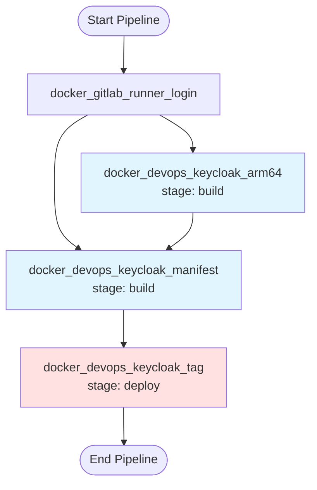
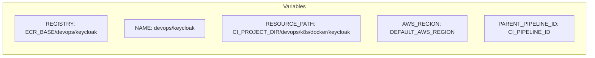
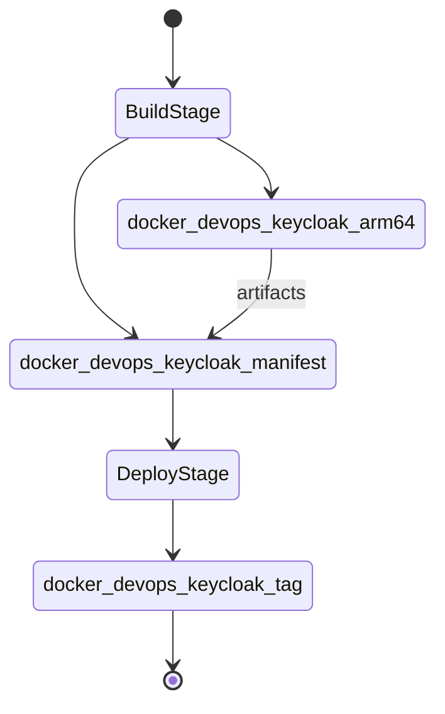

# Diagram: devops/k8s/docker/keycloak/.gitlab-ci.yml

> Auto-generated by Obscura crawlers

## Diagram 1

### SVG

<svg id="container" width="408.90625" xmlns="http://www.w3.org/2000/svg" class="flowchart" height="632" viewBox="0 0 408.90625 632" role="graphics-document document" aria-roledescription="flowchart-v2"><g><marker id="container_flowchart-v2-pointEnd" class="marker flowchart-v2" viewBox="0 0 10 10" refX="5" refY="5" markerUnits="userSpaceOnUse" markerWidth="8" markerHeight="8" orient="auto"><path d="M 0 0 L 10 5 L 0 10 z" class="arrowMarkerPath" style="stroke-width: 1; stroke-dasharray: 1, 0;"></path></marker><marker id="container_flowchart-v2-pointStart" class="marker flowchart-v2" viewBox="0 0 10 10" refX="4.5" refY="5" markerUnits="userSpaceOnUse" markerWidth="8" markerHeight="8" orient="auto"><path d="M 0 5 L 10 10 L 10 0 z" class="arrowMarkerPath" style="stroke-width: 1; stroke-dasharray: 1, 0;"></path></marker><marker id="container_flowchart-v2-circleEnd" class="marker flowchart-v2" viewBox="0 0 10 10" refX="11" refY="5" markerUnits="userSpaceOnUse" markerWidth="11" markerHeight="11" orient="auto"><circle cx="5" cy="5" r="5" class="arrowMarkerPath" style="stroke-width: 1; stroke-dasharray: 1, 0;"></circle></marker><marker id="container_flowchart-v2-circleStart" class="marker flowchart-v2" viewBox="0 0 10 10" refX="-1" refY="5" markerUnits="userSpaceOnUse" markerWidth="11" markerHeight="11" orient="auto"><circle cx="5" cy="5" r="5" class="arrowMarkerPath" style="stroke-width: 1; stroke-dasharray: 1, 0;"></circle></marker><marker id="container_flowchart-v2-crossEnd" class="marker cross flowchart-v2" viewBox="0 0 11 11" refX="12" refY="5.2" markerUnits="userSpaceOnUse" markerWidth="11" markerHeight="11" orient="auto"><path d="M 1,1 l 9,9 M 10,1 l -9,9" class="arrowMarkerPath" style="stroke-width: 2; stroke-dasharray: 1, 0;"></path></marker><marker id="container_flowchart-v2-crossStart" class="marker cross flowchart-v2" viewBox="0 0 11 11" refX="-1" refY="5.2" markerUnits="userSpaceOnUse" markerWidth="11" markerHeight="11" orient="auto"><path d="M 1,1 l 9,9 M 10,1 l -9,9" class="arrowMarkerPath" style="stroke-width: 2; stroke-dasharray: 1, 0;"></path></marker><g class="root"><g class="clusters"></g><g class="edgePaths"><path d="M164.109,47.5L164.026,51.583C163.943,55.667,163.776,63.833,163.693,71.417C163.609,79,163.609,86,163.609,89.5L163.609,93" id="L_start_login_0" class="edge-thickness-normal edge-pattern-solid edge-thickness-normal edge-pattern-solid flowchart-link" style=";" data-edge="true" data-et="edge" data-id="L_start_login_0" data-points="W3sieCI6MTY0LjEwOTM3NSwieSI6NDcuNTAwMDAwMDAwMDAwMDF9LHsieCI6MTYzLjYwOTM3NSwieSI6NzJ9LHsieCI6MTYzLjYwOTM3NSwieSI6OTd9XQ==" marker-end="url(#container_flowchart-v2-pointEnd)"></path><path d="M210.738,151L218.011,155.167C225.283,159.333,239.829,167.667,247.102,175.333C254.375,183,254.375,190,254.375,193.5L254.375,197" id="L_login_arm64_0" class="edge-thickness-normal edge-pattern-solid edge-thickness-normal edge-pattern-solid flowchart-link" style=";" data-edge="true" data-et="edge" data-id="L_login_arm64_0" data-points="W3sieCI6MjEwLjczNzY4MDI4ODQ2MTU1LCJ5IjoxNTF9LHsieCI6MjU0LjM3NSwieSI6MTc2fSx7IngiOjI1NC4zNzUsInkiOjIwMX1d" marker-end="url(#container_flowchart-v2-pointEnd)"></path><path d="M116.481,151L109.208,155.167C101.935,159.333,87.39,167.667,80.117,182.5C72.844,197.333,72.844,218.667,72.844,240C72.844,261.333,72.844,282.667,78.208,297.116C83.573,311.565,94.301,319.13,99.666,322.912L105.03,326.695" id="L_login_manifest_0" class="edge-thickness-normal edge-pattern-solid edge-thickness-normal edge-pattern-solid flowchart-link" style=";" data-edge="true" data-et="edge" data-id="L_login_manifest_0" data-points="W3sieCI6MTE2LjQ4MTA2OTcxMTUzODQ1LCJ5IjoxNTF9LHsieCI6NzIuODQzNzUsInkiOjE3Nn0seyJ4Ijo3Mi44NDM3NSwieSI6MjQwfSx7IngiOjcyLjg0Mzc1LCJ5IjozMDR9LHsieCI6MTA4LjI5OTA3MjI2NTYyNSwieSI6MzI5fV0=" marker-end="url(#container_flowchart-v2-pointEnd)"></path><path d="M254.375,279L254.375,283.167C254.375,287.333,254.375,295.667,249.011,303.616C243.646,311.565,232.917,319.13,227.553,322.912L222.189,326.695" id="L_arm64_manifest_0" class="edge-thickness-normal edge-pattern-solid edge-thickness-normal edge-pattern-solid flowchart-link" style=";" data-edge="true" data-et="edge" data-id="L_arm64_manifest_0" data-points="W3sieCI6MjU0LjM3NSwieSI6Mjc5fSx7IngiOjI1NC4zNzUsInkiOjMwNH0seyJ4IjoyMTguOTE5Njc3NzM0Mzc1LCJ5IjozMjl9XQ==" marker-end="url(#container_flowchart-v2-pointEnd)"></path><path d="M163.609,407L163.609,411.167C163.609,415.333,163.609,423.667,163.609,431.333C163.609,439,163.609,446,163.609,449.5L163.609,453" id="L_manifest_tag_0" class="edge-thickness-normal edge-pattern-solid edge-thickness-normal edge-pattern-solid flowchart-link" style=";" data-edge="true" data-et="edge" data-id="L_manifest_tag_0" data-points="W3sieCI6MTYzLjYwOTM3NSwieSI6NDA3fSx7IngiOjE2My42MDkzNzUsInkiOjQzMn0seyJ4IjoxNjMuNjA5Mzc1LCJ5Ijo0NTd9XQ==" marker-end="url(#container_flowchart-v2-pointEnd)"></path><path d="M163.609,535L163.609,539.167C163.609,543.333,163.609,551.667,163.68,559.417C163.75,567.167,163.89,574.334,163.961,577.917L164.031,581.501" id="L_tag_end_node_0" class="edge-thickness-normal edge-pattern-solid edge-thickness-normal edge-pattern-solid flowchart-link" style=";" data-edge="true" data-et="edge" data-id="L_tag_end_node_0" data-points="W3sieCI6MTYzLjYwOTM3NSwieSI6NTM1fSx7IngiOjE2My42MDkzNzUsInkiOjU2MH0seyJ4IjoxNjQuMTA5Mzc1LCJ5Ijo1ODUuNX1d" marker-end="url(#container_flowchart-v2-pointEnd)"></path></g><g class="edgeLabels"><g class="edgeLabel"><g class="label" data-id="L_start_login_0" transform="translate(0, 0)"><foreignObject width="0" height="0">

</foreignObject></g></g><g class="edgeLabel"><g class="label" data-id="L_login_arm64_0" transform="translate(0, 0)"><foreignObject width="0" height="0">

</foreignObject></g></g><g class="edgeLabel"><g class="label" data-id="L_login_manifest_0" transform="translate(0, 0)"><foreignObject width="0" height="0">

</foreignObject></g></g><g class="edgeLabel"><g class="label" data-id="L_arm64_manifest_0" transform="translate(0, 0)"><foreignObject width="0" height="0">

</foreignObject></g></g><g class="edgeLabel"><g class="label" data-id="L_manifest_tag_0" transform="translate(0, 0)"><foreignObject width="0" height="0">

</foreignObject></g></g><g class="edgeLabel"><g class="label" data-id="L_tag_end_node_0" transform="translate(0, 0)"><foreignObject width="0" height="0">

</foreignObject></g></g></g><g class="nodes"><g class="node default" id="flowchart-start-0" transform="translate(163.609375, 27.5)"><g class="basic label-container outer-path"><path d="M-42.1796875 -19.5 C-21.379639029367173 -19.5, -0.5795905587343455 -19.5, 42.1796875 -19.5 C42.1796875 -19.5, 42.1796875 -19.5, 42.1796875 -19.5 C42.568131772788774 -19.487543348232574, 42.95657604557754 -19.475086696465148, 43.4290567896239 -19.45993515863156 C43.90878962578356 -19.413655908890384, 44.388522461943225 -19.36737665914921, 44.673292152847864 -19.3399052695533 C45.13527130154713 -19.26521606349341, 45.597250450246385 -19.190526857433518, 45.90728075967676 -19.140403561325776 C46.36604786653059 -19.03569296292154, 46.82481497338442 -18.930982364517305, 47.12595188623539 -18.862249829261074 C47.59176459817553 -18.723999061458063, 48.05757731011567 -18.58574829365505, 48.324297751460605 -18.50658706670804 C48.703392431312295 -18.36707672020981, 49.08248711116399 -18.227566373711582, 49.4973940951478 -18.074876768247425 C49.75941687753183 -17.958887055115692, 50.02143965991586 -17.842897341983956, 50.64042041279238 -17.568892924097174 C51.081965862791535 -17.338538945655973, 51.523511312790696 -17.108184967214772, 51.74867976407678 -16.990714730406097 C52.03311110067552 -16.818290782655875, 52.317542437274255 -16.645866834905654, 52.8176180736057 -16.342718045390892 C53.20663706077447 -16.071355240302495, 53.595656047943244 -15.799992435214094, 53.84284284457871 -15.627565626425154 C54.2086256032903 -15.335863610240667, 54.57440836200189 -15.044161594056181, 54.820141208501866 -14.848196188198123 C55.1273494291747 -14.569197810467161, 55.434557649847534 -14.290199432736198, 55.74549723676799 -14.007812326905688 C55.956352810886635 -13.790086635063599, 56.16720838500528 -13.572360943221508, 56.61510844296865 -13.10986736009568 C56.86620458841397 -12.814915539880179, 57.11730073385929 -12.519963719664675, 57.42540140812658 -12.158051136245305 C57.71935862766476 -11.764175242117757, 58.013315847202946 -11.37029934799021, 58.173046464640635 -11.156274872382312 C58.33723268149004 -10.904040753129186, 58.50141889833946 -10.65180663387606, 58.85497137860425 -10.108655082055241 C59.036038632456204 -9.787151837793461, 59.217105886308154 -9.46564859353168, 59.468373974273504 -9.019496659696287 C59.674540236962095 -8.591388003972076, 59.880706499650685 -8.163279348247864, 60.01073364880834 -7.893275190886684 C60.123057639588225 -7.61583276202375, 60.2353816303681 -7.338390333160816, 60.479821729970325 -6.734618561215508 C60.55871648706841 -6.497000123008554, 60.63761124416649 -6.2593816848016015, 60.87371063421488 -5.548287939305138 C60.97165131890101 -5.1747976608356865, 61.06959200358713 -4.801307382366235, 61.19078178754556 -4.339158212148133 C61.25480546475651 -4.010410161078885, 61.318829141967456 -3.6816621100096354, 61.429732276581774 -3.1121979531509023 C61.48789086985868 -2.661131388408494, 61.54604946313558 -2.2100648236660856, 61.58958020250937 -1.872449005199798 C61.61354213883814 -1.499222505152308, 61.63750407516691 -1.1259960051048183, 61.66966871591342 -0.6250057626472757 C61.66966871591342 -0.13553924158742858, 61.66966871591342 0.35392727947241853, 61.66966871591342 0.625005762647271 C61.65081405113653 0.9186823857587557, 61.63195938635965 1.2123590088702403, 61.58958020250937 1.8724490051997846 C61.55052532771094 2.175350901879021, 61.51147045291252 2.478252798558258, 61.429732276581774 3.1121979531508885 C61.3463952537298 3.5401159522097396, 61.26305823087784 3.968033951268591, 61.19078178754556 4.339158212148129 C61.07680777645051 4.773790513102438, 60.96283376535546 5.208422814056748, 60.87371063421489 5.548287939305125 C60.78484810481506 5.81592771953608, 60.695985575415236 6.0835674997670335, 60.479821729970325 6.734618561215495 C60.336639509189084 7.088281414785089, 60.193457288407835 7.441944268354683, 60.01073364880834 7.893275190886679 C59.84244458550951 8.242731031635817, 59.67415552221068 8.592186872384955, 59.468373974273504 9.019496659696284 C59.25038388610407 9.406560135131151, 59.03239379793463 9.793623610566017, 58.85497137860425 10.108655082055236 C58.58494725498352 10.523484647566459, 58.31492313136278 10.93831421307768, 58.17304646464064 11.156274872382301 C57.93383075124156 11.47680213533726, 57.694615037842475 11.797329398292218, 57.42540140812658 12.158051136245302 C57.122727829325726 12.513588744519318, 56.82005425052487 12.869126352793332, 56.61510844296866 13.10986736009567 C56.33095403234027 13.403280118580462, 56.04679962171189 13.696692877065251, 55.74549723676799 14.007812326905684 C55.386788550000134 14.333582065316484, 55.02807986323228 14.659351803727287, 54.82014120850189 14.848196188198111 C54.45588500919071 15.138680813884221, 54.09162880987953 15.42916543957033, 53.84284284457871 15.627565626425152 C53.626530321625175 15.778455878419342, 53.41021779867164 15.929346130413533, 52.81761807360571 16.34271804539089 C52.4423542585976 16.570205175343766, 52.06709044358949 16.79769230529664, 51.74867976407678 16.990714730406093 C51.38257130475713 17.181713279129497, 51.016462845437474 17.3727118278529, 50.64042041279239 17.56889292409717 C50.19067130521093 17.767983512690225, 49.74092219762947 17.967074101283277, 49.497394095147804 18.07487676824742 C49.16743526473647 18.196304667944784, 48.83747643432513 18.31773256764215, 48.32429775146062 18.506587066708033 C47.977118819279156 18.60962795140009, 47.6299398870977 18.712668836092142, 47.12595188623541 18.86224982926107 C46.752622924457796 18.94745972858766, 46.37929396268018 19.03266962791425, 45.907280759676766 19.140403561325773 C45.48575145863842 19.2085531497091, 45.064222157600064 19.27670273809243, 44.67329215284788 19.3399052695533 C44.295315426336344 19.376368229776347, 43.9173386998248 19.41283118999939, 43.4290567896239 19.45993515863156 C43.17855045329022 19.467968409256777, 42.92804411695654 19.476001659881994, 42.17968750000001 19.5 C42.17968750000001 19.5, 42.1796875 19.5, 42.1796875 19.5 C21.00762468079865 19.5, -0.16443813840270138 19.5, -42.17968749999999 19.5 C-42.449597504964146 19.491344511488755, -42.719507509928306 19.482689022977507, -43.42905678962389 19.45993515863156 C-43.82247627287904 19.42198245423809, -44.21589575613418 19.38402974984462, -44.67329215284787 19.3399052695533 C-45.01016266779575 19.285442657166385, -45.34703318274362 19.230980044779475, -45.90728075967676 19.140403561325773 C-46.30373863869074 19.04991463757027, -46.70019651770472 18.95942571381477, -47.125951886235384 18.862249829261074 C-47.4084627292989 18.7784020939695, -47.6909735723624 18.69455435867793, -48.32429775146059 18.506587066708043 C-48.678445708342736 18.37625734486759, -49.03259366522487 18.245927623027136, -49.4973940951478 18.074876768247425 C-49.72954113800652 17.97211215877122, -49.96168818086523 17.86934754929502, -50.64042041279238 17.568892924097174 C-50.93590207054035 17.414740332515095, -51.231383728288314 17.260587740933016, -51.74867976407678 16.990714730406097 C-51.98973627602262 16.844584856259225, -52.23079278796846 16.698454982112352, -52.817618073605686 16.3427180453909 C-53.059061656079734 16.174297454181232, -53.30050523855378 16.00587686297157, -53.84284284457871 15.627565626425156 C-54.22707689526949 15.321149195896767, -54.61131094596026 15.014732765368379, -54.820141208501866 14.848196188198125 C-55.12000138700431 14.575871107947767, -55.41986156550675 14.30354602769741, -55.745497236767974 14.007812326905697 C-55.93966678316173 13.807316328637912, -56.133836329555486 13.606820330370129, -56.615108442968655 13.109867360095677 C-56.801105670435895 12.891384433170595, -56.987102897903135 12.672901506245514, -57.425401408126575 12.158051136245307 C-57.688696120219205 11.805260208682911, -57.95199083231183 11.452469281120516, -58.173046464640635 11.156274872382316 C-58.316174373819926 10.936391968657867, -58.459302282999225 10.716509064933419, -58.85497137860425 10.108655082055249 C-59.08181369931119 9.705873571364291, -59.308656020018134 9.303092060673332, -59.468373974273504 9.019496659696289 C-59.58592526657038 8.775398886047098, -59.70347655886725 8.531301112397907, -60.01073364880834 7.893275190886686 C-60.122219119618634 7.617903922560312, -60.23370459042893 7.3425326542339375, -60.479821729970325 6.73461856121551 C-60.621380143960046 6.308267172548813, -60.76293855794976 5.881915783882116, -60.87371063421488 5.5482879393051325 C-60.970226748737225 5.180230164282785, -61.06674286325958 4.8121723892604376, -61.19078178754556 4.339158212148136 C-61.248171015808076 4.044476654237814, -61.305560244070584 3.7497950963274924, -61.429732276581774 3.112197953150904 C-61.46930563300613 2.805274815366753, -61.50887898943048 2.498351677582602, -61.58958020250937 1.872449005199809 C-61.61014693337073 1.5521055708677582, -61.63071366423209 1.2317621365357074, -61.66966871591342 0.6250057626472781 C-61.66966871591342 0.19271658403421776, -61.66966871591342 -0.2395725945788426, -61.66966871591342 -0.6250057626472687 C-61.648540014363235 -0.9541023440722898, -61.62741131281305 -1.2831989254973108, -61.58958020250937 -1.8724490051997822 C-61.55203064132268 -2.163675986764176, -61.514481080135994 -2.45490296832857, -61.429732276581774 -3.112197953150895 C-61.36774525005385 -3.430488233409104, -61.30575822352592 -3.7487785136673133, -61.19078178754556 -4.339158212148126 C-61.09547898636973 -4.7025890975268805, -61.0001761851939 -5.066019982905635, -60.87371063421489 -5.548287939305123 C-60.78884352803141 -5.803894141392675, -60.70397642184793 -6.059500343480227, -60.47982172997033 -6.734618561215485 C-60.36650092213115 -7.014523147487029, -60.25318011429197 -7.294427733758574, -60.01073364880834 -7.893275190886676 C-59.81046753183778 -8.30913206778451, -59.61020141486722 -8.724988944682345, -59.468373974273504 -9.019496659696282 C-59.2578124920205 -9.393369893098612, -59.04725100976749 -9.76724312650094, -58.85497137860425 -10.108655082055243 C-58.632884226985446 -10.449840585692142, -58.41079707536665 -10.79102608932904, -58.17304646464064 -11.156274872382308 C-57.96695260351669 -11.432421870751412, -57.760858742392735 -11.708568869120516, -57.42540140812659 -12.158051136245302 C-57.24855873535101 -12.365780602320637, -57.07171606257543 -12.57351006839597, -56.61510844296866 -13.10986736009567 C-56.40261143660425 -13.329287965495604, -56.19011443023984 -13.548708570895538, -55.745497236767996 -14.007812326905677 C-55.51950318848372 -14.213054142082605, -55.29350914019945 -14.41829595725953, -54.82014120850189 -14.848196188198107 C-54.45809079461711 -15.136921758705084, -54.09604038073232 -15.425647329212062, -53.84284284457872 -15.627565626425149 C-53.487006395341595 -15.875781729501346, -53.13116994610448 -16.123997832577544, -52.817618073605715 -16.342718045390885 C-52.3920277551216 -16.600713397502275, -51.96643743663749 -16.858708749613665, -51.74867976407679 -16.99071473040609 C-51.370375990578765 -17.18807556672488, -50.99207221708074 -17.38543640304367, -50.64042041279239 -17.56889292409717 C-50.30440363865182 -17.717637582425745, -49.96838686451125 -17.86638224075432, -49.497394095147804 -18.07487676824742 C-49.050864645093434 -18.239203733540418, -48.60433519503906 -18.403530698833414, -48.32429775146062 -18.506587066708033 C-47.885388884328584 -18.636852914593163, -47.446480017196556 -18.767118762478294, -47.12595188623541 -18.862249829261067 C-46.68358464123287 -18.963217266216848, -46.24121739623032 -19.06418470317263, -45.907280759676766 -19.140403561325773 C-45.654272449454915 -19.181307982813692, -45.40126413923307 -19.22221240430161, -44.67329215284788 -19.3399052695533 C-44.349191128347826 -19.37117090559831, -44.02509010384777 -19.40243654164332, -43.4290567896239 -19.45993515863156 C-43.075778392964395 -19.471264109197744, -42.72249999630489 -19.482593059763932, -42.17968750000001 -19.5 C-42.17968750000001 -19.5, -42.1796875 -19.5, -42.1796875 -19.5" stroke="none" stroke-width="0" fill="#ECECFF" style=""></path><path d="M-42.1796875 -19.5 C-17.568236376751983 -19.5, 7.043214746496034 -19.5, 42.1796875 -19.5 M-42.1796875 -19.5 C-16.822475189080492 -19.5, 8.534737121839015 -19.5, 42.1796875 -19.5 M42.1796875 -19.5 C42.1796875 -19.5, 42.1796875 -19.5, 42.1796875 -19.5 M42.1796875 -19.5 C42.1796875 -19.5, 42.1796875 -19.5, 42.1796875 -19.5 M42.1796875 -19.5 C42.6226610761726 -19.485794699607904, 43.065634652345196 -19.47158939921581, 43.4290567896239 -19.45993515863156 M42.1796875 -19.5 C42.50440965929984 -19.489586792384593, 42.82913181859967 -19.47917358476919, 43.4290567896239 -19.45993515863156 M43.4290567896239 -19.45993515863156 C43.856459579924675 -19.418704125478303, 44.28386237022545 -19.377473092325047, 44.673292152847864 -19.3399052695533 M43.4290567896239 -19.45993515863156 C43.695586888903534 -19.434223320503396, 43.96211698818317 -19.408511482375232, 44.673292152847864 -19.3399052695533 M44.673292152847864 -19.3399052695533 C45.147174876496784 -19.263291585809153, 45.6210576001457 -19.186677902065004, 45.90728075967676 -19.140403561325776 M44.673292152847864 -19.3399052695533 C45.00594735562662 -19.286124156147658, 45.33860255840538 -19.232343042742016, 45.90728075967676 -19.140403561325776 M45.90728075967676 -19.140403561325776 C46.31369426570952 -19.047642330669774, 46.720107771742285 -18.954881100013775, 47.12595188623539 -18.862249829261074 M45.90728075967676 -19.140403561325776 C46.27854140755348 -19.055665741150055, 46.649802055430214 -18.970927920974333, 47.12595188623539 -18.862249829261074 M47.12595188623539 -18.862249829261074 C47.55853817742797 -18.733860488726897, 47.99112446862055 -18.60547114819272, 48.324297751460605 -18.50658706670804 M47.12595188623539 -18.862249829261074 C47.55186624473603 -18.735840683328174, 47.97778060323667 -18.609431537395274, 48.324297751460605 -18.50658706670804 M48.324297751460605 -18.50658706670804 C48.71558841697937 -18.36258848474587, 49.106879082498146 -18.2185899027837, 49.4973940951478 -18.074876768247425 M48.324297751460605 -18.50658706670804 C48.56691108976795 -18.41730311551782, 48.80952442807529 -18.328019164327607, 49.4973940951478 -18.074876768247425 M49.4973940951478 -18.074876768247425 C49.80036589277837 -17.940760140775424, 50.10333769040896 -17.80664351330342, 50.64042041279238 -17.568892924097174 M49.4973940951478 -18.074876768247425 C49.85379526242043 -17.917108543760826, 50.210196429693056 -17.759340319274227, 50.64042041279238 -17.568892924097174 M50.64042041279238 -17.568892924097174 C50.92665249609243 -17.419565829579938, 51.21288457939249 -17.270238735062698, 51.74867976407678 -16.990714730406097 M50.64042041279238 -17.568892924097174 C50.958918312456646 -17.40273277384997, 51.27741621212091 -17.236572623602765, 51.74867976407678 -16.990714730406097 M51.74867976407678 -16.990714730406097 C52.086003134931204 -16.786227320661983, 52.42332650578563 -16.581739910917868, 52.8176180736057 -16.342718045390892 M51.74867976407678 -16.990714730406097 C52.040792609429445 -16.81363420690769, 52.33290545478211 -16.636553683409282, 52.8176180736057 -16.342718045390892 M52.8176180736057 -16.342718045390892 C53.163052345972474 -16.10175805059647, 53.508486618339255 -15.860798055802048, 53.84284284457871 -15.627565626425154 M52.8176180736057 -16.342718045390892 C53.089151992877476 -16.153307737820818, 53.36068591214925 -15.963897430250743, 53.84284284457871 -15.627565626425154 M53.84284284457871 -15.627565626425154 C54.07274696476305 -15.444223208583724, 54.302651084947385 -15.260880790742293, 54.820141208501866 -14.848196188198123 M53.84284284457871 -15.627565626425154 C54.198365967089856 -15.344045397090136, 54.553889089601 -15.06052516775512, 54.820141208501866 -14.848196188198123 M54.820141208501866 -14.848196188198123 C55.052078460726534 -14.637556912451096, 55.284015712951195 -14.426917636704067, 55.74549723676799 -14.007812326905688 M54.820141208501866 -14.848196188198123 C55.051305536645444 -14.638258861651087, 55.28246986478903 -14.42832153510405, 55.74549723676799 -14.007812326905688 M55.74549723676799 -14.007812326905688 C56.08487569171002 -13.6573762086887, 56.424254146652046 -13.306940090471713, 56.61510844296865 -13.10986736009568 M55.74549723676799 -14.007812326905688 C56.00736936431034 -13.737407855116686, 56.269241491852696 -13.467003383327683, 56.61510844296865 -13.10986736009568 M56.61510844296865 -13.10986736009568 C56.87545157752963 -12.80405350029633, 57.13579471209062 -12.49823964049698, 57.42540140812658 -12.158051136245305 M56.61510844296865 -13.10986736009568 C56.79786780857228 -12.895187809955155, 56.98062717417591 -12.680508259814628, 57.42540140812658 -12.158051136245305 M57.42540140812658 -12.158051136245305 C57.64106990562799 -11.869074997397739, 57.85673840312939 -11.580098858550171, 58.173046464640635 -11.156274872382312 M57.42540140812658 -12.158051136245305 C57.645835685051864 -11.862689287141183, 57.86626996197714 -11.56732743803706, 58.173046464640635 -11.156274872382312 M58.173046464640635 -11.156274872382312 C58.444715297905546 -10.738918591191254, 58.71638413117046 -10.321562310000195, 58.85497137860425 -10.108655082055241 M58.173046464640635 -11.156274872382312 C58.43908703777594 -10.747565110149786, 58.70512761091125 -10.33885534791726, 58.85497137860425 -10.108655082055241 M58.85497137860425 -10.108655082055241 C59.05910760242512 -9.746190545627124, 59.263243826246004 -9.383726009199007, 59.468373974273504 -9.019496659696287 M58.85497137860425 -10.108655082055241 C58.98054803290798 -9.885681016323831, 59.106124687211725 -9.66270695059242, 59.468373974273504 -9.019496659696287 M59.468373974273504 -9.019496659696287 C59.593781949979785 -8.759084314841376, 59.71918992568606 -8.498671969986464, 60.01073364880834 -7.893275190886684 M59.468373974273504 -9.019496659696287 C59.580309449556104 -8.787060250236468, 59.69224492483871 -8.554623840776651, 60.01073364880834 -7.893275190886684 M60.01073364880834 -7.893275190886684 C60.1808315055536 -7.4731301961075545, 60.350929362298864 -7.052985201328424, 60.479821729970325 -6.734618561215508 M60.01073364880834 -7.893275190886684 C60.19690344690608 -7.433432190237092, 60.383073245003814 -6.973589189587498, 60.479821729970325 -6.734618561215508 M60.479821729970325 -6.734618561215508 C60.591972933454244 -6.396837005189589, 60.704124136938155 -6.05905544916367, 60.87371063421488 -5.548287939305138 M60.479821729970325 -6.734618561215508 C60.5845735726099 -6.419122701124699, 60.68932541524947 -6.103626841033891, 60.87371063421488 -5.548287939305138 M60.87371063421488 -5.548287939305138 C61.00050031034358 -5.064783953233173, 61.12728998647228 -4.581279967161208, 61.19078178754556 -4.339158212148133 M60.87371063421488 -5.548287939305138 C60.982772973943554 -5.132385970002669, 61.09183531367223 -4.716484000700199, 61.19078178754556 -4.339158212148133 M61.19078178754556 -4.339158212148133 C61.27977743782208 -3.882184357215555, 61.3687730880986 -3.4252105022829764, 61.429732276581774 -3.1121979531509023 M61.19078178754556 -4.339158212148133 C61.253766997883346 -4.015742468992526, 61.31675220822113 -3.6923267258369186, 61.429732276581774 -3.1121979531509023 M61.429732276581774 -3.1121979531509023 C61.46797569001548 -2.815589590575275, 61.50621910344918 -2.5189812279996473, 61.58958020250937 -1.872449005199798 M61.429732276581774 -3.1121979531509023 C61.48061409623898 -2.717568607641369, 61.531495915896194 -2.322939262131836, 61.58958020250937 -1.872449005199798 M61.58958020250937 -1.872449005199798 C61.61898172125712 -1.4144966182247238, 61.64838324000488 -0.9565442312496497, 61.66966871591342 -0.6250057626472757 M61.58958020250937 -1.872449005199798 C61.614470452624246 -1.484763268612323, 61.63936070273912 -1.0970775320248483, 61.66966871591342 -0.6250057626472757 M61.66966871591342 -0.6250057626472757 C61.66966871591342 -0.32148163740147545, 61.66966871591342 -0.017957512155675204, 61.66966871591342 0.625005762647271 M61.66966871591342 -0.6250057626472757 C61.66966871591342 -0.30812485618569063, 61.66966871591342 0.008756050275894434, 61.66966871591342 0.625005762647271 M61.66966871591342 0.625005762647271 C61.642426325694004 1.049327979976261, 61.61518393547458 1.473650197305251, 61.58958020250937 1.8724490051997846 M61.66966871591342 0.625005762647271 C61.64474468831584 1.0132176107924584, 61.61982066071827 1.4014294589376455, 61.58958020250937 1.8724490051997846 M61.58958020250937 1.8724490051997846 C61.548936402234425 2.1876742941060874, 61.508292601959475 2.5028995830123906, 61.429732276581774 3.1121979531508885 M61.58958020250937 1.8724490051997846 C61.54114238361196 2.248123163438839, 61.49270456471455 2.6237973216778934, 61.429732276581774 3.1121979531508885 M61.429732276581774 3.1121979531508885 C61.34810990096201 3.5313116010632073, 61.26648752534224 3.9504252489755265, 61.19078178754556 4.339158212148129 M61.429732276581774 3.1121979531508885 C61.379535183248144 3.369949418259647, 61.329338089914515 3.627700883368406, 61.19078178754556 4.339158212148129 M61.19078178754556 4.339158212148129 C61.08331443946009 4.7489777870413175, 60.975847091374625 5.158797361934505, 60.87371063421489 5.548287939305125 M61.19078178754556 4.339158212148129 C61.07755204880359 4.770952280050462, 60.96432231006162 5.202746347952795, 60.87371063421489 5.548287939305125 M60.87371063421489 5.548287939305125 C60.723908556847014 5.999467928617419, 60.57410647947914 6.450647917929713, 60.479821729970325 6.734618561215495 M60.87371063421489 5.548287939305125 C60.74435052990516 5.937899962752381, 60.61499042559544 6.327511986199637, 60.479821729970325 6.734618561215495 M60.479821729970325 6.734618561215495 C60.30559667579181 7.164957813448692, 60.131371621613305 7.59529706568189, 60.01073364880834 7.893275190886679 M60.479821729970325 6.734618561215495 C60.38583601533859 6.966765093446061, 60.291850300706855 7.198911625676627, 60.01073364880834 7.893275190886679 M60.01073364880834 7.893275190886679 C59.90167483394093 8.119738153443684, 59.79261601907351 8.34620111600069, 59.468373974273504 9.019496659696284 M60.01073364880834 7.893275190886679 C59.85273774775553 8.221357059993554, 59.69474184670273 8.54943892910043, 59.468373974273504 9.019496659696284 M59.468373974273504 9.019496659696284 C59.26096533731012 9.387771697026686, 59.05355670034673 9.756046734357088, 58.85497137860425 10.108655082055236 M59.468373974273504 9.019496659696284 C59.25552183297568 9.397437190187066, 59.04266969167786 9.775377720677849, 58.85497137860425 10.108655082055236 M58.85497137860425 10.108655082055236 C58.69564905174425 10.353416960147293, 58.53632672488424 10.59817883823935, 58.17304646464064 11.156274872382301 M58.85497137860425 10.108655082055236 C58.62756239551367 10.45801634794463, 58.400153412423094 10.807377613834024, 58.17304646464064 11.156274872382301 M58.17304646464064 11.156274872382301 C57.96678795135993 11.432642489641331, 57.760529438079224 11.709010106900363, 57.42540140812658 12.158051136245302 M58.17304646464064 11.156274872382301 C57.93668209890488 11.47298158923152, 57.70031773316913 11.789688306080736, 57.42540140812658 12.158051136245302 M57.42540140812658 12.158051136245302 C57.17635959938798 12.450589815670025, 56.92731779064938 12.743128495094748, 56.61510844296866 13.10986736009567 M57.42540140812658 12.158051136245302 C57.23635688021015 12.380113595674311, 57.04731235229372 12.602176055103321, 56.61510844296866 13.10986736009567 M56.61510844296866 13.10986736009567 C56.30688234997195 13.428136106947633, 55.99865625697524 13.746404853799596, 55.74549723676799 14.007812326905684 M56.61510844296866 13.10986736009567 C56.403052596419826 13.32883243176613, 56.19099674987098 13.547797503436593, 55.74549723676799 14.007812326905684 M55.74549723676799 14.007812326905684 C55.38466082650704 14.335514407496435, 55.02382441624609 14.663216488087185, 54.82014120850189 14.848196188198111 M55.74549723676799 14.007812326905684 C55.43611064082378 14.288789047421462, 55.12672404487957 14.56976576793724, 54.82014120850189 14.848196188198111 M54.82014120850189 14.848196188198111 C54.45279966409672 15.141141294492192, 54.08545811969156 15.434086400786272, 53.84284284457871 15.627565626425152 M54.82014120850189 14.848196188198111 C54.51587072318765 15.090843803258547, 54.21160023787341 15.333491418318985, 53.84284284457871 15.627565626425152 M53.84284284457871 15.627565626425152 C53.49783010352972 15.868231579220083, 53.15281736248074 16.108897532015014, 52.81761807360571 16.34271804539089 M53.84284284457871 15.627565626425152 C53.587620245302716 15.805597863271835, 53.33239764602672 15.983630100118518, 52.81761807360571 16.34271804539089 M52.81761807360571 16.34271804539089 C52.3945632883971 16.59917634233022, 51.971508503188495 16.855634639269553, 51.74867976407678 16.990714730406093 M52.81761807360571 16.34271804539089 C52.39038020910711 16.60171214957832, 51.96314234460851 16.86070625376575, 51.74867976407678 16.990714730406093 M51.74867976407678 16.990714730406093 C51.51222791602734 17.11407150807885, 51.275776067977894 17.23742828575161, 50.64042041279239 17.56889292409717 M51.74867976407678 16.990714730406093 C51.386850228550635 17.17948096732721, 51.02502069302448 17.368247204248323, 50.64042041279239 17.56889292409717 M50.64042041279239 17.56889292409717 C50.19513161404696 17.766009066278876, 49.74984281530153 17.96312520846058, 49.497394095147804 18.07487676824742 M50.64042041279239 17.56889292409717 C50.396587549841044 17.67683049948084, 50.15275468688971 17.78476807486451, 49.497394095147804 18.07487676824742 M49.497394095147804 18.07487676824742 C49.22449456248407 18.1753063189233, 48.95159502982033 18.275735869599185, 48.32429775146062 18.506587066708033 M49.497394095147804 18.07487676824742 C49.25397792824466 18.16445616778216, 49.010561761341506 18.2540355673169, 48.32429775146062 18.506587066708033 M48.32429775146062 18.506587066708033 C48.084037413031666 18.577895074001496, 47.84377707460271 18.649203081294957, 47.12595188623541 18.86224982926107 M48.32429775146062 18.506587066708033 C47.86393411210805 18.64322057836982, 47.40357047275548 18.779854090031613, 47.12595188623541 18.86224982926107 M47.12595188623541 18.86224982926107 C46.71888871257661 18.955159342313237, 46.3118255389178 19.0480688553654, 45.907280759676766 19.140403561325773 M47.12595188623541 18.86224982926107 C46.66440173148403 18.967595640186836, 46.20285157673264 19.072941451112605, 45.907280759676766 19.140403561325773 M45.907280759676766 19.140403561325773 C45.431392853704814 19.21734142739749, 44.95550494773286 19.294279293469206, 44.67329215284788 19.3399052695533 M45.907280759676766 19.140403561325773 C45.637060910543795 19.184090610947365, 45.36684106141082 19.227777660568957, 44.67329215284788 19.3399052695533 M44.67329215284788 19.3399052695533 C44.206073954906465 19.384977247196613, 43.738855756965044 19.43004922483993, 43.4290567896239 19.45993515863156 M44.67329215284788 19.3399052695533 C44.32996464968427 19.373025660871757, 43.98663714652067 19.406146052190216, 43.4290567896239 19.45993515863156 M43.4290567896239 19.45993515863156 C43.108962260672094 19.47019996714884, 42.788867731720295 19.48046477566612, 42.17968750000001 19.5 M43.4290567896239 19.45993515863156 C43.02524402915856 19.472884647885827, 42.62143126869321 19.485834137140095, 42.17968750000001 19.5 M42.17968750000001 19.5 C42.17968750000001 19.5, 42.1796875 19.5, 42.1796875 19.5 M42.17968750000001 19.5 C42.17968750000001 19.5, 42.17968750000001 19.5, 42.1796875 19.5 M42.1796875 19.5 C19.859120005877003 19.5, -2.4614474882459945 19.5, -42.17968749999999 19.5 M42.1796875 19.5 C24.328968782953233 19.5, 6.478250065906465 19.5, -42.17968749999999 19.5 M-42.17968749999999 19.5 C-42.46684381807201 19.490791455795296, -42.754000136144015 19.481582911590593, -43.42905678962389 19.45993515863156 M-42.17968749999999 19.5 C-42.6559826901649 19.48472614030376, -43.132277880329795 19.469452280607516, -43.42905678962389 19.45993515863156 M-43.42905678962389 19.45993515863156 C-43.72809948413217 19.431086869543805, -44.02714217864045 19.40223858045605, -44.67329215284787 19.3399052695533 M-43.42905678962389 19.45993515863156 C-43.78831853666139 19.425277609970315, -44.14758028369889 19.390620061309075, -44.67329215284787 19.3399052695533 M-44.67329215284787 19.3399052695533 C-45.14291834769596 19.263979748375792, -45.61254454254405 19.188054227198286, -45.90728075967676 19.140403561325773 M-44.67329215284787 19.3399052695533 C-45.09032020631794 19.272483407969112, -45.50734825978801 19.20506154638493, -45.90728075967676 19.140403561325773 M-45.90728075967676 19.140403561325773 C-46.30151081694267 19.050423123346373, -46.695740874208575 18.960442685366978, -47.125951886235384 18.862249829261074 M-45.90728075967676 19.140403561325773 C-46.233125032323194 19.06603173242682, -46.55896930496962 18.991659903527868, -47.125951886235384 18.862249829261074 M-47.125951886235384 18.862249829261074 C-47.528145839429676 18.74288077511215, -47.930339792623975 18.623511720963226, -48.32429775146059 18.506587066708043 M-47.125951886235384 18.862249829261074 C-47.56080244595845 18.733188465712434, -47.99565300568152 18.604127102163798, -48.32429775146059 18.506587066708043 M-48.32429775146059 18.506587066708043 C-48.59854320665146 18.405662204100604, -48.872788661842336 18.304737341493166, -49.4973940951478 18.074876768247425 M-48.32429775146059 18.506587066708043 C-48.78259003775078 18.3379312689458, -49.240882324040975 18.169275471183553, -49.4973940951478 18.074876768247425 M-49.4973940951478 18.074876768247425 C-49.75219037049657 17.962086015413483, -50.006986645845345 17.849295262579545, -50.64042041279238 17.568892924097174 M-49.4973940951478 18.074876768247425 C-49.93616475443212 17.880646013051415, -50.37493541371645 17.6864152578554, -50.64042041279238 17.568892924097174 M-50.64042041279238 17.568892924097174 C-51.003946961164495 17.37924135666131, -51.36747350953661 17.189589789225444, -51.74867976407678 16.990714730406097 M-50.64042041279238 17.568892924097174 C-50.93534484623301 17.415031036079316, -51.23026927967363 17.26116914806146, -51.74867976407678 16.990714730406097 M-51.74867976407678 16.990714730406097 C-52.119575074133834 16.765875813826735, -52.49047038419089 16.54103689724737, -52.817618073605686 16.3427180453909 M-51.74867976407678 16.990714730406097 C-52.067303045987565 16.79756342447354, -52.38592632789834 16.604412118540985, -52.817618073605686 16.3427180453909 M-52.817618073605686 16.3427180453909 C-53.12500760052338 16.128296418091267, -53.432397127441085 15.913874790791636, -53.84284284457871 15.627565626425156 M-52.817618073605686 16.3427180453909 C-53.03362730904152 16.192039353639956, -53.24963654447735 16.041360661889016, -53.84284284457871 15.627565626425156 M-53.84284284457871 15.627565626425156 C-54.18520560777934 15.354540433428408, -54.527568370979964 15.081515240431658, -54.820141208501866 14.848196188198125 M-53.84284284457871 15.627565626425156 C-54.13156313379722 15.39731887894296, -54.42028342301573 15.167072131460765, -54.820141208501866 14.848196188198125 M-54.820141208501866 14.848196188198125 C-55.06100114474735 14.62945356690467, -55.301861080992836 14.410710945611216, -55.745497236767974 14.007812326905697 M-54.820141208501866 14.848196188198125 C-55.050653852022265 14.638850704383232, -55.28116649554266 14.42950522056834, -55.745497236767974 14.007812326905697 M-55.745497236767974 14.007812326905697 C-55.992081375753045 13.753193958469298, -56.238665514738116 13.4985755900329, -56.615108442968655 13.109867360095677 M-55.745497236767974 14.007812326905697 C-55.94387435581569 13.802971664424563, -56.1422514748634 13.598131001943429, -56.615108442968655 13.109867360095677 M-56.615108442968655 13.109867360095677 C-56.85312100747756 12.830284258524925, -57.091133571986475 12.550701156954172, -57.425401408126575 12.158051136245307 M-56.615108442968655 13.109867360095677 C-56.87198725585723 12.808122889658229, -57.1288660687458 12.50637841922078, -57.425401408126575 12.158051136245307 M-57.425401408126575 12.158051136245307 C-57.70128270054611 11.788395337705918, -57.977163992965636 11.418739539166527, -58.173046464640635 11.156274872382316 M-57.425401408126575 12.158051136245307 C-57.720257539252444 11.762970782482794, -58.01511367037831 11.367890428720282, -58.173046464640635 11.156274872382316 M-58.173046464640635 11.156274872382316 C-58.4034347848582 10.802336544601829, -58.63382310507577 10.448398216821344, -58.85497137860425 10.108655082055249 M-58.173046464640635 11.156274872382316 C-58.43491837723311 10.75396929218567, -58.696790289825586 10.351663711989028, -58.85497137860425 10.108655082055249 M-58.85497137860425 10.108655082055249 C-58.992677688479965 9.864143584594977, -59.130383998355676 9.619632087134706, -59.468373974273504 9.019496659696289 M-58.85497137860425 10.108655082055249 C-59.01675279431938 9.821395796308272, -59.17853421003451 9.534136510561293, -59.468373974273504 9.019496659696289 M-59.468373974273504 9.019496659696289 C-59.592352973361045 8.762051615365387, -59.716331972448586 8.504606571034486, -60.01073364880834 7.893275190886686 M-59.468373974273504 9.019496659696289 C-59.583996239401294 8.779404552238276, -59.69961850452908 8.539312444780265, -60.01073364880834 7.893275190886686 M-60.01073364880834 7.893275190886686 C-60.13033902461232 7.597847600238236, -60.2499444004163 7.302420009589785, -60.479821729970325 6.73461856121551 M-60.01073364880834 7.893275190886686 C-60.17822065184777 7.479579055238397, -60.345707654887185 7.065882919590107, -60.479821729970325 6.73461856121551 M-60.479821729970325 6.73461856121551 C-60.59477322026286 6.388402987487135, -60.7097247105554 6.04218741375876, -60.87371063421488 5.5482879393051325 M-60.479821729970325 6.73461856121551 C-60.63614547110834 6.263796359713536, -60.79246921224636 5.792974158211562, -60.87371063421488 5.5482879393051325 M-60.87371063421488 5.5482879393051325 C-60.98477255443932 5.124760702948649, -61.095834474663754 4.701233466592164, -61.19078178754556 4.339158212148136 M-60.87371063421488 5.5482879393051325 C-61.00010384420313 5.06629585045621, -61.12649705419138 4.584303761607286, -61.19078178754556 4.339158212148136 M-61.19078178754556 4.339158212148136 C-61.250924881985675 4.030336133445654, -61.31106797642579 3.7215140547431718, -61.429732276581774 3.112197953150904 M-61.19078178754556 4.339158212148136 C-61.27117102299758 3.9263764783729656, -61.35156025844959 3.5135947445977953, -61.429732276581774 3.112197953150904 M-61.429732276581774 3.112197953150904 C-61.47988053903735 2.7232579324399775, -61.530028801492925 2.334317911729051, -61.58958020250937 1.872449005199809 M-61.429732276581774 3.112197953150904 C-61.46412096420731 2.8454860827416883, -61.498509651832855 2.578774212332472, -61.58958020250937 1.872449005199809 M-61.58958020250937 1.872449005199809 C-61.6125046815415 1.5153817399678764, -61.635429160573636 1.158314474735944, -61.66966871591342 0.6250057626472781 M-61.58958020250937 1.872449005199809 C-61.61509309590006 1.475065097002887, -61.640605989290755 1.0776811888059645, -61.66966871591342 0.6250057626472781 M-61.66966871591342 0.6250057626472781 C-61.66966871591342 0.2899362998503986, -61.66966871591342 -0.045133162946480954, -61.66966871591342 -0.6250057626472687 M-61.66966871591342 0.6250057626472781 C-61.66966871591342 0.13298349201779341, -61.66966871591342 -0.3590387786116913, -61.66966871591342 -0.6250057626472687 M-61.66966871591342 -0.6250057626472687 C-61.65352523913989 -0.8764534441748372, -61.63738176236637 -1.1279011257024056, -61.58958020250937 -1.8724490051997822 M-61.66966871591342 -0.6250057626472687 C-61.652416754045106 -0.8937189942791754, -61.635164792176795 -1.1624322259110822, -61.58958020250937 -1.8724490051997822 M-61.58958020250937 -1.8724490051997822 C-61.544715404175165 -2.22041152152335, -61.49985060584096 -2.568374037846918, -61.429732276581774 -3.112197953150895 M-61.58958020250937 -1.8724490051997822 C-61.54212068991972 -2.240535612904304, -61.494661177330066 -2.608622220608826, -61.429732276581774 -3.112197953150895 M-61.429732276581774 -3.112197953150895 C-61.37776633689182 -3.3790320704535763, -61.32580039720186 -3.6458661877562575, -61.19078178754556 -4.339158212148126 M-61.429732276581774 -3.112197953150895 C-61.35684300711139 -3.4864689467287655, -61.283953737641006 -3.860739940306636, -61.19078178754556 -4.339158212148126 M-61.19078178754556 -4.339158212148126 C-61.09695001867289 -4.696979413805497, -61.003118249800224 -5.054800615462868, -60.87371063421489 -5.548287939305123 M-61.19078178754556 -4.339158212148126 C-61.07756083522625 -4.77091877361281, -60.964339882906934 -5.2026793350774945, -60.87371063421489 -5.548287939305123 M-60.87371063421489 -5.548287939305123 C-60.75250737128226 -5.913332856140748, -60.63130410834963 -6.2783777729763734, -60.47982172997033 -6.734618561215485 M-60.87371063421489 -5.548287939305123 C-60.79465838634437 -5.786380714625887, -60.71560613847386 -6.024473489946651, -60.47982172997033 -6.734618561215485 M-60.47982172997033 -6.734618561215485 C-60.35021160575164 -7.054758073876943, -60.22060148153294 -7.3748975865384025, -60.01073364880834 -7.893275190886676 M-60.47982172997033 -6.734618561215485 C-60.30490281203641 -7.166671670339494, -60.12998389410248 -7.598724779463503, -60.01073364880834 -7.893275190886676 M-60.01073364880834 -7.893275190886676 C-59.88191527731733 -8.160769295559355, -59.75309690582633 -8.428263400232034, -59.468373974273504 -9.019496659696282 M-60.01073364880834 -7.893275190886676 C-59.866638543335185 -8.192491760543033, -59.72254343786203 -8.491708330199392, -59.468373974273504 -9.019496659696282 M-59.468373974273504 -9.019496659696282 C-59.27517086536504 -9.362548343499478, -59.08196775645658 -9.705600027302673, -58.85497137860425 -10.108655082055243 M-59.468373974273504 -9.019496659696282 C-59.294942284054805 -9.327442187542553, -59.12151059383611 -9.635387715388827, -58.85497137860425 -10.108655082055243 M-58.85497137860425 -10.108655082055243 C-58.687965210976955 -10.365221402966007, -58.52095904334966 -10.621787723876773, -58.17304646464064 -11.156274872382308 M-58.85497137860425 -10.108655082055243 C-58.65855645609505 -10.41040114782103, -58.46214153358586 -10.712147213586816, -58.17304646464064 -11.156274872382308 M-58.17304646464064 -11.156274872382308 C-58.01407467486943 -11.36928258804775, -57.85510288509822 -11.582290303713188, -57.42540140812659 -12.158051136245302 M-58.17304646464064 -11.156274872382308 C-57.91938011299832 -11.496164674102982, -57.665713761355995 -11.836054475823655, -57.42540140812659 -12.158051136245302 M-57.42540140812659 -12.158051136245302 C-57.195256625489534 -12.4283922935399, -56.96511184285248 -12.698733450834501, -56.61510844296866 -13.10986736009567 M-57.42540140812659 -12.158051136245302 C-57.15304060329278 -12.477981635371924, -56.880679798458964 -12.797912134498546, -56.61510844296866 -13.10986736009567 M-56.61510844296866 -13.10986736009567 C-56.406946628799886 -13.324811523627709, -56.19878481463112 -13.539755687159749, -55.745497236767996 -14.007812326905677 M-56.61510844296866 -13.10986736009567 C-56.38150847223759 -13.351078508789772, -56.14790850150653 -13.592289657483876, -55.745497236767996 -14.007812326905677 M-55.745497236767996 -14.007812326905677 C-55.50254866762681 -14.22845178933281, -55.25960009848563 -14.449091251759942, -54.82014120850189 -14.848196188198107 M-55.745497236767996 -14.007812326905677 C-55.42757442597439 -14.296541411891805, -55.10965161518079 -14.585270496877934, -54.82014120850189 -14.848196188198107 M-54.82014120850189 -14.848196188198107 C-54.46401446232799 -15.13219779134107, -54.107887716154096 -15.416199394484034, -53.84284284457872 -15.627565626425149 M-54.82014120850189 -14.848196188198107 C-54.58259650178423 -15.037631770475315, -54.345051795066574 -15.227067352752524, -53.84284284457872 -15.627565626425149 M-53.84284284457872 -15.627565626425149 C-53.57226948643926 -15.816305888131344, -53.301696128299795 -16.00504614983754, -52.817618073605715 -16.342718045390885 M-53.84284284457872 -15.627565626425149 C-53.6210595609919 -15.782272044211707, -53.39927627740508 -15.936978461998265, -52.817618073605715 -16.342718045390885 M-52.817618073605715 -16.342718045390885 C-52.41492691624133 -16.58683179146109, -52.01223575887694 -16.8309455375313, -51.74867976407679 -16.99071473040609 M-52.817618073605715 -16.342718045390885 C-52.51293254561734 -16.527420202988345, -52.20824701762896 -16.712122360585806, -51.74867976407679 -16.99071473040609 M-51.74867976407679 -16.99071473040609 C-51.42955480112693 -17.157202019167737, -51.11042983817707 -17.323689307929385, -50.64042041279239 -17.56889292409717 M-51.74867976407679 -16.99071473040609 C-51.512559496064945 -17.11389852298562, -51.27643922805309 -17.237082315565154, -50.64042041279239 -17.56889292409717 M-50.64042041279239 -17.56889292409717 C-50.327383579625916 -17.70746504423224, -50.014346746459445 -17.84603716436731, -49.497394095147804 -18.07487676824742 M-50.64042041279239 -17.56889292409717 C-50.18495608804073 -17.770513469795578, -49.72949176328907 -17.972134015493985, -49.497394095147804 -18.07487676824742 M-49.497394095147804 -18.07487676824742 C-49.096503698041765 -18.22240814017265, -48.69561330093573 -18.36993951209788, -48.32429775146062 -18.506587066708033 M-49.497394095147804 -18.07487676824742 C-49.08530058783403 -18.226530988289515, -48.67320708052025 -18.378185208331608, -48.32429775146062 -18.506587066708033 M-48.32429775146062 -18.506587066708033 C-47.99701906500994 -18.603721662925714, -47.669740378559254 -18.700856259143396, -47.12595188623541 -18.862249829261067 M-48.32429775146062 -18.506587066708033 C-48.05712412570185 -18.585882796410257, -47.78995049994308 -18.665178526112477, -47.12595188623541 -18.862249829261067 M-47.12595188623541 -18.862249829261067 C-46.69768725490492 -18.959998436674358, -46.26942262357443 -19.057747044087645, -45.907280759676766 -19.140403561325773 M-47.12595188623541 -18.862249829261067 C-46.85500815704568 -18.924090967375555, -46.58406442785596 -18.985932105490043, -45.907280759676766 -19.140403561325773 M-45.907280759676766 -19.140403561325773 C-45.62181025415596 -19.18655621880154, -45.33633974863516 -19.23270887627731, -44.67329215284788 -19.3399052695533 M-45.907280759676766 -19.140403561325773 C-45.57534125691624 -19.194068965902805, -45.24340175415572 -19.247734370479836, -44.67329215284788 -19.3399052695533 M-44.67329215284788 -19.3399052695533 C-44.31366908528933 -19.374597674370655, -43.95404601773078 -19.40929007918801, -43.4290567896239 -19.45993515863156 M-44.67329215284788 -19.3399052695533 C-44.24239857326753 -19.381473054950067, -43.81150499368719 -19.423040840346832, -43.4290567896239 -19.45993515863156 M-43.4290567896239 -19.45993515863156 C-43.011590801638846 -19.47332248031799, -42.594124813653785 -19.48670980200442, -42.17968750000001 -19.5 M-43.4290567896239 -19.45993515863156 C-43.173683992728705 -19.46812446717499, -42.91831119583352 -19.476313775718427, -42.17968750000001 -19.5 M-42.17968750000001 -19.5 C-42.17968750000001 -19.5, -42.1796875 -19.5, -42.1796875 -19.5 M-42.17968750000001 -19.5 C-42.17968750000001 -19.5, -42.17968750000001 -19.5, -42.1796875 -19.5" stroke="#9370DB" stroke-width="1.3" fill="none" stroke-dasharray="0 0" style=""></path></g><g class="label" style="" transform="translate(-49.3046875, -12)"><rect></rect><foreignObject width="98.609375" height="24">

Start Pipeline

</foreignObject></g></g><g class="node default" id="flowchart-login-1" transform="translate(163.609375, 124)"><rect class="basic label-container" style="" x="-129.0703125" y="-27" width="258.140625" height="54"></rect><g class="label" style="" transform="translate(-99.0703125, -12)"><rect></rect><foreignObject width="198.140625" height="24">

docker_gitlab_runner_login

</foreignObject></g></g><g class="node default" id="flowchart-arm64-3" transform="translate(254.375, 240)"><rect class="basic label-container" style="fill:#e1f5ff !important" x="-146.53125" y="-39" width="293.0625" height="78"></rect><g class="label" style="" transform="translate(-116.53125, -24)"><rect></rect><foreignObject width="233.0625" height="48">

docker_devops_keycloak_arm64 stage: build

</foreignObject></g></g><g class="node default" id="flowchart-manifest-5" transform="translate(163.609375, 368)"><rect class="basic label-container" style="fill:#e1f5ff !important" x="-155.609375" y="-39" width="311.21875" height="78"></rect><g class="label" style="" transform="translate(-125.609375, -24)"><rect></rect><foreignObject width="251.21875" height="48">

docker_devops_keycloak_manifest stage: build

</foreignObject></g></g><g class="node default" id="flowchart-tag-9" transform="translate(163.609375, 496)"><rect class="basic label-container" style="fill:#ffe1e1 !important" x="-134.9765625" y="-39" width="269.953125" height="78"></rect><g class="label" style="" transform="translate(-104.9765625, -24)"><rect></rect><foreignObject width="209.953125" height="48">

docker_devops_keycloak_tag stage: deploy

</foreignObject></g></g><g class="node default" id="flowchart-end_node-11" transform="translate(163.609375, 604.5)"><g class="basic label-container outer-path"><path d="M-38.3359375 -19.5 C-17.639519437118267 -19.5, 3.0568986257634663 -19.5, 38.3359375 -19.5 C38.3359375 -19.5, 38.3359375 -19.5, 38.3359375 -19.5 C38.77657094283344 -19.4858697431293, 39.21720438566688 -19.471739486258596, 39.5853067896239 -19.45993515863156 C39.92703485649907 -19.42696906300824, 40.26876292337424 -19.394002967384925, 40.829542152847864 -19.3399052695533 C41.140722553806725 -19.289596035566323, 41.451902954765586 -19.239286801579347, 42.06353075967676 -19.140403561325776 C42.4081258114665 -19.061751989447632, 42.752720863256236 -18.98310041756949, 43.28220188623539 -18.862249829261074 C43.750901229657345 -18.723142324386497, 44.2196005730793 -18.58403481951192, 44.480547751460605 -18.50658706670804 C44.908662781568076 -18.349036778176533, 45.336777811675546 -18.19148648964503, 45.6536440951478 -18.074876768247425 C46.07023853900207 -17.89046276578824, 46.48683298285635 -17.706048763329054, 46.79667041279238 -17.568892924097174 C47.17747733370776 -17.370226197374095, 47.55828425462314 -17.171559470651015, 47.90492976407678 -16.990714730406097 C48.314324800266895 -16.742537053595367, 48.723719836457015 -16.49435937678464, 48.9738680736057 -16.342718045390892 C49.20567279886226 -16.181021103716745, 49.43747752411881 -16.019324162042597, 49.99909284457871 -15.627565626425154 C50.25337544447886 -15.424782019748951, 50.50765804437901 -15.221998413072749, 50.976391208501866 -14.848196188198123 C51.27316658932801 -14.57867263957811, 51.56994197015415 -14.3091490909581, 51.90174723676799 -14.007812326905688 C52.21604971442756 -13.683269214008861, 52.53035219208713 -13.358726101112033, 52.77135844296865 -13.10986736009568 C53.04622886190959 -12.786988925437733, 53.32109928085054 -12.464110490779783, 53.58165140812658 -12.158051136245305 C53.81049537627661 -11.85142106703865, 54.03933934442664 -11.544790997831996, 54.329296464640635 -11.156274872382312 C54.5884436560278 -10.758155195647111, 54.84759084741497 -10.36003551891191, 55.01122137860425 -10.108655082055241 C55.24175776096821 -9.699314390827931, 55.472294143332185 -9.28997369960062, 55.624623974273504 -9.019496659696287 C55.79154442767065 -8.67288276669155, 55.958464881067805 -8.326268873686814, 56.16698364880834 -7.893275190886684 C56.274769301268655 -7.62704254541589, 56.38255495372896 -7.360809899945094, 56.636071729970325 -6.734618561215508 C56.776942192295465 -6.310339173352321, 56.9178126546206 -5.886059785489134, 57.02996063421488 -5.548287939305138 C57.130838413562664 -5.163597245945921, 57.23171619291044 -4.778906552586704, 57.34703178754556 -4.339158212148133 C57.43562711627594 -3.8842399237470064, 57.52422244500631 -3.4293216353458793, 57.585982276581774 -3.1121979531509023 C57.63978678793524 -2.6949007879959446, 57.693591299288705 -2.277603622840987, 57.74583020250937 -1.872449005199798 C57.77676993500439 -1.3905376974873376, 57.8077096674994 -0.9086263897748771, 57.82591871591342 -0.6250057626472757 C57.82591871591342 -0.18709687609684095, 57.82591871591342 0.2508120104535938, 57.82591871591342 0.625005762647271 C57.80975753449882 0.8767292082504882, 57.79359635308422 1.1284526538537052, 57.74583020250937 1.8724490051997846 C57.70394311442762 2.1973169888207353, 57.66205602634586 2.5221849724416856, 57.585982276581774 3.1121979531508885 C57.507493417348435 3.5152216566878365, 57.42900455811509 3.918245360224784, 57.34703178754556 4.339158212148129 C57.265641541149115 4.649534496413695, 57.18425129475268 4.959910780679262, 57.02996063421489 5.548287939305125 C56.89474330487757 5.95554099131341, 56.75952597554026 6.362794043321695, 56.636071729970325 6.734618561215495 C56.52264324519195 7.014789111608649, 56.409214760413576 7.294959662001803, 56.16698364880834 7.893275190886679 C55.9958111641471 8.248718517790206, 55.82463867948585 8.604161844693733, 55.624623974273504 9.019496659696284 C55.421049829836114 9.380963167262303, 55.21747568539873 9.742429674828323, 55.01122137860425 10.108655082055236 C54.84536166975372 10.3634601344176, 54.679501960903195 10.618265186779965, 54.32929646464064 11.156274872382301 C54.12732560537166 11.426897423878938, 53.92535474610268 11.697519975375574, 53.58165140812658 12.158051136245302 C53.36969698860709 12.407024857961032, 53.157742569087596 12.655998579676762, 52.77135844296866 13.10986736009567 C52.56051945007221 13.327575930464493, 52.34968045717577 13.545284500833317, 51.90174723676799 14.007812326905684 C51.541184806465985 14.335265586146836, 51.180622376163974 14.662718845387987, 50.97639120850189 14.848196188198111 C50.76350513635638 15.017967165597854, 50.55061906421087 15.187738142997597, 49.99909284457871 15.627565626425152 C49.77185290201992 15.786078373295597, 49.54461295946113 15.944591120166042, 48.97386807360571 16.34271804539089 C48.59434528353193 16.57278699105709, 48.21482249345815 16.80285593672329, 47.90492976407678 16.990714730406093 C47.4634641263826 17.221027070818913, 47.02199848868842 17.451339411231732, 46.79667041279239 17.56889292409717 C46.3405901358166 17.770786133573626, 45.88450985884081 17.972679343050086, 45.653644095147804 18.07487676824742 C45.30565697233235 18.202939246201208, 44.957669849516904 18.331001724154994, 44.48054775146062 18.506587066708033 C44.129493039539796 18.61077826248235, 43.77843832761898 18.71496945825666, 43.28220188623541 18.86224982926107 C42.98678756907942 18.929676219393347, 42.69137325192343 18.997102609525623, 42.063530759676766 19.140403561325773 C41.63887733343743 19.209058234043646, 41.21422390719809 19.277712906761515, 40.82954215284788 19.3399052695533 C40.52235913626782 19.36953884572115, 40.21517611968777 19.399172421889, 39.5853067896239 19.45993515863156 C39.10271468694803 19.47541094805583, 38.620122584272174 19.490886737480103, 38.33593750000001 19.5 C38.33593750000001 19.5, 38.33593750000001 19.5, 38.3359375 19.5 C13.992644802885025 19.5, -10.350647894229951 19.5, -38.33593749999999 19.5 C-38.6305993661345 19.490550767477597, -38.925261232268994 19.48110153495519, -39.58530678962389 19.45993515863156 C-39.84683204096094 19.434706132165207, -40.10835729229799 19.409477105698855, -40.82954215284787 19.3399052695533 C-41.23290512752996 19.274692671933284, -41.63626810221205 19.209480074313273, -42.06353075967676 19.140403561325773 C-42.48570368333549 19.04404534643646, -42.90787660699421 18.947687131547145, -43.282201886235384 18.862249829261074 C-43.54987331249675 18.78280635498269, -43.81754473875812 18.703362880704304, -44.48054775146059 18.506587066708043 C-44.81661434538807 18.382911453577194, -45.152680939315545 18.259235840446344, -45.6536440951478 18.074876768247425 C-46.09866604763246 17.877878750989648, -46.54368800011713 17.68088073373187, -46.79667041279238 17.568892924097174 C-47.20662615160474 17.355019277747953, -47.61658189041709 17.14114563139873, -47.90492976407678 16.990714730406097 C-48.282721117817054 16.761695391620314, -48.66051247155733 16.532676052834532, -48.973868073605686 16.3427180453909 C-49.216729515618105 16.173308416745417, -49.459590957630525 16.003898788099935, -49.99909284457871 15.627565626425156 C-50.315099602730896 15.37555864609179, -50.63110636088308 15.123551665758425, -50.976391208501866 14.848196188198125 C-51.34602283317186 14.512506526589704, -51.71565445784185 14.176816864981284, -51.901747236767974 14.007812326905697 C-52.239953183539484 13.658586919639482, -52.578159130311 13.309361512373268, -52.771358442968655 13.109867360095677 C-53.023277905118 12.813948425231574, -53.275197367267346 12.518029490367471, -53.581651408126575 12.158051136245307 C-53.8520922718494 11.795685016526251, -54.122533135572226 11.433318896807195, -54.329296464640635 11.156274872382316 C-54.52565096007024 10.854621638837731, -54.72200545549984 10.552968405293147, -55.01122137860425 10.108655082055249 C-55.23974554623825 9.702887281839832, -55.468269713872246 9.297119481624417, -55.624623974273504 9.019496659696289 C-55.7812241888739 8.694312963370741, -55.9378244034743 8.369129267045192, -56.16698364880834 7.893275190886686 C-56.27959782288403 7.615116003672799, -56.392211996959716 7.336956816458914, -56.636071729970325 6.73461856121551 C-56.78840193905711 6.275824241968932, -56.940732148143894 5.817029922722355, -57.02996063421488 5.5482879393051325 C-57.13626115543383 5.142917980959951, -57.242561676652784 4.73754802261477, -57.34703178754556 4.339158212148136 C-57.44047939065194 3.8593245203547957, -57.533926993758314 3.379490828561456, -57.585982276581774 3.112197953150904 C-57.62587053622135 2.80283248821418, -57.66575879586092 2.4934670232774563, -57.74583020250937 1.872449005199809 C-57.768879412269115 1.5134389582044916, -57.79192862202886 1.1544289112091743, -57.82591871591342 0.6250057626472781 C-57.82591871591342 0.2913820064887027, -57.82591871591342 -0.04224174966987271, -57.82591871591342 -0.6250057626472687 C-57.798832480851345 -1.0468957373544736, -57.771746245789274 -1.4687857120616783, -57.74583020250937 -1.8724490051997822 C-57.69008480456889 -2.3047993034521705, -57.63433940662841 -2.737149601704559, -57.585982276581774 -3.112197953150895 C-57.52200458485422 -3.4407098784819223, -57.45802689312668 -3.7692218038129495, -57.34703178754556 -4.339158212148126 C-57.25501508430219 -4.69005778190658, -57.162998381058806 -5.040957351665034, -57.02996063421489 -5.548287939305123 C-56.908872512419826 -5.912986069379655, -56.78778439062476 -6.277684199454187, -56.63607172997033 -6.734618561215485 C-56.48218135500636 -7.114730762644483, -56.32829098004239 -7.494842964073481, -56.16698364880834 -7.893275190886676 C-56.021444270247336 -8.195490824512444, -55.87590489168633 -8.497706458138213, -55.624623974273504 -9.019496659696282 C-55.40329109767753 -9.412495594476507, -55.18195822108155 -9.805494529256734, -55.01122137860425 -10.108655082055243 C-54.78010023166116 -10.463719228477661, -54.54897908471807 -10.81878337490008, -54.32929646464064 -11.156274872382308 C-54.04746329114022 -11.533905649342575, -53.765630117639795 -11.91153642630284, -53.58165140812659 -12.158051136245302 C-53.2889877954678 -12.501830468705634, -52.99632418280901 -12.845609801165965, -52.77135844296866 -13.10986736009567 C-52.54025943887652 -13.348496055401908, -52.30916043478437 -13.587124750708144, -51.901747236767996 -14.007812326905677 C-51.541319674699835 -14.335143102385265, -51.18089211263168 -14.662473877864851, -50.97639120850189 -14.848196188198107 C-50.6131384946879 -15.13788056090408, -50.24988578087391 -15.42756493361005, -49.99909284457872 -15.627565626425149 C-49.764840930281444 -15.790969621236998, -49.53058901598416 -15.954373616048848, -48.973868073605715 -16.342718045390885 C-48.64256036220068 -16.543558727024838, -48.31125265079566 -16.74439940865879, -47.90492976407679 -16.99071473040609 C-47.594738182135195 -17.15254148001783, -47.28454660019359 -17.314368229629572, -46.79667041279239 -17.56889292409717 C-46.516123203914624 -17.69308285133009, -46.23557599503686 -17.817272778563012, -45.653644095147804 -18.07487676824742 C-45.34122745891005 -18.189848978330645, -45.028810822672284 -18.304821188413868, -44.48054775146062 -18.506587066708033 C-44.21065896802761 -18.586688640955817, -43.94077018459459 -18.6667902152036, -43.28220188623541 -18.862249829261067 C-42.80564290901764 -18.971021305973068, -42.32908393179987 -19.079792782685068, -42.063530759676766 -19.140403561325773 C-41.688863287038195 -19.200976892712333, -41.31419581439962 -19.26155022409889, -40.82954215284788 -19.3399052695533 C-40.49968049360632 -19.371726627103644, -40.16981883436476 -19.40354798465399, -39.5853067896239 -19.45993515863156 C-39.122211877682375 -19.474785711097958, -38.65911696574085 -19.48963626356436, -38.33593750000001 -19.5 C-38.33593750000001 -19.5, -38.3359375 -19.5, -38.3359375 -19.5" stroke="none" stroke-width="0" fill="#ECECFF" style=""></path><path d="M-38.3359375 -19.5 C-22.65048737786018 -19.5, -6.965037255720365 -19.5, 38.3359375 -19.5 M-38.3359375 -19.5 C-13.673285134551382 -19.5, 10.989367230897237 -19.5, 38.3359375 -19.5 M38.3359375 -19.5 C38.3359375 -19.5, 38.3359375 -19.5, 38.3359375 -19.5 M38.3359375 -19.5 C38.3359375 -19.5, 38.3359375 -19.5, 38.3359375 -19.5 M38.3359375 -19.5 C38.6076770122515 -19.49128584275097, 38.87941652450299 -19.482571685501938, 39.5853067896239 -19.45993515863156 M38.3359375 -19.5 C38.74515401895978 -19.486877222728594, 39.15437053791957 -19.47375444545719, 39.5853067896239 -19.45993515863156 M39.5853067896239 -19.45993515863156 C39.9376103342867 -19.425948859384942, 40.289913878949505 -19.391962560138325, 40.829542152847864 -19.3399052695533 M39.5853067896239 -19.45993515863156 C39.97488596516666 -19.422352924104455, 40.364465140709434 -19.38477068957735, 40.829542152847864 -19.3399052695533 M40.829542152847864 -19.3399052695533 C41.217459953331534 -19.27718972791857, 41.60537775381521 -19.214474186283844, 42.06353075967676 -19.140403561325776 M40.829542152847864 -19.3399052695533 C41.304723719503535 -19.2630815989445, 41.779905286159206 -19.186257928335696, 42.06353075967676 -19.140403561325776 M42.06353075967676 -19.140403561325776 C42.48318405442053 -19.044620435294185, 42.90283734916431 -18.94883730926259, 43.28220188623539 -18.862249829261074 M42.06353075967676 -19.140403561325776 C42.512528361215544 -19.03792278875772, 42.96152596275433 -18.93544201618966, 43.28220188623539 -18.862249829261074 M43.28220188623539 -18.862249829261074 C43.597009826678764 -18.76881648499808, 43.911817767122145 -18.67538314073509, 44.480547751460605 -18.50658706670804 M43.28220188623539 -18.862249829261074 C43.69277867190556 -18.740392794435696, 44.103355457575724 -18.618535759610317, 44.480547751460605 -18.50658706670804 M44.480547751460605 -18.50658706670804 C44.890153854293324 -18.35584823450829, 45.29975995712604 -18.20510940230854, 45.6536440951478 -18.074876768247425 M44.480547751460605 -18.50658706670804 C44.85951477339656 -18.36712369950286, 45.23848179533251 -18.22766033229768, 45.6536440951478 -18.074876768247425 M45.6536440951478 -18.074876768247425 C46.05286727384245 -17.898152509574132, 46.4520904525371 -17.72142825090084, 46.79667041279238 -17.568892924097174 M45.6536440951478 -18.074876768247425 C46.09203027349474 -17.880816211357168, 46.53041645184169 -17.686755654466914, 46.79667041279238 -17.568892924097174 M46.79667041279238 -17.568892924097174 C47.16897474492595 -17.374661992495398, 47.54127907705952 -17.18043106089362, 47.90492976407678 -16.990714730406097 M46.79667041279238 -17.568892924097174 C47.1640656949802 -17.377223040707698, 47.531460977168024 -17.18555315731822, 47.90492976407678 -16.990714730406097 M47.90492976407678 -16.990714730406097 C48.220801645945116 -16.799231339348296, 48.53667352781344 -16.60774794829049, 48.9738680736057 -16.342718045390892 M47.90492976407678 -16.990714730406097 C48.250760418726365 -16.781070155231006, 48.596591073375954 -16.571425580055916, 48.9738680736057 -16.342718045390892 M48.9738680736057 -16.342718045390892 C49.220458074752635 -16.170707535299897, 49.46704807589956 -15.9986970252089, 49.99909284457871 -15.627565626425154 M48.9738680736057 -16.342718045390892 C49.357690263534685 -16.074980301091244, 49.74151245346366 -15.807242556791595, 49.99909284457871 -15.627565626425154 M49.99909284457871 -15.627565626425154 C50.22303214976493 -15.448979989814328, 50.446971454951154 -15.270394353203502, 50.976391208501866 -14.848196188198123 M49.99909284457871 -15.627565626425154 C50.33197311056297 -15.36210247261861, 50.66485337654723 -15.096639318812066, 50.976391208501866 -14.848196188198123 M50.976391208501866 -14.848196188198123 C51.33590138146095 -14.521698561234617, 51.695411554420026 -14.195200934271112, 51.90174723676799 -14.007812326905688 M50.976391208501866 -14.848196188198123 C51.23560385918392 -14.612786117239597, 51.49481650986596 -14.377376046281071, 51.90174723676799 -14.007812326905688 M51.90174723676799 -14.007812326905688 C52.152254792710195 -13.74914270834252, 52.4027623486524 -13.490473089779352, 52.77135844296865 -13.10986736009568 M51.90174723676799 -14.007812326905688 C52.15402705530234 -13.74731270171066, 52.406306873836705 -13.48681307651563, 52.77135844296865 -13.10986736009568 M52.77135844296865 -13.10986736009568 C52.970885043762415 -12.875492061418111, 53.17041164455618 -12.641116762740541, 53.58165140812658 -12.158051136245305 M52.77135844296865 -13.10986736009568 C53.023647747476986 -12.813513987352087, 53.275937051985316 -12.517160614608493, 53.58165140812658 -12.158051136245305 M53.58165140812658 -12.158051136245305 C53.79006851779277 -11.87879119648191, 53.998485627458955 -11.599531256718516, 54.329296464640635 -11.156274872382312 M53.58165140812658 -12.158051136245305 C53.856618578485175 -11.789620177989338, 54.13158574884376 -11.421189219733371, 54.329296464640635 -11.156274872382312 M54.329296464640635 -11.156274872382312 C54.57948592607593 -10.771916674340478, 54.82967538751122 -10.387558476298643, 55.01122137860425 -10.108655082055241 M54.329296464640635 -11.156274872382312 C54.51703312545717 -10.867860947016009, 54.70476978627371 -10.579447021649706, 55.01122137860425 -10.108655082055241 M55.01122137860425 -10.108655082055241 C55.18798959052599 -9.794785222065757, 55.36475780244773 -9.480915362076274, 55.624623974273504 -9.019496659696287 M55.01122137860425 -10.108655082055241 C55.142445406655355 -9.875653532376768, 55.27366943470647 -9.642651982698293, 55.624623974273504 -9.019496659696287 M55.624623974273504 -9.019496659696287 C55.814092755115716 -8.626060682294963, 56.00356153595792 -8.232624704893638, 56.16698364880834 -7.893275190886684 M55.624623974273504 -9.019496659696287 C55.8073836300033 -8.639992324143172, 55.99014328573309 -8.260487988590059, 56.16698364880834 -7.893275190886684 M56.16698364880834 -7.893275190886684 C56.3470202281192 -7.448581359218408, 56.52705680743005 -7.00388752755013, 56.636071729970325 -6.734618561215508 M56.16698364880834 -7.893275190886684 C56.26503422161442 -7.651088380376808, 56.363084794420494 -7.408901569866931, 56.636071729970325 -6.734618561215508 M56.636071729970325 -6.734618561215508 C56.78636382473549 -6.281962717576244, 56.936655919500645 -5.8293068739369795, 57.02996063421488 -5.548287939305138 M56.636071729970325 -6.734618561215508 C56.78925267845625 -6.273261950445637, 56.942433626942176 -5.811905339675764, 57.02996063421488 -5.548287939305138 M57.02996063421488 -5.548287939305138 C57.119784477738136 -5.205750694050929, 57.20960832126139 -4.86321344879672, 57.34703178754556 -4.339158212148133 M57.02996063421488 -5.548287939305138 C57.1268665710489 -5.1787436028583125, 57.22377250788293 -4.809199266411488, 57.34703178754556 -4.339158212148133 M57.34703178754556 -4.339158212148133 C57.419514363839426 -3.966975502077051, 57.49199694013329 -3.594792792005969, 57.585982276581774 -3.1121979531509023 M57.34703178754556 -4.339158212148133 C57.41935407281806 -3.967798562594243, 57.49167635809056 -3.596438913040353, 57.585982276581774 -3.1121979531509023 M57.585982276581774 -3.1121979531509023 C57.64000880270702 -2.6931788852677707, 57.69403532883227 -2.2741598173846396, 57.74583020250937 -1.872449005199798 M57.585982276581774 -3.1121979531509023 C57.64148517939988 -2.681728399181541, 57.696988082217985 -2.25125884521218, 57.74583020250937 -1.872449005199798 M57.74583020250937 -1.872449005199798 C57.764398096698194 -1.5832390654744435, 57.782965990887014 -1.294029125749089, 57.82591871591342 -0.6250057626472757 M57.74583020250937 -1.872449005199798 C57.76578879942154 -1.5615777480031743, 57.785747396333726 -1.2507064908065506, 57.82591871591342 -0.6250057626472757 M57.82591871591342 -0.6250057626472757 C57.82591871591342 -0.2798835505690824, 57.82591871591342 0.06523866150911095, 57.82591871591342 0.625005762647271 M57.82591871591342 -0.6250057626472757 C57.82591871591342 -0.2230408373842635, 57.82591871591342 0.1789240878787487, 57.82591871591342 0.625005762647271 M57.82591871591342 0.625005762647271 C57.80104828952776 1.0123827286506901, 57.77617786314211 1.3997596946541093, 57.74583020250937 1.8724490051997846 M57.82591871591342 0.625005762647271 C57.80943463186455 0.8817586774216004, 57.79295054781567 1.13851159219593, 57.74583020250937 1.8724490051997846 M57.74583020250937 1.8724490051997846 C57.69568808609709 2.2613413584125213, 57.645545969684825 2.650233711625258, 57.585982276581774 3.1121979531508885 M57.74583020250937 1.8724490051997846 C57.70646377137828 2.177767271271384, 57.667097340247196 2.4830855373429834, 57.585982276581774 3.1121979531508885 M57.585982276581774 3.1121979531508885 C57.501755057521336 3.5446869215971786, 57.417527838460906 3.977175890043468, 57.34703178754556 4.339158212148129 M57.585982276581774 3.1121979531508885 C57.51568257096493 3.473172083645363, 57.44538286534808 3.8341462141398375, 57.34703178754556 4.339158212148129 M57.34703178754556 4.339158212148129 C57.22031197532599 4.822395776855382, 57.09359216310642 5.305633341562636, 57.02996063421489 5.548287939305125 M57.34703178754556 4.339158212148129 C57.22347019919831 4.810352100447339, 57.09990861085106 5.281545988746549, 57.02996063421489 5.548287939305125 M57.02996063421489 5.548287939305125 C56.903258319353704 5.929895124394614, 56.77655600449252 6.311502309484101, 56.636071729970325 6.734618561215495 M57.02996063421489 5.548287939305125 C56.94444940732075 5.805834130346503, 56.8589381804266 6.06338032138788, 56.636071729970325 6.734618561215495 M56.636071729970325 6.734618561215495 C56.53025138675977 6.9959968548427165, 56.42443104354922 7.257375148469938, 56.16698364880834 7.893275190886679 M56.636071729970325 6.734618561215495 C56.52941597219581 6.998060344967354, 56.42276021442129 7.261502128719213, 56.16698364880834 7.893275190886679 M56.16698364880834 7.893275190886679 C55.986270624404085 8.26852965270141, 55.80555759999984 8.64378411451614, 55.624623974273504 9.019496659696284 M56.16698364880834 7.893275190886679 C55.97845600792334 8.284756871029689, 55.78992836703834 8.6762385511727, 55.624623974273504 9.019496659696284 M55.624623974273504 9.019496659696284 C55.39165924070061 9.433149134392258, 55.15869450712773 9.84680160908823, 55.01122137860425 10.108655082055236 M55.624623974273504 9.019496659696284 C55.48673928624749 9.26432488562516, 55.34885459822147 9.509153111554033, 55.01122137860425 10.108655082055236 M55.01122137860425 10.108655082055236 C54.75537011555026 10.501711327789996, 54.49951885249627 10.894767573524756, 54.32929646464064 11.156274872382301 M55.01122137860425 10.108655082055236 C54.853953059662295 10.35026145240681, 54.69668474072034 10.591867822758385, 54.32929646464064 11.156274872382301 M54.32929646464064 11.156274872382301 C54.14865923077796 11.398312309367753, 53.968021996915276 11.640349746353206, 53.58165140812658 12.158051136245302 M54.32929646464064 11.156274872382301 C54.17921348881389 11.357372387149775, 54.02913051298714 11.558469901917247, 53.58165140812658 12.158051136245302 M53.58165140812658 12.158051136245302 C53.286176487841885 12.505132790610963, 52.99070156755719 12.852214444976624, 52.77135844296866 13.10986736009567 M53.58165140812658 12.158051136245302 C53.33460042184471 12.448251282331345, 53.087549435562835 12.73845142841739, 52.77135844296866 13.10986736009567 M52.77135844296866 13.10986736009567 C52.567220088554436 13.320656971098954, 52.3630817341402 13.531446582102237, 51.90174723676799 14.007812326905684 M52.77135844296866 13.10986736009567 C52.50259568203956 13.387386976588003, 52.23383292111047 13.664906593080337, 51.90174723676799 14.007812326905684 M51.90174723676799 14.007812326905684 C51.686682606699165 14.203128333635899, 51.47161797663034 14.398444340366114, 50.97639120850189 14.848196188198111 M51.90174723676799 14.007812326905684 C51.655729751514336 14.231238897747092, 51.40971226626068 14.4546654685885, 50.97639120850189 14.848196188198111 M50.97639120850189 14.848196188198111 C50.59520133838379 15.152184965728832, 50.214011468265696 15.456173743259551, 49.99909284457871 15.627565626425152 M50.97639120850189 14.848196188198111 C50.66636230421467 15.095435989151532, 50.35633339992746 15.342675790104956, 49.99909284457871 15.627565626425152 M49.99909284457871 15.627565626425152 C49.74501313899912 15.804800630104296, 49.49093343341952 15.982035633783438, 48.97386807360571 16.34271804539089 M49.99909284457871 15.627565626425152 C49.74217257310473 15.806782085906105, 49.485252301630744 15.985998545387057, 48.97386807360571 16.34271804539089 M48.97386807360571 16.34271804539089 C48.61453195754918 16.560549710637765, 48.25519584149265 16.778381375884646, 47.90492976407678 16.990714730406093 M48.97386807360571 16.34271804539089 C48.59688780331976 16.571245700620203, 48.219907533033805 16.799773355849517, 47.90492976407678 16.990714730406093 M47.90492976407678 16.990714730406093 C47.65641787869227 17.120363221831735, 47.40790599330776 17.250011713257376, 46.79667041279239 17.56889292409717 M47.90492976407678 16.990714730406093 C47.60649676457269 17.14640703509192, 47.3080637650686 17.302099339777744, 46.79667041279239 17.56889292409717 M46.79667041279239 17.56889292409717 C46.47690857492938 17.71044200432122, 46.15714673706637 17.851991084545272, 45.653644095147804 18.07487676824742 M46.79667041279239 17.56889292409717 C46.45408077361863 17.720547194798822, 46.11149113444487 17.872201465500478, 45.653644095147804 18.07487676824742 M45.653644095147804 18.07487676824742 C45.3166823421566 18.198881808188485, 44.97972058916539 18.32288684812955, 44.48054775146062 18.506587066708033 M45.653644095147804 18.07487676824742 C45.307092438226015 18.20241098148304, 44.96054078130422 18.329945194718658, 44.48054775146062 18.506587066708033 M44.48054775146062 18.506587066708033 C44.15798048419643 18.60232333844191, 43.83541321693223 18.698059610175786, 43.28220188623541 18.86224982926107 M44.48054775146062 18.506587066708033 C44.13402566873087 18.609433001930693, 43.787503586001115 18.712278937153357, 43.28220188623541 18.86224982926107 M43.28220188623541 18.86224982926107 C42.92962478704765 18.942723251370087, 42.57704768785989 19.0231966734791, 42.063530759676766 19.140403561325773 M43.28220188623541 18.86224982926107 C42.901692145064104 18.949098694625306, 42.5211824038928 19.03594755998954, 42.063530759676766 19.140403561325773 M42.063530759676766 19.140403561325773 C41.64402139996906 19.20822658125964, 41.22451204026135 19.27604960119351, 40.82954215284788 19.3399052695533 M42.063530759676766 19.140403561325773 C41.630221545369345 19.210457634731853, 41.196912331061924 19.280511708137933, 40.82954215284788 19.3399052695533 M40.82954215284788 19.3399052695533 C40.49691215607935 19.371993685295458, 40.164282159310815 19.40408210103762, 39.5853067896239 19.45993515863156 M40.82954215284788 19.3399052695533 C40.37652655728154 19.38360713922662, 39.923510961715195 19.42730900889994, 39.5853067896239 19.45993515863156 M39.5853067896239 19.45993515863156 C39.248182673563555 19.47074607286133, 38.91105855750322 19.4815569870911, 38.33593750000001 19.5 M39.5853067896239 19.45993515863156 C39.3097109051536 19.468772982231673, 39.0341150206833 19.47761080583179, 38.33593750000001 19.5 M38.33593750000001 19.5 C38.33593750000001 19.5, 38.3359375 19.5, 38.3359375 19.5 M38.33593750000001 19.5 C38.33593750000001 19.5, 38.3359375 19.5, 38.3359375 19.5 M38.3359375 19.5 C9.587284774666422 19.5, -19.161367950667156 19.5, -38.33593749999999 19.5 M38.3359375 19.5 C21.191334639566573 19.5, 4.046731779133147 19.5, -38.33593749999999 19.5 M-38.33593749999999 19.5 C-38.68455934704347 19.488820375916575, -39.03318119408694 19.477640751833153, -39.58530678962389 19.45993515863156 M-38.33593749999999 19.5 C-38.68606050962615 19.488772236554386, -39.03618351925232 19.47754447310877, -39.58530678962389 19.45993515863156 M-39.58530678962389 19.45993515863156 C-39.998065638388965 19.420116808906336, -40.41082448715404 19.380298459181112, -40.82954215284787 19.3399052695533 M-39.58530678962389 19.45993515863156 C-39.87115885480388 19.43235935369105, -40.157010919983875 19.404783548750544, -40.82954215284787 19.3399052695533 M-40.82954215284787 19.3399052695533 C-41.2707853371558 19.26856849340639, -41.71202852146372 19.197231717259488, -42.06353075967676 19.140403561325773 M-40.82954215284787 19.3399052695533 C-41.12651363855741 19.291893222792048, -41.42348512426696 19.243881176030797, -42.06353075967676 19.140403561325773 M-42.06353075967676 19.140403561325773 C-42.34451923976974 19.076269774365745, -42.62550771986272 19.012135987405713, -43.282201886235384 18.862249829261074 M-42.06353075967676 19.140403561325773 C-42.54563079219282 19.030367374900703, -43.02773082470888 18.920331188475632, -43.282201886235384 18.862249829261074 M-43.282201886235384 18.862249829261074 C-43.65867562111667 18.75051440089927, -44.03514935599795 18.638778972537466, -44.48054775146059 18.506587066708043 M-43.282201886235384 18.862249829261074 C-43.63768778078644 18.756743481741857, -43.9931736753375 18.651237134222644, -44.48054775146059 18.506587066708043 M-44.48054775146059 18.506587066708043 C-44.775939348109794 18.39788022857115, -45.071330944759 18.289173390434257, -45.6536440951478 18.074876768247425 M-44.48054775146059 18.506587066708043 C-44.94580645510257 18.335367562963484, -45.41106515874455 18.164148059218924, -45.6536440951478 18.074876768247425 M-45.6536440951478 18.074876768247425 C-46.108953803858256 17.873324666483935, -46.564263512568715 17.671772564720445, -46.79667041279238 17.568892924097174 M-45.6536440951478 18.074876768247425 C-46.020437193923215 17.912508343950236, -46.38723029269864 17.750139919653044, -46.79667041279238 17.568892924097174 M-46.79667041279238 17.568892924097174 C-47.13375288301683 17.393037215292704, -47.470835353241284 17.217181506488235, -47.90492976407678 16.990714730406097 M-46.79667041279238 17.568892924097174 C-47.06336312579017 17.429759506551065, -47.330055838787956 17.290626089004952, -47.90492976407678 16.990714730406097 M-47.90492976407678 16.990714730406097 C-48.16498245725052 16.83306925956492, -48.42503515042426 16.675423788723744, -48.973868073605686 16.3427180453909 M-47.90492976407678 16.990714730406097 C-48.21826420115841 16.800769553289673, -48.53159863824005 16.610824376173245, -48.973868073605686 16.3427180453909 M-48.973868073605686 16.3427180453909 C-49.296155788699714 16.117904086951636, -49.618443503793735 15.893090128512371, -49.99909284457871 15.627565626425156 M-48.973868073605686 16.3427180453909 C-49.355813103482234 16.076289726682884, -49.73775813335878 15.809861407974866, -49.99909284457871 15.627565626425156 M-49.99909284457871 15.627565626425156 C-50.33991759765861 15.355766955571516, -50.68074235073851 15.083968284717878, -50.976391208501866 14.848196188198125 M-49.99909284457871 15.627565626425156 C-50.24483121099393 15.431595818581583, -50.490569577409154 15.23562601073801, -50.976391208501866 14.848196188198125 M-50.976391208501866 14.848196188198125 C-51.27498181482656 14.577024099808558, -51.57357242115126 14.305852011418992, -51.901747236767974 14.007812326905697 M-50.976391208501866 14.848196188198125 C-51.30544778817088 14.549355708902732, -51.634504367839895 14.25051522960734, -51.901747236767974 14.007812326905697 M-51.901747236767974 14.007812326905697 C-52.17807860020682 13.722477506928229, -52.45440996364566 13.43714268695076, -52.771358442968655 13.109867360095677 M-51.901747236767974 14.007812326905697 C-52.220411973328154 13.678764823545876, -52.53907670988834 13.349717320186054, -52.771358442968655 13.109867360095677 M-52.771358442968655 13.109867360095677 C-53.0449096179306 12.78853858448257, -53.318460792892544 12.467209808869463, -53.581651408126575 12.158051136245307 M-52.771358442968655 13.109867360095677 C-52.94232976146348 12.90903472084803, -53.11330107995831 12.708202081600383, -53.581651408126575 12.158051136245307 M-53.581651408126575 12.158051136245307 C-53.75211465977493 11.929645908558209, -53.92257791142329 11.70124068087111, -54.329296464640635 11.156274872382316 M-53.581651408126575 12.158051136245307 C-53.879765794954714 11.758605016674952, -54.177880181782854 11.3591588971046, -54.329296464640635 11.156274872382316 M-54.329296464640635 11.156274872382316 C-54.50846878659523 10.881018071354946, -54.687641108549826 10.605761270327577, -55.01122137860425 10.108655082055249 M-54.329296464640635 11.156274872382316 C-54.53100445677254 10.846397230287833, -54.73271244890446 10.536519588193352, -55.01122137860425 10.108655082055249 M-55.01122137860425 10.108655082055249 C-55.156706046021604 9.850332323135687, -55.302190713438954 9.592009564216125, -55.624623974273504 9.019496659696289 M-55.01122137860425 10.108655082055249 C-55.24531956110967 9.692990054005412, -55.47941774361509 9.277325025955575, -55.624623974273504 9.019496659696289 M-55.624623974273504 9.019496659696289 C-55.78456753709652 8.687370429250283, -55.94451109991954 8.355244198804277, -56.16698364880834 7.893275190886686 M-55.624623974273504 9.019496659696289 C-55.840558747468755 8.571103482892347, -56.05649352066401 8.122710306088406, -56.16698364880834 7.893275190886686 M-56.16698364880834 7.893275190886686 C-56.324305198268256 7.504687922115448, -56.48162674772818 7.11610065334421, -56.636071729970325 6.73461856121551 M-56.16698364880834 7.893275190886686 C-56.28676153264299 7.597421502067247, -56.40653941647765 7.301567813247807, -56.636071729970325 6.73461856121551 M-56.636071729970325 6.73461856121551 C-56.763801218367824 6.34991769309251, -56.89153070676532 5.965216824969511, -57.02996063421488 5.5482879393051325 M-56.636071729970325 6.73461856121551 C-56.76396039468591 6.34943827938373, -56.891849059401494 5.96425799755195, -57.02996063421488 5.5482879393051325 M-57.02996063421488 5.5482879393051325 C-57.14261697751862 5.118680476719927, -57.25527332082236 4.6890730141347206, -57.34703178754556 4.339158212148136 M-57.02996063421488 5.5482879393051325 C-57.14084984865608 5.125419304951299, -57.251739063097276 4.702550670597465, -57.34703178754556 4.339158212148136 M-57.34703178754556 4.339158212148136 C-57.41175309886055 4.006827957399651, -57.47647441017554 3.6744977026511645, -57.585982276581774 3.112197953150904 M-57.34703178754556 4.339158212148136 C-57.43409820860162 3.892090541519873, -57.521164629657676 3.44502287089161, -57.585982276581774 3.112197953150904 M-57.585982276581774 3.112197953150904 C-57.62776973562862 2.7881026726507225, -57.66955719467546 2.464007392150541, -57.74583020250937 1.872449005199809 M-57.585982276581774 3.112197953150904 C-57.645685108473586 2.6491545786556947, -57.7053879403654 2.1861112041604853, -57.74583020250937 1.872449005199809 M-57.74583020250937 1.872449005199809 C-57.762048922183375 1.6198293547622362, -57.77826764185738 1.3672097043246634, -57.82591871591342 0.6250057626472781 M-57.74583020250937 1.872449005199809 C-57.76919236859125 1.508564410873478, -57.79255453467313 1.1446798165471468, -57.82591871591342 0.6250057626472781 M-57.82591871591342 0.6250057626472781 C-57.82591871591342 0.16171942046921695, -57.82591871591342 -0.30156692170884425, -57.82591871591342 -0.6250057626472687 M-57.82591871591342 0.6250057626472781 C-57.82591871591342 0.23627380119956343, -57.82591871591342 -0.1524581602481513, -57.82591871591342 -0.6250057626472687 M-57.82591871591342 -0.6250057626472687 C-57.79602384637335 -1.090642486438177, -57.76612897683328 -1.5562792102290852, -57.74583020250937 -1.8724490051997822 M-57.82591871591342 -0.6250057626472687 C-57.809487161349374 -0.8809404882943781, -57.79305560678533 -1.1368752139414875, -57.74583020250937 -1.8724490051997822 M-57.74583020250937 -1.8724490051997822 C-57.69615267397472 -2.257738106576894, -57.64647514544008 -2.643027207954006, -57.585982276581774 -3.112197953150895 M-57.74583020250937 -1.8724490051997822 C-57.70267022373537 -2.2071892776690825, -57.659510244961375 -2.541929550138383, -57.585982276581774 -3.112197953150895 M-57.585982276581774 -3.112197953150895 C-57.503921630697626 -3.5335620262423615, -57.42186098481348 -3.9549260993338278, -57.34703178754556 -4.339158212148126 M-57.585982276581774 -3.112197953150895 C-57.50624100514017 -3.521652528679842, -57.42649973369857 -3.931107104208789, -57.34703178754556 -4.339158212148126 M-57.34703178754556 -4.339158212148126 C-57.27971696262209 -4.595858814011005, -57.21240213769861 -4.852559415873884, -57.02996063421489 -5.548287939305123 M-57.34703178754556 -4.339158212148126 C-57.25940690149795 -4.673309879513524, -57.17178201545033 -5.007461546878922, -57.02996063421489 -5.548287939305123 M-57.02996063421489 -5.548287939305123 C-56.90919113405678 -5.912026431774603, -56.78842163389867 -6.275764924244084, -56.63607172997033 -6.734618561215485 M-57.02996063421489 -5.548287939305123 C-56.90126715211607 -5.93589220286496, -56.77257367001725 -6.323496466424798, -56.63607172997033 -6.734618561215485 M-56.63607172997033 -6.734618561215485 C-56.52419410792656 -7.010958450670271, -56.41231648588279 -7.287298340125058, -56.16698364880834 -7.893275190886676 M-56.63607172997033 -6.734618561215485 C-56.52256214688614 -7.014989425991944, -56.409052563801936 -7.295360290768404, -56.16698364880834 -7.893275190886676 M-56.16698364880834 -7.893275190886676 C-56.006503495332744 -8.226515663303962, -55.846023341857155 -8.559756135721248, -55.624623974273504 -9.019496659696282 M-56.16698364880834 -7.893275190886676 C-55.95262274332324 -8.338400197715114, -55.73826183783814 -8.783525204543551, -55.624623974273504 -9.019496659696282 M-55.624623974273504 -9.019496659696282 C-55.46329824560935 -9.305946826940923, -55.301972516945206 -9.592396994185565, -55.01122137860425 -10.108655082055243 M-55.624623974273504 -9.019496659696282 C-55.45104174147488 -9.327709491137302, -55.27745950867626 -9.635922322578322, -55.01122137860425 -10.108655082055243 M-55.01122137860425 -10.108655082055243 C-54.79709394378182 -10.437612323209677, -54.582966508959395 -10.766569564364113, -54.32929646464064 -11.156274872382308 M-55.01122137860425 -10.108655082055243 C-54.838745867431086 -10.37362378337684, -54.66627035625793 -10.638592484698437, -54.32929646464064 -11.156274872382308 M-54.32929646464064 -11.156274872382308 C-54.03674038315242 -11.54827336916921, -53.7441843016642 -11.940271865956115, -53.58165140812659 -12.158051136245302 M-54.32929646464064 -11.156274872382308 C-54.06565083273085 -11.509536000530256, -53.80200520082106 -11.862797128678203, -53.58165140812659 -12.158051136245302 M-53.58165140812659 -12.158051136245302 C-53.406469012546495 -12.363830346254375, -53.2312866169664 -12.569609556263448, -52.77135844296866 -13.10986736009567 M-53.58165140812659 -12.158051136245302 C-53.3411985980054 -12.440500689166148, -53.1007457878842 -12.722950242086997, -52.77135844296866 -13.10986736009567 M-52.77135844296866 -13.10986736009567 C-52.549755827426715 -13.338690254555823, -52.328153211884775 -13.567513149015978, -51.901747236767996 -14.007812326905677 M-52.77135844296866 -13.10986736009567 C-52.442781950250115 -13.449149565459319, -52.11420545753157 -13.78843177082297, -51.901747236767996 -14.007812326905677 M-51.901747236767996 -14.007812326905677 C-51.61511873626304 -14.26812074728973, -51.32849023575809 -14.528429167673782, -50.97639120850189 -14.848196188198107 M-51.901747236767996 -14.007812326905677 C-51.628693611751366 -14.255792404542762, -51.35563998673473 -14.503772482179846, -50.97639120850189 -14.848196188198107 M-50.97639120850189 -14.848196188198107 C-50.739606813573936 -15.03702544205577, -50.50282241864599 -15.225854695913432, -49.99909284457872 -15.627565626425149 M-50.97639120850189 -14.848196188198107 C-50.70366886537392 -15.06568499939632, -50.43094652224595 -15.283173810594533, -49.99909284457872 -15.627565626425149 M-49.99909284457872 -15.627565626425149 C-49.79058455045723 -15.773011986225724, -49.582076256335746 -15.918458346026298, -48.973868073605715 -16.342718045390885 M-49.99909284457872 -15.627565626425149 C-49.65174975628439 -15.869857128579326, -49.30440666799005 -16.112148630733504, -48.973868073605715 -16.342718045390885 M-48.973868073605715 -16.342718045390885 C-48.57547892815409 -16.584223886558146, -48.17708978270247 -16.825729727725406, -47.90492976407679 -16.99071473040609 M-48.973868073605715 -16.342718045390885 C-48.5937308844424 -16.57315944339577, -48.213593695279094 -16.803600841400655, -47.90492976407679 -16.99071473040609 M-47.90492976407679 -16.99071473040609 C-47.51419488151978 -17.194560868358447, -47.123459998962765 -17.398407006310805, -46.79667041279239 -17.56889292409717 M-47.90492976407679 -16.99071473040609 C-47.62589547900183 -17.13628673819971, -47.346861193926856 -17.281858745993333, -46.79667041279239 -17.56889292409717 M-46.79667041279239 -17.56889292409717 C-46.35732642787409 -17.76337747354424, -45.917982442955804 -17.957862022991307, -45.653644095147804 -18.07487676824742 M-46.79667041279239 -17.56889292409717 C-46.47494143451063 -17.711312799031454, -46.15321245622887 -17.853732673965737, -45.653644095147804 -18.07487676824742 M-45.653644095147804 -18.07487676824742 C-45.38944568739661 -18.17210422452317, -45.12524727964541 -18.26933168079892, -44.48054775146062 -18.506587066708033 M-45.653644095147804 -18.07487676824742 C-45.37243051183166 -18.17836596641763, -45.091216928515514 -18.28185516458784, -44.48054775146062 -18.506587066708033 M-44.48054775146062 -18.506587066708033 C-44.22666963421711 -18.581936759272473, -43.97279151697361 -18.657286451836914, -43.28220188623541 -18.862249829261067 M-44.48054775146062 -18.506587066708033 C-44.07498840164524 -18.62695495290877, -43.669429051829866 -18.747322839109504, -43.28220188623541 -18.862249829261067 M-43.28220188623541 -18.862249829261067 C-42.854364130691174 -18.959901005061766, -42.42652637514694 -19.05755218086247, -42.063530759676766 -19.140403561325773 M-43.28220188623541 -18.862249829261067 C-42.8578109248908 -18.959114296778136, -42.43341996354619 -19.055978764295208, -42.063530759676766 -19.140403561325773 M-42.063530759676766 -19.140403561325773 C-41.757013024048334 -19.189958971741635, -41.450495288419894 -19.239514382157502, -40.82954215284788 -19.3399052695533 M-42.063530759676766 -19.140403561325773 C-41.609015659356 -19.21388603792839, -41.15450055903523 -19.287368514531007, -40.82954215284788 -19.3399052695533 M-40.82954215284788 -19.3399052695533 C-40.340080629149575 -19.38712303408087, -39.85061910545127 -19.434340798608435, -39.5853067896239 -19.45993515863156 M-40.82954215284788 -19.3399052695533 C-40.485646113555916 -19.373080506868295, -40.14175007426396 -19.406255744183294, -39.5853067896239 -19.45993515863156 M-39.5853067896239 -19.45993515863156 C-39.225038961101006 -19.471488246673502, -38.86477113257812 -19.48304133471544, -38.33593750000001 -19.5 M-39.5853067896239 -19.45993515863156 C-39.14895610095343 -19.47392807591213, -38.71260541228295 -19.487920993192702, -38.33593750000001 -19.5 M-38.33593750000001 -19.5 C-38.33593750000001 -19.5, -38.3359375 -19.5, -38.3359375 -19.5 M-38.33593750000001 -19.5 C-38.33593750000001 -19.5, -38.3359375 -19.5, -38.3359375 -19.5" stroke="#9370DB" stroke-width="1.3" fill="none" stroke-dasharray="0 0" style=""></path></g><g class="label" style="" transform="translate(-45.4609375, -12)"><rect></rect><foreignObject width="90.921875" height="24">

End Pipeline

</foreignObject></g></g></g></g></g></svg>

## Diagram 2

### SVG

<svg id="container" width="1695.390625" xmlns="http://www.w3.org/2000/svg" class="flowchart" height="169" viewBox="0 0 1695.390625 169" role="graphics-document document" aria-roledescription="flowchart-v2"><g><marker id="container_flowchart-v2-pointEnd" class="marker flowchart-v2" viewBox="0 0 10 10" refX="5" refY="5" markerUnits="userSpaceOnUse" markerWidth="8" markerHeight="8" orient="auto"><path d="M 0 0 L 10 5 L 0 10 z" class="arrowMarkerPath" style="stroke-width: 1; stroke-dasharray: 1, 0;"></path></marker><marker id="container_flowchart-v2-pointStart" class="marker flowchart-v2" viewBox="0 0 10 10" refX="4.5" refY="5" markerUnits="userSpaceOnUse" markerWidth="8" markerHeight="8" orient="auto"><path d="M 0 5 L 10 10 L 10 0 z" class="arrowMarkerPath" style="stroke-width: 1; stroke-dasharray: 1, 0;"></path></marker><marker id="container_flowchart-v2-circleEnd" class="marker flowchart-v2" viewBox="0 0 10 10" refX="11" refY="5" markerUnits="userSpaceOnUse" markerWidth="11" markerHeight="11" orient="auto"><circle cx="5" cy="5" r="5" class="arrowMarkerPath" style="stroke-width: 1; stroke-dasharray: 1, 0;"></circle></marker><marker id="container_flowchart-v2-circleStart" class="marker flowchart-v2" viewBox="0 0 10 10" refX="-1" refY="5" markerUnits="userSpaceOnUse" markerWidth="11" markerHeight="11" orient="auto"><circle cx="5" cy="5" r="5" class="arrowMarkerPath" style="stroke-width: 1; stroke-dasharray: 1, 0;"></circle></marker><marker id="container_flowchart-v2-crossEnd" class="marker cross flowchart-v2" viewBox="0 0 11 11" refX="12" refY="5.2" markerUnits="userSpaceOnUse" markerWidth="11" markerHeight="11" orient="auto"><path d="M 1,1 l 9,9 M 10,1 l -9,9" class="arrowMarkerPath" style="stroke-width: 2; stroke-dasharray: 1, 0;"></path></marker><marker id="container_flowchart-v2-crossStart" class="marker cross flowchart-v2" viewBox="0 0 11 11" refX="-1" refY="5.2" markerUnits="userSpaceOnUse" markerWidth="11" markerHeight="11" orient="auto"><path d="M 1,1 l 9,9 M 10,1 l -9,9" class="arrowMarkerPath" style="stroke-width: 2; stroke-dasharray: 1, 0;"></path></marker><g class="root"><g class="clusters"></g><g class="edgePaths"></g><g class="edgeLabels"></g><g class="nodes"><g class="root" transform="translate(0, 0)"><g class="clusters"><g class="cluster" id="Variables" data-look="classic"><rect style="" x="8" y="8" width="1679.390625" height="153"></rect><g class="cluster-label" transform="translate(814.3671875, 8)"><foreignObject width="66.65625" height="24">

Variables

</foreignObject></g></g></g><g class="edgePaths"></g><g class="edgeLabels"></g><g class="nodes"><g class="node default" id="flowchart-V1-0" transform="translate(174.2265625, 84.5)"><rect class="basic label-container" style="" x="-131.2265625" y="-39" width="262.453125" height="78"></rect><g class="label" style="" transform="translate(-101.2265625, -24)"><rect></rect><foreignObject width="202.453125" height="48">

REGISTRY: ECR_BASE/devops/keycloak

</foreignObject></g></g><g class="node default" id="flowchart-V2-1" transform="translate(471.8125, 84.5)"><rect class="basic label-container" style="" x="-116.359375" y="-27" width="232.71875" height="54"></rect><g class="label" style="" transform="translate(-86.359375, -12)"><rect></rect><foreignObject width="172.71875" height="24">

NAME: devops/keycloak

</foreignObject></g></g><g class="node default" id="flowchart-V3-2" transform="translate(835.28125, 84.5)"><rect class="basic label-container" style="" x="-197.109375" y="-39" width="394.21875" height="78"></rect><g class="label" style="" transform="translate(-167.109375, -24)"><rect></rect><foreignObject width="334.21875" height="48">

RESOURCE_PATH: CI_PROJECT_DIR/devops/k8s/docker/keycloak

</foreignObject></g></g><g class="node default" id="flowchart-V4-3" transform="translate(1212.390625, 84.5)"><rect class="basic label-container" style="" x="-130" y="-39" width="260" height="78"></rect><g class="label" style="" transform="translate(-100, -24)"><rect></rect><foreignObject width="200" height="48">

AWS_REGION: DEFAULT_AWS_REGION

</foreignObject></g></g><g class="node default" id="flowchart-V5-4" transform="translate(1522.390625, 84.5)"><rect class="basic label-container" style="" x="-130" y="-39" width="260" height="78"></rect><g class="label" style="" transform="translate(-100, -24)"><rect></rect><foreignObject width="200" height="48">

PARENT_PIPELINE_ID: CI_PIPELINE_ID

</foreignObject></g></g></g></g></g></g></g></svg>

## Diagram 3

### SVG

<svg id="container" width="353.90625" xmlns="http://www.w3.org/2000/svg" class="statediagram" height="568" viewBox="0 0 353.90625 568" role="graphics-document document" aria-roledescription="stateDiagram"><g><defs><marker id="container_stateDiagram-barbEnd" refX="19" refY="7" markerWidth="20" markerHeight="14" markerUnits="userSpaceOnUse" orient="auto"><path d="M 19,7 L9,13 L14,7 L9,1 Z"></path></marker></defs><g class="root"><g class="clusters"></g><g class="edgePaths"><path d="M141.609,22L141.609,26.167C141.609,30.333,141.609,38.667,141.693,47.083C141.776,55.5,141.943,64,142.026,68.25L142.109,72.5" id="edge0" class="edge-thickness-normal edge-pattern-solid transition" style="fill:none;;;fill:none" data-edge="true" data-et="edge" data-id="edge0" data-points="W3sieCI6MTQxLjYwOTM3NSwieSI6MjJ9LHsieCI6MTQxLjYwOTM3NSwieSI6NDd9LHsieCI6MTQyLjEwOTM3NSwieSI6NzIuNX1d" marker-end="url(#container_stateDiagram-barbEnd)"></path><path d="M177.561,112.5L184.863,116.583C192.166,120.667,206.77,128.833,214.156,137.167C221.542,145.5,221.708,154,221.792,158.25L221.875,162.5" id="edge1" class="edge-thickness-normal edge-pattern-solid transition" style="fill:none;;;fill:none" data-edge="true" data-et="edge" data-id="edge1" data-points="W3sieCI6MTc3LjU2MDc2Mzg4ODg4ODg5LCJ5IjoxMTIuNX0seyJ4IjoyMjEuMzc1LCJ5IjoxMzd9LHsieCI6MjIxLjg3NSwieSI6MTYyLjV9XQ==" marker-end="url(#container_stateDiagram-barbEnd)"></path><path d="M106.658,112.5L99.189,116.583C91.72,120.667,76.782,128.833,69.313,140.417C61.844,152,61.844,167,61.844,184C61.844,201,61.844,220,70.557,235.75C79.27,251.5,96.696,264,105.408,270.25L114.121,276.5" id="edge2" class="edge-thickness-normal edge-pattern-solid transition" style="fill:none;;;fill:none" data-edge="true" data-et="edge" data-id="edge2" data-points="W3sieCI6MTA2LjY1Nzk4NjExMTExMTExLCJ5IjoxMTIuNX0seyJ4Ijo2MS44NDM3NSwieSI6MTM3fSx7IngiOjYxLjg0Mzc1LCJ5IjoxODJ9LHsieCI6NjEuODQzNzUsInkiOjIzOX0seyJ4IjoxMTQuMTIxNDM2NDAzNTA4NzcsInkiOjI3Ni41fV0=" marker-end="url(#container_stateDiagram-barbEnd)"></path><path d="M221.875,202.5L221.792,208.583C221.708,214.667,221.542,226.833,212.912,239.167C204.282,251.5,187.19,264,178.644,270.25L170.097,276.5" id="edge3" class="edge-thickness-normal edge-pattern-solid transition" style="fill:none;;;fill:none" data-edge="true" data-et="edge" data-id="edge3" data-points="W3sieCI6MjIxLjg3NSwieSI6MjAyLjV9LHsieCI6MjIxLjM3NSwieSI6MjM5fSx7IngiOjE3MC4wOTczMTM1OTY0OTEyMywieSI6Mjc2LjV9XQ==" marker-end="url(#container_stateDiagram-barbEnd)"></path><path d="M142.109,316.5L142.026,320.583C141.943,324.667,141.776,332.833,141.776,341.167C141.776,349.5,141.943,358,142.026,362.25L142.109,366.5" id="edge4" class="edge-thickness-normal edge-pattern-solid transition" style="fill:none;;;fill:none" data-edge="true" data-et="edge" data-id="edge4" data-points="W3sieCI6MTQyLjEwOTM3NSwieSI6MzE2LjV9LHsieCI6MTQxLjYwOTM3NSwieSI6MzQxfSx7IngiOjE0Mi4xMDkzNzUsInkiOjM2Ni41fV0=" marker-end="url(#container_stateDiagram-barbEnd)"></path><path d="M142.109,406.5L142.026,410.583C141.943,414.667,141.776,422.833,141.776,431.167C141.776,439.5,141.943,448,142.026,452.25L142.109,456.5" id="edge5" class="edge-thickness-normal edge-pattern-solid transition" style="fill:none;;;fill:none" data-edge="true" data-et="edge" data-id="edge5" data-points="W3sieCI6MTQyLjEwOTM3NSwieSI6NDA2LjV9LHsieCI6MTQxLjYwOTM3NSwieSI6NDMxfSx7IngiOjE0Mi4xMDkzNzUsInkiOjQ1Ni41fV0=" marker-end="url(#container_stateDiagram-barbEnd)"></path><path d="M142.109,496.5L142.026,500.583C141.943,504.667,141.776,512.833,141.693,521.083C141.609,529.333,141.609,537.667,141.609,541.833L141.609,546" id="edge6" class="edge-thickness-normal edge-pattern-solid transition" style="fill:none;;;fill:none" data-edge="true" data-et="edge" data-id="edge6" data-points="W3sieCI6MTQyLjEwOTM3NSwieSI6NDk2LjV9LHsieCI6MTQxLjYwOTM3NSwieSI6NTIxfSx7IngiOjE0MS42MDkzNzUsInkiOjU0Nn1d" marker-end="url(#container_stateDiagram-barbEnd)"></path></g><g class="edgeLabels"><g class="edgeLabel"><g class="label" data-id="edge0" transform="translate(0, 0)"><foreignObject width="0" height="0">

</foreignObject></g></g><g class="edgeLabel"><g class="label" data-id="edge1" transform="translate(0, 0)"><foreignObject width="0" height="0">

</foreignObject></g></g><g class="edgeLabel"><g class="label" data-id="edge2" transform="translate(0, 0)"><foreignObject width="0" height="0">

</foreignObject></g></g><g class="edgeLabel" transform="translate(221.375, 239)"><g class="label" data-id="edge3" transform="translate(-29.890625, -12)"><foreignObject width="59.78125" height="24">

artifacts

</foreignObject></g></g><g class="edgeLabel"><g class="label" data-id="edge4" transform="translate(0, 0)"><foreignObject width="0" height="0">

</foreignObject></g></g><g class="edgeLabel"><g class="label" data-id="edge5" transform="translate(0, 0)"><foreignObject width="0" height="0">

</foreignObject></g></g><g class="edgeLabel"><g class="label" data-id="edge6" transform="translate(0, 0)"><foreignObject width="0" height="0">

</foreignObject></g></g></g><g class="nodes"><g class="node default" id="state-root_start-0" transform="translate(141.609375, 15)"><circle class="state-start" r="7" width="14" height="14"></circle></g><g class="node  statediagram-state" id="state-BuildStage-2" transform="translate(141.609375, 92)"><g class="basic label-container outer-path"><path d="M-41.7265625 -20 C-10.980536352929995 -20, 19.76548979414001 -20, 41.7265625 -20 C41.7265625 -20, 41.7265625 -20, 41.7265625 -20 C41.84050984124517 -19.995287103104676, 41.954457182490344 -19.990574206209356, 42.13945922736166 -19.982922465033347 C42.25922115559333 -19.9679941562475, 42.37898308382499 -19.953065847461655, 42.54953545140367 -19.931806517013612 C42.66690451509535 -19.907196812292927, 42.784273578787015 -19.88258710757224, 42.953989935703994 -19.847001329696653 C43.089461471862265 -19.80666970593991, 43.224933008020535 -19.766338082183168, 43.35005984602342 -19.729086208503173 C43.485713228296106 -19.67615409448605, 43.62136661056879 -19.62322198046893, 43.735039623264846 -19.578866633275286 C43.82854442455888 -19.53315492134035, 43.922049225852916 -19.487443209405413, 44.106299465185366 -19.397368756032446 C44.23546284919489 -19.320404084805492, 44.364626233204405 -19.243439413578542, 44.461303290612136 -19.185832391312644 C44.56423671609612 -19.112339338108278, 44.6671701415801 -19.03884628490391, 44.79762606344834 -18.94570254698197 C44.86281001792203 -18.890494553717886, 44.92799397239571 -18.8352865604538, 45.112970358128706 -18.678619553365657 C45.19083559005749 -18.600754321436877, 45.268700821986265 -18.522889089508098, 45.40518205336566 -18.386407858128706 C45.48983846549884 -18.286454221197925, 45.574494877632034 -18.186500584267147, 45.67226504698197 -18.07106356344834 C45.766621203777625 -17.93890954329255, 45.86097736057329 -17.806755523136754, 45.912394891312644 -17.734740790612136 C45.964185907934585 -17.647824250054754, 46.015976924556526 -17.560907709497375, 46.12393125603245 -17.37973696518537 C46.1948371785388 -17.234696582450127, 46.265743101045146 -17.089656199714888, 46.30542913327529 -17.008477123264846 C46.347926323453606 -16.899566158875455, 46.390423513631916 -16.79065519448606, 46.455648708503176 -16.623497346023417 C46.48340739396811 -16.530257565142033, 46.511166079433046 -16.437017784260647, 46.57356382969665 -16.227427435703994 C46.606731443331135 -16.069243832879444, 46.63989905696562 -15.911060230054895, 46.65836901701361 -15.82297295140367 C46.67762075085329 -15.668526469922197, 46.696872484692975 -15.514079988440722, 46.70948496503335 -15.412896727361662 C46.71308674651719 -15.325813679939714, 46.716688528001036 -15.238730632517765, 46.7265625 -15 C46.7265625 -15, 46.7265625 -15, 46.7265625 -15 C46.7265625 -5.0894269192999975, 46.7265625 4.821146161400005, 46.7265625 15 C46.7265625 15, 46.7265625 15, 46.7265625 15 C46.72312302586086 15.083158817632114, 46.71968355172171 15.16631763526423, 46.70948496503335 15.412896727361662 C46.69576992244799 15.522925262366181, 46.68205487986263 15.632953797370702, 46.65836901701361 15.822972951403669 C46.64015865511126 15.909822149727026, 46.6219482932089 15.996671348050382, 46.57356382969665 16.227427435703994 C46.52955791750941 16.37524068914523, 46.48555200532217 16.523053942586465, 46.455648708503176 16.623497346023417 C46.408843421882594 16.743449015368633, 46.362038135262004 16.86340068471385, 46.30542913327529 17.008477123264846 C46.24047032703914 17.141352485230154, 46.175511520803 17.27422784719546, 46.12393125603245 17.379736965185366 C46.07414152498802 17.463294915191526, 46.024351793943595 17.546852865197682, 45.912394891312644 17.734740790612133 C45.83631033131025 17.841303847200756, 45.76022577130786 17.947866903789382, 45.67226504698197 18.07106356344834 C45.58338934538925 18.175998906030433, 45.49451364379653 18.280934248612525, 45.40518205336566 18.386407858128706 C45.32101546179362 18.470574449700738, 45.23684887022159 18.55474104127277, 45.112970358128706 18.678619553365657 C45.03374559296554 18.74571950667154, 44.95452082780236 18.812819459977423, 44.79762606344834 18.94570254698197 C44.720493873095364 19.000773872382123, 44.64336168274238 19.05584519778228, 44.461303290612136 19.185832391312644 C44.325023937535015 19.267037259743695, 44.18874458445789 19.348242128174746, 44.106299465185366 19.397368756032446 C43.97581562749546 19.46115841729155, 43.84533178980554 19.524948078550654, 43.735039623264846 19.578866633275286 C43.58899738669447 19.63585249081859, 43.44295515012409 19.692838348361892, 43.35005984602342 19.729086208503173 C43.23554492320711 19.76317877814942, 43.121030000390796 19.797271347795665, 42.953989935703994 19.847001329696653 C42.8371295829598 19.871504368948504, 42.72026923021561 19.89600740820035, 42.54953545140367 19.931806517013612 C42.42518524264066 19.947306754371247, 42.30083503387764 19.96280699172888, 42.13945922736166 19.982922465033347 C42.047928773471746 19.98670819260936, 41.95639831958182 19.990493920185372, 41.7265625 20 C41.7265625 20, 41.7265625 20, 41.7265625 20 C16.244562289594445 20, -9.23743792081111 20, -41.7265625 20 C-41.7265625 20, -41.7265625 20, -41.7265625 20 C-41.823288365275154 19.99599938861959, -41.920014230550315 19.991998777239186, -42.13945922736166 19.982922465033347 C-42.29536462371229 19.963488877644874, -42.451270020062914 19.944055290256404, -42.54953545140367 19.931806517013612 C-42.701514158109525 19.89993993328003, -42.85349286481537 19.86807334954645, -42.953989935703994 19.847001329696653 C-43.03551942516354 19.822728949038623, -43.11704891462309 19.79845656838059, -43.35005984602342 19.729086208503173 C-43.449396555494516 19.690324904186852, -43.548733264965605 19.651563599870535, -43.735039623264846 19.578866633275286 C-43.865503798931286 19.515086584193746, -43.995967974597725 19.451306535112206, -44.106299465185366 19.397368756032446 C-44.24032309658476 19.31750800597238, -44.37434672798416 19.23764725591231, -44.461303290612136 19.185832391312644 C-44.549373478495646 19.122951485781634, -44.637443666379156 19.060070580250628, -44.79762606344834 18.94570254698197 C-44.89198481667145 18.865784759630607, -44.986343569894565 18.78586697227924, -45.112970358128706 18.67861955336566 C-45.210226265558255 18.58136364593611, -45.307482172987804 18.484107738506562, -45.40518205336566 18.386407858128706 C-45.464778074830896 18.31604296854794, -45.524374096296135 18.245678078967174, -45.67226504698197 18.07106356344834 C-45.76086730336246 17.94696838224131, -45.84946955974295 17.822873201034277, -45.912394891312644 17.734740790612133 C-45.98838444624163 17.607213862899243, -46.06437400117063 17.479686935186358, -46.12393125603244 17.37973696518537 C-46.16045331422331 17.30502990107788, -46.19697537241418 17.230322836970394, -46.30542913327528 17.00847712326485 C-46.353939340088154 16.884156117933667, -46.402449546901025 16.759835112602488, -46.455648708503176 16.623497346023417 C-46.48812639313507 16.514406726352753, -46.52060407776697 16.405316106682093, -46.57356382969665 16.227427435703994 C-46.60606472509646 16.072423557944756, -46.638565620496266 15.917419680185516, -46.65836901701361 15.82297295140367 C-46.6688384309015 15.738982379353224, -46.67930784478939 15.654991807302778, -46.70948496503335 15.412896727361664 C-46.714344386287614 15.295406753739883, -46.719203807541874 15.1779167801181, -46.7265625 15 C-46.7265625 15, -46.7265625 15, -46.7265625 15 C-46.7265625 3.4330739025925077, -46.7265625 -8.133852194814985, -46.7265625 -15 C-46.7265625 -15, -46.7265625 -15, -46.7265625 -15 C-46.72203968260704 -15.109351642590855, -46.71751686521409 -15.21870328518171, -46.70948496503335 -15.41289672736166 C-46.695856204910406 -15.52223306379097, -46.68222744478747 -15.63156940022028, -46.65836901701361 -15.822972951403669 C-46.63002892803371 -15.958133033422609, -46.60168883905381 -16.093293115441547, -46.57356382969665 -16.227427435703994 C-46.54289227613934 -16.33045136803637, -46.512220722582036 -16.433475300368745, -46.455648708503176 -16.623497346023417 C-46.4033599688482 -16.757501901115983, -46.35107122919323 -16.89150645620855, -46.30542913327529 -17.008477123264846 C-46.266323876600104 -17.088468204328933, -46.22721861992491 -17.16845928539302, -46.12393125603245 -17.379736965185366 C-46.05495787288692 -17.495489237385573, -45.98598448974139 -17.611241509585778, -45.912394891312644 -17.734740790612133 C-45.84976912719338 -17.82245363071447, -45.78714336307413 -17.910166470816808, -45.67226504698197 -18.07106356344834 C-45.576307630153224 -18.18436027140977, -45.48035021332448 -18.297656979371194, -45.40518205336566 -18.386407858128706 C-45.29486219398243 -18.496727717511927, -45.184542334599215 -18.60704757689515, -45.112970358128706 -18.678619553365657 C-44.99442496484106 -18.77902237990412, -44.87587957155341 -18.879425206442587, -44.79762606344834 -18.945702546981966 C-44.679253203196886 -19.03021914472958, -44.56088034294543 -19.11473574247719, -44.461303290612136 -19.185832391312644 C-44.32456340210211 -19.2673116792973, -44.187823513592086 -19.348790967281953, -44.106299465185366 -19.397368756032446 C-43.99579594025059 -19.45139063757978, -43.88529241531582 -19.505412519127116, -43.735039623264846 -19.578866633275286 C-43.64982597450363 -19.612117102201868, -43.56461232574242 -19.64536757112845, -43.35005984602342 -19.729086208503173 C-43.22465989040994 -19.76641939281878, -43.09925993479645 -19.803752577134386, -42.953989935703994 -19.847001329696653 C-42.826570401204584 -19.873718396537328, -42.69915086670517 -19.900435463378003, -42.54953545140367 -19.931806517013612 C-42.38558047691523 -19.95224348327057, -42.22162550242679 -19.97268044952753, -42.13945922736166 -19.982922465033347 C-42.02038488497242 -19.98784741626456, -41.90131054258319 -19.99277236749577, -41.7265625 -20 C-41.7265625 -20, -41.7265625 -20, -41.7265625 -20" stroke="none" stroke-width="0" fill="#ECECFF" style=""></path><path d="M-41.7265625 -20 C-14.632413454154975 -20, 12.46173559169005 -20, 41.7265625 -20 M-41.7265625 -20 C-15.361801503070119 -20, 11.002959493859763 -20, 41.7265625 -20 M41.7265625 -20 C41.7265625 -20, 41.7265625 -20, 41.7265625 -20 M41.7265625 -20 C41.7265625 -20, 41.7265625 -20, 41.7265625 -20 M41.7265625 -20 C41.88910748423239 -19.993277089722604, 42.05165246846478 -19.98655417944521, 42.13945922736166 -19.982922465033347 M41.7265625 -20 C41.84936733174768 -19.994920754587604, 41.972172163495365 -19.989841509175207, 42.13945922736166 -19.982922465033347 M42.13945922736166 -19.982922465033347 C42.23141615781137 -19.971460045606563, 42.323373088261064 -19.959997626179778, 42.54953545140367 -19.931806517013612 M42.13945922736166 -19.982922465033347 C42.247185879643055 -19.9694943518302, 42.354912531924455 -19.95606623862705, 42.54953545140367 -19.931806517013612 M42.54953545140367 -19.931806517013612 C42.68785075676114 -19.902804847270886, 42.8261660621186 -19.873803177528163, 42.953989935703994 -19.847001329696653 M42.54953545140367 -19.931806517013612 C42.63444084040169 -19.914003729066653, 42.7193462293997 -19.89620094111969, 42.953989935703994 -19.847001329696653 M42.953989935703994 -19.847001329696653 C43.08249031844686 -19.808745108232333, 43.21099070118972 -19.77048888676801, 43.35005984602342 -19.729086208503173 M42.953989935703994 -19.847001329696653 C43.049655331391584 -19.818520507415993, 43.145320727079174 -19.790039685135334, 43.35005984602342 -19.729086208503173 M43.35005984602342 -19.729086208503173 C43.46555812888247 -19.68401863868182, 43.58105641174152 -19.638951068860468, 43.735039623264846 -19.578866633275286 M43.35005984602342 -19.729086208503173 C43.467879138745936 -19.683112977822727, 43.58569843146846 -19.63713974714228, 43.735039623264846 -19.578866633275286 M43.735039623264846 -19.578866633275286 C43.84915630319197 -19.52307838788459, 43.96327298311909 -19.46729014249389, 44.106299465185366 -19.397368756032446 M43.735039623264846 -19.578866633275286 C43.84094217920356 -19.527094028411703, 43.94684473514227 -19.475321423548117, 44.106299465185366 -19.397368756032446 M44.106299465185366 -19.397368756032446 C44.21254860553868 -19.334058010358298, 44.31879774589199 -19.270747264684147, 44.461303290612136 -19.185832391312644 M44.106299465185366 -19.397368756032446 C44.22469272194788 -19.326821687665582, 44.3430859787104 -19.25627461929872, 44.461303290612136 -19.185832391312644 M44.461303290612136 -19.185832391312644 C44.58060077699916 -19.1006556231932, 44.69989826338619 -19.015478855073763, 44.79762606344834 -18.94570254698197 M44.461303290612136 -19.185832391312644 C44.588813583064905 -19.094791792369456, 44.71632387551767 -19.003751193426268, 44.79762606344834 -18.94570254698197 M44.79762606344834 -18.94570254698197 C44.87600503021447 -18.879318948376927, 44.9543839969806 -18.812935349771884, 45.112970358128706 -18.678619553365657 M44.79762606344834 -18.94570254698197 C44.9087265575829 -18.85160522838045, 45.019827051717456 -18.75750790977893, 45.112970358128706 -18.678619553365657 M45.112970358128706 -18.678619553365657 C45.176794538628364 -18.614795372865995, 45.24061871912803 -18.550971192366333, 45.40518205336566 -18.386407858128706 M45.112970358128706 -18.678619553365657 C45.22262304123573 -18.568966870258635, 45.33227572434275 -18.45931418715161, 45.40518205336566 -18.386407858128706 M45.40518205336566 -18.386407858128706 C45.4732624412566 -18.306025496038377, 45.541342829147546 -18.225643133948044, 45.67226504698197 -18.07106356344834 M45.40518205336566 -18.386407858128706 C45.48900840609328 -18.287434270486155, 45.572834758820896 -18.18846068284361, 45.67226504698197 -18.07106356344834 M45.67226504698197 -18.07106356344834 C45.750512840680955 -17.961470709555023, 45.82876063437993 -17.8518778556617, 45.912394891312644 -17.734740790612136 M45.67226504698197 -18.07106356344834 C45.76051369048672 -17.94746364788899, 45.84876233399147 -17.823863732329638, 45.912394891312644 -17.734740790612136 M45.912394891312644 -17.734740790612136 C45.984160018532826 -17.614303367339073, 46.055925145753015 -17.493865944066012, 46.12393125603245 -17.37973696518537 M45.912394891312644 -17.734740790612136 C45.955034177857954 -17.66318283481053, 45.997673464403256 -17.591624879008926, 46.12393125603245 -17.37973696518537 M46.12393125603245 -17.37973696518537 C46.163326332710895 -17.299153047829037, 46.20272140938934 -17.2185691304727, 46.30542913327529 -17.008477123264846 M46.12393125603245 -17.37973696518537 C46.18271796521914 -17.25948682952964, 46.24150467440583 -17.13923669387391, 46.30542913327529 -17.008477123264846 M46.30542913327529 -17.008477123264846 C46.33752184699511 -16.926230546810437, 46.36961456071493 -16.843983970356028, 46.455648708503176 -16.623497346023417 M46.30542913327529 -17.008477123264846 C46.35406294419756 -16.88383934774954, 46.402696755119834 -16.759201572234236, 46.455648708503176 -16.623497346023417 M46.455648708503176 -16.623497346023417 C46.50171558561849 -16.468761433418777, 46.54778246273381 -16.314025520814138, 46.57356382969665 -16.227427435703994 M46.455648708503176 -16.623497346023417 C46.498614774896026 -16.479176873036135, 46.54158084128888 -16.334856400048853, 46.57356382969665 -16.227427435703994 M46.57356382969665 -16.227427435703994 C46.60117501744337 -16.095743643069007, 46.62878620519009 -15.964059850434017, 46.65836901701361 -15.82297295140367 M46.57356382969665 -16.227427435703994 C46.60401559682476 -16.082196298794877, 46.63446736395287 -15.936965161885757, 46.65836901701361 -15.82297295140367 M46.65836901701361 -15.82297295140367 C46.67104344609409 -15.721292708337403, 46.683717875174565 -15.619612465271135, 46.70948496503335 -15.412896727361662 M46.65836901701361 -15.82297295140367 C46.67284821642376 -15.706813990232266, 46.687327415833906 -15.590655029060864, 46.70948496503335 -15.412896727361662 M46.70948496503335 -15.412896727361662 C46.71425180406439 -15.29764518551918, 46.719018643095424 -15.182393643676697, 46.7265625 -15 M46.70948496503335 -15.412896727361662 C46.71588504512242 -15.258157057450783, 46.7222851252115 -15.103417387539904, 46.7265625 -15 M46.7265625 -15 C46.7265625 -15, 46.7265625 -15, 46.7265625 -15 M46.7265625 -15 C46.7265625 -15, 46.7265625 -15, 46.7265625 -15 M46.7265625 -15 C46.7265625 -6.92148226021445, 46.7265625 1.1570354795710998, 46.7265625 15 M46.7265625 -15 C46.7265625 -6.675359128123734, 46.7265625 1.6492817437525318, 46.7265625 15 M46.7265625 15 C46.7265625 15, 46.7265625 15, 46.7265625 15 M46.7265625 15 C46.7265625 15, 46.7265625 15, 46.7265625 15 M46.7265625 15 C46.72180492138256 15.11502764568446, 46.71704734276511 15.230055291368918, 46.70948496503335 15.412896727361662 M46.7265625 15 C46.721593151945505 15.120147758609695, 46.71662380389101 15.24029551721939, 46.70948496503335 15.412896727361662 M46.70948496503335 15.412896727361662 C46.698159432500695 15.503755486636981, 46.68683389996804 15.594614245912299, 46.65836901701361 15.822972951403669 M46.70948496503335 15.412896727361662 C46.690612321563094 15.564301967248522, 46.67173967809284 15.71570720713538, 46.65836901701361 15.822972951403669 M46.65836901701361 15.822972951403669 C46.624568894547146 15.984173127170836, 46.590768772080686 16.145373302938, 46.57356382969665 16.227427435703994 M46.65836901701361 15.822972951403669 C46.640850142369914 15.906524295769621, 46.62333126772622 15.990075640135574, 46.57356382969665 16.227427435703994 M46.57356382969665 16.227427435703994 C46.54528354415577 16.32241924035647, 46.51700325861489 16.417411045008947, 46.455648708503176 16.623497346023417 M46.57356382969665 16.227427435703994 C46.54879104915565 16.310637738741686, 46.52401826861466 16.39384804177938, 46.455648708503176 16.623497346023417 M46.455648708503176 16.623497346023417 C46.42226668032609 16.70904815224814, 46.38888465214901 16.794598958472864, 46.30542913327529 17.008477123264846 M46.455648708503176 16.623497346023417 C46.4180871750184 16.71975930636966, 46.38052564153362 16.816021266715904, 46.30542913327529 17.008477123264846 M46.30542913327529 17.008477123264846 C46.255963723831435 17.10966023553942, 46.20649831438758 17.21084334781399, 46.12393125603245 17.379736965185366 M46.30542913327529 17.008477123264846 C46.255287229553545 17.111044026702626, 46.20514532583181 17.2136109301404, 46.12393125603245 17.379736965185366 M46.12393125603245 17.379736965185366 C46.054113909137605 17.496905591306206, 45.98429656224276 17.614074217427046, 45.912394891312644 17.734740790612133 M46.12393125603245 17.379736965185366 C46.06799597997 17.473608470468978, 46.01206070390755 17.567479975752594, 45.912394891312644 17.734740790612133 M45.912394891312644 17.734740790612133 C45.84592470322514 17.827838081500104, 45.77945451513762 17.920935372388072, 45.67226504698197 18.07106356344834 M45.912394891312644 17.734740790612133 C45.839923354560405 17.83624349328598, 45.76745181780817 17.93774619595983, 45.67226504698197 18.07106356344834 M45.67226504698197 18.07106356344834 C45.60134323933528 18.154800783504854, 45.530421431688595 18.23853800356137, 45.40518205336566 18.386407858128706 M45.67226504698197 18.07106356344834 C45.57341563919976 18.187774838676273, 45.47456623141755 18.304486113904204, 45.40518205336566 18.386407858128706 M45.40518205336566 18.386407858128706 C45.29774644150871 18.493843469985656, 45.19031082965176 18.601279081842605, 45.112970358128706 18.678619553365657 M45.40518205336566 18.386407858128706 C45.29159921984364 18.499990691650726, 45.178016386321616 18.613573525172743, 45.112970358128706 18.678619553365657 M45.112970358128706 18.678619553365657 C45.02941873410746 18.749384169188872, 44.94586711008622 18.820148785012083, 44.79762606344834 18.94570254698197 M45.112970358128706 18.678619553365657 C45.03750070033003 18.742539092967604, 44.96203104253135 18.80645863256955, 44.79762606344834 18.94570254698197 M44.79762606344834 18.94570254698197 C44.68061931405905 19.029243760321606, 44.56361256466977 19.112784973661245, 44.461303290612136 19.185832391312644 M44.79762606344834 18.94570254698197 C44.71298187652085 19.00613733484658, 44.628337689593366 19.066572122711193, 44.461303290612136 19.185832391312644 M44.461303290612136 19.185832391312644 C44.375327169434634 19.23706303961547, 44.28935104825714 19.2882936879183, 44.106299465185366 19.397368756032446 M44.461303290612136 19.185832391312644 C44.366899714625134 19.24208471269773, 44.272496138638125 19.29833703408281, 44.106299465185366 19.397368756032446 M44.106299465185366 19.397368756032446 C44.01845224659907 19.440314644315492, 43.93060502801277 19.483260532598543, 43.735039623264846 19.578866633275286 M44.106299465185366 19.397368756032446 C44.01422132293087 19.442383016861747, 43.92214318067637 19.48739727769105, 43.735039623264846 19.578866633275286 M43.735039623264846 19.578866633275286 C43.65255245307986 19.6110532269601, 43.57006528289487 19.643239820644908, 43.35005984602342 19.729086208503173 M43.735039623264846 19.578866633275286 C43.63195551303943 19.619090177903438, 43.52887140281401 19.659313722531593, 43.35005984602342 19.729086208503173 M43.35005984602342 19.729086208503173 C43.237584980468405 19.762571426788107, 43.12511011491339 19.796056645073037, 42.953989935703994 19.847001329696653 M43.35005984602342 19.729086208503173 C43.26082029315768 19.755653974489057, 43.17158074029193 19.782221740474938, 42.953989935703994 19.847001329696653 M42.953989935703994 19.847001329696653 C42.80148512959611 19.878978224874583, 42.648980323488225 19.910955120052517, 42.54953545140367 19.931806517013612 M42.953989935703994 19.847001329696653 C42.860163367082556 19.866674692302617, 42.766336798461126 19.88634805490858, 42.54953545140367 19.931806517013612 M42.54953545140367 19.931806517013612 C42.44707103296345 19.944578693452513, 42.34460661452324 19.957350869891414, 42.13945922736166 19.982922465033347 M42.54953545140367 19.931806517013612 C42.4049942328038 19.949823561122717, 42.26045301420393 19.96784060523182, 42.13945922736166 19.982922465033347 M42.13945922736166 19.982922465033347 C42.02458985521562 19.987673497408817, 41.90972048306959 19.99242452978429, 41.7265625 20 M42.13945922736166 19.982922465033347 C42.02077336804689 19.987831348485745, 41.902087508732116 19.992740231938146, 41.7265625 20 M41.7265625 20 C41.7265625 20, 41.7265625 20, 41.7265625 20 M41.7265625 20 C41.7265625 20, 41.7265625 20, 41.7265625 20 M41.7265625 20 C22.626053995966338 20, 3.525545491932675 20, -41.7265625 20 M41.7265625 20 C24.22571461735157 20, 6.7248667347031414 20, -41.7265625 20 M-41.7265625 20 C-41.7265625 20, -41.7265625 20, -41.7265625 20 M-41.7265625 20 C-41.7265625 20, -41.7265625 20, -41.7265625 20 M-41.7265625 20 C-41.853715270675735 19.99474092250332, -41.980868041351464 19.989481845006633, -42.13945922736166 19.982922465033347 M-41.7265625 20 C-41.880765969860015 19.993622097309075, -42.03496943972003 19.987244194618153, -42.13945922736166 19.982922465033347 M-42.13945922736166 19.982922465033347 C-42.239351208402674 19.97047094258186, -42.33924318944369 19.95801942013037, -42.54953545140367 19.931806517013612 M-42.13945922736166 19.982922465033347 C-42.2331462074077 19.971244395149274, -42.32683318745374 19.959566325265204, -42.54953545140367 19.931806517013612 M-42.54953545140367 19.931806517013612 C-42.66167441598645 19.908293448754712, -42.77381338056922 19.884780380495812, -42.953989935703994 19.847001329696653 M-42.54953545140367 19.931806517013612 C-42.67159428408012 19.90621347114413, -42.79365311675657 19.88062042527465, -42.953989935703994 19.847001329696653 M-42.953989935703994 19.847001329696653 C-43.05845350908621 19.815901176428927, -43.16291708246843 19.7848010231612, -43.35005984602342 19.729086208503173 M-42.953989935703994 19.847001329696653 C-43.087966639103314 19.807114736934043, -43.22194334250264 19.767228144171433, -43.35005984602342 19.729086208503173 M-43.35005984602342 19.729086208503173 C-43.44293360915342 19.69284675367473, -43.53580737228343 19.65660729884629, -43.735039623264846 19.578866633275286 M-43.35005984602342 19.729086208503173 C-43.490859702485416 19.674145934025834, -43.63165955894741 19.619205659548495, -43.735039623264846 19.578866633275286 M-43.735039623264846 19.578866633275286 C-43.82822152266769 19.53331277845602, -43.92140342207053 19.487758923636747, -44.106299465185366 19.397368756032446 M-43.735039623264846 19.578866633275286 C-43.819257951064046 19.537694801596896, -43.90347627886325 19.49652296991851, -44.106299465185366 19.397368756032446 M-44.106299465185366 19.397368756032446 C-44.218203224497344 19.330688588812055, -44.33010698380932 19.264008421591665, -44.461303290612136 19.185832391312644 M-44.106299465185366 19.397368756032446 C-44.23853173691566 19.318575424645548, -44.37076400864596 19.239782093258647, -44.461303290612136 19.185832391312644 M-44.461303290612136 19.185832391312644 C-44.558391049816024 19.11651306361015, -44.65547880901992 19.047193735907655, -44.79762606344834 18.94570254698197 M-44.461303290612136 19.185832391312644 C-44.57149266754504 19.107158688349692, -44.681682044477945 19.02848498538674, -44.79762606344834 18.94570254698197 M-44.79762606344834 18.94570254698197 C-44.894144658232214 18.863955467141363, -44.99066325301609 18.782208387300752, -45.112970358128706 18.67861955336566 M-44.79762606344834 18.94570254698197 C-44.910726441666405 18.849911412963717, -45.023826819884476 18.754120278945464, -45.112970358128706 18.67861955336566 M-45.112970358128706 18.67861955336566 C-45.1801098751174 18.611480036376964, -45.2472493921061 18.544340519388268, -45.40518205336566 18.386407858128706 M-45.112970358128706 18.67861955336566 C-45.22649958621366 18.5650903252807, -45.34002881429863 18.45156109719574, -45.40518205336566 18.386407858128706 M-45.40518205336566 18.386407858128706 C-45.49712051659054 18.277856319720765, -45.589058979815434 18.169304781312825, -45.67226504698197 18.07106356344834 M-45.40518205336566 18.386407858128706 C-45.482524037229865 18.295090350336064, -45.55986602109408 18.203772842543422, -45.67226504698197 18.07106356344834 M-45.67226504698197 18.07106356344834 C-45.75354521443132 17.95722360586475, -45.83482538188068 17.84338364828116, -45.912394891312644 17.734740790612133 M-45.67226504698197 18.07106356344834 C-45.729755086833 17.99054375273069, -45.78724512668404 17.910023942013044, -45.912394891312644 17.734740790612133 M-45.912394891312644 17.734740790612133 C-45.98305510719831 17.616157647812457, -46.05371532308397 17.497574505012786, -46.12393125603244 17.37973696518537 M-45.912394891312644 17.734740790612133 C-45.97955368786177 17.62203378764564, -46.04671248441088 17.50932678467915, -46.12393125603244 17.37973696518537 M-46.12393125603244 17.37973696518537 C-46.19123556111439 17.242063808645568, -46.258539866196344 17.10439065210577, -46.30542913327528 17.00847712326485 M-46.12393125603244 17.37973696518537 C-46.1849991595114 17.254820572021824, -46.246067062990356 17.12990417885828, -46.30542913327528 17.00847712326485 M-46.30542913327528 17.00847712326485 C-46.35711996190595 16.876004882803038, -46.40881079053663 16.743532642341226, -46.455648708503176 16.623497346023417 M-46.30542913327528 17.00847712326485 C-46.36315531448326 16.860537599745822, -46.42088149569123 16.712598076226797, -46.455648708503176 16.623497346023417 M-46.455648708503176 16.623497346023417 C-46.48842123597217 16.51341636672063, -46.52119376344116 16.40333538741784, -46.57356382969665 16.227427435703994 M-46.455648708503176 16.623497346023417 C-46.4883146725964 16.513774306790186, -46.520980636689636 16.40405126755696, -46.57356382969665 16.227427435703994 M-46.57356382969665 16.227427435703994 C-46.60167933893407 16.093338423590154, -46.629794848171485 15.959249411476312, -46.65836901701361 15.82297295140367 M-46.57356382969665 16.227427435703994 C-46.59707569925673 16.115294187978055, -46.62058756881681 16.003160940252116, -46.65836901701361 15.82297295140367 M-46.65836901701361 15.82297295140367 C-46.67673007086763 15.675671924511263, -46.69509112472164 15.528370897618855, -46.70948496503335 15.412896727361664 M-46.65836901701361 15.82297295140367 C-46.674934789878414 15.69007451465529, -46.69150056274321 15.557176077906911, -46.70948496503335 15.412896727361664 M-46.70948496503335 15.412896727361664 C-46.713419804265044 15.317761086027295, -46.71735464349675 15.222625444692925, -46.7265625 15 M-46.70948496503335 15.412896727361664 C-46.71471903064709 15.28634868826058, -46.71995309626083 15.159800649159495, -46.7265625 15 M-46.7265625 15 C-46.7265625 15, -46.7265625 15, -46.7265625 15 M-46.7265625 15 C-46.7265625 15, -46.7265625 15, -46.7265625 15 M-46.7265625 15 C-46.7265625 3.343157498700444, -46.7265625 -8.313685002599112, -46.7265625 -15 M-46.7265625 15 C-46.7265625 4.260516344225087, -46.7265625 -6.478967311549827, -46.7265625 -15 M-46.7265625 -15 C-46.7265625 -15, -46.7265625 -15, -46.7265625 -15 M-46.7265625 -15 C-46.7265625 -15, -46.7265625 -15, -46.7265625 -15 M-46.7265625 -15 C-46.72112892629429 -15.131371700034334, -46.71569535258858 -15.262743400068668, -46.70948496503335 -15.41289672736166 M-46.7265625 -15 C-46.72245173315516 -15.099389178853672, -46.71834096631032 -15.198778357707342, -46.70948496503335 -15.41289672736166 M-46.70948496503335 -15.41289672736166 C-46.695482138729666 -15.525233998976264, -46.68147931242598 -15.637571270590866, -46.65836901701361 -15.822972951403669 M-46.70948496503335 -15.41289672736166 C-46.69659323803915 -15.516320236696163, -46.68370151104495 -15.619743746030668, -46.65836901701361 -15.822972951403669 M-46.65836901701361 -15.822972951403669 C-46.63122583704908 -15.952424712577137, -46.60408265708455 -16.081876473750604, -46.57356382969665 -16.227427435703994 M-46.65836901701361 -15.822972951403669 C-46.62644858047116 -15.975208493932055, -46.594528143928706 -16.127444036460442, -46.57356382969665 -16.227427435703994 M-46.57356382969665 -16.227427435703994 C-46.52993100461118 -16.373987511660925, -46.486298179525704 -16.52054758761786, -46.455648708503176 -16.623497346023417 M-46.57356382969665 -16.227427435703994 C-46.53175511740671 -16.367860424786688, -46.48994640511677 -16.50829341386938, -46.455648708503176 -16.623497346023417 M-46.455648708503176 -16.623497346023417 C-46.421071559388594 -16.712110984715856, -46.38649441027401 -16.800724623408296, -46.30542913327529 -17.008477123264846 M-46.455648708503176 -16.623497346023417 C-46.406756489579834 -16.74879736448901, -46.35786427065649 -16.874097382954606, -46.30542913327529 -17.008477123264846 M-46.30542913327529 -17.008477123264846 C-46.245763314676765 -17.130525505964716, -46.18609749607823 -17.252573888664582, -46.12393125603245 -17.379736965185366 M-46.30542913327529 -17.008477123264846 C-46.25852125760641 -17.104428716584888, -46.21161338193753 -17.20038030990493, -46.12393125603245 -17.379736965185366 M-46.12393125603245 -17.379736965185366 C-46.062258295195925 -17.483237547940313, -46.00058533435939 -17.586738130695256, -45.912394891312644 -17.734740790612133 M-46.12393125603245 -17.379736965185366 C-46.055662203519965 -17.49430721806976, -45.987393151007474 -17.608877470954155, -45.912394891312644 -17.734740790612133 M-45.912394891312644 -17.734740790612133 C-45.842191805108925 -17.83306633061115, -45.771988718905206 -17.93139187061017, -45.67226504698197 -18.07106356344834 M-45.912394891312644 -17.734740790612133 C-45.841014792146986 -17.834714839833843, -45.769634692981334 -17.934688889055558, -45.67226504698197 -18.07106356344834 M-45.67226504698197 -18.07106356344834 C-45.6136769997309 -18.140238340123307, -45.55508895247982 -18.20941311679827, -45.40518205336566 -18.386407858128706 M-45.67226504698197 -18.07106356344834 C-45.59272009719414 -18.164982108192014, -45.513175147406315 -18.258900652935687, -45.40518205336566 -18.386407858128706 M-45.40518205336566 -18.386407858128706 C-45.296110628561145 -18.495479282933218, -45.18703920375663 -18.604550707737726, -45.112970358128706 -18.678619553365657 M-45.40518205336566 -18.386407858128706 C-45.311971342960895 -18.479618568533464, -45.21876063255614 -18.572829278938226, -45.112970358128706 -18.678619553365657 M-45.112970358128706 -18.678619553365657 C-44.98975193242328 -18.78298023647061, -44.86653350671786 -18.887340919575568, -44.79762606344834 -18.945702546981966 M-45.112970358128706 -18.678619553365657 C-45.049086583070896 -18.7327263508368, -44.98520280801309 -18.786833148307938, -44.79762606344834 -18.945702546981966 M-44.79762606344834 -18.945702546981966 C-44.695550385079294 -19.018583180517435, -44.593474706710246 -19.0914638140529, -44.461303290612136 -19.185832391312644 M-44.79762606344834 -18.945702546981966 C-44.66466724880782 -19.040633315995247, -44.5317084341673 -19.135564085008525, -44.461303290612136 -19.185832391312644 M-44.461303290612136 -19.185832391312644 C-44.32676904184816 -19.265997403280135, -44.192234793084175 -19.346162415247623, -44.106299465185366 -19.397368756032446 M-44.461303290612136 -19.185832391312644 C-44.37106917847471 -19.239600251510556, -44.28083506633728 -19.293368111708464, -44.106299465185366 -19.397368756032446 M-44.106299465185366 -19.397368756032446 C-44.00429811275324 -19.447234178714744, -43.902296760321114 -19.497099601397043, -43.735039623264846 -19.578866633275286 M-44.106299465185366 -19.397368756032446 C-43.975750165832736 -19.461190419548412, -43.8452008664801 -19.525012083064382, -43.735039623264846 -19.578866633275286 M-43.735039623264846 -19.578866633275286 C-43.63134448323737 -19.61932860247206, -43.527649343209895 -19.659790571668836, -43.35005984602342 -19.729086208503173 M-43.735039623264846 -19.578866633275286 C-43.65541334116543 -19.609936904965036, -43.57578705906601 -19.641007176654785, -43.35005984602342 -19.729086208503173 M-43.35005984602342 -19.729086208503173 C-43.253688540838134 -19.757777189146797, -43.157317235652854 -19.78646816979042, -42.953989935703994 -19.847001329696653 M-43.35005984602342 -19.729086208503173 C-43.22855445395033 -19.76525993101697, -43.10704906187724 -19.80143365353077, -42.953989935703994 -19.847001329696653 M-42.953989935703994 -19.847001329696653 C-42.872495376076614 -19.864088941931858, -42.791000816449234 -19.88117655416706, -42.54953545140367 -19.931806517013612 M-42.953989935703994 -19.847001329696653 C-42.802900881876376 -19.87868137283812, -42.65181182804876 -19.910361415979583, -42.54953545140367 -19.931806517013612 M-42.54953545140367 -19.931806517013612 C-42.437113896686796 -19.94581984919504, -42.324692341969914 -19.959833181376464, -42.13945922736166 -19.982922465033347 M-42.54953545140367 -19.931806517013612 C-42.442836865578904 -19.945106481866585, -42.33613827975414 -19.958406446719554, -42.13945922736166 -19.982922465033347 M-42.13945922736166 -19.982922465033347 C-41.98203285137261 -19.989433668107793, -41.82460647538355 -19.995944871182243, -41.7265625 -20 M-42.13945922736166 -19.982922465033347 C-42.00948223287439 -19.988298353290926, -41.879505238387125 -19.993674241548508, -41.7265625 -20 M-41.7265625 -20 C-41.7265625 -20, -41.7265625 -20, -41.7265625 -20 M-41.7265625 -20 C-41.7265625 -20, -41.7265625 -20, -41.7265625 -20" stroke="#9370DB" stroke-width="1.3" fill="none" stroke-dasharray="0 0" style=""></path></g><g class="label" style="" transform="translate(-38.7265625, -12)"><rect></rect><foreignObject width="77.453125" height="24">

BuildStage

</foreignObject></g></g><g class="node  statediagram-state" id="state-docker_devops_keycloak_arm64-3" transform="translate(221.375, 182)"><g class="basic label-container outer-path"><path d="M-119.53125 -20 C-60.72073460460201 -20, -1.9102192092040156 -20, 119.53125 -20 C119.53125 -20, 119.53125 -20, 119.53125 -20 C119.64092248273104 -19.995463912560687, 119.75059496546207 -19.99092782512137, 119.94414672736166 -19.982922465033347 C120.04217968463195 -19.97070266965322, 120.14021264190222 -19.95848287427309, 120.35422295140367 -19.931806517013612 C120.4863075258436 -19.90411129415946, 120.61839210028353 -19.876416071305307, 120.758677435704 -19.847001329696653 C120.89933720396806 -19.8051251023192, 121.03999697223212 -19.763248874941745, 121.15474734602341 -19.729086208503173 C121.25100276023083 -19.69152722932969, 121.34725817443825 -19.653968250156208, 121.53972712326485 -19.578866633275286 C121.66516711718967 -19.5175427569817, 121.7906071111145 -19.456218880688116, 121.91098696518537 -19.397368756032446 C122.02080533290844 -19.331931212480136, 122.13062370063152 -19.266493668927826, 122.26599079061214 -19.185832391312644 C122.3917241245614 -19.096060516355134, 122.51745745851066 -19.006288641397624, 122.60231356344833 -18.94570254698197 C122.71755740095271 -18.84809599555316, 122.8328012384571 -18.750489444124348, 122.9176578581287 -18.678619553365657 C123.01314042621306 -18.583136985281307, 123.1086229942974 -18.487654417196957, 123.20986955336566 -18.386407858128706 C123.29986374552475 -18.28015191623033, 123.38985793768384 -18.17389597433196, 123.47695254698196 -18.07106356344834 C123.54426956110221 -17.976780218905805, 123.61158657522246 -17.88249687436327, 123.71708239131264 -17.734740790612136 C123.77772206761021 -17.63297428305778, 123.83836174390778 -17.53120777550343, 123.92861875603245 -17.37973696518537 C124.00063068784081 -17.2324342042622, 124.07264261964917 -17.085131443339034, 124.11011663327528 -17.008477123264846 C124.16759421279242 -16.861174711276806, 124.22507179230958 -16.713872299288766, 124.26033620850318 -16.623497346023417 C124.30442752661534 -16.475397219137268, 124.34851884472751 -16.32729709225112, 124.37825132969665 -16.227427435703994 C124.39671449299182 -16.139372572253404, 124.41517765628697 -16.051317708802813, 124.46305651701361 -15.82297295140367 C124.4820813616086 -15.670346682367478, 124.5011062062036 -15.517720413331284, 124.51417246503335 -15.412896727361662 C124.5199990661069 -15.272022501683802, 124.52582566718047 -15.131148276005941, 124.53125 -15 C124.53125 -15, 124.53125 -15, 124.53125 -15 C124.53125 -4.710221144814739, 124.53125 5.579557710370523, 124.53125 15 C124.53125 15, 124.53125 15, 124.53125 15 C124.5272518053764 15.096667433483047, 124.52325361075279 15.193334866966094, 124.51417246503335 15.412896727361662 C124.49497968264794 15.566870272495452, 124.4757869002625 15.720843817629241, 124.46305651701361 15.822972951403669 C124.43618345998989 15.951136437199377, 124.40931040296618 16.079299922995084, 124.37825132969665 16.227427435703994 C124.34432108608827 16.34139711497048, 124.31039084247988 16.455366794236966, 124.26033620850318 16.623497346023417 C124.20969485796066 16.753280004651554, 124.15905350741814 16.883062663279695, 124.11011663327528 17.008477123264846 C124.06566348505662 17.099407491328883, 124.02121033683794 17.19033785939292, 123.92861875603245 17.379736965185366 C123.86647787482887 17.484022819638245, 123.8043369936253 17.588308674091124, 123.71708239131264 17.734740790612133 C123.65341344509089 17.823914698155956, 123.58974449886915 17.913088605699784, 123.47695254698196 18.07106356344834 C123.40747078583651 18.153100523813706, 123.33798902469105 18.23513748417907, 123.20986955336566 18.386407858128706 C123.14332261281838 18.45295479867599, 123.0767756722711 18.519501739223276, 122.9176578581287 18.678619553365657 C122.80638430643438 18.772863444243605, 122.69511075474004 18.867107335121556, 122.60231356344833 18.94570254698197 C122.51998381752595 19.004484855730816, 122.43765407160356 19.063267164479665, 122.26599079061214 19.185832391312644 C122.18590468173808 19.23355335408088, 122.10581857286404 19.281274316849114, 121.91098696518537 19.397368756032446 C121.8198523891865 19.441921735427304, 121.72871781318761 19.48647471482216, 121.53972712326485 19.578866633275286 C121.39268394616653 19.636243059024572, 121.24564076906819 19.69361948477386, 121.15474734602341 19.729086208503173 C121.00982143551661 19.772232521455102, 120.86489552500983 19.81537883440703, 120.758677435704 19.847001329696653 C120.6455874935593 19.870713796981658, 120.53249755141462 19.89442626426666, 120.35422295140367 19.931806517013612 C120.24199837364061 19.94579529604335, 120.12977379587755 19.959784075073088, 119.94414672736166 19.982922465033347 C119.82252377940328 19.987952827370627, 119.70090083144491 19.992983189707907, 119.53125 20 C119.53125 20, 119.53125 20, 119.53125 20 C38.84434174417349 20, -41.84256651165302 20, -119.53125 20 C-119.53125 20, -119.53125 20, -119.53125 20 C-119.67762732943008 19.993945788871613, -119.82400465886018 19.987891577743227, -119.94414672736166 19.982922465033347 C-120.05626991454594 19.968946324326073, -120.16839310173022 19.9549701836188, -120.35422295140367 19.931806517013612 C-120.51440246137393 19.898220405659533, -120.67458197134421 19.864634294305457, -120.758677435704 19.847001329696653 C-120.84740726700895 19.8205853143943, -120.93613709831389 19.794169299091944, -121.15474734602341 19.729086208503173 C-121.2946419799519 19.67449915295449, -121.4345366138804 19.619912097405805, -121.53972712326485 19.578866633275286 C-121.6858392886081 19.507436748179252, -121.83195145395135 19.436006863083218, -121.91098696518537 19.397368756032446 C-121.98537021364301 19.353045960479857, -122.05975346210064 19.30872316492727, -122.26599079061214 19.185832391312644 C-122.38704283849138 19.09940289036621, -122.50809488637063 19.012973389419777, -122.60231356344833 18.94570254698197 C-122.6671556955631 18.890784062487967, -122.73199782767787 18.835865577993967, -122.9176578581287 18.67861955336566 C-123.02231740900625 18.57396000248812, -123.12697695988379 18.469300451610582, -123.20986955336566 18.386407858128706 C-123.31577959770195 18.26136010507419, -123.42168964203823 18.13631235201967, -123.47695254698196 18.07106356344834 C-123.56390181235636 17.949283540193417, -123.65085107773078 17.827503516938492, -123.71708239131264 17.734740790612133 C-123.78389149207958 17.622620652890205, -123.8507005928465 17.510500515168278, -123.92861875603245 17.37973696518537 C-123.99018585404544 17.25379945328146, -124.05175295205841 17.127861941377546, -124.11011663327528 17.00847712326485 C-124.16119695542159 16.87756947683149, -124.21227727756788 16.746661830398132, -124.26033620850318 16.623497346023417 C-124.29305550596746 16.513595163154672, -124.32577480343176 16.403692980285932, -124.37825132969665 16.227427435703994 C-124.40909644404715 16.080320339870497, -124.43994155839763 15.933213244036999, -124.46305651701361 15.82297295140367 C-124.47580786470742 15.72067563097242, -124.48855921240123 15.618378310541166, -124.51417246503335 15.412896727361664 C-124.51866965820007 15.304164621441506, -124.52316685136678 15.195432515521349, -124.53125 15 C-124.53125 15, -124.53125 15, -124.53125 15 C-124.53125 5.623040270402132, -124.53125 -3.7539194591957354, -124.53125 -15 C-124.53125 -15, -124.53125 -15, -124.53125 -15 C-124.52661494969624 -15.112065184191698, -124.52197989939249 -15.224130368383394, -124.51417246503335 -15.41289672736166 C-124.49536679470883 -15.563764677111584, -124.47656112438429 -15.714632626861507, -124.46305651701361 -15.822972951403669 C-124.42975420161862 -15.981798976381931, -124.39645188622362 -16.140625001360192, -124.37825132969665 -16.227427435703994 C-124.34154682660012 -16.350715688326883, -124.3048423235036 -16.474003940949775, -124.26033620850318 -16.623497346023417 C-124.21457258329933 -16.74077946594693, -124.16880895809548 -16.858061585870445, -124.11011663327528 -17.008477123264846 C-124.04532552128408 -17.141009461169407, -123.98053440929289 -17.273541799073964, -123.92861875603245 -17.379736965185366 C-123.86602174402277 -17.484788305900015, -123.80342473201311 -17.589839646614664, -123.71708239131264 -17.734740790612133 C-123.6238746509457 -17.86528635348202, -123.53066691057876 -17.99583191635191, -123.47695254698196 -18.07106356344834 C-123.41956914042994 -18.13881602353759, -123.36218573387791 -18.20656848362684, -123.20986955336566 -18.386407858128706 C-123.11766136000733 -18.478616051487034, -123.025453166649 -18.570824244845365, -122.9176578581287 -18.678619553365657 C-122.82092786321292 -18.76054567998477, -122.72419786829713 -18.842471806603882, -122.60231356344833 -18.945702546981966 C-122.46940157153843 -19.040599885208156, -122.33648957962852 -19.13549722343435, -122.26599079061214 -19.185832391312644 C-122.16314268287654 -19.247116561426996, -122.06029457514094 -19.308400731541344, -121.91098696518537 -19.397368756032446 C-121.7983454704306 -19.452435827336718, -121.68570397567585 -19.50750289864099, -121.53972712326485 -19.578866633275286 C-121.38730814980428 -19.63834070127434, -121.2348891763437 -19.697814769273393, -121.15474734602341 -19.729086208503173 C-121.06294373676842 -19.75641732714981, -120.97114012751341 -19.783748445796444, -120.758677435704 -19.847001329696653 C-120.65640934754802 -19.86844469281727, -120.55414125939205 -19.88988805593789, -120.35422295140367 -19.931806517013612 C-120.23804338728462 -19.946288284578504, -120.12186382316557 -19.960770052143396, -119.94414672736167 -19.982922465033347 C-119.83455931681762 -19.98745503386098, -119.72497190627357 -19.991987602688614, -119.53125 -20 C-119.53125 -20, -119.53125 -20, -119.53125 -20" stroke="none" stroke-width="0" fill="#ECECFF" style=""></path><path d="M-119.53125 -20 C-47.44964532482469 -20, 24.631959350350627 -20, 119.53125 -20 M-119.53125 -20 C-63.225812661382996 -20, -6.920375322765992 -20, 119.53125 -20 M119.53125 -20 C119.53125 -20, 119.53125 -20, 119.53125 -20 M119.53125 -20 C119.53125 -20, 119.53125 -20, 119.53125 -20 M119.53125 -20 C119.66098989737245 -19.994633918151628, 119.7907297947449 -19.989267836303252, 119.94414672736166 -19.982922465033347 M119.53125 -20 C119.67549193345386 -19.9940341095025, 119.8197338669077 -19.988068219005, 119.94414672736166 -19.982922465033347 M119.94414672736166 -19.982922465033347 C120.06435996039225 -19.96793790116298, 120.18457319342285 -19.952953337292616, 120.35422295140367 -19.931806517013612 M119.94414672736166 -19.982922465033347 C120.02811489390074 -19.97245584398954, 120.1120830604398 -19.96198922294573, 120.35422295140367 -19.931806517013612 M120.35422295140367 -19.931806517013612 C120.46840231949562 -19.907865621128824, 120.58258168758756 -19.883924725244036, 120.758677435704 -19.847001329696653 M120.35422295140367 -19.931806517013612 C120.4995965337777 -19.901324882212368, 120.64497011615174 -19.870843247411127, 120.758677435704 -19.847001329696653 M120.758677435704 -19.847001329696653 C120.89494826530367 -19.806431745972347, 121.03121909490335 -19.76586216224804, 121.15474734602341 -19.729086208503173 M120.758677435704 -19.847001329696653 C120.90097268932843 -19.804638197231352, 121.04326794295285 -19.762275064766047, 121.15474734602341 -19.729086208503173 M121.15474734602341 -19.729086208503173 C121.28944009429452 -19.67652893503664, 121.42413284256564 -19.623971661570106, 121.53972712326485 -19.578866633275286 M121.15474734602341 -19.729086208503173 C121.26085525327858 -19.687682774612682, 121.36696316053376 -19.64627934072219, 121.53972712326485 -19.578866633275286 M121.53972712326485 -19.578866633275286 C121.63896855507643 -19.530350453569003, 121.73820998688801 -19.48183427386272, 121.91098696518537 -19.397368756032446 M121.53972712326485 -19.578866633275286 C121.6467779967366 -19.526532650177067, 121.75382887020837 -19.474198667078852, 121.91098696518537 -19.397368756032446 M121.91098696518537 -19.397368756032446 C122.04167470044715 -19.31949576861462, 122.17236243570892 -19.241622781196792, 122.26599079061214 -19.185832391312644 M121.91098696518537 -19.397368756032446 C122.00421848045886 -19.341814831241454, 122.09744999573235 -19.286260906450465, 122.26599079061214 -19.185832391312644 M122.26599079061214 -19.185832391312644 C122.3644386206497 -19.115541991699633, 122.46288645068725 -19.045251592086625, 122.60231356344833 -18.94570254698197 M122.26599079061214 -19.185832391312644 C122.39836171918166 -19.09132136488629, 122.53073264775118 -18.996810338459934, 122.60231356344833 -18.94570254698197 M122.60231356344833 -18.94570254698197 C122.7221774047408 -18.84418305194499, 122.84204124603328 -18.74266355690801, 122.9176578581287 -18.678619553365657 M122.60231356344833 -18.94570254698197 C122.68149082622564 -18.87864282614465, 122.76066808900293 -18.81158310530733, 122.9176578581287 -18.678619553365657 M122.9176578581287 -18.678619553365657 C122.98661791108158 -18.609659500412782, 123.05557796403446 -18.540699447459907, 123.20986955336566 -18.386407858128706 M122.9176578581287 -18.678619553365657 C123.01532795609745 -18.580949455396915, 123.1129980540662 -18.483279357428174, 123.20986955336566 -18.386407858128706 M123.20986955336566 -18.386407858128706 C123.30675372724959 -18.2720169301799, 123.4036379011335 -18.157626002231094, 123.47695254698196 -18.07106356344834 M123.20986955336566 -18.386407858128706 C123.27024861243969 -18.31511843779027, 123.3306276715137 -18.243829017451837, 123.47695254698196 -18.07106356344834 M123.47695254698196 -18.07106356344834 C123.53814796217769 -17.985354051659602, 123.59934337737342 -17.899644539870867, 123.71708239131264 -17.734740790612136 M123.47695254698196 -18.07106356344834 C123.52745308637317 -18.000333157217007, 123.57795362576438 -17.92960275098567, 123.71708239131264 -17.734740790612136 M123.71708239131264 -17.734740790612136 C123.77472686539086 -17.638000880953633, 123.83237133946909 -17.541260971295127, 123.92861875603245 -17.37973696518537 M123.71708239131264 -17.734740790612136 C123.79470569729867 -17.60447207485817, 123.87232900328469 -17.474203359104205, 123.92861875603245 -17.37973696518537 M123.92861875603245 -17.37973696518537 C123.96836121062694 -17.29844247494434, 124.00810366522144 -17.217147984703313, 124.11011663327528 -17.008477123264846 M123.92861875603245 -17.37973696518537 C123.98947073182251 -17.255262259169143, 124.05032270761258 -17.130787553152913, 124.11011663327528 -17.008477123264846 M124.11011663327528 -17.008477123264846 C124.15539733541878 -16.89243262907628, 124.2006780375623 -16.776388134887707, 124.26033620850318 -16.623497346023417 M124.11011663327528 -17.008477123264846 C124.16108033032936 -16.877868361327454, 124.21204402738343 -16.747259599390063, 124.26033620850318 -16.623497346023417 M124.26033620850318 -16.623497346023417 C124.3069771447291 -16.46683320285636, 124.35361808095503 -16.310169059689304, 124.37825132969665 -16.227427435703994 M124.26033620850318 -16.623497346023417 C124.3034302650594 -16.47874696165568, 124.34652432161562 -16.333996577287945, 124.37825132969665 -16.227427435703994 M124.37825132969665 -16.227427435703994 C124.40228552365222 -16.112803108709194, 124.4263197176078 -15.998178781714394, 124.46305651701361 -15.82297295140367 M124.37825132969665 -16.227427435703994 C124.39702412888667 -16.137895850956784, 124.41579692807669 -16.04836426620958, 124.46305651701361 -15.82297295140367 M124.46305651701361 -15.82297295140367 C124.47505758968958 -15.726694690741907, 124.48705866236557 -15.630416430080142, 124.51417246503335 -15.412896727361662 M124.46305651701361 -15.82297295140367 C124.47651464954912 -15.715005469891205, 124.4899727820846 -15.607037988378739, 124.51417246503335 -15.412896727361662 M124.51417246503335 -15.412896727361662 C124.51853169527178 -15.307500257509574, 124.5228909255102 -15.202103787657485, 124.53125 -15 M124.51417246503335 -15.412896727361662 C124.5193475575117 -15.287774527215614, 124.52452264999002 -15.162652327069566, 124.53125 -15 M124.53125 -15 C124.53125 -15, 124.53125 -15, 124.53125 -15 M124.53125 -15 C124.53125 -15, 124.53125 -15, 124.53125 -15 M124.53125 -15 C124.53125 -7.290061437542896, 124.53125 0.41987712491420837, 124.53125 15 M124.53125 -15 C124.53125 -3.7075814021262907, 124.53125 7.5848371957474185, 124.53125 15 M124.53125 15 C124.53125 15, 124.53125 15, 124.53125 15 M124.53125 15 C124.53125 15, 124.53125 15, 124.53125 15 M124.53125 15 C124.52459551610875 15.160890586747326, 124.51794103221748 15.321781173494653, 124.51417246503335 15.412896727361662 M124.53125 15 C124.52709936744661 15.100353042820299, 124.52294873489323 15.200706085640597, 124.51417246503335 15.412896727361662 M124.51417246503335 15.412896727361662 C124.50350299775974 15.49849222195007, 124.49283353048612 15.584087716538477, 124.46305651701361 15.822972951403669 M124.51417246503335 15.412896727361662 C124.49955652961853 15.530152649201158, 124.48494059420369 15.647408571040655, 124.46305651701361 15.822972951403669 M124.46305651701361 15.822972951403669 C124.44298392090536 15.918703551905603, 124.42291132479711 16.01443415240754, 124.37825132969665 16.227427435703994 M124.46305651701361 15.822972951403669 C124.43180225906531 15.972031342530423, 124.40054800111702 16.121089733657175, 124.37825132969665 16.227427435703994 M124.37825132969665 16.227427435703994 C124.34599220543433 16.335783924034267, 124.31373308117199 16.444140412364543, 124.26033620850318 16.623497346023417 M124.37825132969665 16.227427435703994 C124.33255257402479 16.380926850176596, 124.28685381835292 16.534426264649202, 124.26033620850318 16.623497346023417 M124.26033620850318 16.623497346023417 C124.20856589402366 16.75617329125763, 124.15679557954414 16.888849236491847, 124.11011663327528 17.008477123264846 M124.26033620850318 16.623497346023417 C124.20369165780969 16.768664888101977, 124.14704710711621 16.913832430180538, 124.11011663327528 17.008477123264846 M124.11011663327528 17.008477123264846 C124.0700311321988 17.090473326300568, 124.02994563112233 17.17246952933629, 123.92861875603245 17.379736965185366 M124.11011663327528 17.008477123264846 C124.04553828208118 17.140574252002786, 123.98095993088708 17.27267138074072, 123.92861875603245 17.379736965185366 M123.92861875603245 17.379736965185366 C123.85095759544477 17.51006920915782, 123.77329643485709 17.640401453130277, 123.71708239131264 17.734740790612133 M123.92861875603245 17.379736965185366 C123.86467491282802 17.487048580283464, 123.80073106962358 17.59436019538156, 123.71708239131264 17.734740790612133 M123.71708239131264 17.734740790612133 C123.62210871727768 17.86775969747442, 123.52713504324274 18.000778604336706, 123.47695254698196 18.07106356344834 M123.71708239131264 17.734740790612133 C123.64856850365393 17.83070046084552, 123.58005461599522 17.926660131078908, 123.47695254698196 18.07106356344834 M123.47695254698196 18.07106356344834 C123.41449910160452 18.144802207067123, 123.35204565622708 18.218540850685905, 123.20986955336566 18.386407858128706 M123.47695254698196 18.07106356344834 C123.41540833234977 18.143728680354755, 123.35386411771759 18.216393797261173, 123.20986955336566 18.386407858128706 M123.20986955336566 18.386407858128706 C123.15113395431536 18.445143457179018, 123.09239835526503 18.503879056229334, 122.9176578581287 18.678619553365657 M123.20986955336566 18.386407858128706 C123.13969755620582 18.45657985528855, 123.06952555904597 18.526751852448392, 122.9176578581287 18.678619553365657 M122.9176578581287 18.678619553365657 C122.83311046492983 18.75022754266161, 122.74856307173094 18.821835531957564, 122.60231356344833 18.94570254698197 M122.9176578581287 18.678619553365657 C122.80548827654219 18.77362234285065, 122.69331869495569 18.868625132335648, 122.60231356344833 18.94570254698197 M122.60231356344833 18.94570254698197 C122.46928864640252 19.040680512205487, 122.33626372935669 19.135658477429004, 122.26599079061214 19.185832391312644 M122.60231356344833 18.94570254698197 C122.48392366616035 19.030231308939857, 122.36553376887237 19.114760070897745, 122.26599079061214 19.185832391312644 M122.26599079061214 19.185832391312644 C122.15369889987844 19.252743834660514, 122.04140700914473 19.319655278008383, 121.91098696518537 19.397368756032446 M122.26599079061214 19.185832391312644 C122.15862959386432 19.249805778767552, 122.0512683971165 19.31377916622246, 121.91098696518537 19.397368756032446 M121.91098696518537 19.397368756032446 C121.81410363591714 19.444732129650884, 121.7172203066489 19.492095503269322, 121.53972712326485 19.578866633275286 M121.91098696518537 19.397368756032446 C121.82466951544923 19.43956678589499, 121.73835206571309 19.481764815757536, 121.53972712326485 19.578866633275286 M121.53972712326485 19.578866633275286 C121.45363768849931 19.61245883496119, 121.36754825373377 19.64605103664709, 121.15474734602341 19.729086208503173 M121.53972712326485 19.578866633275286 C121.45041538237797 19.613716182711432, 121.36110364149108 19.648565732147574, 121.15474734602341 19.729086208503173 M121.15474734602341 19.729086208503173 C121.06895222717473 19.754628522052545, 120.98315710832605 19.780170835601922, 120.758677435704 19.847001329696653 M121.15474734602341 19.729086208503173 C121.041769648531 19.76272112634188, 120.92879195103859 19.796356044180587, 120.758677435704 19.847001329696653 M120.758677435704 19.847001329696653 C120.6562256336038 19.868483213580568, 120.55377383150358 19.889965097464483, 120.35422295140367 19.931806517013612 M120.758677435704 19.847001329696653 C120.67360221301898 19.86483972802302, 120.58852699033396 19.88267812634939, 120.35422295140367 19.931806517013612 M120.35422295140367 19.931806517013612 C120.25995289589643 19.94355726717813, 120.1656828403892 19.95530801734264, 119.94414672736166 19.982922465033347 M120.35422295140367 19.931806517013612 C120.19232506226781 19.95198706784878, 120.03042717313194 19.972167618683947, 119.94414672736166 19.982922465033347 M119.94414672736166 19.982922465033347 C119.82785173783618 19.98773246137979, 119.71155674831073 19.992542457726234, 119.53125 20 M119.94414672736166 19.982922465033347 C119.84847002026758 19.986879682910402, 119.75279331317351 19.990836900787457, 119.53125 20 M119.53125 20 C119.53125 20, 119.53125 20, 119.53125 20 M119.53125 20 C119.53125 20, 119.53125 20, 119.53125 20 M119.53125 20 C34.75907093039237 20, -50.01310813921526 20, -119.53125 20 M119.53125 20 C53.6505897491475 20, -12.230070501705 20, -119.53125 20 M-119.53125 20 C-119.53125 20, -119.53125 20, -119.53125 20 M-119.53125 20 C-119.53125 20, -119.53125 20, -119.53125 20 M-119.53125 20 C-119.66744439916721 19.994366957982685, -119.80363879833442 19.98873391596537, -119.94414672736166 19.982922465033347 M-119.53125 20 C-119.66827863908357 19.994332453564514, -119.80530727816712 19.988664907129028, -119.94414672736166 19.982922465033347 M-119.94414672736166 19.982922465033347 C-120.09553839023026 19.964051513936656, -120.24693005309885 19.945180562839965, -120.35422295140367 19.931806517013612 M-119.94414672736166 19.982922465033347 C-120.05176954504857 19.969507294798902, -120.15939236273547 19.95609212456446, -120.35422295140367 19.931806517013612 M-120.35422295140367 19.931806517013612 C-120.49471092232812 19.902349287207795, -120.63519889325258 19.87289205740198, -120.758677435704 19.847001329696653 M-120.35422295140367 19.931806517013612 C-120.44471321361972 19.91283270429679, -120.53520347583577 19.89385889157997, -120.758677435704 19.847001329696653 M-120.758677435704 19.847001329696653 C-120.84154518192288 19.822330532739244, -120.92441292814175 19.797659735781835, -121.15474734602341 19.729086208503173 M-120.758677435704 19.847001329696653 C-120.89298561330352 19.80701605278897, -121.02729379090304 19.767030775881285, -121.15474734602341 19.729086208503173 M-121.15474734602341 19.729086208503173 C-121.24315047632444 19.694591200017808, -121.33155360662549 19.660096191532443, -121.53972712326485 19.578866633275286 M-121.15474734602341 19.729086208503173 C-121.25618045302124 19.689506887333522, -121.35761356001908 19.64992756616387, -121.53972712326485 19.578866633275286 M-121.53972712326485 19.578866633275286 C-121.64791788473362 19.525975392891493, -121.75610864620238 19.4730841525077, -121.91098696518537 19.397368756032446 M-121.53972712326485 19.578866633275286 C-121.67299229112562 19.513717262548788, -121.8062574589864 19.448567891822293, -121.91098696518537 19.397368756032446 M-121.91098696518537 19.397368756032446 C-122.0085513050086 19.339233028205623, -122.10611564483182 19.281097300378796, -122.26599079061214 19.185832391312644 M-121.91098696518537 19.397368756032446 C-122.01794067456754 19.333638178344156, -122.1248943839497 19.269907600655863, -122.26599079061214 19.185832391312644 M-122.26599079061214 19.185832391312644 C-122.3742527069283 19.108534868778833, -122.48251462324446 19.03123734624502, -122.60231356344833 18.94570254698197 M-122.26599079061214 19.185832391312644 C-122.33557369814254 19.13615115024637, -122.40515660567296 19.0864699091801, -122.60231356344833 18.94570254698197 M-122.60231356344833 18.94570254698197 C-122.72395711996828 18.842675710037255, -122.84560067648822 18.739648873092545, -122.9176578581287 18.67861955336566 M-122.60231356344833 18.94570254698197 C-122.72212227327115 18.844229745917907, -122.84193098309399 18.742756944853845, -122.9176578581287 18.67861955336566 M-122.9176578581287 18.67861955336566 C-122.9881820223466 18.608095389147753, -123.05870618656452 18.53757122492985, -123.20986955336566 18.386407858128706 M-122.9176578581287 18.67861955336566 C-123.01569286626214 18.58058454523222, -123.1137278743956 18.482549537098777, -123.20986955336566 18.386407858128706 M-123.20986955336566 18.386407858128706 C-123.28278022432274 18.300322391598918, -123.35569089527982 18.214236925069134, -123.47695254698196 18.07106356344834 M-123.20986955336566 18.386407858128706 C-123.29274410145278 18.288558064101636, -123.37561864953992 18.190708270074563, -123.47695254698196 18.07106356344834 M-123.47695254698196 18.07106356344834 C-123.55062783328114 17.96787490463457, -123.62430311958033 17.864686245820796, -123.71708239131264 17.734740790612133 M-123.47695254698196 18.07106356344834 C-123.554271322939 17.962771879860842, -123.63159009889604 17.85448019627334, -123.71708239131264 17.734740790612133 M-123.71708239131264 17.734740790612133 C-123.767421467044 17.65026092126792, -123.81776054277536 17.565781051923707, -123.92861875603245 17.37973696518537 M-123.71708239131264 17.734740790612133 C-123.7814712391767 17.62668236133526, -123.84586008704076 17.51862393205839, -123.92861875603245 17.37973696518537 M-123.92861875603245 17.37973696518537 C-123.98220926083596 17.270115835483832, -124.03579976563945 17.160494705782295, -124.11011663327528 17.00847712326485 M-123.92861875603245 17.37973696518537 C-123.9676594255773 17.299877999208046, -124.00670009512214 17.220019033230724, -124.11011663327528 17.00847712326485 M-124.11011663327528 17.00847712326485 C-124.15791109238926 16.885990422079868, -124.20570555150324 16.763503720894885, -124.26033620850318 16.623497346023417 M-124.11011663327528 17.00847712326485 C-124.16131804377268 16.877259153983346, -124.21251945427008 16.74604118470184, -124.26033620850318 16.623497346023417 M-124.26033620850318 16.623497346023417 C-124.29619117436887 16.503062638657696, -124.33204614023455 16.382627931291978, -124.37825132969665 16.227427435703994 M-124.26033620850318 16.623497346023417 C-124.3043654715086 16.475605658566522, -124.34839473451402 16.327713971109624, -124.37825132969665 16.227427435703994 M-124.37825132969665 16.227427435703994 C-124.41067597389424 16.072787216603412, -124.44310061809185 15.918146997502829, -124.46305651701361 15.82297295140367 M-124.37825132969665 16.227427435703994 C-124.40977308181283 16.07709330639255, -124.44129483392899 15.926759177081106, -124.46305651701361 15.82297295140367 M-124.46305651701361 15.82297295140367 C-124.47980177277582 15.6886346182688, -124.49654702853802 15.55429628513393, -124.51417246503335 15.412896727361664 M-124.46305651701361 15.82297295140367 C-124.48335741029047 15.660109618487771, -124.50365830356732 15.49724628557187, -124.51417246503335 15.412896727361664 M-124.51417246503335 15.412896727361664 C-124.51974326806493 15.278207128130418, -124.52531407109652 15.14351752889917, -124.53125 15 M-124.51417246503335 15.412896727361664 C-124.51942627341003 15.285871352261879, -124.52468008178673 15.158845977162091, -124.53125 15 M-124.53125 15 C-124.53125 15, -124.53125 15, -124.53125 15 M-124.53125 15 C-124.53125 15, -124.53125 15, -124.53125 15 M-124.53125 15 C-124.53125 7.6364791113664605, -124.53125 0.27295822273292103, -124.53125 -15 M-124.53125 15 C-124.53125 4.214551286635448, -124.53125 -6.570897426729104, -124.53125 -15 M-124.53125 -15 C-124.53125 -15, -124.53125 -15, -124.53125 -15 M-124.53125 -15 C-124.53125 -15, -124.53125 -15, -124.53125 -15 M-124.53125 -15 C-124.525312976113 -15.143544003159768, -124.51937595222599 -15.287088006319538, -124.51417246503335 -15.41289672736166 M-124.53125 -15 C-124.52732636703105 -15.094864698881235, -124.52340273406212 -15.18972939776247, -124.51417246503335 -15.41289672736166 M-124.51417246503335 -15.41289672736166 C-124.49774592747971 -15.54467815282752, -124.48131938992607 -15.676459578293379, -124.46305651701361 -15.822972951403669 M-124.51417246503335 -15.41289672736166 C-124.50355113187977 -15.498106067355293, -124.4929297987262 -15.583315407348923, -124.46305651701361 -15.822972951403669 M-124.46305651701361 -15.822972951403669 C-124.4295110789561 -15.982958481527783, -124.3959656408986 -16.1429440116519, -124.37825132969665 -16.227427435703994 M-124.46305651701361 -15.822972951403669 C-124.4382217159515 -15.941415548773762, -124.41338691488939 -16.059858146143856, -124.37825132969665 -16.227427435703994 M-124.37825132969665 -16.227427435703994 C-124.34589798037152 -16.33610042044115, -124.31354463104638 -16.444773405178307, -124.26033620850318 -16.623497346023417 M-124.37825132969665 -16.227427435703994 C-124.3334872924897 -16.37778718619771, -124.28872325528278 -16.528146936691428, -124.26033620850318 -16.623497346023417 M-124.26033620850318 -16.623497346023417 C-124.20403395573314 -16.767787653706126, -124.14773170296311 -16.912077961388835, -124.11011663327528 -17.008477123264846 M-124.26033620850318 -16.623497346023417 C-124.22222234801215 -16.721174799174136, -124.18410848752114 -16.81885225232486, -124.11011663327528 -17.008477123264846 M-124.11011663327528 -17.008477123264846 C-124.07027706038276 -17.089970272159754, -124.03043748749023 -17.171463421054657, -123.92861875603245 -17.379736965185366 M-124.11011663327528 -17.008477123264846 C-124.05453065985249 -17.122180049268408, -123.9989446864297 -17.235882975271966, -123.92861875603245 -17.379736965185366 M-123.92861875603245 -17.379736965185366 C-123.85393922066018 -17.505065396414512, -123.77925968528791 -17.630393827643655, -123.71708239131264 -17.734740790612133 M-123.92861875603245 -17.379736965185366 C-123.87077292713907 -17.476814791824456, -123.81292709824568 -17.573892618463546, -123.71708239131264 -17.734740790612133 M-123.71708239131264 -17.734740790612133 C-123.65461254160503 -17.822235258993956, -123.59214269189744 -17.90972972737578, -123.47695254698196 -18.07106356344834 M-123.71708239131264 -17.734740790612133 C-123.64247483450157 -17.839235175519487, -123.56786727769051 -17.943729560426842, -123.47695254698196 -18.07106356344834 M-123.47695254698196 -18.07106356344834 C-123.41590916723636 -18.143137345721566, -123.35486578749075 -18.215211127994795, -123.20986955336566 -18.386407858128706 M-123.47695254698196 -18.07106356344834 C-123.38666595976423 -18.177664735540098, -123.2963793725465 -18.28426590763186, -123.20986955336566 -18.386407858128706 M-123.20986955336566 -18.386407858128706 C-123.10621112717507 -18.4900662843193, -123.00255270098447 -18.593724710509896, -122.9176578581287 -18.678619553365657 M-123.20986955336566 -18.386407858128706 C-123.09708918718435 -18.49918822431001, -122.98430882100305 -18.611968590491315, -122.9176578581287 -18.678619553365657 M-122.9176578581287 -18.678619553365657 C-122.8465999755518 -18.738802509958905, -122.77554209297489 -18.798985466552153, -122.60231356344833 -18.945702546981966 M-122.9176578581287 -18.678619553365657 C-122.84774109192551 -18.737836033690584, -122.77782432572234 -18.797052514015512, -122.60231356344833 -18.945702546981966 M-122.60231356344833 -18.945702546981966 C-122.51366040384553 -19.008999686320223, -122.42500724424275 -19.07229682565848, -122.26599079061214 -19.185832391312644 M-122.60231356344833 -18.945702546981966 C-122.50178209352141 -19.01748063688147, -122.40125062359449 -19.08925872678097, -122.26599079061214 -19.185832391312644 M-122.26599079061214 -19.185832391312644 C-122.17161339339505 -19.24206911353675, -122.07723599617796 -19.298305835760853, -121.91098696518537 -19.397368756032446 M-122.26599079061214 -19.185832391312644 C-122.1824399015404 -19.23561791495339, -122.09888901246869 -19.28540343859414, -121.91098696518537 -19.397368756032446 M-121.91098696518537 -19.397368756032446 C-121.78208383284684 -19.460385657532946, -121.65318070050832 -19.523402559033443, -121.53972712326485 -19.578866633275286 M-121.91098696518537 -19.397368756032446 C-121.8341412393585 -19.434936342229253, -121.75729551353163 -19.47250392842606, -121.53972712326485 -19.578866633275286 M-121.53972712326485 -19.578866633275286 C-121.41751601579148 -19.62655355538929, -121.29530490831812 -19.674240477503297, -121.15474734602341 -19.729086208503173 M-121.53972712326485 -19.578866633275286 C-121.46133795467951 -19.6094541817739, -121.38294878609418 -19.640041730272507, -121.15474734602341 -19.729086208503173 M-121.15474734602341 -19.729086208503173 C-121.03944042515869 -19.763414566184387, -120.92413350429396 -19.797742923865602, -120.758677435704 -19.847001329696653 M-121.15474734602341 -19.729086208503173 C-121.0257431312976 -19.76749242724773, -120.89673891657178 -19.805898645992286, -120.758677435704 -19.847001329696653 M-120.758677435704 -19.847001329696653 C-120.6557774553687 -19.868577186674333, -120.55287747503341 -19.890153043652017, -120.35422295140367 -19.931806517013612 M-120.758677435704 -19.847001329696653 C-120.60108087092745 -19.880045854396396, -120.44348430615089 -19.913090379096143, -120.35422295140367 -19.931806517013612 M-120.35422295140367 -19.931806517013612 C-120.21227334911855 -19.949500516485976, -120.07032374683341 -19.967194515958344, -119.94414672736167 -19.982922465033347 M-120.35422295140367 -19.931806517013612 C-120.21704132752052 -19.948906188597974, -120.07985970363738 -19.96600586018234, -119.94414672736167 -19.982922465033347 M-119.94414672736167 -19.982922465033347 C-119.82179190756736 -19.98798309781367, -119.69943708777305 -19.993043730594, -119.53125 -20 M-119.94414672736167 -19.982922465033347 C-119.8331201540103 -19.98751455807499, -119.72209358065894 -19.99210665111664, -119.53125 -20 M-119.53125 -20 C-119.53125 -20, -119.53125 -20, -119.53125 -20 M-119.53125 -20 C-119.53125 -20, -119.53125 -20, -119.53125 -20" stroke="#9370DB" stroke-width="1.3" fill="none" stroke-dasharray="0 0" style=""></path></g><g class="label" style="" transform="translate(-116.53125, -12)"><rect></rect><foreignObject width="233.0625" height="24">

docker_devops_keycloak_arm64

</foreignObject></g></g><g class="node  statediagram-state" id="state-docker_devops_keycloak_manifest-4" transform="translate(141.609375, 296)"><g class="basic label-container outer-path"><path d="M-128.609375 -20 C-36.656209066639335 -20, 55.29695686672133 -20, 128.609375 -20 C128.609375 -20, 128.609375 -20, 128.609375 -20 C128.71952950468355 -19.99544397598526, 128.82968400936707 -19.99088795197052, 129.02227172736167 -19.982922465033347 C129.172917677695 -19.96414446690724, 129.32356362802835 -19.945366468781128, 129.43234795140367 -19.931806517013612 C129.5250180545015 -19.912375639728406, 129.61768815759928 -19.892944762443197, 129.836802435704 -19.847001329696653 C129.96730495619784 -19.808149045998366, 130.09780747669166 -19.76929676230008, 130.2328723460234 -19.729086208503173 C130.38238261181613 -19.670747121758087, 130.53189287760887 -19.612408035012997, 130.61785212326484 -19.578866633275286 C130.741351847873 -19.51849129685187, 130.86485157248114 -19.458115960428454, 130.98911196518537 -19.397368756032446 C131.0670124089068 -19.350950167007163, 131.1449128526282 -19.304531577981876, 131.34411579061214 -19.185832391312644 C131.43472113649696 -19.12114141775956, 131.52532648238176 -19.056450444206472, 131.68043856344835 -18.94570254698197 C131.80120211514554 -18.84342103610282, 131.92196566684274 -18.741139525223673, 131.9957828581287 -18.678619553365657 C132.07033405930807 -18.604068352186296, 132.14488526048743 -18.52951715100694, 132.28799455336565 -18.386407858128706 C132.3431602241404 -18.321273873723754, 132.39832589491516 -18.2561398893188, 132.55507754698198 -18.07106356344834 C132.62578785939016 -17.972027608948313, 132.6964981717983 -17.87299165444828, 132.79520739131263 -17.734740790612136 C132.84256865488734 -17.65525833487294, 132.8899299184621 -17.57577587913374, 133.00674375603245 -17.37973696518537 C133.0452786560173 -17.300912567379008, 133.08381355600216 -17.222088169572647, 133.18824163327528 -17.008477123264846 C133.21838752188847 -16.9312198319601, 133.2485334105017 -16.853962540655353, 133.33846120850316 -16.623497346023417 C133.37896575685988 -16.48744496637265, 133.41947030521663 -16.351392586721882, 133.45637632969664 -16.227427435703994 C133.48989058442763 -16.067590625683476, 133.52340483915864 -15.907753815662955, 133.5411815170136 -15.82297295140367 C133.5552316783427 -15.710255935907995, 133.5692818396718 -15.59753892041232, 133.59229746503334 -15.412896727361662 C133.59880306836314 -15.255605740715808, 133.60530867169294 -15.098314754069953, 133.609375 -15 C133.609375 -15, 133.609375 -15, 133.609375 -15 C133.609375 -7.043827370118807, 133.609375 0.912345259762386, 133.609375 15 C133.609375 15, 133.609375 15, 133.609375 15 C133.60498082166583 15.106241436902765, 133.6005866433317 15.212482873805529, 133.59229746503334 15.412896727361662 C133.57446147005717 15.555985484495515, 133.55662547508098 15.699074241629367, 133.5411815170136 15.822972951403669 C133.5113701917326 15.965149681086208, 133.48155886645156 16.107326410768746, 133.45637632969664 16.227427435703994 C133.40921832013748 16.385828397581367, 133.36206031057836 16.54422935945874, 133.33846120850316 16.623497346023417 C133.28255088914497 16.766783214455398, 133.2266405697868 16.91006908288738, 133.18824163327528 17.008477123264846 C133.15083569397677 17.08499219507628, 133.11342975467824 17.161507266887714, 133.00674375603245 17.379736965185366 C132.95879992139243 17.460197101320247, 132.9108560867524 17.54065723745513, 132.79520739131263 17.734740790612133 C132.71460881761948 17.84762611674345, 132.6340102439263 17.96051144287476, 132.55507754698198 18.07106356344834 C132.45365495625666 18.19081299003624, 132.3522323655313 18.31056241662414, 132.28799455336565 18.386407858128706 C132.2257548243689 18.448647587125464, 132.16351509537213 18.510887316122222, 131.9957828581287 18.678619553365657 C131.88945870511947 18.768671517388704, 131.78313455211023 18.858723481411747, 131.68043856344835 18.94570254698197 C131.57676846856828 19.01972157202558, 131.47309837368817 19.093740597069193, 131.34411579061214 19.185832391312644 C131.23460097393067 19.251089057704636, 131.12508615724917 19.31634572409663, 130.98911196518537 19.397368756032446 C130.89674278199854 19.44252529810373, 130.8043735988117 19.48768184017502, 130.61785212326484 19.578866633275286 C130.4796987495749 19.6327742469705, 130.341545375885 19.686681860665708, 130.2328723460234 19.729086208503173 C130.08464585305424 19.773215147428242, 129.93641936008507 19.817344086353316, 129.836802435704 19.847001329696653 C129.74541374139395 19.866163523813558, 129.6540250470839 19.88532571793046, 129.43234795140367 19.931806517013612 C129.3467852483656 19.942471896824742, 129.2612225453275 19.95313727663587, 129.02227172736167 19.982922465033347 C128.90306296812682 19.987852975786417, 128.783854208892 19.992783486539487, 128.609375 20 C128.609375 20, 128.609375 20, 128.609375 20 C26.713398250445863 20, -75.18257849910827 20, -128.609375 20 C-128.609375 20, -128.609375 20, -128.609375 20 C-128.71693686260653 19.995551208454767, -128.8244987252131 19.99110241690953, -129.02227172736167 19.982922465033347 C-129.10730971491122 19.97232249093965, -129.19234770246078 19.961722516845953, -129.43234795140367 19.931806517013612 C-129.55316436734168 19.906473978539445, -129.67398078327972 19.881141440065278, -129.836802435704 19.847001329696653 C-129.94312927192192 19.815346459048577, -130.04945610813985 19.783691588400497, -130.2328723460234 19.729086208503173 C-130.31222993323414 19.69812078188434, -130.39158752044483 19.66715535526551, -130.61785212326484 19.578866633275286 C-130.7234491471586 19.52724339392698, -130.82904617105234 19.475620154578674, -130.98911196518537 19.397368756032446 C-131.1207537375717 19.318927285880957, -131.25239550995806 19.240485815729468, -131.34411579061214 19.185832391312644 C-131.47508649882172 19.092321103007585, -131.60605720703128 18.998809814702526, -131.68043856344835 18.94570254698197 C-131.7924310504714 18.85084974894112, -131.90442353749444 18.75599695090027, -131.9957828581287 18.67861955336566 C-132.07143761373052 18.60296479776384, -132.14709236933234 18.527310042162014, -132.28799455336565 18.386407858128706 C-132.36706604141344 18.293048328605185, -132.44613752946123 18.19968879908166, -132.55507754698198 18.07106356344834 C-132.6372755539926 17.955938091575053, -132.71947356100324 17.84081261970177, -132.79520739131263 17.734740790612133 C-132.8649065262449 17.617770549761747, -132.93460566117716 17.500800308911366, -133.00674375603245 17.37973696518537 C-133.06144352912958 17.26784679092205, -133.11614330222667 17.155956616658727, -133.18824163327528 17.00847712326485 C-133.22621385060378 16.911162670429274, -133.26418606793231 16.813848217593698, -133.33846120850316 16.623497346023417 C-133.37188075171045 16.511243079165542, -133.40530029491777 16.39898881230767, -133.45637632969664 16.227427435703994 C-133.47626079039787 16.132594094101268, -133.49614525109914 16.037760752498542, -133.5411815170136 15.82297295140367 C-133.5520147536012 15.736063622200128, -133.5628479901888 15.649154292996585, -133.59229746503334 15.412896727361664 C-133.59731865277257 15.291495600732928, -133.60233984051177 15.170094474104191, -133.609375 15 C-133.609375 15, -133.609375 15, -133.609375 15 C-133.609375 5.902809734479728, -133.609375 -3.1943805310405438, -133.609375 -15 C-133.609375 -15, -133.609375 -15, -133.609375 -15 C-133.60350583584898 -15.141903306011905, -133.59763667169796 -15.283806612023808, -133.59229746503334 -15.41289672736166 C-133.58058644626277 -15.506848038902792, -133.5688754274922 -15.600799350443925, -133.54118151701363 -15.822972951403669 C-133.5160415412562 -15.942870993634239, -133.49090156549872 -16.062769035864807, -133.45637632969664 -16.227427435703994 C-133.41424954742627 -16.368928803017983, -133.3721227651559 -16.51043017033197, -133.33846120850316 -16.623497346023417 C-133.27850724341974 -16.777146190307132, -133.21855327833632 -16.930795034590847, -133.18824163327528 -17.008477123264846 C-133.1297629138835 -17.128097255725443, -133.07128419449174 -17.24771738818604, -133.00674375603245 -17.379736965185366 C-132.96408415138131 -17.45132901916817, -132.92142454673018 -17.52292107315098, -132.79520739131266 -17.734740790612133 C-132.71512610008438 -17.84690161757337, -132.63504480885607 -17.959062444534606, -132.55507754698198 -18.07106356344834 C-132.46387531464038 -18.178745835694965, -132.37267308229877 -18.28642810794159, -132.28799455336565 -18.386407858128706 C-132.21806821781476 -18.456334193679595, -132.14814188226387 -18.526260529230484, -131.9957828581287 -18.678619553365657 C-131.92837201857625 -18.735713622082226, -131.8609611790238 -18.7928076907988, -131.68043856344835 -18.945702546981966 C-131.59542627711247 -19.006400152772624, -131.51041399077656 -19.06709775856328, -131.34411579061214 -19.185832391312644 C-131.23081201251748 -19.25334678865287, -131.11750823442281 -19.3208611859931, -130.98911196518537 -19.397368756032446 C-130.84760740450994 -19.46654612046247, -130.70610284383451 -19.5357234848925, -130.61785212326484 -19.578866633275286 C-130.5223219258074 -19.61614263199481, -130.42679172834997 -19.653418630714327, -130.2328723460234 -19.729086208503173 C-130.07975865525253 -19.774670129253597, -129.92664496448165 -19.820254050004024, -129.836802435704 -19.847001329696653 C-129.75134029829806 -19.864920855508696, -129.66587816089216 -19.88284038132074, -129.43234795140367 -19.931806517013612 C-129.2783334837822 -19.9510044003818, -129.12431901616074 -19.97020228374999, -129.02227172736167 -19.982922465033347 C-128.9025606680648 -19.98787375107066, -128.78284960876792 -19.99282503710797, -128.609375 -20 C-128.609375 -20, -128.609375 -20, -128.609375 -20" stroke="none" stroke-width="0" fill="#ECECFF" style=""></path><path d="M-128.609375 -20 C-75.60543054547574 -20, -22.601486090951468 -20, 128.609375 -20 M-128.609375 -20 C-46.253539780730804 -20, 36.10229543853839 -20, 128.609375 -20 M128.609375 -20 C128.609375 -20, 128.609375 -20, 128.609375 -20 M128.609375 -20 C128.609375 -20, 128.609375 -20, 128.609375 -20 M128.609375 -20 C128.76990196245893 -19.993360555720557, 128.93042892491786 -19.98672111144111, 129.02227172736167 -19.982922465033347 M128.609375 -20 C128.73906031218712 -19.994636175811593, 128.86874562437427 -19.989272351623185, 129.02227172736167 -19.982922465033347 M129.02227172736167 -19.982922465033347 C129.1671419905641 -19.964864405557307, 129.3120122537665 -19.946806346081267, 129.43234795140367 -19.931806517013612 M129.02227172736167 -19.982922465033347 C129.1199231229045 -19.970750231272945, 129.21757451844735 -19.958577997512542, 129.43234795140367 -19.931806517013612 M129.43234795140367 -19.931806517013612 C129.56306924324295 -19.904397144461043, 129.6937905350822 -19.876987771908478, 129.836802435704 -19.847001329696653 M129.43234795140367 -19.931806517013612 C129.58614023924463 -19.899559665304654, 129.73993252708556 -19.8673128135957, 129.836802435704 -19.847001329696653 M129.836802435704 -19.847001329696653 C129.94852702058012 -19.813739479647662, 130.06025160545627 -19.780477629598675, 130.2328723460234 -19.729086208503173 M129.836802435704 -19.847001329696653 C129.92230531614805 -19.8215460192899, 130.00780819659215 -19.79609070888315, 130.2328723460234 -19.729086208503173 M130.2328723460234 -19.729086208503173 C130.31864763846949 -19.6956165855307, 130.40442293091556 -19.66214696255823, 130.61785212326484 -19.578866633275286 M130.2328723460234 -19.729086208503173 C130.3303021262136 -19.69106899030124, 130.4277319064038 -19.65305177209931, 130.61785212326484 -19.578866633275286 M130.61785212326484 -19.578866633275286 C130.73757988187987 -19.520335298662683, 130.85730764049492 -19.46180396405008, 130.98911196518537 -19.397368756032446 M130.61785212326484 -19.578866633275286 C130.75263908330732 -19.51297330368388, 130.8874260433498 -19.447079974092468, 130.98911196518537 -19.397368756032446 M130.98911196518537 -19.397368756032446 C131.12869015660814 -19.31419820661022, 131.2682683480309 -19.231027657188, 131.34411579061214 -19.185832391312644 M130.98911196518537 -19.397368756032446 C131.09486165923278 -19.334355615759584, 131.20061135328018 -19.27134247548672, 131.34411579061214 -19.185832391312644 M131.34411579061214 -19.185832391312644 C131.4667741827496 -19.098255982610276, 131.58943257488704 -19.01067957390791, 131.68043856344835 -18.94570254698197 M131.34411579061214 -19.185832391312644 C131.4761657748452 -19.091550514738092, 131.60821575907826 -18.997268638163543, 131.68043856344835 -18.94570254698197 M131.68043856344835 -18.94570254698197 C131.75629753535617 -18.881453275149322, 131.83215650726396 -18.81720400331667, 131.9957828581287 -18.678619553365657 M131.68043856344835 -18.94570254698197 C131.77793581273133 -18.86312658906192, 131.87543306201428 -18.780550631141875, 131.9957828581287 -18.678619553365657 M131.9957828581287 -18.678619553365657 C132.10263324716274 -18.571769164331627, 132.20948363619675 -18.4649187752976, 132.28799455336565 -18.386407858128706 M131.9957828581287 -18.678619553365657 C132.09127470849094 -18.583127703003406, 132.1867665588532 -18.487635852641155, 132.28799455336565 -18.386407858128706 M132.28799455336565 -18.386407858128706 C132.36457727727486 -18.295986806870964, 132.44116000118407 -18.20556575561322, 132.55507754698198 -18.07106356344834 M132.28799455336565 -18.386407858128706 C132.3779749228113 -18.280168236677277, 132.46795529225693 -18.173928615225844, 132.55507754698198 -18.07106356344834 M132.55507754698198 -18.07106356344834 C132.61681331829013 -17.984597235835388, 132.6785490895983 -17.898130908222434, 132.79520739131263 -17.734740790612136 M132.55507754698198 -18.07106356344834 C132.6458586964303 -17.94391665262254, 132.73663984587864 -17.81676974179674, 132.79520739131263 -17.734740790612136 M132.79520739131263 -17.734740790612136 C132.8671466637206 -17.61401111400511, 132.93908593612858 -17.493281437398082, 133.00674375603245 -17.37973696518537 M132.79520739131263 -17.734740790612136 C132.84183276648588 -17.656493314957597, 132.88845814165913 -17.57824583930306, 133.00674375603245 -17.37973696518537 M133.00674375603245 -17.37973696518537 C133.0784891411949 -17.232979434141097, 133.15023452635734 -17.086221903096824, 133.18824163327528 -17.008477123264846 M133.00674375603245 -17.37973696518537 C133.07293032513815 -17.244350174129025, 133.13911689424387 -17.10896338307268, 133.18824163327528 -17.008477123264846 M133.18824163327528 -17.008477123264846 C133.22612391428981 -16.91139315744847, 133.26400619530435 -16.81430919163209, 133.33846120850316 -16.623497346023417 M133.18824163327528 -17.008477123264846 C133.2276074331997 -16.907591224321003, 133.26697323312408 -16.80670532537716, 133.33846120850316 -16.623497346023417 M133.33846120850316 -16.623497346023417 C133.36701233611834 -16.52759579887996, 133.3955634637335 -16.431694251736506, 133.45637632969664 -16.227427435703994 M133.33846120850316 -16.623497346023417 C133.37307072977464 -16.50724601330674, 133.40768025104612 -16.390994680590065, 133.45637632969664 -16.227427435703994 M133.45637632969664 -16.227427435703994 C133.4894030337959 -16.069915861268388, 133.52242973789512 -15.912404286832778, 133.5411815170136 -15.82297295140367 M133.45637632969664 -16.227427435703994 C133.47774628925237 -16.125509425201585, 133.4991162488081 -16.023591414699172, 133.5411815170136 -15.82297295140367 M133.5411815170136 -15.82297295140367 C133.5520058673358 -15.73613491200902, 133.562830217658 -15.649296872614368, 133.59229746503334 -15.412896727361662 M133.5411815170136 -15.82297295140367 C133.5602736486775 -15.669806873790698, 133.57936578034145 -15.516640796177727, 133.59229746503334 -15.412896727361662 M133.59229746503334 -15.412896727361662 C133.59750310059147 -15.287036063630639, 133.60270873614962 -15.161175399899616, 133.609375 -15 M133.59229746503334 -15.412896727361662 C133.59614857707194 -15.319785422917475, 133.59999968911052 -15.226674118473287, 133.609375 -15 M133.609375 -15 C133.609375 -15, 133.609375 -15, 133.609375 -15 M133.609375 -15 C133.609375 -15, 133.609375 -15, 133.609375 -15 M133.609375 -15 C133.609375 -6.21470441116298, 133.609375 2.5705911776740393, 133.609375 15 M133.609375 -15 C133.609375 -6.615748447879769, 133.609375 1.7685031042404624, 133.609375 15 M133.609375 15 C133.609375 15, 133.609375 15, 133.609375 15 M133.609375 15 C133.609375 15, 133.609375 15, 133.609375 15 M133.609375 15 C133.6035148987345 15.141684185642896, 133.59765479746898 15.283368371285794, 133.59229746503334 15.412896727361662 M133.609375 15 C133.60533448034042 15.097690758504381, 133.60129396068086 15.19538151700876, 133.59229746503334 15.412896727361662 M133.59229746503334 15.412896727361662 C133.5755326942887 15.54739161888232, 133.55876792354405 15.68188651040298, 133.5411815170136 15.822972951403669 M133.59229746503334 15.412896727361662 C133.57342778000984 15.564278233194424, 133.55455809498633 15.715659739027185, 133.5411815170136 15.822972951403669 M133.5411815170136 15.822972951403669 C133.52095361601818 15.91944423487602, 133.50072571502275 16.01591551834837, 133.45637632969664 16.227427435703994 M133.5411815170136 15.822972951403669 C133.52053213282605 15.921454380393135, 133.4998827486385 16.019935809382602, 133.45637632969664 16.227427435703994 M133.45637632969664 16.227427435703994 C133.42239189252896 16.341579147927288, 133.38840745536132 16.45573086015058, 133.33846120850316 16.623497346023417 M133.45637632969664 16.227427435703994 C133.41022803882686 16.382436812289402, 133.36407974795705 16.53744618887481, 133.33846120850316 16.623497346023417 M133.33846120850316 16.623497346023417 C133.298917795536 16.72483842818511, 133.25937438256884 16.826179510346805, 133.18824163327528 17.008477123264846 M133.33846120850316 16.623497346023417 C133.29070807692497 16.745878133811342, 133.24295494534675 16.86825892159927, 133.18824163327528 17.008477123264846 M133.18824163327528 17.008477123264846 C133.12238249249694 17.14319414897239, 133.0565233517186 17.27791117467994, 133.00674375603245 17.379736965185366 M133.18824163327528 17.008477123264846 C133.13630774724803 17.114709585096914, 133.08437386122074 17.220942046928982, 133.00674375603245 17.379736965185366 M133.00674375603245 17.379736965185366 C132.95951368209066 17.458999256313113, 132.91228360814884 17.538261547440857, 132.79520739131263 17.734740790612133 M133.00674375603245 17.379736965185366 C132.95102106814554 17.47325170147725, 132.89529838025862 17.566766437769132, 132.79520739131263 17.734740790612133 M132.79520739131263 17.734740790612133 C132.73840979641668 17.814290771827835, 132.68161220152072 17.893840753043538, 132.55507754698198 18.07106356344834 M132.79520739131263 17.734740790612133 C132.7050195359803 17.861056741326472, 132.61483168064802 17.987372692040807, 132.55507754698198 18.07106356344834 M132.55507754698198 18.07106356344834 C132.49383976144068 18.143366880210802, 132.4326019758994 18.21567019697326, 132.28799455336565 18.386407858128706 M132.55507754698198 18.07106356344834 C132.47020217123472 18.171275730229716, 132.38532679548746 18.271487897011095, 132.28799455336565 18.386407858128706 M132.28799455336565 18.386407858128706 C132.1850711655112 18.489331245983166, 132.08214777765673 18.59225463383763, 131.9957828581287 18.678619553365657 M132.28799455336565 18.386407858128706 C132.1985685930263 18.47583381846807, 132.1091426326869 18.565259778807437, 131.9957828581287 18.678619553365657 M131.9957828581287 18.678619553365657 C131.91557761052312 18.746549932939992, 131.83537236291752 18.814480312514327, 131.68043856344835 18.94570254698197 M131.9957828581287 18.678619553365657 C131.89398779904667 18.764835570505088, 131.7921927399646 18.85105158764452, 131.68043856344835 18.94570254698197 M131.68043856344835 18.94570254698197 C131.54603682248768 19.041663545586054, 131.411635081527 19.137624544190142, 131.34411579061214 19.185832391312644 M131.68043856344835 18.94570254698197 C131.6035324149164 19.00061248162395, 131.52662626638448 19.05552241626593, 131.34411579061214 19.185832391312644 M131.34411579061214 19.185832391312644 C131.24839110693534 19.242871922012345, 131.15266642325855 19.299911452712045, 130.98911196518537 19.397368756032446 M131.34411579061214 19.185832391312644 C131.2339458044768 19.25147945396129, 131.12377581834147 19.317126516609935, 130.98911196518537 19.397368756032446 M130.98911196518537 19.397368756032446 C130.85238004828594 19.464212917092834, 130.71564813138653 19.531057078153218, 130.61785212326484 19.578866633275286 M130.98911196518537 19.397368756032446 C130.85750813616792 19.46170594768812, 130.72590430715047 19.5260431393438, 130.61785212326484 19.578866633275286 M130.61785212326484 19.578866633275286 C130.4930834716893 19.62755151219473, 130.36831482011377 19.676236391114177, 130.2328723460234 19.729086208503173 M130.61785212326484 19.578866633275286 C130.50904591927946 19.62132294581711, 130.40023971529408 19.663779258358932, 130.2328723460234 19.729086208503173 M130.2328723460234 19.729086208503173 C130.1470379813049 19.75464020605423, 130.06120361658637 19.780194203605287, 129.836802435704 19.847001329696653 M130.2328723460234 19.729086208503173 C130.12045901767178 19.762553106368898, 130.0080456893201 19.796020004234624, 129.836802435704 19.847001329696653 M129.836802435704 19.847001329696653 C129.6860616625653 19.878608346057085, 129.5353208894266 19.910215362417517, 129.43234795140367 19.931806517013612 M129.836802435704 19.847001329696653 C129.74374945810956 19.866512487321593, 129.6506964805151 19.88602364494653, 129.43234795140367 19.931806517013612 M129.43234795140367 19.931806517013612 C129.29294439127756 19.949183152661824, 129.15354083115147 19.966559788310033, 129.02227172736167 19.982922465033347 M129.43234795140367 19.931806517013612 C129.28996017742293 19.949555134530875, 129.14757240344218 19.967303752048142, 129.02227172736167 19.982922465033347 M129.02227172736167 19.982922465033347 C128.90665045102514 19.987704596396178, 128.7910291746886 19.992486727759008, 128.609375 20 M129.02227172736167 19.982922465033347 C128.88511250000013 19.988595412639963, 128.7479532726386 19.99426836024658, 128.609375 20 M128.609375 20 C128.609375 20, 128.609375 20, 128.609375 20 M128.609375 20 C128.609375 20, 128.609375 20, 128.609375 20 M128.609375 20 C56.15254997249083 20, -16.304275055018337 20, -128.609375 20 M128.609375 20 C31.987604816825865 20, -64.63416536634827 20, -128.609375 20 M-128.609375 20 C-128.609375 20, -128.609375 20, -128.609375 20 M-128.609375 20 C-128.609375 20, -128.609375 20, -128.609375 20 M-128.609375 20 C-128.71967852837795 19.995437812319665, -128.8299820567559 19.990875624639333, -129.02227172736167 19.982922465033347 M-128.609375 20 C-128.73439114131662 19.994829294147298, -128.8594072826332 19.989658588294596, -129.02227172736167 19.982922465033347 M-129.02227172736167 19.982922465033347 C-129.13422481859303 19.96896752676449, -129.2461779098244 19.955012588495638, -129.43234795140367 19.931806517013612 M-129.02227172736167 19.982922465033347 C-129.10555959767137 19.972540642826093, -129.18884746798108 19.962158820618843, -129.43234795140367 19.931806517013612 M-129.43234795140367 19.931806517013612 C-129.5323888391157 19.910830148717313, -129.63242972682772 19.889853780421014, -129.836802435704 19.847001329696653 M-129.43234795140367 19.931806517013612 C-129.5471041632569 19.90774466971123, -129.66186037511014 19.883682822408847, -129.836802435704 19.847001329696653 M-129.836802435704 19.847001329696653 C-129.92092806612953 19.82195604438552, -130.00505369655505 19.796910759074386, -130.2328723460234 19.729086208503173 M-129.836802435704 19.847001329696653 C-129.9564859361183 19.81137000783019, -130.07616943653258 19.77573868596373, -130.2328723460234 19.729086208503173 M-130.2328723460234 19.729086208503173 C-130.3126687224253 19.697949565810646, -130.3924650988272 19.666812923118115, -130.61785212326484 19.578866633275286 M-130.2328723460234 19.729086208503173 C-130.3242471378877 19.693431654077624, -130.41562192975198 19.657777099652076, -130.61785212326484 19.578866633275286 M-130.61785212326484 19.578866633275286 C-130.69671031622906 19.540315211844476, -130.7755685091933 19.50176379041367, -130.98911196518537 19.397368756032446 M-130.61785212326484 19.578866633275286 C-130.73311507246686 19.522518010982342, -130.8483780216689 19.4661693886894, -130.98911196518537 19.397368756032446 M-130.98911196518537 19.397368756032446 C-131.0694145599392 19.349518795679565, -131.14971715469304 19.301668835326684, -131.34411579061214 19.185832391312644 M-130.98911196518537 19.397368756032446 C-131.07074030707113 19.348728821857478, -131.1523686489569 19.30008888768251, -131.34411579061214 19.185832391312644 M-131.34411579061214 19.185832391312644 C-131.43057601929652 19.12410097455578, -131.5170362479809 19.062369557798913, -131.68043856344835 18.94570254698197 M-131.34411579061214 19.185832391312644 C-131.47059633222423 19.09552702033806, -131.59707687383636 19.005221649363477, -131.68043856344835 18.94570254698197 M-131.68043856344835 18.94570254698197 C-131.74669888381794 18.889582918306814, -131.81295920418756 18.83346328963166, -131.9957828581287 18.67861955336566 M-131.68043856344835 18.94570254698197 C-131.80475700498735 18.840410197990494, -131.92907544652638 18.735117848999018, -131.9957828581287 18.67861955336566 M-131.9957828581287 18.67861955336566 C-132.05481695588927 18.619585455605097, -132.11385105364982 18.56055135784454, -132.28799455336565 18.386407858128706 M-131.9957828581287 18.67861955336566 C-132.1000189082588 18.574383503235573, -132.20425495838887 18.470147453105483, -132.28799455336565 18.386407858128706 M-132.28799455336565 18.386407858128706 C-132.38695063272647 18.269570636005902, -132.4859067120873 18.152733413883094, -132.55507754698198 18.07106356344834 M-132.28799455336565 18.386407858128706 C-132.37982059298145 18.277989058025216, -132.4716466325972 18.169570257921727, -132.55507754698198 18.07106356344834 M-132.55507754698198 18.07106356344834 C-132.64178001758563 17.949629197776517, -132.72848248818926 17.828194832104696, -132.79520739131263 17.734740790612133 M-132.55507754698198 18.07106356344834 C-132.61668192373398 17.984781265361505, -132.678286300486 17.89849896727467, -132.79520739131263 17.734740790612133 M-132.79520739131263 17.734740790612133 C-132.8546985119705 17.63490180812587, -132.91418963262836 17.535062825639606, -133.00674375603245 17.37973696518537 M-132.79520739131263 17.734740790612133 C-132.84007584000483 17.659441818032196, -132.88494428869703 17.584142845452263, -133.00674375603245 17.37973696518537 M-133.00674375603245 17.37973696518537 C-133.0482977703303 17.29473687034272, -133.08985178462814 17.209736775500073, -133.18824163327528 17.00847712326485 M-133.00674375603245 17.37973696518537 C-133.0450997022866 17.301278623086024, -133.08345564854073 17.22282028098668, -133.18824163327528 17.00847712326485 M-133.18824163327528 17.00847712326485 C-133.22665815799058 16.910024008184134, -133.2650746827059 16.81157089310342, -133.33846120850316 16.623497346023417 M-133.18824163327528 17.00847712326485 C-133.23598279068372 16.88612702264403, -133.28372394809216 16.763776922023208, -133.33846120850316 16.623497346023417 M-133.33846120850316 16.623497346023417 C-133.38500466773243 16.467160622316545, -133.43154812696167 16.310823898609673, -133.45637632969664 16.227427435703994 M-133.33846120850316 16.623497346023417 C-133.3812882810069 16.479643745279766, -133.42411535351067 16.335790144536116, -133.45637632969664 16.227427435703994 M-133.45637632969664 16.227427435703994 C-133.48988327881767 16.067625467734988, -133.52339022793873 15.90782349976598, -133.5411815170136 15.82297295140367 M-133.45637632969664 16.227427435703994 C-133.47513393282784 16.137968324284486, -133.49389153595905 16.048509212864975, -133.5411815170136 15.82297295140367 M-133.5411815170136 15.82297295140367 C-133.55219887983813 15.734586474755748, -133.56321624266266 15.646199998107827, -133.59229746503334 15.412896727361664 M-133.5411815170136 15.82297295140367 C-133.55263202016977 15.731111618892475, -133.56408252332596 15.63925028638128, -133.59229746503334 15.412896727361664 M-133.59229746503334 15.412896727361664 C-133.59705415596864 15.297890543852748, -133.60181084690393 15.182884360343834, -133.609375 15 M-133.59229746503334 15.412896727361664 C-133.59686474285442 15.302470130727063, -133.6014320206755 15.19204353409246, -133.609375 15 M-133.609375 15 C-133.609375 15, -133.609375 15, -133.609375 15 M-133.609375 15 C-133.609375 15, -133.609375 15, -133.609375 15 M-133.609375 15 C-133.609375 3.871908889204361, -133.609375 -7.256182221591278, -133.609375 -15 M-133.609375 15 C-133.609375 4.743314747117669, -133.609375 -5.513370505764662, -133.609375 -15 M-133.609375 -15 C-133.609375 -15, -133.609375 -15, -133.609375 -15 M-133.609375 -15 C-133.609375 -15, -133.609375 -15, -133.609375 -15 M-133.609375 -15 C-133.6056636638183 -15.089731835803885, -133.6019523276366 -15.179463671607769, -133.59229746503334 -15.41289672736166 M-133.609375 -15 C-133.6029292721449 -15.155843331138128, -133.5964835442898 -15.311686662276255, -133.59229746503334 -15.41289672736166 M-133.59229746503334 -15.41289672736166 C-133.57293068823148 -15.568266137701182, -133.55356391142962 -15.723635548040702, -133.54118151701363 -15.822972951403669 M-133.59229746503334 -15.41289672736166 C-133.57524179229722 -15.549725371749252, -133.5581861195611 -15.686554016136844, -133.54118151701363 -15.822972951403669 M-133.54118151701363 -15.822972951403669 C-133.51486535840087 -15.948480466889704, -133.48854919978814 -16.07398798237574, -133.45637632969664 -16.227427435703994 M-133.54118151701363 -15.822972951403669 C-133.52008941760565 -15.923565786096367, -133.4989973181977 -16.024158620789066, -133.45637632969664 -16.227427435703994 M-133.45637632969664 -16.227427435703994 C-133.4196320930071 -16.35084915111316, -133.38288785631758 -16.474270866522325, -133.33846120850316 -16.623497346023417 M-133.45637632969664 -16.227427435703994 C-133.42401517896786 -16.336126624894046, -133.3916540282391 -16.444825814084098, -133.33846120850316 -16.623497346023417 M-133.33846120850316 -16.623497346023417 C-133.2929865009275 -16.74003903352345, -133.24751179335186 -16.85658072102348, -133.18824163327528 -17.008477123264846 M-133.33846120850316 -16.623497346023417 C-133.288465207759 -16.75162611486231, -133.23846920701484 -16.87975488370121, -133.18824163327528 -17.008477123264846 M-133.18824163327528 -17.008477123264846 C-133.1208896166353 -17.146247875356476, -133.05353759999537 -17.28401862744811, -133.00674375603245 -17.379736965185366 M-133.18824163327528 -17.008477123264846 C-133.13929063691458 -17.108607986759242, -133.09033964055388 -17.20873885025364, -133.00674375603245 -17.379736965185366 M-133.00674375603245 -17.379736965185366 C-132.94057996552752 -17.49077413255419, -132.8744161750226 -17.601811299923014, -132.79520739131266 -17.734740790612133 M-133.00674375603245 -17.379736965185366 C-132.94078511525456 -17.490429846889754, -132.87482647447666 -17.60112272859414, -132.79520739131266 -17.734740790612133 M-132.79520739131266 -17.734740790612133 C-132.7203668902946 -17.83956143418104, -132.64552638927654 -17.94438207774995, -132.55507754698198 -18.07106356344834 M-132.79520739131266 -17.734740790612133 C-132.70758962570375 -17.85745710670121, -132.6199718600948 -17.98017342279029, -132.55507754698198 -18.07106356344834 M-132.55507754698198 -18.07106356344834 C-132.48210831253778 -18.1572181757567, -132.40913907809357 -18.24337278806506, -132.28799455336565 -18.386407858128706 M-132.55507754698198 -18.07106356344834 C-132.4746668086451 -18.166004342800225, -132.39425607030824 -18.26094512215211, -132.28799455336565 -18.386407858128706 M-132.28799455336565 -18.386407858128706 C-132.17960734423605 -18.494795067258327, -132.07122013510642 -18.603182276387944, -131.9957828581287 -18.678619553365657 M-132.28799455336565 -18.386407858128706 C-132.17500775821972 -18.499394653274628, -132.06202096307382 -18.612381448420553, -131.9957828581287 -18.678619553365657 M-131.9957828581287 -18.678619553365657 C-131.87244107266721 -18.78308471685443, -131.74909928720572 -18.887549880343197, -131.68043856344835 -18.945702546981966 M-131.9957828581287 -18.678619553365657 C-131.92071298753163 -18.742200490480048, -131.84564311693455 -18.805781427594443, -131.68043856344835 -18.945702546981966 M-131.68043856344835 -18.945702546981966 C-131.61021050583793 -18.995844416351755, -131.5399824482275 -19.04598628572154, -131.34411579061214 -19.185832391312644 M-131.68043856344835 -18.945702546981966 C-131.61124671459066 -18.99510457752255, -131.54205486573298 -19.044506608063138, -131.34411579061214 -19.185832391312644 M-131.34411579061214 -19.185832391312644 C-131.22646125487944 -19.255939277489926, -131.1088067191467 -19.326046163667208, -130.98911196518537 -19.397368756032446 M-131.34411579061214 -19.185832391312644 C-131.21005799450012 -19.265713499122665, -131.0760001983881 -19.345594606932686, -130.98911196518537 -19.397368756032446 M-130.98911196518537 -19.397368756032446 C-130.9145992288154 -19.43379581318128, -130.8400864924454 -19.47022287033012, -130.61785212326484 -19.578866633275286 M-130.98911196518537 -19.397368756032446 C-130.850746805014 -19.46501136107574, -130.71238164484268 -19.53265396611903, -130.61785212326484 -19.578866633275286 M-130.61785212326484 -19.578866633275286 C-130.49750489510478 -19.625826267424376, -130.37715766694475 -19.672785901573466, -130.2328723460234 -19.729086208503173 M-130.61785212326484 -19.578866633275286 C-130.53273266061797 -19.61208035066601, -130.44761319797107 -19.645294068056735, -130.2328723460234 -19.729086208503173 M-130.2328723460234 -19.729086208503173 C-130.14045888794297 -19.75659888701156, -130.04804542986253 -19.784111565519943, -129.836802435704 -19.847001329696653 M-130.2328723460234 -19.729086208503173 C-130.11798473261314 -19.763289732946564, -130.00309711920286 -19.797493257389956, -129.836802435704 -19.847001329696653 M-129.836802435704 -19.847001329696653 C-129.72228112344195 -19.871013923734193, -129.6077598111799 -19.895026517771736, -129.43234795140367 -19.931806517013612 M-129.836802435704 -19.847001329696653 C-129.74370764024448 -19.866521255605832, -129.65061284478494 -19.886041181515015, -129.43234795140367 -19.931806517013612 M-129.43234795140367 -19.931806517013612 C-129.29648143439923 -19.948742260696502, -129.16061491739478 -19.965678004379388, -129.02227172736167 -19.982922465033347 M-129.43234795140367 -19.931806517013612 C-129.32298185590437 -19.945438986600756, -129.21361576040508 -19.9590714561879, -129.02227172736167 -19.982922465033347 M-129.02227172736167 -19.982922465033347 C-128.86637531975538 -19.9893703881474, -128.71047891214909 -19.995818311261452, -128.609375 -20 M-129.02227172736167 -19.982922465033347 C-128.87540927036935 -19.988996741186128, -128.72854681337702 -19.995071017338912, -128.609375 -20 M-128.609375 -20 C-128.609375 -20, -128.609375 -20, -128.609375 -20 M-128.609375 -20 C-128.609375 -20, -128.609375 -20, -128.609375 -20" stroke="#9370DB" stroke-width="1.3" fill="none" stroke-dasharray="0 0" style=""></path></g><g class="label" style="" transform="translate(-125.609375, -12)"><rect></rect><foreignObject width="251.21875" height="24">

docker_devops_keycloak_manifest

</foreignObject></g></g><g class="node  statediagram-state" id="state-DeployStage-5" transform="translate(141.609375, 386)"><g class="basic label-container outer-path"><path d="M-48.0078125 -20 C-26.209309790927655 -20, -4.41080708185531 -20, 48.0078125 -20 C48.0078125 -20, 48.0078125 -20, 48.0078125 -20 C48.108946560144865 -19.995817064331124, 48.21008062028973 -19.99163412866225, 48.42070922736166 -19.982922465033347 C48.57790933530477 -19.96332749201318, 48.73510944324787 -19.943732518993006, 48.83078545140367 -19.931806517013612 C48.97488437540783 -19.901592149966884, 49.11898329941199 -19.871377782920156, 49.235239935703994 -19.847001329696653 C49.36031835454505 -19.809763871025687, 49.485396773386114 -19.772526412354726, 49.63130984602342 -19.729086208503173 C49.72779880941075 -19.691436098156895, 49.82428777279809 -19.653785987810622, 50.016289623264846 -19.578866633275286 C50.129851281979434 -19.52334972122185, 50.24341294069402 -19.467832809168417, 50.387549465185366 -19.397368756032446 C50.514290325562285 -19.321847595567867, 50.641031185939205 -19.246326435103292, 50.742553290612136 -19.185832391312644 C50.816749363744286 -19.132857413314802, 50.890945436876436 -19.07988243531696, 51.07887606344834 -18.94570254698197 C51.17733711909537 -18.86231028671138, 51.27579817474239 -18.778918026440792, 51.394220358128706 -18.678619553365657 C51.49778276395164 -18.575057147542726, 51.60134516977457 -18.47149474171979, 51.68643205336566 -18.386407858128706 C51.764517770475315 -18.294212226152492, 51.842603487584974 -18.202016594176275, 51.95351504698197 -18.07106356344834 C52.02027977390933 -17.9775537452479, 52.08704450083669 -17.884043927047458, 52.193644891312644 -17.734740790612136 C52.27815509409984 -17.592914370758585, 52.36266529688703 -17.451087950905034, 52.40518125603245 -17.37973696518537 C52.47326448470708 -17.240470494970058, 52.54134771338171 -17.10120402475475, 52.58667913327529 -17.008477123264846 C52.63576252176102 -16.882687179199127, 52.68484591024676 -16.75689723513341, 52.736898708503176 -16.623497346023417 C52.77203865089058 -16.50546436018464, 52.807178593277975 -16.387431374345866, 52.85481382969665 -16.227427435703994 C52.87378470065791 -16.13695120336356, 52.89275557161917 -16.04647497102312, 52.93961901701361 -15.82297295140367 C52.95081430669104 -15.733159061691527, 52.96200959636847 -15.643345171979385, 52.99073496503335 -15.412896727361662 C52.99482364056723 -15.314041667162286, 52.99891231610112 -15.21518660696291, 53.0078125 -15 C53.0078125 -15, 53.0078125 -15, 53.0078125 -15 C53.0078125 -8.477371452145388, 53.0078125 -1.954742904290777, 53.0078125 15 C53.0078125 15, 53.0078125 15, 53.0078125 15 C53.00172939486817 15.147075922024728, 52.995646289736335 15.294151844049457, 52.99073496503335 15.412896727361662 C52.97426841544783 15.544999148203415, 52.957801865862315 15.677101569045169, 52.93961901701361 15.822972951403669 C52.915185027359456 15.939503991516066, 52.89075103770529 16.056035031628465, 52.85481382969665 16.227427435703994 C52.82149968351086 16.33932768020721, 52.78818553732506 16.451227924710427, 52.736898708503176 16.623497346023417 C52.67909570890317 16.771633738208912, 52.62129270930316 16.919770130394404, 52.58667913327529 17.008477123264846 C52.54872868902296 17.086105997761727, 52.51077824477062 17.163734872258612, 52.40518125603245 17.379736965185366 C52.32222980098512 17.51894746880503, 52.2392783459378 17.658157972424696, 52.193644891312644 17.734740790612133 C52.107266003819326 17.855721949939646, 52.020887116326 17.976703109267163, 51.95351504698197 18.07106356344834 C51.8501818566369 18.19306883074458, 51.74684866629183 18.315074098040817, 51.68643205336566 18.386407858128706 C51.62219936372537 18.450640547768987, 51.557966674085094 18.51487323740927, 51.394220358128706 18.678619553365657 C51.30504269690588 18.754149179634105, 51.215865035683045 18.82967880590255, 51.07887606344834 18.94570254698197 C50.94761924707133 19.039418112592216, 50.81636243069432 19.133133678202466, 50.742553290612136 19.185832391312644 C50.655345318142835 19.23779706366107, 50.568137345673534 19.2897617360095, 50.387549465185366 19.397368756032446 C50.25568414136023 19.461833784709924, 50.12381881753508 19.526298813387406, 50.016289623264846 19.578866633275286 C49.88572295455819 19.629813905499756, 49.755156285851534 19.680761177724225, 49.63130984602342 19.729086208503173 C49.52248926103628 19.76148350032662, 49.413668676049134 19.793880792150063, 49.235239935703994 19.847001329696653 C49.13607260453439 19.867794532447537, 49.03690527336478 19.888587735198424, 48.83078545140367 19.931806517013612 C48.67272389205751 19.95150886983919, 48.51466233271136 19.971211222664767, 48.42070922736166 19.982922465033347 C48.291341864606785 19.988273138735963, 48.16197450185191 19.993623812438578, 48.0078125 20 C48.0078125 20, 48.0078125 20, 48.0078125 20 C26.665807448464356 20, 5.323802396928713 20, -48.0078125 20 C-48.0078125 20, -48.0078125 20, -48.0078125 20 C-48.15607890013941 19.993867656329126, -48.30434530027882 19.987735312658256, -48.42070922736166 19.982922465033347 C-48.52249134892192 19.97023533681184, -48.624273470482166 19.957548208590335, -48.83078545140367 19.931806517013612 C-48.91831880961982 19.913452701867158, -49.00585216783596 19.895098886720703, -49.235239935703994 19.847001329696653 C-49.38330306063983 19.802921027542386, -49.53136618557566 19.758840725388115, -49.63130984602342 19.729086208503173 C-49.72097253926968 19.694099717031452, -49.81063523251595 19.659113225559732, -50.016289623264846 19.578866633275286 C-50.112006502863196 19.532073502153047, -50.20772338246155 19.485280371030804, -50.387549465185366 19.397368756032446 C-50.52936696761801 19.312863866874764, -50.67118447005065 19.22835897771708, -50.742553290612136 19.185832391312644 C-50.83916682312637 19.116851654958587, -50.93578035564061 19.047870918604527, -51.07887606344834 18.94570254698197 C-51.199054295644935 18.84391677643199, -51.31923252784152 18.742131005882005, -51.394220358128706 18.67861955336566 C-51.49187713406551 18.580962777428855, -51.58953391000232 18.48330600149205, -51.68643205336566 18.386407858128706 C-51.741705255946336 18.321146911160405, -51.796978458527015 18.255885964192107, -51.95351504698197 18.07106356344834 C-52.02533809442126 17.97046912656917, -52.097161141860546 17.869874689689997, -52.193644891312644 17.734740790612133 C-52.26649184225558 17.612487832877537, -52.33933879319853 17.49023487514294, -52.40518125603244 17.37973696518537 C-52.45417066761893 17.279527522090646, -52.50316007920542 17.179318078995927, -52.58667913327528 17.00847712326485 C-52.621149686447296 16.9201366665606, -52.6556202396193 16.831796209856357, -52.736898708503176 16.623497346023417 C-52.763781352766365 16.53320013566819, -52.790663997029554 16.44290292531296, -52.85481382969665 16.227427435703994 C-52.881875406588556 16.09836485742961, -52.908936983480466 15.969302279155222, -52.93961901701361 15.82297295140367 C-52.95418762979578 15.706096674024748, -52.968756242577946 15.589220396645823, -52.99073496503335 15.412896727361664 C-52.995816539750855 15.290035578208778, -53.000898114468356 15.167174429055892, -53.0078125 15 C-53.0078125 15, -53.0078125 15, -53.0078125 15 C-53.0078125 8.011792373230005, -53.0078125 1.0235847464600099, -53.0078125 -15 C-53.0078125 -15, -53.0078125 -15, -53.0078125 -15 C-53.001993486545736 -15.140690773957164, -52.99617447309147 -15.281381547914329, -52.99073496503335 -15.41289672736166 C-52.97617540297853 -15.529700395540528, -52.96161584092371 -15.646504063719394, -52.93961901701361 -15.822972951403669 C-52.910535027516865 -15.961680857670512, -52.88145103802012 -16.100388763937357, -52.85481382969665 -16.227427435703994 C-52.81143340669039 -16.373139708021615, -52.76805298368413 -16.51885198033923, -52.736898708503176 -16.623497346023417 C-52.70192333872803 -16.713131536804113, -52.66694796895289 -16.802765727584813, -52.58667913327529 -17.008477123264846 C-52.54419288387682 -17.095384135484984, -52.501706634478346 -17.182291147705122, -52.40518125603245 -17.379736965185366 C-52.352728012070635 -17.4677648666157, -52.30027476810883 -17.555792768046036, -52.193644891312644 -17.734740790612133 C-52.14016995181136 -17.809637103398458, -52.08669501231007 -17.884533416184784, -51.95351504698197 -18.07106356344834 C-51.85698525544598 -18.185036072949604, -51.760455463909985 -18.299008582450863, -51.68643205336566 -18.386407858128706 C-51.578196832858175 -18.494643078636187, -51.469961612350694 -18.602878299143665, -51.394220358128706 -18.678619553365657 C-51.27100115910917 -18.78298089143426, -51.14778196008963 -18.88734222950286, -51.07887606344834 -18.945702546981966 C-50.95898092837506 -19.031306028061657, -50.83908579330178 -19.116909509141344, -50.742553290612136 -19.185832391312644 C-50.61668280475457 -19.260834921135572, -50.490812318897 -19.3358374509585, -50.387549465185366 -19.397368756032446 C-50.257864090436826 -19.460768072544955, -50.12817871568828 -19.52416738905746, -50.016289623264846 -19.578866633275286 C-49.915064942872604 -19.618364626131065, -49.81384026248036 -19.657862618986844, -49.63130984602342 -19.729086208503173 C-49.501469834185734 -19.76774125482885, -49.37162982234804 -19.806396301154525, -49.235239935703994 -19.847001329696653 C-49.08392664131442 -19.878728391139557, -48.932613346924846 -19.910455452582458, -48.83078545140367 -19.931806517013612 C-48.71749975552347 -19.945927564278715, -48.60421405964326 -19.96004861154382, -48.42070922736166 -19.982922465033347 C-48.30548915266405 -19.98768800257365, -48.190269077966434 -19.992453540113946, -48.0078125 -20 C-48.0078125 -20, -48.0078125 -20, -48.0078125 -20" stroke="none" stroke-width="0" fill="#ECECFF" style=""></path><path d="M-48.0078125 -20 C-21.19053863261305 -20, 5.6267352347739035 -20, 48.0078125 -20 M-48.0078125 -20 C-25.781968459661538 -20, -3.5561244193230763 -20, 48.0078125 -20 M48.0078125 -20 C48.0078125 -20, 48.0078125 -20, 48.0078125 -20 M48.0078125 -20 C48.0078125 -20, 48.0078125 -20, 48.0078125 -20 M48.0078125 -20 C48.09766344258336 -19.99628373752546, 48.18751438516673 -19.992567475050922, 48.42070922736166 -19.982922465033347 M48.0078125 -20 C48.171961963716456 -19.993210727960264, 48.336111427432904 -19.986421455920528, 48.42070922736166 -19.982922465033347 M48.42070922736166 -19.982922465033347 C48.50763515342442 -19.9720871596494, 48.59456107948718 -19.961251854265452, 48.83078545140367 -19.931806517013612 M48.42070922736166 -19.982922465033347 C48.51079214904719 -19.971693640555408, 48.60087507073273 -19.96046481607747, 48.83078545140367 -19.931806517013612 M48.83078545140367 -19.931806517013612 C48.938825142372366 -19.90915297604443, 49.04686483334107 -19.886499435075248, 49.235239935703994 -19.847001329696653 M48.83078545140367 -19.931806517013612 C48.919018645309166 -19.913305961754165, 49.00725183921467 -19.89480540649472, 49.235239935703994 -19.847001329696653 M49.235239935703994 -19.847001329696653 C49.31823164154009 -19.82229362836225, 49.401223347376174 -19.797585927027846, 49.63130984602342 -19.729086208503173 M49.235239935703994 -19.847001329696653 C49.321023149033984 -19.82146256057376, 49.40680636236398 -19.79592379145087, 49.63130984602342 -19.729086208503173 M49.63130984602342 -19.729086208503173 C49.74423983613095 -19.685020789623252, 49.85716982623848 -19.640955370743328, 50.016289623264846 -19.578866633275286 M49.63130984602342 -19.729086208503173 C49.73272067144769 -19.689515581630506, 49.83413149687196 -19.64994495475784, 50.016289623264846 -19.578866633275286 M50.016289623264846 -19.578866633275286 C50.121891066319215 -19.527241233530994, 50.22749250937359 -19.475615833786705, 50.387549465185366 -19.397368756032446 M50.016289623264846 -19.578866633275286 C50.15546371808919 -19.510828564177526, 50.29463781291353 -19.442790495079766, 50.387549465185366 -19.397368756032446 M50.387549465185366 -19.397368756032446 C50.51313718006057 -19.322534721142173, 50.63872489493576 -19.247700686251903, 50.742553290612136 -19.185832391312644 M50.387549465185366 -19.397368756032446 C50.49632396662143 -19.33255322177635, 50.60509846805749 -19.267737687520253, 50.742553290612136 -19.185832391312644 M50.742553290612136 -19.185832391312644 C50.847453198556885 -19.11093529661801, 50.95235310650163 -19.03603820192338, 51.07887606344834 -18.94570254698197 M50.742553290612136 -19.185832391312644 C50.81067032959904 -19.137197760269807, 50.878787368585954 -19.08856312922697, 51.07887606344834 -18.94570254698197 M51.07887606344834 -18.94570254698197 C51.199127252011856 -18.84385498554117, 51.31937844057538 -18.742007424100372, 51.394220358128706 -18.678619553365657 M51.07887606344834 -18.94570254698197 C51.153970224134184 -18.8821010372118, 51.229064384820035 -18.818499527441634, 51.394220358128706 -18.678619553365657 M51.394220358128706 -18.678619553365657 C51.50766897215113 -18.565170939343233, 51.621117586173554 -18.45172232532081, 51.68643205336566 -18.386407858128706 M51.394220358128706 -18.678619553365657 C51.472519663810765 -18.6003202476836, 51.550818969492816 -18.522020942001546, 51.68643205336566 -18.386407858128706 M51.68643205336566 -18.386407858128706 C51.7629117739869 -18.296108422623263, 51.839391494608144 -18.20580898711782, 51.95351504698197 -18.07106356344834 M51.68643205336566 -18.386407858128706 C51.79032200579087 -18.26374522308662, 51.89421195821608 -18.141082588044533, 51.95351504698197 -18.07106356344834 M51.95351504698197 -18.07106356344834 C52.04504240510923 -17.94287152234019, 52.13656976323648 -17.814679481232044, 52.193644891312644 -17.734740790612136 M51.95351504698197 -18.07106356344834 C52.009828254137425 -17.992192009474643, 52.06614146129288 -17.913320455500944, 52.193644891312644 -17.734740790612136 M52.193644891312644 -17.734740790612136 C52.24523232752761 -17.64816590206032, 52.29681976374258 -17.561591013508508, 52.40518125603245 -17.37973696518537 M52.193644891312644 -17.734740790612136 C52.265278896059336 -17.614523419242452, 52.33691290080602 -17.49430604787277, 52.40518125603245 -17.37973696518537 M52.40518125603245 -17.37973696518537 C52.45795688335295 -17.2717826940175, 52.510732510673456 -17.16382842284963, 52.58667913327529 -17.008477123264846 M52.40518125603245 -17.37973696518537 C52.463261037447744 -17.260932873398826, 52.52134081886304 -17.142128781612282, 52.58667913327529 -17.008477123264846 M52.58667913327529 -17.008477123264846 C52.64058549953447 -16.870326946479494, 52.694491865793644 -16.732176769694146, 52.736898708503176 -16.623497346023417 M52.58667913327529 -17.008477123264846 C52.627241758858766 -16.904524023026312, 52.66780438444224 -16.800570922787777, 52.736898708503176 -16.623497346023417 M52.736898708503176 -16.623497346023417 C52.76766127971498 -16.520167690778766, 52.79842385092678 -16.416838035534116, 52.85481382969665 -16.227427435703994 M52.736898708503176 -16.623497346023417 C52.771072698542554 -16.508708936927487, 52.80524668858193 -16.393920527831554, 52.85481382969665 -16.227427435703994 M52.85481382969665 -16.227427435703994 C52.8786743894966 -16.11363120796927, 52.90253494929656 -15.999834980234546, 52.93961901701361 -15.82297295140367 M52.85481382969665 -16.227427435703994 C52.88030384334978 -16.1058599861994, 52.9057938570029 -15.984292536694802, 52.93961901701361 -15.82297295140367 M52.93961901701361 -15.82297295140367 C52.95930395722059 -15.66505108428981, 52.97898889742758 -15.50712921717595, 52.99073496503335 -15.412896727361662 M52.93961901701361 -15.82297295140367 C52.958289947957525 -15.673185944462661, 52.97696087890144 -15.52339893752165, 52.99073496503335 -15.412896727361662 M52.99073496503335 -15.412896727361662 C52.99589171718614 -15.288217955404148, 53.00104846933893 -15.163539183446634, 53.0078125 -15 M52.99073496503335 -15.412896727361662 C52.99654803147847 -15.272349738828874, 53.00236109792359 -15.131802750296083, 53.0078125 -15 M53.0078125 -15 C53.0078125 -15, 53.0078125 -15, 53.0078125 -15 M53.0078125 -15 C53.0078125 -15, 53.0078125 -15, 53.0078125 -15 M53.0078125 -15 C53.0078125 -5.729893026601328, 53.0078125 3.540213946797344, 53.0078125 15 M53.0078125 -15 C53.0078125 -8.878742435463959, 53.0078125 -2.757484870927918, 53.0078125 15 M53.0078125 15 C53.0078125 15, 53.0078125 15, 53.0078125 15 M53.0078125 15 C53.0078125 15, 53.0078125 15, 53.0078125 15 M53.0078125 15 C53.00383537207325 15.0961580877135, 52.9998582441465 15.192316175426999, 52.99073496503335 15.412896727361662 M53.0078125 15 C53.00110354121728 15.162207668190815, 52.994394582434566 15.324415336381628, 52.99073496503335 15.412896727361662 M52.99073496503335 15.412896727361662 C52.975006127082295 15.53908087781596, 52.95927728913124 15.665265028270259, 52.93961901701361 15.822972951403669 M52.99073496503335 15.412896727361662 C52.9761824055174 15.529644217873704, 52.96162984600144 15.646391708385746, 52.93961901701361 15.822972951403669 M52.93961901701361 15.822972951403669 C52.912852977192976 15.950626048754376, 52.88608693737234 16.078279146105086, 52.85481382969665 16.227427435703994 M52.93961901701361 15.822972951403669 C52.909355474705464 15.967306402983644, 52.879091932397316 16.111639854563617, 52.85481382969665 16.227427435703994 M52.85481382969665 16.227427435703994 C52.81311846611305 16.367479693193463, 52.77142310252946 16.507531950682935, 52.736898708503176 16.623497346023417 M52.85481382969665 16.227427435703994 C52.8106753029913 16.375686133459453, 52.76653677628594 16.523944831214912, 52.736898708503176 16.623497346023417 M52.736898708503176 16.623497346023417 C52.67868168908803 16.77269478006025, 52.620464669672884 16.921892214097078, 52.58667913327529 17.008477123264846 M52.736898708503176 16.623497346023417 C52.69452859939743 16.73208262953577, 52.65215849029168 16.84066791304813, 52.58667913327529 17.008477123264846 M52.58667913327529 17.008477123264846 C52.528179166208574 17.12814071853921, 52.469679199141865 17.247804313813578, 52.40518125603245 17.379736965185366 M52.58667913327529 17.008477123264846 C52.519789131823636 17.14530280818334, 52.45289913037198 17.282128493101837, 52.40518125603245 17.379736965185366 M52.40518125603245 17.379736965185366 C52.339531025226876 17.489912268174045, 52.2738807944213 17.600087571162724, 52.193644891312644 17.734740790612133 M52.40518125603245 17.379736965185366 C52.36159095019964 17.452890937282152, 52.31800064436684 17.526044909378943, 52.193644891312644 17.734740790612133 M52.193644891312644 17.734740790612133 C52.10979837505747 17.85217514333991, 52.0259518588023 17.96960949606769, 51.95351504698197 18.07106356344834 M52.193644891312644 17.734740790612133 C52.12504771097864 17.83081711949572, 52.05645053064463 17.926893448379307, 51.95351504698197 18.07106356344834 M51.95351504698197 18.07106356344834 C51.847941350721115 18.195714191080608, 51.74236765446026 18.320364818712875, 51.68643205336566 18.386407858128706 M51.95351504698197 18.07106356344834 C51.8764344650785 18.162072434529136, 51.79935388317504 18.253081305609935, 51.68643205336566 18.386407858128706 M51.68643205336566 18.386407858128706 C51.59227430096746 18.4805656105269, 51.49811654856927 18.57472336292509, 51.394220358128706 18.678619553365657 M51.68643205336566 18.386407858128706 C51.59828027282124 18.474559638673124, 51.51012849227682 18.562711419217543, 51.394220358128706 18.678619553365657 M51.394220358128706 18.678619553365657 C51.32830835372355 18.73444417346739, 51.262396349318394 18.790268793569123, 51.07887606344834 18.94570254698197 M51.394220358128706 18.678619553365657 C51.303251353507235 18.755666370100442, 51.212282348885765 18.83271318683523, 51.07887606344834 18.94570254698197 M51.07887606344834 18.94570254698197 C50.9489668909279 19.03845591337281, 50.81905771840746 19.131209279763652, 50.742553290612136 19.185832391312644 M51.07887606344834 18.94570254698197 C50.99567111272354 19.005109739949, 50.91246616199874 19.064516932916032, 50.742553290612136 19.185832391312644 M50.742553290612136 19.185832391312644 C50.65961063677691 19.235255485419938, 50.576667982941686 19.28467857952723, 50.387549465185366 19.397368756032446 M50.742553290612136 19.185832391312644 C50.64204859616937 19.245720190195204, 50.54154390172659 19.305607989077767, 50.387549465185366 19.397368756032446 M50.387549465185366 19.397368756032446 C50.2950198928123 19.442603707599048, 50.20249032043923 19.487838659165654, 50.016289623264846 19.578866633275286 M50.387549465185366 19.397368756032446 C50.25583830423537 19.46175841907263, 50.12412714328538 19.52614808211281, 50.016289623264846 19.578866633275286 M50.016289623264846 19.578866633275286 C49.88160280721333 19.631421591982548, 49.74691599116183 19.68397655068981, 49.63130984602342 19.729086208503173 M50.016289623264846 19.578866633275286 C49.93101667776399 19.61214023986147, 49.84574373226314 19.64541384644766, 49.63130984602342 19.729086208503173 M49.63130984602342 19.729086208503173 C49.5381531192192 19.756820167698024, 49.444996392414986 19.784554126892875, 49.235239935703994 19.847001329696653 M49.63130984602342 19.729086208503173 C49.504686609483 19.766783579329783, 49.378063372942584 19.804480950156396, 49.235239935703994 19.847001329696653 M49.235239935703994 19.847001329696653 C49.109415777164045 19.873383881375958, 48.98359161862409 19.89976643305526, 48.83078545140367 19.931806517013612 M49.235239935703994 19.847001329696653 C49.101345918972605 19.87507595270193, 48.96745190224122 19.90315057570721, 48.83078545140367 19.931806517013612 M48.83078545140367 19.931806517013612 C48.681669547066384 19.95039379510521, 48.5325536427291 19.968981073196804, 48.42070922736166 19.982922465033347 M48.83078545140367 19.931806517013612 C48.669659790270494 19.95189080972863, 48.50853412913731 19.971975102443647, 48.42070922736166 19.982922465033347 M48.42070922736166 19.982922465033347 C48.31357317853146 19.987353644790517, 48.206437129701264 19.991784824547686, 48.0078125 20 M48.42070922736166 19.982922465033347 C48.26332581760572 19.989431891011247, 48.105942407849774 19.99594131698915, 48.0078125 20 M48.0078125 20 C48.0078125 20, 48.0078125 20, 48.0078125 20 M48.0078125 20 C48.0078125 20, 48.0078125 20, 48.0078125 20 M48.0078125 20 C11.91122139690372 20, -24.18536970619256 20, -48.0078125 20 M48.0078125 20 C11.437569839282638 20, -25.132672821434724 20, -48.0078125 20 M-48.0078125 20 C-48.0078125 20, -48.0078125 20, -48.0078125 20 M-48.0078125 20 C-48.0078125 20, -48.0078125 20, -48.0078125 20 M-48.0078125 20 C-48.112713748161475 19.99566125228221, -48.21761499632294 19.991322504564423, -48.42070922736166 19.982922465033347 M-48.0078125 20 C-48.134592815007295 19.994756327383715, -48.26137313001459 19.989512654767427, -48.42070922736166 19.982922465033347 M-48.42070922736166 19.982922465033347 C-48.57386831585688 19.96383120456205, -48.727027404352086 19.944739944090756, -48.83078545140367 19.931806517013612 M-48.42070922736166 19.982922465033347 C-48.58256138428501 19.962747614712526, -48.744413541208345 19.942572764391702, -48.83078545140367 19.931806517013612 M-48.83078545140367 19.931806517013612 C-48.963590182020255 19.903960293288335, -49.09639491263684 19.876114069563062, -49.235239935703994 19.847001329696653 M-48.83078545140367 19.931806517013612 C-48.98318590179744 19.899851502927934, -49.13558635219121 19.867896488842256, -49.235239935703994 19.847001329696653 M-49.235239935703994 19.847001329696653 C-49.37345139370677 19.80585399586465, -49.51166285170955 19.764706662032644, -49.63130984602342 19.729086208503173 M-49.235239935703994 19.847001329696653 C-49.33494578014825 19.81731761370353, -49.43465162459251 19.78763389771041, -49.63130984602342 19.729086208503173 M-49.63130984602342 19.729086208503173 C-49.769332642239725 19.675229546296272, -49.90735543845603 19.621372884089375, -50.016289623264846 19.578866633275286 M-49.63130984602342 19.729086208503173 C-49.715965348754345 19.69605352883344, -49.80062085148526 19.6630208491637, -50.016289623264846 19.578866633275286 M-50.016289623264846 19.578866633275286 C-50.128232628145554 19.524141032863103, -50.24017563302626 19.46941543245092, -50.387549465185366 19.397368756032446 M-50.016289623264846 19.578866633275286 C-50.13159840331212 19.52249560564736, -50.24690718335938 19.466124578019436, -50.387549465185366 19.397368756032446 M-50.387549465185366 19.397368756032446 C-50.46183256106119 19.35310563846515, -50.53611565693702 19.308842520897855, -50.742553290612136 19.185832391312644 M-50.387549465185366 19.397368756032446 C-50.49299283630162 19.334538144607574, -50.59843620741787 19.2717075331827, -50.742553290612136 19.185832391312644 M-50.742553290612136 19.185832391312644 C-50.82917372008125 19.123986593393976, -50.91579414955036 19.062140795475308, -51.07887606344834 18.94570254698197 M-50.742553290612136 19.185832391312644 C-50.85858077404184 19.10299036042934, -50.97460825747154 19.020148329546043, -51.07887606344834 18.94570254698197 M-51.07887606344834 18.94570254698197 C-51.19923774310406 18.843761404359686, -51.319599422759765 18.741820261737402, -51.394220358128706 18.67861955336566 M-51.07887606344834 18.94570254698197 C-51.16709908375295 18.87098146032742, -51.25532210405757 18.796260373672876, -51.394220358128706 18.67861955336566 M-51.394220358128706 18.67861955336566 C-51.46426218957661 18.608577721917758, -51.53430402102451 18.538535890469852, -51.68643205336566 18.386407858128706 M-51.394220358128706 18.67861955336566 C-51.464249995559356 18.608589915935006, -51.534279632990014 18.538560278504352, -51.68643205336566 18.386407858128706 M-51.68643205336566 18.386407858128706 C-51.78249979031619 18.27298089544562, -51.878567527266725 18.15955393276253, -51.95351504698197 18.07106356344834 M-51.68643205336566 18.386407858128706 C-51.761494525805716 18.297781764388795, -51.836556998245776 18.209155670648883, -51.95351504698197 18.07106356344834 M-51.95351504698197 18.07106356344834 C-52.02509104437549 17.97081514168716, -52.096667041769024 17.870566719925982, -52.193644891312644 17.734740790612133 M-51.95351504698197 18.07106356344834 C-52.012393938215084 17.98859854534016, -52.071272829448205 17.906133527231983, -52.193644891312644 17.734740790612133 M-52.193644891312644 17.734740790612133 C-52.27332836199507 17.601014672395944, -52.353011832677495 17.46728855417976, -52.40518125603244 17.37973696518537 M-52.193644891312644 17.734740790612133 C-52.25877212647137 17.625443187566713, -52.32389936163009 17.516145584521293, -52.40518125603244 17.37973696518537 M-52.40518125603244 17.37973696518537 C-52.47612772564406 17.23461364202062, -52.54707419525568 17.089490318855866, -52.58667913327528 17.00847712326485 M-52.40518125603244 17.37973696518537 C-52.44675860615898 17.294689136142168, -52.48833595628552 17.20964130709897, -52.58667913327528 17.00847712326485 M-52.58667913327528 17.00847712326485 C-52.6391988352284 16.87388066253046, -52.691718537181515 16.739284201796075, -52.736898708503176 16.623497346023417 M-52.58667913327528 17.00847712326485 C-52.63319392753592 16.889269922034753, -52.67970872179656 16.77006272080466, -52.736898708503176 16.623497346023417 M-52.736898708503176 16.623497346023417 C-52.77813694477445 16.484980552109473, -52.81937518104572 16.34646375819553, -52.85481382969665 16.227427435703994 M-52.736898708503176 16.623497346023417 C-52.76579003648288 16.526453085998813, -52.7946813644626 16.42940882597421, -52.85481382969665 16.227427435703994 M-52.85481382969665 16.227427435703994 C-52.875056705126084 16.13088473588108, -52.89529958055552 16.03434203605816, -52.93961901701361 15.82297295140367 M-52.85481382969665 16.227427435703994 C-52.88804367128825 16.06894705414339, -52.92127351287984 15.910466672582784, -52.93961901701361 15.82297295140367 M-52.93961901701361 15.82297295140367 C-52.95364579100027 15.7104435601906, -52.96767256498693 15.59791416897753, -52.99073496503335 15.412896727361664 M-52.93961901701361 15.82297295140367 C-52.95402096892841 15.707433706043796, -52.96842292084321 15.591894460683921, -52.99073496503335 15.412896727361664 M-52.99073496503335 15.412896727361664 C-52.99706095271413 15.259948446721234, -53.00338694039492 15.107000166080804, -53.0078125 15 M-52.99073496503335 15.412896727361664 C-52.994363333442124 15.325170867360765, -52.99799170185089 15.237445007359863, -53.0078125 15 M-53.0078125 15 C-53.0078125 15, -53.0078125 15, -53.0078125 15 M-53.0078125 15 C-53.0078125 15, -53.0078125 15, -53.0078125 15 M-53.0078125 15 C-53.0078125 7.0167493988093526, -53.0078125 -0.9665012023812949, -53.0078125 -15 M-53.0078125 15 C-53.0078125 4.698420849560238, -53.0078125 -5.6031583008795245, -53.0078125 -15 M-53.0078125 -15 C-53.0078125 -15, -53.0078125 -15, -53.0078125 -15 M-53.0078125 -15 C-53.0078125 -15, -53.0078125 -15, -53.0078125 -15 M-53.0078125 -15 C-53.00385523713014 -15.095677794919883, -52.99989797426027 -15.191355589839764, -52.99073496503335 -15.41289672736166 M-53.0078125 -15 C-53.002098277569544 -15.138157160594874, -52.99638405513909 -15.276314321189748, -52.99073496503335 -15.41289672736166 M-52.99073496503335 -15.41289672736166 C-52.97840302944727 -15.511829326211528, -52.966071093861196 -15.610761925061396, -52.93961901701361 -15.822972951403669 M-52.99073496503335 -15.41289672736166 C-52.97212108774269 -15.562226023008982, -52.953507210452045 -15.711555318656302, -52.93961901701361 -15.822972951403669 M-52.93961901701361 -15.822972951403669 C-52.91123413720735 -15.958346650668794, -52.882849257401084 -16.093720349933918, -52.85481382969665 -16.227427435703994 M-52.93961901701361 -15.822972951403669 C-52.91719415395214 -15.929922027421108, -52.89476929089066 -16.03687110343855, -52.85481382969665 -16.227427435703994 M-52.85481382969665 -16.227427435703994 C-52.81734871654622 -16.353270532462133, -52.77988360339579 -16.479113629220272, -52.736898708503176 -16.623497346023417 M-52.85481382969665 -16.227427435703994 C-52.81599767033902 -16.357808616676504, -52.777181510981386 -16.488189797649017, -52.736898708503176 -16.623497346023417 M-52.736898708503176 -16.623497346023417 C-52.68618451889952 -16.753466675166937, -52.63547032929588 -16.883436004310457, -52.58667913327529 -17.008477123264846 M-52.736898708503176 -16.623497346023417 C-52.70266694251891 -16.711225843612432, -52.66843517653465 -16.79895434120145, -52.58667913327529 -17.008477123264846 M-52.58667913327529 -17.008477123264846 C-52.5250949500663 -17.13444958349579, -52.46351076685731 -17.26042204372673, -52.40518125603245 -17.379736965185366 M-52.58667913327529 -17.008477123264846 C-52.547359079897696 -17.088907578006417, -52.5080390265201 -17.16933803274799, -52.40518125603245 -17.379736965185366 M-52.40518125603245 -17.379736965185366 C-52.355356272517994 -17.463354076469685, -52.30553128900355 -17.546971187754004, -52.193644891312644 -17.734740790612133 M-52.40518125603245 -17.379736965185366 C-52.35441365656736 -17.464935990145985, -52.30364605710227 -17.5501350151066, -52.193644891312644 -17.734740790612133 M-52.193644891312644 -17.734740790612133 C-52.142029378269484 -17.807032814606174, -52.090413865226324 -17.87932483860022, -51.95351504698197 -18.07106356344834 M-52.193644891312644 -17.734740790612133 C-52.110802180127116 -17.85076922686439, -52.02795946894159 -17.966797663116647, -51.95351504698197 -18.07106356344834 M-51.95351504698197 -18.07106356344834 C-51.88091767471827 -18.15677911890985, -51.80832030245457 -18.242494674371358, -51.68643205336566 -18.386407858128706 M-51.95351504698197 -18.07106356344834 C-51.86465423649253 -18.175981324138018, -51.775793426003084 -18.280899084827695, -51.68643205336566 -18.386407858128706 M-51.68643205336566 -18.386407858128706 C-51.613935644778216 -18.458904266716146, -51.541439236190776 -18.531400675303583, -51.394220358128706 -18.678619553365657 M-51.68643205336566 -18.386407858128706 C-51.62058119898249 -18.45225871251187, -51.55473034459933 -18.518109566895035, -51.394220358128706 -18.678619553365657 M-51.394220358128706 -18.678619553365657 C-51.26962047954436 -18.78415026737546, -51.14502060096001 -18.88968098138526, -51.07887606344834 -18.945702546981966 M-51.394220358128706 -18.678619553365657 C-51.282546647601194 -18.773202361487048, -51.17087293707369 -18.86778516960844, -51.07887606344834 -18.945702546981966 M-51.07887606344834 -18.945702546981966 C-50.96810219921965 -19.02479356585299, -50.85732833499097 -19.10388458472401, -50.742553290612136 -19.185832391312644 M-51.07887606344834 -18.945702546981966 C-51.0029973748104 -18.999878889359827, -50.92711868617245 -19.05405523173769, -50.742553290612136 -19.185832391312644 M-50.742553290612136 -19.185832391312644 C-50.60806709643099 -19.26596876896401, -50.47358090224986 -19.34610514661538, -50.387549465185366 -19.397368756032446 M-50.742553290612136 -19.185832391312644 C-50.63173950291427 -19.251863076425003, -50.5209257152164 -19.317893761537366, -50.387549465185366 -19.397368756032446 M-50.387549465185366 -19.397368756032446 C-50.263238042424085 -19.45814090750322, -50.1389266196628 -19.518913058973997, -50.016289623264846 -19.578866633275286 M-50.387549465185366 -19.397368756032446 C-50.2596736047349 -19.459883454908308, -50.131797744284434 -19.52239815378417, -50.016289623264846 -19.578866633275286 M-50.016289623264846 -19.578866633275286 C-49.87846285537968 -19.632646804990014, -49.74063608749452 -19.686426976704745, -49.63130984602342 -19.729086208503173 M-50.016289623264846 -19.578866633275286 C-49.883844748459545 -19.63054678379365, -49.75139987365424 -19.682226934312013, -49.63130984602342 -19.729086208503173 M-49.63130984602342 -19.729086208503173 C-49.535342131402075 -19.75765703503001, -49.43937441678074 -19.78622786155685, -49.235239935703994 -19.847001329696653 M-49.63130984602342 -19.729086208503173 C-49.481717860690445 -19.773621672118384, -49.33212587535747 -19.818157135733596, -49.235239935703994 -19.847001329696653 M-49.235239935703994 -19.847001329696653 C-49.12213234466958 -19.870717497564684, -49.00902475363516 -19.89443366543271, -48.83078545140367 -19.931806517013612 M-49.235239935703994 -19.847001329696653 C-49.143609295381225 -19.866214254557626, -49.051978655058456 -19.885427179418596, -48.83078545140367 -19.931806517013612 M-48.83078545140367 -19.931806517013612 C-48.723135030858664 -19.94522512794073, -48.61548461031365 -19.95864373886785, -48.42070922736166 -19.982922465033347 M-48.83078545140367 -19.931806517013612 C-48.672459236240584 -19.951541859152368, -48.5141330210775 -19.971277201291123, -48.42070922736166 -19.982922465033347 M-48.42070922736166 -19.982922465033347 C-48.26277790869674 -19.989454552691353, -48.10484659003182 -19.995986640349358, -48.0078125 -20 M-48.42070922736166 -19.982922465033347 C-48.326994662797276 -19.986798528095072, -48.23328009823288 -19.990674591156793, -48.0078125 -20 M-48.0078125 -20 C-48.0078125 -20, -48.0078125 -20, -48.0078125 -20 M-48.0078125 -20 C-48.0078125 -20, -48.0078125 -20, -48.0078125 -20" stroke="#9370DB" stroke-width="1.3" fill="none" stroke-dasharray="0 0" style=""></path></g><g class="label" style="" transform="translate(-45.0078125, -12)"><rect></rect><foreignObject width="90.015625" height="24">

DeployStage

</foreignObject></g></g><g class="node  statediagram-state" id="state-docker_devops_keycloak_tag-6" transform="translate(141.609375, 476)"><g class="basic label-container outer-path"><path d="M-107.9765625 -20 C-42.42574815357041 -20, 23.12506619285918 -20, 107.9765625 -20 C107.9765625 -20, 107.9765625 -20, 107.9765625 -20 C108.11691479858479 -19.994194985990692, 108.25726709716957 -19.988389971981384, 108.38945922736166 -19.982922465033347 C108.49969326168164 -19.96918180698503, 108.60992729600163 -19.955441148936714, 108.79953545140367 -19.931806517013612 C108.8856280161626 -19.913754804486285, 108.97172058092154 -19.895703091958953, 109.203989935704 -19.847001329696653 C109.35727198863145 -19.801367285360513, 109.51055404155892 -19.755733241024377, 109.60005984602341 -19.729086208503173 C109.72812604703442 -19.679114621801208, 109.85619224804545 -19.629143035099244, 109.98503962326485 -19.578866633275286 C110.07343400857471 -19.535653251480657, 110.16182839388456 -19.49243986968603, 110.35629946518537 -19.397368756032446 C110.49003657530443 -19.31767873559757, 110.62377368542349 -19.237988715162697, 110.71130329061214 -19.185832391312644 C110.81350594028244 -19.11286110201055, 110.91570858995273 -19.039889812708463, 111.04762606344833 -18.94570254698197 C111.14597658420453 -18.862403904988412, 111.24432710496075 -18.779105262994857, 111.3629703581287 -18.678619553365657 C111.45549872373194 -18.58609118776243, 111.54802708933516 -18.49356282215921, 111.65518205336566 -18.386407858128706 C111.74354019523336 -18.282083597159215, 111.83189833710108 -18.177759336189727, 111.92226504698196 -18.07106356344834 C111.98325406218753 -17.985643132832312, 112.0442430773931 -17.900222702216283, 112.16239489131264 -17.734740790612136 C112.21069790828297 -17.653677868750762, 112.2590009252533 -17.572614946889384, 112.37393125603245 -17.37973696518537 C112.43692994404614 -17.25087108912959, 112.49992863205982 -17.122005213073805, 112.55542913327528 -17.008477123264846 C112.59323755111559 -16.911582452540806, 112.6310459689559 -16.81468778181676, 112.70564870850318 -16.623497346023417 C112.74319751975506 -16.497373112298305, 112.78074633100692 -16.371248878573194, 112.82356382969665 -16.227427435703994 C112.85085196751943 -16.09728433880382, 112.87814010534221 -15.967141241903649, 112.90836901701361 -15.82297295140367 C112.92027660625394 -15.727444658917891, 112.93218419549427 -15.631916366432113, 112.95948496503335 -15.412896727361662 C112.96356177596651 -15.314328526759978, 112.96763858689968 -15.215760326158293, 112.9765625 -15 C112.9765625 -15, 112.9765625 -15, 112.9765625 -15 C112.9765625 -3.9826818612335586, 112.9765625 7.034636277532883, 112.9765625 15 C112.9765625 15, 112.9765625 15, 112.9765625 15 C112.9713958799342 15.124917356096912, 112.96622925986841 15.249834712193824, 112.95948496503335 15.412896727361662 C112.9485390968003 15.500709640704091, 112.93759322856724 15.588522554046518, 112.90836901701361 15.822972951403669 C112.88163014738512 15.950496468166182, 112.85489127775665 16.078019984928694, 112.82356382969665 16.227427435703994 C112.79690228894339 16.31698197246097, 112.77024074819012 16.406536509217943, 112.70564870850318 16.623497346023417 C112.65681509850538 16.748647162685625, 112.60798148850759 16.87379697934783, 112.55542913327528 17.008477123264846 C112.48480116656509 17.15294893833136, 112.41417319985491 17.297420753397873, 112.37393125603245 17.379736965185366 C112.32379751813738 17.46387223317707, 112.27366378024232 17.548007501168776, 112.16239489131264 17.734740790612133 C112.104874612973 17.815302952968167, 112.04735433463337 17.895865115324202, 111.92226504698196 18.07106356344834 C111.84917244317042 18.157363837693495, 111.77607983935887 18.243664111938646, 111.65518205336566 18.386407858128706 C111.56179719864227 18.479792712852095, 111.46841234391889 18.573177567575485, 111.3629703581287 18.678619553365657 C111.2517806761612 18.772792410208446, 111.14059099419372 18.866965267051235, 111.04762606344833 18.94570254698197 C110.92729213928952 19.031619317447078, 110.80695821513069 19.11753608791219, 110.71130329061214 19.185832391312644 C110.57801534766588 19.265254766206596, 110.44472740471963 19.344677141100544, 110.35629946518537 19.397368756032446 C110.21133596201898 19.46823709440775, 110.06637245885258 19.53910543278306, 109.98503962326485 19.578866633275286 C109.89020805843899 19.615870024696036, 109.7953764936131 19.652873416116787, 109.60005984602341 19.729086208503173 C109.46033182933469 19.77068504141802, 109.32060381264597 19.812283874332863, 109.203989935704 19.847001329696653 C109.07281139675291 19.874506576886475, 108.9416328578018 19.902011824076297, 108.79953545140367 19.931806517013612 C108.6395322702686 19.95175089274278, 108.47952908913355 19.971695268471947, 108.38945922736166 19.982922465033347 C108.22873119500514 19.989570225625272, 108.06800316264862 19.996217986217196, 107.9765625 20 C107.9765625 20, 107.9765625 20, 107.9765625 20 C44.21279368648505 20, -19.5509751270299 20, -107.9765625 20 C-107.9765625 20, -107.9765625 20, -107.9765625 20 C-108.07154460981111 19.996071510879077, -108.16652671962224 19.99214302175815, -108.38945922736166 19.982922465033347 C-108.52934627022478 19.965485563324815, -108.66923331308791 19.948048661616287, -108.79953545140367 19.931806517013612 C-108.90505944335976 19.909680462657334, -109.01058343531585 19.887554408301057, -109.203989935704 19.847001329696653 C-109.3254401904794 19.81084402226759, -109.4468904452548 19.77468671483853, -109.60005984602341 19.729086208503173 C-109.6890670784974 19.694355478618455, -109.77807431097138 19.659624748733737, -109.98503962326485 19.578866633275286 C-110.07640132465568 19.534202619042155, -110.1677630260465 19.48953860480902, -110.35629946518537 19.397368756032446 C-110.46655272825883 19.33167207109949, -110.57680599133231 19.26597538616653, -110.71130329061214 19.185832391312644 C-110.80979878208514 19.1155079620888, -110.90829427355816 19.045183532864954, -111.04762606344833 18.94570254698197 C-111.16063250327774 18.84999097472045, -111.27363894310714 18.754279402458927, -111.3629703581287 18.67861955336566 C-111.47709538062712 18.564494530867247, -111.59122040312553 18.450369508368837, -111.65518205336566 18.386407858128706 C-111.71688938099796 18.313550154066984, -111.77859670863025 18.240692450005263, -111.92226504698196 18.07106356344834 C-112.01444402238104 17.94195887556654, -112.10662299778011 17.812854187684742, -112.16239489131264 17.734740790612133 C-112.21890264523374 17.639908543519123, -112.27541039915485 17.545076296426114, -112.37393125603245 17.37973696518537 C-112.41308238400418 17.299652052884444, -112.45223351197592 17.219567140583518, -112.55542913327528 17.00847712326485 C-112.60116487552231 16.891266461235478, -112.64690061776933 16.77405579920611, -112.70564870850318 16.623497346023417 C-112.74684035176766 16.485137055260527, -112.78803199503213 16.346776764497637, -112.82356382969665 16.227427435703994 C-112.8437791234932 16.13101627872012, -112.86399441728975 16.034605121736252, -112.90836901701361 15.82297295140367 C-112.9256960007373 15.683967722415188, -112.943022984461 15.544962493426706, -112.95948496503335 15.412896727361664 C-112.96541818779049 15.269444627049047, -112.97135141054761 15.125992526736429, -112.9765625 15 C-112.9765625 15, -112.9765625 15, -112.9765625 15 C-112.9765625 8.170197132591579, -112.9765625 1.3403942651831589, -112.9765625 -15 C-112.9765625 -15, -112.9765625 -15, -112.9765625 -15 C-112.97267192825406 -15.09406535220712, -112.9687813565081 -15.188130704414244, -112.95948496503335 -15.41289672736166 C-112.94018349467463 -15.567742218637832, -112.9208820243159 -15.722587709914006, -112.90836901701361 -15.822972951403669 C-112.88673279519895 -15.92616082484767, -112.86509657338428 -16.029348698291674, -112.82356382969665 -16.227427435703994 C-112.79576670666012 -16.320796326112468, -112.7679695836236 -16.414165216520942, -112.70564870850318 -16.623497346023417 C-112.65773478305897 -16.746290213173317, -112.60982085761476 -16.869083080323218, -112.55542913327528 -17.008477123264846 C-112.51775153260955 -17.0855478872848, -112.4800739319438 -17.162618651304758, -112.37393125603245 -17.379736965185366 C-112.29917654027791 -17.505191565375277, -112.22442182452338 -17.630646165565185, -112.16239489131264 -17.734740790612133 C-112.09834477818539 -17.82444855562348, -112.03429466505816 -17.914156320634827, -111.92226504698196 -18.07106356344834 C-111.82830440748883 -18.18200268086457, -111.7343437679957 -18.292941798280804, -111.65518205336566 -18.386407858128706 C-111.5575408086299 -18.484049102864475, -111.45989956389413 -18.58169034760024, -111.3629703581287 -18.678619553365657 C-111.25608223689345 -18.769149174110733, -111.14919411565818 -18.859678794855807, -111.04762606344833 -18.945702546981966 C-110.95918878088365 -19.008845553077574, -110.87075149831895 -19.071988559173178, -110.71130329061214 -19.185832391312644 C-110.60140483932106 -19.251317654313688, -110.49150638803 -19.316802917314735, -110.35629946518537 -19.397368756032446 C-110.23670405076777 -19.45583539150933, -110.11710863635017 -19.514302026986215, -109.98503962326485 -19.578866633275286 C-109.90681443161533 -19.609390197774992, -109.8285892399658 -19.639913762274702, -109.60005984602341 -19.729086208503173 C-109.45641659179348 -19.771850658136543, -109.31277333756354 -19.814615107769917, -109.203989935704 -19.847001329696653 C-109.11041335688869 -19.866622274952437, -109.01683677807337 -19.88624322020822, -108.79953545140367 -19.931806517013612 C-108.69023507159079 -19.945430795148987, -108.58093469177791 -19.95905507328436, -108.38945922736167 -19.982922465033347 C-108.27489600509243 -19.987660834956248, -108.16033278282319 -19.992399204879153, -107.9765625 -20 C-107.9765625 -20, -107.9765625 -20, -107.9765625 -20" stroke="none" stroke-width="0" fill="#ECECFF" style=""></path><path d="M-107.9765625 -20 C-43.74640557261817 -20, 20.483751354763655 -20, 107.9765625 -20 M-107.9765625 -20 C-36.46761874873684 -20, 35.04132500252632 -20, 107.9765625 -20 M107.9765625 -20 C107.9765625 -20, 107.9765625 -20, 107.9765625 -20 M107.9765625 -20 C107.9765625 -20, 107.9765625 -20, 107.9765625 -20 M107.9765625 -20 C108.08532220702848 -19.995501665243, 108.19408191405697 -19.991003330486002, 108.38945922736166 -19.982922465033347 M107.9765625 -20 C108.09333199101057 -19.995170378126964, 108.21010148202113 -19.990340756253925, 108.38945922736166 -19.982922465033347 M108.38945922736166 -19.982922465033347 C108.55204996647583 -19.962655550538447, 108.71464070559001 -19.94238863604355, 108.79953545140367 -19.931806517013612 M108.38945922736166 -19.982922465033347 C108.53879374551659 -19.964307936757802, 108.68812826367152 -19.945693408482253, 108.79953545140367 -19.931806517013612 M108.79953545140367 -19.931806517013612 C108.95357096240767 -19.899508666770327, 109.10760647341168 -19.867210816527038, 109.203989935704 -19.847001329696653 M108.79953545140367 -19.931806517013612 C108.90744240456887 -19.909180808235014, 109.01534935773408 -19.886555099456416, 109.203989935704 -19.847001329696653 M109.203989935704 -19.847001329696653 C109.35453647101299 -19.802181684240875, 109.50508300632198 -19.757362038785093, 109.60005984602341 -19.729086208503173 M109.203989935704 -19.847001329696653 C109.29853326781995 -19.818854560214728, 109.39307659993588 -19.790707790732803, 109.60005984602341 -19.729086208503173 M109.60005984602341 -19.729086208503173 C109.6865157006443 -19.695351029346035, 109.7729715552652 -19.661615850188895, 109.98503962326485 -19.578866633275286 M109.60005984602341 -19.729086208503173 C109.71059911701077 -19.68595365111872, 109.82113838799812 -19.642821093734266, 109.98503962326485 -19.578866633275286 M109.98503962326485 -19.578866633275286 C110.07429777059009 -19.535230983961974, 110.16355591791533 -19.49159533464866, 110.35629946518537 -19.397368756032446 M109.98503962326485 -19.578866633275286 C110.10510519004126 -19.520170154315565, 110.22517075681768 -19.461473675355844, 110.35629946518537 -19.397368756032446 M110.35629946518537 -19.397368756032446 C110.43533999632857 -19.35027082235961, 110.51438052747174 -19.303172888686777, 110.71130329061214 -19.185832391312644 M110.35629946518537 -19.397368756032446 C110.49367069872314 -19.31551326806772, 110.63104193226089 -19.233657780102995, 110.71130329061214 -19.185832391312644 M110.71130329061214 -19.185832391312644 C110.838373918955 -19.095105706510257, 110.96544454729788 -19.004379021707873, 111.04762606344833 -18.94570254698197 M110.71130329061214 -19.185832391312644 C110.79328247010015 -19.127300382186995, 110.87526164958815 -19.068768373061342, 111.04762606344833 -18.94570254698197 M111.04762606344833 -18.94570254698197 C111.13123139018067 -18.87489244728261, 111.21483671691301 -18.804082347583243, 111.3629703581287 -18.678619553365657 M111.04762606344833 -18.94570254698197 C111.12109001009176 -18.883481758074776, 111.19455395673519 -18.821260969167582, 111.3629703581287 -18.678619553365657 M111.3629703581287 -18.678619553365657 C111.45043446907673 -18.59115544241764, 111.53789858002474 -18.503691331469625, 111.65518205336566 -18.386407858128706 M111.3629703581287 -18.678619553365657 C111.46382370897602 -18.57776620251834, 111.56467705982334 -18.476912851671024, 111.65518205336566 -18.386407858128706 M111.65518205336566 -18.386407858128706 C111.71078759675643 -18.320754517107414, 111.76639314014719 -18.25510117608612, 111.92226504698196 -18.07106356344834 M111.65518205336566 -18.386407858128706 C111.71405981486802 -18.31689101648361, 111.7729375763704 -18.247374174838516, 111.92226504698196 -18.07106356344834 M111.92226504698196 -18.07106356344834 C111.99957926890761 -17.96277825817867, 112.07689349083326 -17.854492952909, 112.16239489131264 -17.734740790612136 M111.92226504698196 -18.07106356344834 C111.99139172929313 -17.97424562090288, 112.06051841160429 -17.87742767835742, 112.16239489131264 -17.734740790612136 M112.16239489131264 -17.734740790612136 C112.21700417720294 -17.643094583963183, 112.27161346309323 -17.55144837731423, 112.37393125603245 -17.37973696518537 M112.16239489131264 -17.734740790612136 C112.2190911305532 -17.639592224339065, 112.27578736979375 -17.544443658065994, 112.37393125603245 -17.37973696518537 M112.37393125603245 -17.37973696518537 C112.41528975661478 -17.29513680004006, 112.45664825719712 -17.210536634894748, 112.55542913327528 -17.008477123264846 M112.37393125603245 -17.37973696518537 C112.41185291459999 -17.30216697274786, 112.44977457316755 -17.22459698031035, 112.55542913327528 -17.008477123264846 M112.55542913327528 -17.008477123264846 C112.5889977722589 -16.922448074529974, 112.62256641124253 -16.8364190257951, 112.70564870850318 -16.623497346023417 M112.55542913327528 -17.008477123264846 C112.59817464371585 -16.898929768584118, 112.6409201541564 -16.78938241390339, 112.70564870850318 -16.623497346023417 M112.70564870850318 -16.623497346023417 C112.7304891011235 -16.54005993801462, 112.7553294937438 -16.45662253000582, 112.82356382969665 -16.227427435703994 M112.70564870850318 -16.623497346023417 C112.74991078860535 -16.47482363972366, 112.79417286870752 -16.326149933423903, 112.82356382969665 -16.227427435703994 M112.82356382969665 -16.227427435703994 C112.85060334278114 -16.098470084552304, 112.87764285586563 -15.969512733400613, 112.90836901701361 -15.82297295140367 M112.82356382969665 -16.227427435703994 C112.85543279096716 -16.075437390004613, 112.88730175223766 -15.923447344305233, 112.90836901701361 -15.82297295140367 M112.90836901701361 -15.82297295140367 C112.92392745719329 -15.69815581217349, 112.93948589737295 -15.573338672943308, 112.95948496503335 -15.412896727361662 M112.90836901701361 -15.82297295140367 C112.92863144115417 -15.660418236028258, 112.9488938652947 -15.497863520652846, 112.95948496503335 -15.412896727361662 M112.95948496503335 -15.412896727361662 C112.96594616966131 -15.256679202355565, 112.97240737428925 -15.100461677349468, 112.9765625 -15 M112.95948496503335 -15.412896727361662 C112.96361285812976 -15.313093473921795, 112.96774075122616 -15.213290220481925, 112.9765625 -15 M112.9765625 -15 C112.9765625 -15, 112.9765625 -15, 112.9765625 -15 M112.9765625 -15 C112.9765625 -15, 112.9765625 -15, 112.9765625 -15 M112.9765625 -15 C112.9765625 -3.9323642842753124, 112.9765625 7.135271431449375, 112.9765625 15 M112.9765625 -15 C112.9765625 -3.7109933238179895, 112.9765625 7.578013352364021, 112.9765625 15 M112.9765625 15 C112.9765625 15, 112.9765625 15, 112.9765625 15 M112.9765625 15 C112.9765625 15, 112.9765625 15, 112.9765625 15 M112.9765625 15 C112.97274855217935 15.092212756498563, 112.9689346043587 15.184425512997125, 112.95948496503335 15.412896727361662 M112.9765625 15 C112.97300869471546 15.085923089868391, 112.9694548894309 15.171846179736784, 112.95948496503335 15.412896727361662 M112.95948496503335 15.412896727361662 C112.94642306691848 15.51768542962147, 112.93336116880361 15.622474131881276, 112.90836901701361 15.822972951403669 M112.95948496503335 15.412896727361662 C112.94566213003498 15.523790023901965, 112.9318392950366 15.634683320442267, 112.90836901701361 15.822972951403669 M112.90836901701361 15.822972951403669 C112.89107089053701 15.905471499485513, 112.87377276406039 15.987970047567357, 112.82356382969665 16.227427435703994 M112.90836901701361 15.822972951403669 C112.88649217171265 15.927308410875598, 112.8646153264117 16.03164387034753, 112.82356382969665 16.227427435703994 M112.82356382969665 16.227427435703994 C112.7985392259561 16.311483597958475, 112.77351462221557 16.39553976021295, 112.70564870850318 16.623497346023417 M112.82356382969665 16.227427435703994 C112.78619847963519 16.352935434153263, 112.74883312957374 16.47844343260253, 112.70564870850318 16.623497346023417 M112.70564870850318 16.623497346023417 C112.66486103598706 16.728027192121225, 112.62407336347094 16.832557038219033, 112.55542913327528 17.008477123264846 M112.70564870850318 16.623497346023417 C112.65101755031995 16.763505005317576, 112.59638639213672 16.903512664611736, 112.55542913327528 17.008477123264846 M112.55542913327528 17.008477123264846 C112.49606372805125 17.129911000585253, 112.43669832282723 17.251344877905655, 112.37393125603245 17.379736965185366 M112.55542913327528 17.008477123264846 C112.49892961806293 17.12404872886694, 112.44243010285057 17.23962033446903, 112.37393125603245 17.379736965185366 M112.37393125603245 17.379736965185366 C112.29001234355117 17.520571071869444, 112.20609343106987 17.661405178553522, 112.16239489131264 17.734740790612133 M112.37393125603245 17.379736965185366 C112.29803669617233 17.507104470602744, 112.22214213631221 17.63447197602012, 112.16239489131264 17.734740790612133 M112.16239489131264 17.734740790612133 C112.1104624941983 17.80747663836237, 112.05853009708397 17.880212486112605, 111.92226504698196 18.07106356344834 M112.16239489131264 17.734740790612133 C112.10010841864835 17.82197842346461, 112.03782194598405 17.90921605631709, 111.92226504698196 18.07106356344834 M111.92226504698196 18.07106356344834 C111.84783339480028 18.158944849116605, 111.77340174261859 18.24682613478487, 111.65518205336566 18.386407858128706 M111.92226504698196 18.07106356344834 C111.81873718842002 18.193298675073937, 111.71520932985807 18.315533786699532, 111.65518205336566 18.386407858128706 M111.65518205336566 18.386407858128706 C111.55057331119104 18.49101660030333, 111.44596456901641 18.595625342477952, 111.3629703581287 18.678619553365657 M111.65518205336566 18.386407858128706 C111.5844864094314 18.45710350206296, 111.51379076549715 18.527799145997214, 111.3629703581287 18.678619553365657 M111.3629703581287 18.678619553365657 C111.25986207870598 18.76594781139792, 111.15675379928325 18.85327606943018, 111.04762606344833 18.94570254698197 M111.3629703581287 18.678619553365657 C111.25429642155139 18.77066168255198, 111.14562248497406 18.862703811738307, 111.04762606344833 18.94570254698197 M111.04762606344833 18.94570254698197 C110.95811508028912 19.009612160567293, 110.86860409712992 19.07352177415262, 110.71130329061214 19.185832391312644 M111.04762606344833 18.94570254698197 C110.94974942761976 19.01558512176846, 110.8518727917912 19.085467696554947, 110.71130329061214 19.185832391312644 M110.71130329061214 19.185832391312644 C110.58413060744164 19.2616108623114, 110.45695792427115 19.337389333310156, 110.35629946518537 19.397368756032446 M110.71130329061214 19.185832391312644 C110.6014428952179 19.251294977921223, 110.49158249982366 19.3167575645298, 110.35629946518537 19.397368756032446 M110.35629946518537 19.397368756032446 C110.27362174292624 19.437787431555446, 110.1909440206671 19.478206107078446, 109.98503962326485 19.578866633275286 M110.35629946518537 19.397368756032446 C110.27672081044965 19.436272389761484, 110.1971421557139 19.475176023490523, 109.98503962326485 19.578866633275286 M109.98503962326485 19.578866633275286 C109.88367808733607 19.61841802732713, 109.78231655140729 19.65796942137898, 109.60005984602341 19.729086208503173 M109.98503962326485 19.578866633275286 C109.90363544080577 19.610630643838128, 109.82223125834668 19.642394654400967, 109.60005984602341 19.729086208503173 M109.60005984602341 19.729086208503173 C109.495168570629 19.76031369417684, 109.3902772952346 19.79154117985051, 109.203989935704 19.847001329696653 M109.60005984602341 19.729086208503173 C109.48201493284057 19.764229701814752, 109.36397001965773 19.799373195126336, 109.203989935704 19.847001329696653 M109.203989935704 19.847001329696653 C109.06971388839143 19.8751560560912, 108.93543784107885 19.903310782485747, 108.79953545140367 19.931806517013612 M109.203989935704 19.847001329696653 C109.1105666354725 19.866590135813137, 109.01714333524097 19.88617894192962, 108.79953545140367 19.931806517013612 M108.79953545140367 19.931806517013612 C108.70504684301324 19.94358450976661, 108.6105582346228 19.955362502519602, 108.38945922736166 19.982922465033347 M108.79953545140367 19.931806517013612 C108.6700352172775 19.947948704363295, 108.54053498315133 19.964090891712978, 108.38945922736166 19.982922465033347 M108.38945922736166 19.982922465033347 C108.24099543976365 19.989062972709895, 108.09253165216566 19.995203480386447, 107.9765625 20 M108.38945922736166 19.982922465033347 C108.22591394855166 19.989686747800505, 108.06236866974167 19.996451030567663, 107.9765625 20 M107.9765625 20 C107.9765625 20, 107.9765625 20, 107.9765625 20 M107.9765625 20 C107.9765625 20, 107.9765625 20, 107.9765625 20 M107.9765625 20 C57.33018980661644 20, 6.683817113232877 20, -107.9765625 20 M107.9765625 20 C41.101478073232315 20, -25.77360635353537 20, -107.9765625 20 M-107.9765625 20 C-107.9765625 20, -107.9765625 20, -107.9765625 20 M-107.9765625 20 C-107.9765625 20, -107.9765625 20, -107.9765625 20 M-107.9765625 20 C-108.11715006564577 19.99418525527307, -108.25773763129156 19.988370510546144, -108.38945922736166 19.982922465033347 M-107.9765625 20 C-108.06667352365685 19.99627298049269, -108.15678454731369 19.99254596098538, -108.38945922736166 19.982922465033347 M-108.38945922736166 19.982922465033347 C-108.472589385602 19.97256030161504, -108.55571954384234 19.962198138196733, -108.79953545140367 19.931806517013612 M-108.38945922736166 19.982922465033347 C-108.48024598839645 19.971605907072018, -108.57103274943124 19.96028934911069, -108.79953545140367 19.931806517013612 M-108.79953545140367 19.931806517013612 C-108.9504151368909 19.900170373796648, -109.10129482237814 19.868534230579684, -109.203989935704 19.847001329696653 M-108.79953545140367 19.931806517013612 C-108.91460399961808 19.90767917966317, -109.0296725478325 19.883551842312723, -109.203989935704 19.847001329696653 M-109.203989935704 19.847001329696653 C-109.35314398664619 19.802596244798476, -109.50229803758837 19.7581911599003, -109.60005984602341 19.729086208503173 M-109.203989935704 19.847001329696653 C-109.29413707834038 19.820163362529083, -109.38428422097677 19.79332539536151, -109.60005984602341 19.729086208503173 M-109.60005984602341 19.729086208503173 C-109.6837649847308 19.69642436202616, -109.76747012343819 19.66376251554915, -109.98503962326485 19.578866633275286 M-109.60005984602341 19.729086208503173 C-109.7122617386968 19.685304894123668, -109.82446363137016 19.64152357974416, -109.98503962326485 19.578866633275286 M-109.98503962326485 19.578866633275286 C-110.08870243802662 19.528188971153387, -110.19236525278838 19.477511309031488, -110.35629946518537 19.397368756032446 M-109.98503962326485 19.578866633275286 C-110.12601353625907 19.50994868668912, -110.26698744925328 19.44103074010296, -110.35629946518537 19.397368756032446 M-110.35629946518537 19.397368756032446 C-110.46427438003734 19.333029671964102, -110.57224929488932 19.26869058789576, -110.71130329061214 19.185832391312644 M-110.35629946518537 19.397368756032446 C-110.49613287215777 19.31404613115152, -110.63596627913019 19.230723506270596, -110.71130329061214 19.185832391312644 M-110.71130329061214 19.185832391312644 C-110.8372869445932 19.09588179128766, -110.96327059857427 19.005931191262675, -111.04762606344833 18.94570254698197 M-110.71130329061214 19.185832391312644 C-110.83611756096325 19.096716715151587, -110.96093183131437 19.007601038990526, -111.04762606344833 18.94570254698197 M-111.04762606344833 18.94570254698197 C-111.11708985201956 18.88686971914109, -111.18655364059079 18.828036891300208, -111.3629703581287 18.67861955336566 M-111.04762606344833 18.94570254698197 C-111.11278504898807 18.89051570132619, -111.17794403452781 18.83532885567041, -111.3629703581287 18.67861955336566 M-111.3629703581287 18.67861955336566 C-111.4780846060976 18.563505305396777, -111.59319885406647 18.448391057427894, -111.65518205336566 18.386407858128706 M-111.3629703581287 18.67861955336566 C-111.45291058494874 18.588679326545634, -111.54285081176876 18.498739099725608, -111.65518205336566 18.386407858128706 M-111.65518205336566 18.386407858128706 C-111.7607938615044 18.261712231887245, -111.86640566964314 18.137016605645787, -111.92226504698196 18.07106356344834 M-111.65518205336566 18.386407858128706 C-111.75239525434212 18.271628448625833, -111.84960845531856 18.156849039122957, -111.92226504698196 18.07106356344834 M-111.92226504698196 18.07106356344834 C-111.98735562566507 17.979898535755773, -112.05244620434819 17.888733508063208, -112.16239489131264 17.734740790612133 M-111.92226504698196 18.07106356344834 C-112.00684674799261 17.952599520403655, -112.09142844900325 17.834135477358974, -112.16239489131264 17.734740790612133 M-112.16239489131264 17.734740790612133 C-112.21684359369422 17.64336407786307, -112.2712922960758 17.551987365114, -112.37393125603245 17.37973696518537 M-112.16239489131264 17.734740790612133 C-112.21896621889668 17.63980185314668, -112.2755375464807 17.54486291568123, -112.37393125603245 17.37973696518537 M-112.37393125603245 17.37973696518537 C-112.41760760786053 17.29039555953541, -112.46128395968861 17.201054153885444, -112.55542913327528 17.00847712326485 M-112.37393125603245 17.37973696518537 C-112.43769480929974 17.249306532246294, -112.50145836256704 17.118876099307222, -112.55542913327528 17.00847712326485 M-112.55542913327528 17.00847712326485 C-112.59158445123256 16.915818984455917, -112.62773976918983 16.823160845646985, -112.70564870850318 16.623497346023417 M-112.55542913327528 17.00847712326485 C-112.59884891656071 16.89720175537928, -112.64226869984616 16.78592638749371, -112.70564870850318 16.623497346023417 M-112.70564870850318 16.623497346023417 C-112.74017863598182 16.507513364144085, -112.77470856346046 16.39152938226475, -112.82356382969665 16.227427435703994 M-112.70564870850318 16.623497346023417 C-112.74462231976285 16.492587293434667, -112.78359593102255 16.361677240845914, -112.82356382969665 16.227427435703994 M-112.82356382969665 16.227427435703994 C-112.84939998743339 16.104209149366678, -112.8752361451701 15.98099086302936, -112.90836901701361 15.82297295140367 M-112.82356382969665 16.227427435703994 C-112.84297185773131 16.134866305678948, -112.86237988576596 16.0423051756539, -112.90836901701361 15.82297295140367 M-112.90836901701361 15.82297295140367 C-112.92506820766405 15.689004174304106, -112.9417673983145 15.55503539720454, -112.95948496503335 15.412896727361664 M-112.90836901701361 15.82297295140367 C-112.92693002450683 15.674067802186924, -112.94549103200005 15.525162652970176, -112.95948496503335 15.412896727361664 M-112.95948496503335 15.412896727361664 C-112.96625425550624 15.249230373389802, -112.97302354597915 15.085564019417939, -112.9765625 15 M-112.95948496503335 15.412896727361664 C-112.96293825591027 15.329403851809346, -112.96639154678721 15.245910976257028, -112.9765625 15 M-112.9765625 15 C-112.9765625 15, -112.9765625 15, -112.9765625 15 M-112.9765625 15 C-112.9765625 15, -112.9765625 15, -112.9765625 15 M-112.9765625 15 C-112.9765625 5.792465642161535, -112.9765625 -3.415068715676931, -112.9765625 -15 M-112.9765625 15 C-112.9765625 5.8364822544415595, -112.9765625 -3.327035491116881, -112.9765625 -15 M-112.9765625 -15 C-112.9765625 -15, -112.9765625 -15, -112.9765625 -15 M-112.9765625 -15 C-112.9765625 -15, -112.9765625 -15, -112.9765625 -15 M-112.9765625 -15 C-112.972328544616 -15.102367603126487, -112.96809458923202 -15.204735206252973, -112.95948496503335 -15.41289672736166 M-112.9765625 -15 C-112.97060116190296 -15.144131866558626, -112.96463982380592 -15.288263733117253, -112.95948496503335 -15.41289672736166 M-112.95948496503335 -15.41289672736166 C-112.9395490015246 -15.572832421700166, -112.91961303801585 -15.73276811603867, -112.90836901701361 -15.822972951403669 M-112.95948496503335 -15.41289672736166 C-112.94711722394455 -15.512116574828271, -112.93474948285572 -15.611336422294881, -112.90836901701361 -15.822972951403669 M-112.90836901701361 -15.822972951403669 C-112.88130199242757 -15.952061510922766, -112.85423496784152 -16.08115007044186, -112.82356382969665 -16.227427435703994 M-112.90836901701361 -15.822972951403669 C-112.88856708794361 -15.917412681608162, -112.86876515887363 -16.011852411812654, -112.82356382969665 -16.227427435703994 M-112.82356382969665 -16.227427435703994 C-112.78042318006523 -16.37233432345255, -112.7372825304338 -16.517241211201103, -112.70564870850318 -16.623497346023417 M-112.82356382969665 -16.227427435703994 C-112.79037722551112 -16.338899274180097, -112.75719062132559 -16.4503711126562, -112.70564870850318 -16.623497346023417 M-112.70564870850318 -16.623497346023417 C-112.67488987814063 -16.702325472405843, -112.64413104777809 -16.781153598788265, -112.55542913327528 -17.008477123264846 M-112.70564870850318 -16.623497346023417 C-112.65842076893357 -16.744532182045926, -112.61119282936396 -16.865567018068433, -112.55542913327528 -17.008477123264846 M-112.55542913327528 -17.008477123264846 C-112.50623223161843 -17.109110994082343, -112.45703532996157 -17.20974486489984, -112.37393125603245 -17.379736965185366 M-112.55542913327528 -17.008477123264846 C-112.48600666020816 -17.150483061671206, -112.41658418714104 -17.292489000077563, -112.37393125603245 -17.379736965185366 M-112.37393125603245 -17.379736965185366 C-112.32247467085631 -17.466092257359946, -112.27101808568017 -17.552447549534524, -112.16239489131264 -17.734740790612133 M-112.37393125603245 -17.379736965185366 C-112.31337652877085 -17.48136090986277, -112.25282180150924 -17.58298485454017, -112.16239489131264 -17.734740790612133 M-112.16239489131264 -17.734740790612133 C-112.11157163354584 -17.80592319205142, -112.06074837577904 -17.877105593490707, -111.92226504698196 -18.07106356344834 M-112.16239489131264 -17.734740790612133 C-112.08061443856532 -17.84928144135234, -111.998833985818 -17.963822092092542, -111.92226504698196 -18.07106356344834 M-111.92226504698196 -18.07106356344834 C-111.83656772132177 -18.172246204658094, -111.7508703956616 -18.273428845867848, -111.65518205336566 -18.386407858128706 M-111.92226504698196 -18.07106356344834 C-111.86158927137181 -18.14270331633899, -111.80091349576166 -18.21434306922964, -111.65518205336566 -18.386407858128706 M-111.65518205336566 -18.386407858128706 C-111.55424338378491 -18.48734652770946, -111.45330471420415 -18.588285197290215, -111.3629703581287 -18.678619553365657 M-111.65518205336566 -18.386407858128706 C-111.57403463290481 -18.467555278589558, -111.49288721244396 -18.54870269905041, -111.3629703581287 -18.678619553365657 M-111.3629703581287 -18.678619553365657 C-111.2416192776069 -18.781398675775932, -111.12026819708511 -18.88417779818621, -111.04762606344833 -18.945702546981966 M-111.3629703581287 -18.678619553365657 C-111.26474441297634 -18.761812685204866, -111.16651846782396 -18.845005817044076, -111.04762606344833 -18.945702546981966 M-111.04762606344833 -18.945702546981966 C-110.9330043475054 -19.02754087917155, -110.81838263156247 -19.109379211361137, -110.71130329061214 -19.185832391312644 M-111.04762606344833 -18.945702546981966 C-110.95918975461106 -19.008844857849557, -110.8707534457738 -19.071987168717143, -110.71130329061214 -19.185832391312644 M-110.71130329061214 -19.185832391312644 C-110.61049241399587 -19.245902635169834, -110.5096815373796 -19.305972879027024, -110.35629946518537 -19.397368756032446 M-110.71130329061214 -19.185832391312644 C-110.57693858440503 -19.265896377844413, -110.44257387819793 -19.345960364376182, -110.35629946518537 -19.397368756032446 M-110.35629946518537 -19.397368756032446 C-110.22519048872715 -19.461464029013094, -110.09408151226893 -19.525559301993745, -109.98503962326485 -19.578866633275286 M-110.35629946518537 -19.397368756032446 C-110.26923511416067 -19.439931923685503, -110.18217076313596 -19.482495091338556, -109.98503962326485 -19.578866633275286 M-109.98503962326485 -19.578866633275286 C-109.86890016832037 -19.62418438922073, -109.75276071337588 -19.669502145166174, -109.60005984602341 -19.729086208503173 M-109.98503962326485 -19.578866633275286 C-109.87938714470653 -19.620092358336816, -109.7737346661482 -19.66131808339835, -109.60005984602341 -19.729086208503173 M-109.60005984602341 -19.729086208503173 C-109.51141511899846 -19.755476887163617, -109.42277039197351 -19.781867565824058, -109.203989935704 -19.847001329696653 M-109.60005984602341 -19.729086208503173 C-109.49985473521377 -19.758918562533285, -109.39964962440415 -19.7887509165634, -109.203989935704 -19.847001329696653 M-109.203989935704 -19.847001329696653 C-109.08190728440344 -19.87259936980642, -108.95982463310288 -19.898197409916186, -108.79953545140367 -19.931806517013612 M-109.203989935704 -19.847001329696653 C-109.10699531457688 -19.867338963058916, -109.01000069344975 -19.88767659642118, -108.79953545140367 -19.931806517013612 M-108.79953545140367 -19.931806517013612 C-108.6395054732517 -19.951754232987454, -108.47947549509973 -19.971701948961297, -108.38945922736167 -19.982922465033347 M-108.79953545140367 -19.931806517013612 C-108.71231795865516 -19.942678166147036, -108.62510046590664 -19.953549815280464, -108.38945922736167 -19.982922465033347 M-108.38945922736167 -19.982922465033347 C-108.23819205919821 -19.989178921387758, -108.08692489103474 -19.995435377742172, -107.9765625 -20 M-108.38945922736167 -19.982922465033347 C-108.28746403140826 -19.987141017542722, -108.18546883545487 -19.9913595700521, -107.9765625 -20 M-107.9765625 -20 C-107.9765625 -20, -107.9765625 -20, -107.9765625 -20 M-107.9765625 -20 C-107.9765625 -20, -107.9765625 -20, -107.9765625 -20" stroke="#9370DB" stroke-width="1.3" fill="none" stroke-dasharray="0 0" style=""></path></g><g class="label" style="" transform="translate(-104.9765625, -12)"><rect></rect><foreignObject width="209.953125" height="24">

docker_devops_keycloak_tag

</foreignObject></g></g><g class="node default" id="state-root_end-6" transform="translate(141.609375, 553)"><g><path d="M7 0 C7 0.40517908122283747, 6.964012880168563 0.816513743121899, 6.893654271085456 1.2155372436685123 C6.823295662002349 1.6145607442151257, 6.716427752933756 2.013397210557766, 6.5778483455013586 2.394141003279681 C6.439268938068961 2.7748847960015954, 6.26476736710249 3.149104622578984, 6.062177826491071 3.4999999999999996 C5.859588285879653 3.8508953774210153, 5.622755194947063 4.189128084166967, 5.362311101832846 4.499513267805774 C5.10186700871863 4.809898451444582, 4.809898451444583 5.10186700871863, 4.499513267805775 5.362311101832846 C4.189128084166968 5.622755194947063, 3.8508953774210166 5.859588285879652, 3.500000000000001 6.06217782649107 C3.149104622578985 6.264767367102489, 2.7748847960015963 6.439268938068961, 2.3941410032796817 6.5778483455013586 C2.013397210557767 6.716427752933756, 1.6145607442151264 6.823295662002349, 1.2155372436685128 6.893654271085456 C0.8165137431218992 6.964012880168563, 0.4051790812228379 7, 4.286263797015736e-16 7 C-0.405179081222837 7, -0.8165137431218985 6.964012880168563, -1.2155372436685121 6.893654271085456 C-1.6145607442151257 6.823295662002349, -2.0133972105577667 6.716427752933756, -2.394141003279681 6.5778483455013586 C-2.774884796001595 6.439268938068961, -3.149104622578983 6.26476736710249, -3.4999999999999982 6.062177826491071 C-3.8508953774210135 5.859588285879653, -4.189128084166966 5.6227551949470636, -4.499513267805773 5.362311101832848 C-4.809898451444581 5.101867008718632, -5.101867008718628 4.809898451444586, -5.3623111018328435 4.499513267805779 C-5.622755194947059 4.189128084166971, -5.859588285879649 3.8508953774210206, -6.062177826491068 3.5000000000000053 C-6.264767367102486 3.14910462257899, -6.439268938068958 2.774884796001602, -6.577848345501356 2.394141003279688 C-6.716427752933754 2.0133972105577738, -6.823295662002347 1.614560744215134, -6.893654271085454 1.215537243668521 C-6.9640128801685615 0.816513743121908, -6.999999999999999 0.4051790812228472, -7 1.0183126166254463e-14 C-7.000000000000001 -0.40517908122282686, -6.964012880168565 -0.8165137431218878, -6.893654271085459 -1.215537243668501 C-6.823295662002352 -1.6145607442151142, -6.716427752933759 -2.0133972105577542, -6.577848345501363 -2.394141003279669 C-6.439268938068967 -2.7748847960015834, -6.264767367102496 -3.149104622578972, -6.062177826491078 -3.4999999999999876 C-5.859588285879661 -3.8508953774210033, -5.6227551949470715 -4.1891280841669545, -5.362311101832856 -4.499513267805763 C-5.10186700871864 -4.809898451444571, -4.809898451444594 -5.10186700871862, -4.499513267805787 -5.362311101832836 C-4.189128084166979 -5.622755194947053, -3.850895377421028 -5.859588285879643, -3.5000000000000133 -6.062177826491062 C-3.1491046225789985 -6.264767367102482, -2.774884796001611 -6.439268938068954, -2.3941410032796973 -6.577848345501353 C-2.0133972105577835 -6.716427752933752, -1.6145607442151435 -6.823295662002345, -1.2155372436685306 -6.893654271085453 C-0.8165137431219176 -6.9640128801685615, -0.40517908122285695 -6.999999999999999, -1.9937625952807352e-14 -7 C0.4051790812228171 -7.000000000000001, 0.8165137431218781 -6.964012880168565, 1.2155372436684913 -6.89365427108546 C1.6145607442151044 -6.823295662002354, 2.013397210557745 -6.716427752933763, 2.3941410032796595 -6.5778483455013665 C2.774884796001574 -6.43926893806897, 3.149104622578963 -6.2647673671025, 3.499999999999979 -6.062177826491083 C3.8508953774209953 -5.859588285879665, 4.189128084166947 -5.622755194947077, 4.499513267805756 -5.362311101832862 C4.809898451444564 -5.1018670087186475, 5.101867008718613 -4.809898451444602, 5.362311101832829 -4.499513267805796 C5.622755194947046 -4.189128084166989, 5.859588285879637 -3.8508953774210393, 6.062177826491056 -3.500000000000025 C6.2647673671024755 -3.1491046225790105, 6.439268938068949 -2.774884796001623, 6.577848345501348 -2.3941410032797092 C6.716427752933747 -2.0133972105577955, 6.823295662002342 -1.6145607442151562, 6.893654271085451 -1.2155372436685434 C6.96401288016856 -0.8165137431219307, 6.982275711847575 -0.2025895406114567, 7 -3.2800750208310675e-14 C7.017724288152425 0.2025895406113911, 7.017724288152424 -0.2025895406114242, 7 0" stroke="none" stroke-width="0" fill="#ECECFF" style=""></path><path d="M7 0 C7 0.40517908122283747, 6.964012880168563 0.816513743121899, 6.893654271085456 1.2155372436685123 C6.823295662002349 1.6145607442151257, 6.716427752933756 2.013397210557766, 6.5778483455013586 2.394141003279681 C6.439268938068961 2.7748847960015954, 6.26476736710249 3.149104622578984, 6.062177826491071 3.4999999999999996 C5.859588285879653 3.8508953774210153, 5.622755194947063 4.189128084166967, 5.362311101832846 4.499513267805774 C5.10186700871863 4.809898451444582, 4.809898451444583 5.10186700871863, 4.499513267805775 5.362311101832846 C4.189128084166968 5.622755194947063, 3.8508953774210166 5.859588285879652, 3.500000000000001 6.06217782649107 C3.149104622578985 6.264767367102489, 2.7748847960015963 6.439268938068961, 2.3941410032796817 6.5778483455013586 C2.013397210557767 6.716427752933756, 1.6145607442151264 6.823295662002349, 1.2155372436685128 6.893654271085456 C0.8165137431218992 6.964012880168563, 0.4051790812228379 7, 4.286263797015736e-16 7 C-0.405179081222837 7, -0.8165137431218985 6.964012880168563, -1.2155372436685121 6.893654271085456 C-1.6145607442151257 6.823295662002349, -2.0133972105577667 6.716427752933756, -2.394141003279681 6.5778483455013586 C-2.774884796001595 6.439268938068961, -3.149104622578983 6.26476736710249, -3.4999999999999982 6.062177826491071 C-3.8508953774210135 5.859588285879653, -4.189128084166966 5.6227551949470636, -4.499513267805773 5.362311101832848 C-4.809898451444581 5.101867008718632, -5.101867008718628 4.809898451444586, -5.3623111018328435 4.499513267805779 C-5.622755194947059 4.189128084166971, -5.859588285879649 3.8508953774210206, -6.062177826491068 3.5000000000000053 C-6.264767367102486 3.14910462257899, -6.439268938068958 2.774884796001602, -6.577848345501356 2.394141003279688 C-6.716427752933754 2.0133972105577738, -6.823295662002347 1.614560744215134, -6.893654271085454 1.215537243668521 C-6.9640128801685615 0.816513743121908, -6.999999999999999 0.4051790812228472, -7 1.0183126166254463e-14 C-7.000000000000001 -0.40517908122282686, -6.964012880168565 -0.8165137431218878, -6.893654271085459 -1.215537243668501 C-6.823295662002352 -1.6145607442151142, -6.716427752933759 -2.0133972105577542, -6.577848345501363 -2.394141003279669 C-6.439268938068967 -2.7748847960015834, -6.264767367102496 -3.149104622578972, -6.062177826491078 -3.4999999999999876 C-5.859588285879661 -3.8508953774210033, -5.6227551949470715 -4.1891280841669545, -5.362311101832856 -4.499513267805763 C-5.10186700871864 -4.809898451444571, -4.809898451444594 -5.10186700871862, -4.499513267805787 -5.362311101832836 C-4.189128084166979 -5.622755194947053, -3.850895377421028 -5.859588285879643, -3.5000000000000133 -6.062177826491062 C-3.1491046225789985 -6.264767367102482, -2.774884796001611 -6.439268938068954, -2.3941410032796973 -6.577848345501353 C-2.0133972105577835 -6.716427752933752, -1.6145607442151435 -6.823295662002345, -1.2155372436685306 -6.893654271085453 C-0.8165137431219176 -6.9640128801685615, -0.40517908122285695 -6.999999999999999, -1.9937625952807352e-14 -7 C0.4051790812228171 -7.000000000000001, 0.8165137431218781 -6.964012880168565, 1.2155372436684913 -6.89365427108546 C1.6145607442151044 -6.823295662002354, 2.013397210557745 -6.716427752933763, 2.3941410032796595 -6.5778483455013665 C2.774884796001574 -6.43926893806897, 3.149104622578963 -6.2647673671025, 3.499999999999979 -6.062177826491083 C3.8508953774209953 -5.859588285879665, 4.189128084166947 -5.622755194947077, 4.499513267805756 -5.362311101832862 C4.809898451444564 -5.1018670087186475, 5.101867008718613 -4.809898451444602, 5.362311101832829 -4.499513267805796 C5.622755194947046 -4.189128084166989, 5.859588285879637 -3.8508953774210393, 6.062177826491056 -3.500000000000025 C6.2647673671024755 -3.1491046225790105, 6.439268938068949 -2.774884796001623, 6.577848345501348 -2.3941410032797092 C6.716427752933747 -2.0133972105577955, 6.823295662002342 -1.6145607442151562, 6.893654271085451 -1.2155372436685434 C6.96401288016856 -0.8165137431219307, 6.982275711847575 -0.2025895406114567, 7 -3.2800750208310675e-14 C7.017724288152425 0.2025895406113911, 7.017724288152424 -0.2025895406114242, 7 0" stroke="#333333" stroke-width="2" fill="none" stroke-dasharray="0 0" style=""></path><g><path d="M2.5 0 C2.5 0.14470681472244193, 2.487147457203058 0.29161205111496386, 2.46201938253052 0.4341204441673258 C2.436891307857982 0.5766288372196877, 2.3987241974763416 0.7190704323420595, 2.3492315519647713 0.8550503583141718 C2.299738906453201 0.991030284286284, 2.2374169168223177 1.124680222349637, 2.165063509461097 1.2499999999999998 C2.092710102099876 1.3753197776503625, 2.0081268553382365 1.496117172916774, 1.915111107797445 1.6069690242163481 C1.8220953602566536 1.7178208755159223, 1.7178208755159226 1.8220953602566536, 1.6069690242163484 1.915111107797445 C1.4961171729167742 2.0081268553382365, 1.375319777650363 2.0927101020998755, 1.2500000000000002 2.1650635094610964 C1.1246802223496375 2.2374169168223172, 0.9910302842862845 2.2997389064532, 0.8550503583141721 2.349231551964771 C0.7190704323420597 2.3987241974763416, 0.576628837219688 2.436891307857982, 0.43412044416732604 2.46201938253052 C0.291612051114964 2.487147457203058, 0.14470681472244212 2.5, 1.5308084989341916e-16 2.5 C-0.1447068147224418 2.5, -0.2916120511149638 2.487147457203058, -0.43412044416732576 2.46201938253052 C-0.5766288372196877 2.436891307857982, -0.7190704323420595 2.3987241974763416, -0.8550503583141718 2.3492315519647713 C-0.991030284286284 2.299738906453201, -1.124680222349637 2.2374169168223177, -1.2499999999999996 2.165063509461097 C-1.375319777650362 2.092710102099876, -1.4961171729167733 2.008126855338237, -1.6069690242163475 1.9151111077974459 C-1.7178208755159217 1.8220953602566548, -1.822095360256653 1.7178208755159234, -1.9151111077974443 1.6069690242163495 C-2.0081268553382357 1.4961171729167755, -2.0927101020998746 1.3753197776503645, -2.1650635094610955 1.250000000000002 C-2.2374169168223164 1.1246802223496395, -2.2997389064531992 0.9910302842862865, -2.34923155196477 0.8550503583141743 C-2.3987241974763407 0.7190704323420621, -2.436891307857981 0.5766288372196907, -2.4620193825305194 0.434120444167329 C-2.487147457203058 0.29161205111496724, -2.5 0.14470681472244545, -2.5 3.636830773662308e-15 C-2.5 -0.14470681472243818, -2.4871474572030587 -0.2916120511149599, -2.4620193825305208 -0.4341204441673218 C-2.436891307857983 -0.5766288372196837, -2.398724197476343 -0.7190704323420553, -2.3492315519647726 -0.8550503583141675 C-2.2997389064532023 -0.9910302842862798, -2.23741691682232 -1.1246802223496328, -2.165063509461099 -1.2499999999999956 C-2.092710102099878 -1.3753197776503583, -2.00812685533824 -1.4961171729167695, -1.9151111077974488 -1.606969024216344 C-1.8220953602566576 -1.7178208755159183, -1.7178208755159263 -1.82209536025665, -1.6069690242163523 -1.9151111077974416 C-1.4961171729167784 -2.0081268553382334, -1.3753197776503672 -2.0927101020998724, -1.2500000000000047 -2.1650635094610937 C-1.1246802223496422 -2.237416916822315, -0.9910302842862897 -2.299738906453198, -0.8550503583141776 -2.3492315519647686 C-0.7190704323420656 -2.3987241974763394, -0.5766288372196942 -2.4368913078579806, -0.43412044416733236 -2.462019382530519 C-0.29161205111497057 -2.4871474572030574, -0.1447068147224489 -2.4999999999999996, -7.120580697431198e-15 -2.5 C0.14470681472243463 -2.5000000000000004, 0.29161205111495647 -2.487147457203059, 0.4341204441673183 -2.4620193825305217 C0.5766288372196802 -2.436891307857984, 0.7190704323420518 -2.3987241974763442, 0.8550503583141642 -2.349231551964774 C0.9910302842862766 -2.2997389064532037, 1.1246802223496295 -2.2374169168223212, 1.2499999999999925 -2.165063509461101 C1.3753197776503554 -2.0927101020998804, 1.4961171729167668 -2.008126855338242, 1.6069690242163412 -1.915111107797451 C1.7178208755159157 -1.82209536025666, 1.8220953602566472 -1.7178208755159294, 1.915111107797439 -1.6069690242163557 C2.0081268553382308 -1.496117172916782, 2.09271010209987 -1.3753197776503712, 2.1650635094610915 -1.2500000000000089 C2.237416916822313 -1.1246802223496466, 2.299738906453196 -0.9910302842862939, 2.3492315519647673 -0.855050358314182 C2.3987241974763385 -0.71907043234207, 2.4368913078579792 -0.5766288372196986, 2.462019382530518 -0.4341204441673369 C2.487147457203057 -0.29161205111497523, 2.4936698970884197 -0.07235340736123454, 2.5 -1.1714553645825241e-14 C2.5063301029115803 0.07235340736121111, 2.50633010291158 -0.07235340736122292, 2.5 0" stroke="none" stroke-width="0" fill="#9370DB" style=""></path><path d="M2.5 0 C2.5 0.14470681472244193, 2.487147457203058 0.29161205111496386, 2.46201938253052 0.4341204441673258 C2.436891307857982 0.5766288372196877, 2.3987241974763416 0.7190704323420595, 2.3492315519647713 0.8550503583141718 C2.299738906453201 0.991030284286284, 2.2374169168223177 1.124680222349637, 2.165063509461097 1.2499999999999998 C2.092710102099876 1.3753197776503625, 2.0081268553382365 1.496117172916774, 1.915111107797445 1.6069690242163481 C1.8220953602566536 1.7178208755159223, 1.7178208755159226 1.8220953602566536, 1.6069690242163484 1.915111107797445 C1.4961171729167742 2.0081268553382365, 1.375319777650363 2.0927101020998755, 1.2500000000000002 2.1650635094610964 C1.1246802223496375 2.2374169168223172, 0.9910302842862845 2.2997389064532, 0.8550503583141721 2.349231551964771 C0.7190704323420597 2.3987241974763416, 0.576628837219688 2.436891307857982, 0.43412044416732604 2.46201938253052 C0.291612051114964 2.487147457203058, 0.14470681472244212 2.5, 1.5308084989341916e-16 2.5 C-0.1447068147224418 2.5, -0.2916120511149638 2.487147457203058, -0.43412044416732576 2.46201938253052 C-0.5766288372196877 2.436891307857982, -0.7190704323420595 2.3987241974763416, -0.8550503583141718 2.3492315519647713 C-0.991030284286284 2.299738906453201, -1.124680222349637 2.2374169168223177, -1.2499999999999996 2.165063509461097 C-1.375319777650362 2.092710102099876, -1.4961171729167733 2.008126855338237, -1.6069690242163475 1.9151111077974459 C-1.7178208755159217 1.8220953602566548, -1.822095360256653 1.7178208755159234, -1.9151111077974443 1.6069690242163495 C-2.0081268553382357 1.4961171729167755, -2.0927101020998746 1.3753197776503645, -2.1650635094610955 1.250000000000002 C-2.2374169168223164 1.1246802223496395, -2.2997389064531992 0.9910302842862865, -2.34923155196477 0.8550503583141743 C-2.3987241974763407 0.7190704323420621, -2.436891307857981 0.5766288372196907, -2.4620193825305194 0.434120444167329 C-2.487147457203058 0.29161205111496724, -2.5 0.14470681472244545, -2.5 3.636830773662308e-15 C-2.5 -0.14470681472243818, -2.4871474572030587 -0.2916120511149599, -2.4620193825305208 -0.4341204441673218 C-2.436891307857983 -0.5766288372196837, -2.398724197476343 -0.7190704323420553, -2.3492315519647726 -0.8550503583141675 C-2.2997389064532023 -0.9910302842862798, -2.23741691682232 -1.1246802223496328, -2.165063509461099 -1.2499999999999956 C-2.092710102099878 -1.3753197776503583, -2.00812685533824 -1.4961171729167695, -1.9151111077974488 -1.606969024216344 C-1.8220953602566576 -1.7178208755159183, -1.7178208755159263 -1.82209536025665, -1.6069690242163523 -1.9151111077974416 C-1.4961171729167784 -2.0081268553382334, -1.3753197776503672 -2.0927101020998724, -1.2500000000000047 -2.1650635094610937 C-1.1246802223496422 -2.237416916822315, -0.9910302842862897 -2.299738906453198, -0.8550503583141776 -2.3492315519647686 C-0.7190704323420656 -2.3987241974763394, -0.5766288372196942 -2.4368913078579806, -0.43412044416733236 -2.462019382530519 C-0.29161205111497057 -2.4871474572030574, -0.1447068147224489 -2.4999999999999996, -7.120580697431198e-15 -2.5 C0.14470681472243463 -2.5000000000000004, 0.29161205111495647 -2.487147457203059, 0.4341204441673183 -2.4620193825305217 C0.5766288372196802 -2.436891307857984, 0.7190704323420518 -2.3987241974763442, 0.8550503583141642 -2.349231551964774 C0.9910302842862766 -2.2997389064532037, 1.1246802223496295 -2.2374169168223212, 1.2499999999999925 -2.165063509461101 C1.3753197776503554 -2.0927101020998804, 1.4961171729167668 -2.008126855338242, 1.6069690242163412 -1.915111107797451 C1.7178208755159157 -1.82209536025666, 1.8220953602566472 -1.7178208755159294, 1.915111107797439 -1.6069690242163557 C2.0081268553382308 -1.496117172916782, 2.09271010209987 -1.3753197776503712, 2.1650635094610915 -1.2500000000000089 C2.237416916822313 -1.1246802223496466, 2.299738906453196 -0.9910302842862939, 2.3492315519647673 -0.855050358314182 C2.3987241974763385 -0.71907043234207, 2.4368913078579792 -0.5766288372196986, 2.462019382530518 -0.4341204441673369 C2.487147457203057 -0.29161205111497523, 2.4936698970884197 -0.07235340736123454, 2.5 -1.1714553645825241e-14 C2.5063301029115803 0.07235340736121111, 2.50633010291158 -0.07235340736122292, 2.5 0" stroke="#9370DB" stroke-width="2" fill="none" stroke-dasharray="0 0" style=""></path></g></g></g></g></g></g></svg>
