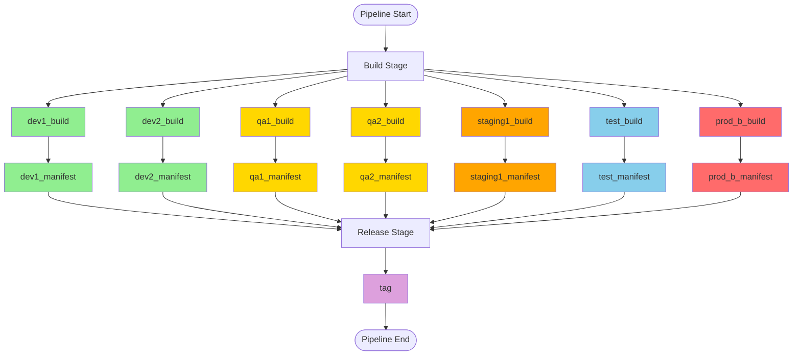
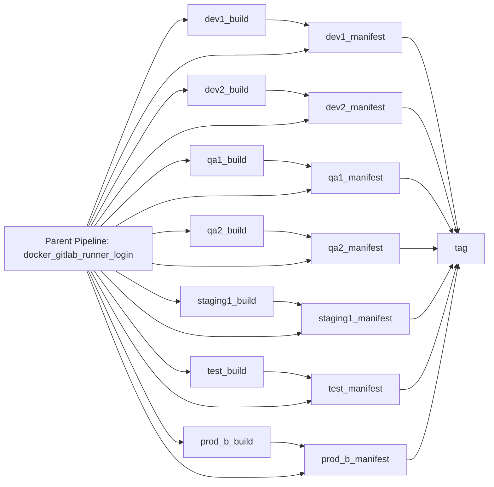
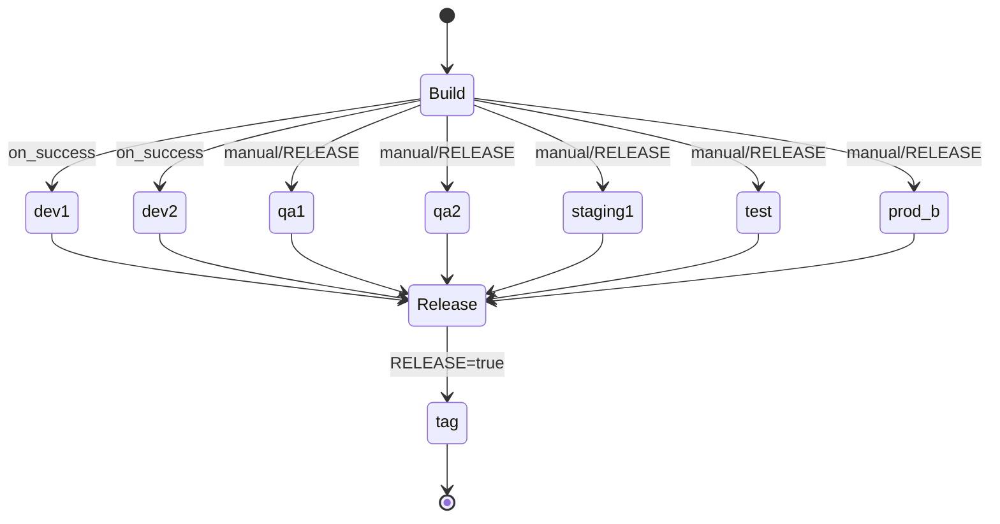
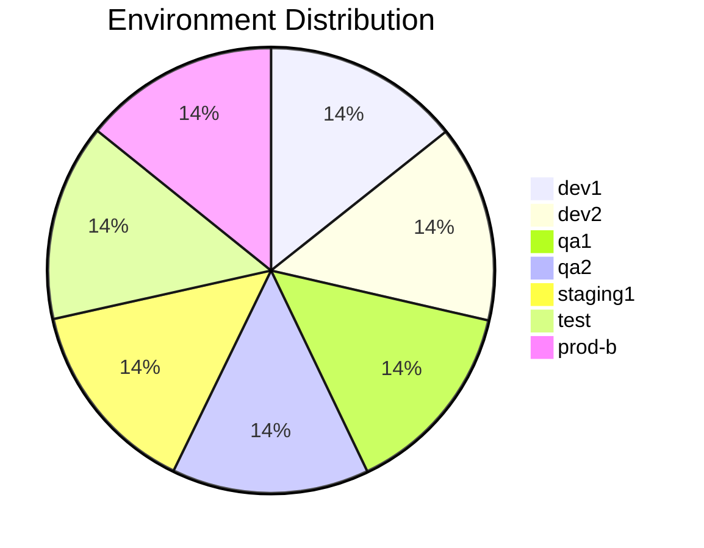

# Diagram: devops/k8s/docker/nginx/platform-ingress/.build.gitlab-ci.yml

> Auto-generated by Obscura crawlers

## Diagram 1

### SVG

<svg id="container" width="1494.328125" xmlns="http://www.w3.org/2000/svg" class="flowchart" height="664" viewBox="0 0 1494.328125 664" role="graphics-document document" aria-roledescription="flowchart-v2"><g><marker id="container_flowchart-v2-pointEnd" class="marker flowchart-v2" viewBox="0 0 10 10" refX="5" refY="5" markerUnits="userSpaceOnUse" markerWidth="8" markerHeight="8" orient="auto"><path d="M 0 0 L 10 5 L 0 10 z" class="arrowMarkerPath" style="stroke-width: 1; stroke-dasharray: 1, 0;"></path></marker><marker id="container_flowchart-v2-pointStart" class="marker flowchart-v2" viewBox="0 0 10 10" refX="4.5" refY="5" markerUnits="userSpaceOnUse" markerWidth="8" markerHeight="8" orient="auto"><path d="M 0 5 L 10 10 L 10 0 z" class="arrowMarkerPath" style="stroke-width: 1; stroke-dasharray: 1, 0;"></path></marker><marker id="container_flowchart-v2-circleEnd" class="marker flowchart-v2" viewBox="0 0 10 10" refX="11" refY="5" markerUnits="userSpaceOnUse" markerWidth="11" markerHeight="11" orient="auto"><circle cx="5" cy="5" r="5" class="arrowMarkerPath" style="stroke-width: 1; stroke-dasharray: 1, 0;"></circle></marker><marker id="container_flowchart-v2-circleStart" class="marker flowchart-v2" viewBox="0 0 10 10" refX="-1" refY="5" markerUnits="userSpaceOnUse" markerWidth="11" markerHeight="11" orient="auto"><circle cx="5" cy="5" r="5" class="arrowMarkerPath" style="stroke-width: 1; stroke-dasharray: 1, 0;"></circle></marker><marker id="container_flowchart-v2-crossEnd" class="marker cross flowchart-v2" viewBox="0 0 11 11" refX="12" refY="5.2" markerUnits="userSpaceOnUse" markerWidth="11" markerHeight="11" orient="auto"><path d="M 1,1 l 9,9 M 10,1 l -9,9" class="arrowMarkerPath" style="stroke-width: 2; stroke-dasharray: 1, 0;"></path></marker><marker id="container_flowchart-v2-crossStart" class="marker cross flowchart-v2" viewBox="0 0 11 11" refX="-1" refY="5.2" markerUnits="userSpaceOnUse" markerWidth="11" markerHeight="11" orient="auto"><path d="M 1,1 l 9,9 M 10,1 l -9,9" class="arrowMarkerPath" style="stroke-width: 2; stroke-dasharray: 1, 0;"></path></marker><g class="root"><g class="clusters"></g><g class="edgePaths"><path d="M724.18,47.5L724.096,51.583C724.013,55.667,723.846,63.833,723.763,71.417C723.68,79,723.68,86,723.68,89.5L723.68,93" id="L_Start_Build_0" class="edge-thickness-normal edge-pattern-solid edge-thickness-normal edge-pattern-solid flowchart-link" style=";" data-edge="true" data-et="edge" data-id="L_Start_Build_0" data-points="W3sieCI6NzI0LjE3OTY4NzUsInkiOjQ3LjUwMDAwMDAwMDAwMDA1fSx7IngiOjcyMy42Nzk2ODc1LCJ5Ijo3Mn0seyJ4Ijo3MjMuNjc5Njg3NSwieSI6OTd9XQ==" marker-end="url(#container_flowchart-v2-pointEnd)"></path><path d="M652.836,129.817L559.099,137.514C465.362,145.212,277.888,160.606,184.151,171.803C90.414,183,90.414,190,90.414,193.5L90.414,197" id="L_Build_dev1_build_0" class="edge-thickness-normal edge-pattern-solid edge-thickness-normal edge-pattern-solid flowchart-link" style=";" data-edge="true" data-et="edge" data-id="L_Build_dev1_build_0" data-points="W3sieCI6NjUyLjgzNTkzNzUsInkiOjEyOS44MTcyNjY2NDg1NzI2M30seyJ4Ijo5MC40MTQwNjI1LCJ5IjoxNzZ9LHsieCI6OTAuNDE0MDYyNSwieSI6MjAxfV0=" marker-end="url(#container_flowchart-v2-pointEnd)"></path><path d="M652.836,132.813L594.973,140.011C537.109,147.208,421.383,161.604,363.52,172.302C305.656,183,305.656,190,305.656,193.5L305.656,197" id="L_Build_dev2_build_0" class="edge-thickness-normal edge-pattern-solid edge-thickness-normal edge-pattern-solid flowchart-link" style=";" data-edge="true" data-et="edge" data-id="L_Build_dev2_build_0" data-points="W3sieCI6NjUyLjgzNTkzNzUsInkiOjEzMi44MTI2MDM5NTgzNjA2fSx7IngiOjMwNS42NTYyNSwieSI6MTc2fSx7IngiOjMwNS42NTYyNSwieSI6MjAxfV0=" marker-end="url(#container_flowchart-v2-pointEnd)"></path><path d="M652.836,141.788L630.128,147.49C607.419,153.192,562.003,164.596,539.294,173.798C516.586,183,516.586,190,516.586,193.5L516.586,197" id="L_Build_qa1_build_0" class="edge-thickness-normal edge-pattern-solid edge-thickness-normal edge-pattern-solid flowchart-link" style=";" data-edge="true" data-et="edge" data-id="L_Build_qa1_build_0" data-points="W3sieCI6NjUyLjgzNTkzNzUsInkiOjE0MS43ODg0NDEyMjUyOTA0OH0seyJ4Ijo1MTYuNTg1OTM3NSwieSI6MTc2fSx7IngiOjUxNi41ODU5Mzc1LCJ5IjoyMDF9XQ==" marker-end="url(#container_flowchart-v2-pointEnd)"></path><path d="M723.68,151L723.68,155.167C723.68,159.333,723.68,167.667,723.68,175.333C723.68,183,723.68,190,723.68,193.5L723.68,197" id="L_Build_qa2_build_0" class="edge-thickness-normal edge-pattern-solid edge-thickness-normal edge-pattern-solid flowchart-link" style=";" data-edge="true" data-et="edge" data-id="L_Build_qa2_build_0" data-points="W3sieCI6NzIzLjY3OTY4NzUsInkiOjE1MX0seyJ4Ijo3MjMuNjc5Njg3NSwieSI6MTc2fSx7IngiOjcyMy42Nzk2ODc1LCJ5IjoyMDF9XQ==" marker-end="url(#container_flowchart-v2-pointEnd)"></path><path d="M794.523,140.412L820.126,146.343C845.729,152.275,896.935,164.137,922.538,173.569C948.141,183,948.141,190,948.141,193.5L948.141,197" id="L_Build_staging1_build_0" class="edge-thickness-normal edge-pattern-solid edge-thickness-normal edge-pattern-solid flowchart-link" style=";" data-edge="true" data-et="edge" data-id="L_Build_staging1_build_0" data-points="W3sieCI6Nzk0LjUyMzQzNzUsInkiOjE0MC40MTIwOTg0MzAyNjY5NX0seyJ4Ijo5NDguMTQwNjI1LCJ5IjoxNzZ9LHsieCI6OTQ4LjE0MDYyNSwieSI6MjAxfV0=" marker-end="url(#container_flowchart-v2-pointEnd)"></path><path d="M794.523,132.194L857.646,139.495C920.768,146.796,1047.013,161.398,1110.135,172.199C1173.258,183,1173.258,190,1173.258,193.5L1173.258,197" id="L_Build_test_build_0" class="edge-thickness-normal edge-pattern-solid edge-thickness-normal edge-pattern-solid flowchart-link" style=";" data-edge="true" data-et="edge" data-id="L_Build_test_build_0" data-points="W3sieCI6Nzk0LjUyMzQzNzUsInkiOjEzMi4xOTQwNzA4MzAyOTIyOH0seyJ4IjoxMTczLjI1NzgxMjUsInkiOjE3Nn0seyJ4IjoxMTczLjI1NzgxMjUsInkiOjIwMX1d" marker-end="url(#container_flowchart-v2-pointEnd)"></path><path d="M794.523,129.491L894.539,137.242C994.555,144.994,1194.586,160.497,1294.602,171.748C1394.617,183,1394.617,190,1394.617,193.5L1394.617,197" id="L_Build_prod_b_build_0" class="edge-thickness-normal edge-pattern-solid edge-thickness-normal edge-pattern-solid flowchart-link" style=";" data-edge="true" data-et="edge" data-id="L_Build_prod_b_build_0" data-points="W3sieCI6Nzk0LjUyMzQzNzUsInkiOjEyOS40OTA2MzgwOTk2NzM5Nn0seyJ4IjoxMzk0LjYxNzE4NzUsInkiOjE3Nn0seyJ4IjoxMzk0LjYxNzE4NzUsInkiOjIwMX1d" marker-end="url(#container_flowchart-v2-pointEnd)"></path><path d="M90.414,255L90.414,259.167C90.414,263.333,90.414,271.667,90.414,279.333C90.414,287,90.414,294,90.414,297.5L90.414,301" id="L_dev1_build_dev1_manifest_0" class="edge-thickness-normal edge-pattern-solid edge-thickness-normal edge-pattern-solid flowchart-link" style=";" data-edge="true" data-et="edge" data-id="L_dev1_build_dev1_manifest_0" data-points="W3sieCI6OTAuNDE0MDYyNSwieSI6MjU1fSx7IngiOjkwLjQxNDA2MjUsInkiOjI4MH0seyJ4Ijo5MC40MTQwNjI1LCJ5IjozMDV9XQ==" marker-end="url(#container_flowchart-v2-pointEnd)"></path><path d="M305.656,255L305.656,259.167C305.656,263.333,305.656,271.667,305.656,279.333C305.656,287,305.656,294,305.656,297.5L305.656,301" id="L_dev2_build_dev2_manifest_0" class="edge-thickness-normal edge-pattern-solid edge-thickness-normal edge-pattern-solid flowchart-link" style=";" data-edge="true" data-et="edge" data-id="L_dev2_build_dev2_manifest_0" data-points="W3sieCI6MzA1LjY1NjI1LCJ5IjoyNTV9LHsieCI6MzA1LjY1NjI1LCJ5IjoyODB9LHsieCI6MzA1LjY1NjI1LCJ5IjozMDV9XQ==" marker-end="url(#container_flowchart-v2-pointEnd)"></path><path d="M516.586,255L516.586,259.167C516.586,263.333,516.586,271.667,516.586,279.333C516.586,287,516.586,294,516.586,297.5L516.586,301" id="L_qa1_build_qa1_manifest_0" class="edge-thickness-normal edge-pattern-solid edge-thickness-normal edge-pattern-solid flowchart-link" style=";" data-edge="true" data-et="edge" data-id="L_qa1_build_qa1_manifest_0" data-points="W3sieCI6NTE2LjU4NTkzNzUsInkiOjI1NX0seyJ4Ijo1MTYuNTg1OTM3NSwieSI6MjgwfSx7IngiOjUxNi41ODU5Mzc1LCJ5IjozMDV9XQ==" marker-end="url(#container_flowchart-v2-pointEnd)"></path><path d="M723.68,255L723.68,259.167C723.68,263.333,723.68,271.667,723.68,279.333C723.68,287,723.68,294,723.68,297.5L723.68,301" id="L_qa2_build_qa2_manifest_0" class="edge-thickness-normal edge-pattern-solid edge-thickness-normal edge-pattern-solid flowchart-link" style=";" data-edge="true" data-et="edge" data-id="L_qa2_build_qa2_manifest_0" data-points="W3sieCI6NzIzLjY3OTY4NzUsInkiOjI1NX0seyJ4Ijo3MjMuNjc5Njg3NSwieSI6MjgwfSx7IngiOjcyMy42Nzk2ODc1LCJ5IjozMDV9XQ==" marker-end="url(#container_flowchart-v2-pointEnd)"></path><path d="M948.141,255L948.141,259.167C948.141,263.333,948.141,271.667,948.141,279.333C948.141,287,948.141,294,948.141,297.5L948.141,301" id="L_staging1_build_staging1_manifest_0" class="edge-thickness-normal edge-pattern-solid edge-thickness-normal edge-pattern-solid flowchart-link" style=";" data-edge="true" data-et="edge" data-id="L_staging1_build_staging1_manifest_0" data-points="W3sieCI6OTQ4LjE0MDYyNSwieSI6MjU1fSx7IngiOjk0OC4xNDA2MjUsInkiOjI4MH0seyJ4Ijo5NDguMTQwNjI1LCJ5IjozMDV9XQ==" marker-end="url(#container_flowchart-v2-pointEnd)"></path><path d="M1173.258,255L1173.258,259.167C1173.258,263.333,1173.258,271.667,1173.258,279.333C1173.258,287,1173.258,294,1173.258,297.5L1173.258,301" id="L_test_build_test_manifest_0" class="edge-thickness-normal edge-pattern-solid edge-thickness-normal edge-pattern-solid flowchart-link" style=";" data-edge="true" data-et="edge" data-id="L_test_build_test_manifest_0" data-points="W3sieCI6MTE3My4yNTc4MTI1LCJ5IjoyNTV9LHsieCI6MTE3My4yNTc4MTI1LCJ5IjoyODB9LHsieCI6MTE3My4yNTc4MTI1LCJ5IjozMDV9XQ==" marker-end="url(#container_flowchart-v2-pointEnd)"></path><path d="M1394.617,255L1394.617,259.167C1394.617,263.333,1394.617,271.667,1394.617,279.333C1394.617,287,1394.617,294,1394.617,297.5L1394.617,301" id="L_prod_b_build_prod_b_manifest_0" class="edge-thickness-normal edge-pattern-solid edge-thickness-normal edge-pattern-solid flowchart-link" style=";" data-edge="true" data-et="edge" data-id="L_prod_b_build_prod_b_manifest_0" data-points="W3sieCI6MTM5NC42MTcxODc1LCJ5IjoyNTV9LHsieCI6MTM5NC42MTcxODc1LCJ5IjoyODB9LHsieCI6MTM5NC42MTcxODc1LCJ5IjozMDV9XQ==" marker-end="url(#container_flowchart-v2-pointEnd)"></path><path d="M90.414,359L90.414,363.167C90.414,367.333,90.414,375.667,181.958,387.35C273.502,399.034,456.59,414.068,548.134,421.585L639.677,429.102" id="L_dev1_manifest_Release_0" class="edge-thickness-normal edge-pattern-solid edge-thickness-normal edge-pattern-solid flowchart-link" style=";" data-edge="true" data-et="edge" data-id="L_dev1_manifest_Release_0" data-points="W3sieCI6OTAuNDE0MDYyNSwieSI6MzU5fSx7IngiOjkwLjQxNDA2MjUsInkiOjM4NH0seyJ4Ijo2NDMuNjY0MDYyNSwieSI6NDI5LjQyOTU5MzYyNDMxODR9XQ==" marker-end="url(#container_flowchart-v2-pointEnd)"></path><path d="M305.656,359L305.656,363.167C305.656,367.333,305.656,375.667,361.329,386.759C417.002,397.851,528.349,411.702,584.022,418.627L639.695,425.553" id="L_dev2_manifest_Release_0" class="edge-thickness-normal edge-pattern-solid edge-thickness-normal edge-pattern-solid flowchart-link" style=";" data-edge="true" data-et="edge" data-id="L_dev2_manifest_Release_0" data-points="W3sieCI6MzA1LjY1NjI1LCJ5IjozNTl9LHsieCI6MzA1LjY1NjI1LCJ5IjozODR9LHsieCI6NjQzLjY2NDA2MjUsInkiOjQyNi4wNDY0NjEyMTA2ODI3fV0=" marker-end="url(#container_flowchart-v2-pointEnd)"></path><path d="M516.586,359L516.586,363.167C516.586,367.333,516.586,375.667,537.119,384.989C557.652,394.311,598.718,404.623,619.251,409.779L639.784,414.934" id="L_qa1_manifest_Release_0" class="edge-thickness-normal edge-pattern-solid edge-thickness-normal edge-pattern-solid flowchart-link" style=";" data-edge="true" data-et="edge" data-id="L_qa1_manifest_Release_0" data-points="W3sieCI6NTE2LjU4NTkzNzUsInkiOjM1OX0seyJ4Ijo1MTYuNTg1OTM3NSwieSI6Mzg0fSx7IngiOjY0My42NjQwNjI1LCJ5Ijo0MTUuOTA4NTU1OTA3NjUwNX1d" marker-end="url(#container_flowchart-v2-pointEnd)"></path><path d="M723.68,359L723.68,363.167C723.68,367.333,723.68,375.667,723.68,383.333C723.68,391,723.68,398,723.68,401.5L723.68,405" id="L_qa2_manifest_Release_0" class="edge-thickness-normal edge-pattern-solid edge-thickness-normal edge-pattern-solid flowchart-link" style=";" data-edge="true" data-et="edge" data-id="L_qa2_manifest_Release_0" data-points="W3sieCI6NzIzLjY3OTY4NzUsInkiOjM1OX0seyJ4Ijo3MjMuNjc5Njg3NSwieSI6Mzg0fSx7IngiOjcyMy42Nzk2ODc1LCJ5Ijo0MDl9XQ==" marker-end="url(#container_flowchart-v2-pointEnd)"></path><path d="M948.141,359L948.141,363.167C948.141,367.333,948.141,375.667,924.716,385.26C901.291,394.853,854.442,405.707,831.017,411.134L807.592,416.56" id="L_staging1_manifest_Release_0" class="edge-thickness-normal edge-pattern-solid edge-thickness-normal edge-pattern-solid flowchart-link" style=";" data-edge="true" data-et="edge" data-id="L_staging1_manifest_Release_0" data-points="W3sieCI6OTQ4LjE0MDYyNSwieSI6MzU5fSx7IngiOjk0OC4xNDA2MjUsInkiOjM4NH0seyJ4Ijo4MDMuNjk1MzEyNSwieSI6NDE3LjQ2MzA4ODY0OTg5MDR9XQ==" marker-end="url(#container_flowchart-v2-pointEnd)"></path><path d="M1173.258,359L1173.258,363.167C1173.258,367.333,1173.258,375.667,1112.326,386.881C1051.395,398.095,929.532,412.19,868.6,419.238L807.669,426.285" id="L_test_manifest_Release_0" class="edge-thickness-normal edge-pattern-solid edge-thickness-normal edge-pattern-solid flowchart-link" style=";" data-edge="true" data-et="edge" data-id="L_test_manifest_Release_0" data-points="W3sieCI6MTE3My4yNTc4MTI1LCJ5IjozNTl9LHsieCI6MTE3My4yNTc4MTI1LCJ5IjozODR9LHsieCI6ODAzLjY5NTMxMjUsInkiOjQyNi43NDUwNzM1MDY0MTIyN31d" marker-end="url(#container_flowchart-v2-pointEnd)"></path><path d="M1394.617,359L1394.617,363.167C1394.617,367.333,1394.617,375.667,1296.795,387.415C1198.973,399.163,1003.328,414.326,905.506,421.908L807.683,429.489" id="L_prod_b_manifest_Release_0" class="edge-thickness-normal edge-pattern-solid edge-thickness-normal edge-pattern-solid flowchart-link" style=";" data-edge="true" data-et="edge" data-id="L_prod_b_manifest_Release_0" data-points="W3sieCI6MTM5NC42MTcxODc1LCJ5IjozNTl9LHsieCI6MTM5NC42MTcxODc1LCJ5IjozODR9LHsieCI6ODAzLjY5NTMxMjUsInkiOjQyOS43OTg1MDk1NDgyMDY4fV0=" marker-end="url(#container_flowchart-v2-pointEnd)"></path><path d="M723.68,463L723.68,467.167C723.68,471.333,723.68,479.667,723.68,487.333C723.68,495,723.68,502,723.68,505.5L723.68,509" id="L_Release_tag_0" class="edge-thickness-normal edge-pattern-solid edge-thickness-normal edge-pattern-solid flowchart-link" style=";" data-edge="true" data-et="edge" data-id="L_Release_tag_0" data-points="W3sieCI6NzIzLjY3OTY4NzUsInkiOjQ2M30seyJ4Ijo3MjMuNjc5Njg3NSwieSI6NDg4fSx7IngiOjcyMy42Nzk2ODc1LCJ5Ijo1MTN9XQ==" marker-end="url(#container_flowchart-v2-pointEnd)"></path><path d="M723.68,567L723.68,571.167C723.68,575.333,723.68,583.667,723.75,591.417C723.82,599.167,723.961,606.334,724.031,609.917L724.101,613.501" id="L_tag_End_0" class="edge-thickness-normal edge-pattern-solid edge-thickness-normal edge-pattern-solid flowchart-link" style=";" data-edge="true" data-et="edge" data-id="L_tag_End_0" data-points="W3sieCI6NzIzLjY3OTY4NzUsInkiOjU2N30seyJ4Ijo3MjMuNjc5Njg3NSwieSI6NTkyfSx7IngiOjcyNC4xNzk2ODc1LCJ5Ijo2MTcuNX1d" marker-end="url(#container_flowchart-v2-pointEnd)"></path></g><g class="edgeLabels"><g class="edgeLabel"><g class="label" data-id="L_Start_Build_0" transform="translate(0, 0)"><foreignObject width="0" height="0">

</foreignObject></g></g><g class="edgeLabel"><g class="label" data-id="L_Build_dev1_build_0" transform="translate(0, 0)"><foreignObject width="0" height="0">

</foreignObject></g></g><g class="edgeLabel"><g class="label" data-id="L_Build_dev2_build_0" transform="translate(0, 0)"><foreignObject width="0" height="0">

</foreignObject></g></g><g class="edgeLabel"><g class="label" data-id="L_Build_qa1_build_0" transform="translate(0, 0)"><foreignObject width="0" height="0">

</foreignObject></g></g><g class="edgeLabel"><g class="label" data-id="L_Build_qa2_build_0" transform="translate(0, 0)"><foreignObject width="0" height="0">

</foreignObject></g></g><g class="edgeLabel"><g class="label" data-id="L_Build_staging1_build_0" transform="translate(0, 0)"><foreignObject width="0" height="0">

</foreignObject></g></g><g class="edgeLabel"><g class="label" data-id="L_Build_test_build_0" transform="translate(0, 0)"><foreignObject width="0" height="0">

</foreignObject></g></g><g class="edgeLabel"><g class="label" data-id="L_Build_prod_b_build_0" transform="translate(0, 0)"><foreignObject width="0" height="0">

</foreignObject></g></g><g class="edgeLabel"><g class="label" data-id="L_dev1_build_dev1_manifest_0" transform="translate(0, 0)"><foreignObject width="0" height="0">

</foreignObject></g></g><g class="edgeLabel"><g class="label" data-id="L_dev2_build_dev2_manifest_0" transform="translate(0, 0)"><foreignObject width="0" height="0">

</foreignObject></g></g><g class="edgeLabel"><g class="label" data-id="L_qa1_build_qa1_manifest_0" transform="translate(0, 0)"><foreignObject width="0" height="0">

</foreignObject></g></g><g class="edgeLabel"><g class="label" data-id="L_qa2_build_qa2_manifest_0" transform="translate(0, 0)"><foreignObject width="0" height="0">

</foreignObject></g></g><g class="edgeLabel"><g class="label" data-id="L_staging1_build_staging1_manifest_0" transform="translate(0, 0)"><foreignObject width="0" height="0">

</foreignObject></g></g><g class="edgeLabel"><g class="label" data-id="L_test_build_test_manifest_0" transform="translate(0, 0)"><foreignObject width="0" height="0">

</foreignObject></g></g><g class="edgeLabel"><g class="label" data-id="L_prod_b_build_prod_b_manifest_0" transform="translate(0, 0)"><foreignObject width="0" height="0">

</foreignObject></g></g><g class="edgeLabel"><g class="label" data-id="L_dev1_manifest_Release_0" transform="translate(0, 0)"><foreignObject width="0" height="0">

</foreignObject></g></g><g class="edgeLabel"><g class="label" data-id="L_dev2_manifest_Release_0" transform="translate(0, 0)"><foreignObject width="0" height="0">

</foreignObject></g></g><g class="edgeLabel"><g class="label" data-id="L_qa1_manifest_Release_0" transform="translate(0, 0)"><foreignObject width="0" height="0">

</foreignObject></g></g><g class="edgeLabel"><g class="label" data-id="L_qa2_manifest_Release_0" transform="translate(0, 0)"><foreignObject width="0" height="0">

</foreignObject></g></g><g class="edgeLabel"><g class="label" data-id="L_staging1_manifest_Release_0" transform="translate(0, 0)"><foreignObject width="0" height="0">

</foreignObject></g></g><g class="edgeLabel"><g class="label" data-id="L_test_manifest_Release_0" transform="translate(0, 0)"><foreignObject width="0" height="0">

</foreignObject></g></g><g class="edgeLabel"><g class="label" data-id="L_prod_b_manifest_Release_0" transform="translate(0, 0)"><foreignObject width="0" height="0">

</foreignObject></g></g><g class="edgeLabel"><g class="label" data-id="L_Release_tag_0" transform="translate(0, 0)"><foreignObject width="0" height="0">

</foreignObject></g></g><g class="edgeLabel"><g class="label" data-id="L_tag_End_0" transform="translate(0, 0)"><foreignObject width="0" height="0">

</foreignObject></g></g></g><g class="nodes"><g class="node default" id="flowchart-Start-0" transform="translate(723.6796875, 27.5)"><g class="basic label-container outer-path"><path d="M-42.1796875 -19.5 C-21.370922211942606 -19.5, -0.5621569238852118 -19.5, 42.1796875 -19.5 C42.1796875 -19.5, 42.1796875 -19.5, 42.1796875 -19.5 C42.511519237242126 -19.48935880205794, 42.843350974484245 -19.47871760411588, 43.4290567896239 -19.45993515863156 C43.68622373886606 -19.435126572326674, 43.94339068810823 -19.410317986021788, 44.673292152847864 -19.3399052695533 C45.157438196325096 -19.261632291852543, 45.64158423980233 -19.183359314151787, 45.90728075967676 -19.140403561325776 C46.30780427274891 -19.04898668312724, 46.70832778582106 -18.957569804928703, 47.12595188623539 -18.862249829261074 C47.449841073567164 -18.76612121859004, 47.773730260898944 -18.66999260791901, 48.324297751460605 -18.50658706670804 C48.565540698494594 -18.417807432174175, 48.80678364552858 -18.32902779764031, 49.4973940951478 -18.074876768247425 C49.79698184250929 -17.942258159445263, 50.096569589870775 -17.809639550643105, 50.64042041279238 -17.568892924097174 C50.86704070948325 -17.450665260470775, 51.09366100617412 -17.332437596844375, 51.74867976407678 -16.990714730406097 C52.06565171027705 -16.798564473885577, 52.38262365647733 -16.606414217365057, 52.8176180736057 -16.342718045390892 C53.06382016885494 -16.17097812166195, 53.310022264104184 -15.999238197933009, 53.84284284457871 -15.627565626425154 C54.18147657376986 -15.357514238817204, 54.520110302961 -15.087462851209256, 54.820141208501866 -14.848196188198123 C55.110148741648985 -14.58481901977276, 55.40015627479611 -14.321441851347398, 55.74549723676799 -14.007812326905688 C55.994498754538846 -13.750697816402473, 56.2435002723097 -13.493583305899257, 56.61510844296865 -13.10986736009568 C56.927438495113556 -12.742986708762846, 57.239768547258464 -12.376106057430011, 57.42540140812658 -12.158051136245305 C57.597181054076934 -11.927882060119517, 57.768960700027286 -11.697712983993728, 58.173046464640635 -11.156274872382312 C58.39641322941863 -10.813123539308647, 58.61977999419663 -10.469972206234981, 58.85497137860425 -10.108655082055241 C59.088532907087775 -9.693942937563397, 59.322094435571294 -9.279230793071553, 59.468373974273504 -9.019496659696287 C59.64639001246775 -8.6498425474529, 59.82440605066199 -8.280188435209512, 60.01073364880834 -7.893275190886684 C60.18021116127725 -7.474662458463682, 60.34968867374616 -7.056049726040678, 60.479821729970325 -6.734618561215508 C60.5806694723603 -6.430881229042595, 60.68151721475027 -6.127143896869683, 60.87371063421488 -5.548287939305138 C60.94745862178676 -5.267054900113568, 61.021206609358636 -4.985821860921996, 61.19078178754556 -4.339158212148133 C61.27635775028118 -3.899743729986844, 61.3619337130168 -3.460329247825554, 61.429732276581774 -3.1121979531509023 C61.48775301353748 -2.662200574812929, 61.545773750493176 -2.2122031964749564, 61.58958020250937 -1.872449005199798 C61.616392944543115 -1.4548189051683518, 61.64320568657686 -1.0371888051369058, 61.66966871591342 -0.6250057626472757 C61.66966871591342 -0.34486429803792684, 61.66966871591342 -0.06472283342857799, 61.66966871591342 0.625005762647271 C61.64727623325726 0.9737867549036255, 61.6248837506011 1.32256774715998, 61.58958020250937 1.8724490051997846 C61.557390472946295 2.1221061911098853, 61.52520074338322 2.371763377019986, 61.429732276581774 3.1121979531508885 C61.36818607378124 3.4282246967370695, 61.3066398709807 3.7442514403232505, 61.19078178754556 4.339158212148129 C61.115995390716 4.624351155888652, 61.04120899388644 4.9095440996291755, 60.87371063421489 5.548287939305125 C60.77837708621048 5.8354173965562675, 60.68304353820608 6.122546853807409, 60.479821729970325 6.734618561215495 C60.34165982967725 7.075881126118016, 60.20349792938418 7.417143691020538, 60.01073364880834 7.893275190886679 C59.83620327523092 8.255691245971958, 59.6616729016535 8.618107301057236, 59.468373974273504 9.019496659696284 C59.252139382958106 9.403443072703471, 59.035904791642714 9.787389485710657, 58.85497137860425 10.108655082055236 C58.68764015674533 10.365720773555056, 58.520308934886415 10.622786465054874, 58.17304646464064 11.156274872382301 C57.89000678811736 11.53552225347851, 57.60696711159408 11.914769634574718, 57.42540140812658 12.158051136245302 C57.20572460919871 12.416096004229944, 56.98604781027085 12.674140872214586, 56.61510844296866 13.10986736009567 C56.37966057487192 13.352986614535023, 56.144212706775185 13.596105868974377, 55.74549723676799 14.007812326905684 C55.499438661831185 14.231276214310151, 55.25338008689439 14.454740101714616, 54.82014120850189 14.848196188198111 C54.622764277690976 15.0055990380991, 54.42538734688006 15.163001888000085, 53.84284284457871 15.627565626425152 C53.47564851488498 15.883704495233161, 53.10845418519124 16.13984336404117, 52.81761807360571 16.34271804539089 C52.59316346780165 16.47878374647098, 52.3687088619976 16.614849447551077, 51.74867976407678 16.990714730406093 C51.353986440694975 17.196625984401248, 50.95929311731316 17.4025372383964, 50.64042041279239 17.56889292409717 C50.24780580322545 17.742691765253863, 49.855191193658506 17.91649060641056, 49.497394095147804 18.07487676824742 C49.1847054085073 18.18994909539366, 48.87201672186679 18.305021422539898, 48.32429775146062 18.506587066708033 C47.883180213081836 18.637508436625648, 47.44206267470306 18.76842980654326, 47.12595188623541 18.86224982926107 C46.70658994699431 18.95796645530045, 46.28722800775321 19.05368308133983, 45.907280759676766 19.140403561325773 C45.50367562091271 19.205655310156548, 45.100070482148645 19.270907058987323, 44.67329215284788 19.3399052695533 C44.280573838090355 19.377790333065082, 43.88785552333283 19.415675396576866, 43.4290567896239 19.45993515863156 C42.95757705752311 19.475054595960405, 42.48609732542232 19.49017403328925, 42.17968750000001 19.5 C42.17968750000001 19.5, 42.1796875 19.5, 42.1796875 19.5 C18.124663721724538 19.5, -5.930360056550924 19.5, -42.17968749999999 19.5 C-42.523835274635346 19.48896385071045, -42.86798304927069 19.477927701420903, -43.42905678962389 19.45993515863156 C-43.896108772476644 19.414879215557946, -44.3631607553294 19.36982327248433, -44.67329215284787 19.3399052695533 C-45.08226307710251 19.273786022136694, -45.49123400135716 19.20766677472009, -45.90728075967676 19.140403561325773 C-46.288398271482315 19.053415976280345, -46.66951578328787 18.966428391234913, -47.125951886235384 18.862249829261074 C-47.36903758935615 18.790103268557726, -47.6121232924769 18.71795670785438, -48.32429775146059 18.506587066708043 C-48.56426801861209 18.418275790135457, -48.804238285763596 18.329964513562874, -49.4973940951478 18.074876768247425 C-49.851824091969824 17.917981122446612, -50.20625408879186 17.7610854766458, -50.64042041279238 17.568892924097174 C-50.927742917927624 17.418996957206968, -51.21506542306287 17.26910099031676, -51.74867976407678 16.990714730406097 C-52.06359687774295 16.799810125443283, -52.37851399140913 16.60890552048047, -52.817618073605686 16.3427180453909 C-53.19002493768615 16.08294313824169, -53.56243180176661 15.82316823109248, -53.84284284457871 15.627565626425156 C-54.21231989802295 15.332917508500696, -54.58179695146718 15.038269390576234, -54.820141208501866 14.848196188198125 C-55.11872300548362 14.577032100220732, -55.41730480246538 14.30586801224334, -55.745497236767974 14.007812326905697 C-55.95866220349432 13.787701997591501, -56.171827170220666 13.567591668277306, -56.615108442968655 13.109867360095677 C-56.841565574517915 12.84385792760209, -57.068022706067175 12.577848495108501, -57.425401408126575 12.158051136245307 C-57.68136551441924 11.815082552622929, -57.937329620711914 11.472113969000551, -58.173046464640635 11.156274872382316 C-58.33974806344198 10.900176450976392, -58.50644966224332 10.64407802957047, -58.85497137860425 10.108655082055249 C-59.093018787482066 9.68597780267869, -59.331066196359885 9.263300523302128, -59.468373974273504 9.019496659696289 C-59.603433078232584 8.739043540523369, -59.73849218219166 8.458590421350447, -60.01073364880834 7.893275190886686 C-60.15154944000314 7.545457464147417, -60.29236523119794 7.1976397374081476, -60.479821729970325 6.73461856121551 C-60.60272280203539 6.364460113782138, -60.72562387410045 5.994301666348766, -60.87371063421488 5.5482879393051325 C-60.99732547433211 5.076890978927548, -61.120940314449335 4.605494018549963, -61.19078178754556 4.339158212148136 C-61.27945808025258 3.8838241908386752, -61.3681343729596 3.428490169529215, -61.429732276581774 3.112197953150904 C-61.48606339342064 2.6753049347858795, -61.542394510259506 2.2384119164208545, -61.58958020250937 1.872449005199809 C-61.62094925560493 1.3838506825925094, -61.652318308700494 0.8952523599852096, -61.66966871591342 0.6250057626472781 C-61.66966871591342 0.361058675236073, -61.66966871591342 0.09711158782486784, -61.66966871591342 -0.6250057626472687 C-61.649817578559635 -0.9342032504821266, -61.629966441205845 -1.2434007383169845, -61.58958020250937 -1.8724490051997822 C-61.54787441283319 -2.1959108741885376, -61.50616862315701 -2.5193727431772928, -61.429732276581774 -3.112197953150895 C-61.360399879791935 -3.468205157259461, -61.2910674830021 -3.824212361368027, -61.19078178754556 -4.339158212148126 C-61.11328308464069 -4.6346943544747115, -61.035784381735816 -4.930230496801296, -60.87371063421489 -5.548287939305123 C-60.785832276822426 -5.812963550256403, -60.69795391942997 -6.077639161207683, -60.47982172997033 -6.734618561215485 C-60.347828048997386 -7.06064550514288, -60.21583436802444 -7.386672449070273, -60.01073364880834 -7.893275190886676 C-59.85328082773991 -8.220229342785961, -59.69582800667147 -8.547183494685246, -59.468373974273504 -9.019496659696282 C-59.26897058427348 -9.373557570424085, -59.06956719427345 -9.727618481151886, -58.85497137860425 -10.108655082055243 C-58.59725169243823 -10.504581727431935, -58.339532006272215 -10.900508372808625, -58.17304646464064 -11.156274872382308 C-57.97686010371163 -11.419146723082019, -57.780673742782625 -11.68201857378173, -57.42540140812659 -12.158051136245302 C-57.196107698888035 -12.42739257429857, -56.96681398964949 -12.69673401235184, -56.61510844296866 -13.10986736009567 C-56.40677823540543 -13.324985403632843, -56.1984480278422 -13.540103447170017, -55.745497236767996 -14.007812326905677 C-55.542030588704755 -14.192595353244204, -55.33856394064152 -14.377378379582733, -54.82014120850189 -14.848196188198107 C-54.59160945487106 -15.030444180233319, -54.36307770124024 -15.21269217226853, -53.84284284457872 -15.627565626425149 C-53.46090949488637 -15.8939857975423, -53.07897614519403 -16.16040596865945, -52.817618073605715 -16.342718045390885 C-52.57395740881168 -16.490426572298034, -52.33029674401765 -16.63813509920518, -51.74867976407679 -16.99071473040609 C-51.4702264404708 -17.13598365097347, -51.19177311686481 -17.28125257154085, -50.64042041279239 -17.56889292409717 C-50.4052579324953 -17.672992378277563, -50.17009545219822 -17.77709183245796, -49.497394095147804 -18.07487676824742 C-49.08364656251767 -18.227139684895576, -48.66989902988754 -18.37940260154373, -48.32429775146062 -18.506587066708033 C-48.06156769107328 -18.584563969532766, -47.79883763068594 -18.6625408723575, -47.12595188623541 -18.862249829261067 C-46.782496208400715 -18.940641346469082, -46.439040530566025 -19.019032863677097, -45.907280759676766 -19.140403561325773 C-45.49573607126189 -19.206938914971964, -45.08419138284702 -19.27347426861816, -44.67329215284788 -19.3399052695533 C-44.40648779170229 -19.365643565393825, -44.1396834305567 -19.391381861234347, -43.4290567896239 -19.45993515863156 C-43.03928881597387 -19.47243425890918, -42.64952084232384 -19.484933359186797, -42.17968750000001 -19.5 C-42.17968750000001 -19.5, -42.1796875 -19.5, -42.1796875 -19.5" stroke="none" stroke-width="0" fill="#ECECFF" style=""></path><path d="M-42.1796875 -19.5 C-17.647892519444977 -19.5, 6.883902461110047 -19.5, 42.1796875 -19.5 M-42.1796875 -19.5 C-22.373499308124956 -19.5, -2.567311116249911 -19.5, 42.1796875 -19.5 M42.1796875 -19.5 C42.1796875 -19.5, 42.1796875 -19.5, 42.1796875 -19.5 M42.1796875 -19.5 C42.1796875 -19.5, 42.1796875 -19.5, 42.1796875 -19.5 M42.1796875 -19.5 C42.594818830488165 -19.486687546235363, 43.009950160976324 -19.47337509247072, 43.4290567896239 -19.45993515863156 M42.1796875 -19.5 C42.646581668609265 -19.48502761276707, 43.11347583721852 -19.47005522553414, 43.4290567896239 -19.45993515863156 M43.4290567896239 -19.45993515863156 C43.80048444712998 -19.424103979219062, 44.171912104636064 -19.38827279980656, 44.673292152847864 -19.3399052695533 M43.4290567896239 -19.45993515863156 C43.922049921758756 -19.412376704085496, 44.41504305389361 -19.364818249539432, 44.673292152847864 -19.3399052695533 M44.673292152847864 -19.3399052695533 C45.0516605856707 -19.278733595625525, 45.43002901849354 -19.217561921697747, 45.90728075967676 -19.140403561325776 M44.673292152847864 -19.3399052695533 C45.11185511944315 -19.269001810220775, 45.55041808603844 -19.19809835088825, 45.90728075967676 -19.140403561325776 M45.90728075967676 -19.140403561325776 C46.327296876585045 -19.04453762350277, 46.74731299349334 -18.94867168567976, 47.12595188623539 -18.862249829261074 M45.90728075967676 -19.140403561325776 C46.27744958015639 -19.0559149436286, 46.64761840063602 -18.971426325931425, 47.12595188623539 -18.862249829261074 M47.12595188623539 -18.862249829261074 C47.4603694258052 -18.762996458910244, 47.794786965374996 -18.663743088559414, 48.324297751460605 -18.50658706670804 M47.12595188623539 -18.862249829261074 C47.43090207697984 -18.771742213364337, 47.73585226772428 -18.681234597467604, 48.324297751460605 -18.50658706670804 M48.324297751460605 -18.50658706670804 C48.633521827834244 -18.392789748166514, 48.94274590420788 -18.27899242962499, 49.4973940951478 -18.074876768247425 M48.324297751460605 -18.50658706670804 C48.63986118625993 -18.390456805665476, 48.95542462105925 -18.27432654462291, 49.4973940951478 -18.074876768247425 M49.4973940951478 -18.074876768247425 C49.862697361581525 -17.913167848533597, 50.228000628015245 -17.751458928819773, 50.64042041279238 -17.568892924097174 M49.4973940951478 -18.074876768247425 C49.87659431575721 -17.90701607915852, 50.25579453636662 -17.739155390069616, 50.64042041279238 -17.568892924097174 M50.64042041279238 -17.568892924097174 C51.03133166170756 -17.36495477592873, 51.42224291062274 -17.161016627760283, 51.74867976407678 -16.990714730406097 M50.64042041279238 -17.568892924097174 C50.94277566573623 -17.411154382304154, 51.24513091868007 -17.25341584051113, 51.74867976407678 -16.990714730406097 M51.74867976407678 -16.990714730406097 C51.99314353773063 -16.842519354188536, 52.23760731138448 -16.694323977970974, 52.8176180736057 -16.342718045390892 M51.74867976407678 -16.990714730406097 C52.02268411439875 -16.824611683012627, 52.29668846472071 -16.658508635619157, 52.8176180736057 -16.342718045390892 M52.8176180736057 -16.342718045390892 C53.22165917266054 -16.060876465347516, 53.62570027171538 -15.779034885304137, 53.84284284457871 -15.627565626425154 M52.8176180736057 -16.342718045390892 C53.181621238475756 -16.088805195020583, 53.54562440334582 -15.834892344650271, 53.84284284457871 -15.627565626425154 M53.84284284457871 -15.627565626425154 C54.165095481091726 -15.370577724308832, 54.48734811760473 -15.113589822192512, 54.820141208501866 -14.848196188198123 M53.84284284457871 -15.627565626425154 C54.23101843012566 -15.318005926737618, 54.619194015672605 -15.008446227050083, 54.820141208501866 -14.848196188198123 M54.820141208501866 -14.848196188198123 C55.10692275582815 -14.587748774740337, 55.393704303154436 -14.327301361282549, 55.74549723676799 -14.007812326905688 M54.820141208501866 -14.848196188198123 C55.17060126475117 -14.52991763777747, 55.52106132100048 -14.211639087356813, 55.74549723676799 -14.007812326905688 M55.74549723676799 -14.007812326905688 C55.994260623083996 -13.750943706680557, 56.24302400940001 -13.494075086455426, 56.61510844296865 -13.10986736009568 M55.74549723676799 -14.007812326905688 C55.99566421188578 -13.749494386005933, 56.245831187003574 -13.491176445106177, 56.61510844296865 -13.10986736009568 M56.61510844296865 -13.10986736009568 C56.920043347486136 -12.751673469961833, 57.22497825200362 -12.393479579827988, 57.42540140812658 -12.158051136245305 M56.61510844296865 -13.10986736009568 C56.9174332987005 -12.754739381781427, 57.21975815443235 -12.399611403467173, 57.42540140812658 -12.158051136245305 M57.42540140812658 -12.158051136245305 C57.59180736932385 -11.935082308135897, 57.75821333052112 -11.712113480026488, 58.173046464640635 -11.156274872382312 M57.42540140812658 -12.158051136245305 C57.66053278551169 -11.842996511458404, 57.89566416289681 -11.5279418866715, 58.173046464640635 -11.156274872382312 M58.173046464640635 -11.156274872382312 C58.36087985585946 -10.86771234314235, 58.548713247078275 -10.579149813902388, 58.85497137860425 -10.108655082055241 M58.173046464640635 -11.156274872382312 C58.340425754320705 -10.899135335801178, 58.50780504400078 -10.641995799220044, 58.85497137860425 -10.108655082055241 M58.85497137860425 -10.108655082055241 C59.068384792075335 -9.729717955985858, 59.28179820554642 -9.350780829916474, 59.468373974273504 -9.019496659696287 M58.85497137860425 -10.108655082055241 C58.99933432569609 -9.852324051160132, 59.143697272787925 -9.595993020265022, 59.468373974273504 -9.019496659696287 M59.468373974273504 -9.019496659696287 C59.64916713675845 -8.644075789442319, 59.829960299243396 -8.268654919188348, 60.01073364880834 -7.893275190886684 M59.468373974273504 -9.019496659696287 C59.61522293638742 -8.714561647802308, 59.762071898501326 -8.409626635908328, 60.01073364880834 -7.893275190886684 M60.01073364880834 -7.893275190886684 C60.15895572229387 -7.5271638036986, 60.30717779577939 -7.161052416510516, 60.479821729970325 -6.734618561215508 M60.01073364880834 -7.893275190886684 C60.108367649635944 -7.6521173212175055, 60.206001650463556 -7.410959451548328, 60.479821729970325 -6.734618561215508 M60.479821729970325 -6.734618561215508 C60.584478405766205 -6.419409328495129, 60.689135081562085 -6.104200095774749, 60.87371063421488 -5.548287939305138 M60.479821729970325 -6.734618561215508 C60.60369939649232 -6.3615187668770625, 60.72757706301431 -5.988418972538616, 60.87371063421488 -5.548287939305138 M60.87371063421488 -5.548287939305138 C60.96161098960752 -5.213085787937988, 61.04951134500016 -4.877883636570839, 61.19078178754556 -4.339158212148133 M60.87371063421488 -5.548287939305138 C60.96770874693762 -5.189832396453578, 61.06170685966036 -4.831376853602018, 61.19078178754556 -4.339158212148133 M61.19078178754556 -4.339158212148133 C61.25392397649546 -4.0149364169967825, 61.31706616544535 -3.6907146218454314, 61.429732276581774 -3.1121979531509023 M61.19078178754556 -4.339158212148133 C61.26110642253662 -3.9780560745858917, 61.33143105752769 -3.61695393702365, 61.429732276581774 -3.1121979531509023 M61.429732276581774 -3.1121979531509023 C61.477949908348194 -2.7382315228189333, 61.52616754011461 -2.3642650924869644, 61.58958020250937 -1.872449005199798 M61.429732276581774 -3.1121979531509023 C61.481290828514645 -2.71232000574724, 61.532849380447516 -2.312442058343578, 61.58958020250937 -1.872449005199798 M61.58958020250937 -1.872449005199798 C61.618647808095574 -1.4196975852457676, 61.64771541368177 -0.9669461652917373, 61.66966871591342 -0.6250057626472757 M61.58958020250937 -1.872449005199798 C61.62159945658909 -1.3737232774314085, 61.653618710668816 -0.8749975496630192, 61.66966871591342 -0.6250057626472757 M61.66966871591342 -0.6250057626472757 C61.66966871591342 -0.3425507473644789, 61.66966871591342 -0.06009573208168206, 61.66966871591342 0.625005762647271 M61.66966871591342 -0.6250057626472757 C61.66966871591342 -0.32934048195731647, 61.66966871591342 -0.033675201267357235, 61.66966871591342 0.625005762647271 M61.66966871591342 0.625005762647271 C61.645019908856526 1.0089308287173129, 61.620371101799634 1.3928558947873548, 61.58958020250937 1.8724490051997846 M61.66966871591342 0.625005762647271 C61.65181115223133 0.9031517313617011, 61.63395358854925 1.181297700076131, 61.58958020250937 1.8724490051997846 M61.58958020250937 1.8724490051997846 C61.55597251225742 2.1331036142048014, 61.52236482200547 2.3937582232098182, 61.429732276581774 3.1121979531508885 M61.58958020250937 1.8724490051997846 C61.54119387637023 2.247723795774093, 61.49280755023109 2.622998586348401, 61.429732276581774 3.1121979531508885 M61.429732276581774 3.1121979531508885 C61.38067264161468 3.3641088099493897, 61.331613006647586 3.616019666747891, 61.19078178754556 4.339158212148129 M61.429732276581774 3.1121979531508885 C61.377167770111214 3.382105584364839, 61.324603263640654 3.6520132155787897, 61.19078178754556 4.339158212148129 M61.19078178754556 4.339158212148129 C61.07685892489294 4.773595461923582, 60.96293606224032 5.208032711699035, 60.87371063421489 5.548287939305125 M61.19078178754556 4.339158212148129 C61.111141947118206 4.642859439822823, 61.031502106690844 4.946560667497518, 60.87371063421489 5.548287939305125 M60.87371063421489 5.548287939305125 C60.762539279302125 5.883118347552385, 60.65136792438937 6.217948755799645, 60.479821729970325 6.734618561215495 M60.87371063421489 5.548287939305125 C60.75594929079557 5.90296634296206, 60.63818794737625 6.257644746618993, 60.479821729970325 6.734618561215495 M60.479821729970325 6.734618561215495 C60.321482106446844 7.1257204926068525, 60.16314248292337 7.51682242399821, 60.01073364880834 7.893275190886679 M60.479821729970325 6.734618561215495 C60.35041278908984 7.054261147141961, 60.22100384820936 7.373903733068428, 60.01073364880834 7.893275190886679 M60.01073364880834 7.893275190886679 C59.87249284986943 8.180335167762587, 59.734252050930515 8.467395144638495, 59.468373974273504 9.019496659696284 M60.01073364880834 7.893275190886679 C59.839205267547996 8.2494575446932, 59.66767688628766 8.605639898499723, 59.468373974273504 9.019496659696284 M59.468373974273504 9.019496659696284 C59.24023719456984 9.424576613414098, 59.01210041486618 9.829656567131913, 58.85497137860425 10.108655082055236 M59.468373974273504 9.019496659696284 C59.31918890444508 9.28438985780308, 59.17000383461665 9.549283055909877, 58.85497137860425 10.108655082055236 M58.85497137860425 10.108655082055236 C58.61905459750707 10.471086610346417, 58.38313781640989 10.833518138637595, 58.17304646464064 11.156274872382301 M58.85497137860425 10.108655082055236 C58.61136140988019 10.48290541245144, 58.36775144115613 10.857155742847645, 58.17304646464064 11.156274872382301 M58.17304646464064 11.156274872382301 C57.9919463908221 11.398932472743013, 57.810846317003566 11.641590073103725, 57.42540140812658 12.158051136245302 M58.17304646464064 11.156274872382301 C57.92406651227125 11.489885326016996, 57.675086559901864 11.823495779651692, 57.42540140812658 12.158051136245302 M57.42540140812658 12.158051136245302 C57.20468317633828 12.41731933052702, 56.983964944549975 12.67658752480874, 56.61510844296866 13.10986736009567 M57.42540140812658 12.158051136245302 C57.15752663701501 12.472712084899232, 56.88965186590344 12.787373033553163, 56.61510844296866 13.10986736009567 M56.61510844296866 13.10986736009567 C56.34297192655472 13.390870656116586, 56.070835410140766 13.671873952137503, 55.74549723676799 14.007812326905684 M56.61510844296866 13.10986736009567 C56.40227882386954 13.329631415452207, 56.18944920477042 13.549395470808744, 55.74549723676799 14.007812326905684 M55.74549723676799 14.007812326905684 C55.51692388566764 14.215396596655555, 55.28835053456729 14.422980866405426, 54.82014120850189 14.848196188198111 M55.74549723676799 14.007812326905684 C55.550168173522046 14.185205014021838, 55.35483911027611 14.362597701137991, 54.82014120850189 14.848196188198111 M54.82014120850189 14.848196188198111 C54.57340844899338 15.044958998071662, 54.32667568948489 15.241721807945213, 53.84284284457871 15.627565626425152 M54.82014120850189 14.848196188198111 C54.62245959959997 15.005842010768848, 54.424777990698054 15.163487833339587, 53.84284284457871 15.627565626425152 M53.84284284457871 15.627565626425152 C53.61641375538923 15.785512757086442, 53.38998466619975 15.943459887747734, 52.81761807360571 16.34271804539089 M53.84284284457871 15.627565626425152 C53.581115061375385 15.810135597974668, 53.31938727817206 15.992705569524183, 52.81761807360571 16.34271804539089 M52.81761807360571 16.34271804539089 C52.42102582526123 16.583134596972055, 52.024433576916756 16.823551148553225, 51.74867976407678 16.990714730406093 M52.81761807360571 16.34271804539089 C52.47572772126337 16.54997398615154, 52.13383736892103 16.75722992691219, 51.74867976407678 16.990714730406093 M51.74867976407678 16.990714730406093 C51.364819163818524 17.190974559686378, 50.980958563560264 17.391234388966662, 50.64042041279239 17.56889292409717 M51.74867976407678 16.990714730406093 C51.498355077794656 17.121308958898865, 51.24803039151252 17.25190318739164, 50.64042041279239 17.56889292409717 M50.64042041279239 17.56889292409717 C50.3454182478769 17.699481631576955, 50.05041608296141 17.83007033905674, 49.497394095147804 18.07487676824742 M50.64042041279239 17.56889292409717 C50.19537466126761 17.765901476484032, 49.75032890974283 17.962910028870898, 49.497394095147804 18.07487676824742 M49.497394095147804 18.07487676824742 C49.1678773749843 18.19614196728676, 48.8383606548208 18.317407166326102, 48.32429775146062 18.506587066708033 M49.497394095147804 18.07487676824742 C49.13734542531316 18.207378006999992, 48.77729675547851 18.33987924575256, 48.32429775146062 18.506587066708033 M48.32429775146062 18.506587066708033 C47.85938949828303 18.644569395897925, 47.39448124510544 18.782551725087814, 47.12595188623541 18.86224982926107 M48.32429775146062 18.506587066708033 C47.924847892858544 18.625141687986037, 47.52539803425646 18.74369630926404, 47.12595188623541 18.86224982926107 M47.12595188623541 18.86224982926107 C46.64607966445762 18.971777532422955, 46.166207442679834 19.081305235584836, 45.907280759676766 19.140403561325773 M47.12595188623541 18.86224982926107 C46.70381726346788 18.958599302221906, 46.28168264070036 19.05494877518274, 45.907280759676766 19.140403561325773 M45.907280759676766 19.140403561325773 C45.651469437438486 19.181761152058826, 45.39565811520021 19.22311874279188, 44.67329215284788 19.3399052695533 M45.907280759676766 19.140403561325773 C45.54117427433368 19.199592818677846, 45.175067788990596 19.25878207602992, 44.67329215284788 19.3399052695533 M44.67329215284788 19.3399052695533 C44.25843684933933 19.37992586174627, 43.843581545830794 19.41994645393924, 43.4290567896239 19.45993515863156 M44.67329215284788 19.3399052695533 C44.19664571360837 19.38588677829552, 43.71999927436885 19.431868287037744, 43.4290567896239 19.45993515863156 M43.4290567896239 19.45993515863156 C43.03413875866412 19.472599411223126, 42.639220727704334 19.48526366381469, 42.17968750000001 19.5 M43.4290567896239 19.45993515863156 C42.93825492220365 19.475674219231845, 42.447453054783395 19.49141327983213, 42.17968750000001 19.5 M42.17968750000001 19.5 C42.17968750000001 19.5, 42.1796875 19.5, 42.1796875 19.5 M42.17968750000001 19.5 C42.17968750000001 19.5, 42.17968750000001 19.5, 42.1796875 19.5 M42.1796875 19.5 C15.402282716648344 19.5, -11.375122066703312 19.5, -42.17968749999999 19.5 M42.1796875 19.5 C24.95551805259516 19.5, 7.73134860519032 19.5, -42.17968749999999 19.5 M-42.17968749999999 19.5 C-42.59355954704479 19.486727929004342, -43.00743159408958 19.473455858008688, -43.42905678962389 19.45993515863156 M-42.17968749999999 19.5 C-42.52998564260321 19.488766620380687, -42.88028378520643 19.477533240761375, -43.42905678962389 19.45993515863156 M-43.42905678962389 19.45993515863156 C-43.79617212507118 19.424519983741746, -44.163287460518475 19.389104808851933, -44.67329215284787 19.3399052695533 M-43.42905678962389 19.45993515863156 C-43.80823259687651 19.423356524531528, -44.18740840412912 19.386777890431492, -44.67329215284787 19.3399052695533 M-44.67329215284787 19.3399052695533 C-44.97421056076254 19.29125511501876, -45.27512896867722 19.242604960484222, -45.90728075967676 19.140403561325773 M-44.67329215284787 19.3399052695533 C-45.083188229567085 19.273636450660888, -45.49308430628629 19.207367631768474, -45.90728075967676 19.140403561325773 M-45.90728075967676 19.140403561325773 C-46.345961652770455 19.040277510137493, -46.78464254586416 18.940151458949213, -47.125951886235384 18.862249829261074 M-45.90728075967676 19.140403561325773 C-46.37608261497086 19.033402597072897, -46.84488447026497 18.926401632820024, -47.125951886235384 18.862249829261074 M-47.125951886235384 18.862249829261074 C-47.368478871167156 18.790269093183447, -47.61100585609892 18.71828835710582, -48.32429775146059 18.506587066708043 M-47.125951886235384 18.862249829261074 C-47.36936290238259 18.79000671735908, -47.612773918529804 18.717763605457087, -48.32429775146059 18.506587066708043 M-48.32429775146059 18.506587066708043 C-48.75755674503676 18.34714375206978, -49.19081573861293 18.187700437431516, -49.4973940951478 18.074876768247425 M-48.32429775146059 18.506587066708043 C-48.70597760596071 18.3661253520421, -49.08765746046083 18.225663637376158, -49.4973940951478 18.074876768247425 M-49.4973940951478 18.074876768247425 C-49.732637116253905 17.970741661040034, -49.96788013736001 17.866606553832643, -50.64042041279238 17.568892924097174 M-49.4973940951478 18.074876768247425 C-49.829282312729816 17.92795969943804, -50.16117053031183 17.78104263062866, -50.64042041279238 17.568892924097174 M-50.64042041279238 17.568892924097174 C-51.079934376854354 17.339598770568173, -51.519448340916334 17.11030461703917, -51.74867976407678 16.990714730406097 M-50.64042041279238 17.568892924097174 C-51.06955262890332 17.345014921824404, -51.498684845014246 17.121136919551635, -51.74867976407678 16.990714730406097 M-51.74867976407678 16.990714730406097 C-52.00170417912081 16.8373298430699, -52.25472859416483 16.6839449557337, -52.817618073605686 16.3427180453909 M-51.74867976407678 16.990714730406097 C-52.10715910296817 16.773402448511707, -52.465638441859554 16.556090166617317, -52.817618073605686 16.3427180453909 M-52.817618073605686 16.3427180453909 C-53.024589366905076 16.19834383082813, -53.231560660204465 16.053969616265356, -53.84284284457871 15.627565626425156 M-52.817618073605686 16.3427180453909 C-53.0522276510113 16.179064560277663, -53.28683722841691 16.01541107516443, -53.84284284457871 15.627565626425156 M-53.84284284457871 15.627565626425156 C-54.22071276979981 15.326224416602345, -54.59858269502091 15.024883206779537, -54.820141208501866 14.848196188198125 M-53.84284284457871 15.627565626425156 C-54.17839500417607 15.359971708564242, -54.51394716377342 15.092377790703326, -54.820141208501866 14.848196188198125 M-54.820141208501866 14.848196188198125 C-55.12710753803967 14.56941748959591, -55.43407386757747 14.290638790993693, -55.745497236767974 14.007812326905697 M-54.820141208501866 14.848196188198125 C-55.096676289802126 14.59705434407854, -55.37321137110238 14.345912499958954, -55.745497236767974 14.007812326905697 M-55.745497236767974 14.007812326905697 C-56.07290633425996 13.669735552958402, -56.40031543175195 13.331658779011107, -56.615108442968655 13.109867360095677 M-55.745497236767974 14.007812326905697 C-56.02151767214832 13.722798565676296, -56.297538107528666 13.437784804446897, -56.615108442968655 13.109867360095677 M-56.615108442968655 13.109867360095677 C-56.785806209291096 12.909356050795276, -56.956503975613536 12.708844741494874, -57.425401408126575 12.158051136245307 M-56.615108442968655 13.109867360095677 C-56.90541680466843 12.768854639429378, -57.1957251663682 12.427841918763077, -57.425401408126575 12.158051136245307 M-57.425401408126575 12.158051136245307 C-57.65383694166349 11.851968332211069, -57.8822724752004 11.545885528176832, -58.173046464640635 11.156274872382316 M-57.425401408126575 12.158051136245307 C-57.7119380401685 11.774118153333326, -57.99847467221041 11.390185170421343, -58.173046464640635 11.156274872382316 M-58.173046464640635 11.156274872382316 C-58.31722024751477 10.934785225806184, -58.4613940303889 10.713295579230053, -58.85497137860425 10.108655082055249 M-58.173046464640635 11.156274872382316 C-58.36262292281343 10.86503452422204, -58.55219938098622 10.573794176061764, -58.85497137860425 10.108655082055249 M-58.85497137860425 10.108655082055249 C-59.0347929481777 9.789363676369153, -59.21461451775116 9.470072270683056, -59.468373974273504 9.019496659696289 M-58.85497137860425 10.108655082055249 C-58.984736921257564 9.878243220888223, -59.114502463910874 9.647831359721199, -59.468373974273504 9.019496659696289 M-59.468373974273504 9.019496659696289 C-59.632683994005085 8.678303388052436, -59.796994013736665 8.337110116408583, -60.01073364880834 7.893275190886686 M-59.468373974273504 9.019496659696289 C-59.68131314112731 8.577323923556074, -59.89425230798111 8.13515118741586, -60.01073364880834 7.893275190886686 M-60.01073364880834 7.893275190886686 C-60.151146863129924 7.546451836807556, -60.29156007745151 7.199628482728426, -60.479821729970325 6.73461856121551 M-60.01073364880834 7.893275190886686 C-60.134954069198464 7.58644835088464, -60.25917448958858 7.279621510882594, -60.479821729970325 6.73461856121551 M-60.479821729970325 6.73461856121551 C-60.56829809372697 6.468141850374676, -60.656774457483614 6.201665139533842, -60.87371063421488 5.5482879393051325 M-60.479821729970325 6.73461856121551 C-60.6212730788395 6.30858963563337, -60.76272442770868 5.882560710051231, -60.87371063421488 5.5482879393051325 M-60.87371063421488 5.5482879393051325 C-60.98134548750793 5.137829594458238, -61.08898034080098 4.727371249611344, -61.19078178754556 4.339158212148136 M-60.87371063421488 5.5482879393051325 C-60.945551939190125 5.274325907215993, -61.01739324416537 5.000363875126854, -61.19078178754556 4.339158212148136 M-61.19078178754556 4.339158212148136 C-61.274260915040024 3.9105105357839047, -61.35774004253449 3.481862859419674, -61.429732276581774 3.112197953150904 M-61.19078178754556 4.339158212148136 C-61.26309662403567 3.9678368105175252, -61.335411460525776 3.596515408886915, -61.429732276581774 3.112197953150904 M-61.429732276581774 3.112197953150904 C-61.48042541906133 2.719031950572696, -61.53111856154089 2.325865947994488, -61.58958020250937 1.872449005199809 M-61.429732276581774 3.112197953150904 C-61.47775491925117 2.739743819750502, -61.52577756192056 2.3672896863501, -61.58958020250937 1.872449005199809 M-61.58958020250937 1.872449005199809 C-61.61387434764121 1.494048084890447, -61.63816849277304 1.1156471645810846, -61.66966871591342 0.6250057626472781 M-61.58958020250937 1.872449005199809 C-61.61055655658256 1.5457253587015642, -61.63153291065576 1.2190017122033194, -61.66966871591342 0.6250057626472781 M-61.66966871591342 0.6250057626472781 C-61.66966871591342 0.17387484794523123, -61.66966871591342 -0.2772560667568157, -61.66966871591342 -0.6250057626472687 M-61.66966871591342 0.6250057626472781 C-61.66966871591342 0.36065369539279185, -61.66966871591342 0.09630162813830556, -61.66966871591342 -0.6250057626472687 M-61.66966871591342 -0.6250057626472687 C-61.63825128590516 -1.1143575947188356, -61.606833855896916 -1.6037094267904024, -61.58958020250937 -1.8724490051997822 M-61.66966871591342 -0.6250057626472687 C-61.64363186325891 -1.03055075931034, -61.61759501060441 -1.4360957559734113, -61.58958020250937 -1.8724490051997822 M-61.58958020250937 -1.8724490051997822 C-61.54337177054818 -2.2308324786037974, -61.49716333858698 -2.5892159520078124, -61.429732276581774 -3.112197953150895 M-61.58958020250937 -1.8724490051997822 C-61.55169125878478 -2.1663081707094887, -61.51380231506019 -2.4601673362191954, -61.429732276581774 -3.112197953150895 M-61.429732276581774 -3.112197953150895 C-61.33736090872656 -3.586505404391934, -61.24498954087134 -4.060812855632973, -61.19078178754556 -4.339158212148126 M-61.429732276581774 -3.112197953150895 C-61.343844960201956 -3.553211170470515, -61.25795764382214 -3.9942243877901347, -61.19078178754556 -4.339158212148126 M-61.19078178754556 -4.339158212148126 C-61.06676503849846 -4.812087825463764, -60.94274828945136 -5.285017438779403, -60.87371063421489 -5.548287939305123 M-61.19078178754556 -4.339158212148126 C-61.088962708158526 -4.727438490519045, -60.98714362877149 -5.115718768889964, -60.87371063421489 -5.548287939305123 M-60.87371063421489 -5.548287939305123 C-60.787969404353674 -5.806526862637327, -60.702228174492454 -6.064765785969531, -60.47982172997033 -6.734618561215485 M-60.87371063421489 -5.548287939305123 C-60.78122533426584 -5.826838927220225, -60.688740034316794 -6.105389915135326, -60.47982172997033 -6.734618561215485 M-60.47982172997033 -6.734618561215485 C-60.33581235561816 -7.090324500097193, -60.19180298126599 -7.446030438978901, -60.01073364880834 -7.893275190886676 M-60.47982172997033 -6.734618561215485 C-60.32747179433402 -7.110925847722798, -60.17512185869771 -7.48723313423011, -60.01073364880834 -7.893275190886676 M-60.01073364880834 -7.893275190886676 C-59.87859254100989 -8.167669028596938, -59.74645143321143 -8.442062866307198, -59.468373974273504 -9.019496659696282 M-60.01073364880834 -7.893275190886676 C-59.829507609917194 -8.269594938260198, -59.64828157102605 -8.645914685633722, -59.468373974273504 -9.019496659696282 M-59.468373974273504 -9.019496659696282 C-59.24350941728544 -9.418766450634077, -59.01864486029738 -9.818036241571875, -58.85497137860425 -10.108655082055243 M-59.468373974273504 -9.019496659696282 C-59.3178318679319 -9.286799413547078, -59.16728976159029 -9.554102167397872, -58.85497137860425 -10.108655082055243 M-58.85497137860425 -10.108655082055243 C-58.651566380741706 -10.421139780661818, -58.448161382879164 -10.733624479268393, -58.17304646464064 -11.156274872382308 M-58.85497137860425 -10.108655082055243 C-58.71517466634595 -10.32342037275742, -58.57537795408765 -10.538185663459599, -58.17304646464064 -11.156274872382308 M-58.17304646464064 -11.156274872382308 C-57.917748881855175 -11.498350375226575, -57.662451299069716 -11.840425878070842, -57.42540140812659 -12.158051136245302 M-58.17304646464064 -11.156274872382308 C-57.962484865155275 -11.43840823313636, -57.751923265669916 -11.720541593890415, -57.42540140812659 -12.158051136245302 M-57.42540140812659 -12.158051136245302 C-57.13800519014092 -12.495643087199333, -56.850608972155264 -12.833235038153365, -56.61510844296866 -13.10986736009567 M-57.42540140812659 -12.158051136245302 C-57.22851700308079 -12.389322761452116, -57.03163259803498 -12.62059438665893, -56.61510844296866 -13.10986736009567 M-56.61510844296866 -13.10986736009567 C-56.43835974126753 -13.29237490594037, -56.261611039566404 -13.474882451785069, -55.745497236767996 -14.007812326905677 M-56.61510844296866 -13.10986736009567 C-56.33601583612942 -13.39805339058635, -56.05692322929018 -13.68623942107703, -55.745497236767996 -14.007812326905677 M-55.745497236767996 -14.007812326905677 C-55.45713619576703 -14.2696941947277, -55.16877515476606 -14.531576062549723, -54.82014120850189 -14.848196188198107 M-55.745497236767996 -14.007812326905677 C-55.45392784811101 -14.27260793118067, -55.16235845945402 -14.537403535455663, -54.82014120850189 -14.848196188198107 M-54.82014120850189 -14.848196188198107 C-54.556500853287424 -15.058442355717146, -54.29286049807297 -15.268688523236182, -53.84284284457872 -15.627565626425149 M-54.82014120850189 -14.848196188198107 C-54.584759170677096 -15.035907099584291, -54.349377132852304 -15.223618010970476, -53.84284284457872 -15.627565626425149 M-53.84284284457872 -15.627565626425149 C-53.56139822720012 -15.823889207967335, -53.27995360982153 -16.02021278950952, -52.817618073605715 -16.342718045390885 M-53.84284284457872 -15.627565626425149 C-53.469763770175696 -15.887809438395868, -53.096684695772666 -16.148053250366587, -52.817618073605715 -16.342718045390885 M-52.817618073605715 -16.342718045390885 C-52.39185010553219 -16.60082108972736, -51.96608213745867 -16.858924134063837, -51.74867976407679 -16.99071473040609 M-52.817618073605715 -16.342718045390885 C-52.539417445262195 -16.51136490118109, -52.26121681691867 -16.680011756971293, -51.74867976407679 -16.99071473040609 M-51.74867976407679 -16.99071473040609 C-51.445542118365246 -17.148861446004876, -51.142404472653695 -17.30700816160366, -50.64042041279239 -17.56889292409717 M-51.74867976407679 -16.99071473040609 C-51.308633806883215 -17.22028642441109, -50.868587849689646 -17.44985811841609, -50.64042041279239 -17.56889292409717 M-50.64042041279239 -17.56889292409717 C-50.33886959955776 -17.702380523929087, -50.037318786323134 -17.835868123761006, -49.497394095147804 -18.07487676824742 M-50.64042041279239 -17.56889292409717 C-50.35086511638644 -17.697070464463398, -50.061309819980494 -17.82524800482962, -49.497394095147804 -18.07487676824742 M-49.497394095147804 -18.07487676824742 C-49.203130544526026 -18.18316847501868, -48.90886699390425 -18.291460181789937, -48.32429775146062 -18.506587066708033 M-49.497394095147804 -18.07487676824742 C-49.0620279852569 -18.235095521167477, -48.62666187536599 -18.395314274087536, -48.32429775146062 -18.506587066708033 M-48.32429775146062 -18.506587066708033 C-47.86757671109586 -18.642139474110632, -47.410855670731095 -18.77769188151323, -47.12595188623541 -18.862249829261067 M-48.32429775146062 -18.506587066708033 C-47.92935809243207 -18.623803084427134, -47.534418433403516 -18.741019102146232, -47.12595188623541 -18.862249829261067 M-47.12595188623541 -18.862249829261067 C-46.785766087518155 -18.939895017898483, -46.4455802888009 -19.017540206535898, -45.907280759676766 -19.140403561325773 M-47.12595188623541 -18.862249829261067 C-46.70643915794885 -18.958000871916084, -46.28692642966228 -19.0537519145711, -45.907280759676766 -19.140403561325773 M-45.907280759676766 -19.140403561325773 C-45.617762643878116 -19.187210605041578, -45.328244528079466 -19.234017648757384, -44.67329215284788 -19.3399052695533 M-45.907280759676766 -19.140403561325773 C-45.484503815231214 -19.20875485901956, -45.06172687078566 -19.277106156713344, -44.67329215284788 -19.3399052695533 M-44.67329215284788 -19.3399052695533 C-44.25742515346285 -19.38002345883073, -43.84155815407781 -19.420141648108164, -43.4290567896239 -19.45993515863156 M-44.67329215284788 -19.3399052695533 C-44.273224562232464 -19.378499308868296, -43.87315697161704 -19.417093348183293, -43.4290567896239 -19.45993515863156 M-43.4290567896239 -19.45993515863156 C-43.0305344563515 -19.47271499418294, -42.63201212307911 -19.48549482973432, -42.17968750000001 -19.5 M-43.4290567896239 -19.45993515863156 C-43.164225628078015 -19.46842777851975, -42.89939446653213 -19.47692039840794, -42.17968750000001 -19.5 M-42.17968750000001 -19.5 C-42.17968750000001 -19.5, -42.1796875 -19.5, -42.1796875 -19.5 M-42.17968750000001 -19.5 C-42.17968750000001 -19.5, -42.17968750000001 -19.5, -42.1796875 -19.5" stroke="#9370DB" stroke-width="1.3" fill="none" stroke-dasharray="0 0" style=""></path></g><g class="label" style="" transform="translate(-49.3046875, -12)"><rect></rect><foreignObject width="98.609375" height="24">

Pipeline Start

</foreignObject></g></g><g class="node default" id="flowchart-Build-1" transform="translate(723.6796875, 124)"><rect class="basic label-container" style="" x="-70.84375" y="-27" width="141.6875" height="54"></rect><g class="label" style="" transform="translate(-40.84375, -12)"><rect></rect><foreignObject width="81.6875" height="24">

Build Stage

</foreignObject></g></g><g class="node default" id="flowchart-dev1_build-3" transform="translate(90.4140625, 228)"><rect class="basic label-container" style="fill:#90EE90 !important" x="-69.4296875" y="-27" width="138.859375" height="54"></rect><g class="label" style="" transform="translate(-39.4296875, -12)"><rect></rect><foreignObject width="78.859375" height="24">

dev1_build

</foreignObject></g></g><g class="node default" id="flowchart-dev2_build-5" transform="translate(305.65625, 228)"><rect class="basic label-container" style="fill:#90EE90 !important" x="-69.84375" y="-27" width="139.6875" height="54"></rect><g class="label" style="" transform="translate(-39.84375, -12)"><rect></rect><foreignObject width="79.6875" height="24">

dev2_build

</foreignObject></g></g><g class="node default" id="flowchart-qa1_build-7" transform="translate(516.5859375, 228)"><rect class="basic label-container" style="fill:#FFD700 !important" x="-65.1171875" y="-27" width="130.234375" height="54"></rect><g class="label" style="" transform="translate(-35.1171875, -12)"><rect></rect><foreignObject width="70.234375" height="24">

qa1_build

</foreignObject></g></g><g class="node default" id="flowchart-qa2_build-9" transform="translate(723.6796875, 228)"><rect class="basic label-container" style="fill:#FFD700 !important" x="-66.015625" y="-27" width="132.03125" height="54"></rect><g class="label" style="" transform="translate(-36.015625, -12)"><rect></rect><foreignObject width="72.03125" height="24">

qa2_build

</foreignObject></g></g><g class="node default" id="flowchart-staging1_build-11" transform="translate(948.140625, 228)"><rect class="basic label-container" style="fill:#FFA500 !important" x="-82.484375" y="-27" width="164.96875" height="54"></rect><g class="label" style="" transform="translate(-52.484375, -12)"><rect></rect><foreignObject width="104.96875" height="24">

staging1_build

</foreignObject></g></g><g class="node default" id="flowchart-test_build-13" transform="translate(1173.2578125, 228)"><rect class="basic label-container" style="fill:#87CEEB !important" x="-66.671875" y="-27" width="133.34375" height="54"></rect><g class="label" style="" transform="translate(-36.671875, -12)"><rect></rect><foreignObject width="73.34375" height="24">

test_build

</foreignObject></g></g><g class="node default" id="flowchart-prod_b_build-15" transform="translate(1394.6171875, 228)"><rect class="basic label-container" style="fill:#FF6B6B !important" x="-78.7265625" y="-27" width="157.453125" height="54"></rect><g class="label" style="" transform="translate(-48.7265625, -12)"><rect></rect><foreignObject width="97.453125" height="24">

prod_b_build

</foreignObject></g></g><g class="node default" id="flowchart-dev1_manifest-17" transform="translate(90.4140625, 332)"><rect class="basic label-container" style="fill:#90EE90 !important" x="-82.4140625" y="-27" width="164.828125" height="54"></rect><g class="label" style="" transform="translate(-52.4140625, -12)"><rect></rect><foreignObject width="104.828125" height="24">

dev1_manifest

</foreignObject></g></g><g class="node default" id="flowchart-dev2_manifest-19" transform="translate(305.65625, 332)"><rect class="basic label-container" style="fill:#90EE90 !important" x="-82.828125" y="-27" width="165.65625" height="54"></rect><g class="label" style="" transform="translate(-52.828125, -12)"><rect></rect><foreignObject width="105.65625" height="24">

dev2_manifest

</foreignObject></g></g><g class="node default" id="flowchart-qa1_manifest-21" transform="translate(516.5859375, 332)"><rect class="basic label-container" style="fill:#FFD700 !important" x="-78.1015625" y="-27" width="156.203125" height="54"></rect><g class="label" style="" transform="translate(-48.1015625, -12)"><rect></rect><foreignObject width="96.203125" height="24">

qa1_manifest

</foreignObject></g></g><g class="node default" id="flowchart-qa2_manifest-23" transform="translate(723.6796875, 332)"><rect class="basic label-container" style="fill:#FFD700 !important" x="-78.9921875" y="-27" width="157.984375" height="54"></rect><g class="label" style="" transform="translate(-48.9921875, -12)"><rect></rect><foreignObject width="97.984375" height="24">

qa2_manifest

</foreignObject></g></g><g class="node default" id="flowchart-staging1_manifest-25" transform="translate(948.140625, 332)"><rect class="basic label-container" style="fill:#FFA500 !important" x="-95.46875" y="-27" width="190.9375" height="54"></rect><g class="label" style="" transform="translate(-65.46875, -12)"><rect></rect><foreignObject width="130.9375" height="24">

staging1_manifest

</foreignObject></g></g><g class="node default" id="flowchart-test_manifest-27" transform="translate(1173.2578125, 332)"><rect class="basic label-container" style="fill:#87CEEB !important" x="-79.6484375" y="-27" width="159.296875" height="54"></rect><g class="label" style="" transform="translate(-49.6484375, -12)"><rect></rect><foreignObject width="99.296875" height="24">

test_manifest

</foreignObject></g></g><g class="node default" id="flowchart-prod_b_manifest-29" transform="translate(1394.6171875, 332)"><rect class="basic label-container" style="fill:#FF6B6B !important" x="-91.7109375" y="-27" width="183.421875" height="54"></rect><g class="label" style="" transform="translate(-61.7109375, -12)"><rect></rect><foreignObject width="123.421875" height="24">

prod_b_manifest

</foreignObject></g></g><g class="node default" id="flowchart-Release-31" transform="translate(723.6796875, 436)"><rect class="basic label-container" style="" x="-80.015625" y="-27" width="160.03125" height="54"></rect><g class="label" style="" transform="translate(-50.015625, -12)"><rect></rect><foreignObject width="100.03125" height="24">

Release Stage

</foreignObject></g></g><g class="node default" id="flowchart-tag-45" transform="translate(723.6796875, 540)"><rect class="basic label-container" style="fill:#DDA0DD !important" x="-41.265625" y="-27" width="82.53125" height="54"></rect><g class="label" style="" transform="translate(-11.265625, -12)"><rect></rect><foreignObject width="22.53125" height="24">

tag

</foreignObject></g></g><g class="node default" id="flowchart-End-47" transform="translate(723.6796875, 636.5)"><g class="basic label-container outer-path"><path d="M-38.3359375 -19.5 C-14.761907107326692 -19.5, 8.812123285346615 -19.5, 38.3359375 -19.5 C38.3359375 -19.5, 38.3359375 -19.5, 38.3359375 -19.5 C38.72689565153325 -19.487462733034207, 39.117853803066495 -19.474925466068413, 39.5853067896239 -19.45993515863156 C39.87065266416775 -19.432408185292935, 40.1559985387116 -19.404881211954315, 40.829542152847864 -19.3399052695533 C41.19925669675107 -19.28013268927414, 41.56897124065428 -19.220360108994978, 42.06353075967676 -19.140403561325776 C42.453453869674036 -19.051406155954986, 42.84337697967131 -18.962408750584192, 43.28220188623539 -18.862249829261074 C43.627322762526376 -18.759819764754358, 43.97244363881736 -18.65738970024764, 44.480547751460605 -18.50658706670804 C44.83402157301509 -18.3765054328998, 45.187495394569574 -18.246423799091563, 45.6536440951478 -18.074876768247425 C45.955697151844234 -17.941166840133487, 46.25775020854066 -17.80745691201955, 46.79667041279238 -17.568892924097174 C47.096061830973284 -17.412700613001554, 47.39545324915418 -17.256508301905935, 47.90492976407678 -16.990714730406097 C48.13012648184776 -16.854199156690523, 48.35532319961874 -16.717683582974946, 48.9738680736057 -16.342718045390892 C49.2775953668855 -16.130851033741518, 49.581322660165306 -15.918984022092143, 49.99909284457871 -15.627565626425154 C50.323839890966816 -15.368588498812482, 50.648586937354914 -15.109611371199808, 50.976391208501866 -14.848196188198123 C51.32063160394501 -14.535566169158422, 51.66487199938815 -14.222936150118718, 51.90174723676799 -14.007812326905688 C52.11978323880225 -13.782672253716632, 52.33781924083651 -13.557532180527575, 52.77135844296865 -13.10986736009568 C52.9437782334601 -12.90733326322041, 53.116198023951554 -12.70479916634514, 53.58165140812658 -12.158051136245305 C53.79607222163763 -11.870746780278463, 54.010493035148684 -11.58344242431162, 54.329296464640635 -11.156274872382312 C54.55475794439438 -10.809905494596158, 54.780219424148136 -10.463536116810003, 55.01122137860425 -10.108655082055241 C55.17603323418531 -9.816014943460994, 55.340845089766376 -9.523374804866744, 55.624623974273504 -9.019496659696287 C55.81878808606534 -8.616310727114081, 56.01295219785717 -8.213124794531877, 56.16698364880834 -7.893275190886684 C56.30652117446463 -7.548614804741133, 56.44605870012091 -7.203954418595583, 56.636071729970325 -6.734618561215508 C56.71918114294541 -6.484306251021252, 56.80229055592049 -6.233993940826995, 57.02996063421488 -5.548287939305138 C57.115258759563716 -5.223009218908648, 57.20055688491255 -4.897730498512157, 57.34703178754556 -4.339158212148133 C57.39852004982696 -4.074776867381225, 57.45000831210836 -3.810395522614315, 57.585982276581774 -3.1121979531509023 C57.641722015929176 -2.6798915418289715, 57.69746175527658 -2.2475851305070407, 57.74583020250937 -1.872449005199798 C57.77167493219452 -1.4698964788631976, 57.797519661879676 -1.0673439525265973, 57.82591871591342 -0.6250057626472757 C57.82591871591342 -0.22223617342704804, 57.82591871591342 0.1805334157931796, 57.82591871591342 0.625005762647271 C57.80200768121423 0.997439428726951, 57.77809664651504 1.369873094806631, 57.74583020250937 1.8724490051997846 C57.704946934545795 2.189531558210832, 57.66406366658222 2.5066141112218787, 57.585982276581774 3.1121979531508885 C57.49863799667645 3.560692370244645, 57.41129371677113 4.009186787338402, 57.34703178754556 4.339158212148129 C57.278231638192835 4.601522999803434, 57.2094314888401 4.86388778745874, 57.02996063421489 5.548287939305125 C56.947092886708255 5.797872391612563, 56.86422513920162 6.047456843919999, 56.636071729970325 6.734618561215495 C56.50459656832393 7.059364752381419, 56.373121406677534 7.384110943547343, 56.16698364880834 7.893275190886679 C56.0220303504943 8.194273816339521, 55.877077052180255 8.495272441792363, 55.624623974273504 9.019496659696284 C55.47670107403523 9.282148747887222, 55.32877817379697 9.54480083607816, 55.01122137860425 10.108655082055236 C54.798437514760145 10.435548237387637, 54.58565365091604 10.762441392720039, 54.32929646464064 11.156274872382301 C54.07647653504597 11.49503054566976, 53.82365660545129 11.833786218957218, 53.58165140812658 12.158051136245302 C53.35210963565595 12.427683963486174, 53.12256786318531 12.697316790727047, 52.77135844296866 13.10986736009567 C52.57575997282942 13.311838839447494, 52.38016150269017 13.51381031879932, 51.90174723676799 14.007812326905684 C51.592216146586395 14.288920273264747, 51.2826850564048 14.570028219623808, 50.97639120850189 14.848196188198111 C50.7124019544675 15.058720593241448, 50.44841270043312 15.269244998284785, 49.99909284457871 15.627565626425152 C49.75844529349083 15.795430940599474, 49.51779774240295 15.963296254773795, 48.97386807360571 16.34271804539089 C48.65095525257883 16.53846969514375, 48.328042431551964 16.73422134489661, 47.90492976407678 16.990714730406093 C47.679808208609735 17.108160501696016, 47.45468665314269 17.225606272985935, 46.79667041279239 17.56889292409717 C46.53691403243058 17.683879368284092, 46.27715765206878 17.79886581247101, 45.653644095147804 18.07487676824742 C45.2766393350812 18.21361800494573, 44.899634575014595 18.35235924164404, 44.48054775146062 18.506587066708033 C44.07846772654279 18.625922307542528, 43.67638770162496 18.74525754837702, 43.28220188623541 18.86224982926107 C42.96277399966505 18.935157159908993, 42.643346113094694 19.00806449055691, 42.063530759676766 19.140403561325773 C41.580912500974385 19.21842953863228, 41.098294242272 19.29645551593879, 40.82954215284788 19.3399052695533 C40.56600435299633 19.3653284441544, 40.30246655314478 19.390751618755505, 39.5853067896239 19.45993515863156 C39.27134911205581 19.47000317026962, 38.95739143448771 19.480071181907682, 38.33593750000001 19.5 C38.33593750000001 19.5, 38.3359375 19.5, 38.3359375 19.5 C13.104535003576725 19.5, -12.12686749284655 19.5, -38.33593749999999 19.5 C-38.80249762819641 19.48503832479294, -39.26905775639283 19.470076649585877, -39.58530678962389 19.45993515863156 C-40.02490381192329 19.417527762583106, -40.46450083422268 19.375120366534652, -40.82954215284787 19.3399052695533 C-41.27540034224037 19.26782237517422, -41.72125853163287 19.195739480795137, -42.06353075967676 19.140403561325773 C-42.432308148613686 19.05623252879828, -42.80108553755061 18.97206149627079, -43.282201886235384 18.862249829261074 C-43.562554886380035 18.77904253042107, -43.84290788652469 18.695835231581064, -44.48054775146059 18.506587066708043 C-44.765914879064745 18.401569325844903, -45.0512820066689 18.296551584981763, -45.6536440951478 18.074876768247425 C-45.91815776607222 17.957784412648444, -46.18267143699664 17.840692057049463, -46.79667041279238 17.568892924097174 C-47.07914356512357 17.42152686145868, -47.36161671745476 17.27416079882019, -47.90492976407678 16.990714730406097 C-48.22701695449436 16.79546358278053, -48.549104144911944 16.600212435154965, -48.973868073605686 16.3427180453909 C-49.26584838399094 16.13904522049007, -49.5578286943762 15.935372395589235, -49.99909284457871 15.627565626425156 C-50.31822576364675 15.373065615952031, -50.63735868271479 15.118565605478906, -50.976391208501866 14.848196188198125 C-51.19533268960438 14.649359327934976, -51.41427417070689 14.450522467671826, -51.901747236767974 14.007812326905697 C-52.07913581648919 13.824644054470298, -52.2565243962104 13.641475782034899, -52.771358442968655 13.109867360095677 C-52.973742977896684 12.872134969362941, -53.17612751282471 12.634402578630205, -53.581651408126575 12.158051136245307 C-53.743403503015095 11.941318065013682, -53.905155597903615 11.724584993782058, -54.329296464640635 11.156274872382316 C-54.54338681332627 10.827374605493011, -54.75747716201192 10.498474338603705, -55.01122137860425 10.108655082055249 C-55.168861684917125 9.82874875538477, -55.32650199123 9.548842428714293, -55.624623974273504 9.019496659696289 C-55.74716447452283 8.765038688981877, -55.86970497477216 8.510580718267466, -56.16698364880834 7.893275190886686 C-56.32361174134326 7.50640077412729, -56.480239833878166 7.119526357367892, -56.636071729970325 6.73461856121551 C-56.77977812247651 6.30179780349112, -56.92348451498269 5.868977045766731, -57.02996063421488 5.5482879393051325 C-57.1391607309766 5.131860642731402, -57.24836082773831 4.715433346157671, -57.34703178754556 4.339158212148136 C-57.413491407281455 3.997902111049909, -57.47995102701735 3.6566460099516824, -57.585982276581774 3.112197953150904 C-57.63824650514158 2.7068469171803606, -57.69051073370138 2.3014958812098176, -57.74583020250937 1.872449005199809 C-57.768316637210255 1.5222046340101327, -57.790803071911135 1.1719602628204564, -57.82591871591342 0.6250057626472781 C-57.82591871591342 0.36283277456547464, -57.82591871591342 0.10065978648367113, -57.82591871591342 -0.6250057626472687 C-57.809688528511465 -0.8778040322040985, -57.79345834110952 -1.1306023017609284, -57.74583020250937 -1.8724490051997822 C-57.702142313332665 -2.2112836465047447, -57.65845442415597 -2.5501182878097075, -57.585982276581774 -3.112197953150895 C-57.49809180127544 -3.56349696819038, -57.41020132596911 -4.014795983229865, -57.34703178754556 -4.339158212148126 C-57.23651392979104 -4.7606107025086795, -57.12599607203651 -5.182063192869234, -57.02996063421489 -5.548287939305123 C-56.879896754018304 -6.000256437024877, -56.72983287382173 -6.452224934744631, -56.63607172997033 -6.734618561215485 C-56.48452109156613 -7.108951568106135, -56.33297045316192 -7.483284574996786, -56.16698364880834 -7.893275190886676 C-55.950901771558975 -8.341973832406506, -55.73481989430961 -8.790672473926335, -55.624623974273504 -9.019496659696282 C-55.498098137218285 -9.244156095518127, -55.371572300163066 -9.46881553133997, -55.01122137860425 -10.108655082055243 C-54.81665555931025 -10.40756042872875, -54.62208974001625 -10.70646577540226, -54.32929646464064 -11.156274872382308 C-54.121825050156254 -11.434267666756694, -53.91435363567187 -11.71226046113108, -53.58165140812659 -12.158051136245302 C-53.343229211247255 -12.43811541530709, -53.10480701436793 -12.718179694368878, -52.77135844296866 -13.10986736009567 C-52.490533511530415 -13.399842157961313, -52.209708580092176 -13.689816955826954, -51.901747236767996 -14.007812326905677 C-51.67386140184689 -14.214772212652237, -51.445975566925796 -14.421732098398795, -50.97639120850189 -14.848196188198107 C-50.7376991380643 -15.038546762509325, -50.49900706762672 -15.228897336820545, -49.99909284457872 -15.627565626425149 C-49.77190817011047 -15.78603982066815, -49.544723495642224 -15.944514014911151, -48.973868073605715 -16.342718045390885 C-48.68588512706472 -16.517294999959677, -48.39790218052373 -16.69187195452847, -47.90492976407679 -16.99071473040609 C-47.54124025854772 -17.180451312486362, -47.17755075301865 -17.37018789456663, -46.79667041279239 -17.56889292409717 C-46.40393087281759 -17.742747068239492, -46.0111913328428 -17.916601212381813, -45.653644095147804 -18.07487676824742 C-45.222446400446486 -18.2335615058453, -44.79124870574517 -18.392246243443182, -44.48054775146062 -18.506587066708033 C-44.06434050392023 -18.6301151930616, -43.648133256379836 -18.75364331941516, -43.28220188623541 -18.862249829261067 C-42.9835995299405 -18.930403868522905, -42.68499717364559 -18.99855790778474, -42.063530759676766 -19.140403561325773 C-41.751598931055064 -19.190834280309872, -41.439667102433354 -19.241264999293968, -40.82954215284788 -19.3399052695533 C-40.55413891726177 -19.36647308846944, -40.278735681675656 -19.393040907385583, -39.5853067896239 -19.45993515863156 C-39.293279212701954 -19.46929991462625, -39.00125163578001 -19.47866467062094, -38.33593750000001 -19.5 C-38.33593750000001 -19.5, -38.3359375 -19.5, -38.3359375 -19.5" stroke="none" stroke-width="0" fill="#ECECFF" style=""></path><path d="M-38.3359375 -19.5 C-16.012464358117366 -19.5, 6.311008783765267 -19.5, 38.3359375 -19.5 M-38.3359375 -19.5 C-10.911703052890285 -19.5, 16.51253139421943 -19.5, 38.3359375 -19.5 M38.3359375 -19.5 C38.3359375 -19.5, 38.3359375 -19.5, 38.3359375 -19.5 M38.3359375 -19.5 C38.3359375 -19.5, 38.3359375 -19.5, 38.3359375 -19.5 M38.3359375 -19.5 C38.7577813030492 -19.486472290305365, 39.179625106098406 -19.472944580610726, 39.5853067896239 -19.45993515863156 M38.3359375 -19.5 C38.67679517300812 -19.48906935786584, 39.01765284601624 -19.478138715731685, 39.5853067896239 -19.45993515863156 M39.5853067896239 -19.45993515863156 C39.92613731334712 -19.427055647916657, 40.26696783707033 -19.394176137201754, 40.829542152847864 -19.3399052695533 M39.5853067896239 -19.45993515863156 C40.013020470480924 -19.41867413424024, 40.44073415133795 -19.377413109848924, 40.829542152847864 -19.3399052695533 M40.829542152847864 -19.3399052695533 C41.18029653536129 -19.28319802112939, 41.53105091787472 -19.226490772705482, 42.06353075967676 -19.140403561325776 M40.829542152847864 -19.3399052695533 C41.19640300044771 -19.28059405276172, 41.563263848047555 -19.221282835970143, 42.06353075967676 -19.140403561325776 M42.06353075967676 -19.140403561325776 C42.467437038987555 -19.04821458880788, 42.87134331829835 -18.95602561628999, 43.28220188623539 -18.862249829261074 M42.06353075967676 -19.140403561325776 C42.402773950449486 -19.062973516800607, 42.74201714122221 -18.98554347227544, 43.28220188623539 -18.862249829261074 M43.28220188623539 -18.862249829261074 C43.74144344562481 -18.72594934504243, 44.20068500501423 -18.58964886082379, 44.480547751460605 -18.50658706670804 M43.28220188623539 -18.862249829261074 C43.66095052550764 -18.74983922121725, 44.03969916477988 -18.637428613173423, 44.480547751460605 -18.50658706670804 M44.480547751460605 -18.50658706670804 C44.8426385140558 -18.37333431894269, 45.204729276651 -18.24008157117734, 45.6536440951478 -18.074876768247425 M44.480547751460605 -18.50658706670804 C44.771465110526925 -18.399526789361047, 45.06238246959324 -18.292466512014055, 45.6536440951478 -18.074876768247425 M45.6536440951478 -18.074876768247425 C46.10062699581948 -17.877010697396717, 46.54760989649117 -17.679144626546005, 46.79667041279238 -17.568892924097174 M45.6536440951478 -18.074876768247425 C45.99379192001234 -17.924303416306614, 46.33393974487688 -17.773730064365804, 46.79667041279238 -17.568892924097174 M46.79667041279238 -17.568892924097174 C47.198109451011476 -17.35946243499225, 47.599548489230564 -17.150031945887328, 47.90492976407678 -16.990714730406097 M46.79667041279238 -17.568892924097174 C47.22854050842122 -17.343586571833608, 47.66041060405006 -17.118280219570043, 47.90492976407678 -16.990714730406097 M47.90492976407678 -16.990714730406097 C48.284992393439616 -16.76031853099042, 48.66505502280245 -16.52992233157475, 48.9738680736057 -16.342718045390892 M47.90492976407678 -16.990714730406097 C48.292249367413156 -16.75591931072095, 48.67956897074953 -16.521123891035803, 48.9738680736057 -16.342718045390892 M48.9738680736057 -16.342718045390892 C49.216889835994394 -16.173196584191075, 49.459911598383094 -16.003675122991257, 49.99909284457871 -15.627565626425154 M48.9738680736057 -16.342718045390892 C49.33486286116151 -16.090903708804447, 49.69585764871732 -15.839089372218, 49.99909284457871 -15.627565626425154 M49.99909284457871 -15.627565626425154 C50.26301416629988 -15.41709539559385, 50.526935488021046 -15.206625164762547, 50.976391208501866 -14.848196188198123 M49.99909284457871 -15.627565626425154 C50.21588830704497 -15.454677014277857, 50.43268376951123 -15.281788402130559, 50.976391208501866 -14.848196188198123 M50.976391208501866 -14.848196188198123 C51.24648284211903 -14.602906112780039, 51.5165744757362 -14.357616037361955, 51.90174723676799 -14.007812326905688 M50.976391208501866 -14.848196188198123 C51.33015305781912 -14.526919036673817, 51.68391490713637 -14.20564188514951, 51.90174723676799 -14.007812326905688 M51.90174723676799 -14.007812326905688 C52.16344868356636 -13.737584096997999, 52.425150130364734 -13.46735586709031, 52.77135844296865 -13.10986736009568 M51.90174723676799 -14.007812326905688 C52.149165572312874 -13.752332582032466, 52.39658390785776 -13.496852837159244, 52.77135844296865 -13.10986736009568 M52.77135844296865 -13.10986736009568 C52.957239237381245 -12.891521202061812, 53.14312003179384 -12.673175044027943, 53.58165140812658 -12.158051136245305 M52.77135844296865 -13.10986736009568 C53.08513702630021 -12.741285181607244, 53.39891560963177 -12.372703003118808, 53.58165140812658 -12.158051136245305 M53.58165140812658 -12.158051136245305 C53.782701177569216 -11.88866276120297, 53.98375094701185 -11.619274386160633, 54.329296464640635 -11.156274872382312 M53.58165140812658 -12.158051136245305 C53.794955716211476 -11.872242795833778, 54.00826002429637 -11.58643445542225, 54.329296464640635 -11.156274872382312 M54.329296464640635 -11.156274872382312 C54.53971627764231 -10.83301353398041, 54.75013609064399 -10.509752195578509, 55.01122137860425 -10.108655082055241 M54.329296464640635 -11.156274872382312 C54.56234005879367 -10.798257330796053, 54.79538365294671 -10.440239789209796, 55.01122137860425 -10.108655082055241 M55.01122137860425 -10.108655082055241 C55.16294880938155 -9.839247664641755, 55.31467624015885 -9.569840247228267, 55.624623974273504 -9.019496659696287 M55.01122137860425 -10.108655082055241 C55.15698200054721 -9.849842337932033, 55.30274262249018 -9.591029593808825, 55.624623974273504 -9.019496659696287 M55.624623974273504 -9.019496659696287 C55.74114021217612 -8.777548198643387, 55.85765645007874 -8.535599737590488, 56.16698364880834 -7.893275190886684 M55.624623974273504 -9.019496659696287 C55.75439720531754 -8.750019768731017, 55.88417043636158 -8.480542877765746, 56.16698364880834 -7.893275190886684 M56.16698364880834 -7.893275190886684 C56.26619520787403 -7.648220721869442, 56.36540676693971 -7.403166252852198, 56.636071729970325 -6.734618561215508 M56.16698364880834 -7.893275190886684 C56.2885142815329 -7.593092178422084, 56.41004491425746 -7.292909165957482, 56.636071729970325 -6.734618561215508 M56.636071729970325 -6.734618561215508 C56.73219354161092 -6.44511497948491, 56.82831535325152 -6.155611397754312, 57.02996063421488 -5.548287939305138 M56.636071729970325 -6.734618561215508 C56.763930645881075 -6.349527878044067, 56.891789561791825 -5.964437194872626, 57.02996063421488 -5.548287939305138 M57.02996063421488 -5.548287939305138 C57.14462259823432 -5.1110321756894646, 57.259284562253754 -4.673776412073791, 57.34703178754556 -4.339158212148133 M57.02996063421488 -5.548287939305138 C57.13675590152641 -5.141031299684627, 57.243551168837946 -4.733774660064117, 57.34703178754556 -4.339158212148133 M57.34703178754556 -4.339158212148133 C57.426769560700656 -3.929721599581035, 57.50650733385575 -3.5202849870139366, 57.585982276581774 -3.1121979531509023 M57.34703178754556 -4.339158212148133 C57.439012813643295 -3.866855083333022, 57.53099383974102 -3.394551954517911, 57.585982276581774 -3.1121979531509023 M57.585982276581774 -3.1121979531509023 C57.64940500485647 -2.62030379688669, 57.71282773313116 -2.1284096406224773, 57.74583020250937 -1.872449005199798 M57.585982276581774 -3.1121979531509023 C57.61818476218274 -2.862441833929818, 57.65038724778372 -2.612685714708734, 57.74583020250937 -1.872449005199798 M57.74583020250937 -1.872449005199798 C57.776288217371864 -1.3980408384493048, 57.80674623223436 -0.9236326716988116, 57.82591871591342 -0.6250057626472757 M57.74583020250937 -1.872449005199798 C57.76308937254907 -1.6036235004802046, 57.78034854258876 -1.3347979957606115, 57.82591871591342 -0.6250057626472757 M57.82591871591342 -0.6250057626472757 C57.82591871591342 -0.29929658853627816, 57.82591871591342 0.02641258557471937, 57.82591871591342 0.625005762647271 M57.82591871591342 -0.6250057626472757 C57.82591871591342 -0.20484109623414298, 57.82591871591342 0.21532357017898973, 57.82591871591342 0.625005762647271 M57.82591871591342 0.625005762647271 C57.80757036304835 0.9107961690445335, 57.78922201018329 1.196586575441796, 57.74583020250937 1.8724490051997846 M57.82591871591342 0.625005762647271 C57.79746468201181 1.0682003083475857, 57.7690106481102 1.5113948540479005, 57.74583020250937 1.8724490051997846 M57.74583020250937 1.8724490051997846 C57.685073104752504 2.3436690575559767, 57.62431600699565 2.814889109912169, 57.585982276581774 3.1121979531508885 M57.74583020250937 1.8724490051997846 C57.69304875535342 2.281811486465619, 57.64026730819748 2.6911739677314532, 57.585982276581774 3.1121979531508885 M57.585982276581774 3.1121979531508885 C57.50700497080647 3.517729726447597, 57.428027665031166 3.9232614997443056, 57.34703178754556 4.339158212148129 M57.585982276581774 3.1121979531508885 C57.523421420461304 3.433434727087896, 57.46086056434083 3.754671501024904, 57.34703178754556 4.339158212148129 M57.34703178754556 4.339158212148129 C57.260042687058764 4.670885353618919, 57.17305358657197 5.002612495089711, 57.02996063421489 5.548287939305125 M57.34703178754556 4.339158212148129 C57.26681560972261 4.645057264098414, 57.186599431899666 4.950956316048698, 57.02996063421489 5.548287939305125 M57.02996063421489 5.548287939305125 C56.9198517496902 5.879918356025177, 56.80974286516551 6.211548772745228, 56.636071729970325 6.734618561215495 M57.02996063421489 5.548287939305125 C56.92794438347071 5.855544632464375, 56.82592813272653 6.162801325623626, 56.636071729970325 6.734618561215495 M56.636071729970325 6.734618561215495 C56.47446005812508 7.133802515222354, 56.312848386279846 7.532986469229213, 56.16698364880834 7.893275190886679 M56.636071729970325 6.734618561215495 C56.483181246588224 7.112261011105692, 56.33029076320612 7.4899034609958886, 56.16698364880834 7.893275190886679 M56.16698364880834 7.893275190886679 C55.95684257287646 8.329637631357954, 55.74670149694459 8.76600007182923, 55.624623974273504 9.019496659696284 M56.16698364880834 7.893275190886679 C56.033160707690485 8.171161391470154, 55.89933776657262 8.44904759205363, 55.624623974273504 9.019496659696284 M55.624623974273504 9.019496659696284 C55.397457699219686 9.422853384134047, 55.170291424165875 9.82621010857181, 55.01122137860425 10.108655082055236 M55.624623974273504 9.019496659696284 C55.46294670995632 9.306571014089723, 55.30126944563914 9.593645368483164, 55.01122137860425 10.108655082055236 M55.01122137860425 10.108655082055236 C54.83567441973093 10.378342351843472, 54.66012746085761 10.648029621631705, 54.32929646464064 11.156274872382301 M55.01122137860425 10.108655082055236 C54.79472486269525 10.441251867945992, 54.57822834678625 10.773848653836748, 54.32929646464064 11.156274872382301 M54.32929646464064 11.156274872382301 C54.15921975476571 11.384162169307695, 53.989143044890774 11.61204946623309, 53.58165140812658 12.158051136245302 M54.32929646464064 11.156274872382301 C54.11203242256627 11.44738889560054, 53.894768380491904 11.73850291881878, 53.58165140812658 12.158051136245302 M53.58165140812658 12.158051136245302 C53.34760100915578 12.432980052721383, 53.11355061018499 12.707908969197463, 52.77135844296866 13.10986736009567 M53.58165140812658 12.158051136245302 C53.315191078474854 12.4710506014765, 53.048730748823125 12.784050066707698, 52.77135844296866 13.10986736009567 M52.77135844296866 13.10986736009567 C52.48993946200641 13.40045556286722, 52.20852048104417 13.69104376563877, 51.90174723676799 14.007812326905684 M52.77135844296866 13.10986736009567 C52.44055034419676 13.451453881927671, 52.109742245424854 13.793040403759672, 51.90174723676799 14.007812326905684 M51.90174723676799 14.007812326905684 C51.566536757968464 14.312241614568164, 51.23132627916893 14.616670902230641, 50.97639120850189 14.848196188198111 M51.90174723676799 14.007812326905684 C51.64128531171448 14.244356955794384, 51.38082338666097 14.480901584683084, 50.97639120850189 14.848196188198111 M50.97639120850189 14.848196188198111 C50.67217879211335 15.090797494835584, 50.36796637572481 15.333398801473056, 49.99909284457871 15.627565626425152 M50.97639120850189 14.848196188198111 C50.67218732833623 15.090790687424995, 50.36798344817057 15.333385186651881, 49.99909284457871 15.627565626425152 M49.99909284457871 15.627565626425152 C49.746133134034395 15.804019370051488, 49.49317342349008 15.980473113677826, 48.97386807360571 16.34271804539089 M49.99909284457871 15.627565626425152 C49.674438243111204 15.8540306223377, 49.349783641643704 16.080495618250247, 48.97386807360571 16.34271804539089 M48.97386807360571 16.34271804539089 C48.72598882447752 16.492983902912556, 48.47810957534933 16.643249760434223, 47.90492976407678 16.990714730406093 M48.97386807360571 16.34271804539089 C48.73327280727529 16.48856830973511, 48.49267754094488 16.63441857407933, 47.90492976407678 16.990714730406093 M47.90492976407678 16.990714730406093 C47.65001584230713 17.123703160113163, 47.39510192053747 17.256691589820235, 46.79667041279239 17.56889292409717 M47.90492976407678 16.990714730406093 C47.6483328976442 17.124581151265833, 47.39173603121162 17.258447572125572, 46.79667041279239 17.56889292409717 M46.79667041279239 17.56889292409717 C46.53386224050415 17.68523030604173, 46.27105406821591 17.801567687986296, 45.653644095147804 18.07487676824742 M46.79667041279239 17.56889292409717 C46.52322710222597 17.689938166277315, 46.249783791659546 17.81098340845746, 45.653644095147804 18.07487676824742 M45.653644095147804 18.07487676824742 C45.364441681820956 18.181305929709502, 45.075239268494116 18.287735091171587, 44.48054775146062 18.506587066708033 M45.653644095147804 18.07487676824742 C45.26375617873722 18.218359125570906, 44.87386826232664 18.36184148289439, 44.48054775146062 18.506587066708033 M44.48054775146062 18.506587066708033 C44.15648488453604 18.60276722457055, 43.83242201761146 18.698947382433065, 43.28220188623541 18.86224982926107 M44.48054775146062 18.506587066708033 C44.049009668395236 18.634665304572216, 43.61747158532986 18.7627435424364, 43.28220188623541 18.86224982926107 M43.28220188623541 18.86224982926107 C42.80166096685816 18.97193015828637, 42.32112004748091 19.08161048731167, 42.063530759676766 19.140403561325773 M43.28220188623541 18.86224982926107 C42.80744445465699 18.970610114937074, 42.33268702307857 19.078970400613073, 42.063530759676766 19.140403561325773 M42.063530759676766 19.140403561325773 C41.571210590776225 19.219998068233682, 41.078890421875684 19.299592575141588, 40.82954215284788 19.3399052695533 M42.063530759676766 19.140403561325773 C41.72001640677763 19.195940297908912, 41.3765020538785 19.25147703449205, 40.82954215284788 19.3399052695533 M40.82954215284788 19.3399052695533 C40.38562815438284 19.382729119100528, 39.9417141559178 19.425552968647757, 39.5853067896239 19.45993515863156 M40.82954215284788 19.3399052695533 C40.52605129786067 19.369182667332762, 40.22256044287346 19.39846006511222, 39.5853067896239 19.45993515863156 M39.5853067896239 19.45993515863156 C39.21726315107973 19.471737601766186, 38.84921951253556 19.483540044900813, 38.33593750000001 19.5 M39.5853067896239 19.45993515863156 C39.21114863882331 19.471933682273075, 38.83699048802273 19.483932205914588, 38.33593750000001 19.5 M38.33593750000001 19.5 C38.33593750000001 19.5, 38.33593750000001 19.5, 38.3359375 19.5 M38.33593750000001 19.5 C38.33593750000001 19.5, 38.3359375 19.5, 38.3359375 19.5 M38.3359375 19.5 C10.606531096769654 19.5, -17.122875306460692 19.5, -38.33593749999999 19.5 M38.3359375 19.5 C8.253790160760182 19.5, -21.828357178479635 19.5, -38.33593749999999 19.5 M-38.33593749999999 19.5 C-38.69295083914944 19.488551277097788, -39.04996417829889 19.47710255419557, -39.58530678962389 19.45993515863156 M-38.33593749999999 19.5 C-38.614844093623056 19.49105600840126, -38.893750687246126 19.48211201680252, -39.58530678962389 19.45993515863156 M-39.58530678962389 19.45993515863156 C-39.96002183734156 19.423786848639015, -40.33473688505922 19.38763853864647, -40.82954215284787 19.3399052695533 M-39.58530678962389 19.45993515863156 C-39.92588423328749 19.427080062245636, -40.26646167695109 19.39422496585971, -40.82954215284787 19.3399052695533 M-40.82954215284787 19.3399052695533 C-41.08221849091674 19.29905451874859, -41.334894828985604 19.258203767943886, -42.06353075967676 19.140403561325773 M-40.82954215284787 19.3399052695533 C-41.31924716888719 19.260733560279178, -41.808952184926504 19.18156185100506, -42.06353075967676 19.140403561325773 M-42.06353075967676 19.140403561325773 C-42.441739293461055 19.05407993153084, -42.81994782724535 18.96775630173591, -43.282201886235384 18.862249829261074 M-42.06353075967676 19.140403561325773 C-42.45799792884792 19.050369004101302, -42.852465098019074 18.96033444687683, -43.282201886235384 18.862249829261074 M-43.282201886235384 18.862249829261074 C-43.6824764990452 18.74345042526344, -44.08275111185501 18.624651021265805, -44.48054775146059 18.506587066708043 M-43.282201886235384 18.862249829261074 C-43.53737405034614 18.786516070379026, -43.7925462144569 18.710782311496974, -44.48054775146059 18.506587066708043 M-44.48054775146059 18.506587066708043 C-44.94337277990636 18.336263177932338, -45.406197808352125 18.165939289156633, -45.6536440951478 18.074876768247425 M-44.48054775146059 18.506587066708043 C-44.79250245085322 18.391784853653924, -45.10445715024585 18.276982640599808, -45.6536440951478 18.074876768247425 M-45.6536440951478 18.074876768247425 C-45.94222503323444 17.94713054740584, -46.23080597132108 17.81938432656426, -46.79667041279238 17.568892924097174 M-45.6536440951478 18.074876768247425 C-45.9929462318131 17.92467777738597, -46.332248368478396 17.77447878652451, -46.79667041279238 17.568892924097174 M-46.79667041279238 17.568892924097174 C-47.104676179265795 17.408206513015102, -47.412681945739216 17.24752010193303, -47.90492976407678 16.990714730406097 M-46.79667041279238 17.568892924097174 C-47.029186583469844 17.447589386788458, -47.26170275414731 17.32628584947974, -47.90492976407678 16.990714730406097 M-47.90492976407678 16.990714730406097 C-48.24127957915807 16.786817495892908, -48.57762939423935 16.58292026137972, -48.973868073605686 16.3427180453909 M-47.90492976407678 16.990714730406097 C-48.30954594828133 16.74543402175267, -48.71416213248589 16.500153313099236, -48.973868073605686 16.3427180453909 M-48.973868073605686 16.3427180453909 C-49.32026127162894 16.10108914556974, -49.666654469652194 15.859460245748586, -49.99909284457871 15.627565626425156 M-48.973868073605686 16.3427180453909 C-49.33157597497186 16.093196498323334, -49.68928387633804 15.843674951255766, -49.99909284457871 15.627565626425156 M-49.99909284457871 15.627565626425156 C-50.389547297401236 15.316188590728553, -50.78000175022376 15.00481155503195, -50.976391208501866 14.848196188198125 M-49.99909284457871 15.627565626425156 C-50.26898416329224 15.412334481860738, -50.538875482005764 15.19710333729632, -50.976391208501866 14.848196188198125 M-50.976391208501866 14.848196188198125 C-51.23181741232428 14.616224868093619, -51.487243616146706 14.384253547989115, -51.901747236767974 14.007812326905697 M-50.976391208501866 14.848196188198125 C-51.196126188108316 14.64863869358852, -51.415861167714766 14.449081198978915, -51.901747236767974 14.007812326905697 M-51.901747236767974 14.007812326905697 C-52.23917073083989 13.65939486629238, -52.5765942249118 13.310977405679065, -52.771358442968655 13.109867360095677 M-51.901747236767974 14.007812326905697 C-52.095140581261475 13.80811782082729, -52.28853392575497 13.608423314748883, -52.771358442968655 13.109867360095677 M-52.771358442968655 13.109867360095677 C-52.99284950139611 12.84969135966853, -53.21434055982357 12.58951535924138, -53.581651408126575 12.158051136245307 M-52.771358442968655 13.109867360095677 C-53.09504637287507 12.729645099262621, -53.41873430278148 12.349422838429565, -53.581651408126575 12.158051136245307 M-53.581651408126575 12.158051136245307 C-53.74255659885831 11.94245283942922, -53.90346178959004 11.726854542613136, -54.329296464640635 11.156274872382316 M-53.581651408126575 12.158051136245307 C-53.782968853277374 11.888304100139786, -53.984286298428174 11.618557064034267, -54.329296464640635 11.156274872382316 M-54.329296464640635 11.156274872382316 C-54.59648684395515 10.745798699092338, -54.86367722326966 10.335322525802361, -55.01122137860425 10.108655082055249 M-54.329296464640635 11.156274872382316 C-54.56978640038974 10.78681775048181, -54.81027633613884 10.417360628581303, -55.01122137860425 10.108655082055249 M-55.01122137860425 10.108655082055249 C-55.19001813958722 9.791183327794679, -55.36881490057019 9.47371157353411, -55.624623974273504 9.019496659696289 M-55.01122137860425 10.108655082055249 C-55.170611556212286 9.825641681706527, -55.33000173382033 9.542628281357805, -55.624623974273504 9.019496659696289 M-55.624623974273504 9.019496659696289 C-55.7914465219232 8.673086070070996, -55.958269069572886 8.3266754804457, -56.16698364880834 7.893275190886686 M-55.624623974273504 9.019496659696289 C-55.75659831600742 8.74544911528726, -55.888572657741335 8.471401570878232, -56.16698364880834 7.893275190886686 M-56.16698364880834 7.893275190886686 C-56.33597973151013 7.475851599296292, -56.50497581421191 7.058428007705897, -56.636071729970325 6.73461856121551 M-56.16698364880834 7.893275190886686 C-56.27694806157522 7.62166096533521, -56.3869124743421 7.3500467397837355, -56.636071729970325 6.73461856121551 M-56.636071729970325 6.73461856121551 C-56.79197206993218 6.2650715765963305, -56.94787240989403 5.79552459197715, -57.02996063421488 5.5482879393051325 M-56.636071729970325 6.73461856121551 C-56.77441522780303 6.317949987786407, -56.91275872563574 5.901281414357304, -57.02996063421488 5.5482879393051325 M-57.02996063421488 5.5482879393051325 C-57.15075559004589 5.087644419856474, -57.2715505458769 4.627000900407815, -57.34703178754556 4.339158212148136 M-57.02996063421488 5.5482879393051325 C-57.12718971466095 5.177511316214259, -57.22441879510701 4.806734693123385, -57.34703178754556 4.339158212148136 M-57.34703178754556 4.339158212148136 C-57.41327588170702 3.999008789323287, -57.479519975868484 3.6588593664984383, -57.585982276581774 3.112197953150904 M-57.34703178754556 4.339158212148136 C-57.43735047409759 3.875390845564597, -57.52766916064963 3.411623478981058, -57.585982276581774 3.112197953150904 M-57.585982276581774 3.112197953150904 C-57.6189449676618 2.856545830353826, -57.65190765874183 2.6008937075567475, -57.74583020250937 1.872449005199809 M-57.585982276581774 3.112197953150904 C-57.6214093826275 2.837432314533661, -57.65683648867322 2.562666675916418, -57.74583020250937 1.872449005199809 M-57.74583020250937 1.872449005199809 C-57.77726295443387 1.3828585219149783, -57.80869570635838 0.8932680386301476, -57.82591871591342 0.6250057626472781 M-57.74583020250937 1.872449005199809 C-57.775328692152804 1.4129862182510444, -57.804827181796234 0.9535234313022796, -57.82591871591342 0.6250057626472781 M-57.82591871591342 0.6250057626472781 C-57.82591871591342 0.1770998220469327, -57.82591871591342 -0.27080611855341274, -57.82591871591342 -0.6250057626472687 M-57.82591871591342 0.6250057626472781 C-57.82591871591342 0.26929987277210843, -57.82591871591342 -0.08640601710306128, -57.82591871591342 -0.6250057626472687 M-57.82591871591342 -0.6250057626472687 C-57.80218147217434 -0.9947324942416937, -57.77844422843526 -1.3644592258361188, -57.74583020250937 -1.8724490051997822 M-57.82591871591342 -0.6250057626472687 C-57.80043442972079 -1.0219440906430377, -57.77495014352816 -1.4188824186388067, -57.74583020250937 -1.8724490051997822 M-57.74583020250937 -1.8724490051997822 C-57.688251623312425 -2.3190170952747353, -57.63067304411548 -2.7655851853496882, -57.585982276581774 -3.112197953150895 M-57.74583020250937 -1.8724490051997822 C-57.689834260869766 -2.3067424709071433, -57.633838319230165 -2.7410359366145043, -57.585982276581774 -3.112197953150895 M-57.585982276581774 -3.112197953150895 C-57.53389640480672 -3.3796478963629277, -57.481810533031656 -3.6470978395749607, -57.34703178754556 -4.339158212148126 M-57.585982276581774 -3.112197953150895 C-57.52928806069466 -3.4033107694044693, -57.47259384480754 -3.6944235856580434, -57.34703178754556 -4.339158212148126 M-57.34703178754556 -4.339158212148126 C-57.269809230382705 -4.633641291078074, -57.19258667321986 -4.928124370008024, -57.02996063421489 -5.548287939305123 M-57.34703178754556 -4.339158212148126 C-57.267898925994714 -4.640926109640646, -57.18876606444387 -4.9426940071331655, -57.02996063421489 -5.548287939305123 M-57.02996063421489 -5.548287939305123 C-56.90807952696555 -5.915374415222853, -56.786198419716214 -6.282460891140584, -56.63607172997033 -6.734618561215485 M-57.02996063421489 -5.548287939305123 C-56.89610834315574 -5.9514297135088965, -56.76225605209658 -6.354571487712669, -56.63607172997033 -6.734618561215485 M-56.63607172997033 -6.734618561215485 C-56.5078983678325 -7.051209243759302, -56.379725005694674 -7.367799926303118, -56.16698364880834 -7.893275190886676 M-56.63607172997033 -6.734618561215485 C-56.47531796442623 -7.131683470072044, -56.314564198882124 -7.5287483789286025, -56.16698364880834 -7.893275190886676 M-56.16698364880834 -7.893275190886676 C-56.04400770874825 -8.148637361685047, -55.92103176868817 -8.403999532483418, -55.624623974273504 -9.019496659696282 M-56.16698364880834 -7.893275190886676 C-56.02720201140886 -8.18353475179462, -55.88742037400937 -8.473794312702562, -55.624623974273504 -9.019496659696282 M-55.624623974273504 -9.019496659696282 C-55.46702218547059 -9.299334594627503, -55.30942039666767 -9.579172529558722, -55.01122137860425 -10.108655082055243 M-55.624623974273504 -9.019496659696282 C-55.49509943189236 -9.249480600476138, -55.36557488951122 -9.479464541255995, -55.01122137860425 -10.108655082055243 M-55.01122137860425 -10.108655082055243 C-54.75121879235774 -10.50808887500008, -54.491216206111226 -10.907522667944916, -54.32929646464064 -11.156274872382308 M-55.01122137860425 -10.108655082055243 C-54.817638724770184 -10.4060500225654, -54.62405607093611 -10.703444963075556, -54.32929646464064 -11.156274872382308 M-54.32929646464064 -11.156274872382308 C-54.176439390803736 -11.361089425757864, -54.023582316966824 -11.56590397913342, -53.58165140812659 -12.158051136245302 M-54.32929646464064 -11.156274872382308 C-54.048838371936235 -11.532063166348351, -53.76838027923183 -11.907851460314394, -53.58165140812659 -12.158051136245302 M-53.58165140812659 -12.158051136245302 C-53.37439650403271 -12.401504539732098, -53.16714159993883 -12.644957943218897, -52.77135844296866 -13.10986736009567 M-53.58165140812659 -12.158051136245302 C-53.34036749708847 -12.441476947594145, -53.09908358605036 -12.724902758942989, -52.77135844296866 -13.10986736009567 M-52.77135844296866 -13.10986736009567 C-52.46166889312062 -13.429647246298673, -52.15197934327258 -13.749427132501676, -51.901747236767996 -14.007812326905677 M-52.77135844296866 -13.10986736009567 C-52.49412078540938 -13.396138003160626, -52.21688312785009 -13.682408646225582, -51.901747236767996 -14.007812326905677 M-51.901747236767996 -14.007812326905677 C-51.66880834698525 -14.219361263381078, -51.43586945720251 -14.430910199856477, -50.97639120850189 -14.848196188198107 M-51.901747236767996 -14.007812326905677 C-51.625638295691964 -14.258567161748672, -51.34952935461593 -14.50932199659167, -50.97639120850189 -14.848196188198107 M-50.97639120850189 -14.848196188198107 C-50.60051195296013 -15.147949891925585, -50.224632697418386 -15.447703595653064, -49.99909284457872 -15.627565626425149 M-50.97639120850189 -14.848196188198107 C-50.77168657835485 -15.011442683321382, -50.56698194820782 -15.174689178444657, -49.99909284457872 -15.627565626425149 M-49.99909284457872 -15.627565626425149 C-49.67728294820392 -15.852046279210326, -49.355473051829115 -16.076526931995502, -48.973868073605715 -16.342718045390885 M-49.99909284457872 -15.627565626425149 C-49.75781534741708 -15.795870363710597, -49.51653785025544 -15.964175100996044, -48.973868073605715 -16.342718045390885 M-48.973868073605715 -16.342718045390885 C-48.69209885539271 -16.513528201331333, -48.4103296371797 -16.684338357271784, -47.90492976407679 -16.99071473040609 M-48.973868073605715 -16.342718045390885 C-48.55603716707107 -16.596009596379144, -48.13820626053643 -16.8493011473674, -47.90492976407679 -16.99071473040609 M-47.90492976407679 -16.99071473040609 C-47.58857208736228 -17.155758327711286, -47.27221441064777 -17.320801925016486, -46.79667041279239 -17.56889292409717 M-47.90492976407679 -16.99071473040609 C-47.62100984286587 -17.138835571442442, -47.337089921654936 -17.286956412478794, -46.79667041279239 -17.56889292409717 M-46.79667041279239 -17.56889292409717 C-46.34897016924426 -17.767076541360062, -45.90126992569613 -17.965260158622954, -45.653644095147804 -18.07487676824742 M-46.79667041279239 -17.56889292409717 C-46.527635916984195 -17.687986514766692, -46.25860142117601 -17.80708010543621, -45.653644095147804 -18.07487676824742 M-45.653644095147804 -18.07487676824742 C-45.26327195878852 -18.218537322988105, -44.87289982242925 -18.362197877728793, -44.48054775146062 -18.506587066708033 M-45.653644095147804 -18.07487676824742 C-45.28573825959942 -18.21026951661349, -44.91783242405103 -18.34566226497956, -44.48054775146062 -18.506587066708033 M-44.48054775146062 -18.506587066708033 C-44.1708801392271 -18.598494788540474, -43.86121252699359 -18.690402510372913, -43.28220188623541 -18.862249829261067 M-44.48054775146062 -18.506587066708033 C-44.1169146527234 -18.614511461664154, -43.753281553986184 -18.722435856620272, -43.28220188623541 -18.862249829261067 M-43.28220188623541 -18.862249829261067 C-42.91926315097513 -18.945088227187643, -42.55632441571484 -19.02792662511422, -42.063530759676766 -19.140403561325773 M-43.28220188623541 -18.862249829261067 C-42.94809215720206 -18.93850819464319, -42.613982428168704 -19.014766560025315, -42.063530759676766 -19.140403561325773 M-42.063530759676766 -19.140403561325773 C-41.58302143697961 -19.218088582213998, -41.10251211428244 -19.295773603102226, -40.82954215284788 -19.3399052695533 M-42.063530759676766 -19.140403561325773 C-41.69937190385751 -19.199277941040524, -41.33521304803826 -19.258152320755276, -40.82954215284788 -19.3399052695533 M-40.82954215284788 -19.3399052695533 C-40.4089956622847 -19.380474883716776, -39.98844917172153 -19.421044497880253, -39.5853067896239 -19.45993515863156 M-40.82954215284788 -19.3399052695533 C-40.562391198214954 -19.365677000850706, -40.29524024358203 -19.391448732148113, -39.5853067896239 -19.45993515863156 M-39.5853067896239 -19.45993515863156 C-39.32766780545281 -19.468197139390064, -39.07002882128173 -19.476459120148572, -38.33593750000001 -19.5 M-39.5853067896239 -19.45993515863156 C-39.24540474988189 -19.4708351554669, -38.90550271013989 -19.481735152302242, -38.33593750000001 -19.5 M-38.33593750000001 -19.5 C-38.33593750000001 -19.5, -38.3359375 -19.5, -38.3359375 -19.5 M-38.33593750000001 -19.5 C-38.33593750000001 -19.5, -38.33593750000001 -19.5, -38.3359375 -19.5" stroke="#9370DB" stroke-width="1.3" fill="none" stroke-dasharray="0 0" style=""></path></g><g class="label" style="" transform="translate(-45.4609375, -12)"><rect></rect><foreignObject width="90.921875" height="24">

Pipeline End

</foreignObject></g></g></g></g></g></svg>

## Diagram 2

### SVG

<svg id="container" width="864.4375" xmlns="http://www.w3.org/2000/svg" class="flowchart" height="849" viewBox="0 0 864.4375 849" role="graphics-document document" aria-roledescription="flowchart-v2"><g><marker id="container_flowchart-v2-pointEnd" class="marker flowchart-v2" viewBox="0 0 10 10" refX="5" refY="5" markerUnits="userSpaceOnUse" markerWidth="8" markerHeight="8" orient="auto"><path d="M 0 0 L 10 5 L 0 10 z" class="arrowMarkerPath" style="stroke-width: 1; stroke-dasharray: 1, 0;"></path></marker><marker id="container_flowchart-v2-pointStart" class="marker flowchart-v2" viewBox="0 0 10 10" refX="4.5" refY="5" markerUnits="userSpaceOnUse" markerWidth="8" markerHeight="8" orient="auto"><path d="M 0 5 L 10 10 L 10 0 z" class="arrowMarkerPath" style="stroke-width: 1; stroke-dasharray: 1, 0;"></path></marker><marker id="container_flowchart-v2-circleEnd" class="marker flowchart-v2" viewBox="0 0 10 10" refX="11" refY="5" markerUnits="userSpaceOnUse" markerWidth="11" markerHeight="11" orient="auto"><circle cx="5" cy="5" r="5" class="arrowMarkerPath" style="stroke-width: 1; stroke-dasharray: 1, 0;"></circle></marker><marker id="container_flowchart-v2-circleStart" class="marker flowchart-v2" viewBox="0 0 10 10" refX="-1" refY="5" markerUnits="userSpaceOnUse" markerWidth="11" markerHeight="11" orient="auto"><circle cx="5" cy="5" r="5" class="arrowMarkerPath" style="stroke-width: 1; stroke-dasharray: 1, 0;"></circle></marker><marker id="container_flowchart-v2-crossEnd" class="marker cross flowchart-v2" viewBox="0 0 11 11" refX="12" refY="5.2" markerUnits="userSpaceOnUse" markerWidth="11" markerHeight="11" orient="auto"><path d="M 1,1 l 9,9 M 10,1 l -9,9" class="arrowMarkerPath" style="stroke-width: 2; stroke-dasharray: 1, 0;"></path></marker><marker id="container_flowchart-v2-crossStart" class="marker cross flowchart-v2" viewBox="0 0 11 11" refX="-1" refY="5.2" markerUnits="userSpaceOnUse" markerWidth="11" markerHeight="11" orient="auto"><path d="M 1,1 l 9,9 M 10,1 l -9,9" class="arrowMarkerPath" style="stroke-width: 2; stroke-dasharray: 1, 0;"></path></marker><g class="root"><g class="clusters"></g><g class="edgePaths"><path d="M153,399L176.333,338.333C199.667,277.667,246.333,156.333,275.342,95.667C304.352,35,315.703,35,321.379,35L327.055,35" id="L_ParentPipeline_dev1_build_0" class="edge-thickness-normal edge-pattern-solid edge-thickness-normal edge-pattern-solid flowchart-link" style=";" data-edge="true" data-et="edge" data-id="L_ParentPipeline_dev1_build_0" data-points="W3sieCI6MTUzLCJ5IjozOTl9LHsieCI6MjkzLCJ5IjozNX0seyJ4IjozMzEuMDU0Njg3NSwieSI6MzV9XQ==" marker-end="url(#container_flowchart-v2-pointEnd)"></path><path d="M159.667,399L181.889,359C204.111,319,248.556,239,276.385,199C304.214,159,315.427,159,321.034,159L326.641,159" id="L_ParentPipeline_dev2_build_0" class="edge-thickness-normal edge-pattern-solid edge-thickness-normal edge-pattern-solid flowchart-link" style=";" data-edge="true" data-et="edge" data-id="L_ParentPipeline_dev2_build_0" data-points="W3sieCI6MTU5LjY2NjY2NjY2NjY2NjY2LCJ5IjozOTl9LHsieCI6MjkzLCJ5IjoxNTl9LHsieCI6MzMwLjY0MDYyNSwieSI6MTU5fV0=" marker-end="url(#container_flowchart-v2-pointEnd)"></path><path d="M177,399L196.333,379.667C215.667,360.333,254.333,321.667,280.061,302.333C305.789,283,318.578,283,324.973,283L331.367,283" id="L_ParentPipeline_qa1_build_0" class="edge-thickness-normal edge-pattern-solid edge-thickness-normal edge-pattern-solid flowchart-link" style=";" data-edge="true" data-et="edge" data-id="L_ParentPipeline_qa1_build_0" data-points="W3sieCI6MTc3LCJ5IjozOTl9LHsieCI6MjkzLCJ5IjoyODN9LHsieCI6MzM1LjM2NzE4NzUsInkiOjI4M31d" marker-end="url(#container_flowchart-v2-pointEnd)"></path><path d="M268,412L272.167,411.167C276.333,410.333,284.667,408.667,295.078,407.833C305.49,407,317.979,407,324.224,407L330.469,407" id="L_ParentPipeline_qa2_build_0" class="edge-thickness-normal edge-pattern-solid edge-thickness-normal edge-pattern-solid flowchart-link" style=";" data-edge="true" data-et="edge" data-id="L_ParentPipeline_qa2_build_0" data-points="W3sieCI6MjY4LCJ5Ijo0MTJ9LHsieCI6MjkzLCJ5Ijo0MDd9LHsieCI6MzM0LjQ2ODc1LCJ5Ijo0MDd9XQ==" marker-end="url(#container_flowchart-v2-pointEnd)"></path><path d="M203,477L218,486C233,495,263,513,281.5,522C300,531,307,531,310.5,531L314,531" id="L_ParentPipeline_staging1_build_0" class="edge-thickness-normal edge-pattern-solid edge-thickness-normal edge-pattern-solid flowchart-link" style=";" data-edge="true" data-et="edge" data-id="L_ParentPipeline_staging1_build_0" data-points="W3sieCI6MjAzLCJ5Ijo0Nzd9LHsieCI6MjkzLCJ5Ijo1MzF9LHsieCI6MzE4LCJ5Ijo1MzF9XQ==" marker-end="url(#container_flowchart-v2-pointEnd)"></path><path d="M165.857,477L187.048,506.667C208.238,536.333,250.619,595.667,277.945,625.333C305.271,655,317.542,655,323.677,655L329.813,655" id="L_ParentPipeline_test_build_0" class="edge-thickness-normal edge-pattern-solid edge-thickness-normal edge-pattern-solid flowchart-link" style=";" data-edge="true" data-et="edge" data-id="L_ParentPipeline_test_build_0" data-points="W3sieCI6MTY1Ljg1NzE0Mjg1NzE0Mjg2LCJ5Ijo0Nzd9LHsieCI6MjkzLCJ5Ijo2NTV9LHsieCI6MzMzLjgxMjUsInkiOjY1NX1d" marker-end="url(#container_flowchart-v2-pointEnd)"></path><path d="M155.727,477L178.606,527.333C201.485,577.667,247.242,678.333,274.248,728.667C301.253,779,309.505,779,313.632,779L317.758,779" id="L_ParentPipeline_prod_b_build_0" class="edge-thickness-normal edge-pattern-solid edge-thickness-normal edge-pattern-solid flowchart-link" style=";" data-edge="true" data-et="edge" data-id="L_ParentPipeline_prod_b_build_0" data-points="W3sieCI6MTU1LjcyNzI3MjcyNzI3MjcyLCJ5Ijo0Nzd9LHsieCI6MjkzLCJ5Ijo3Nzl9LHsieCI6MzIxLjc1NzgxMjUsInkiOjc3OX1d" marker-end="url(#container_flowchart-v2-pointEnd)"></path><path d="M469.914,35L476.257,35C482.599,35,495.284,35,507.323,36.466C519.362,37.932,530.756,40.864,536.453,42.33L542.15,43.796" id="L_dev1_build_dev1_manifest_0" class="edge-thickness-normal edge-pattern-solid edge-thickness-normal edge-pattern-solid flowchart-link" style=";" data-edge="true" data-et="edge" data-id="L_dev1_build_dev1_manifest_0" data-points="W3sieCI6NDY5LjkxNDA2MjUsInkiOjM1fSx7IngiOjUwNy45Njg3NSwieSI6MzV9LHsieCI6NTQ2LjAyMzQzNzUsInkiOjQ0Ljc5MjU0MjE1MzA0Nzk5fV0=" marker-end="url(#container_flowchart-v2-pointEnd)"></path><path d="M470.328,159L476.602,159C482.875,159,495.422,159,507.323,160.448C519.224,161.896,530.48,164.793,536.108,166.241L541.736,167.689" id="L_dev2_build_dev2_manifest_0" class="edge-thickness-normal edge-pattern-solid edge-thickness-normal edge-pattern-solid flowchart-link" style=";" data-edge="true" data-et="edge" data-id="L_dev2_build_dev2_manifest_0" data-points="W3sieCI6NDcwLjMyODEyNSwieSI6MTU5fSx7IngiOjUwNy45Njg3NSwieSI6MTU5fSx7IngiOjU0NS42MDkzNzUsInkiOjE2OC42ODU5OTIyMTc4OTg4NH1d" marker-end="url(#container_flowchart-v2-pointEnd)"></path><path d="M465.602,283L472.663,283C479.724,283,493.846,283,507.323,284.651C520.8,286.302,533.631,289.604,540.047,291.255L546.462,292.905" id="L_qa1_build_qa1_manifest_0" class="edge-thickness-normal edge-pattern-solid edge-thickness-normal edge-pattern-solid flowchart-link" style=";" data-edge="true" data-et="edge" data-id="L_qa1_build_qa1_manifest_0" data-points="W3sieCI6NDY1LjYwMTU2MjUsInkiOjI4M30seyJ4Ijo1MDcuOTY4NzUsInkiOjI4M30seyJ4Ijo1NTAuMzM1OTM3NSwieSI6MjkzLjkwMjI2OTc3OTUwNzE1fV0=" marker-end="url(#container_flowchart-v2-pointEnd)"></path><path d="M466.5,407L473.411,407C480.323,407,494.146,407,507.324,408.613C520.503,410.225,533.037,413.451,539.304,415.064L545.572,416.676" id="L_qa2_build_qa2_manifest_0" class="edge-thickness-normal edge-pattern-solid edge-thickness-normal edge-pattern-solid flowchart-link" style=";" data-edge="true" data-et="edge" data-id="L_qa2_build_qa2_manifest_0" data-points="W3sieCI6NDY2LjUsInkiOjQwN30seyJ4Ijo1MDcuOTY4NzUsInkiOjQwN30seyJ4Ijo1NDkuNDQ1MzEyNSwieSI6NDE3LjY3MzA4NjkwMDEyOTd9XQ==" marker-end="url(#container_flowchart-v2-pointEnd)"></path><path d="M482.969,531L487.135,531C491.302,531,499.635,531,507.323,531.906C515.011,532.812,522.053,534.624,525.574,535.53L529.095,536.436" id="L_staging1_build_staging1_manifest_0" class="edge-thickness-normal edge-pattern-solid edge-thickness-normal edge-pattern-solid flowchart-link" style=";" data-edge="true" data-et="edge" data-id="L_staging1_build_staging1_manifest_0" data-points="W3sieCI6NDgyLjk2ODc1LCJ5Ijo1MzF9LHsieCI6NTA3Ljk2ODc1LCJ5Ijo1MzF9LHsieCI6NTMyLjk2ODc1LCJ5Ijo1MzcuNDMzMjAzNjMxNjQ3Mn1d" marker-end="url(#container_flowchart-v2-pointEnd)"></path><path d="M467.156,655L473.958,655C480.76,655,494.365,655,507.324,656.585C520.284,658.169,532.6,661.338,538.758,662.923L544.915,664.507" id="L_test_build_test_manifest_0" class="edge-thickness-normal edge-pattern-solid edge-thickness-normal edge-pattern-solid flowchart-link" style=";" data-edge="true" data-et="edge" data-id="L_test_build_test_manifest_0" data-points="W3sieCI6NDY3LjE1NjI1LCJ5Ijo2NTV9LHsieCI6NTA3Ljk2ODc1LCJ5Ijo2NTV9LHsieCI6NTQ4Ljc4OTA2MjUsInkiOjY2NS41MDQyMTUzMDQ3OTl9XQ==" marker-end="url(#container_flowchart-v2-pointEnd)"></path><path d="M479.211,779L484.004,779C488.797,779,498.383,779,507.323,780.067C516.263,781.134,524.558,783.269,528.705,784.336L532.853,785.403" id="L_prod_b_build_prod_b_manifest_0" class="edge-thickness-normal edge-pattern-solid edge-thickness-normal edge-pattern-solid flowchart-link" style=";" data-edge="true" data-et="edge" data-id="L_prod_b_build_prod_b_manifest_0" data-points="W3sieCI6NDc5LjIxMDkzNzUsInkiOjc3OX0seyJ4Ijo1MDcuOTY4NzUsInkiOjc3OX0seyJ4Ijo1MzYuNzI2NTYyNSwieSI6Nzg2LjQwMDE5NDU1MjUyOTJ9XQ==" marker-end="url(#container_flowchart-v2-pointEnd)"></path><path d="M155.727,399L178.606,348.667C201.485,298.333,247.242,197.667,288.035,147.333C328.828,97,364.656,97,400.484,97C436.313,97,472.141,97,495.752,95.534C519.362,94.068,530.756,91.136,536.453,89.67L542.15,88.204" id="L_ParentPipeline_dev1_manifest_0" class="edge-thickness-normal edge-pattern-solid edge-thickness-normal edge-pattern-solid flowchart-link" style=";" data-edge="true" data-et="edge" data-id="L_ParentPipeline_dev1_manifest_0" data-points="W3sieCI6MTU1LjcyNzI3MjcyNzI3MjcyLCJ5IjozOTl9LHsieCI6MjkzLCJ5Ijo5N30seyJ4Ijo0MDAuNDg0Mzc1LCJ5Ijo5N30seyJ4Ijo1MDcuOTY4NzUsInkiOjk3fSx7IngiOjU0Ni4wMjM0Mzc1LCJ5Ijo4Ny4yMDc0NTc4NDY5NTIwMX1d" marker-end="url(#container_flowchart-v2-pointEnd)"></path><path d="M165.857,399L187.048,369.333C208.238,339.667,250.619,280.333,289.724,250.667C328.828,221,364.656,221,400.484,221C436.313,221,472.141,221,495.682,219.552C519.224,218.104,530.48,215.207,536.108,213.759L541.736,212.311" id="L_ParentPipeline_dev2_manifest_0" class="edge-thickness-normal edge-pattern-solid edge-thickness-normal edge-pattern-solid flowchart-link" style=";" data-edge="true" data-et="edge" data-id="L_ParentPipeline_dev2_manifest_0" data-points="W3sieCI6MTY1Ljg1NzE0Mjg1NzE0Mjg2LCJ5IjozOTl9LHsieCI6MjkzLCJ5IjoyMjF9LHsieCI6NDAwLjQ4NDM3NSwieSI6MjIxfSx7IngiOjUwNy45Njg3NSwieSI6MjIxfSx7IngiOjU0NS42MDkzNzUsInkiOjIxMS4zMTQwMDc3ODIxMDExNn1d" marker-end="url(#container_flowchart-v2-pointEnd)"></path><path d="M203,399L218,390C233,381,263,363,295.914,354C328.828,345,364.656,345,400.484,345C436.313,345,472.141,345,496.47,343.349C520.8,341.698,533.631,338.396,540.047,336.745L546.462,335.095" id="L_ParentPipeline_qa1_manifest_0" class="edge-thickness-normal edge-pattern-solid edge-thickness-normal edge-pattern-solid flowchart-link" style=";" data-edge="true" data-et="edge" data-id="L_ParentPipeline_qa1_manifest_0" data-points="W3sieCI6MjAzLCJ5IjozOTl9LHsieCI6MjkzLCJ5IjozNDV9LHsieCI6NDAwLjQ4NDM3NSwieSI6MzQ1fSx7IngiOjUwNy45Njg3NSwieSI6MzQ1fSx7IngiOjU1MC4zMzU5Mzc1LCJ5IjozMzQuMDk3NzMwMjIwNDkyODV9XQ==" marker-end="url(#container_flowchart-v2-pointEnd)"></path><path d="M268,464L272.167,464.833C276.333,465.667,284.667,467.333,306.747,468.167C328.828,469,364.656,469,400.484,469C436.313,469,472.141,469,496.322,467.387C520.503,465.775,533.037,462.549,539.304,460.936L545.572,459.324" id="L_ParentPipeline_qa2_manifest_0" class="edge-thickness-normal edge-pattern-solid edge-thickness-normal edge-pattern-solid flowchart-link" style=";" data-edge="true" data-et="edge" data-id="L_ParentPipeline_qa2_manifest_0" data-points="W3sieCI6MjY4LCJ5Ijo0NjR9LHsieCI6MjkzLCJ5Ijo0Njl9LHsieCI6NDAwLjQ4NDM3NSwieSI6NDY5fSx7IngiOjUwNy45Njg3NSwieSI6NDY5fSx7IngiOjU0OS40NDUzMTI1LCJ5Ijo0NTguMzI2OTEzMDk5ODcwM31d" marker-end="url(#container_flowchart-v2-pointEnd)"></path><path d="M177,477L196.333,496.333C215.667,515.667,254.333,554.333,291.581,573.667C328.828,593,364.656,593,400.484,593C436.313,593,472.141,593,493.576,592.094C515.011,591.188,522.053,589.376,525.574,588.47L529.095,587.564" id="L_ParentPipeline_staging1_manifest_0" class="edge-thickness-normal edge-pattern-solid edge-thickness-normal edge-pattern-solid flowchart-link" style=";" data-edge="true" data-et="edge" data-id="L_ParentPipeline_staging1_manifest_0" data-points="W3sieCI6MTc3LCJ5Ijo0Nzd9LHsieCI6MjkzLCJ5Ijo1OTN9LHsieCI6NDAwLjQ4NDM3NSwieSI6NTkzfSx7IngiOjUwNy45Njg3NSwieSI6NTkzfSx7IngiOjUzMi45Njg3NSwieSI6NTg2LjU2Njc5NjM2ODM1Mjh9XQ==" marker-end="url(#container_flowchart-v2-pointEnd)"></path><path d="M159.667,477L181.889,517C204.111,557,248.556,637,288.692,677C328.828,717,364.656,717,400.484,717C436.313,717,472.141,717,496.212,715.415C520.284,713.831,532.6,710.662,538.758,709.077L544.915,707.493" id="L_ParentPipeline_test_manifest_0" class="edge-thickness-normal edge-pattern-solid edge-thickness-normal edge-pattern-solid flowchart-link" style=";" data-edge="true" data-et="edge" data-id="L_ParentPipeline_test_manifest_0" data-points="W3sieCI6MTU5LjY2NjY2NjY2NjY2NjY2LCJ5Ijo0Nzd9LHsieCI6MjkzLCJ5Ijo3MTd9LHsieCI6NDAwLjQ4NDM3NSwieSI6NzE3fSx7IngiOjUwNy45Njg3NSwieSI6NzE3fSx7IngiOjU0OC43ODkwNjI1LCJ5Ijo3MDYuNDk1Nzg0Njk1MjAxfV0=" marker-end="url(#container_flowchart-v2-pointEnd)"></path><path d="M153,477L176.333,537.667C199.667,598.333,246.333,719.667,287.581,780.333C328.828,841,364.656,841,400.484,841C436.313,841,472.141,841,494.202,839.933C516.263,838.866,524.558,836.731,528.705,835.664L532.853,834.597" id="L_ParentPipeline_prod_b_manifest_0" class="edge-thickness-normal edge-pattern-solid edge-thickness-normal edge-pattern-solid flowchart-link" style=";" data-edge="true" data-et="edge" data-id="L_ParentPipeline_prod_b_manifest_0" data-points="W3sieCI6MTUzLCJ5Ijo0Nzd9LHsieCI6MjkzLCJ5Ijo4NDF9LHsieCI6NDAwLjQ4NDM3NSwieSI6ODQxfSx7IngiOjUwNy45Njg3NSwieSI6ODQxfSx7IngiOjUzNi43MjY1NjI1LCJ5Ijo4MzMuNTk5ODA1NDQ3NDcwOH1d" marker-end="url(#container_flowchart-v2-pointEnd)"></path><path d="M710.852,66L717.194,66C723.536,66,736.221,66,752.69,122.844C769.158,179.687,789.409,293.375,799.535,350.218L809.661,407.062" id="L_dev1_manifest_tag_0" class="edge-thickness-normal edge-pattern-solid edge-thickness-normal edge-pattern-solid flowchart-link" style=";" data-edge="true" data-et="edge" data-id="L_dev1_manifest_tag_0" data-points="W3sieCI6NzEwLjg1MTU2MjUsInkiOjY2fSx7IngiOjc0OC45MDYyNSwieSI6NjZ9LHsieCI6ODEwLjM2MjI3MzE4NTQ4MzksInkiOjQxMX1d" marker-end="url(#container_flowchart-v2-pointEnd)"></path><path d="M711.266,190L717.539,190C723.813,190,736.359,190,752.303,226.189C768.246,262.379,787.585,334.757,797.255,370.946L806.925,407.136" id="L_dev2_manifest_tag_0" class="edge-thickness-normal edge-pattern-solid edge-thickness-normal edge-pattern-solid flowchart-link" style=";" data-edge="true" data-et="edge" data-id="L_dev2_manifest_tag_0" data-points="W3sieCI6NzExLjI2NTYyNSwieSI6MTkwfSx7IngiOjc0OC45MDYyNSwieSI6MTkwfSx7IngiOjgwNy45NTc0NzIyNzgyMjU5LCJ5Ijo0MTF9XQ==" marker-end="url(#container_flowchart-v2-pointEnd)"></path><path d="M706.539,314L713.6,314C720.661,314,734.784,314,750.17,329.579C765.557,345.157,782.207,376.315,790.533,391.893L798.858,407.472" id="L_qa1_manifest_tag_0" class="edge-thickness-normal edge-pattern-solid edge-thickness-normal edge-pattern-solid flowchart-link" style=";" data-edge="true" data-et="edge" data-id="L_qa1_manifest_tag_0" data-points="W3sieCI6NzA2LjUzOTA2MjUsInkiOjMxNH0seyJ4Ijo3NDguOTA2MjUsInkiOjMxNH0seyJ4Ijo4MDAuNzQzMDY5NTU2NDUxNiwieSI6NDExfV0=" marker-end="url(#container_flowchart-v2-pointEnd)"></path><path d="M707.43,438L714.342,438C721.255,438,735.081,438,745.493,438C755.906,438,762.906,438,766.406,438L769.906,438" id="L_qa2_manifest_tag_0" class="edge-thickness-normal edge-pattern-solid edge-thickness-normal edge-pattern-solid flowchart-link" style=";" data-edge="true" data-et="edge" data-id="L_qa2_manifest_tag_0" data-points="W3sieCI6NzA3LjQyOTY4NzUsInkiOjQzOH0seyJ4Ijo3NDguOTA2MjUsInkiOjQzOH0seyJ4Ijo3NzMuOTA2MjUsInkiOjQzOH1d" marker-end="url(#container_flowchart-v2-pointEnd)"></path><path d="M723.906,562L728.073,562C732.24,562,740.573,562,753.065,546.421C765.557,530.843,782.207,499.685,790.533,484.107L798.858,468.528" id="L_staging1_manifest_tag_0" class="edge-thickness-normal edge-pattern-solid edge-thickness-normal edge-pattern-solid flowchart-link" style=";" data-edge="true" data-et="edge" data-id="L_staging1_manifest_tag_0" data-points="W3sieCI6NzIzLjkwNjI1LCJ5Ijo1NjJ9LHsieCI6NzQ4LjkwNjI1LCJ5Ijo1NjJ9LHsieCI6ODAwLjc0MzA2OTU1NjQ1MTYsInkiOjQ2NX1d" marker-end="url(#container_flowchart-v2-pointEnd)"></path><path d="M708.086,686L714.889,686C721.693,686,735.299,686,751.773,649.811C768.246,613.621,787.585,541.243,797.255,505.054L806.925,468.864" id="L_test_manifest_tag_0" class="edge-thickness-normal edge-pattern-solid edge-thickness-normal edge-pattern-solid flowchart-link" style=";" data-edge="true" data-et="edge" data-id="L_test_manifest_tag_0" data-points="W3sieCI6NzA4LjA4NTkzNzUsInkiOjY4Nn0seyJ4Ijo3NDguOTA2MjUsInkiOjY4Nn0seyJ4Ijo4MDcuOTU3NDcyMjc4MjI1OSwieSI6NDY1fV0=" marker-end="url(#container_flowchart-v2-pointEnd)"></path><path d="M720.148,810L724.941,810C729.734,810,739.32,810,754.239,753.156C769.158,696.313,789.409,582.625,799.535,525.782L809.661,468.938" id="L_prod_b_manifest_tag_0" class="edge-thickness-normal edge-pattern-solid edge-thickness-normal edge-pattern-solid flowchart-link" style=";" data-edge="true" data-et="edge" data-id="L_prod_b_manifest_tag_0" data-points="W3sieCI6NzIwLjE0ODQzNzUsInkiOjgxMH0seyJ4Ijo3NDguOTA2MjUsInkiOjgxMH0seyJ4Ijo4MTAuMzYyMjczMTg1NDgzOSwieSI6NDY1fV0=" marker-end="url(#container_flowchart-v2-pointEnd)"></path></g><g class="edgeLabels"><g class="edgeLabel"><g class="label" data-id="L_ParentPipeline_dev1_build_0" transform="translate(0, 0)"><foreignObject width="0" height="0">

</foreignObject></g></g><g class="edgeLabel"><g class="label" data-id="L_ParentPipeline_dev2_build_0" transform="translate(0, 0)"><foreignObject width="0" height="0">

</foreignObject></g></g><g class="edgeLabel"><g class="label" data-id="L_ParentPipeline_qa1_build_0" transform="translate(0, 0)"><foreignObject width="0" height="0">

</foreignObject></g></g><g class="edgeLabel"><g class="label" data-id="L_ParentPipeline_qa2_build_0" transform="translate(0, 0)"><foreignObject width="0" height="0">

</foreignObject></g></g><g class="edgeLabel"><g class="label" data-id="L_ParentPipeline_staging1_build_0" transform="translate(0, 0)"><foreignObject width="0" height="0">

</foreignObject></g></g><g class="edgeLabel"><g class="label" data-id="L_ParentPipeline_test_build_0" transform="translate(0, 0)"><foreignObject width="0" height="0">

</foreignObject></g></g><g class="edgeLabel"><g class="label" data-id="L_ParentPipeline_prod_b_build_0" transform="translate(0, 0)"><foreignObject width="0" height="0">

</foreignObject></g></g><g class="edgeLabel"><g class="label" data-id="L_dev1_build_dev1_manifest_0" transform="translate(0, 0)"><foreignObject width="0" height="0">

</foreignObject></g></g><g class="edgeLabel"><g class="label" data-id="L_dev2_build_dev2_manifest_0" transform="translate(0, 0)"><foreignObject width="0" height="0">

</foreignObject></g></g><g class="edgeLabel"><g class="label" data-id="L_qa1_build_qa1_manifest_0" transform="translate(0, 0)"><foreignObject width="0" height="0">

</foreignObject></g></g><g class="edgeLabel"><g class="label" data-id="L_qa2_build_qa2_manifest_0" transform="translate(0, 0)"><foreignObject width="0" height="0">

</foreignObject></g></g><g class="edgeLabel"><g class="label" data-id="L_staging1_build_staging1_manifest_0" transform="translate(0, 0)"><foreignObject width="0" height="0">

</foreignObject></g></g><g class="edgeLabel"><g class="label" data-id="L_test_build_test_manifest_0" transform="translate(0, 0)"><foreignObject width="0" height="0">

</foreignObject></g></g><g class="edgeLabel"><g class="label" data-id="L_prod_b_build_prod_b_manifest_0" transform="translate(0, 0)"><foreignObject width="0" height="0">

</foreignObject></g></g><g class="edgeLabel"><g class="label" data-id="L_ParentPipeline_dev1_manifest_0" transform="translate(0, 0)"><foreignObject width="0" height="0">

</foreignObject></g></g><g class="edgeLabel"><g class="label" data-id="L_ParentPipeline_dev2_manifest_0" transform="translate(0, 0)"><foreignObject width="0" height="0">

</foreignObject></g></g><g class="edgeLabel"><g class="label" data-id="L_ParentPipeline_qa1_manifest_0" transform="translate(0, 0)"><foreignObject width="0" height="0">

</foreignObject></g></g><g class="edgeLabel"><g class="label" data-id="L_ParentPipeline_qa2_manifest_0" transform="translate(0, 0)"><foreignObject width="0" height="0">

</foreignObject></g></g><g class="edgeLabel"><g class="label" data-id="L_ParentPipeline_staging1_manifest_0" transform="translate(0, 0)"><foreignObject width="0" height="0">

</foreignObject></g></g><g class="edgeLabel"><g class="label" data-id="L_ParentPipeline_test_manifest_0" transform="translate(0, 0)"><foreignObject width="0" height="0">

</foreignObject></g></g><g class="edgeLabel"><g class="label" data-id="L_ParentPipeline_prod_b_manifest_0" transform="translate(0, 0)"><foreignObject width="0" height="0">

</foreignObject></g></g><g class="edgeLabel"><g class="label" data-id="L_dev1_manifest_tag_0" transform="translate(0, 0)"><foreignObject width="0" height="0">

</foreignObject></g></g><g class="edgeLabel"><g class="label" data-id="L_dev2_manifest_tag_0" transform="translate(0, 0)"><foreignObject width="0" height="0">

</foreignObject></g></g><g class="edgeLabel"><g class="label" data-id="L_qa1_manifest_tag_0" transform="translate(0, 0)"><foreignObject width="0" height="0">

</foreignObject></g></g><g class="edgeLabel"><g class="label" data-id="L_qa2_manifest_tag_0" transform="translate(0, 0)"><foreignObject width="0" height="0">

</foreignObject></g></g><g class="edgeLabel"><g class="label" data-id="L_staging1_manifest_tag_0" transform="translate(0, 0)"><foreignObject width="0" height="0">

</foreignObject></g></g><g class="edgeLabel"><g class="label" data-id="L_test_manifest_tag_0" transform="translate(0, 0)"><foreignObject width="0" height="0">

</foreignObject></g></g><g class="edgeLabel"><g class="label" data-id="L_prod_b_manifest_tag_0" transform="translate(0, 0)"><foreignObject width="0" height="0">

</foreignObject></g></g></g><g class="nodes"><g class="node default" id="flowchart-ParentPipeline-0" transform="translate(138, 438)"><rect class="basic label-container" style="" x="-130" y="-39" width="260" height="78"></rect><g class="label" style="" transform="translate(-100, -24)"><rect></rect><foreignObject width="200" height="48">

Parent Pipeline: docker_gitlab_runner_login

</foreignObject></g></g><g class="node default" id="flowchart-dev1_build-1" transform="translate(400.484375, 35)"><rect class="basic label-container" style="" x="-69.4296875" y="-27" width="138.859375" height="54"></rect><g class="label" style="" transform="translate(-39.4296875, -12)"><rect></rect><foreignObject width="78.859375" height="24">

dev1_build

</foreignObject></g></g><g class="node default" id="flowchart-dev2_build-3" transform="translate(400.484375, 159)"><rect class="basic label-container" style="" x="-69.84375" y="-27" width="139.6875" height="54"></rect><g class="label" style="" transform="translate(-39.84375, -12)"><rect></rect><foreignObject width="79.6875" height="24">

dev2_build

</foreignObject></g></g><g class="node default" id="flowchart-qa1_build-5" transform="translate(400.484375, 283)"><rect class="basic label-container" style="" x="-65.1171875" y="-27" width="130.234375" height="54"></rect><g class="label" style="" transform="translate(-35.1171875, -12)"><rect></rect><foreignObject width="70.234375" height="24">

qa1_build

</foreignObject></g></g><g class="node default" id="flowchart-qa2_build-7" transform="translate(400.484375, 407)"><rect class="basic label-container" style="" x="-66.015625" y="-27" width="132.03125" height="54"></rect><g class="label" style="" transform="translate(-36.015625, -12)"><rect></rect><foreignObject width="72.03125" height="24">

qa2_build

</foreignObject></g></g><g class="node default" id="flowchart-staging1_build-9" transform="translate(400.484375, 531)"><rect class="basic label-container" style="" x="-82.484375" y="-27" width="164.96875" height="54"></rect><g class="label" style="" transform="translate(-52.484375, -12)"><rect></rect><foreignObject width="104.96875" height="24">

staging1_build

</foreignObject></g></g><g class="node default" id="flowchart-test_build-11" transform="translate(400.484375, 655)"><rect class="basic label-container" style="" x="-66.671875" y="-27" width="133.34375" height="54"></rect><g class="label" style="" transform="translate(-36.671875, -12)"><rect></rect><foreignObject width="73.34375" height="24">

test_build

</foreignObject></g></g><g class="node default" id="flowchart-prod_b_build-13" transform="translate(400.484375, 779)"><rect class="basic label-container" style="" x="-78.7265625" y="-27" width="157.453125" height="54"></rect><g class="label" style="" transform="translate(-48.7265625, -12)"><rect></rect><foreignObject width="97.453125" height="24">

prod_b_build

</foreignObject></g></g><g class="node default" id="flowchart-dev1_manifest-15" transform="translate(628.4375, 66)"><rect class="basic label-container" style="" x="-82.4140625" y="-27" width="164.828125" height="54"></rect><g class="label" style="" transform="translate(-52.4140625, -12)"><rect></rect><foreignObject width="104.828125" height="24">

dev1_manifest

</foreignObject></g></g><g class="node default" id="flowchart-dev2_manifest-17" transform="translate(628.4375, 190)"><rect class="basic label-container" style="" x="-82.828125" y="-27" width="165.65625" height="54"></rect><g class="label" style="" transform="translate(-52.828125, -12)"><rect></rect><foreignObject width="105.65625" height="24">

dev2_manifest

</foreignObject></g></g><g class="node default" id="flowchart-qa1_manifest-19" transform="translate(628.4375, 314)"><rect class="basic label-container" style="" x="-78.1015625" y="-27" width="156.203125" height="54"></rect><g class="label" style="" transform="translate(-48.1015625, -12)"><rect></rect><foreignObject width="96.203125" height="24">

qa1_manifest

</foreignObject></g></g><g class="node default" id="flowchart-qa2_manifest-21" transform="translate(628.4375, 438)"><rect class="basic label-container" style="" x="-78.9921875" y="-27" width="157.984375" height="54"></rect><g class="label" style="" transform="translate(-48.9921875, -12)"><rect></rect><foreignObject width="97.984375" height="24">

qa2_manifest

</foreignObject></g></g><g class="node default" id="flowchart-staging1_manifest-23" transform="translate(628.4375, 562)"><rect class="basic label-container" style="" x="-95.46875" y="-27" width="190.9375" height="54"></rect><g class="label" style="" transform="translate(-65.46875, -12)"><rect></rect><foreignObject width="130.9375" height="24">

staging1_manifest

</foreignObject></g></g><g class="node default" id="flowchart-test_manifest-25" transform="translate(628.4375, 686)"><rect class="basic label-container" style="" x="-79.6484375" y="-27" width="159.296875" height="54"></rect><g class="label" style="" transform="translate(-49.6484375, -12)"><rect></rect><foreignObject width="99.296875" height="24">

test_manifest

</foreignObject></g></g><g class="node default" id="flowchart-prod_b_manifest-27" transform="translate(628.4375, 810)"><rect class="basic label-container" style="" x="-91.7109375" y="-27" width="183.421875" height="54"></rect><g class="label" style="" transform="translate(-61.7109375, -12)"><rect></rect><foreignObject width="123.421875" height="24">

prod_b_manifest

</foreignObject></g></g><g class="node default" id="flowchart-tag-43" transform="translate(815.171875, 438)"><rect class="basic label-container" style="" x="-41.265625" y="-27" width="82.53125" height="54"></rect><g class="label" style="" transform="translate(-11.265625, -12)"><rect></rect><foreignObject width="22.53125" height="24">

tag

</foreignObject></g></g></g></g></g></svg>

## Diagram 3

### SVG

<svg id="container" width="891.375" xmlns="http://www.w3.org/2000/svg" class="statediagram" height="502" viewBox="0 0 891.375 502" role="graphics-document document" aria-roledescription="stateDiagram"><g><defs><marker id="container_stateDiagram-barbEnd" refX="19" refY="7" markerWidth="20" markerHeight="14" markerUnits="userSpaceOnUse" orient="auto"><path d="M 19,7 L9,13 L14,7 L9,1 Z"></path></marker></defs><g class="root"><g class="clusters"></g><g class="edgePaths"><path d="M417.781,22L417.781,26.167C417.781,30.333,417.781,38.667,417.865,47.083C417.948,55.5,418.115,64,418.198,68.25L418.281,72.5" id="edge0" class="edge-thickness-normal edge-pattern-solid transition" style="fill:none;;;fill:none" data-edge="true" data-et="edge" data-id="edge0" data-points="W3sieCI6NDE3Ljc4MTI1LCJ5IjoyMn0seyJ4Ijo0MTcuNzgxMjUsInkiOjQ3fSx7IngiOjQxOC4yODEyNSwieSI6NzIuNX1d" marker-end="url(#container_stateDiagram-barbEnd)"></path><path d="M391.414,96.653L334.344,105.377C277.273,114.102,163.133,131.551,106.146,146.525C49.159,161.5,49.326,174,49.409,180.25L49.492,186.5" id="edge1" class="edge-thickness-normal edge-pattern-solid transition" style="fill:none;;;fill:none" data-edge="true" data-et="edge" data-id="edge1" data-points="W3sieCI6MzkxLjQxNDA2MjUsInkiOjk2LjY1MjU4OTc2ODAzMzA1fSx7IngiOjQ4Ljk5MjE4NzUsInkiOjE0OX0seyJ4Ijo0OS40OTIxODc1LCJ5IjoxODYuNX1d" marker-end="url(#container_stateDiagram-barbEnd)"></path><path d="M391.414,98.24L351.341,106.7C311.268,115.16,231.122,132.08,191.133,146.79C151.143,161.5,151.31,174,151.393,180.25L151.477,186.5" id="edge2" class="edge-thickness-normal edge-pattern-solid transition" style="fill:none;;;fill:none" data-edge="true" data-et="edge" data-id="edge2" data-points="W3sieCI6MzkxLjQxNDA2MjUsInkiOjk4LjIzOTg5MDQ4NjM2OTM2fSx7IngiOjE1MC45NzY1NjI1LCJ5IjoxNDl9LHsieCI6MTUxLjQ3NjU2MjUsInkiOjE4Ni41fV0=" marker-end="url(#container_stateDiagram-barbEnd)"></path><path d="M391.414,103.144L371.829,110.787C352.245,118.429,313.076,133.715,293.574,147.607C274.073,161.5,274.24,174,274.323,180.25L274.406,186.5" id="edge3" class="edge-thickness-normal edge-pattern-solid transition" style="fill:none;;;fill:none" data-edge="true" data-et="edge" data-id="edge3" data-points="W3sieCI6MzkxLjQxNDA2MjUsInkiOjEwMy4xNDQxNjgxMTQ2ODI4OH0seyJ4IjoyNzMuOTA2MjUsInkiOjE0OX0seyJ4IjoyNzQuNDA2MjUsInkiOjE4Ni41fV0=" marker-end="url(#container_stateDiagram-barbEnd)"></path><path d="M418.281,112.5L418.198,118.583C418.115,124.667,417.948,136.833,417.948,149.167C417.948,161.5,418.115,174,418.198,180.25L418.281,186.5" id="edge4" class="edge-thickness-normal edge-pattern-solid transition" style="fill:none;;;fill:none" data-edge="true" data-et="edge" data-id="edge4" data-points="W3sieCI6NDE4LjI4MTI1LCJ5IjoxMTIuNX0seyJ4Ijo0MTcuNzgxMjUsInkiOjE0OX0seyJ4Ijo0MTguMjgxMjUsInkiOjE4Ni41fV0=" marker-end="url(#container_stateDiagram-barbEnd)"></path><path d="M445.148,103.144L464.566,110.787C483.984,118.429,522.82,133.715,542.322,147.607C561.823,161.5,561.99,174,562.073,180.25L562.156,186.5" id="edge5" class="edge-thickness-normal edge-pattern-solid transition" style="fill:none;;;fill:none" data-edge="true" data-et="edge" data-id="edge5" data-points="W3sieCI6NDQ1LjE0ODQzNzUsInkiOjEwMy4xNDQxNjgxMTQ2ODI4OH0seyJ4Ijo1NjEuNjU2MjUsInkiOjE0OX0seyJ4Ijo1NjIuMTU2MjUsInkiOjE4Ni41fV0=" marker-end="url(#container_stateDiagram-barbEnd)"></path><path d="M445.148,97.822L488.546,106.352C531.943,114.881,618.737,131.941,662.217,146.72C705.698,161.5,705.865,174,705.948,180.25L706.031,186.5" id="edge6" class="edge-thickness-normal edge-pattern-solid transition" style="fill:none;;;fill:none" data-edge="true" data-et="edge" data-id="edge6" data-points="W3sieCI6NDQ1LjE0ODQzNzUsInkiOjk3LjgyMjA4NDA1NzM0MTQ0fSx7IngiOjcwNS41MzEyNSwieSI6MTQ5fSx7IngiOjcwNi4wMzEyNSwieSI6MTg2LjV9XQ==" marker-end="url(#container_stateDiagram-barbEnd)"></path><path d="M445.148,96.048L512.525,104.873C579.901,113.699,714.654,131.349,782.113,146.425C849.573,161.5,849.74,174,849.823,180.25L849.906,186.5" id="edge7" class="edge-thickness-normal edge-pattern-solid transition" style="fill:none;;;fill:none" data-edge="true" data-et="edge" data-id="edge7" data-points="W3sieCI6NDQ1LjE0ODQzNzUsInkiOjk2LjA0ODA1NjAzODIyNzYzfSx7IngiOjg0OS40MDYyNSwieSI6MTQ5fSx7IngiOjg0OS45MDYyNSwieSI6MTg2LjV9XQ==" marker-end="url(#container_stateDiagram-barbEnd)"></path><path d="M49.492,226.5L49.409,230.583C49.326,234.667,49.159,242.833,104.617,253.767C160.076,264.701,271.159,278.402,326.701,285.252L382.242,292.102" id="edge8" class="edge-thickness-normal edge-pattern-solid transition" style="fill:none;;;fill:none" data-edge="true" data-et="edge" data-id="edge8" data-points="W3sieCI6NDkuNDkyMTg3NSwieSI6MjI2LjV9LHsieCI6NDguOTkyMTg3NSwieSI6MjUxfSx7IngiOjM4Mi4yNDIxODc1LCJ5IjoyOTIuMTAyNDc4NTUxMDAwOTZ9XQ==" marker-end="url(#container_stateDiagram-barbEnd)"></path><path d="M151.477,226.5L151.393,230.583C151.31,234.667,151.143,242.833,189.604,253.487C228.065,264.141,305.154,277.281,343.698,283.851L382.242,290.422" id="edge9" class="edge-thickness-normal edge-pattern-solid transition" style="fill:none;;;fill:none" data-edge="true" data-et="edge" data-id="edge9" data-points="W3sieCI6MTUxLjQ3NjU2MjUsInkiOjIyNi41fSx7IngiOjE1MC45NzY1NjI1LCJ5IjoyNTF9LHsieCI6MzgyLjI0MjE4NzUsInkiOjI5MC40MjE1NTQyNzM2NjY5N31d" marker-end="url(#container_stateDiagram-barbEnd)"></path><path d="M274.406,226.5L274.323,230.583C274.24,234.667,274.073,242.833,292.046,252.621C310.018,262.409,346.13,273.819,364.186,279.523L382.242,285.228" id="edge10" class="edge-thickness-normal edge-pattern-solid transition" style="fill:none;;;fill:none" data-edge="true" data-et="edge" data-id="edge10" data-points="W3sieCI6Mjc0LjQwNjI1LCJ5IjoyMjYuNX0seyJ4IjoyNzMuOTA2MjUsInkiOjI1MX0seyJ4IjozODIuMjQyMTg3NSwieSI6Mjg1LjIyODAwODI1MzY5MjQ1fV0=" marker-end="url(#container_stateDiagram-barbEnd)"></path><path d="M418.281,226.5L418.198,230.583C418.115,234.667,417.948,242.833,417.948,251.167C417.948,259.5,418.115,268,418.198,272.25L418.281,276.5" id="edge11" class="edge-thickness-normal edge-pattern-solid transition" style="fill:none;;;fill:none" data-edge="true" data-et="edge" data-id="edge11" data-points="W3sieCI6NDE4LjI4MTI1LCJ5IjoyMjYuNX0seyJ4Ijo0MTcuNzgxMjUsInkiOjI1MX0seyJ4Ijo0MTguMjgxMjUsInkiOjI3Ni41fV0=" marker-end="url(#container_stateDiagram-barbEnd)"></path><path d="M562.156,226.5L562.073,230.583C561.99,234.667,561.823,242.833,543.85,252.621C525.878,262.409,490.099,273.819,472.21,279.523L454.32,285.228" id="edge12" class="edge-thickness-normal edge-pattern-solid transition" style="fill:none;;;fill:none" data-edge="true" data-et="edge" data-id="edge12" data-points="W3sieCI6NTYyLjE1NjI1LCJ5IjoyMjYuNX0seyJ4Ijo1NjEuNjU2MjUsInkiOjI1MX0seyJ4Ijo0NTQuMzIwMzEyNSwieSI6Mjg1LjIyODAwODI1MzY5MjQ1fV0=" marker-end="url(#container_stateDiagram-barbEnd)"></path><path d="M706.031,226.5L705.948,230.583C705.865,234.667,705.698,242.833,663.746,253.561C621.794,264.288,538.057,277.576,496.189,284.22L454.32,290.864" id="edge13" class="edge-thickness-normal edge-pattern-solid transition" style="fill:none;;;fill:none" data-edge="true" data-et="edge" data-id="edge13" data-points="W3sieCI6NzA2LjAzMTI1LCJ5IjoyMjYuNX0seyJ4Ijo3MDUuNTMxMjUsInkiOjI1MX0seyJ4Ijo0NTQuMzIwMzEyNSwieSI6MjkwLjg2NDAwNDEyNjg0NjJ9XQ==" marker-end="url(#container_stateDiagram-barbEnd)"></path><path d="M849.906,226.5L849.823,230.583C849.74,234.667,849.573,242.833,783.642,253.874C717.711,264.914,586.016,278.828,520.168,285.786L454.32,292.743" id="edge14" class="edge-thickness-normal edge-pattern-solid transition" style="fill:none;;;fill:none" data-edge="true" data-et="edge" data-id="edge14" data-points="W3sieCI6ODQ5LjkwNjI1LCJ5IjoyMjYuNX0seyJ4Ijo4NDkuNDA2MjUsInkiOjI1MX0seyJ4Ijo0NTQuMzIwMzEyNSwieSI6MjkyLjc0MjY2OTQxNzg5NzV9XQ==" marker-end="url(#container_stateDiagram-barbEnd)"></path><path d="M418.281,316.5L418.198,322.583C418.115,328.667,417.948,340.833,417.948,353.167C417.948,365.5,418.115,378,418.198,384.25L418.281,390.5" id="edge15" class="edge-thickness-normal edge-pattern-solid transition" style="fill:none;;;fill:none" data-edge="true" data-et="edge" data-id="edge15" data-points="W3sieCI6NDE4LjI4MTI1LCJ5IjozMTYuNX0seyJ4Ijo0MTcuNzgxMjUsInkiOjM1M30seyJ4Ijo0MTguMjgxMjUsInkiOjM5MC41fV0=" marker-end="url(#container_stateDiagram-barbEnd)"></path><path d="M418.281,430.5L418.198,434.583C418.115,438.667,417.948,446.833,417.865,455.083C417.781,463.333,417.781,471.667,417.781,475.833L417.781,480" id="edge16" class="edge-thickness-normal edge-pattern-solid transition" style="fill:none;;;fill:none" data-edge="true" data-et="edge" data-id="edge16" data-points="W3sieCI6NDE4LjI4MTI1LCJ5Ijo0MzAuNX0seyJ4Ijo0MTcuNzgxMjUsInkiOjQ1NX0seyJ4Ijo0MTcuNzgxMjUsInkiOjQ4MH1d" marker-end="url(#container_stateDiagram-barbEnd)"></path></g><g class="edgeLabels"><g class="edgeLabel"><g class="label" data-id="edge0" transform="translate(0, 0)"><foreignObject width="0" height="0">

</foreignObject></g></g><g class="edgeLabel" transform="translate(48.9921875, 149)"><g class="label" data-id="edge1" transform="translate(-40.9921875, -12)"><foreignObject width="81.984375" height="24">

on_success

</foreignObject></g></g><g class="edgeLabel" transform="translate(150.9765625, 149)"><g class="label" data-id="edge2" transform="translate(-40.9921875, -12)"><foreignObject width="81.984375" height="24">

on_success

</foreignObject></g></g><g class="edgeLabel" transform="translate(273.90625, 149)"><g class="label" data-id="edge3" transform="translate(-61.9375, -12)"><foreignObject width="123.875" height="24">

manual/RELEASE

</foreignObject></g></g><g class="edgeLabel" transform="translate(417.78125, 149)"><g class="label" data-id="edge4" transform="translate(-61.9375, -12)"><foreignObject width="123.875" height="24">

manual/RELEASE

</foreignObject></g></g><g class="edgeLabel" transform="translate(561.65625, 149)"><g class="label" data-id="edge5" transform="translate(-61.9375, -12)"><foreignObject width="123.875" height="24">

manual/RELEASE

</foreignObject></g></g><g class="edgeLabel" transform="translate(705.53125, 149)"><g class="label" data-id="edge6" transform="translate(-61.9375, -12)"><foreignObject width="123.875" height="24">

manual/RELEASE

</foreignObject></g></g><g class="edgeLabel" transform="translate(665.87019, 124.95942)"><g class="label" data-id="edge7" transform="translate(-61.9375, -12)"><foreignObject width="123.875" height="24">

manual/RELEASE

</foreignObject></g></g><g class="edgeLabel"><g class="label" data-id="edge8" transform="translate(0, 0)"><foreignObject width="0" height="0">

</foreignObject></g></g><g class="edgeLabel"><g class="label" data-id="edge9" transform="translate(0, 0)"><foreignObject width="0" height="0">

</foreignObject></g></g><g class="edgeLabel"><g class="label" data-id="edge10" transform="translate(0, 0)"><foreignObject width="0" height="0">

</foreignObject></g></g><g class="edgeLabel"><g class="label" data-id="edge11" transform="translate(0, 0)"><foreignObject width="0" height="0">

</foreignObject></g></g><g class="edgeLabel"><g class="label" data-id="edge12" transform="translate(0, 0)"><foreignObject width="0" height="0">

</foreignObject></g></g><g class="edgeLabel"><g class="label" data-id="edge13" transform="translate(0, 0)"><foreignObject width="0" height="0">

</foreignObject></g></g><g class="edgeLabel"><g class="label" data-id="edge14" transform="translate(0, 0)"><foreignObject width="0" height="0">

</foreignObject></g></g><g class="edgeLabel" transform="translate(417.78125, 353)"><g class="label" data-id="edge15" transform="translate(-49.6015625, -12)"><foreignObject width="99.203125" height="24">

RELEASE=true

</foreignObject></g></g><g class="edgeLabel"><g class="label" data-id="edge16" transform="translate(0, 0)"><foreignObject width="0" height="0">

</foreignObject></g></g></g><g class="nodes"><g class="node default" id="state-root_start-0" transform="translate(417.78125, 15)"><circle class="state-start" r="7" width="14" height="14"></circle></g><g class="node  statediagram-state" id="state-Build-7" transform="translate(417.78125, 92)"><g class="basic label-container outer-path"><path d="M-21.8671875 -20 C-11.661732043210883 -20, -1.4562765864217653 -20, 21.8671875 -20 C21.8671875 -20, 21.8671875 -20, 21.8671875 -20 C22.028882734459458 -19.993312235633187, 22.190577968918912 -19.986624471266378, 22.280084227361662 -19.982922465033347 C22.416797767948392 -19.965881139971035, 22.553511308535118 -19.948839814908723, 22.69016045140367 -19.931806517013612 C22.82766727623226 -19.902974367811158, 22.965174101060843 -19.874142218608704, 23.094614935703998 -19.847001329696653 C23.20279208532442 -19.814795596881527, 23.31096923494484 -19.782589864066406, 23.490684846023417 -19.729086208503173 C23.629133679167175 -19.67506330617132, 23.767582512310934 -19.62104040383947, 23.875664623264846 -19.578866633275286 C24.008015490560165 -19.51416423685911, 24.140366357855484 -19.44946184044293, 24.24692446518537 -19.397368756032446 C24.380912901054394 -19.317528977956385, 24.51490133692342 -19.237689199880325, 24.601928290612136 -19.185832391312644 C24.70122890333228 -19.114933116567304, 24.800529516052425 -19.044033841821964, 24.93825106344834 -18.94570254698197 C25.051844877342393 -18.84949349426431, 25.165438691236442 -18.753284441546644, 25.253595358128706 -18.678619553365657 C25.33808716896913 -18.594127742525234, 25.42257897980955 -18.509635931684812, 25.545807053365657 -18.386407858128706 C25.60038061831558 -18.321972971750093, 25.654954183265506 -18.25753808537148, 25.81289004698197 -18.07106356344834 C25.88396480288828 -17.971517174070147, 25.95503955879459 -17.871970784691953, 26.053019891312644 -17.734740790612136 C26.103905831153842 -17.64934316487535, 26.15479177099504 -17.563945539138565, 26.264556256032446 -17.37973696518537 C26.30745248859413 -17.2919913190006, 26.350348721155815 -17.20424567281583, 26.446054133275286 -17.008477123264846 C26.49855673778754 -16.873924479516123, 26.551059342299794 -16.739371835767404, 26.596273708503173 -16.623497346023417 C26.639767115712818 -16.477405566456444, 26.683260522922467 -16.33131378688947, 26.714188829696653 -16.227427435703994 C26.74611863229197 -16.075147224421244, 26.778048434887285 -15.92286701313849, 26.798994017013612 -15.82297295140367 C26.818906811004695 -15.66322313385481, 26.838819604995777 -15.503473316305952, 26.850109965033347 -15.412896727361662 C26.85530637632998 -15.28725908571169, 26.860502787626615 -15.161621444061717, 26.8671875 -15 C26.8671875 -15, 26.8671875 -15, 26.8671875 -15 C26.8671875 -4.524658526855211, 26.8671875 5.950682946289579, 26.8671875 15 C26.8671875 15, 26.8671875 15, 26.8671875 15 C26.860691522560767 15.157058254069543, 26.854195545121534 15.314116508139087, 26.850109965033347 15.412896727361662 C26.831344357525072 15.5634432743195, 26.812578750016797 15.713989821277337, 26.798994017013612 15.822972951403669 C26.778701269044237 15.919753504276152, 26.758408521074863 16.016534057148633, 26.714188829696653 16.227427435703994 C26.684484092306533 16.32720388977609, 26.65477935491641 16.42698034384819, 26.596273708503173 16.623497346023417 C26.554009892298698 16.73181022417587, 26.511746076094223 16.840123102328324, 26.446054133275286 17.008477123264846 C26.405861974240217 17.090691498642023, 26.365669815205152 17.1729058740192, 26.264556256032446 17.379736965185366 C26.18103054445124 17.519911195616608, 26.097504832870037 17.66008542604785, 26.053019891312644 17.734740790612133 C25.98025883160546 17.836648995414542, 25.907497771898278 17.938557200216948, 25.81289004698197 18.07106356344834 C25.741910317477252 18.1548691717134, 25.670930587972535 18.23867477997846, 25.545807053365657 18.386407858128706 C25.44913506549072 18.483079846003644, 25.352463077615777 18.579751833878586, 25.253595358128706 18.678619553365657 C25.141872411515273 18.773244062324657, 25.030149464901836 18.867868571283655, 24.93825106344834 18.94570254698197 C24.858076809741227 19.002945863869684, 24.777902556034114 19.060189180757394, 24.601928290612136 19.185832391312644 C24.53034847228133 19.228484705097713, 24.45876865395052 19.271137018882786, 24.24692446518537 19.397368756032446 C24.108046008125726 19.465262296633806, 23.969167551066082 19.53315583723517, 23.875664623264846 19.578866633275286 C23.763642167393318 19.62257793119744, 23.651619711521793 19.6662892291196, 23.490684846023417 19.729086208503173 C23.337252665323458 19.774764947813676, 23.1838204846235 19.820443687124182, 23.094614935703998 19.847001329696653 C22.97210874359293 19.872688176975497, 22.84960255148186 19.898375024254342, 22.69016045140367 19.931806517013612 C22.539929404177716 19.95053279752132, 22.389698356951765 19.969259078029026, 22.280084227361662 19.982922465033347 C22.176136556758344 19.98722177249159, 22.072188886155026 19.991521079949834, 21.8671875 20 C21.8671875 20, 21.8671875 20, 21.8671875 20 C5.240768040295006 20, -11.385651419409989 20, -21.8671875 20 C-21.8671875 20, -21.8671875 20, -21.8671875 20 C-22.00603162455815 19.99425736452985, -22.1448757491163 19.9885147290597, -22.280084227361662 19.982922465033347 C-22.3829677551003 19.97009804667488, -22.485851282838937 19.957273628316415, -22.69016045140367 19.931806517013612 C-22.82452942167424 19.903632306723683, -22.958898391944803 19.875458096433753, -23.094614935703994 19.847001329696653 C-23.241245676906242 19.803347466656138, -23.38787641810849 19.759693603615624, -23.490684846023417 19.729086208503173 C-23.583449877664034 19.692889180833546, -23.676214909304647 19.65669215316392, -23.875664623264846 19.578866633275286 C-23.979469124612514 19.528119704802247, -24.083273625960178 19.477372776329204, -24.24692446518537 19.397368756032446 C-24.3584331870808 19.330923980019246, -24.469941908976228 19.264479204006047, -24.601928290612133 19.185832391312644 C-24.691389433270906 19.121958363160655, -24.78085057592968 19.05808433500866, -24.93825106344834 18.94570254698197 C-25.050443313320116 18.8506805584387, -25.162635563191895 18.75565856989543, -25.253595358128706 18.67861955336566 C-25.36357190149225 18.568643010002116, -25.473548444855794 18.458666466638572, -25.545807053365657 18.386407858128706 C-25.61530445560036 18.304352430364165, -25.684801857835065 18.222297002599625, -25.812890046981966 18.07106356344834 C-25.8794911547377 17.977782908156176, -25.946092262493433 17.88450225286401, -26.053019891312644 17.734740790612133 C-26.107839218036737 17.642742089962482, -26.16265854476083 17.55074338931283, -26.264556256032446 17.37973696518537 C-26.32142253300206 17.263415136417645, -26.37828880997167 17.14709330764992, -26.446054133275286 17.00847712326485 C-26.480166202439246 16.92105538233619, -26.514278271603207 16.833633641407523, -26.596273708503173 16.623497346023417 C-26.63651622940867 16.48832510106668, -26.67675875031417 16.353152856109944, -26.714188829696653 16.227427435703994 C-26.74792664272011 16.066524427296937, -26.781664455743567 15.905621418889877, -26.798994017013612 15.82297295140367 C-26.809371517639992 15.73971975085232, -26.81974901826637 15.656466550300967, -26.850109965033347 15.412896727361664 C-26.85357112786948 15.329213525383459, -26.857032290705607 15.245530323405253, -26.8671875 15 C-26.8671875 15, -26.8671875 15, -26.8671875 15 C-26.8671875 4.822081606142641, -26.8671875 -5.355836787714718, -26.8671875 -15 C-26.8671875 -15, -26.8671875 -15, -26.8671875 -15 C-26.861977357699235 -15.125969626721597, -26.85676721539847 -15.251939253443194, -26.850109965033347 -15.41289672736166 C-26.83264762010436 -15.552987887729723, -26.815185275175374 -15.693079048097786, -26.798994017013612 -15.822972951403669 C-26.76961114065349 -15.963106314485316, -26.74022826429336 -16.10323967756696, -26.714188829696653 -16.227427435703994 C-26.672130471864353 -16.36869896938192, -26.63007211403205 -16.509970503059847, -26.596273708503173 -16.623497346023417 C-26.56612688260051 -16.70075703939518, -26.53598005669785 -16.77801673276695, -26.44605413327529 -17.008477123264846 C-26.395468993138856 -17.11195068128036, -26.344883853002422 -17.215424239295874, -26.264556256032446 -17.379736965185366 C-26.22015157803409 -17.454257630117567, -26.175746900035733 -17.52877829504977, -26.053019891312644 -17.734740790612133 C-25.987157522681905 -17.826986777383137, -25.921295154051165 -17.919232764154142, -25.81289004698197 -18.07106356344834 C-25.746242360669708 -18.149754337981186, -25.679594674357446 -18.228445112514034, -25.54580705336566 -18.386407858128706 C-25.442931248731377 -18.48928366276299, -25.340055444097093 -18.59215946739727, -25.253595358128706 -18.678619553365657 C-25.142263040764945 -18.772913216226733, -25.030930723401188 -18.867206879087806, -24.93825106344834 -18.945702546981966 C-24.804167377901617 -19.04143645838528, -24.670083692354893 -19.137170369788596, -24.601928290612136 -19.185832391312644 C-24.46751392177423 -19.265925970349137, -24.33309955293633 -19.34601954938563, -24.246924465185366 -19.397368756032446 C-24.154550668141265 -19.442527553681114, -24.06217687109717 -19.48768635132978, -23.87566462326485 -19.578866633275286 C-23.761588303434692 -19.623379351401, -23.647511983604534 -19.667892069526708, -23.49068484602342 -19.729086208503173 C-23.381829822563613 -19.76149375310415, -23.272974799103807 -19.79390129770513, -23.094614935703994 -19.847001329696653 C-22.973615319460762 -19.87237228123534, -22.85261570321753 -19.897743232774022, -22.690160451403674 -19.931806517013612 C-22.553026768754247 -19.948900212729423, -22.41589308610482 -19.965993908445235, -22.280084227361662 -19.982922465033347 C-22.159288691329987 -19.9879186053602, -22.038493155298315 -19.99291474568705, -21.8671875 -20 C-21.8671875 -20, -21.8671875 -20, -21.8671875 -20" stroke="none" stroke-width="0" fill="#ECECFF" style=""></path><path d="M-21.8671875 -20 C-11.212684219117612 -20, -0.5581809382352247 -20, 21.8671875 -20 M-21.8671875 -20 C-9.5448840018408 -20, 2.7774194963184016 -20, 21.8671875 -20 M21.8671875 -20 C21.8671875 -20, 21.8671875 -20, 21.8671875 -20 M21.8671875 -20 C21.8671875 -20, 21.8671875 -20, 21.8671875 -20 M21.8671875 -20 C21.975689897377176 -19.9955123076489, 22.08419229475435 -19.991024615297803, 22.280084227361662 -19.982922465033347 M21.8671875 -20 C21.97000138043498 -19.995747586449994, 22.07281526086996 -19.991495172899988, 22.280084227361662 -19.982922465033347 M22.280084227361662 -19.982922465033347 C22.411133911939377 -19.966587138886297, 22.542183596517095 -19.950251812739246, 22.69016045140367 -19.931806517013612 M22.280084227361662 -19.982922465033347 C22.432233420296974 -19.963957087912313, 22.58438261323229 -19.94499171079128, 22.69016045140367 -19.931806517013612 M22.69016045140367 -19.931806517013612 C22.84152607568945 -19.900068483145326, 22.992891699975228 -19.86833044927704, 23.094614935703998 -19.847001329696653 M22.69016045140367 -19.931806517013612 C22.80658229237169 -19.90739542401224, 22.92300413333971 -19.882984331010864, 23.094614935703998 -19.847001329696653 M23.094614935703998 -19.847001329696653 C23.226676256470782 -19.8076849710502, 23.35873757723757 -19.768368612403748, 23.490684846023417 -19.729086208503173 M23.094614935703998 -19.847001329696653 C23.193557821612558 -19.817544756300983, 23.292500707521114 -19.788088182905312, 23.490684846023417 -19.729086208503173 M23.490684846023417 -19.729086208503173 C23.634771550514923 -19.672863401944877, 23.778858255006433 -19.616640595386585, 23.875664623264846 -19.578866633275286 M23.490684846023417 -19.729086208503173 C23.587696762779327 -19.691232041119267, 23.68470867953524 -19.65337787373536, 23.875664623264846 -19.578866633275286 M23.875664623264846 -19.578866633275286 C23.95002565051831 -19.54251374219425, 24.024386677771773 -19.506160851113208, 24.24692446518537 -19.397368756032446 M23.875664623264846 -19.578866633275286 C23.969676823295252 -19.532906869213058, 24.063689023325658 -19.486947105150826, 24.24692446518537 -19.397368756032446 M24.24692446518537 -19.397368756032446 C24.32574049755067 -19.35040459459517, 24.404556529915965 -19.303440433157892, 24.601928290612136 -19.185832391312644 M24.24692446518537 -19.397368756032446 C24.329733085297637 -19.348025528688474, 24.412541705409904 -19.298682301344506, 24.601928290612136 -19.185832391312644 M24.601928290612136 -19.185832391312644 C24.693868899381144 -19.12018805838452, 24.785809508150148 -19.0545437254564, 24.93825106344834 -18.94570254698197 M24.601928290612136 -19.185832391312644 C24.718942055458633 -19.102286169032833, 24.83595582030513 -19.018739946753026, 24.93825106344834 -18.94570254698197 M24.93825106344834 -18.94570254698197 C25.05127240742339 -18.849978351552995, 25.164293751398443 -18.75425415612402, 25.253595358128706 -18.678619553365657 M24.93825106344834 -18.94570254698197 C25.00750457219802 -18.887047817065117, 25.076758080947695 -18.828393087148264, 25.253595358128706 -18.678619553365657 M25.253595358128706 -18.678619553365657 C25.36654566881666 -18.565669242677703, 25.479495979504613 -18.45271893198975, 25.545807053365657 -18.386407858128706 M25.253595358128706 -18.678619553365657 C25.36777434791023 -18.56444056358413, 25.481953337691756 -18.450261573802607, 25.545807053365657 -18.386407858128706 M25.545807053365657 -18.386407858128706 C25.617611082712077 -18.301629000879622, 25.6894151120585 -18.216850143630534, 25.81289004698197 -18.07106356344834 M25.545807053365657 -18.386407858128706 C25.636958926035803 -18.278785045433807, 25.72811079870595 -18.171162232738904, 25.81289004698197 -18.07106356344834 M25.81289004698197 -18.07106356344834 C25.885116978878504 -17.96990345119073, 25.957343910775037 -17.86874333893312, 26.053019891312644 -17.734740790612136 M25.81289004698197 -18.07106356344834 C25.877169635592725 -17.981034398024946, 25.94144922420348 -17.891005232601554, 26.053019891312644 -17.734740790612136 M26.053019891312644 -17.734740790612136 C26.136379046836602 -17.594846077310486, 26.219738202360563 -17.454951364008835, 26.264556256032446 -17.37973696518537 M26.053019891312644 -17.734740790612136 C26.10870922507532 -17.641282029763122, 26.164398558837995 -17.547823268914104, 26.264556256032446 -17.37973696518537 M26.264556256032446 -17.37973696518537 C26.334070936635165 -17.23754241325025, 26.403585617237884 -17.095347861315133, 26.446054133275286 -17.008477123264846 M26.264556256032446 -17.37973696518537 C26.331169502034605 -17.243477392587256, 26.397782748036764 -17.10721781998914, 26.446054133275286 -17.008477123264846 M26.446054133275286 -17.008477123264846 C26.483579442004668 -16.912307999010313, 26.521104750734054 -16.81613887475578, 26.596273708503173 -16.623497346023417 M26.446054133275286 -17.008477123264846 C26.49871490684599 -16.8735191269594, 26.55137568041669 -16.73856113065396, 26.596273708503173 -16.623497346023417 M26.596273708503173 -16.623497346023417 C26.632783233587254 -16.500864012999656, 26.669292758671336 -16.3782306799759, 26.714188829696653 -16.227427435703994 M26.596273708503173 -16.623497346023417 C26.62520075878335 -16.526333096906658, 26.65412780906353 -16.429168847789903, 26.714188829696653 -16.227427435703994 M26.714188829696653 -16.227427435703994 C26.743490034543935 -16.087683581927784, 26.772791239391214 -15.947939728151576, 26.798994017013612 -15.82297295140367 M26.714188829696653 -16.227427435703994 C26.734237288651272 -16.13181195056627, 26.75428574760589 -16.03619646542855, 26.798994017013612 -15.82297295140367 M26.798994017013612 -15.82297295140367 C26.818991766690125 -15.662541579309865, 26.838989516366638 -15.502110207216061, 26.850109965033347 -15.412896727361662 M26.798994017013612 -15.82297295140367 C26.8100551351525 -15.73423544900372, 26.821116253291386 -15.645497946603768, 26.850109965033347 -15.412896727361662 M26.850109965033347 -15.412896727361662 C26.85431563241726 -15.31121306501929, 26.858521299801172 -15.209529402676916, 26.8671875 -15 M26.850109965033347 -15.412896727361662 C26.854081889173397 -15.316864455610673, 26.858053813313443 -15.220832183859685, 26.8671875 -15 M26.8671875 -15 C26.8671875 -15, 26.8671875 -15, 26.8671875 -15 M26.8671875 -15 C26.8671875 -15, 26.8671875 -15, 26.8671875 -15 M26.8671875 -15 C26.8671875 -7.175446679318985, 26.8671875 0.6491066413620299, 26.8671875 15 M26.8671875 -15 C26.8671875 -5.2388260782727905, 26.8671875 4.522347843454419, 26.8671875 15 M26.8671875 15 C26.8671875 15, 26.8671875 15, 26.8671875 15 M26.8671875 15 C26.8671875 15, 26.8671875 15, 26.8671875 15 M26.8671875 15 C26.86250438696328 15.11322723393636, 26.857821273926564 15.226454467872719, 26.850109965033347 15.412896727361662 M26.8671875 15 C26.860379089024164 15.164612200528065, 26.853570678048328 15.32922440105613, 26.850109965033347 15.412896727361662 M26.850109965033347 15.412896727361662 C26.831668139243043 15.560845744791791, 26.813226313452734 15.70879476222192, 26.798994017013612 15.822972951403669 M26.850109965033347 15.412896727361662 C26.838993467859176 15.502078506480737, 26.827876970685004 15.591260285599812, 26.798994017013612 15.822972951403669 M26.798994017013612 15.822972951403669 C26.775293023806057 15.936008171163753, 26.7515920305985 16.04904339092384, 26.714188829696653 16.227427435703994 M26.798994017013612 15.822972951403669 C26.781793560389804 15.905005690598164, 26.764593103765996 15.987038429792662, 26.714188829696653 16.227427435703994 M26.714188829696653 16.227427435703994 C26.671575488545727 16.370563125488545, 26.628962147394805 16.513698815273095, 26.596273708503173 16.623497346023417 M26.714188829696653 16.227427435703994 C26.672168589216486 16.368570935453036, 26.63014834873632 16.50971443520208, 26.596273708503173 16.623497346023417 M26.596273708503173 16.623497346023417 C26.559351019455384 16.718122088392764, 26.5224283304076 16.81274683076211, 26.446054133275286 17.008477123264846 M26.596273708503173 16.623497346023417 C26.560934930069152 16.714062873378122, 26.52559615163513 16.80462840073283, 26.446054133275286 17.008477123264846 M26.446054133275286 17.008477123264846 C26.376049973605905 17.1516729206342, 26.30604581393652 17.294868718003556, 26.264556256032446 17.379736965185366 M26.446054133275286 17.008477123264846 C26.396503501540327 17.109834560522195, 26.346952869805367 17.211191997779544, 26.264556256032446 17.379736965185366 M26.264556256032446 17.379736965185366 C26.1993406225023 17.489182919839532, 26.13412498897216 17.5986288744937, 26.053019891312644 17.734740790612133 M26.264556256032446 17.379736965185366 C26.20116796797412 17.48611623845012, 26.13777967991579 17.592495511714873, 26.053019891312644 17.734740790612133 M26.053019891312644 17.734740790612133 C25.96777680425892 17.854131162445913, 25.882533717205195 17.97352153427969, 25.81289004698197 18.07106356344834 M26.053019891312644 17.734740790612133 C25.96497008417354 17.858062218514018, 25.87692027703444 17.981383646415907, 25.81289004698197 18.07106356344834 M25.81289004698197 18.07106356344834 C25.758861516750958 18.134854928550347, 25.704832986519946 18.198646293652352, 25.545807053365657 18.386407858128706 M25.81289004698197 18.07106356344834 C25.747318434790188 18.148483819667938, 25.681746822598402 18.225904075887538, 25.545807053365657 18.386407858128706 M25.545807053365657 18.386407858128706 C25.485786050292468 18.446428861201895, 25.425765047219283 18.50644986427508, 25.253595358128706 18.678619553365657 M25.545807053365657 18.386407858128706 C25.45000030638356 18.4822146051108, 25.35419355940147 18.578021352092893, 25.253595358128706 18.678619553365657 M25.253595358128706 18.678619553365657 C25.172129905608053 18.747617272057784, 25.090664453087403 18.816614990749912, 24.93825106344834 18.94570254698197 M25.253595358128706 18.678619553365657 C25.14719974719953 18.76873203915965, 25.04080413627035 18.858844524953643, 24.93825106344834 18.94570254698197 M24.93825106344834 18.94570254698197 C24.81937502257232 19.0305784087902, 24.7004989816963 19.115454270598423, 24.601928290612136 19.185832391312644 M24.93825106344834 18.94570254698197 C24.87002649485338 18.99441395268929, 24.80180192625842 19.04312535839661, 24.601928290612136 19.185832391312644 M24.601928290612136 19.185832391312644 C24.47761421985071 19.259907499040793, 24.353300149089282 19.33398260676894, 24.24692446518537 19.397368756032446 M24.601928290612136 19.185832391312644 C24.484216423655777 19.255973439484155, 24.366504556699418 19.326114487655662, 24.24692446518537 19.397368756032446 M24.24692446518537 19.397368756032446 C24.166978891737514 19.436451765389688, 24.08703331828966 19.475534774746926, 23.875664623264846 19.578866633275286 M24.24692446518537 19.397368756032446 C24.160265760795458 19.43973361512957, 24.07360705640555 19.482098474226692, 23.875664623264846 19.578866633275286 M23.875664623264846 19.578866633275286 C23.796243074943682 19.609857017596863, 23.716821526622518 19.64084740191844, 23.490684846023417 19.729086208503173 M23.875664623264846 19.578866633275286 C23.722817701542372 19.63850768720431, 23.569970779819894 19.698148741133338, 23.490684846023417 19.729086208503173 M23.490684846023417 19.729086208503173 C23.33328058854674 19.775947486305782, 23.17587633107006 19.822808764108387, 23.094614935703998 19.847001329696653 M23.490684846023417 19.729086208503173 C23.3938693932384 19.757909417616283, 23.297053940453388 19.78673262672939, 23.094614935703998 19.847001329696653 M23.094614935703998 19.847001329696653 C22.953969491575606 19.876491578161122, 22.813324047447214 19.90598182662559, 22.69016045140367 19.931806517013612 M23.094614935703998 19.847001329696653 C22.993675275571473 19.868166150752, 22.892735615438948 19.889330971807347, 22.69016045140367 19.931806517013612 M22.69016045140367 19.931806517013612 C22.60195760292885 19.942800990610234, 22.513754754454027 19.953795464206852, 22.280084227361662 19.982922465033347 M22.69016045140367 19.931806517013612 C22.603290475346075 19.94263484823669, 22.516420499288476 19.953463179459767, 22.280084227361662 19.982922465033347 M22.280084227361662 19.982922465033347 C22.139109245788404 19.988753233401564, 21.998134264215143 19.99458400176978, 21.8671875 20 M22.280084227361662 19.982922465033347 C22.194609953945942 19.9864577071321, 22.109135680530226 19.989992949230853, 21.8671875 20 M21.8671875 20 C21.8671875 20, 21.8671875 20, 21.8671875 20 M21.8671875 20 C21.8671875 20, 21.8671875 20, 21.8671875 20 M21.8671875 20 C10.918955200118647 20, -0.029277099762705205 20, -21.8671875 20 M21.8671875 20 C7.686977840844552 20, -6.493231818310896 20, -21.8671875 20 M-21.8671875 20 C-21.8671875 20, -21.8671875 20, -21.8671875 20 M-21.8671875 20 C-21.8671875 20, -21.8671875 20, -21.8671875 20 M-21.8671875 20 C-22.03227037805744 19.993172121657548, -22.197353256114884 19.9863442433151, -22.280084227361662 19.982922465033347 M-21.8671875 20 C-21.991051849063393 19.994876932627275, -22.11491619812679 19.98975386525455, -22.280084227361662 19.982922465033347 M-22.280084227361662 19.982922465033347 C-22.422084247465893 19.965222180986384, -22.564084267570124 19.947521896939424, -22.69016045140367 19.931806517013612 M-22.280084227361662 19.982922465033347 C-22.40964597392163 19.96677261016679, -22.539207720481595 19.950622755300227, -22.69016045140367 19.931806517013612 M-22.69016045140367 19.931806517013612 C-22.840202460608225 19.900346016042736, -22.99024446981278 19.868885515071863, -23.094614935703994 19.847001329696653 M-22.69016045140367 19.931806517013612 C-22.821749399798605 19.904215216012762, -22.953338348193544 19.87662391501191, -23.094614935703994 19.847001329696653 M-23.094614935703994 19.847001329696653 C-23.182325977356076 19.82088862121529, -23.270037019008154 19.794775912733922, -23.490684846023417 19.729086208503173 M-23.094614935703994 19.847001329696653 C-23.19665693186702 19.816622111202918, -23.29869892803005 19.786242892709183, -23.490684846023417 19.729086208503173 M-23.490684846023417 19.729086208503173 C-23.576065085808867 19.695770735557222, -23.66144532559432 19.662455262611267, -23.875664623264846 19.578866633275286 M-23.490684846023417 19.729086208503173 C-23.568098616284477 19.698879261611744, -23.645512386545537 19.668672314720315, -23.875664623264846 19.578866633275286 M-23.875664623264846 19.578866633275286 C-23.97347971608695 19.531047748211698, -24.07129480890905 19.48322886314811, -24.24692446518537 19.397368756032446 M-23.875664623264846 19.578866633275286 C-23.995932392913186 19.520071303354907, -24.116200162561526 19.461275973434528, -24.24692446518537 19.397368756032446 M-24.24692446518537 19.397368756032446 C-24.323816520234097 19.351551036233822, -24.400708575282824 19.3057333164352, -24.601928290612133 19.185832391312644 M-24.24692446518537 19.397368756032446 C-24.346322678373784 19.338140276868188, -24.4457208915622 19.27891179770393, -24.601928290612133 19.185832391312644 M-24.601928290612133 19.185832391312644 C-24.672197705867344 19.135660993152047, -24.742467121122555 19.08548959499145, -24.93825106344834 18.94570254698197 M-24.601928290612133 19.185832391312644 C-24.677005719949047 19.13222813707976, -24.752083149285962 19.078623882846877, -24.93825106344834 18.94570254698197 M-24.93825106344834 18.94570254698197 C-25.031735953986832 18.86652488357055, -25.125220844525327 18.78734722015913, -25.253595358128706 18.67861955336566 M-24.93825106344834 18.94570254698197 C-25.01227529692197 18.883007219335948, -25.0862995303956 18.820311891689922, -25.253595358128706 18.67861955336566 M-25.253595358128706 18.67861955336566 C-25.32257703822207 18.60963787327229, -25.39155871831544 18.540656193178926, -25.545807053365657 18.386407858128706 M-25.253595358128706 18.67861955336566 C-25.344068205139543 18.588146706354824, -25.43454105215038 18.497673859343983, -25.545807053365657 18.386407858128706 M-25.545807053365657 18.386407858128706 C-25.651314926733033 18.26183494743991, -25.756822800100412 18.137262036751114, -25.812890046981966 18.07106356344834 M-25.545807053365657 18.386407858128706 C-25.60089228938015 18.321368842865734, -25.65597752539464 18.256329827602766, -25.812890046981966 18.07106356344834 M-25.812890046981966 18.07106356344834 C-25.873364346016217 17.986364037684613, -25.93383864505047 17.901664511920888, -26.053019891312644 17.734740790612133 M-25.812890046981966 18.07106356344834 C-25.87435141067836 17.984981567608617, -25.935812774374757 17.898899571768897, -26.053019891312644 17.734740790612133 M-26.053019891312644 17.734740790612133 C-26.099729619545755 17.6563517522576, -26.146439347778866 17.57796271390307, -26.264556256032446 17.37973696518537 M-26.053019891312644 17.734740790612133 C-26.122175454659004 17.618682780586195, -26.191331018005368 17.502624770560256, -26.264556256032446 17.37973696518537 M-26.264556256032446 17.37973696518537 C-26.304574893967512 17.297877532891466, -26.34459353190258 17.216018100597562, -26.446054133275286 17.00847712326485 M-26.264556256032446 17.37973696518537 C-26.30450623207392 17.298017983039696, -26.34445620811539 17.216299000894022, -26.446054133275286 17.00847712326485 M-26.446054133275286 17.00847712326485 C-26.483282250307006 16.91306963605656, -26.520510367338726 16.81766214884827, -26.596273708503173 16.623497346023417 M-26.446054133275286 17.00847712326485 C-26.505411593219648 16.856356990636787, -26.564769053164007 16.704236858008723, -26.596273708503173 16.623497346023417 M-26.596273708503173 16.623497346023417 C-26.620144713182338 16.54331605471135, -26.644015717861507 16.463134763399285, -26.714188829696653 16.227427435703994 M-26.596273708503173 16.623497346023417 C-26.636441572582104 16.48857586892668, -26.676609436661035 16.35365439182994, -26.714188829696653 16.227427435703994 M-26.714188829696653 16.227427435703994 C-26.74662136486199 16.07274958285258, -26.779053900027332 15.918071730001166, -26.798994017013612 15.82297295140367 M-26.714188829696653 16.227427435703994 C-26.74102807608398 16.099425200227255, -26.7678673224713 15.971422964750515, -26.798994017013612 15.82297295140367 M-26.798994017013612 15.82297295140367 C-26.81440126506653 15.699368746665476, -26.829808513119442 15.575764541927281, -26.850109965033347 15.412896727361664 M-26.798994017013612 15.82297295140367 C-26.816902859829018 15.679299774573064, -26.834811702644423 15.535626597742457, -26.850109965033347 15.412896727361664 M-26.850109965033347 15.412896727361664 C-26.855131282588662 15.291492462069215, -26.860152600143973 15.170088196776765, -26.8671875 15 M-26.850109965033347 15.412896727361664 C-26.854812362926598 15.299203228582895, -26.85951476081985 15.185509729804124, -26.8671875 15 M-26.8671875 15 C-26.8671875 15, -26.8671875 15, -26.8671875 15 M-26.8671875 15 C-26.8671875 15, -26.8671875 15, -26.8671875 15 M-26.8671875 15 C-26.8671875 6.328600802322457, -26.8671875 -2.3427983953550857, -26.8671875 -15 M-26.8671875 15 C-26.8671875 7.038492455208775, -26.8671875 -0.9230150895824494, -26.8671875 -15 M-26.8671875 -15 C-26.8671875 -15, -26.8671875 -15, -26.8671875 -15 M-26.8671875 -15 C-26.8671875 -15, -26.8671875 -15, -26.8671875 -15 M-26.8671875 -15 C-26.863356599143344 -15.09262264311851, -26.85952569828669 -15.185245286237018, -26.850109965033347 -15.41289672736166 M-26.8671875 -15 C-26.86132603757804 -15.141717095371579, -26.85546457515608 -15.283434190743156, -26.850109965033347 -15.41289672736166 M-26.850109965033347 -15.41289672736166 C-26.83147668353219 -15.562381692730112, -26.812843402031035 -15.711866658098563, -26.798994017013612 -15.822972951403669 M-26.850109965033347 -15.41289672736166 C-26.83590700542287 -15.526839562678651, -26.8217040458124 -15.640782397995642, -26.798994017013612 -15.822972951403669 M-26.798994017013612 -15.822972951403669 C-26.769350872913627 -15.96434758825447, -26.739707728813645 -16.105722225105268, -26.714188829696653 -16.227427435703994 M-26.798994017013612 -15.822972951403669 C-26.77125874819512 -15.955248513805154, -26.743523479376627 -16.087524076206638, -26.714188829696653 -16.227427435703994 M-26.714188829696653 -16.227427435703994 C-26.684781583750944 -16.32620463362882, -26.655374337805235 -16.424981831553644, -26.596273708503173 -16.623497346023417 M-26.714188829696653 -16.227427435703994 C-26.676517165476213 -16.353964325276376, -26.63884550125577 -16.48050121484876, -26.596273708503173 -16.623497346023417 M-26.596273708503173 -16.623497346023417 C-26.537035278705865 -16.77531243052824, -26.477796848908557 -16.927127515033064, -26.44605413327529 -17.008477123264846 M-26.596273708503173 -16.623497346023417 C-26.54786813170747 -16.747550207601428, -26.49946255491177 -16.871603069179443, -26.44605413327529 -17.008477123264846 M-26.44605413327529 -17.008477123264846 C-26.400035572536982 -17.102609593818507, -26.354017011798675 -17.19674206437217, -26.264556256032446 -17.379736965185366 M-26.44605413327529 -17.008477123264846 C-26.38655247200178 -17.130189716789307, -26.327050810728274 -17.25190231031377, -26.264556256032446 -17.379736965185366 M-26.264556256032446 -17.379736965185366 C-26.20599779173547 -17.478010748343543, -26.147439327438494 -17.576284531501724, -26.053019891312644 -17.734740790612133 M-26.264556256032446 -17.379736965185366 C-26.21100081687503 -17.46961458881985, -26.157445377717615 -17.559492212454334, -26.053019891312644 -17.734740790612133 M-26.053019891312644 -17.734740790612133 C-25.998971924569954 -17.81043967798587, -25.944923957827267 -17.8861385653596, -25.81289004698197 -18.07106356344834 M-26.053019891312644 -17.734740790612133 C-26.004497354874342 -17.80270083133703, -25.95597481843604 -17.870660872061926, -25.81289004698197 -18.07106356344834 M-25.81289004698197 -18.07106356344834 C-25.708076302727314 -18.194816917442402, -25.603262558472654 -18.318570271436467, -25.54580705336566 -18.386407858128706 M-25.81289004698197 -18.07106356344834 C-25.72658524337856 -18.172963452510327, -25.640280439775147 -18.274863341572313, -25.54580705336566 -18.386407858128706 M-25.54580705336566 -18.386407858128706 C-25.442444353773393 -18.489770557720973, -25.339081654181125 -18.59313325731324, -25.253595358128706 -18.678619553365657 M-25.54580705336566 -18.386407858128706 C-25.446410089759954 -18.48580482173441, -25.347013126154252 -18.585201785340114, -25.253595358128706 -18.678619553365657 M-25.253595358128706 -18.678619553365657 C-25.154022684702404 -18.76295330586951, -25.054450011276103 -18.84728705837336, -24.93825106344834 -18.945702546981966 M-25.253595358128706 -18.678619553365657 C-25.16881149545983 -18.75042782208639, -25.084027632790956 -18.82223609080712, -24.93825106344834 -18.945702546981966 M-24.93825106344834 -18.945702546981966 C-24.810995583618034 -19.0365612132096, -24.68374010378773 -19.127419879437234, -24.601928290612136 -19.185832391312644 M-24.93825106344834 -18.945702546981966 C-24.85890828293993 -19.002352203416404, -24.779565502431513 -19.05900185985084, -24.601928290612136 -19.185832391312644 M-24.601928290612136 -19.185832391312644 C-24.501353063609546 -19.245762218478365, -24.40077783660696 -19.305692045644086, -24.246924465185366 -19.397368756032446 M-24.601928290612136 -19.185832391312644 C-24.479589416373546 -19.258730537379755, -24.357250542134956 -19.33162868344687, -24.246924465185366 -19.397368756032446 M-24.246924465185366 -19.397368756032446 C-24.100583298778577 -19.468910592926726, -23.954242132371785 -19.540452429821006, -23.87566462326485 -19.578866633275286 M-24.246924465185366 -19.397368756032446 C-24.163753831717766 -19.438028401161915, -24.080583198250167 -19.478688046291385, -23.87566462326485 -19.578866633275286 M-23.87566462326485 -19.578866633275286 C-23.764645889798803 -19.622186277499477, -23.653627156332757 -19.66550592172367, -23.49068484602342 -19.729086208503173 M-23.87566462326485 -19.578866633275286 C-23.751408079501932 -19.627351687106167, -23.627151535739017 -19.675836740937044, -23.49068484602342 -19.729086208503173 M-23.49068484602342 -19.729086208503173 C-23.36305286946834 -19.76708389424385, -23.23542089291326 -19.805081579984527, -23.094614935703994 -19.847001329696653 M-23.49068484602342 -19.729086208503173 C-23.352751434151394 -19.770150764415543, -23.214818022279367 -19.811215320327918, -23.094614935703994 -19.847001329696653 M-23.094614935703994 -19.847001329696653 C-22.975487648008464 -19.871979695222894, -22.85636036031293 -19.896958060749135, -22.690160451403674 -19.931806517013612 M-23.094614935703994 -19.847001329696653 C-22.9852024760867 -19.86994270998251, -22.87579001646941 -19.892884090268367, -22.690160451403674 -19.931806517013612 M-22.690160451403674 -19.931806517013612 C-22.563342063373916 -19.947614412596, -22.43652367534416 -19.963422308178387, -22.280084227361662 -19.982922465033347 M-22.690160451403674 -19.931806517013612 C-22.554496910319017 -19.948716959774483, -22.41883336923436 -19.965627402535354, -22.280084227361662 -19.982922465033347 M-22.280084227361662 -19.982922465033347 C-22.190493684908123 -19.98662795727885, -22.100903142454587 -19.99033344952435, -21.8671875 -20 M-22.280084227361662 -19.982922465033347 C-22.15917971539962 -19.98792311263802, -22.038275203437575 -19.99292376024269, -21.8671875 -20 M-21.8671875 -20 C-21.8671875 -20, -21.8671875 -20, -21.8671875 -20 M-21.8671875 -20 C-21.8671875 -20, -21.8671875 -20, -21.8671875 -20" stroke="#9370DB" stroke-width="1.3" fill="none" stroke-dasharray="0 0" style=""></path></g><g class="label" style="" transform="translate(-18.8671875, -12)"><rect></rect><foreignObject width="37.734375" height="24">

Build

</foreignObject></g></g><g class="node  statediagram-state" id="state-dev1-8" transform="translate(48.9921875, 206)"><g class="basic label-container outer-path"><path d="M-19.515625 -20 C-11.267441095587914 -20, -3.0192571911758286 -20, 19.515625 -20 C19.515625 -20, 19.515625 -20, 19.515625 -20 C19.614063794138897 -19.995928541357728, 19.712502588277797 -19.99185708271546, 19.928521727361662 -19.982922465033347 C20.08421412168161 -19.96351542832031, 20.23990651600156 -19.944108391607273, 20.33859795140367 -19.931806517013612 C20.419969925248722 -19.914744608314003, 20.50134189909377 -19.897682699614393, 20.743052435703998 -19.847001329696653 C20.85887739809035 -19.81251874437225, 20.974702360476705 -19.77803615904785, 21.139122346023417 -19.729086208503173 C21.281609709376067 -19.673487466793805, 21.424097072728717 -19.617888725084434, 21.524102123264846 -19.578866633275286 C21.625280286584033 -19.529403643228296, 21.726458449903223 -19.479940653181306, 21.89536196518537 -19.397368756032446 C21.975160974196765 -19.349818867649635, 22.054959983208164 -19.302268979266824, 22.250365790612136 -19.185832391312644 C22.358149445432705 -19.108876340923338, 22.465933100253277 -19.03192029053403, 22.58668856344834 -18.94570254698197 C22.67112176164416 -18.874191275919983, 22.755554959839976 -18.802680004857997, 22.902032858128706 -18.678619553365657 C23.011931096575875 -18.568721314918488, 23.121829335023044 -18.45882307647132, 23.194244553365657 -18.386407858128706 C23.250047661376176 -18.320521253001655, 23.30585076938669 -18.254634647874603, 23.46132754698197 -18.07106356344834 C23.51570089080917 -17.994908957113118, 23.570074234636373 -17.918754350777895, 23.701457391312644 -17.734740790612136 C23.747726348366164 -17.65709146174018, 23.79399530541968 -17.579442132868223, 23.912993756032446 -17.37973696518537 C23.956844479413835 -17.290038876822095, 24.000695202795225 -17.20034078845882, 24.094491633275286 -17.008477123264846 C24.1392970819367 -16.8936505993667, 24.184102530598118 -16.77882407546856, 24.244711208503173 -16.623497346023417 C24.270350670893418 -16.537375909970443, 24.295990133283667 -16.451254473917466, 24.362626329696653 -16.227427435703994 C24.38274979169346 -16.13145424465572, 24.402873253690263 -16.035481053607448, 24.447431517013612 -15.82297295140367 C24.466659449932354 -15.668717412126444, 24.485887382851097 -15.514461872849216, 24.498547465033347 -15.412896727361662 C24.503245541953813 -15.299307700072823, 24.507943618874275 -15.185718672783985, 24.515625 -15 C24.515625 -15, 24.515625 -15, 24.515625 -15 C24.515625 -8.253126202350384, 24.515625 -1.5062524047007688, 24.515625 15 C24.515625 15, 24.515625 15, 24.515625 15 C24.510589716677217 15.121741926418297, 24.505554433354433 15.243483852836592, 24.498547465033347 15.412896727361662 C24.479224003184424 15.567918644735993, 24.4599005413355 15.722940562110326, 24.447431517013612 15.822972951403669 C24.413596165382874 15.984341142759503, 24.379760813752135 16.145709334115335, 24.362626329696653 16.227427435703994 C24.32668651565768 16.348147143059894, 24.29074670161871 16.468866850415793, 24.244711208503173 16.623497346023417 C24.188890767250633 16.766552876611357, 24.133070325998098 16.9096084071993, 24.094491633275286 17.008477123264846 C24.054881703294246 17.089500530076197, 24.01527177331321 17.17052393688755, 23.912993756032446 17.379736965185366 C23.841254954959503 17.50013020748278, 23.769516153886556 17.62052344978019, 23.701457391312644 17.734740790612133 C23.65289134230226 17.802761774486083, 23.60432529329188 17.870782758360033, 23.46132754698197 18.07106356344834 C23.376920121662376 18.170723222203815, 23.292512696342783 18.270382880959293, 23.194244553365657 18.386407858128706 C23.078057773570475 18.502594637923888, 22.961870993775293 18.61878141771907, 22.902032858128706 18.678619553365657 C22.795912959831224 18.768498522472356, 22.689793061533738 18.858377491579056, 22.58668856344834 18.94570254698197 C22.45427708515492 19.040242525354707, 22.321865606861504 19.13478250372744, 22.250365790612136 19.185832391312644 C22.110652355557253 19.269083528447567, 21.97093892050237 19.35233466558249, 21.89536196518537 19.397368756032446 C21.81543588078457 19.43644223777514, 21.73550979638377 19.475515719517837, 21.524102123264846 19.578866633275286 C21.392125262592263 19.630364164112375, 21.260148401919675 19.68186169494946, 21.139122346023417 19.729086208503173 C21.056601607612947 19.753653696759976, 20.97408086920248 19.77822118501678, 20.743052435703998 19.847001329696653 C20.64442537011137 19.86768125066866, 20.545798304518744 19.888361171640668, 20.33859795140367 19.931806517013612 C20.20404775426753 19.948578181596027, 20.069497557131395 19.965349846178444, 19.928521727361662 19.982922465033347 C19.784766987517585 19.988868205054093, 19.64101224767351 19.99481394507484, 19.515625 20 C19.515625 20, 19.515625 20, 19.515625 20 C10.089878642790188 20, 0.6641322855803757 20, -19.515625 20 C-19.515625 20, -19.515625 20, -19.515625 20 C-19.658027502594393 19.99411018892561, -19.800430005188787 19.988220377851217, -19.928521727361662 19.982922465033347 C-20.03122775460128 19.97012017208901, -20.133933781840895 19.95731787914467, -20.33859795140367 19.931806517013612 C-20.468100589981855 19.904652669179136, -20.597603228560036 19.877498821344656, -20.743052435703994 19.847001329696653 C-20.8619678135681 19.81159868782137, -20.980883191432206 19.776196045946083, -21.139122346023417 19.729086208503173 C-21.230969977586835 19.693247151454493, -21.32281760915025 19.657408094405813, -21.524102123264846 19.578866633275286 C-21.611944973100655 19.53592288074421, -21.699787822936468 19.492979128213136, -21.89536196518537 19.397368756032446 C-22.037071160080586 19.31292840415886, -22.178780354975803 19.22848805228528, -22.250365790612133 19.185832391312644 C-22.344871325851425 19.118356736084117, -22.43937686109072 19.050881080855586, -22.58668856344834 18.94570254698197 C-22.665010733894484 18.879367052406156, -22.74333290434063 18.813031557830342, -22.902032858128706 18.67861955336566 C-22.9984117566504 18.582240654843968, -23.094790655172087 18.485861756322276, -23.194244553365657 18.386407858128706 C-23.262763932343614 18.305507180241364, -23.33128331132157 18.224606502354018, -23.461327546981966 18.07106356344834 C-23.51998379727332 17.9889103733809, -23.578640047564676 17.906757183313463, -23.701457391312644 17.734740790612133 C-23.785657370015507 17.593434993947042, -23.869857348718373 17.452129197281952, -23.912993756032446 17.37973696518537 C-23.954354547836434 17.295132113271254, -23.995715339640423 17.210527261357143, -24.094491633275286 17.00847712326485 C-24.139494328221094 16.89314510046277, -24.1844970231669 16.777813077660692, -24.244711208503173 16.623497346023417 C-24.29007732295769 16.471115253704166, -24.335443437412202 16.318733161384916, -24.362626329696653 16.227427435703994 C-24.38909330729855 16.101200631476157, -24.415560284900444 15.97497382724832, -24.447431517013612 15.82297295140367 C-24.460801529689537 15.715712408932268, -24.47417154236546 15.608451866460866, -24.498547465033347 15.412896727361664 C-24.50475670569625 15.262771129368765, -24.510965946359153 15.112645531375867, -24.515625 15 C-24.515625 15, -24.515625 15, -24.515625 15 C-24.515625 4.935256405718228, -24.515625 -5.1294871885635445, -24.515625 -15 C-24.515625 -15, -24.515625 -15, -24.515625 -15 C-24.509503902124305 -15.147994501880433, -24.503382804248606 -15.295989003760868, -24.498547465033347 -15.41289672736166 C-24.487276088279113 -15.503321023460929, -24.47600471152488 -15.593745319560199, -24.447431517013612 -15.822972951403669 C-24.419408042465594 -15.95662302995676, -24.39138456791758 -16.09027310850985, -24.362626329696653 -16.227427435703994 C-24.321299246116038 -16.366242662469354, -24.279972162535422 -16.505057889234713, -24.244711208503173 -16.623497346023417 C-24.214366497027385 -16.701264176655723, -24.1840217855516 -16.77903100728803, -24.09449163327529 -17.008477123264846 C-24.056792433032523 -17.085592069925806, -24.019093232789757 -17.16270701658677, -23.912993756032446 -17.379736965185366 C-23.852832902030983 -17.48069990524416, -23.79267204802952 -17.58166284530295, -23.701457391312644 -17.734740790612133 C-23.619634246022624 -17.84934123597878, -23.537811100732604 -17.963941681345432, -23.46132754698197 -18.07106356344834 C-23.37454270646597 -18.173530231022024, -23.287757865949967 -18.275996898595704, -23.19424455336566 -18.386407858128706 C-23.12927060240501 -18.451381809089355, -23.064296651444362 -18.516355760050004, -22.902032858128706 -18.678619553365657 C-22.784444596521006 -18.77821173072265, -22.666856334913305 -18.87780390807964, -22.58668856344834 -18.945702546981966 C-22.464661085152525 -19.032828491859657, -22.342633606856708 -19.11995443673735, -22.250365790612136 -19.185832391312644 C-22.16257048692838 -19.238147037101054, -22.07477518324463 -19.290461682889465, -21.895361965185366 -19.397368756032446 C-21.75500878673102 -19.465983243993154, -21.614655608276667 -19.534597731953863, -21.52410212326485 -19.578866633275286 C-21.443858048473334 -19.61017796842154, -21.36361397368182 -19.64148930356779, -21.13912234602342 -19.729086208503173 C-21.0474363965591 -19.756382298312435, -20.955750447094776 -19.783678388121693, -20.743052435703994 -19.847001329696653 C-20.617060578225324 -19.87341904414572, -20.491068720746654 -19.899836758594788, -20.338597951403674 -19.931806517013612 C-20.19527211502986 -19.94967206388623, -20.051946278656043 -19.96753761075885, -19.928521727361662 -19.982922465033347 C-19.81993639775942 -19.987413587486646, -19.711351068157175 -19.991904709939945, -19.515625 -20 C-19.515625 -20, -19.515625 -20, -19.515625 -20" stroke="none" stroke-width="0" fill="#ECECFF" style=""></path><path d="M-19.515625 -20 C-11.229580648873863 -20, -2.943536297747727 -20, 19.515625 -20 M-19.515625 -20 C-8.206404085422841 -20, 3.1028168291543174 -20, 19.515625 -20 M19.515625 -20 C19.515625 -20, 19.515625 -20, 19.515625 -20 M19.515625 -20 C19.515625 -20, 19.515625 -20, 19.515625 -20 M19.515625 -20 C19.64284776516143 -19.994738027509975, 19.770070530322858 -19.98947605501995, 19.928521727361662 -19.982922465033347 M19.515625 -20 C19.64596080719263 -19.99460927113915, 19.776296614385263 -19.9892185422783, 19.928521727361662 -19.982922465033347 M19.928521727361662 -19.982922465033347 C20.058022202285876 -19.96678024766822, 20.18752267721009 -19.95063803030309, 20.33859795140367 -19.931806517013612 M19.928521727361662 -19.982922465033347 C20.08722136923968 -19.963140575303118, 20.245921011117694 -19.943358685572893, 20.33859795140367 -19.931806517013612 M20.33859795140367 -19.931806517013612 C20.47395637985971 -19.9034248391593, 20.60931480831575 -19.875043161304987, 20.743052435703998 -19.847001329696653 M20.33859795140367 -19.931806517013612 C20.489768262363494 -19.90010943604321, 20.640938573323318 -19.868412355072802, 20.743052435703998 -19.847001329696653 M20.743052435703998 -19.847001329696653 C20.87994281544613 -19.806247297903383, 21.016833195188266 -19.765493266110113, 21.139122346023417 -19.729086208503173 M20.743052435703998 -19.847001329696653 C20.82528625036034 -19.82251926234247, 20.90752006501668 -19.79803719498829, 21.139122346023417 -19.729086208503173 M21.139122346023417 -19.729086208503173 C21.248416722004073 -19.686439410657698, 21.357711097984726 -19.643792612812224, 21.524102123264846 -19.578866633275286 M21.139122346023417 -19.729086208503173 C21.279673696788205 -19.674242901249787, 21.420225047552993 -19.6193995939964, 21.524102123264846 -19.578866633275286 M21.524102123264846 -19.578866633275286 C21.60860971833166 -19.537553387446753, 21.693117313398474 -19.496240141618223, 21.89536196518537 -19.397368756032446 M21.524102123264846 -19.578866633275286 C21.623093266351173 -19.530472812270922, 21.722084409437503 -19.482078991266555, 21.89536196518537 -19.397368756032446 M21.89536196518537 -19.397368756032446 C21.997970596692916 -19.336227282776807, 22.100579228200463 -19.27508580952117, 22.250365790612136 -19.185832391312644 M21.89536196518537 -19.397368756032446 C22.020451686876626 -19.322831460670713, 22.145541408567883 -19.24829416530898, 22.250365790612136 -19.185832391312644 M22.250365790612136 -19.185832391312644 C22.35294263912895 -19.112593929169403, 22.455519487645763 -19.039355467026166, 22.58668856344834 -18.94570254698197 M22.250365790612136 -19.185832391312644 C22.34295762644904 -19.11972309119506, 22.435549462285937 -19.053613791077478, 22.58668856344834 -18.94570254698197 M22.58668856344834 -18.94570254698197 C22.693876392317776 -18.85491908681917, 22.801064221187207 -18.76413562665637, 22.902032858128706 -18.678619553365657 M22.58668856344834 -18.94570254698197 C22.69012890480339 -18.85809304683927, 22.793569246158437 -18.770483546696568, 22.902032858128706 -18.678619553365657 M22.902032858128706 -18.678619553365657 C22.968159228248858 -18.612493183245505, 23.03428559836901 -18.546366813125353, 23.194244553365657 -18.386407858128706 M22.902032858128706 -18.678619553365657 C23.009154104992117 -18.571498306502246, 23.116275351855528 -18.464377059638835, 23.194244553365657 -18.386407858128706 M23.194244553365657 -18.386407858128706 C23.283168540800002 -18.281415504561135, 23.372092528234344 -18.176423150993568, 23.46132754698197 -18.07106356344834 M23.194244553365657 -18.386407858128706 C23.28312301266281 -18.281469259531143, 23.37200147195996 -18.17653066093358, 23.46132754698197 -18.07106356344834 M23.46132754698197 -18.07106356344834 C23.513601245005432 -17.99784969403258, 23.56587494302889 -17.92463582461682, 23.701457391312644 -17.734740790612136 M23.46132754698197 -18.07106356344834 C23.521517407127433 -17.986762419135477, 23.5817072672729 -17.90246127482261, 23.701457391312644 -17.734740790612136 M23.701457391312644 -17.734740790612136 C23.764579154344133 -17.628808804054916, 23.827700917375623 -17.5228768174977, 23.912993756032446 -17.37973696518537 M23.701457391312644 -17.734740790612136 C23.765014922375354 -17.628077490938676, 23.828572453438063 -17.521414191265215, 23.912993756032446 -17.37973696518537 M23.912993756032446 -17.37973696518537 C23.981461328387457 -17.239684307405835, 24.04992890074247 -17.099631649626303, 24.094491633275286 -17.008477123264846 M23.912993756032446 -17.37973696518537 C23.96355623256112 -17.276309766320505, 24.014118709089797 -17.17288256745564, 24.094491633275286 -17.008477123264846 M24.094491633275286 -17.008477123264846 C24.149071987413734 -16.86859966357891, 24.20365234155218 -16.72872220389297, 24.244711208503173 -16.623497346023417 M24.094491633275286 -17.008477123264846 C24.129982098462158 -16.917522856078904, 24.165472563649026 -16.826568588892965, 24.244711208503173 -16.623497346023417 M24.244711208503173 -16.623497346023417 C24.272130229054646 -16.531398479474753, 24.299549249606116 -16.43929961292609, 24.362626329696653 -16.227427435703994 M24.244711208503173 -16.623497346023417 C24.286685690593586 -16.4825075459962, 24.328660172683996 -16.341517745968986, 24.362626329696653 -16.227427435703994 M24.362626329696653 -16.227427435703994 C24.38366567361281 -16.127086203488766, 24.40470501752897 -16.026744971273537, 24.447431517013612 -15.82297295140367 M24.362626329696653 -16.227427435703994 C24.391033890473054 -16.091945565932196, 24.419441451249455 -15.9564636961604, 24.447431517013612 -15.82297295140367 M24.447431517013612 -15.82297295140367 C24.45874307043761 -15.732226339125797, 24.47005462386161 -15.641479726847923, 24.498547465033347 -15.412896727361662 M24.447431517013612 -15.82297295140367 C24.458152330179825 -15.736965535867471, 24.468873143346038 -15.650958120331271, 24.498547465033347 -15.412896727361662 M24.498547465033347 -15.412896727361662 C24.50342081527046 -15.295069981984177, 24.50829416550757 -15.177243236606692, 24.515625 -15 M24.498547465033347 -15.412896727361662 C24.504960375079733 -15.25784685768272, 24.51137328512612 -15.102796988003776, 24.515625 -15 M24.515625 -15 C24.515625 -15, 24.515625 -15, 24.515625 -15 M24.515625 -15 C24.515625 -15, 24.515625 -15, 24.515625 -15 M24.515625 -15 C24.515625 -6.29486505914738, 24.515625 2.41026988170524, 24.515625 15 M24.515625 -15 C24.515625 -6.608674916278741, 24.515625 1.7826501674425188, 24.515625 15 M24.515625 15 C24.515625 15, 24.515625 15, 24.515625 15 M24.515625 15 C24.515625 15, 24.515625 15, 24.515625 15 M24.515625 15 C24.51060331404584 15.12141317235529, 24.505581628091686 15.242826344710581, 24.498547465033347 15.412896727361662 M24.515625 15 C24.510777613191163 15.117199007557774, 24.505930226382326 15.23439801511555, 24.498547465033347 15.412896727361662 M24.498547465033347 15.412896727361662 C24.48242150905335 15.54226674579099, 24.466295553073348 15.671636764220317, 24.447431517013612 15.822972951403669 M24.498547465033347 15.412896727361662 C24.481471018069268 15.54989203239601, 24.46439457110519 15.686887337430356, 24.447431517013612 15.822972951403669 M24.447431517013612 15.822972951403669 C24.42049374403713 15.951445081730812, 24.39355597106065 16.079917212057953, 24.362626329696653 16.227427435703994 M24.447431517013612 15.822972951403669 C24.415692666199575 15.97434247188239, 24.38395381538554 16.125711992361108, 24.362626329696653 16.227427435703994 M24.362626329696653 16.227427435703994 C24.32422874082812 16.35640266318723, 24.285831151959584 16.485377890670467, 24.244711208503173 16.623497346023417 M24.362626329696653 16.227427435703994 C24.326361361491887 16.349239316650372, 24.290096393287122 16.471051197596754, 24.244711208503173 16.623497346023417 M24.244711208503173 16.623497346023417 C24.189223709035726 16.76569961994315, 24.13373620956828 16.90790189386288, 24.094491633275286 17.008477123264846 M24.244711208503173 16.623497346023417 C24.18914160179705 16.765910042761924, 24.133571995090932 16.90832273950043, 24.094491633275286 17.008477123264846 M24.094491633275286 17.008477123264846 C24.037571623821744 17.124908863585215, 23.980651614368202 17.24134060390558, 23.912993756032446 17.379736965185366 M24.094491633275286 17.008477123264846 C24.045637108989954 17.10841064997495, 23.996782584704622 17.208344176685053, 23.912993756032446 17.379736965185366 M23.912993756032446 17.379736965185366 C23.836853579238458 17.50751666900291, 23.76071340244447 17.635296372820452, 23.701457391312644 17.734740790612133 M23.912993756032446 17.379736965185366 C23.83888176660901 17.504112931417733, 23.764769777185574 17.6284888976501, 23.701457391312644 17.734740790612133 M23.701457391312644 17.734740790612133 C23.606348410938494 17.86794920579359, 23.51123943056434 18.001157620975047, 23.46132754698197 18.07106356344834 M23.701457391312644 17.734740790612133 C23.638716004335745 17.822615570602423, 23.575974617358845 17.910490350592713, 23.46132754698197 18.07106356344834 M23.46132754698197 18.07106356344834 C23.393634707043905 18.150988348535353, 23.325941867105843 18.230913133622366, 23.194244553365657 18.386407858128706 M23.46132754698197 18.07106356344834 C23.38419283475139 18.162136346085596, 23.307058122520804 18.25320912872285, 23.194244553365657 18.386407858128706 M23.194244553365657 18.386407858128706 C23.081137094537233 18.49951531695713, 22.96802963570881 18.612622775785553, 22.902032858128706 18.678619553365657 M23.194244553365657 18.386407858128706 C23.087332375110705 18.493320036383658, 22.980420196855754 18.60023221463861, 22.902032858128706 18.678619553365657 M22.902032858128706 18.678619553365657 C22.785363029143145 18.777433857971204, 22.668693200157584 18.87624816257675, 22.58668856344834 18.94570254698197 M22.902032858128706 18.678619553365657 C22.815778352438684 18.751673393188373, 22.729523846748663 18.824727233011085, 22.58668856344834 18.94570254698197 M22.58668856344834 18.94570254698197 C22.500724397254604 19.007079781928148, 22.414760231060868 19.068457016874326, 22.250365790612136 19.185832391312644 M22.58668856344834 18.94570254698197 C22.490312616759255 19.014513650317344, 22.39393667007017 19.083324753652718, 22.250365790612136 19.185832391312644 M22.250365790612136 19.185832391312644 C22.135314185199825 19.254388267674933, 22.020262579787516 19.322944144037223, 21.89536196518537 19.397368756032446 M22.250365790612136 19.185832391312644 C22.127099918361196 19.259282908299703, 22.00383404611026 19.332733425286758, 21.89536196518537 19.397368756032446 M21.89536196518537 19.397368756032446 C21.78720607938177 19.45024294674245, 21.679050193578178 19.503117137452456, 21.524102123264846 19.578866633275286 M21.89536196518537 19.397368756032446 C21.760079990032285 19.46350408376541, 21.624798014879204 19.52963941149838, 21.524102123264846 19.578866633275286 M21.524102123264846 19.578866633275286 C21.382138254789567 19.63426110664964, 21.240174386314287 19.689655580023988, 21.139122346023417 19.729086208503173 M21.524102123264846 19.578866633275286 C21.43903279041197 19.61206078995969, 21.353963457559093 19.645254946644094, 21.139122346023417 19.729086208503173 M21.139122346023417 19.729086208503173 C21.01830632901151 19.765054695169034, 20.897490311999604 19.801023181834893, 20.743052435703998 19.847001329696653 M21.139122346023417 19.729086208503173 C21.044872052787937 19.757145736530482, 20.95062175955246 19.785205264557796, 20.743052435703998 19.847001329696653 M20.743052435703998 19.847001329696653 C20.65208598707725 19.8660749882041, 20.5611195384505 19.885148646711546, 20.33859795140367 19.931806517013612 M20.743052435703998 19.847001329696653 C20.60554078353759 19.875834491085406, 20.468029131371182 19.90466765247416, 20.33859795140367 19.931806517013612 M20.33859795140367 19.931806517013612 C20.235571133635233 19.944648796455667, 20.132544315866795 19.95749107589772, 19.928521727361662 19.982922465033347 M20.33859795140367 19.931806517013612 C20.191116205272508 19.950190097497245, 20.04363445914134 19.968573677980878, 19.928521727361662 19.982922465033347 M19.928521727361662 19.982922465033347 C19.81167515307442 19.98775527509429, 19.694828578787185 19.992588085155234, 19.515625 20 M19.928521727361662 19.982922465033347 C19.835758281165578 19.98675918954837, 19.742994834969494 19.99059591406339, 19.515625 20 M19.515625 20 C19.515625 20, 19.515625 20, 19.515625 20 M19.515625 20 C19.515625 20, 19.515625 20, 19.515625 20 M19.515625 20 C6.5616122868123625 20, -6.392400426375275 20, -19.515625 20 M19.515625 20 C11.564554537911118 20, 3.613484075822237 20, -19.515625 20 M-19.515625 20 C-19.515625 20, -19.515625 20, -19.515625 20 M-19.515625 20 C-19.515625 20, -19.515625 20, -19.515625 20 M-19.515625 20 C-19.652105405355908 19.994355128679217, -19.788585810711815 19.988710257358438, -19.928521727361662 19.982922465033347 M-19.515625 20 C-19.666600120996286 19.99375562280577, -19.817575241992568 19.987511245611543, -19.928521727361662 19.982922465033347 M-19.928521727361662 19.982922465033347 C-20.05016860616632 19.96775919740361, -20.171815484970978 19.952595929773867, -20.33859795140367 19.931806517013612 M-19.928521727361662 19.982922465033347 C-20.068207551723805 19.965510645184807, -20.20789337608595 19.948098825336267, -20.33859795140367 19.931806517013612 M-20.33859795140367 19.931806517013612 C-20.44409659985057 19.909685776632397, -20.549595248297468 19.887565036251186, -20.743052435703994 19.847001329696653 M-20.33859795140367 19.931806517013612 C-20.46853795324889 19.904560963745702, -20.598477955094108 19.87731541047779, -20.743052435703994 19.847001329696653 M-20.743052435703994 19.847001329696653 C-20.846328759006273 19.81625463609202, -20.949605082308555 19.78550794248739, -21.139122346023417 19.729086208503173 M-20.743052435703994 19.847001329696653 C-20.884050335074335 19.80502443632732, -21.025048234444675 19.763047542957985, -21.139122346023417 19.729086208503173 M-21.139122346023417 19.729086208503173 C-21.228317607391176 19.69428210951643, -21.317512868758936 19.659478010529686, -21.524102123264846 19.578866633275286 M-21.139122346023417 19.729086208503173 C-21.25059701446307 19.685588657900215, -21.362071682902727 19.642091107297258, -21.524102123264846 19.578866633275286 M-21.524102123264846 19.578866633275286 C-21.641170472655485 19.52163540461126, -21.758238822046124 19.46440417594723, -21.89536196518537 19.397368756032446 M-21.524102123264846 19.578866633275286 C-21.661281442736513 19.51180375042502, -21.798460762208176 19.44474086757475, -21.89536196518537 19.397368756032446 M-21.89536196518537 19.397368756032446 C-22.02580722728488 19.319640251258505, -22.156252489384386 19.24191174648456, -22.250365790612133 19.185832391312644 M-21.89536196518537 19.397368756032446 C-22.017208667011218 19.324763881067078, -22.13905536883707 19.252159006101706, -22.250365790612133 19.185832391312644 M-22.250365790612133 19.185832391312644 C-22.377897301006286 19.09477664305049, -22.50542881140044 19.003720894788334, -22.58668856344834 18.94570254698197 M-22.250365790612133 19.185832391312644 C-22.359908369817735 19.107620493050756, -22.469450949023337 19.02940859478887, -22.58668856344834 18.94570254698197 M-22.58668856344834 18.94570254698197 C-22.656724662196343 18.886384997147168, -22.72676076094434 18.827067447312363, -22.902032858128706 18.67861955336566 M-22.58668856344834 18.94570254698197 C-22.68198304278314 18.864992240040653, -22.777277522117938 18.784281933099333, -22.902032858128706 18.67861955336566 M-22.902032858128706 18.67861955336566 C-22.99473590210412 18.585916509390245, -23.087438946079537 18.493213465414826, -23.194244553365657 18.386407858128706 M-22.902032858128706 18.67861955336566 C-23.005657756797373 18.574994654696994, -23.10928265546604 18.471369756028327, -23.194244553365657 18.386407858128706 M-23.194244553365657 18.386407858128706 C-23.291341077287395 18.271766208964017, -23.388437601209134 18.15712455979933, -23.461327546981966 18.07106356344834 M-23.194244553365657 18.386407858128706 C-23.281626975588058 18.283235627167528, -23.36900939781046 18.18006339620635, -23.461327546981966 18.07106356344834 M-23.461327546981966 18.07106356344834 C-23.538728067827613 17.96265738902078, -23.61612858867326 17.85425121459322, -23.701457391312644 17.734740790612133 M-23.461327546981966 18.07106356344834 C-23.530201958584083 17.97459894801475, -23.599076370186204 17.878134332581162, -23.701457391312644 17.734740790612133 M-23.701457391312644 17.734740790612133 C-23.76513028091408 17.627883894331312, -23.828803170515517 17.52102699805049, -23.912993756032446 17.37973696518537 M-23.701457391312644 17.734740790612133 C-23.772370180308545 17.615733775442088, -23.843282969304443 17.496726760272047, -23.912993756032446 17.37973696518537 M-23.912993756032446 17.37973696518537 C-23.972577196687748 17.25785708926169, -24.03216063734305 17.135977213338013, -24.094491633275286 17.00847712326485 M-23.912993756032446 17.37973696518537 C-23.969237591779883 17.26468836028814, -24.02548142752732 17.149639755390915, -24.094491633275286 17.00847712326485 M-24.094491633275286 17.00847712326485 C-24.139231874905747 16.89381771066504, -24.183972116536207 16.779158298065227, -24.244711208503173 16.623497346023417 M-24.094491633275286 17.00847712326485 C-24.151817040949904 16.86156469428634, -24.209142448624522 16.714652265307834, -24.244711208503173 16.623497346023417 M-24.244711208503173 16.623497346023417 C-24.2736860234736 16.52617265814026, -24.30266083844403 16.42884797025711, -24.362626329696653 16.227427435703994 M-24.244711208503173 16.623497346023417 C-24.269071914579932 16.541671176712114, -24.293432620656695 16.459845007400812, -24.362626329696653 16.227427435703994 M-24.362626329696653 16.227427435703994 C-24.396210849339273 16.06725551695377, -24.42979536898189 15.90708359820355, -24.447431517013612 15.82297295140367 M-24.362626329696653 16.227427435703994 C-24.38228766535424 16.133658226229535, -24.401949001011825 16.039889016755076, -24.447431517013612 15.82297295140367 M-24.447431517013612 15.82297295140367 C-24.460367430372507 15.71919495822819, -24.473303343731402 15.61541696505271, -24.498547465033347 15.412896727361664 M-24.447431517013612 15.82297295140367 C-24.46532107607737 15.679454477916497, -24.483210635141127 15.535936004429324, -24.498547465033347 15.412896727361664 M-24.498547465033347 15.412896727361664 C-24.502280754492727 15.32263411024033, -24.506014043952103 15.232371493118993, -24.515625 15 M-24.498547465033347 15.412896727361664 C-24.504214839986727 15.275872234333207, -24.509882214940102 15.138847741304751, -24.515625 15 M-24.515625 15 C-24.515625 15, -24.515625 15, -24.515625 15 M-24.515625 15 C-24.515625 15, -24.515625 15, -24.515625 15 M-24.515625 15 C-24.515625 8.138327246699287, -24.515625 1.2766544933985724, -24.515625 -15 M-24.515625 15 C-24.515625 7.749054537979142, -24.515625 0.49810907595828446, -24.515625 -15 M-24.515625 -15 C-24.515625 -15, -24.515625 -15, -24.515625 -15 M-24.515625 -15 C-24.515625 -15, -24.515625 -15, -24.515625 -15 M-24.515625 -15 C-24.511519827954324 -15.099253909081524, -24.507414655908647 -15.198507818163046, -24.498547465033347 -15.41289672736166 M-24.515625 -15 C-24.509402479655122 -15.150446671100847, -24.503179959310245 -15.300893342201695, -24.498547465033347 -15.41289672736166 M-24.498547465033347 -15.41289672736166 C-24.482966481008322 -15.53789472394335, -24.4673854969833 -15.662892720525038, -24.447431517013612 -15.822972951403669 M-24.498547465033347 -15.41289672736166 C-24.487777622805947 -15.499297477132258, -24.47700778057855 -15.585698226902855, -24.447431517013612 -15.822972951403669 M-24.447431517013612 -15.822972951403669 C-24.420311990280783 -15.952311905142428, -24.393192463547955 -16.08165085888119, -24.362626329696653 -16.227427435703994 M-24.447431517013612 -15.822972951403669 C-24.419753857107057 -15.954973764305677, -24.392076197200502 -16.086974577207688, -24.362626329696653 -16.227427435703994 M-24.362626329696653 -16.227427435703994 C-24.32674097412535 -16.347964220291487, -24.290855618554048 -16.46850100487898, -24.244711208503173 -16.623497346023417 M-24.362626329696653 -16.227427435703994 C-24.318171507517985 -16.376748551226413, -24.273716685339313 -16.526069666748832, -24.244711208503173 -16.623497346023417 M-24.244711208503173 -16.623497346023417 C-24.191776682436846 -16.75915690984844, -24.138842156370522 -16.894816473673462, -24.09449163327529 -17.008477123264846 M-24.244711208503173 -16.623497346023417 C-24.20598976958052 -16.722731889246546, -24.167268330657862 -16.821966432469672, -24.09449163327529 -17.008477123264846 M-24.09449163327529 -17.008477123264846 C-24.041838644374423 -17.11618053353572, -23.989185655473555 -17.22388394380659, -23.912993756032446 -17.379736965185366 M-24.09449163327529 -17.008477123264846 C-24.024411367668616 -17.15182859781719, -23.954331102061943 -17.29518007236953, -23.912993756032446 -17.379736965185366 M-23.912993756032446 -17.379736965185366 C-23.8605628140068 -17.467727439137622, -23.808131871981157 -17.555717913089882, -23.701457391312644 -17.734740790612133 M-23.912993756032446 -17.379736965185366 C-23.833087957435495 -17.513836197784318, -23.75318215883855 -17.647935430383274, -23.701457391312644 -17.734740790612133 M-23.701457391312644 -17.734740790612133 C-23.64369876999851 -17.815636773074083, -23.585940148684383 -17.896532755536033, -23.46132754698197 -18.07106356344834 M-23.701457391312644 -17.734740790612133 C-23.633639645232034 -17.8297254539009, -23.56582189915142 -17.92471011718967, -23.46132754698197 -18.07106356344834 M-23.46132754698197 -18.07106356344834 C-23.36737052589492 -18.181998408620583, -23.27341350480787 -18.292933253792825, -23.19424455336566 -18.386407858128706 M-23.46132754698197 -18.07106356344834 C-23.363112545385945 -18.18702579670765, -23.26489754378992 -18.30298802996696, -23.19424455336566 -18.386407858128706 M-23.19424455336566 -18.386407858128706 C-23.13425035584257 -18.446402055651795, -23.07425615831948 -18.506396253174884, -22.902032858128706 -18.678619553365657 M-23.19424455336566 -18.386407858128706 C-23.100536508962563 -18.4801159025318, -23.00682846455947 -18.573823946934898, -22.902032858128706 -18.678619553365657 M-22.902032858128706 -18.678619553365657 C-22.81625379652682 -18.75127071258657, -22.730474734924933 -18.823921871807485, -22.58668856344834 -18.945702546981966 M-22.902032858128706 -18.678619553365657 C-22.81624063487193 -18.75128185993963, -22.730448411615154 -18.823944166513606, -22.58668856344834 -18.945702546981966 M-22.58668856344834 -18.945702546981966 C-22.47465237637089 -19.02569484704371, -22.36261618929344 -19.105687147105453, -22.250365790612136 -19.185832391312644 M-22.58668856344834 -18.945702546981966 C-22.485887133998805 -19.017673384275863, -22.38508570454927 -19.08964422156976, -22.250365790612136 -19.185832391312644 M-22.250365790612136 -19.185832391312644 C-22.127771057920484 -19.25888299592574, -22.00517632522883 -19.33193360053884, -21.895361965185366 -19.397368756032446 M-22.250365790612136 -19.185832391312644 C-22.147192350971128 -19.247310417165068, -22.044018911330124 -19.30878844301749, -21.895361965185366 -19.397368756032446 M-21.895361965185366 -19.397368756032446 C-21.804655233816906 -19.44171257493257, -21.713948502448442 -19.486056393832694, -21.52410212326485 -19.578866633275286 M-21.895361965185366 -19.397368756032446 C-21.8070527921334 -19.440540480092583, -21.718743619081437 -19.483712204152717, -21.52410212326485 -19.578866633275286 M-21.52410212326485 -19.578866633275286 C-21.374256885444787 -19.637336426511038, -21.224411647624724 -19.695806219746785, -21.13912234602342 -19.729086208503173 M-21.52410212326485 -19.578866633275286 C-21.37029819246006 -19.638881113307015, -21.21649426165527 -19.69889559333874, -21.13912234602342 -19.729086208503173 M-21.13912234602342 -19.729086208503173 C-20.990917221692023 -19.773208785709144, -20.84271209736062 -19.81733136291512, -20.743052435703994 -19.847001329696653 M-21.13912234602342 -19.729086208503173 C-21.042840330920235 -19.757750606337606, -20.946558315817047 -19.786415004172042, -20.743052435703994 -19.847001329696653 M-20.743052435703994 -19.847001329696653 C-20.605614300699408 -19.875819076157594, -20.46817616569482 -19.904636822618535, -20.338597951403674 -19.931806517013612 M-20.743052435703994 -19.847001329696653 C-20.63768054503314 -19.869095491767183, -20.53230865436229 -19.891189653837714, -20.338597951403674 -19.931806517013612 M-20.338597951403674 -19.931806517013612 C-20.199651247526937 -19.949126205589728, -20.0607045436502 -19.966445894165844, -19.928521727361662 -19.982922465033347 M-20.338597951403674 -19.931806517013612 C-20.188660833595655 -19.950496159257582, -20.038723715787633 -19.969185801501553, -19.928521727361662 -19.982922465033347 M-19.928521727361662 -19.982922465033347 C-19.843798877263936 -19.986426628033776, -19.75907602716621 -19.9899307910342, -19.515625 -20 M-19.928521727361662 -19.982922465033347 C-19.791429144684678 -19.98859265619542, -19.654336562007696 -19.994262847357493, -19.515625 -20 M-19.515625 -20 C-19.515625 -20, -19.515625 -20, -19.515625 -20 M-19.515625 -20 C-19.515625 -20, -19.515625 -20, -19.515625 -20" stroke="#9370DB" stroke-width="1.3" fill="none" stroke-dasharray="0 0" style=""></path></g><g class="label" style="" transform="translate(-16.515625, -12)"><rect></rect><foreignObject width="33.03125" height="24">

dev1

</foreignObject></g></g><g class="node  statediagram-state" id="state-dev2-9" transform="translate(150.9765625, 206)"><g class="basic label-container outer-path"><path d="M-19.9296875 -20 C-9.310083737265725 -20, 1.3095200254685508 -20, 19.9296875 -20 C19.9296875 -20, 19.9296875 -20, 19.9296875 -20 C20.02062005710711 -19.996239001617845, 20.111552614214222 -19.992478003235693, 20.342584227361662 -19.982922465033347 C20.43106060650872 -19.97189389587399, 20.519536985655776 -19.960865326714632, 20.75266045140367 -19.931806517013612 C20.904571550483205 -19.899954109108553, 21.05648264956274 -19.86810170120349, 21.157114935703998 -19.847001329696653 C21.26203196535663 -19.815766176648108, 21.366948995009267 -19.784531023599563, 21.553184846023417 -19.729086208503173 C21.63334147696759 -19.697808994052032, 21.71349810791176 -19.666531779600895, 21.938164623264846 -19.578866633275286 C22.056788399142786 -19.520875002936272, 22.17541217502072 -19.462883372597254, 22.30942446518537 -19.397368756032446 C22.381889307200566 -19.35418908259805, 22.45435414921576 -19.311009409163653, 22.664428290612136 -19.185832391312644 C22.75531982824749 -19.120937080777182, 22.846211365882844 -19.05604177024172, 23.00075106344834 -18.94570254698197 C23.104211434132115 -18.858076082863175, 23.207671804815888 -18.770449618744383, 23.316095358128706 -18.678619553365657 C23.384012765740295 -18.61070214575407, 23.451930173351883 -18.54278473814248, 23.608307053365657 -18.386407858128706 C23.67932319211429 -18.302559261550588, 23.75033933086292 -18.21871066497247, 23.87539004698197 -18.07106356344834 C23.935081833643444 -17.98746001445387, 23.99477362030492 -17.9038564654594, 24.115519891312644 -17.734740790612136 C24.158442406770988 -17.662707515364943, 24.201364922229335 -17.590674240117753, 24.327056256032446 -17.37973696518537 C24.366465858497925 -17.29912333485675, 24.4058754609634 -17.218509704528124, 24.508554133275286 -17.008477123264846 C24.551302177768278 -16.898923274364307, 24.59405022226127 -16.789369425463768, 24.658773708503173 -16.623497346023417 C24.698517827776698 -16.48999920263806, 24.73826194705022 -16.3565010592527, 24.776688829696653 -16.227427435703994 C24.80783836063354 -16.078868510597353, 24.838987891570422 -15.930309585490715, 24.861494017013612 -15.82297295140367 C24.873962823415322 -15.722942310368696, 24.886431629817036 -15.622911669333721, 24.912609965033347 -15.412896727361662 C24.918659830454857 -15.26662446743674, 24.924709695876363 -15.120352207511816, 24.9296875 -15 C24.9296875 -15, 24.9296875 -15, 24.9296875 -15 C24.9296875 -3.494319575487154, 24.9296875 8.011360849025692, 24.9296875 15 C24.9296875 15, 24.9296875 15, 24.9296875 15 C24.923325002181166 15.153831014392454, 24.916962504362328 15.307662028784907, 24.912609965033347 15.412896727361662 C24.90164112542687 15.500893927887216, 24.890672285820393 15.588891128412769, 24.861494017013612 15.822972951403669 C24.84068350301199 15.922222843713826, 24.819872989010367 16.02147273602398, 24.776688829696653 16.227427435703994 C24.73635406614624 16.362909518243296, 24.69601930259583 16.498391600782597, 24.658773708503173 16.623497346023417 C24.618025019190465 16.727927286733127, 24.57727632987776 16.832357227442834, 24.508554133275286 17.008477123264846 C24.45737184196231 17.113172173535663, 24.406189550649334 17.217867223806483, 24.327056256032446 17.379736965185366 C24.2577379716349 17.496068056370305, 24.188419687237353 17.612399147555244, 24.115519891312644 17.734740790612133 C24.066670236374968 17.803158989301785, 24.01782058143729 17.871577187991434, 23.87539004698197 18.07106356344834 C23.78850318742955 18.173650684670708, 23.701616327877133 18.276237805893075, 23.608307053365657 18.386407858128706 C23.545662853182776 18.449052058311587, 23.483018652999892 18.51169625849447, 23.316095358128706 18.678619553365657 C23.232519358101495 18.749404814612795, 23.148943358074288 18.820190075859934, 23.00075106344834 18.94570254698197 C22.892868730317943 19.0227290523303, 22.78498639718754 19.099755557678627, 22.664428290612136 19.185832391312644 C22.564258559129005 19.245520595594463, 22.464088827645877 19.305208799876283, 22.30942446518537 19.397368756032446 C22.16312103317677 19.46889214570352, 22.01681760116817 19.540415535374596, 21.938164623264846 19.578866633275286 C21.805966142583504 19.630450640508137, 21.67376766190216 19.682034647740988, 21.553184846023417 19.729086208503173 C21.449783061593127 19.75987025350393, 21.346381277162838 19.79065429850469, 21.157114935703998 19.847001329696653 C21.031478613010453 19.87334449634066, 20.90584229031691 19.899687662984668, 20.75266045140367 19.931806517013612 C20.622790346511874 19.94799480870615, 20.49292024162008 19.96418310039869, 20.342584227361662 19.982922465033347 C20.18931731320947 19.98926163149366, 20.036050399057277 19.995600797953976, 19.9296875 20 C19.9296875 20, 19.9296875 20, 19.9296875 20 C10.765235806655845 20, 1.6007841133116898 20, -19.9296875 20 C-19.9296875 20, -19.9296875 20, -19.9296875 20 C-20.063220341030945 19.994477040841485, -20.196753182061887 19.988954081682973, -20.342584227361662 19.982922465033347 C-20.45397169630217 19.969038031509523, -20.565359165242672 19.955153597985696, -20.75266045140367 19.931806517013612 C-20.911056270788357 19.89859440624575, -21.069452090173044 19.865382295477886, -21.157114935703994 19.847001329696653 C-21.265583056907257 19.814708970888084, -21.37405117811052 19.78241661207952, -21.553184846023417 19.729086208503173 C-21.652464337516758 19.690347230711055, -21.751743829010096 19.651608252918937, -21.938164623264846 19.578866633275286 C-22.07869197400303 19.510166997673437, -22.219219324741207 19.441467362071588, -22.30942446518537 19.397368756032446 C-22.39947856987257 19.34370815699319, -22.489532674559776 19.290047557953937, -22.664428290612133 19.185832391312644 C-22.78221691476421 19.101732930122317, -22.900005538916286 19.017633468931987, -23.00075106344834 18.94570254698197 C-23.064782535307042 18.89147065670149, -23.128814007165744 18.837238766421013, -23.316095358128706 18.67861955336566 C-23.432831287844177 18.56188362365019, -23.549567217559648 18.445147693934718, -23.608307053365657 18.386407858128706 C-23.698139996257936 18.280342302879898, -23.78797293915022 18.17427674763109, -23.875390046981966 18.07106356344834 C-23.951233675980998 17.964837951725592, -24.02707730498003 17.858612340002843, -24.115519891312644 17.734740790612133 C-24.18497562057439 17.618179037183182, -24.25443134983614 17.50161728375423, -24.327056256032446 17.37973696518537 C-24.387707558073963 17.255672743882773, -24.44835886011548 17.131608522580173, -24.508554133275286 17.00847712326485 C-24.543672474958512 16.91847652688594, -24.578790816641735 16.82847593050703, -24.658773708503173 16.623497346023417 C-24.685878611941835 16.532453580257762, -24.7129835153805 16.441409814492108, -24.776688829696653 16.227427435703994 C-24.7996756594371 16.117798217698457, -24.822662489177542 16.008168999692924, -24.861494017013612 15.82297295140367 C-24.874205326251833 15.720996838331725, -24.886916635490056 15.61902072525978, -24.912609965033347 15.412896727361664 C-24.916678184592335 15.314536247036225, -24.92074640415132 15.216175766710785, -24.9296875 15 C-24.9296875 15, -24.9296875 15, -24.9296875 15 C-24.9296875 7.809231312188153, -24.9296875 0.6184626243763063, -24.9296875 -15 C-24.9296875 -15, -24.9296875 -15, -24.9296875 -15 C-24.923098829005184 -15.15929937761709, -24.916510158010368 -15.31859875523418, -24.912609965033347 -15.41289672736166 C-24.89800667720228 -15.530051184323918, -24.88340338937121 -15.647205641286174, -24.861494017013612 -15.822972951403669 C-24.83843235645033 -15.93295905396802, -24.815370695887044 -16.042945156532372, -24.776688829696653 -16.227427435703994 C-24.742832020252038 -16.341150453962417, -24.708975210807424 -16.45487347222084, -24.658773708503173 -16.623497346023417 C-24.620585247813104 -16.721365983099194, -24.582396787123038 -16.819234620174974, -24.50855413327529 -17.008477123264846 C-24.46625308467883 -17.095005301189378, -24.42395203608237 -17.181533479113913, -24.327056256032446 -17.379736965185366 C-24.259940785518115 -17.492371257683793, -24.192825315003788 -17.605005550182224, -24.115519891312644 -17.734740790612133 C-24.024114240034727 -17.862762370671774, -23.93270858875681 -17.990783950731416, -23.87539004698197 -18.07106356344834 C-23.773649024484367 -18.191188961719327, -23.67190800198676 -18.311314359990313, -23.60830705336566 -18.386407858128706 C-23.510931583263687 -18.48378332823068, -23.413556113161714 -18.581158798332652, -23.316095358128706 -18.678619553365657 C-23.252810989057426 -18.732218679862648, -23.189526619986147 -18.785817806359635, -23.00075106344834 -18.945702546981966 C-22.885039664282267 -19.028318898038773, -22.769328265116197 -19.110935249095576, -22.664428290612136 -19.185832391312644 C-22.534198826111837 -19.263432308628133, -22.40396936161154 -19.34103222594362, -22.309424465185366 -19.397368756032446 C-22.19852573292115 -19.4515838426703, -22.087627000656937 -19.505798929308156, -21.93816462326485 -19.578866633275286 C-21.803923676381025 -19.631247613293443, -21.6696827294972 -19.6836285933116, -21.55318484602342 -19.729086208503173 C-21.442770674750257 -19.76195793151958, -21.332356503477097 -19.794829654535985, -21.157114935703994 -19.847001329696653 C-21.043990355018213 -19.87072105991996, -20.930865774332432 -19.894440790143264, -20.752660451403674 -19.931806517013612 C-20.62613501857259 -19.947577895768568, -20.499609585741506 -19.96334927452352, -20.342584227361662 -19.982922465033347 C-20.231585765190154 -19.987513395387992, -20.120587303018645 -19.992104325742638, -19.9296875 -20 C-19.9296875 -20, -19.9296875 -20, -19.9296875 -20" stroke="none" stroke-width="0" fill="#ECECFF" style=""></path><path d="M-19.9296875 -20 C-9.288071258474066 -20, 1.3535449830518687 -20, 19.9296875 -20 M-19.9296875 -20 C-6.0073183673308606 -20, 7.915050765338279 -20, 19.9296875 -20 M19.9296875 -20 C19.9296875 -20, 19.9296875 -20, 19.9296875 -20 M19.9296875 -20 C19.9296875 -20, 19.9296875 -20, 19.9296875 -20 M19.9296875 -20 C20.0917639418818 -19.993296468777572, 20.253840383763606 -19.986592937555145, 20.342584227361662 -19.982922465033347 M19.9296875 -20 C20.061456146305673 -19.994550008475066, 20.193224792611343 -19.989100016950132, 20.342584227361662 -19.982922465033347 M20.342584227361662 -19.982922465033347 C20.489950382155335 -19.964553292994907, 20.637316536949005 -19.946184120956467, 20.75266045140367 -19.931806517013612 M20.342584227361662 -19.982922465033347 C20.452417394280936 -19.96923177505442, 20.56225056120021 -19.95554108507549, 20.75266045140367 -19.931806517013612 M20.75266045140367 -19.931806517013612 C20.841756124548617 -19.913125118874934, 20.930851797693563 -19.89444372073626, 21.157114935703998 -19.847001329696653 M20.75266045140367 -19.931806517013612 C20.9123084582682 -19.8983318501414, 21.071956465132725 -19.86485718326919, 21.157114935703998 -19.847001329696653 M21.157114935703998 -19.847001329696653 C21.27599848201863 -19.81160816448424, 21.39488202833326 -19.77621499927183, 21.553184846023417 -19.729086208503173 M21.157114935703998 -19.847001329696653 C21.252816662996768 -19.818509691028492, 21.348518390289534 -19.790018052360328, 21.553184846023417 -19.729086208503173 M21.553184846023417 -19.729086208503173 C21.659511600593117 -19.687597380125563, 21.76583835516282 -19.64610855174795, 21.938164623264846 -19.578866633275286 M21.553184846023417 -19.729086208503173 C21.706972153257603 -19.669078215008824, 21.86075946049179 -19.60907022151447, 21.938164623264846 -19.578866633275286 M21.938164623264846 -19.578866633275286 C22.02115659142509 -19.538294332292317, 22.10414855958533 -19.497722031309348, 22.30942446518537 -19.397368756032446 M21.938164623264846 -19.578866633275286 C22.080953808953666 -19.509061253943948, 22.223742994642482 -19.439255874612613, 22.30942446518537 -19.397368756032446 M22.30942446518537 -19.397368756032446 C22.450026743243324 -19.313587983428242, 22.59062902130128 -19.22980721082404, 22.664428290612136 -19.185832391312644 M22.30942446518537 -19.397368756032446 C22.413504003198888 -19.335350812742316, 22.517583541212407 -19.273332869452187, 22.664428290612136 -19.185832391312644 M22.664428290612136 -19.185832391312644 C22.757292078594645 -19.11952892109519, 22.850155866577158 -19.053225450877736, 23.00075106344834 -18.94570254698197 M22.664428290612136 -19.185832391312644 C22.732260775971564 -19.1374009276548, 22.800093261330993 -19.088969463996953, 23.00075106344834 -18.94570254698197 M23.00075106344834 -18.94570254698197 C23.07520296936034 -18.882644999257593, 23.149654875272343 -18.819587451533216, 23.316095358128706 -18.678619553365657 M23.00075106344834 -18.94570254698197 C23.08176731989705 -18.87708527795593, 23.162783576345763 -18.808468008929896, 23.316095358128706 -18.678619553365657 M23.316095358128706 -18.678619553365657 C23.41951516288958 -18.57519974860478, 23.52293496765046 -18.471779943843902, 23.608307053365657 -18.386407858128706 M23.316095358128706 -18.678619553365657 C23.413547264919202 -18.58116764657516, 23.510999171709695 -18.483715739784667, 23.608307053365657 -18.386407858128706 M23.608307053365657 -18.386407858128706 C23.67185496175447 -18.311376984474236, 23.735402870143282 -18.23634611081977, 23.87539004698197 -18.07106356344834 M23.608307053365657 -18.386407858128706 C23.679823317065686 -18.301968765136287, 23.75133958076572 -18.217529672143872, 23.87539004698197 -18.07106356344834 M23.87539004698197 -18.07106356344834 C23.931361719208013 -17.992670358905972, 23.987333391434053 -17.914277154363603, 24.115519891312644 -17.734740790612136 M23.87539004698197 -18.07106356344834 C23.93344344618026 -17.989754718871534, 23.99149684537855 -17.908445874294728, 24.115519891312644 -17.734740790612136 M24.115519891312644 -17.734740790612136 C24.18110816259561 -17.62466946911891, 24.24669643387858 -17.51459814762568, 24.327056256032446 -17.37973696518537 M24.115519891312644 -17.734740790612136 C24.167020524393756 -17.648311576515013, 24.218521157474868 -17.561882362417887, 24.327056256032446 -17.37973696518537 M24.327056256032446 -17.37973696518537 C24.387293020672157 -17.256520693691343, 24.447529785311872 -17.133304422197316, 24.508554133275286 -17.008477123264846 M24.327056256032446 -17.37973696518537 C24.385790186756772 -17.25959478959998, 24.444524117481098 -17.139452614014594, 24.508554133275286 -17.008477123264846 M24.508554133275286 -17.008477123264846 C24.541416617717456 -16.924257793520677, 24.574279102159625 -16.84003846377651, 24.658773708503173 -16.623497346023417 M24.508554133275286 -17.008477123264846 C24.551318545086378 -16.898881328522922, 24.594082956897466 -16.789285533781, 24.658773708503173 -16.623497346023417 M24.658773708503173 -16.623497346023417 C24.688280877338183 -16.524384513029872, 24.717788046173197 -16.425271680036325, 24.776688829696653 -16.227427435703994 M24.658773708503173 -16.623497346023417 C24.68587031813119 -16.532481438676648, 24.712966927759204 -16.44146553132988, 24.776688829696653 -16.227427435703994 M24.776688829696653 -16.227427435703994 C24.810592947259174 -16.065731284581123, 24.84449706482169 -15.904035133458247, 24.861494017013612 -15.82297295140367 M24.776688829696653 -16.227427435703994 C24.809163712467864 -16.0725476178592, 24.84163859523908 -15.91766780001441, 24.861494017013612 -15.82297295140367 M24.861494017013612 -15.82297295140367 C24.87294020243789 -15.731146257772552, 24.88438638786217 -15.639319564141434, 24.912609965033347 -15.412896727361662 M24.861494017013612 -15.82297295140367 C24.879467630301267 -15.678780155320789, 24.897441243588922 -15.534587359237905, 24.912609965033347 -15.412896727361662 M24.912609965033347 -15.412896727361662 C24.9187763935066 -15.263806232680288, 24.924942821979858 -15.114715737998914, 24.9296875 -15 M24.912609965033347 -15.412896727361662 C24.91880472222549 -15.263121307406115, 24.924999479417632 -15.113345887450567, 24.9296875 -15 M24.9296875 -15 C24.9296875 -15, 24.9296875 -15, 24.9296875 -15 M24.9296875 -15 C24.9296875 -15, 24.9296875 -15, 24.9296875 -15 M24.9296875 -15 C24.9296875 -7.543471413027732, 24.9296875 -0.08694282605546455, 24.9296875 15 M24.9296875 -15 C24.9296875 -3.0109373951068044, 24.9296875 8.978125209786391, 24.9296875 15 M24.9296875 15 C24.9296875 15, 24.9296875 15, 24.9296875 15 M24.9296875 15 C24.9296875 15, 24.9296875 15, 24.9296875 15 M24.9296875 15 C24.925794692039396 15.094119418892666, 24.921901884078792 15.188238837785331, 24.912609965033347 15.412896727361662 M24.9296875 15 C24.92398555819745 15.13786024238721, 24.918283616394902 15.275720484774421, 24.912609965033347 15.412896727361662 M24.912609965033347 15.412896727361662 C24.898111991046306 15.529206307036683, 24.883614017059262 15.645515886711703, 24.861494017013612 15.822972951403669 M24.912609965033347 15.412896727361662 C24.89840882745938 15.526824945443133, 24.884207689885415 15.640753163524604, 24.861494017013612 15.822972951403669 M24.861494017013612 15.822972951403669 C24.83549088953927 15.946987552934155, 24.809487762064926 16.07100215446464, 24.776688829696653 16.227427435703994 M24.861494017013612 15.822972951403669 C24.831516970588673 15.965940041463044, 24.801539924163734 16.10890713152242, 24.776688829696653 16.227427435703994 M24.776688829696653 16.227427435703994 C24.73214257701322 16.377055660878295, 24.68759632432979 16.5266838860526, 24.658773708503173 16.623497346023417 M24.776688829696653 16.227427435703994 C24.7395420305897 16.3522013344375, 24.702395231482747 16.476975233171007, 24.658773708503173 16.623497346023417 M24.658773708503173 16.623497346023417 C24.59886183062998 16.77703833003131, 24.538949952756788 16.930579314039203, 24.508554133275286 17.008477123264846 M24.658773708503173 16.623497346023417 C24.62265566496635 16.716059958679647, 24.586537621429528 16.808622571335874, 24.508554133275286 17.008477123264846 M24.508554133275286 17.008477123264846 C24.438572303003177 17.151627245122025, 24.368590472731068 17.294777366979204, 24.327056256032446 17.379736965185366 M24.508554133275286 17.008477123264846 C24.46368904855568 17.100250120909692, 24.418823963836076 17.192023118554538, 24.327056256032446 17.379736965185366 M24.327056256032446 17.379736965185366 C24.259839191616994 17.492541754248705, 24.19262212720154 17.60534654331205, 24.115519891312644 17.734740790612133 M24.327056256032446 17.379736965185366 C24.259941347346743 17.4923703148137, 24.192826438661044 17.605003664442034, 24.115519891312644 17.734740790612133 M24.115519891312644 17.734740790612133 C24.023967842880396 17.862967412644036, 23.932415794448143 17.99119403467594, 23.87539004698197 18.07106356344834 M24.115519891312644 17.734740790612133 C24.049966386404723 17.82655418682374, 23.984412881496805 17.918367583035344, 23.87539004698197 18.07106356344834 M23.87539004698197 18.07106356344834 C23.807098983562778 18.15169466966484, 23.73880792014359 18.232325775881336, 23.608307053365657 18.386407858128706 M23.87539004698197 18.07106356344834 C23.773334101814257 18.19156079021331, 23.67127815664654 18.312058016978273, 23.608307053365657 18.386407858128706 M23.608307053365657 18.386407858128706 C23.50551446599816 18.489200445496202, 23.40272187863067 18.591993032863694, 23.316095358128706 18.678619553365657 M23.608307053365657 18.386407858128706 C23.535773235256467 18.458941676237895, 23.46323941714728 18.531475494347085, 23.316095358128706 18.678619553365657 M23.316095358128706 18.678619553365657 C23.22210612813318 18.758224370507953, 23.128116898137655 18.83782918765025, 23.00075106344834 18.94570254698197 M23.316095358128706 18.678619553365657 C23.220429850119714 18.759644105564277, 23.124764342110723 18.8406686577629, 23.00075106344834 18.94570254698197 M23.00075106344834 18.94570254698197 C22.87956670607895 19.032226515088634, 22.75838234870956 19.1187504831953, 22.664428290612136 19.185832391312644 M23.00075106344834 18.94570254698197 C22.909608680491157 19.010776957634782, 22.818466297533973 19.075851368287594, 22.664428290612136 19.185832391312644 M22.664428290612136 19.185832391312644 C22.5436371164819 19.257808308290524, 22.422845942351664 19.329784225268405, 22.30942446518537 19.397368756032446 M22.664428290612136 19.185832391312644 C22.559468299179986 19.248374970964814, 22.45450830774784 19.31091755061698, 22.30942446518537 19.397368756032446 M22.30942446518537 19.397368756032446 C22.161316762097137 19.46977420008686, 22.013209059008904 19.542179644141275, 21.938164623264846 19.578866633275286 M22.30942446518537 19.397368756032446 C22.22235485580868 19.439934494337145, 22.13528524643199 19.48250023264184, 21.938164623264846 19.578866633275286 M21.938164623264846 19.578866633275286 C21.86081902241334 19.609046980380562, 21.78347342156184 19.63922732748584, 21.553184846023417 19.729086208503173 M21.938164623264846 19.578866633275286 C21.8330704894519 19.619874491541108, 21.72797635563895 19.660882349806926, 21.553184846023417 19.729086208503173 M21.553184846023417 19.729086208503173 C21.469871796989437 19.753889577852583, 21.386558747955462 19.77869294720199, 21.157114935703998 19.847001329696653 M21.553184846023417 19.729086208503173 C21.447736133861486 19.760479650292886, 21.342287421699556 19.791873092082604, 21.157114935703998 19.847001329696653 M21.157114935703998 19.847001329696653 C21.005501296395053 19.878791366846677, 20.85388765708611 19.910581403996698, 20.75266045140367 19.931806517013612 M21.157114935703998 19.847001329696653 C20.99880974553198 19.880194437516952, 20.84050455535996 19.913387545337255, 20.75266045140367 19.931806517013612 M20.75266045140367 19.931806517013612 C20.609871003979936 19.94960520307333, 20.467081556556202 19.96740388913305, 20.342584227361662 19.982922465033347 M20.75266045140367 19.931806517013612 C20.61524728778144 19.948935049996354, 20.47783412415921 19.966063582979093, 20.342584227361662 19.982922465033347 M20.342584227361662 19.982922465033347 C20.183083730935273 19.989519454363645, 20.023583234508884 19.996116443693946, 19.9296875 20 M20.342584227361662 19.982922465033347 C20.20551915118076 19.988591518518326, 20.068454074999856 19.994260572003306, 19.9296875 20 M19.9296875 20 C19.9296875 20, 19.9296875 20, 19.9296875 20 M19.9296875 20 C19.9296875 20, 19.9296875 20, 19.9296875 20 M19.9296875 20 C5.719442488921651 20, -8.490802522156699 20, -19.9296875 20 M19.9296875 20 C4.217838292188786 20, -11.494010915622429 20, -19.9296875 20 M-19.9296875 20 C-19.9296875 20, -19.9296875 20, -19.9296875 20 M-19.9296875 20 C-19.9296875 20, -19.9296875 20, -19.9296875 20 M-19.9296875 20 C-20.033904389534857 19.995689557564383, -20.13812127906972 19.991379115128765, -20.342584227361662 19.982922465033347 M-19.9296875 20 C-20.05512334008788 19.994811935277713, -20.18055918017576 19.98962387055543, -20.342584227361662 19.982922465033347 M-20.342584227361662 19.982922465033347 C-20.488515730290636 19.964732122163348, -20.634447233219614 19.946541779293344, -20.75266045140367 19.931806517013612 M-20.342584227361662 19.982922465033347 C-20.452478829588582 19.969224117151306, -20.562373431815498 19.95552576926927, -20.75266045140367 19.931806517013612 M-20.75266045140367 19.931806517013612 C-20.834970003233455 19.914548018883778, -20.91727955506324 19.897289520753947, -21.157114935703994 19.847001329696653 M-20.75266045140367 19.931806517013612 C-20.856399158008063 19.91005479763084, -20.96013786461246 19.888303078248068, -21.157114935703994 19.847001329696653 M-21.157114935703994 19.847001329696653 C-21.31382288275772 19.800347352488643, -21.47053082981144 19.75369337528063, -21.553184846023417 19.729086208503173 M-21.157114935703994 19.847001329696653 C-21.28091170160661 19.810145435637455, -21.404708467509224 19.77328954157826, -21.553184846023417 19.729086208503173 M-21.553184846023417 19.729086208503173 C-21.69826634863761 19.672475230512866, -21.843347851251806 19.61586425252256, -21.938164623264846 19.578866633275286 M-21.553184846023417 19.729086208503173 C-21.685310018547373 19.6775308062021, -21.817435191071326 19.625975403901023, -21.938164623264846 19.578866633275286 M-21.938164623264846 19.578866633275286 C-22.016849883699454 19.540399753406714, -22.09553514413406 19.501932873538145, -22.30942446518537 19.397368756032446 M-21.938164623264846 19.578866633275286 C-22.047276074719225 19.525525294983993, -22.1563875261736 19.4721839566927, -22.30942446518537 19.397368756032446 M-22.30942446518537 19.397368756032446 C-22.385924461901006 19.35178465229258, -22.462424458616642 19.306200548552717, -22.664428290612133 19.185832391312644 M-22.30942446518537 19.397368756032446 C-22.44989848323602 19.313664409803792, -22.590372501286666 19.22996006357514, -22.664428290612133 19.185832391312644 M-22.664428290612133 19.185832391312644 C-22.786303529999984 19.098815142926014, -22.90817876938784 19.01179789453938, -23.00075106344834 18.94570254698197 M-22.664428290612133 19.185832391312644 C-22.797492710406033 19.090826221669108, -22.930557130199933 18.995820052025575, -23.00075106344834 18.94570254698197 M-23.00075106344834 18.94570254698197 C-23.09773283395216 18.863563177317378, -23.19471460445598 18.78142380765279, -23.316095358128706 18.67861955336566 M-23.00075106344834 18.94570254698197 C-23.121240892932775 18.843652866991278, -23.24173072241721 18.74160318700059, -23.316095358128706 18.67861955336566 M-23.316095358128706 18.67861955336566 C-23.37589490102049 18.618820010473875, -23.435694443912276 18.55902046758209, -23.608307053365657 18.386407858128706 M-23.316095358128706 18.67861955336566 C-23.38367467008831 18.61104024140605, -23.45125398204792 18.543460929446447, -23.608307053365657 18.386407858128706 M-23.608307053365657 18.386407858128706 C-23.689489247598935 18.290556222521104, -23.770671441832217 18.194704586913502, -23.875390046981966 18.07106356344834 M-23.608307053365657 18.386407858128706 C-23.683653696775117 18.297446244359232, -23.759000340184574 18.20848463058976, -23.875390046981966 18.07106356344834 M-23.875390046981966 18.07106356344834 C-23.94859546596911 17.968532994751147, -24.021800884956257 17.866002426053953, -24.115519891312644 17.734740790612133 M-23.875390046981966 18.07106356344834 C-23.970261546963812 17.938187760251278, -24.065133046945657 17.805311957054215, -24.115519891312644 17.734740790612133 M-24.115519891312644 17.734740790612133 C-24.198529735710817 17.595432297018295, -24.281539580108994 17.456123803424457, -24.327056256032446 17.37973696518537 M-24.115519891312644 17.734740790612133 C-24.166630426477855 17.64896624528848, -24.217740961643067 17.563191699964825, -24.327056256032446 17.37973696518537 M-24.327056256032446 17.37973696518537 C-24.389683755800064 17.251630366822823, -24.452311255567682 17.123523768460277, -24.508554133275286 17.00847712326485 M-24.327056256032446 17.37973696518537 C-24.371138036672544 17.28956624164505, -24.415219817312646 17.199395518104733, -24.508554133275286 17.00847712326485 M-24.508554133275286 17.00847712326485 C-24.53983140077074 16.92832035637975, -24.57110866826619 16.84816358949465, -24.658773708503173 16.623497346023417 M-24.508554133275286 17.00847712326485 C-24.541181436141517 16.924860512244774, -24.573808739007752 16.841243901224697, -24.658773708503173 16.623497346023417 M-24.658773708503173 16.623497346023417 C-24.697254391536482 16.49424301016072, -24.73573507456979 16.364988674298022, -24.776688829696653 16.227427435703994 M-24.658773708503173 16.623497346023417 C-24.684404011341694 16.53740667636234, -24.71003431418022 16.45131600670127, -24.776688829696653 16.227427435703994 M-24.776688829696653 16.227427435703994 C-24.802381858191378 16.104891764022632, -24.828074886686103 15.982356092341274, -24.861494017013612 15.82297295140367 M-24.776688829696653 16.227427435703994 C-24.80491202563226 16.092824842176565, -24.83313522156786 15.958222248649136, -24.861494017013612 15.82297295140367 M-24.861494017013612 15.82297295140367 C-24.87799718188016 15.690576785522044, -24.89450034674671 15.558180619640417, -24.912609965033347 15.412896727361664 M-24.861494017013612 15.82297295140367 C-24.878861599114558 15.683642023100338, -24.8962291812155 15.544311094797006, -24.912609965033347 15.412896727361664 M-24.912609965033347 15.412896727361664 C-24.917567100647315 15.293044238340716, -24.922524236261285 15.173191749319768, -24.9296875 15 M-24.912609965033347 15.412896727361664 C-24.919247616091237 15.252413121002565, -24.92588526714913 15.091929514643464, -24.9296875 15 M-24.9296875 15 C-24.9296875 15, -24.9296875 15, -24.9296875 15 M-24.9296875 15 C-24.9296875 15, -24.9296875 15, -24.9296875 15 M-24.9296875 15 C-24.9296875 7.425460934765582, -24.9296875 -0.1490781304688351, -24.9296875 -15 M-24.9296875 15 C-24.9296875 8.027597516802702, -24.9296875 1.0551950336054041, -24.9296875 -15 M-24.9296875 -15 C-24.9296875 -15, -24.9296875 -15, -24.9296875 -15 M-24.9296875 -15 C-24.9296875 -15, -24.9296875 -15, -24.9296875 -15 M-24.9296875 -15 C-24.926090094534462 -15.086977245054054, -24.922492689068925 -15.17395449010811, -24.912609965033347 -15.41289672736166 M-24.9296875 -15 C-24.923295644041563 -15.154540828764762, -24.916903788083125 -15.309081657529527, -24.912609965033347 -15.41289672736166 M-24.912609965033347 -15.41289672736166 C-24.8986205138289 -15.52512669762702, -24.88463106262445 -15.63735666789238, -24.861494017013612 -15.822972951403669 M-24.912609965033347 -15.41289672736166 C-24.894329829656442 -15.559548588096867, -24.876049694279537 -15.706200448832073, -24.861494017013612 -15.822972951403669 M-24.861494017013612 -15.822972951403669 C-24.842573375589527 -15.913209628096666, -24.823652734165442 -16.003446304789666, -24.776688829696653 -16.227427435703994 M-24.861494017013612 -15.822972951403669 C-24.841226899481466 -15.919631267115905, -24.82095978194932 -16.016289582828144, -24.776688829696653 -16.227427435703994 M-24.776688829696653 -16.227427435703994 C-24.75285629422848 -16.3074795112141, -24.729023758760306 -16.387531586724208, -24.658773708503173 -16.623497346023417 M-24.776688829696653 -16.227427435703994 C-24.734812505428753 -16.368087529417327, -24.692936181160853 -16.508747623130663, -24.658773708503173 -16.623497346023417 M-24.658773708503173 -16.623497346023417 C-24.624513347742283 -16.7112991257444, -24.590252986981394 -16.79910090546538, -24.50855413327529 -17.008477123264846 M-24.658773708503173 -16.623497346023417 C-24.611365397003404 -16.744994435686245, -24.56395708550363 -16.866491525349073, -24.50855413327529 -17.008477123264846 M-24.50855413327529 -17.008477123264846 C-24.449794450144662 -17.128671976239286, -24.391034767014037 -17.24886682921372, -24.327056256032446 -17.379736965185366 M-24.50855413327529 -17.008477123264846 C-24.457352854126242 -17.113211013775146, -24.406151574977194 -17.217944904285446, -24.327056256032446 -17.379736965185366 M-24.327056256032446 -17.379736965185366 C-24.269412691985917 -17.47647534761364, -24.211769127939384 -17.573213730041914, -24.115519891312644 -17.734740790612133 M-24.327056256032446 -17.379736965185366 C-24.268794245371488 -17.477513234949157, -24.21053223471053 -17.57528950471295, -24.115519891312644 -17.734740790612133 M-24.115519891312644 -17.734740790612133 C-24.022614972894985 -17.86486222495297, -23.929710054477322 -17.994983659293805, -23.87539004698197 -18.07106356344834 M-24.115519891312644 -17.734740790612133 C-24.063637952984227 -17.80740596643552, -24.011756014655806 -17.880071142258906, -23.87539004698197 -18.07106356344834 M-23.87539004698197 -18.07106356344834 C-23.798350431225494 -18.162024065890787, -23.72131081546902 -18.252984568333233, -23.60830705336566 -18.386407858128706 M-23.87539004698197 -18.07106356344834 C-23.769174410098948 -18.196472128940986, -23.662958773215927 -18.32188069443363, -23.60830705336566 -18.386407858128706 M-23.60830705336566 -18.386407858128706 C-23.506650165826553 -18.488064745667813, -23.404993278287446 -18.589721633206917, -23.316095358128706 -18.678619553365657 M-23.60830705336566 -18.386407858128706 C-23.5024575624263 -18.492257349068066, -23.39660807148694 -18.59810684000742, -23.316095358128706 -18.678619553365657 M-23.316095358128706 -18.678619553365657 C-23.224332253432436 -18.756338938555892, -23.132569148736167 -18.834058323746127, -23.00075106344834 -18.945702546981966 M-23.316095358128706 -18.678619553365657 C-23.244168107533074 -18.739538827111023, -23.17224085693744 -18.800458100856385, -23.00075106344834 -18.945702546981966 M-23.00075106344834 -18.945702546981966 C-22.876446972414044 -19.034453962112185, -22.75214288137975 -19.1232053772424, -22.664428290612136 -19.185832391312644 M-23.00075106344834 -18.945702546981966 C-22.923375386129496 -19.00094771873429, -22.845999708810652 -19.05619289048662, -22.664428290612136 -19.185832391312644 M-22.664428290612136 -19.185832391312644 C-22.552631520080453 -19.25244880705762, -22.44083474954877 -19.319065222802593, -22.309424465185366 -19.397368756032446 M-22.664428290612136 -19.185832391312644 C-22.53200607709699 -19.264738903436754, -22.399583863581846 -19.343645415560868, -22.309424465185366 -19.397368756032446 M-22.309424465185366 -19.397368756032446 C-22.2093888107535 -19.44627320751866, -22.10935315632163 -19.495177659004877, -21.93816462326485 -19.578866633275286 M-22.309424465185366 -19.397368756032446 C-22.201639281926685 -19.450061721311112, -22.093854098668 -19.502754686589782, -21.93816462326485 -19.578866633275286 M-21.93816462326485 -19.578866633275286 C-21.849748373710828 -19.613366760909052, -21.7613321241568 -19.64786688854282, -21.55318484602342 -19.729086208503173 M-21.93816462326485 -19.578866633275286 C-21.78804992587921 -19.637441569959798, -21.637935228493568 -19.696016506644305, -21.55318484602342 -19.729086208503173 M-21.55318484602342 -19.729086208503173 C-21.421300839615487 -19.76834977837782, -21.28941683320755 -19.807613348252474, -21.157114935703994 -19.847001329696653 M-21.55318484602342 -19.729086208503173 C-21.42367439492519 -19.76764314034572, -21.294163943826963 -19.80620007218827, -21.157114935703994 -19.847001329696653 M-21.157114935703994 -19.847001329696653 C-21.041246696522467 -19.871296344610073, -20.925378457340937 -19.895591359523493, -20.752660451403674 -19.931806517013612 M-21.157114935703994 -19.847001329696653 C-21.03351272819351 -19.872917987238104, -20.90991052068303 -19.89883464477956, -20.752660451403674 -19.931806517013612 M-20.752660451403674 -19.931806517013612 C-20.63512730099294 -19.946457008933805, -20.517594150582212 -19.961107500854, -20.342584227361662 -19.982922465033347 M-20.752660451403674 -19.931806517013612 C-20.63569524983645 -19.94638621418429, -20.518730048269223 -19.960965911354972, -20.342584227361662 -19.982922465033347 M-20.342584227361662 -19.982922465033347 C-20.181544367824866 -19.98958312289285, -20.02050450828807 -19.99624378075235, -19.9296875 -20 M-20.342584227361662 -19.982922465033347 C-20.197285023114542 -19.988932084574323, -20.051985818867422 -19.994941704115295, -19.9296875 -20 M-19.9296875 -20 C-19.9296875 -20, -19.9296875 -20, -19.9296875 -20 M-19.9296875 -20 C-19.9296875 -20, -19.9296875 -20, -19.9296875 -20" stroke="#9370DB" stroke-width="1.3" fill="none" stroke-dasharray="0 0" style=""></path></g><g class="label" style="" transform="translate(-16.9296875, -12)"><rect></rect><foreignObject width="33.859375" height="24">

dev2

</foreignObject></g></g><g class="node  statediagram-state" id="state-qa1-10" transform="translate(273.90625, 206)"><g class="basic label-container outer-path"><path d="M-15.203125 -20 C-4.921813022977583 -20, 5.359498954044835 -20, 15.203125 -20 C15.203125 -20, 15.203125 -20, 15.203125 -20 C15.346934143497801 -19.99405200982749, 15.490743286995604 -19.988104019654983, 15.616021727361662 -19.982922465033347 C15.735839206013031 -19.967987231894906, 15.8556566846644 -19.953051998756465, 16.02609795140367 -19.931806517013612 C16.11818703959467 -19.912497465743243, 16.21027612778567 -19.893188414472874, 16.430552435703998 -19.847001329696653 C16.54466527941204 -19.813028464187344, 16.65877812312008 -19.77905559867803, 16.826622346023417 -19.729086208503173 C16.962045204751284 -19.676244045052368, 17.097468063479152 -19.623401881601563, 17.211602123264846 -19.578866633275286 C17.359144128868223 -19.506737741869635, 17.506686134471597 -19.434608850463988, 17.58286196518537 -19.397368756032446 C17.702735784877824 -19.32593946365134, 17.822609604570278 -19.254510171270237, 17.937865790612136 -19.185832391312644 C18.025297216418963 -19.12340755313843, 18.112728642225793 -19.06098271496422, 18.27418856344834 -18.94570254698197 C18.363803565823957 -18.86980251165178, 18.453418568199577 -18.793902476321595, 18.589532858128706 -18.678619553365657 C18.65426453918078 -18.613887872313583, 18.718996220232853 -18.54915619126151, 18.881744553365657 -18.386407858128706 C18.941226251889834 -18.31617794938939, 19.00070795041401 -18.245948040650077, 19.14882754698197 -18.07106356344834 C19.23210753001451 -17.95442268986877, 19.31538751304705 -17.8377818162892, 19.388957391312644 -17.734740790612136 C19.44738451707557 -17.636687421953734, 19.50581164283849 -17.538634053295333, 19.600493756032446 -17.37973696518537 C19.638109223494787 -17.30279329666438, 19.675724690957132 -17.225849628143393, 19.781991633275286 -17.008477123264846 C19.819967640590537 -16.911152957525687, 19.857943647905792 -16.81382879178653, 19.932211208503173 -16.623497346023417 C19.965298822402687 -16.512358010056815, 19.998386436302205 -16.401218674090213, 20.050126329696653 -16.227427435703994 C20.079794555673594 -16.085933177896855, 20.10946278165053 -15.944438920089715, 20.134931517013612 -15.82297295140367 C20.147689592711302 -15.720621655754595, 20.16044766840899 -15.61827036010552, 20.186047465033347 -15.412896727361662 C20.19080108132126 -15.29796488197268, 20.19555469760917 -15.183033036583698, 20.203125 -15 C20.203125 -15, 20.203125 -15, 20.203125 -15 C20.203125 -5.774287809746443, 20.203125 3.451424380507113, 20.203125 15 C20.203125 15, 20.203125 15, 20.203125 15 C20.19671384314853 15.155007481334017, 20.19030268629706 15.310014962668037, 20.186047465033347 15.412896727361662 C20.175212929880782 15.499816474265296, 20.164378394728214 15.58673622116893, 20.134931517013612 15.822972951403669 C20.106576011739225 15.95820655710238, 20.078220506464838 16.093440162801095, 20.050126329696653 16.227427435703994 C20.014279598653655 16.347834482787867, 19.97843286761066 16.46824152987174, 19.932211208503173 16.623497346023417 C19.883704801592085 16.747808613040938, 19.835198394680997 16.87211988005846, 19.781991633275286 17.008477123264846 C19.737777792772505 17.098917979571937, 19.693563952269724 17.189358835879027, 19.600493756032446 17.379736965185366 C19.547942868034287 17.46792873445223, 19.49539198003613 17.556120503719093, 19.388957391312644 17.734740790612133 C19.306734058475993 17.849901733511743, 19.22451072563934 17.965062676411357, 19.14882754698197 18.07106356344834 C19.053126301118468 18.18405781092264, 18.957425055254966 18.297052058396936, 18.881744553365657 18.386407858128706 C18.802911444431043 18.46524096706332, 18.724078335496426 18.544074075997937, 18.589532858128706 18.678619553365657 C18.46775193010867 18.781762738036026, 18.345971002088632 18.884905922706395, 18.27418856344834 18.94570254698197 C18.180408295738857 19.012660371147312, 18.086628028029374 19.079618195312655, 17.937865790612136 19.185832391312644 C17.803553646480328 19.265865057645772, 17.66924150234852 19.3458977239789, 17.58286196518537 19.397368756032446 C17.498247034614273 19.4387344749916, 17.413632104043177 19.480100193950754, 17.211602123264846 19.578866633275286 C17.13003039391725 19.610696020836897, 17.048458664569655 19.64252540839851, 16.826622346023417 19.729086208503173 C16.703058676633226 19.765872706723915, 16.579495007243036 19.80265920494466, 16.430552435703998 19.847001329696653 C16.279633358676783 19.878645732450984, 16.128714281649568 19.91029013520532, 16.02609795140367 19.931806517013612 C15.909050949915407 19.946396410533815, 15.792003948427144 19.960986304054018, 15.616021727361662 19.982922465033347 C15.479730405234609 19.988559515813936, 15.343439083107555 19.99419656659452, 15.203125 20 C15.203125 20, 15.203125 20, 15.203125 20 C5.0280737700959985 20, -5.146977459808003 20, -15.203125 20 C-15.203125 20, -15.203125 20, -15.203125 20 C-15.314651954502807 19.995387211040843, -15.426178909005614 19.990774422081685, -15.61602172736166 19.982922465033347 C-15.734099619504507 19.968204071127058, -15.852177511647353 19.953485677220772, -16.02609795140367 19.931806517013612 C-16.141640999209216 19.907579687561412, -16.257184047014757 19.883352858109212, -16.430552435703994 19.847001329696653 C-16.57495653923264 19.80401036541289, -16.719360642761288 19.761019401129122, -16.826622346023417 19.729086208503173 C-16.96900869270555 19.673526883620955, -17.11139503938768 19.617967558738737, -17.211602123264846 19.578866633275286 C-17.336321401204433 19.51789509355745, -17.461040679144023 19.456923553839612, -17.58286196518537 19.397368756032446 C-17.692304627023884 19.332155084594547, -17.801747288862398 19.266941413156648, -17.937865790612133 19.185832391312644 C-18.054816553916368 19.102331151269418, -18.171767317220603 19.01882991122619, -18.27418856344834 18.94570254698197 C-18.361941753859977 18.87137938594848, -18.449694944271613 18.797056224914986, -18.589532858128706 18.67861955336566 C-18.688446625338848 18.579705786155518, -18.78736039254899 18.480792018945372, -18.881744553365657 18.386407858128706 C-18.973682704108402 18.277856688667732, -19.065620854851147 18.16930551920676, -19.148827546981966 18.07106356344834 C-19.23086911496895 17.95615719806039, -19.312910682955938 17.841250832672436, -19.388957391312644 17.734740790612133 C-19.44802431300833 17.635613705839138, -19.50709123470401 17.536486621066146, -19.600493756032446 17.37973696518537 C-19.64680466757457 17.285006481504173, -19.693115579116697 17.19027599782298, -19.781991633275286 17.00847712326485 C-19.812792652858413 16.92954087517646, -19.84359367244154 16.850604627088067, -19.932211208503173 16.623497346023417 C-19.97171741810922 16.49079832712446, -20.01122362771526 16.358099308225505, -20.050126329696653 16.227427435703994 C-20.082873814831547 16.071247517571592, -20.11562129996644 15.915067599439192, -20.134931517013612 15.82297295140367 C-20.145504639569623 15.738150379543548, -20.156077762125634 15.653327807683425, -20.186047465033347 15.412896727361664 C-20.191297027322953 15.285974013182335, -20.196546589612563 15.159051299003005, -20.203125 15 C-20.203125 15, -20.203125 15, -20.203125 15 C-20.203125 7.31371743182309, -20.203125 -0.3725651363538205, -20.203125 -15 C-20.203125 -15, -20.203125 -15, -20.203125 -15 C-20.196930128136707 -15.14977819244838, -20.19073525627341 -15.29955638489676, -20.186047465033347 -15.41289672736166 C-20.17143769157601 -15.530103215074291, -20.15682791811867 -15.647309702786922, -20.134931517013612 -15.822972951403669 C-20.101032727139955 -15.98464369361324, -20.067133937266302 -16.14631443582281, -20.050126329696653 -16.227427435703994 C-20.015818524760075 -16.342665321116424, -19.981510719823493 -16.457903206528854, -19.932211208503173 -16.623497346023417 C-19.888171569984177 -16.736361266728263, -19.844131931465185 -16.84922518743311, -19.78199163327529 -17.008477123264846 C-19.737916993137837 -17.09863324067354, -19.693842353000385 -17.18878935808223, -19.600493756032446 -17.379736965185366 C-19.54995671612527 -17.46454906128315, -19.499419676218096 -17.54936115738094, -19.388957391312644 -17.734740790612133 C-19.31919956169749 -17.83244270995747, -19.24944173208234 -17.930144629302806, -19.14882754698197 -18.07106356344834 C-19.09233138475638 -18.137768456140872, -19.035835222530793 -18.2044733488334, -18.88174455336566 -18.386407858128706 C-18.822008141626696 -18.446144269867666, -18.762271729887736 -18.50588068160663, -18.589532858128706 -18.678619553365657 C-18.4981090568985 -18.756051563179234, -18.406685255668293 -18.83348357299281, -18.27418856344834 -18.945702546981966 C-18.149944709476003 -19.034410953676602, -18.025700855503665 -19.123119360371234, -17.937865790612136 -19.185832391312644 C-17.829378742799708 -19.25047664038753, -17.720891694987277 -19.31512088946241, -17.582861965185366 -19.397368756032446 C-17.46359489597838 -19.455674873316944, -17.344327826771398 -19.513980990601446, -17.21160212326485 -19.578866633275286 C-17.05769518575745 -19.6389213066471, -16.90378824825005 -19.698975980018908, -16.82662234602342 -19.729086208503173 C-16.722955524250903 -19.75994915853942, -16.619288702478382 -19.79081210857567, -16.430552435703994 -19.847001329696653 C-16.325179898507105 -19.869095627329436, -16.219807361310217 -19.89118992496222, -16.026097951403674 -19.931806517013612 C-15.87665886291952 -19.950434079967103, -15.727219774435364 -19.969061642920597, -15.616021727361664 -19.982922465033347 C-15.491097031527566 -19.988089388672915, -15.366172335693468 -19.993256312312482, -15.203125000000002 -20 C-15.203125000000002 -20, -15.203125 -20, -15.203125 -20" stroke="none" stroke-width="0" fill="#ECECFF" style=""></path><path d="M-15.203125 -20 C-8.58166670129489 -20, -1.9602084025897817 -20, 15.203125 -20 M-15.203125 -20 C-5.477706903839673 -20, 4.247711192320654 -20, 15.203125 -20 M15.203125 -20 C15.203125 -20, 15.203125 -20, 15.203125 -20 M15.203125 -20 C15.203125 -20, 15.203125 -20, 15.203125 -20 M15.203125 -20 C15.345315215604325 -19.994118969180466, 15.487505431208652 -19.988237938360932, 15.616021727361662 -19.982922465033347 M15.203125 -20 C15.296229647769515 -19.996149163283512, 15.38933429553903 -19.992298326567024, 15.616021727361662 -19.982922465033347 M15.616021727361662 -19.982922465033347 C15.757846310212452 -19.965244049217223, 15.899670893063243 -19.947565633401094, 16.02609795140367 -19.931806517013612 M15.616021727361662 -19.982922465033347 C15.700652559548287 -19.972373242802714, 15.785283391734911 -19.96182402057208, 16.02609795140367 -19.931806517013612 M16.02609795140367 -19.931806517013612 C16.16737016225028 -19.90218484938826, 16.30864237309689 -19.872563181762906, 16.430552435703998 -19.847001329696653 M16.02609795140367 -19.931806517013612 C16.116061051824307 -19.912943238501608, 16.206024152244947 -19.8940799599896, 16.430552435703998 -19.847001329696653 M16.430552435703998 -19.847001329696653 C16.521665146723485 -19.8198759003666, 16.61277785774297 -19.79275047103655, 16.826622346023417 -19.729086208503173 M16.430552435703998 -19.847001329696653 C16.57536270243012 -19.803889445389917, 16.720172969156238 -19.760777561083177, 16.826622346023417 -19.729086208503173 M16.826622346023417 -19.729086208503173 C16.94291411086072 -19.683709021053126, 17.059205875698023 -19.638331833603083, 17.211602123264846 -19.578866633275286 M16.826622346023417 -19.729086208503173 C16.936005821040453 -19.686404644105817, 17.04538929605749 -19.64372307970846, 17.211602123264846 -19.578866633275286 M17.211602123264846 -19.578866633275286 C17.318998758926377 -19.526363617342408, 17.426395394587907 -19.473860601409534, 17.58286196518537 -19.397368756032446 M17.211602123264846 -19.578866633275286 C17.308531351869217 -19.53148082083871, 17.405460580473587 -19.484095008402132, 17.58286196518537 -19.397368756032446 M17.58286196518537 -19.397368756032446 C17.67118671468186 -19.34473862901673, 17.759511464178352 -19.292108502001017, 17.937865790612136 -19.185832391312644 M17.58286196518537 -19.397368756032446 C17.66707290582997 -19.34718992702355, 17.751283846474568 -19.297011098014654, 17.937865790612136 -19.185832391312644 M17.937865790612136 -19.185832391312644 C18.05067146199143 -19.105290690019288, 18.163477133370726 -19.02474898872593, 18.27418856344834 -18.94570254698197 M17.937865790612136 -19.185832391312644 C18.046467609919222 -19.10829218270792, 18.155069429226305 -19.030751974103197, 18.27418856344834 -18.94570254698197 M18.27418856344834 -18.94570254698197 C18.385699240330734 -18.851257821314366, 18.497209917213127 -18.756813095646763, 18.589532858128706 -18.678619553365657 M18.27418856344834 -18.94570254698197 C18.36082484532405 -18.872325359224046, 18.447461127199762 -18.79894817146612, 18.589532858128706 -18.678619553365657 M18.589532858128706 -18.678619553365657 C18.67694508051555 -18.59120733097881, 18.7643573029024 -18.503795108591962, 18.881744553365657 -18.386407858128706 M18.589532858128706 -18.678619553365657 C18.70359595100242 -18.564556460491943, 18.817659043876134 -18.45049336761823, 18.881744553365657 -18.386407858128706 M18.881744553365657 -18.386407858128706 C18.96826684580874 -18.284251180478957, 19.054789138251817 -18.18209450282921, 19.14882754698197 -18.07106356344834 M18.881744553365657 -18.386407858128706 C18.938360658181594 -18.31956134948735, 18.994976762997535 -18.252714840845996, 19.14882754698197 -18.07106356344834 M19.14882754698197 -18.07106356344834 C19.24169592525154 -17.940993306769155, 19.334564303521113 -17.81092305008997, 19.388957391312644 -17.734740790612136 M19.14882754698197 -18.07106356344834 C19.243266617427345 -17.9387934155007, 19.33770568787272 -17.80652326755306, 19.388957391312644 -17.734740790612136 M19.388957391312644 -17.734740790612136 C19.453888847861936 -17.62577174646664, 19.518820304411225 -17.51680270232114, 19.600493756032446 -17.37973696518537 M19.388957391312644 -17.734740790612136 C19.46406332341844 -17.60869677333351, 19.539169255524236 -17.482652756054886, 19.600493756032446 -17.37973696518537 M19.600493756032446 -17.37973696518537 C19.66007857214059 -17.25785427572793, 19.719663388248737 -17.135971586270486, 19.781991633275286 -17.008477123264846 M19.600493756032446 -17.37973696518537 C19.664990678368753 -17.247806401838343, 19.72948760070506 -17.115875838491313, 19.781991633275286 -17.008477123264846 M19.781991633275286 -17.008477123264846 C19.813993048259523 -16.92646452541698, 19.84599446324376 -16.84445192756911, 19.932211208503173 -16.623497346023417 M19.781991633275286 -17.008477123264846 C19.82133296721184 -16.90765392527418, 19.860674301148396 -16.806830727283508, 19.932211208503173 -16.623497346023417 M19.932211208503173 -16.623497346023417 C19.961937673584092 -16.523647909924428, 19.99166413866501 -16.423798473825443, 20.050126329696653 -16.227427435703994 M19.932211208503173 -16.623497346023417 C19.974806282508435 -16.48042301449955, 20.017401356513695 -16.337348682975684, 20.050126329696653 -16.227427435703994 M20.050126329696653 -16.227427435703994 C20.079825191201984 -16.085787070362304, 20.10952405270731 -15.944146705020612, 20.134931517013612 -15.82297295140367 M20.050126329696653 -16.227427435703994 C20.080037259716587 -16.084775669239036, 20.109948189736524 -15.942123902774075, 20.134931517013612 -15.82297295140367 M20.134931517013612 -15.82297295140367 C20.146415663624857 -15.730841715241022, 20.157899810236103 -15.638710479078371, 20.186047465033347 -15.412896727361662 M20.134931517013612 -15.82297295140367 C20.150723464981876 -15.69628250264992, 20.16651541295014 -15.569592053896168, 20.186047465033347 -15.412896727361662 M20.186047465033347 -15.412896727361662 C20.191493149591142 -15.281232213920598, 20.196938834148934 -15.149567700479535, 20.203125 -15 M20.186047465033347 -15.412896727361662 C20.190040909408566 -15.316344144295774, 20.194034353783785 -15.219791561229886, 20.203125 -15 M20.203125 -15 C20.203125 -15, 20.203125 -15, 20.203125 -15 M20.203125 -15 C20.203125 -15, 20.203125 -15, 20.203125 -15 M20.203125 -15 C20.203125 -7.5977119483485644, 20.203125 -0.1954238966971289, 20.203125 15 M20.203125 -15 C20.203125 -8.062570635260032, 20.203125 -1.1251412705200643, 20.203125 15 M20.203125 15 C20.203125 15, 20.203125 15, 20.203125 15 M20.203125 15 C20.203125 15, 20.203125 15, 20.203125 15 M20.203125 15 C20.199597323526216 15.085291353468751, 20.196069647052433 15.170582706937504, 20.186047465033347 15.412896727361662 M20.203125 15 C20.19735765486495 15.139441549174263, 20.191590309729897 15.278883098348528, 20.186047465033347 15.412896727361662 M20.186047465033347 15.412896727361662 C20.16787813367166 15.558659666068998, 20.149708802309977 15.704422604776333, 20.134931517013612 15.822972951403669 M20.186047465033347 15.412896727361662 C20.16868661473161 15.552173649999338, 20.151325764429867 15.691450572637013, 20.134931517013612 15.822972951403669 M20.134931517013612 15.822972951403669 C20.11210778206092 15.931824334699328, 20.089284047108226 16.04067571799499, 20.050126329696653 16.227427435703994 M20.134931517013612 15.822972951403669 C20.10571924909383 15.962292645523082, 20.07650698117405 16.101612339642493, 20.050126329696653 16.227427435703994 M20.050126329696653 16.227427435703994 C20.014588735685038 16.3467961098035, 19.979051141673423 16.466164783903007, 19.932211208503173 16.623497346023417 M20.050126329696653 16.227427435703994 C20.017072329536123 16.338453865111617, 19.984018329375594 16.449480294519237, 19.932211208503173 16.623497346023417 M19.932211208503173 16.623497346023417 C19.8813207338909 16.75391845492499, 19.83043025927862 16.884339563826565, 19.781991633275286 17.008477123264846 M19.932211208503173 16.623497346023417 C19.89664618878902 16.714642680087703, 19.86108116907487 16.80578801415199, 19.781991633275286 17.008477123264846 M19.781991633275286 17.008477123264846 C19.714540092506667 17.146451455215555, 19.64708855173805 17.284425787166263, 19.600493756032446 17.379736965185366 M19.781991633275286 17.008477123264846 C19.740712355951853 17.09291523464389, 19.69943307862842 17.177353346022933, 19.600493756032446 17.379736965185366 M19.600493756032446 17.379736965185366 C19.55518907629573 17.45576802791812, 19.50988439655901 17.531799090650868, 19.388957391312644 17.734740790612133 M19.600493756032446 17.379736965185366 C19.52285902056087 17.51002486209099, 19.445224285089296 17.640312758996618, 19.388957391312644 17.734740790612133 M19.388957391312644 17.734740790612133 C19.33500333244405 17.810308151824703, 19.281049273575455 17.88587551303727, 19.14882754698197 18.07106356344834 M19.388957391312644 17.734740790612133 C19.313664281650944 17.84019535202855, 19.23837117198924 17.94564991344497, 19.14882754698197 18.07106356344834 M19.14882754698197 18.07106356344834 C19.084266480363436 18.147290670764207, 19.0197054137449 18.223517778080076, 18.881744553365657 18.386407858128706 M19.14882754698197 18.07106356344834 C19.06489008344816 18.170168339371866, 18.980952619914348 18.269273115295388, 18.881744553365657 18.386407858128706 M18.881744553365657 18.386407858128706 C18.803516738088124 18.46463567340624, 18.72528892281059 18.54286348868377, 18.589532858128706 18.678619553365657 M18.881744553365657 18.386407858128706 C18.773460286771293 18.49469212472307, 18.665176020176933 18.60297639131743, 18.589532858128706 18.678619553365657 M18.589532858128706 18.678619553365657 C18.47852907550639 18.77263496149458, 18.367525292884075 18.866650369623507, 18.27418856344834 18.94570254698197 M18.589532858128706 18.678619553365657 C18.463541292297798 18.785328966347535, 18.33754972646689 18.89203837932941, 18.27418856344834 18.94570254698197 M18.27418856344834 18.94570254698197 C18.152021987566293 19.032927805627345, 18.02985541168425 19.120153064272717, 17.937865790612136 19.185832391312644 M18.27418856344834 18.94570254698197 C18.206622282104128 18.99394394462616, 18.139056000759915 19.04218534227035, 17.937865790612136 19.185832391312644 M17.937865790612136 19.185832391312644 C17.86279681188904 19.23056379341295, 17.78772783316595 19.275295195513255, 17.58286196518537 19.397368756032446 M17.937865790612136 19.185832391312644 C17.797128074771166 19.269693867318367, 17.656390358930196 19.353555343324093, 17.58286196518537 19.397368756032446 M17.58286196518537 19.397368756032446 C17.484213743656547 19.445594932902647, 17.385565522127724 19.493821109772853, 17.211602123264846 19.578866633275286 M17.58286196518537 19.397368756032446 C17.451098263402425 19.461784104720717, 17.31933456161948 19.52619945340899, 17.211602123264846 19.578866633275286 M17.211602123264846 19.578866633275286 C17.11701831527555 19.61577334967841, 17.022434507286256 19.652680066081537, 16.826622346023417 19.729086208503173 M17.211602123264846 19.578866633275286 C17.12453708291202 19.612839517442648, 17.03747204255919 19.646812401610013, 16.826622346023417 19.729086208503173 M16.826622346023417 19.729086208503173 C16.678678697342704 19.773130941035173, 16.530735048661995 19.81717567356717, 16.430552435703998 19.847001329696653 M16.826622346023417 19.729086208503173 C16.70527814327971 19.765211942874437, 16.583933940536003 19.801337677245705, 16.430552435703998 19.847001329696653 M16.430552435703998 19.847001329696653 C16.32090690895351 19.869991579021313, 16.211261382203023 19.892981828345974, 16.02609795140367 19.931806517013612 M16.430552435703998 19.847001329696653 C16.30647396116265 19.873017849933003, 16.182395486621303 19.89903437016935, 16.02609795140367 19.931806517013612 M16.02609795140367 19.931806517013612 C15.872986493778106 19.950891840303196, 15.719875036152542 19.969977163592784, 15.616021727361662 19.982922465033347 M16.02609795140367 19.931806517013612 C15.868140750261366 19.951495861602645, 15.710183549119064 19.97118520619168, 15.616021727361662 19.982922465033347 M15.616021727361662 19.982922465033347 C15.516427467049068 19.98704171411007, 15.416833206736476 19.991160963186793, 15.203125 20 M15.616021727361662 19.982922465033347 C15.51106137722255 19.987263657227015, 15.406101027083437 19.99160484942068, 15.203125 20 M15.203125 20 C15.203125 20, 15.203125 20, 15.203125 20 M15.203125 20 C15.203125 20, 15.203125 20, 15.203125 20 M15.203125 20 C5.382165900791385 20, -4.43879319841723 20, -15.203125 20 M15.203125 20 C5.315140579636941 20, -4.572843840726119 20, -15.203125 20 M-15.203125 20 C-15.203125 20, -15.203125 20, -15.203125 20 M-15.203125 20 C-15.203125 20, -15.203125 20, -15.203125 20 M-15.203125 20 C-15.342771405680395 19.99422418193718, -15.482417811360788 19.98844836387436, -15.61602172736166 19.982922465033347 M-15.203125 20 C-15.337675138760542 19.994434965096154, -15.472225277521085 19.98886993019231, -15.61602172736166 19.982922465033347 M-15.61602172736166 19.982922465033347 C-15.712321926182877 19.97091865776865, -15.808622125004092 19.95891485050395, -16.02609795140367 19.931806517013612 M-15.61602172736166 19.982922465033347 C-15.740664135764785 19.967385805028556, -15.865306544167908 19.95184914502377, -16.02609795140367 19.931806517013612 M-16.02609795140367 19.931806517013612 C-16.119553610922146 19.91221092586816, -16.213009270440622 19.892615334722706, -16.430552435703994 19.847001329696653 M-16.02609795140367 19.931806517013612 C-16.130794849309467 19.909853886042626, -16.235491747215264 19.88790125507164, -16.430552435703994 19.847001329696653 M-16.430552435703994 19.847001329696653 C-16.5382169495403 19.814948215166932, -16.645881463376604 19.78289510063721, -16.826622346023417 19.729086208503173 M-16.430552435703994 19.847001329696653 C-16.518311631489652 19.820874285108584, -16.606070827275314 19.79474724052051, -16.826622346023417 19.729086208503173 M-16.826622346023417 19.729086208503173 C-16.973320065690555 19.67184458066183, -17.120017785357696 19.614602952820487, -17.211602123264846 19.578866633275286 M-16.826622346023417 19.729086208503173 C-16.906675676560866 19.697849301995817, -16.98672900709832 19.66661239548846, -17.211602123264846 19.578866633275286 M-17.211602123264846 19.578866633275286 C-17.299901175936583 19.535699856767568, -17.388200228608316 19.49253308025985, -17.58286196518537 19.397368756032446 M-17.211602123264846 19.578866633275286 C-17.296104319195205 19.53755602692373, -17.380606515125567 19.49624542057218, -17.58286196518537 19.397368756032446 M-17.58286196518537 19.397368756032446 C-17.667172605091547 19.34713051915848, -17.75148324499773 19.296892282284517, -17.937865790612133 19.185832391312644 M-17.58286196518537 19.397368756032446 C-17.65468061549501 19.35457412927787, -17.726499265804648 19.3117795025233, -17.937865790612133 19.185832391312644 M-17.937865790612133 19.185832391312644 C-18.051865510401797 19.104438155840626, -18.165865230191464 19.023043920368604, -18.27418856344834 18.94570254698197 M-17.937865790612133 19.185832391312644 C-18.008697692232072 19.135259385606826, -18.079529593852016 19.084686379901008, -18.27418856344834 18.94570254698197 M-18.27418856344834 18.94570254698197 C-18.38135552225864 18.854936762857598, -18.48852248106894 18.764170978733222, -18.589532858128706 18.67861955336566 M-18.27418856344834 18.94570254698197 C-18.39622009566408 18.84234711138482, -18.51825162787982 18.738991675787673, -18.589532858128706 18.67861955336566 M-18.589532858128706 18.67861955336566 C-18.692820273398656 18.57533213809571, -18.796107688668606 18.472044722825757, -18.881744553365657 18.386407858128706 M-18.589532858128706 18.67861955336566 C-18.70421892332605 18.563933488168317, -18.81890498852339 18.449247422970974, -18.881744553365657 18.386407858128706 M-18.881744553365657 18.386407858128706 C-18.977682344307347 18.273134322408342, -19.073620135249033 18.159860786687975, -19.148827546981966 18.07106356344834 M-18.881744553365657 18.386407858128706 C-18.986246997060505 18.263022056011074, -19.090749440755353 18.139636253893446, -19.148827546981966 18.07106356344834 M-19.148827546981966 18.07106356344834 C-19.224401871884496 17.96521513558095, -19.29997619678703 17.85936670771356, -19.388957391312644 17.734740790612133 M-19.148827546981966 18.07106356344834 C-19.211222069383307 17.983674597523255, -19.27361659178465 17.896285631598168, -19.388957391312644 17.734740790612133 M-19.388957391312644 17.734740790612133 C-19.47119610552283 17.596726420451876, -19.553434819733013 17.45871205029162, -19.600493756032446 17.37973696518537 M-19.388957391312644 17.734740790612133 C-19.439018960760716 17.650726636901616, -19.48908053020879 17.5667124831911, -19.600493756032446 17.37973696518537 M-19.600493756032446 17.37973696518537 C-19.647509576563575 17.28356456712037, -19.694525397094708 17.187392169055368, -19.781991633275286 17.00847712326485 M-19.600493756032446 17.37973696518537 C-19.636937901077456 17.305189274965084, -19.673382046122462 17.230641584744802, -19.781991633275286 17.00847712326485 M-19.781991633275286 17.00847712326485 C-19.820469008758277 16.90986806103175, -19.858946384241264 16.811258998798653, -19.932211208503173 16.623497346023417 M-19.781991633275286 17.00847712326485 C-19.823826040391733 16.90126472629005, -19.865660447508183 16.794052329315253, -19.932211208503173 16.623497346023417 M-19.932211208503173 16.623497346023417 C-19.973383996985604 16.485200387357025, -20.014556785468034 16.346903428690634, -20.050126329696653 16.227427435703994 M-19.932211208503173 16.623497346023417 C-19.957956977455783 16.53701883252188, -19.983702746408397 16.450540319020345, -20.050126329696653 16.227427435703994 M-20.050126329696653 16.227427435703994 C-20.07092008931172 16.128257448727325, -20.091713848926787 16.02908746175066, -20.134931517013612 15.82297295140367 M-20.050126329696653 16.227427435703994 C-20.067172239590544 16.146131763662183, -20.08421814948444 16.064836091620368, -20.134931517013612 15.82297295140367 M-20.134931517013612 15.82297295140367 C-20.1523411047424 15.68330503415809, -20.16975069247119 15.543637116912512, -20.186047465033347 15.412896727361664 M-20.134931517013612 15.82297295140367 C-20.1496489067063 15.704903115535588, -20.164366296398985 15.586833279667504, -20.186047465033347 15.412896727361664 M-20.186047465033347 15.412896727361664 C-20.19099774534878 15.293209984177913, -20.195948025664215 15.173523240994163, -20.203125 15 M-20.186047465033347 15.412896727361664 C-20.19143649376873 15.282602025412984, -20.196825522504117 15.152307323464303, -20.203125 15 M-20.203125 15 C-20.203125 15, -20.203125 15, -20.203125 15 M-20.203125 15 C-20.203125 15, -20.203125 15, -20.203125 15 M-20.203125 15 C-20.203125 5.848962779546685, -20.203125 -3.3020744409066296, -20.203125 -15 M-20.203125 15 C-20.203125 7.00162927435802, -20.203125 -0.9967414512839596, -20.203125 -15 M-20.203125 -15 C-20.203125 -15, -20.203125 -15, -20.203125 -15 M-20.203125 -15 C-20.203125 -15, -20.203125 -15, -20.203125 -15 M-20.203125 -15 C-20.19807558946912 -15.122083490818572, -20.193026178938243 -15.244166981637143, -20.186047465033347 -15.41289672736166 M-20.203125 -15 C-20.197328468342608 -15.140147214223797, -20.191531936685212 -15.280294428447593, -20.186047465033347 -15.41289672736166 M-20.186047465033347 -15.41289672736166 C-20.173378442747424 -15.514533594574019, -20.1607094204615 -15.616170461786377, -20.134931517013612 -15.822972951403669 M-20.186047465033347 -15.41289672736166 C-20.16805274955422 -15.557258815169199, -20.150058034075094 -15.701620902976739, -20.134931517013612 -15.822972951403669 M-20.134931517013612 -15.822972951403669 C-20.114259795639445 -15.921560911321034, -20.093588074265277 -16.020148871238398, -20.050126329696653 -16.227427435703994 M-20.134931517013612 -15.822972951403669 C-20.11229764641736 -15.930918830062165, -20.08966377582111 -16.038864708720663, -20.050126329696653 -16.227427435703994 M-20.050126329696653 -16.227427435703994 C-20.0177881741954 -16.33604938528637, -19.98545001869414 -16.44467133486874, -19.932211208503173 -16.623497346023417 M-20.050126329696653 -16.227427435703994 C-20.01124132150239 -16.358039875842195, -19.972356313308126 -16.488652315980396, -19.932211208503173 -16.623497346023417 M-19.932211208503173 -16.623497346023417 C-19.893162492850685 -16.72357062762239, -19.8541137771982 -16.823643909221364, -19.78199163327529 -17.008477123264846 M-19.932211208503173 -16.623497346023417 C-19.900910161522244 -16.70371505450689, -19.869609114541316 -16.783932762990364, -19.78199163327529 -17.008477123264846 M-19.78199163327529 -17.008477123264846 C-19.732552757857555 -17.109605959321467, -19.68311388243982 -17.210734795378087, -19.600493756032446 -17.379736965185366 M-19.78199163327529 -17.008477123264846 C-19.741928799109132 -17.090426960394428, -19.701865964942975 -17.17237679752401, -19.600493756032446 -17.379736965185366 M-19.600493756032446 -17.379736965185366 C-19.51933921159139 -17.51593186371027, -19.438184667150338 -17.652126762235177, -19.388957391312644 -17.734740790612133 M-19.600493756032446 -17.379736965185366 C-19.547386512245694 -17.468862419937043, -19.494279268458943 -17.557987874688717, -19.388957391312644 -17.734740790612133 M-19.388957391312644 -17.734740790612133 C-19.321550313955743 -17.829150276566068, -19.254143236598843 -17.923559762520004, -19.14882754698197 -18.07106356344834 M-19.388957391312644 -17.734740790612133 C-19.310728442678453 -17.844307250349978, -19.232499494044262 -17.953873710087827, -19.14882754698197 -18.07106356344834 M-19.14882754698197 -18.07106356344834 C-19.08386831762685 -18.14776078061896, -19.018909088271737 -18.22445799778958, -18.88174455336566 -18.386407858128706 M-19.14882754698197 -18.07106356344834 C-19.092935295346987 -18.137055420253915, -19.037043043712 -18.20304727705949, -18.88174455336566 -18.386407858128706 M-18.88174455336566 -18.386407858128706 C-18.7890956740159 -18.479056737478466, -18.69644679466614 -18.571705616828222, -18.589532858128706 -18.678619553365657 M-18.88174455336566 -18.386407858128706 C-18.790824206583938 -18.477328204910428, -18.699903859802216 -18.568248551692147, -18.589532858128706 -18.678619553365657 M-18.589532858128706 -18.678619553365657 C-18.479553548471372 -18.771767277154062, -18.369574238814035 -18.864915000942467, -18.27418856344834 -18.945702546981966 M-18.589532858128706 -18.678619553365657 C-18.5213769599111 -18.736344654582464, -18.45322106169349 -18.794069755799274, -18.27418856344834 -18.945702546981966 M-18.27418856344834 -18.945702546981966 C-18.153742374253863 -19.03169947314188, -18.03329618505939 -19.117696399301796, -17.937865790612136 -19.185832391312644 M-18.27418856344834 -18.945702546981966 C-18.14026005936026 -19.041325660953422, -18.006331555272173 -19.136948774924875, -17.937865790612136 -19.185832391312644 M-17.937865790612136 -19.185832391312644 C-17.853695016751022 -19.235987286113645, -17.76952424288991 -19.286142180914645, -17.582861965185366 -19.397368756032446 M-17.937865790612136 -19.185832391312644 C-17.833724703499257 -19.247887009905398, -17.729583616386375 -19.30994162849815, -17.582861965185366 -19.397368756032446 M-17.582861965185366 -19.397368756032446 C-17.508557029486276 -19.433694225623466, -17.434252093787183 -19.470019695214486, -17.21160212326485 -19.578866633275286 M-17.582861965185366 -19.397368756032446 C-17.48386109244085 -19.445767333576864, -17.384860219696336 -19.49416591112128, -17.21160212326485 -19.578866633275286 M-17.21160212326485 -19.578866633275286 C-17.12568774447911 -19.612390527905905, -17.03977336569337 -19.645914422536528, -16.82662234602342 -19.729086208503173 M-17.21160212326485 -19.578866633275286 C-17.10150583335412 -19.621826338907262, -16.991409543443396 -19.664786044539238, -16.82662234602342 -19.729086208503173 M-16.82662234602342 -19.729086208503173 C-16.723689837667916 -19.759730543963293, -16.62075732931241 -19.790374879423414, -16.430552435703994 -19.847001329696653 M-16.82662234602342 -19.729086208503173 C-16.696169899521657 -19.767923584528116, -16.565717453019897 -19.80676096055306, -16.430552435703994 -19.847001329696653 M-16.430552435703994 -19.847001329696653 C-16.280836195882774 -19.878393524010914, -16.131119956061557 -19.90978571832517, -16.026097951403674 -19.931806517013612 M-16.430552435703994 -19.847001329696653 C-16.34461343151276 -19.865020843958877, -16.258674427321527 -19.883040358221102, -16.026097951403674 -19.931806517013612 M-16.026097951403674 -19.931806517013612 C-15.887856138347864 -19.94903834104053, -15.749614325292054 -19.966270165067446, -15.616021727361664 -19.982922465033347 M-16.026097951403674 -19.931806517013612 C-15.90932794900751 -19.946361882632992, -15.792557946611346 -19.960917248252375, -15.616021727361664 -19.982922465033347 M-15.616021727361664 -19.982922465033347 C-15.470866049712475 -19.98892614827032, -15.325710372063286 -19.994929831507292, -15.203125000000002 -20 M-15.616021727361664 -19.982922465033347 C-15.46721846143361 -19.989077013637488, -15.318415195505557 -19.99523156224163, -15.203125000000002 -20 M-15.203125000000002 -20 C-15.203125000000002 -20, -15.203125 -20, -15.203125 -20 M-15.203125000000002 -20 C-15.203125000000002 -20, -15.203125000000002 -20, -15.203125 -20" stroke="#9370DB" stroke-width="1.3" fill="none" stroke-dasharray="0 0" style=""></path></g><g class="label" style="" transform="translate(-12.203125, -12)"><rect></rect><foreignObject width="24.40625" height="24">

qa1

</foreignObject></g></g><g class="node  statediagram-state" id="state-qa2-11" transform="translate(417.78125, 206)"><g class="basic label-container outer-path"><path d="M-16.1015625 -20 C-8.731448726377373 -20, -1.3613349527547474 -20, 16.1015625 -20 C16.1015625 -20, 16.1015625 -20, 16.1015625 -20 C16.195587769979323 -19.996111086067256, 16.289613039958645 -19.992222172134515, 16.514459227361662 -19.982922465033347 C16.636595561536872 -19.967698186855294, 16.75873189571208 -19.95247390867724, 16.92453545140367 -19.931806517013612 C17.0861843940096 -19.897912298036168, 17.24783333661553 -19.864018079058724, 17.328989935703998 -19.847001329696653 C17.42159809954609 -19.81943068477152, 17.514206263388186 -19.791860039846387, 17.725059846023417 -19.729086208503173 C17.811760421310012 -19.69525553904596, 17.898460996596608 -19.66142486958875, 18.110039623264846 -19.578866633275286 C18.21307258603962 -19.528496887027146, 18.31610554881439 -19.478127140779, 18.48129946518537 -19.397368756032446 C18.565905059888244 -19.346954764248306, 18.65051065459112 -19.296540772464166, 18.836303290612136 -19.185832391312644 C18.966386452237625 -19.092954799088513, 19.09646961386311 -19.00007720686438, 19.17262606344834 -18.94570254698197 C19.237224383594967 -18.89099056069145, 19.301822703741593 -18.83627857440093, 19.487970358128706 -18.678619553365657 C19.564790530460595 -18.601799381033768, 19.64161070279248 -18.524979208701883, 19.780182053365657 -18.386407858128706 C19.85980712109578 -18.292394718309314, 19.939432188825904 -18.198381578489926, 20.04726504698197 -18.07106356344834 C20.131918768054675 -17.95249865003063, 20.21657248912738 -17.83393373661292, 20.287394891312644 -17.734740790612136 C20.362252771336593 -17.609113058439277, 20.43711065136054 -17.483485326266415, 20.498931256032446 -17.37973696518537 C20.55141474682311 -17.272380268840607, 20.603898237613773 -17.16502357249584, 20.680429133275286 -17.008477123264846 C20.721404410832893 -16.903466486651055, 20.762379688390503 -16.798455850037264, 20.830648708503173 -16.623497346023417 C20.860090233090585 -16.524605008170756, 20.889531757677997 -16.425712670318095, 20.948563829696653 -16.227427435703994 C20.97544568500238 -16.09922198897728, 21.002327540308105 -15.971016542250567, 21.033369017013612 -15.82297295140367 C21.0486003066006 -15.700780368401771, 21.063831596187587 -15.578587785399874, 21.084484965033347 -15.412896727361662 C21.089537150614643 -15.290746142009986, 21.094589336195938 -15.168595556658312, 21.1015625 -15 C21.1015625 -15, 21.1015625 -15, 21.1015625 -15 C21.1015625 -5.695351414650185, 21.1015625 3.60929717069963, 21.1015625 15 C21.1015625 15, 21.1015625 15, 21.1015625 15 C21.094913965552045 15.160746742470248, 21.088265431104094 15.321493484940497, 21.084484965033347 15.412896727361662 C21.071767521296355 15.514922054273711, 21.059050077559363 15.61694738118576, 21.033369017013612 15.822972951403669 C21.00240044647952 15.970668836775298, 20.971431875945424 16.11836472214693, 20.948563829696653 16.227427435703994 C20.911758771738203 16.351053446154214, 20.874953713779753 16.474679456604438, 20.830648708503173 16.623497346023417 C20.773323847152117 16.770408374894625, 20.715998985801065 16.917319403765834, 20.680429133275286 17.008477123264846 C20.61169664892184 17.1490716671984, 20.542964164568392 17.28966621113195, 20.498931256032446 17.379736965185366 C20.448483441065907 17.464399322512275, 20.398035626099364 17.549061679839188, 20.287394891312644 17.734740790612133 C20.229884430064608 17.815289203275878, 20.172373968816576 17.895837615939627, 20.04726504698197 18.07106356344834 C19.97542544544929 18.155884420698378, 19.90358584391661 18.24070527794841, 19.780182053365657 18.386407858128706 C19.667214388006048 18.499375523488315, 19.554246722646436 18.612343188847927, 19.487970358128706 18.678619553365657 C19.366157874131332 18.7817894645855, 19.244345390133958 18.884959375805344, 19.17262606344834 18.94570254698197 C19.08733601231373 19.006598473027047, 19.002045961179125 19.067494399072125, 18.836303290612136 19.185832391312644 C18.72560881078618 19.251791984364303, 18.61491433096023 19.31775157741596, 18.48129946518537 19.397368756032446 C18.357223224124834 19.458025934175563, 18.233146983064298 19.518683112318676, 18.110039623264846 19.578866633275286 C17.971475272707682 19.632934610641723, 17.832910922150518 19.68700258800816, 17.725059846023417 19.729086208503173 C17.62864152606312 19.75779118605176, 17.53222320610282 19.78649616360035, 17.328989935703998 19.847001329696653 C17.167575727544037 19.880846330036565, 17.00616151938408 19.91469133037648, 16.92453545140367 19.931806517013612 C16.834513626944208 19.943027725730264, 16.74449180248475 19.954248934446916, 16.514459227361662 19.982922465033347 C16.413127170901994 19.98711358989038, 16.311795114442326 19.99130471474741, 16.1015625 20 C16.1015625 20, 16.1015625 20, 16.1015625 20 C3.3314637738551873 20, -9.438634952289625 20, -16.1015625 20 C-16.1015625 20, -16.1015625 20, -16.1015625 20 C-16.25054440313237 19.993838062906434, -16.399526306264736 19.987676125812868, -16.514459227361662 19.982922465033347 C-16.649666966864658 19.96606883788038, -16.78487470636765 19.949215210727413, -16.92453545140367 19.931806517013612 C-17.07875856054276 19.89946933157785, -17.232981669681845 19.867132146142094, -17.328989935703994 19.847001329696653 C-17.472131873061844 19.80438612856257, -17.615273810419694 19.761770927428486, -17.725059846023417 19.729086208503173 C-17.87491109681038 19.670614069000457, -18.024762347597342 19.612141929497742, -18.110039623264846 19.578866633275286 C-18.208365314916502 19.530798131654176, -18.306691006568162 19.482729630033067, -18.48129946518537 19.397368756032446 C-18.60851009901379 19.32156767135, -18.73572073284221 19.245766586667557, -18.836303290612133 19.185832391312644 C-18.964392567501044 19.094378405427655, -19.092481844389955 19.00292441954267, -19.17262606344834 18.94570254698197 C-19.24114154360374 18.887672895399053, -19.309657023759137 18.829643243816133, -19.487970358128706 18.67861955336566 C-19.56554050103709 18.60104941045727, -19.643110643945477 18.523479267548886, -19.780182053365657 18.386407858128706 C-19.883872690351687 18.263980554380975, -19.987563327337718 18.14155325063324, -20.047265046981966 18.07106356344834 C-20.11845194970442 17.971360102681228, -20.18963885242687 17.871656641914118, -20.287394891312644 17.734740790612133 C-20.35401701610282 17.622934439066388, -20.42063914089299 17.511128087520643, -20.498931256032446 17.37973696518537 C-20.53589399625569 17.30412847157268, -20.572856736478936 17.228519977959994, -20.680429133275286 17.00847712326485 C-20.735592018203494 16.867106765111192, -20.790754903131702 16.725736406957537, -20.830648708503173 16.623497346023417 C-20.867983549496554 16.498091825727386, -20.90531839048993 16.37268630543136, -20.948563829696653 16.227427435703994 C-20.97098331091337 16.120504026881175, -20.99340279213008 16.01358061805836, -21.033369017013612 15.82297295140367 C-21.049899385577557 15.690358544641445, -21.066429754141506 15.557744137879217, -21.084484965033347 15.412896727361664 C-21.088753366146015 15.309696303299901, -21.093021767258687 15.20649587923814, -21.1015625 15 C-21.1015625 15, -21.1015625 15, -21.1015625 15 C-21.1015625 4.119557610516525, -21.1015625 -6.76088477896695, -21.1015625 -15 C-21.1015625 -15, -21.1015625 -15, -21.1015625 -15 C-21.097645101735484 -15.094713957626178, -21.093727703470968 -15.189427915252356, -21.084484965033347 -15.41289672736166 C-21.067159885303052 -15.551886681617889, -21.049834805572754 -15.690876635874115, -21.033369017013612 -15.822972951403669 C-21.002124337320787 -15.971985661735406, -20.97087965762796 -16.120998372067145, -20.948563829696653 -16.227427435703994 C-20.90913812000015 -16.35985606017321, -20.869712410303645 -16.49228468464243, -20.830648708503173 -16.623497346023417 C-20.796834518586518 -16.71015568786712, -20.763020328669864 -16.796814029710816, -20.68042913327529 -17.008477123264846 C-20.613878384049748 -17.14460885666307, -20.54732763482421 -17.280740590061292, -20.498931256032446 -17.379736965185366 C-20.45034941044768 -17.461267821838454, -20.401767564862908 -17.54279867849154, -20.287394891312644 -17.734740790612133 C-20.1988633982458 -17.85873686163181, -20.110331905178956 -17.98273293265149, -20.04726504698197 -18.07106356344834 C-19.944123145227863 -18.19284297673201, -19.840981243473756 -18.31462239001568, -19.78018205336566 -18.386407858128706 C-19.715265961046608 -18.451323950447758, -19.650349868727556 -18.51624004276681, -19.487970358128706 -18.678619553365657 C-19.389073559836767 -18.762380868830878, -19.290176761544824 -18.8461421842961, -19.17262606344834 -18.945702546981966 C-19.06871068737262 -19.019896699433186, -18.9647953112969 -19.09409085188441, -18.836303290612136 -19.185832391312644 C-18.75167943460166 -19.236257264474247, -18.667055578591178 -19.28668213763585, -18.481299465185366 -19.397368756032446 C-18.368238344223652 -19.452640970089035, -18.255177223261942 -19.50791318414563, -18.11003962326485 -19.578866633275286 C-17.98650025559174 -19.62707184412754, -17.86296088791863 -19.67527705497979, -17.72505984602342 -19.729086208503173 C-17.63593412141468 -19.755620086348678, -17.546808396805947 -19.782153964194183, -17.328989935703994 -19.847001329696653 C-17.191151403065817 -19.87590303071277, -17.05331287042764 -19.904804731728884, -16.924535451403674 -19.931806517013612 C-16.77936235689521 -19.949902324372584, -16.634189262386744 -19.967998131731555, -16.514459227361662 -19.982922465033347 C-16.376306277505886 -19.988636513306346, -16.238153327650107 -19.994350561579346, -16.1015625 -20 C-16.1015625 -20, -16.1015625 -20, -16.1015625 -20" stroke="none" stroke-width="0" fill="#ECECFF" style=""></path><path d="M-16.1015625 -20 C-4.838515438855355 -20, 6.42453162228929 -20, 16.1015625 -20 M-16.1015625 -20 C-9.555954596551683 -20, -3.0103466931033633 -20, 16.1015625 -20 M16.1015625 -20 C16.1015625 -20, 16.1015625 -20, 16.1015625 -20 M16.1015625 -20 C16.1015625 -20, 16.1015625 -20, 16.1015625 -20 M16.1015625 -20 C16.18914083834114 -19.996377733132206, 16.276719176682274 -19.992755466264416, 16.514459227361662 -19.982922465033347 M16.1015625 -20 C16.189479354544297 -19.99636373199848, 16.277396209088593 -19.992727463996957, 16.514459227361662 -19.982922465033347 M16.514459227361662 -19.982922465033347 C16.672505057304374 -19.963222072875865, 16.830550887247085 -19.94352168071838, 16.92453545140367 -19.931806517013612 M16.514459227361662 -19.982922465033347 C16.604114595286784 -19.971746935076066, 16.693769963211906 -19.96057140511878, 16.92453545140367 -19.931806517013612 M16.92453545140367 -19.931806517013612 C17.064261914650974 -19.90250895857679, 17.20398837789828 -19.873211400139965, 17.328989935703998 -19.847001329696653 M16.92453545140367 -19.931806517013612 C17.082533861962656 -19.89867773411381, 17.240532272521637 -19.86554895121401, 17.328989935703998 -19.847001329696653 M17.328989935703998 -19.847001329696653 C17.486066317188705 -19.800237664806115, 17.64314269867341 -19.753473999915578, 17.725059846023417 -19.729086208503173 M17.328989935703998 -19.847001329696653 C17.472399192129185 -19.804306544228083, 17.615808448554375 -19.761611758759514, 17.725059846023417 -19.729086208503173 M17.725059846023417 -19.729086208503173 C17.81224968978965 -19.695064625892783, 17.899439533555878 -19.66104304328239, 18.110039623264846 -19.578866633275286 M17.725059846023417 -19.729086208503173 C17.80315428734654 -19.698613662939145, 17.881248728669664 -19.668141117375118, 18.110039623264846 -19.578866633275286 M18.110039623264846 -19.578866633275286 C18.194005500675896 -19.53781821707141, 18.27797137808695 -19.496769800867536, 18.48129946518537 -19.397368756032446 M18.110039623264846 -19.578866633275286 C18.21014879629701 -19.529926240735435, 18.31025796932917 -19.48098584819558, 18.48129946518537 -19.397368756032446 M18.48129946518537 -19.397368756032446 C18.61070333657556 -19.3202607854306, 18.74010720796575 -19.243152814828754, 18.836303290612136 -19.185832391312644 M18.48129946518537 -19.397368756032446 C18.559766878271585 -19.35061232659603, 18.6382342913578 -19.30385589715961, 18.836303290612136 -19.185832391312644 M18.836303290612136 -19.185832391312644 C18.942899734407835 -19.109723993302584, 19.049496178203533 -19.033615595292524, 19.17262606344834 -18.94570254698197 M18.836303290612136 -19.185832391312644 C18.952834280772844 -19.102630863533204, 19.069365270933552 -19.019429335753763, 19.17262606344834 -18.94570254698197 M19.17262606344834 -18.94570254698197 C19.29740207304268 -18.84002265761618, 19.422178082637018 -18.734342768250393, 19.487970358128706 -18.678619553365657 M19.17262606344834 -18.94570254698197 C19.284114646644024 -18.851276533712486, 19.395603229839708 -18.756850520443, 19.487970358128706 -18.678619553365657 M19.487970358128706 -18.678619553365657 C19.60153436546525 -18.565055546029114, 19.71509837280179 -18.451491538692572, 19.780182053365657 -18.386407858128706 M19.487970358128706 -18.678619553365657 C19.586179074694574 -18.58041083679979, 19.684387791260438 -18.482202120233925, 19.780182053365657 -18.386407858128706 M19.780182053365657 -18.386407858128706 C19.861036535775597 -18.290943151139775, 19.941891018185537 -18.19547844415084, 20.04726504698197 -18.07106356344834 M19.780182053365657 -18.386407858128706 C19.86403915701961 -18.28739796293604, 19.947896260673566 -18.18838806774337, 20.04726504698197 -18.07106356344834 M20.04726504698197 -18.07106356344834 C20.115046029565015 -17.976130390641632, 20.182827012148056 -17.881197217834924, 20.287394891312644 -17.734740790612136 M20.04726504698197 -18.07106356344834 C20.098002405568128 -18.000001471297136, 20.148739764154286 -17.928939379145927, 20.287394891312644 -17.734740790612136 M20.287394891312644 -17.734740790612136 C20.359347734890388 -17.61398833864357, 20.431300578468132 -17.493235886675002, 20.498931256032446 -17.37973696518537 M20.287394891312644 -17.734740790612136 C20.362490879844938 -17.608713460803, 20.43758686837723 -17.48268613099386, 20.498931256032446 -17.37973696518537 M20.498931256032446 -17.37973696518537 C20.54613852075794 -17.283172961761583, 20.593345785483436 -17.186608958337796, 20.680429133275286 -17.008477123264846 M20.498931256032446 -17.37973696518537 C20.57025143148478 -17.233849214505234, 20.641571606937113 -17.087961463825096, 20.680429133275286 -17.008477123264846 M20.680429133275286 -17.008477123264846 C20.738345683987603 -16.860049724518742, 20.79626223469992 -16.711622325772638, 20.830648708503173 -16.623497346023417 M20.680429133275286 -17.008477123264846 C20.731847536667107 -16.87670304885501, 20.78326594005893 -16.744928974445173, 20.830648708503173 -16.623497346023417 M20.830648708503173 -16.623497346023417 C20.861122957862236 -16.521136146810544, 20.8915972072213 -16.41877494759767, 20.948563829696653 -16.227427435703994 M20.830648708503173 -16.623497346023417 C20.866355847408148 -16.503559180665885, 20.902062986313126 -16.38362101530835, 20.948563829696653 -16.227427435703994 M20.948563829696653 -16.227427435703994 C20.971369525616172 -16.11866208450248, 20.99417522153569 -16.009896733300963, 21.033369017013612 -15.82297295140367 M20.948563829696653 -16.227427435703994 C20.97800053176109 -16.087037366067374, 21.007437233825527 -15.946647296430758, 21.033369017013612 -15.82297295140367 M21.033369017013612 -15.82297295140367 C21.046775635590027 -15.715418739147534, 21.060182254166445 -15.607864526891397, 21.084484965033347 -15.412896727361662 M21.033369017013612 -15.82297295140367 C21.049791832794266 -15.691221383754606, 21.06621464857492 -15.55946981610554, 21.084484965033347 -15.412896727361662 M21.084484965033347 -15.412896727361662 C21.089676442424768 -15.287378376541382, 21.09486791981619 -15.1618600257211, 21.1015625 -15 M21.084484965033347 -15.412896727361662 C21.09016439058154 -15.275580877813029, 21.09584381612973 -15.138265028264396, 21.1015625 -15 M21.1015625 -15 C21.1015625 -15, 21.1015625 -15, 21.1015625 -15 M21.1015625 -15 C21.1015625 -15, 21.1015625 -15, 21.1015625 -15 M21.1015625 -15 C21.1015625 -4.277997884043215, 21.1015625 6.444004231913571, 21.1015625 15 M21.1015625 -15 C21.1015625 -4.640526866565718, 21.1015625 5.7189462668685636, 21.1015625 15 M21.1015625 15 C21.1015625 15, 21.1015625 15, 21.1015625 15 M21.1015625 15 C21.1015625 15, 21.1015625 15, 21.1015625 15 M21.1015625 15 C21.09702028688326 15.109820587956238, 21.09247807376652 15.219641175912475, 21.084484965033347 15.412896727361662 M21.1015625 15 C21.097212330996825 15.105177389382483, 21.09286216199365 15.210354778764968, 21.084484965033347 15.412896727361662 M21.084484965033347 15.412896727361662 C21.071612559806777 15.516165228370633, 21.058740154580207 15.619433729379606, 21.033369017013612 15.822972951403669 M21.084484965033347 15.412896727361662 C21.072006291793635 15.513006524820963, 21.059527618553922 15.613116322280261, 21.033369017013612 15.822972951403669 M21.033369017013612 15.822972951403669 C21.000435973365203 15.980037838666691, 20.967502929716794 16.137102725929715, 20.948563829696653 16.227427435703994 M21.033369017013612 15.822972951403669 C21.004683666972944 15.959779658926292, 20.975998316932277 16.096586366448914, 20.948563829696653 16.227427435703994 M20.948563829696653 16.227427435703994 C20.912743223867267 16.34774672974223, 20.876922618037877 16.46806602378047, 20.830648708503173 16.623497346023417 M20.948563829696653 16.227427435703994 C20.904890072709858 16.37412499949388, 20.86121631572306 16.520822563283765, 20.830648708503173 16.623497346023417 M20.830648708503173 16.623497346023417 C20.79360300725636 16.718437341640602, 20.756557306009544 16.813377337257787, 20.680429133275286 17.008477123264846 M20.830648708503173 16.623497346023417 C20.772402953687383 16.772768422580675, 20.714157198871597 16.922039499137938, 20.680429133275286 17.008477123264846 M20.680429133275286 17.008477123264846 C20.611921599732998 17.148611522959477, 20.543414066190707 17.28874592265411, 20.498931256032446 17.379736965185366 M20.680429133275286 17.008477123264846 C20.62608409324294 17.119641679446282, 20.571739053210596 17.230806235627718, 20.498931256032446 17.379736965185366 M20.498931256032446 17.379736965185366 C20.45493377772026 17.453574260870422, 20.41093629940807 17.527411556555474, 20.287394891312644 17.734740790612133 M20.498931256032446 17.379736965185366 C20.435832147499276 17.48563093258887, 20.372733038966103 17.591524899992372, 20.287394891312644 17.734740790612133 M20.287394891312644 17.734740790612133 C20.214203629600654 17.837251530811756, 20.14101236788866 17.93976227101138, 20.04726504698197 18.07106356344834 M20.287394891312644 17.734740790612133 C20.214998815526826 17.836137803626546, 20.142602739741008 17.93753481664096, 20.04726504698197 18.07106356344834 M20.04726504698197 18.07106356344834 C19.97410056652376 18.157448702289845, 19.900936086065553 18.243833841131345, 19.780182053365657 18.386407858128706 M20.04726504698197 18.07106356344834 C19.9536171072183 18.18163347699165, 19.85996916745463 18.29220339053496, 19.780182053365657 18.386407858128706 M19.780182053365657 18.386407858128706 C19.7007308576992 18.465859053795164, 19.621279662032745 18.545310249461618, 19.487970358128706 18.678619553365657 M19.780182053365657 18.386407858128706 C19.666202832712365 18.500387078781998, 19.552223612059073 18.61436629943529, 19.487970358128706 18.678619553365657 M19.487970358128706 18.678619553365657 C19.374316029100857 18.77487985978718, 19.26066170007301 18.871140166208704, 19.17262606344834 18.94570254698197 M19.487970358128706 18.678619553365657 C19.421434705247638 18.73497237678269, 19.35489905236657 18.791325200199726, 19.17262606344834 18.94570254698197 M19.17262606344834 18.94570254698197 C19.099122156426635 18.99818332787579, 19.02561824940493 19.05066410876961, 18.836303290612136 19.185832391312644 M19.17262606344834 18.94570254698197 C19.040676820641874 19.03991249556044, 18.90872757783541 19.134122444138907, 18.836303290612136 19.185832391312644 M18.836303290612136 19.185832391312644 C18.750220923841198 19.237126348247646, 18.66413855707026 19.288420305182644, 18.48129946518537 19.397368756032446 M18.836303290612136 19.185832391312644 C18.736667976216946 19.245202152130112, 18.637032661821756 19.304571912947576, 18.48129946518537 19.397368756032446 M18.48129946518537 19.397368756032446 C18.34698101472436 19.463033045245925, 18.212662564263354 19.52869733445941, 18.110039623264846 19.578866633275286 M18.48129946518537 19.397368756032446 C18.367281465659183 19.45310875951472, 18.253263466133 19.50884876299699, 18.110039623264846 19.578866633275286 M18.110039623264846 19.578866633275286 C17.99693649232435 19.622999611917876, 17.883833361383857 19.667132590560467, 17.725059846023417 19.729086208503173 M18.110039623264846 19.578866633275286 C17.95684305564 19.63864411945878, 17.803646488015154 19.698421605642277, 17.725059846023417 19.729086208503173 M17.725059846023417 19.729086208503173 C17.595835842518888 19.7675578612022, 17.46661183901436 19.806029513901226, 17.328989935703998 19.847001329696653 M17.725059846023417 19.729086208503173 C17.597259244220076 19.76713409615535, 17.469458642416736 19.805181983807525, 17.328989935703998 19.847001329696653 M17.328989935703998 19.847001329696653 C17.19753017406169 19.87456554308399, 17.066070412419382 19.90212975647132, 16.92453545140367 19.931806517013612 M17.328989935703998 19.847001329696653 C17.227978300251472 19.86818124238958, 17.126966664798946 19.889361155082508, 16.92453545140367 19.931806517013612 M16.92453545140367 19.931806517013612 C16.804641201033263 19.94675131973685, 16.684746950662856 19.96169612246009, 16.514459227361662 19.982922465033347 M16.92453545140367 19.931806517013612 C16.817139766820475 19.945193375136203, 16.70974408223728 19.958580233258797, 16.514459227361662 19.982922465033347 M16.514459227361662 19.982922465033347 C16.37181423418599 19.988822305592368, 16.229169241010318 19.99472214615139, 16.1015625 20 M16.514459227361662 19.982922465033347 C16.402402123083455 19.98755718114941, 16.290345018805247 19.992191897265474, 16.1015625 20 M16.1015625 20 C16.1015625 20, 16.1015625 20, 16.1015625 20 M16.1015625 20 C16.1015625 20, 16.1015625 20, 16.1015625 20 M16.1015625 20 C7.547360396420935 20, -1.0068417071581308 20, -16.1015625 20 M16.1015625 20 C6.400729795239831 20, -3.300102909520337 20, -16.1015625 20 M-16.1015625 20 C-16.1015625 20, -16.1015625 20, -16.1015625 20 M-16.1015625 20 C-16.1015625 20, -16.1015625 20, -16.1015625 20 M-16.1015625 20 C-16.189218265868597 19.99637453070598, -16.276874031737194 19.992749061411967, -16.514459227361662 19.982922465033347 M-16.1015625 20 C-16.25446855641346 19.99367575872616, -16.407374612826917 19.98735151745232, -16.514459227361662 19.982922465033347 M-16.514459227361662 19.982922465033347 C-16.650837992521545 19.965922869684473, -16.787216757681428 19.9489232743356, -16.92453545140367 19.931806517013612 M-16.514459227361662 19.982922465033347 C-16.605386791881912 19.971588355935857, -16.69631435640216 19.96025424683837, -16.92453545140367 19.931806517013612 M-16.92453545140367 19.931806517013612 C-17.0161577866404 19.912595333546058, -17.107780121877127 19.893384150078507, -17.328989935703994 19.847001329696653 M-16.92453545140367 19.931806517013612 C-17.071881415488196 19.900911317257815, -17.21922737957272 19.87001611750202, -17.328989935703994 19.847001329696653 M-17.328989935703994 19.847001329696653 C-17.464919684062718 19.806533290257374, -17.60084943242144 19.766065250818095, -17.725059846023417 19.729086208503173 M-17.328989935703994 19.847001329696653 C-17.436145737003553 19.815099665450987, -17.543301538303112 19.783198001205317, -17.725059846023417 19.729086208503173 M-17.725059846023417 19.729086208503173 C-17.828853088144918 19.688585959750526, -17.932646330266415 19.648085710997876, -18.110039623264846 19.578866633275286 M-17.725059846023417 19.729086208503173 C-17.824469098321945 19.69029659788775, -17.92387835062047 19.65150698727233, -18.110039623264846 19.578866633275286 M-18.110039623264846 19.578866633275286 C-18.235174047666543 19.517692140818937, -18.360308472068237 19.45651764836259, -18.48129946518537 19.397368756032446 M-18.110039623264846 19.578866633275286 C-18.252205232858984 19.50936610172091, -18.39437084245312 19.439865570166532, -18.48129946518537 19.397368756032446 M-18.48129946518537 19.397368756032446 C-18.585491576208902 19.335283733788238, -18.68968368723243 19.273198711544026, -18.836303290612133 19.185832391312644 M-18.48129946518537 19.397368756032446 C-18.57313841733344 19.342644618753855, -18.66497736948151 19.28792048147527, -18.836303290612133 19.185832391312644 M-18.836303290612133 19.185832391312644 C-18.90975477920029 19.133389036461022, -18.98320626778845 19.0809456816094, -19.17262606344834 18.94570254698197 M-18.836303290612133 19.185832391312644 C-18.931201303914097 19.11807651213348, -19.026099317216058 19.05032063295432, -19.17262606344834 18.94570254698197 M-19.17262606344834 18.94570254698197 C-19.25185722304442 18.878597177867675, -19.3310883826405 18.81149180875338, -19.487970358128706 18.67861955336566 M-19.17262606344834 18.94570254698197 C-19.240954385751692 18.88783141001386, -19.309282708055044 18.82996027304575, -19.487970358128706 18.67861955336566 M-19.487970358128706 18.67861955336566 C-19.550704864367827 18.61588504712654, -19.613439370606944 18.55315054088742, -19.780182053365657 18.386407858128706 M-19.487970358128706 18.67861955336566 C-19.58713556925998 18.579454342234385, -19.686300780391253 18.48028913110311, -19.780182053365657 18.386407858128706 M-19.780182053365657 18.386407858128706 C-19.87036391777938 18.279930332018, -19.9605457821931 18.1734528059073, -20.047265046981966 18.07106356344834 M-19.780182053365657 18.386407858128706 C-19.840608554964067 18.315062422507573, -19.901035056562474 18.243716986886437, -20.047265046981966 18.07106356344834 M-20.047265046981966 18.07106356344834 C-20.09998892579995 17.997219176599344, -20.15271280461793 17.923374789750344, -20.287394891312644 17.734740790612133 M-20.047265046981966 18.07106356344834 C-20.099175952873257 17.998357816028808, -20.151086858764547 17.92565206860927, -20.287394891312644 17.734740790612133 M-20.287394891312644 17.734740790612133 C-20.353598431058092 17.623636915410547, -20.419801970803537 17.512533040208957, -20.498931256032446 17.37973696518537 M-20.287394891312644 17.734740790612133 C-20.3319458867298 17.659974573368064, -20.37649688214696 17.585208356123996, -20.498931256032446 17.37973696518537 M-20.498931256032446 17.37973696518537 C-20.55329173019605 17.268540837983828, -20.607652204359656 17.157344710782287, -20.680429133275286 17.00847712326485 M-20.498931256032446 17.37973696518537 C-20.562296529655832 17.250121226279543, -20.625661803279222 17.12050548737372, -20.680429133275286 17.00847712326485 M-20.680429133275286 17.00847712326485 C-20.728141301812986 16.88620131475265, -20.775853470350683 16.763925506240454, -20.830648708503173 16.623497346023417 M-20.680429133275286 17.00847712326485 C-20.710502729135282 16.931405102408274, -20.740576324995278 16.854333081551694, -20.830648708503173 16.623497346023417 M-20.830648708503173 16.623497346023417 C-20.867636119694577 16.499258821860852, -20.904623530885985 16.375020297698292, -20.948563829696653 16.227427435703994 M-20.830648708503173 16.623497346023417 C-20.860483292005167 16.523284746549738, -20.89031787550716 16.42307214707606, -20.948563829696653 16.227427435703994 M-20.948563829696653 16.227427435703994 C-20.978502238963458 16.0846446147013, -21.008440648230263 15.941861793698607, -21.033369017013612 15.82297295140367 M-20.948563829696653 16.227427435703994 C-20.972093033187633 16.115211518670833, -20.995622236678614 16.00299560163767, -21.033369017013612 15.82297295140367 M-21.033369017013612 15.82297295140367 C-21.047777018879636 15.707385170483956, -21.062185020745655 15.591797389564242, -21.084484965033347 15.412896727361664 M-21.033369017013612 15.82297295140367 C-21.051510999493175 15.677429418317239, -21.069652981972734 15.531885885230809, -21.084484965033347 15.412896727361664 M-21.084484965033347 15.412896727361664 C-21.088447246766236 15.317097587521543, -21.092409528499125 15.221298447681423, -21.1015625 15 M-21.084484965033347 15.412896727361664 C-21.088368029751983 15.319012878340802, -21.092251094470615 15.225129029319941, -21.1015625 15 M-21.1015625 15 C-21.1015625 15, -21.1015625 15, -21.1015625 15 M-21.1015625 15 C-21.1015625 15, -21.1015625 15, -21.1015625 15 M-21.1015625 15 C-21.1015625 5.049574610123447, -21.1015625 -4.900850779753107, -21.1015625 -15 M-21.1015625 15 C-21.1015625 6.41756821405507, -21.1015625 -2.1648635718898603, -21.1015625 -15 M-21.1015625 -15 C-21.1015625 -15, -21.1015625 -15, -21.1015625 -15 M-21.1015625 -15 C-21.1015625 -15, -21.1015625 -15, -21.1015625 -15 M-21.1015625 -15 C-21.09645026595013 -15.123602423465728, -21.091338031900257 -15.247204846931457, -21.084484965033347 -15.41289672736166 M-21.1015625 -15 C-21.0965072133537 -15.122225562190822, -21.0914519267074 -15.244451124381646, -21.084484965033347 -15.41289672736166 M-21.084484965033347 -15.41289672736166 C-21.071118831223515 -15.520126151741307, -21.057752697413683 -15.627355576120951, -21.033369017013612 -15.822972951403669 M-21.084484965033347 -15.41289672736166 C-21.065546126932905 -15.56483301176696, -21.04660728883246 -15.716769296172263, -21.033369017013612 -15.822972951403669 M-21.033369017013612 -15.822972951403669 C-21.006361278158447 -15.951778764307047, -20.97935353930328 -16.080584577210423, -20.948563829696653 -16.227427435703994 M-21.033369017013612 -15.822972951403669 C-21.014270035498846 -15.914060170990194, -20.99517105398408 -16.005147390576717, -20.948563829696653 -16.227427435703994 M-20.948563829696653 -16.227427435703994 C-20.905222488013713 -16.373008436170572, -20.861881146330777 -16.518589436637154, -20.830648708503173 -16.623497346023417 M-20.948563829696653 -16.227427435703994 C-20.910159422145416 -16.356425566738693, -20.87175501459418 -16.48542369777339, -20.830648708503173 -16.623497346023417 M-20.830648708503173 -16.623497346023417 C-20.796702085219405 -16.7104950854995, -20.76275546193564 -16.79749282497558, -20.68042913327529 -17.008477123264846 M-20.830648708503173 -16.623497346023417 C-20.775640885727196 -16.764470313938595, -20.720633062951215 -16.905443281853774, -20.68042913327529 -17.008477123264846 M-20.68042913327529 -17.008477123264846 C-20.64135553965689 -17.088403436511058, -20.602281946038488 -17.16832974975727, -20.498931256032446 -17.379736965185366 M-20.68042913327529 -17.008477123264846 C-20.64106403707447 -17.088999714573983, -20.601698940873653 -17.169522305883124, -20.498931256032446 -17.379736965185366 M-20.498931256032446 -17.379736965185366 C-20.422831645224893 -17.50744859049364, -20.34673203441734 -17.635160215801914, -20.287394891312644 -17.734740790612133 M-20.498931256032446 -17.379736965185366 C-20.451735239620078 -17.458942100404023, -20.40453922320771 -17.53814723562268, -20.287394891312644 -17.734740790612133 M-20.287394891312644 -17.734740790612133 C-20.229165421001532 -17.816296238125975, -20.170935950690417 -17.897851685639814, -20.04726504698197 -18.07106356344834 M-20.287394891312644 -17.734740790612133 C-20.20499458334977 -17.85014960259832, -20.122594275386895 -17.965558414584507, -20.04726504698197 -18.07106356344834 M-20.04726504698197 -18.07106356344834 C-19.95914930784814 -18.175101620050757, -19.87103356871431 -18.279139676653173, -19.78018205336566 -18.386407858128706 M-20.04726504698197 -18.07106356344834 C-19.942579574569276 -18.194665467164782, -19.83789410215658 -18.318267370881227, -19.78018205336566 -18.386407858128706 M-19.78018205336566 -18.386407858128706 C-19.713532669414594 -18.453057242079772, -19.646883285463524 -18.51970662603084, -19.487970358128706 -18.678619553365657 M-19.78018205336566 -18.386407858128706 C-19.703059978822115 -18.46352993267225, -19.62593790427857 -18.540652007215794, -19.487970358128706 -18.678619553365657 M-19.487970358128706 -18.678619553365657 C-19.42348562425229 -18.73323533699263, -19.359000890375874 -18.787851120619607, -19.17262606344834 -18.945702546981966 M-19.487970358128706 -18.678619553365657 C-19.418504343379904 -18.737454266682764, -19.3490383286311 -18.796288979999872, -19.17262606344834 -18.945702546981966 M-19.17262606344834 -18.945702546981966 C-19.08018748319147 -19.01170242471859, -18.987748902934594 -19.07770230245521, -18.836303290612136 -19.185832391312644 M-19.17262606344834 -18.945702546981966 C-19.07260684157726 -19.017114898799353, -18.97258761970618 -19.08852725061674, -18.836303290612136 -19.185832391312644 M-18.836303290612136 -19.185832391312644 C-18.71099678861972 -19.26049885969609, -18.585690286627308 -19.335165328079533, -18.481299465185366 -19.397368756032446 M-18.836303290612136 -19.185832391312644 C-18.74356444074362 -19.24109275124228, -18.650825590875105 -19.296353111171918, -18.481299465185366 -19.397368756032446 M-18.481299465185366 -19.397368756032446 C-18.354434297406687 -19.45938935736863, -18.227569129628005 -19.521409958704815, -18.11003962326485 -19.578866633275286 M-18.481299465185366 -19.397368756032446 C-18.367051387292804 -19.45322123797423, -18.252803309400242 -19.50907371991601, -18.11003962326485 -19.578866633275286 M-18.11003962326485 -19.578866633275286 C-17.9863953474124 -19.627112779426145, -17.86275107155995 -19.675358925577, -17.72505984602342 -19.729086208503173 M-18.11003962326485 -19.578866633275286 C-17.96363725670513 -19.63599301397649, -17.817234890145414 -19.69311939467769, -17.72505984602342 -19.729086208503173 M-17.72505984602342 -19.729086208503173 C-17.635141685802903 -19.755856004651903, -17.545223525582387 -19.782625800800634, -17.328989935703994 -19.847001329696653 M-17.72505984602342 -19.729086208503173 C-17.5785014945202 -19.772718520196534, -17.43194314301698 -19.816350831889896, -17.328989935703994 -19.847001329696653 M-17.328989935703994 -19.847001329696653 C-17.187621717285538 -19.8766431279929, -17.04625349886708 -19.906284926289143, -16.924535451403674 -19.931806517013612 M-17.328989935703994 -19.847001329696653 C-17.240751992302577 -19.86550288082067, -17.15251404890116 -19.88400443194469, -16.924535451403674 -19.931806517013612 M-16.924535451403674 -19.931806517013612 C-16.841585780534928 -19.942146182704512, -16.758636109666185 -19.952485848395412, -16.514459227361662 -19.982922465033347 M-16.924535451403674 -19.931806517013612 C-16.76407066465154 -19.951808431822943, -16.603605877899412 -19.97181034663227, -16.514459227361662 -19.982922465033347 M-16.514459227361662 -19.982922465033347 C-16.379395481891716 -19.98850874286783, -16.244331736421767 -19.994095020702307, -16.1015625 -20 M-16.514459227361662 -19.982922465033347 C-16.420782063258716 -19.98679698120054, -16.327104899155774 -19.99067149736774, -16.1015625 -20 M-16.1015625 -20 C-16.1015625 -20, -16.1015625 -20, -16.1015625 -20 M-16.1015625 -20 C-16.1015625 -20, -16.1015625 -20, -16.1015625 -20" stroke="#9370DB" stroke-width="1.3" fill="none" stroke-dasharray="0 0" style=""></path></g><g class="label" style="" transform="translate(-13.1015625, -12)"><rect></rect><foreignObject width="26.203125" height="24">

qa2

</foreignObject></g></g><g class="node  statediagram-state" id="state-staging1-12" transform="translate(561.65625, 206)"><g class="basic label-container outer-path"><path d="M-32.5703125 -20 C-18.69662433895334 -20, -4.822936177906687 -20, 32.5703125 -20 C32.5703125 -20, 32.5703125 -20, 32.5703125 -20 C32.72100828707532 -19.993767176142203, 32.87170407415065 -19.987534352284406, 32.98320922736166 -19.982922465033347 C33.11183584563611 -19.96688917378602, 33.24046246391056 -19.950855882538686, 33.39328545140367 -19.931806517013612 C33.527858197531316 -19.90358957941962, 33.66243094365896 -19.875372641825628, 33.797739935703994 -19.847001329696653 C33.910517741280046 -19.813425922259846, 34.0232955468561 -19.779850514823035, 34.19380984602342 -19.729086208503173 C34.32578903933801 -19.67758776746635, 34.4577682326526 -19.62608932642953, 34.578789623264846 -19.578866633275286 C34.726151260768894 -19.506825918460407, 34.87351289827294 -19.43478520364553, 34.950049465185366 -19.397368756032446 C35.08937652146869 -19.314347850672192, 35.228703577752 -19.231326945311935, 35.305053290612136 -19.185832391312644 C35.42125551996354 -19.10286559423935, 35.53745774931493 -19.019898797166057, 35.64137606344834 -18.94570254698197 C35.70446153596115 -18.892271877276976, 35.76754700847396 -18.838841207571985, 35.956720358128706 -18.678619553365657 C36.0632803522641 -18.57205955923026, 36.169840346399496 -18.465499565094866, 36.24893205336566 -18.386407858128706 C36.35045166749437 -18.26654387622489, 36.45197128162309 -18.146679894321075, 36.51601504698197 -18.07106356344834 C36.5832111188313 -17.976949609095602, 36.65040719068063 -17.882835654742863, 36.756144891312644 -17.734740790612136 C36.83392264838688 -17.60421287248779, 36.911700405461126 -17.473684954363442, 36.96768125603245 -17.37973696518537 C37.00690558975281 -17.299502308132194, 37.04612992347317 -17.21926765107902, 37.14917913327529 -17.008477123264846 C37.183860619337295 -16.91959609189261, 37.21854210539931 -16.83071506052038, 37.299398708503176 -16.623497346023417 C37.345566476352744 -16.468422547416186, 37.39173424420231 -16.313347748808955, 37.41731382969665 -16.227427435703994 C37.448561463553595 -16.078400636317532, 37.479809097410545 -15.929373836931068, 37.50211901701361 -15.82297295140367 C37.51331763671467 -15.733132346672681, 37.52451625641572 -15.643291741941692, 37.55323496503335 -15.412896727361662 C37.55684132899223 -15.325702885908369, 37.5604476929511 -15.238509044455075, 37.5703125 -15 C37.5703125 -15, 37.5703125 -15, 37.5703125 -15 C37.5703125 -6.702937284791558, 37.5703125 1.5941254304168844, 37.5703125 15 C37.5703125 15, 37.5703125 15, 37.5703125 15 C37.56564373185698 15.112880406383525, 37.56097496371395 15.225760812767048, 37.55323496503335 15.412896727361662 C37.542499341043076 15.499022962308274, 37.5317637170528 15.585149197254887, 37.50211901701361 15.822972951403669 C37.47519048543518 15.951401007482545, 37.448261953856736 16.079829063561423, 37.41731382969665 16.227427435703994 C37.374987598928506 16.369598738712654, 37.33266136816035 16.511770041721313, 37.299398708503176 16.623497346023417 C37.26205864617415 16.71919172444116, 37.224718583845124 16.814886102858903, 37.14917913327529 17.008477123264846 C37.10108447664923 17.106856315834257, 37.05298982002317 17.20523550840367, 36.96768125603245 17.379736965185366 C36.90467901815832 17.485468362646923, 36.84167678028419 17.59119976010848, 36.756144891312644 17.734740790612133 C36.66239291036126 17.866048609847784, 36.568640929409874 17.997356429083432, 36.51601504698197 18.07106356344834 C36.41694152027257 18.18803945539358, 36.31786799356317 18.305015347338813, 36.24893205336566 18.386407858128706 C36.140822681646604 18.494517229847762, 36.032713309927544 18.602626601566815, 35.956720358128706 18.678619553365657 C35.87624060104332 18.746782430609606, 35.79576084395794 18.814945307853556, 35.64137606344834 18.94570254698197 C35.562586612925536 19.00195713340022, 35.48379716240273 19.058211719818473, 35.305053290612136 19.185832391312644 C35.16446225478104 19.26960646500368, 35.02387121894994 19.353380538694715, 34.950049465185366 19.397368756032446 C34.83380710723327 19.454196182087657, 34.71756474928118 19.511023608142867, 34.578789623264846 19.578866633275286 C34.46144404618864 19.62465501953695, 34.34409846911244 19.670443405798608, 34.19380984602342 19.729086208503173 C34.08037605368259 19.762856911661405, 33.966942261341764 19.796627614819638, 33.797739935703994 19.847001329696653 C33.659858473481194 19.875912032100086, 33.5219770112584 19.90482273450352, 33.39328545140367 19.931806517013612 C33.24869068731141 19.949830235561382, 33.10409592321914 19.967853954109156, 32.98320922736166 19.982922465033347 C32.83911815817973 19.988882115738406, 32.69502708899779 19.99484176644346, 32.5703125 20 C32.5703125 20, 32.5703125 20, 32.5703125 20 C8.269771987298778 20, -16.030768525402443 20, -32.5703125 20 C-32.5703125 20, -32.5703125 20, -32.5703125 20 C-32.70630016626594 19.99437550851873, -32.84228783253188 19.98875101703746, -32.98320922736166 19.982922465033347 C-33.12867092208834 19.96479068369469, -33.27413261681502 19.946658902356035, -33.39328545140367 19.931806517013612 C-33.50691903964034 19.907980059130274, -33.62055262787701 19.884153601246936, -33.797739935703994 19.847001329696653 C-33.90603529771537 19.814760403527924, -34.014330659726745 19.782519477359198, -34.19380984602342 19.729086208503173 C-34.30799336667184 19.684531660488375, -34.42217688732025 19.639977112473577, -34.578789623264846 19.578866633275286 C-34.65653482787696 19.540859318694977, -34.73428003248907 19.502852004114672, -34.950049465185366 19.397368756032446 C-35.0735644735623 19.323769786136886, -35.19707948193924 19.25017081624133, -35.305053290612136 19.185832391312644 C-35.40098547198075 19.11733813032614, -35.496917653349364 19.04884386933964, -35.64137606344834 18.94570254698197 C-35.75451996575007 18.849874549945252, -35.86766386805179 18.75404655290853, -35.956720358128706 18.67861955336566 C-36.028308997447624 18.607030914046742, -36.09989763676654 18.53544227472782, -36.24893205336566 18.386407858128706 C-36.3552081697676 18.26092788460301, -36.461484286169544 18.13544791107731, -36.51601504698197 18.07106356344834 C-36.56546557622131 18.00180378793668, -36.61491610546065 17.93254401242502, -36.756144891312644 17.734740790612133 C-36.809599872740165 17.64503175680122, -36.86305485416768 17.555322722990308, -36.96768125603244 17.37973696518537 C-37.038017070510435 17.235862757061646, -37.10835288498843 17.091988548937927, -37.14917913327528 17.00847712326485 C-37.202646903966084 16.871450970588587, -37.256114674656885 16.73442481791232, -37.299398708503176 16.623497346023417 C-37.324217947545925 16.540130991629148, -37.349037186588674 16.456764637234883, -37.41731382969665 16.227427435703994 C-37.43564170797848 16.140017776067346, -37.453969586260314 16.0526081164307, -37.50211901701361 15.82297295140367 C-37.51903306798825 15.68728046352771, -37.5359471189629 15.55158797565175, -37.55323496503335 15.412896727361664 C-37.55772905734041 15.304239593315561, -37.56222314964748 15.195582459269458, -37.5703125 15 C-37.5703125 15, -37.5703125 15, -37.5703125 15 C-37.5703125 6.784000650909018, -37.5703125 -1.431998698181964, -37.5703125 -15 C-37.5703125 -15, -37.5703125 -15, -37.5703125 -15 C-37.56526481896946 -15.122041675355616, -37.56021713793893 -15.244083350711234, -37.55323496503335 -15.41289672736166 C-37.53726085134847 -15.541048595341946, -37.521286737663594 -15.669200463322232, -37.50211901701361 -15.822972951403669 C-37.48120139778463 -15.922733651965881, -37.46028377855564 -16.022494352528096, -37.41731382969665 -16.227427435703994 C-37.39325791855775 -16.30822981686597, -37.369202007418856 -16.389032198027945, -37.299398708503176 -16.623497346023417 C-37.241859704024826 -16.770957176695724, -37.18432069954647 -16.91841700736803, -37.14917913327529 -17.008477123264846 C-37.084709314441106 -17.140352245512137, -37.02023949560692 -17.27222736775943, -36.96768125603245 -17.379736965185366 C-36.9087630036864 -17.47861455059727, -36.849844751340356 -17.577492136009177, -36.756144891312644 -17.734740790612133 C-36.676607538968156 -17.846139783765658, -36.59707018662366 -17.957538776919183, -36.51601504698197 -18.07106356344834 C-36.44910074833255 -18.150069126572838, -36.382186449683125 -18.229074689697335, -36.24893205336566 -18.386407858128706 C-36.14811265563989 -18.48722725585447, -36.04729325791413 -18.58804665358024, -35.956720358128706 -18.678619553365657 C-35.881381998728884 -18.742427888896323, -35.80604363932906 -18.806236224426993, -35.64137606344834 -18.945702546981966 C-35.52850367192476 -19.026291885542722, -35.41563128040118 -19.10688122410348, -35.305053290612136 -19.185832391312644 C-35.17946426372927 -19.260667207989794, -35.0538752368464 -19.335502024666944, -34.950049465185366 -19.397368756032446 C-34.86773891724929 -19.43760793096667, -34.78542836931321 -19.4778471059009, -34.578789623264846 -19.578866633275286 C-34.460787829842694 -19.624911075949708, -34.342786036420534 -19.670955518624133, -34.19380984602342 -19.729086208503173 C-34.05835959492724 -19.769411495422375, -33.92290934383106 -19.809736782341577, -33.797739935703994 -19.847001329696653 C-33.670135917655315 -19.87375707866983, -33.542531899606644 -19.900512827643006, -33.39328545140367 -19.931806517013612 C-33.24332321605531 -19.950499290155722, -33.093360980706954 -19.96919206329783, -32.98320922736166 -19.982922465033347 C-32.89029736779483 -19.98676532797079, -32.797385508228004 -19.990608190908233, -32.5703125 -20 C-32.5703125 -20, -32.5703125 -20, -32.5703125 -20" stroke="none" stroke-width="0" fill="#ECECFF" style=""></path><path d="M-32.5703125 -20 C-8.948849881739186 -20, 14.672612736521629 -20, 32.5703125 -20 M-32.5703125 -20 C-18.41295609922181 -20, -4.255599698443618 -20, 32.5703125 -20 M32.5703125 -20 C32.5703125 -20, 32.5703125 -20, 32.5703125 -20 M32.5703125 -20 C32.5703125 -20, 32.5703125 -20, 32.5703125 -20 M32.5703125 -20 C32.6758995674829 -19.995632886585256, 32.78148663496581 -19.991265773170507, 32.98320922736166 -19.982922465033347 M32.5703125 -20 C32.70134929055582 -19.994580278252787, 32.832386081111636 -19.989160556505574, 32.98320922736166 -19.982922465033347 M32.98320922736166 -19.982922465033347 C33.136776364097784 -19.963780341401865, 33.29034350083391 -19.944638217770382, 33.39328545140367 -19.931806517013612 M32.98320922736166 -19.982922465033347 C33.090526827991944 -19.969545340065334, 33.19784442862223 -19.956168215097325, 33.39328545140367 -19.931806517013612 M33.39328545140367 -19.931806517013612 C33.5337069827011 -19.90236321813262, 33.67412851399852 -19.872919919251625, 33.797739935703994 -19.847001329696653 M33.39328545140367 -19.931806517013612 C33.478578567320625 -19.913922431280955, 33.56387168323757 -19.8960383455483, 33.797739935703994 -19.847001329696653 M33.797739935703994 -19.847001329696653 C33.942186199480275 -19.803997813763345, 34.08663246325656 -19.760994297830035, 34.19380984602342 -19.729086208503173 M33.797739935703994 -19.847001329696653 C33.95333816910087 -19.800677728558444, 34.10893640249774 -19.754354127420232, 34.19380984602342 -19.729086208503173 M34.19380984602342 -19.729086208503173 C34.34534245016581 -19.669958002885323, 34.4968750543082 -19.610829797267474, 34.578789623264846 -19.578866633275286 M34.19380984602342 -19.729086208503173 C34.30095290852942 -19.687278855780402, 34.408095971035415 -19.64547150305763, 34.578789623264846 -19.578866633275286 M34.578789623264846 -19.578866633275286 C34.66005248060537 -19.539139643063535, 34.74131533794589 -19.49941265285178, 34.950049465185366 -19.397368756032446 M34.578789623264846 -19.578866633275286 C34.72081819510591 -19.50943309539616, 34.86284676694698 -19.439999557517037, 34.950049465185366 -19.397368756032446 M34.950049465185366 -19.397368756032446 C35.02289630218083 -19.353961462996008, 35.09574313917629 -19.31055416995957, 35.305053290612136 -19.185832391312644 M34.950049465185366 -19.397368756032446 C35.06805246008826 -19.327054233258504, 35.18605545499115 -19.25673971048456, 35.305053290612136 -19.185832391312644 M35.305053290612136 -19.185832391312644 C35.395282154737494 -19.121410220569217, 35.48551101886286 -19.056988049825794, 35.64137606344834 -18.94570254698197 M35.305053290612136 -19.185832391312644 C35.40290985142102 -19.115964149814715, 35.50076641222991 -19.04609590831679, 35.64137606344834 -18.94570254698197 M35.64137606344834 -18.94570254698197 C35.74833347163423 -18.855114243183145, 35.85529087982013 -18.764525939384324, 35.956720358128706 -18.678619553365657 M35.64137606344834 -18.94570254698197 C35.73551021247509 -18.865974989681234, 35.82964436150184 -18.7862474323805, 35.956720358128706 -18.678619553365657 M35.956720358128706 -18.678619553365657 C36.02933845034948 -18.606001461144885, 36.10195654257025 -18.533383368924113, 36.24893205336566 -18.386407858128706 M35.956720358128706 -18.678619553365657 C36.06745171123304 -18.567888200261322, 36.178183064337375 -18.457156847156988, 36.24893205336566 -18.386407858128706 M36.24893205336566 -18.386407858128706 C36.31045426932629 -18.31376871500471, 36.371976485286936 -18.241129571880712, 36.51601504698197 -18.07106356344834 M36.24893205336566 -18.386407858128706 C36.322278190813286 -18.299808237285085, 36.39562432826092 -18.21320861644146, 36.51601504698197 -18.07106356344834 M36.51601504698197 -18.07106356344834 C36.58763103602964 -17.970759129890503, 36.65924702507731 -17.87045469633266, 36.756144891312644 -17.734740790612136 M36.51601504698197 -18.07106356344834 C36.58596118617384 -17.97309790013078, 36.65590732536571 -17.87513223681322, 36.756144891312644 -17.734740790612136 M36.756144891312644 -17.734740790612136 C36.83604269554231 -17.60065497429256, 36.91594049977198 -17.466569157972984, 36.96768125603245 -17.37973696518537 M36.756144891312644 -17.734740790612136 C36.798990860713346 -17.662835976224716, 36.84183683011405 -17.5909311618373, 36.96768125603245 -17.37973696518537 M36.96768125603245 -17.37973696518537 C37.036960455416626 -17.238024097781768, 37.1062396548008 -17.096311230378166, 37.14917913327529 -17.008477123264846 M36.96768125603245 -17.37973696518537 C37.02027643870062 -17.27215179945343, 37.07287162136879 -17.16456663372149, 37.14917913327529 -17.008477123264846 M37.14917913327529 -17.008477123264846 C37.20297743393099 -16.870603894885797, 37.25677573458668 -16.73273066650675, 37.299398708503176 -16.623497346023417 M37.14917913327529 -17.008477123264846 C37.18987072370378 -16.904193514454253, 37.230562314132264 -16.79990990564366, 37.299398708503176 -16.623497346023417 M37.299398708503176 -16.623497346023417 C37.33332685026146 -16.509534726746985, 37.36725499201974 -16.39557210747055, 37.41731382969665 -16.227427435703994 M37.299398708503176 -16.623497346023417 C37.340547055614756 -16.48528248447453, 37.381695402726336 -16.34706762292565, 37.41731382969665 -16.227427435703994 M37.41731382969665 -16.227427435703994 C37.45060115911479 -16.068672882126634, 37.48388848853293 -15.909918328549272, 37.50211901701361 -15.82297295140367 M37.41731382969665 -16.227427435703994 C37.43495657801323 -16.143285310702225, 37.45259932632981 -16.059143185700453, 37.50211901701361 -15.82297295140367 M37.50211901701361 -15.82297295140367 C37.517019061971 -15.703437768923614, 37.53191910692838 -15.583902586443557, 37.55323496503335 -15.412896727361662 M37.50211901701361 -15.82297295140367 C37.51249708606411 -15.73971519068616, 37.52287515511461 -15.65645742996865, 37.55323496503335 -15.412896727361662 M37.55323496503335 -15.412896727361662 C37.55830740905696 -15.29025633803362, 37.56337985308057 -15.167615948705578, 37.5703125 -15 M37.55323496503335 -15.412896727361662 C37.55907551911271 -15.27168514910649, 37.56491607319208 -15.13047357085132, 37.5703125 -15 M37.5703125 -15 C37.5703125 -15, 37.5703125 -15, 37.5703125 -15 M37.5703125 -15 C37.5703125 -15, 37.5703125 -15, 37.5703125 -15 M37.5703125 -15 C37.5703125 -3.36616873412105, 37.5703125 8.2676625317579, 37.5703125 15 M37.5703125 -15 C37.5703125 -6.903532927048705, 37.5703125 1.1929341459025906, 37.5703125 15 M37.5703125 15 C37.5703125 15, 37.5703125 15, 37.5703125 15 M37.5703125 15 C37.5703125 15, 37.5703125 15, 37.5703125 15 M37.5703125 15 C37.563886632293354 15.155363157019769, 37.5574607645867 15.310726314039536, 37.55323496503335 15.412896727361662 M37.5703125 15 C37.565974472624575 15.104883831888827, 37.56163644524915 15.209767663777654, 37.55323496503335 15.412896727361662 M37.55323496503335 15.412896727361662 C37.5364024840246 15.547934822530358, 37.51957000301584 15.682972917699054, 37.50211901701361 15.822972951403669 M37.55323496503335 15.412896727361662 C37.53835309372469 15.532286112267103, 37.52347122241603 15.651675497172544, 37.50211901701361 15.822972951403669 M37.50211901701361 15.822972951403669 C37.47790412606271 15.938459061885704, 37.45368923511181 16.05394517236774, 37.41731382969665 16.227427435703994 M37.50211901701361 15.822972951403669 C37.47881188916173 15.93412974114839, 37.455504761309854 16.045286530893108, 37.41731382969665 16.227427435703994 M37.41731382969665 16.227427435703994 C37.37208194605713 16.37935865466352, 37.326850062417606 16.53128987362304, 37.299398708503176 16.623497346023417 M37.41731382969665 16.227427435703994 C37.37679533785985 16.36352665067869, 37.33627684602306 16.499625865653385, 37.299398708503176 16.623497346023417 M37.299398708503176 16.623497346023417 C37.24321800041035 16.76747616139438, 37.18703729231753 16.91145497676535, 37.14917913327529 17.008477123264846 M37.299398708503176 16.623497346023417 C37.25807277613567 16.729406633897536, 37.216746843768156 16.835315921771652, 37.14917913327529 17.008477123264846 M37.14917913327529 17.008477123264846 C37.090408441881394 17.12869449400172, 37.03163775048749 17.248911864738595, 36.96768125603245 17.379736965185366 M37.14917913327529 17.008477123264846 C37.11011283896413 17.08838850553946, 37.07104654465296 17.168299887814072, 36.96768125603245 17.379736965185366 M36.96768125603245 17.379736965185366 C36.91416903184353 17.469542064745074, 36.86065680765461 17.559347164304786, 36.756144891312644 17.734740790612133 M36.96768125603245 17.379736965185366 C36.90663330893531 17.482188639547083, 36.84558536183817 17.584640313908803, 36.756144891312644 17.734740790612133 M36.756144891312644 17.734740790612133 C36.68798787613741 17.830200629833147, 36.61983086096218 17.925660469054158, 36.51601504698197 18.07106356344834 M36.756144891312644 17.734740790612133 C36.67837882939839 17.843658937160953, 36.60061276748414 17.95257708370977, 36.51601504698197 18.07106356344834 M36.51601504698197 18.07106356344834 C36.447414743989604 18.15205978813895, 36.37881444099723 18.23305601282956, 36.24893205336566 18.386407858128706 M36.51601504698197 18.07106356344834 C36.42669145607549 18.176527727943917, 36.33736786516901 18.28199189243949, 36.24893205336566 18.386407858128706 M36.24893205336566 18.386407858128706 C36.1776655690908 18.457674342403564, 36.10639908481594 18.528940826678422, 35.956720358128706 18.678619553365657 M36.24893205336566 18.386407858128706 C36.15179970129267 18.4835402102017, 36.05466734921967 18.58067256227469, 35.956720358128706 18.678619553365657 M35.956720358128706 18.678619553365657 C35.86250014140491 18.758420006287366, 35.7682799246811 18.838220459209076, 35.64137606344834 18.94570254698197 M35.956720358128706 18.678619553365657 C35.845590296886655 18.772741914029815, 35.73446023564461 18.866864274693977, 35.64137606344834 18.94570254698197 M35.64137606344834 18.94570254698197 C35.54110648695764 19.017293648562063, 35.440836910466935 19.088884750142153, 35.305053290612136 19.185832391312644 M35.64137606344834 18.94570254698197 C35.517584580449444 19.03408796700961, 35.39379309745054 19.122473387037253, 35.305053290612136 19.185832391312644 M35.305053290612136 19.185832391312644 C35.21389683755802 19.240149847403824, 35.1227403845039 19.294467303495004, 34.950049465185366 19.397368756032446 M35.305053290612136 19.185832391312644 C35.1831389633252 19.258477562306325, 35.06122463603826 19.331122733300006, 34.950049465185366 19.397368756032446 M34.950049465185366 19.397368756032446 C34.83098029458808 19.45557812658187, 34.7119111239908 19.513787497131297, 34.578789623264846 19.578866633275286 M34.950049465185366 19.397368756032446 C34.806987788207515 19.46730734823774, 34.66392611122966 19.537245940443036, 34.578789623264846 19.578866633275286 M34.578789623264846 19.578866633275286 C34.456465657418526 19.62659759286307, 34.334141691572206 19.674328552450856, 34.19380984602342 19.729086208503173 M34.578789623264846 19.578866633275286 C34.49319462101035 19.6122659067967, 34.40759961875586 19.64566518031812, 34.19380984602342 19.729086208503173 M34.19380984602342 19.729086208503173 C34.074239046635064 19.764683977820486, 33.9546682472467 19.8002817471378, 33.797739935703994 19.847001329696653 M34.19380984602342 19.729086208503173 C34.06958524023409 19.766069476015332, 33.94536063444477 19.803052743527495, 33.797739935703994 19.847001329696653 M33.797739935703994 19.847001329696653 C33.64475396450902 19.87907911458387, 33.49176799331404 19.91115689947109, 33.39328545140367 19.931806517013612 M33.797739935703994 19.847001329696653 C33.63745662832617 19.88060920507841, 33.47717332094834 19.91421708046017, 33.39328545140367 19.931806517013612 M33.39328545140367 19.931806517013612 C33.234193948491 19.951637252170872, 33.07510244557832 19.97146798732813, 32.98320922736166 19.982922465033347 M33.39328545140367 19.931806517013612 C33.299855354948114 19.943452566391525, 33.206425258492565 19.955098615769437, 32.98320922736166 19.982922465033347 M32.98320922736166 19.982922465033347 C32.88213489476883 19.9871029303524, 32.781060562176 19.99128339567145, 32.5703125 20 M32.98320922736166 19.982922465033347 C32.86089199410361 19.987981543223036, 32.73857476084555 19.99304062141272, 32.5703125 20 M32.5703125 20 C32.5703125 20, 32.5703125 20, 32.5703125 20 M32.5703125 20 C32.5703125 20, 32.5703125 20, 32.5703125 20 M32.5703125 20 C10.73362642879945 20, -11.1030596424011 20, -32.5703125 20 M32.5703125 20 C12.082425864829261 20, -8.405460770341477 20, -32.5703125 20 M-32.5703125 20 C-32.5703125 20, -32.5703125 20, -32.5703125 20 M-32.5703125 20 C-32.5703125 20, -32.5703125 20, -32.5703125 20 M-32.5703125 20 C-32.67073678900779 19.995846420682504, -32.77116107801558 19.991692841365005, -32.98320922736166 19.982922465033347 M-32.5703125 20 C-32.716591222780174 19.99394986727282, -32.86286994556035 19.987899734545643, -32.98320922736166 19.982922465033347 M-32.98320922736166 19.982922465033347 C-33.122055476036806 19.965615298185053, -33.26090172471194 19.94830813133676, -33.39328545140367 19.931806517013612 M-32.98320922736166 19.982922465033347 C-33.124289297247806 19.965336852661483, -33.26536936713395 19.947751240289616, -33.39328545140367 19.931806517013612 M-33.39328545140367 19.931806517013612 C-33.515308937136 19.90622088261893, -33.63733242286833 19.880635248224245, -33.797739935703994 19.847001329696653 M-33.39328545140367 19.931806517013612 C-33.519822012268286 19.90527459027498, -33.64635857313289 19.87874266353635, -33.797739935703994 19.847001329696653 M-33.797739935703994 19.847001329696653 C-33.95221339384148 19.801012588661596, -34.10668685197898 19.75502384762654, -34.19380984602342 19.729086208503173 M-33.797739935703994 19.847001329696653 C-33.93808520947827 19.805218731385462, -34.07843048325253 19.763436133074276, -34.19380984602342 19.729086208503173 M-34.19380984602342 19.729086208503173 C-34.29403258209095 19.689979175536088, -34.39425531815848 19.650872142569003, -34.578789623264846 19.578866633275286 M-34.19380984602342 19.729086208503173 C-34.33783921324142 19.672885775018425, -34.48186858045942 19.616685341533678, -34.578789623264846 19.578866633275286 M-34.578789623264846 19.578866633275286 C-34.66940565654844 19.534567153967046, -34.76002168983203 19.490267674658806, -34.950049465185366 19.397368756032446 M-34.578789623264846 19.578866633275286 C-34.711872621643764 19.513806319781814, -34.84495562002268 19.448746006288342, -34.950049465185366 19.397368756032446 M-34.950049465185366 19.397368756032446 C-35.04996119166422 19.337834289363506, -35.149872918143075 19.278299822694567, -35.305053290612136 19.185832391312644 M-34.950049465185366 19.397368756032446 C-35.08589885828883 19.316420088135835, -35.22174825139229 19.235471420239225, -35.305053290612136 19.185832391312644 M-35.305053290612136 19.185832391312644 C-35.384063106345934 19.129420467157892, -35.46307292207973 19.07300854300314, -35.64137606344834 18.94570254698197 M-35.305053290612136 19.185832391312644 C-35.38244064404667 19.130578882973953, -35.4598279974812 19.075325374635263, -35.64137606344834 18.94570254698197 M-35.64137606344834 18.94570254698197 C-35.75062478339841 18.853173601111585, -35.85987350334848 18.7606446552412, -35.956720358128706 18.67861955336566 M-35.64137606344834 18.94570254698197 C-35.76119570597966 18.844220486386146, -35.88101534851098 18.742738425790318, -35.956720358128706 18.67861955336566 M-35.956720358128706 18.67861955336566 C-36.04938369958786 18.585956211906506, -36.142047041047014 18.493292870447352, -36.24893205336566 18.386407858128706 M-35.956720358128706 18.67861955336566 C-36.048468464703994 18.586871446790372, -36.140216571279275 18.495123340215084, -36.24893205336566 18.386407858128706 M-36.24893205336566 18.386407858128706 C-36.32138428975337 18.30086366427217, -36.39383652614107 18.21531947041564, -36.51601504698197 18.07106356344834 M-36.24893205336566 18.386407858128706 C-36.338315884790006 18.280872567788084, -36.427699716214356 18.17533727744746, -36.51601504698197 18.07106356344834 M-36.51601504698197 18.07106356344834 C-36.57987665513732 17.981619816077195, -36.64373826329266 17.89217606870605, -36.756144891312644 17.734740790612133 M-36.51601504698197 18.07106356344834 C-36.60577736954636 17.945343608458067, -36.69553969211075 17.819623653467797, -36.756144891312644 17.734740790612133 M-36.756144891312644 17.734740790612133 C-36.83583514231039 17.60100329355865, -36.91552539330813 17.467265796505174, -36.96768125603244 17.37973696518537 M-36.756144891312644 17.734740790612133 C-36.83407555235396 17.603956266521674, -36.91200621339528 17.47317174243122, -36.96768125603244 17.37973696518537 M-36.96768125603244 17.37973696518537 C-37.00840231883192 17.296440699865737, -37.0491233816314 17.213144434546102, -37.14917913327528 17.00847712326485 M-36.96768125603244 17.37973696518537 C-37.01230422845088 17.288459216168352, -37.05692720086932 17.197181467151335, -37.14917913327528 17.00847712326485 M-37.14917913327528 17.00847712326485 C-37.1857195941069 16.91483194786136, -37.22226005493851 16.82118677245787, -37.299398708503176 16.623497346023417 M-37.14917913327528 17.00847712326485 C-37.18568741510409 16.914914415577794, -37.22219569693289 16.82135170789074, -37.299398708503176 16.623497346023417 M-37.299398708503176 16.623497346023417 C-37.32888330309105 16.52446033858939, -37.35836789767892 16.42542333115536, -37.41731382969665 16.227427435703994 M-37.299398708503176 16.623497346023417 C-37.336461022143126 16.49900722897118, -37.37352333578307 16.374517111918948, -37.41731382969665 16.227427435703994 M-37.41731382969665 16.227427435703994 C-37.44824515501784 16.07990918089788, -37.479176480339014 15.93239092609176, -37.50211901701361 15.82297295140367 M-37.41731382969665 16.227427435703994 C-37.44442665966757 16.09812042028731, -37.47153948963848 15.968813404870623, -37.50211901701361 15.82297295140367 M-37.50211901701361 15.82297295140367 C-37.52196027725624 15.663797011296102, -37.54180153749886 15.504621071188536, -37.55323496503335 15.412896727361664 M-37.50211901701361 15.82297295140367 C-37.5167039590707 15.705965672885918, -37.531288901127795 15.588958394368166, -37.55323496503335 15.412896727361664 M-37.55323496503335 15.412896727361664 C-37.557588370481916 15.307641087943942, -37.56194177593049 15.20238544852622, -37.5703125 15 M-37.55323496503335 15.412896727361664 C-37.55717213113592 15.317704827476378, -37.5611092972385 15.222512927591094, -37.5703125 15 M-37.5703125 15 C-37.5703125 15, -37.5703125 15, -37.5703125 15 M-37.5703125 15 C-37.5703125 15, -37.5703125 15, -37.5703125 15 M-37.5703125 15 C-37.5703125 7.635679634892704, -37.5703125 0.2713592697854086, -37.5703125 -15 M-37.5703125 15 C-37.5703125 6.357792940080179, -37.5703125 -2.284414119839642, -37.5703125 -15 M-37.5703125 -15 C-37.5703125 -15, -37.5703125 -15, -37.5703125 -15 M-37.5703125 -15 C-37.5703125 -15, -37.5703125 -15, -37.5703125 -15 M-37.5703125 -15 C-37.56459275944442 -15.13829057655963, -37.558873018888846 -15.27658115311926, -37.55323496503335 -15.41289672736166 M-37.5703125 -15 C-37.56449183331429 -15.140730745408192, -37.558671166628585 -15.281461490816383, -37.55323496503335 -15.41289672736166 M-37.55323496503335 -15.41289672736166 C-37.538138449391504 -15.534008090261686, -37.52304193374967 -15.65511945316171, -37.50211901701361 -15.822972951403669 M-37.55323496503335 -15.41289672736166 C-37.533128262943535 -15.574202167060124, -37.51302156085372 -15.735507606758587, -37.50211901701361 -15.822972951403669 M-37.50211901701361 -15.822972951403669 C-37.47615675231151 -15.946792669437098, -37.4501944876094 -16.07061238747053, -37.41731382969665 -16.227427435703994 M-37.50211901701361 -15.822972951403669 C-37.46905985729791 -15.98063931377187, -37.436000697582195 -16.13830567614007, -37.41731382969665 -16.227427435703994 M-37.41731382969665 -16.227427435703994 C-37.384202177829884 -16.338647513779314, -37.351090525963116 -16.449867591854634, -37.299398708503176 -16.623497346023417 M-37.41731382969665 -16.227427435703994 C-37.38081899398126 -16.350011428008106, -37.344324158265856 -16.472595420312214, -37.299398708503176 -16.623497346023417 M-37.299398708503176 -16.623497346023417 C-37.25279052048886 -16.7429438949313, -37.20618233247454 -16.862390443839185, -37.14917913327529 -17.008477123264846 M-37.299398708503176 -16.623497346023417 C-37.26144552903639 -16.720763009000834, -37.22349234956961 -16.818028671978254, -37.14917913327529 -17.008477123264846 M-37.14917913327529 -17.008477123264846 C-37.09855313303094 -17.11203426196701, -37.04792713278659 -17.215591400669176, -36.96768125603245 -17.379736965185366 M-37.14917913327529 -17.008477123264846 C-37.104239223596615 -17.10040317780985, -37.05929931391794 -17.192329232354847, -36.96768125603245 -17.379736965185366 M-36.96768125603245 -17.379736965185366 C-36.90884416194913 -17.47847834945865, -36.85000706786582 -17.577219733731937, -36.756144891312644 -17.734740790612133 M-36.96768125603245 -17.379736965185366 C-36.92403990018272 -17.452976610264763, -36.88039854433299 -17.526216255344156, -36.756144891312644 -17.734740790612133 M-36.756144891312644 -17.734740790612133 C-36.67689399976837 -17.845738570451648, -36.59764310822409 -17.956736350291163, -36.51601504698197 -18.07106356344834 M-36.756144891312644 -17.734740790612133 C-36.68577187248541 -17.83330433605898, -36.61539885365817 -17.931867881505827, -36.51601504698197 -18.07106356344834 M-36.51601504698197 -18.07106356344834 C-36.43616168985707 -18.16534624404681, -36.35630833273218 -18.259628924645273, -36.24893205336566 -18.386407858128706 M-36.51601504698197 -18.07106356344834 C-36.437333686732 -18.163962469951397, -36.35865232648203 -18.256861376454452, -36.24893205336566 -18.386407858128706 M-36.24893205336566 -18.386407858128706 C-36.176061984069655 -18.459277927424708, -36.10319191477365 -18.532147996720706, -35.956720358128706 -18.678619553365657 M-36.24893205336566 -18.386407858128706 C-36.14398851414494 -18.49135139734943, -36.03904497492421 -18.596294936570153, -35.956720358128706 -18.678619553365657 M-35.956720358128706 -18.678619553365657 C-35.88099091228642 -18.742759122216786, -35.805261466444136 -18.806898691067914, -35.64137606344834 -18.945702546981966 M-35.956720358128706 -18.678619553365657 C-35.88890947643067 -18.736052440496312, -35.82109859473263 -18.793485327626968, -35.64137606344834 -18.945702546981966 M-35.64137606344834 -18.945702546981966 C-35.508425763182615 -19.04062723684849, -35.37547546291689 -19.13555192671501, -35.305053290612136 -19.185832391312644 M-35.64137606344834 -18.945702546981966 C-35.540996919333914 -19.017371878341766, -35.440617775219486 -19.089041209701563, -35.305053290612136 -19.185832391312644 M-35.305053290612136 -19.185832391312644 C-35.1778217909415 -19.261645909338316, -35.050590291270865 -19.33745942736399, -34.950049465185366 -19.397368756032446 M-35.305053290612136 -19.185832391312644 C-35.1764857842288 -19.26244199654359, -35.04791827784546 -19.33905160177454, -34.950049465185366 -19.397368756032446 M-34.950049465185366 -19.397368756032446 C-34.84170299010746 -19.45033612016119, -34.733356515029556 -19.503303484289933, -34.578789623264846 -19.578866633275286 M-34.950049465185366 -19.397368756032446 C-34.85951286033346 -19.44162940514653, -34.76897625548156 -19.485890054260615, -34.578789623264846 -19.578866633275286 M-34.578789623264846 -19.578866633275286 C-34.46392337541389 -19.623687582271188, -34.349057127562936 -19.66850853126709, -34.19380984602342 -19.729086208503173 M-34.578789623264846 -19.578866633275286 C-34.49883029794268 -19.610066858833815, -34.41887097262052 -19.64126708439234, -34.19380984602342 -19.729086208503173 M-34.19380984602342 -19.729086208503173 C-34.04298749889581 -19.77398796669504, -33.892165151768204 -19.818889724886905, -33.797739935703994 -19.847001329696653 M-34.19380984602342 -19.729086208503173 C-34.073063060506 -19.765034084060108, -33.95231627498859 -19.800981959617044, -33.797739935703994 -19.847001329696653 M-33.797739935703994 -19.847001329696653 C-33.71169696935307 -19.865042642531446, -33.62565400300215 -19.88308395536624, -33.39328545140367 -19.931806517013612 M-33.797739935703994 -19.847001329696653 C-33.63829495844179 -19.88043342573797, -33.478849981179586 -19.913865521779286, -33.39328545140367 -19.931806517013612 M-33.39328545140367 -19.931806517013612 C-33.24143279799625 -19.95073493052104, -33.08958014458883 -19.969663344028472, -32.98320922736166 -19.982922465033347 M-33.39328545140367 -19.931806517013612 C-33.256869691570074 -19.948810723743755, -33.120453931736485 -19.965814930473897, -32.98320922736166 -19.982922465033347 M-32.98320922736166 -19.982922465033347 C-32.88528882877728 -19.986972482676883, -32.78736843019289 -19.991022500320422, -32.5703125 -20 M-32.98320922736166 -19.982922465033347 C-32.863625069869315 -19.9878685023732, -32.74404091237697 -19.992814539713052, -32.5703125 -20 M-32.5703125 -20 C-32.5703125 -20, -32.5703125 -20, -32.5703125 -20 M-32.5703125 -20 C-32.5703125 -20, -32.5703125 -20, -32.5703125 -20" stroke="#9370DB" stroke-width="1.3" fill="none" stroke-dasharray="0 0" style=""></path></g><g class="label" style="" transform="translate(-29.5703125, -12)"><rect></rect><foreignObject width="59.140625" height="24">

staging1

</foreignObject></g></g><g class="node  statediagram-state" id="state-test-13" transform="translate(705.53125, 206)"><g class="basic label-container outer-path"><path d="M-16.7578125 -20 C-6.303948283596972 -20, 4.149915932806056 -20, 16.7578125 -20 C16.7578125 -20, 16.7578125 -20, 16.7578125 -20 C16.8823373619015 -19.99484961361421, 17.006862223802994 -19.98969922722842, 17.170709227361662 -19.982922465033347 C17.259057088095766 -19.971909915677458, 17.347404948829872 -19.960897366321568, 17.58078545140367 -19.931806517013612 C17.664045023845713 -19.91434882050892, 17.747304596287755 -19.896891124004224, 17.985239935703998 -19.847001329696653 C18.129405436596862 -19.80408140049529, 18.273570937489723 -19.76116147129392, 18.381309846023417 -19.729086208503173 C18.4886682986663 -19.687194810288187, 18.596026751309186 -19.6453034120732, 18.766289623264846 -19.578866633275286 C18.91026875152528 -19.508479526467926, 19.054247879785713 -19.438092419660567, 19.13754946518537 -19.397368756032446 C19.255091905082125 -19.32732866447522, 19.37263434497888 -19.257288572917997, 19.492553290612136 -19.185832391312644 C19.573215478100067 -19.128240696401512, 19.653877665587995 -19.070649001490384, 19.82887606344834 -18.94570254698197 C19.89709928340187 -18.88792042716337, 19.965322503355402 -18.830138307344768, 20.144220358128706 -18.678619553365657 C20.255638434892177 -18.567201476602186, 20.367056511655647 -18.455783399838715, 20.436432053365657 -18.386407858128706 C20.511830039716422 -18.297385623862983, 20.58722802606719 -18.208363389597256, 20.70351504698197 -18.07106356344834 C20.78700455958244 -17.954129225449662, 20.870494072182908 -17.837194887450984, 20.943644891312644 -17.734740790612136 C21.021753180461666 -17.603658168093915, 21.099861469610683 -17.472575545575697, 21.155181256032446 -17.37973696518537 C21.210940398710235 -17.265679815809, 21.26669954138803 -17.15162266643263, 21.336679133275286 -17.008477123264846 C21.37754371924225 -16.903750164885693, 21.418408305209216 -16.799023206506536, 21.486898708503173 -16.623497346023417 C21.524685543432447 -16.49657360485934, 21.56247237836172 -16.369649863695265, 21.604813829696653 -16.227427435703994 C21.623291552498692 -16.139303134781095, 21.641769275300728 -16.051178833858195, 21.689619017013612 -15.82297295140367 C21.701616353531744 -15.726724663960828, 21.713613690049876 -15.630476376517988, 21.740734965033347 -15.412896727361662 C21.745139885889962 -15.306395560212284, 21.749544806746574 -15.199894393062907, 21.7578125 -15 C21.7578125 -15, 21.7578125 -15, 21.7578125 -15 C21.7578125 -6.9132466261923575, 21.7578125 1.173506747615285, 21.7578125 15 C21.7578125 15, 21.7578125 15, 21.7578125 15 C21.752769801574143 15.121921207081305, 21.74772710314829 15.243842414162609, 21.740734965033347 15.412896727361662 C21.72677228005621 15.524911966337601, 21.712809595079072 15.63692720531354, 21.689619017013612 15.822972951403669 C21.668401316230568 15.924164806521805, 21.647183615447528 16.025356661639943, 21.604813829696653 16.227427435703994 C21.58094322647934 16.307607378529454, 21.557072623262034 16.387787321354917, 21.486898708503173 16.623497346023417 C21.451451186169823 16.714341560107705, 21.416003663836477 16.80518577419199, 21.336679133275286 17.008477123264846 C21.298617744054557 17.086332939321892, 21.260556354833827 17.16418875537894, 21.155181256032446 17.379736965185366 C21.099778696130716 17.47271445739859, 21.044376136228987 17.565691949611818, 20.943644891312644 17.734740790612133 C20.852035546082327 17.863047661802796, 20.760426200852006 17.991354532993462, 20.70351504698197 18.07106356344834 C20.61810917620431 18.17190208452855, 20.532703305426647 18.27274060560876, 20.436432053365657 18.386407858128706 C20.337416181376327 18.485423730118036, 20.238400309386993 18.58443960210737, 20.144220358128706 18.678619553365657 C20.01948377584961 18.784266049498832, 19.894747193570517 18.889912545632008, 19.82887606344834 18.94570254698197 C19.745438202936775 19.00527603434045, 19.66200034242521 19.06484952169893, 19.492553290612136 19.185832391312644 C19.414095058294805 19.232583350198222, 19.335636825977478 19.2793343090838, 19.13754946518537 19.397368756032446 C19.061384106743326 19.434603730882298, 18.98521874830128 19.471838705732154, 18.766289623264846 19.578866633275286 C18.614014464750902 19.63828458450803, 18.461739306236957 19.697702535740774, 18.381309846023417 19.729086208503173 C18.259629215688957 19.765312101707774, 18.137948585354497 19.801537994912373, 17.985239935703998 19.847001329696653 C17.89652620793732 19.86560264231123, 17.807812480170643 19.884203954925812, 17.58078545140367 19.931806517013612 C17.453387653802242 19.947686635923787, 17.325989856200813 19.963566754833966, 17.170709227361662 19.982922465033347 C17.016750207381445 19.989290257202455, 16.862791187401232 19.995658049371563, 16.7578125 20 C16.7578125 20, 16.7578125 20, 16.7578125 20 C8.983309100507988 20, 1.2088057010159776 20, -16.7578125 20 C-16.7578125 20, -16.7578125 20, -16.7578125 20 C-16.91465111930144 19.993513106721974, -17.071489738602875 19.987026213443947, -17.170709227361662 19.982922465033347 C-17.267167377445034 19.970898969164352, -17.363625527528406 19.95887547329536, -17.58078545140367 19.931806517013612 C-17.692356534241117 19.908412521035167, -17.80392761707856 19.885018525056722, -17.985239935703994 19.847001329696653 C-18.138363069445113 19.80141459765218, -18.29148620318623 19.75582786560771, -18.381309846023417 19.729086208503173 C-18.525480832228503 19.672830515118186, -18.669651818433593 19.616574821733202, -18.766289623264846 19.578866633275286 C-18.856532693030434 19.534749484720773, -18.946775762796026 19.490632336166264, -19.13754946518537 19.397368756032446 C-19.23938846733979 19.33668588232949, -19.341227469494207 19.276003008626535, -19.492553290612133 19.185832391312644 C-19.598738462265594 19.110017635968113, -19.704923633919055 19.03420288062358, -19.82887606344834 18.94570254698197 C-19.928967156301095 18.86092971562145, -20.029058249153845 18.776156884260928, -20.144220358128706 18.67861955336566 C-20.213408142842773 18.60943176865159, -20.282595927556844 18.540243983937522, -20.436432053365657 18.386407858128706 C-20.530792386644148 18.274996823151852, -20.625152719922635 18.163585788175, -20.703515046981966 18.07106356344834 C-20.78939193250963 17.95078550162014, -20.8752688180373 17.830507439791933, -20.943644891312644 17.734740790612133 C-21.001713992692185 17.637288264394535, -21.059783094071726 17.53983573817694, -21.155181256032446 17.37973696518537 C-21.19514131546854 17.29799735712632, -21.235101374904637 17.21625774906727, -21.336679133275286 17.00847712326485 C-21.37828380518309 16.90185348717101, -21.419888477090897 16.795229851077167, -21.486898708503173 16.623497346023417 C-21.53128710770124 16.474399341359927, -21.57567550689931 16.325301336696437, -21.604813829696653 16.227427435703994 C-21.62397937946159 16.136022737574635, -21.64314492922653 16.04461803944528, -21.689619017013612 15.82297295140367 C-21.707031815869545 15.683279272982865, -21.724444614725474 15.54358559456206, -21.740734965033347 15.412896727361664 C-21.74616196013594 15.281684083286047, -21.75158895523853 15.150471439210428, -21.7578125 15 C-21.7578125 15, -21.7578125 15, -21.7578125 15 C-21.7578125 7.884728719484881, -21.7578125 0.7694574389697628, -21.7578125 -15 C-21.7578125 -15, -21.7578125 -15, -21.7578125 -15 C-21.754324397415083 -15.084334545051547, -21.75083629483016 -15.168669090103096, -21.740734965033347 -15.41289672736166 C-21.722376983884597 -15.560173103564388, -21.704019002735848 -15.707449479767114, -21.689619017013612 -15.822972951403669 C-21.656387621868394 -15.98146074220125, -21.623156226723175 -16.13994853299883, -21.604813829696653 -16.227427435703994 C-21.560702735271807 -16.375593990053485, -21.51659164084696 -16.523760544402975, -21.486898708503173 -16.623497346023417 C-21.443914575087952 -16.73365623897731, -21.400930441672728 -16.84381513193121, -21.33667913327529 -17.008477123264846 C-21.27885967882662 -17.126748707729835, -21.22104022437795 -17.245020292194827, -21.155181256032446 -17.379736965185366 C-21.0911022672157 -17.48727538388494, -21.027023278398953 -17.594813802584515, -20.943644891312644 -17.734740790612133 C-20.8796681116417 -17.82434584572737, -20.815691331970754 -17.913950900842607, -20.70351504698197 -18.07106356344834 C-20.603548757539645 -18.18909353836052, -20.50358246809732 -18.307123513272703, -20.43643205336566 -18.386407858128706 C-20.332312730685672 -18.49052718080869, -20.228193408005687 -18.59464650348868, -20.144220358128706 -18.678619553365657 C-20.048009235668378 -18.760106217432106, -19.95179811320805 -18.841592881498553, -19.82887606344834 -18.945702546981966 C-19.75586006638727 -18.99783496685965, -19.6828440693262 -19.049967386737336, -19.492553290612136 -19.185832391312644 C-19.36677845178673 -19.260777927875132, -19.241003612961325 -19.33572346443762, -19.137549465185366 -19.397368756032446 C-19.03334821411061 -19.44830964362827, -18.92914696303585 -19.499250531224096, -18.76628962326485 -19.578866633275286 C-18.635825693888307 -19.629773816488743, -18.50536176451176 -19.6806809997022, -18.38130984602342 -19.729086208503173 C-18.229348473526734 -19.77432706923966, -18.07738710103005 -19.81956792997615, -17.985239935703994 -19.847001329696653 C-17.83401162778092 -19.878710571351444, -17.682783319857847 -19.910419813006236, -17.580785451403674 -19.931806517013612 C-17.463852496889412 -19.94638219459333, -17.34691954237515 -19.96095787217305, -17.170709227361662 -19.982922465033347 C-17.02203632337962 -19.98907162182752, -16.873363419397577 -19.99522077862169, -16.7578125 -20 C-16.7578125 -20, -16.7578125 -20, -16.7578125 -20" stroke="none" stroke-width="0" fill="#ECECFF" style=""></path><path d="M-16.7578125 -20 C-6.330121853876426 -20, 4.097568792247149 -20, 16.7578125 -20 M-16.7578125 -20 C-6.37949229228896 -20, 3.99882791542208 -20, 16.7578125 -20 M16.7578125 -20 C16.7578125 -20, 16.7578125 -20, 16.7578125 -20 M16.7578125 -20 C16.7578125 -20, 16.7578125 -20, 16.7578125 -20 M16.7578125 -20 C16.860195829395238 -19.99576539417272, 16.962579158790472 -19.991530788345447, 17.170709227361662 -19.982922465033347 M16.7578125 -20 C16.922426224590943 -19.993191525988458, 17.087039949181882 -19.986383051976915, 17.170709227361662 -19.982922465033347 M17.170709227361662 -19.982922465033347 C17.26032223886055 -19.97175221479909, 17.34993525035944 -19.96058196456483, 17.58078545140367 -19.931806517013612 M17.170709227361662 -19.982922465033347 C17.25536842269838 -19.97236970733974, 17.340027618035098 -19.961816949646135, 17.58078545140367 -19.931806517013612 M17.58078545140367 -19.931806517013612 C17.70146964063315 -19.906501703564686, 17.82215382986263 -19.88119689011576, 17.985239935703998 -19.847001329696653 M17.58078545140367 -19.931806517013612 C17.696480607236985 -19.9075477938619, 17.812175763070297 -19.883289070710195, 17.985239935703998 -19.847001329696653 M17.985239935703998 -19.847001329696653 C18.115313630312507 -19.808276712995838, 18.245387324921015 -19.769552096295023, 18.381309846023417 -19.729086208503173 M17.985239935703998 -19.847001329696653 C18.128135004457437 -19.804459624530452, 18.271030073210877 -19.76191791936425, 18.381309846023417 -19.729086208503173 M18.381309846023417 -19.729086208503173 C18.46272782629369 -19.697316814017697, 18.544145806563964 -19.665547419532224, 18.766289623264846 -19.578866633275286 M18.381309846023417 -19.729086208503173 C18.50699339490616 -19.680044335546665, 18.6326769437889 -19.631002462590157, 18.766289623264846 -19.578866633275286 M18.766289623264846 -19.578866633275286 C18.86897159732594 -19.528668474953648, 18.971653571387037 -19.478470316632006, 19.13754946518537 -19.397368756032446 M18.766289623264846 -19.578866633275286 C18.872443525562428 -19.526971152664217, 18.978597427860013 -19.475075672053148, 19.13754946518537 -19.397368756032446 M19.13754946518537 -19.397368756032446 C19.279477739202616 -19.312797861337234, 19.421406013219862 -19.228226966642026, 19.492553290612136 -19.185832391312644 M19.13754946518537 -19.397368756032446 C19.267073666886716 -19.320189084128348, 19.39659786858806 -19.243009412224254, 19.492553290612136 -19.185832391312644 M19.492553290612136 -19.185832391312644 C19.573356311773868 -19.12814014309113, 19.6541593329356 -19.070447894869613, 19.82887606344834 -18.94570254698197 M19.492553290612136 -19.185832391312644 C19.580876503214864 -19.12277082960446, 19.66919971581759 -19.059709267896277, 19.82887606344834 -18.94570254698197 M19.82887606344834 -18.94570254698197 C19.93289387923071 -18.857603950948242, 20.036911695013085 -18.769505354914514, 20.144220358128706 -18.678619553365657 M19.82887606344834 -18.94570254698197 C19.951719369841612 -18.841659573727938, 20.074562676234887 -18.737616600473903, 20.144220358128706 -18.678619553365657 M20.144220358128706 -18.678619553365657 C20.246252676549272 -18.57658723494509, 20.348284994969838 -18.474554916524525, 20.436432053365657 -18.386407858128706 M20.144220358128706 -18.678619553365657 C20.226410939889938 -18.596428971604425, 20.308601521651166 -18.514238389843197, 20.436432053365657 -18.386407858128706 M20.436432053365657 -18.386407858128706 C20.541217520482107 -18.26268789088864, 20.646002987598557 -18.13896792364857, 20.70351504698197 -18.07106356344834 M20.436432053365657 -18.386407858128706 C20.534418710786763 -18.27071523032727, 20.63240536820787 -18.155022602525833, 20.70351504698197 -18.07106356344834 M20.70351504698197 -18.07106356344834 C20.784089424505975 -17.958212126160486, 20.864663802029984 -17.845360688872635, 20.943644891312644 -17.734740790612136 M20.70351504698197 -18.07106356344834 C20.76612589031819 -17.983371621202906, 20.82873673365441 -17.89567967895747, 20.943644891312644 -17.734740790612136 M20.943644891312644 -17.734740790612136 C20.988015929363204 -17.66027658079663, 21.03238696741376 -17.58581237098112, 21.155181256032446 -17.37973696518537 M20.943644891312644 -17.734740790612136 C20.994317660484775 -17.64970091141736, 21.04499042965691 -17.564661032222578, 21.155181256032446 -17.37973696518537 M21.155181256032446 -17.37973696518537 C21.1919038383031 -17.3046197225166, 21.228626420573757 -17.229502479847827, 21.336679133275286 -17.008477123264846 M21.155181256032446 -17.37973696518537 C21.208480956944783 -17.270710684350966, 21.261780657857123 -17.161684403516563, 21.336679133275286 -17.008477123264846 M21.336679133275286 -17.008477123264846 C21.376597151537393 -16.906176010010114, 21.416515169799503 -16.803874896755385, 21.486898708503173 -16.623497346023417 M21.336679133275286 -17.008477123264846 C21.37837957067495 -16.901608061249195, 21.420080008074617 -16.794738999233548, 21.486898708503173 -16.623497346023417 M21.486898708503173 -16.623497346023417 C21.516412277306546 -16.524363015915085, 21.54592584610992 -16.42522868580675, 21.604813829696653 -16.227427435703994 M21.486898708503173 -16.623497346023417 C21.52640943269661 -16.49078316289272, 21.565920156890048 -16.35806897976202, 21.604813829696653 -16.227427435703994 M21.604813829696653 -16.227427435703994 C21.626420258993175 -16.12438164929431, 21.648026688289697 -16.02133586288463, 21.689619017013612 -15.82297295140367 M21.604813829696653 -16.227427435703994 C21.631853279958033 -16.098470384169445, 21.65889273021941 -15.969513332634897, 21.689619017013612 -15.82297295140367 M21.689619017013612 -15.82297295140367 C21.709737725412847 -15.661571191432886, 21.72985643381208 -15.500169431462103, 21.740734965033347 -15.412896727361662 M21.689619017013612 -15.82297295140367 C21.70977321949796 -15.661286441155056, 21.729927421982314 -15.499599930906442, 21.740734965033347 -15.412896727361662 M21.740734965033347 -15.412896727361662 C21.745835876442055 -15.289568060119562, 21.750936787850765 -15.166239392877461, 21.7578125 -15 M21.740734965033347 -15.412896727361662 C21.74698169857234 -15.261864635201565, 21.753228432111335 -15.110832543041466, 21.7578125 -15 M21.7578125 -15 C21.7578125 -15, 21.7578125 -15, 21.7578125 -15 M21.7578125 -15 C21.7578125 -15, 21.7578125 -15, 21.7578125 -15 M21.7578125 -15 C21.7578125 -6.786569020054472, 21.7578125 1.4268619598910561, 21.7578125 15 M21.7578125 -15 C21.7578125 -4.123339627611667, 21.7578125 6.753320744776666, 21.7578125 15 M21.7578125 15 C21.7578125 15, 21.7578125 15, 21.7578125 15 M21.7578125 15 C21.7578125 15, 21.7578125 15, 21.7578125 15 M21.7578125 15 C21.753402745668794 15.106618029790567, 21.748992991337587 15.213236059581133, 21.740734965033347 15.412896727361662 M21.7578125 15 C21.753490063800527 15.104506872009189, 21.74916762760105 15.209013744018378, 21.740734965033347 15.412896727361662 M21.740734965033347 15.412896727361662 C21.723670969365422 15.549792142230427, 21.706606973697497 15.686687557099189, 21.689619017013612 15.822972951403669 M21.740734965033347 15.412896727361662 C21.722185620468906 15.561708311067452, 21.70363627590447 15.71051989477324, 21.689619017013612 15.822972951403669 M21.689619017013612 15.822972951403669 C21.66879757096375 15.922274981042598, 21.64797612491389 16.021577010681526, 21.604813829696653 16.227427435703994 M21.689619017013612 15.822972951403669 C21.661741992115612 15.95592457954886, 21.633864967217615 16.08887620769405, 21.604813829696653 16.227427435703994 M21.604813829696653 16.227427435703994 C21.55836021134877 16.38346238920982, 21.511906593000887 16.53949734271565, 21.486898708503173 16.623497346023417 M21.604813829696653 16.227427435703994 C21.571657061070933 16.33879905830126, 21.53850029244521 16.450170680898527, 21.486898708503173 16.623497346023417 M21.486898708503173 16.623497346023417 C21.451805357552303 16.71343389664424, 21.416712006601433 16.80337044726506, 21.336679133275286 17.008477123264846 M21.486898708503173 16.623497346023417 C21.44104140028926 16.74101955492529, 21.39518409207535 16.85854176382717, 21.336679133275286 17.008477123264846 M21.336679133275286 17.008477123264846 C21.294566333594364 17.094620231877904, 21.252453533913442 17.180763340490962, 21.155181256032446 17.379736965185366 M21.336679133275286 17.008477123264846 C21.278792081451563 17.12688698037059, 21.22090502962784 17.24529683747633, 21.155181256032446 17.379736965185366 M21.155181256032446 17.379736965185366 C21.088089720268258 17.4923310899903, 21.020998184504066 17.60492521479524, 20.943644891312644 17.734740790612133 M21.155181256032446 17.379736965185366 C21.082204743349536 17.502207355574527, 21.009228230666622 17.62467774596369, 20.943644891312644 17.734740790612133 M20.943644891312644 17.734740790612133 C20.881812655263786 17.821342225500743, 20.819980419214925 17.907943660389353, 20.70351504698197 18.07106356344834 M20.943644891312644 17.734740790612133 C20.88828094756353 17.812282818462734, 20.832917003814416 17.889824846313335, 20.70351504698197 18.07106356344834 M20.70351504698197 18.07106356344834 C20.64694833215859 18.137851757435673, 20.59038161733521 18.204639951423008, 20.436432053365657 18.386407858128706 M20.70351504698197 18.07106356344834 C20.59958480058385 18.19377377349434, 20.49565455418573 18.316483983540333, 20.436432053365657 18.386407858128706 M20.436432053365657 18.386407858128706 C20.337527790689435 18.485312120804927, 20.238623528013214 18.58421638348115, 20.144220358128706 18.678619553365657 M20.436432053365657 18.386407858128706 C20.328269883045376 18.494570028448987, 20.220107712725092 18.60273219876927, 20.144220358128706 18.678619553365657 M20.144220358128706 18.678619553365657 C20.044606357493855 18.762988308229673, 19.944992356859 18.84735706309369, 19.82887606344834 18.94570254698197 M20.144220358128706 18.678619553365657 C20.03116566955311 18.77437199023069, 19.918110980977513 18.870124427095725, 19.82887606344834 18.94570254698197 M19.82887606344834 18.94570254698197 C19.69770654417218 19.039355783660216, 19.56653702489602 19.133009020338466, 19.492553290612136 19.185832391312644 M19.82887606344834 18.94570254698197 C19.70259020052152 19.035868920046905, 19.576304337594696 19.12603529311184, 19.492553290612136 19.185832391312644 M19.492553290612136 19.185832391312644 C19.401902023234197 19.23984882208017, 19.31125075585626 19.293865252847695, 19.13754946518537 19.397368756032446 M19.492553290612136 19.185832391312644 C19.402765218896306 19.239334469108947, 19.312977147180476 19.292836546905246, 19.13754946518537 19.397368756032446 M19.13754946518537 19.397368756032446 C18.999991408908578 19.464616792024536, 18.862433352631786 19.531864828016626, 18.766289623264846 19.578866633275286 M19.13754946518537 19.397368756032446 C19.043784710330744 19.44320755151939, 18.950019955476115 19.489046347006333, 18.766289623264846 19.578866633275286 M18.766289623264846 19.578866633275286 C18.65326475028172 19.622969075568154, 18.540239877298593 19.66707151786102, 18.381309846023417 19.729086208503173 M18.766289623264846 19.578866633275286 C18.663449808709945 19.618994853437002, 18.56060999415504 19.659123073598717, 18.381309846023417 19.729086208503173 M18.381309846023417 19.729086208503173 C18.236647945790146 19.772153922191215, 18.091986045556876 19.815221635879258, 17.985239935703998 19.847001329696653 M18.381309846023417 19.729086208503173 C18.263226295389188 19.764241204682413, 18.145142744754963 19.799396200861654, 17.985239935703998 19.847001329696653 M17.985239935703998 19.847001329696653 C17.899830193985277 19.864909869288393, 17.81442045226656 19.882818408880134, 17.58078545140367 19.931806517013612 M17.985239935703998 19.847001329696653 C17.845813390597222 19.876236001912467, 17.706386845490446 19.90547067412828, 17.58078545140367 19.931806517013612 M17.58078545140367 19.931806517013612 C17.49649803814864 19.942312932119066, 17.41221062489361 19.95281934722452, 17.170709227361662 19.982922465033347 M17.58078545140367 19.931806517013612 C17.462847395733142 19.946507480321802, 17.344909340062614 19.961208443629996, 17.170709227361662 19.982922465033347 M17.170709227361662 19.982922465033347 C17.01992865202851 19.98915879575943, 16.869148076695364 19.99539512648551, 16.7578125 20 M17.170709227361662 19.982922465033347 C17.083250964882634 19.986539765526746, 16.99579270240361 19.990157066020146, 16.7578125 20 M16.7578125 20 C16.7578125 20, 16.7578125 20, 16.7578125 20 M16.7578125 20 C16.7578125 20, 16.7578125 20, 16.7578125 20 M16.7578125 20 C7.048578055713836 20, -2.6606563885723276 20, -16.7578125 20 M16.7578125 20 C7.11220323904835 20, -2.5334060219033 20, -16.7578125 20 M-16.7578125 20 C-16.7578125 20, -16.7578125 20, -16.7578125 20 M-16.7578125 20 C-16.7578125 20, -16.7578125 20, -16.7578125 20 M-16.7578125 20 C-16.886151892718818 19.994691843452575, -17.014491285437636 19.989383686905153, -17.170709227361662 19.982922465033347 M-16.7578125 20 C-16.8657931852182 19.995533885823413, -16.973773870436403 19.991067771646822, -17.170709227361662 19.982922465033347 M-17.170709227361662 19.982922465033347 C-17.330969901189416 19.962945992873507, -17.49123057501717 19.942969520713667, -17.58078545140367 19.931806517013612 M-17.170709227361662 19.982922465033347 C-17.262592745001935 19.971469196503715, -17.354476262642205 19.960015927974084, -17.58078545140367 19.931806517013612 M-17.58078545140367 19.931806517013612 C-17.73584126929818 19.899294730912697, -17.890897087192695 19.86678294481178, -17.985239935703994 19.847001329696653 M-17.58078545140367 19.931806517013612 C-17.713670397343552 19.90394347390375, -17.846555343283434 19.876080430793895, -17.985239935703994 19.847001329696653 M-17.985239935703994 19.847001329696653 C-18.129903411608364 19.803933146911, -18.274566887512737 19.760864964125346, -18.381309846023417 19.729086208503173 M-17.985239935703994 19.847001329696653 C-18.078690981097747 19.81917974806129, -18.172142026491496 19.791358166425933, -18.381309846023417 19.729086208503173 M-18.381309846023417 19.729086208503173 C-18.51726759601264 19.67603532983452, -18.653225346001864 19.622984451165866, -18.766289623264846 19.578866633275286 M-18.381309846023417 19.729086208503173 C-18.509538590530795 19.67905119713211, -18.637767335038173 19.62901618576105, -18.766289623264846 19.578866633275286 M-18.766289623264846 19.578866633275286 C-18.869230770027976 19.528541773140127, -18.972171916791105 19.478216913004967, -19.13754946518537 19.397368756032446 M-18.766289623264846 19.578866633275286 C-18.891943760101583 19.517438068891177, -19.01759789693832 19.45600950450707, -19.13754946518537 19.397368756032446 M-19.13754946518537 19.397368756032446 C-19.278787044690596 19.313209425933838, -19.420024624195825 19.229050095835227, -19.492553290612133 19.185832391312644 M-19.13754946518537 19.397368756032446 C-19.220377463436797 19.34801398182385, -19.30320546168823 19.298659207615255, -19.492553290612133 19.185832391312644 M-19.492553290612133 19.185832391312644 C-19.591936245470123 19.11487432541089, -19.691319200328113 19.04391625950914, -19.82887606344834 18.94570254698197 M-19.492553290612133 19.185832391312644 C-19.563409096063555 19.13524231859919, -19.634264901514975 19.084652245885735, -19.82887606344834 18.94570254698197 M-19.82887606344834 18.94570254698197 C-19.919869436553174 18.86863509119458, -20.010862809658008 18.79156763540719, -20.144220358128706 18.67861955336566 M-19.82887606344834 18.94570254698197 C-19.898472255542057 18.886757579077837, -19.968068447635773 18.827812611173705, -20.144220358128706 18.67861955336566 M-20.144220358128706 18.67861955336566 C-20.22850716813404 18.594332743360326, -20.312793978139375 18.510045933354988, -20.436432053365657 18.386407858128706 M-20.144220358128706 18.67861955336566 C-20.25477649141395 18.568063420080417, -20.365332624699192 18.457507286795174, -20.436432053365657 18.386407858128706 M-20.436432053365657 18.386407858128706 C-20.50497410282462 18.30548041325502, -20.573516152283585 18.224552968381328, -20.703515046981966 18.07106356344834 M-20.436432053365657 18.386407858128706 C-20.524934906113263 18.281912737346182, -20.61343775886087 18.17741761656366, -20.703515046981966 18.07106356344834 M-20.703515046981966 18.07106356344834 C-20.775668276499076 17.970006677795826, -20.847821506016185 17.868949792143308, -20.943644891312644 17.734740790612133 M-20.703515046981966 18.07106356344834 C-20.760997947396614 17.99055375213351, -20.818480847811266 17.91004394081868, -20.943644891312644 17.734740790612133 M-20.943644891312644 17.734740790612133 C-20.986134575505783 17.66343389995189, -21.028624259698923 17.59212700929165, -21.155181256032446 17.37973696518537 M-20.943644891312644 17.734740790612133 C-20.992336651995295 17.653025472624122, -21.04102841267795 17.571310154636116, -21.155181256032446 17.37973696518537 M-21.155181256032446 17.37973696518537 C-21.221669833753122 17.24373240563302, -21.288158411473802 17.107727846080667, -21.336679133275286 17.00847712326485 M-21.155181256032446 17.37973696518537 C-21.20666252438592 17.27443034760325, -21.258143792739393 17.16912373002113, -21.336679133275286 17.00847712326485 M-21.336679133275286 17.00847712326485 C-21.389294013670668 16.87363674108783, -21.441908894066046 16.738796358910808, -21.486898708503173 16.623497346023417 M-21.336679133275286 17.00847712326485 C-21.394158971436447 16.861168922868277, -21.45163880959761 16.7138607224717, -21.486898708503173 16.623497346023417 M-21.486898708503173 16.623497346023417 C-21.524694372956994 16.496543947009187, -21.56249003741081 16.369590547994957, -21.604813829696653 16.227427435703994 M-21.486898708503173 16.623497346023417 C-21.518265771882447 16.518137237380287, -21.549632835261722 16.412777128737154, -21.604813829696653 16.227427435703994 M-21.604813829696653 16.227427435703994 C-21.633652565632126 16.0898891973052, -21.662491301567595 15.95235095890641, -21.689619017013612 15.82297295140367 M-21.604813829696653 16.227427435703994 C-21.626773293045414 16.122697952694416, -21.64873275639418 16.01796846968484, -21.689619017013612 15.82297295140367 M-21.689619017013612 15.82297295140367 C-21.707410553700903 15.680240859614791, -21.72520209038819 15.537508767825912, -21.740734965033347 15.412896727361664 M-21.689619017013612 15.82297295140367 C-21.69998659424761 15.739799360982532, -21.710354171481608 15.656625770561394, -21.740734965033347 15.412896727361664 M-21.740734965033347 15.412896727361664 C-21.744307127495315 15.326529801863874, -21.747879289957282 15.240162876366083, -21.7578125 15 M-21.740734965033347 15.412896727361664 C-21.74588669756616 15.288339318625914, -21.75103843009897 15.163781909890162, -21.7578125 15 M-21.7578125 15 C-21.7578125 15, -21.7578125 15, -21.7578125 15 M-21.7578125 15 C-21.7578125 15, -21.7578125 15, -21.7578125 15 M-21.7578125 15 C-21.7578125 7.6634263918269925, -21.7578125 0.32685278365398496, -21.7578125 -15 M-21.7578125 15 C-21.7578125 8.583622163680708, -21.7578125 2.1672443273614164, -21.7578125 -15 M-21.7578125 -15 C-21.7578125 -15, -21.7578125 -15, -21.7578125 -15 M-21.7578125 -15 C-21.7578125 -15, -21.7578125 -15, -21.7578125 -15 M-21.7578125 -15 C-21.7519438018105 -15.141892040101173, -21.746075103621003 -15.283784080202347, -21.740734965033347 -15.41289672736166 M-21.7578125 -15 C-21.75159475027578 -15.150331328127741, -21.745377000551557 -15.300662656255481, -21.740734965033347 -15.41289672736166 M-21.740734965033347 -15.41289672736166 C-21.726194809978686 -15.529544703439457, -21.71165465492403 -15.646192679517254, -21.689619017013612 -15.822972951403669 M-21.740734965033347 -15.41289672736166 C-21.720737775301245 -15.573323607317533, -21.70074058556914 -15.733750487273408, -21.689619017013612 -15.822972951403669 M-21.689619017013612 -15.822972951403669 C-21.66935685804578 -15.919607618638308, -21.64909469907795 -16.01624228587295, -21.604813829696653 -16.227427435703994 M-21.689619017013612 -15.822972951403669 C-21.668744820475943 -15.922526559654912, -21.647870623938278 -16.022080167906157, -21.604813829696653 -16.227427435703994 M-21.604813829696653 -16.227427435703994 C-21.562819608879558 -16.368483536945412, -21.52082538806246 -16.50953963818683, -21.486898708503173 -16.623497346023417 M-21.604813829696653 -16.227427435703994 C-21.565555419037874 -16.359294112611295, -21.526297008379093 -16.491160789518595, -21.486898708503173 -16.623497346023417 M-21.486898708503173 -16.623497346023417 C-21.44498760582862 -16.73090629686831, -21.403076503154065 -16.8383152477132, -21.33667913327529 -17.008477123264846 M-21.486898708503173 -16.623497346023417 C-21.453914532837295 -16.70802854364582, -21.420930357171418 -16.792559741268228, -21.33667913327529 -17.008477123264846 M-21.33667913327529 -17.008477123264846 C-21.277582024285046 -17.129362191867173, -21.2184849152948 -17.250247260469504, -21.155181256032446 -17.379736965185366 M-21.33667913327529 -17.008477123264846 C-21.292312769439096 -17.099229971037133, -21.247946405602903 -17.189982818809423, -21.155181256032446 -17.379736965185366 M-21.155181256032446 -17.379736965185366 C-21.10987804921999 -17.45576555603226, -21.064574842407534 -17.531794146879157, -20.943644891312644 -17.734740790612133 M-21.155181256032446 -17.379736965185366 C-21.1065171970183 -17.461405793775192, -21.057853138004152 -17.54307462236502, -20.943644891312644 -17.734740790612133 M-20.943644891312644 -17.734740790612133 C-20.875959034957933 -17.82954073084639, -20.808273178603223 -17.924340671080646, -20.70351504698197 -18.07106356344834 M-20.943644891312644 -17.734740790612133 C-20.85702372188956 -17.85606128689567, -20.77040255246648 -17.977381783179208, -20.70351504698197 -18.07106356344834 M-20.70351504698197 -18.07106356344834 C-20.613125828522666 -18.17778591201804, -20.52273661006336 -18.284508260587742, -20.43643205336566 -18.386407858128706 M-20.70351504698197 -18.07106356344834 C-20.627188671368838 -18.161181944844834, -20.550862295755707 -18.251300326241328, -20.43643205336566 -18.386407858128706 M-20.43643205336566 -18.386407858128706 C-20.324707250264034 -18.49813266123033, -20.212982447162407 -18.609857464331956, -20.144220358128706 -18.678619553365657 M-20.43643205336566 -18.386407858128706 C-20.35967835064842 -18.463161560845947, -20.282924647931175 -18.539915263563188, -20.144220358128706 -18.678619553365657 M-20.144220358128706 -18.678619553365657 C-20.079687679806494 -18.733275943866857, -20.015155001484278 -18.787932334368055, -19.82887606344834 -18.945702546981966 M-20.144220358128706 -18.678619553365657 C-20.045876788660788 -18.76191230791835, -19.947533219192874 -18.84520506247105, -19.82887606344834 -18.945702546981966 M-19.82887606344834 -18.945702546981966 C-19.731410807322064 -19.015291402306524, -19.633945551195787 -19.08488025763108, -19.492553290612136 -19.185832391312644 M-19.82887606344834 -18.945702546981966 C-19.723745713060953 -19.0207641744182, -19.61861536267357 -19.095825801854435, -19.492553290612136 -19.185832391312644 M-19.492553290612136 -19.185832391312644 C-19.36600210593287 -19.26124052959356, -19.23945092125361 -19.336648667874474, -19.137549465185366 -19.397368756032446 M-19.492553290612136 -19.185832391312644 C-19.39867703523099 -19.24177049781886, -19.30480077984984 -19.29770860432507, -19.137549465185366 -19.397368756032446 M-19.137549465185366 -19.397368756032446 C-19.017383339240833 -19.456114395373902, -18.8972172132963 -19.51486003471536, -18.76628962326485 -19.578866633275286 M-19.137549465185366 -19.397368756032446 C-19.03484159910608 -19.44757957219048, -18.93213373302679 -19.497790388348516, -18.76628962326485 -19.578866633275286 M-18.76628962326485 -19.578866633275286 C-18.666055471224524 -19.617978120768775, -18.5658213191842 -19.657089608262268, -18.38130984602342 -19.729086208503173 M-18.76628962326485 -19.578866633275286 C-18.63739193301399 -19.62916266808544, -18.508494242763135 -19.67945870289559, -18.38130984602342 -19.729086208503173 M-18.38130984602342 -19.729086208503173 C-18.264794587881788 -19.76377430377802, -18.148279329740152 -19.798462399052866, -17.985239935703994 -19.847001329696653 M-18.38130984602342 -19.729086208503173 C-18.286826001635813 -19.75721526772104, -18.19234215724821 -19.785344326938908, -17.985239935703994 -19.847001329696653 M-17.985239935703994 -19.847001329696653 C-17.886468334843812 -19.86771155652733, -17.787696733983626 -19.888421783358005, -17.580785451403674 -19.931806517013612 M-17.985239935703994 -19.847001329696653 C-17.843005498388784 -19.87682475499581, -17.700771061073574 -19.90664818029496, -17.580785451403674 -19.931806517013612 M-17.580785451403674 -19.931806517013612 C-17.495302682173392 -19.94246193308599, -17.40981991294311 -19.953117349158372, -17.170709227361662 -19.982922465033347 M-17.580785451403674 -19.931806517013612 C-17.442308122561194 -19.949067698052723, -17.303830793718713 -19.966328879091833, -17.170709227361662 -19.982922465033347 M-17.170709227361662 -19.982922465033347 C-17.076137363524577 -19.986833986255274, -16.981565499687488 -19.9907455074772, -16.7578125 -20 M-17.170709227361662 -19.982922465033347 C-17.076364130673436 -19.98682460709662, -16.98201903398521 -19.99072674915989, -16.7578125 -20 M-16.7578125 -20 C-16.7578125 -20, -16.7578125 -20, -16.7578125 -20 M-16.7578125 -20 C-16.7578125 -20, -16.7578125 -20, -16.7578125 -20" stroke="#9370DB" stroke-width="1.3" fill="none" stroke-dasharray="0 0" style=""></path></g><g class="label" style="" transform="translate(-13.7578125, -12)"><rect></rect><foreignObject width="27.515625" height="24">

test

</foreignObject></g></g><g class="node  statediagram-state" id="state-prod_b-14" transform="translate(849.40625, 206)"><g class="basic label-container outer-path"><path d="M-28.96875 -20 C-12.579545426888945 -20, 3.80965914622211 -20, 28.96875 -20 C28.96875 -20, 28.96875 -20, 28.96875 -20 C29.059749904883297 -19.99623621609322, 29.150749809766594 -19.992472432186435, 29.381646727361662 -19.982922465033347 C29.50014804024054 -19.968151291787354, 29.618649353119416 -19.95338011854136, 29.79172295140367 -19.931806517013612 C29.877430202922753 -19.913835596176696, 29.96313745444183 -19.895864675339777, 30.196177435703998 -19.847001329696653 C30.33277077701046 -19.80633573007717, 30.469364118316925 -19.765670130457686, 30.592247346023417 -19.729086208503173 C30.695907170204155 -19.68863801959256, 30.79956699438489 -19.648189830681943, 30.977227123264846 -19.578866633275286 C31.07890813718557 -19.529157814548636, 31.180589151106297 -19.47944899582199, 31.34848696518537 -19.397368756032446 C31.4488479655395 -19.33756658024171, 31.54920896589363 -19.277764404450974, 31.703490790612136 -19.185832391312644 C31.77160702638625 -19.13719833375272, 31.83972326216036 -19.0885642761928, 32.03981356344834 -18.94570254698197 C32.13572550477572 -18.864469276409455, 32.23163744610311 -18.783236005836937, 32.355157858128706 -18.678619553365657 C32.43471847724821 -18.599058934246152, 32.514279096367716 -18.519498315126647, 32.64736955336566 -18.386407858128706 C32.745621593020175 -18.270401894116365, 32.8438736326747 -18.154395930104027, 32.91445254698197 -18.07106356344834 C32.99787870570833 -17.954217958071254, 33.08130486443469 -17.837372352694164, 33.154582391312644 -17.734740790612136 C33.214387458164666 -17.634374938431144, 33.274192525016694 -17.534009086250155, 33.36611875603245 -17.37973696518537 C33.415981769690916 -17.277740540490257, 33.465844783349375 -17.175744115795144, 33.54761663327529 -17.008477123264846 C33.58660678173044 -16.908553936529014, 33.62559693018559 -16.808630749793185, 33.697836208503176 -16.623497346023417 C33.73194967585806 -16.508912229041147, 33.76606314321294 -16.394327112058882, 33.81575132969665 -16.227427435703994 C33.83603635371359 -16.130683720049852, 33.85632137773052 -16.033940004395706, 33.90055651701361 -15.82297295140367 C33.920818294602995 -15.660423422966383, 33.94108007219238 -15.497873894529096, 33.95167246503335 -15.412896727361662 C33.95830465895461 -15.252545062401575, 33.96493685287587 -15.092193397441488, 33.96875 -15 C33.96875 -15, 33.96875 -15, 33.96875 -15 C33.96875 -4.819183834155481, 33.96875 5.361632331689037, 33.96875 15 C33.96875 15, 33.96875 15, 33.96875 15 C33.963616063409916 15.124127142510158, 33.95848212681983 15.248254285020316, 33.95167246503335 15.412896727361662 C33.9339543489952 15.555039804102698, 33.91623623295706 15.697182880843732, 33.90055651701361 15.822972951403669 C33.8727630447907 15.95552609856929, 33.84496957256779 16.088079245734914, 33.81575132969665 16.227427435703994 C33.78077969701578 16.344895079204175, 33.74580806433491 16.46236272270436, 33.697836208503176 16.623497346023417 C33.640243918997314 16.77109373451776, 33.58265162949146 16.918690123012098, 33.54761663327529 17.008477123264846 C33.4851980432498 17.13615638991962, 33.422779453224315 17.263835656574393, 33.36611875603245 17.379736965185366 C33.28337803007207 17.518593819766508, 33.200637304111694 17.657450674347654, 33.154582391312644 17.734740790612133 C33.081891346194034 17.836550933881895, 33.00920030107543 17.93836107715166, 32.91445254698197 18.07106356344834 C32.8425705417682 18.155934486630034, 32.77068853655443 18.240805409811724, 32.64736955336566 18.386407858128706 C32.56734965628696 18.466427755207405, 32.48732975920826 18.54644765228611, 32.355157858128706 18.678619553365657 C32.23498381275265 18.780401777859527, 32.114809767376606 18.882184002353398, 32.03981356344834 18.94570254698197 C31.928633951718012 19.025083264000948, 31.81745433998768 19.104463981019926, 31.703490790612136 19.185832391312644 C31.57205975282518 19.264148290898742, 31.44062871503822 19.342464190484844, 31.34848696518537 19.397368756032446 C31.214156714407864 19.463038814069144, 31.079826463630354 19.52870887210584, 30.977227123264846 19.578866633275286 C30.833568237257957 19.634922504542864, 30.689909351251067 19.69097837581044, 30.592247346023417 19.729086208503173 C30.48408997464926 19.761286053079264, 30.37593260327511 19.793485897655355, 30.196177435703998 19.847001329696653 C30.101996421920347 19.866749011637776, 30.0078154081367 19.8864966935789, 29.79172295140367 19.931806517013612 C29.628929712072047 19.952098673134294, 29.466136472740423 19.972390829254973, 29.381646727361662 19.982922465033347 C29.278924830105648 19.98717107413093, 29.17620293284963 19.99141968322851, 28.96875 20 C28.96875 20, 28.96875 20, 28.96875 20 C9.873869038339027 20, -9.221011923321946 20, -28.96875 20 C-28.96875 20, -28.96875 20, -28.96875 20 C-29.05983660208831 19.996232630270296, -29.150923204176625 19.992465260540587, -29.381646727361662 19.982922465033347 C-29.487093302368553 19.96977856316607, -29.592539877375444 19.956634661298796, -29.79172295140367 19.931806517013612 C-29.872864477865132 19.914792928049078, -29.954006004326594 19.897779339084543, -30.196177435703994 19.847001329696653 C-30.313684351327492 19.8120180051981, -30.431191266950986 19.77703468069955, -30.592247346023417 19.729086208503173 C-30.679033442363615 19.695222168627293, -30.76581953870381 19.661358128751413, -30.977227123264846 19.578866633275286 C-31.087873186339667 19.524775069077357, -31.19851924941449 19.470683504879425, -31.34848696518537 19.397368756032446 C-31.483618301408143 19.31684795716519, -31.618749637630916 19.236327158297936, -31.703490790612133 19.185832391312644 C-31.80173076205966 19.115690399880403, -31.899970733507185 19.045548408448166, -32.03981356344834 18.94570254698197 C-32.13864393487295 18.8619974922035, -32.23747430629757 18.77829243742503, -32.355157858128706 18.67861955336566 C-32.447496674144396 18.58628073734997, -32.53983549016009 18.49394192133428, -32.64736955336566 18.386407858128706 C-32.720615945475544 18.29992600638282, -32.79386233758543 18.21344415463693, -32.91445254698197 18.07106356344834 C-33.00464595942546 17.944739829515534, -33.09483937186895 17.818416095582727, -33.154582391312644 17.734740790612133 C-33.217948997244854 17.628397904649987, -33.28131560317706 17.52205501868784, -33.36611875603244 17.37973696518537 C-33.43110896438682 17.246797369160536, -33.4960991727412 17.113857773135702, -33.54761663327528 17.00847712326485 C-33.58811607025331 16.904685961543414, -33.62861550723133 16.800894799821975, -33.697836208503176 16.623497346023417 C-33.730388362518056 16.514156588104665, -33.76294051653293 16.40481583018591, -33.81575132969665 16.227427435703994 C-33.84475230194647 16.08911545684274, -33.87375327419629 15.950803477981488, -33.90055651701361 15.82297295140367 C-33.91680011857816 15.692659124653128, -33.93304372014271 15.562345297902583, -33.95167246503335 15.412896727361664 C-33.95642328001995 15.298032611193872, -33.961174095006555 15.183168495026077, -33.96875 15 C-33.96875 15, -33.96875 15, -33.96875 15 C-33.96875 8.448009047350489, -33.96875 1.8960180947009775, -33.96875 -15 C-33.96875 -15, -33.96875 -15, -33.96875 -15 C-33.962962167584394 -15.139936885949258, -33.95717433516878 -15.279873771898515, -33.95167246503335 -15.41289672736166 C-33.93601798825375 -15.538484317454918, -33.92036351147415 -15.664071907548175, -33.90055651701361 -15.822972951403669 C-33.87680254885452 -15.93626082029267, -33.853048580695436 -16.049548689181673, -33.81575132969665 -16.227427435703994 C-33.779310826940886 -16.349828926813768, -33.74287032418512 -16.47223041792354, -33.697836208503176 -16.623497346023417 C-33.6579058739893 -16.725830023126306, -33.61797553947542 -16.8281627002292, -33.54761663327529 -17.008477123264846 C-33.486279986738936 -17.133943239138777, -33.424943340202574 -17.25940935501271, -33.36611875603245 -17.379736965185366 C-33.28928091978389 -17.508687492636685, -33.212443083535334 -17.63763802008801, -33.154582391312644 -17.734740790612133 C-33.10361069663868 -17.80613109087527, -33.05263900196472 -17.877521391138405, -32.91445254698197 -18.07106356344834 C-32.827445442979 -18.1737926570252, -32.740438338976034 -18.276521750602058, -32.64736955336566 -18.386407858128706 C-32.58108188141712 -18.452695530077243, -32.51479420946858 -18.518983202025776, -32.355157858128706 -18.678619553365657 C-32.2302821638732 -18.784383871332725, -32.1054064696177 -18.890148189299797, -32.03981356344834 -18.945702546981966 C-31.929226971834723 -19.024659855775834, -31.818640380221108 -19.1036171645697, -31.703490790612136 -19.185832391312644 C-31.631561463232014 -19.228692967286552, -31.559632135851892 -19.271553543260456, -31.348486965185366 -19.397368756032446 C-31.26915356780351 -19.43615249074715, -31.189820170421655 -19.47493622546186, -30.97722712326485 -19.578866633275286 C-30.831002992740473 -19.635923466059683, -30.6847788622161 -19.69298029884408, -30.59224734602342 -19.729086208503173 C-30.50628746846916 -19.754677572844415, -30.4203275909149 -19.780268937185653, -30.196177435703994 -19.847001329696653 C-30.07121481485777 -19.873203235918105, -29.946252194011542 -19.899405142139557, -29.791722951403674 -19.931806517013612 C-29.669290805154336 -19.947067668128252, -29.546858658905 -19.96232881924289, -29.381646727361662 -19.982922465033347 C-29.266910175360785 -19.98766800392698, -29.152173623359904 -19.99241354282061, -28.96875 -20 C-28.96875 -20, -28.96875 -20, -28.96875 -20" stroke="none" stroke-width="0" fill="#ECECFF" style=""></path><path d="M-28.96875 -20 C-16.616370425802106 -20, -4.263990851604213 -20, 28.96875 -20 M-28.96875 -20 C-9.246016986502084 -20, 10.476716026995831 -20, 28.96875 -20 M28.96875 -20 C28.96875 -20, 28.96875 -20, 28.96875 -20 M28.96875 -20 C28.96875 -20, 28.96875 -20, 28.96875 -20 M28.96875 -20 C29.09146232459764 -19.994924580711633, 29.214174649195282 -19.989849161423265, 29.381646727361662 -19.982922465033347 M28.96875 -20 C29.075560460875703 -19.99558228666024, 29.182370921751406 -19.99116457332048, 29.381646727361662 -19.982922465033347 M29.381646727361662 -19.982922465033347 C29.531533245205207 -19.96423913006837, 29.681419763048748 -19.945555795103395, 29.79172295140367 -19.931806517013612 M29.381646727361662 -19.982922465033347 C29.46367146748044 -19.972698091840197, 29.54569620759922 -19.962473718647043, 29.79172295140367 -19.931806517013612 M29.79172295140367 -19.931806517013612 C29.880434340561294 -19.913205694753785, 29.96914572971892 -19.89460487249396, 30.196177435703998 -19.847001329696653 M29.79172295140367 -19.931806517013612 C29.907157522777222 -19.907602432677344, 30.022592094150774 -19.883398348341075, 30.196177435703998 -19.847001329696653 M30.196177435703998 -19.847001329696653 C30.282916447856092 -19.821178006935607, 30.36965546000819 -19.79535468417456, 30.592247346023417 -19.729086208503173 M30.196177435703998 -19.847001329696653 C30.349260883574743 -19.801426412647697, 30.50234433144549 -19.75585149559874, 30.592247346023417 -19.729086208503173 M30.592247346023417 -19.729086208503173 C30.677694630918044 -19.69574457447444, 30.76314191581267 -19.662402940445705, 30.977227123264846 -19.578866633275286 M30.592247346023417 -19.729086208503173 C30.73943960064655 -19.6716516125232, 30.886631855269684 -19.614217016543225, 30.977227123264846 -19.578866633275286 M30.977227123264846 -19.578866633275286 C31.11512763446952 -19.511451181270356, 31.253028145674197 -19.444035729265426, 31.34848696518537 -19.397368756032446 M30.977227123264846 -19.578866633275286 C31.080241557318686 -19.528505945166856, 31.183255991372526 -19.478145257058426, 31.34848696518537 -19.397368756032446 M31.34848696518537 -19.397368756032446 C31.466245694658088 -19.327199783862255, 31.58400442413081 -19.257030811692065, 31.703490790612136 -19.185832391312644 M31.34848696518537 -19.397368756032446 C31.481821078175326 -19.317918869763957, 31.615155191165282 -19.23846898349547, 31.703490790612136 -19.185832391312644 M31.703490790612136 -19.185832391312644 C31.794887937940153 -19.120576082395278, 31.88628508526817 -19.055319773477912, 32.03981356344834 -18.94570254698197 M31.703490790612136 -19.185832391312644 C31.811589023519875 -19.108651736486163, 31.919687256427615 -19.031471081659678, 32.03981356344834 -18.94570254698197 M32.03981356344834 -18.94570254698197 C32.13467675153471 -18.865357525094776, 32.229539939621084 -18.785012503207582, 32.355157858128706 -18.678619553365657 M32.03981356344834 -18.94570254698197 C32.16032990926691 -18.843630408801864, 32.28084625508548 -18.74155827062176, 32.355157858128706 -18.678619553365657 M32.355157858128706 -18.678619553365657 C32.438571292912904 -18.59520611858146, 32.5219847276971 -18.51179268379726, 32.64736955336566 -18.386407858128706 M32.355157858128706 -18.678619553365657 C32.447166545303034 -18.586610866191332, 32.539175232477355 -18.494602179017008, 32.64736955336566 -18.386407858128706 M32.64736955336566 -18.386407858128706 C32.706431214685736 -18.31667388637914, 32.76549287600581 -18.246939914629568, 32.91445254698197 -18.07106356344834 M32.64736955336566 -18.386407858128706 C32.733704073886116 -18.284472882369066, 32.820038594406576 -18.182537906609422, 32.91445254698197 -18.07106356344834 M32.91445254698197 -18.07106356344834 C32.97569669246136 -17.98528580065078, 33.03694083794075 -17.899508037853217, 33.154582391312644 -17.734740790612136 M32.91445254698197 -18.07106356344834 C32.98855694611014 -17.967273894723014, 33.0626613452383 -17.863484225997684, 33.154582391312644 -17.734740790612136 M33.154582391312644 -17.734740790612136 C33.208459230997164 -17.644323787298102, 33.262336070681684 -17.55390678398407, 33.36611875603245 -17.37973696518537 M33.154582391312644 -17.734740790612136 C33.22871046257999 -17.61033783556338, 33.30283853384733 -17.485934880514627, 33.36611875603245 -17.37973696518537 M33.36611875603245 -17.37973696518537 C33.409714939894776 -17.29055954573044, 33.453311123757096 -17.201382126275508, 33.54761663327529 -17.008477123264846 M33.36611875603245 -17.37973696518537 C33.423490617600066 -17.26238094659249, 33.480862479167676 -17.14502492799961, 33.54761663327529 -17.008477123264846 M33.54761663327529 -17.008477123264846 C33.59408418546636 -16.88939099308285, 33.640551737657425 -16.770304862900854, 33.697836208503176 -16.623497346023417 M33.54761663327529 -17.008477123264846 C33.598333822331966 -16.87850010718201, 33.64905101138865 -16.748523091099173, 33.697836208503176 -16.623497346023417 M33.697836208503176 -16.623497346023417 C33.7253488292526 -16.531084081951906, 33.75286145000202 -16.4386708178804, 33.81575132969665 -16.227427435703994 M33.697836208503176 -16.623497346023417 C33.72722082719089 -16.524796151718434, 33.7566054458786 -16.426094957413454, 33.81575132969665 -16.227427435703994 M33.81575132969665 -16.227427435703994 C33.84160564616802 -16.104122546390066, 33.86745996263939 -15.980817657076138, 33.90055651701361 -15.82297295140367 M33.81575132969665 -16.227427435703994 C33.838758331764794 -16.117702011456213, 33.861765333832935 -16.00797658720843, 33.90055651701361 -15.82297295140367 M33.90055651701361 -15.82297295140367 C33.911680216331014 -15.73373339329752, 33.922803915648416 -15.64449383519137, 33.95167246503335 -15.412896727361662 M33.90055651701361 -15.82297295140367 C33.91344680878013 -15.719560956141981, 33.92633710054665 -15.616148960880292, 33.95167246503335 -15.412896727361662 M33.95167246503335 -15.412896727361662 C33.9567770567717 -15.289479077952768, 33.96188164851005 -15.166061428543872, 33.96875 -15 M33.95167246503335 -15.412896727361662 C33.957597970947596 -15.269631203108199, 33.96352347686184 -15.126365678854734, 33.96875 -15 M33.96875 -15 C33.96875 -15, 33.96875 -15, 33.96875 -15 M33.96875 -15 C33.96875 -15, 33.96875 -15, 33.96875 -15 M33.96875 -15 C33.96875 -5.8977036266874645, 33.96875 3.204592746625071, 33.96875 15 M33.96875 -15 C33.96875 -3.089651928473403, 33.96875 8.820696143053194, 33.96875 15 M33.96875 15 C33.96875 15, 33.96875 15, 33.96875 15 M33.96875 15 C33.96875 15, 33.96875 15, 33.96875 15 M33.96875 15 C33.963014258729466 15.138677438179496, 33.95727851745893 15.27735487635899, 33.95167246503335 15.412896727361662 M33.96875 15 C33.963361418978586 15.130283877222894, 33.95797283795717 15.260567754445788, 33.95167246503335 15.412896727361662 M33.95167246503335 15.412896727361662 C33.933194843635945 15.561132914021009, 33.91471722223855 15.709369100680357, 33.90055651701361 15.822972951403669 M33.95167246503335 15.412896727361662 C33.93552179339058 15.542465026485294, 33.91937112174781 15.672033325608924, 33.90055651701361 15.822972951403669 M33.90055651701361 15.822972951403669 C33.88319066514466 15.905794496692408, 33.865824813275715 15.988616041981146, 33.81575132969665 16.227427435703994 M33.90055651701361 15.822972951403669 C33.874190838411984 15.948716638546216, 33.84782515981036 16.07446032568876, 33.81575132969665 16.227427435703994 M33.81575132969665 16.227427435703994 C33.78173600126319 16.341682909860037, 33.74772067282972 16.45593838401608, 33.697836208503176 16.623497346023417 M33.81575132969665 16.227427435703994 C33.78459149787479 16.332091465815974, 33.75343166605294 16.43675549592795, 33.697836208503176 16.623497346023417 M33.697836208503176 16.623497346023417 C33.6510751432512 16.743335685713628, 33.60431407799922 16.863174025403843, 33.54761663327529 17.008477123264846 M33.697836208503176 16.623497346023417 C33.64912440219309 16.74833500658687, 33.600412595883 16.873172667150325, 33.54761663327529 17.008477123264846 M33.54761663327529 17.008477123264846 C33.4889819160655 17.128416354362496, 33.430347198855706 17.248355585460143, 33.36611875603245 17.379736965185366 M33.54761663327529 17.008477123264846 C33.504578946071895 17.096512119544048, 33.46154125886851 17.184547115823246, 33.36611875603245 17.379736965185366 M33.36611875603245 17.379736965185366 C33.299180848797334 17.49207326805227, 33.23224294156222 17.604409570919177, 33.154582391312644 17.734740790612133 M33.36611875603245 17.379736965185366 C33.30681790452418 17.47925663483831, 33.24751705301591 17.578776304491257, 33.154582391312644 17.734740790612133 M33.154582391312644 17.734740790612133 C33.06993141927309 17.853301853769356, 32.985280447233535 17.971862916926575, 32.91445254698197 18.07106356344834 M33.154582391312644 17.734740790612133 C33.082320986115434 17.835949185731476, 33.01005958091823 17.937157580850823, 32.91445254698197 18.07106356344834 M32.91445254698197 18.07106356344834 C32.81600283600291 18.187302917552547, 32.71755312502385 18.303542271656752, 32.64736955336566 18.386407858128706 M32.91445254698197 18.07106356344834 C32.845857067833144 18.15205409263764, 32.77726158868432 18.23304462182694, 32.64736955336566 18.386407858128706 M32.64736955336566 18.386407858128706 C32.5380594535811 18.495717957913264, 32.42874935379654 18.605028057697822, 32.355157858128706 18.678619553365657 M32.64736955336566 18.386407858128706 C32.539110014160094 18.494667397334265, 32.43085047495454 18.602926936539827, 32.355157858128706 18.678619553365657 M32.355157858128706 18.678619553365657 C32.244222355763874 18.772577131066438, 32.13328685339905 18.86653470876722, 32.03981356344834 18.94570254698197 M32.355157858128706 18.678619553365657 C32.26294606982629 18.756718954185597, 32.17073428152388 18.834818355005535, 32.03981356344834 18.94570254698197 M32.03981356344834 18.94570254698197 C31.93465242236849 19.020786158550074, 31.82949128128864 19.095869770118174, 31.703490790612136 19.185832391312644 M32.03981356344834 18.94570254698197 C31.9377912716291 19.018545063253516, 31.835768979809856 19.091387579525065, 31.703490790612136 19.185832391312644 M31.703490790612136 19.185832391312644 C31.572693557100028 19.263770625525463, 31.441896323587915 19.341708859738286, 31.34848696518537 19.397368756032446 M31.703490790612136 19.185832391312644 C31.59259734624826 19.251910541495366, 31.48170390188439 19.317988691678092, 31.34848696518537 19.397368756032446 M31.34848696518537 19.397368756032446 C31.240519712272228 19.450150729741498, 31.132552459359083 19.50293270345055, 30.977227123264846 19.578866633275286 M31.34848696518537 19.397368756032446 C31.21383097317944 19.4631980592522, 31.079174981173516 19.529027362471957, 30.977227123264846 19.578866633275286 M30.977227123264846 19.578866633275286 C30.872783978687526 19.619620474753123, 30.768340834110205 19.660374316230957, 30.592247346023417 19.729086208503173 M30.977227123264846 19.578866633275286 C30.875828143528246 19.61843263794628, 30.77442916379164 19.65799864261728, 30.592247346023417 19.729086208503173 M30.592247346023417 19.729086208503173 C30.49712328809941 19.75740586754892, 30.401999230175402 19.785725526594664, 30.196177435703998 19.847001329696653 M30.592247346023417 19.729086208503173 C30.511455995734934 19.75313883560875, 30.430664645446452 19.77719146271432, 30.196177435703998 19.847001329696653 M30.196177435703998 19.847001329696653 C30.068815622941806 19.87370629356177, 29.941453810179613 19.90041125742689, 29.79172295140367 19.931806517013612 M30.196177435703998 19.847001329696653 C30.05533832338794 19.876532186109777, 29.91449921107188 19.906063042522902, 29.79172295140367 19.931806517013612 M29.79172295140367 19.931806517013612 C29.649972449706553 19.949475698623562, 29.508221948009435 19.967144880233516, 29.381646727361662 19.982922465033347 M29.79172295140367 19.931806517013612 C29.691001089197588 19.94436148404445, 29.590279226991502 19.956916451075283, 29.381646727361662 19.982922465033347 M29.381646727361662 19.982922465033347 C29.238166816040945 19.988856838062286, 29.094686904720227 19.994791211091222, 28.96875 20 M29.381646727361662 19.982922465033347 C29.24995564648632 19.988369248428352, 29.11826456561098 19.993816031823354, 28.96875 20 M28.96875 20 C28.96875 20, 28.96875 20, 28.96875 20 M28.96875 20 C28.96875 20, 28.96875 20, 28.96875 20 M28.96875 20 C9.202036975082027 20, -10.564676049835946 20, -28.96875 20 M28.96875 20 C12.605171260771929 20, -3.7584074784561423 20, -28.96875 20 M-28.96875 20 C-28.96875 20, -28.96875 20, -28.96875 20 M-28.96875 20 C-28.96875 20, -28.96875 20, -28.96875 20 M-28.96875 20 C-29.087391011717653 19.99509297145794, -29.206032023435302 19.99018594291588, -29.381646727361662 19.982922465033347 M-28.96875 20 C-29.10618325100624 19.994315718691603, -29.243616502012483 19.98863143738321, -29.381646727361662 19.982922465033347 M-29.381646727361662 19.982922465033347 C-29.52291713759852 19.965313126761508, -29.66418754783538 19.947703788489672, -29.79172295140367 19.931806517013612 M-29.381646727361662 19.982922465033347 C-29.470354379488388 19.971865067727137, -29.559062031615113 19.96080767042093, -29.79172295140367 19.931806517013612 M-29.79172295140367 19.931806517013612 C-29.931087122574908 19.902584923236763, -30.070451293746142 19.873363329459913, -30.196177435703994 19.847001329696653 M-29.79172295140367 19.931806517013612 C-29.87838497233841 19.91363540208247, -29.96504699327315 19.895464287151327, -30.196177435703994 19.847001329696653 M-30.196177435703994 19.847001329696653 C-30.332470802175273 19.806425036454968, -30.46876416864655 19.765848743213287, -30.592247346023417 19.729086208503173 M-30.196177435703994 19.847001329696653 C-30.333451209631598 19.80613315650898, -30.4707249835592 19.76526498332131, -30.592247346023417 19.729086208503173 M-30.592247346023417 19.729086208503173 C-30.680132572756165 19.69479328661725, -30.768017799488913 19.66050036473133, -30.977227123264846 19.578866633275286 M-30.592247346023417 19.729086208503173 C-30.70242362129422 19.686095292486847, -30.812599896565022 19.643104376470518, -30.977227123264846 19.578866633275286 M-30.977227123264846 19.578866633275286 C-31.057607437308036 19.53957109219149, -31.137987751351226 19.50027555110769, -31.34848696518537 19.397368756032446 M-30.977227123264846 19.578866633275286 C-31.05909468505082 19.538844021073718, -31.140962246836793 19.498821408872146, -31.34848696518537 19.397368756032446 M-31.34848696518537 19.397368756032446 C-31.46273628131339 19.329290940317666, -31.576985597441407 19.26121312460289, -31.703490790612133 19.185832391312644 M-31.34848696518537 19.397368756032446 C-31.44303700840056 19.34102915912304, -31.537587051615752 19.28468956221363, -31.703490790612133 19.185832391312644 M-31.703490790612133 19.185832391312644 C-31.792150753763195 19.122530394334294, -31.880810716914258 19.059228397355945, -32.03981356344834 18.94570254698197 M-31.703490790612133 19.185832391312644 C-31.799268262629514 19.117448590679793, -31.895045734646896 19.04906479004694, -32.03981356344834 18.94570254698197 M-32.03981356344834 18.94570254698197 C-32.13546072135841 18.864693536524346, -32.23110787926848 18.783684526066725, -32.355157858128706 18.67861955336566 M-32.03981356344834 18.94570254698197 C-32.14223293612674 18.85895776319897, -32.244652308805136 18.77221297941597, -32.355157858128706 18.67861955336566 M-32.355157858128706 18.67861955336566 C-32.463366049757965 18.570411361736404, -32.57157424138722 18.462203170107145, -32.64736955336566 18.386407858128706 M-32.355157858128706 18.67861955336566 C-32.448942339731076 18.58483507176329, -32.542726821333446 18.49105059016092, -32.64736955336566 18.386407858128706 M-32.64736955336566 18.386407858128706 C-32.70537408476086 18.317922037322898, -32.76337861615607 18.249436216517086, -32.91445254698197 18.07106356344834 M-32.64736955336566 18.386407858128706 C-32.71578115496157 18.305634432755884, -32.78419275655748 18.22486100738306, -32.91445254698197 18.07106356344834 M-32.91445254698197 18.07106356344834 C-32.9874540556913 17.96881858886476, -33.060455564400634 17.866573614281176, -33.154582391312644 17.734740790612133 M-32.91445254698197 18.07106356344834 C-32.98869713301244 17.967077550749902, -33.062941719042904 17.863091538051467, -33.154582391312644 17.734740790612133 M-33.154582391312644 17.734740790612133 C-33.20282701054493 17.653775872800452, -33.25107162977722 17.572810954988775, -33.36611875603244 17.37973696518537 M-33.154582391312644 17.734740790612133 C-33.22160850681878 17.622256455166102, -33.28863462232492 17.509772119720076, -33.36611875603244 17.37973696518537 M-33.36611875603244 17.37973696518537 C-33.42449573055167 17.260324955188096, -33.48287270507089 17.140912945190827, -33.54761663327528 17.00847712326485 M-33.36611875603244 17.37973696518537 C-33.43783693739683 17.23303508039944, -33.50955511876122 17.08633319561351, -33.54761663327528 17.00847712326485 M-33.54761663327528 17.00847712326485 C-33.5804635930062 16.92429757994579, -33.61331055273712 16.840118036626727, -33.697836208503176 16.623497346023417 M-33.54761663327528 17.00847712326485 C-33.60018901126188 16.873745665426352, -33.65276138924848 16.739014207587857, -33.697836208503176 16.623497346023417 M-33.697836208503176 16.623497346023417 C-33.74293887976908 16.47200014377622, -33.78804155103497 16.32050294152902, -33.81575132969665 16.227427435703994 M-33.697836208503176 16.623497346023417 C-33.734862891089755 16.499126911569725, -33.77188957367634 16.37475647711603, -33.81575132969665 16.227427435703994 M-33.81575132969665 16.227427435703994 C-33.83421585688297 16.139366067558196, -33.852680384069295 16.051304699412395, -33.90055651701361 15.82297295140367 M-33.81575132969665 16.227427435703994 C-33.84859499228104 16.07078882628195, -33.88143865486544 15.914150216859907, -33.90055651701361 15.82297295140367 M-33.90055651701361 15.82297295140367 C-33.9127638584358 15.725039905653059, -33.924971199857985 15.62710685990245, -33.95167246503335 15.412896727361664 M-33.90055651701361 15.82297295140367 C-33.91364292529326 15.717987617051328, -33.9267293335729 15.613002282698984, -33.95167246503335 15.412896727361664 M-33.95167246503335 15.412896727361664 C-33.95670371275076 15.291252372885342, -33.96173496046817 15.16960801840902, -33.96875 15 M-33.95167246503335 15.412896727361664 C-33.95596059880059 15.309219211699082, -33.960248732567834 15.2055416960365, -33.96875 15 M-33.96875 15 C-33.96875 15, -33.96875 15, -33.96875 15 M-33.96875 15 C-33.96875 15, -33.96875 15, -33.96875 15 M-33.96875 15 C-33.96875 3.1940919074478025, -33.96875 -8.611816185104395, -33.96875 -15 M-33.96875 15 C-33.96875 5.992957983031614, -33.96875 -3.014084033936772, -33.96875 -15 M-33.96875 -15 C-33.96875 -15, -33.96875 -15, -33.96875 -15 M-33.96875 -15 C-33.96875 -15, -33.96875 -15, -33.96875 -15 M-33.96875 -15 C-33.96276977266486 -15.144588566229073, -33.956789545329734 -15.289177132458146, -33.95167246503335 -15.41289672736166 M-33.96875 -15 C-33.96238273653918 -15.153946236992365, -33.95601547307836 -15.307892473984731, -33.95167246503335 -15.41289672736166 M-33.95167246503335 -15.41289672736166 C-33.936371234021145 -15.535650413437386, -33.92107000300895 -15.658404099513112, -33.90055651701361 -15.822972951403669 M-33.95167246503335 -15.41289672736166 C-33.934353112076344 -15.55184073874374, -33.917033759119334 -15.690784750125822, -33.90055651701361 -15.822972951403669 M-33.90055651701361 -15.822972951403669 C-33.86805094157686 -15.977999149282564, -33.83554536614012 -16.13302534716146, -33.81575132969665 -16.227427435703994 M-33.90055651701361 -15.822972951403669 C-33.87267094492455 -15.955965342972233, -33.84478537283548 -16.088957734540795, -33.81575132969665 -16.227427435703994 M-33.81575132969665 -16.227427435703994 C-33.786707720059376 -16.324983200799764, -33.75766411042209 -16.42253896589553, -33.697836208503176 -16.623497346023417 M-33.81575132969665 -16.227427435703994 C-33.787363566421696 -16.322780251701456, -33.75897580314675 -16.41813306769892, -33.697836208503176 -16.623497346023417 M-33.697836208503176 -16.623497346023417 C-33.6476524202989 -16.752107372877152, -33.59746863209462 -16.880717399730884, -33.54761663327529 -17.008477123264846 M-33.697836208503176 -16.623497346023417 C-33.644133678817674 -16.76112513444089, -33.59043114913217 -16.89875292285836, -33.54761663327529 -17.008477123264846 M-33.54761663327529 -17.008477123264846 C-33.48230935762154 -17.142065290816966, -33.41700208196779 -17.27565345836909, -33.36611875603245 -17.379736965185366 M-33.54761663327529 -17.008477123264846 C-33.475968415126594 -17.155035896005646, -33.4043201969779 -17.301594668746446, -33.36611875603245 -17.379736965185366 M-33.36611875603245 -17.379736965185366 C-33.295905585990525 -17.497569868257322, -33.2256924159486 -17.615402771329276, -33.154582391312644 -17.734740790612133 M-33.36611875603245 -17.379736965185366 C-33.321770477186305 -17.454162980127652, -33.27742219834017 -17.52858899506994, -33.154582391312644 -17.734740790612133 M-33.154582391312644 -17.734740790612133 C-33.07830719943963 -17.84157084374797, -33.00203200756661 -17.94840089688381, -32.91445254698197 -18.07106356344834 M-33.154582391312644 -17.734740790612133 C-33.080686259213934 -17.838238763213504, -33.00679012711523 -17.941736735814878, -32.91445254698197 -18.07106356344834 M-32.91445254698197 -18.07106356344834 C-32.80898113421605 -18.195593425186342, -32.703509721450125 -18.320123286924343, -32.64736955336566 -18.386407858128706 M-32.91445254698197 -18.07106356344834 C-32.84995400761165 -18.14721684498174, -32.78545546824134 -18.223370126515142, -32.64736955336566 -18.386407858128706 M-32.64736955336566 -18.386407858128706 C-32.55599522154265 -18.47778218995171, -32.46462088971965 -18.569156521774715, -32.355157858128706 -18.678619553365657 M-32.64736955336566 -18.386407858128706 C-32.53813204656435 -18.495645364930013, -32.42889453976304 -18.60488287173132, -32.355157858128706 -18.678619553365657 M-32.355157858128706 -18.678619553365657 C-32.24153028786988 -18.77485719626589, -32.12790271761105 -18.871094839166126, -32.03981356344834 -18.945702546981966 M-32.355157858128706 -18.678619553365657 C-32.26535211727067 -18.75468113594988, -32.17554637641264 -18.8307427185341, -32.03981356344834 -18.945702546981966 M-32.03981356344834 -18.945702546981966 C-31.962445016717826 -19.00094262759208, -31.88507646998731 -19.056182708202194, -31.703490790612136 -19.185832391312644 M-32.03981356344834 -18.945702546981966 C-31.96925704473995 -18.996078933068116, -31.898700526031558 -19.046455319154262, -31.703490790612136 -19.185832391312644 M-31.703490790612136 -19.185832391312644 C-31.6200952843623 -19.23552532688834, -31.53669977811246 -19.285218262464035, -31.348486965185366 -19.397368756032446 M-31.703490790612136 -19.185832391312644 C-31.593799513763265 -19.25119420514152, -31.4841082369144 -19.316556018970395, -31.348486965185366 -19.397368756032446 M-31.348486965185366 -19.397368756032446 C-31.251306853059976 -19.44487721794887, -31.15412674093459 -19.492385679865297, -30.97722712326485 -19.578866633275286 M-31.348486965185366 -19.397368756032446 C-31.221195136299297 -19.45959793927421, -31.093903307413225 -19.521827122515976, -30.97722712326485 -19.578866633275286 M-30.97722712326485 -19.578866633275286 C-30.823252874107094 -19.63894757173457, -30.669278624949335 -19.699028510193852, -30.59224734602342 -19.729086208503173 M-30.97722712326485 -19.578866633275286 C-30.883311231053057 -19.615512728133293, -30.789395338841263 -19.6521588229913, -30.59224734602342 -19.729086208503173 M-30.59224734602342 -19.729086208503173 C-30.483118936855426 -19.76157514355587, -30.373990527687432 -19.794064078608567, -30.196177435703994 -19.847001329696653 M-30.59224734602342 -19.729086208503173 C-30.45205158737263 -19.77082429423351, -30.31185582872184 -19.81256237996385, -30.196177435703994 -19.847001329696653 M-30.196177435703994 -19.847001329696653 C-30.081312533153113 -19.87108596704175, -29.966447630602232 -19.89517060438685, -29.791722951403674 -19.931806517013612 M-30.196177435703994 -19.847001329696653 C-30.04512027657839 -19.878674685222368, -29.89406311745279 -19.910348040748087, -29.791722951403674 -19.931806517013612 M-29.791722951403674 -19.931806517013612 C-29.692773864239825 -19.94414050786588, -29.593824777075977 -19.95647449871815, -29.381646727361662 -19.982922465033347 M-29.791722951403674 -19.931806517013612 C-29.691546313014758 -19.944293521966515, -29.591369674625838 -19.956780526919417, -29.381646727361662 -19.982922465033347 M-29.381646727361662 -19.982922465033347 C-29.26436649659515 -19.987773211258947, -29.14708626582864 -19.992623957484547, -28.96875 -20 M-29.381646727361662 -19.982922465033347 C-29.26913768363552 -19.987575873503246, -29.15662863990938 -19.99222928197314, -28.96875 -20 M-28.96875 -20 C-28.96875 -20, -28.96875 -20, -28.96875 -20 M-28.96875 -20 C-28.96875 -20, -28.96875 -20, -28.96875 -20" stroke="#9370DB" stroke-width="1.3" fill="none" stroke-dasharray="0 0" style=""></path></g><g class="label" style="" transform="translate(-25.96875, -12)"><rect></rect><foreignObject width="51.9375" height="24">

prod_b

</foreignObject></g></g><g class="node  statediagram-state" id="state-Release-15" transform="translate(417.78125, 296)"><g class="basic label-container outer-path"><path d="M-31.0390625 -20 C-11.008779857812822 -20, 9.021502784374356 -20, 31.0390625 -20 C31.0390625 -20, 31.0390625 -20, 31.0390625 -20 C31.128679367958103 -19.996293418923575, 31.218296235916206 -19.99258683784715, 31.451959227361662 -19.982922465033347 C31.579371168694287 -19.967040583108915, 31.706783110026915 -19.951158701184482, 31.86203545140367 -19.931806517013612 C32.0062532873162 -19.901567216761656, 32.150471123228726 -19.871327916509696, 32.266489935703994 -19.847001329696653 C32.3716215700896 -19.815702286050925, 32.4767532044752 -19.784403242405197, 32.66255984602342 -19.729086208503173 C32.77402209955434 -19.685593502212637, 32.885484353085246 -19.6421007959221, 33.047539623264846 -19.578866633275286 C33.190394362823945 -19.509029206609554, 33.33324910238305 -19.439191779943823, 33.418799465185366 -19.397368756032446 C33.51602160488747 -19.33943693521857, 33.613243744589575 -19.281505114404695, 33.773803290612136 -19.185832391312644 C33.89101893097714 -19.10214203268303, 34.008234571342136 -19.018451674053416, 34.11012606344834 -18.94570254698197 C34.228970215513506 -18.84504668466637, 34.34781436757867 -18.744390822350773, 34.425470358128706 -18.678619553365657 C34.514922627976944 -18.58916728351742, 34.60437489782518 -18.49971501366918, 34.71768205336566 -18.386407858128706 C34.80443256859633 -18.28398171834283, 34.891183083827 -18.181555578556953, 34.98476504698197 -18.07106356344834 C35.074836629922544 -17.94491046235107, 35.16490821286311 -17.8187573612538, 35.224894891312644 -17.734740790612136 C35.2763756788603 -17.64834488161744, 35.32785646640796 -17.561948972622748, 35.43643125603245 -17.37973696518537 C35.49314135430664 -17.26373460504536, 35.54985145258082 -17.147732244905352, 35.61792913327529 -17.008477123264846 C35.673938401307026 -16.86493767111553, 35.72994766933876 -16.721398218966215, 35.768148708503176 -16.623497346023417 C35.80261113162792 -16.507740107271907, 35.837073554752656 -16.3919828685204, 35.88606382969665 -16.227427435703994 C35.906046326236584 -16.132126539747176, 35.92602882277652 -16.03682564379036, 35.97086901701361 -15.82297295140367 C35.981192615706384 -15.740152177565706, 35.99151621439915 -15.657331403727744, 36.02198496503335 -15.412896727361662 C36.028796060644694 -15.248219618331317, 36.03560715625604 -15.083542509300974, 36.0390625 -15 C36.0390625 -15, 36.0390625 -15, 36.0390625 -15 C36.0390625 -6.3621118088209805, 36.0390625 2.275776382358039, 36.0390625 15 C36.0390625 15, 36.0390625 15, 36.0390625 15 C36.03224938298891 15.164725981970117, 36.025436265977824 15.329451963940233, 36.02198496503335 15.412896727361662 C36.006596386373495 15.536351157430511, 35.99120780771364 15.659805587499358, 35.97086901701361 15.822972951403669 C35.947542539467136 15.934222024073485, 35.92421606192067 16.0454710967433, 35.88606382969665 16.227427435703994 C35.84839480476895 16.353955460048354, 35.81072577984124 16.48048348439271, 35.768148708503176 16.623497346023417 C35.7180985560033 16.751764893918367, 35.66804840350343 16.880032441813313, 35.61792913327529 17.008477123264846 C35.571474048816114 17.103502517361566, 35.52501896435693 17.19852791145829, 35.43643125603245 17.379736965185366 C35.38191260775037 17.47123106230133, 35.3273939594683 17.5627251594173, 35.224894891312644 17.734740790612133 C35.1565938899665 17.83040229501302, 35.088292888620366 17.92606379941391, 34.98476504698197 18.07106356344834 C34.88385690484207 18.190205581739203, 34.78294876270217 18.309347600030062, 34.71768205336566 18.386407858128706 C34.65244877623604 18.45164113525832, 34.58721549910643 18.51687441238794, 34.425470358128706 18.678619553365657 C34.349760456790555 18.742742568866174, 34.27405055545241 18.80686558436669, 34.11012606344834 18.94570254698197 C33.988310693499116 19.03267704941103, 33.866495323549884 19.119651551840093, 33.773803290612136 19.185832391312644 C33.6849595173363 19.23877178937171, 33.59611574406048 19.291711187430778, 33.418799465185366 19.397368756032446 C33.29836782960256 19.456244195126775, 33.177936194019765 19.515119634221104, 33.047539623264846 19.578866633275286 C32.91394560928594 19.630995179290615, 32.780351595307025 19.68312372530594, 32.66255984602342 19.729086208503173 C32.52774956854651 19.76922096702092, 32.3929392910696 19.80935572553867, 32.266489935703994 19.847001329696653 C32.175458572486185 19.86608859936251, 32.08442720926837 19.885175869028362, 31.86203545140367 19.931806517013612 C31.722605315215652 19.949186465364487, 31.58317517902763 19.96656641371536, 31.451959227361662 19.982922465033347 C31.298962719232843 19.989250447417806, 31.14596621110402 19.99557842980227, 31.0390625 20 C31.0390625 20, 31.0390625 20, 31.0390625 20 C17.062130609944276 20, 3.085198719888556 20, -31.0390625 20 C-31.0390625 20, -31.0390625 20, -31.0390625 20 C-31.15065439113077 19.995384525242045, -31.262246282261547 19.990769050484086, -31.451959227361662 19.982922465033347 C-31.55248391352068 19.970392075971148, -31.653008599679698 19.957861686908945, -31.86203545140367 19.931806517013612 C-32.00351302589764 19.902141789159586, -32.144990600391615 19.872477061305556, -32.266489935703994 19.847001329696653 C-32.384495976415856 19.8118694092211, -32.502502017127725 19.776737488745542, -32.66255984602342 19.729086208503173 C-32.79725594168615 19.676527628880375, -32.93195203734888 19.62396904925758, -33.047539623264846 19.578866633275286 C-33.164245360497155 19.5218126748936, -33.280951097729464 19.464758716511916, -33.418799465185366 19.397368756032446 C-33.51668807940853 19.339039802604027, -33.614576693631705 19.28071084917561, -33.773803290612136 19.185832391312644 C-33.90412093004876 19.09278738514918, -34.03443856948539 18.999742378985715, -34.11012606344834 18.94570254698197 C-34.21508114685025 18.856810125767737, -34.320036230252164 18.767917704553508, -34.425470358128706 18.67861955336566 C-34.50824233289096 18.59584757860341, -34.591014307653204 18.51307560384116, -34.71768205336566 18.386407858128706 C-34.81391755551974 18.272782815444092, -34.91015305767381 18.159157772759475, -34.98476504698197 18.07106356344834 C-35.059782378776646 17.965995252967048, -35.13479971057133 17.860926942485754, -35.224894891312644 17.734740790612133 C-35.27715908085408 17.647030163436447, -35.32942327039551 17.559319536260766, -35.43643125603244 17.37973696518537 C-35.484799071179125 17.280799017931187, -35.5331668863258 17.18186107067701, -35.61792913327528 17.00847712326485 C-35.65090686099907 16.923962450301797, -35.68388458872287 16.839447777338744, -35.768148708503176 16.623497346023417 C-35.80212355005983 16.50937786488934, -35.83609839161649 16.39525838375527, -35.88606382969665 16.227427435703994 C-35.91909057192467 16.069915679423968, -35.95211731415268 15.912403923143938, -35.97086901701361 15.82297295140367 C-35.98164503483017 15.736522658146479, -35.99242105264674 15.650072364889287, -36.02198496503335 15.412896727361664 C-36.02778136344389 15.272752734749584, -36.03357776185444 15.132608742137503, -36.0390625 15 C-36.0390625 15, -36.0390625 15, -36.0390625 15 C-36.0390625 7.3202889146505, -36.0390625 -0.3594221706990002, -36.0390625 -15 C-36.0390625 -15, -36.0390625 -15, -36.0390625 -15 C-36.03516961366418 -15.094121313830678, -36.03127672732836 -15.188242627661358, -36.02198496503335 -15.41289672736166 C-36.00904468437657 -15.516709757058889, -35.9961044037198 -15.620522786756117, -35.97086901701361 -15.822972951403669 C-35.94309423911509 -15.955436941248037, -35.91531946121656 -16.087900931092406, -35.88606382969665 -16.227427435703994 C-35.853397245165304 -16.337152558952123, -35.820730660633956 -16.446877682200256, -35.768148708503176 -16.623497346023417 C-35.72211136475717 -16.74148094645125, -35.67607402101115 -16.85946454687909, -35.61792913327529 -17.008477123264846 C-35.5756761860806 -17.09490690819939, -35.533423238885916 -17.18133669313394, -35.43643125603245 -17.379736965185366 C-35.39113221869059 -17.455758558757747, -35.34583318134874 -17.53178015233013, -35.224894891312644 -17.734740790612133 C-35.16531945180838 -17.818181385273984, -35.10574401230412 -17.901621979935832, -34.98476504698197 -18.07106356344834 C-34.904883269532824 -18.165379799860244, -34.82500149208368 -18.259696036272143, -34.71768205336566 -18.386407858128706 C-34.63824461256227 -18.4658452989321, -34.55880717175887 -18.54528273973549, -34.425470358128706 -18.678619553365657 C-34.34899954786339 -18.74338702585355, -34.27252873759808 -18.808154498341445, -34.11012606344834 -18.945702546981966 C-33.99827080784869 -19.025565664451545, -33.88641555224904 -19.105428781921123, -33.773803290612136 -19.185832391312644 C-33.67373811708764 -19.24545829257436, -33.573672943563146 -19.305084193836073, -33.418799465185366 -19.397368756032446 C-33.329450201012065 -19.44104894965849, -33.24010093683877 -19.484729143284536, -33.047539623264846 -19.578866633275286 C-32.96223877257225 -19.61215112850108, -32.876937921879644 -19.645435623726875, -32.66255984602342 -19.729086208503173 C-32.558965862369185 -19.75992747369207, -32.45537187871495 -19.79076873888097, -32.266489935703994 -19.847001329696653 C-32.18100907653751 -19.864924781049083, -32.09552821737102 -19.88284823240151, -31.862035451403674 -19.931806517013612 C-31.705301501181534 -19.95134338353446, -31.548567550959397 -19.97088025005531, -31.451959227361662 -19.982922465033347 C-31.362546541679393 -19.986620601068374, -31.27313385599712 -19.990318737103404, -31.0390625 -20 C-31.0390625 -20, -31.0390625 -20, -31.0390625 -20" stroke="none" stroke-width="0" fill="#ECECFF" style=""></path><path d="M-31.0390625 -20 C-17.130685274722268 -20, -3.2223080494445355 -20, 31.0390625 -20 M-31.0390625 -20 C-11.449835744357912 -20, 8.139391011284175 -20, 31.0390625 -20 M31.0390625 -20 C31.0390625 -20, 31.0390625 -20, 31.0390625 -20 M31.0390625 -20 C31.0390625 -20, 31.0390625 -20, 31.0390625 -20 M31.0390625 -20 C31.15708863373134 -19.99511840299957, 31.27511476746268 -19.990236805999142, 31.451959227361662 -19.982922465033347 M31.0390625 -20 C31.17443694689975 -19.994400871459327, 31.3098113937995 -19.98880174291865, 31.451959227361662 -19.982922465033347 M31.451959227361662 -19.982922465033347 C31.571907688778193 -19.967970904910256, 31.691856150194724 -19.95301934478716, 31.86203545140367 -19.931806517013612 M31.451959227361662 -19.982922465033347 C31.583612567667686 -19.966511893278234, 31.715265907973713 -19.95010132152312, 31.86203545140367 -19.931806517013612 M31.86203545140367 -19.931806517013612 C31.969303136914274 -19.909314848566616, 32.07657082242488 -19.88682318011962, 32.266489935703994 -19.847001329696653 M31.86203545140367 -19.931806517013612 C31.96467837184835 -19.910284559826938, 32.06732129229303 -19.88876260264026, 32.266489935703994 -19.847001329696653 M32.266489935703994 -19.847001329696653 C32.37626562902597 -19.81431968980202, 32.486041322347944 -19.781638049907386, 32.66255984602342 -19.729086208503173 M32.266489935703994 -19.847001329696653 C32.41935837818079 -19.801490422526822, 32.57222682065759 -19.755979515356994, 32.66255984602342 -19.729086208503173 M32.66255984602342 -19.729086208503173 C32.77451722643954 -19.68540030310251, 32.886474606855664 -19.641714397701847, 33.047539623264846 -19.578866633275286 M32.66255984602342 -19.729086208503173 C32.81440249019055 -19.66983702489226, 32.96624513435768 -19.610587841281347, 33.047539623264846 -19.578866633275286 M33.047539623264846 -19.578866633275286 C33.164917632329946 -19.52148402122088, 33.28229564139504 -19.46410140916647, 33.418799465185366 -19.397368756032446 M33.047539623264846 -19.578866633275286 C33.16989673553164 -19.519049885988245, 33.29225384779842 -19.459233138701208, 33.418799465185366 -19.397368756032446 M33.418799465185366 -19.397368756032446 C33.53634288214031 -19.327328082274914, 33.65388629909525 -19.25728740851738, 33.773803290612136 -19.185832391312644 M33.418799465185366 -19.397368756032446 C33.49267125931062 -19.353350721111838, 33.56654305343587 -19.30933268619123, 33.773803290612136 -19.185832391312644 M33.773803290612136 -19.185832391312644 C33.84172505139208 -19.137337186229708, 33.90964681217203 -19.08884198114677, 34.11012606344834 -18.94570254698197 M33.773803290612136 -19.185832391312644 C33.851775480995336 -19.130161317418523, 33.92974767137854 -19.0744902435244, 34.11012606344834 -18.94570254698197 M34.11012606344834 -18.94570254698197 C34.212694032363885 -18.858831908605985, 34.31526200127942 -18.771961270230005, 34.425470358128706 -18.678619553365657 M34.11012606344834 -18.94570254698197 C34.189416400526184 -18.878547057097293, 34.268706737604035 -18.811391567212617, 34.425470358128706 -18.678619553365657 M34.425470358128706 -18.678619553365657 C34.512595091888585 -18.591494819605778, 34.599719825648464 -18.5043700858459, 34.71768205336566 -18.386407858128706 M34.425470358128706 -18.678619553365657 C34.48433717660985 -18.619752734884514, 34.54320399509099 -18.56088591640337, 34.71768205336566 -18.386407858128706 M34.71768205336566 -18.386407858128706 C34.816343314372354 -18.269918727378858, 34.915004575379044 -18.15342959662901, 34.98476504698197 -18.07106356344834 M34.71768205336566 -18.386407858128706 C34.820882940300265 -18.264558801174022, 34.924083827234874 -18.14270974421934, 34.98476504698197 -18.07106356344834 M34.98476504698197 -18.07106356344834 C35.03507686141338 -18.00059748296944, 35.08538867584478 -17.930131402490538, 35.224894891312644 -17.734740790612136 M34.98476504698197 -18.07106356344834 C35.0755639033671 -17.94389185251453, 35.166362759752225 -17.816720141580717, 35.224894891312644 -17.734740790612136 M35.224894891312644 -17.734740790612136 C35.28172174127644 -17.639373031263414, 35.33854859124025 -17.544005271914692, 35.43643125603245 -17.37973696518537 M35.224894891312644 -17.734740790612136 C35.2777817402499 -17.645985206141535, 35.33066858918715 -17.557229621670935, 35.43643125603245 -17.37973696518537 M35.43643125603245 -17.37973696518537 C35.47662539728322 -17.29751853512116, 35.516819538533994 -17.21530010505695, 35.61792913327529 -17.008477123264846 M35.43643125603245 -17.37973696518537 C35.48592595710971 -17.27849393591699, 35.53542065818696 -17.177250906648613, 35.61792913327529 -17.008477123264846 M35.61792913327529 -17.008477123264846 C35.66062268690403 -16.89906292248108, 35.703316240532764 -16.78964872169731, 35.768148708503176 -16.623497346023417 M35.61792913327529 -17.008477123264846 C35.65846709251675 -16.904587237443213, 35.699005051758206 -16.80069735162158, 35.768148708503176 -16.623497346023417 M35.768148708503176 -16.623497346023417 C35.80770524521813 -16.49062928134551, 35.84726178193308 -16.3577612166676, 35.88606382969665 -16.227427435703994 M35.768148708503176 -16.623497346023417 C35.80747052974479 -16.491417676722914, 35.846792350986405 -16.359338007422412, 35.88606382969665 -16.227427435703994 M35.88606382969665 -16.227427435703994 C35.916174088657755 -16.083825025927514, 35.94628434761886 -15.940222616151033, 35.97086901701361 -15.82297295140367 M35.88606382969665 -16.227427435703994 C35.91864783280491 -16.07202719910841, 35.951231835913156 -15.916626962512824, 35.97086901701361 -15.82297295140367 M35.97086901701361 -15.82297295140367 C35.98599373525943 -15.701635333923743, 36.00111845350524 -15.580297716443816, 36.02198496503335 -15.412896727361662 M35.97086901701361 -15.82297295140367 C35.98785006727705 -15.686742963658745, 36.00483111754049 -15.55051297591382, 36.02198496503335 -15.412896727361662 M36.02198496503335 -15.412896727361662 C36.0283785009095 -15.258315281931283, 36.034772036785654 -15.103733836500902, 36.0390625 -15 M36.02198496503335 -15.412896727361662 C36.02772607152709 -15.274089570044794, 36.03346717802083 -15.135282412727923, 36.0390625 -15 M36.0390625 -15 C36.0390625 -15, 36.0390625 -15, 36.0390625 -15 M36.0390625 -15 C36.0390625 -15, 36.0390625 -15, 36.0390625 -15 M36.0390625 -15 C36.0390625 -7.132684211162453, 36.0390625 0.7346315776750938, 36.0390625 15 M36.0390625 -15 C36.0390625 -4.911597181368727, 36.0390625 5.176805637262547, 36.0390625 15 M36.0390625 15 C36.0390625 15, 36.0390625 15, 36.0390625 15 M36.0390625 15 C36.0390625 15, 36.0390625 15, 36.0390625 15 M36.0390625 15 C36.034170031930906 15.118288971938663, 36.029277563861804 15.236577943877325, 36.02198496503335 15.412896727361662 M36.0390625 15 C36.03261735625132 15.155829208747072, 36.026172212502644 15.311658417494145, 36.02198496503335 15.412896727361662 M36.02198496503335 15.412896727361662 C36.006902467413965 15.533895631079332, 35.99181996979459 15.654894534797002, 35.97086901701361 15.822972951403669 M36.02198496503335 15.412896727361662 C36.00769957512356 15.52750085738602, 35.99341418521378 15.642104987410377, 35.97086901701361 15.822972951403669 M35.97086901701361 15.822972951403669 C35.95095935060622 15.917926504531238, 35.931049684198825 16.012880057658805, 35.88606382969665 16.227427435703994 M35.97086901701361 15.822972951403669 C35.93742883465559 15.982456494078633, 35.90398865229757 16.1419400367536, 35.88606382969665 16.227427435703994 M35.88606382969665 16.227427435703994 C35.84382863085807 16.369292967851244, 35.80159343201949 16.51115849999849, 35.768148708503176 16.623497346023417 M35.88606382969665 16.227427435703994 C35.86008443245666 16.31469069278969, 35.834105035216666 16.401953949875384, 35.768148708503176 16.623497346023417 M35.768148708503176 16.623497346023417 C35.72232844783174 16.740924610211, 35.676508187160316 16.858351874398586, 35.61792913327529 17.008477123264846 M35.768148708503176 16.623497346023417 C35.725090105790876 16.73384708742936, 35.682031503078576 16.844196828835305, 35.61792913327529 17.008477123264846 M35.61792913327529 17.008477123264846 C35.5516075230129 17.144140145422316, 35.485285912750506 17.27980316757979, 35.43643125603245 17.379736965185366 M35.61792913327529 17.008477123264846 C35.563360648886885 17.120098742182044, 35.50879216449849 17.231720361099242, 35.43643125603245 17.379736965185366 M35.43643125603245 17.379736965185366 C35.37809465144926 17.47763841970299, 35.31975804686608 17.575539874220617, 35.224894891312644 17.734740790612133 M35.43643125603245 17.379736965185366 C35.366756942068285 17.496665551076617, 35.29708262810413 17.613594136967873, 35.224894891312644 17.734740790612133 M35.224894891312644 17.734740790612133 C35.17483636049217 17.804852125321798, 35.1247778296717 17.874963460031463, 34.98476504698197 18.07106356344834 M35.224894891312644 17.734740790612133 C35.14941151820016 17.840461832571673, 35.07392814508767 17.946182874531214, 34.98476504698197 18.07106356344834 M34.98476504698197 18.07106356344834 C34.884941608569065 18.188924874468793, 34.78511817015617 18.306786185489244, 34.71768205336566 18.386407858128706 M34.98476504698197 18.07106356344834 C34.908969235394295 18.1605555090837, 34.83317342380663 18.25004745471906, 34.71768205336566 18.386407858128706 M34.71768205336566 18.386407858128706 C34.628644891480036 18.47544502001433, 34.53960772959441 18.564482181899955, 34.425470358128706 18.678619553365657 M34.71768205336566 18.386407858128706 C34.657249390437904 18.446840521056462, 34.596816727510145 18.507273183984218, 34.425470358128706 18.678619553365657 M34.425470358128706 18.678619553365657 C34.36122861465972 18.733029534615575, 34.29698687119074 18.787439515865493, 34.11012606344834 18.94570254698197 M34.425470358128706 18.678619553365657 C34.34661931912564 18.745402976760214, 34.26776828012256 18.812186400154776, 34.11012606344834 18.94570254698197 M34.11012606344834 18.94570254698197 C34.026925073200296 19.00510691222295, 33.94372408295225 19.064511277463932, 33.773803290612136 19.185832391312644 M34.11012606344834 18.94570254698197 C34.00628689778481 19.01984228624475, 33.90244773212128 19.093982025507525, 33.773803290612136 19.185832391312644 M33.773803290612136 19.185832391312644 C33.67273675065431 19.2460549774546, 33.571670210696475 19.306277563596556, 33.418799465185366 19.397368756032446 M33.773803290612136 19.185832391312644 C33.698358384457705 19.23078779754059, 33.622913478303275 19.27574320376853, 33.418799465185366 19.397368756032446 M33.418799465185366 19.397368756032446 C33.32589487036265 19.442787044903124, 33.23299027553994 19.488205333773802, 33.047539623264846 19.578866633275286 M33.418799465185366 19.397368756032446 C33.28391264663103 19.46331090347562, 33.149025828076695 19.52925305091879, 33.047539623264846 19.578866633275286 M33.047539623264846 19.578866633275286 C32.911412785139596 19.631983490339355, 32.775285947014346 19.685100347403427, 32.66255984602342 19.729086208503173 M33.047539623264846 19.578866633275286 C32.91441084437258 19.63081364399648, 32.781282065480326 19.682760654717672, 32.66255984602342 19.729086208503173 M32.66255984602342 19.729086208503173 C32.51576142846498 19.772789990957776, 32.36896301090653 19.816493773412382, 32.266489935703994 19.847001329696653 M32.66255984602342 19.729086208503173 C32.52399204604627 19.77033962993739, 32.38542424606912 19.811593051371606, 32.266489935703994 19.847001329696653 M32.266489935703994 19.847001329696653 C32.1740840039164 19.86637681608297, 32.081678072128796 19.885752302469285, 31.86203545140367 19.931806517013612 M32.266489935703994 19.847001329696653 C32.13674942595304 19.87420505387111, 32.00700891620209 19.901408778045564, 31.86203545140367 19.931806517013612 M31.86203545140367 19.931806517013612 C31.700287131064396 19.95196842411773, 31.538538810725118 19.972130331221845, 31.451959227361662 19.982922465033347 M31.86203545140367 19.931806517013612 C31.779648629008257 19.94207602371548, 31.69726180661284 19.952345530417343, 31.451959227361662 19.982922465033347 M31.451959227361662 19.982922465033347 C31.292235211989595 19.989528699175622, 31.132511196617532 19.9961349333179, 31.0390625 20 M31.451959227361662 19.982922465033347 C31.334512364468107 19.987780103214703, 31.21706550157455 19.992637741396056, 31.0390625 20 M31.0390625 20 C31.0390625 20, 31.0390625 20, 31.0390625 20 M31.0390625 20 C31.0390625 20, 31.0390625 20, 31.0390625 20 M31.0390625 20 C13.033880909585385 20, -4.971300680829231 20, -31.0390625 20 M31.0390625 20 C8.061208702041416 20, -14.916645095917168 20, -31.0390625 20 M-31.0390625 20 C-31.0390625 20, -31.0390625 20, -31.0390625 20 M-31.0390625 20 C-31.0390625 20, -31.0390625 20, -31.0390625 20 M-31.0390625 20 C-31.14532578681927 19.99560491794662, -31.25158907363854 19.991209835893237, -31.451959227361662 19.982922465033347 M-31.0390625 20 C-31.16015080925041 19.99499175048325, -31.281239118500825 19.9899835009665, -31.451959227361662 19.982922465033347 M-31.451959227361662 19.982922465033347 C-31.573062056476786 19.967827013126687, -31.694164885591906 19.952731561220023, -31.86203545140367 19.931806517013612 M-31.451959227361662 19.982922465033347 C-31.5887369633659 19.965873138020587, -31.725514699370137 19.94882381100783, -31.86203545140367 19.931806517013612 M-31.86203545140367 19.931806517013612 C-31.947365887261483 19.913914606112247, -32.032696323119296 19.896022695210878, -32.266489935703994 19.847001329696653 M-31.86203545140367 19.931806517013612 C-31.954284464120317 19.91246393309648, -32.04653347683696 19.893121349179346, -32.266489935703994 19.847001329696653 M-32.266489935703994 19.847001329696653 C-32.409316800326174 19.80447992978009, -32.55214366494835 19.761958529863527, -32.66255984602342 19.729086208503173 M-32.266489935703994 19.847001329696653 C-32.34841218970813 19.822612017967444, -32.43033444371227 19.79822270623823, -32.66255984602342 19.729086208503173 M-32.66255984602342 19.729086208503173 C-32.762497285842365 19.690090498477733, -32.86243472566131 19.651094788452294, -33.047539623264846 19.578866633275286 M-32.66255984602342 19.729086208503173 C-32.7686484434158 19.68769030934452, -32.87473704080818 19.646294410185874, -33.047539623264846 19.578866633275286 M-33.047539623264846 19.578866633275286 C-33.14598136779696 19.53074139685802, -33.24442311232909 19.482616160440752, -33.418799465185366 19.397368756032446 M-33.047539623264846 19.578866633275286 C-33.157499974915495 19.52511029296595, -33.26746032656614 19.47135395265662, -33.418799465185366 19.397368756032446 M-33.418799465185366 19.397368756032446 C-33.53461543469962 19.32835741752619, -33.65043140421386 19.259346079019927, -33.773803290612136 19.185832391312644 M-33.418799465185366 19.397368756032446 C-33.55603139963369 19.315596272308454, -33.69326333408202 19.233823788584463, -33.773803290612136 19.185832391312644 M-33.773803290612136 19.185832391312644 C-33.85220283521425 19.12985619237095, -33.930602379816364 19.073879993429255, -34.11012606344834 18.94570254698197 M-33.773803290612136 19.185832391312644 C-33.87514694545479 19.11347441252921, -33.97649060029744 19.041116433745778, -34.11012606344834 18.94570254698197 M-34.11012606344834 18.94570254698197 C-34.215895197037604 18.85612066042887, -34.32166433062687 18.766538773875773, -34.425470358128706 18.67861955336566 M-34.11012606344834 18.94570254698197 C-34.187943454576896 18.87979457867992, -34.26576084570545 18.813886610377875, -34.425470358128706 18.67861955336566 M-34.425470358128706 18.67861955336566 C-34.49413856723945 18.609951344254917, -34.56280677635019 18.54128313514417, -34.71768205336566 18.386407858128706 M-34.425470358128706 18.67861955336566 C-34.52163712945588 18.58245278203848, -34.617803900783066 18.4862860107113, -34.71768205336566 18.386407858128706 M-34.71768205336566 18.386407858128706 C-34.80090828806351 18.288142828504995, -34.88413452276136 18.189877798881284, -34.98476504698197 18.07106356344834 M-34.71768205336566 18.386407858128706 C-34.78586085057537 18.305909304375266, -34.85403964778508 18.22541075062183, -34.98476504698197 18.07106356344834 M-34.98476504698197 18.07106356344834 C-35.08049502481997 17.936985387202625, -35.176225002657965 17.80290721095691, -35.224894891312644 17.734740790612133 M-34.98476504698197 18.07106356344834 C-35.064511332647186 17.959371940971874, -35.14425761831241 17.847680318495406, -35.224894891312644 17.734740790612133 M-35.224894891312644 17.734740790612133 C-35.26966349740522 17.659609375533975, -35.31443210349779 17.584477960455818, -35.43643125603244 17.37973696518537 M-35.224894891312644 17.734740790612133 C-35.26869887634822 17.661228218543663, -35.3125028613838 17.587715646475193, -35.43643125603244 17.37973696518537 M-35.43643125603244 17.37973696518537 C-35.49287412872392 17.264281223711645, -35.5493170014154 17.148825482237925, -35.61792913327528 17.00847712326485 M-35.43643125603244 17.37973696518537 C-35.486674336168015 17.276963102085162, -35.536917416303595 17.17418923898495, -35.61792913327528 17.00847712326485 M-35.61792913327528 17.00847712326485 C-35.6534636855141 16.917409870648004, -35.68899823775291 16.826342618031163, -35.768148708503176 16.623497346023417 M-35.61792913327528 17.00847712326485 C-35.67789599128126 16.854795237252414, -35.73786284928724 16.701113351239975, -35.768148708503176 16.623497346023417 M-35.768148708503176 16.623497346023417 C-35.80573277324054 16.497254697927907, -35.84331683797791 16.371012049832395, -35.88606382969665 16.227427435703994 M-35.768148708503176 16.623497346023417 C-35.79623305451047 16.529163690662628, -35.82431740051778 16.434830035301843, -35.88606382969665 16.227427435703994 M-35.88606382969665 16.227427435703994 C-35.91344333774575 16.09684857421284, -35.94082284579484 15.96626971272168, -35.97086901701361 15.82297295140367 M-35.88606382969665 16.227427435703994 C-35.918144527428666 16.0744275725152, -35.95022522516067 15.92142770932641, -35.97086901701361 15.82297295140367 M-35.97086901701361 15.82297295140367 C-35.98709092649354 15.692833148778607, -36.003312835973475 15.562693346153544, -36.02198496503335 15.412896727361664 M-35.97086901701361 15.82297295140367 C-35.985794878027875 15.703230660349206, -36.00072073904214 15.583488369294741, -36.02198496503335 15.412896727361664 M-36.02198496503335 15.412896727361664 C-36.02783833347218 15.271375326459513, -36.03369170191101 15.129853925557363, -36.0390625 15 M-36.02198496503335 15.412896727361664 C-36.02850389772569 15.255283466442219, -36.035022830418036 15.097670205522773, -36.0390625 15 M-36.0390625 15 C-36.0390625 15, -36.0390625 15, -36.0390625 15 M-36.0390625 15 C-36.0390625 15, -36.0390625 15, -36.0390625 15 M-36.0390625 15 C-36.0390625 3.425463401624354, -36.0390625 -8.149073196751292, -36.0390625 -15 M-36.0390625 15 C-36.0390625 4.218808463686241, -36.0390625 -6.562383072627519, -36.0390625 -15 M-36.0390625 -15 C-36.0390625 -15, -36.0390625 -15, -36.0390625 -15 M-36.0390625 -15 C-36.0390625 -15, -36.0390625 -15, -36.0390625 -15 M-36.0390625 -15 C-36.034149554398596 -15.11878407302266, -36.02923660879719 -15.23756814604532, -36.02198496503335 -15.41289672736166 M-36.0390625 -15 C-36.03350986090766 -15.134250435670387, -36.02795722181531 -15.268500871340773, -36.02198496503335 -15.41289672736166 M-36.02198496503335 -15.41289672736166 C-36.00857850010317 -15.520449706995255, -35.99517203517299 -15.628002686628848, -35.97086901701361 -15.822972951403669 M-36.02198496503335 -15.41289672736166 C-36.00685916374215 -15.534243033542069, -35.99173336245095 -15.655589339722479, -35.97086901701361 -15.822972951403669 M-35.97086901701361 -15.822972951403669 C-35.95285777225546 -15.908872516521518, -35.934846527497314 -15.994772081639365, -35.88606382969665 -16.227427435703994 M-35.97086901701361 -15.822972951403669 C-35.94913854070959 -15.926610345119855, -35.927408064405576 -16.030247738836042, -35.88606382969665 -16.227427435703994 M-35.88606382969665 -16.227427435703994 C-35.85159331026312 -16.34321186947735, -35.817122790829586 -16.458996303250707, -35.768148708503176 -16.623497346023417 M-35.88606382969665 -16.227427435703994 C-35.845931541678404 -16.362229414919373, -35.80579925366015 -16.497031394134755, -35.768148708503176 -16.623497346023417 M-35.768148708503176 -16.623497346023417 C-35.71963951718235 -16.74781574887154, -35.67113032586152 -16.87213415171966, -35.61792913327529 -17.008477123264846 M-35.768148708503176 -16.623497346023417 C-35.71456210061858 -16.760828052326108, -35.66097549273398 -16.898158758628803, -35.61792913327529 -17.008477123264846 M-35.61792913327529 -17.008477123264846 C-35.547241086364195 -17.153071834346612, -35.47655303945311 -17.297666545428378, -35.43643125603245 -17.379736965185366 M-35.61792913327529 -17.008477123264846 C-35.576183384558256 -17.093869417130655, -35.534437635841215 -17.17926171099646, -35.43643125603245 -17.379736965185366 M-35.43643125603245 -17.379736965185366 C-35.356932806797836 -17.513152577348148, -35.27743435756323 -17.646568189510933, -35.224894891312644 -17.734740790612133 M-35.43643125603245 -17.379736965185366 C-35.381590984103475 -17.47177081642421, -35.32675071217451 -17.563804667663057, -35.224894891312644 -17.734740790612133 M-35.224894891312644 -17.734740790612133 C-35.16082703900399 -17.824473400892906, -35.09675918669534 -17.91420601117368, -34.98476504698197 -18.07106356344834 M-35.224894891312644 -17.734740790612133 C-35.16614561462418 -17.81702427225541, -35.10739633793572 -17.899307753898686, -34.98476504698197 -18.07106356344834 M-34.98476504698197 -18.07106356344834 C-34.89656061894545 -18.175206334840286, -34.80835619090894 -18.27934910623223, -34.71768205336566 -18.386407858128706 M-34.98476504698197 -18.07106356344834 C-34.87802293507161 -18.197093736831153, -34.771280823161256 -18.323123910213965, -34.71768205336566 -18.386407858128706 M-34.71768205336566 -18.386407858128706 C-34.62741098216989 -18.476678929324475, -34.53713991097412 -18.566950000520244, -34.425470358128706 -18.678619553365657 M-34.71768205336566 -18.386407858128706 C-34.634757455379514 -18.469332456114852, -34.551832857393364 -18.552257054100995, -34.425470358128706 -18.678619553365657 M-34.425470358128706 -18.678619553365657 C-34.33441557367448 -18.755739021912802, -34.24336078922024 -18.832858490459948, -34.11012606344834 -18.945702546981966 M-34.425470358128706 -18.678619553365657 C-34.33521849025843 -18.755058986255005, -34.24496662238815 -18.83149841914435, -34.11012606344834 -18.945702546981966 M-34.11012606344834 -18.945702546981966 C-34.01094644362306 -19.0165154344608, -33.91176682379779 -19.087328321939633, -33.773803290612136 -19.185832391312644 M-34.11012606344834 -18.945702546981966 C-34.04284395437536 -18.993741049524296, -33.97556184530237 -19.04177955206662, -33.773803290612136 -19.185832391312644 M-33.773803290612136 -19.185832391312644 C-33.66877229489824 -19.248417280333232, -33.56374129918434 -19.311002169353824, -33.418799465185366 -19.397368756032446 M-33.773803290612136 -19.185832391312644 C-33.686675312601416 -19.237749397310022, -33.599547334590696 -19.289666403307404, -33.418799465185366 -19.397368756032446 M-33.418799465185366 -19.397368756032446 C-33.338188419675745 -19.436777094856915, -33.25757737416612 -19.476185433681383, -33.047539623264846 -19.578866633275286 M-33.418799465185366 -19.397368756032446 C-33.28942865199349 -19.460614292770384, -33.16005783880162 -19.52385982950832, -33.047539623264846 -19.578866633275286 M-33.047539623264846 -19.578866633275286 C-32.96280808064197 -19.611928983802937, -32.878076538019094 -19.644991334330584, -32.66255984602342 -19.729086208503173 M-33.047539623264846 -19.578866633275286 C-32.899052386608936 -19.636806532812464, -32.750565149953026 -19.694746432349643, -32.66255984602342 -19.729086208503173 M-32.66255984602342 -19.729086208503173 C-32.521563445234285 -19.77106265572555, -32.38056704444516 -19.813039102947926, -32.266489935703994 -19.847001329696653 M-32.66255984602342 -19.729086208503173 C-32.507390404304616 -19.775282152827852, -32.35222096258581 -19.821478097152536, -32.266489935703994 -19.847001329696653 M-32.266489935703994 -19.847001329696653 C-32.120052256390345 -19.87770608216327, -31.9736145770767 -19.908410834629887, -31.862035451403674 -19.931806517013612 M-32.266489935703994 -19.847001329696653 C-32.15225047340482 -19.870954826011648, -32.03801101110564 -19.89490832232664, -31.862035451403674 -19.931806517013612 M-31.862035451403674 -19.931806517013612 C-31.728764346819627 -19.94841874287568, -31.595493242235584 -19.965030968737754, -31.451959227361662 -19.982922465033347 M-31.862035451403674 -19.931806517013612 C-31.70170045898271 -19.951792252976436, -31.541365466561746 -19.971777988939255, -31.451959227361662 -19.982922465033347 M-31.451959227361662 -19.982922465033347 C-31.3117490351923 -19.988721601477838, -31.17153884302294 -19.994520737922326, -31.0390625 -20 M-31.451959227361662 -19.982922465033347 C-31.29203016867604 -19.989537179829803, -31.132101109990412 -19.99615189462626, -31.0390625 -20 M-31.0390625 -20 C-31.0390625 -20, -31.0390625 -20, -31.0390625 -20 M-31.0390625 -20 C-31.0390625 -20, -31.0390625 -20, -31.0390625 -20" stroke="#9370DB" stroke-width="1.3" fill="none" stroke-dasharray="0 0" style=""></path></g><g class="label" style="" transform="translate(-28.0390625, -12)"><rect></rect><foreignObject width="56.078125" height="24">

Release

</foreignObject></g></g><g class="node  statediagram-state" id="state-tag-16" transform="translate(417.78125, 410)"><g class="basic label-container outer-path"><path d="M-14.265625 -20 C-7.870512944911977 -20, -1.4754008898239537 -20, 14.265625 -20 C14.265625 -20, 14.265625 -20, 14.265625 -20 C14.398882311686638 -19.994488436819463, 14.532139623373277 -19.988976873638926, 14.678521727361662 -19.982922465033347 C14.829797971668254 -19.964065900845405, 14.981074215974845 -19.945209336657467, 15.08859795140367 -19.931806517013612 C15.238815120299266 -19.900309288917718, 15.389032289194864 -19.868812060821824, 15.493052435703996 -19.847001329696653 C15.633064337793138 -19.805317980436275, 15.77307623988228 -19.763634631175897, 15.889122346023418 -19.729086208503173 C16.04098091931324 -19.669830809329298, 16.192839492603067 -19.610575410155423, 16.274102123264846 -19.578866633275286 C16.361721335164145 -19.53603221066941, 16.449340547063443 -19.49319778806354, 16.64536196518537 -19.397368756032446 C16.736351261803822 -19.343150903557362, 16.82734055842227 -19.288933051082278, 17.000365790612136 -19.185832391312644 C17.090010690429295 -19.121827163071327, 17.179655590246455 -19.057821934830013, 17.33668856344834 -18.94570254698197 C17.449557549859826 -18.850107391826956, 17.562426536271307 -18.754512236671943, 17.652032858128706 -18.678619553365657 C17.719841666281173 -18.61081074521319, 17.787650474433637 -18.543001937060726, 17.944244553365657 -18.386407858128706 C18.01711385950442 -18.30037123094762, 18.089983165643183 -18.214334603766527, 18.21132754698197 -18.07106356344834 C18.262942397983075 -17.99877246670189, 18.314557248984176 -17.926481369955443, 18.451457391312644 -17.734740790612136 C18.51709765423571 -17.62458221588872, 18.582737917158774 -17.514423641165298, 18.662993756032446 -17.37973696518537 C18.70984634922627 -17.283898453975493, 18.756698942420098 -17.188059942765616, 18.844491633275286 -17.008477123264846 C18.88901837084746 -16.894364874672625, 18.93354510841963 -16.780252626080404, 18.994711208503173 -16.623497346023417 C19.0330752352845 -16.494634851603898, 19.071439262065823 -16.36577235718438, 19.112626329696653 -16.227427435703994 C19.14055741117592 -16.094217999901137, 19.16848849265519 -15.96100856409828, 19.197431517013612 -15.82297295140367 C19.211305409281305 -15.711670049387573, 19.225179301548994 -15.600367147371475, 19.248547465033347 -15.412896727361662 C19.253151774796116 -15.301574780926279, 19.25775608455888 -15.190252834490893, 19.265625 -15 C19.265625 -15, 19.265625 -15, 19.265625 -15 C19.265625 -8.05698561470209, 19.265625 -1.1139712294041768, 19.265625 15 C19.265625 15, 19.265625 15, 19.265625 15 C19.259663090092083 15.144145691671042, 19.253701180184162 15.288291383342084, 19.248547465033347 15.412896727361662 C19.23446218483248 15.525895482996896, 19.220376904631614 15.638894238632131, 19.197431517013612 15.822972951403669 C19.164802072275418 15.978589909070049, 19.132172627537223 16.13420686673643, 19.112626329696653 16.227427435703994 C19.081649211316396 16.33147774218412, 19.050672092936136 16.435528048664246, 18.994711208503173 16.623497346023417 C18.952889328271503 16.73067763934392, 18.91106744803983 16.837857932664424, 18.844491633275286 17.008477123264846 C18.77923899511598 17.14195352803573, 18.713986356956667 17.275429932806617, 18.662993756032446 17.379736965185366 C18.612111244751887 17.46512883705499, 18.561228733471324 17.550520708924616, 18.451457391312644 17.734740790612133 C18.38306171176927 17.830534900078877, 18.31466603222589 17.926329009545622, 18.21132754698197 18.07106356344834 C18.140342824558008 18.154875066842013, 18.069358102134043 18.23868657023569, 17.944244553365657 18.386407858128706 C17.877133714060214 18.45351869743415, 17.810022874754775 18.520629536739587, 17.652032858128706 18.678619553365657 C17.54832097209299 18.7664590401212, 17.444609086057277 18.854298526876747, 17.33668856344834 18.94570254698197 C17.26805405032829 18.994706647454393, 17.19941953720824 19.043710747926816, 17.000365790612136 19.185832391312644 C16.915595797478375 19.236344343298743, 16.830825804344613 19.286856295284842, 16.64536196518537 19.397368756032446 C16.553427654989285 19.442312701653005, 16.461493344793205 19.487256647273565, 16.274102123264846 19.578866633275286 C16.137604319149897 19.632128241717716, 16.001106515034948 19.685389850160146, 15.889122346023418 19.729086208503173 C15.785258745014403 19.760007742256374, 15.681395144005386 19.790929276009575, 15.493052435703996 19.847001329696653 C15.338637091228803 19.87937882264369, 15.184221746753607 19.91175631559073, 15.08859795140367 19.931806517013612 C14.98309108743848 19.944957933891704, 14.877584223473288 19.958109350769796, 14.678521727361662 19.982922465033347 C14.527413019725406 19.989172367411875, 14.376304312089148 19.995422269790403, 14.265625 20 C14.265625 20, 14.265625 20, 14.265625 20 C7.835776615009767 20, 1.4059282300195335 20, -14.265625 20 C-14.265625 20, -14.265625 20, -14.265625 20 C-14.354268728322323 19.996333668276637, -14.442912456644647 19.992667336553275, -14.67852172736166 19.982922465033347 C-14.779253921540205 19.970366210123487, -14.879986115718747 19.957809955213627, -15.088597951403669 19.931806517013612 C-15.20712130048349 19.90695478409851, -15.32564464956331 19.882103051183407, -15.493052435703996 19.847001329696653 C-15.61090593723711 19.81191482210221, -15.728759438770224 19.776828314507764, -15.889122346023417 19.729086208503173 C-16.01243672558636 19.68096878828393, -16.135751105149307 19.63285136806469, -16.274102123264846 19.578866633275286 C-16.397299535769037 19.518639088233915, -16.520496948273223 19.458411543192543, -16.64536196518537 19.397368756032446 C-16.752687897427045 19.333416381662182, -16.860013829668723 19.26946400729192, -17.000365790612133 19.185832391312644 C-17.109324842329087 19.1080371236697, -17.218283894046042 19.030241856026755, -17.33668856344834 18.94570254698197 C-17.448197274047242 18.851259486671534, -17.559705984646147 18.756816426361098, -17.652032858128706 18.67861955336566 C-17.721983595435116 18.608668816059247, -17.79193433274153 18.538718078752837, -17.944244553365657 18.386407858128706 C-18.021708465790272 18.294946389556827, -18.099172378214885 18.20348492098495, -18.211327546981966 18.07106356344834 C-18.30264078898354 17.943171410633127, -18.393954030985114 17.81527925781791, -18.451457391312644 17.734740790612133 C-18.513847765069343 17.630036233630776, -18.576238138826042 17.52533167664942, -18.662993756032446 17.37973696518537 C-18.717652281825348 17.267931163631392, -18.772310807618247 17.156125362077415, -18.844491633275286 17.00847712326485 C-18.8859797808586 16.902152113421398, -18.927467928441917 16.795827103577942, -18.994711208503173 16.623497346023417 C-19.040064810375053 16.471157282728363, -19.085418412246934 16.31881721943331, -19.112626329696653 16.227427435703994 C-19.1304261976689 16.14253597270396, -19.148226065641143 16.057644509703927, -19.197431517013612 15.82297295140367 C-19.2079750984936 15.73838737197701, -19.218518679973588 15.65380179255035, -19.248547465033347 15.412896727361664 C-19.252869054083316 15.308410337539062, -19.25719064313329 15.20392394771646, -19.265625 15 C-19.265625 15, -19.265625 15, -19.265625 15 C-19.265625 5.277524784994748, -19.265625 -4.444950430010504, -19.265625 -15 C-19.265625 -15, -19.265625 -15, -19.265625 -15 C-19.26027527275533 -15.12934447951151, -19.254925545510662 -15.258688959023019, -19.248547465033347 -15.41289672736166 C-19.233524226180133 -15.533420229330712, -19.218500987326923 -15.653943731299766, -19.197431517013612 -15.822972951403669 C-19.17370699717306 -15.936120374821533, -19.149982477332507 -16.0492677982394, -19.112626329696653 -16.227427435703994 C-19.07474332509685 -16.35467420509716, -19.03686032049705 -16.48192097449033, -18.994711208503173 -16.623497346023417 C-18.936846091878664 -16.771792930499394, -18.87898097525416 -16.920088514975376, -18.84449163327529 -17.008477123264846 C-18.80729772873408 -17.084558471047778, -18.77010382419287 -17.160639818830706, -18.662993756032446 -17.379736965185366 C-18.57972801373576 -17.519474910864243, -18.496462271439075 -17.659212856543117, -18.451457391312644 -17.734740790612133 C-18.402811479953844 -17.802873628664557, -18.354165568595043 -17.871006466716985, -18.21132754698197 -18.07106356344834 C-18.12103870059906 -18.17766740293138, -18.030749854216147 -18.284271242414423, -17.94424455336566 -18.386407858128706 C-17.884325992541022 -18.446326418953344, -17.82440743171638 -18.506244979777986, -17.652032858128706 -18.678619553365657 C-17.57497497645694 -18.743884249971273, -17.497917094785173 -18.809148946576894, -17.33668856344834 -18.945702546981966 C-17.25983847762766 -19.00057245361748, -17.18298839180698 -19.05544236025299, -17.000365790612136 -19.185832391312644 C-16.873386579726485 -19.261495577852813, -16.74640736884084 -19.33715876439298, -16.645361965185366 -19.397368756032446 C-16.500817365427693 -19.46803230500996, -16.356272765670017 -19.53869585398747, -16.27410212326485 -19.578866633275286 C-16.166344511918876 -19.620913783699535, -16.0585869005729 -19.66296093412378, -15.889122346023418 -19.729086208503173 C-15.795787420640803 -19.75687321971339, -15.702452495258186 -19.784660230923606, -15.493052435703996 -19.847001329696653 C-15.384098318360328 -19.869846605713974, -15.275144201016662 -19.89269188173129, -15.088597951403672 -19.931806517013612 C-14.977812475398924 -19.94561591219625, -14.867026999394177 -19.95942530737889, -14.678521727361664 -19.982922465033347 C-14.553832017746426 -19.98807966957101, -14.429142308131189 -19.993236874108675, -14.265625000000002 -20 C-14.265625000000002 -20, -14.265625 -20, -14.265625 -20" stroke="none" stroke-width="0" fill="#ECECFF" style=""></path><path d="M-14.265625 -20 C-4.486302306470277 -20, 5.293020387059446 -20, 14.265625 -20 M-14.265625 -20 C-7.845797209653332 -20, -1.4259694193066643 -20, 14.265625 -20 M14.265625 -20 C14.265625 -20, 14.265625 -20, 14.265625 -20 M14.265625 -20 C14.265625 -20, 14.265625 -20, 14.265625 -20 M14.265625 -20 C14.374211510755787 -19.99550882869383, 14.482798021511572 -19.99101765738766, 14.678521727361662 -19.982922465033347 M14.265625 -20 C14.381137812604992 -19.99522235473029, 14.496650625209984 -19.99044470946058, 14.678521727361662 -19.982922465033347 M14.678521727361662 -19.982922465033347 C14.806783685487963 -19.96693462862608, 14.935045643614263 -19.95094679221881, 15.08859795140367 -19.931806517013612 M14.678521727361662 -19.982922465033347 C14.833612587872585 -19.96359040943141, 14.988703448383509 -19.944258353829476, 15.08859795140367 -19.931806517013612 M15.08859795140367 -19.931806517013612 C15.185087395511475 -19.911574808133373, 15.281576839619278 -19.891343099253135, 15.493052435703996 -19.847001329696653 M15.08859795140367 -19.931806517013612 C15.200120589407065 -19.90842267884868, 15.311643227410459 -19.88503884068375, 15.493052435703996 -19.847001329696653 M15.493052435703996 -19.847001329696653 C15.58064388136213 -19.82092422648535, 15.668235327020263 -19.794847123274046, 15.889122346023418 -19.729086208503173 M15.493052435703996 -19.847001329696653 C15.63905570204245 -19.803534274016865, 15.785058968380904 -19.760067218337078, 15.889122346023418 -19.729086208503173 M15.889122346023418 -19.729086208503173 C16.029741634216222 -19.674216391983112, 16.170360922409028 -19.61934657546305, 16.274102123264846 -19.578866633275286 M15.889122346023418 -19.729086208503173 C16.041781643787374 -19.669518365669944, 16.194440941551328 -19.609950522836716, 16.274102123264846 -19.578866633275286 M16.274102123264846 -19.578866633275286 C16.394977059902196 -19.5197744775009, 16.515851996539546 -19.460682321726512, 16.64536196518537 -19.397368756032446 M16.274102123264846 -19.578866633275286 C16.392527506400658 -19.520971991237968, 16.510952889536465 -19.463077349200653, 16.64536196518537 -19.397368756032446 M16.64536196518537 -19.397368756032446 C16.74747481744704 -19.336522703084604, 16.849587669708704 -19.275676650136763, 17.000365790612136 -19.185832391312644 M16.64536196518537 -19.397368756032446 C16.77045679355434 -19.32282841775128, 16.89555162192331 -19.24828807947011, 17.000365790612136 -19.185832391312644 M17.000365790612136 -19.185832391312644 C17.107726334091776 -19.109178436614258, 17.215086877571416 -19.032524481915868, 17.33668856344834 -18.94570254698197 M17.000365790612136 -19.185832391312644 C17.126163632422184 -19.096014458627803, 17.25196147423223 -19.00619652594296, 17.33668856344834 -18.94570254698197 M17.33668856344834 -18.94570254698197 C17.420310657363466 -18.874878246203185, 17.50393275127859 -18.8040539454244, 17.652032858128706 -18.678619553365657 M17.33668856344834 -18.94570254698197 C17.443261429525922 -18.855439933735322, 17.549834295603507 -18.76517732048867, 17.652032858128706 -18.678619553365657 M17.652032858128706 -18.678619553365657 C17.718765168236832 -18.61188724325753, 17.78549747834496 -18.5451549331494, 17.944244553365657 -18.386407858128706 M17.652032858128706 -18.678619553365657 C17.763330218898975 -18.567322192595388, 17.874627579669244 -18.45602483182512, 17.944244553365657 -18.386407858128706 M17.944244553365657 -18.386407858128706 C17.99859269745492 -18.322239125657344, 18.052940841544185 -18.258070393185978, 18.21132754698197 -18.07106356344834 M17.944244553365657 -18.386407858128706 C18.039418951652713 -18.27403565841248, 18.13459334993977 -18.161663458696253, 18.21132754698197 -18.07106356344834 M18.21132754698197 -18.07106356344834 C18.26098929372544 -18.00150795941583, 18.310651040468912 -17.931952355383316, 18.451457391312644 -17.734740790612136 M18.21132754698197 -18.07106356344834 C18.282660054338 -17.971156170703345, 18.353992561694028 -17.871248777958353, 18.451457391312644 -17.734740790612136 M18.451457391312644 -17.734740790612136 C18.521458105543168 -17.61726443439623, 18.59145881977369 -17.499788078180323, 18.662993756032446 -17.37973696518537 M18.451457391312644 -17.734740790612136 C18.51640702866419 -17.62574123514364, 18.581356666015736 -17.516741679675143, 18.662993756032446 -17.37973696518537 M18.662993756032446 -17.37973696518537 C18.721775630001538 -17.259496720125323, 18.780557503970627 -17.13925647506528, 18.844491633275286 -17.008477123264846 M18.662993756032446 -17.37973696518537 C18.729207330561312 -17.244294933653016, 18.79542090509018 -17.108852902120663, 18.844491633275286 -17.008477123264846 M18.844491633275286 -17.008477123264846 C18.877632705478035 -16.923543834279027, 18.910773777680788 -16.838610545293207, 18.994711208503173 -16.623497346023417 M18.844491633275286 -17.008477123264846 C18.89666449795624 -16.874769530280034, 18.948837362637196 -16.741061937295225, 18.994711208503173 -16.623497346023417 M18.994711208503173 -16.623497346023417 C19.036681976012837 -16.482520023052988, 19.078652743522504 -16.34154270008256, 19.112626329696653 -16.227427435703994 M18.994711208503173 -16.623497346023417 C19.04149771954311 -16.466344225675602, 19.088284230583046 -16.309191105327788, 19.112626329696653 -16.227427435703994 M19.112626329696653 -16.227427435703994 C19.14622366107763 -16.06719441497175, 19.17982099245861 -15.906961394239502, 19.197431517013612 -15.82297295140367 M19.112626329696653 -16.227427435703994 C19.133803262247817 -16.126430013199272, 19.154980194798977 -16.02543259069455, 19.197431517013612 -15.82297295140367 M19.197431517013612 -15.82297295140367 C19.2175632978177 -15.66146631844061, 19.23769507862179 -15.49995968547755, 19.248547465033347 -15.412896727361662 M19.197431517013612 -15.82297295140367 C19.214145241535643 -15.688887576736919, 19.23085896605767 -15.554802202070167, 19.248547465033347 -15.412896727361662 M19.248547465033347 -15.412896727361662 C19.252190316478472 -15.3248206998264, 19.2558331679236 -15.236744672291138, 19.265625 -15 M19.248547465033347 -15.412896727361662 C19.252656939615967 -15.313538792527785, 19.256766414198587 -15.214180857693906, 19.265625 -15 M19.265625 -15 C19.265625 -15, 19.265625 -15, 19.265625 -15 M19.265625 -15 C19.265625 -15, 19.265625 -15, 19.265625 -15 M19.265625 -15 C19.265625 -8.370921478450668, 19.265625 -1.741842956901337, 19.265625 15 M19.265625 -15 C19.265625 -6.447112193821736, 19.265625 2.1057756123565277, 19.265625 15 M19.265625 15 C19.265625 15, 19.265625 15, 19.265625 15 M19.265625 15 C19.265625 15, 19.265625 15, 19.265625 15 M19.265625 15 C19.259365839944618 15.151332537626015, 19.253106679889232 15.302665075252031, 19.248547465033347 15.412896727361662 M19.265625 15 C19.259555485719453 15.146747325536523, 19.253485971438906 15.293494651073047, 19.248547465033347 15.412896727361662 M19.248547465033347 15.412896727361662 C19.233814721041167 15.531089742656192, 19.219081977048987 15.649282757950722, 19.197431517013612 15.822972951403669 M19.248547465033347 15.412896727361662 C19.228697760891155 15.572140408410833, 19.208848056748966 15.731384089460002, 19.197431517013612 15.822972951403669 M19.197431517013612 15.822972951403669 C19.174523139042286 15.932228015765714, 19.15161476107096 16.041483080127758, 19.112626329696653 16.227427435703994 M19.197431517013612 15.822972951403669 C19.179686280143798 15.907603866728975, 19.16194104327398 15.992234782054279, 19.112626329696653 16.227427435703994 M19.112626329696653 16.227427435703994 C19.081392390093008 16.33234038946706, 19.050158450489363 16.43725334323012, 18.994711208503173 16.623497346023417 M19.112626329696653 16.227427435703994 C19.08723245114341 16.31272397018952, 19.06183857259017 16.398020504675042, 18.994711208503173 16.623497346023417 M18.994711208503173 16.623497346023417 C18.957362696249202 16.719213379742857, 18.92001418399523 16.814929413462295, 18.844491633275286 17.008477123264846 M18.994711208503173 16.623497346023417 C18.95435627877139 16.726918167412162, 18.9140013490396 16.830338988800904, 18.844491633275286 17.008477123264846 M18.844491633275286 17.008477123264846 C18.805782120436383 17.08765869737308, 18.76707260759748 17.166840271481313, 18.662993756032446 17.379736965185366 M18.844491633275286 17.008477123264846 C18.806891526761724 17.08538937046288, 18.769291420248162 17.162301617660912, 18.662993756032446 17.379736965185366 M18.662993756032446 17.379736965185366 C18.601899380547657 17.48226655643502, 18.540805005062868 17.584796147684674, 18.451457391312644 17.734740790612133 M18.662993756032446 17.379736965185366 C18.59242762575013 17.498162211969618, 18.521861495467814 17.616587458753866, 18.451457391312644 17.734740790612133 M18.451457391312644 17.734740790612133 C18.375382249925472 17.84129065560937, 18.299307108538297 17.947840520606604, 18.21132754698197 18.07106356344834 M18.451457391312644 17.734740790612133 C18.388786052120697 17.822517462575362, 18.326114712928746 17.910294134538592, 18.21132754698197 18.07106356344834 M18.21132754698197 18.07106356344834 C18.107334050021255 18.19384845329248, 18.00334055306054 18.316633343136616, 17.944244553365657 18.386407858128706 M18.21132754698197 18.07106356344834 C18.147984890543793 18.145852096582626, 18.084642234105615 18.22064062971691, 17.944244553365657 18.386407858128706 M17.944244553365657 18.386407858128706 C17.883396860662845 18.447255550831517, 17.822549167960034 18.50810324353433, 17.652032858128706 18.678619553365657 M17.944244553365657 18.386407858128706 C17.8832735638588 18.447378847635562, 17.822302574351944 18.50834983714242, 17.652032858128706 18.678619553365657 M17.652032858128706 18.678619553365657 C17.546881488629673 18.767678220423907, 17.441730119130636 18.856736887482157, 17.33668856344834 18.94570254698197 M17.652032858128706 18.678619553365657 C17.58369484000272 18.736498902276644, 17.51535682187674 18.794378251187627, 17.33668856344834 18.94570254698197 M17.33668856344834 18.94570254698197 C17.26873436807128 18.994220909922134, 17.20078017269422 19.0427392728623, 17.000365790612136 19.185832391312644 M17.33668856344834 18.94570254698197 C17.22207073808743 19.027538101349382, 17.10745291272652 19.109373655716794, 17.000365790612136 19.185832391312644 M17.000365790612136 19.185832391312644 C16.859517002690414 19.269760051912733, 16.71866821476869 19.353687712512826, 16.64536196518537 19.397368756032446 M17.000365790612136 19.185832391312644 C16.90113306870255 19.244962259078914, 16.801900346792962 19.304092126845187, 16.64536196518537 19.397368756032446 M16.64536196518537 19.397368756032446 C16.54084503061692 19.44846397188443, 16.436328096048477 19.49955918773641, 16.274102123264846 19.578866633275286 M16.64536196518537 19.397368756032446 C16.542536694704975 19.44763696770482, 16.43971142422458 19.49790517937719, 16.274102123264846 19.578866633275286 M16.274102123264846 19.578866633275286 C16.162691361669186 19.622339247350336, 16.05128060007353 19.665811861425386, 15.889122346023418 19.729086208503173 M16.274102123264846 19.578866633275286 C16.129853635422254 19.635152567893066, 15.985605147579664 19.69143850251085, 15.889122346023418 19.729086208503173 M15.889122346023418 19.729086208503173 C15.758166583056754 19.768073428331977, 15.627210820090092 19.807060648160785, 15.493052435703996 19.847001329696653 M15.889122346023418 19.729086208503173 C15.805813251567663 19.753888400523635, 15.722504157111908 19.778690592544095, 15.493052435703996 19.847001329696653 M15.493052435703996 19.847001329696653 C15.371402808231155 19.87250857425773, 15.249753180758315 19.898015818818806, 15.08859795140367 19.931806517013612 M15.493052435703996 19.847001329696653 C15.395572557044165 19.867440710863814, 15.298092678384332 19.887880092030972, 15.08859795140367 19.931806517013612 M15.08859795140367 19.931806517013612 C14.94008956566587 19.950318067990757, 14.791581179928068 19.9688296189679, 14.678521727361662 19.982922465033347 M15.08859795140367 19.931806517013612 C15.005178861247233 19.942204695757702, 14.921759771090796 19.952602874501792, 14.678521727361662 19.982922465033347 M14.678521727361662 19.982922465033347 C14.54807196801336 19.98831790699022, 14.417622208665058 19.99371334894709, 14.265625 20 M14.678521727361662 19.982922465033347 C14.556264939479608 19.987979043183792, 14.434008151597553 19.993035621334233, 14.265625 20 M14.265625 20 C14.265625 20, 14.265625 20, 14.265625 20 M14.265625 20 C14.265625 20, 14.265625 20, 14.265625 20 M14.265625 20 C3.0273478088362786 20, -8.210929382327443 20, -14.265625 20 M14.265625 20 C6.19514096066046 20, -1.8753430786790801 20, -14.265625 20 M-14.265625 20 C-14.265625 20, -14.265625 20, -14.265625 20 M-14.265625 20 C-14.265625 20, -14.265625 20, -14.265625 20 M-14.265625 20 C-14.409216144525733 19.99406102633167, -14.552807289051465 19.988122052663343, -14.67852172736166 19.982922465033347 M-14.265625 20 C-14.375541494153802 19.995453820173587, -14.485457988307603 19.990907640347174, -14.67852172736166 19.982922465033347 M-14.67852172736166 19.982922465033347 C-14.808382891929119 19.966735287751074, -14.938244056496579 19.950548110468805, -15.088597951403669 19.931806517013612 M-14.67852172736166 19.982922465033347 C-14.817055860755454 19.9656542033143, -14.955589994149246 19.94838594159525, -15.088597951403669 19.931806517013612 M-15.088597951403669 19.931806517013612 C-15.19487113043842 19.90952337464618, -15.301144309473171 19.887240232278746, -15.493052435703996 19.847001329696653 M-15.088597951403669 19.931806517013612 C-15.235861852599802 19.90092852403606, -15.383125753795936 19.87005053105851, -15.493052435703996 19.847001329696653 M-15.493052435703996 19.847001329696653 C-15.592488748479225 19.81739785675808, -15.691925061254455 19.787794383819506, -15.889122346023417 19.729086208503173 M-15.493052435703996 19.847001329696653 C-15.620432944596336 19.809078509122845, -15.747813453488677 19.771155688549037, -15.889122346023417 19.729086208503173 M-15.889122346023417 19.729086208503173 C-16.001550209071148 19.68521672020998, -16.113978072118883 19.641347231916786, -16.274102123264846 19.578866633275286 M-15.889122346023417 19.729086208503173 C-15.986253256724513 19.691185609537772, -16.083384167425613 19.65328501057237, -16.274102123264846 19.578866633275286 M-16.274102123264846 19.578866633275286 C-16.417618128654393 19.50870593344352, -16.56113413404394 19.438545233611755, -16.64536196518537 19.397368756032446 M-16.274102123264846 19.578866633275286 C-16.4037274259167 19.51549668422136, -16.53335272856855 19.452126735167436, -16.64536196518537 19.397368756032446 M-16.64536196518537 19.397368756032446 C-16.719591331581245 19.353137654285977, -16.793820697977118 19.308906552539504, -17.000365790612133 19.185832391312644 M-16.64536196518537 19.397368756032446 C-16.775821960551568 19.319631472137118, -16.906281955917766 19.24189418824179, -17.000365790612133 19.185832391312644 M-17.000365790612133 19.185832391312644 C-17.083254270810105 19.126651153958733, -17.16614275100808 19.067469916604818, -17.33668856344834 18.94570254698197 M-17.000365790612133 19.185832391312644 C-17.093887966216027 19.119058841368805, -17.18741014181992 19.052285291424965, -17.33668856344834 18.94570254698197 M-17.33668856344834 18.94570254698197 C-17.44586010370091 18.853238968980936, -17.555031643953477 18.7607753909799, -17.652032858128706 18.67861955336566 M-17.33668856344834 18.94570254698197 C-17.462034715368183 18.839539771698625, -17.587380867288026 18.73337699641528, -17.652032858128706 18.67861955336566 M-17.652032858128706 18.67861955336566 C-17.717881858735087 18.61277055275928, -17.783730859341468 18.546921552152895, -17.944244553365657 18.386407858128706 M-17.652032858128706 18.67861955336566 C-17.751653425049717 18.578998986444645, -17.851273991970732 18.47937841952363, -17.944244553365657 18.386407858128706 M-17.944244553365657 18.386407858128706 C-18.010436920478615 18.308254677958626, -18.076629287591572 18.23010149778855, -18.211327546981966 18.07106356344834 M-17.944244553365657 18.386407858128706 C-18.039402597846426 18.274054967315077, -18.13456064232719 18.16170207650145, -18.211327546981966 18.07106356344834 M-18.211327546981966 18.07106356344834 C-18.300061346920813 17.946784144024615, -18.38879514685966 17.82250472460089, -18.451457391312644 17.734740790612133 M-18.211327546981966 18.07106356344834 C-18.283939029859145 17.969364854031063, -18.356550512736323 17.867666144613786, -18.451457391312644 17.734740790612133 M-18.451457391312644 17.734740790612133 C-18.505532023119418 17.643991849287666, -18.559606654926192 17.553242907963195, -18.662993756032446 17.37973696518537 M-18.451457391312644 17.734740790612133 C-18.508465509182024 17.63906882446666, -18.565473627051404 17.543396858321184, -18.662993756032446 17.37973696518537 M-18.662993756032446 17.37973696518537 C-18.70307287883706 17.297753809113278, -18.74315200164167 17.215770653041183, -18.844491633275286 17.00847712326485 M-18.662993756032446 17.37973696518537 C-18.72515891320951 17.25257610370796, -18.787324070386575 17.125415242230545, -18.844491633275286 17.00847712326485 M-18.844491633275286 17.00847712326485 C-18.8778238362308 16.923054008139456, -18.911156039186313 16.83763089301406, -18.994711208503173 16.623497346023417 M-18.844491633275286 17.00847712326485 C-18.878427917977106 16.921505879303538, -18.91236420267893 16.83453463534223, -18.994711208503173 16.623497346023417 M-18.994711208503173 16.623497346023417 C-19.028895633507638 16.508673886497615, -19.063080058512103 16.393850426971817, -19.112626329696653 16.227427435703994 M-18.994711208503173 16.623497346023417 C-19.039721373877658 16.4723108655882, -19.084731539252143 16.321124385152977, -19.112626329696653 16.227427435703994 M-19.112626329696653 16.227427435703994 C-19.129708077592426 16.14596084439382, -19.146789825488202 16.064494253083645, -19.197431517013612 15.82297295140367 M-19.112626329696653 16.227427435703994 C-19.141581854104732 16.089332207538945, -19.17053737851281 15.951236979373894, -19.197431517013612 15.82297295140367 M-19.197431517013612 15.82297295140367 C-19.21375343923246 15.692030799454765, -19.23007536145131 15.561088647505859, -19.248547465033347 15.412896727361664 M-19.197431517013612 15.82297295140367 C-19.217635751382105 15.66088506180232, -19.237839985750597 15.498797172200968, -19.248547465033347 15.412896727361664 M-19.248547465033347 15.412896727361664 C-19.25302746363644 15.304580347660874, -19.25750746223953 15.196263967960084, -19.265625 15 M-19.248547465033347 15.412896727361664 C-19.254144437226955 15.277574416127218, -19.25974140942056 15.142252104892771, -19.265625 15 M-19.265625 15 C-19.265625 15, -19.265625 15, -19.265625 15 M-19.265625 15 C-19.265625 15, -19.265625 15, -19.265625 15 M-19.265625 15 C-19.265625 5.892129232577769, -19.265625 -3.2157415348444616, -19.265625 -15 M-19.265625 15 C-19.265625 3.045976658342651, -19.265625 -8.908046683314698, -19.265625 -15 M-19.265625 -15 C-19.265625 -15, -19.265625 -15, -19.265625 -15 M-19.265625 -15 C-19.265625 -15, -19.265625 -15, -19.265625 -15 M-19.265625 -15 C-19.261584529144603 -15.09768957852821, -19.25754405828921 -15.195379157056419, -19.248547465033347 -15.41289672736166 M-19.265625 -15 C-19.260417658221122 -15.12590191634509, -19.255210316442245 -15.251803832690179, -19.248547465033347 -15.41289672736166 M-19.248547465033347 -15.41289672736166 C-19.228894218064394 -15.570564336384237, -19.20924097109544 -15.728231945406813, -19.197431517013612 -15.822972951403669 M-19.248547465033347 -15.41289672736166 C-19.229637148996748 -15.56460419432943, -19.210726832960145 -15.7163116612972, -19.197431517013612 -15.822972951403669 M-19.197431517013612 -15.822972951403669 C-19.170343485041403 -15.952161699741467, -19.143255453069195 -16.081350448079263, -19.112626329696653 -16.227427435703994 M-19.197431517013612 -15.822972951403669 C-19.177046318196687 -15.920194422586123, -19.156661119379766 -16.01741589376858, -19.112626329696653 -16.227427435703994 M-19.112626329696653 -16.227427435703994 C-19.06706631125633 -16.380460840030498, -19.021506292816003 -16.533494244356998, -18.994711208503173 -16.623497346023417 M-19.112626329696653 -16.227427435703994 C-19.07899122061018 -16.340405775586326, -19.04535611152371 -16.453384115468655, -18.994711208503173 -16.623497346023417 M-18.994711208503173 -16.623497346023417 C-18.951636708504935 -16.733887828681564, -18.908562208506698 -16.844278311339707, -18.84449163327529 -17.008477123264846 M-18.994711208503173 -16.623497346023417 C-18.942129740231636 -16.758252100265636, -18.8895482719601 -16.893006854507856, -18.84449163327529 -17.008477123264846 M-18.84449163327529 -17.008477123264846 C-18.805047726637945 -17.089160923898586, -18.7656038200006 -17.169844724532325, -18.662993756032446 -17.379736965185366 M-18.84449163327529 -17.008477123264846 C-18.792286344294226 -17.115264748712345, -18.740081055313162 -17.222052374159844, -18.662993756032446 -17.379736965185366 M-18.662993756032446 -17.379736965185366 C-18.59589324102008 -17.49234615911308, -18.528792726007715 -17.604955353040797, -18.451457391312644 -17.734740790612133 M-18.662993756032446 -17.379736965185366 C-18.587514666331142 -17.506407221711637, -18.51203557662984 -17.63307747823791, -18.451457391312644 -17.734740790612133 M-18.451457391312644 -17.734740790612133 C-18.392954782911826 -17.816678791822927, -18.334452174511004 -17.89861679303372, -18.21132754698197 -18.07106356344834 M-18.451457391312644 -17.734740790612133 C-18.386287682755608 -17.82601664658882, -18.321117974198568 -17.917292502565502, -18.21132754698197 -18.07106356344834 M-18.21132754698197 -18.07106356344834 C-18.132171332791835 -18.16452312893912, -18.053015118601696 -18.257982694429895, -17.94424455336566 -18.386407858128706 M-18.21132754698197 -18.07106356344834 C-18.137714862544897 -18.15797789572771, -18.064102178107827 -18.244892228007078, -17.94424455336566 -18.386407858128706 M-17.94424455336566 -18.386407858128706 C-17.836072468729437 -18.49457994276493, -17.727900384093214 -18.602752027401152, -17.652032858128706 -18.678619553365657 M-17.94424455336566 -18.386407858128706 C-17.8372958949525 -18.493356516541866, -17.73034723653934 -18.60030517495502, -17.652032858128706 -18.678619553365657 M-17.652032858128706 -18.678619553365657 C-17.585527614313573 -18.73494662161762, -17.519022370498437 -18.791273689869584, -17.33668856344834 -18.945702546981966 M-17.652032858128706 -18.678619553365657 C-17.583690098118545 -18.736502918447673, -17.515347338108384 -18.794386283529693, -17.33668856344834 -18.945702546981966 M-17.33668856344834 -18.945702546981966 C-17.26861827361068 -18.994303799773796, -17.20054798377302 -19.042905052565626, -17.000365790612136 -19.185832391312644 M-17.33668856344834 -18.945702546981966 C-17.218198376746365 -19.030302914205137, -17.099708190044392 -19.114903281428308, -17.000365790612136 -19.185832391312644 M-17.000365790612136 -19.185832391312644 C-16.86727487848523 -19.265137361321695, -16.734183966358323 -19.344442331330747, -16.645361965185366 -19.397368756032446 M-17.000365790612136 -19.185832391312644 C-16.925580175712028 -19.23039494522396, -16.85079456081192 -19.274957499135276, -16.645361965185366 -19.397368756032446 M-16.645361965185366 -19.397368756032446 C-16.528395553478703 -19.454550150399402, -16.411429141772043 -19.51173154476636, -16.27410212326485 -19.578866633275286 M-16.645361965185366 -19.397368756032446 C-16.565730988434737 -19.436297968435944, -16.486100011684112 -19.47522718083944, -16.27410212326485 -19.578866633275286 M-16.27410212326485 -19.578866633275286 C-16.144878128159856 -19.629289992634625, -16.015654133054863 -19.679713351993964, -15.889122346023418 -19.729086208503173 M-16.27410212326485 -19.578866633275286 C-16.14216160513616 -19.63034998320774, -16.010221087007466 -19.681833333140197, -15.889122346023418 -19.729086208503173 M-15.889122346023418 -19.729086208503173 C-15.780660380435403 -19.761376734705678, -15.67219841484739 -19.793667260908187, -15.493052435703996 -19.847001329696653 M-15.889122346023418 -19.729086208503173 C-15.788931445609986 -19.758914331915037, -15.688740545196554 -19.7887424553269, -15.493052435703996 -19.847001329696653 M-15.493052435703996 -19.847001329696653 C-15.356563454375046 -19.875620059560227, -15.220074473046095 -19.904238789423804, -15.088597951403672 -19.931806517013612 M-15.493052435703996 -19.847001329696653 C-15.390751467051253 -19.868451587132444, -15.288450498398507 -19.889901844568236, -15.088597951403672 -19.931806517013612 M-15.088597951403672 -19.931806517013612 C-14.969617452412301 -19.946637420746235, -14.850636953420928 -19.96146832447886, -14.678521727361664 -19.982922465033347 M-15.088597951403672 -19.931806517013612 C-14.975526356302918 -19.945900876644387, -14.862454761202166 -19.959995236275162, -14.678521727361664 -19.982922465033347 M-14.678521727361664 -19.982922465033347 C-14.591756433573769 -19.986511104129672, -14.504991139785874 -19.990099743225997, -14.265625000000002 -20 M-14.678521727361664 -19.982922465033347 C-14.536318134102327 -19.988804049156787, -14.39411454084299 -19.994685633280223, -14.265625000000002 -20 M-14.265625000000002 -20 C-14.265625000000002 -20, -14.265625 -20, -14.265625 -20 M-14.265625000000002 -20 C-14.265625000000002 -20, -14.265625 -20, -14.265625 -20" stroke="#9370DB" stroke-width="1.3" fill="none" stroke-dasharray="0 0" style=""></path></g><g class="label" style="" transform="translate(-11.265625, -12)"><rect></rect><foreignObject width="22.53125" height="24">

tag

</foreignObject></g></g><g class="node default" id="state-root_end-16" transform="translate(417.78125, 487)"><g><path d="M7 0 C7 0.40517908122283747, 6.964012880168563 0.816513743121899, 6.893654271085456 1.2155372436685123 C6.823295662002349 1.6145607442151257, 6.716427752933756 2.013397210557766, 6.5778483455013586 2.394141003279681 C6.439268938068961 2.7748847960015954, 6.26476736710249 3.149104622578984, 6.062177826491071 3.4999999999999996 C5.859588285879653 3.8508953774210153, 5.622755194947063 4.189128084166967, 5.362311101832846 4.499513267805774 C5.10186700871863 4.809898451444582, 4.809898451444583 5.10186700871863, 4.499513267805775 5.362311101832846 C4.189128084166968 5.622755194947063, 3.8508953774210166 5.859588285879652, 3.500000000000001 6.06217782649107 C3.149104622578985 6.264767367102489, 2.7748847960015963 6.439268938068961, 2.3941410032796817 6.5778483455013586 C2.013397210557767 6.716427752933756, 1.6145607442151264 6.823295662002349, 1.2155372436685128 6.893654271085456 C0.8165137431218992 6.964012880168563, 0.4051790812228379 7, 4.286263797015736e-16 7 C-0.405179081222837 7, -0.8165137431218985 6.964012880168563, -1.2155372436685121 6.893654271085456 C-1.6145607442151257 6.823295662002349, -2.0133972105577667 6.716427752933756, -2.394141003279681 6.5778483455013586 C-2.774884796001595 6.439268938068961, -3.149104622578983 6.26476736710249, -3.4999999999999982 6.062177826491071 C-3.8508953774210135 5.859588285879653, -4.189128084166966 5.6227551949470636, -4.499513267805773 5.362311101832848 C-4.809898451444581 5.101867008718632, -5.101867008718628 4.809898451444586, -5.3623111018328435 4.499513267805779 C-5.622755194947059 4.189128084166971, -5.859588285879649 3.8508953774210206, -6.062177826491068 3.5000000000000053 C-6.264767367102486 3.14910462257899, -6.439268938068958 2.774884796001602, -6.577848345501356 2.394141003279688 C-6.716427752933754 2.0133972105577738, -6.823295662002347 1.614560744215134, -6.893654271085454 1.215537243668521 C-6.9640128801685615 0.816513743121908, -6.999999999999999 0.4051790812228472, -7 1.0183126166254463e-14 C-7.000000000000001 -0.40517908122282686, -6.964012880168565 -0.8165137431218878, -6.893654271085459 -1.215537243668501 C-6.823295662002352 -1.6145607442151142, -6.716427752933759 -2.0133972105577542, -6.577848345501363 -2.394141003279669 C-6.439268938068967 -2.7748847960015834, -6.264767367102496 -3.149104622578972, -6.062177826491078 -3.4999999999999876 C-5.859588285879661 -3.8508953774210033, -5.6227551949470715 -4.1891280841669545, -5.362311101832856 -4.499513267805763 C-5.10186700871864 -4.809898451444571, -4.809898451444594 -5.10186700871862, -4.499513267805787 -5.362311101832836 C-4.189128084166979 -5.622755194947053, -3.850895377421028 -5.859588285879643, -3.5000000000000133 -6.062177826491062 C-3.1491046225789985 -6.264767367102482, -2.774884796001611 -6.439268938068954, -2.3941410032796973 -6.577848345501353 C-2.0133972105577835 -6.716427752933752, -1.6145607442151435 -6.823295662002345, -1.2155372436685306 -6.893654271085453 C-0.8165137431219176 -6.9640128801685615, -0.40517908122285695 -6.999999999999999, -1.9937625952807352e-14 -7 C0.4051790812228171 -7.000000000000001, 0.8165137431218781 -6.964012880168565, 1.2155372436684913 -6.89365427108546 C1.6145607442151044 -6.823295662002354, 2.013397210557745 -6.716427752933763, 2.3941410032796595 -6.5778483455013665 C2.774884796001574 -6.43926893806897, 3.149104622578963 -6.2647673671025, 3.499999999999979 -6.062177826491083 C3.8508953774209953 -5.859588285879665, 4.189128084166947 -5.622755194947077, 4.499513267805756 -5.362311101832862 C4.809898451444564 -5.1018670087186475, 5.101867008718613 -4.809898451444602, 5.362311101832829 -4.499513267805796 C5.622755194947046 -4.189128084166989, 5.859588285879637 -3.8508953774210393, 6.062177826491056 -3.500000000000025 C6.2647673671024755 -3.1491046225790105, 6.439268938068949 -2.774884796001623, 6.577848345501348 -2.3941410032797092 C6.716427752933747 -2.0133972105577955, 6.823295662002342 -1.6145607442151562, 6.893654271085451 -1.2155372436685434 C6.96401288016856 -0.8165137431219307, 6.982275711847575 -0.2025895406114567, 7 -3.2800750208310675e-14 C7.017724288152425 0.2025895406113911, 7.017724288152424 -0.2025895406114242, 7 0" stroke="none" stroke-width="0" fill="#ECECFF" style=""></path><path d="M7 0 C7 0.40517908122283747, 6.964012880168563 0.816513743121899, 6.893654271085456 1.2155372436685123 C6.823295662002349 1.6145607442151257, 6.716427752933756 2.013397210557766, 6.5778483455013586 2.394141003279681 C6.439268938068961 2.7748847960015954, 6.26476736710249 3.149104622578984, 6.062177826491071 3.4999999999999996 C5.859588285879653 3.8508953774210153, 5.622755194947063 4.189128084166967, 5.362311101832846 4.499513267805774 C5.10186700871863 4.809898451444582, 4.809898451444583 5.10186700871863, 4.499513267805775 5.362311101832846 C4.189128084166968 5.622755194947063, 3.8508953774210166 5.859588285879652, 3.500000000000001 6.06217782649107 C3.149104622578985 6.264767367102489, 2.7748847960015963 6.439268938068961, 2.3941410032796817 6.5778483455013586 C2.013397210557767 6.716427752933756, 1.6145607442151264 6.823295662002349, 1.2155372436685128 6.893654271085456 C0.8165137431218992 6.964012880168563, 0.4051790812228379 7, 4.286263797015736e-16 7 C-0.405179081222837 7, -0.8165137431218985 6.964012880168563, -1.2155372436685121 6.893654271085456 C-1.6145607442151257 6.823295662002349, -2.0133972105577667 6.716427752933756, -2.394141003279681 6.5778483455013586 C-2.774884796001595 6.439268938068961, -3.149104622578983 6.26476736710249, -3.4999999999999982 6.062177826491071 C-3.8508953774210135 5.859588285879653, -4.189128084166966 5.6227551949470636, -4.499513267805773 5.362311101832848 C-4.809898451444581 5.101867008718632, -5.101867008718628 4.809898451444586, -5.3623111018328435 4.499513267805779 C-5.622755194947059 4.189128084166971, -5.859588285879649 3.8508953774210206, -6.062177826491068 3.5000000000000053 C-6.264767367102486 3.14910462257899, -6.439268938068958 2.774884796001602, -6.577848345501356 2.394141003279688 C-6.716427752933754 2.0133972105577738, -6.823295662002347 1.614560744215134, -6.893654271085454 1.215537243668521 C-6.9640128801685615 0.816513743121908, -6.999999999999999 0.4051790812228472, -7 1.0183126166254463e-14 C-7.000000000000001 -0.40517908122282686, -6.964012880168565 -0.8165137431218878, -6.893654271085459 -1.215537243668501 C-6.823295662002352 -1.6145607442151142, -6.716427752933759 -2.0133972105577542, -6.577848345501363 -2.394141003279669 C-6.439268938068967 -2.7748847960015834, -6.264767367102496 -3.149104622578972, -6.062177826491078 -3.4999999999999876 C-5.859588285879661 -3.8508953774210033, -5.6227551949470715 -4.1891280841669545, -5.362311101832856 -4.499513267805763 C-5.10186700871864 -4.809898451444571, -4.809898451444594 -5.10186700871862, -4.499513267805787 -5.362311101832836 C-4.189128084166979 -5.622755194947053, -3.850895377421028 -5.859588285879643, -3.5000000000000133 -6.062177826491062 C-3.1491046225789985 -6.264767367102482, -2.774884796001611 -6.439268938068954, -2.3941410032796973 -6.577848345501353 C-2.0133972105577835 -6.716427752933752, -1.6145607442151435 -6.823295662002345, -1.2155372436685306 -6.893654271085453 C-0.8165137431219176 -6.9640128801685615, -0.40517908122285695 -6.999999999999999, -1.9937625952807352e-14 -7 C0.4051790812228171 -7.000000000000001, 0.8165137431218781 -6.964012880168565, 1.2155372436684913 -6.89365427108546 C1.6145607442151044 -6.823295662002354, 2.013397210557745 -6.716427752933763, 2.3941410032796595 -6.5778483455013665 C2.774884796001574 -6.43926893806897, 3.149104622578963 -6.2647673671025, 3.499999999999979 -6.062177826491083 C3.8508953774209953 -5.859588285879665, 4.189128084166947 -5.622755194947077, 4.499513267805756 -5.362311101832862 C4.809898451444564 -5.1018670087186475, 5.101867008718613 -4.809898451444602, 5.362311101832829 -4.499513267805796 C5.622755194947046 -4.189128084166989, 5.859588285879637 -3.8508953774210393, 6.062177826491056 -3.500000000000025 C6.2647673671024755 -3.1491046225790105, 6.439268938068949 -2.774884796001623, 6.577848345501348 -2.3941410032797092 C6.716427752933747 -2.0133972105577955, 6.823295662002342 -1.6145607442151562, 6.893654271085451 -1.2155372436685434 C6.96401288016856 -0.8165137431219307, 6.982275711847575 -0.2025895406114567, 7 -3.2800750208310675e-14 C7.017724288152425 0.2025895406113911, 7.017724288152424 -0.2025895406114242, 7 0" stroke="#333333" stroke-width="2" fill="none" stroke-dasharray="0 0" style=""></path><g><path d="M2.5 0 C2.5 0.14470681472244193, 2.487147457203058 0.29161205111496386, 2.46201938253052 0.4341204441673258 C2.436891307857982 0.5766288372196877, 2.3987241974763416 0.7190704323420595, 2.3492315519647713 0.8550503583141718 C2.299738906453201 0.991030284286284, 2.2374169168223177 1.124680222349637, 2.165063509461097 1.2499999999999998 C2.092710102099876 1.3753197776503625, 2.0081268553382365 1.496117172916774, 1.915111107797445 1.6069690242163481 C1.8220953602566536 1.7178208755159223, 1.7178208755159226 1.8220953602566536, 1.6069690242163484 1.915111107797445 C1.4961171729167742 2.0081268553382365, 1.375319777650363 2.0927101020998755, 1.2500000000000002 2.1650635094610964 C1.1246802223496375 2.2374169168223172, 0.9910302842862845 2.2997389064532, 0.8550503583141721 2.349231551964771 C0.7190704323420597 2.3987241974763416, 0.576628837219688 2.436891307857982, 0.43412044416732604 2.46201938253052 C0.291612051114964 2.487147457203058, 0.14470681472244212 2.5, 1.5308084989341916e-16 2.5 C-0.1447068147224418 2.5, -0.2916120511149638 2.487147457203058, -0.43412044416732576 2.46201938253052 C-0.5766288372196877 2.436891307857982, -0.7190704323420595 2.3987241974763416, -0.8550503583141718 2.3492315519647713 C-0.991030284286284 2.299738906453201, -1.124680222349637 2.2374169168223177, -1.2499999999999996 2.165063509461097 C-1.375319777650362 2.092710102099876, -1.4961171729167733 2.008126855338237, -1.6069690242163475 1.9151111077974459 C-1.7178208755159217 1.8220953602566548, -1.822095360256653 1.7178208755159234, -1.9151111077974443 1.6069690242163495 C-2.0081268553382357 1.4961171729167755, -2.0927101020998746 1.3753197776503645, -2.1650635094610955 1.250000000000002 C-2.2374169168223164 1.1246802223496395, -2.2997389064531992 0.9910302842862865, -2.34923155196477 0.8550503583141743 C-2.3987241974763407 0.7190704323420621, -2.436891307857981 0.5766288372196907, -2.4620193825305194 0.434120444167329 C-2.487147457203058 0.29161205111496724, -2.5 0.14470681472244545, -2.5 3.636830773662308e-15 C-2.5 -0.14470681472243818, -2.4871474572030587 -0.2916120511149599, -2.4620193825305208 -0.4341204441673218 C-2.436891307857983 -0.5766288372196837, -2.398724197476343 -0.7190704323420553, -2.3492315519647726 -0.8550503583141675 C-2.2997389064532023 -0.9910302842862798, -2.23741691682232 -1.1246802223496328, -2.165063509461099 -1.2499999999999956 C-2.092710102099878 -1.3753197776503583, -2.00812685533824 -1.4961171729167695, -1.9151111077974488 -1.606969024216344 C-1.8220953602566576 -1.7178208755159183, -1.7178208755159263 -1.82209536025665, -1.6069690242163523 -1.9151111077974416 C-1.4961171729167784 -2.0081268553382334, -1.3753197776503672 -2.0927101020998724, -1.2500000000000047 -2.1650635094610937 C-1.1246802223496422 -2.237416916822315, -0.9910302842862897 -2.299738906453198, -0.8550503583141776 -2.3492315519647686 C-0.7190704323420656 -2.3987241974763394, -0.5766288372196942 -2.4368913078579806, -0.43412044416733236 -2.462019382530519 C-0.29161205111497057 -2.4871474572030574, -0.1447068147224489 -2.4999999999999996, -7.120580697431198e-15 -2.5 C0.14470681472243463 -2.5000000000000004, 0.29161205111495647 -2.487147457203059, 0.4341204441673183 -2.4620193825305217 C0.5766288372196802 -2.436891307857984, 0.7190704323420518 -2.3987241974763442, 0.8550503583141642 -2.349231551964774 C0.9910302842862766 -2.2997389064532037, 1.1246802223496295 -2.2374169168223212, 1.2499999999999925 -2.165063509461101 C1.3753197776503554 -2.0927101020998804, 1.4961171729167668 -2.008126855338242, 1.6069690242163412 -1.915111107797451 C1.7178208755159157 -1.82209536025666, 1.8220953602566472 -1.7178208755159294, 1.915111107797439 -1.6069690242163557 C2.0081268553382308 -1.496117172916782, 2.09271010209987 -1.3753197776503712, 2.1650635094610915 -1.2500000000000089 C2.237416916822313 -1.1246802223496466, 2.299738906453196 -0.9910302842862939, 2.3492315519647673 -0.855050358314182 C2.3987241974763385 -0.71907043234207, 2.4368913078579792 -0.5766288372196986, 2.462019382530518 -0.4341204441673369 C2.487147457203057 -0.29161205111497523, 2.4936698970884197 -0.07235340736123454, 2.5 -1.1714553645825241e-14 C2.5063301029115803 0.07235340736121111, 2.50633010291158 -0.07235340736122292, 2.5 0" stroke="none" stroke-width="0" fill="#9370DB" style=""></path><path d="M2.5 0 C2.5 0.14470681472244193, 2.487147457203058 0.29161205111496386, 2.46201938253052 0.4341204441673258 C2.436891307857982 0.5766288372196877, 2.3987241974763416 0.7190704323420595, 2.3492315519647713 0.8550503583141718 C2.299738906453201 0.991030284286284, 2.2374169168223177 1.124680222349637, 2.165063509461097 1.2499999999999998 C2.092710102099876 1.3753197776503625, 2.0081268553382365 1.496117172916774, 1.915111107797445 1.6069690242163481 C1.8220953602566536 1.7178208755159223, 1.7178208755159226 1.8220953602566536, 1.6069690242163484 1.915111107797445 C1.4961171729167742 2.0081268553382365, 1.375319777650363 2.0927101020998755, 1.2500000000000002 2.1650635094610964 C1.1246802223496375 2.2374169168223172, 0.9910302842862845 2.2997389064532, 0.8550503583141721 2.349231551964771 C0.7190704323420597 2.3987241974763416, 0.576628837219688 2.436891307857982, 0.43412044416732604 2.46201938253052 C0.291612051114964 2.487147457203058, 0.14470681472244212 2.5, 1.5308084989341916e-16 2.5 C-0.1447068147224418 2.5, -0.2916120511149638 2.487147457203058, -0.43412044416732576 2.46201938253052 C-0.5766288372196877 2.436891307857982, -0.7190704323420595 2.3987241974763416, -0.8550503583141718 2.3492315519647713 C-0.991030284286284 2.299738906453201, -1.124680222349637 2.2374169168223177, -1.2499999999999996 2.165063509461097 C-1.375319777650362 2.092710102099876, -1.4961171729167733 2.008126855338237, -1.6069690242163475 1.9151111077974459 C-1.7178208755159217 1.8220953602566548, -1.822095360256653 1.7178208755159234, -1.9151111077974443 1.6069690242163495 C-2.0081268553382357 1.4961171729167755, -2.0927101020998746 1.3753197776503645, -2.1650635094610955 1.250000000000002 C-2.2374169168223164 1.1246802223496395, -2.2997389064531992 0.9910302842862865, -2.34923155196477 0.8550503583141743 C-2.3987241974763407 0.7190704323420621, -2.436891307857981 0.5766288372196907, -2.4620193825305194 0.434120444167329 C-2.487147457203058 0.29161205111496724, -2.5 0.14470681472244545, -2.5 3.636830773662308e-15 C-2.5 -0.14470681472243818, -2.4871474572030587 -0.2916120511149599, -2.4620193825305208 -0.4341204441673218 C-2.436891307857983 -0.5766288372196837, -2.398724197476343 -0.7190704323420553, -2.3492315519647726 -0.8550503583141675 C-2.2997389064532023 -0.9910302842862798, -2.23741691682232 -1.1246802223496328, -2.165063509461099 -1.2499999999999956 C-2.092710102099878 -1.3753197776503583, -2.00812685533824 -1.4961171729167695, -1.9151111077974488 -1.606969024216344 C-1.8220953602566576 -1.7178208755159183, -1.7178208755159263 -1.82209536025665, -1.6069690242163523 -1.9151111077974416 C-1.4961171729167784 -2.0081268553382334, -1.3753197776503672 -2.0927101020998724, -1.2500000000000047 -2.1650635094610937 C-1.1246802223496422 -2.237416916822315, -0.9910302842862897 -2.299738906453198, -0.8550503583141776 -2.3492315519647686 C-0.7190704323420656 -2.3987241974763394, -0.5766288372196942 -2.4368913078579806, -0.43412044416733236 -2.462019382530519 C-0.29161205111497057 -2.4871474572030574, -0.1447068147224489 -2.4999999999999996, -7.120580697431198e-15 -2.5 C0.14470681472243463 -2.5000000000000004, 0.29161205111495647 -2.487147457203059, 0.4341204441673183 -2.4620193825305217 C0.5766288372196802 -2.436891307857984, 0.7190704323420518 -2.3987241974763442, 0.8550503583141642 -2.349231551964774 C0.9910302842862766 -2.2997389064532037, 1.1246802223496295 -2.2374169168223212, 1.2499999999999925 -2.165063509461101 C1.3753197776503554 -2.0927101020998804, 1.4961171729167668 -2.008126855338242, 1.6069690242163412 -1.915111107797451 C1.7178208755159157 -1.82209536025666, 1.8220953602566472 -1.7178208755159294, 1.915111107797439 -1.6069690242163557 C2.0081268553382308 -1.496117172916782, 2.09271010209987 -1.3753197776503712, 2.1650635094610915 -1.2500000000000089 C2.237416916822313 -1.1246802223496466, 2.299738906453196 -0.9910302842862939, 2.3492315519647673 -0.855050358314182 C2.3987241974763385 -0.71907043234207, 2.4368913078579792 -0.5766288372196986, 2.462019382530518 -0.4341204441673369 C2.487147457203057 -0.29161205111497523, 2.4936698970884197 -0.07235340736123454, 2.5 -1.1714553645825241e-14 C2.5063301029115803 0.07235340736121111, 2.50633010291158 -0.07235340736122292, 2.5 0" stroke="#9370DB" stroke-width="2" fill="none" stroke-dasharray="0 0" style=""></path></g></g></g></g></g></g></svg>

## Diagram 4

### SVG

<svg id="container" width="100%" xmlns="http://www.w3.org/2000/svg" viewBox="0 0 574.84375 450" style="max-width: 574.84375px;" role="graphics-document document" aria-roledescription="pie"><g></g><g transform="translate(225,225)"><circle cx="0" cy="0" r="186" class="pieOuterCircle"></circle><path d="M0,-185A185,185,0,0,1,144.742,-115.216L0,0Z" fill="#ECECFF" class="pieCircle"></path><path d="M144.742,-115.216A185,185,0,0,1,180.287,41.49L0,0Z" fill="#ffffde" class="pieCircle"></path><path d="M180.287,41.49A185,185,0,0,1,79.819,166.895L0,0Z" fill="hsl(80, 100%, 56.2745098039%)" class="pieCircle"></path><path d="M79.819,166.895A185,185,0,0,1,-80.866,166.39L0,0Z" fill="hsl(240, 100%, 86.2745098039%)" class="pieCircle"></path><path d="M-80.866,166.39A185,185,0,0,1,-180.545,40.356L0,0Z" fill="hsl(60, 100%, 63.5294117647%)" class="pieCircle"></path><path d="M-180.545,40.356A185,185,0,0,1,-144.016,-116.123L0,0Z" fill="hsl(80, 100%, 76.2745098039%)" class="pieCircle"></path><path d="M-144.016,-116.123A185,185,0,0,1,0,-185L0,0Z" fill="hsl(300, 100%, 76.2745098039%)" class="pieCircle"></path><text transform="translate(60.2574668389604,-124.98239952149898)" class="slice" style="text-anchor: middle;">14%</text><text transform="translate(135.31269489990476,-30.692622874646776)" class="slice" style="text-anchor: middle;">14%</text><text transform="translate(108.28471901819324,86.75241856657911)" class="slice" style="text-anchor: middle;">14%</text><text transform="translate(-0.43589526366581544,138.74931529675783)" class="slice" style="text-anchor: middle;">14%</text><text transform="translate(-108.8276595057607,86.07033766924707)" class="slice" style="text-anchor: middle;">14%</text><text transform="translate(-135.11717777495164,-31.542206170972168)" class="slice" style="text-anchor: middle;">14%</text><text transform="translate(-59.86452633823305,-125.17108686233814)" class="slice" style="text-anchor: middle;">14%</text><text x="0" y="-200" class="pieTitleText">Environment Distribution</text><g class="legend" transform="translate(216,-77)"><rect width="18" height="18" style="fill: rgb(236, 236, 255); stroke: rgb(236, 236, 255);"></rect><text x="22" y="14">dev1</text></g><g class="legend" transform="translate(216,-55)"><rect width="18" height="18" style="fill: rgb(255, 255, 222); stroke: rgb(255, 255, 222);"></rect><text x="22" y="14">dev2</text></g><g class="legend" transform="translate(216,-33)"><rect width="18" height="18" style="fill: rgb(181, 255, 32); stroke: rgb(181, 255, 32);"></rect><text x="22" y="14">qa1</text></g><g class="legend" transform="translate(216,-11)"><rect width="18" height="18" style="fill: rgb(185, 185, 255); stroke: rgb(185, 185, 255);"></rect><text x="22" y="14">qa2</text></g><g class="legend" transform="translate(216,11)"><rect width="18" height="18" style="fill: rgb(255, 255, 69); stroke: rgb(255, 255, 69);"></rect><text x="22" y="14">staging1</text></g><g class="legend" transform="translate(216,33)"><rect width="18" height="18" style="fill: rgb(215, 255, 134); stroke: rgb(215, 255, 134);"></rect><text x="22" y="14">test</text></g><g class="legend" transform="translate(216,55)"><rect width="18" height="18" style="fill: rgb(255, 134, 255); stroke: rgb(255, 134, 255);"></rect><text x="22" y="14">prod-b</text></g></g></svg>
