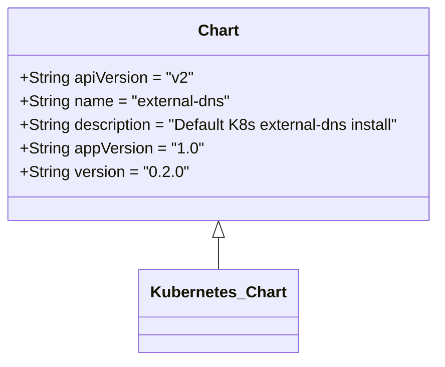
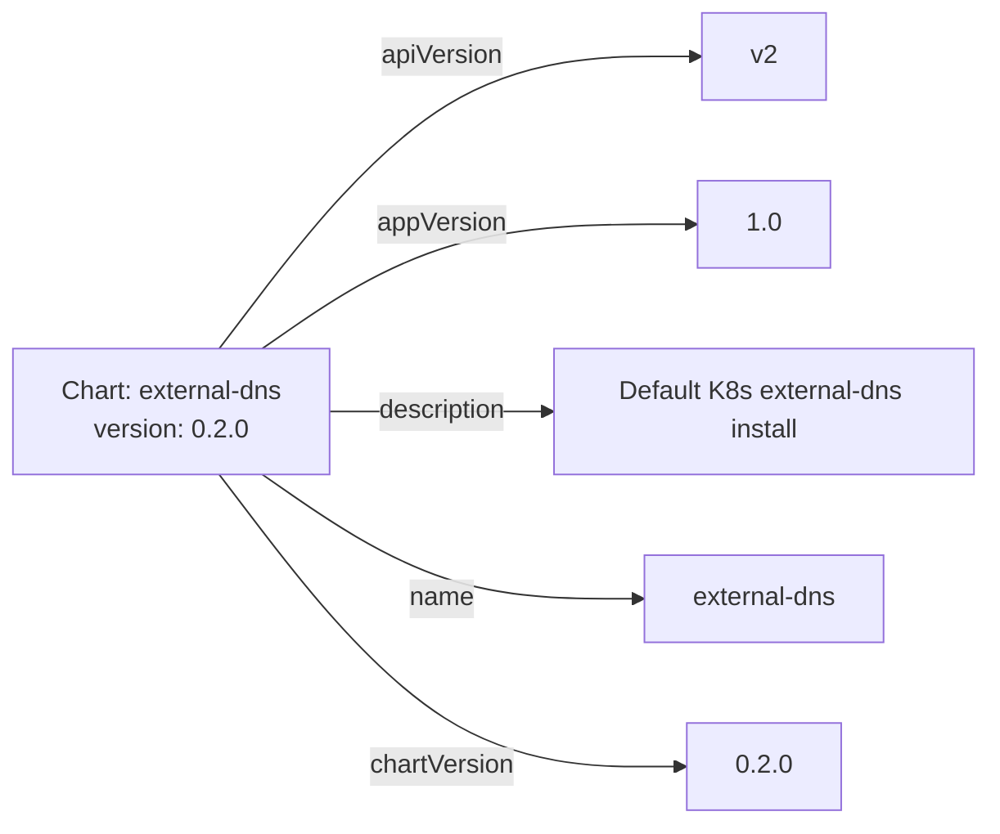

# Diagram: devops/k8s/external-dns/helm/Chart.yaml

> Auto-generated by Obscura crawlers

## Diagram 1

### SVG

<svg id="container" width="453.7265625" xmlns="http://www.w3.org/2000/svg" class="classDiagram" height="366" viewBox="0 0 453.7265625 366" role="graphics-document document" aria-roledescription="class"><g><defs><marker id="container_class-aggregationStart" class="marker aggregation class" refX="18" refY="7" markerWidth="190" markerHeight="240" orient="auto"><path d="M 18,7 L9,13 L1,7 L9,1 Z"></path></marker></defs><defs><marker id="container_class-aggregationEnd" class="marker aggregation class" refX="1" refY="7" markerWidth="20" markerHeight="28" orient="auto"><path d="M 18,7 L9,13 L1,7 L9,1 Z"></path></marker></defs><defs><marker id="container_class-extensionStart" class="marker extension class" refX="18" refY="7" markerWidth="190" markerHeight="240" orient="auto"><path d="M 1,7 L18,13 V 1 Z"></path></marker></defs><defs><marker id="container_class-extensionEnd" class="marker extension class" refX="1" refY="7" markerWidth="20" markerHeight="28" orient="auto"><path d="M 1,1 V 13 L18,7 Z"></path></marker></defs><defs><marker id="container_class-compositionStart" class="marker composition class" refX="18" refY="7" markerWidth="190" markerHeight="240" orient="auto"><path d="M 18,7 L9,13 L1,7 L9,1 Z"></path></marker></defs><defs><marker id="container_class-compositionEnd" class="marker composition class" refX="1" refY="7" markerWidth="20" markerHeight="28" orient="auto"><path d="M 18,7 L9,13 L1,7 L9,1 Z"></path></marker></defs><defs><marker id="container_class-dependencyStart" class="marker dependency class" refX="6" refY="7" markerWidth="190" markerHeight="240" orient="auto"><path d="M 5,7 L9,13 L1,7 L9,1 Z"></path></marker></defs><defs><marker id="container_class-dependencyEnd" class="marker dependency class" refX="13" refY="7" markerWidth="20" markerHeight="28" orient="auto"><path d="M 18,7 L9,13 L14,7 L9,1 Z"></path></marker></defs><defs><marker id="container_class-lollipopStart" class="marker lollipop class" refX="13" refY="7" markerWidth="190" markerHeight="240" orient="auto"><circle stroke="black" fill="transparent" cx="7" cy="7" r="6"></circle></marker></defs><defs><marker id="container_class-lollipopEnd" class="marker lollipop class" refX="1" refY="7" markerWidth="190" markerHeight="240" orient="auto"><circle stroke="black" fill="transparent" cx="7" cy="7" r="6"></circle></marker></defs><g class="root"><g class="clusters"></g><g class="edgePaths"><path d="M226.863,241.25L226.863,242.542C226.863,243.833,226.863,246.417,226.863,251.875C226.863,257.333,226.863,265.667,226.863,269.833L226.863,274" id="id_Chart_Kubernetes_Chart_1" class="edge-thickness-normal edge-pattern-solid relation" style=";;;" data-edge="true" data-et="edge" data-id="id_Chart_Kubernetes_Chart_1" data-points="W3sieCI6MjI2Ljg2MzI4MTI1LCJ5IjoyMjR9LHsieCI6MjI2Ljg2MzI4MTI1LCJ5IjoyNDl9LHsieCI6MjI2Ljg2MzI4MTI1LCJ5IjoyNzR9XQ==" marker-start="url(#container_class-extensionStart)"></path></g><g class="edgeLabels"><g class="edgeLabel"><g class="label" data-id="id_Chart_Kubernetes_Chart_1" transform="translate(0, 0)"><foreignObject width="0" height="0">

</foreignObject></g></g></g><g class="nodes"><g class="node default" id="classId-Chart-0" transform="translate(226.86328125, 116)"><g class="basic label-container"><path d="M-218.86328125 -108 L218.86328125 -108 L218.86328125 108 L-218.86328125 108" stroke="none" stroke-width="0" fill="#ECECFF" style=""></path><path d="M-218.86328125 -108 C-66.36847738174885 -108, 86.12632648650231 -108, 218.86328125 -108 M-218.86328125 -108 C-106.69154809605828 -108, 5.480185057883432 -108, 218.86328125 -108 M218.86328125 -108 C218.86328125 -62.295125069597475, 218.86328125 -16.59025013919495, 218.86328125 108 M218.86328125 -108 C218.86328125 -31.19675569820174, 218.86328125 45.60648860359652, 218.86328125 108 M218.86328125 108 C53.715500187022684 108, -111.43228087595463 108, -218.86328125 108 M218.86328125 108 C111.17028805658714 108, 3.4772948631742793 108, -218.86328125 108 M-218.86328125 108 C-218.86328125 25.163646500732483, -218.86328125 -57.672706998535034, -218.86328125 -108 M-218.86328125 108 C-218.86328125 55.09690231015863, -218.86328125 2.193804620317266, -218.86328125 -108" stroke="#9370DB" stroke-width="1.3" fill="none" stroke-dasharray="0 0" style=""></path></g><g class="annotation-group text" transform="translate(0, -84)"></g><g class="label-group text" transform="translate(-19.8203125, -84)"><g class="label" style="font-weight: bolder" transform="translate(0,-12)"><foreignObject width="39.640625" height="24">

Chart

</foreignObject></g></g><g class="members-group text" transform="translate(-206.86328125, -36)"><g class="label" style="" transform="translate(0,-12)"><foreignObject width="175.921875" height="24">

+String apiVersion = "v2"

</foreignObject></g><g class="label" style="" transform="translate(0,12)"><foreignObject width="215.90625" height="24">

+String name = "external-dns"

</foreignObject></g><g class="label" style="" transform="translate(0,36)"><foreignObject width="393.90625" height="24">

+String description = "Default K8s external-dns install"

</foreignObject></g><g class="label" style="" transform="translate(0,60)"><foreignObject width="184.625" height="24">

+String appVersion = "1.0"

</foreignObject></g><g class="label" style="" transform="translate(0,84)"><foreignObject width="169.640625" height="24">

+String version = "0.2.0"

</foreignObject></g></g><g class="methods-group text" transform="translate(-206.86328125, 108)"></g><g class="divider" style=""><path d="M-218.86328125 -60 C-84.25904940653541 -60, 50.34518243692918 -60, 218.86328125 -60 M-218.86328125 -60 C-89.44149114453168 -60, 39.980298960936636 -60, 218.86328125 -60" stroke="#9370DB" stroke-width="1.3" fill="none" stroke-dasharray="0 0" style=""></path></g><g class="divider" style=""><path d="M-218.86328125 84 C-131.1332373772235 84, -43.40319350444702 84, 218.86328125 84 M-218.86328125 84 C-101.96095067677741 84, 14.94137989644517 84, 218.86328125 84" stroke="#9370DB" stroke-width="1.3" fill="none" stroke-dasharray="0 0" style=""></path></g></g><g class="node default" id="classId-Kubernetes_Chart-1" transform="translate(226.86328125, 316)"><g class="basic label-container"><path d="M-77.6953125 -42 L77.6953125 -42 L77.6953125 42 L-77.6953125 42" stroke="none" stroke-width="0" fill="#ECECFF" style=""></path><path d="M-77.6953125 -42 C-15.72959789425174 -42, 46.23611671149652 -42, 77.6953125 -42 M-77.6953125 -42 C-42.68249138666134 -42, -7.66967027332268 -42, 77.6953125 -42 M77.6953125 -42 C77.6953125 -16.867527269603865, 77.6953125 8.26494546079227, 77.6953125 42 M77.6953125 -42 C77.6953125 -14.011768162342673, 77.6953125 13.976463675314655, 77.6953125 42 M77.6953125 42 C15.926714674764312 42, -45.841883150471375 42, -77.6953125 42 M77.6953125 42 C30.363025844125374 42, -16.96926081174925 42, -77.6953125 42 M-77.6953125 42 C-77.6953125 24.121335109248058, -77.6953125 6.242670218496116, -77.6953125 -42 M-77.6953125 42 C-77.6953125 17.289866203061244, -77.6953125 -7.420267593877512, -77.6953125 -42" stroke="#9370DB" stroke-width="1.3" fill="none" stroke-dasharray="0 0" style=""></path></g><g class="annotation-group text" transform="translate(0, -18)"></g><g class="label-group text" transform="translate(-65.6953125, -18)"><g class="label" style="font-weight: bolder" transform="translate(0,-12)"><foreignObject width="131.390625" height="24">

Kubernetes_Chart

</foreignObject></g></g><g class="members-group text" transform="translate(-65.6953125, 30)"></g><g class="methods-group text" transform="translate(-65.6953125, 60)"></g><g class="divider" style=""><path d="M-77.6953125 6 C-42.10077495015259 6, -6.5062374003051815 6, 77.6953125 6 M-77.6953125 6 C-34.86895147905931 6, 7.9574095418813755 6, 77.6953125 6" stroke="#9370DB" stroke-width="1.3" fill="none" stroke-dasharray="0 0" style=""></path></g><g class="divider" style=""><path d="M-77.6953125 24 C-45.95430961319989 24, -14.213306726399779 24, 77.6953125 24 M-77.6953125 24 C-25.679541809146414 24, 26.33622888170717 24, 77.6953125 24" stroke="#9370DB" stroke-width="1.3" fill="none" stroke-dasharray="0 0" style=""></path></g></g></g></g></g></svg>

## Diagram 2

### SVG

<svg id="container" width="677.546875" xmlns="http://www.w3.org/2000/svg" class="flowchart" height="510" viewBox="0 0 677.546875 510" role="graphics-document document" aria-roledescription="flowchart-v2"><g><marker id="container_flowchart-v2-pointEnd" class="marker flowchart-v2" viewBox="0 0 10 10" refX="5" refY="5" markerUnits="userSpaceOnUse" markerWidth="8" markerHeight="8" orient="auto"><path d="M 0 0 L 10 5 L 0 10 z" class="arrowMarkerPath" style="stroke-width: 1; stroke-dasharray: 1, 0;"></path></marker><marker id="container_flowchart-v2-pointStart" class="marker flowchart-v2" viewBox="0 0 10 10" refX="4.5" refY="5" markerUnits="userSpaceOnUse" markerWidth="8" markerHeight="8" orient="auto"><path d="M 0 5 L 10 10 L 10 0 z" class="arrowMarkerPath" style="stroke-width: 1; stroke-dasharray: 1, 0;"></path></marker><marker id="container_flowchart-v2-circleEnd" class="marker flowchart-v2" viewBox="0 0 10 10" refX="11" refY="5" markerUnits="userSpaceOnUse" markerWidth="11" markerHeight="11" orient="auto"><circle cx="5" cy="5" r="5" class="arrowMarkerPath" style="stroke-width: 1; stroke-dasharray: 1, 0;"></circle></marker><marker id="container_flowchart-v2-circleStart" class="marker flowchart-v2" viewBox="0 0 10 10" refX="-1" refY="5" markerUnits="userSpaceOnUse" markerWidth="11" markerHeight="11" orient="auto"><circle cx="5" cy="5" r="5" class="arrowMarkerPath" style="stroke-width: 1; stroke-dasharray: 1, 0;"></circle></marker><marker id="container_flowchart-v2-crossEnd" class="marker cross flowchart-v2" viewBox="0 0 11 11" refX="12" refY="5.2" markerUnits="userSpaceOnUse" markerWidth="11" markerHeight="11" orient="auto"><path d="M 1,1 l 9,9 M 10,1 l -9,9" class="arrowMarkerPath" style="stroke-width: 2; stroke-dasharray: 1, 0;"></path></marker><marker id="container_flowchart-v2-crossStart" class="marker cross flowchart-v2" viewBox="0 0 11 11" refX="-1" refY="5.2" markerUnits="userSpaceOnUse" markerWidth="11" markerHeight="11" orient="auto"><path d="M 1,1 l 9,9 M 10,1 l -9,9" class="arrowMarkerPath" style="stroke-width: 2; stroke-dasharray: 1, 0;"></path></marker><g class="root"><g class="clusters"></g><g class="edgePaths"><path d="M173.592,216L201.122,185.833C228.652,155.667,283.713,95.333,337.735,65.167C391.758,35,444.742,35,471.234,35L497.727,35" id="L_Chart_APIV_0" class="edge-thickness-normal edge-pattern-solid edge-thickness-normal edge-pattern-solid flowchart-link" style=";" data-edge="true" data-et="edge" data-id="L_Chart_APIV_0" data-points="W3sieCI6MTczLjU5MTY1NDgyOTU0NTQ2LCJ5IjoyMTZ9LHsieCI6MzM4Ljc3MzQzNzUsInkiOjM1fSx7IngiOjUwMS43MjY1NjI1LCJ5IjozNX1d" marker-end="url(#container_flowchart-v2-pointEnd)"></path><path d="M205.501,216L227.713,203.167C249.925,190.333,294.349,164.667,342.731,151.833C391.112,139,443.451,139,469.62,139L495.789,139" id="L_Chart_AppV_0" class="edge-thickness-normal edge-pattern-solid edge-thickness-normal edge-pattern-solid flowchart-link" style=";" data-edge="true" data-et="edge" data-id="L_Chart_AppV_0" data-points="W3sieCI6MjA1LjUwMTQxNDMzMTg5NjU3LCJ5IjoyMTZ9LHsieCI6MzM4Ljc3MzQzNzUsInkiOjEzOX0seyJ4Ijo0OTkuNzg5MDYyNSwieSI6MTM5fV0=" marker-end="url(#container_flowchart-v2-pointEnd)"></path><path d="M268,255L279.796,255C291.591,255,315.182,255,338.107,255C361.031,255,383.289,255,394.418,255L405.547,255" id="L_Chart_Desc_0" class="edge-thickness-normal edge-pattern-solid edge-thickness-normal edge-pattern-solid flowchart-link" style=";" data-edge="true" data-et="edge" data-id="L_Chart_Desc_0" data-points="W3sieCI6MjY4LCJ5IjoyNTV9LHsieCI6MzM4Ljc3MzQzNzUsInkiOjI1NX0seyJ4Ijo0MDkuNTQ2ODc1LCJ5IjoyNTV9XQ==" marker-end="url(#container_flowchart-v2-pointEnd)"></path><path d="M205.501,294L227.713,306.833C249.925,319.667,294.349,345.333,336.683,358.167C379.016,371,419.258,371,439.379,371L459.5,371" id="L_Chart_Name_0" class="edge-thickness-normal edge-pattern-solid edge-thickness-normal edge-pattern-solid flowchart-link" style=";" data-edge="true" data-et="edge" data-id="L_Chart_Name_0" data-points="W3sieCI6MjA1LjUwMTQxNDMzMTg5NjU3LCJ5IjoyOTR9LHsieCI6MzM4Ljc3MzQzNzUsInkiOjM3MX0seyJ4Ijo0NjMuNSwieSI6MzcxfV0=" marker-end="url(#container_flowchart-v2-pointEnd)"></path><path d="M173.592,294L201.122,324.167C228.652,354.333,283.713,414.667,336.282,444.833C388.852,475,438.93,475,463.969,475L489.008,475" id="L_Chart_CV_0" class="edge-thickness-normal edge-pattern-solid edge-thickness-normal edge-pattern-solid flowchart-link" style=";" data-edge="true" data-et="edge" data-id="L_Chart_CV_0" data-points="W3sieCI6MTczLjU5MTY1NDgyOTU0NTQ2LCJ5IjoyOTR9LHsieCI6MzM4Ljc3MzQzNzUsInkiOjQ3NX0seyJ4Ijo0OTMuMDA3ODEyNSwieSI6NDc1fV0=" marker-end="url(#container_flowchart-v2-pointEnd)"></path></g><g class="edgeLabels"><g class="edgeLabel" transform="translate(338.7734375, 35)"><g class="label" data-id="L_Chart_APIV_0" transform="translate(-38.2890625, -12)"><foreignObject width="76.578125" height="24">

apiVersion

</foreignObject></g></g><g class="edgeLabel" transform="translate(338.7734375, 139)"><g class="label" data-id="L_Chart_AppV_0" transform="translate(-40.7890625, -12)"><foreignObject width="81.578125" height="24">

appVersion

</foreignObject></g></g><g class="edgeLabel" transform="translate(338.7734375, 255)"><g class="label" data-id="L_Chart_Desc_0" transform="translate(-41.3046875, -12)"><foreignObject width="82.609375" height="24">

description

</foreignObject></g></g><g class="edgeLabel" transform="translate(338.7734375, 371)"><g class="label" data-id="L_Chart_Name_0" transform="translate(-20.2578125, -12)"><foreignObject width="40.515625" height="24">

name

</foreignObject></g></g><g class="edgeLabel" transform="translate(338.7734375, 475)"><g class="label" data-id="L_Chart_CV_0" transform="translate(-45.7734375, -12)"><foreignObject width="91.546875" height="24">

chartVersion

</foreignObject></g></g></g><g class="nodes"><g class="node default" id="flowchart-Chart-0" transform="translate(138, 255)"><rect class="basic label-container" style="" x="-130" y="-39" width="260" height="78"></rect><g class="label" style="" transform="translate(-100, -24)"><rect></rect><foreignObject width="200" height="48">

Chart: external-dns\nversion: 0.2.0

</foreignObject></g></g><g class="node default" id="flowchart-APIV-1" transform="translate(539.546875, 35)"><rect class="basic label-container" style="" x="-37.8203125" y="-27" width="75.640625" height="54"></rect><g class="label" style="" transform="translate(-7.8203125, -12)"><rect></rect><foreignObject width="15.640625" height="24">

v2

</foreignObject></g></g><g class="node default" id="flowchart-AppV-3" transform="translate(539.546875, 139)"><rect class="basic label-container" style="" x="-39.7578125" y="-27" width="79.515625" height="54"></rect><g class="label" style="" transform="translate(-9.7578125, -12)"><rect></rect><foreignObject width="19.515625" height="24">

1.0

</foreignObject></g></g><g class="node default" id="flowchart-Desc-5" transform="translate(539.546875, 255)"><rect class="basic label-container" style="" x="-130" y="-39" width="260" height="78"></rect><g class="label" style="" transform="translate(-100, -24)"><rect></rect><foreignObject width="200" height="48">

Default K8s external-dns install

</foreignObject></g></g><g class="node default" id="flowchart-Name-7" transform="translate(539.546875, 371)"><rect class="basic label-container" style="" x="-76.046875" y="-27" width="152.09375" height="54"></rect><g class="label" style="" transform="translate(-46.046875, -12)"><rect></rect><foreignObject width="92.09375" height="24">

external-dns

</foreignObject></g></g><g class="node default" id="flowchart-CV-9" transform="translate(539.546875, 475)"><rect class="basic label-container" style="" x="-46.5390625" y="-27" width="93.078125" height="54"></rect><g class="label" style="" transform="translate(-16.5390625, -12)"><rect></rect><foreignObject width="33.078125" height="24">

0.2.0

</foreignObject></g></g></g></g></g></svg>
