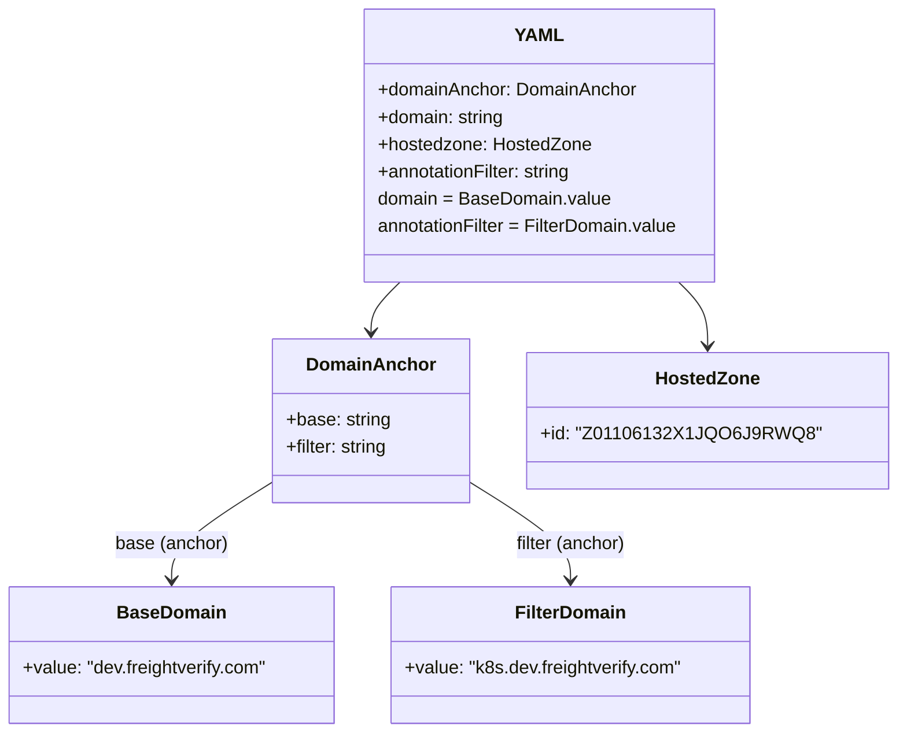
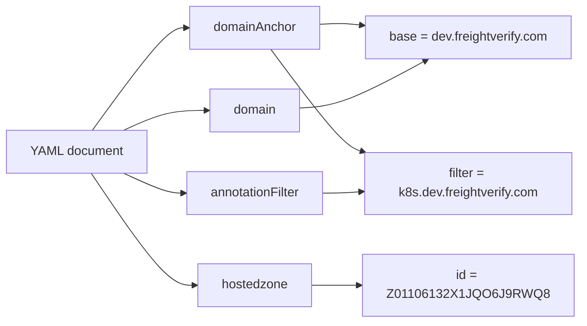

# Diagram: devops/k8s/external-dns/helm/values.dev1.yaml

> Auto-generated by Obscura crawlers

## Diagram 1

### SVG

<svg id="container" width="756.94140625" xmlns="http://www.w3.org/2000/svg" class="classDiagram" height="644" viewBox="0 0 756.94140625 644" role="graphics-document document" aria-roledescription="class"><g><defs><marker id="container_class-aggregationStart" class="marker aggregation class" refX="18" refY="7" markerWidth="190" markerHeight="240" orient="auto"><path d="M 18,7 L9,13 L1,7 L9,1 Z"></path></marker></defs><defs><marker id="container_class-aggregationEnd" class="marker aggregation class" refX="1" refY="7" markerWidth="20" markerHeight="28" orient="auto"><path d="M 18,7 L9,13 L1,7 L9,1 Z"></path></marker></defs><defs><marker id="container_class-extensionStart" class="marker extension class" refX="18" refY="7" markerWidth="190" markerHeight="240" orient="auto"><path d="M 1,7 L18,13 V 1 Z"></path></marker></defs><defs><marker id="container_class-extensionEnd" class="marker extension class" refX="1" refY="7" markerWidth="20" markerHeight="28" orient="auto"><path d="M 1,1 V 13 L18,7 Z"></path></marker></defs><defs><marker id="container_class-compositionStart" class="marker composition class" refX="18" refY="7" markerWidth="190" markerHeight="240" orient="auto"><path d="M 18,7 L9,13 L1,7 L9,1 Z"></path></marker></defs><defs><marker id="container_class-compositionEnd" class="marker composition class" refX="1" refY="7" markerWidth="20" markerHeight="28" orient="auto"><path d="M 18,7 L9,13 L1,7 L9,1 Z"></path></marker></defs><defs><marker id="container_class-dependencyStart" class="marker dependency class" refX="6" refY="7" markerWidth="190" markerHeight="240" orient="auto"><path d="M 5,7 L9,13 L1,7 L9,1 Z"></path></marker></defs><defs><marker id="container_class-dependencyEnd" class="marker dependency class" refX="13" refY="7" markerWidth="20" markerHeight="28" orient="auto"><path d="M 18,7 L9,13 L14,7 L9,1 Z"></path></marker></defs><defs><marker id="container_class-lollipopStart" class="marker lollipop class" refX="13" refY="7" markerWidth="190" markerHeight="240" orient="auto"><circle stroke="black" fill="transparent" cx="7" cy="7" r="6"></circle></marker></defs><defs><marker id="container_class-lollipopEnd" class="marker lollipop class" refX="1" refY="7" markerWidth="190" markerHeight="240" orient="auto"><circle stroke="black" fill="transparent" cx="7" cy="7" r="6"></circle></marker></defs><g class="root"><g class="clusters"></g><g class="edgePaths"><path d="M351.664,248L347.67,252.167C343.676,256.333,335.688,264.667,331.693,272C327.699,279.333,327.699,285.667,327.699,288.833L327.699,292" id="id_YAML_DomainAnchor_1" class="edge-thickness-normal edge-pattern-solid relation" style=";;;" data-edge="true" data-et="edge" data-id="id_YAML_DomainAnchor_1" data-points="W3sieCI6MzUxLjY2NDM5OTI0NTY4OTY1LCJ5IjoyNDh9LHsieCI6MzI3LjY5OTIxODc1LCJ5IjoyNzN9LHsieCI6MzI3LjY5OTIxODc1LCJ5IjoyOTh9XQ==" marker-end="url(#container_class-dependencyEnd)"></path><path d="M581.73,248L585.724,252.167C589.719,256.333,597.707,264.667,601.701,274C605.695,283.333,605.695,293.667,605.695,298.833L605.695,304" id="id_YAML_HostedZone_2" class="edge-thickness-normal edge-pattern-solid relation" style=";;;" data-edge="true" data-et="edge" data-id="id_YAML_HostedZone_2" data-points="W3sieCI6NTgxLjczMDEzMjAwNDMxMDMsInkiOjI0OH0seyJ4Ijo2MDUuNjk1MzEyNSwieSI6MjczfSx7IngiOjYwNS42OTUzMTI1LCJ5IjozMTB9XQ==" marker-end="url(#container_class-dependencyEnd)"></path><path d="M242.949,422.47L227.731,431.891C212.513,441.313,182.077,460.157,166.859,474.745C151.641,489.333,151.641,499.667,151.641,504.833L151.641,510" id="id_DomainAnchor_BaseDomain_3" class="edge-thickness-normal edge-pattern-solid relation" style=";;;" data-edge="true" data-et="edge" data-id="id_DomainAnchor_BaseDomain_3" data-points="W3sieCI6MjQyLjk0OTIxODc1LCJ5Ijo0MjIuNDY5NzQ3NzMxMzU3Mn0seyJ4IjoxNTEuNjQwNjI1LCJ5Ijo0Nzl9LHsieCI6MTUxLjY0MDYyNSwieSI6NTE2fV0=" marker-end="url(#container_class-dependencyEnd)"></path><path d="M412.449,422.47L427.667,431.891C442.885,441.313,473.322,460.157,488.54,474.745C503.758,489.333,503.758,499.667,503.758,504.833L503.758,510" id="id_DomainAnchor_FilterDomain_4" class="edge-thickness-normal edge-pattern-solid relation" style=";;;" data-edge="true" data-et="edge" data-id="id_DomainAnchor_FilterDomain_4" data-points="W3sieCI6NDEyLjQ0OTIxODc1LCJ5Ijo0MjIuNDY5NzQ3NzMxMzU3Mn0seyJ4Ijo1MDMuNzU3ODEyNSwieSI6NDc5fSx7IngiOjUwMy43NTc4MTI1LCJ5Ijo1MTZ9XQ==" marker-end="url(#container_class-dependencyEnd)"></path></g><g class="edgeLabels"><g class="edgeLabel"><g class="label" data-id="id_YAML_DomainAnchor_1" transform="translate(0, 0)"><foreignObject width="0" height="0">

</foreignObject></g></g><g class="edgeLabel"><g class="label" data-id="id_YAML_HostedZone_2" transform="translate(0, 0)"><foreignObject width="0" height="0">

</foreignObject></g></g><g class="edgeLabel" transform="translate(151.640625, 479)"><g class="label" data-id="id_DomainAnchor_BaseDomain_3" transform="translate(-49.65625, -12)"><foreignObject width="99.3125" height="24">

base (anchor)

</foreignObject></g></g><g class="edgeLabel" transform="translate(503.7578125, 479)"><g class="label" data-id="id_DomainAnchor_FilterDomain_4" transform="translate(-49.78125, -12)"><foreignObject width="99.5625" height="24">

filter (anchor)

</foreignObject></g></g></g><g class="nodes"><g class="node default" id="classId-YAML-0" transform="translate(466.697265625, 128)"><g class="basic label-container"><path d="M-155.984375 -120 L155.984375 -120 L155.984375 120 L-155.984375 120" stroke="none" stroke-width="0" fill="#ECECFF" style=""></path><path d="M-155.984375 -120 C-74.04622006641121 -120, 7.891934867177582 -120, 155.984375 -120 M-155.984375 -120 C-48.39476882989452 -120, 59.19483734021097 -120, 155.984375 -120 M155.984375 -120 C155.984375 -45.140371466492454, 155.984375 29.719257067015093, 155.984375 120 M155.984375 -120 C155.984375 -25.767949442649495, 155.984375 68.46410111470101, 155.984375 120 M155.984375 120 C52.61212309134082 120, -50.76012881731836 120, -155.984375 120 M155.984375 120 C39.12529628518915 120, -77.7337824296217 120, -155.984375 120 M-155.984375 120 C-155.984375 47.06328250998334, -155.984375 -25.873434980033323, -155.984375 -120 M-155.984375 120 C-155.984375 35.240801359927275, -155.984375 -49.51839728014545, -155.984375 -120" stroke="#9370DB" stroke-width="1.3" fill="none" stroke-dasharray="0 0" style=""></path></g><g class="annotation-group text" transform="translate(0, -96)"></g><g class="label-group text" transform="translate(-19.421875, -96)"><g class="label" style="font-weight: bolder" transform="translate(0,-12)"><foreignObject width="38.84375" height="24">

YAML

</foreignObject></g></g><g class="members-group text" transform="translate(-143.984375, -48)"><g class="label" style="" transform="translate(0,-12)"><foreignObject width="229.578125" height="24">

+domainAnchor: DomainAnchor

</foreignObject></g><g class="label" style="" transform="translate(0,12)"><foreignObject width="112.921875" height="24">

+domain: string

</foreignObject></g><g class="label" style="" transform="translate(0,36)"><foreignObject width="187.375" height="24">

+hostedzone: HostedZone

</foreignObject></g><g class="label" style="" transform="translate(0,60)"><foreignObject width="174.734375" height="24">

+annotationFilter: string

</foreignObject></g><g class="label" style="" transform="translate(0,84)"><foreignObject width="204.203125" height="24">

domain = BaseDomain.value

</foreignObject></g><g class="label" style="" transform="translate(0,108)"><foreignObject width="268.546875" height="24">

annotationFilter = FilterDomain.value

</foreignObject></g></g><g class="methods-group text" transform="translate(-143.984375, 120)"></g><g class="divider" style=""><path d="M-155.984375 -72 C-56.258069154629425 -72, 43.46823669074115 -72, 155.984375 -72 M-155.984375 -72 C-38.045295810090096 -72, 79.89378337981981 -72, 155.984375 -72" stroke="#9370DB" stroke-width="1.3" fill="none" stroke-dasharray="0 0" style=""></path></g><g class="divider" style=""><path d="M-155.984375 96 C-55.984595172529225 96, 44.01518465494155 96, 155.984375 96 M-155.984375 96 C-37.44343168790809 96, 81.09751162418382 96, 155.984375 96" stroke="#9370DB" stroke-width="1.3" fill="none" stroke-dasharray="0 0" style=""></path></g></g><g class="node default" id="classId-DomainAnchor-1" transform="translate(327.69921875, 370)"><g class="basic label-container"><path d="M-84.75 -72 L84.75 -72 L84.75 72 L-84.75 72" stroke="none" stroke-width="0" fill="#ECECFF" style=""></path><path d="M-84.75 -72 C-49.93183922893707 -72, -15.113678457874144 -72, 84.75 -72 M-84.75 -72 C-41.64393286178448 -72, 1.462134276431044 -72, 84.75 -72 M84.75 -72 C84.75 -17.288224656918153, 84.75 37.42355068616369, 84.75 72 M84.75 -72 C84.75 -33.98127632077165, 84.75 4.037447358456703, 84.75 72 M84.75 72 C41.848458878294196 72, -1.053082243411609 72, -84.75 72 M84.75 72 C38.247556845023865 72, -8.25488630995227 72, -84.75 72 M-84.75 72 C-84.75 35.96720273247235, -84.75 -0.06559453505529689, -84.75 -72 M-84.75 72 C-84.75 32.2440288087657, -84.75 -7.511942382468604, -84.75 -72" stroke="#9370DB" stroke-width="1.3" fill="none" stroke-dasharray="0 0" style=""></path></g><g class="annotation-group text" transform="translate(0, -48)"></g><g class="label-group text" transform="translate(-53.5625, -48)"><g class="label" style="font-weight: bolder" transform="translate(0,-12)"><foreignObject width="107.125" height="24">

DomainAnchor

</foreignObject></g></g><g class="members-group text" transform="translate(-72.75, 0)"><g class="label" style="" transform="translate(0,-12)"><foreignObject width="91.78125" height="24">

+base: string

</foreignObject></g><g class="label" style="" transform="translate(0,12)"><foreignObject width="91.9375" height="24">

+filter: string

</foreignObject></g></g><g class="methods-group text" transform="translate(-72.75, 72)"></g><g class="divider" style=""><path d="M-84.75 -24 C-46.835324894834876 -24, -8.920649789669753 -24, 84.75 -24 M-84.75 -24 C-34.38057508898641 -24, 15.988849822027177 -24, 84.75 -24" stroke="#9370DB" stroke-width="1.3" fill="none" stroke-dasharray="0 0" style=""></path></g><g class="divider" style=""><path d="M-84.75 48 C-20.792648665213427 48, 43.164702669573145 48, 84.75 48 M-84.75 48 C-18.569872986371877 48, 47.610254027256246 48, 84.75 48" stroke="#9370DB" stroke-width="1.3" fill="none" stroke-dasharray="0 0" style=""></path></g></g><g class="node default" id="classId-BaseDomain-2" transform="translate(151.640625, 576)"><g class="basic label-container"><path d="M-143.640625 -60 L143.640625 -60 L143.640625 60 L-143.640625 60" stroke="none" stroke-width="0" fill="#ECECFF" style=""></path><path d="M-143.640625 -60 C-55.427511770232385 -60, 32.78560145953523 -60, 143.640625 -60 M-143.640625 -60 C-35.12838769427265 -60, 73.3838496114547 -60, 143.640625 -60 M143.640625 -60 C143.640625 -29.706838196670578, 143.640625 0.5863236066588442, 143.640625 60 M143.640625 -60 C143.640625 -25.835569262420904, 143.640625 8.328861475158192, 143.640625 60 M143.640625 60 C51.89326518767608 60, -39.85409462464784 60, -143.640625 60 M143.640625 60 C34.078911040683266 60, -75.48280291863347 60, -143.640625 60 M-143.640625 60 C-143.640625 35.222574563637764, -143.640625 10.445149127275528, -143.640625 -60 M-143.640625 60 C-143.640625 17.19759236277173, -143.640625 -25.60481527445654, -143.640625 -60" stroke="#9370DB" stroke-width="1.3" fill="none" stroke-dasharray="0 0" style=""></path></g><g class="annotation-group text" transform="translate(0, -36)"></g><g class="label-group text" transform="translate(-45.421875, -36)"><g class="label" style="font-weight: bolder" transform="translate(0,-12)"><foreignObject width="90.84375" height="24">

BaseDomain

</foreignObject></g></g><g class="members-group text" transform="translate(-131.640625, 12)"><g class="label" style="" transform="translate(0,-12)"><foreignObject width="217.859375" height="24">

+value: "dev.freightverify.com"

</foreignObject></g></g><g class="methods-group text" transform="translate(-131.640625, 60)"></g><g class="divider" style=""><path d="M-143.640625 -12 C-68.6593229511003 -12, 6.321979097799414 -12, 143.640625 -12 M-143.640625 -12 C-42.784134907465486 -12, 58.07235518506903 -12, 143.640625 -12" stroke="#9370DB" stroke-width="1.3" fill="none" stroke-dasharray="0 0" style=""></path></g><g class="divider" style=""><path d="M-143.640625 36 C-61.58998844029615 36, 20.460648119407693 36, 143.640625 36 M-143.640625 36 C-85.16417080397996 36, -26.687716607959914 36, 143.640625 36" stroke="#9370DB" stroke-width="1.3" fill="none" stroke-dasharray="0 0" style=""></path></g></g><g class="node default" id="classId-FilterDomain-3" transform="translate(503.7578125, 576)"><g class="basic label-container"><path d="M-158.4765625 -60 L158.4765625 -60 L158.4765625 60 L-158.4765625 60" stroke="none" stroke-width="0" fill="#ECECFF" style=""></path><path d="M-158.4765625 -60 C-70.33398428799754 -60, 17.808593924004924 -60, 158.4765625 -60 M-158.4765625 -60 C-72.98109666940172 -60, 12.514369161196555 -60, 158.4765625 -60 M158.4765625 -60 C158.4765625 -25.17283785230522, 158.4765625 9.654324295389557, 158.4765625 60 M158.4765625 -60 C158.4765625 -26.135627308205244, 158.4765625 7.728745383589512, 158.4765625 60 M158.4765625 60 C84.82157765699368 60, 11.166592813987364 60, -158.4765625 60 M158.4765625 60 C89.34965690562623 60, 20.222751311252466 60, -158.4765625 60 M-158.4765625 60 C-158.4765625 14.834431244970958, -158.4765625 -30.331137510058085, -158.4765625 -60 M-158.4765625 60 C-158.4765625 35.99452577385838, -158.4765625 11.989051547716755, -158.4765625 -60" stroke="#9370DB" stroke-width="1.3" fill="none" stroke-dasharray="0 0" style=""></path></g><g class="annotation-group text" transform="translate(0, -36)"></g><g class="label-group text" transform="translate(-46.765625, -36)"><g class="label" style="font-weight: bolder" transform="translate(0,-12)"><foreignObject width="93.53125" height="24">

FilterDomain

</foreignObject></g></g><g class="members-group text" transform="translate(-146.4765625, 12)"><g class="label" style="" transform="translate(0,-12)"><foreignObject width="246.1875" height="24">

+value: "k8s.dev.freightverify.com"

</foreignObject></g></g><g class="methods-group text" transform="translate(-146.4765625, 60)"></g><g class="divider" style=""><path d="M-158.4765625 -12 C-50.46106362336596 -12, 57.55443525326808 -12, 158.4765625 -12 M-158.4765625 -12 C-55.45486862833576 -12, 47.56682524332848 -12, 158.4765625 -12" stroke="#9370DB" stroke-width="1.3" fill="none" stroke-dasharray="0 0" style=""></path></g><g class="divider" style=""><path d="M-158.4765625 36 C-89.81766955309587 36, -21.158776606191736 36, 158.4765625 36 M-158.4765625 36 C-90.61863735204025 36, -22.760712204080505 36, 158.4765625 36" stroke="#9370DB" stroke-width="1.3" fill="none" stroke-dasharray="0 0" style=""></path></g></g><g class="node default" id="classId-HostedZone-4" transform="translate(605.6953125, 370)"><g class="basic label-container"><path d="M-143.24609375 -60 L143.24609375 -60 L143.24609375 60 L-143.24609375 60" stroke="none" stroke-width="0" fill="#ECECFF" style=""></path><path d="M-143.24609375 -60 C-39.659297558449424 -60, 63.92749863310115 -60, 143.24609375 -60 M-143.24609375 -60 C-74.1179410881119 -60, -4.989788426223811 -60, 143.24609375 -60 M143.24609375 -60 C143.24609375 -32.237385644942435, 143.24609375 -4.47477128988487, 143.24609375 60 M143.24609375 -60 C143.24609375 -20.63566879190158, 143.24609375 18.72866241619684, 143.24609375 60 M143.24609375 60 C54.84230383722132 60, -33.561486075557355 60, -143.24609375 60 M143.24609375 60 C62.19482007196363 60, -18.856453606072733 60, -143.24609375 60 M-143.24609375 60 C-143.24609375 24.065494898017427, -143.24609375 -11.869010203965146, -143.24609375 -60 M-143.24609375 60 C-143.24609375 14.45848958213763, -143.24609375 -31.08302083572474, -143.24609375 -60" stroke="#9370DB" stroke-width="1.3" fill="none" stroke-dasharray="0 0" style=""></path></g><g class="annotation-group text" transform="translate(0, -36)"></g><g class="label-group text" transform="translate(-43.9140625, -36)"><g class="label" style="font-weight: bolder" transform="translate(0,-12)"><foreignObject width="87.828125" height="24">

HostedZone

</foreignObject></g></g><g class="members-group text" transform="translate(-131.24609375, 12)"><g class="label" style="" transform="translate(0,-12)"><foreignObject width="218.578125" height="24">

+id: "Z01106132X1JQO6J9RWQ8"

</foreignObject></g></g><g class="methods-group text" transform="translate(-131.24609375, 60)"></g><g class="divider" style=""><path d="M-143.24609375 -12 C-78.36489669801695 -12, -13.483699646033898 -12, 143.24609375 -12 M-143.24609375 -12 C-72.1229007674946 -12, -0.999707784989198 -12, 143.24609375 -12" stroke="#9370DB" stroke-width="1.3" fill="none" stroke-dasharray="0 0" style=""></path></g><g class="divider" style=""><path d="M-143.24609375 36 C-66.4212586508886 36, 10.403576448222793 36, 143.24609375 36 M-143.24609375 36 C-63.12130150826923 36, 17.003490733461547 36, 143.24609375 36" stroke="#9370DB" stroke-width="1.3" fill="none" stroke-dasharray="0 0" style=""></path></g></g></g></g></g></svg>

## Diagram 2

### SVG

<svg id="container" width="728.25" xmlns="http://www.w3.org/2000/svg" class="flowchart" height="406" viewBox="0 0 728.25 406" role="graphics-document document" aria-roledescription="flowchart-v2"><g><marker id="container_flowchart-v2-pointEnd" class="marker flowchart-v2" viewBox="0 0 10 10" refX="5" refY="5" markerUnits="userSpaceOnUse" markerWidth="8" markerHeight="8" orient="auto"><path d="M 0 0 L 10 5 L 0 10 z" class="arrowMarkerPath" style="stroke-width: 1; stroke-dasharray: 1, 0;"></path></marker><marker id="container_flowchart-v2-pointStart" class="marker flowchart-v2" viewBox="0 0 10 10" refX="4.5" refY="5" markerUnits="userSpaceOnUse" markerWidth="8" markerHeight="8" orient="auto"><path d="M 0 5 L 10 10 L 10 0 z" class="arrowMarkerPath" style="stroke-width: 1; stroke-dasharray: 1, 0;"></path></marker><marker id="container_flowchart-v2-circleEnd" class="marker flowchart-v2" viewBox="0 0 10 10" refX="11" refY="5" markerUnits="userSpaceOnUse" markerWidth="11" markerHeight="11" orient="auto"><circle cx="5" cy="5" r="5" class="arrowMarkerPath" style="stroke-width: 1; stroke-dasharray: 1, 0;"></circle></marker><marker id="container_flowchart-v2-circleStart" class="marker flowchart-v2" viewBox="0 0 10 10" refX="-1" refY="5" markerUnits="userSpaceOnUse" markerWidth="11" markerHeight="11" orient="auto"><circle cx="5" cy="5" r="5" class="arrowMarkerPath" style="stroke-width: 1; stroke-dasharray: 1, 0;"></circle></marker><marker id="container_flowchart-v2-crossEnd" class="marker cross flowchart-v2" viewBox="0 0 11 11" refX="12" refY="5.2" markerUnits="userSpaceOnUse" markerWidth="11" markerHeight="11" orient="auto"><path d="M 1,1 l 9,9 M 10,1 l -9,9" class="arrowMarkerPath" style="stroke-width: 2; stroke-dasharray: 1, 0;"></path></marker><marker id="container_flowchart-v2-crossStart" class="marker cross flowchart-v2" viewBox="0 0 11 11" refX="-1" refY="5.2" markerUnits="userSpaceOnUse" markerWidth="11" markerHeight="11" orient="auto"><path d="M 1,1 l 9,9 M 10,1 l -9,9" class="arrowMarkerPath" style="stroke-width: 2; stroke-dasharray: 1, 0;"></path></marker><g class="root"><g class="clusters"></g><g class="edgePaths"><path d="M404.852,26.212L409.918,25.677C414.984,25.142,425.117,24.071,433.691,24.079C442.266,24.086,449.281,25.173,452.789,25.716L456.297,26.259" id="L_A_B_0" class="edge-thickness-normal edge-pattern-solid edge-thickness-normal edge-pattern-solid flowchart-link" style=";" data-edge="true" data-et="edge" data-id="L_A_B_0" data-points="W3sieCI6NDA0Ljg1MTU2MjUsInkiOjI2LjIxMjM4MzkwMDkyODc5Mn0seyJ4Ijo0MzUuMjUsInkiOjIzfSx7IngiOjQ2MC4yNSwieSI6MjYuODcwOTY3NzQxOTM1NDg0fV0=" marker-end="url(#container_flowchart-v2-pointEnd)"></path><path d="M343.287,62L358.614,81.167C373.941,100.333,404.596,138.667,426.469,160.114C448.343,181.561,461.435,186.123,467.982,188.403L474.528,190.684" id="L_A_C_0" class="edge-thickness-normal edge-pattern-solid edge-thickness-normal edge-pattern-solid flowchart-link" style=";" data-edge="true" data-et="edge" data-id="L_A_C_0" data-points="W3sieCI6MzQzLjI4NjY5Njc0Mjk1Nzc2LCJ5Ijo2Mn0seyJ4Ijo0MzUuMjUsInkiOjE3N30seyJ4Ijo0NzguMzA1NTU1NTU1NTU1NTQsInkiOjE5Mn1d" marker-end="url(#container_flowchart-v2-pointEnd)"></path><path d="M379.305,132.912L388.629,131.927C397.953,130.941,416.602,128.971,438.573,121.458C460.544,113.945,485.839,100.89,498.486,94.362L511.133,87.835" id="L_D_B_0" class="edge-thickness-normal edge-pattern-solid edge-thickness-normal edge-pattern-solid flowchart-link" style=";" data-edge="true" data-et="edge" data-id="L_D_B_0" data-points="W3sieCI6Mzc5LjMwNDY4NzUsInkiOjEzMi45MTIwNzQzMDM0MDU1N30seyJ4Ijo0MzUuMjUsInkiOjEyN30seyJ4Ijo1MTQuNjg3NSwieSI6ODZ9XQ==" marker-end="url(#container_flowchart-v2-pointEnd)"></path><path d="M410.25,243L414.417,243C418.583,243,426.917,243,434.585,242.729C442.254,242.458,449.258,241.916,452.76,241.644L456.262,241.373" id="L_E_C_0" class="edge-thickness-normal edge-pattern-solid edge-thickness-normal edge-pattern-solid flowchart-link" style=";" data-edge="true" data-et="edge" data-id="L_E_C_0" data-points="W3sieCI6NDEwLjI1LCJ5IjoyNDN9LHsieCI6NDM1LjI1LCJ5IjoyNDN9LHsieCI6NDYwLjI1LCJ5IjoyNDEuMDY0NTE2MTI5MDMyMjZ9XQ==" marker-end="url(#container_flowchart-v2-pointEnd)"></path><path d="M393.867,359L400.764,359C407.661,359,421.456,359,431.853,359C442.25,359,449.25,359,452.75,359L456.25,359" id="L_F_G_0" class="edge-thickness-normal edge-pattern-solid edge-thickness-normal edge-pattern-solid flowchart-link" style=";" data-edge="true" data-et="edge" data-id="L_F_G_0" data-points="W3sieCI6MzkzLjg2NzE4NzUsInkiOjM1OX0seyJ4Ijo0MzUuMjUsInkiOjM1OX0seyJ4Ijo0NjAuMjUsInkiOjM1OX1d" marker-end="url(#container_flowchart-v2-pointEnd)"></path><path d="M115.054,164L130.568,142.5C146.083,121,177.112,78,197.026,56.5C216.94,35,225.74,35,230.139,35L234.539,35" id="L_YAML_NODE_A_0" class="edge-thickness-normal edge-pattern-solid edge-thickness-normal edge-pattern-solid flowchart-link" style=";" data-edge="true" data-et="edge" data-id="L_YAML_NODE_A_0" data-points="W3sieCI6MTE1LjA1MzYzNTgxNzMwNzcsInkiOjE2NH0seyJ4IjoyMDguMTQwNjI1LCJ5IjozNX0seyJ4IjoyMzguNTM5MDYyNSwieSI6MzV9XQ==" marker-end="url(#container_flowchart-v2-pointEnd)"></path><path d="M154.02,164L163.04,159.833C172.06,155.667,190.101,147.333,207.778,143.167C225.456,139,242.771,139,251.428,139L260.086,139" id="L_YAML_NODE_D_0" class="edge-thickness-normal edge-pattern-solid edge-thickness-normal edge-pattern-solid flowchart-link" style=";" data-edge="true" data-et="edge" data-id="L_YAML_NODE_D_0" data-points="W3sieCI6MTU0LjAyMDI4MjQ1MTkyMzEsInkiOjE2NH0seyJ4IjoyMDguMTQwNjI1LCJ5IjoxMzl9LHsieCI6MjY0LjA4NTkzNzUsInkiOjEzOX1d" marker-end="url(#container_flowchart-v2-pointEnd)"></path><path d="M154.02,218L163.04,222.167C172.06,226.333,190.101,234.667,202.621,238.833C215.141,243,222.141,243,225.641,243L229.141,243" id="L_YAML_NODE_E_0" class="edge-thickness-normal edge-pattern-solid edge-thickness-normal edge-pattern-solid flowchart-link" style=";" data-edge="true" data-et="edge" data-id="L_YAML_NODE_E_0" data-points="W3sieCI6MTU0LjAyMDI4MjQ1MTkyMzEsInkiOjIxOH0seyJ4IjoyMDguMTQwNjI1LCJ5IjoyNDN9LHsieCI6MjMzLjE0MDYyNSwieSI6MjQzfV0=" marker-end="url(#container_flowchart-v2-pointEnd)"></path><path d="M113.662,218L129.408,241.5C145.155,265,176.648,312,198.625,335.5C220.602,359,233.063,359,239.293,359L245.523,359" id="L_YAML_NODE_F_0" class="edge-thickness-normal edge-pattern-solid edge-thickness-normal edge-pattern-solid flowchart-link" style=";" data-edge="true" data-et="edge" data-id="L_YAML_NODE_F_0" data-points="W3sieCI6MTEzLjY2MTk2OTg2NjA3MTQzLCJ5IjoyMTh9LHsieCI6MjA4LjE0MDYyNSwieSI6MzU5fSx7IngiOjI0OS41MjM0Mzc1LCJ5IjozNTl9XQ==" marker-end="url(#container_flowchart-v2-pointEnd)"></path></g><g class="edgeLabels"><g class="edgeLabel"><g class="label" data-id="L_A_B_0" transform="translate(0, 0)"><foreignObject width="0" height="0">

</foreignObject></g></g><g class="edgeLabel"><g class="label" data-id="L_A_C_0" transform="translate(0, 0)"><foreignObject width="0" height="0">

</foreignObject></g></g><g class="edgeLabel"><g class="label" data-id="L_D_B_0" transform="translate(0, 0)"><foreignObject width="0" height="0">

</foreignObject></g></g><g class="edgeLabel"><g class="label" data-id="L_E_C_0" transform="translate(0, 0)"><foreignObject width="0" height="0">

</foreignObject></g></g><g class="edgeLabel"><g class="label" data-id="L_F_G_0" transform="translate(0, 0)"><foreignObject width="0" height="0">

</foreignObject></g></g><g class="edgeLabel"><g class="label" data-id="L_YAML_NODE_A_0" transform="translate(0, 0)"><foreignObject width="0" height="0">

</foreignObject></g></g><g class="edgeLabel"><g class="label" data-id="L_YAML_NODE_D_0" transform="translate(0, 0)"><foreignObject width="0" height="0">

</foreignObject></g></g><g class="edgeLabel"><g class="label" data-id="L_YAML_NODE_E_0" transform="translate(0, 0)"><foreignObject width="0" height="0">

</foreignObject></g></g><g class="edgeLabel"><g class="label" data-id="L_YAML_NODE_F_0" transform="translate(0, 0)"><foreignObject width="0" height="0">

</foreignObject></g></g></g><g class="nodes"><g class="node default" id="flowchart-A-0" transform="translate(321.6953125, 35)"><rect class="basic label-container" style="" x="-83.15625" y="-27" width="166.3125" height="54"></rect><g class="label" style="" transform="translate(-53.15625, -12)"><rect></rect><foreignObject width="106.3125" height="24">

domainAnchor

</foreignObject></g></g><g class="node default" id="flowchart-B-1" transform="translate(590.25, 47)"><rect class="basic label-container" style="" x="-130" y="-39" width="260" height="78"></rect><g class="label" style="" transform="translate(-100, -24)"><rect></rect><foreignObject width="200" height="48">

base = dev.freightverify.com

</foreignObject></g></g><g class="node default" id="flowchart-C-3" transform="translate(590.25, 231)"><rect class="basic label-container" style="" x="-130" y="-39" width="260" height="78"></rect><g class="label" style="" transform="translate(-100, -24)"><rect></rect><foreignObject width="200" height="48">

filter = k8s.dev.freightverify.com

</foreignObject></g></g><g class="node default" id="flowchart-D-4" transform="translate(321.6953125, 139)"><rect class="basic label-container" style="" x="-57.609375" y="-27" width="115.21875" height="54"></rect><g class="label" style="" transform="translate(-27.609375, -12)"><rect></rect><foreignObject width="55.21875" height="24">

domain

</foreignObject></g></g><g class="node default" id="flowchart-E-6" transform="translate(321.6953125, 243)"><rect class="basic label-container" style="" x="-88.5546875" y="-27" width="177.109375" height="54"></rect><g class="label" style="" transform="translate(-58.5546875, -12)"><rect></rect><foreignObject width="117.109375" height="24">

annotationFilter

</foreignObject></g></g><g class="node default" id="flowchart-F-8" transform="translate(321.6953125, 359)"><rect class="basic label-container" style="" x="-72.171875" y="-27" width="144.34375" height="54"></rect><g class="label" style="" transform="translate(-42.171875, -12)"><rect></rect><foreignObject width="84.34375" height="24">

hostedzone

</foreignObject></g></g><g class="node default" id="flowchart-G-9" transform="translate(590.25, 359)"><rect class="basic label-container" style="" x="-130" y="-39" width="260" height="78"></rect><g class="label" style="" transform="translate(-100, -24)"><rect></rect><foreignObject width="200" height="48">

id = Z01106132X1JQO6J9RWQ8

</foreignObject></g></g><g class="node default" id="flowchart-YAML_NODE-10" transform="translate(95.5703125, 191)"><rect class="basic label-container" style="" x="-87.5703125" y="-27" width="175.140625" height="54"></rect><g class="label" style="" transform="translate(-57.5703125, -12)"><rect></rect><foreignObject width="115.140625" height="24">

YAML document

</foreignObject></g></g></g></g></g></svg>
