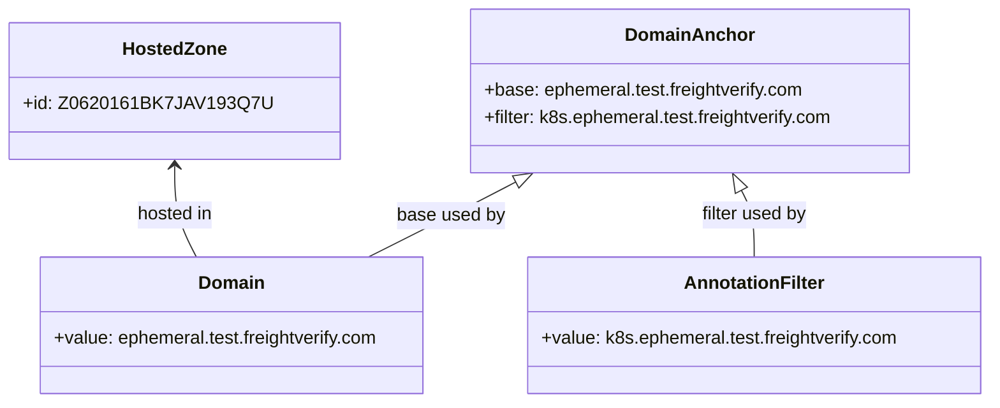
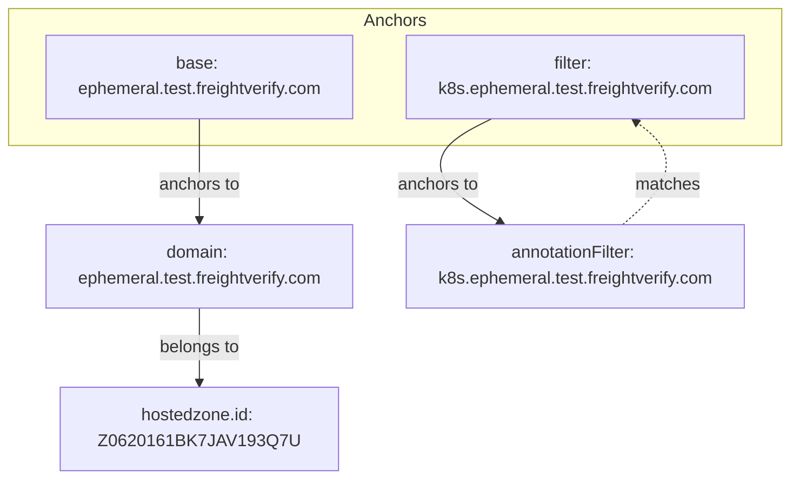

# Diagram: devops/k8s/external-dns/helm/values.ephemeral-test.yaml

> Auto-generated by Obscura crawlers

## Diagram 1

### SVG

<svg id="container" width="853.0390625" xmlns="http://www.w3.org/2000/svg" class="classDiagram" height="354" viewBox="0 0 853.0390625 354" role="graphics-document document" aria-roledescription="class"><g><defs><marker id="container_class-aggregationStart" class="marker aggregation class" refX="18" refY="7" markerWidth="190" markerHeight="240" orient="auto"><path d="M 18,7 L9,13 L1,7 L9,1 Z"></path></marker></defs><defs><marker id="container_class-aggregationEnd" class="marker aggregation class" refX="1" refY="7" markerWidth="20" markerHeight="28" orient="auto"><path d="M 18,7 L9,13 L1,7 L9,1 Z"></path></marker></defs><defs><marker id="container_class-extensionStart" class="marker extension class" refX="18" refY="7" markerWidth="190" markerHeight="240" orient="auto"><path d="M 1,7 L18,13 V 1 Z"></path></marker></defs><defs><marker id="container_class-extensionEnd" class="marker extension class" refX="1" refY="7" markerWidth="20" markerHeight="28" orient="auto"><path d="M 1,1 V 13 L18,7 Z"></path></marker></defs><defs><marker id="container_class-compositionStart" class="marker composition class" refX="18" refY="7" markerWidth="190" markerHeight="240" orient="auto"><path d="M 18,7 L9,13 L1,7 L9,1 Z"></path></marker></defs><defs><marker id="container_class-compositionEnd" class="marker composition class" refX="1" refY="7" markerWidth="20" markerHeight="28" orient="auto"><path d="M 18,7 L9,13 L1,7 L9,1 Z"></path></marker></defs><defs><marker id="container_class-dependencyStart" class="marker dependency class" refX="6" refY="7" markerWidth="190" markerHeight="240" orient="auto"><path d="M 5,7 L9,13 L1,7 L9,1 Z"></path></marker></defs><defs><marker id="container_class-dependencyEnd" class="marker dependency class" refX="13" refY="7" markerWidth="20" markerHeight="28" orient="auto"><path d="M 18,7 L9,13 L14,7 L9,1 Z"></path></marker></defs><defs><marker id="container_class-lollipopStart" class="marker lollipop class" refX="13" refY="7" markerWidth="190" markerHeight="240" orient="auto"><circle stroke="black" fill="transparent" cx="7" cy="7" r="6"></circle></marker></defs><defs><marker id="container_class-lollipopEnd" class="marker lollipop class" refX="1" refY="7" markerWidth="190" markerHeight="240" orient="auto"><circle stroke="black" fill="transparent" cx="7" cy="7" r="6"></circle></marker></defs><g class="root"><g class="clusters"></g><g class="edgePaths"><path d="M433.256,159.942L423.918,164.785C414.58,169.628,395.904,179.314,374.628,190.324C353.352,201.333,329.476,213.667,317.538,219.833L305.6,226" id="id_DomainAnchor_Domain_1" class="edge-thickness-normal edge-pattern-solid relation" style=";;;" data-edge="true" data-et="edge" data-id="id_DomainAnchor_Domain_1" data-points="W3sieCI6NDQ4LjU2OTI3MzIyMjQ3NywieSI6MTUyfSx7IngiOjM3Ny4yMjg1MTU2MjUsInkiOjE4OX0seyJ4IjozMDUuNTk5ODcxMTM0MDIwNjUsInkiOjIyNn1d" marker-start="url(#container_class-extensionStart)"></path><path d="M633.452,167.255L635.365,170.879C637.278,174.503,641.104,181.752,643.017,191.543C644.93,201.333,644.93,213.667,644.93,219.833L644.93,226" id="id_DomainAnchor_AnnotationFilter_2" class="edge-thickness-normal edge-pattern-solid relation" style=";;;" data-edge="true" data-et="edge" data-id="id_DomainAnchor_AnnotationFilter_2" data-points="W3sieCI6NjI1LjM5OTQwNTEwMzIxMSwieSI6MTUyfSx7IngiOjY0NC45Mjk2ODc1LCJ5IjoxODl9LHsieCI6NjQ0LjkyOTY4NzUsInkiOjIyNn1d" marker-start="url(#container_class-extensionStart)"></path><path d="M138.668,146L138.668,153.167C138.668,160.333,138.668,174.667,141.896,188C145.124,201.333,151.58,213.667,154.809,219.833L158.037,226" id="id_HostedZone_Domain_3" class="edge-thickness-normal edge-pattern-solid relation" style=";;;" data-edge="true" data-et="edge" data-id="id_HostedZone_Domain_3" data-points="W3sieCI6MTM4LjY2Nzk2ODc1LCJ5IjoxNDB9LHsieCI6MTM4LjY2Nzk2ODc1LCJ5IjoxODl9LHsieCI6MTU4LjAzNjY0NjI2Mjg4NjYsInkiOjIyNn1d" marker-start="url(#container_class-dependencyStart)"></path></g><g class="edgeLabels"><g class="edgeLabel" transform="translate(377.11494, 189.05867)"><g class="label" data-id="id_DomainAnchor_Domain_1" transform="translate(-47.4765625, -12)"><foreignObject width="94.953125" height="24">

base used by

</foreignObject></g></g><g class="edgeLabel" transform="translate(644.9296875, 189)"><g class="label" data-id="id_DomainAnchor_AnnotationFilter_2" transform="translate(-47.59375, -12)"><foreignObject width="95.1875" height="24">

filter used by

</foreignObject></g></g><g class="edgeLabel" transform="translate(138.66796875, 189)"><g class="label" data-id="id_HostedZone_Domain_3" transform="translate(-34.078125, -12)"><foreignObject width="68.15625" height="24">

hosted in

</foreignObject></g></g></g><g class="nodes"><g class="node default" id="classId-DomainAnchor-0" transform="translate(587.39453125, 80)"><g class="basic label-container"><path d="M-194.8984375 -72 L194.8984375 -72 L194.8984375 72 L-194.8984375 72" stroke="none" stroke-width="0" fill="#ECECFF" style=""></path><path d="M-194.8984375 -72 C-108.34948993215401 -72, -21.80054236430803 -72, 194.8984375 -72 M-194.8984375 -72 C-94.42039625184144 -72, 6.057644996317123 -72, 194.8984375 -72 M194.8984375 -72 C194.8984375 -25.11928438879429, 194.8984375 21.761431222411417, 194.8984375 72 M194.8984375 -72 C194.8984375 -33.19848254771449, 194.8984375 5.603034904571018, 194.8984375 72 M194.8984375 72 C57.22144811792202 72, -80.45554126415595 72, -194.8984375 72 M194.8984375 72 C63.916168357856236 72, -67.06610078428753 72, -194.8984375 72 M-194.8984375 72 C-194.8984375 39.56168003389088, -194.8984375 7.123360067781761, -194.8984375 -72 M-194.8984375 72 C-194.8984375 16.884163645261324, -194.8984375 -38.23167270947735, -194.8984375 -72" stroke="#9370DB" stroke-width="1.3" fill="none" stroke-dasharray="0 0" style=""></path></g><g class="annotation-group text" transform="translate(0, -48)"></g><g class="label-group text" transform="translate(-53.5625, -48)"><g class="label" style="font-weight: bolder" transform="translate(0,-12)"><foreignObject width="107.125" height="24">

DomainAnchor

</foreignObject></g></g><g class="members-group text" transform="translate(-182.8984375, 0)"><g class="label" style="" transform="translate(0,-12)"><foreignObject width="283.90625" height="24">

+base: ephemeral.test.freightverify.com

</foreignObject></g><g class="label" style="" transform="translate(0,12)"><foreignObject width="312.234375" height="24">

+filter: k8s.ephemeral.test.freightverify.com

</foreignObject></g></g><g class="methods-group text" transform="translate(-182.8984375, 72)"></g><g class="divider" style=""><path d="M-194.8984375 -24 C-69.61567536797236 -24, 55.667086764055284 -24, 194.8984375 -24 M-194.8984375 -24 C-72.84505665494578 -24, 49.20832419010844 -24, 194.8984375 -24" stroke="#9370DB" stroke-width="1.3" fill="none" stroke-dasharray="0 0" style=""></path></g><g class="divider" style=""><path d="M-194.8984375 48 C-92.39743010853343 48, 10.103577282933145 48, 194.8984375 48 M-194.8984375 48 C-104.17000508771895 48, -13.441572675437897 48, 194.8984375 48" stroke="#9370DB" stroke-width="1.3" fill="none" stroke-dasharray="0 0" style=""></path></g></g><g class="node default" id="classId-Domain-1" transform="translate(189.4453125, 286)"><g class="basic label-container"><path d="M-170.22265625 -60 L170.22265625 -60 L170.22265625 60 L-170.22265625 60" stroke="none" stroke-width="0" fill="#ECECFF" style=""></path><path d="M-170.22265625 -60 C-50.322388197283885 -60, 69.57787985543223 -60, 170.22265625 -60 M-170.22265625 -60 C-62.671667815113054 -60, 44.87932061977389 -60, 170.22265625 -60 M170.22265625 -60 C170.22265625 -13.95353823732001, 170.22265625 32.09292352535998, 170.22265625 60 M170.22265625 -60 C170.22265625 -12.17601011030758, 170.22265625 35.64797977938484, 170.22265625 60 M170.22265625 60 C39.45537432494976 60, -91.31190760010048 60, -170.22265625 60 M170.22265625 60 C69.49844062315645 60, -31.22577500368709 60, -170.22265625 60 M-170.22265625 60 C-170.22265625 32.054784276650366, -170.22265625 4.109568553300726, -170.22265625 -60 M-170.22265625 60 C-170.22265625 18.934360835851102, -170.22265625 -22.131278328297796, -170.22265625 -60" stroke="#9370DB" stroke-width="1.3" fill="none" stroke-dasharray="0 0" style=""></path></g><g class="annotation-group text" transform="translate(0, -36)"></g><g class="label-group text" transform="translate(-27.8984375, -36)"><g class="label" style="font-weight: bolder" transform="translate(0,-12)"><foreignObject width="55.796875" height="24">

Domain

</foreignObject></g></g><g class="members-group text" transform="translate(-158.22265625, 12)"><g class="label" style="" transform="translate(0,-12)"><foreignObject width="288.546875" height="24">

+value: ephemeral.test.freightverify.com

</foreignObject></g></g><g class="methods-group text" transform="translate(-158.22265625, 60)"></g><g class="divider" style=""><path d="M-170.22265625 -12 C-63.99944985176883 -12, 42.22375654646234 -12, 170.22265625 -12 M-170.22265625 -12 C-73.87988876320233 -12, 22.462878723595338 -12, 170.22265625 -12" stroke="#9370DB" stroke-width="1.3" fill="none" stroke-dasharray="0 0" style=""></path></g><g class="divider" style=""><path d="M-170.22265625 36 C-45.21420333318352 36, 79.79424958363296 36, 170.22265625 36 M-170.22265625 36 C-84.17932479579785 36, 1.8640066584042927 36, 170.22265625 36" stroke="#9370DB" stroke-width="1.3" fill="none" stroke-dasharray="0 0" style=""></path></g></g><g class="node default" id="classId-HostedZone-2" transform="translate(138.66796875, 80)"><g class="basic label-container"><path d="M-130.66796875 -60 L130.66796875 -60 L130.66796875 60 L-130.66796875 60" stroke="none" stroke-width="0" fill="#ECECFF" style=""></path><path d="M-130.66796875 -60 C-32.11243515767208 -60, 66.44309843465584 -60, 130.66796875 -60 M-130.66796875 -60 C-55.72248803524414 -60, 19.22299267951172 -60, 130.66796875 -60 M130.66796875 -60 C130.66796875 -23.691435562394716, 130.66796875 12.617128875210568, 130.66796875 60 M130.66796875 -60 C130.66796875 -25.55894169261576, 130.66796875 8.882116614768478, 130.66796875 60 M130.66796875 60 C68.32676112983737 60, 5.98555350967473 60, -130.66796875 60 M130.66796875 60 C36.11352603256769 60, -58.44091668486462 60, -130.66796875 60 M-130.66796875 60 C-130.66796875 26.135554140111843, -130.66796875 -7.728891719776314, -130.66796875 -60 M-130.66796875 60 C-130.66796875 16.89382552511168, -130.66796875 -26.21234894977664, -130.66796875 -60" stroke="#9370DB" stroke-width="1.3" fill="none" stroke-dasharray="0 0" style=""></path></g><g class="annotation-group text" transform="translate(0, -36)"></g><g class="label-group text" transform="translate(-43.9140625, -36)"><g class="label" style="font-weight: bolder" transform="translate(0,-12)"><foreignObject width="87.828125" height="24">

HostedZone

</foreignObject></g></g><g class="members-group text" transform="translate(-118.66796875, 12)"><g class="label" style="" transform="translate(0,-12)"><foreignObject width="193.421875" height="24">

+id: Z0620161BK7JAV193Q7U

</foreignObject></g></g><g class="methods-group text" transform="translate(-118.66796875, 60)"></g><g class="divider" style=""><path d="M-130.66796875 -12 C-44.43502811181918 -12, 41.79791252636164 -12, 130.66796875 -12 M-130.66796875 -12 C-44.39722387213878 -12, 41.87352100572244 -12, 130.66796875 -12" stroke="#9370DB" stroke-width="1.3" fill="none" stroke-dasharray="0 0" style=""></path></g><g class="divider" style=""><path d="M-130.66796875 36 C-31.99880759438851 36, 66.67035356122298 36, 130.66796875 36 M-130.66796875 36 C-44.478351073186104 36, 41.71126660362779 36, 130.66796875 36" stroke="#9370DB" stroke-width="1.3" fill="none" stroke-dasharray="0 0" style=""></path></g></g><g class="node default" id="classId-AnnotationFilter-3" transform="translate(644.9296875, 286)"><g class="basic label-container"><path d="M-200.109375 -60 L200.109375 -60 L200.109375 60 L-200.109375 60" stroke="none" stroke-width="0" fill="#ECECFF" style=""></path><path d="M-200.109375 -60 C-76.15315705500976 -60, 47.803060889980486 -60, 200.109375 -60 M-200.109375 -60 C-82.73081166431213 -60, 34.647751671375744 -60, 200.109375 -60 M200.109375 -60 C200.109375 -35.83901412126599, 200.109375 -11.678028242531973, 200.109375 60 M200.109375 -60 C200.109375 -17.602123064207774, 200.109375 24.795753871584452, 200.109375 60 M200.109375 60 C64.97018800483974 60, -70.16899899032052 60, -200.109375 60 M200.109375 60 C44.240276103826346 60, -111.62882279234731 60, -200.109375 60 M-200.109375 60 C-200.109375 30.649176795965605, -200.109375 1.2983535919312104, -200.109375 -60 M-200.109375 60 C-200.109375 34.5025715763911, -200.109375 9.005143152782196, -200.109375 -60" stroke="#9370DB" stroke-width="1.3" fill="none" stroke-dasharray="0 0" style=""></path></g><g class="annotation-group text" transform="translate(0, -36)"></g><g class="label-group text" transform="translate(-59.5, -36)"><g class="label" style="font-weight: bolder" transform="translate(0,-12)"><foreignObject width="119" height="24">

AnnotationFilter

</foreignObject></g></g><g class="members-group text" transform="translate(-188.109375, 12)"><g class="label" style="" transform="translate(0,-12)"><foreignObject width="316.71875" height="24">

+value: k8s.ephemeral.test.freightverify.com

</foreignObject></g></g><g class="methods-group text" transform="translate(-188.109375, 60)"></g><g class="divider" style=""><path d="M-200.109375 -12 C-106.23822154046724 -12, -12.367068080934473 -12, 200.109375 -12 M-200.109375 -12 C-99.3612438596183 -12, 1.3868872807634034 -12, 200.109375 -12" stroke="#9370DB" stroke-width="1.3" fill="none" stroke-dasharray="0 0" style=""></path></g><g class="divider" style=""><path d="M-200.109375 36 C-103.61601140690163 36, -7.122647813803269 36, 200.109375 36 M-200.109375 36 C-94.12160842557535 36, 11.866158148849308 36, 200.109375 36" stroke="#9370DB" stroke-width="1.3" fill="none" stroke-dasharray="0 0" style=""></path></g></g></g></g></g></svg>

## Diagram 2

### SVG

<svg id="container" width="751.671875" xmlns="http://www.w3.org/2000/svg" class="flowchart" height="448" viewBox="0 0 751.671875 448" role="graphics-document document" aria-roledescription="flowchart-v2"><g><marker id="container_flowchart-v2-pointEnd" class="marker flowchart-v2" viewBox="0 0 10 10" refX="5" refY="5" markerUnits="userSpaceOnUse" markerWidth="8" markerHeight="8" orient="auto"><path d="M 0 0 L 10 5 L 0 10 z" class="arrowMarkerPath" style="stroke-width: 1; stroke-dasharray: 1, 0;"></path></marker><marker id="container_flowchart-v2-pointStart" class="marker flowchart-v2" viewBox="0 0 10 10" refX="4.5" refY="5" markerUnits="userSpaceOnUse" markerWidth="8" markerHeight="8" orient="auto"><path d="M 0 5 L 10 10 L 10 0 z" class="arrowMarkerPath" style="stroke-width: 1; stroke-dasharray: 1, 0;"></path></marker><marker id="container_flowchart-v2-circleEnd" class="marker flowchart-v2" viewBox="0 0 10 10" refX="11" refY="5" markerUnits="userSpaceOnUse" markerWidth="11" markerHeight="11" orient="auto"><circle cx="5" cy="5" r="5" class="arrowMarkerPath" style="stroke-width: 1; stroke-dasharray: 1, 0;"></circle></marker><marker id="container_flowchart-v2-circleStart" class="marker flowchart-v2" viewBox="0 0 10 10" refX="-1" refY="5" markerUnits="userSpaceOnUse" markerWidth="11" markerHeight="11" orient="auto"><circle cx="5" cy="5" r="5" class="arrowMarkerPath" style="stroke-width: 1; stroke-dasharray: 1, 0;"></circle></marker><marker id="container_flowchart-v2-crossEnd" class="marker cross flowchart-v2" viewBox="0 0 11 11" refX="12" refY="5.2" markerUnits="userSpaceOnUse" markerWidth="11" markerHeight="11" orient="auto"><path d="M 1,1 l 9,9 M 10,1 l -9,9" class="arrowMarkerPath" style="stroke-width: 2; stroke-dasharray: 1, 0;"></path></marker><marker id="container_flowchart-v2-crossStart" class="marker cross flowchart-v2" viewBox="0 0 11 11" refX="-1" refY="5.2" markerUnits="userSpaceOnUse" markerWidth="11" markerHeight="11" orient="auto"><path d="M 1,1 l 9,9 M 10,1 l -9,9" class="arrowMarkerPath" style="stroke-width: 2; stroke-dasharray: 1, 0;"></path></marker><g class="root"><g class="clusters"><g class="cluster" id="Anchors" data-look="classic"><rect style="" x="8" y="8" width="735.671875" height="128"></rect><g class="cluster-label" transform="translate(346.671875, 8)"><foreignObject width="58.328125" height="24">

Anchors

</foreignObject></g></g></g><g class="edgePaths"><path d="M189.875,111L189.875,115.167C189.875,119.333,189.875,127.667,189.875,138C189.875,148.333,189.875,160.667,189.875,172.333C189.875,184,189.875,195,189.875,200.5L189.875,206" id="L_A_base_Domain_0" class="edge-thickness-normal edge-pattern-solid edge-thickness-normal edge-pattern-solid flowchart-link" style=";" data-edge="true" data-et="edge" data-id="L_A_base_Domain_0" data-points="W3sieCI6MTg5Ljg3NSwieSI6MTExfSx7IngiOjE4OS44NzUsInkiOjEzNn0seyJ4IjoxODkuODc1LCJ5IjoxNzN9LHsieCI6MTg5Ljg3NSwieSI6MjEwfV0=" marker-end="url(#container_flowchart-v2-pointEnd)"></path><path d="M468.233,111L459.741,115.167C451.25,119.333,434.268,127.667,425.776,138C417.285,148.333,417.285,160.667,427.292,172.664C437.299,184.662,457.312,196.324,467.319,202.155L477.326,207.986" id="L_A_filter_AnnotationFilter_0" class="edge-thickness-normal edge-pattern-solid edge-thickness-normal edge-pattern-solid flowchart-link" style=";" data-edge="true" data-et="edge" data-id="L_A_filter_AnnotationFilter_0" data-points="W3sieCI6NDY4LjIzMjcyNzA1MDc4MTI1LCJ5IjoxMTF9LHsieCI6NDE3LjI4NTE1NjI1LCJ5IjoxMzZ9LHsieCI6NDE3LjI4NTE1NjI1LCJ5IjoxNzN9LHsieCI6NDgwLjc4MTkxODE3NDM0MjEsInkiOjIxMH1d" marker-end="url(#container_flowchart-v2-pointEnd)"></path><path d="M189.875,288L189.875,294.167C189.875,300.333,189.875,312.667,189.875,324.333C189.875,336,189.875,347,189.875,352.5L189.875,358" id="L_Domain_HostedZone_0" class="edge-thickness-normal edge-pattern-solid edge-thickness-normal edge-pattern-solid flowchart-link" style=";" data-edge="true" data-et="edge" data-id="L_Domain_HostedZone_0" data-points="W3sieCI6MTg5Ljg3NSwieSI6Mjg4fSx7IngiOjE4OS44NzUsInkiOjMyNX0seyJ4IjoxODkuODc1LCJ5IjozNjJ9XQ==" marker-end="url(#container_flowchart-v2-pointEnd)"></path><path d="M592.859,210L599.998,203.833C607.136,197.667,621.414,185.333,628.553,173C635.691,160.667,635.691,148.333,630.503,138.392C625.314,128.451,614.936,120.902,609.748,117.128L604.559,113.353" id="L_AnnotationFilter_A_filter_0" class="edge-thickness-normal edge-pattern-dotted edge-thickness-normal edge-pattern-solid flowchart-link" style=";" data-edge="true" data-et="edge" data-id="L_AnnotationFilter_A_filter_0" data-points="W3sieCI6NTkyLjg1ODgwOTYyMTcxMDUsInkiOjIxMH0seyJ4Ijo2MzUuNjkxNDA2MjUsInkiOjE3M30seyJ4Ijo2MzUuNjkxNDA2MjUsInkiOjEzNn0seyJ4Ijo2MDEuMzI0MDM1NjQ0NTMxMiwieSI6MTExfV0=" marker-end="url(#container_flowchart-v2-pointEnd)"></path></g><g class="edgeLabels"><g class="edgeLabel" transform="translate(189.875, 173)"><g class="label" data-id="L_A_base_Domain_0" transform="translate(-38.4921875, -12)"><foreignObject width="76.984375" height="24">

anchors to

</foreignObject></g></g><g class="edgeLabel" transform="translate(417.28515625, 173)"><g class="label" data-id="L_A_filter_AnnotationFilter_0" transform="translate(-38.4921875, -12)"><foreignObject width="76.984375" height="24">

anchors to

</foreignObject></g></g><g class="edgeLabel" transform="translate(189.875, 325)"><g class="label" data-id="L_Domain_HostedZone_0" transform="translate(-38.1796875, -12)"><foreignObject width="76.359375" height="24">

belongs to

</foreignObject></g></g><g class="edgeLabel" transform="translate(635.69140625, 173)"><g class="label" data-id="L_AnnotationFilter_A_filter_0" transform="translate(-30.5859375, -12)"><foreignObject width="61.171875" height="24">

matches

</foreignObject></g></g></g><g class="nodes"><g class="node default" id="flowchart-A_base-0" transform="translate(189.875, 72)"><rect class="basic label-container" style="" x="-146.875" y="-39" width="293.75" height="78"></rect><g class="label" style="" transform="translate(-116.875, -24)"><rect></rect><foreignObject width="233.75" height="48">

base: ephemeral.test.freightverify.com

</foreignObject></g></g><g class="node default" id="flowchart-A_filter-1" transform="translate(547.7109375, 72)"><rect class="basic label-container" style="" x="-160.9609375" y="-39" width="321.921875" height="78"></rect><g class="label" style="" transform="translate(-130.9609375, -24)"><rect></rect><foreignObject width="261.921875" height="48">

filter: k8s.ephemeral.test.freightverify.com

</foreignObject></g></g><g class="node default" id="flowchart-Domain-2" transform="translate(189.875, 249)"><rect class="basic label-container" style="" x="-146.8828125" y="-39" width="293.765625" height="78"></rect><g class="label" style="" transform="translate(-116.8828125, -24)"><rect></rect><foreignObject width="233.765625" height="48">

domain: ephemeral.test.freightverify.com

</foreignObject></g></g><g class="node default" id="flowchart-HostedZone-3" transform="translate(189.875, 401)"><rect class="basic label-container" style="" x="-130" y="-39" width="260" height="78"></rect><g class="label" style="" transform="translate(-100, -24)"><rect></rect><foreignObject width="200" height="48">

hostedzone.id: Z0620161BK7JAV193Q7U

</foreignObject></g></g><g class="node default" id="flowchart-AnnotationFilter-4" transform="translate(547.7109375, 249)"><rect class="basic label-container" style="" x="-160.953125" y="-39" width="321.90625" height="78"></rect><g class="label" style="" transform="translate(-130.953125, -24)"><rect></rect><foreignObject width="261.90625" height="48">

annotationFilter: k8s.ephemeral.test.freightverify.com

</foreignObject></g></g></g></g></g></svg>
