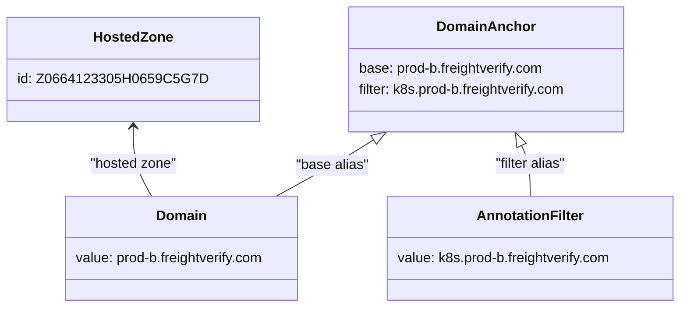

# Diagram: devops/k8s/external-dns/helm/values.prod-b.yaml

> Auto-generated by Obscura crawlers

## Mermaid

### SVG

<svg id="container" width="775.58203125" xmlns="http://www.w3.org/2000/svg" class="classDiagram" height="354" viewBox="0 0 775.58203125 354" role="graphics-document document" aria-roledescription="class"><g><defs><marker id="container_class-aggregationStart" class="marker aggregation class" refX="18" refY="7" markerWidth="190" markerHeight="240" orient="auto"><path d="M 18,7 L9,13 L1,7 L9,1 Z"></path></marker></defs><defs><marker id="container_class-aggregationEnd" class="marker aggregation class" refX="1" refY="7" markerWidth="20" markerHeight="28" orient="auto"><path d="M 18,7 L9,13 L1,7 L9,1 Z"></path></marker></defs><defs><marker id="container_class-extensionStart" class="marker extension class" refX="18" refY="7" markerWidth="190" markerHeight="240" orient="auto"><path d="M 1,7 L18,13 V 1 Z"></path></marker></defs><defs><marker id="container_class-extensionEnd" class="marker extension class" refX="1" refY="7" markerWidth="20" markerHeight="28" orient="auto"><path d="M 1,1 V 13 L18,7 Z"></path></marker></defs><defs><marker id="container_class-compositionStart" class="marker composition class" refX="18" refY="7" markerWidth="190" markerHeight="240" orient="auto"><path d="M 18,7 L9,13 L1,7 L9,1 Z"></path></marker></defs><defs><marker id="container_class-compositionEnd" class="marker composition class" refX="1" refY="7" markerWidth="20" markerHeight="28" orient="auto"><path d="M 18,7 L9,13 L1,7 L9,1 Z"></path></marker></defs><defs><marker id="container_class-dependencyStart" class="marker dependency class" refX="6" refY="7" markerWidth="190" markerHeight="240" orient="auto"><path d="M 5,7 L9,13 L1,7 L9,1 Z"></path></marker></defs><defs><marker id="container_class-dependencyEnd" class="marker dependency class" refX="13" refY="7" markerWidth="20" markerHeight="28" orient="auto"><path d="M 18,7 L9,13 L14,7 L9,1 Z"></path></marker></defs><defs><marker id="container_class-lollipopStart" class="marker lollipop class" refX="13" refY="7" markerWidth="190" markerHeight="240" orient="auto"><circle stroke="black" fill="transparent" cx="7" cy="7" r="6"></circle></marker></defs><defs><marker id="container_class-lollipopEnd" class="marker lollipop class" refX="1" refY="7" markerWidth="190" markerHeight="240" orient="auto"><circle stroke="black" fill="transparent" cx="7" cy="7" r="6"></circle></marker></defs><g class="root"><g class="clusters"></g><g class="edgePaths"><path d="M416.713,161.047L409.15,165.706C401.587,170.365,386.46,179.682,367.906,190.508C349.353,201.333,327.371,213.667,316.38,219.833L305.39,226" id="id_DomainAnchor_Domain_1" class="edge-thickness-normal edge-pattern-solid relation" style=";;;" data-edge="true" data-et="edge" data-id="id_DomainAnchor_Domain_1" data-points="W3sieCI6NDMxLjM5OTk3ODQ5NzcwNjQ2LCJ5IjoxNTJ9LHsieCI6MzcxLjMzMzk4NDM3NSwieSI6MTg5fSx7IngiOjMwNS4zODk3MzkwNDYzOTE3NSwieSI6MjI2fV0=" marker-start="url(#container_class-extensionStart)"></path><path d="M590.346,167.549L592.064,171.124C593.782,174.699,597.217,181.85,598.935,191.591C600.652,201.333,600.652,213.667,600.652,219.833L600.652,226" id="id_DomainAnchor_AnnotationFilter_2" class="edge-thickness-normal edge-pattern-solid relation" style=";;;" data-edge="true" data-et="edge" data-id="id_DomainAnchor_AnnotationFilter_2" data-points="W3sieCI6NTgyLjg3NjMyNTk3NDc3MDcsInkiOjE1Mn0seyJ4Ijo2MDAuNjUyMzQzNzUsInkiOjE4OX0seyJ4Ijo2MDAuNjUyMzQzNzUsInkiOjIyNn1d" marker-start="url(#container_class-extensionStart)"></path><path d="M142.004,146L142.004,153.167C142.004,160.333,142.004,174.667,145.593,188C149.181,201.333,156.359,213.667,159.947,219.833L163.536,226" id="id_HostedZone_Domain_3" class="edge-thickness-normal edge-pattern-solid relation" style=";;;" data-edge="true" data-et="edge" data-id="id_HostedZone_Domain_3" data-points="W3sieCI6MTQyLjAwMzkwNjI1LCJ5IjoxNDB9LHsieCI6MTQyLjAwMzkwNjI1LCJ5IjoxODl9LHsieCI6MTYzLjUzNjA4MjQ3NDIyNjgyLCJ5IjoyMjZ9XQ==" marker-start="url(#container_class-dependencyStart)"></path></g><g class="edgeLabels"><g class="edgeLabel" transform="translate(369.12417, 190.23989)"><g class="label" data-id="id_DomainAnchor_Domain_1" transform="translate(-42.3046875, -12)"><foreignObject width="84.609375" height="24">

"base alias"

</foreignObject></g></g><g class="edgeLabel" transform="translate(600.65234375, 189)"><g class="label" data-id="id_DomainAnchor_AnnotationFilter_2" transform="translate(-42.4296875, -12)"><foreignObject width="84.859375" height="24">

"filter alias"

</foreignObject></g></g><g class="edgeLabel" transform="translate(142.00390625, 189)"><g class="label" data-id="id_HostedZone_Domain_3" transform="translate(-50.59375, -12)"><foreignObject width="101.1875" height="24">

"hosted zone"

</foreignObject></g></g></g><g class="nodes"><g class="node default" id="classId-DomainAnchor-0" transform="translate(548.28515625, 80)"><g class="basic label-container"><path d="M-161.7578125 -72 L161.7578125 -72 L161.7578125 72 L-161.7578125 72" stroke="none" stroke-width="0" fill="#ECECFF" style=""></path><path d="M-161.7578125 -72 C-65.84761616230327 -72, 30.062580175393464 -72, 161.7578125 -72 M-161.7578125 -72 C-64.92721264111802 -72, 31.903387217763964 -72, 161.7578125 -72 M161.7578125 -72 C161.7578125 -42.997391357844634, 161.7578125 -13.994782715689261, 161.7578125 72 M161.7578125 -72 C161.7578125 -30.773480803461716, 161.7578125 10.453038393076568, 161.7578125 72 M161.7578125 72 C96.23439890512307 72, 30.710985310246144 72, -161.7578125 72 M161.7578125 72 C85.3096401997539 72, 8.861467899507801 72, -161.7578125 72 M-161.7578125 72 C-161.7578125 19.515735107854624, -161.7578125 -32.96852978429075, -161.7578125 -72 M-161.7578125 72 C-161.7578125 27.37359576377714, -161.7578125 -17.25280847244572, -161.7578125 -72" stroke="#9370DB" stroke-width="1.3" fill="none" stroke-dasharray="0 0" style=""></path></g><g class="annotation-group text" transform="translate(0, -48)"></g><g class="label-group text" transform="translate(-53.5625, -48)"><g class="label" style="font-weight: bolder" transform="translate(0,-12)"><foreignObject width="107.125" height="24">

DomainAnchor

</foreignObject></g></g><g class="members-group text" transform="translate(-149.7578125, 0)"><g class="label" style="" transform="translate(0,-12)"><foreignObject width="217.234375" height="24">

base: prod-b.freightverify.com

</foreignObject></g><g class="label" style="" transform="translate(0,12)"><foreignObject width="245.953125" height="24">

filter: k8s.prod-b.freightverify.com

</foreignObject></g></g><g class="methods-group text" transform="translate(-149.7578125, 72)"></g><g class="divider" style=""><path d="M-161.7578125 -24 C-95.54671773807158 -24, -29.335622976143156 -24, 161.7578125 -24 M-161.7578125 -24 C-68.4580883904418 -24, 24.841635719116397 -24, 161.7578125 -24" stroke="#9370DB" stroke-width="1.3" fill="none" stroke-dasharray="0 0" style=""></path></g><g class="divider" style=""><path d="M-161.7578125 48 C-72.41988366292281 48, 16.918045174154372 48, 161.7578125 48 M-161.7578125 48 C-80.54453600970662 48, 0.6687404805867629 48, 161.7578125 48" stroke="#9370DB" stroke-width="1.3" fill="none" stroke-dasharray="0 0" style=""></path></g></g><g class="node default" id="classId-Domain-1" transform="translate(198.453125, 286)"><g class="basic label-container"><path d="M-136.97265625 -60 L136.97265625 -60 L136.97265625 60 L-136.97265625 60" stroke="none" stroke-width="0" fill="#ECECFF" style=""></path><path d="M-136.97265625 -60 C-48.44877354801001 -60, 40.07510915397998 -60, 136.97265625 -60 M-136.97265625 -60 C-44.00763239566042 -60, 48.957391458679155 -60, 136.97265625 -60 M136.97265625 -60 C136.97265625 -20.952120282632038, 136.97265625 18.095759434735925, 136.97265625 60 M136.97265625 -60 C136.97265625 -22.169591541943184, 136.97265625 15.660816916113632, 136.97265625 60 M136.97265625 60 C49.37336309866512 60, -38.22593005266975 60, -136.97265625 60 M136.97265625 60 C37.690240422430236 60, -61.59217540513953 60, -136.97265625 60 M-136.97265625 60 C-136.97265625 28.286311988685195, -136.97265625 -3.427376022629609, -136.97265625 -60 M-136.97265625 60 C-136.97265625 20.03141156118493, -136.97265625 -19.937176877630137, -136.97265625 -60" stroke="#9370DB" stroke-width="1.3" fill="none" stroke-dasharray="0 0" style=""></path></g><g class="annotation-group text" transform="translate(0, -36)"></g><g class="label-group text" transform="translate(-27.8984375, -36)"><g class="label" style="font-weight: bolder" transform="translate(0,-12)"><foreignObject width="55.796875" height="24">

Domain

</foreignObject></g></g><g class="members-group text" transform="translate(-124.97265625, 12)"><g class="label" style="" transform="translate(0,-12)"><foreignObject width="222.046875" height="24">

value: prod-b.freightverify.com

</foreignObject></g></g><g class="methods-group text" transform="translate(-124.97265625, 60)"></g><g class="divider" style=""><path d="M-136.97265625 -12 C-33.9475839875587 -12, 69.0774882748826 -12, 136.97265625 -12 M-136.97265625 -12 C-70.80452474172358 -12, -4.636393233447166 -12, 136.97265625 -12" stroke="#9370DB" stroke-width="1.3" fill="none" stroke-dasharray="0 0" style=""></path></g><g class="divider" style=""><path d="M-136.97265625 36 C-77.50429866831007 36, -18.035941086620127 36, 136.97265625 36 M-136.97265625 36 C-50.05825064027134 36, 36.85615496945732 36, 136.97265625 36" stroke="#9370DB" stroke-width="1.3" fill="none" stroke-dasharray="0 0" style=""></path></g></g><g class="node default" id="classId-HostedZone-2" transform="translate(142.00390625, 80)"><g class="basic label-container"><path d="M-134.00390625 -60 L134.00390625 -60 L134.00390625 60 L-134.00390625 60" stroke="none" stroke-width="0" fill="#ECECFF" style=""></path><path d="M-134.00390625 -60 C-55.039112943894835 -60, 23.92568036221033 -60, 134.00390625 -60 M-134.00390625 -60 C-43.94160156353135 -60, 46.1207031229373 -60, 134.00390625 -60 M134.00390625 -60 C134.00390625 -24.882894241589007, 134.00390625 10.234211516821986, 134.00390625 60 M134.00390625 -60 C134.00390625 -15.216252936461487, 134.00390625 29.567494127077026, 134.00390625 60 M134.00390625 60 C49.04615048132116 60, -35.91160528735767 60, -134.00390625 60 M134.00390625 60 C72.29314326290633 60, 10.582380275812653 60, -134.00390625 60 M-134.00390625 60 C-134.00390625 23.03158866918197, -134.00390625 -13.936822661636057, -134.00390625 -60 M-134.00390625 60 C-134.00390625 35.647235958070546, -134.00390625 11.294471916141092, -134.00390625 -60" stroke="#9370DB" stroke-width="1.3" fill="none" stroke-dasharray="0 0" style=""></path></g><g class="annotation-group text" transform="translate(0, -36)"></g><g class="label-group text" transform="translate(-43.9140625, -36)"><g class="label" style="font-weight: bolder" transform="translate(0,-12)"><foreignObject width="87.828125" height="24">

HostedZone

</foreignObject></g></g><g class="members-group text" transform="translate(-122.00390625, 12)"><g class="label" style="" transform="translate(0,-12)"><foreignObject width="200.09375" height="24">

id: Z0664123305H0659C5G7D

</foreignObject></g></g><g class="methods-group text" transform="translate(-122.00390625, 60)"></g><g class="divider" style=""><path d="M-134.00390625 -12 C-61.57332047747033 -12, 10.857265295059335 -12, 134.00390625 -12 M-134.00390625 -12 C-73.48819579387207 -12, -12.972485337744132 -12, 134.00390625 -12" stroke="#9370DB" stroke-width="1.3" fill="none" stroke-dasharray="0 0" style=""></path></g><g class="divider" style=""><path d="M-134.00390625 36 C-58.2569069377721 36, 17.4900923744558 36, 134.00390625 36 M-134.00390625 36 C-59.80451085904265 36, 14.394884531914698 36, 134.00390625 36" stroke="#9370DB" stroke-width="1.3" fill="none" stroke-dasharray="0 0" style=""></path></g></g><g class="node default" id="classId-AnnotationFilter-3" transform="translate(600.65234375, 286)"><g class="basic label-container"><path d="M-166.9296875 -60 L166.9296875 -60 L166.9296875 60 L-166.9296875 60" stroke="none" stroke-width="0" fill="#ECECFF" style=""></path><path d="M-166.9296875 -60 C-62.458625145094416 -60, 42.01243720981117 -60, 166.9296875 -60 M-166.9296875 -60 C-58.16099912444626 -60, 50.60768925110747 -60, 166.9296875 -60 M166.9296875 -60 C166.9296875 -25.1033131709751, 166.9296875 9.793373658049802, 166.9296875 60 M166.9296875 -60 C166.9296875 -30.83734679736388, 166.9296875 -1.6746935947277635, 166.9296875 60 M166.9296875 60 C88.89498148394694 60, 10.86027546789387 60, -166.9296875 60 M166.9296875 60 C63.26902898694121 60, -40.39162952611758 60, -166.9296875 60 M-166.9296875 60 C-166.9296875 26.509249255680345, -166.9296875 -6.98150148863931, -166.9296875 -60 M-166.9296875 60 C-166.9296875 35.35477050340313, -166.9296875 10.709541006806269, -166.9296875 -60" stroke="#9370DB" stroke-width="1.3" fill="none" stroke-dasharray="0 0" style=""></path></g><g class="annotation-group text" transform="translate(0, -36)"></g><g class="label-group text" transform="translate(-59.5, -36)"><g class="label" style="font-weight: bolder" transform="translate(0,-12)"><foreignObject width="119" height="24">

AnnotationFilter

</foreignObject></g></g><g class="members-group text" transform="translate(-154.9296875, 12)"><g class="label" style="" transform="translate(0,-12)"><foreignObject width="250.359375" height="24">

value: k8s.prod-b.freightverify.com

</foreignObject></g></g><g class="methods-group text" transform="translate(-154.9296875, 60)"></g><g class="divider" style=""><path d="M-166.9296875 -12 C-58.74226934165078 -12, 49.445148816698435 -12, 166.9296875 -12 M-166.9296875 -12 C-57.41678523906222 -12, 52.09611702187556 -12, 166.9296875 -12" stroke="#9370DB" stroke-width="1.3" fill="none" stroke-dasharray="0 0" style=""></path></g><g class="divider" style=""><path d="M-166.9296875 36 C-80.15379397709196 36, 6.62209954581607 36, 166.9296875 36 M-166.9296875 36 C-81.30680030318513 36, 4.316086893629745 36, 166.9296875 36" stroke="#9370DB" stroke-width="1.3" fill="none" stroke-dasharray="0 0" style=""></path></g></g></g></g></g></svg>
