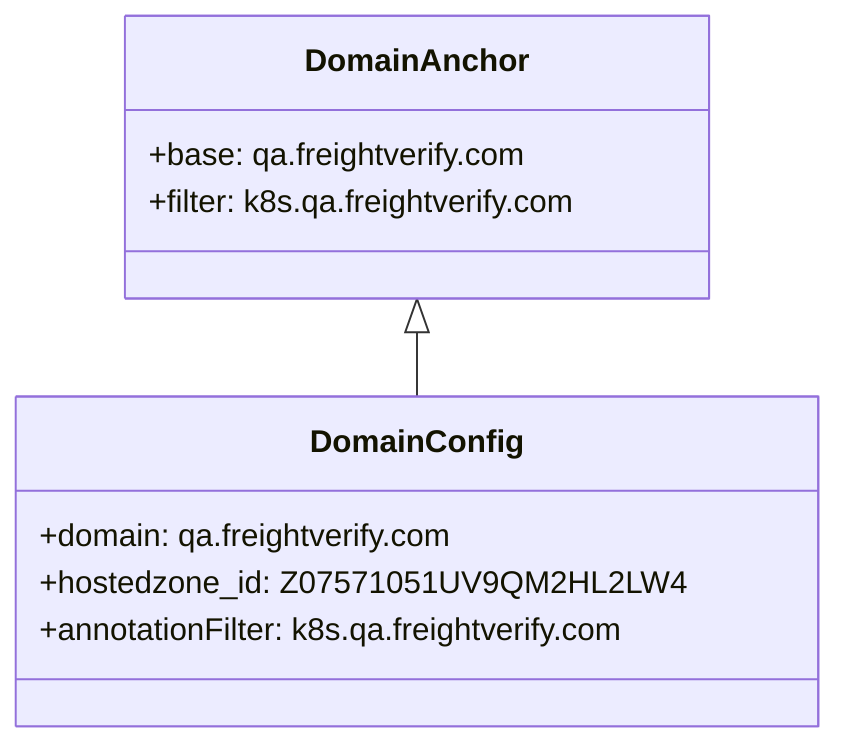
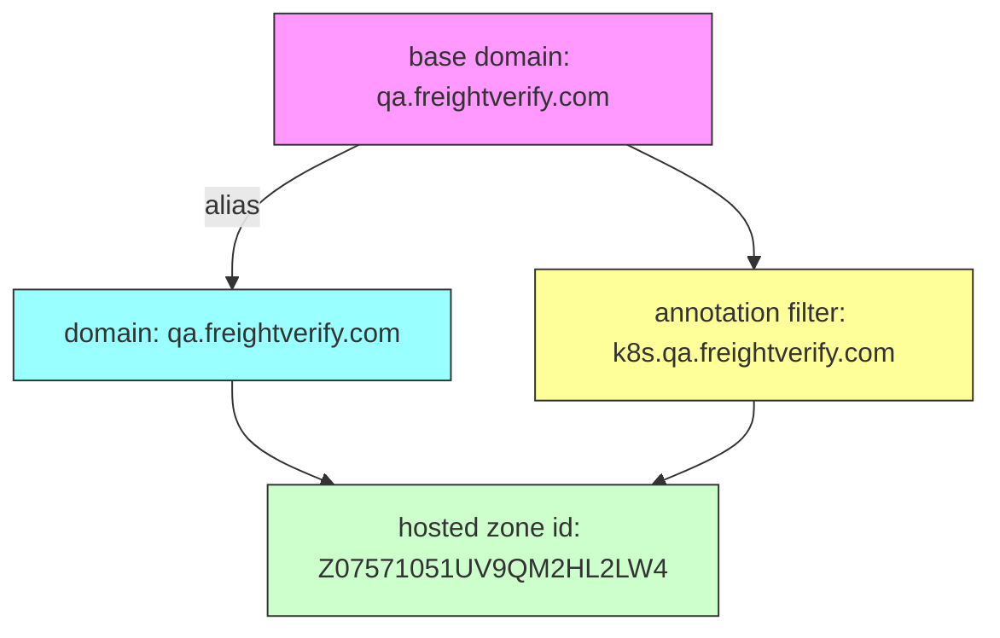

# Diagram: devops/k8s/external-dns/helm/values.qa1.yaml

> Auto-generated by Obscura crawlers

## Diagram 1

### SVG

<svg id="container" width="395.953125" xmlns="http://www.w3.org/2000/svg" class="classDiagram" height="378" viewBox="0 0 395.953125 378" role="graphics-document document" aria-roledescription="class"><g><defs><marker id="container_class-aggregationStart" class="marker aggregation class" refX="18" refY="7" markerWidth="190" markerHeight="240" orient="auto"><path d="M 18,7 L9,13 L1,7 L9,1 Z"></path></marker></defs><defs><marker id="container_class-aggregationEnd" class="marker aggregation class" refX="1" refY="7" markerWidth="20" markerHeight="28" orient="auto"><path d="M 18,7 L9,13 L1,7 L9,1 Z"></path></marker></defs><defs><marker id="container_class-extensionStart" class="marker extension class" refX="18" refY="7" markerWidth="190" markerHeight="240" orient="auto"><path d="M 1,7 L18,13 V 1 Z"></path></marker></defs><defs><marker id="container_class-extensionEnd" class="marker extension class" refX="1" refY="7" markerWidth="20" markerHeight="28" orient="auto"><path d="M 1,1 V 13 L18,7 Z"></path></marker></defs><defs><marker id="container_class-compositionStart" class="marker composition class" refX="18" refY="7" markerWidth="190" markerHeight="240" orient="auto"><path d="M 18,7 L9,13 L1,7 L9,1 Z"></path></marker></defs><defs><marker id="container_class-compositionEnd" class="marker composition class" refX="1" refY="7" markerWidth="20" markerHeight="28" orient="auto"><path d="M 18,7 L9,13 L1,7 L9,1 Z"></path></marker></defs><defs><marker id="container_class-dependencyStart" class="marker dependency class" refX="6" refY="7" markerWidth="190" markerHeight="240" orient="auto"><path d="M 5,7 L9,13 L1,7 L9,1 Z"></path></marker></defs><defs><marker id="container_class-dependencyEnd" class="marker dependency class" refX="13" refY="7" markerWidth="20" markerHeight="28" orient="auto"><path d="M 18,7 L9,13 L14,7 L9,1 Z"></path></marker></defs><defs><marker id="container_class-lollipopStart" class="marker lollipop class" refX="13" refY="7" markerWidth="190" markerHeight="240" orient="auto"><circle stroke="black" fill="transparent" cx="7" cy="7" r="6"></circle></marker></defs><defs><marker id="container_class-lollipopEnd" class="marker lollipop class" refX="1" refY="7" markerWidth="190" markerHeight="240" orient="auto"><circle stroke="black" fill="transparent" cx="7" cy="7" r="6"></circle></marker></defs><g class="root"><g class="clusters"></g><g class="edgePaths"><path d="M197.977,169.25L197.977,170.542C197.977,171.833,197.977,174.417,197.977,179.875C197.977,185.333,197.977,193.667,197.977,197.833L197.977,202" id="id_DomainAnchor_DomainConfig_1" class="edge-thickness-normal edge-pattern-solid relation" style=";;;" data-edge="true" data-et="edge" data-id="id_DomainAnchor_DomainConfig_1" data-points="W3sieCI6MTk3Ljk3NjU2MjUsInkiOjE1Mn0seyJ4IjoxOTcuOTc2NTYyNSwieSI6MTc3fSx7IngiOjE5Ny45NzY1NjI1LCJ5IjoyMDJ9XQ==" marker-start="url(#container_class-extensionStart)"></path></g><g class="edgeLabels"><g class="edgeLabel"><g class="label" data-id="id_DomainAnchor_DomainConfig_1" transform="translate(0, 0)"><foreignObject width="0" height="0">

</foreignObject></g></g></g><g class="nodes"><g class="node default" id="classId-DomainAnchor-0" transform="translate(197.9765625, 80)"><g class="basic label-container"><path d="M-149.734375 -72 L149.734375 -72 L149.734375 72 L-149.734375 72" stroke="none" stroke-width="0" fill="#ECECFF" style=""></path><path d="M-149.734375 -72 C-40.39516130317229 -72, 68.94405239365543 -72, 149.734375 -72 M-149.734375 -72 C-79.12896831647541 -72, -8.523561632950816 -72, 149.734375 -72 M149.734375 -72 C149.734375 -15.694715520789472, 149.734375 40.610568958421055, 149.734375 72 M149.734375 -72 C149.734375 -31.124991495562803, 149.734375 9.750017008874394, 149.734375 72 M149.734375 72 C65.33193561431793 72, -19.070503771364145 72, -149.734375 72 M149.734375 72 C51.82346064708811 72, -46.087453705823776 72, -149.734375 72 M-149.734375 72 C-149.734375 26.590005917080404, -149.734375 -18.81998816583919, -149.734375 -72 M-149.734375 72 C-149.734375 42.209029885932424, -149.734375 12.418059771864847, -149.734375 -72" stroke="#9370DB" stroke-width="1.3" fill="none" stroke-dasharray="0 0" style=""></path></g><g class="annotation-group text" transform="translate(0, -48)"></g><g class="label-group text" transform="translate(-53.5625, -48)"><g class="label" style="font-weight: bolder" transform="translate(0,-12)"><foreignObject width="107.125" height="24">

DomainAnchor

</foreignObject></g></g><g class="members-group text" transform="translate(-137.734375, 0)"><g class="label" style="" transform="translate(0,-12)"><foreignObject width="193.59375" height="24">

+base: qa.freightverify.com

</foreignObject></g><g class="label" style="" transform="translate(0,12)"><foreignObject width="221.90625" height="24">

+filter: k8s.qa.freightverify.com

</foreignObject></g></g><g class="methods-group text" transform="translate(-137.734375, 72)"></g><g class="divider" style=""><path d="M-149.734375 -24 C-71.66894348499872 -24, 6.396488030002558 -24, 149.734375 -24 M-149.734375 -24 C-73.90167698845016 -24, 1.9310210230996745 -24, 149.734375 -24" stroke="#9370DB" stroke-width="1.3" fill="none" stroke-dasharray="0 0" style=""></path></g><g class="divider" style=""><path d="M-149.734375 48 C-59.04405279863769 48, 31.646269402724613 48, 149.734375 48 M-149.734375 48 C-67.44673121848821 48, 14.84091256302358 48, 149.734375 48" stroke="#9370DB" stroke-width="1.3" fill="none" stroke-dasharray="0 0" style=""></path></g></g><g class="node default" id="classId-DomainConfig-1" transform="translate(197.9765625, 286)"><g class="basic label-container"><path d="M-189.9765625 -84 L189.9765625 -84 L189.9765625 84 L-189.9765625 84" stroke="none" stroke-width="0" fill="#ECECFF" style=""></path><path d="M-189.9765625 -84 C-96.93263056579038 -84, -3.888698631580752 -84, 189.9765625 -84 M-189.9765625 -84 C-42.481079796724885 -84, 105.01440290655023 -84, 189.9765625 -84 M189.9765625 -84 C189.9765625 -33.43852162888239, 189.9765625 17.122956742235218, 189.9765625 84 M189.9765625 -84 C189.9765625 -43.00875848017567, 189.9765625 -2.017516960351344, 189.9765625 84 M189.9765625 84 C73.68000005612994 84, -42.61656238774012 84, -189.9765625 84 M189.9765625 84 C43.24573252126521 84, -103.48509745746958 84, -189.9765625 84 M-189.9765625 84 C-189.9765625 31.54978416284864, -189.9765625 -20.900431674302723, -189.9765625 -84 M-189.9765625 84 C-189.9765625 34.052263832339605, -189.9765625 -15.89547233532079, -189.9765625 -84" stroke="#9370DB" stroke-width="1.3" fill="none" stroke-dasharray="0 0" style=""></path></g><g class="annotation-group text" transform="translate(0, -60)"></g><g class="label-group text" transform="translate(-50.828125, -60)"><g class="label" style="font-weight: bolder" transform="translate(0,-12)"><foreignObject width="101.65625" height="24">

DomainConfig

</foreignObject></g></g><g class="members-group text" transform="translate(-177.9765625, -12)"><g class="label" style="" transform="translate(0,-12)"><foreignObject width="214.734375" height="24">

+domain: qa.freightverify.com

</foreignObject></g><g class="label" style="" transform="translate(0,12)"><foreignObject width="305.125" height="24">

+hostedzone_id: Z07571051UV9QM2HL2LW4

</foreignObject></g><g class="label" style="" transform="translate(0,36)"><foreignObject width="304.703125" height="24">

+annotationFilter: k8s.qa.freightverify.com

</foreignObject></g></g><g class="methods-group text" transform="translate(-177.9765625, 84)"></g><g class="divider" style=""><path d="M-189.9765625 -36 C-75.84302994243905 -36, 38.29050261512191 -36, 189.9765625 -36 M-189.9765625 -36 C-51.718223471966354 -36, 86.54011555606729 -36, 189.9765625 -36" stroke="#9370DB" stroke-width="1.3" fill="none" stroke-dasharray="0 0" style=""></path></g><g class="divider" style=""><path d="M-189.9765625 60 C-105.83877867649693 60, -21.70099485299386 60, 189.9765625 60 M-189.9765625 60 C-60.65158039520992 60, 68.67340170958016 60, 189.9765625 60" stroke="#9370DB" stroke-width="1.3" fill="none" stroke-dasharray="0 0" style=""></path></g></g></g></g></g></svg>

## Diagram 2

### SVG

<svg id="container" width="586" xmlns="http://www.w3.org/2000/svg" class="flowchart" height="374" viewBox="0 0 586 374" role="graphics-document document" aria-roledescription="flowchart-v2"><g><marker id="container_flowchart-v2-pointEnd" class="marker flowchart-v2" viewBox="0 0 10 10" refX="5" refY="5" markerUnits="userSpaceOnUse" markerWidth="8" markerHeight="8" orient="auto"><path d="M 0 0 L 10 5 L 0 10 z" class="arrowMarkerPath" style="stroke-width: 1; stroke-dasharray: 1, 0;"></path></marker><marker id="container_flowchart-v2-pointStart" class="marker flowchart-v2" viewBox="0 0 10 10" refX="4.5" refY="5" markerUnits="userSpaceOnUse" markerWidth="8" markerHeight="8" orient="auto"><path d="M 0 5 L 10 10 L 10 0 z" class="arrowMarkerPath" style="stroke-width: 1; stroke-dasharray: 1, 0;"></path></marker><marker id="container_flowchart-v2-circleEnd" class="marker flowchart-v2" viewBox="0 0 10 10" refX="11" refY="5" markerUnits="userSpaceOnUse" markerWidth="11" markerHeight="11" orient="auto"><circle cx="5" cy="5" r="5" class="arrowMarkerPath" style="stroke-width: 1; stroke-dasharray: 1, 0;"></circle></marker><marker id="container_flowchart-v2-circleStart" class="marker flowchart-v2" viewBox="0 0 10 10" refX="-1" refY="5" markerUnits="userSpaceOnUse" markerWidth="11" markerHeight="11" orient="auto"><circle cx="5" cy="5" r="5" class="arrowMarkerPath" style="stroke-width: 1; stroke-dasharray: 1, 0;"></circle></marker><marker id="container_flowchart-v2-crossEnd" class="marker cross flowchart-v2" viewBox="0 0 11 11" refX="12" refY="5.2" markerUnits="userSpaceOnUse" markerWidth="11" markerHeight="11" orient="auto"><path d="M 1,1 l 9,9 M 10,1 l -9,9" class="arrowMarkerPath" style="stroke-width: 2; stroke-dasharray: 1, 0;"></path></marker><marker id="container_flowchart-v2-crossStart" class="marker cross flowchart-v2" viewBox="0 0 11 11" refX="-1" refY="5.2" markerUnits="userSpaceOnUse" markerWidth="11" markerHeight="11" orient="auto"><path d="M 1,1 l 9,9 M 10,1 l -9,9" class="arrowMarkerPath" style="stroke-width: 2; stroke-dasharray: 1, 0;"></path></marker><g class="root"><g class="clusters"></g><g class="edgePaths"><path d="M213.461,86L200.884,92.167C188.307,98.333,163.154,110.667,150.577,122.333C138,134,138,145,138,150.5L138,156" id="L_A_B_0" class="edge-thickness-normal edge-pattern-solid edge-thickness-normal edge-pattern-solid flowchart-link" style=";" data-edge="true" data-et="edge" data-id="L_A_B_0" data-points="W3sieCI6MjEzLjQ2MDUyNjMxNTc4OTQ4LCJ5Ijo4Nn0seyJ4IjoxMzgsInkiOjEyM30seyJ4IjoxMzgsInkiOjE2MH1d" marker-end="url(#container_flowchart-v2-pointEnd)"></path><path d="M372.539,86L385.116,92.167C397.693,98.333,422.846,110.667,435.423,122.333C448,134,448,145,448,150.5L448,156" id="L_A_C_0" class="edge-thickness-normal edge-pattern-solid edge-thickness-normal edge-pattern-solid flowchart-link" style=";" data-edge="true" data-et="edge" data-id="L_A_C_0" data-points="W3sieCI6MzcyLjUzOTQ3MzY4NDIxMDUsInkiOjg2fSx7IngiOjQ0OCwieSI6MTIzfSx7IngiOjQ0OCwieSI6MTYwfV0=" marker-end="url(#container_flowchart-v2-pointEnd)"></path><path d="M138,238L138,242.167C138,246.333,138,254.667,147.475,262.746C156.95,270.824,175.9,278.649,185.375,282.561L194.85,286.473" id="L_B_D_0" class="edge-thickness-normal edge-pattern-solid edge-thickness-normal edge-pattern-solid flowchart-link" style=";" data-edge="true" data-et="edge" data-id="L_B_D_0" data-points="W3sieCI6MTM4LCJ5IjoyMzh9LHsieCI6MTM4LCJ5IjoyNjN9LHsieCI6MTk4LjU0Njg3NSwieSI6Mjg4fV0=" marker-end="url(#container_flowchart-v2-pointEnd)"></path><path d="M448,238L448,242.167C448,246.333,448,254.667,438.525,262.746C429.05,270.824,410.1,278.649,400.625,282.561L391.15,286.473" id="L_C_D_0" class="edge-thickness-normal edge-pattern-solid edge-thickness-normal edge-pattern-solid flowchart-link" style=";" data-edge="true" data-et="edge" data-id="L_C_D_0" data-points="W3sieCI6NDQ4LCJ5IjoyMzh9LHsieCI6NDQ4LCJ5IjoyNjN9LHsieCI6Mzg3LjQ1MzEyNSwieSI6Mjg4fV0=" marker-end="url(#container_flowchart-v2-pointEnd)"></path></g><g class="edgeLabels"><g class="edgeLabel" transform="translate(138, 123)"><g class="label" data-id="L_A_B_0" transform="translate(-16.8828125, -12)"><foreignObject width="33.765625" height="24">

alias

</foreignObject></g></g><g class="edgeLabel"><g class="label" data-id="L_A_C_0" transform="translate(0, 0)"><foreignObject width="0" height="0">

</foreignObject></g></g><g class="edgeLabel"><g class="label" data-id="L_B_D_0" transform="translate(0, 0)"><foreignObject width="0" height="0">

</foreignObject></g></g><g class="edgeLabel"><g class="label" data-id="L_C_D_0" transform="translate(0, 0)"><foreignObject width="0" height="0">

</foreignObject></g></g></g><g class="nodes"><g class="node default" id="flowchart-A-0" transform="translate(293, 47)"><rect class="basic label-container" style="fill:#f9f !important;stroke:#333 !important;stroke-width:1px !important" x="-130" y="-39" width="260" height="78"></rect><g class="label" style="" transform="translate(-100, -24)"><rect></rect><foreignObject width="200" height="48">

base domain: qa.freightverify.com

</foreignObject></g></g><g class="node default" id="flowchart-B-1" transform="translate(138, 199)"><rect class="basic label-container" style="fill:#9ff !important;stroke:#333 !important;stroke-width:1px !important" x="-130" y="-39" width="260" height="78"></rect><g class="label" style="" transform="translate(-100, -24)"><rect></rect><foreignObject width="200" height="48">

domain: qa.freightverify.com

</foreignObject></g></g><g class="node default" id="flowchart-C-3" transform="translate(448, 199)"><rect class="basic label-container" style="fill:#ff9 !important;stroke:#333 !important;stroke-width:1px !important" x="-130" y="-39" width="260" height="78"></rect><g class="label" style="" transform="translate(-100, -24)"><rect></rect><foreignObject width="200" height="48">

annotation filter: k8s.qa.freightverify.com

</foreignObject></g></g><g class="node default" id="flowchart-D-5" transform="translate(293, 327)"><rect class="basic label-container" style="fill:#cfc !important;stroke:#333 !important;stroke-width:1px !important" x="-130" y="-39" width="260" height="78"></rect><g class="label" style="" transform="translate(-100, -24)"><rect></rect><foreignObject width="200" height="48">

hosted zone id: Z07571051UV9QM2HL2LW4

</foreignObject></g></g></g></g></g></svg>
