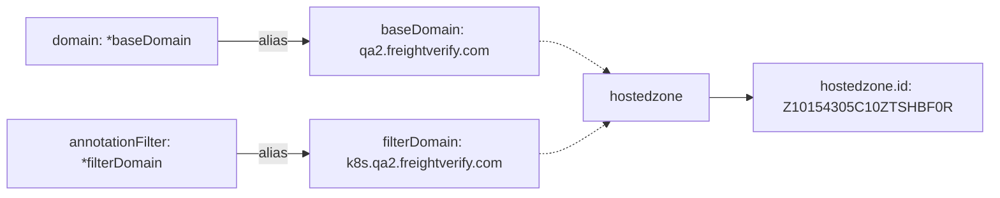

# Diagram: devops/k8s/external-dns/helm/values.qa2.yaml

> Auto-generated by Obscura crawlers

## Mermaid

### SVG

<svg id="container" width="1124.109375" xmlns="http://www.w3.org/2000/svg" class="flowchart" height="222" viewBox="0 0 1124.109375 222" role="graphics-document document" aria-roledescription="flowchart-v2"><g><marker id="container_flowchart-v2-pointEnd" class="marker flowchart-v2" viewBox="0 0 10 10" refX="5" refY="5" markerUnits="userSpaceOnUse" markerWidth="8" markerHeight="8" orient="auto"><path d="M 0 0 L 10 5 L 0 10 z" class="arrowMarkerPath" style="stroke-width: 1; stroke-dasharray: 1, 0;"></path></marker><marker id="container_flowchart-v2-pointStart" class="marker flowchart-v2" viewBox="0 0 10 10" refX="4.5" refY="5" markerUnits="userSpaceOnUse" markerWidth="8" markerHeight="8" orient="auto"><path d="M 0 5 L 10 10 L 10 0 z" class="arrowMarkerPath" style="stroke-width: 1; stroke-dasharray: 1, 0;"></path></marker><marker id="container_flowchart-v2-circleEnd" class="marker flowchart-v2" viewBox="0 0 10 10" refX="11" refY="5" markerUnits="userSpaceOnUse" markerWidth="11" markerHeight="11" orient="auto"><circle cx="5" cy="5" r="5" class="arrowMarkerPath" style="stroke-width: 1; stroke-dasharray: 1, 0;"></circle></marker><marker id="container_flowchart-v2-circleStart" class="marker flowchart-v2" viewBox="0 0 10 10" refX="-1" refY="5" markerUnits="userSpaceOnUse" markerWidth="11" markerHeight="11" orient="auto"><circle cx="5" cy="5" r="5" class="arrowMarkerPath" style="stroke-width: 1; stroke-dasharray: 1, 0;"></circle></marker><marker id="container_flowchart-v2-crossEnd" class="marker cross flowchart-v2" viewBox="0 0 11 11" refX="12" refY="5.2" markerUnits="userSpaceOnUse" markerWidth="11" markerHeight="11" orient="auto"><path d="M 1,1 l 9,9 M 10,1 l -9,9" class="arrowMarkerPath" style="stroke-width: 2; stroke-dasharray: 1, 0;"></path></marker><marker id="container_flowchart-v2-crossStart" class="marker cross flowchart-v2" viewBox="0 0 11 11" refX="-1" refY="5.2" markerUnits="userSpaceOnUse" markerWidth="11" markerHeight="11" orient="auto"><path d="M 1,1 l 9,9 M 10,1 l -9,9" class="arrowMarkerPath" style="stroke-width: 2; stroke-dasharray: 1, 0;"></path></marker><g class="root"><g class="clusters"></g><g class="edgePaths"><path d="M248.18,47L258.464,47C268.747,47,289.315,47,305.913,47C322.51,47,335.138,47,341.452,47L347.766,47" id="L_domain_baseDomain_0" class="edge-thickness-normal edge-pattern-solid edge-thickness-normal edge-pattern-solid flowchart-link" style=";" data-edge="true" data-et="edge" data-id="L_domain_baseDomain_0" data-points="W3sieCI6MjQ4LjE3OTY4NzUsInkiOjQ3fSx7IngiOjMwOS44ODI4MTI1LCJ5Ijo0N30seyJ4IjozNTEuNzY1NjI1LCJ5Ijo0N31d" marker-end="url(#container_flowchart-v2-pointEnd)"></path><path d="M268,175L274.98,175C281.961,175,295.922,175,309.216,175C322.51,175,335.138,175,341.452,175L347.766,175" id="L_annotationFilter_filterDomain_0" class="edge-thickness-normal edge-pattern-solid edge-thickness-normal edge-pattern-solid flowchart-link" style=";" data-edge="true" data-et="edge" data-id="L_annotationFilter_filterDomain_0" data-points="W3sieCI6MjY4LCJ5IjoxNzV9LHsieCI6MzA5Ljg4MjgxMjUsInkiOjE3NX0seyJ4IjozNTEuNzY1NjI1LCJ5IjoxNzV9XQ==" marker-end="url(#container_flowchart-v2-pointEnd)"></path><path d="M806.109,111L810.276,111C814.443,111,822.776,111,830.443,111C838.109,111,845.109,111,848.609,111L852.109,111" id="L_hostedzone_hostedzoneid_0" class="edge-thickness-normal edge-pattern-solid edge-thickness-normal edge-pattern-solid flowchart-link" style=";" data-edge="true" data-et="edge" data-id="L_hostedzone_hostedzoneid_0" data-points="W3sieCI6ODA2LjEwOTM3NSwieSI6MTExfSx7IngiOjgzMS4xMDkzNzUsInkiOjExMX0seyJ4Ijo4NTYuMTA5Mzc1LCJ5IjoxMTF9XQ==" marker-end="url(#container_flowchart-v2-pointEnd)"></path><path d="M611.766,47L615.932,47C620.099,47,628.432,47,641.405,52.8C654.378,58.6,671.99,70.2,680.796,76L689.603,81.8" id="L_baseDomain_hostedzone_0" class="edge-thickness-normal edge-pattern-dotted edge-thickness-normal edge-pattern-solid flowchart-link" style=";" data-edge="true" data-et="edge" data-id="L_baseDomain_hostedzone_0" data-points="W3sieCI6NjExLjc2NTYyNSwieSI6NDd9LHsieCI6NjM2Ljc2NTYyNSwieSI6NDd9LHsieCI6NjkyLjk0MzExNTIzNDM3NSwieSI6ODR9XQ==" marker-end="url(#container_flowchart-v2-pointEnd)"></path><path d="M611.766,175L615.932,175C620.099,175,628.432,175,641.405,169.2C654.378,163.4,671.99,151.8,680.796,146L689.603,140.2" id="L_filterDomain_hostedzone_0" class="edge-thickness-normal edge-pattern-dotted edge-thickness-normal edge-pattern-solid flowchart-link" style=";" data-edge="true" data-et="edge" data-id="L_filterDomain_hostedzone_0" data-points="W3sieCI6NjExLjc2NTYyNSwieSI6MTc1fSx7IngiOjYzNi43NjU2MjUsInkiOjE3NX0seyJ4Ijo2OTIuOTQzMTE1MjM0Mzc1LCJ5IjoxMzh9XQ==" marker-end="url(#container_flowchart-v2-pointEnd)"></path></g><g class="edgeLabels"><g class="edgeLabel" transform="translate(309.8828125, 47)"><g class="label" data-id="L_domain_baseDomain_0" transform="translate(-16.8828125, -12)"><foreignObject width="33.765625" height="24">

alias

</foreignObject></g></g><g class="edgeLabel" transform="translate(309.8828125, 175)"><g class="label" data-id="L_annotationFilter_filterDomain_0" transform="translate(-16.8828125, -12)"><foreignObject width="33.765625" height="24">

alias

</foreignObject></g></g><g class="edgeLabel"><g class="label" data-id="L_hostedzone_hostedzoneid_0" transform="translate(0, 0)"><foreignObject width="0" height="0">

</foreignObject></g></g><g class="edgeLabel"><g class="label" data-id="L_baseDomain_hostedzone_0" transform="translate(0, 0)"><foreignObject width="0" height="0">

</foreignObject></g></g><g class="edgeLabel"><g class="label" data-id="L_filterDomain_hostedzone_0" transform="translate(0, 0)"><foreignObject width="0" height="0">

</foreignObject></g></g></g><g class="nodes"><g class="node default" id="flowchart-baseDomain-0" transform="translate(481.765625, 47)"><rect class="basic label-container" style="" x="-130" y="-39" width="260" height="78"></rect><g class="label" style="" transform="translate(-100, -24)"><rect></rect><foreignObject width="200" height="48">

baseDomain: qa2.freightverify.com

</foreignObject></g></g><g class="node default" id="flowchart-filterDomain-1" transform="translate(481.765625, 175)"><rect class="basic label-container" style="" x="-130" y="-39" width="260" height="78"></rect><g class="label" style="" transform="translate(-100, -24)"><rect></rect><foreignObject width="200" height="48">

filterDomain: k8s.qa2.freightverify.com

</foreignObject></g></g><g class="node default" id="flowchart-domain-2" transform="translate(138, 47)"><rect class="basic label-container" style="" x="-110.1796875" y="-27" width="220.359375" height="54"></rect><g class="label" style="" transform="translate(-80.1796875, -12)"><rect></rect><foreignObject width="160.359375" height="24">

domain: *baseDomain

</foreignObject></g></g><g class="node default" id="flowchart-annotationFilter-3" transform="translate(138, 175)"><rect class="basic label-container" style="" x="-130" y="-39" width="260" height="78"></rect><g class="label" style="" transform="translate(-100, -24)"><rect></rect><foreignObject width="200" height="48">

annotationFilter: *filterDomain

</foreignObject></g></g><g class="node default" id="flowchart-hostedzone-4" transform="translate(733.9375, 111)"><rect class="basic label-container" style="" x="-72.171875" y="-27" width="144.34375" height="54"></rect><g class="label" style="" transform="translate(-42.171875, -12)"><rect></rect><foreignObject width="84.34375" height="24">

hostedzone

</foreignObject></g></g><g class="node default" id="flowchart-hostedzoneid-5" transform="translate(986.109375, 111)"><rect class="basic label-container" style="" x="-130" y="-39" width="260" height="78"></rect><g class="label" style="" transform="translate(-100, -24)"><rect></rect><foreignObject width="200" height="48">

hostedzone.id: Z10154305C10ZTSHBF0R

</foreignObject></g></g></g></g></g></svg>
