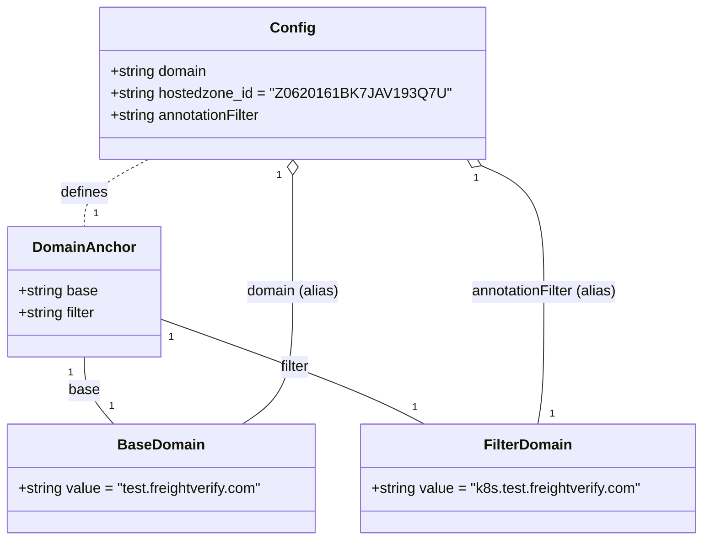

# Diagram: devops/k8s/external-dns/helm/values.test.yaml

> Auto-generated by Obscura crawlers

## Mermaid

### SVG

<svg id="container" width="783.328125" xmlns="http://www.w3.org/2000/svg" class="classDiagram" height="596" viewBox="0 0 783.328125 596" role="graphics-document document" aria-roledescription="class"><g><defs><marker id="container_class-aggregationStart" class="marker aggregation class" refX="18" refY="7" markerWidth="190" markerHeight="240" orient="auto"><path d="M 18,7 L9,13 L1,7 L9,1 Z"></path></marker></defs><defs><marker id="container_class-aggregationEnd" class="marker aggregation class" refX="1" refY="7" markerWidth="20" markerHeight="28" orient="auto"><path d="M 18,7 L9,13 L1,7 L9,1 Z"></path></marker></defs><defs><marker id="container_class-extensionStart" class="marker extension class" refX="18" refY="7" markerWidth="190" markerHeight="240" orient="auto"><path d="M 1,7 L18,13 V 1 Z"></path></marker></defs><defs><marker id="container_class-extensionEnd" class="marker extension class" refX="1" refY="7" markerWidth="20" markerHeight="28" orient="auto"><path d="M 1,1 V 13 L18,7 Z"></path></marker></defs><defs><marker id="container_class-compositionStart" class="marker composition class" refX="18" refY="7" markerWidth="190" markerHeight="240" orient="auto"><path d="M 18,7 L9,13 L1,7 L9,1 Z"></path></marker></defs><defs><marker id="container_class-compositionEnd" class="marker composition class" refX="1" refY="7" markerWidth="20" markerHeight="28" orient="auto"><path d="M 18,7 L9,13 L1,7 L9,1 Z"></path></marker></defs><defs><marker id="container_class-dependencyStart" class="marker dependency class" refX="6" refY="7" markerWidth="190" markerHeight="240" orient="auto"><path d="M 5,7 L9,13 L1,7 L9,1 Z"></path></marker></defs><defs><marker id="container_class-dependencyEnd" class="marker dependency class" refX="13" refY="7" markerWidth="20" markerHeight="28" orient="auto"><path d="M 18,7 L9,13 L14,7 L9,1 Z"></path></marker></defs><defs><marker id="container_class-lollipopStart" class="marker lollipop class" refX="13" refY="7" markerWidth="190" markerHeight="240" orient="auto"><circle stroke="black" fill="transparent" cx="7" cy="7" r="6"></circle></marker></defs><defs><marker id="container_class-lollipopEnd" class="marker lollipop class" refX="1" refY="7" markerWidth="190" markerHeight="240" orient="auto"><circle stroke="black" fill="transparent" cx="7" cy="7" r="6"></circle></marker></defs><g class="root"><g class="clusters"></g><g class="edgePaths"><path d="M95.242,394L95.242,400.167C95.242,406.333,95.242,418.667,100.636,431C106.029,443.333,116.816,455.667,122.209,461.833L127.602,468" id="id_DomainAnchor_BaseDomain_1" class="edge-thickness-normal edge-pattern-solid relation" style=";;;" data-edge="true" data-et="edge" data-id="id_DomainAnchor_BaseDomain_1" data-points="W3sieCI6OTUuMjQyMTg3NSwieSI6Mzk0fSx7IngiOjk1LjI0MjE4NzUsInkiOjQzMX0seyJ4IjoxMjcuNjAyMjg3MzcxMTM0MDMsInkiOjQ2OH1d"></path><path d="M178.117,351.353L215.596,364.627C253.076,377.902,328.034,404.451,377.322,423.892C426.61,443.333,450.228,455.667,462.036,461.833L473.845,468" id="id_DomainAnchor_FilterDomain_2" class="edge-thickness-normal edge-pattern-solid relation" style=";;;" data-edge="true" data-et="edge" data-id="id_DomainAnchor_FilterDomain_2" data-points="W3sieCI6MTc4LjExNzE4NzUsInkiOjM1MS4zNTI5NjUwNjkwNDk1Nn0seyJ4Ijo0MDIuOTkyMTg3NSwieSI6NDMxfSx7IngiOjQ3My44NDUyODAyODM1MDUyLCJ5Ijo0Njh9XQ=="></path><path d="M325.723,193.25L325.723,196.542C325.723,199.833,325.723,206.417,325.723,227.875C325.723,249.333,325.723,285.667,325.723,322C325.723,358.333,325.723,394.667,316.463,419C307.204,443.333,288.686,455.667,279.427,461.833L270.168,468" id="id_Config_BaseDomain_3" class="edge-thickness-normal edge-pattern-solid relation" style=";;;" data-edge="true" data-et="edge" data-id="id_Config_BaseDomain_3" data-points="W3sieCI6MzI1LjcyMjY1NjI1LCJ5IjoxNzZ9LHsieCI6MzI1LjcyMjY1NjI1LCJ5IjoyMTN9LHsieCI6MzI1LjcyMjY1NjI1LCJ5IjozMjJ9LHsieCI6MzI1LjcyMjY1NjI1LCJ5Ijo0MzF9LHsieCI6MjcwLjE2NzUyNTc3MzE5NTg1LCJ5Ijo0Njh9XQ==" marker-start="url(#container_class-aggregationStart)"></path><path d="M537.064,182.81L548.774,187.842C560.484,192.873,583.904,202.937,595.614,226.135C607.324,249.333,607.324,285.667,607.324,322C607.324,358.333,607.324,394.667,606.143,419C604.962,443.333,602.599,455.667,601.418,461.833L600.236,468" id="id_Config_FilterDomain_4" class="edge-thickness-normal edge-pattern-solid relation" style=";;;" data-edge="true" data-et="edge" data-id="id_Config_FilterDomain_4" data-points="W3sieCI6NTIxLjIxNDY1MDA1MTY1MjgsInkiOjE3Nn0seyJ4Ijo2MDcuMzI0MjE4NzUsInkiOjIxM30seyJ4Ijo2MDcuMzI0MjE4NzUsInkiOjMyMn0seyJ4Ijo2MDcuMzI0MjE4NzUsInkiOjQzMX0seyJ4Ijo2MDAuMjM2MjI3NDQ4NDUzNiwieSI6NDY4fV0=" marker-start="url(#container_class-aggregationStart)"></path><path d="M165.72,176L153.973,182.167C142.227,188.333,118.735,200.667,106.988,213C95.242,225.333,95.242,237.667,95.242,243.833L95.242,250" id="id_Config_DomainAnchor_5" class="edge-thickness-normal edge-pattern-dashed relation" style=";;;" data-edge="true" data-et="edge" data-id="id_Config_DomainAnchor_5" data-points="W3sieCI6MTY1LjcxOTY4NjIwODY3NzY3LCJ5IjoxNzZ9LHsieCI6OTUuMjQyMTg3NSwieSI6MjEzfSx7IngiOjk1LjI0MjE4NzUsInkiOjI1MH1d"></path></g><g class="edgeLabels"><g class="edgeLabel" transform="translate(95.2421875, 431)"><g class="label" data-id="id_DomainAnchor_BaseDomain_1" transform="translate(-17.046875, -12)"><foreignObject width="34.09375" height="24">

base

</foreignObject></g></g><g class="edgeLabel" transform="translate(328.22763, 404.51962)"><g class="label" data-id="id_DomainAnchor_FilterDomain_2" transform="translate(-17.1640625, -12)"><foreignObject width="34.328125" height="24">

filter

</foreignObject></g></g><g class="edgeLabel" transform="translate(325.72265625, 322)"><g class="label" data-id="id_Config_BaseDomain_3" transform="translate(-51.796875, -12)"><foreignObject width="103.59375" height="24">

domain (alias)

</foreignObject></g></g><g class="edgeLabel" transform="translate(607.32421875, 322)"><g class="label" data-id="id_Config_FilterDomain_4" transform="translate(-82.7421875, -12)"><foreignObject width="165.484375" height="24">

annotationFilter (alias)

</foreignObject></g></g><g class="edgeLabel" transform="translate(95.2421875, 213)"><g class="label" data-id="id_Config_DomainAnchor_5" transform="translate(-26.53125, -12)"><foreignObject width="53.0625" height="24">

defines

</foreignObject></g></g><g class="edgeTerminals" transform="translate(80.24218875000004, 411.5000010714286)"><g class="inner" transform="translate(0, 0)"><foreignObject style="width: 9px; height: 12px;">
1
</foreignObject></g></g><g class="edgeTerminals" transform="translate(189.60515380860903, 371.33487054073896)"><g class="inner" transform="translate(0, 0)"><foreignObject style="width: 9px; height: 12px;">
1
</foreignObject></g></g><g class="edgeTerminals" transform="translate(310.7226581250001, 193.50000160714288)"><g class="inner" transform="translate(0, 0)"><foreignObject style="width: 9px; height: 12px;">
1
</foreignObject></g></g><g class="edgeTerminals" transform="translate(531.3714453965339, 196.6903267384888)"><g class="inner" transform="translate(0, 0)"><foreignObject style="width: 9px; height: 12px;">
1
</foreignObject></g></g><g class="edgeTerminals" transform="translate(143.25275516186332, 170.85345367317035)"><g class="inner" transform="translate(0, 0)"><foreignObject style="width: 9px; height: 12px;">
1
</foreignObject></g></g><g class="edgeTerminals" transform="translate(122.37236782218005, 439.95228715049296)"><g class="inner" transform="translate(0, 0)"></g><foreignObject style="width: 9px; height: 12px;">
1
</foreignObject></g><g class="edgeTerminals" transform="translate(460.27640916717723, 441.60316680551034)"><g class="inner" transform="translate(0, 0)"></g><foreignObject style="width: 9px; height: 12px;">
1
</foreignObject></g><g class="edgeTerminals" transform="translate(288.0476356588037, 465.7839859696695)"><g class="inner" transform="translate(0, 0)"></g><foreignObject style="width: 9px; height: 12px;">
1
</foreignObject></g><g class="edgeTerminals" transform="translate(613.2608996204455, 448.6347208547048)"><g class="inner" transform="translate(0, 0)"></g><foreignObject style="width: 9px; height: 12px;">
1
</foreignObject></g><g class="edgeTerminals" transform="translate(105.24218874999995, 227.50000107142858)"><g class="inner" transform="translate(0, 0)"></g><foreignObject style="width: 9px; height: 12px;">
1
</foreignObject></g></g><g class="nodes"><g class="node default" id="classId-DomainAnchor-0" transform="translate(95.2421875, 322)"><g class="basic label-container"><path d="M-82.875 -72 L82.875 -72 L82.875 72 L-82.875 72" stroke="none" stroke-width="0" fill="#ECECFF" style=""></path><path d="M-82.875 -72 C-43.90919851341205 -72, -4.943397026824101 -72, 82.875 -72 M-82.875 -72 C-30.997700027554373 -72, 20.879599944891254 -72, 82.875 -72 M82.875 -72 C82.875 -16.820114444331708, 82.875 38.359771111336585, 82.875 72 M82.875 -72 C82.875 -36.96972985684237, 82.875 -1.939459713684741, 82.875 72 M82.875 72 C36.14786522894191 72, -10.57926954211618 72, -82.875 72 M82.875 72 C45.12415421767367 72, 7.37330843534734 72, -82.875 72 M-82.875 72 C-82.875 26.34899610632165, -82.875 -19.3020077873567, -82.875 -72 M-82.875 72 C-82.875 21.582786636490127, -82.875 -28.834426727019746, -82.875 -72" stroke="#9370DB" stroke-width="1.3" fill="none" stroke-dasharray="0 0" style=""></path></g><g class="annotation-group text" transform="translate(0, -48)"></g><g class="label-group text" transform="translate(-53.5625, -48)"><g class="label" style="font-weight: bolder" transform="translate(0,-12)"><foreignObject width="107.125" height="24">

DomainAnchor

</foreignObject></g></g><g class="members-group text" transform="translate(-70.875, 0)"><g class="label" style="" transform="translate(0,-12)"><foreignObject width="87.9375" height="24">

+string base

</foreignObject></g><g class="label" style="" transform="translate(0,12)"><foreignObject width="88.1875" height="24">

+string filter

</foreignObject></g></g><g class="methods-group text" transform="translate(-70.875, 72)"></g><g class="divider" style=""><path d="M-82.875 -24 C-21.950920628904306 -24, 38.97315874219139 -24, 82.875 -24 M-82.875 -24 C-18.23333135816334 -24, 46.40833728367332 -24, 82.875 -24" stroke="#9370DB" stroke-width="1.3" fill="none" stroke-dasharray="0 0" style=""></path></g><g class="divider" style=""><path d="M-82.875 48 C-34.963585555003014 48, 12.947828889993971 48, 82.875 48 M-82.875 48 C-48.29547064012185 48, -13.715941280243698 48, 82.875 48" stroke="#9370DB" stroke-width="1.3" fill="none" stroke-dasharray="0 0" style=""></path></g></g><g class="node default" id="classId-BaseDomain-1" transform="translate(180.078125, 528)"><g class="basic label-container"><path d="M-172.078125 -60 L172.078125 -60 L172.078125 60 L-172.078125 60" stroke="none" stroke-width="0" fill="#ECECFF" style=""></path><path d="M-172.078125 -60 C-54.904782897818706 -60, 62.26855920436259 -60, 172.078125 -60 M-172.078125 -60 C-36.99706573022934 -60, 98.08399353954132 -60, 172.078125 -60 M172.078125 -60 C172.078125 -15.385822953449924, 172.078125 29.22835409310015, 172.078125 60 M172.078125 -60 C172.078125 -21.353383578364436, 172.078125 17.293232843271127, 172.078125 60 M172.078125 60 C75.48685005941392 60, -21.10442488117215 60, -172.078125 60 M172.078125 60 C92.78703096686047 60, 13.495936933720941 60, -172.078125 60 M-172.078125 60 C-172.078125 17.108742617691597, -172.078125 -25.782514764616806, -172.078125 -60 M-172.078125 60 C-172.078125 26.780425924942108, -172.078125 -6.439148150115784, -172.078125 -60" stroke="#9370DB" stroke-width="1.3" fill="none" stroke-dasharray="0 0" style=""></path></g><g class="annotation-group text" transform="translate(0, -36)"></g><g class="label-group text" transform="translate(-45.421875, -36)"><g class="label" style="font-weight: bolder" transform="translate(0,-12)"><foreignObject width="90.84375" height="24">

BaseDomain

</foreignObject></g></g><g class="members-group text" transform="translate(-160.078125, 12)"><g class="label" style="" transform="translate(0,-12)"><foreignObject width="274.734375" height="24">

+string value = "test.freightverify.com"

</foreignObject></g></g><g class="methods-group text" transform="translate(-160.078125, 60)"></g><g class="divider" style=""><path d="M-172.078125 -12 C-46.0059765358352 -12, 80.0661719283296 -12, 172.078125 -12 M-172.078125 -12 C-95.57980591934233 -12, -19.08148683868467 -12, 172.078125 -12" stroke="#9370DB" stroke-width="1.3" fill="none" stroke-dasharray="0 0" style=""></path></g><g class="divider" style=""><path d="M-172.078125 36 C-59.23113558172767 36, 53.61585383654466 36, 172.078125 36 M-172.078125 36 C-79.89772646393841 36, 12.282672072123177 36, 172.078125 36" stroke="#9370DB" stroke-width="1.3" fill="none" stroke-dasharray="0 0" style=""></path></g></g><g class="node default" id="classId-FilterDomain-2" transform="translate(588.7421875, 528)"><g class="basic label-container"><path d="M-186.5859375 -60 L186.5859375 -60 L186.5859375 60 L-186.5859375 60" stroke="none" stroke-width="0" fill="#ECECFF" style=""></path><path d="M-186.5859375 -60 C-41.35670805737581 -60, 103.87252138524838 -60, 186.5859375 -60 M-186.5859375 -60 C-58.546775982936026 -60, 69.49238553412795 -60, 186.5859375 -60 M186.5859375 -60 C186.5859375 -25.36965661302075, 186.5859375 9.260686773958497, 186.5859375 60 M186.5859375 -60 C186.5859375 -30.5146729038638, 186.5859375 -1.0293458077276014, 186.5859375 60 M186.5859375 60 C96.2880124077279 60, 5.99008731545581 60, -186.5859375 60 M186.5859375 60 C81.02427903160498 60, -24.537379436790047 60, -186.5859375 60 M-186.5859375 60 C-186.5859375 15.698813847921386, -186.5859375 -28.602372304157228, -186.5859375 -60 M-186.5859375 60 C-186.5859375 31.182508574348194, -186.5859375 2.3650171486963885, -186.5859375 -60" stroke="#9370DB" stroke-width="1.3" fill="none" stroke-dasharray="0 0" style=""></path></g><g class="annotation-group text" transform="translate(0, -36)"></g><g class="label-group text" transform="translate(-46.765625, -36)"><g class="label" style="font-weight: bolder" transform="translate(0,-12)"><foreignObject width="93.53125" height="24">

FilterDomain

</foreignObject></g></g><g class="members-group text" transform="translate(-174.5859375, 12)"><g class="label" style="" transform="translate(0,-12)"><foreignObject width="302.40625" height="24">

+string value = "k8s.test.freightverify.com"

</foreignObject></g></g><g class="methods-group text" transform="translate(-174.5859375, 60)"></g><g class="divider" style=""><path d="M-186.5859375 -12 C-51.7892262392661 -12, 83.0074850214678 -12, 186.5859375 -12 M-186.5859375 -12 C-39.396648180446675 -12, 107.79264113910665 -12, 186.5859375 -12" stroke="#9370DB" stroke-width="1.3" fill="none" stroke-dasharray="0 0" style=""></path></g><g class="divider" style=""><path d="M-186.5859375 36 C-108.7898378434877 36, -30.993738186975406 36, 186.5859375 36 M-186.5859375 36 C-103.98941784918614 36, -21.39289819837228 36, 186.5859375 36" stroke="#9370DB" stroke-width="1.3" fill="none" stroke-dasharray="0 0" style=""></path></g></g><g class="node default" id="classId-Config-3" transform="translate(325.72265625, 92)"><g class="basic label-container"><path d="M-199.77734375 -84 L199.77734375 -84 L199.77734375 84 L-199.77734375 84" stroke="none" stroke-width="0" fill="#ECECFF" style=""></path><path d="M-199.77734375 -84 C-93.14350622231854 -84, 13.490331305362929 -84, 199.77734375 -84 M-199.77734375 -84 C-51.80347472038159 -84, 96.17039430923683 -84, 199.77734375 -84 M199.77734375 -84 C199.77734375 -30.091773729544464, 199.77734375 23.816452540911072, 199.77734375 84 M199.77734375 -84 C199.77734375 -24.2082725740963, 199.77734375 35.5834548518074, 199.77734375 84 M199.77734375 84 C117.85330021540526 84, 35.92925668081051 84, -199.77734375 84 M199.77734375 84 C71.59319107538505 84, -56.5909615992299 84, -199.77734375 84 M-199.77734375 84 C-199.77734375 49.26709070319499, -199.77734375 14.534181406389976, -199.77734375 -84 M-199.77734375 84 C-199.77734375 30.331845287237954, -199.77734375 -23.336309425524092, -199.77734375 -84" stroke="#9370DB" stroke-width="1.3" fill="none" stroke-dasharray="0 0" style=""></path></g><g class="annotation-group text" transform="translate(0, -60)"></g><g class="label-group text" transform="translate(-22.9296875, -60)"><g class="label" style="font-weight: bolder" transform="translate(0,-12)"><foreignObject width="45.859375" height="24">

Config

</foreignObject></g></g><g class="members-group text" transform="translate(-187.77734375, -12)"><g class="label" style="" transform="translate(0,-12)"><foreignObject width="109.078125" height="24">

+string domain

</foreignObject></g><g class="label" style="" transform="translate(0,12)"><foreignObject width="352.625" height="24">

+string hostedzone_id = "Z0620161BK7JAV193Q7U"

</foreignObject></g><g class="label" style="" transform="translate(0,36)"><foreignObject width="170.96875" height="24">

+string annotationFilter

</foreignObject></g></g><g class="methods-group text" transform="translate(-187.77734375, 84)"></g><g class="divider" style=""><path d="M-199.77734375 -36 C-83.21381545884586 -36, 33.349712832308285 -36, 199.77734375 -36 M-199.77734375 -36 C-112.02770207362178 -36, -24.278060397243564 -36, 199.77734375 -36" stroke="#9370DB" stroke-width="1.3" fill="none" stroke-dasharray="0 0" style=""></path></g><g class="divider" style=""><path d="M-199.77734375 60 C-49.456986090662525 60, 100.86337156867495 60, 199.77734375 60 M-199.77734375 60 C-119.77303238039244 60, -39.76872101078487 60, 199.77734375 60" stroke="#9370DB" stroke-width="1.3" fill="none" stroke-dasharray="0 0" style=""></path></g></g></g></g></g></svg>
