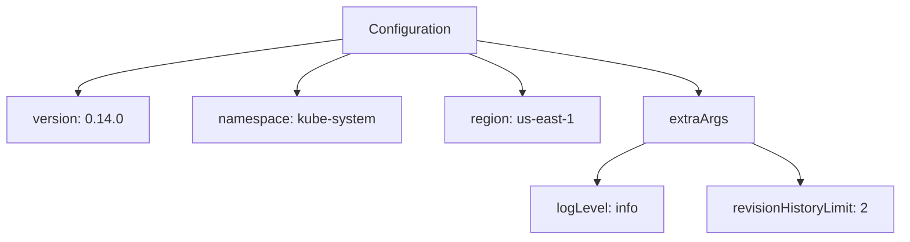

# Diagram: devops/k8s/external-dns/helm/values.yaml

> Auto-generated by Obscura crawlers

## Mermaid

### SVG

<svg id="container" width="1042.01171875" xmlns="http://www.w3.org/2000/svg" class="flowchart" height="278" viewBox="0 0 1042.01171875 278" role="graphics-document document" aria-roledescription="flowchart-v2"><g><marker id="container_flowchart-v2-pointEnd" class="marker flowchart-v2" viewBox="0 0 10 10" refX="5" refY="5" markerUnits="userSpaceOnUse" markerWidth="8" markerHeight="8" orient="auto"><path d="M 0 0 L 10 5 L 0 10 z" class="arrowMarkerPath" style="stroke-width: 1; stroke-dasharray: 1, 0;"></path></marker><marker id="container_flowchart-v2-pointStart" class="marker flowchart-v2" viewBox="0 0 10 10" refX="4.5" refY="5" markerUnits="userSpaceOnUse" markerWidth="8" markerHeight="8" orient="auto"><path d="M 0 5 L 10 10 L 10 0 z" class="arrowMarkerPath" style="stroke-width: 1; stroke-dasharray: 1, 0;"></path></marker><marker id="container_flowchart-v2-circleEnd" class="marker flowchart-v2" viewBox="0 0 10 10" refX="11" refY="5" markerUnits="userSpaceOnUse" markerWidth="11" markerHeight="11" orient="auto"><circle cx="5" cy="5" r="5" class="arrowMarkerPath" style="stroke-width: 1; stroke-dasharray: 1, 0;"></circle></marker><marker id="container_flowchart-v2-circleStart" class="marker flowchart-v2" viewBox="0 0 10 10" refX="-1" refY="5" markerUnits="userSpaceOnUse" markerWidth="11" markerHeight="11" orient="auto"><circle cx="5" cy="5" r="5" class="arrowMarkerPath" style="stroke-width: 1; stroke-dasharray: 1, 0;"></circle></marker><marker id="container_flowchart-v2-crossEnd" class="marker cross flowchart-v2" viewBox="0 0 11 11" refX="12" refY="5.2" markerUnits="userSpaceOnUse" markerWidth="11" markerHeight="11" orient="auto"><path d="M 1,1 l 9,9 M 10,1 l -9,9" class="arrowMarkerPath" style="stroke-width: 2; stroke-dasharray: 1, 0;"></path></marker><marker id="container_flowchart-v2-crossStart" class="marker cross flowchart-v2" viewBox="0 0 11 11" refX="-1" refY="5.2" markerUnits="userSpaceOnUse" markerWidth="11" markerHeight="11" orient="auto"><path d="M 1,1 l 9,9 M 10,1 l -9,9" class="arrowMarkerPath" style="stroke-width: 2; stroke-dasharray: 1, 0;"></path></marker><g class="root"><g class="clusters"></g><g class="edgePaths"><path d="M391.305,45.715L340.775,52.596C290.245,59.477,189.185,73.238,138.655,83.619C88.125,94,88.125,101,88.125,104.5L88.125,108" id="L_A_B_0" class="edge-thickness-normal edge-pattern-solid edge-thickness-normal edge-pattern-solid flowchart-link" style=";" data-edge="true" data-et="edge" data-id="L_A_B_0" data-points="W3sieCI6MzkxLjMwNDY4NzUsInkiOjQ1LjcxNTExMjgyOTY0MDU0fSx7IngiOjg4LjEyNSwieSI6ODd9LHsieCI6ODguMTI1LCJ5IjoxMTJ9XQ==" marker-end="url(#container_flowchart-v2-pointEnd)"></path><path d="M402.269,62L391.818,66.167C381.367,70.333,360.465,78.667,350.014,86.333C339.563,94,339.563,101,339.563,104.5L339.563,108" id="L_A_C_0" class="edge-thickness-normal edge-pattern-solid edge-thickness-normal edge-pattern-solid flowchart-link" style=";" data-edge="true" data-et="edge" data-id="L_A_C_0" data-points="W3sieCI6NDAyLjI2OTA4MDUyODg0NjIsInkiOjYyfSx7IngiOjMzOS41NjI1LCJ5Ijo4N30seyJ4IjozMzkuNTYyNSwieSI6MTEyfV0=" marker-end="url(#container_flowchart-v2-pointEnd)"></path><path d="M537.715,62L548.166,66.167C558.617,70.333,579.52,78.667,589.971,86.333C600.422,94,600.422,101,600.422,104.5L600.422,108" id="L_A_D_0" class="edge-thickness-normal edge-pattern-solid edge-thickness-normal edge-pattern-solid flowchart-link" style=";" data-edge="true" data-et="edge" data-id="L_A_D_0" data-points="W3sieCI6NTM3LjcxNTI5NDQ3MTE1MzgsInkiOjYyfSx7IngiOjYwMC40MjE4NzUsInkiOjg3fSx7IngiOjYwMC40MjE4NzUsInkiOjExMn1d" marker-end="url(#container_flowchart-v2-pointEnd)"></path><path d="M548.68,47.266L591.163,53.888C633.646,60.511,718.612,73.755,761.095,83.878C803.578,94,803.578,101,803.578,104.5L803.578,108" id="L_A_E_0" class="edge-thickness-normal edge-pattern-solid edge-thickness-normal edge-pattern-solid flowchart-link" style=";" data-edge="true" data-et="edge" data-id="L_A_E_0" data-points="W3sieCI6NTQ4LjY3OTY4NzUsInkiOjQ3LjI2NTk1NDcwNjE5OTIxfSx7IngiOjgwMy41NzgxMjUsInkiOjg3fSx7IngiOjgwMy41NzgxMjUsInkiOjExMn1d" marker-end="url(#container_flowchart-v2-pointEnd)"></path><path d="M741.508,166L731.929,170.167C722.35,174.333,703.193,182.667,693.614,190.333C684.035,198,684.035,205,684.035,208.5L684.035,212" id="L_E_E1_0" class="edge-thickness-normal edge-pattern-solid edge-thickness-normal edge-pattern-solid flowchart-link" style=";" data-edge="true" data-et="edge" data-id="L_E_E1_0" data-points="W3sieCI6NzQxLjUwNzczNzM3OTgwNzcsInkiOjE2Nn0seyJ4Ijo2ODQuMDM1MTU2MjUsInkiOjE5MX0seyJ4Ijo2ODQuMDM1MTU2MjUsInkiOjIxNn1d" marker-end="url(#container_flowchart-v2-pointEnd)"></path><path d="M865.649,166L875.227,170.167C884.806,174.333,903.964,182.667,913.542,190.333C923.121,198,923.121,205,923.121,208.5L923.121,212" id="L_E_E2_0" class="edge-thickness-normal edge-pattern-solid edge-thickness-normal edge-pattern-solid flowchart-link" style=";" data-edge="true" data-et="edge" data-id="L_E_E2_0" data-points="W3sieCI6ODY1LjY0ODUxMjYyMDE5MjMsInkiOjE2Nn0seyJ4Ijo5MjMuMTIxMDkzNzUsInkiOjE5MX0seyJ4Ijo5MjMuMTIxMDkzNzUsInkiOjIxNn1d" marker-end="url(#container_flowchart-v2-pointEnd)"></path></g><g class="edgeLabels"><g class="edgeLabel"><g class="label" data-id="L_A_B_0" transform="translate(0, 0)"><foreignObject width="0" height="0">

</foreignObject></g></g><g class="edgeLabel"><g class="label" data-id="L_A_C_0" transform="translate(0, 0)"><foreignObject width="0" height="0">

</foreignObject></g></g><g class="edgeLabel"><g class="label" data-id="L_A_D_0" transform="translate(0, 0)"><foreignObject width="0" height="0">

</foreignObject></g></g><g class="edgeLabel"><g class="label" data-id="L_A_E_0" transform="translate(0, 0)"><foreignObject width="0" height="0">

</foreignObject></g></g><g class="edgeLabel"><g class="label" data-id="L_E_E1_0" transform="translate(0, 0)"><foreignObject width="0" height="0">

</foreignObject></g></g><g class="edgeLabel"><g class="label" data-id="L_E_E2_0" transform="translate(0, 0)"><foreignObject width="0" height="0">

</foreignObject></g></g></g><g class="nodes"><g class="node default" id="flowchart-A-0" transform="translate(469.9921875, 35)"><rect class="basic label-container" style="" x="-78.6875" y="-27" width="157.375" height="54"></rect><g class="label" style="" transform="translate(-48.6875, -12)"><rect></rect><foreignObject width="97.375" height="24">

Configuration

</foreignObject></g></g><g class="node default" id="flowchart-B-1" transform="translate(88.125, 139)"><rect class="basic label-container" style="" x="-80.125" y="-27" width="160.25" height="54"></rect><g class="label" style="" transform="translate(-50.125, -12)"><rect></rect><foreignObject width="100.25" height="24">

version: 0.14.0

</foreignObject></g></g><g class="node default" id="flowchart-C-3" transform="translate(339.5625, 139)"><rect class="basic label-container" style="" x="-121.3125" y="-27" width="242.625" height="54"></rect><g class="label" style="" transform="translate(-91.3125, -12)"><rect></rect><foreignObject width="182.625" height="24">

namespace: kube-system

</foreignObject></g></g><g class="node default" id="flowchart-D-5" transform="translate(600.421875, 139)"><rect class="basic label-container" style="" x="-89.546875" y="-27" width="179.09375" height="54"></rect><g class="label" style="" transform="translate(-59.546875, -12)"><rect></rect><foreignObject width="119.09375" height="24">

region: us-east-1

</foreignObject></g></g><g class="node default" id="flowchart-E-7" transform="translate(803.578125, 139)"><rect class="basic label-container" style="" x="-63.609375" y="-27" width="127.21875" height="54"></rect><g class="label" style="" transform="translate(-33.609375, -12)"><rect></rect><foreignObject width="67.21875" height="24">

extraArgs

</foreignObject></g></g><g class="node default" id="flowchart-E1-9" transform="translate(684.03515625, 243)"><rect class="basic label-container" style="" x="-78.1953125" y="-27" width="156.390625" height="54"></rect><g class="label" style="" transform="translate(-48.1953125, -12)"><rect></rect><foreignObject width="96.390625" height="24">

logLevel: info

</foreignObject></g></g><g class="node default" id="flowchart-E2-11" transform="translate(923.12109375, 243)"><rect class="basic label-container" style="" x="-110.890625" y="-27" width="221.78125" height="54"></rect><g class="label" style="" transform="translate(-80.890625, -12)"><rect></rect><foreignObject width="161.78125" height="24">

revisionHistoryLimit: 2

</foreignObject></g></g></g></g></g></svg>
