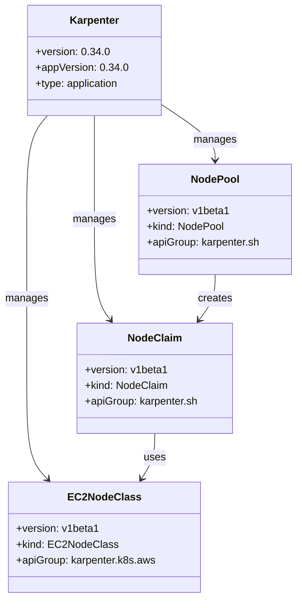
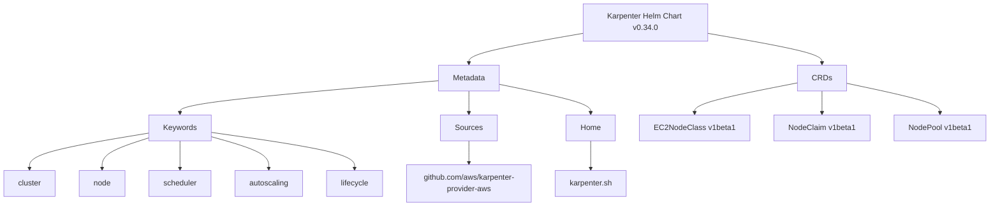
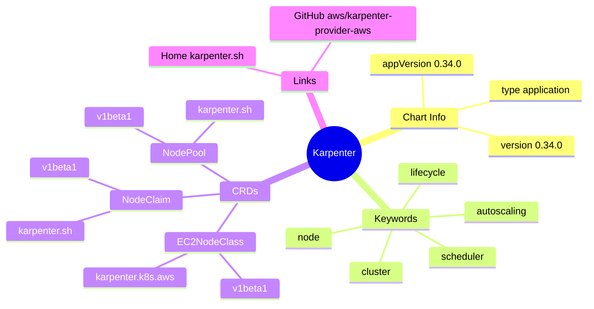

# Diagram: devops/k8s/karpenter/helm/Chart.yaml

> Auto-generated by Obscura crawlers

## Diagram 1

### SVG

<svg id="container" width="450.63671875" xmlns="http://www.w3.org/2000/svg" class="classDiagram" height="910" viewBox="0 0 450.63671875 910" role="graphics-document document" aria-roledescription="class"><g><defs><marker id="container_class-aggregationStart" class="marker aggregation class" refX="18" refY="7" markerWidth="190" markerHeight="240" orient="auto"><path d="M 18,7 L9,13 L1,7 L9,1 Z"></path></marker></defs><defs><marker id="container_class-aggregationEnd" class="marker aggregation class" refX="1" refY="7" markerWidth="20" markerHeight="28" orient="auto"><path d="M 18,7 L9,13 L1,7 L9,1 Z"></path></marker></defs><defs><marker id="container_class-extensionStart" class="marker extension class" refX="18" refY="7" markerWidth="190" markerHeight="240" orient="auto"><path d="M 1,7 L18,13 V 1 Z"></path></marker></defs><defs><marker id="container_class-extensionEnd" class="marker extension class" refX="1" refY="7" markerWidth="20" markerHeight="28" orient="auto"><path d="M 1,1 V 13 L18,7 Z"></path></marker></defs><defs><marker id="container_class-compositionStart" class="marker composition class" refX="18" refY="7" markerWidth="190" markerHeight="240" orient="auto"><path d="M 18,7 L9,13 L1,7 L9,1 Z"></path></marker></defs><defs><marker id="container_class-compositionEnd" class="marker composition class" refX="1" refY="7" markerWidth="20" markerHeight="28" orient="auto"><path d="M 18,7 L9,13 L1,7 L9,1 Z"></path></marker></defs><defs><marker id="container_class-dependencyStart" class="marker dependency class" refX="6" refY="7" markerWidth="190" markerHeight="240" orient="auto"><path d="M 5,7 L9,13 L1,7 L9,1 Z"></path></marker></defs><defs><marker id="container_class-dependencyEnd" class="marker dependency class" refX="13" refY="7" markerWidth="20" markerHeight="28" orient="auto"><path d="M 18,7 L9,13 L14,7 L9,1 Z"></path></marker></defs><defs><marker id="container_class-lollipopStart" class="marker lollipop class" refX="13" refY="7" markerWidth="190" markerHeight="240" orient="auto"><circle stroke="black" fill="transparent" cx="7" cy="7" r="6"></circle></marker></defs><defs><marker id="container_class-lollipopEnd" class="marker lollipop class" refX="1" refY="7" markerWidth="190" markerHeight="240" orient="auto"><circle stroke="black" fill="transparent" cx="7" cy="7" r="6"></circle></marker></defs><g class="root"><g class="clusters"></g><g class="edgePaths"><path d="M71.708,176L66.473,182.167C61.238,188.333,50.767,200.667,45.532,227C40.297,253.333,40.297,293.667,40.297,334C40.297,374.333,40.297,414.667,40.297,455C40.297,495.333,40.297,535.667,40.297,576C40.297,616.333,40.297,656.667,45.607,682.284C50.916,707.901,61.536,718.802,66.845,724.252L72.155,729.702" id="id_Karpenter_EC2NodeClass_1" class="edge-thickness-normal edge-pattern-solid relation" style=";;;" data-edge="true" data-et="edge" data-id="id_Karpenter_EC2NodeClass_1" data-points="W3sieCI6NzEuNzA3OTM1MTc1NjE5ODQsInkiOjE3Nn0seyJ4Ijo0MC4yOTY4NzUsInkiOjIxM30seyJ4Ijo0MC4yOTY4NzUsInkiOjMzNH0seyJ4Ijo0MC4yOTY4NzUsInkiOjQ1NX0seyJ4Ijo0MC4yOTY4NzUsInkiOjU3Nn0seyJ4Ijo0MC4yOTY4NzUsInkiOjY5N30seyJ4Ijo3Ni4zNDE4OTM3MjQxNzM1NiwieSI6NzM0fV0=" marker-end="url(#container_class-dependencyEnd)"></path><path d="M143.02,176L143.02,182.167C143.02,188.333,143.02,200.667,143.02,227C143.02,253.333,143.02,293.667,143.02,334C143.02,374.333,143.02,414.667,147.09,440.203C151.161,465.74,159.303,476.479,163.373,481.849L167.444,487.219" id="id_Karpenter_NodeClaim_2" class="edge-thickness-normal edge-pattern-solid relation" style=";;;" data-edge="true" data-et="edge" data-id="id_Karpenter_NodeClaim_2" data-points="W3sieCI6MTQzLjAxOTUzMTI1LCJ5IjoxNzZ9LHsieCI6MTQzLjAxOTUzMTI1LCJ5IjoyMTN9LHsieCI6MTQzLjAxOTUzMTI1LCJ5IjozMzR9LHsieCI6MTQzLjAxOTUzMTI1LCJ5Ijo0NTV9LHsieCI6MTcxLjA2ODc0Njc3MTY5NDIsInkiOjQ5Mn1d" marker-end="url(#container_class-dependencyEnd)"></path><path d="M243.055,157.979L256.958,167.149C270.862,176.319,298.669,194.66,312.573,208.996C326.477,223.333,326.477,233.667,326.477,238.833L326.477,244" id="id_Karpenter_NodePool_3" class="edge-thickness-normal edge-pattern-solid relation" style=";;;" data-edge="true" data-et="edge" data-id="id_Karpenter_NodePool_3" data-points="W3sieCI6MjQzLjA1NDY4NzUsInkiOjE1Ny45Nzg2ODYyNTU3MjIzNX0seyJ4IjozMjYuNDc2NTYyNSwieSI6MjEzfSx7IngiOjMyNi40NzY1NjI1LCJ5IjoyNTB9XQ==" marker-end="url(#container_class-dependencyEnd)"></path><path d="M326.477,418L326.477,424.167C326.477,430.333,326.477,442.667,322.406,454.203C318.335,465.74,310.194,476.479,306.123,481.849L302.052,487.219" id="id_NodePool_NodeClaim_4" class="edge-thickness-normal edge-pattern-solid relation" style=";;;" data-edge="true" data-et="edge" data-id="id_NodePool_NodeClaim_4" data-points="W3sieCI6MzI2LjQ3NjU2MjUsInkiOjQxOH0seyJ4IjozMjYuNDc2NTYyNSwieSI6NDU1fSx7IngiOjI5OC40MjczNDY5NzgzMDU3NiwieSI6NDkyfV0=" marker-end="url(#container_class-dependencyEnd)"></path><path d="M234.748,660L234.748,666.167C234.748,672.333,234.748,684.667,231.38,696.155C228.012,707.643,221.277,718.287,217.909,723.608L214.541,728.93" id="id_NodeClaim_EC2NodeClass_5" class="edge-thickness-normal edge-pattern-solid relation" style=";;;" data-edge="true" data-et="edge" data-id="id_NodeClaim_EC2NodeClass_5" data-points="W3sieCI6MjM0Ljc0ODA0Njg3NSwieSI6NjYwfSx7IngiOjIzNC43NDgwNDY4NzUsInkiOjY5N30seyJ4IjoyMTEuMzMyNzg5OTAxODU5NSwieSI6NzM0fV0=" marker-end="url(#container_class-dependencyEnd)"></path></g><g class="edgeLabels"><g class="edgeLabel" transform="translate(40.296875, 455)"><g class="label" data-id="id_Karpenter_EC2NodeClass_1" transform="translate(-32.296875, -12)"><foreignObject width="64.59375" height="24">

manages

</foreignObject></g></g><g class="edgeLabel" transform="translate(143.01953125, 334)"><g class="label" data-id="id_Karpenter_NodeClaim_2" transform="translate(-32.296875, -12)"><foreignObject width="64.59375" height="24">

manages

</foreignObject></g></g><g class="edgeLabel" transform="translate(326.4765625, 213)"><g class="label" data-id="id_Karpenter_NodePool_3" transform="translate(-32.296875, -12)"><foreignObject width="64.59375" height="24">

manages

</foreignObject></g></g><g class="edgeLabel" transform="translate(326.4765625, 455)"><g class="label" data-id="id_NodePool_NodeClaim_4" transform="translate(-26.171875, -12)"><foreignObject width="52.34375" height="24">

creates

</foreignObject></g></g><g class="edgeLabel" transform="translate(234.748046875, 697)"><g class="label" data-id="id_NodeClaim_EC2NodeClass_5" transform="translate(-16.4921875, -12)"><foreignObject width="32.984375" height="24">

uses

</foreignObject></g></g></g><g class="nodes"><g class="node default" id="classId-EC2NodeClass-0" transform="translate(158.173828125, 818)"><g class="basic label-container"><path d="M-143.3359375 -84 L143.3359375 -84 L143.3359375 84 L-143.3359375 84" stroke="none" stroke-width="0" fill="#ECECFF" style=""></path><path d="M-143.3359375 -84 C-40.847293828871145 -84, 61.64134984225771 -84, 143.3359375 -84 M-143.3359375 -84 C-46.29673857023883 -84, 50.74246035952234 -84, 143.3359375 -84 M143.3359375 -84 C143.3359375 -32.53998428984185, 143.3359375 18.920031420316306, 143.3359375 84 M143.3359375 -84 C143.3359375 -27.592310301546398, 143.3359375 28.815379396907204, 143.3359375 84 M143.3359375 84 C33.96184837085519 84, -75.41224075828961 84, -143.3359375 84 M143.3359375 84 C78.53411133265777 84, 13.732285165315545 84, -143.3359375 84 M-143.3359375 84 C-143.3359375 22.421612574888222, -143.3359375 -39.156774850223556, -143.3359375 -84 M-143.3359375 84 C-143.3359375 38.32731764655023, -143.3359375 -7.345364706899545, -143.3359375 -84" stroke="#9370DB" stroke-width="1.3" fill="none" stroke-dasharray="0 0" style=""></path></g><g class="annotation-group text" transform="translate(0, -60)"></g><g class="label-group text" transform="translate(-50.859375, -60)"><g class="label" style="font-weight: bolder" transform="translate(0,-12)"><foreignObject width="101.71875" height="24">

EC2NodeClass

</foreignObject></g></g><g class="members-group text" transform="translate(-131.3359375, -12)"><g class="label" style="" transform="translate(0,-12)"><foreignObject width="122.59375" height="24">

+version: v1beta1

</foreignObject></g><g class="label" style="" transform="translate(0,12)"><foreignObject width="148.265625" height="24">

+kind: EC2NodeClass

</foreignObject></g><g class="label" style="" transform="translate(0,36)"><foreignObject width="211.8125" height="24">

+apiGroup: karpenter.k8s.aws

</foreignObject></g></g><g class="methods-group text" transform="translate(-131.3359375, 84)"></g><g class="divider" style=""><path d="M-143.3359375 -36 C-85.17462484951551 -36, -27.01331219903102 -36, 143.3359375 -36 M-143.3359375 -36 C-35.07399193273723 -36, 73.18795363452554 -36, 143.3359375 -36" stroke="#9370DB" stroke-width="1.3" fill="none" stroke-dasharray="0 0" style=""></path></g><g class="divider" style=""><path d="M-143.3359375 60 C-74.98192907551287 60, -6.6279206510257325 60, 143.3359375 60 M-143.3359375 60 C-37.475976622925614 60, 68.38398425414877 60, 143.3359375 60" stroke="#9370DB" stroke-width="1.3" fill="none" stroke-dasharray="0 0" style=""></path></g></g><g class="node default" id="classId-NodeClaim-1" transform="translate(234.748046875, 576)"><g class="basic label-container"><path d="M-118.1484375 -84 L118.1484375 -84 L118.1484375 84 L-118.1484375 84" stroke="none" stroke-width="0" fill="#ECECFF" style=""></path><path d="M-118.1484375 -84 C-62.32530094902508 -84, -6.502164398050155 -84, 118.1484375 -84 M-118.1484375 -84 C-52.3142067872278 -84, 13.520023925544393 -84, 118.1484375 -84 M118.1484375 -84 C118.1484375 -39.13513969489527, 118.1484375 5.729720610209455, 118.1484375 84 M118.1484375 -84 C118.1484375 -40.650680523308985, 118.1484375 2.69863895338203, 118.1484375 84 M118.1484375 84 C64.59688242606691 84, 11.04532735213381 84, -118.1484375 84 M118.1484375 84 C67.58138726875913 84, 17.014337037518246 84, -118.1484375 84 M-118.1484375 84 C-118.1484375 34.84579776778094, -118.1484375 -14.308404464438127, -118.1484375 -84 M-118.1484375 84 C-118.1484375 45.310917743146845, -118.1484375 6.621835486293691, -118.1484375 -84" stroke="#9370DB" stroke-width="1.3" fill="none" stroke-dasharray="0 0" style=""></path></g><g class="annotation-group text" transform="translate(0, -60)"></g><g class="label-group text" transform="translate(-39.453125, -60)"><g class="label" style="font-weight: bolder" transform="translate(0,-12)"><foreignObject width="78.90625" height="24">

NodeClaim

</foreignObject></g></g><g class="members-group text" transform="translate(-106.1484375, -12)"><g class="label" style="" transform="translate(0,-12)"><foreignObject width="122.59375" height="24">

+version: v1beta1

</foreignObject></g><g class="label" style="" transform="translate(0,12)"><foreignObject width="126.609375" height="24">

+kind: NodeClaim

</foreignObject></g><g class="label" style="" transform="translate(0,36)"><foreignObject width="172.84375" height="24">

+apiGroup: karpenter.sh

</foreignObject></g></g><g class="methods-group text" transform="translate(-106.1484375, 84)"></g><g class="divider" style=""><path d="M-118.1484375 -36 C-28.539951545646446 -36, 61.06853440870711 -36, 118.1484375 -36 M-118.1484375 -36 C-70.83540052198603 -36, -23.522363543972077 -36, 118.1484375 -36" stroke="#9370DB" stroke-width="1.3" fill="none" stroke-dasharray="0 0" style=""></path></g><g class="divider" style=""><path d="M-118.1484375 60 C-66.928083120955 60, -15.707728741909975 60, 118.1484375 60 M-118.1484375 60 C-66.12614189426672 60, -14.103846288533447 60, 118.1484375 60" stroke="#9370DB" stroke-width="1.3" fill="none" stroke-dasharray="0 0" style=""></path></g></g><g class="node default" id="classId-NodePool-2" transform="translate(326.4765625, 334)"><g class="basic label-container"><path d="M-116.16015625 -84 L116.16015625 -84 L116.16015625 84 L-116.16015625 84" stroke="none" stroke-width="0" fill="#ECECFF" style=""></path><path d="M-116.16015625 -84 C-65.38937377583781 -84, -14.618591301675636 -84, 116.16015625 -84 M-116.16015625 -84 C-28.275962773767503 -84, 59.608230702464994 -84, 116.16015625 -84 M116.16015625 -84 C116.16015625 -29.799019972363787, 116.16015625 24.401960055272426, 116.16015625 84 M116.16015625 -84 C116.16015625 -41.59204213438842, 116.16015625 0.8159157312231571, 116.16015625 84 M116.16015625 84 C66.28733175724851 84, 16.41450726449702 84, -116.16015625 84 M116.16015625 84 C25.940347562739163 84, -64.27946112452167 84, -116.16015625 84 M-116.16015625 84 C-116.16015625 29.998664736833916, -116.16015625 -24.002670526332167, -116.16015625 -84 M-116.16015625 84 C-116.16015625 22.02295136564048, -116.16015625 -39.95409726871904, -116.16015625 -84" stroke="#9370DB" stroke-width="1.3" fill="none" stroke-dasharray="0 0" style=""></path></g><g class="annotation-group text" transform="translate(0, -60)"></g><g class="label-group text" transform="translate(-35.4765625, -60)"><g class="label" style="font-weight: bolder" transform="translate(0,-12)"><foreignObject width="70.953125" height="24">

NodePool

</foreignObject></g></g><g class="members-group text" transform="translate(-104.16015625, -12)"><g class="label" style="" transform="translate(0,-12)"><foreignObject width="122.59375" height="24">

+version: v1beta1

</foreignObject></g><g class="label" style="" transform="translate(0,12)"><foreignObject width="118.46875" height="24">

+kind: NodePool

</foreignObject></g><g class="label" style="" transform="translate(0,36)"><foreignObject width="172.84375" height="24">

+apiGroup: karpenter.sh

</foreignObject></g></g><g class="methods-group text" transform="translate(-104.16015625, 84)"></g><g class="divider" style=""><path d="M-116.16015625 -36 C-42.76924441936579 -36, 30.62166741126842 -36, 116.16015625 -36 M-116.16015625 -36 C-26.190974546302897 -36, 63.778207157394206 -36, 116.16015625 -36" stroke="#9370DB" stroke-width="1.3" fill="none" stroke-dasharray="0 0" style=""></path></g><g class="divider" style=""><path d="M-116.16015625 60 C-33.01542977881773 60, 50.129296692364534 60, 116.16015625 60 M-116.16015625 60 C-24.484219898289624 60, 67.19171645342075 60, 116.16015625 60" stroke="#9370DB" stroke-width="1.3" fill="none" stroke-dasharray="0 0" style=""></path></g></g><g class="node default" id="classId-Karpenter-3" transform="translate(143.01953125, 92)"><g class="basic label-container"><path d="M-100.03515625 -84 L100.03515625 -84 L100.03515625 84 L-100.03515625 84" stroke="none" stroke-width="0" fill="#ECECFF" style=""></path><path d="M-100.03515625 -84 C-29.04660476966596 -84, 41.94194671066808 -84, 100.03515625 -84 M-100.03515625 -84 C-57.56453296859753 -84, -15.093909687195065 -84, 100.03515625 -84 M100.03515625 -84 C100.03515625 -33.71843589750877, 100.03515625 16.563128204982462, 100.03515625 84 M100.03515625 -84 C100.03515625 -32.372428891700594, 100.03515625 19.255142216598813, 100.03515625 84 M100.03515625 84 C28.473891063556295 84, -43.08737412288741 84, -100.03515625 84 M100.03515625 84 C52.229440488692376 84, 4.4237247273847515 84, -100.03515625 84 M-100.03515625 84 C-100.03515625 23.59287393508957, -100.03515625 -36.81425212982086, -100.03515625 -84 M-100.03515625 84 C-100.03515625 36.74221082579199, -100.03515625 -10.515578348416014, -100.03515625 -84" stroke="#9370DB" stroke-width="1.3" fill="none" stroke-dasharray="0 0" style=""></path></g><g class="annotation-group text" transform="translate(0, -60)"></g><g class="label-group text" transform="translate(-36.9609375, -60)"><g class="label" style="font-weight: bolder" transform="translate(0,-12)"><foreignObject width="73.921875" height="24">

Karpenter

</foreignObject></g></g><g class="members-group text" transform="translate(-88.03515625, -12)"><g class="label" style="" transform="translate(0,-12)"><foreignObject width="110.796875" height="24">

+version: 0.34.0

</foreignObject></g><g class="label" style="" transform="translate(0,12)"><foreignObject width="139.109375" height="24">

+appVersion: 0.34.0

</foreignObject></g><g class="label" style="" transform="translate(0,36)"><foreignObject width="129.890625" height="24">

+type: application

</foreignObject></g></g><g class="methods-group text" transform="translate(-88.03515625, 84)"></g><g class="divider" style=""><path d="M-100.03515625 -36 C-20.654254252253935 -36, 58.72664774549213 -36, 100.03515625 -36 M-100.03515625 -36 C-45.79606255591909 -36, 8.443031138161814 -36, 100.03515625 -36" stroke="#9370DB" stroke-width="1.3" fill="none" stroke-dasharray="0 0" style=""></path></g><g class="divider" style=""><path d="M-100.03515625 60 C-53.795401726540085 60, -7.55564720308017 60, 100.03515625 60 M-100.03515625 60 C-28.057617218169554 60, 43.91992181366089 60, 100.03515625 60" stroke="#9370DB" stroke-width="1.3" fill="none" stroke-dasharray="0 0" style=""></path></g></g></g></g></g></svg>

## Diagram 2

### SVG

<svg id="container" width="2057.953125" xmlns="http://www.w3.org/2000/svg" class="flowchart" height="430" viewBox="0 0 2057.953125 430" role="graphics-document document" aria-roledescription="flowchart-v2"><g><marker id="container_flowchart-v2-pointEnd" class="marker flowchart-v2" viewBox="0 0 10 10" refX="5" refY="5" markerUnits="userSpaceOnUse" markerWidth="8" markerHeight="8" orient="auto"><path d="M 0 0 L 10 5 L 0 10 z" class="arrowMarkerPath" style="stroke-width: 1; stroke-dasharray: 1, 0;"></path></marker><marker id="container_flowchart-v2-pointStart" class="marker flowchart-v2" viewBox="0 0 10 10" refX="4.5" refY="5" markerUnits="userSpaceOnUse" markerWidth="8" markerHeight="8" orient="auto"><path d="M 0 5 L 10 10 L 10 0 z" class="arrowMarkerPath" style="stroke-width: 1; stroke-dasharray: 1, 0;"></path></marker><marker id="container_flowchart-v2-circleEnd" class="marker flowchart-v2" viewBox="0 0 10 10" refX="11" refY="5" markerUnits="userSpaceOnUse" markerWidth="11" markerHeight="11" orient="auto"><circle cx="5" cy="5" r="5" class="arrowMarkerPath" style="stroke-width: 1; stroke-dasharray: 1, 0;"></circle></marker><marker id="container_flowchart-v2-circleStart" class="marker flowchart-v2" viewBox="0 0 10 10" refX="-1" refY="5" markerUnits="userSpaceOnUse" markerWidth="11" markerHeight="11" orient="auto"><circle cx="5" cy="5" r="5" class="arrowMarkerPath" style="stroke-width: 1; stroke-dasharray: 1, 0;"></circle></marker><marker id="container_flowchart-v2-crossEnd" class="marker cross flowchart-v2" viewBox="0 0 11 11" refX="12" refY="5.2" markerUnits="userSpaceOnUse" markerWidth="11" markerHeight="11" orient="auto"><path d="M 1,1 l 9,9 M 10,1 l -9,9" class="arrowMarkerPath" style="stroke-width: 2; stroke-dasharray: 1, 0;"></path></marker><marker id="container_flowchart-v2-crossStart" class="marker cross flowchart-v2" viewBox="0 0 11 11" refX="-1" refY="5.2" markerUnits="userSpaceOnUse" markerWidth="11" markerHeight="11" orient="auto"><path d="M 1,1 l 9,9 M 10,1 l -9,9" class="arrowMarkerPath" style="stroke-width: 2; stroke-dasharray: 1, 0;"></path></marker><g class="root"><g class="clusters"></g><g class="edgePaths"><path d="M1221.301,69.996L1182.667,76.83C1144.034,83.664,1066.767,97.332,1028.133,107.666C989.5,118,989.5,125,989.5,128.5L989.5,132" id="L_A_B_0" class="edge-thickness-normal edge-pattern-solid edge-thickness-normal edge-pattern-solid flowchart-link" style=";" data-edge="true" data-et="edge" data-id="L_A_B_0" data-points="W3sieCI6MTIyMS4zMDA3ODEyNSwieSI6NjkuOTk2MDgwODAyNDA5ODJ9LHsieCI6OTg5LjUsInkiOjExMX0seyJ4Ijo5ODkuNSwieSI6MTM2fV0=" marker-end="url(#container_flowchart-v2-pointEnd)"></path><path d="M1481.301,69.996L1519.934,76.83C1558.568,83.664,1635.835,97.332,1674.468,107.666C1713.102,118,1713.102,125,1713.102,128.5L1713.102,132" id="L_A_C_0" class="edge-thickness-normal edge-pattern-solid edge-thickness-normal edge-pattern-solid flowchart-link" style=";" data-edge="true" data-et="edge" data-id="L_A_C_0" data-points="W3sieCI6MTQ4MS4zMDA3ODEyNSwieSI6NjkuOTk2MDgwODAyNDA5ODJ9LHsieCI6MTcxMy4xMDE1NjI1LCJ5IjoxMTF9LHsieCI6MTcxMy4xMDE1NjI1LCJ5IjoxMzZ9XQ==" marker-end="url(#container_flowchart-v2-pointEnd)"></path><path d="M925.406,168.472L834.569,176.226C743.732,183.981,562.057,199.491,471.22,210.745C380.383,222,380.383,229,380.383,232.5L380.383,236" id="L_B_D_0" class="edge-thickness-normal edge-pattern-solid edge-thickness-normal edge-pattern-solid flowchart-link" style=";" data-edge="true" data-et="edge" data-id="L_B_D_0" data-points="W3sieCI6OTI1LjQwNjI1LCJ5IjoxNjguNDcxNjQ4MjYxNDQzOTN9LHsieCI6MzgwLjM4MjgxMjUsInkiOjIxNX0seyJ4IjozODAuMzgyODEyNSwieSI6MjQwfV0=" marker-end="url(#container_flowchart-v2-pointEnd)"></path><path d="M989.5,190L989.5,194.167C989.5,198.333,989.5,206.667,989.5,214.333C989.5,222,989.5,229,989.5,232.5L989.5,236" id="L_B_E_0" class="edge-thickness-normal edge-pattern-solid edge-thickness-normal edge-pattern-solid flowchart-link" style=";" data-edge="true" data-et="edge" data-id="L_B_E_0" data-points="W3sieCI6OTg5LjUsInkiOjE5MH0seyJ4Ijo5ODkuNSwieSI6MjE1fSx7IngiOjk4OS41LCJ5IjoyNDB9XQ==" marker-end="url(#container_flowchart-v2-pointEnd)"></path><path d="M1053.594,176.038L1085.516,182.532C1117.438,189.025,1181.281,202.013,1213.203,212.006C1245.125,222,1245.125,229,1245.125,232.5L1245.125,236" id="L_B_F_0" class="edge-thickness-normal edge-pattern-solid edge-thickness-normal edge-pattern-solid flowchart-link" style=";" data-edge="true" data-et="edge" data-id="L_B_F_0" data-points="W3sieCI6MTA1My41OTM3NSwieSI6MTc2LjAzODE0MTgwOTI5MDk1fSx7IngiOjEyNDUuMTI1LCJ5IjoyMTV9LHsieCI6MTI0NS4xMjUsInkiOjI0MH1d" marker-end="url(#container_flowchart-v2-pointEnd)"></path><path d="M315.742,277.583L273.582,284.486C231.422,291.389,147.102,305.194,104.941,317.597C62.781,330,62.781,341,62.781,346.5L62.781,352" id="L_D_D1_0" class="edge-thickness-normal edge-pattern-solid edge-thickness-normal edge-pattern-solid flowchart-link" style=";" data-edge="true" data-et="edge" data-id="L_D_D1_0" data-points="W3sieCI6MzE1Ljc0MjE4NzUsInkiOjI3Ny41ODM0MjU1Nzc0NDgxN30seyJ4Ijo2Mi43ODEyNSwieSI6MzE5fSx7IngiOjYyLjc4MTI1LCJ5IjozNTZ9XQ==" marker-end="url(#container_flowchart-v2-pointEnd)"></path><path d="M315.742,287.457L299.13,292.714C282.518,297.971,249.294,308.486,232.682,319.243C216.07,330,216.07,341,216.07,346.5L216.07,352" id="L_D_D2_0" class="edge-thickness-normal edge-pattern-solid edge-thickness-normal edge-pattern-solid flowchart-link" style=";" data-edge="true" data-et="edge" data-id="L_D_D2_0" data-points="W3sieCI6MzE1Ljc0MjE4NzUsInkiOjI4Ny40NTY4Mjc2OTExMzczM30seyJ4IjoyMTYuMDcwMzEyNSwieSI6MzE5fSx7IngiOjIxNi4wNzAzMTI1LCJ5IjozNTZ9XQ==" marker-end="url(#container_flowchart-v2-pointEnd)"></path><path d="M380.383,294L380.383,298.167C380.383,302.333,380.383,310.667,380.383,320.333C380.383,330,380.383,341,380.383,346.5L380.383,352" id="L_D_D3_0" class="edge-thickness-normal edge-pattern-solid edge-thickness-normal edge-pattern-solid flowchart-link" style=";" data-edge="true" data-et="edge" data-id="L_D_D3_0" data-points="W3sieCI6MzgwLjM4MjgxMjUsInkiOjI5NH0seyJ4IjozODAuMzgyODEyNSwieSI6MzE5fSx7IngiOjM4MC4zODI4MTI1LCJ5IjozNTZ9XQ==" marker-end="url(#container_flowchart-v2-pointEnd)"></path><path d="M445.023,284.931L465.492,290.61C485.961,296.288,526.898,307.644,547.367,318.822C567.836,330,567.836,341,567.836,346.5L567.836,352" id="L_D_D4_0" class="edge-thickness-normal edge-pattern-solid edge-thickness-normal edge-pattern-solid flowchart-link" style=";" data-edge="true" data-et="edge" data-id="L_D_D4_0" data-points="W3sieCI6NDQ1LjAyMzQzNzUsInkiOjI4NC45MzE0ODI4NzA3MTc3fSx7IngiOjU2Ny44MzU5Mzc1LCJ5IjozMTl9LHsieCI6NTY3LjgzNTkzNzUsInkiOjM1Nn1d" marker-end="url(#container_flowchart-v2-pointEnd)"></path><path d="M445.023,276.112L495.73,283.26C546.438,290.408,647.852,304.704,698.559,317.352C749.266,330,749.266,341,749.266,346.5L749.266,352" id="L_D_D5_0" class="edge-thickness-normal edge-pattern-solid edge-thickness-normal edge-pattern-solid flowchart-link" style=";" data-edge="true" data-et="edge" data-id="L_D_D5_0" data-points="W3sieCI6NDQ1LjAyMzQzNzUsInkiOjI3Ni4xMTIxNDE4MTMzMjk5N30seyJ4Ijo3NDkuMjY1NjI1LCJ5IjozMTl9LHsieCI6NzQ5LjI2NTYyNSwieSI6MzU2fV0=" marker-end="url(#container_flowchart-v2-pointEnd)"></path><path d="M1664.891,172.736L1630.01,179.78C1595.13,186.824,1525.37,200.912,1490.49,211.456C1455.609,222,1455.609,229,1455.609,232.5L1455.609,236" id="L_C_G_0" class="edge-thickness-normal edge-pattern-solid edge-thickness-normal edge-pattern-solid flowchart-link" style=";" data-edge="true" data-et="edge" data-id="L_C_G_0" data-points="W3sieCI6MTY2NC44OTA2MjUsInkiOjE3Mi43MzYwOTYzNjIxNDY5fSx7IngiOjE0NTUuNjA5Mzc1LCJ5IjoyMTV9LHsieCI6MTQ1NS42MDkzNzUsInkiOjI0MH1d" marker-end="url(#container_flowchart-v2-pointEnd)"></path><path d="M1713.102,190L1713.102,194.167C1713.102,198.333,1713.102,206.667,1713.102,214.333C1713.102,222,1713.102,229,1713.102,232.5L1713.102,236" id="L_C_H_0" class="edge-thickness-normal edge-pattern-solid edge-thickness-normal edge-pattern-solid flowchart-link" style=";" data-edge="true" data-et="edge" data-id="L_C_H_0" data-points="W3sieCI6MTcxMy4xMDE1NjI1LCJ5IjoxOTB9LHsieCI6MTcxMy4xMDE1NjI1LCJ5IjoyMTV9LHsieCI6MTcxMy4xMDE1NjI1LCJ5IjoyNDB9XQ==" marker-end="url(#container_flowchart-v2-pointEnd)"></path><path d="M1761.313,173.334L1793.71,180.278C1826.107,187.223,1890.901,201.111,1923.298,211.556C1955.695,222,1955.695,229,1955.695,232.5L1955.695,236" id="L_C_I_0" class="edge-thickness-normal edge-pattern-solid edge-thickness-normal edge-pattern-solid flowchart-link" style=";" data-edge="true" data-et="edge" data-id="L_C_I_0" data-points="W3sieCI6MTc2MS4zMTI1LCJ5IjoxNzMuMzM0MDIwMzUyOTU2MzR9LHsieCI6MTk1NS42OTUzMTI1LCJ5IjoyMTV9LHsieCI6MTk1NS42OTUzMTI1LCJ5IjoyNDB9XQ==" marker-end="url(#container_flowchart-v2-pointEnd)"></path><path d="M989.5,294L989.5,298.167C989.5,302.333,989.5,310.667,989.5,318.333C989.5,326,989.5,333,989.5,336.5L989.5,340" id="L_E_J_0" class="edge-thickness-normal edge-pattern-solid edge-thickness-normal edge-pattern-solid flowchart-link" style=";" data-edge="true" data-et="edge" data-id="L_E_J_0" data-points="W3sieCI6OTg5LjUsInkiOjI5NH0seyJ4Ijo5ODkuNSwieSI6MzE5fSx7IngiOjk4OS41LCJ5IjozNDR9XQ==" marker-end="url(#container_flowchart-v2-pointEnd)"></path><path d="M1245.125,294L1245.125,298.167C1245.125,302.333,1245.125,310.667,1245.125,320.333C1245.125,330,1245.125,341,1245.125,346.5L1245.125,352" id="L_F_K_0" class="edge-thickness-normal edge-pattern-solid edge-thickness-normal edge-pattern-solid flowchart-link" style=";" data-edge="true" data-et="edge" data-id="L_F_K_0" data-points="W3sieCI6MTI0NS4xMjUsInkiOjI5NH0seyJ4IjoxMjQ1LjEyNSwieSI6MzE5fSx7IngiOjEyNDUuMTI1LCJ5IjozNTZ9XQ==" marker-end="url(#container_flowchart-v2-pointEnd)"></path></g><g class="edgeLabels"><g class="edgeLabel"><g class="label" data-id="L_A_B_0" transform="translate(0, 0)"><foreignObject width="0" height="0">

</foreignObject></g></g><g class="edgeLabel"><g class="label" data-id="L_A_C_0" transform="translate(0, 0)"><foreignObject width="0" height="0">

</foreignObject></g></g><g class="edgeLabel"><g class="label" data-id="L_B_D_0" transform="translate(0, 0)"><foreignObject width="0" height="0">

</foreignObject></g></g><g class="edgeLabel"><g class="label" data-id="L_B_E_0" transform="translate(0, 0)"><foreignObject width="0" height="0">

</foreignObject></g></g><g class="edgeLabel"><g class="label" data-id="L_B_F_0" transform="translate(0, 0)"><foreignObject width="0" height="0">

</foreignObject></g></g><g class="edgeLabel"><g class="label" data-id="L_D_D1_0" transform="translate(0, 0)"><foreignObject width="0" height="0">

</foreignObject></g></g><g class="edgeLabel"><g class="label" data-id="L_D_D2_0" transform="translate(0, 0)"><foreignObject width="0" height="0">

</foreignObject></g></g><g class="edgeLabel"><g class="label" data-id="L_D_D3_0" transform="translate(0, 0)"><foreignObject width="0" height="0">

</foreignObject></g></g><g class="edgeLabel"><g class="label" data-id="L_D_D4_0" transform="translate(0, 0)"><foreignObject width="0" height="0">

</foreignObject></g></g><g class="edgeLabel"><g class="label" data-id="L_D_D5_0" transform="translate(0, 0)"><foreignObject width="0" height="0">

</foreignObject></g></g><g class="edgeLabel"><g class="label" data-id="L_C_G_0" transform="translate(0, 0)"><foreignObject width="0" height="0">

</foreignObject></g></g><g class="edgeLabel"><g class="label" data-id="L_C_H_0" transform="translate(0, 0)"><foreignObject width="0" height="0">

</foreignObject></g></g><g class="edgeLabel"><g class="label" data-id="L_C_I_0" transform="translate(0, 0)"><foreignObject width="0" height="0">

</foreignObject></g></g><g class="edgeLabel"><g class="label" data-id="L_E_J_0" transform="translate(0, 0)"><foreignObject width="0" height="0">

</foreignObject></g></g><g class="edgeLabel"><g class="label" data-id="L_F_K_0" transform="translate(0, 0)"><foreignObject width="0" height="0">

</foreignObject></g></g></g><g class="nodes"><g class="node default" id="flowchart-A-0" transform="translate(1351.30078125, 47)"><rect class="basic label-container" style="" x="-130" y="-39" width="260" height="78"></rect><g class="label" style="" transform="translate(-100, -24)"><rect></rect><foreignObject width="200" height="48">

Karpenter Helm Chart v0.34.0

</foreignObject></g></g><g class="node default" id="flowchart-B-2" transform="translate(989.5, 163)"><rect class="basic label-container" style="" x="-64.09375" y="-27" width="128.1875" height="54"></rect><g class="label" style="" transform="translate(-34.09375, -12)"><rect></rect><foreignObject width="68.1875" height="24">

Metadata

</foreignObject></g></g><g class="node default" id="flowchart-C-4" transform="translate(1713.1015625, 163)"><rect class="basic label-container" style="" x="-48.2109375" y="-27" width="96.421875" height="54"></rect><g class="label" style="" transform="translate(-18.2109375, -12)"><rect></rect><foreignObject width="36.421875" height="24">

CRDs

</foreignObject></g></g><g class="node default" id="flowchart-D-6" transform="translate(380.3828125, 267)"><rect class="basic label-container" style="" x="-64.640625" y="-27" width="129.28125" height="54"></rect><g class="label" style="" transform="translate(-34.640625, -12)"><rect></rect><foreignObject width="69.28125" height="24">

Keywords

</foreignObject></g></g><g class="node default" id="flowchart-E-8" transform="translate(989.5, 267)"><rect class="basic label-container" style="" x="-58.296875" y="-27" width="116.59375" height="54"></rect><g class="label" style="" transform="translate(-28.296875, -12)"><rect></rect><foreignObject width="56.59375" height="24">

Sources

</foreignObject></g></g><g class="node default" id="flowchart-F-10" transform="translate(1245.125, 267)"><rect class="basic label-container" style="" x="-51.328125" y="-27" width="102.65625" height="54"></rect><g class="label" style="" transform="translate(-21.328125, -12)"><rect></rect><foreignObject width="42.65625" height="24">

Home

</foreignObject></g></g><g class="node default" id="flowchart-D1-12" transform="translate(62.78125, 383)"><rect class="basic label-container" style="" x="-54.78125" y="-27" width="109.5625" height="54"></rect><g class="label" style="" transform="translate(-24.78125, -12)"><rect></rect><foreignObject width="49.5625" height="24">

cluster

</foreignObject></g></g><g class="node default" id="flowchart-D2-14" transform="translate(216.0703125, 383)"><rect class="basic label-container" style="" x="-48.5078125" y="-27" width="97.015625" height="54"></rect><g class="label" style="" transform="translate(-18.5078125, -12)"><rect></rect><foreignObject width="37.015625" height="24">

node

</foreignObject></g></g><g class="node default" id="flowchart-D3-16" transform="translate(380.3828125, 383)"><rect class="basic label-container" style="" x="-65.8046875" y="-27" width="131.609375" height="54"></rect><g class="label" style="" transform="translate(-35.8046875, -12)"><rect></rect><foreignObject width="71.609375" height="24">

scheduler

</foreignObject></g></g><g class="node default" id="flowchart-D4-18" transform="translate(567.8359375, 383)"><rect class="basic label-container" style="" x="-71.6484375" y="-27" width="143.296875" height="54"></rect><g class="label" style="" transform="translate(-41.6484375, -12)"><rect></rect><foreignObject width="83.296875" height="24">

autoscaling

</foreignObject></g></g><g class="node default" id="flowchart-D5-20" transform="translate(749.265625, 383)"><rect class="basic label-container" style="" x="-59.78125" y="-27" width="119.5625" height="54"></rect><g class="label" style="" transform="translate(-29.78125, -12)"><rect></rect><foreignObject width="59.5625" height="24">

lifecycle

</foreignObject></g></g><g class="node default" id="flowchart-G-22" transform="translate(1455.609375, 267)"><rect class="basic label-container" style="" x="-109.15625" y="-27" width="218.3125" height="54"></rect><g class="label" style="" transform="translate(-79.15625, -12)"><rect></rect><foreignObject width="158.3125" height="24">

EC2NodeClass v1beta1

</foreignObject></g></g><g class="node default" id="flowchart-H-24" transform="translate(1713.1015625, 267)"><rect class="basic label-container" style="" x="-98.3359375" y="-27" width="196.671875" height="54"></rect><g class="label" style="" transform="translate(-68.3359375, -12)"><rect></rect><foreignObject width="136.671875" height="24">

NodeClaim v1beta1

</foreignObject></g></g><g class="node default" id="flowchart-I-26" transform="translate(1955.6953125, 267)"><rect class="basic label-container" style="" x="-94.2578125" y="-27" width="188.515625" height="54"></rect><g class="label" style="" transform="translate(-64.2578125, -12)"><rect></rect><foreignObject width="128.515625" height="24">

NodePool v1beta1

</foreignObject></g></g><g class="node default" id="flowchart-J-28" transform="translate(989.5, 383)"><rect class="basic label-container" style="" x="-130.453125" y="-39" width="260.90625" height="78"></rect><g class="label" style="" transform="translate(-100.453125, -24)"><rect></rect><foreignObject width="200.90625" height="48">

github.com/aws/karpenter-provider-aws

</foreignObject></g></g><g class="node default" id="flowchart-K-30" transform="translate(1245.125, 383)"><rect class="basic label-container" style="" x="-75.171875" y="-27" width="150.34375" height="54"></rect><g class="label" style="" transform="translate(-45.171875, -12)"><rect></rect><foreignObject width="90.34375" height="24">

karpenter.sh

</foreignObject></g></g></g></g></g></svg>

## Diagram 3

### SVG

<svg id="container" width="100%" xmlns="http://www.w3.org/2000/svg" class="mindmapDiagram" style="max-width: 1001.8536376953125px;" viewBox="5 5 1001.8536376953125 475.486083984375" role="graphics-document document" aria-roledescription="mindmap"><g><marker id="container_mindmap-pointEnd" class="marker mindmap" viewBox="0 0 10 10" refX="5" refY="5" markerUnits="userSpaceOnUse" markerWidth="8" markerHeight="8" orient="auto"><path d="M 0 0 L 10 5 L 0 10 z" class="arrowMarkerPath" style="stroke-width: 1; stroke-dasharray: 1, 0;"></path></marker><marker id="container_mindmap-pointStart" class="marker mindmap" viewBox="0 0 10 10" refX="4.5" refY="5" markerUnits="userSpaceOnUse" markerWidth="8" markerHeight="8" orient="auto"><path d="M 0 5 L 10 10 L 10 0 z" class="arrowMarkerPath" style="stroke-width: 1; stroke-dasharray: 1, 0;"></path></marker><g class="subgraphs"></g><g class="edgePaths"><path d="M514.796,223.852L512.971,216.028C511.146,208.203,507.495,192.554,503.845,176.905C500.194,161.256,496.544,145.607,494.718,137.783L492.893,129.958" id="edge_0_1" class="edge-thickness-normal edge-pattern-solid edge section-edge-0 edge-depth-1" style="undefined;;;undefined" data-edge="true" data-et="edge" data-id="edge_0_1" data-points="W3sieCI6NTE0Ljc5NjQyODQ3Njk1NDQsInkiOjIyMy44NTIyNzAzMzIxNzIwOH0seyJ4Ijo1MDMuODQ0NzkxNDcwMDEyNCwieSI6MTc2LjkwNTE5NjA3MTc3OTh9LHsieCI6NDkyLjg5MzE1NDQ2MzA3MDUsInkiOjEyOS45NTgxMjE4MTEzODc1NH1d"></path><path d="M474.776,112.413L461.872,109.835C448.968,107.258,423.16,102.104,397.352,96.949C371.544,91.795,345.736,86.641,332.832,84.063L319.928,81.486" id="edge_1_2" class="edge-thickness-normal edge-pattern-solid edge section-edge-0 edge-depth-5" style="undefined;;;undefined" data-edge="true" data-et="edge" data-id="edge_1_2" data-points="W3sieCI6NDc0Ljc3NTk5OTk4MTc0MTE3LCJ5IjoxMTIuNDEyNTM1MTI0MjMxOTF9LHsieCI6Mzk3LjM1MjAzNjcxMjU0NzcsInkiOjk2Ljk0OTQwODM2MzcxNzR9LHsieCI6MzE5LjkyODA3MzQ0MzM1NDI2LCJ5Ijo4MS40ODYyODE2MDMyMDI4OH1d"></path><path d="M481.808,102.464L478.95,97.666C476.091,92.868,470.374,83.271,464.656,73.675C458.939,64.079,453.222,54.483,450.363,49.684L447.505,44.886" id="edge_1_3" class="edge-thickness-normal edge-pattern-solid edge section-edge-0 edge-depth-5" style="undefined;;;undefined" data-edge="true" data-et="edge" data-id="edge_1_3" data-points="W3sieCI6NDgxLjgwODEzMjUyMzk5NjU2LCJ5IjoxMDIuNDYzOTY5MzUyODE5NjN9LHsieCI6NDY0LjY1NjQ3MTMzMDczODgsInkiOjczLjY3NTE1OTU2Nzg4NjI4fSx7IngiOjQ0Ny41MDQ4MTAxMzc0ODEsInkiOjQ0Ljg4NjM0OTc4Mjk1MjkzNH1d"></path><path d="M503.541,110.112L513.358,106.454C523.174,102.796,542.806,95.479,562.439,88.163C582.072,80.847,601.704,73.53,611.521,69.872L621.337,66.214" id="edge_1_4" class="edge-thickness-normal edge-pattern-solid edge section-edge-0 edge-depth-5" style="undefined;;;undefined" data-edge="true" data-et="edge" data-id="edge_1_4" data-points="W3sieCI6NTAzLjU0MTE5NjU2MjkxMjY2LCJ5IjoxMTAuMTEyMjQ0NDAxNjI1N30seyJ4Ijo1NjIuNDM5MTExNjc3NjA5LCJ5Ijo4OC4xNjMwMTUxMTM5MTYxMn0seyJ4Ijo2MjEuMzM3MDI2NzkyMzA1NCwieSI6NjYuMjEzNzg1ODI2MjA2NTN9XQ=="></path><path d="M530.323,247.3L538.464,253.238C546.605,259.176,562.887,271.053,579.169,282.929C595.451,294.806,611.733,306.683,619.874,312.621L628.015,318.559" id="edge_0_5" class="edge-thickness-normal edge-pattern-solid edge section-edge-1 edge-depth-1" style="undefined;;;undefined" data-edge="true" data-et="edge" data-id="edge_0_5" data-points="W3sieCI6NTMwLjMyMjY4MzIzMjUwNCwieSI6MjQ3LjI5OTcyNzkwMzgxMTI2fSx7IngiOjU3OS4xNjg3MjI4NTk0MDY2LCJ5IjoyODIuOTI5NDI3ODE2MzI5Nn0seyJ4Ijo2MjguMDE0NzYyNDg2MzA5MSwieSI6MzE4LjU1OTEyNzcyODg0OH1d"></path><path d="M636.132,341.855L634.756,346.826C633.38,351.797,630.628,361.739,627.876,371.681C625.124,381.623,622.372,391.565,620.996,396.536L619.62,401.507" id="edge_5_6" class="edge-thickness-normal edge-pattern-solid edge section-edge-1 edge-depth-5" style="undefined;;;undefined" data-edge="true" data-et="edge" data-id="edge_5_6" data-points="W3sieCI6NjM2LjEzMTc2NTEzNDAwNjIsInkiOjM0MS44NTUxNzI0NTYxNjU4fSx7IngiOjYyNy44NzU3OTAyNTIzMjI2LCJ5IjozNzEuNjgxMTQ4NzYxNzg4MzR9LHsieCI6NjE5LjYxOTgxNTM3MDYzOTEsInkiOjQwMS41MDcxMjUwNjc0MTA4N31d"></path><path d="M655.073,326.058L665.223,325.148C675.373,324.237,695.674,322.416,715.974,320.595C736.274,318.774,756.574,316.953,766.724,316.042L776.874,315.132" id="edge_5_7" class="edge-thickness-normal edge-pattern-solid edge section-edge-1 edge-depth-5" style="undefined;;;undefined" data-edge="true" data-et="edge" data-id="edge_5_7" data-points="W3sieCI6NjU1LjA3MzM2NDczMzM5MzIsInkiOjMyNi4wNTg0OTI5MzY1OTg0fSx7IngiOjcxNS45NzM1OTk5NTAzMzk4LCJ5IjozMjAuNTk1MDQyMjY5MzY4Nn0seyJ4Ijo3NzYuODczODM1MTY3Mjg2NiwieSI6MzE1LjEzMTU5MTYwMjEzODh9XQ=="></path><path d="M625.66,331.34L614.807,334.296C603.953,337.251,582.245,343.162,560.537,349.074C538.83,354.985,517.122,360.896,506.268,363.852L495.414,366.807" id="edge_5_8" class="edge-thickness-normal edge-pattern-solid edge section-edge-1 edge-depth-5" style="undefined;;;undefined" data-edge="true" data-et="edge" data-id="edge_5_8" data-points="W3sieCI6NjI1LjY2MDM3OTA5MDA3MiwieSI6MzMxLjMzOTkzODQ2ODQ2OTJ9LHsieCI6NTYwLjUzNzI1OTE0Nzk0NTcsInkiOjM0OS4wNzM2OTMyNzMxOTUyfSx7IngiOjQ5NS40MTQxMzkyMDU4MTk1LCJ5IjozNjYuODA3NDQ4MDc3OTIxMn1d"></path><path d="M649.471,315.659L652.774,311.506C656.078,307.352,662.685,299.045,669.292,290.738C675.899,282.431,682.506,274.124,685.81,269.97L689.113,265.817" id="edge_5_9" class="edge-thickness-normal edge-pattern-solid edge section-edge-1 edge-depth-5" style="undefined;;;undefined" data-edge="true" data-et="edge" data-id="edge_5_9" data-points="W3sieCI6NjQ5LjQ3MDU1NDk4ODc1OTksInkiOjMxNS42NTkyMzk4OTg4NTkzfSx7IngiOjY2OS4yOTE5NDExNDIwOTA0LCJ5IjoyOTAuNzM4MDM5NDQ4OTU3OX0seyJ4Ijo2ODkuMTEzMzI3Mjk1NDIxLCJ5IjoyNjUuODE2ODM4OTk5MDU2NTN9XQ=="></path><path d="M653.134,334.88L660.072,338.873C667.01,342.865,680.886,350.85,694.762,358.834C708.638,366.819,722.514,374.804,729.452,378.796L736.39,382.789" id="edge_5_10" class="edge-thickness-normal edge-pattern-solid edge section-edge-1 edge-depth-5" style="undefined;;;undefined" data-edge="true" data-et="edge" data-id="edge_5_10" data-points="W3sieCI6NjUzLjEzNDQ5NDEwNzQ4ODEsInkiOjMzNC44ODAxMzM3Mzk2NzY4Nn0seyJ4Ijo2OTQuNzYyMjMzODYwMjI5LCJ5IjozNTguODM0MzM4NzQ0Nzk5Nzd9LHsieCI6NzM2LjM4OTk3MzYxMjk2OTksInkiOjM4Mi43ODg1NDM3NDk5MjI2N31d"></path><path d="M504.269,244.012L494.306,247.982C484.342,251.952,464.415,259.892,444.488,267.832C424.561,275.772,404.634,283.712,394.67,287.682L384.707,291.652" id="edge_0_11" class="edge-thickness-normal edge-pattern-solid edge section-edge-2 edge-depth-1" style="undefined;;;undefined" data-edge="true" data-et="edge" data-id="edge_0_11" data-points="W3sieCI6NTA0LjI2OTQ3NzQwNTIzMTU2LCJ5IjoyNDQuMDEyMjYxODY0MTIyfSx7IngiOjQ0NC40ODgwOTgxNzU3OTQsInkiOjI2Ny44MzE5MTk2NTk4NTU2Nn0seyJ4IjozODQuNzA2NzE4OTQ2MzU2NDMsInkiOjI5MS42NTE1Nzc0NTU1ODkzfV0="></path><path d="M362.582,309.771L359.368,314.702C356.154,319.634,349.726,329.497,343.298,339.36C336.87,349.223,330.442,359.087,327.228,364.018L324.014,368.95" id="edge_11_12" class="edge-thickness-normal edge-pattern-solid edge section-edge-2 edge-depth-5" style="undefined;;;undefined" data-edge="true" data-et="edge" data-id="edge_11_12" data-points="W3sieCI6MzYyLjU4MjA4MjY3NDc1NjM1LCJ5IjozMDkuNzcwNTIzMTQ5ODg0Nn0seyJ4IjozNDMuMjk3ODU2NDUwMjUxMywieSI6MzM5LjM2MDE3MzY3MDg1ODQ0fSx7IngiOjMyNC4wMTM2MzAyMjU3NDYyLCJ5IjozNjguOTQ5ODI0MTkxODMyM31d"></path><path d="M326.839,391.698L331.492,395.999C336.144,400.299,345.45,408.9,354.755,417.501C364.061,426.102,373.366,434.704,378.019,439.004L382.672,443.305" id="edge_12_13" class="edge-thickness-normal edge-pattern-solid edge section-edge-2 edge-depth-9" style="undefined;;;undefined" data-edge="true" data-et="edge" data-id="edge_12_13" data-points="W3sieCI6MzI2LjgzODkyNTgyOTAzMDM2LCJ5IjozOTEuNjk4MDYyMjU0Mjg1NX0seyJ4IjozNTQuNzU1NDM1OTc3NjkzNjUsInkiOjQxNy41MDEzMjgwOTEzMTQ5fSx7IngiOjM4Mi42NzE5NDYxMjYzNTY5NCwieSI6NDQzLjMwNDU5MzkyODM0NDMzfV0="></path><path d="M302.954,389.223L296.351,393.177C289.748,397.131,276.541,405.039,263.334,412.947C250.128,420.855,236.921,428.763,230.318,432.717L223.714,436.671" id="edge_12_14" class="edge-thickness-normal edge-pattern-solid edge section-edge-2 edge-depth-9" style="undefined;;;undefined" data-edge="true" data-et="edge" data-id="edge_12_14" data-points="W3sieCI6MzAyLjk1NDMyMzE2OTAzODUsInkiOjM4OS4yMjI1MzY5NzQ2MTQ0Nn0seyJ4IjoyNjMuMzM0MjQ3NjgxNTEyODYsInkiOjQxMi45NDY1MjcwNjY5Njg1NH0seyJ4IjoyMjMuNzE0MTcyMTkzOTg3MjIsInkiOjQzNi42NzA1MTcxNTkzMjI2fV0="></path><path d="M355.859,298.82L345.189,299.976C334.519,301.132,313.179,303.445,291.838,305.758C270.498,308.07,249.157,310.383,238.487,311.539L227.817,312.695" id="edge_11_15" class="edge-thickness-normal edge-pattern-solid edge section-edge-2 edge-depth-5" style="undefined;;;undefined" data-edge="true" data-et="edge" data-id="edge_11_15" data-points="W3sieCI6MzU1Ljg1OTQyMTQyNDE5MjQsInkiOjI5OC44MTk4MDU1NzU1MDA2NX0seyJ4IjoyOTEuODM4MjIwODQzOTg2NiwieSI6MzA1Ljc1NzU3MTQ2MjA1NjE1fSx7IngiOjIyNy44MTcwMjAyNjM3ODA4NSwieSI6MzEyLjY5NTMzNzM0ODYxMTY0fV0="></path><path d="M198.642,309.664L188.425,306.334C178.207,303.005,157.771,296.346,137.335,289.686C116.899,283.027,96.463,276.368,86.245,273.038L76.028,269.709" id="edge_15_16" class="edge-thickness-normal edge-pattern-solid edge section-edge-2 edge-depth-9" style="undefined;;;undefined" data-edge="true" data-et="edge" data-id="edge_15_16" data-points="W3sieCI6MTk4LjY0MjQyNTczMDQ1MTYsInkiOjMwOS42NjM5OTM1ODA4Njc4fSx7IngiOjEzNy4zMzQ5NzYwNTUwMDQwNiwieSI6Mjg5LjY4NjM0ODY4Mzk4MTJ9LHsieCI6NzYuMDI3NTI2Mzc5NTU2NTIsInkiOjI2OS43MDg3MDM3ODcwOTQ2fV0="></path><path d="M199.19,320.386L190.84,324.085C182.491,327.783,165.793,335.18,149.094,342.576C132.396,349.973,115.697,357.369,107.348,361.068L98.999,364.766" id="edge_15_17" class="edge-thickness-normal edge-pattern-solid edge section-edge-2 edge-depth-9" style="undefined;;;undefined" data-edge="true" data-et="edge" data-id="edge_15_17" data-points="W3sieCI6MTk5LjE4OTU2Nzk0MDE3MywieSI6MzIwLjM4NjM1NjUyMjcyNDY3fSx7IngiOjE0OS4wOTQzMTk5OTIzNTcsInkiOjM0Mi41NzYxNDY0NTEwNTg2Nn0seyJ4Ijo5OC45OTkwNzIwNDQ1NDA5NywieSI6MzY0Ljc2NTkzNjM3OTM5MjY2fV0="></path><path d="M357.849,289.588L351.23,285.686C344.61,281.785,331.37,273.982,318.13,266.178C304.891,258.375,291.651,250.572,285.031,246.671L278.411,242.769" id="edge_11_18" class="edge-thickness-normal edge-pattern-solid edge section-edge-2 edge-depth-5" style="undefined;;;undefined" data-edge="true" data-et="edge" data-id="edge_11_18" data-points="W3sieCI6MzU3Ljg0OTQ5MjA0NDQ5MTMsInkiOjI4OS41ODc2MTA2NjM3NDA4Nn0seyJ4IjozMTguMTMwMzA3MDgzMjEyMiwieSI6MjY2LjE3ODQ2OTUxNjA3NTh9LHsieCI6Mjc4LjQxMTEyMjEyMTkzMzEsInkiOjI0Mi43NjkzMjgzNjg0MTA2N31d"></path><path d="M252.075,228.439L244.575,224.685C237.074,220.93,222.073,213.422,207.072,205.913C192.071,198.404,177.07,190.896,169.57,187.141L162.069,183.387" id="edge_18_19" class="edge-thickness-normal edge-pattern-solid edge section-edge-2 edge-depth-9" style="undefined;;;undefined" data-edge="true" data-et="edge" data-id="edge_18_19" data-points="W3sieCI6MjUyLjA3NTAzMDAwODk5NjI0LCJ5IjoyMjguNDM5MDk1NDMxMzY0NzN9LHsieCI6MjA3LjA3MjEyODMxODkyMzEsInkiOjIwNS45MTMwMTAxMTI0MDY0OH0seyJ4IjoxNjIuMDY5MjI2NjI4ODQ5OTUsInkiOjE4My4zODY5MjQ3OTM0NDgyM31d"></path><path d="M276.391,224.851L280.634,220.843C284.876,216.835,293.36,208.818,301.845,200.801C310.329,192.785,318.813,184.768,323.056,180.76L327.298,176.751" id="edge_18_20" class="edge-thickness-normal edge-pattern-solid edge section-edge-2 edge-depth-9" style="undefined;;;undefined" data-edge="true" data-et="edge" data-id="edge_18_20" data-points="W3sieCI6Mjc2LjM5MTM3NDU5OTgyMzEsInkiOjIyNC44NTEzNjEzOTk1NjI0OH0seyJ4IjozMDEuODQ0NTk2OTQyOTA1MzUsInkiOjIwMC44MDEzNDc2MzYzOTc5fSx7IngiOjMyNy4yOTc4MTkyODU5ODc2LCJ5IjoxNzYuNzUxMzMzODczMjMzMzR9XQ=="></path><path d="M532.019,232.617L541.385,228.655C550.751,224.694,569.482,216.771,588.214,208.848C606.945,200.925,625.677,193.003,635.042,189.041L644.408,185.08" id="edge_0_21" class="edge-thickness-normal edge-pattern-solid edge section-edge-3 edge-depth-1" style="undefined;;;undefined" data-edge="true" data-et="edge" data-id="edge_0_21" data-points="W3sieCI6NTMyLjAxOTEyNDQ5NDA4NTIsInkiOjIzMi42MTY3MzUzODAwNDM3Nn0seyJ4Ijo1ODguMjEzNTc3NDU4MTA5OSwieSI6MjA4Ljg0ODIxMjMyMDEyMDM1fSx7IngiOjY0NC40MDgwMzA0MjIxMzQ1LCJ5IjoxODUuMDc5Njg5MjYwMTk2OTR9XQ=="></path><path d="M670.725,170.948L676.654,167.018C682.582,163.089,694.438,155.229,706.294,147.369C718.151,139.509,730.007,131.65,735.935,127.72L741.863,123.79" id="edge_21_22" class="edge-thickness-normal edge-pattern-solid edge section-edge-3 edge-depth-5" style="undefined;;;undefined" data-edge="true" data-et="edge" data-id="edge_21_22" data-points="W3sieCI6NjcwLjcyNTQzMDU5NjY2MTcsInkiOjE3MC45NDgzNDQ3NDk1NjYyNX0seyJ4Ijo3MDYuMjk0NDMyNDcwODc5NywieSI6MTQ3LjM2OTEwMTEyMDE4OTF9LHsieCI6NzQxLjg2MzQzNDM0NTA5NzksInkiOjEyMy43ODk4NTc0OTA4MTE5NX1d"></path><path d="M673.214,179.765L688.935,180.319C704.655,180.874,736.097,181.983,767.538,183.091C798.98,184.2,830.421,185.309,846.142,185.864L861.863,186.418" id="edge_21_23" class="edge-thickness-normal edge-pattern-solid edge section-edge-3 edge-depth-5" style="undefined;;;undefined" data-edge="true" data-et="edge" data-id="edge_21_23" data-points="W3sieCI6NjczLjIxMzc1NDA1ODY3NTgsInkiOjE3OS43NjUwMTU2NzcyOTI3OH0seyJ4Ijo3NjcuNTM4MzYzNjk0MzI2MywieSI6MTgzLjA5MTQ4NDI5NzE2NDk4fSx7IngiOjg2MS44NjI5NzMzMjk5NzY5LCJ5IjoxODYuNDE3OTUyOTE3MDM3MTh9XQ=="></path></g><g class="edgeLabels"><g class="edgeLabel"><g class="label" data-id="edge_0_1" transform="translate(0, 0)"><foreignObject width="0" height="0">

</foreignObject></g></g><g class="edgeLabel"><g class="label" data-id="edge_1_2" transform="translate(0, 0)"><foreignObject width="0" height="0">

</foreignObject></g></g><g class="edgeLabel"><g class="label" data-id="edge_1_3" transform="translate(0, 0)"><foreignObject width="0" height="0">

</foreignObject></g></g><g class="edgeLabel"><g class="label" data-id="edge_1_4" transform="translate(0, 0)"><foreignObject width="0" height="0">

</foreignObject></g></g><g class="edgeLabel"><g class="label" data-id="edge_0_5" transform="translate(0, 0)"><foreignObject width="0" height="0">

</foreignObject></g></g><g class="edgeLabel"><g class="label" data-id="edge_5_6" transform="translate(0, 0)"><foreignObject width="0" height="0">

</foreignObject></g></g><g class="edgeLabel"><g class="label" data-id="edge_5_7" transform="translate(0, 0)"><foreignObject width="0" height="0">

</foreignObject></g></g><g class="edgeLabel"><g class="label" data-id="edge_5_8" transform="translate(0, 0)"><foreignObject width="0" height="0">

</foreignObject></g></g><g class="edgeLabel"><g class="label" data-id="edge_5_9" transform="translate(0, 0)"><foreignObject width="0" height="0">

</foreignObject></g></g><g class="edgeLabel"><g class="label" data-id="edge_5_10" transform="translate(0, 0)"><foreignObject width="0" height="0">

</foreignObject></g></g><g class="edgeLabel"><g class="label" data-id="edge_0_11" transform="translate(0, 0)"><foreignObject width="0" height="0">

</foreignObject></g></g><g class="edgeLabel"><g class="label" data-id="edge_11_12" transform="translate(0, 0)"><foreignObject width="0" height="0">

</foreignObject></g></g><g class="edgeLabel"><g class="label" data-id="edge_12_13" transform="translate(0, 0)"><foreignObject width="0" height="0">

</foreignObject></g></g><g class="edgeLabel"><g class="label" data-id="edge_12_14" transform="translate(0, 0)"><foreignObject width="0" height="0">

</foreignObject></g></g><g class="edgeLabel"><g class="label" data-id="edge_11_15" transform="translate(0, 0)"><foreignObject width="0" height="0">

</foreignObject></g></g><g class="edgeLabel"><g class="label" data-id="edge_15_16" transform="translate(0, 0)"><foreignObject width="0" height="0">

</foreignObject></g></g><g class="edgeLabel"><g class="label" data-id="edge_15_17" transform="translate(0, 0)"><foreignObject width="0" height="0">

</foreignObject></g></g><g class="edgeLabel"><g class="label" data-id="edge_11_18" transform="translate(0, 0)"><foreignObject width="0" height="0">

</foreignObject></g></g><g class="edgeLabel"><g class="label" data-id="edge_18_19" transform="translate(0, 0)"><foreignObject width="0" height="0">

</foreignObject></g></g><g class="edgeLabel"><g class="label" data-id="edge_18_20" transform="translate(0, 0)"><foreignObject width="0" height="0">

</foreignObject></g></g><g class="edgeLabel"><g class="label" data-id="edge_0_21" transform="translate(0, 0)"><foreignObject width="0" height="0">

</foreignObject></g></g><g class="edgeLabel"><g class="label" data-id="edge_21_22" transform="translate(0, 0)"><foreignObject width="0" height="0">

</foreignObject></g></g><g class="edgeLabel"><g class="label" data-id="edge_21_23" transform="translate(0, 0)"><foreignObject width="0" height="0">

</foreignObject></g></g></g><g class="nodes"><g class="node mindmap-node section-root section--1" id="node_0" transform="translate(518.2040817736229, 238.46007300778706)"><circle class="basic label-container" style="" r="46.1171875" cx="0" cy="0"></circle><g class="label" style="" transform="translate(-36.1171875, -12)"><rect></rect><foreignObject width="72.234375" height="24">

Karpenter

</foreignObject></g></g><g class="node mindmap-node section-0" id="node_1" transform="translate(489.48550116640195, 115.35031913577257)"><path id="node-1" class="node-bkg node-0" style="" d="M-55.859375 12
    v-24
    q0,-5 5,-5
    h101.71875
    q5,0 5,5
    v24
    q0,5 -5,5
    h-101.71875
    q-5,0 -5,-5
    Z"></path><line class="node-line-" x1="-55.859375" y1="17" x2="55.859375" y2="17"></line><g class="label" style="" transform="translate(-35.859375, -12)"><rect></rect><foreignObject width="71.71875" height="24">

Chart Info

</foreignObject></g></g><g class="node mindmap-node section-0" id="node_2" transform="translate(305.2185722586935, 78.54849759166223)"><path id="node-2" class="node-bkg node-0" style="" d="M-69.5625 12
    v-24
    q0,-5 5,-5
    h129.125
    q5,0 5,5
    v24
    q0,5 -5,5
    h-129.125
    q-5,0 -5,-5
    Z"></path><line class="node-line-" x1="-69.5625" y1="17" x2="69.5625" y2="17"></line><g class="label" style="" transform="translate(-49.5625, -12)"><rect></rect><foreignObject width="99.125" height="24">

version 0.34.0

</foreignObject></g></g><g class="node mindmap-node section-0" id="node_3" transform="translate(439.8274414950756, 32)"><path id="node-3" class="node-bkg node-0" style="" d="M-83.765625 12
    v-24
    q0,-5 5,-5
    h157.53125
    q5,0 5,5
    v24
    q0,5 -5,5
    h-157.53125
    q-5,0 -5,-5
    Z"></path><line class="node-line-" x1="-83.765625" y1="17" x2="83.765625" y2="17"></line><g class="label" style="" transform="translate(-63.765625, -12)"><rect></rect><foreignObject width="127.53125" height="24">

appVersion 0.34.0

</foreignObject></g></g><g class="node mindmap-node section-0" id="node_4" transform="translate(635.3927221888162, 60.97571109205967)"><path id="node-4" class="node-bkg node-0" style="" d="M-79.078125 12
    v-24
    q0,-5 5,-5
    h148.15625
    q5,0 5,5
    v24
    q0,5 -5,5
    h-148.15625
    q-5,0 -5,-5
    Z"></path><line class="node-line-" x1="-79.078125" y1="17" x2="79.078125" y2="17"></line><g class="label" style="" transform="translate(-59.078125, -12)"><rect></rect><foreignObject width="118.15625" height="24">

type application

</foreignObject></g></g><g class="node mindmap-node section-1" id="node_5" transform="translate(640.1333639451902, 327.3987826248722)"><path id="node-5" class="node-bkg node-0" style="" d="M-54.640625 12
    v-24
    q0,-5 5,-5
    h99.28125
    q5,0 5,5
    v24
    q0,5 -5,5
    h-99.28125
    q-5,0 -5,-5
    Z"></path><line class="node-line-" x1="-54.640625" y1="17" x2="54.640625" y2="17"></line><g class="label" style="" transform="translate(-34.640625, -12)"><rect></rect><foreignObject width="69.28125" height="24">

Keywords

</foreignObject></g></g><g class="node mindmap-node section-1" id="node_6" transform="translate(615.618216559455, 415.9635148987045)"><path id="node-6" class="node-bkg node-0" style="" d="M-44.78125 12
    v-24
    q0,-5 5,-5
    h79.5625
    q5,0 5,5
    v24
    q0,5 -5,5
    h-79.5625
    q-5,0 -5,-5
    Z"></path><line class="node-line-" x1="-44.78125" y1="17" x2="44.78125" y2="17"></line><g class="label" style="" transform="translate(-24.78125, -12)"><rect></rect><foreignObject width="49.5625" height="24">

cluster

</foreignObject></g></g><g class="node mindmap-node section-1" id="node_7" transform="translate(791.8138359554896, 313.791301913865)"><path id="node-7" class="node-bkg node-0" style="" d="M-38.5078125 12
    v-24
    q0,-5 5,-5
    h67.015625
    q5,0 5,5
    v24
    q0,5 -5,5
    h-67.015625
    q-5,0 -5,-5
    Z"></path><line class="node-line-" x1="-38.5078125" y1="17" x2="38.5078125" y2="17"></line><g class="label" style="" transform="translate(-18.5078125, -12)"><rect></rect><foreignObject width="37.015625" height="24">

node

</foreignObject></g></g><g class="node mindmap-node section-1" id="node_8" transform="translate(480.94115435070125, 370.7486039215182)"><path id="node-8" class="node-bkg node-0" style="" d="M-55.8046875 12
    v-24
    q0,-5 5,-5
    h101.609375
    q5,0 5,5
    v24
    q0,5 -5,5
    h-101.609375
    q-5,0 -5,-5
    Z"></path><line class="node-line-" x1="-55.8046875" y1="17" x2="55.8046875" y2="17"></line><g class="label" style="" transform="translate(-35.8046875, -12)"><rect></rect><foreignObject width="71.609375" height="24">

scheduler

</foreignObject></g></g><g class="node mindmap-node section-1" id="node_9" transform="translate(698.4505183389906, 254.07729627304366)"><path id="node-9" class="node-bkg node-0" style="" d="M-61.6484375 12
    v-24
    q0,-5 5,-5
    h113.296875
    q5,0 5,5
    v24
    q0,5 -5,5
    h-113.296875
    q-5,0 -5,-5
    Z"></path><line class="node-line-" x1="-61.6484375" y1="17" x2="61.6484375" y2="17"></line><g class="label" style="" transform="translate(-41.6484375, -12)"><rect></rect><foreignObject width="83.296875" height="24">

autoscaling

</foreignObject></g></g><g class="node mindmap-node section-1" id="node_10" transform="translate(749.3911037752678, 390.26989486472735)"><path id="node-10" class="node-bkg node-0" style="" d="M-49.78125 12
    v-24
    q0,-5 5,-5
    h89.5625
    q5,0 5,5
    v24
    q0,5 -5,5
    h-89.5625
    q-5,0 -5,-5
    Z"></path><line class="node-line-" x1="-49.78125" y1="17" x2="49.78125" y2="17"></line><g class="label" style="" transform="translate(-29.78125, -12)"><rect></rect><foreignObject width="59.5625" height="24">

lifecycle

</foreignObject></g></g><g class="node mindmap-node section-2" id="node_11" transform="translate(370.7721145779651, 297.20376631192426)"><path id="node-11" class="node-bkg node-0" style="" d="M-38.2109375 12
    v-24
    q0,-5 5,-5
    h66.421875
    q5,0 5,5
    v24
    q0,5 -5,5
    h-66.421875
    q-5,0 -5,-5
    Z"></path><line class="node-line-" x1="-38.2109375" y1="17" x2="38.2109375" y2="17"></line><g class="label" style="" transform="translate(-18.2109375, -12)"><rect></rect><foreignObject width="36.421875" height="24">

CRDs

</foreignObject></g></g><g class="node mindmap-node section-2" id="node_12" transform="translate(315.82359832253746, 381.51658102979263)"><path id="node-12" class="node-bkg node-0" style="" d="M-70.2734375 12
    v-24
    q0,-5 5,-5
    h130.546875
    q5,0 5,5
    v24
    q0,5 -5,5
    h-130.546875
    q-5,0 -5,-5
    Z"></path><line class="node-line-" x1="-70.2734375" y1="17" x2="70.2734375" y2="17"></line><g class="label" style="" transform="translate(-50.2734375, -12)"><rect></rect><foreignObject width="100.546875" height="24">

EC2NodeClass

</foreignObject></g></g><g class="node mindmap-node section-2" id="node_13" transform="translate(393.68727363284984, 453.4860751528372)"><path id="node-13" class="node-bkg node-0" style="" d="M-46.765625 12
    v-24
    q0,-5 5,-5
    h83.53125
    q5,0 5,5
    v24
    q0,5 -5,5
    h-83.53125
    q-5,0 -5,-5
    Z"></path><line class="node-line-" x1="-46.765625" y1="17" x2="46.765625" y2="17"></line><g class="label" style="" transform="translate(-26.765625, -12)"><rect></rect><foreignObject width="53.53125" height="24">

v1beta1

</foreignObject></g></g><g class="node mindmap-node section-2" id="node_14" transform="translate(210.84489704048826, 444.37647310414445)"><path id="node-14" class="node-bkg node-0" style="" d="M-84.65625 12
    v-24
    q0,-5 5,-5
    h159.3125
    q5,0 5,5
    v24
    q0,5 -5,5
    h-159.3125
    q-5,0 -5,-5
    Z"></path><line class="node-line-" x1="-84.65625" y1="17" x2="84.65625" y2="17"></line><g class="label" style="" transform="translate(-64.65625, -12)"><rect></rect><foreignObject width="129.3125" height="24">

karpenter.k8s.aws

</foreignObject></g></g><g class="node mindmap-node section-2" id="node_15" transform="translate(212.90432711000813, 314.31137661218804)"><path id="node-15" class="node-bkg node-0" style="" d="M-59.453125 12
    v-24
    q0,-5 5,-5
    h108.90625
    q5,0 5,5
    v24
    q0,5 -5,5
    h-108.90625
    q-5,0 -5,-5
    Z"></path><line class="node-line-" x1="-59.453125" y1="17" x2="59.453125" y2="17"></line><g class="label" style="" transform="translate(-39.453125, -12)"><rect></rect><foreignObject width="78.90625" height="24">

NodeClaim

</foreignObject></g></g><g class="node mindmap-node section-2" id="node_16" transform="translate(61.765625, 265.0613207557743)"><path id="node-16" class="node-bkg node-0" style="" d="M-46.765625 12
    v-24
    q0,-5 5,-5
    h83.53125
    q5,0 5,5
    v24
    q0,5 -5,5
    h-83.53125
    q-5,0 -5,-5
    Z"></path><line class="node-line-" x1="-46.765625" y1="17" x2="46.765625" y2="17"></line><g class="label" style="" transform="translate(-26.765625, -12)"><rect></rect><foreignObject width="53.53125" height="24">

v1beta1

</foreignObject></g></g><g class="node mindmap-node section-2" id="node_17" transform="translate(85.28431287470585, 370.8409162899293)"><path id="node-17" class="node-bkg node-0" style="" d="M-65.171875 12
    v-24
    q0,-5 5,-5
    h120.34375
    q5,0 5,5
    v24
    q0,5 -5,5
    h-120.34375
    q-5,0 -5,-5
    Z"></path><line class="node-line-" x1="-65.171875" y1="17" x2="65.171875" y2="17"></line><g class="label" style="" transform="translate(-45.171875, -12)"><rect></rect><foreignObject width="90.34375" height="24">

karpenter.sh

</foreignObject></g></g><g class="node mindmap-node section-2" id="node_18" transform="translate(265.48849958845926, 235.1531727202273)"><path id="node-18" class="node-bkg node-0" style="" d="M-55.3828125 12
    v-24
    q0,-5 5,-5
    h100.765625
    q5,0 5,5
    v24
    q0,5 -5,5
    h-100.765625
    q-5,0 -5,-5
    Z"></path><line class="node-line-" x1="-55.3828125" y1="17" x2="55.3828125" y2="17"></line><g class="label" style="" transform="translate(-35.3828125, -12)"><rect></rect><foreignObject width="70.765625" height="24">

NodePool

</foreignObject></g></g><g class="node mindmap-node section-2" id="node_19" transform="translate(148.65575704938692, 176.67284750458566)"><path id="node-19" class="node-bkg node-0" style="" d="M-46.765625 12
    v-24
    q0,-5 5,-5
    h83.53125
    q5,0 5,5
    v24
    q0,5 -5,5
    h-83.53125
    q-5,0 -5,-5
    Z"></path><line class="node-line-" x1="-46.765625" y1="17" x2="46.765625" y2="17"></line><g class="label" style="" transform="translate(-26.765625, -12)"><rect></rect><foreignObject width="53.53125" height="24">

v1beta1

</foreignObject></g></g><g class="node mindmap-node section-2" id="node_20" transform="translate(338.20069429735145, 166.4495225525685)"><path id="node-20" class="node-bkg node-0" style="" d="M-65.171875 12
    v-24
    q0,-5 5,-5
    h120.34375
    q5,0 5,5
    v24
    q0,5 -5,5
    h-120.34375
    q-5,0 -5,-5
    Z"></path><line class="node-line-" x1="-65.171875" y1="17" x2="65.171875" y2="17"></line><g class="label" style="" transform="translate(-45.171875, -12)"><rect></rect><foreignObject width="90.34375" height="24">

karpenter.sh

</foreignObject></g></g><g class="node mindmap-node section-3" id="node_21" transform="translate(658.2230731425968, 179.23635163245365)"><path id="node-21" class="node-bkg node-0" style="" d="M-38.7265625 12
    v-24
    q0,-5 5,-5
    h67.453125
    q5,0 5,5
    v24
    q0,5 -5,5
    h-67.453125
    q-5,0 -5,-5
    Z"></path><line class="node-line-" x1="-38.7265625" y1="17" x2="38.7265625" y2="17"></line><g class="label" style="" transform="translate(-18.7265625, -12)"><rect></rect><foreignObject width="37.453125" height="24">

Links

</foreignObject></g></g><g class="node mindmap-node section-3" id="node_22" transform="translate(754.3657917991627, 115.50185060792455)"><path id="node-22" class="node-bkg node-0" style="" d="M-88.6171875 12
    v-24
    q0,-5 5,-5
    h167.234375
    q5,0 5,5
    v24
    q0,5 -5,5
    h-167.234375
    q-5,0 -5,-5
    Z"></path><line class="node-line-" x1="-88.6171875" y1="17" x2="88.6171875" y2="17"></line><g class="label" style="" transform="translate(-68.6171875, -12)"><rect></rect><foreignObject width="137.234375" height="24">

Home karpenter.sh

</foreignObject></g></g><g class="node mindmap-node section-3" id="node_23" transform="translate(876.8536542460558, 186.94661696187632)"><path id="node-23" class="node-bkg node-0" style="" d="M-120 24
    v-48
    q0,-5 5,-5
    h230
    q5,0 5,5
    v48
    q0,5 -5,5
    h-230
    q-5,0 -5,-5
    Z"></path><line class="node-line-" x1="-120" y1="29" x2="120" y2="29"></line><g class="label" style="" transform="translate(-100, -24)"><rect></rect><foreignObject width="200" height="48">

GitHub aws/karpenter-provider-aws

</foreignObject></g></g></g></g></svg>
