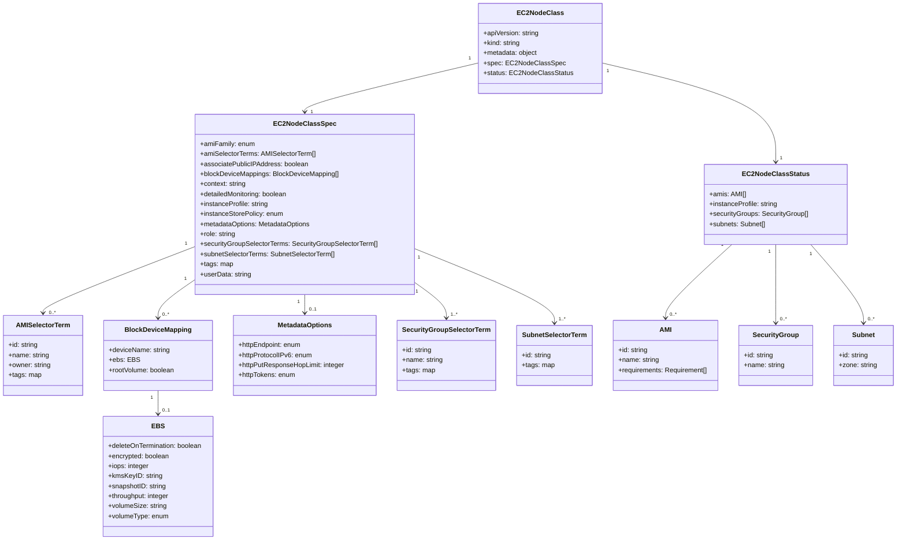
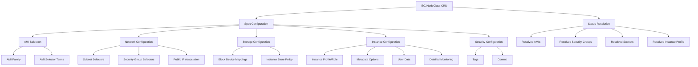
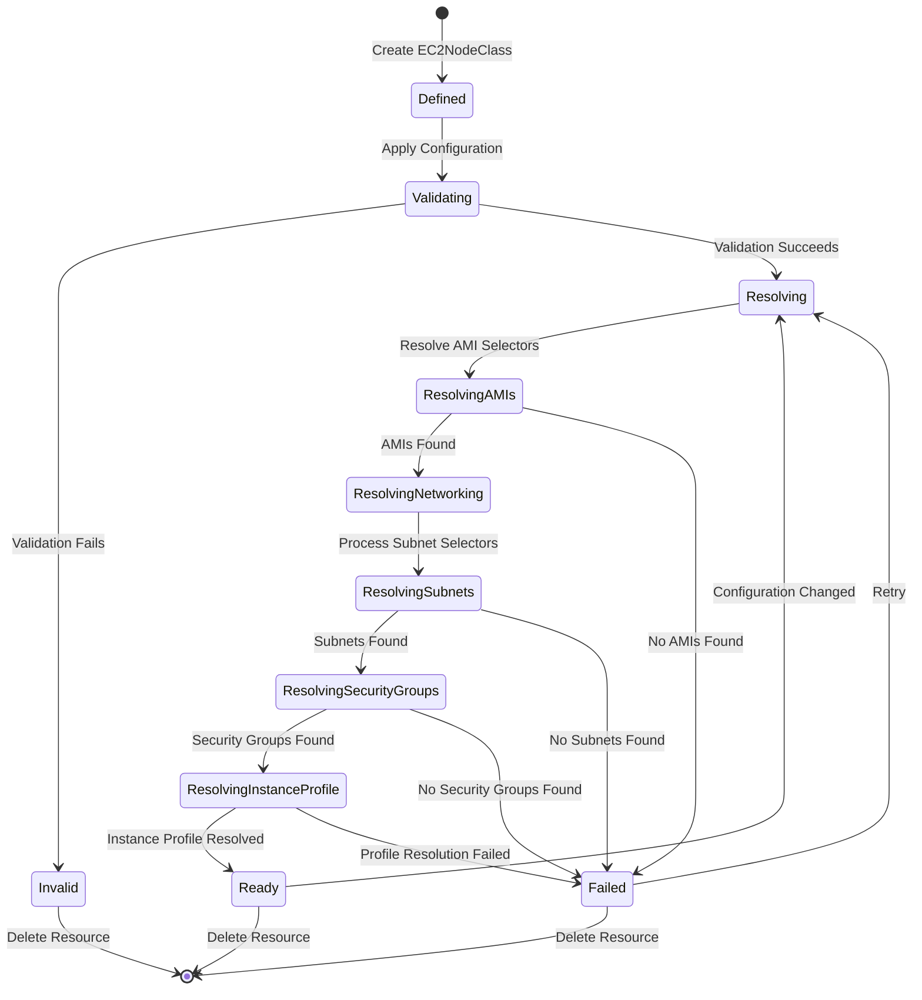

# Diagram: devops/k8s/karpenter/helm/crds/karpenter.k8s.aws_ec2nodeclasses.yaml

> Auto-generated by Obscura crawlers

## Diagram 1

### SVG

<svg id="container" width="2132.5703125" xmlns="http://www.w3.org/2000/svg" class="classDiagram" height="1294" viewBox="0 0 2132.5703125 1294" role="graphics-document document" aria-roledescription="class"><g><defs><marker id="container_class-aggregationStart" class="marker aggregation class" refX="18" refY="7" markerWidth="190" markerHeight="240" orient="auto"><path d="M 18,7 L9,13 L1,7 L9,1 Z"></path></marker></defs><defs><marker id="container_class-aggregationEnd" class="marker aggregation class" refX="1" refY="7" markerWidth="20" markerHeight="28" orient="auto"><path d="M 18,7 L9,13 L1,7 L9,1 Z"></path></marker></defs><defs><marker id="container_class-extensionStart" class="marker extension class" refX="18" refY="7" markerWidth="190" markerHeight="240" orient="auto"><path d="M 1,7 L18,13 V 1 Z"></path></marker></defs><defs><marker id="container_class-extensionEnd" class="marker extension class" refX="1" refY="7" markerWidth="20" markerHeight="28" orient="auto"><path d="M 1,1 V 13 L18,7 Z"></path></marker></defs><defs><marker id="container_class-compositionStart" class="marker composition class" refX="18" refY="7" markerWidth="190" markerHeight="240" orient="auto"><path d="M 18,7 L9,13 L1,7 L9,1 Z"></path></marker></defs><defs><marker id="container_class-compositionEnd" class="marker composition class" refX="1" refY="7" markerWidth="20" markerHeight="28" orient="auto"><path d="M 18,7 L9,13 L1,7 L9,1 Z"></path></marker></defs><defs><marker id="container_class-dependencyStart" class="marker dependency class" refX="6" refY="7" markerWidth="190" markerHeight="240" orient="auto"><path d="M 5,7 L9,13 L1,7 L9,1 Z"></path></marker></defs><defs><marker id="container_class-dependencyEnd" class="marker dependency class" refX="13" refY="7" markerWidth="20" markerHeight="28" orient="auto"><path d="M 18,7 L9,13 L14,7 L9,1 Z"></path></marker></defs><defs><marker id="container_class-lollipopStart" class="marker lollipop class" refX="13" refY="7" markerWidth="190" markerHeight="240" orient="auto"><circle stroke="black" fill="transparent" cx="7" cy="7" r="6"></circle></marker></defs><defs><marker id="container_class-lollipopEnd" class="marker lollipop class" refX="1" refY="7" markerWidth="190" markerHeight="240" orient="auto"><circle stroke="black" fill="transparent" cx="7" cy="7" r="6"></circle></marker></defs><g class="root"><g class="clusters"></g><g class="edgePaths"><path d="M1146.773,149.536L1077.192,166.114C1007.611,182.691,868.448,215.845,798.867,235.589C729.285,255.333,729.285,261.667,729.285,264.833L729.285,268" id="id_EC2NodeClass_EC2NodeClassSpec_1" class="edge-thickness-normal edge-pattern-solid relation" style=";;;" data-edge="true" data-et="edge" data-id="id_EC2NodeClass_EC2NodeClassSpec_1" data-points="W3sieCI6MTE0Ni43NzM0Mzc1LCJ5IjoxNDkuNTM2NDAzMjY2MzIyODh9LHsieCI6NzI5LjI4NTE1NjI1LCJ5IjoyNDl9LHsieCI6NzI5LjI4NTE1NjI1LCJ5IjoyNzR9XQ==" marker-end="url(#container_class-dependencyEnd)"></path><path d="M1428.305,149.536L1497.886,166.114C1567.467,182.691,1706.63,215.845,1776.212,255.589C1845.793,295.333,1845.793,341.667,1845.793,364.833L1845.793,388" id="id_EC2NodeClass_EC2NodeClassStatus_2" class="edge-thickness-normal edge-pattern-solid relation" style=";;;" data-edge="true" data-et="edge" data-id="id_EC2NodeClass_EC2NodeClassStatus_2" data-points="W3sieCI6MTQyOC4zMDQ2ODc1LCJ5IjoxNDkuNTM2NDAzMjY2MzIyODh9LHsieCI6MTg0NS43OTI5Njg3NSwieSI6MjQ5fSx7IngiOjE4NDUuNzkyOTY4NzUsInkiOjM5NH1d" marker-end="url(#container_class-dependencyEnd)"></path><path d="M468.836,590.141L407.778,613.618C346.72,637.094,224.604,684.047,163.546,710.69C102.488,737.333,102.488,743.667,102.488,746.833L102.488,750" id="id_EC2NodeClassSpec_AMISelectorTerm_3" class="edge-thickness-normal edge-pattern-solid relation" style=";;;" data-edge="true" data-et="edge" data-id="id_EC2NodeClassSpec_AMISelectorTerm_3" data-points="W3sieCI6NDY4LjgzNTkzNzUsInkiOjU5MC4xNDEzMTI0NzY2Mjk3fSx7IngiOjEwMi40ODgyODEyNSwieSI6NzMxfSx7IngiOjEwMi40ODgyODEyNSwieSI6NzU2fV0=" marker-end="url(#container_class-dependencyEnd)"></path><path d="M468.836,668.074L453.497,678.562C438.158,689.049,407.479,710.025,392.14,725.679C376.801,741.333,376.801,751.667,376.801,756.833L376.801,762" id="id_EC2NodeClassSpec_BlockDeviceMapping_4" class="edge-thickness-normal edge-pattern-solid relation" style=";;;" data-edge="true" data-et="edge" data-id="id_EC2NodeClassSpec_BlockDeviceMapping_4" data-points="W3sieCI6NDY4LjgzNTkzNzUsInkiOjY2OC4wNzM4ODQwMzc0MTN9LHsieCI6Mzc2LjgwMDc4MTI1LCJ5Ijo3MzF9LHsieCI6Mzc2LjgwMDc4MTI1LCJ5Ijo3Njh9XQ==" marker-end="url(#container_class-dependencyEnd)"></path><path d="M729.285,706L729.285,710.167C729.285,714.333,729.285,722.667,729.285,730C729.285,737.333,729.285,743.667,729.285,746.833L729.285,750" id="id_EC2NodeClassSpec_MetadataOptions_5" class="edge-thickness-normal edge-pattern-solid relation" style=";;;" data-edge="true" data-et="edge" data-id="id_EC2NodeClassSpec_MetadataOptions_5" data-points="W3sieCI6NzI5LjI4NTE1NjI1LCJ5Ijo3MDZ9LHsieCI6NzI5LjI4NTE1NjI1LCJ5Ijo3MzF9LHsieCI6NzI5LjI4NTE1NjI1LCJ5Ijo3NTZ9XQ==" marker-end="url(#container_class-dependencyEnd)"></path><path d="M989.734,677.113L1002.236,686.094C1014.737,695.075,1039.74,713.038,1052.241,727.185C1064.742,741.333,1064.742,751.667,1064.742,756.833L1064.742,762" id="id_EC2NodeClassSpec_SecurityGroupSelectorTerm_6" class="edge-thickness-normal edge-pattern-solid relation" style=";;;" data-edge="true" data-et="edge" data-id="id_EC2NodeClassSpec_SecurityGroupSelectorTerm_6" data-points="W3sieCI6OTg5LjczNDM3NSwieSI6Njc3LjExMjY3Mjc3NjE3OTl9LHsieCI6MTA2NC43NDIxODc1LCJ5Ijo3MzF9LHsieCI6MTA2NC43NDIxODc1LCJ5Ijo3Njh9XQ==" marker-end="url(#container_class-dependencyEnd)"></path><path d="M989.734,597.02L1044.078,619.35C1098.422,641.68,1207.109,686.34,1261.453,715.837C1315.797,745.333,1315.797,759.667,1315.797,766.833L1315.797,774" id="id_EC2NodeClassSpec_SubnetSelectorTerm_7" class="edge-thickness-normal edge-pattern-solid relation" style=";;;" data-edge="true" data-et="edge" data-id="id_EC2NodeClassSpec_SubnetSelectorTerm_7" data-points="W3sieCI6OTg5LjczNDM3NSwieSI6NTk3LjAxOTYyMDc3MTY0Mzh9LHsieCI6MTMxNS43OTY4NzUsInkiOjczMX0seyJ4IjoxMzE1Ljc5Njg3NSwieSI6NzgwfV0=" marker-end="url(#container_class-dependencyEnd)"></path><path d="M376.801,936L376.801,942.167C376.801,948.333,376.801,960.667,376.801,970C376.801,979.333,376.801,985.667,376.801,988.833L376.801,992" id="id_BlockDeviceMapping_EBS_8" class="edge-thickness-normal edge-pattern-solid relation" style=";;;" data-edge="true" data-et="edge" data-id="id_BlockDeviceMapping_EBS_8" data-points="W3sieCI6Mzc2LjgwMDc4MTI1LCJ5Ijo5MzZ9LHsieCI6Mzc2LjgwMDc4MTI1LCJ5Ijo5NzN9LHsieCI6Mzc2LjgwMDc4MTI1LCJ5Ijo5OTh9XQ==" marker-end="url(#container_class-dependencyEnd)"></path><path d="M1740.449,586L1713.93,610.167C1687.411,634.333,1634.374,682.667,1607.855,712C1581.336,741.333,1581.336,751.667,1581.336,756.833L1581.336,762" id="id_EC2NodeClassStatus_AMI_9" class="edge-thickness-normal edge-pattern-solid relation" style=";;;" data-edge="true" data-et="edge" data-id="id_EC2NodeClassStatus_AMI_9" data-points="W3sieCI6MTc0MC40NDkwODkwODE5NTAyLCJ5Ijo1ODZ9LHsieCI6MTU4MS4zMzU5Mzc1LCJ5Ijo3MzF9LHsieCI6MTU4MS4zMzU5Mzc1LCJ5Ijo3Njh9XQ==" marker-end="url(#container_class-dependencyEnd)"></path><path d="M1845.793,586L1845.793,610.167C1845.793,634.333,1845.793,682.667,1845.793,714C1845.793,745.333,1845.793,759.667,1845.793,766.833L1845.793,774" id="id_EC2NodeClassStatus_SecurityGroup_10" class="edge-thickness-normal edge-pattern-solid relation" style=";;;" data-edge="true" data-et="edge" data-id="id_EC2NodeClassStatus_SecurityGroup_10" data-points="W3sieCI6MTg0NS43OTI5Njg3NSwieSI6NTg2fSx7IngiOjE4NDUuNzkyOTY4NzUsInkiOjczMX0seyJ4IjoxODQ1Ljc5Mjk2ODc1LCJ5Ijo3ODB9XQ==" marker-end="url(#container_class-dependencyEnd)"></path><path d="M1928.638,586L1949.494,610.167C1970.349,634.333,2012.059,682.667,2032.914,714C2053.77,745.333,2053.77,759.667,2053.77,766.833L2053.77,774" id="id_EC2NodeClassStatus_Subnet_11" class="edge-thickness-normal edge-pattern-solid relation" style=";;;" data-edge="true" data-et="edge" data-id="id_EC2NodeClassStatus_Subnet_11" data-points="W3sieCI6MTkyOC42Mzg0MDQ0MzQ2NDczLCJ5Ijo1ODZ9LHsieCI6MjA1My43Njk1MzEyNSwieSI6NzMxfSx7IngiOjIwNTMuNzY5NTMxMjUsInkiOjc4MH1d" marker-end="url(#container_class-dependencyEnd)"></path></g><g class="edgeLabels"><g class="edgeLabel"><g class="label" data-id="id_EC2NodeClass_EC2NodeClassSpec_1" transform="translate(0, 0)"><foreignObject width="0" height="0">

</foreignObject></g></g><g class="edgeLabel"><g class="label" data-id="id_EC2NodeClass_EC2NodeClassStatus_2" transform="translate(0, 0)"><foreignObject width="0" height="0">

</foreignObject></g></g><g class="edgeLabel"><g class="label" data-id="id_EC2NodeClassSpec_AMISelectorTerm_3" transform="translate(0, 0)"><foreignObject width="0" height="0">

</foreignObject></g></g><g class="edgeLabel"><g class="label" data-id="id_EC2NodeClassSpec_BlockDeviceMapping_4" transform="translate(0, 0)"><foreignObject width="0" height="0">

</foreignObject></g></g><g class="edgeLabel"><g class="label" data-id="id_EC2NodeClassSpec_MetadataOptions_5" transform="translate(0, 0)"><foreignObject width="0" height="0">

</foreignObject></g></g><g class="edgeLabel"><g class="label" data-id="id_EC2NodeClassSpec_SecurityGroupSelectorTerm_6" transform="translate(0, 0)"><foreignObject width="0" height="0">

</foreignObject></g></g><g class="edgeLabel"><g class="label" data-id="id_EC2NodeClassSpec_SubnetSelectorTerm_7" transform="translate(0, 0)"><foreignObject width="0" height="0">

</foreignObject></g></g><g class="edgeLabel"><g class="label" data-id="id_BlockDeviceMapping_EBS_8" transform="translate(0, 0)"><foreignObject width="0" height="0">

</foreignObject></g></g><g class="edgeLabel"><g class="label" data-id="id_EC2NodeClassStatus_AMI_9" transform="translate(0, 0)"><foreignObject width="0" height="0">

</foreignObject></g></g><g class="edgeLabel"><g class="label" data-id="id_EC2NodeClassStatus_SecurityGroup_10" transform="translate(0, 0)"><foreignObject width="0" height="0">

</foreignObject></g></g><g class="edgeLabel"><g class="label" data-id="id_EC2NodeClassStatus_Subnet_11" transform="translate(0, 0)"><foreignObject width="0" height="0">

</foreignObject></g></g><g class="edgeTerminals" transform="translate(1126.2735468934713, 139.0005340269686)"><g class="inner" transform="translate(0, 0)"><foreignObject style="width: 9px; height: 12px;">
1
</foreignObject></g></g><g class="edgeTerminals" transform="translate(1441.8518814103716, 168.1837491242591)"><g class="inner" transform="translate(0, 0)"><foreignObject style="width: 9px; height: 12px;">
1
</foreignObject></g></g><g class="edgeTerminals" transform="translate(447.1185167126321, 582.4209752527163)"><g class="inner" transform="translate(0, 0)"><foreignObject style="width: 9px; height: 12px;">
1
</foreignObject></g></g><g class="edgeTerminals" transform="translate(445.92364233933597, 665.5685580588555)"><g class="inner" transform="translate(0, 0)"><foreignObject style="width: 9px; height: 12px;">
1
</foreignObject></g></g><g class="edgeTerminals" transform="translate(714.2851581250001, 723.5000016071428)"><g class="inner" transform="translate(0, 0)"><foreignObject style="width: 9px; height: 12px;">
1
</foreignObject></g></g><g class="edgeTerminals" transform="translate(995.1949356016854, 699.5053559952905)"><g class="inner" transform="translate(0, 0)"><foreignObject style="width: 9px; height: 12px;">
1
</foreignObject></g></g><g class="edgeTerminals" transform="translate(1000.2201059803992, 617.5452018167076)"><g class="inner" transform="translate(0, 0)"><foreignObject style="width: 9px; height: 12px;">
1
</foreignObject></g></g><g class="edgeTerminals" transform="translate(361.800780625, 953.4999994642857)"><g class="inner" transform="translate(0, 0)"><foreignObject style="width: 9px; height: 12px;">
1
</foreignObject></g></g><g class="edgeTerminals" transform="translate(1717.4108763731524, 586.7005257668167)"><g class="inner" transform="translate(0, 0)"><foreignObject style="width: 9px; height: 12px;">
1
</foreignObject></g></g><g class="edgeTerminals" transform="translate(1830.792969375, 603.5000005357143)"><g class="inner" transform="translate(0, 0)"><foreignObject style="width: 9px; height: 12px;">
1
</foreignObject></g></g><g class="edgeTerminals" transform="translate(1928.7156479471553, 609.0487292209638)"><g class="inner" transform="translate(0, 0)"><foreignObject style="width: 9px; height: 12px;">
1
</foreignObject></g></g><g class="edgeTerminals" transform="translate(743.2798214596905, 260.37317175099145)"><g class="inner" transform="translate(0, 0)"></g><foreignObject style="width: 9px; height: 12px;">
1
</foreignObject></g><g class="edgeTerminals" transform="translate(1855.792969375, 371.50000053571426)"><g class="inner" transform="translate(0, 0)"></g><foreignObject style="width: 9px; height: 12px;">
1
</foreignObject></g><g class="edgeTerminals" transform="translate(116.41447126528621, 741.3610435076168)"><g class="inner" transform="translate(0, 0)"></g><foreignObject style="width: 36px; height: 12px;">
0..*
</foreignObject></g><g class="edgeTerminals" transform="translate(386.800780625, 745.4999994642857)"><g class="inner" transform="translate(0, 0)"></g><foreignObject style="width: 36px; height: 12px;">
0..*
</foreignObject></g><g class="edgeTerminals" transform="translate(739.2851581249998, 733.5000016071428)"><g class="inner" transform="translate(0, 0)"></g><foreignObject style="width: 36px; height: 12px;">
0..1
</foreignObject></g><g class="edgeTerminals" transform="translate(1074.74218875, 745.5000010714285)"><g class="inner" transform="translate(0, 0)"></g><foreignObject style="width: 36px; height: 12px;">
1..*
</foreignObject></g><g class="edgeTerminals" transform="translate(1325.7968774999997, 757.5000021428572)"><g class="inner" transform="translate(0, 0)"></g><foreignObject style="width: 36px; height: 12px;">
1..*
</foreignObject></g><g class="edgeTerminals" transform="translate(386.800780625, 975.4999994642857)"><g class="inner" transform="translate(0, 0)"></g><foreignObject style="width: 36px; height: 12px;">
0..1
</foreignObject></g><g class="edgeTerminals" transform="translate(1591.33593875, 745.5000010714285)"><g class="inner" transform="translate(0, 0)"></g><foreignObject style="width: 36px; height: 12px;">
0..*
</foreignObject></g><g class="edgeTerminals" transform="translate(1855.792969375, 757.5000005357143)"><g class="inner" transform="translate(0, 0)"></g><foreignObject style="width: 36px; height: 12px;">
0..*
</foreignObject></g><g class="edgeTerminals" transform="translate(2063.769530625, 757.4999994642857)"><g class="inner" transform="translate(0, 0)"></g><foreignObject style="width: 36px; height: 12px;">
0..*
</foreignObject></g></g><g class="nodes"><g class="node default" id="classId-EC2NodeClass-0" transform="translate(1287.5390625, 116)"><g class="basic label-container"><path d="M-140.765625 -108 L140.765625 -108 L140.765625 108 L-140.765625 108" stroke="none" stroke-width="0" fill="#ECECFF" style=""></path><path d="M-140.765625 -108 C-37.0807154369011 -108, 66.6041941261978 -108, 140.765625 -108 M-140.765625 -108 C-48.71806703068505 -108, 43.3294909386299 -108, 140.765625 -108 M140.765625 -108 C140.765625 -59.82010982473044, 140.765625 -11.640219649460875, 140.765625 108 M140.765625 -108 C140.765625 -41.71460070943429, 140.765625 24.570798581131413, 140.765625 108 M140.765625 108 C68.44275477011816 108, -3.8801154597636867 108, -140.765625 108 M140.765625 108 C53.99241016611592 108, -32.780804667768166 108, -140.765625 108 M-140.765625 108 C-140.765625 48.033210194285516, -140.765625 -11.933579611428968, -140.765625 -108 M-140.765625 108 C-140.765625 53.189523182530756, -140.765625 -1.6209536349384877, -140.765625 -108" stroke="#9370DB" stroke-width="1.3" fill="none" stroke-dasharray="0 0" style=""></path></g><g class="annotation-group text" transform="translate(0, -84)"></g><g class="label-group text" transform="translate(-50.859375, -84)"><g class="label" style="font-weight: bolder" transform="translate(0,-12)"><foreignObject width="101.71875" height="24">

EC2NodeClass

</foreignObject></g></g><g class="members-group text" transform="translate(-128.765625, -36)"><g class="label" style="" transform="translate(0,-12)"><foreignObject width="134.046875" height="24">

+apiVersion: string

</foreignObject></g><g class="label" style="" transform="translate(0,12)"><foreignObject width="89.359375" height="24">

+kind: string

</foreignObject></g><g class="label" style="" transform="translate(0,36)"><foreignObject width="130.984375" height="24">

+metadata: object

</foreignObject></g><g class="label" style="" transform="translate(0,60)"><foreignObject width="184.609375" height="24">

+spec: EC2NodeClassSpec

</foreignObject></g><g class="label" style="" transform="translate(0,84)"><foreignObject width="206.671875" height="24">

+status: EC2NodeClassStatus

</foreignObject></g></g><g class="methods-group text" transform="translate(-128.765625, 108)"></g><g class="divider" style=""><path d="M-140.765625 -60 C-57.34101898983762 -60, 26.083587020324757 -60, 140.765625 -60 M-140.765625 -60 C-53.16380661319927 -60, 34.43801177360146 -60, 140.765625 -60" stroke="#9370DB" stroke-width="1.3" fill="none" stroke-dasharray="0 0" style=""></path></g><g class="divider" style=""><path d="M-140.765625 84 C-69.99778650105408 84, 0.7700519978918408 84, 140.765625 84 M-140.765625 84 C-33.48596044902129 84, 73.79370410195742 84, 140.765625 84" stroke="#9370DB" stroke-width="1.3" fill="none" stroke-dasharray="0 0" style=""></path></g></g><g class="node default" id="classId-EC2NodeClassSpec-1" transform="translate(729.28515625, 490)"><g class="basic label-container"><path d="M-260.44921875 -216 L260.44921875 -216 L260.44921875 216 L-260.44921875 216" stroke="none" stroke-width="0" fill="#ECECFF" style=""></path><path d="M-260.44921875 -216 C-103.02652193949885 -216, 54.3961748710023 -216, 260.44921875 -216 M-260.44921875 -216 C-124.21433707973236 -216, 12.02054459053528 -216, 260.44921875 -216 M260.44921875 -216 C260.44921875 -67.67523962697146, 260.44921875 80.64952074605708, 260.44921875 216 M260.44921875 -216 C260.44921875 -102.56030954659889, 260.44921875 10.879380906802226, 260.44921875 216 M260.44921875 216 C62.73836444008148 216, -134.97248986983703 216, -260.44921875 216 M260.44921875 216 C75.10507967439895 216, -110.2390594012021 216, -260.44921875 216 M-260.44921875 216 C-260.44921875 87.46890797242801, -260.44921875 -41.06218405514397, -260.44921875 -216 M-260.44921875 216 C-260.44921875 46.96984951968125, -260.44921875 -122.0603009606375, -260.44921875 -216" stroke="#9370DB" stroke-width="1.3" fill="none" stroke-dasharray="0 0" style=""></path></g><g class="annotation-group text" transform="translate(0, -192)"></g><g class="label-group text" transform="translate(-68.4609375, -192)"><g class="label" style="font-weight: bolder" transform="translate(0,-12)"><foreignObject width="136.921875" height="24">

EC2NodeClassSpec

</foreignObject></g></g><g class="members-group text" transform="translate(-248.44921875, -144)"><g class="label" style="" transform="translate(0,-12)"><foreignObject width="130.171875" height="24">

+amiFamily: enum

</foreignObject></g><g class="label" style="" transform="translate(0,12)"><foreignObject width="277.8125" height="24">

+amiSelectorTerms: AMISelectorTerm[]

</foreignObject></g><g class="label" style="" transform="translate(0,36)"><foreignObject width="258.15625" height="24">

+associatePublicIPAddress: boolean

</foreignObject></g><g class="label" style="" transform="translate(0,60)"><foreignObject width="332.078125" height="24">

+blockDeviceMappings: BlockDeviceMapping[]

</foreignObject></g><g class="label" style="" transform="translate(0,84)"><foreignObject width="111.46875" height="24">

+context: string

</foreignObject></g><g class="label" style="" transform="translate(0,108)"><foreignObject width="214.515625" height="24">

+detailedMonitoring: boolean

</foreignObject></g><g class="label" style="" transform="translate(0,132)"><foreignObject width="165.40625" height="24">

+instanceProfile: string

</foreignObject></g><g class="label" style="" transform="translate(0,156)"><foreignObject width="199.296875" height="24">

+instanceStorePolicy: enum

</foreignObject></g><g class="label" style="" transform="translate(0,180)"><foreignObject width="267.796875" height="24">

+metadataOptions: MetadataOptions

</foreignObject></g><g class="label" style="" transform="translate(0,204)"><foreignObject width="86.078125" height="24">

+role: string

</foreignObject></g><g class="label" style="" transform="translate(0,228)"><foreignObject width="428.4375" height="24">

+securityGroupSelectorTerms: SecurityGroupSelectorTerm[]

</foreignObject></g><g class="label" style="" transform="translate(0,252)"><foreignObject width="326.359375" height="24">

+subnetSelectorTerms: SubnetSelectorTerm[]

</foreignObject></g><g class="label" style="" transform="translate(0,276)"><foreignObject width="77.796875" height="24">

+tags: map

</foreignObject></g><g class="label" style="" transform="translate(0,300)"><foreignObject width="122.59375" height="24">

+userData: string

</foreignObject></g></g><g class="methods-group text" transform="translate(-248.44921875, 216)"></g><g class="divider" style=""><path d="M-260.44921875 -168 C-116.6822003773903 -168, 27.084817995219396 -168, 260.44921875 -168 M-260.44921875 -168 C-79.38638212448282 -168, 101.67645450103436 -168, 260.44921875 -168" stroke="#9370DB" stroke-width="1.3" fill="none" stroke-dasharray="0 0" style=""></path></g><g class="divider" style=""><path d="M-260.44921875 192 C-118.67371819460251 192, 23.10178236079497 192, 260.44921875 192 M-260.44921875 192 C-111.54620917888175 192, 37.356800392236494 192, 260.44921875 192" stroke="#9370DB" stroke-width="1.3" fill="none" stroke-dasharray="0 0" style=""></path></g></g><g class="node default" id="classId-EC2NodeClassStatus-2" transform="translate(1845.79296875, 490)"><g class="basic label-container"><path d="M-167.921875 -96 L167.921875 -96 L167.921875 96 L-167.921875 96" stroke="none" stroke-width="0" fill="#ECECFF" style=""></path><path d="M-167.921875 -96 C-71.98438426722555 -96, 23.9531064655489 -96, 167.921875 -96 M-167.921875 -96 C-65.8849981748563 -96, 36.15187865028739 -96, 167.921875 -96 M167.921875 -96 C167.921875 -47.13060500809513, 167.921875 1.7387899838097383, 167.921875 96 M167.921875 -96 C167.921875 -22.81369581944871, 167.921875 50.37260836110258, 167.921875 96 M167.921875 96 C95.04239974366573 96, 22.162924487331452 96, -167.921875 96 M167.921875 96 C50.27952042596522 96, -67.36283414806957 96, -167.921875 96 M-167.921875 96 C-167.921875 19.673782159482727, -167.921875 -56.65243568103455, -167.921875 -96 M-167.921875 96 C-167.921875 22.820717348378523, -167.921875 -50.358565303242955, -167.921875 -96" stroke="#9370DB" stroke-width="1.3" fill="none" stroke-dasharray="0 0" style=""></path></g><g class="annotation-group text" transform="translate(0, -72)"></g><g class="label-group text" transform="translate(-74.34375, -72)"><g class="label" style="font-weight: bolder" transform="translate(0,-12)"><foreignObject width="148.6875" height="24">

EC2NodeClassStatus

</foreignObject></g></g><g class="members-group text" transform="translate(-155.921875, -24)"><g class="label" style="" transform="translate(0,-12)"><foreignObject width="86.875" height="24">

+amis: AMI[]

</foreignObject></g><g class="label" style="" transform="translate(0,12)"><foreignObject width="165.40625" height="24">

+instanceProfile: string

</foreignObject></g><g class="label" style="" transform="translate(0,36)"><foreignObject width="237.5" height="24">

+securityGroups: SecurityGroup[]

</foreignObject></g><g class="label" style="" transform="translate(0,60)"><foreignObject width="135.421875" height="24">

+subnets: Subnet[]

</foreignObject></g></g><g class="methods-group text" transform="translate(-155.921875, 96)"></g><g class="divider" style=""><path d="M-167.921875 -48 C-42.46286664671074 -48, 82.99614170657853 -48, 167.921875 -48 M-167.921875 -48 C-96.58604568413332 -48, -25.25021636826665 -48, 167.921875 -48" stroke="#9370DB" stroke-width="1.3" fill="none" stroke-dasharray="0 0" style=""></path></g><g class="divider" style=""><path d="M-167.921875 72 C-47.369202495522686 72, 73.18347000895463 72, 167.921875 72 M-167.921875 72 C-51.06360895009715 72, 65.7946570998057 72, 167.921875 72" stroke="#9370DB" stroke-width="1.3" fill="none" stroke-dasharray="0 0" style=""></path></g></g><g class="node default" id="classId-AMISelectorTerm-3" transform="translate(102.48828125, 852)"><g class="basic label-container"><path d="M-94.48828125 -96 L94.48828125 -96 L94.48828125 96 L-94.48828125 96" stroke="none" stroke-width="0" fill="#ECECFF" style=""></path><path d="M-94.48828125 -96 C-53.161423887232594 -96, -11.834566524465188 -96, 94.48828125 -96 M-94.48828125 -96 C-42.61277171281547 -96, 9.262737824369054 -96, 94.48828125 -96 M94.48828125 -96 C94.48828125 -36.63932198686713, 94.48828125 22.721356026265738, 94.48828125 96 M94.48828125 -96 C94.48828125 -42.52321022784736, 94.48828125 10.953579544305285, 94.48828125 96 M94.48828125 96 C32.27181785942617 96, -29.944645531147657 96, -94.48828125 96 M94.48828125 96 C28.72330463742773 96, -37.04167197514454 96, -94.48828125 96 M-94.48828125 96 C-94.48828125 26.166573798354918, -94.48828125 -43.666852403290164, -94.48828125 -96 M-94.48828125 96 C-94.48828125 51.08579427154966, -94.48828125 6.171588543099318, -94.48828125 -96" stroke="#9370DB" stroke-width="1.3" fill="none" stroke-dasharray="0 0" style=""></path></g><g class="annotation-group text" transform="translate(0, -72)"></g><g class="label-group text" transform="translate(-62.0234375, -72)"><g class="label" style="font-weight: bolder" transform="translate(0,-12)"><foreignObject width="124.046875" height="24">

AMISelectorTerm

</foreignObject></g></g><g class="members-group text" transform="translate(-82.48828125, -24)"><g class="label" style="" transform="translate(0,-12)"><foreignObject width="71.78125" height="24">

+id: string

</foreignObject></g><g class="label" style="" transform="translate(0,12)"><foreignObject width="98.21875" height="24">

+name: string

</foreignObject></g><g class="label" style="" transform="translate(0,36)"><foreignObject width="102.953125" height="24">

+owner: string

</foreignObject></g><g class="label" style="" transform="translate(0,60)"><foreignObject width="77.796875" height="24">

+tags: map

</foreignObject></g></g><g class="methods-group text" transform="translate(-82.48828125, 96)"></g><g class="divider" style=""><path d="M-94.48828125 -48 C-23.85085379973809 -48, 46.78657365052382 -48, 94.48828125 -48 M-94.48828125 -48 C-29.917014667914003 -48, 34.654251914171994 -48, 94.48828125 -48" stroke="#9370DB" stroke-width="1.3" fill="none" stroke-dasharray="0 0" style=""></path></g><g class="divider" style=""><path d="M-94.48828125 72 C-22.26266469427388 72, 49.96295186145224 72, 94.48828125 72 M-94.48828125 72 C-45.880359913071466 72, 2.7275614238570682 72, 94.48828125 72" stroke="#9370DB" stroke-width="1.3" fill="none" stroke-dasharray="0 0" style=""></path></g></g><g class="node default" id="classId-BlockDeviceMapping-4" transform="translate(376.80078125, 852)"><g class="basic label-container"><path d="M-129.82421875 -84 L129.82421875 -84 L129.82421875 84 L-129.82421875 84" stroke="none" stroke-width="0" fill="#ECECFF" style=""></path><path d="M-129.82421875 -84 C-27.318070449844953 -84, 75.1880778503101 -84, 129.82421875 -84 M-129.82421875 -84 C-65.56050379590815 -84, -1.2967888418162943 -84, 129.82421875 -84 M129.82421875 -84 C129.82421875 -20.9521172206031, 129.82421875 42.0957655587938, 129.82421875 84 M129.82421875 -84 C129.82421875 -20.721554581082927, 129.82421875 42.556890837834146, 129.82421875 84 M129.82421875 84 C30.756451511034257 84, -68.31131572793149 84, -129.82421875 84 M129.82421875 84 C38.38820965028941 84, -53.04779944942118 84, -129.82421875 84 M-129.82421875 84 C-129.82421875 33.69740466940543, -129.82421875 -16.60519066118914, -129.82421875 -84 M-129.82421875 84 C-129.82421875 21.412553548332177, -129.82421875 -41.174892903335646, -129.82421875 -84" stroke="#9370DB" stroke-width="1.3" fill="none" stroke-dasharray="0 0" style=""></path></g><g class="annotation-group text" transform="translate(0, -60)"></g><g class="label-group text" transform="translate(-75.7109375, -60)"><g class="label" style="font-weight: bolder" transform="translate(0,-12)"><foreignObject width="151.421875" height="24">

BlockDeviceMapping

</foreignObject></g></g><g class="members-group text" transform="translate(-117.82421875, -12)"><g class="label" style="" transform="translate(0,-12)"><foreignObject width="146.421875" height="24">

+deviceName: string

</foreignObject></g><g class="label" style="" transform="translate(0,12)"><foreignObject width="68.453125" height="24">

+ebs: EBS

</foreignObject></g><g class="label" style="" transform="translate(0,36)"><foreignObject width="159.9375" height="24">

+rootVolume: boolean

</foreignObject></g></g><g class="methods-group text" transform="translate(-117.82421875, 84)"></g><g class="divider" style=""><path d="M-129.82421875 -36 C-49.05224121264348 -36, 31.71973632471304 -36, 129.82421875 -36 M-129.82421875 -36 C-52.97262061768882 -36, 23.878977514622363 -36, 129.82421875 -36" stroke="#9370DB" stroke-width="1.3" fill="none" stroke-dasharray="0 0" style=""></path></g><g class="divider" style=""><path d="M-129.82421875 60 C-66.04174234486538 60, -2.259265939730767 60, 129.82421875 60 M-129.82421875 60 C-43.078137179256615 60, 43.66794439148677 60, 129.82421875 60" stroke="#9370DB" stroke-width="1.3" fill="none" stroke-dasharray="0 0" style=""></path></g></g><g class="node default" id="classId-EBS-5" transform="translate(376.80078125, 1142)"><g class="basic label-container"><path d="M-133.5 -144 L133.5 -144 L133.5 144 L-133.5 144" stroke="none" stroke-width="0" fill="#ECECFF" style=""></path><path d="M-133.5 -144 C-59.312753704275096 -144, 14.874492591449808 -144, 133.5 -144 M-133.5 -144 C-33.160158479957005 -144, 67.17968304008599 -144, 133.5 -144 M133.5 -144 C133.5 -62.581725444238, 133.5 18.836549111523993, 133.5 144 M133.5 -144 C133.5 -33.41785563040243, 133.5 77.16428873919514, 133.5 144 M133.5 144 C57.87136848167796 144, -17.757263036644076 144, -133.5 144 M133.5 144 C57.698866293705095 144, -18.10226741258981 144, -133.5 144 M-133.5 144 C-133.5 51.81265146342179, -133.5 -40.374697073156426, -133.5 -144 M-133.5 144 C-133.5 37.480066185415, -133.5 -69.03986762917, -133.5 -144" stroke="#9370DB" stroke-width="1.3" fill="none" stroke-dasharray="0 0" style=""></path></g><g class="annotation-group text" transform="translate(0, -120)"></g><g class="label-group text" transform="translate(-13.5625, -120)"><g class="label" style="font-weight: bolder" transform="translate(0,-12)"><foreignObject width="27.125" height="24">

EBS

</foreignObject></g></g><g class="members-group text" transform="translate(-121.5, -72)"><g class="label" style="" transform="translate(0,-12)"><foreignObject width="229.4375" height="24">

+deleteOnTermination: boolean

</foreignObject></g><g class="label" style="" transform="translate(0,12)"><foreignObject width="148.625" height="24">

+encrypted: boolean

</foreignObject></g><g class="label" style="" transform="translate(0,36)"><foreignObject width="98.015625" height="24">

+iops: integer

</foreignObject></g><g class="label" style="" transform="translate(0,60)"><foreignObject width="127.828125" height="24">

+kmsKeyID: string

</foreignObject></g><g class="label" style="" transform="translate(0,84)"><foreignObject width="139.75" height="24">

+snapshotID: string

</foreignObject></g><g class="label" style="" transform="translate(0,108)"><foreignObject width="148.953125" height="24">

+throughput: integer

</foreignObject></g><g class="label" style="" transform="translate(0,132)"><foreignObject width="139.953125" height="24">

+volumeSize: string

</foreignObject></g><g class="label" style="" transform="translate(0,156)"><foreignObject width="144.34375" height="24">

+volumeType: enum

</foreignObject></g></g><g class="methods-group text" transform="translate(-121.5, 144)"></g><g class="divider" style=""><path d="M-133.5 -96 C-64.82372607342346 -96, 3.8525478531530837 -96, 133.5 -96 M-133.5 -96 C-40.66994654005086 -96, 52.16010691989828 -96, 133.5 -96" stroke="#9370DB" stroke-width="1.3" fill="none" stroke-dasharray="0 0" style=""></path></g><g class="divider" style=""><path d="M-133.5 120 C-57.2032894630039 120, 19.093421073992204 120, 133.5 120 M-133.5 120 C-42.244652450780166 120, 49.01069509843967 120, 133.5 120" stroke="#9370DB" stroke-width="1.3" fill="none" stroke-dasharray="0 0" style=""></path></g></g><g class="node default" id="classId-MetadataOptions-6" transform="translate(729.28515625, 852)"><g class="basic label-container"><path d="M-172.66015625 -96 L172.66015625 -96 L172.66015625 96 L-172.66015625 96" stroke="none" stroke-width="0" fill="#ECECFF" style=""></path><path d="M-172.66015625 -96 C-86.81194846383849 -96, -0.9637406776769808 -96, 172.66015625 -96 M-172.66015625 -96 C-85.52537476287843 -96, 1.6094067242431436 -96, 172.66015625 -96 M172.66015625 -96 C172.66015625 -40.61298910713367, 172.66015625 14.774021785732657, 172.66015625 96 M172.66015625 -96 C172.66015625 -28.33785140094804, 172.66015625 39.32429719810392, 172.66015625 96 M172.66015625 96 C45.45863442078186 96, -81.74288740843627 96, -172.66015625 96 M172.66015625 96 C45.74653172537819 96, -81.16709279924362 96, -172.66015625 96 M-172.66015625 96 C-172.66015625 45.0358175290357, -172.66015625 -5.928364941928606, -172.66015625 -96 M-172.66015625 96 C-172.66015625 41.9427919550165, -172.66015625 -12.114416089966994, -172.66015625 -96" stroke="#9370DB" stroke-width="1.3" fill="none" stroke-dasharray="0 0" style=""></path></g><g class="annotation-group text" transform="translate(0, -72)"></g><g class="label-group text" transform="translate(-63.4453125, -72)"><g class="label" style="font-weight: bolder" transform="translate(0,-12)"><foreignObject width="126.890625" height="24">

MetadataOptions

</foreignObject></g></g><g class="members-group text" transform="translate(-160.66015625, -24)"><g class="label" style="" transform="translate(0,-12)"><foreignObject width="153.546875" height="24">

+httpEndpoint: enum

</foreignObject></g><g class="label" style="" transform="translate(0,12)"><foreignObject width="178.21875" height="24">

+httpProtocolIPv6: enum

</foreignObject></g><g class="label" style="" transform="translate(0,36)"><foreignObject width="257.875" height="24">

+httpPutResponseHopLimit: integer

</foreignObject></g><g class="label" style="" transform="translate(0,60)"><foreignObject width="137.96875" height="24">

+httpTokens: enum

</foreignObject></g></g><g class="methods-group text" transform="translate(-160.66015625, 96)"></g><g class="divider" style=""><path d="M-172.66015625 -48 C-77.64357478048888 -48, 17.373006689022247 -48, 172.66015625 -48 M-172.66015625 -48 C-37.765319511844865 -48, 97.12951722631027 -48, 172.66015625 -48" stroke="#9370DB" stroke-width="1.3" fill="none" stroke-dasharray="0 0" style=""></path></g><g class="divider" style=""><path d="M-172.66015625 72 C-39.758073171050455 72, 93.14400990789909 72, 172.66015625 72 M-172.66015625 72 C-44.59896019845567 72, 83.46223585308866 72, 172.66015625 72" stroke="#9370DB" stroke-width="1.3" fill="none" stroke-dasharray="0 0" style=""></path></g></g><g class="node default" id="classId-SecurityGroupSelectorTerm-7" transform="translate(1064.7421875, 852)"><g class="basic label-container"><path d="M-112.796875 -84 L112.796875 -84 L112.796875 84 L-112.796875 84" stroke="none" stroke-width="0" fill="#ECECFF" style=""></path><path d="M-112.796875 -84 C-55.51435033382203 -84, 1.7681743323559402 -84, 112.796875 -84 M-112.796875 -84 C-62.68026281939103 -84, -12.563650638782065 -84, 112.796875 -84 M112.796875 -84 C112.796875 -44.34279105440319, 112.796875 -4.685582108806386, 112.796875 84 M112.796875 -84 C112.796875 -40.599423935187176, 112.796875 2.801152129625649, 112.796875 84 M112.796875 84 C66.61362023837631 84, 20.430365476752613 84, -112.796875 84 M112.796875 84 C29.813509137294346 84, -53.16985672541131 84, -112.796875 84 M-112.796875 84 C-112.796875 20.87593057498463, -112.796875 -42.24813885003074, -112.796875 -84 M-112.796875 84 C-112.796875 47.3454697642522, -112.796875 10.690939528504401, -112.796875 -84" stroke="#9370DB" stroke-width="1.3" fill="none" stroke-dasharray="0 0" style=""></path></g><g class="annotation-group text" transform="translate(0, -60)"></g><g class="label-group text" transform="translate(-100.796875, -60)"><g class="label" style="font-weight: bolder" transform="translate(0,-12)"><foreignObject width="201.59375" height="24">

SecurityGroupSelectorTerm

</foreignObject></g></g><g class="members-group text" transform="translate(-100.796875, -12)"><g class="label" style="" transform="translate(0,-12)"><foreignObject width="71.78125" height="24">

+id: string

</foreignObject></g><g class="label" style="" transform="translate(0,12)"><foreignObject width="98.21875" height="24">

+name: string

</foreignObject></g><g class="label" style="" transform="translate(0,36)"><foreignObject width="77.796875" height="24">

+tags: map

</foreignObject></g></g><g class="methods-group text" transform="translate(-100.796875, 84)"></g><g class="divider" style=""><path d="M-112.796875 -36 C-63.69547804850442 -36, -14.59408109700884 -36, 112.796875 -36 M-112.796875 -36 C-64.30091012133244 -36, -15.804945242664871 -36, 112.796875 -36" stroke="#9370DB" stroke-width="1.3" fill="none" stroke-dasharray="0 0" style=""></path></g><g class="divider" style=""><path d="M-112.796875 60 C-28.744352621831865 60, 55.30816975633627 60, 112.796875 60 M-112.796875 60 C-38.26654397092241 60, 36.263787058155174 60, 112.796875 60" stroke="#9370DB" stroke-width="1.3" fill="none" stroke-dasharray="0 0" style=""></path></g></g><g class="node default" id="classId-SubnetSelectorTerm-8" transform="translate(1315.796875, 852)"><g class="basic label-container"><path d="M-88.2578125 -72 L88.2578125 -72 L88.2578125 72 L-88.2578125 72" stroke="none" stroke-width="0" fill="#ECECFF" style=""></path><path d="M-88.2578125 -72 C-35.737208420859005 -72, 16.78339565828199 -72, 88.2578125 -72 M-88.2578125 -72 C-41.78989847530037 -72, 4.678015549399262 -72, 88.2578125 -72 M88.2578125 -72 C88.2578125 -21.487485760416064, 88.2578125 29.025028479167872, 88.2578125 72 M88.2578125 -72 C88.2578125 -35.496675478319254, 88.2578125 1.0066490433614916, 88.2578125 72 M88.2578125 72 C41.580983331212586 72, -5.095845837574828 72, -88.2578125 72 M88.2578125 72 C34.29015357332408 72, -19.677505353351833 72, -88.2578125 72 M-88.2578125 72 C-88.2578125 16.165565778719042, -88.2578125 -39.668868442561916, -88.2578125 -72 M-88.2578125 72 C-88.2578125 32.1709972898354, -88.2578125 -7.658005420329204, -88.2578125 -72" stroke="#9370DB" stroke-width="1.3" fill="none" stroke-dasharray="0 0" style=""></path></g><g class="annotation-group text" transform="translate(0, -48)"></g><g class="label-group text" transform="translate(-74.71875, -48)"><g class="label" style="font-weight: bolder" transform="translate(0,-12)"><foreignObject width="149.4375" height="24">

SubnetSelectorTerm

</foreignObject></g></g><g class="members-group text" transform="translate(-76.2578125, 0)"><g class="label" style="" transform="translate(0,-12)"><foreignObject width="71.78125" height="24">

+id: string

</foreignObject></g><g class="label" style="" transform="translate(0,12)"><foreignObject width="77.796875" height="24">

+tags: map

</foreignObject></g></g><g class="methods-group text" transform="translate(-76.2578125, 72)"></g><g class="divider" style=""><path d="M-88.2578125 -24 C-28.686388819498752 -24, 30.885034861002495 -24, 88.2578125 -24 M-88.2578125 -24 C-44.667994728050715 -24, -1.07817695610143 -24, 88.2578125 -24" stroke="#9370DB" stroke-width="1.3" fill="none" stroke-dasharray="0 0" style=""></path></g><g class="divider" style=""><path d="M-88.2578125 48 C-49.2605178854187 48, -10.2632232708374 48, 88.2578125 48 M-88.2578125 48 C-28.178942334620416 48, 31.899927830759168 48, 88.2578125 48" stroke="#9370DB" stroke-width="1.3" fill="none" stroke-dasharray="0 0" style=""></path></g></g><g class="node default" id="classId-AMI-9" transform="translate(1581.3359375, 852)"><g class="basic label-container"><path d="M-127.28125 -84 L127.28125 -84 L127.28125 84 L-127.28125 84" stroke="none" stroke-width="0" fill="#ECECFF" style=""></path><path d="M-127.28125 -84 C-50.48244809162286 -84, 26.316353816754287 -84, 127.28125 -84 M-127.28125 -84 C-60.91920406457341 -84, 5.4428418708531865 -84, 127.28125 -84 M127.28125 -84 C127.28125 -37.216306739808914, 127.28125 9.567386520382172, 127.28125 84 M127.28125 -84 C127.28125 -22.781382190489893, 127.28125 38.437235619020214, 127.28125 84 M127.28125 84 C40.752474491816486 84, -45.77630101636703 84, -127.28125 84 M127.28125 84 C52.89920341841555 84, -21.482843163168894 84, -127.28125 84 M-127.28125 84 C-127.28125 42.84593114790437, -127.28125 1.6918622958087468, -127.28125 -84 M-127.28125 84 C-127.28125 26.749373106464198, -127.28125 -30.501253787071605, -127.28125 -84" stroke="#9370DB" stroke-width="1.3" fill="none" stroke-dasharray="0 0" style=""></path></g><g class="annotation-group text" transform="translate(0, -60)"></g><g class="label-group text" transform="translate(-13.359375, -60)"><g class="label" style="font-weight: bolder" transform="translate(0,-12)"><foreignObject width="26.71875" height="24">

AMI

</foreignObject></g></g><g class="members-group text" transform="translate(-115.28125, -12)"><g class="label" style="" transform="translate(0,-12)"><foreignObject width="71.78125" height="24">

+id: string

</foreignObject></g><g class="label" style="" transform="translate(0,12)"><foreignObject width="98.21875" height="24">

+name: string

</foreignObject></g><g class="label" style="" transform="translate(0,36)"><foreignObject width="217.203125" height="24">

+requirements: Requirement[]

</foreignObject></g></g><g class="methods-group text" transform="translate(-115.28125, 84)"></g><g class="divider" style=""><path d="M-127.28125 -36 C-35.030092664074374 -36, 57.22106467185125 -36, 127.28125 -36 M-127.28125 -36 C-27.184337064085753 -36, 72.9125758718285 -36, 127.28125 -36" stroke="#9370DB" stroke-width="1.3" fill="none" stroke-dasharray="0 0" style=""></path></g><g class="divider" style=""><path d="M-127.28125 60 C-62.21174319424726 60, 2.857763611505476 60, 127.28125 60 M-127.28125 60 C-38.38826698695476 60, 50.50471602609048 60, 127.28125 60" stroke="#9370DB" stroke-width="1.3" fill="none" stroke-dasharray="0 0" style=""></path></g></g><g class="node default" id="classId-SecurityGroup-10" transform="translate(1845.79296875, 852)"><g class="basic label-container"><path d="M-87.17578125 -72 L87.17578125 -72 L87.17578125 72 L-87.17578125 72" stroke="none" stroke-width="0" fill="#ECECFF" style=""></path><path d="M-87.17578125 -72 C-34.93103633571526 -72, 17.313708578569475 -72, 87.17578125 -72 M-87.17578125 -72 C-21.80050212176522 -72, 43.57477700646956 -72, 87.17578125 -72 M87.17578125 -72 C87.17578125 -26.676831015098998, 87.17578125 18.646337969802005, 87.17578125 72 M87.17578125 -72 C87.17578125 -27.715082097700574, 87.17578125 16.569835804598853, 87.17578125 72 M87.17578125 72 C39.744405132260766 72, -7.686970985478467 72, -87.17578125 72 M87.17578125 72 C28.310083976074814 72, -30.55561329785037 72, -87.17578125 72 M-87.17578125 72 C-87.17578125 29.20190913525022, -87.17578125 -13.596181729499563, -87.17578125 -72 M-87.17578125 72 C-87.17578125 20.985413771933693, -87.17578125 -30.029172456132613, -87.17578125 -72" stroke="#9370DB" stroke-width="1.3" fill="none" stroke-dasharray="0 0" style=""></path></g><g class="annotation-group text" transform="translate(0, -48)"></g><g class="label-group text" transform="translate(-52.1328125, -48)"><g class="label" style="font-weight: bolder" transform="translate(0,-12)"><foreignObject width="104.265625" height="24">

SecurityGroup

</foreignObject></g></g><g class="members-group text" transform="translate(-75.17578125, 0)"><g class="label" style="" transform="translate(0,-12)"><foreignObject width="71.78125" height="24">

+id: string

</foreignObject></g><g class="label" style="" transform="translate(0,12)"><foreignObject width="98.21875" height="24">

+name: string

</foreignObject></g></g><g class="methods-group text" transform="translate(-75.17578125, 72)"></g><g class="divider" style=""><path d="M-87.17578125 -24 C-22.031925878964273 -24, 43.111929492071454 -24, 87.17578125 -24 M-87.17578125 -24 C-19.705837094135376 -24, 47.76410706172925 -24, 87.17578125 -24" stroke="#9370DB" stroke-width="1.3" fill="none" stroke-dasharray="0 0" style=""></path></g><g class="divider" style=""><path d="M-87.17578125 48 C-30.718500405298364 48, 25.73878043940327 48, 87.17578125 48 M-87.17578125 48 C-33.13385664852473 48, 20.908067952950546 48, 87.17578125 48" stroke="#9370DB" stroke-width="1.3" fill="none" stroke-dasharray="0 0" style=""></path></g></g><g class="node default" id="classId-Subnet-11" transform="translate(2053.76953125, 852)"><g class="basic label-container"><path d="M-70.80078125 -72 L70.80078125 -72 L70.80078125 72 L-70.80078125 72" stroke="none" stroke-width="0" fill="#ECECFF" style=""></path><path d="M-70.80078125 -72 C-21.241740407572514 -72, 28.31730043485497 -72, 70.80078125 -72 M-70.80078125 -72 C-25.357122646401557 -72, 20.086535957196887 -72, 70.80078125 -72 M70.80078125 -72 C70.80078125 -34.56906212205681, 70.80078125 2.8618757558863734, 70.80078125 72 M70.80078125 -72 C70.80078125 -19.981291948530824, 70.80078125 32.03741610293835, 70.80078125 72 M70.80078125 72 C31.92146705204513 72, -6.957847145909739 72, -70.80078125 72 M70.80078125 72 C16.75217958949716 72, -37.29642207100568 72, -70.80078125 72 M-70.80078125 72 C-70.80078125 40.3132257639664, -70.80078125 8.626451527932808, -70.80078125 -72 M-70.80078125 72 C-70.80078125 33.310503726748394, -70.80078125 -5.378992546503213, -70.80078125 -72" stroke="#9370DB" stroke-width="1.3" fill="none" stroke-dasharray="0 0" style=""></path></g><g class="annotation-group text" transform="translate(0, -48)"></g><g class="label-group text" transform="translate(-26.0546875, -48)"><g class="label" style="font-weight: bolder" transform="translate(0,-12)"><foreignObject width="52.109375" height="24">

Subnet

</foreignObject></g></g><g class="members-group text" transform="translate(-58.80078125, 0)"><g class="label" style="" transform="translate(0,-12)"><foreignObject width="71.78125" height="24">

+id: string

</foreignObject></g><g class="label" style="" transform="translate(0,12)"><foreignObject width="91.546875" height="24">

+zone: string

</foreignObject></g></g><g class="methods-group text" transform="translate(-58.80078125, 72)"></g><g class="divider" style=""><path d="M-70.80078125 -24 C-34.881710753600416 -24, 1.0373597427991683 -24, 70.80078125 -24 M-70.80078125 -24 C-31.552196302126475 -24, 7.696388645747049 -24, 70.80078125 -24" stroke="#9370DB" stroke-width="1.3" fill="none" stroke-dasharray="0 0" style=""></path></g><g class="divider" style=""><path d="M-70.80078125 48 C-32.388778357770725 48, 6.023224534458549 48, 70.80078125 48 M-70.80078125 48 C-16.61955531308063 48, 37.56167062383874 48, 70.80078125 48" stroke="#9370DB" stroke-width="1.3" fill="none" stroke-dasharray="0 0" style=""></path></g></g></g></g></g></svg>

## Diagram 2

### SVG

<svg id="container" width="3974.0234375" xmlns="http://www.w3.org/2000/svg" class="flowchart" height="382" viewBox="0 0 3974.0234375 382" role="graphics-document document" aria-roledescription="flowchart-v2"><g><marker id="container_flowchart-v2-pointEnd" class="marker flowchart-v2" viewBox="0 0 10 10" refX="5" refY="5" markerUnits="userSpaceOnUse" markerWidth="8" markerHeight="8" orient="auto"><path d="M 0 0 L 10 5 L 0 10 z" class="arrowMarkerPath" style="stroke-width: 1; stroke-dasharray: 1, 0;"></path></marker><marker id="container_flowchart-v2-pointStart" class="marker flowchart-v2" viewBox="0 0 10 10" refX="4.5" refY="5" markerUnits="userSpaceOnUse" markerWidth="8" markerHeight="8" orient="auto"><path d="M 0 5 L 10 10 L 10 0 z" class="arrowMarkerPath" style="stroke-width: 1; stroke-dasharray: 1, 0;"></path></marker><marker id="container_flowchart-v2-circleEnd" class="marker flowchart-v2" viewBox="0 0 10 10" refX="11" refY="5" markerUnits="userSpaceOnUse" markerWidth="11" markerHeight="11" orient="auto"><circle cx="5" cy="5" r="5" class="arrowMarkerPath" style="stroke-width: 1; stroke-dasharray: 1, 0;"></circle></marker><marker id="container_flowchart-v2-circleStart" class="marker flowchart-v2" viewBox="0 0 10 10" refX="-1" refY="5" markerUnits="userSpaceOnUse" markerWidth="11" markerHeight="11" orient="auto"><circle cx="5" cy="5" r="5" class="arrowMarkerPath" style="stroke-width: 1; stroke-dasharray: 1, 0;"></circle></marker><marker id="container_flowchart-v2-crossEnd" class="marker cross flowchart-v2" viewBox="0 0 11 11" refX="12" refY="5.2" markerUnits="userSpaceOnUse" markerWidth="11" markerHeight="11" orient="auto"><path d="M 1,1 l 9,9 M 10,1 l -9,9" class="arrowMarkerPath" style="stroke-width: 2; stroke-dasharray: 1, 0;"></path></marker><marker id="container_flowchart-v2-crossStart" class="marker cross flowchart-v2" viewBox="0 0 11 11" refX="-1" refY="5.2" markerUnits="userSpaceOnUse" markerWidth="11" markerHeight="11" orient="auto"><path d="M 1,1 l 9,9 M 10,1 l -9,9" class="arrowMarkerPath" style="stroke-width: 2; stroke-dasharray: 1, 0;"></path></marker><g class="root"><g class="clusters"></g><g class="edgePaths"><path d="M2398.98,39.907L2244.036,47.756C2089.091,55.605,1779.202,71.302,1624.257,82.651C1469.313,94,1469.313,101,1469.313,104.5L1469.313,108" id="L_A_B_0" class="edge-thickness-normal edge-pattern-solid edge-thickness-normal edge-pattern-solid flowchart-link" style=";" data-edge="true" data-et="edge" data-id="L_A_B_0" data-points="W3sieCI6MjM5OC45ODA0Njg3NSwieSI6MzkuOTA2ODg4NjkxODYwMTN9LHsieCI6MTQ2OS4zMTI1LCJ5Ijo4N30seyJ4IjoxNDY5LjMxMjUsInkiOjExMn1d" marker-end="url(#container_flowchart-v2-pointEnd)"></path><path d="M2592.715,40.299L2735.01,48.082C2877.305,55.866,3161.895,71.433,3304.189,82.716C3446.484,94,3446.484,101,3446.484,104.5L3446.484,108" id="L_A_C_0" class="edge-thickness-normal edge-pattern-solid edge-thickness-normal edge-pattern-solid flowchart-link" style=";" data-edge="true" data-et="edge" data-id="L_A_C_0" data-points="W3sieCI6MjU5Mi43MTQ4NDM3NSwieSI6NDAuMjk4NjUyNjMwMDIxODJ9LHsieCI6MzQ0Ni40ODQzNzUsInkiOjg3fSx7IngiOjM0NDYuNDg0Mzc1LCJ5IjoxMTJ9XQ==" marker-end="url(#container_flowchart-v2-pointEnd)"></path><path d="M1371.211,142.972L1173.518,150.977C975.824,158.981,580.438,174.991,382.744,186.495C185.051,198,185.051,205,185.051,208.5L185.051,212" id="L_B_D_0" class="edge-thickness-normal edge-pattern-solid edge-thickness-normal edge-pattern-solid flowchart-link" style=";" data-edge="true" data-et="edge" data-id="L_B_D_0" data-points="W3sieCI6MTM3MS4yMTA5Mzc1LCJ5IjoxNDIuOTcyMTUwODI4Mzg4MTV9LHsieCI6MTg1LjA1MDc4MTI1LCJ5IjoxOTF9LHsieCI6MTg1LjA1MDc4MTI1LCJ5IjoyMTZ9XQ==" marker-end="url(#container_flowchart-v2-pointEnd)"></path><path d="M1371.211,146.551L1274.969,153.959C1178.727,161.367,986.242,176.184,890,187.092C793.758,198,793.758,205,793.758,208.5L793.758,212" id="L_B_E_0" class="edge-thickness-normal edge-pattern-solid edge-thickness-normal edge-pattern-solid flowchart-link" style=";" data-edge="true" data-et="edge" data-id="L_B_E_0" data-points="W3sieCI6MTM3MS4yMTA5Mzc1LCJ5IjoxNDYuNTUxMjQ4Mzk1NDE1OH0seyJ4Ijo3OTMuNzU3ODEyNSwieSI6MTkxfSx7IngiOjc5My43NTc4MTI1LCJ5IjoyMTZ9XQ==" marker-end="url(#container_flowchart-v2-pointEnd)"></path><path d="M1469.313,166L1469.313,170.167C1469.313,174.333,1469.313,182.667,1469.313,190.333C1469.313,198,1469.313,205,1469.313,208.5L1469.313,212" id="L_B_F_0" class="edge-thickness-normal edge-pattern-solid edge-thickness-normal edge-pattern-solid flowchart-link" style=";" data-edge="true" data-et="edge" data-id="L_B_F_0" data-points="W3sieCI6MTQ2OS4zMTI1LCJ5IjoxNjZ9LHsieCI6MTQ2OS4zMTI1LCJ5IjoxOTF9LHsieCI6MTQ2OS4zMTI1LCJ5IjoyMTZ9XQ==" marker-end="url(#container_flowchart-v2-pointEnd)"></path><path d="M1567.414,145.787L1676.334,153.323C1785.254,160.858,2003.094,175.929,2112.014,186.965C2220.934,198,2220.934,205,2220.934,208.5L2220.934,212" id="L_B_G_0" class="edge-thickness-normal edge-pattern-solid edge-thickness-normal edge-pattern-solid flowchart-link" style=";" data-edge="true" data-et="edge" data-id="L_B_G_0" data-points="W3sieCI6MTU2Ny40MTQwNjI1LCJ5IjoxNDUuNzg3MDM4NDMyNTU0NjJ9LHsieCI6MjIyMC45MzM1OTM3NSwieSI6MTkxfSx7IngiOjIyMjAuOTMzNTkzNzUsInkiOjIxNn1d" marker-end="url(#container_flowchart-v2-pointEnd)"></path><path d="M1567.414,142.784L1775.775,150.82C1984.135,158.856,2400.857,174.928,2609.217,186.464C2817.578,198,2817.578,205,2817.578,208.5L2817.578,212" id="L_B_H_0" class="edge-thickness-normal edge-pattern-solid edge-thickness-normal edge-pattern-solid flowchart-link" style=";" data-edge="true" data-et="edge" data-id="L_B_H_0" data-points="W3sieCI6MTU2Ny40MTQwNjI1LCJ5IjoxNDIuNzgzNTg3NzExMDYzOTd9LHsieCI6MjgxNy41NzgxMjUsInkiOjE5MX0seyJ4IjoyODE3LjU3ODEyNSwieSI6MjE2fV0=" marker-end="url(#container_flowchart-v2-pointEnd)"></path><path d="M128.639,270L119.934,274.167C111.228,278.333,93.817,286.667,85.112,294.333C76.406,302,76.406,309,76.406,312.5L76.406,316" id="L_D_D1_0" class="edge-thickness-normal edge-pattern-solid edge-thickness-normal edge-pattern-solid flowchart-link" style=";" data-edge="true" data-et="edge" data-id="L_D_D1_0" data-points="W3sieCI6MTI4LjYzOTE5NzcxNjM0NjE2LCJ5IjoyNzB9LHsieCI6NzYuNDA2MjUsInkiOjI5NX0seyJ4Ijo3Ni40MDYyNSwieSI6MzIwfV0=" marker-end="url(#container_flowchart-v2-pointEnd)"></path><path d="M241.462,270L250.168,274.167C258.873,278.333,276.284,286.667,284.99,294.333C293.695,302,293.695,309,293.695,312.5L293.695,316" id="L_D_D2_0" class="edge-thickness-normal edge-pattern-solid edge-thickness-normal edge-pattern-solid flowchart-link" style=";" data-edge="true" data-et="edge" data-id="L_D_D2_0" data-points="W3sieCI6MjQxLjQ2MjM2NDc4MzY1Mzg0LCJ5IjoyNzB9LHsieCI6MjkzLjY5NTMxMjUsInkiOjI5NX0seyJ4IjoyOTMuNjk1MzEyNSwieSI6MzIwfV0=" marker-end="url(#container_flowchart-v2-pointEnd)"></path><path d="M682.648,265.222L657.833,270.185C633.018,275.148,583.388,285.074,558.573,293.537C533.758,302,533.758,309,533.758,312.5L533.758,316" id="L_E_E1_0" class="edge-thickness-normal edge-pattern-solid edge-thickness-normal edge-pattern-solid flowchart-link" style=";" data-edge="true" data-et="edge" data-id="L_E_E1_0" data-points="W3sieCI6NjgyLjY0ODQzNzUsInkiOjI2NS4yMjE4NzV9LHsieCI6NTMzLjc1NzgxMjUsInkiOjI5NX0seyJ4Ijo1MzMuNzU3ODEyNSwieSI6MzIwfV0=" marker-end="url(#container_flowchart-v2-pointEnd)"></path><path d="M793.758,270L793.758,274.167C793.758,278.333,793.758,286.667,793.758,294.333C793.758,302,793.758,309,793.758,312.5L793.758,316" id="L_E_E2_0" class="edge-thickness-normal edge-pattern-solid edge-thickness-normal edge-pattern-solid flowchart-link" style=";" data-edge="true" data-et="edge" data-id="L_E_E2_0" data-points="W3sieCI6NzkzLjc1NzgxMjUsInkiOjI3MH0seyJ4Ijo3OTMuNzU3ODEyNSwieSI6Mjk1fSx7IngiOjc5My43NTc4MTI1LCJ5IjozMjB9XQ==" marker-end="url(#container_flowchart-v2-pointEnd)"></path><path d="M904.867,264.092L932.003,269.244C959.138,274.395,1013.409,284.697,1040.544,293.349C1067.68,302,1067.68,309,1067.68,312.5L1067.68,316" id="L_E_E3_0" class="edge-thickness-normal edge-pattern-solid edge-thickness-normal edge-pattern-solid flowchart-link" style=";" data-edge="true" data-et="edge" data-id="L_E_E3_0" data-points="W3sieCI6OTA0Ljg2NzE4NzUsInkiOjI2NC4wOTI0NjQ3NzY2ODEzfSx7IngiOjEwNjcuNjc5Njg3NSwieSI6Mjk1fSx7IngiOjEwNjcuNjc5Njg3NSwieSI6MzIwfV0=" marker-end="url(#container_flowchart-v2-pointEnd)"></path><path d="M1399.752,270L1389.017,274.167C1378.282,278.333,1356.813,286.667,1346.078,294.333C1335.344,302,1335.344,309,1335.344,312.5L1335.344,316" id="L_F_F1_0" class="edge-thickness-normal edge-pattern-solid edge-thickness-normal edge-pattern-solid flowchart-link" style=";" data-edge="true" data-et="edge" data-id="L_F_F1_0" data-points="W3sieCI6MTM5OS43NTE4MDI4ODQ2MTU1LCJ5IjoyNzB9LHsieCI6MTMzNS4zNDM3NSwieSI6Mjk1fSx7IngiOjEzMzUuMzQzNzUsInkiOjMyMH1d" marker-end="url(#container_flowchart-v2-pointEnd)"></path><path d="M1538.873,270L1549.608,274.167C1560.343,278.333,1581.812,286.667,1592.547,294.333C1603.281,302,1603.281,309,1603.281,312.5L1603.281,316" id="L_F_F2_0" class="edge-thickness-normal edge-pattern-solid edge-thickness-normal edge-pattern-solid flowchart-link" style=";" data-edge="true" data-et="edge" data-id="L_F_F2_0" data-points="W3sieCI6MTUzOC44NzMxOTcxMTUzODQ1LCJ5IjoyNzB9LHsieCI6MTYwMy4yODEyNSwieSI6Mjk1fSx7IngiOjE2MDMuMjgxMjUsInkiOjMyMH1d" marker-end="url(#container_flowchart-v2-pointEnd)"></path><path d="M2109.449,259.285L2068.699,265.237C2027.948,271.19,1946.447,283.095,1905.696,292.547C1864.945,302,1864.945,309,1864.945,312.5L1864.945,316" id="L_G_G1_0" class="edge-thickness-normal edge-pattern-solid edge-thickness-normal edge-pattern-solid flowchart-link" style=";" data-edge="true" data-et="edge" data-id="L_G_G1_0" data-points="W3sieCI6MjEwOS40NDkyMTg3NSwieSI6MjU5LjI4NDc3MDYwOTk4NzZ9LHsieCI6MTg2NC45NDUzMTI1LCJ5IjoyOTV9LHsieCI6MTg2NC45NDUzMTI1LCJ5IjozMjB9XQ==" marker-end="url(#container_flowchart-v2-pointEnd)"></path><path d="M2166.437,270L2158.027,274.167C2149.617,278.333,2132.797,286.667,2124.387,294.333C2115.977,302,2115.977,309,2115.977,312.5L2115.977,316" id="L_G_G2_0" class="edge-thickness-normal edge-pattern-solid edge-thickness-normal edge-pattern-solid flowchart-link" style=";" data-edge="true" data-et="edge" data-id="L_G_G2_0" data-points="W3sieCI6MjE2Ni40MzY2NzM2Nzc4ODQ4LCJ5IjoyNzB9LHsieCI6MjExNS45NzY1NjI1LCJ5IjoyOTV9LHsieCI6MjExNS45NzY1NjI1LCJ5IjozMjB9XQ==" marker-end="url(#container_flowchart-v2-pointEnd)"></path><path d="M2275.431,270L2283.841,274.167C2292.251,278.333,2309.071,286.667,2317.481,294.333C2325.891,302,2325.891,309,2325.891,312.5L2325.891,316" id="L_G_G3_0" class="edge-thickness-normal edge-pattern-solid edge-thickness-normal edge-pattern-solid flowchart-link" style=";" data-edge="true" data-et="edge" data-id="L_G_G3_0" data-points="W3sieCI6MjI3NS40MzA1MTM4MjIxMTUyLCJ5IjoyNzB9LHsieCI6MjMyNS44OTA2MjUsInkiOjI5NX0seyJ4IjoyMzI1Ljg5MDYyNSwieSI6MzIwfV0=" marker-end="url(#container_flowchart-v2-pointEnd)"></path><path d="M2332.418,260.997L2367.524,266.664C2402.63,272.331,2472.842,283.666,2507.949,292.833C2543.055,302,2543.055,309,2543.055,312.5L2543.055,316" id="L_G_G4_0" class="edge-thickness-normal edge-pattern-solid edge-thickness-normal edge-pattern-solid flowchart-link" style=";" data-edge="true" data-et="edge" data-id="L_G_G4_0" data-points="W3sieCI6MjMzMi40MTc5Njg3NSwieSI6MjYwLjk5NjkxOTgzMDcxMTkzfSx7IngiOjI1NDMuMDU0Njg3NSwieSI6Mjk1fSx7IngiOjI1NDMuMDU0Njg3NSwieSI6MzIwfV0=" marker-end="url(#container_flowchart-v2-pointEnd)"></path><path d="M2777.764,270L2771.619,274.167C2765.475,278.333,2753.187,286.667,2747.043,294.333C2740.898,302,2740.898,309,2740.898,312.5L2740.898,316" id="L_H_H1_0" class="edge-thickness-normal edge-pattern-solid edge-thickness-normal edge-pattern-solid flowchart-link" style=";" data-edge="true" data-et="edge" data-id="L_H_H1_0" data-points="W3sieCI6Mjc3Ny43NjM2NzE4NzUsInkiOjI3MH0seyJ4IjoyNzQwLjg5ODQzNzUsInkiOjI5NX0seyJ4IjoyNzQwLjg5ODQzNzUsInkiOjMyMH1d" marker-end="url(#container_flowchart-v2-pointEnd)"></path><path d="M2857.393,270L2863.537,274.167C2869.681,278.333,2881.969,286.667,2888.114,294.333C2894.258,302,2894.258,309,2894.258,312.5L2894.258,316" id="L_H_H2_0" class="edge-thickness-normal edge-pattern-solid edge-thickness-normal edge-pattern-solid flowchart-link" style=";" data-edge="true" data-et="edge" data-id="L_H_H2_0" data-points="W3sieCI6Mjg1Ny4zOTI1NzgxMjUsInkiOjI3MH0seyJ4IjoyODk0LjI1NzgxMjUsInkiOjI5NX0seyJ4IjoyODk0LjI1NzgxMjUsInkiOjMyMH1d" marker-end="url(#container_flowchart-v2-pointEnd)"></path><path d="M3352.547,151.621L3303.699,158.184C3254.852,164.748,3157.156,177.874,3108.309,187.937C3059.461,198,3059.461,205,3059.461,208.5L3059.461,212" id="L_C_I_0" class="edge-thickness-normal edge-pattern-solid edge-thickness-normal edge-pattern-solid flowchart-link" style=";" data-edge="true" data-et="edge" data-id="L_C_I_0" data-points="W3sieCI6MzM1Mi41NDY4NzUsInkiOjE1MS42MjEzMjg2NTAxNTQ0Mn0seyJ4IjozMDU5LjQ2MDkzNzUsInkiOjE5MX0seyJ4IjozMDU5LjQ2MDkzNzUsInkiOjIxNn1d" marker-end="url(#container_flowchart-v2-pointEnd)"></path><path d="M3377.329,166L3366.657,170.167C3355.985,174.333,3334.641,182.667,3323.969,190.333C3313.297,198,3313.297,205,3313.297,208.5L3313.297,212" id="L_C_J_0" class="edge-thickness-normal edge-pattern-solid edge-thickness-normal edge-pattern-solid flowchart-link" style=";" data-edge="true" data-et="edge" data-id="L_C_J_0" data-points="W3sieCI6MzM3Ny4zMjkzMjY5MjMwNzcsInkiOjE2Nn0seyJ4IjozMzEzLjI5Njg3NSwieSI6MTkxfSx7IngiOjMzMTMuMjk2ODc1LCJ5IjoyMTZ9XQ==" marker-end="url(#container_flowchart-v2-pointEnd)"></path><path d="M3515.639,166L3526.311,170.167C3536.984,174.333,3558.328,182.667,3569,190.333C3579.672,198,3579.672,205,3579.672,208.5L3579.672,212" id="L_C_K_0" class="edge-thickness-normal edge-pattern-solid edge-thickness-normal edge-pattern-solid flowchart-link" style=";" data-edge="true" data-et="edge" data-id="L_C_K_0" data-points="W3sieCI6MzUxNS42Mzk0MjMwNzY5MjMsInkiOjE2Nn0seyJ4IjozNTc5LjY3MTg3NSwieSI6MTkxfSx7IngiOjM1NzkuNjcxODc1LCJ5IjoyMTZ9XQ==" marker-end="url(#container_flowchart-v2-pointEnd)"></path><path d="M3540.422,151.256L3591.19,157.88C3641.958,164.504,3743.495,177.752,3794.263,187.876C3845.031,198,3845.031,205,3845.031,208.5L3845.031,212" id="L_C_L_0" class="edge-thickness-normal edge-pattern-solid edge-thickness-normal edge-pattern-solid flowchart-link" style=";" data-edge="true" data-et="edge" data-id="L_C_L_0" data-points="W3sieCI6MzU0MC40MjE4NzUsInkiOjE1MS4yNTY0MDAyMDM4NjU2fSx7IngiOjM4NDUuMDMxMjUsInkiOjE5MX0seyJ4IjozODQ1LjAzMTI1LCJ5IjoyMTZ9XQ==" marker-end="url(#container_flowchart-v2-pointEnd)"></path></g><g class="edgeLabels"><g class="edgeLabel"><g class="label" data-id="L_A_B_0" transform="translate(0, 0)"><foreignObject width="0" height="0">

</foreignObject></g></g><g class="edgeLabel"><g class="label" data-id="L_A_C_0" transform="translate(0, 0)"><foreignObject width="0" height="0">

</foreignObject></g></g><g class="edgeLabel"><g class="label" data-id="L_B_D_0" transform="translate(0, 0)"><foreignObject width="0" height="0">

</foreignObject></g></g><g class="edgeLabel"><g class="label" data-id="L_B_E_0" transform="translate(0, 0)"><foreignObject width="0" height="0">

</foreignObject></g></g><g class="edgeLabel"><g class="label" data-id="L_B_F_0" transform="translate(0, 0)"><foreignObject width="0" height="0">

</foreignObject></g></g><g class="edgeLabel"><g class="label" data-id="L_B_G_0" transform="translate(0, 0)"><foreignObject width="0" height="0">

</foreignObject></g></g><g class="edgeLabel"><g class="label" data-id="L_B_H_0" transform="translate(0, 0)"><foreignObject width="0" height="0">

</foreignObject></g></g><g class="edgeLabel"><g class="label" data-id="L_D_D1_0" transform="translate(0, 0)"><foreignObject width="0" height="0">

</foreignObject></g></g><g class="edgeLabel"><g class="label" data-id="L_D_D2_0" transform="translate(0, 0)"><foreignObject width="0" height="0">

</foreignObject></g></g><g class="edgeLabel"><g class="label" data-id="L_E_E1_0" transform="translate(0, 0)"><foreignObject width="0" height="0">

</foreignObject></g></g><g class="edgeLabel"><g class="label" data-id="L_E_E2_0" transform="translate(0, 0)"><foreignObject width="0" height="0">

</foreignObject></g></g><g class="edgeLabel"><g class="label" data-id="L_E_E3_0" transform="translate(0, 0)"><foreignObject width="0" height="0">

</foreignObject></g></g><g class="edgeLabel"><g class="label" data-id="L_F_F1_0" transform="translate(0, 0)"><foreignObject width="0" height="0">

</foreignObject></g></g><g class="edgeLabel"><g class="label" data-id="L_F_F2_0" transform="translate(0, 0)"><foreignObject width="0" height="0">

</foreignObject></g></g><g class="edgeLabel"><g class="label" data-id="L_G_G1_0" transform="translate(0, 0)"><foreignObject width="0" height="0">

</foreignObject></g></g><g class="edgeLabel"><g class="label" data-id="L_G_G2_0" transform="translate(0, 0)"><foreignObject width="0" height="0">

</foreignObject></g></g><g class="edgeLabel"><g class="label" data-id="L_G_G3_0" transform="translate(0, 0)"><foreignObject width="0" height="0">

</foreignObject></g></g><g class="edgeLabel"><g class="label" data-id="L_G_G4_0" transform="translate(0, 0)"><foreignObject width="0" height="0">

</foreignObject></g></g><g class="edgeLabel"><g class="label" data-id="L_H_H1_0" transform="translate(0, 0)"><foreignObject width="0" height="0">

</foreignObject></g></g><g class="edgeLabel"><g class="label" data-id="L_H_H2_0" transform="translate(0, 0)"><foreignObject width="0" height="0">

</foreignObject></g></g><g class="edgeLabel"><g class="label" data-id="L_C_I_0" transform="translate(0, 0)"><foreignObject width="0" height="0">

</foreignObject></g></g><g class="edgeLabel"><g class="label" data-id="L_C_J_0" transform="translate(0, 0)"><foreignObject width="0" height="0">

</foreignObject></g></g><g class="edgeLabel"><g class="label" data-id="L_C_K_0" transform="translate(0, 0)"><foreignObject width="0" height="0">

</foreignObject></g></g><g class="edgeLabel"><g class="label" data-id="L_C_L_0" transform="translate(0, 0)"><foreignObject width="0" height="0">

</foreignObject></g></g></g><g class="nodes"><g class="node default" id="flowchart-A-0" transform="translate(2495.84765625, 35)"><rect class="basic label-container" style="" x="-96.8671875" y="-27" width="193.734375" height="54"></rect><g class="label" style="" transform="translate(-66.8671875, -12)"><rect></rect><foreignObject width="133.734375" height="24">

EC2NodeClass CRD

</foreignObject></g></g><g class="node default" id="flowchart-B-1" transform="translate(1469.3125, 139)"><rect class="basic label-container" style="" x="-98.1015625" y="-27" width="196.203125" height="54"></rect><g class="label" style="" transform="translate(-68.1015625, -12)"><rect></rect><foreignObject width="136.203125" height="24">

Spec Configuration

</foreignObject></g></g><g class="node default" id="flowchart-C-3" transform="translate(3446.484375, 139)"><rect class="basic label-container" style="" x="-93.9375" y="-27" width="187.875" height="54"></rect><g class="label" style="" transform="translate(-63.9375, -12)"><rect></rect><foreignObject width="127.875" height="24">

Status Resolution

</foreignObject></g></g><g class="node default" id="flowchart-D-5" transform="translate(185.05078125, 243)"><rect class="basic label-container" style="" x="-79.0078125" y="-27" width="158.015625" height="54"></rect><g class="label" style="" transform="translate(-49.0078125, -12)"><rect></rect><foreignObject width="98.015625" height="24">

AMI Selection

</foreignObject></g></g><g class="node default" id="flowchart-E-7" transform="translate(793.7578125, 243)"><rect class="basic label-container" style="" x="-111.109375" y="-27" width="222.21875" height="54"></rect><g class="label" style="" transform="translate(-81.109375, -12)"><rect></rect><foreignObject width="162.21875" height="24">

Network Configuration

</foreignObject></g></g><g class="node default" id="flowchart-F-9" transform="translate(1469.3125, 243)"><rect class="basic label-container" style="" x="-108.078125" y="-27" width="216.15625" height="54"></rect><g class="label" style="" transform="translate(-78.078125, -12)"><rect></rect><foreignObject width="156.15625" height="24">

Storage Configuration

</foreignObject></g></g><g class="node default" id="flowchart-G-11" transform="translate(2220.93359375, 243)"><rect class="basic label-container" style="" x="-111.484375" y="-27" width="222.96875" height="54"></rect><g class="label" style="" transform="translate(-81.484375, -12)"><rect></rect><foreignObject width="162.96875" height="24">

Instance Configuration

</foreignObject></g></g><g class="node default" id="flowchart-H-13" transform="translate(2817.578125, 243)"><rect class="basic label-container" style="" x="-110.0546875" y="-27" width="220.109375" height="54"></rect><g class="label" style="" transform="translate(-80.0546875, -12)"><rect></rect><foreignObject width="160.109375" height="24">

Security Configuration

</foreignObject></g></g><g class="node default" id="flowchart-D1-15" transform="translate(76.40625, 347)"><rect class="basic label-container" style="" x="-68.40625" y="-27" width="136.8125" height="54"></rect><g class="label" style="" transform="translate(-38.40625, -12)"><rect></rect><foreignObject width="76.8125" height="24">

AMI Family

</foreignObject></g></g><g class="node default" id="flowchart-D2-17" transform="translate(293.6953125, 347)"><rect class="basic label-container" style="" x="-98.8828125" y="-27" width="197.765625" height="54"></rect><g class="label" style="" transform="translate(-68.8828125, -12)"><rect></rect><foreignObject width="137.765625" height="24">

AMI Selector Terms

</foreignObject></g></g><g class="node default" id="flowchart-E1-19" transform="translate(533.7578125, 347)"><rect class="basic label-container" style="" x="-91.1796875" y="-27" width="182.359375" height="54"></rect><g class="label" style="" transform="translate(-61.1796875, -12)"><rect></rect><foreignObject width="122.359375" height="24">

Subnet Selectors

</foreignObject></g></g><g class="node default" id="flowchart-E2-21" transform="translate(793.7578125, 347)"><rect class="basic label-container" style="" x="-118.8203125" y="-27" width="237.640625" height="54"></rect><g class="label" style="" transform="translate(-88.8203125, -12)"><rect></rect><foreignObject width="177.640625" height="24">

Security Group Selectors

</foreignObject></g></g><g class="node default" id="flowchart-E3-23" transform="translate(1067.6796875, 347)"><rect class="basic label-container" style="" x="-105.1015625" y="-27" width="210.203125" height="54"></rect><g class="label" style="" transform="translate(-75.1015625, -12)"><rect></rect><foreignObject width="150.203125" height="24">

Public IP Association

</foreignObject></g></g><g class="node default" id="flowchart-F1-25" transform="translate(1335.34375, 347)"><rect class="basic label-container" style="" x="-112.5625" y="-27" width="225.125" height="54"></rect><g class="label" style="" transform="translate(-82.5625, -12)"><rect></rect><foreignObject width="165.125" height="24">

Block Device Mappings

</foreignObject></g></g><g class="node default" id="flowchart-F2-27" transform="translate(1603.28125, 347)"><rect class="basic label-container" style="" x="-105.375" y="-27" width="210.75" height="54"></rect><g class="label" style="" transform="translate(-75.375, -12)"><rect></rect><foreignObject width="150.75" height="24">

Instance Store Policy

</foreignObject></g></g><g class="node default" id="flowchart-G1-29" transform="translate(1864.9453125, 347)"><rect class="basic label-container" style="" x="-106.2890625" y="-27" width="212.578125" height="54"></rect><g class="label" style="" transform="translate(-76.2890625, -12)"><rect></rect><foreignObject width="152.578125" height="24">

Instance Profile/Role

</foreignObject></g></g><g class="node default" id="flowchart-G2-31" transform="translate(2115.9765625, 347)"><rect class="basic label-container" style="" x="-94.7421875" y="-27" width="189.484375" height="54"></rect><g class="label" style="" transform="translate(-64.7421875, -12)"><rect></rect><foreignObject width="129.484375" height="24">

Metadata Options

</foreignObject></g></g><g class="node default" id="flowchart-G3-33" transform="translate(2325.890625, 347)"><rect class="basic label-container" style="" x="-65.171875" y="-27" width="130.34375" height="54"></rect><g class="label" style="" transform="translate(-35.171875, -12)"><rect></rect><foreignObject width="70.34375" height="24">

User Data

</foreignObject></g></g><g class="node default" id="flowchart-G4-35" transform="translate(2543.0546875, 347)"><rect class="basic label-container" style="" x="-101.9921875" y="-27" width="203.984375" height="54"></rect><g class="label" style="" transform="translate(-71.9921875, -12)"><rect></rect><foreignObject width="143.984375" height="24">

Detailed Monitoring

</foreignObject></g></g><g class="node default" id="flowchart-H1-37" transform="translate(2740.8984375, 347)"><rect class="basic label-container" style="" x="-45.8515625" y="-27" width="91.703125" height="54"></rect><g class="label" style="" transform="translate(-15.8515625, -12)"><rect></rect><foreignObject width="31.703125" height="24">

Tags

</foreignObject></g></g><g class="node default" id="flowchart-H2-39" transform="translate(2894.2578125, 347)"><rect class="basic label-container" style="" x="-57.5078125" y="-27" width="115.015625" height="54"></rect><g class="label" style="" transform="translate(-27.5078125, -12)"><rect></rect><foreignObject width="55.015625" height="24">

Context

</foreignObject></g></g><g class="node default" id="flowchart-I-41" transform="translate(3059.4609375, 243)"><rect class="basic label-container" style="" x="-81.828125" y="-27" width="163.65625" height="54"></rect><g class="label" style="" transform="translate(-51.828125, -12)"><rect></rect><foreignObject width="103.65625" height="24">

Resolved AMIs

</foreignObject></g></g><g class="node default" id="flowchart-J-43" transform="translate(3313.296875, 243)"><rect class="basic label-container" style="" x="-122.0078125" y="-27" width="244.015625" height="54"></rect><g class="label" style="" transform="translate(-92.0078125, -12)"><rect></rect><foreignObject width="184.015625" height="24">

Resolved Security Groups

</foreignObject></g></g><g class="node default" id="flowchart-K-45" transform="translate(3579.671875, 243)"><rect class="basic label-container" style="" x="-94.3671875" y="-27" width="188.734375" height="54"></rect><g class="label" style="" transform="translate(-64.3671875, -12)"><rect></rect><foreignObject width="128.734375" height="24">

Resolved Subnets

</foreignObject></g></g><g class="node default" id="flowchart-L-47" transform="translate(3845.03125, 243)"><rect class="basic label-container" style="" x="-120.9921875" y="-27" width="241.984375" height="54"></rect><g class="label" style="" transform="translate(-90.9921875, -12)"><rect></rect><foreignObject width="181.984375" height="24">

Resolved Instance Profile

</foreignObject></g></g></g></g></g></svg>

## Diagram 3

### SVG

<svg id="container" width="1051.21484375" xmlns="http://www.w3.org/2000/svg" class="statediagram" height="1144" viewBox="3.546875 0 1051.21484375 1144" role="graphics-document document" aria-roledescription="stateDiagram"><g><defs><marker id="container_stateDiagram-barbEnd" refX="19" refY="7" markerWidth="20" markerHeight="14" markerUnits="userSpaceOnUse" orient="auto"><path d="M 19,7 L9,13 L14,7 L9,1 Z"></path></marker></defs><g class="root"><g class="clusters"></g><g class="edgePaths"><path d="M511.309,22L511.309,28.167C511.309,34.333,511.309,46.667,511.392,59.083C511.475,71.5,511.642,84,511.725,90.25L511.809,96.5" id="edge0" class="edge-thickness-normal edge-pattern-solid transition" style="fill:none;;;fill:none" data-edge="true" data-et="edge" data-id="edge0" data-points="W3sieCI6NTExLjMwODU5Mzc1LCJ5IjoyMn0seyJ4Ijo1MTEuMzA4NTkzNzUsInkiOjU5fSx7IngiOjUxMS44MDg1OTM3NSwieSI6OTYuNX1d" marker-end="url(#container_stateDiagram-barbEnd)"></path><path d="M511.809,136.5L511.725,142.583C511.642,148.667,511.475,160.833,511.475,173.167C511.475,185.5,511.642,198,511.725,204.25L511.809,210.5" id="edge1" class="edge-thickness-normal edge-pattern-solid transition" style="fill:none;;;fill:none" data-edge="true" data-et="edge" data-id="edge1" data-points="W3sieCI6NTExLjgwODU5Mzc1LCJ5IjoxMzYuNX0seyJ4Ijo1MTEuMzA4NTkzNzUsInkiOjE3M30seyJ4Ijo1MTEuODA4NTkzNzUsInkiOjIxMC41fV0=" marker-end="url(#container_stateDiagram-barbEnd)"></path><path d="M467.676,236.155L400.804,244.629C333.932,253.103,200.189,270.052,133.317,288.026C66.445,306,66.445,325,66.445,344C66.445,363,66.445,382,66.445,401C66.445,420,66.445,439,66.445,458C66.445,477,66.445,496,66.445,515C66.445,534,66.445,553,66.445,572C66.445,591,66.445,610,66.445,629C66.445,648,66.445,667,66.445,686C66.445,705,66.445,724,66.445,743C66.445,762,66.445,781,66.445,800C66.445,819,66.445,838,66.445,857C66.445,876,66.445,895,66.445,914C66.445,933,66.445,952,66.529,967.75C66.612,983.5,66.779,996,66.862,1002.25L66.945,1008.5" id="edge2" class="edge-thickness-normal edge-pattern-solid transition" style="fill:none;;;fill:none" data-edge="true" data-et="edge" data-id="edge2" data-points="W3sieCI6NDY3LjY3NTc4MTI1LCJ5IjoyMzYuMTU0NzA0MzA2OTc2MzN9LHsieCI6NjYuNDQ1MzEyNSwieSI6Mjg3fSx7IngiOjY2LjQ0NTMxMjUsInkiOjM0NH0seyJ4Ijo2Ni40NDUzMTI1LCJ5Ijo0MDF9LHsieCI6NjYuNDQ1MzEyNSwieSI6NDU4fSx7IngiOjY2LjQ0NTMxMjUsInkiOjUxNX0seyJ4Ijo2Ni40NDUzMTI1LCJ5Ijo1NzJ9LHsieCI6NjYuNDQ1MzEyNSwieSI6NjI5fSx7IngiOjY2LjQ0NTMxMjUsInkiOjY4Nn0seyJ4Ijo2Ni40NDUzMTI1LCJ5Ijo3NDN9LHsieCI6NjYuNDQ1MzEyNSwieSI6ODAwfSx7IngiOjY2LjQ0NTMxMjUsInkiOjg1N30seyJ4Ijo2Ni40NDUzMTI1LCJ5Ijo5MTR9LHsieCI6NjYuNDQ1MzEyNSwieSI6OTcxfSx7IngiOjY2Ljk0NTMxMjUsInkiOjEwMDguNX1d" marker-end="url(#container_stateDiagram-barbEnd)"></path><path d="M555.941,236.992L613.08,245.327C670.219,253.662,784.496,270.331,841.718,284.915C898.94,299.5,899.107,312,899.19,318.25L899.273,324.5" id="edge3" class="edge-thickness-normal edge-pattern-solid transition" style="fill:none;;;fill:none" data-edge="true" data-et="edge" data-id="edge3" data-points="W3sieCI6NTU1Ljk0MTQwNjI1LCJ5IjoyMzYuOTkyMzgzMzgxNTU2OH0seyJ4Ijo4OTguNzczNDM3NSwieSI6Mjg3fSx7IngiOjg5OS4yNzM0Mzc1LCJ5IjozMjQuNX1d" marker-end="url(#container_stateDiagram-barbEnd)"></path><path d="M66.945,1048.5L66.862,1054.583C66.779,1060.667,66.612,1072.833,90.095,1085.918C113.577,1099.002,160.709,1113.004,184.275,1120.005L207.841,1127.007" id="edge4" class="edge-thickness-normal edge-pattern-solid transition" style="fill:none;;;fill:none" data-edge="true" data-et="edge" data-id="edge4" data-points="W3sieCI6NjYuOTQ1MzEyNSwieSI6MTA0OC41fSx7IngiOjY2LjQ0NTMxMjUsInkiOjEwODV9LHsieCI6MjA3Ljg0MDYzODgzNjcwNDQxLCJ5IjoxMTI3LjAwNjUxMzQwNzc5NzV9XQ==" marker-end="url(#container_stateDiagram-barbEnd)"></path><path d="M856.477,351.358L804.242,359.632C752.007,367.905,647.536,384.453,595.385,398.976C543.233,413.5,543.4,426,543.483,432.25L543.566,438.5" id="edge5" class="edge-thickness-normal edge-pattern-solid transition" style="fill:none;;;fill:none" data-edge="true" data-et="edge" data-id="edge5" data-points="W3sieCI6ODU2LjQ3NjU2MjUsInkiOjM1MS4zNTc5NTIzNjE2MDM3NH0seyJ4Ijo1NDMuMDY2NDA2MjUsInkiOjQwMX0seyJ4Ijo1NDMuNTY2NDA2MjUsInkiOjQzOC41fV0=" marker-end="url(#container_stateDiagram-barbEnd)"></path><path d="M522.654,478.5L516.122,484.583C509.591,490.667,496.528,502.833,490.08,515.167C483.632,527.5,483.798,540,483.882,546.25L483.965,552.5" id="edge6" class="edge-thickness-normal edge-pattern-solid transition" style="fill:none;;;fill:none" data-edge="true" data-et="edge" data-id="edge6" data-points="W3sieCI6NTIyLjY1MzU3NzMwMjYzMTYsInkiOjQ3OC41fSx7IngiOjQ4My40NjQ4NDM3NSwieSI6NTE1fSx7IngiOjQ4My45NjQ4NDM3NSwieSI6NTUyLjV9XQ==" marker-end="url(#container_stateDiagram-barbEnd)"></path><path d="M603.27,471.514L636.818,478.762C670.366,486.009,737.462,500.505,771.01,517.252C804.559,534,804.559,553,804.559,572C804.559,591,804.559,610,804.559,629C804.559,648,804.559,667,804.559,686C804.559,705,804.559,724,804.559,743C804.559,762,804.559,781,804.559,800C804.559,819,804.559,838,804.559,857C804.559,876,804.559,895,804.559,914C804.559,933,804.559,952,792.409,968.37C780.26,984.741,755.962,998.481,743.813,1005.351L731.664,1012.222" id="edge7" class="edge-thickness-normal edge-pattern-solid transition" style="fill:none;;;fill:none" data-edge="true" data-et="edge" data-id="edge7" data-points="W3sieCI6NjAzLjI2OTUzMTI1LCJ5Ijo0NzEuNTE0MDcxODgzMTIyN30seyJ4Ijo4MDQuNTU4NTkzNzUsInkiOjUxNX0seyJ4Ijo4MDQuNTU4NTkzNzUsInkiOjU3Mn0seyJ4Ijo4MDQuNTU4NTkzNzUsInkiOjYyOX0seyJ4Ijo4MDQuNTU4NTkzNzUsInkiOjY4Nn0seyJ4Ijo4MDQuNTU4NTkzNzUsInkiOjc0M30seyJ4Ijo4MDQuNTU4NTkzNzUsInkiOjgwMH0seyJ4Ijo4MDQuNTU4NTkzNzUsInkiOjg1N30seyJ4Ijo4MDQuNTU4NTkzNzUsInkiOjkxNH0seyJ4Ijo4MDQuNTU4NTkzNzUsInkiOjk3MX0seyJ4Ijo3MzEuNjYzODM3MTE0MDQ4NiwieSI6MTAxMi4yMjE1MzE4OTQ3NDUzfV0=" marker-end="url(#container_stateDiagram-barbEnd)"></path><path d="M483.965,592.5L483.882,598.583C483.798,604.667,483.632,616.833,483.632,629.167C483.632,641.5,483.798,654,483.882,660.25L483.965,666.5" id="edge8" class="edge-thickness-normal edge-pattern-solid transition" style="fill:none;;;fill:none" data-edge="true" data-et="edge" data-id="edge8" data-points="W3sieCI6NDgzLjk2NDg0Mzc1LCJ5Ijo1OTIuNX0seyJ4Ijo0ODMuNDY0ODQzNzUsInkiOjYyOX0seyJ4Ijo0ODMuOTY0ODQzNzUsInkiOjY2Ni41fV0=" marker-end="url(#container_stateDiagram-barbEnd)"></path><path d="M460.674,706.5L453.409,712.583C446.145,718.667,431.615,730.833,424.434,743.167C417.253,755.5,417.419,768,417.503,774.25L417.586,780.5" id="edge9" class="edge-thickness-normal edge-pattern-solid transition" style="fill:none;;;fill:none" data-edge="true" data-et="edge" data-id="edge9" data-points="W3sieCI6NDYwLjY3Mzk5OTQ1MTc1NDQsInkiOjcwNi41fSx7IngiOjQxNy4wODU5Mzc1LCJ5Ijo3NDN9LHsieCI6NDE3LjU4NTkzNzUsInkiOjc4MC41fV0=" marker-end="url(#container_stateDiagram-barbEnd)"></path><path d="M554.779,704.985L579.287,711.321C603.794,717.657,652.809,730.328,677.317,746.164C701.824,762,701.824,781,701.824,800C701.824,819,701.824,838,701.824,857C701.824,876,701.824,895,701.824,914C701.824,933,701.824,952,701.908,967.75C701.991,983.5,702.158,996,702.241,1002.25L702.324,1008.5" id="edge10" class="edge-thickness-normal edge-pattern-solid transition" style="fill:none;;;fill:none" data-edge="true" data-et="edge" data-id="edge10" data-points="W3sieCI6NTU0Ljc3OTA3MjI0MTExMDcsInkiOjcwNC45ODUxNzM5MjAyNTU1fSx7IngiOjcwMS44MjQyMTg3NSwieSI6NzQzfSx7IngiOjcwMS44MjQyMTg3NSwieSI6ODAwfSx7IngiOjcwMS44MjQyMTg3NSwieSI6ODU3fSx7IngiOjcwMS44MjQyMTg3NSwieSI6OTE0fSx7IngiOjcwMS44MjQyMTg3NSwieSI6OTcxfSx7IngiOjcwMi4zMjQyMTg3NSwieSI6MTAwOC41fV0=" marker-end="url(#container_stateDiagram-barbEnd)"></path><path d="M377.997,820.5L365.707,826.583C353.417,832.667,328.838,844.833,316.631,857.167C304.424,869.5,304.591,882,304.674,888.25L304.758,894.5" id="edge11" class="edge-thickness-normal edge-pattern-solid transition" style="fill:none;;;fill:none" data-edge="true" data-et="edge" data-id="edge11" data-points="W3sieCI6Mzc3Ljk5NzEyMTcxMDUyNjMsInkiOjgyMC41fSx7IngiOjMwNC4yNTc4MTI1LCJ5Ijo4NTd9LHsieCI6MzA0Ljc1NzgxMjUsInkiOjg5NC41fV0=" marker-end="url(#container_stateDiagram-barbEnd)"></path><path d="M474.22,820.5L491.598,826.583C508.977,832.667,543.735,844.833,561.113,860.417C578.492,876,578.492,895,578.492,914C578.492,933,578.492,952,594.213,968.81C609.934,985.621,641.375,1000.242,657.096,1007.552L672.816,1014.862" id="edge12" class="edge-thickness-normal edge-pattern-solid transition" style="fill:none;;;fill:none" data-edge="true" data-et="edge" data-id="edge12" data-points="W3sieCI6NDc0LjIxOTcwOTQyOTgyNDU1LCJ5Ijo4MjAuNX0seyJ4Ijo1NzguNDkyMTg3NSwieSI6ODU3fSx7IngiOjU3OC40OTIxODc1LCJ5Ijo5MTR9LHsieCI6NTc4LjQ5MjE4NzUsInkiOjk3MX0seyJ4Ijo2NzIuODE2NDA2MjUsInkiOjEwMTQuODYyNDYxNTk2OTM0fV0=" marker-end="url(#container_stateDiagram-barbEnd)"></path><path d="M272.614,934.5L262.62,940.583C252.626,946.667,232.637,958.833,232.153,971.343C231.669,983.852,250.69,996.705,260.2,1003.131L269.71,1009.557" id="edge13" class="edge-thickness-normal edge-pattern-solid transition" style="fill:none;;;fill:none" data-edge="true" data-et="edge" data-id="edge13" data-points="W3sieCI6MjcyLjYxNDE3MjE0OTEyMjgsInkiOjkzNC41fSx7IngiOjIxMi42NDg0Mzc1LCJ5Ijo5NzF9LHsieCI6MjY5LjcxMDM3NjMwOTI5MTcsInkiOjEwMDkuNTU3NDQ1MDY0MTAyMn1d" marker-end="url(#container_stateDiagram-barbEnd)"></path><path d="M342.441,934.5L353.977,940.583C365.513,946.667,388.585,958.833,443.647,973.534C498.71,988.235,585.763,1005.469,629.29,1014.086L672.816,1022.704" id="edge14" class="edge-thickness-normal edge-pattern-solid transition" style="fill:none;;;fill:none" data-edge="true" data-et="edge" data-id="edge14" data-points="W3sieCI6MzQyLjQ0MTQ3NDc4MDcwMTc1LCJ5Ijo5MzQuNX0seyJ4Ijo0MTEuNjU2MjUsInkiOjk3MX0seyJ4Ijo2NzIuODE2NDA2MjUsInkiOjEwMjIuNzAzNTQ1ODk4NzkyNH1d" marker-end="url(#container_stateDiagram-barbEnd)"></path><path d="M327.941,1025.686L424.396,1016.572C520.85,1007.457,713.759,989.229,810.214,970.614C906.668,952,906.668,933,906.668,914C906.668,895,906.668,876,906.668,857C906.668,838,906.668,819,906.668,800C906.668,781,906.668,762,906.668,743C906.668,724,906.668,705,906.668,686C906.668,667,906.668,648,906.668,629C906.668,610,906.668,591,906.668,572C906.668,553,906.668,534,906.668,515C906.668,496,906.668,477,906.668,458C906.668,439,906.668,420,905.897,404.417C905.126,388.833,903.585,376.667,902.814,370.583L902.043,364.5" id="edge15" class="edge-thickness-normal edge-pattern-solid transition" style="fill:none;;;fill:none" data-edge="true" data-et="edge" data-id="edge15" data-points="W3sieCI6MzI3Ljk0MTQwNjI1LCJ5IjoxMDI1LjY4NjIxMzc5Mzg5OTJ9LHsieCI6OTA2LjY2Nzk2ODc1LCJ5Ijo5NzF9LHsieCI6OTA2LjY2Nzk2ODc1LCJ5Ijo5MTR9LHsieCI6OTA2LjY2Nzk2ODc1LCJ5Ijo4NTd9LHsieCI6OTA2LjY2Nzk2ODc1LCJ5Ijo4MDB9LHsieCI6OTA2LjY2Nzk2ODc1LCJ5Ijo3NDN9LHsieCI6OTA2LjY2Nzk2ODc1LCJ5Ijo2ODZ9LHsieCI6OTA2LjY2Nzk2ODc1LCJ5Ijo2Mjl9LHsieCI6OTA2LjY2Nzk2ODc1LCJ5Ijo1NzJ9LHsieCI6OTA2LjY2Nzk2ODc1LCJ5Ijo1MTV9LHsieCI6OTA2LjY2Nzk2ODc1LCJ5Ijo0NTh9LHsieCI6OTA2LjY2Nzk2ODc1LCJ5Ijo0MDF9LHsieCI6OTAyLjA0MzQ0ODQ2NDkxMjMsInkiOjM2NC41fV0=" marker-end="url(#container_stateDiagram-barbEnd)"></path><path d="M297.863,1048.5L297.78,1054.583C297.697,1060.667,297.53,1072.833,284.675,1085.703C271.82,1098.572,246.276,1112.144,233.504,1118.93L220.732,1125.716" id="edge16" class="edge-thickness-normal edge-pattern-solid transition" style="fill:none;;;fill:none" data-edge="true" data-et="edge" data-id="edge16" data-points="W3sieCI6Mjk3Ljg2MzI4MTI1LCJ5IjoxMDQ4LjV9LHsieCI6Mjk3LjM2MzI4MTI1LCJ5IjoxMDg1fSx7IngiOjIyMC43MzI0MTAwNjI0Nzg0NiwieSI6MTEyNS43MTU1NzIzMTM5NzM4fV0=" marker-end="url(#container_stateDiagram-barbEnd)"></path><path d="M731.832,1023.34L781.155,1014.616C830.478,1005.893,929.124,988.447,978.447,970.223C1027.77,952,1027.77,933,1027.77,914C1027.77,895,1027.77,876,1027.77,857C1027.77,838,1027.77,819,1027.77,800C1027.77,781,1027.77,762,1027.77,743C1027.77,724,1027.77,705,1027.77,686C1027.77,667,1027.77,648,1027.77,629C1027.77,610,1027.77,591,1027.77,572C1027.77,553,1027.77,534,1027.77,515C1027.77,496,1027.77,477,1027.77,458C1027.77,439,1027.77,420,1013.272,404.141C998.775,388.281,969.78,375.562,955.283,369.203L940.786,362.843" id="edge17" class="edge-thickness-normal edge-pattern-solid transition" style="fill:none;;;fill:none" data-edge="true" data-et="edge" data-id="edge17" data-points="W3sieCI6NzMxLjgzMjAzMTI1LCJ5IjoxMDIzLjMzOTc5MjkxMDA0NTN9LHsieCI6MTAyNy43Njk1MzEyNSwieSI6OTcxfSx7IngiOjEwMjcuNzY5NTMxMjUsInkiOjkxNH0seyJ4IjoxMDI3Ljc2OTUzMTI1LCJ5Ijo4NTd9LHsieCI6MTAyNy43Njk1MzEyNSwieSI6ODAwfSx7IngiOjEwMjcuNzY5NTMxMjUsInkiOjc0M30seyJ4IjoxMDI3Ljc2OTUzMTI1LCJ5Ijo2ODZ9LHsieCI6MTAyNy43Njk1MzEyNSwieSI6NjI5fSx7IngiOjEwMjcuNzY5NTMxMjUsInkiOjU3Mn0seyJ4IjoxMDI3Ljc2OTUzMTI1LCJ5Ijo1MTV9LHsieCI6MTAyNy43Njk1MzEyNSwieSI6NDU4fSx7IngiOjEwMjcuNzY5NTMxMjUsInkiOjQwMX0seyJ4Ijo5NDAuNzg1NTg0NzI1NzEyMiwieSI6MzYyLjg0MzEzMjEyOTY1NDg2fV0=" marker-end="url(#container_stateDiagram-barbEnd)"></path><path d="M702.324,1048.5L702.241,1054.583C702.158,1060.667,701.991,1072.833,621.857,1086.145C541.724,1099.457,381.623,1113.914,301.573,1121.142L221.522,1128.37" id="edge18" class="edge-thickness-normal edge-pattern-solid transition" style="fill:none;;;fill:none" data-edge="true" data-et="edge" data-id="edge18" data-points="W3sieCI6NzAyLjMyNDIxODc1LCJ5IjoxMDQ4LjV9LHsieCI6NzAxLjgyNDIxODc1LCJ5IjoxMDg1fSx7IngiOjIyMS41MjI0MTYzMDU3MjI3MSwieSI6MTEyOC4zNzA0NzI2Nzc0NjV9XQ==" marker-end="url(#container_stateDiagram-barbEnd)"></path></g><g class="edgeLabels"><g class="edgeLabel" transform="translate(511.30859375, 59)"><g class="label" data-id="edge0" transform="translate(-75.3671875, -12)"><foreignObject width="150.734375" height="24">

Create EC2NodeClass

</foreignObject></g></g><g class="edgeLabel" transform="translate(511.30859375, 173)"><g class="label" data-id="edge1" transform="translate(-71.09375, -12)"><foreignObject width="142.1875" height="24">

Apply Configuration

</foreignObject></g></g><g class="edgeLabel" transform="translate(66.4453125, 629)"><g class="label" data-id="edge2" transform="translate(-54.8984375, -12)"><foreignObject width="109.796875" height="24">

Validation Fails

</foreignObject></g></g><g class="edgeLabel" transform="translate(898.7734375, 287)"><g class="label" data-id="edge3" transform="translate(-72.3515625, -12)"><foreignObject width="144.703125" height="24">

Validation Succeeds

</foreignObject></g></g><g class="edgeLabel" transform="translate(119.64703, 1100.80546)"><g class="label" data-id="edge4" transform="translate(-58.4453125, -12)"><foreignObject width="116.890625" height="24">

Delete Resource

</foreignObject></g></g><g class="edgeLabel" transform="translate(543.06640625, 401)"><g class="label" data-id="edge5" transform="translate(-78.78125, -12)"><foreignObject width="157.5625" height="24">

Resolve AMI Selectors

</foreignObject></g></g><g class="edgeLabel" transform="translate(483.46484375, 515)"><g class="label" data-id="edge6" transform="translate(-41.4765625, -12)"><foreignObject width="82.953125" height="24">

AMIs Found

</foreignObject></g></g><g class="edgeLabel" transform="translate(804.55859375, 743)"><g class="label" data-id="edge7" transform="translate(-53.734375, -12)"><foreignObject width="107.46875" height="24">

No AMIs Found

</foreignObject></g></g><g class="edgeLabel" transform="translate(483.46484375, 629)"><g class="label" data-id="edge8" transform="translate(-90.7265625, -12)"><foreignObject width="181.453125" height="24">

Process Subnet Selectors

</foreignObject></g></g><g class="edgeLabel" transform="translate(417.0859375, 743)"><g class="label" data-id="edge9" transform="translate(-54.015625, -12)"><foreignObject width="108.03125" height="24">

Subnets Found

</foreignObject></g></g><g class="edgeLabel" transform="translate(701.82421875, 857)"><g class="label" data-id="edge10" transform="translate(-66.265625, -12)"><foreignObject width="132.53125" height="24">

No Subnets Found

</foreignObject></g></g><g class="edgeLabel" transform="translate(304.2578125, 857)"><g class="label" data-id="edge11" transform="translate(-81.6484375, -12)"><foreignObject width="163.296875" height="24">

Security Groups Found

</foreignObject></g></g><g class="edgeLabel" transform="translate(578.4921875, 914)"><g class="label" data-id="edge12" transform="translate(-93.90625, -12)"><foreignObject width="187.8125" height="24">

No Security Groups Found

</foreignObject></g></g><g class="edgeLabel" transform="translate(212.6484375, 971)"><g class="label" data-id="edge13" transform="translate(-90.9921875, -12)"><foreignObject width="181.984375" height="24">

Instance Profile Resolved

</foreignObject></g></g><g class="edgeLabel" transform="translate(503.85665, 989.2535)"><g class="label" data-id="edge14" transform="translate(-88.015625, -12)"><foreignObject width="176.03125" height="24">

Profile Resolution Failed

</foreignObject></g></g><g class="edgeLabel" transform="translate(906.66796875, 686)"><g class="label" data-id="edge15" transform="translate(-82.109375, -12)"><foreignObject width="164.21875" height="24">

Configuration Changed

</foreignObject></g></g><g class="edgeLabel" transform="translate(275.16575, 1096.79401)"><g class="label" data-id="edge16" transform="translate(-58.4453125, -12)"><foreignObject width="116.890625" height="24">

Delete Resource

</foreignObject></g></g><g class="edgeLabel" transform="translate(1027.76953125, 686)"><g class="label" data-id="edge17" transform="translate(-18.9921875, -12)"><foreignObject width="37.984375" height="24">

Retry

</foreignObject></g></g><g class="edgeLabel" transform="translate(701.82421875, 1085)"><g class="label" data-id="edge18" transform="translate(-58.4453125, -12)"><foreignObject width="116.890625" height="24">

Delete Resource

</foreignObject></g></g></g><g class="nodes"><g class="node default" id="state-root_start-0" transform="translate(511.30859375, 15)"><circle class="state-start" r="7" width="14" height="14"></circle></g><g class="node  statediagram-state" id="state-Defined-1" transform="translate(511.30859375, 116)"><g class="basic label-container outer-path"><path d="M-30.9453125 -20 C-7.882078835764659 -20, 15.181154828470682 -20, 30.9453125 -20 C30.9453125 -20, 30.9453125 -20, 30.9453125 -20 C31.10562690967108 -19.99336934696889, 31.265941319342158 -19.98673869393778, 31.358209227361662 -19.982922465033347 C31.50069844901044 -19.96516120207745, 31.643187670659216 -19.947399939121553, 31.76828545140367 -19.931806517013612 C31.903608581435808 -19.90343224046048, 32.038931711467946 -19.87505796390734, 32.172739935703994 -19.847001329696653 C32.258946222759555 -19.82133660606845, 32.34515250981511 -19.795671882440242, 32.56880984602342 -19.729086208503173 C32.693852527844435 -19.680294402650137, 32.81889520966544 -19.6315025967971, 32.953789623264846 -19.578866633275286 C33.04061928697354 -19.536418197259923, 33.12744895068222 -19.49396976124456, 33.325049465185366 -19.397368756032446 C33.43494431515305 -19.331885638954354, 33.54483916512073 -19.266402521876262, 33.680053290612136 -19.185832391312644 C33.7876048459344 -19.109042056779945, 33.89515640125666 -19.032251722247246, 34.01637606344834 -18.94570254698197 C34.09047448981254 -18.882944381163025, 34.16457291617674 -18.82018621534408, 34.331720358128706 -18.678619553365657 C34.44799695044301 -18.56234296105135, 34.56427354275732 -18.446066368737046, 34.62393205336566 -18.386407858128706 C34.70932380986172 -18.285586001749287, 34.79471556635779 -18.184764145369865, 34.89101504698197 -18.07106356344834 C34.958392283950474 -17.976695871558764, 35.02576952091898 -17.882328179669187, 35.131144891312644 -17.734740790612136 C35.2010855009932 -17.61736530284593, 35.27102611067375 -17.49998981507972, 35.34268125603245 -17.37973696518537 C35.41168312981317 -17.23859137637072, 35.480685003593884 -17.097445787556072, 35.52417913327529 -17.008477123264846 C35.582361857553494 -16.859367580131448, 35.6405445818317 -16.710258036998052, 35.674398708503176 -16.623497346023417 C35.7022637001439 -16.52990048899195, 35.73012869178463 -16.43630363196048, 35.79231382969665 -16.227427435703994 C35.81746887709097 -16.107457513541178, 35.84262392448529 -15.987487591378363, 35.87711901701361 -15.82297295140367 C35.89169323279323 -15.706051724138694, 35.906267448572855 -15.589130496873718, 35.92823496503335 -15.412896727361662 C35.93352411329536 -15.285016912611894, 35.938813261557385 -15.157137097862126, 35.9453125 -15 C35.9453125 -15, 35.9453125 -15, 35.9453125 -15 C35.9453125 -4.809768109256549, 35.9453125 5.3804637814869025, 35.9453125 15 C35.9453125 15, 35.9453125 15, 35.9453125 15 C35.93915278063452 15.14892828341091, 35.93299306126904 15.29785656682182, 35.92823496503335 15.412896727361662 C35.91192498604127 15.543743065117033, 35.89561500704919 15.674589402872403, 35.87711901701361 15.822972951403669 C35.84431722629732 15.979411864729794, 35.811515435581036 16.13585077805592, 35.79231382969665 16.227427435703994 C35.746124825184516 16.382573567003366, 35.69993582067239 16.537719698302737, 35.674398708503176 16.623497346023417 C35.628271790283286 16.74171050615377, 35.582144872063395 16.85992366628412, 35.52417913327529 17.008477123264846 C35.472540947263994 17.11410472104642, 35.4209027612527 17.219732318827994, 35.34268125603245 17.379736965185366 C35.28056001942843 17.483989851746408, 35.21843878282441 17.58824273830745, 35.131144891312644 17.734740790612133 C35.06845697632968 17.822540678415162, 35.00576906134671 17.91034056621819, 34.89101504698197 18.07106356344834 C34.817752393708815 18.157564614713422, 34.744489740435654 18.2440656659785, 34.62393205336566 18.386407858128706 C34.51767529431972 18.492664617174643, 34.41141853527378 18.59892137622058, 34.331720358128706 18.678619553365657 C34.206231112366325 18.784903522951474, 34.080741866603944 18.891187492537295, 34.01637606344834 18.94570254698197 C33.92332436652164 19.01214018160684, 33.83027266959493 19.078577816231704, 33.680053290612136 19.185832391312644 C33.58360093749718 19.243305518882693, 33.487148584382226 19.300778646452745, 33.325049465185366 19.397368756032446 C33.18749853023938 19.46461331061804, 33.049947595293396 19.531857865203637, 32.953789623264846 19.578866633275286 C32.86007887167514 19.615432682014163, 32.76636812008544 19.651998730753036, 32.56880984602342 19.729086208503173 C32.44064853229515 19.767241484748208, 32.31248721856688 19.805396760993247, 32.172739935703994 19.847001329696653 C32.0642887029279 19.869741161908532, 31.955837470151796 19.892480994120415, 31.76828545140367 19.931806517013612 C31.608369193785983 19.951740057737638, 31.44845293616829 19.971673598461663, 31.358209227361662 19.982922465033347 C31.258839957484092 19.987032408436843, 31.15947068760652 19.991142351840338, 30.9453125 20 C30.9453125 20, 30.9453125 20, 30.9453125 20 C17.181911868863022 20, 3.418511237726044 20, -30.9453125 20 C-30.9453125 20, -30.9453125 20, -30.9453125 20 C-31.034886120513587 19.996295207651112, -31.124459741027177 19.992590415302224, -31.358209227361662 19.982922465033347 C-31.492691544748318 19.96615926165288, -31.627173862134974 19.949396058272416, -31.76828545140367 19.931806517013612 C-31.883096990509355 19.907733068806333, -31.997908529615035 19.88365962059905, -32.172739935703994 19.847001329696653 C-32.30606553623581 19.80730857865625, -32.43939113676763 19.76761582761585, -32.56880984602342 19.729086208503173 C-32.65628062870745 19.694955003186884, -32.74375141139148 19.6608237978706, -32.953789623264846 19.578866633275286 C-33.06747305871065 19.52329018820557, -33.181156494156454 19.467713743135857, -33.325049465185366 19.397368756032446 C-33.42033706437159 19.3405896711578, -33.5156246635578 19.283810586283156, -33.680053290612136 19.185832391312644 C-33.75894898376988 19.129501949111045, -33.83784467692763 19.07317150690945, -34.01637606344834 18.94570254698197 C-34.08762877086929 18.885354582162936, -34.15888147829024 18.825006617343902, -34.331720358128706 18.67861955336566 C-34.39644288942861 18.613897022065753, -34.46116542072852 18.549174490765846, -34.62393205336566 18.386407858128706 C-34.722680365801736 18.269815945950402, -34.821428678237815 18.153224033772098, -34.89101504698197 18.07106356344834 C-34.97968257134466 17.946876968744533, -35.068350095707345 17.82269037404073, -35.131144891312644 17.734740790612133 C-35.188413937770235 17.638630929794974, -35.24568298422783 17.542521068977816, -35.34268125603244 17.37973696518537 C-35.37959052926958 17.304237840040855, -35.41649980250672 17.228738714896338, -35.52417913327528 17.00847712326485 C-35.56238680729391 16.910559246647967, -35.60059448131254 16.812641370031084, -35.674398708503176 16.623497346023417 C-35.69850513895707 16.54252527347363, -35.722611569410965 16.461553200923845, -35.79231382969665 16.227427435703994 C-35.81555956783447 16.116563426930917, -35.83880530597228 16.00569941815784, -35.87711901701361 15.82297295140367 C-35.89602463003951 15.67130321420409, -35.91493024306541 15.519633477004508, -35.92823496503335 15.412896727361664 C-35.93333456750125 15.289599707390503, -35.93843416996915 15.166302687419341, -35.9453125 15 C-35.9453125 15, -35.9453125 15, -35.9453125 15 C-35.9453125 6.033126439809985, -35.9453125 -2.93374712038003, -35.9453125 -15 C-35.9453125 -15, -35.9453125 -15, -35.9453125 -15 C-35.93992465275944 -15.130266136037587, -35.934536805518874 -15.260532272075174, -35.92823496503335 -15.41289672736166 C-35.91209182337879 -15.542404617371256, -35.895948681724235 -15.671912507380851, -35.87711901701361 -15.822972951403669 C-35.850360350990684 -15.950590881500554, -35.82360168496775 -16.078208811597438, -35.79231382969665 -16.227427435703994 C-35.74609738294012 -16.382665743877443, -35.69988093618359 -16.537904052050887, -35.674398708503176 -16.623497346023417 C-35.62066316769936 -16.761209734686588, -35.566927626895556 -16.898922123349756, -35.52417913327529 -17.008477123264846 C-35.455580187833455 -17.148798508988676, -35.38698124239163 -17.289119894712506, -35.34268125603245 -17.379736965185366 C-35.294829620146224 -17.46004237184696, -35.24697798426 -17.540347778508554, -35.131144891312644 -17.734740790612133 C-35.07081858711509 -17.81923303671022, -35.01049228291753 -17.903725282808306, -34.89101504698197 -18.07106356344834 C-34.79965022366049 -18.178937806502162, -34.70828540033901 -18.286812049555984, -34.62393205336566 -18.386407858128706 C-34.55457159721204 -18.455768314282324, -34.48521114105842 -18.52512877043594, -34.331720358128706 -18.678619553365657 C-34.21772999573256 -18.775164465532306, -34.103739633336424 -18.871709377698956, -34.01637606344834 -18.945702546981966 C-33.882735756569886 -19.041119892100777, -33.74909544969143 -19.13653723721959, -33.680053290612136 -19.185832391312644 C-33.59631065935144 -19.235732168498604, -33.51256802809074 -19.285631945684564, -33.325049465185366 -19.397368756032446 C-33.24070177123127 -19.43860383097027, -33.15635407727717 -19.479838905908093, -32.953789623264846 -19.578866633275286 C-32.85782189127003 -19.616313358501074, -32.76185415927521 -19.653760083726866, -32.56880984602342 -19.729086208503173 C-32.45910133193174 -19.761747848274403, -32.34939281784006 -19.794409488045634, -32.172739935703994 -19.847001329696653 C-32.066356722469635 -19.869307543809537, -31.959973509235283 -19.891613757922425, -31.768285451403674 -19.931806517013612 C-31.653176401305092 -19.946154845145013, -31.538067351206507 -19.96050317327641, -31.358209227361662 -19.982922465033347 C-31.216604203456342 -19.988779292145175, -31.074999179551018 -19.994636119257002, -30.9453125 -20 C-30.9453125 -20, -30.9453125 -20, -30.9453125 -20" stroke="none" stroke-width="0" fill="#ECECFF" style=""></path><path d="M-30.9453125 -20 C-12.291156303445977 -20, 6.3629998931080465 -20, 30.9453125 -20 M-30.9453125 -20 C-6.981605795519226 -20, 16.98210090896155 -20, 30.9453125 -20 M30.9453125 -20 C30.9453125 -20, 30.9453125 -20, 30.9453125 -20 M30.9453125 -20 C30.9453125 -20, 30.9453125 -20, 30.9453125 -20 M30.9453125 -20 C31.11013969082788 -19.99318269695959, 31.274966881655757 -19.98636539391918, 31.358209227361662 -19.982922465033347 M30.9453125 -20 C31.03894977789624 -19.99612713353852, 31.132587055792474 -19.992254267077033, 31.358209227361662 -19.982922465033347 M31.358209227361662 -19.982922465033347 C31.463539004859644 -19.969793121960375, 31.568868782357622 -19.9566637788874, 31.76828545140367 -19.931806517013612 M31.358209227361662 -19.982922465033347 C31.44875553164578 -19.97163587997473, 31.539301835929898 -19.960349294916117, 31.76828545140367 -19.931806517013612 M31.76828545140367 -19.931806517013612 C31.89094180966346 -19.906088183204478, 32.01359816792325 -19.88036984939534, 32.172739935703994 -19.847001329696653 M31.76828545140367 -19.931806517013612 C31.85196403516381 -19.914260963074526, 31.935642618923954 -19.89671540913544, 32.172739935703994 -19.847001329696653 M32.172739935703994 -19.847001329696653 C32.29636611465242 -19.810196221574113, 32.41999229360084 -19.773391113451577, 32.56880984602342 -19.729086208503173 M32.172739935703994 -19.847001329696653 C32.292033653662 -19.81148605109522, 32.41132737162001 -19.775970772493785, 32.56880984602342 -19.729086208503173 M32.56880984602342 -19.729086208503173 C32.685527085345804 -19.68354300039387, 32.80224432466819 -19.637999792284564, 32.953789623264846 -19.578866633275286 M32.56880984602342 -19.729086208503173 C32.678006063142305 -19.686477712364415, 32.78720228026119 -19.643869216225657, 32.953789623264846 -19.578866633275286 M32.953789623264846 -19.578866633275286 C33.051550639109 -19.531074184835315, 33.14931165495316 -19.483281736395345, 33.325049465185366 -19.397368756032446 M32.953789623264846 -19.578866633275286 C33.10109731171982 -19.50685229254341, 33.24840500017479 -19.43483795181153, 33.325049465185366 -19.397368756032446 M33.325049465185366 -19.397368756032446 C33.430384244211474 -19.33460285144829, 33.535719023237576 -19.271836946864138, 33.680053290612136 -19.185832391312644 M33.325049465185366 -19.397368756032446 C33.44026227537595 -19.328716822472096, 33.55547508556653 -19.26006488891175, 33.680053290612136 -19.185832391312644 M33.680053290612136 -19.185832391312644 C33.80203826857427 -19.098736791089955, 33.92402324653641 -19.011641190867266, 34.01637606344834 -18.94570254698197 M33.680053290612136 -19.185832391312644 C33.7627566035115 -19.126783360868824, 33.84545991641086 -19.067734330425004, 34.01637606344834 -18.94570254698197 M34.01637606344834 -18.94570254698197 C34.130084176084075 -18.849396688168206, 34.24379228871981 -18.753090829354445, 34.331720358128706 -18.678619553365657 M34.01637606344834 -18.94570254698197 C34.10553983949925 -18.870184680854248, 34.19470361555017 -18.79466681472653, 34.331720358128706 -18.678619553365657 M34.331720358128706 -18.678619553365657 C34.44072644216724 -18.569613469327123, 34.54973252620577 -18.460607385288593, 34.62393205336566 -18.386407858128706 M34.331720358128706 -18.678619553365657 C34.447576892843614 -18.56276301865075, 34.56343342755852 -18.44690648393584, 34.62393205336566 -18.386407858128706 M34.62393205336566 -18.386407858128706 C34.67927976375138 -18.32105893996122, 34.734627474137106 -18.255710021793735, 34.89101504698197 -18.07106356344834 M34.62393205336566 -18.386407858128706 C34.71390194130881 -18.28018061216387, 34.80387182925196 -18.173953366199033, 34.89101504698197 -18.07106356344834 M34.89101504698197 -18.07106356344834 C34.984387124194086 -17.94028783250583, 35.0777592014062 -17.80951210156332, 35.131144891312644 -17.734740790612136 M34.89101504698197 -18.07106356344834 C34.94329318543938 -17.997843474817873, 34.9955713238968 -17.924623386187406, 35.131144891312644 -17.734740790612136 M35.131144891312644 -17.734740790612136 C35.17522028317936 -17.660772739111426, 35.21929567504608 -17.586804687610716, 35.34268125603245 -17.37973696518537 M35.131144891312644 -17.734740790612136 C35.182840593505496 -17.64798420830586, 35.23453629569834 -17.56122762599958, 35.34268125603245 -17.37973696518537 M35.34268125603245 -17.37973696518537 C35.380207551924165 -17.30297570002754, 35.417733847815875 -17.226214434869714, 35.52417913327529 -17.008477123264846 M35.34268125603245 -17.37973696518537 C35.401507703012726 -17.25940554457364, 35.46033414999301 -17.139074123961908, 35.52417913327529 -17.008477123264846 M35.52417913327529 -17.008477123264846 C35.55784368485613 -16.922202271609432, 35.59150823643697 -16.83592741995402, 35.674398708503176 -16.623497346023417 M35.52417913327529 -17.008477123264846 C35.58276020748343 -16.858346696754175, 35.641341281691574 -16.708216270243504, 35.674398708503176 -16.623497346023417 M35.674398708503176 -16.623497346023417 C35.717301657952454 -16.479388879112427, 35.76020460740174 -16.33528041220144, 35.79231382969665 -16.227427435703994 M35.674398708503176 -16.623497346023417 C35.71930981349578 -16.472643603545563, 35.76422091848838 -16.32178986106771, 35.79231382969665 -16.227427435703994 M35.79231382969665 -16.227427435703994 C35.81853430101312 -16.102376273859644, 35.84475477232959 -15.977325112015297, 35.87711901701361 -15.82297295140367 M35.79231382969665 -16.227427435703994 C35.80970564481834 -16.144482065985088, 35.82709745994001 -16.06153669626618, 35.87711901701361 -15.82297295140367 M35.87711901701361 -15.82297295140367 C35.88855357537612 -15.73123953554147, 35.899988133738624 -15.639506119679268, 35.92823496503335 -15.412896727361662 M35.87711901701361 -15.82297295140367 C35.89223533654902 -15.701702712336587, 35.90735165608444 -15.580432473269504, 35.92823496503335 -15.412896727361662 M35.92823496503335 -15.412896727361662 C35.93273285289941 -15.304147825159683, 35.937230740765486 -15.195398922957706, 35.9453125 -15 M35.92823496503335 -15.412896727361662 C35.9328740515169 -15.300733957339702, 35.937513138000455 -15.18857118731774, 35.9453125 -15 M35.9453125 -15 C35.9453125 -15, 35.9453125 -15, 35.9453125 -15 M35.9453125 -15 C35.9453125 -15, 35.9453125 -15, 35.9453125 -15 M35.9453125 -15 C35.9453125 -8.55284162267457, 35.9453125 -2.105683245349141, 35.9453125 15 M35.9453125 -15 C35.9453125 -5.687308918615296, 35.9453125 3.6253821627694087, 35.9453125 15 M35.9453125 15 C35.9453125 15, 35.9453125 15, 35.9453125 15 M35.9453125 15 C35.9453125 15, 35.9453125 15, 35.9453125 15 M35.9453125 15 C35.939479057545704 15.141039635013714, 35.933645615091415 15.282079270027427, 35.92823496503335 15.412896727361662 M35.9453125 15 C35.94163940173015 15.088807328332912, 35.93796630346029 15.177614656665824, 35.92823496503335 15.412896727361662 M35.92823496503335 15.412896727361662 C35.908545630798045 15.570853845441459, 35.88885629656274 15.728810963521255, 35.87711901701361 15.822972951403669 M35.92823496503335 15.412896727361662 C35.91732679477267 15.500407209804045, 35.906418624511986 15.587917692246428, 35.87711901701361 15.822972951403669 M35.87711901701361 15.822972951403669 C35.85122898375818 15.946448181871657, 35.825338950502754 16.069923412339644, 35.79231382969665 16.227427435703994 M35.87711901701361 15.822972951403669 C35.85352182670496 15.935513112438286, 35.82992463639631 16.048053273472902, 35.79231382969665 16.227427435703994 M35.79231382969665 16.227427435703994 C35.755286780592314 16.351799101269133, 35.718259731487976 16.476170766834272, 35.674398708503176 16.623497346023417 M35.79231382969665 16.227427435703994 C35.75076394042052 16.36699105360824, 35.70921405114439 16.506554671512486, 35.674398708503176 16.623497346023417 M35.674398708503176 16.623497346023417 C35.632926827117736 16.729780669174403, 35.591454945732295 16.83606399232539, 35.52417913327529 17.008477123264846 M35.674398708503176 16.623497346023417 C35.63566598510039 16.722760808890612, 35.5969332616976 16.822024271757805, 35.52417913327529 17.008477123264846 M35.52417913327529 17.008477123264846 C35.457099721824555 17.145690252529164, 35.39002031037382 17.282903381793478, 35.34268125603245 17.379736965185366 M35.52417913327529 17.008477123264846 C35.455549068108176 17.148862165404193, 35.386919002941056 17.28924720754354, 35.34268125603245 17.379736965185366 M35.34268125603245 17.379736965185366 C35.30017436523811 17.451072732248285, 35.25766747444377 17.5224084993112, 35.131144891312644 17.734740790612133 M35.34268125603245 17.379736965185366 C35.29881490536685 17.453354200285474, 35.25494855470125 17.526971435385583, 35.131144891312644 17.734740790612133 M35.131144891312644 17.734740790612133 C35.073615230701655 17.8153160936568, 35.016085570090674 17.89589139670147, 34.89101504698197 18.07106356344834 M35.131144891312644 17.734740790612133 C35.08242343570649 17.8029794349662, 35.03370198010033 17.87121807932027, 34.89101504698197 18.07106356344834 M34.89101504698197 18.07106356344834 C34.820606965145 18.15419422858748, 34.75019888330803 18.237324893726623, 34.62393205336566 18.386407858128706 M34.89101504698197 18.07106356344834 C34.788857496361814 18.19168075554432, 34.68669994574165 18.312297947640296, 34.62393205336566 18.386407858128706 M34.62393205336566 18.386407858128706 C34.51729025676661 18.49304965472776, 34.41064846016755 18.599691451326812, 34.331720358128706 18.678619553365657 M34.62393205336566 18.386407858128706 C34.51539058975174 18.494949321742624, 34.40684912613782 18.60349078535654, 34.331720358128706 18.678619553365657 M34.331720358128706 18.678619553365657 C34.2460951841068 18.751140376454813, 34.160470010084886 18.823661199543967, 34.01637606344834 18.94570254698197 M34.331720358128706 18.678619553365657 C34.22757628709548 18.76682508214219, 34.12343221606225 18.855030610918725, 34.01637606344834 18.94570254698197 M34.01637606344834 18.94570254698197 C33.92207412127369 19.013032839556324, 33.827772179099036 19.080363132130678, 33.680053290612136 19.185832391312644 M34.01637606344834 18.94570254698197 C33.90784855234375 19.023189700549867, 33.79932104123917 19.100676854117765, 33.680053290612136 19.185832391312644 M33.680053290612136 19.185832391312644 C33.5717173361608 19.25038660828632, 33.463381381709475 19.314940825259995, 33.325049465185366 19.397368756032446 M33.680053290612136 19.185832391312644 C33.60609949940123 19.22989928589102, 33.532145708190335 19.273966180469394, 33.325049465185366 19.397368756032446 M33.325049465185366 19.397368756032446 C33.213783672121515 19.451763287760855, 33.102517879057665 19.506157819489264, 32.953789623264846 19.578866633275286 M33.325049465185366 19.397368756032446 C33.22724730156103 19.445181320396397, 33.129445137936685 19.492993884760345, 32.953789623264846 19.578866633275286 M32.953789623264846 19.578866633275286 C32.83137636497724 19.62663243488178, 32.70896310668962 19.674398236488276, 32.56880984602342 19.729086208503173 M32.953789623264846 19.578866633275286 C32.8154298313392 19.632854791616015, 32.67707003941356 19.686842949956745, 32.56880984602342 19.729086208503173 M32.56880984602342 19.729086208503173 C32.45052686265788 19.764300578379, 32.33224387929234 19.799514948254828, 32.172739935703994 19.847001329696653 M32.56880984602342 19.729086208503173 C32.41660451465899 19.774399698941405, 32.26439918329456 19.819713189379637, 32.172739935703994 19.847001329696653 M32.172739935703994 19.847001329696653 C32.06886035434759 19.868782587408695, 31.96498077299119 19.890563845120738, 31.76828545140367 19.931806517013612 M32.172739935703994 19.847001329696653 C32.022368052305254 19.87853099801247, 31.871996168906513 19.910060666328288, 31.76828545140367 19.931806517013612 M31.76828545140367 19.931806517013612 C31.66959483401809 19.94410828964162, 31.570904216632506 19.95641006226963, 31.358209227361662 19.982922465033347 M31.76828545140367 19.931806517013612 C31.649635927506573 19.94659616474376, 31.530986403609475 19.961385812473907, 31.358209227361662 19.982922465033347 M31.358209227361662 19.982922465033347 C31.216319622735902 19.988791062490836, 31.074430018110142 19.99465965994833, 30.9453125 20 M31.358209227361662 19.982922465033347 C31.23960038454014 19.987828163060023, 31.12099154171862 19.9927338610867, 30.9453125 20 M30.9453125 20 C30.9453125 20, 30.9453125 20, 30.9453125 20 M30.9453125 20 C30.9453125 20, 30.9453125 20, 30.9453125 20 M30.9453125 20 C14.558699524710207 20, -1.8279134505795867 20, -30.9453125 20 M30.9453125 20 C13.28557134572501 20, -4.374169808549979 20, -30.9453125 20 M-30.9453125 20 C-30.9453125 20, -30.9453125 20, -30.9453125 20 M-30.9453125 20 C-30.9453125 20, -30.9453125 20, -30.9453125 20 M-30.9453125 20 C-31.04861257589122 19.995727477257176, -31.151912651782435 19.991454954514353, -31.358209227361662 19.982922465033347 M-30.9453125 20 C-31.090536002999084 19.993993511485805, -31.235759505998168 19.98798702297161, -31.358209227361662 19.982922465033347 M-31.358209227361662 19.982922465033347 C-31.470588305151647 19.968914427595337, -31.582967382941636 19.954906390157326, -31.76828545140367 19.931806517013612 M-31.358209227361662 19.982922465033347 C-31.486696622266766 19.96690652796091, -31.61518401717187 19.950890590888466, -31.76828545140367 19.931806517013612 M-31.76828545140367 19.931806517013612 C-31.918231594625603 19.90036611702549, -32.068177737847535 19.868925717037367, -32.172739935703994 19.847001329696653 M-31.76828545140367 19.931806517013612 C-31.917210452662644 19.900580227979397, -32.06613545392162 19.869353938945185, -32.172739935703994 19.847001329696653 M-32.172739935703994 19.847001329696653 C-32.32871829618774 19.800564559821435, -32.48469665667149 19.754127789946217, -32.56880984602342 19.729086208503173 M-32.172739935703994 19.847001329696653 C-32.2708509376979 19.817792418872816, -32.36896193969181 19.78858350804898, -32.56880984602342 19.729086208503173 M-32.56880984602342 19.729086208503173 C-32.69548080318034 19.679659047642488, -32.822151760337256 19.630231886781804, -32.953789623264846 19.578866633275286 M-32.56880984602342 19.729086208503173 C-32.708222095539114 19.67468737993645, -32.8476343450548 19.62028855136973, -32.953789623264846 19.578866633275286 M-32.953789623264846 19.578866633275286 C-33.061297681006366 19.526309146406657, -33.16880573874789 19.473751659538028, -33.325049465185366 19.397368756032446 M-32.953789623264846 19.578866633275286 C-33.10038928225731 19.507198427056114, -33.24698894124978 19.43553022083694, -33.325049465185366 19.397368756032446 M-33.325049465185366 19.397368756032446 C-33.456159010629726 19.319244424301584, -33.58726855607409 19.24112009257072, -33.680053290612136 19.185832391312644 M-33.325049465185366 19.397368756032446 C-33.40462976086541 19.349949192507328, -33.484210056545464 19.30252962898221, -33.680053290612136 19.185832391312644 M-33.680053290612136 19.185832391312644 C-33.7841682132118 19.111495765381775, -33.88828313581146 19.037159139450907, -34.01637606344834 18.94570254698197 M-33.680053290612136 19.185832391312644 C-33.7655028083096 19.124822608330103, -33.85095232600706 19.063812825347565, -34.01637606344834 18.94570254698197 M-34.01637606344834 18.94570254698197 C-34.08022468518863 18.891625522852017, -34.144073306928924 18.837548498722068, -34.331720358128706 18.67861955336566 M-34.01637606344834 18.94570254698197 C-34.08625997616348 18.88651389214203, -34.156143888878624 18.827325237302087, -34.331720358128706 18.67861955336566 M-34.331720358128706 18.67861955336566 C-34.44094936917767 18.56939054231669, -34.55017838022665 18.460161531267715, -34.62393205336566 18.386407858128706 M-34.331720358128706 18.67861955336566 C-34.44434258319068 18.565997328303684, -34.55696480825266 18.453375103241708, -34.62393205336566 18.386407858128706 M-34.62393205336566 18.386407858128706 C-34.68483843785971 18.314495825843338, -34.74574482235377 18.24258379355797, -34.89101504698197 18.07106356344834 M-34.62393205336566 18.386407858128706 C-34.71509400948463 18.278773139928273, -34.806255965603604 18.17113842172784, -34.89101504698197 18.07106356344834 M-34.89101504698197 18.07106356344834 C-34.946083257990885 17.99393573507169, -35.0011514689998 17.916807906695038, -35.131144891312644 17.734740790612133 M-34.89101504698197 18.07106356344834 C-34.97773113748242 17.949610121924156, -35.064447227982875 17.82815668039997, -35.131144891312644 17.734740790612133 M-35.131144891312644 17.734740790612133 C-35.20299588032172 17.614159272665056, -35.2748468693308 17.493577754717982, -35.34268125603244 17.37973696518537 M-35.131144891312644 17.734740790612133 C-35.21214701781015 17.598801682400605, -35.293149144307655 17.46286257418908, -35.34268125603244 17.37973696518537 M-35.34268125603244 17.37973696518537 C-35.39085041694126 17.28120537166967, -35.43901957785009 17.18267377815397, -35.52417913327528 17.00847712326485 M-35.34268125603244 17.37973696518537 C-35.411765453646865 17.23842298027733, -35.48084965126128 17.097108995369297, -35.52417913327528 17.00847712326485 M-35.52417913327528 17.00847712326485 C-35.56596003608879 16.901401846066875, -35.60774093890229 16.794326568868904, -35.674398708503176 16.623497346023417 M-35.52417913327528 17.00847712326485 C-35.58066287820365 16.863721691043075, -35.63714662313202 16.718966258821304, -35.674398708503176 16.623497346023417 M-35.674398708503176 16.623497346023417 C-35.704805360495484 16.521363202363023, -35.73521201248779 16.419229058702633, -35.79231382969665 16.227427435703994 M-35.674398708503176 16.623497346023417 C-35.71597927751522 16.483830676702812, -35.75755984652725 16.344164007382208, -35.79231382969665 16.227427435703994 M-35.79231382969665 16.227427435703994 C-35.817176386112635 16.10885246698148, -35.842038942528625 15.990277498258973, -35.87711901701361 15.82297295140367 M-35.79231382969665 16.227427435703994 C-35.818992260278364 16.1001921659729, -35.84567069086008 15.972956896241804, -35.87711901701361 15.82297295140367 M-35.87711901701361 15.82297295140367 C-35.8880399554765 15.735360036425986, -35.89896089393939 15.647747121448301, -35.92823496503335 15.412896727361664 M-35.87711901701361 15.82297295140367 C-35.89333322512315 15.692894932801257, -35.90954743323269 15.562816914198846, -35.92823496503335 15.412896727361664 M-35.92823496503335 15.412896727361664 C-35.931703273100105 15.32904076963466, -35.935171581166856 15.245184811907656, -35.9453125 15 M-35.92823496503335 15.412896727361664 C-35.931832782217256 15.325909527875162, -35.935430599401165 15.238922328388659, -35.9453125 15 M-35.9453125 15 C-35.9453125 15, -35.9453125 15, -35.9453125 15 M-35.9453125 15 C-35.9453125 15, -35.9453125 15, -35.9453125 15 M-35.9453125 15 C-35.9453125 6.3473748097744895, -35.9453125 -2.305250380451021, -35.9453125 -15 M-35.9453125 15 C-35.9453125 3.40499799662474, -35.9453125 -8.19000400675052, -35.9453125 -15 M-35.9453125 -15 C-35.9453125 -15, -35.9453125 -15, -35.9453125 -15 M-35.9453125 -15 C-35.9453125 -15, -35.9453125 -15, -35.9453125 -15 M-35.9453125 -15 C-35.94027169427263 -15.121875445850947, -35.93523088854526 -15.243750891701891, -35.92823496503335 -15.41289672736166 M-35.9453125 -15 C-35.93932741966264 -15.144705901004878, -35.933342339325286 -15.289411802009758, -35.92823496503335 -15.41289672736166 M-35.92823496503335 -15.41289672736166 C-35.91726789849385 -15.500879703508343, -35.90630083195435 -15.588862679655024, -35.87711901701361 -15.822972951403669 M-35.92823496503335 -15.41289672736166 C-35.90936997740169 -15.564240548503404, -35.89050498977003 -15.715584369645146, -35.87711901701361 -15.822972951403669 M-35.87711901701361 -15.822972951403669 C-35.85922164774343 -15.908329419416045, -35.84132427847325 -15.993685887428422, -35.79231382969665 -16.227427435703994 M-35.87711901701361 -15.822972951403669 C-35.848233962142416 -15.9607320949364, -35.81934890727121 -16.09849123846913, -35.79231382969665 -16.227427435703994 M-35.79231382969665 -16.227427435703994 C-35.74737449941271 -16.37837598526424, -35.70243516912877 -16.529324534824486, -35.674398708503176 -16.623497346023417 M-35.79231382969665 -16.227427435703994 C-35.75137006508678 -16.364955116743, -35.710426300476904 -16.502482797782005, -35.674398708503176 -16.623497346023417 M-35.674398708503176 -16.623497346023417 C-35.62418272291706 -16.752189887694986, -35.573966737330956 -16.88088242936655, -35.52417913327529 -17.008477123264846 M-35.674398708503176 -16.623497346023417 C-35.638526270974864 -16.715430524424484, -35.602653833446546 -16.807363702825548, -35.52417913327529 -17.008477123264846 M-35.52417913327529 -17.008477123264846 C-35.45442240722168 -17.15116678708337, -35.38466568116807 -17.293856450901888, -35.34268125603245 -17.379736965185366 M-35.52417913327529 -17.008477123264846 C-35.47466656242992 -17.10975670572816, -35.42515399158454 -17.211036288191476, -35.34268125603245 -17.379736965185366 M-35.34268125603245 -17.379736965185366 C-35.28049939430984 -17.484091593822967, -35.218317532587236 -17.588446222460565, -35.131144891312644 -17.734740790612133 M-35.34268125603245 -17.379736965185366 C-35.27845258461408 -17.487526583702266, -35.21422391319571 -17.595316202219166, -35.131144891312644 -17.734740790612133 M-35.131144891312644 -17.734740790612133 C-35.05233144531977 -17.84512588983619, -34.9735179993269 -17.95551098906025, -34.89101504698197 -18.07106356344834 M-35.131144891312644 -17.734740790612133 C-35.0690547435724 -17.82170345329996, -35.00696459583216 -17.908666115987785, -34.89101504698197 -18.07106356344834 M-34.89101504698197 -18.07106356344834 C-34.813566830135265 -18.162506500286394, -34.73611861328857 -18.25394943712445, -34.62393205336566 -18.386407858128706 M-34.89101504698197 -18.07106356344834 C-34.80752177761325 -18.169643880312172, -34.72402850824453 -18.268224197176, -34.62393205336566 -18.386407858128706 M-34.62393205336566 -18.386407858128706 C-34.562081981994055 -18.448257929500304, -34.50023191062246 -18.510108000871906, -34.331720358128706 -18.678619553365657 M-34.62393205336566 -18.386407858128706 C-34.51806633075483 -18.492273580739532, -34.412200608144005 -18.59813930335036, -34.331720358128706 -18.678619553365657 M-34.331720358128706 -18.678619553365657 C-34.206217039463084 -18.784915442092526, -34.080713720797455 -18.891211330819395, -34.01637606344834 -18.945702546981966 M-34.331720358128706 -18.678619553365657 C-34.215037608701024 -18.777444801027467, -34.09835485927334 -18.876270048689282, -34.01637606344834 -18.945702546981966 M-34.01637606344834 -18.945702546981966 C-33.89023775064723 -19.03576357128203, -33.76409943784611 -19.125824595582092, -33.680053290612136 -19.185832391312644 M-34.01637606344834 -18.945702546981966 C-33.91280572263527 -19.019650348990695, -33.8092353818222 -19.093598150999423, -33.680053290612136 -19.185832391312644 M-33.680053290612136 -19.185832391312644 C-33.572963713838845 -19.249643928393326, -33.465874137065555 -19.313455465474004, -33.325049465185366 -19.397368756032446 M-33.680053290612136 -19.185832391312644 C-33.54568696255061 -19.26589734425988, -33.411320634489094 -19.345962297207112, -33.325049465185366 -19.397368756032446 M-33.325049465185366 -19.397368756032446 C-33.22056180770654 -19.44844965918745, -33.11607415022772 -19.499530562342454, -32.953789623264846 -19.578866633275286 M-33.325049465185366 -19.397368756032446 C-33.2303128768071 -19.443682651979117, -33.13557628842883 -19.489996547925788, -32.953789623264846 -19.578866633275286 M-32.953789623264846 -19.578866633275286 C-32.86362035239765 -19.614050791948078, -32.77345108153046 -19.64923495062087, -32.56880984602342 -19.729086208503173 M-32.953789623264846 -19.578866633275286 C-32.80582156893944 -19.636603947238456, -32.65785351461404 -19.69434126120162, -32.56880984602342 -19.729086208503173 M-32.56880984602342 -19.729086208503173 C-32.46774932158984 -19.759173230203082, -32.36668879715626 -19.789260251902995, -32.172739935703994 -19.847001329696653 M-32.56880984602342 -19.729086208503173 C-32.435986500746104 -19.768629431675734, -32.30316315546879 -19.8081726548483, -32.172739935703994 -19.847001329696653 M-32.172739935703994 -19.847001329696653 C-32.01361001967839 -19.880367364343613, -31.854480103652783 -19.913733398990576, -31.768285451403674 -19.931806517013612 M-32.172739935703994 -19.847001329696653 C-32.02917767672497 -19.877103169920833, -31.885615417745953 -19.907205010145013, -31.768285451403674 -19.931806517013612 M-31.768285451403674 -19.931806517013612 C-31.622025336993115 -19.950037821262075, -31.47576522258256 -19.96826912551054, -31.358209227361662 -19.982922465033347 M-31.768285451403674 -19.931806517013612 C-31.65014944931893 -19.946532154316603, -31.53201344723419 -19.961257791619595, -31.358209227361662 -19.982922465033347 M-31.358209227361662 -19.982922465033347 C-31.24706284278799 -19.987519513503802, -31.135916458214314 -19.992116561974257, -30.9453125 -20 M-31.358209227361662 -19.982922465033347 C-31.24420049446724 -19.987637901106066, -31.130191761572814 -19.992353337178784, -30.9453125 -20 M-30.9453125 -20 C-30.9453125 -20, -30.9453125 -20, -30.9453125 -20 M-30.9453125 -20 C-30.9453125 -20, -30.9453125 -20, -30.9453125 -20" stroke="#9370DB" stroke-width="1.3" fill="none" stroke-dasharray="0 0" style=""></path></g><g class="label" style="" transform="translate(-27.9453125, -12)"><rect></rect><foreignObject width="55.890625" height="24">

Defined

</foreignObject></g></g><g class="node  statediagram-state" id="state-Validating-3" transform="translate(511.30859375, 230)"><g class="basic label-container outer-path"><path d="M-39.1328125 -20 C-16.96906449180475 -20, 5.194683516390498 -20, 39.1328125 -20 C39.1328125 -20, 39.1328125 -20, 39.1328125 -20 C39.27272347557256 -19.994213239245497, 39.41263445114512 -19.988426478490997, 39.54570922736166 -19.982922465033347 C39.680443247170075 -19.96612788697873, 39.81517726697848 -19.94933330892411, 39.95578545140367 -19.931806517013612 C40.073857418758955 -19.90704942889338, 40.19192938611424 -19.882292340773144, 40.360239935703994 -19.847001329696653 C40.45684750048706 -19.818240011523265, 40.55345506527012 -19.789478693349878, 40.75630984602342 -19.729086208503173 C40.87054525379744 -19.684511414069135, 40.984780661571456 -19.6399366196351, 41.141289623264846 -19.578866633275286 C41.28304903516606 -19.509564679672742, 41.42480844706727 -19.4402627260702, 41.512549465185366 -19.397368756032446 C41.628337285832856 -19.328374190610077, 41.74412510648035 -19.25937962518771, 41.867553290612136 -19.185832391312644 C41.955808083529526 -19.122819680320845, 42.044062876446915 -19.059806969329046, 42.20387606344834 -18.94570254698197 C42.3102779822348 -18.85558471870538, 42.41667990102126 -18.765466890428787, 42.519220358128706 -18.678619553365657 C42.61371038246336 -18.584129529031003, 42.708200406798014 -18.489639504696353, 42.81143205336566 -18.386407858128706 C42.917433320105594 -18.26125239898573, 43.02343458684553 -18.136096939842748, 43.07851504698197 -18.07106356344834 C43.16341506663373 -17.952153687407247, 43.24831508628549 -17.833243811366152, 43.318644891312644 -17.734740790612136 C43.3851762014434 -17.623086845729617, 43.45170751157416 -17.511432900847094, 43.53018125603245 -17.37973696518537 C43.59435646389895 -17.248464479304705, 43.65853167176544 -17.11719199342404, 43.71167913327529 -17.008477123264846 C43.7448730681631 -16.923408358827913, 43.77806700305092 -16.83833959439098, 43.861898708503176 -16.623497346023417 C43.90333414809525 -16.48431815783134, 43.944769587687325 -16.34513896963926, 43.97981382969665 -16.227427435703994 C44.003958519163895 -16.112276131449846, 44.02810320863114 -15.997124827195702, 44.06461901701361 -15.82297295140367 C44.07926193300404 -15.705500578671737, 44.09390484899448 -15.588028205939803, 44.11573496503335 -15.412896727361662 C44.12099540528685 -15.28571100826391, 44.12625584554034 -15.158525289166157, 44.1328125 -15 C44.1328125 -15, 44.1328125 -15, 44.1328125 -15 C44.1328125 -8.152136219253856, 44.1328125 -1.304272438507713, 44.1328125 15 C44.1328125 15, 44.1328125 15, 44.1328125 15 C44.12617343222286 15.160517859472424, 44.11953436444573 15.32103571894485, 44.11573496503335 15.412896727361662 C44.10486083932723 15.5001340883434, 44.09398671362112 15.587371449325136, 44.06461901701361 15.822972951403669 C44.03108112730207 15.98292248181511, 43.997543237590534 16.142872012226555, 43.97981382969665 16.227427435703994 C43.9457635828259 16.34180019882336, 43.91171333595515 16.45617296194273, 43.861898708503176 16.623497346023417 C43.817673852753764 16.73683593780891, 43.77344899700435 16.850174529594405, 43.71167913327529 17.008477123264846 C43.65101789036306 17.13256167894351, 43.59035664745082 17.256646234622178, 43.53018125603245 17.379736965185366 C43.46668386586424 17.48629933541513, 43.40318647569603 17.59286170564489, 43.318644891312644 17.734740790612133 C43.25087594650125 17.829657103470623, 43.18310700168986 17.924573416329114, 43.07851504698197 18.07106356344834 C43.019242986580565 18.141045952923818, 42.95997092617916 18.211028342399295, 42.81143205336566 18.386407858128706 C42.71318469609104 18.484655215403322, 42.614937338816425 18.58290257267794, 42.519220358128706 18.678619553365657 C42.44990182268601 18.737329358082118, 42.380583287243304 18.796039162798582, 42.20387606344834 18.94570254698197 C42.100192637655844 19.0197310901141, 41.996509211863355 19.09375963324623, 41.867553290612136 19.185832391312644 C41.76045194341785 19.249650942041885, 41.653350596223554 19.31346949277113, 41.512549465185366 19.397368756032446 C41.38995832685461 19.457299911690747, 41.267367188523856 19.51723106734905, 41.141289623264846 19.578866633275286 C41.041715074927616 19.617720742605158, 40.942140526590386 19.656574851935027, 40.75630984602342 19.729086208503173 C40.651031744997304 19.76042885715705, 40.54575364397118 19.791771505810924, 40.360239935703994 19.847001329696653 C40.27029122042693 19.865861591961238, 40.180342505149866 19.88472185422582, 39.95578545140367 19.931806517013612 C39.86166244205637 19.943538937893408, 39.767539432709064 19.955271358773203, 39.54570922736166 19.982922465033347 C39.411379189350754 19.98847839650285, 39.277049151339845 19.99403432797235, 39.1328125 20 C39.1328125 20, 39.1328125 20, 39.1328125 20 C14.385242714709168 20, -10.362327070581664 20, -39.1328125 20 C-39.1328125 20, -39.1328125 20, -39.1328125 20 C-39.26313384262219 19.994609869398207, -39.39345518524438 19.989219738796418, -39.54570922736166 19.982922465033347 C-39.67462653166262 19.9668529398106, -39.80354383596357 19.950783414587853, -39.95578545140367 19.931806517013612 C-40.09823129697653 19.901938764064287, -40.24067714254939 19.87207101111496, -40.360239935703994 19.847001329696653 C-40.50577021041204 19.80367508972634, -40.65130048512009 19.760348849756028, -40.75630984602342 19.729086208503173 C-40.87822945620694 19.68151302898462, -41.00014906639046 19.63393984946607, -41.141289623264846 19.578866633275286 C-41.25213643344164 19.52467692979926, -41.362983243618444 19.470487226323236, -41.512549465185366 19.397368756032446 C-41.59765782881105 19.346655178997086, -41.68276619243673 19.295941601961726, -41.867553290612136 19.185832391312644 C-41.977407282725935 19.10739814850793, -42.08726127483973 19.028963905703215, -42.20387606344834 18.94570254698197 C-42.275947294559074 18.884661327960774, -42.348018525669815 18.82362010893958, -42.519220358128706 18.67861955336566 C-42.61889494220293 18.578944969291435, -42.71856952627715 18.479270385217212, -42.81143205336566 18.386407858128706 C-42.87874619117279 18.30693020580277, -42.94606032897992 18.227452553476837, -43.07851504698197 18.07106356344834 C-43.14127042210581 17.983169191839274, -43.204025797229654 17.89527482023021, -43.318644891312644 17.734740790612133 C-43.40195689492151 17.594925208434134, -43.48526889853038 17.455109626256135, -43.53018125603244 17.37973696518537 C-43.58154187019188 17.274677149701915, -43.632902484351305 17.16961733421846, -43.71167913327528 17.00847712326485 C-43.763117834781795 16.876651029245316, -43.814556536288315 16.74482493522578, -43.861898708503176 16.623497346023417 C-43.89755912705575 16.503716111563282, -43.933219545608324 16.38393487710315, -43.97981382969665 16.227427435703994 C-44.01036621557566 16.08171642596762, -44.040918601454656 15.936005416231247, -44.06461901701361 15.82297295140367 C-44.07739513084407 15.720476945352871, -44.09017124467452 15.617980939302072, -44.11573496503335 15.412896727361664 C-44.12148814977969 15.273797544820944, -44.12724133452603 15.134698362280224, -44.1328125 15 C-44.1328125 15, -44.1328125 15, -44.1328125 15 C-44.1328125 8.41801463954165, -44.1328125 1.8360292790833004, -44.1328125 -15 C-44.1328125 -15, -44.1328125 -15, -44.1328125 -15 C-44.12623013020686 -15.159147028606947, -44.119647760413706 -15.318294057213896, -44.11573496503335 -15.41289672736166 C-44.10482625723612 -15.500411522175575, -44.093917549438885 -15.587926316989492, -44.06461901701361 -15.822972951403669 C-44.04431114690246 -15.919825625077344, -44.024003276791305 -16.01667829875102, -43.97981382969665 -16.227427435703994 C-43.95201156533428 -16.320813595521564, -43.9242093009719 -16.414199755339133, -43.861898708503176 -16.623497346023417 C-43.82417296845567 -16.72018013172377, -43.78644722840817 -16.81686291742412, -43.71167913327529 -17.008477123264846 C-43.64696206346992 -17.140858005457492, -43.58224499366455 -17.27323888765014, -43.53018125603245 -17.379736965185366 C-43.479360454217755 -17.46502527520889, -43.42853965240306 -17.55031358523242, -43.318644891312644 -17.734740790612133 C-43.25557312623089 -17.823078293928706, -43.19250136114914 -17.911415797245276, -43.07851504698197 -18.07106356344834 C-43.014104754561195 -18.147112652005298, -42.94969446214043 -18.223161740562254, -42.81143205336566 -18.386407858128706 C-42.75182362286326 -18.4460162886311, -42.69221519236087 -18.505624719133493, -42.519220358128706 -18.678619553365657 C-42.40902470116628 -18.77195051397451, -42.29882904420386 -18.865281474583362, -42.20387606344834 -18.945702546981966 C-42.08238270122647 -19.032447140312723, -41.960889339004595 -19.11919173364348, -41.867553290612136 -19.185832391312644 C-41.76286347423752 -19.248213981574235, -41.6581736578629 -19.310595571835822, -41.512549465185366 -19.397368756032446 C-41.4141974903829 -19.44545010670304, -41.31584551558043 -19.49353145737363, -41.141289623264846 -19.578866633275286 C-41.02571050943531 -19.6239657434392, -40.91013139560576 -19.66906485360311, -40.75630984602342 -19.729086208503173 C-40.65095993914743 -19.76045023468478, -40.54561003227144 -19.79181426086638, -40.360239935703994 -19.847001329696653 C-40.22017897895538 -19.876369024045268, -40.080118022206776 -19.905736718393882, -39.95578545140367 -19.931806517013612 C-39.862869080852896 -19.943388530524274, -39.76995271030212 -19.954970544034936, -39.54570922736166 -19.982922465033347 C-39.45609725024332 -19.986628843823144, -39.36648527312497 -19.990335222612938, -39.1328125 -20 C-39.1328125 -20, -39.1328125 -20, -39.1328125 -20" stroke="none" stroke-width="0" fill="#ECECFF" style=""></path><path d="M-39.1328125 -20 C-23.345451351088855 -20, -7.558090202177713 -20, 39.1328125 -20 M-39.1328125 -20 C-10.059043911098456 -20, 19.014724677803088 -20, 39.1328125 -20 M39.1328125 -20 C39.1328125 -20, 39.1328125 -20, 39.1328125 -20 M39.1328125 -20 C39.1328125 -20, 39.1328125 -20, 39.1328125 -20 M39.1328125 -20 C39.26626937066283 -19.994480182999155, 39.399726241325666 -19.98896036599831, 39.54570922736166 -19.982922465033347 M39.1328125 -20 C39.219222045614345 -19.99642607475697, 39.305631591228696 -19.992852149513944, 39.54570922736166 -19.982922465033347 M39.54570922736166 -19.982922465033347 C39.697004570766175 -19.964063520145334, 39.84829991417068 -19.94520457525732, 39.95578545140367 -19.931806517013612 M39.54570922736166 -19.982922465033347 C39.67302977336757 -19.967051975524512, 39.800350319373464 -19.951181486015674, 39.95578545140367 -19.931806517013612 M39.95578545140367 -19.931806517013612 C40.103831732054445 -19.90076447631554, 40.25187801270523 -19.86972243561747, 40.360239935703994 -19.847001329696653 M39.95578545140367 -19.931806517013612 C40.09889189481707 -19.901800251263012, 40.241998338230474 -19.87179398551241, 40.360239935703994 -19.847001329696653 M40.360239935703994 -19.847001329696653 C40.439836213275846 -19.82330449115402, 40.5194324908477 -19.799607652611385, 40.75630984602342 -19.729086208503173 M40.360239935703994 -19.847001329696653 C40.44465450296333 -19.82187002416311, 40.52906907022267 -19.79673871862957, 40.75630984602342 -19.729086208503173 M40.75630984602342 -19.729086208503173 C40.89955345460085 -19.673192378991402, 41.04279706317828 -19.617298549479635, 41.141289623264846 -19.578866633275286 M40.75630984602342 -19.729086208503173 C40.868881225867355 -19.685160719782324, 40.98145260571129 -19.641235231061476, 41.141289623264846 -19.578866633275286 M41.141289623264846 -19.578866633275286 C41.227610046891954 -19.53666714956604, 41.31393047051907 -19.49446766585679, 41.512549465185366 -19.397368756032446 M41.141289623264846 -19.578866633275286 C41.21936162991902 -19.54069955491173, 41.2974336365732 -19.502532476548172, 41.512549465185366 -19.397368756032446 M41.512549465185366 -19.397368756032446 C41.59825274456899 -19.346300686150148, 41.68395602395261 -19.29523261626785, 41.867553290612136 -19.185832391312644 M41.512549465185366 -19.397368756032446 C41.61965927928669 -19.3335451601217, 41.72676909338801 -19.269721564210954, 41.867553290612136 -19.185832391312644 M41.867553290612136 -19.185832391312644 C41.97550547386973 -19.108756013932073, 42.08345765712733 -19.0316796365515, 42.20387606344834 -18.94570254698197 M41.867553290612136 -19.185832391312644 C41.96533812506723 -19.116015361447, 42.06312295952231 -19.04619833158136, 42.20387606344834 -18.94570254698197 M42.20387606344834 -18.94570254698197 C42.29180272516817 -18.871232463245008, 42.379729386887995 -18.796762379508046, 42.519220358128706 -18.678619553365657 M42.20387606344834 -18.94570254698197 C42.286078577494905 -18.87608056902103, 42.36828109154147 -18.806458591060096, 42.519220358128706 -18.678619553365657 M42.519220358128706 -18.678619553365657 C42.61020302025123 -18.587636891243136, 42.70118568237375 -18.49665422912062, 42.81143205336566 -18.386407858128706 M42.519220358128706 -18.678619553365657 C42.631436521758154 -18.566403389736205, 42.74365268538761 -18.454187226106754, 42.81143205336566 -18.386407858128706 M42.81143205336566 -18.386407858128706 C42.90738142268814 -18.273120651839967, 43.00333079201063 -18.15983344555123, 43.07851504698197 -18.07106356344834 M42.81143205336566 -18.386407858128706 C42.87898853936268 -18.306644065835666, 42.946545025359704 -18.226880273542623, 43.07851504698197 -18.07106356344834 M43.07851504698197 -18.07106356344834 C43.16571759622807 -17.94892879405897, 43.252920145474164 -17.826794024669592, 43.318644891312644 -17.734740790612136 M43.07851504698197 -18.07106356344834 C43.161030784047554 -17.955493082944862, 43.243546521113146 -17.839922602441384, 43.318644891312644 -17.734740790612136 M43.318644891312644 -17.734740790612136 C43.364833239771215 -17.657226740417244, 43.41102158822978 -17.57971269022235, 43.53018125603245 -17.37973696518537 M43.318644891312644 -17.734740790612136 C43.38682358015824 -17.620322187527847, 43.45500226900384 -17.50590358444356, 43.53018125603245 -17.37973696518537 M43.53018125603245 -17.37973696518537 C43.58893595963617 -17.25955229799602, 43.64769066323989 -17.139367630806667, 43.71167913327529 -17.008477123264846 M43.53018125603245 -17.37973696518537 C43.60240389745431 -17.232003190858713, 43.67462653887616 -17.084269416532052, 43.71167913327529 -17.008477123264846 M43.71167913327529 -17.008477123264846 C43.76348389241362 -16.875712903935472, 43.81528865155195 -16.742948684606098, 43.861898708503176 -16.623497346023417 M43.71167913327529 -17.008477123264846 C43.75777909268569 -16.890333052642024, 43.803879052096086 -16.7721889820192, 43.861898708503176 -16.623497346023417 M43.861898708503176 -16.623497346023417 C43.90898278896398 -16.465344707610015, 43.95606686942479 -16.30719206919661, 43.97981382969665 -16.227427435703994 M43.861898708503176 -16.623497346023417 C43.89912348220052 -16.498461535257658, 43.93634825589787 -16.373425724491902, 43.97981382969665 -16.227427435703994 M43.97981382969665 -16.227427435703994 C44.002101924590065 -16.121130636989783, 44.02439001948348 -16.014833838275568, 44.06461901701361 -15.82297295140367 M43.97981382969665 -16.227427435703994 C43.99754631386128 -16.142857340818605, 44.01527879802591 -16.058287245933215, 44.06461901701361 -15.82297295140367 M44.06461901701361 -15.82297295140367 C44.081118559642135 -15.69060584482252, 44.09761810227066 -15.558238738241366, 44.11573496503335 -15.412896727361662 M44.06461901701361 -15.82297295140367 C44.08199112186354 -15.683605739476617, 44.09936322671346 -15.544238527549563, 44.11573496503335 -15.412896727361662 M44.11573496503335 -15.412896727361662 C44.121899039535975 -15.263863146442802, 44.128063114038596 -15.11482956552394, 44.1328125 -15 M44.11573496503335 -15.412896727361662 C44.12224944559826 -15.255391108959136, 44.128763926163174 -15.097885490556612, 44.1328125 -15 M44.1328125 -15 C44.1328125 -15, 44.1328125 -15, 44.1328125 -15 M44.1328125 -15 C44.1328125 -15, 44.1328125 -15, 44.1328125 -15 M44.1328125 -15 C44.1328125 -8.722187385234761, 44.1328125 -2.4443747704695244, 44.1328125 15 M44.1328125 -15 C44.1328125 -3.180447228044704, 44.1328125 8.639105543910592, 44.1328125 15 M44.1328125 15 C44.1328125 15, 44.1328125 15, 44.1328125 15 M44.1328125 15 C44.1328125 15, 44.1328125 15, 44.1328125 15 M44.1328125 15 C44.128376187849 15.107260138672155, 44.12393987569801 15.214520277344311, 44.11573496503335 15.412896727361662 M44.1328125 15 C44.126134522525284 15.161458609224928, 44.11945654505057 15.322917218449856, 44.11573496503335 15.412896727361662 M44.11573496503335 15.412896727361662 C44.1051498171723 15.497815771885904, 44.09456466931124 15.582734816410145, 44.06461901701361 15.822972951403669 M44.11573496503335 15.412896727361662 C44.10085804688589 15.532246375673667, 44.08598112873844 15.65159602398567, 44.06461901701361 15.822972951403669 M44.06461901701361 15.822972951403669 C44.03690954079842 15.955125503239461, 44.009200064583226 16.087278055075252, 43.97981382969665 16.227427435703994 M44.06461901701361 15.822972951403669 C44.044360269308726 15.91959134957932, 44.02410152160384 16.01620974775497, 43.97981382969665 16.227427435703994 M43.97981382969665 16.227427435703994 C43.953977349062505 16.31421064437276, 43.92814086842836 16.400993853041523, 43.861898708503176 16.623497346023417 M43.97981382969665 16.227427435703994 C43.93969363737731 16.362188786182934, 43.89957344505797 16.49695013666187, 43.861898708503176 16.623497346023417 M43.861898708503176 16.623497346023417 C43.80952444128785 16.757721089467996, 43.757150174072514 16.89194483291257, 43.71167913327529 17.008477123264846 M43.861898708503176 16.623497346023417 C43.82718433826798 16.712462652308886, 43.79246996803278 16.801427958594356, 43.71167913327529 17.008477123264846 M43.71167913327529 17.008477123264846 C43.66700021879525 17.099869303597874, 43.622321304315214 17.191261483930905, 43.53018125603245 17.379736965185366 M43.71167913327529 17.008477123264846 C43.64479461124307 17.145291599851742, 43.577910089210846 17.282106076438634, 43.53018125603245 17.379736965185366 M43.53018125603245 17.379736965185366 C43.477230268568825 17.468600187991576, 43.4242792811052 17.557463410797784, 43.318644891312644 17.734740790612133 M43.53018125603245 17.379736965185366 C43.45632952792018 17.503676156581417, 43.382477799807916 17.627615347977464, 43.318644891312644 17.734740790612133 M43.318644891312644 17.734740790612133 C43.2463387324464 17.836011867144975, 43.17403257358015 17.937282943677822, 43.07851504698197 18.07106356344834 M43.318644891312644 17.734740790612133 C43.25025927487562 17.830520805821497, 43.18187365843859 17.926300821030864, 43.07851504698197 18.07106356344834 M43.07851504698197 18.07106356344834 C43.019660608651236 18.14055286747672, 42.9608061703205 18.210042171505105, 42.81143205336566 18.386407858128706 M43.07851504698197 18.07106356344834 C43.01453910251853 18.146599818341137, 42.95056315805509 18.222136073233937, 42.81143205336566 18.386407858128706 M42.81143205336566 18.386407858128706 C42.71285672105582 18.48498319043854, 42.61428138874599 18.583558522748376, 42.519220358128706 18.678619553365657 M42.81143205336566 18.386407858128706 C42.7285779374403 18.469261974054067, 42.645723821514935 18.552116089979425, 42.519220358128706 18.678619553365657 M42.519220358128706 18.678619553365657 C42.41204189253662 18.769395083237068, 42.304863426944536 18.860170613108483, 42.20387606344834 18.94570254698197 M42.519220358128706 18.678619553365657 C42.429250220299515 18.754820373081923, 42.33928008247033 18.83102119279819, 42.20387606344834 18.94570254698197 M42.20387606344834 18.94570254698197 C42.11083371537712 19.01213350665232, 42.017791367305904 19.07856446632267, 41.867553290612136 19.185832391312644 M42.20387606344834 18.94570254698197 C42.112350012546486 19.011050891282068, 42.02082396164463 19.076399235582166, 41.867553290612136 19.185832391312644 M41.867553290612136 19.185832391312644 C41.726985487590945 19.269592621253846, 41.586417684569746 19.353352851195048, 41.512549465185366 19.397368756032446 M41.867553290612136 19.185832391312644 C41.765881411875974 19.246415681073607, 41.664209533139804 19.306998970834574, 41.512549465185366 19.397368756032446 M41.512549465185366 19.397368756032446 C41.41412581805349 19.445485145169833, 41.315702170921625 19.49360153430722, 41.141289623264846 19.578866633275286 M41.512549465185366 19.397368756032446 C41.38082720583988 19.461763844747576, 41.249104946494384 19.526158933462707, 41.141289623264846 19.578866633275286 M41.141289623264846 19.578866633275286 C41.03647362425416 19.61976596300449, 40.93165762524347 19.660665292733693, 40.75630984602342 19.729086208503173 M41.141289623264846 19.578866633275286 C41.04380112062697 19.616906765047403, 40.94631261798911 19.654946896819517, 40.75630984602342 19.729086208503173 M40.75630984602342 19.729086208503173 C40.6014828054586 19.775180215587692, 40.44665576489379 19.82127422267221, 40.360239935703994 19.847001329696653 M40.75630984602342 19.729086208503173 C40.66444793370502 19.756434684723832, 40.57258602138662 19.78378316094449, 40.360239935703994 19.847001329696653 M40.360239935703994 19.847001329696653 C40.216407266788444 19.877159868922107, 40.07257459787289 19.90731840814756, 39.95578545140367 19.931806517013612 M40.360239935703994 19.847001329696653 C40.2615110104715 19.86770260838918, 40.16278208523901 19.888403887081708, 39.95578545140367 19.931806517013612 M39.95578545140367 19.931806517013612 C39.84052951692646 19.946173154263715, 39.72527358244925 19.960539791513817, 39.54570922736166 19.982922465033347 M39.95578545140367 19.931806517013612 C39.819655338878746 19.948775117843862, 39.68352522635383 19.96574371867411, 39.54570922736166 19.982922465033347 M39.54570922736166 19.982922465033347 C39.448659966057406 19.986936452172458, 39.35161070475315 19.990950439311572, 39.1328125 20 M39.54570922736166 19.982922465033347 C39.428073290123685 19.987787923387433, 39.31043735288571 19.99265338174152, 39.1328125 20 M39.1328125 20 C39.1328125 20, 39.1328125 20, 39.1328125 20 M39.1328125 20 C39.1328125 20, 39.1328125 20, 39.1328125 20 M39.1328125 20 C21.314933254519968 20, 3.4970540090399354 20, -39.1328125 20 M39.1328125 20 C17.55350209949059 20, -4.02580830101882 20, -39.1328125 20 M-39.1328125 20 C-39.1328125 20, -39.1328125 20, -39.1328125 20 M-39.1328125 20 C-39.1328125 20, -39.1328125 20, -39.1328125 20 M-39.1328125 20 C-39.28758481960747 19.993598569509487, -39.44235713921493 19.98719713901897, -39.54570922736166 19.982922465033347 M-39.1328125 20 C-39.27115047425313 19.994278299061317, -39.409488448506266 19.98855659812264, -39.54570922736166 19.982922465033347 M-39.54570922736166 19.982922465033347 C-39.70221966459335 19.9634134593777, -39.858730101825046 19.943904453722055, -39.95578545140367 19.931806517013612 M-39.54570922736166 19.982922465033347 C-39.6815649260434 19.96598806985298, -39.81742062472514 19.949053674672612, -39.95578545140367 19.931806517013612 M-39.95578545140367 19.931806517013612 C-40.11442767080352 19.89854274159558, -40.273069890203374 19.865278966177545, -40.360239935703994 19.847001329696653 M-39.95578545140367 19.931806517013612 C-40.057360806409335 19.910508404760158, -40.15893616141499 19.8892102925067, -40.360239935703994 19.847001329696653 M-40.360239935703994 19.847001329696653 C-40.51586588139399 19.80066947825132, -40.671491827084 19.754337626805984, -40.75630984602342 19.729086208503173 M-40.360239935703994 19.847001329696653 C-40.518161102721876 19.799986161256033, -40.67608226973975 19.752970992815413, -40.75630984602342 19.729086208503173 M-40.75630984602342 19.729086208503173 C-40.9025624827085 19.672018252580354, -41.04881511939357 19.614950296657533, -41.141289623264846 19.578866633275286 M-40.75630984602342 19.729086208503173 C-40.87517265076825 19.682705798168097, -40.99403545551308 19.63632538783302, -41.141289623264846 19.578866633275286 M-41.141289623264846 19.578866633275286 C-41.234412452420216 19.53334165614036, -41.32753528157559 19.487816679005434, -41.512549465185366 19.397368756032446 M-41.141289623264846 19.578866633275286 C-41.264154388821964 19.518801709417108, -41.387019154379075 19.458736785558926, -41.512549465185366 19.397368756032446 M-41.512549465185366 19.397368756032446 C-41.6530271215824 19.313662241819923, -41.79350477797943 19.229955727607404, -41.867553290612136 19.185832391312644 M-41.512549465185366 19.397368756032446 C-41.640251101139356 19.32127509758805, -41.767952737093346 19.245181439143654, -41.867553290612136 19.185832391312644 M-41.867553290612136 19.185832391312644 C-41.98901832820348 19.09910802137938, -42.11048336579482 19.012383651446115, -42.20387606344834 18.94570254698197 M-41.867553290612136 19.185832391312644 C-41.97634503480228 19.10815657894782, -42.08513677899242 19.030480766583, -42.20387606344834 18.94570254698197 M-42.20387606344834 18.94570254698197 C-42.32624873574312 18.84205818047632, -42.448621408037894 18.738413813970674, -42.519220358128706 18.67861955336566 M-42.20387606344834 18.94570254698197 C-42.3046779190027 18.860327730320623, -42.40547977455706 18.77495291365928, -42.519220358128706 18.67861955336566 M-42.519220358128706 18.67861955336566 C-42.60776481646632 18.590075095028045, -42.69630927480394 18.50153063669043, -42.81143205336566 18.386407858128706 M-42.519220358128706 18.67861955336566 C-42.60437735992078 18.59346255157358, -42.689534361712866 18.5083055497815, -42.81143205336566 18.386407858128706 M-42.81143205336566 18.386407858128706 C-42.9018882907448 18.279606380469875, -42.99234452812395 18.17280490281104, -43.07851504698197 18.07106356344834 M-42.81143205336566 18.386407858128706 C-42.87669376570572 18.309353499972623, -42.941955478045784 18.23229914181654, -43.07851504698197 18.07106356344834 M-43.07851504698197 18.07106356344834 C-43.153395145258116 17.966187460468817, -43.22827524353426 17.861311357489292, -43.318644891312644 17.734740790612133 M-43.07851504698197 18.07106356344834 C-43.13304637202155 17.99468769065808, -43.18757769706114 17.918311817867814, -43.318644891312644 17.734740790612133 M-43.318644891312644 17.734740790612133 C-43.380800375170054 17.63043042974411, -43.442955859027464 17.526120068876086, -43.53018125603244 17.37973696518537 M-43.318644891312644 17.734740790612133 C-43.39980597696144 17.598534914524226, -43.48096706261023 17.46232903843632, -43.53018125603244 17.37973696518537 M-43.53018125603244 17.37973696518537 C-43.57930152704705 17.27925984485202, -43.62842179806166 17.178782724518673, -43.71167913327528 17.00847712326485 M-43.53018125603244 17.37973696518537 C-43.5698209594044 17.298652655929452, -43.609460662776364 17.217568346673538, -43.71167913327528 17.00847712326485 M-43.71167913327528 17.00847712326485 C-43.7662622723002 16.868592526526555, -43.820845411325124 16.72870792978826, -43.861898708503176 16.623497346023417 M-43.71167913327528 17.00847712326485 C-43.75484375211644 16.89785568580591, -43.798008370957604 16.787234248346973, -43.861898708503176 16.623497346023417 M-43.861898708503176 16.623497346023417 C-43.89667415939034 16.506688665552346, -43.931449610277504 16.38987998508128, -43.97981382969665 16.227427435703994 M-43.861898708503176 16.623497346023417 C-43.90265547345879 16.486597785750778, -43.94341223841442 16.34969822547814, -43.97981382969665 16.227427435703994 M-43.97981382969665 16.227427435703994 C-44.00877927153538 16.08928490914334, -44.03774471337411 15.951142382582685, -44.06461901701361 15.82297295140367 M-43.97981382969665 16.227427435703994 C-44.0006857140055 16.127884854977662, -44.021557598314345 16.02834227425133, -44.06461901701361 15.82297295140367 M-44.06461901701361 15.82297295140367 C-44.08326763865307 15.673364920216546, -44.101916260292526 15.523756889029421, -44.11573496503335 15.412896727361664 M-44.06461901701361 15.82297295140367 C-44.08304308274178 15.675166413561644, -44.10146714846995 15.527359875719618, -44.11573496503335 15.412896727361664 M-44.11573496503335 15.412896727361664 C-44.12081791234906 15.290002391843752, -44.12590085966478 15.16710805632584, -44.1328125 15 M-44.11573496503335 15.412896727361664 C-44.121039778595204 15.28463816058188, -44.12634459215706 15.156379593802097, -44.1328125 15 M-44.1328125 15 C-44.1328125 15, -44.1328125 15, -44.1328125 15 M-44.1328125 15 C-44.1328125 15, -44.1328125 15, -44.1328125 15 M-44.1328125 15 C-44.1328125 4.196488243870791, -44.1328125 -6.607023512258419, -44.1328125 -15 M-44.1328125 15 C-44.1328125 8.980234785715712, -44.1328125 2.9604695714314246, -44.1328125 -15 M-44.1328125 -15 C-44.1328125 -15, -44.1328125 -15, -44.1328125 -15 M-44.1328125 -15 C-44.1328125 -15, -44.1328125 -15, -44.1328125 -15 M-44.1328125 -15 C-44.126372326921086 -15.155709029032483, -44.11993215384217 -15.311418058064964, -44.11573496503335 -15.41289672736166 M-44.1328125 -15 C-44.12918694191142 -15.08765791272321, -44.12556138382284 -15.175315825446422, -44.11573496503335 -15.41289672736166 M-44.11573496503335 -15.41289672736166 C-44.10534567698521 -15.49624449216535, -44.094956388937064 -15.579592256969038, -44.06461901701361 -15.822972951403669 M-44.11573496503335 -15.41289672736166 C-44.101382602752324 -15.528038141309663, -44.0870302404713 -15.643179555257666, -44.06461901701361 -15.822972951403669 M-44.06461901701361 -15.822972951403669 C-44.04561425578801 -15.91361081382619, -44.026609494562415 -16.004248676248714, -43.97981382969665 -16.227427435703994 M-44.06461901701361 -15.822972951403669 C-44.046501750458354 -15.90937815765775, -44.028384483903096 -15.995783363911832, -43.97981382969665 -16.227427435703994 M-43.97981382969665 -16.227427435703994 C-43.94470891354037 -16.34534277050637, -43.90960399738408 -16.463258105308743, -43.861898708503176 -16.623497346023417 M-43.97981382969665 -16.227427435703994 C-43.942545899129875 -16.35260820783885, -43.9052779685631 -16.477788979973706, -43.861898708503176 -16.623497346023417 M-43.861898708503176 -16.623497346023417 C-43.826968457871665 -16.713015906348897, -43.79203820724016 -16.802534466674373, -43.71167913327529 -17.008477123264846 M-43.861898708503176 -16.623497346023417 C-43.822898032895644 -16.72344751153863, -43.78389735728812 -16.823397677053844, -43.71167913327529 -17.008477123264846 M-43.71167913327529 -17.008477123264846 C-43.64718089710389 -17.140410374104516, -43.582682660932484 -17.272343624944188, -43.53018125603245 -17.379736965185366 M-43.71167913327529 -17.008477123264846 C-43.65393892411531 -17.126586608900933, -43.59619871495532 -17.24469609453702, -43.53018125603245 -17.379736965185366 M-43.53018125603245 -17.379736965185366 C-43.473627288084415 -17.474646769422616, -43.417073320136375 -17.569556573659863, -43.318644891312644 -17.734740790612133 M-43.53018125603245 -17.379736965185366 C-43.45908891223984 -17.49904531218452, -43.387996568447235 -17.618353659183676, -43.318644891312644 -17.734740790612133 M-43.318644891312644 -17.734740790612133 C-43.249139284222274 -17.832089450331857, -43.1796336771319 -17.92943811005158, -43.07851504698197 -18.07106356344834 M-43.318644891312644 -17.734740790612133 C-43.235482730012485 -17.851216644588057, -43.15232056871233 -17.96769249856398, -43.07851504698197 -18.07106356344834 M-43.07851504698197 -18.07106356344834 C-42.98276918168089 -18.184110492993042, -42.8870233163798 -18.297157422537747, -42.81143205336566 -18.386407858128706 M-43.07851504698197 -18.07106356344834 C-42.98602376244184 -18.180267816749804, -42.8935324779017 -18.289472070051268, -42.81143205336566 -18.386407858128706 M-42.81143205336566 -18.386407858128706 C-42.750037633780885 -18.44780227771348, -42.68864321419611 -18.509196697298254, -42.519220358128706 -18.678619553365657 M-42.81143205336566 -18.386407858128706 C-42.700843393151004 -18.496996518343362, -42.590254732936344 -18.607585178558015, -42.519220358128706 -18.678619553365657 M-42.519220358128706 -18.678619553365657 C-42.44738451203872 -18.739461411443735, -42.37554866594873 -18.800303269521812, -42.20387606344834 -18.945702546981966 M-42.519220358128706 -18.678619553365657 C-42.40241349950571 -18.777549916153948, -42.28560664088272 -18.876480278942235, -42.20387606344834 -18.945702546981966 M-42.20387606344834 -18.945702546981966 C-42.108207686452346 -19.014008455266698, -42.01253930945635 -19.08231436355143, -41.867553290612136 -19.185832391312644 M-42.20387606344834 -18.945702546981966 C-42.086492840013044 -19.02951255762397, -41.969109616577754 -19.11332256826597, -41.867553290612136 -19.185832391312644 M-41.867553290612136 -19.185832391312644 C-41.790929804770734 -19.231490078599712, -41.71430631892934 -19.27714776588678, -41.512549465185366 -19.397368756032446 M-41.867553290612136 -19.185832391312644 C-41.733001799369994 -19.26600767756702, -41.59845030812786 -19.3461829638214, -41.512549465185366 -19.397368756032446 M-41.512549465185366 -19.397368756032446 C-41.40675309267953 -19.4490894509788, -41.30095672017369 -19.50081014592515, -41.141289623264846 -19.578866633275286 M-41.512549465185366 -19.397368756032446 C-41.413838627710696 -19.445625543973307, -41.31512779023602 -19.49388233191417, -41.141289623264846 -19.578866633275286 M-41.141289623264846 -19.578866633275286 C-41.01959755324961 -19.626351026344658, -40.89790548323438 -19.673835419414026, -40.75630984602342 -19.729086208503173 M-41.141289623264846 -19.578866633275286 C-41.036443701799385 -19.619777638782573, -40.93159778033392 -19.66068864428986, -40.75630984602342 -19.729086208503173 M-40.75630984602342 -19.729086208503173 C-40.66207333650854 -19.757141632939067, -40.56783682699366 -19.78519705737496, -40.360239935703994 -19.847001329696653 M-40.75630984602342 -19.729086208503173 C-40.60858853096306 -19.77306474944852, -40.46086721590271 -19.817043290393862, -40.360239935703994 -19.847001329696653 M-40.360239935703994 -19.847001329696653 C-40.2587879011265 -19.868273584375483, -40.15733586654901 -19.88954583905431, -39.95578545140367 -19.931806517013612 M-40.360239935703994 -19.847001329696653 C-40.241152896994855 -19.871971255897922, -40.12206585828571 -19.896941182099187, -39.95578545140367 -19.931806517013612 M-39.95578545140367 -19.931806517013612 C-39.86312369016688 -19.943356793506382, -39.7704619289301 -19.954907069999155, -39.54570922736166 -19.982922465033347 M-39.95578545140367 -19.931806517013612 C-39.81157875196575 -19.949781863352666, -39.66737205252783 -19.96775720969172, -39.54570922736166 -19.982922465033347 M-39.54570922736166 -19.982922465033347 C-39.41459396811622 -19.98834543226957, -39.28347870887078 -19.993768399505793, -39.1328125 -20 M-39.54570922736166 -19.982922465033347 C-39.45764639705632 -19.986564770637006, -39.369583566750975 -19.990207076240665, -39.1328125 -20 M-39.1328125 -20 C-39.1328125 -20, -39.1328125 -20, -39.1328125 -20 M-39.1328125 -20 C-39.1328125 -20, -39.1328125 -20, -39.1328125 -20" stroke="#9370DB" stroke-width="1.3" fill="none" stroke-dasharray="0 0" style=""></path></g><g class="label" style="" transform="translate(-36.1328125, -12)"><rect></rect><foreignObject width="72.265625" height="24">

Validating

</foreignObject></g></g><g class="node  statediagram-state" id="state-Invalid-4" transform="translate(66.4453125, 1028)"><g class="basic label-container outer-path"><path d="M-27.4609375 -20 C-8.377640916618127 -20, 10.705655666763747 -20, 27.4609375 -20 C27.4609375 -20, 27.4609375 -20, 27.4609375 -20 C27.57411311441798 -19.995319021962356, 27.687288728835963 -19.99063804392471, 27.873834227361662 -19.982922465033347 C27.964515403427665 -19.97161906822465, 28.055196579493668 -19.960315671415955, 28.28391045140367 -19.931806517013612 C28.4436091810854 -19.898321214685048, 28.603307910767132 -19.864835912356487, 28.688364935703998 -19.847001329696653 C28.843379425415606 -19.800851516583233, 28.99839391512721 -19.754701703469816, 29.084434846023417 -19.729086208503173 C29.237102368050966 -19.669515156552333, 29.38976989007851 -19.609944104601492, 29.469414623264846 -19.578866633275286 C29.554906995277598 -19.53707195933344, 29.640399367290353 -19.49527728539159, 29.84067446518537 -19.397368756032446 C29.956020054316767 -19.32863770339664, 30.071365643448164 -19.259906650760833, 30.195678290612136 -19.185832391312644 C30.307555023211897 -19.105953939559726, 30.419431755811654 -19.026075487806807, 30.53200106344834 -18.94570254698197 C30.64562711515532 -18.849466190229546, 30.759253166862297 -18.753229833477118, 30.847345358128706 -18.678619553365657 C30.931524113687654 -18.59444079780671, 31.015702869246603 -18.51026204224776, 31.139557053365657 -18.386407858128706 C31.21170090003628 -18.301227779323092, 31.283844746706905 -18.216047700517482, 31.40664004698197 -18.07106356344834 C31.464058050145386 -17.990644646389264, 31.5214760533088 -17.910225729330186, 31.646769891312644 -17.734740790612136 C31.721796556303595 -17.608829800716475, 31.79682322129454 -17.482918810820816, 31.858306256032446 -17.37973696518537 C31.923960754701685 -17.24543854160271, 31.989615253370925 -17.111140118020046, 32.03980413327529 -17.008477123264846 C32.09367485588902 -16.870418293314035, 32.14754557850276 -16.732359463363228, 32.190023708503176 -16.623497346023417 C32.23405910069793 -16.475585070982476, 32.27809449289268 -16.32767279594153, 32.30793882969665 -16.227427435703994 C32.3292974703884 -16.12556340733921, 32.35065611108014 -16.023699378974428, 32.39274401701361 -15.82297295140367 C32.40360297571301 -15.735857267297453, 32.41446193441241 -15.648741583191235, 32.44385996503335 -15.412896727361662 C32.44754801160294 -15.32372798246276, 32.45123605817254 -15.23455923756386, 32.4609375 -15 C32.4609375 -15, 32.4609375 -15, 32.4609375 -15 C32.4609375 -8.877038315272296, 32.4609375 -2.754076630544592, 32.4609375 15 C32.4609375 15, 32.4609375 15, 32.4609375 15 C32.455279568968 15.136796160061268, 32.449621637936005 15.273592320122535, 32.44385996503335 15.412896727361662 C32.42996575197839 15.524362652309577, 32.41607153892345 15.635828577257493, 32.39274401701361 15.822972951403669 C32.36101324838045 15.974303926194295, 32.32928247974729 16.12563490098492, 32.30793882969665 16.227427435703994 C32.28357650307371 16.309259048333974, 32.25921417645077 16.39109066096395, 32.190023708503176 16.623497346023417 C32.13208596196778 16.771979065008633, 32.074148215432395 16.92046078399385, 32.03980413327529 17.008477123264846 C31.984596876588316 17.12140537180324, 31.929389619901343 17.234333620341637, 31.858306256032446 17.379736965185366 C31.814391229464324 17.453435888990033, 31.7704762028962 17.527134812794703, 31.646769891312644 17.734740790612133 C31.58544528842861 17.820631241016276, 31.52412068554457 17.90652169142042, 31.40664004698197 18.07106356344834 C31.33286557425068 18.158168918805732, 31.259091101519385 18.245274274163126, 31.139557053365657 18.386407858128706 C31.068683678734516 18.457281232759847, 30.99781030410337 18.52815460739099, 30.847345358128706 18.678619553365657 C30.752684755246413 18.758792994337384, 30.658024152364124 18.838966435309114, 30.53200106344834 18.94570254698197 C30.40429877847439 19.0368802259505, 30.276596493500442 19.128057904919032, 30.195678290612136 19.185832391312644 C30.1049003386115 19.239924309730252, 30.01412238661086 19.29401622814786, 29.84067446518537 19.397368756032446 C29.741259026047587 19.445970002737, 29.6418435869098 19.494571249441552, 29.469414623264846 19.578866633275286 C29.377738306805693 19.614638842962847, 29.28606199034654 19.65041105265041, 29.084434846023417 19.729086208503173 C28.96468612707112 19.76473694676965, 28.844937408118824 19.800387685036124, 28.688364935703998 19.847001329696653 C28.548299179330566 19.876370030420762, 28.40823342295713 19.905738731144872, 28.28391045140367 19.931806517013612 C28.12317500877459 19.95184216904282, 27.962439566145513 19.971877821072027, 27.873834227361662 19.982922465033347 C27.74232863944033 19.988361576383024, 27.610823051519002 19.993800687732698, 27.4609375 20 C27.4609375 20, 27.4609375 20, 27.4609375 20 C15.761653683681821 20, 4.062369867363643 20, -27.4609375 20 C-27.4609375 20, -27.4609375 20, -27.4609375 20 C-27.592205529367302 19.9945707141448, -27.723473558734604 19.989141428289596, -27.873834227361662 19.982922465033347 C-28.021626052812348 19.964500233202845, -28.169417878263033 19.946078001372342, -28.28391045140367 19.931806517013612 C-28.39813396302265 19.90785636520455, -28.512357474641632 19.883906213395488, -28.688364935703994 19.847001329696653 C-28.800087605172546 19.81374004988921, -28.9118102746411 19.780478770081764, -29.084434846023417 19.729086208503173 C-29.18197863390482 19.69102450436209, -29.279522421786222 19.652962800221005, -29.469414623264846 19.578866633275286 C-29.54722148370949 19.54082917699512, -29.62502834415413 19.502791720714956, -29.84067446518537 19.397368756032446 C-29.912797459026823 19.354392779895882, -29.984920452868277 19.311416803759315, -30.195678290612133 19.185832391312644 C-30.30728355650447 19.106147763063394, -30.418888822396802 19.026463134814144, -30.53200106344834 18.94570254698197 C-30.624449618628624 18.867402614845638, -30.716898173808904 18.789102682709306, -30.847345358128706 18.67861955336566 C-30.93179181700641 18.594173094487953, -31.016238275884117 18.50972663561025, -31.139557053365657 18.386407858128706 C-31.231665845153206 18.277655213166845, -31.323774636940758 18.168902568204985, -31.406640046981966 18.07106356344834 C-31.455100690806255 18.003190208722934, -31.503561334630543 17.935316853997527, -31.646769891312644 17.734740790612133 C-31.715401352817505 17.619562336963615, -31.784032814322366 17.5043838833151, -31.858306256032446 17.37973696518537 C-31.917497185015943 17.258659984719426, -31.976688113999437 17.13758300425348, -32.03980413327528 17.00847712326485 C-32.07362988991156 16.921789138459268, -32.107455646547834 16.835101153653685, -32.190023708503176 16.623497346023417 C-32.22075673032577 16.520266945427505, -32.25148975214836 16.417036544831593, -32.30793882969665 16.227427435703994 C-32.33338114139018 16.106087487276636, -32.3588234530837 15.984747538849273, -32.39274401701361 15.82297295140367 C-32.40390736628335 15.733415302694354, -32.415070715553085 15.64385765398504, -32.44385996503335 15.412896727361664 C-32.447490089957185 15.32512839874194, -32.45112021488103 15.237360070122216, -32.4609375 15 C-32.4609375 15, -32.4609375 15, -32.4609375 15 C-32.4609375 6.685585429548253, -32.4609375 -1.6288291409034947, -32.4609375 -15 C-32.4609375 -15, -32.4609375 -15, -32.4609375 -15 C-32.45496400339862 -15.144425832090596, -32.448990506797244 -15.288851664181191, -32.44385996503335 -15.41289672736166 C-32.42516615182017 -15.562867306650244, -32.406472338607 -15.712837885938825, -32.39274401701361 -15.822972951403669 C-32.363013674803526 -15.96476345511084, -32.33328333259344 -16.10655395881801, -32.30793882969665 -16.227427435703994 C-32.26633530495006 -16.36717121197776, -32.22473178020347 -16.50691498825152, -32.190023708503176 -16.623497346023417 C-32.133430987424546 -16.76853206018291, -32.076838266345916 -16.913566774342407, -32.03980413327529 -17.008477123264846 C-31.970507160334652 -17.150226347059284, -31.901210187394014 -17.291975570853726, -31.858306256032446 -17.379736965185366 C-31.803674398487754 -17.471421051957993, -31.74904254094306 -17.563105138730617, -31.646769891312644 -17.734740790612133 C-31.58603289248399 -17.819808250330606, -31.525295893655333 -17.904875710049083, -31.40664004698197 -18.07106356344834 C-31.343002978507833 -18.146199708216628, -31.2793659100337 -18.22133585298491, -31.13955705336566 -18.386407858128706 C-31.052199348559785 -18.473765562934577, -30.96484164375391 -18.561123267740452, -30.847345358128706 -18.678619553365657 C-30.73361828532507 -18.774941470622487, -30.61989121252143 -18.871263387879317, -30.53200106344834 -18.945702546981966 C-30.462200513409787 -18.995539181812273, -30.392399963371233 -19.04537581664258, -30.195678290612136 -19.185832391312644 C-30.062437564291603 -19.265226631204534, -29.92919683797107 -19.344620871096424, -29.840674465185366 -19.397368756032446 C-29.71049987221021 -19.461007236762608, -29.580325279235055 -19.52464571749277, -29.46941462326485 -19.578866633275286 C-29.325657878835088 -19.63496068901796, -29.18190113440533 -19.69105474476063, -29.08443484602342 -19.729086208503173 C-28.967392656603526 -19.763931178016424, -28.85035046718363 -19.79877614752968, -28.688364935703994 -19.847001329696653 C-28.585671377957354 -19.86853390440902, -28.482977820210714 -19.890066479121387, -28.283910451403674 -19.931806517013612 C-28.148987531962483 -19.9486246413829, -28.014064612521288 -19.96544276575219, -27.873834227361662 -19.982922465033347 C-27.73403958808686 -19.98870441408298, -27.594244948812058 -19.994486363132616, -27.4609375 -20 C-27.4609375 -20, -27.4609375 -20, -27.4609375 -20" stroke="none" stroke-width="0" fill="#ECECFF" style=""></path><path d="M-27.4609375 -20 C-15.271618238525496 -20, -3.0822989770509928 -20, 27.4609375 -20 M-27.4609375 -20 C-15.791699964749302 -20, -4.122462429498604 -20, 27.4609375 -20 M27.4609375 -20 C27.4609375 -20, 27.4609375 -20, 27.4609375 -20 M27.4609375 -20 C27.4609375 -20, 27.4609375 -20, 27.4609375 -20 M27.4609375 -20 C27.611129322164736 -19.993788020285088, 27.761321144329475 -19.98757604057018, 27.873834227361662 -19.982922465033347 M27.4609375 -20 C27.567570327041622 -19.995589633649963, 27.67420315408324 -19.991179267299927, 27.873834227361662 -19.982922465033347 M27.873834227361662 -19.982922465033347 C27.986696331198353 -19.968854218461406, 28.099558435035046 -19.95478597188946, 28.28391045140367 -19.931806517013612 M27.873834227361662 -19.982922465033347 C28.000360087421456 -19.96715103302439, 28.126885947481245 -19.951379601015432, 28.28391045140367 -19.931806517013612 M28.28391045140367 -19.931806517013612 C28.42373506162481 -19.902488379320474, 28.56355967184595 -19.873170241627335, 28.688364935703998 -19.847001329696653 M28.28391045140367 -19.931806517013612 C28.416683715472484 -19.90396689112958, 28.5494569795413 -19.87612726524555, 28.688364935703998 -19.847001329696653 M28.688364935703998 -19.847001329696653 C28.77862762928602 -19.820128961522077, 28.868890322868044 -19.793256593347504, 29.084434846023417 -19.729086208503173 M28.688364935703998 -19.847001329696653 C28.808914280931322 -19.81111223466085, 28.92946362615865 -19.77522313962505, 29.084434846023417 -19.729086208503173 M29.084434846023417 -19.729086208503173 C29.167677513442868 -19.696604818882687, 29.25092018086232 -19.664123429262204, 29.469414623264846 -19.578866633275286 M29.084434846023417 -19.729086208503173 C29.193794029795036 -19.686414122579194, 29.303153213566656 -19.643742036655212, 29.469414623264846 -19.578866633275286 M29.469414623264846 -19.578866633275286 C29.57495093088502 -19.527273076304454, 29.680487238505197 -19.47567951933362, 29.84067446518537 -19.397368756032446 M29.469414623264846 -19.578866633275286 C29.56737857972631 -19.53097497321292, 29.665342536187772 -19.483083313150555, 29.84067446518537 -19.397368756032446 M29.84067446518537 -19.397368756032446 C29.94057464226684 -19.33784117131058, 30.040474819348304 -19.278313586588716, 30.195678290612136 -19.185832391312644 M29.84067446518537 -19.397368756032446 C29.95303281539438 -19.33041771143298, 30.065391165603394 -19.263466666833512, 30.195678290612136 -19.185832391312644 M30.195678290612136 -19.185832391312644 C30.313756018700246 -19.10152651387946, 30.431833746788353 -19.01722063644628, 30.53200106344834 -18.94570254698197 M30.195678290612136 -19.185832391312644 C30.32102061498052 -19.096339691829925, 30.4463629393489 -19.00684699234721, 30.53200106344834 -18.94570254698197 M30.53200106344834 -18.94570254698197 C30.602594445499395 -18.885913002266072, 30.673187827550446 -18.82612345755017, 30.847345358128706 -18.678619553365657 M30.53200106344834 -18.94570254698197 C30.6087272150228 -18.880718811436868, 30.685453366597255 -18.81573507589177, 30.847345358128706 -18.678619553365657 M30.847345358128706 -18.678619553365657 C30.924670838957056 -18.601294072537307, 31.001996319785405 -18.523968591708957, 31.139557053365657 -18.386407858128706 M30.847345358128706 -18.678619553365657 C30.94251379949603 -18.583451111998333, 31.037682240863354 -18.48828267063101, 31.139557053365657 -18.386407858128706 M31.139557053365657 -18.386407858128706 C31.20442181566839 -18.309822177996075, 31.269286577971123 -18.23323649786344, 31.40664004698197 -18.07106356344834 M31.139557053365657 -18.386407858128706 C31.21713832027888 -18.294807829373955, 31.294719587192102 -18.2032078006192, 31.40664004698197 -18.07106356344834 M31.40664004698197 -18.07106356344834 C31.473735791082962 -17.977090126850097, 31.540831535183955 -17.883116690251857, 31.646769891312644 -17.734740790612136 M31.40664004698197 -18.07106356344834 C31.502625859561707 -17.936627068352387, 31.598611672141445 -17.80219057325643, 31.646769891312644 -17.734740790612136 M31.646769891312644 -17.734740790612136 C31.690142954408348 -17.661951398869274, 31.733516017504048 -17.58916200712641, 31.858306256032446 -17.37973696518537 M31.646769891312644 -17.734740790612136 C31.711831046145385 -17.62555408466255, 31.77689220097812 -17.51636737871296, 31.858306256032446 -17.37973696518537 M31.858306256032446 -17.37973696518537 C31.92821688731687 -17.236732483185328, 31.998127518601297 -17.093728001185287, 32.03980413327529 -17.008477123264846 M31.858306256032446 -17.37973696518537 C31.92865303944814 -17.23584031974095, 31.998999822863833 -17.091943674296537, 32.03980413327529 -17.008477123264846 M32.03980413327529 -17.008477123264846 C32.08996044764058 -16.879937505826128, 32.14011676200587 -16.75139788838741, 32.190023708503176 -16.623497346023417 M32.03980413327529 -17.008477123264846 C32.09209083260961 -16.874477797065996, 32.14437753194392 -16.740478470867146, 32.190023708503176 -16.623497346023417 M32.190023708503176 -16.623497346023417 C32.223814735852244 -16.50999528592896, 32.25760576320132 -16.3964932258345, 32.30793882969665 -16.227427435703994 M32.190023708503176 -16.623497346023417 C32.222274596630875 -16.515168522381707, 32.254525484758574 -16.406839698739997, 32.30793882969665 -16.227427435703994 M32.30793882969665 -16.227427435703994 C32.34121218800046 -16.06873951342621, 32.37448554630427 -15.910051591148422, 32.39274401701361 -15.82297295140367 M32.30793882969665 -16.227427435703994 C32.339543663379494 -16.076697072232047, 32.37114849706234 -15.925966708760098, 32.39274401701361 -15.82297295140367 M32.39274401701361 -15.82297295140367 C32.40654651918875 -15.712242774353511, 32.42034902136389 -15.601512597303351, 32.44385996503335 -15.412896727361662 M32.39274401701361 -15.82297295140367 C32.40553247192473 -15.72037793938787, 32.418320926835854 -15.61778292737207, 32.44385996503335 -15.412896727361662 M32.44385996503335 -15.412896727361662 C32.4488914513041 -15.291246605197403, 32.453922937574845 -15.169596483033144, 32.4609375 -15 M32.44385996503335 -15.412896727361662 C32.44835906360599 -15.304118552973533, 32.452858162178636 -15.195340378585403, 32.4609375 -15 M32.4609375 -15 C32.4609375 -15, 32.4609375 -15, 32.4609375 -15 M32.4609375 -15 C32.4609375 -15, 32.4609375 -15, 32.4609375 -15 M32.4609375 -15 C32.4609375 -6.123481310646431, 32.4609375 2.7530373787071376, 32.4609375 15 M32.4609375 -15 C32.4609375 -4.384360949876886, 32.4609375 6.231278100246229, 32.4609375 15 M32.4609375 15 C32.4609375 15, 32.4609375 15, 32.4609375 15 M32.4609375 15 C32.4609375 15, 32.4609375 15, 32.4609375 15 M32.4609375 15 C32.456457455240795 15.108317495652766, 32.45197741048158 15.216634991305535, 32.44385996503335 15.412896727361662 M32.4609375 15 C32.45626421882046 15.112989521546407, 32.451590937640916 15.225979043092812, 32.44385996503335 15.412896727361662 M32.44385996503335 15.412896727361662 C32.43005808736954 15.52362189428762, 32.416256209705736 15.63434706121358, 32.39274401701361 15.822972951403669 M32.44385996503335 15.412896727361662 C32.4286345648964 15.535042062419883, 32.41340916475945 15.657187397478104, 32.39274401701361 15.822972951403669 M32.39274401701361 15.822972951403669 C32.361421951352895 15.972354732339777, 32.33009988569217 16.121736513275884, 32.30793882969665 16.227427435703994 M32.39274401701361 15.822972951403669 C32.360804926718856 15.975297457756167, 32.3288658364241 16.127621964108666, 32.30793882969665 16.227427435703994 M32.30793882969665 16.227427435703994 C32.27735623781409 16.330152551038328, 32.246773645931526 16.432877666372658, 32.190023708503176 16.623497346023417 M32.30793882969665 16.227427435703994 C32.26202536131219 16.381648057465053, 32.21611189292772 16.535868679226112, 32.190023708503176 16.623497346023417 M32.190023708503176 16.623497346023417 C32.151197147492404 16.723001294069483, 32.11237058648163 16.822505242115547, 32.03980413327529 17.008477123264846 M32.190023708503176 16.623497346023417 C32.13218164861658 16.771733841144282, 32.074339588729984 16.91997033626515, 32.03980413327529 17.008477123264846 M32.03980413327529 17.008477123264846 C31.99899627474996 17.09195093207947, 31.95818841622463 17.175424740894094, 31.858306256032446 17.379736965185366 M32.03980413327529 17.008477123264846 C31.999647036548936 17.090619777543193, 31.959489939822582 17.172762431821543, 31.858306256032446 17.379736965185366 M31.858306256032446 17.379736965185366 C31.798609135582772 17.479921659928834, 31.738912015133103 17.5801063546723, 31.646769891312644 17.734740790612133 M31.858306256032446 17.379736965185366 C31.79559718247907 17.48497636943581, 31.7328881089257 17.59021577368625, 31.646769891312644 17.734740790612133 M31.646769891312644 17.734740790612133 C31.590068194493462 17.814156458214384, 31.53336649767428 17.893572125816636, 31.40664004698197 18.07106356344834 M31.646769891312644 17.734740790612133 C31.587586035054823 17.81763293881325, 31.528402178797005 17.90052508701437, 31.40664004698197 18.07106356344834 M31.40664004698197 18.07106356344834 C31.311101872857282 18.183865272484447, 31.215563698732595 18.296666981520552, 31.139557053365657 18.386407858128706 M31.40664004698197 18.07106356344834 C31.305691428324234 18.190253372273506, 31.2047428096665 18.30944318109867, 31.139557053365657 18.386407858128706 M31.139557053365657 18.386407858128706 C31.0642137956822 18.461751115812163, 30.988870537998746 18.537094373495616, 30.847345358128706 18.678619553365657 M31.139557053365657 18.386407858128706 C31.050894563608175 18.475070347886188, 30.962232073850696 18.563732837643666, 30.847345358128706 18.678619553365657 M30.847345358128706 18.678619553365657 C30.738754924501425 18.770590959160916, 30.63016449087414 18.86256236495618, 30.53200106344834 18.94570254698197 M30.847345358128706 18.678619553365657 C30.77372649120459 18.740971553057495, 30.700107624280477 18.803323552749337, 30.53200106344834 18.94570254698197 M30.53200106344834 18.94570254698197 C30.439771520882253 19.01155317467607, 30.347541978316162 19.07740380237017, 30.195678290612136 19.185832391312644 M30.53200106344834 18.94570254698197 C30.405782947794282 19.03582054942387, 30.279564832140224 19.125938551865772, 30.195678290612136 19.185832391312644 M30.195678290612136 19.185832391312644 C30.0823921300476 19.25333629088352, 29.969105969483067 19.320840190454398, 29.84067446518537 19.397368756032446 M30.195678290612136 19.185832391312644 C30.06411755045346 19.264225576736933, 29.932556810294784 19.342618762161223, 29.84067446518537 19.397368756032446 M29.84067446518537 19.397368756032446 C29.731783529398808 19.450602290782694, 29.622892593612246 19.50383582553294, 29.469414623264846 19.578866633275286 M29.84067446518537 19.397368756032446 C29.74043010019436 19.44637523989374, 29.640185735203346 19.495381723755035, 29.469414623264846 19.578866633275286 M29.469414623264846 19.578866633275286 C29.346586926892282 19.626794149124347, 29.22375923051972 19.674721664973408, 29.084434846023417 19.729086208503173 M29.469414623264846 19.578866633275286 C29.369410908654874 19.61788820380443, 29.2694071940449 19.656909774333577, 29.084434846023417 19.729086208503173 M29.084434846023417 19.729086208503173 C28.93270877033844 19.77425701834373, 28.780982694653463 19.81942782818429, 28.688364935703998 19.847001329696653 M29.084434846023417 19.729086208503173 C28.965126868243388 19.76460573243756, 28.845818890463363 19.800125256371945, 28.688364935703998 19.847001329696653 M28.688364935703998 19.847001329696653 C28.565247495609636 19.87281634219985, 28.44213005551527 19.898631354703046, 28.28391045140367 19.931806517013612 M28.688364935703998 19.847001329696653 C28.572418200578156 19.871312803478794, 28.45647146545231 19.895624277260936, 28.28391045140367 19.931806517013612 M28.28391045140367 19.931806517013612 C28.180931815984927 19.94464279053204, 28.077953180566183 19.95747906405047, 27.873834227361662 19.982922465033347 M28.28391045140367 19.931806517013612 C28.14935110368569 19.948579322214865, 28.014791755967707 19.965352127416118, 27.873834227361662 19.982922465033347 M27.873834227361662 19.982922465033347 C27.746764053332782 19.988178126307446, 27.619693879303906 19.993433787581544, 27.4609375 20 M27.873834227361662 19.982922465033347 C27.71885774816679 19.98933233962686, 27.563881268971922 19.995742214220368, 27.4609375 20 M27.4609375 20 C27.4609375 20, 27.4609375 20, 27.4609375 20 M27.4609375 20 C27.4609375 20, 27.4609375 20, 27.4609375 20 M27.4609375 20 C10.348827752987454 20, -6.763281994025093 20, -27.4609375 20 M27.4609375 20 C9.170174728869231 20, -9.120588042261538 20, -27.4609375 20 M-27.4609375 20 C-27.4609375 20, -27.4609375 20, -27.4609375 20 M-27.4609375 20 C-27.4609375 20, -27.4609375 20, -27.4609375 20 M-27.4609375 20 C-27.570194092105424 19.9954811139242, -27.67945068421085 19.990962227848403, -27.873834227361662 19.982922465033347 M-27.4609375 20 C-27.579177246539302 19.99510956790848, -27.6974169930786 19.99021913581696, -27.873834227361662 19.982922465033347 M-27.873834227361662 19.982922465033347 C-27.97149057481954 19.97074961401738, -28.06914692227742 19.95857676300141, -28.28391045140367 19.931806517013612 M-27.873834227361662 19.982922465033347 C-27.9977377416741 19.96747790808091, -28.12164125598654 19.952033351128474, -28.28391045140367 19.931806517013612 M-28.28391045140367 19.931806517013612 C-28.386852826391223 19.910221770812136, -28.489795201378776 19.888637024610656, -28.688364935703994 19.847001329696653 M-28.28391045140367 19.931806517013612 C-28.391349156952568 19.909278989435503, -28.498787862501466 19.886751461857394, -28.688364935703994 19.847001329696653 M-28.688364935703994 19.847001329696653 C-28.840718902016604 19.801643588717113, -28.99307286832921 19.75628584773757, -29.084434846023417 19.729086208503173 M-28.688364935703994 19.847001329696653 C-28.828347431452897 19.805326735083078, -28.968329927201797 19.7636521404695, -29.084434846023417 19.729086208503173 M-29.084434846023417 19.729086208503173 C-29.193086455621657 19.686690218878404, -29.301738065219897 19.644294229253635, -29.469414623264846 19.578866633275286 M-29.084434846023417 19.729086208503173 C-29.17358876917074 19.6942982397401, -29.262742692318056 19.659510270977023, -29.469414623264846 19.578866633275286 M-29.469414623264846 19.578866633275286 C-29.589098246167488 19.52035687529771, -29.708781869070133 19.461847117320136, -29.84067446518537 19.397368756032446 M-29.469414623264846 19.578866633275286 C-29.59558874963775 19.51718386149693, -29.721762876010654 19.455501089718574, -29.84067446518537 19.397368756032446 M-29.84067446518537 19.397368756032446 C-29.935445462312813 19.340897499168914, -30.03021645944026 19.284426242305386, -30.195678290612133 19.185832391312644 M-29.84067446518537 19.397368756032446 C-29.9577166031881 19.327626779696367, -30.07475874119083 19.257884803360287, -30.195678290612133 19.185832391312644 M-30.195678290612133 19.185832391312644 C-30.27781012968326 19.12719138533965, -30.359941968754388 19.06855037936666, -30.53200106344834 18.94570254698197 M-30.195678290612133 19.185832391312644 C-30.29436650111727 19.11537036334461, -30.39305471162241 19.044908335376576, -30.53200106344834 18.94570254698197 M-30.53200106344834 18.94570254698197 C-30.605932235622998 18.883086038235604, -30.679863407797654 18.820469529489237, -30.847345358128706 18.67861955336566 M-30.53200106344834 18.94570254698197 C-30.614246000498788 18.876044638569567, -30.696490937549232 18.80638673015717, -30.847345358128706 18.67861955336566 M-30.847345358128706 18.67861955336566 C-30.906649359086448 18.619315552407915, -30.965953360044193 18.560011551450174, -31.139557053365657 18.386407858128706 M-30.847345358128706 18.67861955336566 C-30.915143386843063 18.6108215246513, -30.982941415557423 18.543023495936943, -31.139557053365657 18.386407858128706 M-31.139557053365657 18.386407858128706 C-31.194254180999653 18.321827081564688, -31.248951308633647 18.257246305000667, -31.406640046981966 18.07106356344834 M-31.139557053365657 18.386407858128706 C-31.242463488284237 18.264906460012398, -31.345369923202817 18.14340506189609, -31.406640046981966 18.07106356344834 M-31.406640046981966 18.07106356344834 C-31.477134000931212 17.972330637824363, -31.547627954880454 17.87359771220039, -31.646769891312644 17.734740790612133 M-31.406640046981966 18.07106356344834 C-31.496949217010286 17.944577700930417, -31.587258387038602 17.818091838412492, -31.646769891312644 17.734740790612133 M-31.646769891312644 17.734740790612133 C-31.69310631266003 17.65697824204656, -31.739442734007415 17.579215693480986, -31.858306256032446 17.37973696518537 M-31.646769891312644 17.734740790612133 C-31.71133483284509 17.626386838028928, -31.77589977437753 17.51803288544572, -31.858306256032446 17.37973696518537 M-31.858306256032446 17.37973696518537 C-31.897081912247053 17.30042009263959, -31.93585756846166 17.221103220093813, -32.03980413327528 17.00847712326485 M-31.858306256032446 17.37973696518537 C-31.923573042595898 17.246231619391228, -31.98883982915935 17.112726273597087, -32.03980413327528 17.00847712326485 M-32.03980413327528 17.00847712326485 C-32.07653016628563 16.91435636712614, -32.113256199295975 16.820235610987428, -32.190023708503176 16.623497346023417 M-32.03980413327528 17.00847712326485 C-32.08431518549575 16.894405072783936, -32.12882623771622 16.780333022303026, -32.190023708503176 16.623497346023417 M-32.190023708503176 16.623497346023417 C-32.23141302408011 16.484473085667187, -32.27280233965704 16.345448825310953, -32.30793882969665 16.227427435703994 M-32.190023708503176 16.623497346023417 C-32.23215136231526 16.481993051252438, -32.27427901612733 16.34048875648146, -32.30793882969665 16.227427435703994 M-32.30793882969665 16.227427435703994 C-32.332258666788256 16.111440814126375, -32.35657850387985 15.995454192548754, -32.39274401701361 15.82297295140367 M-32.30793882969665 16.227427435703994 C-32.331416858632366 16.115455581316237, -32.35489488756807 16.00348372692848, -32.39274401701361 15.82297295140367 M-32.39274401701361 15.82297295140367 C-32.4077025473403 15.702968571729114, -32.42266107766699 15.582964192054558, -32.44385996503335 15.412896727361664 M-32.39274401701361 15.82297295140367 C-32.40719220714111 15.707062761311182, -32.42164039726861 15.591152571218693, -32.44385996503335 15.412896727361664 M-32.44385996503335 15.412896727361664 C-32.45026994089563 15.257917799713615, -32.45667991675791 15.102938872065568, -32.4609375 15 M-32.44385996503335 15.412896727361664 C-32.4501848152023 15.259975949221635, -32.45650966537126 15.107055171081607, -32.4609375 15 M-32.4609375 15 C-32.4609375 15, -32.4609375 15, -32.4609375 15 M-32.4609375 15 C-32.4609375 15, -32.4609375 15, -32.4609375 15 M-32.4609375 15 C-32.4609375 8.272386399672126, -32.4609375 1.544772799344253, -32.4609375 -15 M-32.4609375 15 C-32.4609375 6.84352040721229, -32.4609375 -1.3129591855754192, -32.4609375 -15 M-32.4609375 -15 C-32.4609375 -15, -32.4609375 -15, -32.4609375 -15 M-32.4609375 -15 C-32.4609375 -15, -32.4609375 -15, -32.4609375 -15 M-32.4609375 -15 C-32.45668833404896 -15.102735360731224, -32.45243916809793 -15.205470721462447, -32.44385996503335 -15.41289672736166 M-32.4609375 -15 C-32.455775003848444 -15.12481764904339, -32.45061250769689 -15.249635298086782, -32.44385996503335 -15.41289672736166 M-32.44385996503335 -15.41289672736166 C-32.42738955622339 -15.54503010872063, -32.41091914741342 -15.677163490079598, -32.39274401701361 -15.822972951403669 M-32.44385996503335 -15.41289672736166 C-32.4322920175035 -15.505700253985548, -32.42072406997366 -15.598503780609436, -32.39274401701361 -15.822972951403669 M-32.39274401701361 -15.822972951403669 C-32.360531088431756 -15.976603452432832, -32.32831815984991 -16.130233953461996, -32.30793882969665 -16.227427435703994 M-32.39274401701361 -15.822972951403669 C-32.372887092071785 -15.917674968947965, -32.35303016712995 -16.01237698649226, -32.30793882969665 -16.227427435703994 M-32.30793882969665 -16.227427435703994 C-32.27554531359715 -16.33623533825797, -32.24315179749765 -16.44504324081195, -32.190023708503176 -16.623497346023417 M-32.30793882969665 -16.227427435703994 C-32.27926676919345 -16.323735189257867, -32.25059470869025 -16.42004294281174, -32.190023708503176 -16.623497346023417 M-32.190023708503176 -16.623497346023417 C-32.156901195403286 -16.70838307210491, -32.123778682303396 -16.793268798186396, -32.03980413327529 -17.008477123264846 M-32.190023708503176 -16.623497346023417 C-32.14700787978575 -16.733737467075354, -32.10399205106831 -16.843977588127288, -32.03980413327529 -17.008477123264846 M-32.03980413327529 -17.008477123264846 C-31.975172564143673 -17.140683111033916, -31.910540995012052 -17.272889098802988, -31.858306256032446 -17.379736965185366 M-32.03980413327529 -17.008477123264846 C-31.991029156715538 -17.108247932501484, -31.942254180155786 -17.20801874173812, -31.858306256032446 -17.379736965185366 M-31.858306256032446 -17.379736965185366 C-31.806359818439688 -17.466914335786154, -31.754413380846934 -17.554091706386938, -31.646769891312644 -17.734740790612133 M-31.858306256032446 -17.379736965185366 C-31.81221351397835 -17.457090567131246, -31.76612077192425 -17.534444169077123, -31.646769891312644 -17.734740790612133 M-31.646769891312644 -17.734740790612133 C-31.55745769404715 -17.859830305895624, -31.468145496781663 -17.984919821179115, -31.40664004698197 -18.07106356344834 M-31.646769891312644 -17.734740790612133 C-31.573217722799587 -17.83775701223747, -31.49966555428653 -17.940773233862814, -31.40664004698197 -18.07106356344834 M-31.40664004698197 -18.07106356344834 C-31.328139893236052 -18.16374851983635, -31.249639739490135 -18.256433476224363, -31.13955705336566 -18.386407858128706 M-31.40664004698197 -18.07106356344834 C-31.318688807862376 -18.174907395250962, -31.230737568742782 -18.278751227053583, -31.13955705336566 -18.386407858128706 M-31.13955705336566 -18.386407858128706 C-31.07530491250474 -18.45065999898962, -31.011052771643826 -18.51491213985054, -30.847345358128706 -18.678619553365657 M-31.13955705336566 -18.386407858128706 C-31.025461552107643 -18.50050335938672, -30.91136605084963 -18.614598860644733, -30.847345358128706 -18.678619553365657 M-30.847345358128706 -18.678619553365657 C-30.772425017947768 -18.742073844677822, -30.69750467776683 -18.805528135989988, -30.53200106344834 -18.945702546981966 M-30.847345358128706 -18.678619553365657 C-30.754168217369042 -18.75753656601028, -30.660991076609374 -18.8364535786549, -30.53200106344834 -18.945702546981966 M-30.53200106344834 -18.945702546981966 C-30.424075310698072 -19.02276005334302, -30.316149557947803 -19.099817559704075, -30.195678290612136 -19.185832391312644 M-30.53200106344834 -18.945702546981966 C-30.413237476944012 -19.030498117912057, -30.294473890439686 -19.115293688842147, -30.195678290612136 -19.185832391312644 M-30.195678290612136 -19.185832391312644 C-30.121731622627667 -19.229895041369364, -30.0477849546432 -19.273957691426084, -29.840674465185366 -19.397368756032446 M-30.195678290612136 -19.185832391312644 C-30.104746399927656 -19.24001603727581, -30.013814509243172 -19.294199683238975, -29.840674465185366 -19.397368756032446 M-29.840674465185366 -19.397368756032446 C-29.697020593655086 -19.467596854513516, -29.55336672212481 -19.53782495299459, -29.46941462326485 -19.578866633275286 M-29.840674465185366 -19.397368756032446 C-29.75914758234421 -19.437224820446392, -29.67762069950305 -19.47708088486034, -29.46941462326485 -19.578866633275286 M-29.46941462326485 -19.578866633275286 C-29.386487036781578 -19.61122507793296, -29.3035594502983 -19.64358352259064, -29.08443484602342 -19.729086208503173 M-29.46941462326485 -19.578866633275286 C-29.320553997943357 -19.63695222952189, -29.171693372621863 -19.69503782576849, -29.08443484602342 -19.729086208503173 M-29.08443484602342 -19.729086208503173 C-28.979335589758097 -19.76037561276485, -28.87423633349277 -19.791665017026524, -28.688364935703994 -19.847001329696653 M-29.08443484602342 -19.729086208503173 C-28.95868314004121 -19.766524113440767, -28.832931434058995 -19.803962018378357, -28.688364935703994 -19.847001329696653 M-28.688364935703994 -19.847001329696653 C-28.6058781519379 -19.864296989455646, -28.52339136817181 -19.88159264921464, -28.283910451403674 -19.931806517013612 M-28.688364935703994 -19.847001329696653 C-28.580745386328598 -19.869566776237654, -28.4731258369532 -19.892132222778656, -28.283910451403674 -19.931806517013612 M-28.283910451403674 -19.931806517013612 C-28.156377954622027 -19.947703426159094, -28.02884545784038 -19.963600335304573, -27.873834227361662 -19.982922465033347 M-28.283910451403674 -19.931806517013612 C-28.179579223301307 -19.94481139103423, -28.075247995198936 -19.95781626505484, -27.873834227361662 -19.982922465033347 M-27.873834227361662 -19.982922465033347 C-27.71105149695752 -19.989655208565143, -27.548268766553374 -19.99638795209694, -27.4609375 -20 M-27.873834227361662 -19.982922465033347 C-27.718357914927225 -19.989353012882567, -27.562881602492784 -19.995783560731788, -27.4609375 -20 M-27.4609375 -20 C-27.4609375 -20, -27.4609375 -20, -27.4609375 -20 M-27.4609375 -20 C-27.4609375 -20, -27.4609375 -20, -27.4609375 -20" stroke="#9370DB" stroke-width="1.3" fill="none" stroke-dasharray="0 0" style=""></path></g><g class="label" style="" transform="translate(-24.4609375, -12)"><rect></rect><foreignObject width="48.921875" height="24">

Invalid

</foreignObject></g></g><g class="node  statediagram-state" id="state-Resolving-17" transform="translate(898.7734375, 344)"><g class="basic label-container outer-path"><path d="M-37.796875 -20 C-20.009264227285826 -20, -2.2216534545716513 -20, 37.796875 -20 C37.796875 -20, 37.796875 -20, 37.796875 -20 C37.89536434340502 -19.995926450624616, 37.99385368681004 -19.991852901249235, 38.20977172736166 -19.982922465033347 C38.34181091381899 -19.96646379760563, 38.47385010027632 -19.950005130177914, 38.61984795140367 -19.931806517013612 C38.77822370729581 -19.898598613117745, 38.93659946318794 -19.865390709221877, 39.024302435703994 -19.847001329696653 C39.131407037897375 -19.81511490808531, 39.23851164009075 -19.78322848647397, 39.42037234602342 -19.729086208503173 C39.542008709560875 -19.681623552168883, 39.66364507309834 -19.63416089583459, 39.805352123264846 -19.578866633275286 C39.93569090154324 -19.515147887241294, 40.066029679821625 -19.451429141207303, 40.176611965185366 -19.397368756032446 C40.256180719677204 -19.349956069562793, 40.33574947416905 -19.302543383093145, 40.531615790612136 -19.185832391312644 C40.610978084335514 -19.129168802710506, 40.6903403780589 -19.07250521410837, 40.86793856344834 -18.94570254698197 C40.942496330573505 -18.882555339383615, 41.017054097698676 -18.819408131785263, 41.183282858128706 -18.678619553365657 C41.286634370298195 -18.575268041196164, 41.38998588246769 -18.47191652902667, 41.47549455336566 -18.386407858128706 C41.56233127249385 -18.28387993759336, 41.649167991622036 -18.181352017058007, 41.74257754698197 -18.07106356344834 C41.820037319370975 -17.962574402070896, 41.89749709175998 -17.85408524069345, 41.982707391312644 -17.734740790612136 C42.03773565253885 -17.642391452625915, 42.092763913765054 -17.550042114639695, 42.19424375603245 -17.37973696518537 C42.262410111851025 -17.240300455679307, 42.330576467669594 -17.10086394617324, 42.37574163327529 -17.008477123264846 C42.41238468417112 -16.914569032059532, 42.449027735066956 -16.820660940854218, 42.525961208503176 -16.623497346023417 C42.561726181885106 -16.50336491808219, 42.59749115526703 -16.383232490140966, 42.64387632969665 -16.227427435703994 C42.661718485190946 -16.14233429426348, 42.679560640685246 -16.057241152822968, 42.72868151701361 -15.82297295140367 C42.74420887347284 -15.698405180427413, 42.75973622993208 -15.573837409451157, 42.77979746503335 -15.412896727361662 C42.78520704119387 -15.282105234476132, 42.790616617354395 -15.151313741590602, 42.796875 -15 C42.796875 -15, 42.796875 -15, 42.796875 -15 C42.796875 -5.201783470057498, 42.796875 4.596433059885005, 42.796875 15 C42.796875 15, 42.796875 15, 42.796875 15 C42.790210518797096 15.1611322994574, 42.7835460375942 15.322264598914801, 42.77979746503335 15.412896727361662 C42.76320390474946 15.54601808788114, 42.74661034446557 15.679139448400619, 42.72868151701361 15.822972951403669 C42.70364949452331 15.942356140894994, 42.67861747203302 16.06173933038632, 42.64387632969665 16.227427435703994 C42.62022579478619 16.306868182117046, 42.59657525987572 16.386308928530095, 42.525961208503176 16.623497346023417 C42.49353082715097 16.70660929045467, 42.46110044579877 16.78972123488592, 42.37574163327529 17.008477123264846 C42.333535645323245 17.09481085153325, 42.2913296573712 17.18114457980165, 42.19424375603245 17.379736965185366 C42.12888772122617 17.489418543582943, 42.06353168641989 17.599100121980516, 41.982707391312644 17.734740790612133 C41.930822853596204 17.807409607104958, 41.87893831587977 17.880078423597787, 41.74257754698197 18.07106356344834 C41.65437815883306 18.175200384256232, 41.566178770684154 18.279337205064124, 41.47549455336566 18.386407858128706 C41.36050741073112 18.50139500076325, 41.24552026809657 18.61638214339779, 41.183282858128706 18.678619553365657 C41.117679679423595 18.734182611441806, 41.05207650071848 18.789745669517956, 40.86793856344834 18.94570254698197 C40.78301081956771 19.00633979061978, 40.698083075687066 19.06697703425759, 40.531615790612136 19.185832391312644 C40.41785657574581 19.253618170063824, 40.30409736087948 19.321403948815004, 40.176611965185366 19.397368756032446 C40.08704915277136 19.441153347031978, 39.997486340357355 19.48493793803151, 39.805352123264846 19.578866633275286 C39.656524790237924 19.636939238828234, 39.507697457211 19.695011844381185, 39.42037234602342 19.729086208503173 C39.2799558516996 19.770890010090636, 39.13953935737578 19.812693811678095, 39.024302435703994 19.847001329696653 C38.914549010276005 19.87001420299487, 38.80479558484801 19.893027076293084, 38.61984795140367 19.931806517013612 C38.53047693977064 19.942946601996052, 38.4411059281376 19.95408668697849, 38.20977172736166 19.982922465033347 C38.11765918253321 19.986732268068664, 38.02554663770475 19.990542071103985, 37.796875 20 C37.796875 20, 37.796875 20, 37.796875 20 C20.017824517683003 20, 2.2387740353660064 20, -37.796875 20 C-37.796875 20, -37.796875 20, -37.796875 20 C-37.89589152255806 19.99590464633356, -37.99490804511611 19.99180929266712, -38.20977172736166 19.982922465033347 C-38.35744724697962 19.964514730709777, -38.50512276659757 19.946106996386202, -38.61984795140367 19.931806517013612 C-38.719596656020805 19.910891413069805, -38.81934536063794 19.889976309126, -39.024302435703994 19.847001329696653 C-39.1526003517742 19.808805385172395, -39.28089826784441 19.770609440648133, -39.42037234602342 19.729086208503173 C-39.51884573790201 19.690661771756787, -39.617319129780604 19.652237335010398, -39.805352123264846 19.578866633275286 C-39.89464779600721 19.535212638903385, -39.98394346874958 19.491558644531487, -40.176611965185366 19.397368756032446 C-40.31218547548547 19.316584478604703, -40.44775898578557 19.23580020117696, -40.531615790612136 19.185832391312644 C-40.63393888528045 19.11277510593488, -40.73626197994877 19.039717820557115, -40.86793856344834 18.94570254698197 C-40.99125249779945 18.841260972180425, -41.11456643215057 18.736819397378877, -41.183282858128706 18.67861955336566 C-41.28856872307477 18.573333688419595, -41.39385458802083 18.468047823473533, -41.47549455336566 18.386407858128706 C-41.58047286459136 18.2624602002791, -41.68545117581705 18.138512542429496, -41.74257754698197 18.07106356344834 C-41.796417621639854 17.9956558470559, -41.85025769629774 17.920248130663456, -41.982707391312644 17.734740790612133 C-42.04370680032125 17.632370573673256, -42.104706209329855 17.53000035673438, -42.19424375603244 17.37973696518537 C-42.242139278276305 17.281765108505382, -42.29003480052017 17.1837932518254, -42.37574163327528 17.00847712326485 C-42.4210333498692 16.892404401459082, -42.466325066463114 16.77633167965331, -42.525961208503176 16.623497346023417 C-42.554922745179034 16.52621725914552, -42.58388428185489 16.428937172267624, -42.64387632969665 16.227427435703994 C-42.670695365930484 16.099521586869017, -42.69751440216431 15.971615738034037, -42.72868151701361 15.82297295140367 C-42.7446921600023 15.694528028133336, -42.760702802990984 15.566083104863, -42.77979746503335 15.412896727361664 C-42.78651309351891 15.25052780062356, -42.793228722004486 15.088158873885456, -42.796875 15 C-42.796875 15, -42.796875 15, -42.796875 15 C-42.796875 8.548732023061389, -42.796875 2.097464046122777, -42.796875 -15 C-42.796875 -15, -42.796875 -15, -42.796875 -15 C-42.79237246927644 -15.108861156146585, -42.78786993855288 -15.21772231229317, -42.77979746503335 -15.41289672736166 C-42.76455320811839 -15.53519334037952, -42.74930895120344 -15.657489953397379, -42.72868151701361 -15.822972951403669 C-42.71002410377749 -15.911954235303075, -42.69136669054137 -16.000935519202482, -42.64387632969665 -16.227427435703994 C-42.61833938512026 -16.313204520490338, -42.59280244054386 -16.398981605276685, -42.525961208503176 -16.623497346023417 C-42.49367769454589 -16.706232901579302, -42.4613941805886 -16.788968457135187, -42.37574163327529 -17.008477123264846 C-42.323619630667736 -17.115094383712307, -42.27149762806018 -17.221711644159768, -42.19424375603245 -17.379736965185366 C-42.12822727370971 -17.49052691752681, -42.062210791386974 -17.601316869868256, -41.982707391312644 -17.734740790612133 C-41.924027132391046 -17.81692760685843, -41.865346873469456 -17.89911442310473, -41.74257754698197 -18.07106356344834 C-41.668454919426935 -18.158579984429366, -41.5943322918719 -18.246096405410395, -41.47549455336566 -18.386407858128706 C-41.40914498890054 -18.452757422593816, -41.34279542443544 -18.51910698705893, -41.183282858128706 -18.678619553365657 C-41.11316988229511 -18.7380022147706, -41.043056906461516 -18.797384876175542, -40.86793856344834 -18.945702546981966 C-40.7410402801432 -19.036306179792565, -40.61414199683806 -19.126909812603163, -40.531615790612136 -19.185832391312644 C-40.42509968137523 -19.249302215912383, -40.318583572138316 -19.31277204051212, -40.176611965185366 -19.397368756032446 C-40.10141150635964 -19.434132020203307, -40.02621104753392 -19.47089528437417, -39.805352123264846 -19.578866633275286 C-39.65554307950131 -19.637322303546355, -39.505734035737774 -19.695777973817425, -39.42037234602342 -19.729086208503173 C-39.32461190818633 -19.757595326057682, -39.22885147034924 -19.786104443612196, -39.024302435703994 -19.847001329696653 C-38.901241069403824 -19.87280458476161, -38.77817970310365 -19.898607839826568, -38.61984795140367 -19.931806517013612 C-38.4819087623242 -19.949000619001218, -38.34396957324474 -19.966194720988824, -38.20977172736166 -19.982922465033347 C-38.052652407121236 -19.98942096818809, -37.89553308688081 -19.995919471342834, -37.796875 -20 C-37.796875 -20, -37.796875 -20, -37.796875 -20" stroke="none" stroke-width="0" fill="#ECECFF" style=""></path><path d="M-37.796875 -20 C-13.722346389191433 -20, 10.352182221617134 -20, 37.796875 -20 M-37.796875 -20 C-10.478946609395344 -20, 16.838981781209313 -20, 37.796875 -20 M37.796875 -20 C37.796875 -20, 37.796875 -20, 37.796875 -20 M37.796875 -20 C37.796875 -20, 37.796875 -20, 37.796875 -20 M37.796875 -20 C37.93927686923481 -19.994110215121555, 38.08167873846962 -19.98822043024311, 38.20977172736166 -19.982922465033347 M37.796875 -20 C37.94894813013736 -19.99371020881177, 38.10102126027471 -19.987420417623536, 38.20977172736166 -19.982922465033347 M38.20977172736166 -19.982922465033347 C38.36282403608273 -19.96384451464702, 38.515876344803786 -19.94476656426069, 38.61984795140367 -19.931806517013612 M38.20977172736166 -19.982922465033347 C38.31493457766341 -19.969813929413686, 38.42009742796516 -19.95670539379402, 38.61984795140367 -19.931806517013612 M38.61984795140367 -19.931806517013612 C38.710788942144966 -19.91273819646341, 38.80172993288626 -19.893669875913208, 39.024302435703994 -19.847001329696653 M38.61984795140367 -19.931806517013612 C38.7661315951366 -19.901134062411856, 38.91241523886952 -19.8704616078101, 39.024302435703994 -19.847001329696653 M39.024302435703994 -19.847001329696653 C39.14005470416905 -19.812540386290298, 39.25580697263412 -19.778079442883943, 39.42037234602342 -19.729086208503173 M39.024302435703994 -19.847001329696653 C39.12159512814071 -19.818036040183337, 39.21888782057743 -19.789070750670017, 39.42037234602342 -19.729086208503173 M39.42037234602342 -19.729086208503173 C39.50702050966289 -19.69527599013413, 39.59366867330235 -19.66146577176509, 39.805352123264846 -19.578866633275286 M39.42037234602342 -19.729086208503173 C39.520434650924734 -19.6900417759714, 39.62049695582605 -19.650997343439634, 39.805352123264846 -19.578866633275286 M39.805352123264846 -19.578866633275286 C39.88912515071417 -19.537912495672884, 39.9728981781635 -19.496958358070483, 40.176611965185366 -19.397368756032446 M39.805352123264846 -19.578866633275286 C39.90542379293683 -19.529944575011037, 40.00549546260881 -19.481022516746787, 40.176611965185366 -19.397368756032446 M40.176611965185366 -19.397368756032446 C40.29947445115908 -19.324158605093725, 40.42233693713279 -19.250948454155004, 40.531615790612136 -19.185832391312644 M40.176611965185366 -19.397368756032446 C40.27878421642541 -19.336487308975997, 40.38095646766545 -19.275605861919548, 40.531615790612136 -19.185832391312644 M40.531615790612136 -19.185832391312644 C40.660464815304145 -19.093835955922525, 40.789313839996154 -19.001839520532407, 40.86793856344834 -18.94570254698197 M40.531615790612136 -19.185832391312644 C40.66457432694538 -19.090901821006945, 40.79753286327861 -18.995971250701245, 40.86793856344834 -18.94570254698197 M40.86793856344834 -18.94570254698197 C40.98426274400371 -18.847180991663578, 41.10058692455907 -18.748659436345186, 41.183282858128706 -18.678619553365657 M40.86793856344834 -18.94570254698197 C40.95016013601393 -18.876064427278816, 41.032381708579514 -18.806426307575663, 41.183282858128706 -18.678619553365657 M41.183282858128706 -18.678619553365657 C41.258001865340056 -18.603900546154307, 41.332720872551405 -18.529181538942957, 41.47549455336566 -18.386407858128706 M41.183282858128706 -18.678619553365657 C41.244403112729564 -18.617499298764802, 41.305523367330416 -18.556379044163947, 41.47549455336566 -18.386407858128706 M41.47549455336566 -18.386407858128706 C41.58007910740067 -18.26292510851564, 41.684663661435685 -18.13944235890257, 41.74257754698197 -18.07106356344834 M41.47549455336566 -18.386407858128706 C41.55569982066898 -18.29170967796771, 41.635905087972304 -18.19701149780671, 41.74257754698197 -18.07106356344834 M41.74257754698197 -18.07106356344834 C41.81804779823444 -17.96536089979724, 41.893518049486914 -17.85965823614614, 41.982707391312644 -17.734740790612136 M41.74257754698197 -18.07106356344834 C41.814216107709036 -17.970727516286527, 41.8858546684361 -17.870391469124712, 41.982707391312644 -17.734740790612136 M41.982707391312644 -17.734740790612136 C42.02693324950827 -17.66052022403, 42.0711591077039 -17.586299657447867, 42.19424375603245 -17.37973696518537 M41.982707391312644 -17.734740790612136 C42.05542045406419 -17.612712526254438, 42.12813351681573 -17.490684261896742, 42.19424375603245 -17.37973696518537 M42.19424375603245 -17.37973696518537 C42.24707932516648 -17.271660081078146, 42.299914894300514 -17.163583196970922, 42.37574163327529 -17.008477123264846 M42.19424375603245 -17.37973696518537 C42.24349051728164 -17.27900110494161, 42.292737278530836 -17.17826524469785, 42.37574163327529 -17.008477123264846 M42.37574163327529 -17.008477123264846 C42.41037155189397 -16.919728247923647, 42.44500147051264 -16.83097937258245, 42.525961208503176 -16.623497346023417 M42.37574163327529 -17.008477123264846 C42.42100277146442 -16.892482767194327, 42.466263909653556 -16.776488411123804, 42.525961208503176 -16.623497346023417 M42.525961208503176 -16.623497346023417 C42.559312294891214 -16.511473021568097, 42.59266338127926 -16.399448697112778, 42.64387632969665 -16.227427435703994 M42.525961208503176 -16.623497346023417 C42.560442638926816 -16.507676262880334, 42.594924069350455 -16.39185517973725, 42.64387632969665 -16.227427435703994 M42.64387632969665 -16.227427435703994 C42.6631573239977 -16.135472157335442, 42.68243831829875 -16.043516878966894, 42.72868151701361 -15.82297295140367 M42.64387632969665 -16.227427435703994 C42.66879483867013 -16.10858561699856, 42.693713347643616 -15.989743798293127, 42.72868151701361 -15.82297295140367 M42.72868151701361 -15.82297295140367 C42.745510991768874 -15.68795897381718, 42.76234046652414 -15.55294499623069, 42.77979746503335 -15.412896727361662 M42.72868151701361 -15.82297295140367 C42.73946541504147 -15.736459439377816, 42.75024931306933 -15.64994592735196, 42.77979746503335 -15.412896727361662 M42.77979746503335 -15.412896727361662 C42.78363060312578 -15.320219992869168, 42.78746374121821 -15.227543258376674, 42.796875 -15 M42.77979746503335 -15.412896727361662 C42.78488774783079 -15.289825036247361, 42.789978030628234 -15.166753345133058, 42.796875 -15 M42.796875 -15 C42.796875 -15, 42.796875 -15, 42.796875 -15 M42.796875 -15 C42.796875 -15, 42.796875 -15, 42.796875 -15 M42.796875 -15 C42.796875 -8.061381469156109, 42.796875 -1.122762938312217, 42.796875 15 M42.796875 -15 C42.796875 -7.433615117533192, 42.796875 0.13276976493361659, 42.796875 15 M42.796875 15 C42.796875 15, 42.796875 15, 42.796875 15 M42.796875 15 C42.796875 15, 42.796875 15, 42.796875 15 M42.796875 15 C42.7903859107926 15.156891711978659, 42.7838968215852 15.313783423957318, 42.77979746503335 15.412896727361662 M42.796875 15 C42.792973489077035 15.094329837122514, 42.78907197815407 15.188659674245029, 42.77979746503335 15.412896727361662 M42.77979746503335 15.412896727361662 C42.76130940215802 15.561216680477616, 42.7428213392827 15.709536633593569, 42.72868151701361 15.822972951403669 M42.77979746503335 15.412896727361662 C42.76923538621294 15.497630701170293, 42.75867330739253 15.582364674978923, 42.72868151701361 15.822972951403669 M42.72868151701361 15.822972951403669 C42.69529227294851 15.982213558220039, 42.66190302888341 16.14145416503641, 42.64387632969665 16.227427435703994 M42.72868151701361 15.822972951403669 C42.70771160345997 15.92298305503637, 42.686741689906334 16.022993158669074, 42.64387632969665 16.227427435703994 M42.64387632969665 16.227427435703994 C42.61175715439375 16.335313843765956, 42.57963797909084 16.44320025182792, 42.525961208503176 16.623497346023417 M42.64387632969665 16.227427435703994 C42.61379857219112 16.328456842257182, 42.5837208146856 16.429486248810367, 42.525961208503176 16.623497346023417 M42.525961208503176 16.623497346023417 C42.48838405177118 16.71979934532082, 42.45080689503917 16.81610134461822, 42.37574163327529 17.008477123264846 M42.525961208503176 16.623497346023417 C42.467814029632144 16.772515794085376, 42.40966685076112 16.921534242147334, 42.37574163327529 17.008477123264846 M42.37574163327529 17.008477123264846 C42.336039377392595 17.089689385726597, 42.29633712150991 17.170901648188348, 42.19424375603245 17.379736965185366 M42.37574163327529 17.008477123264846 C42.32102987286829 17.12039181796246, 42.266318112461285 17.232306512660074, 42.19424375603245 17.379736965185366 M42.19424375603245 17.379736965185366 C42.138291270332665 17.473637351966946, 42.08233878463288 17.567537738748527, 41.982707391312644 17.734740790612133 M42.19424375603245 17.379736965185366 C42.11859629972879 17.506689777327967, 42.04294884342514 17.63364258947057, 41.982707391312644 17.734740790612133 M41.982707391312644 17.734740790612133 C41.893878687841166 17.85915313070357, 41.80504998436969 17.98356547079501, 41.74257754698197 18.07106356344834 M41.982707391312644 17.734740790612133 C41.93449808946539 17.802262118995777, 41.88628878761815 17.86978344737942, 41.74257754698197 18.07106356344834 M41.74257754698197 18.07106356344834 C41.66735472066625 18.159878986651478, 41.59213189435054 18.248694409854615, 41.47549455336566 18.386407858128706 M41.74257754698197 18.07106356344834 C41.64138311386179 18.190543604860874, 41.54018868074162 18.31002364627341, 41.47549455336566 18.386407858128706 M41.47549455336566 18.386407858128706 C41.37187217369811 18.49003023779625, 41.26824979403057 18.593652617463796, 41.183282858128706 18.678619553365657 M41.47549455336566 18.386407858128706 C41.38075292027403 18.481149491220332, 41.286011287182404 18.575891124311962, 41.183282858128706 18.678619553365657 M41.183282858128706 18.678619553365657 C41.0670062404296 18.777100824999682, 40.95072962273049 18.87558209663371, 40.86793856344834 18.94570254698197 M41.183282858128706 18.678619553365657 C41.09732380545156 18.75142315725107, 41.01136475277441 18.824226761136487, 40.86793856344834 18.94570254698197 M40.86793856344834 18.94570254698197 C40.74401967673836 19.034178931510915, 40.62010079002838 19.122655316039864, 40.531615790612136 19.185832391312644 M40.86793856344834 18.94570254698197 C40.76219301524701 19.021203417214785, 40.65644746704568 19.096704287447604, 40.531615790612136 19.185832391312644 M40.531615790612136 19.185832391312644 C40.41373733047933 19.256072707470608, 40.295858870346514 19.326313023628572, 40.176611965185366 19.397368756032446 M40.531615790612136 19.185832391312644 C40.40302056470147 19.262458513796712, 40.2744253387908 19.33908463628078, 40.176611965185366 19.397368756032446 M40.176611965185366 19.397368756032446 C40.04502839458965 19.461696043949214, 39.913444823993935 19.526023331865986, 39.805352123264846 19.578866633275286 M40.176611965185366 19.397368756032446 C40.1018073018855 19.433938527561082, 40.02700263858563 19.47050829908972, 39.805352123264846 19.578866633275286 M39.805352123264846 19.578866633275286 C39.710234784847884 19.615981533897305, 39.61511744643092 19.653096434519327, 39.42037234602342 19.729086208503173 M39.805352123264846 19.578866633275286 C39.699059639614376 19.620342089098717, 39.592767155963905 19.661817544922148, 39.42037234602342 19.729086208503173 M39.42037234602342 19.729086208503173 C39.278395774501504 19.771354465195888, 39.13641920297959 19.8136227218886, 39.024302435703994 19.847001329696653 M39.42037234602342 19.729086208503173 C39.27829102211849 19.771385651331506, 39.13620969821355 19.813685094159844, 39.024302435703994 19.847001329696653 M39.024302435703994 19.847001329696653 C38.93812662734953 19.865070496570482, 38.85195081899507 19.883139663444307, 38.61984795140367 19.931806517013612 M39.024302435703994 19.847001329696653 C38.88883553553888 19.875405751676606, 38.75336863537377 19.903810173656556, 38.61984795140367 19.931806517013612 M38.61984795140367 19.931806517013612 C38.50052493769927 19.946680115160692, 38.38120192399487 19.96155371330777, 38.20977172736166 19.982922465033347 M38.61984795140367 19.931806517013612 C38.52238744931347 19.943954955929957, 38.42492694722327 19.956103394846302, 38.20977172736166 19.982922465033347 M38.20977172736166 19.982922465033347 C38.08265113229735 19.988180211736896, 37.955530537233045 19.99343795844045, 37.796875 20 M38.20977172736166 19.982922465033347 C38.095574987965556 19.987645677112493, 37.98137824856945 19.992368889191642, 37.796875 20 M37.796875 20 C37.796875 20, 37.796875 20, 37.796875 20 M37.796875 20 C37.796875 20, 37.796875 20, 37.796875 20 M37.796875 20 C20.714172793214576 20, 3.6314705864291525 20, -37.796875 20 M37.796875 20 C12.229302067756585 20, -13.33827086448683 20, -37.796875 20 M-37.796875 20 C-37.796875 20, -37.796875 20, -37.796875 20 M-37.796875 20 C-37.796875 20, -37.796875 20, -37.796875 20 M-37.796875 20 C-37.953151985313895 19.993536336075525, -38.10942897062779 19.98707267215105, -38.20977172736166 19.982922465033347 M-37.796875 20 C-37.936464812709644 19.994226522639767, -38.07605462541928 19.98845304527953, -38.20977172736166 19.982922465033347 M-38.20977172736166 19.982922465033347 C-38.29308425919802 19.972537568770004, -38.376396791034374 19.96215267250666, -38.61984795140367 19.931806517013612 M-38.20977172736166 19.982922465033347 C-38.3565065835139 19.9646319842885, -38.50324143966613 19.94634150354365, -38.61984795140367 19.931806517013612 M-38.61984795140367 19.931806517013612 C-38.75057458549131 19.904396024309357, -38.88130121957895 19.8769855316051, -39.024302435703994 19.847001329696653 M-38.61984795140367 19.931806517013612 C-38.71593132483846 19.911659952199827, -38.812014698273245 19.89151338738604, -39.024302435703994 19.847001329696653 M-39.024302435703994 19.847001329696653 C-39.17326572650744 19.80265303655239, -39.32222901731088 19.75830474340813, -39.42037234602342 19.729086208503173 M-39.024302435703994 19.847001329696653 C-39.123493357579235 19.817470912794295, -39.22268427945448 19.787940495891938, -39.42037234602342 19.729086208503173 M-39.42037234602342 19.729086208503173 C-39.51555362045868 19.691946359969396, -39.610734894893945 19.65480651143562, -39.805352123264846 19.578866633275286 M-39.42037234602342 19.729086208503173 C-39.54128342600563 19.681906558690343, -39.662194505987834 19.63472690887751, -39.805352123264846 19.578866633275286 M-39.805352123264846 19.578866633275286 C-39.944175941693885 19.510999803872796, -40.082999760122924 19.443132974470302, -40.176611965185366 19.397368756032446 M-39.805352123264846 19.578866633275286 C-39.880475339950465 19.542141130485753, -39.95559855663608 19.50541562769622, -40.176611965185366 19.397368756032446 M-40.176611965185366 19.397368756032446 C-40.249078408146154 19.35418812864154, -40.32154485110694 19.31100750125063, -40.531615790612136 19.185832391312644 M-40.176611965185366 19.397368756032446 C-40.31585447681726 19.314398228349667, -40.45509698844915 19.231427700666885, -40.531615790612136 19.185832391312644 M-40.531615790612136 19.185832391312644 C-40.650573660193025 19.100898104932103, -40.76953152977392 19.01596381855156, -40.86793856344834 18.94570254698197 M-40.531615790612136 19.185832391312644 C-40.62804657477207 19.11698213477564, -40.724477358932006 19.04813187823863, -40.86793856344834 18.94570254698197 M-40.86793856344834 18.94570254698197 C-40.94064147439231 18.884126322432813, -41.01334438533627 18.822550097883653, -41.183282858128706 18.67861955336566 M-40.86793856344834 18.94570254698197 C-40.949865482155374 18.87631398636693, -41.031792400862415 18.806925425751892, -41.183282858128706 18.67861955336566 M-41.183282858128706 18.67861955336566 C-41.25352538526543 18.60837702622894, -41.32376791240214 18.538134499092223, -41.47549455336566 18.386407858128706 M-41.183282858128706 18.67861955336566 C-41.26806250084193 18.593839910652434, -41.35284214355515 18.509060267939212, -41.47549455336566 18.386407858128706 M-41.47549455336566 18.386407858128706 C-41.56638303409444 18.27909603171132, -41.657271514823236 18.171784205293932, -41.74257754698197 18.07106356344834 M-41.47549455336566 18.386407858128706 C-41.581141091774654 18.26167122593464, -41.68678763018366 18.136934593740573, -41.74257754698197 18.07106356344834 M-41.74257754698197 18.07106356344834 C-41.83018744914046 17.948358260806838, -41.91779735129895 17.825652958165332, -41.982707391312644 17.734740790612133 M-41.74257754698197 18.07106356344834 C-41.820800402295866 17.96150563793656, -41.89902325760976 17.851947712424785, -41.982707391312644 17.734740790612133 M-41.982707391312644 17.734740790612133 C-42.028355690751425 17.658133059612975, -42.07400399019021 17.581525328613818, -42.19424375603244 17.37973696518537 M-41.982707391312644 17.734740790612133 C-42.04152032277347 17.636039956451476, -42.10033325423431 17.53733912229082, -42.19424375603244 17.37973696518537 M-42.19424375603244 17.37973696518537 C-42.246701973662525 17.27243196591688, -42.2991601912926 17.16512696664839, -42.37574163327528 17.00847712326485 M-42.19424375603244 17.37973696518537 C-42.236621229889494 17.29305245689159, -42.278998703746545 17.206367948597816, -42.37574163327528 17.00847712326485 M-42.37574163327528 17.00847712326485 C-42.430417840469666 16.86835401324961, -42.48509404766405 16.728230903234376, -42.525961208503176 16.623497346023417 M-42.37574163327528 17.00847712326485 C-42.42216053281613 16.889515679139365, -42.468579432356975 16.770554235013876, -42.525961208503176 16.623497346023417 M-42.525961208503176 16.623497346023417 C-42.5720052398694 16.46883817093728, -42.61804927123563 16.314178995851144, -42.64387632969665 16.227427435703994 M-42.525961208503176 16.623497346023417 C-42.57213784278176 16.46839276560612, -42.61831447706033 16.313288185188824, -42.64387632969665 16.227427435703994 M-42.64387632969665 16.227427435703994 C-42.67149103148117 16.09572688385425, -42.69910573326569 15.96402633200451, -42.72868151701361 15.82297295140367 M-42.64387632969665 16.227427435703994 C-42.6658352494032 16.122700545443035, -42.68779416910974 16.01797365518208, -42.72868151701361 15.82297295140367 M-42.72868151701361 15.82297295140367 C-42.743850702576495 15.70127859615044, -42.75901988813938 15.579584240897207, -42.77979746503335 15.412896727361664 M-42.72868151701361 15.82297295140367 C-42.74416945218498 15.698721436576466, -42.75965738735634 15.57446992174926, -42.77979746503335 15.412896727361664 M-42.77979746503335 15.412896727361664 C-42.78440551052647 15.301484459293745, -42.78901355601959 15.190072191225825, -42.796875 15 M-42.77979746503335 15.412896727361664 C-42.78480684116383 15.291781179102552, -42.789816217294316 15.170665630843441, -42.796875 15 M-42.796875 15 C-42.796875 15, -42.796875 15, -42.796875 15 M-42.796875 15 C-42.796875 15, -42.796875 15, -42.796875 15 M-42.796875 15 C-42.796875 5.65265477489295, -42.796875 -3.6946904502141003, -42.796875 -15 M-42.796875 15 C-42.796875 5.766948902331867, -42.796875 -3.4661021953362656, -42.796875 -15 M-42.796875 -15 C-42.796875 -15, -42.796875 -15, -42.796875 -15 M-42.796875 -15 C-42.796875 -15, -42.796875 -15, -42.796875 -15 M-42.796875 -15 C-42.79148950191707 -15.130209338642686, -42.78610400383413 -15.260418677285374, -42.77979746503335 -15.41289672736166 M-42.796875 -15 C-42.79260528539923 -15.10323218127603, -42.788335570798466 -15.206464362552063, -42.77979746503335 -15.41289672736166 M-42.77979746503335 -15.41289672736166 C-42.76546208526537 -15.527901899586775, -42.7511267054974 -15.642907071811889, -42.72868151701361 -15.822972951403669 M-42.77979746503335 -15.41289672736166 C-42.769505224177685 -15.495465933852607, -42.759212983322016 -15.578035140343552, -42.72868151701361 -15.822972951403669 M-42.72868151701361 -15.822972951403669 C-42.69732396170196 -15.972523990246277, -42.66596640639031 -16.122075029088887, -42.64387632969665 -16.227427435703994 M-42.72868151701361 -15.822972951403669 C-42.699943389951116 -15.960031364085175, -42.67120526288861 -16.097089776766683, -42.64387632969665 -16.227427435703994 M-42.64387632969665 -16.227427435703994 C-42.611557918173595 -16.335983066432657, -42.57923950665053 -16.44453869716132, -42.525961208503176 -16.623497346023417 M-42.64387632969665 -16.227427435703994 C-42.59972548092602 -16.37572752254712, -42.55557463215539 -16.524027609390245, -42.525961208503176 -16.623497346023417 M-42.525961208503176 -16.623497346023417 C-42.47728725156532 -16.748238006959028, -42.42861329462747 -16.872978667894643, -42.37574163327529 -17.008477123264846 M-42.525961208503176 -16.623497346023417 C-42.476912511272594 -16.749198384021735, -42.42786381404201 -16.87489942202005, -42.37574163327529 -17.008477123264846 M-42.37574163327529 -17.008477123264846 C-42.30970532228711 -17.14355655642915, -42.24366901129892 -17.278635989593454, -42.19424375603245 -17.379736965185366 M-42.37574163327529 -17.008477123264846 C-42.33602403991901 -17.08972075903027, -42.29630644656273 -17.170964394795696, -42.19424375603245 -17.379736965185366 M-42.19424375603245 -17.379736965185366 C-42.1456273131756 -17.461325883552586, -42.097010870318755 -17.542914801919807, -41.982707391312644 -17.734740790612133 M-42.19424375603245 -17.379736965185366 C-42.11850631768087 -17.506840786688812, -42.042768879329294 -17.63394460819226, -41.982707391312644 -17.734740790612133 M-41.982707391312644 -17.734740790612133 C-41.92466446787714 -17.816034962970253, -41.86662154444165 -17.897329135328373, -41.74257754698197 -18.07106356344834 M-41.982707391312644 -17.734740790612133 C-41.908380472860415 -17.838842117042013, -41.83405355440819 -17.94294344347189, -41.74257754698197 -18.07106356344834 M-41.74257754698197 -18.07106356344834 C-41.63985487079029 -18.192347998045783, -41.5371321945986 -18.313632432643224, -41.47549455336566 -18.386407858128706 M-41.74257754698197 -18.07106356344834 C-41.689067419287 -18.13424285183264, -41.63555729159203 -18.197422140216936, -41.47549455336566 -18.386407858128706 M-41.47549455336566 -18.386407858128706 C-41.38402181976801 -18.47788059172635, -41.29254908617037 -18.569353325324, -41.183282858128706 -18.678619553365657 M-41.47549455336566 -18.386407858128706 C-41.36517238398055 -18.496730027513813, -41.25485021459544 -18.60705219689892, -41.183282858128706 -18.678619553365657 M-41.183282858128706 -18.678619553365657 C-41.080528267856465 -18.76564825196807, -40.97777367758422 -18.852676950570483, -40.86793856344834 -18.945702546981966 M-41.183282858128706 -18.678619553365657 C-41.10341696895317 -18.74626251101121, -41.02355107977763 -18.81390546865676, -40.86793856344834 -18.945702546981966 M-40.86793856344834 -18.945702546981966 C-40.76384094726542 -19.020026816368784, -40.6597433310825 -19.094351085755598, -40.531615790612136 -19.185832391312644 M-40.86793856344834 -18.945702546981966 C-40.7436088109931 -19.03447228401458, -40.619279058537856 -19.12324202104719, -40.531615790612136 -19.185832391312644 M-40.531615790612136 -19.185832391312644 C-40.448636238710364 -19.2352774718953, -40.36565668680859 -19.284722552477962, -40.176611965185366 -19.397368756032446 M-40.531615790612136 -19.185832391312644 C-40.41335014496587 -19.2563034199591, -40.29508449931961 -19.326774448605555, -40.176611965185366 -19.397368756032446 M-40.176611965185366 -19.397368756032446 C-40.067277526916925 -19.450819105934574, -39.95794308864848 -19.504269455836706, -39.805352123264846 -19.578866633275286 M-40.176611965185366 -19.397368756032446 C-40.06573989398956 -19.451570808868162, -39.95486782279375 -19.50577286170388, -39.805352123264846 -19.578866633275286 M-39.805352123264846 -19.578866633275286 C-39.65299679913771 -19.638315865227366, -39.50064147501057 -19.697765097179445, -39.42037234602342 -19.729086208503173 M-39.805352123264846 -19.578866633275286 C-39.718030490882654 -19.6129396399632, -39.630708858500455 -19.647012646651113, -39.42037234602342 -19.729086208503173 M-39.42037234602342 -19.729086208503173 C-39.28763038937609 -19.76860520123076, -39.15488843272877 -19.808124193958346, -39.024302435703994 -19.847001329696653 M-39.42037234602342 -19.729086208503173 C-39.29261068762178 -19.767122502202334, -39.164849029220136 -19.80515879590149, -39.024302435703994 -19.847001329696653 M-39.024302435703994 -19.847001329696653 C-38.88734209166395 -19.875718893927406, -38.75038174762392 -19.90443645815816, -38.61984795140367 -19.931806517013612 M-39.024302435703994 -19.847001329696653 C-38.89352225648164 -19.874423049635013, -38.76274207725929 -19.901844769573373, -38.61984795140367 -19.931806517013612 M-38.61984795140367 -19.931806517013612 C-38.49369058839784 -19.947532015912696, -38.36753322539201 -19.96325751481178, -38.20977172736166 -19.982922465033347 M-38.61984795140367 -19.931806517013612 C-38.51364699670054 -19.94504445221196, -38.4074460419974 -19.95828238741031, -38.20977172736166 -19.982922465033347 M-38.20977172736166 -19.982922465033347 C-38.04915252428467 -19.989565724412977, -37.88853332120769 -19.996208983792602, -37.796875 -20 M-38.20977172736166 -19.982922465033347 C-38.05996958770521 -19.989118327360494, -37.91016744804876 -19.99531418968764, -37.796875 -20 M-37.796875 -20 C-37.796875 -20, -37.796875 -20, -37.796875 -20 M-37.796875 -20 C-37.796875 -20, -37.796875 -20, -37.796875 -20" stroke="#9370DB" stroke-width="1.3" fill="none" stroke-dasharray="0 0" style=""></path></g><g class="label" style="" transform="translate(-34.796875, -12)"><rect></rect><foreignObject width="69.59375" height="24">

Resolving

</foreignObject></g></g><g class="node default" id="state-root_end-18" transform="translate(214.55078125, 1129)"><g><path d="M7 0 C7 0.40517908122283747, 6.964012880168563 0.816513743121899, 6.893654271085456 1.2155372436685123 C6.823295662002349 1.6145607442151257, 6.716427752933756 2.013397210557766, 6.5778483455013586 2.394141003279681 C6.439268938068961 2.7748847960015954, 6.26476736710249 3.149104622578984, 6.062177826491071 3.4999999999999996 C5.859588285879653 3.8508953774210153, 5.622755194947063 4.189128084166967, 5.362311101832846 4.499513267805774 C5.10186700871863 4.809898451444582, 4.809898451444583 5.10186700871863, 4.499513267805775 5.362311101832846 C4.189128084166968 5.622755194947063, 3.8508953774210166 5.859588285879652, 3.500000000000001 6.06217782649107 C3.149104622578985 6.264767367102489, 2.7748847960015963 6.439268938068961, 2.3941410032796817 6.5778483455013586 C2.013397210557767 6.716427752933756, 1.6145607442151264 6.823295662002349, 1.2155372436685128 6.893654271085456 C0.8165137431218992 6.964012880168563, 0.4051790812228379 7, 4.286263797015736e-16 7 C-0.405179081222837 7, -0.8165137431218985 6.964012880168563, -1.2155372436685121 6.893654271085456 C-1.6145607442151257 6.823295662002349, -2.0133972105577667 6.716427752933756, -2.394141003279681 6.5778483455013586 C-2.774884796001595 6.439268938068961, -3.149104622578983 6.26476736710249, -3.4999999999999982 6.062177826491071 C-3.8508953774210135 5.859588285879653, -4.189128084166966 5.6227551949470636, -4.499513267805773 5.362311101832848 C-4.809898451444581 5.101867008718632, -5.101867008718628 4.809898451444586, -5.3623111018328435 4.499513267805779 C-5.622755194947059 4.189128084166971, -5.859588285879649 3.8508953774210206, -6.062177826491068 3.5000000000000053 C-6.264767367102486 3.14910462257899, -6.439268938068958 2.774884796001602, -6.577848345501356 2.394141003279688 C-6.716427752933754 2.0133972105577738, -6.823295662002347 1.614560744215134, -6.893654271085454 1.215537243668521 C-6.9640128801685615 0.816513743121908, -6.999999999999999 0.4051790812228472, -7 1.0183126166254463e-14 C-7.000000000000001 -0.40517908122282686, -6.964012880168565 -0.8165137431218878, -6.893654271085459 -1.215537243668501 C-6.823295662002352 -1.6145607442151142, -6.716427752933759 -2.0133972105577542, -6.577848345501363 -2.394141003279669 C-6.439268938068967 -2.7748847960015834, -6.264767367102496 -3.149104622578972, -6.062177826491078 -3.4999999999999876 C-5.859588285879661 -3.8508953774210033, -5.6227551949470715 -4.1891280841669545, -5.362311101832856 -4.499513267805763 C-5.10186700871864 -4.809898451444571, -4.809898451444594 -5.10186700871862, -4.499513267805787 -5.362311101832836 C-4.189128084166979 -5.622755194947053, -3.850895377421028 -5.859588285879643, -3.5000000000000133 -6.062177826491062 C-3.1491046225789985 -6.264767367102482, -2.774884796001611 -6.439268938068954, -2.3941410032796973 -6.577848345501353 C-2.0133972105577835 -6.716427752933752, -1.6145607442151435 -6.823295662002345, -1.2155372436685306 -6.893654271085453 C-0.8165137431219176 -6.9640128801685615, -0.40517908122285695 -6.999999999999999, -1.9937625952807352e-14 -7 C0.4051790812228171 -7.000000000000001, 0.8165137431218781 -6.964012880168565, 1.2155372436684913 -6.89365427108546 C1.6145607442151044 -6.823295662002354, 2.013397210557745 -6.716427752933763, 2.3941410032796595 -6.5778483455013665 C2.774884796001574 -6.43926893806897, 3.149104622578963 -6.2647673671025, 3.499999999999979 -6.062177826491083 C3.8508953774209953 -5.859588285879665, 4.189128084166947 -5.622755194947077, 4.499513267805756 -5.362311101832862 C4.809898451444564 -5.1018670087186475, 5.101867008718613 -4.809898451444602, 5.362311101832829 -4.499513267805796 C5.622755194947046 -4.189128084166989, 5.859588285879637 -3.8508953774210393, 6.062177826491056 -3.500000000000025 C6.2647673671024755 -3.1491046225790105, 6.439268938068949 -2.774884796001623, 6.577848345501348 -2.3941410032797092 C6.716427752933747 -2.0133972105577955, 6.823295662002342 -1.6145607442151562, 6.893654271085451 -1.2155372436685434 C6.96401288016856 -0.8165137431219307, 6.982275711847575 -0.2025895406114567, 7 -3.2800750208310675e-14 C7.017724288152425 0.2025895406113911, 7.017724288152424 -0.2025895406114242, 7 0" stroke="none" stroke-width="0" fill="#ECECFF" style=""></path><path d="M7 0 C7 0.40517908122283747, 6.964012880168563 0.816513743121899, 6.893654271085456 1.2155372436685123 C6.823295662002349 1.6145607442151257, 6.716427752933756 2.013397210557766, 6.5778483455013586 2.394141003279681 C6.439268938068961 2.7748847960015954, 6.26476736710249 3.149104622578984, 6.062177826491071 3.4999999999999996 C5.859588285879653 3.8508953774210153, 5.622755194947063 4.189128084166967, 5.362311101832846 4.499513267805774 C5.10186700871863 4.809898451444582, 4.809898451444583 5.10186700871863, 4.499513267805775 5.362311101832846 C4.189128084166968 5.622755194947063, 3.8508953774210166 5.859588285879652, 3.500000000000001 6.06217782649107 C3.149104622578985 6.264767367102489, 2.7748847960015963 6.439268938068961, 2.3941410032796817 6.5778483455013586 C2.013397210557767 6.716427752933756, 1.6145607442151264 6.823295662002349, 1.2155372436685128 6.893654271085456 C0.8165137431218992 6.964012880168563, 0.4051790812228379 7, 4.286263797015736e-16 7 C-0.405179081222837 7, -0.8165137431218985 6.964012880168563, -1.2155372436685121 6.893654271085456 C-1.6145607442151257 6.823295662002349, -2.0133972105577667 6.716427752933756, -2.394141003279681 6.5778483455013586 C-2.774884796001595 6.439268938068961, -3.149104622578983 6.26476736710249, -3.4999999999999982 6.062177826491071 C-3.8508953774210135 5.859588285879653, -4.189128084166966 5.6227551949470636, -4.499513267805773 5.362311101832848 C-4.809898451444581 5.101867008718632, -5.101867008718628 4.809898451444586, -5.3623111018328435 4.499513267805779 C-5.622755194947059 4.189128084166971, -5.859588285879649 3.8508953774210206, -6.062177826491068 3.5000000000000053 C-6.264767367102486 3.14910462257899, -6.439268938068958 2.774884796001602, -6.577848345501356 2.394141003279688 C-6.716427752933754 2.0133972105577738, -6.823295662002347 1.614560744215134, -6.893654271085454 1.215537243668521 C-6.9640128801685615 0.816513743121908, -6.999999999999999 0.4051790812228472, -7 1.0183126166254463e-14 C-7.000000000000001 -0.40517908122282686, -6.964012880168565 -0.8165137431218878, -6.893654271085459 -1.215537243668501 C-6.823295662002352 -1.6145607442151142, -6.716427752933759 -2.0133972105577542, -6.577848345501363 -2.394141003279669 C-6.439268938068967 -2.7748847960015834, -6.264767367102496 -3.149104622578972, -6.062177826491078 -3.4999999999999876 C-5.859588285879661 -3.8508953774210033, -5.6227551949470715 -4.1891280841669545, -5.362311101832856 -4.499513267805763 C-5.10186700871864 -4.809898451444571, -4.809898451444594 -5.10186700871862, -4.499513267805787 -5.362311101832836 C-4.189128084166979 -5.622755194947053, -3.850895377421028 -5.859588285879643, -3.5000000000000133 -6.062177826491062 C-3.1491046225789985 -6.264767367102482, -2.774884796001611 -6.439268938068954, -2.3941410032796973 -6.577848345501353 C-2.0133972105577835 -6.716427752933752, -1.6145607442151435 -6.823295662002345, -1.2155372436685306 -6.893654271085453 C-0.8165137431219176 -6.9640128801685615, -0.40517908122285695 -6.999999999999999, -1.9937625952807352e-14 -7 C0.4051790812228171 -7.000000000000001, 0.8165137431218781 -6.964012880168565, 1.2155372436684913 -6.89365427108546 C1.6145607442151044 -6.823295662002354, 2.013397210557745 -6.716427752933763, 2.3941410032796595 -6.5778483455013665 C2.774884796001574 -6.43926893806897, 3.149104622578963 -6.2647673671025, 3.499999999999979 -6.062177826491083 C3.8508953774209953 -5.859588285879665, 4.189128084166947 -5.622755194947077, 4.499513267805756 -5.362311101832862 C4.809898451444564 -5.1018670087186475, 5.101867008718613 -4.809898451444602, 5.362311101832829 -4.499513267805796 C5.622755194947046 -4.189128084166989, 5.859588285879637 -3.8508953774210393, 6.062177826491056 -3.500000000000025 C6.2647673671024755 -3.1491046225790105, 6.439268938068949 -2.774884796001623, 6.577848345501348 -2.3941410032797092 C6.716427752933747 -2.0133972105577955, 6.823295662002342 -1.6145607442151562, 6.893654271085451 -1.2155372436685434 C6.96401288016856 -0.8165137431219307, 6.982275711847575 -0.2025895406114567, 7 -3.2800750208310675e-14 C7.017724288152425 0.2025895406113911, 7.017724288152424 -0.2025895406114242, 7 0" stroke="#333333" stroke-width="2" fill="none" stroke-dasharray="0 0" style=""></path><g><path d="M2.5 0 C2.5 0.14470681472244193, 2.487147457203058 0.29161205111496386, 2.46201938253052 0.4341204441673258 C2.436891307857982 0.5766288372196877, 2.3987241974763416 0.7190704323420595, 2.3492315519647713 0.8550503583141718 C2.299738906453201 0.991030284286284, 2.2374169168223177 1.124680222349637, 2.165063509461097 1.2499999999999998 C2.092710102099876 1.3753197776503625, 2.0081268553382365 1.496117172916774, 1.915111107797445 1.6069690242163481 C1.8220953602566536 1.7178208755159223, 1.7178208755159226 1.8220953602566536, 1.6069690242163484 1.915111107797445 C1.4961171729167742 2.0081268553382365, 1.375319777650363 2.0927101020998755, 1.2500000000000002 2.1650635094610964 C1.1246802223496375 2.2374169168223172, 0.9910302842862845 2.2997389064532, 0.8550503583141721 2.349231551964771 C0.7190704323420597 2.3987241974763416, 0.576628837219688 2.436891307857982, 0.43412044416732604 2.46201938253052 C0.291612051114964 2.487147457203058, 0.14470681472244212 2.5, 1.5308084989341916e-16 2.5 C-0.1447068147224418 2.5, -0.2916120511149638 2.487147457203058, -0.43412044416732576 2.46201938253052 C-0.5766288372196877 2.436891307857982, -0.7190704323420595 2.3987241974763416, -0.8550503583141718 2.3492315519647713 C-0.991030284286284 2.299738906453201, -1.124680222349637 2.2374169168223177, -1.2499999999999996 2.165063509461097 C-1.375319777650362 2.092710102099876, -1.4961171729167733 2.008126855338237, -1.6069690242163475 1.9151111077974459 C-1.7178208755159217 1.8220953602566548, -1.822095360256653 1.7178208755159234, -1.9151111077974443 1.6069690242163495 C-2.0081268553382357 1.4961171729167755, -2.0927101020998746 1.3753197776503645, -2.1650635094610955 1.250000000000002 C-2.2374169168223164 1.1246802223496395, -2.2997389064531992 0.9910302842862865, -2.34923155196477 0.8550503583141743 C-2.3987241974763407 0.7190704323420621, -2.436891307857981 0.5766288372196907, -2.4620193825305194 0.434120444167329 C-2.487147457203058 0.29161205111496724, -2.5 0.14470681472244545, -2.5 3.636830773662308e-15 C-2.5 -0.14470681472243818, -2.4871474572030587 -0.2916120511149599, -2.4620193825305208 -0.4341204441673218 C-2.436891307857983 -0.5766288372196837, -2.398724197476343 -0.7190704323420553, -2.3492315519647726 -0.8550503583141675 C-2.2997389064532023 -0.9910302842862798, -2.23741691682232 -1.1246802223496328, -2.165063509461099 -1.2499999999999956 C-2.092710102099878 -1.3753197776503583, -2.00812685533824 -1.4961171729167695, -1.9151111077974488 -1.606969024216344 C-1.8220953602566576 -1.7178208755159183, -1.7178208755159263 -1.82209536025665, -1.6069690242163523 -1.9151111077974416 C-1.4961171729167784 -2.0081268553382334, -1.3753197776503672 -2.0927101020998724, -1.2500000000000047 -2.1650635094610937 C-1.1246802223496422 -2.237416916822315, -0.9910302842862897 -2.299738906453198, -0.8550503583141776 -2.3492315519647686 C-0.7190704323420656 -2.3987241974763394, -0.5766288372196942 -2.4368913078579806, -0.43412044416733236 -2.462019382530519 C-0.29161205111497057 -2.4871474572030574, -0.1447068147224489 -2.4999999999999996, -7.120580697431198e-15 -2.5 C0.14470681472243463 -2.5000000000000004, 0.29161205111495647 -2.487147457203059, 0.4341204441673183 -2.4620193825305217 C0.5766288372196802 -2.436891307857984, 0.7190704323420518 -2.3987241974763442, 0.8550503583141642 -2.349231551964774 C0.9910302842862766 -2.2997389064532037, 1.1246802223496295 -2.2374169168223212, 1.2499999999999925 -2.165063509461101 C1.3753197776503554 -2.0927101020998804, 1.4961171729167668 -2.008126855338242, 1.6069690242163412 -1.915111107797451 C1.7178208755159157 -1.82209536025666, 1.8220953602566472 -1.7178208755159294, 1.915111107797439 -1.6069690242163557 C2.0081268553382308 -1.496117172916782, 2.09271010209987 -1.3753197776503712, 2.1650635094610915 -1.2500000000000089 C2.237416916822313 -1.1246802223496466, 2.299738906453196 -0.9910302842862939, 2.3492315519647673 -0.855050358314182 C2.3987241974763385 -0.71907043234207, 2.4368913078579792 -0.5766288372196986, 2.462019382530518 -0.4341204441673369 C2.487147457203057 -0.29161205111497523, 2.4936698970884197 -0.07235340736123454, 2.5 -1.1714553645825241e-14 C2.5063301029115803 0.07235340736121111, 2.50633010291158 -0.07235340736122292, 2.5 0" stroke="none" stroke-width="0" fill="#9370DB" style=""></path><path d="M2.5 0 C2.5 0.14470681472244193, 2.487147457203058 0.29161205111496386, 2.46201938253052 0.4341204441673258 C2.436891307857982 0.5766288372196877, 2.3987241974763416 0.7190704323420595, 2.3492315519647713 0.8550503583141718 C2.299738906453201 0.991030284286284, 2.2374169168223177 1.124680222349637, 2.165063509461097 1.2499999999999998 C2.092710102099876 1.3753197776503625, 2.0081268553382365 1.496117172916774, 1.915111107797445 1.6069690242163481 C1.8220953602566536 1.7178208755159223, 1.7178208755159226 1.8220953602566536, 1.6069690242163484 1.915111107797445 C1.4961171729167742 2.0081268553382365, 1.375319777650363 2.0927101020998755, 1.2500000000000002 2.1650635094610964 C1.1246802223496375 2.2374169168223172, 0.9910302842862845 2.2997389064532, 0.8550503583141721 2.349231551964771 C0.7190704323420597 2.3987241974763416, 0.576628837219688 2.436891307857982, 0.43412044416732604 2.46201938253052 C0.291612051114964 2.487147457203058, 0.14470681472244212 2.5, 1.5308084989341916e-16 2.5 C-0.1447068147224418 2.5, -0.2916120511149638 2.487147457203058, -0.43412044416732576 2.46201938253052 C-0.5766288372196877 2.436891307857982, -0.7190704323420595 2.3987241974763416, -0.8550503583141718 2.3492315519647713 C-0.991030284286284 2.299738906453201, -1.124680222349637 2.2374169168223177, -1.2499999999999996 2.165063509461097 C-1.375319777650362 2.092710102099876, -1.4961171729167733 2.008126855338237, -1.6069690242163475 1.9151111077974459 C-1.7178208755159217 1.8220953602566548, -1.822095360256653 1.7178208755159234, -1.9151111077974443 1.6069690242163495 C-2.0081268553382357 1.4961171729167755, -2.0927101020998746 1.3753197776503645, -2.1650635094610955 1.250000000000002 C-2.2374169168223164 1.1246802223496395, -2.2997389064531992 0.9910302842862865, -2.34923155196477 0.8550503583141743 C-2.3987241974763407 0.7190704323420621, -2.436891307857981 0.5766288372196907, -2.4620193825305194 0.434120444167329 C-2.487147457203058 0.29161205111496724, -2.5 0.14470681472244545, -2.5 3.636830773662308e-15 C-2.5 -0.14470681472243818, -2.4871474572030587 -0.2916120511149599, -2.4620193825305208 -0.4341204441673218 C-2.436891307857983 -0.5766288372196837, -2.398724197476343 -0.7190704323420553, -2.3492315519647726 -0.8550503583141675 C-2.2997389064532023 -0.9910302842862798, -2.23741691682232 -1.1246802223496328, -2.165063509461099 -1.2499999999999956 C-2.092710102099878 -1.3753197776503583, -2.00812685533824 -1.4961171729167695, -1.9151111077974488 -1.606969024216344 C-1.8220953602566576 -1.7178208755159183, -1.7178208755159263 -1.82209536025665, -1.6069690242163523 -1.9151111077974416 C-1.4961171729167784 -2.0081268553382334, -1.3753197776503672 -2.0927101020998724, -1.2500000000000047 -2.1650635094610937 C-1.1246802223496422 -2.237416916822315, -0.9910302842862897 -2.299738906453198, -0.8550503583141776 -2.3492315519647686 C-0.7190704323420656 -2.3987241974763394, -0.5766288372196942 -2.4368913078579806, -0.43412044416733236 -2.462019382530519 C-0.29161205111497057 -2.4871474572030574, -0.1447068147224489 -2.4999999999999996, -7.120580697431198e-15 -2.5 C0.14470681472243463 -2.5000000000000004, 0.29161205111495647 -2.487147457203059, 0.4341204441673183 -2.4620193825305217 C0.5766288372196802 -2.436891307857984, 0.7190704323420518 -2.3987241974763442, 0.8550503583141642 -2.349231551964774 C0.9910302842862766 -2.2997389064532037, 1.1246802223496295 -2.2374169168223212, 1.2499999999999925 -2.165063509461101 C1.3753197776503554 -2.0927101020998804, 1.4961171729167668 -2.008126855338242, 1.6069690242163412 -1.915111107797451 C1.7178208755159157 -1.82209536025666, 1.8220953602566472 -1.7178208755159294, 1.915111107797439 -1.6069690242163557 C2.0081268553382308 -1.496117172916782, 2.09271010209987 -1.3753197776503712, 2.1650635094610915 -1.2500000000000089 C2.237416916822313 -1.1246802223496466, 2.299738906453196 -0.9910302842862939, 2.3492315519647673 -0.855050358314182 C2.3987241974763385 -0.71907043234207, 2.4368913078579792 -0.5766288372196986, 2.462019382530518 -0.4341204441673369 C2.487147457203057 -0.29161205111497523, 2.4936698970884197 -0.07235340736123454, 2.5 -1.1714553645825241e-14 C2.5063301029115803 0.07235340736121111, 2.50633010291158 -0.07235340736122292, 2.5 0" stroke="#9370DB" stroke-width="2" fill="none" stroke-dasharray="0 0" style=""></path></g></g></g><g class="node  statediagram-state" id="state-ResolvingAMIs-7" transform="translate(543.06640625, 458)"><g class="basic label-container outer-path"><path d="M-54.703125 -20 C-20.30534931064728 -20, 14.09242637870544 -20, 54.703125 -20 C54.703125 -20, 54.703125 -20, 54.703125 -20 C54.836171987400434 -19.99449713589629, 54.96921897480086 -19.988994271792578, 55.11602172736166 -19.982922465033347 C55.26158507996848 -19.96477801205315, 55.40714843257528 -19.946633559072946, 55.52609795140367 -19.931806517013612 C55.64099906587114 -19.90771428682806, 55.75590018033862 -19.883622056642512, 55.930552435703994 -19.847001329696653 C56.02067250705184 -19.820171422000872, 56.110792578399696 -19.793341514305087, 56.32662234602342 -19.729086208503173 C56.437984721666396 -19.685632474685445, 56.54934709730938 -19.64217874086772, 56.711602123264846 -19.578866633275286 C56.79322888034717 -19.538961743319987, 56.874855637429505 -19.49905685336469, 57.082861965185366 -19.397368756032446 C57.22202906473755 -19.314443164195577, 57.36119616428973 -19.23151757235871, 57.437865790612136 -19.185832391312644 C57.513642463456044 -19.13172888681173, 57.58941913629995 -19.077625382310814, 57.77418856344834 -18.94570254698197 C57.89280827477633 -18.845236776274135, 58.011427986104316 -18.744771005566296, 58.089532858128706 -18.678619553365657 C58.19482180700322 -18.57333060449114, 58.30011075587774 -18.468041655616624, 58.38174455336566 -18.386407858128706 C58.46739293070996 -18.28528301008631, 58.55304130805427 -18.18415816204391, 58.64882754698197 -18.07106356344834 C58.704304536538544 -17.993363205093136, 58.75978152609512 -17.915662846737934, 58.888957391312644 -17.734740790612136 C58.94048643110542 -17.64826390390174, 58.992015470898195 -17.561787017191346, 59.10049375603245 -17.37973696518537 C59.14992354915509 -17.278626707260297, 59.19935334227773 -17.17751644933523, 59.28199163327529 -17.008477123264846 C59.32198296586604 -16.905988121488488, 59.361974298456786 -16.80349911971213, 59.432211208503176 -16.623497346023417 C59.46506858331043 -16.51313136953522, 59.49792595811769 -16.40276539304702, 59.55012632969665 -16.227427435703994 C59.57971922037054 -16.08629246843211, 59.60931211104444 -15.945157501160226, 59.63493151701361 -15.82297295140367 C59.649082009687305 -15.70945103057923, 59.663232502361 -15.595929109754788, 59.68604746503335 -15.412896727361662 C59.69242819705653 -15.258624850554623, 59.69880892907971 -15.104352973747584, 59.703125 -15 C59.703125 -15, 59.703125 -15, 59.703125 -15 C59.703125 -8.312193640259412, 59.703125 -1.6243872805188246, 59.703125 15 C59.703125 15, 59.703125 15, 59.703125 15 C59.69833211641291 15.115881241151062, 59.69353923282581 15.231762482302122, 59.68604746503335 15.412896727361662 C59.672271343615655 15.523415265543354, 59.658495222197956 15.633933803725045, 59.63493151701361 15.822972951403669 C59.60690232379808 15.956650303532758, 59.578873130582544 16.09032765566185, 59.55012632969665 16.227427435703994 C59.506592754907174 16.373654135793295, 59.463059180117696 16.519880835882596, 59.432211208503176 16.623497346023417 C59.39247658190396 16.72532846672609, 59.35274195530476 16.827159587428763, 59.28199163327529 17.008477123264846 C59.22526414950551 17.124515046004504, 59.16853666573573 17.240552968744165, 59.10049375603245 17.379736965185366 C59.04157284954261 17.478619004825276, 58.98265194305277 17.577501044465183, 58.888957391312644 17.734740790612133 C58.8224868086452 17.82783863414368, 58.75601622597776 17.920936477675227, 58.64882754698197 18.07106356344834 C58.555050706098186 18.181785670256584, 58.461273865214395 18.292507777064827, 58.38174455336566 18.386407858128706 C58.310575283650536 18.457577127843823, 58.23940601393542 18.52874639755894, 58.089532858128706 18.678619553365657 C58.01389781416799 18.74267916790159, 57.938262770207274 18.806738782437517, 57.77418856344834 18.94570254698197 C57.640796136586744 19.04094290917049, 57.50740370972514 19.136183271359005, 57.437865790612136 19.185832391312644 C57.33737780447022 19.2457102342089, 57.23688981832831 19.305588077105156, 57.082861965185366 19.397368756032446 C56.96385730346938 19.455546590111464, 56.84485264175339 19.513724424190478, 56.711602123264846 19.578866633275286 C56.61839537323361 19.615236019995784, 56.52518862320237 19.651605406716282, 56.32662234602342 19.729086208503173 C56.20546787579232 19.765155457058082, 56.08431340556122 19.80122470561299, 55.930552435703994 19.847001329696653 C55.82961019737195 19.868166691343593, 55.7286679590399 19.88933205299053, 55.52609795140367 19.931806517013612 C55.406139178394405 19.946759362475397, 55.286180405385146 19.961712207937182, 55.11602172736166 19.982922465033347 C54.9787165903565 19.988601447507463, 54.84141145335134 19.99428042998158, 54.703125 20 C54.703125 20, 54.703125 20, 54.703125 20 C29.806084674784646 20, 4.909044349569292 20, -54.703125 20 C-54.703125 20, -54.703125 20, -54.703125 20 C-54.84407583291793 19.994170230427557, -54.98502666583585 19.988340460855113, -55.11602172736166 19.982922465033347 C-55.244377105268214 19.966922983862617, -55.37273248317476 19.950923502691886, -55.52609795140367 19.931806517013612 C-55.61582343631463 19.912993061234673, -55.705548921225585 19.89417960545573, -55.930552435703994 19.847001329696653 C-56.04752619231347 19.812176733513773, -56.16449994892295 19.777352137330894, -56.32662234602342 19.729086208503173 C-56.412436146686595 19.69560155957776, -56.49824994734976 19.66211691065235, -56.711602123264846 19.578866633275286 C-56.84185425860588 19.51519024439236, -56.97210639394691 19.451513855509436, -57.082861965185366 19.397368756032446 C-57.18500388102105 19.336505384953494, -57.28714579685674 19.27564201387454, -57.437865790612136 19.185832391312644 C-57.5134010646639 19.13190124223652, -57.58893633871566 19.077970093160395, -57.77418856344834 18.94570254698197 C-57.89852397227066 18.84039582743459, -58.02285938109297 18.73508910788721, -58.089532858128706 18.67861955336566 C-58.20198216671275 18.566170244781613, -58.31443147529679 18.453720936197566, -58.38174455336566 18.386407858128706 C-58.449898292438746 18.305938890461274, -58.518052031511836 18.225469922793838, -58.64882754698197 18.07106356344834 C-58.72764971405409 17.96066624959281, -58.80647188112621 17.850268935737276, -58.888957391312644 17.734740790612133 C-58.95604189405359 17.62215846874311, -59.02312639679453 17.509576146874085, -59.10049375603244 17.37973696518537 C-59.152979151898286 17.272376371947047, -59.20546454776412 17.16501577870872, -59.28199163327528 17.00847712326485 C-59.31780112288563 16.91670526655171, -59.35361061249599 16.824933409838568, -59.432211208503176 16.623497346023417 C-59.47503874620759 16.4796421826983, -59.51786628391201 16.33578701937318, -59.55012632969665 16.227427435703994 C-59.58209631079669 16.0749556043456, -59.614066291896734 15.922483772987205, -59.63493151701361 15.82297295140367 C-59.653616037204344 15.673076925120549, -59.67230055739508 15.523180898837428, -59.68604746503335 15.412896727361664 C-59.69106541152919 15.291573966772695, -59.69608335802503 15.170251206183728, -59.703125 15 C-59.703125 15, -59.703125 15, -59.703125 15 C-59.703125 5.041472065827703, -59.703125 -4.917055868344594, -59.703125 -15 C-59.703125 -15, -59.703125 -15, -59.703125 -15 C-59.697223055969566 -15.142695850425541, -59.69132111193913 -15.285391700851084, -59.68604746503335 -15.41289672736166 C-59.66951701647518 -15.545511775875172, -59.652986567917026 -15.678126824388682, -59.63493151701361 -15.822972951403669 C-59.61027227065123 -15.940578290018808, -59.585613024288854 -16.058183628633945, -59.55012632969665 -16.227427435703994 C-59.52543343201795 -16.310369416937117, -59.50074053433924 -16.39331139817024, -59.432211208503176 -16.623497346023417 C-59.385555456432044 -16.743065791162, -59.338899704360905 -16.862634236300583, -59.28199163327529 -17.008477123264846 C-59.23178976367879 -17.111166688860006, -59.18158789408229 -17.213856254455166, -59.10049375603245 -17.379736965185366 C-59.05232349784492 -17.46057708906203, -59.004153239657384 -17.541417212938697, -58.888957391312644 -17.734740790612133 C-58.832691590520724 -17.81354594784252, -58.77642578972881 -17.892351105072905, -58.64882754698197 -18.07106356344834 C-58.58168078561498 -18.15034359478483, -58.51453402424799 -18.229623626121317, -58.38174455336566 -18.386407858128706 C-58.26667517585065 -18.50147723564371, -58.15160579833565 -18.61654661315871, -58.089532858128706 -18.678619553365657 C-58.0054635314474 -18.749822640975378, -57.92139420476609 -18.8210257285851, -57.77418856344834 -18.945702546981966 C-57.64560071030302 -19.037512509471895, -57.51701285715771 -19.129322471961824, -57.437865790612136 -19.185832391312644 C-57.345997060643384 -19.240574272320977, -57.254128330674625 -19.29531615332931, -57.082861965185366 -19.397368756032446 C-57.00406223702341 -19.435891595763035, -56.92526250886145 -19.474414435493625, -56.711602123264846 -19.578866633275286 C-56.608988058139566 -19.618906765736217, -56.506373993014286 -19.658946898197147, -56.32662234602342 -19.729086208503173 C-56.24020239357881 -19.75481454307376, -56.1537824411342 -19.78054287764435, -55.930552435703994 -19.847001329696653 C-55.776244857157245 -19.879356226504687, -55.621937278610496 -19.91171112331272, -55.52609795140367 -19.931806517013612 C-55.424846616043205 -19.944427482804315, -55.32359528068273 -19.957048448595017, -55.11602172736166 -19.982922465033347 C-54.99136541175753 -19.988078288384497, -54.86670909615339 -19.993234111735642, -54.703125 -20 C-54.703125 -20, -54.703125 -20, -54.703125 -20" stroke="none" stroke-width="0" fill="#ECECFF" style=""></path><path d="M-54.703125 -20 C-13.848517675499828 -20, 27.006089649000344 -20, 54.703125 -20 M-54.703125 -20 C-16.269736032371434 -20, 22.163652935257133 -20, 54.703125 -20 M54.703125 -20 C54.703125 -20, 54.703125 -20, 54.703125 -20 M54.703125 -20 C54.703125 -20, 54.703125 -20, 54.703125 -20 M54.703125 -20 C54.8348420718852 -19.994552141608878, 54.9665591437704 -19.989104283217753, 55.11602172736166 -19.982922465033347 M54.703125 -20 C54.82684319580264 -19.994882977570853, 54.950561391605284 -19.989765955141706, 55.11602172736166 -19.982922465033347 M55.11602172736166 -19.982922465033347 C55.224240221516546 -19.969433043804603, 55.33245871567143 -19.955943622575862, 55.52609795140367 -19.931806517013612 M55.11602172736166 -19.982922465033347 C55.20915580323965 -19.97131331458195, 55.302289879117644 -19.95970416413055, 55.52609795140367 -19.931806517013612 M55.52609795140367 -19.931806517013612 C55.657378531710116 -19.90427987400154, 55.78865911201656 -19.876753230989465, 55.930552435703994 -19.847001329696653 M55.52609795140367 -19.931806517013612 C55.64609946565555 -19.90664484545481, 55.76610097990744 -19.881483173896005, 55.930552435703994 -19.847001329696653 M55.930552435703994 -19.847001329696653 C56.05028302010877 -19.81135599031889, 56.17001360451355 -19.77571065094113, 56.32662234602342 -19.729086208503173 M55.930552435703994 -19.847001329696653 C56.0504888027663 -19.81129472616736, 56.17042516982862 -19.77558812263807, 56.32662234602342 -19.729086208503173 M56.32662234602342 -19.729086208503173 C56.42999128937072 -19.688751521645976, 56.53336023271801 -19.64841683478878, 56.711602123264846 -19.578866633275286 M56.32662234602342 -19.729086208503173 C56.42201254211011 -19.691864838488037, 56.51740273819681 -19.6546434684729, 56.711602123264846 -19.578866633275286 M56.711602123264846 -19.578866633275286 C56.850710662774475 -19.51086061221806, 56.989819202284096 -19.442854591160838, 57.082861965185366 -19.397368756032446 M56.711602123264846 -19.578866633275286 C56.797133736600266 -19.53705277541975, 56.882665349935685 -19.495238917564212, 57.082861965185366 -19.397368756032446 M57.082861965185366 -19.397368756032446 C57.17992543032334 -19.339531484736256, 57.27698889546131 -19.281694213440066, 57.437865790612136 -19.185832391312644 M57.082861965185366 -19.397368756032446 C57.21242235907514 -19.32016751826505, 57.34198275296491 -19.242966280497647, 57.437865790612136 -19.185832391312644 M57.437865790612136 -19.185832391312644 C57.53106204418506 -19.119291545226172, 57.624258297758 -19.0527506991397, 57.77418856344834 -18.94570254698197 M57.437865790612136 -19.185832391312644 C57.515940953740284 -19.13008779629176, 57.59401611686844 -19.074343201270878, 57.77418856344834 -18.94570254698197 M57.77418856344834 -18.94570254698197 C57.89638149744895 -18.842210411046153, 58.018574431449565 -18.73871827511034, 58.089532858128706 -18.678619553365657 M57.77418856344834 -18.94570254698197 C57.83826069188827 -18.891436222333695, 57.902332820328205 -18.83716989768542, 58.089532858128706 -18.678619553365657 M58.089532858128706 -18.678619553365657 C58.194265479242496 -18.573886932251867, 58.298998100356286 -18.46915431113808, 58.38174455336566 -18.386407858128706 M58.089532858128706 -18.678619553365657 C58.17512430284551 -18.593028108648856, 58.26071574756231 -18.50743666393205, 58.38174455336566 -18.386407858128706 M58.38174455336566 -18.386407858128706 C58.48438776001004 -18.26521725304847, 58.58703096665441 -18.144026647968232, 58.64882754698197 -18.07106356344834 M58.38174455336566 -18.386407858128706 C58.471650036926036 -18.28025665427492, 58.56155552048642 -18.174105450421127, 58.64882754698197 -18.07106356344834 M58.64882754698197 -18.07106356344834 C58.72899093978607 -17.958787746075526, 58.809154332590175 -17.846511928702707, 58.888957391312644 -17.734740790612136 M58.64882754698197 -18.07106356344834 C58.74154760634768 -17.9412010403191, 58.83426766571339 -17.811338517189863, 58.888957391312644 -17.734740790612136 M58.888957391312644 -17.734740790612136 C58.94801365950849 -17.63563158471875, 59.00706992770433 -17.536522378825367, 59.10049375603245 -17.37973696518537 M58.888957391312644 -17.734740790612136 C58.94423697743102 -17.64196967503574, 58.9995165635494 -17.549198559459338, 59.10049375603245 -17.37973696518537 M59.10049375603245 -17.37973696518537 C59.169458470805196 -17.238667386336424, 59.23842318557795 -17.097597807487478, 59.28199163327529 -17.008477123264846 M59.10049375603245 -17.37973696518537 C59.14059816808606 -17.29770207912763, 59.180702580139666 -17.215667193069894, 59.28199163327529 -17.008477123264846 M59.28199163327529 -17.008477123264846 C59.316084480438874 -16.921104644101245, 59.35017732760246 -16.833732164937647, 59.432211208503176 -16.623497346023417 M59.28199163327529 -17.008477123264846 C59.33626658513263 -16.869382342547155, 59.390541536989964 -16.730287561829464, 59.432211208503176 -16.623497346023417 M59.432211208503176 -16.623497346023417 C59.46054736956616 -16.528317858800595, 59.48888353062914 -16.433138371577773, 59.55012632969665 -16.227427435703994 M59.432211208503176 -16.623497346023417 C59.476882593091744 -16.473448810188838, 59.52155397768031 -16.323400274354256, 59.55012632969665 -16.227427435703994 M59.55012632969665 -16.227427435703994 C59.57436750919974 -16.111815949367557, 59.59860868870283 -15.99620446303112, 59.63493151701361 -15.82297295140367 M59.55012632969665 -16.227427435703994 C59.57586110449074 -16.104692666791493, 59.60159587928483 -15.981957897878996, 59.63493151701361 -15.82297295140367 M59.63493151701361 -15.82297295140367 C59.65461538705276 -15.665059669680538, 59.674299257091896 -15.507146387957405, 59.68604746503335 -15.412896727361662 M59.63493151701361 -15.82297295140367 C59.65133166745674 -15.691403215773605, 59.667731817899856 -15.559833480143539, 59.68604746503335 -15.412896727361662 M59.68604746503335 -15.412896727361662 C59.6921414813311 -15.265556997667396, 59.69823549762885 -15.118217267973128, 59.703125 -15 M59.68604746503335 -15.412896727361662 C59.69190706454866 -15.271224672920154, 59.69776666406397 -15.129552618478646, 59.703125 -15 M59.703125 -15 C59.703125 -15, 59.703125 -15, 59.703125 -15 M59.703125 -15 C59.703125 -15, 59.703125 -15, 59.703125 -15 M59.703125 -15 C59.703125 -7.055839117947624, 59.703125 0.8883217641047523, 59.703125 15 M59.703125 -15 C59.703125 -4.600214311877886, 59.703125 5.799571376244227, 59.703125 15 M59.703125 15 C59.703125 15, 59.703125 15, 59.703125 15 M59.703125 15 C59.703125 15, 59.703125 15, 59.703125 15 M59.703125 15 C59.698011764922455 15.123626626083375, 59.69289852984492 15.24725325216675, 59.68604746503335 15.412896727361662 M59.703125 15 C59.698397517419885 15.114299990590034, 59.69367003483977 15.228599981180068, 59.68604746503335 15.412896727361662 M59.68604746503335 15.412896727361662 C59.6734773341514 15.513740241127504, 59.66090720326945 15.614583754893346, 59.63493151701361 15.822972951403669 M59.68604746503335 15.412896727361662 C59.66589898375587 15.574537339392531, 59.6457505024784 15.736177951423402, 59.63493151701361 15.822972951403669 M59.63493151701361 15.822972951403669 C59.610125109113 15.941280135577301, 59.58531870121238 16.059587319750936, 59.55012632969665 16.227427435703994 M59.63493151701361 15.822972951403669 C59.613966883339394 15.922957874136742, 59.59300224966518 16.022942796869813, 59.55012632969665 16.227427435703994 M59.55012632969665 16.227427435703994 C59.50371704689845 16.38331346872355, 59.45730776410026 16.53919950174311, 59.432211208503176 16.623497346023417 M59.55012632969665 16.227427435703994 C59.51189937136296 16.355829525323767, 59.47367241302926 16.48423161494354, 59.432211208503176 16.623497346023417 M59.432211208503176 16.623497346023417 C59.37768164089553 16.76324465098561, 59.323152073287886 16.902991955947797, 59.28199163327529 17.008477123264846 M59.432211208503176 16.623497346023417 C59.394995700460676 16.718872519161756, 59.35778019241818 16.814247692300096, 59.28199163327529 17.008477123264846 M59.28199163327529 17.008477123264846 C59.21583829091358 17.143795947929995, 59.14968494855188 17.279114772595147, 59.10049375603245 17.379736965185366 M59.28199163327529 17.008477123264846 C59.210425591689365 17.15486780115976, 59.13885955010344 17.301258479054674, 59.10049375603245 17.379736965185366 M59.10049375603245 17.379736965185366 C59.03740115300036 17.48562001494937, 58.97430854996828 17.591503064713372, 58.888957391312644 17.734740790612133 M59.10049375603245 17.379736965185366 C59.03862788532446 17.48356129247673, 58.97676201461647 17.58738561976809, 58.888957391312644 17.734740790612133 M58.888957391312644 17.734740790612133 C58.82211838869693 17.828354638386795, 58.755279386081206 17.921968486161454, 58.64882754698197 18.07106356344834 M58.888957391312644 17.734740790612133 C58.83431918462554 17.811266360463833, 58.77968097793843 17.887791930315533, 58.64882754698197 18.07106356344834 M58.64882754698197 18.07106356344834 C58.56249445361719 18.17299685416846, 58.476161360252405 18.27493014488858, 58.38174455336566 18.386407858128706 M58.64882754698197 18.07106356344834 C58.575664509952496 18.157446998036757, 58.50250147292302 18.243830432625174, 58.38174455336566 18.386407858128706 M58.38174455336566 18.386407858128706 C58.276143969920504 18.49200844157386, 58.17054338647535 18.597609025019015, 58.089532858128706 18.678619553365657 M58.38174455336566 18.386407858128706 C58.270383439058 18.49776897243636, 58.159022324750346 18.609130086744013, 58.089532858128706 18.678619553365657 M58.089532858128706 18.678619553365657 C57.977673725637835 18.773359405879138, 57.865814593146965 18.86809925839262, 57.77418856344834 18.94570254698197 M58.089532858128706 18.678619553365657 C58.00505878542628 18.75016544336882, 57.92058471272385 18.821711333371987, 57.77418856344834 18.94570254698197 M57.77418856344834 18.94570254698197 C57.668005831202386 19.02151556062302, 57.56182309895643 19.097328574264072, 57.437865790612136 19.185832391312644 M57.77418856344834 18.94570254698197 C57.63995452741101 19.041543806572268, 57.505720491373665 19.13738506616257, 57.437865790612136 19.185832391312644 M57.437865790612136 19.185832391312644 C57.33579739068603 19.246651956417836, 57.23372899075992 19.307471521523027, 57.082861965185366 19.397368756032446 M57.437865790612136 19.185832391312644 C57.35384584433117 19.235897412383512, 57.26982589805019 19.285962433454376, 57.082861965185366 19.397368756032446 M57.082861965185366 19.397368756032446 C56.99107314641887 19.442241575227133, 56.89928432765237 19.487114394421816, 56.711602123264846 19.578866633275286 M57.082861965185366 19.397368756032446 C56.95964585952003 19.45760543960345, 56.836429753854695 19.517842123174457, 56.711602123264846 19.578866633275286 M56.711602123264846 19.578866633275286 C56.612526828034085 19.617525933438497, 56.51345153280332 19.65618523360171, 56.32662234602342 19.729086208503173 M56.711602123264846 19.578866633275286 C56.59029024418438 19.62620267538156, 56.46897836510392 19.673538717487833, 56.32662234602342 19.729086208503173 M56.32662234602342 19.729086208503173 C56.17253716069701 19.774959355714053, 56.018451975370596 19.820832502924937, 55.930552435703994 19.847001329696653 M56.32662234602342 19.729086208503173 C56.24554931415577 19.753222695848265, 56.164476282288106 19.77735918319336, 55.930552435703994 19.847001329696653 M55.930552435703994 19.847001329696653 C55.81072485660594 19.87212653088889, 55.69089727750788 19.89725173208113, 55.52609795140367 19.931806517013612 M55.930552435703994 19.847001329696653 C55.77954989609509 19.878663232714054, 55.62854735648619 19.910325135731455, 55.52609795140367 19.931806517013612 M55.52609795140367 19.931806517013612 C55.408011009360685 19.946526038988775, 55.28992406731769 19.961245560963942, 55.11602172736166 19.982922465033347 M55.52609795140367 19.931806517013612 C55.43212127223565 19.943520697855583, 55.33814459306763 19.95523487869755, 55.11602172736166 19.982922465033347 M55.11602172736166 19.982922465033347 C55.019371418451584 19.98691995137938, 54.922721109541506 19.99091743772541, 54.703125 20 M55.11602172736166 19.982922465033347 C54.97552813461002 19.988733323012625, 54.835034541858384 19.994544180991902, 54.703125 20 M54.703125 20 C54.703125 20, 54.703125 20, 54.703125 20 M54.703125 20 C54.703125 20, 54.703125 20, 54.703125 20 M54.703125 20 C22.392958977215677 20, -9.917207045568645 20, -54.703125 20 M54.703125 20 C18.32338462078934 20, -18.05635575842132 20, -54.703125 20 M-54.703125 20 C-54.703125 20, -54.703125 20, -54.703125 20 M-54.703125 20 C-54.703125 20, -54.703125 20, -54.703125 20 M-54.703125 20 C-54.8310893299479 19.99470735616353, -54.9590536598958 19.989414712327058, -55.11602172736166 19.982922465033347 M-54.703125 20 C-54.82514073447306 19.994953391892302, -54.947156468946126 19.989906783784605, -55.11602172736166 19.982922465033347 M-55.11602172736166 19.982922465033347 C-55.25785346368621 19.965243157537646, -55.39968520001075 19.94756385004195, -55.52609795140367 19.931806517013612 M-55.11602172736166 19.982922465033347 C-55.20907657631737 19.97132319020751, -55.30213142527308 19.959723915381677, -55.52609795140367 19.931806517013612 M-55.52609795140367 19.931806517013612 C-55.639135351092946 19.90810506672297, -55.75217275078222 19.88440361643233, -55.930552435703994 19.847001329696653 M-55.52609795140367 19.931806517013612 C-55.65346406730344 19.905100650875426, -55.78083018320321 19.878394784737242, -55.930552435703994 19.847001329696653 M-55.930552435703994 19.847001329696653 C-56.050095063819455 19.81141194733066, -56.169637691934916 19.77582256496467, -56.32662234602342 19.729086208503173 M-55.930552435703994 19.847001329696653 C-56.016023235109245 19.821555570228973, -56.10149403451449 19.796109810761294, -56.32662234602342 19.729086208503173 M-56.32662234602342 19.729086208503173 C-56.44878495115154 19.681418212063015, -56.57094755627965 19.633750215622854, -56.711602123264846 19.578866633275286 M-56.32662234602342 19.729086208503173 C-56.46340065191965 19.675715147926045, -56.60017895781588 19.622344087348917, -56.711602123264846 19.578866633275286 M-56.711602123264846 19.578866633275286 C-56.79625191959837 19.537483869483502, -56.880901715931884 19.496101105691714, -57.082861965185366 19.397368756032446 M-56.711602123264846 19.578866633275286 C-56.79623119607196 19.537494000598226, -56.880860268879076 19.496121367921166, -57.082861965185366 19.397368756032446 M-57.082861965185366 19.397368756032446 C-57.184155243939664 19.337011062893577, -57.28544852269396 19.276653369754705, -57.437865790612136 19.185832391312644 M-57.082861965185366 19.397368756032446 C-57.21754443471536 19.317115423658887, -57.35222690424534 19.236862091285328, -57.437865790612136 19.185832391312644 M-57.437865790612136 19.185832391312644 C-57.55866742582742 19.099581681571777, -57.67946906104272 19.013330971830914, -57.77418856344834 18.94570254698197 M-57.437865790612136 19.185832391312644 C-57.54660114152692 19.108196842972525, -57.655336492441705 19.030561294632403, -57.77418856344834 18.94570254698197 M-57.77418856344834 18.94570254698197 C-57.86059356245275 18.872521245823812, -57.94699856145715 18.799339944665654, -58.089532858128706 18.67861955336566 M-57.77418856344834 18.94570254698197 C-57.85149479079324 18.880227512320612, -57.92880101813814 18.814752477659255, -58.089532858128706 18.67861955336566 M-58.089532858128706 18.67861955336566 C-58.20259099872115 18.565561412773214, -58.31564913931359 18.45250327218077, -58.38174455336566 18.386407858128706 M-58.089532858128706 18.67861955336566 C-58.15912224319415 18.60903016830022, -58.22871162825959 18.539440783234774, -58.38174455336566 18.386407858128706 M-58.38174455336566 18.386407858128706 C-58.46290825685004 18.29057805450707, -58.544071960334435 18.19474825088543, -58.64882754698197 18.07106356344834 M-58.38174455336566 18.386407858128706 C-58.46564941040828 18.287341580616577, -58.54955426745091 18.18827530310445, -58.64882754698197 18.07106356344834 M-58.64882754698197 18.07106356344834 C-58.732661682832195 17.953646550556567, -58.81649581868242 17.83622953766479, -58.888957391312644 17.734740790612133 M-58.64882754698197 18.07106356344834 C-58.713249207184326 17.980835414380245, -58.777670867386675 17.890607265312145, -58.888957391312644 17.734740790612133 M-58.888957391312644 17.734740790612133 C-58.94026397376592 17.64863723548763, -58.9915705562192 17.562533680363128, -59.10049375603244 17.37973696518537 M-58.888957391312644 17.734740790612133 C-58.931745968948704 17.66293229203321, -58.97453454658476 17.59112379345429, -59.10049375603244 17.37973696518537 M-59.10049375603244 17.37973696518537 C-59.1468550434177 17.284903436070017, -59.19321633080296 17.190069906954665, -59.28199163327528 17.00847712326485 M-59.10049375603244 17.37973696518537 C-59.16627755604589 17.24517405147565, -59.23206135605935 17.110611137765932, -59.28199163327528 17.00847712326485 M-59.28199163327528 17.00847712326485 C-59.32376798345473 16.901413513468025, -59.365544333634176 16.794349903671197, -59.432211208503176 16.623497346023417 M-59.28199163327528 17.00847712326485 C-59.32143745807138 16.90738613815144, -59.360883282867476 16.806295153038036, -59.432211208503176 16.623497346023417 M-59.432211208503176 16.623497346023417 C-59.47540553066817 16.478410175412566, -59.51859985283316 16.333323004801716, -59.55012632969665 16.227427435703994 M-59.432211208503176 16.623497346023417 C-59.474102955238806 16.482785449154132, -59.51599470197444 16.34207355228485, -59.55012632969665 16.227427435703994 M-59.55012632969665 16.227427435703994 C-59.579603635841366 16.08684371632886, -59.60908094198608 15.946259996953732, -59.63493151701361 15.82297295140367 M-59.55012632969665 16.227427435703994 C-59.5703836139954 16.130816016832252, -59.59064089829415 16.03420459796051, -59.63493151701361 15.82297295140367 M-59.63493151701361 15.82297295140367 C-59.65039753003188 15.698897306419669, -59.66586354305016 15.574821661435667, -59.68604746503335 15.412896727361664 M-59.63493151701361 15.82297295140367 C-59.65030037174585 15.6996767559773, -59.66566922647809 15.57638056055093, -59.68604746503335 15.412896727361664 M-59.68604746503335 15.412896727361664 C-59.69050783069742 15.305055028361839, -59.69496819636149 15.197213329362011, -59.703125 15 M-59.68604746503335 15.412896727361664 C-59.69190754329188 15.271213097976105, -59.697767621550426 15.129529468590547, -59.703125 15 M-59.703125 15 C-59.703125 15, -59.703125 15, -59.703125 15 M-59.703125 15 C-59.703125 15, -59.703125 15, -59.703125 15 M-59.703125 15 C-59.703125 7.1088288692040145, -59.703125 -0.7823422615919711, -59.703125 -15 M-59.703125 15 C-59.703125 7.518298659820127, -59.703125 0.036597319640254256, -59.703125 -15 M-59.703125 -15 C-59.703125 -15, -59.703125 -15, -59.703125 -15 M-59.703125 -15 C-59.703125 -15, -59.703125 -15, -59.703125 -15 M-59.703125 -15 C-59.697894192318245 -15.126469269568064, -59.69266338463649 -15.252938539136128, -59.68604746503335 -15.41289672736166 M-59.703125 -15 C-59.698660571159124 -15.107939937557473, -59.69419614231825 -15.215879875114949, -59.68604746503335 -15.41289672736166 M-59.68604746503335 -15.41289672736166 C-59.66973587361106 -15.543756000792067, -59.653424282188766 -15.674615274222473, -59.63493151701361 -15.822972951403669 M-59.68604746503335 -15.41289672736166 C-59.67434473307818 -15.50678155816433, -59.66264200112301 -15.600666388967, -59.63493151701361 -15.822972951403669 M-59.63493151701361 -15.822972951403669 C-59.61273435880469 -15.928836053182698, -59.590537200595755 -16.03469915496173, -59.55012632969665 -16.227427435703994 M-59.63493151701361 -15.822972951403669 C-59.60312022982214 -15.974687936807449, -59.571308942630665 -16.12640292221123, -59.55012632969665 -16.227427435703994 M-59.55012632969665 -16.227427435703994 C-59.525391603730434 -16.31050991567822, -59.500656877764214 -16.393592395652448, -59.432211208503176 -16.623497346023417 M-59.55012632969665 -16.227427435703994 C-59.5249045124771 -16.31214602635744, -59.49968269525755 -16.396864617010884, -59.432211208503176 -16.623497346023417 M-59.432211208503176 -16.623497346023417 C-59.37975497353665 -16.757931154810997, -59.32729873857013 -16.892364963598574, -59.28199163327529 -17.008477123264846 M-59.432211208503176 -16.623497346023417 C-59.37487910024216 -16.770426947133153, -59.317546991981146 -16.917356548242893, -59.28199163327529 -17.008477123264846 M-59.28199163327529 -17.008477123264846 C-59.24131141904612 -17.091689831498375, -59.20063120481696 -17.174902539731903, -59.10049375603245 -17.379736965185366 M-59.28199163327529 -17.008477123264846 C-59.23338435401678 -17.107904902188984, -59.184777074758266 -17.207332681113122, -59.10049375603245 -17.379736965185366 M-59.10049375603245 -17.379736965185366 C-59.03677127294699 -17.486677090071197, -58.97304878986153 -17.593617214957025, -58.888957391312644 -17.734740790612133 M-59.10049375603245 -17.379736965185366 C-59.04344733438433 -17.47547321336574, -58.98640091273622 -17.57120946154611, -58.888957391312644 -17.734740790612133 M-58.888957391312644 -17.734740790612133 C-58.81568571138771 -17.837364163526942, -58.74241403146277 -17.939987536441752, -58.64882754698197 -18.07106356344834 M-58.888957391312644 -17.734740790612133 C-58.79605115687974 -17.864864068147, -58.70314492244684 -17.99498734568187, -58.64882754698197 -18.07106356344834 M-58.64882754698197 -18.07106356344834 C-58.54534578758509 -18.193244245892583, -58.44186402818821 -18.315424928336824, -58.38174455336566 -18.386407858128706 M-58.64882754698197 -18.07106356344834 C-58.58906076776129 -18.141630066329977, -58.529293988540616 -18.212196569211613, -58.38174455336566 -18.386407858128706 M-58.38174455336566 -18.386407858128706 C-58.28456332384892 -18.483589087645445, -58.18738209433218 -18.58077031716218, -58.089532858128706 -18.678619553365657 M-58.38174455336566 -18.386407858128706 C-58.268487809954536 -18.499664601539827, -58.155231066543415 -18.612921344950944, -58.089532858128706 -18.678619553365657 M-58.089532858128706 -18.678619553365657 C-57.96950056019423 -18.7802817239005, -57.84946826225975 -18.881943894435345, -57.77418856344834 -18.945702546981966 M-58.089532858128706 -18.678619553365657 C-57.984522337325814 -18.767558927663426, -57.87951181652293 -18.856498301961196, -57.77418856344834 -18.945702546981966 M-57.77418856344834 -18.945702546981966 C-57.64329655213675 -19.03915764678185, -57.51240454082517 -19.132612746581728, -57.437865790612136 -19.185832391312644 M-57.77418856344834 -18.945702546981966 C-57.64351215883342 -19.039003706559278, -57.512835754218486 -19.13230486613659, -57.437865790612136 -19.185832391312644 M-57.437865790612136 -19.185832391312644 C-57.299539007731035 -19.268257263097833, -57.16121222484993 -19.350682134883023, -57.082861965185366 -19.397368756032446 M-57.437865790612136 -19.185832391312644 C-57.32294692415756 -19.25430917242422, -57.20802805770298 -19.3227859535358, -57.082861965185366 -19.397368756032446 M-57.082861965185366 -19.397368756032446 C-56.95574389901893 -19.459512991856805, -56.82862583285249 -19.521657227681164, -56.711602123264846 -19.578866633275286 M-57.082861965185366 -19.397368756032446 C-56.959469422812575 -19.45769169425385, -56.836076880439784 -19.51801463247525, -56.711602123264846 -19.578866633275286 M-56.711602123264846 -19.578866633275286 C-56.58545696589577 -19.628088626422095, -56.4593118085267 -19.6773106195689, -56.32662234602342 -19.729086208503173 M-56.711602123264846 -19.578866633275286 C-56.592716888077824 -19.625255795996065, -56.473831652890794 -19.671644958716847, -56.32662234602342 -19.729086208503173 M-56.32662234602342 -19.729086208503173 C-56.18986703105782 -19.76980002977027, -56.053111716092225 -19.81051385103737, -55.930552435703994 -19.847001329696653 M-56.32662234602342 -19.729086208503173 C-56.237604953160265 -19.755587834590653, -56.14858756029711 -19.78208946067813, -55.930552435703994 -19.847001329696653 M-55.930552435703994 -19.847001329696653 C-55.82559832453042 -19.869007892618455, -55.72064421335684 -19.891014455540258, -55.52609795140367 -19.931806517013612 M-55.930552435703994 -19.847001329696653 C-55.80411654719112 -19.873512147662904, -55.67768065867824 -19.90002296562916, -55.52609795140367 -19.931806517013612 M-55.52609795140367 -19.931806517013612 C-55.40601565370616 -19.94677475981173, -55.285933356008655 -19.961743002609847, -55.11602172736166 -19.982922465033347 M-55.52609795140367 -19.931806517013612 C-55.39313943879325 -19.948379778326807, -55.26018092618283 -19.964953039639997, -55.11602172736166 -19.982922465033347 M-55.11602172736166 -19.982922465033347 C-54.96266246283844 -19.989265451133264, -54.80930319831521 -19.995608437233177, -54.703125 -20 M-55.11602172736166 -19.982922465033347 C-54.98701761962072 -19.98825811439745, -54.85801351187978 -19.993593763761556, -54.703125 -20 M-54.703125 -20 C-54.703125 -20, -54.703125 -20, -54.703125 -20 M-54.703125 -20 C-54.703125 -20, -54.703125 -20, -54.703125 -20" stroke="#9370DB" stroke-width="1.3" fill="none" stroke-dasharray="0 0" style=""></path></g><g class="label" style="" transform="translate(-51.703125, -12)"><rect></rect><foreignObject width="103.40625" height="24">

ResolvingAMIs

</foreignObject></g></g><g class="node  statediagram-state" id="state-ResolvingNetworking-8" transform="translate(483.46484375, 572)"><g class="basic label-container outer-path"><path d="M-79.203125 -20 C-46.91488440295956 -20, -14.626643805919116 -20, 79.203125 -20 C79.203125 -20, 79.203125 -20, 79.203125 -20 C79.3307146241474 -19.994722854110076, 79.4583042482948 -19.989445708220153, 79.61602172736166 -19.982922465033347 C79.7408336285797 -19.96736467777121, 79.86564552979775 -19.951806890509076, 80.02609795140367 -19.931806517013612 C80.16811074495519 -19.902029565524558, 80.3101235385067 -19.872252614035506, 80.430552435704 -19.847001329696653 C80.54051192307541 -19.81426497194275, 80.65047141044681 -19.781528614188847, 80.82662234602341 -19.729086208503173 C80.94233279683672 -19.68393585048917, 81.05804324765002 -19.63878549247517, 81.21160212326485 -19.578866633275286 C81.33788445172691 -19.51713096471878, 81.46416678018895 -19.45539529616228, 81.58286196518537 -19.397368756032446 C81.69044595653581 -19.333262611810028, 81.79802994788625 -19.26915646758761, 81.93786579061214 -19.185832391312644 C82.06133202612976 -19.097679193523145, 82.18479826164739 -19.009525995733647, 82.27418856344833 -18.94570254698197 C82.39038247396113 -18.84729132476152, 82.5065763844739 -18.74888010254107, 82.5895328581287 -18.678619553365657 C82.69224503784831 -18.575907373646054, 82.79495721756791 -18.473195193926454, 82.88174455336566 -18.386407858128706 C82.96702791620216 -18.285713981901313, 83.05231127903863 -18.18502010567392, 83.14882754698196 -18.07106356344834 C83.2237908859453 -17.966070874632482, 83.29875422490865 -17.86107818581662, 83.38895739131264 -17.734740790612136 C83.43407608455718 -17.659021853486205, 83.47919477780171 -17.583302916360275, 83.60049375603245 -17.37973696518537 C83.65806330941534 -17.26197656152085, 83.71563286279824 -17.144216157856334, 83.78199163327528 -17.008477123264846 C83.8159351990173 -16.921487219596692, 83.84987876475934 -16.834497315928534, 83.93221120850318 -16.623497346023417 C83.96959469252243 -16.497928436683594, 84.00697817654171 -16.37235952734377, 84.05012632969665 -16.227427435703994 C84.07908904782738 -16.08929789910242, 84.10805176595812 -15.951168362500846, 84.13493151701361 -15.82297295140367 C84.14759145459935 -15.721408965937545, 84.16025139218507 -15.61984498047142, 84.18604746503335 -15.412896727361662 C84.19287536944985 -15.247813218891766, 84.19970327386636 -15.08272971042187, 84.203125 -15 C84.203125 -15, 84.203125 -15, 84.203125 -15 C84.203125 -7.615972072673045, 84.203125 -0.23194414534608931, 84.203125 15 C84.203125 15, 84.203125 15, 84.203125 15 C84.19745806284392 15.137013908065597, 84.19179112568786 15.274027816131197, 84.18604746503335 15.412896727361662 C84.16569919071308 15.576140173336821, 84.1453509163928 15.73938361931198, 84.13493151701361 15.822972951403669 C84.10575422106665 15.962125856536735, 84.07657692511968 16.101278761669803, 84.05012632969665 16.227427435703994 C84.02514434960281 16.311340427652972, 84.00016236950896 16.395253419601946, 83.93221120850318 16.623497346023417 C83.87931265233934 16.75906472688875, 83.8264140961755 16.894632107754084, 83.78199163327528 17.008477123264846 C83.72704836729802 17.120865370175427, 83.67210510132077 17.233253617086003, 83.60049375603245 17.379736965185366 C83.55685618564537 17.452970257438746, 83.5132186152583 17.526203549692124, 83.38895739131264 17.734740790612133 C83.32554431283356 17.823556333085044, 83.26213123435448 17.91237187555795, 83.14882754698196 18.07106356344834 C83.05357434764055 18.18352880339364, 82.95832114829913 18.295994043338936, 82.88174455336566 18.386407858128706 C82.7895432858413 18.478609125653055, 82.69734201831696 18.570810393177407, 82.5895328581287 18.678619553365657 C82.47879929838975 18.772406094386955, 82.36806573865077 18.866192635408257, 82.27418856344833 18.94570254698197 C82.18097111315302 19.012258527237332, 82.08775366285772 19.07881450749269, 81.93786579061214 19.185832391312644 C81.83983891025593 19.24424373347338, 81.74181202989975 19.302655075634114, 81.58286196518537 19.397368756032446 C81.45544302790559 19.459660078781457, 81.32802409062582 19.521951401530472, 81.21160212326485 19.578866633275286 C81.0944448509804 19.624581542779204, 80.97728757869592 19.670296452283118, 80.82662234602341 19.729086208503173 C80.74490190979571 19.753415436477095, 80.66318147356803 19.77774466445102, 80.430552435704 19.847001329696653 C80.34533156824492 19.86487026652074, 80.26011070078583 19.88273920334483, 80.02609795140367 19.931806517013612 C79.86516331666556 19.951866998313317, 79.70422868192745 19.971927479613022, 79.61602172736166 19.982922465033347 C79.47803198832449 19.988629762856956, 79.34004224928731 19.994337060680564, 79.203125 20 C79.203125 20, 79.203125 20, 79.203125 20 C20.617501947414716 20, -37.96812110517057 20, -79.203125 20 C-79.203125 20, -79.203125 20, -79.203125 20 C-79.32433432941819 19.994986745052085, -79.44554365883639 19.98997349010417, -79.61602172736166 19.982922465033347 C-79.74615638967997 19.966701196291986, -79.87629105199828 19.950479927550624, -80.02609795140367 19.931806517013612 C-80.14327027933636 19.907238063443646, -80.26044260726907 19.882669609873684, -80.430552435704 19.847001329696653 C-80.52838381293014 19.81787566677305, -80.62621519015629 19.78875000384944, -80.82662234602341 19.729086208503173 C-80.9176749538362 19.693557370684633, -81.00872756164898 19.658028532866098, -81.21160212326485 19.578866633275286 C-81.34453420688388 19.51388009751232, -81.4774662905029 19.448893561749355, -81.58286196518537 19.397368756032446 C-81.67941611737767 19.339834969378717, -81.77597026956997 19.28230118272499, -81.93786579061214 19.185832391312644 C-82.02905581337126 19.12072396649503, -82.12024583613037 19.055615541677415, -82.27418856344833 18.94570254698197 C-82.36874105135061 18.86562067472737, -82.46329353925289 18.785538802472775, -82.5895328581287 18.67861955336566 C-82.70185787077087 18.5662945407235, -82.81418288341303 18.453969528081338, -82.88174455336566 18.386407858128706 C-82.98255592527414 18.267380096234174, -83.08336729718263 18.148352334339638, -83.14882754698196 18.07106356344834 C-83.22317644235982 17.966931456418976, -83.29752533773765 17.86279934938961, -83.38895739131264 17.734740790612133 C-83.43713340689568 17.65389100457912, -83.48530942247872 17.573041218546106, -83.60049375603245 17.37973696518537 C-83.66372015429091 17.250405300378976, -83.72694655254938 17.121073635572582, -83.78199163327528 17.00847712326485 C-83.83325828692317 16.877091950118558, -83.88452494057107 16.74570677697227, -83.93221120850318 16.623497346023417 C-83.97836395775305 16.4684729940033, -84.02451670700293 16.31344864198318, -84.05012632969665 16.227427435703994 C-84.06924333381856 16.13625426236265, -84.08836033794047 16.045081089021306, -84.13493151701361 15.82297295140367 C-84.14692955631568 15.72671902589687, -84.15892759561775 15.630465100390069, -84.18604746503335 15.412896727361664 C-84.19281657056743 15.249234844798233, -84.19958567610149 15.0855729622348, -84.203125 15 C-84.203125 15, -84.203125 15, -84.203125 15 C-84.203125 4.941228357044935, -84.203125 -5.117543285910131, -84.203125 -15 C-84.203125 -15, -84.203125 -15, -84.203125 -15 C-84.19883406356594 -15.10374527789872, -84.19454312713188 -15.207490555797438, -84.18604746503335 -15.41289672736166 C-84.1682225290138 -15.555896764333724, -84.15039759299427 -15.698896801305786, -84.13493151701361 -15.822972951403669 C-84.10824828431879 -15.950231123462315, -84.08156505162398 -16.07748929552096, -84.05012632969665 -16.227427435703994 C-84.01998312274554 -16.32867668306962, -83.98983991579443 -16.42992593043525, -83.93221120850318 -16.623497346023417 C-83.8723879602366 -16.77681119181608, -83.81256471197001 -16.930125037608747, -83.78199163327528 -17.008477123264846 C-83.73628236846194 -17.10197691889164, -83.69057310364862 -17.19547671451843, -83.60049375603245 -17.379736965185366 C-83.52464463611469 -17.507028212540057, -83.44879551619691 -17.63431945989475, -83.38895739131264 -17.734740790612133 C-83.30615373245368 -17.850714530677866, -83.2233500735947 -17.9666882707436, -83.14882754698196 -18.07106356344834 C-83.07418010506066 -18.15919963158072, -82.99953266313936 -18.247335699713094, -82.88174455336566 -18.386407858128706 C-82.79389726343673 -18.47425514805763, -82.70604997350782 -18.56210243798655, -82.5895328581287 -18.678619553365657 C-82.48468249435396 -18.767423281579926, -82.37983213057923 -18.856227009794196, -82.27418856344833 -18.945702546981966 C-82.18510344428596 -19.00930809951783, -82.09601832512358 -19.072913652053696, -81.93786579061214 -19.185832391312644 C-81.84884413903305 -19.23887778183415, -81.75982248745397 -19.291923172355663, -81.58286196518537 -19.397368756032446 C-81.49796005009243 -19.43887477317534, -81.41305813499949 -19.480380790318236, -81.21160212326485 -19.578866633275286 C-81.07243786251293 -19.633168696326113, -80.93327360176099 -19.68747075937694, -80.82662234602341 -19.729086208503173 C-80.66856084938614 -19.77614315488159, -80.51049935274888 -19.823200101260014, -80.430552435704 -19.847001329696653 C-80.31895711605335 -19.870400407600414, -80.20736179640272 -19.89379948550417, -80.02609795140367 -19.931806517013612 C-79.93579750644105 -19.943062455739764, -79.84549706147844 -19.954318394465915, -79.61602172736167 -19.982922465033347 C-79.48470912393593 -19.988353594485243, -79.3533965205102 -19.99378472393714, -79.203125 -20 C-79.203125 -20, -79.203125 -20, -79.203125 -20" stroke="none" stroke-width="0" fill="#ECECFF" style=""></path><path d="M-79.203125 -20 C-17.349476155481454 -20, 44.50417268903709 -20, 79.203125 -20 M-79.203125 -20 C-23.4348601134147 -20, 32.3334047731706 -20, 79.203125 -20 M79.203125 -20 C79.203125 -20, 79.203125 -20, 79.203125 -20 M79.203125 -20 C79.203125 -20, 79.203125 -20, 79.203125 -20 M79.203125 -20 C79.32259867987442 -19.995058532048226, 79.44207235974883 -19.990117064096452, 79.61602172736166 -19.982922465033347 M79.203125 -20 C79.30661862958277 -19.995719471817278, 79.41011225916553 -19.991438943634556, 79.61602172736166 -19.982922465033347 M79.61602172736166 -19.982922465033347 C79.72861716583007 -19.968887458264895, 79.84121260429849 -19.954852451496443, 80.02609795140367 -19.931806517013612 M79.61602172736166 -19.982922465033347 C79.70625001764161 -19.971675520379012, 79.79647830792155 -19.960428575724677, 80.02609795140367 -19.931806517013612 M80.02609795140367 -19.931806517013612 C80.16182904820569 -19.90334669882432, 80.29756014500771 -19.874886880635028, 80.430552435704 -19.847001329696653 M80.02609795140367 -19.931806517013612 C80.13472510320739 -19.909029798460576, 80.24335225501112 -19.886253079907537, 80.430552435704 -19.847001329696653 M80.430552435704 -19.847001329696653 C80.51749450895761 -19.821117553026408, 80.6044365822112 -19.795233776356163, 80.82662234602341 -19.729086208503173 M80.430552435704 -19.847001329696653 C80.55963692694671 -19.80857121159753, 80.68872141818943 -19.77014109349841, 80.82662234602341 -19.729086208503173 M80.82662234602341 -19.729086208503173 C80.91328758368748 -19.695269327829063, 80.99995282135154 -19.661452447154954, 81.21160212326485 -19.578866633275286 M80.82662234602341 -19.729086208503173 C80.92677269752566 -19.69000742008111, 81.02692304902791 -19.650928631659042, 81.21160212326485 -19.578866633275286 M81.21160212326485 -19.578866633275286 C81.34912702357235 -19.5116348062489, 81.48665192387985 -19.444402979222513, 81.58286196518537 -19.397368756032446 M81.21160212326485 -19.578866633275286 C81.32149775159694 -19.525141934268355, 81.43139337992902 -19.47141723526142, 81.58286196518537 -19.397368756032446 M81.58286196518537 -19.397368756032446 C81.69147487554652 -19.332649509157246, 81.80008778590766 -19.267930262282047, 81.93786579061214 -19.185832391312644 M81.58286196518537 -19.397368756032446 C81.71484104991 -19.318726291354395, 81.84682013463465 -19.240083826676344, 81.93786579061214 -19.185832391312644 M81.93786579061214 -19.185832391312644 C82.06767273345821 -19.09315201550637, 82.19747967630427 -19.000471639700095, 82.27418856344833 -18.94570254698197 M81.93786579061214 -19.185832391312644 C82.00644441437315 -19.13686819507558, 82.07502303813418 -19.087903998838513, 82.27418856344833 -18.94570254698197 M82.27418856344833 -18.94570254698197 C82.33885556275402 -18.890932392410907, 82.4035225620597 -18.83616223783984, 82.5895328581287 -18.678619553365657 M82.27418856344833 -18.94570254698197 C82.3745023958918 -18.86074106481125, 82.47481622833526 -18.77577958264053, 82.5895328581287 -18.678619553365657 M82.5895328581287 -18.678619553365657 C82.69313725239994 -18.575015159094434, 82.79674164667115 -18.47141076482321, 82.88174455336566 -18.386407858128706 M82.5895328581287 -18.678619553365657 C82.69884752351354 -18.569304887980834, 82.80816218889835 -18.459990222596012, 82.88174455336566 -18.386407858128706 M82.88174455336566 -18.386407858128706 C82.94998463238947 -18.305836949074077, 83.0182247114133 -18.225266040019445, 83.14882754698196 -18.07106356344834 M82.88174455336566 -18.386407858128706 C82.98123300035057 -18.2689420707399, 83.08072144733546 -18.15147628335109, 83.14882754698196 -18.07106356344834 M83.14882754698196 -18.07106356344834 C83.21096239811195 -17.984038289767557, 83.27309724924194 -17.89701301608677, 83.38895739131264 -17.734740790612136 M83.14882754698196 -18.07106356344834 C83.22675446203144 -17.961920128066275, 83.30468137708091 -17.852776692684213, 83.38895739131264 -17.734740790612136 M83.38895739131264 -17.734740790612136 C83.46825419473912 -17.601663583779157, 83.5475509981656 -17.46858637694618, 83.60049375603245 -17.37973696518537 M83.38895739131264 -17.734740790612136 C83.45132993932997 -17.630066149081383, 83.51370248734729 -17.52539150755063, 83.60049375603245 -17.37973696518537 M83.60049375603245 -17.37973696518537 C83.64662189448774 -17.285380349829, 83.69275003294302 -17.191023734472637, 83.78199163327528 -17.008477123264846 M83.60049375603245 -17.37973696518537 C83.66282367458857 -17.25223907892026, 83.7251535931447 -17.12474119265515, 83.78199163327528 -17.008477123264846 M83.78199163327528 -17.008477123264846 C83.83327859650068 -16.877039901132193, 83.88456555972607 -16.74560267899954, 83.93221120850318 -16.623497346023417 M83.78199163327528 -17.008477123264846 C83.82920679589023 -16.887475031770816, 83.87642195850518 -16.76647294027679, 83.93221120850318 -16.623497346023417 M83.93221120850318 -16.623497346023417 C83.96851632854691 -16.50155059742733, 84.00482144859065 -16.379603848831245, 84.05012632969665 -16.227427435703994 M83.93221120850318 -16.623497346023417 C83.95859773138054 -16.534866578027778, 83.9849842542579 -16.446235810032142, 84.05012632969665 -16.227427435703994 M84.05012632969665 -16.227427435703994 C84.07413171566223 -16.112940500313435, 84.09813710162783 -15.998453564922874, 84.13493151701361 -15.82297295140367 M84.05012632969665 -16.227427435703994 C84.0728318598058 -16.119139797157327, 84.09553738991495 -16.01085215861066, 84.13493151701361 -15.82297295140367 M84.13493151701361 -15.82297295140367 C84.15450540483718 -15.665941998844422, 84.17407929266074 -15.508911046285172, 84.18604746503335 -15.412896727361662 M84.13493151701361 -15.82297295140367 C84.15368215554315 -15.672546492647534, 84.1724327940727 -15.5221200338914, 84.18604746503335 -15.412896727361662 M84.18604746503335 -15.412896727361662 C84.19220059744487 -15.264127701814303, 84.1983537298564 -15.115358676266942, 84.203125 -15 M84.18604746503335 -15.412896727361662 C84.1916949511521 -15.276353102019764, 84.19734243727083 -15.139809476677865, 84.203125 -15 M84.203125 -15 C84.203125 -15, 84.203125 -15, 84.203125 -15 M84.203125 -15 C84.203125 -15, 84.203125 -15, 84.203125 -15 M84.203125 -15 C84.203125 -4.983105090473469, 84.203125 5.033789819053062, 84.203125 15 M84.203125 -15 C84.203125 -6.226336535344069, 84.203125 2.547326929311861, 84.203125 15 M84.203125 15 C84.203125 15, 84.203125 15, 84.203125 15 M84.203125 15 C84.203125 15, 84.203125 15, 84.203125 15 M84.203125 15 C84.19892846653201 15.101462824616195, 84.19473193306402 15.202925649232391, 84.18604746503335 15.412896727361662 M84.203125 15 C84.19833326529276 15.115853463797315, 84.19354153058552 15.231706927594628, 84.18604746503335 15.412896727361662 M84.18604746503335 15.412896727361662 C84.17532194903158 15.498941871260934, 84.16459643302983 15.584987015160207, 84.13493151701361 15.822972951403669 M84.18604746503335 15.412896727361662 C84.1723432071077 15.522838742743671, 84.15863894918203 15.63278075812568, 84.13493151701361 15.822972951403669 M84.13493151701361 15.822972951403669 C84.10191345943751 15.980443288679508, 84.0688954018614 16.137913625955346, 84.05012632969665 16.227427435703994 M84.13493151701361 15.822972951403669 C84.11780812552591 15.90463815011077, 84.1006847340382 15.986303348817872, 84.05012632969665 16.227427435703994 M84.05012632969665 16.227427435703994 C84.0154751368291 16.34381874084455, 83.98082394396154 16.460210045985107, 83.93221120850318 16.623497346023417 M84.05012632969665 16.227427435703994 C84.01723885537426 16.337894514681338, 83.98435138105187 16.448361593658685, 83.93221120850318 16.623497346023417 M83.93221120850318 16.623497346023417 C83.88524869399518 16.74385195591068, 83.8382861794872 16.864206565797947, 83.78199163327528 17.008477123264846 M83.93221120850318 16.623497346023417 C83.89342239843555 16.722904546693787, 83.85463358836792 16.822311747364157, 83.78199163327528 17.008477123264846 M83.78199163327528 17.008477123264846 C83.71857144699278 17.138205187810254, 83.65515126071027 17.267933252355665, 83.60049375603245 17.379736965185366 M83.78199163327528 17.008477123264846 C83.71346172749361 17.148657286106587, 83.64493182171195 17.288837448948332, 83.60049375603245 17.379736965185366 M83.60049375603245 17.379736965185366 C83.52744727430319 17.502324778785198, 83.4544007925739 17.624912592385026, 83.38895739131264 17.734740790612133 M83.60049375603245 17.379736965185366 C83.5452082514085 17.472518013295687, 83.48992274678456 17.56529906140601, 83.38895739131264 17.734740790612133 M83.38895739131264 17.734740790612133 C83.29298262238288 17.86916181811392, 83.1970078534531 18.003582845615707, 83.14882754698196 18.07106356344834 M83.38895739131264 17.734740790612133 C83.33307435391168 17.813009854357986, 83.27719131651072 17.891278918103843, 83.14882754698196 18.07106356344834 M83.14882754698196 18.07106356344834 C83.058044300002 18.178251140613284, 82.96726105302203 18.285438717778224, 82.88174455336566 18.386407858128706 M83.14882754698196 18.07106356344834 C83.07026014645935 18.16382791795557, 82.99169274593673 18.2565922724628, 82.88174455336566 18.386407858128706 M82.88174455336566 18.386407858128706 C82.79200922237972 18.47614318911464, 82.70227389139379 18.56587852010058, 82.5895328581287 18.678619553365657 M82.88174455336566 18.386407858128706 C82.77937882662897 18.488773584865392, 82.67701309989229 18.591139311602078, 82.5895328581287 18.678619553365657 M82.5895328581287 18.678619553365657 C82.4722724350824 18.777934065624923, 82.35501201203608 18.877248577884192, 82.27418856344833 18.94570254698197 M82.5895328581287 18.678619553365657 C82.49931390181312 18.755031111590064, 82.40909494549756 18.831442669814468, 82.27418856344833 18.94570254698197 M82.27418856344833 18.94570254698197 C82.18323227244979 19.010644090530118, 82.09227598145124 19.07558563407827, 81.93786579061214 19.185832391312644 M82.27418856344833 18.94570254698197 C82.16667241488842 19.022467601572252, 82.0591562663285 19.099232656162535, 81.93786579061214 19.185832391312644 M81.93786579061214 19.185832391312644 C81.833123887127 19.2482450187553, 81.72838198364187 19.310657646197953, 81.58286196518537 19.397368756032446 M81.93786579061214 19.185832391312644 C81.85855240899654 19.233092908577284, 81.77923902738097 19.280353425841927, 81.58286196518537 19.397368756032446 M81.58286196518537 19.397368756032446 C81.50790497998322 19.434012993201588, 81.43294799478106 19.47065723037073, 81.21160212326485 19.578866633275286 M81.58286196518537 19.397368756032446 C81.45647675498897 19.459154720404126, 81.33009154479258 19.520940684775805, 81.21160212326485 19.578866633275286 M81.21160212326485 19.578866633275286 C81.12525057547764 19.612561111779623, 81.03889902769042 19.646255590283964, 80.82662234602341 19.729086208503173 M81.21160212326485 19.578866633275286 C81.10352451133463 19.62103864831498, 80.99544689940439 19.663210663354672, 80.82662234602341 19.729086208503173 M80.82662234602341 19.729086208503173 C80.72329581217613 19.759847850434717, 80.61996927832885 19.79060949236626, 80.430552435704 19.847001329696653 M80.82662234602341 19.729086208503173 C80.7376287080336 19.755580762458447, 80.64863507004378 19.782075316413717, 80.430552435704 19.847001329696653 M80.430552435704 19.847001329696653 C80.28188061923136 19.878174531463785, 80.13320880275872 19.909347733230916, 80.02609795140367 19.931806517013612 M80.430552435704 19.847001329696653 C80.27061201196098 19.880537309940625, 80.11067158821795 19.914073290184593, 80.02609795140367 19.931806517013612 M80.02609795140367 19.931806517013612 C79.89501001552053 19.948146611180913, 79.76392207963737 19.96448670534821, 79.61602172736166 19.982922465033347 M80.02609795140367 19.931806517013612 C79.86303857266805 19.952131847376403, 79.69997919393242 19.972457177739198, 79.61602172736166 19.982922465033347 M79.61602172736166 19.982922465033347 C79.50279160738101 19.98760569743774, 79.38956148740039 19.992288929842132, 79.203125 20 M79.61602172736166 19.982922465033347 C79.52244779134783 19.986792711655195, 79.428873855334 19.990662958277042, 79.203125 20 M79.203125 20 C79.203125 20, 79.203125 20, 79.203125 20 M79.203125 20 C79.203125 20, 79.203125 20, 79.203125 20 M79.203125 20 C17.380000956648217 20, -44.443123086703565 20, -79.203125 20 M79.203125 20 C24.49717403112421 20, -30.20877693775158 20, -79.203125 20 M-79.203125 20 C-79.203125 20, -79.203125 20, -79.203125 20 M-79.203125 20 C-79.203125 20, -79.203125 20, -79.203125 20 M-79.203125 20 C-79.31028619980428 19.995567779990846, -79.41744739960856 19.991135559981693, -79.61602172736166 19.982922465033347 M-79.203125 20 C-79.2986514929128 19.99604899502744, -79.3941779858256 19.992097990054877, -79.61602172736166 19.982922465033347 M-79.61602172736166 19.982922465033347 C-79.75235937116844 19.965927995455793, -79.88869701497524 19.948933525878235, -80.02609795140367 19.931806517013612 M-79.61602172736166 19.982922465033347 C-79.69904690549434 19.972573387371813, -79.78207208362703 19.96222430971028, -80.02609795140367 19.931806517013612 M-80.02609795140367 19.931806517013612 C-80.17510903600217 19.900562178201202, -80.32412012060067 19.86931783938879, -80.430552435704 19.847001329696653 M-80.02609795140367 19.931806517013612 C-80.14778653480428 19.906291104253445, -80.2694751182049 19.880775691493277, -80.430552435704 19.847001329696653 M-80.430552435704 19.847001329696653 C-80.55042787038386 19.81131286652358, -80.67030330506371 19.77562440335051, -80.82662234602341 19.729086208503173 M-80.430552435704 19.847001329696653 C-80.54768525472146 19.812129378583176, -80.66481807373893 19.777257427469696, -80.82662234602341 19.729086208503173 M-80.82662234602341 19.729086208503173 C-80.95165758079455 19.68029730849802, -81.07669281556568 19.631508408492866, -81.21160212326485 19.578866633275286 M-80.82662234602341 19.729086208503173 C-80.91160148892004 19.695927244048907, -80.99658063181666 19.662768279594637, -81.21160212326485 19.578866633275286 M-81.21160212326485 19.578866633275286 C-81.29808183937276 19.53658927621735, -81.38456155548064 19.494311919159415, -81.58286196518537 19.397368756032446 M-81.21160212326485 19.578866633275286 C-81.29355248277913 19.53880354373081, -81.37550284229341 19.498740454186336, -81.58286196518537 19.397368756032446 M-81.58286196518537 19.397368756032446 C-81.6723385597042 19.344052278359936, -81.76181515422304 19.290735800687422, -81.93786579061214 19.185832391312644 M-81.58286196518537 19.397368756032446 C-81.72307101390463 19.313822297254887, -81.86328006262389 19.23027583847733, -81.93786579061214 19.185832391312644 M-81.93786579061214 19.185832391312644 C-82.01804598887786 19.12858483009166, -82.09822618714358 19.07133726887068, -82.27418856344833 18.94570254698197 M-81.93786579061214 19.185832391312644 C-82.01126785021573 19.133424328077666, -82.08466990981933 19.08101626484269, -82.27418856344833 18.94570254698197 M-82.27418856344833 18.94570254698197 C-82.39634124332014 18.842244504554138, -82.51849392319195 18.738786462126303, -82.5895328581287 18.67861955336566 M-82.27418856344833 18.94570254698197 C-82.35672585787434 18.87579702450333, -82.43926315230036 18.805891502024693, -82.5895328581287 18.67861955336566 M-82.5895328581287 18.67861955336566 C-82.66134572278291 18.606806688711455, -82.73315858743712 18.534993824057246, -82.88174455336566 18.386407858128706 M-82.5895328581287 18.67861955336566 C-82.70565302728845 18.562499384205925, -82.82177319644818 18.446379215046186, -82.88174455336566 18.386407858128706 M-82.88174455336566 18.386407858128706 C-82.94143459214969 18.3159319625094, -83.00112463093373 18.245456066890092, -83.14882754698196 18.07106356344834 M-82.88174455336566 18.386407858128706 C-82.97136394288268 18.28059444487363, -83.06098333239967 18.174781031618547, -83.14882754698196 18.07106356344834 M-83.14882754698196 18.07106356344834 C-83.19991977991111 17.999504438854647, -83.25101201284025 17.927945314260956, -83.38895739131264 17.734740790612133 M-83.14882754698196 18.07106356344834 C-83.23742305497984 17.946977833939243, -83.32601856297772 17.822892104430146, -83.38895739131264 17.734740790612133 M-83.38895739131264 17.734740790612133 C-83.45065001495955 17.631207209403648, -83.51234263860646 17.527673628195164, -83.60049375603245 17.37973696518537 M-83.38895739131264 17.734740790612133 C-83.44336194101935 17.643438175612193, -83.49776649072605 17.552135560612253, -83.60049375603245 17.37973696518537 M-83.60049375603245 17.37973696518537 C-83.6578650544826 17.26238209846766, -83.71523635293276 17.145027231749953, -83.78199163327528 17.00847712326485 M-83.60049375603245 17.37973696518537 C-83.64748773434778 17.283609246086918, -83.6944817126631 17.187481526988467, -83.78199163327528 17.00847712326485 M-83.78199163327528 17.00847712326485 C-83.84079433451346 16.85777871535414, -83.89959703575163 16.70708030744343, -83.93221120850318 16.623497346023417 M-83.78199163327528 17.00847712326485 C-83.83858747571387 16.863434409745388, -83.89518331815243 16.718391696225925, -83.93221120850318 16.623497346023417 M-83.93221120850318 16.623497346023417 C-83.95824842699307 16.53603987078293, -83.98428564548296 16.448582395542438, -84.05012632969665 16.227427435703994 M-83.93221120850318 16.623497346023417 C-83.97437288401449 16.481878774379144, -84.0165345595258 16.34026020273487, -84.05012632969665 16.227427435703994 M-84.05012632969665 16.227427435703994 C-84.07511579935984 16.108247189951012, -84.10010526902303 15.989066944198031, -84.13493151701361 15.82297295140367 M-84.05012632969665 16.227427435703994 C-84.0746217447125 16.11060344460863, -84.09911715972835 15.993779453513264, -84.13493151701361 15.82297295140367 M-84.13493151701361 15.82297295140367 C-84.15027194152975 15.699904836568908, -84.16561236604589 15.576836721734146, -84.18604746503335 15.412896727361664 M-84.13493151701361 15.82297295140367 C-84.15421256937627 15.66829126291422, -84.17349362173891 15.51360957442477, -84.18604746503335 15.412896727361664 M-84.18604746503335 15.412896727361664 C-84.19055081319792 15.304015807313966, -84.19505416136246 15.195134887266269, -84.203125 15 M-84.18604746503335 15.412896727361664 C-84.19224976449371 15.262938952173567, -84.19845206395405 15.11298117698547, -84.203125 15 M-84.203125 15 C-84.203125 15, -84.203125 15, -84.203125 15 M-84.203125 15 C-84.203125 15, -84.203125 15, -84.203125 15 M-84.203125 15 C-84.203125 4.820923685968987, -84.203125 -5.358152628062026, -84.203125 -15 M-84.203125 15 C-84.203125 4.016648686986409, -84.203125 -6.966702626027182, -84.203125 -15 M-84.203125 -15 C-84.203125 -15, -84.203125 -15, -84.203125 -15 M-84.203125 -15 C-84.203125 -15, -84.203125 -15, -84.203125 -15 M-84.203125 -15 C-84.1972047223321 -15.14313911691128, -84.1912844446642 -15.28627823382256, -84.18604746503335 -15.41289672736166 M-84.203125 -15 C-84.19658567857498 -15.158106215026349, -84.19004635714997 -15.316212430052698, -84.18604746503335 -15.41289672736166 M-84.18604746503335 -15.41289672736166 C-84.17014140974254 -15.540502598831383, -84.15423535445173 -15.668108470301103, -84.13493151701361 -15.822972951403669 M-84.18604746503335 -15.41289672736166 C-84.16917146541333 -15.548283949338737, -84.15229546579329 -15.683671171315813, -84.13493151701361 -15.822972951403669 M-84.13493151701361 -15.822972951403669 C-84.10274971979537 -15.9764549801517, -84.07056792257711 -16.129937008899734, -84.05012632969665 -16.227427435703994 M-84.13493151701361 -15.822972951403669 C-84.11352843951506 -15.925048908617953, -84.09212536201652 -16.02712486583224, -84.05012632969665 -16.227427435703994 M-84.05012632969665 -16.227427435703994 C-84.02206678312206 -16.32167779123872, -83.99400723654745 -16.415928146773446, -83.93221120850318 -16.623497346023417 M-84.05012632969665 -16.227427435703994 C-84.01460837275665 -16.346730150042674, -83.97909041581664 -16.46603286438135, -83.93221120850318 -16.623497346023417 M-83.93221120850318 -16.623497346023417 C-83.89076911656969 -16.729704325351957, -83.84932702463621 -16.8359113046805, -83.78199163327528 -17.008477123264846 M-83.93221120850318 -16.623497346023417 C-83.89795741403718 -16.711282297772815, -83.86370361957117 -16.799067249522214, -83.78199163327528 -17.008477123264846 M-83.78199163327528 -17.008477123264846 C-83.70967491388808 -17.156403337145484, -83.63735819450086 -17.30432955102612, -83.60049375603245 -17.379736965185366 M-83.78199163327528 -17.008477123264846 C-83.73227723305558 -17.110169554312108, -83.68256283283587 -17.21186198535937, -83.60049375603245 -17.379736965185366 M-83.60049375603245 -17.379736965185366 C-83.53248266973311 -17.49387429490489, -83.46447158343378 -17.60801162462442, -83.38895739131264 -17.734740790612133 M-83.60049375603245 -17.379736965185366 C-83.5524646979966 -17.46034012463248, -83.50443563996073 -17.540943284079596, -83.38895739131264 -17.734740790612133 M-83.38895739131264 -17.734740790612133 C-83.29448429986378 -17.867058587939884, -83.2000112084149 -17.99937638526763, -83.14882754698196 -18.07106356344834 M-83.38895739131264 -17.734740790612133 C-83.30373619033678 -17.854100509086635, -83.2185149893609 -17.97346022756114, -83.14882754698196 -18.07106356344834 M-83.14882754698196 -18.07106356344834 C-83.09538660968276 -18.134161158886723, -83.04194567238356 -18.19725875432511, -82.88174455336566 -18.386407858128706 M-83.14882754698196 -18.07106356344834 C-83.04276962619606 -18.196285913897, -82.93671170541015 -18.321508264345663, -82.88174455336566 -18.386407858128706 M-82.88174455336566 -18.386407858128706 C-82.82254261725816 -18.44560979423621, -82.76334068115065 -18.504811730343707, -82.5895328581287 -18.678619553365657 M-82.88174455336566 -18.386407858128706 C-82.76941835429353 -18.498734057200835, -82.6570921552214 -18.611060256272964, -82.5895328581287 -18.678619553365657 M-82.5895328581287 -18.678619553365657 C-82.48066379824077 -18.770826943566057, -82.37179473835283 -18.86303433376646, -82.27418856344833 -18.945702546981966 M-82.5895328581287 -18.678619553365657 C-82.48460970619338 -18.767484930007242, -82.37968655425806 -18.856350306648824, -82.27418856344833 -18.945702546981966 M-82.27418856344833 -18.945702546981966 C-82.19653796769933 -19.001144006720633, -82.11888737195031 -19.056585466459296, -81.93786579061214 -19.185832391312644 M-82.27418856344833 -18.945702546981966 C-82.1630236910655 -19.025072740309106, -82.05185881868267 -19.104442933636246, -81.93786579061214 -19.185832391312644 M-81.93786579061214 -19.185832391312644 C-81.79650857585749 -19.270063008546607, -81.65515136110284 -19.35429362578057, -81.58286196518537 -19.397368756032446 M-81.93786579061214 -19.185832391312644 C-81.84177271911818 -19.24309143350509, -81.74567964762423 -19.300350475697535, -81.58286196518537 -19.397368756032446 M-81.58286196518537 -19.397368756032446 C-81.44555937162804 -19.464491903910982, -81.3082567780707 -19.53161505178952, -81.21160212326485 -19.578866633275286 M-81.58286196518537 -19.397368756032446 C-81.45037993860893 -19.462135272314057, -81.31789791203249 -19.526901788595666, -81.21160212326485 -19.578866633275286 M-81.21160212326485 -19.578866633275286 C-81.09334673840961 -19.625010027633955, -80.97509135355436 -19.671153421992628, -80.82662234602341 -19.729086208503173 M-81.21160212326485 -19.578866633275286 C-81.09127122527558 -19.62581989537197, -80.97094032728629 -19.672773157468654, -80.82662234602341 -19.729086208503173 M-80.82662234602341 -19.729086208503173 C-80.69816298953084 -19.767330215923586, -80.56970363303826 -19.805574223344003, -80.430552435704 -19.847001329696653 M-80.82662234602341 -19.729086208503173 C-80.71374920227716 -19.762689999343017, -80.6008760585309 -19.79629379018286, -80.430552435704 -19.847001329696653 M-80.430552435704 -19.847001329696653 C-80.3407183883081 -19.865837548634932, -80.25088434091222 -19.884673767573208, -80.02609795140367 -19.931806517013612 M-80.430552435704 -19.847001329696653 C-80.27548348412422 -19.879515869641775, -80.12041453254444 -19.9120304095869, -80.02609795140367 -19.931806517013612 M-80.02609795140367 -19.931806517013612 C-79.88596423987673 -19.949274165939023, -79.7458305283498 -19.96674181486443, -79.61602172736167 -19.982922465033347 M-80.02609795140367 -19.931806517013612 C-79.90739932470383 -19.946602285401738, -79.78870069800399 -19.961398053789864, -79.61602172736167 -19.982922465033347 M-79.61602172736167 -19.982922465033347 C-79.48096034094164 -19.9885086452968, -79.3458989545216 -19.994094825560257, -79.203125 -20 M-79.61602172736167 -19.982922465033347 C-79.509003549211 -19.98734876962315, -79.40198537106032 -19.991775074212953, -79.203125 -20 M-79.203125 -20 C-79.203125 -20, -79.203125 -20, -79.203125 -20 M-79.203125 -20 C-79.203125 -20, -79.203125 -20, -79.203125 -20" stroke="#9370DB" stroke-width="1.3" fill="none" stroke-dasharray="0 0" style=""></path></g><g class="label" style="" transform="translate(-76.203125, -12)"><rect></rect><foreignObject width="152.40625" height="24">

ResolvingNetworking

</foreignObject></g></g><g class="node  statediagram-state" id="state-Failed-18" transform="translate(701.82421875, 1028)"><g class="basic label-container outer-path"><path d="M-24.5078125 -20 C-13.744396128237815 -20, -2.98097975647563 -20, 24.5078125 -20 C24.5078125 -20, 24.5078125 -20, 24.5078125 -20 C24.633867142935088 -19.994786341402634, 24.759921785870173 -19.98957268280527, 24.920709227361662 -19.982922465033347 C25.08252727910119 -19.962751865919255, 25.244345330840716 -19.94258126680516, 25.33078545140367 -19.931806517013612 C25.453903432579562 -19.90599139105755, 25.577021413755453 -19.880176265101486, 25.735239935703998 -19.847001329696653 C25.84578781869661 -19.814089798976624, 25.956335701689223 -19.781178268256596, 26.131309846023417 -19.729086208503173 C26.217791612050508 -19.695340918683964, 26.304273378077596 -19.661595628864752, 26.516289623264846 -19.578866633275286 C26.635283190112226 -19.52069422314703, 26.7542767569596 -19.462521813018768, 26.88754946518537 -19.397368756032446 C27.023844454507397 -19.31615457042178, 27.160139443829426 -19.234940384811114, 27.242553290612136 -19.185832391312644 C27.326105226620335 -19.126177455615068, 27.40965716262853 -19.066522519917488, 27.57887606344834 -18.94570254698197 C27.686549502428022 -18.854507796035847, 27.794222941407703 -18.763313045089724, 27.894220358128706 -18.678619553365657 C27.988692779451945 -18.584147132042418, 28.083165200775184 -18.48967471071918, 28.186432053365657 -18.386407858128706 C28.26755901754687 -18.290621432520357, 28.348685981728085 -18.194835006912008, 28.45351504698197 -18.07106356344834 C28.52357318776746 -17.97294103213866, 28.59363132855295 -17.874818500828983, 28.693644891312644 -17.734740790612136 C28.742372384280316 -17.65296550611251, 28.791099877247987 -17.571190221612877, 28.905181256032446 -17.37973696518537 C28.948290214981235 -17.29155618022075, 28.991399173930027 -17.203375395256124, 29.086679133275286 -17.008477123264846 C29.119008827512673 -16.925623217794058, 29.151338521750063 -16.84276931232327, 29.236898708503173 -16.623497346023417 C29.262900374788053 -16.53615928853451, 29.28890204107293 -16.448821231045603, 29.354813829696653 -16.227427435703994 C29.3879646799992 -16.069323780875415, 29.421115530301744 -15.911220126046835, 29.439619017013612 -15.82297295140367 C29.455615108660016 -15.694644765858623, 29.471611200306423 -15.566316580313575, 29.490734965033347 -15.412896727361662 C29.496289389246392 -15.278603131451979, 29.50184381345944 -15.144309535542295, 29.5078125 -15 C29.5078125 -15, 29.5078125 -15, 29.5078125 -15 C29.5078125 -3.7535613128226792, 29.5078125 7.4928773743546415, 29.5078125 15 C29.5078125 15, 29.5078125 15, 29.5078125 15 C29.50280215191679 15.121139047909413, 29.497791803833582 15.242278095818824, 29.490734965033347 15.412896727361662 C29.47826346733574 15.51294895924063, 29.46579196963813 15.613001191119597, 29.439619017013612 15.822972951403669 C29.407641680186202 15.97547986383451, 29.37566434335879 16.12798677626535, 29.354813829696653 16.227427435703994 C29.3175149552919 16.352712146358403, 29.280216080887154 16.477996857012812, 29.236898708503173 16.623497346023417 C29.186380338099603 16.75296483356665, 29.135861967696034 16.88243232110988, 29.086679133275286 17.008477123264846 C29.016116191039416 17.152815928643186, 28.945553248803545 17.29715473402152, 28.905181256032446 17.379736965185366 C28.82310604572893 17.517476940385606, 28.741030835425416 17.655216915585843, 28.693644891312644 17.734740790612133 C28.63056215718341 17.823093657035592, 28.567479423054174 17.91144652345905, 28.45351504698197 18.07106356344834 C28.346699382577615 18.197180580096713, 28.239883718173264 18.323297596745082, 28.186432053365657 18.386407858128706 C28.12305177800996 18.449788133484404, 28.059671502654265 18.513168408840098, 27.894220358128706 18.678619553365657 C27.791226070412115 18.765851265347663, 27.688231782695528 18.85308297732967, 27.57887606344834 18.94570254698197 C27.490511244673787 19.008793814925863, 27.402146425899236 19.071885082869752, 27.242553290612136 19.185832391312644 C27.144013373792944 19.244549436850576, 27.045473456973756 19.303266482388505, 26.88754946518537 19.397368756032446 C26.74912879036624 19.46503850053331, 26.610708115547105 19.53270824503418, 26.516289623264846 19.578866633275286 C26.411183248751527 19.619879267877213, 26.306076874238208 19.66089190247914, 26.131309846023417 19.729086208503173 C26.023303006205513 19.761241237893266, 25.915296166387613 19.79339626728336, 25.735239935703998 19.847001329696653 C25.57979546415585 19.879594607899097, 25.424350992607703 19.912187886101542, 25.33078545140367 19.931806517013612 C25.19283480331709 19.949002047364964, 25.05488415523051 19.96619757771632, 24.920709227361662 19.982922465033347 C24.76125272484695 19.989517634762, 24.60179622233224 19.99611280449065, 24.5078125 20 C24.5078125 20, 24.5078125 20, 24.5078125 20 C7.6290340826858625 20, -9.249744334628275 20, -24.5078125 20 C-24.5078125 20, -24.5078125 20, -24.5078125 20 C-24.626226983003434 19.995102340754865, -24.744641466006865 19.990204681509727, -24.920709227361662 19.982922465033347 C-25.01779389762737 19.97082087350507, -25.114878567893083 19.95871928197679, -25.33078545140367 19.931806517013612 C-25.484240876462568 19.89963029800238, -25.637696301521466 19.86745407899114, -25.735239935703994 19.847001329696653 C-25.83489584083427 19.81733248128147, -25.934551745964548 19.787663632866284, -26.131309846023417 19.729086208503173 C-26.256816902170144 19.68011320322596, -26.38232395831687 19.631140197948753, -26.516289623264846 19.578866633275286 C-26.644481706025584 19.516197342731893, -26.772673788786317 19.453528052188496, -26.88754946518537 19.397368756032446 C-26.97238371956318 19.34681851265627, -27.05721797394099 19.29626826928009, -27.242553290612133 19.185832391312644 C-27.31886476201901 19.131347047976995, -27.39517623342589 19.076861704641345, -27.57887606344834 18.94570254698197 C-27.700046550447087 18.843076379483445, -27.82121703744583 18.74045021198492, -27.894220358128706 18.67861955336566 C-28.000909965294063 18.571929946200303, -28.10759957245942 18.465240339034942, -28.186432053365657 18.386407858128706 C-28.290758010885323 18.26323043284436, -28.39508396840499 18.140053007560013, -28.453515046981966 18.07106356344834 C-28.504839442190313 17.999179275351096, -28.55616383739866 17.927294987253852, -28.693644891312644 17.734740790612133 C-28.74391154593231 17.650382459575177, -28.794178200551976 17.566024128538224, -28.905181256032446 17.37973696518537 C-28.97309281592576 17.2408216490749, -29.041004375819078 17.101906332964433, -29.086679133275286 17.00847712326485 C-29.145906117709377 16.856691370712106, -29.20513310214347 16.70490561815936, -29.236898708503173 16.623497346023417 C-29.27808789203293 16.48514531736382, -29.31927707556268 16.346793288704223, -29.354813829696653 16.227427435703994 C-29.379178931279288 16.11122493786978, -29.403544032861923 15.995022440035559, -29.439619017013612 15.82297295140367 C-29.45406533832797 15.707077753810912, -29.468511659642324 15.591182556218154, -29.490734965033347 15.412896727361664 C-29.495906399490032 15.287862970024872, -29.50107783394672 15.162829212688077, -29.5078125 15 C-29.5078125 15, -29.5078125 15, -29.5078125 15 C-29.5078125 5.47145319486704, -29.5078125 -4.05709361026592, -29.5078125 -15 C-29.5078125 -15, -29.5078125 -15, -29.5078125 -15 C-29.50352833073021 -15.103581662951598, -29.499244161460418 -15.207163325903194, -29.490734965033347 -15.41289672736166 C-29.470947225408562 -15.571643299850642, -29.45115948578378 -15.730389872339622, -29.439619017013612 -15.822972951403669 C-29.41632992851416 -15.934043707531671, -29.393040840014702 -16.045114463659672, -29.354813829696653 -16.227427435703994 C-29.31207999388065 -16.370967859934034, -29.26934615806465 -16.514508284164073, -29.236898708503173 -16.623497346023417 C-29.19865582459947 -16.721505457842284, -29.16041294069577 -16.819513569661147, -29.08667913327529 -17.008477123264846 C-29.050251483933096 -17.0829910709857, -29.0138238345909 -17.15750501870655, -28.905181256032446 -17.379736965185366 C-28.831765596150174 -17.502944339666627, -28.758349936267898 -17.62615171414789, -28.693644891312644 -17.734740790612133 C-28.612070776525574 -17.848992447057913, -28.530496661738503 -17.96324410350369, -28.45351504698197 -18.07106356344834 C-28.39291220594181 -18.142617202654925, -28.332309364901647 -18.21417084186151, -28.18643205336566 -18.386407858128706 C-28.127292252224162 -18.4455476592702, -28.068152451082668 -18.5046874604117, -27.894220358128706 -18.678619553365657 C-27.825756231238596 -18.736605710951515, -27.757292104348487 -18.794591868537378, -27.57887606344834 -18.945702546981966 C-27.463187739781194 -19.02830242244921, -27.347499416114047 -19.110902297916457, -27.242553290612136 -19.185832391312644 C-27.167055656857325 -19.230819216370772, -27.09155802310251 -19.275806041428897, -26.887549465185366 -19.397368756032446 C-26.80285892744246 -19.438771437085634, -26.718168389699557 -19.48017411813882, -26.51628962326485 -19.578866633275286 C-26.374528516931818 -19.63418198861622, -26.232767410598786 -19.689497343957154, -26.13130984602342 -19.729086208503173 C-26.010014698949387 -19.765197338368807, -25.888719551875354 -19.801308468234446, -25.735239935703994 -19.847001329696653 C-25.628608378688714 -19.86935961602453, -25.521976821673437 -19.891717902352404, -25.330785451403674 -19.931806517013612 C-25.192744645189375 -19.949013285563865, -25.054703838975076 -19.966220054114117, -24.920709227361662 -19.982922465033347 C-24.76476436526694 -19.989372392239865, -24.60881950317222 -19.995822319446383, -24.5078125 -20 C-24.5078125 -20, -24.5078125 -20, -24.5078125 -20" stroke="none" stroke-width="0" fill="#ECECFF" style=""></path><path d="M-24.5078125 -20 C-10.201058282027615 -20, 4.10569593594477 -20, 24.5078125 -20 M-24.5078125 -20 C-5.9417209930280634 -20, 12.624370513943873 -20, 24.5078125 -20 M24.5078125 -20 C24.5078125 -20, 24.5078125 -20, 24.5078125 -20 M24.5078125 -20 C24.5078125 -20, 24.5078125 -20, 24.5078125 -20 M24.5078125 -20 C24.637870123699294 -19.99462077689354, 24.76792774739859 -19.989241553787085, 24.920709227361662 -19.982922465033347 M24.5078125 -20 C24.660742415623037 -19.993674771901954, 24.81367233124607 -19.987349543803905, 24.920709227361662 -19.982922465033347 M24.920709227361662 -19.982922465033347 C25.08454350015188 -19.96250054422738, 25.248377772942096 -19.942078623421413, 25.33078545140367 -19.931806517013612 M24.920709227361662 -19.982922465033347 C25.074338986168595 -19.96377253556888, 25.227968744975527 -19.944622606104414, 25.33078545140367 -19.931806517013612 M25.33078545140367 -19.931806517013612 C25.472971628782602 -19.901993210758985, 25.61515780616153 -19.87217990450436, 25.735239935703998 -19.847001329696653 M25.33078545140367 -19.931806517013612 C25.439234753025364 -19.909067089722228, 25.54768405464706 -19.886327662430844, 25.735239935703998 -19.847001329696653 M25.735239935703998 -19.847001329696653 C25.833625047641483 -19.817710812806876, 25.93201015957897 -19.788420295917103, 26.131309846023417 -19.729086208503173 M25.735239935703998 -19.847001329696653 C25.844914025622053 -19.814349938445943, 25.954588115540112 -19.781698547195237, 26.131309846023417 -19.729086208503173 M26.131309846023417 -19.729086208503173 C26.27550020165219 -19.672822957145613, 26.419690557280962 -19.616559705788053, 26.516289623264846 -19.578866633275286 M26.131309846023417 -19.729086208503173 C26.248893083801768 -19.683205086747765, 26.366476321580116 -19.63732396499236, 26.516289623264846 -19.578866633275286 M26.516289623264846 -19.578866633275286 C26.643817527649386 -19.51652203975478, 26.77134543203393 -19.454177446234276, 26.88754946518537 -19.397368756032446 M26.516289623264846 -19.578866633275286 C26.60985326792892 -19.533126154569626, 26.70341691259299 -19.487385675863965, 26.88754946518537 -19.397368756032446 M26.88754946518537 -19.397368756032446 C26.996124600882574 -19.332672017971284, 27.104699736579775 -19.267975279910125, 27.242553290612136 -19.185832391312644 M26.88754946518537 -19.397368756032446 C26.97383545893782 -19.345953463753027, 27.06012145269027 -19.294538171473608, 27.242553290612136 -19.185832391312644 M27.242553290612136 -19.185832391312644 C27.366792242377926 -19.09712748472621, 27.491031194143712 -19.008422578139783, 27.57887606344834 -18.94570254698197 M27.242553290612136 -19.185832391312644 C27.354542332232775 -19.105873752460074, 27.46653137385341 -19.025915113607503, 27.57887606344834 -18.94570254698197 M27.57887606344834 -18.94570254698197 C27.688993073671135 -18.852438196763767, 27.79911008389393 -18.75917384654556, 27.894220358128706 -18.678619553365657 M27.57887606344834 -18.94570254698197 C27.70198251791196 -18.84143669868127, 27.82508897237558 -18.737170850380572, 27.894220358128706 -18.678619553365657 M27.894220358128706 -18.678619553365657 C27.987676715371883 -18.58516319612248, 28.081133072615064 -18.4917068388793, 28.186432053365657 -18.386407858128706 M27.894220358128706 -18.678619553365657 C27.976563713486506 -18.596276198007857, 28.058907068844306 -18.513932842650057, 28.186432053365657 -18.386407858128706 M28.186432053365657 -18.386407858128706 C28.253870262630684 -18.306783714909244, 28.321308471895716 -18.227159571689786, 28.45351504698197 -18.07106356344834 M28.186432053365657 -18.386407858128706 C28.275351761400017 -18.281420557239148, 28.36427146943438 -18.17643325634959, 28.45351504698197 -18.07106356344834 M28.45351504698197 -18.07106356344834 C28.51451507171469 -17.985627713030123, 28.57551509644741 -17.900191862611905, 28.693644891312644 -17.734740790612136 M28.45351504698197 -18.07106356344834 C28.51393758044658 -17.98643653987595, 28.57436011391119 -17.90180951630356, 28.693644891312644 -17.734740790612136 M28.693644891312644 -17.734740790612136 C28.77473894766085 -17.598647404204932, 28.85583300400906 -17.462554017797725, 28.905181256032446 -17.37973696518537 M28.693644891312644 -17.734740790612136 C28.744840064962023 -17.648824203584695, 28.796035238611406 -17.56290761655725, 28.905181256032446 -17.37973696518537 M28.905181256032446 -17.37973696518537 C28.94417671324637 -17.29997048250916, 28.983172170460293 -17.22020399983295, 29.086679133275286 -17.008477123264846 M28.905181256032446 -17.37973696518537 C28.966601689626728 -17.254099460145056, 29.02802212322101 -17.128461955104747, 29.086679133275286 -17.008477123264846 M29.086679133275286 -17.008477123264846 C29.142056564763166 -16.866556929401533, 29.197433996251043 -16.72463673553822, 29.236898708503173 -16.623497346023417 M29.086679133275286 -17.008477123264846 C29.118538348646954 -16.92682895179142, 29.150397564018625 -16.845180780317992, 29.236898708503173 -16.623497346023417 M29.236898708503173 -16.623497346023417 C29.2762694090297 -16.491253494099045, 29.31564010955623 -16.359009642174673, 29.354813829696653 -16.227427435703994 M29.236898708503173 -16.623497346023417 C29.27941779854511 -16.48067824013333, 29.32193688858705 -16.337859134243242, 29.354813829696653 -16.227427435703994 M29.354813829696653 -16.227427435703994 C29.377101709781165 -16.12113166146041, 29.399389589865674 -16.01483588721683, 29.439619017013612 -15.82297295140367 M29.354813829696653 -16.227427435703994 C29.383276197435677 -16.09168417954175, 29.4117385651747 -15.955940923379504, 29.439619017013612 -15.82297295140367 M29.439619017013612 -15.82297295140367 C29.45116439156146 -15.730350515879161, 29.462709766109306 -15.637728080354654, 29.490734965033347 -15.412896727361662 M29.439619017013612 -15.82297295140367 C29.452074571538738 -15.723048623167768, 29.464530126063867 -15.623124294931866, 29.490734965033347 -15.412896727361662 M29.490734965033347 -15.412896727361662 C29.494194677411922 -15.32924859421392, 29.497654389790494 -15.245600461066179, 29.5078125 -15 M29.490734965033347 -15.412896727361662 C29.497471531327164 -15.250021571093294, 29.50420809762098 -15.087146414824925, 29.5078125 -15 M29.5078125 -15 C29.5078125 -15, 29.5078125 -15, 29.5078125 -15 M29.5078125 -15 C29.5078125 -15, 29.5078125 -15, 29.5078125 -15 M29.5078125 -15 C29.5078125 -8.831622117263993, 29.5078125 -2.663244234527985, 29.5078125 15 M29.5078125 -15 C29.5078125 -8.43581644489761, 29.5078125 -1.8716328897952188, 29.5078125 15 M29.5078125 15 C29.5078125 15, 29.5078125 15, 29.5078125 15 M29.5078125 15 C29.5078125 15, 29.5078125 15, 29.5078125 15 M29.5078125 15 C29.50337420134873 15.107308167820523, 29.498935902697465 15.214616335641049, 29.490734965033347 15.412896727361662 M29.5078125 15 C29.501041956187898 15.163696656919992, 29.4942714123758 15.327393313839982, 29.490734965033347 15.412896727361662 M29.490734965033347 15.412896727361662 C29.470889667950594 15.572105052903149, 29.451044370867837 15.731313378444636, 29.439619017013612 15.822972951403669 M29.490734965033347 15.412896727361662 C29.478244941923574 15.513097578827356, 29.4657549188138 15.61329843029305, 29.439619017013612 15.822972951403669 M29.439619017013612 15.822972951403669 C29.406274933812377 15.981998176184067, 29.372930850611137 16.141023400964468, 29.354813829696653 16.227427435703994 M29.439619017013612 15.822972951403669 C29.41475246412787 15.941566980164442, 29.389885911242125 16.060161008925213, 29.354813829696653 16.227427435703994 M29.354813829696653 16.227427435703994 C29.30984364305322 16.378479629948757, 29.264873456409788 16.52953182419352, 29.236898708503173 16.623497346023417 M29.354813829696653 16.227427435703994 C29.308018860573327 16.384608966253115, 29.261223891449998 16.541790496802236, 29.236898708503173 16.623497346023417 M29.236898708503173 16.623497346023417 C29.203175710021476 16.7099219842485, 29.169452711539783 16.796346622473585, 29.086679133275286 17.008477123264846 M29.236898708503173 16.623497346023417 C29.18016067236517 16.76890447076324, 29.12342263622717 16.91431159550306, 29.086679133275286 17.008477123264846 M29.086679133275286 17.008477123264846 C29.03073736965198 17.122907829756002, 28.974795606028678 17.237338536247158, 28.905181256032446 17.379736965185366 M29.086679133275286 17.008477123264846 C29.044463943453163 17.094829674259348, 29.00224875363104 17.181182225253853, 28.905181256032446 17.379736965185366 M28.905181256032446 17.379736965185366 C28.824869940586012 17.514516742867112, 28.74455862513958 17.64929652054886, 28.693644891312644 17.734740790612133 M28.905181256032446 17.379736965185366 C28.829091940214415 17.50743131327198, 28.75300262439638 17.63512566135859, 28.693644891312644 17.734740790612133 M28.693644891312644 17.734740790612133 C28.636605811183117 17.81462899294142, 28.579566731053593 17.894517195270705, 28.45351504698197 18.07106356344834 M28.693644891312644 17.734740790612133 C28.603894522259633 17.860444003668043, 28.514144153206622 17.986147216723953, 28.45351504698197 18.07106356344834 M28.45351504698197 18.07106356344834 C28.363634039114615 18.177185868905983, 28.273753031247256 18.283308174363626, 28.186432053365657 18.386407858128706 M28.45351504698197 18.07106356344834 C28.3947276959113 18.14047365769844, 28.335940344840633 18.209883751948542, 28.186432053365657 18.386407858128706 M28.186432053365657 18.386407858128706 C28.1087790884836 18.46406082301076, 28.03112612360155 18.541713787892814, 27.894220358128706 18.678619553365657 M28.186432053365657 18.386407858128706 C28.095252813816376 18.477587097677986, 28.004073574267096 18.568766337227267, 27.894220358128706 18.678619553365657 M27.894220358128706 18.678619553365657 C27.800328419246572 18.75814196913823, 27.706436480364438 18.837664384910802, 27.57887606344834 18.94570254698197 M27.894220358128706 18.678619553365657 C27.813022493128 18.74739063698911, 27.731824628127292 18.816161720612563, 27.57887606344834 18.94570254698197 M27.57887606344834 18.94570254698197 C27.502967398021845 18.999900292375475, 27.427058732595345 19.054098037768977, 27.242553290612136 19.185832391312644 M27.57887606344834 18.94570254698197 C27.45072388627534 19.037201442806598, 27.32257170910234 19.128700338631223, 27.242553290612136 19.185832391312644 M27.242553290612136 19.185832391312644 C27.115151430924247 19.261747421874695, 26.987749571236357 19.33766245243675, 26.88754946518537 19.397368756032446 M27.242553290612136 19.185832391312644 C27.119220354750777 19.259322869537687, 26.995887418889417 19.332813347762727, 26.88754946518537 19.397368756032446 M26.88754946518537 19.397368756032446 C26.800405050377435 19.439971064484098, 26.7132606355695 19.48257337293575, 26.516289623264846 19.578866633275286 M26.88754946518537 19.397368756032446 C26.76909761187973 19.45527633854727, 26.65064575857409 19.513183921062097, 26.516289623264846 19.578866633275286 M26.516289623264846 19.578866633275286 C26.42038914429593 19.616287116288934, 26.324488665327014 19.653707599302585, 26.131309846023417 19.729086208503173 M26.516289623264846 19.578866633275286 C26.42971555143884 19.612647940929, 26.343141479612836 19.646429248582713, 26.131309846023417 19.729086208503173 M26.131309846023417 19.729086208503173 C26.030585022312415 19.75907328776778, 25.929860198601418 19.789060367032388, 25.735239935703998 19.847001329696653 M26.131309846023417 19.729086208503173 C26.038826293749946 19.756619754956965, 25.946342741476478 19.78415330141076, 25.735239935703998 19.847001329696653 M25.735239935703998 19.847001329696653 C25.578907560940632 19.87978078162546, 25.422575186177266 19.912560233554263, 25.33078545140367 19.931806517013612 M25.735239935703998 19.847001329696653 C25.591326684159878 19.877176765322506, 25.44741343261576 19.907352200948356, 25.33078545140367 19.931806517013612 M25.33078545140367 19.931806517013612 C25.179583634068802 19.950653803889203, 25.02838181673393 19.969501090764794, 24.920709227361662 19.982922465033347 M25.33078545140367 19.931806517013612 C25.24451861269811 19.94255966724416, 25.158251773992546 19.95331281747471, 24.920709227361662 19.982922465033347 M24.920709227361662 19.982922465033347 C24.76988474506324 19.989160611764945, 24.61906026276482 19.995398758496542, 24.5078125 20 M24.920709227361662 19.982922465033347 C24.815165069605378 19.987287803688673, 24.709620911849093 19.991653142343996, 24.5078125 20 M24.5078125 20 C24.5078125 20, 24.5078125 20, 24.5078125 20 M24.5078125 20 C24.5078125 20, 24.5078125 20, 24.5078125 20 M24.5078125 20 C12.898496418244022 20, 1.2891803364880445 20, -24.5078125 20 M24.5078125 20 C7.501344734043599 20, -9.505123031912802 20, -24.5078125 20 M-24.5078125 20 C-24.5078125 20, -24.5078125 20, -24.5078125 20 M-24.5078125 20 C-24.5078125 20, -24.5078125 20, -24.5078125 20 M-24.5078125 20 C-24.656640652355176 19.99384442208562, -24.805468804710355 19.987688844171238, -24.920709227361662 19.982922465033347 M-24.5078125 20 C-24.663350142406703 19.993566915524365, -24.81888778481341 19.987133831048727, -24.920709227361662 19.982922465033347 M-24.920709227361662 19.982922465033347 C-25.055264840013244 19.966150125407637, -25.18982045266483 19.949377785781923, -25.33078545140367 19.931806517013612 M-24.920709227361662 19.982922465033347 C-25.009336932154323 19.971875033151935, -25.097964636946983 19.960827601270527, -25.33078545140367 19.931806517013612 M-25.33078545140367 19.931806517013612 C-25.491976181830722 19.898008375026706, -25.653166912257774 19.8642102330398, -25.735239935703994 19.847001329696653 M-25.33078545140367 19.931806517013612 C-25.483823700065333 19.899717770694323, -25.636861948726995 19.867629024375034, -25.735239935703994 19.847001329696653 M-25.735239935703994 19.847001329696653 C-25.891720844983812 19.800414944562483, -26.048201754263633 19.753828559428317, -26.131309846023417 19.729086208503173 M-25.735239935703994 19.847001329696653 C-25.87362823810286 19.805801347006824, -26.012016540501726 19.764601364316995, -26.131309846023417 19.729086208503173 M-26.131309846023417 19.729086208503173 C-26.21768530266688 19.695382400734175, -26.304060759310346 19.66167859296518, -26.516289623264846 19.578866633275286 M-26.131309846023417 19.729086208503173 C-26.248568766274964 19.68333163583942, -26.365827686526515 19.637577063175666, -26.516289623264846 19.578866633275286 M-26.516289623264846 19.578866633275286 C-26.651250160817707 19.512888446809754, -26.786210698370567 19.446910260344218, -26.88754946518537 19.397368756032446 M-26.516289623264846 19.578866633275286 C-26.59157258646479 19.542063035173594, -26.66685554966473 19.505259437071903, -26.88754946518537 19.397368756032446 M-26.88754946518537 19.397368756032446 C-27.028073209689797 19.313634779268828, -27.16859695419422 19.229900802505206, -27.242553290612133 19.185832391312644 M-26.88754946518537 19.397368756032446 C-27.006202531634955 19.326666874695167, -27.124855598084544 19.25596499335789, -27.242553290612133 19.185832391312644 M-27.242553290612133 19.185832391312644 C-27.36153774437007 19.100879124194513, -27.48052219812801 19.015925857076386, -27.57887606344834 18.94570254698197 M-27.242553290612133 19.185832391312644 C-27.33593339754996 19.119160276446717, -27.42931350448779 19.05248816158079, -27.57887606344834 18.94570254698197 M-27.57887606344834 18.94570254698197 C-27.699347377656277 18.843668548630546, -27.819818691864214 18.741634550279127, -27.894220358128706 18.67861955336566 M-27.57887606344834 18.94570254698197 C-27.669908295171663 18.868602179623547, -27.760940526894984 18.79150181226513, -27.894220358128706 18.67861955336566 M-27.894220358128706 18.67861955336566 C-27.97965383375875 18.593186077735616, -28.065087309388794 18.507752602105572, -28.186432053365657 18.386407858128706 M-27.894220358128706 18.67861955336566 C-27.97032282085514 18.602517090639225, -28.046425283581577 18.52641462791279, -28.186432053365657 18.386407858128706 M-28.186432053365657 18.386407858128706 C-28.2768939434724 18.27959970630701, -28.367355833579143 18.17279155448532, -28.453515046981966 18.07106356344834 M-28.186432053365657 18.386407858128706 C-28.25517842194412 18.305239174126474, -28.323924790522586 18.224070490124245, -28.453515046981966 18.07106356344834 M-28.453515046981966 18.07106356344834 C-28.527754747161847 17.967084393809426, -28.601994447341724 17.86310522417051, -28.693644891312644 17.734740790612133 M-28.453515046981966 18.07106356344834 C-28.50845786209723 17.994111362948235, -28.5634006772125 17.91715916244813, -28.693644891312644 17.734740790612133 M-28.693644891312644 17.734740790612133 C-28.77372053072358 17.60035652835051, -28.853796170134515 17.465972266088883, -28.905181256032446 17.37973696518537 M-28.693644891312644 17.734740790612133 C-28.750309150587135 17.639645893646954, -28.806973409861623 17.544550996681775, -28.905181256032446 17.37973696518537 M-28.905181256032446 17.37973696518537 C-28.947556032910516 17.293057973650274, -28.989930809788586 17.20637898211518, -29.086679133275286 17.00847712326485 M-28.905181256032446 17.37973696518537 C-28.967571359040218 17.252115969656703, -29.029961462047993 17.124494974128037, -29.086679133275286 17.00847712326485 M-29.086679133275286 17.00847712326485 C-29.12806443114855 16.90241569463845, -29.16944972902182 16.796354266012052, -29.236898708503173 16.623497346023417 M-29.086679133275286 17.00847712326485 C-29.130258742319867 16.896792157062542, -29.17383835136445 16.785107190860234, -29.236898708503173 16.623497346023417 M-29.236898708503173 16.623497346023417 C-29.266453342575748 16.524225080107314, -29.296007976648326 16.424952814191215, -29.354813829696653 16.227427435703994 M-29.236898708503173 16.623497346023417 C-29.28165313338545 16.47316988275909, -29.32640755826773 16.322842419494762, -29.354813829696653 16.227427435703994 M-29.354813829696653 16.227427435703994 C-29.374551320332323 16.133295026484777, -29.394288810967993 16.039162617265557, -29.439619017013612 15.82297295140367 M-29.354813829696653 16.227427435703994 C-29.37931667575018 16.11056800436486, -29.4038195218037 15.993708573025724, -29.439619017013612 15.82297295140367 M-29.439619017013612 15.82297295140367 C-29.45085542035371 15.732829228514243, -29.462091823693815 15.642685505624815, -29.490734965033347 15.412896727361664 M-29.439619017013612 15.82297295140367 C-29.451935474395295 15.724164526003735, -29.464251931776978 15.625356100603797, -29.490734965033347 15.412896727361664 M-29.490734965033347 15.412896727361664 C-29.49735130735585 15.252928318724264, -29.503967649678348 15.092959910086861, -29.5078125 15 M-29.490734965033347 15.412896727361664 C-29.496177865562313 15.281299525531693, -29.50162076609128 15.149702323701721, -29.5078125 15 M-29.5078125 15 C-29.5078125 15, -29.5078125 15, -29.5078125 15 M-29.5078125 15 C-29.5078125 15, -29.5078125 15, -29.5078125 15 M-29.5078125 15 C-29.5078125 7.193618365430481, -29.5078125 -0.6127632691390374, -29.5078125 -15 M-29.5078125 15 C-29.5078125 5.9353983191693676, -29.5078125 -3.129203361661265, -29.5078125 -15 M-29.5078125 -15 C-29.5078125 -15, -29.5078125 -15, -29.5078125 -15 M-29.5078125 -15 C-29.5078125 -15, -29.5078125 -15, -29.5078125 -15 M-29.5078125 -15 C-29.50292157940564 -15.118251557449023, -29.49803065881128 -15.236503114898047, -29.490734965033347 -15.41289672736166 M-29.5078125 -15 C-29.502955824409025 -15.117423589603963, -29.498099148818046 -15.234847179207925, -29.490734965033347 -15.41289672736166 M-29.490734965033347 -15.41289672736166 C-29.47710740046645 -15.522223472476979, -29.463479835899555 -15.631550217592297, -29.439619017013612 -15.822972951403669 M-29.490734965033347 -15.41289672736166 C-29.478977475561408 -15.507220848769043, -29.467219986089468 -15.601544970176423, -29.439619017013612 -15.822972951403669 M-29.439619017013612 -15.822972951403669 C-29.414565216019454 -15.942460007342621, -29.389511415025297 -16.061947063281576, -29.354813829696653 -16.227427435703994 M-29.439619017013612 -15.822972951403669 C-29.407883134737947 -15.974328314273711, -29.37614725246228 -16.12568367714375, -29.354813829696653 -16.227427435703994 M-29.354813829696653 -16.227427435703994 C-29.309274483614136 -16.38039140280464, -29.263735137531615 -16.533355369905287, -29.236898708503173 -16.623497346023417 M-29.354813829696653 -16.227427435703994 C-29.31414343011337 -16.364036899804656, -29.273473030530088 -16.500646363905314, -29.236898708503173 -16.623497346023417 M-29.236898708503173 -16.623497346023417 C-29.199472324236968 -16.71941294860649, -29.162045939970763 -16.815328551189562, -29.08667913327529 -17.008477123264846 M-29.236898708503173 -16.623497346023417 C-29.193058311068707 -16.73585065558971, -29.149217913634246 -16.848203965156003, -29.08667913327529 -17.008477123264846 M-29.08667913327529 -17.008477123264846 C-29.03510195693934 -17.113979923760805, -28.98352478060339 -17.21948272425676, -28.905181256032446 -17.379736965185366 M-29.08667913327529 -17.008477123264846 C-29.048461336602827 -17.08665287587811, -29.010243539930368 -17.16482862849137, -28.905181256032446 -17.379736965185366 M-28.905181256032446 -17.379736965185366 C-28.840647081177487 -17.488039284621628, -28.77611290632253 -17.596341604057894, -28.693644891312644 -17.734740790612133 M-28.905181256032446 -17.379736965185366 C-28.84886935189251 -17.47424053393688, -28.79255744775257 -17.56874410268839, -28.693644891312644 -17.734740790612133 M-28.693644891312644 -17.734740790612133 C-28.612121499483898 -17.84892140513458, -28.530598107655155 -17.96310201965703, -28.45351504698197 -18.07106356344834 M-28.693644891312644 -17.734740790612133 C-28.611778100719125 -17.849402365029754, -28.529911310125605 -17.964063939447374, -28.45351504698197 -18.07106356344834 M-28.45351504698197 -18.07106356344834 C-28.381111621431714 -18.156550126457997, -28.308708195881458 -18.24203668946765, -28.18643205336566 -18.386407858128706 M-28.45351504698197 -18.07106356344834 C-28.35800134953059 -18.183836372930887, -28.262487652079205 -18.29660918241343, -28.18643205336566 -18.386407858128706 M-28.18643205336566 -18.386407858128706 C-28.10364151226566 -18.469198399228706, -28.02085097116566 -18.5519889403287, -27.894220358128706 -18.678619553365657 M-28.18643205336566 -18.386407858128706 C-28.104103395792997 -18.468736515701366, -28.021774738220337 -18.55106517327403, -27.894220358128706 -18.678619553365657 M-27.894220358128706 -18.678619553365657 C-27.80195449273226 -18.75676475514792, -27.70968862733581 -18.834909956930183, -27.57887606344834 -18.945702546981966 M-27.894220358128706 -18.678619553365657 C-27.815306385540936 -18.745456278787504, -27.736392412953162 -18.81229300420935, -27.57887606344834 -18.945702546981966 M-27.57887606344834 -18.945702546981966 C-27.466264014286196 -19.026106004669426, -27.35365196512405 -19.106509462356883, -27.242553290612136 -19.185832391312644 M-27.57887606344834 -18.945702546981966 C-27.46968885933605 -19.02366071230417, -27.360501655223754 -19.101618877626375, -27.242553290612136 -19.185832391312644 M-27.242553290612136 -19.185832391312644 C-27.128390127034375 -19.253858871250205, -27.01422696345661 -19.321885351187767, -26.887549465185366 -19.397368756032446 M-27.242553290612136 -19.185832391312644 C-27.146090710872087 -19.243311612628563, -27.049628131132042 -19.300790833944486, -26.887549465185366 -19.397368756032446 M-26.887549465185366 -19.397368756032446 C-26.783093004037028 -19.448434408230785, -26.678636542888686 -19.49950006042912, -26.51628962326485 -19.578866633275286 M-26.887549465185366 -19.397368756032446 C-26.76115139172648 -19.459161008869973, -26.634753318267588 -19.5209532617075, -26.51628962326485 -19.578866633275286 M-26.51628962326485 -19.578866633275286 C-26.392797663740126 -19.627053345410634, -26.2693057042154 -19.675240057545984, -26.13130984602342 -19.729086208503173 M-26.51628962326485 -19.578866633275286 C-26.40421578883803 -19.62259797917193, -26.292141954411214 -19.66632932506857, -26.13130984602342 -19.729086208503173 M-26.13130984602342 -19.729086208503173 C-26.02463741168653 -19.76084396816912, -25.91796497734964 -19.79260172783507, -25.735239935703994 -19.847001329696653 M-26.13130984602342 -19.729086208503173 C-25.974127066328258 -19.77588154951339, -25.8169442866331 -19.822676890523603, -25.735239935703994 -19.847001329696653 M-25.735239935703994 -19.847001329696653 C-25.638490246868546 -19.867287606157998, -25.5417405580331 -19.887573882619346, -25.330785451403674 -19.931806517013612 M-25.735239935703994 -19.847001329696653 C-25.57693434359355 -19.88019452179458, -25.4186287514831 -19.913387713892508, -25.330785451403674 -19.931806517013612 M-25.330785451403674 -19.931806517013612 C-25.239872695315277 -19.943138780241995, -25.148959939226884 -19.954471043470377, -24.920709227361662 -19.982922465033347 M-25.330785451403674 -19.931806517013612 C-25.20629904874584 -19.94732373092253, -25.081812646088007 -19.96284094483145, -24.920709227361662 -19.982922465033347 M-24.920709227361662 -19.982922465033347 C-24.82817652117512 -19.986749646070983, -24.735643814988574 -19.990576827108615, -24.5078125 -20 M-24.920709227361662 -19.982922465033347 C-24.804067115299905 -19.98774681847409, -24.68742500323815 -19.992571171914832, -24.5078125 -20 M-24.5078125 -20 C-24.5078125 -20, -24.5078125 -20, -24.5078125 -20 M-24.5078125 -20 C-24.5078125 -20, -24.5078125 -20, -24.5078125 -20" stroke="#9370DB" stroke-width="1.3" fill="none" stroke-dasharray="0 0" style=""></path></g><g class="label" style="" transform="translate(-21.5078125, -12)"><rect></rect><foreignObject width="43.015625" height="24">

Failed

</foreignObject></g></g><g class="node  statediagram-state" id="state-ResolvingSubnets-10" transform="translate(483.46484375, 686)"><g class="basic label-container outer-path"><path d="M-67.234375 -20 C-22.96726371254146 -20, 21.29984757491708 -20, 67.234375 -20 C67.234375 -20, 67.234375 -20, 67.234375 -20 C67.35798551041981 -19.994887431471234, 67.48159602083963 -19.989774862942465, 67.64727172736166 -19.982922465033347 C67.79217530357792 -19.964860253094464, 67.93707887979419 -19.946798041155578, 68.05734795140367 -19.931806517013612 C68.14731051548982 -19.91294335095912, 68.23727307957597 -19.894080184904634, 68.461802435704 -19.847001329696653 C68.61647352346468 -19.800953751773555, 68.77114461122537 -19.754906173850454, 68.85787234602341 -19.729086208503173 C68.96965201983446 -19.68546964443499, 69.0814316936455 -19.6418530803668, 69.24285212326485 -19.578866633275286 C69.32518502186869 -19.538616531765395, 69.40751792047253 -19.498366430255505, 69.61411196518537 -19.397368756032446 C69.69010067546272 -19.3520893128814, 69.76608938574005 -19.30680986973036, 69.96911579061214 -19.185832391312644 C70.06831592944987 -19.11500485354051, 70.1675160682876 -19.044177315768373, 70.30543856344833 -18.94570254698197 C70.37444980697357 -18.887253005243515, 70.4434610504988 -18.828803463505064, 70.6207828581287 -18.678619553365657 C70.71167778482318 -18.587724626671186, 70.80257271151766 -18.496829699976715, 70.91299455336566 -18.386407858128706 C71.00520361638344 -18.27753682314902, 71.09741267940123 -18.16866578816933, 71.18007754698196 -18.07106356344834 C71.26339974459594 -17.954363564668718, 71.34672194220992 -17.837663565889095, 71.42020739131264 -17.734740790612136 C71.47278770569768 -17.64649963749619, 71.52536802008272 -17.558258484380247, 71.63174375603245 -17.37973696518537 C71.68043853342589 -17.28013020596551, 71.72913331081932 -17.18052344674565, 71.81324163327528 -17.008477123264846 C71.85737885702343 -16.895363113051175, 71.9015160807716 -16.782249102837504, 71.96346120850318 -16.623497346023417 C72.00385982022489 -16.487800801257148, 72.04425843194662 -16.352104256490883, 72.08137632969665 -16.227427435703994 C72.10874521114393 -16.096899254800842, 72.1361140925912 -15.966371073897692, 72.16618151701361 -15.82297295140367 C72.17760155587737 -15.731356017802913, 72.18902159474113 -15.639739084202153, 72.21729746503335 -15.412896727361662 C72.22081231036894 -15.32791560221219, 72.22432715570453 -15.242934477062716, 72.234375 -15 C72.234375 -15, 72.234375 -15, 72.234375 -15 C72.234375 -7.588080081027245, 72.234375 -0.17616016205449014, 72.234375 15 C72.234375 15, 72.234375 15, 72.234375 15 C72.22941755819498 15.119859892038155, 72.22446011638995 15.23971978407631, 72.21729746503335 15.412896727361662 C72.20596705544895 15.50379461264452, 72.19463664586453 15.594692497927376, 72.16618151701361 15.822972951403669 C72.14639726454367 15.917328378036842, 72.12661301207373 16.011683804670017, 72.08137632969665 16.227427435703994 C72.05695373096101 16.309461498791826, 72.03253113222536 16.391495561879655, 71.96346120850318 16.623497346023417 C71.91033946807131 16.759636699147755, 71.85721772763944 16.89577605227209, 71.81324163327528 17.008477123264846 C71.76682045720916 17.103433156634956, 71.72039928114303 17.198389190005063, 71.63174375603245 17.379736965185366 C71.55321155580633 17.511531002283334, 71.47467935558022 17.643325039381303, 71.42020739131264 17.734740790612133 C71.325279138449 17.86769608116582, 71.23035088558535 18.00065137171951, 71.18007754698196 18.07106356344834 C71.1121447836335 18.151271625570725, 71.04421202028504 18.23147968769311, 70.91299455336566 18.386407858128706 C70.8373645376121 18.46203787388226, 70.76173452185856 18.53766788963581, 70.6207828581287 18.678619553365657 C70.5575704879202 18.732157699936472, 70.49435811771171 18.785695846507288, 70.30543856344833 18.94570254698197 C70.178068080434 19.036643323904773, 70.05069759741966 19.127584100827576, 69.96911579061214 19.185832391312644 C69.83062440543594 19.268355344776495, 69.69213302025975 19.350878298240346, 69.61411196518537 19.397368756032446 C69.49754406685459 19.454355329081263, 69.3809761685238 19.511341902130084, 69.24285212326485 19.578866633275286 C69.08979080232169 19.638591346039824, 68.93672948137853 19.698316058804362, 68.85787234602341 19.729086208503173 C68.76442899473906 19.75690549950292, 68.67098564345471 19.784724790502665, 68.461802435704 19.847001329696653 C68.31441660127251 19.877904889385086, 68.16703076684102 19.908808449073515, 68.05734795140367 19.931806517013612 C67.93386715288841 19.947198382496882, 67.81038635437314 19.96259024798015, 67.64727172736166 19.982922465033347 C67.52833424418155 19.9878417557258, 67.40939676100143 19.992761046418252, 67.234375 20 C67.234375 20, 67.234375 20, 67.234375 20 C36.27898193242588 20, 5.32358886485175 20, -67.234375 20 C-67.234375 20, -67.234375 20, -67.234375 20 C-67.35417892795947 19.995044872886393, -67.47398285591895 19.99008974577278, -67.64727172736166 19.982922465033347 C-67.75726186670617 19.969212208462018, -67.86725200605069 19.95550195189069, -68.05734795140367 19.931806517013612 C-68.16375002190115 19.909496348948444, -68.27015209239862 19.88718618088328, -68.461802435704 19.847001329696653 C-68.61497480009007 19.801399941054154, -68.76814716447613 19.755798552411658, -68.85787234602341 19.729086208503173 C-69.00459684475115 19.67183413143996, -69.15132134347887 19.614582054376754, -69.24285212326485 19.578866633275286 C-69.38332314058853 19.51019453740167, -69.5237941579122 19.441522441528054, -69.61411196518537 19.397368756032446 C-69.71602762983287 19.33664020139894, -69.81794329448036 19.275911646765437, -69.96911579061214 19.185832391312644 C-70.08850644724653 19.100589100915187, -70.20789710388092 19.01534581051773, -70.30543856344833 18.94570254698197 C-70.4261964950755 18.84342579605934, -70.54695442670267 18.74114904513671, -70.6207828581287 18.67861955336566 C-70.71496926173002 18.584433149764347, -70.80915566533133 18.490246746163034, -70.91299455336566 18.386407858128706 C-71.01878515961037 18.261501125362432, -71.1245757658551 18.13659439259616, -71.18007754698196 18.07106356344834 C-71.24208403341954 17.984218075705474, -71.30409051985711 17.897372587962604, -71.42020739131264 17.734740790612133 C-71.46490460908393 17.659729180595292, -71.50960182685523 17.58471757057845, -71.63174375603245 17.37973696518537 C-71.67681952288211 17.287533010355297, -71.72189528973178 17.195329055525228, -71.81324163327528 17.00847712326485 C-71.84917412338564 16.91639004328591, -71.88510661349599 16.82430296330697, -71.96346120850318 16.623497346023417 C-72.00571361457406 16.48157401580169, -72.04796602064495 16.339650685579965, -72.08137632969665 16.227427435703994 C-72.10922657805074 16.0946035107525, -72.13707682640481 15.961779585801006, -72.16618151701361 15.82297295140367 C-72.18184146819286 15.69734144309663, -72.19750141937209 15.571709934789588, -72.21729746503335 15.412896727361664 C-72.22394263634577 15.252231298011663, -72.2305878076582 15.091565868661663, -72.234375 15 C-72.234375 15, -72.234375 15, -72.234375 15 C-72.234375 7.877473928336597, -72.234375 0.7549478566731942, -72.234375 -15 C-72.234375 -15, -72.234375 -15, -72.234375 -15 C-72.22958167201386 -15.115891985729412, -72.22478834402771 -15.231783971458825, -72.21729746503335 -15.41289672736166 C-72.20623569151769 -15.501639487503002, -72.19517391800201 -15.590382247644344, -72.16618151701361 -15.822972951403669 C-72.14563178438571 -15.92097912031242, -72.12508205175783 -16.018985289221174, -72.08137632969665 -16.227427435703994 C-72.03561509727643 -16.381136705875075, -71.9898538648562 -16.534845976046153, -71.96346120850318 -16.623497346023417 C-71.91049257481039 -16.759244320203685, -71.8575239411176 -16.89499129438395, -71.81324163327528 -17.008477123264846 C-71.7617489197041 -17.11380715241399, -71.71025620613293 -17.219137181563134, -71.63174375603245 -17.379736965185366 C-71.55285153904795 -17.512135188360816, -71.47395932206345 -17.644533411536266, -71.42020739131264 -17.734740790612133 C-71.32962819171759 -17.861604853069696, -71.23904899212253 -17.98846891552726, -71.18007754698196 -18.07106356344834 C-71.11474462947389 -18.148201993387428, -71.04941171196582 -18.225340423326518, -70.91299455336566 -18.386407858128706 C-70.85345682752366 -18.445945583970712, -70.79391910168165 -18.505483309812714, -70.6207828581287 -18.678619553365657 C-70.54775779500072 -18.740468626896583, -70.47473273187272 -18.802317700427505, -70.30543856344833 -18.945702546981966 C-70.1938659300256 -19.025363876095753, -70.08229329660287 -19.105025205209536, -69.96911579061214 -19.185832391312644 C-69.86354158935951 -19.248740960577575, -69.7579673881069 -19.311649529842505, -69.61411196518537 -19.397368756032446 C-69.52699637658547 -19.439956972209693, -69.43988078798559 -19.48254518838694, -69.24285212326485 -19.578866633275286 C-69.10965636335105 -19.630839780072183, -68.97646060343726 -19.682812926869083, -68.85787234602341 -19.729086208503173 C-68.73820602824985 -19.76471241487585, -68.61853971047628 -19.800338621248528, -68.461802435704 -19.847001329696653 C-68.3370560113545 -19.873157904279775, -68.21230958700501 -19.899314478862898, -68.05734795140367 -19.931806517013612 C-67.89477916347693 -19.952070695295852, -67.73221037555018 -19.97233487357809, -67.64727172736167 -19.982922465033347 C-67.55656654544504 -19.986674059108058, -67.46586136352842 -19.99042565318277, -67.234375 -20 C-67.234375 -20, -67.234375 -20, -67.234375 -20" stroke="none" stroke-width="0" fill="#ECECFF" style=""></path><path d="M-67.234375 -20 C-14.32153249519623 -20, 38.59131000960754 -20, 67.234375 -20 M-67.234375 -20 C-14.24297778269218 -20, 38.74841943461564 -20, 67.234375 -20 M67.234375 -20 C67.234375 -20, 67.234375 -20, 67.234375 -20 M67.234375 -20 C67.234375 -20, 67.234375 -20, 67.234375 -20 M67.234375 -20 C67.3370611730655 -19.995752868465868, 67.43974734613101 -19.991505736931735, 67.64727172736166 -19.982922465033347 M67.234375 -20 C67.38994515460627 -19.993565570809842, 67.54551530921255 -19.987131141619685, 67.64727172736166 -19.982922465033347 M67.64727172736166 -19.982922465033347 C67.79061535695878 -19.965054700237758, 67.93395898655591 -19.947186935442165, 68.05734795140367 -19.931806517013612 M67.64727172736166 -19.982922465033347 C67.732972744678 -19.97223984436541, 67.81867376199435 -19.961557223697472, 68.05734795140367 -19.931806517013612 M68.05734795140367 -19.931806517013612 C68.16196297059693 -19.909871054203254, 68.26657798979019 -19.8879355913929, 68.461802435704 -19.847001329696653 M68.05734795140367 -19.931806517013612 C68.15071992307259 -19.912228473364934, 68.24409189474149 -19.892650429716255, 68.461802435704 -19.847001329696653 M68.461802435704 -19.847001329696653 C68.60491809040636 -19.804393953248127, 68.74803374510873 -19.7617865767996, 68.85787234602341 -19.729086208503173 M68.461802435704 -19.847001329696653 C68.54871374528004 -19.821126711770038, 68.63562505485609 -19.795252093843423, 68.85787234602341 -19.729086208503173 M68.85787234602341 -19.729086208503173 C68.94743345951456 -19.694139353574894, 69.03699457300571 -19.659192498646618, 69.24285212326485 -19.578866633275286 M68.85787234602341 -19.729086208503173 C68.95904771288676 -19.68960745784608, 69.06022307975012 -19.650128707188987, 69.24285212326485 -19.578866633275286 M69.24285212326485 -19.578866633275286 C69.33025599569018 -19.536137483723483, 69.4176598681155 -19.493408334171683, 69.61411196518537 -19.397368756032446 M69.24285212326485 -19.578866633275286 C69.37707160776853 -19.51325072557024, 69.5112910922722 -19.4476348178652, 69.61411196518537 -19.397368756032446 M69.61411196518537 -19.397368756032446 C69.7140374984264 -19.337826062318978, 69.81396303166743 -19.27828336860551, 69.96911579061214 -19.185832391312644 M69.61411196518537 -19.397368756032446 C69.72511719723221 -19.331223994848994, 69.83612242927903 -19.265079233665546, 69.96911579061214 -19.185832391312644 M69.96911579061214 -19.185832391312644 C70.10301074879415 -19.090233228657763, 70.23690570697616 -18.994634066002885, 70.30543856344833 -18.94570254698197 M69.96911579061214 -19.185832391312644 C70.03814888394521 -19.13654371003797, 70.1071819772783 -19.087255028763295, 70.30543856344833 -18.94570254698197 M70.30543856344833 -18.94570254698197 C70.41074637820614 -18.85651137754853, 70.51605419296394 -18.767320208115088, 70.6207828581287 -18.678619553365657 M70.30543856344833 -18.94570254698197 C70.41332196038138 -18.854329970720265, 70.52120535731443 -18.762957394458564, 70.6207828581287 -18.678619553365657 M70.6207828581287 -18.678619553365657 C70.69930353247928 -18.600098879015086, 70.77782420682985 -18.521578204664518, 70.91299455336566 -18.386407858128706 M70.6207828581287 -18.678619553365657 C70.73418716302703 -18.56521524846734, 70.84759146792534 -18.451810943569022, 70.91299455336566 -18.386407858128706 M70.91299455336566 -18.386407858128706 C71.00251632626266 -18.280709700599072, 71.09203809915968 -18.175011543069438, 71.18007754698196 -18.07106356344834 M70.91299455336566 -18.386407858128706 C71.0188541972875 -18.26141961273108, 71.12471384120934 -18.13643136733345, 71.18007754698196 -18.07106356344834 M71.18007754698196 -18.07106356344834 C71.24354683095198 -17.982169300287396, 71.30701611492202 -17.89327503712645, 71.42020739131264 -17.734740790612136 M71.18007754698196 -18.07106356344834 C71.27139350060556 -17.943167612770186, 71.36270945422916 -17.815271662092027, 71.42020739131264 -17.734740790612136 M71.42020739131264 -17.734740790612136 C71.49328000025803 -17.612109129886164, 71.5663526092034 -17.489477469160192, 71.63174375603245 -17.37973696518537 M71.42020739131264 -17.734740790612136 C71.4953512135057 -17.608633185562493, 71.57049503569876 -17.48252558051285, 71.63174375603245 -17.37973696518537 M71.63174375603245 -17.37973696518537 C71.70382575497243 -17.232290879653643, 71.77590775391242 -17.084844794121917, 71.81324163327528 -17.008477123264846 M71.63174375603245 -17.37973696518537 C71.68481579728089 -17.27117636963672, 71.73788783852935 -17.162615774088074, 71.81324163327528 -17.008477123264846 M71.81324163327528 -17.008477123264846 C71.8551304665002 -16.90112524412814, 71.89701929972512 -16.793773364991427, 71.96346120850318 -16.623497346023417 M71.81324163327528 -17.008477123264846 C71.85693560562463 -16.89649906903105, 71.90062957797399 -16.784521014797257, 71.96346120850318 -16.623497346023417 M71.96346120850318 -16.623497346023417 C71.99826694866908 -16.506586925658464, 72.03307268883499 -16.389676505293515, 72.08137632969665 -16.227427435703994 M71.96346120850318 -16.623497346023417 C72.00338365231013 -16.48940022108886, 72.04330609611709 -16.355303096154305, 72.08137632969665 -16.227427435703994 M72.08137632969665 -16.227427435703994 C72.1030299230887 -16.124156713408507, 72.12468351648073 -16.02088599111302, 72.16618151701361 -15.82297295140367 M72.08137632969665 -16.227427435703994 C72.09920461650216 -16.142400437073206, 72.11703290330769 -16.057373438442415, 72.16618151701361 -15.82297295140367 M72.16618151701361 -15.82297295140367 C72.18398121892785 -15.68017535431627, 72.20178092084208 -15.537377757228871, 72.21729746503335 -15.412896727361662 M72.16618151701361 -15.82297295140367 C72.17818647076619 -15.72666355491637, 72.19019142451877 -15.630354158429066, 72.21729746503335 -15.412896727361662 M72.21729746503335 -15.412896727361662 C72.22172994079493 -15.305729344034004, 72.22616241655649 -15.198561960706348, 72.234375 -15 M72.21729746503335 -15.412896727361662 C72.2219484236201 -15.300446916348967, 72.22659938220684 -15.187997105336272, 72.234375 -15 M72.234375 -15 C72.234375 -15, 72.234375 -15, 72.234375 -15 M72.234375 -15 C72.234375 -15, 72.234375 -15, 72.234375 -15 M72.234375 -15 C72.234375 -8.791711939373986, 72.234375 -2.58342387874797, 72.234375 15 M72.234375 -15 C72.234375 -3.105610965088582, 72.234375 8.788778069822836, 72.234375 15 M72.234375 15 C72.234375 15, 72.234375 15, 72.234375 15 M72.234375 15 C72.234375 15, 72.234375 15, 72.234375 15 M72.234375 15 C72.23001408796821 15.105437131866688, 72.22565317593643 15.210874263733375, 72.21729746503335 15.412896727361662 M72.234375 15 C72.23087091652155 15.08472092743362, 72.22736683304309 15.169441854867241, 72.21729746503335 15.412896727361662 M72.21729746503335 15.412896727361662 C72.2056703694032 15.506174767920553, 72.19404327377303 15.599452808479445, 72.16618151701361 15.822972951403669 M72.21729746503335 15.412896727361662 C72.20135770503184 15.540772993904405, 72.18541794503032 15.668649260447147, 72.16618151701361 15.822972951403669 M72.16618151701361 15.822972951403669 C72.14780551303083 15.910612133032696, 72.12942950904805 15.998251314661724, 72.08137632969665 16.227427435703994 M72.16618151701361 15.822972951403669 C72.13796897556118 15.957524731370862, 72.10975643410873 16.092076511338053, 72.08137632969665 16.227427435703994 M72.08137632969665 16.227427435703994 C72.03581758270052 16.38045656932474, 71.9902588357044 16.533485702945484, 71.96346120850318 16.623497346023417 M72.08137632969665 16.227427435703994 C72.04964412623357 16.334014028268637, 72.0179119227705 16.44060062083328, 71.96346120850318 16.623497346023417 M71.96346120850318 16.623497346023417 C71.91350833410068 16.751515591520825, 71.86355545969819 16.879533837018236, 71.81324163327528 17.008477123264846 M71.96346120850318 16.623497346023417 C71.93191386234506 16.70434626520114, 71.90036651618693 16.785195184378857, 71.81324163327528 17.008477123264846 M71.81324163327528 17.008477123264846 C71.75336308662334 17.130960648153053, 71.69348453997141 17.253444173041256, 71.63174375603245 17.379736965185366 M71.81324163327528 17.008477123264846 C71.74982789899765 17.138191990023333, 71.68641416472002 17.26790685678182, 71.63174375603245 17.379736965185366 M71.63174375603245 17.379736965185366 C71.55817345845242 17.503203855208227, 71.48460316087238 17.626670745231092, 71.42020739131264 17.734740790612133 M71.63174375603245 17.379736965185366 C71.5570160831576 17.505146181567362, 71.48228841028278 17.63055539794936, 71.42020739131264 17.734740790612133 M71.42020739131264 17.734740790612133 C71.3459298045742 17.838773023677895, 71.27165221783576 17.94280525674366, 71.18007754698196 18.07106356344834 M71.42020739131264 17.734740790612133 C71.32515933590369 17.867863875070586, 71.23011128049474 18.000986959529044, 71.18007754698196 18.07106356344834 M71.18007754698196 18.07106356344834 C71.10002951222691 18.1655760994904, 71.01998147747186 18.26008863553246, 70.91299455336566 18.386407858128706 M71.18007754698196 18.07106356344834 C71.07507883832378 18.195035304500987, 70.97008012966559 18.319007045553633, 70.91299455336566 18.386407858128706 M70.91299455336566 18.386407858128706 C70.82455477110845 18.474847640385917, 70.73611498885123 18.563287422643132, 70.6207828581287 18.678619553365657 M70.91299455336566 18.386407858128706 C70.84837560842637 18.451026803068007, 70.78375666348705 18.515645748007312, 70.6207828581287 18.678619553365657 M70.6207828581287 18.678619553365657 C70.51378646814042 18.769240873066956, 70.40679007815213 18.85986219276825, 70.30543856344833 18.94570254698197 M70.6207828581287 18.678619553365657 C70.50282181911216 18.77852745708265, 70.38486078009561 18.878435360799646, 70.30543856344833 18.94570254698197 M70.30543856344833 18.94570254698197 C70.21770200923235 19.008345242652933, 70.12996545501638 19.070987938323896, 69.96911579061214 19.185832391312644 M70.30543856344833 18.94570254698197 C70.2120771735433 19.01236129814334, 70.11871578363828 19.07902004930471, 69.96911579061214 19.185832391312644 M69.96911579061214 19.185832391312644 C69.84590523728762 19.259249945374357, 69.7226946839631 19.332667499436067, 69.61411196518537 19.397368756032446 M69.96911579061214 19.185832391312644 C69.85545082908591 19.253562007263593, 69.7417858675597 19.321291623214545, 69.61411196518537 19.397368756032446 M69.61411196518537 19.397368756032446 C69.48480717108522 19.460582018003084, 69.35550237698507 19.523795279973722, 69.24285212326485 19.578866633275286 M69.61411196518537 19.397368756032446 C69.5111079054161 19.447724372462197, 69.4081038456468 19.498079988891945, 69.24285212326485 19.578866633275286 M69.24285212326485 19.578866633275286 C69.14749295624394 19.616075895711386, 69.052133789223 19.653285158147487, 68.85787234602341 19.729086208503173 M69.24285212326485 19.578866633275286 C69.09339332376486 19.637185637810628, 68.94393452426488 19.69550464234597, 68.85787234602341 19.729086208503173 M68.85787234602341 19.729086208503173 C68.70117485895074 19.775737071639902, 68.54447737187806 19.822387934776636, 68.461802435704 19.847001329696653 M68.85787234602341 19.729086208503173 C68.74124655712262 19.763807210210754, 68.62462076822183 19.798528211918335, 68.461802435704 19.847001329696653 M68.461802435704 19.847001329696653 C68.33696238948347 19.873177534721812, 68.21212234326293 19.89935373974697, 68.05734795140367 19.931806517013612 M68.461802435704 19.847001329696653 C68.3187391342598 19.876998549527574, 68.1756758328156 19.906995769358492, 68.05734795140367 19.931806517013612 M68.05734795140367 19.931806517013612 C67.89495135320391 19.952049231868767, 67.73255475500414 19.97229194672392, 67.64727172736166 19.982922465033347 M68.05734795140367 19.931806517013612 C67.90662765666576 19.950593782160084, 67.75590736192785 19.96938104730656, 67.64727172736166 19.982922465033347 M67.64727172736166 19.982922465033347 C67.5640315980321 19.986365302249176, 67.48079146870255 19.989808139465, 67.234375 20 M67.64727172736166 19.982922465033347 C67.51150510411414 19.98853781410775, 67.3757384808666 19.99415316318215, 67.234375 20 M67.234375 20 C67.234375 20, 67.234375 20, 67.234375 20 M67.234375 20 C67.234375 20, 67.234375 20, 67.234375 20 M67.234375 20 C15.948882697451033 20, -35.336609605097934 20, -67.234375 20 M67.234375 20 C25.598692925995437 20, -16.036989148009127 20, -67.234375 20 M-67.234375 20 C-67.234375 20, -67.234375 20, -67.234375 20 M-67.234375 20 C-67.234375 20, -67.234375 20, -67.234375 20 M-67.234375 20 C-67.38281213628913 19.993860594629737, -67.53124927257826 19.987721189259478, -67.64727172736166 19.982922465033347 M-67.234375 20 C-67.33113080759989 19.99599815019588, -67.4278866151998 19.99199630039176, -67.64727172736166 19.982922465033347 M-67.64727172736166 19.982922465033347 C-67.75720017516932 19.96921989830407, -67.86712862297698 19.95551733157479, -68.05734795140367 19.931806517013612 M-67.64727172736166 19.982922465033347 C-67.7889580553133 19.965261282672426, -67.93064438326495 19.947600100311508, -68.05734795140367 19.931806517013612 M-68.05734795140367 19.931806517013612 C-68.16848935213318 19.908502615898904, -68.27963075286269 19.885198714784195, -68.461802435704 19.847001329696653 M-68.05734795140367 19.931806517013612 C-68.21184126324256 19.899412676029552, -68.36633457508145 19.867018835045492, -68.461802435704 19.847001329696653 M-68.461802435704 19.847001329696653 C-68.5615323418355 19.81731045022887, -68.66126224796699 19.787619570761088, -68.85787234602341 19.729086208503173 M-68.461802435704 19.847001329696653 C-68.58154574691002 19.811352201385997, -68.70128905811605 19.77570307307534, -68.85787234602341 19.729086208503173 M-68.85787234602341 19.729086208503173 C-68.99393834510884 19.675993090906108, -69.13000434419428 19.622899973309043, -69.24285212326485 19.578866633275286 M-68.85787234602341 19.729086208503173 C-68.99801580804902 19.6744020599297, -69.13815927007464 19.61971791135623, -69.24285212326485 19.578866633275286 M-69.24285212326485 19.578866633275286 C-69.367990647095 19.517690136730483, -69.49312917092514 19.456513640185683, -69.61411196518537 19.397368756032446 M-69.24285212326485 19.578866633275286 C-69.3476891884809 19.527614915086076, -69.45252625369693 19.47636319689687, -69.61411196518537 19.397368756032446 M-69.61411196518537 19.397368756032446 C-69.69777439313094 19.347516769649022, -69.78143682107651 19.297664783265596, -69.96911579061214 19.185832391312644 M-69.61411196518537 19.397368756032446 C-69.72711659186218 19.330032614245823, -69.840121218539 19.262696472459197, -69.96911579061214 19.185832391312644 M-69.96911579061214 19.185832391312644 C-70.03741543160132 19.137067384946096, -70.1057150725905 19.088302378579545, -70.30543856344833 18.94570254698197 M-69.96911579061214 19.185832391312644 C-70.07755164652926 19.108410678290777, -70.18598750244638 19.03098896526891, -70.30543856344833 18.94570254698197 M-70.30543856344833 18.94570254698197 C-70.39806371022307 18.867253049394517, -70.49068885699779 18.78880355180706, -70.6207828581287 18.67861955336566 M-70.30543856344833 18.94570254698197 C-70.42293689887146 18.846186533218194, -70.54043523429458 18.746670519454415, -70.6207828581287 18.67861955336566 M-70.6207828581287 18.67861955336566 C-70.71321596578514 18.586186445709227, -70.80564907344157 18.493753338052795, -70.91299455336566 18.386407858128706 M-70.6207828581287 18.67861955336566 C-70.70078611395971 18.59861629753465, -70.78078936979072 18.518613041703645, -70.91299455336566 18.386407858128706 M-70.91299455336566 18.386407858128706 C-70.97747787508995 18.310272544036028, -71.04196119681421 18.234137229943354, -71.18007754698196 18.07106356344834 M-70.91299455336566 18.386407858128706 C-71.01662728826533 18.26404891924516, -71.12026002316499 18.141689980361612, -71.18007754698196 18.07106356344834 M-71.18007754698196 18.07106356344834 C-71.25266514582671 17.969398305699826, -71.32525274467147 17.867733047951308, -71.42020739131264 17.734740790612133 M-71.18007754698196 18.07106356344834 C-71.23504196700569 17.994081103391203, -71.29000638702941 17.917098643334064, -71.42020739131264 17.734740790612133 M-71.42020739131264 17.734740790612133 C-71.4787165007851 17.63654983553665, -71.53722561025755 17.53835888046116, -71.63174375603245 17.37973696518537 M-71.42020739131264 17.734740790612133 C-71.47952343545259 17.63519562443346, -71.53883947959254 17.53565045825479, -71.63174375603245 17.37973696518537 M-71.63174375603245 17.37973696518537 C-71.69191703504684 17.25665055561357, -71.75209031406123 17.13356414604177, -71.81324163327528 17.00847712326485 M-71.63174375603245 17.37973696518537 C-71.67276842714912 17.29581965912653, -71.7137930982658 17.21190235306769, -71.81324163327528 17.00847712326485 M-71.81324163327528 17.00847712326485 C-71.86577625656356 16.87384242242573, -71.91831087985186 16.739207721586613, -71.96346120850318 16.623497346023417 M-71.81324163327528 17.00847712326485 C-71.86435798161503 16.877477149610435, -71.91547432995478 16.746477175956024, -71.96346120850318 16.623497346023417 M-71.96346120850318 16.623497346023417 C-71.99869647155664 16.505144183711273, -72.0339317346101 16.38679102139913, -72.08137632969665 16.227427435703994 M-71.96346120850318 16.623497346023417 C-72.01017808960303 16.466578108521542, -72.05689497070288 16.309658871019668, -72.08137632969665 16.227427435703994 M-72.08137632969665 16.227427435703994 C-72.11307107043021 16.07626828584551, -72.14476581116375 15.92510913598703, -72.16618151701361 15.82297295140367 M-72.08137632969665 16.227427435703994 C-72.10820954496137 16.09945396396989, -72.1350427602261 15.971480492235786, -72.16618151701361 15.82297295140367 M-72.16618151701361 15.82297295140367 C-72.1797531507499 15.714094909769585, -72.1933247844862 15.605216868135498, -72.21729746503335 15.412896727361664 M-72.16618151701361 15.82297295140367 C-72.18556664587976 15.667456312155805, -72.20495177474591 15.511939672907939, -72.21729746503335 15.412896727361664 M-72.21729746503335 15.412896727361664 C-72.22330334799524 15.267687865267332, -72.22930923095714 15.122479003173002, -72.234375 15 M-72.21729746503335 15.412896727361664 C-72.22257034672546 15.285410202011848, -72.22784322841757 15.157923676662033, -72.234375 15 M-72.234375 15 C-72.234375 15, -72.234375 15, -72.234375 15 M-72.234375 15 C-72.234375 15, -72.234375 15, -72.234375 15 M-72.234375 15 C-72.234375 8.60886565251775, -72.234375 2.2177313050354996, -72.234375 -15 M-72.234375 15 C-72.234375 7.076047410623748, -72.234375 -0.8479051787525034, -72.234375 -15 M-72.234375 -15 C-72.234375 -15, -72.234375 -15, -72.234375 -15 M-72.234375 -15 C-72.234375 -15, -72.234375 -15, -72.234375 -15 M-72.234375 -15 C-72.22848851113999 -15.142322178856592, -72.22260202227996 -15.284644357713185, -72.21729746503335 -15.41289672736166 M-72.234375 -15 C-72.2287484914311 -15.136036434948403, -72.22312198286221 -15.272072869896807, -72.21729746503335 -15.41289672736166 M-72.21729746503335 -15.41289672736166 C-72.20083583123582 -15.544959711435576, -72.18437419743829 -15.677022695509491, -72.16618151701361 -15.822972951403669 M-72.21729746503335 -15.41289672736166 C-72.2003813702854 -15.54860561135022, -72.18346527553746 -15.68431449533878, -72.16618151701361 -15.822972951403669 M-72.16618151701361 -15.822972951403669 C-72.13649060095342 -15.964575423179873, -72.10679968489325 -16.10617789495608, -72.08137632969665 -16.227427435703994 M-72.16618151701361 -15.822972951403669 C-72.1433836251104 -15.931701083544725, -72.12058573320721 -16.04042921568578, -72.08137632969665 -16.227427435703994 M-72.08137632969665 -16.227427435703994 C-72.04630950448528 -16.34521482527778, -72.0112426792739 -16.463002214851564, -71.96346120850318 -16.623497346023417 M-72.08137632969665 -16.227427435703994 C-72.03505798802689 -16.383008002857757, -71.98873964635713 -16.538588570011523, -71.96346120850318 -16.623497346023417 M-71.96346120850318 -16.623497346023417 C-71.90950727031202 -16.761769439221766, -71.85555333212088 -16.900041532420115, -71.81324163327528 -17.008477123264846 M-71.96346120850318 -16.623497346023417 C-71.91149680841252 -16.75667069005022, -71.85953240832187 -16.88984403407703, -71.81324163327528 -17.008477123264846 M-71.81324163327528 -17.008477123264846 C-71.75258428778976 -17.132553706629754, -71.69192694230424 -17.256630289994657, -71.63174375603245 -17.379736965185366 M-71.81324163327528 -17.008477123264846 C-71.74674970820953 -17.144488529920977, -71.68025778314379 -17.28049993657711, -71.63174375603245 -17.379736965185366 M-71.63174375603245 -17.379736965185366 C-71.54999263845596 -17.516933042611612, -71.46824152087949 -17.654129120037858, -71.42020739131264 -17.734740790612133 M-71.63174375603245 -17.379736965185366 C-71.54752138898425 -17.52108033434182, -71.46329902193607 -17.66242370349828, -71.42020739131264 -17.734740790612133 M-71.42020739131264 -17.734740790612133 C-71.32664511206752 -17.86578291607681, -71.2330828328224 -17.996825041541488, -71.18007754698196 -18.07106356344834 M-71.42020739131264 -17.734740790612133 C-71.34042474074361 -17.846483345305366, -71.26064209017458 -17.958225899998602, -71.18007754698196 -18.07106356344834 M-71.18007754698196 -18.07106356344834 C-71.08735272648322 -18.18054355213511, -70.99462790598447 -18.290023540821878, -70.91299455336566 -18.386407858128706 M-71.18007754698196 -18.07106356344834 C-71.09773658200812 -18.168283357084018, -71.01539561703429 -18.265503150719695, -70.91299455336566 -18.386407858128706 M-70.91299455336566 -18.386407858128706 C-70.80138017238119 -18.498022239113187, -70.6897657913967 -18.609636620097664, -70.6207828581287 -18.678619553365657 M-70.91299455336566 -18.386407858128706 C-70.84038436067875 -18.45901805081561, -70.76777416799185 -18.53162824350252, -70.6207828581287 -18.678619553365657 M-70.6207828581287 -18.678619553365657 C-70.5057839625254 -18.7760186495866, -70.3907850669221 -18.873417745807547, -70.30543856344833 -18.945702546981966 M-70.6207828581287 -18.678619553365657 C-70.55728088451899 -18.732402981505423, -70.49377891090927 -18.786186409645186, -70.30543856344833 -18.945702546981966 M-70.30543856344833 -18.945702546981966 C-70.18030711301861 -19.03504468536638, -70.0551756625889 -19.12438682375079, -69.96911579061214 -19.185832391312644 M-70.30543856344833 -18.945702546981966 C-70.21184624783177 -19.012526175932297, -70.11825393221521 -19.07934980488263, -69.96911579061214 -19.185832391312644 M-69.96911579061214 -19.185832391312644 C-69.86509463043767 -19.247815548961132, -69.7610734702632 -19.309798706609616, -69.61411196518537 -19.397368756032446 M-69.96911579061214 -19.185832391312644 C-69.83848895113204 -19.263669092720686, -69.70786211165195 -19.341505794128732, -69.61411196518537 -19.397368756032446 M-69.61411196518537 -19.397368756032446 C-69.4723642063597 -19.466665012793495, -69.33061644753403 -19.53596126955454, -69.24285212326485 -19.578866633275286 M-69.61411196518537 -19.397368756032446 C-69.46581061398373 -19.469868868880912, -69.31750926278211 -19.54236898172938, -69.24285212326485 -19.578866633275286 M-69.24285212326485 -19.578866633275286 C-69.11625681820256 -19.628264274597043, -68.98966151314026 -19.6776619159188, -68.85787234602341 -19.729086208503173 M-69.24285212326485 -19.578866633275286 C-69.15219264521593 -19.614242071383945, -69.06153316716701 -19.649617509492607, -68.85787234602341 -19.729086208503173 M-68.85787234602341 -19.729086208503173 C-68.72190625282396 -19.76956506827035, -68.58594015962451 -19.810043928037526, -68.461802435704 -19.847001329696653 M-68.85787234602341 -19.729086208503173 C-68.7551127750466 -19.759679058274944, -68.65235320406978 -19.79027190804672, -68.461802435704 -19.847001329696653 M-68.461802435704 -19.847001329696653 C-68.36436168853774 -19.86743250585244, -68.26692094137148 -19.88786368200823, -68.05734795140367 -19.931806517013612 M-68.461802435704 -19.847001329696653 C-68.33715721101352 -19.873136684942686, -68.21251198632304 -19.899272040188723, -68.05734795140367 -19.931806517013612 M-68.05734795140367 -19.931806517013612 C-67.92684389638654 -19.948073830506864, -67.79633984136942 -19.964341144000116, -67.64727172736167 -19.982922465033347 M-68.05734795140367 -19.931806517013612 C-67.94654608064381 -19.945617955800344, -67.83574420988397 -19.959429394587076, -67.64727172736167 -19.982922465033347 M-67.64727172736167 -19.982922465033347 C-67.5434244640578 -19.987217619614967, -67.4395772007539 -19.991512774196586, -67.234375 -20 M-67.64727172736167 -19.982922465033347 C-67.51660101234863 -19.98832704578411, -67.38593029733559 -19.993731626534878, -67.234375 -20 M-67.234375 -20 C-67.234375 -20, -67.234375 -20, -67.234375 -20 M-67.234375 -20 C-67.234375 -20, -67.234375 -20, -67.234375 -20" stroke="#9370DB" stroke-width="1.3" fill="none" stroke-dasharray="0 0" style=""></path></g><g class="label" style="" transform="translate(-64.234375, -12)"><rect></rect><foreignObject width="128.46875" height="24">

ResolvingSubnets

</foreignObject></g></g><g class="node  statediagram-state" id="state-ResolvingSecurityGroups-12" transform="translate(417.0859375, 800)"><g class="basic label-container outer-path"><path d="M-92.7578125 -20 C-33.84265012575332 -20, 25.072512248493354 -20, 92.7578125 -20 C92.7578125 -20, 92.7578125 -20, 92.7578125 -20 C92.9065167296377 -19.993849547567127, 93.05522095927539 -19.987699095134253, 93.17070922736166 -19.982922465033347 C93.31899214257471 -19.964439018927806, 93.46727505778777 -19.94595557282226, 93.58078545140367 -19.931806517013612 C93.70579671947371 -19.90559441054198, 93.83080798754374 -19.879382304070347, 93.985239935704 -19.847001329696653 C94.12100794511487 -19.806581442028417, 94.25677595452572 -19.766161554360178, 94.38130984602341 -19.729086208503173 C94.53492797991179 -19.6691442266532, 94.68854611380017 -19.609202244803228, 94.76628962326485 -19.578866633275286 C94.85184747437 -19.537039948555726, 94.93740532547514 -19.495213263836167, 95.13754946518537 -19.397368756032446 C95.21096860654987 -19.353620443612364, 95.28438774791437 -19.30987213119228, 95.49255329061214 -19.185832391312644 C95.61961381082139 -19.09511292357894, 95.74667433103065 -19.00439345584524, 95.82887606344833 -18.94570254698197 C95.94536702808941 -18.847039732748645, 96.06185799273047 -18.748376918515316, 96.1442203581287 -18.678619553365657 C96.21570509510657 -18.607134816387788, 96.28718983208445 -18.535650079409923, 96.43643205336566 -18.386407858128706 C96.50116687361624 -18.309975600287142, 96.5659016938668 -18.23354334244558, 96.70351504698196 -18.07106356344834 C96.778559831269 -17.965956803359184, 96.85360461555604 -17.860850043270027, 96.94364489131264 -17.734740790612136 C96.99291583517272 -17.65205347783787, 97.04218677903282 -17.569366165063606, 97.15518125603245 -17.37973696518537 C97.21995566115531 -17.24723880172623, 97.28473006627816 -17.11474063826709, 97.33667913327528 -17.008477123264846 C97.38646573684726 -16.880884993386523, 97.43625234041922 -16.7532928635082, 97.48689870850318 -16.623497346023417 C97.51191128440122 -16.53948158457973, 97.53692386029925 -16.455465823136045, 97.60481382969665 -16.227427435703994 C97.63757396728177 -16.0711871752695, 97.6703341048669 -15.914946914835008, 97.68961901701361 -15.82297295140367 C97.7087231448133 -15.669710635136171, 97.727827272613 -15.516448318868672, 97.74073496503335 -15.412896727361662 C97.74552836165162 -15.29700308226029, 97.75032175826989 -15.181109437158916, 97.7578125 -15 C97.7578125 -15, 97.7578125 -15, 97.7578125 -15 C97.7578125 -4.956609502185463, 97.7578125 5.0867809956290735, 97.7578125 15 C97.7578125 15, 97.7578125 15, 97.7578125 15 C97.75391165091872 15.094313835265863, 97.75001080183745 15.188627670531725, 97.74073496503335 15.412896727361662 C97.72114629291077 15.570046286534863, 97.70155762078821 15.727195845708062, 97.68961901701361 15.822972951403669 C97.6612523676963 15.958259705480152, 97.632885718379 16.093546459556638, 97.60481382969665 16.227427435703994 C97.5625957481487 16.369235471885542, 97.52037766660075 16.511043508067093, 97.48689870850318 16.623497346023417 C97.43182173142846 16.76464754121728, 97.37674475435374 16.905797736411138, 97.33667913327528 17.008477123264846 C97.28133020814863 17.121695159228416, 97.22598128302198 17.23491319519199, 97.15518125603245 17.379736965185366 C97.09322445543027 17.48371389252885, 97.0312676548281 17.58769081987234, 96.94364489131264 17.734740790612133 C96.88774707239442 17.81303055716103, 96.83184925347621 17.89132032370993, 96.70351504698196 18.07106356344834 C96.64716251085136 18.13759887713096, 96.59080997472077 18.204134190813576, 96.43643205336566 18.386407858128706 C96.36681176591408 18.456028145580294, 96.29719147846248 18.52564843303188, 96.1442203581287 18.678619553365657 C96.0491008840827 18.759181638388206, 95.95398141003669 18.83974372341076, 95.82887606344833 18.94570254698197 C95.743512911075 19.0066506663083, 95.65814975870168 19.06759878563463, 95.49255329061214 19.185832391312644 C95.3619171475225 19.263674636468668, 95.23128100443287 19.34151688162469, 95.13754946518537 19.397368756032446 C94.99004042087425 19.469481533644196, 94.84253137656314 19.541594311255945, 94.76628962326485 19.578866633275286 C94.66229387828821 19.619445898887207, 94.55829813331158 19.660025164499128, 94.38130984602341 19.729086208503173 C94.28525145331996 19.75768403106471, 94.18919306061652 19.786281853626246, 93.985239935704 19.847001329696653 C93.85457456299643 19.874398977240293, 93.72390919028886 19.901796624783934, 93.58078545140367 19.931806517013612 C93.473061864482 19.94523424812007, 93.36533827756033 19.958661979226527, 93.17070922736166 19.982922465033347 C93.02487274854066 19.988954306415074, 92.87903626971966 19.994986147796798, 92.7578125 20 C92.7578125 20, 92.7578125 20, 92.7578125 20 C48.27123159586705 20, 3.7846506917341003 20, -92.7578125 20 C-92.7578125 20, -92.7578125 20, -92.7578125 20 C-92.87718105403547 19.995062880085086, -92.99654960807095 19.990125760170173, -93.17070922736166 19.982922465033347 C-93.28903272292878 19.96817345669215, -93.4073562184959 19.95342444835095, -93.58078545140367 19.931806517013612 C-93.71079108327102 19.904547202577177, -93.84079671513835 19.87728788814074, -93.985239935704 19.847001329696653 C-94.08407591733487 19.817576583083408, -94.18291189896573 19.78815183647016, -94.38130984602341 19.729086208503173 C-94.48130474916307 19.690068076220413, -94.58129965230273 19.651049943937654, -94.76628962326485 19.578866633275286 C-94.91420137017415 19.506556986359406, -95.06211311708346 19.434247339443527, -95.13754946518537 19.397368756032446 C-95.21455546073382 19.351483142432745, -95.29156145628228 19.30559752883304, -95.49255329061214 19.185832391312644 C-95.57723125606867 19.125373486041845, -95.6619092215252 19.064914580771045, -95.82887606344833 18.94570254698197 C-95.93185112737264 18.8584871167215, -96.03482619129694 18.771271686461027, -96.1442203581287 18.67861955336566 C-96.23409995983342 18.588739951660955, -96.32397956153812 18.49886034995625, -96.43643205336566 18.386407858128706 C-96.5217311947021 18.28569535226163, -96.60703033603852 18.184982846394558, -96.70351504698196 18.07106356344834 C-96.79058262456697 17.949117833632286, -96.87765020215197 17.82717210381623, -96.94364489131264 17.734740790612133 C-96.99792375048675 17.64364911154252, -97.05220260966085 17.55255743247291, -97.15518125603245 17.37973696518537 C-97.217163499185 17.252950260325395, -97.27914574233758 17.126163555465425, -97.33667913327528 17.00847712326485 C-97.37753107415071 16.903782571477954, -97.41838301502614 16.799088019691055, -97.48689870850318 16.623497346023417 C-97.52707293292451 16.488554504913136, -97.56724715734585 16.35361166380286, -97.60481382969665 16.227427435703994 C-97.63451311318265 16.085785057844202, -97.66421239666866 15.944142679984408, -97.68961901701361 15.82297295140367 C-97.70851240674537 15.671401275230064, -97.72740579647714 15.519829599056457, -97.74073496503335 15.412896727361664 C-97.74558083332784 15.295734434096035, -97.75042670162232 15.178572140830406, -97.7578125 15 C-97.7578125 15, -97.7578125 15, -97.7578125 15 C-97.7578125 7.479370411745693, -97.7578125 -0.041259176508614104, -97.7578125 -15 C-97.7578125 -15, -97.7578125 -15, -97.7578125 -15 C-97.75354122110001 -15.103270002544356, -97.74926994220002 -15.206540005088714, -97.74073496503335 -15.41289672736166 C-97.72123784855883 -15.56931178397943, -97.70174073208432 -15.7257268405972, -97.68961901701361 -15.822972951403669 C-97.65741920348371 -15.976540903881922, -97.62521938995383 -16.130108856360177, -97.60481382969665 -16.227427435703994 C-97.5710283202764 -16.34091096140229, -97.53724281085614 -16.454394487100583, -97.48689870850318 -16.623497346023417 C-97.44181040865791 -16.73904875538062, -97.39672210881265 -16.85460016473782, -97.33667913327528 -17.008477123264846 C-97.2970877223827 -17.08946264867528, -97.25749631149013 -17.170448174085713, -97.15518125603245 -17.379736965185366 C-97.07073346352561 -17.52145864707436, -96.98628567101876 -17.663180328963353, -96.94364489131264 -17.734740790612133 C-96.8663997436354 -17.842929351377514, -96.78915459595817 -17.951117912142895, -96.70351504698196 -18.07106356344834 C-96.5983618056349 -18.19521776090198, -96.49320856428781 -18.319371958355617, -96.43643205336566 -18.386407858128706 C-96.3342074372179 -18.488632474276475, -96.23198282107012 -18.590857090424247, -96.1442203581287 -18.678619553365657 C-96.071541704836 -18.740175232732213, -95.9988630515433 -18.80173091209877, -95.82887606344833 -18.945702546981966 C-95.72814868201566 -19.01762051500801, -95.627421300583 -19.089538483034055, -95.49255329061214 -19.185832391312644 C-95.39531623937425 -19.243773097473227, -95.29807918813637 -19.301713803633806, -95.13754946518537 -19.397368756032446 C-94.9970491581329 -19.46605517078196, -94.85654885108042 -19.534741585531478, -94.76628962326485 -19.578866633275286 C-94.66797670151816 -19.617228454381905, -94.56966377977145 -19.655590275488525, -94.38130984602341 -19.729086208503173 C-94.27221143348122 -19.761566213173445, -94.16311302093902 -19.79404621784372, -93.985239935704 -19.847001329696653 C-93.84679190608227 -19.876030828791084, -93.70834387646055 -19.90506032788551, -93.58078545140367 -19.931806517013612 C-93.4523525914422 -19.947815656312418, -93.32391973148074 -19.96382479561122, -93.17070922736167 -19.982922465033347 C-93.04805466177474 -19.98799549539136, -92.92540009618781 -19.993068525749376, -92.7578125 -20 C-92.7578125 -20, -92.7578125 -20, -92.7578125 -20" stroke="none" stroke-width="0" fill="#ECECFF" style=""></path><path d="M-92.7578125 -20 C-35.4007559169233 -20, 21.956300666153396 -20, 92.7578125 -20 M-92.7578125 -20 C-22.864444252040343 -20, 47.028923995919314 -20, 92.7578125 -20 M92.7578125 -20 C92.7578125 -20, 92.7578125 -20, 92.7578125 -20 M92.7578125 -20 C92.7578125 -20, 92.7578125 -20, 92.7578125 -20 M92.7578125 -20 C92.90350766392517 -19.9939740034456, 93.04920282785032 -19.9879480068912, 93.17070922736166 -19.982922465033347 M92.7578125 -20 C92.91265142138414 -19.993595814839626, 93.06749034276827 -19.987191629679252, 93.17070922736166 -19.982922465033347 M93.17070922736166 -19.982922465033347 C93.32150399312604 -19.964125917083106, 93.47229875889042 -19.94532936913286, 93.58078545140367 -19.931806517013612 M93.17070922736166 -19.982922465033347 C93.26689026846105 -19.970933510763185, 93.36307130956047 -19.95894455649302, 93.58078545140367 -19.931806517013612 M93.58078545140367 -19.931806517013612 C93.73964035587879 -19.898498146224906, 93.89849526035391 -19.8651897754362, 93.985239935704 -19.847001329696653 M93.58078545140367 -19.931806517013612 C93.7301671458766 -19.90048446948231, 93.87954884034956 -19.86916242195101, 93.985239935704 -19.847001329696653 M93.985239935704 -19.847001329696653 C94.06725710602173 -19.822583760156565, 94.14927427633944 -19.798166190616477, 94.38130984602341 -19.729086208503173 M93.985239935704 -19.847001329696653 C94.06554090576346 -19.823094695110658, 94.14584187582291 -19.79918806052466, 94.38130984602341 -19.729086208503173 M94.38130984602341 -19.729086208503173 C94.47926702559083 -19.690863198425657, 94.57722420515826 -19.652640188348137, 94.76628962326485 -19.578866633275286 M94.38130984602341 -19.729086208503173 C94.46825552117885 -19.69515990078036, 94.5552011963343 -19.661233593057553, 94.76628962326485 -19.578866633275286 M94.76628962326485 -19.578866633275286 C94.89545948729194 -19.51571933459793, 95.02462935131904 -19.45257203592057, 95.13754946518537 -19.397368756032446 M94.76628962326485 -19.578866633275286 C94.8897685012849 -19.518501488127797, 95.01324737930496 -19.458136342980303, 95.13754946518537 -19.397368756032446 M95.13754946518537 -19.397368756032446 C95.27618186113247 -19.31476177838709, 95.41481425707957 -19.232154800741732, 95.49255329061214 -19.185832391312644 M95.13754946518537 -19.397368756032446 C95.25849217589439 -19.325302542852942, 95.3794348866034 -19.25323632967344, 95.49255329061214 -19.185832391312644 M95.49255329061214 -19.185832391312644 C95.57588844113982 -19.12633223747312, 95.65922359166753 -19.0668320836336, 95.82887606344833 -18.94570254698197 M95.49255329061214 -19.185832391312644 C95.56772551187218 -19.132160456947506, 95.64289773313223 -19.078488522582365, 95.82887606344833 -18.94570254698197 M95.82887606344833 -18.94570254698197 C95.94464114255727 -18.847654526433566, 96.0604062216662 -18.749606505885158, 96.1442203581287 -18.678619553365657 M95.82887606344833 -18.94570254698197 C95.9045856478348 -18.88157979992583, 95.98029523222128 -18.817457052869692, 96.1442203581287 -18.678619553365657 M96.1442203581287 -18.678619553365657 C96.24115913004081 -18.581680781453546, 96.33809790195293 -18.484742009541435, 96.43643205336566 -18.386407858128706 M96.1442203581287 -18.678619553365657 C96.21956321420689 -18.603276697287484, 96.29490607028505 -18.52793384120931, 96.43643205336566 -18.386407858128706 M96.43643205336566 -18.386407858128706 C96.53160680125231 -18.274035245641016, 96.62678154913895 -18.16166263315333, 96.70351504698196 -18.07106356344834 M96.43643205336566 -18.386407858128706 C96.51008299112237 -18.299448360240174, 96.5837339288791 -18.212488862351645, 96.70351504698196 -18.07106356344834 M96.70351504698196 -18.07106356344834 C96.7888090462181 -17.951601884666402, 96.87410304545425 -17.832140205884464, 96.94364489131264 -17.734740790612136 M96.70351504698196 -18.07106356344834 C96.76881618933196 -17.97960362299096, 96.83411733168197 -17.888143682533578, 96.94364489131264 -17.734740790612136 M96.94364489131264 -17.734740790612136 C97.00393831165779 -17.633555375523144, 97.06423173200292 -17.532369960434153, 97.15518125603245 -17.37973696518537 M96.94364489131264 -17.734740790612136 C97.01360270923865 -17.61733642368383, 97.08356052716466 -17.49993205675553, 97.15518125603245 -17.37973696518537 M97.15518125603245 -17.37973696518537 C97.20830805193229 -17.271064367207106, 97.26143484783213 -17.162391769228844, 97.33667913327528 -17.008477123264846 M97.15518125603245 -17.37973696518537 C97.20212871438771 -17.28370440418617, 97.24907617274299 -17.187671843186973, 97.33667913327528 -17.008477123264846 M97.33667913327528 -17.008477123264846 C97.38686431778245 -16.879863517993495, 97.43704950228963 -16.751249912722148, 97.48689870850318 -16.623497346023417 M97.33667913327528 -17.008477123264846 C97.36748217224424 -16.929535699934117, 97.39828521121319 -16.85059427660339, 97.48689870850318 -16.623497346023417 M97.48689870850318 -16.623497346023417 C97.52420379262193 -16.498191777307312, 97.5615088767407 -16.372886208591208, 97.60481382969665 -16.227427435703994 M97.48689870850318 -16.623497346023417 C97.52388941521592 -16.49924775239982, 97.56088012192865 -16.374998158776226, 97.60481382969665 -16.227427435703994 M97.60481382969665 -16.227427435703994 C97.63731434993342 -16.072425347179312, 97.6698148701702 -15.917423258654631, 97.68961901701361 -15.82297295140367 M97.60481382969665 -16.227427435703994 C97.63507088338832 -16.08312492975501, 97.66532793708 -15.938822423806023, 97.68961901701361 -15.82297295140367 M97.68961901701361 -15.82297295140367 C97.70928109109703 -15.665234527109085, 97.72894316518043 -15.5074961028145, 97.74073496503335 -15.412896727361662 M97.68961901701361 -15.82297295140367 C97.70570427024408 -15.693929469612788, 97.72178952347454 -15.564885987821906, 97.74073496503335 -15.412896727361662 M97.74073496503335 -15.412896727361662 C97.74631922354155 -15.277881804700096, 97.75190348204973 -15.142866882038529, 97.7578125 -15 M97.74073496503335 -15.412896727361662 C97.7460760417212 -15.283761399030901, 97.75141711840904 -15.154626070700138, 97.7578125 -15 M97.7578125 -15 C97.7578125 -15, 97.7578125 -15, 97.7578125 -15 M97.7578125 -15 C97.7578125 -15, 97.7578125 -15, 97.7578125 -15 M97.7578125 -15 C97.7578125 -5.7571598282508365, 97.7578125 3.485680343498327, 97.7578125 15 M97.7578125 -15 C97.7578125 -8.646648895278428, 97.7578125 -2.2932977905568546, 97.7578125 15 M97.7578125 15 C97.7578125 15, 97.7578125 15, 97.7578125 15 M97.7578125 15 C97.7578125 15, 97.7578125 15, 97.7578125 15 M97.7578125 15 C97.75112779268737 15.161621321703823, 97.74444308537475 15.323242643407648, 97.74073496503335 15.412896727361662 M97.7578125 15 C97.75394664361373 15.09346778990389, 97.75008078722747 15.18693557980778, 97.74073496503335 15.412896727361662 M97.74073496503335 15.412896727361662 C97.72983101551 15.500373349060101, 97.71892706598665 15.58784997075854, 97.68961901701361 15.822972951403669 M97.74073496503335 15.412896727361662 C97.7251247638259 15.538129117949692, 97.70951456261847 15.66336150853772, 97.68961901701361 15.822972951403669 M97.68961901701361 15.822972951403669 C97.6650714481316 15.940045675692302, 97.64052387924957 16.057118399980933, 97.60481382969665 16.227427435703994 M97.68961901701361 15.822972951403669 C97.66176225336687 15.955827949210668, 97.63390548972014 16.08868294701767, 97.60481382969665 16.227427435703994 M97.60481382969665 16.227427435703994 C97.56344208244094 16.366392685109457, 97.52207033518523 16.505357934514922, 97.48689870850318 16.623497346023417 M97.60481382969665 16.227427435703994 C97.57298903188476 16.33432504720377, 97.54116423407287 16.441222658703545, 97.48689870850318 16.623497346023417 M97.48689870850318 16.623497346023417 C97.44955062054889 16.719212292355934, 97.41220253259462 16.81492723868845, 97.33667913327528 17.008477123264846 M97.48689870850318 16.623497346023417 C97.44244172914358 16.737430819638426, 97.39798474978397 16.851364293253432, 97.33667913327528 17.008477123264846 M97.33667913327528 17.008477123264846 C97.28845452728794 17.107122131501427, 97.2402299213006 17.20576713973801, 97.15518125603245 17.379736965185366 M97.33667913327528 17.008477123264846 C97.29047040326073 17.102998591290614, 97.24426167324616 17.197520059316382, 97.15518125603245 17.379736965185366 M97.15518125603245 17.379736965185366 C97.09465615798386 17.481311185627497, 97.03413105993529 17.582885406069625, 96.94364489131264 17.734740790612133 M97.15518125603245 17.379736965185366 C97.09182838437555 17.48605680205957, 97.02847551271864 17.59237663893377, 96.94364489131264 17.734740790612133 M96.94364489131264 17.734740790612133 C96.8945448569378 17.803509667522576, 96.84544482256295 17.872278544433016, 96.70351504698196 18.07106356344834 M96.94364489131264 17.734740790612133 C96.85601732093626 17.857470839132464, 96.76838975055989 17.980200887652796, 96.70351504698196 18.07106356344834 M96.70351504698196 18.07106356344834 C96.63432247280566 18.152759081404426, 96.56512989862935 18.23445459936051, 96.43643205336566 18.386407858128706 M96.70351504698196 18.07106356344834 C96.62843963565871 18.15970493409878, 96.55336422433544 18.24834630474922, 96.43643205336566 18.386407858128706 M96.43643205336566 18.386407858128706 C96.36839516982887 18.45444474166549, 96.3003582862921 18.52248162520228, 96.1442203581287 18.678619553365657 M96.43643205336566 18.386407858128706 C96.31964140941476 18.503198502079616, 96.20285076546384 18.619989146030523, 96.1442203581287 18.678619553365657 M96.1442203581287 18.678619553365657 C96.01878909383892 18.784854415149187, 95.89335782954913 18.89108927693272, 95.82887606344833 18.94570254698197 M96.1442203581287 18.678619553365657 C96.05576705576853 18.75353567897227, 95.96731375340836 18.828451804578883, 95.82887606344833 18.94570254698197 M95.82887606344833 18.94570254698197 C95.72251869888211 19.02164024570315, 95.61616133431589 19.09757794442433, 95.49255329061214 19.185832391312644 M95.82887606344833 18.94570254698197 C95.70625404683013 19.03325298406279, 95.58363203021193 19.12080342114361, 95.49255329061214 19.185832391312644 M95.49255329061214 19.185832391312644 C95.361812724961 19.263736858809597, 95.23107215930985 19.34164132630655, 95.13754946518537 19.397368756032446 M95.49255329061214 19.185832391312644 C95.37854145281929 19.253768700654465, 95.26452961502643 19.32170500999629, 95.13754946518537 19.397368756032446 M95.13754946518537 19.397368756032446 C94.99192381426134 19.468560798721718, 94.84629816333731 19.53975284141099, 94.76628962326485 19.578866633275286 M95.13754946518537 19.397368756032446 C95.032570496025 19.448689846832856, 94.92759152686462 19.50001093763327, 94.76628962326485 19.578866633275286 M94.76628962326485 19.578866633275286 C94.61238349107451 19.638920992411403, 94.45847735888418 19.698975351547517, 94.38130984602341 19.729086208503173 M94.76628962326485 19.578866633275286 C94.65843705412124 19.62095083634715, 94.55058448497763 19.663035039419015, 94.38130984602341 19.729086208503173 M94.38130984602341 19.729086208503173 C94.25370540721224 19.76707569590228, 94.12610096840106 19.80506518330139, 93.985239935704 19.847001329696653 M94.38130984602341 19.729086208503173 C94.27807558077308 19.759820380883237, 94.17484131552274 19.7905545532633, 93.985239935704 19.847001329696653 M93.985239935704 19.847001329696653 C93.9001277560221 19.864847477090382, 93.81501557634019 19.882693624484112, 93.58078545140367 19.931806517013612 M93.985239935704 19.847001329696653 C93.88113687588991 19.868829445913676, 93.77703381607581 19.890657562130695, 93.58078545140367 19.931806517013612 M93.58078545140367 19.931806517013612 C93.43552596290438 19.94991309337231, 93.29026647440509 19.968019669731007, 93.17070922736166 19.982922465033347 M93.58078545140367 19.931806517013612 C93.43678215042777 19.949756509760814, 93.29277884945186 19.96770650250802, 93.17070922736166 19.982922465033347 M93.17070922736166 19.982922465033347 C93.0180622902134 19.989235989055103, 92.86541535306515 19.995549513076856, 92.7578125 20 M93.17070922736166 19.982922465033347 C93.03984978865635 19.988334851453764, 92.90899034995104 19.993747237874178, 92.7578125 20 M92.7578125 20 C92.7578125 20, 92.7578125 20, 92.7578125 20 M92.7578125 20 C92.7578125 20, 92.7578125 20, 92.7578125 20 M92.7578125 20 C40.493204699377785 20, -11.771403101244431 20, -92.7578125 20 M92.7578125 20 C55.23457139349051 20, 17.711330286981024 20, -92.7578125 20 M-92.7578125 20 C-92.7578125 20, -92.7578125 20, -92.7578125 20 M-92.7578125 20 C-92.7578125 20, -92.7578125 20, -92.7578125 20 M-92.7578125 20 C-92.85449321392595 19.99600125609321, -92.95117392785188 19.992002512186417, -93.17070922736166 19.982922465033347 M-92.7578125 20 C-92.88359418887919 19.994797630865897, -93.00937587775837 19.98959526173179, -93.17070922736166 19.982922465033347 M-93.17070922736166 19.982922465033347 C-93.31216144960848 19.9652904639181, -93.4536136718553 19.947658462802856, -93.58078545140367 19.931806517013612 M-93.17070922736166 19.982922465033347 C-93.31335526201433 19.9651416553569, -93.456001296667 19.947360845680453, -93.58078545140367 19.931806517013612 M-93.58078545140367 19.931806517013612 C-93.66422121549448 19.914311877005122, -93.74765697958527 19.896817236996633, -93.985239935704 19.847001329696653 M-93.58078545140367 19.931806517013612 C-93.69624807893899 19.907596549918846, -93.81171070647433 19.88338658282408, -93.985239935704 19.847001329696653 M-93.985239935704 19.847001329696653 C-94.13754475519136 19.80165822036093, -94.2898495746787 19.756315111025213, -94.38130984602341 19.729086208503173 M-93.985239935704 19.847001329696653 C-94.08306078656946 19.817878800606405, -94.18088163743491 19.788756271516153, -94.38130984602341 19.729086208503173 M-94.38130984602341 19.729086208503173 C-94.51698328614516 19.676146267889063, -94.65265672626691 19.623206327274954, -94.76628962326485 19.578866633275286 M-94.38130984602341 19.729086208503173 C-94.47395064443305 19.692937656790704, -94.56659144284268 19.656789105078236, -94.76628962326485 19.578866633275286 M-94.76628962326485 19.578866633275286 C-94.87277158304246 19.52681077513474, -94.97925354282009 19.4747549169942, -95.13754946518537 19.397368756032446 M-94.76628962326485 19.578866633275286 C-94.85976214964245 19.53317069958556, -94.95323467602003 19.487474765895833, -95.13754946518537 19.397368756032446 M-95.13754946518537 19.397368756032446 C-95.24242559204433 19.33487614881908, -95.34730171890328 19.272383541605716, -95.49255329061214 19.185832391312644 M-95.13754946518537 19.397368756032446 C-95.27631644387576 19.314681584478652, -95.41508342256616 19.231994412924863, -95.49255329061214 19.185832391312644 M-95.49255329061214 19.185832391312644 C-95.61641769950779 19.0973949031955, -95.74028210840346 19.008957415078356, -95.82887606344833 18.94570254698197 M-95.49255329061214 19.185832391312644 C-95.58713485061426 19.11830245544677, -95.68171641061637 19.050772519580892, -95.82887606344833 18.94570254698197 M-95.82887606344833 18.94570254698197 C-95.89218139275641 18.892085668069967, -95.95548672206449 18.838468789157965, -96.1442203581287 18.67861955336566 M-95.82887606344833 18.94570254698197 C-95.93808090900487 18.853210760827384, -96.0472857545614 18.760718974672802, -96.1442203581287 18.67861955336566 M-96.1442203581287 18.67861955336566 C-96.2101271847506 18.612712726743766, -96.27603401137249 18.546805900121875, -96.43643205336566 18.386407858128706 M-96.1442203581287 18.67861955336566 C-96.24216990255822 18.580670008936153, -96.34011944698773 18.482720464506645, -96.43643205336566 18.386407858128706 M-96.43643205336566 18.386407858128706 C-96.50258824579748 18.30829738932394, -96.5687444382293 18.230186920519174, -96.70351504698196 18.07106356344834 M-96.43643205336566 18.386407858128706 C-96.51558351843738 18.292953899911446, -96.5947349835091 18.19949994169419, -96.70351504698196 18.07106356344834 M-96.70351504698196 18.07106356344834 C-96.76462987175584 17.985466925568357, -96.82574469652972 17.899870287688373, -96.94364489131264 17.734740790612133 M-96.70351504698196 18.07106356344834 C-96.78421269741361 17.95803947171086, -96.86491034784525 17.84501537997338, -96.94364489131264 17.734740790612133 M-96.94364489131264 17.734740790612133 C-97.002628712086 17.63575316718124, -97.06161253285933 17.536765543750345, -97.15518125603245 17.37973696518537 M-96.94364489131264 17.734740790612133 C-97.00466728908421 17.632331993551087, -97.06568968685579 17.529923196490042, -97.15518125603245 17.37973696518537 M-97.15518125603245 17.37973696518537 C-97.21255853389036 17.262369867393595, -97.26993581174828 17.14500276960182, -97.33667913327528 17.00847712326485 M-97.15518125603245 17.37973696518537 C-97.20911974559357 17.26940402128486, -97.2630582351547 17.15907107738435, -97.33667913327528 17.00847712326485 M-97.33667913327528 17.00847712326485 C-97.39131272464104 16.868463228258307, -97.44594631600678 16.72844933325176, -97.48689870850318 16.623497346023417 M-97.33667913327528 17.00847712326485 C-97.38307180664883 16.889582891045862, -97.42946448002238 16.770688658826877, -97.48689870850318 16.623497346023417 M-97.48689870850318 16.623497346023417 C-97.53086981913404 16.47580098894945, -97.5748409297649 16.328104631875487, -97.60481382969665 16.227427435703994 M-97.48689870850318 16.623497346023417 C-97.51944754264386 16.514167739365504, -97.55199637678454 16.404838132707596, -97.60481382969665 16.227427435703994 M-97.60481382969665 16.227427435703994 C-97.62404601581335 16.135704934240458, -97.64327820193004 16.04398243277692, -97.68961901701361 15.82297295140367 M-97.60481382969665 16.227427435703994 C-97.62261719027413 16.142519315705826, -97.6404205508516 16.057611195707658, -97.68961901701361 15.82297295140367 M-97.68961901701361 15.82297295140367 C-97.70667566504679 15.686136482723526, -97.72373231307996 15.549300014043382, -97.74073496503335 15.412896727361664 M-97.68961901701361 15.82297295140367 C-97.70105890501924 15.731196778632702, -97.71249879302486 15.639420605861734, -97.74073496503335 15.412896727361664 M-97.74073496503335 15.412896727361664 C-97.7458186117352 15.289985482246175, -97.75090225843704 15.167074237130688, -97.7578125 15 M-97.74073496503335 15.412896727361664 C-97.74707653622688 15.259571672120703, -97.75341810742042 15.106246616879742, -97.7578125 15 M-97.7578125 15 C-97.7578125 15, -97.7578125 15, -97.7578125 15 M-97.7578125 15 C-97.7578125 15, -97.7578125 15, -97.7578125 15 M-97.7578125 15 C-97.7578125 5.527951910539867, -97.7578125 -3.9440961789202653, -97.7578125 -15 M-97.7578125 15 C-97.7578125 8.372020788524459, -97.7578125 1.7440415770489182, -97.7578125 -15 M-97.7578125 -15 C-97.7578125 -15, -97.7578125 -15, -97.7578125 -15 M-97.7578125 -15 C-97.7578125 -15, -97.7578125 -15, -97.7578125 -15 M-97.7578125 -15 C-97.75436507618744 -15.08335102301438, -97.75091765237488 -15.166702046028758, -97.74073496503335 -15.41289672736166 M-97.7578125 -15 C-97.75174636849984 -15.146665537447712, -97.74568023699966 -15.293331074895422, -97.74073496503335 -15.41289672736166 M-97.74073496503335 -15.41289672736166 C-97.72161026774437 -15.566324061765869, -97.70248557045538 -15.719751396170077, -97.68961901701361 -15.822972951403669 M-97.74073496503335 -15.41289672736166 C-97.72493131072642 -15.539681089880935, -97.7091276564195 -15.666465452400207, -97.68961901701361 -15.822972951403669 M-97.68961901701361 -15.822972951403669 C-97.67095664253532 -15.911977896551978, -97.65229426805702 -16.000982841700285, -97.60481382969665 -16.227427435703994 M-97.68961901701361 -15.822972951403669 C-97.66533846810837 -15.938772199028634, -97.64105791920313 -16.0545714466536, -97.60481382969665 -16.227427435703994 M-97.60481382969665 -16.227427435703994 C-97.56405166772183 -16.364345124244586, -97.523289505747 -16.501262812785182, -97.48689870850318 -16.623497346023417 M-97.60481382969665 -16.227427435703994 C-97.57497466445334 -16.32765542497549, -97.54513549921002 -16.427883414246985, -97.48689870850318 -16.623497346023417 M-97.48689870850318 -16.623497346023417 C-97.42854797403581 -16.77303746237005, -97.37019723956844 -16.922577578716684, -97.33667913327528 -17.008477123264846 M-97.48689870850318 -16.623497346023417 C-97.43320362422179 -16.761106053505426, -97.3795085399404 -16.89871476098744, -97.33667913327528 -17.008477123264846 M-97.33667913327528 -17.008477123264846 C-97.29181919841041 -17.100239586713474, -97.24695926354552 -17.192002050162106, -97.15518125603245 -17.379736965185366 M-97.33667913327528 -17.008477123264846 C-97.28269412808326 -17.11890521640915, -97.22870912289126 -17.22933330955345, -97.15518125603245 -17.379736965185366 M-97.15518125603245 -17.379736965185366 C-97.09750818890396 -17.47652486017367, -97.03983512177547 -17.573312755161975, -96.94364489131264 -17.734740790612133 M-97.15518125603245 -17.379736965185366 C-97.08002516513808 -17.505865159772444, -97.00486907424371 -17.631993354359526, -96.94364489131264 -17.734740790612133 M-96.94364489131264 -17.734740790612133 C-96.8787769057627 -17.825594057224055, -96.81390892021277 -17.91644732383598, -96.70351504698196 -18.07106356344834 M-96.94364489131264 -17.734740790612133 C-96.85031163487325 -17.865462149679452, -96.75697837843386 -17.996183508746775, -96.70351504698196 -18.07106356344834 M-96.70351504698196 -18.07106356344834 C-96.63559341726747 -18.151258480113935, -96.56767178755298 -18.23145339677953, -96.43643205336566 -18.386407858128706 M-96.70351504698196 -18.07106356344834 C-96.59750249182426 -18.196232350800997, -96.49148993666655 -18.321401138153657, -96.43643205336566 -18.386407858128706 M-96.43643205336566 -18.386407858128706 C-96.32546964598815 -18.497370265506223, -96.21450723861062 -18.60833267288374, -96.1442203581287 -18.678619553365657 M-96.43643205336566 -18.386407858128706 C-96.32382041680697 -18.499019494687403, -96.21120878024826 -18.611631131246103, -96.1442203581287 -18.678619553365657 M-96.1442203581287 -18.678619553365657 C-96.0431412233675 -18.764229213535764, -95.94206208860629 -18.849838873705874, -95.82887606344833 -18.945702546981966 M-96.1442203581287 -18.678619553365657 C-96.04156904262459 -18.765560782701296, -95.93891772712047 -18.85250201203694, -95.82887606344833 -18.945702546981966 M-95.82887606344833 -18.945702546981966 C-95.75171558796883 -19.00079406757429, -95.67455511248933 -19.055885588166614, -95.49255329061214 -19.185832391312644 M-95.82887606344833 -18.945702546981966 C-95.75875557219729 -18.995767615447328, -95.68863508094624 -19.04583268391269, -95.49255329061214 -19.185832391312644 M-95.49255329061214 -19.185832391312644 C-95.35925505367952 -19.265260900091068, -95.22595681674692 -19.34468940886949, -95.13754946518537 -19.397368756032446 M-95.49255329061214 -19.185832391312644 C-95.3719667785804 -19.25768635615026, -95.25138026654867 -19.329540320987874, -95.13754946518537 -19.397368756032446 M-95.13754946518537 -19.397368756032446 C-95.01486711464575 -19.457344502622536, -94.89218476410615 -19.517320249212624, -94.76628962326485 -19.578866633275286 M-95.13754946518537 -19.397368756032446 C-95.00802702910295 -19.460688416684874, -94.87850459302052 -19.5240080773373, -94.76628962326485 -19.578866633275286 M-94.76628962326485 -19.578866633275286 C-94.66710731603149 -19.617567689651487, -94.56792500879813 -19.656268746027685, -94.38130984602341 -19.729086208503173 M-94.76628962326485 -19.578866633275286 C-94.61795988698412 -19.63674507597536, -94.4696301507034 -19.694623518675435, -94.38130984602341 -19.729086208503173 M-94.38130984602341 -19.729086208503173 C-94.27873406627113 -19.759624341256686, -94.17615828651884 -19.790162474010202, -93.985239935704 -19.847001329696653 M-94.38130984602341 -19.729086208503173 C-94.2367777536848 -19.77211527670659, -94.09224566134618 -19.815144344910003, -93.985239935704 -19.847001329696653 M-93.985239935704 -19.847001329696653 C-93.87225208561466 -19.870692390528735, -93.75926423552531 -19.894383451360817, -93.58078545140367 -19.931806517013612 M-93.985239935704 -19.847001329696653 C-93.88176088348834 -19.868698605279373, -93.77828183127266 -19.89039588086209, -93.58078545140367 -19.931806517013612 M-93.58078545140367 -19.931806517013612 C-93.41773465514024 -19.95213077757236, -93.2546838588768 -19.972455038131113, -93.17070922736167 -19.982922465033347 M-93.58078545140367 -19.931806517013612 C-93.44719892918064 -19.94845805964338, -93.3136124069576 -19.96510960227315, -93.17070922736167 -19.982922465033347 M-93.17070922736167 -19.982922465033347 C-93.07935799358101 -19.98670078001081, -92.98800675980036 -19.990479094988274, -92.7578125 -20 M-93.17070922736167 -19.982922465033347 C-93.0538216808525 -19.987756969717925, -92.93693413434333 -19.992591474402502, -92.7578125 -20 M-92.7578125 -20 C-92.7578125 -20, -92.7578125 -20, -92.7578125 -20 M-92.7578125 -20 C-92.7578125 -20, -92.7578125 -20, -92.7578125 -20" stroke="#9370DB" stroke-width="1.3" fill="none" stroke-dasharray="0 0" style=""></path></g><g class="label" style="" transform="translate(-89.7578125, -12)"><rect></rect><foreignObject width="179.515625" height="24">

ResolvingSecurityGroups

</foreignObject></g></g><g class="node  statediagram-state" id="state-ResolvingInstanceProfile-14" transform="translate(304.2578125, 914)"><g class="basic label-container outer-path"><path d="M-91.75 -20 C-51.256255233024774 -20, -10.762510466049548 -20, 91.75 -20 C91.75 -20, 91.75 -20, 91.75 -20 C91.88830780759109 -19.99427954676369, 92.02661561518218 -19.98855909352738, 92.16289672736166 -19.982922465033347 C92.28133906937425 -19.96815864249817, 92.39978141138687 -19.95339481996299, 92.57297295140367 -19.931806517013612 C92.67484199159416 -19.910446825452524, 92.77671103178467 -19.889087133891437, 92.977427435704 -19.847001329696653 C93.07116733243728 -19.819093753291632, 93.16490722917055 -19.79118617688661, 93.37349734602341 -19.729086208503173 C93.4580224535664 -19.69610440919366, 93.54254756110939 -19.663122609884145, 93.75847712326485 -19.578866633275286 C93.8928668972455 -19.513167476117715, 94.02725667122614 -19.44746831896014, 94.12973696518537 -19.397368756032446 C94.23919238191384 -19.332147484329816, 94.3486477986423 -19.26692621262719, 94.48474079061214 -19.185832391312644 C94.59762208731954 -19.10523669457285, 94.71050338402695 -19.02464099783305, 94.82106356344833 -18.94570254698197 C94.91273877360483 -18.868057604669566, 95.00441398376134 -18.790412662357163, 95.1364078581287 -18.678619553365657 C95.22513447918233 -18.58989293231204, 95.31386110023595 -18.50116631125842, 95.42861955336566 -18.386407858128706 C95.53404667718077 -18.261930288256114, 95.63947380099587 -18.13745271838352, 95.69570254698196 -18.07106356344834 C95.76183871515005 -17.978434096565326, 95.82797488331813 -17.885804629682312, 95.93583239131264 -17.734740790612136 C96.00163286147641 -17.624313353448034, 96.06743333164019 -17.513885916283936, 96.14736875603245 -17.37973696518537 C96.20477785405149 -17.26230477821368, 96.26218695207051 -17.14487259124199, 96.32886663327528 -17.008477123264846 C96.38624746337831 -16.86142265877527, 96.44362829348132 -16.71436819428569, 96.47908620850318 -16.623497346023417 C96.52187013045094 -16.4797886854424, 96.5646540523987 -16.33608002486139, 96.59700132969665 -16.227427435703994 C96.62702126084686 -16.0842558190114, 96.65704119199707 -15.941084202318804, 96.68180651701361 -15.82297295140367 C96.69531596579122 -15.714593786813507, 96.70882541456885 -15.606214622223346, 96.73292246503335 -15.412896727361662 C96.73676883741214 -15.31990001732589, 96.74061520979095 -15.226903307290119, 96.75 -15 C96.75 -15, 96.75 -15, 96.75 -15 C96.75 -6.387348014292835, 96.75 2.2253039714143306, 96.75 15 C96.75 15, 96.75 15, 96.75 15 C96.74338620185002 15.159906896217347, 96.73677240370003 15.319813792434692, 96.73292246503335 15.412896727361662 C96.72207020116188 15.499958702403246, 96.7112179372904 15.587020677444832, 96.68180651701361 15.822972951403669 C96.66061695063186 15.92403062740934, 96.63942738425011 16.02508830341501, 96.59700132969665 16.227427435703994 C96.55084169653577 16.382474910373617, 96.50468206337487 16.53752238504324, 96.47908620850318 16.623497346023417 C96.42396712681273 16.764755446099574, 96.36884804512229 16.90601354617573, 96.32886663327528 17.008477123264846 C96.25707614728232 17.15532690953252, 96.18528566128934 17.302176695800192, 96.14736875603245 17.379736965185366 C96.07129428422374 17.507406401810048, 95.99521981241504 17.63507583843473, 95.93583239131264 17.734740790612133 C95.8591329934083 17.84216498126181, 95.78243359550396 17.949589171911487, 95.69570254698196 18.07106356344834 C95.61690371263202 18.16410117135914, 95.53810487828208 18.257138779269937, 95.42861955336566 18.386407858128706 C95.35992255867716 18.455104852817207, 95.29122556398866 18.523801847505705, 95.1364078581287 18.678619553365657 C95.03661275615123 18.763141693242662, 94.93681765417375 18.847663833119665, 94.82106356344833 18.94570254698197 C94.71634346064305 19.020471263274555, 94.61162335783776 19.095239979567143, 94.48474079061214 19.185832391312644 C94.36345635960565 19.258102225592264, 94.24217192859915 19.33037205987188, 94.12973696518537 19.397368756032446 C94.03747278530265 19.442473965116303, 93.94520860541995 19.487579174200157, 93.75847712326485 19.578866633275286 C93.64784798737102 19.62203425605506, 93.53721885147719 19.665201878834832, 93.37349734602341 19.729086208503173 C93.25459575862465 19.764484744779043, 93.13569417122588 19.799883281054917, 92.977427435704 19.847001329696653 C92.85016940877871 19.873684531960205, 92.72291138185342 19.900367734223753, 92.57297295140367 19.931806517013612 C92.48369709564653 19.942934740828488, 92.3944212398894 19.954062964643366, 92.16289672736166 19.982922465033347 C92.00680854327531 19.98937832008129, 91.85072035918895 19.99583417512923, 91.75 20 C91.75 20, 91.75 20, 91.75 20 C47.357000687428695 20, 2.9640013748573892 20, -91.75 20 C-91.75 20, -91.75 20, -91.75 20 C-91.83428065315346 19.996514126400474, -91.91856130630691 19.993028252800947, -92.16289672736166 19.982922465033347 C-92.25728588478161 19.971156868830896, -92.35167504220156 19.95939127262844, -92.57297295140367 19.931806517013612 C-92.73423525146356 19.897993368452777, -92.89549755152346 19.864180219891942, -92.977427435704 19.847001329696653 C-93.12637971397018 19.802656315126786, -93.27533199223635 19.758311300556915, -93.37349734602341 19.729086208503173 C-93.5007383529779 19.67943661352124, -93.6279793599324 19.629787018539307, -93.75847712326485 19.578866633275286 C-93.85636979666202 19.531009821379598, -93.9542624700592 19.483153009483907, -94.12973696518537 19.397368756032446 C-94.26816735739175 19.314882146489946, -94.4065977495981 19.232395536947447, -94.48474079061214 19.185832391312644 C-94.55538508602453 19.135393333864425, -94.62602938143692 19.08495427641621, -94.82106356344833 18.94570254698197 C-94.88875206184032 18.888373313224157, -94.95644056023231 18.83104407946634, -95.1364078581287 18.67861955336566 C-95.21656912337423 18.59845828812013, -95.29673038861976 18.518297022874606, -95.42861955336566 18.386407858128706 C-95.51877356372793 18.279963219234396, -95.60892757409022 18.173518580340087, -95.69570254698196 18.07106356344834 C-95.76084123745673 17.979831150998923, -95.82597992793148 17.8885987385495, -95.93583239131264 17.734740790612133 C-96.01468687122775 17.6024058984106, -96.09354135114285 17.470071006209064, -96.14736875603245 17.37973696518537 C-96.21852498127642 17.234184580016755, -96.28968120652037 17.08863219484814, -96.32886663327528 17.00847712326485 C-96.36518133357866 16.91541052250943, -96.40149603388204 16.82234392175401, -96.47908620850318 16.623497346023417 C-96.51585738374807 16.499985145601833, -96.55262855899296 16.37647294518025, -96.59700132969665 16.227427435703994 C-96.61528656295667 16.140221159502392, -96.63357179621669 16.05301488330079, -96.68180651701361 15.82297295140367 C-96.70203522891073 15.660688691532346, -96.72226394080785 15.498404431661024, -96.73292246503335 15.412896727361664 C-96.73868080096621 15.273673000613629, -96.74443913689908 15.134449273865595, -96.75 15 C-96.75 15, -96.75 15, -96.75 15 C-96.75 5.908781838426153, -96.75 -3.1824363231476944, -96.75 -15 C-96.75 -15, -96.75 -15, -96.75 -15 C-96.74516253083168 -15.116959221118046, -96.74032506166334 -15.233918442236094, -96.73292246503335 -15.41289672736166 C-96.7188257068045 -15.525987565146638, -96.70472894857562 -15.639078402931615, -96.68180651701361 -15.822972951403669 C-96.65793211762904 -15.936835183143994, -96.63405771824448 -16.05069741488432, -96.59700132969665 -16.227427435703994 C-96.56080309642316 -16.34901515796764, -96.52460486314965 -16.470602880231283, -96.47908620850318 -16.623497346023417 C-96.41914680128212 -16.777108881703334, -96.35920739406109 -16.93072041738325, -96.32886663327528 -17.008477123264846 C-96.26896889134187 -17.130999912728896, -96.20907114940846 -17.253522702192946, -96.14736875603245 -17.379736965185366 C-96.09185703645757 -17.472897650967223, -96.0363453168827 -17.56605833674908, -95.93583239131264 -17.734740790612133 C-95.87475080687439 -17.820290872505392, -95.81366922243612 -17.90584095439865, -95.69570254698196 -18.07106356344834 C-95.64191615677656 -18.134569034362347, -95.58812976657116 -18.198074505276356, -95.42861955336566 -18.386407858128706 C-95.34645429630501 -18.468573115189347, -95.26428903924437 -18.55073837224999, -95.1364078581287 -18.678619553365657 C-95.01822487387251 -18.778715435111813, -94.90004188961633 -18.87881131685797, -94.82106356344833 -18.945702546981966 C-94.74143442682191 -19.002556657754894, -94.6618052901955 -19.059410768527826, -94.48474079061214 -19.185832391312644 C-94.36980256685517 -19.25432070687282, -94.25486434309822 -19.322809022433, -94.12973696518537 -19.397368756032446 C-93.98863766851612 -19.46634799896228, -93.84753837184687 -19.535327241892112, -93.75847712326485 -19.578866633275286 C-93.67546767366554 -19.611257021019963, -93.59245822406622 -19.64364740876464, -93.37349734602341 -19.729086208503173 C-93.2740486375749 -19.758693371793576, -93.17459992912636 -19.788300535083984, -92.977427435704 -19.847001329696653 C-92.86853136352514 -19.869834434922783, -92.75963529134627 -19.892667540148913, -92.57297295140367 -19.931806517013612 C-92.43904010601474 -19.948501228780987, -92.30510726062583 -19.965195940548366, -92.16289672736167 -19.982922465033347 C-92.07549537161955 -19.986537411846697, -91.98809401587744 -19.990152358660048, -91.75 -20 C-91.75 -20, -91.75 -20, -91.75 -20" stroke="none" stroke-width="0" fill="#ECECFF" style=""></path><path d="M-91.75 -20 C-43.225658716761835 -20, 5.29868256647633 -20, 91.75 -20 M-91.75 -20 C-46.87439922853537 -20, -1.998798457070734 -20, 91.75 -20 M91.75 -20 C91.75 -20, 91.75 -20, 91.75 -20 M91.75 -20 C91.75 -20, 91.75 -20, 91.75 -20 M91.75 -20 C91.90743712676532 -19.993488352270155, 92.06487425353065 -19.986976704540314, 92.16289672736166 -19.982922465033347 M91.75 -20 C91.83944249663634 -19.99630063097479, 91.92888499327266 -19.992601261949584, 92.16289672736166 -19.982922465033347 M92.16289672736166 -19.982922465033347 C92.28008771700411 -19.968314623408443, 92.39727870664656 -19.953706781783538, 92.57297295140367 -19.931806517013612 M92.16289672736166 -19.982922465033347 C92.28297443479724 -19.96795479441078, 92.40305214223284 -19.952987123788215, 92.57297295140367 -19.931806517013612 M92.57297295140367 -19.931806517013612 C92.68423903815001 -19.908476471990443, 92.79550512489637 -19.885146426967275, 92.977427435704 -19.847001329696653 M92.57297295140367 -19.931806517013612 C92.71700988799316 -19.901605147360947, 92.86104682458264 -19.87140377770828, 92.977427435704 -19.847001329696653 M92.977427435704 -19.847001329696653 C93.06117302470645 -19.822069187619313, 93.14491861370888 -19.797137045541977, 93.37349734602341 -19.729086208503173 M92.977427435704 -19.847001329696653 C93.09995195298426 -19.810524200463025, 93.2224764702645 -19.774047071229393, 93.37349734602341 -19.729086208503173 M93.37349734602341 -19.729086208503173 C93.45979475228637 -19.69541285608716, 93.54609215854931 -19.66173950367115, 93.75847712326485 -19.578866633275286 M93.37349734602341 -19.729086208503173 C93.5198386260294 -19.671983663849204, 93.66617990603538 -19.61488111919524, 93.75847712326485 -19.578866633275286 M93.75847712326485 -19.578866633275286 C93.84698007422007 -19.535600176970704, 93.9354830251753 -19.49233372066612, 94.12973696518537 -19.397368756032446 M93.75847712326485 -19.578866633275286 C93.89808901262113 -19.51061453947234, 94.03770090197742 -19.44236244566939, 94.12973696518537 -19.397368756032446 M94.12973696518537 -19.397368756032446 C94.2707136105453 -19.31336490893592, 94.41169025590523 -19.22936106183939, 94.48474079061214 -19.185832391312644 M94.12973696518537 -19.397368756032446 C94.20098879900712 -19.354911878594145, 94.27224063282887 -19.312455001155843, 94.48474079061214 -19.185832391312644 M94.48474079061214 -19.185832391312644 C94.59588023590143 -19.106480352581343, 94.70701968119073 -19.027128313850046, 94.82106356344833 -18.94570254698197 M94.48474079061214 -19.185832391312644 C94.5910895816695 -19.109900813959133, 94.69743837272685 -19.03396923660562, 94.82106356344833 -18.94570254698197 M94.82106356344833 -18.94570254698197 C94.90426321950814 -18.87523603281584, 94.98746287556796 -18.804769518649717, 95.1364078581287 -18.678619553365657 M94.82106356344833 -18.94570254698197 C94.90011019988367 -18.87875346101278, 94.979156836319 -18.81180437504359, 95.1364078581287 -18.678619553365657 M95.1364078581287 -18.678619553365657 C95.23772638018191 -18.57730103131245, 95.33904490223512 -18.47598250925925, 95.42861955336566 -18.386407858128706 M95.1364078581287 -18.678619553365657 C95.1961794578556 -18.618847953638763, 95.2559510575825 -18.55907635391187, 95.42861955336566 -18.386407858128706 M95.42861955336566 -18.386407858128706 C95.5145075142518 -18.285000134332996, 95.60039547513793 -18.183592410537283, 95.69570254698196 -18.07106356344834 M95.42861955336566 -18.386407858128706 C95.53132663618842 -18.265141834587155, 95.63403371901119 -18.143875811045604, 95.69570254698196 -18.07106356344834 M95.69570254698196 -18.07106356344834 C95.77201436137321 -17.964182217284296, 95.84832617576446 -17.857300871120255, 95.93583239131264 -17.734740790612136 M95.69570254698196 -18.07106356344834 C95.75700094981534 -17.985209808498322, 95.81829935264872 -17.899356053548303, 95.93583239131264 -17.734740790612136 M95.93583239131264 -17.734740790612136 C95.99257786023624 -17.63950960627087, 96.04932332915985 -17.5442784219296, 96.14736875603245 -17.37973696518537 M95.93583239131264 -17.734740790612136 C95.98480522417839 -17.652553772638395, 96.03377805704415 -17.57036675466465, 96.14736875603245 -17.37973696518537 M96.14736875603245 -17.37973696518537 C96.19888029033879 -17.274368437607116, 96.25039182464513 -17.168999910028862, 96.32886663327528 -17.008477123264846 M96.14736875603245 -17.37973696518537 C96.20934569256877 -17.252961115182394, 96.27132262910511 -17.126185265179416, 96.32886663327528 -17.008477123264846 M96.32886663327528 -17.008477123264846 C96.37557299283633 -16.888778982245015, 96.42227935239737 -16.76908084122518, 96.47908620850318 -16.623497346023417 M96.32886663327528 -17.008477123264846 C96.36919064518307 -16.905135537468265, 96.40951465709085 -16.80179395167168, 96.47908620850318 -16.623497346023417 M96.47908620850318 -16.623497346023417 C96.51498408172037 -16.502918515404538, 96.55088195493757 -16.38233968478566, 96.59700132969665 -16.227427435703994 M96.47908620850318 -16.623497346023417 C96.5121151227885 -16.512555178585277, 96.54514403707383 -16.40161301114714, 96.59700132969665 -16.227427435703994 M96.59700132969665 -16.227427435703994 C96.61944407795089 -16.120393061291, 96.64188682620512 -16.013358686878004, 96.68180651701361 -15.82297295140367 M96.59700132969665 -16.227427435703994 C96.62952269128981 -16.072325950192948, 96.66204405288296 -15.917224464681903, 96.68180651701361 -15.82297295140367 M96.68180651701361 -15.82297295140367 C96.69646503014776 -15.70537545103454, 96.7111235432819 -15.587777950665407, 96.73292246503335 -15.412896727361662 M96.68180651701361 -15.82297295140367 C96.69416359407838 -15.723838655763522, 96.70652067114314 -15.624704360123376, 96.73292246503335 -15.412896727361662 M96.73292246503335 -15.412896727361662 C96.73860097100388 -15.275603111151321, 96.74427947697438 -15.138309494940982, 96.75 -15 M96.73292246503335 -15.412896727361662 C96.73683400839754 -15.318324328174121, 96.74074555176172 -15.22375192898658, 96.75 -15 M96.75 -15 C96.75 -15, 96.75 -15, 96.75 -15 M96.75 -15 C96.75 -15, 96.75 -15, 96.75 -15 M96.75 -15 C96.75 -4.270150651627825, 96.75 6.459698696744351, 96.75 15 M96.75 -15 C96.75 -7.408096657069273, 96.75 0.18380668586145354, 96.75 15 M96.75 15 C96.75 15, 96.75 15, 96.75 15 M96.75 15 C96.75 15, 96.75 15, 96.75 15 M96.75 15 C96.74419924928243 15.140249221694058, 96.73839849856486 15.280498443388115, 96.73292246503335 15.412896727361662 M96.75 15 C96.74596596042491 15.097534084506488, 96.74193192084984 15.195068169012977, 96.73292246503335 15.412896727361662 M96.73292246503335 15.412896727361662 C96.71764875855702 15.535429598639361, 96.70237505208068 15.65796246991706, 96.68180651701361 15.822972951403669 M96.73292246503335 15.412896727361662 C96.71310099040596 15.571913937939577, 96.69327951577857 15.730931148517492, 96.68180651701361 15.822972951403669 M96.68180651701361 15.822972951403669 C96.66084287211564 15.922953158446637, 96.63987922721765 16.022933365489607, 96.59700132969665 16.227427435703994 M96.68180651701361 15.822972951403669 C96.65761210709198 15.938361383378135, 96.63341769717034 16.053749815352603, 96.59700132969665 16.227427435703994 M96.59700132969665 16.227427435703994 C96.55395836715041 16.372006198317482, 96.51091540460416 16.51658496093097, 96.47908620850318 16.623497346023417 M96.59700132969665 16.227427435703994 C96.56559670994116 16.3329136939911, 96.53419209018568 16.438399952278203, 96.47908620850318 16.623497346023417 M96.47908620850318 16.623497346023417 C96.42549435641347 16.760841492071975, 96.37190250432376 16.89818563812053, 96.32886663327528 17.008477123264846 M96.47908620850318 16.623497346023417 C96.44608247217981 16.708078673314667, 96.41307873585646 16.792660000605913, 96.32886663327528 17.008477123264846 M96.32886663327528 17.008477123264846 C96.2644616337959 17.14021965540264, 96.20005663431652 17.27196218754043, 96.14736875603245 17.379736965185366 M96.32886663327528 17.008477123264846 C96.27609165819395 17.11643006025617, 96.22331668311261 17.224382997247496, 96.14736875603245 17.379736965185366 M96.14736875603245 17.379736965185366 C96.0940858535425 17.469157213277594, 96.04080295105256 17.558577461369822, 95.93583239131264 17.734740790612133 M96.14736875603245 17.379736965185366 C96.07551280955884 17.500326802831395, 96.00365686308523 17.620916640477425, 95.93583239131264 17.734740790612133 M95.93583239131264 17.734740790612133 C95.86815263113357 17.829532192621166, 95.8004728709545 17.9243235946302, 95.69570254698196 18.07106356344834 M95.93583239131264 17.734740790612133 C95.84893681794746 17.856445613529207, 95.76204124458228 17.97815043644628, 95.69570254698196 18.07106356344834 M95.69570254698196 18.07106356344834 C95.61256530429087 18.169223520408234, 95.52942806159976 18.267383477368128, 95.42861955336566 18.386407858128706 M95.69570254698196 18.07106356344834 C95.61059118422546 18.171554359565047, 95.52547982146895 18.27204515568175, 95.42861955336566 18.386407858128706 M95.42861955336566 18.386407858128706 C95.32817473224371 18.48685267925066, 95.22772991112174 18.587297500372618, 95.1364078581287 18.678619553365657 M95.42861955336566 18.386407858128706 C95.32758645513324 18.487440956361123, 95.22655335690082 18.58847405459354, 95.1364078581287 18.678619553365657 M95.1364078581287 18.678619553365657 C95.04282127738934 18.757883343983842, 94.94923469664998 18.83714713460203, 94.82106356344833 18.94570254698197 M95.1364078581287 18.678619553365657 C95.0630841834051 18.740721538017002, 94.98976050868148 18.802823522668348, 94.82106356344833 18.94570254698197 M94.82106356344833 18.94570254698197 C94.694965352785 19.035734938905986, 94.56886714212169 19.125767330830005, 94.48474079061214 19.185832391312644 M94.82106356344833 18.94570254698197 C94.73033011045175 19.01048498725481, 94.63959665745514 19.075267427527645, 94.48474079061214 19.185832391312644 M94.48474079061214 19.185832391312644 C94.38983897949441 19.242381596395248, 94.2949371683767 19.298930801477855, 94.12973696518537 19.397368756032446 M94.48474079061214 19.185832391312644 C94.3604218610105 19.259910394281132, 94.23610293140885 19.33398839724962, 94.12973696518537 19.397368756032446 M94.12973696518537 19.397368756032446 C93.99207566528561 19.464667264756276, 93.85441436538585 19.531965773480106, 93.75847712326485 19.578866633275286 M94.12973696518537 19.397368756032446 C93.99042717074377 19.46547316463072, 93.85111737630218 19.533577573228996, 93.75847712326485 19.578866633275286 M93.75847712326485 19.578866633275286 C93.61680805176304 19.634146076513638, 93.47513898026122 19.689425519751993, 93.37349734602341 19.729086208503173 M93.75847712326485 19.578866633275286 C93.61374529850386 19.63534116654387, 93.46901347374286 19.691815699812455, 93.37349734602341 19.729086208503173 M93.37349734602341 19.729086208503173 C93.29309344353445 19.75302348740116, 93.21268954104548 19.776960766299144, 92.977427435704 19.847001329696653 M93.37349734602341 19.729086208503173 C93.25956188356461 19.763006265326553, 93.1456264211058 19.79692632214993, 92.977427435704 19.847001329696653 M92.977427435704 19.847001329696653 C92.8429671948052 19.875194677424847, 92.7085069539064 19.903388025153042, 92.57297295140367 19.931806517013612 M92.977427435704 19.847001329696653 C92.8190361212448 19.880212495880972, 92.6606448067856 19.913423662065295, 92.57297295140367 19.931806517013612 M92.57297295140367 19.931806517013612 C92.41177528015182 19.95189978578056, 92.25057760889996 19.97199305454751, 92.16289672736166 19.982922465033347 M92.57297295140367 19.931806517013612 C92.41333954680881 19.951704800145112, 92.25370614221396 19.97160308327661, 92.16289672736166 19.982922465033347 M92.16289672736166 19.982922465033347 C92.06759584044559 19.98686413887286, 91.97229495352951 19.990805812712374, 91.75 20 M92.16289672736166 19.982922465033347 C92.04695343641846 19.987717915018827, 91.93101014547526 19.992513365004307, 91.75 20 M91.75 20 C91.75 20, 91.75 20, 91.75 20 M91.75 20 C91.75 20, 91.75 20, 91.75 20 M91.75 20 C32.09812825917338 20, -27.553743481653242 20, -91.75 20 M91.75 20 C50.567992236200695 20, 9.38598447240139 20, -91.75 20 M-91.75 20 C-91.75 20, -91.75 20, -91.75 20 M-91.75 20 C-91.75 20, -91.75 20, -91.75 20 M-91.75 20 C-91.86084140954543 19.99541556539002, -91.97168281909086 19.990831130780037, -92.16289672736166 19.982922465033347 M-91.75 20 C-91.84804306414199 19.995944908871472, -91.94608612828398 19.991889817742944, -92.16289672736166 19.982922465033347 M-92.16289672736166 19.982922465033347 C-92.25586109324001 19.97133446891134, -92.34882545911837 19.959746472789334, -92.57297295140367 19.931806517013612 M-92.16289672736166 19.982922465033347 C-92.28614857180906 19.967559138644873, -92.40940041625647 19.952195812256402, -92.57297295140367 19.931806517013612 M-92.57297295140367 19.931806517013612 C-92.69686383106144 19.90582933128797, -92.8207547107192 19.87985214556232, -92.977427435704 19.847001329696653 M-92.57297295140367 19.931806517013612 C-92.6661433140664 19.91227074632814, -92.75931367672915 19.892734975642668, -92.977427435704 19.847001329696653 M-92.977427435704 19.847001329696653 C-93.1339958031261 19.800388907145408, -93.2905641705482 19.753776484594162, -93.37349734602341 19.729086208503173 M-92.977427435704 19.847001329696653 C-93.06920835204166 19.819676967024225, -93.16098926837931 19.792352604351798, -93.37349734602341 19.729086208503173 M-93.37349734602341 19.729086208503173 C-93.52629174908343 19.669465647419834, -93.67908615214344 19.60984508633649, -93.75847712326485 19.578866633275286 M-93.37349734602341 19.729086208503173 C-93.4965511387312 19.681070469590342, -93.619604931439 19.63305473067751, -93.75847712326485 19.578866633275286 M-93.75847712326485 19.578866633275286 C-93.85326145566313 19.532529396699484, -93.94804578806139 19.486192160123682, -94.12973696518537 19.397368756032446 M-93.75847712326485 19.578866633275286 C-93.88982181998563 19.51465612368015, -94.0211665167064 19.450445614085016, -94.12973696518537 19.397368756032446 M-94.12973696518537 19.397368756032446 C-94.26786233479719 19.3150639005055, -94.405987704409 19.232759044978554, -94.48474079061214 19.185832391312644 M-94.12973696518537 19.397368756032446 C-94.26772225402689 19.315147370526926, -94.40570754286841 19.23292598502141, -94.48474079061214 19.185832391312644 M-94.48474079061214 19.185832391312644 C-94.58107214300406 19.117053127693456, -94.67740349539599 19.048273864074268, -94.82106356344833 18.94570254698197 M-94.48474079061214 19.185832391312644 C-94.57677386378724 19.12012204006749, -94.66880693696234 19.05441168882233, -94.82106356344833 18.94570254698197 M-94.82106356344833 18.94570254698197 C-94.93973329884173 18.845194408051952, -95.05840303423513 18.744686269121935, -95.1364078581287 18.67861955336566 M-94.82106356344833 18.94570254698197 C-94.89148428870769 18.88605923510926, -94.96190501396704 18.826415923236553, -95.1364078581287 18.67861955336566 M-95.1364078581287 18.67861955336566 C-95.2144048253742 18.60062258612016, -95.29240179261971 18.522625618874656, -95.42861955336566 18.386407858128706 M-95.1364078581287 18.67861955336566 C-95.20703848491752 18.60798892657685, -95.27766911170632 18.537358299788046, -95.42861955336566 18.386407858128706 M-95.42861955336566 18.386407858128706 C-95.52615455384394 18.271248500671984, -95.62368955432221 18.156089143215258, -95.69570254698196 18.07106356344834 M-95.42861955336566 18.386407858128706 C-95.52723223950383 18.26997607961775, -95.625844925642 18.15354430110679, -95.69570254698196 18.07106356344834 M-95.69570254698196 18.07106356344834 C-95.77601252008772 17.95858244758947, -95.85632249319349 17.846101331730605, -95.93583239131264 17.734740790612133 M-95.69570254698196 18.07106356344834 C-95.78027504376367 17.95261241172839, -95.86484754054536 17.834161260008432, -95.93583239131264 17.734740790612133 M-95.93583239131264 17.734740790612133 C-96.00116192999617 17.625103678445928, -96.06649146867969 17.515466566279724, -96.14736875603245 17.37973696518537 M-95.93583239131264 17.734740790612133 C-96.01463546593848 17.60249216761712, -96.09343854056432 17.470243544622114, -96.14736875603245 17.37973696518537 M-96.14736875603245 17.37973696518537 C-96.21586842848724 17.239618645602235, -96.28436810094202 17.099500326019104, -96.32886663327528 17.00847712326485 M-96.14736875603245 17.37973696518537 C-96.18430325613036 17.30418623767236, -96.22123775622826 17.22863551015935, -96.32886663327528 17.00847712326485 M-96.32886663327528 17.00847712326485 C-96.35941014851936 16.93020080223946, -96.38995366376344 16.851924481214073, -96.47908620850318 16.623497346023417 M-96.32886663327528 17.00847712326485 C-96.38816751007975 16.856502000796453, -96.44746838688424 16.704526878328057, -96.47908620850318 16.623497346023417 M-96.47908620850318 16.623497346023417 C-96.51991743666333 16.486347668255686, -96.5607486648235 16.34919799048796, -96.59700132969665 16.227427435703994 M-96.47908620850318 16.623497346023417 C-96.51312543323128 16.50916160562857, -96.54716465795939 16.39482586523372, -96.59700132969665 16.227427435703994 M-96.59700132969665 16.227427435703994 C-96.62578773880693 16.090138755377815, -96.65457414791723 15.952850075051636, -96.68180651701361 15.82297295140367 M-96.59700132969665 16.227427435703994 C-96.62602688463825 16.088998216609685, -96.65505243957985 15.950568997515374, -96.68180651701361 15.82297295140367 M-96.68180651701361 15.82297295140367 C-96.69635461818312 15.7062612278478, -96.71090271935265 15.589549504291929, -96.73292246503335 15.412896727361664 M-96.68180651701361 15.82297295140367 C-96.69266860880884 15.735832132126202, -96.70353070060406 15.648691312848735, -96.73292246503335 15.412896727361664 M-96.73292246503335 15.412896727361664 C-96.73887096941343 15.26907515147115, -96.7448194737935 15.125253575580636, -96.75 15 M-96.73292246503335 15.412896727361664 C-96.73694512821616 15.31563769866079, -96.74096779139897 15.218378669959916, -96.75 15 M-96.75 15 C-96.75 15, -96.75 15, -96.75 15 M-96.75 15 C-96.75 15, -96.75 15, -96.75 15 M-96.75 15 C-96.75 8.993842963573812, -96.75 2.9876859271476253, -96.75 -15 M-96.75 15 C-96.75 7.438307717567748, -96.75 -0.12338456486450333, -96.75 -15 M-96.75 -15 C-96.75 -15, -96.75 -15, -96.75 -15 M-96.75 -15 C-96.75 -15, -96.75 -15, -96.75 -15 M-96.75 -15 C-96.74458454814214 -15.13093355414942, -96.73916909628429 -15.261867108298842, -96.73292246503335 -15.41289672736166 M-96.75 -15 C-96.74318489915511 -15.164773946649216, -96.73636979831022 -15.329547893298432, -96.73292246503335 -15.41289672736166 M-96.73292246503335 -15.41289672736166 C-96.71652026897729 -15.544482873862712, -96.70011807292123 -15.676069020363766, -96.68180651701361 -15.822972951403669 M-96.73292246503335 -15.41289672736166 C-96.72021873879879 -15.514812006004673, -96.70751501256423 -15.616727284647686, -96.68180651701361 -15.822972951403669 M-96.68180651701361 -15.822972951403669 C-96.6564149763164 -15.944070761846552, -96.63102343561918 -16.065168572289437, -96.59700132969665 -16.227427435703994 M-96.68180651701361 -15.822972951403669 C-96.65812711252886 -15.935905209823511, -96.63444770804409 -16.048837468243356, -96.59700132969665 -16.227427435703994 M-96.59700132969665 -16.227427435703994 C-96.56116539170993 -16.34779822955089, -96.52532945372322 -16.46816902339778, -96.47908620850318 -16.623497346023417 M-96.59700132969665 -16.227427435703994 C-96.55001353017585 -16.38525667214072, -96.50302573065505 -16.543085908577446, -96.47908620850318 -16.623497346023417 M-96.47908620850318 -16.623497346023417 C-96.43779091081794 -16.729328123935446, -96.3964956131327 -16.83515890184748, -96.32886663327528 -17.008477123264846 M-96.47908620850318 -16.623497346023417 C-96.4291098382251 -16.751575806289328, -96.37913346794703 -16.879654266555235, -96.32886663327528 -17.008477123264846 M-96.32886663327528 -17.008477123264846 C-96.2734759243261 -17.121780629403496, -96.21808521537693 -17.23508413554215, -96.14736875603245 -17.379736965185366 M-96.32886663327528 -17.008477123264846 C-96.29146665980208 -17.084979991785524, -96.2540666863289 -17.1614828603062, -96.14736875603245 -17.379736965185366 M-96.14736875603245 -17.379736965185366 C-96.08769316430595 -17.479885530069577, -96.02801757257946 -17.580034094953792, -95.93583239131264 -17.734740790612133 M-96.14736875603245 -17.379736965185366 C-96.10457184491347 -17.451559449153137, -96.06177493379448 -17.52338193312091, -95.93583239131264 -17.734740790612133 M-95.93583239131264 -17.734740790612133 C-95.84364707479979 -17.863854359776365, -95.75146175828694 -17.992967928940597, -95.69570254698196 -18.07106356344834 M-95.93583239131264 -17.734740790612133 C-95.88403785641096 -17.807283550319706, -95.83224332150927 -17.87982631002728, -95.69570254698196 -18.07106356344834 M-95.69570254698196 -18.07106356344834 C-95.60132896828802 -18.182490237257685, -95.50695538959405 -18.29391691106703, -95.42861955336566 -18.386407858128706 M-95.69570254698196 -18.07106356344834 C-95.60960593074941 -18.172717646146047, -95.52350931451684 -18.274371728843757, -95.42861955336566 -18.386407858128706 M-95.42861955336566 -18.386407858128706 C-95.32385764173637 -18.491169769758006, -95.21909573010706 -18.595931681387302, -95.1364078581287 -18.678619553365657 M-95.42861955336566 -18.386407858128706 C-95.35375867369112 -18.461268737803255, -95.27889779401656 -18.5361296174778, -95.1364078581287 -18.678619553365657 M-95.1364078581287 -18.678619553365657 C-95.06891125330995 -18.73578626155742, -95.0014146484912 -18.79295296974918, -94.82106356344833 -18.945702546981966 M-95.1364078581287 -18.678619553365657 C-95.0537507120073 -18.748626585052286, -94.9710935658859 -18.81863361673891, -94.82106356344833 -18.945702546981966 M-94.82106356344833 -18.945702546981966 C-94.6878865554524 -19.04078910305667, -94.55470954745645 -19.13587565913138, -94.48474079061214 -19.185832391312644 M-94.82106356344833 -18.945702546981966 C-94.7037534453495 -19.02946036141698, -94.58644332725069 -19.113218175851994, -94.48474079061214 -19.185832391312644 M-94.48474079061214 -19.185832391312644 C-94.35159253355563 -19.265171531482903, -94.21844427649911 -19.34451067165316, -94.12973696518537 -19.397368756032446 M-94.48474079061214 -19.185832391312644 C-94.38595342638251 -19.244696883503018, -94.28716606215289 -19.303561375693388, -94.12973696518537 -19.397368756032446 M-94.12973696518537 -19.397368756032446 C-94.01511247863002 -19.45340525295662, -93.90048799207464 -19.509441749880793, -93.75847712326485 -19.578866633275286 M-94.12973696518537 -19.397368756032446 C-93.98434934637362 -19.468444431912776, -93.83896172756185 -19.539520107793106, -93.75847712326485 -19.578866633275286 M-93.75847712326485 -19.578866633275286 C-93.61856517681133 -19.633460444192202, -93.47865323035779 -19.68805425510912, -93.37349734602341 -19.729086208503173 M-93.75847712326485 -19.578866633275286 C-93.65013282324125 -19.62114271033193, -93.54178852321765 -19.663418787388576, -93.37349734602341 -19.729086208503173 M-93.37349734602341 -19.729086208503173 C-93.28841946648733 -19.754414990657548, -93.20334158695123 -19.77974377281192, -92.977427435704 -19.847001329696653 M-93.37349734602341 -19.729086208503173 C-93.24986706123349 -19.76589253898769, -93.12623677644356 -19.802698869472202, -92.977427435704 -19.847001329696653 M-92.977427435704 -19.847001329696653 C-92.84249004874991 -19.875294724431782, -92.70755266179583 -19.903588119166912, -92.57297295140367 -19.931806517013612 M-92.977427435704 -19.847001329696653 C-92.87959602594609 -19.867514419183976, -92.78176461618818 -19.8880275086713, -92.57297295140367 -19.931806517013612 M-92.57297295140367 -19.931806517013612 C-92.42010829438598 -19.95086107663951, -92.2672436373683 -19.969915636265405, -92.16289672736167 -19.982922465033347 M-92.57297295140367 -19.931806517013612 C-92.45238036048798 -19.946838367795042, -92.3317877695723 -19.961870218576472, -92.16289672736167 -19.982922465033347 M-92.16289672736167 -19.982922465033347 C-91.99910979265024 -19.989696742762522, -91.8353228579388 -19.996471020491697, -91.75 -20 M-92.16289672736167 -19.982922465033347 C-92.03229674089324 -19.98832412042987, -91.90169675442482 -19.993725775826388, -91.75 -20 M-91.75 -20 C-91.75 -20, -91.75 -20, -91.75 -20 M-91.75 -20 C-91.75 -20, -91.75 -20, -91.75 -20" stroke="#9370DB" stroke-width="1.3" fill="none" stroke-dasharray="0 0" style=""></path></g><g class="label" style="" transform="translate(-88.75, -12)"><rect></rect><foreignObject width="177.5" height="24">

ResolvingInstanceProfile

</foreignObject></g></g><g class="node  statediagram-state" id="state-Ready-16" transform="translate(297.36328125, 1028)"><g class="basic label-container outer-path"><path d="M-25.078125 -20 C-6.779610291756029 -20, 11.518904416487942 -20, 25.078125 -20 C25.078125 -20, 25.078125 -20, 25.078125 -20 C25.185819445839183 -19.995545724771702, 25.293513891678366 -19.9910914495434, 25.491021727361662 -19.982922465033347 C25.620890765858196 -19.96673430626684, 25.75075980435473 -19.950546147500333, 25.90109795140367 -19.931806517013612 C26.06181702943152 -19.898107270135093, 26.22253610745937 -19.864408023256573, 26.305552435703998 -19.847001329696653 C26.397994722558234 -19.819480068490446, 26.490437009412467 -19.79195880728424, 26.701622346023417 -19.729086208503173 C26.830598022038934 -19.678759743553222, 26.959573698054452 -19.62843327860327, 27.086602123264846 -19.578866633275286 C27.22561877995284 -19.510905530992456, 27.364635436640835 -19.442944428709627, 27.45786196518537 -19.397368756032446 C27.55870606191151 -19.33727871728637, 27.65955015863765 -19.27718867854029, 27.812865790612136 -19.185832391312644 C27.88091563681889 -19.137245734992728, 27.948965483025646 -19.08865907867281, 28.14918856344834 -18.94570254698197 C28.244852864246003 -18.864679017239187, 28.340517165043664 -18.783655487496407, 28.464532858128706 -18.678619553365657 C28.55323959954626 -18.589912811948103, 28.64194634096381 -18.501206070530554, 28.756744553365657 -18.386407858128706 C28.84197278648533 -18.28577907343496, 28.927201019605004 -18.185150288741212, 29.02382754698197 -18.07106356344834 C29.090124844816565 -17.978208420425908, 29.156422142651163 -17.88535327740348, 29.263957391312644 -17.734740790612136 C29.322378517544394 -17.63669749046616, 29.380799643776147 -17.53865419032019, 29.475493756032446 -17.37973696518537 C29.521839923210575 -17.284934364948054, 29.568186090388703 -17.190131764710742, 29.656991633275286 -17.008477123264846 C29.692903983268273 -16.91644165798316, 29.728816333261257 -16.82440619270147, 29.807211208503173 -16.623497346023417 C29.840355737489354 -16.512166835650657, 29.87350026647553 -16.4008363252779, 29.925126329696653 -16.227427435703994 C29.95185192335732 -16.099967234935317, 29.978577517017985 -15.972507034166641, 30.009931517013612 -15.82297295140367 C30.02052389507269 -15.737995902823547, 30.03111627313177 -15.653018854243424, 30.061047465033347 -15.412896727361662 C30.06625880948907 -15.286898035212964, 30.07147015394479 -15.160899343064264, 30.078125 -15 C30.078125 -15, 30.078125 -15, 30.078125 -15 C30.078125 -7.473457235288087, 30.078125 0.05308552942382683, 30.078125 15 C30.078125 15, 30.078125 15, 30.078125 15 C30.074684726199326 15.083178151665308, 30.071244452398656 15.166356303330618, 30.061047465033347 15.412896727361662 C30.0481075965636 15.516706450300296, 30.035167728093853 15.620516173238927, 30.009931517013612 15.822972951403669 C29.988525534523554 15.925062763157753, 29.967119552033495 16.027152574911838, 29.925126329696653 16.227427435703994 C29.887045590650967 16.355338383392994, 29.848964851605285 16.483249331081996, 29.807211208503173 16.623497346023417 C29.764536752575722 16.732862603593382, 29.721862296648276 16.842227861163348, 29.656991633275286 17.008477123264846 C29.620532234262978 17.083056015973966, 29.58407283525067 17.15763490868309, 29.475493756032446 17.379736965185366 C29.424464795108413 17.465374611268487, 29.373435834184384 17.551012257351605, 29.263957391312644 17.734740790612133 C29.214090036860263 17.804584366158434, 29.164222682407882 17.87442794170473, 29.02382754698197 18.07106356344834 C28.948178362959467 18.160382386244642, 28.872529178936965 18.249701209040943, 28.756744553365657 18.386407858128706 C28.689099688577596 18.454052722916767, 28.621454823789538 18.521697587704825, 28.464532858128706 18.678619553365657 C28.384072804687754 18.74676574247404, 28.303612751246806 18.814911931582422, 28.14918856344834 18.94570254698197 C28.066651921590278 19.004632576589586, 27.984115279732215 19.063562606197202, 27.812865790612136 19.185832391312644 C27.72490663976754 19.23824466881737, 27.636947488922946 19.29065694632209, 27.45786196518537 19.397368756032446 C27.363520903038772 19.443489290986797, 27.269179840892175 19.489609825941148, 27.086602123264846 19.578866633275286 C26.989706739498686 19.61667532934549, 26.892811355732523 19.654484025415695, 26.701622346023417 19.729086208503173 C26.566459928371522 19.769325803693256, 26.43129751071963 19.809565398883343, 26.305552435703998 19.847001329696653 C26.183759102751978 19.872538706128072, 26.061965769799958 19.89807608255949, 25.90109795140367 19.931806517013612 C25.763180037700995 19.948997967028266, 25.62526212399832 19.96618941704292, 25.491021727361662 19.982922465033347 C25.368971986007953 19.987970479676033, 25.246922244654247 19.99301849431872, 25.078125 20 C25.078125 20, 25.078125 20, 25.078125 20 C12.994713845158874 20, 0.911302690317747 20, -25.078125 20 C-25.078125 20, -25.078125 20, -25.078125 20 C-25.231881279007172 19.993640593259563, -25.385637558014345 19.98728118651913, -25.491021727361662 19.982922465033347 C-25.57791709293693 19.972090969010193, -25.6648124585122 19.961259472987038, -25.90109795140367 19.931806517013612 C-25.99497339151654 19.91212290713349, -26.088848831629413 19.892439297253365, -26.305552435703994 19.847001329696653 C-26.41580852859491 19.81417666865369, -26.526064621485826 19.781352007610728, -26.701622346023417 19.729086208503173 C-26.816680960061795 19.684190197988013, -26.931739574100174 19.639294187472856, -27.086602123264846 19.578866633275286 C-27.178867869191514 19.533760658599192, -27.27113361511818 19.4886546839231, -27.45786196518537 19.397368756032446 C-27.52893169758932 19.355020387486647, -27.600001429993274 19.312672018940848, -27.812865790612133 19.185832391312644 C-27.944868481409276 19.091584281602316, -28.076871172206424 18.997336171891988, -28.14918856344834 18.94570254698197 C-28.24290889737766 18.8663254731905, -28.33662923130698 18.78694839939903, -28.464532858128706 18.67861955336566 C-28.554294342291623 18.588858069202743, -28.64405582645454 18.499096585039826, -28.756744553365657 18.386407858128706 C-28.84647275534629 18.280465970240595, -28.93620095732692 18.174524082352484, -29.023827546981966 18.07106356344834 C-29.11955167145034 17.936993585356873, -29.215275795918714 17.802923607265402, -29.263957391312644 17.734740790612133 C-29.307155647124553 17.662244763343704, -29.350353902936458 17.589748736075276, -29.475493756032446 17.37973696518537 C-29.5406752396058 17.246406109446433, -29.605856723179155 17.113075253707496, -29.656991633275286 17.00847712326485 C-29.70172288933912 16.893840738698724, -29.74645414540295 16.779204354132602, -29.807211208503173 16.623497346023417 C-29.84445058157895 16.498412496809944, -29.88168995465473 16.37332764759647, -29.925126329696653 16.227427435703994 C-29.9449426263548 16.132919183329566, -29.96475892301294 16.038410930955134, -30.009931517013612 15.82297295140367 C-30.024072543587987 15.709526972088991, -30.038213570162362 15.596080992774313, -30.061047465033347 15.412896727361664 C-30.065549179699914 15.304055301654111, -30.070050894366478 15.195213875946559, -30.078125 15 C-30.078125 15, -30.078125 15, -30.078125 15 C-30.078125 8.10133288321105, -30.078125 1.2026657664221005, -30.078125 -15 C-30.078125 -15, -30.078125 -15, -30.078125 -15 C-30.073229323929137 -15.118366534270303, -30.06833364785827 -15.236733068540607, -30.061047465033347 -15.41289672736166 C-30.041845181322397 -15.566946496606477, -30.022642897611444 -15.720996265851293, -30.009931517013612 -15.822972951403669 C-29.982615200461236 -15.953250438827679, -29.95529888390886 -16.08352792625169, -29.925126329696653 -16.227427435703994 C-29.898489489816484 -16.316899003690768, -29.871852649936315 -16.406370571677545, -29.807211208503173 -16.623497346023417 C-29.751803121203885 -16.765496103998164, -29.696395033904597 -16.90749486197291, -29.65699163327529 -17.008477123264846 C-29.596126221475146 -17.13297931307897, -29.535260809675 -17.257481502893096, -29.475493756032446 -17.379736965185366 C-29.430289039836037 -17.455600267451683, -29.385084323639628 -17.531463569718003, -29.263957391312644 -17.734740790612133 C-29.19227179592323 -17.83514271391735, -29.120586200533815 -17.93554463722257, -29.02382754698197 -18.07106356344834 C-28.937320014193354 -18.173202814406995, -28.85081248140474 -18.275342065365646, -28.75674455336566 -18.386407858128706 C-28.68079912762517 -18.462353283869195, -28.60485370188468 -18.538298709609684, -28.464532858128706 -18.678619553365657 C-28.3861927859132 -18.7449702099667, -28.307852713697695 -18.811320866567744, -28.14918856344834 -18.945702546981966 C-28.016560034588167 -19.040397496480704, -27.883931505727993 -19.135092445979446, -27.812865790612136 -19.185832391312644 C-27.699770168211362 -19.25322275478161, -27.586674545810585 -19.320613118250577, -27.457861965185366 -19.397368756032446 C-27.360333543667824 -19.445047496034896, -27.262805122150287 -19.492726236037342, -27.08660212326485 -19.578866633275286 C-26.966676292909572 -19.62566183749071, -26.84675046255429 -19.672457041706135, -26.70162234602342 -19.729086208503173 C-26.5653219188796 -19.769664603798148, -26.42902149173578 -19.81024299909312, -26.305552435703994 -19.847001329696653 C-26.154286530462446 -19.878718454680126, -26.003020625220895 -19.9104355796636, -25.901097951403674 -19.931806517013612 C-25.756684001345246 -19.94980769711557, -25.612270051286817 -19.96780887721753, -25.491021727361662 -19.982922465033347 C-25.400287110776773 -19.986675276534942, -25.309552494191884 -19.99042808803654, -25.078125 -20 C-25.078125 -20, -25.078125 -20, -25.078125 -20" stroke="none" stroke-width="0" fill="#ECECFF" style=""></path><path d="M-25.078125 -20 C-5.137634054097809 -20, 14.802856891804382 -20, 25.078125 -20 M-25.078125 -20 C-5.336553084204972 -20, 14.405018831590056 -20, 25.078125 -20 M25.078125 -20 C25.078125 -20, 25.078125 -20, 25.078125 -20 M25.078125 -20 C25.078125 -20, 25.078125 -20, 25.078125 -20 M25.078125 -20 C25.242975973697526 -19.993181713292824, 25.407826947395055 -19.986363426585648, 25.491021727361662 -19.982922465033347 M25.078125 -20 C25.237967255015523 -19.993388875429897, 25.397809510031042 -19.986777750859794, 25.491021727361662 -19.982922465033347 M25.491021727361662 -19.982922465033347 C25.588068213055852 -19.970825633206946, 25.68511469875004 -19.95872880138054, 25.90109795140367 -19.931806517013612 M25.491021727361662 -19.982922465033347 C25.60418888846715 -19.968816193112506, 25.717356049572633 -19.95470992119166, 25.90109795140367 -19.931806517013612 M25.90109795140367 -19.931806517013612 C25.988175948666857 -19.913548181018488, 26.075253945930044 -19.895289845023363, 26.305552435703998 -19.847001329696653 M25.90109795140367 -19.931806517013612 C26.04841790920252 -19.900916770202496, 26.19573786700137 -19.87002702339138, 26.305552435703998 -19.847001329696653 M26.305552435703998 -19.847001329696653 C26.447718798448008 -19.80467656970901, 26.589885161192022 -19.76235180972137, 26.701622346023417 -19.729086208503173 M26.305552435703998 -19.847001329696653 C26.402661713114597 -19.818090645202474, 26.499770990525196 -19.789179960708296, 26.701622346023417 -19.729086208503173 M26.701622346023417 -19.729086208503173 C26.783676606060713 -19.697068536882174, 26.865730866098005 -19.665050865261176, 27.086602123264846 -19.578866633275286 M26.701622346023417 -19.729086208503173 C26.84900249912227 -19.671578294310457, 26.996382652221126 -19.61407038011774, 27.086602123264846 -19.578866633275286 M27.086602123264846 -19.578866633275286 C27.231290982580113 -19.508132560097422, 27.37597984189538 -19.437398486919555, 27.45786196518537 -19.397368756032446 M27.086602123264846 -19.578866633275286 C27.23169012356939 -19.50793743195779, 27.376778123873937 -19.437008230640288, 27.45786196518537 -19.397368756032446 M27.45786196518537 -19.397368756032446 C27.530861257096404 -19.353870619584434, 27.60386054900744 -19.31037248313642, 27.812865790612136 -19.185832391312644 M27.45786196518537 -19.397368756032446 C27.599054750212805 -19.313236117649005, 27.740247535240243 -19.229103479265564, 27.812865790612136 -19.185832391312644 M27.812865790612136 -19.185832391312644 C27.910337927996896 -19.116238622863968, 28.00781006538165 -19.046644854415288, 28.14918856344834 -18.94570254698197 M27.812865790612136 -19.185832391312644 C27.931659889672716 -19.101015034836124, 28.050453988733295 -19.016197678359607, 28.14918856344834 -18.94570254698197 M28.14918856344834 -18.94570254698197 C28.26685472167454 -18.846044394554514, 28.384520879900737 -18.74638624212706, 28.464532858128706 -18.678619553365657 M28.14918856344834 -18.94570254698197 C28.248569891164077 -18.86153085602816, 28.347951218879814 -18.77735916507435, 28.464532858128706 -18.678619553365657 M28.464532858128706 -18.678619553365657 C28.525488625887043 -18.61766378560732, 28.58644439364538 -18.556708017848983, 28.756744553365657 -18.386407858128706 M28.464532858128706 -18.678619553365657 C28.570535776399947 -18.572616635094416, 28.676538694671187 -18.466613716823176, 28.756744553365657 -18.386407858128706 M28.756744553365657 -18.386407858128706 C28.826680650602555 -18.303834464153837, 28.896616747839452 -18.22126107017897, 29.02382754698197 -18.07106356344834 M28.756744553365657 -18.386407858128706 C28.862667836324256 -18.261344474262366, 28.968591119282856 -18.136281090396025, 29.02382754698197 -18.07106356344834 M29.02382754698197 -18.07106356344834 C29.111682025832774 -17.948015709835886, 29.19953650468358 -17.82496785622343, 29.263957391312644 -17.734740790612136 M29.02382754698197 -18.07106356344834 C29.09157497436148 -17.976177387628308, 29.159322401740997 -17.88129121180828, 29.263957391312644 -17.734740790612136 M29.263957391312644 -17.734740790612136 C29.319842579183717 -17.64095334415959, 29.375727767054787 -17.54716589770705, 29.475493756032446 -17.37973696518537 M29.263957391312644 -17.734740790612136 C29.329300213059177 -17.625081386589926, 29.39464303480571 -17.515421982567716, 29.475493756032446 -17.37973696518537 M29.475493756032446 -17.37973696518537 C29.530540840214094 -17.267136354743403, 29.585587924395746 -17.154535744301434, 29.656991633275286 -17.008477123264846 M29.475493756032446 -17.37973696518537 C29.523676974728364 -17.281176616006547, 29.571860193424286 -17.182616266827726, 29.656991633275286 -17.008477123264846 M29.656991633275286 -17.008477123264846 C29.690878975121077 -16.921631309093787, 29.724766316966868 -16.834785494922723, 29.807211208503173 -16.623497346023417 M29.656991633275286 -17.008477123264846 C29.70408629299388 -16.887783854227035, 29.751180952712474 -16.767090585189223, 29.807211208503173 -16.623497346023417 M29.807211208503173 -16.623497346023417 C29.836300270311963 -16.525788909774775, 29.865389332120756 -16.42808047352613, 29.925126329696653 -16.227427435703994 M29.807211208503173 -16.623497346023417 C29.83555233667237 -16.528301174584918, 29.86389346484157 -16.433105003146416, 29.925126329696653 -16.227427435703994 M29.925126329696653 -16.227427435703994 C29.952891810966918 -16.09500778351286, 29.980657292237186 -15.962588131321723, 30.009931517013612 -15.82297295140367 M29.925126329696653 -16.227427435703994 C29.944383898347212 -16.13558387938557, 29.963641466997768 -16.04374032306715, 30.009931517013612 -15.82297295140367 M30.009931517013612 -15.82297295140367 C30.022787395108782 -15.719837038831423, 30.03564327320395 -15.616701126259175, 30.061047465033347 -15.412896727361662 M30.009931517013612 -15.82297295140367 C30.025174471420414 -15.70068678772004, 30.040417425827215 -15.578400624036409, 30.061047465033347 -15.412896727361662 M30.061047465033347 -15.412896727361662 C30.067567615614855 -15.2552540205971, 30.07408776619636 -15.097611313832536, 30.078125 -15 M30.061047465033347 -15.412896727361662 C30.06512253749405 -15.314370559148735, 30.069197609954756 -15.215844390935805, 30.078125 -15 M30.078125 -15 C30.078125 -15, 30.078125 -15, 30.078125 -15 M30.078125 -15 C30.078125 -15, 30.078125 -15, 30.078125 -15 M30.078125 -15 C30.078125 -8.359333714518435, 30.078125 -1.7186674290368682, 30.078125 15 M30.078125 -15 C30.078125 -3.6567368336912214, 30.078125 7.686526332617557, 30.078125 15 M30.078125 15 C30.078125 15, 30.078125 15, 30.078125 15 M30.078125 15 C30.078125 15, 30.078125 15, 30.078125 15 M30.078125 15 C30.07152983528065 15.159456381400974, 30.0649346705613 15.318912762801949, 30.061047465033347 15.412896727361662 M30.078125 15 C30.071858053728842 15.151520790966888, 30.06559110745769 15.303041581933776, 30.061047465033347 15.412896727361662 M30.061047465033347 15.412896727361662 C30.04578107964982 15.53537086538273, 30.030514694266294 15.657845003403796, 30.009931517013612 15.822972951403669 M30.061047465033347 15.412896727361662 C30.044526701844905 15.545434075274947, 30.02800593865646 15.677971423188232, 30.009931517013612 15.822972951403669 M30.009931517013612 15.822972951403669 C29.98102908686932 15.96081496141357, 29.952126656725028 16.09865697142347, 29.925126329696653 16.227427435703994 M30.009931517013612 15.822972951403669 C29.987349379713283 15.930672102660385, 29.964767242412957 16.038371253917102, 29.925126329696653 16.227427435703994 M29.925126329696653 16.227427435703994 C29.899998813613877 16.311829274422582, 29.8748712975311 16.396231113141173, 29.807211208503173 16.623497346023417 M29.925126329696653 16.227427435703994 C29.88846050918865 16.350585755802424, 29.851794688680652 16.473744075900857, 29.807211208503173 16.623497346023417 M29.807211208503173 16.623497346023417 C29.763989361291525 16.734265447226342, 29.720767514079878 16.84503354842927, 29.656991633275286 17.008477123264846 M29.807211208503173 16.623497346023417 C29.765308915061315 16.73088372073976, 29.723406621619453 16.838270095456107, 29.656991633275286 17.008477123264846 M29.656991633275286 17.008477123264846 C29.585253008985863 17.15522082472231, 29.51351438469644 17.301964526179773, 29.475493756032446 17.379736965185366 M29.656991633275286 17.008477123264846 C29.60879660531733 17.107061628675265, 29.56060157735937 17.205646134085683, 29.475493756032446 17.379736965185366 M29.475493756032446 17.379736965185366 C29.40586879207913 17.496582731072326, 29.336243828125813 17.613428496959283, 29.263957391312644 17.734740790612133 M29.475493756032446 17.379736965185366 C29.420139052744908 17.472634143637258, 29.364784349457366 17.56553132208915, 29.263957391312644 17.734740790612133 M29.263957391312644 17.734740790612133 C29.183663509997547 17.847199368515874, 29.103369628682454 17.959657946419615, 29.02382754698197 18.07106356344834 M29.263957391312644 17.734740790612133 C29.201724834423807 17.821902909722652, 29.139492277534973 17.90906502883317, 29.02382754698197 18.07106356344834 M29.02382754698197 18.07106356344834 C28.95120166279916 18.156812782869128, 28.87857577861635 18.242562002289915, 28.756744553365657 18.386407858128706 M29.02382754698197 18.07106356344834 C28.917902644952935 18.196128858947535, 28.811977742923897 18.321194154446726, 28.756744553365657 18.386407858128706 M28.756744553365657 18.386407858128706 C28.680246604676668 18.462905806817695, 28.60374865598768 18.539403755506683, 28.464532858128706 18.678619553365657 M28.756744553365657 18.386407858128706 C28.67797162342485 18.465180788069514, 28.599198693484045 18.543953718010318, 28.464532858128706 18.678619553365657 M28.464532858128706 18.678619553365657 C28.33844780841295 18.78540814315917, 28.212362758697193 18.89219673295268, 28.14918856344834 18.94570254698197 M28.464532858128706 18.678619553365657 C28.34628516361389 18.778770241905168, 28.22803746909907 18.878920930444675, 28.14918856344834 18.94570254698197 M28.14918856344834 18.94570254698197 C28.07148834773371 19.001179434695135, 27.993788132019077 19.056656322408298, 27.812865790612136 19.185832391312644 M28.14918856344834 18.94570254698197 C28.053980427490547 19.013679849481473, 27.958772291532757 19.081657151980977, 27.812865790612136 19.185832391312644 M27.812865790612136 19.185832391312644 C27.71850855698089 19.24205709864749, 27.624151323349643 19.298281805982338, 27.45786196518537 19.397368756032446 M27.812865790612136 19.185832391312644 C27.738452046657518 19.23017335823723, 27.6640383027029 19.274514325161817, 27.45786196518537 19.397368756032446 M27.45786196518537 19.397368756032446 C27.35049104109495 19.44985920234413, 27.243120117004537 19.50234964865581, 27.086602123264846 19.578866633275286 M27.45786196518537 19.397368756032446 C27.375759000880528 19.437506449513076, 27.293656036575683 19.477644142993707, 27.086602123264846 19.578866633275286 M27.086602123264846 19.578866633275286 C26.960257282729774 19.62816654303525, 26.833912442194702 19.677466452795215, 26.701622346023417 19.729086208503173 M27.086602123264846 19.578866633275286 C26.936821586623186 19.63731118003288, 26.787041049981525 19.695755726790477, 26.701622346023417 19.729086208503173 M26.701622346023417 19.729086208503173 C26.613697494017053 19.75526257108494, 26.52577264201069 19.781438933666706, 26.305552435703998 19.847001329696653 M26.701622346023417 19.729086208503173 C26.581166980359257 19.76494732461078, 26.460711614695096 19.800808440718388, 26.305552435703998 19.847001329696653 M26.305552435703998 19.847001329696653 C26.190370352754837 19.871152472777585, 26.075188269805672 19.895303615858513, 25.90109795140367 19.931806517013612 M26.305552435703998 19.847001329696653 C26.185821950869894 19.872106172362624, 26.06609146603579 19.897211015028596, 25.90109795140367 19.931806517013612 M25.90109795140367 19.931806517013612 C25.772057860535547 19.947891347565996, 25.643017769667424 19.96397617811838, 25.491021727361662 19.982922465033347 M25.90109795140367 19.931806517013612 C25.744040590269705 19.951383696662578, 25.586983229135736 19.970960876311548, 25.491021727361662 19.982922465033347 M25.491021727361662 19.982922465033347 C25.35557078897574 19.98852475728529, 25.220119850589814 19.994127049537237, 25.078125 20 M25.491021727361662 19.982922465033347 C25.37217953196847 19.987837814593778, 25.25333733657528 19.992753164154212, 25.078125 20 M25.078125 20 C25.078125 20, 25.078125 20, 25.078125 20 M25.078125 20 C25.078125 20, 25.078125 20, 25.078125 20 M25.078125 20 C6.235268341364936 20, -12.607588317270128 20, -25.078125 20 M25.078125 20 C6.40372793399899 20, -12.27066913200202 20, -25.078125 20 M-25.078125 20 C-25.078125 20, -25.078125 20, -25.078125 20 M-25.078125 20 C-25.078125 20, -25.078125 20, -25.078125 20 M-25.078125 20 C-25.165509955411213 19.996385731509353, -25.252894910822427 19.992771463018705, -25.491021727361662 19.982922465033347 M-25.078125 20 C-25.177530396498746 19.9958885623884, -25.276935792997495 19.9917771247768, -25.491021727361662 19.982922465033347 M-25.491021727361662 19.982922465033347 C-25.599023114020994 19.969460106225704, -25.707024500680326 19.955997747418056, -25.90109795140367 19.931806517013612 M-25.491021727361662 19.982922465033347 C-25.63071416410469 19.965509820952388, -25.770406600847714 19.948097176871432, -25.90109795140367 19.931806517013612 M-25.90109795140367 19.931806517013612 C-26.031749833367726 19.90441169818142, -26.162401715331786 19.877016879349227, -26.305552435703994 19.847001329696653 M-25.90109795140367 19.931806517013612 C-26.0050483920947 19.910010401661513, -26.10899883278573 19.888214286309417, -26.305552435703994 19.847001329696653 M-26.305552435703994 19.847001329696653 C-26.417439976778933 19.813690965485314, -26.52932751785387 19.78038060127398, -26.701622346023417 19.729086208503173 M-26.305552435703994 19.847001329696653 C-26.439887351032606 19.80700809262213, -26.574222266361215 19.76701485554761, -26.701622346023417 19.729086208503173 M-26.701622346023417 19.729086208503173 C-26.841184026894034 19.674629071640823, -26.98074570776465 19.620171934778472, -27.086602123264846 19.578866633275286 M-26.701622346023417 19.729086208503173 C-26.81090602399023 19.686443585035654, -26.920189701957042 19.643800961568132, -27.086602123264846 19.578866633275286 M-27.086602123264846 19.578866633275286 C-27.181957258822795 19.532250348038392, -27.277312394380743 19.4856340628015, -27.45786196518537 19.397368756032446 M-27.086602123264846 19.578866633275286 C-27.2311608620643 19.508196172141435, -27.375719600863757 19.437525711007588, -27.45786196518537 19.397368756032446 M-27.45786196518537 19.397368756032446 C-27.53366450491258 19.352200246450483, -27.60946704463979 19.30703173686852, -27.812865790612133 19.185832391312644 M-27.45786196518537 19.397368756032446 C-27.599001152166416 19.313268055152424, -27.740140339147466 19.229167354272406, -27.812865790612133 19.185832391312644 M-27.812865790612133 19.185832391312644 C-27.9038042926924 19.120903548808023, -27.994742794772666 19.055974706303406, -28.14918856344834 18.94570254698197 M-27.812865790612133 19.185832391312644 C-27.915919786692765 19.1122532523569, -28.0189737827734 19.038674113401157, -28.14918856344834 18.94570254698197 M-28.14918856344834 18.94570254698197 C-28.2646431649295 18.84791748757057, -28.380097766410657 18.75013242815917, -28.464532858128706 18.67861955336566 M-28.14918856344834 18.94570254698197 C-28.268994679444756 18.844231942776815, -28.388800795441167 18.74276133857166, -28.464532858128706 18.67861955336566 M-28.464532858128706 18.67861955336566 C-28.561354271789874 18.58179813970449, -28.658175685451045 18.48497672604332, -28.756744553365657 18.386407858128706 M-28.464532858128706 18.67861955336566 C-28.537750046993462 18.605402364500904, -28.61096723585822 18.532185175636144, -28.756744553365657 18.386407858128706 M-28.756744553365657 18.386407858128706 C-28.8283849867346 18.301822158285233, -28.900025420103546 18.217236458441757, -29.023827546981966 18.07106356344834 M-28.756744553365657 18.386407858128706 C-28.82479242801831 18.306063884346287, -28.89284030267096 18.22571991056387, -29.023827546981966 18.07106356344834 M-29.023827546981966 18.07106356344834 C-29.115443342661134 17.94274765784195, -29.2070591383403 17.814431752235556, -29.263957391312644 17.734740790612133 M-29.023827546981966 18.07106356344834 C-29.092443816643627 17.974960498297854, -29.16106008630529 17.878857433147367, -29.263957391312644 17.734740790612133 M-29.263957391312644 17.734740790612133 C-29.33755415797378 17.61122947973964, -29.411150924634914 17.48771816886715, -29.475493756032446 17.37973696518537 M-29.263957391312644 17.734740790612133 C-29.34510956268013 17.598549874618538, -29.42626173404761 17.462358958624943, -29.475493756032446 17.37973696518537 M-29.475493756032446 17.37973696518537 C-29.520637843485556 17.287393258327228, -29.565781930938666 17.195049551469086, -29.656991633275286 17.00847712326485 M-29.475493756032446 17.37973696518537 C-29.526994573196596 17.274390359871862, -29.57849539036075 17.16904375455836, -29.656991633275286 17.00847712326485 M-29.656991633275286 17.00847712326485 C-29.70827774386636 16.877042086246675, -29.759563854457436 16.7456070492285, -29.807211208503173 16.623497346023417 M-29.656991633275286 17.00847712326485 C-29.703125605555876 16.89024588512627, -29.74925957783647 16.772014646987692, -29.807211208503173 16.623497346023417 M-29.807211208503173 16.623497346023417 C-29.832136992136775 16.53977311465699, -29.85706277577038 16.45604888329057, -29.925126329696653 16.227427435703994 M-29.807211208503173 16.623497346023417 C-29.85381471437547 16.466958929197936, -29.900418220247772 16.310420512372453, -29.925126329696653 16.227427435703994 M-29.925126329696653 16.227427435703994 C-29.957999359762763 16.070648766339293, -29.99087238982887 15.913870096974595, -30.009931517013612 15.82297295140367 M-29.925126329696653 16.227427435703994 C-29.951479380862345 16.101743971564908, -29.977832432028034 15.976060507425819, -30.009931517013612 15.82297295140367 M-30.009931517013612 15.82297295140367 C-30.022478127295393 15.722318130976738, -30.03502473757717 15.621663310549808, -30.061047465033347 15.412896727361664 M-30.009931517013612 15.82297295140367 C-30.02927434596755 15.6677956619859, -30.048617174921493 15.51261837256813, -30.061047465033347 15.412896727361664 M-30.061047465033347 15.412896727361664 C-30.066339397262016 15.284949602504094, -30.07163132949069 15.157002477646525, -30.078125 15 M-30.061047465033347 15.412896727361664 C-30.06465300985784 15.325722690751821, -30.068258554682334 15.238548654141978, -30.078125 15 M-30.078125 15 C-30.078125 15, -30.078125 15, -30.078125 15 M-30.078125 15 C-30.078125 15, -30.078125 15, -30.078125 15 M-30.078125 15 C-30.078125 8.779057428883323, -30.078125 2.558114857766647, -30.078125 -15 M-30.078125 15 C-30.078125 5.181422363765504, -30.078125 -4.637155272468991, -30.078125 -15 M-30.078125 -15 C-30.078125 -15, -30.078125 -15, -30.078125 -15 M-30.078125 -15 C-30.078125 -15, -30.078125 -15, -30.078125 -15 M-30.078125 -15 C-30.07173761340051 -15.15443276962816, -30.065350226801026 -15.308865539256319, -30.061047465033347 -15.41289672736166 M-30.078125 -15 C-30.073835270688914 -15.10371609235602, -30.069545541377828 -15.207432184712042, -30.061047465033347 -15.41289672736166 M-30.061047465033347 -15.41289672736166 C-30.04462105605224 -15.54467712135811, -30.028194647071132 -15.676457515354558, -30.009931517013612 -15.822972951403669 M-30.061047465033347 -15.41289672736166 C-30.041695637252438 -15.568146209610193, -30.02234380947153 -15.723395691858723, -30.009931517013612 -15.822972951403669 M-30.009931517013612 -15.822972951403669 C-29.97719505779405 -15.979100284534614, -29.944458598574485 -16.135227617665556, -29.925126329696653 -16.227427435703994 M-30.009931517013612 -15.822972951403669 C-29.978984911470825 -15.970564080928247, -29.948038305928037 -16.118155210452823, -29.925126329696653 -16.227427435703994 M-29.925126329696653 -16.227427435703994 C-29.898110042548655 -16.31817354459628, -29.871093755400658 -16.40891965348857, -29.807211208503173 -16.623497346023417 M-29.925126329696653 -16.227427435703994 C-29.880116017348914 -16.378614409813675, -29.835105705001173 -16.529801383923356, -29.807211208503173 -16.623497346023417 M-29.807211208503173 -16.623497346023417 C-29.747528324740244 -16.77645146842273, -29.687845440977313 -16.929405590822046, -29.65699163327529 -17.008477123264846 M-29.807211208503173 -16.623497346023417 C-29.749324560114218 -16.771848111682463, -29.691437911725263 -16.92019887734151, -29.65699163327529 -17.008477123264846 M-29.65699163327529 -17.008477123264846 C-29.617452768031505 -17.0893551648327, -29.57791390278772 -17.170233206400557, -29.475493756032446 -17.379736965185366 M-29.65699163327529 -17.008477123264846 C-29.5977005588495 -17.12975895450722, -29.538409484423713 -17.251040785749595, -29.475493756032446 -17.379736965185366 M-29.475493756032446 -17.379736965185366 C-29.392240639851632 -17.519453721507787, -29.308987523670822 -17.65917047783021, -29.263957391312644 -17.734740790612133 M-29.475493756032446 -17.379736965185366 C-29.429188880192275 -17.457446573559068, -29.382884004352103 -17.53515618193277, -29.263957391312644 -17.734740790612133 M-29.263957391312644 -17.734740790612133 C-29.21286997862453 -17.806293164038212, -29.161782565936413 -17.877845537464292, -29.02382754698197 -18.07106356344834 M-29.263957391312644 -17.734740790612133 C-29.213150872961155 -17.80589974704154, -29.16234435460966 -17.87705870347095, -29.02382754698197 -18.07106356344834 M-29.02382754698197 -18.07106356344834 C-28.960352983422855 -18.146007839026023, -28.89687841986374 -18.220952114603705, -28.75674455336566 -18.386407858128706 M-29.02382754698197 -18.07106356344834 C-28.94756909294463 -18.161101749991833, -28.871310638907293 -18.251139936535328, -28.75674455336566 -18.386407858128706 M-28.75674455336566 -18.386407858128706 C-28.687349274619752 -18.45580313687461, -28.617953995873847 -18.52519841562052, -28.464532858128706 -18.678619553365657 M-28.75674455336566 -18.386407858128706 C-28.67651045001535 -18.466641961479016, -28.596276346665036 -18.546876064829327, -28.464532858128706 -18.678619553365657 M-28.464532858128706 -18.678619553365657 C-28.371682707833806 -18.757259619213755, -28.278832557538905 -18.835899685061854, -28.14918856344834 -18.945702546981966 M-28.464532858128706 -18.678619553365657 C-28.365819569233647 -18.76222544429997, -28.267106280338588 -18.84583133523428, -28.14918856344834 -18.945702546981966 M-28.14918856344834 -18.945702546981966 C-28.017674858541646 -19.039601527477036, -27.886161153634955 -19.13350050797211, -27.812865790612136 -19.185832391312644 M-28.14918856344834 -18.945702546981966 C-28.032843889101017 -19.02877104782753, -27.916499214753692 -19.111839548673093, -27.812865790612136 -19.185832391312644 M-27.812865790612136 -19.185832391312644 C-27.686095257565025 -19.26137123285087, -27.559324724517914 -19.3369100743891, -27.457861965185366 -19.397368756032446 M-27.812865790612136 -19.185832391312644 C-27.738651895214296 -19.230054274345264, -27.664437999816453 -19.27427615737788, -27.457861965185366 -19.397368756032446 M-27.457861965185366 -19.397368756032446 C-27.344739935163293 -19.452670746714226, -27.231617905141217 -19.507972737396006, -27.08660212326485 -19.578866633275286 M-27.457861965185366 -19.397368756032446 C-27.35341325101246 -19.44843062096527, -27.24896453683955 -19.49949248589809, -27.08660212326485 -19.578866633275286 M-27.08660212326485 -19.578866633275286 C-26.94251598877501 -19.63508921741824, -26.798429854285175 -19.69131180156119, -26.70162234602342 -19.729086208503173 M-27.08660212326485 -19.578866633275286 C-26.958091564204583 -19.629011609026115, -26.829581005144316 -19.679156584776948, -26.70162234602342 -19.729086208503173 M-26.70162234602342 -19.729086208503173 C-26.54761721319491 -19.774935523052836, -26.3936120803664 -19.820784837602496, -26.305552435703994 -19.847001329696653 M-26.70162234602342 -19.729086208503173 C-26.60584196098089 -19.75760126459804, -26.51006157593836 -19.786116320692912, -26.305552435703994 -19.847001329696653 M-26.305552435703994 -19.847001329696653 C-26.189766981175598 -19.871278986493675, -26.073981526647202 -19.8955566432907, -25.901097951403674 -19.931806517013612 M-26.305552435703994 -19.847001329696653 C-26.200691604377763 -19.868988333891245, -26.09583077305153 -19.890975338085838, -25.901097951403674 -19.931806517013612 M-25.901097951403674 -19.931806517013612 C-25.7986082703965 -19.9445818424282, -25.69611858938933 -19.957357167842787, -25.491021727361662 -19.982922465033347 M-25.901097951403674 -19.931806517013612 C-25.79127691103449 -19.94549569541965, -25.681455870665307 -19.959184873825684, -25.491021727361662 -19.982922465033347 M-25.491021727361662 -19.982922465033347 C-25.384053582473687 -19.9873467002321, -25.277085437585708 -19.99177093543085, -25.078125 -20 M-25.491021727361662 -19.982922465033347 C-25.37685083090035 -19.987644608240803, -25.26267993443904 -19.992366751448262, -25.078125 -20 M-25.078125 -20 C-25.078125 -20, -25.078125 -20, -25.078125 -20 M-25.078125 -20 C-25.078125 -20, -25.078125 -20, -25.078125 -20" stroke="#9370DB" stroke-width="1.3" fill="none" stroke-dasharray="0 0" style=""></path></g><g class="label" style="" transform="translate(-22.078125, -12)"><rect></rect><foreignObject width="44.15625" height="24">

Ready

</foreignObject></g></g></g></g></g></svg>
