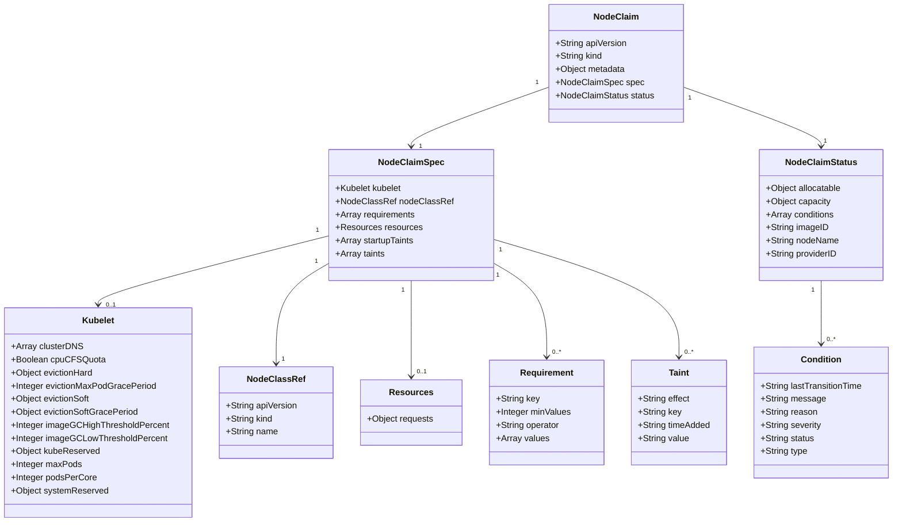
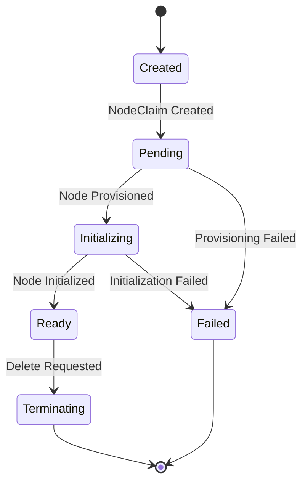
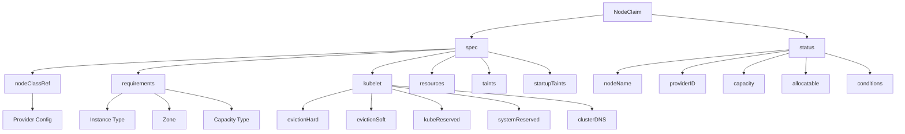

# Diagram: devops/k8s/karpenter/helm/crds/karpenter.sh_nodeclaims.yaml

> Auto-generated by Obscura crawlers

## Diagram 1

### SVG

<svg id="container" width="1626.578125" xmlns="http://www.w3.org/2000/svg" class="classDiagram" height="956" viewBox="0 0 1626.578125 956" role="graphics-document document" aria-roledescription="class"><g><defs><marker id="container_class-aggregationStart" class="marker aggregation class" refX="18" refY="7" markerWidth="190" markerHeight="240" orient="auto"><path d="M 18,7 L9,13 L1,7 L9,1 Z"></path></marker></defs><defs><marker id="container_class-aggregationEnd" class="marker aggregation class" refX="1" refY="7" markerWidth="20" markerHeight="28" orient="auto"><path d="M 18,7 L9,13 L1,7 L9,1 Z"></path></marker></defs><defs><marker id="container_class-extensionStart" class="marker extension class" refX="18" refY="7" markerWidth="190" markerHeight="240" orient="auto"><path d="M 1,7 L18,13 V 1 Z"></path></marker></defs><defs><marker id="container_class-extensionEnd" class="marker extension class" refX="1" refY="7" markerWidth="20" markerHeight="28" orient="auto"><path d="M 1,1 V 13 L18,7 Z"></path></marker></defs><defs><marker id="container_class-compositionStart" class="marker composition class" refX="18" refY="7" markerWidth="190" markerHeight="240" orient="auto"><path d="M 18,7 L9,13 L1,7 L9,1 Z"></path></marker></defs><defs><marker id="container_class-compositionEnd" class="marker composition class" refX="1" refY="7" markerWidth="20" markerHeight="28" orient="auto"><path d="M 18,7 L9,13 L1,7 L9,1 Z"></path></marker></defs><defs><marker id="container_class-dependencyStart" class="marker dependency class" refX="6" refY="7" markerWidth="190" markerHeight="240" orient="auto"><path d="M 5,7 L9,13 L1,7 L9,1 Z"></path></marker></defs><defs><marker id="container_class-dependencyEnd" class="marker dependency class" refX="13" refY="7" markerWidth="20" markerHeight="28" orient="auto"><path d="M 18,7 L9,13 L14,7 L9,1 Z"></path></marker></defs><defs><marker id="container_class-lollipopStart" class="marker lollipop class" refX="13" refY="7" markerWidth="190" markerHeight="240" orient="auto"><circle stroke="black" fill="transparent" cx="7" cy="7" r="6"></circle></marker></defs><defs><marker id="container_class-lollipopEnd" class="marker lollipop class" refX="1" refY="7" markerWidth="190" markerHeight="240" orient="auto"><circle stroke="black" fill="transparent" cx="7" cy="7" r="6"></circle></marker></defs><g class="root"><g class="clusters"></g><g class="edgePaths"><path d="M996.758,159.321L954.557,174.267C912.357,189.214,827.956,219.107,785.755,237.22C743.555,255.333,743.555,261.667,743.555,264.833L743.555,268" id="id_NodeClaim_NodeClaimSpec_1" class="edge-thickness-normal edge-pattern-solid relation" style=";;;" data-edge="true" data-et="edge" data-id="id_NodeClaim_NodeClaimSpec_1" data-points="W3sieCI6OTk2Ljc1NzgxMjUsInkiOjE1OS4zMjA2MDA4NDA1MTA5Nn0seyJ4Ijo3NDMuNTU0Njg3NSwieSI6MjQ5fSx7IngiOjc0My41NTQ2ODc1LCJ5IjoyNzR9XQ==" marker-end="url(#container_class-dependencyEnd)"></path><path d="M1241.383,159.321L1283.583,174.267C1325.784,189.214,1410.185,219.107,1452.385,237.22C1494.586,255.333,1494.586,261.667,1494.586,264.833L1494.586,268" id="id_NodeClaim_NodeClaimStatus_2" class="edge-thickness-normal edge-pattern-solid relation" style=";;;" data-edge="true" data-et="edge" data-id="id_NodeClaim_NodeClaimStatus_2" data-points="W3sieCI6MTI0MS4zODI4MTI1LCJ5IjoxNTkuMzIwNjAwODQwNTEwOTZ9LHsieCI6MTQ5NC41ODU5Mzc1LCJ5IjoyNDl9LHsieCI6MTQ5NC41ODU5Mzc1LCJ5IjoyNzR9XQ==" marker-end="url(#container_class-dependencyEnd)"></path><path d="M598.871,431.052L528.616,449.043C458.361,467.034,317.85,503.017,247.595,524.175C177.34,545.333,177.34,551.667,177.34,554.833L177.34,558" id="id_NodeClaimSpec_Kubelet_3" class="edge-thickness-normal edge-pattern-solid relation" style=";;;" data-edge="true" data-et="edge" data-id="id_NodeClaimSpec_Kubelet_3" data-points="W3sieCI6NTk4Ljg3MTA5Mzc1LCJ5Ijo0MzEuMDUxNTIwODU4NzcyOTZ9LHsieCI6MTc3LjMzOTg0Mzc1LCJ5Ijo1Mzl9LHsieCI6MTc3LjMzOTg0Mzc1LCJ5Ijo1NjR9XQ==" marker-end="url(#container_class-dependencyEnd)"></path><path d="M598.871,479.876L582.269,489.73C565.667,499.584,532.462,519.292,515.86,550.313C499.258,581.333,499.258,623.667,499.258,644.833L499.258,666" id="id_NodeClaimSpec_NodeClassRef_4" class="edge-thickness-normal edge-pattern-solid relation" style=";;;" data-edge="true" data-et="edge" data-id="id_NodeClaimSpec_NodeClassRef_4" data-points="W3sieCI6NTk4Ljg3MTA5Mzc1LCJ5Ijo0NzkuODc1NTE5NjY3NDEyODV9LHsieCI6NDk5LjI1NzgxMjUsInkiOjUzOX0seyJ4Ijo0OTkuMjU3ODEyNSwieSI6NjcyfV0=" marker-end="url(#container_class-dependencyEnd)"></path><path d="M743.555,514L743.555,518.167C743.555,522.333,743.555,530.667,743.555,560C743.555,589.333,743.555,639.667,743.555,664.833L743.555,690" id="id_NodeClaimSpec_Resources_5" class="edge-thickness-normal edge-pattern-solid relation" style=";;;" data-edge="true" data-et="edge" data-id="id_NodeClaimSpec_Resources_5" data-points="W3sieCI6NzQzLjU1NDY4NzUsInkiOjUxNH0seyJ4Ijo3NDMuNTU0Njg3NSwieSI6NTM5fSx7IngiOjc0My41NTQ2ODc1LCJ5Ijo2OTZ9XQ==" marker-end="url(#container_class-dependencyEnd)"></path><path d="M888.238,479.158L905.184,489.132C922.129,499.105,956.02,519.053,972.965,548.193C989.91,577.333,989.91,615.667,989.91,634.833L989.91,654" id="id_NodeClaimSpec_Requirement_6" class="edge-thickness-normal edge-pattern-solid relation" style=";;;" data-edge="true" data-et="edge" data-id="id_NodeClaimSpec_Requirement_6" data-points="W3sieCI6ODg4LjIzODI4MTI1LCJ5Ijo0NzkuMTU3OTI3MjgzNjgyNH0seyJ4Ijo5ODkuOTEwMTU2MjUsInkiOjUzOX0seyJ4Ijo5ODkuOTEwMTU2MjUsInkiOjY2MH1d" marker-end="url(#container_class-dependencyEnd)"></path><path d="M888.238,436.901L945.627,453.917C1003.016,470.934,1117.793,504.967,1175.182,541.15C1232.57,577.333,1232.57,615.667,1232.57,634.833L1232.57,654" id="id_NodeClaimSpec_Taint_7" class="edge-thickness-normal edge-pattern-solid relation" style=";;;" data-edge="true" data-et="edge" data-id="id_NodeClaimSpec_Taint_7" data-points="W3sieCI6ODg4LjIzODI4MTI1LCJ5Ijo0MzYuOTAwNzE3MzIxMTQ5fSx7IngiOjEyMzIuNTcwMzEyNSwieSI6NTM5fSx7IngiOjEyMzIuNTcwMzEyNSwieSI6NjYwfV0=" marker-end="url(#container_class-dependencyEnd)"></path><path d="M1494.586,514L1494.586,518.167C1494.586,522.333,1494.586,530.667,1494.586,550C1494.586,569.333,1494.586,599.667,1494.586,614.833L1494.586,630" id="id_NodeClaimStatus_Condition_8" class="edge-thickness-normal edge-pattern-solid relation" style=";;;" data-edge="true" data-et="edge" data-id="id_NodeClaimStatus_Condition_8" data-points="W3sieCI6MTQ5NC41ODU5Mzc1LCJ5Ijo1MTR9LHsieCI6MTQ5NC41ODU5Mzc1LCJ5Ijo1Mzl9LHsieCI6MTQ5NC41ODU5Mzc1LCJ5Ijo2MzZ9XQ==" marker-end="url(#container_class-dependencyEnd)"></path></g><g class="edgeLabels"><g class="edgeLabel"><g class="label" data-id="id_NodeClaim_NodeClaimSpec_1" transform="translate(0, 0)"><foreignObject width="0" height="0">

</foreignObject></g></g><g class="edgeLabel"><g class="label" data-id="id_NodeClaim_NodeClaimStatus_2" transform="translate(0, 0)"><foreignObject width="0" height="0">

</foreignObject></g></g><g class="edgeLabel"><g class="label" data-id="id_NodeClaimSpec_Kubelet_3" transform="translate(0, 0)"><foreignObject width="0" height="0">

</foreignObject></g></g><g class="edgeLabel"><g class="label" data-id="id_NodeClaimSpec_NodeClassRef_4" transform="translate(0, 0)"><foreignObject width="0" height="0">

</foreignObject></g></g><g class="edgeLabel"><g class="label" data-id="id_NodeClaimSpec_Resources_5" transform="translate(0, 0)"><foreignObject width="0" height="0">

</foreignObject></g></g><g class="edgeLabel"><g class="label" data-id="id_NodeClaimSpec_Requirement_6" transform="translate(0, 0)"><foreignObject width="0" height="0">

</foreignObject></g></g><g class="edgeLabel"><g class="label" data-id="id_NodeClaimSpec_Taint_7" transform="translate(0, 0)"><foreignObject width="0" height="0">

</foreignObject></g></g><g class="edgeLabel"><g class="label" data-id="id_NodeClaimStatus_Condition_8" transform="translate(0, 0)"><foreignObject width="0" height="0">

</foreignObject></g></g><g class="edgeTerminals" transform="translate(975.2540321382519, 151.0237644111179)"><g class="inner" transform="translate(0, 0)"><foreignObject style="width: 9px; height: 12px;">
1
</foreignObject></g></g><g class="edgeTerminals" transform="translate(1252.87085146389, 179.3024661905478)"><g class="inner" transform="translate(0, 0)"><foreignObject style="width: 9px; height: 12px;">
1
</foreignObject></g></g><g class="edgeTerminals" transform="translate(578.1969400550832, 420.86185150325406)"><g class="inner" transform="translate(0, 0)"><foreignObject style="width: 9px; height: 12px;">
1
</foreignObject></g></g><g class="edgeTerminals" transform="translate(576.1661698768816, 475.9086067928497)"><g class="inner" transform="translate(0, 0)"><foreignObject style="width: 9px; height: 12px;">
1
</foreignObject></g></g><g class="edgeTerminals" transform="translate(728.55468875, 531.5000010714286)"><g class="inner" transform="translate(0, 0)"><foreignObject style="width: 9px; height: 12px;">
1
</foreignObject></g></g><g class="edgeTerminals" transform="translate(895.7112413420077, 500.9617078364929)"><g class="inner" transform="translate(0, 0)"><foreignObject style="width: 9px; height: 12px;">
1
</foreignObject></g></g><g class="edgeTerminals" transform="translate(900.7520448391713, 456.2567414549639)"><g class="inner" transform="translate(0, 0)"><foreignObject style="width: 9px; height: 12px;">
1
</foreignObject></g></g><g class="edgeTerminals" transform="translate(1479.58593875, 531.5000010714285)"><g class="inner" transform="translate(0, 0)"><foreignObject style="width: 9px; height: 12px;">
1
</foreignObject></g></g><g class="edgeTerminals" transform="translate(757.5010580015323, 259.56510261270523)"><g class="inner" transform="translate(0, 0)"></g><foreignObject style="width: 9px; height: 12px;">
1
</foreignObject></g><g class="edgeTerminals" transform="translate(1499.106072249421, 250.09631512618319)"><g class="inner" transform="translate(0, 0)"></g><foreignObject style="width: 9px; height: 12px;">
1
</foreignObject></g><g class="edgeTerminals" transform="translate(191.3302882845003, 550.2465345449805)"><g class="inner" transform="translate(0, 0)"></g><foreignObject style="width: 36px; height: 12px;">
0..1
</foreignObject></g><g class="edgeTerminals" transform="translate(509.25781125000003, 649.4999989285715)"><g class="inner" transform="translate(0, 0)"></g><foreignObject style="width: 9px; height: 12px;">
1
</foreignObject></g><g class="edgeTerminals" transform="translate(753.55468875, 673.5000010714286)"><g class="inner" transform="translate(0, 0)"></g><foreignObject style="width: 36px; height: 12px;">
0..1
</foreignObject></g><g class="edgeTerminals" transform="translate(999.9101581249998, 637.5000016071428)"><g class="inner" transform="translate(0, 0)"></g><foreignObject style="width: 36px; height: 12px;">
0..*
</foreignObject></g><g class="edgeTerminals" transform="translate(1242.57031125, 637.4999989285715)"><g class="inner" transform="translate(0, 0)"></g><foreignObject style="width: 36px; height: 12px;">
0..*
</foreignObject></g><g class="edgeTerminals" transform="translate(1504.58593875, 613.5000010714285)"><g class="inner" transform="translate(0, 0)"></g><foreignObject style="width: 36px; height: 12px;">
0..*
</foreignObject></g></g><g class="nodes"><g class="node default" id="classId-NodeClaim-0" transform="translate(1119.0703125, 116)"><g class="basic label-container"><path d="M-122.3125 -108 L122.3125 -108 L122.3125 108 L-122.3125 108" stroke="none" stroke-width="0" fill="#ECECFF" style=""></path><path d="M-122.3125 -108 C-43.9995597352288 -108, 34.3133805295424 -108, 122.3125 -108 M-122.3125 -108 C-54.1836735768827 -108, 13.945152846234606 -108, 122.3125 -108 M122.3125 -108 C122.3125 -56.32209682057279, 122.3125 -4.644193641145577, 122.3125 108 M122.3125 -108 C122.3125 -25.970150010568872, 122.3125 56.059699978862255, 122.3125 108 M122.3125 108 C42.582036719962545 108, -37.14842656007491 108, -122.3125 108 M122.3125 108 C70.7439053475881 108, 19.175310695176194 108, -122.3125 108 M-122.3125 108 C-122.3125 33.312691441891516, -122.3125 -41.37461711621697, -122.3125 -108 M-122.3125 108 C-122.3125 29.413796558559923, -122.3125 -49.17240688288015, -122.3125 -108" stroke="#9370DB" stroke-width="1.3" fill="none" stroke-dasharray="0 0" style=""></path></g><g class="annotation-group text" transform="translate(0, -84)"></g><g class="label-group text" transform="translate(-39.453125, -84)"><g class="label" style="font-weight: bolder" transform="translate(0,-12)"><foreignObject width="78.90625" height="24">

NodeClaim

</foreignObject></g></g><g class="members-group text" transform="translate(-110.3125, -36)"><g class="label" style="" transform="translate(0,-12)"><foreignObject width="131.046875" height="24">

+String apiVersion

</foreignObject></g><g class="label" style="" transform="translate(0,12)"><foreignObject width="86.125" height="24">

+String kind

</foreignObject></g><g class="label" style="" transform="translate(0,36)"><foreignObject width="128.875" height="24">

+Object metadata

</foreignObject></g><g class="label" style="" transform="translate(0,60)"><foreignObject width="159.0625" height="24">

+NodeClaimSpec spec

</foreignObject></g><g class="label" style="" transform="translate(0,84)"><foreignObject width="181.171875" height="24">

+NodeClaimStatus status

</foreignObject></g></g><g class="methods-group text" transform="translate(-110.3125, 108)"></g><g class="divider" style=""><path d="M-122.3125 -60 C-27.03297022941709 -60, 68.24655954116582 -60, 122.3125 -60 M-122.3125 -60 C-54.77130306422998 -60, 12.769893871540035 -60, 122.3125 -60" stroke="#9370DB" stroke-width="1.3" fill="none" stroke-dasharray="0 0" style=""></path></g><g class="divider" style=""><path d="M-122.3125 84 C-40.115058940293906 84, 42.08238211941219 84, 122.3125 84 M-122.3125 84 C-57.50050131491007 84, 7.311497370179865 84, 122.3125 84" stroke="#9370DB" stroke-width="1.3" fill="none" stroke-dasharray="0 0" style=""></path></g></g><g class="node default" id="classId-NodeClaimSpec-1" transform="translate(743.5546875, 394)"><g class="basic label-container"><path d="M-144.68359375 -120 L144.68359375 -120 L144.68359375 120 L-144.68359375 120" stroke="none" stroke-width="0" fill="#ECECFF" style=""></path><path d="M-144.68359375 -120 C-55.4319440685083 -120, 33.8197056129834 -120, 144.68359375 -120 M-144.68359375 -120 C-47.24647578883686 -120, 50.19064217232628 -120, 144.68359375 -120 M144.68359375 -120 C144.68359375 -36.76660997062032, 144.68359375 46.466780058759355, 144.68359375 120 M144.68359375 -120 C144.68359375 -61.37836843615357, 144.68359375 -2.756736872307144, 144.68359375 120 M144.68359375 120 C57.700865341250335 120, -29.28186306749933 120, -144.68359375 120 M144.68359375 120 C81.42671488403444 120, 18.169836018068878 120, -144.68359375 120 M-144.68359375 120 C-144.68359375 24.239162134420383, -144.68359375 -71.52167573115923, -144.68359375 -120 M-144.68359375 120 C-144.68359375 57.570588341142496, -144.68359375 -4.858823317715007, -144.68359375 -120" stroke="#9370DB" stroke-width="1.3" fill="none" stroke-dasharray="0 0" style=""></path></g><g class="annotation-group text" transform="translate(0, -96)"></g><g class="label-group text" transform="translate(-57.0546875, -96)"><g class="label" style="font-weight: bolder" transform="translate(0,-12)"><foreignObject width="114.109375" height="24">

NodeClaimSpec

</foreignObject></g></g><g class="members-group text" transform="translate(-132.68359375, -48)"><g class="label" style="" transform="translate(0,-12)"><foreignObject width="122.875" height="24">

+Kubelet kubelet

</foreignObject></g><g class="label" style="" transform="translate(0,12)"><foreignObject width="208.3125" height="24">

+NodeClassRef nodeClassRef

</foreignObject></g><g class="label" style="" transform="translate(0,36)"><foreignObject width="146.640625" height="24">

+Array requirements

</foreignObject></g><g class="label" style="" transform="translate(0,60)"><foreignObject width="155.5" height="24">

+Resources resources

</foreignObject></g><g class="label" style="" transform="translate(0,84)"><foreignObject width="145.28125" height="24">

+Array startupTaints

</foreignObject></g><g class="label" style="" transform="translate(0,108)"><foreignObject width="90.875" height="24">

+Array taints

</foreignObject></g></g><g class="methods-group text" transform="translate(-132.68359375, 120)"></g><g class="divider" style=""><path d="M-144.68359375 -72 C-52.08575643741332 -72, 40.51208087517335 -72, 144.68359375 -72 M-144.68359375 -72 C-68.96704252235348 -72, 6.749508705293039 -72, 144.68359375 -72" stroke="#9370DB" stroke-width="1.3" fill="none" stroke-dasharray="0 0" style=""></path></g><g class="divider" style=""><path d="M-144.68359375 96 C-44.48440682220938 96, 55.71478010558124 96, 144.68359375 96 M-144.68359375 96 C-72.16859160554026 96, 0.3464105389194856 96, 144.68359375 96" stroke="#9370DB" stroke-width="1.3" fill="none" stroke-dasharray="0 0" style=""></path></g></g><g class="node default" id="classId-Kubelet-2" transform="translate(177.33984375, 756)"><g class="basic label-container"><path d="M-169.33984375 -192 L169.33984375 -192 L169.33984375 192 L-169.33984375 192" stroke="none" stroke-width="0" fill="#ECECFF" style=""></path><path d="M-169.33984375 -192 C-35.68362115130486 -192, 97.97260144739028 -192, 169.33984375 -192 M-169.33984375 -192 C-44.74298548236206 -192, 79.85387278527588 -192, 169.33984375 -192 M169.33984375 -192 C169.33984375 -45.58479638367356, 169.33984375 100.83040723265287, 169.33984375 192 M169.33984375 -192 C169.33984375 -88.82281602828172, 169.33984375 14.354367943436557, 169.33984375 192 M169.33984375 192 C90.97841659158432 192, 12.61698943316864 192, -169.33984375 192 M169.33984375 192 C90.06666493908659 192, 10.793486128173186 192, -169.33984375 192 M-169.33984375 192 C-169.33984375 44.15425778706049, -169.33984375 -103.69148442587903, -169.33984375 -192 M-169.33984375 192 C-169.33984375 83.19781044755277, -169.33984375 -25.604379104894463, -169.33984375 -192" stroke="#9370DB" stroke-width="1.3" fill="none" stroke-dasharray="0 0" style=""></path></g><g class="annotation-group text" transform="translate(0, -168)"></g><g class="label-group text" transform="translate(-28.5703125, -168)"><g class="label" style="font-weight: bolder" transform="translate(0,-12)"><foreignObject width="57.140625" height="24">

Kubelet

</foreignObject></g></g><g class="members-group text" transform="translate(-157.33984375, -120)"><g class="label" style="" transform="translate(0,-12)"><foreignObject width="128.875" height="24">

+Array clusterDNS

</foreignObject></g><g class="label" style="" transform="translate(0,12)"><foreignObject width="167.65625" height="24">

+Boolean cpuCFSQuota

</foreignObject></g><g class="label" style="" transform="translate(0,36)"><foreignObject width="151.96875" height="24">

+Object evictionHard

</foreignObject></g><g class="label" style="" transform="translate(0,60)"><foreignObject width="265.484375" height="24">

+Integer evictionMaxPodGracePeriod

</foreignObject></g><g class="label" style="" transform="translate(0,84)"><foreignObject width="146.328125" height="24">

+Object evictionSoft

</foreignObject></g><g class="label" style="" transform="translate(0,108)"><foreignObject width="233.921875" height="24">

+Object evictionSoftGracePeriod

</foreignObject></g><g class="label" style="" transform="translate(0,132)"><foreignObject width="286.109375" height="24">

+Integer imageGCHighThresholdPercent

</foreignObject></g><g class="label" style="" transform="translate(0,156)"><foreignObject width="281.40625" height="24">

+Integer imageGCLowThresholdPercent

</foreignObject></g><g class="label" style="" transform="translate(0,180)"><foreignObject width="161.671875" height="24">

+Object kubeReserved

</foreignObject></g><g class="label" style="" transform="translate(0,204)"><foreignObject width="128.921875" height="24">

+Integer maxPods

</foreignObject></g><g class="label" style="" transform="translate(0,228)"><foreignObject width="155.546875" height="24">

+Integer podsPerCore

</foreignObject></g><g class="label" style="" transform="translate(0,252)"><foreignObject width="176.453125" height="24">

+Object systemReserved

</foreignObject></g></g><g class="methods-group text" transform="translate(-157.33984375, 192)"></g><g class="divider" style=""><path d="M-169.33984375 -144 C-76.0366999095877 -144, 17.266443930824607 -144, 169.33984375 -144 M-169.33984375 -144 C-62.7399696238346 -144, 43.85990450233081 -144, 169.33984375 -144" stroke="#9370DB" stroke-width="1.3" fill="none" stroke-dasharray="0 0" style=""></path></g><g class="divider" style=""><path d="M-169.33984375 168 C-97.7409013962506 168, -26.141959042501213 168, 169.33984375 168 M-169.33984375 168 C-83.76550411735573 168, 1.8088355152885356 168, 169.33984375 168" stroke="#9370DB" stroke-width="1.3" fill="none" stroke-dasharray="0 0" style=""></path></g></g><g class="node default" id="classId-NodeClassRef-3" transform="translate(499.2578125, 756)"><g class="basic label-container"><path d="M-102.578125 -84 L102.578125 -84 L102.578125 84 L-102.578125 84" stroke="none" stroke-width="0" fill="#ECECFF" style=""></path><path d="M-102.578125 -84 C-21.46914362992608 -84, 59.63983774014784 -84, 102.578125 -84 M-102.578125 -84 C-59.25001645273668 -84, -15.921907905473361 -84, 102.578125 -84 M102.578125 -84 C102.578125 -17.901565698604728, 102.578125 48.196868602790545, 102.578125 84 M102.578125 -84 C102.578125 -41.20680937621544, 102.578125 1.586381247569122, 102.578125 84 M102.578125 84 C59.28045636445785 84, 15.982787728915696 84, -102.578125 84 M102.578125 84 C55.5538691571548 84, 8.5296133143096 84, -102.578125 84 M-102.578125 84 C-102.578125 47.660184286913896, -102.578125 11.320368573827793, -102.578125 -84 M-102.578125 84 C-102.578125 22.395750468391064, -102.578125 -39.20849906321787, -102.578125 -84" stroke="#9370DB" stroke-width="1.3" fill="none" stroke-dasharray="0 0" style=""></path></g><g class="annotation-group text" transform="translate(0, -60)"></g><g class="label-group text" transform="translate(-50.109375, -60)"><g class="label" style="font-weight: bolder" transform="translate(0,-12)"><foreignObject width="100.21875" height="24">

NodeClassRef

</foreignObject></g></g><g class="members-group text" transform="translate(-90.578125, -12)"><g class="label" style="" transform="translate(0,-12)"><foreignObject width="131.046875" height="24">

+String apiVersion

</foreignObject></g><g class="label" style="" transform="translate(0,12)"><foreignObject width="86.125" height="24">

+String kind

</foreignObject></g><g class="label" style="" transform="translate(0,36)"><foreignObject width="94.984375" height="24">

+String name

</foreignObject></g></g><g class="methods-group text" transform="translate(-90.578125, 84)"></g><g class="divider" style=""><path d="M-102.578125 -36 C-57.457612917375386 -36, -12.337100834750771 -36, 102.578125 -36 M-102.578125 -36 C-54.66516229298479 -36, -6.752199585969578 -36, 102.578125 -36" stroke="#9370DB" stroke-width="1.3" fill="none" stroke-dasharray="0 0" style=""></path></g><g class="divider" style=""><path d="M-102.578125 60 C-58.87160826273553 60, -15.165091525471055 60, 102.578125 60 M-102.578125 60 C-33.91738262330601 60, 34.74335975338798 60, 102.578125 60" stroke="#9370DB" stroke-width="1.3" fill="none" stroke-dasharray="0 0" style=""></path></g></g><g class="node default" id="classId-Resources-4" transform="translate(743.5546875, 756)"><g class="basic label-container"><path d="M-91.71875 -60 L91.71875 -60 L91.71875 60 L-91.71875 60" stroke="none" stroke-width="0" fill="#ECECFF" style=""></path><path d="M-91.71875 -60 C-25.62776667251498 -60, 40.46321665497004 -60, 91.71875 -60 M-91.71875 -60 C-34.890565443638785 -60, 21.93761911272243 -60, 91.71875 -60 M91.71875 -60 C91.71875 -24.19209966207457, 91.71875 11.615800675850863, 91.71875 60 M91.71875 -60 C91.71875 -15.513942728543064, 91.71875 28.97211454291387, 91.71875 60 M91.71875 60 C28.958075895333316 60, -33.80259820933337 60, -91.71875 60 M91.71875 60 C41.57775963065062 60, -8.563230738698763 60, -91.71875 60 M-91.71875 60 C-91.71875 12.65352740610139, -91.71875 -34.69294518779722, -91.71875 -60 M-91.71875 60 C-91.71875 34.987634149599444, -91.71875 9.975268299198888, -91.71875 -60" stroke="#9370DB" stroke-width="1.3" fill="none" stroke-dasharray="0 0" style=""></path></g><g class="annotation-group text" transform="translate(0, -36)"></g><g class="label-group text" transform="translate(-37.265625, -36)"><g class="label" style="font-weight: bolder" transform="translate(0,-12)"><foreignObject width="74.53125" height="24">

Resources

</foreignObject></g></g><g class="members-group text" transform="translate(-79.71875, 12)"><g class="label" style="" transform="translate(0,-12)"><foreignObject width="122.171875" height="24">

+Object requests

</foreignObject></g></g><g class="methods-group text" transform="translate(-79.71875, 60)"></g><g class="divider" style=""><path d="M-91.71875 -12 C-45.88829040264633 -12, -0.057830805292653054 -12, 91.71875 -12 M-91.71875 -12 C-28.820287852161613 -12, 34.078174295676774 -12, 91.71875 -12" stroke="#9370DB" stroke-width="1.3" fill="none" stroke-dasharray="0 0" style=""></path></g><g class="divider" style=""><path d="M-91.71875 36 C-23.15057654101166 36, 45.41759691797668 36, 91.71875 36 M-91.71875 36 C-45.56966503055672 36, 0.5794199388865593 36, 91.71875 36" stroke="#9370DB" stroke-width="1.3" fill="none" stroke-dasharray="0 0" style=""></path></g></g><g class="node default" id="classId-Requirement-5" transform="translate(989.91015625, 756)"><g class="basic label-container"><path d="M-104.63671875 -96 L104.63671875 -96 L104.63671875 96 L-104.63671875 96" stroke="none" stroke-width="0" fill="#ECECFF" style=""></path><path d="M-104.63671875 -96 C-29.923110701548893 -96, 44.790497346902214 -96, 104.63671875 -96 M-104.63671875 -96 C-23.853326938389543 -96, 56.930064873220914 -96, 104.63671875 -96 M104.63671875 -96 C104.63671875 -39.866166032831465, 104.63671875 16.26766793433707, 104.63671875 96 M104.63671875 -96 C104.63671875 -38.18040898754661, 104.63671875 19.639182024906773, 104.63671875 96 M104.63671875 96 C46.118550748593 96, -12.399617252813997 96, -104.63671875 96 M104.63671875 96 C53.346531028653814 96, 2.0563433073076283 96, -104.63671875 96 M-104.63671875 96 C-104.63671875 43.93896478233181, -104.63671875 -8.122070435336383, -104.63671875 -96 M-104.63671875 96 C-104.63671875 24.322179833269942, -104.63671875 -47.355640333460116, -104.63671875 -96" stroke="#9370DB" stroke-width="1.3" fill="none" stroke-dasharray="0 0" style=""></path></g><g class="annotation-group text" transform="translate(0, -72)"></g><g class="label-group text" transform="translate(-47.1328125, -72)"><g class="label" style="font-weight: bolder" transform="translate(0,-12)"><foreignObject width="94.265625" height="24">

Requirement

</foreignObject></g></g><g class="members-group text" transform="translate(-92.63671875, -24)"><g class="label" style="" transform="translate(0,-12)"><foreignObject width="79.046875" height="24">

+String key

</foreignObject></g><g class="label" style="" transform="translate(0,12)"><foreignObject width="138.140625" height="24">

+Integer minValues

</foreignObject></g><g class="label" style="" transform="translate(0,36)"><foreignObject width="117.421875" height="24">

+String operator

</foreignObject></g><g class="label" style="" transform="translate(0,60)"><foreignObject width="95.71875" height="24">

+Array values

</foreignObject></g></g><g class="methods-group text" transform="translate(-92.63671875, 96)"></g><g class="divider" style=""><path d="M-104.63671875 -48 C-38.83101585852948 -48, 26.974687032941034 -48, 104.63671875 -48 M-104.63671875 -48 C-41.83307426102953 -48, 20.97057022794094 -48, 104.63671875 -48" stroke="#9370DB" stroke-width="1.3" fill="none" stroke-dasharray="0 0" style=""></path></g><g class="divider" style=""><path d="M-104.63671875 72 C-57.74070571897062 72, -10.844692687941233 72, 104.63671875 72 M-104.63671875 72 C-26.054596001825587 72, 52.527526746348826 72, 104.63671875 72" stroke="#9370DB" stroke-width="1.3" fill="none" stroke-dasharray="0 0" style=""></path></g></g><g class="node default" id="classId-Taint-6" transform="translate(1232.5703125, 756)"><g class="basic label-container"><path d="M-88.0234375 -96 L88.0234375 -96 L88.0234375 96 L-88.0234375 96" stroke="none" stroke-width="0" fill="#ECECFF" style=""></path><path d="M-88.0234375 -96 C-37.873867270521735 -96, 12.27570295895653 -96, 88.0234375 -96 M-88.0234375 -96 C-29.105807851855964 -96, 29.811821796288072 -96, 88.0234375 -96 M88.0234375 -96 C88.0234375 -23.278411820355245, 88.0234375 49.44317635928951, 88.0234375 96 M88.0234375 -96 C88.0234375 -46.63268788564572, 88.0234375 2.7346242287085545, 88.0234375 96 M88.0234375 96 C19.007873670024154 96, -50.00769015995169 96, -88.0234375 96 M88.0234375 96 C44.39784240243505 96, 0.7722473048701062 96, -88.0234375 96 M-88.0234375 96 C-88.0234375 37.91426184537819, -88.0234375 -20.171476309243616, -88.0234375 -96 M-88.0234375 96 C-88.0234375 33.6073648468766, -88.0234375 -28.7852703062468, -88.0234375 -96" stroke="#9370DB" stroke-width="1.3" fill="none" stroke-dasharray="0 0" style=""></path></g><g class="annotation-group text" transform="translate(0, -72)"></g><g class="label-group text" transform="translate(-18.265625, -72)"><g class="label" style="font-weight: bolder" transform="translate(0,-12)"><foreignObject width="36.53125" height="24">

Taint

</foreignObject></g></g><g class="members-group text" transform="translate(-76.0234375, -24)"><g class="label" style="" transform="translate(0,-12)"><foreignObject width="95.890625" height="24">

+String effect

</foreignObject></g><g class="label" style="" transform="translate(0,12)"><foreignObject width="79.046875" height="24">

+String key

</foreignObject></g><g class="label" style="" transform="translate(0,36)"><foreignObject width="133.78125" height="24">

+String timeAdded

</foreignObject></g><g class="label" style="" transform="translate(0,60)"><foreignObject width="93.359375" height="24">

+String value

</foreignObject></g></g><g class="methods-group text" transform="translate(-76.0234375, 96)"></g><g class="divider" style=""><path d="M-88.0234375 -48 C-37.35541892643701 -48, 13.312599647125978 -48, 88.0234375 -48 M-88.0234375 -48 C-38.601648846571614 -48, 10.820139806856773 -48, 88.0234375 -48" stroke="#9370DB" stroke-width="1.3" fill="none" stroke-dasharray="0 0" style=""></path></g><g class="divider" style=""><path d="M-88.0234375 72 C-38.44798514882967 72, 11.127467202340654 72, 88.0234375 72 M-88.0234375 72 C-39.2545359484292 72, 9.514365603141599 72, 88.0234375 72" stroke="#9370DB" stroke-width="1.3" fill="none" stroke-dasharray="0 0" style=""></path></g></g><g class="node default" id="classId-NodeClaimStatus-7" transform="translate(1494.5859375, 394)"><g class="basic label-container"><path d="M-113.47265625 -120 L113.47265625 -120 L113.47265625 120 L-113.47265625 120" stroke="none" stroke-width="0" fill="#ECECFF" style=""></path><path d="M-113.47265625 -120 C-47.58265045961079 -120, 18.30735533077842 -120, 113.47265625 -120 M-113.47265625 -120 C-47.012900724219875 -120, 19.44685480156025 -120, 113.47265625 -120 M113.47265625 -120 C113.47265625 -67.57714121783229, 113.47265625 -15.154282435664598, 113.47265625 120 M113.47265625 -120 C113.47265625 -41.87958594164279, 113.47265625 36.240828116714425, 113.47265625 120 M113.47265625 120 C43.40882028431207 120, -26.655015681375858 120, -113.47265625 120 M113.47265625 120 C45.001856275905396 120, -23.468943698189207 120, -113.47265625 120 M-113.47265625 120 C-113.47265625 59.28295491849284, -113.47265625 -1.434090163014318, -113.47265625 -120 M-113.47265625 120 C-113.47265625 37.50474891146111, -113.47265625 -44.990502177077786, -113.47265625 -120" stroke="#9370DB" stroke-width="1.3" fill="none" stroke-dasharray="0 0" style=""></path></g><g class="annotation-group text" transform="translate(0, -96)"></g><g class="label-group text" transform="translate(-62.9296875, -96)"><g class="label" style="font-weight: bolder" transform="translate(0,-12)"><foreignObject width="125.859375" height="24">

NodeClaimStatus

</foreignObject></g></g><g class="members-group text" transform="translate(-101.47265625, -48)"><g class="label" style="" transform="translate(0,-12)"><foreignObject width="140.015625" height="24">

+Object allocatable

</foreignObject></g><g class="label" style="" transform="translate(0,12)"><foreignObject width="119.40625" height="24">

+Object capacity

</foreignObject></g><g class="label" style="" transform="translate(0,36)"><foreignObject width="125.96875" height="24">

+Array conditions

</foreignObject></g><g class="label" style="" transform="translate(0,60)"><foreignObject width="113.046875" height="24">

+String imageID

</foreignObject></g><g class="label" style="" transform="translate(0,84)"><foreignObject width="133.546875" height="24">

+String nodeName

</foreignObject></g><g class="label" style="" transform="translate(0,108)"><foreignObject width="130.828125" height="24">

+String providerID

</foreignObject></g></g><g class="methods-group text" transform="translate(-101.47265625, 120)"></g><g class="divider" style=""><path d="M-113.47265625 -72 C-63.31492183547352 -72, -13.15718742094704 -72, 113.47265625 -72 M-113.47265625 -72 C-46.9983100896345 -72, 19.476036070731 -72, 113.47265625 -72" stroke="#9370DB" stroke-width="1.3" fill="none" stroke-dasharray="0 0" style=""></path></g><g class="divider" style=""><path d="M-113.47265625 96 C-41.3802178681012 96, 30.712220513797604 96, 113.47265625 96 M-113.47265625 96 C-31.24790112910108 96, 50.97685399179784 96, 113.47265625 96" stroke="#9370DB" stroke-width="1.3" fill="none" stroke-dasharray="0 0" style=""></path></g></g><g class="node default" id="classId-Condition-8" transform="translate(1494.5859375, 756)"><g class="basic label-container"><path d="M-123.9921875 -120 L123.9921875 -120 L123.9921875 120 L-123.9921875 120" stroke="none" stroke-width="0" fill="#ECECFF" style=""></path><path d="M-123.9921875 -120 C-26.837135825044 -120, 70.317915849912 -120, 123.9921875 -120 M-123.9921875 -120 C-66.97499033496118 -120, -9.957793169922354 -120, 123.9921875 -120 M123.9921875 -120 C123.9921875 -33.97704825938939, 123.9921875 52.04590348122122, 123.9921875 120 M123.9921875 -120 C123.9921875 -33.59564038122113, 123.9921875 52.80871923755774, 123.9921875 120 M123.9921875 120 C64.99204306605458 120, 5.991898632109141 120, -123.9921875 120 M123.9921875 120 C46.223493193635804 120, -31.545201112728392 120, -123.9921875 120 M-123.9921875 120 C-123.9921875 51.61145079723795, -123.9921875 -16.7770984055241, -123.9921875 -120 M-123.9921875 120 C-123.9921875 26.230300540715675, -123.9921875 -67.53939891856865, -123.9921875 -120" stroke="#9370DB" stroke-width="1.3" fill="none" stroke-dasharray="0 0" style=""></path></g><g class="annotation-group text" transform="translate(0, -96)"></g><g class="label-group text" transform="translate(-35.421875, -96)"><g class="label" style="font-weight: bolder" transform="translate(0,-12)"><foreignObject width="70.84375" height="24">

Condition

</foreignObject></g></g><g class="members-group text" transform="translate(-111.9921875, -48)"><g class="label" style="" transform="translate(0,-12)"><foreignObject width="188.5625" height="24">

+String lastTransitionTime

</foreignObject></g><g class="label" style="" transform="translate(0,12)"><foreignObject width="116.859375" height="24">

+String message

</foreignObject></g><g class="label" style="" transform="translate(0,36)"><foreignObject width="103.46875" height="24">

+String reason

</foreignObject></g><g class="label" style="" transform="translate(0,60)"><foreignObject width="111.390625" height="24">

+String severity

</foreignObject></g><g class="label" style="" transform="translate(0,84)"><foreignObject width="98.875" height="24">

+String status

</foreignObject></g><g class="label" style="" transform="translate(0,108)"><foreignObject width="86.265625" height="24">

+String type

</foreignObject></g></g><g class="methods-group text" transform="translate(-111.9921875, 120)"></g><g class="divider" style=""><path d="M-123.9921875 -72 C-51.40692320360536 -72, 21.17834109278928 -72, 123.9921875 -72 M-123.9921875 -72 C-68.62430280191961 -72, -13.256418103839223 -72, 123.9921875 -72" stroke="#9370DB" stroke-width="1.3" fill="none" stroke-dasharray="0 0" style=""></path></g><g class="divider" style=""><path d="M-123.9921875 96 C-26.957910470093992 96, 70.07636655981202 96, 123.9921875 96 M-123.9921875 96 C-45.41224096891564 96, 33.16770556216872 96, 123.9921875 96" stroke="#9370DB" stroke-width="1.3" fill="none" stroke-dasharray="0 0" style=""></path></g></g></g></g></g></svg>

## Diagram 2

### SVG

<svg id="container" width="413.86328125" xmlns="http://www.w3.org/2000/svg" class="statediagram" height="640" viewBox="0 0 413.86328125 640" role="graphics-document document" aria-roledescription="stateDiagram"><g><defs><marker id="container_stateDiagram-barbEnd" refX="19" refY="7" markerWidth="20" markerHeight="14" markerUnits="userSpaceOnUse" orient="auto"><path d="M 19,7 L9,13 L14,7 L9,1 Z"></path></marker></defs><g class="root"><g class="clusters"></g><g class="edgePaths"><path d="M219.781,22L219.781,26.167C219.781,30.333,219.781,38.667,219.865,47.083C219.948,55.5,220.115,64,220.198,68.25L220.281,72.5" id="edge0" class="edge-thickness-normal edge-pattern-solid transition" style="fill:none;;;fill:none" data-edge="true" data-et="edge" data-id="edge0" data-points="W3sieCI6MjE5Ljc4MTI1LCJ5IjoyMn0seyJ4IjoyMTkuNzgxMjUsInkiOjQ3fSx7IngiOjIyMC4yODEyNSwieSI6NzIuNX1d" marker-end="url(#container_stateDiagram-barbEnd)"></path><path d="M220.281,112.5L220.198,118.583C220.115,124.667,219.948,136.833,219.948,149.167C219.948,161.5,220.115,174,220.198,180.25L220.281,186.5" id="edge1" class="edge-thickness-normal edge-pattern-solid transition" style="fill:none;;;fill:none" data-edge="true" data-et="edge" data-id="edge1" data-points="W3sieCI6MjIwLjI4MTI1LCJ5IjoxMTIuNX0seyJ4IjoyMTkuNzgxMjUsInkiOjE0OX0seyJ4IjoyMjAuMjgxMjUsInkiOjE4Ni41fV0=" marker-end="url(#container_stateDiagram-barbEnd)"></path><path d="M194.111,226.5L185.958,232.583C177.806,238.667,161.5,250.833,153.431,263.167C145.362,275.5,145.529,288,145.612,294.25L145.695,300.5" id="edge2" class="edge-thickness-normal edge-pattern-solid transition" style="fill:none;;;fill:none" data-edge="true" data-et="edge" data-id="edge2" data-points="W3sieCI6MTk0LjExMDc0NTYxNDAzNTEsInkiOjIyNi41fSx7IngiOjE0NS4xOTUzMTI1LCJ5IjoyNjN9LHsieCI6MTQ1LjY5NTMxMjUsInkiOjMwMC41fV0=" marker-end="url(#container_stateDiagram-barbEnd)"></path><path d="M119.996,340.5L111.989,346.583C103.982,352.667,87.968,364.833,80.044,377.167C72.12,389.5,72.286,402,72.37,408.25L72.453,414.5" id="edge3" class="edge-thickness-normal edge-pattern-solid transition" style="fill:none;;;fill:none" data-edge="true" data-et="edge" data-id="edge3" data-points="W3sieCI6MTE5Ljk5NjI5OTM0MjEwNTI2LCJ5IjozNDAuNX0seyJ4Ijo3MS45NTMxMjUsInkiOjM3N30seyJ4Ijo3Mi40NTMxMjUsInkiOjQxNC41fV0=" marker-end="url(#container_stateDiagram-barbEnd)"></path><path d="M72.453,454.5L72.37,460.583C72.286,466.667,72.12,478.833,72.12,491.167C72.12,503.5,72.286,516,72.37,522.25L72.453,528.5" id="edge4" class="edge-thickness-normal edge-pattern-solid transition" style="fill:none;;;fill:none" data-edge="true" data-et="edge" data-id="edge4" data-points="W3sieCI6NzIuNDUzMTI1LCJ5Ijo0NTQuNX0seyJ4Ijo3MS45NTMxMjUsInkiOjQ5MX0seyJ4Ijo3Mi40NTMxMjUsInkiOjUyOC41fV0=" marker-end="url(#container_stateDiagram-barbEnd)"></path><path d="M256.846,224.188L270.308,230.657C283.769,237.125,310.691,250.063,324.152,266.031C337.613,282,337.613,301,337.613,320C337.613,339,337.613,358,332.873,373.75C328.132,389.5,318.65,402,313.91,408.25L309.169,414.5" id="edge5" class="edge-thickness-normal edge-pattern-solid transition" style="fill:none;;;fill:none" data-edge="true" data-et="edge" data-id="edge5" data-points="W3sieCI6MjU2Ljg0NjQ3MjUxNTUxNTM2LCJ5IjoyMjQuMTg4MDQwMDExNDgzNX0seyJ4IjozMzcuNjEzMjgxMjUsInkiOjI2M30seyJ4IjozMzcuNjEzMjgxMjUsInkiOjMyMH0seyJ4IjozMzcuNjEzMjgxMjUsInkiOjM3N30seyJ4IjozMDkuMTY4OTk2NzEwNTI2MywieSI6NDE0LjV9XQ==" marker-end="url(#container_stateDiagram-barbEnd)"></path><path d="M171.394,340.5L179.235,346.583C187.075,352.667,202.756,364.833,218.794,377.201C234.831,389.568,251.225,402.136,259.422,408.419L267.619,414.703" id="edge6" class="edge-thickness-normal edge-pattern-solid transition" style="fill:none;;;fill:none" data-edge="true" data-et="edge" data-id="edge6" data-points="W3sieCI6MTcxLjM5NDMyNTY1Nzg5NDc0LCJ5IjozNDAuNX0seyJ4IjoyMTguNDM3NSwieSI6Mzc3fSx7IngiOjI2Ny42MTkwMzUzNzM3MywieSI6NDE0LjcwMzM2MDQzNjQ0NDN9XQ==" marker-end="url(#container_stateDiagram-barbEnd)"></path><path d="M72.453,568.5L72.37,572.583C72.286,576.667,72.12,584.833,95.534,594.003C118.949,603.173,165.944,613.346,189.442,618.433L212.94,623.519" id="edge7" class="edge-thickness-normal edge-pattern-solid transition" style="fill:none;;;fill:none" data-edge="true" data-et="edge" data-id="edge7" data-points="W3sieCI6NzIuNDUzMTI1LCJ5Ijo1NjguNX0seyJ4Ijo3MS45NTMxMjUsInkiOjU5M30seyJ4IjoyMTIuOTM5NzA2Mjk2OTM2NTgsInkiOjYyMy41MTkwMjc0Mjc5ODA3fV0=" marker-end="url(#container_stateDiagram-barbEnd)"></path><path d="M293.523,454.5L293.44,460.583C293.357,466.667,293.19,478.833,293.107,494.417C293.023,510,293.023,529,293.023,546C293.023,563,293.023,578,281.885,590.366C270.748,602.732,248.472,612.465,237.334,617.331L226.196,622.197" id="edge8" class="edge-thickness-normal edge-pattern-solid transition" style="fill:none;;;fill:none" data-edge="true" data-et="edge" data-id="edge8" data-points="W3sieCI6MjkzLjUyMzQzNzUsInkiOjQ1NC41fSx7IngiOjI5My4wMjM0Mzc1LCJ5Ijo0OTF9LHsieCI6MjkzLjAyMzQzNzUsInkiOjU0OH0seyJ4IjoyOTMuMDIzNDM3NSwieSI6NTkzfSx7IngiOjIyNi4xOTU3NDgxMzgxNDg4LCJ5Ijo2MjIuMTk3NDYzMDAwMTIxOH1d" marker-end="url(#container_stateDiagram-barbEnd)"></path></g><g class="edgeLabels"><g class="edgeLabel"><g class="label" data-id="edge0" transform="translate(0, 0)"><foreignObject width="0" height="0">

</foreignObject></g></g><g class="edgeLabel" transform="translate(219.78125, 149)"><g class="label" data-id="edge1" transform="translate(-69.3203125, -12)"><foreignObject width="138.640625" height="24">

NodeClaim Created

</foreignObject></g></g><g class="edgeLabel" transform="translate(145.1953125, 263)"><g class="label" data-id="edge2" transform="translate(-64.0703125, -12)"><foreignObject width="128.140625" height="24">

Node Provisioned

</foreignObject></g></g><g class="edgeLabel" transform="translate(71.953125, 377)"><g class="label" data-id="edge3" transform="translate(-57.3046875, -12)"><foreignObject width="114.609375" height="24">

Node Initialized

</foreignObject></g></g><g class="edgeLabel" transform="translate(71.953125, 491)"><g class="label" data-id="edge4" transform="translate(-63.953125, -12)"><foreignObject width="127.90625" height="24">

Delete Requested

</foreignObject></g></g><g class="edgeLabel" transform="translate(337.61328125, 320)"><g class="label" data-id="edge5" transform="translate(-68.25, -12)"><foreignObject width="136.5" height="24">

Provisioning Failed

</foreignObject></g></g><g class="edgeLabel" transform="translate(218.4375, 377)"><g class="label" data-id="edge6" transform="translate(-69.1796875, -12)"><foreignObject width="138.359375" height="24">

Initialization Failed

</foreignObject></g></g><g class="edgeLabel"><g class="label" data-id="edge7" transform="translate(0, 0)"><foreignObject width="0" height="0">

</foreignObject></g></g><g class="edgeLabel"><g class="label" data-id="edge8" transform="translate(0, 0)"><foreignObject width="0" height="0">

</foreignObject></g></g></g><g class="nodes"><g class="node default" id="state-root_start-0" transform="translate(219.78125, 15)"><circle class="state-start" r="7" width="14" height="14"></circle></g><g class="node  statediagram-state" id="state-Created-1" transform="translate(219.78125, 92)"><g class="basic label-container outer-path"><path d="M-30.7578125 -20 C-10.483492803669478 -20, 9.790826892661045 -20, 30.7578125 -20 C30.7578125 -20, 30.7578125 -20, 30.7578125 -20 C30.91753091811997 -19.993393997361782, 31.077249336239934 -19.986787994723567, 31.170709227361662 -19.982922465033347 C31.26723042670962 -19.97089111008172, 31.363751626057578 -19.958859755130092, 31.58078545140367 -19.931806517013612 C31.686853644629238 -19.90956635565052, 31.792921837854802 -19.88732619428743, 31.985239935703998 -19.847001329696653 C32.11562255445182 -19.808184742294763, 32.24600517319964 -19.76936815489287, 32.38130984602342 -19.729086208503173 C32.515343345358 -19.67678617476992, 32.64937684469257 -19.624486141036666, 32.766289623264846 -19.578866633275286 C32.86539425383033 -19.530417331623045, 32.96449888439581 -19.4819680299708, 33.137549465185366 -19.397368756032446 C33.24390048046147 -19.33399730608054, 33.350251495737574 -19.270625856128635, 33.492553290612136 -19.185832391312644 C33.594192771329176 -19.113263196914616, 33.69583225204622 -19.040694002516588, 33.82887606344834 -18.94570254698197 C33.938633177451074 -18.85274301331338, 34.04839029145381 -18.75978347964479, 34.144220358128706 -18.678619553365657 C34.24691355431764 -18.57592635717672, 34.34960675050658 -18.473233160987782, 34.43643205336566 -18.386407858128706 C34.51216565735948 -18.296989360860607, 34.587899261353314 -18.20757086359251, 34.70351504698197 -18.07106356344834 C34.77659560265343 -17.968707876705842, 34.84967615832488 -17.866352189963344, 34.943644891312644 -17.734740790612136 C34.98871497713914 -17.659103427258973, 35.033785062965634 -17.58346606390581, 35.15518125603245 -17.37973696518537 C35.216591427348725 -17.25412045197025, 35.27800159866499 -17.128503938755127, 35.33667913327529 -17.008477123264846 C35.366810280170796 -16.931257611744694, 35.39694142706631 -16.854038100224543, 35.486898708503176 -16.623497346023417 C35.51509118570664 -16.528800484377186, 35.5432836629101 -16.43410362273096, 35.60481382969665 -16.227427435703994 C35.628774926005484 -16.113151727372163, 35.652736022314315 -15.998876019040331, 35.68961901701361 -15.82297295140367 C35.70001482538993 -15.739572877454581, 35.710410633766244 -15.65617280350549, 35.74073496503335 -15.412896727361662 C35.745624342268385 -15.294682484900644, 35.750513719503424 -15.176468242439627, 35.7578125 -15 C35.7578125 -15, 35.7578125 -15, 35.7578125 -15 C35.7578125 -7.473165938675678, 35.7578125 0.05366812264864329, 35.7578125 15 C35.7578125 15, 35.7578125 15, 35.7578125 15 C35.75410027458037 15.08975333559496, 35.750388049160726 15.179506671189921, 35.74073496503335 15.412896727361662 C35.725717047367326 15.533377540259423, 35.7106991297013 15.653858353157183, 35.68961901701361 15.822972951403669 C35.6712349675003 15.91065050392732, 35.652850917986974 15.998328056450971, 35.60481382969665 16.227427435703994 C35.566522324065616 16.356046335873692, 35.52823081843457 16.48466523604339, 35.486898708503176 16.623497346023417 C35.449012710603114 16.720590837401016, 35.41112671270305 16.81768432877862, 35.33667913327529 17.008477123264846 C35.272098576574635 17.14057876343854, 35.20751801987399 17.272680403612235, 35.15518125603245 17.379736965185366 C35.09286003071296 17.484325476115888, 35.03053880539348 17.58891398704641, 34.943644891312644 17.734740790612133 C34.86953405492598 17.83853947527896, 34.79542321853931 17.942338159945788, 34.70351504698197 18.07106356344834 C34.64220233416435 18.14345534667879, 34.580889621346735 18.215847129909235, 34.43643205336566 18.386407858128706 C34.35143258869813 18.471407322796235, 34.2664331240306 18.556406787463764, 34.144220358128706 18.678619553365657 C34.07683634117129 18.73569090450306, 34.009452324213875 18.792762255640458, 33.82887606344834 18.94570254698197 C33.758524550760626 18.99593256158272, 33.68817303807292 19.046162576183473, 33.492553290612136 19.185832391312644 C33.35115558647786 19.270087134980077, 33.20975788234359 19.35434187864751, 33.137549465185366 19.397368756032446 C32.9952227179581 19.466948062975526, 32.85289597073084 19.536527369918602, 32.766289623264846 19.578866633275286 C32.68860878505727 19.60917779040282, 32.610927946849685 19.639488947530356, 32.38130984602342 19.729086208503173 C32.230830516891515 19.773885845813144, 32.080351187759604 19.81868548312311, 31.985239935703998 19.847001329696653 C31.860276508804244 19.873203404929754, 31.735313081904494 19.89940548016286, 31.58078545140367 19.931806517013612 C31.498202544190622 19.942100465662506, 31.415619636977578 19.9523944143114, 31.170709227361662 19.982922465033347 C31.08425167728852 19.986498375755477, 30.997794127215375 19.990074286477608, 30.7578125 20 C30.7578125 20, 30.7578125 20, 30.7578125 20 C9.798359234496992 20, -11.161094031006016 20, -30.7578125 20 C-30.7578125 20, -30.7578125 20, -30.7578125 20 C-30.841780336097802 19.9965270646096, -30.925748172195604 19.9930541292192, -31.170709227361662 19.982922465033347 C-31.3027881858062 19.966458840032598, -31.434867144250738 19.949995215031844, -31.58078545140367 19.931806517013612 C-31.66947277722448 19.91321074030493, -31.75816010304529 19.894614963596247, -31.985239935703994 19.847001329696653 C-32.091200257179224 19.81545557521514, -32.197160578654454 19.783909820733623, -32.38130984602342 19.729086208503173 C-32.48808162819218 19.687423729817553, -32.59485341036093 19.645761251131937, -32.766289623264846 19.578866633275286 C-32.85381006861191 19.53608049469464, -32.94133051395897 19.493294356114, -33.137549465185366 19.397368756032446 C-33.20973504767774 19.35435548515498, -33.28192063017012 19.311342214277513, -33.492553290612136 19.185832391312644 C-33.56338188186871 19.135261749160843, -33.63421047312528 19.08469110700904, -33.82887606344834 18.94570254698197 C-33.917877095823336 18.870322517716655, -34.00687812819833 18.79494248845134, -34.144220358128706 18.67861955336566 C-34.25370927147372 18.56913064002065, -34.36319818481872 18.459641726675642, -34.43643205336566 18.386407858128706 C-34.501364469012074 18.309742299844125, -34.56629688465849 18.23307674155954, -34.70351504698197 18.07106356344834 C-34.75795182546308 17.99482011135238, -34.812388603944186 17.918576659256413, -34.943644891312644 17.734740790612133 C-35.02204014224828 17.603176584078156, -35.10043539318392 17.471612377544176, -35.15518125603244 17.37973696518537 C-35.213081556499006 17.26130000754753, -35.27098185696558 17.142863049909693, -35.33667913327528 17.00847712326485 C-35.3926563891876 16.865019711146505, -35.44863364509992 16.72156229902816, -35.486898708503176 16.623497346023417 C-35.51653649125416 16.523945788619795, -35.54617427400514 16.424394231216173, -35.60481382969665 16.227427435703994 C-35.62405201789309 16.135676309009558, -35.64329020608953 16.04392518231512, -35.68961901701361 15.82297295140367 C-35.707911499451875 15.676222036723543, -35.72620398189014 15.529471122043415, -35.74073496503335 15.412896727361664 C-35.74748841866218 15.24961327297677, -35.75424187229101 15.086329818591878, -35.7578125 15 C-35.7578125 15, -35.7578125 15, -35.7578125 15 C-35.7578125 3.5794578983907446, -35.7578125 -7.841084203218511, -35.7578125 -15 C-35.7578125 -15, -35.7578125 -15, -35.7578125 -15 C-35.75366411114891 -15.100298795100445, -35.74951572229781 -15.20059759020089, -35.74073496503335 -15.41289672736166 C-35.7305113418151 -15.494915450828291, -35.720287718596865 -15.576934174294921, -35.68961901701361 -15.822972951403669 C-35.67034856915509 -15.914877931481444, -35.65107812129656 -16.006782911559217, -35.60481382969665 -16.227427435703994 C-35.57774020946193 -16.318366123039894, -35.55066658922721 -16.409304810375794, -35.486898708503176 -16.623497346023417 C-35.44342059702382 -16.73492219625887, -35.399942485544464 -16.84634704649433, -35.33667913327529 -17.008477123264846 C-35.294740400703056 -17.094264171916016, -35.252801668130815 -17.180051220567186, -35.15518125603245 -17.379736965185366 C-35.10999402285659 -17.45557092715748, -35.06480678968073 -17.531404889129597, -34.943644891312644 -17.734740790612133 C-34.84806248508862 -17.868612279952515, -34.752480078864586 -18.0024837692929, -34.70351504698197 -18.07106356344834 C-34.62831533463056 -18.15985169604539, -34.55311562227915 -18.248639828642435, -34.43643205336566 -18.386407858128706 C-34.35064689872499 -18.472193012769377, -34.264861744084314 -18.557978167410045, -34.144220358128706 -18.678619553365657 C-34.05633913856616 -18.75305114955866, -33.96845791900362 -18.827482745751663, -33.82887606344834 -18.945702546981966 C-33.760372999670885 -18.994612794427702, -33.69186993589343 -19.043523041873442, -33.492553290612136 -19.185832391312644 C-33.38188445008688 -19.251776706657207, -33.27121560956162 -19.317721022001766, -33.137549465185366 -19.397368756032446 C-33.057605649852995 -19.4364509058994, -32.97766183452062 -19.475533055766352, -32.766289623264846 -19.578866633275286 C-32.62083228486868 -19.635624262842793, -32.47537494647252 -19.692381892410303, -32.38130984602342 -19.729086208503173 C-32.29747483008225 -19.754044974133684, -32.213639814141075 -19.779003739764196, -31.985239935703994 -19.847001329696653 C-31.86829412430931 -19.871522287743186, -31.751348312914622 -19.89604324578972, -31.580785451403674 -19.931806517013612 C-31.4770849733943 -19.944732768117127, -31.373384495384933 -19.957659019220642, -31.170709227361662 -19.982922465033347 C-31.053622648309688 -19.987765201764788, -30.936536069257713 -19.992607938496228, -30.7578125 -20 C-30.7578125 -20, -30.7578125 -20, -30.7578125 -20" stroke="none" stroke-width="0" fill="#ECECFF" style=""></path><path d="M-30.7578125 -20 C-7.489828904109775 -20, 15.77815469178045 -20, 30.7578125 -20 M-30.7578125 -20 C-13.137055205936413 -20, 4.483702088127174 -20, 30.7578125 -20 M30.7578125 -20 C30.7578125 -20, 30.7578125 -20, 30.7578125 -20 M30.7578125 -20 C30.7578125 -20, 30.7578125 -20, 30.7578125 -20 M30.7578125 -20 C30.847666763593338 -19.996283600167473, 30.937521027186676 -19.992567200334946, 31.170709227361662 -19.982922465033347 M30.7578125 -20 C30.87354379776613 -19.99521331811718, 30.98927509553226 -19.990426636234364, 31.170709227361662 -19.982922465033347 M31.170709227361662 -19.982922465033347 C31.278240344199965 -19.96951872529776, 31.38577146103827 -19.956114985562177, 31.58078545140367 -19.931806517013612 M31.170709227361662 -19.982922465033347 C31.275730715909 -19.969831550137997, 31.38075220445634 -19.956740635242646, 31.58078545140367 -19.931806517013612 M31.58078545140367 -19.931806517013612 C31.70584390935839 -19.905584515863676, 31.83090236731311 -19.87936251471374, 31.985239935703998 -19.847001329696653 M31.58078545140367 -19.931806517013612 C31.73671075944842 -19.899112418000062, 31.89263606749317 -19.86641831898651, 31.985239935703998 -19.847001329696653 M31.985239935703998 -19.847001329696653 C32.10781669703292 -19.810508646735837, 32.23039345836185 -19.774015963775025, 32.38130984602342 -19.729086208503173 M31.985239935703998 -19.847001329696653 C32.069136204657525 -19.822024328254262, 32.15303247361105 -19.79704732681187, 32.38130984602342 -19.729086208503173 M32.38130984602342 -19.729086208503173 C32.52712802427491 -19.672187778787197, 32.6729462025264 -19.615289349071222, 32.766289623264846 -19.578866633275286 M32.38130984602342 -19.729086208503173 C32.48080089249852 -19.690264681701013, 32.58029193897363 -19.65144315489885, 32.766289623264846 -19.578866633275286 M32.766289623264846 -19.578866633275286 C32.84774302530797 -19.539046491434576, 32.929196427351094 -19.499226349593865, 33.137549465185366 -19.397368756032446 M32.766289623264846 -19.578866633275286 C32.848530628821095 -19.53866145553896, 32.93077163437734 -19.49845627780263, 33.137549465185366 -19.397368756032446 M33.137549465185366 -19.397368756032446 C33.2430372797395 -19.33451166206679, 33.34852509429363 -19.271654568101134, 33.492553290612136 -19.185832391312644 M33.137549465185366 -19.397368756032446 C33.24887288284478 -19.331034397377163, 33.36019630050419 -19.26470003872188, 33.492553290612136 -19.185832391312644 M33.492553290612136 -19.185832391312644 C33.57448578648478 -19.12733371364771, 33.65641828235742 -19.06883503598278, 33.82887606344834 -18.94570254698197 M33.492553290612136 -19.185832391312644 C33.60113489645172 -19.10830661484632, 33.70971650229131 -19.030780838379993, 33.82887606344834 -18.94570254698197 M33.82887606344834 -18.94570254698197 C33.90847104782753 -18.878289033994882, 33.98806603220673 -18.81087552100779, 34.144220358128706 -18.678619553365657 M33.82887606344834 -18.94570254698197 C33.945560938101515 -18.84687549934598, 34.06224581275469 -18.748048451709987, 34.144220358128706 -18.678619553365657 M34.144220358128706 -18.678619553365657 C34.21446009830988 -18.60837981318448, 34.28469983849106 -18.53814007300331, 34.43643205336566 -18.386407858128706 M34.144220358128706 -18.678619553365657 C34.216010739194296 -18.606829172300067, 34.287801120259886 -18.535038791234474, 34.43643205336566 -18.386407858128706 M34.43643205336566 -18.386407858128706 C34.491371239196894 -18.32154128399125, 34.54631042502813 -18.2566747098538, 34.70351504698197 -18.07106356344834 M34.43643205336566 -18.386407858128706 C34.50700730954077 -18.3030798106215, 34.57758256571588 -18.219751763114296, 34.70351504698197 -18.07106356344834 M34.70351504698197 -18.07106356344834 C34.773388456482465 -17.973199764401503, 34.84326186598296 -17.875335965354665, 34.943644891312644 -17.734740790612136 M34.70351504698197 -18.07106356344834 C34.77731418029669 -17.967701446096793, 34.851113313611414 -17.864339328745245, 34.943644891312644 -17.734740790612136 M34.943644891312644 -17.734740790612136 C35.01777278421799 -17.61033813489344, 35.09190067712333 -17.485935479174746, 35.15518125603245 -17.37973696518537 M34.943644891312644 -17.734740790612136 C35.00252545064186 -17.6359264622444, 35.06140600997108 -17.53711213387666, 35.15518125603245 -17.37973696518537 M35.15518125603245 -17.37973696518537 C35.207171906317114 -17.2733883902089, 35.25916255660178 -17.167039815232428, 35.33667913327529 -17.008477123264846 M35.15518125603245 -17.37973696518537 C35.22632246985652 -17.23421528636695, 35.29746368368058 -17.08869360754853, 35.33667913327529 -17.008477123264846 M35.33667913327529 -17.008477123264846 C35.392716288477494 -16.864866202422736, 35.4487534436797 -16.721255281580625, 35.486898708503176 -16.623497346023417 M35.33667913327529 -17.008477123264846 C35.37747533409766 -16.90392542099124, 35.41827153492004 -16.799373718717632, 35.486898708503176 -16.623497346023417 M35.486898708503176 -16.623497346023417 C35.521768294303854 -16.506372471951597, 35.55663788010453 -16.38924759787978, 35.60481382969665 -16.227427435703994 M35.486898708503176 -16.623497346023417 C35.53360947934813 -16.466598632505963, 35.58032025019308 -16.30969991898851, 35.60481382969665 -16.227427435703994 M35.60481382969665 -16.227427435703994 C35.636401380295815 -16.076779499037755, 35.66798893089497 -15.926131562371518, 35.68961901701361 -15.82297295140367 M35.60481382969665 -16.227427435703994 C35.62700931943965 -16.121572291203872, 35.64920480918264 -16.01571714670375, 35.68961901701361 -15.82297295140367 M35.68961901701361 -15.82297295140367 C35.70281341396638 -15.717121281024502, 35.71600781091915 -15.611269610645335, 35.74073496503335 -15.412896727361662 M35.68961901701361 -15.82297295140367 C35.704922755522425 -15.700199149008435, 35.72022649403124 -15.577425346613202, 35.74073496503335 -15.412896727361662 M35.74073496503335 -15.412896727361662 C35.747063668124724 -15.25988279414606, 35.75339237121611 -15.106868860930456, 35.7578125 -15 M35.74073496503335 -15.412896727361662 C35.74622058861902 -15.280266577256098, 35.75170621220468 -15.147636427150534, 35.7578125 -15 M35.7578125 -15 C35.7578125 -15, 35.7578125 -15, 35.7578125 -15 M35.7578125 -15 C35.7578125 -15, 35.7578125 -15, 35.7578125 -15 M35.7578125 -15 C35.7578125 -4.6611066808804615, 35.7578125 5.677786638239077, 35.7578125 15 M35.7578125 -15 C35.7578125 -6.315910177493684, 35.7578125 2.3681796450126313, 35.7578125 15 M35.7578125 15 C35.7578125 15, 35.7578125 15, 35.7578125 15 M35.7578125 15 C35.7578125 15, 35.7578125 15, 35.7578125 15 M35.7578125 15 C35.751979939927516 15.141018300988573, 35.746147379855024 15.282036601977147, 35.74073496503335 15.412896727361662 M35.7578125 15 C35.75241800008666 15.130426982835763, 35.74702350017331 15.260853965671524, 35.74073496503335 15.412896727361662 M35.74073496503335 15.412896727361662 C35.72555553281849 15.5346732860859, 35.71037610060363 15.656449844810137, 35.68961901701361 15.822972951403669 M35.74073496503335 15.412896727361662 C35.72707986203134 15.52244439878127, 35.71342475902933 15.631992070200877, 35.68961901701361 15.822972951403669 M35.68961901701361 15.822972951403669 C35.65802935652134 15.973630950611572, 35.62643969602907 16.124288949819473, 35.60481382969665 16.227427435703994 M35.68961901701361 15.822972951403669 C35.66738404222329 15.929016408729435, 35.645149067432975 16.0350598660552, 35.60481382969665 16.227427435703994 M35.60481382969665 16.227427435703994 C35.56777522924509 16.351837901560504, 35.53073662879353 16.476248367417014, 35.486898708503176 16.623497346023417 M35.60481382969665 16.227427435703994 C35.56050386493648 16.376261983734707, 35.51619390017631 16.52509653176542, 35.486898708503176 16.623497346023417 M35.486898708503176 16.623497346023417 C35.450839220195945 16.715909894487204, 35.41477973188872 16.808322442950992, 35.33667913327529 17.008477123264846 M35.486898708503176 16.623497346023417 C35.43930447351992 16.745470916738377, 35.39171023853667 16.867444487453334, 35.33667913327529 17.008477123264846 M35.33667913327529 17.008477123264846 C35.283795295807934 17.116652741825998, 35.230911458340586 17.224828360387146, 35.15518125603245 17.379736965185366 M35.33667913327529 17.008477123264846 C35.27019330341817 17.144476061972448, 35.20370747356105 17.28047500068005, 35.15518125603245 17.379736965185366 M35.15518125603245 17.379736965185366 C35.086828997971026 17.494446854997943, 35.01847673990961 17.609156744810523, 34.943644891312644 17.734740790612133 M35.15518125603245 17.379736965185366 C35.09342964803832 17.48336953490078, 35.03167804004419 17.587002104616193, 34.943644891312644 17.734740790612133 M34.943644891312644 17.734740790612133 C34.88575295648283 17.81582349027025, 34.82786102165302 17.896906189928373, 34.70351504698197 18.07106356344834 M34.943644891312644 17.734740790612133 C34.86820695576461 17.84039819330305, 34.79276902021658 17.946055595993965, 34.70351504698197 18.07106356344834 M34.70351504698197 18.07106356344834 C34.6140979062576 18.17663818200518, 34.524680765533226 18.282212800562025, 34.43643205336566 18.386407858128706 M34.70351504698197 18.07106356344834 C34.6116204050067 18.17956336220463, 34.519725763031424 18.288063160960917, 34.43643205336566 18.386407858128706 M34.43643205336566 18.386407858128706 C34.360824272283864 18.4620156392105, 34.28521649120207 18.537623420292295, 34.144220358128706 18.678619553365657 M34.43643205336566 18.386407858128706 C34.33593256469111 18.48690734680325, 34.23543307601657 18.587406835477797, 34.144220358128706 18.678619553365657 M34.144220358128706 18.678619553365657 C34.05387450142596 18.75513859073546, 33.963528644723205 18.831657628105262, 33.82887606344834 18.94570254698197 M34.144220358128706 18.678619553365657 C34.023182619978975 18.781133288324284, 33.902144881829244 18.883647023282908, 33.82887606344834 18.94570254698197 M33.82887606344834 18.94570254698197 C33.75282158887435 19.000004398105794, 33.67676711430036 19.054306249229622, 33.492553290612136 19.185832391312644 M33.82887606344834 18.94570254698197 C33.75953047109766 18.995214348266675, 33.69018487874698 19.04472614955138, 33.492553290612136 19.185832391312644 M33.492553290612136 19.185832391312644 C33.375914961822374 19.255333749585386, 33.259276633032606 19.324835107858128, 33.137549465185366 19.397368756032446 M33.492553290612136 19.185832391312644 C33.3506911297025 19.27036389114661, 33.208828968792865 19.354895390980573, 33.137549465185366 19.397368756032446 M33.137549465185366 19.397368756032446 C33.042760249574336 19.4437083798655, 32.9479710339633 19.490048003698554, 32.766289623264846 19.578866633275286 M33.137549465185366 19.397368756032446 C33.05623875528475 19.437119139935344, 32.97492804538413 19.476869523838243, 32.766289623264846 19.578866633275286 M32.766289623264846 19.578866633275286 C32.61724197272891 19.63702520698702, 32.46819432219298 19.695183780698756, 32.38130984602342 19.729086208503173 M32.766289623264846 19.578866633275286 C32.66348645337321 19.618980554645024, 32.560683283481566 19.659094476014765, 32.38130984602342 19.729086208503173 M32.38130984602342 19.729086208503173 C32.281106777934966 19.758917954388842, 32.180903709846504 19.78874970027451, 31.985239935703998 19.847001329696653 M32.38130984602342 19.729086208503173 C32.23159165982923 19.77365924374263, 32.081873473635035 19.818232278982087, 31.985239935703998 19.847001329696653 M31.985239935703998 19.847001329696653 C31.85294399710394 19.8747408709547, 31.72064805850388 19.902480412212746, 31.58078545140367 19.931806517013612 M31.985239935703998 19.847001329696653 C31.879763469984976 19.86911741884895, 31.774287004265954 19.891233508001246, 31.58078545140367 19.931806517013612 M31.58078545140367 19.931806517013612 C31.46658550890654 19.94604152500067, 31.35238556640941 19.960276532987727, 31.170709227361662 19.982922465033347 M31.58078545140367 19.931806517013612 C31.443713889900568 19.94889246933661, 31.30664232839747 19.965978421659607, 31.170709227361662 19.982922465033347 M31.170709227361662 19.982922465033347 C31.087994557542125 19.98634356908308, 31.00527988772259 19.98976467313281, 30.7578125 20 M31.170709227361662 19.982922465033347 C31.02325262933531 19.98902131504107, 30.87579603130896 19.995120165048796, 30.7578125 20 M30.7578125 20 C30.7578125 20, 30.7578125 20, 30.7578125 20 M30.7578125 20 C30.7578125 20, 30.7578125 20, 30.7578125 20 M30.7578125 20 C7.241682815503186 20, -16.27444686899363 20, -30.7578125 20 M30.7578125 20 C6.582566923922364 20, -17.59267865215527 20, -30.7578125 20 M-30.7578125 20 C-30.7578125 20, -30.7578125 20, -30.7578125 20 M-30.7578125 20 C-30.7578125 20, -30.7578125 20, -30.7578125 20 M-30.7578125 20 C-30.86979025228361 19.99536856590671, -30.981768004567222 19.99073713181342, -31.170709227361662 19.982922465033347 M-30.7578125 20 C-30.898179388194535 19.994194382559968, -31.03854627638907 19.98838876511994, -31.170709227361662 19.982922465033347 M-31.170709227361662 19.982922465033347 C-31.30137358842461 19.966635169412324, -31.43203794948756 19.950347873791298, -31.58078545140367 19.931806517013612 M-31.170709227361662 19.982922465033347 C-31.27408522210759 19.97003666072644, -31.377461216853515 19.95715085641953, -31.58078545140367 19.931806517013612 M-31.58078545140367 19.931806517013612 C-31.689524963162313 19.909006239055515, -31.798264474920952 19.886205961097417, -31.985239935703994 19.847001329696653 M-31.58078545140367 19.931806517013612 C-31.689210493981967 19.90907217630873, -31.79763553656026 19.886337835603843, -31.985239935703994 19.847001329696653 M-31.985239935703994 19.847001329696653 C-32.10129779742417 19.81244940723641, -32.21735565914435 19.777897484776172, -32.38130984602342 19.729086208503173 M-31.985239935703994 19.847001329696653 C-32.13754376575151 19.801658514929937, -32.289847595799024 19.756315700163217, -32.38130984602342 19.729086208503173 M-32.38130984602342 19.729086208503173 C-32.46764553325128 19.6953979188083, -32.55398122047914 19.661709629113428, -32.766289623264846 19.578866633275286 M-32.38130984602342 19.729086208503173 C-32.49043198950053 19.686506615989128, -32.59955413297764 19.643927023475083, -32.766289623264846 19.578866633275286 M-32.766289623264846 19.578866633275286 C-32.86571597213477 19.53026005312768, -32.9651423210047 19.48165347298007, -33.137549465185366 19.397368756032446 M-32.766289623264846 19.578866633275286 C-32.88805236455096 19.519340456254962, -33.00981510583707 19.459814279234635, -33.137549465185366 19.397368756032446 M-33.137549465185366 19.397368756032446 C-33.25821116119412 19.32546999126862, -33.37887285720287 19.253571226504793, -33.492553290612136 19.185832391312644 M-33.137549465185366 19.397368756032446 C-33.273776415151396 19.316195113077928, -33.410003365117426 19.235021470123414, -33.492553290612136 19.185832391312644 M-33.492553290612136 19.185832391312644 C-33.5682524838701 19.131784206172817, -33.64395167712805 19.07773602103299, -33.82887606344834 18.94570254698197 M-33.492553290612136 19.185832391312644 C-33.6014531804075 19.108079364469813, -33.71035307020287 19.030326337626978, -33.82887606344834 18.94570254698197 M-33.82887606344834 18.94570254698197 C-33.92562184556973 18.863763049281772, -34.02236762769112 18.781823551581578, -34.144220358128706 18.67861955336566 M-33.82887606344834 18.94570254698197 C-33.93728514353553 18.85388473980006, -34.045694223622725 18.762066932618147, -34.144220358128706 18.67861955336566 M-34.144220358128706 18.67861955336566 C-34.24381103733282 18.579028874161544, -34.34340171653693 18.479438194957428, -34.43643205336566 18.386407858128706 M-34.144220358128706 18.67861955336566 C-34.25447886810568 18.568361043388684, -34.36473737808265 18.45810253341171, -34.43643205336566 18.386407858128706 M-34.43643205336566 18.386407858128706 C-34.51623186460739 18.292188399035016, -34.59603167584913 18.19796893994133, -34.70351504698197 18.07106356344834 M-34.43643205336566 18.386407858128706 C-34.49502252860403 18.317230214734547, -34.553613003842415 18.24805257134039, -34.70351504698197 18.07106356344834 M-34.70351504698197 18.07106356344834 C-34.794889318526714 17.943085933439566, -34.88626359007145 17.815108303430787, -34.943644891312644 17.734740790612133 M-34.70351504698197 18.07106356344834 C-34.79287068150212 17.945913210504404, -34.88222631602227 17.82076285756047, -34.943644891312644 17.734740790612133 M-34.943644891312644 17.734740790612133 C-35.012099061242395 17.619859870616814, -35.080553231172146 17.5049789506215, -35.15518125603244 17.37973696518537 M-34.943644891312644 17.734740790612133 C-34.988108929366064 17.660120506653897, -35.032572967419476 17.58550022269566, -35.15518125603244 17.37973696518537 M-35.15518125603244 17.37973696518537 C-35.19955662952441 17.288965687867634, -35.24393200301637 17.198194410549895, -35.33667913327528 17.00847712326485 M-35.15518125603244 17.37973696518537 C-35.22374870608748 17.239480004304973, -35.292316156142505 17.099223043424576, -35.33667913327528 17.00847712326485 M-35.33667913327528 17.00847712326485 C-35.372820872913245 16.91585378270599, -35.40896261255121 16.823230442147135, -35.486898708503176 16.623497346023417 M-35.33667913327528 17.00847712326485 C-35.3899320560601 16.872001578582665, -35.44318497884491 16.73552603390048, -35.486898708503176 16.623497346023417 M-35.486898708503176 16.623497346023417 C-35.51536574830624 16.52787824486202, -35.5438327881093 16.432259143700623, -35.60481382969665 16.227427435703994 M-35.486898708503176 16.623497346023417 C-35.52338343866146 16.500947297687286, -35.559868168819754 16.378397249351156, -35.60481382969665 16.227427435703994 M-35.60481382969665 16.227427435703994 C-35.635545834717114 16.080859783001223, -35.666277839737575 15.934292130298456, -35.68961901701361 15.82297295140367 M-35.60481382969665 16.227427435703994 C-35.63701670726343 16.073844870163807, -35.669219584830195 15.920262304623616, -35.68961901701361 15.82297295140367 M-35.68961901701361 15.82297295140367 C-35.70563125997778 15.694515192376059, -35.72164350294194 15.566057433348446, -35.74073496503335 15.412896727361664 M-35.68961901701361 15.82297295140367 C-35.70743398217106 15.680052905386242, -35.7252489473285 15.537132859368814, -35.74073496503335 15.412896727361664 M-35.74073496503335 15.412896727361664 C-35.74464761202873 15.318297644831873, -35.74856025902412 15.223698562302083, -35.7578125 15 M-35.74073496503335 15.412896727361664 C-35.746284248253765 15.278727429193705, -35.75183353147419 15.144558131025743, -35.7578125 15 M-35.7578125 15 C-35.7578125 15, -35.7578125 15, -35.7578125 15 M-35.7578125 15 C-35.7578125 15, -35.7578125 15, -35.7578125 15 M-35.7578125 15 C-35.7578125 6.310137759934234, -35.7578125 -2.3797244801315323, -35.7578125 -15 M-35.7578125 15 C-35.7578125 7.341917650175028, -35.7578125 -0.31616469964994387, -35.7578125 -15 M-35.7578125 -15 C-35.7578125 -15, -35.7578125 -15, -35.7578125 -15 M-35.7578125 -15 C-35.7578125 -15, -35.7578125 -15, -35.7578125 -15 M-35.7578125 -15 C-35.75251412019178 -15.128103012958395, -35.747215740383574 -15.256206025916791, -35.74073496503335 -15.41289672736166 M-35.7578125 -15 C-35.75438622425025 -15.082839709997645, -35.750959948500494 -15.165679419995291, -35.74073496503335 -15.41289672736166 M-35.74073496503335 -15.41289672736166 C-35.72097249819946 -15.571440549611989, -35.70121003136556 -15.729984371862317, -35.68961901701361 -15.822972951403669 M-35.74073496503335 -15.41289672736166 C-35.724430137387806 -15.543701738587496, -35.70812530974226 -15.674506749813332, -35.68961901701361 -15.822972951403669 M-35.68961901701361 -15.822972951403669 C-35.65710766645521 -15.978026692100693, -35.6245963158968 -16.133080432797716, -35.60481382969665 -16.227427435703994 M-35.68961901701361 -15.822972951403669 C-35.65913179777273 -15.968373167191611, -35.62864457853184 -16.113773382979552, -35.60481382969665 -16.227427435703994 M-35.60481382969665 -16.227427435703994 C-35.56262531036279 -16.369136174158786, -35.52043679102893 -16.51084491261358, -35.486898708503176 -16.623497346023417 M-35.60481382969665 -16.227427435703994 C-35.56901434598855 -16.347675781787483, -35.533214862280445 -16.46792412787097, -35.486898708503176 -16.623497346023417 M-35.486898708503176 -16.623497346023417 C-35.42906046345751 -16.771724064544873, -35.37122221841184 -16.91995078306633, -35.33667913327529 -17.008477123264846 M-35.486898708503176 -16.623497346023417 C-35.45549682029475 -16.703973488424303, -35.42409493208633 -16.784449630825186, -35.33667913327529 -17.008477123264846 M-35.33667913327529 -17.008477123264846 C-35.27552942424924 -17.13356085234957, -35.214379715223195 -17.258644581434297, -35.15518125603245 -17.379736965185366 M-35.33667913327529 -17.008477123264846 C-35.28440854153353 -17.1153983276444, -35.23213794979178 -17.222319532023953, -35.15518125603245 -17.379736965185366 M-35.15518125603245 -17.379736965185366 C-35.07843383192549 -17.50853576148552, -35.00168640781853 -17.63733455778567, -34.943644891312644 -17.734740790612133 M-35.15518125603245 -17.379736965185366 C-35.102367625632375 -17.468369673096063, -35.0495539952323 -17.557002381006757, -34.943644891312644 -17.734740790612133 M-34.943644891312644 -17.734740790612133 C-34.864504331899774 -17.845584040686838, -34.7853637724869 -17.956427290761543, -34.70351504698197 -18.07106356344834 M-34.943644891312644 -17.734740790612133 C-34.87109542045462 -17.836352646792616, -34.798545949596594 -17.937964502973102, -34.70351504698197 -18.07106356344834 M-34.70351504698197 -18.07106356344834 C-34.641203639865886 -18.144634502808824, -34.5788922327498 -18.218205442169307, -34.43643205336566 -18.386407858128706 M-34.70351504698197 -18.07106356344834 C-34.6311925582012 -18.156454564594842, -34.55887006942042 -18.241845565741343, -34.43643205336566 -18.386407858128706 M-34.43643205336566 -18.386407858128706 C-34.33935907555059 -18.483480835943773, -34.24228609773552 -18.58055381375884, -34.144220358128706 -18.678619553365657 M-34.43643205336566 -18.386407858128706 C-34.36182846002655 -18.461011451467815, -34.28722486668744 -18.53561504480692, -34.144220358128706 -18.678619553365657 M-34.144220358128706 -18.678619553365657 C-34.021172897637015 -18.78283543632088, -33.89812543714532 -18.8870513192761, -33.82887606344834 -18.945702546981966 M-34.144220358128706 -18.678619553365657 C-34.04048633208466 -18.766477791751733, -33.93675230604061 -18.85433603013781, -33.82887606344834 -18.945702546981966 M-33.82887606344834 -18.945702546981966 C-33.69729900962254 -19.039646757735923, -33.56572195579673 -19.13359096848988, -33.492553290612136 -19.185832391312644 M-33.82887606344834 -18.945702546981966 C-33.750222101940864 -19.00186039610264, -33.67156814043338 -19.058018245223312, -33.492553290612136 -19.185832391312644 M-33.492553290612136 -19.185832391312644 C-33.361761786061855 -19.26376721180518, -33.230970281511574 -19.34170203229772, -33.137549465185366 -19.397368756032446 M-33.492553290612136 -19.185832391312644 C-33.355018358111536 -19.267785422686842, -33.217483425610936 -19.349738454061036, -33.137549465185366 -19.397368756032446 M-33.137549465185366 -19.397368756032446 C-33.03510538725989 -19.447450614020077, -32.932661309334414 -19.49753247200771, -32.766289623264846 -19.578866633275286 M-33.137549465185366 -19.397368756032446 C-33.04343980464752 -19.44337616563351, -32.94933014410967 -19.48938357523457, -32.766289623264846 -19.578866633275286 M-32.766289623264846 -19.578866633275286 C-32.68757563754655 -19.60958092581248, -32.60886165182825 -19.640295218349674, -32.38130984602342 -19.729086208503173 M-32.766289623264846 -19.578866633275286 C-32.67843147707847 -19.613148988299223, -32.5905733308921 -19.64743134332316, -32.38130984602342 -19.729086208503173 M-32.38130984602342 -19.729086208503173 C-32.243098628254785 -19.77023347081437, -32.10488741048616 -19.81138073312557, -31.985239935703994 -19.847001329696653 M-32.38130984602342 -19.729086208503173 C-32.298816307653055 -19.753645598957185, -32.21632276928269 -19.778204989411197, -31.985239935703994 -19.847001329696653 M-31.985239935703994 -19.847001329696653 C-31.849414266320515 -19.875480977670996, -31.713588596937036 -19.90396062564534, -31.580785451403674 -19.931806517013612 M-31.985239935703994 -19.847001329696653 C-31.861668875049784 -19.87291145642912, -31.738097814395577 -19.898821583161585, -31.580785451403674 -19.931806517013612 M-31.580785451403674 -19.931806517013612 C-31.432157353298926 -19.950332990121733, -31.283529255194182 -19.968859463229855, -31.170709227361662 -19.982922465033347 M-31.580785451403674 -19.931806517013612 C-31.488964484725766 -19.943251988573916, -31.39714351804786 -19.95469746013422, -31.170709227361662 -19.982922465033347 M-31.170709227361662 -19.982922465033347 C-31.043575605291842 -19.988180750537833, -30.916441983222025 -19.993439036042314, -30.7578125 -20 M-31.170709227361662 -19.982922465033347 C-31.045508065717176 -19.988100823383416, -30.92030690407269 -19.993279181733485, -30.7578125 -20 M-30.7578125 -20 C-30.7578125 -20, -30.7578125 -20, -30.7578125 -20 M-30.7578125 -20 C-30.7578125 -20, -30.7578125 -20, -30.7578125 -20" stroke="#9370DB" stroke-width="1.3" fill="none" stroke-dasharray="0 0" style=""></path></g><g class="label" style="" transform="translate(-27.7578125, -12)"><rect></rect><foreignObject width="55.515625" height="24">

Created

</foreignObject></g></g><g class="node  statediagram-state" id="state-Pending-5" transform="translate(219.78125, 206)"><g class="basic label-container outer-path"><path d="M-32.3515625 -20 C-15.008488143919575 -20, 2.3345862121608505 -20, 32.3515625 -20 C32.3515625 -20, 32.3515625 -20, 32.3515625 -20 C32.45497446784545 -19.995722849371717, 32.558386435690906 -19.991445698743433, 32.76445922736166 -19.982922465033347 C32.85610809712385 -19.971498445331218, 32.94775696688604 -19.960074425629085, 33.17453545140367 -19.931806517013612 C33.32902593501128 -19.89941326904729, 33.48351641861889 -19.867020021080968, 33.578989935703994 -19.847001329696653 C33.66988689146412 -19.819940133490334, 33.76078384722423 -19.792878937284016, 33.97505984602342 -19.729086208503173 C34.10044618393718 -19.680160307626636, 34.22583252185094 -19.6312344067501, 34.360039623264846 -19.578866633275286 C34.463485701035836 -19.52829492741179, 34.56693177880683 -19.477723221548292, 34.731299465185366 -19.397368756032446 C34.842285923015034 -19.33123518185422, 34.95327238084471 -19.26510160767599, 35.086303290612136 -19.185832391312644 C35.16084020550913 -19.132614056972198, 35.23537712040612 -19.079395722631748, 35.42262606344834 -18.94570254698197 C35.520842656609325 -18.862517335875424, 35.61905924977031 -18.779332124768874, 35.737970358128706 -18.678619553365657 C35.829426916774935 -18.587162994719428, 35.920883475421164 -18.4957064360732, 36.03018205336566 -18.386407858128706 C36.135335567586374 -18.262253338493775, 36.240489081807084 -18.13809881885884, 36.29726504698197 -18.07106356344834 C36.34666431893339 -18.00187557823517, 36.396063590884815 -17.932687593021996, 36.537394891312644 -17.734740790612136 C36.620204179503475 -17.595768873762033, 36.70301346769431 -17.456796956911933, 36.74893125603245 -17.37973696518537 C36.81740454116993 -17.23967262172252, 36.88587782630741 -17.099608278259673, 36.93042913327529 -17.008477123264846 C36.96192574361392 -16.927758228848916, 36.993422353952546 -16.847039334432985, 37.080648708503176 -16.623497346023417 C37.110681475732264 -16.52261905914491, 37.14071424296135 -16.4217407722664, 37.19856382969665 -16.227427435703994 C37.21595012407123 -16.144508395635377, 37.233336418445795 -16.061589355566763, 37.28336901701361 -15.82297295140367 C37.300693606046494 -15.683986933753324, 37.31801819507938 -15.545000916102978, 37.33448496503335 -15.412896727361662 C37.34089861885539 -15.25782887484534, 37.34731227267743 -15.102761022329016, 37.3515625 -15 C37.3515625 -15, 37.3515625 -15, 37.3515625 -15 C37.3515625 -3.490672252696683, 37.3515625 8.018655494606634, 37.3515625 15 C37.3515625 15, 37.3515625 15, 37.3515625 15 C37.34504094977153 15.157676547108046, 37.33851939954307 15.315353094216094, 37.33448496503335 15.412896727361662 C37.31925444516017 15.535083135356638, 37.30402392528699 15.657269543351614, 37.28336901701361 15.822972951403669 C37.26340572058602 15.918182277825856, 37.24344242415843 16.013391604248046, 37.19856382969665 16.227427435703994 C37.17062812784712 16.321261804140097, 37.14269242599758 16.4150961725762, 37.080648708503176 16.623497346023417 C37.02140016441498 16.775338351234293, 36.96215162032678 16.927179356445173, 36.93042913327529 17.008477123264846 C36.86690156724053 17.138424836604237, 36.80337400120577 17.268372549943628, 36.74893125603245 17.379736965185366 C36.68616528232426 17.48507186021657, 36.62339930861607 17.590406755247773, 36.537394891312644 17.734740790612133 C36.48708852656379 17.80519923833572, 36.436782161814925 17.87565768605931, 36.29726504698197 18.07106356344834 C36.24249679198631 18.13572831992958, 36.187728536990655 18.200393076410823, 36.03018205336566 18.386407858128706 C35.9663720689235 18.450217842570865, 35.90256208448134 18.514027827013027, 35.737970358128706 18.678619553365657 C35.65044690362506 18.75274813801048, 35.562923449121406 18.826876722655303, 35.42262606344834 18.94570254698197 C35.32795937820161 19.013293261104288, 35.23329269295488 19.08088397522661, 35.086303290612136 19.185832391312644 C34.96442869840419 19.258453885338476, 34.842554106196246 19.331075379364304, 34.731299465185366 19.397368756032446 C34.62470624591938 19.449479005622543, 34.51811302665339 19.501589255212636, 34.360039623264846 19.578866633275286 C34.26489129294729 19.615993626974443, 34.16974296262973 19.6531206206736, 33.97505984602342 19.729086208503173 C33.834346291665135 19.77097844869466, 33.69363273730685 19.81287068888615, 33.578989935703994 19.847001329696653 C33.455969878874626 19.87279592307644, 33.332949822045265 19.89859051645622, 33.17453545140367 19.931806517013612 C33.079785420805806 19.94361709601078, 32.98503539020794 19.95542767500795, 32.76445922736166 19.982922465033347 C32.66278467861216 19.98712775547627, 32.56111012986266 19.991333045919195, 32.3515625 20 C32.3515625 20, 32.3515625 20, 32.3515625 20 C12.498952910807251 20, -7.353656678385498 20, -32.3515625 20 C-32.3515625 20, -32.3515625 20, -32.3515625 20 C-32.507392107562225 19.993554839756207, -32.66322171512446 19.987109679512415, -32.76445922736166 19.982922465033347 C-32.90901752461495 19.964903292072314, -33.05357582186825 19.946884119111278, -33.17453545140367 19.931806517013612 C-33.31470103556577 19.902416884603376, -33.454866619727866 19.87302725219314, -33.578989935703994 19.847001329696653 C-33.659391020151894 19.823064889765845, -33.73979210459979 19.799128449835038, -33.97505984602342 19.729086208503173 C-34.062018278132356 19.69515492300166, -34.14897671024129 19.66122363750015, -34.360039623264846 19.578866633275286 C-34.442760803744434 19.538426712322885, -34.52548198422402 19.49798679137048, -34.731299465185366 19.397368756032446 C-34.82769351122265 19.33993037193941, -34.924087557259924 19.282491987846377, -35.086303290612136 19.185832391312644 C-35.17317812954495 19.123804948528242, -35.26005296847776 19.061777505743844, -35.42262606344834 18.94570254698197 C-35.48841653040858 18.88998086384524, -35.554206997368816 18.83425918070851, -35.737970358128706 18.67861955336566 C-35.84655871374773 18.57003119774663, -35.95514706936677 18.4614428421276, -36.03018205336566 18.386407858128706 C-36.13447800912611 18.263265855854524, -36.23877396488657 18.140123853580338, -36.29726504698197 18.07106356344834 C-36.36708244259222 17.97327821673606, -36.436899838202464 17.875492870023777, -36.537394891312644 17.734740790612133 C-36.61316489245675 17.607582321691773, -36.68893489360086 17.480423852771416, -36.74893125603244 17.37973696518537 C-36.80283541149355 17.269474252808994, -36.85673956695466 17.15921154043262, -36.93042913327528 17.00847712326485 C-36.978141862670135 16.886199877398965, -37.02585459206498 16.76392263153308, -37.080648708503176 16.623497346023417 C-37.1115210677237 16.519798919358017, -37.14239342694423 16.41610049269262, -37.19856382969665 16.227427435703994 C-37.23226980027007 16.066676290904805, -37.265975770843475 15.905925146105615, -37.28336901701361 15.82297295140367 C-37.298837395690114 15.69887832799451, -37.314305774366616 15.57478370458535, -37.33448496503335 15.412896727361664 C-37.339135801963685 15.300449857729824, -37.34378663889402 15.188002988097983, -37.3515625 15 C-37.3515625 15, -37.3515625 15, -37.3515625 15 C-37.3515625 7.7928651631010055, -37.3515625 0.585730326202011, -37.3515625 -15 C-37.3515625 -15, -37.3515625 -15, -37.3515625 -15 C-37.34654339668661 -15.121350729858587, -37.34152429337322 -15.242701459717175, -37.33448496503335 -15.41289672736166 C-37.31699927995079 -15.553175133440986, -37.29951359486824 -15.693453539520311, -37.28336901701361 -15.822972951403669 C-37.26249064158973 -15.922546489677158, -37.241612266165845 -16.022120027950645, -37.19856382969665 -16.227427435703994 C-37.16539011395991 -16.33885598264376, -37.13221639822316 -16.450284529583527, -37.080648708503176 -16.623497346023417 C-37.02075972234094 -16.776979663604035, -36.960870736178705 -16.93046198118465, -36.93042913327529 -17.008477123264846 C-36.863609672854345 -17.1451585141987, -36.79679021243341 -17.281839905132554, -36.74893125603245 -17.379736965185366 C-36.67334238815734 -17.506591453258313, -36.597753520282225 -17.63344594133126, -36.537394891312644 -17.734740790612133 C-36.47070689684197 -17.828143138320222, -36.40401890237129 -17.92154548602831, -36.29726504698197 -18.07106356344834 C-36.19555983856202 -18.191146676117746, -36.09385463014206 -18.31122978878715, -36.03018205336566 -18.386407858128706 C-35.94294633900775 -18.473643572486615, -35.85571062464984 -18.56087928684453, -35.737970358128706 -18.678619553365657 C-35.66048501496469 -18.744246291387373, -35.582999671800685 -18.80987302940909, -35.42262606344834 -18.945702546981966 C-35.30556581105266 -19.029281960733933, -35.18850555865698 -19.112861374485895, -35.086303290612136 -19.185832391312644 C-35.000175535084054 -19.237153394076444, -34.91404777955597 -19.288474396840243, -34.731299465185366 -19.397368756032446 C-34.58774772804778 -19.467546924051415, -34.44419599091019 -19.537725092070385, -34.360039623264846 -19.578866633275286 C-34.23554724268987 -19.62744371091579, -34.11105486211489 -19.676020788556297, -33.97505984602342 -19.729086208503173 C-33.88551180370722 -19.75574581577765, -33.79596376139102 -19.78240542305213, -33.578989935703994 -19.847001329696653 C-33.434422013019486 -19.87731403542544, -33.28985409033497 -19.907626741154225, -33.17453545140367 -19.931806517013612 C-33.0664820591383 -19.94527535831329, -32.95842866687293 -19.958744199612966, -32.76445922736166 -19.982922465033347 C-32.60928130081344 -19.989340671551023, -32.45410337426523 -19.9957588780687, -32.3515625 -20 C-32.3515625 -20, -32.3515625 -20, -32.3515625 -20" stroke="none" stroke-width="0" fill="#ECECFF" style=""></path><path d="M-32.3515625 -20 C-14.959448122954228 -20, 2.4326662540915436 -20, 32.3515625 -20 M-32.3515625 -20 C-11.362743234913744 -20, 9.626076030172513 -20, 32.3515625 -20 M32.3515625 -20 C32.3515625 -20, 32.3515625 -20, 32.3515625 -20 M32.3515625 -20 C32.3515625 -20, 32.3515625 -20, 32.3515625 -20 M32.3515625 -20 C32.514947665070295 -19.9932423395861, 32.6783328301406 -19.986484679172204, 32.76445922736166 -19.982922465033347 M32.3515625 -20 C32.50096472374131 -19.993820678317455, 32.650366947482624 -19.98764135663491, 32.76445922736166 -19.982922465033347 M32.76445922736166 -19.982922465033347 C32.84785450927589 -19.972527253983554, 32.93124979119011 -19.962132042933764, 33.17453545140367 -19.931806517013612 M32.76445922736166 -19.982922465033347 C32.92200982926648 -19.96328380298641, 33.079560431171295 -19.943645140939477, 33.17453545140367 -19.931806517013612 M33.17453545140367 -19.931806517013612 C33.30319274577624 -19.90482991921959, 33.431850040148795 -19.87785332142557, 33.578989935703994 -19.847001329696653 M33.17453545140367 -19.931806517013612 C33.272406764945664 -19.911285060582628, 33.37027807848766 -19.890763604151644, 33.578989935703994 -19.847001329696653 M33.578989935703994 -19.847001329696653 C33.67540499901566 -19.81829732169437, 33.77182006232733 -19.789593313692087, 33.97505984602342 -19.729086208503173 M33.578989935703994 -19.847001329696653 C33.6913504535996 -19.81355015418489, 33.80371097149521 -19.78009897867313, 33.97505984602342 -19.729086208503173 M33.97505984602342 -19.729086208503173 C34.09063887804605 -19.683987130260416, 34.20621791006869 -19.63888805201766, 34.360039623264846 -19.578866633275286 M33.97505984602342 -19.729086208503173 C34.07511156216374 -19.690045907718762, 34.17516327830407 -19.65100560693435, 34.360039623264846 -19.578866633275286 M34.360039623264846 -19.578866633275286 C34.4805028063776 -19.519975771533332, 34.60096598949036 -19.461084909791378, 34.731299465185366 -19.397368756032446 M34.360039623264846 -19.578866633275286 C34.46295489329546 -19.52855442350381, 34.56587016332608 -19.478242213732333, 34.731299465185366 -19.397368756032446 M34.731299465185366 -19.397368756032446 C34.86569519581511 -19.3172862829574, 35.00009092644485 -19.237203809882356, 35.086303290612136 -19.185832391312644 M34.731299465185366 -19.397368756032446 C34.815951939477834 -19.34692683007619, 34.900604413770296 -19.296484904119936, 35.086303290612136 -19.185832391312644 M35.086303290612136 -19.185832391312644 C35.16700929688841 -19.128209410387978, 35.247715303164675 -19.07058642946331, 35.42262606344834 -18.94570254698197 M35.086303290612136 -19.185832391312644 C35.20568197314071 -19.100597650262415, 35.32506065566929 -19.01536290921219, 35.42262606344834 -18.94570254698197 M35.42262606344834 -18.94570254698197 C35.49846584401442 -18.88146952938664, 35.57430562458049 -18.817236511791304, 35.737970358128706 -18.678619553365657 M35.42262606344834 -18.94570254698197 C35.51674675272314 -18.86598638950963, 35.61086744199794 -18.786270232037293, 35.737970358128706 -18.678619553365657 M35.737970358128706 -18.678619553365657 C35.83197272978703 -18.58461718170733, 35.92597510144536 -18.490614810049003, 36.03018205336566 -18.386407858128706 M35.737970358128706 -18.678619553365657 C35.836797662423024 -18.579792249071335, 35.93562496671735 -18.480964944777018, 36.03018205336566 -18.386407858128706 M36.03018205336566 -18.386407858128706 C36.110492230987646 -18.29158581058852, 36.19080240860964 -18.19676376304833, 36.29726504698197 -18.07106356344834 M36.03018205336566 -18.386407858128706 C36.10114050253986 -18.3026273755024, 36.17209895171408 -18.218846892876094, 36.29726504698197 -18.07106356344834 M36.29726504698197 -18.07106356344834 C36.36999928845546 -17.969192919919266, 36.44273352992895 -17.86732227639019, 36.537394891312644 -17.734740790612136 M36.29726504698197 -18.07106356344834 C36.357320999116816 -17.98694996897361, 36.41737695125166 -17.902836374498882, 36.537394891312644 -17.734740790612136 M36.537394891312644 -17.734740790612136 C36.61132127294908 -17.6106763144373, 36.6852476545855 -17.486611838262466, 36.74893125603245 -17.37973696518537 M36.537394891312644 -17.734740790612136 C36.58661034950636 -17.652146594800733, 36.63582580770007 -17.56955239898933, 36.74893125603245 -17.37973696518537 M36.74893125603245 -17.37973696518537 C36.81181878467574 -17.251098469256075, 36.874706313319024 -17.12245997332678, 36.93042913327529 -17.008477123264846 M36.74893125603245 -17.37973696518537 C36.816637904007756 -17.241240803102716, 36.88434455198307 -17.102744641020063, 36.93042913327529 -17.008477123264846 M36.93042913327529 -17.008477123264846 C36.96496804317883 -16.919961483271496, 36.99950695308237 -16.831445843278146, 37.080648708503176 -16.623497346023417 M36.93042913327529 -17.008477123264846 C36.984369447616885 -16.870239945000577, 37.03830976195848 -16.732002766736304, 37.080648708503176 -16.623497346023417 M37.080648708503176 -16.623497346023417 C37.11418596782616 -16.510847677702944, 37.14772322714914 -16.39819800938247, 37.19856382969665 -16.227427435703994 M37.080648708503176 -16.623497346023417 C37.10906778755449 -16.52803934218739, 37.13748686660579 -16.432581338351365, 37.19856382969665 -16.227427435703994 M37.19856382969665 -16.227427435703994 C37.227171281456386 -16.09099224211867, 37.25577873321612 -15.954557048533344, 37.28336901701361 -15.82297295140367 M37.19856382969665 -16.227427435703994 C37.22637456723275 -16.09479194648404, 37.25418530476885 -15.962156457264086, 37.28336901701361 -15.82297295140367 M37.28336901701361 -15.82297295140367 C37.3033380897878 -15.662771638934657, 37.32330716256199 -15.502570326465646, 37.33448496503335 -15.412896727361662 M37.28336901701361 -15.82297295140367 C37.29673293025617 -15.7157613414612, 37.31009684349872 -15.608549731518728, 37.33448496503335 -15.412896727361662 M37.33448496503335 -15.412896727361662 C37.33882367694632 -15.307996344880907, 37.343162388859284 -15.203095962400152, 37.3515625 -15 M37.33448496503335 -15.412896727361662 C37.338882878943544 -15.306564972557187, 37.34328079285374 -15.200233217752709, 37.3515625 -15 M37.3515625 -15 C37.3515625 -15, 37.3515625 -15, 37.3515625 -15 M37.3515625 -15 C37.3515625 -15, 37.3515625 -15, 37.3515625 -15 M37.3515625 -15 C37.3515625 -8.224646350810293, 37.3515625 -1.4492927016205854, 37.3515625 15 M37.3515625 -15 C37.3515625 -4.02383919026237, 37.3515625 6.95232161947526, 37.3515625 15 M37.3515625 15 C37.3515625 15, 37.3515625 15, 37.3515625 15 M37.3515625 15 C37.3515625 15, 37.3515625 15, 37.3515625 15 M37.3515625 15 C37.34705151465492 15.1090655700484, 37.342540529309844 15.218131140096801, 37.33448496503335 15.412896727361662 M37.3515625 15 C37.346098196174815 15.132114685821737, 37.34063389234963 15.264229371643475, 37.33448496503335 15.412896727361662 M37.33448496503335 15.412896727361662 C37.31883382015748 15.538457587352983, 37.30318267528161 15.664018447344304, 37.28336901701361 15.822972951403669 M37.33448496503335 15.412896727361662 C37.31445467466948 15.573589156184637, 37.29442438430561 15.73428158500761, 37.28336901701361 15.822972951403669 M37.28336901701361 15.822972951403669 C37.25669329351346 15.950195310470802, 37.2300175700133 16.077417669537937, 37.19856382969665 16.227427435703994 M37.28336901701361 15.822972951403669 C37.25226389459098 15.971320082594172, 37.221158772168344 16.119667213784677, 37.19856382969665 16.227427435703994 M37.19856382969665 16.227427435703994 C37.16043835443716 16.35548864968633, 37.12231287917768 16.483549863668664, 37.080648708503176 16.623497346023417 M37.19856382969665 16.227427435703994 C37.17047180759721 16.321786874603784, 37.142379785497766 16.416146313503575, 37.080648708503176 16.623497346023417 M37.080648708503176 16.623497346023417 C37.034357223055395 16.742132255813484, 36.988065737607606 16.860767165603555, 36.93042913327529 17.008477123264846 M37.080648708503176 16.623497346023417 C37.03650602012036 16.73662536089547, 36.99236333173754 16.849753375767527, 36.93042913327529 17.008477123264846 M36.93042913327529 17.008477123264846 C36.86849468871053 17.135166054550712, 36.806560244145764 17.261854985836575, 36.74893125603245 17.379736965185366 M36.93042913327529 17.008477123264846 C36.89245175411588 17.086161093994782, 36.85447437495647 17.16384506472472, 36.74893125603245 17.379736965185366 M36.74893125603245 17.379736965185366 C36.686416159649895 17.484650833739956, 36.62390106326734 17.58956470229455, 36.537394891312644 17.734740790612133 M36.74893125603245 17.379736965185366 C36.692134979947404 17.47505341494517, 36.63533870386235 17.570369864704976, 36.537394891312644 17.734740790612133 M36.537394891312644 17.734740790612133 C36.48722166834316 17.80501276167121, 36.43704844537368 17.87528473273029, 36.29726504698197 18.07106356344834 M36.537394891312644 17.734740790612133 C36.478390745696274 17.81738123839921, 36.41938660007991 17.90002168618629, 36.29726504698197 18.07106356344834 M36.29726504698197 18.07106356344834 C36.19533812428635 18.191408453668362, 36.09341120159073 18.311753343888384, 36.03018205336566 18.386407858128706 M36.29726504698197 18.07106356344834 C36.22430951934015 18.15720199216572, 36.15135399169833 18.2433404208831, 36.03018205336566 18.386407858128706 M36.03018205336566 18.386407858128706 C35.92212741956441 18.494462491929955, 35.81407278576316 18.602517125731204, 35.737970358128706 18.678619553365657 M36.03018205336566 18.386407858128706 C35.92800002437978 18.488589887114582, 35.825817995393905 18.590771916100458, 35.737970358128706 18.678619553365657 M35.737970358128706 18.678619553365657 C35.672296850235085 18.734242177226, 35.60662334234147 18.78986480108635, 35.42262606344834 18.94570254698197 M35.737970358128706 18.678619553365657 C35.64875353660291 18.754182346718853, 35.559536715077115 18.82974514007205, 35.42262606344834 18.94570254698197 M35.42262606344834 18.94570254698197 C35.32769492834013 19.01348207467625, 35.232763793231925 19.081261602370528, 35.086303290612136 19.185832391312644 M35.42262606344834 18.94570254698197 C35.351176351642685 18.996716660681965, 35.27972663983703 19.047730774381957, 35.086303290612136 19.185832391312644 M35.086303290612136 19.185832391312644 C34.97355389002479 19.2530164513602, 34.86080448943744 19.320200511407755, 34.731299465185366 19.397368756032446 M35.086303290612136 19.185832391312644 C35.00278483493345 19.235598588845985, 34.91926637925477 19.285364786379326, 34.731299465185366 19.397368756032446 M34.731299465185366 19.397368756032446 C34.62255329639255 19.45053151851192, 34.51380712759974 19.503694280991393, 34.360039623264846 19.578866633275286 M34.731299465185366 19.397368756032446 C34.60704213457961 19.45811446345974, 34.48278480397384 19.518860170887034, 34.360039623264846 19.578866633275286 M34.360039623264846 19.578866633275286 C34.240623227008 19.625463055688662, 34.12120683075115 19.67205947810204, 33.97505984602342 19.729086208503173 M34.360039623264846 19.578866633275286 C34.21772270771632 19.6343988660451, 34.0754057921678 19.689931098814917, 33.97505984602342 19.729086208503173 M33.97505984602342 19.729086208503173 C33.838139300184736 19.769849221132496, 33.70121875434605 19.81061223376182, 33.578989935703994 19.847001329696653 M33.97505984602342 19.729086208503173 C33.8324287138079 19.771549336357527, 33.68979758159238 19.81401246421188, 33.578989935703994 19.847001329696653 M33.578989935703994 19.847001329696653 C33.425414523997425 19.87920270726225, 33.27183911229085 19.911404084827854, 33.17453545140367 19.931806517013612 M33.578989935703994 19.847001329696653 C33.45231390988767 19.873562499160517, 33.325637884071355 19.90012366862438, 33.17453545140367 19.931806517013612 M33.17453545140367 19.931806517013612 C33.05412887448879 19.94681518117402, 32.93372229757391 19.961823845334433, 32.76445922736166 19.982922465033347 M33.17453545140367 19.931806517013612 C33.05253070764092 19.947014392463856, 32.930525963878175 19.962222267914104, 32.76445922736166 19.982922465033347 M32.76445922736166 19.982922465033347 C32.66577616988816 19.98700402648187, 32.56709311241467 19.99108558793039, 32.3515625 20 M32.76445922736166 19.982922465033347 C32.63031410392642 19.988470748379427, 32.49616898049118 19.994019031725507, 32.3515625 20 M32.3515625 20 C32.3515625 20, 32.3515625 20, 32.3515625 20 M32.3515625 20 C32.3515625 20, 32.3515625 20, 32.3515625 20 M32.3515625 20 C9.634350318549263 20, -13.082861862901474 20, -32.3515625 20 M32.3515625 20 C7.381877298331133 20, -17.587807903337733 20, -32.3515625 20 M-32.3515625 20 C-32.3515625 20, -32.3515625 20, -32.3515625 20 M-32.3515625 20 C-32.3515625 20, -32.3515625 20, -32.3515625 20 M-32.3515625 20 C-32.4713668082846 19.995044857156028, -32.5911711165692 19.990089714312056, -32.76445922736166 19.982922465033347 M-32.3515625 20 C-32.478997755256906 19.994729238854617, -32.60643301051381 19.98945847770923, -32.76445922736166 19.982922465033347 M-32.76445922736166 19.982922465033347 C-32.89487211331992 19.96666651575143, -33.02528499927818 19.950410566469518, -33.17453545140367 19.931806517013612 M-32.76445922736166 19.982922465033347 C-32.90421895646486 19.96550143296844, -33.04397868556806 19.948080400903535, -33.17453545140367 19.931806517013612 M-33.17453545140367 19.931806517013612 C-33.2689178659945 19.91201660576402, -33.36330028058534 19.89222669451443, -33.578989935703994 19.847001329696653 M-33.17453545140367 19.931806517013612 C-33.25705758976114 19.91450344417636, -33.33957972811861 19.89720037133911, -33.578989935703994 19.847001329696653 M-33.578989935703994 19.847001329696653 C-33.73048113712359 19.801900444954533, -33.88197233854319 19.756799560212414, -33.97505984602342 19.729086208503173 M-33.578989935703994 19.847001329696653 C-33.7304736279252 19.801902680539754, -33.88195732014641 19.756804031382856, -33.97505984602342 19.729086208503173 M-33.97505984602342 19.729086208503173 C-34.10879784871388 19.676901477918253, -34.24253585140434 19.62471674733333, -34.360039623264846 19.578866633275286 M-33.97505984602342 19.729086208503173 C-34.093178578399986 19.682996136107143, -34.21129731077656 19.636906063711116, -34.360039623264846 19.578866633275286 M-34.360039623264846 19.578866633275286 C-34.457193833705816 19.53137083392079, -34.55434804414678 19.48387503456629, -34.731299465185366 19.397368756032446 M-34.360039623264846 19.578866633275286 C-34.49029856317522 19.51518691784111, -34.62055750308559 19.451507202406937, -34.731299465185366 19.397368756032446 M-34.731299465185366 19.397368756032446 C-34.819507897081984 19.344807939262054, -34.9077163289786 19.29224712249166, -35.086303290612136 19.185832391312644 M-34.731299465185366 19.397368756032446 C-34.82121086397012 19.343793191253855, -34.91112226275488 19.290217626475265, -35.086303290612136 19.185832391312644 M-35.086303290612136 19.185832391312644 C-35.1711571565291 19.125247895527043, -35.25601102244607 19.064663399741445, -35.42262606344834 18.94570254698197 M-35.086303290612136 19.185832391312644 C-35.16133477235478 19.132260943031515, -35.236366254097426 19.078689494750385, -35.42262606344834 18.94570254698197 M-35.42262606344834 18.94570254698197 C-35.489779542500266 18.888826451490477, -35.55693302155218 18.831950355998984, -35.737970358128706 18.67861955336566 M-35.42262606344834 18.94570254698197 C-35.49620677647727 18.883382861990967, -35.56978748950621 18.821063176999964, -35.737970358128706 18.67861955336566 M-35.737970358128706 18.67861955336566 C-35.83829344634168 18.57829646515269, -35.93861653455465 18.477973376939715, -36.03018205336566 18.386407858128706 M-35.737970358128706 18.67861955336566 C-35.830124415452126 18.58646549604224, -35.922278472775545 18.49431143871882, -36.03018205336566 18.386407858128706 M-36.03018205336566 18.386407858128706 C-36.11825097577689 18.28242507792621, -36.20631989818812 18.178442297723713, -36.29726504698197 18.07106356344834 M-36.03018205336566 18.386407858128706 C-36.1235420935803 18.276177866940614, -36.21690213379493 18.16594787575252, -36.29726504698197 18.07106356344834 M-36.29726504698197 18.07106356344834 C-36.365784563581386 17.975096009392967, -36.4343040801808 17.879128455337597, -36.537394891312644 17.734740790612133 M-36.29726504698197 18.07106356344834 C-36.34782792743311 18.000245843129935, -36.39839080788425 17.929428122811526, -36.537394891312644 17.734740790612133 M-36.537394891312644 17.734740790612133 C-36.58997542237912 17.646499273857813, -36.642555953445594 17.558257757103494, -36.74893125603244 17.37973696518537 M-36.537394891312644 17.734740790612133 C-36.58360450520642 17.657191052412216, -36.62981411910019 17.5796413142123, -36.74893125603244 17.37973696518537 M-36.74893125603244 17.37973696518537 C-36.81910941505118 17.236185246458053, -36.88928757406992 17.092633527730737, -36.93042913327528 17.00847712326485 M-36.74893125603244 17.37973696518537 C-36.81237610030016 17.24995846192503, -36.87582094456788 17.12017995866469, -36.93042913327528 17.00847712326485 M-36.93042913327528 17.00847712326485 C-36.964686013003806 16.92068426466526, -36.99894289273232 16.83289140606567, -37.080648708503176 16.623497346023417 M-36.93042913327528 17.00847712326485 C-36.9846857367666 16.869429365379254, -37.03894234025792 16.730381607493662, -37.080648708503176 16.623497346023417 M-37.080648708503176 16.623497346023417 C-37.10714535618947 16.534496675315058, -37.13364200387577 16.445496004606696, -37.19856382969665 16.227427435703994 M-37.080648708503176 16.623497346023417 C-37.123089120838394 16.480942513891677, -37.16552953317362 16.338387681759936, -37.19856382969665 16.227427435703994 M-37.19856382969665 16.227427435703994 C-37.22070443733983 16.121834035940037, -37.24284504498301 16.016240636176075, -37.28336901701361 15.82297295140367 M-37.19856382969665 16.227427435703994 C-37.23068496424188 16.07423472050986, -37.26280609878711 15.921042005315723, -37.28336901701361 15.82297295140367 M-37.28336901701361 15.82297295140367 C-37.299894875708596 15.690394724935611, -37.31642073440358 15.55781649846755, -37.33448496503335 15.412896727361664 M-37.28336901701361 15.82297295140367 C-37.30151926171555 15.677363134875684, -37.31966950641748 15.531753318347697, -37.33448496503335 15.412896727361664 M-37.33448496503335 15.412896727361664 C-37.3394102218296 15.293814997090841, -37.34433547862586 15.174733266820018, -37.3515625 15 M-37.33448496503335 15.412896727361664 C-37.33876328673409 15.30945644559449, -37.343041608434845 15.206016163827316, -37.3515625 15 M-37.3515625 15 C-37.3515625 15, -37.3515625 15, -37.3515625 15 M-37.3515625 15 C-37.3515625 15, -37.3515625 15, -37.3515625 15 M-37.3515625 15 C-37.3515625 3.7894894096810443, -37.3515625 -7.421021180637911, -37.3515625 -15 M-37.3515625 15 C-37.3515625 5.730890108750486, -37.3515625 -3.538219782499027, -37.3515625 -15 M-37.3515625 -15 C-37.3515625 -15, -37.3515625 -15, -37.3515625 -15 M-37.3515625 -15 C-37.3515625 -15, -37.3515625 -15, -37.3515625 -15 M-37.3515625 -15 C-37.344851766709624 -15.162250571830388, -37.33814103341925 -15.324501143660775, -37.33448496503335 -15.41289672736166 M-37.3515625 -15 C-37.34528249779324 -15.151836454386363, -37.33900249558648 -15.303672908772725, -37.33448496503335 -15.41289672736166 M-37.33448496503335 -15.41289672736166 C-37.320065857734285 -15.528573601298824, -37.305646750435216 -15.644250475235987, -37.28336901701361 -15.822972951403669 M-37.33448496503335 -15.41289672736166 C-37.32017565810426 -15.52769273098607, -37.30586635117517 -15.642488734610481, -37.28336901701361 -15.822972951403669 M-37.28336901701361 -15.822972951403669 C-37.25041690707731 -15.980128769963239, -37.21746479714101 -16.137284588522807, -37.19856382969665 -16.227427435703994 M-37.28336901701361 -15.822972951403669 C-37.25849222332279 -15.941615820803401, -37.233615429631975 -16.060258690203135, -37.19856382969665 -16.227427435703994 M-37.19856382969665 -16.227427435703994 C-37.16515088442139 -16.33965954049883, -37.13173793914612 -16.451891645293664, -37.080648708503176 -16.623497346023417 M-37.19856382969665 -16.227427435703994 C-37.15627266865339 -16.369480941583237, -37.11398150761013 -16.511534447462477, -37.080648708503176 -16.623497346023417 M-37.080648708503176 -16.623497346023417 C-37.047836082728 -16.707588898954995, -37.01502345695282 -16.791680451886574, -36.93042913327529 -17.008477123264846 M-37.080648708503176 -16.623497346023417 C-37.02702499820771 -16.760923137656036, -36.97340128791224 -16.89834892928866, -36.93042913327529 -17.008477123264846 M-36.93042913327529 -17.008477123264846 C-36.858704381505184 -17.155192448030494, -36.78697962973507 -17.30190777279614, -36.74893125603245 -17.379736965185366 M-36.93042913327529 -17.008477123264846 C-36.87813908048288 -17.115438135859776, -36.825849027690474 -17.22239914845471, -36.74893125603245 -17.379736965185366 M-36.74893125603245 -17.379736965185366 C-36.68336041207565 -17.489779039851623, -36.61778956811885 -17.599821114517884, -36.537394891312644 -17.734740790612133 M-36.74893125603245 -17.379736965185366 C-36.67239868688298 -17.508175188342832, -36.5958661177335 -17.636613411500296, -36.537394891312644 -17.734740790612133 M-36.537394891312644 -17.734740790612133 C-36.4786414651394 -17.81703008397045, -36.41988803896615 -17.89931937732877, -36.29726504698197 -18.07106356344834 M-36.537394891312644 -17.734740790612133 C-36.474729741793766 -17.822508793398836, -36.41206459227488 -17.91027679618554, -36.29726504698197 -18.07106356344834 M-36.29726504698197 -18.07106356344834 C-36.213506908347746 -18.16995661086301, -36.129748769713515 -18.268849658277684, -36.03018205336566 -18.386407858128706 M-36.29726504698197 -18.07106356344834 C-36.19076559869057 -18.19680722443765, -36.08426615039917 -18.322550885426956, -36.03018205336566 -18.386407858128706 M-36.03018205336566 -18.386407858128706 C-35.953432789581434 -18.463157121912925, -35.87668352579722 -18.539906385697144, -35.737970358128706 -18.678619553365657 M-36.03018205336566 -18.386407858128706 C-35.93924347682779 -18.47734643466657, -35.84830490028993 -18.56828501120443, -35.737970358128706 -18.678619553365657 M-35.737970358128706 -18.678619553365657 C-35.624615356094274 -18.77462634275573, -35.51126035405984 -18.870633132145805, -35.42262606344834 -18.945702546981966 M-35.737970358128706 -18.678619553365657 C-35.66441569941598 -18.740917171476468, -35.59086104070326 -18.803214789587276, -35.42262606344834 -18.945702546981966 M-35.42262606344834 -18.945702546981966 C-35.3544144771936 -18.994404683476528, -35.28620289093887 -19.04310681997109, -35.086303290612136 -19.185832391312644 M-35.42262606344834 -18.945702546981966 C-35.331274336627665 -19.01092642628041, -35.239922609806996 -19.076150305578857, -35.086303290612136 -19.185832391312644 M-35.086303290612136 -19.185832391312644 C-35.00876604050154 -19.232034563920354, -34.93122879039095 -19.278236736528065, -34.731299465185366 -19.397368756032446 M-35.086303290612136 -19.185832391312644 C-34.98955468991389 -19.243482044126473, -34.89280608921565 -19.301131696940303, -34.731299465185366 -19.397368756032446 M-34.731299465185366 -19.397368756032446 C-34.62111971845433 -19.451232352061012, -34.510939971723296 -19.50509594808958, -34.360039623264846 -19.578866633275286 M-34.731299465185366 -19.397368756032446 C-34.63850020821021 -19.442735548367363, -34.54570095123506 -19.488102340702284, -34.360039623264846 -19.578866633275286 M-34.360039623264846 -19.578866633275286 C-34.220861249245736 -19.633174203340058, -34.08168287522662 -19.68748177340483, -33.97505984602342 -19.729086208503173 M-34.360039623264846 -19.578866633275286 C-34.27451907108053 -19.612236856289172, -34.18899851889621 -19.64560707930306, -33.97505984602342 -19.729086208503173 M-33.97505984602342 -19.729086208503173 C-33.837644200032706 -19.769996618834035, -33.70022855404199 -19.810907029164895, -33.578989935703994 -19.847001329696653 M-33.97505984602342 -19.729086208503173 C-33.820726353379975 -19.775033280005243, -33.666392860736536 -19.82098035150731, -33.578989935703994 -19.847001329696653 M-33.578989935703994 -19.847001329696653 C-33.44691423766618 -19.874694691365004, -33.31483853962836 -19.902388053033356, -33.17453545140367 -19.931806517013612 M-33.578989935703994 -19.847001329696653 C-33.43601145089915 -19.876980765348467, -33.293032966094316 -19.90696020100028, -33.17453545140367 -19.931806517013612 M-33.17453545140367 -19.931806517013612 C-33.0807458667087 -19.943497376553836, -32.986956282013736 -19.95518823609406, -32.76445922736166 -19.982922465033347 M-33.17453545140367 -19.931806517013612 C-33.08299320479113 -19.943217246154, -32.99145095817858 -19.95462797529439, -32.76445922736166 -19.982922465033347 M-32.76445922736166 -19.982922465033347 C-32.63196113675701 -19.988402626597654, -32.499463046152364 -19.99388278816196, -32.3515625 -20 M-32.76445922736166 -19.982922465033347 C-32.649166815137924 -19.98769099447586, -32.533874402914186 -19.99245952391837, -32.3515625 -20 M-32.3515625 -20 C-32.3515625 -20, -32.3515625 -20, -32.3515625 -20 M-32.3515625 -20 C-32.3515625 -20, -32.3515625 -20, -32.3515625 -20" stroke="#9370DB" stroke-width="1.3" fill="none" stroke-dasharray="0 0" style=""></path></g><g class="label" style="" transform="translate(-29.3515625, -12)"><rect></rect><foreignObject width="58.703125" height="24">

Pending

</foreignObject></g></g><g class="node  statediagram-state" id="state-Initializing-6" transform="translate(145.1953125, 320)"><g class="basic label-container outer-path"><path d="M-40.921875 -20 C-21.434524712674442 -20, -1.9471744253488836 -20, 40.921875 -20 C40.921875 -20, 40.921875 -20, 40.921875 -20 C41.06705416793914 -19.993995345197447, 41.21223333587828 -19.987990690394895, 41.33477172736166 -19.982922465033347 C41.46034626442372 -19.967269615312393, 41.58592080148578 -19.951616765591435, 41.74484795140367 -19.931806517013612 C41.87176989446907 -19.905193784124982, 41.99869183753447 -19.87858105123635, 42.149302435703994 -19.847001329696653 C42.277986116053505 -19.808690538170485, 42.406669796403015 -19.770379746644316, 42.54537234602342 -19.729086208503173 C42.67715781853693 -19.6776633575575, 42.808943291050426 -19.626240506611826, 42.930352123264846 -19.578866633275286 C43.01185625051933 -19.5390216933898, 43.09336037777381 -19.499176753504308, 43.301611965185366 -19.397368756032446 C43.42982550495261 -19.320970069123607, 43.55803904471985 -19.244571382214765, 43.656615790612136 -19.185832391312644 C43.7466808845914 -19.121527150206056, 43.83674597857067 -19.057221909099468, 43.99293856344834 -18.94570254698197 C44.06639259923001 -18.883490152146504, 44.139846635011665 -18.821277757311037, 44.308282858128706 -18.678619553365657 C44.38814013335063 -18.598762278143735, 44.46799740857255 -18.518905002921812, 44.60049455336566 -18.386407858128706 C44.67663094960357 -18.29651378495668, 44.75276734584148 -18.206619711784654, 44.86757754698197 -18.07106356344834 C44.94956743417978 -17.956229581509294, 45.03155732137759 -17.841395599570248, 45.107707391312644 -17.734740790612136 C45.16227632328142 -17.643162306581612, 45.21684525525019 -17.55158382255109, 45.31924375603245 -17.37973696518537 C45.37749004438819 -17.260592278008257, 45.43573633274392 -17.14144759083114, 45.50074163327529 -17.008477123264846 C45.55537342827423 -16.868467831951882, 45.61000522327316 -16.728458540638922, 45.650961208503176 -16.623497346023417 C45.679737043640024 -16.52684101961963, 45.70851287877688 -16.430184693215843, 45.76887632969665 -16.227427435703994 C45.79430508571314 -16.106152137264917, 45.81973384172962 -15.984876838825839, 45.85368151701361 -15.82297295140367 C45.86487321164925 -15.73318790281102, 45.876064906284874 -15.643402854218367, 45.90479746503335 -15.412896727361662 C45.91134832395846 -15.254511561301781, 45.91789918288357 -15.096126395241898, 45.921875 -15 C45.921875 -15, 45.921875 -15, 45.921875 -15 C45.921875 -8.07123145831344, 45.921875 -1.1424629166268794, 45.921875 15 C45.921875 15, 45.921875 15, 45.921875 15 C45.91704791840181 15.116708072827304, 45.91222083680363 15.233416145654608, 45.90479746503335 15.412896727361662 C45.8860836387958 15.563027860563125, 45.86736981255826 15.713158993764585, 45.85368151701361 15.822972951403669 C45.825194018131405 15.958836063483655, 45.7967065192492 16.094699175563644, 45.76887632969665 16.227427435703994 C45.72370682122508 16.37914914016761, 45.678537312753505 16.530870844631224, 45.650961208503176 16.623497346023417 C45.594689044431924 16.7677105429798, 45.53841688036068 16.91192373993618, 45.50074163327529 17.008477123264846 C45.43804433158111 17.136726503750324, 45.37534702988693 17.264975884235806, 45.31924375603245 17.379736965185366 C45.24727362660365 17.500518426555026, 45.17530349717485 17.621299887924682, 45.107707391312644 17.734740790612133 C45.057237817144774 17.80542782734975, 45.006768242976904 17.876114864087366, 44.86757754698197 18.07106356344834 C44.81282940896039 18.135704567863172, 44.75808127093881 18.200345572278007, 44.60049455336566 18.386407858128706 C44.48596581997134 18.500936591523022, 44.371437086577025 18.61546532491734, 44.308282858128706 18.678619553365657 C44.18227145860121 18.78534576463166, 44.05626005907371 18.892071975897665, 43.99293856344834 18.94570254698197 C43.86207850194402 19.039134835057922, 43.73121844043969 19.132567123133878, 43.656615790612136 19.185832391312644 C43.53777689790168 19.25664500106713, 43.41893800519123 19.327457610821618, 43.301611965185366 19.397368756032446 C43.215458191635626 19.43948676948321, 43.129304418085894 19.481604782933978, 42.930352123264846 19.578866633275286 C42.82409461680781 19.620328440955486, 42.71783711035078 19.661790248635686, 42.54537234602342 19.729086208503173 C42.43920350144649 19.76069404300179, 42.33303465686957 19.792301877500414, 42.149302435703994 19.847001329696653 C42.04857596820502 19.868121448957545, 41.94784950070605 19.88924156821844, 41.74484795140367 19.931806517013612 C41.609425615334 19.94868689360072, 41.47400327926432 19.96556727018783, 41.33477172736166 19.982922465033347 C41.19273330530305 19.98879721762539, 41.05069488324443 19.994671970217436, 40.921875 20 C40.921875 20, 40.921875 20, 40.921875 20 C24.15369213490354 20, 7.385509269807081 20, -40.921875 20 C-40.921875 20, -40.921875 20, -40.921875 20 C-41.047424991880156 19.994807213924663, -41.17297498376032 19.989614427849325, -41.33477172736166 19.982922465033347 C-41.482250016827244 19.96453931542263, -41.629728306292826 19.946156165811914, -41.74484795140367 19.931806517013612 C-41.83593109087541 19.91270839100895, -41.927014230347154 19.89361026500429, -42.149302435703994 19.847001329696653 C-42.242748024698805 19.81918137250164, -42.33619361369362 19.791361415306625, -42.54537234602342 19.729086208503173 C-42.69141524145058 19.672100093873155, -42.83745813687774 19.615113979243137, -42.930352123264846 19.578866633275286 C-43.013562221060944 19.538187695211217, -43.09677231885705 19.497508757147145, -43.301611965185366 19.397368756032446 C-43.37769748346111 19.352031627835235, -43.45378300173686 19.306694499638027, -43.656615790612136 19.185832391312644 C-43.7735078100924 19.10237309355357, -43.89039982957266 19.0189137957945, -43.99293856344834 18.94570254698197 C-44.11366545095494 18.843452089088245, -44.23439233846153 18.741201631194517, -44.308282858128706 18.67861955336566 C-44.4041076727043 18.582794738790064, -44.4999324872799 18.486969924214467, -44.60049455336566 18.386407858128706 C-44.69028943688293 18.280387239499056, -44.780084320400206 18.174366620869407, -44.86757754698197 18.07106356344834 C-44.957358345610494 17.94531773112017, -45.04713914423902 17.819571898791995, -45.107707391312644 17.734740790612133 C-45.160673702053536 17.645851852028613, -45.21364001279442 17.556962913445098, -45.31924375603244 17.37973696518537 C-45.38166798921925 17.25204615525961, -45.44409222240606 17.124355345333854, -45.50074163327528 17.00847712326485 C-45.53624247937646 16.917496252075583, -45.57174332547765 16.826515380886317, -45.650961208503176 16.623497346023417 C-45.69463960589711 16.476784195380713, -45.73831800329104 16.330071044738006, -45.76887632969665 16.227427435703994 C-45.79486049995262 16.103503245293677, -45.820844670208594 15.979579054883356, -45.85368151701361 15.82297295140367 C-45.86967199296064 15.694689817645466, -45.885662468907675 15.566406683887262, -45.90479746503335 15.412896727361664 C-45.91084287394077 15.266732216013061, -45.9168882828482 15.12056770466446, -45.921875 15 C-45.921875 15, -45.921875 15, -45.921875 15 C-45.921875 6.075111695926532, -45.921875 -2.849776608146936, -45.921875 -15 C-45.921875 -15, -45.921875 -15, -45.921875 -15 C-45.917621338478845 -15.10284405359555, -45.913367676957684 -15.2056881071911, -45.90479746503335 -15.41289672736166 C-45.88635158487518 -15.560878270841457, -45.86790570471701 -15.70885981432125, -45.85368151701361 -15.822972951403669 C-45.81989323582701 -15.984116653517612, -45.78610495464041 -16.145260355631553, -45.76887632969665 -16.227427435703994 C-45.72526758758229 -16.373906618386922, -45.68165884546792 -16.520385801069853, -45.650961208503176 -16.623497346023417 C-45.61221274362553 -16.722801150833234, -45.573464278747885 -16.822104955643052, -45.50074163327529 -17.008477123264846 C-45.451884075550176 -17.108416854975204, -45.40302651782506 -17.20835658668556, -45.31924375603245 -17.379736965185366 C-45.262452880905656 -17.47504435096771, -45.20566200577886 -17.57035173675006, -45.107707391312644 -17.734740790612133 C-45.024789790110695 -17.850874116858595, -44.94187218890875 -17.967007443105057, -44.86757754698197 -18.07106356344834 C-44.76411682133098 -18.19321941139574, -44.66065609567998 -18.315375259343146, -44.60049455336566 -18.386407858128706 C-44.53663212138747 -18.45027029010689, -44.47276968940929 -18.514132722085073, -44.308282858128706 -18.678619553365657 C-44.202932866021705 -18.767846445191662, -44.0975828739147 -18.857073337017667, -43.99293856344834 -18.945702546981966 C-43.86649976817877 -19.035978111640883, -43.7400609729092 -19.1262536762998, -43.656615790612136 -19.185832391312644 C-43.55225800827581 -19.2480161322318, -43.44790022593948 -19.310199873150957, -43.301611965185366 -19.397368756032446 C-43.19786176735659 -19.44808913713275, -43.09411156952782 -19.498809518233053, -42.930352123264846 -19.578866633275286 C-42.79025023003419 -19.633534561654635, -42.65014833680353 -19.688202490033984, -42.54537234602342 -19.729086208503173 C-42.44440892132356 -19.75914432235987, -42.34344549662369 -19.78920243621657, -42.149302435703994 -19.847001329696653 C-41.996586409158795 -19.87902251314297, -41.8438703826136 -19.911043696589292, -41.74484795140367 -19.931806517013612 C-41.64380240085224 -19.944401831754618, -41.54275685030081 -19.956997146495624, -41.33477172736166 -19.982922465033347 C-41.17612679911493 -19.98948406780198, -41.0174818708682 -19.996045670570613, -40.921875 -20 C-40.921875 -20, -40.921875 -20, -40.921875 -20" stroke="none" stroke-width="0" fill="#ECECFF" style=""></path><path d="M-40.921875 -20 C-16.670644059788344 -20, 7.580586880423311 -20, 40.921875 -20 M-40.921875 -20 C-9.270121856977866 -20, 22.381631286044268 -20, 40.921875 -20 M40.921875 -20 C40.921875 -20, 40.921875 -20, 40.921875 -20 M40.921875 -20 C40.921875 -20, 40.921875 -20, 40.921875 -20 M40.921875 -20 C41.03122230447243 -19.995477362032947, 41.14056960894486 -19.990954724065897, 41.33477172736166 -19.982922465033347 M40.921875 -20 C41.04135745365244 -19.995058169162082, 41.16083990730488 -19.990116338324164, 41.33477172736166 -19.982922465033347 M41.33477172736166 -19.982922465033347 C41.42071314443134 -19.97220987856741, 41.50665456150101 -19.96149729210147, 41.74484795140367 -19.931806517013612 M41.33477172736166 -19.982922465033347 C41.49762477756508 -19.962622853495272, 41.6604778277685 -19.942323241957197, 41.74484795140367 -19.931806517013612 M41.74484795140367 -19.931806517013612 C41.8406460877692 -19.9117197601239, 41.93644422413473 -19.891633003234187, 42.149302435703994 -19.847001329696653 M41.74484795140367 -19.931806517013612 C41.83888386251271 -19.912089259903905, 41.93291977362175 -19.8923720027942, 42.149302435703994 -19.847001329696653 M42.149302435703994 -19.847001329696653 C42.27503358226799 -19.809569545563058, 42.40076472883198 -19.772137761429466, 42.54537234602342 -19.729086208503173 M42.149302435703994 -19.847001329696653 C42.301393460815476 -19.801721869704355, 42.45348448592696 -19.756442409712058, 42.54537234602342 -19.729086208503173 M42.54537234602342 -19.729086208503173 C42.69126738607213 -19.672157787220858, 42.837162426120834 -19.61522936593854, 42.930352123264846 -19.578866633275286 M42.54537234602342 -19.729086208503173 C42.66178060273433 -19.683663565782993, 42.77818885944525 -19.63824092306281, 42.930352123264846 -19.578866633275286 M42.930352123264846 -19.578866633275286 C43.066974433427895 -19.512076055683234, 43.203596743590936 -19.44528547809118, 43.301611965185366 -19.397368756032446 M42.930352123264846 -19.578866633275286 C43.061047458101655 -19.51497357736136, 43.19174279293846 -19.451080521447434, 43.301611965185366 -19.397368756032446 M43.301611965185366 -19.397368756032446 C43.425734231848885 -19.323407938739226, 43.549856498512405 -19.249447121446007, 43.656615790612136 -19.185832391312644 M43.301611965185366 -19.397368756032446 C43.428331020183386 -19.321860588753445, 43.555050075181406 -19.246352421474445, 43.656615790612136 -19.185832391312644 M43.656615790612136 -19.185832391312644 C43.7260443536174 -19.136261350119206, 43.79547291662265 -19.086690308925768, 43.99293856344834 -18.94570254698197 M43.656615790612136 -19.185832391312644 C43.7478797396088 -19.120671184175936, 43.83914368860547 -19.05550997703923, 43.99293856344834 -18.94570254698197 M43.99293856344834 -18.94570254698197 C44.075300828361186 -18.87594526693909, 44.15766309327403 -18.80618798689621, 44.308282858128706 -18.678619553365657 M43.99293856344834 -18.94570254698197 C44.057328346569776 -18.891167182542258, 44.12171812969121 -18.836631818102546, 44.308282858128706 -18.678619553365657 M44.308282858128706 -18.678619553365657 C44.36808056779718 -18.61882184369718, 44.42787827746566 -18.559024134028704, 44.60049455336566 -18.386407858128706 M44.308282858128706 -18.678619553365657 C44.38619373450798 -18.600708676986383, 44.464104610887254 -18.522797800607112, 44.60049455336566 -18.386407858128706 M44.60049455336566 -18.386407858128706 C44.68450802083316 -18.287213344530247, 44.76852148830066 -18.188018830931785, 44.86757754698197 -18.07106356344834 M44.60049455336566 -18.386407858128706 C44.66600678092006 -18.309057717217975, 44.73151900847446 -18.231707576307244, 44.86757754698197 -18.07106356344834 M44.86757754698197 -18.07106356344834 C44.95302509290967 -17.95138682914422, 45.03847263883736 -17.831710094840098, 45.107707391312644 -17.734740790612136 M44.86757754698197 -18.07106356344834 C44.93441409611343 -17.97745315199219, 45.001250645244895 -17.883842740536036, 45.107707391312644 -17.734740790612136 M45.107707391312644 -17.734740790612136 C45.17538191283572 -17.621168289465864, 45.2430564343588 -17.507595788319595, 45.31924375603245 -17.37973696518537 M45.107707391312644 -17.734740790612136 C45.1505000556385 -17.662925433682812, 45.19329271996437 -17.591110076753488, 45.31924375603245 -17.37973696518537 M45.31924375603245 -17.37973696518537 C45.372916062516374 -17.269948507472062, 45.42658836900029 -17.16016004975875, 45.50074163327529 -17.008477123264846 M45.31924375603245 -17.37973696518537 C45.371989779076905 -17.27184325053205, 45.42473580212137 -17.163949535878732, 45.50074163327529 -17.008477123264846 M45.50074163327529 -17.008477123264846 C45.531345243945864 -16.930046790860644, 45.56194885461644 -16.85161645845644, 45.650961208503176 -16.623497346023417 M45.50074163327529 -17.008477123264846 C45.53808763273152 -16.91276752929411, 45.575433632187746 -16.817057935323376, 45.650961208503176 -16.623497346023417 M45.650961208503176 -16.623497346023417 C45.697836107920715 -16.466047334348723, 45.74471100733825 -16.308597322674025, 45.76887632969665 -16.227427435703994 M45.650961208503176 -16.623497346023417 C45.68148137765783 -16.520981904936065, 45.71200154681249 -16.418466463848713, 45.76887632969665 -16.227427435703994 M45.76887632969665 -16.227427435703994 C45.789685077354164 -16.128185967475165, 45.81049382501168 -16.02894449924634, 45.85368151701361 -15.82297295140367 M45.76887632969665 -16.227427435703994 C45.78900672874872 -16.131421160322144, 45.809137127800774 -16.035414884940295, 45.85368151701361 -15.82297295140367 M45.85368151701361 -15.82297295140367 C45.87316409349356 -15.666674541474539, 45.8926466699735 -15.510376131545405, 45.90479746503335 -15.412896727361662 M45.85368151701361 -15.82297295140367 C45.8659592884642 -15.724474882774235, 45.87823705991478 -15.6259768141448, 45.90479746503335 -15.412896727361662 M45.90479746503335 -15.412896727361662 C45.91113009388639 -15.259787877980136, 45.91746272273943 -15.10667902859861, 45.921875 -15 M45.90479746503335 -15.412896727361662 C45.90851459467657 -15.323024818572662, 45.91223172431978 -15.233152909783664, 45.921875 -15 M45.921875 -15 C45.921875 -15, 45.921875 -15, 45.921875 -15 M45.921875 -15 C45.921875 -15, 45.921875 -15, 45.921875 -15 M45.921875 -15 C45.921875 -3.421357848175745, 45.921875 8.15728430364851, 45.921875 15 M45.921875 -15 C45.921875 -7.0955676440336095, 45.921875 0.808864711932781, 45.921875 15 M45.921875 15 C45.921875 15, 45.921875 15, 45.921875 15 M45.921875 15 C45.921875 15, 45.921875 15, 45.921875 15 M45.921875 15 C45.916188212761895 15.13749383880056, 45.91050142552379 15.274987677601121, 45.90479746503335 15.412896727361662 M45.921875 15 C45.91811436573717 15.090923753513561, 45.914353731474336 15.181847507027124, 45.90479746503335 15.412896727361662 M45.90479746503335 15.412896727361662 C45.887512050279334 15.551568470485549, 45.87022663552531 15.690240213609437, 45.85368151701361 15.822972951403669 M45.90479746503335 15.412896727361662 C45.88768161411002 15.550208149526688, 45.8705657631867 15.687519571691714, 45.85368151701361 15.822972951403669 M45.85368151701361 15.822972951403669 C45.83023846994679 15.934777969608529, 45.80679542287997 16.04658298781339, 45.76887632969665 16.227427435703994 M45.85368151701361 15.822972951403669 C45.83209015057867 15.925946899732363, 45.81049878414374 16.028920848061055, 45.76887632969665 16.227427435703994 M45.76887632969665 16.227427435703994 C45.73271139464153 16.348903311223726, 45.69654645958639 16.470379186743457, 45.650961208503176 16.623497346023417 M45.76887632969665 16.227427435703994 C45.74193435426465 16.317923935942257, 45.714992378832655 16.40842043618052, 45.650961208503176 16.623497346023417 M45.650961208503176 16.623497346023417 C45.617605713972566 16.708980152340054, 45.584250219441955 16.794462958656688, 45.50074163327529 17.008477123264846 M45.650961208503176 16.623497346023417 C45.5954747179544 16.765697034306182, 45.53998822740563 16.90789672258895, 45.50074163327529 17.008477123264846 M45.50074163327529 17.008477123264846 C45.43347715463748 17.14606881351104, 45.36621267599968 17.28366050375723, 45.31924375603245 17.379736965185366 M45.50074163327529 17.008477123264846 C45.44898832115329 17.114340215269888, 45.39723500903128 17.220203307274932, 45.31924375603245 17.379736965185366 M45.31924375603245 17.379736965185366 C45.26941087570459 17.46336732903254, 45.21957799537672 17.546997692879717, 45.107707391312644 17.734740790612133 M45.31924375603245 17.379736965185366 C45.255927049000235 17.485996109988363, 45.19261034196802 17.592255254791365, 45.107707391312644 17.734740790612133 M45.107707391312644 17.734740790612133 C45.04170351768509 17.82718496746247, 44.97569964405754 17.9196291443128, 44.86757754698197 18.07106356344834 M45.107707391312644 17.734740790612133 C45.03483974069782 17.83679828526944, 44.961972090083 17.93885577992674, 44.86757754698197 18.07106356344834 M44.86757754698197 18.07106356344834 C44.794341100529486 18.15753367237872, 44.72110465407701 18.244003781309097, 44.60049455336566 18.386407858128706 M44.86757754698197 18.07106356344834 C44.767127001441274 18.189665298455452, 44.666676455900586 18.30826703346256, 44.60049455336566 18.386407858128706 M44.60049455336566 18.386407858128706 C44.52788758827004 18.459014823224322, 44.455280623174424 18.531621788319935, 44.308282858128706 18.678619553365657 M44.60049455336566 18.386407858128706 C44.532132214759116 18.454770196735247, 44.463769876152575 18.523132535341787, 44.308282858128706 18.678619553365657 M44.308282858128706 18.678619553365657 C44.22516191830738 18.749019398278605, 44.14204097848605 18.819419243191557, 43.99293856344834 18.94570254698197 M44.308282858128706 18.678619553365657 C44.21204855232293 18.760125852724098, 44.115814246517154 18.841632152082536, 43.99293856344834 18.94570254698197 M43.99293856344834 18.94570254698197 C43.8942427636061 19.01616999363254, 43.79554696376386 19.086637440283116, 43.656615790612136 19.185832391312644 M43.99293856344834 18.94570254698197 C43.86401414822749 19.03775281017507, 43.73508973300664 19.12980307336817, 43.656615790612136 19.185832391312644 M43.656615790612136 19.185832391312644 C43.569422595033814 19.23778825854525, 43.4822293994555 19.289744125777855, 43.301611965185366 19.397368756032446 M43.656615790612136 19.185832391312644 C43.5399105193293 19.255373638653097, 43.42320524804646 19.32491488599355, 43.301611965185366 19.397368756032446 M43.301611965185366 19.397368756032446 C43.19099103389182 19.451448034051165, 43.080370102598266 19.505527312069884, 42.930352123264846 19.578866633275286 M43.301611965185366 19.397368756032446 C43.162157292491905 19.465543991292275, 43.02270261979844 19.533719226552105, 42.930352123264846 19.578866633275286 M42.930352123264846 19.578866633275286 C42.82489263084083 19.620017054913536, 42.71943313841681 19.661167476551785, 42.54537234602342 19.729086208503173 M42.930352123264846 19.578866633275286 C42.83446857007175 19.616280511830716, 42.73858501687866 19.653694390386146, 42.54537234602342 19.729086208503173 M42.54537234602342 19.729086208503173 C42.46439661997247 19.75319372665149, 42.38342089392152 19.77730124479981, 42.149302435703994 19.847001329696653 M42.54537234602342 19.729086208503173 C42.42913414296074 19.76369182090729, 42.31289593989806 19.798297433311408, 42.149302435703994 19.847001329696653 M42.149302435703994 19.847001329696653 C42.03157300692706 19.87168659502983, 41.91384357815013 19.896371860363004, 41.74484795140367 19.931806517013612 M42.149302435703994 19.847001329696653 C42.00437184080184 19.87739007979272, 41.85944124589968 19.907778829888784, 41.74484795140367 19.931806517013612 M41.74484795140367 19.931806517013612 C41.593947686432905 19.950616215426216, 41.44304742146214 19.969425913838823, 41.33477172736166 19.982922465033347 M41.74484795140367 19.931806517013612 C41.65477488168578 19.943034113445066, 41.564701811967886 19.95426170987652, 41.33477172736166 19.982922465033347 M41.33477172736166 19.982922465033347 C41.171108284374725 19.989691635107015, 41.00744484138779 19.996460805180686, 40.921875 20 M41.33477172736166 19.982922465033347 C41.21679636145417 19.98780196226105, 41.09882099554668 19.992681459488754, 40.921875 20 M40.921875 20 C40.921875 20, 40.921875 20, 40.921875 20 M40.921875 20 C40.921875 20, 40.921875 20, 40.921875 20 M40.921875 20 C14.295845868439336 20, -12.330183263121327 20, -40.921875 20 M40.921875 20 C10.729272467045082 20, -19.463330065909837 20, -40.921875 20 M-40.921875 20 C-40.921875 20, -40.921875 20, -40.921875 20 M-40.921875 20 C-40.921875 20, -40.921875 20, -40.921875 20 M-40.921875 20 C-41.011841714739134 19.99627894915368, -41.10180842947827 19.992557898307357, -41.33477172736166 19.982922465033347 M-40.921875 20 C-41.03217173765648 19.99543809318598, -41.142468475312974 19.990876186371967, -41.33477172736166 19.982922465033347 M-41.33477172736166 19.982922465033347 C-41.455051725090726 19.967929578951995, -41.5753317228198 19.952936692870644, -41.74484795140367 19.931806517013612 M-41.33477172736166 19.982922465033347 C-41.483647278004554 19.964365146998514, -41.63252282864745 19.945807828963677, -41.74484795140367 19.931806517013612 M-41.74484795140367 19.931806517013612 C-41.8297545231711 19.914003481065986, -41.91466109493852 19.89620044511836, -42.149302435703994 19.847001329696653 M-41.74484795140367 19.931806517013612 C-41.893668302226615 19.90060217086834, -42.04248865304956 19.869397824723066, -42.149302435703994 19.847001329696653 M-42.149302435703994 19.847001329696653 C-42.287502160439345 19.80585748900971, -42.425701885174696 19.764713648322765, -42.54537234602342 19.729086208503173 M-42.149302435703994 19.847001329696653 C-42.266585598386094 19.812084619334936, -42.38386876106819 19.77716790897322, -42.54537234602342 19.729086208503173 M-42.54537234602342 19.729086208503173 C-42.65495551265641 19.686326724195478, -42.764538679289394 19.643567239887787, -42.930352123264846 19.578866633275286 M-42.54537234602342 19.729086208503173 C-42.633725111625594 19.694610852384287, -42.72207787722776 19.660135496265404, -42.930352123264846 19.578866633275286 M-42.930352123264846 19.578866633275286 C-43.03552514358826 19.527450676641863, -43.14069816391167 19.476034720008435, -43.301611965185366 19.397368756032446 M-42.930352123264846 19.578866633275286 C-43.04818315036288 19.521262554199545, -43.16601417746091 19.463658475123804, -43.301611965185366 19.397368756032446 M-43.301611965185366 19.397368756032446 C-43.396743123734595 19.34068288954384, -43.491874282283824 19.283997023055232, -43.656615790612136 19.185832391312644 M-43.301611965185366 19.397368756032446 C-43.43743998236925 19.316432825419202, -43.57326799955313 19.235496894805955, -43.656615790612136 19.185832391312644 M-43.656615790612136 19.185832391312644 C-43.775652163687106 19.10084205451466, -43.894688536762075 19.01585171771668, -43.99293856344834 18.94570254698197 M-43.656615790612136 19.185832391312644 C-43.78490368382432 19.09423659609852, -43.9131915770365 19.002640800884393, -43.99293856344834 18.94570254698197 M-43.99293856344834 18.94570254698197 C-44.1169958034394 18.840631424416795, -44.24105304343046 18.73556030185162, -44.308282858128706 18.67861955336566 M-43.99293856344834 18.94570254698197 C-44.064698628520986 18.88492487215158, -44.136458693593625 18.824147197321185, -44.308282858128706 18.67861955336566 M-44.308282858128706 18.67861955336566 C-44.40493706590001 18.581965345594355, -44.501591273671316 18.48531113782305, -44.60049455336566 18.386407858128706 M-44.308282858128706 18.67861955336566 C-44.39355374506017 18.5933486664342, -44.47882463199163 18.508077779502738, -44.60049455336566 18.386407858128706 M-44.60049455336566 18.386407858128706 C-44.692798146500486 18.27742521165073, -44.785101739635316 18.16844256517275, -44.86757754698197 18.07106356344834 M-44.60049455336566 18.386407858128706 C-44.70652145995957 18.26122212606734, -44.812548366553486 18.13603639400598, -44.86757754698197 18.07106356344834 M-44.86757754698197 18.07106356344834 C-44.95430596804947 17.949592851890472, -45.041034389116966 17.8281221403326, -45.107707391312644 17.734740790612133 M-44.86757754698197 18.07106356344834 C-44.962824290452836 17.93766219904472, -45.05807103392371 17.804260834641095, -45.107707391312644 17.734740790612133 M-45.107707391312644 17.734740790612133 C-45.17558500357802 17.620827459223644, -45.24346261584339 17.506914127835156, -45.31924375603244 17.37973696518537 M-45.107707391312644 17.734740790612133 C-45.17644821810048 17.61937879833716, -45.24518904488832 17.50401680606219, -45.31924375603244 17.37973696518537 M-45.31924375603244 17.37973696518537 C-45.3642759270888 17.287622186975863, -45.409308098145154 17.195507408766353, -45.50074163327528 17.00847712326485 M-45.31924375603244 17.37973696518537 C-45.374438229151515 17.26683486585307, -45.42963270227058 17.15393276652077, -45.50074163327528 17.00847712326485 M-45.50074163327528 17.00847712326485 C-45.53364795348169 16.92414545208498, -45.5665542736881 16.83981378090511, -45.650961208503176 16.623497346023417 M-45.50074163327528 17.00847712326485 C-45.552910244452825 16.874780431075063, -45.60507885563036 16.741083738885276, -45.650961208503176 16.623497346023417 M-45.650961208503176 16.623497346023417 C-45.680613781596435 16.523896108735816, -45.71026635468969 16.424294871448215, -45.76887632969665 16.227427435703994 M-45.650961208503176 16.623497346023417 C-45.69057128401052 16.49044944771191, -45.730181359517864 16.357401549400404, -45.76887632969665 16.227427435703994 M-45.76887632969665 16.227427435703994 C-45.7986179864996 16.085582970229076, -45.828359643302555 15.943738504754155, -45.85368151701361 15.82297295140367 M-45.76887632969665 16.227427435703994 C-45.79256650675047 16.11444380054649, -45.816256683804276 16.00146016538898, -45.85368151701361 15.82297295140367 M-45.85368151701361 15.82297295140367 C-45.871123375867946 15.68304613998079, -45.88856523472228 15.543119328557912, -45.90479746503335 15.412896727361664 M-45.85368151701361 15.82297295140367 C-45.87341460759868 15.664664799265305, -45.89314769818375 15.506356647126939, -45.90479746503335 15.412896727361664 M-45.90479746503335 15.412896727361664 C-45.90942126339527 15.301103590041487, -45.914045061757186 15.18931045272131, -45.921875 15 M-45.90479746503335 15.412896727361664 C-45.91113495059773 15.259670453526297, -45.9174724361621 15.106444179690932, -45.921875 15 M-45.921875 15 C-45.921875 15, -45.921875 15, -45.921875 15 M-45.921875 15 C-45.921875 15, -45.921875 15, -45.921875 15 M-45.921875 15 C-45.921875 3.7758163667960964, -45.921875 -7.448367266407807, -45.921875 -15 M-45.921875 15 C-45.921875 4.598439270657758, -45.921875 -5.803121458684483, -45.921875 -15 M-45.921875 -15 C-45.921875 -15, -45.921875 -15, -45.921875 -15 M-45.921875 -15 C-45.921875 -15, -45.921875 -15, -45.921875 -15 M-45.921875 -15 C-45.916063330053234 -15.140513224315505, -45.91025166010647 -15.28102644863101, -45.90479746503335 -15.41289672736166 M-45.921875 -15 C-45.91752752989785 -15.105112135971853, -45.91318005979571 -15.210224271943705, -45.90479746503335 -15.41289672736166 M-45.90479746503335 -15.41289672736166 C-45.89379483027739 -15.501165048502697, -45.88279219552144 -15.589433369643732, -45.85368151701361 -15.822972951403669 M-45.90479746503335 -15.41289672736166 C-45.88478912149081 -15.573413088441177, -45.86478077794828 -15.73392944952069, -45.85368151701361 -15.822972951403669 M-45.85368151701361 -15.822972951403669 C-45.83652081673202 -15.90481608390785, -45.819360116450426 -15.986659216412033, -45.76887632969665 -16.227427435703994 M-45.85368151701361 -15.822972951403669 C-45.833065292526754 -15.921296234528892, -45.81244906803989 -16.019619517654114, -45.76887632969665 -16.227427435703994 M-45.76887632969665 -16.227427435703994 C-45.73770357877572 -16.33213486030482, -45.70653082785479 -16.436842284905644, -45.650961208503176 -16.623497346023417 M-45.76887632969665 -16.227427435703994 C-45.73720788764855 -16.33379985745104, -45.70553944560045 -16.440172279198087, -45.650961208503176 -16.623497346023417 M-45.650961208503176 -16.623497346023417 C-45.61515724091972 -16.715255050994465, -45.579353273336274 -16.80701275596551, -45.50074163327529 -17.008477123264846 M-45.650961208503176 -16.623497346023417 C-45.62088919465497 -16.700565312531246, -45.590817180806766 -16.777633279039076, -45.50074163327529 -17.008477123264846 M-45.50074163327529 -17.008477123264846 C-45.450213712970545 -17.111833636243855, -45.3996857926658 -17.215190149222863, -45.31924375603245 -17.379736965185366 M-45.50074163327529 -17.008477123264846 C-45.451539668532924 -17.109121350789273, -45.402337703790565 -17.2097655783137, -45.31924375603245 -17.379736965185366 M-45.31924375603245 -17.379736965185366 C-45.23825985676057 -17.515645484165418, -45.15727595748869 -17.651554003145474, -45.107707391312644 -17.734740790612133 M-45.31924375603245 -17.379736965185366 C-45.267619973884436 -17.466372850083065, -45.21599619173642 -17.553008734980768, -45.107707391312644 -17.734740790612133 M-45.107707391312644 -17.734740790612133 C-45.01731526228138 -17.861342844443058, -44.926923133250106 -17.987944898273987, -44.86757754698197 -18.07106356344834 M-45.107707391312644 -17.734740790612133 C-45.05361484914038 -17.810502109759458, -44.999522306968124 -17.886263428906783, -44.86757754698197 -18.07106356344834 M-44.86757754698197 -18.07106356344834 C-44.789375901905956 -18.16339607131579, -44.711174256829935 -18.25572857918324, -44.60049455336566 -18.386407858128706 M-44.86757754698197 -18.07106356344834 C-44.797871544637644 -18.153365284896903, -44.728165542293326 -18.23566700634547, -44.60049455336566 -18.386407858128706 M-44.60049455336566 -18.386407858128706 C-44.48876275460605 -18.498139656888316, -44.377030955846436 -18.609871455647927, -44.308282858128706 -18.678619553365657 M-44.60049455336566 -18.386407858128706 C-44.49469149776983 -18.492210913724534, -44.388888442174 -18.59801396932036, -44.308282858128706 -18.678619553365657 M-44.308282858128706 -18.678619553365657 C-44.205548069643044 -18.765631480710343, -44.10281328115738 -18.85264340805503, -43.99293856344834 -18.945702546981966 M-44.308282858128706 -18.678619553365657 C-44.19494565649498 -18.774611266585374, -44.08160845486125 -18.870602979805092, -43.99293856344834 -18.945702546981966 M-43.99293856344834 -18.945702546981966 C-43.87431634691859 -19.03039718169028, -43.75569413038883 -19.115091816398596, -43.656615790612136 -19.185832391312644 M-43.99293856344834 -18.945702546981966 C-43.899763401060106 -19.01222833425201, -43.80658823867187 -19.078754121522053, -43.656615790612136 -19.185832391312644 M-43.656615790612136 -19.185832391312644 C-43.52619897091618 -19.26354394809273, -43.395782151220224 -19.34125550487282, -43.301611965185366 -19.397368756032446 M-43.656615790612136 -19.185832391312644 C-43.58406236513318 -19.229064849034298, -43.51150893965421 -19.272297306755952, -43.301611965185366 -19.397368756032446 M-43.301611965185366 -19.397368756032446 C-43.171780700409506 -19.460839393833385, -43.041949435633654 -19.52431003163432, -42.930352123264846 -19.578866633275286 M-43.301611965185366 -19.397368756032446 C-43.217400978690634 -19.43853699876577, -43.133189992195895 -19.479705241499094, -42.930352123264846 -19.578866633275286 M-42.930352123264846 -19.578866633275286 C-42.82145654620364 -19.62135781929951, -42.71256096914244 -19.663849005323733, -42.54537234602342 -19.729086208503173 M-42.930352123264846 -19.578866633275286 C-42.81482372435916 -19.623945954414502, -42.69929532545348 -19.669025275553718, -42.54537234602342 -19.729086208503173 M-42.54537234602342 -19.729086208503173 C-42.40612308416143 -19.770542509930657, -42.266873822299445 -19.811998811358144, -42.149302435703994 -19.847001329696653 M-42.54537234602342 -19.729086208503173 C-42.41772959202217 -19.76708710282859, -42.290086838020926 -19.80508799715401, -42.149302435703994 -19.847001329696653 M-42.149302435703994 -19.847001329696653 C-41.99127834725928 -19.880135496682904, -41.83325425881457 -19.91326966366916, -41.74484795140367 -19.931806517013612 M-42.149302435703994 -19.847001329696653 C-42.05391088559504 -19.867002834413405, -41.95851933548609 -19.887004339130158, -41.74484795140367 -19.931806517013612 M-41.74484795140367 -19.931806517013612 C-41.62707906690083 -19.94648639315774, -41.509310182397996 -19.961166269301874, -41.33477172736166 -19.982922465033347 M-41.74484795140367 -19.931806517013612 C-41.604327007712975 -19.949322434377898, -41.46380606402228 -19.96683835174218, -41.33477172736166 -19.982922465033347 M-41.33477172736166 -19.982922465033347 C-41.22101810556104 -19.987627349633176, -41.107264483760424 -19.992332234233004, -40.921875 -20 M-41.33477172736166 -19.982922465033347 C-41.24148596209188 -19.98678079282506, -41.14820019682209 -19.990639120616766, -40.921875 -20 M-40.921875 -20 C-40.921875 -20, -40.921875 -20, -40.921875 -20 M-40.921875 -20 C-40.921875 -20, -40.921875 -20, -40.921875 -20" stroke="#9370DB" stroke-width="1.3" fill="none" stroke-dasharray="0 0" style=""></path></g><g class="label" style="" transform="translate(-37.921875, -12)"><rect></rect><foreignObject width="75.84375" height="24">

Initializing

</foreignObject></g></g><g class="node  statediagram-state" id="state-Ready-4" transform="translate(71.953125, 434)"><g class="basic label-container outer-path"><path d="M-25.078125 -20 C-6.224791757995295 -20, 12.62854148400941 -20, 25.078125 -20 C25.078125 -20, 25.078125 -20, 25.078125 -20 C25.189356211585938 -19.995399443058364, 25.300587423171876 -19.990798886116732, 25.491021727361662 -19.982922465033347 C25.601865801913792 -19.969105765549394, 25.71270987646592 -19.955289066065443, 25.90109795140367 -19.931806517013612 C26.058361178053037 -19.89883188596918, 26.215624404702403 -19.865857254924748, 26.305552435703998 -19.847001329696653 C26.424728740469895 -19.81152100651702, 26.54390504523579 -19.776040683337385, 26.701622346023417 -19.729086208503173 C26.783608298446087 -19.697095190596112, 26.865594250868757 -19.66510417268905, 27.086602123264846 -19.578866633275286 C27.163776607653496 -19.541138326811026, 27.240951092042145 -19.503410020346763, 27.45786196518537 -19.397368756032446 C27.54658054058079 -19.344503959717347, 27.635299115976213 -19.291639163402245, 27.812865790612136 -19.185832391312644 C27.886624275751775 -19.133169845136287, 27.960382760891413 -19.080507298959926, 28.14918856344834 -18.94570254698197 C28.264622461998048 -18.84793502205907, 28.38005636054775 -18.750167497136168, 28.464532858128706 -18.678619553365657 C28.568564653433405 -18.574587758060957, 28.672596448738105 -18.470555962756258, 28.756744553365657 -18.386407858128706 C28.816031717480836 -18.316407635732073, 28.875318881596012 -18.246407413335444, 29.02382754698197 -18.07106356344834 C29.11536778471306 -17.94285348333264, 29.206908022444157 -17.814643403216937, 29.263957391312644 -17.734740790612136 C29.331253340746212 -17.62180361540688, 29.398549290179783 -17.508866440201622, 29.475493756032446 -17.37973696518537 C29.538829586704253 -17.25018145279963, 29.60216541737606 -17.120625940413888, 29.656991633275286 -17.008477123264846 C29.69586093676188 -16.90886363564116, 29.73473024024847 -16.80925014801748, 29.807211208503173 -16.623497346023417 C29.844475824221448 -16.49832770826842, 29.881740439939723 -16.373158070513423, 29.925126329696653 -16.227427435703994 C29.942838680664597 -16.142953360436504, 29.96055103163254 -16.058479285169017, 30.009931517013612 -15.82297295140367 C30.029918406963887 -15.66262870115154, 30.049905296914158 -15.502284450899412, 30.061047465033347 -15.412896727361662 C30.067746007033602 -15.250940913750371, 30.074444549033856 -15.08898510013908, 30.078125 -15 C30.078125 -15, 30.078125 -15, 30.078125 -15 C30.078125 -7.402824367296646, 30.078125 0.19435126540670744, 30.078125 15 C30.078125 15, 30.078125 15, 30.078125 15 C30.0716199435959 15.157277763201833, 30.065114887191797 15.314555526403664, 30.061047465033347 15.412896727361662 C30.043010187685052 15.557600266541472, 30.02497291033676 15.702303805721282, 30.009931517013612 15.822972951403669 C29.9864415262818 15.935001854212944, 29.96295153554999 16.047030757022217, 29.925126329696653 16.227427435703994 C29.89355124007975 16.333486292162057, 29.861976150462848 16.43954514862012, 29.807211208503173 16.623497346023417 C29.77207400197891 16.713546288846448, 29.73693679545465 16.803595231669483, 29.656991633275286 17.008477123264846 C29.594291648736565 17.136731991596548, 29.531591664197848 17.264986859928253, 29.475493756032446 17.379736965185366 C29.432258160391967 17.452295656771586, 29.389022564751492 17.524854348357806, 29.263957391312644 17.734740790612133 C29.17105797114206 17.864854524178803, 29.078158550971473 17.994968257745473, 29.02382754698197 18.07106356344834 C28.959195343081234 18.14737466239459, 28.894563139180498 18.223685761340843, 28.756744553365657 18.386407858128706 C28.660714682818046 18.482437728676317, 28.564684812270436 18.578467599223927, 28.464532858128706 18.678619553365657 C28.366336859568538 18.76178732173507, 28.268140861008373 18.844955090104484, 28.14918856344834 18.94570254698197 C28.01964875393598 19.038192193253938, 27.89010894442362 19.13068183952591, 27.812865790612136 19.185832391312644 C27.734190246454524 19.232712839948505, 27.655514702296916 19.279593288584362, 27.45786196518537 19.397368756032446 C27.378793972147736 19.4360227424694, 27.299725979110104 19.474676728906356, 27.086602123264846 19.578866633275286 C26.952174371820625 19.631320504659097, 26.817746620376404 19.683774376042912, 26.701622346023417 19.729086208503173 C26.58516975013002 19.763755648418442, 26.468717154236625 19.798425088333712, 26.305552435703998 19.847001329696653 C26.20412952863044 19.868267476980154, 26.10270662155688 19.889533624263656, 25.90109795140367 19.931806517013612 C25.81600914174377 19.942412826076755, 25.73092033208387 19.9530191351399, 25.491021727361662 19.982922465033347 C25.3596344759919 19.988356681947046, 25.228247224622137 19.993790898860745, 25.078125 20 C25.078125 20, 25.078125 20, 25.078125 20 C7.171088641632874 20, -10.735947716734252 20, -25.078125 20 C-25.078125 20, -25.078125 20, -25.078125 20 C-25.171346969893772 19.99614431080456, -25.264568939787544 19.99228862160912, -25.491021727361662 19.982922465033347 C-25.61993751313287 19.966853129095135, -25.748853298904077 19.950783793156923, -25.90109795140367 19.931806517013612 C-26.013124462258475 19.908317027821912, -26.12515097311328 19.884827538630212, -26.305552435703994 19.847001329696653 C-26.46253958887087 19.800264229227288, -26.619526742037745 19.75352712875792, -26.701622346023417 19.729086208503173 C-26.794858998189255 19.69270515393355, -26.888095650355094 19.65632409936392, -27.086602123264846 19.578866633275286 C-27.205606760050767 19.520688811383838, -27.324611396836687 19.462510989492387, -27.45786196518537 19.397368756032446 C-27.59310137779014 19.316783557619825, -27.728340790394913 19.236198359207208, -27.812865790612133 19.185832391312644 C-27.896540328844942 19.12608991930921, -27.98021486707775 19.066347447305773, -28.14918856344834 18.94570254698197 C-28.226917224627172 18.879869729113892, -28.304645885806003 18.814036911245815, -28.464532858128706 18.67861955336566 C-28.532699773601514 18.61045263789285, -28.600866689074326 18.54228572242004, -28.756744553365657 18.386407858128706 C-28.837066965746402 18.291571365036155, -28.917389378127144 18.196734871943605, -29.023827546981966 18.07106356344834 C-29.104741956563288 17.957735881632498, -29.18565636614461 17.844408199816655, -29.263957391312644 17.734740790612133 C-29.340777260758497 17.605820415346226, -29.417597130204353 17.476900040080317, -29.475493756032446 17.37973696518537 C-29.51561422178412 17.29766924076337, -29.55573468753579 17.215601516341366, -29.656991633275286 17.00847712326485 C-29.701658758722914 16.894005091382482, -29.74632588417054 16.779533059500114, -29.807211208503173 16.623497346023417 C-29.84596436237328 16.493327796752943, -29.884717516243388 16.36315824748247, -29.925126329696653 16.227427435703994 C-29.95854584977181 16.06804243597463, -29.99196536984697 15.908657436245267, -30.009931517013612 15.82297295140367 C-30.02105326690289 15.733749032528625, -30.032175016792163 15.644525113653579, -30.061047465033347 15.412896727361664 C-30.06667690480285 15.276789422516655, -30.072306344572354 15.140682117671648, -30.078125 15 C-30.078125 15, -30.078125 15, -30.078125 15 C-30.078125 4.560112455519764, -30.078125 -5.879775088960471, -30.078125 -15 C-30.078125 -15, -30.078125 -15, -30.078125 -15 C-30.074012357169533 -15.099434536004338, -30.069899714339066 -15.198869072008675, -30.061047465033347 -15.41289672736166 C-30.05001896652641 -15.501372539701729, -30.038990468019467 -15.589848352041798, -30.009931517013612 -15.822972951403669 C-29.983931212864796 -15.946974087877285, -29.95793090871598 -16.0709752243509, -29.925126329696653 -16.227427435703994 C-29.895138969784345 -16.328153202094004, -29.865151609872036 -16.428878968484014, -29.807211208503173 -16.623497346023417 C-29.765021789410333 -16.731619560719253, -29.722832370317494 -16.839741775415092, -29.65699163327529 -17.008477123264846 C-29.615744339744385 -17.092849810750568, -29.574497046213484 -17.17722249823629, -29.475493756032446 -17.379736965185366 C-29.404268782745355 -17.499267893195448, -29.333043809458264 -17.618798821205527, -29.263957391312644 -17.734740790612133 C-29.200034226833715 -17.824270752978716, -29.136111062354782 -17.9138007153453, -29.02382754698197 -18.07106356344834 C-28.940310386622222 -18.169672088351977, -28.856793226262475 -18.268280613255612, -28.75674455336566 -18.386407858128706 C-28.66679973094073 -18.476352680553635, -28.576854908515802 -18.566297502978564, -28.464532858128706 -18.678619553365657 C-28.399964542750862 -18.73330612691333, -28.335396227373018 -18.787992700461004, -28.14918856344834 -18.945702546981966 C-28.02062256817128 -19.037496903253924, -27.89205657289422 -19.129291259525882, -27.812865790612136 -19.185832391312644 C-27.717939195869132 -19.242396364230473, -27.623012601126124 -19.2989603371483, -27.457861965185366 -19.397368756032446 C-27.31870259728135 -19.465399625577557, -27.17954322937734 -19.533430495122673, -27.08660212326485 -19.578866633275286 C-26.96237652603984 -19.627339611729603, -26.83815092881483 -19.67581259018392, -26.70162234602342 -19.729086208503173 C-26.561031671572408 -19.77094186576124, -26.420440997121396 -19.812797523019313, -26.305552435703994 -19.847001329696653 C-26.184312214561917 -19.872422730777394, -26.06307199341984 -19.89784413185814, -25.901097951403674 -19.931806517013612 C-25.77577629057196 -19.947427845745327, -25.650454629740253 -19.963049174477042, -25.491021727361662 -19.982922465033347 C-25.340483325693615 -19.98914877938255, -25.189944924025564 -19.99537509373175, -25.078125 -20 C-25.078125 -20, -25.078125 -20, -25.078125 -20" stroke="none" stroke-width="0" fill="#ECECFF" style=""></path><path d="M-25.078125 -20 C-6.708616458081789 -20, 11.660892083836423 -20, 25.078125 -20 M-25.078125 -20 C-12.32028052231488 -20, 0.4375639553702406 -20, 25.078125 -20 M25.078125 -20 C25.078125 -20, 25.078125 -20, 25.078125 -20 M25.078125 -20 C25.078125 -20, 25.078125 -20, 25.078125 -20 M25.078125 -20 C25.18457483634263 -19.995597202201257, 25.29102467268526 -19.991194404402517, 25.491021727361662 -19.982922465033347 M25.078125 -20 C25.211371581528557 -19.994488880622086, 25.344618163057113 -19.98897776124417, 25.491021727361662 -19.982922465033347 M25.491021727361662 -19.982922465033347 C25.58808035060215 -19.970824120263376, 25.68513897384264 -19.958725775493406, 25.90109795140367 -19.931806517013612 M25.491021727361662 -19.982922465033347 C25.596119071081205 -19.96982209480064, 25.701216414800747 -19.956721724567934, 25.90109795140367 -19.931806517013612 M25.90109795140367 -19.931806517013612 C26.01423106832385 -19.908084996930175, 26.127364185244023 -19.884363476846733, 26.305552435703998 -19.847001329696653 M25.90109795140367 -19.931806517013612 C25.999721045263176 -19.911127428826465, 26.098344139122684 -19.890448340639317, 26.305552435703998 -19.847001329696653 M26.305552435703998 -19.847001329696653 C26.40653421683043 -19.816937750894986, 26.50751599795686 -19.78687417209332, 26.701622346023417 -19.729086208503173 M26.305552435703998 -19.847001329696653 C26.41796245371924 -19.813535417360775, 26.53037247173448 -19.780069505024898, 26.701622346023417 -19.729086208503173 M26.701622346023417 -19.729086208503173 C26.849678524796325 -19.671314508273884, 26.997734703569233 -19.613542808044595, 27.086602123264846 -19.578866633275286 M26.701622346023417 -19.729086208503173 C26.80251458172344 -19.689717935968833, 26.903406817423463 -19.650349663434497, 27.086602123264846 -19.578866633275286 M27.086602123264846 -19.578866633275286 C27.168692425457216 -19.53873512992425, 27.250782727649586 -19.498603626573214, 27.45786196518537 -19.397368756032446 M27.086602123264846 -19.578866633275286 C27.184031425664738 -19.531236349656794, 27.28146072806463 -19.483606066038302, 27.45786196518537 -19.397368756032446 M27.45786196518537 -19.397368756032446 C27.544435878314246 -19.34578190104339, 27.631009791443123 -19.294195046054334, 27.812865790612136 -19.185832391312644 M27.45786196518537 -19.397368756032446 C27.57659608115028 -19.32661857966676, 27.695330197115194 -19.255868403301072, 27.812865790612136 -19.185832391312644 M27.812865790612136 -19.185832391312644 C27.941129503291336 -19.09425386066723, 28.069393215970535 -19.00267533002182, 28.14918856344834 -18.94570254698197 M27.812865790612136 -19.185832391312644 C27.935923891562425 -19.097970596003254, 28.058981992512713 -19.010108800693864, 28.14918856344834 -18.94570254698197 M28.14918856344834 -18.94570254698197 C28.261365245463306 -18.850693743740834, 28.37354192747827 -18.755684940499695, 28.464532858128706 -18.678619553365657 M28.14918856344834 -18.94570254698197 C28.22958496597007 -18.877610267452226, 28.3099813684918 -18.80951798792248, 28.464532858128706 -18.678619553365657 M28.464532858128706 -18.678619553365657 C28.57578852187435 -18.56736388962001, 28.687044185619996 -18.456108225874367, 28.756744553365657 -18.386407858128706 M28.464532858128706 -18.678619553365657 C28.549802538617158 -18.593349872877205, 28.63507221910561 -18.508080192388753, 28.756744553365657 -18.386407858128706 M28.756744553365657 -18.386407858128706 C28.85804386402914 -18.266803988034777, 28.95934317469262 -18.14720011794085, 29.02382754698197 -18.07106356344834 M28.756744553365657 -18.386407858128706 C28.84899999803623 -18.27748206043505, 28.941255442706805 -18.1685562627414, 29.02382754698197 -18.07106356344834 M29.02382754698197 -18.07106356344834 C29.09451745833913 -17.972056182398088, 29.165207369696287 -17.873048801347835, 29.263957391312644 -17.734740790612136 M29.02382754698197 -18.07106356344834 C29.092837041203857 -17.974409753034138, 29.16184653542574 -17.877755942619935, 29.263957391312644 -17.734740790612136 M29.263957391312644 -17.734740790612136 C29.343642745163297 -17.601011512031885, 29.42332809901395 -17.467282233451638, 29.475493756032446 -17.37973696518537 M29.263957391312644 -17.734740790612136 C29.34240701377377 -17.603085336884952, 29.42085663623489 -17.471429883157768, 29.475493756032446 -17.37973696518537 M29.475493756032446 -17.37973696518537 C29.541300067211733 -17.24512800414994, 29.607106378391016 -17.110519043114515, 29.656991633275286 -17.008477123264846 M29.475493756032446 -17.37973696518537 C29.521098835300602 -17.28645028449756, 29.56670391456876 -17.193163603809744, 29.656991633275286 -17.008477123264846 M29.656991633275286 -17.008477123264846 C29.70697240142902 -16.88038739220956, 29.75695316958275 -16.75229766115427, 29.807211208503173 -16.623497346023417 M29.656991633275286 -17.008477123264846 C29.69195007698774 -16.9188863102652, 29.726908520700196 -16.82929549726555, 29.807211208503173 -16.623497346023417 M29.807211208503173 -16.623497346023417 C29.850835710727303 -16.476965226064948, 29.894460212951433 -16.33043310610648, 29.925126329696653 -16.227427435703994 M29.807211208503173 -16.623497346023417 C29.84555126204683 -16.494715376289776, 29.883891315590482 -16.365933406556138, 29.925126329696653 -16.227427435703994 M29.925126329696653 -16.227427435703994 C29.951278783080085 -16.102700666257093, 29.977431236463513 -15.977973896810193, 30.009931517013612 -15.82297295140367 M29.925126329696653 -16.227427435703994 C29.944038609460527 -16.137230637597145, 29.962950889224402 -16.047033839490293, 30.009931517013612 -15.82297295140367 M30.009931517013612 -15.82297295140367 C30.024021672839396 -15.709935081207668, 30.038111828665176 -15.596897211011665, 30.061047465033347 -15.412896727361662 M30.009931517013612 -15.82297295140367 C30.020970262244635 -15.734414935014103, 30.03200900747566 -15.645856918624537, 30.061047465033347 -15.412896727361662 M30.061047465033347 -15.412896727361662 C30.065031523856643 -15.316571066019572, 30.069015582679942 -15.220245404677483, 30.078125 -15 M30.061047465033347 -15.412896727361662 C30.06473921837743 -15.323638360918581, 30.06843097172151 -15.234379994475498, 30.078125 -15 M30.078125 -15 C30.078125 -15, 30.078125 -15, 30.078125 -15 M30.078125 -15 C30.078125 -15, 30.078125 -15, 30.078125 -15 M30.078125 -15 C30.078125 -4.6305418936922695, 30.078125 5.738916212615461, 30.078125 15 M30.078125 -15 C30.078125 -3.675681319709877, 30.078125 7.648637360580246, 30.078125 15 M30.078125 15 C30.078125 15, 30.078125 15, 30.078125 15 M30.078125 15 C30.078125 15, 30.078125 15, 30.078125 15 M30.078125 15 C30.071326054301366 15.16438335122473, 30.064527108602732 15.32876670244946, 30.061047465033347 15.412896727361662 M30.078125 15 C30.07306400951813 15.122363468220296, 30.068003019036258 15.244726936440593, 30.061047465033347 15.412896727361662 M30.061047465033347 15.412896727361662 C30.045109502286245 15.540758575482533, 30.029171539539142 15.668620423603402, 30.009931517013612 15.822972951403669 M30.061047465033347 15.412896727361662 C30.046972119893347 15.525815779256593, 30.032896774753347 15.638734831151524, 30.009931517013612 15.822972951403669 M30.009931517013612 15.822972951403669 C29.979326020057012 15.968937259483933, 29.94872052310041 16.114901567564196, 29.925126329696653 16.227427435703994 M30.009931517013612 15.822972951403669 C29.976216395580845 15.983767738652316, 29.94250127414808 16.144562525900966, 29.925126329696653 16.227427435703994 M29.925126329696653 16.227427435703994 C29.880078213185353 16.37874139176068, 29.835030096674057 16.530055347817363, 29.807211208503173 16.623497346023417 M29.925126329696653 16.227427435703994 C29.8899662143056 16.345528181467596, 29.854806098914544 16.463628927231202, 29.807211208503173 16.623497346023417 M29.807211208503173 16.623497346023417 C29.769151808238018 16.721035229576838, 29.73109240797286 16.81857311313026, 29.656991633275286 17.008477123264846 M29.807211208503173 16.623497346023417 C29.771031586630503 16.716217770429417, 29.734851964757837 16.80893819483542, 29.656991633275286 17.008477123264846 M29.656991633275286 17.008477123264846 C29.58735410609912 17.150922961882383, 29.517716578922954 17.293368800499916, 29.475493756032446 17.379736965185366 M29.656991633275286 17.008477123264846 C29.5988623198352 17.127382534427536, 29.54073300639511 17.246287945590225, 29.475493756032446 17.379736965185366 M29.475493756032446 17.379736965185366 C29.416283650018578 17.479104344248963, 29.357073544004706 17.57847172331256, 29.263957391312644 17.734740790612133 M29.475493756032446 17.379736965185366 C29.397648850166195 17.510377573522902, 29.319803944299945 17.641018181860435, 29.263957391312644 17.734740790612133 M29.263957391312644 17.734740790612133 C29.21122571092984 17.808596104232528, 29.15849403054703 17.88245141785292, 29.02382754698197 18.07106356344834 M29.263957391312644 17.734740790612133 C29.198577757435466 17.826310665293384, 29.13319812355829 17.917880539974636, 29.02382754698197 18.07106356344834 M29.02382754698197 18.07106356344834 C28.91711246833296 18.197061818719796, 28.810397389683946 18.32306007399125, 28.756744553365657 18.386407858128706 M29.02382754698197 18.07106356344834 C28.96193208516689 18.144143397119933, 28.900036623351813 18.21722323079153, 28.756744553365657 18.386407858128706 M28.756744553365657 18.386407858128706 C28.641160495069457 18.501991916424906, 28.525576436773253 18.61757597472111, 28.464532858128706 18.678619553365657 M28.756744553365657 18.386407858128706 C28.690929117821355 18.452223293673008, 28.625113682277053 18.51803872921731, 28.464532858128706 18.678619553365657 M28.464532858128706 18.678619553365657 C28.36132041304458 18.766036035212803, 28.258107967960456 18.853452517059953, 28.14918856344834 18.94570254698197 M28.464532858128706 18.678619553365657 C28.396068225111694 18.736606139619134, 28.327603592094686 18.794592725872615, 28.14918856344834 18.94570254698197 M28.14918856344834 18.94570254698197 C28.04467936975948 19.020320677059807, 27.94017017607062 19.09493880713764, 27.812865790612136 19.185832391312644 M28.14918856344834 18.94570254698197 C28.069766868125846 19.002408547510687, 27.990345172803348 19.059114548039403, 27.812865790612136 19.185832391312644 M27.812865790612136 19.185832391312644 C27.67649213040609 19.267093454595106, 27.54011847020004 19.34835451787757, 27.45786196518537 19.397368756032446 M27.812865790612136 19.185832391312644 C27.69600162025297 19.25546832195101, 27.579137449893807 19.325104252589377, 27.45786196518537 19.397368756032446 M27.45786196518537 19.397368756032446 C27.377228574451593 19.43678801877136, 27.296595183717816 19.476207281510277, 27.086602123264846 19.578866633275286 M27.45786196518537 19.397368756032446 C27.338885919928032 19.455532600377285, 27.219909874670698 19.51369644472212, 27.086602123264846 19.578866633275286 M27.086602123264846 19.578866633275286 C26.95788943432829 19.62909048034859, 26.82917674539173 19.679314327421896, 26.701622346023417 19.729086208503173 M27.086602123264846 19.578866633275286 C26.994917500740335 19.61464208399961, 26.903232878215825 19.650417534723932, 26.701622346023417 19.729086208503173 M26.701622346023417 19.729086208503173 C26.581204570480832 19.764936133546716, 26.460786794938244 19.800786058590255, 26.305552435703998 19.847001329696653 M26.701622346023417 19.729086208503173 C26.571652447842624 19.76777992366859, 26.441682549661834 19.80647363883401, 26.305552435703998 19.847001329696653 M26.305552435703998 19.847001329696653 C26.166313720366922 19.876196618151326, 26.02707500502985 19.905391906605995, 25.90109795140367 19.931806517013612 M26.305552435703998 19.847001329696653 C26.154051168799107 19.87876780483131, 26.002549901894213 19.91053427996596, 25.90109795140367 19.931806517013612 M25.90109795140367 19.931806517013612 C25.78712972903897 19.946012641116283, 25.67316150667427 19.960218765218954, 25.491021727361662 19.982922465033347 M25.90109795140367 19.931806517013612 C25.769766527849935 19.9481769618874, 25.6384351042962 19.964547406761188, 25.491021727361662 19.982922465033347 M25.491021727361662 19.982922465033347 C25.37789096746935 19.98760158787409, 25.26476020757704 19.992280710714827, 25.078125 20 M25.491021727361662 19.982922465033347 C25.355890946346697 19.98851151547848, 25.22076016533173 19.99410056592361, 25.078125 20 M25.078125 20 C25.078125 20, 25.078125 20, 25.078125 20 M25.078125 20 C25.078125 20, 25.078125 20, 25.078125 20 M25.078125 20 C12.16587282332094 20, -0.7463793533581189 20, -25.078125 20 M25.078125 20 C11.22907130552342 20, -2.6199823889531615 20, -25.078125 20 M-25.078125 20 C-25.078125 20, -25.078125 20, -25.078125 20 M-25.078125 20 C-25.078125 20, -25.078125 20, -25.078125 20 M-25.078125 20 C-25.181667749228772 19.995717440213692, -25.28521049845755 19.99143488042738, -25.491021727361662 19.982922465033347 M-25.078125 20 C-25.205682982523655 19.994724162817317, -25.333240965047306 19.98944832563463, -25.491021727361662 19.982922465033347 M-25.491021727361662 19.982922465033347 C-25.63180951770406 19.965373285268615, -25.77259730804646 19.947824105503884, -25.90109795140367 19.931806517013612 M-25.491021727361662 19.982922465033347 C-25.596455419896163 19.96978016896458, -25.70188911243066 19.95663787289581, -25.90109795140367 19.931806517013612 M-25.90109795140367 19.931806517013612 C-26.05595042740404 19.8993373672243, -26.210802903404407 19.866868217434988, -26.305552435703994 19.847001329696653 M-25.90109795140367 19.931806517013612 C-26.011387329371672 19.90868126628527, -26.121676707339674 19.88555601555693, -26.305552435703994 19.847001329696653 M-26.305552435703994 19.847001329696653 C-26.449876396568193 19.804034224917853, -26.59420035743239 19.76106712013905, -26.701622346023417 19.729086208503173 M-26.305552435703994 19.847001329696653 C-26.444754705251636 19.8055590184873, -26.58395697479928 19.76411670727795, -26.701622346023417 19.729086208503173 M-26.701622346023417 19.729086208503173 C-26.843043172528063 19.6739036307633, -26.984463999032705 19.618721053023425, -27.086602123264846 19.578866633275286 M-26.701622346023417 19.729086208503173 C-26.79575630988135 19.692355021824792, -26.889890273739287 19.65562383514641, -27.086602123264846 19.578866633275286 M-27.086602123264846 19.578866633275286 C-27.168209706957178 19.5389711166192, -27.24981729064951 19.499075599963117, -27.45786196518537 19.397368756032446 M-27.086602123264846 19.578866633275286 C-27.187821882815182 19.52938330807, -27.289041642365518 19.479899982864712, -27.45786196518537 19.397368756032446 M-27.45786196518537 19.397368756032446 C-27.564820057977435 19.33363556639879, -27.671778150769498 19.26990237676514, -27.812865790612133 19.185832391312644 M-27.45786196518537 19.397368756032446 C-27.547018366811695 19.344243071910988, -27.63617476843802 19.29111738778953, -27.812865790612133 19.185832391312644 M-27.812865790612133 19.185832391312644 C-27.94437931431491 19.091933540194685, -28.075892838017687 18.998034689076725, -28.14918856344834 18.94570254698197 M-27.812865790612133 19.185832391312644 C-27.900156457236605 19.123508053262945, -27.98744712386108 19.061183715213247, -28.14918856344834 18.94570254698197 M-28.14918856344834 18.94570254698197 C-28.250271149627316 18.860089963610122, -28.35135373580629 18.774477380238277, -28.464532858128706 18.67861955336566 M-28.14918856344834 18.94570254698197 C-28.22284264352719 18.883320723269403, -28.29649672360604 18.820938899556836, -28.464532858128706 18.67861955336566 M-28.464532858128706 18.67861955336566 C-28.52464546167355 18.618506949820816, -28.58475806521839 18.55839434627597, -28.756744553365657 18.386407858128706 M-28.464532858128706 18.67861955336566 C-28.529417361091596 18.613735050402767, -28.59430186405449 18.548850547439876, -28.756744553365657 18.386407858128706 M-28.756744553365657 18.386407858128706 C-28.8296752218108 18.300298780609378, -28.90260589025594 18.21418970309005, -29.023827546981966 18.07106356344834 M-28.756744553365657 18.386407858128706 C-28.83868404203122 18.289662086674493, -28.920623530696776 18.192916315220277, -29.023827546981966 18.07106356344834 M-29.023827546981966 18.07106356344834 C-29.109736397959953 17.95074073122137, -29.19564524893794 17.830417898994398, -29.263957391312644 17.734740790612133 M-29.023827546981966 18.07106356344834 C-29.118187540843067 17.938904169148017, -29.212547534704168 17.806744774847694, -29.263957391312644 17.734740790612133 M-29.263957391312644 17.734740790612133 C-29.33202382452201 17.620510576792924, -29.400090257731378 17.50628036297372, -29.475493756032446 17.37973696518537 M-29.263957391312644 17.734740790612133 C-29.34091894855266 17.605582632546987, -29.417880505792674 17.476424474481846, -29.475493756032446 17.37973696518537 M-29.475493756032446 17.37973696518537 C-29.517618073065574 17.293570297451815, -29.559742390098705 17.20740362971826, -29.656991633275286 17.00847712326485 M-29.475493756032446 17.37973696518537 C-29.53797850013837 17.251922378196173, -29.600463244244292 17.12410779120698, -29.656991633275286 17.00847712326485 M-29.656991633275286 17.00847712326485 C-29.687838481801414 16.92942342566137, -29.71868533032754 16.850369728057892, -29.807211208503173 16.623497346023417 M-29.656991633275286 17.00847712326485 C-29.688214148052218 16.928460675571497, -29.719436662829146 16.84844422787814, -29.807211208503173 16.623497346023417 M-29.807211208503173 16.623497346023417 C-29.83592145159926 16.52706133940085, -29.864631694695344 16.430625332778277, -29.925126329696653 16.227427435703994 M-29.807211208503173 16.623497346023417 C-29.836993904704023 16.52345903292203, -29.866776600904874 16.42342071982064, -29.925126329696653 16.227427435703994 M-29.925126329696653 16.227427435703994 C-29.953170442408485 16.09367892923431, -29.98121455512032 15.95993042276463, -30.009931517013612 15.82297295140367 M-29.925126329696653 16.227427435703994 C-29.94553087478381 16.13011369792797, -29.965935419870966 16.03279996015195, -30.009931517013612 15.82297295140367 M-30.009931517013612 15.82297295140367 C-30.023326651505375 15.71551086988663, -30.03672178599714 15.60804878836959, -30.061047465033347 15.412896727361664 M-30.009931517013612 15.82297295140367 C-30.026995137260375 15.6860805483404, -30.044058757507134 15.54918814527713, -30.061047465033347 15.412896727361664 M-30.061047465033347 15.412896727361664 C-30.066250818536272 15.287091238638661, -30.0714541720392 15.161285749915658, -30.078125 15 M-30.061047465033347 15.412896727361664 C-30.066902019980457 15.271346639334263, -30.072756574927567 15.12979655130686, -30.078125 15 M-30.078125 15 C-30.078125 15, -30.078125 15, -30.078125 15 M-30.078125 15 C-30.078125 15, -30.078125 15, -30.078125 15 M-30.078125 15 C-30.078125 4.428077332122461, -30.078125 -6.143845335755078, -30.078125 -15 M-30.078125 15 C-30.078125 5.397074315440561, -30.078125 -4.205851369118879, -30.078125 -15 M-30.078125 -15 C-30.078125 -15, -30.078125 -15, -30.078125 -15 M-30.078125 -15 C-30.078125 -15, -30.078125 -15, -30.078125 -15 M-30.078125 -15 C-30.07452386748184 -15.08706735687832, -30.07092273496368 -15.174134713756642, -30.061047465033347 -15.41289672736166 M-30.078125 -15 C-30.073525468983803 -15.11120640699577, -30.068925937967606 -15.22241281399154, -30.061047465033347 -15.41289672736166 M-30.061047465033347 -15.41289672736166 C-30.041650252264525 -15.568510309371476, -30.022253039495702 -15.724123891381291, -30.009931517013612 -15.822972951403669 M-30.061047465033347 -15.41289672736166 C-30.04915672081112 -15.508289881173807, -30.03726597658889 -15.603683034985954, -30.009931517013612 -15.822972951403669 M-30.009931517013612 -15.822972951403669 C-29.984781205584092 -15.942920286714672, -29.959630894154568 -16.062867622025674, -29.925126329696653 -16.227427435703994 M-30.009931517013612 -15.822972951403669 C-29.98468839343243 -15.94336292816296, -29.95944526985125 -16.06375290492225, -29.925126329696653 -16.227427435703994 M-29.925126329696653 -16.227427435703994 C-29.885952440203248 -16.359010211021314, -29.84677855070984 -16.490592986338637, -29.807211208503173 -16.623497346023417 M-29.925126329696653 -16.227427435703994 C-29.88299514596796 -16.368943587255867, -29.84086396223927 -16.51045973880774, -29.807211208503173 -16.623497346023417 M-29.807211208503173 -16.623497346023417 C-29.758910699823776 -16.74728094109639, -29.71061019114438 -16.871064536169357, -29.65699163327529 -17.008477123264846 M-29.807211208503173 -16.623497346023417 C-29.75697932277951 -16.752230636255238, -29.706747437055853 -16.880963926487055, -29.65699163327529 -17.008477123264846 M-29.65699163327529 -17.008477123264846 C-29.61112691652452 -17.102294900912117, -29.56526219977375 -17.196112678559384, -29.475493756032446 -17.379736965185366 M-29.65699163327529 -17.008477123264846 C-29.599482309899184 -17.126114324481264, -29.541972986523078 -17.243751525697682, -29.475493756032446 -17.379736965185366 M-29.475493756032446 -17.379736965185366 C-29.40314730523038 -17.501149975306827, -29.330800854428315 -17.62256298542829, -29.263957391312644 -17.734740790612133 M-29.475493756032446 -17.379736965185366 C-29.391031673009252 -17.521482629655225, -29.306569589986058 -17.663228294125084, -29.263957391312644 -17.734740790612133 M-29.263957391312644 -17.734740790612133 C-29.189514294838222 -17.839004834486303, -29.115071198363797 -17.943268878360474, -29.02382754698197 -18.07106356344834 M-29.263957391312644 -17.734740790612133 C-29.21326620856445 -17.80573820947833, -29.162575025816253 -17.87673562834453, -29.02382754698197 -18.07106356344834 M-29.02382754698197 -18.07106356344834 C-28.938222046424222 -18.172137786964512, -28.85261654586647 -18.273212010480684, -28.75674455336566 -18.386407858128706 M-29.02382754698197 -18.07106356344834 C-28.958831784022532 -18.147803915764072, -28.8938360210631 -18.224544268079804, -28.75674455336566 -18.386407858128706 M-28.75674455336566 -18.386407858128706 C-28.64359106470137 -18.499561346792998, -28.530437576037077 -18.612714835457286, -28.464532858128706 -18.678619553365657 M-28.75674455336566 -18.386407858128706 C-28.640630629551872 -18.502521781942495, -28.524516705738083 -18.61863570575628, -28.464532858128706 -18.678619553365657 M-28.464532858128706 -18.678619553365657 C-28.341639786388605 -18.782704675718414, -28.218746714648507 -18.88678979807117, -28.14918856344834 -18.945702546981966 M-28.464532858128706 -18.678619553365657 C-28.35519196972093 -18.77122656193772, -28.245851081313155 -18.86383357050978, -28.14918856344834 -18.945702546981966 M-28.14918856344834 -18.945702546981966 C-28.034782903751633 -19.027386617976763, -27.920377244054922 -19.10907068897156, -27.812865790612136 -19.185832391312644 M-28.14918856344834 -18.945702546981966 C-28.05609814129372 -19.012167830888128, -27.9630077191391 -19.07863311479429, -27.812865790612136 -19.185832391312644 M-27.812865790612136 -19.185832391312644 C-27.688860981378895 -19.259723219169043, -27.564856172145653 -19.333614047025442, -27.457861965185366 -19.397368756032446 M-27.812865790612136 -19.185832391312644 C-27.68126795588614 -19.264247680301345, -27.549670121160144 -19.342662969290046, -27.457861965185366 -19.397368756032446 M-27.457861965185366 -19.397368756032446 C-27.36437086266623 -19.443073771044407, -27.270879760147096 -19.48877878605637, -27.08660212326485 -19.578866633275286 M-27.457861965185366 -19.397368756032446 C-27.376520869597854 -19.437133994592507, -27.295179774010343 -19.47689923315257, -27.08660212326485 -19.578866633275286 M-27.08660212326485 -19.578866633275286 C-27.003855982856575 -19.611154277454794, -26.921109842448303 -19.643441921634306, -26.70162234602342 -19.729086208503173 M-27.08660212326485 -19.578866633275286 C-26.94988794936915 -19.632212669468153, -26.81317377547345 -19.68555870566102, -26.70162234602342 -19.729086208503173 M-26.70162234602342 -19.729086208503173 C-26.580129095966633 -19.765256316182096, -26.458635845909846 -19.801426423861024, -26.305552435703994 -19.847001329696653 M-26.70162234602342 -19.729086208503173 C-26.588685271419006 -19.76270903238413, -26.475748196814596 -19.796331856265088, -26.305552435703994 -19.847001329696653 M-26.305552435703994 -19.847001329696653 C-26.202412743024176 -19.868627449067432, -26.099273050344358 -19.89025356843821, -25.901097951403674 -19.931806517013612 M-26.305552435703994 -19.847001329696653 C-26.190439947624018 -19.87113788026805, -26.075327459544045 -19.89527443083945, -25.901097951403674 -19.931806517013612 M-25.901097951403674 -19.931806517013612 C-25.794450186244056 -19.94510014707728, -25.687802421084438 -19.958393777140945, -25.491021727361662 -19.982922465033347 M-25.901097951403674 -19.931806517013612 C-25.771497852840398 -19.9479611524524, -25.641897754277117 -19.964115787891185, -25.491021727361662 -19.982922465033347 M-25.491021727361662 -19.982922465033347 C-25.379879727697503 -19.987519332142604, -25.268737728033344 -19.99211619925186, -25.078125 -20 M-25.491021727361662 -19.982922465033347 C-25.376512608676975 -19.98765859721544, -25.262003489992285 -19.99239472939753, -25.078125 -20 M-25.078125 -20 C-25.078125 -20, -25.078125 -20, -25.078125 -20 M-25.078125 -20 C-25.078125 -20, -25.078125 -20, -25.078125 -20" stroke="#9370DB" stroke-width="1.3" fill="none" stroke-dasharray="0 0" style=""></path></g><g class="label" style="" transform="translate(-22.078125, -12)"><rect></rect><foreignObject width="44.15625" height="24">

Ready

</foreignObject></g></g><g class="node  statediagram-state" id="state-Terminating-7" transform="translate(71.953125, 548)"><g class="basic label-container outer-path"><path d="M-46.2890625 -20 C-16.25430740067351 -20, 13.780447698652978 -20, 46.2890625 -20 C46.2890625 -20, 46.2890625 -20, 46.2890625 -20 C46.4490297144228 -19.99338370707058, 46.6089969288456 -19.986767414141163, 46.70195922736166 -19.982922465033347 C46.809825300035506 -19.969476973096402, 46.917691372709356 -19.95603148115946, 47.11203545140367 -19.931806517013612 C47.203505640798944 -19.912627235174266, 47.29497583019421 -19.893447953334917, 47.516489935703994 -19.847001329696653 C47.656152734865344 -19.805421912880945, 47.7958155340267 -19.763842496065237, 47.91255984602342 -19.729086208503173 C47.99795152581856 -19.69576627165159, 48.083343205613694 -19.662446334800006, 48.297539623264846 -19.578866633275286 C48.440267493573 -19.509091229207026, 48.58299536388116 -19.439315825138767, 48.668799465185366 -19.397368756032446 C48.801614809844466 -19.31822798859306, 48.934430154503566 -19.239087221153667, 49.023803290612136 -19.185832391312644 C49.120866066868416 -19.116530901091895, 49.217928843124696 -19.047229410871147, 49.36012606344834 -18.94570254698197 C49.45203405524346 -18.867860448678638, 49.54394204703858 -18.790018350375306, 49.675470358128706 -18.678619553365657 C49.77743718545379 -18.57665272604057, 49.87940401277888 -18.47468589871548, 49.96768205336566 -18.386407858128706 C50.062539368592425 -18.274410037674325, 50.157396683819194 -18.16241221721994, 50.23476504698197 -18.07106356344834 C50.286586506275874 -17.99848309378317, 50.33840796556978 -17.925902624118002, 50.474894891312644 -17.734740790612136 C50.547633309119824 -17.612669974980772, 50.62037172692701 -17.490599159349408, 50.68643125603245 -17.37973696518537 C50.743901574502544 -17.262179549779443, 50.80137189297264 -17.14462213437352, 50.86792913327529 -17.008477123264846 C50.91434095464307 -16.889533818942276, 50.96075277601086 -16.770590514619705, 51.018148708503176 -16.623497346023417 C51.055728913901504 -16.497267661219215, 51.09330911929983 -16.37103797641501, 51.13606382969665 -16.227427435703994 C51.15353255252837 -16.144115276297047, 51.171001275360084 -16.060803116890096, 51.22086901701361 -15.82297295140367 C51.24046728053073 -15.665746445543368, 51.26006554404785 -15.508519939683065, 51.27198496503335 -15.412896727361662 C51.27670296627986 -15.298825974282863, 51.28142096752639 -15.184755221204064, 51.2890625 -15 C51.2890625 -15, 51.2890625 -15, 51.2890625 -15 C51.2890625 -5.00776578835678, 51.2890625 4.98446842328644, 51.2890625 15 C51.2890625 15, 51.2890625 15, 51.2890625 15 C51.28496524714422 15.099062440722774, 51.280867994288435 15.19812488144555, 51.27198496503335 15.412896727361662 C51.25646494252394 15.537405661936198, 51.240944920014535 15.661914596510734, 51.22086901701361 15.822972951403669 C51.202191218803065 15.912051455704095, 51.18351342059252 16.00112996000452, 51.13606382969665 16.227427435703994 C51.096350459323716 16.360822295352925, 51.05663708895078 16.49421715500186, 51.018148708503176 16.623497346023417 C50.97879552023274 16.724350924068162, 50.9394423319623 16.825204502112904, 50.86792913327529 17.008477123264846 C50.82069228431454 17.1051016422091, 50.77345543535378 17.201726161153353, 50.68643125603245 17.379736965185366 C50.641813481986745 17.454615251428166, 50.59719570794105 17.52949353767097, 50.474894891312644 17.734740790612133 C50.39885521328221 17.841240986087836, 50.322815535251785 17.947741181563536, 50.23476504698197 18.07106356344834 C50.155799323722604 18.164298216722155, 50.07683360046324 18.257532869995973, 49.96768205336566 18.386407858128706 C49.865543942321274 18.488545969173085, 49.7634058312769 18.590684080217468, 49.675470358128706 18.678619553365657 C49.573966448504436 18.76458897949302, 49.472462538880166 18.850558405620387, 49.36012606344834 18.94570254698197 C49.272757311412505 19.00808263694379, 49.18538855937667 19.070462726905607, 49.023803290612136 19.185832391312644 C48.90383673296195 19.25731694352208, 48.783870175311755 19.32880149573152, 48.668799465185366 19.397368756032446 C48.53618945920277 19.462197837633344, 48.40357945322017 19.527026919234242, 48.297539623264846 19.578866633275286 C48.20603085037733 19.614573467258328, 48.114522077489816 19.650280301241366, 47.91255984602342 19.729086208503173 C47.82206069469493 19.75602897319893, 47.73156154336645 19.782971737894684, 47.516489935703994 19.847001329696653 C47.377956801774424 19.876048673287926, 47.239423667844854 19.9050960168792, 47.11203545140367 19.931806517013612 C46.98222765089535 19.94798704247285, 46.85241985038702 19.964167567932087, 46.70195922736166 19.982922465033347 C46.580321389904036 19.987953443204873, 46.45868355244641 19.9929844213764, 46.2890625 20 C46.2890625 20, 46.2890625 20, 46.2890625 20 C12.962658901612137 20, -20.363744696775726 20, -46.2890625 20 C-46.2890625 20, -46.2890625 20, -46.2890625 20 C-46.448172335817354 19.993419168512013, -46.60728217163471 19.98683833702402, -46.70195922736166 19.982922465033347 C-46.79741986532656 19.971023308920252, -46.89288050329146 19.959124152807156, -47.11203545140367 19.931806517013612 C-47.21652140047594 19.90989811736169, -47.32100734954821 19.887989717709765, -47.516489935703994 19.847001329696653 C-47.65674258765983 19.805246306095537, -47.79699523961566 19.763491282494424, -47.91255984602342 19.729086208503173 C-48.050311743256344 19.675335251407606, -48.18806364048926 19.62158429431204, -48.297539623264846 19.578866633275286 C-48.433346843283054 19.512474528974295, -48.56915406330126 19.446082424673303, -48.668799465185366 19.397368756032446 C-48.76214354476382 19.341747757474455, -48.85548762434229 19.286126758916463, -49.023803290612136 19.185832391312644 C-49.15808535106015 19.089956842952173, -49.292367411508174 18.994081294591705, -49.36012606344834 18.94570254698197 C-49.45439249578038 18.865862951436757, -49.548658928112424 18.78602335589154, -49.675470358128706 18.67861955336566 C-49.77459686563458 18.579493045859785, -49.87372337314046 18.48036653835391, -49.96768205336566 18.386407858128706 C-50.05750093846477 18.280358900884927, -50.14731982356388 18.17430994364115, -50.23476504698197 18.07106356344834 C-50.326821135009084 17.942130990039857, -50.4188772230362 17.81319841663137, -50.474894891312644 17.734740790612133 C-50.55026014117478 17.6082615819865, -50.62562539103692 17.48178237336087, -50.68643125603244 17.37973696518537 C-50.73017285628311 17.290262091753736, -50.773914456533774 17.200787218322102, -50.86792913327528 17.00847712326485 C-50.924008240318415 16.8647586890687, -50.98008734736155 16.721040254872555, -51.018148708503176 16.623497346023417 C-51.05505945487296 16.49951633445734, -51.091970201242745 16.375535322891267, -51.13606382969665 16.227427435703994 C-51.15335363631755 16.14496856683349, -51.17064344293845 16.062509697962987, -51.22086901701361 15.82297295140367 C-51.23125698773678 15.739635754801759, -51.241644958459936 15.656298558199847, -51.27198496503335 15.412896727361664 C-51.276524095989906 15.303150659168107, -51.28106322694646 15.19340459097455, -51.2890625 15 C-51.2890625 15, -51.2890625 15, -51.2890625 15 C-51.2890625 4.75558274030398, -51.2890625 -5.488834519392039, -51.2890625 -15 C-51.2890625 -15, -51.2890625 -15, -51.2890625 -15 C-51.28495651364532 -15.099273597257985, -51.28085052729064 -15.198547194515971, -51.27198496503335 -15.41289672736166 C-51.25775886891525 -15.527025174646168, -51.24353277279715 -15.641153621930673, -51.22086901701361 -15.822972951403669 C-51.19278898631661 -15.956892758599524, -51.164708955619595 -16.09081256579538, -51.13606382969665 -16.227427435703994 C-51.09777189339951 -16.35604778245564, -51.05947995710236 -16.484668129207282, -51.018148708503176 -16.623497346023417 C-50.98790750780416 -16.700998901269866, -50.957666307105136 -16.778500456516312, -50.86792913327529 -17.008477123264846 C-50.81410519726793 -17.118575744125835, -50.760281261260566 -17.228674364986826, -50.68643125603245 -17.379736965185366 C-50.629579406511546 -17.475146679204233, -50.57272755699064 -17.570556393223104, -50.474894891312644 -17.734740790612133 C-50.39480259365851 -17.846917033031904, -50.314710296004385 -17.959093275451675, -50.23476504698197 -18.07106356344834 C-50.16055512506904 -18.158683052682974, -50.08634520315611 -18.246302541917608, -49.96768205336566 -18.386407858128706 C-49.875678402470506 -18.478411509023854, -49.78367475157536 -18.570415159919, -49.675470358128706 -18.678619553365657 C-49.60586528462124 -18.73757204344353, -49.53626021111376 -18.796524533521406, -49.36012606344834 -18.945702546981966 C-49.23845720425468 -19.032572442742175, -49.11678834506101 -19.119442338502385, -49.023803290612136 -19.185832391312644 C-48.90621840450353 -19.255897775322254, -48.788633518394924 -19.32596315933186, -48.668799465185366 -19.397368756032446 C-48.561174726213515 -19.449983284878762, -48.45354998724166 -19.502597813725078, -48.297539623264846 -19.578866633275286 C-48.21079243890412 -19.61271548964966, -48.1240452545434 -19.646564346024032, -47.91255984602342 -19.729086208503173 C-47.793423364361956 -19.76455467583094, -47.6742868827005 -19.800023143158707, -47.516489935703994 -19.847001329696653 C-47.385401742945746 -19.87448763328193, -47.2543135501875 -19.901973936867204, -47.11203545140367 -19.931806517013612 C-46.94992169541575 -19.952013975623828, -46.787807939427836 -19.972221434234044, -46.70195922736166 -19.982922465033347 C-46.59234243550523 -19.98745624908105, -46.48272564364879 -19.99199003312875, -46.2890625 -20 C-46.2890625 -20, -46.2890625 -20, -46.2890625 -20" stroke="none" stroke-width="0" fill="#ECECFF" style=""></path><path d="M-46.2890625 -20 C-21.352989175378514 -20, 3.5830841492429713 -20, 46.2890625 -20 M-46.2890625 -20 C-22.505386863078577 -20, 1.2782887738428457 -20, 46.2890625 -20 M46.2890625 -20 C46.2890625 -20, 46.2890625 -20, 46.2890625 -20 M46.2890625 -20 C46.2890625 -20, 46.2890625 -20, 46.2890625 -20 M46.2890625 -20 C46.45272948961818 -19.99323068323658, 46.61639647923636 -19.986461366473158, 46.70195922736166 -19.982922465033347 M46.2890625 -20 C46.37798006836425 -19.996322342168725, 46.46689763672851 -19.992644684337446, 46.70195922736166 -19.982922465033347 M46.70195922736166 -19.982922465033347 C46.856706223962114 -19.963633272023152, 47.011453220562565 -19.944344079012954, 47.11203545140367 -19.931806517013612 M46.70195922736166 -19.982922465033347 C46.80320878290516 -19.9703017210966, 46.904458338448656 -19.957680977159853, 47.11203545140367 -19.931806517013612 M47.11203545140367 -19.931806517013612 C47.23620524709976 -19.905770848744705, 47.36037504279585 -19.879735180475794, 47.516489935703994 -19.847001329696653 M47.11203545140367 -19.931806517013612 C47.23163734186134 -19.90672863775293, 47.351239232318996 -19.88165075849225, 47.516489935703994 -19.847001329696653 M47.516489935703994 -19.847001329696653 C47.618657581812705 -19.816584703593332, 47.72082522792142 -19.786168077490014, 47.91255984602342 -19.729086208503173 M47.516489935703994 -19.847001329696653 C47.622614851053854 -19.815406573495572, 47.72873976640371 -19.78381181729449, 47.91255984602342 -19.729086208503173 M47.91255984602342 -19.729086208503173 C48.01811896701252 -19.68789691167819, 48.123678088001625 -19.646707614853213, 48.297539623264846 -19.578866633275286 M47.91255984602342 -19.729086208503173 C48.012056825429376 -19.69026236666421, 48.11155380483533 -19.651438524825245, 48.297539623264846 -19.578866633275286 M48.297539623264846 -19.578866633275286 C48.42360775275064 -19.517235680217496, 48.54967588223643 -19.455604727159702, 48.668799465185366 -19.397368756032446 M48.297539623264846 -19.578866633275286 C48.4443330591908 -19.507103695285764, 48.59112649511674 -19.435340757296238, 48.668799465185366 -19.397368756032446 M48.668799465185366 -19.397368756032446 C48.760990330911326 -19.342434923776985, 48.85318119663729 -19.287501091521523, 49.023803290612136 -19.185832391312644 M48.668799465185366 -19.397368756032446 C48.804349142670716 -19.316598679879824, 48.93989882015606 -19.235828603727203, 49.023803290612136 -19.185832391312644 M49.023803290612136 -19.185832391312644 C49.15239973865613 -19.094016292183014, 49.280996186700115 -19.002200193053383, 49.36012606344834 -18.94570254698197 M49.023803290612136 -19.185832391312644 C49.09958923896634 -19.13172226422467, 49.17537518732054 -19.077612137136693, 49.36012606344834 -18.94570254698197 M49.36012606344834 -18.94570254698197 C49.42595513746761 -18.889948165334197, 49.49178421148688 -18.834193783686427, 49.675470358128706 -18.678619553365657 M49.36012606344834 -18.94570254698197 C49.460821743059 -18.860417656757768, 49.56151742266966 -18.775132766533563, 49.675470358128706 -18.678619553365657 M49.675470358128706 -18.678619553365657 C49.77835117752704 -18.57573873396732, 49.88123199692538 -18.472857914568984, 49.96768205336566 -18.386407858128706 M49.675470358128706 -18.678619553365657 C49.74856497941646 -18.60552493207791, 49.8216596007042 -18.53243031079016, 49.96768205336566 -18.386407858128706 M49.96768205336566 -18.386407858128706 C50.03335447705556 -18.308868573998193, 50.099026900745464 -18.23132928986768, 50.23476504698197 -18.07106356344834 M49.96768205336566 -18.386407858128706 C50.028100001993025 -18.315072520981396, 50.0885179506204 -18.24373718383408, 50.23476504698197 -18.07106356344834 M50.23476504698197 -18.07106356344834 C50.30158987797463 -17.97746956426675, 50.36841470896728 -17.88387556508516, 50.474894891312644 -17.734740790612136 M50.23476504698197 -18.07106356344834 C50.291477072930164 -17.99163342900079, 50.34818909887836 -17.912203294553237, 50.474894891312644 -17.734740790612136 M50.474894891312644 -17.734740790612136 C50.537752289682565 -17.629252465201738, 50.60060968805248 -17.523764139791343, 50.68643125603245 -17.37973696518537 M50.474894891312644 -17.734740790612136 C50.51972325034547 -17.659509097161518, 50.5645516093783 -17.5842774037109, 50.68643125603245 -17.37973696518537 M50.68643125603245 -17.37973696518537 C50.74132434025385 -17.267451366697085, 50.796217424475245 -17.1551657682088, 50.86792913327529 -17.008477123264846 M50.68643125603245 -17.37973696518537 C50.723293078848684 -17.30433490142819, 50.76015490166492 -17.22893283767101, 50.86792913327529 -17.008477123264846 M50.86792913327529 -17.008477123264846 C50.89885801925551 -16.92921318168513, 50.92978690523574 -16.84994924010542, 51.018148708503176 -16.623497346023417 M50.86792913327529 -17.008477123264846 C50.91356998210847 -16.89150965221287, 50.95921083094165 -16.774542181160896, 51.018148708503176 -16.623497346023417 M51.018148708503176 -16.623497346023417 C51.04674599262994 -16.527440761890485, 51.0753432767567 -16.431384177757558, 51.13606382969665 -16.227427435703994 M51.018148708503176 -16.623497346023417 C51.04487041090729 -16.53374072984341, 51.07159211331142 -16.4439841136634, 51.13606382969665 -16.227427435703994 M51.13606382969665 -16.227427435703994 C51.15610805522945 -16.13183214068073, 51.17615228076225 -16.03623684565746, 51.22086901701361 -15.82297295140367 M51.13606382969665 -16.227427435703994 C51.1648986897269 -16.089907682344847, 51.19373354975714 -15.952387928985697, 51.22086901701361 -15.82297295140367 M51.22086901701361 -15.82297295140367 C51.23429027399099 -15.715301302996496, 51.24771153096837 -15.60762965458932, 51.27198496503335 -15.412896727361662 M51.22086901701361 -15.82297295140367 C51.2351034825425 -15.70877736076161, 51.249337948071386 -15.594581770119548, 51.27198496503335 -15.412896727361662 M51.27198496503335 -15.412896727361662 C51.276776691905695 -15.297043452994588, 51.28156841877805 -15.181190178627515, 51.2890625 -15 M51.27198496503335 -15.412896727361662 C51.27873914252729 -15.249595771531894, 51.28549332002124 -15.086294815702127, 51.2890625 -15 M51.2890625 -15 C51.2890625 -15, 51.2890625 -15, 51.2890625 -15 M51.2890625 -15 C51.2890625 -15, 51.2890625 -15, 51.2890625 -15 M51.2890625 -15 C51.2890625 -8.022658417899148, 51.2890625 -1.0453168357982943, 51.2890625 15 M51.2890625 -15 C51.2890625 -6.810360394274079, 51.2890625 1.3792792114518413, 51.2890625 15 M51.2890625 15 C51.2890625 15, 51.2890625 15, 51.2890625 15 M51.2890625 15 C51.2890625 15, 51.2890625 15, 51.2890625 15 M51.2890625 15 C51.28407510593839 15.120584070834639, 51.27908771187679 15.241168141669279, 51.27198496503335 15.412896727361662 M51.2890625 15 C51.285157572614274 15.094412439576292, 51.28125264522855 15.188824879152586, 51.27198496503335 15.412896727361662 M51.27198496503335 15.412896727361662 C51.252040993655946 15.57289666459629, 51.232097022278545 15.732896601830918, 51.22086901701361 15.822972951403669 M51.27198496503335 15.412896727361662 C51.252928681442114 15.565775214841715, 51.23387239785088 15.718653702321767, 51.22086901701361 15.822972951403669 M51.22086901701361 15.822972951403669 C51.195596795450356 15.943501702802905, 51.17032457388709 16.064030454202143, 51.13606382969665 16.227427435703994 M51.22086901701361 15.822972951403669 C51.19140460430991 15.963495179138972, 51.161940191606206 16.104017406874274, 51.13606382969665 16.227427435703994 M51.13606382969665 16.227427435703994 C51.09273031651994 16.372982140681682, 51.049396803343235 16.51853684565937, 51.018148708503176 16.623497346023417 M51.13606382969665 16.227427435703994 C51.09984206208656 16.349094208410797, 51.06362029447646 16.4707609811176, 51.018148708503176 16.623497346023417 M51.018148708503176 16.623497346023417 C50.97797364139394 16.726457219015405, 50.937798574284706 16.829417092007393, 50.86792913327529 17.008477123264846 M51.018148708503176 16.623497346023417 C50.9611693132652 16.769523021124602, 50.904189918027235 16.915548696225784, 50.86792913327529 17.008477123264846 M50.86792913327529 17.008477123264846 C50.82314934166624 17.100075651063424, 50.77836955005718 17.191674178862, 50.68643125603245 17.379736965185366 M50.86792913327529 17.008477123264846 C50.81907792157471 17.108403873974535, 50.77022670987413 17.208330624684223, 50.68643125603245 17.379736965185366 M50.68643125603245 17.379736965185366 C50.64281311344763 17.452937653379713, 50.59919497086281 17.526138341574065, 50.474894891312644 17.734740790612133 M50.68643125603245 17.379736965185366 C50.62944834447477 17.47536662968171, 50.57246543291709 17.57099629417805, 50.474894891312644 17.734740790612133 M50.474894891312644 17.734740790612133 C50.412923565671846 17.82153703259506, 50.350952240031056 17.908333274577984, 50.23476504698197 18.07106356344834 M50.474894891312644 17.734740790612133 C50.4069323719326 17.829928221522874, 50.338969852552545 17.92511565243361, 50.23476504698197 18.07106356344834 M50.23476504698197 18.07106356344834 C50.18046394757277 18.13517675037091, 50.126162848163574 18.19928993729348, 49.96768205336566 18.386407858128706 M50.23476504698197 18.07106356344834 C50.18100097683195 18.134542681122745, 50.12723690668194 18.198021798797154, 49.96768205336566 18.386407858128706 M49.96768205336566 18.386407858128706 C49.868340184141665 18.485749727352694, 49.76899831491768 18.58509159657668, 49.675470358128706 18.678619553365657 M49.96768205336566 18.386407858128706 C49.907311469005506 18.446778442488853, 49.84694088464536 18.507149026849, 49.675470358128706 18.678619553365657 M49.675470358128706 18.678619553365657 C49.55953433998724 18.776812351889458, 49.44359832184576 18.87500515041326, 49.36012606344834 18.94570254698197 M49.675470358128706 18.678619553365657 C49.60832772280693 18.7354864646862, 49.541185087485154 18.792353376006744, 49.36012606344834 18.94570254698197 M49.36012606344834 18.94570254698197 C49.266138604443384 19.012808302888924, 49.17215114543843 19.07991405879588, 49.023803290612136 19.185832391312644 M49.36012606344834 18.94570254698197 C49.276602407900114 19.00533729081923, 49.19307875235189 19.064972034656492, 49.023803290612136 19.185832391312644 M49.023803290612136 19.185832391312644 C48.88362529206416 19.269360348204067, 48.743447293516176 19.352888305095487, 48.668799465185366 19.397368756032446 M49.023803290612136 19.185832391312644 C48.949455145700156 19.23013426969222, 48.875107000788184 19.274436148071793, 48.668799465185366 19.397368756032446 M48.668799465185366 19.397368756032446 C48.59400076862012 19.43393561060227, 48.519202072054874 19.470502465172096, 48.297539623264846 19.578866633275286 M48.668799465185366 19.397368756032446 C48.55255660142245 19.4541964293635, 48.43631373765953 19.511024102694556, 48.297539623264846 19.578866633275286 M48.297539623264846 19.578866633275286 C48.15405894564068 19.634852967416144, 48.010578268016516 19.690839301557002, 47.91255984602342 19.729086208503173 M48.297539623264846 19.578866633275286 C48.21203328974435 19.612231308149333, 48.12652695622385 19.64559598302338, 47.91255984602342 19.729086208503173 M47.91255984602342 19.729086208503173 C47.757083085779975 19.77537364551673, 47.60160632553654 19.821661082530284, 47.516489935703994 19.847001329696653 M47.91255984602342 19.729086208503173 C47.76335886986765 19.77350526364272, 47.614157893711884 19.81792431878226, 47.516489935703994 19.847001329696653 M47.516489935703994 19.847001329696653 C47.402084856954275 19.870989552129558, 47.287679778204556 19.89497777456246, 47.11203545140367 19.931806517013612 M47.516489935703994 19.847001329696653 C47.405201699877345 19.870336018893582, 47.2939134640507 19.893670708090514, 47.11203545140367 19.931806517013612 M47.11203545140367 19.931806517013612 C46.9863156534732 19.947477473482934, 46.86059585554272 19.963148429952255, 46.70195922736166 19.982922465033347 M47.11203545140367 19.931806517013612 C47.0279986493854 19.94228169346098, 46.943961847367135 19.95275686990835, 46.70195922736166 19.982922465033347 M46.70195922736166 19.982922465033347 C46.61659620476945 19.986453105764003, 46.53123318217724 19.98998374649466, 46.2890625 20 M46.70195922736166 19.982922465033347 C46.56105106019673 19.988750469937195, 46.42014289303181 19.994578474841042, 46.2890625 20 M46.2890625 20 C46.2890625 20, 46.2890625 20, 46.2890625 20 M46.2890625 20 C46.2890625 20, 46.2890625 20, 46.2890625 20 M46.2890625 20 C14.288662813628385 20, -17.71173687274323 20, -46.2890625 20 M46.2890625 20 C15.790037908405129 20, -14.708986683189742 20, -46.2890625 20 M-46.2890625 20 C-46.2890625 20, -46.2890625 20, -46.2890625 20 M-46.2890625 20 C-46.2890625 20, -46.2890625 20, -46.2890625 20 M-46.2890625 20 C-46.41379439655385 19.99484105059765, -46.5385262931077 19.989682101195296, -46.70195922736166 19.982922465033347 M-46.2890625 20 C-46.45029850018812 19.993331229703152, -46.61153450037624 19.9866624594063, -46.70195922736166 19.982922465033347 M-46.70195922736166 19.982922465033347 C-46.83425222992334 19.96643215946122, -46.96654523248502 19.94994185388909, -47.11203545140367 19.931806517013612 M-46.70195922736166 19.982922465033347 C-46.842818570573314 19.965364366212764, -46.98367791378497 19.94780626739218, -47.11203545140367 19.931806517013612 M-47.11203545140367 19.931806517013612 C-47.238228952855366 19.905346522269564, -47.364422454307054 19.878886527525513, -47.516489935703994 19.847001329696653 M-47.11203545140367 19.931806517013612 C-47.193715227064 19.914680069060232, -47.27539500272433 19.897553621106848, -47.516489935703994 19.847001329696653 M-47.516489935703994 19.847001329696653 C-47.635572943290356 19.811548782290803, -47.75465595087671 19.776096234884957, -47.91255984602342 19.729086208503173 M-47.516489935703994 19.847001329696653 C-47.6399316878895 19.81025112780035, -47.763373440075 19.77350092590405, -47.91255984602342 19.729086208503173 M-47.91255984602342 19.729086208503173 C-47.99933389542555 19.695226869357114, -48.086107944827674 19.661367530211056, -48.297539623264846 19.578866633275286 M-47.91255984602342 19.729086208503173 C-48.022511902634754 19.68618278287926, -48.132463959246095 19.64327935725535, -48.297539623264846 19.578866633275286 M-48.297539623264846 19.578866633275286 C-48.40411709924838 19.526764080107007, -48.51069457523191 19.47466152693873, -48.668799465185366 19.397368756032446 M-48.297539623264846 19.578866633275286 C-48.44412536823847 19.507205229205443, -48.590711113212095 19.435543825135596, -48.668799465185366 19.397368756032446 M-48.668799465185366 19.397368756032446 C-48.75042330837337 19.34873150249949, -48.83204715156138 19.300094248966538, -49.023803290612136 19.185832391312644 M-48.668799465185366 19.397368756032446 C-48.76926694386431 19.337503132931737, -48.86973442254326 19.277637509831028, -49.023803290612136 19.185832391312644 M-49.023803290612136 19.185832391312644 C-49.11951255257444 19.117497291723044, -49.215221814536754 19.04916219213344, -49.36012606344834 18.94570254698197 M-49.023803290612136 19.185832391312644 C-49.15213494838991 19.094205348799285, -49.280466606167685 19.002578306285923, -49.36012606344834 18.94570254698197 M-49.36012606344834 18.94570254698197 C-49.45544226880099 18.86497383904217, -49.55075847415364 18.784245131102377, -49.675470358128706 18.67861955336566 M-49.36012606344834 18.94570254698197 C-49.45961514665136 18.86143959178585, -49.55910422985438 18.777176636589726, -49.675470358128706 18.67861955336566 M-49.675470358128706 18.67861955336566 C-49.75325859692168 18.600831314572684, -49.83104683571466 18.523043075779707, -49.96768205336566 18.386407858128706 M-49.675470358128706 18.67861955336566 C-49.75286875488456 18.601221156609807, -49.83026715164041 18.523822759853953, -49.96768205336566 18.386407858128706 M-49.96768205336566 18.386407858128706 C-50.06919813795615 18.266548043542794, -50.17071422254664 18.146688228956883, -50.23476504698197 18.07106356344834 M-49.96768205336566 18.386407858128706 C-50.025253458383794 18.31843342866996, -50.08282486340194 18.250458999211215, -50.23476504698197 18.07106356344834 M-50.23476504698197 18.07106356344834 C-50.31410558885305 17.95994022051365, -50.39344613072414 17.84881687757896, -50.474894891312644 17.734740790612133 M-50.23476504698197 18.07106356344834 C-50.31432175175789 17.959637465528154, -50.39387845653381 17.848211367607966, -50.474894891312644 17.734740790612133 M-50.474894891312644 17.734740790612133 C-50.532989308403124 17.63724577914979, -50.591083725493604 17.539750767687448, -50.68643125603244 17.37973696518537 M-50.474894891312644 17.734740790612133 C-50.52655631534149 17.648041734487546, -50.578217739370324 17.561342678362962, -50.68643125603244 17.37973696518537 M-50.68643125603244 17.37973696518537 C-50.72520865839463 17.30041652083763, -50.763986060756814 17.22109607648989, -50.86792913327528 17.00847712326485 M-50.68643125603244 17.37973696518537 C-50.72719059939755 17.296362395717164, -50.76794994276266 17.21298782624896, -50.86792913327528 17.00847712326485 M-50.86792913327528 17.00847712326485 C-50.90254606853556 16.919761521419595, -50.93716300379583 16.83104591957434, -51.018148708503176 16.623497346023417 M-50.86792913327528 17.00847712326485 C-50.91734684967992 16.881830370174395, -50.96676456608457 16.755183617083944, -51.018148708503176 16.623497346023417 M-51.018148708503176 16.623497346023417 C-51.06260491193171 16.474171590964495, -51.10706111536024 16.324845835905574, -51.13606382969665 16.227427435703994 M-51.018148708503176 16.623497346023417 C-51.06129754979327 16.478562942978428, -51.104446391083364 16.333628539933436, -51.13606382969665 16.227427435703994 M-51.13606382969665 16.227427435703994 C-51.157496653400216 16.125209612332828, -51.17892947710378 16.022991788961658, -51.22086901701361 15.82297295140367 M-51.13606382969665 16.227427435703994 C-51.165243817028674 16.088261694767013, -51.1944238043607 15.949095953830035, -51.22086901701361 15.82297295140367 M-51.22086901701361 15.82297295140367 C-51.23401008048245 15.717549147366666, -51.24715114395129 15.612125343329662, -51.27198496503335 15.412896727361664 M-51.22086901701361 15.82297295140367 C-51.23327686353158 15.723431359284229, -51.24568471004954 15.623889767164787, -51.27198496503335 15.412896727361664 M-51.27198496503335 15.412896727361664 C-51.278356092384385 15.258857070117005, -51.284727219735416 15.104817412872345, -51.2890625 15 M-51.27198496503335 15.412896727361664 C-51.27574691732298 15.321941106898107, -51.27950886961261 15.23098548643455, -51.2890625 15 M-51.2890625 15 C-51.2890625 15, -51.2890625 15, -51.2890625 15 M-51.2890625 15 C-51.2890625 15, -51.2890625 15, -51.2890625 15 M-51.2890625 15 C-51.2890625 6.091010635482279, -51.2890625 -2.817978729035442, -51.2890625 -15 M-51.2890625 15 C-51.2890625 7.7692392263324805, -51.2890625 0.5384784526649611, -51.2890625 -15 M-51.2890625 -15 C-51.2890625 -15, -51.2890625 -15, -51.2890625 -15 M-51.2890625 -15 C-51.2890625 -15, -51.2890625 -15, -51.2890625 -15 M-51.2890625 -15 C-51.28431491258503 -15.114786080680283, -51.27956732517007 -15.229572161360565, -51.27198496503335 -15.41289672736166 M-51.2890625 -15 C-51.284433161088316 -15.111927095462839, -51.27980382217663 -15.223854190925678, -51.27198496503335 -15.41289672736166 M-51.27198496503335 -15.41289672736166 C-51.25783749010758 -15.526394438390035, -51.243690015181826 -15.63989214941841, -51.22086901701361 -15.822972951403669 M-51.27198496503335 -15.41289672736166 C-51.25899881636546 -15.517077731859871, -51.24601266769758 -15.621258736358083, -51.22086901701361 -15.822972951403669 M-51.22086901701361 -15.822972951403669 C-51.19748655409459 -15.934489030558579, -51.174104091175565 -16.04600510971349, -51.13606382969665 -16.227427435703994 M-51.22086901701361 -15.822972951403669 C-51.194269600318115 -15.949831386631917, -51.16767018362261 -16.076689821860164, -51.13606382969665 -16.227427435703994 M-51.13606382969665 -16.227427435703994 C-51.09942596594748 -16.350491850704845, -51.06278810219831 -16.4735562657057, -51.018148708503176 -16.623497346023417 M-51.13606382969665 -16.227427435703994 C-51.09022281133808 -16.38140470211787, -51.0443817929795 -16.53538196853174, -51.018148708503176 -16.623497346023417 M-51.018148708503176 -16.623497346023417 C-50.96037218628609 -16.771565882491952, -50.902595664069004 -16.919634418960488, -50.86792913327529 -17.008477123264846 M-51.018148708503176 -16.623497346023417 C-50.97734423640193 -16.728070245768073, -50.93653976430069 -16.832643145512733, -50.86792913327529 -17.008477123264846 M-50.86792913327529 -17.008477123264846 C-50.81321204198765 -17.120402722453097, -50.758494950700005 -17.232328321641344, -50.68643125603245 -17.379736965185366 M-50.86792913327529 -17.008477123264846 C-50.80894231136876 -17.129136596031632, -50.74995548946223 -17.249796068798414, -50.68643125603245 -17.379736965185366 M-50.68643125603245 -17.379736965185366 C-50.63448521317373 -17.466913673336958, -50.582539170315016 -17.554090381488553, -50.474894891312644 -17.734740790612133 M-50.68643125603245 -17.379736965185366 C-50.61541539948774 -17.498916950020234, -50.54439954294303 -17.618096934855107, -50.474894891312644 -17.734740790612133 M-50.474894891312644 -17.734740790612133 C-50.38174642970669 -17.86520332841148, -50.28859796810074 -17.995665866210825, -50.23476504698197 -18.07106356344834 M-50.474894891312644 -17.734740790612133 C-50.426127912503624 -17.803043194178876, -50.37736093369461 -17.87134559774562, -50.23476504698197 -18.07106356344834 M-50.23476504698197 -18.07106356344834 C-50.17621554197763 -18.14019283337857, -50.117666036973304 -18.209322103308804, -49.96768205336566 -18.386407858128706 M-50.23476504698197 -18.07106356344834 C-50.16237857718084 -18.156530106842833, -50.08999210737971 -18.241996650237326, -49.96768205336566 -18.386407858128706 M-49.96768205336566 -18.386407858128706 C-49.851124783785856 -18.502965127708507, -49.734567514206056 -18.619522397288307, -49.675470358128706 -18.678619553365657 M-49.96768205336566 -18.386407858128706 C-49.86252755303161 -18.49156235846275, -49.75737305269757 -18.596716858796793, -49.675470358128706 -18.678619553365657 M-49.675470358128706 -18.678619553365657 C-49.60894742285371 -18.734961605519793, -49.542424487578714 -18.79130365767393, -49.36012606344834 -18.945702546981966 M-49.675470358128706 -18.678619553365657 C-49.57587170311041 -18.762975311155433, -49.47627304809211 -18.847331068945213, -49.36012606344834 -18.945702546981966 M-49.36012606344834 -18.945702546981966 C-49.227894409167305 -19.040114133477648, -49.09566275488627 -19.13452571997333, -49.023803290612136 -19.185832391312644 M-49.36012606344834 -18.945702546981966 C-49.272903699335394 -19.007978117975775, -49.18568133522245 -19.070253688969583, -49.023803290612136 -19.185832391312644 M-49.023803290612136 -19.185832391312644 C-48.94898308279249 -19.230415558129852, -48.87416287497284 -19.274998724947057, -48.668799465185366 -19.397368756032446 M-49.023803290612136 -19.185832391312644 C-48.881803782211904 -19.270445732486852, -48.73980427381167 -19.35505907366106, -48.668799465185366 -19.397368756032446 M-48.668799465185366 -19.397368756032446 C-48.5625126344468 -19.449329221398504, -48.45622580370822 -19.501289686764565, -48.297539623264846 -19.578866633275286 M-48.668799465185366 -19.397368756032446 C-48.56282219852425 -19.449177884742653, -48.45684493186313 -19.50098701345286, -48.297539623264846 -19.578866633275286 M-48.297539623264846 -19.578866633275286 C-48.21308413628488 -19.611821266556813, -48.1286286493049 -19.644775899838343, -47.91255984602342 -19.729086208503173 M-48.297539623264846 -19.578866633275286 C-48.19271605321209 -19.61976891723427, -48.08789248315934 -19.660671201193257, -47.91255984602342 -19.729086208503173 M-47.91255984602342 -19.729086208503173 C-47.80142952257275 -19.762171139260445, -47.690299199122066 -19.795256070017718, -47.516489935703994 -19.847001329696653 M-47.91255984602342 -19.729086208503173 C-47.832415052279046 -19.752946347385656, -47.752270258534665 -19.776806486268143, -47.516489935703994 -19.847001329696653 M-47.516489935703994 -19.847001329696653 C-47.385115805415595 -19.874547588077206, -47.253741675127195 -19.90209384645776, -47.11203545140367 -19.931806517013612 M-47.516489935703994 -19.847001329696653 C-47.37858722007142 -19.87591648847149, -47.24068450443883 -19.904831647246326, -47.11203545140367 -19.931806517013612 M-47.11203545140367 -19.931806517013612 C-47.002196185641075 -19.945497967212567, -46.89235691987848 -19.959189417411523, -46.70195922736166 -19.982922465033347 M-47.11203545140367 -19.931806517013612 C-47.02270667009536 -19.942941337991563, -46.93337788878705 -19.954076158969514, -46.70195922736166 -19.982922465033347 M-46.70195922736166 -19.982922465033347 C-46.59385276562489 -19.987393781365224, -46.485746303888114 -19.9918650976971, -46.2890625 -20 M-46.70195922736166 -19.982922465033347 C-46.61819969541738 -19.986386784900226, -46.5344401634731 -19.98985110476711, -46.2890625 -20 M-46.2890625 -20 C-46.2890625 -20, -46.2890625 -20, -46.2890625 -20 M-46.2890625 -20 C-46.2890625 -20, -46.2890625 -20, -46.2890625 -20" stroke="#9370DB" stroke-width="1.3" fill="none" stroke-dasharray="0 0" style=""></path></g><g class="label" style="" transform="translate(-43.2890625, -12)"><rect></rect><foreignObject width="86.578125" height="24">

Terminating

</foreignObject></g></g><g class="node  statediagram-state" id="state-Failed-8" transform="translate(293.0234375, 434)"><g class="basic label-container outer-path"><path d="M-24.5078125 -20 C-14.00261976768707 -20, -3.497427035374141 -20, 24.5078125 -20 C24.5078125 -20, 24.5078125 -20, 24.5078125 -20 C24.60150483625885 -19.996124856307794, 24.695197172517698 -19.99224971261559, 24.920709227361662 -19.982922465033347 C25.02387321553566 -19.97006308731807, 25.12703720370965 -19.957203709602794, 25.33078545140367 -19.931806517013612 C25.48682484371756 -19.89908849704433, 25.64286423603145 -19.866370477075048, 25.735239935703998 -19.847001329696653 C25.85248201768995 -19.812096849588077, 25.9697240996759 -19.7771923694795, 26.131309846023417 -19.729086208503173 C26.242609509329792 -19.685656945115124, 26.353909172636165 -19.642227681727075, 26.516289623264846 -19.578866633275286 C26.653132273791837 -19.51196833784303, 26.789974924318827 -19.44507004241077, 26.88754946518537 -19.397368756032446 C26.992726549748838 -19.33469681695225, 27.097903634312303 -19.272024877872052, 27.242553290612136 -19.185832391312644 C27.352746007485543 -19.107156303678007, 27.46293872435895 -19.02848021604337, 27.57887606344834 -18.94570254698197 C27.693769518353555 -18.848392754476897, 27.808662973258766 -18.75108296197182, 27.894220358128706 -18.678619553365657 C27.990513122058545 -18.582326789435818, 28.08680588598838 -18.486034025505983, 28.186432053365657 -18.386407858128706 C28.256606347590335 -18.3035532255018, 28.326780641815017 -18.220698592874893, 28.45351504698197 -18.07106356344834 C28.5372852093687 -17.953736150967085, 28.621055371755432 -17.83640873848583, 28.693644891312644 -17.734740790612136 C28.738462220936338 -17.65952760689832, 28.78327955056003 -17.5843144231845, 28.905181256032446 -17.37973696518537 C28.972115794173043 -17.242820179013528, 29.03905033231364 -17.105903392841686, 29.086679133275286 -17.008477123264846 C29.135010407903057 -16.8846146818236, 29.183341682530827 -16.76075224038235, 29.236898708503173 -16.623497346023417 C29.272827198327185 -16.502815676035056, 29.308755688151198 -16.382134006046694, 29.354813829696653 -16.227427435703994 C29.38646538762246 -16.076474234099255, 29.41811694554827 -15.925521032494515, 29.439619017013612 -15.82297295140367 C29.454245421482923 -15.705633041875434, 29.46887182595223 -15.588293132347195, 29.490734965033347 -15.412896727361662 C29.495270923114692 -15.303227372217972, 29.499806881196037 -15.193558017074283, 29.5078125 -15 C29.5078125 -15, 29.5078125 -15, 29.5078125 -15 C29.5078125 -5.617222951713828, 29.5078125 3.7655540965723446, 29.5078125 15 C29.5078125 15, 29.5078125 15, 29.5078125 15 C29.502329034459102 15.132577973393577, 29.496845568918207 15.265155946787154, 29.490734965033347 15.412896727361662 C29.472634349848295 15.558108392516692, 29.454533734663244 15.703320057671723, 29.439619017013612 15.822972951403669 C29.40642953406656 15.981260853762443, 29.37324005111951 16.139548756121215, 29.354813829696653 16.227427435703994 C29.3158354430061 16.358353528682276, 29.27685705631555 16.489279621660554, 29.236898708503173 16.623497346023417 C29.1932635655921 16.735324633328144, 29.149628422681026 16.84715192063287, 29.086679133275286 17.008477123264846 C29.041945178860942 17.09998188958301, 28.997211224446602 17.19148665590117, 28.905181256032446 17.379736965185366 C28.826403436165364 17.51194320522659, 28.747625616298286 17.644149445267814, 28.693644891312644 17.734740790612133 C28.62948705640797 17.824599429360067, 28.565329221503294 17.914458068108004, 28.45351504698197 18.07106356344834 C28.398104189816607 18.136487038877657, 28.342693332651244 18.201910514306977, 28.186432053365657 18.386407858128706 C28.099964262133817 18.472875649360546, 28.013496470901973 18.55934344059239, 27.894220358128706 18.678619553365657 C27.785527946797572 18.770677329870285, 27.676835535466438 18.862735106374913, 27.57887606344834 18.94570254698197 C27.49825790950963 19.003262802543247, 27.417639755570917 19.060823058104525, 27.242553290612136 19.185832391312644 C27.16169173718643 19.234015418739762, 27.08083018376072 19.282198446166884, 26.88754946518537 19.397368756032446 C26.770873096952876 19.454408356784995, 26.654196728720382 19.511447957537545, 26.516289623264846 19.578866633275286 C26.37669803775651 19.633335438963485, 26.237106452248167 19.687804244651687, 26.131309846023417 19.729086208503173 C26.048231030224763 19.75381984359706, 25.96515221442611 19.77855347869095, 25.735239935703998 19.847001329696653 C25.637520785877253 19.867490880751692, 25.539801636050512 19.88798043180673, 25.33078545140367 19.931806517013612 C25.232125776973913 19.9441044326062, 25.13346610254416 19.956402348198786, 24.920709227361662 19.982922465033347 C24.77398545158883 19.98899100528846, 24.627261675815994 19.99505954554358, 24.5078125 20 C24.5078125 20, 24.5078125 20, 24.5078125 20 C8.05156244052371 20, -8.404687618952579 20, -24.5078125 20 C-24.5078125 20, -24.5078125 20, -24.5078125 20 C-24.65369493490159 19.99396625786072, -24.799577369803185 19.987932515721443, -24.920709227361662 19.982922465033347 C-25.018781522275702 19.97069776622104, -25.11685381718974 19.958473067408733, -25.33078545140367 19.931806517013612 C-25.425766272291728 19.911891133158086, -25.520747093179782 19.891975749302556, -25.735239935703994 19.847001329696653 C-25.883413539430602 19.80288813658131, -26.03158714315721 19.758774943465966, -26.131309846023417 19.729086208503173 C-26.228055728824046 19.69133584789074, -26.32480161162467 19.65358548727831, -26.516289623264846 19.578866633275286 C-26.598040609382984 19.538901011445045, -26.679791595501126 19.4989353896148, -26.88754946518537 19.397368756032446 C-26.985678186933434 19.338896729574046, -27.0838069086815 19.28042470311565, -27.242553290612133 19.185832391312644 C-27.36600448065038 19.097689935788953, -27.489455670688624 19.009547480265258, -27.57887606344834 18.94570254698197 C-27.66319129169171 18.874291191372993, -27.74750651993508 18.802879835764017, -27.894220358128706 18.67861955336566 C-27.96802851469593 18.604811396798436, -28.041836671263155 18.53100324023121, -28.186432053365657 18.386407858128706 C-28.286353310153775 18.268431053170875, -28.386274566941893 18.150454248213045, -28.453515046981966 18.07106356344834 C-28.501881763758046 18.00332176173912, -28.55024848053413 17.935579960029894, -28.693644891312644 17.734740790612133 C-28.77256128632319 17.602301991473542, -28.851477681333733 17.469863192334955, -28.905181256032446 17.37973696518537 C-28.973763486977603 17.239449769510966, -29.04234571792276 17.09916257383656, -29.086679133275286 17.00847712326485 C-29.126121986534425 16.90739375354799, -29.165564839793568 16.806310383831125, -29.236898708503173 16.623497346023417 C-29.272856511638558 16.502717214357805, -29.30881431477394 16.381937082692193, -29.354813829696653 16.227427435703994 C-29.378633726998803 16.113825136313736, -29.402453624300954 16.000222836923477, -29.439619017013612 15.82297295140367 C-29.45458596053008 15.702901077155884, -29.46955290404654 15.5828292029081, -29.490734965033347 15.412896727361664 C-29.494429111775684 15.32358049388403, -29.498123258518017 15.234264260406396, -29.5078125 15 C-29.5078125 15, -29.5078125 15, -29.5078125 15 C-29.5078125 3.1347123560107324, -29.5078125 -8.730575287978535, -29.5078125 -15 C-29.5078125 -15, -29.5078125 -15, -29.5078125 -15 C-29.503284091229045 -15.109486829646956, -29.498755682458086 -15.218973659293912, -29.490734965033347 -15.41289672736166 C-29.470723533078015 -15.573437865144108, -29.45071210112268 -15.733979002926553, -29.439619017013612 -15.822972951403669 C-29.418073640015102 -15.925727566052654, -29.396528263016588 -16.02848218070164, -29.354813829696653 -16.227427435703994 C-29.323508293242455 -16.332580879048813, -29.292202756788257 -16.43773432239363, -29.236898708503173 -16.623497346023417 C-29.197058001585738 -16.725600327282333, -29.157217294668307 -16.827703308541246, -29.08667913327529 -17.008477123264846 C-29.037124909549984 -17.109841908055884, -28.98757068582468 -17.21120669284692, -28.905181256032446 -17.379736965185366 C-28.833483825265652 -17.50006077915086, -28.761786394498856 -17.62038459311636, -28.693644891312644 -17.734740790612133 C-28.64327877552484 -17.805282924872696, -28.592912659737042 -17.875825059133263, -28.45351504698197 -18.07106356344834 C-28.386786343081358 -18.149849995266994, -28.32005763918075 -18.228636427085647, -28.18643205336566 -18.386407858128706 C-28.100756763985196 -18.47208314750917, -28.015081474604727 -18.557758436889635, -27.894220358128706 -18.678619553365657 C-27.81354793538607 -18.74694561009747, -27.73287551264343 -18.815271666829283, -27.57887606344834 -18.945702546981966 C-27.479420003992487 -19.016712808563355, -27.379963944536637 -19.08772307014474, -27.242553290612136 -19.185832391312644 C-27.127839619734587 -19.254186902399752, -27.013125948857038 -19.322541413486864, -26.887549465185366 -19.397368756032446 C-26.783268029601576 -19.448348843446116, -26.678986594017786 -19.49932893085979, -26.51628962326485 -19.578866633275286 C-26.43864977661335 -19.609161795448006, -26.36100992996185 -19.639456957620727, -26.13130984602342 -19.729086208503173 C-26.04497220419758 -19.75479003814083, -25.958634562371742 -19.78049386777849, -25.735239935703994 -19.847001329696653 C-25.613374527686723 -19.872553818680032, -25.491509119669455 -19.89810630766341, -25.330785451403674 -19.931806517013612 C-25.17265600995422 -19.951517331334543, -25.014526568504763 -19.97122814565547, -24.920709227361662 -19.982922465033347 C-24.800047237481987 -19.987913081850493, -24.679385247602315 -19.99290369866764, -24.5078125 -20 C-24.5078125 -20, -24.5078125 -20, -24.5078125 -20" stroke="none" stroke-width="0" fill="#ECECFF" style=""></path><path d="M-24.5078125 -20 C-11.833028137663728 -20, 0.8417562246725439 -20, 24.5078125 -20 M-24.5078125 -20 C-8.316436088854246 -20, 7.874940322291508 -20, 24.5078125 -20 M24.5078125 -20 C24.5078125 -20, 24.5078125 -20, 24.5078125 -20 M24.5078125 -20 C24.5078125 -20, 24.5078125 -20, 24.5078125 -20 M24.5078125 -20 C24.618767020701295 -19.995410887078005, 24.729721541402586 -19.99082177415601, 24.920709227361662 -19.982922465033347 M24.5078125 -20 C24.597179717038404 -19.996303744561992, 24.68654693407681 -19.992607489123987, 24.920709227361662 -19.982922465033347 M24.920709227361662 -19.982922465033347 C25.083142810759114 -19.96267513997811, 25.245576394156565 -19.94242781492287, 25.33078545140367 -19.931806517013612 M24.920709227361662 -19.982922465033347 C25.010395772481072 -19.97174304884285, 25.10008231760048 -19.960563632652352, 25.33078545140367 -19.931806517013612 M25.33078545140367 -19.931806517013612 C25.44897179642276 -19.907025446419254, 25.567158141441855 -19.882244375824897, 25.735239935703998 -19.847001329696653 M25.33078545140367 -19.931806517013612 C25.41535795073293 -19.91407352869012, 25.499930450062184 -19.89634054036663, 25.735239935703998 -19.847001329696653 M25.735239935703998 -19.847001329696653 C25.875771637007787 -19.805163229505204, 26.016303338311577 -19.763325129313753, 26.131309846023417 -19.729086208503173 M25.735239935703998 -19.847001329696653 C25.852275142214623 -19.81215843908556, 25.96931034872525 -19.77731554847447, 26.131309846023417 -19.729086208503173 M26.131309846023417 -19.729086208503173 C26.25851454634162 -19.67945078041468, 26.385719246659825 -19.629815352326187, 26.516289623264846 -19.578866633275286 M26.131309846023417 -19.729086208503173 C26.26116367993004 -19.678417085280806, 26.391017513836662 -19.62774796205844, 26.516289623264846 -19.578866633275286 M26.516289623264846 -19.578866633275286 C26.625720462045432 -19.52536915603445, 26.73515130082602 -19.47187167879361, 26.88754946518537 -19.397368756032446 M26.516289623264846 -19.578866633275286 C26.657069798089367 -19.51004339950901, 26.79784997291389 -19.441220165742735, 26.88754946518537 -19.397368756032446 M26.88754946518537 -19.397368756032446 C26.967893423566345 -19.349494148307645, 27.04823738194732 -19.30161954058284, 27.242553290612136 -19.185832391312644 M26.88754946518537 -19.397368756032446 C26.98431674885299 -19.339707970585273, 27.081084032520607 -19.2820471851381, 27.242553290612136 -19.185832391312644 M27.242553290612136 -19.185832391312644 C27.314071907991586 -19.134769079978575, 27.385590525371033 -19.08370576864451, 27.57887606344834 -18.94570254698197 M27.242553290612136 -19.185832391312644 C27.365842712157274 -19.097805436273024, 27.48913213370241 -19.009778481233408, 27.57887606344834 -18.94570254698197 M27.57887606344834 -18.94570254698197 C27.678149362869057 -18.86162235132684, 27.777422662289773 -18.777542155671714, 27.894220358128706 -18.678619553365657 M27.57887606344834 -18.94570254698197 C27.65850339280993 -18.87826163919221, 27.73813072217152 -18.81082073140245, 27.894220358128706 -18.678619553365657 M27.894220358128706 -18.678619553365657 C27.99121529985161 -18.581624611642752, 28.08821024157452 -18.484629669919844, 28.186432053365657 -18.386407858128706 M27.894220358128706 -18.678619553365657 C27.98923495854239 -18.583604952951973, 28.084249558956078 -18.488590352538285, 28.186432053365657 -18.386407858128706 M28.186432053365657 -18.386407858128706 C28.24263851770355 -18.32004501108584, 28.298844982041444 -18.253682164042974, 28.45351504698197 -18.07106356344834 M28.186432053365657 -18.386407858128706 C28.290601827405744 -18.26341483833024, 28.394771601445832 -18.140421818531777, 28.45351504698197 -18.07106356344834 M28.45351504698197 -18.07106356344834 C28.52431939529008 -17.971895903475794, 28.595123743598194 -17.87272824350325, 28.693644891312644 -17.734740790612136 M28.45351504698197 -18.07106356344834 C28.51215180323875 -17.988937676475103, 28.570788559495536 -17.906811789501866, 28.693644891312644 -17.734740790612136 M28.693644891312644 -17.734740790612136 C28.7483114668211 -17.642998439578598, 28.802978042329556 -17.551256088545056, 28.905181256032446 -17.37973696518537 M28.693644891312644 -17.734740790612136 C28.748700041148172 -17.642346327717092, 28.8037551909837 -17.54995186482205, 28.905181256032446 -17.37973696518537 M28.905181256032446 -17.37973696518537 C28.975809815700188 -17.23526393720479, 29.04643837536793 -17.090790909224214, 29.086679133275286 -17.008477123264846 M28.905181256032446 -17.37973696518537 C28.965327572052814 -17.256705709299403, 29.02547388807318 -17.13367445341344, 29.086679133275286 -17.008477123264846 M29.086679133275286 -17.008477123264846 C29.13502399680775 -16.88457985644552, 29.183368860340217 -16.76068258962619, 29.236898708503173 -16.623497346023417 M29.086679133275286 -17.008477123264846 C29.135291197879255 -16.88389507878701, 29.183903262483224 -16.759313034309177, 29.236898708503173 -16.623497346023417 M29.236898708503173 -16.623497346023417 C29.272954775502136 -16.502387151858258, 29.3090108425011 -16.381276957693096, 29.354813829696653 -16.227427435703994 M29.236898708503173 -16.623497346023417 C29.2650349772222 -16.52898928534829, 29.293171245941227 -16.434481224673164, 29.354813829696653 -16.227427435703994 M29.354813829696653 -16.227427435703994 C29.374782961927465 -16.132190277060015, 29.394752094158275 -16.036953118416037, 29.439619017013612 -15.82297295140367 M29.354813829696653 -16.227427435703994 C29.375873479117846 -16.126989362094655, 29.39693312853904 -16.026551288485315, 29.439619017013612 -15.82297295140367 M29.439619017013612 -15.82297295140367 C29.451279862106126 -15.729424156752911, 29.46294070719864 -15.635875362102153, 29.490734965033347 -15.412896727361662 M29.439619017013612 -15.82297295140367 C29.454114791950392 -15.70668101354619, 29.468610566887172 -15.59038907568871, 29.490734965033347 -15.412896727361662 M29.490734965033347 -15.412896727361662 C29.49669453803281 -15.268807536927843, 29.502654111032268 -15.124718346494024, 29.5078125 -15 M29.490734965033347 -15.412896727361662 C29.497331449783285 -15.253408430563598, 29.503927934533223 -15.093920133765533, 29.5078125 -15 M29.5078125 -15 C29.5078125 -15, 29.5078125 -15, 29.5078125 -15 M29.5078125 -15 C29.5078125 -15, 29.5078125 -15, 29.5078125 -15 M29.5078125 -15 C29.5078125 -5.29941463432262, 29.5078125 4.40117073135476, 29.5078125 15 M29.5078125 -15 C29.5078125 -8.01713925700927, 29.5078125 -1.0342785140185367, 29.5078125 15 M29.5078125 15 C29.5078125 15, 29.5078125 15, 29.5078125 15 M29.5078125 15 C29.5078125 15, 29.5078125 15, 29.5078125 15 M29.5078125 15 C29.502294679921437 15.133408589533456, 29.49677685984287 15.266817179066912, 29.490734965033347 15.412896727361662 M29.5078125 15 C29.502511012395054 15.128178152555662, 29.497209524790108 15.256356305111325, 29.490734965033347 15.412896727361662 M29.490734965033347 15.412896727361662 C29.472118428790804 15.562247354374117, 29.45350189254826 15.711597981386571, 29.439619017013612 15.822972951403669 M29.490734965033347 15.412896727361662 C29.476034233592493 15.530832922883148, 29.461333502151636 15.648769118404633, 29.439619017013612 15.822972951403669 M29.439619017013612 15.822972951403669 C29.417151181990786 15.93012697010229, 29.394683346967962 16.037280988800912, 29.354813829696653 16.227427435703994 M29.439619017013612 15.822972951403669 C29.416574408225475 15.932877730323298, 29.393529799437342 16.042782509242926, 29.354813829696653 16.227427435703994 M29.354813829696653 16.227427435703994 C29.31013491216835 16.377501274237108, 29.26545599464005 16.527575112770226, 29.236898708503173 16.623497346023417 M29.354813829696653 16.227427435703994 C29.31987215197662 16.344794462264357, 29.284930474256587 16.46216148882472, 29.236898708503173 16.623497346023417 M29.236898708503173 16.623497346023417 C29.203354002101687 16.709465060806803, 29.169809295700205 16.795432775590193, 29.086679133275286 17.008477123264846 M29.236898708503173 16.623497346023417 C29.204950030774476 16.70537478986849, 29.17300135304578 16.787252233713563, 29.086679133275286 17.008477123264846 M29.086679133275286 17.008477123264846 C29.016189198042124 17.1526665904322, 28.945699262808965 17.296856057599555, 28.905181256032446 17.379736965185366 M29.086679133275286 17.008477123264846 C29.01570249777507 17.153662151740985, 28.944725862274854 17.298847180217123, 28.905181256032446 17.379736965185366 M28.905181256032446 17.379736965185366 C28.831160105720606 17.503960483718455, 28.757138955408767 17.628184002251544, 28.693644891312644 17.734740790612133 M28.905181256032446 17.379736965185366 C28.838566646874632 17.491530703872595, 28.771952037716822 17.603324442559828, 28.693644891312644 17.734740790612133 M28.693644891312644 17.734740790612133 C28.61985102300102 17.83809553386803, 28.546057154689393 17.94145027712393, 28.45351504698197 18.07106356344834 M28.693644891312644 17.734740790612133 C28.607134222184133 17.855906521603696, 28.52062355305562 17.977072252595264, 28.45351504698197 18.07106356344834 M28.45351504698197 18.07106356344834 C28.370191891494578 18.169443027232024, 28.286868736007186 18.26782249101571, 28.186432053365657 18.386407858128706 M28.45351504698197 18.07106356344834 C28.346927826663848 18.196910856673775, 28.24034060634573 18.322758149899204, 28.186432053365657 18.386407858128706 M28.186432053365657 18.386407858128706 C28.121995926140322 18.45084398535404, 28.057559798914987 18.515280112579376, 27.894220358128706 18.678619553365657 M28.186432053365657 18.386407858128706 C28.093852297559177 18.478987613935185, 28.001272541752698 18.571567369741665, 27.894220358128706 18.678619553365657 M27.894220358128706 18.678619553365657 C27.826846313496894 18.73568245837411, 27.759472268865082 18.792745363382565, 27.57887606344834 18.94570254698197 M27.894220358128706 18.678619553365657 C27.82840271541825 18.734364253188737, 27.762585072707793 18.790108953011813, 27.57887606344834 18.94570254698197 M27.57887606344834 18.94570254698197 C27.449884851323848 19.037800502247595, 27.320893639199355 19.129898457513217, 27.242553290612136 19.185832391312644 M27.57887606344834 18.94570254698197 C27.493578586843288 19.006603774711042, 27.408281110238235 19.067505002440114, 27.242553290612136 19.185832391312644 M27.242553290612136 19.185832391312644 C27.137661610636936 19.24833426617169, 27.03276993066174 19.310836141030737, 26.88754946518537 19.397368756032446 M27.242553290612136 19.185832391312644 C27.127828422401848 19.254193574561832, 27.013103554191563 19.322554757811023, 26.88754946518537 19.397368756032446 M26.88754946518537 19.397368756032446 C26.79975385026774 19.440289416819105, 26.711958235350114 19.483210077605765, 26.516289623264846 19.578866633275286 M26.88754946518537 19.397368756032446 C26.80208231190092 19.439151101289266, 26.716615158616477 19.480933446546086, 26.516289623264846 19.578866633275286 M26.516289623264846 19.578866633275286 C26.392304715102895 19.62724569456576, 26.268319806940948 19.675624755856237, 26.131309846023417 19.729086208503173 M26.516289623264846 19.578866633275286 C26.391368712258807 19.627610924008874, 26.266447801252767 19.67635521474246, 26.131309846023417 19.729086208503173 M26.131309846023417 19.729086208503173 C26.039687275263862 19.756363429654506, 25.94806470450431 19.783640650805836, 25.735239935703998 19.847001329696653 M26.131309846023417 19.729086208503173 C25.99197148264705 19.770569036600804, 25.852633119270685 19.81205186469844, 25.735239935703998 19.847001329696653 M25.735239935703998 19.847001329696653 C25.615094266499597 19.872193227370445, 25.494948597295192 19.89738512504424, 25.33078545140367 19.931806517013612 M25.735239935703998 19.847001329696653 C25.58791998233462 19.877891075579008, 25.44060002896524 19.908780821461363, 25.33078545140367 19.931806517013612 M25.33078545140367 19.931806517013612 C25.22568969905162 19.94490668888257, 25.12059394669957 19.95800686075152, 24.920709227361662 19.982922465033347 M25.33078545140367 19.931806517013612 C25.240201935004386 19.943097740557548, 25.1496184186051 19.95438896410148, 24.920709227361662 19.982922465033347 M24.920709227361662 19.982922465033347 C24.778778379911948 19.988792768306656, 24.63684753246223 19.994663071579964, 24.5078125 20 M24.920709227361662 19.982922465033347 C24.771884669232296 19.98907789428945, 24.62306011110293 19.995233323545552, 24.5078125 20 M24.5078125 20 C24.5078125 20, 24.5078125 20, 24.5078125 20 M24.5078125 20 C24.5078125 20, 24.5078125 20, 24.5078125 20 M24.5078125 20 C12.43043529461064 20, 0.35305808922127824 20, -24.5078125 20 M24.5078125 20 C6.165186238692588 20, -12.177440022614824 20, -24.5078125 20 M-24.5078125 20 C-24.5078125 20, -24.5078125 20, -24.5078125 20 M-24.5078125 20 C-24.5078125 20, -24.5078125 20, -24.5078125 20 M-24.5078125 20 C-24.64391178922597 19.99437089175895, -24.780011078451942 19.988741783517906, -24.920709227361662 19.982922465033347 M-24.5078125 20 C-24.631552078565985 19.99488209317322, -24.75529165713197 19.989764186346438, -24.920709227361662 19.982922465033347 M-24.920709227361662 19.982922465033347 C-25.003324981939848 19.97262442196466, -25.085940736518033 19.96232637889597, -25.33078545140367 19.931806517013612 M-24.920709227361662 19.982922465033347 C-25.00735565592115 19.97212199897685, -25.094002084480636 19.96132153292035, -25.33078545140367 19.931806517013612 M-25.33078545140367 19.931806517013612 C-25.484974185789877 19.899476539205583, -25.639162920176084 19.867146561397554, -25.735239935703994 19.847001329696653 M-25.33078545140367 19.931806517013612 C-25.444734306580223 19.907913954604474, -25.558683161756772 19.88402139219534, -25.735239935703994 19.847001329696653 M-25.735239935703994 19.847001329696653 C-25.87135559699469 19.80647794157944, -26.00747125828538 19.76595455346223, -26.131309846023417 19.729086208503173 M-25.735239935703994 19.847001329696653 C-25.822962275180455 19.82088525770724, -25.910684614656915 19.794769185717826, -26.131309846023417 19.729086208503173 M-26.131309846023417 19.729086208503173 C-26.275736737717196 19.67273066048664, -26.420163629410975 19.616375112470106, -26.516289623264846 19.578866633275286 M-26.131309846023417 19.729086208503173 C-26.22647608635981 19.69195222629298, -26.321642326696203 19.654818244082783, -26.516289623264846 19.578866633275286 M-26.516289623264846 19.578866633275286 C-26.648804771368823 19.51408392486552, -26.7813199194728 19.44930121645576, -26.88754946518537 19.397368756032446 M-26.516289623264846 19.578866633275286 C-26.62501978069039 19.525711698276307, -26.73374993811594 19.47255676327733, -26.88754946518537 19.397368756032446 M-26.88754946518537 19.397368756032446 C-26.97581604296353 19.344773291837082, -27.064082620741694 19.292177827641723, -27.242553290612133 19.185832391312644 M-26.88754946518537 19.397368756032446 C-27.00550590128487 19.327081976283534, -27.12346233738437 19.256795196534622, -27.242553290612133 19.185832391312644 M-27.242553290612133 19.185832391312644 C-27.349772524362443 19.109279329821756, -27.456991758112753 19.03272626833087, -27.57887606344834 18.94570254698197 M-27.242553290612133 19.185832391312644 C-27.33343558397311 19.120943681062226, -27.424317877334087 19.056054970811807, -27.57887606344834 18.94570254698197 M-27.57887606344834 18.94570254698197 C-27.65710490452707 18.879446098348204, -27.735333745605796 18.813189649714435, -27.894220358128706 18.67861955336566 M-27.57887606344834 18.94570254698197 C-27.657224709499065 18.879344628712914, -27.73557335554979 18.812986710443862, -27.894220358128706 18.67861955336566 M-27.894220358128706 18.67861955336566 C-27.987169865957267 18.585670045537096, -28.080119373785827 18.492720537708536, -28.186432053365657 18.386407858128706 M-27.894220358128706 18.67861955336566 C-28.006957892603648 18.565882018890715, -28.119695427078593 18.45314448441577, -28.186432053365657 18.386407858128706 M-28.186432053365657 18.386407858128706 C-28.260140210684188 18.2993808012312, -28.33384836800272 18.2123537443337, -28.453515046981966 18.07106356344834 M-28.186432053365657 18.386407858128706 C-28.253321488734862 18.307431651023688, -28.32021092410407 18.228455443918666, -28.453515046981966 18.07106356344834 M-28.453515046981966 18.07106356344834 C-28.506836716311106 17.996381918894674, -28.560158385640243 17.921700274341006, -28.693644891312644 17.734740790612133 M-28.453515046981966 18.07106356344834 C-28.517347393011786 17.981660800234014, -28.581179739041602 17.892258037019687, -28.693644891312644 17.734740790612133 M-28.693644891312644 17.734740790612133 C-28.74063802607568 17.655876134732416, -28.787631160838718 17.5770114788527, -28.905181256032446 17.37973696518537 M-28.693644891312644 17.734740790612133 C-28.7670142569998 17.611611107814678, -28.840383622686957 17.488481425017227, -28.905181256032446 17.37973696518537 M-28.905181256032446 17.37973696518537 C-28.942878482206524 17.302626056546448, -28.980575708380606 17.225515147907526, -29.086679133275286 17.00847712326485 M-28.905181256032446 17.37973696518537 C-28.959705310918004 17.268206228268852, -29.01422936580356 17.156675491352335, -29.086679133275286 17.00847712326485 M-29.086679133275286 17.00847712326485 C-29.12671058124599 16.905885314580562, -29.166742029216696 16.803293505896274, -29.236898708503173 16.623497346023417 M-29.086679133275286 17.00847712326485 C-29.129344116337016 16.89913614256911, -29.172009099398746 16.78979516187337, -29.236898708503173 16.623497346023417 M-29.236898708503173 16.623497346023417 C-29.278088330729872 16.485143843806757, -29.319277952956572 16.346790341590097, -29.354813829696653 16.227427435703994 M-29.236898708503173 16.623497346023417 C-29.281731012432715 16.472908291650555, -29.32656331636226 16.322319237277693, -29.354813829696653 16.227427435703994 M-29.354813829696653 16.227427435703994 C-29.375945005941865 16.126648235028764, -29.397076182187075 16.025869034353537, -29.439619017013612 15.82297295140367 M-29.354813829696653 16.227427435703994 C-29.375209153798124 16.130157674825238, -29.395604477899596 16.032887913946478, -29.439619017013612 15.82297295140367 M-29.439619017013612 15.82297295140367 C-29.451182707502 15.730203576772539, -29.462746397990387 15.637434202141408, -29.490734965033347 15.412896727361664 M-29.439619017013612 15.82297295140367 C-29.456220931016517 15.689784573413435, -29.472822845019422 15.556596195423202, -29.490734965033347 15.412896727361664 M-29.490734965033347 15.412896727361664 C-29.497312197462186 15.2538739087718, -29.50388942989102 15.094851090181935, -29.5078125 15 M-29.490734965033347 15.412896727361664 C-29.495897966446538 15.288066862218152, -29.501060967859733 15.16323699707464, -29.5078125 15 M-29.5078125 15 C-29.5078125 15, -29.5078125 15, -29.5078125 15 M-29.5078125 15 C-29.5078125 15, -29.5078125 15, -29.5078125 15 M-29.5078125 15 C-29.5078125 5.352532100265153, -29.5078125 -4.294935799469695, -29.5078125 -15 M-29.5078125 15 C-29.5078125 6.485174059265347, -29.5078125 -2.029651881469306, -29.5078125 -15 M-29.5078125 -15 C-29.5078125 -15, -29.5078125 -15, -29.5078125 -15 M-29.5078125 -15 C-29.5078125 -15, -29.5078125 -15, -29.5078125 -15 M-29.5078125 -15 C-29.501920156101477 -15.142463740635904, -29.496027812202954 -15.284927481271808, -29.490734965033347 -15.41289672736166 M-29.5078125 -15 C-29.501108805038808 -15.162080400720157, -29.494405110077615 -15.324160801440314, -29.490734965033347 -15.41289672736166 M-29.490734965033347 -15.41289672736166 C-29.47705198029799 -15.522668079185827, -29.463368995562632 -15.632439431009994, -29.439619017013612 -15.822972951403669 M-29.490734965033347 -15.41289672736166 C-29.47274065574578 -15.557255556509064, -29.45474634645822 -15.701614385656468, -29.439619017013612 -15.822972951403669 M-29.439619017013612 -15.822972951403669 C-29.417952771442984 -15.926304014705742, -29.396286525872355 -16.029635078007818, -29.354813829696653 -16.227427435703994 M-29.439619017013612 -15.822972951403669 C-29.407451521829437 -15.976386770623506, -29.375284026645264 -16.129800589843345, -29.354813829696653 -16.227427435703994 M-29.354813829696653 -16.227427435703994 C-29.32053605872149 -16.342564438818346, -29.286258287746325 -16.457701441932695, -29.236898708503173 -16.623497346023417 M-29.354813829696653 -16.227427435703994 C-29.31698506306359 -16.35449202297831, -29.279156296430532 -16.48155661025263, -29.236898708503173 -16.623497346023417 M-29.236898708503173 -16.623497346023417 C-29.193244294331407 -16.73537402133658, -29.149589880159642 -16.84725069664974, -29.08667913327529 -17.008477123264846 M-29.236898708503173 -16.623497346023417 C-29.203825131897872 -16.708257658617633, -29.170751555292572 -16.793017971211846, -29.08667913327529 -17.008477123264846 M-29.08667913327529 -17.008477123264846 C-29.04348384471713 -17.09683449826795, -29.00028855615897 -17.18519187327105, -28.905181256032446 -17.379736965185366 M-29.08667913327529 -17.008477123264846 C-29.033904440453654 -17.116429482884726, -28.981129747632018 -17.224381842504606, -28.905181256032446 -17.379736965185366 M-28.905181256032446 -17.379736965185366 C-28.835991712212234 -17.495852001804455, -28.76680216839202 -17.61196703842354, -28.693644891312644 -17.734740790612133 M-28.905181256032446 -17.379736965185366 C-28.841182640535745 -17.487140500050117, -28.77718402503904 -17.59454403491487, -28.693644891312644 -17.734740790612133 M-28.693644891312644 -17.734740790612133 C-28.62983420255579 -17.824113220928375, -28.566023513798935 -17.913485651244617, -28.45351504698197 -18.07106356344834 M-28.693644891312644 -17.734740790612133 C-28.626727061180283 -17.82846504319319, -28.55980923104792 -17.92218929577425, -28.45351504698197 -18.07106356344834 M-28.45351504698197 -18.07106356344834 C-28.371776665313416 -18.167571888319877, -28.29003828364486 -18.26408021319141, -28.18643205336566 -18.386407858128706 M-28.45351504698197 -18.07106356344834 C-28.381392493628045 -18.156218501282435, -28.309269940274117 -18.241373439116533, -28.18643205336566 -18.386407858128706 M-28.18643205336566 -18.386407858128706 C-28.079256462669978 -18.493583448824385, -27.972080871974295 -18.600759039520067, -27.894220358128706 -18.678619553365657 M-28.18643205336566 -18.386407858128706 C-28.120890250233085 -18.45194966126128, -28.05534844710051 -18.517491464393853, -27.894220358128706 -18.678619553365657 M-27.894220358128706 -18.678619553365657 C-27.825223231087023 -18.737057139052425, -27.75622610404534 -18.795494724739196, -27.57887606344834 -18.945702546981966 M-27.894220358128706 -18.678619553365657 C-27.79993981031188 -18.758471104116644, -27.705659262495054 -18.838322654867632, -27.57887606344834 -18.945702546981966 M-27.57887606344834 -18.945702546981966 C-27.47265200206031 -19.021545069063286, -27.36642794067228 -19.097387591144603, -27.242553290612136 -19.185832391312644 M-27.57887606344834 -18.945702546981966 C-27.505598433594 -18.998021769083568, -27.432320803739657 -19.050340991185173, -27.242553290612136 -19.185832391312644 M-27.242553290612136 -19.185832391312644 C-27.133434038409725 -19.25085335243635, -27.024314786207313 -19.31587431356006, -26.887549465185366 -19.397368756032446 M-27.242553290612136 -19.185832391312644 C-27.100676666682794 -19.270372509235745, -26.958800042753456 -19.354912627158846, -26.887549465185366 -19.397368756032446 M-26.887549465185366 -19.397368756032446 C-26.808903088478555 -19.435816626804804, -26.730256711771744 -19.474264497577167, -26.51628962326485 -19.578866633275286 M-26.887549465185366 -19.397368756032446 C-26.795296856329895 -19.442468308385774, -26.70304424747442 -19.4875678607391, -26.51628962326485 -19.578866633275286 M-26.51628962326485 -19.578866633275286 C-26.43311447020218 -19.611321678712006, -26.349939317139512 -19.643776724148726, -26.13130984602342 -19.729086208503173 M-26.51628962326485 -19.578866633275286 C-26.427962507508372 -19.613331980793323, -26.33963539175189 -19.647797328311363, -26.13130984602342 -19.729086208503173 M-26.13130984602342 -19.729086208503173 C-25.97481132870791 -19.77567783577669, -25.8183128113924 -19.82226946305021, -25.735239935703994 -19.847001329696653 M-26.13130984602342 -19.729086208503173 C-25.98309172210879 -19.773212655852756, -25.834873598194154 -19.81733910320234, -25.735239935703994 -19.847001329696653 M-25.735239935703994 -19.847001329696653 C-25.582898697895452 -19.87894392820882, -25.43055746008691 -19.910886526720986, -25.330785451403674 -19.931806517013612 M-25.735239935703994 -19.847001329696653 C-25.582270932002082 -19.879075556874703, -25.429301928300173 -19.91114978405275, -25.330785451403674 -19.931806517013612 M-25.330785451403674 -19.931806517013612 C-25.240622549568926 -19.943045311006752, -25.150459647734177 -19.954284104999896, -24.920709227361662 -19.982922465033347 M-25.330785451403674 -19.931806517013612 C-25.203164230527776 -19.947714485605907, -25.075543009651877 -19.963622454198205, -24.920709227361662 -19.982922465033347 M-24.920709227361662 -19.982922465033347 C-24.790030583870138 -19.988327373708408, -24.659351940378617 -19.99373228238347, -24.5078125 -20 M-24.920709227361662 -19.982922465033347 C-24.7749457437943 -19.98895128730905, -24.629182260226944 -19.994980109584752, -24.5078125 -20 M-24.5078125 -20 C-24.5078125 -20, -24.5078125 -20, -24.5078125 -20 M-24.5078125 -20 C-24.5078125 -20, -24.5078125 -20, -24.5078125 -20" stroke="#9370DB" stroke-width="1.3" fill="none" stroke-dasharray="0 0" style=""></path></g><g class="label" style="" transform="translate(-21.5078125, -12)"><rect></rect><foreignObject width="43.015625" height="24">

Failed

</foreignObject></g></g><g class="node default" id="state-root_end-8" transform="translate(219.78125, 625)"><g><path d="M7 0 C7 0.40517908122283747, 6.964012880168563 0.816513743121899, 6.893654271085456 1.2155372436685123 C6.823295662002349 1.6145607442151257, 6.716427752933756 2.013397210557766, 6.5778483455013586 2.394141003279681 C6.439268938068961 2.7748847960015954, 6.26476736710249 3.149104622578984, 6.062177826491071 3.4999999999999996 C5.859588285879653 3.8508953774210153, 5.622755194947063 4.189128084166967, 5.362311101832846 4.499513267805774 C5.10186700871863 4.809898451444582, 4.809898451444583 5.10186700871863, 4.499513267805775 5.362311101832846 C4.189128084166968 5.622755194947063, 3.8508953774210166 5.859588285879652, 3.500000000000001 6.06217782649107 C3.149104622578985 6.264767367102489, 2.7748847960015963 6.439268938068961, 2.3941410032796817 6.5778483455013586 C2.013397210557767 6.716427752933756, 1.6145607442151264 6.823295662002349, 1.2155372436685128 6.893654271085456 C0.8165137431218992 6.964012880168563, 0.4051790812228379 7, 4.286263797015736e-16 7 C-0.405179081222837 7, -0.8165137431218985 6.964012880168563, -1.2155372436685121 6.893654271085456 C-1.6145607442151257 6.823295662002349, -2.0133972105577667 6.716427752933756, -2.394141003279681 6.5778483455013586 C-2.774884796001595 6.439268938068961, -3.149104622578983 6.26476736710249, -3.4999999999999982 6.062177826491071 C-3.8508953774210135 5.859588285879653, -4.189128084166966 5.6227551949470636, -4.499513267805773 5.362311101832848 C-4.809898451444581 5.101867008718632, -5.101867008718628 4.809898451444586, -5.3623111018328435 4.499513267805779 C-5.622755194947059 4.189128084166971, -5.859588285879649 3.8508953774210206, -6.062177826491068 3.5000000000000053 C-6.264767367102486 3.14910462257899, -6.439268938068958 2.774884796001602, -6.577848345501356 2.394141003279688 C-6.716427752933754 2.0133972105577738, -6.823295662002347 1.614560744215134, -6.893654271085454 1.215537243668521 C-6.9640128801685615 0.816513743121908, -6.999999999999999 0.4051790812228472, -7 1.0183126166254463e-14 C-7.000000000000001 -0.40517908122282686, -6.964012880168565 -0.8165137431218878, -6.893654271085459 -1.215537243668501 C-6.823295662002352 -1.6145607442151142, -6.716427752933759 -2.0133972105577542, -6.577848345501363 -2.394141003279669 C-6.439268938068967 -2.7748847960015834, -6.264767367102496 -3.149104622578972, -6.062177826491078 -3.4999999999999876 C-5.859588285879661 -3.8508953774210033, -5.6227551949470715 -4.1891280841669545, -5.362311101832856 -4.499513267805763 C-5.10186700871864 -4.809898451444571, -4.809898451444594 -5.10186700871862, -4.499513267805787 -5.362311101832836 C-4.189128084166979 -5.622755194947053, -3.850895377421028 -5.859588285879643, -3.5000000000000133 -6.062177826491062 C-3.1491046225789985 -6.264767367102482, -2.774884796001611 -6.439268938068954, -2.3941410032796973 -6.577848345501353 C-2.0133972105577835 -6.716427752933752, -1.6145607442151435 -6.823295662002345, -1.2155372436685306 -6.893654271085453 C-0.8165137431219176 -6.9640128801685615, -0.40517908122285695 -6.999999999999999, -1.9937625952807352e-14 -7 C0.4051790812228171 -7.000000000000001, 0.8165137431218781 -6.964012880168565, 1.2155372436684913 -6.89365427108546 C1.6145607442151044 -6.823295662002354, 2.013397210557745 -6.716427752933763, 2.3941410032796595 -6.5778483455013665 C2.774884796001574 -6.43926893806897, 3.149104622578963 -6.2647673671025, 3.499999999999979 -6.062177826491083 C3.8508953774209953 -5.859588285879665, 4.189128084166947 -5.622755194947077, 4.499513267805756 -5.362311101832862 C4.809898451444564 -5.1018670087186475, 5.101867008718613 -4.809898451444602, 5.362311101832829 -4.499513267805796 C5.622755194947046 -4.189128084166989, 5.859588285879637 -3.8508953774210393, 6.062177826491056 -3.500000000000025 C6.2647673671024755 -3.1491046225790105, 6.439268938068949 -2.774884796001623, 6.577848345501348 -2.3941410032797092 C6.716427752933747 -2.0133972105577955, 6.823295662002342 -1.6145607442151562, 6.893654271085451 -1.2155372436685434 C6.96401288016856 -0.8165137431219307, 6.982275711847575 -0.2025895406114567, 7 -3.2800750208310675e-14 C7.017724288152425 0.2025895406113911, 7.017724288152424 -0.2025895406114242, 7 0" stroke="none" stroke-width="0" fill="#ECECFF" style=""></path><path d="M7 0 C7 0.40517908122283747, 6.964012880168563 0.816513743121899, 6.893654271085456 1.2155372436685123 C6.823295662002349 1.6145607442151257, 6.716427752933756 2.013397210557766, 6.5778483455013586 2.394141003279681 C6.439268938068961 2.7748847960015954, 6.26476736710249 3.149104622578984, 6.062177826491071 3.4999999999999996 C5.859588285879653 3.8508953774210153, 5.622755194947063 4.189128084166967, 5.362311101832846 4.499513267805774 C5.10186700871863 4.809898451444582, 4.809898451444583 5.10186700871863, 4.499513267805775 5.362311101832846 C4.189128084166968 5.622755194947063, 3.8508953774210166 5.859588285879652, 3.500000000000001 6.06217782649107 C3.149104622578985 6.264767367102489, 2.7748847960015963 6.439268938068961, 2.3941410032796817 6.5778483455013586 C2.013397210557767 6.716427752933756, 1.6145607442151264 6.823295662002349, 1.2155372436685128 6.893654271085456 C0.8165137431218992 6.964012880168563, 0.4051790812228379 7, 4.286263797015736e-16 7 C-0.405179081222837 7, -0.8165137431218985 6.964012880168563, -1.2155372436685121 6.893654271085456 C-1.6145607442151257 6.823295662002349, -2.0133972105577667 6.716427752933756, -2.394141003279681 6.5778483455013586 C-2.774884796001595 6.439268938068961, -3.149104622578983 6.26476736710249, -3.4999999999999982 6.062177826491071 C-3.8508953774210135 5.859588285879653, -4.189128084166966 5.6227551949470636, -4.499513267805773 5.362311101832848 C-4.809898451444581 5.101867008718632, -5.101867008718628 4.809898451444586, -5.3623111018328435 4.499513267805779 C-5.622755194947059 4.189128084166971, -5.859588285879649 3.8508953774210206, -6.062177826491068 3.5000000000000053 C-6.264767367102486 3.14910462257899, -6.439268938068958 2.774884796001602, -6.577848345501356 2.394141003279688 C-6.716427752933754 2.0133972105577738, -6.823295662002347 1.614560744215134, -6.893654271085454 1.215537243668521 C-6.9640128801685615 0.816513743121908, -6.999999999999999 0.4051790812228472, -7 1.0183126166254463e-14 C-7.000000000000001 -0.40517908122282686, -6.964012880168565 -0.8165137431218878, -6.893654271085459 -1.215537243668501 C-6.823295662002352 -1.6145607442151142, -6.716427752933759 -2.0133972105577542, -6.577848345501363 -2.394141003279669 C-6.439268938068967 -2.7748847960015834, -6.264767367102496 -3.149104622578972, -6.062177826491078 -3.4999999999999876 C-5.859588285879661 -3.8508953774210033, -5.6227551949470715 -4.1891280841669545, -5.362311101832856 -4.499513267805763 C-5.10186700871864 -4.809898451444571, -4.809898451444594 -5.10186700871862, -4.499513267805787 -5.362311101832836 C-4.189128084166979 -5.622755194947053, -3.850895377421028 -5.859588285879643, -3.5000000000000133 -6.062177826491062 C-3.1491046225789985 -6.264767367102482, -2.774884796001611 -6.439268938068954, -2.3941410032796973 -6.577848345501353 C-2.0133972105577835 -6.716427752933752, -1.6145607442151435 -6.823295662002345, -1.2155372436685306 -6.893654271085453 C-0.8165137431219176 -6.9640128801685615, -0.40517908122285695 -6.999999999999999, -1.9937625952807352e-14 -7 C0.4051790812228171 -7.000000000000001, 0.8165137431218781 -6.964012880168565, 1.2155372436684913 -6.89365427108546 C1.6145607442151044 -6.823295662002354, 2.013397210557745 -6.716427752933763, 2.3941410032796595 -6.5778483455013665 C2.774884796001574 -6.43926893806897, 3.149104622578963 -6.2647673671025, 3.499999999999979 -6.062177826491083 C3.8508953774209953 -5.859588285879665, 4.189128084166947 -5.622755194947077, 4.499513267805756 -5.362311101832862 C4.809898451444564 -5.1018670087186475, 5.101867008718613 -4.809898451444602, 5.362311101832829 -4.499513267805796 C5.622755194947046 -4.189128084166989, 5.859588285879637 -3.8508953774210393, 6.062177826491056 -3.500000000000025 C6.2647673671024755 -3.1491046225790105, 6.439268938068949 -2.774884796001623, 6.577848345501348 -2.3941410032797092 C6.716427752933747 -2.0133972105577955, 6.823295662002342 -1.6145607442151562, 6.893654271085451 -1.2155372436685434 C6.96401288016856 -0.8165137431219307, 6.982275711847575 -0.2025895406114567, 7 -3.2800750208310675e-14 C7.017724288152425 0.2025895406113911, 7.017724288152424 -0.2025895406114242, 7 0" stroke="#333333" stroke-width="2" fill="none" stroke-dasharray="0 0" style=""></path><g><path d="M2.5 0 C2.5 0.14470681472244193, 2.487147457203058 0.29161205111496386, 2.46201938253052 0.4341204441673258 C2.436891307857982 0.5766288372196877, 2.3987241974763416 0.7190704323420595, 2.3492315519647713 0.8550503583141718 C2.299738906453201 0.991030284286284, 2.2374169168223177 1.124680222349637, 2.165063509461097 1.2499999999999998 C2.092710102099876 1.3753197776503625, 2.0081268553382365 1.496117172916774, 1.915111107797445 1.6069690242163481 C1.8220953602566536 1.7178208755159223, 1.7178208755159226 1.8220953602566536, 1.6069690242163484 1.915111107797445 C1.4961171729167742 2.0081268553382365, 1.375319777650363 2.0927101020998755, 1.2500000000000002 2.1650635094610964 C1.1246802223496375 2.2374169168223172, 0.9910302842862845 2.2997389064532, 0.8550503583141721 2.349231551964771 C0.7190704323420597 2.3987241974763416, 0.576628837219688 2.436891307857982, 0.43412044416732604 2.46201938253052 C0.291612051114964 2.487147457203058, 0.14470681472244212 2.5, 1.5308084989341916e-16 2.5 C-0.1447068147224418 2.5, -0.2916120511149638 2.487147457203058, -0.43412044416732576 2.46201938253052 C-0.5766288372196877 2.436891307857982, -0.7190704323420595 2.3987241974763416, -0.8550503583141718 2.3492315519647713 C-0.991030284286284 2.299738906453201, -1.124680222349637 2.2374169168223177, -1.2499999999999996 2.165063509461097 C-1.375319777650362 2.092710102099876, -1.4961171729167733 2.008126855338237, -1.6069690242163475 1.9151111077974459 C-1.7178208755159217 1.8220953602566548, -1.822095360256653 1.7178208755159234, -1.9151111077974443 1.6069690242163495 C-2.0081268553382357 1.4961171729167755, -2.0927101020998746 1.3753197776503645, -2.1650635094610955 1.250000000000002 C-2.2374169168223164 1.1246802223496395, -2.2997389064531992 0.9910302842862865, -2.34923155196477 0.8550503583141743 C-2.3987241974763407 0.7190704323420621, -2.436891307857981 0.5766288372196907, -2.4620193825305194 0.434120444167329 C-2.487147457203058 0.29161205111496724, -2.5 0.14470681472244545, -2.5 3.636830773662308e-15 C-2.5 -0.14470681472243818, -2.4871474572030587 -0.2916120511149599, -2.4620193825305208 -0.4341204441673218 C-2.436891307857983 -0.5766288372196837, -2.398724197476343 -0.7190704323420553, -2.3492315519647726 -0.8550503583141675 C-2.2997389064532023 -0.9910302842862798, -2.23741691682232 -1.1246802223496328, -2.165063509461099 -1.2499999999999956 C-2.092710102099878 -1.3753197776503583, -2.00812685533824 -1.4961171729167695, -1.9151111077974488 -1.606969024216344 C-1.8220953602566576 -1.7178208755159183, -1.7178208755159263 -1.82209536025665, -1.6069690242163523 -1.9151111077974416 C-1.4961171729167784 -2.0081268553382334, -1.3753197776503672 -2.0927101020998724, -1.2500000000000047 -2.1650635094610937 C-1.1246802223496422 -2.237416916822315, -0.9910302842862897 -2.299738906453198, -0.8550503583141776 -2.3492315519647686 C-0.7190704323420656 -2.3987241974763394, -0.5766288372196942 -2.4368913078579806, -0.43412044416733236 -2.462019382530519 C-0.29161205111497057 -2.4871474572030574, -0.1447068147224489 -2.4999999999999996, -7.120580697431198e-15 -2.5 C0.14470681472243463 -2.5000000000000004, 0.29161205111495647 -2.487147457203059, 0.4341204441673183 -2.4620193825305217 C0.5766288372196802 -2.436891307857984, 0.7190704323420518 -2.3987241974763442, 0.8550503583141642 -2.349231551964774 C0.9910302842862766 -2.2997389064532037, 1.1246802223496295 -2.2374169168223212, 1.2499999999999925 -2.165063509461101 C1.3753197776503554 -2.0927101020998804, 1.4961171729167668 -2.008126855338242, 1.6069690242163412 -1.915111107797451 C1.7178208755159157 -1.82209536025666, 1.8220953602566472 -1.7178208755159294, 1.915111107797439 -1.6069690242163557 C2.0081268553382308 -1.496117172916782, 2.09271010209987 -1.3753197776503712, 2.1650635094610915 -1.2500000000000089 C2.237416916822313 -1.1246802223496466, 2.299738906453196 -0.9910302842862939, 2.3492315519647673 -0.855050358314182 C2.3987241974763385 -0.71907043234207, 2.4368913078579792 -0.5766288372196986, 2.462019382530518 -0.4341204441673369 C2.487147457203057 -0.29161205111497523, 2.4936698970884197 -0.07235340736123454, 2.5 -1.1714553645825241e-14 C2.5063301029115803 0.07235340736121111, 2.50633010291158 -0.07235340736122292, 2.5 0" stroke="none" stroke-width="0" fill="#9370DB" style=""></path><path d="M2.5 0 C2.5 0.14470681472244193, 2.487147457203058 0.29161205111496386, 2.46201938253052 0.4341204441673258 C2.436891307857982 0.5766288372196877, 2.3987241974763416 0.7190704323420595, 2.3492315519647713 0.8550503583141718 C2.299738906453201 0.991030284286284, 2.2374169168223177 1.124680222349637, 2.165063509461097 1.2499999999999998 C2.092710102099876 1.3753197776503625, 2.0081268553382365 1.496117172916774, 1.915111107797445 1.6069690242163481 C1.8220953602566536 1.7178208755159223, 1.7178208755159226 1.8220953602566536, 1.6069690242163484 1.915111107797445 C1.4961171729167742 2.0081268553382365, 1.375319777650363 2.0927101020998755, 1.2500000000000002 2.1650635094610964 C1.1246802223496375 2.2374169168223172, 0.9910302842862845 2.2997389064532, 0.8550503583141721 2.349231551964771 C0.7190704323420597 2.3987241974763416, 0.576628837219688 2.436891307857982, 0.43412044416732604 2.46201938253052 C0.291612051114964 2.487147457203058, 0.14470681472244212 2.5, 1.5308084989341916e-16 2.5 C-0.1447068147224418 2.5, -0.2916120511149638 2.487147457203058, -0.43412044416732576 2.46201938253052 C-0.5766288372196877 2.436891307857982, -0.7190704323420595 2.3987241974763416, -0.8550503583141718 2.3492315519647713 C-0.991030284286284 2.299738906453201, -1.124680222349637 2.2374169168223177, -1.2499999999999996 2.165063509461097 C-1.375319777650362 2.092710102099876, -1.4961171729167733 2.008126855338237, -1.6069690242163475 1.9151111077974459 C-1.7178208755159217 1.8220953602566548, -1.822095360256653 1.7178208755159234, -1.9151111077974443 1.6069690242163495 C-2.0081268553382357 1.4961171729167755, -2.0927101020998746 1.3753197776503645, -2.1650635094610955 1.250000000000002 C-2.2374169168223164 1.1246802223496395, -2.2997389064531992 0.9910302842862865, -2.34923155196477 0.8550503583141743 C-2.3987241974763407 0.7190704323420621, -2.436891307857981 0.5766288372196907, -2.4620193825305194 0.434120444167329 C-2.487147457203058 0.29161205111496724, -2.5 0.14470681472244545, -2.5 3.636830773662308e-15 C-2.5 -0.14470681472243818, -2.4871474572030587 -0.2916120511149599, -2.4620193825305208 -0.4341204441673218 C-2.436891307857983 -0.5766288372196837, -2.398724197476343 -0.7190704323420553, -2.3492315519647726 -0.8550503583141675 C-2.2997389064532023 -0.9910302842862798, -2.23741691682232 -1.1246802223496328, -2.165063509461099 -1.2499999999999956 C-2.092710102099878 -1.3753197776503583, -2.00812685533824 -1.4961171729167695, -1.9151111077974488 -1.606969024216344 C-1.8220953602566576 -1.7178208755159183, -1.7178208755159263 -1.82209536025665, -1.6069690242163523 -1.9151111077974416 C-1.4961171729167784 -2.0081268553382334, -1.3753197776503672 -2.0927101020998724, -1.2500000000000047 -2.1650635094610937 C-1.1246802223496422 -2.237416916822315, -0.9910302842862897 -2.299738906453198, -0.8550503583141776 -2.3492315519647686 C-0.7190704323420656 -2.3987241974763394, -0.5766288372196942 -2.4368913078579806, -0.43412044416733236 -2.462019382530519 C-0.29161205111497057 -2.4871474572030574, -0.1447068147224489 -2.4999999999999996, -7.120580697431198e-15 -2.5 C0.14470681472243463 -2.5000000000000004, 0.29161205111495647 -2.487147457203059, 0.4341204441673183 -2.4620193825305217 C0.5766288372196802 -2.436891307857984, 0.7190704323420518 -2.3987241974763442, 0.8550503583141642 -2.349231551964774 C0.9910302842862766 -2.2997389064532037, 1.1246802223496295 -2.2374169168223212, 1.2499999999999925 -2.165063509461101 C1.3753197776503554 -2.0927101020998804, 1.4961171729167668 -2.008126855338242, 1.6069690242163412 -1.915111107797451 C1.7178208755159157 -1.82209536025666, 1.8220953602566472 -1.7178208755159294, 1.915111107797439 -1.6069690242163557 C2.0081268553382308 -1.496117172916782, 2.09271010209987 -1.3753197776503712, 2.1650635094610915 -1.2500000000000089 C2.237416916822313 -1.1246802223496466, 2.299738906453196 -0.9910302842862939, 2.3492315519647673 -0.855050358314182 C2.3987241974763385 -0.71907043234207, 2.4368913078579792 -0.5766288372196986, 2.462019382530518 -0.4341204441673369 C2.487147457203057 -0.29161205111497523, 2.4936698970884197 -0.07235340736123454, 2.5 -1.1714553645825241e-14 C2.5063301029115803 0.07235340736121111, 2.50633010291158 -0.07235340736122292, 2.5 0" stroke="#9370DB" stroke-width="2" fill="none" stroke-dasharray="0 0" style=""></path></g></g></g></g></g></g></svg>

## Diagram 3

### SVG

<svg id="container" width="2595.55859375" xmlns="http://www.w3.org/2000/svg" class="flowchart" height="382" viewBox="0 0 2595.55859375 382" role="graphics-document document" aria-roledescription="flowchart-v2"><g><marker id="container_flowchart-v2-pointEnd" class="marker flowchart-v2" viewBox="0 0 10 10" refX="5" refY="5" markerUnits="userSpaceOnUse" markerWidth="8" markerHeight="8" orient="auto"><path d="M 0 0 L 10 5 L 0 10 z" class="arrowMarkerPath" style="stroke-width: 1; stroke-dasharray: 1, 0;"></path></marker><marker id="container_flowchart-v2-pointStart" class="marker flowchart-v2" viewBox="0 0 10 10" refX="4.5" refY="5" markerUnits="userSpaceOnUse" markerWidth="8" markerHeight="8" orient="auto"><path d="M 0 5 L 10 10 L 10 0 z" class="arrowMarkerPath" style="stroke-width: 1; stroke-dasharray: 1, 0;"></path></marker><marker id="container_flowchart-v2-circleEnd" class="marker flowchart-v2" viewBox="0 0 10 10" refX="11" refY="5" markerUnits="userSpaceOnUse" markerWidth="11" markerHeight="11" orient="auto"><circle cx="5" cy="5" r="5" class="arrowMarkerPath" style="stroke-width: 1; stroke-dasharray: 1, 0;"></circle></marker><marker id="container_flowchart-v2-circleStart" class="marker flowchart-v2" viewBox="0 0 10 10" refX="-1" refY="5" markerUnits="userSpaceOnUse" markerWidth="11" markerHeight="11" orient="auto"><circle cx="5" cy="5" r="5" class="arrowMarkerPath" style="stroke-width: 1; stroke-dasharray: 1, 0;"></circle></marker><marker id="container_flowchart-v2-crossEnd" class="marker cross flowchart-v2" viewBox="0 0 11 11" refX="12" refY="5.2" markerUnits="userSpaceOnUse" markerWidth="11" markerHeight="11" orient="auto"><path d="M 1,1 l 9,9 M 10,1 l -9,9" class="arrowMarkerPath" style="stroke-width: 2; stroke-dasharray: 1, 0;"></path></marker><marker id="container_flowchart-v2-crossStart" class="marker cross flowchart-v2" viewBox="0 0 11 11" refX="-1" refY="5.2" markerUnits="userSpaceOnUse" markerWidth="11" markerHeight="11" orient="auto"><path d="M 1,1 l 9,9 M 10,1 l -9,9" class="arrowMarkerPath" style="stroke-width: 2; stroke-dasharray: 1, 0;"></path></marker><g class="root"><g class="clusters"></g><g class="edgePaths"><path d="M1743.09,42.957L1679.02,50.298C1614.951,57.638,1486.811,72.319,1422.742,83.16C1358.672,94,1358.672,101,1358.672,104.5L1358.672,108" id="L_A_B_0" class="edge-thickness-normal edge-pattern-solid edge-thickness-normal edge-pattern-solid flowchart-link" style=";" data-edge="true" data-et="edge" data-id="L_A_B_0" data-points="W3sieCI6MTc0My4wODk4NDM3NSwieSI6NDIuOTU3MjQyODE1NzA4NjJ9LHsieCI6MTM1OC42NzE4NzUsInkiOjg3fSx7IngiOjEzNTguNjcxODc1LCJ5IjoxMTJ9XQ==" marker-end="url(#container_flowchart-v2-pointEnd)"></path><path d="M1881.996,41.915L1957.467,49.429C2032.938,56.943,2183.879,71.972,2259.35,82.986C2334.82,94,2334.82,101,2334.82,104.5L2334.82,108" id="L_A_C_0" class="edge-thickness-normal edge-pattern-solid edge-thickness-normal edge-pattern-solid flowchart-link" style=";" data-edge="true" data-et="edge" data-id="L_A_C_0" data-points="W3sieCI6MTg4MS45OTYwOTM3NSwieSI6NDEuOTE1MDI4MDg0NjM1MzV9LHsieCI6MjMzNC44MjAzMTI1LCJ5Ijo4N30seyJ4IjoyMzM0LjgyMDMxMjUsInkiOjExMn1d" marker-end="url(#container_flowchart-v2-pointEnd)"></path><path d="M1311.992,140.918L1108.82,149.265C905.648,157.612,499.305,174.306,296.133,186.153C92.961,198,92.961,205,92.961,208.5L92.961,212" id="L_B_D_0" class="edge-thickness-normal edge-pattern-solid edge-thickness-normal edge-pattern-solid flowchart-link" style=";" data-edge="true" data-et="edge" data-id="L_B_D_0" data-points="W3sieCI6MTMxMS45OTIxODc1LCJ5IjoxNDAuOTE3NzcxMDE1NTQ4MzR9LHsieCI6OTIuOTYwOTM3NSwieSI6MTkxfSx7IngiOjkyLjk2MDkzNzUsInkiOjIxNn1d" marker-end="url(#container_flowchart-v2-pointEnd)"></path><path d="M1311.992,141.522L1159.376,149.769C1006.759,158.015,701.526,174.507,548.91,186.254C396.293,198,396.293,205,396.293,208.5L396.293,212" id="L_B_E_0" class="edge-thickness-normal edge-pattern-solid edge-thickness-normal edge-pattern-solid flowchart-link" style=";" data-edge="true" data-et="edge" data-id="L_B_E_0" data-points="W3sieCI6MTMxMS45OTIxODc1LCJ5IjoxNDEuNTIyMjMyOTEwNzk2NDJ9LHsieCI6Mzk2LjI5Mjk2ODc1LCJ5IjoxOTF9LHsieCI6Mzk2LjI5Mjk2ODc1LCJ5IjoyMTZ9XQ==" marker-end="url(#container_flowchart-v2-pointEnd)"></path><path d="M1311.992,147.42L1271.726,154.683C1231.46,161.947,1150.927,176.473,1110.661,187.237C1070.395,198,1070.395,205,1070.395,208.5L1070.395,212" id="L_B_F_0" class="edge-thickness-normal edge-pattern-solid edge-thickness-normal edge-pattern-solid flowchart-link" style=";" data-edge="true" data-et="edge" data-id="L_B_F_0" data-points="W3sieCI6MTMxMS45OTIxODc1LCJ5IjoxNDcuNDIwMTY4Mjk0OTYzMzN9LHsieCI6MTA3MC4zOTQ1MzEyNSwieSI6MTkxfSx7IngiOjEwNzAuMzk0NTMxMjUsInkiOjIxNn1d" marker-end="url(#container_flowchart-v2-pointEnd)"></path><path d="M1311.992,159.92L1300.434,165.1C1288.876,170.28,1265.76,180.64,1254.202,189.32C1242.645,198,1242.645,205,1242.645,208.5L1242.645,212" id="L_B_G_0" class="edge-thickness-normal edge-pattern-solid edge-thickness-normal edge-pattern-solid flowchart-link" style=";" data-edge="true" data-et="edge" data-id="L_B_G_0" data-points="W3sieCI6MTMxMS45OTIxODc1LCJ5IjoxNTkuOTIwNDQ1NzQ2MjIwOTN9LHsieCI6MTI0Mi42NDQ1MzEyNSwieSI6MTkxfSx7IngiOjEyNDIuNjQ0NTMxMjUsInkiOjIxNn1d" marker-end="url(#container_flowchart-v2-pointEnd)"></path><path d="M1384.433,166L1388.408,170.167C1392.383,174.333,1400.334,182.667,1404.31,190.333C1408.285,198,1408.285,205,1408.285,208.5L1408.285,212" id="L_B_H_0" class="edge-thickness-normal edge-pattern-solid edge-thickness-normal edge-pattern-solid flowchart-link" style=";" data-edge="true" data-et="edge" data-id="L_B_H_0" data-points="W3sieCI6MTM4NC40MzI2MTcxODc1LCJ5IjoxNjZ9LHsieCI6MTQwOC4yODUxNTYyNSwieSI6MTkxfSx7IngiOjE0MDguMjg1MTU2MjUsInkiOjIxNn1d" marker-end="url(#container_flowchart-v2-pointEnd)"></path><path d="M1405.352,149.631L1435.627,156.526C1465.902,163.421,1526.453,177.21,1556.729,187.605C1587.004,198,1587.004,205,1587.004,208.5L1587.004,212" id="L_B_I_0" class="edge-thickness-normal edge-pattern-solid edge-thickness-normal edge-pattern-solid flowchart-link" style=";" data-edge="true" data-et="edge" data-id="L_B_I_0" data-points="W3sieCI6MTQwNS4zNTE1NjI1LCJ5IjoxNDkuNjMwNzYzMTc3MjUzNTN9LHsieCI6MTU4Ny4wMDM5MDYyNSwieSI6MTkxfSx7IngiOjE1ODcuMDAzOTA2MjUsInkiOjIxNn1d" marker-end="url(#container_flowchart-v2-pointEnd)"></path><path d="M1013.027,257.757L988.896,263.964C964.766,270.171,916.504,282.586,892.373,292.293C868.242,302,868.242,309,868.242,312.5L868.242,316" id="L_F_J_0" class="edge-thickness-normal edge-pattern-solid edge-thickness-normal edge-pattern-solid flowchart-link" style=";" data-edge="true" data-et="edge" data-id="L_F_J_0" data-points="W3sieCI6MTAxMy4wMjczNDM3NSwieSI6MjU3Ljc1NjY2MTcwNzAyMDE2fSx7IngiOjg2OC4yNDIxODc1LCJ5IjoyOTV9LHsieCI6ODY4LjI0MjE4NzUsInkiOjMyMH1d" marker-end="url(#container_flowchart-v2-pointEnd)"></path><path d="M1069.135,270L1068.941,274.167C1068.746,278.333,1068.357,286.667,1068.163,294.333C1067.969,302,1067.969,309,1067.969,312.5L1067.969,316" id="L_F_K_0" class="edge-thickness-normal edge-pattern-solid edge-thickness-normal edge-pattern-solid flowchart-link" style=";" data-edge="true" data-et="edge" data-id="L_F_K_0" data-points="W3sieCI6MTA2OS4xMzQ5OTA5ODU1NzcsInkiOjI3MH0seyJ4IjoxMDY3Ljk2ODc1LCJ5IjoyOTV9LHsieCI6MTA2Ny45Njg3NSwieSI6MzIwfV0=" marker-end="url(#container_flowchart-v2-pointEnd)"></path><path d="M1127.762,257.757L1151.893,263.964C1176.023,270.171,1224.285,282.586,1248.416,292.293C1272.547,302,1272.547,309,1272.547,312.5L1272.547,316" id="L_F_L_0" class="edge-thickness-normal edge-pattern-solid edge-thickness-normal edge-pattern-solid flowchart-link" style=";" data-edge="true" data-et="edge" data-id="L_F_L_0" data-points="W3sieCI6MTEyNy43NjE3MTg3NSwieSI6MjU3Ljc1NjY2MTcwNzAyMDE2fSx7IngiOjEyNzIuNTQ2ODc1LCJ5IjoyOTV9LHsieCI6MTI3Mi41NDY4NzUsInkiOjMyMH1d" marker-end="url(#container_flowchart-v2-pointEnd)"></path><path d="M1127.762,250.072L1188.499,257.56C1249.237,265.048,1370.712,280.024,1431.45,291.012C1492.188,302,1492.188,309,1492.188,312.5L1492.188,316" id="L_F_M_0" class="edge-thickness-normal edge-pattern-solid edge-thickness-normal edge-pattern-solid flowchart-link" style=";" data-edge="true" data-et="edge" data-id="L_F_M_0" data-points="W3sieCI6MTEyNy43NjE3MTg3NSwieSI6MjUwLjA3MjQxMjIyODMwMzY1fSx7IngiOjE0OTIuMTg3NSwieSI6Mjk1fSx7IngiOjE0OTIuMTg3NSwieSI6MzIwfV0=" marker-end="url(#container_flowchart-v2-pointEnd)"></path><path d="M1127.762,247.735L1223.212,255.612C1318.661,263.49,1509.561,279.245,1605.011,290.622C1700.461,302,1700.461,309,1700.461,312.5L1700.461,316" id="L_F_N_0" class="edge-thickness-normal edge-pattern-solid edge-thickness-normal edge-pattern-solid flowchart-link" style=";" data-edge="true" data-et="edge" data-id="L_F_N_0" data-points="W3sieCI6MTEyNy43NjE3MTg3NSwieSI6MjQ3LjczNDU3MDM4ODc4NTl9LHsieCI6MTcwMC40NjA5Mzc1LCJ5IjoyOTV9LHsieCI6MTcwMC40NjA5Mzc1LCJ5IjozMjB9XQ==" marker-end="url(#container_flowchart-v2-pointEnd)"></path><path d="M2282.617,143.933L2199.598,151.777C2116.579,159.622,1950.542,175.311,1867.523,186.655C1784.504,198,1784.504,205,1784.504,208.5L1784.504,212" id="L_C_O_0" class="edge-thickness-normal edge-pattern-solid edge-thickness-normal edge-pattern-solid flowchart-link" style=";" data-edge="true" data-et="edge" data-id="L_C_O_0" data-points="W3sieCI6MjI4Mi42MTcxODc1LCJ5IjoxNDMuOTMyNzMwNDYwNDU5NTR9LHsieCI6MTc4NC41MDM5MDYyNSwieSI6MTkxfSx7IngiOjE3ODQuNTAzOTA2MjUsInkiOjIxNn1d" marker-end="url(#container_flowchart-v2-pointEnd)"></path><path d="M2282.617,146.486L2230.885,153.905C2179.152,161.324,2075.688,176.162,2023.955,187.081C1972.223,198,1972.223,205,1972.223,208.5L1972.223,212" id="L_C_P_0" class="edge-thickness-normal edge-pattern-solid edge-thickness-normal edge-pattern-solid flowchart-link" style=";" data-edge="true" data-et="edge" data-id="L_C_P_0" data-points="W3sieCI6MjI4Mi42MTcxODc1LCJ5IjoxNDYuNDg2NDMxNDU3MDQyOH0seyJ4IjoxOTcyLjIyMjY1NjI1LCJ5IjoxOTF9LHsieCI6MTk3Mi4yMjI2NTYyNSwieSI6MjE2fV0=" marker-end="url(#container_flowchart-v2-pointEnd)"></path><path d="M2282.617,153.718L2260.579,159.932C2238.54,166.146,2194.464,178.573,2172.425,188.286C2150.387,198,2150.387,205,2150.387,208.5L2150.387,212" id="L_C_Q_0" class="edge-thickness-normal edge-pattern-solid edge-thickness-normal edge-pattern-solid flowchart-link" style=";" data-edge="true" data-et="edge" data-id="L_C_Q_0" data-points="W3sieCI6MjI4Mi42MTcxODc1LCJ5IjoxNTMuNzE4MzczMzk4Mjg0NDZ9LHsieCI6MjE1MC4zODY3MTg3NSwieSI6MTkxfSx7IngiOjIxNTAuMzg2NzE4NzUsInkiOjIxNn1d" marker-end="url(#container_flowchart-v2-pointEnd)"></path><path d="M2332.66,166L2332.327,170.167C2331.994,174.333,2331.327,182.667,2330.994,190.333C2330.66,198,2330.66,205,2330.66,208.5L2330.66,212" id="L_C_R_0" class="edge-thickness-normal edge-pattern-solid edge-thickness-normal edge-pattern-solid flowchart-link" style=";" data-edge="true" data-et="edge" data-id="L_C_R_0" data-points="W3sieCI6MjMzMi42NjAyMzEzNzAxOTI0LCJ5IjoxNjZ9LHsieCI6MjMzMC42NjAxNTYyNSwieSI6MTkxfSx7IngiOjIzMzAuNjYwMTU2MjUsInkiOjIxNn1d" marker-end="url(#container_flowchart-v2-pointEnd)"></path><path d="M2387.023,153.718L2409.062,159.932C2431.1,166.146,2475.177,178.573,2497.215,188.286C2519.254,198,2519.254,205,2519.254,208.5L2519.254,212" id="L_C_S_0" class="edge-thickness-normal edge-pattern-solid edge-thickness-normal edge-pattern-solid flowchart-link" style=";" data-edge="true" data-et="edge" data-id="L_C_S_0" data-points="W3sieCI6MjM4Ny4wMjM0Mzc1LCJ5IjoxNTMuNzE4MzczMzk4Mjg0NDZ9LHsieCI6MjUxOS4yNTM5MDYyNSwieSI6MTkxfSx7IngiOjI1MTkuMjUzOTA2MjUsInkiOjIxNn1d" marker-end="url(#container_flowchart-v2-pointEnd)"></path><path d="M92.961,270L92.961,274.167C92.961,278.333,92.961,286.667,92.961,294.333C92.961,302,92.961,309,92.961,312.5L92.961,316" id="L_D_T_0" class="edge-thickness-normal edge-pattern-solid edge-thickness-normal edge-pattern-solid flowchart-link" style=";" data-edge="true" data-et="edge" data-id="L_D_T_0" data-points="W3sieCI6OTIuOTYwOTM3NSwieSI6MjcwfSx7IngiOjkyLjk2MDkzNzUsInkiOjI5NX0seyJ4Ijo5Mi45NjA5Mzc1LCJ5IjozMjB9XQ==" marker-end="url(#container_flowchart-v2-pointEnd)"></path><path d="M350.238,270L343.13,274.167C336.023,278.333,321.808,286.667,314.701,294.333C307.594,302,307.594,309,307.594,312.5L307.594,316" id="L_E_U_0" class="edge-thickness-normal edge-pattern-solid edge-thickness-normal edge-pattern-solid flowchart-link" style=";" data-edge="true" data-et="edge" data-id="L_E_U_0" data-points="W3sieCI6MzUwLjIzNzYwNTE2ODI2OTIsInkiOjI3MH0seyJ4IjozMDcuNTkzNzUsInkiOjI5NX0seyJ4IjozMDcuNTkzNzUsInkiOjMyMH1d" marker-end="url(#container_flowchart-v2-pointEnd)"></path><path d="M442.348,270L449.456,274.167C456.563,278.333,470.778,286.667,477.885,294.333C484.992,302,484.992,309,484.992,312.5L484.992,316" id="L_E_V_0" class="edge-thickness-normal edge-pattern-solid edge-thickness-normal edge-pattern-solid flowchart-link" style=";" data-edge="true" data-et="edge" data-id="L_E_V_0" data-points="W3sieCI6NDQyLjM0ODMzMjMzMTczMDgsInkiOjI3MH0seyJ4Ijo0ODQuOTkyMTg3NSwieSI6Mjk1fSx7IngiOjQ4NC45OTIxODc1LCJ5IjozMjB9XQ==" marker-end="url(#container_flowchart-v2-pointEnd)"></path><path d="M474.934,258.37L506.169,264.475C537.404,270.58,599.874,282.79,631.109,292.395C662.344,302,662.344,309,662.344,312.5L662.344,316" id="L_E_W_0" class="edge-thickness-normal edge-pattern-solid edge-thickness-normal edge-pattern-solid flowchart-link" style=";" data-edge="true" data-et="edge" data-id="L_E_W_0" data-points="W3sieCI6NDc0LjkzMzU5Mzc1LCJ5IjoyNTguMzcwNDIwOTQyOTAwMzV9LHsieCI6NjYyLjM0Mzc1LCJ5IjoyOTV9LHsieCI6NjYyLjM0Mzc1LCJ5IjozMjB9XQ==" marker-end="url(#container_flowchart-v2-pointEnd)"></path></g><g class="edgeLabels"><g class="edgeLabel"><g class="label" data-id="L_A_B_0" transform="translate(0, 0)"><foreignObject width="0" height="0">

</foreignObject></g></g><g class="edgeLabel"><g class="label" data-id="L_A_C_0" transform="translate(0, 0)"><foreignObject width="0" height="0">

</foreignObject></g></g><g class="edgeLabel"><g class="label" data-id="L_B_D_0" transform="translate(0, 0)"><foreignObject width="0" height="0">

</foreignObject></g></g><g class="edgeLabel"><g class="label" data-id="L_B_E_0" transform="translate(0, 0)"><foreignObject width="0" height="0">

</foreignObject></g></g><g class="edgeLabel"><g class="label" data-id="L_B_F_0" transform="translate(0, 0)"><foreignObject width="0" height="0">

</foreignObject></g></g><g class="edgeLabel"><g class="label" data-id="L_B_G_0" transform="translate(0, 0)"><foreignObject width="0" height="0">

</foreignObject></g></g><g class="edgeLabel"><g class="label" data-id="L_B_H_0" transform="translate(0, 0)"><foreignObject width="0" height="0">

</foreignObject></g></g><g class="edgeLabel"><g class="label" data-id="L_B_I_0" transform="translate(0, 0)"><foreignObject width="0" height="0">

</foreignObject></g></g><g class="edgeLabel"><g class="label" data-id="L_F_J_0" transform="translate(0, 0)"><foreignObject width="0" height="0">

</foreignObject></g></g><g class="edgeLabel"><g class="label" data-id="L_F_K_0" transform="translate(0, 0)"><foreignObject width="0" height="0">

</foreignObject></g></g><g class="edgeLabel"><g class="label" data-id="L_F_L_0" transform="translate(0, 0)"><foreignObject width="0" height="0">

</foreignObject></g></g><g class="edgeLabel"><g class="label" data-id="L_F_M_0" transform="translate(0, 0)"><foreignObject width="0" height="0">

</foreignObject></g></g><g class="edgeLabel"><g class="label" data-id="L_F_N_0" transform="translate(0, 0)"><foreignObject width="0" height="0">

</foreignObject></g></g><g class="edgeLabel"><g class="label" data-id="L_C_O_0" transform="translate(0, 0)"><foreignObject width="0" height="0">

</foreignObject></g></g><g class="edgeLabel"><g class="label" data-id="L_C_P_0" transform="translate(0, 0)"><foreignObject width="0" height="0">

</foreignObject></g></g><g class="edgeLabel"><g class="label" data-id="L_C_Q_0" transform="translate(0, 0)"><foreignObject width="0" height="0">

</foreignObject></g></g><g class="edgeLabel"><g class="label" data-id="L_C_R_0" transform="translate(0, 0)"><foreignObject width="0" height="0">

</foreignObject></g></g><g class="edgeLabel"><g class="label" data-id="L_C_S_0" transform="translate(0, 0)"><foreignObject width="0" height="0">

</foreignObject></g></g><g class="edgeLabel"><g class="label" data-id="L_D_T_0" transform="translate(0, 0)"><foreignObject width="0" height="0">

</foreignObject></g></g><g class="edgeLabel"><g class="label" data-id="L_E_U_0" transform="translate(0, 0)"><foreignObject width="0" height="0">

</foreignObject></g></g><g class="edgeLabel"><g class="label" data-id="L_E_V_0" transform="translate(0, 0)"><foreignObject width="0" height="0">

</foreignObject></g></g><g class="edgeLabel"><g class="label" data-id="L_E_W_0" transform="translate(0, 0)"><foreignObject width="0" height="0">

</foreignObject></g></g></g><g class="nodes"><g class="node default" id="flowchart-A-0" transform="translate(1812.54296875, 35)"><rect class="basic label-container" style="" x="-69.453125" y="-27" width="138.90625" height="54"></rect><g class="label" style="" transform="translate(-39.453125, -12)"><rect></rect><foreignObject width="78.90625" height="24">

NodeClaim

</foreignObject></g></g><g class="node default" id="flowchart-B-1" transform="translate(1358.671875, 139)"><rect class="basic label-container" style="" x="-46.6796875" y="-27" width="93.359375" height="54"></rect><g class="label" style="" transform="translate(-16.6796875, -12)"><rect></rect><foreignObject width="33.359375" height="24">

spec

</foreignObject></g></g><g class="node default" id="flowchart-C-3" transform="translate(2334.8203125, 139)"><rect class="basic label-container" style="" x="-52.203125" y="-27" width="104.40625" height="54"></rect><g class="label" style="" transform="translate(-22.203125, -12)"><rect></rect><foreignObject width="44.40625" height="24">

status

</foreignObject></g></g><g class="node default" id="flowchart-D-5" transform="translate(92.9609375, 243)"><rect class="basic label-container" style="" x="-78.6328125" y="-27" width="157.265625" height="54"></rect><g class="label" style="" transform="translate(-48.6328125, -12)"><rect></rect><foreignObject width="97.265625" height="24">

nodeClassRef

</foreignObject></g></g><g class="node default" id="flowchart-E-7" transform="translate(396.29296875, 243)"><rect class="basic label-container" style="" x="-78.640625" y="-27" width="157.28125" height="54"></rect><g class="label" style="" transform="translate(-48.640625, -12)"><rect></rect><foreignObject width="97.28125" height="24">

requirements

</foreignObject></g></g><g class="node default" id="flowchart-F-9" transform="translate(1070.39453125, 243)"><rect class="basic label-container" style="" x="-57.3671875" y="-27" width="114.734375" height="54"></rect><g class="label" style="" transform="translate(-27.3671875, -12)"><rect></rect><foreignObject width="54.734375" height="24">

kubelet

</foreignObject></g></g><g class="node default" id="flowchart-G-11" transform="translate(1242.64453125, 243)"><rect class="basic label-container" style="" x="-64.8828125" y="-27" width="129.765625" height="54"></rect><g class="label" style="" transform="translate(-34.8828125, -12)"><rect></rect><foreignObject width="69.765625" height="24">

resources

</foreignObject></g></g><g class="node default" id="flowchart-H-13" transform="translate(1408.28515625, 243)"><rect class="basic label-container" style="" x="-50.7578125" y="-27" width="101.515625" height="54"></rect><g class="label" style="" transform="translate(-20.7578125, -12)"><rect></rect><foreignObject width="41.515625" height="24">

taints

</foreignObject></g></g><g class="node default" id="flowchart-I-15" transform="translate(1587.00390625, 243)"><rect class="basic label-container" style="" x="-77.9609375" y="-27" width="155.921875" height="54"></rect><g class="label" style="" transform="translate(-47.9609375, -12)"><rect></rect><foreignObject width="95.921875" height="24">

startupTaints

</foreignObject></g></g><g class="node default" id="flowchart-J-17" transform="translate(868.2421875, 347)"><rect class="basic label-container" style="" x="-76.2734375" y="-27" width="152.546875" height="54"></rect><g class="label" style="" transform="translate(-46.2734375, -12)"><rect></rect><foreignObject width="92.546875" height="24">

evictionHard

</foreignObject></g></g><g class="node default" id="flowchart-K-19" transform="translate(1067.96875, 347)"><rect class="basic label-container" style="" x="-73.453125" y="-27" width="146.90625" height="54"></rect><g class="label" style="" transform="translate(-43.453125, -12)"><rect></rect><foreignObject width="86.90625" height="24">

evictionSoft

</foreignObject></g></g><g class="node default" id="flowchart-L-21" transform="translate(1272.546875, 347)"><rect class="basic label-container" style="" x="-81.125" y="-27" width="162.25" height="54"></rect><g class="label" style="" transform="translate(-51.125, -12)"><rect></rect><foreignObject width="102.25" height="24">

kubeReserved

</foreignObject></g></g><g class="node default" id="flowchart-M-23" transform="translate(1492.1875, 347)"><rect class="basic label-container" style="" x="-88.515625" y="-27" width="177.03125" height="54"></rect><g class="label" style="" transform="translate(-58.515625, -12)"><rect></rect><foreignObject width="117.03125" height="24">

systemReserved

</foreignObject></g></g><g class="node default" id="flowchart-N-25" transform="translate(1700.4609375, 347)"><rect class="basic label-container" style="" x="-69.7578125" y="-27" width="139.515625" height="54"></rect><g class="label" style="" transform="translate(-39.7578125, -12)"><rect></rect><foreignObject width="79.515625" height="24">

clusterDNS

</foreignObject></g></g><g class="node default" id="flowchart-O-27" transform="translate(1784.50390625, 243)"><rect class="basic label-container" style="" x="-69.5390625" y="-27" width="139.078125" height="54"></rect><g class="label" style="" transform="translate(-39.5390625, -12)"><rect></rect><foreignObject width="79.078125" height="24">

nodeName

</foreignObject></g></g><g class="node default" id="flowchart-P-29" transform="translate(1972.22265625, 243)"><rect class="basic label-container" style="" x="-68.1796875" y="-27" width="136.359375" height="54"></rect><g class="label" style="" transform="translate(-38.1796875, -12)"><rect></rect><foreignObject width="76.359375" height="24">

providerID

</foreignObject></g></g><g class="node default" id="flowchart-Q-31" transform="translate(2150.38671875, 243)"><rect class="basic label-container" style="" x="-59.984375" y="-27" width="119.96875" height="54"></rect><g class="label" style="" transform="translate(-29.984375, -12)"><rect></rect><foreignObject width="59.96875" height="24">

capacity

</foreignObject></g></g><g class="node default" id="flowchart-R-33" transform="translate(2330.66015625, 243)"><rect class="basic label-container" style="" x="-70.2890625" y="-27" width="140.578125" height="54"></rect><g class="label" style="" transform="translate(-40.2890625, -12)"><rect></rect><foreignObject width="80.578125" height="24">

allocatable

</foreignObject></g></g><g class="node default" id="flowchart-S-35" transform="translate(2519.25390625, 243)"><rect class="basic label-container" style="" x="-68.3046875" y="-27" width="136.609375" height="54"></rect><g class="label" style="" transform="translate(-38.3046875, -12)"><rect></rect><foreignObject width="76.609375" height="24">

conditions

</foreignObject></g></g><g class="node default" id="flowchart-T-37" transform="translate(92.9609375, 347)"><rect class="basic label-container" style="" x="-84.9609375" y="-27" width="169.921875" height="54"></rect><g class="label" style="" transform="translate(-54.9609375, -12)"><rect></rect><foreignObject width="109.921875" height="24">

Provider Config

</foreignObject></g></g><g class="node default" id="flowchart-U-39" transform="translate(307.59375, 347)"><rect class="basic label-container" style="" x="-79.671875" y="-27" width="159.34375" height="54"></rect><g class="label" style="" transform="translate(-49.671875, -12)"><rect></rect><foreignObject width="99.34375" height="24">

Instance Type

</foreignObject></g></g><g class="node default" id="flowchart-V-41" transform="translate(484.9921875, 347)"><rect class="basic label-container" style="" x="-47.7265625" y="-27" width="95.453125" height="54"></rect><g class="label" style="" transform="translate(-17.7265625, -12)"><rect></rect><foreignObject width="35.453125" height="24">

Zone

</foreignObject></g></g><g class="node default" id="flowchart-W-43" transform="translate(662.34375, 347)"><rect class="basic label-container" style="" x="-79.625" y="-27" width="159.25" height="54"></rect><g class="label" style="" transform="translate(-49.625, -12)"><rect></rect><foreignObject width="99.25" height="24">

Capacity Type

</foreignObject></g></g></g></g></g></svg>
