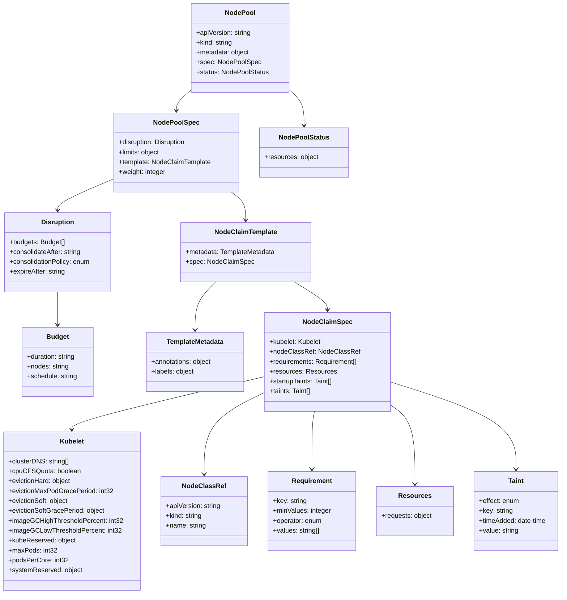
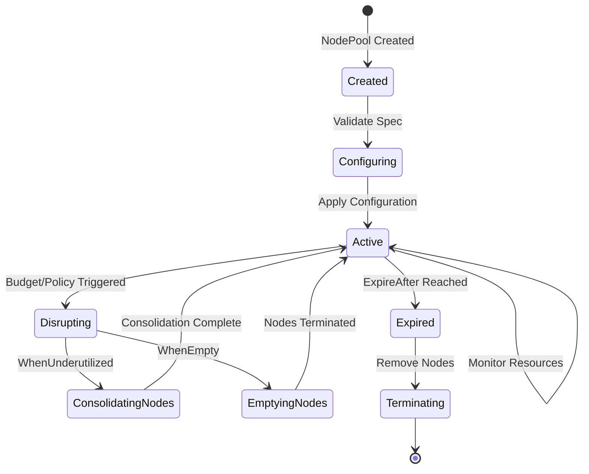
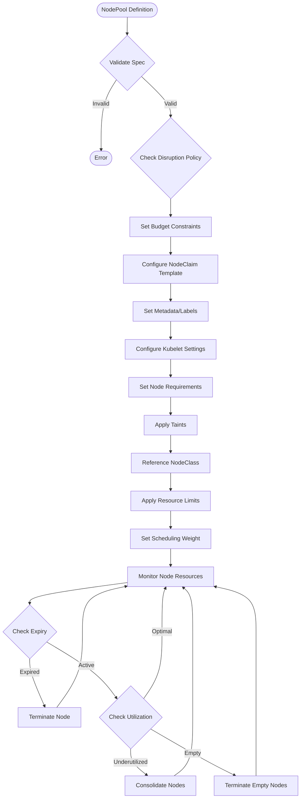

# Diagram: devops/k8s/karpenter/helm/crds/karpenter.sh_nodepools.yaml

> Auto-generated by Obscura crawlers

## Diagram 1

### SVG

<svg id="container" width="1366.73046875" xmlns="http://www.w3.org/2000/svg" class="classDiagram" height="1440" viewBox="0 0 1366.73046875 1440" role="graphics-document document" aria-roledescription="class"><g><defs><marker id="container_class-aggregationStart" class="marker aggregation class" refX="18" refY="7" markerWidth="190" markerHeight="240" orient="auto"><path d="M 18,7 L9,13 L1,7 L9,1 Z"></path></marker></defs><defs><marker id="container_class-aggregationEnd" class="marker aggregation class" refX="1" refY="7" markerWidth="20" markerHeight="28" orient="auto"><path d="M 18,7 L9,13 L1,7 L9,1 Z"></path></marker></defs><defs><marker id="container_class-extensionStart" class="marker extension class" refX="18" refY="7" markerWidth="190" markerHeight="240" orient="auto"><path d="M 1,7 L18,13 V 1 Z"></path></marker></defs><defs><marker id="container_class-extensionEnd" class="marker extension class" refX="1" refY="7" markerWidth="20" markerHeight="28" orient="auto"><path d="M 1,1 V 13 L18,7 Z"></path></marker></defs><defs><marker id="container_class-compositionStart" class="marker composition class" refX="18" refY="7" markerWidth="190" markerHeight="240" orient="auto"><path d="M 18,7 L9,13 L1,7 L9,1 Z"></path></marker></defs><defs><marker id="container_class-compositionEnd" class="marker composition class" refX="1" refY="7" markerWidth="20" markerHeight="28" orient="auto"><path d="M 18,7 L9,13 L1,7 L9,1 Z"></path></marker></defs><defs><marker id="container_class-dependencyStart" class="marker dependency class" refX="6" refY="7" markerWidth="190" markerHeight="240" orient="auto"><path d="M 5,7 L9,13 L1,7 L9,1 Z"></path></marker></defs><defs><marker id="container_class-dependencyEnd" class="marker dependency class" refX="13" refY="7" markerWidth="20" markerHeight="28" orient="auto"><path d="M 18,7 L9,13 L14,7 L9,1 Z"></path></marker></defs><defs><marker id="container_class-lollipopStart" class="marker lollipop class" refX="13" refY="7" markerWidth="190" markerHeight="240" orient="auto"><circle stroke="black" fill="transparent" cx="7" cy="7" r="6"></circle></marker></defs><defs><marker id="container_class-lollipopEnd" class="marker lollipop class" refX="1" refY="7" markerWidth="190" markerHeight="240" orient="auto"><circle stroke="black" fill="transparent" cx="7" cy="7" r="6"></circle></marker></defs><g class="root"><g class="clusters"></g><g class="edgePaths"><path d="M463.98,217.705L457.92,222.921C451.859,228.137,439.738,238.568,433.678,246.951C427.617,255.333,427.617,261.667,427.617,264.833L427.617,268" id="id_NodePool_NodePoolSpec_1" class="edge-thickness-normal edge-pattern-solid relation" style=";;;" data-edge="true" data-et="edge" data-id="id_NodePool_NodePoolSpec_1" data-points="W3sieCI6NDYzLjk4MDQ2ODc1LCJ5IjoyMTcuNzA0ODkzNTg0NzUzMDV9LHsieCI6NDI3LjYxNzE4NzUsInkiOjI0OX0seyJ4Ijo0MjcuNjE3MTg3NSwieSI6Mjc0fV0=" marker-end="url(#container_class-dependencyEnd)"></path><path d="M700.332,217.705L706.393,222.921C712.453,228.137,724.574,238.568,730.635,252.951C736.695,267.333,736.695,285.667,736.695,294.833L736.695,304" id="id_NodePool_NodePoolStatus_2" class="edge-thickness-normal edge-pattern-solid relation" style=";;;" data-edge="true" data-et="edge" data-id="id_NodePool_NodePoolStatus_2" data-points="W3sieCI6NzAwLjMzMjAzMTI1LCJ5IjoyMTcuNzA0ODkzNTg0NzUzMDV9LHsieCI6NzM2LjY5NTMxMjUsInkiOjI0OX0seyJ4Ijo3MzYuNjk1MzEyNSwieSI6MzEwfV0=" marker-end="url(#container_class-dependencyEnd)"></path><path d="M275.664,433.706L252.887,443.255C230.111,452.804,184.557,471.902,161.781,484.618C139.004,497.333,139.004,503.667,139.004,506.833L139.004,510" id="id_NodePoolSpec_Disruption_3" class="edge-thickness-normal edge-pattern-solid relation" style=";;;" data-edge="true" data-et="edge" data-id="id_NodePoolSpec_Disruption_3" data-points="W3sieCI6Mjc1LjY2NDA2MjUsInkiOjQzMy43MDU3NTg5NDk3MTkxNX0seyJ4IjoxMzkuMDAzOTA2MjUsInkiOjQ5MX0seyJ4IjoxMzkuMDAzOTA2MjUsInkiOjUxNn1d" marker-end="url(#container_class-dependencyEnd)"></path><path d="M562.484,466L568.338,470.167C574.191,474.333,585.898,482.667,591.752,494C597.605,505.333,597.605,519.667,597.605,526.833L597.605,534" id="id_NodePoolSpec_NodeClaimTemplate_4" class="edge-thickness-normal edge-pattern-solid relation" style=";;;" data-edge="true" data-et="edge" data-id="id_NodePoolSpec_NodeClaimTemplate_4" data-points="W3sieCI6NTYyLjQ4MzkyMzAzNzE5MDIsInkiOjQ2Nn0seyJ4Ijo1OTcuNjA1NDY4NzUsInkiOjQ5MX0seyJ4Ijo1OTcuNjA1NDY4NzUsInkiOjU0MH1d" marker-end="url(#container_class-dependencyEnd)"></path><path d="M139.004,708L139.004,712.167C139.004,716.333,139.004,724.667,139.004,738C139.004,751.333,139.004,769.667,139.004,778.833L139.004,788" id="id_Disruption_Budget_5" class="edge-thickness-normal edge-pattern-solid relation" style=";;;" data-edge="true" data-et="edge" data-id="id_Disruption_Budget_5" data-points="W3sieCI6MTM5LjAwMzkwNjI1LCJ5Ijo3MDh9LHsieCI6MTM5LjAwMzkwNjI1LCJ5Ijo3MzN9LHsieCI6MTM5LjAwMzkwNjI1LCJ5Ijo3OTR9XQ==" marker-end="url(#container_class-dependencyEnd)"></path><path d="M526.805,684L518.774,692.167C510.744,700.333,494.682,716.667,486.652,736C478.621,755.333,478.621,777.667,478.621,788.833L478.621,800" id="id_NodeClaimTemplate_TemplateMetadata_6" class="edge-thickness-normal edge-pattern-solid relation" style=";;;" data-edge="true" data-et="edge" data-id="id_NodeClaimTemplate_TemplateMetadata_6" data-points="W3sieCI6NTI2LjgwNDg0ODkxNTI4OTMsInkiOjY4NH0seyJ4Ijo0NzguNjIxMDkzNzUsInkiOjczM30seyJ4Ijo0NzguNjIxMDkzNzUsInkiOjgwNn1d" marker-end="url(#container_class-dependencyEnd)"></path><path d="M717.148,684L730.708,692.167C744.267,700.333,771.385,716.667,784.945,728C798.504,739.333,798.504,745.667,798.504,748.833L798.504,752" id="id_NodeClaimTemplate_NodeClaimSpec_7" class="edge-thickness-normal edge-pattern-solid relation" style=";;;" data-edge="true" data-et="edge" data-id="id_NodeClaimTemplate_NodeClaimSpec_7" data-points="W3sieCI6NzE3LjE0ODM0MDY1MDgyNjQsInkiOjY4NH0seyJ4Ijo3OTguNTAzOTA2MjUsInkiOjczM30seyJ4Ijo3OTguNTAzOTA2MjUsInkiOjc1OH1d" marker-end="url(#container_class-dependencyEnd)"></path><path d="M649.375,912.939L571.079,931.282C492.784,949.626,336.193,986.313,257.897,1007.823C179.602,1029.333,179.602,1035.667,179.602,1038.833L179.602,1042" id="id_NodeClaimSpec_Kubelet_8" class="edge-thickness-normal edge-pattern-solid relation" style=";;;" data-edge="true" data-et="edge" data-id="id_NodeClaimSpec_Kubelet_8" data-points="W3sieCI6NjQ5LjM3NSwieSI6OTEyLjkzODc3NzY5OTkzNX0seyJ4IjoxNzkuNjAxNTYyNSwieSI6MTAyM30seyJ4IjoxNzkuNjAxNTYyNSwieSI6MTA0OH1d" marker-end="url(#container_class-dependencyEnd)"></path><path d="M649.375,949.724L623.982,961.937C598.59,974.149,547.805,998.575,522.412,1031.954C497.02,1065.333,497.02,1107.667,497.02,1128.833L497.02,1150" id="id_NodeClaimSpec_NodeClassRef_9" class="edge-thickness-normal edge-pattern-solid relation" style=";;;" data-edge="true" data-et="edge" data-id="id_NodeClaimSpec_NodeClassRef_9" data-points="W3sieCI6NjQ5LjM3NSwieSI6OTQ5LjcyNDA4NjU1MDkxOTl9LHsieCI6NDk3LjAxOTUzMTI1LCJ5IjoxMDIzfSx7IngiOjQ5Ny4wMTk1MzEyNSwieSI6MTE1Nn1d" marker-end="url(#container_class-dependencyEnd)"></path><path d="M764.608,998L763.432,1002.167C762.255,1006.333,759.901,1014.667,758.724,1038C757.547,1061.333,757.547,1099.667,757.547,1118.833L757.547,1138" id="id_NodeClaimSpec_Requirement_10" class="edge-thickness-normal edge-pattern-solid relation" style=";;;" data-edge="true" data-et="edge" data-id="id_NodeClaimSpec_Requirement_10" data-points="W3sieCI6NzY0LjYwODQzMjExMjA2OSwieSI6OTk4fSx7IngiOjc1Ny41NDY4NzUsInkiOjEwMjN9LHsieCI6NzU3LjU0Njg3NSwieSI6MTE0NH1d" marker-end="url(#container_class-dependencyEnd)"></path><path d="M947.633,981.827L957.489,988.69C967.345,995.552,987.057,1009.276,996.913,1041.305C1006.77,1073.333,1006.77,1123.667,1006.77,1148.833L1006.77,1174" id="id_NodeClaimSpec_Resources_11" class="edge-thickness-normal edge-pattern-solid relation" style=";;;" data-edge="true" data-et="edge" data-id="id_NodeClaimSpec_Resources_11" data-points="W3sieCI6OTQ3LjYzMjgxMjUsInkiOjk4MS44Mjc0NjI2NzUzNjk1fSx7IngiOjEwMDYuNzY5NTMxMjUsInkiOjEwMjN9LHsieCI6MTAwNi43Njk1MzEyNSwieSI6MTE4MH1d" marker-end="url(#container_class-dependencyEnd)"></path><path d="M947.633,925.459L998.717,941.715C1049.801,957.972,1151.969,990.486,1203.053,1025.91C1254.137,1061.333,1254.137,1099.667,1254.137,1118.833L1254.137,1138" id="id_NodeClaimSpec_Taint_12" class="edge-thickness-normal edge-pattern-solid relation" style=";;;" data-edge="true" data-et="edge" data-id="id_NodeClaimSpec_Taint_12" data-points="W3sieCI6OTQ3LjYzMjgxMjUsInkiOjkyNS40NTg1OTEyNDUwMDYxfSx7IngiOjEyNTQuMTM2NzE4NzUsInkiOjEwMjN9LHsieCI6MTI1NC4xMzY3MTg3NSwieSI6MTE0NH1d" marker-end="url(#container_class-dependencyEnd)"></path></g><g class="edgeLabels"><g class="edgeLabel"><g class="label" data-id="id_NodePool_NodePoolSpec_1" transform="translate(0, 0)"><foreignObject width="0" height="0">

</foreignObject></g></g><g class="edgeLabel"><g class="label" data-id="id_NodePool_NodePoolStatus_2" transform="translate(0, 0)"><foreignObject width="0" height="0">

</foreignObject></g></g><g class="edgeLabel"><g class="label" data-id="id_NodePoolSpec_Disruption_3" transform="translate(0, 0)"><foreignObject width="0" height="0">

</foreignObject></g></g><g class="edgeLabel"><g class="label" data-id="id_NodePoolSpec_NodeClaimTemplate_4" transform="translate(0, 0)"><foreignObject width="0" height="0">

</foreignObject></g></g><g class="edgeLabel"><g class="label" data-id="id_Disruption_Budget_5" transform="translate(0, 0)"><foreignObject width="0" height="0">

</foreignObject></g></g><g class="edgeLabel"><g class="label" data-id="id_NodeClaimTemplate_TemplateMetadata_6" transform="translate(0, 0)"><foreignObject width="0" height="0">

</foreignObject></g></g><g class="edgeLabel"><g class="label" data-id="id_NodeClaimTemplate_NodeClaimSpec_7" transform="translate(0, 0)"><foreignObject width="0" height="0">

</foreignObject></g></g><g class="edgeLabel"><g class="label" data-id="id_NodeClaimSpec_Kubelet_8" transform="translate(0, 0)"><foreignObject width="0" height="0">

</foreignObject></g></g><g class="edgeLabel"><g class="label" data-id="id_NodeClaimSpec_NodeClassRef_9" transform="translate(0, 0)"><foreignObject width="0" height="0">

</foreignObject></g></g><g class="edgeLabel"><g class="label" data-id="id_NodeClaimSpec_Requirement_10" transform="translate(0, 0)"><foreignObject width="0" height="0">

</foreignObject></g></g><g class="edgeLabel"><g class="label" data-id="id_NodeClaimSpec_Resources_11" transform="translate(0, 0)"><foreignObject width="0" height="0">

</foreignObject></g></g><g class="edgeLabel"><g class="label" data-id="id_NodeClaimSpec_Taint_12" transform="translate(0, 0)"><foreignObject width="0" height="0">

</foreignObject></g></g></g><g class="nodes"><g class="node default" id="classId-NodePool-0" transform="translate(582.15625, 116)"><g class="basic label-container"><path d="M-118.17578125 -108 L118.17578125 -108 L118.17578125 108 L-118.17578125 108" stroke="none" stroke-width="0" fill="#ECECFF" style=""></path><path d="M-118.17578125 -108 C-68.01397425858238 -108, -17.852167267164745 -108, 118.17578125 -108 M-118.17578125 -108 C-65.69418210452832 -108, -13.212582959056633 -108, 118.17578125 -108 M118.17578125 -108 C118.17578125 -47.30362320367673, 118.17578125 13.392753592646542, 118.17578125 108 M118.17578125 -108 C118.17578125 -38.099636573238854, 118.17578125 31.800726853522292, 118.17578125 108 M118.17578125 108 C51.54464128097736 108, -15.086498688045282 108, -118.17578125 108 M118.17578125 108 C33.0177027882162 108, -52.140375673567604 108, -118.17578125 108 M-118.17578125 108 C-118.17578125 51.52198040223139, -118.17578125 -4.956039195537215, -118.17578125 -108 M-118.17578125 108 C-118.17578125 60.67510568065081, -118.17578125 13.350211361301618, -118.17578125 -108" stroke="#9370DB" stroke-width="1.3" fill="none" stroke-dasharray="0 0" style=""></path></g><g class="annotation-group text" transform="translate(0, -84)"></g><g class="label-group text" transform="translate(-35.4765625, -84)"><g class="label" style="font-weight: bolder" transform="translate(0,-12)"><foreignObject width="70.953125" height="24">

NodePool

</foreignObject></g></g><g class="members-group text" transform="translate(-106.17578125, -36)"><g class="label" style="" transform="translate(0,-12)"><foreignObject width="134.046875" height="24">

+apiVersion: string

</foreignObject></g><g class="label" style="" transform="translate(0,12)"><foreignObject width="89.359375" height="24">

+kind: string

</foreignObject></g><g class="label" style="" transform="translate(0,36)"><foreignObject width="130.984375" height="24">

+metadata: object

</foreignObject></g><g class="label" style="" transform="translate(0,60)"><foreignObject width="154.828125" height="24">

+spec: NodePoolSpec

</foreignObject></g><g class="label" style="" transform="translate(0,84)"><foreignObject width="176.875" height="24">

+status: NodePoolStatus

</foreignObject></g></g><g class="methods-group text" transform="translate(-106.17578125, 108)"></g><g class="divider" style=""><path d="M-118.17578125 -60 C-65.01142663403324 -60, -11.847072018066484 -60, 118.17578125 -60 M-118.17578125 -60 C-66.73789662606663 -60, -15.300012002133272 -60, 118.17578125 -60" stroke="#9370DB" stroke-width="1.3" fill="none" stroke-dasharray="0 0" style=""></path></g><g class="divider" style=""><path d="M-118.17578125 84 C-38.864764722576496 84, 40.44625180484701 84, 118.17578125 84 M-118.17578125 84 C-70.45922460397892 84, -22.742667957957835 84, 118.17578125 84" stroke="#9370DB" stroke-width="1.3" fill="none" stroke-dasharray="0 0" style=""></path></g></g><g class="node default" id="classId-NodePoolSpec-1" transform="translate(427.6171875, 370)"><g class="basic label-container"><path d="M-151.953125 -96 L151.953125 -96 L151.953125 96 L-151.953125 96" stroke="none" stroke-width="0" fill="#ECECFF" style=""></path><path d="M-151.953125 -96 C-35.662534005172276 -96, 80.62805698965545 -96, 151.953125 -96 M-151.953125 -96 C-89.25531559815899 -96, -26.557506196317973 -96, 151.953125 -96 M151.953125 -96 C151.953125 -52.23682548369265, 151.953125 -8.473650967385296, 151.953125 96 M151.953125 -96 C151.953125 -19.995039862019482, 151.953125 56.009920275961036, 151.953125 96 M151.953125 96 C78.4776712002289 96, 5.002217400457795 96, -151.953125 96 M151.953125 96 C74.9659810537864 96, -2.0211628924272134 96, -151.953125 96 M-151.953125 96 C-151.953125 42.96749023977767, -151.953125 -10.065019520444665, -151.953125 -96 M-151.953125 96 C-151.953125 29.23463371616225, -151.953125 -37.5307325676755, -151.953125 -96" stroke="#9370DB" stroke-width="1.3" fill="none" stroke-dasharray="0 0" style=""></path></g><g class="annotation-group text" transform="translate(0, -72)"></g><g class="label-group text" transform="translate(-53.078125, -72)"><g class="label" style="font-weight: bolder" transform="translate(0,-12)"><foreignObject width="106.15625" height="24">

NodePoolSpec

</foreignObject></g></g><g class="members-group text" transform="translate(-139.953125, -24)"><g class="label" style="" transform="translate(0,-12)"><foreignObject width="167.90625" height="24">

+disruption: Disruption

</foreignObject></g><g class="label" style="" transform="translate(0,12)"><foreignObject width="102.21875" height="24">

+limits: object

</foreignObject></g><g class="label" style="" transform="translate(0,36)"><foreignObject width="226.828125" height="24">

+template: NodeClaimTemplate

</foreignObject></g><g class="label" style="" transform="translate(0,60)"><foreignObject width="115.421875" height="24">

+weight: integer

</foreignObject></g></g><g class="methods-group text" transform="translate(-139.953125, 96)"></g><g class="divider" style=""><path d="M-151.953125 -48 C-86.06172612137865 -48, -20.17032724275731 -48, 151.953125 -48 M-151.953125 -48 C-36.37113131014516 -48, 79.21086237970968 -48, 151.953125 -48" stroke="#9370DB" stroke-width="1.3" fill="none" stroke-dasharray="0 0" style=""></path></g><g class="divider" style=""><path d="M-151.953125 72 C-84.0099848833468 72, -16.066844766693606 72, 151.953125 72 M-151.953125 72 C-53.95016397176673 72, 44.052797056466545 72, 151.953125 72" stroke="#9370DB" stroke-width="1.3" fill="none" stroke-dasharray="0 0" style=""></path></g></g><g class="node default" id="classId-Disruption-2" transform="translate(139.00390625, 612)"><g class="basic label-container"><path d="M-131.00390625 -96 L131.00390625 -96 L131.00390625 96 L-131.00390625 96" stroke="none" stroke-width="0" fill="#ECECFF" style=""></path><path d="M-131.00390625 -96 C-55.69564457677154 -96, 19.612617096456916 -96, 131.00390625 -96 M-131.00390625 -96 C-29.43987238855098 -96, 72.12416147289804 -96, 131.00390625 -96 M131.00390625 -96 C131.00390625 -45.97349380213408, 131.00390625 4.053012395731841, 131.00390625 96 M131.00390625 -96 C131.00390625 -28.800463206028695, 131.00390625 38.39907358794261, 131.00390625 96 M131.00390625 96 C38.018793336115166 96, -54.96631957776967 96, -131.00390625 96 M131.00390625 96 C54.30593540820064 96, -22.39203543359872 96, -131.00390625 96 M-131.00390625 96 C-131.00390625 32.82966583349323, -131.00390625 -30.34066833301354, -131.00390625 -96 M-131.00390625 96 C-131.00390625 56.698998767900235, -131.00390625 17.39799753580047, -131.00390625 -96" stroke="#9370DB" stroke-width="1.3" fill="none" stroke-dasharray="0 0" style=""></path></g><g class="annotation-group text" transform="translate(0, -72)"></g><g class="label-group text" transform="translate(-38.5234375, -72)"><g class="label" style="font-weight: bolder" transform="translate(0,-12)"><foreignObject width="77.046875" height="24">

Disruption

</foreignObject></g></g><g class="members-group text" transform="translate(-119.00390625, -24)"><g class="label" style="" transform="translate(0,-12)"><foreignObject width="135.953125" height="24">

+budgets: Budget[]

</foreignObject></g><g class="label" style="" transform="translate(0,12)"><foreignObject width="177.421875" height="24">

+consolidateAfter: string

</foreignObject></g><g class="label" style="" transform="translate(0,36)"><foreignObject width="199.484375" height="24">

+consolidationPolicy: enum

</foreignObject></g><g class="label" style="" transform="translate(0,60)"><foreignObject width="137.59375" height="24">

+expireAfter: string

</foreignObject></g></g><g class="methods-group text" transform="translate(-119.00390625, 96)"></g><g class="divider" style=""><path d="M-131.00390625 -48 C-64.36039621141012 -48, 2.2831138271797613 -48, 131.00390625 -48 M-131.00390625 -48 C-34.94077330158265 -48, 61.122359646834695 -48, 131.00390625 -48" stroke="#9370DB" stroke-width="1.3" fill="none" stroke-dasharray="0 0" style=""></path></g><g class="divider" style=""><path d="M-131.00390625 72 C-35.59323175604585 72, 59.817442737908294 72, 131.00390625 72 M-131.00390625 72 C-73.08606279716129 72, -15.16821934432258 72, 131.00390625 72" stroke="#9370DB" stroke-width="1.3" fill="none" stroke-dasharray="0 0" style=""></path></g></g><g class="node default" id="classId-Budget-3" transform="translate(139.00390625, 878)"><g class="basic label-container"><path d="M-86.58984375 -84 L86.58984375 -84 L86.58984375 84 L-86.58984375 84" stroke="none" stroke-width="0" fill="#ECECFF" style=""></path><path d="M-86.58984375 -84 C-45.58347335633761 -84, -4.577102962675227 -84, 86.58984375 -84 M-86.58984375 -84 C-49.89085973608429 -84, -13.191875722168575 -84, 86.58984375 -84 M86.58984375 -84 C86.58984375 -48.17277230473239, 86.58984375 -12.345544609464781, 86.58984375 84 M86.58984375 -84 C86.58984375 -19.01147434536965, 86.58984375 45.9770513092607, 86.58984375 84 M86.58984375 84 C29.69367231777703 84, -27.202499114445942 84, -86.58984375 84 M86.58984375 84 C31.02596542738395 84, -24.537912895232097 84, -86.58984375 84 M-86.58984375 84 C-86.58984375 25.008853802185612, -86.58984375 -33.982292395628775, -86.58984375 -84 M-86.58984375 84 C-86.58984375 36.37618229910032, -86.58984375 -11.247635401799357, -86.58984375 -84" stroke="#9370DB" stroke-width="1.3" fill="none" stroke-dasharray="0 0" style=""></path></g><g class="annotation-group text" transform="translate(0, -60)"></g><g class="label-group text" transform="translate(-26.0546875, -60)"><g class="label" style="font-weight: bolder" transform="translate(0,-12)"><foreignObject width="52.109375" height="24">

Budget

</foreignObject></g></g><g class="members-group text" transform="translate(-74.58984375, -12)"><g class="label" style="" transform="translate(0,-12)"><foreignObject width="119.90625" height="24">

+duration: string

</foreignObject></g><g class="label" style="" transform="translate(0,12)"><foreignObject width="102.1875" height="24">

+nodes: string

</foreignObject></g><g class="label" style="" transform="translate(0,36)"><foreignObject width="123.125" height="24">

+schedule: string

</foreignObject></g></g><g class="methods-group text" transform="translate(-74.58984375, 84)"></g><g class="divider" style=""><path d="M-86.58984375 -36 C-37.19536893710208 -36, 12.199105875795837 -36, 86.58984375 -36 M-86.58984375 -36 C-25.379189788192072 -36, 35.831464173615856 -36, 86.58984375 -36" stroke="#9370DB" stroke-width="1.3" fill="none" stroke-dasharray="0 0" style=""></path></g><g class="divider" style=""><path d="M-86.58984375 60 C-37.244377764922454 60, 12.101088220155091 60, 86.58984375 60 M-86.58984375 60 C-21.500115997288944 60, 43.58961175542211 60, 86.58984375 60" stroke="#9370DB" stroke-width="1.3" fill="none" stroke-dasharray="0 0" style=""></path></g></g><g class="node default" id="classId-NodeClaimTemplate-4" transform="translate(597.60546875, 612)"><g class="basic label-container"><path d="M-158.97265625 -72 L158.97265625 -72 L158.97265625 72 L-158.97265625 72" stroke="none" stroke-width="0" fill="#ECECFF" style=""></path><path d="M-158.97265625 -72 C-60.57272416248095 -72, 37.827207925038095 -72, 158.97265625 -72 M-158.97265625 -72 C-89.30084109087493 -72, -19.62902593174985 -72, 158.97265625 -72 M158.97265625 -72 C158.97265625 -40.006341516494146, 158.97265625 -8.0126830329883, 158.97265625 72 M158.97265625 -72 C158.97265625 -34.0254385656237, 158.97265625 3.949122868752596, 158.97265625 72 M158.97265625 72 C72.42437017012068 72, -14.123915909758637 72, -158.97265625 72 M158.97265625 72 C61.045293952937655 72, -36.88206834412469 72, -158.97265625 72 M-158.97265625 72 C-158.97265625 18.69316810912126, -158.97265625 -34.61366378175748, -158.97265625 -72 M-158.97265625 72 C-158.97265625 36.968061191149104, -158.97265625 1.9361223822982083, -158.97265625 -72" stroke="#9370DB" stroke-width="1.3" fill="none" stroke-dasharray="0 0" style=""></path></g><g class="annotation-group text" transform="translate(0, -48)"></g><g class="label-group text" transform="translate(-73.3671875, -48)"><g class="label" style="font-weight: bolder" transform="translate(0,-12)"><foreignObject width="146.734375" height="24">

NodeClaimTemplate

</foreignObject></g></g><g class="members-group text" transform="translate(-146.97265625, 0)"><g class="label" style="" transform="translate(0,-12)"><foreignObject width="220.578125" height="24">

+metadata: TemplateMetadata

</foreignObject></g><g class="label" style="" transform="translate(0,12)"><foreignObject width="162.96875" height="24">

+spec: NodeClaimSpec

</foreignObject></g></g><g class="methods-group text" transform="translate(-146.97265625, 72)"></g><g class="divider" style=""><path d="M-158.97265625 -24 C-82.50330791073785 -24, -6.033959571475691 -24, 158.97265625 -24 M-158.97265625 -24 C-83.42342805142341 -24, -7.874199852846829 -24, 158.97265625 -24" stroke="#9370DB" stroke-width="1.3" fill="none" stroke-dasharray="0 0" style=""></path></g><g class="divider" style=""><path d="M-158.97265625 48 C-61.26663939923121 48, 36.43937745153758 48, 158.97265625 48 M-158.97265625 48 C-59.66761462525092 48, 39.63742699949816 48, 158.97265625 48" stroke="#9370DB" stroke-width="1.3" fill="none" stroke-dasharray="0 0" style=""></path></g></g><g class="node default" id="classId-TemplateMetadata-5" transform="translate(478.62109375, 878)"><g class="basic label-container"><path d="M-120.75390625 -72 L120.75390625 -72 L120.75390625 72 L-120.75390625 72" stroke="none" stroke-width="0" fill="#ECECFF" style=""></path><path d="M-120.75390625 -72 C-40.85985215280364 -72, 39.03420194439272 -72, 120.75390625 -72 M-120.75390625 -72 C-46.3959887720424 -72, 27.9619287059152 -72, 120.75390625 -72 M120.75390625 -72 C120.75390625 -19.478823810879597, 120.75390625 33.04235237824081, 120.75390625 72 M120.75390625 -72 C120.75390625 -30.746483904818135, 120.75390625 10.50703219036373, 120.75390625 72 M120.75390625 72 C46.6039128714244 72, -27.546080507151203 72, -120.75390625 72 M120.75390625 72 C59.45968134227487 72, -1.8345435654502609 72, -120.75390625 72 M-120.75390625 72 C-120.75390625 33.55374032351258, -120.75390625 -4.892519352974844, -120.75390625 -72 M-120.75390625 72 C-120.75390625 22.95267281101996, -120.75390625 -26.094654377960083, -120.75390625 -72" stroke="#9370DB" stroke-width="1.3" fill="none" stroke-dasharray="0 0" style=""></path></g><g class="annotation-group text" transform="translate(0, -48)"></g><g class="label-group text" transform="translate(-68.5546875, -48)"><g class="label" style="font-weight: bolder" transform="translate(0,-12)"><foreignObject width="137.109375" height="24">

TemplateMetadata

</foreignObject></g></g><g class="members-group text" transform="translate(-108.75390625, 0)"><g class="label" style="" transform="translate(0,-12)"><foreignObject width="148.953125" height="24">

+annotations: object

</foreignObject></g><g class="label" style="" transform="translate(0,12)"><foreignObject width="105.234375" height="24">

+labels: object

</foreignObject></g></g><g class="methods-group text" transform="translate(-108.75390625, 72)"></g><g class="divider" style=""><path d="M-120.75390625 -24 C-61.15705370861012 -24, -1.5602011672202423 -24, 120.75390625 -24 M-120.75390625 -24 C-71.70888316492237 -24, -22.66386007984474 -24, 120.75390625 -24" stroke="#9370DB" stroke-width="1.3" fill="none" stroke-dasharray="0 0" style=""></path></g><g class="divider" style=""><path d="M-120.75390625 48 C-60.5974498378069 48, -0.4409934256137973 48, 120.75390625 48 M-120.75390625 48 C-54.88569739337355 48, 10.982511463252905 48, 120.75390625 48" stroke="#9370DB" stroke-width="1.3" fill="none" stroke-dasharray="0 0" style=""></path></g></g><g class="node default" id="classId-NodeClaimSpec-6" transform="translate(798.50390625, 878)"><g class="basic label-container"><path d="M-149.12890625 -120 L149.12890625 -120 L149.12890625 120 L-149.12890625 120" stroke="none" stroke-width="0" fill="#ECECFF" style=""></path><path d="M-149.12890625 -120 C-87.3256090394413 -120, -25.522311828882593 -120, 149.12890625 -120 M-149.12890625 -120 C-32.0542549997395 -120, 85.020396250521 -120, 149.12890625 -120 M149.12890625 -120 C149.12890625 -43.87732298151056, 149.12890625 32.24535403697888, 149.12890625 120 M149.12890625 -120 C149.12890625 -38.7258803675051, 149.12890625 42.5482392649898, 149.12890625 120 M149.12890625 120 C38.1771829196141 120, -72.7745404107718 120, -149.12890625 120 M149.12890625 120 C85.6993485868632 120, 22.26979092372639 120, -149.12890625 120 M-149.12890625 120 C-149.12890625 58.55969643350691, -149.12890625 -2.880607132986185, -149.12890625 -120 M-149.12890625 120 C-149.12890625 54.65223669090176, -149.12890625 -10.695526618196482, -149.12890625 -120" stroke="#9370DB" stroke-width="1.3" fill="none" stroke-dasharray="0 0" style=""></path></g><g class="annotation-group text" transform="translate(0, -96)"></g><g class="label-group text" transform="translate(-57.0546875, -96)"><g class="label" style="font-weight: bolder" transform="translate(0,-12)"><foreignObject width="114.109375" height="24">

NodeClaimSpec

</foreignObject></g></g><g class="members-group text" transform="translate(-137.12890625, -48)"><g class="label" style="" transform="translate(0,-12)"><foreignObject width="126.78125" height="24">

+kubelet: Kubelet

</foreignObject></g><g class="label" style="" transform="translate(0,12)"><foreignObject width="212.25" height="24">

+nodeClassRef: NodeClassRef

</foreignObject></g><g class="label" style="" transform="translate(0,36)"><foreignObject width="217.203125" height="24">

+requirements: Requirement[]

</foreignObject></g><g class="label" style="" transform="translate(0,60)"><foreignObject width="159.34375" height="24">

+resources: Resources

</foreignObject></g><g class="label" style="" transform="translate(0,84)"><foreignObject width="158.140625" height="24">

+startupTaints: Taint[]

</foreignObject></g><g class="label" style="" transform="translate(0,108)"><foreignObject width="103.640625" height="24">

+taints: Taint[]

</foreignObject></g></g><g class="methods-group text" transform="translate(-137.12890625, 120)"></g><g class="divider" style=""><path d="M-149.12890625 -72 C-69.00837653077146 -72, 11.112153188457086 -72, 149.12890625 -72 M-149.12890625 -72 C-78.74453007134171 -72, -8.360153892683428 -72, 149.12890625 -72" stroke="#9370DB" stroke-width="1.3" fill="none" stroke-dasharray="0 0" style=""></path></g><g class="divider" style=""><path d="M-149.12890625 96 C-31.33385895815171 96, 86.46118833369658 96, 149.12890625 96 M-149.12890625 96 C-86.59406753784549 96, -24.059228825690994 96, 149.12890625 96" stroke="#9370DB" stroke-width="1.3" fill="none" stroke-dasharray="0 0" style=""></path></g></g><g class="node default" id="classId-Kubelet-7" transform="translate(179.6015625, 1240)"><g class="basic label-container"><path d="M-163.33984375 -192 L163.33984375 -192 L163.33984375 192 L-163.33984375 192" stroke="none" stroke-width="0" fill="#ECECFF" style=""></path><path d="M-163.33984375 -192 C-61.69258977253887 -192, 39.95466420492227 -192, 163.33984375 -192 M-163.33984375 -192 C-63.89446375851162 -192, 35.55091623297676 -192, 163.33984375 -192 M163.33984375 -192 C163.33984375 -83.45056861107656, 163.33984375 25.098862777846875, 163.33984375 192 M163.33984375 -192 C163.33984375 -75.39796464957819, 163.33984375 41.20407070084363, 163.33984375 192 M163.33984375 192 C89.88674609020443 192, 16.43364843040885 192, -163.33984375 192 M163.33984375 192 C36.66966971716319 192, -90.00050431567362 192, -163.33984375 192 M-163.33984375 192 C-163.33984375 106.01863711917329, -163.33984375 20.037274238346583, -163.33984375 -192 M-163.33984375 192 C-163.33984375 53.9851520854869, -163.33984375 -84.0296958290262, -163.33984375 -192" stroke="#9370DB" stroke-width="1.3" fill="none" stroke-dasharray="0 0" style=""></path></g><g class="annotation-group text" transform="translate(0, -168)"></g><g class="label-group text" transform="translate(-28.5703125, -168)"><g class="label" style="font-weight: bolder" transform="translate(0,-12)"><foreignObject width="57.140625" height="24">

Kubelet

</foreignObject></g></g><g class="members-group text" transform="translate(-151.33984375, -120)"><g class="label" style="" transform="translate(0,-12)"><foreignObject width="147.515625" height="24">

+clusterDNS: string[]

</foreignObject></g><g class="label" style="" transform="translate(0,12)"><foreignObject width="171.265625" height="24">

+cpuCFSQuota: boolean

</foreignObject></g><g class="label" style="" transform="translate(0,36)"><foreignObject width="154.09375" height="24">

+evictionHard: object

</foreignObject></g><g class="label" style="" transform="translate(0,60)"><foreignObject width="253.421875" height="24">

+evictionMaxPodGracePeriod: int32

</foreignObject></g><g class="label" style="" transform="translate(0,84)"><foreignObject width="148.5" height="24">

+evictionSoft: object

</foreignObject></g><g class="label" style="" transform="translate(0,108)"><foreignObject width="236.046875" height="24">

+evictionSoftGracePeriod: object

</foreignObject></g><g class="label" style="" transform="translate(0,132)"><foreignObject width="274.109375" height="24">

+imageGCHighThresholdPercent: int32

</foreignObject></g><g class="label" style="" transform="translate(0,156)"><foreignObject width="269.40625" height="24">

+imageGCLowThresholdPercent: int32

</foreignObject></g><g class="label" style="" transform="translate(0,180)"><foreignObject width="163.78125" height="24">

+kubeReserved: object

</foreignObject></g><g class="label" style="" transform="translate(0,204)"><foreignObject width="116.859375" height="24">

+maxPods: int32

</foreignObject></g><g class="label" style="" transform="translate(0,228)"><foreignObject width="143.484375" height="24">

+podsPerCore: int32

</foreignObject></g><g class="label" style="" transform="translate(0,252)"><foreignObject width="178.5625" height="24">

+systemReserved: object

</foreignObject></g></g><g class="methods-group text" transform="translate(-151.33984375, 192)"></g><g class="divider" style=""><path d="M-163.33984375 -144 C-62.71510643799593 -144, 37.909630874008144 -144, 163.33984375 -144 M-163.33984375 -144 C-34.476822027577384 -144, 94.38619969484523 -144, 163.33984375 -144" stroke="#9370DB" stroke-width="1.3" fill="none" stroke-dasharray="0 0" style=""></path></g><g class="divider" style=""><path d="M-163.33984375 168 C-91.36327868160124 168, -19.386713613202488 168, 163.33984375 168 M-163.33984375 168 C-71.32563565873353 168, 20.688572432532936 168, 163.33984375 168" stroke="#9370DB" stroke-width="1.3" fill="none" stroke-dasharray="0 0" style=""></path></g></g><g class="node default" id="classId-NodeClassRef-8" transform="translate(497.01953125, 1240)"><g class="basic label-container"><path d="M-104.078125 -84 L104.078125 -84 L104.078125 84 L-104.078125 84" stroke="none" stroke-width="0" fill="#ECECFF" style=""></path><path d="M-104.078125 -84 C-46.31751957558961 -84, 11.443085848820786 -84, 104.078125 -84 M-104.078125 -84 C-40.963004939835734 -84, 22.15211512032853 -84, 104.078125 -84 M104.078125 -84 C104.078125 -44.77395377501795, 104.078125 -5.547907550035902, 104.078125 84 M104.078125 -84 C104.078125 -43.60657206798053, 104.078125 -3.213144135961059, 104.078125 84 M104.078125 84 C21.92501419138121 84, -60.22809661723758 84, -104.078125 84 M104.078125 84 C59.143899117230035 84, 14.20967323446007 84, -104.078125 84 M-104.078125 84 C-104.078125 23.468101692295626, -104.078125 -37.06379661540875, -104.078125 -84 M-104.078125 84 C-104.078125 33.023081616220935, -104.078125 -17.95383676755813, -104.078125 -84" stroke="#9370DB" stroke-width="1.3" fill="none" stroke-dasharray="0 0" style=""></path></g><g class="annotation-group text" transform="translate(0, -60)"></g><g class="label-group text" transform="translate(-50.109375, -60)"><g class="label" style="font-weight: bolder" transform="translate(0,-12)"><foreignObject width="100.21875" height="24">

NodeClassRef

</foreignObject></g></g><g class="members-group text" transform="translate(-92.078125, -12)"><g class="label" style="" transform="translate(0,-12)"><foreignObject width="134.046875" height="24">

+apiVersion: string

</foreignObject></g><g class="label" style="" transform="translate(0,12)"><foreignObject width="89.359375" height="24">

+kind: string

</foreignObject></g><g class="label" style="" transform="translate(0,36)"><foreignObject width="98.21875" height="24">

+name: string

</foreignObject></g></g><g class="methods-group text" transform="translate(-92.078125, 84)"></g><g class="divider" style=""><path d="M-104.078125 -36 C-24.344686972760442 -36, 55.388751054479116 -36, 104.078125 -36 M-104.078125 -36 C-36.01575242605399 -36, 32.046620147892014 -36, 104.078125 -36" stroke="#9370DB" stroke-width="1.3" fill="none" stroke-dasharray="0 0" style=""></path></g><g class="divider" style=""><path d="M-104.078125 60 C-54.8532827759919 60, -5.6284405519838 60, 104.078125 60 M-104.078125 60 C-54.28337153779651 60, -4.488618075593024 60, 104.078125 60" stroke="#9370DB" stroke-width="1.3" fill="none" stroke-dasharray="0 0" style=""></path></g></g><g class="node default" id="classId-Requirement-9" transform="translate(757.546875, 1240)"><g class="basic label-container"><path d="M-106.44921875 -96 L106.44921875 -96 L106.44921875 96 L-106.44921875 96" stroke="none" stroke-width="0" fill="#ECECFF" style=""></path><path d="M-106.44921875 -96 C-45.808641093151785 -96, 14.83193656369643 -96, 106.44921875 -96 M-106.44921875 -96 C-36.940543722751016 -96, 32.56813130449797 -96, 106.44921875 -96 M106.44921875 -96 C106.44921875 -57.489237608272475, 106.44921875 -18.97847521654495, 106.44921875 96 M106.44921875 -96 C106.44921875 -55.37176463012283, 106.44921875 -14.743529260245666, 106.44921875 96 M106.44921875 96 C57.64553128211546 96, 8.841843814230927 96, -106.44921875 96 M106.44921875 96 C25.989861081334652 96, -54.469496587330696 96, -106.44921875 96 M-106.44921875 96 C-106.44921875 26.159026137224004, -106.44921875 -43.68194772555199, -106.44921875 -96 M-106.44921875 96 C-106.44921875 45.787633794223645, -106.44921875 -4.424732411552711, -106.44921875 -96" stroke="#9370DB" stroke-width="1.3" fill="none" stroke-dasharray="0 0" style=""></path></g><g class="annotation-group text" transform="translate(0, -72)"></g><g class="label-group text" transform="translate(-47.1328125, -72)"><g class="label" style="font-weight: bolder" transform="translate(0,-12)"><foreignObject width="94.265625" height="24">

Requirement

</foreignObject></g></g><g class="members-group text" transform="translate(-94.44921875, -24)"><g class="label" style="" transform="translate(0,-12)"><foreignObject width="82.34375" height="24">

+key: string

</foreignObject></g><g class="label" style="" transform="translate(0,12)"><foreignObject width="141.765625" height="24">

+minValues: integer

</foreignObject></g><g class="label" style="" transform="translate(0,36)"><foreignObject width="120.296875" height="24">

+operator: enum

</foreignObject></g><g class="label" style="" transform="translate(0,60)"><foreignObject width="114.203125" height="24">

+values: string[]

</foreignObject></g></g><g class="methods-group text" transform="translate(-94.44921875, 96)"></g><g class="divider" style=""><path d="M-106.44921875 -48 C-61.397724576688425 -48, -16.34623040337685 -48, 106.44921875 -48 M-106.44921875 -48 C-51.51769096850611 -48, 3.413836812987782 -48, 106.44921875 -48" stroke="#9370DB" stroke-width="1.3" fill="none" stroke-dasharray="0 0" style=""></path></g><g class="divider" style=""><path d="M-106.44921875 72 C-34.379860942042725 72, 37.68949686591455 72, 106.44921875 72 M-106.44921875 72 C-40.122624508587506 72, 26.203969732824987 72, 106.44921875 72" stroke="#9370DB" stroke-width="1.3" fill="none" stroke-dasharray="0 0" style=""></path></g></g><g class="node default" id="classId-Resources-10" transform="translate(1006.76953125, 1240)"><g class="basic label-container"><path d="M-92.7734375 -60 L92.7734375 -60 L92.7734375 60 L-92.7734375 60" stroke="none" stroke-width="0" fill="#ECECFF" style=""></path><path d="M-92.7734375 -60 C-23.540346717813307 -60, 45.692744064373386 -60, 92.7734375 -60 M-92.7734375 -60 C-37.039925225586636 -60, 18.69358704882673 -60, 92.7734375 -60 M92.7734375 -60 C92.7734375 -25.29115079114259, 92.7734375 9.417698417714817, 92.7734375 60 M92.7734375 -60 C92.7734375 -26.705475125833992, 92.7734375 6.589049748332016, 92.7734375 60 M92.7734375 60 C44.16760425219705 60, -4.438228995605897 60, -92.7734375 60 M92.7734375 60 C41.953984257506725 60, -8.86546898498655 60, -92.7734375 60 M-92.7734375 60 C-92.7734375 19.438001330194155, -92.7734375 -21.12399733961169, -92.7734375 -60 M-92.7734375 60 C-92.7734375 22.3786149223723, -92.7734375 -15.2427701552554, -92.7734375 -60" stroke="#9370DB" stroke-width="1.3" fill="none" stroke-dasharray="0 0" style=""></path></g><g class="annotation-group text" transform="translate(0, -36)"></g><g class="label-group text" transform="translate(-37.265625, -36)"><g class="label" style="font-weight: bolder" transform="translate(0,-12)"><foreignObject width="74.53125" height="24">

Resources

</foreignObject></g></g><g class="members-group text" transform="translate(-80.7734375, 12)"><g class="label" style="" transform="translate(0,-12)"><foreignObject width="124.28125" height="24">

+requests: object

</foreignObject></g></g><g class="methods-group text" transform="translate(-80.7734375, 60)"></g><g class="divider" style=""><path d="M-92.7734375 -12 C-36.0745076509226 -12, 20.624422198154804 -12, 92.7734375 -12 M-92.7734375 -12 C-31.102533765307456 -12, 30.56836996938509 -12, 92.7734375 -12" stroke="#9370DB" stroke-width="1.3" fill="none" stroke-dasharray="0 0" style=""></path></g><g class="divider" style=""><path d="M-92.7734375 36 C-37.81637622301 36, 17.140685053979993 36, 92.7734375 36 M-92.7734375 36 C-52.200534550470636 36, -11.627631600941271 36, 92.7734375 36" stroke="#9370DB" stroke-width="1.3" fill="none" stroke-dasharray="0 0" style=""></path></g></g><g class="node default" id="classId-Taint-11" transform="translate(1254.13671875, 1240)"><g class="basic label-container"><path d="M-104.59375 -96 L104.59375 -96 L104.59375 96 L-104.59375 96" stroke="none" stroke-width="0" fill="#ECECFF" style=""></path><path d="M-104.59375 -96 C-36.24978975138852 -96, 32.09417049722296 -96, 104.59375 -96 M-104.59375 -96 C-53.421544859853 -96, -2.2493397197060006 -96, 104.59375 -96 M104.59375 -96 C104.59375 -52.39605931502113, 104.59375 -8.792118630042253, 104.59375 96 M104.59375 -96 C104.59375 -40.35708812274724, 104.59375 15.285823754505515, 104.59375 96 M104.59375 96 C35.301065211026895 96, -33.99161957794621 96, -104.59375 96 M104.59375 96 C58.021061182811486 96, 11.448372365622973 96, -104.59375 96 M-104.59375 96 C-104.59375 38.064310967823644, -104.59375 -19.87137806435271, -104.59375 -96 M-104.59375 96 C-104.59375 47.23023875881174, -104.59375 -1.5395224823765261, -104.59375 -96" stroke="#9370DB" stroke-width="1.3" fill="none" stroke-dasharray="0 0" style=""></path></g><g class="annotation-group text" transform="translate(0, -72)"></g><g class="label-group text" transform="translate(-18.265625, -72)"><g class="label" style="font-weight: bolder" transform="translate(0,-12)"><foreignObject width="36.53125" height="24">

Taint

</foreignObject></g></g><g class="members-group text" transform="translate(-92.59375, -24)"><g class="label" style="" transform="translate(0,-12)"><foreignObject width="98.6875" height="24">

+effect: enum

</foreignObject></g><g class="label" style="" transform="translate(0,12)"><foreignObject width="82.34375" height="24">

+key: string

</foreignObject></g><g class="label" style="" transform="translate(0,36)"><foreignObject width="166.921875" height="24">

+timeAdded: date-time

</foreignObject></g><g class="label" style="" transform="translate(0,60)"><foreignObject width="96.421875" height="24">

+value: string

</foreignObject></g></g><g class="methods-group text" transform="translate(-92.59375, 96)"></g><g class="divider" style=""><path d="M-104.59375 -48 C-53.195843506681946 -48, -1.7979370133638923 -48, 104.59375 -48 M-104.59375 -48 C-26.04683032120799 -48, 52.50008935758402 -48, 104.59375 -48" stroke="#9370DB" stroke-width="1.3" fill="none" stroke-dasharray="0 0" style=""></path></g><g class="divider" style=""><path d="M-104.59375 72 C-44.35849751608093 72, 15.876754967838139 72, 104.59375 72 M-104.59375 72 C-22.714882354020332 72, 59.163985291959335 72, 104.59375 72" stroke="#9370DB" stroke-width="1.3" fill="none" stroke-dasharray="0 0" style=""></path></g></g><g class="node default" id="classId-NodePoolStatus-12" transform="translate(736.6953125, 370)"><g class="basic label-container"><path d="M-107.125 -60 L107.125 -60 L107.125 60 L-107.125 60" stroke="none" stroke-width="0" fill="#ECECFF" style=""></path><path d="M-107.125 -60 C-35.894742435042346 -60, 35.33551512991531 -60, 107.125 -60 M-107.125 -60 C-49.75176288466476 -60, 7.621474230670486 -60, 107.125 -60 M107.125 -60 C107.125 -13.12898006465047, 107.125 33.74203987069906, 107.125 60 M107.125 -60 C107.125 -24.956511960295273, 107.125 10.086976079409453, 107.125 60 M107.125 60 C60.38653375717403 60, 13.648067514348057 60, -107.125 60 M107.125 60 C60.75970374033225 60, 14.394407480664498 60, -107.125 60 M-107.125 60 C-107.125 34.707870539337364, -107.125 9.415741078674735, -107.125 -60 M-107.125 60 C-107.125 26.82882958361356, -107.125 -6.3423408327728765, -107.125 -60" stroke="#9370DB" stroke-width="1.3" fill="none" stroke-dasharray="0 0" style=""></path></g><g class="annotation-group text" transform="translate(0, -36)"></g><g class="label-group text" transform="translate(-58.953125, -36)"><g class="label" style="font-weight: bolder" transform="translate(0,-12)"><foreignObject width="117.90625" height="24">

NodePoolStatus

</foreignObject></g></g><g class="members-group text" transform="translate(-95.125, 12)"><g class="label" style="" transform="translate(0,-12)"><foreignObject width="131.296875" height="24">

+resources: object

</foreignObject></g></g><g class="methods-group text" transform="translate(-95.125, 60)"></g><g class="divider" style=""><path d="M-107.125 -12 C-27.059134527390768 -12, 53.006730945218465 -12, 107.125 -12 M-107.125 -12 C-34.69264788852372 -12, 37.739704222952554 -12, 107.125 -12" stroke="#9370DB" stroke-width="1.3" fill="none" stroke-dasharray="0 0" style=""></path></g><g class="divider" style=""><path d="M-107.125 36 C-32.97568974168077 36, 41.173620516638465 36, 107.125 36 M-107.125 36 C-42.58440980087548 36, 21.956180398249046 36, 107.125 36" stroke="#9370DB" stroke-width="1.3" fill="none" stroke-dasharray="0 0" style=""></path></g></g></g></g></g></svg>

## Diagram 2

### SVG

<svg id="container" width="834.6680908203125" xmlns="http://www.w3.org/2000/svg" class="statediagram" height="664" viewBox="0 0 834.6680908203125 664" role="graphics-document document" aria-roledescription="stateDiagram"><g><defs><marker id="container_stateDiagram-barbEnd" refX="19" refY="7" markerWidth="20" markerHeight="14" markerUnits="userSpaceOnUse" orient="auto"><path d="M 19,7 L9,13 L14,7 L9,1 Z"></path></marker></defs><g class="root"><g class="clusters"></g><g class="edgePaths"><path d="M529.949,22L529.949,28.167C529.949,34.333,529.949,46.667,530.033,59.083C530.116,71.5,530.283,84,530.366,90.25L530.449,96.5" id="edge0" class="edge-thickness-normal edge-pattern-solid transition" style="fill:none;;;fill:none" data-edge="true" data-et="edge" data-id="edge0" data-points="W3sieCI6NTI5Ljk0OTIxODc1LCJ5IjoyMn0seyJ4Ijo1MjkuOTQ5MjE4NzUsInkiOjU5fSx7IngiOjUzMC40NDkyMTg3NSwieSI6OTYuNX1d" marker-end="url(#container_stateDiagram-barbEnd)"></path><path d="M530.449,136.5L530.366,142.583C530.283,148.667,530.116,160.833,530.116,173.167C530.116,185.5,530.283,198,530.366,204.25L530.449,210.5" id="edge1" class="edge-thickness-normal edge-pattern-solid transition" style="fill:none;;;fill:none" data-edge="true" data-et="edge" data-id="edge1" data-points="W3sieCI6NTMwLjQ0OTIxODc1LCJ5IjoxMzYuNX0seyJ4Ijo1MjkuOTQ5MjE4NzUsInkiOjE3M30seyJ4Ijo1MzAuNDQ5MjE4NzUsInkiOjIxMC41fV0=" marker-end="url(#container_stateDiagram-barbEnd)"></path><path d="M530.449,250.5L530.366,256.583C530.283,262.667,530.116,274.833,530.116,287.167C530.116,299.5,530.283,312,530.366,318.25L530.449,324.5" id="edge2" class="edge-thickness-normal edge-pattern-solid transition" style="fill:none;;;fill:none" data-edge="true" data-et="edge" data-id="edge2" data-points="W3sieCI6NTMwLjQ0OTIxODc1LCJ5IjoyNTAuNX0seyJ4Ijo1MjkuOTQ5MjE4NzUsInkiOjI4N30seyJ4Ijo1MzAuNDQ5MjE4NzUsInkiOjMyNC41fV0=" marker-end="url(#container_stateDiagram-barbEnd)"></path><path d="M500.629,348.409L433.04,357.174C365.451,365.939,230.272,383.47,162.766,398.485C95.26,413.5,95.427,426,95.51,432.25L95.594,438.5" id="edge3" class="edge-thickness-normal edge-pattern-solid transition" style="fill:none;;;fill:none" data-edge="true" data-et="edge" data-id="edge3" data-points="W3sieCI6NTAwLjYyODkwNjI1LCJ5IjozNDguNDA4Nzg3OTQxMzk1NzZ9LHsieCI6OTUuMDkzNzUsInkiOjQwMX0seyJ4Ijo5NS41OTM3NSwieSI6NDM4LjV9XQ==" marker-end="url(#container_stateDiagram-barbEnd)"></path><path d="M95.594,478.5L95.51,484.583C95.427,490.667,95.26,502.833,104.32,515.167C113.379,527.5,131.665,540,140.807,546.25L149.95,552.5" id="edge4" class="edge-thickness-normal edge-pattern-solid transition" style="fill:none;;;fill:none" data-edge="true" data-et="edge" data-id="edge4" data-points="W3sieCI6OTUuNTkzNzUsInkiOjQ3OC41fSx7IngiOjk1LjA5Mzc1LCJ5Ijo1MTV9LHsieCI6MTQ5Ljk1MDE3ODE3OTgyNDU1LCJ5Ijo1NTIuNX1d" marker-end="url(#container_stateDiagram-barbEnd)"></path><path d="M141.227,468.737L175.883,476.448C210.54,484.158,279.854,499.579,321.768,513.54C363.682,527.5,378.196,540,385.453,546.25L392.71,552.5" id="edge5" class="edge-thickness-normal edge-pattern-solid transition" style="fill:none;;;fill:none" data-edge="true" data-et="edge" data-id="edge5" data-points="W3sieCI6MTQxLjIyNjU2MjUsInkiOjQ2OC43Mzc0NDI5MjIzNzQ0NH0seyJ4IjozNDkuMTY3OTY4NzUsInkiOjUxNX0seyJ4IjozOTIuNzEwMzg5MjU0Mzg2LCJ5Ijo1NTIuNX1d" marker-end="url(#container_stateDiagram-barbEnd)"></path><path d="M208.714,552.5L217.69,546.25C226.666,540,244.618,527.5,253.594,511.75C262.57,496,262.57,477,262.57,458C262.57,439,262.57,420,302.247,402.143C341.923,384.286,421.276,367.571,460.952,359.214L500.629,350.857" id="edge6" class="edge-thickness-normal edge-pattern-solid transition" style="fill:none;;;fill:none" data-edge="true" data-et="edge" data-id="edge6" data-points="W3sieCI6MjA4LjcxMzg4NDMyMDE3NTQ1LCJ5Ijo1NTIuNX0seyJ4IjoyNjIuNTcwMzEyNSwieSI6NTE1fSx7IngiOjI2Mi41NzAzMTI1LCJ5Ijo0NTh9LHsieCI6MjYyLjU3MDMxMjUsInkiOjQwMX0seyJ4Ijo1MDAuNjI4OTA2MjUsInkiOjM1MC44NTcxMTI1OTQ3Nzg2fV0=" marker-end="url(#container_stateDiagram-barbEnd)"></path><path d="M427.018,552.5L430.339,546.25C433.661,540,440.303,527.5,443.624,511.75C446.945,496,446.945,477,446.945,458C446.945,439,446.945,420,456.239,404.259C465.532,388.517,484.119,376.034,493.413,369.793L502.706,363.552" id="edge7" class="edge-thickness-normal edge-pattern-solid transition" style="fill:none;;;fill:none" data-edge="true" data-et="edge" data-id="edge7" data-points="W3sieCI6NDI3LjAxODIyOTE2NjY2NjcsInkiOjU1Mi41fSx7IngiOjQ0Ni45NDUzMTI1LCJ5Ijo1MTV9LHsieCI6NDQ2Ljk0NTMxMjUsInkiOjQ1OH0seyJ4Ijo0NDYuOTQ1MzEyNSwieSI6NDAxfSx7IngiOjUwMi43MDYxMzU5NjI4MzExLCJ5IjozNjMuNTUxNTgxOTExMTY2MX1d" marker-end="url(#container_stateDiagram-barbEnd)"></path><path d="M554.399,364.5L561.701,370.583C569.002,376.667,583.604,388.833,590.989,401.167C598.374,413.5,598.54,426,598.624,432.25L598.707,438.5" id="edge8" class="edge-thickness-normal edge-pattern-solid transition" style="fill:none;;;fill:none" data-edge="true" data-et="edge" data-id="edge8" data-points="W3sieCI6NTU0LjM5OTMyODM5OTEyMjksInkiOjM2NC41fSx7IngiOjU5OC4yMDcwMzEyNSwieSI6NDAxfSx7IngiOjU5OC43MDcwMzEyNSwieSI6NDM4LjV9XQ==" marker-end="url(#container_stateDiagram-barbEnd)"></path><path d="M598.707,478.5L598.624,484.583C598.54,490.667,598.374,502.833,598.374,515.167C598.374,527.5,598.54,540,598.624,546.25L598.707,552.5" id="edge9" class="edge-thickness-normal edge-pattern-solid transition" style="fill:none;;;fill:none" data-edge="true" data-et="edge" data-id="edge9" data-points="W3sieCI6NTk4LjcwNzAzMTI1LCJ5Ijo0NzguNX0seyJ4Ijo1OTguMjA3MDMxMjUsInkiOjUxNX0seyJ4Ijo1OTguNzA3MDMxMjUsInkiOjU1Mi41fV0=" marker-end="url(#container_stateDiagram-barbEnd)"></path><path d="M598.707,592.5L598.624,596.583C598.54,600.667,598.374,608.833,598.29,617.083C598.207,625.333,598.207,633.667,598.207,637.833L598.207,642" id="edge10" class="edge-thickness-normal edge-pattern-solid transition" style="fill:none;;;fill:none" data-edge="true" data-et="edge" data-id="edge10" data-points="W3sieCI6NTk4LjcwNzAzMTI1LCJ5Ijo1OTIuNX0seyJ4Ijo1OTguMjA3MDMxMjUsInkiOjYxN30seyJ4Ijo1OTguMjA3MDMxMjUsInkiOjY0Mn1d" marker-end="url(#container_stateDiagram-barbEnd)"></path><path d="M560.27,352.614L590.129,360.679C619.988,368.743,679.707,384.871,709.566,402.427C739.426,419.983,739.426,438.967,739.426,448.458L739.426,457.95" id="Active-cyclic-special-1" class="edge-thickness-normal edge-pattern-solid transition" style="fill:none;;;fill:none" data-edge="true" data-et="edge" data-id="Active-cyclic-special-1" data-points="W3sieCI6NTYwLjI2OTUzMTI1LCJ5IjozNTIuNjE0MzEwMjIyNjUzMn0seyJ4Ijo3MzkuNDI1NzgxMjUsInkiOjQwMX0seyJ4Ijo3MzkuNDI1NzgxMjUsInkiOjQ1Ny45NDk5OTk5OTkyNTQ5NH1d"></path><path d="M739.426,458.05L739.426,467.542C739.426,477.033,739.426,496.017,746.69,515C753.953,533.983,768.481,552.967,775.745,562.458L783.009,571.95" id="Active-cyclic-special-mid" class="edge-thickness-normal edge-pattern-solid transition" style="fill:none;;;fill:none" data-edge="true" data-et="edge" data-id="Active-cyclic-special-mid" data-points="W3sieCI6NzM5LjQyNTc4MTI1LCJ5Ijo0NTguMDUwMDAwMDAwNzQ1MDZ9LHsieCI6NzM5LjQyNTc4MTI1LCJ5Ijo1MTV9LHsieCI6NzgzLjAwODYxMDg4MjEwNTIsInkiOjU3MS45NDk5OTk5OTkyNTQ5fV0="></path><path d="M783.085,571.95L790.349,562.458C797.613,552.967,812.14,533.983,819.404,514.992C826.668,496,826.668,477,826.668,458C826.668,439,826.668,420,782.268,402.038C737.868,384.076,649.069,367.152,604.669,358.69L560.27,350.229" id="Active-cyclic-special-2" class="edge-thickness-normal edge-pattern-solid transition" style="fill:none;;;fill:none" data-edge="true" data-et="edge" data-id="Active-cyclic-special-2" data-points="W3sieCI6NzgzLjA4NTEzOTExNzg5NDgsInkiOjU3MS45NDk5OTk5OTkyNTQ5fSx7IngiOjgyNi42Njc5Njg3NSwieSI6NTE1fSx7IngiOjgyNi42Njc5Njg3NSwieSI6NDU4fSx7IngiOjgyNi42Njc5Njg3NSwieSI6NDAxfSx7IngiOjU2MC4yNjk1MzEyNSwieSI6MzUwLjIyODUxNTAwNzg5ODl9XQ==" marker-end="url(#container_stateDiagram-barbEnd)"></path></g><g class="edgeLabels"><g class="edgeLabel" transform="translate(529.94921875, 59)"><g class="label" data-id="edge0" transform="translate(-65.25, -12)"><foreignObject width="130.5" height="24">

NodePool Created

</foreignObject></g></g><g class="edgeLabel" transform="translate(529.94921875, 173)"><g class="label" data-id="edge1" transform="translate(-48.6875, -12)"><foreignObject width="97.375" height="24">

Validate Spec

</foreignObject></g></g><g class="edgeLabel" transform="translate(529.94921875, 287)"><g class="label" data-id="edge2" transform="translate(-71.09375, -12)"><foreignObject width="142.1875" height="24">

Apply Configuration

</foreignObject></g></g><g class="edgeLabel" transform="translate(95.09375, 401)"><g class="label" data-id="edge3" transform="translate(-87.09375, -12)"><foreignObject width="174.1875" height="24">

Budget/Policy Triggered

</foreignObject></g></g><g class="edgeLabel" transform="translate(95.09375, 515)"><g class="label" data-id="edge4" transform="translate(-69.546875, -12)"><foreignObject width="139.09375" height="24">

WhenUnderutilized

</foreignObject></g></g><g class="edgeLabel" transform="translate(273.24389, 498.1085)"><g class="label" data-id="edge5" transform="translate(-42.9375, -12)"><foreignObject width="85.875" height="24">

WhenEmpty

</foreignObject></g></g><g class="edgeLabel" transform="translate(262.5703125, 458)"><g class="label" data-id="edge6" transform="translate(-86.84375, -12)"><foreignObject width="173.6875" height="24">

Consolidation Complete

</foreignObject></g></g><g class="edgeLabel" transform="translate(446.9453125, 458)"><g class="label" data-id="edge7" transform="translate(-66.3515625, -12)"><foreignObject width="132.703125" height="24">

Nodes Terminated

</foreignObject></g></g><g class="edgeLabel" transform="translate(598.20703125, 401)"><g class="label" data-id="edge8" transform="translate(-72.984375, -12)"><foreignObject width="145.96875" height="24">

ExpireAfter Reached

</foreignObject></g></g><g class="edgeLabel" transform="translate(598.20703125, 515)"><g class="label" data-id="edge9" transform="translate(-53.9765625, -12)"><foreignObject width="107.953125" height="24">

Remove Nodes

</foreignObject></g></g><g class="edgeLabel"><g class="label" data-id="edge10" transform="translate(0, 0)"><foreignObject width="0" height="0">

</foreignObject></g></g><g class="edgeLabel"><g class="label" data-id="Active-cyclic-special-1" transform="translate(0, 0)"><foreignObject width="0" height="0">

</foreignObject></g></g><g class="edgeLabel" transform="translate(739.42578125, 515)"><g class="label" data-id="Active-cyclic-special-mid" transform="translate(-67.2421875, -12)"><foreignObject width="134.484375" height="24">

Monitor Resources

</foreignObject></g></g><g class="edgeLabel"><g class="label" data-id="Active-cyclic-special-2" transform="translate(0, 0)"><foreignObject width="0" height="0">

</foreignObject></g></g></g><g class="nodes"><g class="node default" id="state-root_start-0" transform="translate(529.94921875, 15)"><circle class="state-start" r="7" width="14" height="14"></circle></g><g class="node  statediagram-state" id="state-Created-1" transform="translate(529.94921875, 116)"><g class="basic label-container outer-path"><path d="M-30.7578125 -20 C-17.32604622750319 -20, -3.8942799550063825 -20, 30.7578125 -20 C30.7578125 -20, 30.7578125 -20, 30.7578125 -20 C30.92241817689936 -19.993191858843442, 31.087023853798716 -19.986383717686888, 31.170709227361662 -19.982922465033347 C31.278830117214095 -19.969445210168217, 31.38695100706653 -19.955967955303088, 31.58078545140367 -19.931806517013612 C31.732861757110097 -19.899919468921624, 31.884938062816524 -19.868032420829635, 31.985239935703998 -19.847001329696653 C32.08649140934764 -19.81685745995386, 32.18774288299127 -19.78671359021107, 32.38130984602342 -19.729086208503173 C32.52095684874323 -19.674595778951954, 32.66060385146304 -19.62010534940074, 32.766289623264846 -19.578866633275286 C32.88053851834558 -19.52301375183455, 32.994787413426316 -19.467160870393815, 33.137549465185366 -19.397368756032446 C33.22763874141426 -19.343687199303336, 33.31772801764315 -19.29000564257423, 33.492553290612136 -19.185832391312644 C33.6136506435403 -19.09937054318302, 33.73474799646847 -19.012908695053397, 33.82887606344834 -18.94570254698197 C33.939120631753966 -18.852330160578564, 34.0493652000596 -18.758957774175155, 34.144220358128706 -18.678619553365657 C34.25819390116703 -18.564646010327326, 34.37216744420537 -18.450672467288996, 34.43643205336566 -18.386407858128706 C34.525424959364756 -18.281334132565494, 34.614417865363855 -18.176260407002278, 34.70351504698197 -18.07106356344834 C34.775799171111586 -17.96982334848434, 34.84808329524121 -17.86858313352034, 34.943644891312644 -17.734740790612136 C34.997342077780516 -17.644625284297184, 35.05103926424839 -17.554509777982236, 35.15518125603245 -17.37973696518537 C35.21130610582159 -17.264931749956048, 35.26743095561073 -17.150126534726727, 35.33667913327529 -17.008477123264846 C35.38480414773051 -16.885143281343066, 35.43292916218574 -16.761809439421288, 35.486898708503176 -16.623497346023417 C35.51905940896614 -16.515471457407504, 35.55122010942912 -16.40744556879159, 35.60481382969665 -16.227427435703994 C35.626350050107355 -16.124716490824706, 35.647886270518065 -16.022005545945422, 35.68961901701361 -15.82297295140367 C35.701739686182044 -15.725735231318072, 35.71386035535048 -15.628497511232476, 35.74073496503335 -15.412896727361662 C35.745178568446086 -15.305460302233875, 35.74962217185882 -15.198023877106088, 35.7578125 -15 C35.7578125 -15, 35.7578125 -15, 35.7578125 -15 C35.7578125 -3.6468254778770586, 35.7578125 7.706349044245883, 35.7578125 15 C35.7578125 15, 35.7578125 15, 35.7578125 15 C35.75127511629418 15.158059365295486, 35.74473773258836 15.31611873059097, 35.74073496503335 15.412896727361662 C35.72481062116044 15.54064931845572, 35.708886277287526 15.668401909549779, 35.68961901701361 15.822972951403669 C35.66587460630052 15.936215238742594, 35.64213019558743 16.04945752608152, 35.60481382969665 16.227427435703994 C35.56967198006831 16.34546682785219, 35.534530130439954 16.463506220000383, 35.486898708503176 16.623497346023417 C35.44066734198704 16.74197818419613, 35.394435975470905 16.860459022368847, 35.33667913327529 17.008477123264846 C35.28909807971657 17.10580572396792, 35.241517026157844 17.203134324670994, 35.15518125603245 17.379736965185366 C35.09651314652207 17.47819475675387, 35.037845037011685 17.576652548322375, 34.943644891312644 17.734740790612133 C34.89474912939221 17.80322356614908, 34.845853367471776 17.871706341686025, 34.70351504698197 18.07106356344834 C34.64132596258239 18.144490076650357, 34.579136878182815 18.217916589852372, 34.43643205336566 18.386407858128706 C34.34790626460368 18.474933646890687, 34.259380475841695 18.563459435652664, 34.144220358128706 18.678619553365657 C34.080660389170866 18.732452101059685, 34.017100420213026 18.78628464875371, 33.82887606344834 18.94570254698197 C33.721215123783864 19.022570980433887, 33.613554184119394 19.099439413885804, 33.492553290612136 19.185832391312644 C33.40497036283742 19.238020488527397, 33.31738743506269 19.29020858574215, 33.137549465185366 19.397368756032446 C33.063178122106876 19.433726690213042, 32.98880677902839 19.47008462439364, 32.766289623264846 19.578866633275286 C32.65802390891005 19.621112046108806, 32.54975819455526 19.66335745894233, 32.38130984602342 19.729086208503173 C32.300952328489466 19.75300967800173, 32.220594810955504 19.77693314750029, 31.985239935703998 19.847001329696653 C31.85721095818399 19.8738461833008, 31.729181980663984 19.900691036904945, 31.58078545140367 19.931806517013612 C31.47697991473914 19.94474586366484, 31.373174378074612 19.95768521031606, 31.170709227361662 19.982922465033347 C31.06638127024942 19.987237501257948, 30.96205331313718 19.991552537482544, 30.7578125 20 C30.7578125 20, 30.7578125 20, 30.7578125 20 C7.967740941607705 20, -14.82233061678459 20, -30.7578125 20 C-30.7578125 20, -30.7578125 20, -30.7578125 20 C-30.85696290179093 19.995899109047528, -30.956113303581862 19.99179821809506, -31.170709227361662 19.982922465033347 C-31.290785823491486 19.9679549329349, -31.41086241962131 19.952987400836452, -31.58078545140367 19.931806517013612 C-31.674515404702092 19.91215341251056, -31.76824535800051 19.89250030800751, -31.985239935703994 19.847001329696653 C-32.14207879319362 19.800308378763265, -32.298917650683244 19.753615427829878, -32.38130984602342 19.729086208503173 C-32.461578168033675 19.697765412062807, -32.54184649004393 19.666444615622442, -32.766289623264846 19.578866633275286 C-32.86017870606722 19.5329670575583, -32.95406778886959 19.48706748184131, -33.137549465185366 19.397368756032446 C-33.267796010861254 19.31975866054554, -33.39804255653714 19.24214856505863, -33.492553290612136 19.185832391312644 C-33.58345405897312 19.12093049016576, -33.67435482733409 19.056028589018883, -33.82887606344834 18.94570254698197 C-33.938636366947456 18.852740311947745, -34.048396670446564 18.759778076913523, -34.144220358128706 18.67861955336566 C-34.2133012453888 18.609538666105568, -34.28238213264889 18.540457778845475, -34.43643205336566 18.386407858128706 C-34.52951218959628 18.27650834895005, -34.622592325826915 18.16660883977139, -34.70351504698197 18.07106356344834 C-34.754088620112185 18.00023086710108, -34.80466219324241 17.929398170753817, -34.943644891312644 17.734740790612133 C-34.99944383450392 17.641098081407435, -35.055242777695206 17.547455372202734, -35.15518125603244 17.37973696518537 C-35.21555382391194 17.25624290372431, -35.275926391791444 17.132748842263254, -35.33667913327528 17.00847712326485 C-35.37124291953888 16.919897730624495, -35.40580670580247 16.831318337984136, -35.486898708503176 16.623497346023417 C-35.526774445049845 16.489557108010633, -35.566650181596515 16.35561686999785, -35.60481382969665 16.227427435703994 C-35.63383349236374 16.08902631815537, -35.66285315503084 15.950625200606744, -35.68961901701361 15.82297295140367 C-35.705262018111995 15.697477424633183, -35.72090501921038 15.571981897862695, -35.74073496503335 15.412896727361664 C-35.74728852932821 15.254446151491832, -35.75384209362307 15.095995575622002, -35.7578125 15 C-35.7578125 15, -35.7578125 15, -35.7578125 15 C-35.7578125 6.998974886111471, -35.7578125 -1.0020502277770582, -35.7578125 -15 C-35.7578125 -15, -35.7578125 -15, -35.7578125 -15 C-35.75271861516936 -15.123158780247666, -35.747624730338714 -15.24631756049533, -35.74073496503335 -15.41289672736166 C-35.72446760437322 -15.543401160773715, -35.70820024371309 -15.673905594185769, -35.68961901701361 -15.822972951403669 C-35.661420389499085 -15.957458372758142, -35.63322176198455 -16.091943794112613, -35.60481382969665 -16.227427435703994 C-35.57178274174838 -16.338376904347292, -35.538751653800105 -16.44932637299059, -35.486898708503176 -16.623497346023417 C-35.43687807896326 -16.75168923305637, -35.38685744942335 -16.87988112008933, -35.33667913327529 -17.008477123264846 C-35.29317230213683 -17.097471768801753, -35.249665470998366 -17.18646641433866, -35.15518125603245 -17.379736965185366 C-35.07360461433894 -17.516640234299516, -34.99202797264543 -17.653543503413662, -34.943644891312644 -17.734740790612133 C-34.85630349862881 -17.85707002233541, -34.76896210594498 -17.97939925405869, -34.70351504698197 -18.07106356344834 C-34.62158869242996 -18.16779382748399, -34.53966233787795 -18.264524091519636, -34.43643205336566 -18.386407858128706 C-34.32824958853388 -18.494590322960484, -34.2200671237021 -18.60277278779226, -34.144220358128706 -18.678619553365657 C-34.05485973525773 -18.754304140245498, -33.96549911238675 -18.829988727125343, -33.82887606344834 -18.945702546981966 C-33.70065400489305 -19.03725133715454, -33.572431946337765 -19.128800127327118, -33.492553290612136 -19.185832391312644 C-33.41227892006988 -19.23366553368587, -33.332004549527625 -19.281498676059098, -33.137549465185366 -19.397368756032446 C-33.01300358393193 -19.458255527275742, -32.888457702678494 -19.51914229851904, -32.766289623264846 -19.578866633275286 C-32.64900540984037 -19.62463107536574, -32.5317211964159 -19.670395517456196, -32.38130984602342 -19.729086208503173 C-32.26169225426123 -19.76469790851375, -32.14207466249904 -19.800309608524323, -31.985239935703994 -19.847001329696653 C-31.871191775170203 -19.870914714249565, -31.75714361463641 -19.894828098802474, -31.580785451403674 -19.931806517013612 C-31.45500118281182 -19.947485509742492, -31.329216914219966 -19.963164502471372, -31.170709227361662 -19.982922465033347 C-31.068234669832368 -19.98716084408416, -30.965760112303073 -19.991399223134973, -30.7578125 -20 C-30.7578125 -20, -30.7578125 -20, -30.7578125 -20" stroke="none" stroke-width="0" fill="#ECECFF" style=""></path><path d="M-30.7578125 -20 C-16.745206513556532 -20, -2.7326005271130676 -20, 30.7578125 -20 M-30.7578125 -20 C-10.510523784015628 -20, 9.736764931968743 -20, 30.7578125 -20 M30.7578125 -20 C30.7578125 -20, 30.7578125 -20, 30.7578125 -20 M30.7578125 -20 C30.7578125 -20, 30.7578125 -20, 30.7578125 -20 M30.7578125 -20 C30.888334245498626 -19.994601580673926, 31.018855990997256 -19.989203161347856, 31.170709227361662 -19.982922465033347 M30.7578125 -20 C30.861696920015735 -19.99570330860541, 30.96558134003147 -19.99140661721082, 31.170709227361662 -19.982922465033347 M31.170709227361662 -19.982922465033347 C31.310075752792496 -19.96555044575509, 31.449442278223334 -19.94817842647683, 31.58078545140367 -19.931806517013612 M31.170709227361662 -19.982922465033347 C31.333382472927067 -19.962645266120028, 31.49605571849247 -19.942368067206708, 31.58078545140367 -19.931806517013612 M31.58078545140367 -19.931806517013612 C31.713626674189953 -19.903952641684988, 31.846467896976232 -19.876098766356364, 31.985239935703998 -19.847001329696653 M31.58078545140367 -19.931806517013612 C31.67318028189234 -19.912433358324904, 31.765575112381008 -19.893060199636196, 31.985239935703998 -19.847001329696653 M31.985239935703998 -19.847001329696653 C32.14259649026403 -19.80015425366765, 32.299953044824065 -19.753307177638643, 32.38130984602342 -19.729086208503173 M31.985239935703998 -19.847001329696653 C32.12744755451307 -19.804664287246283, 32.269655173322136 -19.762327244795912, 32.38130984602342 -19.729086208503173 M32.38130984602342 -19.729086208503173 C32.47681173907383 -19.691821254197546, 32.57231363212425 -19.65455629989192, 32.766289623264846 -19.578866633275286 M32.38130984602342 -19.729086208503173 C32.45902637468423 -19.69876112491757, 32.53674290334503 -19.668436041331972, 32.766289623264846 -19.578866633275286 M32.766289623264846 -19.578866633275286 C32.88824607534852 -19.519245756816492, 33.01020252743219 -19.459624880357698, 33.137549465185366 -19.397368756032446 M32.766289623264846 -19.578866633275286 C32.84418521413144 -19.540785799335023, 32.92208080499804 -19.502704965394756, 33.137549465185366 -19.397368756032446 M33.137549465185366 -19.397368756032446 C33.25236996719193 -19.328950587409693, 33.3671904691985 -19.260532418786937, 33.492553290612136 -19.185832391312644 M33.137549465185366 -19.397368756032446 C33.25897225838681 -19.325016475780025, 33.380395051588266 -19.252664195527608, 33.492553290612136 -19.185832391312644 M33.492553290612136 -19.185832391312644 C33.56965756168369 -19.13078099989628, 33.64676183275524 -19.07572960847992, 33.82887606344834 -18.94570254698197 M33.492553290612136 -19.185832391312644 C33.57943504928152 -19.123800007931294, 33.6663168079509 -19.061767624549944, 33.82887606344834 -18.94570254698197 M33.82887606344834 -18.94570254698197 C33.89776750532125 -18.887354472067184, 33.966658947194155 -18.829006397152398, 34.144220358128706 -18.678619553365657 M33.82887606344834 -18.94570254698197 C33.9442057374083 -18.848023295783715, 34.059535411368266 -18.750344044585457, 34.144220358128706 -18.678619553365657 M34.144220358128706 -18.678619553365657 C34.21291203961654 -18.609927871877822, 34.281603721104375 -18.541236190389988, 34.43643205336566 -18.386407858128706 M34.144220358128706 -18.678619553365657 C34.21591488704245 -18.60692502445191, 34.2876094159562 -18.535230495538165, 34.43643205336566 -18.386407858128706 M34.43643205336566 -18.386407858128706 C34.51449218157414 -18.294242438911013, 34.59255230978263 -18.20207701969332, 34.70351504698197 -18.07106356344834 M34.43643205336566 -18.386407858128706 C34.51650591545546 -18.291864827810134, 34.596579777545266 -18.19732179749156, 34.70351504698197 -18.07106356344834 M34.70351504698197 -18.07106356344834 C34.75958740684645 -17.99252933709403, 34.81565976671092 -17.91399511073972, 34.943644891312644 -17.734740790612136 M34.70351504698197 -18.07106356344834 C34.76569576771246 -17.983974045394795, 34.827876488442946 -17.896884527341246, 34.943644891312644 -17.734740790612136 M34.943644891312644 -17.734740790612136 C35.00135706623975 -17.63788726426948, 35.059069241166846 -17.54103373792682, 35.15518125603245 -17.37973696518537 M34.943644891312644 -17.734740790612136 C35.027964988780695 -17.593233408648917, 35.11228508624875 -17.4517260266857, 35.15518125603245 -17.37973696518537 M35.15518125603245 -17.37973696518537 C35.21758505030785 -17.252087963721145, 35.279988844583244 -17.12443896225692, 35.33667913327529 -17.008477123264846 M35.15518125603245 -17.37973696518537 C35.22468643151357 -17.237561856287254, 35.29419160699468 -17.095386747389142, 35.33667913327529 -17.008477123264846 M35.33667913327529 -17.008477123264846 C35.38687254072378 -16.879842444400964, 35.43706594817227 -16.751207765537078, 35.486898708503176 -16.623497346023417 M35.33667913327529 -17.008477123264846 C35.373661842396764 -16.913698562629392, 35.41064455151823 -16.818920001993934, 35.486898708503176 -16.623497346023417 M35.486898708503176 -16.623497346023417 C35.52469229916412 -16.49655091275666, 35.56248588982506 -16.369604479489908, 35.60481382969665 -16.227427435703994 M35.486898708503176 -16.623497346023417 C35.53379532274551 -16.46597439553797, 35.58069193698784 -16.30845144505252, 35.60481382969665 -16.227427435703994 M35.60481382969665 -16.227427435703994 C35.637949618474835 -16.069395612578898, 35.67108540725302 -15.9113637894538, 35.68961901701361 -15.82297295140367 M35.60481382969665 -16.227427435703994 C35.635083691571616 -16.083063844727867, 35.66535355344657 -15.938700253751739, 35.68961901701361 -15.82297295140367 M35.68961901701361 -15.82297295140367 C35.70488876491301 -15.700471837695654, 35.72015851281241 -15.577970723987635, 35.74073496503335 -15.412896727361662 M35.68961901701361 -15.82297295140367 C35.703090554558806 -15.714897928586153, 35.71656209210399 -15.606822905768635, 35.74073496503335 -15.412896727361662 M35.74073496503335 -15.412896727361662 C35.74531318512068 -15.302205571120826, 35.74989140520802 -15.191514414879988, 35.7578125 -15 M35.74073496503335 -15.412896727361662 C35.74607701793742 -15.28373779629864, 35.75141907084149 -15.154578865235615, 35.7578125 -15 M35.7578125 -15 C35.7578125 -15, 35.7578125 -15, 35.7578125 -15 M35.7578125 -15 C35.7578125 -15, 35.7578125 -15, 35.7578125 -15 M35.7578125 -15 C35.7578125 -7.7770625097951305, 35.7578125 -0.554125019590261, 35.7578125 15 M35.7578125 -15 C35.7578125 -4.278068444038247, 35.7578125 6.4438631119235055, 35.7578125 15 M35.7578125 15 C35.7578125 15, 35.7578125 15, 35.7578125 15 M35.7578125 15 C35.7578125 15, 35.7578125 15, 35.7578125 15 M35.7578125 15 C35.75333455615763 15.108266700166832, 35.748856612315265 15.216533400333663, 35.74073496503335 15.412896727361662 M35.7578125 15 C35.75277934463736 15.121690477085485, 35.74774618927472 15.243380954170972, 35.74073496503335 15.412896727361662 M35.74073496503335 15.412896727361662 C35.724166273460824 15.545818579358897, 35.7075975818883 15.678740431356134, 35.68961901701361 15.822972951403669 M35.74073496503335 15.412896727361662 C35.72630184024002 15.528686056243687, 35.7118687154467 15.644475385125714, 35.68961901701361 15.822972951403669 M35.68961901701361 15.822972951403669 C35.66468682969572 15.941880005124919, 35.639754642377824 16.060787058846167, 35.60481382969665 16.227427435703994 M35.68961901701361 15.822972951403669 C35.66038691338731 15.96238724634531, 35.631154809761014 16.101801541286953, 35.60481382969665 16.227427435703994 M35.60481382969665 16.227427435703994 C35.5659461533564 16.357981659170804, 35.52707847701615 16.48853588263761, 35.486898708503176 16.623497346023417 M35.60481382969665 16.227427435703994 C35.56754086986645 16.352625100836903, 35.53026791003625 16.47782276596981, 35.486898708503176 16.623497346023417 M35.486898708503176 16.623497346023417 C35.453493598721124 16.70910730533205, 35.42008848893907 16.79471726464068, 35.33667913327529 17.008477123264846 M35.486898708503176 16.623497346023417 C35.42891020019387 16.772109156285907, 35.37092169188457 16.9207209665484, 35.33667913327529 17.008477123264846 M35.33667913327529 17.008477123264846 C35.28648327035358 17.111154402010342, 35.23628740743187 17.213831680755842, 35.15518125603245 17.379736965185366 M35.33667913327529 17.008477123264846 C35.300080662557704 17.08334049169402, 35.26348219184012 17.15820386012319, 35.15518125603245 17.379736965185366 M35.15518125603245 17.379736965185366 C35.07249354200974 17.51850485425607, 34.98980582798702 17.657272743326775, 34.943644891312644 17.734740790612133 M35.15518125603245 17.379736965185366 C35.07250134954142 17.51849175152729, 34.98982144305039 17.657246537869213, 34.943644891312644 17.734740790612133 M34.943644891312644 17.734740790612133 C34.859983701864934 17.85191557699596, 34.77632251241723 17.969090363379784, 34.70351504698197 18.07106356344834 M34.943644891312644 17.734740790612133 C34.871524213660884 17.83575208454053, 34.79940353600912 17.936763378468925, 34.70351504698197 18.07106356344834 M34.70351504698197 18.07106356344834 C34.62384581270429 18.165128850611893, 34.544176578426615 18.259194137775445, 34.43643205336566 18.386407858128706 M34.70351504698197 18.07106356344834 C34.60445419734853 18.188024487598273, 34.50539334771509 18.30498541174821, 34.43643205336566 18.386407858128706 M34.43643205336566 18.386407858128706 C34.348976839679125 18.47386307181524, 34.261521625992586 18.561318285501773, 34.144220358128706 18.678619553365657 M34.43643205336566 18.386407858128706 C34.35216636604951 18.470673545444857, 34.267900678733355 18.554939232761008, 34.144220358128706 18.678619553365657 M34.144220358128706 18.678619553365657 C34.0377811959328 18.768768925201, 33.93134203373689 18.858918297036347, 33.82887606344834 18.94570254698197 M34.144220358128706 18.678619553365657 C34.02372628984581 18.780672823435513, 33.90323222156292 18.882726093505372, 33.82887606344834 18.94570254698197 M33.82887606344834 18.94570254698197 C33.74405282774724 19.00626517321379, 33.65922959204614 19.066827799445615, 33.492553290612136 19.185832391312644 M33.82887606344834 18.94570254698197 C33.71654759930261 19.025903528859445, 33.60421913515687 19.106104510736923, 33.492553290612136 19.185832391312644 M33.492553290612136 19.185832391312644 C33.35686766027665 19.266683477780173, 33.22118202994116 19.347534564247702, 33.137549465185366 19.397368756032446 M33.492553290612136 19.185832391312644 C33.42013883960089 19.22898203822612, 33.34772438858965 19.272131685139602, 33.137549465185366 19.397368756032446 M33.137549465185366 19.397368756032446 C33.00014696850948 19.46454074356962, 32.8627444718336 19.531712731106797, 32.766289623264846 19.578866633275286 M33.137549465185366 19.397368756032446 C33.040969840177816 19.44458365768489, 32.94439021517026 19.49179855933734, 32.766289623264846 19.578866633275286 M32.766289623264846 19.578866633275286 C32.68125014022571 19.612049142526228, 32.59621065718657 19.645231651777166, 32.38130984602342 19.729086208503173 M32.766289623264846 19.578866633275286 C32.642508754083515 19.627166078308466, 32.51872788490218 19.67546552334165, 32.38130984602342 19.729086208503173 M32.38130984602342 19.729086208503173 C32.29243246616823 19.755546150912156, 32.203555086313045 19.78200609332114, 31.985239935703998 19.847001329696653 M32.38130984602342 19.729086208503173 C32.224814708939604 19.775676829438112, 32.068319571855795 19.822267450373054, 31.985239935703998 19.847001329696653 M31.985239935703998 19.847001329696653 C31.846371228419642 19.876119035621183, 31.707502521135282 19.90523674154571, 31.58078545140367 19.931806517013612 M31.985239935703998 19.847001329696653 C31.834240915538178 19.87866249476444, 31.68324189537236 19.91032365983223, 31.58078545140367 19.931806517013612 M31.58078545140367 19.931806517013612 C31.45255009901912 19.94779103701863, 31.32431474663457 19.963775557023645, 31.170709227361662 19.982922465033347 M31.58078545140367 19.931806517013612 C31.4226455103274 19.95151864011166, 31.264505569251128 19.971230763209707, 31.170709227361662 19.982922465033347 M31.170709227361662 19.982922465033347 C31.027609531747967 19.988841112224318, 30.88450983613427 19.994759759415288, 30.7578125 20 M31.170709227361662 19.982922465033347 C31.013875060033822 19.989409174176384, 30.857040892705985 19.99589588331942, 30.7578125 20 M30.7578125 20 C30.7578125 20, 30.7578125 20, 30.7578125 20 M30.7578125 20 C30.7578125 20, 30.7578125 20, 30.7578125 20 M30.7578125 20 C15.587845498584306 20, 0.41787849716861203 20, -30.7578125 20 M30.7578125 20 C7.770646695661952 20, -15.216519108676096 20, -30.7578125 20 M-30.7578125 20 C-30.7578125 20, -30.7578125 20, -30.7578125 20 M-30.7578125 20 C-30.7578125 20, -30.7578125 20, -30.7578125 20 M-30.7578125 20 C-30.846976953908268 19.99631213090709, -30.93614140781653 19.99262426181418, -31.170709227361662 19.982922465033347 M-30.7578125 20 C-30.852685703988673 19.99607601525721, -30.947558907977346 19.992152030514422, -31.170709227361662 19.982922465033347 M-31.170709227361662 19.982922465033347 C-31.305839525635474 19.96607849091953, -31.44096982390928 19.949234516805713, -31.58078545140367 19.931806517013612 M-31.170709227361662 19.982922465033347 C-31.299201488160943 19.96690592142783, -31.427693748960223 19.950889377822314, -31.58078545140367 19.931806517013612 M-31.58078545140367 19.931806517013612 C-31.66176976599289 19.914825891912237, -31.74275408058211 19.897845266810858, -31.985239935703994 19.847001329696653 M-31.58078545140367 19.931806517013612 C-31.71580836227949 19.90349518979786, -31.850831273155308 19.87518386258211, -31.985239935703994 19.847001329696653 M-31.985239935703994 19.847001329696653 C-32.09075935328156 19.815586837992676, -32.19627877085913 19.7841723462887, -32.38130984602342 19.729086208503173 M-31.985239935703994 19.847001329696653 C-32.1197165565901 19.80696590504981, -32.2541931774762 19.76693048040297, -32.38130984602342 19.729086208503173 M-32.38130984602342 19.729086208503173 C-32.52585500952688 19.672684510683293, -32.67040017303034 19.616282812863417, -32.766289623264846 19.578866633275286 M-32.38130984602342 19.729086208503173 C-32.51400282560409 19.67730924720105, -32.64669580518475 19.62553228589892, -32.766289623264846 19.578866633275286 M-32.766289623264846 19.578866633275286 C-32.88721466434205 19.519749982932815, -33.00813970541927 19.46063333259034, -33.137549465185366 19.397368756032446 M-32.766289623264846 19.578866633275286 C-32.88069952484946 19.522935040551033, -32.99510942643407 19.467003447826777, -33.137549465185366 19.397368756032446 M-33.137549465185366 19.397368756032446 C-33.24969848002904 19.330542448235853, -33.36184749487271 19.263716140439257, -33.492553290612136 19.185832391312644 M-33.137549465185366 19.397368756032446 C-33.23571737481091 19.338873378667525, -33.333885284436455 19.2803780013026, -33.492553290612136 19.185832391312644 M-33.492553290612136 19.185832391312644 C-33.5861850756044 19.118980581769716, -33.67981686059666 19.052128772226787, -33.82887606344834 18.94570254698197 M-33.492553290612136 19.185832391312644 C-33.618320262059655 19.096036499643002, -33.74408723350718 19.006240607973357, -33.82887606344834 18.94570254698197 M-33.82887606344834 18.94570254698197 C-33.90515471514813 18.88109782449715, -33.981433366847924 18.816493102012334, -34.144220358128706 18.67861955336566 M-33.82887606344834 18.94570254698197 C-33.90399723040028 18.882078164071185, -33.979118397352224 18.8184537811604, -34.144220358128706 18.67861955336566 M-34.144220358128706 18.67861955336566 C-34.2334095682039 18.58943034329046, -34.32259877827911 18.50024113321526, -34.43643205336566 18.386407858128706 M-34.144220358128706 18.67861955336566 C-34.217371360149336 18.60546855134503, -34.290522362169966 18.532317549324397, -34.43643205336566 18.386407858128706 M-34.43643205336566 18.386407858128706 C-34.50554305736446 18.304808649899208, -34.57465406136327 18.223209441669706, -34.70351504698197 18.07106356344834 M-34.43643205336566 18.386407858128706 C-34.502819903541976 18.308023871541852, -34.5692077537183 18.229639884955, -34.70351504698197 18.07106356344834 M-34.70351504698197 18.07106356344834 C-34.789983427005076 17.94995706203413, -34.87645180702819 17.82885056061992, -34.943644891312644 17.734740790612133 M-34.70351504698197 18.07106356344834 C-34.75448803099246 17.999671457357035, -34.80546101500295 17.928279351265733, -34.943644891312644 17.734740790612133 M-34.943644891312644 17.734740790612133 C-35.02752322718022 17.5939747802722, -35.111401563047785 17.453208769932267, -35.15518125603244 17.37973696518537 M-34.943644891312644 17.734740790612133 C-34.99119185429969 17.654946691048277, -35.03873881728674 17.575152591484425, -35.15518125603244 17.37973696518537 M-35.15518125603244 17.37973696518537 C-35.20581881203835 17.276156188795124, -35.25645636804426 17.17257541240488, -35.33667913327528 17.00847712326485 M-35.15518125603244 17.37973696518537 C-35.208538537503465 17.270592901435606, -35.26189581897448 17.161448837685843, -35.33667913327528 17.00847712326485 M-35.33667913327528 17.00847712326485 C-35.36790034455012 16.92846401616105, -35.39912155582497 16.848450909057256, -35.486898708503176 16.623497346023417 M-35.33667913327528 17.00847712326485 C-35.38503633533959 16.884548235498436, -35.433393537403894 16.76061934773202, -35.486898708503176 16.623497346023417 M-35.486898708503176 16.623497346023417 C-35.51732723454291 16.52128972873288, -35.547755760582646 16.419082111442346, -35.60481382969665 16.227427435703994 M-35.486898708503176 16.623497346023417 C-35.520343651828114 16.511157761674347, -35.553788595153044 16.39881817732528, -35.60481382969665 16.227427435703994 M-35.60481382969665 16.227427435703994 C-35.62361632003083 16.13775424739716, -35.642418810365 16.04808105909033, -35.68961901701361 15.82297295140367 M-35.60481382969665 16.227427435703994 C-35.6377400073329 16.070395293954494, -35.67066618496915 15.913363152204994, -35.68961901701361 15.82297295140367 M-35.68961901701361 15.82297295140367 C-35.70539217788364 15.696433221605654, -35.721165338753664 15.569893491807637, -35.74073496503335 15.412896727361664 M-35.68961901701361 15.82297295140367 C-35.70805458251775 15.67507415693947, -35.726490148021874 15.52717536247527, -35.74073496503335 15.412896727361664 M-35.74073496503335 15.412896727361664 C-35.746823408078754 15.26569174648569, -35.75291185112415 15.118486765609713, -35.7578125 15 M-35.74073496503335 15.412896727361664 C-35.7461975774957 15.28082293492299, -35.75166018995805 15.148749142484315, -35.7578125 15 M-35.7578125 15 C-35.7578125 15, -35.7578125 15, -35.7578125 15 M-35.7578125 15 C-35.7578125 15, -35.7578125 15, -35.7578125 15 M-35.7578125 15 C-35.7578125 3.2159205092449508, -35.7578125 -8.568158981510098, -35.7578125 -15 M-35.7578125 15 C-35.7578125 7.137659746110858, -35.7578125 -0.7246805077782845, -35.7578125 -15 M-35.7578125 -15 C-35.7578125 -15, -35.7578125 -15, -35.7578125 -15 M-35.7578125 -15 C-35.7578125 -15, -35.7578125 -15, -35.7578125 -15 M-35.7578125 -15 C-35.75417018620302 -15.088063028401653, -35.75052787240603 -15.176126056803303, -35.74073496503335 -15.41289672736166 M-35.7578125 -15 C-35.75350667378813 -15.104105279534775, -35.74920084757626 -15.208210559069549, -35.74073496503335 -15.41289672736166 M-35.74073496503335 -15.41289672736166 C-35.73011429467451 -15.498100750103553, -35.719493624315675 -15.583304772845446, -35.68961901701361 -15.822972951403669 M-35.74073496503335 -15.41289672736166 C-35.72923603411153 -15.505146570230993, -35.71773710318972 -15.597396413100325, -35.68961901701361 -15.822972951403669 M-35.68961901701361 -15.822972951403669 C-35.66574099392445 -15.936852465383659, -35.64186297083529 -16.050731979363647, -35.60481382969665 -16.227427435703994 M-35.68961901701361 -15.822972951403669 C-35.66883569603131 -15.922093154257858, -35.64805237504901 -16.021213357112046, -35.60481382969665 -16.227427435703994 M-35.60481382969665 -16.227427435703994 C-35.57606771616653 -16.323983928990604, -35.54732160263641 -16.420540422277217, -35.486898708503176 -16.623497346023417 M-35.60481382969665 -16.227427435703994 C-35.55815093491336 -16.384165336365086, -35.51148804013007 -16.540903237026182, -35.486898708503176 -16.623497346023417 M-35.486898708503176 -16.623497346023417 C-35.453520015627454 -16.70903960460331, -35.42014132275173 -16.7945818631832, -35.33667913327529 -17.008477123264846 M-35.486898708503176 -16.623497346023417 C-35.45176295419371 -16.71354256713889, -35.416627199884246 -16.803587788254365, -35.33667913327529 -17.008477123264846 M-35.33667913327529 -17.008477123264846 C-35.27699304888814 -17.130566960297923, -35.21730696450099 -17.252656797331003, -35.15518125603245 -17.379736965185366 M-35.33667913327529 -17.008477123264846 C-35.27637443226436 -17.13183236082735, -35.216069731253434 -17.255187598389853, -35.15518125603245 -17.379736965185366 M-35.15518125603245 -17.379736965185366 C-35.07799283805637 -17.509275844689345, -35.00080442008029 -17.638814724193324, -34.943644891312644 -17.734740790612133 M-35.15518125603245 -17.379736965185366 C-35.10769392348658 -17.459430991956726, -35.06020659094071 -17.539125018728086, -34.943644891312644 -17.734740790612133 M-34.943644891312644 -17.734740790612133 C-34.86246630877551 -17.84843846967365, -34.78128772623838 -17.96213614873517, -34.70351504698197 -18.07106356344834 M-34.943644891312644 -17.734740790612133 C-34.883571380123215 -17.818878978072973, -34.82349786893378 -17.90301716553381, -34.70351504698197 -18.07106356344834 M-34.70351504698197 -18.07106356344834 C-34.64566684176343 -18.139364810286143, -34.58781863654488 -18.207666057123944, -34.43643205336566 -18.386407858128706 M-34.70351504698197 -18.07106356344834 C-34.63867872864917 -18.14761565984914, -34.57384241031636 -18.224167756249937, -34.43643205336566 -18.386407858128706 M-34.43643205336566 -18.386407858128706 C-34.37396291317411 -18.448876998320255, -34.31149377298256 -18.5113461385118, -34.144220358128706 -18.678619553365657 M-34.43643205336566 -18.386407858128706 C-34.33190822876361 -18.490931682730753, -34.22738440416156 -18.5954555073328, -34.144220358128706 -18.678619553365657 M-34.144220358128706 -18.678619553365657 C-34.07245417815166 -18.739402407255895, -34.00068799817461 -18.800185261146133, -33.82887606344834 -18.945702546981966 M-34.144220358128706 -18.678619553365657 C-34.03828438551065 -18.768342745368113, -33.932348412892594 -18.85806593737057, -33.82887606344834 -18.945702546981966 M-33.82887606344834 -18.945702546981966 C-33.71012276953152 -19.030490769145825, -33.591369475614705 -19.11527899130968, -33.492553290612136 -19.185832391312644 M-33.82887606344834 -18.945702546981966 C-33.74467966723682 -19.005817618420572, -33.660483271025285 -19.065932689859174, -33.492553290612136 -19.185832391312644 M-33.492553290612136 -19.185832391312644 C-33.40854719025427 -19.23588916200414, -33.32454108989639 -19.28594593269563, -33.137549465185366 -19.397368756032446 M-33.492553290612136 -19.185832391312644 C-33.38524685062235 -19.249773150821856, -33.27794041063256 -19.313713910331067, -33.137549465185366 -19.397368756032446 M-33.137549465185366 -19.397368756032446 C-33.00004047868141 -19.464592803274336, -32.86253149217746 -19.53181685051623, -32.766289623264846 -19.578866633275286 M-33.137549465185366 -19.397368756032446 C-33.05430395594506 -19.438065005696718, -32.971058446704745 -19.47876125536099, -32.766289623264846 -19.578866633275286 M-32.766289623264846 -19.578866633275286 C-32.67588011712227 -19.61414453204342, -32.585470610979684 -19.64942243081155, -32.38130984602342 -19.729086208503173 M-32.766289623264846 -19.578866633275286 C-32.68284626939975 -19.61142633098986, -32.59940291553465 -19.643986028704436, -32.38130984602342 -19.729086208503173 M-32.38130984602342 -19.729086208503173 C-32.28232446707037 -19.758555432626306, -32.183339088117314 -19.788024656749435, -31.985239935703994 -19.847001329696653 M-32.38130984602342 -19.729086208503173 C-32.25380886434596 -19.767044895379083, -32.1263078826685 -19.805003582254994, -31.985239935703994 -19.847001329696653 M-31.985239935703994 -19.847001329696653 C-31.839598410082093 -19.877539146288942, -31.693956884460196 -19.908076962881236, -31.580785451403674 -19.931806517013612 M-31.985239935703994 -19.847001329696653 C-31.836329177961716 -19.878224632179478, -31.687418420219437 -19.909447934662303, -31.580785451403674 -19.931806517013612 M-31.580785451403674 -19.931806517013612 C-31.469739752021862 -19.945648349006376, -31.35869405264005 -19.959490180999136, -31.170709227361662 -19.982922465033347 M-31.580785451403674 -19.931806517013612 C-31.444160431850094 -19.948836807940648, -31.30753541229651 -19.965867098867687, -31.170709227361662 -19.982922465033347 M-31.170709227361662 -19.982922465033347 C-31.07086505824154 -19.987052050414807, -30.971020889121416 -19.991181635796266, -30.7578125 -20 M-31.170709227361662 -19.982922465033347 C-31.032276831883767 -19.988648071262773, -30.89384443640587 -19.9943736774922, -30.7578125 -20 M-30.7578125 -20 C-30.7578125 -20, -30.7578125 -20, -30.7578125 -20 M-30.7578125 -20 C-30.7578125 -20, -30.7578125 -20, -30.7578125 -20" stroke="#9370DB" stroke-width="1.3" fill="none" stroke-dasharray="0 0" style=""></path></g><g class="label" style="" transform="translate(-27.7578125, -12)"><rect></rect><foreignObject width="55.515625" height="24">

Created

</foreignObject></g></g><g class="node  statediagram-state" id="state-Configuring-2" transform="translate(529.94921875, 230)"><g class="basic label-container outer-path"><path d="M-44.2109375 -20 C-25.322258628154678 -20, -6.433579756309356 -20, 44.2109375 -20 C44.2109375 -20, 44.2109375 -20, 44.2109375 -20 C44.320365864093866 -19.995474009382207, 44.42979422818773 -19.990948018764414, 44.62383422736166 -19.982922465033347 C44.71355287172135 -19.97173904767672, 44.80327151608104 -19.960555630320098, 45.03391045140367 -19.931806517013612 C45.18086509781789 -19.9009933679449, 45.327819744232116 -19.870180218876186, 45.438364935703994 -19.847001329696653 C45.56865017448536 -19.808213733566877, 45.69893541326673 -19.7694261374371, 45.83443484602342 -19.729086208503173 C45.92064451799815 -19.695447090112655, 46.00685418997288 -19.66180797172214, 46.219414623264846 -19.578866633275286 C46.30614197113279 -19.536468216426574, 46.39286931900073 -19.494069799577865, 46.590674465185366 -19.397368756032446 C46.710058936485176 -19.32623105200236, 46.82944340778499 -19.255093347972274, 46.945678290612136 -19.185832391312644 C47.05744563761841 -19.106032039372337, 47.16921298462468 -19.026231687432034, 47.28200106344834 -18.94570254698197 C47.35604038215894 -18.882994442791972, 47.43007970086953 -18.820286338601974, 47.597345358128706 -18.678619553365657 C47.705598489157886 -18.570366422336477, 47.813851620187066 -18.462113291307297, 47.88955705336566 -18.386407858128706 C47.98578908403498 -18.272786914218397, 48.0820211147043 -18.159165970308088, 48.15664004698197 -18.07106356344834 C48.22770713872876 -17.971527908393437, 48.29877423047555 -17.871992253338533, 48.396769891312644 -17.734740790612136 C48.47195934381877 -17.60855660801651, 48.54714879632489 -17.482372425420888, 48.60830625603245 -17.37973696518537 C48.65614632648106 -17.281878536965557, 48.703986396929665 -17.18402010874574, 48.78980413327529 -17.008477123264846 C48.83555660142155 -16.891223596429388, 48.88130906956781 -16.773970069593933, 48.940023708503176 -16.623497346023417 C48.986725580671894 -16.46662852263253, 49.03342745284062 -16.309759699241646, 49.05793882969665 -16.227427435703994 C49.08214421776775 -16.11198664653393, 49.10634960583885 -15.996545857363866, 49.14274401701361 -15.82297295140367 C49.15951791049781 -15.688404872967, 49.17629180398202 -15.553836794530328, 49.19385996503335 -15.412896727361662 C49.19750794463279 -15.324696712486341, 49.20115592423223 -15.23649669761102, 49.2109375 -15 C49.2109375 -15, 49.2109375 -15, 49.2109375 -15 C49.2109375 -7.336263571722745, 49.2109375 0.3274728565545093, 49.2109375 15 C49.2109375 15, 49.2109375 15, 49.2109375 15 C49.205940469882336 15.120817049189998, 49.20094343976468 15.241634098379997, 49.19385996503335 15.412896727361662 C49.17520792815474 15.56253215720671, 49.15655589127614 15.712167587051761, 49.14274401701361 15.822972951403669 C49.12098817481277 15.926731320629038, 49.09923233261193 16.030489689854406, 49.05793882969665 16.227427435703994 C49.031990874937584 16.31458507935797, 49.006042920178515 16.401742723011942, 48.940023708503176 16.623497346023417 C48.88959609368787 16.752732246927394, 48.839168478872566 16.88196714783137, 48.78980413327529 17.008477123264846 C48.74651275263817 17.097031057757167, 48.70322137200105 17.18558499224949, 48.60830625603245 17.379736965185366 C48.555758328940996 17.467923765409633, 48.503210401849536 17.556110565633904, 48.396769891312644 17.734740790612133 C48.34157177956248 17.812050556296963, 48.286373667812306 17.889360321981798, 48.15664004698197 18.07106356344834 C48.065203158236734 18.17902289398721, 47.9737662694915 18.286982224526074, 47.88955705336566 18.386407858128706 C47.81805314528173 18.457911766212632, 47.746549237197804 18.52941567429656, 47.597345358128706 18.678619553365657 C47.509247795629214 18.75323438267948, 47.42115023312973 18.827849211993307, 47.28200106344834 18.94570254698197 C47.17592871729044 19.021436746471018, 47.06985637113254 19.097170945960062, 46.945678290612136 19.185832391312644 C46.81894935010232 19.26134644907811, 46.69222040959251 19.336860506843575, 46.590674465185366 19.397368756032446 C46.49522232855043 19.44403246220631, 46.3997701919155 19.49069616838017, 46.219414623264846 19.578866633275286 C46.126984769642874 19.614932874076192, 46.034554916020895 19.650999114877102, 45.83443484602342 19.729086208503173 C45.678536915380185 19.775499033377407, 45.52263898473696 19.821911858251642, 45.438364935703994 19.847001329696653 C45.27823280309254 19.88057750706324, 45.118100670481084 19.914153684429824, 45.03391045140367 19.931806517013612 C44.92171946827699 19.945791108476293, 44.80952848515031 19.959775699938973, 44.62383422736166 19.982922465033347 C44.52382461149111 19.987058893343022, 44.42381499562055 19.991195321652697, 44.2109375 20 C44.2109375 20, 44.2109375 20, 44.2109375 20 C10.627144902746757 20, -22.956647694506486 20, -44.2109375 20 C-44.2109375 20, -44.2109375 20, -44.2109375 20 C-44.351458490487545 19.994188008841984, -44.4919794809751 19.98837601768397, -44.62383422736166 19.982922465033347 C-44.74518477016416 19.967796135647756, -44.866535312966654 19.952669806262165, -45.03391045140367 19.931806517013612 C-45.176979127670215 19.90180817020096, -45.32004780393675 19.871809823388308, -45.438364935703994 19.847001329696653 C-45.54771578231161 19.814446172148966, -45.657066628919225 19.781891014601282, -45.83443484602342 19.729086208503173 C-45.93931443638338 19.688162065352486, -46.04419402674333 19.647237922201803, -46.219414623264846 19.578866633275286 C-46.32468271311335 19.527404199983078, -46.42995080296184 19.475941766690866, -46.590674465185366 19.397368756032446 C-46.69728085129909 19.333845138090293, -46.80388723741281 19.270321520148144, -46.945678290612136 19.185832391312644 C-47.04627640223847 19.114006720154315, -47.1468745138648 19.042181048995985, -47.28200106344834 18.94570254698197 C-47.394764750159354 18.850196576123942, -47.50752843687036 18.754690605265914, -47.597345358128706 18.67861955336566 C-47.66260017248711 18.613364739007256, -47.727854986845514 18.54810992464885, -47.88955705336566 18.386407858128706 C-47.97253597280944 18.288434833073698, -48.055514892253214 18.190461808018693, -48.15664004698197 18.07106356344834 C-48.249278965694955 17.941314684874158, -48.341917884407934 17.81156580629997, -48.396769891312644 17.734740790612133 C-48.46533248841249 17.61967790634691, -48.53389508551234 17.504615022081687, -48.60830625603244 17.37973696518537 C-48.6513440952698 17.291701657915723, -48.694381934507156 17.203666350646078, -48.78980413327528 17.00847712326485 C-48.84317828404226 16.87169089789077, -48.89655243480924 16.734904672516688, -48.940023708503176 16.623497346023417 C-48.9705637779512 16.52091506102893, -49.00110384739923 16.418332776034447, -49.05793882969665 16.227427435703994 C-49.08028893856243 16.120834878793783, -49.102639047428205 16.014242321883568, -49.14274401701361 15.82297295140367 C-49.15915117917541 15.69134696446203, -49.17555834133721 15.559720977520389, -49.19385996503335 15.412896727361664 C-49.19893861506144 15.290106290679368, -49.20401726508952 15.16731585399707, -49.2109375 15 C-49.2109375 15, -49.2109375 15, -49.2109375 15 C-49.2109375 8.460003617250967, -49.2109375 1.9200072345019343, -49.2109375 -15 C-49.2109375 -15, -49.2109375 -15, -49.2109375 -15 C-49.20436356724849 -15.158943039747394, -49.19778963449699 -15.317886079494787, -49.19385996503335 -15.41289672736166 C-49.182529726183475 -15.503793242931605, -49.17119948733361 -15.59468975850155, -49.14274401701361 -15.822972951403669 C-49.124691358154706 -15.909070029424859, -49.10663869929579 -15.995167107446049, -49.05793882969665 -16.227427435703994 C-49.03397570244876 -16.307918161269836, -49.01001257520086 -16.388408886835677, -48.940023708503176 -16.623497346023417 C-48.899395222132746 -16.727619232993316, -48.858766735762316 -16.831741119963215, -48.78980413327529 -17.008477123264846 C-48.720275467666255 -17.150700281987614, -48.65074680205723 -17.292923440710382, -48.60830625603245 -17.379736965185366 C-48.526762294026064 -17.516585390708165, -48.44521833201968 -17.65343381623097, -48.396769891312644 -17.734740790612133 C-48.32281590406996 -17.838319794384365, -48.24886191682728 -17.941898798156593, -48.15664004698197 -18.07106356344834 C-48.04984821097356 -18.197152445962786, -47.943056374965145 -18.32324132847723, -47.88955705336566 -18.386407858128706 C-47.774057698148575 -18.501907213345792, -47.658558342931485 -18.617406568562878, -47.597345358128706 -18.678619553365657 C-47.4840600138195 -18.77456734567192, -47.3707746695103 -18.870515137978185, -47.28200106344834 -18.945702546981966 C-47.21108967259328 -18.996332306910798, -47.14017828173823 -19.046962066839633, -46.945678290612136 -19.185832391312644 C-46.8196940178029 -19.26090272344187, -46.69370974499366 -19.3359730555711, -46.590674465185366 -19.397368756032446 C-46.50585539877818 -19.438834270920854, -46.421036332370996 -19.480299785809265, -46.219414623264846 -19.578866633275286 C-46.12689094511052 -19.614969484522323, -46.03436726695619 -19.65107233576936, -45.83443484602342 -19.729086208503173 C-45.717679224213214 -19.763845863142596, -45.60092360240301 -19.79860551778202, -45.438364935703994 -19.847001329696653 C-45.34609661420282 -19.86634796224015, -45.253828292701655 -19.885694594783647, -45.03391045140367 -19.931806517013612 C-44.94951136430067 -19.942326852249696, -44.865112277197674 -19.952847187485784, -44.62383422736166 -19.982922465033347 C-44.49706413242503 -19.988165714944383, -44.3702940374884 -19.99340896485542, -44.2109375 -20 C-44.2109375 -20, -44.2109375 -20, -44.2109375 -20" stroke="none" stroke-width="0" fill="#ECECFF" style=""></path><path d="M-44.2109375 -20 C-18.042670808705335 -20, 8.12559588258933 -20, 44.2109375 -20 M-44.2109375 -20 C-16.616633948700407 -20, 10.977669602599185 -20, 44.2109375 -20 M44.2109375 -20 C44.2109375 -20, 44.2109375 -20, 44.2109375 -20 M44.2109375 -20 C44.2109375 -20, 44.2109375 -20, 44.2109375 -20 M44.2109375 -20 C44.32183728152599 -19.995413151107044, 44.43273706305197 -19.99082630221409, 44.62383422736166 -19.982922465033347 M44.2109375 -20 C44.29934455209021 -19.996343457278005, 44.38775160418042 -19.992686914556014, 44.62383422736166 -19.982922465033347 M44.62383422736166 -19.982922465033347 C44.73408375511404 -19.969179875730696, 44.84433328286643 -19.955437286428047, 45.03391045140367 -19.931806517013612 M44.62383422736166 -19.982922465033347 C44.739995366750406 -19.968442994108692, 44.85615650613915 -19.95396352318404, 45.03391045140367 -19.931806517013612 M45.03391045140367 -19.931806517013612 C45.14959295519268 -19.90755044671662, 45.2652754589817 -19.88329437641963, 45.438364935703994 -19.847001329696653 M45.03391045140367 -19.931806517013612 C45.18756106228667 -19.89958937183882, 45.34121167316967 -19.867372226664035, 45.438364935703994 -19.847001329696653 M45.438364935703994 -19.847001329696653 C45.556488150638316 -19.811834524943645, 45.674611365572645 -19.776667720190638, 45.83443484602342 -19.729086208503173 M45.438364935703994 -19.847001329696653 C45.541569320343434 -19.816276053159882, 45.64477370498288 -19.78555077662311, 45.83443484602342 -19.729086208503173 M45.83443484602342 -19.729086208503173 C45.95601602187978 -19.68164508646887, 46.07759719773615 -19.634203964434562, 46.219414623264846 -19.578866633275286 M45.83443484602342 -19.729086208503173 C45.93684278482472 -19.689126506783445, 46.03925072362602 -19.649166805063718, 46.219414623264846 -19.578866633275286 M46.219414623264846 -19.578866633275286 C46.36271276971648 -19.508812438188457, 46.50601091616812 -19.438758243101624, 46.590674465185366 -19.397368756032446 M46.219414623264846 -19.578866633275286 C46.2968275429727 -19.54102176288622, 46.37424046268056 -19.50317689249716, 46.590674465185366 -19.397368756032446 M46.590674465185366 -19.397368756032446 C46.67612539651682 -19.34645105295123, 46.76157632784826 -19.295533349870013, 46.945678290612136 -19.185832391312644 M46.590674465185366 -19.397368756032446 C46.67307764086161 -19.348267121133258, 46.755480816537855 -19.299165486234074, 46.945678290612136 -19.185832391312644 M46.945678290612136 -19.185832391312644 C47.07718019922236 -19.09194183321137, 47.20868210783259 -18.99805127511009, 47.28200106344834 -18.94570254698197 M46.945678290612136 -19.185832391312644 C47.039315833580986 -19.11897647065345, 47.13295337654984 -19.052120549994257, 47.28200106344834 -18.94570254698197 M47.28200106344834 -18.94570254698197 C47.36540984200621 -18.87505891509481, 47.448818620564076 -18.804415283207653, 47.597345358128706 -18.678619553365657 M47.28200106344834 -18.94570254698197 C47.34797279489392 -18.889827340657416, 47.4139445263395 -18.83395213433286, 47.597345358128706 -18.678619553365657 M47.597345358128706 -18.678619553365657 C47.71188247998372 -18.564082431510645, 47.82641960183873 -18.44954530965563, 47.88955705336566 -18.386407858128706 M47.597345358128706 -18.678619553365657 C47.687787643392035 -18.58817726810233, 47.77822992865536 -18.497734982839006, 47.88955705336566 -18.386407858128706 M47.88955705336566 -18.386407858128706 C47.97297255334525 -18.28791936340911, 48.05638805332484 -18.189430868689513, 48.15664004698197 -18.07106356344834 M47.88955705336566 -18.386407858128706 C47.98933335185003 -18.268602205116693, 48.08910965033441 -18.150796552104683, 48.15664004698197 -18.07106356344834 M48.15664004698197 -18.07106356344834 C48.227006596862736 -17.97250907832475, 48.29737314674351 -17.87395459320116, 48.396769891312644 -17.734740790612136 M48.15664004698197 -18.07106356344834 C48.2052321739491 -18.003006055123432, 48.25382430091623 -17.934948546798523, 48.396769891312644 -17.734740790612136 M48.396769891312644 -17.734740790612136 C48.45325871920251 -17.639940305497728, 48.509747547092374 -17.545139820383323, 48.60830625603245 -17.37973696518537 M48.396769891312644 -17.734740790612136 C48.475522846071655 -17.602576279606467, 48.554275800830666 -17.470411768600794, 48.60830625603245 -17.37973696518537 M48.60830625603245 -17.37973696518537 C48.65780714088536 -17.278481286801714, 48.70730802573827 -17.177225608418055, 48.78980413327529 -17.008477123264846 M48.60830625603245 -17.37973696518537 C48.657410814858125 -17.27929198464818, 48.70651537368381 -17.17884700411099, 48.78980413327529 -17.008477123264846 M48.78980413327529 -17.008477123264846 C48.83452734342612 -16.893861358606557, 48.879250553576945 -16.779245593948268, 48.940023708503176 -16.623497346023417 M48.78980413327529 -17.008477123264846 C48.82021915957375 -16.930530091185894, 48.85063418587222 -16.85258305910694, 48.940023708503176 -16.623497346023417 M48.940023708503176 -16.623497346023417 C48.986007690128645 -16.469039874460915, 49.03199167175412 -16.314582402898413, 49.05793882969665 -16.227427435703994 M48.940023708503176 -16.623497346023417 C48.9720899667654 -16.51578868316786, 49.004156225027636 -16.4080800203123, 49.05793882969665 -16.227427435703994 M49.05793882969665 -16.227427435703994 C49.080640176503906 -16.119159748238914, 49.10334152331116 -16.010892060773834, 49.14274401701361 -15.82297295140367 M49.05793882969665 -16.227427435703994 C49.08710655431998 -16.088320178306503, 49.116274278943315 -15.949212920909012, 49.14274401701361 -15.82297295140367 M49.14274401701361 -15.82297295140367 C49.156216062554066 -15.714893853208734, 49.169688108094526 -15.606814755013797, 49.19385996503335 -15.412896727361662 M49.14274401701361 -15.82297295140367 C49.153232667192405 -15.738828056762257, 49.1637213173712 -15.654683162120845, 49.19385996503335 -15.412896727361662 M49.19385996503335 -15.412896727361662 C49.1993307637365 -15.280625009868675, 49.20480156243965 -15.148353292375688, 49.2109375 -15 M49.19385996503335 -15.412896727361662 C49.200578495136135 -15.25045764598721, 49.20729702523893 -15.088018564612758, 49.2109375 -15 M49.2109375 -15 C49.2109375 -15, 49.2109375 -15, 49.2109375 -15 M49.2109375 -15 C49.2109375 -15, 49.2109375 -15, 49.2109375 -15 M49.2109375 -15 C49.2109375 -7.048096302566594, 49.2109375 0.9038073948668117, 49.2109375 15 M49.2109375 -15 C49.2109375 -4.233234012825154, 49.2109375 6.5335319743496925, 49.2109375 15 M49.2109375 15 C49.2109375 15, 49.2109375 15, 49.2109375 15 M49.2109375 15 C49.2109375 15, 49.2109375 15, 49.2109375 15 M49.2109375 15 C49.2073535400699 15.086652161978945, 49.20376958013981 15.17330432395789, 49.19385996503335 15.412896727361662 M49.2109375 15 C49.2046224263556 15.152684403569575, 49.1983073527112 15.30536880713915, 49.19385996503335 15.412896727361662 M49.19385996503335 15.412896727361662 C49.181267049472595 15.513923030558454, 49.16867413391184 15.614949333755245, 49.14274401701361 15.822972951403669 M49.19385996503335 15.412896727361662 C49.18248138948955 15.504181022669535, 49.17110281394576 15.595465317977407, 49.14274401701361 15.822972951403669 M49.14274401701361 15.822972951403669 C49.12468390412695 15.90910557931336, 49.106623791240274 15.995238207223052, 49.05793882969665 16.227427435703994 M49.14274401701361 15.822972951403669 C49.12130662712867 15.925212551892411, 49.09986923724373 16.02745215238115, 49.05793882969665 16.227427435703994 M49.05793882969665 16.227427435703994 C49.01969583498705 16.35588339056093, 48.98145284027744 16.484339345417865, 48.940023708503176 16.623497346023417 M49.05793882969665 16.227427435703994 C49.01353019447468 16.37659341197361, 48.969121559252706 16.525759388243223, 48.940023708503176 16.623497346023417 M48.940023708503176 16.623497346023417 C48.90314729998321 16.718003481564974, 48.86627089146324 16.812509617106528, 48.78980413327529 17.008477123264846 M48.940023708503176 16.623497346023417 C48.88195197332312 16.772322448475787, 48.82388023814306 16.921147550928158, 48.78980413327529 17.008477123264846 M48.78980413327529 17.008477123264846 C48.744642333962155 17.100857060311753, 48.69948053464902 17.19323699735866, 48.60830625603245 17.379736965185366 M48.78980413327529 17.008477123264846 C48.73485656243647 17.120874175910497, 48.67990899159765 17.233271228556145, 48.60830625603245 17.379736965185366 M48.60830625603245 17.379736965185366 C48.53682054535558 17.49970546699475, 48.465334834678714 17.619673968804133, 48.396769891312644 17.734740790612133 M48.60830625603245 17.379736965185366 C48.53335691040398 17.505518196448282, 48.45840756477552 17.6312994277112, 48.396769891312644 17.734740790612133 M48.396769891312644 17.734740790612133 C48.325608291589994 17.834408812323026, 48.25444669186734 17.93407683403392, 48.15664004698197 18.07106356344834 M48.396769891312644 17.734740790612133 C48.33514002510324 17.821058788905287, 48.27351015889384 17.90737678719844, 48.15664004698197 18.07106356344834 M48.15664004698197 18.07106356344834 C48.10054697003857 18.1372925342475, 48.044453893095174 18.203521505046663, 47.88955705336566 18.386407858128706 M48.15664004698197 18.07106356344834 C48.09539270841673 18.143378159444858, 48.034145369851494 18.215692755441374, 47.88955705336566 18.386407858128706 M47.88955705336566 18.386407858128706 C47.79120481486893 18.48476009662544, 47.69285257637219 18.58311233512217, 47.597345358128706 18.678619553365657 M47.88955705336566 18.386407858128706 C47.81896238234395 18.45700252915041, 47.748367711322246 18.52759720017212, 47.597345358128706 18.678619553365657 M47.597345358128706 18.678619553365657 C47.505413227693204 18.756482096054523, 47.413481097257694 18.83434463874339, 47.28200106344834 18.94570254698197 M47.597345358128706 18.678619553365657 C47.47460694392088 18.78257368747032, 47.35186852971306 18.88652782157499, 47.28200106344834 18.94570254698197 M47.28200106344834 18.94570254698197 C47.19808202101663 19.005619591628005, 47.11416297858493 19.06553663627404, 46.945678290612136 19.185832391312644 M47.28200106344834 18.94570254698197 C47.16486931410231 19.029333008575303, 47.04773756475628 19.112963470168637, 46.945678290612136 19.185832391312644 M46.945678290612136 19.185832391312644 C46.80644123441455 19.268799668262172, 46.66720417821696 19.351766945211697, 46.590674465185366 19.397368756032446 M46.945678290612136 19.185832391312644 C46.82766299748442 19.256154242237965, 46.70964770435669 19.326476093163286, 46.590674465185366 19.397368756032446 M46.590674465185366 19.397368756032446 C46.46880427607011 19.456947461095673, 46.346934086954846 19.5165261661589, 46.219414623264846 19.578866633275286 M46.590674465185366 19.397368756032446 C46.46069857104791 19.4609100988199, 46.330722676910455 19.524451441607358, 46.219414623264846 19.578866633275286 M46.219414623264846 19.578866633275286 C46.085535068006266 19.631106597843683, 45.95165551274769 19.683346562412083, 45.83443484602342 19.729086208503173 M46.219414623264846 19.578866633275286 C46.09236466450698 19.628441681019567, 45.96531470574912 19.67801672876385, 45.83443484602342 19.729086208503173 M45.83443484602342 19.729086208503173 C45.695614331773285 19.77041486623621, 45.55679381752315 19.811743523969245, 45.438364935703994 19.847001329696653 M45.83443484602342 19.729086208503173 C45.74408819734839 19.75598357119187, 45.653741548673366 19.782880933880563, 45.438364935703994 19.847001329696653 M45.438364935703994 19.847001329696653 C45.30249103054088 19.875491091650407, 45.166617125377755 19.903980853604164, 45.03391045140367 19.931806517013612 M45.438364935703994 19.847001329696653 C45.31134749663072 19.873634085992492, 45.18433005755743 19.90026684228833, 45.03391045140367 19.931806517013612 M45.03391045140367 19.931806517013612 C44.89307066751738 19.94936217776683, 44.752230883631086 19.96691783852005, 44.62383422736166 19.982922465033347 M45.03391045140367 19.931806517013612 C44.9131601288085 19.946858029028384, 44.79240980621332 19.96190954104316, 44.62383422736166 19.982922465033347 M44.62383422736166 19.982922465033347 C44.51478871067147 19.987432620965397, 44.40574319398127 19.991942776897442, 44.2109375 20 M44.62383422736166 19.982922465033347 C44.495246933174904 19.98824087486133, 44.36665963898814 19.99355928468931, 44.2109375 20 M44.2109375 20 C44.2109375 20, 44.2109375 20, 44.2109375 20 M44.2109375 20 C44.2109375 20, 44.2109375 20, 44.2109375 20 M44.2109375 20 C14.215709427652733 20, -15.779518644694534 20, -44.2109375 20 M44.2109375 20 C9.381887405211607 20, -25.447162689576786 20, -44.2109375 20 M-44.2109375 20 C-44.2109375 20, -44.2109375 20, -44.2109375 20 M-44.2109375 20 C-44.2109375 20, -44.2109375 20, -44.2109375 20 M-44.2109375 20 C-44.32358560796312 19.995340839790714, -44.43623371592623 19.99068167958143, -44.62383422736166 19.982922465033347 M-44.2109375 20 C-44.33819728010601 19.99473649656054, -44.465457060212024 19.989472993121083, -44.62383422736166 19.982922465033347 M-44.62383422736166 19.982922465033347 C-44.772688382297915 19.964367813970565, -44.921542537234174 19.945813162907783, -45.03391045140367 19.931806517013612 M-44.62383422736166 19.982922465033347 C-44.71347664770435 19.971748548990533, -44.803119068047025 19.96057463294772, -45.03391045140367 19.931806517013612 M-45.03391045140367 19.931806517013612 C-45.15081392594425 19.907294436071876, -45.26771740048483 19.882782355130143, -45.438364935703994 19.847001329696653 M-45.03391045140367 19.931806517013612 C-45.12690055192532 19.912308543324425, -45.21989065244696 19.89281056963524, -45.438364935703994 19.847001329696653 M-45.438364935703994 19.847001329696653 C-45.59016970385534 19.801807092093807, -45.74197447200668 19.75661285449096, -45.83443484602342 19.729086208503173 M-45.438364935703994 19.847001329696653 C-45.577960799107835 19.805441840519357, -45.71755666251167 19.763882351342065, -45.83443484602342 19.729086208503173 M-45.83443484602342 19.729086208503173 C-45.911778435534046 19.69890664622554, -45.989122025044665 19.66872708394791, -46.219414623264846 19.578866633275286 M-45.83443484602342 19.729086208503173 C-45.96939281938443 19.676425443885414, -46.10435079274544 19.62376467926766, -46.219414623264846 19.578866633275286 M-46.219414623264846 19.578866633275286 C-46.31284729728123 19.53319018221779, -46.406279971297614 19.4875137311603, -46.590674465185366 19.397368756032446 M-46.219414623264846 19.578866633275286 C-46.35040880603897 19.5148274795072, -46.48140298881309 19.45078832573911, -46.590674465185366 19.397368756032446 M-46.590674465185366 19.397368756032446 C-46.72282926763877 19.318621586314908, -46.854984070092186 19.239874416597367, -46.945678290612136 19.185832391312644 M-46.590674465185366 19.397368756032446 C-46.690778942659726 19.337719434700077, -46.79088342013409 19.278070113367708, -46.945678290612136 19.185832391312644 M-46.945678290612136 19.185832391312644 C-47.06980274203005 19.097209236403266, -47.19392719344797 19.00858608149389, -47.28200106344834 18.94570254698197 M-46.945678290612136 19.185832391312644 C-47.07990768838729 19.08999444337789, -47.214137086162445 18.99415649544314, -47.28200106344834 18.94570254698197 M-47.28200106344834 18.94570254698197 C-47.39048675202264 18.853819855721234, -47.49897244059694 18.761937164460498, -47.597345358128706 18.67861955336566 M-47.28200106344834 18.94570254698197 C-47.383842832994254 18.859446968097703, -47.48568460254017 18.77319138921344, -47.597345358128706 18.67861955336566 M-47.597345358128706 18.67861955336566 C-47.66639787102943 18.60956704046493, -47.735450383930164 18.540514527564202, -47.88955705336566 18.386407858128706 M-47.597345358128706 18.67861955336566 C-47.661226602618406 18.614738308875957, -47.72510784710811 18.550857064386253, -47.88955705336566 18.386407858128706 M-47.88955705336566 18.386407858128706 C-47.98552224717783 18.273101967900296, -48.08148744099001 18.159796077671885, -48.15664004698197 18.07106356344834 M-47.88955705336566 18.386407858128706 C-47.95230576580516 18.312320593348527, -48.01505447824465 18.238233328568352, -48.15664004698197 18.07106356344834 M-48.15664004698197 18.07106356344834 C-48.23681120088683 17.95877687597758, -48.31698235479169 17.84649018850682, -48.396769891312644 17.734740790612133 M-48.15664004698197 18.07106356344834 C-48.24301017071581 17.950094678529684, -48.329380294449656 17.829125793611027, -48.396769891312644 17.734740790612133 M-48.396769891312644 17.734740790612133 C-48.447044496287766 17.65036911715717, -48.497319101262896 17.56599744370221, -48.60830625603244 17.37973696518537 M-48.396769891312644 17.734740790612133 C-48.47776658534578 17.59881079925215, -48.558763279378915 17.462880807892162, -48.60830625603244 17.37973696518537 M-48.60830625603244 17.37973696518537 C-48.6764497949431 17.24034712841044, -48.74459333385376 17.100957291635513, -48.78980413327528 17.00847712326485 M-48.60830625603244 17.37973696518537 C-48.654294288040724 17.285666942147106, -48.700282320049006 17.191596919108843, -48.78980413327528 17.00847712326485 M-48.78980413327528 17.00847712326485 C-48.84344766027269 16.871000545777683, -48.8970911872701 16.733523968290516, -48.940023708503176 16.623497346023417 M-48.78980413327528 17.00847712326485 C-48.83253653340213 16.898963367438643, -48.87526893352897 16.78944961161244, -48.940023708503176 16.623497346023417 M-48.940023708503176 16.623497346023417 C-48.98646374741251 16.467508005047634, -49.03290378632184 16.31151866407185, -49.05793882969665 16.227427435703994 M-48.940023708503176 16.623497346023417 C-48.98273645379058 16.480027763630172, -49.025449199077975 16.336558181236928, -49.05793882969665 16.227427435703994 M-49.05793882969665 16.227427435703994 C-49.07903589676493 16.126810909152887, -49.100132963833204 16.02619438260178, -49.14274401701361 15.82297295140367 M-49.05793882969665 16.227427435703994 C-49.08528806744353 16.096992939903892, -49.11263730519041 15.966558444103793, -49.14274401701361 15.82297295140367 M-49.14274401701361 15.82297295140367 C-49.16135686674532 15.673651899318411, -49.17996971647704 15.52433084723315, -49.19385996503335 15.412896727361664 M-49.14274401701361 15.82297295140367 C-49.15313693025369 15.739596103601874, -49.16352984349376 15.656219255800076, -49.19385996503335 15.412896727361664 M-49.19385996503335 15.412896727361664 C-49.19891535035227 15.290668779486706, -49.2039707356712 15.168440831611749, -49.2109375 15 M-49.19385996503335 15.412896727361664 C-49.1988545239078 15.292139427323738, -49.20384908278225 15.171382127285813, -49.2109375 15 M-49.2109375 15 C-49.2109375 15, -49.2109375 15, -49.2109375 15 M-49.2109375 15 C-49.2109375 15, -49.2109375 15, -49.2109375 15 M-49.2109375 15 C-49.2109375 7.327366904051733, -49.2109375 -0.34526619189653474, -49.2109375 -15 M-49.2109375 15 C-49.2109375 4.916900900155179, -49.2109375 -5.166198199689642, -49.2109375 -15 M-49.2109375 -15 C-49.2109375 -15, -49.2109375 -15, -49.2109375 -15 M-49.2109375 -15 C-49.2109375 -15, -49.2109375 -15, -49.2109375 -15 M-49.2109375 -15 C-49.204256782268644 -15.161524862522093, -49.19757606453728 -15.323049725044186, -49.19385996503335 -15.41289672736166 M-49.2109375 -15 C-49.20411551854678 -15.164940304420908, -49.19729353709355 -15.329880608841817, -49.19385996503335 -15.41289672736166 M-49.19385996503335 -15.41289672736166 C-49.17848105538153 -15.53627358809138, -49.163102145729724 -15.6596504488211, -49.14274401701361 -15.822972951403669 M-49.19385996503335 -15.41289672736166 C-49.175672140148606 -15.558808029826276, -49.15748431526386 -15.704719332290889, -49.14274401701361 -15.822972951403669 M-49.14274401701361 -15.822972951403669 C-49.11136535239637 -15.972624665141021, -49.079986687779126 -16.12227637887837, -49.05793882969665 -16.227427435703994 M-49.14274401701361 -15.822972951403669 C-49.11906970979154 -15.935880899863063, -49.09539540256946 -16.048788848322456, -49.05793882969665 -16.227427435703994 M-49.05793882969665 -16.227427435703994 C-49.019379091039916 -16.35694731472489, -48.98081935238318 -16.48646719374579, -48.940023708503176 -16.623497346023417 M-49.05793882969665 -16.227427435703994 C-49.01878850300266 -16.358931064973238, -48.97963817630867 -16.49043469424248, -48.940023708503176 -16.623497346023417 M-48.940023708503176 -16.623497346023417 C-48.89038886993312 -16.750700535535348, -48.84075403136306 -16.87790372504728, -48.78980413327529 -17.008477123264846 M-48.940023708503176 -16.623497346023417 C-48.88938262346404 -16.753279324224703, -48.8387415384249 -16.883061302425986, -48.78980413327529 -17.008477123264846 M-48.78980413327529 -17.008477123264846 C-48.735806328066055 -17.118931399262873, -48.68180852285681 -17.2293856752609, -48.60830625603245 -17.379736965185366 M-48.78980413327529 -17.008477123264846 C-48.72186154533455 -17.147455908260778, -48.653918957393806 -17.28643469325671, -48.60830625603245 -17.379736965185366 M-48.60830625603245 -17.379736965185366 C-48.53942060044421 -17.49534201154819, -48.47053494485596 -17.610947057911016, -48.396769891312644 -17.734740790612133 M-48.60830625603245 -17.379736965185366 C-48.529203228184606 -17.512488974637836, -48.450100200336756 -17.64524098409031, -48.396769891312644 -17.734740790612133 M-48.396769891312644 -17.734740790612133 C-48.3141090665059 -17.85051447914061, -48.23144824169916 -17.96628816766909, -48.15664004698197 -18.07106356344834 M-48.396769891312644 -17.734740790612133 C-48.3032034794666 -17.865788704144535, -48.20963706762056 -17.996836617676934, -48.15664004698197 -18.07106356344834 M-48.15664004698197 -18.07106356344834 C-48.062658551987646 -18.1820273049083, -47.968677056993315 -18.292991046368257, -47.88955705336566 -18.386407858128706 M-48.15664004698197 -18.07106356344834 C-48.05906255575914 -18.186273089632355, -47.961485064536305 -18.30148261581637, -47.88955705336566 -18.386407858128706 M-47.88955705336566 -18.386407858128706 C-47.81685078674961 -18.459114124744755, -47.74414452013356 -18.531820391360803, -47.597345358128706 -18.678619553365657 M-47.88955705336566 -18.386407858128706 C-47.83002657999987 -18.445938331494496, -47.77049610663408 -18.50546880486029, -47.597345358128706 -18.678619553365657 M-47.597345358128706 -18.678619553365657 C-47.50914517143193 -18.753321300940854, -47.420944984735165 -18.828023048516048, -47.28200106344834 -18.945702546981966 M-47.597345358128706 -18.678619553365657 C-47.50646674471529 -18.75558981265244, -47.415588131301874 -18.83256007193922, -47.28200106344834 -18.945702546981966 M-47.28200106344834 -18.945702546981966 C-47.21236492438968 -18.995421794628896, -47.14272878533102 -19.045141042275826, -46.945678290612136 -19.185832391312644 M-47.28200106344834 -18.945702546981966 C-47.17855928230107 -19.01955855915358, -47.075117501153805 -19.093414571325194, -46.945678290612136 -19.185832391312644 M-46.945678290612136 -19.185832391312644 C-46.83470272142594 -19.25195947726767, -46.72372715223974 -19.318086563222696, -46.590674465185366 -19.397368756032446 M-46.945678290612136 -19.185832391312644 C-46.83808602441835 -19.24994346627145, -46.73049375822457 -19.314054541230252, -46.590674465185366 -19.397368756032446 M-46.590674465185366 -19.397368756032446 C-46.47987962777904 -19.451533051569204, -46.369084790372725 -19.50569734710596, -46.219414623264846 -19.578866633275286 M-46.590674465185366 -19.397368756032446 C-46.463940228940714 -19.459325348841965, -46.33720599269607 -19.521281941651484, -46.219414623264846 -19.578866633275286 M-46.219414623264846 -19.578866633275286 C-46.08329659478708 -19.63198005280424, -45.94717856630931 -19.685093472333197, -45.83443484602342 -19.729086208503173 M-46.219414623264846 -19.578866633275286 C-46.10710882252525 -19.622688492708047, -45.99480302178566 -19.66651035214081, -45.83443484602342 -19.729086208503173 M-45.83443484602342 -19.729086208503173 C-45.74994686163106 -19.75423937126422, -45.66545887723869 -19.77939253402527, -45.438364935703994 -19.847001329696653 M-45.83443484602342 -19.729086208503173 C-45.68668318446164 -19.773073783993432, -45.53893152289986 -19.817061359483688, -45.438364935703994 -19.847001329696653 M-45.438364935703994 -19.847001329696653 C-45.322306753333045 -19.87133617150873, -45.206248570962096 -19.89567101332081, -45.03391045140367 -19.931806517013612 M-45.438364935703994 -19.847001329696653 C-45.310300879243876 -19.873853538581066, -45.18223682278376 -19.90070574746548, -45.03391045140367 -19.931806517013612 M-45.03391045140367 -19.931806517013612 C-44.87274449596584 -19.951895832408468, -44.71157854052801 -19.971985147803323, -44.62383422736166 -19.982922465033347 M-45.03391045140367 -19.931806517013612 C-44.940908653921824 -19.943399178980126, -44.84790685643998 -19.954991840946644, -44.62383422736166 -19.982922465033347 M-44.62383422736166 -19.982922465033347 C-44.47601996343454 -19.98903610821215, -44.328205699507414 -19.995149751390958, -44.2109375 -20 M-44.62383422736166 -19.982922465033347 C-44.459512042801514 -19.98971888086002, -44.295189858241365 -19.996515296686695, -44.2109375 -20 M-44.2109375 -20 C-44.2109375 -20, -44.2109375 -20, -44.2109375 -20 M-44.2109375 -20 C-44.2109375 -20, -44.2109375 -20, -44.2109375 -20" stroke="#9370DB" stroke-width="1.3" fill="none" stroke-dasharray="0 0" style=""></path></g><g class="label" style="" transform="translate(-41.2109375, -12)"><rect></rect><foreignObject width="82.421875" height="24">

Configuring

</foreignObject></g></g><g class="node  statediagram-state" id="state-Active-11" transform="translate(529.94921875, 344)"><g class="basic label-container outer-path"><path d="M-24.8203125 -20 C-10.599348938915883 -20, 3.6216146221682344 -20, 24.8203125 -20 C24.8203125 -20, 24.8203125 -20, 24.8203125 -20 C24.90353759570026 -19.99655778457968, 24.986762691400518 -19.993115569159357, 25.233209227361662 -19.982922465033347 C25.337282522743227 -19.96994974229285, 25.441355818124794 -19.956977019552355, 25.64328545140367 -19.931806517013612 C25.759361497657384 -19.90746792953921, 25.875437543911094 -19.883129342064805, 26.047739935703998 -19.847001329696653 C26.2006812264228 -19.80146873466551, 26.353622517141606 -19.75593613963437, 26.443809846023417 -19.729086208503173 C26.592913338960283 -19.67090584501898, 26.742016831897153 -19.612725481534785, 26.828789623264846 -19.578866633275286 C26.965842431455396 -19.511865598021707, 27.102895239645946 -19.444864562768128, 27.20004946518537 -19.397368756032446 C27.302653084135436 -19.336230269612756, 27.4052567030855 -19.275091783193066, 27.555053290612136 -19.185832391312644 C27.652013999725835 -19.116603775630995, 27.748974708839537 -19.047375159949343, 27.89137606344834 -18.94570254698197 C28.011906281160787 -18.843618659907065, 28.132436498873233 -18.74153477283216, 28.206720358128706 -18.678619553365657 C28.28937454088038 -18.595965370613982, 28.372028723632056 -18.513311187862307, 28.498932053365657 -18.386407858128706 C28.591100696204336 -18.27758454716431, 28.683269339043015 -18.168761236199913, 28.76601504698197 -18.07106356344834 C28.830114356607652 -17.98128689445376, 28.89421366623333 -17.89151022545918, 29.006144891312644 -17.734740790612136 C29.059699174229678 -17.644865107399383, 29.113253457146712 -17.55498942418663, 29.217681256032446 -17.37973696518537 C29.277791066479896 -17.256780382642347, 29.337900876927343 -17.133823800099325, 29.399179133275286 -17.008477123264846 C29.448389073614518 -16.882362854594327, 29.49759901395375 -16.756248585923803, 29.549398708503173 -16.623497346023417 C29.593613326773294 -16.474983061207304, 29.637827945043416 -16.326468776391195, 29.667313829696653 -16.227427435703994 C29.690574765876864 -16.11649094414308, 29.71383570205707 -16.005554452582164, 29.752119017013612 -15.82297295140367 C29.76789738838854 -15.69639142047981, 29.783675759763465 -15.56980988955595, 29.803234965033347 -15.412896727361662 C29.8096071921689 -15.258830479778949, 29.81597941930445 -15.104764232196235, 29.8203125 -15 C29.8203125 -15, 29.8203125 -15, 29.8203125 -15 C29.8203125 -4.931941972114917, 29.8203125 5.136116055770167, 29.8203125 15 C29.8203125 15, 29.8203125 15, 29.8203125 15 C29.815500239024523 15.116349743207325, 29.81068797804905 15.232699486414651, 29.803234965033347 15.412896727361662 C29.788968629352198 15.527347995384373, 29.774702293671048 15.641799263407083, 29.752119017013612 15.822972951403669 C29.72218114339833 15.965753217767105, 29.692243269783052 16.108533484130543, 29.667313829696653 16.227427435703994 C29.62757314685305 16.36091403632472, 29.58783246400945 16.494400636945443, 29.549398708503173 16.623497346023417 C29.494560751849015 16.764034984377584, 29.439722795194854 16.90457262273175, 29.399179133275286 17.008477123264846 C29.340332250995804 17.128850344949225, 29.281485368716318 17.249223566633606, 29.217681256032446 17.379736965185366 C29.160564862921756 17.475590640631342, 29.10344846981107 17.571444316077315, 29.006144891312644 17.734740790612133 C28.92998385468355 17.841410959380926, 28.853822818054454 17.948081128149724, 28.76601504698197 18.07106356344834 C28.708160110912402 18.13937275738693, 28.650305174842835 18.20768195132552, 28.498932053365657 18.386407858128706 C28.429608973549367 18.455730937944995, 28.360285893733078 18.525054017761285, 28.206720358128706 18.678619553365657 C28.10398563278994 18.76563142722765, 28.001250907451173 18.852643301089643, 27.89137606344834 18.94570254698197 C27.76897415739468 19.033095828140357, 27.646572251341016 19.12048910929875, 27.555053290612136 19.185832391312644 C27.4693254929308 19.23691507092925, 27.38359769524946 19.287997750545856, 27.20004946518537 19.397368756032446 C27.079371369363418 19.456364682195883, 26.958693273541467 19.51536060835932, 26.828789623264846 19.578866633275286 C26.677396507117653 19.637940410508513, 26.52600339097046 19.69701418774174, 26.443809846023417 19.729086208503173 C26.29593291966049 19.77311107694052, 26.148055993297564 19.817135945377863, 26.047739935703998 19.847001329696653 C25.908220831243387 19.876255409568074, 25.768701726782776 19.905509489439495, 25.64328545140367 19.931806517013612 C25.513562870802037 19.94797641982256, 25.383840290200403 19.964146322631507, 25.233209227361662 19.982922465033347 C25.06953651086417 19.98969201866225, 24.90586379436668 19.996461572291153, 24.8203125 20 C24.8203125 20, 24.8203125 20, 24.8203125 20 C13.579770358821202 20, 2.339228217642404 20, -24.8203125 20 C-24.8203125 20, -24.8203125 20, -24.8203125 20 C-24.927913901573135 19.99554957311101, -25.035515303146273 19.99109914622202, -25.233209227361662 19.982922465033347 C-25.375001946666664 19.96524802100406, -25.516794665971663 19.947573576974776, -25.64328545140367 19.931806517013612 C-25.782691745047064 19.902576091083134, -25.922098038690457 19.87334566515265, -26.047739935703994 19.847001329696653 C-26.176215810217844 19.808752404648242, -26.304691684731694 19.770503479599828, -26.443809846023417 19.729086208503173 C-26.57572465921741 19.677612888667362, -26.707639472411408 19.626139568831547, -26.828789623264846 19.578866633275286 C-26.938349697874692 19.525305976487335, -27.047909772484537 19.471745319699384, -27.20004946518537 19.397368756032446 C-27.284890689302305 19.346814359593196, -27.36973191341924 19.296259963153947, -27.555053290612133 19.185832391312644 C-27.667253765409566 19.105722792073415, -27.779454240207 19.025613192834182, -27.89137606344834 18.94570254698197 C-28.015029220531066 18.84097366518236, -28.138682377613787 18.736244783382748, -28.206720358128706 18.67861955336566 C-28.283455357464437 18.60188455402993, -28.360190356800164 18.5251495546942, -28.498932053365657 18.386407858128706 C-28.59706471711351 18.270542840983026, -28.69519738086137 18.154677823837346, -28.766015046981966 18.07106356344834 C-28.854318774378356 17.94738649809852, -28.94262250177475 17.823709432748704, -29.006144891312644 17.734740790612133 C-29.089531841046696 17.594799432607473, -29.17291879078075 17.454858074602814, -29.217681256032446 17.37973696518537 C-29.280901053102458 17.250418803325793, -29.344120850172466 17.121100641466214, -29.399179133275286 17.00847712326485 C-29.439352208804912 16.90552235425398, -29.479525284334535 16.802567585243107, -29.549398708503173 16.623497346023417 C-29.588377659084333 16.492569358969973, -29.627356609665494 16.361641371916527, -29.667313829696653 16.227427435703994 C-29.689622021792264 16.121034789037452, -29.711930213887875 16.01464214237091, -29.752119017013612 15.82297295140367 C-29.767774088503614 15.697380590263279, -29.783429159993617 15.571788229122888, -29.803234965033347 15.412896727361664 C-29.809444615070735 15.262761231606257, -29.815654265108122 15.112625735850852, -29.8203125 15 C-29.8203125 15, -29.8203125 15, -29.8203125 15 C-29.8203125 3.7154935279910077, -29.8203125 -7.5690129440179845, -29.8203125 -15 C-29.8203125 -15, -29.8203125 -15, -29.8203125 -15 C-29.81672542072558 -15.08672758077134, -29.813138341451154 -15.17345516154268, -29.803234965033347 -15.41289672736166 C-29.783498179288287 -15.571234523814848, -29.763761393543227 -15.729572320268035, -29.752119017013612 -15.822972951403669 C-29.73090217253146 -15.924160722635591, -29.70968532804931 -16.025348493867515, -29.667313829696653 -16.227427435703994 C-29.633575338837783 -16.340753028838556, -29.599836847978917 -16.454078621973117, -29.549398708503173 -16.623497346023417 C-29.518796503508767 -16.701924075988344, -29.488194298514358 -16.78035080595327, -29.39917913327529 -17.008477123264846 C-29.344216409056237 -17.12090517264519, -29.28925368483719 -17.233333222025532, -29.217681256032446 -17.379736965185366 C-29.166375679308835 -17.465838832477708, -29.11507010258522 -17.551940699770046, -29.006144891312644 -17.734740790612133 C-28.926927632566372 -17.845691464787148, -28.8477103738201 -17.956642138962163, -28.76601504698197 -18.07106356344834 C-28.69892057430915 -18.150281857640284, -28.631826101636328 -18.22950015183223, -28.49893205336566 -18.386407858128706 C-28.439339632231928 -18.44600027926244, -28.379747211098195 -18.505592700396168, -28.206720358128706 -18.678619553365657 C-28.139238400372495 -18.73577385612825, -28.07175644261628 -18.79292815889085, -27.89137606344834 -18.945702546981966 C-27.821006542561367 -18.99594541918986, -27.750637021674393 -19.04618829139775, -27.555053290612136 -19.185832391312644 C-27.476470379915288 -19.23265764238685, -27.397887469218436 -19.279482893461058, -27.200049465185366 -19.397368756032446 C-27.05595508748015 -19.46781220486019, -26.91186070977494 -19.538255653687933, -26.82878962326485 -19.578866633275286 C-26.730189876077706 -19.617340374016067, -26.631590128890565 -19.655814114756843, -26.44380984602342 -19.729086208503173 C-26.34479307532886 -19.75856477835267, -26.2457763046343 -19.78804334820217, -26.047739935703994 -19.847001329696653 C-25.92238494804321 -19.873285506587603, -25.797029960382424 -19.899569683478553, -25.643285451403674 -19.931806517013612 C-25.483955390408447 -19.95166698840485, -25.32462532941322 -19.97152745979609, -25.233209227361662 -19.982922465033347 C-25.12752542616855 -19.98729357938394, -25.021841624975433 -19.99166469373454, -24.8203125 -20 C-24.8203125 -20, -24.8203125 -20, -24.8203125 -20" stroke="none" stroke-width="0" fill="#ECECFF" style=""></path><path d="M-24.8203125 -20 C-7.75470866926403 -20, 9.31089516147194 -20, 24.8203125 -20 M-24.8203125 -20 C-14.761810544987553 -20, -4.703308589975105 -20, 24.8203125 -20 M24.8203125 -20 C24.8203125 -20, 24.8203125 -20, 24.8203125 -20 M24.8203125 -20 C24.8203125 -20, 24.8203125 -20, 24.8203125 -20 M24.8203125 -20 C24.905760587280984 -19.99646584096779, 24.991208674561967 -19.992931681935584, 25.233209227361662 -19.982922465033347 M24.8203125 -20 C24.94034576148006 -19.995035387581815, 25.06037902296012 -19.990070775163634, 25.233209227361662 -19.982922465033347 M25.233209227361662 -19.982922465033347 C25.36253062717109 -19.966802569358, 25.491852026980514 -19.95068267368265, 25.64328545140367 -19.931806517013612 M25.233209227361662 -19.982922465033347 C25.37333705460455 -19.96545554958318, 25.51346488184744 -19.94798863413301, 25.64328545140367 -19.931806517013612 M25.64328545140367 -19.931806517013612 C25.78407004428369 -19.902287092124094, 25.924854637163715 -19.872767667234577, 26.047739935703998 -19.847001329696653 M25.64328545140367 -19.931806517013612 C25.76293181940988 -19.90671931179171, 25.882578187416083 -19.88163210656981, 26.047739935703998 -19.847001329696653 M26.047739935703998 -19.847001329696653 C26.140766534501644 -19.819306111287872, 26.233793133299294 -19.791610892879095, 26.443809846023417 -19.729086208503173 M26.047739935703998 -19.847001329696653 C26.183815105965 -19.806489996281275, 26.319890276225998 -19.765978662865894, 26.443809846023417 -19.729086208503173 M26.443809846023417 -19.729086208503173 C26.52563834657095 -19.697156628508438, 26.607466847118488 -19.665227048513703, 26.828789623264846 -19.578866633275286 M26.443809846023417 -19.729086208503173 C26.56322717832612 -19.68248942084357, 26.682644510628823 -19.63589263318397, 26.828789623264846 -19.578866633275286 M26.828789623264846 -19.578866633275286 C26.96316144529744 -19.513176252290343, 27.097533267330036 -19.4474858713054, 27.20004946518537 -19.397368756032446 M26.828789623264846 -19.578866633275286 C26.95231457009843 -19.518478966457206, 27.07583951693201 -19.458091299639126, 27.20004946518537 -19.397368756032446 M27.20004946518537 -19.397368756032446 C27.313112661187684 -19.32999771450302, 27.42617585719 -19.262626672973592, 27.555053290612136 -19.185832391312644 M27.20004946518537 -19.397368756032446 C27.305135362732326 -19.334751152620207, 27.410221260279286 -19.272133549207968, 27.555053290612136 -19.185832391312644 M27.555053290612136 -19.185832391312644 C27.673810322241085 -19.10104150047362, 27.792567353870034 -19.016250609634596, 27.89137606344834 -18.94570254698197 M27.555053290612136 -19.185832391312644 C27.63822534628978 -19.126448684957854, 27.72139740196742 -19.067064978603064, 27.89137606344834 -18.94570254698197 M27.89137606344834 -18.94570254698197 C27.98690438039264 -18.864794189688006, 28.08243269733694 -18.783885832394045, 28.206720358128706 -18.678619553365657 M27.89137606344834 -18.94570254698197 C27.977132631467565 -18.87307043885377, 28.06288919948679 -18.80043833072557, 28.206720358128706 -18.678619553365657 M28.206720358128706 -18.678619553365657 C28.30195758925199 -18.58338232224237, 28.39719482037528 -18.488145091119083, 28.498932053365657 -18.386407858128706 M28.206720358128706 -18.678619553365657 C28.30165656784688 -18.583683343647483, 28.39659277756505 -18.488747133929312, 28.498932053365657 -18.386407858128706 M28.498932053365657 -18.386407858128706 C28.59850041046704 -18.26884772104366, 28.698068767568422 -18.151287583958613, 28.76601504698197 -18.07106356344834 M28.498932053365657 -18.386407858128706 C28.602234396168626 -18.264439012456602, 28.705536738971595 -18.1424701667845, 28.76601504698197 -18.07106356344834 M28.76601504698197 -18.07106356344834 C28.837864799726937 -17.97043172346136, 28.909714552471907 -17.869799883474375, 29.006144891312644 -17.734740790612136 M28.76601504698197 -18.07106356344834 C28.819048439728938 -17.996785675369544, 28.87208183247591 -17.92250778729075, 29.006144891312644 -17.734740790612136 M29.006144891312644 -17.734740790612136 C29.072092258331704 -17.624066828716266, 29.138039625350768 -17.5133928668204, 29.217681256032446 -17.37973696518537 M29.006144891312644 -17.734740790612136 C29.0491311467717 -17.662600545841688, 29.092117402230755 -17.590460301071243, 29.217681256032446 -17.37973696518537 M29.217681256032446 -17.37973696518537 C29.280280276120823 -17.25168862293784, 29.3428792962092 -17.123640280690317, 29.399179133275286 -17.008477123264846 M29.217681256032446 -17.37973696518537 C29.25786737407487 -17.297534946856153, 29.298053492117294 -17.215332928526937, 29.399179133275286 -17.008477123264846 M29.399179133275286 -17.008477123264846 C29.441202617879604 -16.900780162217416, 29.483226102483922 -16.793083201169985, 29.549398708503173 -16.623497346023417 M29.399179133275286 -17.008477123264846 C29.433334383662725 -16.920944718344685, 29.467489634050164 -16.833412313424528, 29.549398708503173 -16.623497346023417 M29.549398708503173 -16.623497346023417 C29.579428498374206 -16.52262905991433, 29.609458288245243 -16.42176077380524, 29.667313829696653 -16.227427435703994 M29.549398708503173 -16.623497346023417 C29.580573321795345 -16.51878366582787, 29.611747935087518 -16.41406998563232, 29.667313829696653 -16.227427435703994 M29.667313829696653 -16.227427435703994 C29.688489555549577 -16.126435768207056, 29.709665281402504 -16.025444100710114, 29.752119017013612 -15.82297295140367 M29.667313829696653 -16.227427435703994 C29.68924672063349 -16.122824682337974, 29.711179611570333 -16.018221928971958, 29.752119017013612 -15.82297295140367 M29.752119017013612 -15.82297295140367 C29.767592946647316 -15.698833795599864, 29.78306687628102 -15.574694639796059, 29.803234965033347 -15.412896727361662 M29.752119017013612 -15.82297295140367 C29.766919966767606 -15.704232757345068, 29.781720916521596 -15.585492563286467, 29.803234965033347 -15.412896727361662 M29.803234965033347 -15.412896727361662 C29.807991683357226 -15.297889881657868, 29.812748401681105 -15.182883035954074, 29.8203125 -15 M29.803234965033347 -15.412896727361662 C29.80925577638651 -15.26732693004383, 29.815276587739678 -15.121757132725998, 29.8203125 -15 M29.8203125 -15 C29.8203125 -15, 29.8203125 -15, 29.8203125 -15 M29.8203125 -15 C29.8203125 -15, 29.8203125 -15, 29.8203125 -15 M29.8203125 -15 C29.8203125 -5.004986156596868, 29.8203125 4.990027686806265, 29.8203125 15 M29.8203125 -15 C29.8203125 -6.024508947806414, 29.8203125 2.9509821043871725, 29.8203125 15 M29.8203125 15 C29.8203125 15, 29.8203125 15, 29.8203125 15 M29.8203125 15 C29.8203125 15, 29.8203125 15, 29.8203125 15 M29.8203125 15 C29.81476871444999 15.134036376752515, 29.809224928899976 15.268072753505031, 29.803234965033347 15.412896727361662 M29.8203125 15 C29.815145559052507 15.124925114301172, 29.80997861810501 15.249850228602346, 29.803234965033347 15.412896727361662 M29.803234965033347 15.412896727361662 C29.788872505521017 15.528119146057664, 29.774510046008686 15.643341564753666, 29.752119017013612 15.822972951403669 M29.803234965033347 15.412896727361662 C29.79015318141697 15.517844960485842, 29.777071397800594 15.622793193610022, 29.752119017013612 15.822972951403669 M29.752119017013612 15.822972951403669 C29.734089017187955 15.908961963539989, 29.716059017362298 15.99495097567631, 29.667313829696653 16.227427435703994 M29.752119017013612 15.822972951403669 C29.723043242363456 15.961641679270626, 29.6939674677133 16.10031040713758, 29.667313829696653 16.227427435703994 M29.667313829696653 16.227427435703994 C29.622271902919806 16.378720600809157, 29.577229976142956 16.530013765914315, 29.549398708503173 16.623497346023417 M29.667313829696653 16.227427435703994 C29.638815527534362 16.32315154527899, 29.610317225372075 16.418875654853988, 29.549398708503173 16.623497346023417 M29.549398708503173 16.623497346023417 C29.493581808010685 16.766543802421033, 29.4377649075182 16.90959025881865, 29.399179133275286 17.008477123264846 M29.549398708503173 16.623497346023417 C29.517796565096553 16.70448669851343, 29.486194421689937 16.785476051003442, 29.399179133275286 17.008477123264846 M29.399179133275286 17.008477123264846 C29.347573833428946 17.1140374513208, 29.295968533582602 17.219597779376755, 29.217681256032446 17.379736965185366 M29.399179133275286 17.008477123264846 C29.35185187782783 17.105286571633467, 29.304524622380374 17.202096020002088, 29.217681256032446 17.379736965185366 M29.217681256032446 17.379736965185366 C29.169568105419373 17.46048125018619, 29.121454954806303 17.541225535187017, 29.006144891312644 17.734740790612133 M29.217681256032446 17.379736965185366 C29.15479803319778 17.485268629639563, 29.09191481036311 17.590800294093757, 29.006144891312644 17.734740790612133 M29.006144891312644 17.734740790612133 C28.935660704516373 17.833460036487224, 28.865176517720098 17.93217928236232, 28.76601504698197 18.07106356344834 M29.006144891312644 17.734740790612133 C28.925379683214903 17.84785950274822, 28.844614475117165 17.96097821488431, 28.76601504698197 18.07106356344834 M28.76601504698197 18.07106356344834 C28.669983928300706 18.1844472910226, 28.57395280961944 18.297831018596863, 28.498932053365657 18.386407858128706 M28.76601504698197 18.07106356344834 C28.696310334278326 18.153363762221034, 28.626605621574683 18.235663960993723, 28.498932053365657 18.386407858128706 M28.498932053365657 18.386407858128706 C28.422330223920426 18.463009687573937, 28.345728394475195 18.539611517019168, 28.206720358128706 18.678619553365657 M28.498932053365657 18.386407858128706 C28.440177815978306 18.445162095516057, 28.381423578590958 18.503916332903405, 28.206720358128706 18.678619553365657 M28.206720358128706 18.678619553365657 C28.113455861118887 18.757610552980065, 28.020191364109067 18.836601552594473, 27.89137606344834 18.94570254698197 M28.206720358128706 18.678619553365657 C28.105978717173617 18.7639433708629, 28.00523707621853 18.849267188360145, 27.89137606344834 18.94570254698197 M27.89137606344834 18.94570254698197 C27.820497608681954 18.996308790995485, 27.749619153915567 19.046915035009, 27.555053290612136 19.185832391312644 M27.89137606344834 18.94570254698197 C27.818782466821734 18.997533378746194, 27.746188870195127 19.04936421051042, 27.555053290612136 19.185832391312644 M27.555053290612136 19.185832391312644 C27.427126850476164 19.26206000397394, 27.299200410340188 19.33828761663523, 27.20004946518537 19.397368756032446 M27.555053290612136 19.185832391312644 C27.4806058759493 19.23019342162445, 27.406158461286466 19.274554451936254, 27.20004946518537 19.397368756032446 M27.20004946518537 19.397368756032446 C27.084523737522463 19.453845842886995, 26.968998009859554 19.510322929741548, 26.828789623264846 19.578866633275286 M27.20004946518537 19.397368756032446 C27.096265675428125 19.448105559225908, 26.99248188567088 19.498842362419367, 26.828789623264846 19.578866633275286 M26.828789623264846 19.578866633275286 C26.728951303121082 19.61782366668345, 26.62911298297732 19.656780700091616, 26.443809846023417 19.729086208503173 M26.828789623264846 19.578866633275286 C26.723929654003438 19.61978312024956, 26.619069684742033 19.660699607223833, 26.443809846023417 19.729086208503173 M26.443809846023417 19.729086208503173 C26.312990272717748 19.768032882913197, 26.182170699412076 19.806979557323217, 26.047739935703998 19.847001329696653 M26.443809846023417 19.729086208503173 C26.340538189705157 19.759831512686464, 26.237266533386897 19.790576816869752, 26.047739935703998 19.847001329696653 M26.047739935703998 19.847001329696653 C25.891906782340495 19.879676105905517, 25.736073628976996 19.912350882114378, 25.64328545140367 19.931806517013612 M26.047739935703998 19.847001329696653 C25.937144025060622 19.87019085356811, 25.826548114417246 19.89338037743957, 25.64328545140367 19.931806517013612 M25.64328545140367 19.931806517013612 C25.51387895934193 19.94793701942715, 25.38447246728019 19.96406752184069, 25.233209227361662 19.982922465033347 M25.64328545140367 19.931806517013612 C25.498411927373485 19.949864982951407, 25.3535384033433 19.967923448889206, 25.233209227361662 19.982922465033347 M25.233209227361662 19.982922465033347 C25.09691836701959 19.988559496714366, 24.96062750667752 19.994196528395385, 24.8203125 20 M25.233209227361662 19.982922465033347 C25.08884873961735 19.98889325897257, 24.944488251873036 19.994864052911797, 24.8203125 20 M24.8203125 20 C24.8203125 20, 24.8203125 20, 24.8203125 20 M24.8203125 20 C24.8203125 20, 24.8203125 20, 24.8203125 20 M24.8203125 20 C7.559011699053912 20, -9.702289101892177 20, -24.8203125 20 M24.8203125 20 C11.43546702420675 20, -1.949378451586501 20, -24.8203125 20 M-24.8203125 20 C-24.8203125 20, -24.8203125 20, -24.8203125 20 M-24.8203125 20 C-24.8203125 20, -24.8203125 20, -24.8203125 20 M-24.8203125 20 C-24.970139819321183 19.993803096234217, -25.119967138642366 19.987606192468434, -25.233209227361662 19.982922465033347 M-24.8203125 20 C-24.932206121032767 19.995372045600984, -25.044099742065534 19.990744091201968, -25.233209227361662 19.982922465033347 M-25.233209227361662 19.982922465033347 C-25.374198369699585 19.965348186768548, -25.51518751203751 19.94777390850375, -25.64328545140367 19.931806517013612 M-25.233209227361662 19.982922465033347 C-25.332470267631983 19.970549589266906, -25.431731307902304 19.958176713500468, -25.64328545140367 19.931806517013612 M-25.64328545140367 19.931806517013612 C-25.74285414279278 19.91092915787451, -25.842422834181885 19.89005179873541, -26.047739935703994 19.847001329696653 M-25.64328545140367 19.931806517013612 C-25.78879726090538 19.901295899031542, -25.93430907040709 19.87078528104947, -26.047739935703994 19.847001329696653 M-26.047739935703994 19.847001329696653 C-26.15079725478667 19.816319836473124, -26.253854573869344 19.785638343249595, -26.443809846023417 19.729086208503173 M-26.047739935703994 19.847001329696653 C-26.128328980917292 19.823008931421487, -26.208918026130593 19.79901653314632, -26.443809846023417 19.729086208503173 M-26.443809846023417 19.729086208503173 C-26.581713420638447 19.67527606670945, -26.719616995253478 19.62146592491573, -26.828789623264846 19.578866633275286 M-26.443809846023417 19.729086208503173 C-26.5278624250481 19.696288790393655, -26.61191500407278 19.66349137228414, -26.828789623264846 19.578866633275286 M-26.828789623264846 19.578866633275286 C-26.96083228304242 19.51431491033333, -27.092874942819993 19.449763187391373, -27.20004946518537 19.397368756032446 M-26.828789623264846 19.578866633275286 C-26.944102901976 19.5224934063846, -27.059416180687148 19.466120179493913, -27.20004946518537 19.397368756032446 M-27.20004946518537 19.397368756032446 C-27.28958591386075 19.344016613024007, -27.379122362536133 19.290664470015567, -27.555053290612133 19.185832391312644 M-27.20004946518537 19.397368756032446 C-27.33069493958412 19.319520950623073, -27.461340413982867 19.241673145213703, -27.555053290612133 19.185832391312644 M-27.555053290612133 19.185832391312644 C-27.627888524273235 19.13382903402186, -27.700723757934334 19.081825676731075, -27.89137606344834 18.94570254698197 M-27.555053290612133 19.185832391312644 C-27.65045303679691 19.117718281740608, -27.74585278298169 19.04960417216857, -27.89137606344834 18.94570254698197 M-27.89137606344834 18.94570254698197 C-27.961069717128247 18.886675033325016, -28.030763370808153 18.827647519668062, -28.206720358128706 18.67861955336566 M-27.89137606344834 18.94570254698197 C-27.956264263360403 18.890745045053947, -28.02115246327246 18.835787543125928, -28.206720358128706 18.67861955336566 M-28.206720358128706 18.67861955336566 C-28.295808946265577 18.58953096522879, -28.384897534402445 18.500442377091918, -28.498932053365657 18.386407858128706 M-28.206720358128706 18.67861955336566 C-28.282392454597517 18.60294745689685, -28.358064551066324 18.52727536042804, -28.498932053365657 18.386407858128706 M-28.498932053365657 18.386407858128706 C-28.557389256549467 18.317387568752036, -28.615846459733277 18.248367279375366, -28.766015046981966 18.07106356344834 M-28.498932053365657 18.386407858128706 C-28.553150917216616 18.32239176654628, -28.607369781067572 18.258375674963848, -28.766015046981966 18.07106356344834 M-28.766015046981966 18.07106356344834 C-28.83666572776163 17.972111128240574, -28.9073164085413 17.873158693032806, -29.006144891312644 17.734740790612133 M-28.766015046981966 18.07106356344834 C-28.846673743719663 17.95809402975381, -28.92733244045736 17.845124496059277, -29.006144891312644 17.734740790612133 M-29.006144891312644 17.734740790612133 C-29.07021259140756 17.627221316832216, -29.134280291502474 17.5197018430523, -29.217681256032446 17.37973696518537 M-29.006144891312644 17.734740790612133 C-29.082773418249264 17.60614152950943, -29.159401945185888 17.477542268406726, -29.217681256032446 17.37973696518537 M-29.217681256032446 17.37973696518537 C-29.264444944916566 17.2840803106477, -29.311208633800685 17.18842365611003, -29.399179133275286 17.00847712326485 M-29.217681256032446 17.37973696518537 C-29.264354469244612 17.28426538159276, -29.311027682456775 17.188793798000148, -29.399179133275286 17.00847712326485 M-29.399179133275286 17.00847712326485 C-29.43154009731835 16.925543080150174, -29.46390106136142 16.8426090370355, -29.549398708503173 16.623497346023417 M-29.399179133275286 17.00847712326485 C-29.44642695530204 16.88739133287163, -29.493674777328792 16.76630554247841, -29.549398708503173 16.623497346023417 M-29.549398708503173 16.623497346023417 C-29.585518854212157 16.5021719152654, -29.621638999921146 16.380846484507384, -29.667313829696653 16.227427435703994 M-29.549398708503173 16.623497346023417 C-29.59467413637554 16.471419864564027, -29.639949564247914 16.319342383104637, -29.667313829696653 16.227427435703994 M-29.667313829696653 16.227427435703994 C-29.69615541455991 16.089875610145555, -29.72499699942317 15.952323784587113, -29.752119017013612 15.82297295140367 M-29.667313829696653 16.227427435703994 C-29.68728773974058 16.132167490624404, -29.70726164978451 16.03690754554481, -29.752119017013612 15.82297295140367 M-29.752119017013612 15.82297295140367 C-29.768822838036037 15.688967027277906, -29.785526659058462 15.55496110315214, -29.803234965033347 15.412896727361664 M-29.752119017013612 15.82297295140367 C-29.76743675956328 15.700086801993097, -29.78275450211295 15.577200652582524, -29.803234965033347 15.412896727361664 M-29.803234965033347 15.412896727361664 C-29.806673937333596 15.329750043075405, -29.810112909633844 15.246603358789146, -29.8203125 15 M-29.803234965033347 15.412896727361664 C-29.808164784756364 15.293704675693101, -29.81309460447938 15.174512624024537, -29.8203125 15 M-29.8203125 15 C-29.8203125 15, -29.8203125 15, -29.8203125 15 M-29.8203125 15 C-29.8203125 15, -29.8203125 15, -29.8203125 15 M-29.8203125 15 C-29.8203125 5.6843504075662175, -29.8203125 -3.631299184867565, -29.8203125 -15 M-29.8203125 15 C-29.8203125 4.220283353395052, -29.8203125 -6.559433293209896, -29.8203125 -15 M-29.8203125 -15 C-29.8203125 -15, -29.8203125 -15, -29.8203125 -15 M-29.8203125 -15 C-29.8203125 -15, -29.8203125 -15, -29.8203125 -15 M-29.8203125 -15 C-29.815515788216317 -15.11597379841102, -29.810719076432633 -15.231947596822039, -29.803234965033347 -15.41289672736166 M-29.8203125 -15 C-29.814866216411126 -15.131678996677268, -29.80941993282225 -15.263357993354537, -29.803234965033347 -15.41289672736166 M-29.803234965033347 -15.41289672736166 C-29.785579911076265 -15.554533890369639, -29.76792485711918 -15.696171053377618, -29.752119017013612 -15.822972951403669 M-29.803234965033347 -15.41289672736166 C-29.788222910251946 -15.533330505436004, -29.773210855470545 -15.653764283510347, -29.752119017013612 -15.822972951403669 M-29.752119017013612 -15.822972951403669 C-29.7238500613814 -15.957793782931379, -29.695581105749184 -16.092614614459087, -29.667313829696653 -16.227427435703994 M-29.752119017013612 -15.822972951403669 C-29.722591881092733 -15.963794319878579, -29.693064745171853 -16.104615688353487, -29.667313829696653 -16.227427435703994 M-29.667313829696653 -16.227427435703994 C-29.637358190217586 -16.32804665503691, -29.607402550738524 -16.42866587436983, -29.549398708503173 -16.623497346023417 M-29.667313829696653 -16.227427435703994 C-29.632093169464927 -16.34573154800254, -29.596872509233204 -16.464035660301086, -29.549398708503173 -16.623497346023417 M-29.549398708503173 -16.623497346023417 C-29.516623154457125 -16.70749389225563, -29.483847600411075 -16.79149043848784, -29.39917913327529 -17.008477123264846 M-29.549398708503173 -16.623497346023417 C-29.499101512228496 -16.752398012852748, -29.448804315953822 -16.881298679682082, -29.39917913327529 -17.008477123264846 M-29.39917913327529 -17.008477123264846 C-29.353838737625384 -17.101222384957772, -29.308498341975476 -17.193967646650698, -29.217681256032446 -17.379736965185366 M-29.39917913327529 -17.008477123264846 C-29.35206068570377 -17.104859448296324, -29.30494223813225 -17.2012417733278, -29.217681256032446 -17.379736965185366 M-29.217681256032446 -17.379736965185366 C-29.149745225616496 -17.493748334880202, -29.081809195200545 -17.60775970457504, -29.006144891312644 -17.734740790612133 M-29.217681256032446 -17.379736965185366 C-29.173938230155436 -17.453147234585856, -29.130195204278422 -17.526557503986346, -29.006144891312644 -17.734740790612133 M-29.006144891312644 -17.734740790612133 C-28.933800968465526 -17.836064758891087, -28.86145704561841 -17.937388727170042, -28.76601504698197 -18.07106356344834 M-29.006144891312644 -17.734740790612133 C-28.925778144325015 -17.847301423240054, -28.845411397337386 -17.959862055867976, -28.76601504698197 -18.07106356344834 M-28.76601504698197 -18.07106356344834 C-28.68398595962533 -18.167915123877215, -28.601956872268683 -18.26476668430609, -28.49893205336566 -18.386407858128706 M-28.76601504698197 -18.07106356344834 C-28.697193480549043 -18.152321033389565, -28.628371914116112 -18.23357850333079, -28.49893205336566 -18.386407858128706 M-28.49893205336566 -18.386407858128706 C-28.391786310484765 -18.4935536010096, -28.28464056760387 -18.600699343890497, -28.206720358128706 -18.678619553365657 M-28.49893205336566 -18.386407858128706 C-28.387070247448133 -18.498269664046234, -28.275208441530605 -18.610131469963758, -28.206720358128706 -18.678619553365657 M-28.206720358128706 -18.678619553365657 C-28.11256362236908 -18.75836624065331, -28.018406886609455 -18.838112927940962, -27.89137606344834 -18.945702546981966 M-28.206720358128706 -18.678619553365657 C-28.08164122695954 -18.78455617360941, -27.956562095790375 -18.890492793853163, -27.89137606344834 -18.945702546981966 M-27.89137606344834 -18.945702546981966 C-27.80329302724739 -19.00859262603531, -27.715209991046436 -19.07148270508865, -27.555053290612136 -19.185832391312644 M-27.89137606344834 -18.945702546981966 C-27.81481864690103 -19.000363491772692, -27.738261230353725 -19.05502443656342, -27.555053290612136 -19.185832391312644 M-27.555053290612136 -19.185832391312644 C-27.41509271289846 -19.269230793507443, -27.27513213518478 -19.352629195702246, -27.200049465185366 -19.397368756032446 M-27.555053290612136 -19.185832391312644 C-27.478698817785045 -19.231329781636603, -27.402344344957953 -19.27682717196056, -27.200049465185366 -19.397368756032446 M-27.200049465185366 -19.397368756032446 C-27.07273952387139 -19.45960679390066, -26.945429582557413 -19.521844831768878, -26.82878962326485 -19.578866633275286 M-27.200049465185366 -19.397368756032446 C-27.085534757923547 -19.453351585130225, -26.971020050661732 -19.509334414228007, -26.82878962326485 -19.578866633275286 M-26.82878962326485 -19.578866633275286 C-26.733794016127888 -19.615934034204454, -26.638798408990926 -19.65300143513362, -26.44380984602342 -19.729086208503173 M-26.82878962326485 -19.578866633275286 C-26.715979587499557 -19.62288524582562, -26.603169551734265 -19.666903858375957, -26.44380984602342 -19.729086208503173 M-26.44380984602342 -19.729086208503173 C-26.318960787125583 -19.766255383760534, -26.19411172822775 -19.803424559017895, -26.047739935703994 -19.847001329696653 M-26.44380984602342 -19.729086208503173 C-26.28944309004275 -19.775043182929796, -26.135076334062077 -19.821000157356423, -26.047739935703994 -19.847001329696653 M-26.047739935703994 -19.847001329696653 C-25.890789236397875 -19.879910430648295, -25.733838537091756 -19.912819531599936, -25.643285451403674 -19.931806517013612 M-26.047739935703994 -19.847001329696653 C-25.920451357659733 -19.873690937856214, -25.79316277961547 -19.900380546015775, -25.643285451403674 -19.931806517013612 M-25.643285451403674 -19.931806517013612 C-25.490527746573548 -19.950847745063232, -25.337770041743422 -19.96988897311285, -25.233209227361662 -19.982922465033347 M-25.643285451403674 -19.931806517013612 C-25.498864686921813 -19.949808546532566, -25.354443922439955 -19.96781057605152, -25.233209227361662 -19.982922465033347 M-25.233209227361662 -19.982922465033347 C-25.148605361453825 -19.986421706811278, -25.064001495545984 -19.98992094858921, -24.8203125 -20 M-25.233209227361662 -19.982922465033347 C-25.13292318396171 -19.98707032647021, -25.03263714056176 -19.99121818790707, -24.8203125 -20 M-24.8203125 -20 C-24.8203125 -20, -24.8203125 -20, -24.8203125 -20 M-24.8203125 -20 C-24.8203125 -20, -24.8203125 -20, -24.8203125 -20" stroke="#9370DB" stroke-width="1.3" fill="none" stroke-dasharray="0 0" style=""></path></g><g class="label" style="" transform="translate(-21.8203125, -12)"><rect></rect><foreignObject width="43.640625" height="24">

Active

</foreignObject></g></g><g class="node  statediagram-state" id="state-Disrupting-5" transform="translate(95.09375, 458)"><g class="basic label-container outer-path"><path d="M-40.6328125 -20 C-17.91631523648286 -20, 4.800182027034282 -20, 40.6328125 -20 C40.6328125 -20, 40.6328125 -20, 40.6328125 -20 C40.75098558951767 -19.99511232486329, 40.86915867903534 -19.990224649726574, 41.04570922736166 -19.982922465033347 C41.16770336105173 -19.967715912127282, 41.2896974947418 -19.952509359221217, 41.45578545140367 -19.931806517013612 C41.57011537276896 -19.907834053427038, 41.68444529413425 -19.88386158984046, 41.860239935703994 -19.847001329696653 C41.95454890465193 -19.81892433315289, 42.04885787359986 -19.790847336609122, 42.25630984602342 -19.729086208503173 C42.388971076471194 -19.677321635751145, 42.52163230691896 -19.625557062999118, 42.641289623264846 -19.578866633275286 C42.75476291066789 -19.523392923323566, 42.868236198070946 -19.467919213371847, 43.012549465185366 -19.397368756032446 C43.08628990961383 -19.353428988542706, 43.1600303540423 -19.309489221052967, 43.367553290612136 -19.185832391312644 C43.47218484661269 -19.111126896223478, 43.576816402613254 -19.036421401134312, 43.70387606344834 -18.94570254698197 C43.80850211278685 -18.857088803404018, 43.913128162125346 -18.76847505982607, 44.019220358128706 -18.678619553365657 C44.10565850184085 -18.592181409653517, 44.192096645552986 -18.505743265941373, 44.31143205336566 -18.386407858128706 C44.40716581060727 -18.27337522454281, 44.50289956784888 -18.160342590956915, 44.57851504698197 -18.07106356344834 C44.65456111751348 -17.964554414717803, 44.730607188045 -17.858045265987265, 44.818644891312644 -17.734740790612136 C44.86789811695524 -17.652083212843465, 44.91715134259783 -17.569425635074793, 45.03018125603245 -17.37973696518537 C45.08870905632607 -17.260016436135373, 45.147236856619685 -17.140295907085378, 45.21167913327529 -17.008477123264846 C45.24438405454841 -16.924661593315932, 45.27708897582154 -16.840846063367017, 45.361898708503176 -16.623497346023417 C45.39323052401439 -16.518255632882056, 45.42456233952561 -16.4130139197407, 45.47981382969665 -16.227427435703994 C45.50973309653398 -16.084735909133723, 45.5396523633713 -15.942044382563454, 45.56461901701361 -15.82297295140367 C45.58013575339581 -15.698490379690275, 45.595652489778 -15.574007807976878, 45.61573496503335 -15.412896727361662 C45.62113919669123 -15.282234452636272, 45.626543428349116 -15.151572177910884, 45.6328125 -15 C45.6328125 -15, 45.6328125 -15, 45.6328125 -15 C45.6328125 -6.0089993989218655, 45.6328125 2.982001202156269, 45.6328125 15 C45.6328125 15, 45.6328125 15, 45.6328125 15 C45.62888888363686 15.094864297389844, 45.62496526727372 15.18972859477969, 45.61573496503335 15.412896727361662 C45.60380968989656 15.508566904443542, 45.59188441475977 15.604237081525422, 45.56461901701361 15.822972951403669 C45.533545172517435 15.971170911322751, 45.50247132802126 16.119368871241836, 45.47981382969665 16.227427435703994 C45.45292390024895 16.317749116562673, 45.426033970801235 16.40807079742135, 45.361898708503176 16.623497346023417 C45.30487086070251 16.769647194400726, 45.24784301290184 16.915797042778035, 45.21167913327529 17.008477123264846 C45.162579395934635 17.108912241296782, 45.11347965859398 17.209347359328717, 45.03018125603245 17.379736965185366 C44.95422963807555 17.507200226444326, 44.87827802011865 17.634663487703286, 44.818644891312644 17.734740790612133 C44.731816752698386 17.856351165284018, 44.64498861408413 17.977961539955903, 44.57851504698197 18.07106356344834 C44.49313501804356 18.171871573126605, 44.40775498910514 18.272679582804866, 44.31143205336566 18.386407858128706 C44.206435239800555 18.49140467169381, 44.10143842623545 18.596401485258912, 44.019220358128706 18.678619553365657 C43.91965684566173 18.762945546932748, 43.820093333194755 18.847271540499836, 43.70387606344834 18.94570254698197 C43.6110320648937 19.0119918878195, 43.51818806633906 19.078281228657037, 43.367553290612136 19.185832391312644 C43.29547731430435 19.228780351080264, 43.22340133799656 19.27172831084788, 43.012549465185366 19.397368756032446 C42.88263636589631 19.460879400289116, 42.752723266607255 19.52439004454579, 42.641289623264846 19.578866633275286 C42.562556766725336 19.609588289229766, 42.483823910185826 19.640309945184246, 42.25630984602342 19.729086208503173 C42.167258085261295 19.755598066357486, 42.07820632449917 19.782109924211795, 41.860239935703994 19.847001329696653 C41.75161570286655 19.869777436206824, 41.642991470029116 19.892553542716993, 41.45578545140367 19.931806517013612 C41.31580216942645 19.949255414915203, 41.175818887449225 19.9667043128168, 41.04570922736166 19.982922465033347 C40.887290753691595 19.989474701571407, 40.72887228002152 19.996026938109466, 40.6328125 20 C40.6328125 20, 40.6328125 20, 40.6328125 20 C15.752799480828681 20, -9.127213538342637 20, -40.6328125 20 C-40.6328125 20, -40.6328125 20, -40.6328125 20 C-40.72421317727853 19.99621964002434, -40.81561385455706 19.992439280048675, -41.04570922736166 19.982922465033347 C-41.129573699911575 19.97246876943181, -41.21343817246148 19.96201507383027, -41.45578545140367 19.931806517013612 C-41.54401427821244 19.913306877438057, -41.6322431050212 19.8948072378625, -41.860239935703994 19.847001329696653 C-42.017157209216684 19.800285033301716, -42.17407448272937 19.753568736906775, -42.25630984602342 19.729086208503173 C-42.34468997547009 19.69460017497903, -42.433070104916766 19.660114141454887, -42.641289623264846 19.578866633275286 C-42.735385633609006 19.53286589684729, -42.829481643953166 19.486865160419292, -43.012549465185366 19.397368756032446 C-43.10467365491484 19.342474654047194, -43.19679784464432 19.287580552061947, -43.367553290612136 19.185832391312644 C-43.47593369446784 19.108450270301645, -43.584314098323546 19.031068149290643, -43.70387606344834 18.94570254698197 C-43.813993979834656 18.852437429282414, -43.92411189622097 18.759172311582855, -44.019220358128706 18.67861955336566 C-44.107827248427625 18.590012663066744, -44.19643413872654 18.501405772767825, -44.31143205336566 18.386407858128706 C-44.39879719292532 18.28325603276886, -44.48616233248499 18.180104207409013, -44.57851504698197 18.07106356344834 C-44.63686184770906 17.989343784462285, -44.695208648436164 17.907624005476226, -44.818644891312644 17.734740790612133 C-44.885280067661505 17.622912535724772, -44.95191524401036 17.51108428083741, -45.03018125603244 17.37973696518537 C-45.096751117629765 17.243566136805793, -45.16332097922709 17.107395308426216, -45.21167913327528 17.00847712326485 C-45.2504185781407 16.909196434765224, -45.289158023006124 16.8099157462656, -45.361898708503176 16.623497346023417 C-45.39578922760506 16.509661099022193, -45.42967974670693 16.39582485202097, -45.47981382969665 16.227427435703994 C-45.5031158946171 16.116294792186473, -45.52641795953755 16.00516214866895, -45.56461901701361 15.82297295140367 C-45.58040017904858 15.696369032489825, -45.59618134108355 15.56976511357598, -45.61573496503335 15.412896727361664 C-45.622351086593895 15.25293365625616, -45.62896720815444 15.092970585150654, -45.6328125 15 C-45.6328125 15, -45.6328125 15, -45.6328125 15 C-45.6328125 5.921217533223121, -45.6328125 -3.1575649335537577, -45.6328125 -15 C-45.6328125 -15, -45.6328125 -15, -45.6328125 -15 C-45.626677068932146 -15.148341046516256, -45.620541637864285 -15.296682093032514, -45.61573496503335 -15.41289672736166 C-45.604738986817445 -15.50111164660145, -45.593743008601535 -15.58932656584124, -45.56461901701361 -15.822972951403669 C-45.54601736206193 -15.91168831185084, -45.52741570711026 -16.00040367229801, -45.47981382969665 -16.227427435703994 C-45.44167592315443 -16.35553040562898, -45.40353801661221 -16.483633375553964, -45.361898708503176 -16.623497346023417 C-45.33009931212976 -16.704992214542894, -45.29829991575635 -16.786487083062372, -45.21167913327529 -17.008477123264846 C-45.15898336378348 -17.1162680426332, -45.106287594291665 -17.22405896200156, -45.03018125603245 -17.379736965185366 C-44.967732373523084 -17.484539712523, -44.90528349101372 -17.589342459860628, -44.818644891312644 -17.734740790612133 C-44.760527806144964 -17.81613883293892, -44.70241072097728 -17.897536875265708, -44.57851504698197 -18.07106356344834 C-44.474507609362945 -18.193864912996645, -44.37050017174391 -18.31666626254495, -44.31143205336566 -18.386407858128706 C-44.24493237055743 -18.452907540936938, -44.17843268774919 -18.51940722374517, -44.019220358128706 -18.678619553365657 C-43.953832176050774 -18.73400051858719, -43.88844399397284 -18.789381483808725, -43.70387606344834 -18.945702546981966 C-43.57771614051351 -19.03577900062094, -43.45155621757868 -19.125855454259913, -43.367553290612136 -19.185832391312644 C-43.23295660408397 -19.266034608112058, -43.0983599175558 -19.346236824911475, -43.012549465185366 -19.397368756032446 C-42.885835998292045 -19.459315195324802, -42.75912253139872 -19.521261634617158, -42.641289623264846 -19.578866633275286 C-42.48988753461735 -19.637943911588994, -42.338485445969866 -19.697021189902703, -42.25630984602342 -19.729086208503173 C-42.13830471802959 -19.764217857250795, -42.020299590035755 -19.79934950599842, -41.860239935703994 -19.847001329696653 C-41.72817412490228 -19.874692618229602, -41.59610831410057 -19.90238390676255, -41.45578545140367 -19.931806517013612 C-41.31418294773137 -19.949457250689008, -41.172580444059065 -19.967107984364407, -41.04570922736166 -19.982922465033347 C-40.93695604709772 -19.987420529841366, -40.82820286683379 -19.991918594649388, -40.6328125 -20 C-40.6328125 -20, -40.6328125 -20, -40.6328125 -20" stroke="none" stroke-width="0" fill="#ECECFF" style=""></path><path d="M-40.6328125 -20 C-10.6174341088442 -20, 19.3979442823116 -20, 40.6328125 -20 M-40.6328125 -20 C-11.43758604819256 -20, 17.75764040361488 -20, 40.6328125 -20 M40.6328125 -20 C40.6328125 -20, 40.6328125 -20, 40.6328125 -20 M40.6328125 -20 C40.6328125 -20, 40.6328125 -20, 40.6328125 -20 M40.6328125 -20 C40.75498081286933 -19.99494708120315, 40.87714912573865 -19.989894162406305, 41.04570922736166 -19.982922465033347 M40.6328125 -20 C40.742568043119924 -19.99546047715759, 40.85232358623985 -19.990920954315182, 41.04570922736166 -19.982922465033347 M41.04570922736166 -19.982922465033347 C41.19912201404583 -19.96379958111578, 41.35253480073 -19.944676697198208, 41.45578545140367 -19.931806517013612 M41.04570922736166 -19.982922465033347 C41.19052771054065 -19.964870859930496, 41.33534619371964 -19.94681925482765, 41.45578545140367 -19.931806517013612 M41.45578545140367 -19.931806517013612 C41.600013325648646 -19.90156511194468, 41.744241199893615 -19.87132370687575, 41.860239935703994 -19.847001329696653 M41.45578545140367 -19.931806517013612 C41.53983699382513 -19.91418276186682, 41.6238885362466 -19.896559006720025, 41.860239935703994 -19.847001329696653 M41.860239935703994 -19.847001329696653 C42.016220100845246 -19.80056402255162, 42.1722002659865 -19.75412671540658, 42.25630984602342 -19.729086208503173 M41.860239935703994 -19.847001329696653 C41.97672973144939 -19.812320814905604, 42.093219527194776 -19.77764030011456, 42.25630984602342 -19.729086208503173 M42.25630984602342 -19.729086208503173 C42.37779030392164 -19.681684386738088, 42.499270761819865 -19.634282564973002, 42.641289623264846 -19.578866633275286 M42.25630984602342 -19.729086208503173 C42.39363520906969 -19.6755016855637, 42.53096057211597 -19.621917162624225, 42.641289623264846 -19.578866633275286 M42.641289623264846 -19.578866633275286 C42.775655241608035 -19.513179285089294, 42.910020859951224 -19.447491936903297, 43.012549465185366 -19.397368756032446 M42.641289623264846 -19.578866633275286 C42.77784671225327 -19.512107940372626, 42.914403801241704 -19.44534924746997, 43.012549465185366 -19.397368756032446 M43.012549465185366 -19.397368756032446 C43.09255536141977 -19.349695589622957, 43.17256125765418 -19.302022423213465, 43.367553290612136 -19.185832391312644 M43.012549465185366 -19.397368756032446 C43.15164470965699 -19.314485980530048, 43.29073995412861 -19.23160320502765, 43.367553290612136 -19.185832391312644 M43.367553290612136 -19.185832391312644 C43.47877608009979 -19.106420845967477, 43.589998869587454 -19.02700930062231, 43.70387606344834 -18.94570254698197 M43.367553290612136 -19.185832391312644 C43.49715179293519 -19.093300839179303, 43.62675029525824 -19.000769287045962, 43.70387606344834 -18.94570254698197 M43.70387606344834 -18.94570254698197 C43.77253115132731 -18.887554653688735, 43.841186239206266 -18.829406760395496, 44.019220358128706 -18.678619553365657 M43.70387606344834 -18.94570254698197 C43.81048619761267 -18.855408369275963, 43.91709633177699 -18.765114191569953, 44.019220358128706 -18.678619553365657 M44.019220358128706 -18.678619553365657 C44.08360012236924 -18.614239789125122, 44.147979886609775 -18.549860024884588, 44.31143205336566 -18.386407858128706 M44.019220358128706 -18.678619553365657 C44.10571632606937 -18.592123585424993, 44.192212294010034 -18.505627617484325, 44.31143205336566 -18.386407858128706 M44.31143205336566 -18.386407858128706 C44.388191195155514 -18.29577851067289, 44.46495033694537 -18.205149163217072, 44.57851504698197 -18.07106356344834 M44.31143205336566 -18.386407858128706 C44.40483825670221 -18.276123362245556, 44.49824446003877 -18.165838866362407, 44.57851504698197 -18.07106356344834 M44.57851504698197 -18.07106356344834 C44.64814590330938 -17.973539481257443, 44.717776759636784 -17.876015399066542, 44.818644891312644 -17.734740790612136 M44.57851504698197 -18.07106356344834 C44.65315910375984 -17.96651805715673, 44.72780316053771 -17.861972550865115, 44.818644891312644 -17.734740790612136 M44.818644891312644 -17.734740790612136 C44.87918334067352 -17.633144163776926, 44.93972179003439 -17.531547536941716, 45.03018125603245 -17.37973696518537 M44.818644891312644 -17.734740790612136 C44.884587953438405 -17.624074053259395, 44.95053101556417 -17.513407315906658, 45.03018125603245 -17.37973696518537 M45.03018125603245 -17.37973696518537 C45.084043341395606 -17.269560308569815, 45.13790542675877 -17.159383651954258, 45.21167913327529 -17.008477123264846 M45.03018125603245 -17.37973696518537 C45.079832511567936 -17.278173698654175, 45.12948376710342 -17.176610432122978, 45.21167913327529 -17.008477123264846 M45.21167913327529 -17.008477123264846 C45.26241844586374 -16.878443409429273, 45.313157758452185 -16.748409695593697, 45.361898708503176 -16.623497346023417 M45.21167913327529 -17.008477123264846 C45.26092281710951 -16.88227637742805, 45.31016650094374 -16.75607563159125, 45.361898708503176 -16.623497346023417 M45.361898708503176 -16.623497346023417 C45.39188459388767 -16.522776532485025, 45.421870479272165 -16.422055718946638, 45.47981382969665 -16.227427435703994 M45.361898708503176 -16.623497346023417 C45.38743552665078 -16.53772068590388, 45.41297234479839 -16.451944025784346, 45.47981382969665 -16.227427435703994 M45.47981382969665 -16.227427435703994 C45.49947028025267 -16.133681524347214, 45.5191267308087 -16.039935612990433, 45.56461901701361 -15.82297295140367 M45.47981382969665 -16.227427435703994 C45.49704184771597 -16.14526325018692, 45.514269865735294 -16.06309906466985, 45.56461901701361 -15.82297295140367 M45.56461901701361 -15.82297295140367 C45.58289443987519 -15.676358896687246, 45.60116986273677 -15.529744841970821, 45.61573496503335 -15.412896727361662 M45.56461901701361 -15.82297295140367 C45.5766054993555 -15.726811741277821, 45.58859198169739 -15.63065053115197, 45.61573496503335 -15.412896727361662 M45.61573496503335 -15.412896727361662 C45.62157777074355 -15.271630709692115, 45.627420576453744 -15.13036469202257, 45.6328125 -15 M45.61573496503335 -15.412896727361662 C45.619163701576866 -15.32999752085624, 45.622592438120385 -15.247098314350819, 45.6328125 -15 M45.6328125 -15 C45.6328125 -15, 45.6328125 -15, 45.6328125 -15 M45.6328125 -15 C45.6328125 -15, 45.6328125 -15, 45.6328125 -15 M45.6328125 -15 C45.6328125 -3.691063317568366, 45.6328125 7.617873364863268, 45.6328125 15 M45.6328125 -15 C45.6328125 -6.163939565945244, 45.6328125 2.6721208681095128, 45.6328125 15 M45.6328125 15 C45.6328125 15, 45.6328125 15, 45.6328125 15 M45.6328125 15 C45.6328125 15, 45.6328125 15, 45.6328125 15 M45.6328125 15 C45.626535550261444 15.151762652509536, 45.62025860052289 15.303525305019072, 45.61573496503335 15.412896727361662 M45.6328125 15 C45.62747986135302 15.128931315312261, 45.62214722270603 15.257862630624523, 45.61573496503335 15.412896727361662 M45.61573496503335 15.412896727361662 C45.605058285882414 15.49855007902859, 45.59438160673148 15.584203430695517, 45.56461901701361 15.822972951403669 M45.61573496503335 15.412896727361662 C45.60427044946121 15.504870474077238, 45.59280593388907 15.596844220792812, 45.56461901701361 15.822972951403669 M45.56461901701361 15.822972951403669 C45.54624635505276 15.910596194199282, 45.527873693091905 15.998219436994896, 45.47981382969665 16.227427435703994 M45.56461901701361 15.822972951403669 C45.544449640733276 15.919165117711044, 45.52428026445295 16.01535728401842, 45.47981382969665 16.227427435703994 M45.47981382969665 16.227427435703994 C45.43385091574986 16.381814142181238, 45.38788800180306 16.53620084865848, 45.361898708503176 16.623497346023417 M45.47981382969665 16.227427435703994 C45.44342755940924 16.349646763163697, 45.407041289121814 16.4718660906234, 45.361898708503176 16.623497346023417 M45.361898708503176 16.623497346023417 C45.32004065894862 16.730770333374288, 45.27818260939406 16.83804332072516, 45.21167913327529 17.008477123264846 M45.361898708503176 16.623497346023417 C45.32740629273425 16.71189383176167, 45.29291387696533 16.80029031749993, 45.21167913327529 17.008477123264846 M45.21167913327529 17.008477123264846 C45.16292669856088 17.108201822419833, 45.11417426384648 17.20792652157482, 45.03018125603245 17.379736965185366 M45.21167913327529 17.008477123264846 C45.14454839696457 17.145795239208322, 45.07741766065384 17.283113355151794, 45.03018125603245 17.379736965185366 M45.03018125603245 17.379736965185366 C44.950618144166754 17.51326109524495, 44.87105503230106 17.646785225304537, 44.818644891312644 17.734740790612133 M45.03018125603245 17.379736965185366 C44.9585393881873 17.499967532536918, 44.88689752034215 17.62019809988847, 44.818644891312644 17.734740790612133 M44.818644891312644 17.734740790612133 C44.75183150346235 17.82831876267565, 44.68501811561205 17.92189673473917, 44.57851504698197 18.07106356344834 M44.818644891312644 17.734740790612133 C44.767462560408745 17.80642610527096, 44.71628022950485 17.878111419929784, 44.57851504698197 18.07106356344834 M44.57851504698197 18.07106356344834 C44.50170693514081 18.161750729734475, 44.42489882329965 18.252437896020613, 44.31143205336566 18.386407858128706 M44.57851504698197 18.07106356344834 C44.52235381101838 18.13737300945058, 44.46619257505478 18.203682455452824, 44.31143205336566 18.386407858128706 M44.31143205336566 18.386407858128706 C44.20112328834212 18.49671662315225, 44.09081452331857 18.607025388175792, 44.019220358128706 18.678619553365657 M44.31143205336566 18.386407858128706 C44.21287956092134 18.484960350573026, 44.11432706847702 18.583512843017346, 44.019220358128706 18.678619553365657 M44.019220358128706 18.678619553365657 C43.9429636900589 18.743205656665644, 43.86670702198911 18.80779175996563, 43.70387606344834 18.94570254698197 M44.019220358128706 18.678619553365657 C43.93800417753496 18.747406149505114, 43.856787996941215 18.816192745644575, 43.70387606344834 18.94570254698197 M43.70387606344834 18.94570254698197 C43.58845633434745 19.028110649614923, 43.473036605246556 19.110518752247877, 43.367553290612136 19.185832391312644 M43.70387606344834 18.94570254698197 C43.60915273738835 19.01333370186766, 43.51442941132836 19.080964856753344, 43.367553290612136 19.185832391312644 M43.367553290612136 19.185832391312644 C43.27260312370315 19.24241041019264, 43.177652956794155 19.298988429072633, 43.012549465185366 19.397368756032446 M43.367553290612136 19.185832391312644 C43.23042044216159 19.267545832597474, 43.09328759371105 19.3492592738823, 43.012549465185366 19.397368756032446 M43.012549465185366 19.397368756032446 C42.88470709722844 19.459867081425923, 42.75686472927151 19.522365406819404, 42.641289623264846 19.578866633275286 M43.012549465185366 19.397368756032446 C42.92602999846121 19.43966554598254, 42.83951053173705 19.481962335932632, 42.641289623264846 19.578866633275286 M42.641289623264846 19.578866633275286 C42.51098473800009 19.629711757283747, 42.380679852735334 19.68055688129221, 42.25630984602342 19.729086208503173 M42.641289623264846 19.578866633275286 C42.53788073711824 19.619216905861137, 42.43447185097165 19.659567178446984, 42.25630984602342 19.729086208503173 M42.25630984602342 19.729086208503173 C42.1619688516055 19.75717273944245, 42.067627857187574 19.785259270381722, 41.860239935703994 19.847001329696653 M42.25630984602342 19.729086208503173 C42.17561820841791 19.753109149856837, 42.0949265708124 19.7771320912105, 41.860239935703994 19.847001329696653 M41.860239935703994 19.847001329696653 C41.747859897658934 19.870564945745034, 41.63547985961387 19.894128561793412, 41.45578545140367 19.931806517013612 M41.860239935703994 19.847001329696653 C41.736217418467476 19.873006116920013, 41.61219490123095 19.899010904143374, 41.45578545140367 19.931806517013612 M41.45578545140367 19.931806517013612 C41.32390351017175 19.94824558384442, 41.19202156893984 19.96468465067523, 41.04570922736166 19.982922465033347 M41.45578545140367 19.931806517013612 C41.31800427831796 19.948980922328136, 41.180223105232244 19.966155327642664, 41.04570922736166 19.982922465033347 M41.04570922736166 19.982922465033347 C40.9226697282838 19.988011416358315, 40.79963022920593 19.993100367683283, 40.6328125 20 M41.04570922736166 19.982922465033347 C40.938148014563325 19.987371229702315, 40.83058680176499 19.991819994371284, 40.6328125 20 M40.6328125 20 C40.6328125 20, 40.6328125 20, 40.6328125 20 M40.6328125 20 C40.6328125 20, 40.6328125 20, 40.6328125 20 M40.6328125 20 C14.72928174568473 20, -11.17424900863054 20, -40.6328125 20 M40.6328125 20 C17.267446297960397 20, -6.097919904079205 20, -40.6328125 20 M-40.6328125 20 C-40.6328125 20, -40.6328125 20, -40.6328125 20 M-40.6328125 20 C-40.6328125 20, -40.6328125 20, -40.6328125 20 M-40.6328125 20 C-40.73856917179221 19.995625871699133, -40.84432584358441 19.991251743398266, -41.04570922736166 19.982922465033347 M-40.6328125 20 C-40.778431484935304 19.993977154231928, -40.92405046987061 19.987954308463856, -41.04570922736166 19.982922465033347 M-41.04570922736166 19.982922465033347 C-41.135192923189344 19.971768333980695, -41.22467661901703 19.960614202928042, -41.45578545140367 19.931806517013612 M-41.04570922736166 19.982922465033347 C-41.17543432344596 19.966752248669813, -41.305159419530256 19.95058203230628, -41.45578545140367 19.931806517013612 M-41.45578545140367 19.931806517013612 C-41.55045847218937 19.911955672052695, -41.645131492975075 19.892104827091774, -41.860239935703994 19.847001329696653 M-41.45578545140367 19.931806517013612 C-41.588270771188476 19.904027266696893, -41.720756090973275 19.876248016380178, -41.860239935703994 19.847001329696653 M-41.860239935703994 19.847001329696653 C-41.98791318723227 19.808991355864052, -42.11558643876055 19.770981382031447, -42.25630984602342 19.729086208503173 M-41.860239935703994 19.847001329696653 C-41.99361491691246 19.807293877391853, -42.126989898120925 19.767586425087057, -42.25630984602342 19.729086208503173 M-42.25630984602342 19.729086208503173 C-42.39801811739365 19.6737914694287, -42.53972638876387 19.618496730354227, -42.641289623264846 19.578866633275286 M-42.25630984602342 19.729086208503173 C-42.38201540766679 19.680035746140813, -42.507720969310164 19.630985283778454, -42.641289623264846 19.578866633275286 M-42.641289623264846 19.578866633275286 C-42.78595372740677 19.508144662164234, -42.930617831548695 19.437422691053182, -43.012549465185366 19.397368756032446 M-42.641289623264846 19.578866633275286 C-42.77949878352576 19.51130029194112, -42.917707943786674 19.44373395060695, -43.012549465185366 19.397368756032446 M-43.012549465185366 19.397368756032446 C-43.11780005682205 19.33465301624382, -43.223050648458724 19.271937276455198, -43.367553290612136 19.185832391312644 M-43.012549465185366 19.397368756032446 C-43.11410364413869 19.336855600119087, -43.215657823092 19.276342444205728, -43.367553290612136 19.185832391312644 M-43.367553290612136 19.185832391312644 C-43.43514104579857 19.137575661639804, -43.50272880098499 19.089318931966964, -43.70387606344834 18.94570254698197 M-43.367553290612136 19.185832391312644 C-43.45679177028298 19.12211734147835, -43.54603024995383 19.058402291644054, -43.70387606344834 18.94570254698197 M-43.70387606344834 18.94570254698197 C-43.820319812449206 18.847079722356014, -43.93676356145007 18.74845689773006, -44.019220358128706 18.67861955336566 M-43.70387606344834 18.94570254698197 C-43.80403175907402 18.860874999863846, -43.9041874546997 18.776047452745722, -44.019220358128706 18.67861955336566 M-44.019220358128706 18.67861955336566 C-44.09577052993109 18.602069381563275, -44.17232070173347 18.525519209760894, -44.31143205336566 18.386407858128706 M-44.019220358128706 18.67861955336566 C-44.135169520981 18.56267039051336, -44.251118683833305 18.44672122766106, -44.31143205336566 18.386407858128706 M-44.31143205336566 18.386407858128706 C-44.37779336107813 18.308055210169698, -44.4441546687906 18.229702562210694, -44.57851504698197 18.07106356344834 M-44.31143205336566 18.386407858128706 C-44.41558084033772 18.26343961771463, -44.519729627309786 18.14047137730056, -44.57851504698197 18.07106356344834 M-44.57851504698197 18.07106356344834 C-44.66918304622751 17.944075129341922, -44.75985104547305 17.8170866952355, -44.818644891312644 17.734740790612133 M-44.57851504698197 18.07106356344834 C-44.6528204188975 17.966992414820755, -44.727125790813034 17.862921266193165, -44.818644891312644 17.734740790612133 M-44.818644891312644 17.734740790612133 C-44.89154298088322 17.612402011186955, -44.96444107045381 17.490063231761777, -45.03018125603244 17.37973696518537 M-44.818644891312644 17.734740790612133 C-44.88210394160879 17.628242762989682, -44.945562991904936 17.521744735367232, -45.03018125603244 17.37973696518537 M-45.03018125603244 17.37973696518537 C-45.086856317446966 17.263806274087322, -45.14353137886148 17.147875582989276, -45.21167913327528 17.00847712326485 M-45.03018125603244 17.37973696518537 C-45.085372869676405 17.266840715002896, -45.14056448332037 17.153944464820423, -45.21167913327528 17.00847712326485 M-45.21167913327528 17.00847712326485 C-45.267507860317565 16.865400358017677, -45.323336587359854 16.722323592770504, -45.361898708503176 16.623497346023417 M-45.21167913327528 17.00847712326485 C-45.2571814128593 16.891864774763274, -45.302683692443324 16.775252426261698, -45.361898708503176 16.623497346023417 M-45.361898708503176 16.623497346023417 C-45.39119578752359 16.525090192277656, -45.420492866544 16.4266830385319, -45.47981382969665 16.227427435703994 M-45.361898708503176 16.623497346023417 C-45.40670010482019 16.473012108490998, -45.4515015011372 16.32252687095858, -45.47981382969665 16.227427435703994 M-45.47981382969665 16.227427435703994 C-45.51310275958687 16.06866524912527, -45.54639168947709 15.909903062546547, -45.56461901701361 15.82297295140367 M-45.47981382969665 16.227427435703994 C-45.504343106312646 16.110441951232364, -45.52887238292864 15.993456466760733, -45.56461901701361 15.82297295140367 M-45.56461901701361 15.82297295140367 C-45.577552850332644 15.7192116452882, -45.59048668365168 15.615450339172728, -45.61573496503335 15.412896727361664 M-45.56461901701361 15.82297295140367 C-45.576085693318845 15.73098187026892, -45.587552369624085 15.638990789134168, -45.61573496503335 15.412896727361664 M-45.61573496503335 15.412896727361664 C-45.6223152112515 15.253801042064334, -45.62889545746965 15.094705356767005, -45.6328125 15 M-45.61573496503335 15.412896727361664 C-45.620077543124275 15.307902869316093, -45.6244201212152 15.20290901127052, -45.6328125 15 M-45.6328125 15 C-45.6328125 15, -45.6328125 15, -45.6328125 15 M-45.6328125 15 C-45.6328125 15, -45.6328125 15, -45.6328125 15 M-45.6328125 15 C-45.6328125 7.2999137814582244, -45.6328125 -0.4001724370835511, -45.6328125 -15 M-45.6328125 15 C-45.6328125 5.447042563262045, -45.6328125 -4.1059148734759106, -45.6328125 -15 M-45.6328125 -15 C-45.6328125 -15, -45.6328125 -15, -45.6328125 -15 M-45.6328125 -15 C-45.6328125 -15, -45.6328125 -15, -45.6328125 -15 M-45.6328125 -15 C-45.626462690846566 -15.153524230747815, -45.62011288169313 -15.307048461495631, -45.61573496503335 -15.41289672736166 M-45.6328125 -15 C-45.628605223814375 -15.101722559581484, -45.62439794762876 -15.203445119162966, -45.61573496503335 -15.41289672736166 M-45.61573496503335 -15.41289672736166 C-45.59985479529101 -15.540294932762663, -45.58397462554866 -15.667693138163665, -45.56461901701361 -15.822972951403669 M-45.61573496503335 -15.41289672736166 C-45.59855069576404 -15.550757033741153, -45.58136642649473 -15.688617340120647, -45.56461901701361 -15.822972951403669 M-45.56461901701361 -15.822972951403669 C-45.541745584196974 -15.932061354680885, -45.51887215138033 -16.041149757958102, -45.47981382969665 -16.227427435703994 M-45.56461901701361 -15.822972951403669 C-45.539178200174604 -15.94430577054294, -45.513737383335595 -16.06563858968221, -45.47981382969665 -16.227427435703994 M-45.47981382969665 -16.227427435703994 C-45.44666353924282 -16.338777298505455, -45.413513248788995 -16.45012716130692, -45.361898708503176 -16.623497346023417 M-45.47981382969665 -16.227427435703994 C-45.43855132059126 -16.36602576063056, -45.39728881148586 -16.504624085557126, -45.361898708503176 -16.623497346023417 M-45.361898708503176 -16.623497346023417 C-45.32726198698594 -16.712263655699445, -45.2926252654687 -16.801029965375474, -45.21167913327529 -17.008477123264846 M-45.361898708503176 -16.623497346023417 C-45.30682410409918 -16.764641460583366, -45.25174949969518 -16.905785575143312, -45.21167913327529 -17.008477123264846 M-45.21167913327529 -17.008477123264846 C-45.14879021167484 -17.137118468533558, -45.08590129007439 -17.26575981380227, -45.03018125603245 -17.379736965185366 M-45.21167913327529 -17.008477123264846 C-45.17267625003478 -17.088258796121224, -45.13367336679428 -17.1680404689776, -45.03018125603245 -17.379736965185366 M-45.03018125603245 -17.379736965185366 C-44.968591035638795 -17.483098691560816, -44.907000815245134 -17.586460417936266, -44.818644891312644 -17.734740790612133 M-45.03018125603245 -17.379736965185366 C-44.96811721109372 -17.48389387174794, -44.90605316615499 -17.58805077831052, -44.818644891312644 -17.734740790612133 M-44.818644891312644 -17.734740790612133 C-44.76401848260893 -17.811249836359973, -44.709392073905214 -17.88775888210781, -44.57851504698197 -18.07106356344834 M-44.818644891312644 -17.734740790612133 C-44.730494383209404 -17.858203258989768, -44.642343875106164 -17.9816657273674, -44.57851504698197 -18.07106356344834 M-44.57851504698197 -18.07106356344834 C-44.51488638818401 -18.146189778930726, -44.45125772938606 -18.221315994413107, -44.31143205336566 -18.386407858128706 M-44.57851504698197 -18.07106356344834 C-44.507826965483126 -18.154524823563555, -44.43713888398428 -18.237986083678766, -44.31143205336566 -18.386407858128706 M-44.31143205336566 -18.386407858128706 C-44.229497482217496 -18.468342429276866, -44.147562911069336 -18.55027700042503, -44.019220358128706 -18.678619553365657 M-44.31143205336566 -18.386407858128706 C-44.242382887677834 -18.455457023816525, -44.17333372199002 -18.524506189504347, -44.019220358128706 -18.678619553365657 M-44.019220358128706 -18.678619553365657 C-43.90987454453296 -18.771230733359143, -43.800528730937216 -18.86384191335263, -43.70387606344834 -18.945702546981966 M-44.019220358128706 -18.678619553365657 C-43.89355535285744 -18.785052383662073, -43.76789034758618 -18.891485213958486, -43.70387606344834 -18.945702546981966 M-43.70387606344834 -18.945702546981966 C-43.5696361591382 -19.041547996438517, -43.43539625482806 -19.137393445895064, -43.367553290612136 -19.185832391312644 M-43.70387606344834 -18.945702546981966 C-43.6145661453699 -19.00946860285891, -43.52525622729146 -19.07323465873585, -43.367553290612136 -19.185832391312644 M-43.367553290612136 -19.185832391312644 C-43.24707078434151 -19.25762438216846, -43.12658827807089 -19.329416373024277, -43.012549465185366 -19.397368756032446 M-43.367553290612136 -19.185832391312644 C-43.25026025196029 -19.255723871984785, -43.13296721330844 -19.325615352656925, -43.012549465185366 -19.397368756032446 M-43.012549465185366 -19.397368756032446 C-42.88551265595158 -19.459473267763, -42.75847584671779 -19.52157777949355, -42.641289623264846 -19.578866633275286 M-43.012549465185366 -19.397368756032446 C-42.87013543586696 -19.466990732589835, -42.727721406548554 -19.536612709147224, -42.641289623264846 -19.578866633275286 M-42.641289623264846 -19.578866633275286 C-42.48735620036235 -19.638931641280333, -42.33342277745986 -19.69899664928538, -42.25630984602342 -19.729086208503173 M-42.641289623264846 -19.578866633275286 C-42.51423060829905 -19.62844521476287, -42.38717159333325 -19.678023796250454, -42.25630984602342 -19.729086208503173 M-42.25630984602342 -19.729086208503173 C-42.14303713391452 -19.76280895599859, -42.029764421805616 -19.79653170349401, -41.860239935703994 -19.847001329696653 M-42.25630984602342 -19.729086208503173 C-42.14734456306049 -19.76152657878046, -42.038379280097566 -19.793966949057754, -41.860239935703994 -19.847001329696653 M-41.860239935703994 -19.847001329696653 C-41.7512197696473 -19.86986045467275, -41.64219960359061 -19.892719579648844, -41.45578545140367 -19.931806517013612 M-41.860239935703994 -19.847001329696653 C-41.760206150975385 -19.867976208653946, -41.66017236624677 -19.888951087611243, -41.45578545140367 -19.931806517013612 M-41.45578545140367 -19.931806517013612 C-41.298824549246405 -19.951371673063672, -41.14186364708914 -19.970936829113732, -41.04570922736166 -19.982922465033347 M-41.45578545140367 -19.931806517013612 C-41.36105446227707 -19.943614722493862, -41.266323473150464 -19.955422927974116, -41.04570922736166 -19.982922465033347 M-41.04570922736166 -19.982922465033347 C-40.94630299564192 -19.987033937189942, -40.84689676392218 -19.99114540934654, -40.6328125 -20 M-41.04570922736166 -19.982922465033347 C-40.88300888468837 -19.98965180098339, -40.72030854201508 -19.99638113693343, -40.6328125 -20 M-40.6328125 -20 C-40.6328125 -20, -40.6328125 -20, -40.6328125 -20 M-40.6328125 -20 C-40.6328125 -20, -40.6328125 -20, -40.6328125 -20" stroke="#9370DB" stroke-width="1.3" fill="none" stroke-dasharray="0 0" style=""></path></g><g class="label" style="" transform="translate(-37.6328125, -12)"><rect></rect><foreignObject width="75.265625" height="24">

Disrupting

</foreignObject></g></g><g class="node  statediagram-state" id="state-ConsolidatingNodes-6" transform="translate(178.83203125, 572)"><g class="basic label-container outer-path"><path d="M-75.8359375 -20 C-24.709582848209948 -20, 26.416771803580104 -20, 75.8359375 -20 C75.8359375 -20, 75.8359375 -20, 75.8359375 -20 C75.92162852259462 -19.996455793088895, 76.00731954518923 -19.99291158617779, 76.24883422736166 -19.982922465033347 C76.36039170762544 -19.969016839620174, 76.47194918788922 -19.955111214207005, 76.65891045140367 -19.931806517013612 C76.80331489430773 -19.90152808939013, 76.9477193372118 -19.871249661766647, 77.063364935704 -19.847001329696653 C77.21517291273912 -19.801806136767716, 77.36698088977424 -19.75661094383878, 77.45943484602341 -19.729086208503173 C77.54549638448357 -19.695504891989412, 77.63155792294371 -19.661923575475647, 77.84441462326485 -19.578866633275286 C77.96397934376695 -19.52041500313935, 78.08354406426903 -19.46196337300342, 78.21567446518537 -19.397368756032446 C78.35343571013719 -19.315280871707962, 78.491196955089 -19.233192987383482, 78.57067829061214 -19.185832391312644 C78.6702264073739 -19.11475640207817, 78.76977452413566 -19.043680412843702, 78.90700106344833 -18.94570254698197 C79.02947688334972 -18.84197081890986, 79.15195270325111 -18.738239090837755, 79.2223453581287 -18.678619553365657 C79.3210610256582 -18.579903885836167, 79.41977669318769 -18.481188218306677, 79.51455705336566 -18.386407858128706 C79.59564146129033 -18.290671678597512, 79.67672586921499 -18.194935499066315, 79.78164004698196 -18.07106356344834 C79.8348585385779 -17.99652642830132, 79.88807703017386 -17.921989293154294, 80.02176989131264 -17.734740790612136 C80.07709416223155 -17.641894684264543, 80.13241843315045 -17.54904857791695, 80.23330625603245 -17.37973696518537 C80.2931869964097 -17.25724895296031, 80.35306773678695 -17.13476094073525, 80.41480413327528 -17.008477123264846 C80.44726116182754 -16.92529688791261, 80.47971819037981 -16.84211665256037, 80.56502370850318 -16.623497346023417 C80.60893318741141 -16.47600800625655, 80.65284266631964 -16.328518666489682, 80.68293882969665 -16.227427435703994 C80.70871770825205 -16.104482326308805, 80.73449658680744 -15.981537216913614, 80.76774401701361 -15.82297295140367 C80.7813701294832 -15.713657855697349, 80.79499624195277 -15.604342759991027, 80.81885996503335 -15.412896727361662 C80.8240209798106 -15.288114894646714, 80.82918199458786 -15.163333061931764, 80.8359375 -15 C80.8359375 -15, 80.8359375 -15, 80.8359375 -15 C80.8359375 -6.168961597525319, 80.8359375 2.6620768049493613, 80.8359375 15 C80.8359375 15, 80.8359375 15, 80.8359375 15 C80.83018793702028 15.13901161629731, 80.82443837404055 15.278023232594622, 80.81885996503335 15.412896727361662 C80.8082621743786 15.497917198335067, 80.79766438372384 15.582937669308471, 80.76774401701361 15.822972951403669 C80.74252953610915 15.943226324973853, 80.71731505520468 16.063479698544036, 80.68293882969665 16.227427435703994 C80.6411915084158 16.36765421602214, 80.59944418713494 16.507880996340283, 80.56502370850318 16.623497346023417 C80.50816480145964 16.769214236346144, 80.45130589441611 16.914931126668872, 80.41480413327528 17.008477123264846 C80.34497009268895 17.15132493648784, 80.27513605210261 17.29417274971083, 80.23330625603245 17.379736965185366 C80.16286091841357 17.497959495724306, 80.09241558079468 17.616182026263242, 80.02176989131264 17.734740790612133 C79.94934315530345 17.83618074594123, 79.87691641929426 17.937620701270326, 79.78164004698196 18.07106356344834 C79.72716111171725 18.135386720768754, 79.67268217645254 18.199709878089163, 79.51455705336566 18.386407858128706 C79.44866927046577 18.452295641028595, 79.38278148756588 18.518183423928484, 79.2223453581287 18.678619553365657 C79.09840044538133 18.78359553960836, 78.97445553263395 18.888571525851063, 78.90700106344833 18.94570254698197 C78.77634000365542 19.038992750566944, 78.64567894386252 19.132282954151915, 78.57067829061214 19.185832391312644 C78.47607521369623 19.24220358944844, 78.38147213678033 19.29857478758424, 78.21567446518537 19.397368756032446 C78.0835115969681 19.461979245299684, 77.9513487287508 19.526589734566922, 77.84441462326485 19.578866633275286 C77.71159488012078 19.630693057873337, 77.57877513697673 19.68251948247139, 77.45943484602341 19.729086208503173 C77.32610601460188 19.768779921421118, 77.19277718318035 19.808473634339062, 77.063364935704 19.847001329696653 C76.90574486517343 19.880050783034726, 76.74812479464285 19.913100236372795, 76.65891045140367 19.931806517013612 C76.57578943188018 19.94216754129205, 76.4926684123567 19.95252856557049, 76.24883422736166 19.982922465033347 C76.12120608740315 19.988201203949, 75.99357794744465 19.993479942864656, 75.8359375 20 C75.8359375 20, 75.8359375 20, 75.8359375 20 C41.18498705640278 20, 6.534036612805565 20, -75.8359375 20 C-75.8359375 20, -75.8359375 20, -75.8359375 20 C-75.94218774083383 19.995605457532566, -76.04843798166766 19.991210915065132, -76.24883422736166 19.982922465033347 C-76.40604187599291 19.96332655206738, -76.56324952462418 19.94373063910141, -76.65891045140367 19.931806517013612 C-76.78126289936237 19.906151906493527, -76.9036153473211 19.88049729597344, -77.063364935704 19.847001329696653 C-77.18399961819136 19.81108682865778, -77.30463430067871 19.775172327618904, -77.45943484602341 19.729086208503173 C-77.56907804696093 19.686303298737162, -77.67872124789845 19.64352038897115, -77.84441462326485 19.578866633275286 C-77.99176854318168 19.506829691358902, -78.1391224630985 19.434792749442515, -78.21567446518537 19.397368756032446 C-78.29164545795913 19.352099870222, -78.3676164507329 19.30683098441155, -78.57067829061214 19.185832391312644 C-78.6525220788105 19.12739704970978, -78.73436586700886 19.068961708106915, -78.90700106344833 18.94570254698197 C-78.98291384272062 18.88140770263628, -79.0588266219929 18.817112858290592, -79.2223453581287 18.67861955336566 C-79.30250501814783 18.59845989334654, -79.38266467816695 18.51830023332742, -79.51455705336566 18.386407858128706 C-79.58124589039546 18.307668497035465, -79.64793472742528 18.228929135942224, -79.78164004698196 18.07106356344834 C-79.87609221446354 17.93877507196017, -79.97054438194513 17.806486580471997, -80.02176989131264 17.734740790612133 C-80.10190611799875 17.60025484978339, -80.18204234468486 17.465768908954647, -80.23330625603245 17.37973696518537 C-80.27889892735732 17.286475665351233, -80.32449159868217 17.1932143655171, -80.41480413327528 17.00847712326485 C-80.47203848845886 16.861798041822187, -80.52927284364246 16.715118960379527, -80.56502370850318 16.623497346023417 C-80.60197961336527 16.499364649755496, -80.63893551822737 16.375231953487578, -80.68293882969665 16.227427435703994 C-80.70448893677063 16.124650262290725, -80.7260390438446 16.021873088877452, -80.76774401701361 15.82297295140367 C-80.78242790563368 15.705171876927894, -80.79711179425377 15.587370802452119, -80.81885996503335 15.412896727361664 C-80.8230991156324 15.31040351551587, -80.82733826623145 15.207910303670076, -80.8359375 15 C-80.8359375 15, -80.8359375 15, -80.8359375 15 C-80.8359375 5.2308977036057644, -80.8359375 -4.538204592788471, -80.8359375 -15 C-80.8359375 -15, -80.8359375 -15, -80.8359375 -15 C-80.82967545346133 -15.151402326357324, -80.82341340692268 -15.30280465271465, -80.81885996503335 -15.41289672736166 C-80.80121193160008 -15.55447756841909, -80.78356389816682 -15.69605840947652, -80.76774401701361 -15.822972951403669 C-80.73608419736895 -15.973965554952338, -80.70442437772431 -16.12495815850101, -80.68293882969665 -16.227427435703994 C-80.6404476603011 -16.370152757796046, -80.59795649090556 -16.5128780798881, -80.56502370850318 -16.623497346023417 C-80.51178466257925 -16.759937327359047, -80.45854561665531 -16.896377308694678, -80.41480413327528 -17.008477123264846 C-80.34697779226961 -17.147218121354438, -80.27915145126394 -17.28595911944403, -80.23330625603245 -17.379736965185366 C-80.1850042958275 -17.460798113565605, -80.13670233562254 -17.54185926194585, -80.02176989131264 -17.734740790612133 C-79.94060994820619 -17.84841236352668, -79.85945000509972 -17.962083936441232, -79.78164004698196 -18.07106356344834 C-79.72305235655952 -18.140237918816545, -79.66446466613708 -18.20941227418475, -79.51455705336566 -18.386407858128706 C-79.40412814261491 -18.496836768879465, -79.29369923186414 -18.607265679630224, -79.2223453581287 -18.678619553365657 C-79.13334475793073 -18.753999216595705, -79.04434415773275 -18.829378879825754, -78.90700106344833 -18.945702546981966 C-78.78241420372511 -19.034655855075545, -78.65782734400189 -19.123609163169125, -78.57067829061214 -19.185832391312644 C-78.48559812437433 -19.2365291663518, -78.40051795813653 -19.287225941390957, -78.21567446518537 -19.397368756032446 C-78.12076420338194 -19.443767555743115, -78.02585394157852 -19.490166355453784, -77.84441462326485 -19.578866633275286 C-77.74569892125935 -19.617385619726594, -77.64698321925384 -19.6559046061779, -77.45943484602341 -19.729086208503173 C-77.35376302016923 -19.76054607411701, -77.24809119431504 -19.792005939730842, -77.063364935704 -19.847001329696653 C-76.94719722699797 -19.87135913676619, -76.83102951829196 -19.895716943835726, -76.65891045140367 -19.931806517013612 C-76.57603342470351 -19.94213712761834, -76.49315639800335 -19.95246773822307, -76.24883422736167 -19.982922465033347 C-76.11102955567922 -19.988622108414546, -75.97322488399676 -19.99432175179574, -75.8359375 -20 C-75.8359375 -20, -75.8359375 -20, -75.8359375 -20" stroke="none" stroke-width="0" fill="#ECECFF" style=""></path><path d="M-75.8359375 -20 C-32.767176645945575 -20, 10.30158420810885 -20, 75.8359375 -20 M-75.8359375 -20 C-42.454544304774934 -20, -9.073151109549869 -20, 75.8359375 -20 M75.8359375 -20 C75.8359375 -20, 75.8359375 -20, 75.8359375 -20 M75.8359375 -20 C75.8359375 -20, 75.8359375 -20, 75.8359375 -20 M75.8359375 -20 C75.92184659407582 -19.996446773585713, 76.00775568815163 -19.99289354717143, 76.24883422736166 -19.982922465033347 M75.8359375 -20 C75.92321769263455 -19.996390064529848, 76.01049788526912 -19.992780129059696, 76.24883422736166 -19.982922465033347 M76.24883422736166 -19.982922465033347 C76.33628360674746 -19.97202191126073, 76.42373298613325 -19.96112135748811, 76.65891045140367 -19.931806517013612 M76.24883422736166 -19.982922465033347 C76.39813869191539 -19.964311682935282, 76.54744315646911 -19.94570090083722, 76.65891045140367 -19.931806517013612 M76.65891045140367 -19.931806517013612 C76.75262767127344 -19.91215608242978, 76.84634489114322 -19.89250564784595, 77.063364935704 -19.847001329696653 M76.65891045140367 -19.931806517013612 C76.75410837968835 -19.911845610524136, 76.84930630797302 -19.89188470403466, 77.063364935704 -19.847001329696653 M77.063364935704 -19.847001329696653 C77.16357640178134 -19.817167083621367, 77.26378786785868 -19.787332837546078, 77.45943484602341 -19.729086208503173 M77.063364935704 -19.847001329696653 C77.21765443272453 -19.80106735625902, 77.37194392974507 -19.755133382821388, 77.45943484602341 -19.729086208503173 M77.45943484602341 -19.729086208503173 C77.56017608578863 -19.68977685476543, 77.66091732555384 -19.650467501027684, 77.84441462326485 -19.578866633275286 M77.45943484602341 -19.729086208503173 C77.58852239040745 -19.678716092380377, 77.71760993479147 -19.628345976257577, 77.84441462326485 -19.578866633275286 M77.84441462326485 -19.578866633275286 C77.95105680790479 -19.526732445972502, 78.05769899254472 -19.474598258669715, 78.21567446518537 -19.397368756032446 M77.84441462326485 -19.578866633275286 C77.97871002484935 -19.513213611970926, 78.11300542643386 -19.447560590666562, 78.21567446518537 -19.397368756032446 M78.21567446518537 -19.397368756032446 C78.3335860368689 -19.327108709672817, 78.45149760855242 -19.25684866331319, 78.57067829061214 -19.185832391312644 M78.21567446518537 -19.397368756032446 C78.28745490893482 -19.354596895446214, 78.35923535268427 -19.311825034859982, 78.57067829061214 -19.185832391312644 M78.57067829061214 -19.185832391312644 C78.69808127326748 -19.09486841009217, 78.8254842559228 -19.0039044288717, 78.90700106344833 -18.94570254698197 M78.57067829061214 -19.185832391312644 C78.69300189665718 -19.09849501528587, 78.81532550270221 -19.011157639259096, 78.90700106344833 -18.94570254698197 M78.90700106344833 -18.94570254698197 C78.9887323930088 -18.87647964192394, 79.07046372256927 -18.80725673686591, 79.2223453581287 -18.678619553365657 M78.90700106344833 -18.94570254698197 C78.99071459308284 -18.874800804099213, 79.07442812271735 -18.80389906121646, 79.2223453581287 -18.678619553365657 M79.2223453581287 -18.678619553365657 C79.3114465733733 -18.58951833812106, 79.4005477886179 -18.500417122876463, 79.51455705336566 -18.386407858128706 M79.2223453581287 -18.678619553365657 C79.33627706844847 -18.564687843045906, 79.45020877876821 -18.450756132726156, 79.51455705336566 -18.386407858128706 M79.51455705336566 -18.386407858128706 C79.59959280381268 -18.286006337297117, 79.6846285542597 -18.185604816465528, 79.78164004698196 -18.07106356344834 M79.51455705336566 -18.386407858128706 C79.589051817542 -18.298452056269173, 79.66354658171832 -18.210496254409644, 79.78164004698196 -18.07106356344834 M79.78164004698196 -18.07106356344834 C79.8361396806085 -17.99473207724377, 79.89063931423503 -17.9184005910392, 80.02176989131264 -17.734740790612136 M79.78164004698196 -18.07106356344834 C79.84049909532345 -17.988626337039072, 79.89935814366495 -17.906189110629803, 80.02176989131264 -17.734740790612136 M80.02176989131264 -17.734740790612136 C80.06856650833294 -17.65620593405809, 80.11536312535323 -17.577671077504043, 80.23330625603245 -17.37973696518537 M80.02176989131264 -17.734740790612136 C80.10245257179078 -17.59933778199298, 80.1831352522689 -17.46393477337382, 80.23330625603245 -17.37973696518537 M80.23330625603245 -17.37973696518537 C80.27518775216633 -17.294066995540167, 80.31706924830023 -17.208397025894964, 80.41480413327528 -17.008477123264846 M80.23330625603245 -17.37973696518537 C80.29879118734527 -17.245785397174195, 80.36427611865811 -17.111833829163025, 80.41480413327528 -17.008477123264846 M80.41480413327528 -17.008477123264846 C80.44979201895545 -16.91881085696857, 80.48477990463562 -16.829144590672293, 80.56502370850318 -16.623497346023417 M80.41480413327528 -17.008477123264846 C80.45820317451201 -16.89725491269434, 80.50160221574875 -16.786032702123837, 80.56502370850318 -16.623497346023417 M80.56502370850318 -16.623497346023417 C80.58864996135011 -16.544138161624, 80.61227621419707 -16.464778977224586, 80.68293882969665 -16.227427435703994 M80.56502370850318 -16.623497346023417 C80.59992287277271 -16.506273119626048, 80.63482203704224 -16.38904889322868, 80.68293882969665 -16.227427435703994 M80.68293882969665 -16.227427435703994 C80.71057657507643 -16.09561698390909, 80.7382143204562 -15.963806532114184, 80.76774401701361 -15.82297295140367 M80.68293882969665 -16.227427435703994 C80.70918210078263 -16.10226753677279, 80.73542537186862 -15.97710763784158, 80.76774401701361 -15.82297295140367 M80.76774401701361 -15.82297295140367 C80.77933670574511 -15.729970939200573, 80.79092939447659 -15.636968926997474, 80.81885996503335 -15.412896727361662 M80.76774401701361 -15.82297295140367 C80.78600391633339 -15.676483433855305, 80.80426381565316 -15.529993916306939, 80.81885996503335 -15.412896727361662 M80.81885996503335 -15.412896727361662 C80.82370064948434 -15.295859767876275, 80.82854133393532 -15.178822808390885, 80.8359375 -15 M80.81885996503335 -15.412896727361662 C80.82254135537988 -15.323888915098866, 80.82622274572641 -15.23488110283607, 80.8359375 -15 M80.8359375 -15 C80.8359375 -15, 80.8359375 -15, 80.8359375 -15 M80.8359375 -15 C80.8359375 -15, 80.8359375 -15, 80.8359375 -15 M80.8359375 -15 C80.8359375 -8.847583480588584, 80.8359375 -2.6951669611771685, 80.8359375 15 M80.8359375 -15 C80.8359375 -4.00817096894165, 80.8359375 6.9836580621166995, 80.8359375 15 M80.8359375 15 C80.8359375 15, 80.8359375 15, 80.8359375 15 M80.8359375 15 C80.8359375 15, 80.8359375 15, 80.8359375 15 M80.8359375 15 C80.83221622022062 15.089972249830442, 80.82849494044122 15.179944499660884, 80.81885996503335 15.412896727361662 M80.8359375 15 C80.83001261401068 15.143250535850607, 80.82408772802137 15.286501071701213, 80.81885996503335 15.412896727361662 M80.81885996503335 15.412896727361662 C80.8043605959522 15.52921749913906, 80.78986122687105 15.645538270916457, 80.76774401701361 15.822972951403669 M80.81885996503335 15.412896727361662 C80.80196536888376 15.54843313946279, 80.78507077273414 15.683969551563921, 80.76774401701361 15.822972951403669 M80.76774401701361 15.822972951403669 C80.73915072466832 15.959340615645006, 80.71055743232303 16.095708279886342, 80.68293882969665 16.227427435703994 M80.76774401701361 15.822972951403669 C80.74502158046212 15.931341220471138, 80.72229914391062 16.039709489538605, 80.68293882969665 16.227427435703994 M80.68293882969665 16.227427435703994 C80.65604412140104 16.31776516842984, 80.62914941310542 16.408102901155683, 80.56502370850318 16.623497346023417 M80.68293882969665 16.227427435703994 C80.64444723224096 16.35671843246522, 80.60595563478527 16.48600942922645, 80.56502370850318 16.623497346023417 M80.56502370850318 16.623497346023417 C80.52294274800111 16.73134160517282, 80.48086178749905 16.839185864322225, 80.41480413327528 17.008477123264846 M80.56502370850318 16.623497346023417 C80.52999144285523 16.713277348429543, 80.49495917720729 16.80305735083567, 80.41480413327528 17.008477123264846 M80.41480413327528 17.008477123264846 C80.34976157985876 17.141523792825712, 80.28471902644223 17.274570462386574, 80.23330625603245 17.379736965185366 M80.41480413327528 17.008477123264846 C80.37362488909558 17.09271061357785, 80.33244564491586 17.17694410389085, 80.23330625603245 17.379736965185366 M80.23330625603245 17.379736965185366 C80.16641843321041 17.491989215562015, 80.09953061038836 17.604241465938664, 80.02176989131264 17.734740790612133 M80.23330625603245 17.379736965185366 C80.15666743578065 17.508353500699815, 80.08002861552886 17.636970036214265, 80.02176989131264 17.734740790612133 M80.02176989131264 17.734740790612133 C79.96360698385092 17.81620301105485, 79.9054440763892 17.897665231497566, 79.78164004698196 18.07106356344834 M80.02176989131264 17.734740790612133 C79.96841305262983 17.80947169291042, 79.91505621394701 17.88420259520871, 79.78164004698196 18.07106356344834 M79.78164004698196 18.07106356344834 C79.72416822869461 18.138920411076235, 79.66669641040725 18.20677725870413, 79.51455705336566 18.386407858128706 M79.78164004698196 18.07106356344834 C79.72437726715818 18.13867359982869, 79.66711448733439 18.206283636209033, 79.51455705336566 18.386407858128706 M79.51455705336566 18.386407858128706 C79.42096802692159 18.479996884572778, 79.32737900047752 18.573585911016846, 79.2223453581287 18.678619553365657 M79.51455705336566 18.386407858128706 C79.4070595945622 18.49390531693217, 79.29956213575873 18.601402775735632, 79.2223453581287 18.678619553365657 M79.2223453581287 18.678619553365657 C79.15891591543692 18.732341550951528, 79.09548647274512 18.786063548537403, 78.90700106344833 18.94570254698197 M79.2223453581287 18.678619553365657 C79.13229576048009 18.754887672116038, 79.04224616283147 18.83115579086642, 78.90700106344833 18.94570254698197 M78.90700106344833 18.94570254698197 C78.80384358108975 19.019355573719995, 78.70068609873117 19.09300860045802, 78.57067829061214 19.185832391312644 M78.90700106344833 18.94570254698197 C78.83612877259601 18.996304390045438, 78.76525648174368 19.046906233108903, 78.57067829061214 19.185832391312644 M78.57067829061214 19.185832391312644 C78.44387965375059 19.261387979089406, 78.31708101688905 19.336943566866168, 78.21567446518537 19.397368756032446 M78.57067829061214 19.185832391312644 C78.45731222492061 19.253383904004494, 78.34394615922909 19.320935416696344, 78.21567446518537 19.397368756032446 M78.21567446518537 19.397368756032446 C78.09143106720396 19.458107652214736, 77.96718766922254 19.51884654839703, 77.84441462326485 19.578866633275286 M78.21567446518537 19.397368756032446 C78.06966739989477 19.468747260843568, 77.92366033460418 19.54012576565469, 77.84441462326485 19.578866633275286 M77.84441462326485 19.578866633275286 C77.72074237452105 19.62712369448222, 77.59707012577725 19.675380755689147, 77.45943484602341 19.729086208503173 M77.84441462326485 19.578866633275286 C77.73950591416866 19.61980213859211, 77.63459720507247 19.66073764390893, 77.45943484602341 19.729086208503173 M77.45943484602341 19.729086208503173 C77.34828588344334 19.762176688369692, 77.23713692086328 19.79526716823621, 77.063364935704 19.847001329696653 M77.45943484602341 19.729086208503173 C77.33582831205429 19.765885468061974, 77.21222177808515 19.80268472762078, 77.063364935704 19.847001329696653 M77.063364935704 19.847001329696653 C76.94467264883497 19.871888485141152, 76.82598036196592 19.896775640585652, 76.65891045140367 19.931806517013612 M77.063364935704 19.847001329696653 C76.94645499563755 19.8715147663166, 76.8295450555711 19.89602820293655, 76.65891045140367 19.931806517013612 M76.65891045140367 19.931806517013612 C76.5684174986554 19.94308645181022, 76.47792454590714 19.954366386606825, 76.24883422736166 19.982922465033347 M76.65891045140367 19.931806517013612 C76.55655285834278 19.944565377682867, 76.4541952652819 19.95732423835212, 76.24883422736166 19.982922465033347 M76.24883422736166 19.982922465033347 C76.15970249749988 19.986608980649684, 76.0705707676381 19.990295496266018, 75.8359375 20 M76.24883422736166 19.982922465033347 C76.09812784069966 19.98915572729329, 75.94742145403767 19.995388989553238, 75.8359375 20 M75.8359375 20 C75.8359375 20, 75.8359375 20, 75.8359375 20 M75.8359375 20 C75.8359375 20, 75.8359375 20, 75.8359375 20 M75.8359375 20 C30.188073738071047 20, -15.459790023857906 20, -75.8359375 20 M75.8359375 20 C45.06432595277565 20, 14.292714405551301 20, -75.8359375 20 M-75.8359375 20 C-75.8359375 20, -75.8359375 20, -75.8359375 20 M-75.8359375 20 C-75.8359375 20, -75.8359375 20, -75.8359375 20 M-75.8359375 20 C-76.00014936917086 19.993208146851575, -76.16436123834171 19.986416293703154, -76.24883422736166 19.982922465033347 M-75.8359375 20 C-75.97370973890776 19.994301698048286, -76.11148197781553 19.988603396096572, -76.24883422736166 19.982922465033347 M-76.24883422736166 19.982922465033347 C-76.3797261800413 19.966606800146888, -76.51061813272095 19.95029113526043, -76.65891045140367 19.931806517013612 M-76.24883422736166 19.982922465033347 C-76.36703751903438 19.96818844009196, -76.48524081070711 19.953454415150574, -76.65891045140367 19.931806517013612 M-76.65891045140367 19.931806517013612 C-76.80249507323964 19.90169998779142, -76.9460796950756 19.871593458569233, -77.063364935704 19.847001329696653 M-76.65891045140367 19.931806517013612 C-76.8107653128519 19.899965900899822, -76.96262017430014 19.86812528478603, -77.063364935704 19.847001329696653 M-77.063364935704 19.847001329696653 C-77.14985006380113 19.821253591493612, -77.23633519189825 19.79550585329057, -77.45943484602341 19.729086208503173 M-77.063364935704 19.847001329696653 C-77.14340981158104 19.82317093765211, -77.22345468745806 19.799340545607574, -77.45943484602341 19.729086208503173 M-77.45943484602341 19.729086208503173 C-77.5619064689669 19.689101657154055, -77.66437809191038 19.649117105804937, -77.84441462326485 19.578866633275286 M-77.45943484602341 19.729086208503173 C-77.60803092717923 19.67110383771034, -77.75662700833504 19.61312146691751, -77.84441462326485 19.578866633275286 M-77.84441462326485 19.578866633275286 C-77.95073780514731 19.526888396917848, -78.05706098702976 19.474910160560412, -78.21567446518537 19.397368756032446 M-77.84441462326485 19.578866633275286 C-77.99071888879965 19.507342836118085, -78.13702315433444 19.435819038960883, -78.21567446518537 19.397368756032446 M-78.21567446518537 19.397368756032446 C-78.34826741754914 19.318360505637454, -78.48086036991292 19.239352255242462, -78.57067829061214 19.185832391312644 M-78.21567446518537 19.397368756032446 C-78.32430729288272 19.332637641000925, -78.43294012058007 19.267906525969405, -78.57067829061214 19.185832391312644 M-78.57067829061214 19.185832391312644 C-78.63984050665692 19.136451518193805, -78.70900272270171 19.08707064507497, -78.90700106344833 18.94570254698197 M-78.57067829061214 19.185832391312644 C-78.64152765195814 19.135246919602018, -78.71237701330416 19.08466144789139, -78.90700106344833 18.94570254698197 M-78.90700106344833 18.94570254698197 C-78.98524850118287 18.879430347784172, -79.06349593891741 18.81315814858638, -79.2223453581287 18.67861955336566 M-78.90700106344833 18.94570254698197 C-79.00900483881726 18.859309756164837, -79.11100861418619 18.7729169653477, -79.2223453581287 18.67861955336566 M-79.2223453581287 18.67861955336566 C-79.287381871502 18.613583039992356, -79.35241838487532 18.54854652661905, -79.51455705336566 18.386407858128706 M-79.2223453581287 18.67861955336566 C-79.30254789767316 18.598417013821194, -79.38275043721764 18.518214474276732, -79.51455705336566 18.386407858128706 M-79.51455705336566 18.386407858128706 C-79.57091866776811 18.31986182575077, -79.62728028217056 18.25331579337284, -79.78164004698196 18.07106356344834 M-79.51455705336566 18.386407858128706 C-79.57184596369962 18.31876696951331, -79.62913487403357 18.25112608089791, -79.78164004698196 18.07106356344834 M-79.78164004698196 18.07106356344834 C-79.83541048218673 17.995753383178656, -79.88918091739149 17.920443202908967, -80.02176989131264 17.734740790612133 M-79.78164004698196 18.07106356344834 C-79.85800462084484 17.964108323046613, -79.93436919470771 17.85715308264488, -80.02176989131264 17.734740790612133 M-80.02176989131264 17.734740790612133 C-80.078726082975 17.63915596788598, -80.13568227463736 17.54357114515983, -80.23330625603245 17.37973696518537 M-80.02176989131264 17.734740790612133 C-80.06568416736839 17.66104312632974, -80.10959844342415 17.58734546204735, -80.23330625603245 17.37973696518537 M-80.23330625603245 17.37973696518537 C-80.28213636943428 17.27985337173555, -80.33096648283613 17.17996977828573, -80.41480413327528 17.00847712326485 M-80.23330625603245 17.37973696518537 C-80.2996967686228 17.24393300106333, -80.36608728121313 17.10812903694129, -80.41480413327528 17.00847712326485 M-80.41480413327528 17.00847712326485 C-80.47445512276038 16.85560473889443, -80.53410611224545 16.70273235452401, -80.56502370850318 16.623497346023417 M-80.41480413327528 17.00847712326485 C-80.46659148296943 16.875757520517123, -80.51837883266359 16.7430379177694, -80.56502370850318 16.623497346023417 M-80.56502370850318 16.623497346023417 C-80.60687822972577 16.482910487448308, -80.64873275094835 16.342323628873196, -80.68293882969665 16.227427435703994 M-80.56502370850318 16.623497346023417 C-80.58959952208208 16.54094864334893, -80.614175335661 16.458399940674447, -80.68293882969665 16.227427435703994 M-80.68293882969665 16.227427435703994 C-80.71476108560411 16.075660138094925, -80.74658334151158 15.923892840485859, -80.76774401701361 15.82297295140367 M-80.68293882969665 16.227427435703994 C-80.70877898232881 16.10419009683676, -80.73461913496097 15.980952757969527, -80.76774401701361 15.82297295140367 M-80.76774401701361 15.82297295140367 C-80.77973003459097 15.726815469837959, -80.79171605216833 15.630657988272246, -80.81885996503335 15.412896727361664 M-80.76774401701361 15.82297295140367 C-80.78440505801186 15.689310228792461, -80.80106609901011 15.555647506181252, -80.81885996503335 15.412896727361664 M-80.81885996503335 15.412896727361664 C-80.8253427443366 15.256157574799824, -80.83182552363984 15.099418422237983, -80.8359375 15 M-80.81885996503335 15.412896727361664 C-80.82468274457369 15.272114897838387, -80.83050552411402 15.131333068315111, -80.8359375 15 M-80.8359375 15 C-80.8359375 15, -80.8359375 15, -80.8359375 15 M-80.8359375 15 C-80.8359375 15, -80.8359375 15, -80.8359375 15 M-80.8359375 15 C-80.8359375 5.041577726461712, -80.8359375 -4.916844547076575, -80.8359375 -15 M-80.8359375 15 C-80.8359375 3.814578241622524, -80.8359375 -7.370843516754952, -80.8359375 -15 M-80.8359375 -15 C-80.8359375 -15, -80.8359375 -15, -80.8359375 -15 M-80.8359375 -15 C-80.8359375 -15, -80.8359375 -15, -80.8359375 -15 M-80.8359375 -15 C-80.83248365743457 -15.083506214150816, -80.82902981486912 -15.167012428301632, -80.81885996503335 -15.41289672736166 M-80.8359375 -15 C-80.83005897184184 -15.14212970683107, -80.82418044368369 -15.284259413662143, -80.81885996503335 -15.41289672736166 M-80.81885996503335 -15.41289672736166 C-80.8020200345036 -15.547994586098488, -80.78518010397386 -15.683092444835317, -80.76774401701361 -15.822972951403669 M-80.81885996503335 -15.41289672736166 C-80.80058438232467 -15.559512064446837, -80.78230879961599 -15.706127401532013, -80.76774401701361 -15.822972951403669 M-80.76774401701361 -15.822972951403669 C-80.74321805817871 -15.939942612651672, -80.71869209934383 -16.056912273899677, -80.68293882969665 -16.227427435703994 M-80.76774401701361 -15.822972951403669 C-80.73443037291852 -15.981853005430166, -80.70111672882342 -16.140733059456664, -80.68293882969665 -16.227427435703994 M-80.68293882969665 -16.227427435703994 C-80.6569996814698 -16.314555498737686, -80.63106053324296 -16.401683561771375, -80.56502370850318 -16.623497346023417 M-80.68293882969665 -16.227427435703994 C-80.6453639494121 -16.353639233766334, -80.60778906912753 -16.479851031828673, -80.56502370850318 -16.623497346023417 M-80.56502370850318 -16.623497346023417 C-80.52958033251787 -16.714330933928384, -80.49413695653256 -16.80516452183335, -80.41480413327528 -17.008477123264846 M-80.56502370850318 -16.623497346023417 C-80.53198304711381 -16.708173304148634, -80.49894238572446 -16.792849262273847, -80.41480413327528 -17.008477123264846 M-80.41480413327528 -17.008477123264846 C-80.36520333440232 -17.10993717904318, -80.31560253552937 -17.211397234821515, -80.23330625603245 -17.379736965185366 M-80.41480413327528 -17.008477123264846 C-80.3630272594939 -17.114388411414474, -80.31125038571254 -17.2202996995641, -80.23330625603245 -17.379736965185366 M-80.23330625603245 -17.379736965185366 C-80.17121110655378 -17.483946071901237, -80.10911595707512 -17.588155178617104, -80.02176989131264 -17.734740790612133 M-80.23330625603245 -17.379736965185366 C-80.16222762212259 -17.49902230403257, -80.09114898821274 -17.618307642879774, -80.02176989131264 -17.734740790612133 M-80.02176989131264 -17.734740790612133 C-79.96828125586381 -17.8096562857665, -79.91479262041499 -17.88457178092087, -79.78164004698196 -18.07106356344834 M-80.02176989131264 -17.734740790612133 C-79.96607273770327 -17.812749507909235, -79.9103755840939 -17.89075822520634, -79.78164004698196 -18.07106356344834 M-79.78164004698196 -18.07106356344834 C-79.69401566238936 -18.174521478840184, -79.60639127779676 -18.277979394232027, -79.51455705336566 -18.386407858128706 M-79.78164004698196 -18.07106356344834 C-79.72589739271167 -18.13687879097918, -79.6701547384414 -18.202694018510016, -79.51455705336566 -18.386407858128706 M-79.51455705336566 -18.386407858128706 C-79.40402859448635 -18.496936317008018, -79.29350013560703 -18.60746477588733, -79.2223453581287 -18.678619553365657 M-79.51455705336566 -18.386407858128706 C-79.43443163812542 -18.466533273368956, -79.35430622288516 -18.54665868860921, -79.2223453581287 -18.678619553365657 M-79.2223453581287 -18.678619553365657 C-79.12688150336503 -18.759473313977622, -79.03141764860135 -18.840327074589588, -78.90700106344833 -18.945702546981966 M-79.2223453581287 -18.678619553365657 C-79.11650857248243 -18.768258738288235, -79.01067178683616 -18.857897923210817, -78.90700106344833 -18.945702546981966 M-78.90700106344833 -18.945702546981966 C-78.83815722130254 -18.99485610550608, -78.76931337915673 -19.044009664030195, -78.57067829061214 -19.185832391312644 M-78.90700106344833 -18.945702546981966 C-78.79460082184397 -19.025954776979876, -78.68220058023961 -19.10620700697779, -78.57067829061214 -19.185832391312644 M-78.57067829061214 -19.185832391312644 C-78.49321776490515 -19.23198884609913, -78.41575723919816 -19.278145300885623, -78.21567446518537 -19.397368756032446 M-78.57067829061214 -19.185832391312644 C-78.44687661324924 -19.259602178846844, -78.32307493588635 -19.33337196638104, -78.21567446518537 -19.397368756032446 M-78.21567446518537 -19.397368756032446 C-78.13526767261621 -19.436677241678826, -78.05486088004703 -19.475985727325202, -77.84441462326485 -19.578866633275286 M-78.21567446518537 -19.397368756032446 C-78.07470375027052 -19.466285139172886, -77.93373303535564 -19.535201522313322, -77.84441462326485 -19.578866633275286 M-77.84441462326485 -19.578866633275286 C-77.69662892997322 -19.636532789742265, -77.54884323668159 -19.694198946209244, -77.45943484602341 -19.729086208503173 M-77.84441462326485 -19.578866633275286 C-77.7137794943104 -19.629840618771336, -77.58314436535596 -19.680814604267383, -77.45943484602341 -19.729086208503173 M-77.45943484602341 -19.729086208503173 C-77.31819132386319 -19.771136226945334, -77.17694780170297 -19.813186245387495, -77.063364935704 -19.847001329696653 M-77.45943484602341 -19.729086208503173 C-77.34920991469859 -19.76190159234596, -77.23898498337375 -19.79471697618875, -77.063364935704 -19.847001329696653 M-77.063364935704 -19.847001329696653 C-76.93394726120012 -19.87413736243817, -76.80452958669622 -19.90127339517969, -76.65891045140367 -19.931806517013612 M-77.063364935704 -19.847001329696653 C-76.96788222711976 -19.86702194833567, -76.87239951853552 -19.887042566974685, -76.65891045140367 -19.931806517013612 M-76.65891045140367 -19.931806517013612 C-76.56861406741446 -19.943061949539956, -76.47831768342526 -19.9543173820663, -76.24883422736167 -19.982922465033347 M-76.65891045140367 -19.931806517013612 C-76.56687789266918 -19.943278363496265, -76.47484533393468 -19.954750209978915, -76.24883422736167 -19.982922465033347 M-76.24883422736167 -19.982922465033347 C-76.14494384379475 -19.98721940308224, -76.04105346022783 -19.99151634113113, -75.8359375 -20 M-76.24883422736167 -19.982922465033347 C-76.08971817510168 -19.989503553635306, -75.93060212284168 -19.996084642237264, -75.8359375 -20 M-75.8359375 -20 C-75.8359375 -20, -75.8359375 -20, -75.8359375 -20 M-75.8359375 -20 C-75.8359375 -20, -75.8359375 -20, -75.8359375 -20" stroke="#9370DB" stroke-width="1.3" fill="none" stroke-dasharray="0 0" style=""></path></g><g class="label" style="" transform="translate(-72.8359375, -12)"><rect></rect><foreignObject width="145.671875" height="24">

ConsolidatingNodes

</foreignObject></g></g><g class="node  statediagram-state" id="state-EmptyingNodes-7" transform="translate(415.4765625, 572)"><g class="basic label-container outer-path"><path d="M-59.71875 -20 C-12.713870390867378 -20, 34.291009218265245 -20, 59.71875 -20 C59.71875 -20, 59.71875 -20, 59.71875 -20 C59.85077958317075 -19.994539216046494, 59.9828091663415 -19.98907843209299, 60.13164672736166 -19.982922465033347 C60.28359197280554 -19.96398250994061, 60.43553721824941 -19.945042554847873, 60.54172295140367 -19.931806517013612 C60.64794139242944 -19.909534851999716, 60.7541598334552 -19.887263186985816, 60.946177435703994 -19.847001329696653 C61.07870884300382 -19.807545020225685, 61.21124025030364 -19.76808871075472, 61.34224734602342 -19.729086208503173 C61.440973810763474 -19.690563022419813, 61.53970027550353 -19.652039836336453, 61.727227123264846 -19.578866633275286 C61.8351149236005 -19.526123501564552, 61.943002723936154 -19.473380369853817, 62.098486965185366 -19.397368756032446 C62.21109228474069 -19.330270549644926, 62.32369760429601 -19.263172343257406, 62.453490790612136 -19.185832391312644 C62.57358983896432 -19.100083318950194, 62.693688887316505 -19.014334246587744, 62.78981356344834 -18.94570254698197 C62.872115857863626 -18.875996059359586, 62.95441815227891 -18.806289571737207, 63.105157858128706 -18.678619553365657 C63.17840240243041 -18.605375009063952, 63.251646946732116 -18.53213046476225, 63.39736955336566 -18.386407858128706 C63.46900705964656 -18.301825614291555, 63.54064456592746 -18.21724337045441, 63.66445254698197 -18.07106356344834 C63.72890229164915 -17.98079607963986, 63.793352036316335 -17.89052859583138, 63.904582391312644 -17.734740790612136 C63.98519784534852 -17.599450602520076, 64.0658132993844 -17.464160414428015, 64.11611875603245 -17.37973696518537 C64.15898205021135 -17.29205869553948, 64.20184534439026 -17.204380425893593, 64.29761663327528 -17.008477123264846 C64.34796294692909 -16.879450579380887, 64.3983092605829 -16.75042403549693, 64.44783620850318 -16.623497346023417 C64.473030039599 -16.538872759102546, 64.4982238706948 -16.45424817218168, 64.56575132969665 -16.227427435703994 C64.5872079807048 -16.125095974706497, 64.60866463171294 -16.022764513708996, 64.65055651701361 -15.82297295140367 C64.66880899075272 -15.67654300536282, 64.68706146449182 -15.530113059321968, 64.70167246503335 -15.412896727361662 C64.7069363154931 -15.28562855707861, 64.71220016595285 -15.158360386795557, 64.71875 -15 C64.71875 -15, 64.71875 -15, 64.71875 -15 C64.71875 -7.215585534168719, 64.71875 0.5688289316625621, 64.71875 15 C64.71875 15, 64.71875 15, 64.71875 15 C64.71501897777375 15.090207800478126, 64.71128795554752 15.180415600956254, 64.70167246503335 15.412896727361662 C64.68215193749896 15.569499598534481, 64.66263140996456 15.7261024697073, 64.65055651701361 15.822972951403669 C64.61841409987191 15.97626716795463, 64.58627168273021 16.129561384505593, 64.56575132969665 16.227427435703994 C64.53910875332024 16.316918272242013, 64.51246617694382 16.40640910878003, 64.44783620850318 16.623497346023417 C64.40262451725228 16.739364980451725, 64.35741282600137 16.855232614880034, 64.29761663327528 17.008477123264846 C64.26071219623019 17.08396635582043, 64.22380775918509 17.159455588376012, 64.11611875603245 17.379736965185366 C64.04892113867768 17.49250911786987, 63.98172352132291 17.60528127055437, 63.904582391312644 17.734740790612133 C63.85078024658391 17.81009538283343, 63.79697810185518 17.885449975054733, 63.66445254698197 18.07106356344834 C63.56977904025522 18.182844361616837, 63.47510553352847 18.294625159785337, 63.39736955336566 18.386407858128706 C63.28626598484719 18.49751142664717, 63.17516241632873 18.60861499516563, 63.105157858128706 18.678619553365657 C63.02258287358862 18.74855699774258, 62.94000788904853 18.818494442119498, 62.78981356344834 18.94570254698197 C62.69745346611523 19.01164638898808, 62.60509336878211 19.077590230994186, 62.453490790612136 19.185832391312644 C62.376595026514394 19.231652321224757, 62.29969926241666 19.277472251136874, 62.098486965185366 19.397368756032446 C61.96236597194049 19.46391425471695, 61.82624497869562 19.530459753401455, 61.727227123264846 19.578866633275286 C61.64243036876755 19.611954429555293, 61.55763361427025 19.6450422258353, 61.34224734602342 19.729086208503173 C61.23481773143111 19.761069390498, 61.127388116838794 19.79305257249283, 60.946177435703994 19.847001329696653 C60.82094910910715 19.873258948555318, 60.69572078251029 19.89951656741398, 60.54172295140367 19.931806517013612 C60.43199961033787 19.945483517214182, 60.32227626927206 19.95916051741475, 60.13164672736166 19.982922465033347 C60.0413969631734 19.986655222891482, 59.95114719898513 19.990387980749617, 59.71875 20 C59.71875 20, 59.71875 20, 59.71875 20 C21.96748687746353 20, -15.783776245072943 20, -59.71875 20 C-59.71875 20, -59.71875 20, -59.71875 20 C-59.86321928772409 19.994024706060326, -60.007688575448185 19.988049412120652, -60.13164672736166 19.982922465033347 C-60.2324590934831 19.970356216701227, -60.33327145960454 19.95778996836911, -60.54172295140367 19.931806517013612 C-60.65017841136704 19.909065798453767, -60.7586338713304 19.886325079893926, -60.946177435703994 19.847001329696653 C-61.05546109965074 19.81446617329369, -61.1647447635975 19.781931016890734, -61.34224734602342 19.729086208503173 C-61.460003925269525 19.68313744869716, -61.57776050451563 19.637188688891147, -61.727227123264846 19.578866633275286 C-61.873634012337284 19.507292666527587, -62.02004090140973 19.435718699779883, -62.098486965185366 19.397368756032446 C-62.18483555002747 19.345916167558954, -62.271184134869586 19.294463579085463, -62.453490790612136 19.185832391312644 C-62.57865700894289 19.096465429124027, -62.703823227273645 19.00709846693541, -62.78981356344834 18.94570254698197 C-62.900429488539956 18.852015637424746, -63.01104541363157 18.75832872786752, -63.105157858128706 18.67861955336566 C-63.19710820078136 18.58666921071301, -63.28905854343401 18.494718868060353, -63.39736955336566 18.386407858128706 C-63.455519215020146 18.31775068234955, -63.51366887667464 18.2490935065704, -63.66445254698197 18.07106356344834 C-63.74770878343326 17.954455949025174, -63.83096501988456 17.837848334602008, -63.904582391312644 17.734740790612133 C-63.95280325237136 17.653815744160237, -64.00102411343008 17.57289069770834, -64.11611875603245 17.37973696518537 C-64.18613961615735 17.23650700648823, -64.25616047628225 17.093277047791098, -64.29761663327528 17.00847712326485 C-64.35427479784329 16.86327469181603, -64.4109329624113 16.71807226036721, -64.44783620850318 16.623497346023417 C-64.48493937759525 16.498869997926533, -64.52204254668733 16.37424264982965, -64.56575132969665 16.227427435703994 C-64.59724512117842 16.07722665677276, -64.62873891266017 15.927025877841526, -64.65055651701361 15.82297295140367 C-64.66665433939309 15.693828633976004, -64.68275216177258 15.56468431654834, -64.70167246503335 15.412896727361664 C-64.70660318530469 15.293682902442336, -64.711533905576 15.174469077523009, -64.71875 15 C-64.71875 15, -64.71875 15, -64.71875 15 C-64.71875 8.022094295783246, -64.71875 1.044188591566492, -64.71875 -15 C-64.71875 -15, -64.71875 -15, -64.71875 -15 C-64.7145425995172 -15.101725564810186, -64.7103351990344 -15.203451129620372, -64.70167246503335 -15.41289672736166 C-64.68946656547739 -15.510818205781884, -64.67726066592144 -15.60873968420211, -64.65055651701361 -15.822972951403669 C-64.6256463856171 -15.941774815612451, -64.60073625422059 -16.06057667982123, -64.56575132969665 -16.227427435703994 C-64.52696989705036 -16.35769197170928, -64.48818846440408 -16.48795650771456, -64.44783620850318 -16.623497346023417 C-64.39005685476664 -16.771573139054382, -64.3322775010301 -16.919648932085348, -64.29761663327528 -17.008477123264846 C-64.2457016613673 -17.114670895647507, -64.19378668945934 -17.220864668030167, -64.11611875603245 -17.379736965185366 C-64.06434307246086 -17.466627773564085, -64.01256738888928 -17.553518581942804, -63.904582391312644 -17.734740790612133 C-63.83954123339814 -17.825836600211552, -63.77450007548363 -17.916932409810972, -63.66445254698197 -18.07106356344834 C-63.6036977668731 -18.142796596774364, -63.54294298676423 -18.214529630100383, -63.39736955336566 -18.386407858128706 C-63.299958136753915 -18.48381927474045, -63.202546720142166 -18.581230691352197, -63.105157858128706 -18.678619553365657 C-62.99509652540875 -18.771836747144416, -62.8850351926888 -18.86505394092318, -62.78981356344834 -18.945702546981966 C-62.718929050562984 -18.99631311640929, -62.64804453767763 -19.046923685836614, -62.453490790612136 -19.185832391312644 C-62.35790649945215 -19.242788266230317, -62.26232220829217 -19.29974414114799, -62.098486965185366 -19.397368756032446 C-61.96566876962501 -19.46229961531614, -61.83285057406466 -19.527230474599836, -61.727227123264846 -19.578866633275286 C-61.584492532074506 -19.634561843586276, -61.441757940884166 -19.690257053897266, -61.34224734602342 -19.729086208503173 C-61.24279069995428 -19.75869573492562, -61.143334053885134 -19.78830526134807, -60.946177435703994 -19.847001329696653 C-60.840619415142484 -19.869134519101173, -60.73506139458097 -19.891267708505694, -60.54172295140367 -19.931806517013612 C-60.453204165353846 -19.942840372187888, -60.364685379304014 -19.953874227362164, -60.13164672736166 -19.982922465033347 C-60.018871478610535 -19.987586883824523, -59.90609622985941 -19.992251302615696, -59.71875 -20 C-59.71875 -20, -59.71875 -20, -59.71875 -20" stroke="none" stroke-width="0" fill="#ECECFF" style=""></path><path d="M-59.71875 -20 C-20.180631412227655 -20, 19.35748717554469 -20, 59.71875 -20 M-59.71875 -20 C-21.699097505598303 -20, 16.320554988803394 -20, 59.71875 -20 M59.71875 -20 C59.71875 -20, 59.71875 -20, 59.71875 -20 M59.71875 -20 C59.71875 -20, 59.71875 -20, 59.71875 -20 M59.71875 -20 C59.81292731247852 -19.996104797542973, 59.90710462495704 -19.992209595085946, 60.13164672736166 -19.982922465033347 M59.71875 -20 C59.82157264177566 -19.995747224078265, 59.92439528355131 -19.991494448156526, 60.13164672736166 -19.982922465033347 M60.13164672736166 -19.982922465033347 C60.24230721601537 -19.96912864950777, 60.35296770466908 -19.95533483398219, 60.54172295140367 -19.931806517013612 M60.13164672736166 -19.982922465033347 C60.28452371625031 -19.963866368241337, 60.43740070513897 -19.94481027144933, 60.54172295140367 -19.931806517013612 M60.54172295140367 -19.931806517013612 C60.662321791592056 -19.906519599376697, 60.78292063178044 -19.881232681739778, 60.946177435703994 -19.847001329696653 M60.54172295140367 -19.931806517013612 C60.687361420274556 -19.90126934135461, 60.83299988914545 -19.870732165695603, 60.946177435703994 -19.847001329696653 M60.946177435703994 -19.847001329696653 C61.06687453227007 -19.811068247181467, 61.187571628836146 -19.77513516466628, 61.34224734602342 -19.729086208503173 M60.946177435703994 -19.847001329696653 C61.05208336778248 -19.815471767640116, 61.157989299860965 -19.78394220558358, 61.34224734602342 -19.729086208503173 M61.34224734602342 -19.729086208503173 C61.42194693273367 -19.69798733326552, 61.50164651944391 -19.666888458027863, 61.727227123264846 -19.578866633275286 M61.34224734602342 -19.729086208503173 C61.481466310615914 -19.67476279994752, 61.62068527520841 -19.620439391391866, 61.727227123264846 -19.578866633275286 M61.727227123264846 -19.578866633275286 C61.833605738280056 -19.526861297310543, 61.939984353295266 -19.474855961345803, 62.098486965185366 -19.397368756032446 M61.727227123264846 -19.578866633275286 C61.847340754306515 -19.52014665712807, 61.96745438534818 -19.461426680980853, 62.098486965185366 -19.397368756032446 M62.098486965185366 -19.397368756032446 C62.17548361546415 -19.351488711004773, 62.25248026574294 -19.3056086659771, 62.453490790612136 -19.185832391312644 M62.098486965185366 -19.397368756032446 C62.204265349102485 -19.334338520307906, 62.3100437330196 -19.27130828458337, 62.453490790612136 -19.185832391312644 M62.453490790612136 -19.185832391312644 C62.579697420847786 -19.095722589301868, 62.70590405108343 -19.005612787291096, 62.78981356344834 -18.94570254698197 M62.453490790612136 -19.185832391312644 C62.58789312581731 -19.08987096842614, 62.722295461022476 -18.993909545539637, 62.78981356344834 -18.94570254698197 M62.78981356344834 -18.94570254698197 C62.85785328664871 -18.88807584098559, 62.92589300984909 -18.83044913498921, 63.105157858128706 -18.678619553365657 M62.78981356344834 -18.94570254698197 C62.86345073763289 -18.883335041831483, 62.93708791181743 -18.820967536681, 63.105157858128706 -18.678619553365657 M63.105157858128706 -18.678619553365657 C63.171940826618844 -18.61183658487552, 63.23872379510898 -18.545053616385378, 63.39736955336566 -18.386407858128706 M63.105157858128706 -18.678619553365657 C63.1792173486046 -18.604560062889764, 63.25327683908049 -18.530500572413867, 63.39736955336566 -18.386407858128706 M63.39736955336566 -18.386407858128706 C63.47716816215882 -18.29218981876337, 63.55696677095198 -18.197971779398035, 63.66445254698197 -18.07106356344834 M63.39736955336566 -18.386407858128706 C63.45082536621978 -18.323292699155814, 63.50428117907391 -18.26017754018292, 63.66445254698197 -18.07106356344834 M63.66445254698197 -18.07106356344834 C63.75105059711669 -17.94977544774286, 63.83764864725141 -17.82848733203738, 63.904582391312644 -17.734740790612136 M63.66445254698197 -18.07106356344834 C63.73162585703187 -17.97698148897925, 63.798799167081775 -17.88289941451016, 63.904582391312644 -17.734740790612136 M63.904582391312644 -17.734740790612136 C63.95465489571098 -17.650708285687255, 64.00472740010932 -17.56667578076237, 64.11611875603245 -17.37973696518537 M63.904582391312644 -17.734740790612136 C63.972188794796686 -17.62128260628543, 64.03979519828073 -17.507824421958727, 64.11611875603245 -17.37973696518537 M64.11611875603245 -17.37973696518537 C64.18135503945085 -17.246294014571724, 64.24659132286925 -17.112851063958082, 64.29761663327528 -17.008477123264846 M64.11611875603245 -17.37973696518537 C64.16857821893996 -17.272429418661176, 64.22103768184746 -17.165121872136982, 64.29761663327528 -17.008477123264846 M64.29761663327528 -17.008477123264846 C64.33182801667307 -16.920800861768168, 64.36603940007086 -16.833124600271486, 64.44783620850318 -16.623497346023417 M64.29761663327528 -17.008477123264846 C64.35612127868843 -16.85854256696899, 64.4146259241016 -16.708608010673135, 64.44783620850318 -16.623497346023417 M64.44783620850318 -16.623497346023417 C64.49100664548138 -16.478490404340764, 64.53417708245958 -16.333483462658112, 64.56575132969665 -16.227427435703994 M64.44783620850318 -16.623497346023417 C64.49329884824213 -16.47079103098899, 64.53876148798109 -16.318084715954566, 64.56575132969665 -16.227427435703994 M64.56575132969665 -16.227427435703994 C64.59591334646309 -16.08357818163495, 64.62607536322955 -15.93972892756591, 64.65055651701361 -15.82297295140367 M64.56575132969665 -16.227427435703994 C64.58902712416332 -16.11642008172558, 64.61230291863001 -16.005412727747164, 64.65055651701361 -15.82297295140367 M64.65055651701361 -15.82297295140367 C64.667552953986 -15.686619524228393, 64.6845493909584 -15.550266097053116, 64.70167246503335 -15.412896727361662 M64.65055651701361 -15.82297295140367 C64.66289512395994 -15.723986831757928, 64.67523373090626 -15.625000712112188, 64.70167246503335 -15.412896727361662 M64.70167246503335 -15.412896727361662 C64.70702396566179 -15.283509371383673, 64.71237546629023 -15.154122015405681, 64.71875 -15 M64.70167246503335 -15.412896727361662 C64.7052952670276 -15.32530545085596, 64.70891806902182 -15.237714174350259, 64.71875 -15 M64.71875 -15 C64.71875 -15, 64.71875 -15, 64.71875 -15 M64.71875 -15 C64.71875 -15, 64.71875 -15, 64.71875 -15 M64.71875 -15 C64.71875 -4.813822457688218, 64.71875 5.372355084623564, 64.71875 15 M64.71875 -15 C64.71875 -6.002436819899522, 64.71875 2.995126360200956, 64.71875 15 M64.71875 15 C64.71875 15, 64.71875 15, 64.71875 15 M64.71875 15 C64.71875 15, 64.71875 15, 64.71875 15 M64.71875 15 C64.71452122806413 15.102242278905528, 64.71029245612826 15.204484557811057, 64.70167246503335 15.412896727361662 M64.71875 15 C64.71235620722537 15.154587656662995, 64.70596241445074 15.309175313325992, 64.70167246503335 15.412896727361662 M64.70167246503335 15.412896727361662 C64.6878750855841 15.523585807490706, 64.67407770613482 15.634274887619751, 64.65055651701361 15.822972951403669 M64.70167246503335 15.412896727361662 C64.68969215866737 15.509008390898318, 64.67771185230139 15.605120054434975, 64.65055651701361 15.822972951403669 M64.65055651701361 15.822972951403669 C64.61859816175478 15.975389336582925, 64.58663980649594 16.12780572176218, 64.56575132969665 16.227427435703994 M64.65055651701361 15.822972951403669 C64.632504605645 15.909066464480203, 64.61445269427637 15.995159977556737, 64.56575132969665 16.227427435703994 M64.56575132969665 16.227427435703994 C64.53022539657286 16.346756941571744, 64.49469946344907 16.466086447439498, 64.44783620850318 16.623497346023417 M64.56575132969665 16.227427435703994 C64.52271505197952 16.37198374437234, 64.47967877426237 16.516540053040686, 64.44783620850318 16.623497346023417 M64.44783620850318 16.623497346023417 C64.39156128018958 16.767717627125798, 64.33528635187598 16.91193790822818, 64.29761663327528 17.008477123264846 M64.44783620850318 16.623497346023417 C64.40284453947791 16.738801111812872, 64.35785287045263 16.854104877602325, 64.29761663327528 17.008477123264846 M64.29761663327528 17.008477123264846 C64.23333715985409 17.139962887746574, 64.16905768643291 17.271448652228298, 64.11611875603245 17.379736965185366 M64.29761663327528 17.008477123264846 C64.25702871011424 17.09150104710109, 64.21644078695321 17.174524970937334, 64.11611875603245 17.379736965185366 M64.11611875603245 17.379736965185366 C64.05178096569082 17.487709708883752, 63.98744317534921 17.59568245258214, 63.904582391312644 17.734740790612133 M64.11611875603245 17.379736965185366 C64.05749976728544 17.478112321476477, 63.99888077853843 17.576487677767588, 63.904582391312644 17.734740790612133 M63.904582391312644 17.734740790612133 C63.83850962648297 17.827281455594495, 63.77243686165329 17.919822120576853, 63.66445254698197 18.07106356344834 M63.904582391312644 17.734740790612133 C63.830544104073134 17.838437863876155, 63.75650581683362 17.94213493714018, 63.66445254698197 18.07106356344834 M63.66445254698197 18.07106356344834 C63.600852107091214 18.146156460929948, 63.537251667200465 18.221249358411555, 63.39736955336566 18.386407858128706 M63.66445254698197 18.07106356344834 C63.5915611269025 18.157126300509884, 63.518669706823026 18.24318903757143, 63.39736955336566 18.386407858128706 M63.39736955336566 18.386407858128706 C63.31256882018425 18.471208591310113, 63.22776808700284 18.556009324491523, 63.105157858128706 18.678619553365657 M63.39736955336566 18.386407858128706 C63.33397701201772 18.449800399476647, 63.270584470669775 18.513192940824585, 63.105157858128706 18.678619553365657 M63.105157858128706 18.678619553365657 C63.03635075291898 18.736896198770367, 62.967543647709256 18.79517284417508, 62.78981356344834 18.94570254698197 M63.105157858128706 18.678619553365657 C62.99927879717275 18.768294543649098, 62.8933997362168 18.857969533932536, 62.78981356344834 18.94570254698197 M62.78981356344834 18.94570254698197 C62.718921959730444 18.99631817916642, 62.64803035601254 19.046933811350865, 62.453490790612136 19.185832391312644 M62.78981356344834 18.94570254698197 C62.69879925825563 19.0106855118686, 62.60778495306292 19.075668476755236, 62.453490790612136 19.185832391312644 M62.453490790612136 19.185832391312644 C62.31468476160983 19.26854283180167, 62.175878732607536 19.351253272290702, 62.098486965185366 19.397368756032446 M62.453490790612136 19.185832391312644 C62.38055702455882 19.229291482824394, 62.3076232585055 19.272750574336143, 62.098486965185366 19.397368756032446 M62.098486965185366 19.397368756032446 C61.98559348940861 19.4525590133521, 61.87270001363184 19.507749270671756, 61.727227123264846 19.578866633275286 M62.098486965185366 19.397368756032446 C62.02256465516952 19.43448491174691, 61.94664234515367 19.47160106746137, 61.727227123264846 19.578866633275286 M61.727227123264846 19.578866633275286 C61.63414275268815 19.61518826738444, 61.54105838211145 19.651509901493593, 61.34224734602342 19.729086208503173 M61.727227123264846 19.578866633275286 C61.59909308249385 19.62886469113374, 61.470959041722864 19.67886274899219, 61.34224734602342 19.729086208503173 M61.34224734602342 19.729086208503173 C61.22587748403458 19.763731017467876, 61.10950762204573 19.798375826432576, 60.946177435703994 19.847001329696653 M61.34224734602342 19.729086208503173 C61.23825929537424 19.76004479251952, 61.13427124472507 19.79100337653587, 60.946177435703994 19.847001329696653 M60.946177435703994 19.847001329696653 C60.815395549764105 19.874423407496046, 60.684613663824216 19.901845485295443, 60.54172295140367 19.931806517013612 M60.946177435703994 19.847001329696653 C60.82888397000405 19.871595183185374, 60.71159050430411 19.896189036674098, 60.54172295140367 19.931806517013612 M60.54172295140367 19.931806517013612 C60.402618443677675 19.949145875819024, 60.26351393595168 19.966485234624436, 60.13164672736166 19.982922465033347 M60.54172295140367 19.931806517013612 C60.40700856733022 19.94859864747642, 60.27229418325678 19.965390777939227, 60.13164672736166 19.982922465033347 M60.13164672736166 19.982922465033347 C59.971291432109766 19.98955480910459, 59.810936136857876 19.996187153175832, 59.71875 20 M60.13164672736166 19.982922465033347 C59.99289206262173 19.988661400418046, 59.8541373978818 19.994400335802744, 59.71875 20 M59.71875 20 C59.71875 20, 59.71875 20, 59.71875 20 M59.71875 20 C59.71875 20, 59.71875 20, 59.71875 20 M59.71875 20 C21.518839750262316 20, -16.681070499475368 20, -59.71875 20 M59.71875 20 C21.52028188115377 20, -16.678186237692458 20, -59.71875 20 M-59.71875 20 C-59.71875 20, -59.71875 20, -59.71875 20 M-59.71875 20 C-59.71875 20, -59.71875 20, -59.71875 20 M-59.71875 20 C-59.838576732576975 19.995043929680435, -59.95840346515395 19.99008785936087, -60.13164672736166 19.982922465033347 M-59.71875 20 C-59.82513021686631 19.9956000816841, -59.93151043373262 19.991200163368195, -60.13164672736166 19.982922465033347 M-60.13164672736166 19.982922465033347 C-60.279417962935106 19.964502799728365, -60.42718919850856 19.946083134423386, -60.54172295140367 19.931806517013612 M-60.13164672736166 19.982922465033347 C-60.21645706393994 19.972350867603627, -60.30126740051821 19.96177927017391, -60.54172295140367 19.931806517013612 M-60.54172295140367 19.931806517013612 C-60.622673356770896 19.914833001928404, -60.70362376213813 19.897859486843195, -60.946177435703994 19.847001329696653 M-60.54172295140367 19.931806517013612 C-60.64391587438897 19.910378914371925, -60.74610879737427 19.88895131173024, -60.946177435703994 19.847001329696653 M-60.946177435703994 19.847001329696653 C-61.074256562709756 19.80887052149903, -61.20233568971552 19.770739713301406, -61.34224734602342 19.729086208503173 M-60.946177435703994 19.847001329696653 C-61.09794156138172 19.801819191882448, -61.249705687059446 19.756637054068246, -61.34224734602342 19.729086208503173 M-61.34224734602342 19.729086208503173 C-61.42337190499029 19.697431307365573, -61.50449646395716 19.66577640622797, -61.727227123264846 19.578866633275286 M-61.34224734602342 19.729086208503173 C-61.43586880823809 19.69255500058655, -61.52949027045276 19.65602379266993, -61.727227123264846 19.578866633275286 M-61.727227123264846 19.578866633275286 C-61.809189961979634 19.538797443021426, -61.89115280069442 19.498728252767567, -62.098486965185366 19.397368756032446 M-61.727227123264846 19.578866633275286 C-61.84990985386583 19.518890700884512, -61.972592584466824 19.458914768493738, -62.098486965185366 19.397368756032446 M-62.098486965185366 19.397368756032446 C-62.18099284245245 19.348205924268264, -62.263498719719536 19.299043092504085, -62.453490790612136 19.185832391312644 M-62.098486965185366 19.397368756032446 C-62.236627478647776 19.315054876729214, -62.37476799211018 19.23274099742598, -62.453490790612136 19.185832391312644 M-62.453490790612136 19.185832391312644 C-62.57248672442766 19.10087092759094, -62.691482658243196 19.015909463869235, -62.78981356344834 18.94570254698197 M-62.453490790612136 19.185832391312644 C-62.56654241950271 19.105115079731597, -62.67959404839328 19.024397768150546, -62.78981356344834 18.94570254698197 M-62.78981356344834 18.94570254698197 C-62.89187636767533 18.859259761272305, -62.99393917190232 18.77281697556264, -63.105157858128706 18.67861955336566 M-62.78981356344834 18.94570254698197 C-62.91553438050005 18.839222446518782, -63.041255197551756 18.732742346055595, -63.105157858128706 18.67861955336566 M-63.105157858128706 18.67861955336566 C-63.16966707117561 18.614110340318753, -63.234176284222514 18.54960112727185, -63.39736955336566 18.386407858128706 M-63.105157858128706 18.67861955336566 C-63.19248927396162 18.591288137532743, -63.27982068979454 18.503956721699826, -63.39736955336566 18.386407858128706 M-63.39736955336566 18.386407858128706 C-63.45818247126368 18.31460618164474, -63.5189953891617 18.242804505160777, -63.66445254698197 18.07106356344834 M-63.39736955336566 18.386407858128706 C-63.47936333400413 18.28959798426321, -63.5613571146426 18.192788110397714, -63.66445254698197 18.07106356344834 M-63.66445254698197 18.07106356344834 C-63.75508910387776 17.94411916709275, -63.84572566077355 17.817174770737164, -63.904582391312644 17.734740790612133 M-63.66445254698197 18.07106356344834 C-63.74232976126715 17.961989738317783, -63.82020697555233 17.852915913187225, -63.904582391312644 17.734740790612133 M-63.904582391312644 17.734740790612133 C-63.95419259507143 17.651484126265558, -64.00380279883022 17.568227461918983, -64.11611875603245 17.37973696518537 M-63.904582391312644 17.734740790612133 C-63.9887150490438 17.59354797311505, -64.07284770677495 17.45235515561797, -64.11611875603245 17.37973696518537 M-64.11611875603245 17.37973696518537 C-64.16575114709968 17.27821228654075, -64.21538353816692 17.17668760789613, -64.29761663327528 17.00847712326485 M-64.11611875603245 17.37973696518537 C-64.17270036167064 17.26399744093332, -64.22928196730882 17.14825791668127, -64.29761663327528 17.00847712326485 M-64.29761663327528 17.00847712326485 C-64.33889007089594 16.902702367897017, -64.3801635085166 16.796927612529185, -64.44783620850318 16.623497346023417 M-64.29761663327528 17.00847712326485 C-64.32911321335888 16.92775830638594, -64.36060979344246 16.84703948950703, -64.44783620850318 16.623497346023417 M-64.44783620850318 16.623497346023417 C-64.4849073046417 16.498977729078504, -64.52197840078021 16.374458112133592, -64.56575132969665 16.227427435703994 M-64.44783620850318 16.623497346023417 C-64.49288531838656 16.472180053288746, -64.53793442826992 16.320862760554075, -64.56575132969665 16.227427435703994 M-64.56575132969665 16.227427435703994 C-64.59111286764534 16.10647271493012, -64.61647440559402 15.985517994156245, -64.65055651701361 15.82297295140367 M-64.56575132969665 16.227427435703994 C-64.58302864887202 16.145028122192123, -64.60030596804738 16.062628808680252, -64.65055651701361 15.82297295140367 M-64.65055651701361 15.82297295140367 C-64.6646927788056 15.709565197418726, -64.6788290405976 15.596157443433782, -64.70167246503335 15.412896727361664 M-64.65055651701361 15.82297295140367 C-64.66928299016382 15.672740358708756, -64.68800946331405 15.522507766013842, -64.70167246503335 15.412896727361664 M-64.70167246503335 15.412896727361664 C-64.70821976016957 15.25459772577307, -64.71476705530578 15.096298724184477, -64.71875 15 M-64.70167246503335 15.412896727361664 C-64.70581482200721 15.312743769607064, -64.70995717898106 15.212590811852463, -64.71875 15 M-64.71875 15 C-64.71875 15, -64.71875 15, -64.71875 15 M-64.71875 15 C-64.71875 15, -64.71875 15, -64.71875 15 M-64.71875 15 C-64.71875 7.332607283968723, -64.71875 -0.33478543206255473, -64.71875 -15 M-64.71875 15 C-64.71875 8.26108010509082, -64.71875 1.522160210181637, -64.71875 -15 M-64.71875 -15 C-64.71875 -15, -64.71875 -15, -64.71875 -15 M-64.71875 -15 C-64.71875 -15, -64.71875 -15, -64.71875 -15 M-64.71875 -15 C-64.71204653384221 -15.162074868763964, -64.70534306768442 -15.32414973752793, -64.70167246503335 -15.41289672736166 M-64.71875 -15 C-64.7136589389421 -15.123090507717128, -64.70856787788422 -15.246181015434257, -64.70167246503335 -15.41289672736166 M-64.70167246503335 -15.41289672736166 C-64.69052955156289 -15.502290430458551, -64.67938663809244 -15.591684133555441, -64.65055651701361 -15.822972951403669 M-64.70167246503335 -15.41289672736166 C-64.68375625649529 -15.5566289954906, -64.66584004795723 -15.700361263619538, -64.65055651701361 -15.822972951403669 M-64.65055651701361 -15.822972951403669 C-64.62855796802354 -15.927888842384263, -64.60655941903347 -16.03280473336486, -64.56575132969665 -16.227427435703994 M-64.65055651701361 -15.822972951403669 C-64.6290085973063 -15.925739692787019, -64.60746067759898 -16.02850643417037, -64.56575132969665 -16.227427435703994 M-64.56575132969665 -16.227427435703994 C-64.52715355442582 -16.357075077459477, -64.48855577915499 -16.48672271921496, -64.44783620850318 -16.623497346023417 M-64.56575132969665 -16.227427435703994 C-64.52709837267749 -16.357260429684814, -64.48844541565833 -16.487093423665634, -64.44783620850318 -16.623497346023417 M-64.44783620850318 -16.623497346023417 C-64.4140752030868 -16.71001938767429, -64.38031419767042 -16.796541429325163, -64.29761663327528 -17.008477123264846 M-64.44783620850318 -16.623497346023417 C-64.4165971476971 -16.703556197555315, -64.38535808689103 -16.78361504908721, -64.29761663327528 -17.008477123264846 M-64.29761663327528 -17.008477123264846 C-64.23600482551363 -17.13450609042145, -64.17439301775197 -17.260535057578053, -64.11611875603245 -17.379736965185366 M-64.29761663327528 -17.008477123264846 C-64.24798134960962 -17.110007718814142, -64.19834606594394 -17.211538314363438, -64.11611875603245 -17.379736965185366 M-64.11611875603245 -17.379736965185366 C-64.04324986767166 -17.502026738657367, -63.970380979310875 -17.624316512129372, -63.904582391312644 -17.734740790612133 M-64.11611875603245 -17.379736965185366 C-64.07060893324281 -17.456112302381968, -64.02509911045316 -17.53248763957857, -63.904582391312644 -17.734740790612133 M-63.904582391312644 -17.734740790612133 C-63.82540732345119 -17.845632372776283, -63.74623225558974 -17.95652395494043, -63.66445254698197 -18.07106356344834 M-63.904582391312644 -17.734740790612133 C-63.82392265898524 -17.847711774740294, -63.74326292665784 -17.960682758868455, -63.66445254698197 -18.07106356344834 M-63.66445254698197 -18.07106356344834 C-63.577124029004956 -18.174172149787253, -63.48979551102794 -18.277280736126166, -63.39736955336566 -18.386407858128706 M-63.66445254698197 -18.07106356344834 C-63.60598133413873 -18.14010039399864, -63.547510121295495 -18.20913722454894, -63.39736955336566 -18.386407858128706 M-63.39736955336566 -18.386407858128706 C-63.33440135307429 -18.449376058420068, -63.27143315278293 -18.512344258711433, -63.105157858128706 -18.678619553365657 M-63.39736955336566 -18.386407858128706 C-63.30610051777987 -18.477676893714495, -63.21483148219408 -18.568945929300284, -63.105157858128706 -18.678619553365657 M-63.105157858128706 -18.678619553365657 C-63.0401895268052 -18.733644923137216, -62.975221195481694 -18.788670292908773, -62.78981356344834 -18.945702546981966 M-63.105157858128706 -18.678619553365657 C-62.988800745034766 -18.77716900112142, -62.87244363194083 -18.87571844887718, -62.78981356344834 -18.945702546981966 M-62.78981356344834 -18.945702546981966 C-62.71152987570815 -19.00159602571419, -62.63324618796797 -19.057489504446412, -62.453490790612136 -19.185832391312644 M-62.78981356344834 -18.945702546981966 C-62.66390408958283 -19.035600183422446, -62.53799461571732 -19.125497819862925, -62.453490790612136 -19.185832391312644 M-62.453490790612136 -19.185832391312644 C-62.34246540335821 -19.251989162392704, -62.23144001610429 -19.31814593347276, -62.098486965185366 -19.397368756032446 M-62.453490790612136 -19.185832391312644 C-62.34452916674081 -19.250759426338245, -62.23556754286949 -19.315686461363846, -62.098486965185366 -19.397368756032446 M-62.098486965185366 -19.397368756032446 C-61.97522345764538 -19.457628612967913, -61.85195995010539 -19.51788846990338, -61.727227123264846 -19.578866633275286 M-62.098486965185366 -19.397368756032446 C-61.98067014329152 -19.45496589060702, -61.86285332139767 -19.512563025181592, -61.727227123264846 -19.578866633275286 M-61.727227123264846 -19.578866633275286 C-61.60331531533488 -19.627217170766727, -61.479403507404925 -19.675567708258168, -61.34224734602342 -19.729086208503173 M-61.727227123264846 -19.578866633275286 C-61.62205637659975 -19.61990438596878, -61.516885629934656 -19.660942138662275, -61.34224734602342 -19.729086208503173 M-61.34224734602342 -19.729086208503173 C-61.2585253070978 -19.75401133941887, -61.17480326817217 -19.778936470334568, -60.946177435703994 -19.847001329696653 M-61.34224734602342 -19.729086208503173 C-61.22509594491789 -19.763963691743957, -61.10794454381236 -19.79884117498474, -60.946177435703994 -19.847001329696653 M-60.946177435703994 -19.847001329696653 C-60.784606091032266 -19.880879278098295, -60.62303474636054 -19.914757226499937, -60.54172295140367 -19.931806517013612 M-60.946177435703994 -19.847001329696653 C-60.85335567503076 -19.866464006231446, -60.76053391435753 -19.885926682766236, -60.54172295140367 -19.931806517013612 M-60.54172295140367 -19.931806517013612 C-60.41880560648476 -19.94712814807934, -60.29588826156585 -19.96244977914507, -60.13164672736166 -19.982922465033347 M-60.54172295140367 -19.931806517013612 C-60.42986246240169 -19.945749912426614, -60.318001973399696 -19.95969330783961, -60.13164672736166 -19.982922465033347 M-60.13164672736166 -19.982922465033347 C-60.00257276979461 -19.98826100340763, -59.87349881222757 -19.99359954178191, -59.71875 -20 M-60.13164672736166 -19.982922465033347 C-59.967524793777635 -19.989710598418384, -59.8034028601936 -19.99649873180342, -59.71875 -20 M-59.71875 -20 C-59.71875 -20, -59.71875 -20, -59.71875 -20 M-59.71875 -20 C-59.71875 -20, -59.71875 -20, -59.71875 -20" stroke="#9370DB" stroke-width="1.3" fill="none" stroke-dasharray="0 0" style=""></path></g><g class="label" style="" transform="translate(-56.71875, -12)"><rect></rect><foreignObject width="113.4375" height="24">

EmptyingNodes

</foreignObject></g></g><g class="node  statediagram-state" id="state-Expired-9" transform="translate(598.20703125, 458)"><g class="basic label-container outer-path"><path d="M-30.1640625 -20 C-10.66122353365218 -20, 8.84161543269564 -20, 30.1640625 -20 C30.1640625 -20, 30.1640625 -20, 30.1640625 -20 C30.32820561011997 -19.99321099074696, 30.49234872023994 -19.986421981493915, 30.576959227361662 -19.982922465033347 C30.70802519682477 -19.966585108977448, 30.83909116628788 -19.950247752921552, 30.98703545140367 -19.931806517013612 C31.122712781560704 -19.903357972504242, 31.258390111717738 -19.874909427994872, 31.391489935703998 -19.847001329696653 C31.487225040133776 -19.818499754224273, 31.58296014456355 -19.789998178751894, 31.787559846023417 -19.729086208503173 C31.93428402606998 -19.671834255789737, 32.08100820611655 -19.6145823030763, 32.172539623264846 -19.578866633275286 C32.26329512780106 -19.534498970626355, 32.35405063233727 -19.49013130797742, 32.543799465185366 -19.397368756032446 C32.67310534516912 -19.320319175634893, 32.80241122515287 -19.243269595237344, 32.898803290612136 -19.185832391312644 C33.018175183152835 -19.10060249822058, 33.137547075693526 -19.015372605128523, 33.23512606344834 -18.94570254698197 C33.32347323271885 -18.87087631151698, 33.41182040198935 -18.79605007605199, 33.550470358128706 -18.678619553365657 C33.639887467287764 -18.589202444206595, 33.72930457644683 -18.499785335047534, 33.84268205336566 -18.386407858128706 C33.93572907698855 -18.276547444932124, 34.02877610061144 -18.166687031735545, 34.10976504698197 -18.07106356344834 C34.1690135886825 -17.98808081764776, 34.228262130383044 -17.905098071847178, 34.349894891312644 -17.734740790612136 C34.39710454233346 -17.65551277356811, 34.44431419335427 -17.576284756524082, 34.56143125603245 -17.37973696518537 C34.61672002575598 -17.266641979065643, 34.67200879547951 -17.153546992945913, 34.74292913327529 -17.008477123264846 C34.78989314572052 -16.888118674493434, 34.83685715816575 -16.76776022572202, 34.893148708503176 -16.623497346023417 C34.93546468908654 -16.48136047277854, 34.977780669669905 -16.339223599533664, 35.01106382969665 -16.227427435703994 C35.02868636002853 -16.14338173469274, 35.0463088903604 -16.05933603368148, 35.09586901701361 -15.82297295140367 C35.112129724692146 -15.692521891345308, 35.12839043237067 -15.562070831286944, 35.14698496503335 -15.412896727361662 C35.15043293316669 -15.329532543884033, 35.15388090130004 -15.246168360406404, 35.1640625 -15 C35.1640625 -15, 35.1640625 -15, 35.1640625 -15 C35.1640625 -3.2209112709933976, 35.1640625 8.558177458013205, 35.1640625 15 C35.1640625 15, 35.1640625 15, 35.1640625 15 C35.15735239409047 15.162235403160022, 35.15064228818095 15.324470806320043, 35.14698496503335 15.412896727361662 C35.13588379724703 15.501955526907196, 35.12478262946071 15.59101432645273, 35.09586901701361 15.822972951403669 C35.06974364043455 15.947570585649125, 35.04361826385549 16.07216821989458, 35.01106382969665 16.227427435703994 C34.98584378932238 16.312140058039336, 34.960623748948116 16.39685268037468, 34.893148708503176 16.623497346023417 C34.86233906251998 16.7024557016805, 34.831529416536775 16.781414057337585, 34.74292913327529 17.008477123264846 C34.6897190942295 17.117319997819756, 34.63650905518371 17.226162872374665, 34.56143125603245 17.379736965185366 C34.50089057982253 17.481337329155473, 34.440349903612606 17.582937693125576, 34.349894891312644 17.734740790612133 C34.26416260625461 17.854816326881572, 34.17843032119657 17.97489186315101, 34.10976504698197 18.07106356344834 C34.054917045274706 18.13582247669406, 34.000069043567436 18.200581389939778, 33.84268205336566 18.386407858128706 C33.74550843628537 18.48358147520899, 33.64833481920509 18.580755092289273, 33.550470358128706 18.678619553365657 C33.48661128647074 18.732705428124405, 33.42275221481278 18.78679130288315, 33.23512606344834 18.94570254698197 C33.111624804217875 19.03388075122179, 32.98812354498742 19.12205895546161, 32.898803290612136 19.185832391312644 C32.79951732135788 19.244993987609465, 32.700231352103636 19.30415558390629, 32.543799465185366 19.397368756032446 C32.42843542672577 19.45376679785206, 32.313071388266174 19.51016483967168, 32.172539623264846 19.578866633275286 C32.05584347630562 19.624401611118948, 31.939147329346397 19.669936588962607, 31.787559846023417 19.729086208503173 C31.68674817326141 19.759099143850527, 31.5859365004994 19.789112079197885, 31.391489935703998 19.847001329696653 C31.25195839124903 19.876258017960595, 31.11242684679406 19.905514706224537, 30.98703545140367 19.931806517013612 C30.8316145411345 19.95117971327501, 30.676193630865328 19.97055290953641, 30.576959227361662 19.982922465033347 C30.477689243062212 19.987028301954957, 30.378419258762758 19.991134138876564, 30.1640625 20 C30.1640625 20, 30.1640625 20, 30.1640625 20 C11.710351212273807 20, -6.743360075452387 20, -30.1640625 20 C-30.1640625 20, -30.1640625 20, -30.1640625 20 C-30.285653907216634 19.994970942197448, -30.407245314433272 19.989941884394895, -30.576959227361662 19.982922465033347 C-30.672736221755088 19.97098387513256, -30.768513216148516 19.959045285231774, -30.98703545140367 19.931806517013612 C-31.097456876036603 19.908653579011204, -31.20787830066953 19.885500641008797, -31.391489935703994 19.847001329696653 C-31.549136464068265 19.800067924725766, -31.706782992432537 19.753134519754877, -31.787559846023417 19.729086208503173 C-31.89940538642182 19.685443943212846, -32.011250926820225 19.64180167792252, -32.172539623264846 19.578866633275286 C-32.28504725881466 19.52386500174878, -32.39755489436446 19.468863370222273, -32.543799465185366 19.397368756032446 C-32.62102147075055 19.351354428400924, -32.698243476315724 19.305340100769406, -32.898803290612136 19.185832391312644 C-32.97439913206042 19.131857997946593, -33.049994973508696 19.077883604580542, -33.23512606344834 18.94570254698197 C-33.35694004332465 18.842531368817298, -33.478754023200956 18.739360190652622, -33.550470358128706 18.67861955336566 C-33.6568037106535 18.572286200840868, -33.763137063178284 18.46595284831608, -33.84268205336566 18.386407858128706 C-33.94916887660428 18.260679103511038, -34.055655699842916 18.13495034889337, -34.10976504698197 18.07106356344834 C-34.16037629386293 18.00017810173012, -34.2109875407439 17.9292926400119, -34.349894891312644 17.734740790612133 C-34.4343977223706 17.592926742116497, -34.518900553428544 17.451112693620857, -34.56143125603244 17.37973696518537 C-34.620043466287306 17.259843772799876, -34.67865567654218 17.139950580414382, -34.74292913327528 17.00847712326485 C-34.799379350817865 16.86380761436892, -34.85582956836045 16.71913810547299, -34.893148708503176 16.623497346023417 C-34.92811421692337 16.50605027355224, -34.963079725343555 16.388603201081064, -35.01106382969665 16.227427435703994 C-35.03335124793491 16.121133864106213, -35.05563866617316 16.01484029250843, -35.09586901701361 15.82297295140367 C-35.116103347103 15.660643619746308, -35.13633767719239 15.498314288088945, -35.14698496503335 15.412896727361664 C-35.152655621103 15.27579290425573, -35.158326277172655 15.138689081149797, -35.1640625 15 C-35.1640625 15, -35.1640625 15, -35.1640625 15 C-35.1640625 3.0962841056070403, -35.1640625 -8.80743178878592, -35.1640625 -15 C-35.1640625 -15, -35.1640625 -15, -35.1640625 -15 C-35.15936378011351 -15.113604572774024, -35.154665060227025 -15.22720914554805, -35.14698496503335 -15.41289672736166 C-35.12736056380052 -15.570332922295082, -35.1077361625677 -15.727769117228505, -35.09586901701361 -15.822972951403669 C-35.06853684992505 -15.95332603350108, -35.041204682836494 -16.083679115598493, -35.01106382969665 -16.227427435703994 C-34.96795470242417 -16.372228441715286, -34.92484557515169 -16.517029447726582, -34.893148708503176 -16.623497346023417 C-34.85140837738775 -16.730468646870346, -34.80966804627232 -16.837439947717275, -34.74292913327529 -17.008477123264846 C-34.70502939384424 -17.08600227939201, -34.667129654413195 -17.163527435519175, -34.56143125603245 -17.379736965185366 C-34.48040950349429 -17.51570901014286, -34.39938775095614 -17.65168105510035, -34.349894891312644 -17.734740790612133 C-34.265286738484704 -17.853241881732053, -34.18067858565677 -17.971742972851974, -34.10976504698197 -18.07106356344834 C-34.05484379429282 -18.135908963964933, -33.99992254160368 -18.20075436448153, -33.84268205336566 -18.386407858128706 C-33.75992445109053 -18.469165460403836, -33.677166848815396 -18.551923062678963, -33.550470358128706 -18.678619553365657 C-33.45147713714334 -18.76246253468641, -33.35248391615797 -18.846305516007167, -33.23512606344834 -18.945702546981966 C-33.155628461261976 -19.00246274396979, -33.07613085907561 -19.059222940957614, -32.898803290612136 -19.185832391312644 C-32.78317894175383 -19.254729548691657, -32.667554592895534 -19.323626706070666, -32.543799465185366 -19.397368756032446 C-32.418719632925395 -19.458516560016953, -32.29363980066542 -19.519664364001464, -32.172539623264846 -19.578866633275286 C-32.02933636304386 -19.634744718809515, -31.88613310282288 -19.690622804343743, -31.78755984602342 -19.729086208503173 C-31.6376278044744 -19.773722911240274, -31.487695762925373 -19.81835961397738, -31.391489935703994 -19.847001329696653 C-31.231750540202746 -19.880495158750907, -31.0720111447015 -19.91398898780516, -30.987035451403674 -19.931806517013612 C-30.88448646184326 -19.94458923523165, -30.781937472282845 -19.95737195344969, -30.576959227361662 -19.982922465033347 C-30.421709620197802 -19.989343636283216, -30.266460013033946 -19.995764807533085, -30.1640625 -20 C-30.1640625 -20, -30.1640625 -20, -30.1640625 -20" stroke="none" stroke-width="0" fill="#ECECFF" style=""></path><path d="M-30.1640625 -20 C-8.556984045414286 -20, 13.050094409171429 -20, 30.1640625 -20 M-30.1640625 -20 C-10.699240073865294 -20, 8.765582352269412 -20, 30.1640625 -20 M30.1640625 -20 C30.1640625 -20, 30.1640625 -20, 30.1640625 -20 M30.1640625 -20 C30.1640625 -20, 30.1640625 -20, 30.1640625 -20 M30.1640625 -20 C30.277063648849992 -19.995326237911623, 30.39006479769998 -19.990652475823246, 30.576959227361662 -19.982922465033347 M30.1640625 -20 C30.31370704919224 -19.993810655662667, 30.463351598384474 -19.987621311325334, 30.576959227361662 -19.982922465033347 M30.576959227361662 -19.982922465033347 C30.73814834972573 -19.962830261884147, 30.8993374720898 -19.94273805873495, 30.98703545140367 -19.931806517013612 M30.576959227361662 -19.982922465033347 C30.73385412764118 -19.963365536108768, 30.8907490279207 -19.943808607184188, 30.98703545140367 -19.931806517013612 M30.98703545140367 -19.931806517013612 C31.08596441191164 -19.911063295334507, 31.18489337241961 -19.8903200736554, 31.391489935703998 -19.847001329696653 M30.98703545140367 -19.931806517013612 C31.0709724647996 -19.91420677607816, 31.154909478195524 -19.896607035142708, 31.391489935703998 -19.847001329696653 M31.391489935703998 -19.847001329696653 C31.52109045610165 -19.808417583061868, 31.6506909764993 -19.76983383642708, 31.787559846023417 -19.729086208503173 M31.391489935703998 -19.847001329696653 C31.493770180882088 -19.816551181397966, 31.59605042606018 -19.786101033099282, 31.787559846023417 -19.729086208503173 M31.787559846023417 -19.729086208503173 C31.93644347694223 -19.67099163544464, 32.08532710786105 -19.612897062386107, 32.172539623264846 -19.578866633275286 M31.787559846023417 -19.729086208503173 C31.94154992871593 -19.668999091779455, 32.095540011408445 -19.608911975055737, 32.172539623264846 -19.578866633275286 M32.172539623264846 -19.578866633275286 C32.26195118549458 -19.535155983985245, 32.35136274772432 -19.491445334695207, 32.543799465185366 -19.397368756032446 M32.172539623264846 -19.578866633275286 C32.2845454870216 -19.524110303031108, 32.39655135077836 -19.469353972786926, 32.543799465185366 -19.397368756032446 M32.543799465185366 -19.397368756032446 C32.668469018374026 -19.3230818267548, 32.79313857156269 -19.248794897477158, 32.898803290612136 -19.185832391312644 M32.543799465185366 -19.397368756032446 C32.68104716687118 -19.315586877074203, 32.818294868557 -19.23380499811596, 32.898803290612136 -19.185832391312644 M32.898803290612136 -19.185832391312644 C32.968996370151544 -19.13571549580555, 33.03918944969095 -19.085598600298454, 33.23512606344834 -18.94570254698197 M32.898803290612136 -19.185832391312644 C33.00635614587485 -19.109041128640307, 33.11390900113755 -19.03224986596797, 33.23512606344834 -18.94570254698197 M33.23512606344834 -18.94570254698197 C33.359131103095145 -18.840675635853138, 33.48313614274195 -18.73564872472431, 33.550470358128706 -18.678619553365657 M33.23512606344834 -18.94570254698197 C33.329741476282614 -18.865567380028544, 33.424356889116886 -18.78543221307512, 33.550470358128706 -18.678619553365657 M33.550470358128706 -18.678619553365657 C33.65861739724999 -18.570472514244372, 33.766764436371275 -18.462325475123087, 33.84268205336566 -18.386407858128706 M33.550470358128706 -18.678619553365657 C33.665394133649734 -18.56369577784463, 33.78031790917076 -18.4487720023236, 33.84268205336566 -18.386407858128706 M33.84268205336566 -18.386407858128706 C33.91711722182625 -18.298522420797788, 33.99155239028684 -18.210636983466873, 34.10976504698197 -18.07106356344834 M33.84268205336566 -18.386407858128706 C33.93500974089203 -18.27739676345639, 34.027337428418406 -18.168385668784076, 34.10976504698197 -18.07106356344834 M34.10976504698197 -18.07106356344834 C34.18135825802167 -17.97079103247563, 34.252951469061365 -17.870518501502925, 34.349894891312644 -17.734740790612136 M34.10976504698197 -18.07106356344834 C34.17926263753873 -17.97372613158253, 34.248760228095485 -17.876388699716724, 34.349894891312644 -17.734740790612136 M34.349894891312644 -17.734740790612136 C34.42696363080267 -17.60540275752257, 34.50403237029269 -17.476064724433, 34.56143125603245 -17.37973696518537 M34.349894891312644 -17.734740790612136 C34.425505406063536 -17.607849974394288, 34.50111592081442 -17.48095915817644, 34.56143125603245 -17.37973696518537 M34.56143125603245 -17.37973696518537 C34.62743488792376 -17.244724378182145, 34.693438519815075 -17.10971179117892, 34.74292913327529 -17.008477123264846 M34.56143125603245 -17.37973696518537 C34.61349732148934 -17.273234126008433, 34.66556338694623 -17.166731286831496, 34.74292913327529 -17.008477123264846 M34.74292913327529 -17.008477123264846 C34.78315592721759 -16.905384685760936, 34.823382721159895 -16.802292248257025, 34.893148708503176 -16.623497346023417 M34.74292913327529 -17.008477123264846 C34.796685165220616 -16.870712220306626, 34.85044119716594 -16.732947317348405, 34.893148708503176 -16.623497346023417 M34.893148708503176 -16.623497346023417 C34.92799797062816 -16.50644073797487, 34.96284723275315 -16.389384129926324, 35.01106382969665 -16.227427435703994 M34.893148708503176 -16.623497346023417 C34.937392680219226 -16.47488446472045, 34.981636651935275 -16.326271583417483, 35.01106382969665 -16.227427435703994 M35.01106382969665 -16.227427435703994 C35.028825623401374 -16.142717557212215, 35.046587417106096 -16.058007678720433, 35.09586901701361 -15.82297295140367 M35.01106382969665 -16.227427435703994 C35.03319068273594 -16.121899634653957, 35.05531753577523 -16.016371833603916, 35.09586901701361 -15.82297295140367 M35.09586901701361 -15.82297295140367 C35.113825510610525 -15.678917497547806, 35.13178200420744 -15.53486204369194, 35.14698496503335 -15.412896727361662 M35.09586901701361 -15.82297295140367 C35.10843684977768 -15.722147874222458, 35.12100468254175 -15.621322797041245, 35.14698496503335 -15.412896727361662 M35.14698496503335 -15.412896727361662 C35.15097332426741 -15.316467091673347, 35.15496168350148 -15.22003745598503, 35.1640625 -15 M35.14698496503335 -15.412896727361662 C35.15250624016182 -15.279404602423257, 35.158027515290286 -15.145912477484853, 35.1640625 -15 M35.1640625 -15 C35.1640625 -15, 35.1640625 -15, 35.1640625 -15 M35.1640625 -15 C35.1640625 -15, 35.1640625 -15, 35.1640625 -15 M35.1640625 -15 C35.1640625 -6.962446985134177, 35.1640625 1.0751060297316464, 35.1640625 15 M35.1640625 -15 C35.1640625 -8.579638216454942, 35.1640625 -2.159276432909886, 35.1640625 15 M35.1640625 15 C35.1640625 15, 35.1640625 15, 35.1640625 15 M35.1640625 15 C35.1640625 15, 35.1640625 15, 35.1640625 15 M35.1640625 15 C35.15982219048607 15.102521231824197, 35.15558188097214 15.205042463648391, 35.14698496503335 15.412896727361662 M35.1640625 15 C35.1590951065234 15.120100501273217, 35.1541277130468 15.240201002546437, 35.14698496503335 15.412896727361662 M35.14698496503335 15.412896727361662 C35.13570575896016 15.503383833947284, 35.12442655288696 15.593870940532906, 35.09586901701361 15.822972951403669 M35.14698496503335 15.412896727361662 C35.134359153094294 15.514186940807988, 35.12173334115525 15.615477154254313, 35.09586901701361 15.822972951403669 M35.09586901701361 15.822972951403669 C35.07104634672649 15.941357694454958, 35.04622367643937 16.059742437506248, 35.01106382969665 16.227427435703994 M35.09586901701361 15.822972951403669 C35.06954573286458 15.948514450130569, 35.043222448715554 16.074055948857467, 35.01106382969665 16.227427435703994 M35.01106382969665 16.227427435703994 C34.9680140516033 16.372029091336685, 34.92496427350994 16.516630746969376, 34.893148708503176 16.623497346023417 M35.01106382969665 16.227427435703994 C34.98383665298304 16.318881910160393, 34.95660947626943 16.410336384616794, 34.893148708503176 16.623497346023417 M34.893148708503176 16.623497346023417 C34.83455094178333 16.773670551775258, 34.775953175063485 16.923843757527102, 34.74292913327529 17.008477123264846 M34.893148708503176 16.623497346023417 C34.84490259702568 16.747141533015665, 34.796656485548176 16.870785720007913, 34.74292913327529 17.008477123264846 M34.74292913327529 17.008477123264846 C34.68041752402058 17.13634666379423, 34.61790591476587 17.26421620432362, 34.56143125603245 17.379736965185366 M34.74292913327529 17.008477123264846 C34.68301427560844 17.131034923521216, 34.623099417941596 17.25359272377759, 34.56143125603245 17.379736965185366 M34.56143125603245 17.379736965185366 C34.51868716900127 17.451470798895443, 34.47594308197008 17.52320463260552, 34.349894891312644 17.734740790612133 M34.56143125603245 17.379736965185366 C34.517440078214946 17.453563687276045, 34.47344890039745 17.527390409366724, 34.349894891312644 17.734740790612133 M34.349894891312644 17.734740790612133 C34.27072615109511 17.84562351035955, 34.19155741087758 17.95650623010697, 34.10976504698197 18.07106356344834 M34.349894891312644 17.734740790612133 C34.26612776803948 17.852063946549993, 34.18236064476632 17.969387102487854, 34.10976504698197 18.07106356344834 M34.10976504698197 18.07106356344834 C34.055825700646515 18.13474962932384, 34.00188635431106 18.198435695199336, 33.84268205336566 18.386407858128706 M34.10976504698197 18.07106356344834 C34.025786830866835 18.170216455853712, 33.9418086147517 18.26936934825908, 33.84268205336566 18.386407858128706 M33.84268205336566 18.386407858128706 C33.73719678819522 18.491893123299143, 33.631711523024784 18.597378388469583, 33.550470358128706 18.678619553365657 M33.84268205336566 18.386407858128706 C33.76396261969033 18.46512729180403, 33.68524318601501 18.543846725479355, 33.550470358128706 18.678619553365657 M33.550470358128706 18.678619553365657 C33.4761553420196 18.741561161341103, 33.40184032591049 18.804502769316546, 33.23512606344834 18.94570254698197 M33.550470358128706 18.678619553365657 C33.479120002295495 18.739050222171127, 33.40776964646228 18.7994808909766, 33.23512606344834 18.94570254698197 M33.23512606344834 18.94570254698197 C33.11431916644239 19.03195701356916, 32.99351226943644 19.118211480156347, 32.898803290612136 19.185832391312644 M33.23512606344834 18.94570254698197 C33.14898631113838 19.007205148005504, 33.06284655882842 19.068707749029038, 32.898803290612136 19.185832391312644 M32.898803290612136 19.185832391312644 C32.82234347218208 19.231392553990855, 32.745883653752024 19.27695271666906, 32.543799465185366 19.397368756032446 M32.898803290612136 19.185832391312644 C32.81896064423592 19.233408281920944, 32.73911799785971 19.280984172529248, 32.543799465185366 19.397368756032446 M32.543799465185366 19.397368756032446 C32.42044741487591 19.457671898890304, 32.29709536456645 19.51797504174816, 32.172539623264846 19.578866633275286 M32.543799465185366 19.397368756032446 C32.46904739459116 19.43391281655397, 32.39429532399696 19.470456877075495, 32.172539623264846 19.578866633275286 M32.172539623264846 19.578866633275286 C32.040008740122154 19.630580344351042, 31.907477856979458 19.682294055426798, 31.787559846023417 19.729086208503173 M32.172539623264846 19.578866633275286 C32.042568418566496 19.6295815547227, 31.912597213868143 19.68029647617012, 31.787559846023417 19.729086208503173 M31.787559846023417 19.729086208503173 C31.659170949473676 19.767309239089744, 31.53078205292394 19.805532269676316, 31.391489935703998 19.847001329696653 M31.787559846023417 19.729086208503173 C31.702582318121184 19.754385114681714, 31.61760479021895 19.779684020860255, 31.391489935703998 19.847001329696653 M31.391489935703998 19.847001329696653 C31.278802453177484 19.87062941007378, 31.166114970650973 19.894257490450908, 30.98703545140367 19.931806517013612 M31.391489935703998 19.847001329696653 C31.28261530153759 19.86982993984427, 31.17374066737118 19.892658549991886, 30.98703545140367 19.931806517013612 M30.98703545140367 19.931806517013612 C30.87546915032075 19.945713241940744, 30.76390284923783 19.959619966867873, 30.576959227361662 19.982922465033347 M30.98703545140367 19.931806517013612 C30.89981323664203 19.942678754745362, 30.812591021880387 19.95355099247711, 30.576959227361662 19.982922465033347 M30.576959227361662 19.982922465033347 C30.48043870518902 19.98691458336021, 30.383918183016377 19.990906701687077, 30.1640625 20 M30.576959227361662 19.982922465033347 C30.425135091301627 19.989201957750364, 30.27331095524159 19.995481450467377, 30.1640625 20 M30.1640625 20 C30.1640625 20, 30.1640625 20, 30.1640625 20 M30.1640625 20 C30.1640625 20, 30.1640625 20, 30.1640625 20 M30.1640625 20 C8.601338674055519 20, -12.961385151888962 20, -30.1640625 20 M30.1640625 20 C15.172048096067334 20, 0.1800336921346677 20, -30.1640625 20 M-30.1640625 20 C-30.1640625 20, -30.1640625 20, -30.1640625 20 M-30.1640625 20 C-30.1640625 20, -30.1640625 20, -30.1640625 20 M-30.1640625 20 C-30.27603036585219 19.99536897481254, -30.38799823170438 19.99073794962508, -30.576959227361662 19.982922465033347 M-30.1640625 20 C-30.2878785485603 19.994878930350858, -30.411694597120604 19.98975786070172, -30.576959227361662 19.982922465033347 M-30.576959227361662 19.982922465033347 C-30.733701100050663 19.963384610978032, -30.890442972739663 19.94384675692272, -30.98703545140367 19.931806517013612 M-30.576959227361662 19.982922465033347 C-30.667246832842956 19.971668126746874, -30.75753443832425 19.960413788460404, -30.98703545140367 19.931806517013612 M-30.98703545140367 19.931806517013612 C-31.10975632020943 19.906074656765416, -31.232477189015192 19.88034279651722, -31.391489935703994 19.847001329696653 M-30.98703545140367 19.931806517013612 C-31.140656405170382 19.899595590282182, -31.294277358937098 19.86738466355075, -31.391489935703994 19.847001329696653 M-31.391489935703994 19.847001329696653 C-31.539112246185404 19.803052263691516, -31.686734556666817 19.75910319768638, -31.787559846023417 19.729086208503173 M-31.391489935703994 19.847001329696653 C-31.549562083042918 19.79994121246697, -31.707634230381842 19.75288109523728, -31.787559846023417 19.729086208503173 M-31.787559846023417 19.729086208503173 C-31.8959401813574 19.686796070424787, -32.00432051669138 19.644505932346398, -32.172539623264846 19.578866633275286 M-31.787559846023417 19.729086208503173 C-31.91394191793062 19.67977177101672, -32.04032398983783 19.63045733353027, -32.172539623264846 19.578866633275286 M-32.172539623264846 19.578866633275286 C-32.31343289406003 19.509988110257975, -32.45432616485521 19.441109587240664, -32.543799465185366 19.397368756032446 M-32.172539623264846 19.578866633275286 C-32.293946546038015 19.51951440532645, -32.41535346881118 19.46016217737761, -32.543799465185366 19.397368756032446 M-32.543799465185366 19.397368756032446 C-32.62745986183568 19.347517980038273, -32.711120258486 19.297667204044096, -32.898803290612136 19.185832391312644 M-32.543799465185366 19.397368756032446 C-32.64310945839536 19.338192844565196, -32.74241945160535 19.279016933097946, -32.898803290612136 19.185832391312644 M-32.898803290612136 19.185832391312644 C-33.02388919837268 19.096522769769027, -33.14897510613323 19.007213148225414, -33.23512606344834 18.94570254698197 M-32.898803290612136 19.185832391312644 C-33.016898683178184 19.10151390168463, -33.13499407574423 19.017195412056616, -33.23512606344834 18.94570254698197 M-33.23512606344834 18.94570254698197 C-33.3578048405471 18.84179892293215, -33.48048361764586 18.73789529888233, -33.550470358128706 18.67861955336566 M-33.23512606344834 18.94570254698197 C-33.30131700234969 18.889641681412904, -33.36750794125105 18.83358081584384, -33.550470358128706 18.67861955336566 M-33.550470358128706 18.67861955336566 C-33.66394728804816 18.5651426234462, -33.77742421796763 18.45166569352674, -33.84268205336566 18.386407858128706 M-33.550470358128706 18.67861955336566 C-33.61856238301681 18.610527528477554, -33.68665440790492 18.54243550358945, -33.84268205336566 18.386407858128706 M-33.84268205336566 18.386407858128706 C-33.926531369453315 18.287407157698194, -34.01038068554097 18.18840645726768, -34.10976504698197 18.07106356344834 M-33.84268205336566 18.386407858128706 C-33.94038930525151 18.271045123819373, -34.03809655713736 18.15568238951004, -34.10976504698197 18.07106356344834 M-34.10976504698197 18.07106356344834 C-34.166701765258814 17.99131872781395, -34.22363848353565 17.91157389217956, -34.349894891312644 17.734740790612133 M-34.10976504698197 18.07106356344834 C-34.16872877221111 17.988479727935964, -34.22769249744025 17.905895892423583, -34.349894891312644 17.734740790612133 M-34.349894891312644 17.734740790612133 C-34.41927257505212 17.618310014469294, -34.48865025879159 17.501879238326456, -34.56143125603244 17.37973696518537 M-34.349894891312644 17.734740790612133 C-34.39287306061066 17.66261411617086, -34.43585122990868 17.590487441729586, -34.56143125603244 17.37973696518537 M-34.56143125603244 17.37973696518537 C-34.602763256572786 17.29519100674236, -34.644095257113136 17.210645048299348, -34.74292913327528 17.00847712326485 M-34.56143125603244 17.37973696518537 C-34.632783935434205 17.23378272661397, -34.70413661483597 17.087828488042575, -34.74292913327528 17.00847712326485 M-34.74292913327528 17.00847712326485 C-34.78781864750573 16.893435157777343, -34.832708161736186 16.778393192289837, -34.893148708503176 16.623497346023417 M-34.74292913327528 17.00847712326485 C-34.80250965220003 16.855785339462496, -34.862090171124784 16.703093555660143, -34.893148708503176 16.623497346023417 M-34.893148708503176 16.623497346023417 C-34.93075350512716 16.497185060748304, -34.96835830175114 16.37087277547319, -35.01106382969665 16.227427435703994 M-34.893148708503176 16.623497346023417 C-34.93692071712931 16.476469760794473, -34.98069272575545 16.32944217556553, -35.01106382969665 16.227427435703994 M-35.01106382969665 16.227427435703994 C-35.04303551392013 16.07494748177749, -35.0750071981436 15.922467527850985, -35.09586901701361 15.82297295140367 M-35.01106382969665 16.227427435703994 C-35.03559083162498 16.110452799715286, -35.06011783355331 15.99347816372658, -35.09586901701361 15.82297295140367 M-35.09586901701361 15.82297295140367 C-35.11169345117884 15.69602188306837, -35.12751788534406 15.569070814733072, -35.14698496503335 15.412896727361664 M-35.09586901701361 15.82297295140367 C-35.114745633211186 15.671535840426035, -35.13362224940876 15.5200987294484, -35.14698496503335 15.412896727361664 M-35.14698496503335 15.412896727361664 C-35.15210727445237 15.289050703929187, -35.1572295838714 15.165204680496709, -35.1640625 15 M-35.14698496503335 15.412896727361664 C-35.153197032430285 15.262702785241055, -35.159409099827215 15.112508843120446, -35.1640625 15 M-35.1640625 15 C-35.1640625 15, -35.1640625 15, -35.1640625 15 M-35.1640625 15 C-35.1640625 15, -35.1640625 15, -35.1640625 15 M-35.1640625 15 C-35.1640625 3.285394031860333, -35.1640625 -8.429211936279334, -35.1640625 -15 M-35.1640625 15 C-35.1640625 6.439888820165191, -35.1640625 -2.1202223596696186, -35.1640625 -15 M-35.1640625 -15 C-35.1640625 -15, -35.1640625 -15, -35.1640625 -15 M-35.1640625 -15 C-35.1640625 -15, -35.1640625 -15, -35.1640625 -15 M-35.1640625 -15 C-35.15923529522843 -15.116711050885144, -35.15440809045686 -15.233422101770287, -35.14698496503335 -15.41289672736166 M-35.1640625 -15 C-35.16027320362096 -15.091616739591698, -35.15648390724193 -15.183233479183395, -35.14698496503335 -15.41289672736166 M-35.14698496503335 -15.41289672736166 C-35.135116154367346 -15.508113919849308, -35.123247343701344 -15.603331112336955, -35.09586901701361 -15.822972951403669 M-35.14698496503335 -15.41289672736166 C-35.13272921915666 -15.527263038982419, -35.11847347327997 -15.641629350603177, -35.09586901701361 -15.822972951403669 M-35.09586901701361 -15.822972951403669 C-35.066362536789065 -15.963695808345602, -35.03685605656451 -16.104418665287533, -35.01106382969665 -16.227427435703994 M-35.09586901701361 -15.822972951403669 C-35.06321708605938 -15.978697150751831, -35.030565155105144 -16.134421350099995, -35.01106382969665 -16.227427435703994 M-35.01106382969665 -16.227427435703994 C-34.96639508879986 -16.377467091534452, -34.92172634790306 -16.527506747364907, -34.893148708503176 -16.623497346023417 M-35.01106382969665 -16.227427435703994 C-34.9662976156153 -16.37779449818999, -34.92153140153394 -16.52816156067598, -34.893148708503176 -16.623497346023417 M-34.893148708503176 -16.623497346023417 C-34.84053677659118 -16.758330171885127, -34.78792484467918 -16.89316299774684, -34.74292913327529 -17.008477123264846 M-34.893148708503176 -16.623497346023417 C-34.861958446463014 -16.703431137036397, -34.830768184422844 -16.783364928049377, -34.74292913327529 -17.008477123264846 M-34.74292913327529 -17.008477123264846 C-34.702260306759634 -17.091666537558073, -34.66159148024398 -17.174855951851303, -34.56143125603245 -17.379736965185366 M-34.74292913327529 -17.008477123264846 C-34.69643864097674 -17.10357494525466, -34.64994814867818 -17.198672767244478, -34.56143125603245 -17.379736965185366 M-34.56143125603245 -17.379736965185366 C-34.518908067379186 -17.451100083584645, -34.47638487872592 -17.52246320198393, -34.349894891312644 -17.734740790612133 M-34.56143125603245 -17.379736965185366 C-34.506131861289234 -17.47254132392354, -34.45083246654602 -17.565345682661718, -34.349894891312644 -17.734740790612133 M-34.349894891312644 -17.734740790612133 C-34.287450718346044 -17.82219929648061, -34.22500654537944 -17.909657802349088, -34.10976504698197 -18.07106356344834 M-34.349894891312644 -17.734740790612133 C-34.30065657735375 -17.803703340130262, -34.25141826339486 -17.87266588964839, -34.10976504698197 -18.07106356344834 M-34.10976504698197 -18.07106356344834 C-34.0055406813625 -18.19412103940279, -33.90131631574302 -18.317178515357238, -33.84268205336566 -18.386407858128706 M-34.10976504698197 -18.07106356344834 C-34.037864825604444 -18.155955994413937, -33.965964604226926 -18.240848425379532, -33.84268205336566 -18.386407858128706 M-33.84268205336566 -18.386407858128706 C-33.73443101834881 -18.49465889314556, -33.62617998333195 -18.602909928162408, -33.550470358128706 -18.678619553365657 M-33.84268205336566 -18.386407858128706 C-33.75406695419499 -18.47502295729937, -33.66545185502433 -18.563638056470037, -33.550470358128706 -18.678619553365657 M-33.550470358128706 -18.678619553365657 C-33.462333179098216 -18.753267936169664, -33.374196000067734 -18.827916318973667, -33.23512606344834 -18.945702546981966 M-33.550470358128706 -18.678619553365657 C-33.44882989615657 -18.764704633432128, -33.34718943418442 -18.8507897134986, -33.23512606344834 -18.945702546981966 M-33.23512606344834 -18.945702546981966 C-33.153140606017296 -19.00423903847279, -33.07115514858625 -19.062775529963613, -32.898803290612136 -19.185832391312644 M-33.23512606344834 -18.945702546981966 C-33.12775297609508 -19.022365457833974, -33.02037988874182 -19.099028368685985, -32.898803290612136 -19.185832391312644 M-32.898803290612136 -19.185832391312644 C-32.80242649963767 -19.243260493619964, -32.7060497086632 -19.300688595927287, -32.543799465185366 -19.397368756032446 M-32.898803290612136 -19.185832391312644 C-32.798908011492294 -19.24535705748287, -32.69901273237245 -19.304881723653097, -32.543799465185366 -19.397368756032446 M-32.543799465185366 -19.397368756032446 C-32.4535797523579 -19.441474486075688, -32.36336003953044 -19.48558021611893, -32.172539623264846 -19.578866633275286 M-32.543799465185366 -19.397368756032446 C-32.40500227963304 -19.465222565414884, -32.2662050940807 -19.53307637479732, -32.172539623264846 -19.578866633275286 M-32.172539623264846 -19.578866633275286 C-32.079244489180525 -19.615270507560318, -31.9859493550962 -19.651674381845346, -31.78755984602342 -19.729086208503173 M-32.172539623264846 -19.578866633275286 C-32.022967805616766 -19.63722973762886, -31.87339598796869 -19.695592841982435, -31.78755984602342 -19.729086208503173 M-31.78755984602342 -19.729086208503173 C-31.66807976165497 -19.76465697078893, -31.548599677286518 -19.800227733074685, -31.391489935703994 -19.847001329696653 M-31.78755984602342 -19.729086208503173 C-31.63459537551351 -19.774625704457122, -31.4816309050036 -19.820165200411072, -31.391489935703994 -19.847001329696653 M-31.391489935703994 -19.847001329696653 C-31.271542141846616 -19.87215173727324, -31.15159434798924 -19.897302144849824, -30.987035451403674 -19.931806517013612 M-31.391489935703994 -19.847001329696653 C-31.307419106749247 -19.864629128804218, -31.223348277794496 -19.882256927911783, -30.987035451403674 -19.931806517013612 M-30.987035451403674 -19.931806517013612 C-30.839891423761436 -19.950148000931502, -30.6927473961192 -19.96848948484939, -30.576959227361662 -19.982922465033347 M-30.987035451403674 -19.931806517013612 C-30.83521624756866 -19.95073076103619, -30.68339704373365 -19.969655005058765, -30.576959227361662 -19.982922465033347 M-30.576959227361662 -19.982922465033347 C-30.421564941870944 -19.98934962022308, -30.266170656380222 -19.99577677541281, -30.1640625 -20 M-30.576959227361662 -19.982922465033347 C-30.46705214749327 -19.987468255482035, -30.357145067624877 -19.992014045930723, -30.1640625 -20 M-30.1640625 -20 C-30.1640625 -20, -30.1640625 -20, -30.1640625 -20 M-30.1640625 -20 C-30.1640625 -20, -30.1640625 -20, -30.1640625 -20" stroke="#9370DB" stroke-width="1.3" fill="none" stroke-dasharray="0 0" style=""></path></g><g class="label" style="" transform="translate(-27.1640625, -12)"><rect></rect><foreignObject width="54.328125" height="24">

Expired

</foreignObject></g></g><g class="node  statediagram-state" id="state-Terminating-10" transform="translate(598.20703125, 572)"><g class="basic label-container outer-path"><path d="M-46.2890625 -20 C-23.24025461448765 -20, -0.19144672897530057 -20, 46.2890625 -20 C46.2890625 -20, 46.2890625 -20, 46.2890625 -20 C46.37266253885861 -19.996542276815937, 46.45626257771722 -19.993084553631878, 46.70195922736166 -19.982922465033347 C46.795281140625974 -19.97128990067616, 46.88860305389028 -19.959657336318976, 47.11203545140367 -19.931806517013612 C47.20952033516554 -19.911366086386916, 47.307005218927415 -19.890925655760217, 47.516489935703994 -19.847001329696653 C47.63940064107507 -19.81040922728696, 47.76231134644615 -19.773817124877265, 47.91255984602342 -19.729086208503173 C48.00300041762976 -19.693796187953467, 48.093440989236086 -19.658506167403765, 48.297539623264846 -19.578866633275286 C48.38080985603217 -19.538158297015144, 48.464080088799506 -19.497449960755002, 48.668799465185366 -19.397368756032446 C48.75284154120528 -19.34729054849937, 48.83688361722519 -19.297212340966297, 49.023803290612136 -19.185832391312644 C49.11849217718839 -19.118225825745725, 49.21318106376464 -19.050619260178802, 49.36012606344834 -18.94570254698197 C49.437962078282105 -18.879778805206215, 49.515798093115876 -18.81385506343046, 49.675470358128706 -18.678619553365657 C49.78600979940659 -18.568080112087774, 49.89654924068447 -18.457540670809887, 49.96768205336566 -18.386407858128706 C50.04136447034801 -18.299411192788703, 50.11504688733036 -18.212414527448704, 50.23476504698197 -18.07106356344834 C50.28474088819868 -18.001068042734648, 50.334716729415376 -17.931072522020955, 50.474894891312644 -17.734740790612136 C50.53808983232422 -17.628685995558605, 50.60128477333579 -17.522631200505074, 50.68643125603245 -17.37973696518537 C50.74781535850183 -17.254173776648884, 50.80919946097121 -17.128610588112394, 50.86792913327529 -17.008477123264846 C50.92031731355 -16.874217723704927, 50.97270549382471 -16.739958324145007, 51.018148708503176 -16.623497346023417 C51.05907672969341 -16.48602254619881, 51.10000475088364 -16.34854774637421, 51.13606382969665 -16.227427435703994 C51.16109868560841 -16.108030733006096, 51.186133541520164 -15.988634030308198, 51.22086901701361 -15.82297295140367 C51.23299244867137 -15.72571306932684, 51.24511588032913 -15.62845318725001, 51.27198496503335 -15.412896727361662 C51.27684056962269 -15.29549903218974, 51.28169617421204 -15.178101337017816, 51.2890625 -15 C51.2890625 -15, 51.2890625 -15, 51.2890625 -15 C51.2890625 -4.543766870235267, 51.2890625 5.912466259529467, 51.2890625 15 C51.2890625 15, 51.2890625 15, 51.2890625 15 C51.2823730103589 15.161736947745782, 51.275683520717806 15.323473895491562, 51.27198496503335 15.412896727361662 C51.25237090573769 15.570249954401344, 51.23275684644204 15.727603181441026, 51.22086901701361 15.822972951403669 C51.190909792689226 15.965855043967991, 51.160950568364846 16.108737136532316, 51.13606382969665 16.227427435703994 C51.09244906230189 16.373926856947033, 51.048834294907124 16.52042627819007, 51.018148708503176 16.623497346023417 C50.9731183384701 16.738900293995638, 50.92808796843702 16.85430324196786, 50.86792913327529 17.008477123264846 C50.8179874334866 17.110634503011948, 50.76804573369792 17.21279188275905, 50.68643125603245 17.379736965185366 C50.602470634332334 17.520641068970214, 50.51851001263223 17.661545172755066, 50.474894891312644 17.734740790612133 C50.39448641244178 17.8473598723792, 50.31407793357092 17.959978954146273, 50.23476504698197 18.07106356344834 C50.1653094287677 18.15306965691318, 50.09585381055343 18.23507575037802, 49.96768205336566 18.386407858128706 C49.859459951534646 18.494629959959717, 49.751237849703635 18.602852061790728, 49.675470358128706 18.678619553365657 C49.607704203740525 18.736014558397237, 49.53993804935235 18.79340956342882, 49.36012606344834 18.94570254698197 C49.25603051170306 19.020025342388642, 49.15193495995778 19.09434813779532, 49.023803290612136 19.185832391312644 C48.936327028814944 19.237956929400678, 48.84885076701775 19.290081467488715, 48.668799465185366 19.397368756032446 C48.57027935596647 19.44553230261067, 48.47175924674757 19.493695849188892, 48.297539623264846 19.578866633275286 C48.19281452663858 19.61973049278402, 48.08808943001231 19.660594352292755, 47.91255984602342 19.729086208503173 C47.79297159600083 19.76468917309939, 47.67338334597824 19.80029213769561, 47.516489935703994 19.847001329696653 C47.42511607134728 19.866160414299337, 47.333742206990564 19.885319498902025, 47.11203545140367 19.931806517013612 C46.988595709792776 19.94719326475909, 46.86515596818188 19.962580012504567, 46.70195922736166 19.982922465033347 C46.57546912114885 19.988154134525107, 46.448979014936036 19.993385804016864, 46.2890625 20 C46.2890625 20, 46.2890625 20, 46.2890625 20 C16.978448022821887 20, -12.332166454356226 20, -46.2890625 20 C-46.2890625 20, -46.2890625 20, -46.2890625 20 C-46.434522080311716 19.99398374725593, -46.57998166062343 19.987967494511857, -46.70195922736166 19.982922465033347 C-46.82633150017195 19.967419477395087, -46.95070377298225 19.95191648975683, -47.11203545140367 19.931806517013612 C-47.24395617047224 19.904145651017895, -47.3758768895408 19.876484785022182, -47.516489935703994 19.847001329696653 C-47.67144800159844 19.800868314681413, -47.82640606749289 19.754735299666173, -47.91255984602342 19.729086208503173 C-48.02259852632015 19.686148982212334, -48.132637206616884 19.64321175592149, -48.297539623264846 19.578866633275286 C-48.396889505231904 19.530297435518616, -48.496239387198955 19.48172823776195, -48.668799465185366 19.397368756032446 C-48.76465084613483 19.340253730144916, -48.8605022270843 19.283138704257386, -49.023803290612136 19.185832391312644 C-49.14355852798626 19.10032879527029, -49.26331376536038 19.014825199227936, -49.36012606344834 18.94570254698197 C-49.435464576198974 18.881894081569794, -49.5108030889496 18.81808561615762, -49.675470358128706 18.67861955336566 C-49.789327824802726 18.56476208669164, -49.903185291476746 18.450904620017617, -49.96768205336566 18.386407858128706 C-50.050659803843885 18.288436213268717, -50.133637554322114 18.19046456840873, -50.23476504698197 18.07106356344834 C-50.32762409270848 17.94100637780898, -50.420483138434996 17.81094919216962, -50.474894891312644 17.734740790612133 C-50.52782946459682 17.64590511435331, -50.580764037880996 17.557069438094487, -50.68643125603244 17.37973696518537 C-50.72430899879054 17.3022568039719, -50.76218674154864 17.22477664275843, -50.86792913327528 17.00847712326485 C-50.90279356889677 16.91912723235452, -50.937658004518255 16.82977734144419, -51.018148708503176 16.623497346023417 C-51.05966803408232 16.48403638976767, -51.101187359661466 16.344575433511928, -51.13606382969665 16.227427435703994 C-51.15660277518549 16.129472713020444, -51.17714172067432 16.031517990336894, -51.22086901701361 15.82297295140367 C-51.23263733556165 15.728561954044496, -51.24440565410969 15.634150956685321, -51.27198496503335 15.412896727361664 C-51.27638882670972 15.306421168829415, -51.28079268838609 15.199945610297164, -51.2890625 15 C-51.2890625 15, -51.2890625 15, -51.2890625 15 C-51.2890625 7.798950446752668, -51.2890625 0.5979008935053365, -51.2890625 -15 C-51.2890625 -15, -51.2890625 -15, -51.2890625 -15 C-51.28363573305375 -15.131207127763915, -51.27820896610749 -15.26241425552783, -51.27198496503335 -15.41289672736166 C-51.251593678014885 -15.57648524147197, -51.23120239099642 -15.740073755582278, -51.22086901701361 -15.822972951403669 C-51.18892828941411 -15.975305266420575, -51.1569875618146 -16.127637581437483, -51.13606382969665 -16.227427435703994 C-51.09070983360858 -16.379768823147906, -51.0453558375205 -16.53211021059182, -51.018148708503176 -16.623497346023417 C-50.96034397783428 -16.77163817455828, -50.90253924716537 -16.919779003093147, -50.86792913327529 -17.008477123264846 C-50.80111583808237 -17.145145903023213, -50.73430254288945 -17.28181468278158, -50.68643125603245 -17.379736965185366 C-50.63913907181582 -17.459103490803454, -50.59184688759919 -17.53847001642154, -50.474894891312644 -17.734740790612133 C-50.386466452563305 -17.858592525079594, -50.298038013813965 -17.98244425954705, -50.23476504698197 -18.07106356344834 C-50.173883953468454 -18.142945734729413, -50.11300285995494 -18.214827906010484, -49.96768205336566 -18.386407858128706 C-49.86925660938064 -18.48483330211372, -49.77083116539563 -18.583258746098732, -49.675470358128706 -18.678619553365657 C-49.56758261912851 -18.76999580717065, -49.4596948801283 -18.86137206097564, -49.36012606344834 -18.945702546981966 C-49.248164967591734 -19.025641232942526, -49.136203871735134 -19.10557991890309, -49.023803290612136 -19.185832391312644 C-48.92429244847268 -19.2451279827646, -48.82478160633321 -19.30442357421656, -48.668799465185366 -19.397368756032446 C-48.570504931283565 -19.44542202555781, -48.47221039738177 -19.493475295083172, -48.297539623264846 -19.578866633275286 C-48.206681874631506 -19.614319436806063, -48.115824125998174 -19.649772240336837, -47.91255984602342 -19.729086208503173 C-47.81435798019601 -19.758322170662296, -47.71615611436859 -19.787558132821417, -47.516489935703994 -19.847001329696653 C-47.37421507121654 -19.876833231682426, -47.231940206729085 -19.9066651336682, -47.11203545140367 -19.931806517013612 C-47.01286194420089 -19.944168481794563, -46.91368843699811 -19.956530446575513, -46.70195922736166 -19.982922465033347 C-46.563714037258805 -19.988640328391188, -46.42546884715595 -19.994358191749026, -46.2890625 -20 C-46.2890625 -20, -46.2890625 -20, -46.2890625 -20" stroke="none" stroke-width="0" fill="#ECECFF" style=""></path><path d="M-46.2890625 -20 C-17.718328146824994 -20, 10.852406206350011 -20, 46.2890625 -20 M-46.2890625 -20 C-20.08156931680363 -20, 6.125923866392739 -20, 46.2890625 -20 M46.2890625 -20 C46.2890625 -20, 46.2890625 -20, 46.2890625 -20 M46.2890625 -20 C46.2890625 -20, 46.2890625 -20, 46.2890625 -20 M46.2890625 -20 C46.44100120241244 -19.9937157687836, 46.59293990482487 -19.987431537567197, 46.70195922736166 -19.982922465033347 M46.2890625 -20 C46.398838247912735 -19.99545964148118, 46.50861399582548 -19.990919282962356, 46.70195922736166 -19.982922465033347 M46.70195922736166 -19.982922465033347 C46.791096941616516 -19.97181146053877, 46.88023465587138 -19.960700456044197, 47.11203545140367 -19.931806517013612 M46.70195922736166 -19.982922465033347 C46.81203432676935 -19.969201618201186, 46.922109426177045 -19.95548077136903, 47.11203545140367 -19.931806517013612 M47.11203545140367 -19.931806517013612 C47.20316925107904 -19.912697768681284, 47.294303050754415 -19.89358902034896, 47.516489935703994 -19.847001329696653 M47.11203545140367 -19.931806517013612 C47.26098057339121 -19.90057600910627, 47.409925695378746 -19.869345501198932, 47.516489935703994 -19.847001329696653 M47.516489935703994 -19.847001329696653 C47.66525336281311 -19.802712538552225, 47.81401678992223 -19.7584237474078, 47.91255984602342 -19.729086208503173 M47.516489935703994 -19.847001329696653 C47.6303795695401 -19.81309491664539, 47.74426920337622 -19.77918850359413, 47.91255984602342 -19.729086208503173 M47.91255984602342 -19.729086208503173 C48.055879441117035 -19.67316272896078, 48.19919903621065 -19.617239249418386, 48.297539623264846 -19.578866633275286 M47.91255984602342 -19.729086208503173 C47.99203008768161 -19.69807682398253, 48.0715003293398 -19.667067439461885, 48.297539623264846 -19.578866633275286 M48.297539623264846 -19.578866633275286 C48.42660521822139 -19.515770308640445, 48.55567081317794 -19.4526739840056, 48.668799465185366 -19.397368756032446 M48.297539623264846 -19.578866633275286 C48.3733219720996 -19.54181890041295, 48.44910432093436 -19.504771167550615, 48.668799465185366 -19.397368756032446 M48.668799465185366 -19.397368756032446 C48.76953696276493 -19.33734223659048, 48.870274460344504 -19.277315717148518, 49.023803290612136 -19.185832391312644 M48.668799465185366 -19.397368756032446 C48.78745756082849 -19.32666387794628, 48.90611565647162 -19.255958999860116, 49.023803290612136 -19.185832391312644 M49.023803290612136 -19.185832391312644 C49.13673957315658 -19.10519743543979, 49.24967585570103 -19.02456247956694, 49.36012606344834 -18.94570254698197 M49.023803290612136 -19.185832391312644 C49.11863253400829 -19.118125612902478, 49.21346177740444 -19.05041883449231, 49.36012606344834 -18.94570254698197 M49.36012606344834 -18.94570254698197 C49.441870571564145 -18.87646848025693, 49.52361507967995 -18.807234413531884, 49.675470358128706 -18.678619553365657 M49.36012606344834 -18.94570254698197 C49.43323024797073 -18.883786461048313, 49.50633443249311 -18.821870375114656, 49.675470358128706 -18.678619553365657 M49.675470358128706 -18.678619553365657 C49.783855668529796 -18.570234242964567, 49.892240978930886 -18.461848932563477, 49.96768205336566 -18.386407858128706 M49.675470358128706 -18.678619553365657 C49.74992332835336 -18.604166583141, 49.82437629857802 -18.529713612916343, 49.96768205336566 -18.386407858128706 M49.96768205336566 -18.386407858128706 C50.02160505325596 -18.32274109246453, 50.07552805314626 -18.259074326800352, 50.23476504698197 -18.07106356344834 M49.96768205336566 -18.386407858128706 C50.04235341426105 -18.29824354891698, 50.11702477515645 -18.210079239705255, 50.23476504698197 -18.07106356344834 M50.23476504698197 -18.07106356344834 C50.303770491975605 -17.97441542433117, 50.37277593696924 -17.877767285214, 50.474894891312644 -17.734740790612136 M50.23476504698197 -18.07106356344834 C50.28647440865982 -17.99864009626308, 50.338183770337665 -17.92621662907782, 50.474894891312644 -17.734740790612136 M50.474894891312644 -17.734740790612136 C50.53772707365696 -17.6292947831529, 50.600559256001276 -17.52384877569366, 50.68643125603245 -17.37973696518537 M50.474894891312644 -17.734740790612136 C50.5509083950311 -17.607173671644727, 50.62692189874956 -17.47960655267732, 50.68643125603245 -17.37973696518537 M50.68643125603245 -17.37973696518537 C50.74160739331925 -17.26687237239747, 50.79678353060604 -17.154007779609564, 50.86792913327529 -17.008477123264846 M50.68643125603245 -17.37973696518537 C50.75797326326517 -17.233395450345725, 50.82951527049789 -17.08705393550608, 50.86792913327529 -17.008477123264846 M50.86792913327529 -17.008477123264846 C50.915323763854914 -16.887015094795487, 50.962718394434546 -16.765553066326124, 51.018148708503176 -16.623497346023417 M50.86792913327529 -17.008477123264846 C50.9200145377385 -16.874993671608447, 50.97209994220171 -16.74151021995205, 51.018148708503176 -16.623497346023417 M51.018148708503176 -16.623497346023417 C51.05367487866755 -16.50416704395039, 51.08920104883192 -16.38483674187736, 51.13606382969665 -16.227427435703994 M51.018148708503176 -16.623497346023417 C51.058669831749526 -16.487389292299845, 51.09919095499587 -16.351281238576274, 51.13606382969665 -16.227427435703994 M51.13606382969665 -16.227427435703994 C51.16290814721133 -16.099401014911894, 51.18975246472601 -15.971374594119796, 51.22086901701361 -15.82297295140367 M51.13606382969665 -16.227427435703994 C51.16086630264835 -16.10913901816228, 51.18566877560005 -15.990850600620567, 51.22086901701361 -15.82297295140367 M51.22086901701361 -15.82297295140367 C51.233132178985294 -15.724592086898884, 51.245395340956975 -15.626211222394096, 51.27198496503335 -15.412896727361662 M51.22086901701361 -15.82297295140367 C51.2383485956656 -15.682743533988122, 51.25582817431758 -15.542514116572574, 51.27198496503335 -15.412896727361662 M51.27198496503335 -15.412896727361662 C51.275467462984054 -15.328697689871852, 51.27894996093476 -15.24449865238204, 51.2890625 -15 M51.27198496503335 -15.412896727361662 C51.27588358124362 -15.318636877939374, 51.27978219745389 -15.224377028517088, 51.2890625 -15 M51.2890625 -15 C51.2890625 -15, 51.2890625 -15, 51.2890625 -15 M51.2890625 -15 C51.2890625 -15, 51.2890625 -15, 51.2890625 -15 M51.2890625 -15 C51.2890625 -7.317752839070467, 51.2890625 0.36449432185906616, 51.2890625 15 M51.2890625 -15 C51.2890625 -8.592429697973891, 51.2890625 -2.1848593959477824, 51.2890625 15 M51.2890625 15 C51.2890625 15, 51.2890625 15, 51.2890625 15 M51.2890625 15 C51.2890625 15, 51.2890625 15, 51.2890625 15 M51.2890625 15 C51.285303205948715 15.09089135018592, 51.28154391189743 15.18178270037184, 51.27198496503335 15.412896727361662 M51.2890625 15 C51.282241195846815 15.164923928815762, 51.27541989169363 15.329847857631524, 51.27198496503335 15.412896727361662 M51.27198496503335 15.412896727361662 C51.255019292911385 15.549003344408494, 51.23805362078943 15.685109961455325, 51.22086901701361 15.822972951403669 M51.27198496503335 15.412896727361662 C51.26054894296069 15.504641885796461, 51.24911292088804 15.59638704423126, 51.22086901701361 15.822972951403669 M51.22086901701361 15.822972951403669 C51.20374475446149 15.904642304407458, 51.18662049190937 15.986311657411248, 51.13606382969665 16.227427435703994 M51.22086901701361 15.822972951403669 C51.187173368761876 15.983674866793404, 51.15347772051014 16.144376782183137, 51.13606382969665 16.227427435703994 M51.13606382969665 16.227427435703994 C51.105513086760446 16.3300455723133, 51.07496234382424 16.4326637089226, 51.018148708503176 16.623497346023417 M51.13606382969665 16.227427435703994 C51.11139779427556 16.310279188204316, 51.08673175885447 16.393130940704637, 51.018148708503176 16.623497346023417 M51.018148708503176 16.623497346023417 C50.975301501020944 16.733305327885322, 50.93245429353871 16.84311330974723, 50.86792913327529 17.008477123264846 M51.018148708503176 16.623497346023417 C50.97983315822021 16.721691685811965, 50.94151760793725 16.819886025600514, 50.86792913327529 17.008477123264846 M50.86792913327529 17.008477123264846 C50.82749934640055 17.09117757415724, 50.78706955952582 17.173878025049632, 50.68643125603245 17.379736965185366 M50.86792913327529 17.008477123264846 C50.817444789796944 17.11174449842073, 50.76696044631859 17.21501187357661, 50.68643125603245 17.379736965185366 M50.68643125603245 17.379736965185366 C50.63795390459503 17.46109245803237, 50.5894765531576 17.54244795087937, 50.474894891312644 17.734740790612133 M50.68643125603245 17.379736965185366 C50.64110086653365 17.455811174466003, 50.59577047703485 17.53188538374664, 50.474894891312644 17.734740790612133 M50.474894891312644 17.734740790612133 C50.38122506172289 17.865933549706835, 50.28755523213313 17.997126308801533, 50.23476504698197 18.07106356344834 M50.474894891312644 17.734740790612133 C50.40291712665685 17.83555192243568, 50.33093936200106 17.93636305425923, 50.23476504698197 18.07106356344834 M50.23476504698197 18.07106356344834 C50.16906413532522 18.148636483257746, 50.103363223668474 18.226209403067152, 49.96768205336566 18.386407858128706 M50.23476504698197 18.07106356344834 C50.13521146216838 18.18860625892615, 50.03565787735479 18.30614895440396, 49.96768205336566 18.386407858128706 M49.96768205336566 18.386407858128706 C49.853550034971256 18.500539876523106, 49.739418016576856 18.614671894917503, 49.675470358128706 18.678619553365657 M49.96768205336566 18.386407858128706 C49.857295058156 18.49679485333836, 49.746908062946346 18.60718184854802, 49.675470358128706 18.678619553365657 M49.675470358128706 18.678619553365657 C49.59838326900952 18.74390898741738, 49.52129617989033 18.8091984214691, 49.36012606344834 18.94570254698197 M49.675470358128706 18.678619553365657 C49.60560458042617 18.737792848633422, 49.53573880272363 18.796966143901187, 49.36012606344834 18.94570254698197 M49.36012606344834 18.94570254698197 C49.26295628976393 19.015080431898042, 49.16578651607952 19.084458316814114, 49.023803290612136 19.185832391312644 M49.36012606344834 18.94570254698197 C49.28681973897473 18.998042256647942, 49.21351341450112 19.050381966313914, 49.023803290612136 19.185832391312644 M49.023803290612136 19.185832391312644 C48.89275778007148 19.263918566523, 48.76171226953082 19.342004741733355, 48.668799465185366 19.397368756032446 M49.023803290612136 19.185832391312644 C48.93003373825055 19.24170691661988, 48.836264185888965 19.29758144192711, 48.668799465185366 19.397368756032446 M48.668799465185366 19.397368756032446 C48.53796128765443 19.46133164348438, 48.4071231101235 19.52529453093632, 48.297539623264846 19.578866633275286 M48.668799465185366 19.397368756032446 C48.54384792053393 19.458453844026707, 48.41889637588248 19.519538932020968, 48.297539623264846 19.578866633275286 M48.297539623264846 19.578866633275286 C48.1662530753828 19.63009480322565, 48.03496652750076 19.681322973176012, 47.91255984602342 19.729086208503173 M48.297539623264846 19.578866633275286 C48.18577915333339 19.6224757039664, 48.074018683401945 19.66608477465752, 47.91255984602342 19.729086208503173 M47.91255984602342 19.729086208503173 C47.774911451454 19.77006591108813, 47.637263056884585 19.811045613673087, 47.516489935703994 19.847001329696653 M47.91255984602342 19.729086208503173 C47.75459498977319 19.77611438379181, 47.59663013352296 19.82314255908045, 47.516489935703994 19.847001329696653 M47.516489935703994 19.847001329696653 C47.37250711370205 19.877191352713513, 47.22852429170011 19.907381375730374, 47.11203545140367 19.931806517013612 M47.516489935703994 19.847001329696653 C47.43210728347787 19.86469451126866, 47.34772463125175 19.882387692840666, 47.11203545140367 19.931806517013612 M47.11203545140367 19.931806517013612 C46.981823350610775 19.948037438450765, 46.85161124981788 19.964268359887917, 46.70195922736166 19.982922465033347 M47.11203545140367 19.931806517013612 C46.98021251563232 19.94823822882143, 46.848389579860964 19.964669940629253, 46.70195922736166 19.982922465033347 M46.70195922736166 19.982922465033347 C46.600453522161374 19.98712077205542, 46.49894781696108 19.99131907907749, 46.2890625 20 M46.70195922736166 19.982922465033347 C46.567741098083786 19.988473767923413, 46.43352296880591 19.99402507081348, 46.2890625 20 M46.2890625 20 C46.2890625 20, 46.2890625 20, 46.2890625 20 M46.2890625 20 C46.2890625 20, 46.2890625 20, 46.2890625 20 M46.2890625 20 C20.848677821221973 20, -4.591706857556055 20, -46.2890625 20 M46.2890625 20 C16.462923928051385 20, -13.36321464389723 20, -46.2890625 20 M-46.2890625 20 C-46.2890625 20, -46.2890625 20, -46.2890625 20 M-46.2890625 20 C-46.2890625 20, -46.2890625 20, -46.2890625 20 M-46.2890625 20 C-46.43890328017677 19.99380253948911, -46.58874406035353 19.987605078978223, -46.70195922736166 19.982922465033347 M-46.2890625 20 C-46.399018775975634 19.995452174785264, -46.50897505195127 19.99090434957053, -46.70195922736166 19.982922465033347 M-46.70195922736166 19.982922465033347 C-46.813578900664545 19.969009087265935, -46.925198573967435 19.955095709498526, -47.11203545140367 19.931806517013612 M-46.70195922736166 19.982922465033347 C-46.86036819070022 19.963176808345278, -47.01877715403878 19.943431151657204, -47.11203545140367 19.931806517013612 M-47.11203545140367 19.931806517013612 C-47.220842182545574 19.908992144633, -47.329648913687485 19.886177772252392, -47.516489935703994 19.847001329696653 M-47.11203545140367 19.931806517013612 C-47.24418258286296 19.904098177331853, -47.37632971432225 19.876389837650095, -47.516489935703994 19.847001329696653 M-47.516489935703994 19.847001329696653 C-47.60412075924423 19.820912503181912, -47.69175158278448 19.794823676667175, -47.91255984602342 19.729086208503173 M-47.516489935703994 19.847001329696653 C-47.642859188894256 19.809379572989506, -47.76922844208451 19.77175781628236, -47.91255984602342 19.729086208503173 M-47.91255984602342 19.729086208503173 C-48.045537647661305 19.677198109289446, -48.17851544929919 19.62531001007572, -48.297539623264846 19.578866633275286 M-47.91255984602342 19.729086208503173 C-47.99046206730866 19.698688667430673, -48.0683642885939 19.668291126358177, -48.297539623264846 19.578866633275286 M-48.297539623264846 19.578866633275286 C-48.38506446940565 19.536078343277676, -48.47258931554646 19.493290053280063, -48.668799465185366 19.397368756032446 M-48.297539623264846 19.578866633275286 C-48.41474250874612 19.521569633924248, -48.53194539422739 19.464272634573206, -48.668799465185366 19.397368756032446 M-48.668799465185366 19.397368756032446 C-48.81045976546042 19.31295753902858, -48.95212006573548 19.228546322024716, -49.023803290612136 19.185832391312644 M-48.668799465185366 19.397368756032446 C-48.74952553519525 19.349266459198102, -48.83025160520512 19.301164162363758, -49.023803290612136 19.185832391312644 M-49.023803290612136 19.185832391312644 C-49.12993539862196 19.11005552268146, -49.236067506631784 19.034278654050272, -49.36012606344834 18.94570254698197 M-49.023803290612136 19.185832391312644 C-49.14058442278354 19.102452265570353, -49.257365554954944 19.019072139828058, -49.36012606344834 18.94570254698197 M-49.36012606344834 18.94570254698197 C-49.43229069924329 18.884582218228655, -49.504455335038244 18.82346188947534, -49.675470358128706 18.67861955336566 M-49.36012606344834 18.94570254698197 C-49.45967650557325 18.861387623429927, -49.559226947698164 18.777072699877884, -49.675470358128706 18.67861955336566 M-49.675470358128706 18.67861955336566 C-49.75278936127429 18.601300550220078, -49.830108364419864 18.5239815470745, -49.96768205336566 18.386407858128706 M-49.675470358128706 18.67861955336566 C-49.783693977624964 18.5703959338694, -49.89191759712122 18.462172314373138, -49.96768205336566 18.386407858128706 M-49.96768205336566 18.386407858128706 C-50.02611619605732 18.31741479622366, -50.08455033874899 18.24842173431861, -50.23476504698197 18.07106356344834 M-49.96768205336566 18.386407858128706 C-50.041042683401685 18.299791125918297, -50.11440331343771 18.213174393707884, -50.23476504698197 18.07106356344834 M-50.23476504698197 18.07106356344834 C-50.32437561510728 17.94555615377447, -50.413986183232595 17.8200487441006, -50.474894891312644 17.734740790612133 M-50.23476504698197 18.07106356344834 C-50.29711718086276 17.983733966340182, -50.359469314743556 17.896404369232027, -50.474894891312644 17.734740790612133 M-50.474894891312644 17.734740790612133 C-50.550221781202644 17.6083259583261, -50.625548671092645 17.481911126040064, -50.68643125603244 17.37973696518537 M-50.474894891312644 17.734740790612133 C-50.54606803670046 17.615296841039687, -50.61724118208828 17.49585289146724, -50.68643125603244 17.37973696518537 M-50.68643125603244 17.37973696518537 C-50.74422814616616 17.261511536764353, -50.80202503629987 17.143286108343336, -50.86792913327528 17.00847712326485 M-50.68643125603244 17.37973696518537 C-50.74271249687151 17.26461184695026, -50.79899373771058 17.149486728715146, -50.86792913327528 17.00847712326485 M-50.86792913327528 17.00847712326485 C-50.901508401426284 16.922420834308564, -50.93508766957728 16.836364545352282, -51.018148708503176 16.623497346023417 M-50.86792913327528 17.00847712326485 C-50.92273503885186 16.868021624782866, -50.97754094442843 16.727566126300882, -51.018148708503176 16.623497346023417 M-51.018148708503176 16.623497346023417 C-51.06402690069755 16.469395214896167, -51.10990509289192 16.31529308376892, -51.13606382969665 16.227427435703994 M-51.018148708503176 16.623497346023417 C-51.063303182959984 16.471826139925234, -51.108457657416785 16.320154933827055, -51.13606382969665 16.227427435703994 M-51.13606382969665 16.227427435703994 C-51.15966852051349 16.114851503105534, -51.18327321133034 16.00227557050707, -51.22086901701361 15.82297295140367 M-51.13606382969665 16.227427435703994 C-51.16518208389411 16.08855611358616, -51.19430033809156 15.94968479146833, -51.22086901701361 15.82297295140367 M-51.22086901701361 15.82297295140367 C-51.23696694118749 15.693827817333414, -51.25306486536136 15.564682683263158, -51.27198496503335 15.412896727361664 M-51.22086901701361 15.82297295140367 C-51.234903507693566 15.710381653240393, -51.24893799837352 15.597790355077116, -51.27198496503335 15.412896727361664 M-51.27198496503335 15.412896727361664 C-51.276788671121714 15.296753822254646, -51.28159237721008 15.180610917147627, -51.2890625 15 M-51.27198496503335 15.412896727361664 C-51.276252881442495 15.309708022350504, -51.28052079785165 15.206519317339344, -51.2890625 15 M-51.2890625 15 C-51.2890625 15, -51.2890625 15, -51.2890625 15 M-51.2890625 15 C-51.2890625 15, -51.2890625 15, -51.2890625 15 M-51.2890625 15 C-51.2890625 3.8069797615250387, -51.2890625 -7.386040476949923, -51.2890625 -15 M-51.2890625 15 C-51.2890625 5.735440489558057, -51.2890625 -3.5291190208838863, -51.2890625 -15 M-51.2890625 -15 C-51.2890625 -15, -51.2890625 -15, -51.2890625 -15 M-51.2890625 -15 C-51.2890625 -15, -51.2890625 -15, -51.2890625 -15 M-51.2890625 -15 C-51.284873130155354 -15.101289624172258, -51.280683760310716 -15.202579248344518, -51.27198496503335 -15.41289672736166 M-51.2890625 -15 C-51.28270619437137 -15.153681301036508, -51.27634988874274 -15.307362602073017, -51.27198496503335 -15.41289672736166 M-51.27198496503335 -15.41289672736166 C-51.260785314267544 -15.50274560377997, -51.24958566350174 -15.592594480198278, -51.22086901701361 -15.822972951403669 M-51.27198496503335 -15.41289672736166 C-51.25534466344101 -15.54639306868496, -51.23870436184867 -15.67988941000826, -51.22086901701361 -15.822972951403669 M-51.22086901701361 -15.822972951403669 C-51.19241340132683 -15.95868400555215, -51.16395778564006 -16.094395059700634, -51.13606382969665 -16.227427435703994 M-51.22086901701361 -15.822972951403669 C-51.20214884543453 -15.91225354356525, -51.183428673855445 -16.001534135726832, -51.13606382969665 -16.227427435703994 M-51.13606382969665 -16.227427435703994 C-51.09612752876488 -16.3615711059003, -51.05619122783312 -16.4957147760966, -51.018148708503176 -16.623497346023417 M-51.13606382969665 -16.227427435703994 C-51.09560609068469 -16.363322585537247, -51.055148351672734 -16.499217735370504, -51.018148708503176 -16.623497346023417 M-51.018148708503176 -16.623497346023417 C-50.98474207586506 -16.709111208077665, -50.951335443226945 -16.794725070131918, -50.86792913327529 -17.008477123264846 M-51.018148708503176 -16.623497346023417 C-50.96229976746256 -16.766625915308545, -50.90645082642194 -16.909754484593673, -50.86792913327529 -17.008477123264846 M-50.86792913327529 -17.008477123264846 C-50.82572443705917 -17.094808209245176, -50.783519740843055 -17.181139295225506, -50.68643125603245 -17.379736965185366 M-50.86792913327529 -17.008477123264846 C-50.8148203058611 -17.11711296611824, -50.761711478446905 -17.22574880897163, -50.68643125603245 -17.379736965185366 M-50.68643125603245 -17.379736965185366 C-50.624338079503865 -17.48394276086378, -50.56224490297528 -17.588148556542194, -50.474894891312644 -17.734740790612133 M-50.68643125603245 -17.379736965185366 C-50.64333795134257 -17.45205686174524, -50.60024464665269 -17.524376758305117, -50.474894891312644 -17.734740790612133 M-50.474894891312644 -17.734740790612133 C-50.40070227922286 -17.838654009277427, -50.32650966713308 -17.94256722794272, -50.23476504698197 -18.07106356344834 M-50.474894891312644 -17.734740790612133 C-50.4199287883289 -17.811725607801435, -50.364962685345155 -17.88871042499074, -50.23476504698197 -18.07106356344834 M-50.23476504698197 -18.07106356344834 C-50.15359893028592 -18.166896216343602, -50.07243281358987 -18.262728869238863, -49.96768205336566 -18.386407858128706 M-50.23476504698197 -18.07106356344834 C-50.1694730424842 -18.148153687487447, -50.10418103798643 -18.22524381152655, -49.96768205336566 -18.386407858128706 M-49.96768205336566 -18.386407858128706 C-49.90201002538155 -18.452079886112813, -49.83633799739744 -18.517751914096916, -49.675470358128706 -18.678619553365657 M-49.96768205336566 -18.386407858128706 C-49.87806929261537 -18.47602061887899, -49.78845653186509 -18.565633379629276, -49.675470358128706 -18.678619553365657 M-49.675470358128706 -18.678619553365657 C-49.5920173587781 -18.749300638353766, -49.5085643594275 -18.81998172334188, -49.36012606344834 -18.945702546981966 M-49.675470358128706 -18.678619553365657 C-49.59902922881407 -18.74336188737065, -49.52258809949942 -18.808104221375647, -49.36012606344834 -18.945702546981966 M-49.36012606344834 -18.945702546981966 C-49.2695393133075 -19.010380243429054, -49.17895256316665 -19.075057939876142, -49.023803290612136 -19.185832391312644 M-49.36012606344834 -18.945702546981966 C-49.25201636324288 -19.022891389301652, -49.14390666303742 -19.100080231621337, -49.023803290612136 -19.185832391312644 M-49.023803290612136 -19.185832391312644 C-48.913226083980604 -19.25172210470822, -48.80264887734908 -19.317611818103803, -48.668799465185366 -19.397368756032446 M-49.023803290612136 -19.185832391312644 C-48.94583121781202 -19.23229366200452, -48.867859145011906 -19.278754932696394, -48.668799465185366 -19.397368756032446 M-48.668799465185366 -19.397368756032446 C-48.58732992438034 -19.43719678763309, -48.50586038357532 -19.477024819233737, -48.297539623264846 -19.578866633275286 M-48.668799465185366 -19.397368756032446 C-48.57691139914568 -19.442290094262514, -48.48502333310599 -19.487211432492582, -48.297539623264846 -19.578866633275286 M-48.297539623264846 -19.578866633275286 C-48.16977246014321 -19.62872153503073, -48.042005297021575 -19.678576436786177, -47.91255984602342 -19.729086208503173 M-48.297539623264846 -19.578866633275286 C-48.15803970639882 -19.63329966974826, -48.01853978953279 -19.687732706221237, -47.91255984602342 -19.729086208503173 M-47.91255984602342 -19.729086208503173 C-47.755339937479306 -19.775892603250647, -47.598120028935185 -19.82269899799812, -47.516489935703994 -19.847001329696653 M-47.91255984602342 -19.729086208503173 C-47.811276927975804 -19.75923943965063, -47.70999400992818 -19.789392670798087, -47.516489935703994 -19.847001329696653 M-47.516489935703994 -19.847001329696653 C-47.36549128286614 -19.878662417743865, -47.21449263002829 -19.91032350579108, -47.11203545140367 -19.931806517013612 M-47.516489935703994 -19.847001329696653 C-47.386516496220075 -19.874253894100114, -47.25654305673616 -19.901506458503572, -47.11203545140367 -19.931806517013612 M-47.11203545140367 -19.931806517013612 C-46.97939851074441 -19.948339694424895, -46.84676157008516 -19.964872871836178, -46.70195922736166 -19.982922465033347 M-47.11203545140367 -19.931806517013612 C-46.9745587204783 -19.948942973652425, -46.837081989552935 -19.966079430291238, -46.70195922736166 -19.982922465033347 M-46.70195922736166 -19.982922465033347 C-46.54318477895193 -19.989489424795547, -46.3844103305422 -19.996056384557747, -46.2890625 -20 M-46.70195922736166 -19.982922465033347 C-46.563214081095765 -19.98866100673105, -46.42446893482987 -19.99439954842875, -46.2890625 -20 M-46.2890625 -20 C-46.2890625 -20, -46.2890625 -20, -46.2890625 -20 M-46.2890625 -20 C-46.2890625 -20, -46.2890625 -20, -46.2890625 -20" stroke="#9370DB" stroke-width="1.3" fill="none" stroke-dasharray="0 0" style=""></path></g><g class="label" style="" transform="translate(-43.2890625, -12)"><rect></rect><foreignObject width="86.578125" height="24">

Terminating

</foreignObject></g></g><g class="node default" id="state-root_end-10" transform="translate(598.20703125, 649)"><g><path d="M7 0 C7 0.40517908122283747, 6.964012880168563 0.816513743121899, 6.893654271085456 1.2155372436685123 C6.823295662002349 1.6145607442151257, 6.716427752933756 2.013397210557766, 6.5778483455013586 2.394141003279681 C6.439268938068961 2.7748847960015954, 6.26476736710249 3.149104622578984, 6.062177826491071 3.4999999999999996 C5.859588285879653 3.8508953774210153, 5.622755194947063 4.189128084166967, 5.362311101832846 4.499513267805774 C5.10186700871863 4.809898451444582, 4.809898451444583 5.10186700871863, 4.499513267805775 5.362311101832846 C4.189128084166968 5.622755194947063, 3.8508953774210166 5.859588285879652, 3.500000000000001 6.06217782649107 C3.149104622578985 6.264767367102489, 2.7748847960015963 6.439268938068961, 2.3941410032796817 6.5778483455013586 C2.013397210557767 6.716427752933756, 1.6145607442151264 6.823295662002349, 1.2155372436685128 6.893654271085456 C0.8165137431218992 6.964012880168563, 0.4051790812228379 7, 4.286263797015736e-16 7 C-0.405179081222837 7, -0.8165137431218985 6.964012880168563, -1.2155372436685121 6.893654271085456 C-1.6145607442151257 6.823295662002349, -2.0133972105577667 6.716427752933756, -2.394141003279681 6.5778483455013586 C-2.774884796001595 6.439268938068961, -3.149104622578983 6.26476736710249, -3.4999999999999982 6.062177826491071 C-3.8508953774210135 5.859588285879653, -4.189128084166966 5.6227551949470636, -4.499513267805773 5.362311101832848 C-4.809898451444581 5.101867008718632, -5.101867008718628 4.809898451444586, -5.3623111018328435 4.499513267805779 C-5.622755194947059 4.189128084166971, -5.859588285879649 3.8508953774210206, -6.062177826491068 3.5000000000000053 C-6.264767367102486 3.14910462257899, -6.439268938068958 2.774884796001602, -6.577848345501356 2.394141003279688 C-6.716427752933754 2.0133972105577738, -6.823295662002347 1.614560744215134, -6.893654271085454 1.215537243668521 C-6.9640128801685615 0.816513743121908, -6.999999999999999 0.4051790812228472, -7 1.0183126166254463e-14 C-7.000000000000001 -0.40517908122282686, -6.964012880168565 -0.8165137431218878, -6.893654271085459 -1.215537243668501 C-6.823295662002352 -1.6145607442151142, -6.716427752933759 -2.0133972105577542, -6.577848345501363 -2.394141003279669 C-6.439268938068967 -2.7748847960015834, -6.264767367102496 -3.149104622578972, -6.062177826491078 -3.4999999999999876 C-5.859588285879661 -3.8508953774210033, -5.6227551949470715 -4.1891280841669545, -5.362311101832856 -4.499513267805763 C-5.10186700871864 -4.809898451444571, -4.809898451444594 -5.10186700871862, -4.499513267805787 -5.362311101832836 C-4.189128084166979 -5.622755194947053, -3.850895377421028 -5.859588285879643, -3.5000000000000133 -6.062177826491062 C-3.1491046225789985 -6.264767367102482, -2.774884796001611 -6.439268938068954, -2.3941410032796973 -6.577848345501353 C-2.0133972105577835 -6.716427752933752, -1.6145607442151435 -6.823295662002345, -1.2155372436685306 -6.893654271085453 C-0.8165137431219176 -6.9640128801685615, -0.40517908122285695 -6.999999999999999, -1.9937625952807352e-14 -7 C0.4051790812228171 -7.000000000000001, 0.8165137431218781 -6.964012880168565, 1.2155372436684913 -6.89365427108546 C1.6145607442151044 -6.823295662002354, 2.013397210557745 -6.716427752933763, 2.3941410032796595 -6.5778483455013665 C2.774884796001574 -6.43926893806897, 3.149104622578963 -6.2647673671025, 3.499999999999979 -6.062177826491083 C3.8508953774209953 -5.859588285879665, 4.189128084166947 -5.622755194947077, 4.499513267805756 -5.362311101832862 C4.809898451444564 -5.1018670087186475, 5.101867008718613 -4.809898451444602, 5.362311101832829 -4.499513267805796 C5.622755194947046 -4.189128084166989, 5.859588285879637 -3.8508953774210393, 6.062177826491056 -3.500000000000025 C6.2647673671024755 -3.1491046225790105, 6.439268938068949 -2.774884796001623, 6.577848345501348 -2.3941410032797092 C6.716427752933747 -2.0133972105577955, 6.823295662002342 -1.6145607442151562, 6.893654271085451 -1.2155372436685434 C6.96401288016856 -0.8165137431219307, 6.982275711847575 -0.2025895406114567, 7 -3.2800750208310675e-14 C7.017724288152425 0.2025895406113911, 7.017724288152424 -0.2025895406114242, 7 0" stroke="none" stroke-width="0" fill="#ECECFF" style=""></path><path d="M7 0 C7 0.40517908122283747, 6.964012880168563 0.816513743121899, 6.893654271085456 1.2155372436685123 C6.823295662002349 1.6145607442151257, 6.716427752933756 2.013397210557766, 6.5778483455013586 2.394141003279681 C6.439268938068961 2.7748847960015954, 6.26476736710249 3.149104622578984, 6.062177826491071 3.4999999999999996 C5.859588285879653 3.8508953774210153, 5.622755194947063 4.189128084166967, 5.362311101832846 4.499513267805774 C5.10186700871863 4.809898451444582, 4.809898451444583 5.10186700871863, 4.499513267805775 5.362311101832846 C4.189128084166968 5.622755194947063, 3.8508953774210166 5.859588285879652, 3.500000000000001 6.06217782649107 C3.149104622578985 6.264767367102489, 2.7748847960015963 6.439268938068961, 2.3941410032796817 6.5778483455013586 C2.013397210557767 6.716427752933756, 1.6145607442151264 6.823295662002349, 1.2155372436685128 6.893654271085456 C0.8165137431218992 6.964012880168563, 0.4051790812228379 7, 4.286263797015736e-16 7 C-0.405179081222837 7, -0.8165137431218985 6.964012880168563, -1.2155372436685121 6.893654271085456 C-1.6145607442151257 6.823295662002349, -2.0133972105577667 6.716427752933756, -2.394141003279681 6.5778483455013586 C-2.774884796001595 6.439268938068961, -3.149104622578983 6.26476736710249, -3.4999999999999982 6.062177826491071 C-3.8508953774210135 5.859588285879653, -4.189128084166966 5.6227551949470636, -4.499513267805773 5.362311101832848 C-4.809898451444581 5.101867008718632, -5.101867008718628 4.809898451444586, -5.3623111018328435 4.499513267805779 C-5.622755194947059 4.189128084166971, -5.859588285879649 3.8508953774210206, -6.062177826491068 3.5000000000000053 C-6.264767367102486 3.14910462257899, -6.439268938068958 2.774884796001602, -6.577848345501356 2.394141003279688 C-6.716427752933754 2.0133972105577738, -6.823295662002347 1.614560744215134, -6.893654271085454 1.215537243668521 C-6.9640128801685615 0.816513743121908, -6.999999999999999 0.4051790812228472, -7 1.0183126166254463e-14 C-7.000000000000001 -0.40517908122282686, -6.964012880168565 -0.8165137431218878, -6.893654271085459 -1.215537243668501 C-6.823295662002352 -1.6145607442151142, -6.716427752933759 -2.0133972105577542, -6.577848345501363 -2.394141003279669 C-6.439268938068967 -2.7748847960015834, -6.264767367102496 -3.149104622578972, -6.062177826491078 -3.4999999999999876 C-5.859588285879661 -3.8508953774210033, -5.6227551949470715 -4.1891280841669545, -5.362311101832856 -4.499513267805763 C-5.10186700871864 -4.809898451444571, -4.809898451444594 -5.10186700871862, -4.499513267805787 -5.362311101832836 C-4.189128084166979 -5.622755194947053, -3.850895377421028 -5.859588285879643, -3.5000000000000133 -6.062177826491062 C-3.1491046225789985 -6.264767367102482, -2.774884796001611 -6.439268938068954, -2.3941410032796973 -6.577848345501353 C-2.0133972105577835 -6.716427752933752, -1.6145607442151435 -6.823295662002345, -1.2155372436685306 -6.893654271085453 C-0.8165137431219176 -6.9640128801685615, -0.40517908122285695 -6.999999999999999, -1.9937625952807352e-14 -7 C0.4051790812228171 -7.000000000000001, 0.8165137431218781 -6.964012880168565, 1.2155372436684913 -6.89365427108546 C1.6145607442151044 -6.823295662002354, 2.013397210557745 -6.716427752933763, 2.3941410032796595 -6.5778483455013665 C2.774884796001574 -6.43926893806897, 3.149104622578963 -6.2647673671025, 3.499999999999979 -6.062177826491083 C3.8508953774209953 -5.859588285879665, 4.189128084166947 -5.622755194947077, 4.499513267805756 -5.362311101832862 C4.809898451444564 -5.1018670087186475, 5.101867008718613 -4.809898451444602, 5.362311101832829 -4.499513267805796 C5.622755194947046 -4.189128084166989, 5.859588285879637 -3.8508953774210393, 6.062177826491056 -3.500000000000025 C6.2647673671024755 -3.1491046225790105, 6.439268938068949 -2.774884796001623, 6.577848345501348 -2.3941410032797092 C6.716427752933747 -2.0133972105577955, 6.823295662002342 -1.6145607442151562, 6.893654271085451 -1.2155372436685434 C6.96401288016856 -0.8165137431219307, 6.982275711847575 -0.2025895406114567, 7 -3.2800750208310675e-14 C7.017724288152425 0.2025895406113911, 7.017724288152424 -0.2025895406114242, 7 0" stroke="#333333" stroke-width="2" fill="none" stroke-dasharray="0 0" style=""></path><g><path d="M2.5 0 C2.5 0.14470681472244193, 2.487147457203058 0.29161205111496386, 2.46201938253052 0.4341204441673258 C2.436891307857982 0.5766288372196877, 2.3987241974763416 0.7190704323420595, 2.3492315519647713 0.8550503583141718 C2.299738906453201 0.991030284286284, 2.2374169168223177 1.124680222349637, 2.165063509461097 1.2499999999999998 C2.092710102099876 1.3753197776503625, 2.0081268553382365 1.496117172916774, 1.915111107797445 1.6069690242163481 C1.8220953602566536 1.7178208755159223, 1.7178208755159226 1.8220953602566536, 1.6069690242163484 1.915111107797445 C1.4961171729167742 2.0081268553382365, 1.375319777650363 2.0927101020998755, 1.2500000000000002 2.1650635094610964 C1.1246802223496375 2.2374169168223172, 0.9910302842862845 2.2997389064532, 0.8550503583141721 2.349231551964771 C0.7190704323420597 2.3987241974763416, 0.576628837219688 2.436891307857982, 0.43412044416732604 2.46201938253052 C0.291612051114964 2.487147457203058, 0.14470681472244212 2.5, 1.5308084989341916e-16 2.5 C-0.1447068147224418 2.5, -0.2916120511149638 2.487147457203058, -0.43412044416732576 2.46201938253052 C-0.5766288372196877 2.436891307857982, -0.7190704323420595 2.3987241974763416, -0.8550503583141718 2.3492315519647713 C-0.991030284286284 2.299738906453201, -1.124680222349637 2.2374169168223177, -1.2499999999999996 2.165063509461097 C-1.375319777650362 2.092710102099876, -1.4961171729167733 2.008126855338237, -1.6069690242163475 1.9151111077974459 C-1.7178208755159217 1.8220953602566548, -1.822095360256653 1.7178208755159234, -1.9151111077974443 1.6069690242163495 C-2.0081268553382357 1.4961171729167755, -2.0927101020998746 1.3753197776503645, -2.1650635094610955 1.250000000000002 C-2.2374169168223164 1.1246802223496395, -2.2997389064531992 0.9910302842862865, -2.34923155196477 0.8550503583141743 C-2.3987241974763407 0.7190704323420621, -2.436891307857981 0.5766288372196907, -2.4620193825305194 0.434120444167329 C-2.487147457203058 0.29161205111496724, -2.5 0.14470681472244545, -2.5 3.636830773662308e-15 C-2.5 -0.14470681472243818, -2.4871474572030587 -0.2916120511149599, -2.4620193825305208 -0.4341204441673218 C-2.436891307857983 -0.5766288372196837, -2.398724197476343 -0.7190704323420553, -2.3492315519647726 -0.8550503583141675 C-2.2997389064532023 -0.9910302842862798, -2.23741691682232 -1.1246802223496328, -2.165063509461099 -1.2499999999999956 C-2.092710102099878 -1.3753197776503583, -2.00812685533824 -1.4961171729167695, -1.9151111077974488 -1.606969024216344 C-1.8220953602566576 -1.7178208755159183, -1.7178208755159263 -1.82209536025665, -1.6069690242163523 -1.9151111077974416 C-1.4961171729167784 -2.0081268553382334, -1.3753197776503672 -2.0927101020998724, -1.2500000000000047 -2.1650635094610937 C-1.1246802223496422 -2.237416916822315, -0.9910302842862897 -2.299738906453198, -0.8550503583141776 -2.3492315519647686 C-0.7190704323420656 -2.3987241974763394, -0.5766288372196942 -2.4368913078579806, -0.43412044416733236 -2.462019382530519 C-0.29161205111497057 -2.4871474572030574, -0.1447068147224489 -2.4999999999999996, -7.120580697431198e-15 -2.5 C0.14470681472243463 -2.5000000000000004, 0.29161205111495647 -2.487147457203059, 0.4341204441673183 -2.4620193825305217 C0.5766288372196802 -2.436891307857984, 0.7190704323420518 -2.3987241974763442, 0.8550503583141642 -2.349231551964774 C0.9910302842862766 -2.2997389064532037, 1.1246802223496295 -2.2374169168223212, 1.2499999999999925 -2.165063509461101 C1.3753197776503554 -2.0927101020998804, 1.4961171729167668 -2.008126855338242, 1.6069690242163412 -1.915111107797451 C1.7178208755159157 -1.82209536025666, 1.8220953602566472 -1.7178208755159294, 1.915111107797439 -1.6069690242163557 C2.0081268553382308 -1.496117172916782, 2.09271010209987 -1.3753197776503712, 2.1650635094610915 -1.2500000000000089 C2.237416916822313 -1.1246802223496466, 2.299738906453196 -0.9910302842862939, 2.3492315519647673 -0.855050358314182 C2.3987241974763385 -0.71907043234207, 2.4368913078579792 -0.5766288372196986, 2.462019382530518 -0.4341204441673369 C2.487147457203057 -0.29161205111497523, 2.4936698970884197 -0.07235340736123454, 2.5 -1.1714553645825241e-14 C2.5063301029115803 0.07235340736121111, 2.50633010291158 -0.07235340736122292, 2.5 0" stroke="none" stroke-width="0" fill="#9370DB" style=""></path><path d="M2.5 0 C2.5 0.14470681472244193, 2.487147457203058 0.29161205111496386, 2.46201938253052 0.4341204441673258 C2.436891307857982 0.5766288372196877, 2.3987241974763416 0.7190704323420595, 2.3492315519647713 0.8550503583141718 C2.299738906453201 0.991030284286284, 2.2374169168223177 1.124680222349637, 2.165063509461097 1.2499999999999998 C2.092710102099876 1.3753197776503625, 2.0081268553382365 1.496117172916774, 1.915111107797445 1.6069690242163481 C1.8220953602566536 1.7178208755159223, 1.7178208755159226 1.8220953602566536, 1.6069690242163484 1.915111107797445 C1.4961171729167742 2.0081268553382365, 1.375319777650363 2.0927101020998755, 1.2500000000000002 2.1650635094610964 C1.1246802223496375 2.2374169168223172, 0.9910302842862845 2.2997389064532, 0.8550503583141721 2.349231551964771 C0.7190704323420597 2.3987241974763416, 0.576628837219688 2.436891307857982, 0.43412044416732604 2.46201938253052 C0.291612051114964 2.487147457203058, 0.14470681472244212 2.5, 1.5308084989341916e-16 2.5 C-0.1447068147224418 2.5, -0.2916120511149638 2.487147457203058, -0.43412044416732576 2.46201938253052 C-0.5766288372196877 2.436891307857982, -0.7190704323420595 2.3987241974763416, -0.8550503583141718 2.3492315519647713 C-0.991030284286284 2.299738906453201, -1.124680222349637 2.2374169168223177, -1.2499999999999996 2.165063509461097 C-1.375319777650362 2.092710102099876, -1.4961171729167733 2.008126855338237, -1.6069690242163475 1.9151111077974459 C-1.7178208755159217 1.8220953602566548, -1.822095360256653 1.7178208755159234, -1.9151111077974443 1.6069690242163495 C-2.0081268553382357 1.4961171729167755, -2.0927101020998746 1.3753197776503645, -2.1650635094610955 1.250000000000002 C-2.2374169168223164 1.1246802223496395, -2.2997389064531992 0.9910302842862865, -2.34923155196477 0.8550503583141743 C-2.3987241974763407 0.7190704323420621, -2.436891307857981 0.5766288372196907, -2.4620193825305194 0.434120444167329 C-2.487147457203058 0.29161205111496724, -2.5 0.14470681472244545, -2.5 3.636830773662308e-15 C-2.5 -0.14470681472243818, -2.4871474572030587 -0.2916120511149599, -2.4620193825305208 -0.4341204441673218 C-2.436891307857983 -0.5766288372196837, -2.398724197476343 -0.7190704323420553, -2.3492315519647726 -0.8550503583141675 C-2.2997389064532023 -0.9910302842862798, -2.23741691682232 -1.1246802223496328, -2.165063509461099 -1.2499999999999956 C-2.092710102099878 -1.3753197776503583, -2.00812685533824 -1.4961171729167695, -1.9151111077974488 -1.606969024216344 C-1.8220953602566576 -1.7178208755159183, -1.7178208755159263 -1.82209536025665, -1.6069690242163523 -1.9151111077974416 C-1.4961171729167784 -2.0081268553382334, -1.3753197776503672 -2.0927101020998724, -1.2500000000000047 -2.1650635094610937 C-1.1246802223496422 -2.237416916822315, -0.9910302842862897 -2.299738906453198, -0.8550503583141776 -2.3492315519647686 C-0.7190704323420656 -2.3987241974763394, -0.5766288372196942 -2.4368913078579806, -0.43412044416733236 -2.462019382530519 C-0.29161205111497057 -2.4871474572030574, -0.1447068147224489 -2.4999999999999996, -7.120580697431198e-15 -2.5 C0.14470681472243463 -2.5000000000000004, 0.29161205111495647 -2.487147457203059, 0.4341204441673183 -2.4620193825305217 C0.5766288372196802 -2.436891307857984, 0.7190704323420518 -2.3987241974763442, 0.8550503583141642 -2.349231551964774 C0.9910302842862766 -2.2997389064532037, 1.1246802223496295 -2.2374169168223212, 1.2499999999999925 -2.165063509461101 C1.3753197776503554 -2.0927101020998804, 1.4961171729167668 -2.008126855338242, 1.6069690242163412 -1.915111107797451 C1.7178208755159157 -1.82209536025666, 1.8220953602566472 -1.7178208755159294, 1.915111107797439 -1.6069690242163557 C2.0081268553382308 -1.496117172916782, 2.09271010209987 -1.3753197776503712, 2.1650635094610915 -1.2500000000000089 C2.237416916822313 -1.1246802223496466, 2.299738906453196 -0.9910302842862939, 2.3492315519647673 -0.855050358314182 C2.3987241974763385 -0.71907043234207, 2.4368913078579792 -0.5766288372196986, 2.462019382530518 -0.4341204441673369 C2.487147457203057 -0.29161205111497523, 2.4936698970884197 -0.07235340736123454, 2.5 -1.1714553645825241e-14 C2.5063301029115803 0.07235340736121111, 2.50633010291158 -0.07235340736122292, 2.5 0" stroke="#9370DB" stroke-width="2" fill="none" stroke-dasharray="0 0" style=""></path></g></g></g><g class="label edgeLabel" id="Active---Active---1" transform="translate(739.42578125, 458)"><rect width="0.1" height="0.1"></rect><g class="label" style="" transform="translate(0, 0)"><rect></rect><foreignObject width="0" height="0">

</foreignObject></g></g><g class="label edgeLabel" id="Active---Active---2" transform="translate(783.046875, 572)"><rect width="0.1" height="0.1"></rect><g class="label" style="" transform="translate(0, 0)"><rect></rect><foreignObject width="0" height="0">

</foreignObject></g></g></g></g></g></svg>

## Diagram 3

### SVG

<svg id="container" width="830.9453125" xmlns="http://www.w3.org/2000/svg" class="flowchart" height="2191.671875" viewBox="0.5 0 830.9453125 2191.671875" role="graphics-document document" aria-roledescription="flowchart-v2"><g><marker id="container_flowchart-v2-pointEnd" class="marker flowchart-v2" viewBox="0 0 10 10" refX="5" refY="5" markerUnits="userSpaceOnUse" markerWidth="8" markerHeight="8" orient="auto"><path d="M 0 0 L 10 5 L 0 10 z" class="arrowMarkerPath" style="stroke-width: 1; stroke-dasharray: 1, 0;"></path></marker><marker id="container_flowchart-v2-pointStart" class="marker flowchart-v2" viewBox="0 0 10 10" refX="4.5" refY="5" markerUnits="userSpaceOnUse" markerWidth="8" markerHeight="8" orient="auto"><path d="M 0 5 L 10 10 L 10 0 z" class="arrowMarkerPath" style="stroke-width: 1; stroke-dasharray: 1, 0;"></path></marker><marker id="container_flowchart-v2-circleEnd" class="marker flowchart-v2" viewBox="0 0 10 10" refX="11" refY="5" markerUnits="userSpaceOnUse" markerWidth="11" markerHeight="11" orient="auto"><circle cx="5" cy="5" r="5" class="arrowMarkerPath" style="stroke-width: 1; stroke-dasharray: 1, 0;"></circle></marker><marker id="container_flowchart-v2-circleStart" class="marker flowchart-v2" viewBox="0 0 10 10" refX="-1" refY="5" markerUnits="userSpaceOnUse" markerWidth="11" markerHeight="11" orient="auto"><circle cx="5" cy="5" r="5" class="arrowMarkerPath" style="stroke-width: 1; stroke-dasharray: 1, 0;"></circle></marker><marker id="container_flowchart-v2-crossEnd" class="marker cross flowchart-v2" viewBox="0 0 11 11" refX="12" refY="5.2" markerUnits="userSpaceOnUse" markerWidth="11" markerHeight="11" orient="auto"><path d="M 1,1 l 9,9 M 10,1 l -9,9" class="arrowMarkerPath" style="stroke-width: 2; stroke-dasharray: 1, 0;"></path></marker><marker id="container_flowchart-v2-crossStart" class="marker cross flowchart-v2" viewBox="0 0 11 11" refX="-1" refY="5.2" markerUnits="userSpaceOnUse" markerWidth="11" markerHeight="11" orient="auto"><path d="M 1,1 l 9,9 M 10,1 l -9,9" class="arrowMarkerPath" style="stroke-width: 2; stroke-dasharray: 1, 0;"></path></marker><g class="root"><g class="clusters"></g><g class="edgePaths"><path d="M350.829,47.5L350.746,51.583C350.663,55.667,350.496,63.833,350.413,71.417C350.329,79,350.329,86,350.329,89.5L350.329,93" id="L_Start_ValidateSpec_0" class="edge-thickness-normal edge-pattern-solid edge-thickness-normal edge-pattern-solid flowchart-link" style=";" data-edge="true" data-et="edge" data-id="L_Start_ValidateSpec_0" data-points="W3sieCI6MzUwLjgyOTIyODQwMTE4NDEsInkiOjQ3LjQ5OTk5OTk5OTk5OTk5fSx7IngiOjM1MC4zMjkyMjg0MDExODQxLCJ5Ijo3Mn0seyJ4IjozNTAuMzI5MjI4NDAxMTg0MSwieSI6OTd9XQ==" marker-end="url(#container_flowchart-v2-pointEnd)"></path><path d="M320.646,218.691L313.474,229.805C306.303,240.919,291.961,263.147,284.87,295.294C277.78,327.44,277.941,369.505,278.022,390.538L278.103,411.57" id="L_ValidateSpec_Error_0" class="edge-thickness-normal edge-pattern-solid edge-thickness-normal edge-pattern-solid flowchart-link" style=";" data-edge="true" data-et="edge" data-id="L_ValidateSpec_Error_0" data-points="W3sieCI6MzIwLjY0NTU0MTk3ODM2MTU2LCJ5IjoyMTguNjkxMzEzNTc3MTc3NTR9LHsieCI6Mjc3LjYxODI5MDkwMTE4NDEsInkiOjI4NS4zNzV9LHsieCI6Mjc4LjExODI5MDkwMTE4NDEsInkiOjQxNS41NzAzMTI1fV0=" marker-end="url(#container_flowchart-v2-pointEnd)"></path><path d="M389.322,209.382L402.782,222.047C416.241,234.713,443.159,260.044,456.618,278.209C470.077,296.375,470.077,307.375,470.077,312.875L470.077,318.375" id="L_ValidateSpec_CheckDisruption_0" class="edge-thickness-normal edge-pattern-solid edge-thickness-normal edge-pattern-solid flowchart-link" style=";" data-edge="true" data-et="edge" data-id="L_ValidateSpec_CheckDisruption_0" data-points="W3sieCI6Mzg5LjMyMjQ5Mzg5NDM4NzE1LCJ5IjoyMDkuMzgxNzM0NTA2Nzk2OX0seyJ4Ijo0NzAuMDc3MDIxNTk4ODE1OSwieSI6Mjg1LjM3NX0seyJ4Ijo0NzAuMDc3MDIxNTk4ODE1OSwieSI6MzIyLjM3NDk5OTk5OTk5OTk0fV0=" marker-end="url(#container_flowchart-v2-pointEnd)"></path><path d="M470.077,546.766L470.077,550.932C470.077,555.099,470.077,563.432,470.077,571.099C470.077,578.766,470.077,585.766,470.077,589.266L470.077,592.766" id="L_CheckDisruption_SetBudgets_0" class="edge-thickness-normal edge-pattern-solid edge-thickness-normal edge-pattern-solid flowchart-link" style=";" data-edge="true" data-et="edge" data-id="L_CheckDisruption_SetBudgets_0" data-points="W3sieCI6NDcwLjA3NzAyMTU5ODgxNTksInkiOjU0Ni43NjU2MjV9LHsieCI6NDcwLjA3NzAyMTU5ODgxNTksInkiOjU3MS43NjU2MjV9LHsieCI6NDcwLjA3NzAyMTU5ODgxNTksInkiOjU5Ni43NjU2MjV9XQ==" marker-end="url(#container_flowchart-v2-pointEnd)"></path><path d="M470.077,650.766L470.077,654.932C470.077,659.099,470.077,667.432,470.077,675.099C470.077,682.766,470.077,689.766,470.077,693.266L470.077,696.766" id="L_SetBudgets_ConfigTemplate_0" class="edge-thickness-normal edge-pattern-solid edge-thickness-normal edge-pattern-solid flowchart-link" style=";" data-edge="true" data-et="edge" data-id="L_SetBudgets_ConfigTemplate_0" data-points="W3sieCI6NDcwLjA3NzAyMTU5ODgxNTksInkiOjY1MC43NjU2MjV9LHsieCI6NDcwLjA3NzAyMTU5ODgxNTksInkiOjY3NS43NjU2MjV9LHsieCI6NDcwLjA3NzAyMTU5ODgxNTksInkiOjcwMC43NjU2MjV9XQ==" marker-end="url(#container_flowchart-v2-pointEnd)"></path><path d="M470.077,778.766L470.077,782.932C470.077,787.099,470.077,795.432,470.077,803.099C470.077,810.766,470.077,817.766,470.077,821.266L470.077,824.766" id="L_ConfigTemplate_SetMetadata_0" class="edge-thickness-normal edge-pattern-solid edge-thickness-normal edge-pattern-solid flowchart-link" style=";" data-edge="true" data-et="edge" data-id="L_ConfigTemplate_SetMetadata_0" data-points="W3sieCI6NDcwLjA3NzAyMTU5ODgxNTksInkiOjc3OC43NjU2MjV9LHsieCI6NDcwLjA3NzAyMTU5ODgxNTksInkiOjgwMy43NjU2MjV9LHsieCI6NDcwLjA3NzAyMTU5ODgxNTksInkiOjgyOC43NjU2MjV9XQ==" marker-end="url(#container_flowchart-v2-pointEnd)"></path><path d="M470.077,882.766L470.077,886.932C470.077,891.099,470.077,899.432,470.077,907.099C470.077,914.766,470.077,921.766,470.077,925.266L470.077,928.766" id="L_SetMetadata_ConfigKubelet_0" class="edge-thickness-normal edge-pattern-solid edge-thickness-normal edge-pattern-solid flowchart-link" style=";" data-edge="true" data-et="edge" data-id="L_SetMetadata_ConfigKubelet_0" data-points="W3sieCI6NDcwLjA3NzAyMTU5ODgxNTksInkiOjg4Mi43NjU2MjV9LHsieCI6NDcwLjA3NzAyMTU5ODgxNTksInkiOjkwNy43NjU2MjV9LHsieCI6NDcwLjA3NzAyMTU5ODgxNTksInkiOjkzMi43NjU2MjV9XQ==" marker-end="url(#container_flowchart-v2-pointEnd)"></path><path d="M470.077,986.766L470.077,990.932C470.077,995.099,470.077,1003.432,470.077,1011.099C470.077,1018.766,470.077,1025.766,470.077,1029.266L470.077,1032.766" id="L_ConfigKubelet_SetRequirements_0" class="edge-thickness-normal edge-pattern-solid edge-thickness-normal edge-pattern-solid flowchart-link" style=";" data-edge="true" data-et="edge" data-id="L_ConfigKubelet_SetRequirements_0" data-points="W3sieCI6NDcwLjA3NzAyMTU5ODgxNTksInkiOjk4Ni43NjU2MjV9LHsieCI6NDcwLjA3NzAyMTU5ODgxNTksInkiOjEwMTEuNzY1NjI1fSx7IngiOjQ3MC4wNzcwMjE1OTg4MTU5LCJ5IjoxMDM2Ljc2NTYyNX1d" marker-end="url(#container_flowchart-v2-pointEnd)"></path><path d="M470.077,1090.766L470.077,1094.932C470.077,1099.099,470.077,1107.432,470.077,1115.099C470.077,1122.766,470.077,1129.766,470.077,1133.266L470.077,1136.766" id="L_SetRequirements_SetTaints_0" class="edge-thickness-normal edge-pattern-solid edge-thickness-normal edge-pattern-solid flowchart-link" style=";" data-edge="true" data-et="edge" data-id="L_SetRequirements_SetTaints_0" data-points="W3sieCI6NDcwLjA3NzAyMTU5ODgxNTksInkiOjEwOTAuNzY1NjI1fSx7IngiOjQ3MC4wNzcwMjE1OTg4MTU5LCJ5IjoxMTE1Ljc2NTYyNX0seyJ4Ijo0NzAuMDc3MDIxNTk4ODE1OSwieSI6MTE0MC43NjU2MjV9XQ==" marker-end="url(#container_flowchart-v2-pointEnd)"></path><path d="M470.077,1194.766L470.077,1198.932C470.077,1203.099,470.077,1211.432,470.077,1219.099C470.077,1226.766,470.077,1233.766,470.077,1237.266L470.077,1240.766" id="L_SetTaints_SetNodeClassRef_0" class="edge-thickness-normal edge-pattern-solid edge-thickness-normal edge-pattern-solid flowchart-link" style=";" data-edge="true" data-et="edge" data-id="L_SetTaints_SetNodeClassRef_0" data-points="W3sieCI6NDcwLjA3NzAyMTU5ODgxNTksInkiOjExOTQuNzY1NjI1fSx7IngiOjQ3MC4wNzcwMjE1OTg4MTU5LCJ5IjoxMjE5Ljc2NTYyNX0seyJ4Ijo0NzAuMDc3MDIxNTk4ODE1OSwieSI6MTI0NC43NjU2MjV9XQ==" marker-end="url(#container_flowchart-v2-pointEnd)"></path><path d="M470.077,1298.766L470.077,1302.932C470.077,1307.099,470.077,1315.432,470.077,1323.099C470.077,1330.766,470.077,1337.766,470.077,1341.266L470.077,1344.766" id="L_SetNodeClassRef_ApplyLimits_0" class="edge-thickness-normal edge-pattern-solid edge-thickness-normal edge-pattern-solid flowchart-link" style=";" data-edge="true" data-et="edge" data-id="L_SetNodeClassRef_ApplyLimits_0" data-points="W3sieCI6NDcwLjA3NzAyMTU5ODgxNTksInkiOjEyOTguNzY1NjI1fSx7IngiOjQ3MC4wNzcwMjE1OTg4MTU5LCJ5IjoxMzIzLjc2NTYyNX0seyJ4Ijo0NzAuMDc3MDIxNTk4ODE1OSwieSI6MTM0OC43NjU2MjV9XQ==" marker-end="url(#container_flowchart-v2-pointEnd)"></path><path d="M470.077,1402.766L470.077,1406.932C470.077,1411.099,470.077,1419.432,470.077,1427.099C470.077,1434.766,470.077,1441.766,470.077,1445.266L470.077,1448.766" id="L_ApplyLimits_SetWeight_0" class="edge-thickness-normal edge-pattern-solid edge-thickness-normal edge-pattern-solid flowchart-link" style=";" data-edge="true" data-et="edge" data-id="L_ApplyLimits_SetWeight_0" data-points="W3sieCI6NDcwLjA3NzAyMTU5ODgxNTksInkiOjE0MDIuNzY1NjI1fSx7IngiOjQ3MC4wNzcwMjE1OTg4MTU5LCJ5IjoxNDI3Ljc2NTYyNX0seyJ4Ijo0NzAuMDc3MDIxNTk4ODE1OSwieSI6MTQ1Mi43NjU2MjV9XQ==" marker-end="url(#container_flowchart-v2-pointEnd)"></path><path d="M470.077,1506.766L470.077,1510.932C470.077,1515.099,470.077,1523.432,470.077,1531.099C470.077,1538.766,470.077,1545.766,470.077,1549.266L470.077,1552.766" id="L_SetWeight_MonitorNodes_0" class="edge-thickness-normal edge-pattern-solid edge-thickness-normal edge-pattern-solid flowchart-link" style=";" data-edge="true" data-et="edge" data-id="L_SetWeight_MonitorNodes_0" data-points="W3sieCI6NDcwLjA3NzAyMTU5ODgxNTksInkiOjE1MDYuNzY1NjI1fSx7IngiOjQ3MC4wNzcwMjE1OTg4MTU5LCJ5IjoxNTMxLjc2NTYyNX0seyJ4Ijo0NzAuMDc3MDIxNTk4ODE1OSwieSI6MTU1Ni43NjU2MjV9XQ==" marker-end="url(#container_flowchart-v2-pointEnd)"></path><path d="M351.436,1599.609L306.312,1605.635C261.187,1611.661,170.937,1623.713,125.812,1633.24C80.688,1642.766,80.688,1649.766,80.688,1653.266L80.688,1656.766" id="L_MonitorNodes_CheckExpiry_0" class="edge-thickness-normal edge-pattern-solid edge-thickness-normal edge-pattern-solid flowchart-link" style=";" data-edge="true" data-et="edge" data-id="L_MonitorNodes_CheckExpiry_0" data-points="W3sieCI6MzUxLjQzNjM5NjU5ODgxNTksInkiOjE1OTkuNjA5MTc1MzcyNTY1NX0seyJ4Ijo4MC42ODc1LCJ5IjoxNjM1Ljc2NTYyNX0seyJ4Ijo4MC42ODc1LCJ5IjoxNjYwLjc2NTYyNX1d" marker-end="url(#container_flowchart-v2-pointEnd)"></path><path d="M80.688,1806.141L80.688,1812.307C80.688,1818.474,80.688,1830.807,87.455,1852.656C94.223,1874.505,107.759,1905.869,114.526,1921.551L121.294,1937.234" id="L_CheckExpiry_TerminateNode_0" class="edge-thickness-normal edge-pattern-solid edge-thickness-normal edge-pattern-solid flowchart-link" style=";" data-edge="true" data-et="edge" data-id="L_CheckExpiry_TerminateNode_0" data-points="W3sieCI6ODAuNjg3NSwieSI6MTgwNi4xNDA2MjV9LHsieCI6ODAuNjg3NSwieSI6MTg0My4xNDA2MjV9LHsieCI6MTIyLjg3OTE1MjMxNjg0NDA4LCJ5IjoxOTQwLjkwNjI1fV0=" marker-end="url(#container_flowchart-v2-pointEnd)"></path><path d="M126.552,1760.276L150.166,1774.087C173.781,1787.898,221.009,1815.519,253.339,1841.164C285.669,1866.808,303.099,1890.476,311.815,1902.309L320.53,1914.143" id="L_CheckExpiry_CheckUtilization_0" class="edge-thickness-normal edge-pattern-solid edge-thickness-normal edge-pattern-solid flowchart-link" style=";" data-edge="true" data-et="edge" data-id="L_CheckExpiry_CheckUtilization_0" data-points="W3sieCI6MTI2LjU1MTcwNDgyMTczMTMsInkiOjE3NjAuMjc2NDIwMTc4MjY4Nn0seyJ4IjoyNjguMjM4MjgxMjUsInkiOjE4NDMuMTQwNjI1fSx7IngiOjMyMi45MDE3OTE3OTEzNzQ0LCJ5IjoxOTE3LjM2MzgzMzIwODYyNTV9XQ==" marker-end="url(#container_flowchart-v2-pointEnd)"></path><path d="M360.125,2055.672L360.125,2061.839C360.125,2068.005,360.125,2080.339,367.564,2092.264C375.004,2104.189,389.882,2115.706,397.322,2121.465L404.761,2127.223" id="L_CheckUtilization_Consolidate_0" class="edge-thickness-normal edge-pattern-solid edge-thickness-normal edge-pattern-solid flowchart-link" style=";" data-edge="true" data-et="edge" data-id="L_CheckUtilization_Consolidate_0" data-points="W3sieCI6MzYwLjEyNSwieSI6MjA1NS42NzE4NzV9LHsieCI6MzYwLjEyNSwieSI6MjA5Mi42NzE4NzV9LHsieCI6NDA3LjkyNDE5NDMzNTkzNzUsInkiOjIxMjkuNjcxODc1fV0=" marker-end="url(#container_flowchart-v2-pointEnd)"></path><path d="M415.649,2000.148L442.206,2015.568C468.762,2030.989,521.875,2061.83,560.568,2083.127C599.261,2104.424,623.534,2116.176,635.67,2122.053L647.807,2127.929" id="L_CheckUtilization_Empty_0" class="edge-thickness-normal edge-pattern-solid edge-thickness-normal edge-pattern-solid flowchart-link" style=";" data-edge="true" data-et="edge" data-id="L_CheckUtilization_Empty_0" data-points="W3sieCI6NDE1LjY0OTE2MTI4NzMwODA2LCJ5IjoyMDAwLjE0NzcxMzcxMjY5Mn0seyJ4Ijo1NzQuOTg4MjgxMjUsInkiOjIwOTIuNjcxODc1fSx7IngiOjY1MS40MDY5MjEzODY3MTg4LCJ5IjoyMTI5LjY3MTg3NX1d" marker-end="url(#container_flowchart-v2-pointEnd)"></path><path d="M396.043,1916.059L404.462,1903.906C412.882,1891.753,429.72,1867.447,438.139,1837.012C446.559,1806.578,446.559,1770.016,446.559,1735.453C446.559,1700.891,446.559,1668.328,448.168,1648.488C449.778,1628.647,452.998,1621.529,454.607,1617.969L456.217,1614.41" id="L_CheckUtilization_MonitorNodes_0" class="edge-thickness-normal edge-pattern-solid edge-thickness-normal edge-pattern-solid flowchart-link" style=";" data-edge="true" data-et="edge" data-id="L_CheckUtilization_MonitorNodes_0" data-points="W3sieCI6Mzk2LjA0MzIxMjI5OTA5MTg2LCJ5IjoxOTE2LjA1ODgzNzI5OTA5Mn0seyJ4Ijo0NDYuNTU4NTkzNzUsInkiOjE4NDMuMTQwNjI1fSx7IngiOjQ0Ni41NTg1OTM3NSwieSI6MTczMy40NTMxMjV9LHsieCI6NDQ2LjU1ODU5Mzc1LCJ5IjoxNjM1Ljc2NTYyNX0seyJ4Ijo0NTcuODY1NTMwMjE1Nzc2ODYsInkiOjE2MTAuNzY1NjI1fV0=" marker-end="url(#container_flowchart-v2-pointEnd)"></path><path d="M480.6,2129.672L489.233,2123.505C497.865,2117.339,515.13,2105.005,523.762,2078.044C532.395,2051.083,532.395,2009.495,532.395,1967.906C532.395,1926.318,532.395,1884.729,532.395,1845.654C532.395,1806.578,532.395,1770.016,532.395,1735.453C532.395,1700.891,532.395,1668.328,527.913,1648.307C523.431,1628.287,514.468,1620.807,509.987,1617.068L505.505,1613.328" id="L_Consolidate_MonitorNodes_0" class="edge-thickness-normal edge-pattern-solid edge-thickness-normal edge-pattern-solid flowchart-link" style=";" data-edge="true" data-et="edge" data-id="L_Consolidate_MonitorNodes_0" data-points="W3sieCI6NDgwLjYwMDQwMjgzMjAzMTI1LCJ5IjoyMTI5LjY3MTg3NX0seyJ4Ijo1MzIuMzk0NTMxMjUsInkiOjIwOTIuNjcxODc1fSx7IngiOjUzMi4zOTQ1MzEyNSwieSI6MTk2Ny45MDYyNX0seyJ4Ijo1MzIuMzk0NTMxMjUsInkiOjE4NDMuMTQwNjI1fSx7IngiOjUzMi4zOTQ1MzEyNSwieSI6MTczMy40NTMxMjV9LHsieCI6NTMyLjM5NDUzMTI1LCJ5IjoxNjM1Ljc2NTYyNX0seyJ4Ijo1MDIuNDM0MTkwMDcxNTQ2MTQsInkiOjE2MTAuNzY1NjI1fV0=" marker-end="url(#container_flowchart-v2-pointEnd)"></path><path d="M707.172,2129.672L707.172,2123.505C707.172,2117.339,707.172,2105.005,707.172,2078.044C707.172,2051.083,707.172,2009.495,707.172,1967.906C707.172,1926.318,707.172,1884.729,707.172,1845.654C707.172,1806.578,707.172,1770.016,707.172,1735.453C707.172,1700.891,707.172,1668.328,688.081,1647.86C668.99,1627.391,630.807,1619.017,611.716,1614.83L592.625,1610.643" id="L_Empty_MonitorNodes_0" class="edge-thickness-normal edge-pattern-solid edge-thickness-normal edge-pattern-solid flowchart-link" style=";" data-edge="true" data-et="edge" data-id="L_Empty_MonitorNodes_0" data-points="W3sieCI6NzA3LjE3MTg3NSwieSI6MjEyOS42NzE4NzV9LHsieCI6NzA3LjE3MTg3NSwieSI6MjA5Mi42NzE4NzV9LHsieCI6NzA3LjE3MTg3NSwieSI6MTk2Ny45MDYyNX0seyJ4Ijo3MDcuMTcxODc1LCJ5IjoxODQzLjE0MDYyNX0seyJ4Ijo3MDcuMTcxODc1LCJ5IjoxNzMzLjQ1MzEyNX0seyJ4Ijo3MDcuMTcxODc1LCJ5IjoxNjM1Ljc2NTYyNX0seyJ4Ijo1ODguNzE3NjQ2NTk4ODE1OSwieSI6MTYwOS43ODYwNjUzOTEyNTk5fV0=" marker-end="url(#container_flowchart-v2-pointEnd)"></path><path d="M154.416,1940.906L166.416,1924.612C178.417,1908.318,202.417,1875.729,214.418,1841.154C226.418,1806.578,226.418,1770.016,226.418,1735.453C226.418,1700.891,226.418,1668.328,246.602,1647.739C266.787,1627.15,307.156,1618.535,327.34,1614.228L347.524,1609.92" id="L_TerminateNode_MonitorNodes_0" class="edge-thickness-normal edge-pattern-solid edge-thickness-normal edge-pattern-solid flowchart-link" style=";" data-edge="true" data-et="edge" data-id="L_TerminateNode_MonitorNodes_0" data-points="W3sieCI6MTU0LjQxNjA2NTI3ODY0NzQ3LCJ5IjoxOTQwLjkwNjI1fSx7IngiOjIyNi40MTc5Njg3NSwieSI6MTg0My4xNDA2MjV9LHsieCI6MjI2LjQxNzk2ODc1LCJ5IjoxNzMzLjQ1MzEyNX0seyJ4IjoyMjYuNDE3OTY4NzUsInkiOjE2MzUuNzY1NjI1fSx7IngiOjM1MS40MzYzOTY1OTg4MTU5LCJ5IjoxNjA5LjA4NTA3MjEwMzkzM31d" marker-end="url(#container_flowchart-v2-pointEnd)"></path></g><g class="edgeLabels"><g class="edgeLabel"><g class="label" data-id="L_Start_ValidateSpec_0" transform="translate(0, 0)"><foreignObject width="0" height="0">

</foreignObject></g></g><g class="edgeLabel" transform="translate(277.6182909011841, 285.375)"><g class="label" data-id="L_ValidateSpec_Error_0" transform="translate(-24.4609375, -12)"><foreignObject width="48.921875" height="24">

Invalid

</foreignObject></g></g><g class="edgeLabel" transform="translate(470.0770215988159, 285.375)"><g class="label" data-id="L_ValidateSpec_CheckDisruption_0" transform="translate(-17.7890625, -12)"><foreignObject width="35.578125" height="24">

Valid

</foreignObject></g></g><g class="edgeLabel"><g class="label" data-id="L_CheckDisruption_SetBudgets_0" transform="translate(0, 0)"><foreignObject width="0" height="0">

</foreignObject></g></g><g class="edgeLabel"><g class="label" data-id="L_SetBudgets_ConfigTemplate_0" transform="translate(0, 0)"><foreignObject width="0" height="0">

</foreignObject></g></g><g class="edgeLabel"><g class="label" data-id="L_ConfigTemplate_SetMetadata_0" transform="translate(0, 0)"><foreignObject width="0" height="0">

</foreignObject></g></g><g class="edgeLabel"><g class="label" data-id="L_SetMetadata_ConfigKubelet_0" transform="translate(0, 0)"><foreignObject width="0" height="0">

</foreignObject></g></g><g class="edgeLabel"><g class="label" data-id="L_ConfigKubelet_SetRequirements_0" transform="translate(0, 0)"><foreignObject width="0" height="0">

</foreignObject></g></g><g class="edgeLabel"><g class="label" data-id="L_SetRequirements_SetTaints_0" transform="translate(0, 0)"><foreignObject width="0" height="0">

</foreignObject></g></g><g class="edgeLabel"><g class="label" data-id="L_SetTaints_SetNodeClassRef_0" transform="translate(0, 0)"><foreignObject width="0" height="0">

</foreignObject></g></g><g class="edgeLabel"><g class="label" data-id="L_SetNodeClassRef_ApplyLimits_0" transform="translate(0, 0)"><foreignObject width="0" height="0">

</foreignObject></g></g><g class="edgeLabel"><g class="label" data-id="L_ApplyLimits_SetWeight_0" transform="translate(0, 0)"><foreignObject width="0" height="0">

</foreignObject></g></g><g class="edgeLabel"><g class="label" data-id="L_SetWeight_MonitorNodes_0" transform="translate(0, 0)"><foreignObject width="0" height="0">

</foreignObject></g></g><g class="edgeLabel"><g class="label" data-id="L_MonitorNodes_CheckExpiry_0" transform="translate(0, 0)"><foreignObject width="0" height="0">

</foreignObject></g></g><g class="edgeLabel" transform="translate(80.6875, 1843.140625)"><g class="label" data-id="L_CheckExpiry_TerminateNode_0" transform="translate(-27.1640625, -12)"><foreignObject width="54.328125" height="24">

Expired

</foreignObject></g></g><g class="edgeLabel" transform="translate(237.18049, 1824.97674)"><g class="label" data-id="L_CheckExpiry_CheckUtilization_0" transform="translate(-21.8203125, -12)"><foreignObject width="43.640625" height="24">

Active

</foreignObject></g></g><g class="edgeLabel" transform="translate(360.125, 2092.671875)"><g class="label" data-id="L_CheckUtilization_Consolidate_0" transform="translate(-49.203125, -12)"><foreignObject width="98.40625" height="24">

Underutilized

</foreignObject></g></g><g class="edgeLabel" transform="translate(532.03058, 2067.72743)"><g class="label" data-id="L_CheckUtilization_Empty_0" transform="translate(-22.59375, -12)"><foreignObject width="45.1875" height="24">

Empty

</foreignObject></g></g><g class="edgeLabel" transform="translate(446.55859375, 1733.453125)"><g class="label" data-id="L_CheckUtilization_MonitorNodes_0" transform="translate(-28.90625, -12)"><foreignObject width="57.8125" height="24">

Optimal

</foreignObject></g></g><g class="edgeLabel"><g class="label" data-id="L_Consolidate_MonitorNodes_0" transform="translate(0, 0)"><foreignObject width="0" height="0">

</foreignObject></g></g><g class="edgeLabel"><g class="label" data-id="L_Empty_MonitorNodes_0" transform="translate(0, 0)"><foreignObject width="0" height="0">

</foreignObject></g></g><g class="edgeLabel"><g class="label" data-id="L_TerminateNode_MonitorNodes_0" transform="translate(0, 0)"><foreignObject width="0" height="0">

</foreignObject></g></g></g><g class="nodes"><g class="node default" id="flowchart-Start-0" transform="translate(350.3292284011841, 27.5)"><g class="basic label-container outer-path"><path d="M-65.9375 -19.5 C-38.007648959383204 -19.5, -10.077797918766407 -19.5, 65.9375 -19.5 C65.9375 -19.5, 65.9375 -19.5, 65.9375 -19.5 C66.39431179768157 -19.485350934778577, 66.85112359536312 -19.470701869557153, 67.1868692896239 -19.45993515863156 C67.51238811540355 -19.42853274900226, 67.83790694118319 -19.397130339372964, 68.43110465284786 -19.3399052695533 C68.70008886889477 -19.296417987506587, 68.96907308494167 -19.252930705459875, 69.66509325967675 -19.140403561325776 C70.13160903427425 -19.03392438007383, 70.59812480887176 -18.927445198821882, 70.88376438623538 -18.862249829261074 C71.26700147695638 -18.748507072387625, 71.65023856767738 -18.634764315514175, 72.0821102514606 -18.50658706670804 C72.3677792886972 -18.40145822030934, 72.65344832593378 -18.296329373910645, 73.2552065951478 -18.074876768247425 C73.67632511574654 -17.888460091215435, 74.09744363634526 -17.702043414183446, 74.39823291279238 -17.568892924097174 C74.75398716779824 -17.383296157132094, 75.10974142280409 -17.197699390167013, 75.50649226407678 -16.990714730406097 C75.93203641843918 -16.73274736325658, 76.35758057280158 -16.47477999610706, 76.5754305736057 -16.342718045390892 C76.89168163412056 -16.12211499586349, 77.2079326946354 -15.901511946336091, 77.60065534457871 -15.627565626425154 C77.96485150519727 -15.337128879998708, 78.32904766581584 -15.046692133572263, 78.57795370850187 -14.848196188198123 C78.79022667306047 -14.655415498220874, 79.00249963761907 -14.462634808243623, 79.50330973676799 -14.007812326905688 C79.78743500728342 -13.714429657979966, 80.07156027779885 -13.421046989054245, 80.37292094296865 -13.10986736009568 C80.69638703137615 -12.729905686910385, 81.01985311978365 -12.349944013725091, 81.18321390812658 -12.158051136245305 C81.34210623070307 -11.945149899381173, 81.50099855327957 -11.732248662517042, 81.93085896464063 -11.156274872382312 C82.11698188220672 -10.870340089999448, 82.3031047997728 -10.584405307616583, 82.61278387860425 -10.108655082055241 C82.85792576860932 -9.673380833043133, 83.10306765861439 -9.238106584031025, 83.2261864742735 -9.019496659696287 C83.38681802650058 -8.685941804532153, 83.54744957872764 -8.352386949368016, 83.76854614880834 -7.893275190886684 C83.88884777526097 -7.596127847674967, 84.0091494017136 -7.298980504463249, 84.23763422997033 -6.734618561215508 C84.36174555978609 -6.360815010265426, 84.48585688960185 -5.987011459315345, 84.63152313421489 -5.548287939305138 C84.72379894976218 -5.196400262031828, 84.8160747653095 -4.844512584758518, 84.94859428754556 -4.339158212148133 C85.02994123531893 -3.9214588280154024, 85.11128818309228 -3.5037594438826716, 85.18754477658177 -3.1121979531509023 C85.23174827953447 -2.769364313218735, 85.27595178248717 -2.4265306732865675, 85.34739270250937 -1.872449005199798 C85.37806362943219 -1.3947245612501724, 85.40873455635501 -0.9170001173005469, 85.42748121591342 -0.6250057626472757 C85.42748121591342 -0.2754685939976077, 85.42748121591342 0.07406857465206029, 85.42748121591342 0.625005762647271 C85.4057418574622 0.9636138182192657, 85.38400249901099 1.3022218737912603, 85.34739270250937 1.8724490051997846 C85.30216453341666 2.2232297533706427, 85.25693636432395 2.5740105015415002, 85.18754477658177 3.1121979531508885 C85.11669323536276 3.4760056428320003, 85.04584169414375 3.8398133325131125, 84.94859428754556 4.339158212148129 C84.82956871168486 4.793054318915877, 84.71054313582417 5.246950425683626, 84.63152313421489 5.548287939305125 C84.51936909209697 5.886078044844377, 84.40721504997906 6.223868150383628, 84.23763422997033 6.734618561215495 C84.06443770446704 7.162417327735641, 83.89124117896375 7.590216094255787, 83.76854614880834 7.893275190886679 C83.61174775355843 8.218870413571318, 83.45494935830853 8.544465636255959, 83.2261864742735 9.019496659696284 C82.98384917475038 9.44979107431213, 82.74151187522725 9.880085488927975, 82.61278387860425 10.108655082055236 C82.37026873424463 10.48122346822614, 82.12775358988503 10.853791854397045, 81.93085896464065 11.156274872382301 C81.64800008644715 11.535280000187656, 81.36514120825368 11.914285127993013, 81.18321390812659 12.158051136245302 C80.97640312025887 12.40098285554193, 80.76959233239114 12.643914574838558, 80.37292094296866 13.10986736009567 C80.11435964235343 13.376853131258468, 79.85579834173821 13.643838902421265, 79.50330973676799 14.007812326905684 C79.18795557221817 14.294208635335862, 78.87260140766836 14.580604943766039, 78.5779537085019 14.848196188198111 C78.26501718943523 15.097754734563265, 77.95208067036856 15.347313280928422, 77.60065534457871 15.627565626425152 C77.19545943015555 15.910212755678314, 76.7902635157324 16.192859884931476, 76.5754305736057 16.34271804539089 C76.31165374419453 16.502621109504652, 76.04787691478336 16.662524173618415, 75.50649226407678 16.990714730406093 C75.11946296678073 17.192627666901345, 74.73243366948469 17.394540603396596, 74.39823291279238 17.56889292409717 C73.98742317250613 17.75074620988393, 73.57661343221987 17.932599495670683, 73.2552065951478 18.07487676824742 C72.96519365853494 18.18160420977115, 72.67518072192208 18.288331651294882, 72.08211025146062 18.506587066708033 C71.65858949184911 18.632285805054895, 71.23506873223761 18.757984543401758, 70.88376438623541 18.86224982926107 C70.40464603020733 18.971605467485016, 69.92552767417925 19.080961105708962, 69.66509325967677 19.140403561325773 C69.26318486371167 19.205380993939247, 68.86127646774658 19.270358426552725, 68.43110465284788 19.3399052695533 C68.14647248202617 19.3673633927522, 67.86184031120445 19.394821515951104, 67.1868692896239 19.45993515863156 C66.93577150591254 19.467987375822997, 66.6846737222012 19.476039593014434, 65.9375 19.5 C65.9375 19.5, 65.9375 19.5, 65.9375 19.5 C28.75007400349873 19.5, -8.437351993002537 19.5, -65.9375 19.5 C-66.21885116619488 19.490977615716954, -66.50020233238976 19.481955231433908, -67.1868692896239 19.45993515863156 C-67.6539314209847 19.41487823654358, -68.1209935523455 19.369821314455596, -68.43110465284786 19.3399052695533 C-68.75165448506087 19.288081258582174, -69.07220431727387 19.236257247611054, -69.66509325967675 19.140403561325773 C-70.05117251717236 19.052283490205006, -70.43725177466796 18.964163419084244, -70.88376438623538 18.862249829261074 C-71.27856200266991 18.745075969038282, -71.67335961910446 18.62790210881549, -72.08211025146059 18.506587066708043 C-72.39085217598682 18.392967184503323, -72.69959410051307 18.279347302298603, -73.2552065951478 18.074876768247425 C-73.66520061319798 17.893384578497034, -74.07519463124818 17.71189238874664, -74.39823291279238 17.568892924097174 C-74.7109478943749 17.40574971850908, -75.02366287595741 17.24260651292099, -75.50649226407678 16.990714730406097 C-75.89220002545606 16.756896418787573, -76.27790778683534 16.52307810716905, -76.57543057360569 16.3427180453909 C-76.87101356616253 16.13653214536476, -77.16659655871939 15.93034624533862, -77.60065534457871 15.627565626425156 C-77.902774121427 15.386633941606945, -78.20489289827529 15.145702256788732, -78.57795370850187 14.848196188198125 C-78.92775832649876 14.530512889456356, -79.27756294449567 14.212829590714586, -79.50330973676797 14.007812326905697 C-79.68493685158062 13.820267418998199, -79.86656396639324 13.632722511090702, -80.37292094296865 13.109867360095677 C-80.66895349823396 12.76213067595145, -80.96498605349929 12.414393991807222, -81.18321390812658 12.158051136245307 C-81.41185271388456 11.851695965953319, -81.64049151964254 11.545340795661328, -81.93085896464063 11.156274872382316 C-82.1324633847546 10.846556344720378, -82.33406780486857 10.536837817058442, -82.61278387860425 10.108655082055249 C-82.78106361754091 9.809857365401868, -82.94934335647757 9.511059648748486, -83.2261864742735 9.019496659696289 C-83.42126892012405 8.614403786791952, -83.61635136597461 8.209310913887615, -83.76854614880834 7.893275190886686 C-83.94330957554749 7.461606148019981, -84.11807300228665 7.029937105153276, -84.23763422997033 6.73461856121551 C-84.34154793857178 6.421647027309014, -84.44546164717322 6.108675493402519, -84.63152313421489 5.5482879393051325 C-84.74945054940996 5.098579595101251, -84.86737796460504 4.648871250897369, -84.94859428754556 4.339158212148136 C-85.00625903040975 4.043061944988228, -85.06392377327394 3.74696567782832, -85.18754477658177 3.112197953150904 C-85.23139808465868 2.7720803555216493, -85.27525139273557 2.4319627578923946, -85.34739270250937 1.872449005199809 C-85.37779516162648 1.3989061640274745, -85.40819762074359 0.92536332285514, -85.42748121591342 0.6250057626472781 C-85.42748121591342 0.2252204729342866, -85.42748121591342 -0.17456481677870495, -85.42748121591342 -0.6250057626472687 C-85.40951247689921 -0.9048833768985456, -85.39154373788502 -1.1847609911498225, -85.34739270250937 -1.8724490051997822 C-85.28913542110102 -2.3242809756014626, -85.23087813969268 -2.776112946003143, -85.18754477658177 -3.112197953150895 C-85.12581026048453 -3.429191645715677, -85.06407574438728 -3.746185338280459, -84.94859428754556 -4.339158212148126 C-84.84553304423007 -4.732175399935517, -84.74247180091457 -5.125192587722909, -84.63152313421489 -5.548287939305123 C-84.52453113501484 -5.870530794035594, -84.41753913581479 -6.192773648766066, -84.23763422997033 -6.734618561215485 C-84.10452922220091 -7.063390503816199, -83.9714242144315 -7.392162446416912, -83.76854614880834 -7.893275190886676 C-83.64520921259813 -8.149386977914858, -83.52187227638792 -8.405498764943042, -83.2261864742735 -9.019496659696282 C-83.0791708182812 -9.280537843860063, -82.93215516228891 -9.541579028023845, -82.61278387860425 -10.108655082055243 C-82.36034867120789 -10.496463348960505, -82.10791346381151 -10.884271615865769, -81.93085896464063 -11.156274872382308 C-81.6940109853522 -11.473629587334033, -81.45716300606374 -11.790984302285755, -81.18321390812659 -12.158051136245302 C-80.93917633811404 -12.44471155211315, -80.69513876810149 -12.731371967980998, -80.37292094296866 -13.10986736009567 C-80.17838856332428 -13.310738013483894, -79.98385618367989 -13.511608666872117, -79.50330973676799 -14.007812326905677 C-79.20214486374073 -14.28132229620315, -78.90097999071347 -14.554832265500623, -78.5779537085019 -14.848196188198107 C-78.26452887329569 -15.09814415368991, -77.95110403808947 -15.348092119181715, -77.60065534457871 -15.627565626425149 C-77.29846383429751 -15.838361342337679, -76.9962723240163 -16.04915705825021, -76.57543057360571 -16.342718045390885 C-76.26001929228654 -16.533922217689, -75.94460801096736 -16.72512638998711, -75.50649226407678 -16.99071473040609 C-75.1572039528492 -17.172938218643683, -74.8079156416216 -17.35516170688128, -74.3982329127924 -17.56889292409717 C-73.94311168398484 -17.770361591398704, -73.48799045517728 -17.97183025870024, -73.25520659514781 -18.07487676824742 C-72.80299047921353 -18.241296479151185, -72.35077436327927 -18.407716190054945, -72.08211025146062 -18.506587066708033 C-71.80782449559068 -18.58799363929492, -71.53353873972074 -18.669400211881804, -70.88376438623541 -18.862249829261067 C-70.51924859903569 -18.94544817900159, -70.15473281183598 -19.028646528742115, -69.66509325967677 -19.140403561325773 C-69.25244677781292 -19.20711704439226, -68.83980029594906 -19.273830527458745, -68.43110465284788 -19.3399052695533 C-67.97773612521843 -19.383641186158282, -67.52436759758898 -19.42737710276327, -67.1868692896239 -19.45993515863156 C-66.83798947318152 -19.4711230552915, -66.48910965673915 -19.48231095195144, -65.9375 -19.5 C-65.9375 -19.5, -65.9375 -19.5, -65.9375 -19.5" stroke="none" stroke-width="0" fill="#ECECFF" style=""></path><path d="M-65.9375 -19.5 C-24.242024665453343 -19.5, 17.453450669093314 -19.5, 65.9375 -19.5 M-65.9375 -19.5 C-24.570048280163682 -19.5, 16.797403439672635 -19.5, 65.9375 -19.5 M65.9375 -19.5 C65.9375 -19.5, 65.9375 -19.5, 65.9375 -19.5 M65.9375 -19.5 C65.9375 -19.5, 65.9375 -19.5, 65.9375 -19.5 M65.9375 -19.5 C66.22264742480664 -19.490855877092244, 66.50779484961328 -19.481711754184488, 67.1868692896239 -19.45993515863156 M65.9375 -19.5 C66.22296319879885 -19.49084575083493, 66.50842639759772 -19.48169150166986, 67.1868692896239 -19.45993515863156 M67.1868692896239 -19.45993515863156 C67.53699386590247 -19.426159061844373, 67.88711844218105 -19.39238296505719, 68.43110465284786 -19.3399052695533 M67.1868692896239 -19.45993515863156 C67.45119291185537 -19.434436176690554, 67.71551653408686 -19.408937194749548, 68.43110465284786 -19.3399052695533 M68.43110465284786 -19.3399052695533 C68.75773252958325 -19.287098607479738, 69.08436040631862 -19.234291945406177, 69.66509325967675 -19.140403561325776 M68.43110465284786 -19.3399052695533 C68.91717909197862 -19.26132052379821, 69.40325353110939 -19.182735778043124, 69.66509325967675 -19.140403561325776 M69.66509325967675 -19.140403561325776 C70.12348783545835 -19.035777990707782, 70.58188241123996 -18.93115242008979, 70.88376438623538 -18.862249829261074 M69.66509325967675 -19.140403561325776 C69.91380761826169 -19.083636131991636, 70.1625219768466 -19.02686870265749, 70.88376438623538 -18.862249829261074 M70.88376438623538 -18.862249829261074 C71.15163983376604 -18.782745802540894, 71.41951528129668 -18.703241775820715, 72.0821102514606 -18.50658706670804 M70.88376438623538 -18.862249829261074 C71.24414987913926 -18.755289306669262, 71.60453537204312 -18.64832878407745, 72.0821102514606 -18.50658706670804 M72.0821102514606 -18.50658706670804 C72.32112850248934 -18.418626140868973, 72.56014675351808 -18.330665215029903, 73.2552065951478 -18.074876768247425 M72.0821102514606 -18.50658706670804 C72.426796278894 -18.379739422369838, 72.7714823063274 -18.25289177803164, 73.2552065951478 -18.074876768247425 M73.2552065951478 -18.074876768247425 C73.70101589885 -17.877530213961585, 74.14682520255221 -17.68018365967575, 74.39823291279238 -17.568892924097174 M73.2552065951478 -18.074876768247425 C73.63844600653806 -17.905228049218174, 74.02168541792832 -17.735579330188923, 74.39823291279238 -17.568892924097174 M74.39823291279238 -17.568892924097174 C74.81164902400575 -17.353214003682822, 75.2250651352191 -17.13753508326847, 75.50649226407678 -16.990714730406097 M74.39823291279238 -17.568892924097174 C74.62363726755346 -17.451299616596696, 74.84904162231456 -17.33370630909622, 75.50649226407678 -16.990714730406097 M75.50649226407678 -16.990714730406097 C75.91942766857728 -16.7403908615201, 76.33236307307777 -16.490066992634105, 76.5754305736057 -16.342718045390892 M75.50649226407678 -16.990714730406097 C75.78560532685825 -16.821514751497553, 76.06471838963971 -16.65231477258901, 76.5754305736057 -16.342718045390892 M76.5754305736057 -16.342718045390892 C76.82629539003051 -16.16772560921582, 77.0771602064553 -15.992733173040754, 77.60065534457871 -15.627565626425154 M76.5754305736057 -16.342718045390892 C76.93310492438542 -16.093219901760055, 77.29077927516515 -15.843721758129215, 77.60065534457871 -15.627565626425154 M77.60065534457871 -15.627565626425154 C77.93371481028836 -15.361959565606314, 78.26677427599802 -15.096353504787473, 78.57795370850187 -14.848196188198123 M77.60065534457871 -15.627565626425154 C77.88754125980749 -15.398781743385033, 78.17442717503626 -15.169997860344912, 78.57795370850187 -14.848196188198123 M78.57795370850187 -14.848196188198123 C78.8272170156035 -14.62182184783413, 79.07648032270512 -14.39544750747014, 79.50330973676799 -14.007812326905688 M78.57795370850187 -14.848196188198123 C78.78374917287002 -14.661298192508575, 78.98954463723818 -14.474400196819024, 79.50330973676799 -14.007812326905688 M79.50330973676799 -14.007812326905688 C79.74178052466087 -13.76157165959048, 79.98025131255376 -13.515330992275272, 80.37292094296865 -13.10986736009568 M79.50330973676799 -14.007812326905688 C79.68057810053051 -13.824768187317547, 79.85784646429303 -13.641724047729406, 80.37292094296865 -13.10986736009568 M80.37292094296865 -13.10986736009568 C80.58897048472188 -12.856083274785139, 80.80502002647512 -12.602299189474596, 81.18321390812658 -12.158051136245305 M80.37292094296865 -13.10986736009568 C80.66594474755462 -12.765664925702172, 80.9589685521406 -12.421462491308663, 81.18321390812658 -12.158051136245305 M81.18321390812658 -12.158051136245305 C81.39282514189496 -11.877191178971902, 81.60243637566336 -11.596331221698499, 81.93085896464063 -11.156274872382312 M81.18321390812658 -12.158051136245305 C81.44177478531151 -11.811603116197993, 81.70033566249643 -11.465155096150681, 81.93085896464063 -11.156274872382312 M81.93085896464063 -11.156274872382312 C82.09520547897768 -10.90379449314229, 82.25955199331472 -10.651314113902266, 82.61278387860425 -10.108655082055241 M81.93085896464063 -11.156274872382312 C82.17029926455409 -10.788430272992043, 82.40973956446756 -10.420585673601774, 82.61278387860425 -10.108655082055241 M82.61278387860425 -10.108655082055241 C82.82687305663052 -9.728518067589558, 83.04096223465677 -9.348381053123873, 83.2261864742735 -9.019496659696287 M82.61278387860425 -10.108655082055241 C82.83466615627357 -9.71468063003639, 83.05654843394291 -9.32070617801754, 83.2261864742735 -9.019496659696287 M83.2261864742735 -9.019496659696287 C83.42000508113145 -8.617028175501927, 83.61382368798938 -8.214559691307567, 83.76854614880834 -7.893275190886684 M83.2261864742735 -9.019496659696287 C83.33804382492075 -8.787222477713396, 83.44990117556799 -8.554948295730505, 83.76854614880834 -7.893275190886684 M83.76854614880834 -7.893275190886684 C83.9176065653221 -7.525093080210604, 84.06666698183585 -7.156910969534524, 84.23763422997033 -6.734618561215508 M83.76854614880834 -7.893275190886684 C83.94841275398674 -7.449001198611782, 84.12827935916515 -7.004727206336879, 84.23763422997033 -6.734618561215508 M84.23763422997033 -6.734618561215508 C84.37781578297596 -6.312414058459881, 84.51799733598159 -5.890209555704253, 84.63152313421489 -5.548287939305138 M84.23763422997033 -6.734618561215508 C84.3510665130963 -6.392978597420046, 84.46449879622227 -6.051338633624585, 84.63152313421489 -5.548287939305138 M84.63152313421489 -5.548287939305138 C84.75720149657488 -5.0690218742796525, 84.88287985893488 -4.589755809254166, 84.94859428754556 -4.339158212148133 M84.63152313421489 -5.548287939305138 C84.72303802278694 -5.1993020063762865, 84.814552911359 -4.850316073447436, 84.94859428754556 -4.339158212148133 M84.94859428754556 -4.339158212148133 C84.99805772476434 -4.085173916130872, 85.04752116198311 -3.8311896201136104, 85.18754477658177 -3.1121979531509023 M84.94859428754556 -4.339158212148133 C85.03154107190863 -3.913244005252806, 85.11448785627172 -3.4873297983574787, 85.18754477658177 -3.1121979531509023 M85.18754477658177 -3.1121979531509023 C85.23615847581442 -2.735159701763284, 85.28477217504705 -2.3581214503756653, 85.34739270250937 -1.872449005199798 M85.18754477658177 -3.1121979531509023 C85.231523595942 -2.7711069147931706, 85.27550241530223 -2.4300158764354385, 85.34739270250937 -1.872449005199798 M85.34739270250937 -1.872449005199798 C85.36794631838826 -1.5523098473057773, 85.38849993426717 -1.2321706894117566, 85.42748121591342 -0.6250057626472757 M85.34739270250937 -1.872449005199798 C85.36566014953875 -1.5879187724991866, 85.38392759656816 -1.3033885397985752, 85.42748121591342 -0.6250057626472757 M85.42748121591342 -0.6250057626472757 C85.42748121591342 -0.1889030881330172, 85.42748121591342 0.2471995863812413, 85.42748121591342 0.625005762647271 M85.42748121591342 -0.6250057626472757 C85.42748121591342 -0.25657020665824576, 85.42748121591342 0.11186534933078418, 85.42748121591342 0.625005762647271 M85.42748121591342 0.625005762647271 C85.41130255730239 0.877001429692122, 85.39512389869137 1.1289970967369731, 85.34739270250937 1.8724490051997846 M85.42748121591342 0.625005762647271 C85.39638839053065 1.1093016156608404, 85.36529556514787 1.5935974686744099, 85.34739270250937 1.8724490051997846 M85.34739270250937 1.8724490051997846 C85.3119609839068 2.147250417897007, 85.27652926530425 2.422051830594229, 85.18754477658177 3.1121979531508885 M85.34739270250937 1.8724490051997846 C85.29367271711094 2.289090603738993, 85.2399527317125 2.7057322022782007, 85.18754477658177 3.1121979531508885 M85.18754477658177 3.1121979531508885 C85.12730452062304 3.4215189357163713, 85.06706426466431 3.7308399182818546, 84.94859428754556 4.339158212148129 M85.18754477658177 3.1121979531508885 C85.10284182222806 3.547129721781478, 85.01813886787434 3.982061490412068, 84.94859428754556 4.339158212148129 M84.94859428754556 4.339158212148129 C84.86355966929263 4.663432065783274, 84.77852505103968 4.987705919418419, 84.63152313421489 5.548287939305125 M84.94859428754556 4.339158212148129 C84.84949812417184 4.717054831640986, 84.75040196079813 5.094951451133845, 84.63152313421489 5.548287939305125 M84.63152313421489 5.548287939305125 C84.5437090490545 5.812769972533786, 84.45589496389411 6.077252005762446, 84.23763422997033 6.734618561215495 M84.63152313421489 5.548287939305125 C84.51229395398603 5.907387233564369, 84.39306477375716 6.266486527823612, 84.23763422997033 6.734618561215495 M84.23763422997033 6.734618561215495 C84.08903928592018 7.101650945907175, 83.94044434187002 7.468683330598855, 83.76854614880834 7.893275190886679 M84.23763422997033 6.734618561215495 C84.10145929344586 7.070973287194225, 83.96528435692139 7.407328013172956, 83.76854614880834 7.893275190886679 M83.76854614880834 7.893275190886679 C83.60610545656148 8.230586764011315, 83.44366476431462 8.567898337135953, 83.2261864742735 9.019496659696284 M83.76854614880834 7.893275190886679 C83.5835499063726 8.277423846589985, 83.39855366393685 8.66157250229329, 83.2261864742735 9.019496659696284 M83.2261864742735 9.019496659696284 C83.04157830891491 9.347287150894273, 82.85697014355631 9.67507764209226, 82.61278387860425 10.108655082055236 M83.2261864742735 9.019496659696284 C83.08814776005053 9.264598374734701, 82.95010904582756 9.50970008977312, 82.61278387860425 10.108655082055236 M82.61278387860425 10.108655082055236 C82.45833589514882 10.345928659733392, 82.3038879116934 10.583202237411548, 81.93085896464065 11.156274872382301 M82.61278387860425 10.108655082055236 C82.44936569157882 10.35970930125384, 82.28594750455339 10.610763520452444, 81.93085896464065 11.156274872382301 M81.93085896464065 11.156274872382301 C81.68161081212152 11.490244689784113, 81.43236265960239 11.824214507185927, 81.18321390812659 12.158051136245302 M81.93085896464065 11.156274872382301 C81.6776124890569 11.495602078435978, 81.42436601347315 11.834929284489654, 81.18321390812659 12.158051136245302 M81.18321390812659 12.158051136245302 C80.87980479612867 12.514452743665615, 80.57639568413074 12.870854351085928, 80.37292094296866 13.10986736009567 M81.18321390812659 12.158051136245302 C81.0172151980112 12.353042666741022, 80.85121648789581 12.548034197236744, 80.37292094296866 13.10986736009567 M80.37292094296866 13.10986736009567 C80.19461684991501 13.293980975211863, 80.01631275686134 13.478094590328055, 79.50330973676799 14.007812326905684 M80.37292094296866 13.10986736009567 C80.11676181573722 13.374372690017603, 79.86060268850578 13.638878019939536, 79.50330973676799 14.007812326905684 M79.50330973676799 14.007812326905684 C79.30662112678833 14.186439718393773, 79.10993251680866 14.365067109881862, 78.5779537085019 14.848196188198111 M79.50330973676799 14.007812326905684 C79.23840978682699 14.248387452573498, 78.973509836886 14.488962578241312, 78.5779537085019 14.848196188198111 M78.5779537085019 14.848196188198111 C78.27675095963961 15.088397365074005, 77.97554821077733 15.3285985419499, 77.60065534457871 15.627565626425152 M78.5779537085019 14.848196188198111 C78.24548523012686 15.11333095234442, 77.91301675175183 15.37846571649073, 77.60065534457871 15.627565626425152 M77.60065534457871 15.627565626425152 C77.19281806828532 15.912055255376284, 76.78498079199191 16.196544884327416, 76.5754305736057 16.34271804539089 M77.60065534457871 15.627565626425152 C77.34655046834949 15.804818188059853, 77.09244559212027 15.982070749694554, 76.5754305736057 16.34271804539089 M76.5754305736057 16.34271804539089 C76.23655715383036 16.548145103899962, 75.89768373405502 16.753572162409036, 75.50649226407678 16.990714730406093 M76.5754305736057 16.34271804539089 C76.29869244769924 16.510478323609128, 76.02195432179278 16.67823860182737, 75.50649226407678 16.990714730406093 M75.50649226407678 16.990714730406093 C75.20961243877471 17.145596745105582, 74.91273261347263 17.300478759805074, 74.39823291279238 17.56889292409717 M75.50649226407678 16.990714730406093 C75.11701612234062 17.193904184078477, 74.72753998060445 17.397093637750864, 74.39823291279238 17.56889292409717 M74.39823291279238 17.56889292409717 C74.07182157405364 17.71338554110847, 73.74541023531492 17.857878158119767, 73.2552065951478 18.07487676824742 M74.39823291279238 17.56889292409717 C74.1167027372374 17.693517981519424, 73.83517256168241 17.81814303894168, 73.2552065951478 18.07487676824742 M73.2552065951478 18.07487676824742 C72.94198444815548 18.190145413734378, 72.62876230116318 18.305414059221338, 72.08211025146062 18.506587066708033 M73.2552065951478 18.07487676824742 C72.80635632484422 18.240057816845557, 72.35750605454062 18.405238865443692, 72.08211025146062 18.506587066708033 M72.08211025146062 18.506587066708033 C71.76297604892784 18.601304422850152, 71.44384184639505 18.696021778992268, 70.88376438623541 18.86224982926107 M72.08211025146062 18.506587066708033 C71.6627846569887 18.631040702062336, 71.24345906251679 18.75549433741664, 70.88376438623541 18.86224982926107 M70.88376438623541 18.86224982926107 C70.5663613826668 18.934694993577438, 70.2489583790982 19.007140157893808, 69.66509325967677 19.140403561325773 M70.88376438623541 18.86224982926107 C70.61158583832278 18.924372806691114, 70.33940729041015 18.98649578412116, 69.66509325967677 19.140403561325773 M69.66509325967677 19.140403561325773 C69.24057148525623 19.209036949598556, 68.81604971083567 19.277670337871342, 68.43110465284788 19.3399052695533 M69.66509325967677 19.140403561325773 C69.41137295517615 19.181423092527083, 69.15765265067553 19.222442623728398, 68.43110465284788 19.3399052695533 M68.43110465284788 19.3399052695533 C67.9473080955903 19.386576541581448, 67.46351153833274 19.4332478136096, 67.1868692896239 19.45993515863156 M68.43110465284788 19.3399052695533 C68.07695715442125 19.374069452801834, 67.72280965599462 19.40823363605037, 67.1868692896239 19.45993515863156 M67.1868692896239 19.45993515863156 C66.83964011132629 19.47107012253897, 66.49241093302868 19.482205086446378, 65.9375 19.5 M67.1868692896239 19.45993515863156 C66.90071049267894 19.469111714275275, 66.61455169573397 19.47828826991899, 65.9375 19.5 M65.9375 19.5 C65.9375 19.5, 65.9375 19.5, 65.9375 19.5 M65.9375 19.5 C65.9375 19.5, 65.9375 19.5, 65.9375 19.5 M65.9375 19.5 C23.66443990207548 19.5, -18.608620195849042 19.5, -65.9375 19.5 M65.9375 19.5 C15.247394803597444 19.5, -35.44271039280511 19.5, -65.9375 19.5 M-65.9375 19.5 C-66.28239773572336 19.488939800918068, -66.62729547144673 19.477879601836136, -67.1868692896239 19.45993515863156 M-65.9375 19.5 C-66.2819026001206 19.488955678953126, -66.62630520024122 19.477911357906255, -67.1868692896239 19.45993515863156 M-67.1868692896239 19.45993515863156 C-67.47201648249488 19.432427351874967, -67.75716367536586 19.40491954511838, -68.43110465284786 19.3399052695533 M-67.1868692896239 19.45993515863156 C-67.5178152040642 19.428009204286198, -67.84876111850453 19.396083249940833, -68.43110465284786 19.3399052695533 M-68.43110465284786 19.3399052695533 C-68.84016171096235 19.27377209668221, -69.24921876907685 19.207638923811125, -69.66509325967675 19.140403561325773 M-68.43110465284786 19.3399052695533 C-68.88317858531148 19.266817462038286, -69.3352525177751 19.193729654523274, -69.66509325967675 19.140403561325773 M-69.66509325967675 19.140403561325773 C-70.04040927785927 19.054740129341518, -70.4157252960418 18.969076697357263, -70.88376438623538 18.862249829261074 M-69.66509325967675 19.140403561325773 C-70.01816282122577 19.05981773789642, -70.37123238277478 18.979231914467068, -70.88376438623538 18.862249829261074 M-70.88376438623538 18.862249829261074 C-71.20423571392932 18.76713562138984, -71.52470704162326 18.672021413518607, -72.08211025146059 18.506587066708043 M-70.88376438623538 18.862249829261074 C-71.18592114326695 18.77257128982729, -71.48807790029852 18.682892750393503, -72.08211025146059 18.506587066708043 M-72.08211025146059 18.506587066708043 C-72.32564607706442 18.41696363166534, -72.56918190266826 18.327340196622636, -73.2552065951478 18.074876768247425 M-72.08211025146059 18.506587066708043 C-72.44285458401629 18.373829817643493, -72.80359891657197 18.241072568578943, -73.2552065951478 18.074876768247425 M-73.2552065951478 18.074876768247425 C-73.55880148179443 17.940484317751295, -73.86239636844107 17.806091867255166, -74.39823291279238 17.568892924097174 M-73.2552065951478 18.074876768247425 C-73.60222659096021 17.921261310083697, -73.94924658677263 17.76764585191997, -74.39823291279238 17.568892924097174 M-74.39823291279238 17.568892924097174 C-74.81455657660005 17.351697135356744, -75.23088024040773 17.134501346616315, -75.50649226407678 16.990714730406097 M-74.39823291279238 17.568892924097174 C-74.7142956925008 17.404003174371166, -75.03035847220922 17.23911342464516, -75.50649226407678 16.990714730406097 M-75.50649226407678 16.990714730406097 C-75.92930344633065 16.7344041070095, -76.35211462858452 16.4780934836129, -76.57543057360569 16.3427180453909 M-75.50649226407678 16.990714730406097 C-75.82788007619824 16.795887550013646, -76.1492678883197 16.60106036962119, -76.57543057360569 16.3427180453909 M-76.57543057360569 16.3427180453909 C-76.78748801557765 16.194795953689965, -76.99954545754962 16.04687386198903, -77.60065534457871 15.627565626425156 M-76.57543057360569 16.3427180453909 C-76.89309303967173 16.121130460449756, -77.21075550573775 15.899542875508615, -77.60065534457871 15.627565626425156 M-77.60065534457871 15.627565626425156 C-77.98559768158563 15.320584356407934, -78.37054001859255 15.013603086390713, -78.57795370850187 14.848196188198125 M-77.60065534457871 15.627565626425156 C-77.8463300843937 15.431646559102093, -78.09200482420869 15.23572749177903, -78.57795370850187 14.848196188198125 M-78.57795370850187 14.848196188198125 C-78.81330573052063 14.634455708873963, -79.04865775253937 14.420715229549801, -79.50330973676797 14.007812326905697 M-78.57795370850187 14.848196188198125 C-78.82622491488173 14.622722847460084, -79.0744961212616 14.39724950672204, -79.50330973676797 14.007812326905697 M-79.50330973676797 14.007812326905697 C-79.68514614892281 13.820051302308752, -79.86698256107763 13.632290277711805, -80.37292094296865 13.109867360095677 M-79.50330973676797 14.007812326905697 C-79.70749355028582 13.796975775645674, -79.91167736380365 13.58613922438565, -80.37292094296865 13.109867360095677 M-80.37292094296865 13.109867360095677 C-80.57917619732439 12.867588202072977, -80.78543145168013 12.625309044050276, -81.18321390812658 12.158051136245307 M-80.37292094296865 13.109867360095677 C-80.69615297018086 12.730180628508826, -81.01938499739308 12.350493896921975, -81.18321390812658 12.158051136245307 M-81.18321390812658 12.158051136245307 C-81.41472158067133 11.847851945818185, -81.64622925321608 11.537652755391063, -81.93085896464063 11.156274872382316 M-81.18321390812658 12.158051136245307 C-81.3978791053384 11.870419328383244, -81.61254430255022 11.582787520521183, -81.93085896464063 11.156274872382316 M-81.93085896464063 11.156274872382316 C-82.11032877853808 10.880561043842958, -82.28979859243553 10.604847215303598, -82.61278387860425 10.108655082055249 M-81.93085896464063 11.156274872382316 C-82.15532061040574 10.81144150809573, -82.37978225617086 10.466608143809143, -82.61278387860425 10.108655082055249 M-82.61278387860425 10.108655082055249 C-82.77169244282952 9.82649683503629, -82.93060100705478 9.544338588017332, -83.2261864742735 9.019496659696289 M-82.61278387860425 10.108655082055249 C-82.80533259622554 9.766765336246738, -82.99788131384682 9.424875590438228, -83.2261864742735 9.019496659696289 M-83.2261864742735 9.019496659696289 C-83.3411742537741 8.780722075218957, -83.4561620332747 8.541947490741624, -83.76854614880834 7.893275190886686 M-83.2261864742735 9.019496659696289 C-83.36015025549413 8.741318001625906, -83.49411403671478 8.463139343555524, -83.76854614880834 7.893275190886686 M-83.76854614880834 7.893275190886686 C-83.9322303815903 7.488971971295907, -84.09591461437225 7.084668751705128, -84.23763422997033 6.73461856121551 M-83.76854614880834 7.893275190886686 C-83.89903303420355 7.570970061168209, -84.02951991959877 7.248664931449733, -84.23763422997033 6.73461856121551 M-84.23763422997033 6.73461856121551 C-84.39487238516774 6.261042290258713, -84.55211054036518 5.787466019301916, -84.63152313421489 5.5482879393051325 M-84.23763422997033 6.73461856121551 C-84.37534274224645 6.3198624631116465, -84.51305125452257 5.905106365007782, -84.63152313421489 5.5482879393051325 M-84.63152313421489 5.5482879393051325 C-84.73044849873219 5.171042649876498, -84.82937386324947 4.793797360447865, -84.94859428754556 4.339158212148136 M-84.63152313421489 5.5482879393051325 C-84.73142025141472 5.1673369357376835, -84.83131736861456 4.7863859321702344, -84.94859428754556 4.339158212148136 M-84.94859428754556 4.339158212148136 C-85.00841377669518 4.031997778218326, -85.06823326584481 3.724837344288516, -85.18754477658177 3.112197953150904 M-84.94859428754556 4.339158212148136 C-85.02975664626958 3.9224066537709334, -85.11091900499358 3.505655095393731, -85.18754477658177 3.112197953150904 M-85.18754477658177 3.112197953150904 C-85.23098419606875 2.7752903936935645, -85.27442361555572 2.4383828342362244, -85.34739270250937 1.872449005199809 M-85.18754477658177 3.112197953150904 C-85.24530983738977 2.6641835485256378, -85.30307489819775 2.2161691439003715, -85.34739270250937 1.872449005199809 M-85.34739270250937 1.872449005199809 C-85.36429233421302 1.6092236002783578, -85.38119196591666 1.3459981953569065, -85.42748121591342 0.6250057626472781 M-85.34739270250937 1.872449005199809 C-85.37497336303906 1.442857954741452, -85.40255402356874 1.0132669042830948, -85.42748121591342 0.6250057626472781 M-85.42748121591342 0.6250057626472781 C-85.42748121591342 0.358870320399686, -85.42748121591342 0.09273487815209391, -85.42748121591342 -0.6250057626472687 M-85.42748121591342 0.6250057626472781 C-85.42748121591342 0.35828391918447977, -85.42748121591342 0.0915620757216814, -85.42748121591342 -0.6250057626472687 M-85.42748121591342 -0.6250057626472687 C-85.39649952721638 -1.1075705720725986, -85.36551783851934 -1.5901353814979284, -85.34739270250937 -1.8724490051997822 M-85.42748121591342 -0.6250057626472687 C-85.4005139788551 -1.0450422473924705, -85.37354674179679 -1.4650787321376721, -85.34739270250937 -1.8724490051997822 M-85.34739270250937 -1.8724490051997822 C-85.29271735847693 -2.296500176647382, -85.23804201444452 -2.720551348094982, -85.18754477658177 -3.112197953150895 M-85.34739270250937 -1.8724490051997822 C-85.2953682044953 -2.2759407383977686, -85.24334370648123 -2.679432471595755, -85.18754477658177 -3.112197953150895 M-85.18754477658177 -3.112197953150895 C-85.12532702890265 -3.431672937757624, -85.0631092812235 -3.751147922364353, -84.94859428754556 -4.339158212148126 M-85.18754477658177 -3.112197953150895 C-85.09387649551611 -3.5931647796248685, -85.00020821445045 -4.074131606098842, -84.94859428754556 -4.339158212148126 M-84.94859428754556 -4.339158212148126 C-84.87298280447197 -4.627497567331749, -84.7973713213984 -4.915836922515372, -84.63152313421489 -5.548287939305123 M-84.94859428754556 -4.339158212148126 C-84.8782053238813 -4.607581837369757, -84.80781636021705 -4.876005462591388, -84.63152313421489 -5.548287939305123 M-84.63152313421489 -5.548287939305123 C-84.47988884894066 -6.00498624690868, -84.32825456366642 -6.461684554512237, -84.23763422997033 -6.734618561215485 M-84.63152313421489 -5.548287939305123 C-84.50733840366378 -5.922312561575229, -84.38315367311269 -6.296337183845335, -84.23763422997033 -6.734618561215485 M-84.23763422997033 -6.734618561215485 C-84.05746836231855 -7.179631737585489, -83.87730249466675 -7.6246449139554935, -83.76854614880834 -7.893275190886676 M-84.23763422997033 -6.734618561215485 C-84.07999442074322 -7.123991937764824, -83.92235461151611 -7.5133653143141625, -83.76854614880834 -7.893275190886676 M-83.76854614880834 -7.893275190886676 C-83.65833118953876 -8.12213891203232, -83.54811623026917 -8.351002633177963, -83.2261864742735 -9.019496659696282 M-83.76854614880834 -7.893275190886676 C-83.56217611959775 -8.32180697215374, -83.35580609038715 -8.750338753420804, -83.2261864742735 -9.019496659696282 M-83.2261864742735 -9.019496659696282 C-83.02433795024578 -9.377899153486947, -82.82248942621804 -9.736301647277612, -82.61278387860425 -10.108655082055243 M-83.2261864742735 -9.019496659696282 C-83.00027145859958 -9.420631646401288, -82.77435644292567 -9.821766633106295, -82.61278387860425 -10.108655082055243 M-82.61278387860425 -10.108655082055243 C-82.43955702362466 -10.374778049227567, -82.26633016864508 -10.64090101639989, -81.93085896464063 -11.156274872382308 M-82.61278387860425 -10.108655082055243 C-82.40162252236809 -10.433055629997558, -82.19046116613191 -10.75745617793987, -81.93085896464063 -11.156274872382308 M-81.93085896464063 -11.156274872382308 C-81.65332633343216 -11.528143314458825, -81.37579370222369 -11.90001175653534, -81.18321390812659 -12.158051136245302 M-81.93085896464063 -11.156274872382308 C-81.6533039662935 -11.528173284386936, -81.37574896794638 -11.900071696391565, -81.18321390812659 -12.158051136245302 M-81.18321390812659 -12.158051136245302 C-80.89984686582132 -12.490910188178562, -80.61647982351603 -12.823769240111822, -80.37292094296866 -13.10986736009567 M-81.18321390812659 -12.158051136245302 C-80.94147783685918 -12.442008080728119, -80.69974176559178 -12.725965025210934, -80.37292094296866 -13.10986736009567 M-80.37292094296866 -13.10986736009567 C-80.1217953216214 -13.36917518193366, -79.87066970027415 -13.628483003771649, -79.50330973676799 -14.007812326905677 M-80.37292094296866 -13.10986736009567 C-80.08129362315756 -13.410996510848857, -79.78966630334648 -13.712125661602046, -79.50330973676799 -14.007812326905677 M-79.50330973676799 -14.007812326905677 C-79.25437312820127 -14.233889968304247, -79.00543651963454 -14.459967609702817, -78.5779537085019 -14.848196188198107 M-79.50330973676799 -14.007812326905677 C-79.24083365598536 -14.246186158735927, -78.97835757520274 -14.484559990566176, -78.5779537085019 -14.848196188198107 M-78.5779537085019 -14.848196188198107 C-78.28558166977632 -15.081355108735051, -77.99320963105073 -15.314514029271995, -77.60065534457871 -15.627565626425149 M-78.5779537085019 -14.848196188198107 C-78.30956371941672 -15.06223006233597, -78.04117373033155 -15.276263936473834, -77.60065534457871 -15.627565626425149 M-77.60065534457871 -15.627565626425149 C-77.1970492202008 -15.90910378696366, -76.79344309582288 -16.190641947502172, -76.57543057360571 -16.342718045390885 M-77.60065534457871 -15.627565626425149 C-77.24518029033966 -15.875529635995228, -76.88970523610061 -16.123493645565308, -76.57543057360571 -16.342718045390885 M-76.57543057360571 -16.342718045390885 C-76.26308378228147 -16.532064505845128, -75.95073699095722 -16.72141096629937, -75.50649226407678 -16.99071473040609 M-76.57543057360571 -16.342718045390885 C-76.19662159656271 -16.572354273403, -75.81781261951969 -16.80199050141512, -75.50649226407678 -16.99071473040609 M-75.50649226407678 -16.99071473040609 C-75.16075943357578 -17.171083326626018, -74.81502660307478 -17.351451922845946, -74.3982329127924 -17.56889292409717 M-75.50649226407678 -16.99071473040609 C-75.20029262095629 -17.150458888091823, -74.8940929778358 -17.310203045777552, -74.3982329127924 -17.56889292409717 M-74.3982329127924 -17.56889292409717 C-74.0448358176137 -17.725331334980417, -73.69143872243501 -17.881769745863664, -73.25520659514781 -18.07487676824742 M-74.3982329127924 -17.56889292409717 C-74.08847411454039 -17.706013955415056, -73.7787153162884 -17.84313498673294, -73.25520659514781 -18.07487676824742 M-73.25520659514781 -18.07487676824742 C-73.01909235195006 -18.161768992360333, -72.7829781087523 -18.24866121647324, -72.08211025146062 -18.506587066708033 M-73.25520659514781 -18.07487676824742 C-72.79374691090108 -18.244698197736778, -72.33228722665434 -18.414519627226134, -72.08211025146062 -18.506587066708033 M-72.08211025146062 -18.506587066708033 C-71.66255452927743 -18.631109002759075, -71.24299880709425 -18.755630938810118, -70.88376438623541 -18.862249829261067 M-72.08211025146062 -18.506587066708033 C-71.78453459611782 -18.594905959207285, -71.48695894077503 -18.68322485170654, -70.88376438623541 -18.862249829261067 M-70.88376438623541 -18.862249829261067 C-70.5159259295188 -18.946206556636376, -70.1480874728022 -19.030163284011685, -69.66509325967677 -19.140403561325773 M-70.88376438623541 -18.862249829261067 C-70.44665388379899 -18.96201744902958, -70.00954338136256 -19.061785068798095, -69.66509325967677 -19.140403561325773 M-69.66509325967677 -19.140403561325773 C-69.41145597519429 -19.181409670494382, -69.15781869071182 -19.222415779662988, -68.43110465284788 -19.3399052695533 M-69.66509325967677 -19.140403561325773 C-69.35926915633 -19.189846830653536, -69.05344505298322 -19.2392900999813, -68.43110465284788 -19.3399052695533 M-68.43110465284788 -19.3399052695533 C-68.04833374494916 -19.376830718688918, -67.66556283705044 -19.41375616782454, -67.1868692896239 -19.45993515863156 M-68.43110465284788 -19.3399052695533 C-68.0257494856338 -19.379009395023527, -67.62039431841971 -19.41811352049376, -67.1868692896239 -19.45993515863156 M-67.1868692896239 -19.45993515863156 C-66.93348284274306 -19.468060768796228, -66.68009639586222 -19.476186378960897, -65.9375 -19.5 M-67.1868692896239 -19.45993515863156 C-66.87222648092518 -19.470025141091455, -66.55758367222644 -19.480115123551347, -65.9375 -19.5 M-65.9375 -19.5 C-65.9375 -19.5, -65.9375 -19.5, -65.9375 -19.5 M-65.9375 -19.5 C-65.9375 -19.5, -65.9375 -19.5, -65.9375 -19.5" stroke="#9370DB" stroke-width="1.3" fill="none" stroke-dasharray="0 0" style=""></path></g><g class="label" style="" transform="translate(-73.0625, -12)"><rect></rect><foreignObject width="146.125" height="24">

NodePool Definition

</foreignObject></g></g><g class="node default" id="flowchart-ValidateSpec-1" transform="translate(350.3292284011841, 172.6875)"><polygon points="75.6875,0 151.375,-75.6875 75.6875,-151.375 0,-75.6875" class="label-container" transform="translate(-75.1875, 75.6875)"></polygon><g class="label" style="" transform="translate(-48.6875, -12)"><rect></rect><foreignObject width="97.375" height="24">

Validate Spec

</foreignObject></g></g><g class="node default" id="flowchart-Error-3" transform="translate(277.6182909011841, 434.5703125)"><g class="basic label-container outer-path"><path d="M-10.7734375 -19.5 C-4.958835638008676 -19.5, 0.8557662239826485 -19.5, 10.7734375 -19.5 C10.7734375 -19.5, 10.7734375 -19.5, 10.773437499999998 -19.5 C11.126336817568031 -19.488683205762445, 11.479236135136064 -19.47736641152489, 12.0228067896239 -19.45993515863156 C12.373168360563865 -19.42613619925442, 12.72352993150383 -19.39233723987728, 13.267042152847864 -19.3399052695533 C13.515656850331812 -19.29971117329987, 13.764271547815758 -19.25951707704644, 14.501030759676757 -19.140403561325776 C14.8248765863182 -19.066487864686383, 15.148722412959645 -18.992572168046987, 15.71970188623539 -18.862249829261074 C16.08439063229915 -18.754012123719644, 16.44907937836291 -18.64577441817821, 16.918047751460602 -18.50658706670804 C17.199512440920227 -18.403005459155832, 17.48097713037985 -18.29942385160362, 18.091144095147794 -18.074876768247425 C18.397360146020965 -17.939324006102282, 18.703576196894137 -17.803771243957137, 19.23417041279238 -17.568892924097174 C19.52123834773332 -17.419129766314274, 19.808306282674256 -17.269366608531378, 20.342429764076783 -16.990714730406097 C20.625374528528702 -16.819191951427342, 20.90831929298062 -16.647669172448587, 21.411368073605697 -16.342718045390892 C21.72445294081421 -16.124323595251695, 22.03753780802272 -15.905929145112502, 22.436592844578712 -15.627565626425154 C22.747852400266247 -15.379344413728985, 23.059111955953778 -15.131123201032816, 23.41389120850187 -14.848196188198123 C23.725637162356044 -14.565076761253707, 24.03738311621022 -14.28195733430929, 24.339247236767985 -14.007812326905688 C24.557355096449687 -13.782598054796027, 24.775462956131385 -13.557383782686367, 25.208858442968648 -13.10986736009568 C25.51161934600078 -12.75422717581072, 25.814380249032915 -12.39858699152576, 26.019151408126582 -12.158051136245305 C26.239432347688588 -11.86289474523865, 26.45971328725059 -11.567738354231995, 26.766796464640635 -11.156274872382312 C26.964331695507482 -10.852807712134258, 27.16186692637433 -10.549340551886202, 27.448721378604247 -10.108655082055241 C27.657528898187433 -9.737896186981155, 27.86633641777062 -9.367137291907069, 28.0621239742735 -9.019496659696287 C28.272411071699267 -8.582831002468593, 28.482698169125033 -8.146165345240899, 28.60448364880834 -7.893275190886684 C28.710429183313213 -7.631587672342084, 28.81637471781809 -7.369900153797483, 29.073571729970325 -6.734618561215508 C29.182783262982866 -6.405690824276483, 29.29199479599541 -6.076763087337459, 29.46746063421488 -5.548287939305138 C29.538252330329133 -5.278328520706313, 29.60904402644339 -5.008369102107488, 29.78453178754556 -4.339158212148133 C29.851956694990427 -3.9929455626779697, 29.919381602435298 -3.6467329132078063, 30.023482276581777 -3.1121979531509023 C30.0742083065466 -2.718776881731377, 30.124934336511416 -2.3253558103118515, 30.183330202509367 -1.872449005199798 C30.201888574678847 -1.5833873786117338, 30.22044694684833 -1.2943257520236697, 30.263418715913414 -0.6250057626472757 C30.263418715913414 -0.26939349997186335, 30.263418715913414 0.086218762703549, 30.263418715913414 0.625005762647271 C30.24136186004981 0.9685590966965077, 30.219305004186207 1.3121124307457444, 30.183330202509367 1.8724490051997846 C30.127363025821513 2.30651937562167, 30.071395849133662 2.740589746043555, 30.023482276581777 3.1121979531508885 C29.96724287090426 3.4009754151023435, 29.91100346522674 3.689752877053798, 29.78453178754556 4.339158212148129 C29.71716147166728 4.596070425071615, 29.649791155789 4.852982637995101, 29.467460634214884 5.548287939305125 C29.38206736258629 5.805478867880284, 29.2966740909577 6.0626697964554435, 29.07357172997033 6.734618561215495 C28.93590231573662 7.074664676029814, 28.798232901502907 7.414710790844133, 28.604483648808344 7.893275190886679 C28.455598069567056 8.202439281822283, 28.306712490325765 8.511603372757886, 28.062123974273504 9.019496659696284 C27.84585401683909 9.403505868828999, 27.629584059404674 9.787515077961714, 27.44872137860425 10.108655082055236 C27.289784690987087 10.352824514711656, 27.13084800336992 10.596993947368077, 26.76679646464064 11.156274872382301 C26.57670192655251 11.410984235451718, 26.386607388464373 11.665693598521132, 26.019151408126582 12.158051136245302 C25.836304709001013 12.372833273310116, 25.653458009875443 12.58761541037493, 25.20885844296866 13.10986736009567 C25.020060901573036 13.304816322153071, 24.831263360177413 13.499765284210472, 24.33924723676799 14.007812326905684 C23.970789030018043 14.342436321406057, 23.6023308232681 14.677060315906427, 23.413891208501887 14.848196188198111 C23.15553561384927 15.054227899802463, 22.897180019196654 15.260259611406813, 22.436592844578715 15.627565626425152 C22.056008315521108 15.89304491865701, 21.675423786463504 16.158524210888867, 21.411368073605708 16.34271804539089 C21.036244206132967 16.570120338325403, 20.66112033866023 16.797522631259913, 20.342429764076787 16.990714730406093 C19.976934951815824 17.181393139852037, 19.611440139554865 17.372071549297978, 19.234170412792388 17.56889292409717 C18.85122937362289 17.738409562595187, 18.468288334453387 17.9079262010932, 18.091144095147804 18.07487676824742 C17.718160285469487 18.212138258033583, 17.34517647579117 18.349399747819742, 16.918047751460616 18.506587066708033 C16.470734338439847 18.63934733969658, 16.023420925419078 18.772107612685126, 15.719701886235413 18.86224982926107 C15.282355931562073 18.96207118946619, 14.845009976888734 19.06189254967131, 14.501030759676766 19.140403561325773 C14.121391509922427 19.2017806910797, 13.741752260168086 19.26315782083363, 13.267042152847878 19.3399052695533 C12.779718683333622 19.38691677856512, 12.292395213819363 19.43392828757694, 12.0228067896239 19.45993515863156 C11.766297636958118 19.468160907892774, 11.509788484292336 19.476386657153988, 10.773437500000004 19.5 C10.773437500000002 19.5, 10.773437500000002 19.5, 10.7734375 19.5 C2.506826023324262 19.5, -5.759785453351476 19.5, -10.773437499999996 19.5 C-11.070517608058724 19.490473219165906, -11.367597716117452 19.480946438331816, -12.022806789623893 19.45993515863156 C-12.485440062010666 19.41530548324232, -12.948073334397437 19.370675807853083, -13.267042152847871 19.3399052695533 C-13.70266977747657 19.269476373546016, -14.13829740210527 19.19904747753873, -14.501030759676759 19.140403561325773 C-14.923496995903136 19.043978399756934, -15.345963232129511 18.947553238188096, -15.719701886235388 18.862249829261074 C-16.14877063918392 18.734904475613796, -16.57783939213245 18.607559121966514, -16.91804775146059 18.506587066708043 C-17.249916386782413 18.384456341149576, -17.58178502210423 18.262325615591113, -18.091144095147797 18.074876768247425 C-18.43040754821367 17.924694901467927, -18.76967100127954 17.77451303468843, -19.23417041279238 17.568892924097174 C-19.61586099213891 17.369765193336573, -19.99755157148544 17.170637462575975, -20.34242976407678 16.990714730406097 C-20.585304438295466 16.843482675604715, -20.828179112514153 16.696250620803333, -21.411368073605686 16.3427180453909 C-21.693287198296275 16.146063468088958, -21.975206322986867 15.949408890787016, -22.436592844578712 15.627565626425156 C-22.651240287610065 15.456390002616, -22.865887730641415 15.285214378806845, -23.41389120850187 14.848196188198125 C-23.764610798692438 14.529681935918907, -24.115330388883002 14.211167683639687, -24.339247236767974 14.007812326905697 C-24.595322279367423 13.743393821269771, -24.851397321966875 13.478975315633848, -25.208858442968655 13.109867360095677 C-25.408695775563494 12.875127058163423, -25.608533108158337 12.64038675623117, -26.01915140812658 12.158051136245307 C-26.191472697882947 11.927156306764225, -26.363793987639315 11.696261477283144, -26.766796464640635 11.156274872382316 C-27.016984446284262 10.771918947697861, -27.267172427927893 10.387563023013406, -27.448721378604244 10.108655082055249 C-27.592701762964136 9.853003330029386, -27.73668214732403 9.597351578003524, -28.0621239742735 9.019496659696289 C-28.269151895183597 8.589598752238588, -28.476179816093694 8.159700844780886, -28.60448364880834 7.893275190886686 C-28.764278413861163 7.498579031784605, -28.924073178913986 7.103882872682522, -29.073571729970325 6.73461856121551 C-29.162016418167532 6.46823725211289, -29.25046110636474 6.20185594301027, -29.46746063421488 5.5482879393051325 C-29.550519433038566 5.2315487414793, -29.633578231862252 4.914809543653468, -29.784531787545557 4.339158212148136 C-29.8554676806358 3.9749173934360473, -29.92640357372605 3.6106765747239593, -30.023482276581777 3.112197953150904 C-30.077566974154838 2.6927277190057923, -30.131651671727898 2.27325748486068, -30.183330202509364 1.872449005199809 C-30.2132233082807 1.40683975353056, -30.243116414052036 0.9412305018613106, -30.263418715913414 0.6250057626472781 C-30.263418715913414 0.21266486486469238, -30.263418715913414 -0.19967603291789338, -30.263418715913414 -0.6250057626472687 C-30.244828453149903 -0.9145641109789429, -30.226238190386397 -1.204122459310617, -30.183330202509367 -1.8724490051997822 C-30.128547066478088 -2.297336190104567, -30.07376393044681 -2.722223375009351, -30.023482276581777 -3.112197953150895 C-29.936973510118836 -3.5564021853038295, -29.850464743655895 -4.000606417456764, -29.78453178754556 -4.339158212148126 C-29.690389510091425 -4.698163517601886, -29.596247232637293 -5.057168823055647, -29.467460634214884 -5.548287939305123 C-29.317900914640287 -5.998737985558551, -29.16834119506569 -6.44918803181198, -29.073571729970332 -6.734618561215485 C-28.9300578266154 -7.089100677154732, -28.786543923260467 -7.443582793093978, -28.604483648808344 -7.893275190886676 C-28.46702541814375 -8.178710147996686, -28.329567187479153 -8.464145105106695, -28.062123974273504 -9.019496659696282 C-27.930881181095636 -9.252531528757489, -27.79963838791777 -9.485566397818694, -27.448721378604247 -10.108655082055243 C-27.286696434364465 -10.357568906197024, -27.124671490124683 -10.606482730338804, -26.76679646464064 -11.156274872382308 C-26.505272444527165 -11.506693234006, -26.24374842441369 -11.857111595629695, -26.019151408126586 -12.158051136245302 C-25.75553557950024 -12.467709288715392, -25.491919750873894 -12.777367441185481, -25.208858442968662 -13.10986736009567 C-24.899438717538235 -13.429368630434489, -24.59001899210781 -13.748869900773308, -24.339247236767996 -14.007812326905677 C-24.000942642993508 -14.31505160792262, -23.66263804921902 -14.62229088893956, -23.413891208501887 -14.848196188198107 C-23.158606140589452 -15.051779236437314, -22.903321072677013 -15.25536228467652, -22.43659284457872 -15.627565626425149 C-22.105150520377805 -15.858765443880738, -21.773708196176894 -16.089965261336328, -21.41136807360571 -16.342718045390885 C-21.162342901704083 -16.493678568032003, -20.913317729802454 -16.644639090673117, -20.34242976407679 -16.99071473040609 C-20.04726339151665 -17.14470283790763, -19.752097018956515 -17.29869094540917, -19.234170412792388 -17.56889292409717 C-18.929091417655556 -17.703942345397397, -18.624012422518724 -17.838991766697625, -18.091144095147804 -18.07487676824742 C-17.73107959046344 -18.20738383437106, -17.37101508577908 -18.3398909004947, -16.91804775146062 -18.506587066708033 C-16.45281308762162 -18.644666272868864, -15.987578423782624 -18.782745479029693, -15.719701886235413 -18.862249829261067 C-15.32475274091733 -18.95239439439589, -14.929803595599246 -19.04253895953071, -14.501030759676768 -19.140403561325773 C-14.100640693415102 -19.20513552216762, -13.700250627153435 -19.26986748300947, -13.26704215284788 -19.3399052695533 C-12.966619290550584 -19.368886701767764, -12.666196428253288 -19.397868133982232, -12.022806789623903 -19.45993515863156 C-11.696980353979239 -19.47038377824, -11.371153918334572 -19.48083239784844, -10.773437500000005 -19.5 C-10.773437500000004 -19.5, -10.773437500000004 -19.5, -10.7734375 -19.5" stroke="none" stroke-width="0" fill="#ECECFF" style=""></path><path d="M-10.7734375 -19.5 C-5.790897967619078 -19.5, -0.8083584352381568 -19.5, 10.7734375 -19.5 M-10.7734375 -19.5 C-3.7762343434563563 -19.5, 3.2209688130872873 -19.5, 10.7734375 -19.5 M10.7734375 -19.5 C10.7734375 -19.5, 10.773437499999998 -19.5, 10.773437499999998 -19.5 M10.7734375 -19.5 C10.7734375 -19.5, 10.773437499999998 -19.5, 10.773437499999998 -19.5 M10.773437499999998 -19.5 C11.137355350110012 -19.488329862870096, 11.501273200220025 -19.47665972574019, 12.0228067896239 -19.45993515863156 M10.773437499999998 -19.5 C11.079484533422763 -19.490185667322546, 11.385531566845527 -19.48037133464509, 12.0228067896239 -19.45993515863156 M12.0228067896239 -19.45993515863156 C12.445518007330987 -19.419156715843975, 12.868229225038073 -19.37837827305639, 13.267042152847864 -19.3399052695533 M12.0228067896239 -19.45993515863156 C12.454132927515229 -19.418325644854757, 12.885459065406556 -19.376716131077956, 13.267042152847864 -19.3399052695533 M13.267042152847864 -19.3399052695533 C13.720488603662107 -19.2665955639154, 14.173935054476349 -19.1932858582775, 14.501030759676757 -19.140403561325776 M13.267042152847864 -19.3399052695533 C13.633740197158899 -19.280620373534898, 14.000438241469933 -19.221335477516494, 14.501030759676757 -19.140403561325776 M14.501030759676757 -19.140403561325776 C14.753753470596223 -19.08272125172822, 15.006476181515689 -19.025038942130664, 15.71970188623539 -18.862249829261074 M14.501030759676757 -19.140403561325776 C14.907812887066754 -19.047558195250467, 15.314595014456751 -18.954712829175158, 15.71970188623539 -18.862249829261074 M15.71970188623539 -18.862249829261074 C15.98419480922918 -18.7837497180682, 16.248687732222972 -18.705249606875327, 16.918047751460602 -18.50658706670804 M15.71970188623539 -18.862249829261074 C16.132362532679608 -18.739774315496366, 16.545023179123824 -18.617298801731657, 16.918047751460602 -18.50658706670804 M16.918047751460602 -18.50658706670804 C17.35575026831623 -18.345508494427456, 17.79345278517185 -18.184429922146876, 18.091144095147794 -18.074876768247425 M16.918047751460602 -18.50658706670804 C17.16304370945368 -18.416426289448776, 17.40803966744676 -18.32626551218951, 18.091144095147794 -18.074876768247425 M18.091144095147794 -18.074876768247425 C18.521039723816383 -17.884574725836572, 18.95093535248497 -17.69427268342572, 19.23417041279238 -17.568892924097174 M18.091144095147794 -18.074876768247425 C18.34664982268678 -17.96177196197403, 18.602155550225763 -17.848667155700635, 19.23417041279238 -17.568892924097174 M19.23417041279238 -17.568892924097174 C19.670156058348987 -17.34143949207243, 20.106141703905593 -17.113986060047683, 20.342429764076783 -16.990714730406097 M19.23417041279238 -17.568892924097174 C19.64255669029081 -17.35583806471014, 20.050942967789236 -17.142783205323106, 20.342429764076783 -16.990714730406097 M20.342429764076783 -16.990714730406097 C20.658179703953333 -16.799305261300322, 20.97392964382988 -16.607895792194547, 21.411368073605697 -16.342718045390892 M20.342429764076783 -16.990714730406097 C20.757371789299004 -16.73917443624638, 21.172313814521228 -16.48763414208666, 21.411368073605697 -16.342718045390892 M21.411368073605697 -16.342718045390892 C21.749165278677538 -16.107085338138106, 22.086962483749375 -15.871452630885317, 22.436592844578712 -15.627565626425154 M21.411368073605697 -16.342718045390892 C21.764082254629834 -16.096679901459265, 22.11679643565397 -15.850641757527635, 22.436592844578712 -15.627565626425154 M22.436592844578712 -15.627565626425154 C22.716104722463744 -15.404662341935293, 22.995616600348775 -15.181759057445431, 23.41389120850187 -14.848196188198123 M22.436592844578712 -15.627565626425154 C22.701953979377002 -15.415947182979883, 22.96731511417529 -15.20432873953461, 23.41389120850187 -14.848196188198123 M23.41389120850187 -14.848196188198123 C23.656728511900525 -14.627657774374427, 23.89956581529918 -14.40711936055073, 24.339247236767985 -14.007812326905688 M23.41389120850187 -14.848196188198123 C23.674139085827477 -14.611845951792514, 23.93438696315308 -14.375495715386903, 24.339247236767985 -14.007812326905688 M24.339247236767985 -14.007812326905688 C24.55255623603861 -13.78755327216423, 24.765865235309235 -13.567294217422774, 25.208858442968648 -13.10986736009568 M24.339247236767985 -14.007812326905688 C24.589734755426907 -13.749163398482606, 24.840222274085825 -13.490514470059525, 25.208858442968648 -13.10986736009568 M25.208858442968648 -13.10986736009568 C25.486851790157246 -12.783320556218387, 25.764845137345848 -12.456773752341093, 26.019151408126582 -12.158051136245305 M25.208858442968648 -13.10986736009568 C25.38791213271982 -12.899540707670385, 25.566965822470987 -12.689214055245088, 26.019151408126582 -12.158051136245305 M26.019151408126582 -12.158051136245305 C26.267257374420193 -11.82561174433038, 26.5153633407138 -11.493172352415456, 26.766796464640635 -11.156274872382312 M26.019151408126582 -12.158051136245305 C26.249962340890796 -11.848785513649801, 26.480773273655014 -11.539519891054297, 26.766796464640635 -11.156274872382312 M26.766796464640635 -11.156274872382312 C26.97759593109745 -10.832430284322092, 27.188395397554267 -10.50858569626187, 27.448721378604247 -10.108655082055241 M26.766796464640635 -11.156274872382312 C26.92633057369613 -10.911187639966498, 27.085864682751627 -10.666100407550681, 27.448721378604247 -10.108655082055241 M27.448721378604247 -10.108655082055241 C27.586301328888823 -9.86436794884433, 27.7238812791734 -9.62008081563342, 28.0621239742735 -9.019496659696287 M27.448721378604247 -10.108655082055241 C27.585586039067483 -9.865638018353074, 27.722450699530715 -9.622620954650907, 28.0621239742735 -9.019496659696287 M28.0621239742735 -9.019496659696287 C28.22554085686334 -8.680158006437333, 28.388957739453183 -8.340819353178379, 28.60448364880834 -7.893275190886684 M28.0621239742735 -9.019496659696287 C28.205840737220267 -8.721065726391215, 28.34955750016703 -8.422634793086143, 28.60448364880834 -7.893275190886684 M28.60448364880834 -7.893275190886684 C28.761245665229527 -7.506069979538951, 28.918007681650714 -7.118864768191218, 29.073571729970325 -6.734618561215508 M28.60448364880834 -7.893275190886684 C28.76526444385974 -7.496143518624527, 28.926045238911136 -7.099011846362371, 29.073571729970325 -6.734618561215508 M29.073571729970325 -6.734618561215508 C29.20771128312981 -6.330611599334531, 29.341850836289293 -5.926604637453554, 29.46746063421488 -5.548287939305138 M29.073571729970325 -6.734618561215508 C29.174591424565804 -6.4303633363964785, 29.27561111916128 -6.12610811157745, 29.46746063421488 -5.548287939305138 M29.46746063421488 -5.548287939305138 C29.57251619602716 -5.1476655507464155, 29.677571757839438 -4.747043162187694, 29.78453178754556 -4.339158212148133 M29.46746063421488 -5.548287939305138 C29.587200239780515 -5.091668927810046, 29.706939845346152 -4.635049916314954, 29.78453178754556 -4.339158212148133 M29.78453178754556 -4.339158212148133 C29.873935214444792 -3.880090510441549, 29.963338641344023 -3.421022808734965, 30.023482276581777 -3.1121979531509023 M29.78453178754556 -4.339158212148133 C29.835169237535453 -4.079145608678877, 29.885806687525346 -3.8191330052096197, 30.023482276581777 -3.1121979531509023 M30.023482276581777 -3.1121979531509023 C30.079219111083894 -2.6799140712353635, 30.134955945586015 -2.247630189319825, 30.183330202509367 -1.872449005199798 M30.023482276581777 -3.1121979531509023 C30.067983511058088 -2.767055166315357, 30.112484745534395 -2.421912379479812, 30.183330202509367 -1.872449005199798 M30.183330202509367 -1.872449005199798 C30.201295134759917 -1.5926306843651585, 30.219260067010467 -1.3128123635305189, 30.263418715913414 -0.6250057626472757 M30.183330202509367 -1.872449005199798 C30.21014680118327 -1.4547588348848977, 30.236963399857174 -1.0370686645699971, 30.263418715913414 -0.6250057626472757 M30.263418715913414 -0.6250057626472757 C30.263418715913414 -0.37203769095334016, 30.263418715913414 -0.11906961925940462, 30.263418715913414 0.625005762647271 M30.263418715913414 -0.6250057626472757 C30.263418715913414 -0.2527575193628751, 30.263418715913414 0.11949072392152549, 30.263418715913414 0.625005762647271 M30.263418715913414 0.625005762647271 C30.234905937368943 1.0691153035780299, 30.20639315882447 1.5132248445087888, 30.183330202509367 1.8724490051997846 M30.263418715913414 0.625005762647271 C30.242331936854875 0.9534493674257098, 30.221245157796336 1.2818929722041486, 30.183330202509367 1.8724490051997846 M30.183330202509367 1.8724490051997846 C30.146608195108897 2.157257643017272, 30.109886187708423 2.4420662808347595, 30.023482276581777 3.1121979531508885 M30.183330202509367 1.8724490051997846 C30.151094443495424 2.1224631864412933, 30.118858684481484 2.3724773676828015, 30.023482276581777 3.1121979531508885 M30.023482276581777 3.1121979531508885 C29.953544600198327 3.4713131400467727, 29.883606923814877 3.8304283269426573, 29.78453178754556 4.339158212148129 M30.023482276581777 3.1121979531508885 C29.971364804703096 3.3798101562163425, 29.919247332824412 3.6474223592817965, 29.78453178754556 4.339158212148129 M29.78453178754556 4.339158212148129 C29.688855922454422 4.704011751922874, 29.593180057363284 5.06886529169762, 29.467460634214884 5.548287939305125 M29.78453178754556 4.339158212148129 C29.713920599201742 4.608429276385719, 29.643309410857924 4.877700340623309, 29.467460634214884 5.548287939305125 M29.467460634214884 5.548287939305125 C29.345993775280185 5.9141267653006695, 29.22452691634549 6.279965591296214, 29.07357172997033 6.734618561215495 M29.467460634214884 5.548287939305125 C29.366314410385684 5.852924250016428, 29.265168186556487 6.157560560727731, 29.07357172997033 6.734618561215495 M29.07357172997033 6.734618561215495 C28.9005451344836 7.1619975973093615, 28.727518538996875 7.589376633403229, 28.604483648808344 7.893275190886679 M29.07357172997033 6.734618561215495 C28.96557755709681 7.001366256138379, 28.857583384223293 7.268113951061264, 28.604483648808344 7.893275190886679 M28.604483648808344 7.893275190886679 C28.45610826252959 8.201379855219196, 28.30773287625084 8.509484519551712, 28.062123974273504 9.019496659696284 M28.604483648808344 7.893275190886679 C28.476053996874967 8.159962111080675, 28.34762434494159 8.426649031274673, 28.062123974273504 9.019496659696284 M28.062123974273504 9.019496659696284 C27.836898934775178 9.419406523833866, 27.61167389527685 9.819316387971446, 27.44872137860425 10.108655082055236 M28.062123974273504 9.019496659696284 C27.817619456453933 9.453639189852112, 27.573114938634358 9.88778172000794, 27.44872137860425 10.108655082055236 M27.44872137860425 10.108655082055236 C27.271063483361612 10.381585316972526, 27.093405588118973 10.654515551889817, 26.76679646464064 11.156274872382301 M27.44872137860425 10.108655082055236 C27.210458029628285 10.474691568749938, 26.97219468065232 10.840728055444638, 26.76679646464064 11.156274872382301 M26.76679646464064 11.156274872382301 C26.469035365753363 11.555247618297102, 26.17127426686608 11.954220364211901, 26.019151408126582 12.158051136245302 M26.76679646464064 11.156274872382301 C26.582560005555653 11.40313494326948, 26.39832354647066 11.64999501415666, 26.019151408126582 12.158051136245302 M26.019151408126582 12.158051136245302 C25.75776666049881 12.465088534022366, 25.496381912871033 12.772125931799428, 25.20885844296866 13.10986736009567 M26.019151408126582 12.158051136245302 C25.841124530094227 12.367171637198435, 25.663097652061875 12.576292138151569, 25.20885844296866 13.10986736009567 M25.20885844296866 13.10986736009567 C24.873177979459566 13.456484998547406, 24.537497515950474 13.803102636999144, 24.33924723676799 14.007812326905684 M25.20885844296866 13.10986736009567 C24.975267787425945 13.351068890093007, 24.741677131883232 13.592270420090344, 24.33924723676799 14.007812326905684 M24.33924723676799 14.007812326905684 C24.063183507549052 14.258526101536308, 23.787119778330116 14.509239876166932, 23.413891208501887 14.848196188198111 M24.33924723676799 14.007812326905684 C24.151952337531057 14.177908598841189, 23.964657438294125 14.348004870776691, 23.413891208501887 14.848196188198111 M23.413891208501887 14.848196188198111 C23.02502955796561 15.158303006457682, 22.63616790742933 15.468409824717254, 22.436592844578715 15.627565626425152 M23.413891208501887 14.848196188198111 C23.06527681265547 15.126206891866946, 22.71666241680905 15.404217595535782, 22.436592844578715 15.627565626425152 M22.436592844578715 15.627565626425152 C22.03681737234445 15.906431689854506, 21.63704190011019 16.18529775328386, 21.411368073605708 16.34271804539089 M22.436592844578715 15.627565626425152 C22.168264962358734 15.814739541335005, 21.899937080138752 16.001913456244857, 21.411368073605708 16.34271804539089 M21.411368073605708 16.34271804539089 C21.092411999876578 16.536071091679432, 20.773455926147445 16.729424137967975, 20.342429764076787 16.990714730406093 M21.411368073605708 16.34271804539089 C21.08437757548804 16.54094160695928, 20.757387077370375 16.73916516852767, 20.342429764076787 16.990714730406093 M20.342429764076787 16.990714730406093 C19.906239742565894 17.218274785235284, 19.470049721055005 17.44583484006447, 19.234170412792388 17.56889292409717 M20.342429764076787 16.990714730406093 C19.907370278334437 17.217684985448976, 19.47231079259209 17.44465524049186, 19.234170412792388 17.56889292409717 M19.234170412792388 17.56889292409717 C18.850539337340532 17.738715021188185, 18.466908261888676 17.908537118279202, 18.091144095147804 18.07487676824742 M19.234170412792388 17.56889292409717 C18.895199538798693 17.718945274800465, 18.556228664804994 17.86899762550376, 18.091144095147804 18.07487676824742 M18.091144095147804 18.07487676824742 C17.821933052010802 18.17394892068144, 17.552722008873797 18.27302107311546, 16.918047751460616 18.506587066708033 M18.091144095147804 18.07487676824742 C17.67078820062942 18.22957162315748, 17.250432306111033 18.384266478067538, 16.918047751460616 18.506587066708033 M16.918047751460616 18.506587066708033 C16.534427486954396 18.62044354754962, 16.150807222448172 18.73430002839121, 15.719701886235413 18.86224982926107 M16.918047751460616 18.506587066708033 C16.53978870706218 18.61885236556325, 16.161529662663742 18.731117664418466, 15.719701886235413 18.86224982926107 M15.719701886235413 18.86224982926107 C15.310118085187165 18.955734659066245, 14.900534284138917 19.049219488871422, 14.501030759676766 19.140403561325773 M15.719701886235413 18.86224982926107 C15.402418109375436 18.934667780859222, 15.085134332515459 19.00708573245737, 14.501030759676766 19.140403561325773 M14.501030759676766 19.140403561325773 C14.140507951120092 19.19869009311708, 13.77998514256342 19.256976624908386, 13.267042152847878 19.3399052695533 M14.501030759676766 19.140403561325773 C14.17263989365091 19.19349524983563, 13.844249027625052 19.24658693834549, 13.267042152847878 19.3399052695533 M13.267042152847878 19.3399052695533 C12.992935409887217 19.366348017385125, 12.718828666926553 19.39279076521695, 12.0228067896239 19.45993515863156 M13.267042152847878 19.3399052695533 C12.88907668879884 19.376367143300133, 12.5111112247498 19.412829017046967, 12.0228067896239 19.45993515863156 M12.0228067896239 19.45993515863156 C11.678640372757293 19.47097190574118, 11.334473955890687 19.4820086528508, 10.773437500000004 19.5 M12.0228067896239 19.45993515863156 C11.767584985572146 19.468119625128395, 11.512363181520394 19.476304091625227, 10.773437500000004 19.5 M10.773437500000004 19.5 C10.773437500000004 19.5, 10.773437500000002 19.5, 10.7734375 19.5 M10.773437500000004 19.5 C10.773437500000002 19.5, 10.773437500000002 19.5, 10.7734375 19.5 M10.7734375 19.5 C5.937577465607457 19.5, 1.1017174312149134 19.5, -10.773437499999996 19.5 M10.7734375 19.5 C5.303918504551426 19.5, -0.16560049089714823 19.5, -10.773437499999996 19.5 M-10.773437499999996 19.5 C-11.19150827807381 19.486593283872576, -11.609579056147624 19.473186567745152, -12.022806789623893 19.45993515863156 M-10.773437499999996 19.5 C-11.157448563417912 19.487685512628378, -11.541459626835826 19.475371025256756, -12.022806789623893 19.45993515863156 M-12.022806789623893 19.45993515863156 C-12.358714722946978 19.427530524292276, -12.694622656270063 19.395125889952993, -13.267042152847871 19.3399052695533 M-12.022806789623893 19.45993515863156 C-12.302272920621522 19.432975397081414, -12.581739051619152 19.40601563553127, -13.267042152847871 19.3399052695533 M-13.267042152847871 19.3399052695533 C-13.683813248288523 19.27252495095057, -14.100584343729176 19.205144632347842, -14.501030759676759 19.140403561325773 M-13.267042152847871 19.3399052695533 C-13.696591710944949 19.270459028206737, -14.126141269042026 19.201012786860176, -14.501030759676759 19.140403561325773 M-14.501030759676759 19.140403561325773 C-14.823154148355536 19.0668809999114, -15.145277537034314 18.993358438497026, -15.719701886235388 18.862249829261074 M-14.501030759676759 19.140403561325773 C-14.85475294106986 19.05966878167575, -15.208475122462962 18.978934002025724, -15.719701886235388 18.862249829261074 M-15.719701886235388 18.862249829261074 C-16.03740796947039 18.767956331430188, -16.355114052705392 18.673662833599302, -16.91804775146059 18.506587066708043 M-15.719701886235388 18.862249829261074 C-16.097412742637605 18.75014722972564, -16.475123599039822 18.63804463019021, -16.91804775146059 18.506587066708043 M-16.91804775146059 18.506587066708043 C-17.25058298101282 18.384211028310858, -17.583118210565043 18.261834989913673, -18.091144095147797 18.074876768247425 M-16.91804775146059 18.506587066708043 C-17.314924456291298 18.3605327706423, -17.711801161122004 18.21447847457656, -18.091144095147797 18.074876768247425 M-18.091144095147797 18.074876768247425 C-18.5066676189704 17.890936830318545, -18.922191142793007 17.706996892389668, -19.23417041279238 17.568892924097174 M-18.091144095147797 18.074876768247425 C-18.356773791630367 17.957290381239574, -18.622403488112933 17.839703994231723, -19.23417041279238 17.568892924097174 M-19.23417041279238 17.568892924097174 C-19.662967518909372 17.345189748493592, -20.091764625026368 17.121486572890014, -20.34242976407678 16.990714730406097 M-19.23417041279238 17.568892924097174 C-19.47083608545341 17.445424594261514, -19.70750175811444 17.321956264425854, -20.34242976407678 16.990714730406097 M-20.34242976407678 16.990714730406097 C-20.687348948307132 16.78162269395554, -21.032268132537485 16.572530657504984, -21.411368073605686 16.3427180453909 M-20.34242976407678 16.990714730406097 C-20.558739311243418 16.859586611737683, -20.775048858410052 16.728458493069272, -21.411368073605686 16.3427180453909 M-21.411368073605686 16.3427180453909 C-21.733367876400884 16.118104922107776, -22.055367679196078 15.893491798824652, -22.436592844578712 15.627565626425156 M-21.411368073605686 16.3427180453909 C-21.716085249081267 16.130160534773058, -22.02080242455685 15.91760302415522, -22.436592844578712 15.627565626425156 M-22.436592844578712 15.627565626425156 C-22.74468133829397 15.381873251266374, -23.052769832009226 15.136180876107591, -23.41389120850187 14.848196188198125 M-22.436592844578712 15.627565626425156 C-22.758157343302646 15.371126495883509, -23.07972184202658 15.114687365341862, -23.41389120850187 14.848196188198125 M-23.41389120850187 14.848196188198125 C-23.72640228685751 14.564381895425559, -24.038913365213155 14.280567602652994, -24.339247236767974 14.007812326905697 M-23.41389120850187 14.848196188198125 C-23.645692812047166 14.63768010499263, -23.877494415592466 14.427164021787135, -24.339247236767974 14.007812326905697 M-24.339247236767974 14.007812326905697 C-24.656548086161447 13.680173149022723, -24.97384893555492 13.352533971139747, -25.208858442968655 13.109867360095677 M-24.339247236767974 14.007812326905697 C-24.640078334663045 13.697179519636567, -24.940909432558115 13.386546712367437, -25.208858442968655 13.109867360095677 M-25.208858442968655 13.109867360095677 C-25.37990905977507 12.90894157253904, -25.550959676581485 12.708015784982404, -26.01915140812658 12.158051136245307 M-25.208858442968655 13.109867360095677 C-25.46011632309089 12.814725557125705, -25.711374203213126 12.519583754155732, -26.01915140812658 12.158051136245307 M-26.01915140812658 12.158051136245307 C-26.218665703325108 11.890720156805488, -26.418179998523637 11.62338917736567, -26.766796464640635 11.156274872382316 M-26.01915140812658 12.158051136245307 C-26.309733986909123 11.768696953294217, -26.60031656569167 11.379342770343126, -26.766796464640635 11.156274872382316 M-26.766796464640635 11.156274872382316 C-26.98099199983925 10.827213010762543, -27.195187535037867 10.49815114914277, -27.448721378604244 10.108655082055249 M-26.766796464640635 11.156274872382316 C-26.992258407046858 10.80990478383772, -27.21772034945308 10.463534695293125, -27.448721378604244 10.108655082055249 M-27.448721378604244 10.108655082055249 C-27.6373104601416 9.773796071070395, -27.82589954167895 9.43893706008554, -28.0621239742735 9.019496659696289 M-27.448721378604244 10.108655082055249 C-27.61557223089165 9.812394498338083, -27.782423083179054 9.516133914620918, -28.0621239742735 9.019496659696289 M-28.0621239742735 9.019496659696289 C-28.23870441489804 8.652823596523257, -28.415284855522586 8.286150533350225, -28.60448364880834 7.893275190886686 M-28.0621239742735 9.019496659696289 C-28.211668223700322 8.708964826027147, -28.36121247312714 8.398432992358005, -28.60448364880834 7.893275190886686 M-28.60448364880834 7.893275190886686 C-28.760680587547576 7.507465732338401, -28.916877526286815 7.1216562737901175, -29.073571729970325 6.73461856121551 M-28.60448364880834 7.893275190886686 C-28.779834570491666 7.460155024149433, -28.95518549217499 7.027034857412181, -29.073571729970325 6.73461856121551 M-29.073571729970325 6.73461856121551 C-29.173885927749577 6.432488180401294, -29.274200125528832 6.130357799587078, -29.46746063421488 5.5482879393051325 M-29.073571729970325 6.73461856121551 C-29.230999227484617 6.260472021367896, -29.388426724998908 5.786325481520281, -29.46746063421488 5.5482879393051325 M-29.46746063421488 5.5482879393051325 C-29.53950627573839 5.273546683397432, -29.611551917261902 4.998805427489731, -29.784531787545557 4.339158212148136 M-29.46746063421488 5.5482879393051325 C-29.5308805377066 5.306440360931162, -29.59430044119832 5.064592782557191, -29.784531787545557 4.339158212148136 M-29.784531787545557 4.339158212148136 C-29.834518382771886 4.082487610331574, -29.88450497799822 3.8258170085150125, -30.023482276581777 3.112197953150904 M-29.784531787545557 4.339158212148136 C-29.873074150385584 3.8845118923996265, -29.961616513225607 3.429865572651117, -30.023482276581777 3.112197953150904 M-30.023482276581777 3.112197953150904 C-30.056877962207817 2.8531876101593836, -30.090273647833854 2.594177267167863, -30.183330202509364 1.872449005199809 M-30.023482276581777 3.112197953150904 C-30.07801886695008 2.6892229277222186, -30.132555457318382 2.266247902293533, -30.183330202509364 1.872449005199809 M-30.183330202509364 1.872449005199809 C-30.20927728128286 1.4683023091976188, -30.235224360056353 1.0641556131954286, -30.263418715913414 0.6250057626472781 M-30.183330202509364 1.872449005199809 C-30.21203561588431 1.4253390212924018, -30.240741029259254 0.9782290373849946, -30.263418715913414 0.6250057626472781 M-30.263418715913414 0.6250057626472781 C-30.263418715913414 0.23565975283706458, -30.263418715913414 -0.15368625697314897, -30.263418715913414 -0.6250057626472687 M-30.263418715913414 0.6250057626472781 C-30.263418715913414 0.15442793423451823, -30.263418715913414 -0.3161498941782417, -30.263418715913414 -0.6250057626472687 M-30.263418715913414 -0.6250057626472687 C-30.233623825412675 -1.0890852321990034, -30.20382893491194 -1.553164701750738, -30.183330202509367 -1.8724490051997822 M-30.263418715913414 -0.6250057626472687 C-30.236477627921737 -1.0446349545724907, -30.209536539930056 -1.4642641464977126, -30.183330202509367 -1.8724490051997822 M-30.183330202509367 -1.8724490051997822 C-30.133535284544454 -2.2586485558168863, -30.083740366579544 -2.64484810643399, -30.023482276581777 -3.112197953150895 M-30.183330202509367 -1.8724490051997822 C-30.120906173765807 -2.356597445116081, -30.058482145022246 -2.84074588503238, -30.023482276581777 -3.112197953150895 M-30.023482276581777 -3.112197953150895 C-29.972619827474308 -3.373365879535321, -29.92175737836684 -3.6345338059197467, -29.78453178754556 -4.339158212148126 M-30.023482276581777 -3.112197953150895 C-29.947797103519203 -3.500825320760222, -29.87211193045663 -3.8894526883695484, -29.78453178754556 -4.339158212148126 M-29.78453178754556 -4.339158212148126 C-29.69849044148748 -4.6672711552228625, -29.612449095429398 -4.995384098297599, -29.467460634214884 -5.548287939305123 M-29.78453178754556 -4.339158212148126 C-29.714490921640326 -4.6062543897480905, -29.644450055735092 -4.873350567348054, -29.467460634214884 -5.548287939305123 M-29.467460634214884 -5.548287939305123 C-29.334531545801692 -5.948649174231638, -29.2016024573885 -6.3490104091581525, -29.073571729970332 -6.734618561215485 M-29.467460634214884 -5.548287939305123 C-29.32337848895432 -5.9822404044576345, -29.179296343693753 -6.416192869610147, -29.073571729970332 -6.734618561215485 M-29.073571729970332 -6.734618561215485 C-28.88864718942538 -7.191385751634283, -28.70372264888043 -7.648152942053081, -28.604483648808344 -7.893275190886676 M-29.073571729970332 -6.734618561215485 C-28.96676379941889 -6.998436214668408, -28.859955868867445 -7.262253868121331, -28.604483648808344 -7.893275190886676 M-28.604483648808344 -7.893275190886676 C-28.489312870285556 -8.132429776749138, -28.37414209176277 -8.371584362611602, -28.062123974273504 -9.019496659696282 M-28.604483648808344 -7.893275190886676 C-28.393074638242247 -8.332270524755366, -28.18166562767615 -8.771265858624057, -28.062123974273504 -9.019496659696282 M-28.062123974273504 -9.019496659696282 C-27.86858976305889 -9.363136249171792, -27.675055551844277 -9.7067758386473, -27.448721378604247 -10.108655082055243 M-28.062123974273504 -9.019496659696282 C-27.932861647212416 -9.249015010623207, -27.803599320151328 -9.478533361550133, -27.448721378604247 -10.108655082055243 M-27.448721378604247 -10.108655082055243 C-27.185673814758168 -10.512766778283991, -26.92262625091209 -10.916878474512739, -26.76679646464064 -11.156274872382308 M-27.448721378604247 -10.108655082055243 C-27.22182496722939 -10.45722890014451, -26.994928555854536 -10.80580271823378, -26.76679646464064 -11.156274872382308 M-26.76679646464064 -11.156274872382308 C-26.59528071056574 -11.38609035743604, -26.42376495649083 -11.615905842489772, -26.019151408126586 -12.158051136245302 M-26.76679646464064 -11.156274872382308 C-26.584362804412727 -11.400719357039359, -26.401929144184816 -11.645163841696409, -26.019151408126586 -12.158051136245302 M-26.019151408126586 -12.158051136245302 C-25.743333033752553 -12.48204309329515, -25.467514659378516 -12.806035050345, -25.208858442968662 -13.10986736009567 M-26.019151408126586 -12.158051136245302 C-25.822324140136026 -12.389255645015838, -25.625496872145465 -12.620460153786375, -25.208858442968662 -13.10986736009567 M-25.208858442968662 -13.10986736009567 C-24.935289684420802 -13.39234956370912, -24.66172092587294 -13.67483176732257, -24.339247236767996 -14.007812326905677 M-25.208858442968662 -13.10986736009567 C-24.864104240065576 -13.465854379439563, -24.51935003716249 -13.821841398783455, -24.339247236767996 -14.007812326905677 M-24.339247236767996 -14.007812326905677 C-23.98849389460522 -14.326357231833029, -23.637740552442445 -14.644902136760379, -23.413891208501887 -14.848196188198107 M-24.339247236767996 -14.007812326905677 C-24.134743226918847 -14.193537457771082, -23.930239217069694 -14.379262588636486, -23.413891208501887 -14.848196188198107 M-23.413891208501887 -14.848196188198107 C-23.047599422802215 -15.140304139859815, -22.681307637102538 -15.432412091521524, -22.43659284457872 -15.627565626425149 M-23.413891208501887 -14.848196188198107 C-23.074575875000207 -15.118791137105456, -22.735260541498526 -15.389386086012806, -22.43659284457872 -15.627565626425149 M-22.43659284457872 -15.627565626425149 C-22.104349738488203 -15.859324034661636, -21.772106632397687 -16.091082442898124, -21.41136807360571 -16.342718045390885 M-22.43659284457872 -15.627565626425149 C-22.103017633457508 -15.860253253465153, -21.769442422336294 -16.092940880505157, -21.41136807360571 -16.342718045390885 M-21.41136807360571 -16.342718045390885 C-21.08113904451954 -16.542904823464106, -20.750910015433366 -16.743091601537326, -20.34242976407679 -16.99071473040609 M-21.41136807360571 -16.342718045390885 C-21.009286635658604 -16.586462175967227, -20.607205197711494 -16.83020630654357, -20.34242976407679 -16.99071473040609 M-20.34242976407679 -16.99071473040609 C-20.041424315874877 -17.147749079929838, -19.740418867672965 -17.304783429453586, -19.234170412792388 -17.56889292409717 M-20.34242976407679 -16.99071473040609 C-20.069835183730873 -17.132927148367393, -19.797240603384957 -17.275139566328697, -19.234170412792388 -17.56889292409717 M-19.234170412792388 -17.56889292409717 C-18.81413801199267 -17.754828808112734, -18.394105611192952 -17.940764692128297, -18.091144095147804 -18.07487676824742 M-19.234170412792388 -17.56889292409717 C-18.97861106061063 -17.682021468409204, -18.72305170842887 -17.795150012721233, -18.091144095147804 -18.07487676824742 M-18.091144095147804 -18.07487676824742 C-17.793820581661624 -18.184294569638766, -17.496497068175444 -18.29371237103011, -16.91804775146062 -18.506587066708033 M-18.091144095147804 -18.07487676824742 C-17.811459135368718 -18.17780341882555, -17.531774175589636 -18.28073006940368, -16.91804775146062 -18.506587066708033 M-16.91804775146062 -18.506587066708033 C-16.53748680266397 -18.619535558705696, -16.15692585386732 -18.732484050703356, -15.719701886235413 -18.862249829261067 M-16.91804775146062 -18.506587066708033 C-16.51475083721646 -18.626283473906998, -16.111453922972302 -18.74597988110596, -15.719701886235413 -18.862249829261067 M-15.719701886235413 -18.862249829261067 C-15.318480852053568 -18.95382591210114, -14.917259817871722 -19.045401994941216, -14.501030759676768 -19.140403561325773 M-15.719701886235413 -18.862249829261067 C-15.244990126022069 -18.970599690746024, -14.770278365808723 -19.078949552230984, -14.501030759676768 -19.140403561325773 M-14.501030759676768 -19.140403561325773 C-14.04376883014521 -19.21433012397321, -13.58650690061365 -19.28825668662065, -13.26704215284788 -19.3399052695533 M-14.501030759676768 -19.140403561325773 C-14.249784089457327 -19.181023174519826, -13.998537419237886 -19.221642787713876, -13.26704215284788 -19.3399052695533 M-13.26704215284788 -19.3399052695533 C-12.931359333203 -19.372288187446784, -12.595676513558118 -19.40467110534027, -12.022806789623903 -19.45993515863156 M-13.26704215284788 -19.3399052695533 C-12.804096844823995 -19.38456504664517, -12.34115153680011 -19.429224823737044, -12.022806789623903 -19.45993515863156 M-12.022806789623903 -19.45993515863156 C-11.690890029090973 -19.47057908310507, -11.358973268558042 -19.481223007578578, -10.773437500000005 -19.5 M-12.022806789623903 -19.45993515863156 C-11.537608996397422 -19.47549450748012, -11.052411203170939 -19.49105385632868, -10.773437500000005 -19.5 M-10.773437500000005 -19.5 C-10.773437500000004 -19.5, -10.773437500000002 -19.5, -10.7734375 -19.5 M-10.773437500000005 -19.5 C-10.773437500000004 -19.5, -10.773437500000002 -19.5, -10.7734375 -19.5" stroke="#9370DB" stroke-width="1.3" fill="none" stroke-dasharray="0 0" style=""></path></g><g class="label" style="" transform="translate(-17.8984375, -12)"><rect></rect><foreignObject width="35.796875" height="24">

Error

</foreignObject></g></g><g class="node default" id="flowchart-CheckDisruption-5" transform="translate(470.0770215988159, 434.5703125)"><polygon points="112.1953125,0 224.390625,-112.1953125 112.1953125,-224.390625 0,-112.1953125" class="label-container" transform="translate(-111.6953125, 112.1953125)"></polygon><g class="label" style="" transform="translate(-85.1953125, -12)"><rect></rect><foreignObject width="170.390625" height="24">

Check Disruption Policy

</foreignObject></g></g><g class="node default" id="flowchart-SetBudgets-7" transform="translate(470.0770215988159, 623.765625)"><rect class="basic label-container" style="" x="-112.46875" y="-27" width="224.9375" height="54"></rect><g class="label" style="" transform="translate(-82.46875, -12)"><rect></rect><foreignObject width="164.9375" height="24">

Set Budget Constraints

</foreignObject></g></g><g class="node default" id="flowchart-ConfigTemplate-9" transform="translate(470.0770215988159, 739.765625)"><rect class="basic label-container" style="" x="-130" y="-39" width="260" height="78"></rect><g class="label" style="" transform="translate(-100, -24)"><rect></rect><foreignObject width="200" height="48">

Configure NodeClaim Template

</foreignObject></g></g><g class="node default" id="flowchart-SetMetadata-11" transform="translate(470.0770215988159, 855.765625)"><rect class="basic label-container" style="" x="-105.4296875" y="-27" width="210.859375" height="54"></rect><g class="label" style="" transform="translate(-75.4296875, -12)"><rect></rect><foreignObject width="150.859375" height="24">

Set Metadata/Labels

</foreignObject></g></g><g class="node default" id="flowchart-ConfigKubelet-13" transform="translate(470.0770215988159, 959.765625)"><rect class="basic label-container" style="" x="-125.7109375" y="-27" width="251.421875" height="54"></rect><g class="label" style="" transform="translate(-95.7109375, -12)"><rect></rect><foreignObject width="191.421875" height="24">

Configure Kubelet Settings

</foreignObject></g></g><g class="node default" id="flowchart-SetRequirements-15" transform="translate(470.0770215988159, 1063.765625)"><rect class="basic label-container" style="" x="-115.640625" y="-27" width="231.28125" height="54"></rect><g class="label" style="" transform="translate(-85.640625, -12)"><rect></rect><foreignObject width="171.28125" height="24">

Set Node Requirements

</foreignObject></g></g><g class="node default" id="flowchart-SetTaints-17" transform="translate(470.0770215988159, 1167.765625)"><rect class="basic label-container" style="" x="-74.0703125" y="-27" width="148.140625" height="54"></rect><g class="label" style="" transform="translate(-44.0703125, -12)"><rect></rect><foreignObject width="88.140625" height="24">

Apply Taints

</foreignObject></g></g><g class="node default" id="flowchart-SetNodeClassRef-19" transform="translate(470.0770215988159, 1271.765625)"><rect class="basic label-container" style="" x="-105.734375" y="-27" width="211.46875" height="54"></rect><g class="label" style="" transform="translate(-75.734375, -12)"><rect></rect><foreignObject width="151.46875" height="24">

Reference NodeClass

</foreignObject></g></g><g class="node default" id="flowchart-ApplyLimits-21" transform="translate(470.0770215988159, 1375.765625)"><rect class="basic label-container" style="" x="-109.5234375" y="-27" width="219.046875" height="54"></rect><g class="label" style="" transform="translate(-79.5234375, -12)"><rect></rect><foreignObject width="159.046875" height="24">

Apply Resource Limits

</foreignObject></g></g><g class="node default" id="flowchart-SetWeight-23" transform="translate(470.0770215988159, 1479.765625)"><rect class="basic label-container" style="" x="-110.8515625" y="-27" width="221.703125" height="54"></rect><g class="label" style="" transform="translate(-80.8515625, -12)"><rect></rect><foreignObject width="161.703125" height="24">

Set Scheduling Weight

</foreignObject></g></g><g class="node default" id="flowchart-MonitorNodes-25" transform="translate(470.0770215988159, 1583.765625)"><rect class="basic label-container" style="" x="-118.640625" y="-27" width="237.28125" height="54"></rect><g class="label" style="" transform="translate(-88.640625, -12)"><rect></rect><foreignObject width="177.28125" height="24">

Monitor Node Resources

</foreignObject></g></g><g class="node default" id="flowchart-CheckExpiry-27" transform="translate(80.6875, 1733.453125)"><polygon points="72.6875,0 145.375,-72.6875 72.6875,-145.375 0,-72.6875" class="label-container" transform="translate(-72.1875, 72.6875)"></polygon><g class="label" style="" transform="translate(-45.6875, -12)"><rect></rect><foreignObject width="91.375" height="24">

Check Expiry

</foreignObject></g></g><g class="node default" id="flowchart-TerminateNode-29" transform="translate(134.53125, 1967.90625)"><rect class="basic label-container" style="" x="-87.828125" y="-27" width="175.65625" height="54"></rect><g class="label" style="" transform="translate(-57.828125, -12)"><rect></rect><foreignObject width="115.65625" height="24">

Terminate Node

</foreignObject></g></g><g class="node default" id="flowchart-CheckUtilization-31" transform="translate(360.125, 1967.90625)"><polygon points="87.765625,0 175.53125,-87.765625 87.765625,-175.53125 0,-87.765625" class="label-container" transform="translate(-87.265625, 87.765625)"></polygon><g class="label" style="" transform="translate(-60.765625, -12)"><rect></rect><foreignObject width="121.53125" height="24">

Check Utilization

</foreignObject></g></g><g class="node default" id="flowchart-Consolidate-33" transform="translate(442.8046875, 2156.671875)"><rect class="basic label-container" style="" x="-98.09375" y="-27" width="196.1875" height="54"></rect><g class="label" style="" transform="translate(-68.09375, -12)"><rect></rect><foreignObject width="136.1875" height="24">

Consolidate Nodes

</foreignObject></g></g><g class="node default" id="flowchart-Empty-35" transform="translate(707.171875, 2156.671875)"><rect class="basic label-container" style="" x="-116.2734375" y="-27" width="232.546875" height="54"></rect><g class="label" style="" transform="translate(-86.2734375, -12)"><rect></rect><foreignObject width="172.546875" height="24">

Terminate Empty Nodes

</foreignObject></g></g></g></g></g></svg>
