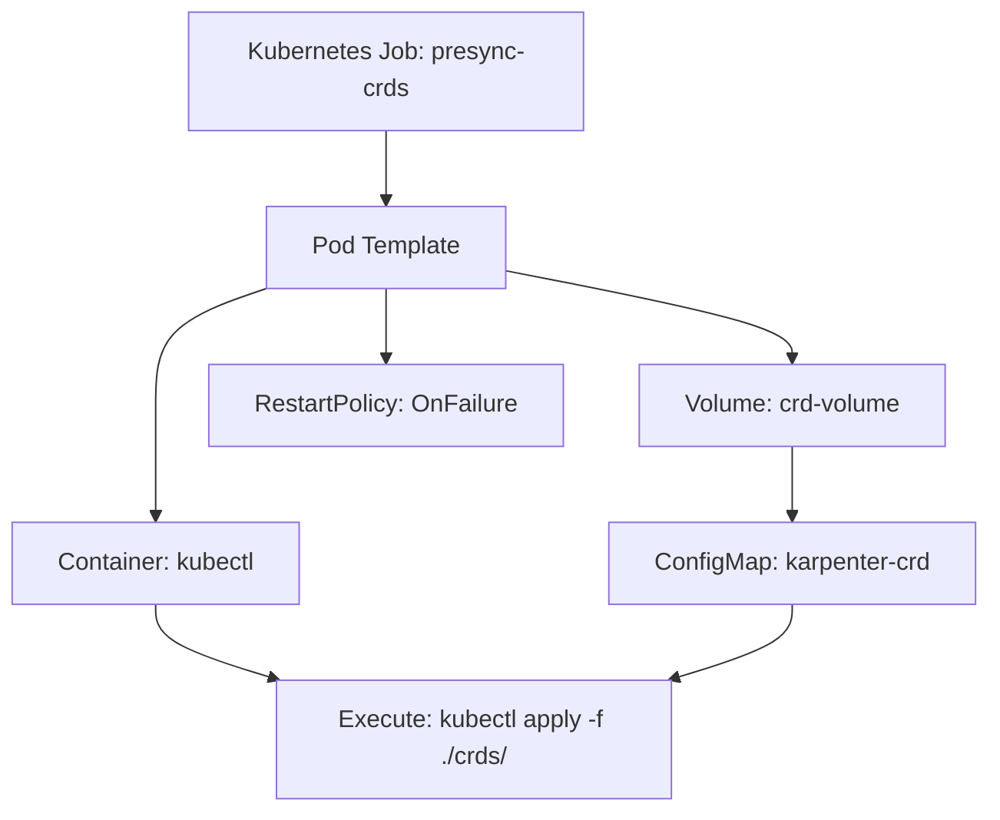
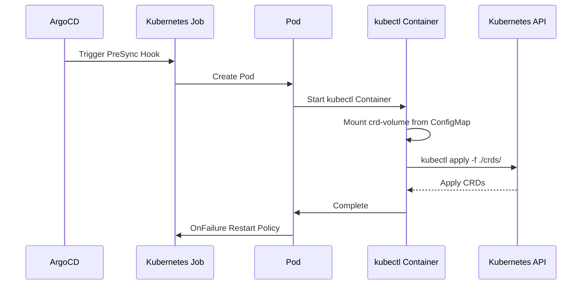
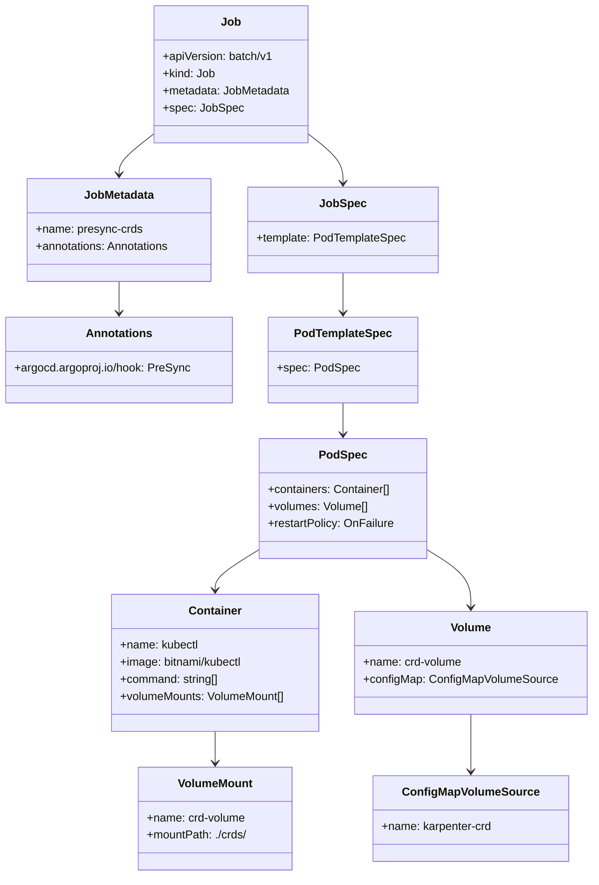

# Diagram: devops/k8s/karpenter/helm/presync.yaml

> Auto-generated by Obscura crawlers

## Diagram 1

### SVG

<svg id="container" width="653.34375" xmlns="http://www.w3.org/2000/svg" class="flowchart" height="534" viewBox="0 0 653.34375 534" role="graphics-document document" aria-roledescription="flowchart-v2"><g><marker id="container_flowchart-v2-pointEnd" class="marker flowchart-v2" viewBox="0 0 10 10" refX="5" refY="5" markerUnits="userSpaceOnUse" markerWidth="8" markerHeight="8" orient="auto"><path d="M 0 0 L 10 5 L 0 10 z" class="arrowMarkerPath" style="stroke-width: 1; stroke-dasharray: 1, 0;"></path></marker><marker id="container_flowchart-v2-pointStart" class="marker flowchart-v2" viewBox="0 0 10 10" refX="4.5" refY="5" markerUnits="userSpaceOnUse" markerWidth="8" markerHeight="8" orient="auto"><path d="M 0 5 L 10 10 L 10 0 z" class="arrowMarkerPath" style="stroke-width: 1; stroke-dasharray: 1, 0;"></path></marker><marker id="container_flowchart-v2-circleEnd" class="marker flowchart-v2" viewBox="0 0 10 10" refX="11" refY="5" markerUnits="userSpaceOnUse" markerWidth="11" markerHeight="11" orient="auto"><circle cx="5" cy="5" r="5" class="arrowMarkerPath" style="stroke-width: 1; stroke-dasharray: 1, 0;"></circle></marker><marker id="container_flowchart-v2-circleStart" class="marker flowchart-v2" viewBox="0 0 10 10" refX="-1" refY="5" markerUnits="userSpaceOnUse" markerWidth="11" markerHeight="11" orient="auto"><circle cx="5" cy="5" r="5" class="arrowMarkerPath" style="stroke-width: 1; stroke-dasharray: 1, 0;"></circle></marker><marker id="container_flowchart-v2-crossEnd" class="marker cross flowchart-v2" viewBox="0 0 11 11" refX="12" refY="5.2" markerUnits="userSpaceOnUse" markerWidth="11" markerHeight="11" orient="auto"><path d="M 1,1 l 9,9 M 10,1 l -9,9" class="arrowMarkerPath" style="stroke-width: 2; stroke-dasharray: 1, 0;"></path></marker><marker id="container_flowchart-v2-crossStart" class="marker cross flowchart-v2" viewBox="0 0 11 11" refX="-1" refY="5.2" markerUnits="userSpaceOnUse" markerWidth="11" markerHeight="11" orient="auto"><path d="M 1,1 l 9,9 M 10,1 l -9,9" class="arrowMarkerPath" style="stroke-width: 2; stroke-dasharray: 1, 0;"></path></marker><g class="root"><g class="clusters"></g><g class="edgePaths"><path d="M255.141,86L255.141,90.167C255.141,94.333,255.141,102.667,255.141,110.333C255.141,118,255.141,125,255.141,128.5L255.141,132" id="L_A_B_0" class="edge-thickness-normal edge-pattern-solid edge-thickness-normal edge-pattern-solid flowchart-link" style=";" data-edge="true" data-et="edge" data-id="L_A_B_0" data-points="W3sieCI6MjU1LjE0MDYyNSwieSI6ODZ9LHsieCI6MjU1LjE0MDYyNSwieSI6MTExfSx7IngiOjI1NS4xNDA2MjUsInkiOjEzNn1d" marker-end="url(#container_flowchart-v2-pointEnd)"></path><path d="M176.749,190L164.651,194.167C152.554,198.333,128.359,206.667,116.262,219.5C104.164,232.333,104.164,249.667,104.164,267C104.164,284.333,104.164,301.667,104.164,313.833C104.164,326,104.164,333,104.164,336.5L104.164,340" id="L_B_C_0" class="edge-thickness-normal edge-pattern-solid edge-thickness-normal edge-pattern-solid flowchart-link" style=";" data-edge="true" data-et="edge" data-id="L_B_C_0" data-points="W3sieCI6MTc2Ljc0ODk0ODMxNzMwNzY4LCJ5IjoxOTB9LHsieCI6MTA0LjE2NDA2MjUsInkiOjIxNX0seyJ4IjoxMDQuMTY0MDYyNSwieSI6MjY3fSx7IngiOjEwNC4xNjQwNjI1LCJ5IjozMTl9LHsieCI6MTA0LjE2NDA2MjUsInkiOjM0NH1d" marker-end="url(#container_flowchart-v2-pointEnd)"></path><path d="M104.164,398L104.164,402.167C104.164,406.333,104.164,414.667,117.183,422.805C130.201,430.944,156.239,438.888,169.258,442.861L182.276,446.833" id="L_C_D_0" class="edge-thickness-normal edge-pattern-solid edge-thickness-normal edge-pattern-solid flowchart-link" style=";" data-edge="true" data-et="edge" data-id="L_C_D_0" data-points="W3sieCI6MTA0LjE2NDA2MjUsInkiOjM5OH0seyJ4IjoxMDQuMTY0MDYyNSwieSI6NDIzfSx7IngiOjE4Ni4xMDIyMzM4ODY3MTg3NSwieSI6NDQ4fV0=" marker-end="url(#container_flowchart-v2-pointEnd)"></path><path d="M334.578,178.382L366.096,184.485C397.615,190.588,460.651,202.794,492.169,212.397C523.688,222,523.688,229,523.688,232.5L523.688,236" id="L_B_E_0" class="edge-thickness-normal edge-pattern-solid edge-thickness-normal edge-pattern-solid flowchart-link" style=";" data-edge="true" data-et="edge" data-id="L_B_E_0" data-points="W3sieCI6MzM0LjU3ODEyNSwieSI6MTc4LjM4MTg1ODM4MTMzNDcyfSx7IngiOjUyMy42ODc1LCJ5IjoyMTV9LHsieCI6NTIzLjY4NzUsInkiOjI0MH1d" marker-end="url(#container_flowchart-v2-pointEnd)"></path><path d="M523.688,294L523.688,298.167C523.688,302.333,523.688,310.667,523.688,318.333C523.688,326,523.688,333,523.688,336.5L523.688,340" id="L_E_F_0" class="edge-thickness-normal edge-pattern-solid edge-thickness-normal edge-pattern-solid flowchart-link" style=";" data-edge="true" data-et="edge" data-id="L_E_F_0" data-points="W3sieCI6NTIzLjY4NzUsInkiOjI5NH0seyJ4Ijo1MjMuNjg3NSwieSI6MzE5fSx7IngiOjUyMy42ODc1LCJ5IjozNDR9XQ==" marker-end="url(#container_flowchart-v2-pointEnd)"></path><path d="M523.688,398L523.688,402.167C523.688,406.333,523.688,414.667,510.669,422.805C497.65,430.944,471.613,438.888,458.594,442.861L445.575,446.833" id="L_F_D_0" class="edge-thickness-normal edge-pattern-solid edge-thickness-normal edge-pattern-solid flowchart-link" style=";" data-edge="true" data-et="edge" data-id="L_F_D_0" data-points="W3sieCI6NTIzLjY4NzUsInkiOjM5OH0seyJ4Ijo1MjMuNjg3NSwieSI6NDIzfSx7IngiOjQ0MS43NDkzMjg2MTMyODEyNSwieSI6NDQ4fV0=" marker-end="url(#container_flowchart-v2-pointEnd)"></path><path d="M255.141,190L255.141,194.167C255.141,198.333,255.141,206.667,255.141,214.333C255.141,222,255.141,229,255.141,232.5L255.141,236" id="L_B_G_0" class="edge-thickness-normal edge-pattern-solid edge-thickness-normal edge-pattern-solid flowchart-link" style=";" data-edge="true" data-et="edge" data-id="L_B_G_0" data-points="W3sieCI6MjU1LjE0MDYyNSwieSI6MTkwfSx7IngiOjI1NS4xNDA2MjUsInkiOjIxNX0seyJ4IjoyNTUuMTQwNjI1LCJ5IjoyNDB9XQ==" marker-end="url(#container_flowchart-v2-pointEnd)"></path></g><g class="edgeLabels"><g class="edgeLabel"><g class="label" data-id="L_A_B_0" transform="translate(0, 0)"><foreignObject width="0" height="0">

</foreignObject></g></g><g class="edgeLabel"><g class="label" data-id="L_B_C_0" transform="translate(0, 0)"><foreignObject width="0" height="0">

</foreignObject></g></g><g class="edgeLabel"><g class="label" data-id="L_C_D_0" transform="translate(0, 0)"><foreignObject width="0" height="0">

</foreignObject></g></g><g class="edgeLabel"><g class="label" data-id="L_B_E_0" transform="translate(0, 0)"><foreignObject width="0" height="0">

</foreignObject></g></g><g class="edgeLabel"><g class="label" data-id="L_E_F_0" transform="translate(0, 0)"><foreignObject width="0" height="0">

</foreignObject></g></g><g class="edgeLabel"><g class="label" data-id="L_F_D_0" transform="translate(0, 0)"><foreignObject width="0" height="0">

</foreignObject></g></g><g class="edgeLabel"><g class="label" data-id="L_B_G_0" transform="translate(0, 0)"><foreignObject width="0" height="0">

</foreignObject></g></g></g><g class="nodes"><g class="node default" id="flowchart-A-0" transform="translate(255.140625, 47)"><rect class="basic label-container" style="" x="-130" y="-39" width="260" height="78"></rect><g class="label" style="" transform="translate(-100, -24)"><rect></rect><foreignObject width="200" height="48">

Kubernetes Job: presync-crds

</foreignObject></g></g><g class="node default" id="flowchart-B-1" transform="translate(255.140625, 163)"><rect class="basic label-container" style="" x="-79.4375" y="-27" width="158.875" height="54"></rect><g class="label" style="" transform="translate(-49.4375, -12)"><rect></rect><foreignObject width="98.875" height="24">

Pod Template

</foreignObject></g></g><g class="node default" id="flowchart-C-3" transform="translate(104.1640625, 371)"><rect class="basic label-container" style="" x="-96.1640625" y="-27" width="192.328125" height="54"></rect><g class="label" style="" transform="translate(-66.1640625, -12)"><rect></rect><foreignObject width="132.328125" height="24">

Container: kubectl

</foreignObject></g></g><g class="node default" id="flowchart-D-5" transform="translate(313.92578125, 487)"><rect class="basic label-container" style="" x="-130" y="-39" width="260" height="78"></rect><g class="label" style="" transform="translate(-100, -24)"><rect></rect><foreignObject width="200" height="48">

Execute: kubectl apply -f ./crds/

</foreignObject></g></g><g class="node default" id="flowchart-E-7" transform="translate(523.6875, 267)"><rect class="basic label-container" style="" x="-102.5703125" y="-27" width="205.140625" height="54"></rect><g class="label" style="" transform="translate(-72.5703125, -12)"><rect></rect><foreignObject width="145.140625" height="24">

Volume: crd-volume

</foreignObject></g></g><g class="node default" id="flowchart-F-9" transform="translate(523.6875, 371)"><rect class="basic label-container" style="" x="-121.65625" y="-27" width="243.3125" height="54"></rect><g class="label" style="" transform="translate(-91.65625, -12)"><rect></rect><foreignObject width="183.3125" height="24">

ConfigMap: karpenter-crd

</foreignObject></g></g><g class="node default" id="flowchart-G-13" transform="translate(255.140625, 267)"><rect class="basic label-container" style="" x="-115.9765625" y="-27" width="231.953125" height="54"></rect><g class="label" style="" transform="translate(-85.9765625, -12)"><rect></rect><foreignObject width="171.953125" height="24">

RestartPolicy: OnFailure

</foreignObject></g></g></g></g></g></svg>

## Diagram 2

### SVG

<svg id="container" width="1192" xmlns="http://www.w3.org/2000/svg" height="585" viewBox="-50 -10 1192 585" role="graphics-document document" aria-roledescription="sequence"><g><rect x="942" y="499" fill="#eaeaea" stroke="#666" width="150" height="65" name="K8s" rx="3" ry="3" class="actor actor-bottom"></rect><text x="1017" y="531.5" dominant-baseline="central" alignment-baseline="central" class="actor actor-box" style="text-anchor: middle; font-size: 16px; font-weight: 400;"><tspan x="1017" dy="0">Kubernetes API</tspan></text></g><g><rect x="704" y="499" fill="#eaeaea" stroke="#666" width="150" height="65" name="Container" rx="3" ry="3" class="actor actor-bottom"></rect><text x="779" y="531.5" dominant-baseline="central" alignment-baseline="central" class="actor actor-box" style="text-anchor: middle; font-size: 16px; font-weight: 400;"><tspan x="779" dy="0">kubectl Container</tspan></text></g><g><rect x="466" y="499" fill="#eaeaea" stroke="#666" width="150" height="65" name="Pod" rx="3" ry="3" class="actor actor-bottom"></rect><text x="541" y="531.5" dominant-baseline="central" alignment-baseline="central" class="actor actor-box" style="text-anchor: middle; font-size: 16px; font-weight: 400;"><tspan x="541" dy="0">Pod</tspan></text></g><g><rect x="224" y="499" fill="#eaeaea" stroke="#666" width="150" height="65" name="Job" rx="3" ry="3" class="actor actor-bottom"></rect><text x="299" y="531.5" dominant-baseline="central" alignment-baseline="central" class="actor actor-box" style="text-anchor: middle; font-size: 16px; font-weight: 400;"><tspan x="299" dy="0">Kubernetes Job</tspan></text></g><g><rect x="0" y="499" fill="#eaeaea" stroke="#666" width="150" height="65" name="ArgoCD" rx="3" ry="3" class="actor actor-bottom"></rect><text x="75" y="531.5" dominant-baseline="central" alignment-baseline="central" class="actor actor-box" style="text-anchor: middle; font-size: 16px; font-weight: 400;"><tspan x="75" dy="0">ArgoCD</tspan></text></g><g><line id="actor4" x1="1017" y1="65" x2="1017" y2="499" class="actor-line 200" stroke-width="0.5px" stroke="#999" name="K8s"></line><g id="root-4"><rect x="942" y="0" fill="#eaeaea" stroke="#666" width="150" height="65" name="K8s" rx="3" ry="3" class="actor actor-top"></rect><text x="1017" y="32.5" dominant-baseline="central" alignment-baseline="central" class="actor actor-box" style="text-anchor: middle; font-size: 16px; font-weight: 400;"><tspan x="1017" dy="0">Kubernetes API</tspan></text></g></g><g><line id="actor3" x1="779" y1="65" x2="779" y2="499" class="actor-line 200" stroke-width="0.5px" stroke="#999" name="Container"></line><g id="root-3"><rect x="704" y="0" fill="#eaeaea" stroke="#666" width="150" height="65" name="Container" rx="3" ry="3" class="actor actor-top"></rect><text x="779" y="32.5" dominant-baseline="central" alignment-baseline="central" class="actor actor-box" style="text-anchor: middle; font-size: 16px; font-weight: 400;"><tspan x="779" dy="0">kubectl Container</tspan></text></g></g><g><line id="actor2" x1="541" y1="65" x2="541" y2="499" class="actor-line 200" stroke-width="0.5px" stroke="#999" name="Pod"></line><g id="root-2"><rect x="466" y="0" fill="#eaeaea" stroke="#666" width="150" height="65" name="Pod" rx="3" ry="3" class="actor actor-top"></rect><text x="541" y="32.5" dominant-baseline="central" alignment-baseline="central" class="actor actor-box" style="text-anchor: middle; font-size: 16px; font-weight: 400;"><tspan x="541" dy="0">Pod</tspan></text></g></g><g><line id="actor1" x1="299" y1="65" x2="299" y2="499" class="actor-line 200" stroke-width="0.5px" stroke="#999" name="Job"></line><g id="root-1"><rect x="224" y="0" fill="#eaeaea" stroke="#666" width="150" height="65" name="Job" rx="3" ry="3" class="actor actor-top"></rect><text x="299" y="32.5" dominant-baseline="central" alignment-baseline="central" class="actor actor-box" style="text-anchor: middle; font-size: 16px; font-weight: 400;"><tspan x="299" dy="0">Kubernetes Job</tspan></text></g></g><g><line id="actor0" x1="75" y1="65" x2="75" y2="499" class="actor-line 200" stroke-width="0.5px" stroke="#999" name="ArgoCD"></line><g id="root-0"><rect x="0" y="0" fill="#eaeaea" stroke="#666" width="150" height="65" name="ArgoCD" rx="3" ry="3" class="actor actor-top"></rect><text x="75" y="32.5" dominant-baseline="central" alignment-baseline="central" class="actor actor-box" style="text-anchor: middle; font-size: 16px; font-weight: 400;"><tspan x="75" dy="0">ArgoCD</tspan></text></g></g><g></g><defs><symbol id="computer" width="24" height="24"><path transform="scale(.5)" d="M2 2v13h20v-13h-20zm18 11h-16v-9h16v9zm-10.228 6l.466-1h3.524l.467 1h-4.457zm14.228 3h-24l2-6h2.104l-1.33 4h18.45l-1.297-4h2.073l2 6zm-5-10h-14v-7h14v7z"></path></symbol></defs><defs><symbol id="database" fill-rule="evenodd" clip-rule="evenodd"><path transform="scale(.5)" d="M12.258.001l.256.004.255.005.253.008.251.01.249.012.247.015.246.016.242.019.241.02.239.023.236.024.233.027.231.028.229.031.225.032.223.034.22.036.217.038.214.04.211.041.208.043.205.045.201.046.198.048.194.05.191.051.187.053.183.054.18.056.175.057.172.059.168.06.163.061.16.063.155.064.15.066.074.033.073.033.071.034.07.034.069.035.068.035.067.035.066.035.064.036.064.036.062.036.06.036.06.037.058.037.058.037.055.038.055.038.053.038.052.038.051.039.05.039.048.039.047.039.045.04.044.04.043.04.041.04.04.041.039.041.037.041.036.041.034.041.033.042.032.042.03.042.029.042.027.042.026.043.024.043.023.043.021.043.02.043.018.044.017.043.015.044.013.044.012.044.011.045.009.044.007.045.006.045.004.045.002.045.001.045v17l-.001.045-.002.045-.004.045-.006.045-.007.045-.009.044-.011.045-.012.044-.013.044-.015.044-.017.043-.018.044-.02.043-.021.043-.023.043-.024.043-.026.043-.027.042-.029.042-.03.042-.032.042-.033.042-.034.041-.036.041-.037.041-.039.041-.04.041-.041.04-.043.04-.044.04-.045.04-.047.039-.048.039-.05.039-.051.039-.052.038-.053.038-.055.038-.055.038-.058.037-.058.037-.06.037-.06.036-.062.036-.064.036-.064.036-.066.035-.067.035-.068.035-.069.035-.07.034-.071.034-.073.033-.074.033-.15.066-.155.064-.16.063-.163.061-.168.06-.172.059-.175.057-.18.056-.183.054-.187.053-.191.051-.194.05-.198.048-.201.046-.205.045-.208.043-.211.041-.214.04-.217.038-.22.036-.223.034-.225.032-.229.031-.231.028-.233.027-.236.024-.239.023-.241.02-.242.019-.246.016-.247.015-.249.012-.251.01-.253.008-.255.005-.256.004-.258.001-.258-.001-.256-.004-.255-.005-.253-.008-.251-.01-.249-.012-.247-.015-.245-.016-.243-.019-.241-.02-.238-.023-.236-.024-.234-.027-.231-.028-.228-.031-.226-.032-.223-.034-.22-.036-.217-.038-.214-.04-.211-.041-.208-.043-.204-.045-.201-.046-.198-.048-.195-.05-.19-.051-.187-.053-.184-.054-.179-.056-.176-.057-.172-.059-.167-.06-.164-.061-.159-.063-.155-.064-.151-.066-.074-.033-.072-.033-.072-.034-.07-.034-.069-.035-.068-.035-.067-.035-.066-.035-.064-.036-.063-.036-.062-.036-.061-.036-.06-.037-.058-.037-.057-.037-.056-.038-.055-.038-.053-.038-.052-.038-.051-.039-.049-.039-.049-.039-.046-.039-.046-.04-.044-.04-.043-.04-.041-.04-.04-.041-.039-.041-.037-.041-.036-.041-.034-.041-.033-.042-.032-.042-.03-.042-.029-.042-.027-.042-.026-.043-.024-.043-.023-.043-.021-.043-.02-.043-.018-.044-.017-.043-.015-.044-.013-.044-.012-.044-.011-.045-.009-.044-.007-.045-.006-.045-.004-.045-.002-.045-.001-.045v-17l.001-.045.002-.045.004-.045.006-.045.007-.045.009-.044.011-.045.012-.044.013-.044.015-.044.017-.043.018-.044.02-.043.021-.043.023-.043.024-.043.026-.043.027-.042.029-.042.03-.042.032-.042.033-.042.034-.041.036-.041.037-.041.039-.041.04-.041.041-.04.043-.04.044-.04.046-.04.046-.039.049-.039.049-.039.051-.039.052-.038.053-.038.055-.038.056-.038.057-.037.058-.037.06-.037.061-.036.062-.036.063-.036.064-.036.066-.035.067-.035.068-.035.069-.035.07-.034.072-.034.072-.033.074-.033.151-.066.155-.064.159-.063.164-.061.167-.06.172-.059.176-.057.179-.056.184-.054.187-.053.19-.051.195-.05.198-.048.201-.046.204-.045.208-.043.211-.041.214-.04.217-.038.22-.036.223-.034.226-.032.228-.031.231-.028.234-.027.236-.024.238-.023.241-.02.243-.019.245-.016.247-.015.249-.012.251-.01.253-.008.255-.005.256-.004.258-.001.258.001zm-9.258 20.499v.01l.001.021.003.021.004.022.005.021.006.022.007.022.009.023.01.022.011.023.012.023.013.023.015.023.016.024.017.023.018.024.019.024.021.024.022.025.023.024.024.025.052.049.056.05.061.051.066.051.07.051.075.051.079.052.084.052.088.052.092.052.097.052.102.051.105.052.11.052.114.051.119.051.123.051.127.05.131.05.135.05.139.048.144.049.147.047.152.047.155.047.16.045.163.045.167.043.171.043.176.041.178.041.183.039.187.039.19.037.194.035.197.035.202.033.204.031.209.03.212.029.216.027.219.025.222.024.226.021.23.02.233.018.236.016.24.015.243.012.246.01.249.008.253.005.256.004.259.001.26-.001.257-.004.254-.005.25-.008.247-.011.244-.012.241-.014.237-.016.233-.018.231-.021.226-.021.224-.024.22-.026.216-.027.212-.028.21-.031.205-.031.202-.034.198-.034.194-.036.191-.037.187-.039.183-.04.179-.04.175-.042.172-.043.168-.044.163-.045.16-.046.155-.046.152-.047.148-.048.143-.049.139-.049.136-.05.131-.05.126-.05.123-.051.118-.052.114-.051.11-.052.106-.052.101-.052.096-.052.092-.052.088-.053.083-.051.079-.052.074-.052.07-.051.065-.051.06-.051.056-.05.051-.05.023-.024.023-.025.021-.024.02-.024.019-.024.018-.024.017-.024.015-.023.014-.024.013-.023.012-.023.01-.023.01-.022.008-.022.006-.022.006-.022.004-.022.004-.021.001-.021.001-.021v-4.127l-.077.055-.08.053-.083.054-.085.053-.087.052-.09.052-.093.051-.095.05-.097.05-.1.049-.102.049-.105.048-.106.047-.109.047-.111.046-.114.045-.115.045-.118.044-.12.043-.122.042-.124.042-.126.041-.128.04-.13.04-.132.038-.134.038-.135.037-.138.037-.139.035-.142.035-.143.034-.144.033-.147.032-.148.031-.15.03-.151.03-.153.029-.154.027-.156.027-.158.026-.159.025-.161.024-.162.023-.163.022-.165.021-.166.02-.167.019-.169.018-.169.017-.171.016-.173.015-.173.014-.175.013-.175.012-.177.011-.178.01-.179.008-.179.008-.181.006-.182.005-.182.004-.184.003-.184.002h-.37l-.184-.002-.184-.003-.182-.004-.182-.005-.181-.006-.179-.008-.179-.008-.178-.01-.176-.011-.176-.012-.175-.013-.173-.014-.172-.015-.171-.016-.17-.017-.169-.018-.167-.019-.166-.02-.165-.021-.163-.022-.162-.023-.161-.024-.159-.025-.157-.026-.156-.027-.155-.027-.153-.029-.151-.03-.15-.03-.148-.031-.146-.032-.145-.033-.143-.034-.141-.035-.14-.035-.137-.037-.136-.037-.134-.038-.132-.038-.13-.04-.128-.04-.126-.041-.124-.042-.122-.042-.12-.044-.117-.043-.116-.045-.113-.045-.112-.046-.109-.047-.106-.047-.105-.048-.102-.049-.1-.049-.097-.05-.095-.05-.093-.052-.09-.051-.087-.052-.085-.053-.083-.054-.08-.054-.077-.054v4.127zm0-5.654v.011l.001.021.003.021.004.021.005.022.006.022.007.022.009.022.01.022.011.023.012.023.013.023.015.024.016.023.017.024.018.024.019.024.021.024.022.024.023.025.024.024.052.05.056.05.061.05.066.051.07.051.075.052.079.051.084.052.088.052.092.052.097.052.102.052.105.052.11.051.114.051.119.052.123.05.127.051.131.05.135.049.139.049.144.048.147.048.152.047.155.046.16.045.163.045.167.044.171.042.176.042.178.04.183.04.187.038.19.037.194.036.197.034.202.033.204.032.209.03.212.028.216.027.219.025.222.024.226.022.23.02.233.018.236.016.24.014.243.012.246.01.249.008.253.006.256.003.259.001.26-.001.257-.003.254-.006.25-.008.247-.01.244-.012.241-.015.237-.016.233-.018.231-.02.226-.022.224-.024.22-.025.216-.027.212-.029.21-.03.205-.032.202-.033.198-.035.194-.036.191-.037.187-.039.183-.039.179-.041.175-.042.172-.043.168-.044.163-.045.16-.045.155-.047.152-.047.148-.048.143-.048.139-.05.136-.049.131-.05.126-.051.123-.051.118-.051.114-.052.11-.052.106-.052.101-.052.096-.052.092-.052.088-.052.083-.052.079-.052.074-.051.07-.052.065-.051.06-.05.056-.051.051-.049.023-.025.023-.024.021-.025.02-.024.019-.024.018-.024.017-.024.015-.023.014-.023.013-.024.012-.022.01-.023.01-.023.008-.022.006-.022.006-.022.004-.021.004-.022.001-.021.001-.021v-4.139l-.077.054-.08.054-.083.054-.085.052-.087.053-.09.051-.093.051-.095.051-.097.05-.1.049-.102.049-.105.048-.106.047-.109.047-.111.046-.114.045-.115.044-.118.044-.12.044-.122.042-.124.042-.126.041-.128.04-.13.039-.132.039-.134.038-.135.037-.138.036-.139.036-.142.035-.143.033-.144.033-.147.033-.148.031-.15.03-.151.03-.153.028-.154.028-.156.027-.158.026-.159.025-.161.024-.162.023-.163.022-.165.021-.166.02-.167.019-.169.018-.169.017-.171.016-.173.015-.173.014-.175.013-.175.012-.177.011-.178.009-.179.009-.179.007-.181.007-.182.005-.182.004-.184.003-.184.002h-.37l-.184-.002-.184-.003-.182-.004-.182-.005-.181-.007-.179-.007-.179-.009-.178-.009-.176-.011-.176-.012-.175-.013-.173-.014-.172-.015-.171-.016-.17-.017-.169-.018-.167-.019-.166-.02-.165-.021-.163-.022-.162-.023-.161-.024-.159-.025-.157-.026-.156-.027-.155-.028-.153-.028-.151-.03-.15-.03-.148-.031-.146-.033-.145-.033-.143-.033-.141-.035-.14-.036-.137-.036-.136-.037-.134-.038-.132-.039-.13-.039-.128-.04-.126-.041-.124-.042-.122-.043-.12-.043-.117-.044-.116-.044-.113-.046-.112-.046-.109-.046-.106-.047-.105-.048-.102-.049-.1-.049-.097-.05-.095-.051-.093-.051-.09-.051-.087-.053-.085-.052-.083-.054-.08-.054-.077-.054v4.139zm0-5.666v.011l.001.02.003.022.004.021.005.022.006.021.007.022.009.023.01.022.011.023.012.023.013.023.015.023.016.024.017.024.018.023.019.024.021.025.022.024.023.024.024.025.052.05.056.05.061.05.066.051.07.051.075.052.079.051.084.052.088.052.092.052.097.052.102.052.105.051.11.052.114.051.119.051.123.051.127.05.131.05.135.05.139.049.144.048.147.048.152.047.155.046.16.045.163.045.167.043.171.043.176.042.178.04.183.04.187.038.19.037.194.036.197.034.202.033.204.032.209.03.212.028.216.027.219.025.222.024.226.021.23.02.233.018.236.017.24.014.243.012.246.01.249.008.253.006.256.003.259.001.26-.001.257-.003.254-.006.25-.008.247-.01.244-.013.241-.014.237-.016.233-.018.231-.02.226-.022.224-.024.22-.025.216-.027.212-.029.21-.03.205-.032.202-.033.198-.035.194-.036.191-.037.187-.039.183-.039.179-.041.175-.042.172-.043.168-.044.163-.045.16-.045.155-.047.152-.047.148-.048.143-.049.139-.049.136-.049.131-.051.126-.05.123-.051.118-.052.114-.051.11-.052.106-.052.101-.052.096-.052.092-.052.088-.052.083-.052.079-.052.074-.052.07-.051.065-.051.06-.051.056-.05.051-.049.023-.025.023-.025.021-.024.02-.024.019-.024.018-.024.017-.024.015-.023.014-.024.013-.023.012-.023.01-.022.01-.023.008-.022.006-.022.006-.022.004-.022.004-.021.001-.021.001-.021v-4.153l-.077.054-.08.054-.083.053-.085.053-.087.053-.09.051-.093.051-.095.051-.097.05-.1.049-.102.048-.105.048-.106.048-.109.046-.111.046-.114.046-.115.044-.118.044-.12.043-.122.043-.124.042-.126.041-.128.04-.13.039-.132.039-.134.038-.135.037-.138.036-.139.036-.142.034-.143.034-.144.033-.147.032-.148.032-.15.03-.151.03-.153.028-.154.028-.156.027-.158.026-.159.024-.161.024-.162.023-.163.023-.165.021-.166.02-.167.019-.169.018-.169.017-.171.016-.173.015-.173.014-.175.013-.175.012-.177.01-.178.01-.179.009-.179.007-.181.006-.182.006-.182.004-.184.003-.184.001-.185.001-.185-.001-.184-.001-.184-.003-.182-.004-.182-.006-.181-.006-.179-.007-.179-.009-.178-.01-.176-.01-.176-.012-.175-.013-.173-.014-.172-.015-.171-.016-.17-.017-.169-.018-.167-.019-.166-.02-.165-.021-.163-.023-.162-.023-.161-.024-.159-.024-.157-.026-.156-.027-.155-.028-.153-.028-.151-.03-.15-.03-.148-.032-.146-.032-.145-.033-.143-.034-.141-.034-.14-.036-.137-.036-.136-.037-.134-.038-.132-.039-.13-.039-.128-.041-.126-.041-.124-.041-.122-.043-.12-.043-.117-.044-.116-.044-.113-.046-.112-.046-.109-.046-.106-.048-.105-.048-.102-.048-.1-.05-.097-.049-.095-.051-.093-.051-.09-.052-.087-.052-.085-.053-.083-.053-.08-.054-.077-.054v4.153zm8.74-8.179l-.257.004-.254.005-.25.008-.247.011-.244.012-.241.014-.237.016-.233.018-.231.021-.226.022-.224.023-.22.026-.216.027-.212.028-.21.031-.205.032-.202.033-.198.034-.194.036-.191.038-.187.038-.183.04-.179.041-.175.042-.172.043-.168.043-.163.045-.16.046-.155.046-.152.048-.148.048-.143.048-.139.049-.136.05-.131.05-.126.051-.123.051-.118.051-.114.052-.11.052-.106.052-.101.052-.096.052-.092.052-.088.052-.083.052-.079.052-.074.051-.07.052-.065.051-.06.05-.056.05-.051.05-.023.025-.023.024-.021.024-.02.025-.019.024-.018.024-.017.023-.015.024-.014.023-.013.023-.012.023-.01.023-.01.022-.008.022-.006.023-.006.021-.004.022-.004.021-.001.021-.001.021.001.021.001.021.004.021.004.022.006.021.006.023.008.022.01.022.01.023.012.023.013.023.014.023.015.024.017.023.018.024.019.024.02.025.021.024.023.024.023.025.051.05.056.05.06.05.065.051.07.052.074.051.079.052.083.052.088.052.092.052.096.052.101.052.106.052.11.052.114.052.118.051.123.051.126.051.131.05.136.05.139.049.143.048.148.048.152.048.155.046.16.046.163.045.168.043.172.043.175.042.179.041.183.04.187.038.191.038.194.036.198.034.202.033.205.032.21.031.212.028.216.027.22.026.224.023.226.022.231.021.233.018.237.016.241.014.244.012.247.011.25.008.254.005.257.004.26.001.26-.001.257-.004.254-.005.25-.008.247-.011.244-.012.241-.014.237-.016.233-.018.231-.021.226-.022.224-.023.22-.026.216-.027.212-.028.21-.031.205-.032.202-.033.198-.034.194-.036.191-.038.187-.038.183-.04.179-.041.175-.042.172-.043.168-.043.163-.045.16-.046.155-.046.152-.048.148-.048.143-.048.139-.049.136-.05.131-.05.126-.051.123-.051.118-.051.114-.052.11-.052.106-.052.101-.052.096-.052.092-.052.088-.052.083-.052.079-.052.074-.051.07-.052.065-.051.06-.05.056-.05.051-.05.023-.025.023-.024.021-.024.02-.025.019-.024.018-.024.017-.023.015-.024.014-.023.013-.023.012-.023.01-.023.01-.022.008-.022.006-.023.006-.021.004-.022.004-.021.001-.021.001-.021-.001-.021-.001-.021-.004-.021-.004-.022-.006-.021-.006-.023-.008-.022-.01-.022-.01-.023-.012-.023-.013-.023-.014-.023-.015-.024-.017-.023-.018-.024-.019-.024-.02-.025-.021-.024-.023-.024-.023-.025-.051-.05-.056-.05-.06-.05-.065-.051-.07-.052-.074-.051-.079-.052-.083-.052-.088-.052-.092-.052-.096-.052-.101-.052-.106-.052-.11-.052-.114-.052-.118-.051-.123-.051-.126-.051-.131-.05-.136-.05-.139-.049-.143-.048-.148-.048-.152-.048-.155-.046-.16-.046-.163-.045-.168-.043-.172-.043-.175-.042-.179-.041-.183-.04-.187-.038-.191-.038-.194-.036-.198-.034-.202-.033-.205-.032-.21-.031-.212-.028-.216-.027-.22-.026-.224-.023-.226-.022-.231-.021-.233-.018-.237-.016-.241-.014-.244-.012-.247-.011-.25-.008-.254-.005-.257-.004-.26-.001-.26.001z"></path></symbol></defs><defs><symbol id="clock" width="24" height="24"><path transform="scale(.5)" d="M12 2c5.514 0 10 4.486 10 10s-4.486 10-10 10-10-4.486-10-10 4.486-10 10-10zm0-2c-6.627 0-12 5.373-12 12s5.373 12 12 12 12-5.373 12-12-5.373-12-12-12zm5.848 12.459c.202.038.202.333.001.372-1.907.361-6.045 1.111-6.547 1.111-.719 0-1.301-.582-1.301-1.301 0-.512.77-5.447 1.125-7.445.034-.192.312-.181.343.014l.985 6.238 5.394 1.011z"></path></symbol></defs><defs><marker id="arrowhead" refX="7.9" refY="5" markerUnits="userSpaceOnUse" markerWidth="12" markerHeight="12" orient="auto-start-reverse"><path d="M -1 0 L 10 5 L 0 10 z"></path></marker></defs><defs><marker id="crosshead" markerWidth="15" markerHeight="8" orient="auto" refX="4" refY="4.5"><path fill="none" stroke="#000000" stroke-width="1pt" d="M 1,2 L 6,7 M 6,2 L 1,7" style="stroke-dasharray: 0, 0;"></path></marker></defs><defs><marker id="filled-head" refX="15.5" refY="7" markerWidth="20" markerHeight="28" orient="auto"><path d="M 18,7 L9,13 L14,7 L9,1 Z"></path></marker></defs><defs><marker id="sequencenumber" refX="15" refY="15" markerWidth="60" markerHeight="40" orient="auto"><circle cx="15" cy="15" r="6"></circle></marker></defs><text x="186" y="80" text-anchor="middle" dominant-baseline="middle" alignment-baseline="middle" class="messageText" dy="1em" style="font-size: 16px; font-weight: 400;">Trigger PreSync Hook</text><line x1="76" y1="113" x2="295" y2="113" class="messageLine0" stroke-width="2" stroke="none" marker-end="url(#arrowhead)" style="fill: none;"></line><text x="419" y="128" text-anchor="middle" dominant-baseline="middle" alignment-baseline="middle" class="messageText" dy="1em" style="font-size: 16px; font-weight: 400;">Create Pod</text><line x1="300" y1="161" x2="537" y2="161" class="messageLine0" stroke-width="2" stroke="none" marker-end="url(#arrowhead)" style="fill: none;"></line><text x="659" y="176" text-anchor="middle" dominant-baseline="middle" alignment-baseline="middle" class="messageText" dy="1em" style="font-size: 16px; font-weight: 400;">Start kubectl Container</text><line x1="542" y1="209" x2="775" y2="209" class="messageLine0" stroke-width="2" stroke="none" marker-end="url(#arrowhead)" style="fill: none;"></line><text x="780" y="224" text-anchor="middle" dominant-baseline="middle" alignment-baseline="middle" class="messageText" dy="1em" style="font-size: 16px; font-weight: 400;">Mount crd-volume from ConfigMap</text><path d="M 780,257 C 840,247 840,287 780,277" class="messageLine0" stroke-width="2" stroke="none" marker-end="url(#arrowhead)" style="fill: none;"></path><text x="897" y="302" text-anchor="middle" dominant-baseline="middle" alignment-baseline="middle" class="messageText" dy="1em" style="font-size: 16px; font-weight: 400;">kubectl apply -f ./crds/</text><line x1="780" y1="335" x2="1013" y2="335" class="messageLine0" stroke-width="2" stroke="none" marker-end="url(#arrowhead)" style="fill: none;"></line><text x="900" y="350" text-anchor="middle" dominant-baseline="middle" alignment-baseline="middle" class="messageText" dy="1em" style="font-size: 16px; font-weight: 400;">Apply CRDs</text><line x1="1016" y1="383" x2="783" y2="383" class="messageLine1" stroke-width="2" stroke="none" marker-end="url(#arrowhead)" style="stroke-dasharray: 3, 3; fill: none;"></line><text x="662" y="398" text-anchor="middle" dominant-baseline="middle" alignment-baseline="middle" class="messageText" dy="1em" style="font-size: 16px; font-weight: 400;">Complete</text><line x1="778" y1="431" x2="545" y2="431" class="messageLine0" stroke-width="2" stroke="none" marker-end="url(#arrowhead)" style="fill: none;"></line><text x="422" y="446" text-anchor="middle" dominant-baseline="middle" alignment-baseline="middle" class="messageText" dy="1em" style="font-size: 16px; font-weight: 400;">OnFailure Restart Policy</text><line x1="540" y1="479" x2="303" y2="479" class="messageLine0" stroke-width="2" stroke="none" marker-end="url(#arrowhead)" style="fill: none;"></line></svg>

## Diagram 3

### SVG

<svg id="container" width="826.41796875" xmlns="http://www.w3.org/2000/svg" class="classDiagram" height="1226" viewBox="0 0 826.41796875 1226" role="graphics-document document" aria-roledescription="class"><g><defs><marker id="container_class-aggregationStart" class="marker aggregation class" refX="18" refY="7" markerWidth="190" markerHeight="240" orient="auto"><path d="M 18,7 L9,13 L1,7 L9,1 Z"></path></marker></defs><defs><marker id="container_class-aggregationEnd" class="marker aggregation class" refX="1" refY="7" markerWidth="20" markerHeight="28" orient="auto"><path d="M 18,7 L9,13 L1,7 L9,1 Z"></path></marker></defs><defs><marker id="container_class-extensionStart" class="marker extension class" refX="18" refY="7" markerWidth="190" markerHeight="240" orient="auto"><path d="M 1,7 L18,13 V 1 Z"></path></marker></defs><defs><marker id="container_class-extensionEnd" class="marker extension class" refX="1" refY="7" markerWidth="20" markerHeight="28" orient="auto"><path d="M 1,1 V 13 L18,7 Z"></path></marker></defs><defs><marker id="container_class-compositionStart" class="marker composition class" refX="18" refY="7" markerWidth="190" markerHeight="240" orient="auto"><path d="M 18,7 L9,13 L1,7 L9,1 Z"></path></marker></defs><defs><marker id="container_class-compositionEnd" class="marker composition class" refX="1" refY="7" markerWidth="20" markerHeight="28" orient="auto"><path d="M 18,7 L9,13 L1,7 L9,1 Z"></path></marker></defs><defs><marker id="container_class-dependencyStart" class="marker dependency class" refX="6" refY="7" markerWidth="190" markerHeight="240" orient="auto"><path d="M 5,7 L9,13 L1,7 L9,1 Z"></path></marker></defs><defs><marker id="container_class-dependencyEnd" class="marker dependency class" refX="13" refY="7" markerWidth="20" markerHeight="28" orient="auto"><path d="M 18,7 L9,13 L14,7 L9,1 Z"></path></marker></defs><defs><marker id="container_class-lollipopStart" class="marker lollipop class" refX="13" refY="7" markerWidth="190" markerHeight="240" orient="auto"><circle stroke="black" fill="transparent" cx="7" cy="7" r="6"></circle></marker></defs><defs><marker id="container_class-lollipopEnd" class="marker lollipop class" refX="1" refY="7" markerWidth="190" markerHeight="240" orient="auto"><circle stroke="black" fill="transparent" cx="7" cy="7" r="6"></circle></marker></defs><g class="root"><g class="clusters"></g><g class="edgePaths"><path d="M216.498,186.492L208.196,192.91C199.895,199.328,183.291,212.164,174.989,221.749C166.688,231.333,166.688,237.667,166.688,240.833L166.688,244" id="id_Job_JobMetadata_1" class="edge-thickness-normal edge-pattern-solid relation" style=";;;" data-edge="true" data-et="edge" data-id="id_Job_JobMetadata_1" data-points="W3sieCI6MjE2LjQ5ODA0Njg3NSwieSI6MTg2LjQ5MTY5NTI2NDI0MTZ9LHsieCI6MTY2LjY4NzUsInkiOjIyNX0seyJ4IjoxNjYuNjg3NSwieSI6MjUwfV0=" marker-end="url(#container_class-dependencyEnd)"></path><path d="M429.904,186.492L438.206,192.91C446.508,199.328,463.111,212.164,471.413,223.749C479.715,235.333,479.715,245.667,479.715,250.833L479.715,256" id="id_Job_JobSpec_2" class="edge-thickness-normal edge-pattern-solid relation" style=";;;" data-edge="true" data-et="edge" data-id="id_Job_JobSpec_2" data-points="W3sieCI6NDI5LjkwNDI5Njg3NSwieSI6MTg2LjQ5MTY5NTI2NDI0MTZ9LHsieCI6NDc5LjcxNDg0Mzc1LCJ5IjoyMjV9LHsieCI6NDc5LjcxNDg0Mzc1LCJ5IjoyNjJ9XQ==" marker-end="url(#container_class-dependencyEnd)"></path><path d="M166.688,394L166.688,398.167C166.688,402.333,166.688,410.667,166.688,418C166.688,425.333,166.688,431.667,166.688,434.833L166.688,438" id="id_JobMetadata_Annotations_3" class="edge-thickness-normal edge-pattern-solid relation" style=";;;" data-edge="true" data-et="edge" data-id="id_JobMetadata_Annotations_3" data-points="W3sieCI6MTY2LjY4NzUsInkiOjM5NH0seyJ4IjoxNjYuNjg3NSwieSI6NDE5fSx7IngiOjE2Ni42ODc1LCJ5Ijo0NDR9XQ==" marker-end="url(#container_class-dependencyEnd)"></path><path d="M479.715,382L479.715,388.167C479.715,394.333,479.715,406.667,479.715,416C479.715,425.333,479.715,431.667,479.715,434.833L479.715,438" id="id_JobSpec_PodTemplateSpec_4" class="edge-thickness-normal edge-pattern-solid relation" style=";;;" data-edge="true" data-et="edge" data-id="id_JobSpec_PodTemplateSpec_4" data-points="W3sieCI6NDc5LjcxNDg0Mzc1LCJ5IjozODJ9LHsieCI6NDc5LjcxNDg0Mzc1LCJ5Ijo0MTl9LHsieCI6NDc5LjcxNDg0Mzc1LCJ5Ijo0NDR9XQ==" marker-end="url(#container_class-dependencyEnd)"></path><path d="M479.715,564L479.715,568.167C479.715,572.333,479.715,580.667,479.715,588C479.715,595.333,479.715,601.667,479.715,604.833L479.715,608" id="id_PodTemplateSpec_PodSpec_5" class="edge-thickness-normal edge-pattern-solid relation" style=";;;" data-edge="true" data-et="edge" data-id="id_PodTemplateSpec_PodSpec_5" data-points="W3sieCI6NDc5LjcxNDg0Mzc1LCJ5Ijo1NjR9LHsieCI6NDc5LjcxNDg0Mzc1LCJ5Ijo1ODl9LHsieCI6NDc5LjcxNDg0Mzc1LCJ5Ijo2MTR9XQ==" marker-end="url(#container_class-dependencyEnd)"></path><path d="M363.797,768.78L353.365,775.15C342.932,781.52,322.068,794.26,311.635,803.797C301.203,813.333,301.203,819.667,301.203,822.833L301.203,826" id="id_PodSpec_Container_6" class="edge-thickness-normal edge-pattern-solid relation" style=";;;" data-edge="true" data-et="edge" data-id="id_PodSpec_Container_6" data-points="W3sieCI6MzYzLjc5Njg3NSwieSI6NzY4Ljc3OTk5NTE4NTg5MDJ9LHsieCI6MzAxLjIwMzEyNSwieSI6ODA3fSx7IngiOjMwMS4yMDMxMjUsInkiOjgzMn1d" marker-end="url(#container_class-dependencyEnd)"></path><path d="M595.633,768.78L606.065,775.15C616.497,781.52,637.362,794.26,647.794,807.797C658.227,821.333,658.227,835.667,658.227,842.833L658.227,850" id="id_PodSpec_Volume_7" class="edge-thickness-normal edge-pattern-solid relation" style=";;;" data-edge="true" data-et="edge" data-id="id_PodSpec_Volume_7" data-points="W3sieCI6NTk1LjYzMjgxMjUsInkiOjc2OC43Nzk5OTUxODU4OTAyfSx7IngiOjY1OC4yMjY1NjI1LCJ5Ijo4MDd9LHsieCI6NjU4LjIyNjU2MjUsInkiOjg1Nn1d" marker-end="url(#container_class-dependencyEnd)"></path><path d="M301.203,1024L301.203,1028.167C301.203,1032.333,301.203,1040.667,301.203,1048C301.203,1055.333,301.203,1061.667,301.203,1064.833L301.203,1068" id="id_Container_VolumeMount_8" class="edge-thickness-normal edge-pattern-solid relation" style=";;;" data-edge="true" data-et="edge" data-id="id_Container_VolumeMount_8" data-points="W3sieCI6MzAxLjIwMzEyNSwieSI6MTAyNH0seyJ4IjozMDEuMjAzMTI1LCJ5IjoxMDQ5fSx7IngiOjMwMS4yMDMxMjUsInkiOjEwNzR9XQ==" marker-end="url(#container_class-dependencyEnd)"></path><path d="M658.227,1000L658.227,1008.167C658.227,1016.333,658.227,1032.667,658.227,1046C658.227,1059.333,658.227,1069.667,658.227,1074.833L658.227,1080" id="id_Volume_ConfigMapVolumeSource_9" class="edge-thickness-normal edge-pattern-solid relation" style=";;;" data-edge="true" data-et="edge" data-id="id_Volume_ConfigMapVolumeSource_9" data-points="W3sieCI6NjU4LjIyNjU2MjUsInkiOjEwMDB9LHsieCI6NjU4LjIyNjU2MjUsInkiOjEwNDl9LHsieCI6NjU4LjIyNjU2MjUsInkiOjEwODZ9XQ==" marker-end="url(#container_class-dependencyEnd)"></path></g><g class="edgeLabels"><g class="edgeLabel"><g class="label" data-id="id_Job_JobMetadata_1" transform="translate(0, 0)"><foreignObject width="0" height="0">

</foreignObject></g></g><g class="edgeLabel"><g class="label" data-id="id_Job_JobSpec_2" transform="translate(0, 0)"><foreignObject width="0" height="0">

</foreignObject></g></g><g class="edgeLabel"><g class="label" data-id="id_JobMetadata_Annotations_3" transform="translate(0, 0)"><foreignObject width="0" height="0">

</foreignObject></g></g><g class="edgeLabel"><g class="label" data-id="id_JobSpec_PodTemplateSpec_4" transform="translate(0, 0)"><foreignObject width="0" height="0">

</foreignObject></g></g><g class="edgeLabel"><g class="label" data-id="id_PodTemplateSpec_PodSpec_5" transform="translate(0, 0)"><foreignObject width="0" height="0">

</foreignObject></g></g><g class="edgeLabel"><g class="label" data-id="id_PodSpec_Container_6" transform="translate(0, 0)"><foreignObject width="0" height="0">

</foreignObject></g></g><g class="edgeLabel"><g class="label" data-id="id_PodSpec_Volume_7" transform="translate(0, 0)"><foreignObject width="0" height="0">

</foreignObject></g></g><g class="edgeLabel"><g class="label" data-id="id_Container_VolumeMount_8" transform="translate(0, 0)"><foreignObject width="0" height="0">

</foreignObject></g></g><g class="edgeLabel"><g class="label" data-id="id_Volume_ConfigMapVolumeSource_9" transform="translate(0, 0)"><foreignObject width="0" height="0">

</foreignObject></g></g></g><g class="nodes"><g class="node default" id="classId-Job-0" transform="translate(323.201171875, 104)"><g class="basic label-container"><path d="M-106.703125 -96 L106.703125 -96 L106.703125 96 L-106.703125 96" stroke="none" stroke-width="0" fill="#ECECFF" style=""></path><path d="M-106.703125 -96 C-37.80338207515442 -96, 31.096360849691166 -96, 106.703125 -96 M-106.703125 -96 C-43.621247795217144 -96, 19.460629409565712 -96, 106.703125 -96 M106.703125 -96 C106.703125 -49.795559919295364, 106.703125 -3.5911198385907284, 106.703125 96 M106.703125 -96 C106.703125 -35.476897067094455, 106.703125 25.04620586581109, 106.703125 96 M106.703125 96 C28.9542061841739 96, -48.7947126316522 96, -106.703125 96 M106.703125 96 C49.49866245705159 96, -7.705800085896826 96, -106.703125 96 M-106.703125 96 C-106.703125 29.011406932525873, -106.703125 -37.977186134948255, -106.703125 -96 M-106.703125 96 C-106.703125 53.731703712872196, -106.703125 11.463407425744393, -106.703125 -96" stroke="#9370DB" stroke-width="1.3" fill="none" stroke-dasharray="0 0" style=""></path></g><g class="annotation-group text" transform="translate(0, -72)"></g><g class="label-group text" transform="translate(-11.984375, -72)"><g class="label" style="font-weight: bolder" transform="translate(0,-12)"><foreignObject width="23.96875" height="24">

Job

</foreignObject></g></g><g class="members-group text" transform="translate(-94.703125, -24)"><g class="label" style="" transform="translate(0,-12)"><foreignObject width="155.8125" height="24">

+apiVersion: batch/v1

</foreignObject></g><g class="label" style="" transform="translate(0,12)"><foreignObject width="71.453125" height="24">

+kind: Job

</foreignObject></g><g class="label" style="" transform="translate(0,36)"><foreignObject width="177.421875" height="24">

+metadata: JobMetadata

</foreignObject></g><g class="label" style="" transform="translate(0,60)"><foreignObject width="107.796875" height="24">

+spec: JobSpec

</foreignObject></g></g><g class="methods-group text" transform="translate(-94.703125, 96)"></g><g class="divider" style=""><path d="M-106.703125 -48 C-47.564782543120465 -48, 11.57355991375907 -48, 106.703125 -48 M-106.703125 -48 C-45.219918157913604 -48, 16.263288684172792 -48, 106.703125 -48" stroke="#9370DB" stroke-width="1.3" fill="none" stroke-dasharray="0 0" style=""></path></g><g class="divider" style=""><path d="M-106.703125 72 C-55.70784211117524 72, -4.712559222350478 72, 106.703125 72 M-106.703125 72 C-50.4398649894126 72, 5.823395021174804 72, 106.703125 72" stroke="#9370DB" stroke-width="1.3" fill="none" stroke-dasharray="0 0" style=""></path></g></g><g class="node default" id="classId-JobMetadata-1" transform="translate(166.6875, 322)"><g class="basic label-container"><path d="M-131.109375 -72 L131.109375 -72 L131.109375 72 L-131.109375 72" stroke="none" stroke-width="0" fill="#ECECFF" style=""></path><path d="M-131.109375 -72 C-65.42450406052765 -72, 0.26036687894469424 -72, 131.109375 -72 M-131.109375 -72 C-52.74750644497068 -72, 25.614362110058636 -72, 131.109375 -72 M131.109375 -72 C131.109375 -26.76514093672381, 131.109375 18.46971812655238, 131.109375 72 M131.109375 -72 C131.109375 -40.88388474571512, 131.109375 -9.76776949143025, 131.109375 72 M131.109375 72 C54.83043692551061 72, -21.448501148978778 72, -131.109375 72 M131.109375 72 C77.15053639252008 72, 23.191697785040162 72, -131.109375 72 M-131.109375 72 C-131.109375 30.775366740216803, -131.109375 -10.449266519566393, -131.109375 -72 M-131.109375 72 C-131.109375 22.749866545912717, -131.109375 -26.500266908174567, -131.109375 -72" stroke="#9370DB" stroke-width="1.3" fill="none" stroke-dasharray="0 0" style=""></path></g><g class="annotation-group text" transform="translate(0, -48)"></g><g class="label-group text" transform="translate(-46.625, -48)"><g class="label" style="font-weight: bolder" transform="translate(0,-12)"><foreignObject width="93.25" height="24">

JobMetadata

</foreignObject></g></g><g class="members-group text" transform="translate(-119.109375, 0)"><g class="label" style="" transform="translate(0,-12)"><foreignObject width="148.75" height="24">

+name: presync-crds

</foreignObject></g><g class="label" style="" transform="translate(0,12)"><foreignObject width="191.59375" height="24">

+annotations: Annotations

</foreignObject></g></g><g class="methods-group text" transform="translate(-119.109375, 72)"></g><g class="divider" style=""><path d="M-131.109375 -24 C-72.17700362332818 -24, -13.244632246656366 -24, 131.109375 -24 M-131.109375 -24 C-69.51231387483696 -24, -7.915252749673911 -24, 131.109375 -24" stroke="#9370DB" stroke-width="1.3" fill="none" stroke-dasharray="0 0" style=""></path></g><g class="divider" style=""><path d="M-131.109375 48 C-42.990799548857126 48, 45.12777590228575 48, 131.109375 48 M-131.109375 48 C-66.51512041773478 48, -1.9208658354695558 48, 131.109375 48" stroke="#9370DB" stroke-width="1.3" fill="none" stroke-dasharray="0 0" style=""></path></g></g><g class="node default" id="classId-Annotations-2" transform="translate(166.6875, 504)"><g class="basic label-container"><path d="M-158.6875 -60 L158.6875 -60 L158.6875 60 L-158.6875 60" stroke="none" stroke-width="0" fill="#ECECFF" style=""></path><path d="M-158.6875 -60 C-71.2482229581072 -60, 16.191054083785588 -60, 158.6875 -60 M-158.6875 -60 C-56.30453610837995 -60, 46.0784277832401 -60, 158.6875 -60 M158.6875 -60 C158.6875 -23.846002307602483, 158.6875 12.307995384795035, 158.6875 60 M158.6875 -60 C158.6875 -30.98213348812658, 158.6875 -1.9642669762531568, 158.6875 60 M158.6875 60 C46.17557925843266 60, -66.33634148313467 60, -158.6875 60 M158.6875 60 C45.518830253217175 60, -67.64983949356565 60, -158.6875 60 M-158.6875 60 C-158.6875 21.926559960337684, -158.6875 -16.14688007932463, -158.6875 -60 M-158.6875 60 C-158.6875 19.391855945359538, -158.6875 -21.216288109280924, -158.6875 -60" stroke="#9370DB" stroke-width="1.3" fill="none" stroke-dasharray="0 0" style=""></path></g><g class="annotation-group text" transform="translate(0, -36)"></g><g class="label-group text" transform="translate(-44.5, -36)"><g class="label" style="font-weight: bolder" transform="translate(0,-12)"><foreignObject width="89" height="24">

Annotations

</foreignObject></g></g><g class="members-group text" transform="translate(-146.6875, 12)"><g class="label" style="" transform="translate(0,-12)"><foreignObject width="248.875" height="24">

+argocd.argoproj.io/hook: PreSync

</foreignObject></g></g><g class="methods-group text" transform="translate(-146.6875, 60)"></g><g class="divider" style=""><path d="M-158.6875 -12 C-38.82564090334402 -12, 81.03621819331195 -12, 158.6875 -12 M-158.6875 -12 C-63.79419204577337 -12, 31.099115908453257 -12, 158.6875 -12" stroke="#9370DB" stroke-width="1.3" fill="none" stroke-dasharray="0 0" style=""></path></g><g class="divider" style=""><path d="M-158.6875 36 C-71.82668490739015 36, 15.03413018521971 36, 158.6875 36 M-158.6875 36 C-50.58621108548526 36, 57.51507782902948 36, 158.6875 36" stroke="#9370DB" stroke-width="1.3" fill="none" stroke-dasharray="0 0" style=""></path></g></g><g class="node default" id="classId-JobSpec-3" transform="translate(479.71484375, 322)"><g class="basic label-container"><path d="M-131.91796875 -60 L131.91796875 -60 L131.91796875 60 L-131.91796875 60" stroke="none" stroke-width="0" fill="#ECECFF" style=""></path><path d="M-131.91796875 -60 C-70.68505448475932 -60, -9.45214021951864 -60, 131.91796875 -60 M-131.91796875 -60 C-56.2069976014419 -60, 19.503973547116203 -60, 131.91796875 -60 M131.91796875 -60 C131.91796875 -17.21351492810993, 131.91796875 25.57297014378014, 131.91796875 60 M131.91796875 -60 C131.91796875 -22.22026349750123, 131.91796875 15.559473004997542, 131.91796875 60 M131.91796875 60 C58.344909069975046 60, -15.228150610049909 60, -131.91796875 60 M131.91796875 60 C52.0475597706597 60, -27.822849208680594 60, -131.91796875 60 M-131.91796875 60 C-131.91796875 18.904149556850697, -131.91796875 -22.191700886298605, -131.91796875 -60 M-131.91796875 60 C-131.91796875 34.16931410349041, -131.91796875 8.338628206980808, -131.91796875 -60" stroke="#9370DB" stroke-width="1.3" fill="none" stroke-dasharray="0 0" style=""></path></g><g class="annotation-group text" transform="translate(0, -36)"></g><g class="label-group text" transform="translate(-29.5859375, -36)"><g class="label" style="font-weight: bolder" transform="translate(0,-12)"><foreignObject width="59.171875" height="24">

JobSpec

</foreignObject></g></g><g class="members-group text" transform="translate(-119.91796875, 12)"><g class="label" style="" transform="translate(0,-12)"><foreignObject width="210.25" height="24">

+template: PodTemplateSpec

</foreignObject></g></g><g class="methods-group text" transform="translate(-119.91796875, 60)"></g><g class="divider" style=""><path d="M-131.91796875 -12 C-66.27361280180861 -12, -0.6292568536172212 -12, 131.91796875 -12 M-131.91796875 -12 C-64.03261823652858 -12, 3.852732276942845 -12, 131.91796875 -12" stroke="#9370DB" stroke-width="1.3" fill="none" stroke-dasharray="0 0" style=""></path></g><g class="divider" style=""><path d="M-131.91796875 36 C-63.79847190297184 36, 4.321024944056319 36, 131.91796875 36 M-131.91796875 36 C-33.52778641101423 36, 64.86239592797153 36, 131.91796875 36" stroke="#9370DB" stroke-width="1.3" fill="none" stroke-dasharray="0 0" style=""></path></g></g><g class="node default" id="classId-PodTemplateSpec-4" transform="translate(479.71484375, 504)"><g class="basic label-container"><path d="M-100.671875 -60 L100.671875 -60 L100.671875 60 L-100.671875 60" stroke="none" stroke-width="0" fill="#ECECFF" style=""></path><path d="M-100.671875 -60 C-28.974869288331703 -60, 42.72213642333659 -60, 100.671875 -60 M-100.671875 -60 C-43.651585829809775 -60, 13.36870334038045 -60, 100.671875 -60 M100.671875 -60 C100.671875 -17.137103257915314, 100.671875 25.725793484169373, 100.671875 60 M100.671875 -60 C100.671875 -30.29983026705669, 100.671875 -0.5996605341133829, 100.671875 60 M100.671875 60 C20.872114837682673 60, -58.92764532463465 60, -100.671875 60 M100.671875 60 C26.532489286416563 60, -47.60689642716687 60, -100.671875 60 M-100.671875 60 C-100.671875 16.709279335205906, -100.671875 -26.581441329588188, -100.671875 -60 M-100.671875 60 C-100.671875 21.91855095281499, -100.671875 -16.16289809437002, -100.671875 -60" stroke="#9370DB" stroke-width="1.3" fill="none" stroke-dasharray="0 0" style=""></path></g><g class="annotation-group text" transform="translate(0, -36)"></g><g class="label-group text" transform="translate(-65.546875, -36)"><g class="label" style="font-weight: bolder" transform="translate(0,-12)"><foreignObject width="131.09375" height="24">

PodTemplateSpec

</foreignObject></g></g><g class="members-group text" transform="translate(-88.671875, 12)"><g class="label" style="" transform="translate(0,-12)"><foreignObject width="111.796875" height="24">

+spec: PodSpec

</foreignObject></g></g><g class="methods-group text" transform="translate(-88.671875, 60)"></g><g class="divider" style=""><path d="M-100.671875 -12 C-33.45353091494758 -12, 33.764813170104844 -12, 100.671875 -12 M-100.671875 -12 C-53.32003820633429 -12, -5.968201412668577 -12, 100.671875 -12" stroke="#9370DB" stroke-width="1.3" fill="none" stroke-dasharray="0 0" style=""></path></g><g class="divider" style=""><path d="M-100.671875 36 C-29.410110918438605 36, 41.85165316312279 36, 100.671875 36 M-100.671875 36 C-37.78279774276602 36, 25.106279514467957 36, 100.671875 36" stroke="#9370DB" stroke-width="1.3" fill="none" stroke-dasharray="0 0" style=""></path></g></g><g class="node default" id="classId-PodSpec-5" transform="translate(479.71484375, 698)"><g class="basic label-container"><path d="M-115.91796875 -84 L115.91796875 -84 L115.91796875 84 L-115.91796875 84" stroke="none" stroke-width="0" fill="#ECECFF" style=""></path><path d="M-115.91796875 -84 C-64.19612928655832 -84, -12.47428982311665 -84, 115.91796875 -84 M-115.91796875 -84 C-35.96783266507309 -84, 43.98230341985382 -84, 115.91796875 -84 M115.91796875 -84 C115.91796875 -31.373469512451095, 115.91796875 21.25306097509781, 115.91796875 84 M115.91796875 -84 C115.91796875 -26.001656462455706, 115.91796875 31.996687075088587, 115.91796875 84 M115.91796875 84 C28.629494167830885 84, -58.65898041433823 84, -115.91796875 84 M115.91796875 84 C50.96384401562497 84, -13.990280718750057 84, -115.91796875 84 M-115.91796875 84 C-115.91796875 44.623065067946676, -115.91796875 5.2461301358933525, -115.91796875 -84 M-115.91796875 84 C-115.91796875 38.914818162087016, -115.91796875 -6.170363675825968, -115.91796875 -84" stroke="#9370DB" stroke-width="1.3" fill="none" stroke-dasharray="0 0" style=""></path></g><g class="annotation-group text" transform="translate(0, -60)"></g><g class="label-group text" transform="translate(-31.6328125, -60)"><g class="label" style="font-weight: bolder" transform="translate(0,-12)"><foreignObject width="63.265625" height="24">

PodSpec

</foreignObject></g></g><g class="members-group text" transform="translate(-103.91796875, -12)"><g class="label" style="" transform="translate(0,-12)"><foreignObject width="173.3125" height="24">

+containers: Container[]

</foreignObject></g><g class="label" style="" transform="translate(0,12)"><foreignObject width="141.546875" height="24">

+volumes: Volume[]

</foreignObject></g><g class="label" style="" transform="translate(0,36)"><foreignObject width="176.203125" height="24">

+restartPolicy: OnFailure

</foreignObject></g></g><g class="methods-group text" transform="translate(-103.91796875, 84)"></g><g class="divider" style=""><path d="M-115.91796875 -36 C-52.40850488887593 -36, 11.100958972248137 -36, 115.91796875 -36 M-115.91796875 -36 C-34.913979702075494 -36, 46.09000934584901 -36, 115.91796875 -36" stroke="#9370DB" stroke-width="1.3" fill="none" stroke-dasharray="0 0" style=""></path></g><g class="divider" style=""><path d="M-115.91796875 60 C-66.32192850344163 60, -16.725888256883266 60, 115.91796875 60 M-115.91796875 60 C-40.619440977702155 60, 34.67908679459569 60, 115.91796875 60" stroke="#9370DB" stroke-width="1.3" fill="none" stroke-dasharray="0 0" style=""></path></g></g><g class="node default" id="classId-Container-6" transform="translate(301.203125, 928)"><g class="basic label-container"><path d="M-146.83203125 -96 L146.83203125 -96 L146.83203125 96 L-146.83203125 96" stroke="none" stroke-width="0" fill="#ECECFF" style=""></path><path d="M-146.83203125 -96 C-64.71890992806361 -96, 17.39421139387278 -96, 146.83203125 -96 M-146.83203125 -96 C-71.29574173186518 -96, 4.240547786269644 -96, 146.83203125 -96 M146.83203125 -96 C146.83203125 -47.73572383318735, 146.83203125 0.5285523336252993, 146.83203125 96 M146.83203125 -96 C146.83203125 -35.85394682262131, 146.83203125 24.29210635475738, 146.83203125 96 M146.83203125 96 C38.92618453935496 96, -68.97966217129007 96, -146.83203125 96 M146.83203125 96 C58.08370267058717 96, -30.664625908825656 96, -146.83203125 96 M-146.83203125 96 C-146.83203125 39.09177688716377, -146.83203125 -17.816446225672465, -146.83203125 -96 M-146.83203125 96 C-146.83203125 54.619007445301165, -146.83203125 13.23801489060233, -146.83203125 -96" stroke="#9370DB" stroke-width="1.3" fill="none" stroke-dasharray="0 0" style=""></path></g><g class="annotation-group text" transform="translate(0, -72)"></g><g class="label-group text" transform="translate(-35.6015625, -72)"><g class="label" style="font-weight: bolder" transform="translate(0,-12)"><foreignObject width="71.203125" height="24">

Container

</foreignObject></g></g><g class="members-group text" transform="translate(-134.83203125, -24)"><g class="label" style="" transform="translate(0,-12)"><foreignObject width="110.15625" height="24">

+name: kubectl

</foreignObject></g><g class="label" style="" transform="translate(0,12)"><foreignObject width="177.609375" height="24">

+image: bitnami/kubectl

</foreignObject></g><g class="label" style="" transform="translate(0,36)"><foreignObject width="139.75" height="24">

+command: string[]

</foreignObject></g><g class="label" style="" transform="translate(0,60)"><foreignObject width="234.0625" height="24">

+volumeMounts: VolumeMount[]

</foreignObject></g></g><g class="methods-group text" transform="translate(-134.83203125, 96)"></g><g class="divider" style=""><path d="M-146.83203125 -48 C-74.05169598070046 -48, -1.2713607114009164 -48, 146.83203125 -48 M-146.83203125 -48 C-61.18704337835672 -48, 24.45794449328656 -48, 146.83203125 -48" stroke="#9370DB" stroke-width="1.3" fill="none" stroke-dasharray="0 0" style=""></path></g><g class="divider" style=""><path d="M-146.83203125 72 C-69.32702121132931 72, 8.17798882734138 72, 146.83203125 72 M-146.83203125 72 C-75.96771690518649 72, -5.1034025603729845 72, 146.83203125 72" stroke="#9370DB" stroke-width="1.3" fill="none" stroke-dasharray="0 0" style=""></path></g></g><g class="node default" id="classId-VolumeMount-7" transform="translate(301.203125, 1146)"><g class="basic label-container"><path d="M-110.1640625 -72 L110.1640625 -72 L110.1640625 72 L-110.1640625 72" stroke="none" stroke-width="0" fill="#ECECFF" style=""></path><path d="M-110.1640625 -72 C-41.61021827475673 -72, 26.943625950486535 -72, 110.1640625 -72 M-110.1640625 -72 C-26.945875122561674 -72, 56.27231225487665 -72, 110.1640625 -72 M110.1640625 -72 C110.1640625 -16.514144840678746, 110.1640625 38.97171031864251, 110.1640625 72 M110.1640625 -72 C110.1640625 -26.7899831957931, 110.1640625 18.420033608413803, 110.1640625 72 M110.1640625 72 C51.804377131663394 72, -6.555308236673213 72, -110.1640625 72 M110.1640625 72 C41.94049197349483 72, -26.28307855301034 72, -110.1640625 72 M-110.1640625 72 C-110.1640625 34.25090028250077, -110.1640625 -3.4981994349984546, -110.1640625 -72 M-110.1640625 72 C-110.1640625 43.124553571057255, -110.1640625 14.24910714211451, -110.1640625 -72" stroke="#9370DB" stroke-width="1.3" fill="none" stroke-dasharray="0 0" style=""></path></g><g class="annotation-group text" transform="translate(0, -48)"></g><g class="label-group text" transform="translate(-50.40625, -48)"><g class="label" style="font-weight: bolder" transform="translate(0,-12)"><foreignObject width="100.8125" height="24">

VolumeMount

</foreignObject></g></g><g class="members-group text" transform="translate(-98.1640625, 0)"><g class="label" style="" transform="translate(0,-12)"><foreignObject width="139.375" height="24">

+name: crd-volume

</foreignObject></g><g class="label" style="" transform="translate(0,12)"><foreignObject width="145.921875" height="24">

+mountPath: ./crds/

</foreignObject></g></g><g class="methods-group text" transform="translate(-98.1640625, 72)"></g><g class="divider" style=""><path d="M-110.1640625 -24 C-35.210798351626266 -24, 39.74246579674747 -24, 110.1640625 -24 M-110.1640625 -24 C-43.28320918379116 -24, 23.597644132417685 -24, 110.1640625 -24" stroke="#9370DB" stroke-width="1.3" fill="none" stroke-dasharray="0 0" style=""></path></g><g class="divider" style=""><path d="M-110.1640625 48 C-41.710832509390755 48, 26.74239748121849 48, 110.1640625 48 M-110.1640625 48 C-47.027422651773705 48, 16.10921719645259 48, 110.1640625 48" stroke="#9370DB" stroke-width="1.3" fill="none" stroke-dasharray="0 0" style=""></path></g></g><g class="node default" id="classId-Volume-8" transform="translate(658.2265625, 928)"><g class="basic label-container"><path d="M-160.19140625 -72 L160.19140625 -72 L160.19140625 72 L-160.19140625 72" stroke="none" stroke-width="0" fill="#ECECFF" style=""></path><path d="M-160.19140625 -72 C-51.28364454973581 -72, 57.62411715052838 -72, 160.19140625 -72 M-160.19140625 -72 C-44.47648680523764 -72, 71.23843263952472 -72, 160.19140625 -72 M160.19140625 -72 C160.19140625 -28.257472914833315, 160.19140625 15.48505417033337, 160.19140625 72 M160.19140625 -72 C160.19140625 -25.77465439722633, 160.19140625 20.450691205547344, 160.19140625 72 M160.19140625 72 C76.53685836278292 72, -7.117689524434155 72, -160.19140625 72 M160.19140625 72 C40.31584981775492 72, -79.55970661449015 72, -160.19140625 72 M-160.19140625 72 C-160.19140625 41.14694291219583, -160.19140625 10.293885824391666, -160.19140625 -72 M-160.19140625 72 C-160.19140625 15.989638493839273, -160.19140625 -40.020723012321454, -160.19140625 -72" stroke="#9370DB" stroke-width="1.3" fill="none" stroke-dasharray="0 0" style=""></path></g><g class="annotation-group text" transform="translate(0, -48)"></g><g class="label-group text" transform="translate(-27.1640625, -48)"><g class="label" style="font-weight: bolder" transform="translate(0,-12)"><foreignObject width="54.328125" height="24">

Volume

</foreignObject></g></g><g class="members-group text" transform="translate(-148.19140625, 0)"><g class="label" style="" transform="translate(0,-12)"><foreignObject width="139.375" height="24">

+name: crd-volume

</foreignObject></g><g class="label" style="" transform="translate(0,12)"><foreignObject width="269.21875" height="24">

+configMap: ConfigMapVolumeSource

</foreignObject></g></g><g class="methods-group text" transform="translate(-148.19140625, 72)"></g><g class="divider" style=""><path d="M-160.19140625 -24 C-53.54591745033932 -24, 53.099571349321366 -24, 160.19140625 -24 M-160.19140625 -24 C-52.60957682428584 -24, 54.97225260142832 -24, 160.19140625 -24" stroke="#9370DB" stroke-width="1.3" fill="none" stroke-dasharray="0 0" style=""></path></g><g class="divider" style=""><path d="M-160.19140625 48 C-68.5617144422845 48, 23.067977365431005 48, 160.19140625 48 M-160.19140625 48 C-78.64675372694488 48, 2.8978987961102405 48, 160.19140625 48" stroke="#9370DB" stroke-width="1.3" fill="none" stroke-dasharray="0 0" style=""></path></g></g><g class="node default" id="classId-ConfigMapVolumeSource-9" transform="translate(658.2265625, 1146)"><g class="basic label-container"><path d="M-135.3515625 -60 L135.3515625 -60 L135.3515625 60 L-135.3515625 60" stroke="none" stroke-width="0" fill="#ECECFF" style=""></path><path d="M-135.3515625 -60 C-38.21694345380381 -60, 58.917675592392385 -60, 135.3515625 -60 M-135.3515625 -60 C-52.830119938700136 -60, 29.691322622599728 -60, 135.3515625 -60 M135.3515625 -60 C135.3515625 -35.77170771460382, 135.3515625 -11.543415429207649, 135.3515625 60 M135.3515625 -60 C135.3515625 -14.231440617335046, 135.3515625 31.537118765329907, 135.3515625 60 M135.3515625 60 C80.89513721677432 60, 26.438711933548646 60, -135.3515625 60 M135.3515625 60 C76.02953742373005 60, 16.707512347460096 60, -135.3515625 60 M-135.3515625 60 C-135.3515625 14.82767843713414, -135.3515625 -30.34464312573172, -135.3515625 -60 M-135.3515625 60 C-135.3515625 35.66347905466779, -135.3515625 11.326958109335571, -135.3515625 -60" stroke="#9370DB" stroke-width="1.3" fill="none" stroke-dasharray="0 0" style=""></path></g><g class="annotation-group text" transform="translate(0, -36)"></g><g class="label-group text" transform="translate(-90.421875, -36)"><g class="label" style="font-weight: bolder" transform="translate(0,-12)"><foreignObject width="180.84375" height="24">

ConfigMapVolumeSource

</foreignObject></g></g><g class="members-group text" transform="translate(-123.3515625, 12)"><g class="label" style="" transform="translate(0,-12)"><foreignObject width="156.28125" height="24">

+name: karpenter-crd

</foreignObject></g></g><g class="methods-group text" transform="translate(-123.3515625, 60)"></g><g class="divider" style=""><path d="M-135.3515625 -12 C-72.62277888397003 -12, -9.893995267940042 -12, 135.3515625 -12 M-135.3515625 -12 C-80.22854266649841 -12, -25.10552283299684 -12, 135.3515625 -12" stroke="#9370DB" stroke-width="1.3" fill="none" stroke-dasharray="0 0" style=""></path></g><g class="divider" style=""><path d="M-135.3515625 36 C-68.57646502698235 36, -1.8013675539646954 36, 135.3515625 36 M-135.3515625 36 C-51.9189767420186 36, 31.5136090159628 36, 135.3515625 36" stroke="#9370DB" stroke-width="1.3" fill="none" stroke-dasharray="0 0" style=""></path></g></g></g></g></g></svg>
