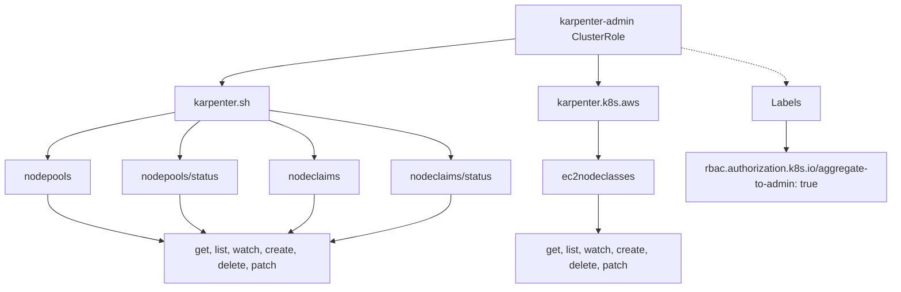
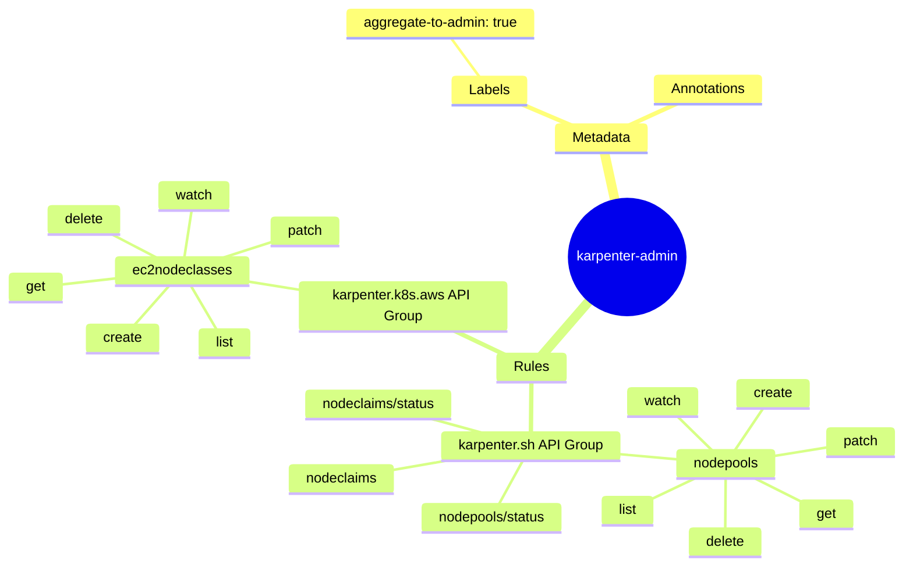

# Diagram: devops/k8s/karpenter/helm/templates/aggregate-clusterrole.yaml

> Auto-generated by Obscura crawlers

## Diagram 1

### SVG

<svg id="container" width="1429.671875" xmlns="http://www.w3.org/2000/svg" class="flowchart" height="454" viewBox="0 0 1429.671875 454" role="graphics-document document" aria-roledescription="flowchart-v2"><g><marker id="container_flowchart-v2-pointEnd" class="marker flowchart-v2" viewBox="0 0 10 10" refX="5" refY="5" markerUnits="userSpaceOnUse" markerWidth="8" markerHeight="8" orient="auto"><path d="M 0 0 L 10 5 L 0 10 z" class="arrowMarkerPath" style="stroke-width: 1; stroke-dasharray: 1, 0;"></path></marker><marker id="container_flowchart-v2-pointStart" class="marker flowchart-v2" viewBox="0 0 10 10" refX="4.5" refY="5" markerUnits="userSpaceOnUse" markerWidth="8" markerHeight="8" orient="auto"><path d="M 0 5 L 10 10 L 10 0 z" class="arrowMarkerPath" style="stroke-width: 1; stroke-dasharray: 1, 0;"></path></marker><marker id="container_flowchart-v2-circleEnd" class="marker flowchart-v2" viewBox="0 0 10 10" refX="11" refY="5" markerUnits="userSpaceOnUse" markerWidth="11" markerHeight="11" orient="auto"><circle cx="5" cy="5" r="5" class="arrowMarkerPath" style="stroke-width: 1; stroke-dasharray: 1, 0;"></circle></marker><marker id="container_flowchart-v2-circleStart" class="marker flowchart-v2" viewBox="0 0 10 10" refX="-1" refY="5" markerUnits="userSpaceOnUse" markerWidth="11" markerHeight="11" orient="auto"><circle cx="5" cy="5" r="5" class="arrowMarkerPath" style="stroke-width: 1; stroke-dasharray: 1, 0;"></circle></marker><marker id="container_flowchart-v2-crossEnd" class="marker cross flowchart-v2" viewBox="0 0 11 11" refX="12" refY="5.2" markerUnits="userSpaceOnUse" markerWidth="11" markerHeight="11" orient="auto"><path d="M 1,1 l 9,9 M 10,1 l -9,9" class="arrowMarkerPath" style="stroke-width: 2; stroke-dasharray: 1, 0;"></path></marker><marker id="container_flowchart-v2-crossStart" class="marker cross flowchart-v2" viewBox="0 0 11 11" refX="-1" refY="5.2" markerUnits="userSpaceOnUse" markerWidth="11" markerHeight="11" orient="auto"><path d="M 1,1 l 9,9 M 10,1 l -9,9" class="arrowMarkerPath" style="stroke-width: 2; stroke-dasharray: 1, 0;"></path></marker><g class="root"><g class="clusters"></g><g class="edgePaths"><path d="M831.102,60.858L752.709,69.215C674.316,77.572,517.531,94.286,439.139,106.143C360.746,118,360.746,125,360.746,128.5L360.746,132" id="L_ClusterRole_APIGroup1_0" class="edge-thickness-normal edge-pattern-solid edge-thickness-normal edge-pattern-solid flowchart-link" style=";" data-edge="true" data-et="edge" data-id="L_ClusterRole_APIGroup1_0" data-points="W3sieCI6ODMxLjEwMTU2MjUsInkiOjYwLjg1ODQ1NjI1MzEzMTI4fSx7IngiOjM2MC43NDYwOTM3NSwieSI6MTExfSx7IngiOjM2MC43NDYwOTM3NSwieSI6MTM2fV0=" marker-end="url(#container_flowchart-v2-pointEnd)"></path><path d="M961.102,86L961.102,90.167C961.102,94.333,961.102,102.667,961.102,110.333C961.102,118,961.102,125,961.102,128.5L961.102,132" id="L_ClusterRole_APIGroup2_0" class="edge-thickness-normal edge-pattern-solid edge-thickness-normal edge-pattern-solid flowchart-link" style=";" data-edge="true" data-et="edge" data-id="L_ClusterRole_APIGroup2_0" data-points="W3sieCI6OTYxLjEwMTU2MjUsInkiOjg2fSx7IngiOjk2MS4xMDE1NjI1LCJ5IjoxMTF9LHsieCI6OTYxLjEwMTU2MjUsInkiOjEzNn1d" marker-end="url(#container_flowchart-v2-pointEnd)"></path><path d="M285.574,176.761L250.76,183.134C215.945,189.507,146.316,202.254,111.502,214.127C76.688,226,76.688,237,76.688,242.5L76.688,248" id="L_APIGroup1_nodepools_0" class="edge-thickness-normal edge-pattern-solid edge-thickness-normal edge-pattern-solid flowchart-link" style=";" data-edge="true" data-et="edge" data-id="L_APIGroup1_nodepools_0" data-points="W3sieCI6Mjg1LjU3NDIxODc1LCJ5IjoxNzYuNzYxMDI1MzE2NjI5Nzd9LHsieCI6NzYuNjg3NSwieSI6MjE1fSx7IngiOjc2LjY4NzUsInkiOjI1Mn1d" marker-end="url(#container_flowchart-v2-pointEnd)"></path><path d="M324.106,190L318.451,194.167C312.797,198.333,301.488,206.667,295.834,216.333C290.18,226,290.18,237,290.18,242.5L290.18,248" id="L_APIGroup1_nodepools_status_0" class="edge-thickness-normal edge-pattern-solid edge-thickness-normal edge-pattern-solid flowchart-link" style=";" data-edge="true" data-et="edge" data-id="L_APIGroup1_nodepools_status_0" data-points="W3sieCI6MzI0LjEwNTg0NDM1MDk2MTU1LCJ5IjoxOTB9LHsieCI6MjkwLjE3OTY4NzUsInkiOjIxNX0seyJ4IjoyOTAuMTc5Njg3NSwieSI6MjUyfV0=" marker-end="url(#container_flowchart-v2-pointEnd)"></path><path d="M435.918,189.76L447.735,193.967C459.552,198.173,483.186,206.587,495.003,216.293C506.82,226,506.82,237,506.82,242.5L506.82,248" id="L_APIGroup1_nodeclaims_0" class="edge-thickness-normal edge-pattern-solid edge-thickness-normal edge-pattern-solid flowchart-link" style=";" data-edge="true" data-et="edge" data-id="L_APIGroup1_nodeclaims_0" data-points="W3sieCI6NDM1LjkxNzk2ODc1LCJ5IjoxODkuNzU5OTQxMTY4NjA1NDJ9LHsieCI6NTA2LjgyMDMxMjUsInkiOjIxNX0seyJ4Ijo1MDYuODIwMzEyNSwieSI6MjUyfV0=" marker-end="url(#container_flowchart-v2-pointEnd)"></path><path d="M435.918,173.684L484.367,180.57C532.815,187.456,629.712,201.228,678.161,213.614C726.609,226,726.609,237,726.609,242.5L726.609,248" id="L_APIGroup1_nodeclaims_status_0" class="edge-thickness-normal edge-pattern-solid edge-thickness-normal edge-pattern-solid flowchart-link" style=";" data-edge="true" data-et="edge" data-id="L_APIGroup1_nodeclaims_status_0" data-points="W3sieCI6NDM1LjkxNzk2ODc1LCJ5IjoxNzMuNjg0MTQ4MTUxMzExNjN9LHsieCI6NzI2LjYwOTM3NSwieSI6MjE1fSx7IngiOjcyNi42MDkzNzUsInkiOjI1Mn1d" marker-end="url(#container_flowchart-v2-pointEnd)"></path><path d="M961.102,190L961.102,194.167C961.102,198.333,961.102,206.667,961.102,216.333C961.102,226,961.102,237,961.102,242.5L961.102,248" id="L_APIGroup2_ec2nodeclasses_0" class="edge-thickness-normal edge-pattern-solid edge-thickness-normal edge-pattern-solid flowchart-link" style=";" data-edge="true" data-et="edge" data-id="L_APIGroup2_ec2nodeclasses_0" data-points="W3sieCI6OTYxLjEwMTU2MjUsInkiOjE5MH0seyJ4Ijo5NjEuMTAxNTYyNSwieSI6MjE1fSx7IngiOjk2MS4xMDE1NjI1LCJ5IjoyNTJ9XQ==" marker-end="url(#container_flowchart-v2-pointEnd)"></path><path d="M76.688,306L76.688,312.167C76.688,318.333,76.688,330.667,108.002,343.061C139.317,355.455,201.947,367.911,233.262,374.139L264.577,380.366" id="L_nodepools_verbs1_0" class="edge-thickness-normal edge-pattern-solid edge-thickness-normal edge-pattern-solid flowchart-link" style=";" data-edge="true" data-et="edge" data-id="L_nodepools_verbs1_0" data-points="W3sieCI6NzYuNjg3NSwieSI6MzA2fSx7IngiOjc2LjY4NzUsInkiOjM0M30seyJ4IjoyNjguNSwieSI6MzgxLjE0NjQzNjIwMTIwNDF9XQ==" marker-end="url(#container_flowchart-v2-pointEnd)"></path><path d="M290.18,306L290.18,312.167C290.18,318.333,290.18,330.667,296.658,340.661C303.136,350.655,316.092,358.31,322.57,362.138L329.048,365.965" id="L_nodepools_status_verbs1_0" class="edge-thickness-normal edge-pattern-solid edge-thickness-normal edge-pattern-solid flowchart-link" style=";" data-edge="true" data-et="edge" data-id="L_nodepools_status_verbs1_0" data-points="W3sieCI6MjkwLjE3OTY4NzUsInkiOjMwNn0seyJ4IjoyOTAuMTc5Njg3NSwieSI6MzQzfSx7IngiOjMzMi40OTIzMDk1NzAzMTI1LCJ5IjozNjh9XQ==" marker-end="url(#container_flowchart-v2-pointEnd)"></path><path d="M506.82,306L506.82,312.167C506.82,318.333,506.82,330.667,500.342,340.661C493.864,350.655,480.908,358.31,474.43,362.138L467.952,365.965" id="L_nodeclaims_verbs1_0" class="edge-thickness-normal edge-pattern-solid edge-thickness-normal edge-pattern-solid flowchart-link" style=";" data-edge="true" data-et="edge" data-id="L_nodeclaims_verbs1_0" data-points="W3sieCI6NTA2LjgyMDMxMjUsInkiOjMwNn0seyJ4Ijo1MDYuODIwMzEyNSwieSI6MzQzfSx7IngiOjQ2NC41MDc2OTA0Mjk2ODc1LCJ5IjozNjh9XQ==" marker-end="url(#container_flowchart-v2-pointEnd)"></path><path d="M726.609,306L726.609,312.167C726.609,318.333,726.609,330.667,694.245,343.146C661.882,355.626,597.154,368.251,564.79,374.564L532.426,380.877" id="L_nodeclaims_status_verbs1_0" class="edge-thickness-normal edge-pattern-solid edge-thickness-normal edge-pattern-solid flowchart-link" style=";" data-edge="true" data-et="edge" data-id="L_nodeclaims_status_verbs1_0" data-points="W3sieCI6NzI2LjYwOTM3NSwieSI6MzA2fSx7IngiOjcyNi42MDkzNzUsInkiOjM0M30seyJ4Ijo1MjguNSwieSI6MzgxLjY0MjYwMjAyODY2OH1d" marker-end="url(#container_flowchart-v2-pointEnd)"></path><path d="M961.102,306L961.102,312.167C961.102,318.333,961.102,330.667,961.102,340.333C961.102,350,961.102,357,961.102,360.5L961.102,364" id="L_ec2nodeclasses_verbs2_0" class="edge-thickness-normal edge-pattern-solid edge-thickness-normal edge-pattern-solid flowchart-link" style=";" data-edge="true" data-et="edge" data-id="L_ec2nodeclasses_verbs2_0" data-points="W3sieCI6OTYxLjEwMTU2MjUsInkiOjMwNn0seyJ4Ijo5NjEuMTAxNTYyNSwieSI6MzQzfSx7IngiOjk2MS4xMDE1NjI1LCJ5IjozNjh9XQ==" marker-end="url(#container_flowchart-v2-pointEnd)"></path><path d="M1091.102,74.868L1119.194,80.89C1147.286,86.912,1203.471,98.956,1231.564,108.478C1259.656,118,1259.656,125,1259.656,128.5L1259.656,132" id="L_ClusterRole_labels_0" class="edge-thickness-normal edge-pattern-dotted edge-thickness-normal edge-pattern-solid flowchart-link" style=";" data-edge="true" data-et="edge" data-id="L_ClusterRole_labels_0" data-points="W3sieCI6MTA5MS4xMDE1NjI1LCJ5Ijo3NC44Njc1OTEyNTk5NzY0NX0seyJ4IjoxMjU5LjY1NjI1LCJ5IjoxMTF9LHsieCI6MTI1OS42NTYyNSwieSI6MTM2fV0=" marker-end="url(#container_flowchart-v2-pointEnd)"></path><path d="M1259.656,190L1259.656,194.167C1259.656,198.333,1259.656,206.667,1259.656,214.333C1259.656,222,1259.656,229,1259.656,232.5L1259.656,236" id="L_labels_aggregate_0" class="edge-thickness-normal edge-pattern-solid edge-thickness-normal edge-pattern-solid flowchart-link" style=";" data-edge="true" data-et="edge" data-id="L_labels_aggregate_0" data-points="W3sieCI6MTI1OS42NTYyNSwieSI6MTkwfSx7IngiOjEyNTkuNjU2MjUsInkiOjIxNX0seyJ4IjoxMjU5LjY1NjI1LCJ5IjoyNDB9XQ==" marker-end="url(#container_flowchart-v2-pointEnd)"></path></g><g class="edgeLabels"><g class="edgeLabel"><g class="label" data-id="L_ClusterRole_APIGroup1_0" transform="translate(0, 0)"><foreignObject width="0" height="0">

</foreignObject></g></g><g class="edgeLabel"><g class="label" data-id="L_ClusterRole_APIGroup2_0" transform="translate(0, 0)"><foreignObject width="0" height="0">

</foreignObject></g></g><g class="edgeLabel"><g class="label" data-id="L_APIGroup1_nodepools_0" transform="translate(0, 0)"><foreignObject width="0" height="0">

</foreignObject></g></g><g class="edgeLabel"><g class="label" data-id="L_APIGroup1_nodepools_status_0" transform="translate(0, 0)"><foreignObject width="0" height="0">

</foreignObject></g></g><g class="edgeLabel"><g class="label" data-id="L_APIGroup1_nodeclaims_0" transform="translate(0, 0)"><foreignObject width="0" height="0">

</foreignObject></g></g><g class="edgeLabel"><g class="label" data-id="L_APIGroup1_nodeclaims_status_0" transform="translate(0, 0)"><foreignObject width="0" height="0">

</foreignObject></g></g><g class="edgeLabel"><g class="label" data-id="L_APIGroup2_ec2nodeclasses_0" transform="translate(0, 0)"><foreignObject width="0" height="0">

</foreignObject></g></g><g class="edgeLabel"><g class="label" data-id="L_nodepools_verbs1_0" transform="translate(0, 0)"><foreignObject width="0" height="0">

</foreignObject></g></g><g class="edgeLabel"><g class="label" data-id="L_nodepools_status_verbs1_0" transform="translate(0, 0)"><foreignObject width="0" height="0">

</foreignObject></g></g><g class="edgeLabel"><g class="label" data-id="L_nodeclaims_verbs1_0" transform="translate(0, 0)"><foreignObject width="0" height="0">

</foreignObject></g></g><g class="edgeLabel"><g class="label" data-id="L_nodeclaims_status_verbs1_0" transform="translate(0, 0)"><foreignObject width="0" height="0">

</foreignObject></g></g><g class="edgeLabel"><g class="label" data-id="L_ec2nodeclasses_verbs2_0" transform="translate(0, 0)"><foreignObject width="0" height="0">

</foreignObject></g></g><g class="edgeLabel"><g class="label" data-id="L_ClusterRole_labels_0" transform="translate(0, 0)"><foreignObject width="0" height="0">

</foreignObject></g></g><g class="edgeLabel"><g class="label" data-id="L_labels_aggregate_0" transform="translate(0, 0)"><foreignObject width="0" height="0">

</foreignObject></g></g></g><g class="nodes"><g class="node default" id="flowchart-ClusterRole-0" transform="translate(961.1015625, 47)"><rect class="basic label-container" style="" x="-130" y="-39" width="260" height="78"></rect><g class="label" style="" transform="translate(-100, -24)"><rect></rect><foreignObject width="200" height="48">

karpenter-admin ClusterRole

</foreignObject></g></g><g class="node default" id="flowchart-APIGroup1-2" transform="translate(360.74609375, 163)"><rect class="basic label-container" style="" x="-75.171875" y="-27" width="150.34375" height="54"></rect><g class="label" style="" transform="translate(-45.171875, -12)"><rect></rect><foreignObject width="90.34375" height="24">

karpenter.sh

</foreignObject></g></g><g class="node default" id="flowchart-APIGroup2-4" transform="translate(961.1015625, 163)"><rect class="basic label-container" style="" x="-94.65625" y="-27" width="189.3125" height="54"></rect><g class="label" style="" transform="translate(-64.65625, -12)"><rect></rect><foreignObject width="129.3125" height="24">

karpenter.k8s.aws

</foreignObject></g></g><g class="node default" id="flowchart-nodepools-6" transform="translate(76.6875, 279)"><rect class="basic label-container" style="" x="-68.6875" y="-27" width="137.375" height="54"></rect><g class="label" style="" transform="translate(-38.6875, -12)"><rect></rect><foreignObject width="77.375" height="24">

nodepools

</foreignObject></g></g><g class="node default" id="flowchart-nodepools_status-8" transform="translate(290.1796875, 279)"><rect class="basic label-container" style="" x="-94.8046875" y="-27" width="189.609375" height="54"></rect><g class="label" style="" transform="translate(-64.8046875, -12)"><rect></rect><foreignObject width="129.609375" height="24">

nodepools/status

</foreignObject></g></g><g class="node default" id="flowchart-nodeclaims-10" transform="translate(506.8203125, 279)"><rect class="basic label-container" style="" x="-71.8359375" y="-27" width="143.671875" height="54"></rect><g class="label" style="" transform="translate(-41.8359375, -12)"><rect></rect><foreignObject width="83.671875" height="24">

nodeclaims

</foreignObject></g></g><g class="node default" id="flowchart-nodeclaims_status-12" transform="translate(726.609375, 279)"><rect class="basic label-container" style="" x="-97.953125" y="-27" width="195.90625" height="54"></rect><g class="label" style="" transform="translate(-67.953125, -12)"><rect></rect><foreignObject width="135.90625" height="24">

nodeclaims/status

</foreignObject></g></g><g class="node default" id="flowchart-ec2nodeclasses-14" transform="translate(961.1015625, 279)"><rect class="basic label-container" style="" x="-86.5390625" y="-27" width="173.078125" height="54"></rect><g class="label" style="" transform="translate(-56.5390625, -12)"><rect></rect><foreignObject width="113.078125" height="24">

ec2nodeclasses

</foreignObject></g></g><g class="node default" id="flowchart-verbs1-16" transform="translate(398.5, 407)"><rect class="basic label-container" style="" x="-130" y="-39" width="260" height="78"></rect><g class="label" style="" transform="translate(-100, -24)"><rect></rect><foreignObject width="200" height="48">

get, list, watch, create, delete, patch

</foreignObject></g></g><g class="node default" id="flowchart-verbs2-24" transform="translate(961.1015625, 407)"><rect class="basic label-container" style="" x="-130" y="-39" width="260" height="78"></rect><g class="label" style="" transform="translate(-100, -24)"><rect></rect><foreignObject width="200" height="48">

get, list, watch, create, delete, patch

</foreignObject></g></g><g class="node default" id="flowchart-labels-26" transform="translate(1259.65625, 163)"><rect class="basic label-container" style="" x="-53.453125" y="-27" width="106.90625" height="54"></rect><g class="label" style="" transform="translate(-23.453125, -12)"><rect></rect><foreignObject width="46.90625" height="24">

Labels

</foreignObject></g></g><g class="node default" id="flowchart-aggregate-28" transform="translate(1259.65625, 279)"><rect class="basic label-container" style="" x="-162.015625" y="-39" width="324.03125" height="78"></rect><g class="label" style="" transform="translate(-132.015625, -24)"><rect></rect><foreignObject width="264.03125" height="48">

rbac.authorization.k8s.io/aggregate-to-admin: true

</foreignObject></g></g></g></g></g></svg>

## Diagram 2

### SVG

<svg id="container" width="100%" xmlns="http://www.w3.org/2000/svg" class="mindmapDiagram" style="max-width: 956.96875px;" viewBox="5 5 956.96875 705.1412963867188" role="graphics-document document" aria-roledescription="mindmap"><g><marker id="container_mindmap-pointEnd" class="marker mindmap" viewBox="0 0 10 10" refX="5" refY="5" markerUnits="userSpaceOnUse" markerWidth="8" markerHeight="8" orient="auto"><path d="M 0 0 L 10 5 L 0 10 z" class="arrowMarkerPath" style="stroke-width: 1; stroke-dasharray: 1, 0;"></path></marker><marker id="container_mindmap-pointStart" class="marker mindmap" viewBox="0 0 10 10" refX="4.5" refY="5" markerUnits="userSpaceOnUse" markerWidth="8" markerHeight="8" orient="auto"><path d="M 0 5 L 10 10 L 10 0 z" class="arrowMarkerPath" style="stroke-width: 1; stroke-dasharray: 1, 0;"></path></marker><g class="subgraphs"></g><g class="edgePaths"><path d="M735.395,281.673L730.167,272.648C724.939,263.622,714.484,245.571,704.028,227.519C693.572,209.468,683.117,191.417,677.889,182.391L672.661,173.366" id="edge_0_1" class="edge-thickness-normal edge-pattern-solid edge section-edge-0 edge-depth-1" style="undefined;;;undefined" data-edge="true" data-et="edge" data-id="edge_0_1" data-points="W3sieCI6NzM1LjM5NDcxOTM2MTI0MjcsInkiOjI4MS42NzMxMzQ4OTkwMDA0fSx7IngiOjcwNC4wMjc5ODQ3OTExNDcsInkiOjIyNy41MTk0MjMxMTUxMTE4fSx7IngiOjY3Mi42NjEyNTAyMjEwNTEzLCJ5IjoxNzMuMzY1NzExMzMxMjIzMn1d"></path><path d="M651.514,154.121L643.563,150.466C635.613,146.811,619.711,139.501,603.81,132.191C587.908,124.881,572.007,117.571,564.056,113.916L556.105,110.262" id="edge_1_2" class="edge-thickness-normal edge-pattern-solid edge section-edge-0 edge-depth-3" style="undefined;;;undefined" data-edge="true" data-et="edge" data-id="edge_1_2" data-points="W3sieCI6NjUxLjUxNDE1OTI2ODYyOTcsInkiOjE1NC4xMjA2NjczOTA2Mzc3OH0seyJ4Ijo2MDMuODA5NjQ1NDgwOTE0OCwieSI6MTMyLjE5MTA4NjkwMDc2ODAzfSx7IngiOjU1Ni4xMDUxMzE2OTMyLCJ5IjoxMTAuMjYxNTA2NDEwODk4Mjh9XQ=="></path><path d="M531.882,93.377L527.663,89.147C523.443,84.917,515.004,76.458,506.565,67.998C498.126,59.539,489.687,51.079,485.467,46.849L481.248,42.619" id="edge_2_3" class="edge-thickness-normal edge-pattern-solid edge section-edge-0 edge-depth-5" style="undefined;;;undefined" data-edge="true" data-et="edge" data-id="edge_2_3" data-points="W3sieCI6NTMxLjg4MjQ0Mjg5ODcyNDksInkiOjkzLjM3NjkxMjc5MzE5NjA4fSx7IngiOjUwNi41NjUwNDIxNDA5ODUxNiwieSI6NjcuOTk4MTcwMzAwMDg1MDF9LHsieCI6NDgxLjI0NzY0MTM4MzI0NTUsInkiOjQyLjYxOTQyNzgwNjk3MzkyNH1d"></path><path d="M677.267,151.553L682.734,147.57C688.2,143.588,699.134,135.622,710.068,127.657C721.001,119.691,731.935,111.726,737.402,107.743L742.868,103.76" id="edge_1_4" class="edge-thickness-normal edge-pattern-solid edge section-edge-0 edge-depth-3" style="undefined;;;undefined" data-edge="true" data-et="edge" data-id="edge_1_4" data-points="W3sieCI6Njc3LjI2NjgzMzU1ODQ2NzYsInkiOjE1MS41NTMyMzQ5MDA1NjIwNX0seyJ4Ijo3MTAuMDY3NjI1MjAxMzE3OSwieSI6MTI3LjY1NjY0MTcwMjA5ODc0fSx7IngiOjc0Mi44Njg0MTY4NDQxNjgyLCJ5IjoxMDMuNzYwMDQ4NTAzNjM1NDN9XQ=="></path><path d="M731.834,304.766L722.757,313.052C713.679,321.339,695.523,337.912,677.367,354.486C659.211,371.059,641.055,387.632,631.977,395.919L622.899,404.205" id="edge_0_5" class="edge-thickness-normal edge-pattern-solid edge section-edge-1 edge-depth-1" style="undefined;;;undefined" data-edge="true" data-et="edge" data-id="edge_0_5" data-points="W3sieCI6NzMxLjgzNDQ0OTIxMDYxOTYsInkiOjMwNC43NjU3OTM4MjIxMzE3NH0seyJ4Ijo2NzcuMzY2OTY1NDg3MDg0OCwieSI6MzU0LjQ4NTYxOTA2MDI1NTJ9LHsieCI6NjIyLjg5OTQ4MTc2MzU1LCJ5Ijo0MDQuMjA1NDQ0Mjk4Mzc4Njd9XQ=="></path><path d="M613.122,429.262L613.577,434.491C614.032,439.72,614.943,450.178,615.853,460.636C616.763,471.094,617.674,481.553,618.129,486.782L618.584,492.011" id="edge_5_6" class="edge-thickness-normal edge-pattern-solid edge section-edge-1 edge-depth-3" style="undefined;;;undefined" data-edge="true" data-et="edge" data-id="edge_5_6" data-points="W3sieCI6NjEzLjEyMTg5MzMzMDAwMTcsInkiOjQyOS4yNjE3MTIxMzI5NDAzfSx7IngiOjYxNS44NTMwNzM3MDY2ODc3LCJ5Ijo0NjAuNjM2MjM0NjM5NzY1OX0seyJ4Ijo2MTguNTg0MjU0MDgzMzczNywieSI6NDkyLjAxMDc1NzE0NjU5MTV9XQ=="></path><path d="M611.316,519.265L607.706,524.451C604.097,529.636,596.878,540.007,589.659,550.377C582.44,560.748,575.221,571.119,571.612,576.304L568.002,581.489" id="edge_6_7" class="edge-thickness-normal edge-pattern-solid edge section-edge-1 edge-depth-5" style="undefined;;;undefined" data-edge="true" data-et="edge" data-id="edge_6_7" data-points="W3sieCI6NjExLjMxNTUzNjI2Mzg3NTksInkiOjUxOS4yNjUzMjA5MzQxNjk2fSx7IngiOjU4OS42NTg4ODg0MzcxMTU4LCJ5Ijo1NTAuMzc3MzczMDg1ODc0fSx7IngiOjU2OC4wMDIyNDA2MTAzNTU4LCJ5Ijo1ODEuNDg5NDI1MjM3NTc4M31d"></path><path d="M573.52,598.954L582.256,602.15C590.992,605.346,608.465,611.738,625.938,618.13C643.41,624.523,660.883,630.915,669.62,634.111L678.356,637.307" id="edge_7_8" class="edge-thickness-normal edge-pattern-solid edge section-edge-1 edge-depth-7" style="undefined;;;undefined" data-edge="true" data-et="edge" data-id="edge_7_8" data-points="W3sieCI6NTczLjUxOTU5ODcyNzU0NDIsInkiOjU5OC45NTQwMTQxMjY2OTkzfSx7IngiOjYyNS45Mzc3NDgxNTgyNjEyLCJ5Ijo2MTguMTMwNDk2MzczNTMyMn0seyJ4Ijo2NzguMzU1ODk3NTg4OTc4MiwieSI6NjM3LjMwNjk3ODYyMDM2NX1d"></path><path d="M545.884,587.363L538.368,583.792C530.851,580.221,515.818,573.079,500.786,565.936C485.753,558.794,470.72,551.652,463.204,548.08L455.687,544.509" id="edge_7_9" class="edge-thickness-normal edge-pattern-solid edge section-edge-1 edge-depth-7" style="undefined;;;undefined" data-edge="true" data-et="edge" data-id="edge_7_9" data-points="W3sieCI6NTQ1Ljg4NDEyNjIwMDExMiwieSI6NTg3LjM2MzM2NTgxODMwOH0seyJ4Ijo1MDAuNzg1NjA5OTQzOTc2NiwieSI6NTY1LjkzNjMzMjM3NTI5MzN9LHsieCI6NDU1LjY4NzA5MzY4Nzg0MTM1LCJ5Ijo1NDQuNTA5Mjk4OTMyMjc4Nn1d"></path><path d="M544.485,595.047L533.548,595.96C522.612,596.872,500.74,598.697,478.868,600.521C456.995,602.346,435.123,604.171,424.187,605.083L413.251,605.995" id="edge_7_10" class="edge-thickness-normal edge-pattern-solid edge section-edge-1 edge-depth-7" style="undefined;;;undefined" data-edge="true" data-et="edge" data-id="edge_7_10" data-points="W3sieCI6NTQ0LjQ4NDYwMTcyNTIxNTQsInkiOjU5NS4wNDc0OTQ4ODE3NDk4fSx7IngiOjQ3OC44Njc3MjgyOTc0MzE3NywieSI6NjAwLjUyMTM2MTE2MjI0NDh9LHsieCI6NDEzLjI1MDg1NDg2OTY0ODE1LCJ5Ijo2MDUuOTk1MjI3NDQyNzM5OX1d"></path><path d="M574.17,591.006L584.609,589.027C595.047,587.048,615.924,583.09,636.801,579.132C657.678,575.174,678.555,571.216,688.994,569.237L699.432,567.258" id="edge_7_11" class="edge-thickness-normal edge-pattern-solid edge section-edge-1 edge-depth-7" style="undefined;;;undefined" data-edge="true" data-et="edge" data-id="edge_7_11" data-points="W3sieCI6NTc0LjE3MDE1NTg4MzQ3MSwieSI6NTkxLjAwNjQ0MjI2OTY5ODF9LHsieCI6NjM2LjgwMTMxNjI4OTQxOTgsInkiOjU3OS4xMzIyNzk0NTczNTl9LHsieCI6Njk5LjQzMjQ3NjY5NTM2ODYsInkiOjU2Ny4yNTgxMTY2NDUwMTk5fV0="></path><path d="M547.841,603.32L542.558,607.659C537.275,611.998,526.71,620.675,516.144,629.352C505.578,638.029,495.013,646.706,489.73,651.045L484.447,655.384" id="edge_7_12" class="edge-thickness-normal edge-pattern-solid edge section-edge-1 edge-depth-7" style="undefined;;;undefined" data-edge="true" data-et="edge" data-id="edge_7_12" data-points="W3sieCI6NTQ3Ljg0MDg2NTY2NTY4ODQsInkiOjYwMy4zMjA0NzQwMzY3NTg2fSx7IngiOjUxNi4xNDQwMjMzMjU0NzU3LCJ5Ijo2MjkuMzUyMDQwMzk1NzMxOX0seyJ4Ijo0ODQuNDQ3MTgwOTg1MjYzLCJ5Ijo2NTUuMzgzNjA2NzU0NzA1M31d"></path><path d="M563.967,608.099L565.573,613.161C567.178,618.223,570.389,628.347,573.6,638.471C576.811,648.595,580.022,658.719,581.628,663.781L583.233,668.843" id="edge_7_13" class="edge-thickness-normal edge-pattern-solid edge section-edge-1 edge-depth-7" style="undefined;;;undefined" data-edge="true" data-et="edge" data-id="edge_7_13" data-points="W3sieCI6NTYzLjk2NzQ3MjI5Mjg1ODEsInkiOjYwOC4wOTg2MDE0NDIyNzMzfSx7IngiOjU3My42MDAzNzEwMDYzMzUsInkiOjYzOC40NzA5MDkzNzIzOTMxfSx7IngiOjU4My4yMzMyNjk3MTk4MTE4LCJ5Ijo2NjguODQzMjE3MzAyNTEyOH1d"></path><path d="M634.851,507.966L652.963,509.19C671.076,510.414,707.3,512.862,743.525,515.31C779.749,517.758,815.974,520.206,834.086,521.43L852.198,522.654" id="edge_6_14" class="edge-thickness-normal edge-pattern-solid edge section-edge-1 edge-depth-5" style="undefined;;;undefined" data-edge="true" data-et="edge" data-id="edge_6_14" data-points="W3sieCI6NjM0Ljg1MDk2MzE2NjE5NzIsInkiOjUwNy45NjU2MjAyNjUxMDQzfSx7IngiOjc0My41MjQ1NzcyMzU4NjgzLCJ5Ijo1MTUuMzA5NjU5MDI5NDk0NH0seyJ4Ijo4NTIuMTk4MTkxMzA1NTM5NCwieSI6NTIyLjY1MzY5Nzc5Mzg4NDV9XQ=="></path><path d="M605.594,502.396L594.775,498.945C583.955,495.494,562.317,488.593,540.678,481.691C519.039,474.789,497.4,467.887,486.58,464.436L475.761,460.985" id="edge_6_15" class="edge-thickness-normal edge-pattern-solid edge section-edge-1 edge-depth-5" style="undefined;;;undefined" data-edge="true" data-et="edge" data-id="edge_6_15" data-points="W3sieCI6NjA1LjU5NDQwNDExMTIwMDIsInkiOjUwMi4zOTYxNjcxMjQ4MTI4fSx7IngiOjU0MC42Nzc2Njk1MDM4NjI2LCJ5Ijo0ODEuNjkwNzAxMDI3Nzg0MDN9LHsieCI6NDc1Ljc2MDkzNDg5NjUyNSwieSI6NDYwLjk4NTIzNDkzMDc1NTI3fV0="></path><path d="M634.137,502.276L644.744,498.794C655.352,495.312,676.566,488.349,697.781,481.385C718.995,474.421,740.21,467.458,750.817,463.976L761.425,460.494" id="edge_6_16" class="edge-thickness-normal edge-pattern-solid edge section-edge-1 edge-depth-5" style="undefined;;;undefined" data-edge="true" data-et="edge" data-id="edge_6_16" data-points="W3sieCI6NjM0LjEzNjk0MTI2NDc5MywieSI6NTAyLjI3NjEwNzI0OTQxNDk2fSx7IngiOjY5Ny43ODA4MzExNDM1MDgyLCJ5Ijo0ODEuMzg1MTM3MDE5NTY2ODZ9LHsieCI6NzYxLjQyNDcyMTAyMjIyMzQsInkiOjQ2MC40OTQxNjY3ODk3MTg4Nn1d"></path><path d="M598.916,406.672L590.496,401.684C582.075,396.695,565.235,386.717,548.394,376.74C531.554,366.762,514.713,356.785,506.293,351.796L497.873,346.807" id="edge_5_17" class="edge-thickness-normal edge-pattern-solid edge section-edge-1 edge-depth-3" style="undefined;;;undefined" data-edge="true" data-et="edge" data-id="edge_5_17" data-points="W3sieCI6NTk4LjkxNTk3ODIwMDIyMjQsInkiOjQwNi42NzIzNjc0ODg2MTY5fSx7IngiOjU0OC4zOTQyNDk0MzI2ODk1LCJ5IjozNzYuNzM5Nzk3NjE5MTQ2OTR9LHsieCI6NDk3Ljg3MjUyMDY2NTE1NjYsInkiOjM0Ni44MDcyMjc3NDk2Nzd9XQ=="></path><path d="M469.972,338.798L451.048,338.34C432.125,337.881,394.278,336.964,356.431,336.047C318.584,335.13,280.737,334.213,261.814,333.754L242.891,333.296" id="edge_17_18" class="edge-thickness-normal edge-pattern-solid edge section-edge-1 edge-depth-5" style="undefined;;;undefined" data-edge="true" data-et="edge" data-id="edge_17_18" data-points="W3sieCI6NDY5Ljk3MTg1MDg5MjQyODUsInkiOjMzOC43OTgwMjE2OTkyMzkyNn0seyJ4IjozNTYuNDMxMTgwNjIxMTU5OCwieSI6MzM2LjA0Njg5MjY5NzIyMDh9LHsieCI6MjQyLjg5MDUxMDM0OTg5MTA2LCJ5IjozMzMuMjk1NzYzNjk1MjAyMzd9XQ=="></path><path d="M213.905,338.345L205.562,341.573C197.218,344.801,180.531,351.257,163.843,357.714C147.156,364.17,130.469,370.626,122.125,373.854L113.781,377.082" id="edge_18_19" class="edge-thickness-normal edge-pattern-solid edge section-edge-1 edge-depth-7" style="undefined;;;undefined" data-edge="true" data-et="edge" data-id="edge_18_19" data-points="W3sieCI6MjEzLjkwNTQ0NDY0MTg1ODU0LCJ5IjozMzguMzQ0ODgzMzEwNjEwMDR9LHsieCI6MTYzLjg0MzQwODM1OTgzNTksInkiOjM1Ny43MTM2ODIwNDk1MjZ9LHsieCI6MTEzLjc4MTM3MjA3NzgxMzI5LCJ5IjozNzcuMDgyNDgwNzg4NDQyfV0="></path><path d="M224.213,347.473L222.954,352.444C221.695,357.415,219.178,367.357,216.66,377.299C214.143,387.241,211.625,397.183,210.367,402.154L209.108,407.125" id="edge_18_20" class="edge-thickness-normal edge-pattern-solid edge section-edge-1 edge-depth-7" style="undefined;;;undefined" data-edge="true" data-et="edge" data-id="edge_18_20" data-points="W3sieCI6MjI0LjIxMjgyODc1NzUwMTQsInkiOjM0Ny40NzM0Njk3MTMyODM0Nn0seyJ4IjoyMTYuNjYwMzA2NDQ0NzgwNDIsInkiOjM3Ny4yOTk0MjM5NTEyOTExfSx7IngiOjIwOS4xMDc3ODQxMzIwNTk0NCwieSI6NDA3LjEyNTM3ODE4OTI5ODd9XQ=="></path><path d="M213.282,329.546L201.416,326.797C189.549,324.047,165.817,318.548,142.084,313.048C118.352,307.549,94.619,302.05,82.753,299.3L70.886,296.55" id="edge_18_21" class="edge-thickness-normal edge-pattern-solid edge section-edge-1 edge-depth-7" style="undefined;;;undefined" data-edge="true" data-et="edge" data-id="edge_18_21" data-points="W3sieCI6MjEzLjI4MjA5Mjg0MDA3Mjg2LCJ5IjozMjkuNTQ2MzM3Mjc2MzU3NX0seyJ4IjoxNDIuMDg0MTc0NjE2MDUyMSwieSI6MzEzLjA0ODM3NzIxMTgyNjE2fSx7IngiOjcwLjg4NjI1NjM5MjAzMTM2LCJ5IjoyOTYuNTUwNDE3MTQ3Mjk0OH1d"></path><path d="M221.813,319.221L219.695,314.444C217.576,309.667,213.339,300.113,209.102,290.559C204.864,281.005,200.627,271.451,198.508,266.674L196.39,261.897" id="edge_18_22" class="edge-thickness-normal edge-pattern-solid edge section-edge-1 edge-depth-7" style="undefined;;;undefined" data-edge="true" data-et="edge" data-id="edge_18_22" data-points="W3sieCI6MjIxLjgxMzQ2ODY2NjQ1NTEsInkiOjMxOS4yMjA1MjA3Njc0ODY1fSx7IngiOjIwOS4xMDE1MjkzNDUzODMxNCwieSI6MjkwLjU1ODc3NTcyOTQ5NTI3fSx7IngiOjE5Ni4zODk1OTAwMjQzMTEyLCJ5IjoyNjEuODk3MDMwNjkxNTA0fV0="></path><path d="M240.224,324.389L246.08,320.33C251.937,316.272,263.649,308.156,275.362,300.039C287.074,291.923,298.787,283.806,304.643,279.748L310.5,275.69" id="edge_18_23" class="edge-thickness-normal edge-pattern-solid edge section-edge-1 edge-depth-7" style="undefined;;;undefined" data-edge="true" data-et="edge" data-id="edge_18_23" data-points="W3sieCI6MjQwLjIyMzk2NjM4NzMxMTE4LCJ5IjozMjQuMzg4NzM4NTYyMTUwNn0seyJ4IjoyNzUuMzYxNzY3MDgyMjI0MzMsInkiOjMwMC4wMzkyNjM1MjMwOTI0fSx7IngiOjMxMC40OTk1Njc3NzcxMzc1LCJ5IjoyNzUuNjg5Nzg4NDg0MDM0MjR9XQ=="></path><path d="M239.905,341.919L245.293,345.95C250.68,349.981,261.455,358.043,272.23,366.105C283.005,374.168,293.78,382.23,299.167,386.261L304.555,390.292" id="edge_18_24" class="edge-thickness-normal edge-pattern-solid edge section-edge-1 edge-depth-7" style="undefined;;;undefined" data-edge="true" data-et="edge" data-id="edge_18_24" data-points="W3sieCI6MjM5LjkwNTA4ODQ3MjMxNjE1LCJ5IjozNDEuOTE4ODMwMjU0MjkwNzV9LHsieCI6MjcyLjIyOTk0ODE4MTgwNjgzLCJ5IjozNjYuMTA1MzY4OTQyMjI0NDZ9LHsieCI6MzA0LjU1NDgwNzg5MTI5NzUsInkiOjM5MC4yOTE5MDc2MzAxNTgxNn1d"></path></g><g class="edgeLabels"><g class="edgeLabel"><g class="label" data-id="edge_0_1" transform="translate(0, 0)"><foreignObject width="0" height="0">

</foreignObject></g></g><g class="edgeLabel"><g class="label" data-id="edge_1_2" transform="translate(0, 0)"><foreignObject width="0" height="0">

</foreignObject></g></g><g class="edgeLabel"><g class="label" data-id="edge_2_3" transform="translate(0, 0)"><foreignObject width="0" height="0">

</foreignObject></g></g><g class="edgeLabel"><g class="label" data-id="edge_1_4" transform="translate(0, 0)"><foreignObject width="0" height="0">

</foreignObject></g></g><g class="edgeLabel"><g class="label" data-id="edge_0_5" transform="translate(0, 0)"><foreignObject width="0" height="0">

</foreignObject></g></g><g class="edgeLabel"><g class="label" data-id="edge_5_6" transform="translate(0, 0)"><foreignObject width="0" height="0">

</foreignObject></g></g><g class="edgeLabel"><g class="label" data-id="edge_6_7" transform="translate(0, 0)"><foreignObject width="0" height="0">

</foreignObject></g></g><g class="edgeLabel"><g class="label" data-id="edge_7_8" transform="translate(0, 0)"><foreignObject width="0" height="0">

</foreignObject></g></g><g class="edgeLabel"><g class="label" data-id="edge_7_9" transform="translate(0, 0)"><foreignObject width="0" height="0">

</foreignObject></g></g><g class="edgeLabel"><g class="label" data-id="edge_7_10" transform="translate(0, 0)"><foreignObject width="0" height="0">

</foreignObject></g></g><g class="edgeLabel"><g class="label" data-id="edge_7_11" transform="translate(0, 0)"><foreignObject width="0" height="0">

</foreignObject></g></g><g class="edgeLabel"><g class="label" data-id="edge_7_12" transform="translate(0, 0)"><foreignObject width="0" height="0">

</foreignObject></g></g><g class="edgeLabel"><g class="label" data-id="edge_7_13" transform="translate(0, 0)"><foreignObject width="0" height="0">

</foreignObject></g></g><g class="edgeLabel"><g class="label" data-id="edge_6_14" transform="translate(0, 0)"><foreignObject width="0" height="0">

</foreignObject></g></g><g class="edgeLabel"><g class="label" data-id="edge_6_15" transform="translate(0, 0)"><foreignObject width="0" height="0">

</foreignObject></g></g><g class="edgeLabel"><g class="label" data-id="edge_6_16" transform="translate(0, 0)"><foreignObject width="0" height="0">

</foreignObject></g></g><g class="edgeLabel"><g class="label" data-id="edge_5_17" transform="translate(0, 0)"><foreignObject width="0" height="0">

</foreignObject></g></g><g class="edgeLabel"><g class="label" data-id="edge_17_18" transform="translate(0, 0)"><foreignObject width="0" height="0">

</foreignObject></g></g><g class="edgeLabel"><g class="label" data-id="edge_18_19" transform="translate(0, 0)"><foreignObject width="0" height="0">

</foreignObject></g></g><g class="edgeLabel"><g class="label" data-id="edge_18_20" transform="translate(0, 0)"><foreignObject width="0" height="0">

</foreignObject></g></g><g class="edgeLabel"><g class="label" data-id="edge_18_21" transform="translate(0, 0)"><foreignObject width="0" height="0">

</foreignObject></g></g><g class="edgeLabel"><g class="label" data-id="edge_18_22" transform="translate(0, 0)"><foreignObject width="0" height="0">

</foreignObject></g></g><g class="edgeLabel"><g class="label" data-id="edge_18_23" transform="translate(0, 0)"><foreignObject width="0" height="0">

</foreignObject></g></g><g class="edgeLabel"><g class="label" data-id="edge_18_24" transform="translate(0, 0)"><foreignObject width="0" height="0">

</foreignObject></g></g></g><g class="nodes"><g class="node mindmap-node section-root section--1" id="node_0" transform="translate(742.9128816190059, 294.6530130288576)"><circle class="basic label-container" style="" r="71.2109375" cx="0" cy="0"></circle><g class="label" style="" transform="translate(-61.2109375, -12)"><rect></rect><foreignObject width="122.421875" height="24">

karpenter-admin

</foreignObject></g></g><g class="node mindmap-node section-0" id="node_1" transform="translate(665.143087963288, 160.38583320136604)"><path id="node-1" class="node-bkg node-0" style="" d="M-54.09375 12
    v-24
    q0,-5 5,-5
    h98.1875
    q5,0 5,5
    v24
    q0,5 -5,5
    h-98.1875
    q-5,0 -5,-5
    Z"></path><line class="node-line-" x1="-54.09375" y1="17" x2="54.09375" y2="17"></line><g class="label" style="" transform="translate(-34.09375, -12)"><rect></rect><foreignObject width="68.1875" height="24">

Metadata

</foreignObject></g></g><g class="node mindmap-node section-0" id="node_2" transform="translate(542.4762029985416, 103.99634060017002)"><path id="node-2" class="node-bkg node-0" style="" d="M-43.453125 12
    v-24
    q0,-5 5,-5
    h76.90625
    q5,0 5,5
    v24
    q0,5 -5,5
    h-76.90625
    q-5,0 -5,-5
    Z"></path><line class="node-line-" x1="-43.453125" y1="17" x2="43.453125" y2="17"></line><g class="label" style="" transform="translate(-23.453125, -12)"><rect></rect><foreignObject width="46.90625" height="24">

Labels

</foreignObject></g></g><g class="node mindmap-node section-0" id="node_3" transform="translate(470.65388128342875, 32)"><path id="node-3" class="node-bkg node-0" style="" d="M-110.984375 12
    v-24
    q0,-5 5,-5
    h211.96875
    q5,0 5,5
    v24
    q0,5 -5,5
    h-211.96875
    q-5,0 -5,-5
    Z"></path><line class="node-line-" x1="-110.984375" y1="17" x2="110.984375" y2="17"></line><g class="label" style="" transform="translate(-90.984375, -12)"><rect></rect><foreignObject width="181.96875" height="24">

aggregate-to-admin: true

</foreignObject></g></g><g class="node mindmap-node section-0" id="node_4" transform="translate(754.9921624393478, 94.92745020283144)"><path id="node-4" class="node-bkg node-0" style="" d="M-64.0625 12
    v-24
    q0,-5 5,-5
    h118.125
    q5,0 5,5
    v24
    q0,5 -5,5
    h-118.125
    q-5,0 -5,-5
    Z"></path><line class="node-line-" x1="-64.0625" y1="17" x2="64.0625" y2="17"></line><g class="label" style="" transform="translate(-44.0625, -12)"><rect></rect><foreignObject width="88.125" height="24">

Annotations

</foreignObject></g></g><g class="node mindmap-node section-1" id="node_5" transform="translate(611.8210493551637, 414.31822509165283)"><path id="node-5" class="node-bkg node-0" style="" d="M-39.8984375 12
    v-24
    q0,-5 5,-5
    h69.796875
    q5,0 5,5
    v24
    q0,5 -5,5
    h-69.796875
    q-5,0 -5,-5
    Z"></path><line class="node-line-" x1="-39.8984375" y1="17" x2="39.8984375" y2="17"></line><g class="label" style="" transform="translate(-19.8984375, -12)"><rect></rect><foreignObject width="39.796875" height="24">

Rules

</foreignObject></g></g><g class="node mindmap-node section-1" id="node_6" transform="translate(619.8850980582117, 506.954244187879)"><path id="node-6" class="node-bkg node-0" style="" d="M-102.9765625 12
    v-24
    q0,-5 5,-5
    h195.953125
    q5,0 5,5
    v24
    q0,5 -5,5
    h-195.953125
    q-5,0 -5,-5
    Z"></path><line class="node-line-" x1="-102.9765625" y1="17" x2="102.9765625" y2="17"></line><g class="label" style="" transform="translate(-82.9765625, -12)"><rect></rect><foreignObject width="165.953125" height="24">

karpenter.sh API Group

</foreignObject></g></g><g class="node mindmap-node section-1" id="node_7" transform="translate(559.4326788160199, 593.8005019838689)"><path id="node-7" class="node-bkg node-0" style="" d="M-58.6875 12
    v-24
    q0,-5 5,-5
    h107.375
    q5,0 5,5
    v24
    q0,5 -5,5
    h-107.375
    q-5,0 -5,-5
    Z"></path><line class="node-line-" x1="-58.6875" y1="17" x2="58.6875" y2="17"></line><g class="label" style="" transform="translate(-38.6875, -12)"><rect></rect><foreignObject width="77.375" height="24">

nodepools

</foreignObject></g></g><g class="node mindmap-node section-1" id="node_8" transform="translate(692.4428175005025, 642.4604907631955)"><path id="node-8" class="node-bkg node-0" style="" d="M-31.28125 12
    v-24
    q0,-5 5,-5
    h52.5625
    q5,0 5,5
    v24
    q0,5 -5,5
    h-52.5625
    q-5,0 -5,-5
    Z"></path><line class="node-line-" x1="-31.28125" y1="17" x2="31.28125" y2="17"></line><g class="label" style="" transform="translate(-11.28125, -12)"><rect></rect><foreignObject width="22.5625" height="24">

get

</foreignObject></g></g><g class="node mindmap-node section-1" id="node_9" transform="translate(442.13854107193333, 538.0721627667177)"><path id="node-9" class="node-bkg node-0" style="" d="M-31.2265625 12
    v-24
    q0,-5 5,-5
    h52.453125
    q5,0 5,5
    v24
    q0,5 -5,5
    h-52.453125
    q-5,0 -5,-5
    Z"></path><line class="node-line-" x1="-31.2265625" y1="17" x2="31.2265625" y2="17"></line><g class="label" style="" transform="translate(-11.2265625, -12)"><rect></rect><foreignObject width="22.453125" height="24">

list

</foreignObject></g></g><g class="node mindmap-node section-1" id="node_10" transform="translate(398.3027777788436, 607.2422203406207)"><path id="node-10" class="node-bkg node-0" style="" d="M-41.2734375 12
    v-24
    q0,-5 5,-5
    h72.546875
    q5,0 5,5
    v24
    q0,5 -5,5
    h-72.546875
    q-5,0 -5,-5
    Z"></path><line class="node-line-" x1="-41.2734375" y1="17" x2="41.2734375" y2="17"></line><g class="label" style="" transform="translate(-21.2734375, -12)"><rect></rect><foreignObject width="42.546875" height="24">

watch

</foreignObject></g></g><g class="node mindmap-node section-1" id="node_11" transform="translate(714.1699537628197, 564.4640569308491)"><path id="node-11" class="node-bkg node-0" style="" d="M-42.4375 12
    v-24
    q0,-5 5,-5
    h74.875
    q5,0 5,5
    v24
    q0,5 -5,5
    h-74.875
    q-5,0 -5,-5
    Z"></path><line class="node-line-" x1="-42.4375" y1="17" x2="42.4375" y2="17"></line><g class="label" style="" transform="translate(-22.4375, -12)"><rect></rect><foreignObject width="44.875" height="24">

create

</foreignObject></g></g><g class="node mindmap-node section-1" id="node_12" transform="translate(472.8553678349315, 664.903578807595)"><path id="node-12" class="node-bkg node-0" style="" d="M-42.9375 12
    v-24
    q0,-5 5,-5
    h75.875
    q5,0 5,5
    v24
    q0,5 -5,5
    h-75.875
    q-5,0 -5,-5
    Z"></path><line class="node-line-" x1="-42.9375" y1="17" x2="42.9375" y2="17"></line><g class="label" style="" transform="translate(-22.9375, -12)"><rect></rect><foreignObject width="45.875" height="24">

delete

</foreignObject></g></g><g class="node mindmap-node section-1" id="node_13" transform="translate(587.76806319665, 683.1413167609172)"><path id="node-13" class="node-bkg node-0" style="" d="M-40.3046875 12
    v-24
    q0,-5 5,-5
    h70.609375
    q5,0 5,5
    v24
    q0,5 -5,5
    h-70.609375
    q-5,0 -5,-5
    Z"></path><line class="node-line-" x1="-40.3046875" y1="17" x2="40.3046875" y2="17"></line><g class="label" style="" transform="translate(-20.3046875, -12)"><rect></rect><foreignObject width="40.609375" height="24">

patch

</foreignObject></g></g><g class="node mindmap-node section-1" id="node_14" transform="translate(867.1640564135248, 523.6650738711097)"><path id="node-14" class="node-bkg node-0" style="" d="M-84.8046875 12
    v-24
    q0,-5 5,-5
    h159.609375
    q5,0 5,5
    v24
    q0,5 -5,5
    h-159.609375
    q-5,0 -5,-5
    Z"></path><line class="node-line-" x1="-84.8046875" y1="17" x2="84.8046875" y2="17"></line><g class="label" style="" transform="translate(-64.8046875, -12)"><rect></rect><foreignObject width="129.609375" height="24">

nodepools/status

</foreignObject></g></g><g class="node mindmap-node section-1" id="node_15" transform="translate(461.4702409495135, 456.42715786768906)"><path id="node-15" class="node-bkg node-0" style="" d="M-61.8359375 12
    v-24
    q0,-5 5,-5
    h113.671875
    q5,0 5,5
    v24
    q0,5 -5,5
    h-113.671875
    q-5,0 -5,-5
    Z"></path><line class="node-line-" x1="-61.8359375" y1="17" x2="61.8359375" y2="17"></line><g class="label" style="" transform="translate(-41.8359375, -12)"><rect></rect><foreignObject width="83.671875" height="24">

nodeclaims

</foreignObject></g></g><g class="node mindmap-node section-1" id="node_16" transform="translate(775.6765642288046, 455.8160298512548)"><path id="node-16" class="node-bkg node-0" style="" d="M-87.953125 12
    v-24
    q0,-5 5,-5
    h165.90625
    q5,0 5,5
    v24
    q0,5 -5,5
    h-165.90625
    q-5,0 -5,-5
    Z"></path><line class="node-line-" x1="-87.953125" y1="17" x2="87.953125" y2="17"></line><g class="label" style="" transform="translate(-67.953125, -12)"><rect></rect><foreignObject width="135.90625" height="24">

nodeclaims/status

</foreignObject></g></g><g class="node mindmap-node section-1" id="node_17" transform="translate(484.9674495102154, 339.16137014664105)"><path id="node-17" class="node-bkg node-0" style="" d="M-120 24
    v-48
    q0,-5 5,-5
    h230
    q5,0 5,5
    v48
    q0,5 -5,5
    h-230
    q-5,0 -5,-5
    Z"></path><line class="node-line-" x1="-120" y1="29" x2="120" y2="29"></line><g class="label" style="" transform="translate(-100, -24)"><rect></rect><foreignObject width="200" height="48">

karpenter.k8s.aws API Group

</foreignObject></g></g><g class="node mindmap-node section-1" id="node_18" transform="translate(227.89491173210422, 332.9324152478006)"><path id="node-18" class="node-bkg node-0" style="" d="M-76.5390625 12
    v-24
    q0,-5 5,-5
    h143.078125
    q5,0 5,5
    v24
    q0,5 -5,5
    h-143.078125
    q-5,0 -5,-5
    Z"></path><line class="node-line-" x1="-76.5390625" y1="17" x2="76.5390625" y2="17"></line><g class="label" style="" transform="translate(-56.5390625, -12)"><rect></rect><foreignObject width="113.078125" height="24">

ec2nodeclasses

</foreignObject></g></g><g class="node mindmap-node section-1" id="node_19" transform="translate(99.79190498756759, 382.4949488512515)"><path id="node-19" class="node-bkg node-0" style="" d="M-31.28125 12
    v-24
    q0,-5 5,-5
    h52.5625
    q5,0 5,5
    v24
    q0,5 -5,5
    h-52.5625
    q-5,0 -5,-5
    Z"></path><line class="node-line-" x1="-31.28125" y1="17" x2="31.28125" y2="17"></line><g class="label" style="" transform="translate(-11.28125, -12)"><rect></rect><foreignObject width="22.5625" height="24">

get

</foreignObject></g></g><g class="node mindmap-node section-1" id="node_20" transform="translate(205.42570115745661, 421.6664326547816)"><path id="node-20" class="node-bkg node-0" style="" d="M-31.2265625 12
    v-24
    q0,-5 5,-5
    h52.453125
    q5,0 5,5
    v24
    q0,5 -5,5
    h-52.453125
    q-5,0 -5,-5
    Z"></path><line class="node-line-" x1="-31.2265625" y1="17" x2="31.2265625" y2="17"></line><g class="label" style="" transform="translate(-11.2265625, -12)"><rect></rect><foreignObject width="22.453125" height="24">

list

</foreignObject></g></g><g class="node mindmap-node section-1" id="node_21" transform="translate(56.2734375, 293.16433917585175)"><path id="node-21" class="node-bkg node-0" style="" d="M-41.2734375 12
    v-24
    q0,-5 5,-5
    h72.546875
    q5,0 5,5
    v24
    q0,5 -5,5
    h-72.546875
    q-5,0 -5,-5
    Z"></path><line class="node-line-" x1="-41.2734375" y1="17" x2="41.2734375" y2="17"></line><g class="label" style="" transform="translate(-21.2734375, -12)"><rect></rect><foreignObject width="42.546875" height="24">

watch

</foreignObject></g></g><g class="node mindmap-node section-1" id="node_22" transform="translate(190.30814695866206, 248.18513621118996)"><path id="node-22" class="node-bkg node-0" style="" d="M-42.4375 12
    v-24
    q0,-5 5,-5
    h74.875
    q5,0 5,5
    v24
    q0,5 -5,5
    h-74.875
    q-5,0 -5,-5
    Z"></path><line class="node-line-" x1="-42.4375" y1="17" x2="42.4375" y2="17"></line><g class="label" style="" transform="translate(-22.4375, -12)"><rect></rect><foreignObject width="44.875" height="24">

create

</foreignObject></g></g><g class="node mindmap-node section-1" id="node_23" transform="translate(322.82862243234445, 267.14611179838425)"><path id="node-23" class="node-bkg node-0" style="" d="M-42.9375 12
    v-24
    q0,-5 5,-5
    h75.875
    q5,0 5,5
    v24
    q0,5 -5,5
    h-75.875
    q-5,0 -5,-5
    Z"></path><line class="node-line-" x1="-42.9375" y1="17" x2="42.9375" y2="17"></line><g class="label" style="" transform="translate(-22.9375, -12)"><rect></rect><foreignObject width="45.875" height="24">

delete

</foreignObject></g></g><g class="node mindmap-node section-1" id="node_24" transform="translate(316.56498463150945, 399.27832263664834)"><path id="node-24" class="node-bkg node-0" style="" d="M-40.3046875 12
    v-24
    q0,-5 5,-5
    h70.609375
    q5,0 5,5
    v24
    q0,5 -5,5
    h-70.609375
    q-5,0 -5,-5
    Z"></path><line class="node-line-" x1="-40.3046875" y1="17" x2="40.3046875" y2="17"></line><g class="label" style="" transform="translate(-20.3046875, -12)"><rect></rect><foreignObject width="40.609375" height="24">

patch

</foreignObject></g></g></g></g></svg>
