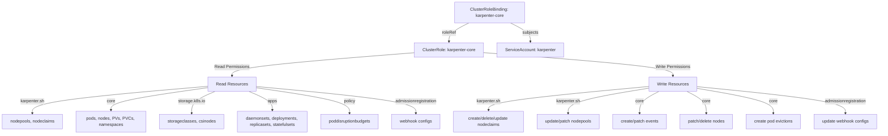
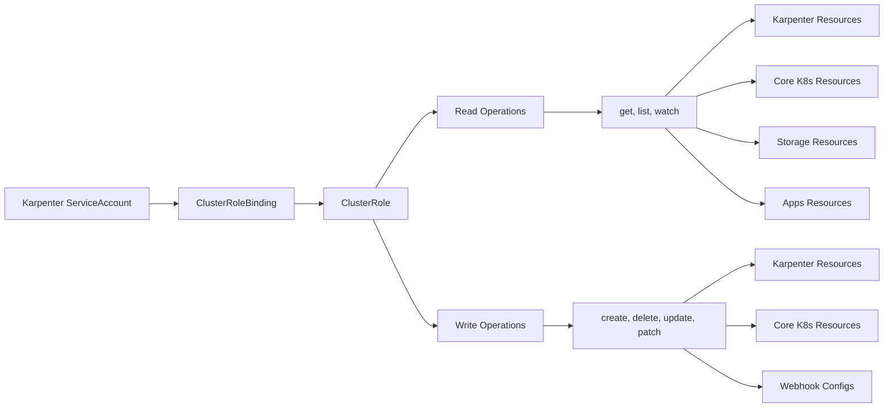
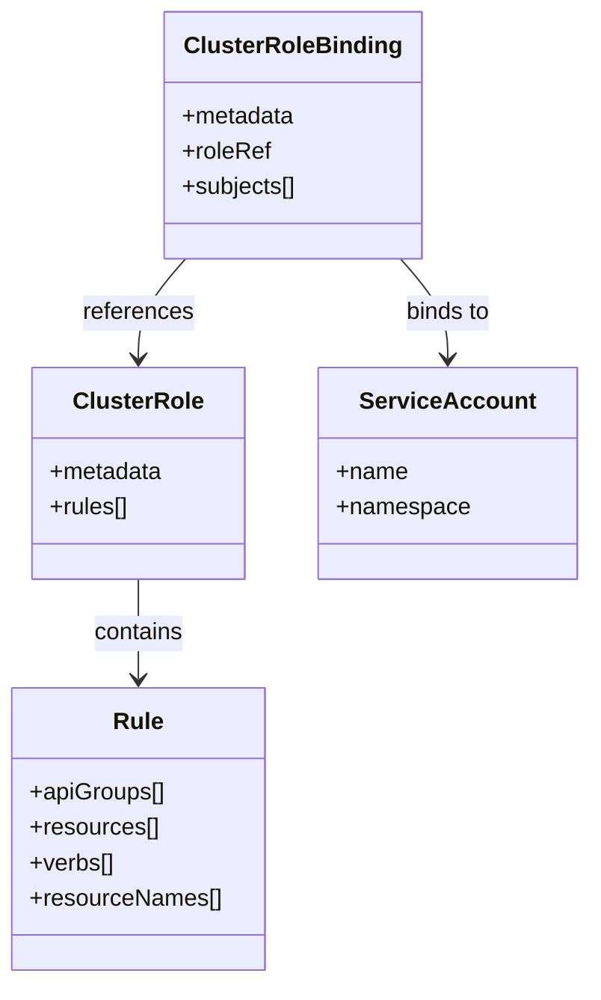
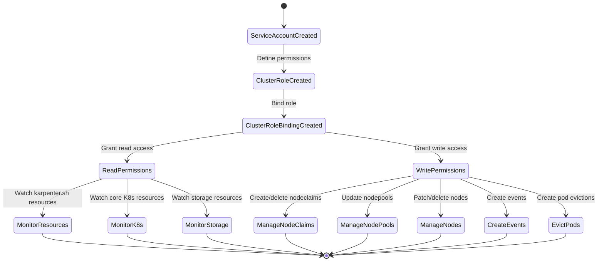

# Diagram: devops/k8s/karpenter/helm/templates/clusterrole-core.yaml

> Auto-generated by Obscura crawlers

## Diagram 1

### SVG

<svg id="container" width="3309.0625" xmlns="http://www.w3.org/2000/svg" class="flowchart" height="502" viewBox="0 0 3309.0625 502" role="graphics-document document" aria-roledescription="flowchart-v2"><g><marker id="container_flowchart-v2-pointEnd" class="marker flowchart-v2" viewBox="0 0 10 10" refX="5" refY="5" markerUnits="userSpaceOnUse" markerWidth="8" markerHeight="8" orient="auto"><path d="M 0 0 L 10 5 L 0 10 z" class="arrowMarkerPath" style="stroke-width: 1; stroke-dasharray: 1, 0;"></path></marker><marker id="container_flowchart-v2-pointStart" class="marker flowchart-v2" viewBox="0 0 10 10" refX="4.5" refY="5" markerUnits="userSpaceOnUse" markerWidth="8" markerHeight="8" orient="auto"><path d="M 0 5 L 10 10 L 10 0 z" class="arrowMarkerPath" style="stroke-width: 1; stroke-dasharray: 1, 0;"></path></marker><marker id="container_flowchart-v2-circleEnd" class="marker flowchart-v2" viewBox="0 0 10 10" refX="11" refY="5" markerUnits="userSpaceOnUse" markerWidth="11" markerHeight="11" orient="auto"><circle cx="5" cy="5" r="5" class="arrowMarkerPath" style="stroke-width: 1; stroke-dasharray: 1, 0;"></circle></marker><marker id="container_flowchart-v2-circleStart" class="marker flowchart-v2" viewBox="0 0 10 10" refX="-1" refY="5" markerUnits="userSpaceOnUse" markerWidth="11" markerHeight="11" orient="auto"><circle cx="5" cy="5" r="5" class="arrowMarkerPath" style="stroke-width: 1; stroke-dasharray: 1, 0;"></circle></marker><marker id="container_flowchart-v2-crossEnd" class="marker cross flowchart-v2" viewBox="0 0 11 11" refX="12" refY="5.2" markerUnits="userSpaceOnUse" markerWidth="11" markerHeight="11" orient="auto"><path d="M 1,1 l 9,9 M 10,1 l -9,9" class="arrowMarkerPath" style="stroke-width: 2; stroke-dasharray: 1, 0;"></path></marker><marker id="container_flowchart-v2-crossStart" class="marker cross flowchart-v2" viewBox="0 0 11 11" refX="-1" refY="5.2" markerUnits="userSpaceOnUse" markerWidth="11" markerHeight="11" orient="auto"><path d="M 1,1 l 9,9 M 10,1 l -9,9" class="arrowMarkerPath" style="stroke-width: 2; stroke-dasharray: 1, 0;"></path></marker><g class="root"><g class="clusters"></g><g class="edgePaths"><path d="M1759.828,86L1747.505,92.167C1735.182,98.333,1710.536,110.667,1698.213,122.333C1685.891,134,1685.891,145,1685.891,150.5L1685.891,156" id="L_CRB_CR_0" class="edge-thickness-normal edge-pattern-solid edge-thickness-normal edge-pattern-solid flowchart-link" style=";" data-edge="true" data-et="edge" data-id="L_CRB_CR_0" data-points="W3sieCI6MTc1OS44Mjc4NjgwMDk4NjgzLCJ5Ijo4Nn0seyJ4IjoxNjg1Ljg5MDYyNSwieSI6MTIzfSx7IngiOjE2ODUuODkwNjI1LCJ5IjoxNjB9XQ==" marker-end="url(#container_flowchart-v2-pointEnd)"></path><path d="M1915.696,86L1928.018,92.167C1940.341,98.333,1964.987,110.667,1977.31,122.333C1989.633,134,1989.633,145,1989.633,150.5L1989.633,156" id="L_CRB_SA_0" class="edge-thickness-normal edge-pattern-solid edge-thickness-normal edge-pattern-solid flowchart-link" style=";" data-edge="true" data-et="edge" data-id="L_CRB_SA_0" data-points="W3sieCI6MTkxNS42OTU1Njk0OTAxMzE3LCJ5Ijo4Nn0seyJ4IjoxOTg5LjYzMjgxMjUsInkiOjEyM30seyJ4IjoxOTg5LjYzMjgxMjUsInkiOjE2MH1d" marker-end="url(#container_flowchart-v2-pointEnd)"></path><path d="M1556.5,197.089L1441.26,206.074C1326.02,215.059,1095.539,233.03,980.299,247.515C865.059,262,865.059,273,865.059,278.5L865.059,284" id="L_CR_ReadResources_0" class="edge-thickness-normal edge-pattern-solid edge-thickness-normal edge-pattern-solid flowchart-link" style=";" data-edge="true" data-et="edge" data-id="L_CR_ReadResources_0" data-points="W3sieCI6MTU1Ni41LCJ5IjoxOTcuMDg4NTQzOTIyMTgyNjJ9LHsieCI6ODY1LjA1ODU5Mzc1LCJ5IjoyNTF9LHsieCI6ODY1LjA1ODU5Mzc1LCJ5IjoyODh9XQ==" marker-end="url(#container_flowchart-v2-pointEnd)"></path><path d="M1815.281,196.822L1934.236,205.852C2053.191,214.881,2291.102,232.941,2410.057,247.47C2529.012,262,2529.012,273,2529.012,278.5L2529.012,284" id="L_CR_WriteResources_0" class="edge-thickness-normal edge-pattern-solid edge-thickness-normal edge-pattern-solid flowchart-link" style=";" data-edge="true" data-et="edge" data-id="L_CR_WriteResources_0" data-points="W3sieCI6MTgxNS4yODEyNSwieSI6MTk2LjgyMTgzOTQyNjYwOTY0fSx7IngiOjI1MjkuMDExNzE4NzUsInkiOjI1MX0seyJ4IjoyNTI5LjAxMTcxODc1LCJ5IjoyODh9XQ==" marker-end="url(#container_flowchart-v2-pointEnd)"></path><path d="M778.043,322.5L668.795,331.917C559.547,341.334,341.051,360.167,231.803,377.083C122.555,394,122.555,409,122.555,416.5L122.555,424" id="L_ReadResources_R1_0" class="edge-thickness-normal edge-pattern-solid edge-thickness-normal edge-pattern-solid flowchart-link" style=";" data-edge="true" data-et="edge" data-id="L_ReadResources_R1_0" data-points="W3sieCI6Nzc4LjA0Mjk2ODc1LCJ5IjozMjIuNTAwMjk3MjQxNzAyMjR9LHsieCI6MTIyLjU1NDY4NzUsInkiOjM3OX0seyJ4IjoxMjIuNTU0Njg3NSwieSI6NDI4fV0=" marker-end="url(#container_flowchart-v2-pointEnd)"></path><path d="M778.043,327.432L717.887,336.027C657.732,344.621,537.421,361.811,477.265,375.905C417.109,390,417.109,401,417.109,406.5L417.109,412" id="L_ReadResources_R2_0" class="edge-thickness-normal edge-pattern-solid edge-thickness-normal edge-pattern-solid flowchart-link" style=";" data-edge="true" data-et="edge" data-id="L_ReadResources_R2_0" data-points="W3sieCI6Nzc4LjA0Mjk2ODc1LCJ5IjozMjcuNDMyMjEyNzc1MjM0MzV9LHsieCI6NDE3LjEwOTM3NSwieSI6Mzc5fSx7IngiOjQxNy4xMDkzNzUsInkiOjQxNn1d" marker-end="url(#container_flowchart-v2-pointEnd)"></path><path d="M802.066,342L787.678,348.167C773.291,354.333,744.517,366.667,730.129,380.333C715.742,394,715.742,409,715.742,416.5L715.742,424" id="L_ReadResources_R3_0" class="edge-thickness-normal edge-pattern-solid edge-thickness-normal edge-pattern-solid flowchart-link" style=";" data-edge="true" data-et="edge" data-id="L_ReadResources_R3_0" data-points="W3sieCI6ODAyLjA2NTczNDg2MzI4MTIsInkiOjM0Mn0seyJ4Ijo3MTUuNzQyMTg3NSwieSI6Mzc5fSx7IngiOjcxNS43NDIxODc1LCJ5Ijo0Mjh9XQ==" marker-end="url(#container_flowchart-v2-pointEnd)"></path><path d="M928.051,342L942.439,348.167C956.826,354.333,985.6,366.667,999.988,378.333C1014.375,390,1014.375,401,1014.375,406.5L1014.375,412" id="L_ReadResources_R4_0" class="edge-thickness-normal edge-pattern-solid edge-thickness-normal edge-pattern-solid flowchart-link" style=";" data-edge="true" data-et="edge" data-id="L_ReadResources_R4_0" data-points="W3sieCI6OTI4LjA1MTQ1MjYzNjcxODgsInkiOjM0Mn0seyJ4IjoxMDE0LjM3NSwieSI6Mzc5fSx7IngiOjEwMTQuMzc1LCJ5Ijo0MTZ9XQ==" marker-end="url(#container_flowchart-v2-pointEnd)"></path><path d="M952.074,327.642L1010.99,336.202C1069.906,344.761,1187.738,361.881,1246.654,377.94C1305.57,394,1305.57,409,1305.57,416.5L1305.57,424" id="L_ReadResources_R5_0" class="edge-thickness-normal edge-pattern-solid edge-thickness-normal edge-pattern-solid flowchart-link" style=";" data-edge="true" data-et="edge" data-id="L_ReadResources_R5_0" data-points="W3sieCI6OTUyLjA3NDIxODc1LCJ5IjozMjcuNjQyMTE1NDM3NDc5NX0seyJ4IjoxMzA1LjU3MDMxMjUsInkiOjM3OX0seyJ4IjoxMzA1LjU3MDMxMjUsInkiOjQyOH1d" marker-end="url(#container_flowchart-v2-pointEnd)"></path><path d="M952.074,323.045L1052.95,332.37C1153.826,341.696,1355.577,360.348,1456.452,377.174C1557.328,394,1557.328,409,1557.328,416.5L1557.328,424" id="L_ReadResources_R6_0" class="edge-thickness-normal edge-pattern-solid edge-thickness-normal edge-pattern-solid flowchart-link" style=";" data-edge="true" data-et="edge" data-id="L_ReadResources_R6_0" data-points="W3sieCI6OTUyLjA3NDIxODc1LCJ5IjozMjMuMDQ0NTU0NTM5MjQ3Nn0seyJ4IjoxNTU3LjMyODEyNSwieSI6Mzc5fSx7IngiOjE1NTcuMzI4MTI1LCJ5Ijo0Mjh9XQ==" marker-end="url(#container_flowchart-v2-pointEnd)"></path><path d="M2441.098,323.025L2338.896,332.354C2236.695,341.683,2032.293,360.342,1930.092,375.171C1827.891,390,1827.891,401,1827.891,406.5L1827.891,412" id="L_WriteResources_W1_0" class="edge-thickness-normal edge-pattern-solid edge-thickness-normal edge-pattern-solid flowchart-link" style=";" data-edge="true" data-et="edge" data-id="L_WriteResources_W1_0" data-points="W3sieCI6MjQ0MS4wOTc2NTYyNSwieSI6MzIzLjAyNTAwNDU5NjQzMzJ9LHsieCI6MTgyNy44OTA2MjUsInkiOjM3OX0seyJ4IjoxODI3Ljg5MDYyNSwieSI6NDE2fV0=" marker-end="url(#container_flowchart-v2-pointEnd)"></path><path d="M2441.098,329.052L2389.014,337.376C2336.93,345.701,2232.762,362.351,2180.678,378.175C2128.594,394,2128.594,409,2128.594,416.5L2128.594,424" id="L_WriteResources_W2_0" class="edge-thickness-normal edge-pattern-solid edge-thickness-normal edge-pattern-solid flowchart-link" style=";" data-edge="true" data-et="edge" data-id="L_WriteResources_W2_0" data-points="W3sieCI6MjQ0MS4wOTc2NTYyNSwieSI6MzI5LjA1MTU2NzIxMDA0NDJ9LHsieCI6MjEyOC41OTM3NSwieSI6Mzc5fSx7IngiOjIxMjguNTkzNzUsInkiOjQyOH1d" marker-end="url(#container_flowchart-v2-pointEnd)"></path><path d="M2475.422,342L2463.182,348.167C2450.943,354.333,2426.464,366.667,2414.224,380.333C2401.984,394,2401.984,409,2401.984,416.5L2401.984,424" id="L_WriteResources_W3_0" class="edge-thickness-normal edge-pattern-solid edge-thickness-normal edge-pattern-solid flowchart-link" style=";" data-edge="true" data-et="edge" data-id="L_WriteResources_W3_0" data-points="W3sieCI6MjQ3NS40MjIwNTgxMDU0Njg4LCJ5IjozNDJ9LHsieCI6MjQwMS45ODQzNzUsInkiOjM3OX0seyJ4IjoyNDAxLjk4NDM3NSwieSI6NDI4fV0=" marker-end="url(#container_flowchart-v2-pointEnd)"></path><path d="M2582.601,342L2594.841,348.167C2607.081,354.333,2631.56,366.667,2643.799,380.333C2656.039,394,2656.039,409,2656.039,416.5L2656.039,424" id="L_WriteResources_W4_0" class="edge-thickness-normal edge-pattern-solid edge-thickness-normal edge-pattern-solid flowchart-link" style=";" data-edge="true" data-et="edge" data-id="L_WriteResources_W4_0" data-points="W3sieCI6MjU4Mi42MDEzNzkzOTQ1MzEyLCJ5IjozNDJ9LHsieCI6MjY1Ni4wMzkwNjI1LCJ5IjozNzl9LHsieCI6MjY1Ni4wMzkwNjI1LCJ5Ijo0Mjh9XQ==" marker-end="url(#container_flowchart-v2-pointEnd)"></path><path d="M2616.926,329.734L2665.917,337.945C2714.909,346.156,2812.892,362.578,2861.883,378.289C2910.875,394,2910.875,409,2910.875,416.5L2910.875,424" id="L_WriteResources_W5_0" class="edge-thickness-normal edge-pattern-solid edge-thickness-normal edge-pattern-solid flowchart-link" style=";" data-edge="true" data-et="edge" data-id="L_WriteResources_W5_0" data-points="W3sieCI6MjYxNi45MjU3ODEyNSwieSI6MzI5LjczNDMzMTA0NTM0NzF9LHsieCI6MjkxMC44NzUsInkiOjM3OX0seyJ4IjoyOTEwLjg3NSwieSI6NDI4fV0=" marker-end="url(#container_flowchart-v2-pointEnd)"></path><path d="M2616.926,323.607L2711.222,332.839C2805.518,342.072,2994.111,360.536,3088.407,377.268C3182.703,394,3182.703,409,3182.703,416.5L3182.703,424" id="L_WriteResources_W6_0" class="edge-thickness-normal edge-pattern-solid edge-thickness-normal edge-pattern-solid flowchart-link" style=";" data-edge="true" data-et="edge" data-id="L_WriteResources_W6_0" data-points="W3sieCI6MjYxNi45MjU3ODEyNSwieSI6MzIzLjYwNzI3MjQwMTMyNjZ9LHsieCI6MzE4Mi43MDMxMjUsInkiOjM3OX0seyJ4IjozMTgyLjcwMzEyNSwieSI6NDI4fV0=" marker-end="url(#container_flowchart-v2-pointEnd)"></path></g><g class="edgeLabels"><g class="edgeLabel" transform="translate(1685.890625, 123)"><g class="label" data-id="L_CRB_CR_0" transform="translate(-25.9453125, -12)"><foreignObject width="51.890625" height="24">

roleRef

</foreignObject></g></g><g class="edgeLabel" transform="translate(1989.6328125, 123)"><g class="label" data-id="L_CRB_SA_0" transform="translate(-30.1953125, -12)"><foreignObject width="60.390625" height="24">

subjects

</foreignObject></g></g><g class="edgeLabel" transform="translate(865.05859375, 251)"><g class="label" data-id="L_CR_ReadResources_0" transform="translate(-63.96875, -12)"><foreignObject width="127.9375" height="24">

Read Permissions

</foreignObject></g></g><g class="edgeLabel" transform="translate(2529.01171875, 251)"><g class="label" data-id="L_CR_WriteResources_0" transform="translate(-64.875, -12)"><foreignObject width="129.75" height="24">

Write Permissions

</foreignObject></g></g><g class="edgeLabel" transform="translate(122.5546875, 379)"><g class="label" data-id="L_ReadResources_R1_0" transform="translate(-45.171875, -12)"><foreignObject width="90.34375" height="24">

karpenter.sh

</foreignObject></g></g><g class="edgeLabel" transform="translate(417.109375, 379)"><g class="label" data-id="L_ReadResources_R2_0" transform="translate(-15.546875, -12)"><foreignObject width="31.09375" height="24">

core

</foreignObject></g></g><g class="edgeLabel" transform="translate(715.7421875, 379)"><g class="label" data-id="L_ReadResources_R3_0" transform="translate(-49.578125, -12)"><foreignObject width="99.15625" height="24">

storage.k8s.io

</foreignObject></g></g><g class="edgeLabel" transform="translate(1014.375, 379)"><g class="label" data-id="L_ReadResources_R4_0" transform="translate(-17.59375, -12)"><foreignObject width="35.1875" height="24">

apps

</foreignObject></g></g><g class="edgeLabel" transform="translate(1305.5703125, 379)"><g class="label" data-id="L_ReadResources_R5_0" transform="translate(-21.7890625, -12)"><foreignObject width="43.578125" height="24">

policy

</foreignObject></g></g><g class="edgeLabel" transform="translate(1557.328125, 379)"><g class="label" data-id="L_ReadResources_R6_0" transform="translate(-79.171875, -12)"><foreignObject width="158.34375" height="24">

admissionregistration

</foreignObject></g></g><g class="edgeLabel" transform="translate(1827.890625, 379)"><g class="label" data-id="L_WriteResources_W1_0" transform="translate(-45.171875, -12)"><foreignObject width="90.34375" height="24">

karpenter.sh

</foreignObject></g></g><g class="edgeLabel" transform="translate(2128.59375, 379)"><g class="label" data-id="L_WriteResources_W2_0" transform="translate(-45.171875, -12)"><foreignObject width="90.34375" height="24">

karpenter.sh

</foreignObject></g></g><g class="edgeLabel" transform="translate(2401.984375, 379)"><g class="label" data-id="L_WriteResources_W3_0" transform="translate(-15.546875, -12)"><foreignObject width="31.09375" height="24">

core

</foreignObject></g></g><g class="edgeLabel" transform="translate(2656.0390625, 379)"><g class="label" data-id="L_WriteResources_W4_0" transform="translate(-15.546875, -12)"><foreignObject width="31.09375" height="24">

core

</foreignObject></g></g><g class="edgeLabel" transform="translate(2910.875, 379)"><g class="label" data-id="L_WriteResources_W5_0" transform="translate(-15.546875, -12)"><foreignObject width="31.09375" height="24">

core

</foreignObject></g></g><g class="edgeLabel" transform="translate(3182.703125, 379)"><g class="label" data-id="L_WriteResources_W6_0" transform="translate(-79.171875, -12)"><foreignObject width="158.34375" height="24">

admissionregistration

</foreignObject></g></g></g><g class="nodes"><g class="node default" id="flowchart-CRB-0" transform="translate(1837.76171875, 47)"><rect class="basic label-container" style="" x="-130" y="-39" width="260" height="78"></rect><g class="label" style="" transform="translate(-100, -24)"><rect></rect><foreignObject width="200" height="48">

ClusterRoleBinding: karpenter-core

</foreignObject></g></g><g class="node default" id="flowchart-CR-1" transform="translate(1685.890625, 187)"><rect class="basic label-container" style="" x="-129.390625" y="-27" width="258.78125" height="54"></rect><g class="label" style="" transform="translate(-99.390625, -12)"><rect></rect><foreignObject width="198.78125" height="24">

ClusterRole: karpenter-core

</foreignObject></g></g><g class="node default" id="flowchart-SA-2" transform="translate(1989.6328125, 187)"><rect class="basic label-container" style="" x="-124.3515625" y="-27" width="248.703125" height="54"></rect><g class="label" style="" transform="translate(-94.3515625, -12)"><rect></rect><foreignObject width="188.703125" height="24">

ServiceAccount: karpenter

</foreignObject></g></g><g class="node default" id="flowchart-ReadResources-8" transform="translate(865.05859375, 315)"><rect class="basic label-container" style="" x="-87.015625" y="-27" width="174.03125" height="54"></rect><g class="label" style="" transform="translate(-57.015625, -12)"><rect></rect><foreignObject width="114.03125" height="24">

Read Resources

</foreignObject></g></g><g class="node default" id="flowchart-WriteResources-10" transform="translate(2529.01171875, 315)"><rect class="basic label-container" style="" x="-87.9140625" y="-27" width="175.828125" height="54"></rect><g class="label" style="" transform="translate(-57.9140625, -12)"><rect></rect><foreignObject width="115.828125" height="24">

Write Resources

</foreignObject></g></g><g class="node default" id="flowchart-R1-12" transform="translate(122.5546875, 455)"><rect class="basic label-container" style="" x="-114.5546875" y="-27" width="229.109375" height="54"></rect><g class="label" style="" transform="translate(-84.5546875, -12)"><rect></rect><foreignObject width="169.109375" height="24">

nodepools, nodeclaims

</foreignObject></g></g><g class="node default" id="flowchart-R2-14" transform="translate(417.109375, 455)"><rect class="basic label-container" style="" x="-130" y="-39" width="260" height="78"></rect><g class="label" style="" transform="translate(-100, -24)"><rect></rect><foreignObject width="200" height="48">

pods, nodes, PVs, PVCs, namespaces

</foreignObject></g></g><g class="node default" id="flowchart-R3-16" transform="translate(715.7421875, 455)"><rect class="basic label-container" style="" x="-118.6328125" y="-27" width="237.265625" height="54"></rect><g class="label" style="" transform="translate(-88.6328125, -12)"><rect></rect><foreignObject width="177.265625" height="24">

storageclasses, csinodes

</foreignObject></g></g><g class="node default" id="flowchart-R4-18" transform="translate(1014.375, 455)"><rect class="basic label-container" style="" x="-130" y="-39" width="260" height="78"></rect><g class="label" style="" transform="translate(-100, -24)"><rect></rect><foreignObject width="200" height="48">

daemonsets, deployments, replicasets, statefulsets

</foreignObject></g></g><g class="node default" id="flowchart-R5-20" transform="translate(1305.5703125, 455)"><rect class="basic label-container" style="" x="-111.1953125" y="-27" width="222.390625" height="54"></rect><g class="label" style="" transform="translate(-81.1953125, -12)"><rect></rect><foreignObject width="162.390625" height="24">

poddisruptionbudgets

</foreignObject></g></g><g class="node default" id="flowchart-R6-22" transform="translate(1557.328125, 455)"><rect class="basic label-container" style="" x="-90.5625" y="-27" width="181.125" height="54"></rect><g class="label" style="" transform="translate(-60.5625, -12)"><rect></rect><foreignObject width="121.125" height="24">

webhook configs

</foreignObject></g></g><g class="node default" id="flowchart-W1-24" transform="translate(1827.890625, 455)"><rect class="basic label-container" style="" x="-130" y="-39" width="260" height="78"></rect><g class="label" style="" transform="translate(-100, -24)"><rect></rect><foreignObject width="200" height="48">

create/delete/update nodeclaims

</foreignObject></g></g><g class="node default" id="flowchart-W2-26" transform="translate(2128.59375, 455)"><rect class="basic label-container" style="" x="-120.703125" y="-27" width="241.40625" height="54"></rect><g class="label" style="" transform="translate(-90.703125, -12)"><rect></rect><foreignObject width="181.40625" height="24">

update/patch nodepools

</foreignObject></g></g><g class="node default" id="flowchart-W3-28" transform="translate(2401.984375, 455)"><rect class="basic label-container" style="" x="-102.6875" y="-27" width="205.375" height="54"></rect><g class="label" style="" transform="translate(-72.6875, -12)"><rect></rect><foreignObject width="145.375" height="24">

create/patch events

</foreignObject></g></g><g class="node default" id="flowchart-W4-30" transform="translate(2656.0390625, 455)"><rect class="basic label-container" style="" x="-101.3671875" y="-27" width="202.734375" height="54"></rect><g class="label" style="" transform="translate(-71.3671875, -12)"><rect></rect><foreignObject width="142.734375" height="24">

patch/delete nodes

</foreignObject></g></g><g class="node default" id="flowchart-W5-32" transform="translate(2910.875, 455)"><rect class="basic label-container" style="" x="-103.46875" y="-27" width="206.9375" height="54"></rect><g class="label" style="" transform="translate(-73.46875, -12)"><rect></rect><foreignObject width="146.9375" height="24">

create pod evictions

</foreignObject></g></g><g class="node default" id="flowchart-W6-34" transform="translate(3182.703125, 455)"><rect class="basic label-container" style="" x="-118.359375" y="-27" width="236.71875" height="54"></rect><g class="label" style="" transform="translate(-88.359375, -12)"><rect></rect><foreignObject width="176.71875" height="24">

update webhook configs

</foreignObject></g></g></g></g></g></svg>

## Diagram 2

### SVG

<svg id="container" width="1505.59375" xmlns="http://www.w3.org/2000/svg" class="flowchart" height="694" viewBox="0 0 1505.59375 694" role="graphics-document document" aria-roledescription="flowchart-v2"><g><marker id="container_flowchart-v2-pointEnd" class="marker flowchart-v2" viewBox="0 0 10 10" refX="5" refY="5" markerUnits="userSpaceOnUse" markerWidth="8" markerHeight="8" orient="auto"><path d="M 0 0 L 10 5 L 0 10 z" class="arrowMarkerPath" style="stroke-width: 1; stroke-dasharray: 1, 0;"></path></marker><marker id="container_flowchart-v2-pointStart" class="marker flowchart-v2" viewBox="0 0 10 10" refX="4.5" refY="5" markerUnits="userSpaceOnUse" markerWidth="8" markerHeight="8" orient="auto"><path d="M 0 5 L 10 10 L 10 0 z" class="arrowMarkerPath" style="stroke-width: 1; stroke-dasharray: 1, 0;"></path></marker><marker id="container_flowchart-v2-circleEnd" class="marker flowchart-v2" viewBox="0 0 10 10" refX="11" refY="5" markerUnits="userSpaceOnUse" markerWidth="11" markerHeight="11" orient="auto"><circle cx="5" cy="5" r="5" class="arrowMarkerPath" style="stroke-width: 1; stroke-dasharray: 1, 0;"></circle></marker><marker id="container_flowchart-v2-circleStart" class="marker flowchart-v2" viewBox="0 0 10 10" refX="-1" refY="5" markerUnits="userSpaceOnUse" markerWidth="11" markerHeight="11" orient="auto"><circle cx="5" cy="5" r="5" class="arrowMarkerPath" style="stroke-width: 1; stroke-dasharray: 1, 0;"></circle></marker><marker id="container_flowchart-v2-crossEnd" class="marker cross flowchart-v2" viewBox="0 0 11 11" refX="12" refY="5.2" markerUnits="userSpaceOnUse" markerWidth="11" markerHeight="11" orient="auto"><path d="M 1,1 l 9,9 M 10,1 l -9,9" class="arrowMarkerPath" style="stroke-width: 2; stroke-dasharray: 1, 0;"></path></marker><marker id="container_flowchart-v2-crossStart" class="marker cross flowchart-v2" viewBox="0 0 11 11" refX="-1" refY="5.2" markerUnits="userSpaceOnUse" markerWidth="11" markerHeight="11" orient="auto"><path d="M 1,1 l 9,9 M 10,1 l -9,9" class="arrowMarkerPath" style="stroke-width: 2; stroke-dasharray: 1, 0;"></path></marker><g class="root"><g class="clusters"></g><g class="edgePaths"><path d="M254.156,347L258.323,347C262.49,347,270.823,347,278.49,347C286.156,347,293.156,347,296.656,347L300.156,347" id="L_Start_Binding_0" class="edge-thickness-normal edge-pattern-solid edge-thickness-normal edge-pattern-solid flowchart-link" style=";" data-edge="true" data-et="edge" data-id="L_Start_Binding_0" data-points="W3sieCI6MjU0LjE1NjI1LCJ5IjozNDd9LHsieCI6Mjc5LjE1NjI1LCJ5IjozNDd9LHsieCI6MzA0LjE1NjI1LCJ5IjozNDd9XQ==" marker-end="url(#container_flowchart-v2-pointEnd)"></path><path d="M502.375,347L506.542,347C510.708,347,519.042,347,526.708,347C534.375,347,541.375,347,544.875,347L548.375,347" id="L_Binding_Role_0" class="edge-thickness-normal edge-pattern-solid edge-thickness-normal edge-pattern-solid flowchart-link" style=";" data-edge="true" data-et="edge" data-id="L_Binding_Role_0" data-points="W3sieCI6NTAyLjM3NSwieSI6MzQ3fSx7IngiOjUyNy4zNzUsInkiOjM0N30seyJ4Ijo1NTIuMzc1LCJ5IjozNDd9XQ==" marker-end="url(#container_flowchart-v2-pointEnd)"></path><path d="M640.476,320L653.764,298.5C667.052,277,693.627,234,710.566,212.5C727.505,191,734.807,191,738.458,191L742.109,191" id="L_Role_ReadOps_0" class="edge-thickness-normal edge-pattern-solid edge-thickness-normal edge-pattern-solid flowchart-link" style=";" data-edge="true" data-et="edge" data-id="L_Role_ReadOps_0" data-points="W3sieCI6NjQwLjQ3NjExMTc3ODg0NjIsInkiOjMyMH0seyJ4Ijo3MjAuMjAzMTI1LCJ5IjoxOTF9LHsieCI6NzQ2LjEwOTM3NSwieSI6MTkxfV0=" marker-end="url(#container_flowchart-v2-pointEnd)"></path><path d="M636.304,374L650.287,404.167C664.271,434.333,692.237,494.667,709.72,524.833C727.203,555,734.203,555,737.703,555L741.203,555" id="L_Role_WriteOps_0" class="edge-thickness-normal edge-pattern-solid edge-thickness-normal edge-pattern-solid flowchart-link" style=";" data-edge="true" data-et="edge" data-id="L_Role_WriteOps_0" data-points="W3sieCI6NjM2LjMwNDM0OTQ1OTEzNDYsInkiOjM3NH0seyJ4Ijo3MjAuMjAzMTI1LCJ5Ijo1NTV9LHsieCI6NzQ1LjIwMzEyNSwieSI6NTU1fV0=" marker-end="url(#container_flowchart-v2-pointEnd)"></path><path d="M926.719,191L931.036,191C935.354,191,943.99,191,959.82,191C975.651,191,998.677,191,1010.19,191L1021.703,191" id="L_ReadOps_ReadVerbs_0" class="edge-thickness-normal edge-pattern-solid edge-thickness-normal edge-pattern-solid flowchart-link" style=";" data-edge="true" data-et="edge" data-id="L_ReadOps_ReadVerbs_0" data-points="W3sieCI6OTI2LjcxODc1LCJ5IjoxOTF9LHsieCI6OTUyLjYyNSwieSI6MTkxfSx7IngiOjEwMjUuNzAzMTI1LCJ5IjoxOTF9XQ==" marker-end="url(#container_flowchart-v2-pointEnd)"></path><path d="M927.625,555L931.792,555C935.958,555,944.292,555,951.958,555C959.625,555,966.625,555,970.125,555L973.625,555" id="L_WriteOps_WriteVerbs_0" class="edge-thickness-normal edge-pattern-solid edge-thickness-normal edge-pattern-solid flowchart-link" style=";" data-edge="true" data-et="edge" data-id="L_WriteOps_WriteVerbs_0" data-points="W3sieCI6OTI3LjYyNSwieSI6NTU1fSx7IngiOjk1Mi42MjUsInkiOjU1NX0seyJ4Ijo5NzcuNjI1LCJ5Ijo1NTV9XQ==" marker-end="url(#container_flowchart-v2-pointEnd)"></path><path d="M1134.452,164L1155.814,142.5C1177.176,121,1219.901,78,1244.763,56.5C1269.625,35,1276.625,35,1280.125,35L1283.625,35" id="L_ReadVerbs_KarpenterRead_0" class="edge-thickness-normal edge-pattern-solid edge-thickness-normal edge-pattern-solid flowchart-link" style=";" data-edge="true" data-et="edge" data-id="L_ReadVerbs_KarpenterRead_0" data-points="W3sieCI6MTEzNC40NTE5MjMwNzY5MjMsInkiOjE2NH0seyJ4IjoxMjYyLjYyNSwieSI6MzV9LHsieCI6MTI4Ny42MjUsInkiOjM1fV0=" marker-end="url(#container_flowchart-v2-pointEnd)"></path><path d="M1188.106,164L1200.526,159.833C1212.946,155.667,1237.785,147.333,1254.54,143.167C1271.294,139,1279.964,139,1284.298,139L1288.633,139" id="L_ReadVerbs_K8sRead_0" class="edge-thickness-normal edge-pattern-solid edge-thickness-normal edge-pattern-solid flowchart-link" style=";" data-edge="true" data-et="edge" data-id="L_ReadVerbs_K8sRead_0" data-points="W3sieCI6MTE4OC4xMDU3NjkyMzA3NjkzLCJ5IjoxNjR9LHsieCI6MTI2Mi42MjUsInkiOjEzOX0seyJ4IjoxMjkyLjYzMjgxMjUsInkiOjEzOX1d" marker-end="url(#container_flowchart-v2-pointEnd)"></path><path d="M1188.106,218L1200.526,222.167C1212.946,226.333,1237.785,234.667,1255.178,238.833C1272.57,243,1282.516,243,1287.488,243L1292.461,243" id="L_ReadVerbs_StorageRead_0" class="edge-thickness-normal edge-pattern-solid edge-thickness-normal edge-pattern-solid flowchart-link" style=";" data-edge="true" data-et="edge" data-id="L_ReadVerbs_StorageRead_0" data-points="W3sieCI6MTE4OC4xMDU3NjkyMzA3NjkzLCJ5IjoyMTh9LHsieCI6MTI2Mi42MjUsInkiOjI0M30seyJ4IjoxMjk2LjQ2MDkzNzUsInkiOjI0M31d" marker-end="url(#container_flowchart-v2-pointEnd)"></path><path d="M1134.452,218L1155.814,239.5C1177.176,261,1219.901,304,1247.81,325.5C1275.719,347,1288.813,347,1295.359,347L1301.906,347" id="L_ReadVerbs_AppsRead_0" class="edge-thickness-normal edge-pattern-solid edge-thickness-normal edge-pattern-solid flowchart-link" style=";" data-edge="true" data-et="edge" data-id="L_ReadVerbs_AppsRead_0" data-points="W3sieCI6MTEzNC40NTE5MjMwNzY5MjMsInkiOjIxOH0seyJ4IjoxMjYyLjYyNSwieSI6MzQ3fSx7IngiOjEzMDUuOTA2MjUsInkiOjM0N31d" marker-end="url(#container_flowchart-v2-pointEnd)"></path><path d="M1165.75,516L1181.896,505.167C1198.042,494.333,1230.333,472.667,1249.979,461.833C1269.625,451,1276.625,451,1280.125,451L1283.625,451" id="L_WriteVerbs_KarpenterWrite_0" class="edge-thickness-normal edge-pattern-solid edge-thickness-normal edge-pattern-solid flowchart-link" style=";" data-edge="true" data-et="edge" data-id="L_WriteVerbs_KarpenterWrite_0" data-points="W3sieCI6MTE2NS43NSwieSI6NTE2fSx7IngiOjEyNjIuNjI1LCJ5Ijo0NTF9LHsieCI6MTI4Ny42MjUsInkiOjQ1MX1d" marker-end="url(#container_flowchart-v2-pointEnd)"></path><path d="M1237.625,555L1241.792,555C1245.958,555,1254.292,555,1262.793,555C1271.294,555,1279.964,555,1284.298,555L1288.633,555" id="L_WriteVerbs_K8sWrite_0" class="edge-thickness-normal edge-pattern-solid edge-thickness-normal edge-pattern-solid flowchart-link" style=";" data-edge="true" data-et="edge" data-id="L_WriteVerbs_K8sWrite_0" data-points="W3sieCI6MTIzNy42MjUsInkiOjU1NX0seyJ4IjoxMjYyLjYyNSwieSI6NTU1fSx7IngiOjEyOTIuNjMyODEyNSwieSI6NTU1fV0=" marker-end="url(#container_flowchart-v2-pointEnd)"></path><path d="M1165.75,594L1181.896,604.833C1198.042,615.667,1230.333,637.333,1252.141,648.167C1273.948,659,1285.271,659,1290.932,659L1296.594,659" id="L_WriteVerbs_WebhookWrite_0" class="edge-thickness-normal edge-pattern-solid edge-thickness-normal edge-pattern-solid flowchart-link" style=";" data-edge="true" data-et="edge" data-id="L_WriteVerbs_WebhookWrite_0" data-points="W3sieCI6MTE2NS43NSwieSI6NTk0fSx7IngiOjEyNjIuNjI1LCJ5Ijo2NTl9LHsieCI6MTMwMC41OTM3NSwieSI6NjU5fV0=" marker-end="url(#container_flowchart-v2-pointEnd)"></path></g><g class="edgeLabels"><g class="edgeLabel"><g class="label" data-id="L_Start_Binding_0" transform="translate(0, 0)"><foreignObject width="0" height="0">

</foreignObject></g></g><g class="edgeLabel"><g class="label" data-id="L_Binding_Role_0" transform="translate(0, 0)"><foreignObject width="0" height="0">

</foreignObject></g></g><g class="edgeLabel"><g class="label" data-id="L_Role_ReadOps_0" transform="translate(0, 0)"><foreignObject width="0" height="0">

</foreignObject></g></g><g class="edgeLabel"><g class="label" data-id="L_Role_WriteOps_0" transform="translate(0, 0)"><foreignObject width="0" height="0">

</foreignObject></g></g><g class="edgeLabel"><g class="label" data-id="L_ReadOps_ReadVerbs_0" transform="translate(0, 0)"><foreignObject width="0" height="0">

</foreignObject></g></g><g class="edgeLabel"><g class="label" data-id="L_WriteOps_WriteVerbs_0" transform="translate(0, 0)"><foreignObject width="0" height="0">

</foreignObject></g></g><g class="edgeLabel"><g class="label" data-id="L_ReadVerbs_KarpenterRead_0" transform="translate(0, 0)"><foreignObject width="0" height="0">

</foreignObject></g></g><g class="edgeLabel"><g class="label" data-id="L_ReadVerbs_K8sRead_0" transform="translate(0, 0)"><foreignObject width="0" height="0">

</foreignObject></g></g><g class="edgeLabel"><g class="label" data-id="L_ReadVerbs_StorageRead_0" transform="translate(0, 0)"><foreignObject width="0" height="0">

</foreignObject></g></g><g class="edgeLabel"><g class="label" data-id="L_ReadVerbs_AppsRead_0" transform="translate(0, 0)"><foreignObject width="0" height="0">

</foreignObject></g></g><g class="edgeLabel"><g class="label" data-id="L_WriteVerbs_KarpenterWrite_0" transform="translate(0, 0)"><foreignObject width="0" height="0">

</foreignObject></g></g><g class="edgeLabel"><g class="label" data-id="L_WriteVerbs_K8sWrite_0" transform="translate(0, 0)"><foreignObject width="0" height="0">

</foreignObject></g></g><g class="edgeLabel"><g class="label" data-id="L_WriteVerbs_WebhookWrite_0" transform="translate(0, 0)"><foreignObject width="0" height="0">

</foreignObject></g></g></g><g class="nodes"><g class="node default" id="flowchart-Start-0" transform="translate(131.078125, 347)"><rect class="basic label-container" style="" x="-123.078125" y="-27" width="246.15625" height="54"></rect><g class="label" style="" transform="translate(-93.078125, -12)"><rect></rect><foreignObject width="186.15625" height="24">

Karpenter ServiceAccount

</foreignObject></g></g><g class="node default" id="flowchart-Binding-1" transform="translate(403.265625, 347)"><rect class="basic label-container" style="" x="-99.109375" y="-27" width="198.21875" height="54"></rect><g class="label" style="" transform="translate(-69.109375, -12)"><rect></rect><foreignObject width="138.21875" height="24">

ClusterRoleBinding

</foreignObject></g></g><g class="node default" id="flowchart-Role-3" transform="translate(623.7890625, 347)"><rect class="basic label-container" style="" x="-71.4140625" y="-27" width="142.828125" height="54"></rect><g class="label" style="" transform="translate(-41.4140625, -12)"><rect></rect><foreignObject width="82.828125" height="24">

ClusterRole

</foreignObject></g></g><g class="node default" id="flowchart-ReadOps-5" transform="translate(836.4140625, 191)"><rect class="basic label-container" style="" x="-90.3046875" y="-27" width="180.609375" height="54"></rect><g class="label" style="" transform="translate(-60.3046875, -12)"><rect></rect><foreignObject width="120.609375" height="24">

Read Operations

</foreignObject></g></g><g class="node default" id="flowchart-WriteOps-7" transform="translate(836.4140625, 555)"><rect class="basic label-container" style="" x="-91.2109375" y="-27" width="182.421875" height="54"></rect><g class="label" style="" transform="translate(-61.2109375, -12)"><rect></rect><foreignObject width="122.421875" height="24">

Write Operations

</foreignObject></g></g><g class="node default" id="flowchart-ReadVerbs-9" transform="translate(1107.625, 191)"><rect class="basic label-container" style="" x="-81.921875" y="-27" width="163.84375" height="54"></rect><g class="label" style="" transform="translate(-51.921875, -12)"><rect></rect><foreignObject width="103.84375" height="24">

get, list, watch

</foreignObject></g></g><g class="node default" id="flowchart-WriteVerbs-11" transform="translate(1107.625, 555)"><rect class="basic label-container" style="" x="-130" y="-39" width="260" height="78"></rect><g class="label" style="" transform="translate(-100, -24)"><rect></rect><foreignObject width="200" height="48">

create, delete, update, patch

</foreignObject></g></g><g class="node default" id="flowchart-KarpenterRead-13" transform="translate(1392.609375, 35)"><rect class="basic label-container" style="" x="-104.984375" y="-27" width="209.96875" height="54"></rect><g class="label" style="" transform="translate(-74.984375, -12)"><rect></rect><foreignObject width="149.96875" height="24">

Karpenter Resources

</foreignObject></g></g><g class="node default" id="flowchart-K8sRead-15" transform="translate(1392.609375, 139)"><rect class="basic label-container" style="" x="-99.9765625" y="-27" width="199.953125" height="54"></rect><g class="label" style="" transform="translate(-69.9765625, -12)"><rect></rect><foreignObject width="139.953125" height="24">

Core K8s Resources

</foreignObject></g></g><g class="node default" id="flowchart-StorageRead-17" transform="translate(1392.609375, 243)"><rect class="basic label-container" style="" x="-96.1484375" y="-27" width="192.296875" height="54"></rect><g class="label" style="" transform="translate(-66.1484375, -12)"><rect></rect><foreignObject width="132.296875" height="24">

Storage Resources

</foreignObject></g></g><g class="node default" id="flowchart-AppsRead-19" transform="translate(1392.609375, 347)"><rect class="basic label-container" style="" x="-86.703125" y="-27" width="173.40625" height="54"></rect><g class="label" style="" transform="translate(-56.703125, -12)"><rect></rect><foreignObject width="113.40625" height="24">

Apps Resources

</foreignObject></g></g><g class="node default" id="flowchart-KarpenterWrite-21" transform="translate(1392.609375, 451)"><rect class="basic label-container" style="" x="-104.984375" y="-27" width="209.96875" height="54"></rect><g class="label" style="" transform="translate(-74.984375, -12)"><rect></rect><foreignObject width="149.96875" height="24">

Karpenter Resources

</foreignObject></g></g><g class="node default" id="flowchart-K8sWrite-23" transform="translate(1392.609375, 555)"><rect class="basic label-container" style="" x="-99.9765625" y="-27" width="199.953125" height="54"></rect><g class="label" style="" transform="translate(-69.9765625, -12)"><rect></rect><foreignObject width="139.953125" height="24">

Core K8s Resources

</foreignObject></g></g><g class="node default" id="flowchart-WebhookWrite-25" transform="translate(1392.609375, 659)"><rect class="basic label-container" style="" x="-92.015625" y="-27" width="184.03125" height="54"></rect><g class="label" style="" transform="translate(-62.015625, -12)"><rect></rect><foreignObject width="124.03125" height="24">

Webhook Configs

</foreignObject></g></g></g></g></g></svg>

## Diagram 3

### SVG

<svg id="container" width="392.73828125" xmlns="http://www.w3.org/2000/svg" class="classDiagram" height="668" viewBox="0 0 392.73828125 668" role="graphics-document document" aria-roledescription="class"><g><defs><marker id="container_class-aggregationStart" class="marker aggregation class" refX="18" refY="7" markerWidth="190" markerHeight="240" orient="auto"><path d="M 18,7 L9,13 L1,7 L9,1 Z"></path></marker></defs><defs><marker id="container_class-aggregationEnd" class="marker aggregation class" refX="1" refY="7" markerWidth="20" markerHeight="28" orient="auto"><path d="M 18,7 L9,13 L1,7 L9,1 Z"></path></marker></defs><defs><marker id="container_class-extensionStart" class="marker extension class" refX="18" refY="7" markerWidth="190" markerHeight="240" orient="auto"><path d="M 1,7 L18,13 V 1 Z"></path></marker></defs><defs><marker id="container_class-extensionEnd" class="marker extension class" refX="1" refY="7" markerWidth="20" markerHeight="28" orient="auto"><path d="M 1,1 V 13 L18,7 Z"></path></marker></defs><defs><marker id="container_class-compositionStart" class="marker composition class" refX="18" refY="7" markerWidth="190" markerHeight="240" orient="auto"><path d="M 18,7 L9,13 L1,7 L9,1 Z"></path></marker></defs><defs><marker id="container_class-compositionEnd" class="marker composition class" refX="1" refY="7" markerWidth="20" markerHeight="28" orient="auto"><path d="M 18,7 L9,13 L1,7 L9,1 Z"></path></marker></defs><defs><marker id="container_class-dependencyStart" class="marker dependency class" refX="6" refY="7" markerWidth="190" markerHeight="240" orient="auto"><path d="M 5,7 L9,13 L1,7 L9,1 Z"></path></marker></defs><defs><marker id="container_class-dependencyEnd" class="marker dependency class" refX="13" refY="7" markerWidth="20" markerHeight="28" orient="auto"><path d="M 18,7 L9,13 L14,7 L9,1 Z"></path></marker></defs><defs><marker id="container_class-lollipopStart" class="marker lollipop class" refX="13" refY="7" markerWidth="190" markerHeight="240" orient="auto"><circle stroke="black" fill="transparent" cx="7" cy="7" r="6"></circle></marker></defs><defs><marker id="container_class-lollipopEnd" class="marker lollipop class" refX="1" refY="7" markerWidth="190" markerHeight="240" orient="auto"><circle stroke="black" fill="transparent" cx="7" cy="7" r="6"></circle></marker></defs><g class="root"><g class="clusters"></g><g class="edgePaths"><path d="M124.793,176L119.527,182.167C114.261,188.333,103.728,200.667,98.462,212C93.195,223.333,93.195,233.667,93.195,238.833L93.195,244" id="id_ClusterRoleBinding_ClusterRole_1" class="edge-thickness-normal edge-pattern-solid relation" style=";;;" data-edge="true" data-et="edge" data-id="id_ClusterRoleBinding_ClusterRole_1" data-points="W3sieCI6MTI0Ljc5MzMwNzcyMjEwNzQ0LCJ5IjoxNzZ9LHsieCI6OTMuMTk1MzEyNSwieSI6MjEzfSx7IngiOjkzLjE5NTMxMjUsInkiOjI1MH1d" marker-end="url(#container_class-dependencyEnd)"></path><path d="M268.265,176L273.532,182.167C278.798,188.333,289.331,200.667,294.597,212C299.863,223.333,299.863,233.667,299.863,238.833L299.863,244" id="id_ClusterRoleBinding_ServiceAccount_2" class="edge-thickness-normal edge-pattern-solid relation" style=";;;" data-edge="true" data-et="edge" data-id="id_ClusterRoleBinding_ServiceAccount_2" data-points="W3sieCI6MjY4LjI2NTI4NjAyNzg5MjU2LCJ5IjoxNzZ9LHsieCI6Mjk5Ljg2MzI4MTI1LCJ5IjoyMTN9LHsieCI6Mjk5Ljg2MzI4MTI1LCJ5IjoyNTB9XQ==" marker-end="url(#container_class-dependencyEnd)"></path><path d="M93.195,394L93.195,400.167C93.195,406.333,93.195,418.667,93.195,430C93.195,441.333,93.195,451.667,93.195,456.833L93.195,462" id="id_ClusterRole_Rule_3" class="edge-thickness-normal edge-pattern-solid relation" style=";;;" data-edge="true" data-et="edge" data-id="id_ClusterRole_Rule_3" data-points="W3sieCI6OTMuMTk1MzEyNSwieSI6Mzk0fSx7IngiOjkzLjE5NTMxMjUsInkiOjQzMX0seyJ4Ijo5My4xOTUzMTI1LCJ5Ijo0Njh9XQ==" marker-end="url(#container_class-dependencyEnd)"></path></g><g class="edgeLabels"><g class="edgeLabel" transform="translate(93.1953125, 213)"><g class="label" data-id="id_ClusterRoleBinding_ClusterRole_1" transform="translate(-37.828125, -12)"><foreignObject width="75.65625" height="24">

references

</foreignObject></g></g><g class="edgeLabel" transform="translate(299.86328125, 213)"><g class="label" data-id="id_ClusterRoleBinding_ServiceAccount_2" transform="translate(-29.78125, -12)"><foreignObject width="59.5625" height="24">

binds to

</foreignObject></g></g><g class="edgeLabel" transform="translate(93.1953125, 431)"><g class="label" data-id="id_ClusterRole_Rule_3" transform="translate(-30.890625, -12)"><foreignObject width="61.78125" height="24">

contains

</foreignObject></g></g></g><g class="nodes"><g class="node default" id="classId-ClusterRoleBinding-0" transform="translate(196.529296875, 92)"><g class="basic label-container"><path d="M-86.36328125 -84 L86.36328125 -84 L86.36328125 84 L-86.36328125 84" stroke="none" stroke-width="0" fill="#ECECFF" style=""></path><path d="M-86.36328125 -84 C-48.57229308655805 -84, -10.781304923116096 -84, 86.36328125 -84 M-86.36328125 -84 C-36.80862003216194 -84, 12.74604118567612 -84, 86.36328125 -84 M86.36328125 -84 C86.36328125 -33.59808859393457, 86.36328125 16.80382281213086, 86.36328125 84 M86.36328125 -84 C86.36328125 -31.99263573165735, 86.36328125 20.014728536685297, 86.36328125 84 M86.36328125 84 C22.727594456746225 84, -40.90809233650755 84, -86.36328125 84 M86.36328125 84 C18.033342490578192 84, -50.296596268843615 84, -86.36328125 84 M-86.36328125 84 C-86.36328125 26.719603301628446, -86.36328125 -30.560793396743108, -86.36328125 -84 M-86.36328125 84 C-86.36328125 34.16764688899441, -86.36328125 -15.664706222011176, -86.36328125 -84" stroke="#9370DB" stroke-width="1.3" fill="none" stroke-dasharray="0 0" style=""></path></g><g class="annotation-group text" transform="translate(0, -60)"></g><g class="label-group text" transform="translate(-70.0390625, -60)"><g class="label" style="font-weight: bolder" transform="translate(0,-12)"><foreignObject width="140.078125" height="24">

ClusterRoleBinding

</foreignObject></g></g><g class="members-group text" transform="translate(-74.36328125, -12)"><g class="label" style="" transform="translate(0,-12)"><foreignObject width="77.4375" height="24">

+metadata

</foreignObject></g><g class="label" style="" transform="translate(0,12)"><foreignObject width="59.875" height="24">

+roleRef

</foreignObject></g><g class="label" style="" transform="translate(0,36)"><foreignObject width="78.6875" height="24">

+subjects[]

</foreignObject></g></g><g class="methods-group text" transform="translate(-74.36328125, 84)"></g><g class="divider" style=""><path d="M-86.36328125 -36 C-50.826816064620395 -36, -15.29035087924079 -36, 86.36328125 -36 M-86.36328125 -36 C-49.235669353318904 -36, -12.108057456637809 -36, 86.36328125 -36" stroke="#9370DB" stroke-width="1.3" fill="none" stroke-dasharray="0 0" style=""></path></g><g class="divider" style=""><path d="M-86.36328125 60 C-20.222505107697998 60, 45.918271034604004 60, 86.36328125 60 M-86.36328125 60 C-43.92579174335547 60, -1.4883022367109362 60, 86.36328125 60" stroke="#9370DB" stroke-width="1.3" fill="none" stroke-dasharray="0 0" style=""></path></g></g><g class="node default" id="classId-ClusterRole-1" transform="translate(93.1953125, 322)"><g class="basic label-container"><path d="M-71.79296875 -72 L71.79296875 -72 L71.79296875 72 L-71.79296875 72" stroke="none" stroke-width="0" fill="#ECECFF" style=""></path><path d="M-71.79296875 -72 C-38.775459686740476 -72, -5.757950623480951 -72, 71.79296875 -72 M-71.79296875 -72 C-35.51270656520253 -72, 0.767555619594944 -72, 71.79296875 -72 M71.79296875 -72 C71.79296875 -21.9467716777119, 71.79296875 28.1064566445762, 71.79296875 72 M71.79296875 -72 C71.79296875 -16.26482737777841, 71.79296875 39.47034524444318, 71.79296875 72 M71.79296875 72 C22.694960437284557 72, -26.403047875430886 72, -71.79296875 72 M71.79296875 72 C18.536978555166385 72, -34.71901163966723 72, -71.79296875 72 M-71.79296875 72 C-71.79296875 28.41728901568451, -71.79296875 -15.16542196863098, -71.79296875 -72 M-71.79296875 72 C-71.79296875 28.70205340440588, -71.79296875 -14.595893191188239, -71.79296875 -72" stroke="#9370DB" stroke-width="1.3" fill="none" stroke-dasharray="0 0" style=""></path></g><g class="annotation-group text" transform="translate(0, -48)"></g><g class="label-group text" transform="translate(-42.1484375, -48)"><g class="label" style="font-weight: bolder" transform="translate(0,-12)"><foreignObject width="84.296875" height="24">

ClusterRole

</foreignObject></g></g><g class="members-group text" transform="translate(-59.79296875, 0)"><g class="label" style="" transform="translate(0,-12)"><foreignObject width="77.4375" height="24">

+metadata

</foreignObject></g><g class="label" style="" transform="translate(0,12)"><foreignObject width="54.578125" height="24">

+rules[]

</foreignObject></g></g><g class="methods-group text" transform="translate(-59.79296875, 72)"></g><g class="divider" style=""><path d="M-71.79296875 -24 C-35.703664187931096 -24, 0.3856403741378074 -24, 71.79296875 -24 M-71.79296875 -24 C-24.25067425764616 -24, 23.29162023470768 -24, 71.79296875 -24" stroke="#9370DB" stroke-width="1.3" fill="none" stroke-dasharray="0 0" style=""></path></g><g class="divider" style=""><path d="M-71.79296875 48 C-33.549992810292906 48, 4.692983129414188 48, 71.79296875 48 M-71.79296875 48 C-35.924462585254055 48, -0.05595642050811023 48, 71.79296875 48" stroke="#9370DB" stroke-width="1.3" fill="none" stroke-dasharray="0 0" style=""></path></g></g><g class="node default" id="classId-ServiceAccount-2" transform="translate(299.86328125, 322)"><g class="basic label-container"><path d="M-84.875 -72 L84.875 -72 L84.875 72 L-84.875 72" stroke="none" stroke-width="0" fill="#ECECFF" style=""></path><path d="M-84.875 -72 C-47.883692748596275 -72, -10.89238549719255 -72, 84.875 -72 M-84.875 -72 C-26.776747152540047 -72, 31.321505694919907 -72, 84.875 -72 M84.875 -72 C84.875 -22.462913209410374, 84.875 27.074173581179252, 84.875 72 M84.875 -72 C84.875 -32.48226653045723, 84.875 7.035466939085538, 84.875 72 M84.875 72 C35.60288584810007 72, -13.669228303799855 72, -84.875 72 M84.875 72 C18.362420395626145 72, -48.15015920874771 72, -84.875 72 M-84.875 72 C-84.875 41.04808031264492, -84.875 10.09616062528984, -84.875 -72 M-84.875 72 C-84.875 40.42165426977394, -84.875 8.843308539547877, -84.875 -72" stroke="#9370DB" stroke-width="1.3" fill="none" stroke-dasharray="0 0" style=""></path></g><g class="annotation-group text" transform="translate(0, -48)"></g><g class="label-group text" transform="translate(-55.671875, -48)"><g class="label" style="font-weight: bolder" transform="translate(0,-12)"><foreignObject width="111.34375" height="24">

ServiceAccount

</foreignObject></g></g><g class="members-group text" transform="translate(-72.875, 0)"><g class="label" style="" transform="translate(0,-12)"><foreignObject width="48.5" height="24">

+name

</foreignObject></g><g class="label" style="" transform="translate(0,12)"><foreignObject width="90.078125" height="24">

+namespace

</foreignObject></g></g><g class="methods-group text" transform="translate(-72.875, 72)"></g><g class="divider" style=""><path d="M-84.875 -24 C-32.85291148537181 -24, 19.169177029256375 -24, 84.875 -24 M-84.875 -24 C-27.966068200951938 -24, 28.942863598096125 -24, 84.875 -24" stroke="#9370DB" stroke-width="1.3" fill="none" stroke-dasharray="0 0" style=""></path></g><g class="divider" style=""><path d="M-84.875 48 C-23.138447033760464 48, 38.59810593247907 48, 84.875 48 M-84.875 48 C-46.654885702194726 48, -8.434771404389451 48, 84.875 48" stroke="#9370DB" stroke-width="1.3" fill="none" stroke-dasharray="0 0" style=""></path></g></g><g class="node default" id="classId-Rule-3" transform="translate(93.1953125, 564)"><g class="basic label-container"><path d="M-85.1953125 -96 L85.1953125 -96 L85.1953125 96 L-85.1953125 96" stroke="none" stroke-width="0" fill="#ECECFF" style=""></path><path d="M-85.1953125 -96 C-48.26206795456369 -96, -11.32882340912738 -96, 85.1953125 -96 M-85.1953125 -96 C-19.28493479513068 -96, 46.62544290973864 -96, 85.1953125 -96 M85.1953125 -96 C85.1953125 -45.421255888237845, 85.1953125 5.157488223524311, 85.1953125 96 M85.1953125 -96 C85.1953125 -51.49732827330977, 85.1953125 -6.994656546619538, 85.1953125 96 M85.1953125 96 C47.0863994109563 96, 8.977486321912593 96, -85.1953125 96 M85.1953125 96 C40.27869443547955 96, -4.637923629040898 96, -85.1953125 96 M-85.1953125 96 C-85.1953125 39.13117334646739, -85.1953125 -17.737653307065216, -85.1953125 -96 M-85.1953125 96 C-85.1953125 57.19017396412512, -85.1953125 18.380347928250245, -85.1953125 -96" stroke="#9370DB" stroke-width="1.3" fill="none" stroke-dasharray="0 0" style=""></path></g><g class="annotation-group text" transform="translate(0, -72)"></g><g class="label-group text" transform="translate(-16.265625, -72)"><g class="label" style="font-weight: bolder" transform="translate(0,-12)"><foreignObject width="32.53125" height="24">

Rule

</foreignObject></g></g><g class="members-group text" transform="translate(-73.1953125, -24)"><g class="label" style="" transform="translate(0,-12)"><foreignObject width="92.203125" height="24">

+apiGroups[]

</foreignObject></g><g class="label" style="" transform="translate(0,12)"><foreignObject width="88.0625" height="24">

+resources[]

</foreignObject></g><g class="label" style="" transform="translate(0,36)"><foreignObject width="57.8125" height="24">

+verbs[]

</foreignObject></g><g class="label" style="" transform="translate(0,60)"><foreignObject width="130.125" height="24">

+resourceNames[]

</foreignObject></g></g><g class="methods-group text" transform="translate(-73.1953125, 96)"></g><g class="divider" style=""><path d="M-85.1953125 -48 C-22.0564539277156 -48, 41.0824046445688 -48, 85.1953125 -48 M-85.1953125 -48 C-20.56027422806872 -48, 44.07476404386256 -48, 85.1953125 -48" stroke="#9370DB" stroke-width="1.3" fill="none" stroke-dasharray="0 0" style=""></path></g><g class="divider" style=""><path d="M-85.1953125 72 C-43.70038941160327 72, -2.2054663232065366 72, 85.1953125 72 M-85.1953125 72 C-46.41345471899147 72, -7.631596937982934 72, 85.1953125 72" stroke="#9370DB" stroke-width="1.3" fill="none" stroke-dasharray="0 0" style=""></path></g></g></g></g></g></svg>

## Diagram 4

### SVG

<svg id="container" width="1470" xmlns="http://www.w3.org/2000/svg" class="statediagram" height="664" viewBox="0 0 1470 664" role="graphics-document document" aria-roledescription="stateDiagram"><g><defs><marker id="container_stateDiagram-barbEnd" refX="19" refY="7" markerWidth="20" markerHeight="14" markerUnits="userSpaceOnUse" orient="auto"><path d="M 19,7 L9,13 L14,7 L9,1 Z"></path></marker></defs><g class="root"><g class="clusters"></g><g class="edgePaths"><path d="M714.016,22L714.016,26.167C714.016,30.333,714.016,38.667,714.099,47.083C714.182,55.5,714.349,64,714.432,68.25L714.516,72.5" id="edge0" class="edge-thickness-normal edge-pattern-solid transition" style="fill:none;;;fill:none" data-edge="true" data-et="edge" data-id="edge0" data-points="W3sieCI6NzE0LjAxNTYyNSwieSI6MjJ9LHsieCI6NzE0LjAxNTYyNSwieSI6NDd9LHsieCI6NzE0LjUxNTYyNSwieSI6NzIuNX1d" marker-end="url(#container_stateDiagram-barbEnd)"></path><path d="M714.516,112.5L714.432,118.583C714.349,124.667,714.182,136.833,714.182,149.167C714.182,161.5,714.349,174,714.432,180.25L714.516,186.5" id="edge1" class="edge-thickness-normal edge-pattern-solid transition" style="fill:none;;;fill:none" data-edge="true" data-et="edge" data-id="edge1" data-points="W3sieCI6NzE0LjUxNTYyNSwieSI6MTEyLjV9LHsieCI6NzE0LjAxNTYyNSwieSI6MTQ5fSx7IngiOjcxNC41MTU2MjUsInkiOjE4Ni41fV0=" marker-end="url(#container_stateDiagram-barbEnd)"></path><path d="M714.516,226.5L714.432,232.583C714.349,238.667,714.182,250.833,714.182,263.167C714.182,275.5,714.349,288,714.432,294.25L714.516,300.5" id="edge2" class="edge-thickness-normal edge-pattern-solid transition" style="fill:none;;;fill:none" data-edge="true" data-et="edge" data-id="edge2" data-points="W3sieCI6NzE0LjUxNTYyNSwieSI6MjI2LjV9LHsieCI6NzE0LjAxNTYyNSwieSI6MjYzfSx7IngiOjcxNC41MTU2MjUsInkiOjMwMC41fV0=" marker-end="url(#container_stateDiagram-barbEnd)"></path><path d="M609.663,335.652L561.314,342.543C512.965,349.435,416.268,363.217,368.002,376.359C319.737,389.5,319.904,402,319.987,408.25L320.07,414.5" id="edge3" class="edge-thickness-normal edge-pattern-solid transition" style="fill:none;;;fill:none" data-edge="true" data-et="edge" data-id="edge3" data-points="W3sieCI6NjA5LjY2MjUzNTc5MjMxMjYsInkiOjMzNS42NTE5NzY0NDc1Mjg5fSx7IngiOjMxOS41NzAzMTI1LCJ5IjozNzd9LHsieCI6MzIwLjA3MDMxMjUsInkiOjQxNC41fV0=" marker-end="url(#container_stateDiagram-barbEnd)"></path><path d="M819.369,335.652L867.551,342.543C915.733,349.435,1012.097,363.217,1060.362,376.359C1108.628,389.5,1108.794,402,1108.878,408.25L1108.961,414.5" id="edge4" class="edge-thickness-normal edge-pattern-solid transition" style="fill:none;;;fill:none" data-edge="true" data-et="edge" data-id="edge4" data-points="W3sieCI6ODE5LjM2ODcxNDIwNzY5MywieSI6MzM1LjY1MTk3NjQ0NzUyOTd9LHsieCI6MTEwOC40NjA5Mzc1LCJ5IjozNzd9LHsieCI6MTEwOC45NjA5Mzc1LCJ5Ijo0MTQuNX1d" marker-end="url(#container_stateDiagram-barbEnd)"></path><path d="M258.746,454.5L233.621,462.583C208.497,470.667,158.249,486.833,133.208,503.167C108.167,519.5,108.333,536,108.417,544.25L108.5,552.5" id="edge5" class="edge-thickness-normal edge-pattern-solid transition" style="fill:none;;;fill:none" data-edge="true" data-et="edge" data-id="edge5" data-points="W3sieCI6MjU4Ljc0NTU4NDIzOTEzMDQ0LCJ5Ijo0NTQuNX0seyJ4IjoxMDgsInkiOjUwM30seyJ4IjoxMDguNSwieSI6NTUyLjV9XQ==" marker-end="url(#container_stateDiagram-barbEnd)"></path><path d="M320.07,454.5L319.987,462.583C319.904,470.667,319.737,486.833,319.737,503.167C319.737,519.5,319.904,536,319.987,544.25L320.07,552.5" id="edge6" class="edge-thickness-normal edge-pattern-solid transition" style="fill:none;;;fill:none" data-edge="true" data-et="edge" data-id="edge6" data-points="W3sieCI6MzIwLjA3MDMxMjUsInkiOjQ1NC41fSx7IngiOjMxOS41NzAzMTI1LCJ5Ijo1MDN9LHsieCI6MzIwLjA3MDMxMjUsInkiOjU1Mi41fV0=" marker-end="url(#container_stateDiagram-barbEnd)"></path><path d="M377.851,454.5L401.362,462.583C424.872,470.667,471.893,486.833,495.487,503.167C519.081,519.5,519.247,536,519.331,544.25L519.414,552.5" id="edge7" class="edge-thickness-normal edge-pattern-solid transition" style="fill:none;;;fill:none" data-edge="true" data-et="edge" data-id="edge7" data-points="W3sieCI6Mzc3Ljg1MTEwOTYwMTQ0OTI1LCJ5Ijo0NTQuNX0seyJ4Ijo1MTguOTE0MDYyNSwieSI6NTAzfSx7IngiOjUxOS40MTQwNjI1LCJ5Ijo1NTIuNX1d" marker-end="url(#container_stateDiagram-barbEnd)"></path><path d="M1038.203,447.078L985.22,456.398C932.237,465.719,826.271,484.359,773.371,501.93C720.471,519.5,720.638,536,720.721,544.25L720.805,552.5" id="edge8" class="edge-thickness-normal edge-pattern-solid transition" style="fill:none;;;fill:none" data-edge="true" data-et="edge" data-id="edge8" data-points="W3sieCI6MTAzOC4yMDMxMjUsInkiOjQ0Ny4wNzgxNTM5MzI4NTU2fSx7IngiOjcyMC4zMDQ2ODc1LCJ5Ijo1MDN9LHsieCI6NzIwLjgwNDY4NzUsInkiOjU1Mi41fV0=" marker-end="url(#container_stateDiagram-barbEnd)"></path><path d="M1055.63,454.5L1033.77,462.583C1011.909,470.667,968.189,486.833,946.412,503.167C924.635,519.5,924.802,536,924.885,544.25L924.969,552.5" id="edge9" class="edge-thickness-normal edge-pattern-solid transition" style="fill:none;;;fill:none" data-edge="true" data-et="edge" data-id="edge9" data-points="W3sieCI6MTA1NS42Mjk4Njg2NTk0MjAzLCJ5Ijo0NTQuNX0seyJ4Ijo5MjQuNDY4NzUsInkiOjUwM30seyJ4Ijo5MjQuOTY4NzUsInkiOjU1Mi41fV0=" marker-end="url(#container_stateDiagram-barbEnd)"></path><path d="M1108.961,454.5L1108.878,462.583C1108.794,470.667,1108.628,486.833,1108.628,503.167C1108.628,519.5,1108.794,536,1108.878,544.25L1108.961,552.5" id="edge10" class="edge-thickness-normal edge-pattern-solid transition" style="fill:none;;;fill:none" data-edge="true" data-et="edge" data-id="edge10" data-points="W3sieCI6MTEwOC45NjA5Mzc1LCJ5Ijo0NTQuNX0seyJ4IjoxMTA4LjQ2MDkzNzUsInkiOjUwM30seyJ4IjoxMTA4Ljk2MDkzNzUsInkiOjU1Mi41fV0=" marker-end="url(#container_stateDiagram-barbEnd)"></path><path d="M1156.386,454.5L1175.668,462.583C1194.95,470.667,1233.514,486.833,1252.879,503.167C1272.245,519.5,1272.411,536,1272.495,544.25L1272.578,552.5" id="edge11" class="edge-thickness-normal edge-pattern-solid transition" style="fill:none;;;fill:none" data-edge="true" data-et="edge" data-id="edge11" data-points="W3sieCI6MTE1Ni4zODYyMDkyMzkxMzA1LCJ5Ijo0NTQuNX0seyJ4IjoxMjcyLjA3ODEyNSwieSI6NTAzfSx7IngiOjEyNzIuNTc4MTI1LCJ5Ijo1NTIuNX1d" marker-end="url(#container_stateDiagram-barbEnd)"></path><path d="M1179.667,450.192L1219.618,458.993C1259.57,467.794,1339.472,485.397,1379.507,502.449C1419.542,519.5,1419.708,536,1419.792,544.25L1419.875,552.5" id="edge12" class="edge-thickness-normal edge-pattern-solid transition" style="fill:none;;;fill:none" data-edge="true" data-et="edge" data-id="edge12" data-points="W3sieCI6MTE3OS42NjY5NDIwNzU5NzU0LCJ5Ijo0NTAuMTkxNTIwMjc1Nzc0OTZ9LHsieCI6MTQxOS4zNzUsInkiOjUwM30seyJ4IjoxNDE5Ljg3NSwieSI6NTUyLjV9XQ==" marker-end="url(#container_stateDiagram-barbEnd)"></path><path d="M108.5,592.5L108.417,596.583C108.333,600.667,108.167,608.833,225.982,618.198C343.798,627.562,579.596,638.125,697.495,643.406L815.394,648.687" id="edge13" class="edge-thickness-normal edge-pattern-solid transition" style="fill:none;;;fill:none" data-edge="true" data-et="edge" data-id="edge13" data-points="W3sieCI6MTA4LjUsInkiOjU5Mi41fSx7IngiOjEwOCwieSI6NjE3fSx7IngiOjgxNS4zOTM3MzA4NTMzMzM1LCJ5Ijo2NDguNjg2NzU4NDM2NTQ0Mn1d" marker-end="url(#container_stateDiagram-barbEnd)"></path><path d="M320.07,592.5L319.987,596.583C319.904,600.667,319.737,608.833,402.292,618.176C484.847,627.518,650.124,638.037,732.762,643.296L815.401,648.555" id="edge14" class="edge-thickness-normal edge-pattern-solid transition" style="fill:none;;;fill:none" data-edge="true" data-et="edge" data-id="edge14" data-points="W3sieCI6MzIwLjA3MDMxMjUsInkiOjU5Mi41fSx7IngiOjMxOS41NzAzMTI1LCJ5Ijo2MTd9LHsieCI6ODE1LjQwMDg1MTY4MzUwNTcsInkiOjY0OC41NTU0MDg4MDY1NzYxfV0=" marker-end="url(#container_stateDiagram-barbEnd)"></path><path d="M519.414,592.5L519.331,596.583C519.247,600.667,519.081,608.833,568.416,618.128C617.751,627.422,716.588,637.844,766.007,643.055L815.425,648.266" id="edge15" class="edge-thickness-normal edge-pattern-solid transition" style="fill:none;;;fill:none" data-edge="true" data-et="edge" data-id="edge15" data-points="W3sieCI6NTE5LjQxNDA2MjUsInkiOjU5Mi41fSx7IngiOjUxOC45MTQwNjI1LCJ5Ijo2MTd9LHsieCI6ODE1LjQyNTMxMzI2MTM0MjQsInkiOjY0OC4yNjU5NDcxMjU1NTA4fV0=" marker-end="url(#container_stateDiagram-barbEnd)"></path><path d="M720.805,592.5L720.721,596.583C720.638,600.667,720.471,608.833,736.288,617.901C752.106,626.969,783.906,636.937,799.807,641.922L815.707,646.906" id="edge16" class="edge-thickness-normal edge-pattern-solid transition" style="fill:none;;;fill:none" data-edge="true" data-et="edge" data-id="edge16" data-points="W3sieCI6NzIwLjgwNDY4NzUsInkiOjU5Mi41fSx7IngiOjcyMC4zMDQ2ODc1LCJ5Ijo2MTd9LHsieCI6ODE1LjcwNzIxMjU1ODE5ODQsInkiOjY0Ni45MDYxNTI1NzYzMTJ9XQ==" marker-end="url(#container_stateDiagram-barbEnd)"></path><path d="M924.969,592.5L924.885,596.583C924.802,600.667,924.635,608.833,908.652,617.901C892.668,626.969,860.867,636.937,844.967,641.922L829.066,646.906" id="edge17" class="edge-thickness-normal edge-pattern-solid transition" style="fill:none;;;fill:none" data-edge="true" data-et="edge" data-id="edge17" data-points="W3sieCI6OTI0Ljk2ODc1LCJ5Ijo1OTIuNX0seyJ4Ijo5MjQuNDY4NzUsInkiOjYxN30seyJ4Ijo4MjkuMDY2MjI0OTQxODAxNiwieSI6NjQ2LjkwNjE1MjU3NjMxMn1d" marker-end="url(#container_stateDiagram-barbEnd)"></path><path d="M1108.961,592.5L1108.878,596.583C1108.794,600.667,1108.628,608.833,1062.025,618.12C1015.422,627.407,922.383,637.815,875.863,643.018L829.343,648.222" id="edge18" class="edge-thickness-normal edge-pattern-solid transition" style="fill:none;;;fill:none" data-edge="true" data-et="edge" data-id="edge18" data-points="W3sieCI6MTEwOC45NjA5Mzc1LCJ5Ijo1OTIuNX0seyJ4IjoxMTA4LjQ2MDkzNzUsInkiOjYxN30seyJ4Ijo4MjkuMzQzMzMxODkzOTYzOSwieSI6NjQ4LjIyMTgzOTYyNzU2NH1d" marker-end="url(#container_stateDiagram-barbEnd)"></path><path d="M1272.578,592.5L1272.495,596.583C1272.411,600.667,1272.245,608.833,1198.377,618.167C1124.508,627.501,976.939,638.002,903.154,643.253L829.369,648.503" id="edge19" class="edge-thickness-normal edge-pattern-solid transition" style="fill:none;;;fill:none" data-edge="true" data-et="edge" data-id="edge19" data-points="W3sieCI6MTI3Mi41NzgxMjUsInkiOjU5Mi41fSx7IngiOjEyNzIuMDc4MTI1LCJ5Ijo2MTd9LHsieCI6ODI5LjM2OTA2MjcxMTEwMDQsInkiOjY0OC41MDMxMzcwMzIwODUxfV0=" marker-end="url(#container_stateDiagram-barbEnd)"></path><path d="M1419.875,592.5L1419.792,596.583C1419.708,600.667,1419.542,608.833,1321.125,618.188C1222.709,627.542,1026.043,638.084,927.71,643.354L829.377,648.625" id="edge20" class="edge-thickness-normal edge-pattern-solid transition" style="fill:none;;;fill:none" data-edge="true" data-et="edge" data-id="edge20" data-points="W3sieCI6MTQxOS44NzUsInkiOjU5Mi41fSx7IngiOjE0MTkuMzc1LCJ5Ijo2MTd9LHsieCI6ODI5LjM3NjY4NDExMTAxNzgsInkiOjY0OC42MjUzMjExMzUxNDE1fV0=" marker-end="url(#container_stateDiagram-barbEnd)"></path></g><g class="edgeLabels"><g class="edgeLabel"><g class="label" data-id="edge0" transform="translate(0, 0)"><foreignObject width="0" height="0">

</foreignObject></g></g><g class="edgeLabel" transform="translate(714.015625, 149)"><g class="label" data-id="edge1" transform="translate(-69.34375, -12)"><foreignObject width="138.6875" height="24">

Define permissions

</foreignObject></g></g><g class="edgeLabel" transform="translate(714.015625, 263)"><g class="label" data-id="edge2" transform="translate(-32.8984375, -12)"><foreignObject width="65.796875" height="24">

Bind role

</foreignObject></g></g><g class="edgeLabel" transform="translate(319.5703125, 377)"><g class="label" data-id="edge3" transform="translate(-63.7265625, -12)"><foreignObject width="127.453125" height="24">

Grant read access

</foreignObject></g></g><g class="edgeLabel" transform="translate(982.47759, 358.98097)"><g class="label" data-id="edge4" transform="translate(-65.671875, -12)"><foreignObject width="131.34375" height="24">

Grant write access

</foreignObject></g></g><g class="edgeLabel" transform="translate(108, 503)"><g class="label" data-id="edge5" transform="translate(-100, -24)"><foreignObject width="200" height="48">

Watch karpenter.sh resources

</foreignObject></g></g><g class="edgeLabel" transform="translate(319.5703125, 503)"><g class="label" data-id="edge6" transform="translate(-91.5703125, -12)"><foreignObject width="183.140625" height="24">

Watch core K8s resources

</foreignObject></g></g><g class="edgeLabel" transform="translate(518.9140625, 503)"><g class="label" data-id="edge7" transform="translate(-87.7734375, -12)"><foreignObject width="175.546875" height="24">

Watch storage resources

</foreignObject></g></g><g class="edgeLabel" transform="translate(720.3046875, 503)"><g class="label" data-id="edge8" transform="translate(-93.6171875, -12)"><foreignObject width="187.234375" height="24">

Create/delete nodeclaims

</foreignObject></g></g><g class="edgeLabel" transform="translate(924.46875, 503)"><g class="label" data-id="edge9" transform="translate(-67.1171875, -12)"><foreignObject width="134.234375" height="24">

Update nodepools

</foreignObject></g></g><g class="edgeLabel" transform="translate(1108.4609375, 503)"><g class="label" data-id="edge10" transform="translate(-70.8984375, -12)"><foreignObject width="141.796875" height="24">

Patch/delete nodes

</foreignObject></g></g><g class="edgeLabel" transform="translate(1272.078125, 503)"><g class="label" data-id="edge11" transform="translate(-48.9921875, -12)"><foreignObject width="97.984375" height="24">

Create events

</foreignObject></g></g><g class="edgeLabel" transform="translate(1323.69262, 481.92085)"><g class="label" data-id="edge12" transform="translate(-74.0078125, -12)"><foreignObject width="148.015625" height="24">

Create pod evictions

</foreignObject></g></g><g class="edgeLabel"><g class="label" data-id="edge13" transform="translate(0, 0)"><foreignObject width="0" height="0">

</foreignObject></g></g><g class="edgeLabel"><g class="label" data-id="edge14" transform="translate(0, 0)"><foreignObject width="0" height="0">

</foreignObject></g></g><g class="edgeLabel"><g class="label" data-id="edge15" transform="translate(0, 0)"><foreignObject width="0" height="0">

</foreignObject></g></g><g class="edgeLabel"><g class="label" data-id="edge16" transform="translate(0, 0)"><foreignObject width="0" height="0">

</foreignObject></g></g><g class="edgeLabel"><g class="label" data-id="edge17" transform="translate(0, 0)"><foreignObject width="0" height="0">

</foreignObject></g></g><g class="edgeLabel"><g class="label" data-id="edge18" transform="translate(0, 0)"><foreignObject width="0" height="0">

</foreignObject></g></g><g class="edgeLabel"><g class="label" data-id="edge19" transform="translate(0, 0)"><foreignObject width="0" height="0">

</foreignObject></g></g><g class="edgeLabel"><g class="label" data-id="edge20" transform="translate(0, 0)"><foreignObject width="0" height="0">

</foreignObject></g></g></g><g class="nodes"><g class="node default" id="state-root_start-0" transform="translate(714.015625, 15)"><circle class="state-start" r="7" width="14" height="14"></circle></g><g class="node  statediagram-state" id="state-ServiceAccountCreated-1" transform="translate(714.015625, 92)"><g class="basic label-container outer-path"><path d="M-85.59375 -20 C-38.51506252870339 -20, 8.563624942593222 -20, 85.59375 -20 C85.59375 -20, 85.59375 -20, 85.59375 -20 C85.70640278900768 -19.99534064618128, 85.81905557801537 -19.99068129236256, 86.00664672736166 -19.982922465033347 C86.12405112670031 -19.96828802191755, 86.24145552603896 -19.953653578801756, 86.41672295140367 -19.931806517013612 C86.55191085673961 -19.903460594097627, 86.68709876207554 -19.875114671181645, 86.821177435704 -19.847001329696653 C86.96581466224181 -19.803940961686013, 87.11045188877964 -19.76088059367537, 87.21724734602341 -19.729086208503173 C87.3078152230987 -19.693746513205333, 87.398383100174 -19.658406817907498, 87.60222712326485 -19.578866633275286 C87.7388800001613 -19.512061112517824, 87.87553287705776 -19.44525559176036, 87.97348696518537 -19.397368756032446 C88.09988946074145 -19.322049217237897, 88.22629195629753 -19.246729678443348, 88.32849079061214 -19.185832391312644 C88.4018740425451 -19.133437756496395, 88.47525729447807 -19.081043121680143, 88.66481356344833 -18.94570254698197 C88.78673142221584 -18.84244338788438, 88.90864928098335 -18.739184228786794, 88.9801578581287 -18.678619553365657 C89.04314518650531 -18.61563222498905, 89.10613251488192 -18.552644896612442, 89.27236955336566 -18.386407858128706 C89.33842071216962 -18.308421402294005, 89.4044718709736 -18.230434946459305, 89.53945254698196 -18.07106356344834 C89.62324235290694 -17.953708638479966, 89.70703215883191 -17.83635371351159, 89.77958239131264 -17.734740790612136 C89.84819484986018 -17.61959422804085, 89.91680730840773 -17.504447665469563, 89.99111875603245 -17.37973696518537 C90.03137462646195 -17.297392266067842, 90.07163049689146 -17.215047566950318, 90.17261663327528 -17.008477123264846 C90.22806169956003 -16.866383596272396, 90.28350676584478 -16.72429006927994, 90.32283620850318 -16.623497346023417 C90.36540781954358 -16.480501825209267, 90.40797943058398 -16.337506304395117, 90.44075132969665 -16.227427435703994 C90.46727829584296 -16.100914532988984, 90.49380526198928 -15.974401630273974, 90.52555651701361 -15.82297295140367 C90.54268503436194 -15.685559913208154, 90.55981355171025 -15.548146875012637, 90.57667246503335 -15.412896727361662 C90.58155213964004 -15.294917072825653, 90.58643181424674 -15.176937418289645, 90.59375 -15 C90.59375 -15, 90.59375 -15, 90.59375 -15 C90.59375 -7.830555461561452, 90.59375 -0.6611109231229033, 90.59375 15 C90.59375 15, 90.59375 15, 90.59375 15 C90.58928391392003 15.107980005904848, 90.58481782784004 15.215960011809695, 90.57667246503335 15.412896727361662 C90.56550329187297 15.502501098066361, 90.55433411871257 15.592105468771061, 90.52555651701361 15.822972951403669 C90.4986970994435 15.95107138766235, 90.47183768187338 16.07916982392103, 90.44075132969665 16.227427435703994 C90.41124334225519 16.326543018348133, 90.38173535481373 16.425658600992275, 90.32283620850318 16.623497346023417 C90.26984056991273 16.759313527825075, 90.21684493132227 16.89512970962673, 90.17261663327528 17.008477123264846 C90.12104148453096 17.113975776255824, 90.06946633578666 17.2194744292468, 89.99111875603245 17.379736965185366 C89.92301569807773 17.494028643257874, 89.85491264012302 17.608320321330382, 89.77958239131264 17.734740790612133 C89.71402477609197 17.826559943674937, 89.64846716087129 17.918379096737745, 89.53945254698196 18.07106356344834 C89.43712804474555 18.191877874945156, 89.33480354250914 18.312692186441975, 89.27236955336566 18.386407858128706 C89.20209984444546 18.456677567048917, 89.13183013552523 18.526947275969125, 88.9801578581287 18.678619553365657 C88.89618467701996 18.749741209829235, 88.81221149591123 18.820862866292813, 88.66481356344833 18.94570254698197 C88.53957825901969 19.03511883569639, 88.41434295459104 19.124535124410812, 88.32849079061214 19.185832391312644 C88.25292123229809 19.23086207410555, 88.17735167398403 19.275891756898453, 87.97348696518537 19.397368756032446 C87.85897701463844 19.453349259714017, 87.74446706409151 19.509329763395588, 87.60222712326485 19.578866633275286 C87.4997549950944 19.61885138176458, 87.39728286692396 19.65883613025387, 87.21724734602341 19.729086208503173 C87.10026539661958 19.76391324378661, 86.98328344721575 19.79874027907005, 86.821177435704 19.847001329696653 C86.66326313713317 19.88011247616717, 86.50534883856234 19.913223622637688, 86.41672295140367 19.931806517013612 C86.33224760833158 19.94233635754633, 86.2477722652595 19.95286619807905, 86.00664672736166 19.982922465033347 C85.90873709114676 19.98697203754199, 85.81082745493185 19.99102161005063, 85.59375 20 C85.59375 20, 85.59375 20, 85.59375 20 C43.85445157959809 20, 2.1151531591961827 20, -85.59375 20 C-85.59375 20, -85.59375 20, -85.59375 20 C-85.67633179765554 19.99658439158362, -85.75891359531109 19.993168783167242, -86.00664672736166 19.982922465033347 C-86.09885532997505 19.971428674704075, -86.19106393258843 19.959934884374803, -86.41672295140367 19.931806517013612 C-86.54090358988576 19.90576857525156, -86.66508422836783 19.87973063348951, -86.821177435704 19.847001329696653 C-86.90463263032161 19.822155641773463, -86.98808782493923 19.797309953850277, -87.21724734602341 19.729086208503173 C-87.3661160268096 19.670997469004494, -87.5149847075958 19.612908729505815, -87.60222712326485 19.578866633275286 C-87.70255492139174 19.529819361439255, -87.80288271951862 19.48077208960322, -87.97348696518537 19.397368756032446 C-88.06474204614602 19.342992530465235, -88.15599712710669 19.288616304898024, -88.32849079061214 19.185832391312644 C-88.41890284487363 19.121279425326, -88.50931489913512 19.05672645933936, -88.66481356344833 18.94570254698197 C-88.74679986685572 18.876263690091363, -88.8287861702631 18.80682483320076, -88.9801578581287 18.67861955336566 C-89.08129318602582 18.577484225468545, -89.18242851392294 18.47634889757143, -89.27236955336566 18.386407858128706 C-89.37753434653524 18.262240021464013, -89.48269913970482 18.138072184799316, -89.53945254698196 18.07106356344834 C-89.60953010864127 17.972913831512482, -89.67960767030056 17.874764099576623, -89.77958239131264 17.734740790612133 C-89.8252764972462 17.658056186395953, -89.87097060317976 17.581371582179777, -89.99111875603245 17.37973696518537 C-90.06114507007429 17.236495850322818, -90.13117138411613 17.093254735460267, -90.17261663327528 17.00847712326485 C-90.20434728640993 16.927158428567655, -90.23607793954457 16.845839733870456, -90.32283620850318 16.623497346023417 C-90.36107354237187 16.4950604055959, -90.39931087624058 16.366623465168388, -90.44075132969665 16.227427435703994 C-90.46205100234369 16.125844638840107, -90.48335067499072 16.024261841976223, -90.52555651701361 15.82297295140367 C-90.53635259208579 15.736361749389683, -90.54714866715797 15.649750547375696, -90.57667246503335 15.412896727361664 C-90.58116997494837 15.304156963173599, -90.58566748486338 15.195417198985533, -90.59375 15 C-90.59375 15, -90.59375 15, -90.59375 15 C-90.59375 5.707353863399108, -90.59375 -3.585292273201784, -90.59375 -15 C-90.59375 -15, -90.59375 -15, -90.59375 -15 C-90.58871578391 -15.121716123108484, -90.58368156782001 -15.243432246216969, -90.57667246503335 -15.41289672736166 C-90.56471936029716 -15.508790166604996, -90.55276625556097 -15.604683605848331, -90.52555651701361 -15.822972951403669 C-90.50764276218626 -15.908407565721495, -90.48972900735893 -15.993842180039321, -90.44075132969665 -16.227427435703994 C-90.39936712216841 -16.36643453842712, -90.35798291464016 -16.50544164115025, -90.32283620850318 -16.623497346023417 C-90.27875463250241 -16.736468743282934, -90.23467305650165 -16.849440140542455, -90.17261663327528 -17.008477123264846 C-90.1337740687356 -17.0879308589771, -90.09493150419593 -17.167384594689356, -89.99111875603245 -17.379736965185366 C-89.93017136352717 -17.482019887168182, -89.86922397102187 -17.584302809150998, -89.77958239131264 -17.734740790612133 C-89.69167514222214 -17.857862553543885, -89.60376789313165 -17.980984316475638, -89.53945254698196 -18.07106356344834 C-89.45098747420198 -18.175514077507394, -89.36252240142198 -18.279964591566443, -89.27236955336566 -18.386407858128706 C-89.20045932565566 -18.458318085838712, -89.12854909794565 -18.530228313548715, -88.9801578581287 -18.678619553365657 C-88.86635635178915 -18.775004512611623, -88.75255484544958 -18.87138947185759, -88.66481356344833 -18.945702546981966 C-88.5377867057295 -19.036397980159467, -88.41075984801068 -19.12709341333697, -88.32849079061214 -19.185832391312644 C-88.2365566763112 -19.240613232926325, -88.14462256201027 -19.295394074540006, -87.97348696518537 -19.397368756032446 C-87.8775189544103 -19.444284657706028, -87.78155094363524 -19.491200559379614, -87.60222712326485 -19.578866633275286 C-87.50929799942766 -19.615127689918705, -87.41636887559046 -19.651388746562123, -87.21724734602341 -19.729086208503173 C-87.095736699637 -19.76526149529382, -86.97422605325059 -19.801436782084473, -86.821177435704 -19.847001329696653 C-86.67169383030642 -19.87834474570176, -86.52221022490885 -19.909688161706868, -86.41672295140367 -19.931806517013612 C-86.26789013249501 -19.950358508543328, -86.11905731358635 -19.968910500073047, -86.00664672736167 -19.982922465033347 C-85.8804359286096 -19.98814258228308, -85.75422512985753 -19.993362699532806, -85.59375 -20 C-85.59375 -20, -85.59375 -20, -85.59375 -20" stroke="none" stroke-width="0" fill="#ECECFF" style=""></path><path d="M-85.59375 -20 C-32.124723879936546 -20, 21.344302240126908 -20, 85.59375 -20 M-85.59375 -20 C-33.28210811957031 -20, 19.02953376085938 -20, 85.59375 -20 M85.59375 -20 C85.59375 -20, 85.59375 -20, 85.59375 -20 M85.59375 -20 C85.59375 -20, 85.59375 -20, 85.59375 -20 M85.59375 -20 C85.69119424939413 -19.995969676032647, 85.78863849878826 -19.991939352065295, 86.00664672736166 -19.982922465033347 M85.59375 -20 C85.75462047155956 -19.993346348079058, 85.91549094311914 -19.986692696158116, 86.00664672736166 -19.982922465033347 M86.00664672736166 -19.982922465033347 C86.11910644559609 -19.968904375774418, 86.23156616383052 -19.95488628651549, 86.41672295140367 -19.931806517013612 M86.00664672736166 -19.982922465033347 C86.1514137625691 -19.964877272913462, 86.29618079777654 -19.94683208079358, 86.41672295140367 -19.931806517013612 M86.41672295140367 -19.931806517013612 C86.57059452996666 -19.89954303978857, 86.72446610852964 -19.867279562563528, 86.821177435704 -19.847001329696653 M86.41672295140367 -19.931806517013612 C86.5096244355148 -19.912327124231762, 86.60252591962592 -19.89284773144991, 86.821177435704 -19.847001329696653 M86.821177435704 -19.847001329696653 C86.95950905745724 -19.80581822156615, 87.09784067921048 -19.76463511343564, 87.21724734602341 -19.729086208503173 M86.821177435704 -19.847001329696653 C86.94528541872253 -19.810052782287666, 87.06939340174108 -19.77310423487868, 87.21724734602341 -19.729086208503173 M87.21724734602341 -19.729086208503173 C87.32746007962098 -19.6860810664036, 87.43767281321854 -19.643075924304025, 87.60222712326485 -19.578866633275286 M87.21724734602341 -19.729086208503173 C87.33389991751216 -19.68356823386086, 87.45055248900088 -19.63805025921855, 87.60222712326485 -19.578866633275286 M87.60222712326485 -19.578866633275286 C87.74356460175362 -19.5097709503491, 87.88490208024238 -19.44067526742291, 87.97348696518537 -19.397368756032446 M87.60222712326485 -19.578866633275286 C87.71168977800976 -19.525353602157264, 87.82115243275464 -19.47184057103924, 87.97348696518537 -19.397368756032446 M87.97348696518537 -19.397368756032446 C88.11089169605454 -19.315493307990653, 88.2482964269237 -19.233617859948865, 88.32849079061214 -19.185832391312644 M87.97348696518537 -19.397368756032446 C88.06513387430972 -19.342759051557664, 88.15678078343409 -19.288149347082886, 88.32849079061214 -19.185832391312644 M88.32849079061214 -19.185832391312644 C88.42066316942827 -19.120022577751534, 88.5128355482444 -19.054212764190428, 88.66481356344833 -18.94570254698197 M88.32849079061214 -19.185832391312644 C88.45566909618972 -19.095028826442366, 88.5828474017673 -19.00422526157209, 88.66481356344833 -18.94570254698197 M88.66481356344833 -18.94570254698197 C88.74849088908101 -18.87483146732462, 88.83216821471369 -18.80396038766727, 88.9801578581287 -18.678619553365657 M88.66481356344833 -18.94570254698197 C88.78797427309797 -18.841390746882727, 88.91113498274761 -18.737078946783484, 88.9801578581287 -18.678619553365657 M88.9801578581287 -18.678619553365657 C89.04118618089149 -18.617591230602876, 89.10221450365427 -18.5565629078401, 89.27236955336566 -18.386407858128706 M88.9801578581287 -18.678619553365657 C89.0619565755946 -18.596820835899752, 89.14375529306052 -18.515022118433848, 89.27236955336566 -18.386407858128706 M89.27236955336566 -18.386407858128706 C89.3290189869661 -18.31952199826585, 89.38566842056653 -18.25263613840299, 89.53945254698196 -18.07106356344834 M89.27236955336566 -18.386407858128706 C89.32898602134267 -18.319560920703875, 89.3856024893197 -18.252713983279044, 89.53945254698196 -18.07106356344834 M89.53945254698196 -18.07106356344834 C89.63349374399156 -17.93935067191974, 89.72753494100118 -17.807637780391136, 89.77958239131264 -17.734740790612136 M89.53945254698196 -18.07106356344834 C89.59050913771122 -17.999554358861594, 89.64156572844047 -17.928045154274848, 89.77958239131264 -17.734740790612136 M89.77958239131264 -17.734740790612136 C89.82417648371005 -17.65990224730313, 89.86877057610745 -17.58506370399412, 89.99111875603245 -17.37973696518537 M89.77958239131264 -17.734740790612136 C89.83951997197263 -17.634152551567258, 89.89945755263261 -17.533564312522383, 89.99111875603245 -17.37973696518537 M89.99111875603245 -17.37973696518537 C90.0374567885334 -17.284951004696165, 90.08379482103436 -17.19016504420696, 90.17261663327528 -17.008477123264846 M89.99111875603245 -17.37973696518537 C90.06060823953305 -17.237593954746433, 90.13009772303366 -17.0954509443075, 90.17261663327528 -17.008477123264846 M90.17261663327528 -17.008477123264846 C90.2170677956782 -16.89455855723216, 90.26151895808114 -16.78063999119947, 90.32283620850318 -16.623497346023417 M90.17261663327528 -17.008477123264846 C90.22164327581866 -16.882832606585747, 90.27066991836206 -16.75718808990665, 90.32283620850318 -16.623497346023417 M90.32283620850318 -16.623497346023417 C90.35199834756335 -16.525543447614297, 90.38116048662351 -16.42758954920518, 90.44075132969665 -16.227427435703994 M90.32283620850318 -16.623497346023417 C90.36119494533804 -16.494652620220847, 90.3995536821729 -16.365807894418282, 90.44075132969665 -16.227427435703994 M90.44075132969665 -16.227427435703994 C90.46609456798255 -16.106559990023896, 90.49143780626845 -15.985692544343795, 90.52555651701361 -15.82297295140367 M90.44075132969665 -16.227427435703994 C90.45964198044273 -16.137333791113047, 90.47853263118881 -16.047240146522096, 90.52555651701361 -15.82297295140367 M90.52555651701361 -15.82297295140367 C90.54284624906592 -15.684266572878345, 90.56013598111822 -15.545560194353019, 90.57667246503335 -15.412896727361662 M90.52555651701361 -15.82297295140367 C90.53850520304943 -15.719092489794722, 90.55145388908522 -15.615212028185775, 90.57667246503335 -15.412896727361662 M90.57667246503335 -15.412896727361662 C90.58043601726436 -15.321902423882062, 90.58419956949537 -15.23090812040246, 90.59375 -15 M90.57667246503335 -15.412896727361662 C90.58315192476134 -15.256237834729768, 90.58963138448932 -15.099578942097875, 90.59375 -15 M90.59375 -15 C90.59375 -15, 90.59375 -15, 90.59375 -15 M90.59375 -15 C90.59375 -15, 90.59375 -15, 90.59375 -15 M90.59375 -15 C90.59375 -7.7625542141036705, 90.59375 -0.525108428207341, 90.59375 15 M90.59375 -15 C90.59375 -5.630956245342107, 90.59375 3.738087509315786, 90.59375 15 M90.59375 15 C90.59375 15, 90.59375 15, 90.59375 15 M90.59375 15 C90.59375 15, 90.59375 15, 90.59375 15 M90.59375 15 C90.58988730977114 15.09339123927543, 90.5860246195423 15.186782478550858, 90.57667246503335 15.412896727361662 M90.59375 15 C90.5897373189745 15.097017682388744, 90.585724637949 15.194035364777486, 90.57667246503335 15.412896727361662 M90.57667246503335 15.412896727361662 C90.56479203603718 15.508207127569207, 90.55291160704101 15.603517527776754, 90.52555651701361 15.822972951403669 M90.57667246503335 15.412896727361662 C90.55794013862383 15.563176277661114, 90.53920781221431 15.713455827960566, 90.52555651701361 15.822972951403669 M90.52555651701361 15.822972951403669 C90.49506882659166 15.968375414357123, 90.46458113616973 16.11377787731058, 90.44075132969665 16.227427435703994 M90.52555651701361 15.822972951403669 C90.50100053501887 15.940085799666704, 90.47644455302414 16.057198647929738, 90.44075132969665 16.227427435703994 M90.44075132969665 16.227427435703994 C90.39830243743071 16.370010751420928, 90.35585354516478 16.51259406713786, 90.32283620850318 16.623497346023417 M90.44075132969665 16.227427435703994 C90.4011461516889 16.360458883604323, 90.36154097368117 16.493490331504656, 90.32283620850318 16.623497346023417 M90.32283620850318 16.623497346023417 C90.26802085818296 16.763977049308885, 90.21320550786277 16.90445675259435, 90.17261663327528 17.008477123264846 M90.32283620850318 16.623497346023417 C90.2678793624691 16.76433967174557, 90.21292251643503 16.90518199746772, 90.17261663327528 17.008477123264846 M90.17261663327528 17.008477123264846 C90.11423183998342 17.12790512681719, 90.05584704669155 17.247333130369537, 89.99111875603245 17.379736965185366 M90.17261663327528 17.008477123264846 C90.1172702501272 17.121689959528144, 90.06192386697913 17.234902795791438, 89.99111875603245 17.379736965185366 M89.99111875603245 17.379736965185366 C89.93759276110369 17.46956517502841, 89.88406676617491 17.55939338487146, 89.77958239131264 17.734740790612133 M89.99111875603245 17.379736965185366 C89.93335183176515 17.47668237277614, 89.87558490749784 17.57362778036691, 89.77958239131264 17.734740790612133 M89.77958239131264 17.734740790612133 C89.68620834908882 17.865519273724775, 89.592834306865 17.99629775683742, 89.53945254698196 18.07106356344834 M89.77958239131264 17.734740790612133 C89.71328929648158 17.82759004696186, 89.64699620165051 17.920439303311586, 89.53945254698196 18.07106356344834 M89.53945254698196 18.07106356344834 C89.45565189762061 18.170006803183693, 89.37185124825926 18.268950042919045, 89.27236955336566 18.386407858128706 M89.53945254698196 18.07106356344834 C89.4656329690017 18.158222174472556, 89.39181339102146 18.245380785496767, 89.27236955336566 18.386407858128706 M89.27236955336566 18.386407858128706 C89.18868114262945 18.47009626886492, 89.10499273189323 18.553784679601137, 88.9801578581287 18.678619553365657 M89.27236955336566 18.386407858128706 C89.15583536635303 18.50294204514134, 89.03930117934038 18.619476232153975, 88.9801578581287 18.678619553365657 M88.9801578581287 18.678619553365657 C88.90917124457462 18.738742148175646, 88.83818463102052 18.79886474298564, 88.66481356344833 18.94570254698197 M88.9801578581287 18.678619553365657 C88.90754304017233 18.740121166960254, 88.83492822221595 18.801622780554855, 88.66481356344833 18.94570254698197 M88.66481356344833 18.94570254698197 C88.58650092565404 19.00161669565553, 88.50818828785975 19.057530844329094, 88.32849079061214 19.185832391312644 M88.66481356344833 18.94570254698197 C88.58679349530827 19.00140780493745, 88.50877342716821 19.05711306289293, 88.32849079061214 19.185832391312644 M88.32849079061214 19.185832391312644 C88.23621618012304 19.240816124615613, 88.14394156963395 19.29579985791858, 87.97348696518537 19.397368756032446 M88.32849079061214 19.185832391312644 C88.24531176321837 19.235396333488914, 88.1621327358246 19.284960275665185, 87.97348696518537 19.397368756032446 M87.97348696518537 19.397368756032446 C87.85861151672562 19.45352794075577, 87.74373606826585 19.509687125479093, 87.60222712326485 19.578866633275286 M87.97348696518537 19.397368756032446 C87.88828412455052 19.4390218867085, 87.80308128391566 19.480675017384552, 87.60222712326485 19.578866633275286 M87.60222712326485 19.578866633275286 C87.48654588100263 19.624005594077293, 87.37086463874039 19.6691445548793, 87.21724734602341 19.729086208503173 M87.60222712326485 19.578866633275286 C87.4694305842001 19.630684003613496, 87.33663404513533 19.68250137395171, 87.21724734602341 19.729086208503173 M87.21724734602341 19.729086208503173 C87.08257459482004 19.769180023675343, 86.94790184361669 19.80927383884751, 86.821177435704 19.847001329696653 M87.21724734602341 19.729086208503173 C87.1319860221096 19.754469604415036, 87.04672469819579 19.7798530003269, 86.821177435704 19.847001329696653 M86.821177435704 19.847001329696653 C86.67436540486989 19.877784575422826, 86.52755337403579 19.908567821149, 86.41672295140367 19.931806517013612 M86.821177435704 19.847001329696653 C86.69925487483523 19.872565802372794, 86.57733231396648 19.898130275048935, 86.41672295140367 19.931806517013612 M86.41672295140367 19.931806517013612 C86.28202387181976 19.948596739773787, 86.14732479223585 19.965386962533962, 86.00664672736166 19.982922465033347 M86.41672295140367 19.931806517013612 C86.27995659412757 19.94885442566939, 86.14319023685147 19.965902334325165, 86.00664672736166 19.982922465033347 M86.00664672736166 19.982922465033347 C85.90114719924439 19.987285957793148, 85.79564767112713 19.99164945055295, 85.59375 20 M86.00664672736166 19.982922465033347 C85.91239056863454 19.98682092859534, 85.81813440990742 19.99071939215733, 85.59375 20 M85.59375 20 C85.59375 20, 85.59375 20, 85.59375 20 M85.59375 20 C85.59375 20, 85.59375 20, 85.59375 20 M85.59375 20 C29.963599892936713 20, -25.666550214126573 20, -85.59375 20 M85.59375 20 C20.887362737236913 20, -43.819024525526174 20, -85.59375 20 M-85.59375 20 C-85.59375 20, -85.59375 20, -85.59375 20 M-85.59375 20 C-85.59375 20, -85.59375 20, -85.59375 20 M-85.59375 20 C-85.70440820461728 19.995423142801897, -85.81506640923456 19.99084628560379, -86.00664672736166 19.982922465033347 M-85.59375 20 C-85.73881299435394 19.994000150172475, -85.88387598870787 19.98800030034495, -86.00664672736166 19.982922465033347 M-86.00664672736166 19.982922465033347 C-86.10415011414128 19.97076868054604, -86.2016535009209 19.958614896058734, -86.41672295140367 19.931806517013612 M-86.00664672736166 19.982922465033347 C-86.13355468797664 19.967103404239857, -86.26046264859161 19.951284343446364, -86.41672295140367 19.931806517013612 M-86.41672295140367 19.931806517013612 C-86.52283311359747 19.90955755568328, -86.62894327579127 19.887308594352945, -86.821177435704 19.847001329696653 M-86.41672295140367 19.931806517013612 C-86.50267677290452 19.913783895888276, -86.58863059440536 19.895761274762943, -86.821177435704 19.847001329696653 M-86.821177435704 19.847001329696653 C-86.93275286169347 19.81378388617222, -87.04432828768294 19.780566442647785, -87.21724734602341 19.729086208503173 M-86.821177435704 19.847001329696653 C-86.9646889747708 19.804276093366337, -87.10820051383759 19.76155085703602, -87.21724734602341 19.729086208503173 M-87.21724734602341 19.729086208503173 C-87.30468799927277 19.69496675972878, -87.39212865252212 19.660847310954384, -87.60222712326485 19.578866633275286 M-87.21724734602341 19.729086208503173 C-87.34223627912176 19.6803153754668, -87.46722521222013 19.63154454243043, -87.60222712326485 19.578866633275286 M-87.60222712326485 19.578866633275286 C-87.70848435536334 19.52692063780265, -87.81474158746182 19.47497464233001, -87.97348696518537 19.397368756032446 M-87.60222712326485 19.578866633275286 C-87.70242950070846 19.529880675875148, -87.80263187815207 19.48089471847501, -87.97348696518537 19.397368756032446 M-87.97348696518537 19.397368756032446 C-88.0833376336401 19.331911965421757, -88.19318830209482 19.26645517481107, -88.32849079061214 19.185832391312644 M-87.97348696518537 19.397368756032446 C-88.07922084959047 19.334365036261627, -88.18495473399555 19.271361316490808, -88.32849079061214 19.185832391312644 M-88.32849079061214 19.185832391312644 C-88.43137855460792 19.112371939784218, -88.53426631860371 19.038911488255792, -88.66481356344833 18.94570254698197 M-88.32849079061214 19.185832391312644 C-88.44340033216793 19.10378855558541, -88.55830987372372 19.021744719858173, -88.66481356344833 18.94570254698197 M-88.66481356344833 18.94570254698197 C-88.77110985610943 18.85567417947015, -88.87740614877052 18.765645811958326, -88.9801578581287 18.67861955336566 M-88.66481356344833 18.94570254698197 C-88.77069357563614 18.856026751046244, -88.87657358782396 18.76635095511052, -88.9801578581287 18.67861955336566 M-88.9801578581287 18.67861955336566 C-89.0624440887399 18.596333322754475, -89.14473031935108 18.514047092143294, -89.27236955336566 18.386407858128706 M-88.9801578581287 18.67861955336566 C-89.05044292446013 18.608334487034238, -89.12072799079155 18.53804942070282, -89.27236955336566 18.386407858128706 M-89.27236955336566 18.386407858128706 C-89.32748100857816 18.321337885917142, -89.38259246379066 18.256267913705578, -89.53945254698196 18.07106356344834 M-89.27236955336566 18.386407858128706 C-89.33099911576745 18.317184064607908, -89.38962867816925 18.24796027108711, -89.53945254698196 18.07106356344834 M-89.53945254698196 18.07106356344834 C-89.60810837201653 17.974905097551083, -89.67676419705111 17.878746631653826, -89.77958239131264 17.734740790612133 M-89.53945254698196 18.07106356344834 C-89.60912460558656 17.97348177387772, -89.67879666419114 17.875899984307097, -89.77958239131264 17.734740790612133 M-89.77958239131264 17.734740790612133 C-89.8581953015737 17.602811304598827, -89.93680821183476 17.47088181858552, -89.99111875603245 17.37973696518537 M-89.77958239131264 17.734740790612133 C-89.83301683997252 17.645066215231434, -89.88645128863239 17.555391639850736, -89.99111875603245 17.37973696518537 M-89.99111875603245 17.37973696518537 C-90.04975402131228 17.25979661299254, -90.1083892865921 17.139856260799718, -90.17261663327528 17.00847712326485 M-89.99111875603245 17.37973696518537 C-90.05823104143967 17.24245659116825, -90.12534332684689 17.10517621715113, -90.17261663327528 17.00847712326485 M-90.17261663327528 17.00847712326485 C-90.20921333491333 16.914687815027143, -90.24581003655138 16.820898506789437, -90.32283620850318 16.623497346023417 M-90.17261663327528 17.00847712326485 C-90.20497764737001 16.92554295187874, -90.23733866146476 16.842608780492633, -90.32283620850318 16.623497346023417 M-90.32283620850318 16.623497346023417 C-90.36516676936257 16.481311498494623, -90.40749733022199 16.339125650965826, -90.44075132969665 16.227427435703994 M-90.32283620850318 16.623497346023417 C-90.35572481031743 16.513026479867708, -90.38861341213166 16.402555613712, -90.44075132969665 16.227427435703994 M-90.44075132969665 16.227427435703994 C-90.46405728641543 16.116276231349158, -90.4873632431342 16.00512502699432, -90.52555651701361 15.82297295140367 M-90.44075132969665 16.227427435703994 C-90.45986648765356 16.136263067127313, -90.47898164561046 16.04509869855063, -90.52555651701361 15.82297295140367 M-90.52555651701361 15.82297295140367 C-90.54581922452923 15.660415962659902, -90.56608193204485 15.497858973916136, -90.57667246503335 15.412896727361664 M-90.52555651701361 15.82297295140367 C-90.53999683467946 15.707125917908565, -90.5544371523453 15.591278884413459, -90.57667246503335 15.412896727361664 M-90.57667246503335 15.412896727361664 C-90.58241928885114 15.273951337893882, -90.58816611266894 15.1350059484261, -90.59375 15 M-90.57667246503335 15.412896727361664 C-90.58178394632532 15.289312503904256, -90.58689542761726 15.16572828044685, -90.59375 15 M-90.59375 15 C-90.59375 15, -90.59375 15, -90.59375 15 M-90.59375 15 C-90.59375 15, -90.59375 15, -90.59375 15 M-90.59375 15 C-90.59375 8.678059181621634, -90.59375 2.356118363243267, -90.59375 -15 M-90.59375 15 C-90.59375 5.304128915483082, -90.59375 -4.3917421690338365, -90.59375 -15 M-90.59375 -15 C-90.59375 -15, -90.59375 -15, -90.59375 -15 M-90.59375 -15 C-90.59375 -15, -90.59375 -15, -90.59375 -15 M-90.59375 -15 C-90.58698146685647 -15.163648043435888, -90.58021293371296 -15.327296086871774, -90.57667246503335 -15.41289672736166 M-90.59375 -15 C-90.58892162952935 -15.116739234890298, -90.58409325905872 -15.233478469780595, -90.57667246503335 -15.41289672736166 M-90.57667246503335 -15.41289672736166 C-90.5617499569579 -15.532612119560966, -90.54682744888242 -15.65232751176027, -90.52555651701361 -15.822972951403669 M-90.57667246503335 -15.41289672736166 C-90.56112831761567 -15.537599203319512, -90.545584170198 -15.662301679277366, -90.52555651701361 -15.822972951403669 M-90.52555651701361 -15.822972951403669 C-90.50450148509881 -15.923389003115178, -90.48344645318403 -16.02380505482669, -90.44075132969665 -16.227427435703994 M-90.52555651701361 -15.822972951403669 C-90.49168693802079 -15.984504380534416, -90.45781735902797 -16.14603580966516, -90.44075132969665 -16.227427435703994 M-90.44075132969665 -16.227427435703994 C-90.41480118930015 -16.314592420784727, -90.38885104890363 -16.40175740586546, -90.32283620850318 -16.623497346023417 M-90.44075132969665 -16.227427435703994 C-90.41280369613217 -16.32130188206409, -90.3848560625677 -16.41517632842419, -90.32283620850318 -16.623497346023417 M-90.32283620850318 -16.623497346023417 C-90.28593309020593 -16.71807193285761, -90.2490299719087 -16.812646519691807, -90.17261663327528 -17.008477123264846 M-90.32283620850318 -16.623497346023417 C-90.29203595366026 -16.702431634250594, -90.26123569881736 -16.781365922477768, -90.17261663327528 -17.008477123264846 M-90.17261663327528 -17.008477123264846 C-90.10825671956715 -17.140127430983487, -90.04389680585902 -17.271777738702124, -89.99111875603245 -17.379736965185366 M-90.17261663327528 -17.008477123264846 C-90.12173908318121 -17.112548815408985, -90.07086153308713 -17.21662050755312, -89.99111875603245 -17.379736965185366 M-89.99111875603245 -17.379736965185366 C-89.9476504680707 -17.452686164873132, -89.90418218010898 -17.525635364560898, -89.77958239131264 -17.734740790612133 M-89.99111875603245 -17.379736965185366 C-89.92547664606948 -17.489898639641684, -89.85983453610652 -17.600060314098, -89.77958239131264 -17.734740790612133 M-89.77958239131264 -17.734740790612133 C-89.7056707393146 -17.83826050018499, -89.63175908731655 -17.941780209757848, -89.53945254698196 -18.07106356344834 M-89.77958239131264 -17.734740790612133 C-89.71902522897446 -17.819556373654045, -89.65846806663627 -17.904371956695957, -89.53945254698196 -18.07106356344834 M-89.53945254698196 -18.07106356344834 C-89.45449250504905 -18.171375695406248, -89.36953246311613 -18.27168782736415, -89.27236955336566 -18.386407858128706 M-89.53945254698196 -18.07106356344834 C-89.43629331988636 -18.192863432724064, -89.33313409279076 -18.314663301999786, -89.27236955336566 -18.386407858128706 M-89.27236955336566 -18.386407858128706 C-89.18620999916075 -18.472567412333618, -89.10005044495584 -18.558726966538526, -88.9801578581287 -18.678619553365657 M-89.27236955336566 -18.386407858128706 C-89.18006704429531 -18.47871036719906, -89.08776453522495 -18.57101287626941, -88.9801578581287 -18.678619553365657 M-88.9801578581287 -18.678619553365657 C-88.90546119648228 -18.741884398622787, -88.83076453483585 -18.80514924387992, -88.66481356344833 -18.945702546981966 M-88.9801578581287 -18.678619553365657 C-88.87940903205941 -18.763949456344204, -88.77866020599014 -18.849279359322747, -88.66481356344833 -18.945702546981966 M-88.66481356344833 -18.945702546981966 C-88.58394305413896 -19.00344298081474, -88.50307254482958 -19.061183414647513, -88.32849079061214 -19.185832391312644 M-88.66481356344833 -18.945702546981966 C-88.54726708032415 -19.02962912280137, -88.42972059719996 -19.11355569862078, -88.32849079061214 -19.185832391312644 M-88.32849079061214 -19.185832391312644 C-88.23760600006516 -19.239987971685665, -88.14672120951818 -19.294143552058685, -87.97348696518537 -19.397368756032446 M-88.32849079061214 -19.185832391312644 C-88.21416241405439 -19.253957316818077, -88.09983403749665 -19.32208224232351, -87.97348696518537 -19.397368756032446 M-87.97348696518537 -19.397368756032446 C-87.86712303040576 -19.449366915267312, -87.76075909562616 -19.50136507450218, -87.60222712326485 -19.578866633275286 M-87.97348696518537 -19.397368756032446 C-87.87413294155368 -19.44593997852558, -87.77477891792198 -19.494511201018714, -87.60222712326485 -19.578866633275286 M-87.60222712326485 -19.578866633275286 C-87.48764577070446 -19.623576415783848, -87.37306441814405 -19.668286198292414, -87.21724734602341 -19.729086208503173 M-87.60222712326485 -19.578866633275286 C-87.50815682000592 -19.61557297951085, -87.41408651674699 -19.65227932574642, -87.21724734602341 -19.729086208503173 M-87.21724734602341 -19.729086208503173 C-87.07711350069386 -19.770805861839165, -86.9369796553643 -19.812525515175157, -86.821177435704 -19.847001329696653 M-87.21724734602341 -19.729086208503173 C-87.06869520137408 -19.773312098133996, -86.92014305672475 -19.81753798776482, -86.821177435704 -19.847001329696653 M-86.821177435704 -19.847001329696653 C-86.69452466934963 -19.873557622164206, -86.56787190299528 -19.90011391463176, -86.41672295140367 -19.931806517013612 M-86.821177435704 -19.847001329696653 C-86.69800480930697 -19.872827913550687, -86.57483218290993 -19.89865449740472, -86.41672295140367 -19.931806517013612 M-86.41672295140367 -19.931806517013612 C-86.31594321880823 -19.94436869758096, -86.21516348621279 -19.956930878148306, -86.00664672736167 -19.982922465033347 M-86.41672295140367 -19.931806517013612 C-86.28463085368581 -19.948271779823077, -86.15253875596795 -19.96473704263254, -86.00664672736167 -19.982922465033347 M-86.00664672736167 -19.982922465033347 C-85.85744664034375 -19.989093426279172, -85.70824655332582 -19.995264387524994, -85.59375 -20 M-86.00664672736167 -19.982922465033347 C-85.89342871884801 -19.98760519650376, -85.78021071033436 -19.99228792797417, -85.59375 -20 M-85.59375 -20 C-85.59375 -20, -85.59375 -20, -85.59375 -20 M-85.59375 -20 C-85.59375 -20, -85.59375 -20, -85.59375 -20" stroke="#9370DB" stroke-width="1.3" fill="none" stroke-dasharray="0 0" style=""></path></g><g class="label" style="" transform="translate(-82.59375, -12)"><rect></rect><foreignObject width="165.1875" height="24">

ServiceAccountCreated

</foreignObject></g></g><g class="node  statediagram-state" id="state-ClusterRoleCreated-2" transform="translate(714.015625, 206)"><g class="basic label-container outer-path"><path d="M-72.1640625 -20 C-34.53153306026997 -20, 3.1009963794600566 -20, 72.1640625 -20 C72.1640625 -20, 72.1640625 -20, 72.1640625 -20 C72.25529617812771 -19.99622654716031, 72.34652985625543 -19.992453094320616, 72.57695922736166 -19.982922465033347 C72.73784692089444 -19.962867834948785, 72.89873461442723 -19.942813204864223, 72.98703545140367 -19.931806517013612 C73.09730778413997 -19.908684840294516, 73.20758011687629 -19.885563163575423, 73.391489935704 -19.847001329696653 C73.49164704966859 -19.81718326494642, 73.59180416363317 -19.787365200196188, 73.78755984602341 -19.729086208503173 C73.8852080582724 -19.69098375784742, 73.98285627052138 -19.65288130719167, 74.17253962326485 -19.578866633275286 C74.27132801493488 -19.53057193139858, 74.37011640660492 -19.482277229521873, 74.54379946518537 -19.397368756032446 C74.62590749000293 -19.348442992871025, 74.70801551482047 -19.299517229709604, 74.89880329061214 -19.185832391312644 C74.96782771166886 -19.13654990192428, 75.03685213272558 -19.087267412535912, 75.23512606344833 -18.94570254698197 C75.31961347152311 -18.87414536249456, 75.4041008795979 -18.80258817800715, 75.5504703581287 -18.678619553365657 C75.64110503074387 -18.587984880750497, 75.73173970335903 -18.497350208135337, 75.84268205336566 -18.386407858128706 C75.90631586589994 -18.31127555764135, 75.9699496784342 -18.23614325715399, 76.10976504698196 -18.07106356344834 C76.15817609352904 -18.003259674031785, 76.2065871400761 -17.93545578461523, 76.34989489131264 -17.734740790612136 C76.42774560541743 -17.604090434792635, 76.50559631952223 -17.473440078973134, 76.56143125603245 -17.37973696518537 C76.60202945350653 -17.296692024905866, 76.64262765098063 -17.213647084626363, 76.74292913327528 -17.008477123264846 C76.78283901298441 -16.90619686733385, 76.82274889269355 -16.803916611402855, 76.89314870850318 -16.623497346023417 C76.91942783749204 -16.53522730774043, 76.9457069664809 -16.446957269457446, 77.01106382969665 -16.227427435703994 C77.03257705276377 -16.12482617018553, 77.0540902758309 -16.02222490466706, 77.09586901701361 -15.82297295140367 C77.10766607478088 -15.728331394484098, 77.11946313254816 -15.633689837564527, 77.14698496503335 -15.412896727361662 C77.15263396631923 -15.276316468655912, 77.15828296760512 -15.139736209950161, 77.1640625 -15 C77.1640625 -15, 77.1640625 -15, 77.1640625 -15 C77.1640625 -7.637429683398049, 77.1640625 -0.27485936679609857, 77.1640625 15 C77.1640625 15, 77.1640625 15, 77.1640625 15 C77.16045641795205 15.087187025475739, 77.15685033590408 15.174374050951478, 77.14698496503335 15.412896727361662 C77.13100438521218 15.541100469734568, 77.115023805391 15.669304212107473, 77.09586901701361 15.822972951403669 C77.06749236001922 15.958307434280742, 77.03911570302483 16.093641917157814, 77.01106382969665 16.227427435703994 C76.98140254339276 16.327057940150173, 76.95174125708888 16.42668844459635, 76.89314870850318 16.623497346023417 C76.84614259813706 16.743963682519684, 76.79913648777097 16.86443001901595, 76.74292913327528 17.008477123264846 C76.6886357146771 17.119536086114948, 76.63434229607893 17.230595048965053, 76.56143125603245 17.379736965185366 C76.48242646127862 17.51232411823499, 76.40342166652479 17.644911271284613, 76.34989489131264 17.734740790612133 C76.29705322819659 17.80875014463477, 76.24421156508052 17.882759498657407, 76.10976504698196 18.07106356344834 C76.05403516673292 18.136863708720796, 75.99830528648388 18.20266385399325, 75.84268205336566 18.386407858128706 C75.73264113881812 18.496448772676242, 75.62260022427058 18.606489687223775, 75.5504703581287 18.678619553365657 C75.48052169894825 18.73786304566444, 75.41057303976781 18.797106537963224, 75.23512606344833 18.94570254698197 C75.10785952636397 19.03656910793726, 74.9805929892796 19.127435668892552, 74.89880329061214 19.185832391312644 C74.81892682727077 19.233428432458382, 74.73905036392941 19.28102447360412, 74.54379946518537 19.397368756032446 C74.40758971259422 19.463957646517297, 74.27137996000305 19.53054653700215, 74.17253962326485 19.578866633275286 C74.07265426218854 19.617842022112292, 73.9727689011122 19.6568174109493, 73.78755984602341 19.729086208503173 C73.69480423493113 19.756700750376606, 73.60204862383884 19.78431529225004, 73.391489935704 19.847001329696653 C73.26425503068833 19.873679683805584, 73.13702012567268 19.90035803791451, 72.98703545140367 19.931806517013612 C72.90347689218468 19.942222080558217, 72.81991833296571 19.952637644102822, 72.57695922736166 19.982922465033347 C72.49319675325282 19.986386906589054, 72.40943427914398 19.98985134814476, 72.1640625 20 C72.1640625 20, 72.1640625 20, 72.1640625 20 C22.062446596462486 20, -28.039169307075028 20, -72.1640625 20 C-72.1640625 20, -72.1640625 20, -72.1640625 20 C-72.32310678494164 19.993421879716287, -72.48215106988327 19.98684375943257, -72.57695922736166 19.982922465033347 C-72.69098415400887 19.96870927274923, -72.80500908065609 19.954496080465116, -72.98703545140367 19.931806517013612 C-73.11674144872735 19.904610029334172, -73.24644744605105 19.877413541654732, -73.391489935704 19.847001329696653 C-73.48890693530579 19.81799903233686, -73.58632393490758 19.788996734977065, -73.78755984602341 19.729086208503173 C-73.94050128198931 19.669408275001924, -74.0934427179552 19.609730341500676, -74.17253962326485 19.578866633275286 C-74.2836204215068 19.52456254000449, -74.39470121974875 19.470258446733688, -74.54379946518537 19.397368756032446 C-74.62050746138551 19.351660711501903, -74.69721545758566 19.305952666971365, -74.89880329061214 19.185832391312644 C-75.01476756342498 19.10303549194231, -75.13073183623784 19.02023859257198, -75.23512606344833 18.94570254698197 C-75.34815337271252 18.84997329921082, -75.4611806819767 18.754244051439674, -75.5504703581287 18.67861955336566 C-75.61652467346246 18.6125652380319, -75.68257898879622 18.546510922698143, -75.84268205336566 18.386407858128706 C-75.93862012572428 18.27313399013999, -76.0345581980829 18.159860122151276, -76.10976504698196 18.07106356344834 C-76.1839505888679 17.967160247219663, -76.25813613075383 17.863256930990982, -76.34989489131264 17.734740790612133 C-76.41722909389452 17.62173941834081, -76.48456329647638 17.50873804606949, -76.56143125603245 17.37973696518537 C-76.60487608096419 17.29086915537159, -76.64832090589593 17.202001345557807, -76.74292913327528 17.00847712326485 C-76.78719067670315 16.895044509017534, -76.83145222013101 16.78161189477022, -76.89314870850318 16.623497346023417 C-76.92388016802607 16.520272193099665, -76.95461162754897 16.417047040175913, -77.01106382969665 16.227427435703994 C-77.04033531438796 16.08782532385109, -77.06960679907927 15.948223211998185, -77.09586901701361 15.82297295140367 C-77.11056313560215 15.70508980729986, -77.1252572541907 15.58720666319605, -77.14698496503335 15.412896727361664 C-77.15210878394666 15.28901420772238, -77.15723260285996 15.165131688083095, -77.1640625 15 C-77.1640625 15, -77.1640625 15, -77.1640625 15 C-77.1640625 5.984797274854003, -77.1640625 -3.030405450291994, -77.1640625 -15 C-77.1640625 -15, -77.1640625 -15, -77.1640625 -15 C-77.15955532576487 -15.108973425905331, -77.15504815152974 -15.217946851810662, -77.14698496503335 -15.41289672736166 C-77.12951002386771 -15.553088940676279, -77.11203508270206 -15.693281153990897, -77.09586901701361 -15.822972951403669 C-77.07013720428665 -15.945693593570256, -77.04440539155969 -16.068414235736846, -77.01106382969665 -16.227427435703994 C-76.98653846695242 -16.309806677011984, -76.9620131042082 -16.392185918319974, -76.89314870850318 -16.623497346023417 C-76.85633861991232 -16.717833518153075, -76.81952853132148 -16.812169690282737, -76.74292913327528 -17.008477123264846 C-76.69311499669955 -17.110373568289223, -76.6433008601238 -17.212270013313603, -76.56143125603245 -17.379736965185366 C-76.48353503689164 -17.51046368830884, -76.40563881775081 -17.641190411432312, -76.34989489131264 -17.734740790612133 C-76.26271674474476 -17.856841381924113, -76.17553859817689 -17.978941973236093, -76.10976504698196 -18.07106356344834 C-76.02855980735835 -18.166942408696894, -75.94735456773473 -18.26282125394545, -75.84268205336566 -18.386407858128706 C-75.7640091972288 -18.465080714265568, -75.68533634109194 -18.543753570402433, -75.5504703581287 -18.678619553365657 C-75.44030154731112 -18.771927776449672, -75.33013273649355 -18.865235999533684, -75.23512606344833 -18.945702546981966 C-75.11957928851285 -19.02820135859733, -75.00403251357736 -19.11070017021269, -74.89880329061214 -19.185832391312644 C-74.76947098089228 -19.26289772041456, -74.64013867117244 -19.339963049516477, -74.54379946518537 -19.397368756032446 C-74.45521208739135 -19.440676486103527, -74.36662470959732 -19.483984216174605, -74.17253962326485 -19.578866633275286 C-74.03536088727436 -19.63239394216005, -73.89818215128386 -19.685921251044817, -73.78755984602341 -19.729086208503173 C-73.67186610376235 -19.76352972790367, -73.5561723615013 -19.797973247304167, -73.391489935704 -19.847001329696653 C-73.3002973435868 -19.866122405507685, -73.20910475146961 -19.885243481318714, -72.98703545140367 -19.931806517013612 C-72.87575162387081 -19.945678031649447, -72.76446779633797 -19.95954954628528, -72.57695922736167 -19.982922465033347 C-72.46152573342935 -19.98769682965849, -72.34609223949705 -19.992471194283628, -72.1640625 -20 C-72.1640625 -20, -72.1640625 -20, -72.1640625 -20" stroke="none" stroke-width="0" fill="#ECECFF" style=""></path><path d="M-72.1640625 -20 C-33.10873132906884 -20, 5.946599841862323 -20, 72.1640625 -20 M-72.1640625 -20 C-29.52058490674797 -20, 13.12289268650406 -20, 72.1640625 -20 M72.1640625 -20 C72.1640625 -20, 72.1640625 -20, 72.1640625 -20 M72.1640625 -20 C72.1640625 -20, 72.1640625 -20, 72.1640625 -20 M72.1640625 -20 C72.24839186795663 -19.99651211154131, 72.33272123591324 -19.993024223082625, 72.57695922736166 -19.982922465033347 M72.1640625 -20 C72.28087224531531 -19.995168713196602, 72.39768199063062 -19.990337426393207, 72.57695922736166 -19.982922465033347 M72.57695922736166 -19.982922465033347 C72.72774824385507 -19.964126633728984, 72.87853726034848 -19.945330802424618, 72.98703545140367 -19.931806517013612 M72.57695922736166 -19.982922465033347 C72.72717452076846 -19.96419814823715, 72.87738981417527 -19.94547383144095, 72.98703545140367 -19.931806517013612 M72.98703545140367 -19.931806517013612 C73.11587535757475 -19.904791629551948, 73.24471526374583 -19.877776742090287, 73.391489935704 -19.847001329696653 M72.98703545140367 -19.931806517013612 C73.14757784517232 -19.898144316928438, 73.30812023894097 -19.864482116843263, 73.391489935704 -19.847001329696653 M73.391489935704 -19.847001329696653 C73.47839966224726 -19.821127183059318, 73.56530938879051 -19.795253036421986, 73.78755984602341 -19.729086208503173 M73.391489935704 -19.847001329696653 C73.48325676029431 -19.819681162319178, 73.57502358488463 -19.792360994941703, 73.78755984602341 -19.729086208503173 M73.78755984602341 -19.729086208503173 C73.86488147420226 -19.698915215563794, 73.9422031023811 -19.66874422262442, 74.17253962326485 -19.578866633275286 M73.78755984602341 -19.729086208503173 C73.89541150830236 -19.687002359290997, 74.00326317058132 -19.644918510078824, 74.17253962326485 -19.578866633275286 M74.17253962326485 -19.578866633275286 C74.30649593801209 -19.513379381424592, 74.44045225275933 -19.4478921295739, 74.54379946518537 -19.397368756032446 M74.17253962326485 -19.578866633275286 C74.25282255170139 -19.53961870111356, 74.33310548013792 -19.500370768951836, 74.54379946518537 -19.397368756032446 M74.54379946518537 -19.397368756032446 C74.65762846344788 -19.329541395402735, 74.7714574617104 -19.26171403477302, 74.89880329061214 -19.185832391312644 M74.54379946518537 -19.397368756032446 C74.66516228118032 -19.325052214437815, 74.78652509717526 -19.252735672843183, 74.89880329061214 -19.185832391312644 M74.89880329061214 -19.185832391312644 C75.02269864539865 -19.097372808254114, 75.14659400018516 -19.008913225195585, 75.23512606344833 -18.94570254698197 M74.89880329061214 -19.185832391312644 C75.0048655517762 -19.11010539237079, 75.11092781294028 -19.034378393428938, 75.23512606344833 -18.94570254698197 M75.23512606344833 -18.94570254698197 C75.32981711024145 -18.865503321333065, 75.42450815703455 -18.78530409568416, 75.5504703581287 -18.678619553365657 M75.23512606344833 -18.94570254698197 C75.32782942032169 -18.867186808819923, 75.42053277719506 -18.788671070657877, 75.5504703581287 -18.678619553365657 M75.5504703581287 -18.678619553365657 C75.63705102720674 -18.592038884287632, 75.72363169628476 -18.505458215209604, 75.84268205336566 -18.386407858128706 M75.5504703581287 -18.678619553365657 C75.6259445308182 -18.603145380676168, 75.70141870350768 -18.52767120798668, 75.84268205336566 -18.386407858128706 M75.84268205336566 -18.386407858128706 C75.93632976175286 -18.27583821777109, 76.02997747014004 -18.165268577413467, 76.10976504698196 -18.07106356344834 M75.84268205336566 -18.386407858128706 C75.89611273425936 -18.323322372405407, 75.94954341515307 -18.26023688668211, 76.10976504698196 -18.07106356344834 M76.10976504698196 -18.07106356344834 C76.17411981132763 -17.980929107857108, 76.23847457567328 -17.890794652265875, 76.34989489131264 -17.734740790612136 M76.10976504698196 -18.07106356344834 C76.18867292903018 -17.96054619829925, 76.26758081107839 -17.85002883315016, 76.34989489131264 -17.734740790612136 M76.34989489131264 -17.734740790612136 C76.411827935891 -17.630803731020674, 76.47376098046936 -17.526866671429215, 76.56143125603245 -17.37973696518537 M76.34989489131264 -17.734740790612136 C76.39504589378808 -17.658967631600614, 76.44019689626352 -17.583194472589092, 76.56143125603245 -17.37973696518537 M76.56143125603245 -17.37973696518537 C76.60194544803255 -17.296863860849438, 76.64245964003265 -17.213990756513507, 76.74292913327528 -17.008477123264846 M76.56143125603245 -17.37973696518537 C76.59924526428885 -17.3023871749789, 76.63705927254524 -17.22503738477243, 76.74292913327528 -17.008477123264846 M76.74292913327528 -17.008477123264846 C76.77867488611136 -16.916868609905112, 76.81442063894742 -16.825260096545374, 76.89314870850318 -16.623497346023417 M76.74292913327528 -17.008477123264846 C76.79158799909418 -16.88377513755254, 76.84024686491307 -16.759073151840237, 76.89314870850318 -16.623497346023417 M76.89314870850318 -16.623497346023417 C76.92845721932184 -16.504898148804994, 76.9637657301405 -16.386298951586568, 77.01106382969665 -16.227427435703994 M76.89314870850318 -16.623497346023417 C76.91975126917686 -16.534140919861535, 76.94635382985055 -16.444784493699657, 77.01106382969665 -16.227427435703994 M77.01106382969665 -16.227427435703994 C77.04124032842283 -16.083509114001934, 77.07141682714901 -15.939590792299873, 77.09586901701361 -15.82297295140367 M77.01106382969665 -16.227427435703994 C77.04411243980417 -16.069811386724343, 77.0771610499117 -15.912195337744691, 77.09586901701361 -15.82297295140367 M77.09586901701361 -15.82297295140367 C77.11402655601653 -15.677304616555734, 77.13218409501944 -15.531636281707796, 77.14698496503335 -15.412896727361662 M77.09586901701361 -15.82297295140367 C77.10847205623246 -15.72186543145081, 77.12107509545129 -15.62075791149795, 77.14698496503335 -15.412896727361662 M77.14698496503335 -15.412896727361662 C77.15186762573393 -15.294844875731945, 77.1567502864345 -15.176793024102226, 77.1640625 -15 M77.14698496503335 -15.412896727361662 C77.1525883104884 -15.277420324872525, 77.15819165594344 -15.141943922383385, 77.1640625 -15 M77.1640625 -15 C77.1640625 -15, 77.1640625 -15, 77.1640625 -15 M77.1640625 -15 C77.1640625 -15, 77.1640625 -15, 77.1640625 -15 M77.1640625 -15 C77.1640625 -5.530494649085366, 77.1640625 3.939010701829268, 77.1640625 15 M77.1640625 -15 C77.1640625 -3.3827519638571175, 77.1640625 8.234496072285765, 77.1640625 15 M77.1640625 15 C77.1640625 15, 77.1640625 15, 77.1640625 15 M77.1640625 15 C77.1640625 15, 77.1640625 15, 77.1640625 15 M77.1640625 15 C77.15807645936809 15.144729118786548, 77.15209041873618 15.289458237573097, 77.14698496503335 15.412896727361662 M77.1640625 15 C77.1577663514427 15.152226837150028, 77.1514702028854 15.304453674300056, 77.14698496503335 15.412896727361662 M77.14698496503335 15.412896727361662 C77.13611391318807 15.500109428383224, 77.12524286134278 15.587322129404786, 77.09586901701361 15.822972951403669 M77.14698496503335 15.412896727361662 C77.13602808401605 15.500797990449211, 77.12507120299875 15.58869925353676, 77.09586901701361 15.822972951403669 M77.09586901701361 15.822972951403669 C77.06635537718006 15.963729954086638, 77.03684173734652 16.10448695676961, 77.01106382969665 16.227427435703994 M77.09586901701361 15.822972951403669 C77.07097789224623 15.941684168841581, 77.04608676747885 16.060395386279495, 77.01106382969665 16.227427435703994 M77.01106382969665 16.227427435703994 C76.96660670381456 16.376756289229814, 76.92214957793247 16.526085142755633, 76.89314870850318 16.623497346023417 M77.01106382969665 16.227427435703994 C76.98401874443154 16.318270275766523, 76.95697365916644 16.40911311582905, 76.89314870850318 16.623497346023417 M76.89314870850318 16.623497346023417 C76.8343446109462 16.774199332392516, 76.77554051338923 16.92490131876162, 76.74292913327528 17.008477123264846 M76.89314870850318 16.623497346023417 C76.83364644213071 16.77598858572155, 76.77414417575827 16.928479825419686, 76.74292913327528 17.008477123264846 M76.74292913327528 17.008477123264846 C76.67159979768515 17.154383611306343, 76.60027046209501 17.30029009934784, 76.56143125603245 17.379736965185366 M76.74292913327528 17.008477123264846 C76.67515966163617 17.1471017932058, 76.60739018999708 17.285726463146748, 76.56143125603245 17.379736965185366 M76.56143125603245 17.379736965185366 C76.49954324018424 17.48359845681727, 76.43765522433601 17.587459948449172, 76.34989489131264 17.734740790612133 M76.56143125603245 17.379736965185366 C76.50573810099982 17.473202138952797, 76.4500449459672 17.566667312720227, 76.34989489131264 17.734740790612133 M76.34989489131264 17.734740790612133 C76.27948065769706 17.833362060961658, 76.2090664240815 17.931983331311187, 76.10976504698196 18.07106356344834 M76.34989489131264 17.734740790612133 C76.26451743310959 17.85431936095018, 76.17913997490652 17.973897931288224, 76.10976504698196 18.07106356344834 M76.10976504698196 18.07106356344834 C76.0322810900133 18.162548698568667, 75.95479713304462 18.254033833688993, 75.84268205336566 18.386407858128706 M76.10976504698196 18.07106356344834 C76.01834336011706 18.17900494516102, 75.92692167325215 18.2869463268737, 75.84268205336566 18.386407858128706 M75.84268205336566 18.386407858128706 C75.74167422274748 18.487415688746886, 75.6406663921293 18.588423519365065, 75.5504703581287 18.678619553365657 M75.84268205336566 18.386407858128706 C75.77491443528406 18.454175476210306, 75.70714681720247 18.521943094291903, 75.5504703581287 18.678619553365657 M75.5504703581287 18.678619553365657 C75.47706833169805 18.740787898527802, 75.4036663052674 18.802956243689948, 75.23512606344833 18.94570254698197 M75.5504703581287 18.678619553365657 C75.42870943523626 18.781745794557253, 75.3069485123438 18.884872035748852, 75.23512606344833 18.94570254698197 M75.23512606344833 18.94570254698197 C75.14984524075044 19.006591884049875, 75.06456441805256 19.067481221117784, 74.89880329061214 19.185832391312644 M75.23512606344833 18.94570254698197 C75.15531784579261 19.002684519152233, 75.07550962813688 19.059666491322492, 74.89880329061214 19.185832391312644 M74.89880329061214 19.185832391312644 C74.82599492307662 19.22921676152649, 74.7531865555411 19.272601131740334, 74.54379946518537 19.397368756032446 M74.89880329061214 19.185832391312644 C74.77862495479914 19.257443135916297, 74.65844661898616 19.329053880519947, 74.54379946518537 19.397368756032446 M74.54379946518537 19.397368756032446 C74.40463959682116 19.46539987023764, 74.26547972845695 19.533430984442838, 74.17253962326485 19.578866633275286 M74.54379946518537 19.397368756032446 C74.43266960063805 19.451696836358305, 74.32153973609073 19.506024916684165, 74.17253962326485 19.578866633275286 M74.17253962326485 19.578866633275286 C74.07459168286623 19.617086038217952, 73.9766437424676 19.655305443160618, 73.78755984602341 19.729086208503173 M74.17253962326485 19.578866633275286 C74.02246953865178 19.63742416200192, 73.87239945403871 19.69598169072855, 73.78755984602341 19.729086208503173 M73.78755984602341 19.729086208503173 C73.66450700125365 19.765720627645308, 73.54145415648388 19.802355046787444, 73.391489935704 19.847001329696653 M73.78755984602341 19.729086208503173 C73.67609420987539 19.762270966175635, 73.56462857372735 19.795455723848097, 73.391489935704 19.847001329696653 M73.391489935704 19.847001329696653 C73.24041029897808 19.878679398279534, 73.08933066225215 19.91035746686242, 72.98703545140367 19.931806517013612 M73.391489935704 19.847001329696653 C73.29056803196089 19.86816242762866, 73.18964612821777 19.88932352556067, 72.98703545140367 19.931806517013612 M72.98703545140367 19.931806517013612 C72.86257487788208 19.947320511324058, 72.73811430436048 19.9628345056345, 72.57695922736166 19.982922465033347 M72.98703545140367 19.931806517013612 C72.8246129480087 19.952052460947982, 72.66219044461374 19.97229840488235, 72.57695922736166 19.982922465033347 M72.57695922736166 19.982922465033347 C72.4213239096322 19.989359589390215, 72.26568859190276 19.995796713747083, 72.1640625 20 M72.57695922736166 19.982922465033347 C72.44196256008709 19.988505968493143, 72.30696589281253 19.994089471952943, 72.1640625 20 M72.1640625 20 C72.1640625 20, 72.1640625 20, 72.1640625 20 M72.1640625 20 C72.1640625 20, 72.1640625 20, 72.1640625 20 M72.1640625 20 C29.685274600805712 20, -12.793513298388575 20, -72.1640625 20 M72.1640625 20 C31.863770933291434 20, -8.436520633417132 20, -72.1640625 20 M-72.1640625 20 C-72.1640625 20, -72.1640625 20, -72.1640625 20 M-72.1640625 20 C-72.1640625 20, -72.1640625 20, -72.1640625 20 M-72.1640625 20 C-72.28748497625156 19.99489520862196, -72.41090745250311 19.98979041724392, -72.57695922736166 19.982922465033347 M-72.1640625 20 C-72.32675723648809 19.993270895923494, -72.48945197297618 19.986541791846985, -72.57695922736166 19.982922465033347 M-72.57695922736166 19.982922465033347 C-72.6654072985574 19.97189742445644, -72.75385536975315 19.960872383879536, -72.98703545140367 19.931806517013612 M-72.57695922736166 19.982922465033347 C-72.68465757693531 19.96949787975904, -72.79235592650896 19.95607329448473, -72.98703545140367 19.931806517013612 M-72.98703545140367 19.931806517013612 C-73.1483616767251 19.897979964734958, -73.30968790204653 19.8641534124563, -73.391489935704 19.847001329696653 M-72.98703545140367 19.931806517013612 C-73.1300262746842 19.901824494255504, -73.27301709796473 19.871842471497395, -73.391489935704 19.847001329696653 M-73.391489935704 19.847001329696653 C-73.50660134325732 19.812731178850164, -73.62171275081062 19.77846102800368, -73.78755984602341 19.729086208503173 M-73.391489935704 19.847001329696653 C-73.53433654048676 19.804474052879655, -73.67718314526952 19.76194677606266, -73.78755984602341 19.729086208503173 M-73.78755984602341 19.729086208503173 C-73.93093623157407 19.673140569255683, -74.07431261712472 19.617194930008193, -74.17253962326485 19.578866633275286 M-73.78755984602341 19.729086208503173 C-73.93547057661759 19.671371262329338, -74.08338130721178 19.613656316155502, -74.17253962326485 19.578866633275286 M-74.17253962326485 19.578866633275286 C-74.28996779838485 19.521459496531033, -74.40739597350486 19.46405235978678, -74.54379946518537 19.397368756032446 M-74.17253962326485 19.578866633275286 C-74.27226674215495 19.530113015624465, -74.37199386104506 19.481359397973645, -74.54379946518537 19.397368756032446 M-74.54379946518537 19.397368756032446 C-74.66430245629724 19.325564558860698, -74.78480544740911 19.253760361688954, -74.89880329061214 19.185832391312644 M-74.54379946518537 19.397368756032446 C-74.6739605019682 19.31980961278632, -74.804121538751 19.242250469540192, -74.89880329061214 19.185832391312644 M-74.89880329061214 19.185832391312644 C-74.99089002728256 19.12008372506827, -75.08297676395298 19.0543350588239, -75.23512606344833 18.94570254698197 M-74.89880329061214 19.185832391312644 C-75.01189146005548 19.10508899027837, -75.12497962949882 19.0243455892441, -75.23512606344833 18.94570254698197 M-75.23512606344833 18.94570254698197 C-75.31524968537921 18.877841300827605, -75.39537330731008 18.80998005467324, -75.5504703581287 18.67861955336566 M-75.23512606344833 18.94570254698197 C-75.31010738267108 18.8821966090559, -75.38508870189384 18.81869067112983, -75.5504703581287 18.67861955336566 M-75.5504703581287 18.67861955336566 C-75.64570071562872 18.58338919586565, -75.74093107312873 18.488158838365635, -75.84268205336566 18.386407858128706 M-75.5504703581287 18.67861955336566 C-75.65934438235095 18.56974552914342, -75.76821840657318 18.460871504921183, -75.84268205336566 18.386407858128706 M-75.84268205336566 18.386407858128706 C-75.89662145507748 18.32272172687046, -75.9505608567893 18.259035595612215, -76.10976504698196 18.07106356344834 M-75.84268205336566 18.386407858128706 C-75.91384112599404 18.302390499837667, -75.98500019862242 18.218373141546625, -76.10976504698196 18.07106356344834 M-76.10976504698196 18.07106356344834 C-76.16242765816453 17.997304987261842, -76.2150902693471 17.923546411075343, -76.34989489131264 17.734740790612133 M-76.10976504698196 18.07106356344834 C-76.18076967989117 17.97161538743839, -76.25177431280036 17.872167211428437, -76.34989489131264 17.734740790612133 M-76.34989489131264 17.734740790612133 C-76.41301208529964 17.62881647190095, -76.47612927928662 17.52289215318977, -76.56143125603245 17.37973696518537 M-76.34989489131264 17.734740790612133 C-76.40386731312222 17.644163379795188, -76.45783973493181 17.553585968978243, -76.56143125603245 17.37973696518537 M-76.56143125603245 17.37973696518537 C-76.62180486491208 17.256240774324507, -76.68217847379171 17.13274458346364, -76.74292913327528 17.00847712326485 M-76.56143125603245 17.37973696518537 C-76.59801383227828 17.304906109417832, -76.6345964085241 17.2300752536503, -76.74292913327528 17.00847712326485 M-76.74292913327528 17.00847712326485 C-76.77390958311275 16.92908103484443, -76.80489003295024 16.84968494642401, -76.89314870850318 16.623497346023417 M-76.74292913327528 17.00847712326485 C-76.78025015267833 16.91283154768383, -76.81757117208137 16.81718597210281, -76.89314870850318 16.623497346023417 M-76.89314870850318 16.623497346023417 C-76.91877683308292 16.5374139930046, -76.94440495766267 16.451330639985777, -77.01106382969665 16.227427435703994 M-76.89314870850318 16.623497346023417 C-76.9239638513686 16.51999110570704, -76.95477899423402 16.416484865390665, -77.01106382969665 16.227427435703994 M-77.01106382969665 16.227427435703994 C-77.03653683213261 16.105941116414257, -77.06200983456856 15.98445479712452, -77.09586901701361 15.82297295140367 M-77.01106382969665 16.227427435703994 C-77.03868640096589 16.095689352560647, -77.06630897223513 15.963951269417304, -77.09586901701361 15.82297295140367 M-77.09586901701361 15.82297295140367 C-77.1149403681831 15.669973584710108, -77.13401171935259 15.516974218016546, -77.14698496503335 15.412896727361664 M-77.09586901701361 15.82297295140367 C-77.11238189182512 15.690498887767609, -77.12889476663665 15.558024824131547, -77.14698496503335 15.412896727361664 M-77.14698496503335 15.412896727361664 C-77.15245777860324 15.280576294882561, -77.15793059217312 15.148255862403458, -77.1640625 15 M-77.14698496503335 15.412896727361664 C-77.15315265940475 15.263775626084817, -77.15932035377617 15.11465452480797, -77.1640625 15 M-77.1640625 15 C-77.1640625 15, -77.1640625 15, -77.1640625 15 M-77.1640625 15 C-77.1640625 15, -77.1640625 15, -77.1640625 15 M-77.1640625 15 C-77.1640625 7.597671121370028, -77.1640625 0.19534224274005574, -77.1640625 -15 M-77.1640625 15 C-77.1640625 6.647178668967998, -77.1640625 -1.7056426620640046, -77.1640625 -15 M-77.1640625 -15 C-77.1640625 -15, -77.1640625 -15, -77.1640625 -15 M-77.1640625 -15 C-77.1640625 -15, -77.1640625 -15, -77.1640625 -15 M-77.1640625 -15 C-77.1599034000544 -15.100557765488897, -77.15574430010882 -15.201115530977793, -77.14698496503335 -15.41289672736166 M-77.1640625 -15 C-77.15809479108499 -15.144285898735614, -77.15212708217 -15.28857179747123, -77.14698496503335 -15.41289672736166 M-77.14698496503335 -15.41289672736166 C-77.12803071974622 -15.564956615479437, -77.10907647445907 -15.717016503597211, -77.09586901701361 -15.822972951403669 M-77.14698496503335 -15.41289672736166 C-77.13344060656031 -15.521555953980114, -77.11989624808729 -15.630215180598565, -77.09586901701361 -15.822972951403669 M-77.09586901701361 -15.822972951403669 C-77.06398972235796 -15.97501227927665, -77.03211042770229 -16.12705160714963, -77.01106382969665 -16.227427435703994 M-77.09586901701361 -15.822972951403669 C-77.07625225031957 -15.916529601744209, -77.05663548362554 -16.01008625208475, -77.01106382969665 -16.227427435703994 M-77.01106382969665 -16.227427435703994 C-76.9843499203871 -16.317157875340758, -76.95763601107757 -16.40688831497752, -76.89314870850318 -16.623497346023417 M-77.01106382969665 -16.227427435703994 C-76.96850713095444 -16.370372866991495, -76.92595043221222 -16.513318298279, -76.89314870850318 -16.623497346023417 M-76.89314870850318 -16.623497346023417 C-76.85521142701089 -16.72072226598401, -76.8172741455186 -16.817947185944604, -76.74292913327528 -17.008477123264846 M-76.89314870850318 -16.623497346023417 C-76.83895632123642 -16.762380531829844, -76.78476393396966 -16.901263717636276, -76.74292913327528 -17.008477123264846 M-76.74292913327528 -17.008477123264846 C-76.70388757934796 -17.08833789827542, -76.66484602542066 -17.16819867328599, -76.56143125603245 -17.379736965185366 M-76.74292913327528 -17.008477123264846 C-76.681562042301 -17.134005514231937, -76.62019495132671 -17.259533905199028, -76.56143125603245 -17.379736965185366 M-76.56143125603245 -17.379736965185366 C-76.50797790725528 -17.46944325905545, -76.45452455847813 -17.55914955292553, -76.34989489131264 -17.734740790612133 M-76.56143125603245 -17.379736965185366 C-76.50636147054361 -17.472155989875812, -76.45129168505478 -17.564575014566262, -76.34989489131264 -17.734740790612133 M-76.34989489131264 -17.734740790612133 C-76.30099620165178 -17.803227666704668, -76.25209751199094 -17.871714542797207, -76.10976504698196 -18.07106356344834 M-76.34989489131264 -17.734740790612133 C-76.29732136566756 -17.80837459474013, -76.24474784002247 -17.882008398868127, -76.10976504698196 -18.07106356344834 M-76.10976504698196 -18.07106356344834 C-76.0431776294169 -18.14968317880583, -75.97659021185184 -18.228302794163323, -75.84268205336566 -18.386407858128706 M-76.10976504698196 -18.07106356344834 C-76.00993790305333 -18.18892924956296, -75.91011075912469 -18.30679493567758, -75.84268205336566 -18.386407858128706 M-75.84268205336566 -18.386407858128706 C-75.78227791512018 -18.44681199637419, -75.72187377687469 -18.507216134619675, -75.5504703581287 -18.678619553365657 M-75.84268205336566 -18.386407858128706 C-75.73401285211652 -18.495077059377845, -75.62534365086738 -18.603746260626984, -75.5504703581287 -18.678619553365657 M-75.5504703581287 -18.678619553365657 C-75.4366775187668 -18.774997172055997, -75.32288467940488 -18.871374790746337, -75.23512606344833 -18.945702546981966 M-75.5504703581287 -18.678619553365657 C-75.46171748380526 -18.7537894034826, -75.37296460948183 -18.828959253599542, -75.23512606344833 -18.945702546981966 M-75.23512606344833 -18.945702546981966 C-75.15358435801535 -19.003922205635938, -75.07204265258237 -19.06214186428991, -74.89880329061214 -19.185832391312644 M-75.23512606344833 -18.945702546981966 C-75.15090610794674 -19.005834439430366, -75.06668615244516 -19.065966331878766, -74.89880329061214 -19.185832391312644 M-74.89880329061214 -19.185832391312644 C-74.77889975000201 -19.257279393516658, -74.65899620939189 -19.32872639572067, -74.54379946518537 -19.397368756032446 M-74.89880329061214 -19.185832391312644 C-74.7999641000627 -19.24472776528655, -74.70112490951325 -19.30362313926046, -74.54379946518537 -19.397368756032446 M-74.54379946518537 -19.397368756032446 C-74.43054881584648 -19.45273362486677, -74.31729816650758 -19.508098493701098, -74.17253962326485 -19.578866633275286 M-74.54379946518537 -19.397368756032446 C-74.45646364057579 -19.440064639034212, -74.3691278159662 -19.48276052203598, -74.17253962326485 -19.578866633275286 M-74.17253962326485 -19.578866633275286 C-74.04093019426527 -19.630220791828666, -73.90932076526569 -19.681574950382046, -73.78755984602341 -19.729086208503173 M-74.17253962326485 -19.578866633275286 C-74.03109675244812 -19.634057812732426, -73.8896538816314 -19.689248992189565, -73.78755984602341 -19.729086208503173 M-73.78755984602341 -19.729086208503173 C-73.63011617810363 -19.775959219303047, -73.47267251018384 -19.82283223010292, -73.391489935704 -19.847001329696653 M-73.78755984602341 -19.729086208503173 C-73.68813418903497 -19.75868650907657, -73.58870853204654 -19.788286809649968, -73.391489935704 -19.847001329696653 M-73.391489935704 -19.847001329696653 C-73.28673936729861 -19.868965214187995, -73.1819887988932 -19.890929098679337, -72.98703545140367 -19.931806517013612 M-73.391489935704 -19.847001329696653 C-73.23707741106374 -19.87937823138648, -73.08266488642349 -19.91175513307631, -72.98703545140367 -19.931806517013612 M-72.98703545140367 -19.931806517013612 C-72.86860711468032 -19.946568593791305, -72.75017877795696 -19.961330670569, -72.57695922736167 -19.982922465033347 M-72.98703545140367 -19.931806517013612 C-72.83389365006808 -19.950895622642708, -72.68075184873248 -19.969984728271804, -72.57695922736167 -19.982922465033347 M-72.57695922736167 -19.982922465033347 C-72.42700414106883 -19.989124653280168, -72.277049054776 -19.99532684152699, -72.1640625 -20 M-72.57695922736167 -19.982922465033347 C-72.45752107880047 -19.987862463399136, -72.33808293023927 -19.992802461764924, -72.1640625 -20 M-72.1640625 -20 C-72.1640625 -20, -72.1640625 -20, -72.1640625 -20 M-72.1640625 -20 C-72.1640625 -20, -72.1640625 -20, -72.1640625 -20" stroke="#9370DB" stroke-width="1.3" fill="none" stroke-dasharray="0 0" style=""></path></g><g class="label" style="" transform="translate(-69.1640625, -12)"><rect></rect><foreignObject width="138.328125" height="24">

ClusterRoleCreated

</foreignObject></g></g><g class="node  statediagram-state" id="state-ClusterRoleBindingCreated-4" transform="translate(714.015625, 320)"><g class="basic label-container outer-path"><path d="M-99.859375 -20 C-56.57887558243368 -20, -13.298376164867364 -20, 99.859375 -20 C99.859375 -20, 99.859375 -20, 99.859375 -20 C99.9798543222113 -19.995016938373503, 100.10033364442259 -19.990033876747006, 100.27227172736166 -19.982922465033347 C100.38128498390465 -19.96933397677624, 100.49029824044764 -19.95574548851913, 100.68234795140367 -19.931806517013612 C100.78241638572007 -19.910824372801766, 100.88248482003647 -19.889842228589924, 101.086802435704 -19.847001329696653 C101.18341022143758 -19.818239945743443, 101.28001800717118 -19.789478561790236, 101.48287234602341 -19.729086208503173 C101.6108304255746 -19.67915681092575, 101.73878850512578 -19.629227413348328, 101.86785212326485 -19.578866633275286 C101.94220705408732 -19.542516722557753, 102.0165619849098 -19.50616681184022, 102.23911196518537 -19.397368756032446 C102.34957599610715 -19.331546480722043, 102.46004002702891 -19.265724205411637, 102.59411579061214 -19.185832391312644 C102.66466366920955 -19.135462174147168, 102.73521154780695 -19.085091956981692, 102.93043856344833 -18.94570254698197 C103.01063670246664 -18.877778188073943, 103.09083484148496 -18.809853829165913, 103.2457828581287 -18.678619553365657 C103.36007178642718 -18.564330625067182, 103.47436071472566 -18.450041696768704, 103.53799455336566 -18.386407858128706 C103.6351475200523 -18.271699567117423, 103.73230048673894 -18.15699127610614, 103.80507754698196 -18.07106356344834 C103.88262000700361 -17.962458590835663, 103.96016246702526 -17.85385361822299, 104.04520739131264 -17.734740790612136 C104.10506221968743 -17.63429142782075, 104.16491704806221 -17.533842065029358, 104.25674375603245 -17.37973696518537 C104.31147451121957 -17.267783416044, 104.36620526640668 -17.155829866902632, 104.43824163327528 -17.008477123264846 C104.49583262420202 -16.860884062743573, 104.55342361512876 -16.713291002222302, 104.58846120850318 -16.623497346023417 C104.63001824623578 -16.48390971687716, 104.67157528396837 -16.34432208773091, 104.70637632969665 -16.227427435703994 C104.73304519356977 -16.100237791698348, 104.75971405744288 -15.973048147692703, 104.79118151701361 -15.82297295140367 C104.80304332810026 -15.727811912840231, 104.81490513918692 -15.632650874276791, 104.84229746503335 -15.412896727361662 C104.84860913926104 -15.260294514110415, 104.85492081348873 -15.107692300859167, 104.859375 -15 C104.859375 -15, 104.859375 -15, 104.859375 -15 C104.859375 -3.6066324799284164, 104.859375 7.786735040143167, 104.859375 15 C104.859375 15, 104.859375 15, 104.859375 15 C104.85269614159925 15.161479908052813, 104.84601728319849 15.322959816105625, 104.84229746503335 15.412896727361662 C104.82796985597645 15.527839559280492, 104.81364224691954 15.642782391199324, 104.79118151701361 15.822972951403669 C104.76799484596056 15.933555256332195, 104.7448081749075 16.04413756126072, 104.70637632969665 16.227427435703994 C104.66799718194471 16.356340720568507, 104.62961803419276 16.48525400543302, 104.58846120850318 16.623497346023417 C104.5406700227864 16.74597565821033, 104.49287883706963 16.868453970397244, 104.43824163327528 17.008477123264846 C104.37838151132415 17.130922959825153, 104.31852138937303 17.25336879638546, 104.25674375603245 17.379736965185366 C104.19406635616407 17.48492321413385, 104.13138895629571 17.590109463082335, 104.04520739131264 17.734740790612133 C103.96516569764252 17.84684615774247, 103.88512400397241 17.958951524872802, 103.80507754698196 18.07106356344834 C103.7212007305882 18.170096733428927, 103.63732391419443 18.269129903409514, 103.53799455336566 18.386407858128706 C103.42981208088341 18.494590330610958, 103.32162960840115 18.60277280309321, 103.2457828581287 18.678619553365657 C103.14849279565806 18.761020033006854, 103.05120273318742 18.843420512648052, 102.93043856344833 18.94570254698197 C102.85200721985818 19.001701449964735, 102.77357587626804 19.057700352947496, 102.59411579061214 19.185832391312644 C102.51069339907521 19.23554134704218, 102.42727100753827 19.285250302771715, 102.23911196518537 19.397368756032446 C102.10229355211285 19.464255202495227, 101.96547513904032 19.53114164895801, 101.86785212326485 19.578866633275286 C101.77138763305081 19.616507194159713, 101.67492314283676 19.654147755044136, 101.48287234602341 19.729086208503173 C101.37506127383652 19.761182955344314, 101.26725020164965 19.793279702185455, 101.086802435704 19.847001329696653 C100.99745321926086 19.865735890274443, 100.90810400281772 19.884470450852234, 100.68234795140367 19.931806517013612 C100.56909529424 19.945923446006994, 100.45584263707634 19.960040375000375, 100.27227172736166 19.982922465033347 C100.10940656837677 19.98965861783646, 99.94654140939188 19.996394770639576, 99.859375 20 C99.859375 20, 99.859375 20, 99.859375 20 C39.14208649768223 20, -21.575202004635543 20, -99.859375 20 C-99.859375 20, -99.859375 20, -99.859375 20 C-99.99181113099641 19.994522401104046, -100.12424726199283 19.98904480220809, -100.27227172736166 19.982922465033347 C-100.3612593110169 19.9718301742985, -100.45024689467213 19.96073788356365, -100.68234795140367 19.931806517013612 C-100.7737071922041 19.912650498648237, -100.86506643300453 19.89349448028286, -101.086802435704 19.847001329696653 C-101.18319185574889 19.818304956025663, -101.27958127579376 19.78960858235467, -101.48287234602341 19.729086208503173 C-101.56225627008598 19.698110505212856, -101.64164019414856 19.66713480192254, -101.86785212326485 19.578866633275286 C-101.98669496294033 19.520767909171347, -102.10553780261583 19.46266918506741, -102.23911196518537 19.397368756032446 C-102.3391747562223 19.33774427442517, -102.43923754725924 19.278119792817893, -102.59411579061214 19.185832391312644 C-102.67653099082024 19.126989069376513, -102.75894619102833 19.068145747440386, -102.93043856344833 18.94570254698197 C-102.99403339405805 18.891840472974952, -103.05762822466777 18.837978398967934, -103.2457828581287 18.67861955336566 C-103.31460094833739 18.609801463156977, -103.38341903854608 18.54098337294829, -103.53799455336566 18.386407858128706 C-103.64267414687855 18.262812895616143, -103.74735374039145 18.139217933103577, -103.80507754698196 18.07106356344834 C-103.88731868962651 17.955877676360753, -103.96955983227107 17.840691789273162, -104.04520739131264 17.734740790612133 C-104.09047225538933 17.658776547178483, -104.135737119466 17.582812303744834, -104.25674375603245 17.37973696518537 C-104.29913866604221 17.29301679067114, -104.34153357605199 17.206296616156905, -104.43824163327528 17.00847712326485 C-104.49050486864783 16.87453793004642, -104.54276810402037 16.74059873682799, -104.58846120850318 16.623497346023417 C-104.63169130478782 16.478290012262853, -104.67492140107247 16.33308267850229, -104.70637632969665 16.227427435703994 C-104.73706157652258 16.08108278305646, -104.76774682334852 15.934738130408922, -104.79118151701361 15.82297295140367 C-104.80566229465188 15.706801328942548, -104.82014307229014 15.590629706481426, -104.84229746503335 15.412896727361664 C-104.84737355679601 15.290168143834595, -104.85244964855868 15.167439560307528, -104.859375 15 C-104.859375 15, -104.859375 15, -104.859375 15 C-104.859375 4.402785237213324, -104.859375 -6.1944295255733515, -104.859375 -15 C-104.859375 -15, -104.859375 -15, -104.859375 -15 C-104.85589698693977 -15.084090602835506, -104.85241897387954 -15.16818120567101, -104.84229746503335 -15.41289672736166 C-104.82468207048431 -15.554215723908312, -104.80706667593527 -15.695534720454964, -104.79118151701361 -15.822972951403669 C-104.77360179399146 -15.906814494993341, -104.75602207096932 -15.990656038583015, -104.70637632969665 -16.227427435703994 C-104.68177191262059 -16.3100722158318, -104.65716749554453 -16.3927169959596, -104.58846120850318 -16.623497346023417 C-104.53034380510299 -16.772439486093454, -104.4722264017028 -16.921381626163495, -104.43824163327528 -17.008477123264846 C-104.38733751777046 -17.11260315582522, -104.33643340226563 -17.216729188385592, -104.25674375603245 -17.379736965185366 C-104.18471546058298 -17.50061604173281, -104.1126871651335 -17.621495118280247, -104.04520739131264 -17.734740790612133 C-103.99612302707908 -17.803487720124163, -103.94703866284551 -17.87223464963619, -103.80507754698196 -18.07106356344834 C-103.73494060055282 -18.153874099616395, -103.66480365412367 -18.236684635784446, -103.53799455336566 -18.386407858128706 C-103.45833328746139 -18.466069124032988, -103.3786720215571 -18.54573038993727, -103.2457828581287 -18.678619553365657 C-103.13988214812191 -18.768312879459845, -103.0339814381151 -18.858006205554034, -102.93043856344833 -18.945702546981966 C-102.84527795698621 -19.00650605130731, -102.76011735052408 -19.067309555632647, -102.59411579061214 -19.185832391312644 C-102.50168199161122 -19.24091098037965, -102.4092481926103 -19.29598956944665, -102.23911196518537 -19.397368756032446 C-102.11193357457013 -19.459542482682817, -101.9847551839549 -19.52171620933319, -101.86785212326485 -19.578866633275286 C-101.71590843067945 -19.638155246101363, -101.56396473809404 -19.697443858927436, -101.48287234602341 -19.729086208503173 C-101.3420419623082 -19.7710132303012, -101.20121157859298 -19.812940252099224, -101.086802435704 -19.847001329696653 C-100.95106172877955 -19.87546316291672, -100.8153210218551 -19.90392499613679, -100.68234795140367 -19.931806517013612 C-100.5503264998641 -19.948262973786136, -100.41830504832453 -19.96471943055866, -100.27227172736167 -19.982922465033347 C-100.17660385897136 -19.98687931733891, -100.08093599058104 -19.990836169644474, -99.859375 -20 C-99.859375 -20, -99.859375 -20, -99.859375 -20" stroke="none" stroke-width="0" fill="#ECECFF" style=""></path><path d="M-99.859375 -20 C-20.062338401056692 -20, 59.734698197886615 -20, 99.859375 -20 M-99.859375 -20 C-30.611404493630843 -20, 38.636566012738314 -20, 99.859375 -20 M99.859375 -20 C99.859375 -20, 99.859375 -20, 99.859375 -20 M99.859375 -20 C99.859375 -20, 99.859375 -20, 99.859375 -20 M99.859375 -20 C99.9550516200788 -19.996042785721922, 100.05072824015761 -19.992085571443845, 100.27227172736166 -19.982922465033347 M99.859375 -20 C100.000826551326 -19.994149520561006, 100.142278102652 -19.988299041122012, 100.27227172736166 -19.982922465033347 M100.27227172736166 -19.982922465033347 C100.41173786489598 -19.965538029119337, 100.55120400243031 -19.948153593205326, 100.68234795140367 -19.931806517013612 M100.27227172736166 -19.982922465033347 C100.38366869206142 -19.969036847864366, 100.49506565676118 -19.95515123069538, 100.68234795140367 -19.931806517013612 M100.68234795140367 -19.931806517013612 C100.83120418335645 -19.900594647386576, 100.98006041530924 -19.869382777759537, 101.086802435704 -19.847001329696653 M100.68234795140367 -19.931806517013612 C100.8370831251025 -19.89936196293047, 100.99181829880132 -19.86691740884733, 101.086802435704 -19.847001329696653 M101.086802435704 -19.847001329696653 C101.2010466013577 -19.812989367950202, 101.3152907670114 -19.778977406203747, 101.48287234602341 -19.729086208503173 M101.086802435704 -19.847001329696653 C101.20459039147359 -19.81193433592148, 101.32237834724317 -19.77686734214631, 101.48287234602341 -19.729086208503173 M101.48287234602341 -19.729086208503173 C101.60333934363068 -19.68207984017076, 101.72380634123793 -19.635073471838346, 101.86785212326485 -19.578866633275286 M101.48287234602341 -19.729086208503173 C101.63361428931161 -19.670266519707994, 101.78435623259979 -19.61144683091282, 101.86785212326485 -19.578866633275286 M101.86785212326485 -19.578866633275286 C101.96959165245515 -19.529129208176457, 102.07133118164545 -19.479391783077627, 102.23911196518537 -19.397368756032446 M101.86785212326485 -19.578866633275286 C101.97630796695644 -19.525845802089297, 102.08476381064804 -19.472824970903304, 102.23911196518537 -19.397368756032446 M102.23911196518537 -19.397368756032446 C102.36920736148825 -19.319848726022602, 102.49930275779111 -19.242328696012763, 102.59411579061214 -19.185832391312644 M102.23911196518537 -19.397368756032446 C102.33361417244298 -19.341057663166787, 102.42811637970058 -19.284746570301124, 102.59411579061214 -19.185832391312644 M102.59411579061214 -19.185832391312644 C102.69389095609598 -19.11459429240647, 102.79366612157983 -19.043356193500294, 102.93043856344833 -18.94570254698197 M102.59411579061214 -19.185832391312644 C102.66480440770025 -19.135361688796205, 102.73549302478837 -19.084890986279763, 102.93043856344833 -18.94570254698197 M102.93043856344833 -18.94570254698197 C102.99421921606213 -18.891683089765646, 103.05799986867595 -18.837663632549326, 103.2457828581287 -18.678619553365657 M102.93043856344833 -18.94570254698197 C103.01290224099532 -18.875859374819353, 103.09536591854231 -18.806016202656735, 103.2457828581287 -18.678619553365657 M103.2457828581287 -18.678619553365657 C103.35715896525092 -18.567243446243452, 103.46853507237311 -18.455867339121248, 103.53799455336566 -18.386407858128706 M103.2457828581287 -18.678619553365657 C103.33598739686389 -18.58841501463048, 103.42619193559906 -18.498210475895302, 103.53799455336566 -18.386407858128706 M103.53799455336566 -18.386407858128706 C103.60975008290335 -18.30168626449559, 103.68150561244103 -18.216964670862478, 103.80507754698196 -18.07106356344834 M103.53799455336566 -18.386407858128706 C103.6431317521375 -18.26227260210785, 103.74826895090935 -18.138137346086996, 103.80507754698196 -18.07106356344834 M103.80507754698196 -18.07106356344834 C103.86866526046326 -17.982003429436464, 103.93225297394454 -17.892943295424583, 104.04520739131264 -17.734740790612136 M103.80507754698196 -18.07106356344834 C103.87573476162893 -17.972101976990025, 103.9463919762759 -17.87314039053171, 104.04520739131264 -17.734740790612136 M104.04520739131264 -17.734740790612136 C104.1106075368816 -17.624985184803172, 104.17600768245056 -17.51522957899421, 104.25674375603245 -17.37973696518537 M104.04520739131264 -17.734740790612136 C104.08816846270147 -17.662642810164797, 104.13112953409032 -17.59054482971746, 104.25674375603245 -17.37973696518537 M104.25674375603245 -17.37973696518537 C104.30796886477846 -17.274954330455376, 104.35919397352447 -17.170171695725383, 104.43824163327528 -17.008477123264846 M104.25674375603245 -17.37973696518537 C104.30169051500152 -17.287796900192923, 104.34663727397059 -17.195856835200477, 104.43824163327528 -17.008477123264846 M104.43824163327528 -17.008477123264846 C104.46850819431938 -16.930910575024082, 104.49877475536348 -16.85334402678332, 104.58846120850318 -16.623497346023417 M104.43824163327528 -17.008477123264846 C104.47772614915073 -16.90728698141314, 104.51721066502617 -16.806096839561434, 104.58846120850318 -16.623497346023417 M104.58846120850318 -16.623497346023417 C104.62869147852707 -16.4883662510526, 104.66892174855097 -16.353235156081787, 104.70637632969665 -16.227427435703994 M104.58846120850318 -16.623497346023417 C104.62404189237995 -16.503983935618177, 104.65962257625674 -16.384470525212933, 104.70637632969665 -16.227427435703994 M104.70637632969665 -16.227427435703994 C104.73625451064962 -16.084931856701306, 104.76613269160258 -15.94243627769862, 104.79118151701361 -15.82297295140367 M104.70637632969665 -16.227427435703994 C104.7255805863493 -16.1358381359624, 104.74478484300194 -16.044248836220806, 104.79118151701361 -15.82297295140367 M104.79118151701361 -15.82297295140367 C104.80587554054415 -15.705090569899898, 104.8205695640747 -15.587208188396128, 104.84229746503335 -15.412896727361662 M104.79118151701361 -15.82297295140367 C104.80316833190122 -15.726809073439368, 104.81515514678883 -15.630645195475067, 104.84229746503335 -15.412896727361662 M104.84229746503335 -15.412896727361662 C104.84899833771858 -15.250884562983131, 104.8556992104038 -15.088872398604599, 104.859375 -15 M104.84229746503335 -15.412896727361662 C104.84650964810892 -15.311055530119466, 104.85072183118449 -15.20921433287727, 104.859375 -15 M104.859375 -15 C104.859375 -15, 104.859375 -15, 104.859375 -15 M104.859375 -15 C104.859375 -15, 104.859375 -15, 104.859375 -15 M104.859375 -15 C104.859375 -7.2850110544022435, 104.859375 0.429977891195513, 104.859375 15 M104.859375 -15 C104.859375 -3.8795270388379954, 104.859375 7.240945922324009, 104.859375 15 M104.859375 15 C104.859375 15, 104.859375 15, 104.859375 15 M104.859375 15 C104.859375 15, 104.859375 15, 104.859375 15 M104.859375 15 C104.85351365869886 15.141714166940348, 104.8476523173977 15.283428333880694, 104.84229746503335 15.412896727361662 M104.859375 15 C104.85565740774724 15.089883093656537, 104.85193981549448 15.179766187313074, 104.84229746503335 15.412896727361662 M104.84229746503335 15.412896727361662 C104.83065830189197 15.506271579182508, 104.81901913875059 15.599646431003354, 104.79118151701361 15.822972951403669 M104.84229746503335 15.412896727361662 C104.83066814819196 15.506192587523852, 104.81903883135057 15.599488447686044, 104.79118151701361 15.822972951403669 M104.79118151701361 15.822972951403669 C104.75911530202966 15.975903743199758, 104.7270490870457 16.128834534995846, 104.70637632969665 16.227427435703994 M104.79118151701361 15.822972951403669 C104.77248950192964 15.912119259082564, 104.75379748684566 16.00126556676146, 104.70637632969665 16.227427435703994 M104.70637632969665 16.227427435703994 C104.66127527893717 16.378919194766098, 104.61617422817768 16.530410953828206, 104.58846120850318 16.623497346023417 M104.70637632969665 16.227427435703994 C104.66913795845333 16.35250891982158, 104.63189958721 16.47759040393917, 104.58846120850318 16.623497346023417 M104.58846120850318 16.623497346023417 C104.55289917996639 16.714635014357082, 104.51733715142962 16.805772682690748, 104.43824163327528 17.008477123264846 M104.58846120850318 16.623497346023417 C104.55627941487862 16.705972214708257, 104.52409762125406 16.7884470833931, 104.43824163327528 17.008477123264846 M104.43824163327528 17.008477123264846 C104.3964914370532 17.09387851464764, 104.35474124083112 17.17927990603043, 104.25674375603245 17.379736965185366 M104.43824163327528 17.008477123264846 C104.38831058193162 17.11061272126951, 104.33837953058796 17.212748319274176, 104.25674375603245 17.379736965185366 M104.25674375603245 17.379736965185366 C104.19469755674363 17.483863922883152, 104.1326513574548 17.58799088058094, 104.04520739131264 17.734740790612133 M104.25674375603245 17.379736965185366 C104.19966142261754 17.475533481086636, 104.14257908920264 17.57132999698791, 104.04520739131264 17.734740790612133 M104.04520739131264 17.734740790612133 C103.9685461066916 17.8421116002872, 103.89188482207057 17.949482409962265, 103.80507754698196 18.07106356344834 M104.04520739131264 17.734740790612133 C103.98153149875988 17.82392442709789, 103.9178556062071 17.913108063583646, 103.80507754698196 18.07106356344834 M103.80507754698196 18.07106356344834 C103.71200829357629 18.180950223299863, 103.61893904017062 18.290836883151382, 103.53799455336566 18.386407858128706 M103.80507754698196 18.07106356344834 C103.71602696705928 18.17620538448446, 103.6269763871366 18.281347205520582, 103.53799455336566 18.386407858128706 M103.53799455336566 18.386407858128706 C103.42907664428668 18.495325767207685, 103.3201587352077 18.604243676286664, 103.2457828581287 18.678619553365657 M103.53799455336566 18.386407858128706 C103.47298497694116 18.451417434553203, 103.40797540051666 18.5164270109777, 103.2457828581287 18.678619553365657 M103.2457828581287 18.678619553365657 C103.14935897322455 18.76028641802994, 103.05293508832041 18.841953282694217, 102.93043856344833 18.94570254698197 M103.2457828581287 18.678619553365657 C103.16191086127007 18.749655511140904, 103.07803886441145 18.820691468916156, 102.93043856344833 18.94570254698197 M102.93043856344833 18.94570254698197 C102.79987335600988 19.03892431330128, 102.66930814857142 19.13214607962059, 102.59411579061214 19.185832391312644 M102.93043856344833 18.94570254698197 C102.80704391934262 19.03380462948584, 102.68364927523689 19.121906711989713, 102.59411579061214 19.185832391312644 M102.59411579061214 19.185832391312644 C102.49730297394174 19.243520308540354, 102.40049015727135 19.301208225768068, 102.23911196518537 19.397368756032446 M102.59411579061214 19.185832391312644 C102.45229178949073 19.270341152848307, 102.31046778836932 19.354849914383973, 102.23911196518537 19.397368756032446 M102.23911196518537 19.397368756032446 C102.10914851841896 19.460904013670994, 101.97918507165255 19.524439271309543, 101.86785212326485 19.578866633275286 M102.23911196518537 19.397368756032446 C102.14097808035403 19.445343489012846, 102.04284419552268 19.493318221993245, 101.86785212326485 19.578866633275286 M101.86785212326485 19.578866633275286 C101.78656118166708 19.610586457116927, 101.7052702400693 19.642306280958568, 101.48287234602341 19.729086208503173 M101.86785212326485 19.578866633275286 C101.75880654746646 19.62141634898838, 101.64976097166809 19.663966064701476, 101.48287234602341 19.729086208503173 M101.48287234602341 19.729086208503173 C101.34488095864351 19.770168024472063, 101.20688957126362 19.811249840440954, 101.086802435704 19.847001329696653 M101.48287234602341 19.729086208503173 C101.39675101226943 19.75472564043769, 101.31062967851545 19.780365072372206, 101.086802435704 19.847001329696653 M101.086802435704 19.847001329696653 C100.9991829265257 19.865373208800282, 100.9115634173474 19.883745087903907, 100.68234795140367 19.931806517013612 M101.086802435704 19.847001329696653 C100.92847492946038 19.88019911670511, 100.77014742321676 19.91339690371357, 100.68234795140367 19.931806517013612 M100.68234795140367 19.931806517013612 C100.52895975362848 19.950926335926873, 100.3755715558533 19.970046154840134, 100.27227172736166 19.982922465033347 M100.68234795140367 19.931806517013612 C100.53531211285802 19.950134515174675, 100.38827627431239 19.968462513335737, 100.27227172736166 19.982922465033347 M100.27227172736166 19.982922465033347 C100.1651604151962 19.987352621674496, 100.05804910303075 19.991782778315642, 99.859375 20 M100.27227172736166 19.982922465033347 C100.16105198417397 19.987522547638523, 100.04983224098629 19.992122630243696, 99.859375 20 M99.859375 20 C99.859375 20, 99.859375 20, 99.859375 20 M99.859375 20 C99.859375 20, 99.859375 20, 99.859375 20 M99.859375 20 C31.31175582349502 20, -37.23586335300996 20, -99.859375 20 M99.859375 20 C33.6770501881702 20, -32.5052746236596 20, -99.859375 20 M-99.859375 20 C-99.859375 20, -99.859375 20, -99.859375 20 M-99.859375 20 C-99.859375 20, -99.859375 20, -99.859375 20 M-99.859375 20 C-99.94435050122195 19.99648538727178, -100.0293260024439 19.992970774543554, -100.27227172736166 19.982922465033347 M-99.859375 20 C-99.96973200863654 19.99543560035981, -100.08008901727308 19.990871200719617, -100.27227172736166 19.982922465033347 M-100.27227172736166 19.982922465033347 C-100.42867583668036 19.963426713138237, -100.58507994599904 19.943930961243122, -100.68234795140367 19.931806517013612 M-100.27227172736166 19.982922465033347 C-100.43388468614103 19.96277743073008, -100.5954976449204 19.942632396426806, -100.68234795140367 19.931806517013612 M-100.68234795140367 19.931806517013612 C-100.8006154469204 19.90700843094923, -100.91888294243715 19.88221034488485, -101.086802435704 19.847001329696653 M-100.68234795140367 19.931806517013612 C-100.78865825716495 19.909515589990253, -100.89496856292624 19.887224662966894, -101.086802435704 19.847001329696653 M-101.086802435704 19.847001329696653 C-101.18510413253344 19.817735646560514, -101.28340582936286 19.788469963424372, -101.48287234602341 19.729086208503173 M-101.086802435704 19.847001329696653 C-101.20330462843695 19.812317124162497, -101.3198068211699 19.777632918628345, -101.48287234602341 19.729086208503173 M-101.48287234602341 19.729086208503173 C-101.61752476264904 19.676544672493545, -101.75217717927465 19.62400313648392, -101.86785212326485 19.578866633275286 M-101.48287234602341 19.729086208503173 C-101.5703266735316 19.69496142401643, -101.65778100103977 19.660836639529684, -101.86785212326485 19.578866633275286 M-101.86785212326485 19.578866633275286 C-102.01062178302077 19.509070799590887, -102.15339144277668 19.439274965906492, -102.23911196518537 19.397368756032446 M-101.86785212326485 19.578866633275286 C-101.9750608474272 19.526455481676653, -102.08226957158956 19.474044330078023, -102.23911196518537 19.397368756032446 M-102.23911196518537 19.397368756032446 C-102.37334058288502 19.317385860649804, -102.50756920058465 19.237402965267165, -102.59411579061214 19.185832391312644 M-102.23911196518537 19.397368756032446 C-102.31345763597723 19.353068351908465, -102.38780330676909 19.30876794778449, -102.59411579061214 19.185832391312644 M-102.59411579061214 19.185832391312644 C-102.68985217998576 19.117477923123634, -102.7855885693594 19.049123454934627, -102.93043856344833 18.94570254698197 M-102.59411579061214 19.185832391312644 C-102.70324439544238 19.107916065073642, -102.81237300027263 19.02999973883464, -102.93043856344833 18.94570254698197 M-102.93043856344833 18.94570254698197 C-103.05384820077548 18.84117991589443, -103.17725783810263 18.736657284806885, -103.2457828581287 18.67861955336566 M-102.93043856344833 18.94570254698197 C-103.03479596748333 18.857316334369667, -103.13915337151835 18.768930121757364, -103.2457828581287 18.67861955336566 M-103.2457828581287 18.67861955336566 C-103.3402161462109 18.584186265283464, -103.4346494342931 18.489752977201267, -103.53799455336566 18.386407858128706 M-103.2457828581287 18.67861955336566 C-103.30587371632843 18.618528695165935, -103.36596457452815 18.558437836966213, -103.53799455336566 18.386407858128706 M-103.53799455336566 18.386407858128706 C-103.6373830603794 18.26906006964087, -103.73677156739315 18.151712281153035, -103.80507754698196 18.07106356344834 M-103.53799455336566 18.386407858128706 C-103.61379995995598 18.296904583695127, -103.68960536654629 18.20740130926155, -103.80507754698196 18.07106356344834 M-103.80507754698196 18.07106356344834 C-103.87455326133858 17.973756771107208, -103.9440289756952 17.876449978766072, -104.04520739131264 17.734740790612133 M-103.80507754698196 18.07106356344834 C-103.89517857197337 17.944869226193173, -103.98527959696479 17.81867488893801, -104.04520739131264 17.734740790612133 M-104.04520739131264 17.734740790612133 C-104.11753266003437 17.613363328608184, -104.1898579287561 17.49198586660424, -104.25674375603245 17.37973696518537 M-104.04520739131264 17.734740790612133 C-104.11477606207299 17.61798949689253, -104.18434473283334 17.50123820317293, -104.25674375603245 17.37973696518537 M-104.25674375603245 17.37973696518537 C-104.30313940541535 17.28483314748039, -104.34953505479824 17.189929329775413, -104.43824163327528 17.00847712326485 M-104.25674375603245 17.37973696518537 C-104.31632671843839 17.257858067536397, -104.37590968084433 17.135979169887424, -104.43824163327528 17.00847712326485 M-104.43824163327528 17.00847712326485 C-104.49718351528657 16.857422025602183, -104.55612539729785 16.706366927939516, -104.58846120850318 16.623497346023417 M-104.43824163327528 17.00847712326485 C-104.48054249814159 16.900069297529466, -104.52284336300788 16.791661471794086, -104.58846120850318 16.623497346023417 M-104.58846120850318 16.623497346023417 C-104.63099557514043 16.4806269269542, -104.67352994177767 16.337756507884986, -104.70637632969665 16.227427435703994 M-104.58846120850318 16.623497346023417 C-104.62128810134433 16.513233756654493, -104.6541149941855 16.40297016728557, -104.70637632969665 16.227427435703994 M-104.70637632969665 16.227427435703994 C-104.73585607960041 16.086832061507554, -104.76533582950417 15.946236687311114, -104.79118151701361 15.82297295140367 M-104.70637632969665 16.227427435703994 C-104.72944430723369 16.117411206110347, -104.75251228477073 16.007394976516704, -104.79118151701361 15.82297295140367 M-104.79118151701361 15.82297295140367 C-104.80318860821222 15.726646407317071, -104.81519569941082 15.630319863230474, -104.84229746503335 15.412896727361664 M-104.79118151701361 15.82297295140367 C-104.80415246636994 15.718913882945584, -104.81712341572629 15.614854814487499, -104.84229746503335 15.412896727361664 M-104.84229746503335 15.412896727361664 C-104.84783999050559 15.27889081648086, -104.85338251597783 15.144884905600055, -104.859375 15 M-104.84229746503335 15.412896727361664 C-104.84720345285551 15.294280877931376, -104.85210944067767 15.175665028501088, -104.859375 15 M-104.859375 15 C-104.859375 15, -104.859375 15, -104.859375 15 M-104.859375 15 C-104.859375 15, -104.859375 15, -104.859375 15 M-104.859375 15 C-104.859375 8.344419532064865, -104.859375 1.6888390641297288, -104.859375 -15 M-104.859375 15 C-104.859375 3.2186670418230783, -104.859375 -8.562665916353843, -104.859375 -15 M-104.859375 -15 C-104.859375 -15, -104.859375 -15, -104.859375 -15 M-104.859375 -15 C-104.859375 -15, -104.859375 -15, -104.859375 -15 M-104.859375 -15 C-104.85358014900225 -15.140106579619857, -104.84778529800452 -15.280213159239716, -104.84229746503335 -15.41289672736166 M-104.859375 -15 C-104.85493648656188 -15.107313360887714, -104.85049797312377 -15.214626721775428, -104.84229746503335 -15.41289672736166 M-104.84229746503335 -15.41289672736166 C-104.82582267055295 -15.545065292635664, -104.80934787607256 -15.677233857909668, -104.79118151701361 -15.822972951403669 M-104.84229746503335 -15.41289672736166 C-104.8238488597709 -15.56090013291218, -104.80540025450847 -15.708903538462696, -104.79118151701361 -15.822972951403669 M-104.79118151701361 -15.822972951403669 C-104.7684308835198 -15.931475697855424, -104.74568025002598 -16.03997844430718, -104.70637632969665 -16.227427435703994 M-104.79118151701361 -15.822972951403669 C-104.7657403351491 -15.944307511429388, -104.74029915328458 -16.065642071455105, -104.70637632969665 -16.227427435703994 M-104.70637632969665 -16.227427435703994 C-104.67583514039904 -16.3300134822069, -104.64529395110145 -16.43259952870981, -104.58846120850318 -16.623497346023417 M-104.70637632969665 -16.227427435703994 C-104.67505645377359 -16.33262904447566, -104.64373657785055 -16.437830653247328, -104.58846120850318 -16.623497346023417 M-104.58846120850318 -16.623497346023417 C-104.55635835757663 -16.705769901912127, -104.52425550665009 -16.788042457800838, -104.43824163327528 -17.008477123264846 M-104.58846120850318 -16.623497346023417 C-104.55306599548648 -16.714207502818297, -104.51767078246978 -16.804917659613178, -104.43824163327528 -17.008477123264846 M-104.43824163327528 -17.008477123264846 C-104.37793412462099 -17.13183810395364, -104.31762661596672 -17.255199084642435, -104.25674375603245 -17.379736965185366 M-104.43824163327528 -17.008477123264846 C-104.39508053577875 -17.09676455933354, -104.35191943828221 -17.185051995402237, -104.25674375603245 -17.379736965185366 M-104.25674375603245 -17.379736965185366 C-104.2082169981357 -17.461175372769453, -104.15969024023893 -17.542613780353538, -104.04520739131264 -17.734740790612133 M-104.25674375603245 -17.379736965185366 C-104.18637771395106 -17.49782642064199, -104.11601167186966 -17.615915876098615, -104.04520739131264 -17.734740790612133 M-104.04520739131264 -17.734740790612133 C-103.96450203023328 -17.847775681783695, -103.8837966691539 -17.960810572955257, -103.80507754698196 -18.07106356344834 M-104.04520739131264 -17.734740790612133 C-103.96103491343902 -17.85263168099211, -103.8768624355654 -17.970522571372094, -103.80507754698196 -18.07106356344834 M-103.80507754698196 -18.07106356344834 C-103.71182810553998 -18.18116297091233, -103.61857866409798 -18.291262378376313, -103.53799455336566 -18.386407858128706 M-103.80507754698196 -18.07106356344834 C-103.699035551286 -18.196267111178837, -103.59299355559004 -18.32147065890933, -103.53799455336566 -18.386407858128706 M-103.53799455336566 -18.386407858128706 C-103.4539488304662 -18.470453581028163, -103.36990310756674 -18.55449930392762, -103.2457828581287 -18.678619553365657 M-103.53799455336566 -18.386407858128706 C-103.43010066827489 -18.494301743219484, -103.3222067831841 -18.60219562831026, -103.2457828581287 -18.678619553365657 M-103.2457828581287 -18.678619553365657 C-103.12894498989687 -18.777576179952913, -103.01210712166503 -18.876532806540173, -102.93043856344833 -18.945702546981966 M-103.2457828581287 -18.678619553365657 C-103.13429134272307 -18.773048050090285, -103.02279982731744 -18.867476546814913, -102.93043856344833 -18.945702546981966 M-102.93043856344833 -18.945702546981966 C-102.83087824018772 -19.016787251489113, -102.73131791692708 -19.08787195599626, -102.59411579061214 -19.185832391312644 M-102.93043856344833 -18.945702546981966 C-102.81469098900841 -19.028344726687855, -102.69894341456849 -19.11098690639374, -102.59411579061214 -19.185832391312644 M-102.59411579061214 -19.185832391312644 C-102.4880125026428 -19.2490562278301, -102.38190921467346 -19.31228006434755, -102.23911196518537 -19.397368756032446 M-102.59411579061214 -19.185832391312644 C-102.47338245159094 -19.25777384604578, -102.35264911256972 -19.329715300778915, -102.23911196518537 -19.397368756032446 M-102.23911196518537 -19.397368756032446 C-102.10864622948527 -19.46114956776797, -101.97818049378517 -19.524930379503495, -101.86785212326485 -19.578866633275286 M-102.23911196518537 -19.397368756032446 C-102.16279063427278 -19.43467998117688, -102.08646930336019 -19.471991206321317, -101.86785212326485 -19.578866633275286 M-101.86785212326485 -19.578866633275286 C-101.73675217886554 -19.630021990320735, -101.60565223446623 -19.681177347366187, -101.48287234602341 -19.729086208503173 M-101.86785212326485 -19.578866633275286 C-101.77359250865301 -19.615646849029982, -101.67933289404118 -19.652427064784675, -101.48287234602341 -19.729086208503173 M-101.48287234602341 -19.729086208503173 C-101.33281235829554 -19.773761002468092, -101.18275237056767 -19.81843579643301, -101.086802435704 -19.847001329696653 M-101.48287234602341 -19.729086208503173 C-101.37895743123192 -19.760023019031312, -101.27504251644044 -19.790959829559448, -101.086802435704 -19.847001329696653 M-101.086802435704 -19.847001329696653 C-100.95629900484028 -19.874365021606383, -100.82579557397656 -19.901728713516118, -100.68234795140367 -19.931806517013612 M-101.086802435704 -19.847001329696653 C-101.00563263327365 -19.86402084750839, -100.92446283084331 -19.881040365320125, -100.68234795140367 -19.931806517013612 M-100.68234795140367 -19.931806517013612 C-100.55649734582082 -19.9474937786398, -100.43064674023796 -19.963181040265987, -100.27227172736167 -19.982922465033347 M-100.68234795140367 -19.931806517013612 C-100.53851224127294 -19.949735619583752, -100.39467653114221 -19.967664722153888, -100.27227172736167 -19.982922465033347 M-100.27227172736167 -19.982922465033347 C-100.13114042476371 -19.98875969888697, -99.99000912216576 -19.994596932740595, -99.859375 -20 M-100.27227172736167 -19.982922465033347 C-100.17582916211886 -19.986911359037745, -100.07938659687605 -19.99090025304214, -99.859375 -20 M-99.859375 -20 C-99.859375 -20, -99.859375 -20, -99.859375 -20 M-99.859375 -20 C-99.859375 -20, -99.859375 -20, -99.859375 -20" stroke="#9370DB" stroke-width="1.3" fill="none" stroke-dasharray="0 0" style=""></path></g><g class="label" style="" transform="translate(-96.859375, -12)"><rect></rect><foreignObject width="193.71875" height="24">

ClusterRoleBindingCreated

</foreignObject></g></g><g class="node  statediagram-state" id="state-ReadPermissions-7" transform="translate(319.5703125, 434)"><g class="basic label-container outer-path"><path d="M-64.8515625 -20 C-21.474761264846187 -20, 21.902039970307627 -20, 64.8515625 -20 C64.8515625 -20, 64.8515625 -20, 64.8515625 -20 C64.95896916201214 -19.99555762759883, 65.06637582402428 -19.991115255197666, 65.26445922736166 -19.982922465033347 C65.34709755346773 -19.972621608426643, 65.4297358795738 -19.962320751819938, 65.67453545140367 -19.931806517013612 C65.81374163636642 -19.902618049461157, 65.95294782132916 -19.873429581908706, 66.078989935704 -19.847001329696653 C66.19706335095502 -19.81184935095173, 66.31513676620602 -19.776697372206808, 66.47505984602341 -19.729086208503173 C66.60506510851336 -19.67835799766424, 66.7350703710033 -19.62762978682531, 66.86003962326485 -19.578866633275286 C66.9533385200204 -19.53325558193552, 67.04663741677594 -19.487644530595755, 67.23129946518537 -19.397368756032446 C67.36056086526274 -19.320345679906186, 67.48982226534011 -19.24332260377993, 67.58630329061214 -19.185832391312644 C67.68781013139284 -19.113357900008896, 67.78931697217355 -19.040883408705145, 67.92262606344833 -18.94570254698197 C67.99723238836921 -18.882514213028514, 68.07183871329009 -18.81932587907506, 68.2379703581287 -18.678619553365657 C68.29934884354985 -18.617241067944516, 68.360727328971 -18.55586258252337, 68.53018205336566 -18.386407858128706 C68.59339457075173 -18.311772979882907, 68.65660708813778 -18.237138101637104, 68.79726504698196 -18.07106356344834 C68.84871636216059 -17.999001512872415, 68.90016767733923 -17.926939462296488, 69.03739489131264 -17.734740790612136 C69.08195001687751 -17.65996764208589, 69.12650514244237 -17.585194493559644, 69.24893125603245 -17.37973696518537 C69.31354763047298 -17.24756205865369, 69.37816400491351 -17.115387152122008, 69.43042913327528 -17.008477123264846 C69.48421660193104 -16.87063165492251, 69.53800407058681 -16.732786186580174, 69.58064870850318 -16.623497346023417 C69.62530560923994 -16.47349746058946, 69.6699625099767 -16.3234975751555, 69.69856382969665 -16.227427435703994 C69.72062519073987 -16.122211980305625, 69.7426865517831 -16.016996524907256, 69.78336901701361 -15.82297295140367 C69.79910339428291 -15.69674436192795, 69.8148377715522 -15.570515772452229, 69.83448496503335 -15.412896727361662 C69.83978318736395 -15.28479752186108, 69.84508140969454 -15.156698316360496, 69.8515625 -15 C69.8515625 -15, 69.8515625 -15, 69.8515625 -15 C69.8515625 -6.953080421191601, 69.8515625 1.0938391576167987, 69.8515625 15 C69.8515625 15, 69.8515625 15, 69.8515625 15 C69.84719508916338 15.105594258481084, 69.84282767832674 15.211188516962167, 69.83448496503335 15.412896727361662 C69.8144663483549 15.573495504378865, 69.79444773167644 15.73409428139607, 69.78336901701361 15.822972951403669 C69.75087226334067 15.977957076361788, 69.71837550966771 16.13294120131991, 69.69856382969665 16.227427435703994 C69.65322055791714 16.379732800830453, 69.60787728613762 16.532038165956912, 69.58064870850318 16.623497346023417 C69.54126376632678 16.72443230235473, 69.50187882415038 16.825367258686047, 69.43042913327528 17.008477123264846 C69.37361181701684 17.12469880129713, 69.31679450075839 17.240920479329407, 69.24893125603245 17.379736965185366 C69.18048074347115 17.494611747324466, 69.11203023090985 17.609486529463567, 69.03739489131264 17.734740790612133 C68.96337367332617 17.838413956899792, 68.88935245533969 17.942087123187452, 68.79726504698196 18.07106356344834 C68.69497932093213 18.19183209198817, 68.59269359488229 18.312600620528002, 68.53018205336566 18.386407858128706 C68.44506235222279 18.471527559271575, 68.35994265107992 18.556647260414447, 68.2379703581287 18.678619553365657 C68.12850037609849 18.771335898658627, 68.01903039406828 18.864052243951598, 67.92262606344833 18.94570254698197 C67.81090485248708 19.025469958419276, 67.69918364152583 19.105237369856578, 67.58630329061214 19.185832391312644 C67.5086215527886 19.232120659909626, 67.43093981496504 19.278408928506604, 67.23129946518537 19.397368756032446 C67.12193713049467 19.450832743664407, 67.01257479580399 19.504296731296368, 66.86003962326485 19.578866633275286 C66.72192427219755 19.63275941049711, 66.58380892113026 19.68665218771893, 66.47505984602341 19.729086208503173 C66.36936367749028 19.760553321246526, 66.26366750895716 19.79202043398988, 66.078989935704 19.847001329696653 C65.94348436472735 19.875413860093108, 65.80797879375072 19.903826390489563, 65.67453545140367 19.931806517013612 C65.52196515939296 19.950824384079652, 65.36939486738225 19.969842251145693, 65.26445922736166 19.982922465033347 C65.14857413344973 19.98771550797181, 65.0326890395378 19.99250855091027, 64.8515625 20 C64.8515625 20, 64.8515625 20, 64.8515625 20 C33.371446867086085 20, 1.8913312341721706 20, -64.8515625 20 C-64.8515625 20, -64.8515625 20, -64.8515625 20 C-64.94027886868068 19.99633066384919, -65.02899523736136 19.992661327698382, -65.26445922736166 19.982922465033347 C-65.3739732930093 19.96927155098645, -65.48348735865694 19.955620636939546, -65.67453545140367 19.931806517013612 C-65.82038235497646 19.901225637193512, -65.96622925854925 19.870644757373412, -66.078989935704 19.847001329696653 C-66.21524945266641 19.806435113890384, -66.35150896962881 19.765868898084115, -66.47505984602341 19.729086208503173 C-66.61540612628573 19.674322920008155, -66.75575240654807 19.619559631513138, -66.86003962326485 19.578866633275286 C-66.95099664039144 19.534400457123787, -67.04195365751802 19.48993428097229, -67.23129946518537 19.397368756032446 C-67.35561199719983 19.323294565198474, -67.47992452921429 19.249220374364498, -67.58630329061214 19.185832391312644 C-67.6845747470197 19.115667920051013, -67.78284620342727 19.045503448789386, -67.92262606344833 18.94570254698197 C-68.01424053978165 18.86810904359389, -68.10585501611497 18.79051554020581, -68.2379703581287 18.67861955336566 C-68.29952525231562 18.617064659178748, -68.36108014650253 18.555509764991832, -68.53018205336566 18.386407858128706 C-68.60060448763838 18.303260247100702, -68.67102692191109 18.2201126360727, -68.79726504698196 18.07106356344834 C-68.86276525836021 17.97932480946925, -68.92826546973845 17.887586055490164, -69.03739489131264 17.734740790612133 C-69.11269035186707 17.608378703556806, -69.1879858124215 17.48201661650148, -69.24893125603245 17.37973696518537 C-69.31095042325718 17.252874730928532, -69.37296959048193 17.12601249667169, -69.43042913327528 17.00847712326485 C-69.47893041791484 16.88417898350421, -69.5274317025544 16.759880843743574, -69.58064870850318 16.623497346023417 C-69.62388298136904 16.478275983373827, -69.66711725423491 16.333054620724234, -69.69856382969665 16.227427435703994 C-69.72968784383094 16.078990205809156, -69.76081185796524 15.930552975914317, -69.78336901701361 15.82297295140367 C-69.79694565005485 15.714054802989288, -69.81052228309609 15.605136654574904, -69.83448496503335 15.412896727361664 C-69.84023423711 15.273892144452512, -69.84598350918662 15.13488756154336, -69.8515625 15 C-69.8515625 15, -69.8515625 15, -69.8515625 15 C-69.8515625 7.198147494978078, -69.8515625 -0.6037050100438446, -69.8515625 -15 C-69.8515625 -15, -69.8515625 -15, -69.8515625 -15 C-69.84658320684917 -15.120388208869999, -69.84160391369835 -15.24077641774, -69.83448496503335 -15.41289672736166 C-69.82062541348577 -15.524084581362741, -69.8067658619382 -15.635272435363824, -69.78336901701361 -15.822972951403669 C-69.76478456749753 -15.911606255365855, -69.74620011798145 -16.00023955932804, -69.69856382969665 -16.227427435703994 C-69.66663922204451 -16.33466030254741, -69.63471461439238 -16.441893169390827, -69.58064870850318 -16.623497346023417 C-69.54817180893211 -16.706728506432395, -69.51569490936105 -16.78995966684137, -69.43042913327528 -17.008477123264846 C-69.37541342732473 -17.1210135485092, -69.32039772137418 -17.233549973753554, -69.24893125603245 -17.379736965185366 C-69.18085425451216 -17.493984914918727, -69.11277725299188 -17.60823286465209, -69.03739489131264 -17.734740790612133 C-68.98435110657783 -17.80903323357549, -68.93130732184304 -17.88332567653885, -68.79726504698196 -18.07106356344834 C-68.71887176331846 -18.16362233856848, -68.64047847965496 -18.25618111368862, -68.53018205336566 -18.386407858128706 C-68.45334501602845 -18.463244895465923, -68.37650797869122 -18.54008193280314, -68.2379703581287 -18.678619553365657 C-68.13034047339903 -18.769777415743725, -68.02271058866934 -18.86093527812179, -67.92262606344833 -18.945702546981966 C-67.81711658381144 -19.021034867499427, -67.71160710417455 -19.096367188016888, -67.58630329061214 -19.185832391312644 C-67.44612485910811 -19.269360606189874, -67.30594642760408 -19.352888821067104, -67.23129946518537 -19.397368756032446 C-67.11367929844064 -19.454869751762782, -66.99605913169592 -19.512370747493122, -66.86003962326485 -19.578866633275286 C-66.7510260892365 -19.621403846250914, -66.64201255520817 -19.66394105922654, -66.47505984602341 -19.729086208503173 C-66.36647093930709 -19.761414526716987, -66.25788203259077 -19.7937428449308, -66.078989935704 -19.847001329696653 C-65.97052444849463 -19.869744150748886, -65.86205896128527 -19.89248697180112, -65.67453545140367 -19.931806517013612 C-65.5747309695391 -19.94424713270413, -65.47492648767455 -19.95668774839465, -65.26445922736167 -19.982922465033347 C-65.1607076634079 -19.98721366146057, -65.05695609945413 -19.991504857887787, -64.8515625 -20 C-64.8515625 -20, -64.8515625 -20, -64.8515625 -20" stroke="none" stroke-width="0" fill="#ECECFF" style=""></path><path d="M-64.8515625 -20 C-28.994537506512714 -20, 6.8624874869745724 -20, 64.8515625 -20 M-64.8515625 -20 C-16.04066569655334 -20, 32.77023110689332 -20, 64.8515625 -20 M64.8515625 -20 C64.8515625 -20, 64.8515625 -20, 64.8515625 -20 M64.8515625 -20 C64.8515625 -20, 64.8515625 -20, 64.8515625 -20 M64.8515625 -20 C64.9480620601917 -19.99600874866708, 65.0445616203834 -19.99201749733416, 65.26445922736166 -19.982922465033347 M64.8515625 -20 C65.00434823967532 -19.99368073506326, 65.15713397935066 -19.98736147012652, 65.26445922736166 -19.982922465033347 M65.26445922736166 -19.982922465033347 C65.36892135523098 -19.969901274373797, 65.47338348310029 -19.95688008371425, 65.67453545140367 -19.931806517013612 M65.26445922736166 -19.982922465033347 C65.4267266423757 -19.9626958528455, 65.58899405738974 -19.942469240657655, 65.67453545140367 -19.931806517013612 M65.67453545140367 -19.931806517013612 C65.77092398220354 -19.911595967428955, 65.8673125130034 -19.891385417844297, 66.078989935704 -19.847001329696653 M65.67453545140367 -19.931806517013612 C65.76857271186691 -19.912088976974083, 65.86260997233016 -19.892371436934553, 66.078989935704 -19.847001329696653 M66.078989935704 -19.847001329696653 C66.19630088627763 -19.81207634652119, 66.31361183685125 -19.777151363345734, 66.47505984602341 -19.729086208503173 M66.078989935704 -19.847001329696653 C66.16652353142602 -19.820941449157534, 66.25405712714804 -19.794881568618415, 66.47505984602341 -19.729086208503173 M66.47505984602341 -19.729086208503173 C66.61624509668988 -19.673995552740603, 66.75743034735635 -19.618904896978034, 66.86003962326485 -19.578866633275286 M66.47505984602341 -19.729086208503173 C66.5756637256336 -19.68983045286424, 66.67626760524381 -19.650574697225306, 66.86003962326485 -19.578866633275286 M66.86003962326485 -19.578866633275286 C66.99782880348458 -19.511505607672454, 67.13561798370431 -19.44414458206962, 67.23129946518537 -19.397368756032446 M66.86003962326485 -19.578866633275286 C66.96120772864839 -19.52940856025342, 67.06237583403193 -19.47995048723155, 67.23129946518537 -19.397368756032446 M67.23129946518537 -19.397368756032446 C67.32167538176341 -19.343516398728536, 67.41205129834144 -19.289664041424622, 67.58630329061214 -19.185832391312644 M67.23129946518537 -19.397368756032446 C67.36607644541867 -19.317059107503468, 67.50085342565198 -19.236749458974494, 67.58630329061214 -19.185832391312644 M67.58630329061214 -19.185832391312644 C67.67206728863363 -19.12459807369447, 67.75783128665512 -19.0633637560763, 67.92262606344833 -18.94570254698197 M67.58630329061214 -19.185832391312644 C67.70731761755444 -19.09942982259753, 67.82833194449675 -19.013027253882413, 67.92262606344833 -18.94570254698197 M67.92262606344833 -18.94570254698197 C68.00371032838441 -18.877027677705335, 68.0847945933205 -18.8083528084287, 68.2379703581287 -18.678619553365657 M67.92262606344833 -18.94570254698197 C67.99347469827579 -18.88569681419227, 68.06432333310326 -18.825691081402567, 68.2379703581287 -18.678619553365657 M68.2379703581287 -18.678619553365657 C68.30988938556303 -18.606700525931338, 68.38180841299734 -18.53478149849702, 68.53018205336566 -18.386407858128706 M68.2379703581287 -18.678619553365657 C68.31434575201226 -18.602244159482105, 68.39072114589581 -18.525868765598553, 68.53018205336566 -18.386407858128706 M68.53018205336566 -18.386407858128706 C68.61322022487245 -18.288364874295105, 68.69625839637922 -18.190321890461504, 68.79726504698196 -18.07106356344834 M68.53018205336566 -18.386407858128706 C68.58659327930872 -18.31980324951546, 68.64300450525178 -18.253198640902212, 68.79726504698196 -18.07106356344834 M68.79726504698196 -18.07106356344834 C68.87986099506342 -17.955380740427234, 68.96245694314489 -17.839697917406127, 69.03739489131264 -17.734740790612136 M68.79726504698196 -18.07106356344834 C68.85670682767966 -17.987810169592642, 68.91614860837736 -17.90455677573694, 69.03739489131264 -17.734740790612136 M69.03739489131264 -17.734740790612136 C69.11526409394307 -17.604059407043174, 69.19313329657349 -17.47337802347421, 69.24893125603245 -17.37973696518537 M69.03739489131264 -17.734740790612136 C69.10721107136071 -17.617574122712863, 69.17702725140876 -17.50040745481359, 69.24893125603245 -17.37973696518537 M69.24893125603245 -17.37973696518537 C69.29949421324712 -17.276308783061594, 69.35005717046178 -17.172880600937823, 69.43042913327528 -17.008477123264846 M69.24893125603245 -17.37973696518537 C69.32148799795142 -17.23131977736853, 69.39404473987041 -17.082902589551686, 69.43042913327528 -17.008477123264846 M69.43042913327528 -17.008477123264846 C69.48778788282351 -16.861479246387447, 69.54514663237175 -16.714481369510043, 69.58064870850318 -16.623497346023417 M69.43042913327528 -17.008477123264846 C69.46317502447447 -16.924556596394055, 69.49592091567364 -16.840636069523264, 69.58064870850318 -16.623497346023417 M69.58064870850318 -16.623497346023417 C69.61243241625223 -16.516737753611743, 69.64421612400129 -16.409978161200073, 69.69856382969665 -16.227427435703994 M69.58064870850318 -16.623497346023417 C69.61879126904405 -16.49537874359251, 69.65693382958493 -16.36726014116161, 69.69856382969665 -16.227427435703994 M69.69856382969665 -16.227427435703994 C69.72444176082074 -16.104009922947004, 69.75031969194481 -15.98059241019001, 69.78336901701361 -15.82297295140367 M69.69856382969665 -16.227427435703994 C69.71934035660729 -16.12833963526334, 69.74011688351793 -16.02925183482269, 69.78336901701361 -15.82297295140367 M69.78336901701361 -15.82297295140367 C69.8016927362514 -15.67597144039702, 69.8200164554892 -15.528969929390371, 69.83448496503335 -15.412896727361662 M69.78336901701361 -15.82297295140367 C69.79859688871383 -15.700807788300192, 69.81382476041405 -15.578642625196714, 69.83448496503335 -15.412896727361662 M69.83448496503335 -15.412896727361662 C69.83934220783117 -15.295459423960684, 69.84419945062898 -15.178022120559707, 69.8515625 -15 M69.83448496503335 -15.412896727361662 C69.83859390804312 -15.31355164477438, 69.84270285105289 -15.214206562187098, 69.8515625 -15 M69.8515625 -15 C69.8515625 -15, 69.8515625 -15, 69.8515625 -15 M69.8515625 -15 C69.8515625 -15, 69.8515625 -15, 69.8515625 -15 M69.8515625 -15 C69.8515625 -6.745882338926505, 69.8515625 1.5082353221469909, 69.8515625 15 M69.8515625 -15 C69.8515625 -7.24358207848494, 69.8515625 0.5128358430301194, 69.8515625 15 M69.8515625 15 C69.8515625 15, 69.8515625 15, 69.8515625 15 M69.8515625 15 C69.8515625 15, 69.8515625 15, 69.8515625 15 M69.8515625 15 C69.84550549107173 15.14644497399462, 69.83944848214347 15.292889947989242, 69.83448496503335 15.412896727361662 M69.8515625 15 C69.84753330805287 15.097416879668659, 69.84350411610573 15.194833759337318, 69.83448496503335 15.412896727361662 M69.83448496503335 15.412896727361662 C69.81929833112709 15.534731061448293, 69.80411169722082 15.656565395534923, 69.78336901701361 15.822972951403669 M69.83448496503335 15.412896727361662 C69.82248709902883 15.509149262593809, 69.81048923302431 15.605401797825957, 69.78336901701361 15.822972951403669 M69.78336901701361 15.822972951403669 C69.7518068589902 15.973499785323098, 69.72024470096679 16.124026619242525, 69.69856382969665 16.227427435703994 M69.78336901701361 15.822972951403669 C69.76165173527065 15.92654741737269, 69.73993445352768 16.03012188334171, 69.69856382969665 16.227427435703994 M69.69856382969665 16.227427435703994 C69.66986667319942 16.323819485215886, 69.64116951670218 16.420211534727777, 69.58064870850318 16.623497346023417 M69.69856382969665 16.227427435703994 C69.66255859259444 16.348366895255626, 69.62655335549222 16.469306354807255, 69.58064870850318 16.623497346023417 M69.58064870850318 16.623497346023417 C69.54328894902338 16.719242203912316, 69.50592918954358 16.814987061801215, 69.43042913327528 17.008477123264846 M69.58064870850318 16.623497346023417 C69.53519744199936 16.739978959204873, 69.48974617549555 16.856460572386332, 69.43042913327528 17.008477123264846 M69.43042913327528 17.008477123264846 C69.37687553086504 17.11802276791445, 69.3233219284548 17.227568412564054, 69.24893125603245 17.379736965185366 M69.43042913327528 17.008477123264846 C69.36618398461546 17.139892675324962, 69.30193883595564 17.271308227385077, 69.24893125603245 17.379736965185366 M69.24893125603245 17.379736965185366 C69.17745216214627 17.499694362587203, 69.10597306826008 17.61965175998904, 69.03739489131264 17.734740790612133 M69.24893125603245 17.379736965185366 C69.17102438017514 17.510481572586695, 69.09311750431782 17.641226179988024, 69.03739489131264 17.734740790612133 M69.03739489131264 17.734740790612133 C68.96713661119774 17.833143634493563, 68.89687833108286 17.931546478374994, 68.79726504698196 18.07106356344834 M69.03739489131264 17.734740790612133 C68.98648293749349 17.806047418602052, 68.93557098367434 17.877354046591975, 68.79726504698196 18.07106356344834 M68.79726504698196 18.07106356344834 C68.6932838977734 18.193833874329073, 68.58930274856482 18.31660418520981, 68.53018205336566 18.386407858128706 M68.79726504698196 18.07106356344834 C68.73873842511881 18.140165815304833, 68.68021180325566 18.20926806716132, 68.53018205336566 18.386407858128706 M68.53018205336566 18.386407858128706 C68.43373360195048 18.482856309543894, 68.33728515053528 18.57930476095908, 68.2379703581287 18.678619553365657 M68.53018205336566 18.386407858128706 C68.4520164876062 18.464573423888172, 68.37385092184672 18.54273898964764, 68.2379703581287 18.678619553365657 M68.2379703581287 18.678619553365657 C68.14849791386428 18.754398848134677, 68.05902546959985 18.830178142903698, 67.92262606344833 18.94570254698197 M68.2379703581287 18.678619553365657 C68.11993506956227 18.77859034324356, 68.00189978099584 18.878561133121462, 67.92262606344833 18.94570254698197 M67.92262606344833 18.94570254698197 C67.85317011396397 18.99529314174566, 67.7837141644796 19.044883736509348, 67.58630329061214 19.185832391312644 M67.92262606344833 18.94570254698197 C67.83318060302271 19.00956537823471, 67.74373514259707 19.07342820948745, 67.58630329061214 19.185832391312644 M67.58630329061214 19.185832391312644 C67.46999158498927 19.255139124422474, 67.3536798793664 19.324445857532304, 67.23129946518537 19.397368756032446 M67.58630329061214 19.185832391312644 C67.51424393027828 19.22877045010887, 67.44218456994442 19.271708508905093, 67.23129946518537 19.397368756032446 M67.23129946518537 19.397368756032446 C67.15041132234154 19.43691255948915, 67.0695231794977 19.476456362945857, 66.86003962326485 19.578866633275286 M67.23129946518537 19.397368756032446 C67.11278659486447 19.455306167948393, 66.99427372454358 19.51324357986434, 66.86003962326485 19.578866633275286 M66.86003962326485 19.578866633275286 C66.77068493548961 19.61373294063927, 66.68133024771436 19.648599248003254, 66.47505984602341 19.729086208503173 M66.86003962326485 19.578866633275286 C66.77036626273464 19.61385728713412, 66.68069290220443 19.64884794099295, 66.47505984602341 19.729086208503173 M66.47505984602341 19.729086208503173 C66.38165412606581 19.75689429617154, 66.2882484061082 19.78470238383991, 66.078989935704 19.847001329696653 M66.47505984602341 19.729086208503173 C66.3896341847631 19.75451852976287, 66.3042085235028 19.77995085102257, 66.078989935704 19.847001329696653 M66.078989935704 19.847001329696653 C65.99316521622767 19.86499688097409, 65.90734049675135 19.882992432251523, 65.67453545140367 19.931806517013612 M66.078989935704 19.847001329696653 C65.96492639280804 19.870917939591735, 65.85086284991208 19.89483454948682, 65.67453545140367 19.931806517013612 M65.67453545140367 19.931806517013612 C65.54663953521627 19.947748726340777, 65.41874361902886 19.963690935667945, 65.26445922736166 19.982922465033347 M65.67453545140367 19.931806517013612 C65.52607670602504 19.95031188032644, 65.37761796064639 19.968817243639265, 65.26445922736166 19.982922465033347 M65.26445922736166 19.982922465033347 C65.14314916757374 19.987939886220172, 65.02183910778581 19.992957307406996, 64.8515625 20 M65.26445922736166 19.982922465033347 C65.16639194934366 19.986978557655195, 65.06832467132567 19.991034650277044, 64.8515625 20 M64.8515625 20 C64.8515625 20, 64.8515625 20, 64.8515625 20 M64.8515625 20 C64.8515625 20, 64.8515625 20, 64.8515625 20 M64.8515625 20 C26.656165717143388 20, -11.539231065713224 20, -64.8515625 20 M64.8515625 20 C19.13063936607002 20, -26.590283767859958 20, -64.8515625 20 M-64.8515625 20 C-64.8515625 20, -64.8515625 20, -64.8515625 20 M-64.8515625 20 C-64.8515625 20, -64.8515625 20, -64.8515625 20 M-64.8515625 20 C-64.99664444070505 19.993999366545594, -65.14172638141012 19.987998733091192, -65.26445922736166 19.982922465033347 M-64.8515625 20 C-64.960739648358 19.9954843997419, -65.069916796716 19.9909687994838, -65.26445922736166 19.982922465033347 M-65.26445922736166 19.982922465033347 C-65.42228914962021 19.963248985740627, -65.58011907187876 19.94357550644791, -65.67453545140367 19.931806517013612 M-65.26445922736166 19.982922465033347 C-65.37738321162647 19.968846505074083, -65.49030719589126 19.954770545114823, -65.67453545140367 19.931806517013612 M-65.67453545140367 19.931806517013612 C-65.77858331533456 19.909989974156254, -65.88263117926546 19.888173431298895, -66.078989935704 19.847001329696653 M-65.67453545140367 19.931806517013612 C-65.78409530343885 19.90883423178766, -65.89365515547404 19.88586194656171, -66.078989935704 19.847001329696653 M-66.078989935704 19.847001329696653 C-66.22702878813286 19.802928253780802, -66.37506764056171 19.758855177864948, -66.47505984602341 19.729086208503173 M-66.078989935704 19.847001329696653 C-66.22530735936736 19.803440745328935, -66.37162478303073 19.75988016096122, -66.47505984602341 19.729086208503173 M-66.47505984602341 19.729086208503173 C-66.62824009786333 19.669315088758715, -66.78142034970324 19.60954396901426, -66.86003962326485 19.578866633275286 M-66.47505984602341 19.729086208503173 C-66.61894013952562 19.67294394376283, -66.76282043302784 19.616801679022494, -66.86003962326485 19.578866633275286 M-66.86003962326485 19.578866633275286 C-66.98393109471535 19.518299783490416, -67.10782256616582 19.457732933705543, -67.23129946518537 19.397368756032446 M-66.86003962326485 19.578866633275286 C-66.9800662843713 19.520189174138647, -67.10009294547775 19.461511715002008, -67.23129946518537 19.397368756032446 M-67.23129946518537 19.397368756032446 C-67.36030441010956 19.320498494008266, -67.48930935503375 19.243628231984086, -67.58630329061214 19.185832391312644 M-67.23129946518537 19.397368756032446 C-67.37099014281121 19.31413117938185, -67.51068082043705 19.230893602731257, -67.58630329061214 19.185832391312644 M-67.58630329061214 19.185832391312644 C-67.6835602071847 19.116392287570328, -67.78081712375725 19.046952183828008, -67.92262606344833 18.94570254698197 M-67.58630329061214 19.185832391312644 C-67.6848871970379 19.11544483502588, -67.78347110346367 19.045057278739115, -67.92262606344833 18.94570254698197 M-67.92262606344833 18.94570254698197 C-68.00646345029415 18.874695902392304, -68.09030083713996 18.80368925780264, -68.2379703581287 18.67861955336566 M-67.92262606344833 18.94570254698197 C-68.00863617857829 18.872855695405107, -68.09464629370824 18.800008843828248, -68.2379703581287 18.67861955336566 M-68.2379703581287 18.67861955336566 C-68.32383286971371 18.59275704178065, -68.40969538129872 18.506894530195645, -68.53018205336566 18.386407858128706 M-68.2379703581287 18.67861955336566 C-68.31195615096385 18.60463376053052, -68.38594194379898 18.53064796769538, -68.53018205336566 18.386407858128706 M-68.53018205336566 18.386407858128706 C-68.61382948048117 18.28764552755718, -68.69747690759667 18.188883196985657, -68.79726504698196 18.07106356344834 M-68.53018205336566 18.386407858128706 C-68.60749659394067 18.295122752566403, -68.68481113451567 18.2038376470041, -68.79726504698196 18.07106356344834 M-68.79726504698196 18.07106356344834 C-68.85743471369418 17.986790701798483, -68.91760438040639 17.90251784014863, -69.03739489131264 17.734740790612133 M-68.79726504698196 18.07106356344834 C-68.85364139092049 17.992103580907965, -68.91001773485903 17.91314359836759, -69.03739489131264 17.734740790612133 M-69.03739489131264 17.734740790612133 C-69.10576119396053 17.620007330942293, -69.17412749660842 17.505273871272454, -69.24893125603245 17.37973696518537 M-69.03739489131264 17.734740790612133 C-69.08209860680758 17.65971827600802, -69.12680232230252 17.58469576140391, -69.24893125603245 17.37973696518537 M-69.24893125603245 17.37973696518537 C-69.31042658842904 17.25394625219614, -69.37192192082563 17.12815553920691, -69.43042913327528 17.00847712326485 M-69.24893125603245 17.37973696518537 C-69.29462306097422 17.286272884296718, -69.34031486591597 17.19280880340807, -69.43042913327528 17.00847712326485 M-69.43042913327528 17.00847712326485 C-69.48020154706185 16.880921358689875, -69.52997396084842 16.7533655941149, -69.58064870850318 16.623497346023417 M-69.43042913327528 17.00847712326485 C-69.47231702500746 16.901127656967244, -69.51420491673964 16.793778190669638, -69.58064870850318 16.623497346023417 M-69.58064870850318 16.623497346023417 C-69.60797569193669 16.53170762670447, -69.63530267537018 16.439917907385524, -69.69856382969665 16.227427435703994 M-69.58064870850318 16.623497346023417 C-69.6160675972028 16.504527396038338, -69.65148648590242 16.38555744605326, -69.69856382969665 16.227427435703994 M-69.69856382969665 16.227427435703994 C-69.72849306548017 16.08468836504927, -69.75842230126368 15.941949294394544, -69.78336901701361 15.82297295140367 M-69.69856382969665 16.227427435703994 C-69.72549793353048 16.09897280432057, -69.75243203736431 15.970518172937144, -69.78336901701361 15.82297295140367 M-69.78336901701361 15.82297295140367 C-69.798908125728 15.698310898298114, -69.81444723444241 15.573648845192558, -69.83448496503335 15.412896727361664 M-69.78336901701361 15.82297295140367 C-69.79820215025407 15.703974566249812, -69.81303528349453 15.584976181095954, -69.83448496503335 15.412896727361664 M-69.83448496503335 15.412896727361664 C-69.83822222092805 15.32253821067626, -69.84195947682272 15.232179693990856, -69.8515625 15 M-69.83448496503335 15.412896727361664 C-69.83847680869371 15.316382846012804, -69.84246865235407 15.219868964663945, -69.8515625 15 M-69.8515625 15 C-69.8515625 15, -69.8515625 15, -69.8515625 15 M-69.8515625 15 C-69.8515625 15, -69.8515625 15, -69.8515625 15 M-69.8515625 15 C-69.8515625 6.918250103913177, -69.8515625 -1.1634997921736456, -69.8515625 -15 M-69.8515625 15 C-69.8515625 3.669976497073133, -69.8515625 -7.660047005853734, -69.8515625 -15 M-69.8515625 -15 C-69.8515625 -15, -69.8515625 -15, -69.8515625 -15 M-69.8515625 -15 C-69.8515625 -15, -69.8515625 -15, -69.8515625 -15 M-69.8515625 -15 C-69.84675727341529 -15.116179667319255, -69.84195204683058 -15.23235933463851, -69.83448496503335 -15.41289672736166 M-69.8515625 -15 C-69.84638705101185 -15.125130819758715, -69.8412116020237 -15.25026163951743, -69.83448496503335 -15.41289672736166 M-69.83448496503335 -15.41289672736166 C-69.82066243944914 -15.523787541635766, -69.8068399138649 -15.63467835590987, -69.78336901701361 -15.822972951403669 M-69.83448496503335 -15.41289672736166 C-69.82125586151045 -15.519026830202337, -69.80802675798755 -15.625156933043016, -69.78336901701361 -15.822972951403669 M-69.78336901701361 -15.822972951403669 C-69.75803879424922 -15.94377832321539, -69.7327085714848 -16.064583695027114, -69.69856382969665 -16.227427435703994 M-69.78336901701361 -15.822972951403669 C-69.75900274955966 -15.939181009533154, -69.73463648210571 -16.055389067662638, -69.69856382969665 -16.227427435703994 M-69.69856382969665 -16.227427435703994 C-69.65651461119519 -16.36866827091076, -69.61446539269375 -16.509909106117526, -69.58064870850318 -16.623497346023417 M-69.69856382969665 -16.227427435703994 C-69.65886424515232 -16.36077598957093, -69.61916466060798 -16.494124543437863, -69.58064870850318 -16.623497346023417 M-69.58064870850318 -16.623497346023417 C-69.52762090468647 -16.75939596023524, -69.47459310086975 -16.895294574447057, -69.43042913327528 -17.008477123264846 M-69.58064870850318 -16.623497346023417 C-69.52891663016189 -16.756075300433494, -69.4771845518206 -16.88865325484357, -69.43042913327528 -17.008477123264846 M-69.43042913327528 -17.008477123264846 C-69.37245059456662 -17.127074119784872, -69.31447205585796 -17.245671116304898, -69.24893125603245 -17.379736965185366 M-69.43042913327528 -17.008477123264846 C-69.37447820220481 -17.1229265820689, -69.31852727113436 -17.23737604087295, -69.24893125603245 -17.379736965185366 M-69.24893125603245 -17.379736965185366 C-69.20227308744597 -17.45803947528827, -69.1556149188595 -17.53634198539118, -69.03739489131264 -17.734740790612133 M-69.24893125603245 -17.379736965185366 C-69.1706095778808 -17.5111777006566, -69.09228789972913 -17.642618436127833, -69.03739489131264 -17.734740790612133 M-69.03739489131264 -17.734740790612133 C-68.95585743445352 -17.848941104435298, -68.87431997759441 -17.963141418258463, -68.79726504698196 -18.07106356344834 M-69.03739489131264 -17.734740790612133 C-68.98470134650336 -17.80854269203853, -68.93200780169407 -17.882344593464925, -68.79726504698196 -18.07106356344834 M-68.79726504698196 -18.07106356344834 C-68.7146559142531 -18.168599982154074, -68.63204678152424 -18.26613640085981, -68.53018205336566 -18.386407858128706 M-68.79726504698196 -18.07106356344834 C-68.73244390092694 -18.14759774597461, -68.66762275487193 -18.22413192850088, -68.53018205336566 -18.386407858128706 M-68.53018205336566 -18.386407858128706 C-68.41557836270893 -18.501011548785442, -68.30097467205219 -18.615615239442178, -68.2379703581287 -18.678619553365657 M-68.53018205336566 -18.386407858128706 C-68.43769143164653 -18.47889847984784, -68.34520080992739 -18.571389101566968, -68.2379703581287 -18.678619553365657 M-68.2379703581287 -18.678619553365657 C-68.16822033247833 -18.737694811646136, -68.09847030682795 -18.796770069926612, -67.92262606344833 -18.945702546981966 M-68.2379703581287 -18.678619553365657 C-68.1724015900055 -18.734153467165584, -68.1068328218823 -18.78968738096551, -67.92262606344833 -18.945702546981966 M-67.92262606344833 -18.945702546981966 C-67.85138067618733 -18.996570775761096, -67.78013528892633 -19.04743900454023, -67.58630329061214 -19.185832391312644 M-67.92262606344833 -18.945702546981966 C-67.82355868181958 -19.01643529792877, -67.72449130019082 -19.087168048875576, -67.58630329061214 -19.185832391312644 M-67.58630329061214 -19.185832391312644 C-67.51358690485729 -19.22916195228188, -67.44087051910246 -19.272491513251122, -67.23129946518537 -19.397368756032446 M-67.58630329061214 -19.185832391312644 C-67.44572594045955 -19.269598310109355, -67.30514859030697 -19.353364228906067, -67.23129946518537 -19.397368756032446 M-67.23129946518537 -19.397368756032446 C-67.12907420191004 -19.4473436420559, -67.02684893863471 -19.497318528079347, -66.86003962326485 -19.578866633275286 M-67.23129946518537 -19.397368756032446 C-67.11646404434943 -19.45350837244287, -67.00162862351348 -19.509647988853292, -66.86003962326485 -19.578866633275286 M-66.86003962326485 -19.578866633275286 C-66.77636493083382 -19.6115165995784, -66.69269023840279 -19.644166565881516, -66.47505984602341 -19.729086208503173 M-66.86003962326485 -19.578866633275286 C-66.71000919674732 -19.63740868736502, -66.55997877022979 -19.69595074145475, -66.47505984602341 -19.729086208503173 M-66.47505984602341 -19.729086208503173 C-66.34333997354655 -19.76830091358939, -66.21162010106967 -19.807515618675605, -66.078989935704 -19.847001329696653 M-66.47505984602341 -19.729086208503173 C-66.33964087362145 -19.769402183351644, -66.2042219012195 -19.809718158200113, -66.078989935704 -19.847001329696653 M-66.078989935704 -19.847001329696653 C-65.93147577142268 -19.87793179732498, -65.78396160714135 -19.908862264953303, -65.67453545140367 -19.931806517013612 M-66.078989935704 -19.847001329696653 C-65.98170407660994 -19.867400029238915, -65.88441821751589 -19.887798728781178, -65.67453545140367 -19.931806517013612 M-65.67453545140367 -19.931806517013612 C-65.53388516933717 -19.94933855638963, -65.39323488727065 -19.966870595765645, -65.26445922736167 -19.982922465033347 M-65.67453545140367 -19.931806517013612 C-65.53996051921175 -19.948581264817516, -65.40538558701982 -19.96535601262142, -65.26445922736167 -19.982922465033347 M-65.26445922736167 -19.982922465033347 C-65.15014950641746 -19.987650350063888, -65.03583978547326 -19.99237823509443, -64.8515625 -20 M-65.26445922736167 -19.982922465033347 C-65.11729114483686 -19.989009381951657, -64.97012306231204 -19.995096298869967, -64.8515625 -20 M-64.8515625 -20 C-64.8515625 -20, -64.8515625 -20, -64.8515625 -20 M-64.8515625 -20 C-64.8515625 -20, -64.8515625 -20, -64.8515625 -20" stroke="#9370DB" stroke-width="1.3" fill="none" stroke-dasharray="0 0" style=""></path></g><g class="label" style="" transform="translate(-61.8515625, -12)"><rect></rect><foreignObject width="123.703125" height="24">

ReadPermissions

</foreignObject></g></g><g class="node  statediagram-state" id="state-WritePermissions-12" transform="translate(1108.4609375, 434)"><g class="basic label-container outer-path"><path d="M-65.7578125 -20 C-21.511283860408057 -20, 22.735244779183887 -20, 65.7578125 -20 C65.7578125 -20, 65.7578125 -20, 65.7578125 -20 C65.85168688607719 -19.996117326671612, 65.94556127215436 -19.99223465334322, 66.17070922736166 -19.982922465033347 C66.32952632044714 -19.963125935025374, 66.48834341353263 -19.943329405017405, 66.58078545140367 -19.931806517013612 C66.71526686863203 -19.903608729076037, 66.8497482858604 -19.875410941138465, 66.985239935704 -19.847001329696653 C67.08541399221885 -19.817178220930668, 67.18558804873369 -19.78735511216468, 67.38130984602341 -19.729086208503173 C67.49743689871694 -19.68377329193107, 67.61356395141046 -19.63846037535897, 67.76628962326485 -19.578866633275286 C67.88623363953384 -19.520229576737776, 68.00617765580282 -19.461592520200263, 68.13754946518537 -19.397368756032446 C68.2399108844625 -19.336374589292372, 68.34227230373963 -19.2753804225523, 68.49255329061214 -19.185832391312644 C68.61272785432935 -19.10002940201588, 68.73290241804656 -19.01422641271912, 68.82887606344833 -18.94570254698197 C68.95438476458136 -18.839402099537747, 69.0798934657144 -18.733101652093527, 69.1442203581287 -18.678619553365657 C69.21905159020871 -18.603788321285656, 69.29388282228871 -18.528957089205655, 69.43643205336566 -18.386407858128706 C69.49155881399392 -18.321319814846902, 69.54668557462217 -18.2562317715651, 69.70351504698196 -18.07106356344834 C69.79510296857559 -17.942786697927804, 69.88669089016922 -17.814509832407268, 69.94364489131264 -17.734740790612136 C70.00967448360534 -17.62392883690232, 70.07570407589802 -17.513116883192506, 70.15518125603245 -17.37973696518537 C70.21760388877469 -17.25204942902129, 70.28002652151693 -17.124361892857213, 70.33667913327528 -17.008477123264846 C70.39241515385122 -16.86563794432899, 70.44815117442714 -16.722798765393136, 70.48689870850318 -16.623497346023417 C70.53275991438088 -16.469452270928095, 70.57862112025859 -16.315407195832776, 70.60481382969665 -16.227427435703994 C70.63418958015289 -16.087328057616325, 70.66356533060913 -15.947228679528658, 70.68961901701361 -15.82297295140367 C70.70252025257523 -15.719473159860323, 70.71542148813684 -15.615973368316977, 70.74073496503335 -15.412896727361662 C70.74530979186336 -15.302287612518853, 70.74988461869337 -15.191678497676044, 70.7578125 -15 C70.7578125 -15, 70.7578125 -15, 70.7578125 -15 C70.7578125 -3.4433722498691157, 70.7578125 8.113255500261769, 70.7578125 15 C70.7578125 15, 70.7578125 15, 70.7578125 15 C70.75148847830378 15.152900747516027, 70.74516445660757 15.305801495032052, 70.74073496503335 15.412896727361662 C70.7248232476887 15.540548022495557, 70.70891153034405 15.668199317629451, 70.68961901701361 15.822972951403669 C70.66419615543994 15.944220137955927, 70.63877329386627 16.065467324508184, 70.60481382969665 16.227427435703994 C70.57918221629518 16.313522507468427, 70.55355060289371 16.39961757923286, 70.48689870850318 16.623497346023417 C70.44136121458627 16.74019994112574, 70.39582372066936 16.85690253622807, 70.33667913327528 17.008477123264846 C70.28428627365098 17.11564843059568, 70.23189341402666 17.22281973792651, 70.15518125603245 17.379736965185366 C70.09384675329889 17.482669541954852, 70.03251225056535 17.58560211872434, 69.94364489131264 17.734740790612133 C69.86037297159766 17.851370370812806, 69.77710105188265 17.96799995101348, 69.70351504698196 18.07106356344834 C69.60777231407475 18.18410679458259, 69.51202958116754 18.297150025716842, 69.43643205336566 18.386407858128706 C69.32704603376767 18.495793877726687, 69.2176600141697 18.60517989732467, 69.1442203581287 18.678619553365657 C69.07905157169667 18.733814699953776, 69.01388278526463 18.789009846541894, 68.82887606344833 18.94570254698197 C68.74691850164264 19.004219121379116, 68.66496093983694 19.062735695776258, 68.49255329061214 19.185832391312644 C68.38245991642395 19.251433803149563, 68.27236654223579 19.317035214986486, 68.13754946518537 19.397368756032446 C68.03082395190148 19.44954368022698, 67.9240984386176 19.501718604421516, 67.76628962326485 19.578866633275286 C67.63008297875955 19.632014630885486, 67.49387633425422 19.68516262849569, 67.38130984602341 19.729086208503173 C67.22720635945079 19.774964804231118, 67.07310287287818 19.820843399959063, 66.985239935704 19.847001329696653 C66.84832501449921 19.875709369760408, 66.71141009329443 19.90441740982416, 66.58078545140367 19.931806517013612 C66.44927044600566 19.948199845340426, 66.31775544060764 19.964593173667236, 66.17070922736166 19.982922465033347 C66.0469658517603 19.988040528906673, 65.92322247615894 19.99315859278, 65.7578125 20 C65.7578125 20, 65.7578125 20, 65.7578125 20 C35.20171853908917 20, 4.645624578178342 20, -65.7578125 20 C-65.7578125 20, -65.7578125 20, -65.7578125 20 C-65.84246306203497 19.996498826855966, -65.92711362406993 19.992997653711928, -66.17070922736166 19.982922465033347 C-66.28400849481211 19.968799726073776, -66.39730776226256 19.95467698711421, -66.58078545140367 19.931806517013612 C-66.6765509018608 19.911726613638184, -66.77231635231792 19.891646710262755, -66.985239935704 19.847001329696653 C-67.1391876601419 19.801169106365382, -67.29313538457981 19.75533688303411, -67.38130984602341 19.729086208503173 C-67.48257121673117 19.689573899041854, -67.58383258743893 19.650061589580535, -67.76628962326485 19.578866633275286 C-67.87878877866868 19.523869147439537, -67.9912879340725 19.468871661603785, -68.13754946518537 19.397368756032446 C-68.23078963489588 19.34180967431633, -68.3240298046064 19.286250592600215, -68.49255329061214 19.185832391312644 C-68.61746186661685 19.096649382209105, -68.74237044262156 19.00746637310557, -68.82887606344833 18.94570254698197 C-68.9489499819655 18.844005125611744, -69.06902390048268 18.74230770424152, -69.1442203581287 18.67861955336566 C-69.20985614338584 18.61298376810854, -69.27549192864295 18.547347982851417, -69.43643205336566 18.386407858128706 C-69.52494593759536 18.281899712499893, -69.61345982182505 18.177391566871076, -69.70351504698196 18.07106356344834 C-69.79906075749268 17.937243469652255, -69.8946064680034 17.80342337585617, -69.94364489131264 17.734740790612133 C-70.00823477657002 17.62634497705726, -70.07282466182738 17.517949163502394, -70.15518125603245 17.37973696518537 C-70.20273241743952 17.282469509855815, -70.25028357884659 17.185202054526258, -70.33667913327528 17.00847712326485 C-70.394463786807 16.86038774802288, -70.4522484403387 16.712298372780907, -70.48689870850318 16.623497346023417 C-70.5153562898921 16.52791001511508, -70.54381387128102 16.43232268420674, -70.60481382969665 16.227427435703994 C-70.62939086224573 16.11021419274379, -70.6539678947948 15.993000949783582, -70.68961901701361 15.82297295140367 C-70.70444408937868 15.704039234390994, -70.71926916174374 15.585105517378317, -70.74073496503335 15.412896727361664 C-70.7466067934707 15.270929004845225, -70.75247862190805 15.128961282328785, -70.7578125 15 C-70.7578125 15, -70.7578125 15, -70.7578125 15 C-70.7578125 3.834503481675423, -70.7578125 -7.330993036649154, -70.7578125 -15 C-70.7578125 -15, -70.7578125 -15, -70.7578125 -15 C-70.75098928704804 -15.164970079315134, -70.74416607409609 -15.329940158630269, -70.74073496503335 -15.41289672736166 C-70.72530408826267 -15.536690492809074, -70.709873211492 -15.660484258256487, -70.68961901701361 -15.822972951403669 C-70.66119932197839 -15.958512692109466, -70.63277962694315 -16.09405243281526, -70.60481382969665 -16.227427435703994 C-70.5612968413247 -16.37359842299889, -70.51777985295277 -16.51976941029378, -70.48689870850318 -16.623497346023417 C-70.45437137053649 -16.706857768962134, -70.42184403256981 -16.79021819190085, -70.33667913327528 -17.008477123264846 C-70.26535652609428 -17.154369848125494, -70.19403391891326 -17.300262572986142, -70.15518125603245 -17.379736965185366 C-70.08017503909348 -17.505613638822055, -70.0051688221545 -17.63149031245874, -69.94364489131264 -17.734740790612133 C-69.86894155446436 -17.83936932380826, -69.79423821761607 -17.943997857004383, -69.70351504698196 -18.07106356344834 C-69.61937535165771 -18.170407113995655, -69.53523565633344 -18.269750664542972, -69.43643205336566 -18.386407858128706 C-69.36717352400811 -18.45566638748626, -69.29791499465055 -18.524924916843815, -69.1442203581287 -18.678619553365657 C-69.06489352348241 -18.745805955113983, -68.98556668883612 -18.81299235686231, -68.82887606344833 -18.945702546981966 C-68.71911252910927 -19.02407220417691, -68.60934899477019 -19.102441861371858, -68.49255329061214 -19.185832391312644 C-68.41706077390351 -19.230816167273066, -68.3415682571949 -19.275799943233487, -68.13754946518537 -19.397368756032446 C-67.99059178225765 -19.46921198948838, -67.84363409932992 -19.541055222944312, -67.76628962326485 -19.578866633275286 C-67.64976141162681 -19.624336082553274, -67.53323319998879 -19.669805531831265, -67.38130984602341 -19.729086208503173 C-67.24093275296087 -19.770878279826917, -67.10055565989833 -19.81267035115066, -66.985239935704 -19.847001329696653 C-66.85760957764894 -19.873762601588382, -66.72997921959387 -19.90052387348011, -66.58078545140367 -19.931806517013612 C-66.4566385096383 -19.947281417166415, -66.3324915678729 -19.96275631731922, -66.17070922736167 -19.982922465033347 C-66.01446188691928 -19.989384902836868, -65.85821454647689 -19.995847340640385, -65.7578125 -20 C-65.7578125 -20, -65.7578125 -20, -65.7578125 -20" stroke="none" stroke-width="0" fill="#ECECFF" style=""></path><path d="M-65.7578125 -20 C-18.76863283786976 -20, 28.22054682426048 -20, 65.7578125 -20 M-65.7578125 -20 C-35.64464761057811 -20, -5.531482721156223 -20, 65.7578125 -20 M65.7578125 -20 C65.7578125 -20, 65.7578125 -20, 65.7578125 -20 M65.7578125 -20 C65.7578125 -20, 65.7578125 -20, 65.7578125 -20 M65.7578125 -20 C65.87154332884141 -19.995296058123937, 65.98527415768282 -19.990592116247875, 66.17070922736166 -19.982922465033347 M65.7578125 -20 C65.90451047939088 -19.993932526691133, 66.05120845878174 -19.98786505338227, 66.17070922736166 -19.982922465033347 M66.17070922736166 -19.982922465033347 C66.30768359124343 -19.965848628381213, 66.44465795512522 -19.94877479172908, 66.58078545140367 -19.931806517013612 M66.17070922736166 -19.982922465033347 C66.27025092053007 -19.970514605919643, 66.36979261369848 -19.95810674680594, 66.58078545140367 -19.931806517013612 M66.58078545140367 -19.931806517013612 C66.71297695119564 -19.90408887427079, 66.84516845098761 -19.876371231527973, 66.985239935704 -19.847001329696653 M66.58078545140367 -19.931806517013612 C66.73459110875984 -19.899556862012105, 66.88839676611603 -19.867307207010594, 66.985239935704 -19.847001329696653 M66.985239935704 -19.847001329696653 C67.0968525884947 -19.813772803273306, 67.2084652412854 -19.780544276849962, 67.38130984602341 -19.729086208503173 M66.985239935704 -19.847001329696653 C67.10206512535079 -19.812220963814923, 67.21889031499758 -19.777440597933197, 67.38130984602341 -19.729086208503173 M67.38130984602341 -19.729086208503173 C67.47284592736625 -19.6933687187278, 67.56438200870909 -19.657651228952425, 67.76628962326485 -19.578866633275286 M67.38130984602341 -19.729086208503173 C67.52093242682369 -19.674605308414527, 67.66055500762397 -19.620124408325886, 67.76628962326485 -19.578866633275286 M67.76628962326485 -19.578866633275286 C67.91395144730251 -19.50667916620639, 68.06161327134018 -19.434491699137492, 68.13754946518537 -19.397368756032446 M67.76628962326485 -19.578866633275286 C67.85871836866824 -19.533680973010622, 67.95114711407163 -19.488495312745957, 68.13754946518537 -19.397368756032446 M68.13754946518537 -19.397368756032446 C68.26621336112866 -19.320701715090532, 68.39487725707194 -19.244034674148622, 68.49255329061214 -19.185832391312644 M68.13754946518537 -19.397368756032446 C68.27199075489119 -19.317259135640544, 68.40643204459701 -19.237149515248642, 68.49255329061214 -19.185832391312644 M68.49255329061214 -19.185832391312644 C68.61427087903223 -19.098927703553493, 68.73598846745232 -19.012023015794345, 68.82887606344833 -18.94570254698197 M68.49255329061214 -19.185832391312644 C68.60242890905297 -19.107382707607208, 68.71230452749381 -19.028933023901775, 68.82887606344833 -18.94570254698197 M68.82887606344833 -18.94570254698197 C68.92856879254973 -18.861267112508138, 69.02826152165113 -18.77683167803431, 69.1442203581287 -18.678619553365657 M68.82887606344833 -18.94570254698197 C68.91839750069316 -18.869881757275223, 69.00791893793799 -18.794060967568477, 69.1442203581287 -18.678619553365657 M69.1442203581287 -18.678619553365657 C69.23994598151322 -18.582893929981143, 69.33567160489774 -18.487168306596633, 69.43643205336566 -18.386407858128706 M69.1442203581287 -18.678619553365657 C69.21182221802624 -18.611017693468128, 69.27942407792376 -18.5434158335706, 69.43643205336566 -18.386407858128706 M69.43643205336566 -18.386407858128706 C69.49971011041242 -18.311695597351733, 69.5629881674592 -18.23698333657476, 69.70351504698196 -18.07106356344834 M69.43643205336566 -18.386407858128706 C69.53493329378296 -18.27010766333174, 69.63343453420025 -18.153807468534772, 69.70351504698196 -18.07106356344834 M69.70351504698196 -18.07106356344834 C69.78482779801455 -17.957177969716977, 69.86614054904715 -17.84329237598561, 69.94364489131264 -17.734740790612136 M69.70351504698196 -18.07106356344834 C69.767796082106 -17.981032372057033, 69.83207711723006 -17.89100118066573, 69.94364489131264 -17.734740790612136 M69.94364489131264 -17.734740790612136 C70.0147091674642 -17.615479547192344, 70.08577344361575 -17.49621830377255, 70.15518125603245 -17.37973696518537 M69.94364489131264 -17.734740790612136 C70.02093205547715 -17.605036193621796, 70.09821921964165 -17.475331596631456, 70.15518125603245 -17.37973696518537 M70.15518125603245 -17.37973696518537 C70.21535352223508 -17.25665262735314, 70.27552578843772 -17.133568289520912, 70.33667913327528 -17.008477123264846 M70.15518125603245 -17.37973696518537 C70.22398632504222 -17.23899394696418, 70.29279139405197 -17.098250928742992, 70.33667913327528 -17.008477123264846 M70.33667913327528 -17.008477123264846 C70.39342998627689 -16.86303715171869, 70.4501808392785 -16.71759718017253, 70.48689870850318 -16.623497346023417 M70.33667913327528 -17.008477123264846 C70.38140018313297 -16.893866894963423, 70.42612123299064 -16.779256666661997, 70.48689870850318 -16.623497346023417 M70.48689870850318 -16.623497346023417 C70.51077079506702 -16.543312420724785, 70.53464288163086 -16.46312749542615, 70.60481382969665 -16.227427435703994 M70.48689870850318 -16.623497346023417 C70.53387646860999 -16.465701831383825, 70.58085422871682 -16.307906316744234, 70.60481382969665 -16.227427435703994 M70.60481382969665 -16.227427435703994 C70.63176086052253 -16.098911152668492, 70.65870789134841 -15.97039486963299, 70.68961901701361 -15.82297295140367 M70.60481382969665 -16.227427435703994 C70.63596236823595 -16.078873243558448, 70.66711090677526 -15.930319051412903, 70.68961901701361 -15.82297295140367 M70.68961901701361 -15.82297295140367 C70.70743363893133 -15.680055659017093, 70.72524826084906 -15.537138366630515, 70.74073496503335 -15.412896727361662 M70.68961901701361 -15.82297295140367 C70.7090077957649 -15.667427031057157, 70.7283965745162 -15.511881110710645, 70.74073496503335 -15.412896727361662 M70.74073496503335 -15.412896727361662 C70.74428179056605 -15.327142392334169, 70.74782861609874 -15.241388057306674, 70.7578125 -15 M70.74073496503335 -15.412896727361662 C70.74499936140076 -15.309793129113112, 70.74926375776818 -15.20668953086456, 70.7578125 -15 M70.7578125 -15 C70.7578125 -15, 70.7578125 -15, 70.7578125 -15 M70.7578125 -15 C70.7578125 -15, 70.7578125 -15, 70.7578125 -15 M70.7578125 -15 C70.7578125 -4.24744889325339, 70.7578125 6.50510221349322, 70.7578125 15 M70.7578125 -15 C70.7578125 -5.661590002125003, 70.7578125 3.6768199957499945, 70.7578125 15 M70.7578125 15 C70.7578125 15, 70.7578125 15, 70.7578125 15 M70.7578125 15 C70.7578125 15, 70.7578125 15, 70.7578125 15 M70.7578125 15 C70.75198362858492 15.140929117474807, 70.74615475716986 15.281858234949613, 70.74073496503335 15.412896727361662 M70.7578125 15 C70.75191770504546 15.14252300170684, 70.74602291009091 15.285046003413681, 70.74073496503335 15.412896727361662 M70.74073496503335 15.412896727361662 C70.72978117230045 15.500773214776377, 70.71882737956754 15.588649702191091, 70.68961901701361 15.822972951403669 M70.74073496503335 15.412896727361662 C70.72112082166156 15.57025062889972, 70.70150667828977 15.727604530437775, 70.68961901701361 15.822972951403669 M70.68961901701361 15.822972951403669 C70.66914862676732 15.920600719143238, 70.64867823652102 16.018228486882805, 70.60481382969665 16.227427435703994 M70.68961901701361 15.822972951403669 C70.65777559801435 15.97484118042568, 70.62593217901508 16.12670940944769, 70.60481382969665 16.227427435703994 M70.60481382969665 16.227427435703994 C70.5622933712184 16.37025113809063, 70.51977291274015 16.513074840477262, 70.48689870850318 16.623497346023417 M70.60481382969665 16.227427435703994 C70.5784166989756 16.31609383481852, 70.55201956825454 16.404760233933047, 70.48689870850318 16.623497346023417 M70.48689870850318 16.623497346023417 C70.44303730254714 16.73590449581619, 70.39917589659112 16.848311645608963, 70.33667913327528 17.008477123264846 M70.48689870850318 16.623497346023417 C70.4300242970218 16.769253970814972, 70.37314988554041 16.915010595606528, 70.33667913327528 17.008477123264846 M70.33667913327528 17.008477123264846 C70.29262244307505 17.09859652349011, 70.2485657528748 17.18871592371537, 70.15518125603245 17.379736965185366 M70.33667913327528 17.008477123264846 C70.26813155762629 17.148693430397895, 70.19958398197731 17.28890973753094, 70.15518125603245 17.379736965185366 M70.15518125603245 17.379736965185366 C70.09257526297557 17.48480337804196, 70.02996926991868 17.589869790898558, 69.94364489131264 17.734740790612133 M70.15518125603245 17.379736965185366 C70.1040451796322 17.465554374232042, 70.05290910323194 17.551371783278718, 69.94364489131264 17.734740790612133 M69.94364489131264 17.734740790612133 C69.85893557235511 17.853383573712573, 69.77422625339756 17.972026356813014, 69.70351504698196 18.07106356344834 M69.94364489131264 17.734740790612133 C69.86022245263354 17.851581185738855, 69.77680001395443 17.968421580865577, 69.70351504698196 18.07106356344834 M69.70351504698196 18.07106356344834 C69.60759440036202 18.18431685690628, 69.51167375374207 18.297570150364212, 69.43643205336566 18.386407858128706 M69.70351504698196 18.07106356344834 C69.6468774484048 18.13793544972563, 69.59023984982763 18.204807336002922, 69.43643205336566 18.386407858128706 M69.43643205336566 18.386407858128706 C69.37614193745392 18.44669797404045, 69.31585182154217 18.5069880899522, 69.1442203581287 18.678619553365657 M69.43643205336566 18.386407858128706 C69.34944765424679 18.473392257247585, 69.2624632551279 18.56037665636647, 69.1442203581287 18.678619553365657 M69.1442203581287 18.678619553365657 C69.03454098949348 18.771513240066835, 68.92486162085825 18.864406926768016, 68.82887606344833 18.94570254698197 M69.1442203581287 18.678619553365657 C69.05622289694399 18.75314960119059, 68.96822543575928 18.827679649015522, 68.82887606344833 18.94570254698197 M68.82887606344833 18.94570254698197 C68.71527552969107 19.026811769105027, 68.6016749959338 19.10792099122808, 68.49255329061214 19.185832391312644 M68.82887606344833 18.94570254698197 C68.70911646165877 19.031209259157052, 68.58935685986921 19.116715971332138, 68.49255329061214 19.185832391312644 M68.49255329061214 19.185832391312644 C68.36872102460389 19.259620405723222, 68.24488875859564 19.3334084201338, 68.13754946518537 19.397368756032446 M68.49255329061214 19.185832391312644 C68.40481981236336 19.23811019713814, 68.31708633411459 19.29038800296364, 68.13754946518537 19.397368756032446 M68.13754946518537 19.397368756032446 C68.0525863233911 19.438904705085733, 67.96762318159684 19.48044065413902, 67.76628962326485 19.578866633275286 M68.13754946518537 19.397368756032446 C68.02628602423773 19.451762137881307, 67.9150225832901 19.506155519730168, 67.76628962326485 19.578866633275286 M67.76628962326485 19.578866633275286 C67.67882250994658 19.61299640680061, 67.5913553966283 19.647126180325937, 67.38130984602341 19.729086208503173 M67.76628962326485 19.578866633275286 C67.6229623086424 19.634793124987176, 67.47963499401995 19.690719616699067, 67.38130984602341 19.729086208503173 M67.38130984602341 19.729086208503173 C67.2552269290533 19.766622719224145, 67.12914401208317 19.804159229945117, 66.985239935704 19.847001329696653 M67.38130984602341 19.729086208503173 C67.2313874638885 19.7737200355081, 67.08146508175359 19.818353862513025, 66.985239935704 19.847001329696653 M66.985239935704 19.847001329696653 C66.90320202777427 19.86420287009027, 66.82116411984455 19.88140441048389, 66.58078545140367 19.931806517013612 M66.985239935704 19.847001329696653 C66.86300502619187 19.87263129499616, 66.74077011667974 19.89826126029567, 66.58078545140367 19.931806517013612 M66.58078545140367 19.931806517013612 C66.44425555822987 19.948824950449776, 66.30772566505607 19.96584338388594, 66.17070922736166 19.982922465033347 M66.58078545140367 19.931806517013612 C66.42828784119352 19.950815324302663, 66.27579023098336 19.96982413159171, 66.17070922736166 19.982922465033347 M66.17070922736166 19.982922465033347 C66.06131872215828 19.987446889795848, 65.9519282169549 19.99197131455835, 65.7578125 20 M66.17070922736166 19.982922465033347 C66.08152428374434 19.98661118158689, 65.99233934012702 19.99029989814044, 65.7578125 20 M65.7578125 20 C65.7578125 20, 65.7578125 20, 65.7578125 20 M65.7578125 20 C65.7578125 20, 65.7578125 20, 65.7578125 20 M65.7578125 20 C39.21988219624629 20, 12.681951892492577 20, -65.7578125 20 M65.7578125 20 C20.912429905498584 20, -23.932952689002832 20, -65.7578125 20 M-65.7578125 20 C-65.7578125 20, -65.7578125 20, -65.7578125 20 M-65.7578125 20 C-65.7578125 20, -65.7578125 20, -65.7578125 20 M-65.7578125 20 C-65.90905992476674 19.993744360238516, -66.06030734953346 19.98748872047703, -66.17070922736166 19.982922465033347 M-65.7578125 20 C-65.85330896778464 19.996050236875927, -65.94880543556928 19.99210047375185, -66.17070922736166 19.982922465033347 M-66.17070922736166 19.982922465033347 C-66.28626737416349 19.968518157056266, -66.40182552096532 19.954113849079185, -66.58078545140367 19.931806517013612 M-66.17070922736166 19.982922465033347 C-66.29523254839654 19.967400649253527, -66.41975586943143 19.95187883347371, -66.58078545140367 19.931806517013612 M-66.58078545140367 19.931806517013612 C-66.6827301751209 19.910430956285758, -66.78467489883812 19.889055395557904, -66.985239935704 19.847001329696653 M-66.58078545140367 19.931806517013612 C-66.67443046721024 19.912171222029766, -66.76807548301682 19.892535927045923, -66.985239935704 19.847001329696653 M-66.985239935704 19.847001329696653 C-67.122423964179 19.80615987488784, -67.25960799265403 19.765318420079026, -67.38130984602341 19.729086208503173 M-66.985239935704 19.847001329696653 C-67.10312330211981 19.811905930941403, -67.22100666853562 19.776810532186154, -67.38130984602341 19.729086208503173 M-67.38130984602341 19.729086208503173 C-67.4781101455465 19.691314614419753, -67.57491044506958 19.65354302033633, -67.76628962326485 19.578866633275286 M-67.38130984602341 19.729086208503173 C-67.46693874752948 19.695673707452748, -67.55256764903555 19.66226120640232, -67.76628962326485 19.578866633275286 M-67.76628962326485 19.578866633275286 C-67.84764100865182 19.53909636433879, -67.9289923940388 19.499326095402296, -68.13754946518537 19.397368756032446 M-67.76628962326485 19.578866633275286 C-67.91355736048521 19.506871823511904, -68.06082509770557 19.43487701374852, -68.13754946518537 19.397368756032446 M-68.13754946518537 19.397368756032446 C-68.27698320283834 19.314284282373762, -68.41641694049129 19.231199808715083, -68.49255329061214 19.185832391312644 M-68.13754946518537 19.397368756032446 C-68.25970707724152 19.324578618782105, -68.38186468929767 19.25178848153177, -68.49255329061214 19.185832391312644 M-68.49255329061214 19.185832391312644 C-68.6246009150751 19.091552199581553, -68.75664853953808 18.997272007850462, -68.82887606344833 18.94570254698197 M-68.49255329061214 19.185832391312644 C-68.56494552776766 19.13414532744744, -68.6373377649232 19.082458263582236, -68.82887606344833 18.94570254698197 M-68.82887606344833 18.94570254698197 C-68.91810803313834 18.870126923788145, -69.00734000282834 18.794551300594318, -69.1442203581287 18.67861955336566 M-68.82887606344833 18.94570254698197 C-68.89976134732589 18.885665774030198, -68.97064663120346 18.82562900107843, -69.1442203581287 18.67861955336566 M-69.1442203581287 18.67861955336566 C-69.20366545002221 18.619174461472156, -69.26311054191572 18.559729369578648, -69.43643205336566 18.386407858128706 M-69.1442203581287 18.67861955336566 C-69.21704465701593 18.605795254478426, -69.28986895590317 18.532970955591196, -69.43643205336566 18.386407858128706 M-69.43643205336566 18.386407858128706 C-69.49227428912945 18.32047505495066, -69.54811652489325 18.254542251772616, -69.70351504698196 18.07106356344834 M-69.43643205336566 18.386407858128706 C-69.53512087697996 18.269886184269545, -69.63380970059427 18.153364510410388, -69.70351504698196 18.07106356344834 M-69.70351504698196 18.07106356344834 C-69.75445169791158 17.999722345003004, -69.8053883488412 17.92838112655767, -69.94364489131264 17.734740790612133 M-69.70351504698196 18.07106356344834 C-69.78062454904457 17.963064986186925, -69.8577340511072 17.85506640892551, -69.94364489131264 17.734740790612133 M-69.94364489131264 17.734740790612133 C-70.0061437751321 17.629854130249043, -70.06864265895155 17.524967469885958, -70.15518125603245 17.37973696518537 M-69.94364489131264 17.734740790612133 C-70.00321692032891 17.634766026380838, -70.06278894934518 17.534791262149543, -70.15518125603245 17.37973696518537 M-70.15518125603245 17.37973696518537 C-70.2102339239371 17.267124933055456, -70.26528659184173 17.154512900925546, -70.33667913327528 17.00847712326485 M-70.15518125603245 17.37973696518537 C-70.19358125340763 17.301188515077705, -70.2319812507828 17.222640064970044, -70.33667913327528 17.00847712326485 M-70.33667913327528 17.00847712326485 C-70.37877844959108 16.900585822196486, -70.4208777659069 16.79269452112812, -70.48689870850318 16.623497346023417 M-70.33667913327528 17.00847712326485 C-70.37860283316597 16.90103588852186, -70.42052653305664 16.79359465377887, -70.48689870850318 16.623497346023417 M-70.48689870850318 16.623497346023417 C-70.52392739818106 16.499120169868863, -70.56095608785895 16.37474299371431, -70.60481382969665 16.227427435703994 M-70.48689870850318 16.623497346023417 C-70.52404236680722 16.498733997060903, -70.56118602511127 16.373970648098386, -70.60481382969665 16.227427435703994 M-70.60481382969665 16.227427435703994 C-70.63346606439973 16.090778662468352, -70.66211829910279 15.954129889232714, -70.68961901701361 15.82297295140367 M-70.60481382969665 16.227427435703994 C-70.63395296970502 16.088456504586393, -70.66309210971339 15.949485573468788, -70.68961901701361 15.82297295140367 M-70.68961901701361 15.82297295140367 C-70.7018306926827 15.725005134281869, -70.71404236835178 15.627037317160067, -70.74073496503335 15.412896727361664 M-70.68961901701361 15.82297295140367 C-70.70992299973457 15.660084833511236, -70.73022698245552 15.4971967156188, -70.74073496503335 15.412896727361664 M-70.74073496503335 15.412896727361664 C-70.74626605590643 15.279167279599195, -70.75179714677951 15.145437831836723, -70.7578125 15 M-70.74073496503335 15.412896727361664 C-70.74567184461783 15.293533983980339, -70.75060872420231 15.174171240599016, -70.7578125 15 M-70.7578125 15 C-70.7578125 15, -70.7578125 15, -70.7578125 15 M-70.7578125 15 C-70.7578125 15, -70.7578125 15, -70.7578125 15 M-70.7578125 15 C-70.7578125 5.912316435048533, -70.7578125 -3.1753671299029342, -70.7578125 -15 M-70.7578125 15 C-70.7578125 7.413760466590647, -70.7578125 -0.17247906681870617, -70.7578125 -15 M-70.7578125 -15 C-70.7578125 -15, -70.7578125 -15, -70.7578125 -15 M-70.7578125 -15 C-70.7578125 -15, -70.7578125 -15, -70.7578125 -15 M-70.7578125 -15 C-70.75129009071082 -15.157697317281093, -70.74476768142165 -15.315394634562185, -70.74073496503335 -15.41289672736166 M-70.7578125 -15 C-70.75190373207951 -15.142860836875538, -70.74599496415904 -15.285721673751077, -70.74073496503335 -15.41289672736166 M-70.74073496503335 -15.41289672736166 C-70.7231812053361 -15.553721260081044, -70.70562744563885 -15.694545792800428, -70.68961901701361 -15.822972951403669 M-70.74073496503335 -15.41289672736166 C-70.72816489926801 -15.513739718731426, -70.71559483350266 -15.614582710101192, -70.68961901701361 -15.822972951403669 M-70.68961901701361 -15.822972951403669 C-70.66655514561364 -15.93296959793168, -70.64349127421366 -16.04296624445969, -70.60481382969665 -16.227427435703994 M-70.68961901701361 -15.822972951403669 C-70.67262499221553 -15.90402117207683, -70.65563096741745 -15.98506939274999, -70.60481382969665 -16.227427435703994 M-70.60481382969665 -16.227427435703994 C-70.5727401196065 -16.335161128808345, -70.54066640951633 -16.442894821912695, -70.48689870850318 -16.623497346023417 M-70.60481382969665 -16.227427435703994 C-70.57930323445356 -16.313116014639938, -70.55379263921046 -16.398804593575885, -70.48689870850318 -16.623497346023417 M-70.48689870850318 -16.623497346023417 C-70.45680809954355 -16.700612967717603, -70.42671749058393 -16.77772858941179, -70.33667913327528 -17.008477123264846 M-70.48689870850318 -16.623497346023417 C-70.44566795981581 -16.729162699031377, -70.40443721112844 -16.83482805203934, -70.33667913327528 -17.008477123264846 M-70.33667913327528 -17.008477123264846 C-70.28716278377185 -17.109764435096764, -70.23764643426841 -17.211051746928685, -70.15518125603245 -17.379736965185366 M-70.33667913327528 -17.008477123264846 C-70.29558294149898 -17.092540727171322, -70.25448674972266 -17.1766043310778, -70.15518125603245 -17.379736965185366 M-70.15518125603245 -17.379736965185366 C-70.09276460747193 -17.484485616977, -70.0303479589114 -17.58923426876863, -69.94364489131264 -17.734740790612133 M-70.15518125603245 -17.379736965185366 C-70.09641679692989 -17.47835645223279, -70.03765233782732 -17.576975939280217, -69.94364489131264 -17.734740790612133 M-69.94364489131264 -17.734740790612133 C-69.86695788585371 -17.842147624562095, -69.79027088039477 -17.949554458512058, -69.70351504698196 -18.07106356344834 M-69.94364489131264 -17.734740790612133 C-69.85313546079982 -17.861507135390084, -69.762626030287 -17.988273480168033, -69.70351504698196 -18.07106356344834 M-69.70351504698196 -18.07106356344834 C-69.64858489652464 -18.13591946953997, -69.59365474606733 -18.200775375631597, -69.43643205336566 -18.386407858128706 M-69.70351504698196 -18.07106356344834 C-69.59811527562806 -18.195508838331012, -69.49271550427417 -18.31995411321368, -69.43643205336566 -18.386407858128706 M-69.43643205336566 -18.386407858128706 C-69.33327567705145 -18.489564234442927, -69.23011930073721 -18.59272061075715, -69.1442203581287 -18.678619553365657 M-69.43643205336566 -18.386407858128706 C-69.36275236168213 -18.460087549812243, -69.28907266999859 -18.53376724149578, -69.1442203581287 -18.678619553365657 M-69.1442203581287 -18.678619553365657 C-69.04272451066811 -18.7645821511887, -68.94122866320751 -18.850544749011746, -68.82887606344833 -18.945702546981966 M-69.1442203581287 -18.678619553365657 C-69.0451978699314 -18.76248732275047, -68.94617538173411 -18.846355092135287, -68.82887606344833 -18.945702546981966 M-68.82887606344833 -18.945702546981966 C-68.69490479855678 -19.041356191580277, -68.56093353366524 -19.13700983617859, -68.49255329061214 -19.185832391312644 M-68.82887606344833 -18.945702546981966 C-68.75614147779054 -18.99763404297962, -68.68340689213275 -19.049565538977273, -68.49255329061214 -19.185832391312644 M-68.49255329061214 -19.185832391312644 C-68.37400731708202 -19.256470459121026, -68.2554613435519 -19.327108526929404, -68.13754946518537 -19.397368756032446 M-68.49255329061214 -19.185832391312644 C-68.40700807384313 -19.236806276320017, -68.32146285707414 -19.287780161327394, -68.13754946518537 -19.397368756032446 M-68.13754946518537 -19.397368756032446 C-68.06316822405667 -19.433731529074937, -67.98878698292796 -19.47009430211743, -67.76628962326485 -19.578866633275286 M-68.13754946518537 -19.397368756032446 C-67.99486219442225 -19.467124312192556, -67.85217492365913 -19.53687986835267, -67.76628962326485 -19.578866633275286 M-67.76628962326485 -19.578866633275286 C-67.6317884617523 -19.631349149356648, -67.49728730023975 -19.68383166543801, -67.38130984602341 -19.729086208503173 M-67.76628962326485 -19.578866633275286 C-67.61418843204295 -19.638216702260028, -67.46208724082105 -19.69756677124477, -67.38130984602341 -19.729086208503173 M-67.38130984602341 -19.729086208503173 C-67.26320210614018 -19.764248406133856, -67.14509436625696 -19.799410603764542, -66.985239935704 -19.847001329696653 M-67.38130984602341 -19.729086208503173 C-67.29748263973586 -19.754042649099066, -67.21365543344831 -19.778999089694963, -66.985239935704 -19.847001329696653 M-66.985239935704 -19.847001329696653 C-66.90112181567793 -19.86463904469913, -66.81700369565185 -19.8822767597016, -66.58078545140367 -19.931806517013612 M-66.985239935704 -19.847001329696653 C-66.85975998893592 -19.87331170775711, -66.73428004216782 -19.89962208581757, -66.58078545140367 -19.931806517013612 M-66.58078545140367 -19.931806517013612 C-66.4499561944443 -19.948114366886692, -66.31912693748491 -19.964422216759772, -66.17070922736167 -19.982922465033347 M-66.58078545140367 -19.931806517013612 C-66.42132322832335 -19.95168346239158, -66.26186100524302 -19.971560407769545, -66.17070922736167 -19.982922465033347 M-66.17070922736167 -19.982922465033347 C-66.08615250616866 -19.98641975689145, -66.00159578497565 -19.98991704874955, -65.7578125 -20 M-66.17070922736167 -19.982922465033347 C-66.05964425895777 -19.98751614610611, -65.9485792905539 -19.992109827178876, -65.7578125 -20 M-65.7578125 -20 C-65.7578125 -20, -65.7578125 -20, -65.7578125 -20 M-65.7578125 -20 C-65.7578125 -20, -65.7578125 -20, -65.7578125 -20" stroke="#9370DB" stroke-width="1.3" fill="none" stroke-dasharray="0 0" style=""></path></g><g class="label" style="" transform="translate(-62.7578125, -12)"><rect></rect><foreignObject width="125.515625" height="24">

WritePermissions

</foreignObject></g></g><g class="node  statediagram-state" id="state-MonitorResources-13" transform="translate(108, 572)"><g class="basic label-container outer-path"><path d="M-68.125 -20 C-25.193963024216977 -20, 17.737073951566046 -20, 68.125 -20 C68.125 -20, 68.125 -20, 68.125 -20 C68.26115228229828 -19.99436869994927, 68.39730456459657 -19.988737399898536, 68.53789672736166 -19.982922465033347 C68.64532356458842 -19.969531723737784, 68.75275040181519 -19.95614098244222, 68.94797295140367 -19.931806517013612 C69.05832830944927 -19.90866743171783, 69.16868366749485 -19.88552834642205, 69.352427435704 -19.847001329696653 C69.49629751990916 -19.804169349853783, 69.64016760411432 -19.761337370010917, 69.74849734602341 -19.729086208503173 C69.86986128153416 -19.68172985391477, 69.99122521704491 -19.63437349932637, 70.13347712326485 -19.578866633275286 C70.22380206919465 -19.534709457903105, 70.31412701512444 -19.490552282530928, 70.50473696518537 -19.397368756032446 C70.64100168916941 -19.316172604648777, 70.77726641315347 -19.234976453265112, 70.85974079061214 -19.185832391312644 C70.97981758836902 -19.100099205569887, 71.0998943861259 -19.01436601982713, 71.19606356344833 -18.94570254698197 C71.26748422853696 -18.88521232927478, 71.33890489362557 -18.824722111567585, 71.5114078581287 -18.678619553365657 C71.62337623837243 -18.56665117312194, 71.73534461861615 -18.45468279287822, 71.80361955336566 -18.386407858128706 C71.89814921930191 -18.27479689246063, 71.99267888523816 -18.163185926792547, 72.07070254698196 -18.07106356344834 C72.13521229985625 -17.980712032916465, 72.19972205273054 -17.89036050238459, 72.31083239131264 -17.734740790612136 C72.38825413228837 -17.60481034459172, 72.46567587326409 -17.4748798985713, 72.52236875603245 -17.37973696518537 C72.57934908606586 -17.263181837146696, 72.63632941609929 -17.146626709108023, 72.70386663327528 -17.008477123264846 C72.75230834382907 -16.884331658801262, 72.80075005438285 -16.76018619433768, 72.85408620850318 -16.623497346023417 C72.88774077358813 -16.51045365459418, 72.92139533867308 -16.397409963164943, 72.97200132969665 -16.227427435703994 C72.99652143524648 -16.11048569005252, 73.0210415407963 -15.993543944401043, 73.05680651701361 -15.82297295140367 C73.07352932889842 -15.68881467363028, 73.0902521407832 -15.554656395856886, 73.10792246503335 -15.412896727361662 C73.11195106802755 -15.315494087262309, 73.11597967102173 -15.218091447162955, 73.125 -15 C73.125 -15, 73.125 -15, 73.125 -15 C73.125 -7.730260749965374, 73.125 -0.4605214999307474, 73.125 15 C73.125 15, 73.125 15, 73.125 15 C73.11984478054143 15.124641714827955, 73.11468956108286 15.249283429655911, 73.10792246503335 15.412896727361662 C73.0954707730364 15.512790068576273, 73.08301908103945 15.61268340979088, 73.05680651701361 15.822972951403669 C73.02319120811877 15.983291710831036, 72.98957589922392 16.143610470258405, 72.97200132969665 16.227427435703994 C72.9320958864246 16.36146745684838, 72.89219044315256 16.495507477992764, 72.85408620850318 16.623497346023417 C72.79929948288478 16.76390369048524, 72.74451275726639 16.904310034947063, 72.70386663327528 17.008477123264846 C72.63574530502898 17.14782152739967, 72.56762397678267 17.287165931534496, 72.52236875603245 17.379736965185366 C72.4573728810923 17.48881411733968, 72.39237700615216 17.597891269493992, 72.31083239131264 17.734740790612133 C72.25146461045543 17.817890541242612, 72.1920968295982 17.901040291873095, 72.07070254698196 18.07106356344834 C72.01044877176386 18.14220506141761, 71.95019499654576 18.21334655938688, 71.80361955336566 18.386407858128706 C71.70280607773653 18.487221333757844, 71.60199260210739 18.58803480938698, 71.5114078581287 18.678619553365657 C71.4347043262326 18.74358413102044, 71.35800079433649 18.808548708675225, 71.19606356344833 18.94570254698197 C71.07007236717921 19.035658532097123, 70.94408117091008 19.12561451721228, 70.85974079061214 19.185832391312644 C70.78369852323101 19.231143747570613, 70.70765625584988 19.276455103828585, 70.50473696518537 19.397368756032446 C70.41110905446824 19.443140652497025, 70.3174811437511 19.488912548961608, 70.13347712326485 19.578866633275286 C70.02674223829436 19.62051471462946, 69.92000735332387 19.66216279598364, 69.74849734602341 19.729086208503173 C69.63976226889189 19.76145804353504, 69.53102719176037 19.793829878566903, 69.352427435704 19.847001329696653 C69.2058373067562 19.877738047490105, 69.05924717780839 19.90847476528356, 68.94797295140367 19.931806517013612 C68.82892483551167 19.94664584918411, 68.70987671961966 19.961485181354607, 68.53789672736166 19.982922465033347 C68.41170346774818 19.988141856858938, 68.28551020813471 19.99336124868453, 68.125 20 C68.125 20, 68.125 20, 68.125 20 C16.988969634976712 20, -34.147060730046576 20, -68.125 20 C-68.125 20, -68.125 20, -68.125 20 C-68.22609130255763 19.99581883279801, -68.32718260511527 19.991637665596027, -68.53789672736166 19.982922465033347 C-68.6385251761023 19.970379141978835, -68.73915362484294 19.957835818924323, -68.94797295140367 19.931806517013612 C-69.08433485831661 19.90321443185314, -69.22069676522955 19.87462234669267, -69.352427435704 19.847001329696653 C-69.45469679254111 19.816554422997523, -69.55696614937823 19.786107516298397, -69.74849734602341 19.729086208503173 C-69.84185139937416 19.692659343849044, -69.9352054527249 19.656232479194916, -70.13347712326485 19.578866633275286 C-70.2179950040852 19.537548359048255, -70.30251288490555 19.496230084821224, -70.50473696518537 19.397368756032446 C-70.60707308246069 19.336389666012966, -70.709409199736 19.275410575993483, -70.85974079061214 19.185832391312644 C-70.92910088406373 19.136310236440885, -70.99846097751534 19.08678808156913, -71.19606356344833 18.94570254698197 C-71.27742237432363 18.876795149156166, -71.35878118519894 18.80788775133036, -71.5114078581287 18.67861955336566 C-71.60282509818234 18.587202313312034, -71.69424233823595 18.49578507325841, -71.80361955336566 18.386407858128706 C-71.88614790382317 18.28896681887053, -71.96867625428068 18.191525779612356, -72.07070254698196 18.07106356344834 C-72.1191012321693 18.003276987193306, -72.16749991735664 17.935490410938268, -72.31083239131264 17.734740790612133 C-72.35314331675316 17.663733895846647, -72.3954542421937 17.592727001081162, -72.52236875603245 17.37973696518537 C-72.56789898936162 17.286603384312805, -72.6134292226908 17.19346980344024, -72.70386663327528 17.00847712326485 C-72.7599820998532 16.864665507566997, -72.81609756643113 16.720853891869147, -72.85408620850318 16.623497346023417 C-72.88900922858795 16.506192989355153, -72.92393224867273 16.38888863268689, -72.97200132969665 16.227427435703994 C-72.98957438587836 16.143617687734377, -73.00714744206006 16.059807939764756, -73.05680651701361 15.82297295140367 C-73.06737121479652 15.738217967043589, -73.07793591257945 15.653462982683507, -73.10792246503335 15.412896727361664 C-73.11289382436604 15.292700340528569, -73.11786518369874 15.172503953695475, -73.125 15 C-73.125 15, -73.125 15, -73.125 15 C-73.125 5.583557280258402, -73.125 -3.8328854394831957, -73.125 -15 C-73.125 -15, -73.125 -15, -73.125 -15 C-73.12098689321768 -15.097027976239586, -73.11697378643535 -15.19405595247917, -73.10792246503335 -15.41289672736166 C-73.0883946239961 -15.569558270901085, -73.06886678295882 -15.72621981444051, -73.05680651701361 -15.822972951403669 C-73.0257272258591 -15.971196887627459, -72.9946479347046 -16.119420823851247, -72.97200132969665 -16.227427435703994 C-72.93436728543394 -16.353837962065874, -72.89673324117122 -16.48024848842775, -72.85408620850318 -16.623497346023417 C-72.8050317229045 -16.749213218337783, -72.75597723730584 -16.87492909065215, -72.70386663327528 -17.008477123264846 C-72.65658475786046 -17.10519374529303, -72.60930288244563 -17.201910367321215, -72.52236875603245 -17.379736965185366 C-72.44010266306567 -17.517797282827694, -72.3578365700989 -17.655857600470018, -72.31083239131264 -17.734740790612133 C-72.25276469966443 -17.81606965301056, -72.19469700801622 -17.897398515408984, -72.07070254698196 -18.07106356344834 C-71.9819853030248 -18.175811815453674, -71.89326805906762 -18.280560067459007, -71.80361955336566 -18.386407858128706 C-71.71842107575083 -18.471606335743548, -71.63322259813597 -18.556804813358394, -71.5114078581287 -18.678619553365657 C-71.44020140085148 -18.73892834631113, -71.36899494357424 -18.799237139256604, -71.19606356344833 -18.945702546981966 C-71.10766735674983 -19.00881622547281, -71.01927115005134 -19.071929903963653, -70.85974079061214 -19.185832391312644 C-70.78312829689952 -19.231483528712648, -70.70651580318692 -19.27713466611265, -70.50473696518537 -19.397368756032446 C-70.41824061878567 -19.439654243144645, -70.33174427238596 -19.481939730256848, -70.13347712326485 -19.578866633275286 C-70.00815585034485 -19.627767145712472, -69.88283457742486 -19.676667658149658, -69.74849734602341 -19.729086208503173 C-69.60400877482645 -19.77210231990134, -69.4595202036295 -19.81511843129951, -69.352427435704 -19.847001329696653 C-69.25754503481772 -19.866896077047926, -69.16266263393145 -19.886790824399196, -68.94797295140367 -19.931806517013612 C-68.84741824719278 -19.944340647822077, -68.74686354298188 -19.956874778630542, -68.53789672736167 -19.982922465033347 C-68.43178009347703 -19.987311481476485, -68.32566345959239 -19.991700497919624, -68.125 -20 C-68.125 -20, -68.125 -20, -68.125 -20" stroke="none" stroke-width="0" fill="#ECECFF" style=""></path><path d="M-68.125 -20 C-26.869944849818438 -20, 14.385110300363124 -20, 68.125 -20 M-68.125 -20 C-20.257832406162123 -20, 27.609335187675754 -20, 68.125 -20 M68.125 -20 C68.125 -20, 68.125 -20, 68.125 -20 M68.125 -20 C68.125 -20, 68.125 -20, 68.125 -20 M68.125 -20 C68.20840776797928 -19.99655022919833, 68.29181553595856 -19.993100458396665, 68.53789672736166 -19.982922465033347 M68.125 -20 C68.26658529815326 -19.99414398875131, 68.4081705963065 -19.988287977502626, 68.53789672736166 -19.982922465033347 M68.53789672736166 -19.982922465033347 C68.68333571706631 -19.964793513872735, 68.82877470677099 -19.946664562712122, 68.94797295140367 -19.931806517013612 M68.53789672736166 -19.982922465033347 C68.63415671977833 -19.97092366949175, 68.730416712195 -19.958924873950153, 68.94797295140367 -19.931806517013612 M68.94797295140367 -19.931806517013612 C69.03260420310384 -19.914061209613404, 69.11723545480403 -19.896315902213193, 69.352427435704 -19.847001329696653 M68.94797295140367 -19.931806517013612 C69.10042585857252 -19.899840503898847, 69.25287876574139 -19.867874490784082, 69.352427435704 -19.847001329696653 M69.352427435704 -19.847001329696653 C69.48209751812675 -19.808396873549714, 69.6117676005495 -19.76979241740278, 69.74849734602341 -19.729086208503173 M69.352427435704 -19.847001329696653 C69.44781034431003 -19.818604607463964, 69.54319325291607 -19.790207885231272, 69.74849734602341 -19.729086208503173 M69.74849734602341 -19.729086208503173 C69.89041758077063 -19.673708761062347, 70.03233781551785 -19.618331313621518, 70.13347712326485 -19.578866633275286 M69.74849734602341 -19.729086208503173 C69.8660434159933 -19.68321958967163, 69.9835894859632 -19.63735297084009, 70.13347712326485 -19.578866633275286 M70.13347712326485 -19.578866633275286 C70.27758378315787 -19.5084171800518, 70.42169044305089 -19.43796772682831, 70.50473696518537 -19.397368756032446 M70.13347712326485 -19.578866633275286 C70.25509128402743 -19.51941309284685, 70.37670544479 -19.45995955241841, 70.50473696518537 -19.397368756032446 M70.50473696518537 -19.397368756032446 C70.59998318493993 -19.340614327947165, 70.69522940469449 -19.283859899861888, 70.85974079061214 -19.185832391312644 M70.50473696518537 -19.397368756032446 C70.5800767413959 -19.352475993653844, 70.65541651760643 -19.307583231275242, 70.85974079061214 -19.185832391312644 M70.85974079061214 -19.185832391312644 C70.98080628408096 -19.09939329039977, 71.10187177754979 -19.012954189486898, 71.19606356344833 -18.94570254698197 M70.85974079061214 -19.185832391312644 C70.93110590559834 -19.134878678580783, 71.00247102058455 -19.08392496584892, 71.19606356344833 -18.94570254698197 M71.19606356344833 -18.94570254698197 C71.27312611900464 -18.880433891798074, 71.35018867456094 -18.81516523661418, 71.5114078581287 -18.678619553365657 M71.19606356344833 -18.94570254698197 C71.26270064282006 -18.889263819709324, 71.3293377221918 -18.83282509243668, 71.5114078581287 -18.678619553365657 M71.5114078581287 -18.678619553365657 C71.57487811321448 -18.615149298279878, 71.63834836830027 -18.551679043194095, 71.80361955336566 -18.386407858128706 M71.5114078581287 -18.678619553365657 C71.62578303571836 -18.56424437577601, 71.740158213308 -18.449869198186363, 71.80361955336566 -18.386407858128706 M71.80361955336566 -18.386407858128706 C71.86171255734801 -18.317817577936633, 71.91980556133038 -18.249227297744564, 72.07070254698196 -18.07106356344834 M71.80361955336566 -18.386407858128706 C71.88884739070805 -18.28577954072832, 71.97407522805042 -18.18515122332794, 72.07070254698196 -18.07106356344834 M72.07070254698196 -18.07106356344834 C72.13616949098883 -17.979371403321903, 72.20163643499572 -17.887679243195464, 72.31083239131264 -17.734740790612136 M72.07070254698196 -18.07106356344834 C72.16259375635283 -17.942361916966103, 72.25448496572369 -17.813660270483865, 72.31083239131264 -17.734740790612136 M72.31083239131264 -17.734740790612136 C72.37039184822653 -17.634787125090963, 72.4299513051404 -17.534833459569786, 72.52236875603245 -17.37973696518537 M72.31083239131264 -17.734740790612136 C72.37242801409117 -17.631369997865065, 72.4340236368697 -17.527999205117993, 72.52236875603245 -17.37973696518537 M72.52236875603245 -17.37973696518537 C72.59336809610073 -17.234505493772932, 72.664367436169 -17.089274022360495, 72.70386663327528 -17.008477123264846 M72.52236875603245 -17.37973696518537 C72.56772127076415 -17.286966913514405, 72.61307378549584 -17.19419686184344, 72.70386663327528 -17.008477123264846 M72.70386663327528 -17.008477123264846 C72.75699446569716 -16.87232215770817, 72.81012229811903 -16.736167192151488, 72.85408620850318 -16.623497346023417 M72.70386663327528 -17.008477123264846 C72.7576184583243 -16.870723001657872, 72.81137028337332 -16.732968880050898, 72.85408620850318 -16.623497346023417 M72.85408620850318 -16.623497346023417 C72.8994834246822 -16.471010784853075, 72.94488064086123 -16.318524223682736, 72.97200132969665 -16.227427435703994 M72.85408620850318 -16.623497346023417 C72.88035080868639 -16.53527610913837, 72.9066154088696 -16.44705487225332, 72.97200132969665 -16.227427435703994 M72.97200132969665 -16.227427435703994 C72.99909862821781 -16.098194493167746, 73.02619592673898 -15.9689615506315, 73.05680651701361 -15.82297295140367 M72.97200132969665 -16.227427435703994 C73.00543483233663 -16.06797575006514, 73.03886833497661 -15.908524064426286, 73.05680651701361 -15.82297295140367 M73.05680651701361 -15.82297295140367 C73.07568331761992 -15.671534361012256, 73.09456011822624 -15.52009577062084, 73.10792246503335 -15.412896727361662 M73.05680651701361 -15.82297295140367 C73.07357801462278 -15.688424093805605, 73.09034951223195 -15.553875236207537, 73.10792246503335 -15.412896727361662 M73.10792246503335 -15.412896727361662 C73.11368956839094 -15.273461023827453, 73.11945667174852 -15.134025320293244, 73.125 -15 M73.10792246503335 -15.412896727361662 C73.11291805130591 -15.29211458712756, 73.11791363757848 -15.17133244689346, 73.125 -15 M73.125 -15 C73.125 -15, 73.125 -15, 73.125 -15 M73.125 -15 C73.125 -15, 73.125 -15, 73.125 -15 M73.125 -15 C73.125 -3.096283111806841, 73.125 8.807433776386318, 73.125 15 M73.125 -15 C73.125 -6.822357527921181, 73.125 1.3552849441576384, 73.125 15 M73.125 15 C73.125 15, 73.125 15, 73.125 15 M73.125 15 C73.125 15, 73.125 15, 73.125 15 M73.125 15 C73.11886198880046 15.1484034283488, 73.11272397760094 15.2968068566976, 73.10792246503335 15.412896727361662 M73.125 15 C73.11856537955674 15.155574778679998, 73.11213075911348 15.311149557359998, 73.10792246503335 15.412896727361662 M73.10792246503335 15.412896727361662 C73.09368168897916 15.527142944011649, 73.07944091292497 15.641389160661634, 73.05680651701361 15.822972951403669 M73.10792246503335 15.412896727361662 C73.0879021464447 15.573509157904445, 73.06788182785607 15.734121588447227, 73.05680651701361 15.822972951403669 M73.05680651701361 15.822972951403669 C73.03112956599072 15.945431946105854, 73.00545261496785 16.067890940808038, 72.97200132969665 16.227427435703994 M73.05680651701361 15.822972951403669 C73.0286062844596 15.957466027542411, 73.0004060519056 16.091959103681152, 72.97200132969665 16.227427435703994 M72.97200132969665 16.227427435703994 C72.93677775086256 16.345741351415104, 72.90155417202845 16.464055267126213, 72.85408620850318 16.623497346023417 M72.97200132969665 16.227427435703994 C72.9446030940664 16.319456486932967, 72.91720485843615 16.41148553816194, 72.85408620850318 16.623497346023417 M72.85408620850318 16.623497346023417 C72.81711829007652 16.71823800135665, 72.78015037164988 16.812978656689882, 72.70386663327528 17.008477123264846 M72.85408620850318 16.623497346023417 C72.8120820709647 16.731144724790436, 72.77007793342624 16.83879210355746, 72.70386663327528 17.008477123264846 M72.70386663327528 17.008477123264846 C72.65869279447034 17.100881687485877, 72.6135189556654 17.193286251706905, 72.52236875603245 17.379736965185366 M72.70386663327528 17.008477123264846 C72.65822759937546 17.101833259261863, 72.61258856547565 17.195189395258883, 72.52236875603245 17.379736965185366 M72.52236875603245 17.379736965185366 C72.47107839326583 17.465813300163482, 72.41978803049922 17.5518896351416, 72.31083239131264 17.734740790612133 M72.52236875603245 17.379736965185366 C72.45116178086535 17.499237688452844, 72.37995480569825 17.618738411720322, 72.31083239131264 17.734740790612133 M72.31083239131264 17.734740790612133 C72.2474379429528 17.823530239979547, 72.18404349459296 17.912319689346962, 72.07070254698196 18.07106356344834 M72.31083239131264 17.734740790612133 C72.21516477937925 17.868731617973637, 72.11949716744586 18.002722445335138, 72.07070254698196 18.07106356344834 M72.07070254698196 18.07106356344834 C72.00177483980082 18.15244635353418, 71.93284713261967 18.233829143620024, 71.80361955336566 18.386407858128706 M72.07070254698196 18.07106356344834 C71.98957911638422 18.166845816962567, 71.90845568578649 18.262628070476794, 71.80361955336566 18.386407858128706 M71.80361955336566 18.386407858128706 C71.74078899892945 18.44923841256493, 71.67795844449321 18.512068967001152, 71.5114078581287 18.678619553365657 M71.80361955336566 18.386407858128706 C71.70646258054364 18.483564830950726, 71.60930560772162 18.580721803772743, 71.5114078581287 18.678619553365657 M71.5114078581287 18.678619553365657 C71.42096351779563 18.755222002115513, 71.33051917746253 18.83182445086537, 71.19606356344833 18.94570254698197 M71.5114078581287 18.678619553365657 C71.41209840157923 18.762730372546724, 71.31278894502977 18.84684119172779, 71.19606356344833 18.94570254698197 M71.19606356344833 18.94570254698197 C71.08357056035348 19.026021007411092, 70.97107755725864 19.10633946784021, 70.85974079061214 19.185832391312644 M71.19606356344833 18.94570254698197 C71.11489040724665 19.00365906654252, 71.03371725104496 19.061615586103077, 70.85974079061214 19.185832391312644 M70.85974079061214 19.185832391312644 C70.73459659612706 19.260402145414133, 70.60945240164197 19.33497189951562, 70.50473696518537 19.397368756032446 M70.85974079061214 19.185832391312644 C70.74258434547903 19.255642479914254, 70.62542790034591 19.325452568515864, 70.50473696518537 19.397368756032446 M70.50473696518537 19.397368756032446 C70.41996417958308 19.438811645614006, 70.33519139398078 19.480254535195566, 70.13347712326485 19.578866633275286 M70.50473696518537 19.397368756032446 C70.40638029549251 19.445452401895096, 70.30802362579963 19.49353604775775, 70.13347712326485 19.578866633275286 M70.13347712326485 19.578866633275286 C70.03144490712987 19.61867972755568, 69.92941269099488 19.65849282183607, 69.74849734602341 19.729086208503173 M70.13347712326485 19.578866633275286 C70.03730062378237 19.616394819827544, 69.94112412429989 19.6539230063798, 69.74849734602341 19.729086208503173 M69.74849734602341 19.729086208503173 C69.63184233417333 19.763815910259705, 69.51518732232324 19.798545612016238, 69.352427435704 19.847001329696653 M69.74849734602341 19.729086208503173 C69.63888204835752 19.761720096542053, 69.52926675069163 19.794353984580933, 69.352427435704 19.847001329696653 M69.352427435704 19.847001329696653 C69.25791976432706 19.866817504532435, 69.16341209295013 19.886633679368217, 68.94797295140367 19.931806517013612 M69.352427435704 19.847001329696653 C69.24413119116163 19.869708664293345, 69.13583494661924 19.892415998890034, 68.94797295140367 19.931806517013612 M68.94797295140367 19.931806517013612 C68.85518297121817 19.943372775981672, 68.76239299103267 19.954939034949735, 68.53789672736166 19.982922465033347 M68.94797295140367 19.931806517013612 C68.85130966334813 19.94385558330417, 68.75464637529258 19.95590464959473, 68.53789672736166 19.982922465033347 M68.53789672736166 19.982922465033347 C68.42418472095788 19.98762562840763, 68.31047271455412 19.99232879178191, 68.125 20 M68.53789672736166 19.982922465033347 C68.40956049892736 19.988230490704996, 68.28122427049307 19.993538516376642, 68.125 20 M68.125 20 C68.125 20, 68.125 20, 68.125 20 M68.125 20 C68.125 20, 68.125 20, 68.125 20 M68.125 20 C37.60429799629975 20, 7.083595992599491 20, -68.125 20 M68.125 20 C38.558547590631235 20, 8.99209518126247 20, -68.125 20 M-68.125 20 C-68.125 20, -68.125 20, -68.125 20 M-68.125 20 C-68.125 20, -68.125 20, -68.125 20 M-68.125 20 C-68.23660420500347 19.9953840159365, -68.34820841000695 19.990768031873003, -68.53789672736166 19.982922465033347 M-68.125 20 C-68.23150870677863 19.995594767302013, -68.33801741355725 19.99118953460403, -68.53789672736166 19.982922465033347 M-68.53789672736166 19.982922465033347 C-68.66296044836425 19.967333288467803, -68.78802416936682 19.951744111902258, -68.94797295140367 19.931806517013612 M-68.53789672736166 19.982922465033347 C-68.69826974305646 19.962931989474384, -68.85864275875124 19.94294151391542, -68.94797295140367 19.931806517013612 M-68.94797295140367 19.931806517013612 C-69.08849987596182 19.90234111948972, -69.22902680051996 19.87287572196583, -69.352427435704 19.847001329696653 M-68.94797295140367 19.931806517013612 C-69.0688092612398 19.906469807227662, -69.18964557107593 19.88113309744171, -69.352427435704 19.847001329696653 M-69.352427435704 19.847001329696653 C-69.43867008048252 19.821325781905344, -69.52491272526105 19.795650234114035, -69.74849734602341 19.729086208503173 M-69.352427435704 19.847001329696653 C-69.4903148590614 19.805950465158286, -69.62820228241881 19.764899600619923, -69.74849734602341 19.729086208503173 M-69.74849734602341 19.729086208503173 C-69.85787264765776 19.686407833369643, -69.9672479492921 19.643729458236116, -70.13347712326485 19.578866633275286 M-69.74849734602341 19.729086208503173 C-69.86508043221211 19.68359534710907, -69.98166351840082 19.638104485714965, -70.13347712326485 19.578866633275286 M-70.13347712326485 19.578866633275286 C-70.27828528090947 19.508074238697983, -70.42309343855408 19.437281844120683, -70.50473696518537 19.397368756032446 M-70.13347712326485 19.578866633275286 C-70.26121724522498 19.516418292903833, -70.38895736718511 19.453969952532375, -70.50473696518537 19.397368756032446 M-70.50473696518537 19.397368756032446 C-70.58675150175051 19.34849869977794, -70.66876603831565 19.29962864352344, -70.85974079061214 19.185832391312644 M-70.50473696518537 19.397368756032446 C-70.60883763689188 19.335338219794668, -70.7129383085984 19.27330768355689, -70.85974079061214 19.185832391312644 M-70.85974079061214 19.185832391312644 C-70.9798203669461 19.100097221703983, -71.09989994328005 19.01436205209532, -71.19606356344833 18.94570254698197 M-70.85974079061214 19.185832391312644 C-70.98964649785341 19.093081499083567, -71.11955220509469 19.00033060685449, -71.19606356344833 18.94570254698197 M-71.19606356344833 18.94570254698197 C-71.30268963388576 18.85539487194115, -71.40931570432318 18.765087196900335, -71.5114078581287 18.67861955336566 M-71.19606356344833 18.94570254698197 C-71.31251733519991 18.847071233519177, -71.4289711069515 18.748439920056384, -71.5114078581287 18.67861955336566 M-71.5114078581287 18.67861955336566 C-71.62419824787786 18.56582916361651, -71.73698863762701 18.453038773867362, -71.80361955336566 18.386407858128706 M-71.5114078581287 18.67861955336566 C-71.61419359157821 18.575833819916152, -71.71697932502772 18.473048086466648, -71.80361955336566 18.386407858128706 M-71.80361955336566 18.386407858128706 C-71.88612819693489 18.28899008674955, -71.96863684050413 18.191572315370394, -72.07070254698196 18.07106356344834 M-71.80361955336566 18.386407858128706 C-71.8580625368783 18.32212714896176, -71.91250552039094 18.25784643979481, -72.07070254698196 18.07106356344834 M-72.07070254698196 18.07106356344834 C-72.1321952980204 17.984937606900875, -72.19368804905884 17.898811650353405, -72.31083239131264 17.734740790612133 M-72.07070254698196 18.07106356344834 C-72.12970404308739 17.988426826532237, -72.1887055391928 17.905790089616136, -72.31083239131264 17.734740790612133 M-72.31083239131264 17.734740790612133 C-72.37361986497966 17.629369813994483, -72.43640733864667 17.523998837376833, -72.52236875603245 17.37973696518537 M-72.31083239131264 17.734740790612133 C-72.39234913131975 17.5979380494987, -72.47386587132685 17.461135308385273, -72.52236875603245 17.37973696518537 M-72.52236875603245 17.37973696518537 C-72.5700693129303 17.28216391649498, -72.61776986982815 17.184590867804587, -72.70386663327528 17.00847712326485 M-72.52236875603245 17.37973696518537 C-72.57153386092706 17.27916813568462, -72.62069896582169 17.178599306183877, -72.70386663327528 17.00847712326485 M-72.70386663327528 17.00847712326485 C-72.74713582042564 16.897587700196723, -72.79040500757598 16.786698277128597, -72.85408620850318 16.623497346023417 M-72.70386663327528 17.00847712326485 C-72.74823757176962 16.894764153489586, -72.79260851026396 16.781051183714318, -72.85408620850318 16.623497346023417 M-72.85408620850318 16.623497346023417 C-72.87914346947174 16.53933149007366, -72.9042007304403 16.455165634123905, -72.97200132969665 16.227427435703994 M-72.85408620850318 16.623497346023417 C-72.88173773490664 16.530617506084614, -72.9093892613101 16.437737666145814, -72.97200132969665 16.227427435703994 M-72.97200132969665 16.227427435703994 C-72.99877619624255 16.09973224177023, -73.02555106278844 15.972037047836467, -73.05680651701361 15.82297295140367 M-72.97200132969665 16.227427435703994 C-72.99465584421218 16.11938310167987, -73.01731035872771 16.011338767655744, -73.05680651701361 15.82297295140367 M-73.05680651701361 15.82297295140367 C-73.07241957879366 15.697717611954175, -73.0880326405737 15.572462272504682, -73.10792246503335 15.412896727361664 M-73.05680651701361 15.82297295140367 C-73.0741797205162 15.683596925567247, -73.09155292401879 15.544220899730824, -73.10792246503335 15.412896727361664 M-73.10792246503335 15.412896727361664 C-73.11301979012705 15.289654769222123, -73.11811711522074 15.166412811082582, -73.125 15 M-73.10792246503335 15.412896727361664 C-73.1146102528743 15.251200925349824, -73.12129804071525 15.089505123337984, -73.125 15 M-73.125 15 C-73.125 15, -73.125 15, -73.125 15 M-73.125 15 C-73.125 15, -73.125 15, -73.125 15 M-73.125 15 C-73.125 7.908090269434377, -73.125 0.8161805388687533, -73.125 -15 M-73.125 15 C-73.125 7.432235243484521, -73.125 -0.13552951303095817, -73.125 -15 M-73.125 -15 C-73.125 -15, -73.125 -15, -73.125 -15 M-73.125 -15 C-73.125 -15, -73.125 -15, -73.125 -15 M-73.125 -15 C-73.11873443778681 -15.151487327530333, -73.11246887557364 -15.302974655060666, -73.10792246503335 -15.41289672736166 M-73.125 -15 C-73.12017768367211 -15.116592859213947, -73.11535536734422 -15.233185718427892, -73.10792246503335 -15.41289672736166 M-73.10792246503335 -15.41289672736166 C-73.0936088206964 -15.527727527716017, -73.07929517635945 -15.642558328070374, -73.05680651701361 -15.822972951403669 M-73.10792246503335 -15.41289672736166 C-73.09250411199194 -15.5365900215509, -73.07708575895053 -15.660283315740138, -73.05680651701361 -15.822972951403669 M-73.05680651701361 -15.822972951403669 C-73.02818304504666 -15.959484548860647, -72.99955957307972 -16.095996146317624, -72.97200132969665 -16.227427435703994 M-73.05680651701361 -15.822972951403669 C-73.03916390637761 -15.907114419776647, -73.02152129574162 -15.991255888149624, -72.97200132969665 -16.227427435703994 M-72.97200132969665 -16.227427435703994 C-72.93090232556062 -16.365476557119592, -72.88980332142461 -16.50352567853519, -72.85408620850318 -16.623497346023417 M-72.97200132969665 -16.227427435703994 C-72.94805133166389 -16.307874061013578, -72.92410133363113 -16.38832068632316, -72.85408620850318 -16.623497346023417 M-72.85408620850318 -16.623497346023417 C-72.80013693310796 -16.761757489499885, -72.74618765771277 -16.900017632976354, -72.70386663327528 -17.008477123264846 M-72.85408620850318 -16.623497346023417 C-72.80899377768274 -16.73905934216266, -72.76390134686231 -16.8546213383019, -72.70386663327528 -17.008477123264846 M-72.70386663327528 -17.008477123264846 C-72.66752197351919 -17.082821313074035, -72.63117731376308 -17.15716550288322, -72.52236875603245 -17.379736965185366 M-72.70386663327528 -17.008477123264846 C-72.63166117293281 -17.156175753131894, -72.55945571259033 -17.30387438299894, -72.52236875603245 -17.379736965185366 M-72.52236875603245 -17.379736965185366 C-72.46407949262372 -17.477558970961127, -72.40579022921501 -17.575380976736884, -72.31083239131264 -17.734740790612133 M-72.52236875603245 -17.379736965185366 C-72.47233829622681 -17.463698910179502, -72.42230783642115 -17.547660855173635, -72.31083239131264 -17.734740790612133 M-72.31083239131264 -17.734740790612133 C-72.24953519598297 -17.82059285434798, -72.18823800065331 -17.906444918083825, -72.07070254698196 -18.07106356344834 M-72.31083239131264 -17.734740790612133 C-72.21784900189041 -17.864972130433127, -72.1248656124682 -17.995203470254122, -72.07070254698196 -18.07106356344834 M-72.07070254698196 -18.07106356344834 C-71.98431021954747 -18.17306679170243, -71.89791789211296 -18.275070019956512, -71.80361955336566 -18.386407858128706 M-72.07070254698196 -18.07106356344834 C-72.00273071755811 -18.151317750798775, -71.93475888813427 -18.231571938149212, -71.80361955336566 -18.386407858128706 M-71.80361955336566 -18.386407858128706 C-71.7050140188283 -18.48501339266608, -71.60640848429091 -18.58361892720345, -71.5114078581287 -18.678619553365657 M-71.80361955336566 -18.386407858128706 C-71.69119423902424 -18.498833172470132, -71.5787689246828 -18.611258486811558, -71.5114078581287 -18.678619553365657 M-71.5114078581287 -18.678619553365657 C-71.39625586171783 -18.776148319356125, -71.28110386530695 -18.873677085346596, -71.19606356344833 -18.945702546981966 M-71.5114078581287 -18.678619553365657 C-71.39184084706774 -18.77988764602066, -71.27227383600676 -18.881155738675663, -71.19606356344833 -18.945702546981966 M-71.19606356344833 -18.945702546981966 C-71.10716646961146 -19.009173852015763, -71.01826937577458 -19.072645157049557, -70.85974079061214 -19.185832391312644 M-71.19606356344833 -18.945702546981966 C-71.10583698437578 -19.01012308622905, -71.01561040530322 -19.07454362547613, -70.85974079061214 -19.185832391312644 M-70.85974079061214 -19.185832391312644 C-70.73254223781618 -19.261626277262266, -70.60534368502023 -19.33742016321189, -70.50473696518537 -19.397368756032446 M-70.85974079061214 -19.185832391312644 C-70.76127414836078 -19.244505774685283, -70.66280750610942 -19.303179158057922, -70.50473696518537 -19.397368756032446 M-70.50473696518537 -19.397368756032446 C-70.42038381454725 -19.438606498580537, -70.33603066390914 -19.47984424112863, -70.13347712326485 -19.578866633275286 M-70.50473696518537 -19.397368756032446 C-70.35871280975392 -19.468755615704328, -70.21268865432248 -19.540142475376214, -70.13347712326485 -19.578866633275286 M-70.13347712326485 -19.578866633275286 C-69.9934993435345 -19.633486132416532, -69.85352156380415 -19.688105631557782, -69.74849734602341 -19.729086208503173 M-70.13347712326485 -19.578866633275286 C-69.98470562541073 -19.636917451876204, -69.83593412755658 -19.69496827047712, -69.74849734602341 -19.729086208503173 M-69.74849734602341 -19.729086208503173 C-69.64375725755319 -19.760268683879357, -69.53901716908297 -19.791451159255537, -69.352427435704 -19.847001329696653 M-69.74849734602341 -19.729086208503173 C-69.59338381144114 -19.775265508552163, -69.43827027685889 -19.821444808601154, -69.352427435704 -19.847001329696653 M-69.352427435704 -19.847001329696653 C-69.26394543876059 -19.865554053467157, -69.17546344181716 -19.88410677723766, -68.94797295140367 -19.931806517013612 M-69.352427435704 -19.847001329696653 C-69.22180269202626 -19.874390458228593, -69.0911779483485 -19.901779586760533, -68.94797295140367 -19.931806517013612 M-68.94797295140367 -19.931806517013612 C-68.83618036449096 -19.94574144844001, -68.72438777757826 -19.95967637986641, -68.53789672736167 -19.982922465033347 M-68.94797295140367 -19.931806517013612 C-68.8593521828473 -19.94285308429407, -68.77073141429094 -19.953899651574527, -68.53789672736167 -19.982922465033347 M-68.53789672736167 -19.982922465033347 C-68.37748018343807 -19.98955734236839, -68.21706363951445 -19.99619221970343, -68.125 -20 M-68.53789672736167 -19.982922465033347 C-68.41467038147785 -19.988019144399374, -68.29144403559403 -19.9931158237654, -68.125 -20 M-68.125 -20 C-68.125 -20, -68.125 -20, -68.125 -20 M-68.125 -20 C-68.125 -20, -68.125 -20, -68.125 -20" stroke="#9370DB" stroke-width="1.3" fill="none" stroke-dasharray="0 0" style=""></path></g><g class="label" style="" transform="translate(-65.125, -12)"><rect></rect><foreignObject width="130.25" height="24">

MonitorResources

</foreignObject></g></g><g class="node  statediagram-state" id="state-MonitorK8s-14" transform="translate(319.5703125, 572)"><g class="basic label-container outer-path"><path d="M-44.15625 -20 C-19.627138553101915 -20, 4.90197289379617 -20, 44.15625 -20 C44.15625 -20, 44.15625 -20, 44.15625 -20 C44.27010823159369 -19.995290788707127, 44.38396646318737 -19.99058157741425, 44.56914672736166 -19.982922465033347 C44.711392018817094 -19.96519160794434, 44.85363731027253 -19.947460750855335, 44.97922295140367 -19.931806517013612 C45.08624504656167 -19.9093663434484, 45.19326714171968 -19.886926169883186, 45.383677435703994 -19.847001329696653 C45.534935455661646 -19.801969866083553, 45.6861934756193 -19.756938402470457, 45.77974734602342 -19.729086208503173 C45.879765697288484 -19.69005892673349, 45.97978404855354 -19.651031644963805, 46.164727123264846 -19.578866633275286 C46.29843559920968 -19.513500542432208, 46.432144075154525 -19.44813445158913, 46.535986965185366 -19.397368756032446 C46.6562580866176 -19.32570272320037, 46.77652920804983 -19.254036690368288, 46.890990790612136 -19.185832391312644 C46.96789111689716 -19.130926613675058, 47.044791443182184 -19.076020836037472, 47.22731356344834 -18.94570254698197 C47.329908913594245 -18.858808717886834, 47.43250426374014 -18.771914888791702, 47.542657858128706 -18.678619553365657 C47.630346310336556 -18.590931101157807, 47.718034762544406 -18.503242648949957, 47.83486955336566 -18.386407858128706 C47.92442026744449 -18.280675529810264, 48.01397098152332 -18.17494320149182, 48.10195254698197 -18.07106356344834 C48.15882501720577 -17.991408712811058, 48.21569748742957 -17.911753862173775, 48.342082391312644 -17.734740790612136 C48.42601177395278 -17.59388911273433, 48.50994115659292 -17.453037434856522, 48.55361875603245 -17.37973696518537 C48.61230274232303 -17.25969695257213, 48.670986728613606 -17.139656939958893, 48.73511663327529 -17.008477123264846 C48.765817132684454 -16.929798486304175, 48.79651763209362 -16.851119849343505, 48.885336208503176 -16.623497346023417 C48.9265045757071 -16.48521523816975, 48.96767294291102 -16.34693313031608, 49.00325132969665 -16.227427435703994 C49.02179027130108 -16.139011168924615, 49.040329212905505 -16.050594902145235, 49.08805651701361 -15.82297295140367 C49.1002338518917 -15.725280632290769, 49.11241118676979 -15.627588313177867, 49.13917246503335 -15.412896727361662 C49.144573707748876 -15.282306718599745, 49.149974950464404 -15.151716709837826, 49.15625 -15 C49.15625 -15, 49.15625 -15, 49.15625 -15 C49.15625 -5.133650411278017, 49.15625 4.7326991774439655, 49.15625 15 C49.15625 15, 49.15625 15, 49.15625 15 C49.15243100853435 15.092334700591667, 49.1486120170687 15.184669401183337, 49.13917246503335 15.412896727361662 C49.12005064080463 15.566301012722478, 49.10092881657591 15.719705298083293, 49.08805651701361 15.822972951403669 C49.06606623691941 15.92784940621152, 49.04407595682522 16.03272586101937, 49.00325132969665 16.227427435703994 C48.96726996447385 16.348286711026127, 48.931288599251054 16.469145986348256, 48.885336208503176 16.623497346023417 C48.83110796169967 16.762472431946385, 48.77687971489616 16.901447517869354, 48.73511663327529 17.008477123264846 C48.664894718427625 17.152118345970816, 48.59467280357996 17.295759568676786, 48.55361875603245 17.379736965185366 C48.49573208644805 17.476883331347494, 48.43784541686366 17.574029697509626, 48.342082391312644 17.734740790612133 C48.27704144395624 17.82583630530657, 48.21200049659984 17.916931820001007, 48.10195254698197 18.07106356344834 C47.99780187266343 18.19403403224819, 47.893651198344884 18.31700450104804, 47.83486955336566 18.386407858128706 C47.72584255130011 18.495434860194255, 47.61681554923456 18.6044618622598, 47.542657858128706 18.678619553365657 C47.426396982128686 18.77708749246065, 47.31013610612866 18.87555543155565, 47.22731356344834 18.94570254698197 C47.14825424633092 19.002149814445307, 47.069194929213495 19.05859708190864, 46.890990790612136 19.185832391312644 C46.813164443468736 19.232206828360876, 46.73533809632534 19.278581265409112, 46.535986965185366 19.397368756032446 C46.459353846308254 19.434832405024874, 46.382720727431135 19.4722960540173, 46.164727123264846 19.578866633275286 C46.03321603994966 19.630182417223537, 45.901704956634475 19.681498201171788, 45.77974734602342 19.729086208503173 C45.671216776394324 19.76139715901363, 45.562686206765235 19.793708109524086, 45.383677435703994 19.847001329696653 C45.258120039322854 19.87332794723324, 45.13256264294171 19.89965456476983, 44.97922295140367 19.931806517013612 C44.87905067888418 19.944292977761457, 44.778878406364676 19.956779438509304, 44.56914672736166 19.982922465033347 C44.41040188675708 19.989488200207667, 44.251657046152495 19.99605393538199, 44.15625 20 C44.15625 20, 44.15625 20, 44.15625 20 C21.787990304148376 20, -0.5802693917032471 20, -44.15625 20 C-44.15625 20, -44.15625 20, -44.15625 20 C-44.29231298282182 19.994372393402937, -44.42837596564364 19.98874478680587, -44.56914672736166 19.982922465033347 C-44.68471158094219 19.968517321057174, -44.80027643452272 19.954112177081, -44.97922295140367 19.931806517013612 C-45.119336220877116 19.902427853840074, -45.25944949035056 19.87304919066653, -45.383677435703994 19.847001329696653 C-45.500794597022704 19.812134040082064, -45.617911758341414 19.777266750467472, -45.77974734602342 19.729086208503173 C-45.9138759370287 19.67674906988487, -46.048004528033985 19.624411931266565, -46.164727123264846 19.578866633275286 C-46.27290200663242 19.52598315522217, -46.38107689 19.473099677169053, -46.535986965185366 19.397368756032446 C-46.67213439448489 19.316242497110174, -46.80828182378443 19.235116238187903, -46.890990790612136 19.185832391312644 C-46.99484661611523 19.111680757153046, -47.09870244161833 19.037529122993448, -47.22731356344834 18.94570254698197 C-47.3461469969235 18.845055762849025, -47.46498043039866 18.744408978716077, -47.542657858128706 18.67861955336566 C-47.634672367110625 18.586605044383738, -47.72668687609255 18.494590535401812, -47.83486955336566 18.386407858128706 C-47.911324972610274 18.296137115204424, -47.98778039185489 18.20586637228014, -48.10195254698197 18.07106356344834 C-48.15321235268561 17.999269738581024, -48.204472158389244 17.92747591371371, -48.342082391312644 17.734740790612133 C-48.42294067112215 17.599043088291182, -48.50379895093166 17.463345385970236, -48.55361875603244 17.37973696518537 C-48.594041888531095 17.297050126036822, -48.63446502102975 17.214363286888272, -48.73511663327528 17.00847712326485 C-48.7919325971587 16.862870286829516, -48.84874856104211 16.717263450394178, -48.885336208503176 16.623497346023417 C-48.92904521208915 16.476681390993836, -48.97275421567513 16.32986543596425, -49.00325132969665 16.227427435703994 C-49.031002080284075 16.09507803736077, -49.058752830871505 15.96272863901755, -49.08805651701361 15.82297295140367 C-49.10488008971625 15.688006322864771, -49.12170366241889 15.553039694325872, -49.13917246503335 15.412896727361664 C-49.143664280829896 15.30429463426515, -49.14815609662645 15.195692541168633, -49.15625 15 C-49.15625 15, -49.15625 15, -49.15625 15 C-49.15625 4.875554229672922, -49.15625 -5.2488915406541565, -49.15625 -15 C-49.15625 -15, -49.15625 -15, -49.15625 -15 C-49.151431142195655 -15.116509239824213, -49.1466122843913 -15.233018479648425, -49.13917246503335 -15.41289672736166 C-49.1249871607017 -15.52669792371164, -49.11080185637005 -15.640499120061616, -49.08805651701361 -15.822972951403669 C-49.06906822557103 -15.913532265829208, -49.050079934128455 -16.004091580254745, -49.00325132969665 -16.227427435703994 C-48.96128121620406 -16.36840256186982, -48.91931110271146 -16.509377688035645, -48.885336208503176 -16.623497346023417 C-48.83721520451042 -16.746820910010744, -48.78909420051767 -16.870144473998067, -48.73511663327529 -17.008477123264846 C-48.68162574218315 -17.11789448986294, -48.628134851091005 -17.227311856461036, -48.55361875603245 -17.379736965185366 C-48.478623895656206 -17.505594580050676, -48.403629035279955 -17.63145219491599, -48.342082391312644 -17.734740790612133 C-48.273827750148385 -17.83033736353829, -48.205573108984126 -17.92593393646445, -48.10195254698197 -18.07106356344834 C-47.996686751312545 -18.19535065353926, -47.89142095564311 -18.319637743630178, -47.83486955336566 -18.386407858128706 C-47.73334416984039 -18.48793324165397, -47.63181878631513 -18.58945862517923, -47.542657858128706 -18.678619553365657 C-47.47554651406481 -18.73545996234267, -47.40843517000091 -18.792300371319687, -47.22731356344834 -18.945702546981966 C-47.1548302237666 -18.99745465680065, -47.08234688408486 -19.04920676661933, -46.890990790612136 -19.185832391312644 C-46.80237065482107 -19.23863853035546, -46.71375051903 -19.291444669398274, -46.535986965185366 -19.397368756032446 C-46.40354478040365 -19.462115794847463, -46.27110259562193 -19.526862833662484, -46.164727123264846 -19.578866633275286 C-46.07792947752724 -19.61273517974002, -45.99113183178963 -19.646603726204752, -45.77974734602342 -19.729086208503173 C-45.6782923951902 -19.75929065602995, -45.57683744435697 -19.789495103556728, -45.383677435703994 -19.847001329696653 C-45.25660295979288 -19.87364604535975, -45.129528483881764 -19.90029076102285, -44.97922295140367 -19.931806517013612 C-44.89305638003447 -19.942547168933718, -44.80688980866528 -19.953287820853824, -44.56914672736166 -19.982922465033347 C-44.41106246909101 -19.989460878320237, -44.25297821082035 -19.995999291607124, -44.15625 -20 C-44.15625 -20, -44.15625 -20, -44.15625 -20" stroke="none" stroke-width="0" fill="#ECECFF" style=""></path><path d="M-44.15625 -20 C-23.13931610484648 -20, -2.122382209692958 -20, 44.15625 -20 M-44.15625 -20 C-9.927820623440098 -20, 24.300608753119803 -20, 44.15625 -20 M44.15625 -20 C44.15625 -20, 44.15625 -20, 44.15625 -20 M44.15625 -20 C44.15625 -20, 44.15625 -20, 44.15625 -20 M44.15625 -20 C44.25519677669241 -19.9959075310439, 44.354143553384816 -19.991815062087802, 44.56914672736166 -19.982922465033347 M44.15625 -20 C44.27290846335745 -19.995174970264664, 44.38956692671491 -19.990349940529327, 44.56914672736166 -19.982922465033347 M44.56914672736166 -19.982922465033347 C44.65851405597676 -19.971782839138616, 44.74788138459186 -19.960643213243884, 44.97922295140367 -19.931806517013612 M44.56914672736166 -19.982922465033347 C44.72155021957593 -19.96392538954025, 44.87395371179021 -19.94492831404715, 44.97922295140367 -19.931806517013612 M44.97922295140367 -19.931806517013612 C45.098974818643974 -19.906697190928533, 45.21872668588427 -19.881587864843453, 45.383677435703994 -19.847001329696653 M44.97922295140367 -19.931806517013612 C45.06986026743839 -19.912801870353487, 45.16049758347311 -19.893797223693362, 45.383677435703994 -19.847001329696653 M45.383677435703994 -19.847001329696653 C45.53573539148959 -19.801731714869234, 45.68779334727518 -19.756462100041812, 45.77974734602342 -19.729086208503173 M45.383677435703994 -19.847001329696653 C45.539445340089244 -19.800627215316624, 45.6952132444745 -19.75425310093659, 45.77974734602342 -19.729086208503173 M45.77974734602342 -19.729086208503173 C45.932649753360174 -19.669423504020273, 46.08555216069693 -19.60976079953737, 46.164727123264846 -19.578866633275286 M45.77974734602342 -19.729086208503173 C45.877491066921046 -19.690946490257073, 45.975234787818664 -19.652806772010972, 46.164727123264846 -19.578866633275286 M46.164727123264846 -19.578866633275286 C46.292127654047455 -19.516584308914428, 46.41952818483007 -19.454301984553567, 46.535986965185366 -19.397368756032446 M46.164727123264846 -19.578866633275286 C46.28796972967824 -19.518616994277988, 46.41121233609163 -19.45836735528069, 46.535986965185366 -19.397368756032446 M46.535986965185366 -19.397368756032446 C46.65461903072047 -19.326679388524, 46.77325109625557 -19.255990021015553, 46.890990790612136 -19.185832391312644 M46.535986965185366 -19.397368756032446 C46.64891464850681 -19.330078462533976, 46.761842331828255 -19.262788169035503, 46.890990790612136 -19.185832391312644 M46.890990790612136 -19.185832391312644 C47.02417243852966 -19.090742522397605, 47.15735408644718 -18.995652653482566, 47.22731356344834 -18.94570254698197 M46.890990790612136 -19.185832391312644 C46.99580672425634 -19.11099525311619, 47.10062265790055 -19.036158114919736, 47.22731356344834 -18.94570254698197 M47.22731356344834 -18.94570254698197 C47.32499131797598 -18.86297370891815, 47.422669072503616 -18.780244870854336, 47.542657858128706 -18.678619553365657 M47.22731356344834 -18.94570254698197 C47.313760786655244 -18.87248548374853, 47.40020800986214 -18.79926842051509, 47.542657858128706 -18.678619553365657 M47.542657858128706 -18.678619553365657 C47.61373522049099 -18.607542191003375, 47.68481258285327 -18.536464828641094, 47.83486955336566 -18.386407858128706 M47.542657858128706 -18.678619553365657 C47.64377844090436 -18.577498970589996, 47.74489902368003 -18.47637838781434, 47.83486955336566 -18.386407858128706 M47.83486955336566 -18.386407858128706 C47.90977639203534 -18.29796552083425, 47.984683230705016 -18.209523183539797, 48.10195254698197 -18.07106356344834 M47.83486955336566 -18.386407858128706 C47.91732070332979 -18.28905796932082, 47.99977185329393 -18.19170808051293, 48.10195254698197 -18.07106356344834 M48.10195254698197 -18.07106356344834 C48.19261025424573 -17.944089544159286, 48.283267961509495 -17.81711552487023, 48.342082391312644 -17.734740790612136 M48.10195254698197 -18.07106356344834 C48.18952360292382 -17.948412668318458, 48.27709465886567 -17.82576177318857, 48.342082391312644 -17.734740790612136 M48.342082391312644 -17.734740790612136 C48.40945847122532 -17.62166913911173, 48.476834551138005 -17.508597487611322, 48.55361875603245 -17.37973696518537 M48.342082391312644 -17.734740790612136 C48.39092160547952 -17.652778013748485, 48.43976081964639 -17.570815236884833, 48.55361875603245 -17.37973696518537 M48.55361875603245 -17.37973696518537 C48.61019827762872 -17.264001703909194, 48.666777799224995 -17.148266442633023, 48.73511663327529 -17.008477123264846 M48.55361875603245 -17.37973696518537 C48.60548638988678 -17.273640024339137, 48.657354023741114 -17.167543083492905, 48.73511663327529 -17.008477123264846 M48.73511663327529 -17.008477123264846 C48.78075017700126 -16.891528373598177, 48.82638372072722 -16.774579623931505, 48.885336208503176 -16.623497346023417 M48.73511663327529 -17.008477123264846 C48.7781636482814 -16.89815707860475, 48.82121066328751 -16.78783703394465, 48.885336208503176 -16.623497346023417 M48.885336208503176 -16.623497346023417 C48.91466318828644 -16.524989757385683, 48.943990168069696 -16.42648216874795, 49.00325132969665 -16.227427435703994 M48.885336208503176 -16.623497346023417 C48.91804942086768 -16.513615602644535, 48.950762633232195 -16.403733859265653, 49.00325132969665 -16.227427435703994 M49.00325132969665 -16.227427435703994 C49.034260287668445 -16.079538933809687, 49.06526924564024 -15.931650431915376, 49.08805651701361 -15.82297295140367 M49.00325132969665 -16.227427435703994 C49.02319904042449 -16.132292440892357, 49.04314675115232 -16.03715744608072, 49.08805651701361 -15.82297295140367 M49.08805651701361 -15.82297295140367 C49.1030395509198 -15.702771992466724, 49.11802258482599 -15.582571033529778, 49.13917246503335 -15.412896727361662 M49.08805651701361 -15.82297295140367 C49.102697699827736 -15.705514483028828, 49.11733888264187 -15.588056014653986, 49.13917246503335 -15.412896727361662 M49.13917246503335 -15.412896727361662 C49.14467982056798 -15.279741147173509, 49.15018717610262 -15.146585566985355, 49.15625 -15 M49.13917246503335 -15.412896727361662 C49.143544092964405 -15.307200508937857, 49.147915720895455 -15.201504290514052, 49.15625 -15 M49.15625 -15 C49.15625 -15, 49.15625 -15, 49.15625 -15 M49.15625 -15 C49.15625 -15, 49.15625 -15, 49.15625 -15 M49.15625 -15 C49.15625 -7.599905934182229, 49.15625 -0.19981186836445808, 49.15625 15 M49.15625 -15 C49.15625 -8.36818999875821, 49.15625 -1.7363799975164191, 49.15625 15 M49.15625 15 C49.15625 15, 49.15625 15, 49.15625 15 M49.15625 15 C49.15625 15, 49.15625 15, 49.15625 15 M49.15625 15 C49.15056734927177 15.137393827212593, 49.14488469854354 15.274787654425186, 49.13917246503335 15.412896727361662 M49.15625 15 C49.15044580298913 15.140332545383718, 49.144641605978265 15.280665090767435, 49.13917246503335 15.412896727361662 M49.13917246503335 15.412896727361662 C49.12866497038918 15.497192801185, 49.118157475745015 15.581488875008336, 49.08805651701361 15.822972951403669 M49.13917246503335 15.412896727361662 C49.12678198641757 15.512298985984954, 49.114391507801784 15.611701244608243, 49.08805651701361 15.822972951403669 M49.08805651701361 15.822972951403669 C49.06607584302344 15.927803592600668, 49.04409516903327 16.032634233797666, 49.00325132969665 16.227427435703994 M49.08805651701361 15.822972951403669 C49.05725566515559 15.969868949730866, 49.026454813297555 16.116764948058062, 49.00325132969665 16.227427435703994 M49.00325132969665 16.227427435703994 C48.96184681736945 16.366502741044584, 48.92044230504224 16.50557804638517, 48.885336208503176 16.623497346023417 M49.00325132969665 16.227427435703994 C48.96228020544987 16.365047016143397, 48.9213090812031 16.5026665965828, 48.885336208503176 16.623497346023417 M48.885336208503176 16.623497346023417 C48.83482316326908 16.752951186326907, 48.78431011803498 16.882405026630398, 48.73511663327529 17.008477123264846 M48.885336208503176 16.623497346023417 C48.82783468140038 16.770861130413653, 48.77033315429759 16.918224914803886, 48.73511663327529 17.008477123264846 M48.73511663327529 17.008477123264846 C48.68856567320256 17.10369863406371, 48.64201471312983 17.198920144862573, 48.55361875603245 17.379736965185366 M48.73511663327529 17.008477123264846 C48.69562235228423 17.08926396628608, 48.656128071293175 17.170050809307313, 48.55361875603245 17.379736965185366 M48.55361875603245 17.379736965185366 C48.49491823127869 17.478249156551353, 48.436217706524936 17.576761347917337, 48.342082391312644 17.734740790612133 M48.55361875603245 17.379736965185366 C48.503943005971195 17.463103630420672, 48.45426725590994 17.54647029565598, 48.342082391312644 17.734740790612133 M48.342082391312644 17.734740790612133 C48.26261331603993 17.846044155776696, 48.18314424076723 17.957347520941262, 48.10195254698197 18.07106356344834 M48.342082391312644 17.734740790612133 C48.24876332681742 17.865442272624904, 48.15544426232219 17.996143754637675, 48.10195254698197 18.07106356344834 M48.10195254698197 18.07106356344834 C48.04458599280264 18.138796125978743, 47.987219438623306 18.20652868850915, 47.83486955336566 18.386407858128706 M48.10195254698197 18.07106356344834 C48.036083333489415 18.148835196859793, 47.970214119996854 18.226606830271244, 47.83486955336566 18.386407858128706 M47.83486955336566 18.386407858128706 C47.773866237215366 18.447411174279, 47.71286292106507 18.508414490429292, 47.542657858128706 18.678619553365657 M47.83486955336566 18.386407858128706 C47.72995130968018 18.49132610181418, 47.62503306599471 18.596244345499656, 47.542657858128706 18.678619553365657 M47.542657858128706 18.678619553365657 C47.463017831694025 18.746071215027765, 47.38337780525935 18.813522876689873, 47.22731356344834 18.94570254698197 M47.542657858128706 18.678619553365657 C47.46473064958742 18.744620532271792, 47.38680344104614 18.810621511177928, 47.22731356344834 18.94570254698197 M47.22731356344834 18.94570254698197 C47.144219236830715 19.005030755854616, 47.06112491021308 19.06435896472726, 46.890990790612136 19.185832391312644 M47.22731356344834 18.94570254698197 C47.15263397481378 18.999022748413076, 47.07795438617923 19.052342949844185, 46.890990790612136 19.185832391312644 M46.890990790612136 19.185832391312644 C46.75281207530934 19.268169033971823, 46.61463336000655 19.350505676631002, 46.535986965185366 19.397368756032446 M46.890990790612136 19.185832391312644 C46.75938941699537 19.264249789022532, 46.62778804337861 19.34266718673242, 46.535986965185366 19.397368756032446 M46.535986965185366 19.397368756032446 C46.43514531261942 19.446667235996507, 46.33430366005348 19.495965715960565, 46.164727123264846 19.578866633275286 M46.535986965185366 19.397368756032446 C46.41095216960636 19.458494542925227, 46.285917374027356 19.51962032981801, 46.164727123264846 19.578866633275286 M46.164727123264846 19.578866633275286 C46.07529245110716 19.613764150642147, 45.98585777894947 19.64866166800901, 45.77974734602342 19.729086208503173 M46.164727123264846 19.578866633275286 C46.06061296933817 19.619492102202884, 45.95649881541151 19.66011757113048, 45.77974734602342 19.729086208503173 M45.77974734602342 19.729086208503173 C45.63865011211575 19.77109267504558, 45.49755287820808 19.81309914158799, 45.383677435703994 19.847001329696653 M45.77974734602342 19.729086208503173 C45.65688708185204 19.765663293917076, 45.53402681768067 19.802240379330982, 45.383677435703994 19.847001329696653 M45.383677435703994 19.847001329696653 C45.27429592602131 19.869936220463654, 45.16491441633862 19.892871111230658, 44.97922295140367 19.931806517013612 M45.383677435703994 19.847001329696653 C45.29224163550037 19.86617340088078, 45.200805835296734 19.885345472064905, 44.97922295140367 19.931806517013612 M44.97922295140367 19.931806517013612 C44.84615078858998 19.94839394480987, 44.7130786257763 19.964981372606125, 44.56914672736166 19.982922465033347 M44.97922295140367 19.931806517013612 C44.859399335548424 19.94674251515372, 44.73957571969318 19.961678513293826, 44.56914672736166 19.982922465033347 M44.56914672736166 19.982922465033347 C44.47743280239885 19.986715781029066, 44.38571887743604 19.990509097024788, 44.15625 20 M44.56914672736166 19.982922465033347 C44.43935709085088 19.9882906041077, 44.30956745434011 19.99365874318205, 44.15625 20 M44.15625 20 C44.15625 20, 44.15625 20, 44.15625 20 M44.15625 20 C44.15625 20, 44.15625 20, 44.15625 20 M44.15625 20 C24.848191919486613 20, 5.540133838973226 20, -44.15625 20 M44.15625 20 C12.819273907994301 20, -18.517702184011398 20, -44.15625 20 M-44.15625 20 C-44.15625 20, -44.15625 20, -44.15625 20 M-44.15625 20 C-44.15625 20, -44.15625 20, -44.15625 20 M-44.15625 20 C-44.2897832427743 19.994477024225258, -44.423316485548604 19.988954048450516, -44.56914672736166 19.982922465033347 M-44.15625 20 C-44.284041337039596 19.994714511203142, -44.411832674079186 19.989429022406288, -44.56914672736166 19.982922465033347 M-44.56914672736166 19.982922465033347 C-44.681207248457326 19.968954135645873, -44.79326776955298 19.9549858062584, -44.97922295140367 19.931806517013612 M-44.56914672736166 19.982922465033347 C-44.67479032446428 19.96975400438745, -44.78043392156691 19.956585543741554, -44.97922295140367 19.931806517013612 M-44.97922295140367 19.931806517013612 C-45.134790859643786 19.899187356858587, -45.2903587678839 19.86656819670356, -45.383677435703994 19.847001329696653 M-44.97922295140367 19.931806517013612 C-45.1102179252471 19.90433975937934, -45.24121289909053 19.876873001745064, -45.383677435703994 19.847001329696653 M-45.383677435703994 19.847001329696653 C-45.46813491547374 19.821857248555236, -45.552592395243494 19.796713167413817, -45.77974734602342 19.729086208503173 M-45.383677435703994 19.847001329696653 C-45.53988425237859 19.80049654546657, -45.696091069053196 19.753991761236488, -45.77974734602342 19.729086208503173 M-45.77974734602342 19.729086208503173 C-45.883939658842195 19.68843024188124, -45.98813197166097 19.6477742752593, -46.164727123264846 19.578866633275286 M-45.77974734602342 19.729086208503173 C-45.92629309021104 19.671903881677956, -46.07283883439865 19.61472155485274, -46.164727123264846 19.578866633275286 M-46.164727123264846 19.578866633275286 C-46.255173562865224 19.53465006326674, -46.3456200024656 19.490433493258188, -46.535986965185366 19.397368756032446 M-46.164727123264846 19.578866633275286 C-46.29563323050978 19.514870537009735, -46.42653933775472 19.450874440744183, -46.535986965185366 19.397368756032446 M-46.535986965185366 19.397368756032446 C-46.617734573960725 19.348657754216937, -46.69948218273609 19.299946752401425, -46.890990790612136 19.185832391312644 M-46.535986965185366 19.397368756032446 C-46.652492886592 19.327946295434838, -46.76899880799863 19.25852383483723, -46.890990790612136 19.185832391312644 M-46.890990790612136 19.185832391312644 C-47.01668630083203 19.09608752197884, -47.14238181105192 19.00634265264504, -47.22731356344834 18.94570254698197 M-46.890990790612136 19.185832391312644 C-47.015446951591414 19.09697240032862, -47.139903112570686 19.008112409344598, -47.22731356344834 18.94570254698197 M-47.22731356344834 18.94570254698197 C-47.344020234422665 18.846857038803645, -47.46072690539699 18.748011530625323, -47.542657858128706 18.67861955336566 M-47.22731356344834 18.94570254698197 C-47.3177843351412 18.86907771201231, -47.40825510683406 18.792452877042653, -47.542657858128706 18.67861955336566 M-47.542657858128706 18.67861955336566 C-47.62227447398892 18.599002937505446, -47.701891089849134 18.519386321645232, -47.83486955336566 18.386407858128706 M-47.542657858128706 18.67861955336566 C-47.63594901739798 18.585328394096386, -47.729240176667254 18.492037234827112, -47.83486955336566 18.386407858128706 M-47.83486955336566 18.386407858128706 C-47.91833584429656 18.287859394646222, -48.00180213522745 18.18931093116374, -48.10195254698197 18.07106356344834 M-47.83486955336566 18.386407858128706 C-47.890830479565466 18.320334917417664, -47.94679140576527 18.254261976706626, -48.10195254698197 18.07106356344834 M-48.10195254698197 18.07106356344834 C-48.162130388000904 17.986779252969573, -48.22230822901984 17.902494942490808, -48.342082391312644 17.734740790612133 M-48.10195254698197 18.07106356344834 C-48.19455119209544 17.941371091559873, -48.28714983720891 17.811678619671408, -48.342082391312644 17.734740790612133 M-48.342082391312644 17.734740790612133 C-48.3998140278945 17.63785460339863, -48.457545664476356 17.540968416185127, -48.55361875603244 17.37973696518537 M-48.342082391312644 17.734740790612133 C-48.39656836386825 17.64330153044068, -48.45105433642385 17.551862270269226, -48.55361875603244 17.37973696518537 M-48.55361875603244 17.37973696518537 C-48.613018951206286 17.258231923885173, -48.67241914638013 17.136726882584977, -48.73511663327528 17.00847712326485 M-48.55361875603244 17.37973696518537 C-48.60775831401244 17.26899272926018, -48.661897871992444 17.15824849333499, -48.73511663327528 17.00847712326485 M-48.73511663327528 17.00847712326485 C-48.78269268685671 16.886550147489427, -48.83026874043814 16.764623171714003, -48.885336208503176 16.623497346023417 M-48.73511663327528 17.00847712326485 C-48.77695668368381 16.90125026377195, -48.81879673409234 16.794023404279045, -48.885336208503176 16.623497346023417 M-48.885336208503176 16.623497346023417 C-48.920208131532206 16.506364621339944, -48.955080054561236 16.389231896656472, -49.00325132969665 16.227427435703994 M-48.885336208503176 16.623497346023417 C-48.921431447342044 16.502255575967386, -48.95752668618091 16.381013805911355, -49.00325132969665 16.227427435703994 M-49.00325132969665 16.227427435703994 C-49.03580195494574 16.072186385418153, -49.068352580194826 15.91694533513231, -49.08805651701361 15.82297295140367 M-49.00325132969665 16.227427435703994 C-49.02754646073372 16.111558642703418, -49.05184159177078 15.995689849702838, -49.08805651701361 15.82297295140367 M-49.08805651701361 15.82297295140367 C-49.101010080621926 15.719053359609452, -49.11396364423024 15.615133767815236, -49.13917246503335 15.412896727361664 M-49.08805651701361 15.82297295140367 C-49.10737824577375 15.66796493768432, -49.126699974533885 15.51295692396497, -49.13917246503335 15.412896727361664 M-49.13917246503335 15.412896727361664 C-49.14527458746703 15.265361009370265, -49.15137670990072 15.117825291378864, -49.15625 15 M-49.13917246503335 15.412896727361664 C-49.14351546575096 15.307892651145, -49.14785846646857 15.202888574928338, -49.15625 15 M-49.15625 15 C-49.15625 15, -49.15625 15, -49.15625 15 M-49.15625 15 C-49.15625 15, -49.15625 15, -49.15625 15 M-49.15625 15 C-49.15625 3.763484490262181, -49.15625 -7.473031019475638, -49.15625 -15 M-49.15625 15 C-49.15625 4.5818804464131055, -49.15625 -5.836239107173789, -49.15625 -15 M-49.15625 -15 C-49.15625 -15, -49.15625 -15, -49.15625 -15 M-49.15625 -15 C-49.15625 -15, -49.15625 -15, -49.15625 -15 M-49.15625 -15 C-49.15205907240675 -15.101327287061103, -49.1478681448135 -15.202654574122207, -49.13917246503335 -15.41289672736166 M-49.15625 -15 C-49.15128206103813 -15.12011368989109, -49.14631412207626 -15.240227379782182, -49.13917246503335 -15.41289672736166 M-49.13917246503335 -15.41289672736166 C-49.124850734904264 -15.527792395751035, -49.110529004775174 -15.642688064140412, -49.08805651701361 -15.822972951403669 M-49.13917246503335 -15.41289672736166 C-49.12259868585878 -15.545859394500072, -49.10602490668421 -15.678822061638485, -49.08805651701361 -15.822972951403669 M-49.08805651701361 -15.822972951403669 C-49.061508444564744 -15.949586514691307, -49.03496037211587 -16.076200077978946, -49.00325132969665 -16.227427435703994 M-49.08805651701361 -15.822972951403669 C-49.05545081477273 -15.978476675908132, -49.02284511253185 -16.133980400412597, -49.00325132969665 -16.227427435703994 M-49.00325132969665 -16.227427435703994 C-48.97910206151764 -16.308543397636043, -48.95495279333862 -16.389659359568093, -48.885336208503176 -16.623497346023417 M-49.00325132969665 -16.227427435703994 C-48.9631652812986 -16.362074098772982, -48.92307923290055 -16.49672076184197, -48.885336208503176 -16.623497346023417 M-48.885336208503176 -16.623497346023417 C-48.84073603929632 -16.737797783766887, -48.796135870089465 -16.85209822151036, -48.73511663327529 -17.008477123264846 M-48.885336208503176 -16.623497346023417 C-48.840131533469425 -16.7393469994282, -48.79492685843567 -16.855196652832984, -48.73511663327529 -17.008477123264846 M-48.73511663327529 -17.008477123264846 C-48.670925840112936 -17.139781489377743, -48.60673504695059 -17.271085855490636, -48.55361875603245 -17.379736965185366 M-48.73511663327529 -17.008477123264846 C-48.68148531288722 -17.118181742579065, -48.62785399249915 -17.227886361893283, -48.55361875603245 -17.379736965185366 M-48.55361875603245 -17.379736965185366 C-48.49354479936171 -17.480554072706727, -48.43347084269097 -17.581371180228086, -48.342082391312644 -17.734740790612133 M-48.55361875603245 -17.379736965185366 C-48.49079797691446 -17.48516383556161, -48.427977197796466 -17.590590705937856, -48.342082391312644 -17.734740790612133 M-48.342082391312644 -17.734740790612133 C-48.251396919671166 -17.861753696331675, -48.160711448029694 -17.988766602051218, -48.10195254698197 -18.07106356344834 M-48.342082391312644 -17.734740790612133 C-48.29244665771064 -17.80425996097313, -48.242810924108646 -17.873779131334125, -48.10195254698197 -18.07106356344834 M-48.10195254698197 -18.07106356344834 C-48.045620720909106 -18.137574424811994, -47.98928889483624 -18.20408528617565, -47.83486955336566 -18.386407858128706 M-48.10195254698197 -18.07106356344834 C-48.0308826841753 -18.154975591901916, -47.959812821368644 -18.23888762035549, -47.83486955336566 -18.386407858128706 M-47.83486955336566 -18.386407858128706 C-47.7408082237835 -18.48046918771086, -47.64674689420135 -18.574530517293013, -47.542657858128706 -18.678619553365657 M-47.83486955336566 -18.386407858128706 C-47.72897499711426 -18.49230241438011, -47.62308044086285 -18.59819697063151, -47.542657858128706 -18.678619553365657 M-47.542657858128706 -18.678619553365657 C-47.4622960935077 -18.746682496089964, -47.3819343288867 -18.81474543881427, -47.22731356344834 -18.945702546981966 M-47.542657858128706 -18.678619553365657 C-47.4345125111141 -18.770213990029276, -47.3263671640995 -18.8618084266929, -47.22731356344834 -18.945702546981966 M-47.22731356344834 -18.945702546981966 C-47.09995579221183 -19.036634247869852, -46.97259802097531 -19.127565948757738, -46.890990790612136 -19.185832391312644 M-47.22731356344834 -18.945702546981966 C-47.123060263392595 -19.020137972517478, -47.01880696333684 -19.09457339805299, -46.890990790612136 -19.185832391312644 M-46.890990790612136 -19.185832391312644 C-46.81569366600138 -19.230699738854227, -46.740396541390616 -19.275567086395807, -46.535986965185366 -19.397368756032446 M-46.890990790612136 -19.185832391312644 C-46.801828791507404 -19.238961410807267, -46.71266679240268 -19.29209043030189, -46.535986965185366 -19.397368756032446 M-46.535986965185366 -19.397368756032446 C-46.46001954777299 -19.43450696340937, -46.38405213036061 -19.47164517078629, -46.164727123264846 -19.578866633275286 M-46.535986965185366 -19.397368756032446 C-46.402119154022394 -19.462812741117226, -46.26825134285943 -19.528256726202006, -46.164727123264846 -19.578866633275286 M-46.164727123264846 -19.578866633275286 C-46.0284030109621 -19.63206046696228, -45.89207889865936 -19.685254300649277, -45.77974734602342 -19.729086208503173 M-46.164727123264846 -19.578866633275286 C-46.0281671950855 -19.632152482602866, -45.89160726690615 -19.68543833193045, -45.77974734602342 -19.729086208503173 M-45.77974734602342 -19.729086208503173 C-45.62896030781343 -19.773977454774815, -45.478173269603445 -19.81886870104646, -45.383677435703994 -19.847001329696653 M-45.77974734602342 -19.729086208503173 C-45.65772860034193 -19.76541276300792, -45.535709854660446 -19.801739317512666, -45.383677435703994 -19.847001329696653 M-45.383677435703994 -19.847001329696653 C-45.25614979505102 -19.873741064014038, -45.12862215439806 -19.90048079833142, -44.97922295140367 -19.931806517013612 M-45.383677435703994 -19.847001329696653 C-45.29645406656595 -19.86529014696855, -45.209230697427905 -19.883578964240446, -44.97922295140367 -19.931806517013612 M-44.97922295140367 -19.931806517013612 C-44.876818444023584 -19.944571225546657, -44.7744139366435 -19.957335934079698, -44.56914672736166 -19.982922465033347 M-44.97922295140367 -19.931806517013612 C-44.84270531494391 -19.948823422651962, -44.706187678484156 -19.965840328290312, -44.56914672736166 -19.982922465033347 M-44.56914672736166 -19.982922465033347 C-44.410566145424504 -19.98948140641893, -44.25198556348735 -19.996040347804513, -44.15625 -20 M-44.56914672736166 -19.982922465033347 C-44.44670407594548 -19.987986730556425, -44.324261424529304 -19.993050996079504, -44.15625 -20 M-44.15625 -20 C-44.15625 -20, -44.15625 -20, -44.15625 -20 M-44.15625 -20 C-44.15625 -20, -44.15625 -20, -44.15625 -20" stroke="#9370DB" stroke-width="1.3" fill="none" stroke-dasharray="0 0" style=""></path></g><g class="label" style="" transform="translate(-41.15625, -12)"><rect></rect><foreignObject width="82.3125" height="24">

MonitorK8s

</foreignObject></g></g><g class="node  statediagram-state" id="state-MonitorStorage-15" transform="translate(518.9140625, 572)"><g class="basic label-container outer-path"><path d="M-58.640625 -20 C-14.895711644804955 -20, 28.84920171039009 -20, 58.640625 -20 C58.640625 -20, 58.640625 -20, 58.640625 -20 C58.75372504991832 -19.99532214733318, 58.86682509983665 -19.990644294666357, 59.05352172736166 -19.982922465033347 C59.18727737653789 -19.966249840750848, 59.32103302571412 -19.949577216468352, 59.46359795140367 -19.931806517013612 C59.61548605653082 -19.89995893043336, 59.767374161657976 -19.868111343853105, 59.868052435703994 -19.847001329696653 C59.98818497834689 -19.811236322166557, 60.108317520989786 -19.775471314636466, 60.26412234602342 -19.729086208503173 C60.39078550124822 -19.679662091965852, 60.51744865647301 -19.63023797542853, 60.649102123264846 -19.578866633275286 C60.74026727013005 -19.53429870869456, 60.83143241699524 -19.48973078411384, 61.020361965185366 -19.397368756032446 C61.15259883793498 -19.318572683033118, 61.2848357106846 -19.23977661003379, 61.375365790612136 -19.185832391312644 C61.4691711399044 -19.118856659241402, 61.56297648919666 -19.051880927170156, 61.71168856344834 -18.94570254698197 C61.835127243499244 -18.84115531796215, 61.95856592355014 -18.736608088942337, 62.027032858128706 -18.678619553365657 C62.09142618058356 -18.6142262309108, 62.15581950303842 -18.549832908455944, 62.31924455336566 -18.386407858128706 C62.422175790774666 -18.26487717576729, 62.52510702818367 -18.143346493405872, 62.58632754698197 -18.07106356344834 C62.65041021802792 -17.981310198234624, 62.71449288907387 -17.891556833020907, 62.826457391312644 -17.734740790612136 C62.89205983450477 -17.624645685586596, 62.957662277696905 -17.514550580561057, 63.03799375603245 -17.37973696518537 C63.09112294263046 -17.271059476955827, 63.144252129228484 -17.162381988726285, 63.21949163327529 -17.008477123264846 C63.2560171448707 -16.914870259470312, 63.292542656466104 -16.82126339567578, 63.369711208503176 -16.623497346023417 C63.39896605974158 -16.525232032897105, 63.42822091097999 -16.426966719770796, 63.48762632969665 -16.227427435703994 C63.505233212075396 -16.14345636320326, 63.52284009445414 -16.059485290702526, 63.57243151701361 -15.82297295140367 C63.59232419507353 -15.663384513334517, 63.61221687313344 -15.503796075265363, 63.62354746503335 -15.412896727361662 C63.62863222375099 -15.289958596182958, 63.633716982468634 -15.167020465004255, 63.640625 -15 C63.640625 -15, 63.640625 -15, 63.640625 -15 C63.640625 -4.217437077758158, 63.640625 6.565125844483685, 63.640625 15 C63.640625 15, 63.640625 15, 63.640625 15 C63.635476699015776 15.124474441540352, 63.630328398031544 15.248948883080702, 63.62354746503335 15.412896727361662 C63.603898431307975 15.570530535758673, 63.5842493975826 15.728164344155685, 63.57243151701361 15.822972951403669 C63.54446551370856 15.956348937030741, 63.5164995104035 16.089724922657812, 63.48762632969665 16.227427435703994 C63.44324945674023 16.376486724404252, 63.39887258378382 16.52554601310451, 63.369711208503176 16.623497346023417 C63.31709931463914 16.758330074376566, 63.2644874207751 16.89316280272972, 63.21949163327529 17.008477123264846 C63.17012116603682 17.10946602815419, 63.12075069879835 17.210454933043536, 63.03799375603245 17.379736965185366 C62.9937730724483 17.453948847648945, 62.949552388864156 17.52816073011252, 62.826457391312644 17.734740790612133 C62.7381349624072 17.8584440490551, 62.64981253350176 17.982147307498067, 62.58632754698197 18.07106356344834 C62.515802270719746 18.154332599783906, 62.44527699445753 18.237601636119468, 62.31924455336566 18.386407858128706 C62.235799783232444 18.469852628261922, 62.152355013099225 18.553297398395134, 62.027032858128706 18.678619553365657 C61.932587866622185 18.758610380817274, 61.838142875115665 18.83860120826889, 61.71168856344834 18.94570254698197 C61.638682196598815 18.99782809102077, 61.56567582974929 19.04995363505957, 61.375365790612136 19.185832391312644 C61.26940082534276 19.248973805391202, 61.16343586007338 19.312115219469764, 61.020361965185366 19.397368756032446 C60.915011546469216 19.448871437455555, 60.80966112775306 19.50037411887866, 60.649102123264846 19.578866633275286 C60.537942818325035 19.62224112865875, 60.42678351338523 19.665615624042214, 60.26412234602342 19.729086208503173 C60.1057487018115 19.776236085240946, 59.94737505759957 19.82338596197872, 59.868052435703994 19.847001329696653 C59.75824246996449 19.870026058251504, 59.648432504224985 19.893050786806356, 59.46359795140367 19.931806517013612 C59.350792395266254 19.94586771492219, 59.237986839128844 19.95992891283077, 59.05352172736166 19.982922465033347 C58.90383954311622 19.989113365967995, 58.75415735887077 19.995304266902643, 58.640625 20 C58.640625 20, 58.640625 20, 58.640625 20 C17.4995071251709 20, -23.6416107496582 20, -58.640625 20 C-58.640625 20, -58.640625 20, -58.640625 20 C-58.72536506864073 19.996495124835366, -58.81010513728146 19.992990249670733, -59.05352172736166 19.982922465033347 C-59.18120985594485 19.967006156404036, -59.308897984528045 19.95108984777472, -59.46359795140367 19.931806517013612 C-59.56616103362096 19.910301300142823, -59.66872411583824 19.888796083272034, -59.868052435703994 19.847001329696653 C-59.951032690121096 19.822297037597394, -60.03401294453819 19.797592745498136, -60.26412234602342 19.729086208503173 C-60.34390333873743 19.69795556854428, -60.42368433145143 19.666824928585388, -60.649102123264846 19.578866633275286 C-60.788815427337305 19.510564960838643, -60.92852873140976 19.442263288402003, -61.020361965185366 19.397368756032446 C-61.130069434510894 19.331997293581775, -61.23977690383642 19.2666258311311, -61.375365790612136 19.185832391312644 C-61.45112256646349 19.131743092991357, -61.52687934231485 19.07765379467007, -61.71168856344834 18.94570254698197 C-61.83615984156394 18.84028075201321, -61.96063111967953 18.734858957044448, -62.027032858128706 18.67861955336566 C-62.13256712386185 18.57308528763252, -62.23810138959499 18.46755102189938, -62.31924455336566 18.386407858128706 C-62.42512670795063 18.26139303444134, -62.531008862535614 18.136378210753975, -62.58632754698197 18.07106356344834 C-62.66153603870979 17.965727516822255, -62.73674453043762 17.860391470196166, -62.826457391312644 17.734740790612133 C-62.88785788424038 17.631697468007484, -62.94925837716812 17.528654145402836, -63.03799375603244 17.37973696518537 C-63.09680699465407 17.25943256270311, -63.15562023327569 17.13912816022085, -63.21949163327528 17.00847712326485 C-63.25223239823167 16.924569733828413, -63.284973163188056 16.840662344391973, -63.369711208503176 16.623497346023417 C-63.41411043185714 16.474362983661162, -63.45850965521111 16.325228621298905, -63.48762632969665 16.227427435703994 C-63.511359420764684 16.114239134227848, -63.535092511832715 16.001050832751705, -63.57243151701361 15.82297295140367 C-63.58581712099963 15.715587328095094, -63.59920272498565 15.608201704786516, -63.62354746503335 15.412896727361664 C-63.62768786015468 15.312791202827773, -63.63182825527601 15.21268567829388, -63.640625 15 C-63.640625 15, -63.640625 15, -63.640625 15 C-63.640625 8.901090683978687, -63.640625 2.802181367957372, -63.640625 -15 C-63.640625 -15, -63.640625 -15, -63.640625 -15 C-63.63404168253628 -15.159169941169004, -63.627458365072556 -15.318339882338007, -63.62354746503335 -15.41289672736166 C-63.605620905118684 -15.55671203911191, -63.58769434520402 -15.700527350862156, -63.57243151701361 -15.822972951403669 C-63.54477041037372 -15.954894818156927, -63.51710930373383 -16.086816684910186, -63.48762632969665 -16.227427435703994 C-63.45522176176816 -16.33627246069719, -63.422817193839656 -16.44511748569039, -63.369711208503176 -16.623497346023417 C-63.3257839272436 -16.736073319750396, -63.28185664598403 -16.84864929347738, -63.21949163327529 -17.008477123264846 C-63.174256624372774 -17.101006812920403, -63.12902161547025 -17.193536502575963, -63.03799375603245 -17.379736965185366 C-62.978412920485 -17.479726508682933, -62.91883208493755 -17.5797160521805, -62.826457391312644 -17.734740790612133 C-62.758237080571796 -17.830289280788612, -62.690016769830955 -17.92583777096509, -62.58632754698197 -18.07106356344834 C-62.531043536905614 -18.136337270802674, -62.47575952682926 -18.201610978157007, -62.31924455336566 -18.386407858128706 C-62.20529335447845 -18.500359057015917, -62.091342155591235 -18.614310255903124, -62.027032858128706 -18.678619553365657 C-61.950652858626675 -18.743310113060392, -61.87427285912465 -18.808000672755124, -61.71168856344834 -18.945702546981966 C-61.63745932532213 -18.99870120433043, -61.563230087195926 -19.051699861678895, -61.375365790612136 -19.185832391312644 C-61.24140096052141 -19.265658103397943, -61.10743613043069 -19.345483815483245, -61.020361965185366 -19.397368756032446 C-60.88187395496893 -19.4650714188032, -60.7433859447525 -19.53277408157395, -60.649102123264846 -19.578866633275286 C-60.53657444517016 -19.62277506952066, -60.424046767075474 -19.666683505766038, -60.26412234602342 -19.729086208503173 C-60.14207186938891 -19.765422209721933, -60.020021392754394 -19.80175821094069, -59.868052435703994 -19.847001329696653 C-59.755452634877464 -19.870611025154638, -59.64285283405093 -19.89422072061262, -59.46359795140367 -19.931806517013612 C-59.326670418808924 -19.948874516151907, -59.189742886214184 -19.965942515290198, -59.05352172736166 -19.982922465033347 C-58.96284284931842 -19.986672971171807, -58.87216397127517 -19.99042347731027, -58.640625 -20 C-58.640625 -20, -58.640625 -20, -58.640625 -20" stroke="none" stroke-width="0" fill="#ECECFF" style=""></path><path d="M-58.640625 -20 C-27.879999053937745 -20, 2.8806268921245106 -20, 58.640625 -20 M-58.640625 -20 C-25.883078139897734 -20, 6.874468720204533 -20, 58.640625 -20 M58.640625 -20 C58.640625 -20, 58.640625 -20, 58.640625 -20 M58.640625 -20 C58.640625 -20, 58.640625 -20, 58.640625 -20 M58.640625 -20 C58.746850405740865 -19.99560648471961, 58.85307581148174 -19.99121296943922, 59.05352172736166 -19.982922465033347 M58.640625 -20 C58.74846549390291 -19.995539684179104, 58.85630598780583 -19.991079368358204, 59.05352172736166 -19.982922465033347 M59.05352172736166 -19.982922465033347 C59.209929890792885 -19.963426207793635, 59.36633805422411 -19.943929950553922, 59.46359795140367 -19.931806517013612 M59.05352172736166 -19.982922465033347 C59.16854497683139 -19.96858483193918, 59.28356822630113 -19.954247198845014, 59.46359795140367 -19.931806517013612 M59.46359795140367 -19.931806517013612 C59.5780772902705 -19.90780272387155, 59.692556629137336 -19.883798930729494, 59.868052435703994 -19.847001329696653 M59.46359795140367 -19.931806517013612 C59.56386120603371 -19.910783523277697, 59.664124460663736 -19.889760529541785, 59.868052435703994 -19.847001329696653 M59.868052435703994 -19.847001329696653 C59.97687302045573 -19.81460403794329, 60.08569360520747 -19.782206746189928, 60.26412234602342 -19.729086208503173 M59.868052435703994 -19.847001329696653 C59.96762113264396 -19.81735844428462, 60.067189829583924 -19.787715558872588, 60.26412234602342 -19.729086208503173 M60.26412234602342 -19.729086208503173 C60.38248537115791 -19.682900812777202, 60.500848396292405 -19.63671541705123, 60.649102123264846 -19.578866633275286 M60.26412234602342 -19.729086208503173 C60.38814148788471 -19.680693789181763, 60.512160629746006 -19.63230136986035, 60.649102123264846 -19.578866633275286 M60.649102123264846 -19.578866633275286 C60.795911943790074 -19.507095685343256, 60.9427217643153 -19.435324737411225, 61.020361965185366 -19.397368756032446 M60.649102123264846 -19.578866633275286 C60.734818865541406 -19.536962271395236, 60.82053560781797 -19.495057909515186, 61.020361965185366 -19.397368756032446 M61.020361965185366 -19.397368756032446 C61.12688372223268 -19.33389556606818, 61.233405479279995 -19.270422376103912, 61.375365790612136 -19.185832391312644 M61.020361965185366 -19.397368756032446 C61.112681176934785 -19.34235844614693, 61.20500038868421 -19.287348136261414, 61.375365790612136 -19.185832391312644 M61.375365790612136 -19.185832391312644 C61.49295339498949 -19.101876455482802, 61.61054099936684 -19.01792051965296, 61.71168856344834 -18.94570254698197 M61.375365790612136 -19.185832391312644 C61.46092535476358 -19.12474403667217, 61.54648491891502 -19.063655682031694, 61.71168856344834 -18.94570254698197 M61.71168856344834 -18.94570254698197 C61.82921758401753 -18.846160544225178, 61.94674660458671 -18.74661854146839, 62.027032858128706 -18.678619553365657 M61.71168856344834 -18.94570254698197 C61.829229474468924 -18.846150473526556, 61.94677038548951 -18.74659840007114, 62.027032858128706 -18.678619553365657 M62.027032858128706 -18.678619553365657 C62.12943967499824 -18.57621273649612, 62.23184649186778 -18.473805919626585, 62.31924455336566 -18.386407858128706 M62.027032858128706 -18.678619553365657 C62.104457872916925 -18.601194538577438, 62.18188288770514 -18.52376952378922, 62.31924455336566 -18.386407858128706 M62.31924455336566 -18.386407858128706 C62.373386665642876 -18.322482386958157, 62.42752877792009 -18.258556915787604, 62.58632754698197 -18.07106356344834 M62.31924455336566 -18.386407858128706 C62.40564505601667 -18.284394977414728, 62.492045558667684 -18.182382096700753, 62.58632754698197 -18.07106356344834 M62.58632754698197 -18.07106356344834 C62.66823283969104 -17.956348063462666, 62.75013813240011 -17.84163256347699, 62.826457391312644 -17.734740790612136 M62.58632754698197 -18.07106356344834 C62.671957277505726 -17.951131663741165, 62.757587008029475 -17.831199764033993, 62.826457391312644 -17.734740790612136 M62.826457391312644 -17.734740790612136 C62.88025001282934 -17.644465123620044, 62.93404263434604 -17.554189456627952, 63.03799375603245 -17.37973696518537 M62.826457391312644 -17.734740790612136 C62.897838581185205 -17.614947697344988, 62.96921977105776 -17.495154604077843, 63.03799375603245 -17.37973696518537 M63.03799375603245 -17.37973696518537 C63.09753224216342 -17.257949045210992, 63.157070728294386 -17.136161125236615, 63.21949163327529 -17.008477123264846 M63.03799375603245 -17.37973696518537 C63.10260769037691 -17.247567049949993, 63.16722162472137 -17.115397134714616, 63.21949163327529 -17.008477123264846 M63.21949163327529 -17.008477123264846 C63.26023209102149 -16.904068278252115, 63.300972548767696 -16.79965943323938, 63.369711208503176 -16.623497346023417 M63.21949163327529 -17.008477123264846 C63.27614713806314 -16.863281508248367, 63.33280264285099 -16.718085893231887, 63.369711208503176 -16.623497346023417 M63.369711208503176 -16.623497346023417 C63.40348931383271 -16.51003869022747, 63.43726741916224 -16.396580034431523, 63.48762632969665 -16.227427435703994 M63.369711208503176 -16.623497346023417 C63.40664067281422 -16.499453462000954, 63.443570137125256 -16.375409577978488, 63.48762632969665 -16.227427435703994 M63.48762632969665 -16.227427435703994 C63.512205080995216 -16.110205995651622, 63.53678383229377 -15.992984555599252, 63.57243151701361 -15.82297295140367 M63.48762632969665 -16.227427435703994 C63.51752282403964 -16.084844516139356, 63.547419318382616 -15.942261596574715, 63.57243151701361 -15.82297295140367 M63.57243151701361 -15.82297295140367 C63.59151358378514 -15.669887619100669, 63.61059565055666 -15.516802286797668, 63.62354746503335 -15.412896727361662 M63.57243151701361 -15.82297295140367 C63.59252964212721 -15.661736320250377, 63.61262776724081 -15.500499689097081, 63.62354746503335 -15.412896727361662 M63.62354746503335 -15.412896727361662 C63.6296050101463 -15.266438789616727, 63.63566255525925 -15.11998085187179, 63.640625 -15 M63.62354746503335 -15.412896727361662 C63.62859889577462 -15.290764392358989, 63.6336503265159 -15.168632057356316, 63.640625 -15 M63.640625 -15 C63.640625 -15, 63.640625 -15, 63.640625 -15 M63.640625 -15 C63.640625 -15, 63.640625 -15, 63.640625 -15 M63.640625 -15 C63.640625 -3.3070184221026224, 63.640625 8.385963155794755, 63.640625 15 M63.640625 -15 C63.640625 -6.768415763156693, 63.640625 1.4631684736866148, 63.640625 15 M63.640625 15 C63.640625 15, 63.640625 15, 63.640625 15 M63.640625 15 C63.640625 15, 63.640625 15, 63.640625 15 M63.640625 15 C63.63612301964721 15.108847849408297, 63.63162103929441 15.217695698816595, 63.62354746503335 15.412896727361662 M63.640625 15 C63.63478730936652 15.141142346516661, 63.62894961873304 15.28228469303332, 63.62354746503335 15.412896727361662 M63.62354746503335 15.412896727361662 C63.603699675389876 15.572125049399862, 63.583851885746405 15.731353371438063, 63.57243151701361 15.822972951403669 M63.62354746503335 15.412896727361662 C63.61269246250618 15.49998067318981, 63.60183745997902 15.587064619017958, 63.57243151701361 15.822972951403669 M63.57243151701361 15.822972951403669 C63.5402512295985 15.976447779570346, 63.5080709421834 16.129922607737022, 63.48762632969665 16.227427435703994 M63.57243151701361 15.822972951403669 C63.54976534462402 15.93107288437864, 63.527099172234436 16.03917281735361, 63.48762632969665 16.227427435703994 M63.48762632969665 16.227427435703994 C63.46327950546272 16.30920697672717, 63.43893268122879 16.39098651775035, 63.369711208503176 16.623497346023417 M63.48762632969665 16.227427435703994 C63.44422731897562 16.373202143054957, 63.40082830825458 16.518976850405917, 63.369711208503176 16.623497346023417 M63.369711208503176 16.623497346023417 C63.31288279889507 16.769136078117587, 63.25605438928696 16.914774810211753, 63.21949163327529 17.008477123264846 M63.369711208503176 16.623497346023417 C63.325323398772554 16.737253553071717, 63.280935589041924 16.851009760120018, 63.21949163327529 17.008477123264846 M63.21949163327529 17.008477123264846 C63.163868398040044 17.122256269524037, 63.10824516280479 17.23603541578323, 63.03799375603245 17.379736965185366 M63.21949163327529 17.008477123264846 C63.172218152426034 17.105176573934703, 63.12494467157678 17.20187602460456, 63.03799375603245 17.379736965185366 M63.03799375603245 17.379736965185366 C62.958798153684576 17.512644334694684, 62.879602551336696 17.645551704204003, 62.826457391312644 17.734740790612133 M63.03799375603245 17.379736965185366 C62.96831796793404 17.49666802499309, 62.89864217983563 17.613599084800814, 62.826457391312644 17.734740790612133 M62.826457391312644 17.734740790612133 C62.75240142068959 17.838462630995807, 62.67834545006654 17.942184471379477, 62.58632754698197 18.07106356344834 M62.826457391312644 17.734740790612133 C62.7602599045265 17.827456139563285, 62.694062417740355 17.920171488514434, 62.58632754698197 18.07106356344834 M62.58632754698197 18.07106356344834 C62.49380384423513 18.180306092854135, 62.40128014148829 18.289548622259925, 62.31924455336566 18.386407858128706 M62.58632754698197 18.07106356344834 C62.49376197998067 18.180355521885975, 62.40119641297937 18.289647480323612, 62.31924455336566 18.386407858128706 M62.31924455336566 18.386407858128706 C62.257251098012226 18.448401313482137, 62.195257642658795 18.510394768835564, 62.027032858128706 18.678619553365657 M62.31924455336566 18.386407858128706 C62.23288501115958 18.47276740033478, 62.146525468953506 18.559126942540857, 62.027032858128706 18.678619553365657 M62.027032858128706 18.678619553365657 C61.94412098408063 18.74884232860104, 61.86120911003255 18.819065103836422, 61.71168856344834 18.94570254698197 M62.027032858128706 18.678619553365657 C61.951438932248635 18.742644342663723, 61.87584500636857 18.80666913196179, 61.71168856344834 18.94570254698197 M61.71168856344834 18.94570254698197 C61.59551519408234 19.028648738421747, 61.479341824716336 19.111594929861525, 61.375365790612136 19.185832391312644 M61.71168856344834 18.94570254698197 C61.631040290985844 19.003284306755905, 61.55039201852334 19.06086606652984, 61.375365790612136 19.185832391312644 M61.375365790612136 19.185832391312644 C61.239719813970154 19.266659849307544, 61.10407383732818 19.347487307302444, 61.020361965185366 19.397368756032446 M61.375365790612136 19.185832391312644 C61.23970879472526 19.266666415352304, 61.104051798838384 19.347500439391965, 61.020361965185366 19.397368756032446 M61.020361965185366 19.397368756032446 C60.931578980430615 19.44077211251968, 60.84279599567586 19.484175469006917, 60.649102123264846 19.578866633275286 M61.020361965185366 19.397368756032446 C60.92485469721312 19.44405941427481, 60.82934742924087 19.49075007251718, 60.649102123264846 19.578866633275286 M60.649102123264846 19.578866633275286 C60.558036368405645 19.614400601087254, 60.46697061354645 19.649934568899223, 60.26412234602342 19.729086208503173 M60.649102123264846 19.578866633275286 C60.506966781413425 19.634328015768634, 60.364831439562 19.689789398261983, 60.26412234602342 19.729086208503173 M60.26412234602342 19.729086208503173 C60.1561225895439 19.761239129092065, 60.04812283306437 19.793392049680953, 59.868052435703994 19.847001329696653 M60.26412234602342 19.729086208503173 C60.18440751528507 19.752818341852684, 60.10469268454673 19.776550475202196, 59.868052435703994 19.847001329696653 M59.868052435703994 19.847001329696653 C59.73813756141156 19.874241614270794, 59.60822268711913 19.90148189884494, 59.46359795140367 19.931806517013612 M59.868052435703994 19.847001329696653 C59.717355425937825 19.87859916984283, 59.566658416171656 19.910197009989005, 59.46359795140367 19.931806517013612 M59.46359795140367 19.931806517013612 C59.352265204466896 19.945684129446786, 59.24093245753013 19.95956174187996, 59.05352172736166 19.982922465033347 M59.46359795140367 19.931806517013612 C59.34637615539885 19.94641819864758, 59.22915435939403 19.96102988028155, 59.05352172736166 19.982922465033347 M59.05352172736166 19.982922465033347 C58.889697811788864 19.989698272302263, 58.72587389621607 19.99647407957118, 58.640625 20 M59.05352172736166 19.982922465033347 C58.88911576072784 19.98972234611222, 58.72470979409402 19.996522227191093, 58.640625 20 M58.640625 20 C58.640625 20, 58.640625 20, 58.640625 20 M58.640625 20 C58.640625 20, 58.640625 20, 58.640625 20 M58.640625 20 C29.096465872587085 20, -0.447693254825829 20, -58.640625 20 M58.640625 20 C22.003317246790466 20, -14.633990506419067 20, -58.640625 20 M-58.640625 20 C-58.640625 20, -58.640625 20, -58.640625 20 M-58.640625 20 C-58.640625 20, -58.640625 20, -58.640625 20 M-58.640625 20 C-58.78467433687473 19.994042075355935, -58.92872367374946 19.988084150711874, -59.05352172736166 19.982922465033347 M-58.640625 20 C-58.73653336333934 19.996033200749768, -58.83244172667868 19.99206640149953, -59.05352172736166 19.982922465033347 M-59.05352172736166 19.982922465033347 C-59.213630456884125 19.96296493271141, -59.37373918640659 19.943007400389472, -59.46359795140367 19.931806517013612 M-59.05352172736166 19.982922465033347 C-59.213837220002965 19.962939159715525, -59.374152712644275 19.942955854397702, -59.46359795140367 19.931806517013612 M-59.46359795140367 19.931806517013612 C-59.622963325709506 19.898391111957036, -59.78232870001534 19.86497570690046, -59.868052435703994 19.847001329696653 M-59.46359795140367 19.931806517013612 C-59.567979843818485 19.909919935748356, -59.6723617362333 19.888033354483095, -59.868052435703994 19.847001329696653 M-59.868052435703994 19.847001329696653 C-59.95237245405434 19.821898172592903, -60.03669247240468 19.79679501548915, -60.26412234602342 19.729086208503173 M-59.868052435703994 19.847001329696653 C-59.961241580244796 19.819257719323467, -60.0544307247856 19.791514108950278, -60.26412234602342 19.729086208503173 M-60.26412234602342 19.729086208503173 C-60.34463723753067 19.697669200346525, -60.42515212903792 19.666252192189877, -60.649102123264846 19.578866633275286 M-60.26412234602342 19.729086208503173 C-60.39621607790281 19.677543074379678, -60.52830980978219 19.625999940256182, -60.649102123264846 19.578866633275286 M-60.649102123264846 19.578866633275286 C-60.78557429232435 19.512149455196194, -60.92204646138386 19.445432277117106, -61.020361965185366 19.397368756032446 M-60.649102123264846 19.578866633275286 C-60.73242332940621 19.53813337765103, -60.81574453554757 19.497400122026768, -61.020361965185366 19.397368756032446 M-61.020361965185366 19.397368756032446 C-61.157915594727555 19.315404583639687, -61.29546922426974 19.233440411246928, -61.375365790612136 19.185832391312644 M-61.020361965185366 19.397368756032446 C-61.147603872368116 19.321549036475634, -61.27484577955086 19.245729316918823, -61.375365790612136 19.185832391312644 M-61.375365790612136 19.185832391312644 C-61.49128114718579 19.10307041746581, -61.60719650375944 19.02030844361897, -61.71168856344834 18.94570254698197 M-61.375365790612136 19.185832391312644 C-61.47966951698193 19.111360962080923, -61.58397324335172 19.0368895328492, -61.71168856344834 18.94570254698197 M-61.71168856344834 18.94570254698197 C-61.81490925667282 18.858279079316297, -61.91812994989729 18.77085561165062, -62.027032858128706 18.67861955336566 M-61.71168856344834 18.94570254698197 C-61.79750001647823 18.873023953620958, -61.88331146950812 18.80034536025995, -62.027032858128706 18.67861955336566 M-62.027032858128706 18.67861955336566 C-62.1043861229711 18.601266288523263, -62.1817393878135 18.523913023680866, -62.31924455336566 18.386407858128706 M-62.027032858128706 18.67861955336566 C-62.128099363546035 18.57755304794833, -62.22916586896336 18.476486542531003, -62.31924455336566 18.386407858128706 M-62.31924455336566 18.386407858128706 C-62.40951535293041 18.279825326483603, -62.49978615249516 18.173242794838497, -62.58632754698197 18.07106356344834 M-62.31924455336566 18.386407858128706 C-62.38108352198312 18.31339472584949, -62.44292249060059 18.240381593570277, -62.58632754698197 18.07106356344834 M-62.58632754698197 18.07106356344834 C-62.645467242815904 17.988233265769182, -62.704606938649846 17.905402968090026, -62.826457391312644 17.734740790612133 M-62.58632754698197 18.07106356344834 C-62.6571826729456 17.97182478494428, -62.72803779890923 17.872586006440216, -62.826457391312644 17.734740790612133 M-62.826457391312644 17.734740790612133 C-62.87873516145542 17.647007372246694, -62.93101293159819 17.55927395388126, -63.03799375603244 17.37973696518537 M-62.826457391312644 17.734740790612133 C-62.87621751037142 17.651232535929985, -62.92597762943019 17.567724281247838, -63.03799375603244 17.37973696518537 M-63.03799375603244 17.37973696518537 C-63.09858075160596 17.255804284865558, -63.15916774717947 17.131871604545744, -63.21949163327528 17.00847712326485 M-63.03799375603244 17.37973696518537 C-63.103271101952195 17.246210019882685, -63.16854844787194 17.11268307458, -63.21949163327528 17.00847712326485 M-63.21949163327528 17.00847712326485 C-63.275610518911854 16.86465674527064, -63.331729404548426 16.720836367276434, -63.369711208503176 16.623497346023417 M-63.21949163327528 17.00847712326485 C-63.252823980395455 16.9230536386771, -63.28615632751563 16.837630154089346, -63.369711208503176 16.623497346023417 M-63.369711208503176 16.623497346023417 C-63.40034348628821 16.5206053386846, -63.43097576407324 16.41771333134578, -63.48762632969665 16.227427435703994 M-63.369711208503176 16.623497346023417 C-63.41164284526528 16.482651460917126, -63.45357448202737 16.34180557581083, -63.48762632969665 16.227427435703994 M-63.48762632969665 16.227427435703994 C-63.51129904680397 16.11452707084962, -63.534971763911294 16.001626705995246, -63.57243151701361 15.82297295140367 M-63.48762632969665 16.227427435703994 C-63.51374136102617 16.102879140216018, -63.53985639235568 15.978330844728042, -63.57243151701361 15.82297295140367 M-63.57243151701361 15.82297295140367 C-63.58340170873112 15.734964903606249, -63.59437190044862 15.646956855808828, -63.62354746503335 15.412896727361664 M-63.57243151701361 15.82297295140367 C-63.58385169189811 15.731354926580446, -63.59527186678261 15.63973690175722, -63.62354746503335 15.412896727361664 M-63.62354746503335 15.412896727361664 C-63.629764739193625 15.262576897309962, -63.6359820133539 15.112257067258263, -63.640625 15 M-63.62354746503335 15.412896727361664 C-63.629396356965316 15.271483558416827, -63.63524524889728 15.130070389471989, -63.640625 15 M-63.640625 15 C-63.640625 15, -63.640625 15, -63.640625 15 M-63.640625 15 C-63.640625 15, -63.640625 15, -63.640625 15 M-63.640625 15 C-63.640625 7.635380478181613, -63.640625 0.27076095636322606, -63.640625 -15 M-63.640625 15 C-63.640625 3.850070611937406, -63.640625 -7.299858776125188, -63.640625 -15 M-63.640625 -15 C-63.640625 -15, -63.640625 -15, -63.640625 -15 M-63.640625 -15 C-63.640625 -15, -63.640625 -15, -63.640625 -15 M-63.640625 -15 C-63.634144245296945 -15.156690202242292, -63.62766349059389 -15.313380404484585, -63.62354746503335 -15.41289672736166 M-63.640625 -15 C-63.6354636500458 -15.124789936546344, -63.63030230009161 -15.249579873092689, -63.62354746503335 -15.41289672736166 M-63.62354746503335 -15.41289672736166 C-63.6103533363397 -15.51874624563975, -63.597159207646044 -15.62459576391784, -63.57243151701361 -15.822972951403669 M-63.62354746503335 -15.41289672736166 C-63.61087282630623 -15.514578652312125, -63.59819818757911 -15.616260577262588, -63.57243151701361 -15.822972951403669 M-63.57243151701361 -15.822972951403669 C-63.54974576651831 -15.931166256646296, -63.527060016023015 -16.039359561888926, -63.48762632969665 -16.227427435703994 M-63.57243151701361 -15.822972951403669 C-63.539253850009366 -15.981204500947193, -63.50607618300511 -16.139436050490716, -63.48762632969665 -16.227427435703994 M-63.48762632969665 -16.227427435703994 C-63.44870496956426 -16.358161979849967, -63.40978360943187 -16.48889652399594, -63.369711208503176 -16.623497346023417 M-63.48762632969665 -16.227427435703994 C-63.44288126816595 -16.377723448024792, -63.39813620663524 -16.52801946034559, -63.369711208503176 -16.623497346023417 M-63.369711208503176 -16.623497346023417 C-63.31130596826482 -16.77317714868951, -63.25290072802647 -16.9228569513556, -63.21949163327529 -17.008477123264846 M-63.369711208503176 -16.623497346023417 C-63.32240660731537 -16.744728648935485, -63.275102006127575 -16.865959951847554, -63.21949163327529 -17.008477123264846 M-63.21949163327529 -17.008477123264846 C-63.175270049772074 -17.098933818132487, -63.13104846626885 -17.189390513000127, -63.03799375603245 -17.379736965185366 M-63.21949163327529 -17.008477123264846 C-63.16817179699417 -17.113453526264994, -63.11685196071305 -17.218429929265138, -63.03799375603245 -17.379736965185366 M-63.03799375603245 -17.379736965185366 C-62.95610039783135 -17.517171753180058, -62.87420703963026 -17.654606541174747, -62.826457391312644 -17.734740790612133 M-63.03799375603245 -17.379736965185366 C-62.96361013720452 -17.504568784376264, -62.88922651837658 -17.62940060356716, -62.826457391312644 -17.734740790612133 M-62.826457391312644 -17.734740790612133 C-62.76594732981471 -17.819490404822734, -62.705437268316764 -17.904240019033335, -62.58632754698197 -18.07106356344834 M-62.826457391312644 -17.734740790612133 C-62.734825684075304 -17.863078981742344, -62.64319397683796 -17.99141717287256, -62.58632754698197 -18.07106356344834 M-62.58632754698197 -18.07106356344834 C-62.47999662574301 -18.196608244922828, -62.37366570450405 -18.32215292639732, -62.31924455336566 -18.386407858128706 M-62.58632754698197 -18.07106356344834 C-62.48291816555228 -18.19315878938821, -62.37950878412258 -18.31525401532808, -62.31924455336566 -18.386407858128706 M-62.31924455336566 -18.386407858128706 C-62.20846624763236 -18.497186163862, -62.09768794189907 -18.607964469595295, -62.027032858128706 -18.678619553365657 M-62.31924455336566 -18.386407858128706 C-62.21371739445108 -18.491935017043286, -62.1081902355365 -18.59746217595786, -62.027032858128706 -18.678619553365657 M-62.027032858128706 -18.678619553365657 C-61.948174297774344 -18.745409347019805, -61.86931573741998 -18.812199140673957, -61.71168856344834 -18.945702546981966 M-62.027032858128706 -18.678619553365657 C-61.9132203989871 -18.775013789161758, -61.799407939845494 -18.871408024957855, -61.71168856344834 -18.945702546981966 M-61.71168856344834 -18.945702546981966 C-61.58316214142235 -19.037468648495736, -61.45463571939636 -19.12923475000951, -61.375365790612136 -19.185832391312644 M-61.71168856344834 -18.945702546981966 C-61.62749172289818 -19.005817935672262, -61.54329488234801 -19.065933324362557, -61.375365790612136 -19.185832391312644 M-61.375365790612136 -19.185832391312644 C-61.25847470749885 -19.255484358471644, -61.14158362438556 -19.325136325630645, -61.020361965185366 -19.397368756032446 M-61.375365790612136 -19.185832391312644 C-61.242585900824956 -19.264952032234007, -61.10980601103777 -19.344071673155373, -61.020361965185366 -19.397368756032446 M-61.020361965185366 -19.397368756032446 C-60.8966946226891 -19.457826035848186, -60.773027280192835 -19.518283315663922, -60.649102123264846 -19.578866633275286 M-61.020361965185366 -19.397368756032446 C-60.88047798491434 -19.465753866978286, -60.74059400464332 -19.53413897792413, -60.649102123264846 -19.578866633275286 M-60.649102123264846 -19.578866633275286 C-60.50940313457358 -19.63337734781551, -60.369704145882324 -19.687888062355736, -60.26412234602342 -19.729086208503173 M-60.649102123264846 -19.578866633275286 C-60.51019319816121 -19.63306906404698, -60.371284273057576 -19.687271494818674, -60.26412234602342 -19.729086208503173 M-60.26412234602342 -19.729086208503173 C-60.17747856841911 -19.754881178710914, -60.09083479081481 -19.780676148918655, -59.868052435703994 -19.847001329696653 M-60.26412234602342 -19.729086208503173 C-60.109083344647644 -19.77524331905519, -59.95404434327186 -19.821400429607205, -59.868052435703994 -19.847001329696653 M-59.868052435703994 -19.847001329696653 C-59.71183979203095 -19.879755676655837, -59.55562714835791 -19.912510023615017, -59.46359795140367 -19.931806517013612 M-59.868052435703994 -19.847001329696653 C-59.76480863846241 -19.868649277498573, -59.66156484122083 -19.890297225300497, -59.46359795140367 -19.931806517013612 M-59.46359795140367 -19.931806517013612 C-59.32740587364891 -19.948782841801705, -59.19121379589415 -19.965759166589798, -59.05352172736166 -19.982922465033347 M-59.46359795140367 -19.931806517013612 C-59.30293536074751 -19.951833088053867, -59.142272770091346 -19.971859659094118, -59.05352172736166 -19.982922465033347 M-59.05352172736166 -19.982922465033347 C-58.90255928942964 -19.989166317652156, -58.75159685149762 -19.99541017027097, -58.640625 -20 M-59.05352172736166 -19.982922465033347 C-58.9629576966963 -19.986668221049122, -58.87239366603094 -19.990413977064897, -58.640625 -20 M-58.640625 -20 C-58.640625 -20, -58.640625 -20, -58.640625 -20 M-58.640625 -20 C-58.640625 -20, -58.640625 -20, -58.640625 -20" stroke="#9370DB" stroke-width="1.3" fill="none" stroke-dasharray="0 0" style=""></path></g><g class="label" style="" transform="translate(-55.640625, -12)"><rect></rect><foreignObject width="111.28125" height="24">

MonitorStorage

</foreignObject></g></g><g class="node  statediagram-state" id="state-ManageNodeClaims-16" transform="translate(720.3046875, 572)"><g class="basic label-container outer-path"><path d="M-74.1171875 -20 C-30.56015259222564 -20, 12.996882315548717 -20, 74.1171875 -20 C74.1171875 -20, 74.1171875 -20, 74.1171875 -20 C74.24445451962801 -19.994736197131697, 74.371721539256 -19.989472394263395, 74.53008422736166 -19.982922465033347 C74.62247470941145 -19.97140600345597, 74.71486519146126 -19.959889541878592, 74.94016045140367 -19.931806517013612 C75.03916422671048 -19.91104760832082, 75.1381680020173 -19.89028869962803, 75.344614935704 -19.847001329696653 C75.44672964471789 -19.816600463649298, 75.54884435373177 -19.78619959760194, 75.74068484602341 -19.729086208503173 C75.83309395417058 -19.693028062611656, 75.92550306231776 -19.65696991672014, 76.12566462326485 -19.578866633275286 C76.26112110311455 -19.51264599539447, 76.39657758296424 -19.446425357513657, 76.49692446518537 -19.397368756032446 C76.63452288212265 -19.31537789614489, 76.77212129905993 -19.233387036257337, 76.85192829061214 -19.185832391312644 C76.92053427790538 -19.136848657889097, 76.9891402651986 -19.08786492446555, 77.18825106344833 -18.94570254698197 C77.30121398517325 -18.850027832674822, 77.41417690689815 -18.75435311836767, 77.5035953581287 -18.678619553365657 C77.61250999326425 -18.569704918230112, 77.7214246283998 -18.460790283094564, 77.79580705336566 -18.386407858128706 C77.85587458718021 -18.315486254969084, 77.91594212099477 -18.244564651809462, 78.06289004698196 -18.07106356344834 C78.12060617377733 -17.99022709826306, 78.1783223005727 -17.909390633077773, 78.30301989131264 -17.734740790612136 C78.36107968665102 -17.637303881946707, 78.4191394819894 -17.539866973281274, 78.51455625603245 -17.37973696518537 C78.56965368343334 -17.26703337604247, 78.62475111083424 -17.154329786899567, 78.69605413327528 -17.008477123264846 C78.74834614218209 -16.874464189797905, 78.80063815108889 -16.740451256330967, 78.84627370850318 -16.623497346023417 C78.87399906486378 -16.53036951563005, 78.90172442122439 -16.43724168523668, 78.96418882969665 -16.227427435703994 C78.99772309002708 -16.067495214604758, 79.03125735035752 -15.907562993505522, 79.04899401701361 -15.82297295140367 C79.0608425054951 -15.727918793057238, 79.07269099397661 -15.632864634710804, 79.10010996503335 -15.412896727361662 C79.10672724786843 -15.252905579226622, 79.11334453070351 -15.092914431091584, 79.1171875 -15 C79.1171875 -15, 79.1171875 -15, 79.1171875 -15 C79.1171875 -5.267268523440624, 79.1171875 4.465462953118752, 79.1171875 15 C79.1171875 15, 79.1171875 15, 79.1171875 15 C79.11120534948753 15.144635064369927, 79.10522319897508 15.289270128739853, 79.10010996503335 15.412896727361662 C79.0877934831331 15.511705349461105, 79.07547700123285 15.610513971560547, 79.04899401701361 15.822972951403669 C79.02672919840587 15.929158740421204, 79.00446437979815 16.035344529438742, 78.96418882969665 16.227427435703994 C78.93841333691196 16.314005789797537, 78.91263784412727 16.40058414389108, 78.84627370850318 16.623497346023417 C78.80202513529623 16.73689672044327, 78.75777656208929 16.850296094863122, 78.69605413327528 17.008477123264846 C78.6375253349094 17.128199693904307, 78.57899653654351 17.24792226454377, 78.51455625603245 17.379736965185366 C78.44164306815274 17.50210108284259, 78.36872988027304 17.62446520049981, 78.30301989131264 17.734740790612133 C78.22010511999817 17.85087015335458, 78.13719034868369 17.966999516097026, 78.06289004698196 18.07106356344834 C77.96329061050837 18.188660395878824, 77.86369117403477 18.30625722830931, 77.79580705336566 18.386407858128706 C77.72174647232872 18.460468439165645, 77.64768589129179 18.53452902020258, 77.5035953581287 18.678619553365657 C77.4378074300032 18.734339086219055, 77.3720195018777 18.79005861907245, 77.18825106344833 18.94570254698197 C77.07575567955637 19.026022707267565, 76.96326029566438 19.10634286755316, 76.85192829061214 19.185832391312644 C76.76841307621808 19.23559665745957, 76.68489786182401 19.285360923606497, 76.49692446518537 19.397368756032446 C76.39285799232056 19.448243754576342, 76.28879151945574 19.49911875312024, 76.12566462326485 19.578866633275286 C76.02654178883878 19.617544483290068, 75.92741895441272 19.656222333304846, 75.74068484602341 19.729086208503173 C75.62862592198779 19.76244759563257, 75.51656699795217 19.795808982761965, 75.344614935704 19.847001329696653 C75.23874171914203 19.86920060875254, 75.13286850258004 19.891399887808426, 74.94016045140367 19.931806517013612 C74.85268110748667 19.94271080586115, 74.76520176356968 19.953615094708688, 74.53008422736166 19.982922465033347 C74.38160196367353 19.98906373688664, 74.2331196999854 19.995205008739926, 74.1171875 20 C74.1171875 20, 74.1171875 20, 74.1171875 20 C17.597945164465187 20, -38.921297171069625 20, -74.1171875 20 C-74.1171875 20, -74.1171875 20, -74.1171875 20 C-74.26801273124099 19.99376182229191, -74.41883796248197 19.987523644583817, -74.53008422736166 19.982922465033347 C-74.67121641659475 19.96533035599166, -74.81234860582785 19.947738246949974, -74.94016045140367 19.931806517013612 C-75.06793558176228 19.905014889561993, -75.19571071212091 19.87822326211037, -75.344614935704 19.847001329696653 C-75.50125341611724 19.80036803360356, -75.65789189653046 19.753734737510474, -75.74068484602341 19.729086208503173 C-75.87985681517995 19.674781137623537, -76.01902878433647 19.6204760667439, -76.12566462326485 19.578866633275286 C-76.26581958301183 19.510349048535865, -76.40597454275881 19.441831463796444, -76.49692446518537 19.397368756032446 C-76.62066652522363 19.32363449271299, -76.74440858526188 19.249900229393532, -76.85192829061214 19.185832391312644 C-76.97520967348271 19.097811175776343, -77.09849105635328 19.00978996024004, -77.18825106344833 18.94570254698197 C-77.26574662863021 18.880067151352748, -77.34324219381209 18.814431755723525, -77.5035953581287 18.67861955336566 C-77.61155140612823 18.57066350536614, -77.71950745412775 18.462707457366626, -77.79580705336566 18.386407858128706 C-77.86376947813555 18.30616477483222, -77.93173190290544 18.225921691535728, -78.06289004698196 18.07106356344834 C-78.15480159161164 17.942333435664047, -78.24671313624131 17.813603307879752, -78.30301989131264 17.734740790612133 C-78.37021470705895 17.621973339633275, -78.43740952280527 17.509205888654414, -78.51455625603245 17.37973696518537 C-78.55368214569417 17.299703678672735, -78.59280803535589 17.2196703921601, -78.69605413327528 17.00847712326485 C-78.73994994418527 16.89598180113176, -78.78384575509526 16.783486478998668, -78.84627370850318 16.623497346023417 C-78.8878378126683 16.48388598114874, -78.9294019168334 16.344274616274067, -78.96418882969665 16.227427435703994 C-78.98817454039846 16.113034335949187, -79.01216025110025 15.998641236194377, -79.04899401701361 15.82297295140367 C-79.06543360278266 15.691086847004602, -79.08187318855173 15.559200742605531, -79.10010996503335 15.412896727361664 C-79.10639949031582 15.260830026232833, -79.11268901559829 15.108763325104004, -79.1171875 15 C-79.1171875 15, -79.1171875 15, -79.1171875 15 C-79.1171875 5.451936318075472, -79.1171875 -4.096127363849057, -79.1171875 -15 C-79.1171875 -15, -79.1171875 -15, -79.1171875 -15 C-79.11245684474031 -15.11437669891002, -79.1077261894806 -15.228753397820041, -79.10010996503335 -15.41289672736166 C-79.08985206499625 -15.495190435622545, -79.07959416495915 -15.57748414388343, -79.04899401701361 -15.822972951403669 C-79.02443493170017 -15.940100600072268, -78.99987584638673 -16.05722824874087, -78.96418882969665 -16.227427435703994 C-78.93401481894273 -16.32878015121936, -78.90384080818882 -16.430132866734727, -78.84627370850318 -16.623497346023417 C-78.80015980626324 -16.741677149055963, -78.7540459040233 -16.859856952088506, -78.69605413327528 -17.008477123264846 C-78.64435935195462 -17.11422048860211, -78.59266457063394 -17.219963853939376, -78.51455625603245 -17.379736965185366 C-78.44496642504734 -17.496523770344087, -78.37537659406223 -17.61331057550281, -78.30301989131264 -17.734740790612133 C-78.21959532637922 -17.851584163743322, -78.13617076144578 -17.968427536874515, -78.06289004698196 -18.07106356344834 C-77.99668497062986 -18.149231749388722, -77.93047989427777 -18.227399935329107, -77.79580705336566 -18.386407858128706 C-77.71245043395945 -18.46976447753492, -77.62909381455323 -18.553121096941137, -77.5035953581287 -18.678619553365657 C-77.40121746550899 -18.765329205331028, -77.29883957288929 -18.852038857296403, -77.18825106344833 -18.945702546981966 C-77.09959228237692 -19.00900369997168, -77.01093350130549 -19.07230485296139, -76.85192829061214 -19.185832391312644 C-76.75201486348516 -19.24536787134791, -76.65210143635818 -19.304903351383178, -76.49692446518537 -19.397368756032446 C-76.36313544521465 -19.462774222450452, -76.22934642524392 -19.528179688868455, -76.12566462326485 -19.578866633275286 C-76.01822295970476 -19.62079050049092, -75.91078129614468 -19.662714367706553, -75.74068484602341 -19.729086208503173 C-75.65064481422846 -19.75589228739163, -75.56060478243351 -19.782698366280087, -75.344614935704 -19.847001329696653 C-75.23390598949405 -19.87021455463404, -75.1231970432841 -19.89342777957143, -74.94016045140367 -19.931806517013612 C-74.84036645100672 -19.944245826190556, -74.74057245060978 -19.956685135367497, -74.53008422736167 -19.982922465033347 C-74.43811324451788 -19.986726413021668, -74.3461422616741 -19.99053036100999, -74.1171875 -20 C-74.1171875 -20, -74.1171875 -20, -74.1171875 -20" stroke="none" stroke-width="0" fill="#ECECFF" style=""></path><path d="M-74.1171875 -20 C-39.518901707254436 -20, -4.920615914508872 -20, 74.1171875 -20 M-74.1171875 -20 C-26.748680999561344 -20, 20.61982550087731 -20, 74.1171875 -20 M74.1171875 -20 C74.1171875 -20, 74.1171875 -20, 74.1171875 -20 M74.1171875 -20 C74.1171875 -20, 74.1171875 -20, 74.1171875 -20 M74.1171875 -20 C74.28101420710544 -19.99322407727244, 74.4448409142109 -19.98644815454488, 74.53008422736166 -19.982922465033347 M74.1171875 -20 C74.26683085418586 -19.993810705088496, 74.41647420837171 -19.987621410176992, 74.53008422736166 -19.982922465033347 M74.53008422736166 -19.982922465033347 C74.63334425450763 -19.970051116072696, 74.73660428165361 -19.95717976711205, 74.94016045140367 -19.931806517013612 M74.53008422736166 -19.982922465033347 C74.61311559212466 -19.97257261620915, 74.69614695688766 -19.962222767384947, 74.94016045140367 -19.931806517013612 M74.94016045140367 -19.931806517013612 C75.0404646985734 -19.910774928045992, 75.14076894574313 -19.889743339078368, 75.344614935704 -19.847001329696653 M74.94016045140367 -19.931806517013612 C75.09107325445879 -19.900163429772892, 75.2419860575139 -19.868520342532168, 75.344614935704 -19.847001329696653 M75.344614935704 -19.847001329696653 C75.47871996860626 -19.807076531585704, 75.6128250015085 -19.767151733474755, 75.74068484602341 -19.729086208503173 M75.344614935704 -19.847001329696653 C75.461915086645 -19.812079561711126, 75.57921523758603 -19.7771577937256, 75.74068484602341 -19.729086208503173 M75.74068484602341 -19.729086208503173 C75.83107409122928 -19.693816215577076, 75.92146333643517 -19.65854622265098, 76.12566462326485 -19.578866633275286 M75.74068484602341 -19.729086208503173 C75.87651010372556 -19.676087028485362, 76.01233536142772 -19.623087848467556, 76.12566462326485 -19.578866633275286 M76.12566462326485 -19.578866633275286 C76.23299658253507 -19.52639523570348, 76.34032854180528 -19.47392383813167, 76.49692446518537 -19.397368756032446 M76.12566462326485 -19.578866633275286 C76.2186341052671 -19.533416622995457, 76.31160358726936 -19.48796661271563, 76.49692446518537 -19.397368756032446 M76.49692446518537 -19.397368756032446 C76.60360628445538 -19.333800189685466, 76.7102881037254 -19.270231623338482, 76.85192829061214 -19.185832391312644 M76.49692446518537 -19.397368756032446 C76.57780373709309 -19.34917517068171, 76.6586830090008 -19.300981585330977, 76.85192829061214 -19.185832391312644 M76.85192829061214 -19.185832391312644 C76.9704312283879 -19.101222919997777, 77.08893416616365 -19.01661344868291, 77.18825106344833 -18.94570254698197 M76.85192829061214 -19.185832391312644 C76.96541312262197 -19.104805778649443, 77.07889795463178 -19.023779165986245, 77.18825106344833 -18.94570254698197 M77.18825106344833 -18.94570254698197 C77.27997653375277 -18.86801503649568, 77.3717020040572 -18.790327526009392, 77.5035953581287 -18.678619553365657 M77.18825106344833 -18.94570254698197 C77.26344003067872 -18.88202074016455, 77.33862899790911 -18.81833893334713, 77.5035953581287 -18.678619553365657 M77.5035953581287 -18.678619553365657 C77.57071239503767 -18.611502516456685, 77.63782943194666 -18.544385479547714, 77.79580705336566 -18.386407858128706 M77.5035953581287 -18.678619553365657 C77.59630142505561 -18.585913486438756, 77.68900749198251 -18.493207419511858, 77.79580705336566 -18.386407858128706 M77.79580705336566 -18.386407858128706 C77.86830104321571 -18.300814366052343, 77.94079503306575 -18.215220873975984, 78.06289004698196 -18.07106356344834 M77.79580705336566 -18.386407858128706 C77.87678302702571 -18.29079970669183, 77.95775900068575 -18.195191555254947, 78.06289004698196 -18.07106356344834 M78.06289004698196 -18.07106356344834 C78.1508450992919 -17.947874847942007, 78.23880015160185 -17.824686132435673, 78.30301989131264 -17.734740790612136 M78.06289004698196 -18.07106356344834 C78.14671308640263 -17.953662092073156, 78.23053612582329 -17.836260620697967, 78.30301989131264 -17.734740790612136 M78.30301989131264 -17.734740790612136 C78.37356444564337 -17.61635175294664, 78.4441089999741 -17.49796271528114, 78.51455625603245 -17.37973696518537 M78.30301989131264 -17.734740790612136 C78.35187665336154 -17.65274856460269, 78.40073341541044 -17.570756338593238, 78.51455625603245 -17.37973696518537 M78.51455625603245 -17.37973696518537 C78.58047343257773 -17.24490122541909, 78.646390609123 -17.110065485652807, 78.69605413327528 -17.008477123264846 M78.51455625603245 -17.37973696518537 C78.57968195844086 -17.246520211643084, 78.64480766084925 -17.113303458100802, 78.69605413327528 -17.008477123264846 M78.69605413327528 -17.008477123264846 C78.7391187582603 -16.89811194809664, 78.78218338324533 -16.787746772928436, 78.84627370850318 -16.623497346023417 M78.69605413327528 -17.008477123264846 C78.74025480256421 -16.89520051606531, 78.78445547185314 -16.781923908865767, 78.84627370850318 -16.623497346023417 M78.84627370850318 -16.623497346023417 C78.87627211936402 -16.522734460151604, 78.90627053022486 -16.42197157427979, 78.96418882969665 -16.227427435703994 M78.84627370850318 -16.623497346023417 C78.89004714111219 -16.476464977720322, 78.93382057372119 -16.329432609417225, 78.96418882969665 -16.227427435703994 M78.96418882969665 -16.227427435703994 C78.98310013617959 -16.137235279386772, 79.00201144266254 -16.04704312306955, 79.04899401701361 -15.82297295140367 M78.96418882969665 -16.227427435703994 C78.99190798524292 -16.09522872102155, 79.01962714078918 -15.963030006339105, 79.04899401701361 -15.82297295140367 M79.04899401701361 -15.82297295140367 C79.06647890317957 -15.682700954609777, 79.08396378934553 -15.542428957815883, 79.10010996503335 -15.412896727361662 M79.04899401701361 -15.82297295140367 C79.05951034340825 -15.738606025116036, 79.07002666980287 -15.654239098828402, 79.10010996503335 -15.412896727361662 M79.10010996503335 -15.412896727361662 C79.1037400181953 -15.325130133784548, 79.10737007135725 -15.237363540207431, 79.1171875 -15 M79.10010996503335 -15.412896727361662 C79.10661704401903 -15.255570062645827, 79.11312412300471 -15.098243397929991, 79.1171875 -15 M79.1171875 -15 C79.1171875 -15, 79.1171875 -15, 79.1171875 -15 M79.1171875 -15 C79.1171875 -15, 79.1171875 -15, 79.1171875 -15 M79.1171875 -15 C79.1171875 -6.6461324083146796, 79.1171875 1.707735183370641, 79.1171875 15 M79.1171875 -15 C79.1171875 -6.608435414868975, 79.1171875 1.7831291702620504, 79.1171875 15 M79.1171875 15 C79.1171875 15, 79.1171875 15, 79.1171875 15 M79.1171875 15 C79.1171875 15, 79.1171875 15, 79.1171875 15 M79.1171875 15 C79.11171064957638 15.132418034603889, 79.10623379915276 15.264836069207778, 79.10010996503335 15.412896727361662 M79.1171875 15 C79.11223607286846 15.119714470640965, 79.10728464573691 15.239428941281927, 79.10010996503335 15.412896727361662 M79.10010996503335 15.412896727361662 C79.0876679344701 15.512712560002054, 79.07522590390685 15.612528392642448, 79.04899401701361 15.822972951403669 M79.10010996503335 15.412896727361662 C79.08895162343018 15.502414202209886, 79.07779328182701 15.591931677058112, 79.04899401701361 15.822972951403669 M79.04899401701361 15.822972951403669 C79.023264885673 15.945680805452357, 78.99753575433239 16.068388659501046, 78.96418882969665 16.227427435703994 M79.04899401701361 15.822972951403669 C79.02485020524072 15.938120069741512, 79.00070639346782 16.053267188079356, 78.96418882969665 16.227427435703994 M78.96418882969665 16.227427435703994 C78.91925496164538 16.37835763794811, 78.87432109359412 16.529287840192225, 78.84627370850318 16.623497346023417 M78.96418882969665 16.227427435703994 C78.93944784081854 16.310530952428433, 78.91470685194044 16.393634469152868, 78.84627370850318 16.623497346023417 M78.84627370850318 16.623497346023417 C78.79276075787787 16.760639284948542, 78.73924780725257 16.897781223873665, 78.69605413327528 17.008477123264846 M78.84627370850318 16.623497346023417 C78.81159116657406 16.71238108335113, 78.77690862464495 16.801264820678842, 78.69605413327528 17.008477123264846 M78.69605413327528 17.008477123264846 C78.65082070993063 17.101003569609958, 78.60558728658597 17.19353001595507, 78.51455625603245 17.379736965185366 M78.69605413327528 17.008477123264846 C78.63135602123113 17.14081922673712, 78.56665790918697 17.273161330209387, 78.51455625603245 17.379736965185366 M78.51455625603245 17.379736965185366 C78.43456155885487 17.513985388852436, 78.3545668616773 17.648233812519507, 78.30301989131264 17.734740790612133 M78.51455625603245 17.379736965185366 C78.43037450051638 17.52101217939703, 78.3461927450003 17.662287393608697, 78.30301989131264 17.734740790612133 M78.30301989131264 17.734740790612133 C78.22561624832476 17.843151337871987, 78.14821260533685 17.95156188513184, 78.06289004698196 18.07106356344834 M78.30301989131264 17.734740790612133 C78.2264059124899 17.842045344394283, 78.14979193366715 17.949349898176433, 78.06289004698196 18.07106356344834 M78.06289004698196 18.07106356344834 C77.97143806413389 18.17904071556075, 77.87998608128582 18.28701786767316, 77.79580705336566 18.386407858128706 M78.06289004698196 18.07106356344834 C77.96210696762279 18.190057920393034, 77.8613238882636 18.30905227733773, 77.79580705336566 18.386407858128706 M77.79580705336566 18.386407858128706 C77.71204034921868 18.470174562275687, 77.6282736450717 18.55394126642267, 77.5035953581287 18.678619553365657 M77.79580705336566 18.386407858128706 C77.69858202934536 18.483632882149013, 77.60135700532504 18.58085790616932, 77.5035953581287 18.678619553365657 M77.5035953581287 18.678619553365657 C77.42588588552739 18.744436119337593, 77.34817641292607 18.810252685309532, 77.18825106344833 18.94570254698197 M77.5035953581287 18.678619553365657 C77.38967393174303 18.775106079709712, 77.27575250535737 18.871592606053763, 77.18825106344833 18.94570254698197 M77.18825106344833 18.94570254698197 C77.06737813815158 19.03200415686266, 76.94650521285485 19.118305766743347, 76.85192829061214 19.185832391312644 M77.18825106344833 18.94570254698197 C77.08962973536944 19.016116821815512, 76.99100840729056 19.086531096649054, 76.85192829061214 19.185832391312644 M76.85192829061214 19.185832391312644 C76.76140426876077 19.239773000203922, 76.67088024690942 19.2937136090952, 76.49692446518537 19.397368756032446 M76.85192829061214 19.185832391312644 C76.7110765074296 19.26976183670078, 76.57022472424707 19.353691282088917, 76.49692446518537 19.397368756032446 M76.49692446518537 19.397368756032446 C76.38813074785266 19.450554763576655, 76.27933703051993 19.503740771120864, 76.12566462326485 19.578866633275286 M76.49692446518537 19.397368756032446 C76.39506966265509 19.44716253483331, 76.29321486012482 19.496956313634175, 76.12566462326485 19.578866633275286 M76.12566462326485 19.578866633275286 C75.98471103153209 19.633866895441425, 75.84375743979932 19.688867157607568, 75.74068484602341 19.729086208503173 M76.12566462326485 19.578866633275286 C76.01455536090981 19.62222160198158, 75.90344609855477 19.665576570687872, 75.74068484602341 19.729086208503173 M75.74068484602341 19.729086208503173 C75.63803517238203 19.759646340420623, 75.53538549874067 19.790206472338074, 75.344614935704 19.847001329696653 M75.74068484602341 19.729086208503173 C75.622847932563 19.764167777614404, 75.50501101910261 19.79924934672563, 75.344614935704 19.847001329696653 M75.344614935704 19.847001329696653 C75.2026913332402 19.876759579781236, 75.06076773077638 19.906517829865823, 74.94016045140367 19.931806517013612 M75.344614935704 19.847001329696653 C75.25407671779178 19.86598519766556, 75.16353849987955 19.88496906563447, 74.94016045140367 19.931806517013612 M74.94016045140367 19.931806517013612 C74.77625529691647 19.952237273213893, 74.61235014242926 19.972668029414177, 74.53008422736166 19.982922465033347 M74.94016045140367 19.931806517013612 C74.79085371206322 19.950417582663544, 74.64154697272276 19.96902864831348, 74.53008422736166 19.982922465033347 M74.53008422736166 19.982922465033347 C74.42724927036099 19.987175750316556, 74.32441431336032 19.99142903559977, 74.1171875 20 M74.53008422736166 19.982922465033347 C74.37281272916029 19.98942726231511, 74.21554123095892 19.99593205959688, 74.1171875 20 M74.1171875 20 C74.1171875 20, 74.1171875 20, 74.1171875 20 M74.1171875 20 C74.1171875 20, 74.1171875 20, 74.1171875 20 M74.1171875 20 C42.54586135941148 20, 10.974535218822965 20, -74.1171875 20 M74.1171875 20 C29.188140395510196 20, -15.740906708979608 20, -74.1171875 20 M-74.1171875 20 C-74.1171875 20, -74.1171875 20, -74.1171875 20 M-74.1171875 20 C-74.1171875 20, -74.1171875 20, -74.1171875 20 M-74.1171875 20 C-74.24358857055886 19.994772013050127, -74.36998964111771 19.98954402610026, -74.53008422736166 19.982922465033347 M-74.1171875 20 C-74.23829374446905 19.99499100867712, -74.35939998893811 19.98998201735424, -74.53008422736166 19.982922465033347 M-74.53008422736166 19.982922465033347 C-74.66325188387161 19.966323133960266, -74.79641954038156 19.949723802887185, -74.94016045140367 19.931806517013612 M-74.53008422736166 19.982922465033347 C-74.67568985869418 19.964772742015484, -74.8212954900267 19.94662301899762, -74.94016045140367 19.931806517013612 M-74.94016045140367 19.931806517013612 C-75.02907200419668 19.913163724852968, -75.11798355698967 19.89452093269232, -75.344614935704 19.847001329696653 M-74.94016045140367 19.931806517013612 C-75.08361104262256 19.901728091056505, -75.22706163384147 19.871649665099397, -75.344614935704 19.847001329696653 M-75.344614935704 19.847001329696653 C-75.45964380330597 19.812755752058365, -75.57467267090792 19.778510174420074, -75.74068484602341 19.729086208503173 M-75.344614935704 19.847001329696653 C-75.47797258429867 19.807299037534552, -75.61133023289335 19.76759674537245, -75.74068484602341 19.729086208503173 M-75.74068484602341 19.729086208503173 C-75.8759761891937 19.676295362582184, -76.01126753236397 19.623504516661196, -76.12566462326485 19.578866633275286 M-75.74068484602341 19.729086208503173 C-75.83372757969096 19.692780821166387, -75.9267703133585 19.656475433829602, -76.12566462326485 19.578866633275286 M-76.12566462326485 19.578866633275286 C-76.21433000550661 19.53552076915339, -76.30299538774835 19.492174905031494, -76.49692446518537 19.397368756032446 M-76.12566462326485 19.578866633275286 C-76.24330584587796 19.521355343958135, -76.36094706849107 19.463844054640983, -76.49692446518537 19.397368756032446 M-76.49692446518537 19.397368756032446 C-76.63769933320063 19.313485142136006, -76.77847420121589 19.229601528239566, -76.85192829061214 19.185832391312644 M-76.49692446518537 19.397368756032446 C-76.57127993375417 19.353062513700632, -76.64563540232295 19.308756271368818, -76.85192829061214 19.185832391312644 M-76.85192829061214 19.185832391312644 C-76.97649271750072 19.09689509995514, -77.1010571443893 19.00795780859764, -77.18825106344833 18.94570254698197 M-76.85192829061214 19.185832391312644 C-76.92659733331251 19.132519719533814, -77.0012663760129 19.079207047754984, -77.18825106344833 18.94570254698197 M-77.18825106344833 18.94570254698197 C-77.28771451838523 18.86146129782002, -77.38717797332214 18.77722004865807, -77.5035953581287 18.67861955336566 M-77.18825106344833 18.94570254698197 C-77.28829412188273 18.86097039869854, -77.38833718031714 18.77623825041511, -77.5035953581287 18.67861955336566 M-77.5035953581287 18.67861955336566 C-77.58642674439338 18.59578816710098, -77.66925813065806 18.512956780836305, -77.79580705336566 18.386407858128706 M-77.5035953581287 18.67861955336566 C-77.56796653309986 18.6142483783945, -77.63233770807102 18.549877203423343, -77.79580705336566 18.386407858128706 M-77.79580705336566 18.386407858128706 C-77.88430562582653 18.281917791071194, -77.97280419828738 18.177427724013683, -78.06289004698196 18.07106356344834 M-77.79580705336566 18.386407858128706 C-77.8841819456659 18.282063819960896, -77.97255683796614 18.17771978179309, -78.06289004698196 18.07106356344834 M-78.06289004698196 18.07106356344834 C-78.13883169423673 17.96470066861674, -78.2147733414915 17.858337773785138, -78.30301989131264 17.734740790612133 M-78.06289004698196 18.07106356344834 C-78.14624553788279 17.95431693451918, -78.22960102878363 17.83757030559002, -78.30301989131264 17.734740790612133 M-78.30301989131264 17.734740790612133 C-78.38309267815062 17.600361315585634, -78.46316546498859 17.465981840559134, -78.51455625603245 17.37973696518537 M-78.30301989131264 17.734740790612133 C-78.36570121743048 17.629547952566867, -78.42838254354832 17.5243551145216, -78.51455625603245 17.37973696518537 M-78.51455625603245 17.37973696518537 C-78.5744087059048 17.257306822113044, -78.63426115577714 17.13487667904072, -78.69605413327528 17.00847712326485 M-78.51455625603245 17.37973696518537 C-78.57484319993584 17.256418050366896, -78.63513014383922 17.133099135548427, -78.69605413327528 17.00847712326485 M-78.69605413327528 17.00847712326485 C-78.73789623140527 16.901245015911613, -78.77973832953525 16.794012908558376, -78.84627370850318 16.623497346023417 M-78.69605413327528 17.00847712326485 C-78.72920217351384 16.9235259767337, -78.76235021375241 16.83857483020255, -78.84627370850318 16.623497346023417 M-78.84627370850318 16.623497346023417 C-78.88245166342614 16.501977737538528, -78.91862961834912 16.38045812905364, -78.96418882969665 16.227427435703994 M-78.84627370850318 16.623497346023417 C-78.88024597524037 16.50938651355547, -78.91421824197755 16.395275681087522, -78.96418882969665 16.227427435703994 M-78.96418882969665 16.227427435703994 C-78.98610046606113 16.12292605004169, -79.00801210242562 16.018424664379392, -79.04899401701361 15.82297295140367 M-78.96418882969665 16.227427435703994 C-78.98285883570571 16.138386094116534, -79.00152884171477 16.049344752529073, -79.04899401701361 15.82297295140367 M-79.04899401701361 15.82297295140367 C-79.0687648938227 15.664361660369034, -79.0885357706318 15.505750369334397, -79.10010996503335 15.412896727361664 M-79.04899401701361 15.82297295140367 C-79.06237661534745 15.715611440853412, -79.07575921368128 15.60824993030315, -79.10010996503335 15.412896727361664 M-79.10010996503335 15.412896727361664 C-79.10390992475645 15.321022171880612, -79.10770988447955 15.22914761639956, -79.1171875 15 M-79.10010996503335 15.412896727361664 C-79.10431963123321 15.311116382563785, -79.10852929743305 15.209336037765908, -79.1171875 15 M-79.1171875 15 C-79.1171875 15, -79.1171875 15, -79.1171875 15 M-79.1171875 15 C-79.1171875 15, -79.1171875 15, -79.1171875 15 M-79.1171875 15 C-79.1171875 8.401943413858508, -79.1171875 1.803886827717017, -79.1171875 -15 M-79.1171875 15 C-79.1171875 3.5601051651655897, -79.1171875 -7.8797896696688206, -79.1171875 -15 M-79.1171875 -15 C-79.1171875 -15, -79.1171875 -15, -79.1171875 -15 M-79.1171875 -15 C-79.1171875 -15, -79.1171875 -15, -79.1171875 -15 M-79.1171875 -15 C-79.11084306000299 -15.15339441651396, -79.104498620006 -15.30678883302792, -79.10010996503335 -15.41289672736166 M-79.1171875 -15 C-79.11169529941968 -15.132789167175144, -79.10620309883937 -15.26557833435029, -79.10010996503335 -15.41289672736166 M-79.10010996503335 -15.41289672736166 C-79.08903271077759 -15.501763681295508, -79.07795545652183 -15.590630635229354, -79.04899401701361 -15.822972951403669 M-79.10010996503335 -15.41289672736166 C-79.08291772849822 -15.550820950902246, -79.0657254919631 -15.68874517444283, -79.04899401701361 -15.822972951403669 M-79.04899401701361 -15.822972951403669 C-79.03126048718883 -15.90754803327097, -79.01352695736406 -15.992123115138273, -78.96418882969665 -16.227427435703994 M-79.04899401701361 -15.822972951403669 C-79.01646573040816 -15.978107463812817, -78.9839374438027 -16.133241976221967, -78.96418882969665 -16.227427435703994 M-78.96418882969665 -16.227427435703994 C-78.92514644549556 -16.358568492530907, -78.88610406129446 -16.48970954935782, -78.84627370850318 -16.623497346023417 M-78.96418882969665 -16.227427435703994 C-78.92787115283716 -16.349416361900744, -78.89155347597766 -16.471405288097493, -78.84627370850318 -16.623497346023417 M-78.84627370850318 -16.623497346023417 C-78.7905985324693 -16.766180593761796, -78.73492335643544 -16.908863841500178, -78.69605413327528 -17.008477123264846 M-78.84627370850318 -16.623497346023417 C-78.80791537468015 -16.721801330628224, -78.76955704085711 -16.82010531523303, -78.69605413327528 -17.008477123264846 M-78.69605413327528 -17.008477123264846 C-78.65466076646896 -17.09314860841127, -78.61326739966263 -17.177820093557692, -78.51455625603245 -17.379736965185366 M-78.69605413327528 -17.008477123264846 C-78.64250848895834 -17.118006489374423, -78.5889628446414 -17.227535855483996, -78.51455625603245 -17.379736965185366 M-78.51455625603245 -17.379736965185366 C-78.43014518644969 -17.521397018055882, -78.34573411686694 -17.6630570709264, -78.30301989131264 -17.734740790612133 M-78.51455625603245 -17.379736965185366 C-78.44558073783364 -17.495492820467295, -78.37660521963483 -17.611248675749223, -78.30301989131264 -17.734740790612133 M-78.30301989131264 -17.734740790612133 C-78.25449767841246 -17.802700378193688, -78.2059754655123 -17.870659965775246, -78.06289004698196 -18.07106356344834 M-78.30301989131264 -17.734740790612133 C-78.24127668336257 -17.82121753389013, -78.1795334754125 -17.907694277168133, -78.06289004698196 -18.07106356344834 M-78.06289004698196 -18.07106356344834 C-78.00321360591674 -18.141523404271382, -77.94353716485152 -18.211983245094427, -77.79580705336566 -18.386407858128706 M-78.06289004698196 -18.07106356344834 C-77.97078012125195 -18.17981754725355, -77.87867019552193 -18.288571531058754, -77.79580705336566 -18.386407858128706 M-77.79580705336566 -18.386407858128706 C-77.73526221365478 -18.44695269783959, -77.6747173739439 -18.507497537550467, -77.5035953581287 -18.678619553365657 M-77.79580705336566 -18.386407858128706 C-77.70092975888171 -18.481285152612656, -77.60605246439776 -18.576162447096607, -77.5035953581287 -18.678619553365657 M-77.5035953581287 -18.678619553365657 C-77.42108824137948 -18.74849951665584, -77.33858112463025 -18.818379479946024, -77.18825106344833 -18.945702546981966 M-77.5035953581287 -18.678619553365657 C-77.39260489403333 -18.772623681277672, -77.28161442993795 -18.866627809189687, -77.18825106344833 -18.945702546981966 M-77.18825106344833 -18.945702546981966 C-77.08132759592078 -19.02204443544871, -76.97440412839323 -19.098386323915452, -76.85192829061214 -19.185832391312644 M-77.18825106344833 -18.945702546981966 C-77.08702913056754 -19.017973617955064, -76.98580719768675 -19.090244688928163, -76.85192829061214 -19.185832391312644 M-76.85192829061214 -19.185832391312644 C-76.72601209731997 -19.26086215685492, -76.6000959040278 -19.3358919223972, -76.49692446518537 -19.397368756032446 M-76.85192829061214 -19.185832391312644 C-76.75595981880282 -19.243017188208427, -76.65999134699352 -19.300201985104213, -76.49692446518537 -19.397368756032446 M-76.49692446518537 -19.397368756032446 C-76.36735796491024 -19.46070995835606, -76.23779146463511 -19.524051160679672, -76.12566462326485 -19.578866633275286 M-76.49692446518537 -19.397368756032446 C-76.40067516641479 -19.444422171027743, -76.30442586764418 -19.49147558602304, -76.12566462326485 -19.578866633275286 M-76.12566462326485 -19.578866633275286 C-75.97775476172953 -19.636581240341304, -75.8298449001942 -19.694295847407318, -75.74068484602341 -19.729086208503173 M-76.12566462326485 -19.578866633275286 C-76.01561075534302 -19.62180978579583, -75.90555688742118 -19.66475293831637, -75.74068484602341 -19.729086208503173 M-75.74068484602341 -19.729086208503173 C-75.64763969275941 -19.75678695081592, -75.55459453949541 -19.784487693128664, -75.344614935704 -19.847001329696653 M-75.74068484602341 -19.729086208503173 C-75.59051669478868 -19.773793204139285, -75.44034854355394 -19.818500199775393, -75.344614935704 -19.847001329696653 M-75.344614935704 -19.847001329696653 C-75.2213401159793 -19.87284934123818, -75.0980652962546 -19.898697352779706, -74.94016045140367 -19.931806517013612 M-75.344614935704 -19.847001329696653 C-75.21873930745619 -19.87339467343881, -75.09286367920839 -19.899788017180967, -74.94016045140367 -19.931806517013612 M-74.94016045140367 -19.931806517013612 C-74.78367847551785 -19.951311974966195, -74.62719649963203 -19.970817432918775, -74.53008422736167 -19.982922465033347 M-74.94016045140367 -19.931806517013612 C-74.78263188436166 -19.951442432417764, -74.62510331731966 -19.971078347821916, -74.53008422736167 -19.982922465033347 M-74.53008422736167 -19.982922465033347 C-74.40465126031434 -19.988110410925795, -74.279218293267 -19.993298356818247, -74.1171875 -20 M-74.53008422736167 -19.982922465033347 C-74.43930073521327 -19.986677298043205, -74.34851724306488 -19.99043213105306, -74.1171875 -20 M-74.1171875 -20 C-74.1171875 -20, -74.1171875 -20, -74.1171875 -20 M-74.1171875 -20 C-74.1171875 -20, -74.1171875 -20, -74.1171875 -20" stroke="#9370DB" stroke-width="1.3" fill="none" stroke-dasharray="0 0" style=""></path></g><g class="label" style="" transform="translate(-71.1171875, -12)"><rect></rect><foreignObject width="142.234375" height="24">

ManageNodeClaims

</foreignObject></g></g><g class="node  statediagram-state" id="state-ManageNodePools-17" transform="translate(924.46875, 572)"><g class="basic label-container outer-path"><path d="M-70.046875 -20 C-37.94798788594571 -20, -5.849100771891415 -20, 70.046875 -20 C70.046875 -20, 70.046875 -20, 70.046875 -20 C70.1616064221029 -19.995254673280517, 70.27633784420581 -19.990509346561034, 70.45977172736166 -19.982922465033347 C70.6076915104185 -19.96448428330387, 70.75561129347535 -19.946046101574392, 70.86984795140367 -19.931806517013612 C71.02519324022335 -19.899234035242394, 71.18053852904302 -19.86666155347118, 71.274302435704 -19.847001329696653 C71.35786351583873 -19.822124118289207, 71.44142459597344 -19.797246906881764, 71.67037234602341 -19.729086208503173 C71.82262579201814 -19.66967672952172, 71.97487923801287 -19.61026725054026, 72.05535212326485 -19.578866633275286 C72.14915449954115 -19.53300944579599, 72.24295687581746 -19.487152258316694, 72.42661196518537 -19.397368756032446 C72.54766757341551 -19.325235270532218, 72.66872318164563 -19.25310178503199, 72.78161579061214 -19.185832391312644 C72.88062947241075 -19.115137981307623, 72.97964315420936 -19.044443571302605, 73.11793856344833 -18.94570254698197 C73.1905679794994 -18.884188569431856, 73.26319739555048 -18.822674591881743, 73.4332828581287 -18.678619553365657 C73.53425453082579 -18.57764788066857, 73.63522620352288 -18.476676207971487, 73.72549455336566 -18.386407858128706 C73.8046073033994 -18.292999610670417, 73.88372005343312 -18.19959136321213, 73.99257754698196 -18.07106356344834 C74.06544058477591 -17.96901252944865, 74.13830362256986 -17.866961495448965, 74.23270739131264 -17.734740790612136 C74.29311705814447 -17.63336028874684, 74.35352672497629 -17.531979786881543, 74.44424375603245 -17.37973696518537 C74.49190431715242 -17.282245729166277, 74.5395648782724 -17.184754493147185, 74.62574163327528 -17.008477123264846 C74.66086157252712 -16.918472432668455, 74.69598151177897 -16.828467742072068, 74.77596120850318 -16.623497346023417 C74.81060011724625 -16.50714730252967, 74.84523902598931 -16.390797259035928, 74.89387632969665 -16.227427435703994 C74.92102763496743 -16.097936923168103, 74.94817894023822 -15.968446410632207, 74.97868151701361 -15.82297295140367 C74.99646574109971 -15.680299524747658, 75.01424996518583 -15.537626098091646, 75.02979746503335 -15.412896727361662 C75.03385251343761 -15.31485469619751, 75.03790756184185 -15.216812665033359, 75.046875 -15 C75.046875 -15, 75.046875 -15, 75.046875 -15 C75.046875 -3.291003044690232, 75.046875 8.417993910619536, 75.046875 15 C75.046875 15, 75.046875 15, 75.046875 15 C75.04066741504475 15.150085566672697, 75.0344598300895 15.300171133345392, 75.02979746503335 15.412896727361662 C75.01655339792906 15.519146875104022, 75.00330933082476 15.625397022846384, 74.97868151701361 15.822972951403669 C74.95515556275198 15.935173372151477, 74.93162960849035 16.047373792899283, 74.89387632969665 16.227427435703994 C74.86624606772969 16.320235849659678, 74.83861580576271 16.413044263615358, 74.77596120850318 16.623497346023417 C74.71807611765709 16.771844120042175, 74.660191026811 16.920190894060934, 74.62574163327528 17.008477123264846 C74.58251332352937 17.09690204418712, 74.53928501378346 17.185326965109393, 74.44424375603245 17.379736965185366 C74.37952697578893 17.488345736004433, 74.31481019554542 17.596954506823504, 74.23270739131264 17.734740790612133 C74.15078299608047 17.849483045346076, 74.0688586008483 17.96422530008002, 73.99257754698196 18.07106356344834 C73.9219999787714 18.154394340770654, 73.85142241056083 18.237725118092964, 73.72549455336566 18.386407858128706 C73.65420330803265 18.457699103461717, 73.58291206269963 18.528990348794725, 73.4332828581287 18.678619553365657 C73.31466257852487 18.77908580537858, 73.19604229892104 18.879552057391496, 73.11793856344833 18.94570254698197 C73.02096703807395 19.014938885325318, 72.92399551269956 19.084175223668662, 72.78161579061214 19.185832391312644 C72.67885931456091 19.2470619607945, 72.57610283850968 19.30829153027636, 72.42661196518537 19.397368756032446 C72.2912574069828 19.463539567456134, 72.15590284878022 19.529710378879823, 72.05535212326485 19.578866633275286 C71.96654306992816 19.61352003342067, 71.87773401659146 19.648173433566058, 71.67037234602341 19.729086208503173 C71.59099142938774 19.752718931317176, 71.51161051275206 19.776351654131176, 71.274302435704 19.847001329696653 C71.14309950017163 19.874511692311636, 71.01189656463927 19.902022054926615, 70.86984795140367 19.931806517013612 C70.71221185740755 19.951455835638615, 70.55457576341142 19.97110515426362, 70.45977172736166 19.982922465033347 C70.35906113946146 19.987087885760626, 70.25835055156128 19.991253306487906, 70.046875 20 C70.046875 20, 70.046875 20, 70.046875 20 C37.956991051153835 20, 5.867107102307671 20, -70.046875 20 C-70.046875 20, -70.046875 20, -70.046875 20 C-70.15803047767328 19.995402575436163, -70.26918595534654 19.990805150872326, -70.45977172736166 19.982922465033347 C-70.56042133881716 19.970376504049177, -70.66107095027267 19.95783054306501, -70.86984795140367 19.931806517013612 C-71.01313871158376 19.901761604101143, -71.15642947176384 19.87171669118867, -71.274302435704 19.847001329696653 C-71.40873848023472 19.8069779851542, -71.54317452476542 19.766954640611754, -71.67037234602341 19.729086208503173 C-71.80448748340287 19.67675431950596, -71.93860262078232 19.624422430508744, -72.05535212326485 19.578866633275286 C-72.13284282533441 19.540983737406652, -72.21033352740396 19.503100841538018, -72.42661196518537 19.397368756032446 C-72.51522187811815 19.344568708490968, -72.60383179105095 19.29176866094949, -72.78161579061214 19.185832391312644 C-72.88463213936505 19.11228013203224, -72.98764848811798 19.03872787275183, -73.11793856344833 18.94570254698197 C-73.18248238409419 18.891036719414043, -73.24702620474002 18.836370891846112, -73.4332828581287 18.67861955336566 C-73.50604544679847 18.605856964695903, -73.57880803546823 18.533094376026146, -73.72549455336566 18.386407858128706 C-73.8055923144405 18.291836610331824, -73.88569007551533 18.197265362534942, -73.99257754698196 18.07106356344834 C-74.08650761191755 17.93950632207388, -74.18043767685315 17.80794908069942, -74.23270739131264 17.734740790612133 C-74.29825627363479 17.62473557232433, -74.36380515595694 17.514730354036526, -74.44424375603245 17.37973696518537 C-74.51263792704886 17.239834452243773, -74.58103209806526 17.09993193930218, -74.62574163327528 17.00847712326485 C-74.66473941555117 16.90853437272316, -74.70373719782705 16.80859162218147, -74.77596120850318 16.623497346023417 C-74.80394752793333 16.52949295613108, -74.8319338473635 16.435488566238742, -74.89387632969665 16.227427435703994 C-74.92544358536267 16.076876290012187, -74.95701084102869 15.926325144320378, -74.97868151701361 15.82297295140367 C-74.99772683640047 15.670182423938156, -75.01677215578732 15.517391896472642, -75.02979746503335 15.412896727361664 C-75.03623659073585 15.257213021556039, -75.04267571643835 15.101529315750414, -75.046875 15 C-75.046875 15, -75.046875 15, -75.046875 15 C-75.046875 8.351085955631891, -75.046875 1.7021719112637825, -75.046875 -15 C-75.046875 -15, -75.046875 -15, -75.046875 -15 C-75.04283902962179 -15.097580767021945, -75.03880305924359 -15.195161534043889, -75.02979746503335 -15.41289672736166 C-75.01237238576964 -15.552688925001043, -74.9949473065059 -15.692481122640425, -74.97868151701361 -15.822972951403669 C-74.94547241611225 -15.98135441607674, -74.91226331521091 -16.13973588074981, -74.89387632969665 -16.227427435703994 C-74.84761899256215 -16.382803092235907, -74.80136165542766 -16.538178748767823, -74.77596120850318 -16.623497346023417 C-74.7170309535367 -16.774522646123966, -74.65810069857025 -16.925547946224516, -74.62574163327528 -17.008477123264846 C-74.55434230966117 -17.154526774097633, -74.48294298604706 -17.300576424930416, -74.44424375603245 -17.379736965185366 C-74.38679181404815 -17.47615376429997, -74.32933987206385 -17.572570563414576, -74.23270739131264 -17.734740790612133 C-74.17737896355335 -17.812233075223975, -74.12205053579407 -17.889725359835822, -73.99257754698196 -18.07106356344834 C-73.89520874172138 -18.18602669458233, -73.79783993646079 -18.30098982571632, -73.72549455336566 -18.386407858128706 C-73.64539214223694 -18.46651026925743, -73.56528973110821 -18.546612680386154, -73.4332828581287 -18.678619553365657 C-73.33798487144992 -18.7593328308758, -73.24268688477115 -18.840046108385938, -73.11793856344833 -18.945702546981966 C-73.01593610522761 -19.01853090233636, -72.91393364700689 -19.09135925769075, -72.78161579061214 -19.185832391312644 C-72.6483704741663 -19.26522936632554, -72.51512515772048 -19.344626341338433, -72.42661196518537 -19.397368756032446 C-72.34365036078879 -19.437926213075873, -72.2606887563922 -19.4784836701193, -72.05535212326485 -19.578866633275286 C-71.92631691923029 -19.629216326130347, -71.79728171519571 -19.679566018985412, -71.67037234602341 -19.729086208503173 C-71.56564137100426 -19.760265970687417, -71.46091039598511 -19.791445732871665, -71.274302435704 -19.847001329696653 C-71.19271742332215 -19.864107907880022, -71.11113241094031 -19.881214486063396, -70.86984795140367 -19.931806517013612 C-70.74528543387694 -19.947333218631044, -70.6207229163502 -19.96285992024848, -70.45977172736167 -19.982922465033347 C-70.35992249723955 -19.987052259739396, -70.26007326711742 -19.99118205444545, -70.046875 -20 C-70.046875 -20, -70.046875 -20, -70.046875 -20" stroke="none" stroke-width="0" fill="#ECECFF" style=""></path><path d="M-70.046875 -20 C-20.576741116373846 -20, 28.89339276725231 -20, 70.046875 -20 M-70.046875 -20 C-20.577934290537186 -20, 28.891006418925627 -20, 70.046875 -20 M70.046875 -20 C70.046875 -20, 70.046875 -20, 70.046875 -20 M70.046875 -20 C70.046875 -20, 70.046875 -20, 70.046875 -20 M70.046875 -20 C70.13892736899803 -19.99619268585544, 70.23097973799604 -19.992385371710878, 70.45977172736166 -19.982922465033347 M70.046875 -20 C70.14289195211406 -19.996028709484822, 70.23890890422811 -19.992057418969644, 70.45977172736166 -19.982922465033347 M70.45977172736166 -19.982922465033347 C70.58992933747075 -19.966698335852847, 70.72008694757986 -19.950474206672347, 70.86984795140367 -19.931806517013612 M70.45977172736166 -19.982922465033347 C70.5496705302111 -19.971716590944393, 70.63956933306054 -19.96051071685544, 70.86984795140367 -19.931806517013612 M70.86984795140367 -19.931806517013612 C70.96856772297565 -19.91110715764186, 71.06728749454763 -19.89040779827011, 71.274302435704 -19.847001329696653 M70.86984795140367 -19.931806517013612 C70.95768046065432 -19.91338997649137, 71.04551296990496 -19.894973435969128, 71.274302435704 -19.847001329696653 M71.274302435704 -19.847001329696653 C71.38393148344733 -19.81436334808236, 71.49356053119065 -19.781725366468063, 71.67037234602341 -19.729086208503173 M71.274302435704 -19.847001329696653 C71.40498725522684 -19.808094773225964, 71.53567207474967 -19.769188216755275, 71.67037234602341 -19.729086208503173 M71.67037234602341 -19.729086208503173 C71.75987139339459 -19.694163571850062, 71.84937044076575 -19.65924093519695, 72.05535212326485 -19.578866633275286 M71.67037234602341 -19.729086208503173 C71.81762507162652 -19.671628016673594, 71.96487779722963 -19.614169824844012, 72.05535212326485 -19.578866633275286 M72.05535212326485 -19.578866633275286 C72.13637196955638 -19.539258443926325, 72.2173918158479 -19.49965025457736, 72.42661196518537 -19.397368756032446 M72.05535212326485 -19.578866633275286 C72.13314041598487 -19.540838254202576, 72.21092870870488 -19.502809875129866, 72.42661196518537 -19.397368756032446 M72.42661196518537 -19.397368756032446 C72.50958859870417 -19.34792541442858, 72.59256523222297 -19.29848207282472, 72.78161579061214 -19.185832391312644 M72.42661196518537 -19.397368756032446 C72.54636507399967 -19.326011391722307, 72.66611818281396 -19.25465402741217, 72.78161579061214 -19.185832391312644 M72.78161579061214 -19.185832391312644 C72.87900715784171 -19.116296291646325, 72.97639852507129 -19.046760191980006, 73.11793856344833 -18.94570254698197 M72.78161579061214 -19.185832391312644 C72.85420270598529 -19.134006329871696, 72.92678962135844 -19.082180268430744, 73.11793856344833 -18.94570254698197 M73.11793856344833 -18.94570254698197 C73.20426501206573 -18.872587774607954, 73.29059146068313 -18.799473002233935, 73.4332828581287 -18.678619553365657 M73.11793856344833 -18.94570254698197 C73.21337493692843 -18.864872061829903, 73.30881131040854 -18.78404157667784, 73.4332828581287 -18.678619553365657 M73.4332828581287 -18.678619553365657 C73.49613757923099 -18.61576483226337, 73.55899230033327 -18.552910111161086, 73.72549455336566 -18.386407858128706 M73.4332828581287 -18.678619553365657 C73.5055892501651 -18.606313161329265, 73.5778956422015 -18.534006769292873, 73.72549455336566 -18.386407858128706 M73.72549455336566 -18.386407858128706 C73.8176375385975 -18.277614841043462, 73.90978052382934 -18.168821823958215, 73.99257754698196 -18.07106356344834 M73.72549455336566 -18.386407858128706 C73.82516664916913 -18.268725236989553, 73.92483874497259 -18.151042615850404, 73.99257754698196 -18.07106356344834 M73.99257754698196 -18.07106356344834 C74.06421017620478 -17.970735823875124, 74.1358428054276 -17.870408084301904, 74.23270739131264 -17.734740790612136 M73.99257754698196 -18.07106356344834 C74.0844020782249 -17.94245530549487, 74.17622660946782 -17.8138470475414, 74.23270739131264 -17.734740790612136 M74.23270739131264 -17.734740790612136 C74.30870862506751 -17.60719426330053, 74.38470985882238 -17.47964773598893, 74.44424375603245 -17.37973696518537 M74.23270739131264 -17.734740790612136 C74.30867142802784 -17.607256687987636, 74.38463546474303 -17.479772585363136, 74.44424375603245 -17.37973696518537 M74.44424375603245 -17.37973696518537 C74.5021517264967 -17.26128431831647, 74.56005969696098 -17.142831671447574, 74.62574163327528 -17.008477123264846 M74.44424375603245 -17.37973696518537 C74.5013921865631 -17.262837982083607, 74.55854061709375 -17.145938998981844, 74.62574163327528 -17.008477123264846 M74.62574163327528 -17.008477123264846 C74.65671033122679 -16.92911115234698, 74.68767902917831 -16.849745181429114, 74.77596120850318 -16.623497346023417 M74.62574163327528 -17.008477123264846 C74.67522880523138 -16.88165237085114, 74.7247159771875 -16.75482761843743, 74.77596120850318 -16.623497346023417 M74.77596120850318 -16.623497346023417 C74.80523225995236 -16.525177617348305, 74.83450331140155 -16.426857888673197, 74.89387632969665 -16.227427435703994 M74.77596120850318 -16.623497346023417 C74.80920466778753 -16.5118345346368, 74.84244812707186 -16.400171723250185, 74.89387632969665 -16.227427435703994 M74.89387632969665 -16.227427435703994 C74.91942777473963 -16.105567006466792, 74.94497921978261 -15.98370657722959, 74.97868151701361 -15.82297295140367 M74.89387632969665 -16.227427435703994 C74.91811900030793 -16.111808837946562, 74.9423616709192 -15.996190240189126, 74.97868151701361 -15.82297295140367 M74.97868151701361 -15.82297295140367 C74.98931056775334 -15.737701697297018, 74.99993961849304 -15.652430443190363, 75.02979746503335 -15.412896727361662 M74.97868151701361 -15.82297295140367 C74.99633377765426 -15.681358197696506, 75.01398603829492 -15.539743443989343, 75.02979746503335 -15.412896727361662 M75.02979746503335 -15.412896727361662 C75.03444709400956 -15.300479063367689, 75.03909672298579 -15.188061399373714, 75.046875 -15 M75.02979746503335 -15.412896727361662 C75.03486173101639 -15.290454064824493, 75.03992599699944 -15.168011402287323, 75.046875 -15 M75.046875 -15 C75.046875 -15, 75.046875 -15, 75.046875 -15 M75.046875 -15 C75.046875 -15, 75.046875 -15, 75.046875 -15 M75.046875 -15 C75.046875 -4.131125539784815, 75.046875 6.73774892043037, 75.046875 15 M75.046875 -15 C75.046875 -5.862232187822054, 75.046875 3.275535624355893, 75.046875 15 M75.046875 15 C75.046875 15, 75.046875 15, 75.046875 15 M75.046875 15 C75.046875 15, 75.046875 15, 75.046875 15 M75.046875 15 C75.04161956673707 15.127064661227033, 75.03636413347415 15.254129322454068, 75.02979746503335 15.412896727361662 M75.046875 15 C75.04276082913645 15.099471480438137, 75.0386466582729 15.198942960876275, 75.02979746503335 15.412896727361662 M75.02979746503335 15.412896727361662 C75.0187119049584 15.501830314491322, 75.00762634488345 15.590763901620983, 74.97868151701361 15.822972951403669 M75.02979746503335 15.412896727361662 C75.0189407242335 15.499994618432552, 75.00808398343364 15.587092509503444, 74.97868151701361 15.822972951403669 M74.97868151701361 15.822972951403669 C74.95275269395742 15.946633178914382, 74.92682387090125 16.070293406425094, 74.89387632969665 16.227427435703994 M74.97868151701361 15.822972951403669 C74.94961868553513 15.961579950454373, 74.92055585405664 16.10018694950508, 74.89387632969665 16.227427435703994 M74.89387632969665 16.227427435703994 C74.86555477519845 16.322557860340602, 74.83723322070023 16.41768828497721, 74.77596120850318 16.623497346023417 M74.89387632969665 16.227427435703994 C74.85634490714018 16.353493261830828, 74.81881348458371 16.47955908795766, 74.77596120850318 16.623497346023417 M74.77596120850318 16.623497346023417 C74.74404188776516 16.705299554349317, 74.71212256702714 16.787101762675213, 74.62574163327528 17.008477123264846 M74.77596120850318 16.623497346023417 C74.72965343329054 16.74217400290292, 74.68334565807791 16.86085065978242, 74.62574163327528 17.008477123264846 M74.62574163327528 17.008477123264846 C74.56961072529408 17.123294730724098, 74.51347981731288 17.238112338183345, 74.44424375603245 17.379736965185366 M74.62574163327528 17.008477123264846 C74.56354732239387 17.13569761959766, 74.50135301151248 17.262918115930475, 74.44424375603245 17.379736965185366 M74.44424375603245 17.379736965185366 C74.38420427963476 17.480496207342288, 74.32416480323708 17.581255449499213, 74.23270739131264 17.734740790612133 M74.44424375603245 17.379736965185366 C74.36221440447228 17.517399979484154, 74.28018505291212 17.65506299378294, 74.23270739131264 17.734740790612133 M74.23270739131264 17.734740790612133 C74.13894788593073 17.866059148468448, 74.04518838054881 17.997377506324764, 73.99257754698196 18.07106356344834 M74.23270739131264 17.734740790612133 C74.1545701541934 17.844178800381208, 74.07643291707414 17.953616810150283, 73.99257754698196 18.07106356344834 M73.99257754698196 18.07106356344834 C73.91303724607728 18.164976619266067, 73.83349694517258 18.25888967508379, 73.72549455336566 18.386407858128706 M73.99257754698196 18.07106356344834 C73.91706082072182 18.160225993660163, 73.84154409446165 18.249388423871984, 73.72549455336566 18.386407858128706 M73.72549455336566 18.386407858128706 C73.65599105318557 18.4559113583088, 73.58648755300547 18.525414858488894, 73.4332828581287 18.678619553365657 M73.72549455336566 18.386407858128706 C73.63273176222138 18.479170649272987, 73.53996897107709 18.571933440417272, 73.4332828581287 18.678619553365657 M73.4332828581287 18.678619553365657 C73.3543483784574 18.74547364740128, 73.27541389878608 18.812327741436903, 73.11793856344833 18.94570254698197 M73.4332828581287 18.678619553365657 C73.33546402283986 18.76146788073904, 73.237645187551 18.844316208112424, 73.11793856344833 18.94570254698197 M73.11793856344833 18.94570254698197 C73.03700502461311 19.003487983031224, 72.95607148577787 19.061273419080482, 72.78161579061214 19.185832391312644 M73.11793856344833 18.94570254698197 C73.00203658006886 19.02845497255169, 72.88613459668939 19.11120739812141, 72.78161579061214 19.185832391312644 M72.78161579061214 19.185832391312644 C72.70604640511972 19.230861971126206, 72.6304770196273 19.275891550939768, 72.42661196518537 19.397368756032446 M72.78161579061214 19.185832391312644 C72.6408611598385 19.26970394643051, 72.50010652906485 19.353575501548377, 72.42661196518537 19.397368756032446 M72.42661196518537 19.397368756032446 C72.30081445045042 19.458867413599904, 72.17501693571546 19.520366071167366, 72.05535212326485 19.578866633275286 M72.42661196518537 19.397368756032446 C72.31156967816841 19.45360950315642, 72.19652739115145 19.5098502502804, 72.05535212326485 19.578866633275286 M72.05535212326485 19.578866633275286 C71.90861002626328 19.636125577206258, 71.7618679292617 19.693384521137233, 71.67037234602341 19.729086208503173 M72.05535212326485 19.578866633275286 C71.90649330944738 19.636951522670824, 71.75763449562992 19.69503641206636, 71.67037234602341 19.729086208503173 M71.67037234602341 19.729086208503173 C71.5398298894956 19.767950381673906, 71.4092874329678 19.806814554844642, 71.274302435704 19.847001329696653 M71.67037234602341 19.729086208503173 C71.51999808643839 19.77385456525375, 71.36962382685336 19.818622922004327, 71.274302435704 19.847001329696653 M71.274302435704 19.847001329696653 C71.14971026647466 19.873125560382338, 71.02511809724531 19.89924979106802, 70.86984795140367 19.931806517013612 M71.274302435704 19.847001329696653 C71.12736040304462 19.877811833939106, 70.98041837038522 19.908622338181555, 70.86984795140367 19.931806517013612 M70.86984795140367 19.931806517013612 C70.78488879071436 19.942396665349424, 70.69992963002504 19.95298681368524, 70.45977172736166 19.982922465033347 M70.86984795140367 19.931806517013612 C70.77856568087144 19.943184840169383, 70.6872834103392 19.954563163325158, 70.45977172736166 19.982922465033347 M70.45977172736166 19.982922465033347 C70.31210295079454 19.98903009081043, 70.16443417422741 19.995137716587514, 70.046875 20 M70.45977172736166 19.982922465033347 C70.32245623603158 19.98860187576551, 70.1851407447015 19.99428128649767, 70.046875 20 M70.046875 20 C70.046875 20, 70.046875 20, 70.046875 20 M70.046875 20 C70.046875 20, 70.046875 20, 70.046875 20 M70.046875 20 C18.00784862106461 20, -34.03117775787078 20, -70.046875 20 M70.046875 20 C16.394230278405814 20, -37.25841444318837 20, -70.046875 20 M-70.046875 20 C-70.046875 20, -70.046875 20, -70.046875 20 M-70.046875 20 C-70.046875 20, -70.046875 20, -70.046875 20 M-70.046875 20 C-70.17977560778952 19.99450319020178, -70.31267621557905 19.98900638040356, -70.45977172736166 19.982922465033347 M-70.046875 20 C-70.15879966004921 19.995370761817767, -70.27072432009844 19.990741523635535, -70.45977172736166 19.982922465033347 M-70.45977172736166 19.982922465033347 C-70.57238014026939 19.968885841002724, -70.6849885531771 19.954849216972097, -70.86984795140367 19.931806517013612 M-70.45977172736166 19.982922465033347 C-70.6133625493404 19.963777389039453, -70.76695337131913 19.94463231304556, -70.86984795140367 19.931806517013612 M-70.86984795140367 19.931806517013612 C-70.98172093073883 19.90834921999628, -71.093593910074 19.884891922978944, -71.274302435704 19.847001329696653 M-70.86984795140367 19.931806517013612 C-70.99227721828888 19.906135799258465, -71.11470648517408 19.880465081503313, -71.274302435704 19.847001329696653 M-71.274302435704 19.847001329696653 C-71.40446592791982 19.808249979089847, -71.53462942013562 19.769498628483042, -71.67037234602341 19.729086208503173 M-71.274302435704 19.847001329696653 C-71.38006668152994 19.815513949465103, -71.48583092735588 19.784026569233554, -71.67037234602341 19.729086208503173 M-71.67037234602341 19.729086208503173 C-71.82053865992376 19.670491130992126, -71.97070497382411 19.61189605348108, -72.05535212326485 19.578866633275286 M-71.67037234602341 19.729086208503173 C-71.78664278691146 19.683717341683952, -71.90291322779949 19.63834847486473, -72.05535212326485 19.578866633275286 M-72.05535212326485 19.578866633275286 C-72.18813923186778 19.513950971479026, -72.3209263404707 19.449035309682763, -72.42661196518537 19.397368756032446 M-72.05535212326485 19.578866633275286 C-72.17764924330508 19.519079214400698, -72.29994636334533 19.45929179552611, -72.42661196518537 19.397368756032446 M-72.42661196518537 19.397368756032446 C-72.54049227420364 19.329510820828695, -72.65437258322191 19.261652885624947, -72.78161579061214 19.185832391312644 M-72.42661196518537 19.397368756032446 C-72.52794337007296 19.336988344649264, -72.62927477496055 19.27660793326608, -72.78161579061214 19.185832391312644 M-72.78161579061214 19.185832391312644 C-72.88397135169846 19.112751925357966, -72.98632691278479 19.039671459403287, -73.11793856344833 18.94570254698197 M-72.78161579061214 19.185832391312644 C-72.89901747162459 19.10200920221385, -73.01641915263704 19.018186013115052, -73.11793856344833 18.94570254698197 M-73.11793856344833 18.94570254698197 C-73.21421562158073 18.86416003824993, -73.31049267971314 18.78261752951789, -73.4332828581287 18.67861955336566 M-73.11793856344833 18.94570254698197 C-73.19901510175033 18.877034221830584, -73.28009164005233 18.808365896679202, -73.4332828581287 18.67861955336566 M-73.4332828581287 18.67861955336566 C-73.49189973767825 18.62000267381611, -73.55051661722781 18.56138579426656, -73.72549455336566 18.386407858128706 M-73.4332828581287 18.67861955336566 C-73.54080932233704 18.571093089157323, -73.64833578654539 18.46356662494898, -73.72549455336566 18.386407858128706 M-73.72549455336566 18.386407858128706 C-73.80556520900092 18.291868613663855, -73.88563586463619 18.197329369199004, -73.99257754698196 18.07106356344834 M-73.72549455336566 18.386407858128706 C-73.78911340623722 18.311293220481744, -73.85273225910878 18.23617858283478, -73.99257754698196 18.07106356344834 M-73.99257754698196 18.07106356344834 C-74.07411300533295 17.95686604870998, -74.15564846368393 17.84266853397162, -74.23270739131264 17.734740790612133 M-73.99257754698196 18.07106356344834 C-74.07951981797885 17.949293336428656, -74.16646208897573 17.82752310940897, -74.23270739131264 17.734740790612133 M-74.23270739131264 17.734740790612133 C-74.27758604536959 17.65942469122031, -74.32246469942655 17.584108591828485, -74.44424375603245 17.37973696518537 M-74.23270739131264 17.734740790612133 C-74.30220777091736 17.61810410423923, -74.37170815052208 17.501467417866323, -74.44424375603245 17.37973696518537 M-74.44424375603245 17.37973696518537 C-74.50606308344322 17.253283509801708, -74.567882410854 17.126830054418047, -74.62574163327528 17.00847712326485 M-74.44424375603245 17.37973696518537 C-74.51595806373344 17.233043004104573, -74.58767237143442 17.08634904302378, -74.62574163327528 17.00847712326485 M-74.62574163327528 17.00847712326485 C-74.67470674830868 16.882990288080002, -74.72367186334209 16.75750345289515, -74.77596120850318 16.623497346023417 M-74.62574163327528 17.00847712326485 C-74.6740128877038 16.884768500411514, -74.72228414213232 16.761059877558182, -74.77596120850318 16.623497346023417 M-74.77596120850318 16.623497346023417 C-74.81560573979363 16.490333712776593, -74.85525027108407 16.35717007952977, -74.89387632969665 16.227427435703994 M-74.77596120850318 16.623497346023417 C-74.80570514451243 16.523589226110598, -74.83544908052168 16.423681106197776, -74.89387632969665 16.227427435703994 M-74.89387632969665 16.227427435703994 C-74.9182297934059 16.11128044143301, -74.94258325711516 15.995133447162022, -74.97868151701361 15.82297295140367 M-74.89387632969665 16.227427435703994 C-74.92273062367029 16.089814997618806, -74.95158491764393 15.952202559533616, -74.97868151701361 15.82297295140367 M-74.97868151701361 15.82297295140367 C-74.99292763326379 15.70868389318489, -75.00717374951397 15.594394834966108, -75.02979746503335 15.412896727361664 M-74.97868151701361 15.82297295140367 C-74.98930673942871 15.737732409921252, -74.99993196184381 15.652491868438835, -75.02979746503335 15.412896727361664 M-75.02979746503335 15.412896727361664 C-75.03523802098947 15.28135621207689, -75.04067857694558 15.149815696792116, -75.046875 15 M-75.02979746503335 15.412896727361664 C-75.03536938640956 15.278180089050446, -75.04094130778576 15.14346345073923, -75.046875 15 M-75.046875 15 C-75.046875 15, -75.046875 15, -75.046875 15 M-75.046875 15 C-75.046875 15, -75.046875 15, -75.046875 15 M-75.046875 15 C-75.046875 4.999893758792773, -75.046875 -5.0002124824144545, -75.046875 -15 M-75.046875 15 C-75.046875 3.361375978998968, -75.046875 -8.277248042002064, -75.046875 -15 M-75.046875 -15 C-75.046875 -15, -75.046875 -15, -75.046875 -15 M-75.046875 -15 C-75.046875 -15, -75.046875 -15, -75.046875 -15 M-75.046875 -15 C-75.04286069101691 -15.097057042774034, -75.03884638203384 -15.19411408554807, -75.02979746503335 -15.41289672736166 M-75.046875 -15 C-75.04301161264107 -15.093408094326714, -75.03914822528215 -15.18681618865343, -75.02979746503335 -15.41289672736166 M-75.02979746503335 -15.41289672736166 C-75.01082638068434 -15.565091706369456, -74.99185529633532 -15.717286685377253, -74.97868151701361 -15.822972951403669 M-75.02979746503335 -15.41289672736166 C-75.01621412855013 -15.521868653946653, -75.00263079206692 -15.630840580531645, -74.97868151701361 -15.822972951403669 M-74.97868151701361 -15.822972951403669 C-74.94816948066 -15.968491525429446, -74.91765744430639 -16.114010099455225, -74.89387632969665 -16.227427435703994 M-74.97868151701361 -15.822972951403669 C-74.95423607131711 -15.939558627887303, -74.92979062562061 -16.05614430437094, -74.89387632969665 -16.227427435703994 M-74.89387632969665 -16.227427435703994 C-74.86666884319696 -16.318815771897665, -74.83946135669729 -16.41020410809134, -74.77596120850318 -16.623497346023417 M-74.89387632969665 -16.227427435703994 C-74.85522479528031 -16.357255651246188, -74.81657326086396 -16.487083866788385, -74.77596120850318 -16.623497346023417 M-74.77596120850318 -16.623497346023417 C-74.74494487781969 -16.70298538917134, -74.71392854713619 -16.78247343231926, -74.62574163327528 -17.008477123264846 M-74.77596120850318 -16.623497346023417 C-74.72588007806644 -16.751844283566584, -74.67579894762969 -16.880191221109754, -74.62574163327528 -17.008477123264846 M-74.62574163327528 -17.008477123264846 C-74.55370860809138 -17.155823031377327, -74.48167558290747 -17.303168939489805, -74.44424375603245 -17.379736965185366 M-74.62574163327528 -17.008477123264846 C-74.58447432116098 -17.092890759417415, -74.54320700904668 -17.17730439556998, -74.44424375603245 -17.379736965185366 M-74.44424375603245 -17.379736965185366 C-74.40069095546404 -17.45282799532722, -74.35713815489564 -17.52591902546907, -74.23270739131264 -17.734740790612133 M-74.44424375603245 -17.379736965185366 C-74.39858766134992 -17.456357778291473, -74.35293156666741 -17.53297859139758, -74.23270739131264 -17.734740790612133 M-74.23270739131264 -17.734740790612133 C-74.16783807711312 -17.825595918113578, -74.1029687629136 -17.916451045615027, -73.99257754698196 -18.07106356344834 M-74.23270739131264 -17.734740790612133 C-74.14371669531504 -17.85938001535308, -74.05472599931743 -17.984019240094025, -73.99257754698196 -18.07106356344834 M-73.99257754698196 -18.07106356344834 C-73.89092737333524 -18.191081696683774, -73.78927719968854 -18.311099829919204, -73.72549455336566 -18.386407858128706 M-73.99257754698196 -18.07106356344834 C-73.93637335352139 -18.137423729271426, -73.88016916006082 -18.20378389509451, -73.72549455336566 -18.386407858128706 M-73.72549455336566 -18.386407858128706 C-73.64726258199013 -18.464639829504236, -73.5690306106146 -18.542871800879766, -73.4332828581287 -18.678619553365657 M-73.72549455336566 -18.386407858128706 C-73.62661063369315 -18.485291777801223, -73.52772671402063 -18.584175697473736, -73.4332828581287 -18.678619553365657 M-73.4332828581287 -18.678619553365657 C-73.32355513828362 -18.771554191452644, -73.21382741843854 -18.864488829539628, -73.11793856344833 -18.945702546981966 M-73.4332828581287 -18.678619553365657 C-73.33266108986317 -18.763841843873774, -73.23203932159763 -18.849064134381887, -73.11793856344833 -18.945702546981966 M-73.11793856344833 -18.945702546981966 C-72.98651289269202 -19.039538672301788, -72.85508722193572 -19.13337479762161, -72.78161579061214 -19.185832391312644 M-73.11793856344833 -18.945702546981966 C-72.99564001038739 -19.033022035521903, -72.87334145732646 -19.12034152406184, -72.78161579061214 -19.185832391312644 M-72.78161579061214 -19.185832391312644 C-72.68189110347508 -19.245255406725036, -72.58216641633803 -19.304678422137425, -72.42661196518537 -19.397368756032446 M-72.78161579061214 -19.185832391312644 C-72.66263821976841 -19.256727635298308, -72.54366064892469 -19.327622879283975, -72.42661196518537 -19.397368756032446 M-72.42661196518537 -19.397368756032446 C-72.30327413659103 -19.45766494631744, -72.17993630799667 -19.51796113660243, -72.05535212326485 -19.578866633275286 M-72.42661196518537 -19.397368756032446 C-72.34128177968931 -19.439084141817663, -72.25595159419325 -19.48079952760288, -72.05535212326485 -19.578866633275286 M-72.05535212326485 -19.578866633275286 C-71.95160266650794 -19.619349796925654, -71.84785320975102 -19.659832960576022, -71.67037234602341 -19.729086208503173 M-72.05535212326485 -19.578866633275286 C-71.92104930289256 -19.631271756403564, -71.78674648252024 -19.68367687953184, -71.67037234602341 -19.729086208503173 M-71.67037234602341 -19.729086208503173 C-71.51381792395038 -19.775694479344118, -71.35726350187737 -19.822302750185063, -71.274302435704 -19.847001329696653 M-71.67037234602341 -19.729086208503173 C-71.54256957018804 -19.76713474339273, -71.41476679435266 -19.805183278282286, -71.274302435704 -19.847001329696653 M-71.274302435704 -19.847001329696653 C-71.11332752803087 -19.88075421841086, -70.95235262035773 -19.914507107125065, -70.86984795140367 -19.931806517013612 M-71.274302435704 -19.847001329696653 C-71.18772854373421 -19.86515396592705, -71.10115465176443 -19.883306602157443, -70.86984795140367 -19.931806517013612 M-70.86984795140367 -19.931806517013612 C-70.7702375994343 -19.94422293443793, -70.6706272474649 -19.95663935186225, -70.45977172736167 -19.982922465033347 M-70.86984795140367 -19.931806517013612 C-70.75610198994193 -19.945984936323622, -70.64235602848018 -19.960163355633632, -70.45977172736167 -19.982922465033347 M-70.45977172736167 -19.982922465033347 C-70.35249625963284 -19.98735941119882, -70.24522079190402 -19.99179635736429, -70.046875 -20 M-70.45977172736167 -19.982922465033347 C-70.31366295608083 -19.988965568514516, -70.1675541848 -19.995008671995688, -70.046875 -20 M-70.046875 -20 C-70.046875 -20, -70.046875 -20, -70.046875 -20 M-70.046875 -20 C-70.046875 -20, -70.046875 -20, -70.046875 -20" stroke="#9370DB" stroke-width="1.3" fill="none" stroke-dasharray="0 0" style=""></path></g><g class="label" style="" transform="translate(-67.046875, -12)"><rect></rect><foreignObject width="134.09375" height="24">

ManageNodePools

</foreignObject></g></g><g class="node  statediagram-state" id="state-ManageNodes-18" transform="translate(1108.4609375, 572)"><g class="basic label-container outer-path"><path d="M-53.9453125 -20 C-16.89699627293379 -20, 20.15131995413242 -20, 53.9453125 -20 C53.9453125 -20, 53.9453125 -20, 53.9453125 -20 C54.063419010781466 -19.995115078580188, 54.18152552156293 -19.990230157160372, 54.35820922736166 -19.982922465033347 C54.517859022402185 -19.963022138834926, 54.677508817442714 -19.943121812636505, 54.76828545140367 -19.931806517013612 C54.91341230169552 -19.90137661648967, 55.05853915198738 -19.87094671596573, 55.172739935703994 -19.847001329696653 C55.267610194782904 -19.818757229840834, 55.362480453861814 -19.79051312998502, 55.56880984602342 -19.729086208503173 C55.66021128621976 -19.69342125586619, 55.7516127264161 -19.65775630322921, 55.953789623264846 -19.578866633275286 C56.05218502157186 -19.530764054146864, 56.15058041987887 -19.482661475018446, 56.325049465185366 -19.397368756032446 C56.45643466401145 -19.319080170538342, 56.587819862837534 -19.240791585044235, 56.680053290612136 -19.185832391312644 C56.803206222652726 -19.097902887906177, 56.92635915469332 -19.00997338449971, 57.01637606344834 -18.94570254698197 C57.10752813940479 -18.868500676735778, 57.19868021536124 -18.791298806489586, 57.331720358128706 -18.678619553365657 C57.42331930907031 -18.587020602424055, 57.51491826001191 -18.495421651482452, 57.62393205336566 -18.386407858128706 C57.67831672766769 -18.32219599451663, 57.73270140196972 -18.25798413090455, 57.89101504698197 -18.07106356344834 C57.95574901227583 -17.9803980038841, 58.02048297756969 -17.889732444319865, 58.131144891312644 -17.734740790612136 C58.19579522809501 -17.626243526308347, 58.260445564877365 -17.51774626200456, 58.34268125603245 -17.37973696518537 C58.391426389253624 -17.280027201473505, 58.4401715224748 -17.18031743776164, 58.52417913327529 -17.008477123264846 C58.563925709035466 -16.90661537948711, 58.60367228479565 -16.804753635709375, 58.674398708503176 -16.623497346023417 C58.71473463335312 -16.488011362747763, 58.75507055820305 -16.352525379472105, 58.79231382969665 -16.227427435703994 C58.82408927600908 -16.075883383290407, 58.855864722321506 -15.92433933087682, 58.87711901701361 -15.82297295140367 C58.89263312364766 -15.698511476769173, 58.90814723028171 -15.574050002134676, 58.92823496503335 -15.412896727361662 C58.93373662067076 -15.279878957982568, 58.93923827630817 -15.146861188603474, 58.9453125 -15 C58.9453125 -15, 58.9453125 -15, 58.9453125 -15 C58.9453125 -4.419782763412272, 58.9453125 6.160434473175457, 58.9453125 15 C58.9453125 15, 58.9453125 15, 58.9453125 15 C58.94164018554149 15.088788377521837, 58.93796787108298 15.177576755043674, 58.92823496503335 15.412896727361662 C58.9111053951131 15.550318209785258, 58.89397582519285 15.687739692208854, 58.87711901701361 15.822972951403669 C58.85865832262556 15.911016040096339, 58.84019762823751 15.999059128789007, 58.79231382969665 16.227427435703994 C58.74601674089376 16.382936615736355, 58.699719652090856 16.53844579576872, 58.674398708503176 16.623497346023417 C58.64211174998253 16.70624172923861, 58.6098247914619 16.788986112453802, 58.52417913327529 17.008477123264846 C58.47356677347556 17.11200635999156, 58.42295441367584 17.21553559671828, 58.34268125603245 17.379736965185366 C58.297667334435424 17.45528007279985, 58.25265341283839 17.530823180414338, 58.131144891312644 17.734740790612133 C58.05790994667132 17.837312712560983, 57.98467500203 17.939884634509834, 57.89101504698197 18.07106356344834 C57.793833394897945 18.185805723244314, 57.69665174281392 18.300547883040288, 57.62393205336566 18.386407858128706 C57.55506661574757 18.455273295746796, 57.48620117812948 18.524138733364882, 57.331720358128706 18.678619553365657 C57.24409574829345 18.75283381220609, 57.15647113845818 18.82704807104653, 57.01637606344834 18.94570254698197 C56.894109990098116 19.032998845454184, 56.77184391674789 19.1202951439264, 56.680053290612136 19.185832391312644 C56.554935168927756 19.260386609397102, 56.429817047243375 19.334940827481557, 56.325049465185366 19.397368756032446 C56.1877457291238 19.464492462447268, 56.05044199306223 19.531616168862087, 55.953789623264846 19.578866633275286 C55.82732116162353 19.628214780140592, 55.70085269998222 19.677562927005898, 55.56880984602342 19.729086208503173 C55.41512951623222 19.774838824999005, 55.26144918644101 19.820591441494837, 55.172739935703994 19.847001329696653 C55.06915035712587 19.868721780220522, 54.965560778547754 19.89044223074439, 54.76828545140367 19.931806517013612 C54.680833079485176 19.942707443805045, 54.59338070756668 19.953608370596474, 54.35820922736166 19.982922465033347 C54.22743688495024 19.988331249124403, 54.096664542538804 19.993740033215456, 53.9453125 20 C53.9453125 20, 53.9453125 20, 53.9453125 20 C12.66375127470127 20, -28.61780995059746 20, -53.9453125 20 C-53.9453125 20, -53.9453125 20, -53.9453125 20 C-54.08615958034612 19.99417452166567, -54.22700666069224 19.988349043331336, -54.35820922736166 19.982922465033347 C-54.504785867002354 19.964651705956094, -54.651362506643046 19.946380946878843, -54.76828545140367 19.931806517013612 C-54.8552227810115 19.91357767592416, -54.94216011061932 19.895348834834703, -55.172739935703994 19.847001329696653 C-55.313041376530364 19.805231781019454, -55.45334281735673 19.763462232342256, -55.56880984602342 19.729086208503173 C-55.6839818501909 19.68414595302234, -55.79915385435837 19.639205697541513, -55.953789623264846 19.578866633275286 C-56.0753402660166 19.5194441449102, -56.19689090876836 19.46002165654511, -56.325049465185366 19.397368756032446 C-56.44730889533328 19.324517948368293, -56.569568325481185 19.251667140704143, -56.680053290612136 19.185832391312644 C-56.78880254151536 19.108186918571537, -56.897551792418575 19.030541445830426, -57.01637606344834 18.94570254698197 C-57.13956540315002 18.841366498465568, -57.2627547428517 18.737030449949167, -57.331720358128706 18.67861955336566 C-57.437758659508084 18.572581251986282, -57.543796960887455 18.466542950606904, -57.62393205336566 18.386407858128706 C-57.71578006812866 18.27796311201791, -57.80762808289167 18.16951836590712, -57.89101504698197 18.07106356344834 C-57.97273071903435 17.956613643716643, -58.054446391086735 17.842163723984942, -58.131144891312644 17.734740790612133 C-58.180072752870146 17.652629244231573, -58.22900061442765 17.570517697851017, -58.34268125603244 17.37973696518537 C-58.38867912114459 17.285646828211654, -58.43467698625674 17.191556691237935, -58.52417913327528 17.00847712326485 C-58.570623918150915 16.88944934071173, -58.61706870302655 16.770421558158617, -58.674398708503176 16.623497346023417 C-58.71318682132944 16.493210371689152, -58.7519749341557 16.362923397354887, -58.79231382969665 16.227427435703994 C-58.81174435684249 16.13475900249741, -58.83117488398833 16.04209056929083, -58.87711901701361 15.82297295140367 C-58.89287637765598 15.696559978477993, -58.90863373829834 15.570147005552315, -58.92823496503335 15.412896727361664 C-58.932971977733715 15.298366319707808, -58.93770899043409 15.18383591205395, -58.9453125 15 C-58.9453125 15, -58.9453125 15, -58.9453125 15 C-58.9453125 8.264205197982818, -58.9453125 1.5284103959656363, -58.9453125 -15 C-58.9453125 -15, -58.9453125 -15, -58.9453125 -15 C-58.94001464122156 -15.128090415619916, -58.93471678244312 -15.256180831239833, -58.92823496503335 -15.41289672736166 C-58.91140013379839 -15.547953677152604, -58.89456530256342 -15.683010626943549, -58.87711901701361 -15.822972951403669 C-58.843226610407164 -15.98461325041598, -58.80933420380072 -16.146253549428295, -58.79231382969665 -16.227427435703994 C-58.76086039330847 -16.33307766616989, -58.72940695692029 -16.43872789663578, -58.674398708503176 -16.623497346023417 C-58.63469123741771 -16.725258873108775, -58.59498376633224 -16.827020400194137, -58.52417913327529 -17.008477123264846 C-58.484703074003946 -17.089226693162647, -58.44522701473261 -17.169976263060448, -58.34268125603245 -17.379736965185366 C-58.28964391609949 -17.46874510613361, -58.23660657616653 -17.55775324708186, -58.131144891312644 -17.734740790612133 C-58.035194743656724 -17.869127333874303, -57.939244596000805 -18.003513877136474, -57.89101504698197 -18.07106356344834 C-57.82520409688881 -18.14876640539411, -57.75939314679566 -18.226469247339878, -57.62393205336566 -18.386407858128706 C-57.513220647485575 -18.49711926400879, -57.402509241605486 -18.607830669888873, -57.331720358128706 -18.678619553365657 C-57.23290514710915 -18.762311767936023, -57.134089936089595 -18.84600398250639, -57.01637606344834 -18.945702546981966 C-56.914784426814286 -19.01823758136132, -56.81319279018024 -19.090772615740676, -56.680053290612136 -19.185832391312644 C-56.54041710917944 -19.26903749528052, -56.40078092774673 -19.3522425992484, -56.325049465185366 -19.397368756032446 C-56.22582915918775 -19.4458746079576, -56.12660885319013 -19.494380459882755, -55.953789623264846 -19.578866633275286 C-55.81100215919946 -19.634582474646137, -55.668214695134075 -19.69029831601699, -55.56880984602342 -19.729086208503173 C-55.442415571502764 -19.76671541438313, -55.31602129698211 -19.804344620263084, -55.172739935703994 -19.847001329696653 C-55.07363832626002 -19.86778075205081, -54.97453671681604 -19.888560174404965, -54.76828545140367 -19.931806517013612 C-54.65459263957074 -19.9459783112293, -54.5408998277378 -19.96015010544499, -54.35820922736166 -19.982922465033347 C-54.24101535416583 -19.987769639483403, -54.12382148097 -19.99261681393346, -53.9453125 -20 C-53.9453125 -20, -53.9453125 -20, -53.9453125 -20" stroke="none" stroke-width="0" fill="#ECECFF" style=""></path><path d="M-53.9453125 -20 C-28.11150600290738 -20, -2.277699505814759 -20, 53.9453125 -20 M-53.9453125 -20 C-20.094226035032868 -20, 13.756860429934264 -20, 53.9453125 -20 M53.9453125 -20 C53.9453125 -20, 53.9453125 -20, 53.9453125 -20 M53.9453125 -20 C53.9453125 -20, 53.9453125 -20, 53.9453125 -20 M53.9453125 -20 C54.08105216116351 -19.994385766085642, 54.216791822327025 -19.988771532171285, 54.35820922736166 -19.982922465033347 M53.9453125 -20 C54.08760240789683 -19.994114845876748, 54.22989231579366 -19.988229691753496, 54.35820922736166 -19.982922465033347 M54.35820922736166 -19.982922465033347 C54.50954671241317 -19.964058267194513, 54.66088419746467 -19.94519406935568, 54.76828545140367 -19.931806517013612 M54.35820922736166 -19.982922465033347 C54.45321327074417 -19.971080223375594, 54.54821731412668 -19.959237981717838, 54.76828545140367 -19.931806517013612 M54.76828545140367 -19.931806517013612 C54.8929184691414 -19.905673721296413, 55.01755148687913 -19.87954092557921, 55.172739935703994 -19.847001329696653 M54.76828545140367 -19.931806517013612 C54.88209221057627 -19.90794374900335, 54.99589896974887 -19.88408098099309, 55.172739935703994 -19.847001329696653 M55.172739935703994 -19.847001329696653 C55.25607407487016 -19.82219168154285, 55.33940821403633 -19.797382033389045, 55.56880984602342 -19.729086208503173 M55.172739935703994 -19.847001329696653 C55.279328220535035 -19.815268622424036, 55.385916505366076 -19.783535915151422, 55.56880984602342 -19.729086208503173 M55.56880984602342 -19.729086208503173 C55.680545730484674 -19.685486731092297, 55.79228161494593 -19.64188725368142, 55.953789623264846 -19.578866633275286 M55.56880984602342 -19.729086208503173 C55.67029049320563 -19.689488337096016, 55.771771140387834 -19.649890465688856, 55.953789623264846 -19.578866633275286 M55.953789623264846 -19.578866633275286 C56.03866388751438 -19.537374133806043, 56.12353815176391 -19.4958816343368, 56.325049465185366 -19.397368756032446 M55.953789623264846 -19.578866633275286 C56.036788195012406 -19.538291103995192, 56.11978676675996 -19.497715574715098, 56.325049465185366 -19.397368756032446 M56.325049465185366 -19.397368756032446 C56.41577626734524 -19.343307316304355, 56.5065030695051 -19.289245876576263, 56.680053290612136 -19.185832391312644 M56.325049465185366 -19.397368756032446 C56.45033197454997 -19.322716584152037, 56.57561448391456 -19.248064412271628, 56.680053290612136 -19.185832391312644 M56.680053290612136 -19.185832391312644 C56.791087150794866 -19.106555738898454, 56.902121010977595 -19.027279086484263, 57.01637606344834 -18.94570254698197 M56.680053290612136 -19.185832391312644 C56.78657257084104 -19.109779087030333, 56.89309185106995 -19.03372578274802, 57.01637606344834 -18.94570254698197 M57.01637606344834 -18.94570254698197 C57.12066567468176 -18.85737375194372, 57.224955285915186 -18.769044956905468, 57.331720358128706 -18.678619553365657 M57.01637606344834 -18.94570254698197 C57.10579713385254 -18.869966763653032, 57.19521820425675 -18.79423098032409, 57.331720358128706 -18.678619553365657 M57.331720358128706 -18.678619553365657 C57.404192601322826 -18.606147310171533, 57.476664844516954 -18.533675066977413, 57.62393205336566 -18.386407858128706 M57.331720358128706 -18.678619553365657 C57.44728476315217 -18.56305514834219, 57.56284916817564 -18.447490743318724, 57.62393205336566 -18.386407858128706 M57.62393205336566 -18.386407858128706 C57.70425384106717 -18.29157210259353, 57.784575628768685 -18.19673634705835, 57.89101504698197 -18.07106356344834 M57.62393205336566 -18.386407858128706 C57.695068756412965 -18.302416911552125, 57.766205459460274 -18.21842596497555, 57.89101504698197 -18.07106356344834 M57.89101504698197 -18.07106356344834 C57.96482120871865 -17.967691602179357, 58.03862737045533 -17.864319640910374, 58.131144891312644 -17.734740790612136 M57.89101504698197 -18.07106356344834 C57.961547965946835 -17.972276063924426, 58.03208088491169 -17.873488564400514, 58.131144891312644 -17.734740790612136 M58.131144891312644 -17.734740790612136 C58.19887974413034 -17.621067040489546, 58.26661459694803 -17.507393290366956, 58.34268125603245 -17.37973696518537 M58.131144891312644 -17.734740790612136 C58.18632492309018 -17.642136748776856, 58.241504954867715 -17.549532706941573, 58.34268125603245 -17.37973696518537 M58.34268125603245 -17.37973696518537 C58.38062272484849 -17.302126450236862, 58.418564193664544 -17.224515935288352, 58.52417913327529 -17.008477123264846 M58.34268125603245 -17.37973696518537 C58.38017034127416 -17.30305181562872, 58.41765942651587 -17.226366666072067, 58.52417913327529 -17.008477123264846 M58.52417913327529 -17.008477123264846 C58.581102028006725 -16.862596246552197, 58.63802492273816 -16.71671536983955, 58.674398708503176 -16.623497346023417 M58.52417913327529 -17.008477123264846 C58.576078572686335 -16.875470259191975, 58.62797801209739 -16.7424633951191, 58.674398708503176 -16.623497346023417 M58.674398708503176 -16.623497346023417 C58.71328338767967 -16.49288601103644, 58.75216806685615 -16.36227467604946, 58.79231382969665 -16.227427435703994 M58.674398708503176 -16.623497346023417 C58.71848855080287 -16.475402176303977, 58.76257839310256 -16.327307006584533, 58.79231382969665 -16.227427435703994 M58.79231382969665 -16.227427435703994 C58.8207213608189 -16.091945707359322, 58.849128891941156 -15.956463979014648, 58.87711901701361 -15.82297295140367 M58.79231382969665 -16.227427435703994 C58.82320044269222 -16.080122423756844, 58.854087055687785 -15.932817411809697, 58.87711901701361 -15.82297295140367 M58.87711901701361 -15.82297295140367 C58.89394342489119 -15.687999622697786, 58.91076783276877 -15.553026293991902, 58.92823496503335 -15.412896727361662 M58.87711901701361 -15.82297295140367 C58.89295746868289 -15.69590942804496, 58.90879592035216 -15.568845904686249, 58.92823496503335 -15.412896727361662 M58.92823496503335 -15.412896727361662 C58.93396633624267 -15.274324947520807, 58.93969770745199 -15.135753167679951, 58.9453125 -15 M58.92823496503335 -15.412896727361662 C58.933732093972964 -15.279988403444658, 58.93922922291257 -15.147080079527653, 58.9453125 -15 M58.9453125 -15 C58.9453125 -15, 58.9453125 -15, 58.9453125 -15 M58.9453125 -15 C58.9453125 -15, 58.9453125 -15, 58.9453125 -15 M58.9453125 -15 C58.9453125 -8.044682260208369, 58.9453125 -1.089364520416737, 58.9453125 15 M58.9453125 -15 C58.9453125 -4.196626938953129, 58.9453125 6.6067461220937425, 58.9453125 15 M58.9453125 15 C58.9453125 15, 58.9453125 15, 58.9453125 15 M58.9453125 15 C58.9453125 15, 58.9453125 15, 58.9453125 15 M58.9453125 15 C58.94066513877364 15.11236283485757, 58.93601777754728 15.22472566971514, 58.92823496503335 15.412896727361662 M58.9453125 15 C58.94125485106191 15.098104906275461, 58.93719720212382 15.196209812550922, 58.92823496503335 15.412896727361662 M58.92823496503335 15.412896727361662 C58.914553491411176 15.522655956323707, 58.900872017789005 15.63241518528575, 58.87711901701361 15.822972951403669 M58.92823496503335 15.412896727361662 C58.913115187237814 15.534194710221179, 58.89799540944228 15.655492693080697, 58.87711901701361 15.822972951403669 M58.87711901701361 15.822972951403669 C58.853338094772916 15.936389370202413, 58.829557172532226 16.04980578900116, 58.79231382969665 16.227427435703994 M58.87711901701361 15.822972951403669 C58.845477677413356 15.973877419579207, 58.8138363378131 16.124781887754743, 58.79231382969665 16.227427435703994 M58.79231382969665 16.227427435703994 C58.75501115743258 16.352724903143013, 58.7177084851685 16.47802237058203, 58.674398708503176 16.623497346023417 M58.79231382969665 16.227427435703994 C58.75371005458119 16.357095230582345, 58.71510627946573 16.486763025460696, 58.674398708503176 16.623497346023417 M58.674398708503176 16.623497346023417 C58.62519951529713 16.74958407215207, 58.57600032209108 16.875670798280723, 58.52417913327529 17.008477123264846 M58.674398708503176 16.623497346023417 C58.635510779426504 16.723158566943564, 58.59662285034983 16.82281978786371, 58.52417913327529 17.008477123264846 M58.52417913327529 17.008477123264846 C58.48646671420257 17.085619109474653, 58.44875429512986 17.162761095684463, 58.34268125603245 17.379736965185366 M58.52417913327529 17.008477123264846 C58.47370712396573 17.11171926847521, 58.42323511465617 17.21496141368557, 58.34268125603245 17.379736965185366 M58.34268125603245 17.379736965185366 C58.2962954673282 17.457582362865608, 58.24990967862395 17.535427760545847, 58.131144891312644 17.734740790612133 M58.34268125603245 17.379736965185366 C58.28802263868321 17.4714659607045, 58.233364021333976 17.563194956223633, 58.131144891312644 17.734740790612133 M58.131144891312644 17.734740790612133 C58.067076639183334 17.824473960876574, 58.003008387054024 17.91420713114102, 57.89101504698197 18.07106356344834 M58.131144891312644 17.734740790612133 C58.04406091383865 17.856709489901874, 57.956976936364654 17.978678189191612, 57.89101504698197 18.07106356344834 M57.89101504698197 18.07106356344834 C57.83749948166653 18.134249272018995, 57.78398391635109 18.197434980589648, 57.62393205336566 18.386407858128706 M57.89101504698197 18.07106356344834 C57.790859915456835 18.18931650378637, 57.69070478393171 18.3075694441244, 57.62393205336566 18.386407858128706 M57.62393205336566 18.386407858128706 C57.52619003368527 18.48414987780909, 57.428448014004886 18.581891897489477, 57.331720358128706 18.678619553365657 M57.62393205336566 18.386407858128706 C57.529674441835866 18.480665469658497, 57.435416830306075 18.574923081188288, 57.331720358128706 18.678619553365657 M57.331720358128706 18.678619553365657 C57.20981263013515 18.781870132135396, 57.087904902141595 18.88512071090513, 57.01637606344834 18.94570254698197 M57.331720358128706 18.678619553365657 C57.24575885343648 18.75142523400191, 57.15979734874425 18.82423091463816, 57.01637606344834 18.94570254698197 M57.01637606344834 18.94570254698197 C56.91196468828726 19.020250835973364, 56.80755331312619 19.09479912496476, 56.680053290612136 19.185832391312644 M57.01637606344834 18.94570254698197 C56.882233933957856 19.04147818655908, 56.74809180446738 19.13725382613619, 56.680053290612136 19.185832391312644 M56.680053290612136 19.185832391312644 C56.54450335023475 19.266602624114917, 56.40895340985736 19.347372856917193, 56.325049465185366 19.397368756032446 M56.680053290612136 19.185832391312644 C56.56813930274965 19.252518653426208, 56.456225314887156 19.319204915539768, 56.325049465185366 19.397368756032446 M56.325049465185366 19.397368756032446 C56.209631909260516 19.453792960946593, 56.09421435333566 19.51021716586074, 55.953789623264846 19.578866633275286 M56.325049465185366 19.397368756032446 C56.23108764417536 19.44330389129234, 56.13712582316536 19.48923902655224, 55.953789623264846 19.578866633275286 M55.953789623264846 19.578866633275286 C55.817762934774635 19.6319444118305, 55.68173624628443 19.68502219038571, 55.56880984602342 19.729086208503173 M55.953789623264846 19.578866633275286 C55.87670146424674 19.608946526265452, 55.79961330522863 19.639026419255615, 55.56880984602342 19.729086208503173 M55.56880984602342 19.729086208503173 C55.46805377065417 19.759082591789554, 55.36729769528492 19.789078975075938, 55.172739935703994 19.847001329696653 M55.56880984602342 19.729086208503173 C55.46776206750745 19.759169435579, 55.36671428899148 19.78925266265483, 55.172739935703994 19.847001329696653 M55.172739935703994 19.847001329696653 C55.014335017851295 19.88021534821264, 54.855930099998595 19.91342936672863, 54.76828545140367 19.931806517013612 M55.172739935703994 19.847001329696653 C55.05554691962877 19.87157412111394, 54.93835390355355 19.89614691253123, 54.76828545140367 19.931806517013612 M54.76828545140367 19.931806517013612 C54.67635043446419 19.943266204924196, 54.5844154175247 19.95472589283478, 54.35820922736166 19.982922465033347 M54.76828545140367 19.931806517013612 C54.619138306376534 19.950397689253137, 54.469991161349405 19.96898886149266, 54.35820922736166 19.982922465033347 M54.35820922736166 19.982922465033347 C54.26487906173742 19.9867826292373, 54.17154889611317 19.990642793441257, 53.9453125 20 M54.35820922736166 19.982922465033347 C54.212454035160626 19.988950944375603, 54.066698842959596 19.994979423717858, 53.9453125 20 M53.9453125 20 C53.9453125 20, 53.9453125 20, 53.9453125 20 M53.9453125 20 C53.9453125 20, 53.9453125 20, 53.9453125 20 M53.9453125 20 C27.13642367805149 20, 0.3275348561029787 20, -53.9453125 20 M53.9453125 20 C19.707717844122037 20, -14.529876811755926 20, -53.9453125 20 M-53.9453125 20 C-53.9453125 20, -53.9453125 20, -53.9453125 20 M-53.9453125 20 C-53.9453125 20, -53.9453125 20, -53.9453125 20 M-53.9453125 20 C-54.08619994733586 19.994172852074623, -54.227087394671706 19.988345704149246, -54.35820922736166 19.982922465033347 M-53.9453125 20 C-54.03302333469792 19.996372253042356, -54.12073416939585 19.99274450608471, -54.35820922736166 19.982922465033347 M-54.35820922736166 19.982922465033347 C-54.519562210951676 19.962809836603636, -54.68091519454169 19.94269720817392, -54.76828545140367 19.931806517013612 M-54.35820922736166 19.982922465033347 C-54.45335188074137 19.97106294565746, -54.54849453412108 19.959203426281572, -54.76828545140367 19.931806517013612 M-54.76828545140367 19.931806517013612 C-54.91539986124167 19.900959869077646, -55.062514271079664 19.87011322114168, -55.172739935703994 19.847001329696653 M-54.76828545140367 19.931806517013612 C-54.875663181309555 19.909291774683357, -54.98304091121543 19.886777032353102, -55.172739935703994 19.847001329696653 M-55.172739935703994 19.847001329696653 C-55.28544783010804 19.813446735717534, -55.39815572451208 19.77989214173841, -55.56880984602342 19.729086208503173 M-55.172739935703994 19.847001329696653 C-55.290101642776946 19.81206123565664, -55.4074633498499 19.777121141616625, -55.56880984602342 19.729086208503173 M-55.56880984602342 19.729086208503173 C-55.68080571850042 19.685385283453748, -55.79280159097742 19.641684358404323, -55.953789623264846 19.578866633275286 M-55.56880984602342 19.729086208503173 C-55.67598989991364 19.68726442169749, -55.783169953803856 19.645442634891804, -55.953789623264846 19.578866633275286 M-55.953789623264846 19.578866633275286 C-56.03248751053813 19.540393580521428, -56.11118539781142 19.501920527767567, -56.325049465185366 19.397368756032446 M-55.953789623264846 19.578866633275286 C-56.06573792082219 19.52413844543116, -56.17768621837953 19.469410257587032, -56.325049465185366 19.397368756032446 M-56.325049465185366 19.397368756032446 C-56.40204254839449 19.351490836516934, -56.479035631603615 19.305612917001426, -56.680053290612136 19.185832391312644 M-56.325049465185366 19.397368756032446 C-56.442041001074855 19.32765693201112, -56.559032536964345 19.257945107989794, -56.680053290612136 19.185832391312644 M-56.680053290612136 19.185832391312644 C-56.77998889512719 19.11447974113995, -56.87992449964225 19.043127090967257, -57.01637606344834 18.94570254698197 M-56.680053290612136 19.185832391312644 C-56.794215988046105 19.10432179203919, -56.90837868548007 19.022811192765733, -57.01637606344834 18.94570254698197 M-57.01637606344834 18.94570254698197 C-57.135196546679126 18.845066731146517, -57.25401702990991 18.744430915311064, -57.331720358128706 18.67861955336566 M-57.01637606344834 18.94570254698197 C-57.11852086771583 18.85919031078069, -57.22066567198332 18.772678074579414, -57.331720358128706 18.67861955336566 M-57.331720358128706 18.67861955336566 C-57.42462867643988 18.58571123505449, -57.51753699475105 18.492802916743315, -57.62393205336566 18.386407858128706 M-57.331720358128706 18.67861955336566 C-57.39181958082975 18.61852033066462, -57.45191880353079 18.55842110796358, -57.62393205336566 18.386407858128706 M-57.62393205336566 18.386407858128706 C-57.700359031114246 18.296170696015334, -57.776786008862835 18.20593353390196, -57.89101504698197 18.07106356344834 M-57.62393205336566 18.386407858128706 C-57.730524902302086 18.260553919206195, -57.837117751238516 18.13469998028368, -57.89101504698197 18.07106356344834 M-57.89101504698197 18.07106356344834 C-57.986959919198014 17.93668440889944, -58.08290479141406 17.802305254350532, -58.131144891312644 17.734740790612133 M-57.89101504698197 18.07106356344834 C-57.954149140571076 17.982638763625676, -58.017283234160175 17.894213963803008, -58.131144891312644 17.734740790612133 M-58.131144891312644 17.734740790612133 C-58.20085632684201 17.617749906696282, -58.27056776237137 17.50075902278043, -58.34268125603244 17.37973696518537 M-58.131144891312644 17.734740790612133 C-58.20086296051943 17.61773877394913, -58.270581029726216 17.500736757286127, -58.34268125603244 17.37973696518537 M-58.34268125603244 17.37973696518537 C-58.3965380155008 17.26957120286175, -58.45039477496917 17.159405440538134, -58.52417913327528 17.00847712326485 M-58.34268125603244 17.37973696518537 C-58.386281103748225 17.2905520511984, -58.42988095146401 17.201367137211427, -58.52417913327528 17.00847712326485 M-58.52417913327528 17.00847712326485 C-58.56372766731822 16.907122916910737, -58.603276201361155 16.805768710556624, -58.674398708503176 16.623497346023417 M-58.52417913327528 17.00847712326485 C-58.560448529494344 16.91552662692698, -58.59671792571341 16.82257613058911, -58.674398708503176 16.623497346023417 M-58.674398708503176 16.623497346023417 C-58.720150429388276 16.469820024535625, -58.765902150273384 16.31614270304783, -58.79231382969665 16.227427435703994 M-58.674398708503176 16.623497346023417 C-58.69964801607118 16.538686416917248, -58.724897323639176 16.453875487811075, -58.79231382969665 16.227427435703994 M-58.79231382969665 16.227427435703994 C-58.81054721353993 16.140468440709768, -58.828780597383194 16.05350944571554, -58.87711901701361 15.82297295140367 M-58.79231382969665 16.227427435703994 C-58.82158766454079 16.087814115458283, -58.85086149938493 15.948200795212571, -58.87711901701361 15.82297295140367 M-58.87711901701361 15.82297295140367 C-58.894142038052024 15.686406254322662, -58.911165059090436 15.549839557241654, -58.92823496503335 15.412896727361664 M-58.87711901701361 15.82297295140367 C-58.892061169210336 15.703099964806054, -58.90700332140706 15.583226978208435, -58.92823496503335 15.412896727361664 M-58.92823496503335 15.412896727361664 C-58.93451889934323 15.260965203487022, -58.94080283365311 15.10903367961238, -58.9453125 15 M-58.92823496503335 15.412896727361664 C-58.93219884685181 15.31705890101918, -58.936162728670276 15.221221074676698, -58.9453125 15 M-58.9453125 15 C-58.9453125 15, -58.9453125 15, -58.9453125 15 M-58.9453125 15 C-58.9453125 15, -58.9453125 15, -58.9453125 15 M-58.9453125 15 C-58.9453125 3.1688945254638483, -58.9453125 -8.662210949072303, -58.9453125 -15 M-58.9453125 15 C-58.9453125 8.022283691460636, -58.9453125 1.044567382921274, -58.9453125 -15 M-58.9453125 -15 C-58.9453125 -15, -58.9453125 -15, -58.9453125 -15 M-58.9453125 -15 C-58.9453125 -15, -58.9453125 -15, -58.9453125 -15 M-58.9453125 -15 C-58.94043778852088 -15.117859657174773, -58.93556307704176 -15.235719314349543, -58.92823496503335 -15.41289672736166 M-58.9453125 -15 C-58.93907704750485 -15.15075934166687, -58.932841595009705 -15.30151868333374, -58.92823496503335 -15.41289672736166 M-58.92823496503335 -15.41289672736166 C-58.91167392468948 -15.545757197596853, -58.895112884345615 -15.678617667832045, -58.87711901701361 -15.822972951403669 M-58.92823496503335 -15.41289672736166 C-58.90937085588784 -15.564233500873474, -58.89050674674234 -15.715570274385287, -58.87711901701361 -15.822972951403669 M-58.87711901701361 -15.822972951403669 C-58.84914615633417 -15.956381641348798, -58.82117329565474 -16.08979033129393, -58.79231382969665 -16.227427435703994 M-58.87711901701361 -15.822972951403669 C-58.85039772588215 -15.95041263246966, -58.82367643475069 -16.077852313535654, -58.79231382969665 -16.227427435703994 M-58.79231382969665 -16.227427435703994 C-58.75695905124613 -16.346182043158347, -58.721604272795595 -16.4649366506127, -58.674398708503176 -16.623497346023417 M-58.79231382969665 -16.227427435703994 C-58.75264867727036 -16.360660334125154, -58.71298352484406 -16.493893232546313, -58.674398708503176 -16.623497346023417 M-58.674398708503176 -16.623497346023417 C-58.635181212965605 -16.72400317339723, -58.595963717428035 -16.82450900077104, -58.52417913327529 -17.008477123264846 M-58.674398708503176 -16.623497346023417 C-58.640061395583174 -16.71149633722652, -58.605724082663166 -16.799495328429625, -58.52417913327529 -17.008477123264846 M-58.52417913327529 -17.008477123264846 C-58.45753059747365 -17.144808882301586, -58.39088206167201 -17.281140641338325, -58.34268125603245 -17.379736965185366 M-58.52417913327529 -17.008477123264846 C-58.45265918678265 -17.15477351213939, -58.381139240290004 -17.301069901013932, -58.34268125603245 -17.379736965185366 M-58.34268125603245 -17.379736965185366 C-58.28184950269771 -17.481825819599848, -58.22101774936298 -17.58391467401433, -58.131144891312644 -17.734740790612133 M-58.34268125603245 -17.379736965185366 C-58.273370263084054 -17.496055819739755, -58.204059270135666 -17.612374674294145, -58.131144891312644 -17.734740790612133 M-58.131144891312644 -17.734740790612133 C-58.081811246377626 -17.80383685946984, -58.03247760144261 -17.872932928327547, -57.89101504698197 -18.07106356344834 M-58.131144891312644 -17.734740790612133 C-58.05116731679347 -17.846756353283986, -57.971189742274284 -17.95877191595584, -57.89101504698197 -18.07106356344834 M-57.89101504698197 -18.07106356344834 C-57.79943039272696 -18.179197360394916, -57.70784573847196 -18.28733115734149, -57.62393205336566 -18.386407858128706 M-57.89101504698197 -18.07106356344834 C-57.83007219251864 -18.143018655745063, -57.769129338055315 -18.214973748041782, -57.62393205336566 -18.386407858128706 M-57.62393205336566 -18.386407858128706 C-57.52677326054305 -18.483566650951314, -57.42961446772044 -18.58072544377392, -57.331720358128706 -18.678619553365657 M-57.62393205336566 -18.386407858128706 C-57.538525497170916 -18.471814414323447, -57.453118940976175 -18.55722097051819, -57.331720358128706 -18.678619553365657 M-57.331720358128706 -18.678619553365657 C-57.222768400149015 -18.77089715466829, -57.113816442169316 -18.863174755970924, -57.01637606344834 -18.945702546981966 M-57.331720358128706 -18.678619553365657 C-57.22845749673048 -18.766078735652684, -57.12519463533225 -18.853537917939715, -57.01637606344834 -18.945702546981966 M-57.01637606344834 -18.945702546981966 C-56.91111805819919 -19.020855318237647, -56.805860052950045 -19.096008089493328, -56.680053290612136 -19.185832391312644 M-57.01637606344834 -18.945702546981966 C-56.910519489937805 -19.021282687761918, -56.80466291642727 -19.096862828541873, -56.680053290612136 -19.185832391312644 M-56.680053290612136 -19.185832391312644 C-56.55726643813721 -19.258997474468316, -56.43447958566229 -19.332162557623988, -56.325049465185366 -19.397368756032446 M-56.680053290612136 -19.185832391312644 C-56.58316454916823 -19.243565549885464, -56.486275807724326 -19.30129870845828, -56.325049465185366 -19.397368756032446 M-56.325049465185366 -19.397368756032446 C-56.246119492965946 -19.435955268202886, -56.16718952074652 -19.474541780373325, -55.953789623264846 -19.578866633275286 M-56.325049465185366 -19.397368756032446 C-56.21832486860623 -19.449543232077335, -56.11160027202709 -19.501717708122225, -55.953789623264846 -19.578866633275286 M-55.953789623264846 -19.578866633275286 C-55.85512907693675 -19.617364097914482, -55.75646853060866 -19.655861562553678, -55.56880984602342 -19.729086208503173 M-55.953789623264846 -19.578866633275286 C-55.862478370399465 -19.614496394706528, -55.77116711753408 -19.650126156137766, -55.56880984602342 -19.729086208503173 M-55.56880984602342 -19.729086208503173 C-55.44475626417608 -19.76601855998177, -55.32070268232874 -19.80295091146037, -55.172739935703994 -19.847001329696653 M-55.56880984602342 -19.729086208503173 C-55.455399631172305 -19.76284989233859, -55.34198941632119 -19.79661357617401, -55.172739935703994 -19.847001329696653 M-55.172739935703994 -19.847001329696653 C-55.08746434859779 -19.864881740024195, -55.002188761491595 -19.88276215035174, -54.76828545140367 -19.931806517013612 M-55.172739935703994 -19.847001329696653 C-55.09004160608292 -19.864341345956944, -55.007343276461846 -19.881681362217233, -54.76828545140367 -19.931806517013612 M-54.76828545140367 -19.931806517013612 C-54.66743295933937 -19.944377767039295, -54.56658046727507 -19.956949017064975, -54.35820922736166 -19.982922465033347 M-54.76828545140367 -19.931806517013612 C-54.62223187204143 -19.95001207669515, -54.476178292679194 -19.96821763637669, -54.35820922736166 -19.982922465033347 M-54.35820922736166 -19.982922465033347 C-54.265937431840584 -19.986738854726035, -54.1736656363195 -19.990555244418722, -53.9453125 -20 M-54.35820922736166 -19.982922465033347 C-54.25819535076304 -19.987059069568037, -54.158181474164415 -19.99119567410273, -53.9453125 -20 M-53.9453125 -20 C-53.9453125 -20, -53.9453125 -20, -53.9453125 -20 M-53.9453125 -20 C-53.9453125 -20, -53.9453125 -20, -53.9453125 -20" stroke="#9370DB" stroke-width="1.3" fill="none" stroke-dasharray="0 0" style=""></path></g><g class="label" style="" transform="translate(-50.9453125, -12)"><rect></rect><foreignObject width="101.890625" height="24">

ManageNodes

</foreignObject></g></g><g class="node  statediagram-state" id="state-CreateEvents-19" transform="translate(1272.078125, 572)"><g class="basic label-container outer-path"><path d="M-49.671875 -20 C-24.971472200479784 -20, -0.27106940095956844 -20, 49.671875 -20 C49.671875 -20, 49.671875 -20, 49.671875 -20 C49.75645836185553 -19.996501606275945, 49.84104172371106 -19.99300321255189, 50.08477172736166 -19.982922465033347 C50.2273135163966 -19.9651546495596, 50.369855305431535 -19.94738683408585, 50.49484795140367 -19.931806517013612 C50.60076405856697 -19.909598244744345, 50.70668016573028 -19.88738997247508, 50.899302435703994 -19.847001329696653 C50.998404301730616 -19.817497425869156, 51.097506167757246 -19.78799352204166, 51.29537234602342 -19.729086208503173 C51.416274754089415 -19.681909942482548, 51.537177162155416 -19.63473367646192, 51.680352123264846 -19.578866633275286 C51.78899084593128 -19.525756398006283, 51.897629568597715 -19.47264616273728, 52.051611965185366 -19.397368756032446 C52.17307036977662 -19.324995255997585, 52.29452877436787 -19.25262175596272, 52.406615790612136 -19.185832391312644 C52.51657738650302 -19.10732132088777, 52.62653898239391 -19.0288102504629, 52.74293856344834 -18.94570254698197 C52.82187485596283 -18.878846917546493, 52.90081114847732 -18.811991288111017, 53.058282858128706 -18.678619553365657 C53.15236003013045 -18.58454238136391, 53.2464372021322 -18.490465209362167, 53.35049455336566 -18.386407858128706 C53.4111069253347 -18.314842965775654, 53.47171929730375 -18.243278073422598, 53.61757754698197 -18.07106356344834 C53.6957056019547 -17.96163841407564, 53.77383365692742 -17.852213264702943, 53.857707391312644 -17.734740790612136 C53.90930415457721 -17.64815024925145, 53.96090091784177 -17.561559707890765, 54.06924375603245 -17.37973696518537 C54.127638680900226 -17.260288237163255, 54.186033605768 -17.14083950914114, 54.25074163327529 -17.008477123264846 C54.310735198795314 -16.85472679175991, 54.37072876431534 -16.70097646025497, 54.400961208503176 -16.623497346023417 C54.42705860487751 -16.535837736832217, 54.45315600125185 -16.448178127641018, 54.51887632969665 -16.227427435703994 C54.54884836710015 -16.08448423476332, 54.57882040450364 -15.941541033822645, 54.60368151701361 -15.82297295140367 C54.61679450637931 -15.717774371052354, 54.62990749574501 -15.612575790701035, 54.65479746503335 -15.412896727361662 C54.65881324248283 -15.315804180343505, 54.66282901993231 -15.218711633325347, 54.671875 -15 C54.671875 -15, 54.671875 -15, 54.671875 -15 C54.671875 -3.8096716624716755, 54.671875 7.380656675056649, 54.671875 15 C54.671875 15, 54.671875 15, 54.671875 15 C54.6666572356528 15.126153910813914, 54.66143947130559 15.252307821627827, 54.65479746503335 15.412896727361662 C54.64116423872242 15.52226889365579, 54.62753101241149 15.631641059949915, 54.60368151701361 15.822972951403669 C54.571543350987675 15.97624689345389, 54.539405184961744 16.129520835504113, 54.51887632969665 16.227427435703994 C54.49353122602266 16.312560138258085, 54.46818612234867 16.397692840812173, 54.400961208503176 16.623497346023417 C54.34314248449048 16.771674036424947, 54.28532376047778 16.91985072682648, 54.25074163327529 17.008477123264846 C54.189708213177035 17.133322979545735, 54.12867479307878 17.258168835826627, 54.06924375603245 17.379736965185366 C54.01007657004023 17.479032315158854, 53.950909384048025 17.578327665132345, 53.857707391312644 17.734740790612133 C53.80576682285405 17.80748808304208, 53.75382625439546 17.880235375472033, 53.61757754698197 18.07106356344834 C53.54754896068415 18.153746159051085, 53.47752037438634 18.236428754653833, 53.35049455336566 18.386407858128706 C53.24923668981691 18.48766572167745, 53.14797882626817 18.588923585226194, 53.058282858128706 18.678619553365657 C52.98209358992782 18.743148571888582, 52.90590432172694 18.807677590411508, 52.74293856344834 18.94570254698197 C52.620997985132654 19.032766446466404, 52.49905740681697 19.11983034595084, 52.406615790612136 19.185832391312644 C52.32581791707316 19.233977473763453, 52.24502004353419 19.282122556214265, 52.051611965185366 19.397368756032446 C51.92339140053354 19.460051970523946, 51.79517083588171 19.52273518501545, 51.680352123264846 19.578866633275286 C51.53167720988896 19.636879764495845, 51.383002296513084 19.6948928957164, 51.29537234602342 19.729086208503173 C51.15755097956598 19.77011740705035, 51.01972961310855 19.81114860559753, 50.899302435703994 19.847001329696653 C50.761880794740314 19.875815617720903, 50.62445915377664 19.90462990574515, 50.49484795140367 19.931806517013612 C50.38705527197722 19.94524286049181, 50.279262592550765 19.958679203970007, 50.08477172736166 19.982922465033347 C49.965467652508266 19.98785691806956, 49.84616357765487 19.992791371105778, 49.671875 20 C49.671875 20, 49.671875 20, 49.671875 20 C22.043960930466458 20, -5.583953139067084 20, -49.671875 20 C-49.671875 20, -49.671875 20, -49.671875 20 C-49.814211902960615 19.994112902146533, -49.95654880592123 19.988225804293062, -50.08477172736166 19.982922465033347 C-50.2394951101551 19.963636215481127, -50.394218492948525 19.944349965928904, -50.49484795140367 19.931806517013612 C-50.62420880636361 19.904682398077615, -50.75356966132356 19.877558279141613, -50.899302435703994 19.847001329696653 C-51.01283556269485 19.81320105333179, -51.126368689685705 19.779400776966934, -51.29537234602342 19.729086208503173 C-51.39595919922977 19.689837096587635, -51.49654605243612 19.650587984672097, -51.680352123264846 19.578866633275286 C-51.79529212349735 19.522675891113206, -51.910232123729855 19.466485148951122, -52.051611965185366 19.397368756032446 C-52.15004436192974 19.338715778552753, -52.24847675867411 19.28006280107306, -52.406615790612136 19.185832391312644 C-52.50019039036965 19.119021411242553, -52.59376499012717 19.052210431172462, -52.74293856344834 18.94570254698197 C-52.82006357718129 18.880380992420875, -52.897188590914226 18.81505943785978, -53.058282858128706 18.67861955336566 C-53.11693528035465 18.619967131139713, -53.17558770258059 18.56131470891377, -53.35049455336566 18.386407858128706 C-53.4244965644355 18.29903384876264, -53.498498575505344 18.211659839396575, -53.61757754698197 18.07106356344834 C-53.675080069710546 17.99052626937289, -53.73258259243912 17.909988975297434, -53.857707391312644 17.734740790612133 C-53.940296684231654 17.596138073465244, -54.02288597715066 17.457535356318356, -54.06924375603244 17.37973696518537 C-54.118271795559245 17.2794485073758, -54.167299835086055 17.179160049566228, -54.25074163327528 17.00847712326485 C-54.286194150659064 16.917620107963405, -54.32164666804285 16.82676309266196, -54.400961208503176 16.623497346023417 C-54.43772672751575 16.500004144551276, -54.47449224652833 16.37651094307914, -54.51887632969665 16.227427435703994 C-54.55240566451064 16.067518705469862, -54.58593499932462 15.90760997523573, -54.60368151701361 15.82297295140367 C-54.61437508781353 15.737184086968218, -54.62506865861344 15.651395222532766, -54.65479746503335 15.412896727361664 C-54.66064177458658 15.271594350119805, -54.66648608413982 15.130291972877945, -54.671875 15 C-54.671875 15, -54.671875 15, -54.671875 15 C-54.671875 8.342617525262227, -54.671875 1.6852350505244544, -54.671875 -15 C-54.671875 -15, -54.671875 -15, -54.671875 -15 C-54.66759616589543 -15.103452670549377, -54.66331733179086 -15.206905341098754, -54.65479746503335 -15.41289672736166 C-54.63674366292337 -15.557732835967188, -54.6186898608134 -15.702568944572716, -54.60368151701361 -15.822972951403669 C-54.572070641811145 -15.973732128203915, -54.54045976660868 -16.124491305004163, -54.51887632969665 -16.227427435703994 C-54.47952836865752 -16.35959490703662, -54.440180407618385 -16.49176237836924, -54.400961208503176 -16.623497346023417 C-54.35522539400193 -16.740708193224492, -54.30948957950068 -16.857919040425568, -54.25074163327529 -17.008477123264846 C-54.2082722017808 -17.09534973391253, -54.16580277028631 -17.182222344560213, -54.06924375603245 -17.379736965185366 C-54.02034467940718 -17.461800204216637, -53.971445602781905 -17.54386344324791, -53.857707391312644 -17.734740790612133 C-53.80691128527024 -17.805885163695294, -53.75611517922784 -17.877029536778455, -53.61757754698197 -18.07106356344834 C-53.52351031741785 -18.182128531523574, -53.42944308785373 -18.293193499598807, -53.35049455336566 -18.386407858128706 C-53.28170214839477 -18.45520026309959, -53.212909743423886 -18.523992668070477, -53.058282858128706 -18.678619553365657 C-52.982602610801784 -18.74271745319982, -52.90692236347486 -18.806815353033983, -52.74293856344834 -18.945702546981966 C-52.62532728585013 -19.029675385166623, -52.507716008251926 -19.113648223351277, -52.406615790612136 -19.185832391312644 C-52.28120421177228 -19.26056147190681, -52.15579263293241 -19.335290552500982, -52.051611965185366 -19.397368756032446 C-51.94464048287044 -19.449663927159076, -51.837669000555515 -19.501959098285703, -51.680352123264846 -19.578866633275286 C-51.53592539998974 -19.63522211557465, -51.39149867671464 -19.69157759787401, -51.29537234602342 -19.729086208503173 C-51.15324851825517 -19.771398305279874, -51.011124690486916 -19.813710402056575, -50.899302435703994 -19.847001329696653 C-50.77395663871654 -19.873283579506055, -50.64861084172909 -19.89956582931546, -50.49484795140367 -19.931806517013612 C-50.34047685139337 -19.95104885456271, -50.18610575138307 -19.97029119211181, -50.08477172736166 -19.982922465033347 C-49.960606475285736 -19.98805797784673, -49.83644122320982 -19.993193490660115, -49.671875 -20 C-49.671875 -20, -49.671875 -20, -49.671875 -20" stroke="none" stroke-width="0" fill="#ECECFF" style=""></path><path d="M-49.671875 -20 C-15.622489240862535 -20, 18.42689651827493 -20, 49.671875 -20 M-49.671875 -20 C-12.535196376786168 -20, 24.601482246427665 -20, 49.671875 -20 M49.671875 -20 C49.671875 -20, 49.671875 -20, 49.671875 -20 M49.671875 -20 C49.671875 -20, 49.671875 -20, 49.671875 -20 M49.671875 -20 C49.7960508999379 -19.99486404678779, 49.920226799875806 -19.989728093575575, 50.08477172736166 -19.982922465033347 M49.671875 -20 C49.816810272093996 -19.994005432804222, 49.96174554418799 -19.988010865608445, 50.08477172736166 -19.982922465033347 M50.08477172736166 -19.982922465033347 C50.22486271236305 -19.965460141963792, 50.364953697364435 -19.94799781889424, 50.49484795140367 -19.931806517013612 M50.08477172736166 -19.982922465033347 C50.20696808786464 -19.96769070458134, 50.32916444836761 -19.952458944129337, 50.49484795140367 -19.931806517013612 M50.49484795140367 -19.931806517013612 C50.60473290894781 -19.908766064330862, 50.714617866491956 -19.885725611648116, 50.899302435703994 -19.847001329696653 M50.49484795140367 -19.931806517013612 C50.640337114656596 -19.901300647450572, 50.785826277909514 -19.870794777887536, 50.899302435703994 -19.847001329696653 M50.899302435703994 -19.847001329696653 C51.02933196148797 -19.808289862624633, 51.15936148727195 -19.769578395552614, 51.29537234602342 -19.729086208503173 M50.899302435703994 -19.847001329696653 C50.988906727037616 -19.820324976364134, 51.07851101837124 -19.793648623031615, 51.29537234602342 -19.729086208503173 M51.29537234602342 -19.729086208503173 C51.397479149435426 -19.689244010176974, 51.49958595284743 -19.649401811850776, 51.680352123264846 -19.578866633275286 M51.29537234602342 -19.729086208503173 C51.42019465048914 -19.680380394161013, 51.54501695495486 -19.631674579818856, 51.680352123264846 -19.578866633275286 M51.680352123264846 -19.578866633275286 C51.82369138127471 -19.508792339972313, 51.96703063928458 -19.438718046669337, 52.051611965185366 -19.397368756032446 M51.680352123264846 -19.578866633275286 C51.82610317661572 -19.50761328507515, 51.97185422996659 -19.436359936875007, 52.051611965185366 -19.397368756032446 M52.051611965185366 -19.397368756032446 C52.1918324885797 -19.313815459832647, 52.33205301197403 -19.230262163632844, 52.406615790612136 -19.185832391312644 M52.051611965185366 -19.397368756032446 C52.157141852505696 -19.334486592139715, 52.262671739826025 -19.27160442824698, 52.406615790612136 -19.185832391312644 M52.406615790612136 -19.185832391312644 C52.51667078228407 -19.107254637581804, 52.62672577395602 -19.028676883850967, 52.74293856344834 -18.94570254698197 M52.406615790612136 -19.185832391312644 C52.49951332546411 -19.119504826293515, 52.59241086031608 -19.053177261274385, 52.74293856344834 -18.94570254698197 M52.74293856344834 -18.94570254698197 C52.82670423075014 -18.874756645747542, 52.91046989805194 -18.803810744513118, 53.058282858128706 -18.678619553365657 M52.74293856344834 -18.94570254698197 C52.83486775837874 -18.867842490539104, 52.92679695330914 -18.78998243409624, 53.058282858128706 -18.678619553365657 M53.058282858128706 -18.678619553365657 C53.122280868548245 -18.61462154294612, 53.18627887896778 -18.550623532526583, 53.35049455336566 -18.386407858128706 M53.058282858128706 -18.678619553365657 C53.12337932959093 -18.61352308190343, 53.18847580105316 -18.548426610441208, 53.35049455336566 -18.386407858128706 M53.35049455336566 -18.386407858128706 C53.45568267320115 -18.26221247972161, 53.56087079303665 -18.138017101314514, 53.61757754698197 -18.07106356344834 M53.35049455336566 -18.386407858128706 C53.44495446155771 -18.274879255273575, 53.53941436974976 -18.16335065241844, 53.61757754698197 -18.07106356344834 M53.61757754698197 -18.07106356344834 C53.678036106012996 -17.986386082930775, 53.73849466504402 -17.90170860241321, 53.857707391312644 -17.734740790612136 M53.61757754698197 -18.07106356344834 C53.69499183671095 -17.962638104499803, 53.77240612643992 -17.854212645551264, 53.857707391312644 -17.734740790612136 M53.857707391312644 -17.734740790612136 C53.905426530628496 -17.65465774188603, 53.95314566994434 -17.574574693159924, 54.06924375603245 -17.37973696518537 M53.857707391312644 -17.734740790612136 C53.91457068866994 -17.639311864644917, 53.97143398602724 -17.543882938677697, 54.06924375603245 -17.37973696518537 M54.06924375603245 -17.37973696518537 C54.138765295152844 -17.2375283839281, 54.208286834273245 -17.095319802670836, 54.25074163327529 -17.008477123264846 M54.06924375603245 -17.37973696518537 C54.116455582454286 -17.283163630662568, 54.16366740887613 -17.186590296139762, 54.25074163327529 -17.008477123264846 M54.25074163327529 -17.008477123264846 C54.282024701458965 -16.928305490489898, 54.313307769642634 -16.848133857714945, 54.400961208503176 -16.623497346023417 M54.25074163327529 -17.008477123264846 C54.29959584230158 -16.883274515816943, 54.34845005132787 -16.75807190836904, 54.400961208503176 -16.623497346023417 M54.400961208503176 -16.623497346023417 C54.43170547550599 -16.520229173532957, 54.4624497425088 -16.416961001042502, 54.51887632969665 -16.227427435703994 M54.400961208503176 -16.623497346023417 C54.447254774032466 -16.46800000045848, 54.49354833956176 -16.312502654893546, 54.51887632969665 -16.227427435703994 M54.51887632969665 -16.227427435703994 C54.54172407136114 -16.118461559149775, 54.56457181302563 -16.009495682595553, 54.60368151701361 -15.82297295140367 M54.51887632969665 -16.227427435703994 C54.54303210895657 -16.11222324180339, 54.56718788821647 -15.997019047902793, 54.60368151701361 -15.82297295140367 M54.60368151701361 -15.82297295140367 C54.621655591165485 -15.67877645805083, 54.639629665317365 -15.534579964697988, 54.65479746503335 -15.412896727361662 M54.60368151701361 -15.82297295140367 C54.61553124611822 -15.72790884019395, 54.62738097522283 -15.632844728984228, 54.65479746503335 -15.412896727361662 M54.65479746503335 -15.412896727361662 C54.661295412869904 -15.255790833477098, 54.66779336070646 -15.098684939592536, 54.671875 -15 M54.65479746503335 -15.412896727361662 C54.66134672770185 -15.254550155228376, 54.66789599037035 -15.096203583095091, 54.671875 -15 M54.671875 -15 C54.671875 -15, 54.671875 -15, 54.671875 -15 M54.671875 -15 C54.671875 -15, 54.671875 -15, 54.671875 -15 M54.671875 -15 C54.671875 -4.425059091292415, 54.671875 6.149881817415171, 54.671875 15 M54.671875 -15 C54.671875 -6.197496931336801, 54.671875 2.6050061373263986, 54.671875 15 M54.671875 15 C54.671875 15, 54.671875 15, 54.671875 15 M54.671875 15 C54.671875 15, 54.671875 15, 54.671875 15 M54.671875 15 C54.665370585471685 15.157262244076215, 54.65886617094336 15.314524488152427, 54.65479746503335 15.412896727361662 M54.671875 15 C54.66600748325683 15.141863475362568, 54.66013996651366 15.283726950725137, 54.65479746503335 15.412896727361662 M54.65479746503335 15.412896727361662 C54.64055767283043 15.527135051093017, 54.62631788062752 15.641373374824374, 54.60368151701361 15.822972951403669 M54.65479746503335 15.412896727361662 C54.63585446467364 15.564866403372275, 54.61691146431394 15.716836079382887, 54.60368151701361 15.822972951403669 M54.60368151701361 15.822972951403669 C54.57005730726904 15.983334160929898, 54.53643309752447 16.143695370456125, 54.51887632969665 16.227427435703994 M54.60368151701361 15.822972951403669 C54.57819069726446 15.944544245356518, 54.5526998775153 16.066115539309365, 54.51887632969665 16.227427435703994 M54.51887632969665 16.227427435703994 C54.482594588698284 16.34929565547098, 54.44631284769991 16.471163875237963, 54.400961208503176 16.623497346023417 M54.51887632969665 16.227427435703994 C54.49383386296007 16.311543598704517, 54.46879139622348 16.39565976170504, 54.400961208503176 16.623497346023417 M54.400961208503176 16.623497346023417 C54.352266590199655 16.7482909575012, 54.30357197189613 16.873084568978985, 54.25074163327529 17.008477123264846 M54.400961208503176 16.623497346023417 C54.341776064195265 16.775175871522478, 54.282590919887355 16.926854397021536, 54.25074163327529 17.008477123264846 M54.25074163327529 17.008477123264846 C54.20773641205218 17.096445709319916, 54.164731190829066 17.18441429537499, 54.06924375603245 17.379736965185366 M54.25074163327529 17.008477123264846 C54.190197944348974 17.132321218421918, 54.12965425542266 17.25616531357899, 54.06924375603245 17.379736965185366 M54.06924375603245 17.379736965185366 C54.00892262129008 17.480968891034085, 53.94860148654772 17.5822008168828, 53.857707391312644 17.734740790612133 M54.06924375603245 17.379736965185366 C54.020693590740066 17.461214655447883, 53.972143425447676 17.542692345710396, 53.857707391312644 17.734740790612133 M53.857707391312644 17.734740790612133 C53.790744290015674 17.828528449404335, 53.7237811887187 17.922316108196537, 53.61757754698197 18.07106356344834 M53.857707391312644 17.734740790612133 C53.79814297953231 17.818165939985622, 53.73857856775198 17.901591089359112, 53.61757754698197 18.07106356344834 M53.61757754698197 18.07106356344834 C53.51235500230881 18.19529958718446, 53.407132457635655 18.319535610920582, 53.35049455336566 18.386407858128706 M53.61757754698197 18.07106356344834 C53.534454189153294 18.169207126582144, 53.45133083132462 18.267350689715947, 53.35049455336566 18.386407858128706 M53.35049455336566 18.386407858128706 C53.25163332890591 18.485269082588456, 53.15277210444616 18.584130307048202, 53.058282858128706 18.678619553365657 M53.35049455336566 18.386407858128706 C53.24207670013578 18.494825711358583, 53.1336588469059 18.60324356458846, 53.058282858128706 18.678619553365657 M53.058282858128706 18.678619553365657 C52.938750160579026 18.779858583959065, 52.81921746302935 18.88109761455247, 52.74293856344834 18.94570254698197 M53.058282858128706 18.678619553365657 C52.98503656926455 18.740655995537388, 52.911790280400396 18.80269243770912, 52.74293856344834 18.94570254698197 M52.74293856344834 18.94570254698197 C52.650174509906854 19.011934808177223, 52.55741045636537 19.07816706937248, 52.406615790612136 19.185832391312644 M52.74293856344834 18.94570254698197 C52.660971869625236 19.00422564151422, 52.57900517580213 19.062748736046473, 52.406615790612136 19.185832391312644 M52.406615790612136 19.185832391312644 C52.32544641541704 19.234198840701485, 52.244277040221945 19.28256529009032, 52.051611965185366 19.397368756032446 M52.406615790612136 19.185832391312644 C52.27439066506486 19.26462146449873, 52.14216553951758 19.343410537684818, 52.051611965185366 19.397368756032446 M52.051611965185366 19.397368756032446 C51.908172691594544 19.467491943973585, 51.764733418003715 19.53761513191472, 51.680352123264846 19.578866633275286 M52.051611965185366 19.397368756032446 C51.92634783789953 19.45860665636513, 51.80108371061369 19.519844556697812, 51.680352123264846 19.578866633275286 M51.680352123264846 19.578866633275286 C51.53499545853814 19.63558497985507, 51.389638793811436 19.692303326434857, 51.29537234602342 19.729086208503173 M51.680352123264846 19.578866633275286 C51.54832071837665 19.63038544733135, 51.41628931348846 19.681904261387412, 51.29537234602342 19.729086208503173 M51.29537234602342 19.729086208503173 C51.168598814789924 19.76682832399856, 51.04182528355643 19.804570439493947, 50.899302435703994 19.847001329696653 M51.29537234602342 19.729086208503173 C51.151504044350865 19.77191765766309, 51.00763574267831 19.814749106823005, 50.899302435703994 19.847001329696653 M50.899302435703994 19.847001329696653 C50.8144517704871 19.864792643273347, 50.72960110527021 19.88258395685004, 50.49484795140367 19.931806517013612 M50.899302435703994 19.847001329696653 C50.79767679044353 19.86830998670766, 50.69605114518306 19.889618643718673, 50.49484795140367 19.931806517013612 M50.49484795140367 19.931806517013612 C50.39875966672017 19.94378390920859, 50.30267138203667 19.95576130140357, 50.08477172736166 19.982922465033347 M50.49484795140367 19.931806517013612 C50.342325623774755 19.9508184053257, 50.18980329614585 19.969830293637784, 50.08477172736166 19.982922465033347 M50.08477172736166 19.982922465033347 C49.947624528062605 19.98859491515562, 49.810477328763554 19.99426736527789, 49.671875 20 M50.08477172736166 19.982922465033347 C49.9858494386361 19.987013921159644, 49.88692714991054 19.991105377285944, 49.671875 20 M49.671875 20 C49.671875 20, 49.671875 20, 49.671875 20 M49.671875 20 C49.671875 20, 49.671875 20, 49.671875 20 M49.671875 20 C21.11403243284539 20, -7.443810134309217 20, -49.671875 20 M49.671875 20 C26.634945535873136 20, 3.5980160717462724 20, -49.671875 20 M-49.671875 20 C-49.671875 20, -49.671875 20, -49.671875 20 M-49.671875 20 C-49.671875 20, -49.671875 20, -49.671875 20 M-49.671875 20 C-49.76496724683413 19.996149676189994, -49.85805949366827 19.992299352379987, -50.08477172736166 19.982922465033347 M-49.671875 20 C-49.82363924474614 19.993722984406052, -49.97540348949227 19.9874459688121, -50.08477172736166 19.982922465033347 M-50.08477172736166 19.982922465033347 C-50.23834526267328 19.963779543820262, -50.3919187979849 19.944636622607177, -50.49484795140367 19.931806517013612 M-50.08477172736166 19.982922465033347 C-50.20263047202638 19.96823138783172, -50.320489216691094 19.953540310630093, -50.49484795140367 19.931806517013612 M-50.49484795140367 19.931806517013612 C-50.64368452344612 19.90059876963628, -50.79252109548857 19.869391022258945, -50.899302435703994 19.847001329696653 M-50.49484795140367 19.931806517013612 C-50.623007403674755 19.904934305731075, -50.75116685594585 19.878062094448534, -50.899302435703994 19.847001329696653 M-50.899302435703994 19.847001329696653 C-51.017955604753865 19.81167675076759, -51.13660877380374 19.776352171838525, -51.29537234602342 19.729086208503173 M-50.899302435703994 19.847001329696653 C-51.00360473520957 19.81594918974227, -51.10790703471514 19.78489704978789, -51.29537234602342 19.729086208503173 M-51.29537234602342 19.729086208503173 C-51.43057123484709 19.676331438380174, -51.56577012367076 19.62357666825718, -51.680352123264846 19.578866633275286 M-51.29537234602342 19.729086208503173 C-51.41159417321339 19.6837363108078, -51.52781600040336 19.638386413112425, -51.680352123264846 19.578866633275286 M-51.680352123264846 19.578866633275286 C-51.8107459989762 19.51512095174762, -51.94113987468756 19.451375270219952, -52.051611965185366 19.397368756032446 M-51.680352123264846 19.578866633275286 C-51.785544574988 19.527441177209372, -51.89073702671115 19.476015721143455, -52.051611965185366 19.397368756032446 M-52.051611965185366 19.397368756032446 C-52.17966034603643 19.321068482476445, -52.30770872688748 19.24476820892044, -52.406615790612136 19.185832391312644 M-52.051611965185366 19.397368756032446 C-52.12726827331181 19.35228738157134, -52.20292458143825 19.307206007110235, -52.406615790612136 19.185832391312644 M-52.406615790612136 19.185832391312644 C-52.52117158425765 19.104041126738743, -52.635727377903166 19.02224986216484, -52.74293856344834 18.94570254698197 M-52.406615790612136 19.185832391312644 C-52.5378675206242 19.09212045729717, -52.66911925063625 18.9984085232817, -52.74293856344834 18.94570254698197 M-52.74293856344834 18.94570254698197 C-52.84649095020266 18.85799814922684, -52.95004333695698 18.770293751471712, -53.058282858128706 18.67861955336566 M-52.74293856344834 18.94570254698197 C-52.83348613629944 18.86901266474936, -52.92403370915054 18.79232278251675, -53.058282858128706 18.67861955336566 M-53.058282858128706 18.67861955336566 C-53.172010653203195 18.564891758291168, -53.28573844827769 18.451163963216676, -53.35049455336566 18.386407858128706 M-53.058282858128706 18.67861955336566 C-53.147796846439874 18.58910556505449, -53.23731083475104 18.49959157674332, -53.35049455336566 18.386407858128706 M-53.35049455336566 18.386407858128706 C-53.440924462764436 18.279637465857554, -53.531354372163214 18.172867073586406, -53.61757754698197 18.07106356344834 M-53.35049455336566 18.386407858128706 C-53.422214610746664 18.30172814639184, -53.493934668127665 18.217048434654977, -53.61757754698197 18.07106356344834 M-53.61757754698197 18.07106356344834 C-53.67903834121877 17.984982365186404, -53.74049913545557 17.898901166924468, -53.857707391312644 17.734740790612133 M-53.61757754698197 18.07106356344834 C-53.709334126903194 17.94255047724246, -53.80109070682442 17.814037391036578, -53.857707391312644 17.734740790612133 M-53.857707391312644 17.734740790612133 C-53.90306939645046 17.65861352344327, -53.94843140158828 17.582486256274407, -54.06924375603244 17.37973696518537 M-53.857707391312644 17.734740790612133 C-53.92005248561056 17.630112222367277, -53.982397579908486 17.52548365412242, -54.06924375603244 17.37973696518537 M-54.06924375603244 17.37973696518537 C-54.106711242585234 17.30309599645306, -54.14417872913803 17.226455027720746, -54.25074163327528 17.00847712326485 M-54.06924375603244 17.37973696518537 C-54.10609428824508 17.304357996726992, -54.142944820457714 17.228979028268615, -54.25074163327528 17.00847712326485 M-54.25074163327528 17.00847712326485 C-54.28102510024064 16.9308672488611, -54.311308567206 16.853257374457353, -54.400961208503176 16.623497346023417 M-54.25074163327528 17.00847712326485 C-54.290563305455144 16.906422923857576, -54.330384977635 16.804368724450303, -54.400961208503176 16.623497346023417 M-54.400961208503176 16.623497346023417 C-54.432682387432166 16.516947784216025, -54.46440356636115 16.410398222408634, -54.51887632969665 16.227427435703994 M-54.400961208503176 16.623497346023417 C-54.42790035563643 16.533010345873173, -54.45483950276969 16.442523345722925, -54.51887632969665 16.227427435703994 M-54.51887632969665 16.227427435703994 C-54.55076620847514 16.075337629834614, -54.582656087253625 15.92324782396523, -54.60368151701361 15.82297295140367 M-54.51887632969665 16.227427435703994 C-54.543905648339575 16.108057141452125, -54.56893496698249 15.988686847200254, -54.60368151701361 15.82297295140367 M-54.60368151701361 15.82297295140367 C-54.62206101207372 15.675523980465293, -54.64044050713384 15.528075009526914, -54.65479746503335 15.412896727361664 M-54.60368151701361 15.82297295140367 C-54.62010643726247 15.691204500718934, -54.63653135751132 15.559436050034197, -54.65479746503335 15.412896727361664 M-54.65479746503335 15.412896727361664 C-54.660581662255794 15.273047732279814, -54.66636585947823 15.133198737197965, -54.671875 15 M-54.65479746503335 15.412896727361664 C-54.660647182861005 15.271463590100058, -54.66649690068866 15.130030452838454, -54.671875 15 M-54.671875 15 C-54.671875 15, -54.671875 15, -54.671875 15 M-54.671875 15 C-54.671875 15, -54.671875 15, -54.671875 15 M-54.671875 15 C-54.671875 7.729568299447349, -54.671875 0.45913659889469827, -54.671875 -15 M-54.671875 15 C-54.671875 8.574842838430527, -54.671875 2.149685676861056, -54.671875 -15 M-54.671875 -15 C-54.671875 -15, -54.671875 -15, -54.671875 -15 M-54.671875 -15 C-54.671875 -15, -54.671875 -15, -54.671875 -15 M-54.671875 -15 C-54.66581038714841 -15.146628819910289, -54.65974577429682 -15.293257639820576, -54.65479746503335 -15.41289672736166 M-54.671875 -15 C-54.667074124459816 -15.116074468761633, -54.66227324891963 -15.232148937523267, -54.65479746503335 -15.41289672736166 M-54.65479746503335 -15.41289672736166 C-54.63466709268074 -15.574392061063156, -54.61453672032814 -15.735887394764653, -54.60368151701361 -15.822972951403669 M-54.65479746503335 -15.41289672736166 C-54.63437792322077 -15.576711914745815, -54.61395838140818 -15.740527102129969, -54.60368151701361 -15.822972951403669 M-54.60368151701361 -15.822972951403669 C-54.57141350902532 -15.97686613816743, -54.53914550103702 -16.130759324931194, -54.51887632969665 -16.227427435703994 M-54.60368151701361 -15.822972951403669 C-54.577862041586286 -15.9461116761592, -54.55204256615896 -16.06925040091473, -54.51887632969665 -16.227427435703994 M-54.51887632969665 -16.227427435703994 C-54.47964103448562 -16.359216469191, -54.44040573927458 -16.491005502678007, -54.400961208503176 -16.623497346023417 M-54.51887632969665 -16.227427435703994 C-54.48288108911101 -16.34833331754835, -54.44688584852537 -16.469239199392703, -54.400961208503176 -16.623497346023417 M-54.400961208503176 -16.623497346023417 C-54.34326164983401 -16.77136864182282, -54.28556209116485 -16.91923993762223, -54.25074163327529 -17.008477123264846 M-54.400961208503176 -16.623497346023417 C-54.35605619457101 -16.73857903384209, -54.31115118063884 -16.85366072166076, -54.25074163327529 -17.008477123264846 M-54.25074163327529 -17.008477123264846 C-54.18454601409266 -17.143882426549425, -54.11835039491003 -17.279287729834003, -54.06924375603245 -17.379736965185366 M-54.25074163327529 -17.008477123264846 C-54.21263138650578 -17.086432879035307, -54.17452113973627 -17.164388634805768, -54.06924375603245 -17.379736965185366 M-54.06924375603245 -17.379736965185366 C-54.00047965864422 -17.495138010566738, -53.931715561255984 -17.610539055948113, -53.857707391312644 -17.734740790612133 M-54.06924375603245 -17.379736965185366 C-53.99472422791329 -17.504796869596316, -53.920204699794134 -17.629856774007266, -53.857707391312644 -17.734740790612133 M-53.857707391312644 -17.734740790612133 C-53.767785000591076 -17.860684935005494, -53.67786260986951 -17.98662907939886, -53.61757754698197 -18.07106356344834 M-53.857707391312644 -17.734740790612133 C-53.79043389930958 -17.82896317863687, -53.72316040730652 -17.9231855666616, -53.61757754698197 -18.07106356344834 M-53.61757754698197 -18.07106356344834 C-53.51235196726015 -18.19530317065964, -53.40712638753834 -18.31954277787094, -53.35049455336566 -18.386407858128706 M-53.61757754698197 -18.07106356344834 C-53.55626938972231 -18.143449967941674, -53.49496123246265 -18.215836372435003, -53.35049455336566 -18.386407858128706 M-53.35049455336566 -18.386407858128706 C-53.256136360581145 -18.480766050913218, -53.16177816779663 -18.575124243697726, -53.058282858128706 -18.678619553365657 M-53.35049455336566 -18.386407858128706 C-53.246137374035946 -18.490765037458416, -53.141780194706236 -18.595122216788123, -53.058282858128706 -18.678619553365657 M-53.058282858128706 -18.678619553365657 C-52.95303542278732 -18.767759584041993, -52.84778798744594 -18.856899614718333, -52.74293856344834 -18.945702546981966 M-53.058282858128706 -18.678619553365657 C-52.93919101160851 -18.7794852021834, -52.82009916508831 -18.880350851001143, -52.74293856344834 -18.945702546981966 M-52.74293856344834 -18.945702546981966 C-52.665555025376385 -19.000953331204137, -52.588171487304436 -19.056204115426308, -52.406615790612136 -19.185832391312644 M-52.74293856344834 -18.945702546981966 C-52.64434465223516 -19.016097246549645, -52.54575074102198 -19.086491946117324, -52.406615790612136 -19.185832391312644 M-52.406615790612136 -19.185832391312644 C-52.267992130179344 -19.268434163721302, -52.12936846974655 -19.35103593612996, -52.051611965185366 -19.397368756032446 M-52.406615790612136 -19.185832391312644 C-52.31221136181202 -19.24208522086404, -52.2178069330119 -19.298338050415442, -52.051611965185366 -19.397368756032446 M-52.051611965185366 -19.397368756032446 C-51.94484257741102 -19.449565129158387, -51.838073189636674 -19.501761502284328, -51.680352123264846 -19.578866633275286 M-52.051611965185366 -19.397368756032446 C-51.95721658804999 -19.44351584396682, -51.86282121091461 -19.489662931901194, -51.680352123264846 -19.578866633275286 M-51.680352123264846 -19.578866633275286 C-51.60020940046026 -19.61013842075352, -51.52006667765567 -19.641410208231754, -51.29537234602342 -19.729086208503173 M-51.680352123264846 -19.578866633275286 C-51.546943771977375 -19.630922733483605, -51.413535420689904 -19.682978833691926, -51.29537234602342 -19.729086208503173 M-51.29537234602342 -19.729086208503173 C-51.182259317943476 -19.76276141600341, -51.06914628986353 -19.796436623503652, -50.899302435703994 -19.847001329696653 M-51.29537234602342 -19.729086208503173 C-51.213922430938 -19.753334898843598, -51.13247251585258 -19.777583589184026, -50.899302435703994 -19.847001329696653 M-50.899302435703994 -19.847001329696653 C-50.80355609964122 -19.86707722520505, -50.707809763578446 -19.887153120713446, -50.49484795140367 -19.931806517013612 M-50.899302435703994 -19.847001329696653 C-50.73857459974849 -19.880702412919494, -50.577846763792984 -19.914403496142334, -50.49484795140367 -19.931806517013612 M-50.49484795140367 -19.931806517013612 C-50.38474806782443 -19.945530453189534, -50.2746481842452 -19.959254389365455, -50.08477172736166 -19.982922465033347 M-50.49484795140367 -19.931806517013612 C-50.33804380449932 -19.951352133541775, -50.181239657594965 -19.970897750069938, -50.08477172736166 -19.982922465033347 M-50.08477172736166 -19.982922465033347 C-49.964001997056684 -19.987917538027446, -49.843232266751706 -19.99291261102155, -49.671875 -20 M-50.08477172736166 -19.982922465033347 C-49.94639397282318 -19.988645811296802, -49.808016218284706 -19.994369157560254, -49.671875 -20 M-49.671875 -20 C-49.671875 -20, -49.671875 -20, -49.671875 -20 M-49.671875 -20 C-49.671875 -20, -49.671875 -20, -49.671875 -20" stroke="#9370DB" stroke-width="1.3" fill="none" stroke-dasharray="0 0" style=""></path></g><g class="label" style="" transform="translate(-46.671875, -12)"><rect></rect><foreignObject width="93.34375" height="24">

CreateEvents

</foreignObject></g></g><g class="node  statediagram-state" id="state-EvictPods-20" transform="translate(1419.375, 572)"><g class="basic label-container outer-path"><path d="M-37.625 -20 C-19.371269343807043 -20, -1.1175386876140863 -20, 37.625 -20 C37.625 -20, 37.625 -20, 37.625 -20 C37.713280182244326 -19.99634870465365, 37.80156036448865 -19.992697409307294, 38.03789672736166 -19.982922465033347 C38.16478785520547 -19.967105502442596, 38.29167898304927 -19.95128853985184, 38.44797295140367 -19.931806517013612 C38.60855754081032 -19.898135469433544, 38.76914213021696 -19.864464421853476, 38.852427435703994 -19.847001329696653 C38.94535332583565 -19.819336093556778, 39.0382792159673 -19.791670857416904, 39.24849734602342 -19.729086208503173 C39.36496897120319 -19.683638839329713, 39.48144059638297 -19.638191470156254, 39.633477123264846 -19.578866633275286 C39.75487194980368 -19.519520318815083, 39.87626677634251 -19.460174004354876, 40.004736965185366 -19.397368756032446 C40.09741436356962 -19.34214501323946, 40.19009176195388 -19.28692127044647, 40.359740790612136 -19.185832391312644 C40.44690662868943 -19.123597179132567, 40.53407246676672 -19.06136196695249, 40.69606356344834 -18.94570254698197 C40.77968258399097 -18.87488084921691, 40.863301604533596 -18.804059151451852, 41.011407858128706 -18.678619553365657 C41.11191316765032 -18.57811424384404, 41.21241847717194 -18.477608934322422, 41.30361955336566 -18.386407858128706 C41.38044038134694 -18.2957056779243, 41.45726120932822 -18.20500349771989, 41.57070254698197 -18.07106356344834 C41.64680908129277 -17.96446972992586, 41.722915615603576 -17.857875896403378, 41.810832391312644 -17.734740790612136 C41.8842069268995 -17.611602431603515, 41.95758146248635 -17.488464072594894, 42.02236875603245 -17.37973696518537 C42.070224421922525 -17.28184663598015, 42.1180800878126 -17.183956306774924, 42.20386663327529 -17.008477123264846 C42.23425131177037 -16.9306078659404, 42.264635990265454 -16.85273860861595, 42.354086208503176 -16.623497346023417 C42.397785039055464 -16.476715561611652, 42.44148386960775 -16.329933777199884, 42.47200132969665 -16.227427435703994 C42.50236838650822 -16.082600300819696, 42.53273544331979 -15.937773165935395, 42.55680651701361 -15.82297295140367 C42.56995504252102 -15.717489283376665, 42.583103568028434 -15.612005615349661, 42.60792246503335 -15.412896727361662 C42.61329628993808 -15.28296962014683, 42.61867011484281 -15.153042512931997, 42.625 -15 C42.625 -15, 42.625 -15, 42.625 -15 C42.625 -7.057179949932679, 42.625 0.8856401001346423, 42.625 15 C42.625 15, 42.625 15, 42.625 15 C42.62006457480725 15.11932757943137, 42.615129149614496 15.238655158862743, 42.60792246503335 15.412896727361662 C42.59584675267576 15.509773782724194, 42.583771040318176 15.606650838086725, 42.55680651701361 15.822972951403669 C42.53724592962368 15.916261670357128, 42.51768534223374 16.009550389310586, 42.47200132969665 16.227427435703994 C42.42681126422673 16.37921818990789, 42.381621198756804 16.531008944111782, 42.354086208503176 16.623497346023417 C42.31165047969651 16.732250798416583, 42.269214750889844 16.84100425080975, 42.20386663327529 17.008477123264846 C42.14455792366264 17.129795027858524, 42.085249214049995 17.2511129324522, 42.02236875603245 17.379736965185366 C41.94209094263747 17.514460519170342, 41.861813129242485 17.649184073155322, 41.810832391312644 17.734740790612133 C41.71586276995221 17.86775402135059, 41.62089314859178 18.000767252089044, 41.57070254698197 18.07106356344834 C41.50334706709311 18.150590028277936, 41.43599158720424 18.230116493107534, 41.30361955336566 18.386407858128706 C41.213201579213944 18.476825832280422, 41.122783605062224 18.567243806432135, 41.011407858128706 18.678619553365657 C40.90553462277582 18.768289609614985, 40.79966138742293 18.857959665864318, 40.69606356344834 18.94570254698197 C40.57386259394133 19.032952362203577, 40.45166162443431 19.12020217742518, 40.359740790612136 19.185832391312644 C40.26225056577798 19.243923956191814, 40.16476034094383 19.302015521070985, 40.004736965185366 19.397368756032446 C39.930464557038874 19.433678323871966, 39.856192148892376 19.469987891711487, 39.633477123264846 19.578866633275286 C39.54106701293502 19.614925170219692, 39.44865690260519 19.650983707164098, 39.24849734602342 19.729086208503173 C39.12968933488559 19.764456885919124, 39.01088132374776 19.799827563335075, 38.852427435703994 19.847001329696653 C38.75375015469643 19.867691779733946, 38.65507287368886 19.88838222977124, 38.44797295140367 19.931806517013612 C38.35563695582488 19.943316186859462, 38.263300960246085 19.954825856705313, 38.03789672736166 19.982922465033347 C37.94505526327003 19.9867624163924, 37.85221379917839 19.99060236775145, 37.625 20 C37.625 20, 37.625 20, 37.625 20 C12.542713959945093 20, -12.539572080109814 20, -37.625 20 C-37.625 20, -37.625 20, -37.625 20 C-37.75530577038992 19.9946105134705, -37.88561154077983 19.989221026941, -38.03789672736166 19.982922465033347 C-38.15346990815475 19.96851628307121, -38.26904308894783 19.954110101109077, -38.44797295140367 19.931806517013612 C-38.540499897751175 19.9124056565424, -38.63302684409868 19.89300479607119, -38.852427435703994 19.847001329696653 C-38.96586854023781 19.81322844960425, -39.07930964477161 19.77945556951185, -39.24849734602342 19.729086208503173 C-39.33415919955152 19.695660849533848, -39.41982105307962 19.662235490564527, -39.633477123264846 19.578866633275286 C-39.75575543481679 19.519088409310335, -39.878033746368736 19.459310185345387, -40.004736965185366 19.397368756032446 C-40.08381107312556 19.35025081493133, -40.162885181065754 19.303132873830208, -40.359740790612136 19.185832391312644 C-40.449022668531214 19.122086355724687, -40.538304546450284 19.058340320136725, -40.69606356344834 18.94570254698197 C-40.75984740462712 18.891680389188867, -40.82363124580591 18.837658231395764, -41.011407858128706 18.67861955336566 C-41.08628537607834 18.60374203541603, -41.16116289402796 18.528864517466403, -41.30361955336566 18.386407858128706 C-41.40624886795838 18.26523365536286, -41.50887818255111 18.144059452597016, -41.57070254698197 18.07106356344834 C-41.63150372780333 17.985906211256015, -41.69230490862469 17.90074885906369, -41.810832391312644 17.734740790612133 C-41.866941759952965 17.640577120285382, -41.923051128593286 17.54641344995863, -42.02236875603244 17.37973696518537 C-42.06070123403892 17.3013266281539, -42.0990337120454 17.222916291122434, -42.20386663327528 17.00847712326485 C-42.256468291169305 16.87367062745464, -42.30906994906333 16.73886413164443, -42.354086208503176 16.623497346023417 C-42.3807923107115 16.53379312997741, -42.407498412919814 16.444088913931406, -42.47200132969665 16.227427435703994 C-42.49095098591725 16.137052381101192, -42.50990064213785 16.046677326498394, -42.55680651701361 15.82297295140367 C-42.571638597268944 15.703983013792703, -42.586470677524275 15.584993076181734, -42.60792246503335 15.412896727361664 C-42.61442517336301 15.25567573536561, -42.62092788169267 15.098454743369555, -42.625 15 C-42.625 15, -42.625 15, -42.625 15 C-42.625 4.087359737304565, -42.625 -6.82528052539087, -42.625 -15 C-42.625 -15, -42.625 -15, -42.625 -15 C-42.62110042750533 -15.094282970247255, -42.617200855010665 -15.18856594049451, -42.60792246503335 -15.41289672736166 C-42.59765968425493 -15.495229591229519, -42.58739690347651 -15.577562455097375, -42.55680651701361 -15.822972951403669 C-42.53907709103931 -15.907528461110607, -42.52134766506501 -15.992083970817545, -42.47200132969665 -16.227427435703994 C-42.428704385652026 -16.372859307132277, -42.3854074416074 -16.518291178560556, -42.354086208503176 -16.623497346023417 C-42.31015709686999 -16.73607801059594, -42.2662279852368 -16.848658675168462, -42.20386663327529 -17.008477123264846 C-42.15837402382177 -17.10153374326964, -42.11288141436826 -17.194590363274436, -42.02236875603245 -17.379736965185366 C-41.9605375313801 -17.483503148893224, -41.89870630672774 -17.58726933260108, -41.810832391312644 -17.734740790612133 C-41.76108720242204 -17.804413262643177, -41.71134201353144 -17.874085734674225, -41.57070254698197 -18.07106356344834 C-41.4872985309385 -18.16953849911018, -41.40389451489503 -18.268013434772016, -41.30361955336566 -18.386407858128706 C-41.20863780306056 -18.481389608433798, -41.11365605275547 -18.57637135873889, -41.011407858128706 -18.678619553365657 C-40.926417443187205 -18.750602762937522, -40.841427028245704 -18.822585972509387, -40.69606356344834 -18.945702546981966 C-40.610740033869 -19.006622376177145, -40.525416504289666 -19.067542205372327, -40.359740790612136 -19.185832391312644 C-40.28630280088835 -19.229591934917067, -40.212864811164565 -19.273351478521487, -40.004736965185366 -19.397368756032446 C-39.8635292649517 -19.466400994235684, -39.72232156471804 -19.535433232438923, -39.633477123264846 -19.578866633275286 C-39.544279121391845 -19.613671801610494, -39.455081119518844 -19.6484769699457, -39.24849734602342 -19.729086208503173 C-39.160401003063484 -19.75531362615387, -39.072304660103555 -19.781541043804573, -38.852427435703994 -19.847001329696653 C-38.757800180452634 -19.866842578634127, -38.66317292520127 -19.886683827571606, -38.44797295140367 -19.931806517013612 C-38.315031719176645 -19.94837762432926, -38.18209048694962 -19.96494873164491, -38.03789672736166 -19.982922465033347 C-37.93154876284525 -19.98732104938219, -37.825200798328844 -19.991719633731034, -37.625 -20 C-37.625 -20, -37.625 -20, -37.625 -20" stroke="none" stroke-width="0" fill="#ECECFF" style=""></path><path d="M-37.625 -20 C-18.641480280163155 -20, 0.342039439673691 -20, 37.625 -20 M-37.625 -20 C-18.468333683229734 -20, 0.6883326335405329 -20, 37.625 -20 M37.625 -20 C37.625 -20, 37.625 -20, 37.625 -20 M37.625 -20 C37.625 -20, 37.625 -20, 37.625 -20 M37.625 -20 C37.733384119539664 -19.995517199656447, 37.841768239079336 -19.991034399312895, 38.03789672736166 -19.982922465033347 M37.625 -20 C37.73511906245041 -19.995445441886865, 37.84523812490082 -19.99089088377373, 38.03789672736166 -19.982922465033347 M38.03789672736166 -19.982922465033347 C38.17302057418901 -19.966079295091493, 38.30814442101636 -19.94923612514964, 38.44797295140367 -19.931806517013612 M38.03789672736166 -19.982922465033347 C38.14970038687731 -19.96898615340843, 38.26150404639297 -19.955049841783516, 38.44797295140367 -19.931806517013612 M38.44797295140367 -19.931806517013612 C38.57545058995259 -19.905077267034923, 38.70292822850151 -19.878348017056236, 38.852427435703994 -19.847001329696653 M38.44797295140367 -19.931806517013612 C38.59153145141373 -19.90170546496234, 38.735089951423795 -19.871604412911065, 38.852427435703994 -19.847001329696653 M38.852427435703994 -19.847001329696653 C38.93971253454184 -19.821015429885307, 39.026997633379686 -19.79502953007396, 39.24849734602342 -19.729086208503173 M38.852427435703994 -19.847001329696653 C38.96187519991381 -19.814417318528655, 39.071322964123624 -19.78183330736066, 39.24849734602342 -19.729086208503173 M39.24849734602342 -19.729086208503173 C39.33665772588367 -19.694685921533733, 39.42481810574392 -19.660285634564296, 39.633477123264846 -19.578866633275286 M39.24849734602342 -19.729086208503173 C39.35494164321802 -19.687551514851002, 39.46138594041262 -19.64601682119883, 39.633477123264846 -19.578866633275286 M39.633477123264846 -19.578866633275286 C39.779148889153305 -19.507652046353627, 39.924820655041756 -19.436437459431964, 40.004736965185366 -19.397368756032446 M39.633477123264846 -19.578866633275286 C39.752358508176066 -19.520749065553826, 39.87123989308728 -19.462631497832362, 40.004736965185366 -19.397368756032446 M40.004736965185366 -19.397368756032446 C40.12292581127137 -19.32694348999086, 40.24111465735737 -19.25651822394927, 40.359740790612136 -19.185832391312644 M40.004736965185366 -19.397368756032446 C40.08740496332976 -19.348109321193665, 40.17007296147415 -19.298849886354883, 40.359740790612136 -19.185832391312644 M40.359740790612136 -19.185832391312644 C40.43496895102177 -19.13212051716237, 40.51019711143141 -19.0784086430121, 40.69606356344834 -18.94570254698197 M40.359740790612136 -19.185832391312644 C40.440699544980795 -19.128028951718562, 40.521658299349454 -19.070225512124484, 40.69606356344834 -18.94570254698197 M40.69606356344834 -18.94570254698197 C40.81629362528325 -18.843872878967552, 40.93652368711816 -18.742043210953135, 41.011407858128706 -18.678619553365657 M40.69606356344834 -18.94570254698197 C40.80016808804023 -18.857530512332705, 40.90427261263213 -18.769358477683436, 41.011407858128706 -18.678619553365657 M41.011407858128706 -18.678619553365657 C41.08295436582876 -18.607073045665604, 41.15450087352881 -18.535526537965552, 41.30361955336566 -18.386407858128706 M41.011407858128706 -18.678619553365657 C41.075462890735736 -18.61456452075863, 41.13951792334276 -18.550509488151604, 41.30361955336566 -18.386407858128706 M41.30361955336566 -18.386407858128706 C41.408515951936295 -18.26255691436818, 41.513412350506925 -18.138705970607653, 41.57070254698197 -18.07106356344834 M41.30361955336566 -18.386407858128706 C41.389282214350395 -18.285266145423922, 41.474944875335126 -18.184124432719138, 41.57070254698197 -18.07106356344834 M41.57070254698197 -18.07106356344834 C41.631093815291955 -17.986480329449577, 41.69148508360193 -17.901897095450813, 41.810832391312644 -17.734740790612136 M41.57070254698197 -18.07106356344834 C41.628054551981634 -17.99073708256893, 41.685406556981306 -17.910410601689517, 41.810832391312644 -17.734740790612136 M41.810832391312644 -17.734740790612136 C41.857608996138445 -17.656239518853816, 41.904385600964254 -17.577738247095496, 42.02236875603245 -17.37973696518537 M41.810832391312644 -17.734740790612136 C41.8679296317699 -17.638919257465876, 41.92502687222716 -17.54309772431962, 42.02236875603245 -17.37973696518537 M42.02236875603245 -17.37973696518537 C42.085810028772954 -17.249965767600717, 42.14925130151345 -17.120194570016064, 42.20386663327529 -17.008477123264846 M42.02236875603245 -17.37973696518537 C42.07957318354554 -17.262723438425226, 42.13677761105863 -17.145709911665083, 42.20386663327529 -17.008477123264846 M42.20386663327529 -17.008477123264846 C42.23494859578768 -16.92882088015476, 42.266030558300066 -16.849164637044673, 42.354086208503176 -16.623497346023417 M42.20386663327529 -17.008477123264846 C42.25351328129892 -16.88124366871721, 42.30315992932256 -16.754010214169575, 42.354086208503176 -16.623497346023417 M42.354086208503176 -16.623497346023417 C42.37957561020879 -16.537879954925014, 42.4050650119144 -16.45226256382661, 42.47200132969665 -16.227427435703994 M42.354086208503176 -16.623497346023417 C42.391082600650996 -16.499228655360024, 42.42807899279881 -16.374959964696632, 42.47200132969665 -16.227427435703994 M42.47200132969665 -16.227427435703994 C42.500459416816675 -16.09170459474991, 42.52891750393669 -15.955981753795822, 42.55680651701361 -15.82297295140367 M42.47200132969665 -16.227427435703994 C42.49178616482137 -16.13306923026277, 42.51157099994609 -16.038711024821545, 42.55680651701361 -15.82297295140367 M42.55680651701361 -15.82297295140367 C42.572913716883704 -15.693753403327095, 42.58902091675379 -15.564533855250522, 42.60792246503335 -15.412896727361662 M42.55680651701361 -15.82297295140367 C42.57127801948894 -15.706875738670655, 42.58574952196427 -15.590778525937639, 42.60792246503335 -15.412896727361662 M42.60792246503335 -15.412896727361662 C42.61224997818969 -15.308267105852732, 42.61657749134602 -15.203637484343801, 42.625 -15 M42.60792246503335 -15.412896727361662 C42.61389684770494 -15.26844947206838, 42.61987123037654 -15.124002216775096, 42.625 -15 M42.625 -15 C42.625 -15, 42.625 -15, 42.625 -15 M42.625 -15 C42.625 -15, 42.625 -15, 42.625 -15 M42.625 -15 C42.625 -8.722928830257999, 42.625 -2.4458576605159976, 42.625 15 M42.625 -15 C42.625 -6.9378053142686085, 42.625 1.124389371462783, 42.625 15 M42.625 15 C42.625 15, 42.625 15, 42.625 15 M42.625 15 C42.625 15, 42.625 15, 42.625 15 M42.625 15 C42.62031966706675 15.113160017231609, 42.61563933413351 15.226320034463216, 42.60792246503335 15.412896727361662 M42.625 15 C42.61881911872908 15.149439931111745, 42.61263823745816 15.29887986222349, 42.60792246503335 15.412896727361662 M42.60792246503335 15.412896727361662 C42.596687939525935 15.503025385392284, 42.58545341401853 15.593154043422908, 42.55680651701361 15.822972951403669 M42.60792246503335 15.412896727361662 C42.592250118303006 15.538627678621209, 42.576577771572666 15.664358629880756, 42.55680651701361 15.822972951403669 M42.55680651701361 15.822972951403669 C42.52614163407967 15.96922048419693, 42.49547675114574 16.115468016990192, 42.47200132969665 16.227427435703994 M42.55680651701361 15.822972951403669 C42.53665812264234 15.919065050398185, 42.51650972827108 16.0151571493927, 42.47200132969665 16.227427435703994 M42.47200132969665 16.227427435703994 C42.43358112301595 16.356478635079107, 42.39516091633524 16.485529834454223, 42.354086208503176 16.623497346023417 M42.47200132969665 16.227427435703994 C42.44648027038968 16.31315116281092, 42.4209592110827 16.39887488991785, 42.354086208503176 16.623497346023417 M42.354086208503176 16.623497346023417 C42.296186962355186 16.771880396971913, 42.23828771620719 16.920263447920405, 42.20386663327529 17.008477123264846 M42.354086208503176 16.623497346023417 C42.307287042617965 16.74343332926823, 42.260487876732746 16.86336931251304, 42.20386663327529 17.008477123264846 M42.20386663327529 17.008477123264846 C42.135725981031165 17.147861055268997, 42.06758532878705 17.287244987273148, 42.02236875603245 17.379736965185366 M42.20386663327529 17.008477123264846 C42.15422791688708 17.11001474056032, 42.10458920049887 17.211552357855794, 42.02236875603245 17.379736965185366 M42.02236875603245 17.379736965185366 C41.973212388247404 17.462231994495763, 41.924056020462366 17.544727023806157, 41.810832391312644 17.734740790612133 M42.02236875603245 17.379736965185366 C41.97546785089329 17.4584468397851, 41.92856694575413 17.53715671438484, 41.810832391312644 17.734740790612133 M41.810832391312644 17.734740790612133 C41.76168998226666 17.80356901694221, 41.71254757322067 17.87239724327228, 41.57070254698197 18.07106356344834 M41.810832391312644 17.734740790612133 C41.72859071520253 17.849927424864727, 41.64634903909242 17.965114059117326, 41.57070254698197 18.07106356344834 M41.57070254698197 18.07106356344834 C41.50179364563872 18.152424149523327, 41.43288474429547 18.233784735598316, 41.30361955336566 18.386407858128706 M41.57070254698197 18.07106356344834 C41.50190713577656 18.15229015197079, 41.43311172457115 18.233516740493236, 41.30361955336566 18.386407858128706 M41.30361955336566 18.386407858128706 C41.21262629481408 18.477401116680284, 41.1216330362625 18.568394375231865, 41.011407858128706 18.678619553365657 M41.30361955336566 18.386407858128706 C41.19223184580578 18.497795565688584, 41.0808441382459 18.60918327324846, 41.011407858128706 18.678619553365657 M41.011407858128706 18.678619553365657 C40.9299990884323 18.74756926415455, 40.84859031873589 18.81651897494344, 40.69606356344834 18.94570254698197 M41.011407858128706 18.678619553365657 C40.916148814912695 18.75929984744533, 40.82088977169668 18.839980141525, 40.69606356344834 18.94570254698197 M40.69606356344834 18.94570254698197 C40.566439395254186 19.038252424195058, 40.43681522706003 19.130802301408142, 40.359740790612136 19.185832391312644 M40.69606356344834 18.94570254698197 C40.5932335827201 19.019121742050345, 40.490403601991865 19.092540937118716, 40.359740790612136 19.185832391312644 M40.359740790612136 19.185832391312644 C40.22890968445754 19.26379080923939, 40.098078578302946 19.341749227166133, 40.004736965185366 19.397368756032446 M40.359740790612136 19.185832391312644 C40.264797980659615 19.24240602639811, 40.169855170707095 19.298979661483582, 40.004736965185366 19.397368756032446 M40.004736965185366 19.397368756032446 C39.902920444839474 19.447143819813753, 39.801103924493574 19.49691888359506, 39.633477123264846 19.578866633275286 M40.004736965185366 19.397368756032446 C39.9032320345499 19.44699149288628, 39.80172710391444 19.496614229740118, 39.633477123264846 19.578866633275286 M39.633477123264846 19.578866633275286 C39.54634769567349 19.612864641421087, 39.45921826808213 19.646862649566888, 39.24849734602342 19.729086208503173 M39.633477123264846 19.578866633275286 C39.504039076160545 19.629373515983936, 39.374601029056244 19.67988039869259, 39.24849734602342 19.729086208503173 M39.24849734602342 19.729086208503173 C39.15485075320256 19.756966007129943, 39.06120416038169 19.784845805756714, 38.852427435703994 19.847001329696653 M39.24849734602342 19.729086208503173 C39.14416802552428 19.760146392955882, 39.03983870502514 19.79120657740859, 38.852427435703994 19.847001329696653 M38.852427435703994 19.847001329696653 C38.70158114860496 19.878630470008034, 38.55073486150592 19.91025961031941, 38.44797295140367 19.931806517013612 M38.852427435703994 19.847001329696653 C38.72464372470333 19.87379475631971, 38.59686001370267 19.90058818294277, 38.44797295140367 19.931806517013612 M38.44797295140367 19.931806517013612 C38.32451036546525 19.947196112301544, 38.20104777952683 19.96258570758948, 38.03789672736166 19.982922465033347 M38.44797295140367 19.931806517013612 C38.31084145534959 19.948899940170598, 38.17370995929551 19.965993363327584, 38.03789672736166 19.982922465033347 M38.03789672736166 19.982922465033347 C37.88335260085313 19.989314457387476, 37.728808474344596 19.995706449741604, 37.625 20 M38.03789672736166 19.982922465033347 C37.88914258023023 19.989074982069035, 37.7403884330988 19.99522749910472, 37.625 20 M37.625 20 C37.625 20, 37.625 20, 37.625 20 M37.625 20 C37.625 20, 37.625 20, 37.625 20 M37.625 20 C10.473572778328322 20, -16.677854443343357 20, -37.625 20 M37.625 20 C8.96295821080729 20, -19.69908357838542 20, -37.625 20 M-37.625 20 C-37.625 20, -37.625 20, -37.625 20 M-37.625 20 C-37.625 20, -37.625 20, -37.625 20 M-37.625 20 C-37.740539098276415 19.995221267546878, -37.85607819655283 19.990442535093756, -38.03789672736166 19.982922465033347 M-37.625 20 C-37.73204286772098 19.995572674242016, -37.839085735441955 19.991145348484032, -38.03789672736166 19.982922465033347 M-38.03789672736166 19.982922465033347 C-38.14434737904373 19.969653405139034, -38.25079803072579 19.95638434524472, -38.44797295140367 19.931806517013612 M-38.03789672736166 19.982922465033347 C-38.18817562122958 19.96419022044794, -38.3384545150975 19.945457975862528, -38.44797295140367 19.931806517013612 M-38.44797295140367 19.931806517013612 C-38.585211126942575 19.903030697643608, -38.72244930248148 19.874254878273604, -38.852427435703994 19.847001329696653 M-38.44797295140367 19.931806517013612 C-38.58796115955135 19.902454076442538, -38.727949367699026 19.873101635871468, -38.852427435703994 19.847001329696653 M-38.852427435703994 19.847001329696653 C-38.96678854576801 19.81295455209079, -39.08114965583203 19.778907774484928, -39.24849734602342 19.729086208503173 M-38.852427435703994 19.847001329696653 C-38.97190813938062 19.811430383034864, -39.09138884305725 19.775859436373075, -39.24849734602342 19.729086208503173 M-39.24849734602342 19.729086208503173 C-39.37025518298064 19.681576153093406, -39.492013019937865 19.63406609768364, -39.633477123264846 19.578866633275286 M-39.24849734602342 19.729086208503173 C-39.33720542766704 19.694472207634686, -39.425913509310654 19.6598582067662, -39.633477123264846 19.578866633275286 M-39.633477123264846 19.578866633275286 C-39.75243274008287 19.520712775785885, -39.87138835690089 19.462558918296484, -40.004736965185366 19.397368756032446 M-39.633477123264846 19.578866633275286 C-39.76176765834501 19.516149212325722, -39.890058193425176 19.453431791376158, -40.004736965185366 19.397368756032446 M-40.004736965185366 19.397368756032446 C-40.146621885169495 19.31282369473368, -40.288506805153624 19.228278633434915, -40.359740790612136 19.185832391312644 M-40.004736965185366 19.397368756032446 C-40.112685130705046 19.333045611106463, -40.220633296224726 19.268722466180478, -40.359740790612136 19.185832391312644 M-40.359740790612136 19.185832391312644 C-40.493420627317796 19.09038682243969, -40.62710046402346 18.99494125356674, -40.69606356344834 18.94570254698197 M-40.359740790612136 19.185832391312644 C-40.45814037356089 19.11557643945893, -40.556539956509646 19.045320487605217, -40.69606356344834 18.94570254698197 M-40.69606356344834 18.94570254698197 C-40.77754165141167 18.876694126615796, -40.859019739374986 18.80768570624962, -41.011407858128706 18.67861955336566 M-40.69606356344834 18.94570254698197 C-40.76803067508123 18.88474951266019, -40.839997786714115 18.823796478338405, -41.011407858128706 18.67861955336566 M-41.011407858128706 18.67861955336566 C-41.112137610277145 18.57788980121722, -41.212867362425584 18.477160049068782, -41.30361955336566 18.386407858128706 M-41.011407858128706 18.67861955336566 C-41.114982523896344 18.575044887598022, -41.21855718966398 18.47147022183038, -41.30361955336566 18.386407858128706 M-41.30361955336566 18.386407858128706 C-41.37523390442419 18.301852953610947, -41.44684825548272 18.217298049093184, -41.57070254698197 18.07106356344834 M-41.30361955336566 18.386407858128706 C-41.371645112037434 18.306090232775116, -41.43967067070921 18.22577260742153, -41.57070254698197 18.07106356344834 M-41.57070254698197 18.07106356344834 C-41.65008798519331 17.959877339276684, -41.72947342340465 17.848691115105026, -41.810832391312644 17.734740790612133 M-41.57070254698197 18.07106356344834 C-41.6660366386235 17.937539860319838, -41.76137073026504 17.804016157191334, -41.810832391312644 17.734740790612133 M-41.810832391312644 17.734740790612133 C-41.86996763788731 17.635499041897354, -41.92910288446197 17.536257293182576, -42.02236875603244 17.37973696518537 M-41.810832391312644 17.734740790612133 C-41.854172430149085 17.662006820727285, -41.89751246898552 17.589272850842438, -42.02236875603244 17.37973696518537 M-42.02236875603244 17.37973696518537 C-42.08344929140079 17.25479473307908, -42.14452982676914 17.12985250097279, -42.20386663327528 17.00847712326485 M-42.02236875603244 17.37973696518537 C-42.0600858092226 17.30258549973682, -42.097802862412756 17.225434034288277, -42.20386663327528 17.00847712326485 M-42.20386663327528 17.00847712326485 C-42.25047702513828 16.88902492637686, -42.29708741700128 16.769572729488868, -42.354086208503176 16.623497346023417 M-42.20386663327528 17.00847712326485 C-42.236297808163165 16.925363145175947, -42.26872898305105 16.84224916708704, -42.354086208503176 16.623497346023417 M-42.354086208503176 16.623497346023417 C-42.39980726416788 16.469923027195254, -42.44552831983258 16.31634870836709, -42.47200132969665 16.227427435703994 M-42.354086208503176 16.623497346023417 C-42.381511740430454 16.531376608148957, -42.40893727235773 16.439255870274497, -42.47200132969665 16.227427435703994 M-42.47200132969665 16.227427435703994 C-42.488998119362016 16.1463660287741, -42.50599490902738 16.065304621844202, -42.55680651701361 15.82297295140367 M-42.47200132969665 16.227427435703994 C-42.49660304471258 16.110096476661592, -42.521204759728505 15.99276551761919, -42.55680651701361 15.82297295140367 M-42.55680651701361 15.82297295140367 C-42.57231688681605 15.698541455393451, -42.587827256618475 15.574109959383232, -42.60792246503335 15.412896727361664 M-42.55680651701361 15.82297295140367 C-42.57138293659355 15.70603404421395, -42.5859593561735 15.589095137024229, -42.60792246503335 15.412896727361664 M-42.60792246503335 15.412896727361664 C-42.61474231340256 15.24800799615722, -42.62156216177177 15.083119264952774, -42.625 15 M-42.60792246503335 15.412896727361664 C-42.61377355006658 15.271430534116902, -42.61962463509981 15.129964340872142, -42.625 15 M-42.625 15 C-42.625 15, -42.625 15, -42.625 15 M-42.625 15 C-42.625 15, -42.625 15, -42.625 15 M-42.625 15 C-42.625 4.894893382669569, -42.625 -5.210213234660863, -42.625 -15 M-42.625 15 C-42.625 6.978166594135743, -42.625 -1.0436668117285137, -42.625 -15 M-42.625 -15 C-42.625 -15, -42.625 -15, -42.625 -15 M-42.625 -15 C-42.625 -15, -42.625 -15, -42.625 -15 M-42.625 -15 C-42.62141855524189 -15.086591350727085, -42.61783711048378 -15.173182701454172, -42.60792246503335 -15.41289672736166 M-42.625 -15 C-42.62135787721658 -15.08805841011949, -42.61771575443316 -15.17611682023898, -42.60792246503335 -15.41289672736166 M-42.60792246503335 -15.41289672736166 C-42.59765873537823 -15.495237203565546, -42.58739500572312 -15.577577679769432, -42.55680651701361 -15.822972951403669 M-42.60792246503335 -15.41289672736166 C-42.589286547185544 -15.562402842745325, -42.57065062933774 -15.711908958128989, -42.55680651701361 -15.822972951403669 M-42.55680651701361 -15.822972951403669 C-42.5256446741202 -15.971590594923486, -42.49448283122678 -16.120208238443304, -42.47200132969665 -16.227427435703994 M-42.55680651701361 -15.822972951403669 C-42.53184020459512 -15.942042755192446, -42.506873892176635 -16.061112558981225, -42.47200132969665 -16.227427435703994 M-42.47200132969665 -16.227427435703994 C-42.430659296283565 -16.36629287807144, -42.389317262870485 -16.505158320438888, -42.354086208503176 -16.623497346023417 M-42.47200132969665 -16.227427435703994 C-42.44463924490345 -16.31933505841182, -42.41727716011024 -16.411242681119642, -42.354086208503176 -16.623497346023417 M-42.354086208503176 -16.623497346023417 C-42.3035205203774 -16.753086098495857, -42.25295483225162 -16.882674850968293, -42.20386663327529 -17.008477123264846 M-42.354086208503176 -16.623497346023417 C-42.30684451633145 -16.744567426944542, -42.259602824159735 -16.86563750786567, -42.20386663327529 -17.008477123264846 M-42.20386663327529 -17.008477123264846 C-42.14336332856557 -17.132238611186523, -42.08286002385585 -17.2560000991082, -42.02236875603245 -17.379736965185366 M-42.20386663327529 -17.008477123264846 C-42.155201796986084 -17.108022636977076, -42.106536960696886 -17.2075681506893, -42.02236875603245 -17.379736965185366 M-42.02236875603245 -17.379736965185366 C-41.94880263971144 -17.503196838150195, -41.87523652339043 -17.62665671111502, -41.810832391312644 -17.734740790612133 M-42.02236875603245 -17.379736965185366 C-41.964721885620726 -17.47648089641038, -41.907075015209 -17.573224827635393, -41.810832391312644 -17.734740790612133 M-41.810832391312644 -17.734740790612133 C-41.74281650450408 -17.830002967257155, -41.67480061769551 -17.925265143902177, -41.57070254698197 -18.07106356344834 M-41.810832391312644 -17.734740790612133 C-41.76160265253479 -17.80369132984194, -41.71237291375694 -17.87264186907175, -41.57070254698197 -18.07106356344834 M-41.57070254698197 -18.07106356344834 C-41.492227995765276 -18.16371829098722, -41.413753444548576 -18.256373018526098, -41.30361955336566 -18.386407858128706 M-41.57070254698197 -18.07106356344834 C-41.47621076382848 -18.182629800999326, -41.381718980675004 -18.294196038550307, -41.30361955336566 -18.386407858128706 M-41.30361955336566 -18.386407858128706 C-41.21311585765516 -18.4769115538392, -41.122612161944666 -18.567415249549697, -41.011407858128706 -18.678619553365657 M-41.30361955336566 -18.386407858128706 C-41.21531943576132 -18.474707975733043, -41.12701931815698 -18.56300809333738, -41.011407858128706 -18.678619553365657 M-41.011407858128706 -18.678619553365657 C-40.91134912199496 -18.763364979983105, -40.811290385861206 -18.848110406600554, -40.69606356344834 -18.945702546981966 M-41.011407858128706 -18.678619553365657 C-40.94107986804664 -18.738184322549685, -40.87075187796457 -18.797749091733714, -40.69606356344834 -18.945702546981966 M-40.69606356344834 -18.945702546981966 C-40.57469047664227 -19.032361265316425, -40.453317389836194 -19.11901998365088, -40.359740790612136 -19.185832391312644 M-40.69606356344834 -18.945702546981966 C-40.60696737027688 -19.00931600620835, -40.517871177105405 -19.072929465434733, -40.359740790612136 -19.185832391312644 M-40.359740790612136 -19.185832391312644 C-40.24081125759305 -19.2566990109679, -40.121881724573974 -19.32756563062316, -40.004736965185366 -19.397368756032446 M-40.359740790612136 -19.185832391312644 C-40.28021911073998 -19.23321702739747, -40.20069743086781 -19.280601663482297, -40.004736965185366 -19.397368756032446 M-40.004736965185366 -19.397368756032446 C-39.92850525079405 -19.434636170329217, -39.85227353640274 -19.471903584625988, -39.633477123264846 -19.578866633275286 M-40.004736965185366 -19.397368756032446 C-39.87671232641256 -19.459956188198138, -39.74868768763975 -19.52254362036383, -39.633477123264846 -19.578866633275286 M-39.633477123264846 -19.578866633275286 C-39.52666392927705 -19.620545270902838, -39.419850735289245 -19.66222390853039, -39.24849734602342 -19.729086208503173 M-39.633477123264846 -19.578866633275286 C-39.5294180946954 -19.61947059222175, -39.42535906612596 -19.660074551168208, -39.24849734602342 -19.729086208503173 M-39.24849734602342 -19.729086208503173 C-39.143589116395695 -19.76031874167079, -39.03868088676797 -19.791551274838408, -38.852427435703994 -19.847001329696653 M-39.24849734602342 -19.729086208503173 C-39.13166429053525 -19.76386891614734, -39.014831235047076 -19.79865162379151, -38.852427435703994 -19.847001329696653 M-38.852427435703994 -19.847001329696653 C-38.70573095878135 -19.877760346315505, -38.55903448185872 -19.908519362934353, -38.44797295140367 -19.931806517013612 M-38.852427435703994 -19.847001329696653 C-38.720021092999886 -19.874764020260958, -38.58761475029578 -19.902526710825263, -38.44797295140367 -19.931806517013612 M-38.44797295140367 -19.931806517013612 C-38.36587738603313 -19.94203971856519, -38.28378182066258 -19.952272920116766, -38.03789672736166 -19.982922465033347 M-38.44797295140367 -19.931806517013612 C-38.35175140520733 -19.94380052023884, -38.255529859011 -19.955794523464075, -38.03789672736166 -19.982922465033347 M-38.03789672736166 -19.982922465033347 C-37.92173418037024 -19.987726983516062, -37.80557163337881 -19.992531501998776, -37.625 -20 M-38.03789672736166 -19.982922465033347 C-37.90123859033183 -19.98857468739054, -37.76458045330199 -19.99422690974773, -37.625 -20 M-37.625 -20 C-37.625 -20, -37.625 -20, -37.625 -20 M-37.625 -20 C-37.625 -20, -37.625 -20, -37.625 -20" stroke="#9370DB" stroke-width="1.3" fill="none" stroke-dasharray="0 0" style=""></path></g><g class="label" style="" transform="translate(-34.625, -12)"><rect></rect><foreignObject width="69.25" height="24">

EvictPods

</foreignObject></g></g><g class="node default" id="state-root_end-20" transform="translate(822.38671875, 649)"><g><path d="M7 0 C7 0.40517908122283747, 6.964012880168563 0.816513743121899, 6.893654271085456 1.2155372436685123 C6.823295662002349 1.6145607442151257, 6.716427752933756 2.013397210557766, 6.5778483455013586 2.394141003279681 C6.439268938068961 2.7748847960015954, 6.26476736710249 3.149104622578984, 6.062177826491071 3.4999999999999996 C5.859588285879653 3.8508953774210153, 5.622755194947063 4.189128084166967, 5.362311101832846 4.499513267805774 C5.10186700871863 4.809898451444582, 4.809898451444583 5.10186700871863, 4.499513267805775 5.362311101832846 C4.189128084166968 5.622755194947063, 3.8508953774210166 5.859588285879652, 3.500000000000001 6.06217782649107 C3.149104622578985 6.264767367102489, 2.7748847960015963 6.439268938068961, 2.3941410032796817 6.5778483455013586 C2.013397210557767 6.716427752933756, 1.6145607442151264 6.823295662002349, 1.2155372436685128 6.893654271085456 C0.8165137431218992 6.964012880168563, 0.4051790812228379 7, 4.286263797015736e-16 7 C-0.405179081222837 7, -0.8165137431218985 6.964012880168563, -1.2155372436685121 6.893654271085456 C-1.6145607442151257 6.823295662002349, -2.0133972105577667 6.716427752933756, -2.394141003279681 6.5778483455013586 C-2.774884796001595 6.439268938068961, -3.149104622578983 6.26476736710249, -3.4999999999999982 6.062177826491071 C-3.8508953774210135 5.859588285879653, -4.189128084166966 5.6227551949470636, -4.499513267805773 5.362311101832848 C-4.809898451444581 5.101867008718632, -5.101867008718628 4.809898451444586, -5.3623111018328435 4.499513267805779 C-5.622755194947059 4.189128084166971, -5.859588285879649 3.8508953774210206, -6.062177826491068 3.5000000000000053 C-6.264767367102486 3.14910462257899, -6.439268938068958 2.774884796001602, -6.577848345501356 2.394141003279688 C-6.716427752933754 2.0133972105577738, -6.823295662002347 1.614560744215134, -6.893654271085454 1.215537243668521 C-6.9640128801685615 0.816513743121908, -6.999999999999999 0.4051790812228472, -7 1.0183126166254463e-14 C-7.000000000000001 -0.40517908122282686, -6.964012880168565 -0.8165137431218878, -6.893654271085459 -1.215537243668501 C-6.823295662002352 -1.6145607442151142, -6.716427752933759 -2.0133972105577542, -6.577848345501363 -2.394141003279669 C-6.439268938068967 -2.7748847960015834, -6.264767367102496 -3.149104622578972, -6.062177826491078 -3.4999999999999876 C-5.859588285879661 -3.8508953774210033, -5.6227551949470715 -4.1891280841669545, -5.362311101832856 -4.499513267805763 C-5.10186700871864 -4.809898451444571, -4.809898451444594 -5.10186700871862, -4.499513267805787 -5.362311101832836 C-4.189128084166979 -5.622755194947053, -3.850895377421028 -5.859588285879643, -3.5000000000000133 -6.062177826491062 C-3.1491046225789985 -6.264767367102482, -2.774884796001611 -6.439268938068954, -2.3941410032796973 -6.577848345501353 C-2.0133972105577835 -6.716427752933752, -1.6145607442151435 -6.823295662002345, -1.2155372436685306 -6.893654271085453 C-0.8165137431219176 -6.9640128801685615, -0.40517908122285695 -6.999999999999999, -1.9937625952807352e-14 -7 C0.4051790812228171 -7.000000000000001, 0.8165137431218781 -6.964012880168565, 1.2155372436684913 -6.89365427108546 C1.6145607442151044 -6.823295662002354, 2.013397210557745 -6.716427752933763, 2.3941410032796595 -6.5778483455013665 C2.774884796001574 -6.43926893806897, 3.149104622578963 -6.2647673671025, 3.499999999999979 -6.062177826491083 C3.8508953774209953 -5.859588285879665, 4.189128084166947 -5.622755194947077, 4.499513267805756 -5.362311101832862 C4.809898451444564 -5.1018670087186475, 5.101867008718613 -4.809898451444602, 5.362311101832829 -4.499513267805796 C5.622755194947046 -4.189128084166989, 5.859588285879637 -3.8508953774210393, 6.062177826491056 -3.500000000000025 C6.2647673671024755 -3.1491046225790105, 6.439268938068949 -2.774884796001623, 6.577848345501348 -2.3941410032797092 C6.716427752933747 -2.0133972105577955, 6.823295662002342 -1.6145607442151562, 6.893654271085451 -1.2155372436685434 C6.96401288016856 -0.8165137431219307, 6.982275711847575 -0.2025895406114567, 7 -3.2800750208310675e-14 C7.017724288152425 0.2025895406113911, 7.017724288152424 -0.2025895406114242, 7 0" stroke="none" stroke-width="0" fill="#ECECFF" style=""></path><path d="M7 0 C7 0.40517908122283747, 6.964012880168563 0.816513743121899, 6.893654271085456 1.2155372436685123 C6.823295662002349 1.6145607442151257, 6.716427752933756 2.013397210557766, 6.5778483455013586 2.394141003279681 C6.439268938068961 2.7748847960015954, 6.26476736710249 3.149104622578984, 6.062177826491071 3.4999999999999996 C5.859588285879653 3.8508953774210153, 5.622755194947063 4.189128084166967, 5.362311101832846 4.499513267805774 C5.10186700871863 4.809898451444582, 4.809898451444583 5.10186700871863, 4.499513267805775 5.362311101832846 C4.189128084166968 5.622755194947063, 3.8508953774210166 5.859588285879652, 3.500000000000001 6.06217782649107 C3.149104622578985 6.264767367102489, 2.7748847960015963 6.439268938068961, 2.3941410032796817 6.5778483455013586 C2.013397210557767 6.716427752933756, 1.6145607442151264 6.823295662002349, 1.2155372436685128 6.893654271085456 C0.8165137431218992 6.964012880168563, 0.4051790812228379 7, 4.286263797015736e-16 7 C-0.405179081222837 7, -0.8165137431218985 6.964012880168563, -1.2155372436685121 6.893654271085456 C-1.6145607442151257 6.823295662002349, -2.0133972105577667 6.716427752933756, -2.394141003279681 6.5778483455013586 C-2.774884796001595 6.439268938068961, -3.149104622578983 6.26476736710249, -3.4999999999999982 6.062177826491071 C-3.8508953774210135 5.859588285879653, -4.189128084166966 5.6227551949470636, -4.499513267805773 5.362311101832848 C-4.809898451444581 5.101867008718632, -5.101867008718628 4.809898451444586, -5.3623111018328435 4.499513267805779 C-5.622755194947059 4.189128084166971, -5.859588285879649 3.8508953774210206, -6.062177826491068 3.5000000000000053 C-6.264767367102486 3.14910462257899, -6.439268938068958 2.774884796001602, -6.577848345501356 2.394141003279688 C-6.716427752933754 2.0133972105577738, -6.823295662002347 1.614560744215134, -6.893654271085454 1.215537243668521 C-6.9640128801685615 0.816513743121908, -6.999999999999999 0.4051790812228472, -7 1.0183126166254463e-14 C-7.000000000000001 -0.40517908122282686, -6.964012880168565 -0.8165137431218878, -6.893654271085459 -1.215537243668501 C-6.823295662002352 -1.6145607442151142, -6.716427752933759 -2.0133972105577542, -6.577848345501363 -2.394141003279669 C-6.439268938068967 -2.7748847960015834, -6.264767367102496 -3.149104622578972, -6.062177826491078 -3.4999999999999876 C-5.859588285879661 -3.8508953774210033, -5.6227551949470715 -4.1891280841669545, -5.362311101832856 -4.499513267805763 C-5.10186700871864 -4.809898451444571, -4.809898451444594 -5.10186700871862, -4.499513267805787 -5.362311101832836 C-4.189128084166979 -5.622755194947053, -3.850895377421028 -5.859588285879643, -3.5000000000000133 -6.062177826491062 C-3.1491046225789985 -6.264767367102482, -2.774884796001611 -6.439268938068954, -2.3941410032796973 -6.577848345501353 C-2.0133972105577835 -6.716427752933752, -1.6145607442151435 -6.823295662002345, -1.2155372436685306 -6.893654271085453 C-0.8165137431219176 -6.9640128801685615, -0.40517908122285695 -6.999999999999999, -1.9937625952807352e-14 -7 C0.4051790812228171 -7.000000000000001, 0.8165137431218781 -6.964012880168565, 1.2155372436684913 -6.89365427108546 C1.6145607442151044 -6.823295662002354, 2.013397210557745 -6.716427752933763, 2.3941410032796595 -6.5778483455013665 C2.774884796001574 -6.43926893806897, 3.149104622578963 -6.2647673671025, 3.499999999999979 -6.062177826491083 C3.8508953774209953 -5.859588285879665, 4.189128084166947 -5.622755194947077, 4.499513267805756 -5.362311101832862 C4.809898451444564 -5.1018670087186475, 5.101867008718613 -4.809898451444602, 5.362311101832829 -4.499513267805796 C5.622755194947046 -4.189128084166989, 5.859588285879637 -3.8508953774210393, 6.062177826491056 -3.500000000000025 C6.2647673671024755 -3.1491046225790105, 6.439268938068949 -2.774884796001623, 6.577848345501348 -2.3941410032797092 C6.716427752933747 -2.0133972105577955, 6.823295662002342 -1.6145607442151562, 6.893654271085451 -1.2155372436685434 C6.96401288016856 -0.8165137431219307, 6.982275711847575 -0.2025895406114567, 7 -3.2800750208310675e-14 C7.017724288152425 0.2025895406113911, 7.017724288152424 -0.2025895406114242, 7 0" stroke="#333333" stroke-width="2" fill="none" stroke-dasharray="0 0" style=""></path><g><path d="M2.5 0 C2.5 0.14470681472244193, 2.487147457203058 0.29161205111496386, 2.46201938253052 0.4341204441673258 C2.436891307857982 0.5766288372196877, 2.3987241974763416 0.7190704323420595, 2.3492315519647713 0.8550503583141718 C2.299738906453201 0.991030284286284, 2.2374169168223177 1.124680222349637, 2.165063509461097 1.2499999999999998 C2.092710102099876 1.3753197776503625, 2.0081268553382365 1.496117172916774, 1.915111107797445 1.6069690242163481 C1.8220953602566536 1.7178208755159223, 1.7178208755159226 1.8220953602566536, 1.6069690242163484 1.915111107797445 C1.4961171729167742 2.0081268553382365, 1.375319777650363 2.0927101020998755, 1.2500000000000002 2.1650635094610964 C1.1246802223496375 2.2374169168223172, 0.9910302842862845 2.2997389064532, 0.8550503583141721 2.349231551964771 C0.7190704323420597 2.3987241974763416, 0.576628837219688 2.436891307857982, 0.43412044416732604 2.46201938253052 C0.291612051114964 2.487147457203058, 0.14470681472244212 2.5, 1.5308084989341916e-16 2.5 C-0.1447068147224418 2.5, -0.2916120511149638 2.487147457203058, -0.43412044416732576 2.46201938253052 C-0.5766288372196877 2.436891307857982, -0.7190704323420595 2.3987241974763416, -0.8550503583141718 2.3492315519647713 C-0.991030284286284 2.299738906453201, -1.124680222349637 2.2374169168223177, -1.2499999999999996 2.165063509461097 C-1.375319777650362 2.092710102099876, -1.4961171729167733 2.008126855338237, -1.6069690242163475 1.9151111077974459 C-1.7178208755159217 1.8220953602566548, -1.822095360256653 1.7178208755159234, -1.9151111077974443 1.6069690242163495 C-2.0081268553382357 1.4961171729167755, -2.0927101020998746 1.3753197776503645, -2.1650635094610955 1.250000000000002 C-2.2374169168223164 1.1246802223496395, -2.2997389064531992 0.9910302842862865, -2.34923155196477 0.8550503583141743 C-2.3987241974763407 0.7190704323420621, -2.436891307857981 0.5766288372196907, -2.4620193825305194 0.434120444167329 C-2.487147457203058 0.29161205111496724, -2.5 0.14470681472244545, -2.5 3.636830773662308e-15 C-2.5 -0.14470681472243818, -2.4871474572030587 -0.2916120511149599, -2.4620193825305208 -0.4341204441673218 C-2.436891307857983 -0.5766288372196837, -2.398724197476343 -0.7190704323420553, -2.3492315519647726 -0.8550503583141675 C-2.2997389064532023 -0.9910302842862798, -2.23741691682232 -1.1246802223496328, -2.165063509461099 -1.2499999999999956 C-2.092710102099878 -1.3753197776503583, -2.00812685533824 -1.4961171729167695, -1.9151111077974488 -1.606969024216344 C-1.8220953602566576 -1.7178208755159183, -1.7178208755159263 -1.82209536025665, -1.6069690242163523 -1.9151111077974416 C-1.4961171729167784 -2.0081268553382334, -1.3753197776503672 -2.0927101020998724, -1.2500000000000047 -2.1650635094610937 C-1.1246802223496422 -2.237416916822315, -0.9910302842862897 -2.299738906453198, -0.8550503583141776 -2.3492315519647686 C-0.7190704323420656 -2.3987241974763394, -0.5766288372196942 -2.4368913078579806, -0.43412044416733236 -2.462019382530519 C-0.29161205111497057 -2.4871474572030574, -0.1447068147224489 -2.4999999999999996, -7.120580697431198e-15 -2.5 C0.14470681472243463 -2.5000000000000004, 0.29161205111495647 -2.487147457203059, 0.4341204441673183 -2.4620193825305217 C0.5766288372196802 -2.436891307857984, 0.7190704323420518 -2.3987241974763442, 0.8550503583141642 -2.349231551964774 C0.9910302842862766 -2.2997389064532037, 1.1246802223496295 -2.2374169168223212, 1.2499999999999925 -2.165063509461101 C1.3753197776503554 -2.0927101020998804, 1.4961171729167668 -2.008126855338242, 1.6069690242163412 -1.915111107797451 C1.7178208755159157 -1.82209536025666, 1.8220953602566472 -1.7178208755159294, 1.915111107797439 -1.6069690242163557 C2.0081268553382308 -1.496117172916782, 2.09271010209987 -1.3753197776503712, 2.1650635094610915 -1.2500000000000089 C2.237416916822313 -1.1246802223496466, 2.299738906453196 -0.9910302842862939, 2.3492315519647673 -0.855050358314182 C2.3987241974763385 -0.71907043234207, 2.4368913078579792 -0.5766288372196986, 2.462019382530518 -0.4341204441673369 C2.487147457203057 -0.29161205111497523, 2.4936698970884197 -0.07235340736123454, 2.5 -1.1714553645825241e-14 C2.5063301029115803 0.07235340736121111, 2.50633010291158 -0.07235340736122292, 2.5 0" stroke="none" stroke-width="0" fill="#9370DB" style=""></path><path d="M2.5 0 C2.5 0.14470681472244193, 2.487147457203058 0.29161205111496386, 2.46201938253052 0.4341204441673258 C2.436891307857982 0.5766288372196877, 2.3987241974763416 0.7190704323420595, 2.3492315519647713 0.8550503583141718 C2.299738906453201 0.991030284286284, 2.2374169168223177 1.124680222349637, 2.165063509461097 1.2499999999999998 C2.092710102099876 1.3753197776503625, 2.0081268553382365 1.496117172916774, 1.915111107797445 1.6069690242163481 C1.8220953602566536 1.7178208755159223, 1.7178208755159226 1.8220953602566536, 1.6069690242163484 1.915111107797445 C1.4961171729167742 2.0081268553382365, 1.375319777650363 2.0927101020998755, 1.2500000000000002 2.1650635094610964 C1.1246802223496375 2.2374169168223172, 0.9910302842862845 2.2997389064532, 0.8550503583141721 2.349231551964771 C0.7190704323420597 2.3987241974763416, 0.576628837219688 2.436891307857982, 0.43412044416732604 2.46201938253052 C0.291612051114964 2.487147457203058, 0.14470681472244212 2.5, 1.5308084989341916e-16 2.5 C-0.1447068147224418 2.5, -0.2916120511149638 2.487147457203058, -0.43412044416732576 2.46201938253052 C-0.5766288372196877 2.436891307857982, -0.7190704323420595 2.3987241974763416, -0.8550503583141718 2.3492315519647713 C-0.991030284286284 2.299738906453201, -1.124680222349637 2.2374169168223177, -1.2499999999999996 2.165063509461097 C-1.375319777650362 2.092710102099876, -1.4961171729167733 2.008126855338237, -1.6069690242163475 1.9151111077974459 C-1.7178208755159217 1.8220953602566548, -1.822095360256653 1.7178208755159234, -1.9151111077974443 1.6069690242163495 C-2.0081268553382357 1.4961171729167755, -2.0927101020998746 1.3753197776503645, -2.1650635094610955 1.250000000000002 C-2.2374169168223164 1.1246802223496395, -2.2997389064531992 0.9910302842862865, -2.34923155196477 0.8550503583141743 C-2.3987241974763407 0.7190704323420621, -2.436891307857981 0.5766288372196907, -2.4620193825305194 0.434120444167329 C-2.487147457203058 0.29161205111496724, -2.5 0.14470681472244545, -2.5 3.636830773662308e-15 C-2.5 -0.14470681472243818, -2.4871474572030587 -0.2916120511149599, -2.4620193825305208 -0.4341204441673218 C-2.436891307857983 -0.5766288372196837, -2.398724197476343 -0.7190704323420553, -2.3492315519647726 -0.8550503583141675 C-2.2997389064532023 -0.9910302842862798, -2.23741691682232 -1.1246802223496328, -2.165063509461099 -1.2499999999999956 C-2.092710102099878 -1.3753197776503583, -2.00812685533824 -1.4961171729167695, -1.9151111077974488 -1.606969024216344 C-1.8220953602566576 -1.7178208755159183, -1.7178208755159263 -1.82209536025665, -1.6069690242163523 -1.9151111077974416 C-1.4961171729167784 -2.0081268553382334, -1.3753197776503672 -2.0927101020998724, -1.2500000000000047 -2.1650635094610937 C-1.1246802223496422 -2.237416916822315, -0.9910302842862897 -2.299738906453198, -0.8550503583141776 -2.3492315519647686 C-0.7190704323420656 -2.3987241974763394, -0.5766288372196942 -2.4368913078579806, -0.43412044416733236 -2.462019382530519 C-0.29161205111497057 -2.4871474572030574, -0.1447068147224489 -2.4999999999999996, -7.120580697431198e-15 -2.5 C0.14470681472243463 -2.5000000000000004, 0.29161205111495647 -2.487147457203059, 0.4341204441673183 -2.4620193825305217 C0.5766288372196802 -2.436891307857984, 0.7190704323420518 -2.3987241974763442, 0.8550503583141642 -2.349231551964774 C0.9910302842862766 -2.2997389064532037, 1.1246802223496295 -2.2374169168223212, 1.2499999999999925 -2.165063509461101 C1.3753197776503554 -2.0927101020998804, 1.4961171729167668 -2.008126855338242, 1.6069690242163412 -1.915111107797451 C1.7178208755159157 -1.82209536025666, 1.8220953602566472 -1.7178208755159294, 1.915111107797439 -1.6069690242163557 C2.0081268553382308 -1.496117172916782, 2.09271010209987 -1.3753197776503712, 2.1650635094610915 -1.2500000000000089 C2.237416916822313 -1.1246802223496466, 2.299738906453196 -0.9910302842862939, 2.3492315519647673 -0.855050358314182 C2.3987241974763385 -0.71907043234207, 2.4368913078579792 -0.5766288372196986, 2.462019382530518 -0.4341204441673369 C2.487147457203057 -0.29161205111497523, 2.4936698970884197 -0.07235340736123454, 2.5 -1.1714553645825241e-14 C2.5063301029115803 0.07235340736121111, 2.50633010291158 -0.07235340736122292, 2.5 0" stroke="#9370DB" stroke-width="2" fill="none" stroke-dasharray="0 0" style=""></path></g></g></g></g></g></g></svg>
