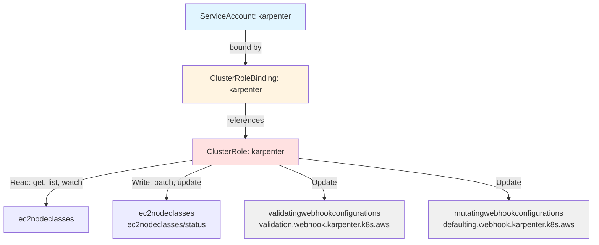
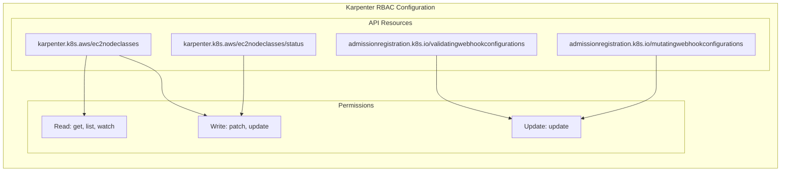

# Diagram: devops/k8s/karpenter/helm/templates/clusterrole.yaml

> Auto-generated by Obscura crawlers

## Diagram 1

### SVG

<svg id="container" width="1236.421875" xmlns="http://www.w3.org/2000/svg" class="flowchart" height="502" viewBox="0 0 1236.421875 502" role="graphics-document document" aria-roledescription="flowchart-v2"><g><marker id="container_flowchart-v2-pointEnd" class="marker flowchart-v2" viewBox="0 0 10 10" refX="5" refY="5" markerUnits="userSpaceOnUse" markerWidth="8" markerHeight="8" orient="auto"><path d="M 0 0 L 10 5 L 0 10 z" class="arrowMarkerPath" style="stroke-width: 1; stroke-dasharray: 1, 0;"></path></marker><marker id="container_flowchart-v2-pointStart" class="marker flowchart-v2" viewBox="0 0 10 10" refX="4.5" refY="5" markerUnits="userSpaceOnUse" markerWidth="8" markerHeight="8" orient="auto"><path d="M 0 5 L 10 10 L 10 0 z" class="arrowMarkerPath" style="stroke-width: 1; stroke-dasharray: 1, 0;"></path></marker><marker id="container_flowchart-v2-circleEnd" class="marker flowchart-v2" viewBox="0 0 10 10" refX="11" refY="5" markerUnits="userSpaceOnUse" markerWidth="11" markerHeight="11" orient="auto"><circle cx="5" cy="5" r="5" class="arrowMarkerPath" style="stroke-width: 1; stroke-dasharray: 1, 0;"></circle></marker><marker id="container_flowchart-v2-circleStart" class="marker flowchart-v2" viewBox="0 0 10 10" refX="-1" refY="5" markerUnits="userSpaceOnUse" markerWidth="11" markerHeight="11" orient="auto"><circle cx="5" cy="5" r="5" class="arrowMarkerPath" style="stroke-width: 1; stroke-dasharray: 1, 0;"></circle></marker><marker id="container_flowchart-v2-crossEnd" class="marker cross flowchart-v2" viewBox="0 0 11 11" refX="12" refY="5.2" markerUnits="userSpaceOnUse" markerWidth="11" markerHeight="11" orient="auto"><path d="M 1,1 l 9,9 M 10,1 l -9,9" class="arrowMarkerPath" style="stroke-width: 2; stroke-dasharray: 1, 0;"></path></marker><marker id="container_flowchart-v2-crossStart" class="marker cross flowchart-v2" viewBox="0 0 11 11" refX="-1" refY="5.2" markerUnits="userSpaceOnUse" markerWidth="11" markerHeight="11" orient="auto"><path d="M 1,1 l 9,9 M 10,1 l -9,9" class="arrowMarkerPath" style="stroke-width: 2; stroke-dasharray: 1, 0;"></path></marker><g class="root"><g class="clusters"></g><g class="edgePaths"><path d="M508.898,62L508.898,68.167C508.898,74.333,508.898,86.667,508.898,98.333C508.898,110,508.898,121,508.898,126.5L508.898,132" id="L_SA_CRB_0" class="edge-thickness-normal edge-pattern-solid edge-thickness-normal edge-pattern-solid flowchart-link" style=";" data-edge="true" data-et="edge" data-id="L_SA_CRB_0" data-points="W3sieCI6NTA4Ljg5ODQzNzUsInkiOjYyfSx7IngiOjUwOC44OTg0Mzc1LCJ5Ijo5OX0seyJ4Ijo1MDguODk4NDM3NSwieSI6MTM2fV0=" marker-end="url(#container_flowchart-v2-pointEnd)"></path><path d="M508.898,214L508.898,220.167C508.898,226.333,508.898,238.667,508.898,250.333C508.898,262,508.898,273,508.898,278.5L508.898,284" id="L_CRB_CR_0" class="edge-thickness-normal edge-pattern-solid edge-thickness-normal edge-pattern-solid flowchart-link" style=";" data-edge="true" data-et="edge" data-id="L_CRB_CR_0" data-points="W3sieCI6NTA4Ljg5ODQzNzUsInkiOjIxNH0seyJ4Ijo1MDguODk4NDM3NSwieSI6MjUxfSx7IngiOjUwOC44OTg0Mzc1LCJ5IjoyODh9XQ==" marker-end="url(#container_flowchart-v2-pointEnd)"></path><path d="M398.016,332.126L347.436,339.939C296.857,347.751,195.698,363.375,145.118,378.688C94.539,394,94.539,409,94.539,416.5L94.539,424" id="L_CR_EC2NC1_0" class="edge-thickness-normal edge-pattern-solid edge-thickness-normal edge-pattern-solid flowchart-link" style=";" data-edge="true" data-et="edge" data-id="L_CR_EC2NC1_0" data-points="W3sieCI6Mzk4LjAxNTYyNSwieSI6MzMyLjEyNjQzNzY0ODQ3ODQzfSx7IngiOjk0LjUzOTA2MjUsInkiOjM3OX0seyJ4Ijo5NC41MzkwNjI1LCJ5Ijo0Mjh9XQ==" marker-end="url(#container_flowchart-v2-pointEnd)"></path><path d="M439.22,342L423.306,348.167C407.391,354.333,375.563,366.667,359.649,378.333C343.734,390,343.734,401,343.734,406.5L343.734,412" id="L_CR_EC2NC2_0" class="edge-thickness-normal edge-pattern-solid edge-thickness-normal edge-pattern-solid flowchart-link" style=";" data-edge="true" data-et="edge" data-id="L_CR_EC2NC2_0" data-points="W3sieCI6NDM5LjIxOTg0ODYzMjgxMjUsInkiOjM0Mn0seyJ4IjozNDMuNzM0Mzc1LCJ5IjozNzl9LHsieCI6MzQzLjczNDM3NSwieSI6NDE2fV0=" marker-end="url(#container_flowchart-v2-pointEnd)"></path><path d="M578.577,342L594.491,348.167C610.406,354.333,642.234,366.667,658.148,378.333C674.063,390,674.063,401,674.063,406.5L674.063,412" id="L_CR_VWC_0" class="edge-thickness-normal edge-pattern-solid edge-thickness-normal edge-pattern-solid flowchart-link" style=";" data-edge="true" data-et="edge" data-id="L_CR_VWC_0" data-points="W3sieCI6NTc4LjU3NzAyNjM2NzE4NzUsInkiOjM0Mn0seyJ4Ijo2NzQuMDYyNSwieSI6Mzc5fSx7IngiOjY3NC4wNjI1LCJ5Ijo0MTZ9XQ==" marker-end="url(#container_flowchart-v2-pointEnd)"></path><path d="M619.781,327.875L693.164,336.396C766.547,344.917,913.313,361.958,986.695,375.979C1060.078,390,1060.078,401,1060.078,406.5L1060.078,412" id="L_CR_MWC_0" class="edge-thickness-normal edge-pattern-solid edge-thickness-normal edge-pattern-solid flowchart-link" style=";" data-edge="true" data-et="edge" data-id="L_CR_MWC_0" data-points="W3sieCI6NjE5Ljc4MTI1LCJ5IjozMjcuODc1MTExNjIxMzgwMjZ9LHsieCI6MTA2MC4wNzgxMjUsInkiOjM3OX0seyJ4IjoxMDYwLjA3ODEyNSwieSI6NDE2fV0=" marker-end="url(#container_flowchart-v2-pointEnd)"></path></g><g class="edgeLabels"><g class="edgeLabel" transform="translate(508.8984375, 99)"><g class="label" data-id="L_SA_CRB_0" transform="translate(-34.328125, -12)"><foreignObject width="68.65625" height="24">

bound by

</foreignObject></g></g><g class="edgeLabel" transform="translate(508.8984375, 251)"><g class="label" data-id="L_CRB_CR_0" transform="translate(-37.828125, -12)"><foreignObject width="75.65625" height="24">

references

</foreignObject></g></g><g class="edgeLabel" transform="translate(94.5390625, 379)"><g class="label" data-id="L_CR_EC2NC1_0" transform="translate(-74.1015625, -12)"><foreignObject width="148.203125" height="24">

Read: get, list, watch

</foreignObject></g></g><g class="edgeLabel" transform="translate(343.734375, 379)"><g class="label" data-id="L_CR_EC2NC2_0" transform="translate(-73.1015625, -12)"><foreignObject width="146.203125" height="24">

Write: patch, update

</foreignObject></g></g><g class="edgeLabel" transform="translate(674.0625, 379)"><g class="label" data-id="L_CR_VWC_0" transform="translate(-26.3125, -12)"><foreignObject width="52.625" height="24">

Update

</foreignObject></g></g><g class="edgeLabel" transform="translate(1060.078125, 379)"><g class="label" data-id="L_CR_MWC_0" transform="translate(-26.3125, -12)"><foreignObject width="52.625" height="24">

Update

</foreignObject></g></g></g><g class="nodes"><g class="node default" id="flowchart-SA-0" transform="translate(508.8984375, 35)"><rect class="basic label-container" style="fill:#e1f5ff !important" x="-124.3515625" y="-27" width="248.703125" height="54"></rect><g class="label" style="" transform="translate(-94.3515625, -12)"><rect></rect><foreignObject width="188.703125" height="24">

ServiceAccount: karpenter

</foreignObject></g></g><g class="node default" id="flowchart-CRB-1" transform="translate(508.8984375, 175)"><rect class="basic label-container" style="fill:#fff4e1 !important" x="-130" y="-39" width="260" height="78"></rect><g class="label" style="" transform="translate(-100, -24)"><rect></rect><foreignObject width="200" height="48">

ClusterRoleBinding: karpenter

</foreignObject></g></g><g class="node default" id="flowchart-CR-2" transform="translate(508.8984375, 315)"><rect class="basic label-container" style="fill:#ffe1e1 !important" x="-110.8828125" y="-27" width="221.765625" height="54"></rect><g class="label" style="" transform="translate(-80.8828125, -12)"><rect></rect><foreignObject width="161.765625" height="24">

ClusterRole: karpenter

</foreignObject></g></g><g class="node default" id="flowchart-EC2NC1-8" transform="translate(94.5390625, 455)"><rect class="basic label-container" style="" x="-86.5390625" y="-27" width="173.078125" height="54"></rect><g class="label" style="" transform="translate(-56.5390625, -12)"><rect></rect><foreignObject width="113.078125" height="24">

ec2nodeclasses

</foreignObject></g></g><g class="node default" id="flowchart-EC2NC2-10" transform="translate(343.734375, 455)"><rect class="basic label-container" style="" x="-112.65625" y="-39" width="225.3125" height="78"></rect><g class="label" style="" transform="translate(-82.65625, -24)"><rect></rect><foreignObject width="165.3125" height="48">

ec2nodeclasses ec2nodeclasses/status

</foreignObject></g></g><g class="node default" id="flowchart-VWC-12" transform="translate(674.0625, 455)"><rect class="basic label-container" style="fill:#f0f0f0 !important" x="-167.671875" y="-39" width="335.34375" height="78"></rect><g class="label" style="" transform="translate(-137.671875, -24)"><rect></rect><foreignObject width="275.34375" height="48">

validatingwebhookconfigurations validation.webhook.karpenter.k8s.aws

</foreignObject></g></g><g class="node default" id="flowchart-MWC-14" transform="translate(1060.078125, 455)"><rect class="basic label-container" style="fill:#f0f0f0 !important" x="-168.34375" y="-39" width="336.6875" height="78"></rect><g class="label" style="" transform="translate(-138.34375, -24)"><rect></rect><foreignObject width="276.6875" height="48">

mutatingwebhookconfigurations defaulting.webhook.karpenter.k8s.aws

</foreignObject></g></g></g></g></g></svg>

## Diagram 2

### SVG

<svg id="container" width="1968.28125" xmlns="http://www.w3.org/2000/svg" class="flowchart" height="424" viewBox="0 0 1968.28125 424" role="graphics-document document" aria-roledescription="flowchart-v2"><g><marker id="container_flowchart-v2-pointEnd" class="marker flowchart-v2" viewBox="0 0 10 10" refX="5" refY="5" markerUnits="userSpaceOnUse" markerWidth="8" markerHeight="8" orient="auto"><path d="M 0 0 L 10 5 L 0 10 z" class="arrowMarkerPath" style="stroke-width: 1; stroke-dasharray: 1, 0;"></path></marker><marker id="container_flowchart-v2-pointStart" class="marker flowchart-v2" viewBox="0 0 10 10" refX="4.5" refY="5" markerUnits="userSpaceOnUse" markerWidth="8" markerHeight="8" orient="auto"><path d="M 0 5 L 10 10 L 10 0 z" class="arrowMarkerPath" style="stroke-width: 1; stroke-dasharray: 1, 0;"></path></marker><marker id="container_flowchart-v2-circleEnd" class="marker flowchart-v2" viewBox="0 0 10 10" refX="11" refY="5" markerUnits="userSpaceOnUse" markerWidth="11" markerHeight="11" orient="auto"><circle cx="5" cy="5" r="5" class="arrowMarkerPath" style="stroke-width: 1; stroke-dasharray: 1, 0;"></circle></marker><marker id="container_flowchart-v2-circleStart" class="marker flowchart-v2" viewBox="0 0 10 10" refX="-1" refY="5" markerUnits="userSpaceOnUse" markerWidth="11" markerHeight="11" orient="auto"><circle cx="5" cy="5" r="5" class="arrowMarkerPath" style="stroke-width: 1; stroke-dasharray: 1, 0;"></circle></marker><marker id="container_flowchart-v2-crossEnd" class="marker cross flowchart-v2" viewBox="0 0 11 11" refX="12" refY="5.2" markerUnits="userSpaceOnUse" markerWidth="11" markerHeight="11" orient="auto"><path d="M 1,1 l 9,9 M 10,1 l -9,9" class="arrowMarkerPath" style="stroke-width: 2; stroke-dasharray: 1, 0;"></path></marker><marker id="container_flowchart-v2-crossStart" class="marker cross flowchart-v2" viewBox="0 0 11 11" refX="-1" refY="5.2" markerUnits="userSpaceOnUse" markerWidth="11" markerHeight="11" orient="auto"><path d="M 1,1 l 9,9 M 10,1 l -9,9" class="arrowMarkerPath" style="stroke-width: 2; stroke-dasharray: 1, 0;"></path></marker><g class="root"><g class="clusters"></g><g class="edgePaths"></g><g class="edgeLabels"></g><g class="nodes"><g class="root" transform="translate(0, 0)"><g class="clusters"><g class="cluster" id="RBAC" data-look="classic"><rect style="" x="8" y="8" width="1952.28125" height="408"></rect><g class="cluster-label" transform="translate(884.140625, 8)"><foreignObject width="200" height="48">

Karpenter RBAC Configuration

</foreignObject></g></g><g class="cluster" id="Permissions" data-look="classic"><rect style="" x="68.8515625" y="249.5" width="1653.4921875" height="129"></rect><g class="cluster-label" transform="translate(851.87890625, 249.5)"><foreignObject width="87.4375" height="24">

Permissions

</foreignObject></g></g><g class="cluster" id="Resources" data-look="classic"><rect style="" x="28" y="45.5" width="1912.28125" height="129"></rect><g class="cluster-label" transform="translate(933.671875, 45.5)"><foreignObject width="100.9375" height="24">

API Resources

</foreignObject></g></g></g><g class="edgePaths"><path d="M213.767,137L212.798,143.25C211.829,149.5,209.891,162,208.922,174.5C207.953,187,207.953,199.5,207.953,212C207.953,224.5,207.953,237,207.953,248.833C207.953,260.667,207.953,271.833,207.953,277.417L207.953,283" id="L_R1_P1_0" class="edge-thickness-normal edge-pattern-solid edge-thickness-normal edge-pattern-solid flowchart-link" style=";" data-edge="true" data-et="edge" data-id="L_R1_P1_0" data-points="W3sieCI6MjEzLjc2NzA3ODQ4ODM3MjA4LCJ5IjoxMzd9LHsieCI6MjA3Ljk1MzEyNSwieSI6MTc0LjV9LHsieCI6MjA3Ljk1MzEyNSwieSI6MjEyfSx7IngiOjIwNy45NTMxMjUsInkiOjI0OS41fSx7IngiOjIwNy45NTMxMjUsInkiOjI4N31d" marker-end="url(#container_flowchart-v2-pointEnd)"></path><path d="M294.564,137L312.298,143.25C330.032,149.5,365.501,162,383.235,174.5C400.969,187,400.969,199.5,400.969,212C400.969,224.5,400.969,237,419.04,249.289C437.11,261.577,473.252,273.655,491.323,279.694L509.393,285.732" id="L_R1_P2_0" class="edge-thickness-normal edge-pattern-solid edge-thickness-normal edge-pattern-solid flowchart-link" style=";" data-edge="true" data-et="edge" data-id="L_R1_P2_0" data-points="W3sieCI6Mjk0LjU2NDMxNjg2MDQ2NTEsInkiOjEzN30seyJ4Ijo0MDAuOTY4NzUsInkiOjE3NC41fSx7IngiOjQwMC45Njg3NSwieSI6MjEyfSx7IngiOjQwMC45Njg3NSwieSI6MjQ5LjV9LHsieCI6NTEzLjE4NzEzNjYyNzkwNywieSI6Mjg3fV0=" marker-end="url(#container_flowchart-v2-pointEnd)"></path><path d="M603.984,137L603.984,143.25C603.984,149.5,603.984,162,603.984,174.5C603.984,187,603.984,199.5,603.984,212C603.984,224.5,603.984,237,603.118,248.841C602.251,260.682,600.517,271.865,599.65,277.456L598.783,283.047" id="L_R2_P2_0" class="edge-thickness-normal edge-pattern-solid edge-thickness-normal edge-pattern-solid flowchart-link" style=";" data-edge="true" data-et="edge" data-id="L_R2_P2_0" data-points="W3sieCI6NjAzLjk4NDM3NSwieSI6MTM3fSx7IngiOjYwMy45ODQzNzUsInkiOjE3NC41fSx7IngiOjYwMy45ODQzNzUsInkiOjIxMn0seyJ4Ijo2MDMuOTg0Mzc1LCJ5IjoyNDkuNX0seyJ4Ijo1OTguMTcwNDIxNTExNjI3OSwieSI6Mjg3fV0=" marker-end="url(#container_flowchart-v2-pointEnd)"></path><path d="M1091.719,137L1091.719,143.25C1091.719,149.5,1091.719,162,1091.719,174.5C1091.719,187,1091.719,199.5,1091.719,212C1091.719,224.5,1091.719,237,1123.406,250.548C1155.094,264.096,1218.469,278.692,1250.157,285.99L1281.844,293.288" id="L_R3_P3_0" class="edge-thickness-normal edge-pattern-solid edge-thickness-normal edge-pattern-solid flowchart-link" style=";" data-edge="true" data-et="edge" data-id="L_R3_P3_0" data-points="W3sieCI6MTA5MS43MTg3NSwieSI6MTM3fSx7IngiOjEwOTEuNzE4NzUsInkiOjE3NC41fSx7IngiOjEwOTEuNzE4NzUsInkiOjIxMn0seyJ4IjoxMDkxLjcxODc1LCJ5IjoyNDkuNX0seyJ4IjoxMjg1Ljc0MjE4NzUsInkiOjI5NC4xODU5NTY5ODM4NDgwM31d" marker-end="url(#container_flowchart-v2-pointEnd)"></path><path d="M1651.828,137L1651.828,143.25C1651.828,149.5,1651.828,162,1651.828,174.5C1651.828,187,1651.828,199.5,1651.828,212C1651.828,224.5,1651.828,237,1620.141,250.548C1588.453,264.096,1525.078,278.692,1493.39,285.99L1461.703,293.288" id="L_R4_P3_0" class="edge-thickness-normal edge-pattern-solid edge-thickness-normal edge-pattern-solid flowchart-link" style=";" data-edge="true" data-et="edge" data-id="L_R4_P3_0" data-points="W3sieCI6MTY1MS44MjgxMjUsInkiOjEzN30seyJ4IjoxNjUxLjgyODEyNSwieSI6MTc0LjV9LHsieCI6MTY1MS44MjgxMjUsInkiOjIxMn0seyJ4IjoxNjUxLjgyODEyNSwieSI6MjQ5LjV9LHsieCI6MTQ1Ny44MDQ2ODc1LCJ5IjoyOTQuMTg1OTU2OTgzODQ4MDN9XQ==" marker-end="url(#container_flowchart-v2-pointEnd)"></path></g><g class="edgeLabels"><g class="edgeLabel"><g class="label" data-id="L_R1_P1_0" transform="translate(0, 0)"><foreignObject width="0" height="0">

</foreignObject></g></g><g class="edgeLabel"><g class="label" data-id="L_R1_P2_0" transform="translate(0, 0)"><foreignObject width="0" height="0">

</foreignObject></g></g><g class="edgeLabel"><g class="label" data-id="L_R2_P2_0" transform="translate(0, 0)"><foreignObject width="0" height="0">

</foreignObject></g></g><g class="edgeLabel"><g class="label" data-id="L_R3_P3_0" transform="translate(0, 0)"><foreignObject width="0" height="0">

</foreignObject></g></g><g class="edgeLabel"><g class="label" data-id="L_R4_P3_0" transform="translate(0, 0)"><foreignObject width="0" height="0">

</foreignObject></g></g></g><g class="nodes"><g class="node default" id="flowchart-P1-4" transform="translate(207.953125, 314)"><rect class="basic label-container" style="" x="-104.1015625" y="-27" width="208.203125" height="54"></rect><g class="label" style="" transform="translate(-74.1015625, -12)"><rect></rect><foreignObject width="148.203125" height="24">

Read: get, list, watch

</foreignObject></g></g><g class="node default" id="flowchart-R1-0" transform="translate(217.953125, 110)"><rect class="basic label-container" style="" x="-154.953125" y="-27" width="309.90625" height="54"></rect><g class="label" style="" transform="translate(-124.953125, -12)"><rect></rect><foreignObject width="249.90625" height="24">

karpenter.k8s.aws/ec2nodeclasses

</foreignObject></g></g><g class="node default" id="flowchart-P2-5" transform="translate(593.984375, 314)"><rect class="basic label-container" style="" x="-103.1015625" y="-27" width="206.203125" height="54"></rect><g class="label" style="" transform="translate(-73.1015625, -12)"><rect></rect><foreignObject width="146.203125" height="24">

Write: patch, update

</foreignObject></g></g><g class="node default" id="flowchart-R2-1" transform="translate(603.984375, 110)"><rect class="basic label-container" style="" x="-181.078125" y="-27" width="362.15625" height="54"></rect><g class="label" style="" transform="translate(-151.078125, -12)"><rect></rect><foreignObject width="302.15625" height="24">

karpenter.k8s.aws/ec2nodeclasses/status

</foreignObject></g></g><g class="node default" id="flowchart-R3-2" transform="translate(1091.71875, 110)"><rect class="basic label-container" style="" x="-256.65625" y="-27" width="513.3125" height="54"></rect><g class="label" style="" transform="translate(-226.65625, -12)"><rect></rect><foreignObject width="453.3125" height="24">

admissionregistration.k8s.io/validatingwebhookconfigurations

</foreignObject></g></g><g class="node default" id="flowchart-P3-6" transform="translate(1371.7734375, 314)"><rect class="basic label-container" style="" x="-86.03125" y="-27" width="172.0625" height="54"></rect><g class="label" style="" transform="translate(-56.03125, -12)"><rect></rect><foreignObject width="112.0625" height="24">

Update: update

</foreignObject></g></g><g class="node default" id="flowchart-R4-3" transform="translate(1651.828125, 110)"><rect class="basic label-container" style="" x="-253.453125" y="-27" width="506.90625" height="54"></rect><g class="label" style="" transform="translate(-223.453125, -12)"><rect></rect><foreignObject width="446.90625" height="24">

admissionregistration.k8s.io/mutatingwebhookconfigurations

</foreignObject></g></g></g></g></g></g></g></svg>
