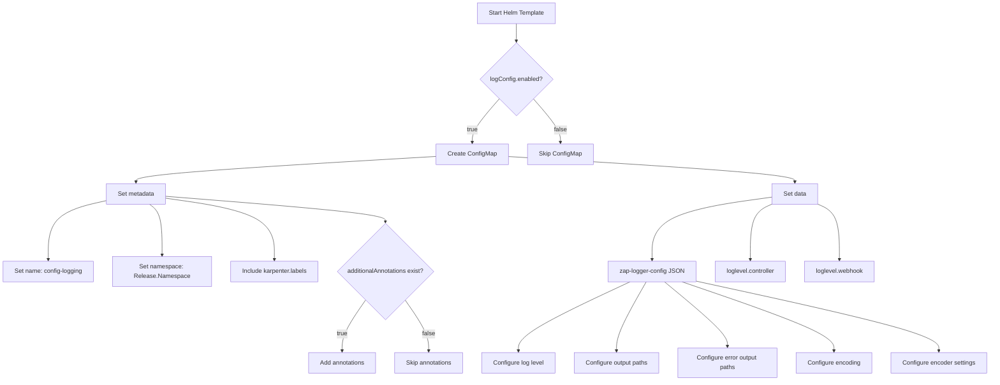
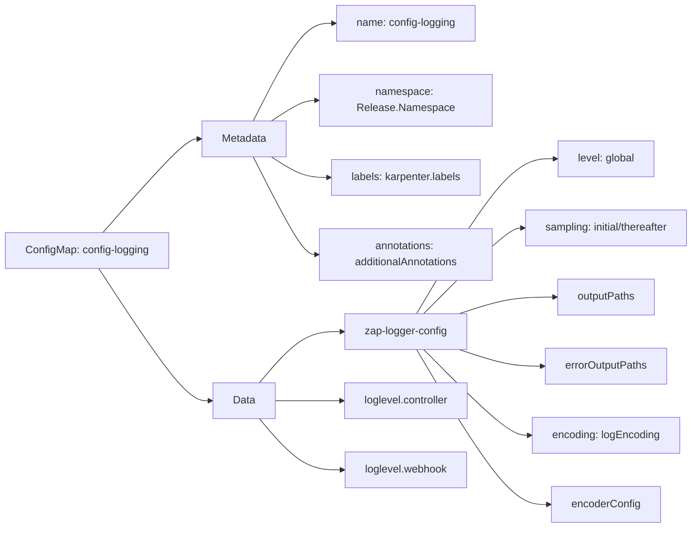
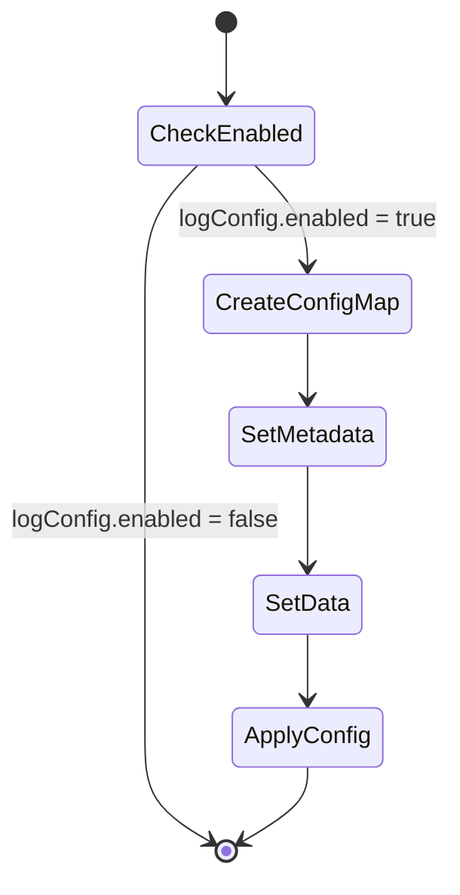
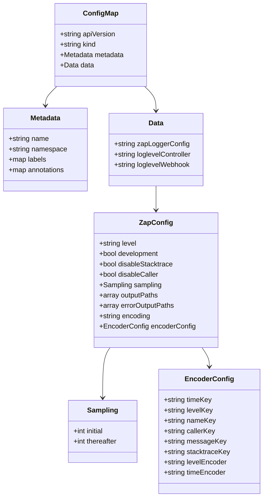

# Diagram: devops/k8s/karpenter/helm/templates/configmap-logging.yaml

> Auto-generated by Obscura crawlers

## Diagram 1

### SVG

<svg id="container" width="2629.328125" xmlns="http://www.w3.org/2000/svg" class="flowchart" height="1023.390625" viewBox="0 0 2629.328125 1023.390625" role="graphics-document document" aria-roledescription="flowchart-v2"><g><marker id="container_flowchart-v2-pointEnd" class="marker flowchart-v2" viewBox="0 0 10 10" refX="5" refY="5" markerUnits="userSpaceOnUse" markerWidth="8" markerHeight="8" orient="auto"><path d="M 0 0 L 10 5 L 0 10 z" class="arrowMarkerPath" style="stroke-width: 1; stroke-dasharray: 1, 0;"></path></marker><marker id="container_flowchart-v2-pointStart" class="marker flowchart-v2" viewBox="0 0 10 10" refX="4.5" refY="5" markerUnits="userSpaceOnUse" markerWidth="8" markerHeight="8" orient="auto"><path d="M 0 5 L 10 10 L 10 0 z" class="arrowMarkerPath" style="stroke-width: 1; stroke-dasharray: 1, 0;"></path></marker><marker id="container_flowchart-v2-circleEnd" class="marker flowchart-v2" viewBox="0 0 10 10" refX="11" refY="5" markerUnits="userSpaceOnUse" markerWidth="11" markerHeight="11" orient="auto"><circle cx="5" cy="5" r="5" class="arrowMarkerPath" style="stroke-width: 1; stroke-dasharray: 1, 0;"></circle></marker><marker id="container_flowchart-v2-circleStart" class="marker flowchart-v2" viewBox="0 0 10 10" refX="-1" refY="5" markerUnits="userSpaceOnUse" markerWidth="11" markerHeight="11" orient="auto"><circle cx="5" cy="5" r="5" class="arrowMarkerPath" style="stroke-width: 1; stroke-dasharray: 1, 0;"></circle></marker><marker id="container_flowchart-v2-crossEnd" class="marker cross flowchart-v2" viewBox="0 0 11 11" refX="12" refY="5.2" markerUnits="userSpaceOnUse" markerWidth="11" markerHeight="11" orient="auto"><path d="M 1,1 l 9,9 M 10,1 l -9,9" class="arrowMarkerPath" style="stroke-width: 2; stroke-dasharray: 1, 0;"></path></marker><marker id="container_flowchart-v2-crossStart" class="marker cross flowchart-v2" viewBox="0 0 11 11" refX="-1" refY="5.2" markerUnits="userSpaceOnUse" markerWidth="11" markerHeight="11" orient="auto"><path d="M 1,1 l 9,9 M 10,1 l -9,9" class="arrowMarkerPath" style="stroke-width: 2; stroke-dasharray: 1, 0;"></path></marker><g class="root"><g class="clusters"></g><g class="edgePaths"><path d="M1368.277,62L1368.277,66.167C1368.277,70.333,1368.277,78.667,1368.277,86.333C1368.277,94,1368.277,101,1368.277,104.5L1368.277,108" id="L_A_B_0" class="edge-thickness-normal edge-pattern-solid edge-thickness-normal edge-pattern-solid flowchart-link" style=";" data-edge="true" data-et="edge" data-id="L_A_B_0" data-points="W3sieCI6MTM2OC4yNzczNDM3NSwieSI6NjJ9LHsieCI6MTM2OC4yNzczNDM3NSwieSI6ODd9LHsieCI6MTM2OC4yNzczNDM3NSwieSI6MTEyfV0=" marker-end="url(#container_flowchart-v2-pointEnd)"></path><path d="M1324.033,259.146L1312.389,272.687C1300.745,286.228,1277.456,313.309,1265.812,332.35C1254.168,351.391,1254.168,362.391,1254.168,367.891L1254.168,373.391" id="L_B_C_0" class="edge-thickness-normal edge-pattern-solid edge-thickness-normal edge-pattern-solid flowchart-link" style=";" data-edge="true" data-et="edge" data-id="L_B_C_0" data-points="W3sieCI6MTMyNC4wMzI5MTU0NTE1OTIzLCJ5IjoyNTkuMTQ2MTk2NzAxNTkyMn0seyJ4IjoxMjU0LjE2Nzk2ODc1LCJ5IjozNDAuMzkwNjI1fSx7IngiOjEyNTQuMTY3OTY4NzUsInkiOjM3Ny4zOTA2MjV9XQ==" marker-end="url(#container_flowchart-v2-pointEnd)"></path><path d="M1412.522,259.146L1424.166,272.687C1435.81,286.228,1459.098,313.309,1470.743,332.35C1482.387,351.391,1482.387,362.391,1482.387,367.891L1482.387,373.391" id="L_B_D_0" class="edge-thickness-normal edge-pattern-solid edge-thickness-normal edge-pattern-solid flowchart-link" style=";" data-edge="true" data-et="edge" data-id="L_B_D_0" data-points="W3sieCI6MTQxMi41MjE3NzIwNDg0MDc3LCJ5IjoyNTkuMTQ2MTk2NzAxNTkyMn0seyJ4IjoxNDgyLjM4NjcxODc1LCJ5IjozNDAuMzkwNjI1fSx7IngiOjE0ODIuMzg2NzE4NzUsInkiOjM3Ny4zOTA2MjV9XQ==" marker-end="url(#container_flowchart-v2-pointEnd)"></path><path d="M1161.309,409.827L1028.751,417.588C896.194,425.348,631.079,440.869,498.522,452.13C365.965,463.391,365.965,470.391,365.965,473.891L365.965,477.391" id="L_C_E_0" class="edge-thickness-normal edge-pattern-solid edge-thickness-normal edge-pattern-solid flowchart-link" style=";" data-edge="true" data-et="edge" data-id="L_C_E_0" data-points="W3sieCI6MTE2MS4zMDg1OTM3NSwieSI6NDA5LjgyNzA5MjU4NzI5ODh9LHsieCI6MzY1Ljk2NDg0Mzc1LCJ5Ijo0NTYuMzkwNjI1fSx7IngiOjM2NS45NjQ4NDM3NSwieSI6NDgxLjM5MDYyNX1d" marker-end="url(#container_flowchart-v2-pointEnd)"></path><path d="M287.512,525.488L260.82,531.305C234.128,537.122,180.743,548.756,154.051,576.74C127.359,604.724,127.359,649.057,127.359,671.224L127.359,693.391" id="L_E_F_0" class="edge-thickness-normal edge-pattern-solid edge-thickness-normal edge-pattern-solid flowchart-link" style=";" data-edge="true" data-et="edge" data-id="L_E_F_0" data-points="W3sieCI6Mjg3LjUxMTcxODc1LCJ5Ijo1MjUuNDg4MTQ4MDQyNDE3N30seyJ4IjoxMjcuMzU5Mzc1LCJ5Ijo1NjAuMzkwNjI1fSx7IngiOjEyNy4zNTkzNzUsInkiOjY5Ny4zOTA2MjV9XQ==" marker-end="url(#container_flowchart-v2-pointEnd)"></path><path d="M397.51,535.391L402.378,539.557C407.246,543.724,416.983,552.057,421.851,576.391C426.719,600.724,426.719,641.057,426.719,661.224L426.719,681.391" id="L_E_G_0" class="edge-thickness-normal edge-pattern-solid edge-thickness-normal edge-pattern-solid flowchart-link" style=";" data-edge="true" data-et="edge" data-id="L_E_G_0" data-points="W3sieCI6Mzk3LjUxMDE0MTIyNTk2MTU1LCJ5Ijo1MzUuMzkwNjI1fSx7IngiOjQyNi43MTg3NSwieSI6NTYwLjM5MDYyNX0seyJ4Ijo0MjYuNzE4NzUsInkiOjY4NS4zOTA2MjV9XQ==" marker-end="url(#container_flowchart-v2-pointEnd)"></path><path d="M444.418,519.772L491.085,526.541C537.753,533.311,631.087,546.851,677.755,575.787C724.422,604.724,724.422,649.057,724.422,671.224L724.422,693.391" id="L_E_H_0" class="edge-thickness-normal edge-pattern-solid edge-thickness-normal edge-pattern-solid flowchart-link" style=";" data-edge="true" data-et="edge" data-id="L_E_H_0" data-points="W3sieCI6NDQ0LjQxNzk2ODc1LCJ5Ijo1MTkuNzcxNTIxODU2MDk5OX0seyJ4Ijo3MjQuNDIxODc1LCJ5Ijo1NjAuMzkwNjI1fSx7IngiOjcyNC40MjE4NzUsInkiOjY5Ny4zOTA2MjV9XQ==" marker-end="url(#container_flowchart-v2-pointEnd)"></path><path d="M444.418,514.524L542.202,522.168C639.987,529.813,835.556,545.102,933.34,556.246C1031.125,567.391,1031.125,574.391,1031.125,577.891L1031.125,581.391" id="L_E_I_0" class="edge-thickness-normal edge-pattern-solid edge-thickness-normal edge-pattern-solid flowchart-link" style=";" data-edge="true" data-et="edge" data-id="L_E_I_0" data-points="W3sieCI6NDQ0LjQxNzk2ODc1LCJ5Ijo1MTQuNTIzODI4MzUyMTA2Mn0seyJ4IjoxMDMxLjEyNSwieSI6NTYwLjM5MDYyNX0seyJ4IjoxMDMxLjEyNSwieSI6NTg1LjM5MDYyNX1d" marker-end="url(#container_flowchart-v2-pointEnd)"></path><path d="M975.975,808.241L965.874,823.599C955.773,838.958,935.57,869.674,925.469,892.532C915.367,915.391,915.367,930.391,915.367,937.891L915.367,945.391" id="L_I_J_0" class="edge-thickness-normal edge-pattern-solid edge-thickness-normal edge-pattern-solid flowchart-link" style=";" data-edge="true" data-et="edge" data-id="L_I_J_0" data-points="W3sieCI6OTc1Ljk3NTM2ODE4ODUxMjYsInkiOjgwOC4yNDA5OTMxODg1MTI2fSx7IngiOjkxNS4zNjcxODc1LCJ5Ijo5MDAuMzkwNjI1fSx7IngiOjkxNS4zNjcxODc1LCJ5Ijo5NDkuMzkwNjI1fV0=" marker-end="url(#container_flowchart-v2-pointEnd)"></path><path d="M1086.275,808.241L1096.376,823.599C1106.477,838.958,1126.68,869.674,1136.781,892.532C1146.883,915.391,1146.883,930.391,1146.883,937.891L1146.883,945.391" id="L_I_K_0" class="edge-thickness-normal edge-pattern-solid edge-thickness-normal edge-pattern-solid flowchart-link" style=";" data-edge="true" data-et="edge" data-id="L_I_K_0" data-points="W3sieCI6MTA4Ni4yNzQ2MzE4MTE0ODc2LCJ5Ijo4MDguMjQwOTkzMTg4NTEyNn0seyJ4IjoxMTQ2Ljg4MjgxMjUsInkiOjkwMC4zOTA2MjV9LHsieCI6MTE0Ni44ODI4MTI1LCJ5Ijo5NDkuMzkwNjI1fV0=" marker-end="url(#container_flowchart-v2-pointEnd)"></path><path d="M1347.027,409.993L1475.208,417.726C1603.389,425.459,1859.751,440.925,1987.932,452.158C2116.113,463.391,2116.113,470.391,2116.113,473.891L2116.113,477.391" id="L_C_L_0" class="edge-thickness-normal edge-pattern-solid edge-thickness-normal edge-pattern-solid flowchart-link" style=";" data-edge="true" data-et="edge" data-id="L_C_L_0" data-points="W3sieCI6MTM0Ny4wMjczNDM3NSwieSI6NDA5Ljk5MjcwNjA0ODUwMDR9LHsieCI6MjExNi4xMTMyODEyNSwieSI6NDU2LjM5MDYyNX0seyJ4IjoyMTE2LjExMzI4MTI1LCJ5Ijo0ODEuMzkwNjI1fV0=" marker-end="url(#container_flowchart-v2-pointEnd)"></path><path d="M2056.059,516.647L2003.029,523.938C1950,531.228,1843.941,545.809,1790.912,575.267C1737.883,604.724,1737.883,649.057,1737.883,671.224L1737.883,693.391" id="L_L_M_0" class="edge-thickness-normal edge-pattern-solid edge-thickness-normal edge-pattern-solid flowchart-link" style=";" data-edge="true" data-et="edge" data-id="L_L_M_0" data-points="W3sieCI6MjA1Ni4wNTg1OTM3NSwieSI6NTE2LjY0NzA4MjM5MzA4MjV9LHsieCI6MTczNy44ODI4MTI1LCJ5Ijo1NjAuMzkwNjI1fSx7IngiOjE3MzcuODgyODEyNSwieSI6Njk3LjM5MDYyNX1d" marker-end="url(#container_flowchart-v2-pointEnd)"></path><path d="M2056.059,534.531L2046.157,538.841C2036.255,543.151,2016.452,551.771,2006.55,578.247C1996.648,604.724,1996.648,649.057,1996.648,671.224L1996.648,693.391" id="L_L_N_0" class="edge-thickness-normal edge-pattern-solid edge-thickness-normal edge-pattern-solid flowchart-link" style=";" data-edge="true" data-et="edge" data-id="L_L_N_0" data-points="W3sieCI6MjA1Ni4wNTg1OTM3NSwieSI6NTM0LjUzMDg5OTAwODQzNjF9LHsieCI6MTk5Ni42NDg0Mzc1LCJ5Ijo1NjAuMzkwNjI1fSx7IngiOjE5OTYuNjQ4NDM3NSwieSI6Njk3LjM5MDYyNX1d" marker-end="url(#container_flowchart-v2-pointEnd)"></path><path d="M2176.168,534.531L2186.07,538.841C2195.971,543.151,2215.775,551.771,2225.676,578.247C2235.578,604.724,2235.578,649.057,2235.578,671.224L2235.578,693.391" id="L_L_O_0" class="edge-thickness-normal edge-pattern-solid edge-thickness-normal edge-pattern-solid flowchart-link" style=";" data-edge="true" data-et="edge" data-id="L_L_O_0" data-points="W3sieCI6MjE3Ni4xNjc5Njg3NSwieSI6NTM0LjUzMDg5OTAwODQzNjF9LHsieCI6MjIzNS41NzgxMjUsInkiOjU2MC4zOTA2MjV9LHsieCI6MjIzNS41NzgxMjUsInkiOjY5Ny4zOTA2MjV9XQ==" marker-end="url(#container_flowchart-v2-pointEnd)"></path><path d="M1683.769,751.391L1633.998,776.224C1584.226,801.057,1484.683,850.724,1434.912,883.057C1385.141,915.391,1385.141,930.391,1385.141,937.891L1385.141,945.391" id="L_M_P_0" class="edge-thickness-normal edge-pattern-solid edge-thickness-normal edge-pattern-solid flowchart-link" style=";" data-edge="true" data-et="edge" data-id="L_M_P_0" data-points="W3sieCI6MTY4My43Njg5NTQxOTAzNDEsInkiOjc1MS4zOTA2MjV9LHsieCI6MTM4NS4xNDA2MjUsInkiOjkwMC4zOTA2MjV9LHsieCI6MTM4NS4xNDA2MjUsInkiOjk0OS4zOTA2MjV9XQ==" marker-end="url(#container_flowchart-v2-pointEnd)"></path><path d="M1723.679,751.391L1710.616,776.224C1697.552,801.057,1671.424,850.724,1658.361,883.057C1645.297,915.391,1645.297,930.391,1645.297,937.891L1645.297,945.391" id="L_M_Q_0" class="edge-thickness-normal edge-pattern-solid edge-thickness-normal edge-pattern-solid flowchart-link" style=";" data-edge="true" data-et="edge" data-id="L_M_Q_0" data-points="W3sieCI6MTcyMy42NzkyODc5OTcxNTksInkiOjc1MS4zOTA2MjV9LHsieCI6MTY0NS4yOTY4NzUsInkiOjkwMC4zOTA2MjV9LHsieCI6MTY0NS4yOTY4NzUsInkiOjk0OS4zOTA2MjV9XQ==" marker-end="url(#container_flowchart-v2-pointEnd)"></path><path d="M1768.676,751.391L1796.998,776.224C1825.321,801.057,1881.965,850.724,1910.287,881.057C1938.609,911.391,1938.609,922.391,1938.609,927.891L1938.609,933.391" id="L_M_R_0" class="edge-thickness-normal edge-pattern-solid edge-thickness-normal edge-pattern-solid flowchart-link" style=";" data-edge="true" data-et="edge" data-id="L_M_R_0" data-points="W3sieCI6MTc2OC42NzYwOTE5NzQ0MzE4LCJ5Ijo3NTEuMzkwNjI1fSx7IngiOjE5MzguNjA5Mzc1LCJ5Ijo5MDAuMzkwNjI1fSx7IngiOjE5MzguNjA5Mzc1LCJ5Ijo5MzcuMzkwNjI1fV0=" marker-end="url(#container_flowchart-v2-pointEnd)"></path><path d="M1811.572,751.391L1879.348,776.224C1947.123,801.057,2082.675,850.724,2150.451,883.057C2218.227,915.391,2218.227,930.391,2218.227,937.891L2218.227,945.391" id="L_M_S_0" class="edge-thickness-normal edge-pattern-solid edge-thickness-normal edge-pattern-solid flowchart-link" style=";" data-edge="true" data-et="edge" data-id="L_M_S_0" data-points="W3sieCI6MTgxMS41NzE5MTA1MTEzNjM3LCJ5Ijo3NTEuMzkwNjI1fSx7IngiOjIyMTguMjI2NTYyNSwieSI6OTAwLjM5MDYyNX0seyJ4IjoyMjE4LjIyNjU2MjUsInkiOjk0OS4zOTA2MjV9XQ==" marker-end="url(#container_flowchart-v2-pointEnd)"></path><path d="M1850.867,750.669L1958.154,775.623C2065.44,800.576,2280.013,850.484,2387.299,882.937C2494.586,915.391,2494.586,930.391,2494.586,937.891L2494.586,945.391" id="L_M_T_0" class="edge-thickness-normal edge-pattern-solid edge-thickness-normal edge-pattern-solid flowchart-link" style=";" data-edge="true" data-et="edge" data-id="L_M_T_0" data-points="W3sieCI6MTg1MC44NjcxODc1LCJ5Ijo3NTAuNjY5NDI0ODkyNjI2NH0seyJ4IjoyNDk0LjU4NTkzNzUsInkiOjkwMC4zOTA2MjV9LHsieCI6MjQ5NC41ODU5Mzc1LCJ5Ijo5NDkuMzkwNjI1fV0=" marker-end="url(#container_flowchart-v2-pointEnd)"></path></g><g class="edgeLabels"><g class="edgeLabel"><g class="label" data-id="L_A_B_0" transform="translate(0, 0)"><foreignObject width="0" height="0">

</foreignObject></g></g><g class="edgeLabel" transform="translate(1254.16796875, 340.390625)"><g class="label" data-id="L_B_C_0" transform="translate(-14.9921875, -12)"><foreignObject width="29.984375" height="24">

true

</foreignObject></g></g><g class="edgeLabel" transform="translate(1482.38671875, 340.390625)"><g class="label" data-id="L_B_D_0" transform="translate(-17.21875, -12)"><foreignObject width="34.4375" height="24">

false

</foreignObject></g></g><g class="edgeLabel"><g class="label" data-id="L_C_E_0" transform="translate(0, 0)"><foreignObject width="0" height="0">

</foreignObject></g></g><g class="edgeLabel"><g class="label" data-id="L_E_F_0" transform="translate(0, 0)"><foreignObject width="0" height="0">

</foreignObject></g></g><g class="edgeLabel"><g class="label" data-id="L_E_G_0" transform="translate(0, 0)"><foreignObject width="0" height="0">

</foreignObject></g></g><g class="edgeLabel"><g class="label" data-id="L_E_H_0" transform="translate(0, 0)"><foreignObject width="0" height="0">

</foreignObject></g></g><g class="edgeLabel"><g class="label" data-id="L_E_I_0" transform="translate(0, 0)"><foreignObject width="0" height="0">

</foreignObject></g></g><g class="edgeLabel" transform="translate(915.3671875, 900.390625)"><g class="label" data-id="L_I_J_0" transform="translate(-14.9921875, -12)"><foreignObject width="29.984375" height="24">

true

</foreignObject></g></g><g class="edgeLabel" transform="translate(1146.8828125, 900.390625)"><g class="label" data-id="L_I_K_0" transform="translate(-17.21875, -12)"><foreignObject width="34.4375" height="24">

false

</foreignObject></g></g><g class="edgeLabel"><g class="label" data-id="L_C_L_0" transform="translate(0, 0)"><foreignObject width="0" height="0">

</foreignObject></g></g><g class="edgeLabel"><g class="label" data-id="L_L_M_0" transform="translate(0, 0)"><foreignObject width="0" height="0">

</foreignObject></g></g><g class="edgeLabel"><g class="label" data-id="L_L_N_0" transform="translate(0, 0)"><foreignObject width="0" height="0">

</foreignObject></g></g><g class="edgeLabel"><g class="label" data-id="L_L_O_0" transform="translate(0, 0)"><foreignObject width="0" height="0">

</foreignObject></g></g><g class="edgeLabel"><g class="label" data-id="L_M_P_0" transform="translate(0, 0)"><foreignObject width="0" height="0">

</foreignObject></g></g><g class="edgeLabel"><g class="label" data-id="L_M_Q_0" transform="translate(0, 0)"><foreignObject width="0" height="0">

</foreignObject></g></g><g class="edgeLabel"><g class="label" data-id="L_M_R_0" transform="translate(0, 0)"><foreignObject width="0" height="0">

</foreignObject></g></g><g class="edgeLabel"><g class="label" data-id="L_M_S_0" transform="translate(0, 0)"><foreignObject width="0" height="0">

</foreignObject></g></g><g class="edgeLabel"><g class="label" data-id="L_M_T_0" transform="translate(0, 0)"><foreignObject width="0" height="0">

</foreignObject></g></g></g><g class="nodes"><g class="node default" id="flowchart-A-0" transform="translate(1368.27734375, 35)"><rect class="basic label-container" style="" x="-104.2109375" y="-27" width="208.421875" height="54"></rect><g class="label" style="" transform="translate(-74.2109375, -12)"><rect></rect><foreignObject width="148.421875" height="24">

Start Helm Template

</foreignObject></g></g><g class="node default" id="flowchart-B-1" transform="translate(1368.27734375, 207.6953125)"><polygon points="95.6953125,0 191.390625,-95.6953125 95.6953125,-191.390625 0,-95.6953125" class="label-container" transform="translate(-95.1953125, 95.6953125)"></polygon><g class="label" style="" transform="translate(-68.6953125, -12)"><rect></rect><foreignObject width="137.390625" height="24">

logConfig.enabled?

</foreignObject></g></g><g class="node default" id="flowchart-C-3" transform="translate(1254.16796875, 404.390625)"><rect class="basic label-container" style="" x="-92.859375" y="-27" width="185.71875" height="54"></rect><g class="label" style="" transform="translate(-62.859375, -12)"><rect></rect><foreignObject width="125.71875" height="24">

Create ConfigMap

</foreignObject></g></g><g class="node default" id="flowchart-D-5" transform="translate(1482.38671875, 404.390625)"><rect class="basic label-container" style="" x="-85.359375" y="-27" width="170.71875" height="54"></rect><g class="label" style="" transform="translate(-55.359375, -12)"><rect></rect><foreignObject width="110.71875" height="24">

Skip ConfigMap

</foreignObject></g></g><g class="node default" id="flowchart-E-7" transform="translate(365.96484375, 508.390625)"><rect class="basic label-container" style="" x="-78.453125" y="-27" width="156.90625" height="54"></rect><g class="label" style="" transform="translate(-48.453125, -12)"><rect></rect><foreignObject width="96.90625" height="24">

Set metadata

</foreignObject></g></g><g class="node default" id="flowchart-F-9" transform="translate(127.359375, 724.390625)"><rect class="basic label-container" style="" x="-119.359375" y="-27" width="238.71875" height="54"></rect><g class="label" style="" transform="translate(-89.359375, -12)"><rect></rect><foreignObject width="178.71875" height="24">

Set name: config-logging

</foreignObject></g></g><g class="node default" id="flowchart-G-11" transform="translate(426.71875, 724.390625)"><rect class="basic label-container" style="" x="-130" y="-39" width="260" height="78"></rect><g class="label" style="" transform="translate(-100, -24)"><rect></rect><foreignObject width="200" height="48">

Set namespace: Release.Namespace

</foreignObject></g></g><g class="node default" id="flowchart-H-13" transform="translate(724.421875, 724.390625)"><rect class="basic label-container" style="" x="-117.703125" y="-27" width="235.40625" height="54"></rect><g class="label" style="" transform="translate(-87.703125, -12)"><rect></rect><foreignObject width="175.40625" height="24">

Include karpenter.labels

</foreignObject></g></g><g class="node default" id="flowchart-I-15" transform="translate(1031.125, 724.390625)"><polygon points="139,0 278,-139 139,-278 0,-139" class="label-container" transform="translate(-138.5, 139)"></polygon><g class="label" style="" transform="translate(-100, -24)"><rect></rect><foreignObject width="200" height="48">

additionalAnnotations exist?

</foreignObject></g></g><g class="node default" id="flowchart-J-17" transform="translate(915.3671875, 976.390625)"><rect class="basic label-container" style="" x="-90.1015625" y="-27" width="180.203125" height="54"></rect><g class="label" style="" transform="translate(-60.1015625, -12)"><rect></rect><foreignObject width="120.203125" height="24">

Add annotations

</foreignObject></g></g><g class="node default" id="flowchart-K-19" transform="translate(1146.8828125, 976.390625)"><rect class="basic label-container" style="" x="-91.4140625" y="-27" width="182.828125" height="54"></rect><g class="label" style="" transform="translate(-61.4140625, -12)"><rect></rect><foreignObject width="122.828125" height="24">

Skip annotations

</foreignObject></g></g><g class="node default" id="flowchart-L-21" transform="translate(2116.11328125, 508.390625)"><rect class="basic label-container" style="" x="-60.0546875" y="-27" width="120.109375" height="54"></rect><g class="label" style="" transform="translate(-30.0546875, -12)"><rect></rect><foreignObject width="60.109375" height="24">

Set data

</foreignObject></g></g><g class="node default" id="flowchart-M-23" transform="translate(1737.8828125, 724.390625)"><rect class="basic label-container" style="" x="-112.984375" y="-27" width="225.96875" height="54"></rect><g class="label" style="" transform="translate(-82.984375, -12)"><rect></rect><foreignObject width="165.96875" height="24">

zap-logger-config JSON

</foreignObject></g></g><g class="node default" id="flowchart-N-25" transform="translate(1996.6484375, 724.390625)"><rect class="basic label-container" style="" x="-95.78125" y="-27" width="191.5625" height="54"></rect><g class="label" style="" transform="translate(-65.78125, -12)"><rect></rect><foreignObject width="131.5625" height="24">

loglevel.controller

</foreignObject></g></g><g class="node default" id="flowchart-O-27" transform="translate(2235.578125, 724.390625)"><rect class="basic label-container" style="" x="-93.1484375" y="-27" width="186.296875" height="54"></rect><g class="label" style="" transform="translate(-63.1484375, -12)"><rect></rect><foreignObject width="126.296875" height="24">

loglevel.webhook

</foreignObject></g></g><g class="node default" id="flowchart-P-29" transform="translate(1385.140625, 976.390625)"><rect class="basic label-container" style="" x="-96.84375" y="-27" width="193.6875" height="54"></rect><g class="label" style="" transform="translate(-66.84375, -12)"><rect></rect><foreignObject width="133.6875" height="24">

Configure log level

</foreignObject></g></g><g class="node default" id="flowchart-Q-31" transform="translate(1645.296875, 976.390625)"><rect class="basic label-container" style="" x="-113.3125" y="-27" width="226.625" height="54"></rect><g class="label" style="" transform="translate(-83.3125, -12)"><rect></rect><foreignObject width="166.625" height="24">

Configure output paths

</foreignObject></g></g><g class="node default" id="flowchart-R-33" transform="translate(1938.609375, 976.390625)"><rect class="basic label-container" style="" x="-130" y="-39" width="260" height="78"></rect><g class="label" style="" transform="translate(-100, -24)"><rect></rect><foreignObject width="200" height="48">

Configure error output paths

</foreignObject></g></g><g class="node default" id="flowchart-S-35" transform="translate(2218.2265625, 976.390625)"><rect class="basic label-container" style="" x="-99.6171875" y="-27" width="199.234375" height="54"></rect><g class="label" style="" transform="translate(-69.6171875, -12)"><rect></rect><foreignObject width="139.234375" height="24">

Configure encoding

</foreignObject></g></g><g class="node default" id="flowchart-T-37" transform="translate(2494.5859375, 976.390625)"><rect class="basic label-container" style="" x="-126.7421875" y="-27" width="253.484375" height="54"></rect><g class="label" style="" transform="translate(-96.7421875, -12)"><rect></rect><foreignObject width="193.484375" height="24">

Configure encoder settings

</foreignObject></g></g></g></g></g></svg>

## Diagram 2

### SVG

<svg id="container" width="1057.0625" xmlns="http://www.w3.org/2000/svg" class="flowchart" height="794" viewBox="0 0 1057.0625 794" role="graphics-document document" aria-roledescription="flowchart-v2"><g><marker id="container_flowchart-v2-pointEnd" class="marker flowchart-v2" viewBox="0 0 10 10" refX="5" refY="5" markerUnits="userSpaceOnUse" markerWidth="8" markerHeight="8" orient="auto"><path d="M 0 0 L 10 5 L 0 10 z" class="arrowMarkerPath" style="stroke-width: 1; stroke-dasharray: 1, 0;"></path></marker><marker id="container_flowchart-v2-pointStart" class="marker flowchart-v2" viewBox="0 0 10 10" refX="4.5" refY="5" markerUnits="userSpaceOnUse" markerWidth="8" markerHeight="8" orient="auto"><path d="M 0 5 L 10 10 L 10 0 z" class="arrowMarkerPath" style="stroke-width: 1; stroke-dasharray: 1, 0;"></path></marker><marker id="container_flowchart-v2-circleEnd" class="marker flowchart-v2" viewBox="0 0 10 10" refX="11" refY="5" markerUnits="userSpaceOnUse" markerWidth="11" markerHeight="11" orient="auto"><circle cx="5" cy="5" r="5" class="arrowMarkerPath" style="stroke-width: 1; stroke-dasharray: 1, 0;"></circle></marker><marker id="container_flowchart-v2-circleStart" class="marker flowchart-v2" viewBox="0 0 10 10" refX="-1" refY="5" markerUnits="userSpaceOnUse" markerWidth="11" markerHeight="11" orient="auto"><circle cx="5" cy="5" r="5" class="arrowMarkerPath" style="stroke-width: 1; stroke-dasharray: 1, 0;"></circle></marker><marker id="container_flowchart-v2-crossEnd" class="marker cross flowchart-v2" viewBox="0 0 11 11" refX="12" refY="5.2" markerUnits="userSpaceOnUse" markerWidth="11" markerHeight="11" orient="auto"><path d="M 1,1 l 9,9 M 10,1 l -9,9" class="arrowMarkerPath" style="stroke-width: 2; stroke-dasharray: 1, 0;"></path></marker><marker id="container_flowchart-v2-crossStart" class="marker cross flowchart-v2" viewBox="0 0 11 11" refX="-1" refY="5.2" markerUnits="userSpaceOnUse" markerWidth="11" markerHeight="11" orient="auto"><path d="M 1,1 l 9,9 M 10,1 l -9,9" class="arrowMarkerPath" style="stroke-width: 2; stroke-dasharray: 1, 0;"></path></marker><g class="root"><g class="clusters"></g><g class="edgePaths"><path d="M154.949,350L175.671,326.5C196.393,303,237.837,256,262.059,232.5C286.281,209,293.281,209,296.781,209L300.281,209" id="L_ConfigMap_Metadata_0" class="edge-thickness-normal edge-pattern-solid edge-thickness-normal edge-pattern-solid flowchart-link" style=";" data-edge="true" data-et="edge" data-id="L_ConfigMap_Metadata_0" data-points="W3sieCI6MTU0Ljk0ODkzOTczMjE0Mjg2LCJ5IjozNTB9LHsieCI6Mjc5LjI4MTI1LCJ5IjoyMDl9LHsieCI6MzA0LjI4MTI1LCJ5IjoyMDl9XQ==" marker-end="url(#container_flowchart-v2-pointEnd)"></path><path d="M148.839,404L170.579,437.167C192.32,470.333,235.8,536.667,263.955,569.833C292.109,603,304.938,603,311.352,603L317.766,603" id="L_ConfigMap_Data_0" class="edge-thickness-normal edge-pattern-solid edge-thickness-normal edge-pattern-solid flowchart-link" style=";" data-edge="true" data-et="edge" data-id="L_ConfigMap_Data_0" data-points="W3sieCI6MTQ4LjgzODg0MTI2MTA2MTk2LCJ5Ijo0MDR9LHsieCI6Mjc5LjI4MTI1LCJ5Ijo2MDN9LHsieCI6MzIxLjc2NTYyNSwieSI6NjAzfV0=" marker-end="url(#container_flowchart-v2-pointEnd)"></path><path d="M382.2,182L394.745,157.5C407.29,133,432.379,84,452.486,59.5C472.594,35,487.719,35,495.281,35L502.844,35" id="L_Metadata_Name_0" class="edge-thickness-normal edge-pattern-solid edge-thickness-normal edge-pattern-solid flowchart-link" style=";" data-edge="true" data-et="edge" data-id="L_Metadata_Name_0" data-points="W3sieCI6MzgyLjE5OTg5MjI0MTM3OTMsInkiOjE4Mn0seyJ4Ijo0NTcuNDY4NzUsInkiOjM1fSx7IngiOjUwNi44NDM3NSwieSI6MzV9XQ==" marker-end="url(#container_flowchart-v2-pointEnd)"></path><path d="M409.85,182L417.786,176.833C425.723,171.667,441.596,161.333,453.032,156.167C464.469,151,471.469,151,474.969,151L478.469,151" id="L_Metadata_Namespace_0" class="edge-thickness-normal edge-pattern-solid edge-thickness-normal edge-pattern-solid flowchart-link" style=";" data-edge="true" data-et="edge" data-id="L_Metadata_Namespace_0" data-points="W3sieCI6NDA5Ljg0OTY3NjcyNDEzNzksInkiOjE4Mn0seyJ4Ijo0NTcuNDY4NzUsInkiOjE1MX0seyJ4Ijo0ODIuNDY4NzUsInkiOjE1MX1d" marker-end="url(#container_flowchart-v2-pointEnd)"></path><path d="M409.85,236L417.786,241.167C425.723,246.333,441.596,256.667,455.623,261.833C469.651,267,481.833,267,487.924,267L494.016,267" id="L_Metadata_Labels_0" class="edge-thickness-normal edge-pattern-solid edge-thickness-normal edge-pattern-solid flowchart-link" style=";" data-edge="true" data-et="edge" data-id="L_Metadata_Labels_0" data-points="W3sieCI6NDA5Ljg0OTY3NjcyNDEzNzksInkiOjIzNn0seyJ4Ijo0NTcuNDY4NzUsInkiOjI2N30seyJ4Ijo0OTguMDE1NjI1LCJ5IjoyNjd9XQ==" marker-end="url(#container_flowchart-v2-pointEnd)"></path><path d="M382.2,236L394.745,260.5C407.29,285,432.379,334,448.424,358.5C464.469,383,471.469,383,474.969,383L478.469,383" id="L_Metadata_Annotations_0" class="edge-thickness-normal edge-pattern-solid edge-thickness-normal edge-pattern-solid flowchart-link" style=";" data-edge="true" data-et="edge" data-id="L_Metadata_Annotations_0" data-points="W3sieCI6MzgyLjE5OTg5MjI0MTM3OTMsInkiOjIzNn0seyJ4Ijo0NTcuNDY4NzUsInkiOjM4M30seyJ4Ijo0ODIuNDY4NzUsInkiOjM4M31d" marker-end="url(#container_flowchart-v2-pointEnd)"></path><path d="M391.505,576L402.499,563.167C413.493,550.333,435.481,524.667,456.13,511.833C476.779,499,496.089,499,505.743,499L515.398,499" id="L_Data_ZapConfig_0" class="edge-thickness-normal edge-pattern-solid edge-thickness-normal edge-pattern-solid flowchart-link" style=";" data-edge="true" data-et="edge" data-id="L_Data_ZapConfig_0" data-points="W3sieCI6MzkxLjUwNTEwODE3MzA3NjksInkiOjU3Nn0seyJ4Ijo0NTcuNDY4NzUsInkiOjQ5OX0seyJ4Ijo1MTkuMzk4NDM3NSwieSI6NDk5fV0=" marker-end="url(#container_flowchart-v2-pointEnd)"></path><path d="M414.984,603L422.065,603C429.146,603,443.307,603,459.591,603C475.875,603,494.281,603,503.484,603L512.688,603" id="L_Data_ControllerLevel_0" class="edge-thickness-normal edge-pattern-solid edge-thickness-normal edge-pattern-solid flowchart-link" style=";" data-edge="true" data-et="edge" data-id="L_Data_ControllerLevel_0" data-points="W3sieCI6NDE0Ljk4NDM3NSwieSI6NjAzfSx7IngiOjQ1Ny40Njg3NSwieSI6NjAzfSx7IngiOjUxNi42ODc1LCJ5Ijo2MDN9XQ==" marker-end="url(#container_flowchart-v2-pointEnd)"></path><path d="M391.505,630L402.499,642.833C413.493,655.667,435.481,681.333,456.117,694.167C476.753,707,496.036,707,505.678,707L515.32,707" id="L_Data_WebhookLevel_0" class="edge-thickness-normal edge-pattern-solid edge-thickness-normal edge-pattern-solid flowchart-link" style=";" data-edge="true" data-et="edge" data-id="L_Data_WebhookLevel_0" data-points="W3sieCI6MzkxLjUwNTEwODE3MzA3NjksInkiOjYzMH0seyJ4Ijo0NTcuNDY4NzUsInkiOjcwN30seyJ4Ijo1MTkuMzIwMzEyNSwieSI6NzA3fV0=" marker-end="url(#container_flowchart-v2-pointEnd)"></path><path d="M628.565,472L651.716,433.167C674.866,394.333,721.167,316.667,756.903,277.833C792.638,239,817.807,239,830.392,239L842.977,239" id="L_ZapConfig_Level_0" class="edge-thickness-normal edge-pattern-solid edge-thickness-normal edge-pattern-solid flowchart-link" style=";" data-edge="true" data-et="edge" data-id="L_ZapConfig_Level_0" data-points="W3sieCI6NjI4LjU2NDkwMzg0NjE1MzgsInkiOjQ3Mn0seyJ4Ijo3NjcuNDY4NzUsInkiOjIzOX0seyJ4Ijo4NDYuOTc2NTYyNSwieSI6MjM5fV0=" marker-end="url(#container_flowchart-v2-pointEnd)"></path><path d="M639.296,472L660.658,450.5C682.02,429,724.744,386,749.607,364.5C774.469,343,781.469,343,784.969,343L788.469,343" id="L_ZapConfig_Sampling_0" class="edge-thickness-normal edge-pattern-solid edge-thickness-normal edge-pattern-solid flowchart-link" style=";" data-edge="true" data-et="edge" data-id="L_ZapConfig_Sampling_0" data-points="W3sieCI6NjM5LjI5NTY3MzA3NjkyMzEsInkiOjQ3Mn0seyJ4Ijo3NjcuNDY4NzUsInkiOjM0M30seyJ4Ijo3OTIuNDY4NzUsInkiOjM0M31d" marker-end="url(#container_flowchart-v2-pointEnd)"></path><path d="M692.95,472L705.369,467.833C717.789,463.667,742.629,455.333,767.533,451.167C792.438,447,817.406,447,829.891,447L842.375,447" id="L_ZapConfig_OutputPaths_0" class="edge-thickness-normal edge-pattern-solid edge-thickness-normal edge-pattern-solid flowchart-link" style=";" data-edge="true" data-et="edge" data-id="L_ZapConfig_OutputPaths_0" data-points="W3sieCI6NjkyLjk0OTUxOTIzMDc2OTMsInkiOjQ3Mn0seyJ4Ijo3NjcuNDY4NzUsInkiOjQ0N30seyJ4Ijo4NDYuMzc1LCJ5Ijo0NDd9XQ==" marker-end="url(#container_flowchart-v2-pointEnd)"></path><path d="M692.95,526L705.369,530.167C717.789,534.333,742.629,542.667,764.381,546.833C786.133,551,804.797,551,814.129,551L823.461,551" id="L_ZapConfig_ErrorPaths_0" class="edge-thickness-normal edge-pattern-solid edge-thickness-normal edge-pattern-solid flowchart-link" style=";" data-edge="true" data-et="edge" data-id="L_ZapConfig_ErrorPaths_0" data-points="W3sieCI6NjkyLjk0OTUxOTIzMDc2OTMsInkiOjUyNn0seyJ4Ijo3NjcuNDY4NzUsInkiOjU1MX0seyJ4Ijo4MjcuNDYwOTM3NSwieSI6NTUxfV0=" marker-end="url(#container_flowchart-v2-pointEnd)"></path><path d="M639.296,526L660.658,547.5C682.02,569,724.744,612,752.396,633.5C780.047,655,792.625,655,798.914,655L805.203,655" id="L_ZapConfig_Encoding_0" class="edge-thickness-normal edge-pattern-solid edge-thickness-normal edge-pattern-solid flowchart-link" style=";" data-edge="true" data-et="edge" data-id="L_ZapConfig_Encoding_0" data-points="W3sieCI6NjM5LjI5NTY3MzA3NjkyMzEsInkiOjUyNn0seyJ4Ijo3NjcuNDY4NzUsInkiOjY1NX0seyJ4Ijo4MDkuMjAzMTI1LCJ5Ijo2NTV9XQ==" marker-end="url(#container_flowchart-v2-pointEnd)"></path><path d="M628.565,526L651.716,564.833C674.866,603.667,721.167,681.333,755.524,720.167C789.88,759,812.292,759,823.497,759L834.703,759" id="L_ZapConfig_EncoderConfig_0" class="edge-thickness-normal edge-pattern-solid edge-thickness-normal edge-pattern-solid flowchart-link" style=";" data-edge="true" data-et="edge" data-id="L_ZapConfig_EncoderConfig_0" data-points="W3sieCI6NjI4LjU2NDkwMzg0NjE1MzgsInkiOjUyNn0seyJ4Ijo3NjcuNDY4NzUsInkiOjc1OX0seyJ4Ijo4MzguNzAzMTI1LCJ5Ijo3NTl9XQ==" marker-end="url(#container_flowchart-v2-pointEnd)"></path></g><g class="edgeLabels"><g class="edgeLabel"><g class="label" data-id="L_ConfigMap_Metadata_0" transform="translate(0, 0)"><foreignObject width="0" height="0">

</foreignObject></g></g><g class="edgeLabel"><g class="label" data-id="L_ConfigMap_Data_0" transform="translate(0, 0)"><foreignObject width="0" height="0">

</foreignObject></g></g><g class="edgeLabel"><g class="label" data-id="L_Metadata_Name_0" transform="translate(0, 0)"><foreignObject width="0" height="0">

</foreignObject></g></g><g class="edgeLabel"><g class="label" data-id="L_Metadata_Namespace_0" transform="translate(0, 0)"><foreignObject width="0" height="0">

</foreignObject></g></g><g class="edgeLabel"><g class="label" data-id="L_Metadata_Labels_0" transform="translate(0, 0)"><foreignObject width="0" height="0">

</foreignObject></g></g><g class="edgeLabel"><g class="label" data-id="L_Metadata_Annotations_0" transform="translate(0, 0)"><foreignObject width="0" height="0">

</foreignObject></g></g><g class="edgeLabel"><g class="label" data-id="L_Data_ZapConfig_0" transform="translate(0, 0)"><foreignObject width="0" height="0">

</foreignObject></g></g><g class="edgeLabel"><g class="label" data-id="L_Data_ControllerLevel_0" transform="translate(0, 0)"><foreignObject width="0" height="0">

</foreignObject></g></g><g class="edgeLabel"><g class="label" data-id="L_Data_WebhookLevel_0" transform="translate(0, 0)"><foreignObject width="0" height="0">

</foreignObject></g></g><g class="edgeLabel"><g class="label" data-id="L_ZapConfig_Level_0" transform="translate(0, 0)"><foreignObject width="0" height="0">

</foreignObject></g></g><g class="edgeLabel"><g class="label" data-id="L_ZapConfig_Sampling_0" transform="translate(0, 0)"><foreignObject width="0" height="0">

</foreignObject></g></g><g class="edgeLabel"><g class="label" data-id="L_ZapConfig_OutputPaths_0" transform="translate(0, 0)"><foreignObject width="0" height="0">

</foreignObject></g></g><g class="edgeLabel"><g class="label" data-id="L_ZapConfig_ErrorPaths_0" transform="translate(0, 0)"><foreignObject width="0" height="0">

</foreignObject></g></g><g class="edgeLabel"><g class="label" data-id="L_ZapConfig_Encoding_0" transform="translate(0, 0)"><foreignObject width="0" height="0">

</foreignObject></g></g><g class="edgeLabel"><g class="label" data-id="L_ZapConfig_EncoderConfig_0" transform="translate(0, 0)"><foreignObject width="0" height="0">

</foreignObject></g></g></g><g class="nodes"><g class="node default" id="flowchart-ConfigMap-0" transform="translate(131.140625, 377)"><rect class="basic label-container" style="" x="-123.140625" y="-27" width="246.28125" height="54"></rect><g class="label" style="" transform="translate(-93.140625, -12)"><rect></rect><foreignObject width="186.28125" height="24">

ConfigMap: config-logging

</foreignObject></g></g><g class="node default" id="flowchart-Metadata-2" transform="translate(368.375, 209)"><rect class="basic label-container" style="" x="-64.09375" y="-27" width="128.1875" height="54"></rect><g class="label" style="" transform="translate(-34.09375, -12)"><rect></rect><foreignObject width="68.1875" height="24">

Metadata

</foreignObject></g></g><g class="node default" id="flowchart-Data-4" transform="translate(368.375, 603)"><rect class="basic label-container" style="" x="-46.609375" y="-27" width="93.21875" height="54"></rect><g class="label" style="" transform="translate(-16.609375, -12)"><rect></rect><foreignObject width="33.21875" height="24">

Data

</foreignObject></g></g><g class="node default" id="flowchart-Name-6" transform="translate(612.46875, 35)"><rect class="basic label-container" style="" x="-105.625" y="-27" width="211.25" height="54"></rect><g class="label" style="" transform="translate(-75.625, -12)"><rect></rect><foreignObject width="151.25" height="24">

name: config-logging

</foreignObject></g></g><g class="node default" id="flowchart-Namespace-8" transform="translate(612.46875, 151)"><rect class="basic label-container" style="" x="-130" y="-39" width="260" height="78"></rect><g class="label" style="" transform="translate(-100, -24)"><rect></rect><foreignObject width="200" height="48">

namespace: Release.Namespace

</foreignObject></g></g><g class="node default" id="flowchart-Labels-10" transform="translate(612.46875, 267)"><rect class="basic label-container" style="" x="-114.453125" y="-27" width="228.90625" height="54"></rect><g class="label" style="" transform="translate(-84.453125, -12)"><rect></rect><foreignObject width="168.90625" height="24">

labels: karpenter.labels

</foreignObject></g></g><g class="node default" id="flowchart-Annotations-12" transform="translate(612.46875, 383)"><rect class="basic label-container" style="" x="-130" y="-39" width="260" height="78"></rect><g class="label" style="" transform="translate(-100, -24)"><rect></rect><foreignObject width="200" height="48">

annotations: additionalAnnotations

</foreignObject></g></g><g class="node default" id="flowchart-ZapConfig-14" transform="translate(612.46875, 499)"><rect class="basic label-container" style="" x="-93.0703125" y="-27" width="186.140625" height="54"></rect><g class="label" style="" transform="translate(-63.0703125, -12)"><rect></rect><foreignObject width="126.140625" height="24">

zap-logger-config

</foreignObject></g></g><g class="node default" id="flowchart-ControllerLevel-16" transform="translate(612.46875, 603)"><rect class="basic label-container" style="" x="-95.78125" y="-27" width="191.5625" height="54"></rect><g class="label" style="" transform="translate(-65.78125, -12)"><rect></rect><foreignObject width="131.5625" height="24">

loglevel.controller

</foreignObject></g></g><g class="node default" id="flowchart-WebhookLevel-18" transform="translate(612.46875, 707)"><rect class="basic label-container" style="" x="-93.1484375" y="-27" width="186.296875" height="54"></rect><g class="label" style="" transform="translate(-63.1484375, -12)"><rect></rect><foreignObject width="126.296875" height="24">

loglevel.webhook

</foreignObject></g></g><g class="node default" id="flowchart-Level-20" transform="translate(920.765625, 239)"><rect class="basic label-container" style="" x="-73.7890625" y="-27" width="147.578125" height="54"></rect><g class="label" style="" transform="translate(-43.7890625, -12)"><rect></rect><foreignObject width="87.578125" height="24">

level: global

</foreignObject></g></g><g class="node default" id="flowchart-Sampling-22" transform="translate(920.765625, 343)"><rect class="basic label-container" style="" x="-128.296875" y="-27" width="256.59375" height="54"></rect><g class="label" style="" transform="translate(-98.296875, -12)"><rect></rect><foreignObject width="196.59375" height="24">

sampling: initial/thereafter

</foreignObject></g></g><g class="node default" id="flowchart-OutputPaths-24" transform="translate(920.765625, 447)"><rect class="basic label-container" style="" x="-74.390625" y="-27" width="148.78125" height="54"></rect><g class="label" style="" transform="translate(-44.390625, -12)"><rect></rect><foreignObject width="88.78125" height="24">

outputPaths

</foreignObject></g></g><g class="node default" id="flowchart-ErrorPaths-26" transform="translate(920.765625, 551)"><rect class="basic label-container" style="" x="-93.3046875" y="-27" width="186.609375" height="54"></rect><g class="label" style="" transform="translate(-63.3046875, -12)"><rect></rect><foreignObject width="126.609375" height="24">

errorOutputPaths

</foreignObject></g></g><g class="node default" id="flowchart-Encoding-28" transform="translate(920.765625, 655)"><rect class="basic label-container" style="" x="-111.5625" y="-27" width="223.125" height="54"></rect><g class="label" style="" transform="translate(-81.5625, -12)"><rect></rect><foreignObject width="163.125" height="24">

encoding: logEncoding

</foreignObject></g></g><g class="node default" id="flowchart-EncoderConfig-30" transform="translate(920.765625, 759)"><rect class="basic label-container" style="" x="-82.0625" y="-27" width="164.125" height="54"></rect><g class="label" style="" transform="translate(-52.0625, -12)"><rect></rect><foreignObject width="104.125" height="24">

encoderConfig

</foreignObject></g></g></g></g></g></svg>

## Diagram 3

### SVG

<svg id="container" width="305.203125" xmlns="http://www.w3.org/2000/svg" class="statediagram" height="592" viewBox="0 0 305.203125 592" role="graphics-document document" aria-roledescription="stateDiagram"><g><defs><marker id="container_stateDiagram-barbEnd" refX="19" refY="7" markerWidth="20" markerHeight="14" markerUnits="userSpaceOnUse" orient="auto"><path d="M 19,7 L9,13 L14,7 L9,1 Z"></path></marker></defs><g class="root"><g class="clusters"></g><g class="edgePaths"><path d="M153.715,22L153.715,26.167C153.715,30.333,153.715,38.667,153.798,47.083C153.882,55.5,154.048,64,154.132,68.25L154.215,72.5" id="edge0" class="edge-thickness-normal edge-pattern-solid transition" style="fill:none;;;fill:none" data-edge="true" data-et="edge" data-id="edge0" data-points="W3sieCI6MTUzLjcxNDg0Mzc1LCJ5IjoyMn0seyJ4IjoxNTMuNzE0ODQzNzUsInkiOjQ3fSx7IngiOjE1NC4yMTQ4NDM3NSwieSI6NzIuNX1d" marker-end="url(#container_stateDiagram-barbEnd)"></path><path d="M173.597,112.5L179.489,118.583C185.382,124.667,197.168,136.833,203.144,149.167C209.12,161.5,209.286,174,209.37,180.25L209.453,186.5" id="edge1" class="edge-thickness-normal edge-pattern-solid transition" style="fill:none;;;fill:none" data-edge="true" data-et="edge" data-id="edge1" data-points="W3sieCI6MTczLjU5NjY5NjgyMDE3NTQ1LCJ5IjoxMTIuNX0seyJ4IjoyMDguOTUzMTI1LCJ5IjoxNDl9LHsieCI6MjA5LjQ1MzEyNSwieSI6MTg2LjV9XQ==" marker-end="url(#container_stateDiagram-barbEnd)"></path><path d="M134.833,112.5L128.774,118.583C122.714,124.667,110.595,136.833,104.536,152.417C98.477,168,98.477,187,98.477,204C98.477,221,98.477,236,98.477,251C98.477,266,98.477,281,98.477,298C98.477,315,98.477,334,98.477,353C98.477,372,98.477,391,98.477,408C98.477,425,98.477,440,98.477,455C98.477,470,98.477,485,98.477,500C98.477,515,98.477,530,106.673,542.249C114.87,554.497,131.264,563.994,139.461,568.743L147.658,573.491" id="edge2" class="edge-thickness-normal edge-pattern-solid transition" style="fill:none;;;fill:none" data-edge="true" data-et="edge" data-id="edge2" data-points="W3sieCI6MTM0LjgzMjk5MDY3OTgyNDU1LCJ5IjoxMTIuNX0seyJ4Ijo5OC40NzY1NjI1LCJ5IjoxNDl9LHsieCI6OTguNDc2NTYyNSwieSI6MjA2fSx7IngiOjk4LjQ3NjU2MjUsInkiOjI1MX0seyJ4Ijo5OC40NzY1NjI1LCJ5IjoyOTZ9LHsieCI6OTguNDc2NTYyNSwieSI6MzUzfSx7IngiOjk4LjQ3NjU2MjUsInkiOjQxMH0seyJ4Ijo5OC40NzY1NjI1LCJ5Ijo0NTV9LHsieCI6OTguNDc2NTYyNSwieSI6NTAwfSx7IngiOjk4LjQ3NjU2MjUsInkiOjU0NX0seyJ4IjoxNDcuNjU3ODA4MTY3NDE3NiwieSI6NTczLjQ5MTEwODQ0NDA2MjN9XQ==" marker-end="url(#container_stateDiagram-barbEnd)"></path><path d="M209.453,226.5L209.37,230.583C209.286,234.667,209.12,242.833,209.12,251.167C209.12,259.5,209.286,268,209.37,272.25L209.453,276.5" id="edge3" class="edge-thickness-normal edge-pattern-solid transition" style="fill:none;;;fill:none" data-edge="true" data-et="edge" data-id="edge3" data-points="W3sieCI6MjA5LjQ1MzEyNSwieSI6MjI2LjV9LHsieCI6MjA4Ljk1MzEyNSwieSI6MjUxfSx7IngiOjIwOS40NTMxMjUsInkiOjI3Ni41fV0=" marker-end="url(#container_stateDiagram-barbEnd)"></path><path d="M209.453,316.5L209.37,322.583C209.286,328.667,209.12,340.833,209.12,353.167C209.12,365.5,209.286,378,209.37,384.25L209.453,390.5" id="edge4" class="edge-thickness-normal edge-pattern-solid transition" style="fill:none;;;fill:none" data-edge="true" data-et="edge" data-id="edge4" data-points="W3sieCI6MjA5LjQ1MzEyNSwieSI6MzE2LjV9LHsieCI6MjA4Ljk1MzEyNSwieSI6MzUzfSx7IngiOjIwOS40NTMxMjUsInkiOjM5MC41fV0=" marker-end="url(#container_stateDiagram-barbEnd)"></path><path d="M209.453,430.5L209.37,434.583C209.286,438.667,209.12,446.833,209.12,455.167C209.12,463.5,209.286,472,209.37,476.25L209.453,480.5" id="edge5" class="edge-thickness-normal edge-pattern-solid transition" style="fill:none;;;fill:none" data-edge="true" data-et="edge" data-id="edge5" data-points="W3sieCI6MjA5LjQ1MzEyNSwieSI6NDMwLjV9LHsieCI6MjA4Ljk1MzEyNSwieSI6NDU1fSx7IngiOjIwOS40NTMxMjUsInkiOjQ4MC41fV0=" marker-end="url(#container_stateDiagram-barbEnd)"></path><path d="M209.453,520.5L209.37,524.583C209.286,528.667,209.12,536.833,200.84,545.665C192.559,554.497,176.166,563.994,167.969,568.743L159.772,573.491" id="edge6" class="edge-thickness-normal edge-pattern-solid transition" style="fill:none;;;fill:none" data-edge="true" data-et="edge" data-id="edge6" data-points="W3sieCI6MjA5LjQ1MzEyNSwieSI6NTIwLjV9LHsieCI6MjA4Ljk1MzEyNSwieSI6NTQ1fSx7IngiOjE1OS43NzE4NzkzMzI1ODI0LCJ5Ijo1NzMuNDkxMTA4NDQ0MDYyM31d" marker-end="url(#container_stateDiagram-barbEnd)"></path></g><g class="edgeLabels"><g class="edgeLabel"><g class="label" data-id="edge0" transform="translate(0, 0)"><foreignObject width="0" height="0">

</foreignObject></g></g><g class="edgeLabel" transform="translate(208.953125, 149)"><g class="label" data-id="edge1" transform="translate(-88.25, -12)"><foreignObject width="176.5" height="24">

logConfig.enabled = true

</foreignObject></g></g><g class="edgeLabel" transform="translate(98.4765625, 353)"><g class="label" data-id="edge2" transform="translate(-90.4765625, -12)"><foreignObject width="180.953125" height="24">

logConfig.enabled = false

</foreignObject></g></g><g class="edgeLabel"><g class="label" data-id="edge3" transform="translate(0, 0)"><foreignObject width="0" height="0">

</foreignObject></g></g><g class="edgeLabel"><g class="label" data-id="edge4" transform="translate(0, 0)"><foreignObject width="0" height="0">

</foreignObject></g></g><g class="edgeLabel"><g class="label" data-id="edge5" transform="translate(0, 0)"><foreignObject width="0" height="0">

</foreignObject></g></g><g class="edgeLabel"><g class="label" data-id="edge6" transform="translate(0, 0)"><foreignObject width="0" height="0">

</foreignObject></g></g></g><g class="nodes"><g class="node default" id="state-root_start-0" transform="translate(153.71484375, 15)"><circle class="state-start" r="7" width="14" height="14"></circle></g><g class="node  statediagram-state" id="state-CheckEnabled-2" transform="translate(153.71484375, 92)"><g class="basic label-container outer-path"><path d="M-53.8125 -20 C-25.665187620224543 -20, 2.4821247595509135 -20, 53.8125 -20 C53.8125 -20, 53.8125 -20, 53.8125 -20 C53.96985691571696 -19.99349166982366, 54.12721383143392 -19.986983339647313, 54.22539672736166 -19.982922465033347 C54.33449500092505 -19.969323379415698, 54.44359327448844 -19.955724293798053, 54.63547295140367 -19.931806517013612 C54.7486095975601 -19.90808425692715, 54.86174624371653 -19.884361996840685, 55.039927435703994 -19.847001329696653 C55.17531353702458 -19.80669514099311, 55.31069963834516 -19.766388952289567, 55.43599734602342 -19.729086208503173 C55.585753400390594 -19.670651214758728, 55.73550945475777 -19.61221622101428, 55.820977123264846 -19.578866633275286 C55.9533201330036 -19.514168078184444, 56.085663142742355 -19.4494695230936, 56.192236965185366 -19.397368756032446 C56.30156662474895 -19.332222419335, 56.41089628431253 -19.26707608263755, 56.547240790612136 -19.185832391312644 C56.640493317903875 -19.1192513665632, 56.73374584519562 -19.052670341813762, 56.88356356344834 -18.94570254698197 C56.97021263791889 -18.8723145244489, 57.05686171238945 -18.798926501915826, 57.198907858128706 -18.678619553365657 C57.30986599324854 -18.56766141824582, 57.42082412836838 -18.45670328312598, 57.49111955336566 -18.386407858128706 C57.57320354511565 -18.289491472205096, 57.65528753686565 -18.192575086281483, 57.75820254698197 -18.07106356344834 C57.83968629693146 -17.956938470832334, 57.92117004688095 -17.84281337821633, 57.998332391312644 -17.734740790612136 C58.06288819071193 -17.626402180507974, 58.127443990111225 -17.51806357040381, 58.20986875603245 -17.37973696518537 C58.25964785554282 -17.277912189623716, 58.309426955053205 -17.176087414062067, 58.39136663327529 -17.008477123264846 C58.441977420032266 -16.878772792906055, 58.49258820678925 -16.749068462547264, 58.541586208503176 -16.623497346023417 C58.57051567632279 -16.526324976534823, 58.599445144142415 -16.42915260704623, 58.65950132969665 -16.227427435703994 C58.68961141353705 -16.083825861116438, 58.71972149737745 -15.940224286528883, 58.74430651701361 -15.82297295140367 C58.75717222587566 -15.71975817178668, 58.7700379347377 -15.61654339216969, 58.79542246503335 -15.412896727361662 C58.79915329168105 -15.322693655536696, 58.802884118328755 -15.23249058371173, 58.8125 -15 C58.8125 -15, 58.8125 -15, 58.8125 -15 C58.8125 -5.494742765051273, 58.8125 4.010514469897455, 58.8125 15 C58.8125 15, 58.8125 15, 58.8125 15 C58.80738249224501 15.123729929899595, 58.80226498449003 15.247459859799187, 58.79542246503335 15.412896727361662 C58.7823397990029 15.517852039627389, 58.76925713297245 15.622807351893115, 58.74430651701361 15.822972951403669 C58.71649841510608 15.955595870734596, 58.68869031319855 16.088218790065522, 58.65950132969665 16.227427435703994 C58.6147055033083 16.377893964175836, 58.56990967691995 16.528360492647682, 58.541586208503176 16.623497346023417 C58.50274724267531 16.723033084891103, 58.463908276847455 16.822568823758786, 58.39136663327529 17.008477123264846 C58.33194557916803 17.13002483219532, 58.272524525060774 17.251572541125793, 58.20986875603245 17.379736965185366 C58.12956295514545 17.514507488242273, 58.04925715425845 17.64927801129918, 57.998332391312644 17.734740790612133 C57.94789766250548 17.80537902338552, 57.897462933698314 17.876017256158907, 57.75820254698197 18.07106356344834 C57.68312568748252 18.15970664395717, 57.60804882798308 18.248349724465996, 57.49111955336566 18.386407858128706 C57.404476979866764 18.4730504316276, 57.31783440636787 18.559693005126494, 57.198907858128706 18.678619553365657 C57.0783431071003 18.780732688667214, 56.957778356071906 18.882845823968776, 56.88356356344834 18.94570254698197 C56.79552819887485 19.00855858914752, 56.707492834301355 19.07141463131307, 56.547240790612136 19.185832391312644 C56.41936143209489 19.262031949418585, 56.29148207357764 19.33823150752453, 56.192236965185366 19.397368756032446 C56.05472980693573 19.46459190949526, 55.9172226486861 19.531815062958078, 55.820977123264846 19.578866633275286 C55.68952083236405 19.630161037157094, 55.55806454146326 19.681455441038903, 55.43599734602342 19.729086208503173 C55.34545817874372 19.75604088646377, 55.25491901146402 19.78299556442437, 55.039927435703994 19.847001329696653 C54.9453668882725 19.86682859147518, 54.85080634084101 19.886655853253707, 54.63547295140367 19.931806517013612 C54.537331565819755 19.94403982796894, 54.43919018023583 19.956273138924267, 54.22539672736166 19.982922465033347 C54.116055759579616 19.987444840912946, 54.00671479179757 19.991967216792546, 53.8125 20 C53.8125 20, 53.8125 20, 53.8125 20 C28.587100865374495 20, 3.3617017307489903 20, -53.8125 20 C-53.8125 20, -53.8125 20, -53.8125 20 C-53.96324916527103 19.9937649684037, -54.11399833054207 19.987529936807395, -54.22539672736166 19.982922465033347 C-54.37744032681474 19.96397025012615, -54.52948392626782 19.945018035218947, -54.63547295140367 19.931806517013612 C-54.76771908729419 19.904077418285627, -54.89996522318471 19.876348319557643, -55.039927435703994 19.847001329696653 C-55.13744123482322 19.817970213871906, -55.23495503394245 19.78893909804716, -55.43599734602342 19.729086208503173 C-55.5336090804185 19.69099799155018, -55.63122081481358 19.652909774597187, -55.820977123264846 19.578866633275286 C-55.950415658786916 19.515587989107498, -56.079854194308986 19.45230934493971, -56.192236965185366 19.397368756032446 C-56.32675430001168 19.317213822584204, -56.46127163483799 19.237058889135962, -56.547240790612136 19.185832391312644 C-56.61698724379299 19.136034380896344, -56.68673369697385 19.086236370480048, -56.88356356344834 18.94570254698197 C-56.96319999030972 18.87825393400293, -57.0428364171711 18.810805321023896, -57.198907858128706 18.67861955336566 C-57.31451640758799 18.56301100390638, -57.43012495704726 18.447402454447097, -57.49111955336566 18.386407858128706 C-57.570178695674876 18.293062905191153, -57.649237837984096 18.1997179522536, -57.75820254698197 18.07106356344834 C-57.84549704914819 17.94880000598119, -57.93279155131442 17.82653644851404, -57.998332391312644 17.734740790612133 C-58.07821427736211 17.600681688445803, -58.15809616341158 17.46662258627947, -58.20986875603244 17.37973696518537 C-58.27598944634824 17.244484931347674, -58.34211013666404 17.109232897509976, -58.39136663327528 17.00847712326485 C-58.42566507556276 16.920577748955413, -58.459963517850234 16.832678374645976, -58.541586208503176 16.623497346023417 C-58.56879564480425 16.532102460562335, -58.59600508110532 16.440707575101253, -58.65950132969665 16.227427435703994 C-58.680064955964404 16.129355004988373, -58.700628582232156 16.031282574272755, -58.74430651701361 15.82297295140367 C-58.7633535507387 15.670168670708957, -58.78240058446379 15.517364390014244, -58.79542246503335 15.412896727361664 C-58.80096579062303 15.278871471424564, -58.806509116212716 15.144846215487464, -58.8125 15 C-58.8125 15, -58.8125 15, -58.8125 15 C-58.8125 3.000346549280355, -58.8125 -8.99930690143929, -58.8125 -15 C-58.8125 -15, -58.8125 -15, -58.8125 -15 C-58.8081352754754 -15.105529309444295, -58.8037705509508 -15.21105861888859, -58.79542246503335 -15.41289672736166 C-58.78221338269033 -15.518866210862056, -58.76900430034731 -15.624835694362451, -58.74430651701361 -15.822972951403669 C-58.72147343892953 -15.931868894136171, -58.698640360845445 -16.04076483686867, -58.65950132969665 -16.227427435703994 C-58.617600692036284 -16.368169196663036, -58.575700054375915 -16.508910957622078, -58.541586208503176 -16.623497346023417 C-58.485870000042006 -16.766285750860657, -58.43015379158084 -16.909074155697898, -58.39136663327529 -17.008477123264846 C-58.32107097287756 -17.152269194904573, -58.250775312479824 -17.296061266544303, -58.20986875603245 -17.379736965185366 C-58.14490575693212 -17.488758944561628, -58.079942757831795 -17.597780923937886, -57.998332391312644 -17.734740790612133 C-57.92128483347617 -17.84265260958677, -57.844237275639706 -17.95056442856141, -57.75820254698197 -18.07106356344834 C-57.68641127791075 -18.155827354668965, -57.61462000883953 -18.24059114588959, -57.49111955336566 -18.386407858128706 C-57.38044284663425 -18.49708456486011, -57.26976613990285 -18.607761271591514, -57.198907858128706 -18.678619553365657 C-57.09071606874469 -18.770253324709692, -56.98252427936068 -18.86188709605373, -56.88356356344834 -18.945702546981966 C-56.806641082466975 -19.000624142768707, -56.7297186014856 -19.055545738555445, -56.547240790612136 -19.185832391312644 C-56.444068083346885 -19.24730998076384, -56.34089537608163 -19.30878757021504, -56.192236965185366 -19.397368756032446 C-56.09573641120605 -19.44454500221464, -55.999235857226736 -19.49172124839683, -55.820977123264846 -19.578866633275286 C-55.706386941271866 -19.623579861039136, -55.59179675927888 -19.668293088802987, -55.43599734602342 -19.729086208503173 C-55.3438156557396 -19.756529886748943, -55.251633965455774 -19.78397356499471, -55.039927435703994 -19.847001329696653 C-54.89333571483128 -19.87773838128166, -54.74674399395856 -19.908475432866666, -54.63547295140367 -19.931806517013612 C-54.521644433619585 -19.94599522695847, -54.4078159158355 -19.96018393690333, -54.22539672736166 -19.982922465033347 C-54.06829023056058 -19.989420437806714, -53.9111837337595 -19.99591841058008, -53.8125 -20 C-53.8125 -20, -53.8125 -20, -53.8125 -20" stroke="none" stroke-width="0" fill="#ECECFF" style=""></path><path d="M-53.8125 -20 C-21.536521418173706 -20, 10.739457163652588 -20, 53.8125 -20 M-53.8125 -20 C-19.439421176629494 -20, 14.933657646741011 -20, 53.8125 -20 M53.8125 -20 C53.8125 -20, 53.8125 -20, 53.8125 -20 M53.8125 -20 C53.8125 -20, 53.8125 -20, 53.8125 -20 M53.8125 -20 C53.937594325061845 -19.994826060443675, 54.06268865012368 -19.98965212088735, 54.22539672736166 -19.982922465033347 M53.8125 -20 C53.94024238648606 -19.994716535813012, 54.067984772972125 -19.989433071626028, 54.22539672736166 -19.982922465033347 M54.22539672736166 -19.982922465033347 C54.36846236494473 -19.965089351906173, 54.5115280025278 -19.947256238778994, 54.63547295140367 -19.931806517013612 M54.22539672736166 -19.982922465033347 C54.32328696801338 -19.970720459261173, 54.4211772086651 -19.958518453488995, 54.63547295140367 -19.931806517013612 M54.63547295140367 -19.931806517013612 C54.75506171489215 -19.906731390188924, 54.87465047838064 -19.88165626336424, 55.039927435703994 -19.847001329696653 M54.63547295140367 -19.931806517013612 C54.744908616999844 -19.908860270945667, 54.85434428259602 -19.88591402487772, 55.039927435703994 -19.847001329696653 M55.039927435703994 -19.847001329696653 C55.1635525151243 -19.81019654891782, 55.2871775945446 -19.773391768138985, 55.43599734602342 -19.729086208503173 M55.039927435703994 -19.847001329696653 C55.131587962187744 -19.819712808636638, 55.223248488671494 -19.792424287576623, 55.43599734602342 -19.729086208503173 M55.43599734602342 -19.729086208503173 C55.51311966822288 -19.69899298499828, 55.59024199042233 -19.668899761493385, 55.820977123264846 -19.578866633275286 M55.43599734602342 -19.729086208503173 C55.55060050709024 -19.684367916289, 55.66520366815705 -19.639649624074824, 55.820977123264846 -19.578866633275286 M55.820977123264846 -19.578866633275286 C55.94727038545025 -19.517125619547137, 56.07356364763566 -19.455384605818992, 56.192236965185366 -19.397368756032446 M55.820977123264846 -19.578866633275286 C55.90378965168519 -19.538382055035814, 55.98660218010553 -19.497897476796346, 56.192236965185366 -19.397368756032446 M56.192236965185366 -19.397368756032446 C56.26530134033524 -19.353831838391773, 56.338365715485125 -19.310294920751097, 56.547240790612136 -19.185832391312644 M56.192236965185366 -19.397368756032446 C56.327638979323225 -19.316686668136548, 56.463040993461085 -19.236004580240653, 56.547240790612136 -19.185832391312644 M56.547240790612136 -19.185832391312644 C56.68054085290811 -19.090657976156432, 56.81384091520408 -18.99548356100022, 56.88356356344834 -18.94570254698197 M56.547240790612136 -19.185832391312644 C56.68109382663808 -19.090263160501884, 56.81494686266403 -18.99469392969112, 56.88356356344834 -18.94570254698197 M56.88356356344834 -18.94570254698197 C56.963202401532726 -18.87825189180122, 57.04284123961711 -18.81080123662047, 57.198907858128706 -18.678619553365657 M56.88356356344834 -18.94570254698197 C56.95364350627342 -18.886347863108096, 57.023723449098505 -18.826993179234222, 57.198907858128706 -18.678619553365657 M57.198907858128706 -18.678619553365657 C57.2847098429028 -18.59281756859156, 57.3705118276769 -18.507015583817466, 57.49111955336566 -18.386407858128706 M57.198907858128706 -18.678619553365657 C57.299942638813 -18.577584772681362, 57.400977419497295 -18.476549991997064, 57.49111955336566 -18.386407858128706 M57.49111955336566 -18.386407858128706 C57.59093480427645 -18.26855621407373, 57.690750055187245 -18.15070457001875, 57.75820254698197 -18.07106356344834 M57.49111955336566 -18.386407858128706 C57.55779700175109 -18.30768194358247, 57.62447445013652 -18.228956029036237, 57.75820254698197 -18.07106356344834 M57.75820254698197 -18.07106356344834 C57.80842352428249 -18.000724708287144, 57.858644501583015 -17.93038585312595, 57.998332391312644 -17.734740790612136 M57.75820254698197 -18.07106356344834 C57.81743397238241 -17.988104790517628, 57.876665397782844 -17.905146017586915, 57.998332391312644 -17.734740790612136 M57.998332391312644 -17.734740790612136 C58.07658136611322 -17.60342206710698, 58.15483034091379 -17.472103343601823, 58.20986875603245 -17.37973696518537 M57.998332391312644 -17.734740790612136 C58.067640378566026 -17.61842698026482, 58.13694836581941 -17.502113169917507, 58.20986875603245 -17.37973696518537 M58.20986875603245 -17.37973696518537 C58.2500308823548 -17.29758402270396, 58.29019300867716 -17.215431080222547, 58.39136663327529 -17.008477123264846 M58.20986875603245 -17.37973696518537 C58.26497521714377 -17.267014897292444, 58.32008167825509 -17.15429282939952, 58.39136663327529 -17.008477123264846 M58.39136663327529 -17.008477123264846 C58.42436186005098 -16.923917604075257, 58.45735708682666 -16.839358084885667, 58.541586208503176 -16.623497346023417 M58.39136663327529 -17.008477123264846 C58.44951997135049 -16.859442890515393, 58.50767330942569 -16.71040865776594, 58.541586208503176 -16.623497346023417 M58.541586208503176 -16.623497346023417 C58.57189085781693 -16.521705823320676, 58.602195507130695 -16.41991430061794, 58.65950132969665 -16.227427435703994 M58.541586208503176 -16.623497346023417 C58.56925395684729 -16.53056301754647, 58.596921705191406 -16.437628689069527, 58.65950132969665 -16.227427435703994 M58.65950132969665 -16.227427435703994 C58.679078001511414 -16.134062006611032, 58.69865467332618 -16.040696577518066, 58.74430651701361 -15.82297295140367 M58.65950132969665 -16.227427435703994 C58.68222910185951 -16.119033719939097, 58.704956874022365 -16.010640004174196, 58.74430651701361 -15.82297295140367 M58.74430651701361 -15.82297295140367 C58.76456884118911 -15.660419037994957, 58.784831165364615 -15.497865124586243, 58.79542246503335 -15.412896727361662 M58.74430651701361 -15.82297295140367 C58.759800489062094 -15.698673005903256, 58.77529446111058 -15.574373060402841, 58.79542246503335 -15.412896727361662 M58.79542246503335 -15.412896727361662 C58.80014171224309 -15.298795849669457, 58.80486095945284 -15.184694971977253, 58.8125 -15 M58.79542246503335 -15.412896727361662 C58.80046384363015 -15.291007430804864, 58.80550522222695 -15.169118134248066, 58.8125 -15 M58.8125 -15 C58.8125 -15, 58.8125 -15, 58.8125 -15 M58.8125 -15 C58.8125 -15, 58.8125 -15, 58.8125 -15 M58.8125 -15 C58.8125 -8.10820596668907, 58.8125 -1.2164119333781382, 58.8125 15 M58.8125 -15 C58.8125 -3.2655259496985316, 58.8125 8.468948100602937, 58.8125 15 M58.8125 15 C58.8125 15, 58.8125 15, 58.8125 15 M58.8125 15 C58.8125 15, 58.8125 15, 58.8125 15 M58.8125 15 C58.80889004968399 15.087280551574377, 58.80528009936797 15.174561103148754, 58.79542246503335 15.412896727361662 M58.8125 15 C58.80800044030468 15.108789323306434, 58.80350088060937 15.217578646612868, 58.79542246503335 15.412896727361662 M58.79542246503335 15.412896727361662 C58.78276694116611 15.514425303898019, 58.77011141729887 15.615953880434375, 58.74430651701361 15.822972951403669 M58.79542246503335 15.412896727361662 C58.78459021698851 15.49979812600923, 58.773757968943684 15.5866995246568, 58.74430651701361 15.822972951403669 M58.74430651701361 15.822972951403669 C58.712386528129926 15.975206358949487, 58.68046653924625 16.127439766495307, 58.65950132969665 16.227427435703994 M58.74430651701361 15.822972951403669 C58.71130862171114 15.98034713038727, 58.67831072640867 16.137721309370875, 58.65950132969665 16.227427435703994 M58.65950132969665 16.227427435703994 C58.62215548576593 16.352869914215084, 58.58480964183521 16.47831239272617, 58.541586208503176 16.623497346023417 M58.65950132969665 16.227427435703994 C58.61846379425333 16.365270087420367, 58.57742625881001 16.503112739136743, 58.541586208503176 16.623497346023417 M58.541586208503176 16.623497346023417 C58.505038799738266 16.717160327453918, 58.46849139097335 16.810823308884423, 58.39136663327529 17.008477123264846 M58.541586208503176 16.623497346023417 C58.50311769552723 16.72208369559751, 58.464649182551284 16.820670045171603, 58.39136663327529 17.008477123264846 M58.39136663327529 17.008477123264846 C58.34896313883602 17.095214857510282, 58.306559644396756 17.181952591755717, 58.20986875603245 17.379736965185366 M58.39136663327529 17.008477123264846 C58.33347523724077 17.126895866595806, 58.27558384120625 17.245314609926762, 58.20986875603245 17.379736965185366 M58.20986875603245 17.379736965185366 C58.14445851101476 17.489509520056195, 58.07904826599708 17.59928207492702, 57.998332391312644 17.734740790612133 M58.20986875603245 17.379736965185366 C58.15207427620062 17.4767286169802, 58.094279796368795 17.57372026877503, 57.998332391312644 17.734740790612133 M57.998332391312644 17.734740790612133 C57.90995821902963 17.858516520164507, 57.82158404674662 17.982292249716878, 57.75820254698197 18.07106356344834 M57.998332391312644 17.734740790612133 C57.9323373007407 17.8271726660277, 57.86634221016876 17.919604541443267, 57.75820254698197 18.07106356344834 M57.75820254698197 18.07106356344834 C57.695849758360396 18.144683361860032, 57.63349696973882 18.21830316027172, 57.49111955336566 18.386407858128706 M57.75820254698197 18.07106356344834 C57.6683790645383 18.177117948766583, 57.57855558209462 18.283172334084828, 57.49111955336566 18.386407858128706 M57.49111955336566 18.386407858128706 C57.42076851086098 18.45675890063338, 57.35041746835631 18.52710994313805, 57.198907858128706 18.678619553365657 M57.49111955336566 18.386407858128706 C57.414131777716335 18.46339563377803, 57.33714400206701 18.540383409427356, 57.198907858128706 18.678619553365657 M57.198907858128706 18.678619553365657 C57.0858082785437 18.77441001097621, 56.97270869895869 18.870200468586766, 56.88356356344834 18.94570254698197 M57.198907858128706 18.678619553365657 C57.07635856225416 18.782413512412614, 56.95380926637961 18.88620747145957, 56.88356356344834 18.94570254698197 M56.88356356344834 18.94570254698197 C56.81617449957087 18.993817413786925, 56.74878543569339 19.041932280591883, 56.547240790612136 19.185832391312644 M56.88356356344834 18.94570254698197 C56.772050562499345 19.025321299327857, 56.66053756155035 19.104940051673747, 56.547240790612136 19.185832391312644 M56.547240790612136 19.185832391312644 C56.41310404211514 19.265760544532625, 56.27896729361813 19.345688697752607, 56.192236965185366 19.397368756032446 M56.547240790612136 19.185832391312644 C56.47421042398984 19.229349044269448, 56.40118005736755 19.27286569722625, 56.192236965185366 19.397368756032446 M56.192236965185366 19.397368756032446 C56.059803943725825 19.46211131517222, 55.927370922266284 19.526853874311993, 55.820977123264846 19.578866633275286 M56.192236965185366 19.397368756032446 C56.1052890849688 19.43987498457695, 56.01834120475225 19.482381213121457, 55.820977123264846 19.578866633275286 M55.820977123264846 19.578866633275286 C55.723308118984725 19.616977197006765, 55.625639114704605 19.655087760738247, 55.43599734602342 19.729086208503173 M55.820977123264846 19.578866633275286 C55.72619711801382 19.615849906087504, 55.63141711276279 19.65283317889972, 55.43599734602342 19.729086208503173 M55.43599734602342 19.729086208503173 C55.33513301492879 19.759114820915386, 55.234268683834166 19.789143433327602, 55.039927435703994 19.847001329696653 M55.43599734602342 19.729086208503173 C55.327906040078545 19.76126638454879, 55.21981473413368 19.793446560594408, 55.039927435703994 19.847001329696653 M55.039927435703994 19.847001329696653 C54.95669695276076 19.864452926774856, 54.87346646981752 19.88190452385306, 54.63547295140367 19.931806517013612 M55.039927435703994 19.847001329696653 C54.89822321622973 19.876713580005628, 54.756518996755474 19.9064258303146, 54.63547295140367 19.931806517013612 M54.63547295140367 19.931806517013612 C54.53883124593237 19.94385289303785, 54.44218954046107 19.955899269062087, 54.22539672736166 19.982922465033347 M54.63547295140367 19.931806517013612 C54.47759644350016 19.95148580320092, 54.31971993559665 19.971165089388226, 54.22539672736166 19.982922465033347 M54.22539672736166 19.982922465033347 C54.13947593069107 19.986476175470532, 54.053555134020485 19.990029885907717, 53.8125 20 M54.22539672736166 19.982922465033347 C54.12671191459778 19.987004099081215, 54.02802710183389 19.991085733129083, 53.8125 20 M53.8125 20 C53.8125 20, 53.8125 20, 53.8125 20 M53.8125 20 C53.8125 20, 53.8125 20, 53.8125 20 M53.8125 20 C25.11159417889631 20, -3.5893116422073774 20, -53.8125 20 M53.8125 20 C21.611904915147818 20, -10.588690169704364 20, -53.8125 20 M-53.8125 20 C-53.8125 20, -53.8125 20, -53.8125 20 M-53.8125 20 C-53.8125 20, -53.8125 20, -53.8125 20 M-53.8125 20 C-53.95628927588941 19.994052831557852, -54.10007855177883 19.988105663115707, -54.22539672736166 19.982922465033347 M-53.8125 20 C-53.929197351595064 19.99517336183526, -54.04589470319012 19.99034672367052, -54.22539672736166 19.982922465033347 M-54.22539672736166 19.982922465033347 C-54.35203595072933 19.967136902302798, -54.478675174097 19.951351339572252, -54.63547295140367 19.931806517013612 M-54.22539672736166 19.982922465033347 C-54.35218894298062 19.967117831838564, -54.47898115859958 19.95131319864378, -54.63547295140367 19.931806517013612 M-54.63547295140367 19.931806517013612 C-54.78578896313217 19.9002885637551, -54.93610497486067 19.868770610496586, -55.039927435703994 19.847001329696653 M-54.63547295140367 19.931806517013612 C-54.73965396654561 19.909962055283223, -54.84383498168755 19.88811759355283, -55.039927435703994 19.847001329696653 M-55.039927435703994 19.847001329696653 C-55.17273853425347 19.807461752532937, -55.30554963280294 19.767922175369222, -55.43599734602342 19.729086208503173 M-55.039927435703994 19.847001329696653 C-55.121393488765456 19.822747834872597, -55.20285954182692 19.798494340048542, -55.43599734602342 19.729086208503173 M-55.43599734602342 19.729086208503173 C-55.546963314324906 19.685787153310084, -55.65792928262639 19.642488098116992, -55.820977123264846 19.578866633275286 M-55.43599734602342 19.729086208503173 C-55.5528946150133 19.683472752599624, -55.66979188400318 19.637859296696075, -55.820977123264846 19.578866633275286 M-55.820977123264846 19.578866633275286 C-55.961506707188335 19.510165905935665, -56.10203629111182 19.441465178596044, -56.192236965185366 19.397368756032446 M-55.820977123264846 19.578866633275286 C-55.96327461067816 19.509301630583625, -56.105572098091486 19.43973662789196, -56.192236965185366 19.397368756032446 M-56.192236965185366 19.397368756032446 C-56.27371907311517 19.348815958381728, -56.35520118104497 19.30026316073101, -56.547240790612136 19.185832391312644 M-56.192236965185366 19.397368756032446 C-56.33310435865373 19.31343000893295, -56.47397175212209 19.229491261833452, -56.547240790612136 19.185832391312644 M-56.547240790612136 19.185832391312644 C-56.64466326874529 19.11627407888812, -56.74208574687844 19.0467157664636, -56.88356356344834 18.94570254698197 M-56.547240790612136 19.185832391312644 C-56.65059157389813 19.112041350365182, -56.75394235718414 19.038250309417723, -56.88356356344834 18.94570254698197 M-56.88356356344834 18.94570254698197 C-56.990610218413664 18.855038655016745, -57.09765687337898 18.764374763051524, -57.198907858128706 18.67861955336566 M-56.88356356344834 18.94570254698197 C-56.96044729740905 18.880585345963826, -57.03733103136975 18.815468144945683, -57.198907858128706 18.67861955336566 M-57.198907858128706 18.67861955336566 C-57.299018277808145 18.578509133686218, -57.39912869748759 18.478398714006776, -57.49111955336566 18.386407858128706 M-57.198907858128706 18.67861955336566 C-57.27797921771283 18.59954819378153, -57.35705057729697 18.5204768341974, -57.49111955336566 18.386407858128706 M-57.49111955336566 18.386407858128706 C-57.58759032327904 18.27250503532558, -57.684061093192426 18.158602212522453, -57.75820254698197 18.07106356344834 M-57.49111955336566 18.386407858128706 C-57.549940662327536 18.31695790601177, -57.60876177128942 18.24750795389483, -57.75820254698197 18.07106356344834 M-57.75820254698197 18.07106356344834 C-57.8384485043755 17.95867210717303, -57.91869446176903 17.846280650897718, -57.998332391312644 17.734740790612133 M-57.75820254698197 18.07106356344834 C-57.853183828392275 17.93803400179393, -57.94816510980259 17.80500444013952, -57.998332391312644 17.734740790612133 M-57.998332391312644 17.734740790612133 C-58.06604211775393 17.621109207989942, -58.13375184419521 17.507477625367752, -58.20986875603244 17.37973696518537 M-57.998332391312644 17.734740790612133 C-58.05968178336433 17.631783226342723, -58.12103117541602 17.52882566207331, -58.20986875603244 17.37973696518537 M-58.20986875603244 17.37973696518537 C-58.253166543996706 17.291169924295883, -58.296464331960976 17.2026028834064, -58.39136663327528 17.00847712326485 M-58.20986875603244 17.37973696518537 C-58.253808394610125 17.289856997881014, -58.297748033187816 17.19997703057666, -58.39136663327528 17.00847712326485 M-58.39136663327528 17.00847712326485 C-58.441912725704384 16.878938590259025, -58.49245881813348 16.7494000572532, -58.541586208503176 16.623497346023417 M-58.39136663327528 17.00847712326485 C-58.43206915354101 16.904165503682037, -58.47277167380673 16.799853884099228, -58.541586208503176 16.623497346023417 M-58.541586208503176 16.623497346023417 C-58.587409317211375 16.469580237064733, -58.63323242591957 16.315663128106046, -58.65950132969665 16.227427435703994 M-58.541586208503176 16.623497346023417 C-58.58415061076154 16.480526039081287, -58.62671501301991 16.33755473213916, -58.65950132969665 16.227427435703994 M-58.65950132969665 16.227427435703994 C-58.68163176484622 16.121882550786662, -58.70376219999579 16.016337665869333, -58.74430651701361 15.82297295140367 M-58.65950132969665 16.227427435703994 C-58.688660630841206 16.088360351718915, -58.71781993198576 15.949293267733838, -58.74430651701361 15.82297295140367 M-58.74430651701361 15.82297295140367 C-58.764403642550775 15.66174433932363, -58.78450076808794 15.500515727243588, -58.79542246503335 15.412896727361664 M-58.74430651701361 15.82297295140367 C-58.76064629425502 15.691887558049398, -58.776986071496424 15.560802164695126, -58.79542246503335 15.412896727361664 M-58.79542246503335 15.412896727361664 C-58.799150800636326 15.32275388344519, -58.80287913623931 15.232611039528717, -58.8125 15 M-58.79542246503335 15.412896727361664 C-58.801492535726396 15.266135949011197, -58.807562606419445 15.11937517066073, -58.8125 15 M-58.8125 15 C-58.8125 15, -58.8125 15, -58.8125 15 M-58.8125 15 C-58.8125 15, -58.8125 15, -58.8125 15 M-58.8125 15 C-58.8125 4.000313260208552, -58.8125 -6.999373479582896, -58.8125 -15 M-58.8125 15 C-58.8125 6.8606691979658265, -58.8125 -1.278661604068347, -58.8125 -15 M-58.8125 -15 C-58.8125 -15, -58.8125 -15, -58.8125 -15 M-58.8125 -15 C-58.8125 -15, -58.8125 -15, -58.8125 -15 M-58.8125 -15 C-58.807937620318235 -15.110308170544602, -58.80337524063646 -15.220616341089206, -58.79542246503335 -15.41289672736166 M-58.8125 -15 C-58.80893033311747 -15.086306587949863, -58.80536066623495 -15.172613175899727, -58.79542246503335 -15.41289672736166 M-58.79542246503335 -15.41289672736166 C-58.779983074945896 -15.536758790648225, -58.764543684858445 -15.660620853934791, -58.74430651701361 -15.822972951403669 M-58.79542246503335 -15.41289672736166 C-58.782154592833656 -15.51933785079773, -58.76888672063397 -15.625778974233796, -58.74430651701361 -15.822972951403669 M-58.74430651701361 -15.822972951403669 C-58.72304653680784 -15.924366446334837, -58.70178655660208 -16.025759941266006, -58.65950132969665 -16.227427435703994 M-58.74430651701361 -15.822972951403669 C-58.710694400966965 -15.983276483439749, -58.67708228492032 -16.143580015475827, -58.65950132969665 -16.227427435703994 M-58.65950132969665 -16.227427435703994 C-58.62932295648911 -16.328794804442765, -58.59914458328157 -16.43016217318154, -58.541586208503176 -16.623497346023417 M-58.65950132969665 -16.227427435703994 C-58.62828955749003 -16.332265930493016, -58.597077785283396 -16.437104425282037, -58.541586208503176 -16.623497346023417 M-58.541586208503176 -16.623497346023417 C-58.491646304999755 -16.751482349955435, -58.441706401496326 -16.879467353887453, -58.39136663327529 -17.008477123264846 M-58.541586208503176 -16.623497346023417 C-58.48202853073729 -16.77613059295243, -58.422470852971394 -16.928763839881444, -58.39136663327529 -17.008477123264846 M-58.39136663327529 -17.008477123264846 C-58.33947101655158 -17.11463130398529, -58.287575399827865 -17.220785484705736, -58.20986875603245 -17.379736965185366 M-58.39136663327529 -17.008477123264846 C-58.3518672224639 -17.08927445950129, -58.31236781165251 -17.170071795737737, -58.20986875603245 -17.379736965185366 M-58.20986875603245 -17.379736965185366 C-58.16201806143745 -17.46004079215646, -58.114167366842445 -17.540344619127552, -57.998332391312644 -17.734740790612133 M-58.20986875603245 -17.379736965185366 C-58.14484260269605 -17.488864931044976, -58.079816449359654 -17.597992896904582, -57.998332391312644 -17.734740790612133 M-57.998332391312644 -17.734740790612133 C-57.9251112186864 -17.837293423653716, -57.85189004606016 -17.9398460566953, -57.75820254698197 -18.07106356344834 M-57.998332391312644 -17.734740790612133 C-57.922756236807274 -17.840591780997745, -57.8471800823019 -17.946442771383357, -57.75820254698197 -18.07106356344834 M-57.75820254698197 -18.07106356344834 C-57.70174610276651 -18.13772156117492, -57.64528965855106 -18.204379558901504, -57.49111955336566 -18.386407858128706 M-57.75820254698197 -18.07106356344834 C-57.68749458689899 -18.154548294163487, -57.61678662681602 -18.238033024878632, -57.49111955336566 -18.386407858128706 M-57.49111955336566 -18.386407858128706 C-57.431870970054966 -18.4456564414394, -57.37262238674427 -18.504905024750094, -57.198907858128706 -18.678619553365657 M-57.49111955336566 -18.386407858128706 C-57.40213226392513 -18.47539514756923, -57.31314497448461 -18.564382437009755, -57.198907858128706 -18.678619553365657 M-57.198907858128706 -18.678619553365657 C-57.12546401497092 -18.740823315489052, -57.05202017181314 -18.803027077612448, -56.88356356344834 -18.945702546981966 M-57.198907858128706 -18.678619553365657 C-57.099888184817935 -18.762484938663196, -57.000868511507164 -18.84635032396074, -56.88356356344834 -18.945702546981966 M-56.88356356344834 -18.945702546981966 C-56.79114644309558 -19.01168710264156, -56.69872932274281 -19.077671658301153, -56.547240790612136 -19.185832391312644 M-56.88356356344834 -18.945702546981966 C-56.807761166360514 -18.999824418240017, -56.731958769272694 -19.053946289498068, -56.547240790612136 -19.185832391312644 M-56.547240790612136 -19.185832391312644 C-56.472341408001924 -19.230462736064773, -56.39744202539172 -19.2750930808169, -56.192236965185366 -19.397368756032446 M-56.547240790612136 -19.185832391312644 C-56.41910558499505 -19.26218440119952, -56.29097037937797 -19.33853641108639, -56.192236965185366 -19.397368756032446 M-56.192236965185366 -19.397368756032446 C-56.09528426258805 -19.444766044204908, -55.99833155999073 -19.49216333237737, -55.820977123264846 -19.578866633275286 M-56.192236965185366 -19.397368756032446 C-56.068533208813676 -19.45784383750714, -55.944829452441994 -19.51831891898184, -55.820977123264846 -19.578866633275286 M-55.820977123264846 -19.578866633275286 C-55.6869102803613 -19.63117967770952, -55.55284343745777 -19.68349272214376, -55.43599734602342 -19.729086208503173 M-55.820977123264846 -19.578866633275286 C-55.705586958030864 -19.623892015468424, -55.59019679279688 -19.668917397661563, -55.43599734602342 -19.729086208503173 M-55.43599734602342 -19.729086208503173 C-55.35481882377161 -19.753254101696346, -55.2736403015198 -19.77742199488952, -55.039927435703994 -19.847001329696653 M-55.43599734602342 -19.729086208503173 C-55.33044053638566 -19.760511832305788, -55.2248837267479 -19.791937456108403, -55.039927435703994 -19.847001329696653 M-55.039927435703994 -19.847001329696653 C-54.93813587735842 -19.8683447750233, -54.83634431901285 -19.88968822034995, -54.63547295140367 -19.931806517013612 M-55.039927435703994 -19.847001329696653 C-54.9299560664167 -19.8700599010166, -54.8199846971294 -19.89311847233655, -54.63547295140367 -19.931806517013612 M-54.63547295140367 -19.931806517013612 C-54.51707162889727 -19.946565226472675, -54.39867030639086 -19.961323935931738, -54.22539672736166 -19.982922465033347 M-54.63547295140367 -19.931806517013612 C-54.517100181568296 -19.946561667385943, -54.39872741173292 -19.961316817758274, -54.22539672736166 -19.982922465033347 M-54.22539672736166 -19.982922465033347 C-54.13903970684802 -19.98649421782214, -54.05268268633437 -19.990065970610935, -53.8125 -20 M-54.22539672736166 -19.982922465033347 C-54.11137724455749 -19.98763834572562, -53.997357761753314 -19.992354226417895, -53.8125 -20 M-53.8125 -20 C-53.8125 -20, -53.8125 -20, -53.8125 -20 M-53.8125 -20 C-53.8125 -20, -53.8125 -20, -53.8125 -20" stroke="#9370DB" stroke-width="1.3" fill="none" stroke-dasharray="0 0" style=""></path></g><g class="label" style="" transform="translate(-50.8125, -12)"><rect></rect><foreignObject width="101.625" height="24">

CheckEnabled

</foreignObject></g></g><g class="node  statediagram-state" id="state-CreateConfigMap-3" transform="translate(208.953125, 206)"><g class="basic label-container outer-path"><path d="M-63.7421875 -20 C-14.894802452432678 -20, 33.95258259513464 -20, 63.7421875 -20 C63.7421875 -20, 63.7421875 -20, 63.7421875 -20 C63.83983419818167 -19.995961302688855, 63.93748089636334 -19.991922605377713, 64.15508422736166 -19.982922465033347 C64.29965154730256 -19.964902167395476, 64.44421886724346 -19.946881869757604, 64.56516045140367 -19.931806517013612 C64.66645630224555 -19.910567010620362, 64.76775215308743 -19.889327504227108, 64.969614935704 -19.847001329696653 C65.1092060857239 -19.805443243754553, 65.24879723574381 -19.763885157812453, 65.36568484602341 -19.729086208503173 C65.45165036215263 -19.695542360019207, 65.53761587828185 -19.66199851153524, 65.75066462326485 -19.578866633275286 C65.85251219243459 -19.529076390648914, 65.95435976160434 -19.479286148022542, 66.12192446518537 -19.397368756032446 C66.2226074988964 -19.33737469001192, 66.32329053260743 -19.277380623991395, 66.47692829061214 -19.185832391312644 C66.60478292671996 -19.09454593572529, 66.73263756282779 -19.003259480137935, 66.81325106344833 -18.94570254698197 C66.93193010598533 -18.84518652530342, 67.05060914852234 -18.744670503624864, 67.1285953581287 -18.678619553365657 C67.19708953809902 -18.610125373395338, 67.26558371806935 -18.541631193425015, 67.42080705336566 -18.386407858128706 C67.50733020009439 -18.284250171825793, 67.59385334682312 -18.18209248552288, 67.68789004698196 -18.07106356344834 C67.73912197596874 -17.99930878235228, 67.79035390495551 -17.92755400125622, 67.92801989131264 -17.734740790612136 C67.97219330977465 -17.660608229258155, 68.01636672823665 -17.586475667904175, 68.13955625603245 -17.37973696518537 C68.20305512230102 -17.249847958156025, 68.26655398856961 -17.119958951126684, 68.32105413327528 -17.008477123264846 C68.38094976250625 -16.85497778095814, 68.44084539173723 -16.70147843865143, 68.47127370850318 -16.623497346023417 C68.50879651048182 -16.497460475907108, 68.54631931246044 -16.3714236057908, 68.58918882969665 -16.227427435703994 C68.60683747872837 -16.143257168901293, 68.6244861277601 -16.05908690209859, 68.67399401701361 -15.82297295140367 C68.69297207775725 -15.670722004470578, 68.71195013850088 -15.518471057537484, 68.72510996503335 -15.412896727361662 C68.72914882211637 -15.315246166252336, 68.73318767919937 -15.217595605143012, 68.7421875 -15 C68.7421875 -15, 68.7421875 -15, 68.7421875 -15 C68.7421875 -6.126657406407055, 68.7421875 2.7466851871858893, 68.7421875 15 C68.7421875 15, 68.7421875 15, 68.7421875 15 C68.73575368477054 15.155555310405255, 68.72931986954109 15.311110620810508, 68.72510996503335 15.412896727361662 C68.71377334832039 15.503844409154963, 68.70243673160743 15.594792090948264, 68.67399401701361 15.822972951403669 C68.65445430713395 15.916162100944971, 68.63491459725428 16.009351250486276, 68.58918882969665 16.227427435703994 C68.55715681633546 16.335021071964594, 68.52512480297428 16.442614708225197, 68.47127370850318 16.623497346023417 C68.41963795631679 16.755828437655456, 68.3680022041304 16.888159529287492, 68.32105413327528 17.008477123264846 C68.28369705024618 17.08489225797985, 68.24633996721707 17.16130739269485, 68.13955625603245 17.379736965185366 C68.0963469267011 17.45225157621723, 68.05313759736977 17.524766187249092, 67.92801989131264 17.734740790612133 C67.85724782304187 17.833863239579376, 67.7864757547711 17.932985688546616, 67.68789004698196 18.07106356344834 C67.59949202262283 18.175434913586486, 67.51109399826369 18.27980626372463, 67.42080705336566 18.386407858128706 C67.3338741168182 18.473340794676172, 67.24694118027072 18.56027373122364, 67.1285953581287 18.678619553365657 C67.02092150938057 18.769814651367955, 66.91324766063244 18.861009749370258, 66.81325106344833 18.94570254698197 C66.73463105140151 19.00183615665364, 66.65601103935468 19.057969766325307, 66.47692829061214 19.185832391312644 C66.33613754901822 19.26972546380892, 66.19534680742429 19.3536185363052, 66.12192446518537 19.397368756032446 C66.02463242570862 19.444931935896747, 65.92734038623186 19.492495115761052, 65.75066462326485 19.578866633275286 C65.60619877647711 19.635237381616648, 65.46173292968938 19.69160812995801, 65.36568484602341 19.729086208503173 C65.28084465787637 19.754344226865054, 65.19600446972933 19.779602245226936, 64.969614935704 19.847001329696653 C64.81917341070498 19.878545600320482, 64.66873188570594 19.910089870944315, 64.56516045140367 19.931806517013612 C64.40609231405047 19.95163433965692, 64.24702417669725 19.971462162300227, 64.15508422736166 19.982922465033347 C64.00358925569674 19.989188343410277, 63.85209428403181 19.995454221787202, 63.7421875 20 C63.7421875 20, 63.7421875 20, 63.7421875 20 C35.38722482059965 20, 7.032262141199297 20, -63.7421875 20 C-63.7421875 20, -63.7421875 20, -63.7421875 20 C-63.83482162209917 19.996168624369194, -63.92745574419833 19.992337248738384, -64.15508422736166 19.982922465033347 C-64.27700890409132 19.967724569928368, -64.398933580821 19.95252667482339, -64.56516045140367 19.931806517013612 C-64.66182359392604 19.91153838740581, -64.75848673644843 19.891270257798006, -64.969614935704 19.847001329696653 C-65.05986656865926 19.820132254413338, -65.1501182016145 19.793263179130022, -65.36568484602341 19.729086208503173 C-65.48753750255308 19.68153915438143, -65.60939015908274 19.633992100259686, -65.75066462326485 19.578866633275286 C-65.8366887661595 19.536811992390223, -65.92271290905414 19.49475735150516, -66.12192446518537 19.397368756032446 C-66.21519040329183 19.341794319685164, -66.30845634139828 19.28621988333788, -66.47692829061214 19.185832391312644 C-66.58189759811877 19.11088574628322, -66.6868669056254 19.035939101253796, -66.81325106344833 18.94570254698197 C-66.90985306507282 18.86388482515083, -67.00645506669731 18.78206710331969, -67.1285953581287 18.67861955336566 C-67.2017305701027 18.605484341391676, -67.27486578207667 18.532349129417693, -67.42080705336566 18.386407858128706 C-67.52136786844568 18.267675928122536, -67.62192868352568 18.148943998116366, -67.68789004698196 18.07106356344834 C-67.74674753532307 17.988628521955555, -67.80560502366417 17.90619348046277, -67.92801989131264 17.734740790612133 C-67.99317041672805 17.62540410147281, -68.05832094214345 17.516067412333488, -68.13955625603245 17.37973696518537 C-68.17621849809969 17.3047431503755, -68.21288074016692 17.22974933556563, -68.32105413327528 17.00847712326485 C-68.37008802028208 16.882814040617173, -68.4191219072889 16.757150957969493, -68.47127370850318 16.623497346023417 C-68.5145149896682 16.47825244291192, -68.55775627083322 16.333007539800427, -68.58918882969665 16.227427435703994 C-68.62119564653908 16.07477992663458, -68.6532024633815 15.922132417565164, -68.67399401701361 15.82297295140367 C-68.689510463974 15.698492701568416, -68.70502691093438 15.574012451733163, -68.72510996503335 15.412896727361664 C-68.73107533758407 15.268667316706212, -68.7370407101348 15.124437906050762, -68.7421875 15 C-68.7421875 15, -68.7421875 15, -68.7421875 15 C-68.7421875 7.792378724272507, -68.7421875 0.5847574485450142, -68.7421875 -15 C-68.7421875 -15, -68.7421875 -15, -68.7421875 -15 C-68.73592648429606 -15.151377403071562, -68.72966546859213 -15.302754806143126, -68.72510996503335 -15.41289672736166 C-68.7122808176815 -15.515818193313862, -68.69945167032964 -15.618739659266065, -68.67399401701361 -15.822972951403669 C-68.64177160967256 -15.97664865870836, -68.60954920233151 -16.13032436601305, -68.58918882969665 -16.227427435703994 C-68.55392962700661 -16.345861009837936, -68.51867042431657 -16.464294583971878, -68.47127370850318 -16.623497346023417 C-68.43967124565441 -16.704487517173497, -68.40806878280564 -16.785477688323574, -68.32105413327528 -17.008477123264846 C-68.26559139753397 -17.121927962561728, -68.21012866179264 -17.23537880185861, -68.13955625603245 -17.379736965185366 C-68.08584844413645 -17.469870303269524, -68.03214063224044 -17.560003641353678, -67.92801989131264 -17.734740790612133 C-67.84503376870654 -17.850970087056325, -67.76204764610044 -17.96719938350052, -67.68789004698196 -18.07106356344834 C-67.62305955510892 -18.147608780561097, -67.55822906323588 -18.224153997673852, -67.42080705336566 -18.386407858128706 C-67.31798636867158 -18.48922854282279, -67.21516568397749 -18.59204922751687, -67.1285953581287 -18.678619553365657 C-67.03885086997833 -18.75462925755282, -66.94910638182796 -18.830638961739986, -66.81325106344833 -18.945702546981966 C-66.68177764652218 -19.039572762411826, -66.55030422959601 -19.133442977841685, -66.47692829061214 -19.185832391312644 C-66.36988852239377 -19.249614248936698, -66.2628487541754 -19.313396106560752, -66.12192446518537 -19.397368756032446 C-65.99119694531682 -19.461277546249637, -65.86046942544824 -19.525186336466824, -65.75066462326485 -19.578866633275286 C-65.62014372316474 -19.62979604653406, -65.48962282306462 -19.680725459792836, -65.36568484602341 -19.729086208503173 C-65.22959692027231 -19.76960133939249, -65.0935089945212 -19.810116470281805, -64.969614935704 -19.847001329696653 C-64.86383769775169 -19.869180484154377, -64.75806045979938 -19.8913596386121, -64.56516045140367 -19.931806517013612 C-64.46654125763247 -19.944099386697374, -64.36792206386126 -19.956392256381132, -64.15508422736167 -19.982922465033347 C-64.05130582100507 -19.987214771670562, -63.94752741464847 -19.991507078307777, -63.7421875 -20 C-63.7421875 -20, -63.7421875 -20, -63.7421875 -20" stroke="none" stroke-width="0" fill="#ECECFF" style=""></path><path d="M-63.7421875 -20 C-17.949409864767844 -20, 27.84336777046431 -20, 63.7421875 -20 M-63.7421875 -20 C-23.94415796246072 -20, 15.853871575078557 -20, 63.7421875 -20 M63.7421875 -20 C63.7421875 -20, 63.7421875 -20, 63.7421875 -20 M63.7421875 -20 C63.7421875 -20, 63.7421875 -20, 63.7421875 -20 M63.7421875 -20 C63.83848149804798 -19.996017250780234, 63.93477549609596 -19.992034501560468, 64.15508422736166 -19.982922465033347 M63.7421875 -20 C63.83004798686799 -19.996366063382816, 63.91790847373597 -19.99273212676563, 64.15508422736166 -19.982922465033347 M64.15508422736166 -19.982922465033347 C64.26068349605325 -19.96975952991812, 64.36628276474485 -19.956596594802896, 64.56516045140367 -19.931806517013612 M64.15508422736166 -19.982922465033347 C64.2799334871859 -19.967360021025804, 64.40478274701015 -19.95179757701826, 64.56516045140367 -19.931806517013612 M64.56516045140367 -19.931806517013612 C64.6706225955062 -19.909693430788508, 64.77608473960875 -19.8875803445634, 64.969614935704 -19.847001329696653 M64.56516045140367 -19.931806517013612 C64.67878536334048 -19.907981878359045, 64.79241027527728 -19.884157239704482, 64.969614935704 -19.847001329696653 M64.969614935704 -19.847001329696653 C65.06647368377482 -19.818165231018497, 65.16333243184565 -19.789329132340338, 65.36568484602341 -19.729086208503173 M64.969614935704 -19.847001329696653 C65.05772118780463 -19.82077096196695, 65.14582743990525 -19.794540594237247, 65.36568484602341 -19.729086208503173 M65.36568484602341 -19.729086208503173 C65.49945106699079 -19.676890467112433, 65.63321728795817 -19.624694725721692, 65.75066462326485 -19.578866633275286 M65.36568484602341 -19.729086208503173 C65.51193702532547 -19.672018431051765, 65.65818920462752 -19.614950653600356, 65.75066462326485 -19.578866633275286 M65.75066462326485 -19.578866633275286 C65.84712714117823 -19.531708981792676, 65.9435896590916 -19.484551330310065, 66.12192446518537 -19.397368756032446 M65.75066462326485 -19.578866633275286 C65.88337770389131 -19.5139871615515, 66.01609078451776 -19.449107689827713, 66.12192446518537 -19.397368756032446 M66.12192446518537 -19.397368756032446 C66.20955905736339 -19.34514987351546, 66.29719364954141 -19.292930990998475, 66.47692829061214 -19.185832391312644 M66.12192446518537 -19.397368756032446 C66.23883604825834 -19.32770457354889, 66.3557476313313 -19.25804039106533, 66.47692829061214 -19.185832391312644 M66.47692829061214 -19.185832391312644 C66.58808830108735 -19.106465669320816, 66.69924831156258 -19.027098947328987, 66.81325106344833 -18.94570254698197 M66.47692829061214 -19.185832391312644 C66.596176796054 -19.10069059491586, 66.71542530149587 -19.01554879851908, 66.81325106344833 -18.94570254698197 M66.81325106344833 -18.94570254698197 C66.88662077003258 -18.883561575333406, 66.95999047661681 -18.821420603684846, 67.1285953581287 -18.678619553365657 M66.81325106344833 -18.94570254698197 C66.91780565999247 -18.857149320833837, 67.02236025653661 -18.768596094685705, 67.1285953581287 -18.678619553365657 M67.1285953581287 -18.678619553365657 C67.21179532085671 -18.595419590637654, 67.29499528358471 -18.512219627909648, 67.42080705336566 -18.386407858128706 M67.1285953581287 -18.678619553365657 C67.21509692280951 -18.592117988684862, 67.30159848749031 -18.505616424004064, 67.42080705336566 -18.386407858128706 M67.42080705336566 -18.386407858128706 C67.50566603628049 -18.286215046328003, 67.5905250191953 -18.1860222345273, 67.68789004698196 -18.07106356344834 M67.42080705336566 -18.386407858128706 C67.48545515667418 -18.31007798678716, 67.55010325998269 -18.23374811544561, 67.68789004698196 -18.07106356344834 M67.68789004698196 -18.07106356344834 C67.75373578473871 -17.978840869665643, 67.81958152249547 -17.88661817588294, 67.92801989131264 -17.734740790612136 M67.68789004698196 -18.07106356344834 C67.74409394997419 -17.99234509948045, 67.80029785296641 -17.913626635512557, 67.92801989131264 -17.734740790612136 M67.92801989131264 -17.734740790612136 C67.97369737515274 -17.658084081868072, 68.01937485899285 -17.581427373124008, 68.13955625603245 -17.37973696518537 M67.92801989131264 -17.734740790612136 C67.99036849707245 -17.63010632937387, 68.05271710283226 -17.525471868135604, 68.13955625603245 -17.37973696518537 M68.13955625603245 -17.37973696518537 C68.20205128964521 -17.25190133067353, 68.26454632325796 -17.12406569616169, 68.32105413327528 -17.008477123264846 M68.13955625603245 -17.37973696518537 C68.19583070174258 -17.26462574660866, 68.25210514745271 -17.14951452803195, 68.32105413327528 -17.008477123264846 M68.32105413327528 -17.008477123264846 C68.3700361695505 -16.88294692265378, 68.41901820582572 -16.757416722042716, 68.47127370850318 -16.623497346023417 M68.32105413327528 -17.008477123264846 C68.35620039105648 -16.918404984058316, 68.39134664883767 -16.828332844851786, 68.47127370850318 -16.623497346023417 M68.47127370850318 -16.623497346023417 C68.50324826550082 -16.516096702285964, 68.53522282249845 -16.408696058548507, 68.58918882969665 -16.227427435703994 M68.47127370850318 -16.623497346023417 C68.51228847886883 -16.485731160855043, 68.55330324923446 -16.347964975686665, 68.58918882969665 -16.227427435703994 M68.58918882969665 -16.227427435703994 C68.60761094006624 -16.1395683626333, 68.62603305043582 -16.051709289562613, 68.67399401701361 -15.82297295140367 M68.58918882969665 -16.227427435703994 C68.61636553596676 -16.0978157802474, 68.64354224223686 -15.968204124790809, 68.67399401701361 -15.82297295140367 M68.67399401701361 -15.82297295140367 C68.68972213394503 -15.696794585308703, 68.70545025087644 -15.570616219213736, 68.72510996503335 -15.412896727361662 M68.67399401701361 -15.82297295140367 C68.69180755436402 -15.680064359927215, 68.70962109171442 -15.537155768450761, 68.72510996503335 -15.412896727361662 M68.72510996503335 -15.412896727361662 C68.72944422458323 -15.30810399309537, 68.73377848413313 -15.203311258829078, 68.7421875 -15 M68.72510996503335 -15.412896727361662 C68.73156920897186 -15.256726607455477, 68.73802845291038 -15.10055648754929, 68.7421875 -15 M68.7421875 -15 C68.7421875 -15, 68.7421875 -15, 68.7421875 -15 M68.7421875 -15 C68.7421875 -15, 68.7421875 -15, 68.7421875 -15 M68.7421875 -15 C68.7421875 -6.215570434119794, 68.7421875 2.568859131760412, 68.7421875 15 M68.7421875 -15 C68.7421875 -6.444455971384436, 68.7421875 2.111088057231129, 68.7421875 15 M68.7421875 15 C68.7421875 15, 68.7421875 15, 68.7421875 15 M68.7421875 15 C68.7421875 15, 68.7421875 15, 68.7421875 15 M68.7421875 15 C68.73688144202363 15.128288653948763, 68.73157538404726 15.256577307897526, 68.72510996503335 15.412896727361662 M68.7421875 15 C68.73686666089381 15.12864602871857, 68.73154582178763 15.257292057437143, 68.72510996503335 15.412896727361662 M68.72510996503335 15.412896727361662 C68.70883257333759 15.54348163446882, 68.69255518164182 15.674066541575977, 68.67399401701361 15.822972951403669 M68.72510996503335 15.412896727361662 C68.71385320171454 15.503203787595167, 68.70259643839574 15.593510847828671, 68.67399401701361 15.822972951403669 M68.67399401701361 15.822972951403669 C68.64738674478265 15.949868851398422, 68.6207794725517 16.076764751393178, 68.58918882969665 16.227427435703994 M68.67399401701361 15.822972951403669 C68.64270970165583 15.972174692889443, 68.61142538629807 16.121376434375218, 68.58918882969665 16.227427435703994 M68.58918882969665 16.227427435703994 C68.55215664105867 16.35181636465832, 68.5151244524207 16.476205293612647, 68.47127370850318 16.623497346023417 M68.58918882969665 16.227427435703994 C68.55015447489708 16.358541522246583, 68.51112012009752 16.489655608789175, 68.47127370850318 16.623497346023417 M68.47127370850318 16.623497346023417 C68.43971993121684 16.704362746770226, 68.40816615393051 16.78522814751703, 68.32105413327528 17.008477123264846 M68.47127370850318 16.623497346023417 C68.4244059960089 16.74360899917175, 68.37753828351461 16.863720652320087, 68.32105413327528 17.008477123264846 M68.32105413327528 17.008477123264846 C68.24908270751752 17.155697027737187, 68.17711128175975 17.302916932209524, 68.13955625603245 17.379736965185366 M68.32105413327528 17.008477123264846 C68.26258412815903 17.128079430389935, 68.2041141230428 17.247681737515023, 68.13955625603245 17.379736965185366 M68.13955625603245 17.379736965185366 C68.06074313215493 17.51200245300074, 67.9819300082774 17.64426794081611, 67.92801989131264 17.734740790612133 M68.13955625603245 17.379736965185366 C68.07429227662813 17.489264054685076, 68.0090282972238 17.598791144184787, 67.92801989131264 17.734740790612133 M67.92801989131264 17.734740790612133 C67.87284162187457 17.81202276540974, 67.8176633524365 17.889304740207347, 67.68789004698196 18.07106356344834 M67.92801989131264 17.734740790612133 C67.85869568334384 17.831835385054266, 67.78937147537505 17.9289299794964, 67.68789004698196 18.07106356344834 M67.68789004698196 18.07106356344834 C67.62323165895707 18.14740557793158, 67.55857327093216 18.223747592414814, 67.42080705336566 18.386407858128706 M67.68789004698196 18.07106356344834 C67.58569025209125 18.19173063326031, 67.48349045720055 18.312397703072282, 67.42080705336566 18.386407858128706 M67.42080705336566 18.386407858128706 C67.3527508103568 18.454464101137578, 67.28469456734791 18.52252034414645, 67.1285953581287 18.678619553365657 M67.42080705336566 18.386407858128706 C67.35827461556656 18.44894029592781, 67.29574217776745 18.51147273372691, 67.1285953581287 18.678619553365657 M67.1285953581287 18.678619553365657 C67.02161608081555 18.769226379370444, 66.91463680350239 18.859833205375235, 66.81325106344833 18.94570254698197 M67.1285953581287 18.678619553365657 C67.0623352031873 18.734739041930272, 66.9960750482459 18.790858530494887, 66.81325106344833 18.94570254698197 M66.81325106344833 18.94570254698197 C66.72913884024274 19.00575752004947, 66.64502661703716 19.06581249311697, 66.47692829061214 19.185832391312644 M66.81325106344833 18.94570254698197 C66.74425120781085 18.994967496998115, 66.67525135217338 19.044232447014263, 66.47692829061214 19.185832391312644 M66.47692829061214 19.185832391312644 C66.3847067600309 19.240784495855745, 66.29248522944965 19.295736600398847, 66.12192446518537 19.397368756032446 M66.47692829061214 19.185832391312644 C66.3399701517802 19.267441728261254, 66.20301201294825 19.349051065209867, 66.12192446518537 19.397368756032446 M66.12192446518537 19.397368756032446 C66.02114504090412 19.446636814441845, 65.92036561662285 19.495904872851245, 65.75066462326485 19.578866633275286 M66.12192446518537 19.397368756032446 C65.9857146907924 19.46395765717555, 65.84950491639944 19.530546558318655, 65.75066462326485 19.578866633275286 M65.75066462326485 19.578866633275286 C65.59845964637759 19.63825719955232, 65.44625466949032 19.697647765829355, 65.36568484602341 19.729086208503173 M65.75066462326485 19.578866633275286 C65.66084890082844 19.613912836922296, 65.57103317839203 19.648959040569302, 65.36568484602341 19.729086208503173 M65.36568484602341 19.729086208503173 C65.25178812025247 19.762994732914912, 65.13789139448154 19.796903257326647, 64.969614935704 19.847001329696653 M65.36568484602341 19.729086208503173 C65.2815958588568 19.754120584643466, 65.19750687169018 19.77915496078376, 64.969614935704 19.847001329696653 M64.969614935704 19.847001329696653 C64.81232047828304 19.87998250914526, 64.6550260208621 19.91296368859387, 64.56516045140367 19.931806517013612 M64.969614935704 19.847001329696653 C64.85440364873978 19.871158596215608, 64.73919236177555 19.89531586273456, 64.56516045140367 19.931806517013612 M64.56516045140367 19.931806517013612 C64.43105529725801 19.948522707045118, 64.29695014311235 19.96523889707662, 64.15508422736166 19.982922465033347 M64.56516045140367 19.931806517013612 C64.4750848174382 19.943034433078193, 64.38500918347273 19.954262349142773, 64.15508422736166 19.982922465033347 M64.15508422736166 19.982922465033347 C64.05921054542407 19.986887829850193, 63.96333686348648 19.99085319466704, 63.7421875 20 M64.15508422736166 19.982922465033347 C64.02868233437216 19.988150485999203, 63.902280441382665 19.993378506965055, 63.7421875 20 M63.7421875 20 C63.7421875 20, 63.7421875 20, 63.7421875 20 M63.7421875 20 C63.7421875 20, 63.7421875 20, 63.7421875 20 M63.7421875 20 C26.19001708942087 20, -11.36215332115826 20, -63.7421875 20 M63.7421875 20 C26.796916455896266 20, -10.148354588207468 20, -63.7421875 20 M-63.7421875 20 C-63.7421875 20, -63.7421875 20, -63.7421875 20 M-63.7421875 20 C-63.7421875 20, -63.7421875 20, -63.7421875 20 M-63.7421875 20 C-63.85482762979096 19.995341169770356, -63.96746775958192 19.99068233954071, -64.15508422736166 19.982922465033347 M-63.7421875 20 C-63.89098487824628 19.993845694912178, -64.03978225649256 19.987691389824356, -64.15508422736166 19.982922465033347 M-64.15508422736166 19.982922465033347 C-64.24479995601772 19.9717394111188, -64.33451568467376 19.960556357204254, -64.56516045140367 19.931806517013612 M-64.15508422736166 19.982922465033347 C-64.26664017082962 19.969017031181576, -64.37819611429758 19.9551115973298, -64.56516045140367 19.931806517013612 M-64.56516045140367 19.931806517013612 C-64.69620747152656 19.904328846422132, -64.82725449164946 19.876851175830655, -64.969614935704 19.847001329696653 M-64.56516045140367 19.931806517013612 C-64.71415087788795 19.90056650975225, -64.86314130437223 19.869326502490885, -64.969614935704 19.847001329696653 M-64.969614935704 19.847001329696653 C-65.11604362831233 19.803407619128762, -65.26247232092066 19.759813908560876, -65.36568484602341 19.729086208503173 M-64.969614935704 19.847001329696653 C-65.09270761912364 19.81035505007457, -65.21580030254329 19.77370877045249, -65.36568484602341 19.729086208503173 M-65.36568484602341 19.729086208503173 C-65.46614488884583 19.689886578152993, -65.56660493166825 19.650686947802814, -65.75066462326485 19.578866633275286 M-65.36568484602341 19.729086208503173 C-65.4594139211229 19.69251300990859, -65.5531429962224 19.655939811314013, -65.75066462326485 19.578866633275286 M-65.75066462326485 19.578866633275286 C-65.84366700958097 19.533400537056593, -65.9366693958971 19.487934440837904, -66.12192446518537 19.397368756032446 M-65.75066462326485 19.578866633275286 C-65.88862324186456 19.511422774295887, -66.02658186046426 19.44397891531649, -66.12192446518537 19.397368756032446 M-66.12192446518537 19.397368756032446 C-66.226386353693 19.335122981300003, -66.33084824220064 19.272877206567557, -66.47692829061214 19.185832391312644 M-66.12192446518537 19.397368756032446 C-66.23748717768794 19.328508325949574, -66.3530498901905 19.259647895866703, -66.47692829061214 19.185832391312644 M-66.47692829061214 19.185832391312644 C-66.58836794893523 19.106266004595142, -66.69980760725832 19.02669961787764, -66.81325106344833 18.94570254698197 M-66.47692829061214 19.185832391312644 C-66.58961184463537 19.105377880135652, -66.7022953986586 19.024923368958657, -66.81325106344833 18.94570254698197 M-66.81325106344833 18.94570254698197 C-66.89766286861554 18.87420939489096, -66.98207467378276 18.80271624279995, -67.1285953581287 18.67861955336566 M-66.81325106344833 18.94570254698197 C-66.89168990170646 18.879268239809875, -66.97012873996457 18.81283393263778, -67.1285953581287 18.67861955336566 M-67.1285953581287 18.67861955336566 C-67.23144264548446 18.57577226600991, -67.3342899328402 18.472924978654156, -67.42080705336566 18.386407858128706 M-67.1285953581287 18.67861955336566 C-67.21525340561212 18.591961505882256, -67.30191145309551 18.505303458398853, -67.42080705336566 18.386407858128706 M-67.42080705336566 18.386407858128706 C-67.50433059992872 18.287791793049063, -67.58785414649178 18.18917572796942, -67.68789004698196 18.07106356344834 M-67.42080705336566 18.386407858128706 C-67.47674174283028 18.320365895072353, -67.53267643229492 18.254323932016, -67.68789004698196 18.07106356344834 M-67.68789004698196 18.07106356344834 C-67.74702105834147 17.98824542913241, -67.806152069701 17.905427294816473, -67.92801989131264 17.734740790612133 M-67.68789004698196 18.07106356344834 C-67.74689429510617 17.988422972090103, -67.80589854323038 17.90578238073186, -67.92801989131264 17.734740790612133 M-67.92801989131264 17.734740790612133 C-68.00887945607296 17.599040931865485, -68.08973902083329 17.463341073118837, -68.13955625603245 17.37973696518537 M-67.92801989131264 17.734740790612133 C-67.9863716273301 17.636813942271292, -68.04472336334756 17.538887093930455, -68.13955625603245 17.37973696518537 M-68.13955625603245 17.37973696518537 C-68.20793596709669 17.23986403054869, -68.27631567816094 17.099991095912017, -68.32105413327528 17.00847712326485 M-68.13955625603245 17.37973696518537 C-68.20450448988957 17.246883229367022, -68.26945272374668 17.114029493548674, -68.32105413327528 17.00847712326485 M-68.32105413327528 17.00847712326485 C-68.37684571939481 16.865495542045117, -68.43263730551433 16.722513960825385, -68.47127370850318 16.623497346023417 M-68.32105413327528 17.00847712326485 C-68.35604769627797 16.918796307237898, -68.39104125928067 16.829115491210942, -68.47127370850318 16.623497346023417 M-68.47127370850318 16.623497346023417 C-68.5030168550254 16.516873996371046, -68.53476000154762 16.41025064671868, -68.58918882969665 16.227427435703994 M-68.47127370850318 16.623497346023417 C-68.51285324756847 16.48383413623294, -68.55443278663377 16.344170926442462, -68.58918882969665 16.227427435703994 M-68.58918882969665 16.227427435703994 C-68.61670164887663 16.096212784275952, -68.6442144680566 15.96499813284791, -68.67399401701361 15.82297295140367 M-68.58918882969665 16.227427435703994 C-68.61587723448538 16.100144596798383, -68.64256563927411 15.972861757892773, -68.67399401701361 15.82297295140367 M-68.67399401701361 15.82297295140367 C-68.69051567808765 15.69042840022903, -68.70703733916169 15.557883849054388, -68.72510996503335 15.412896727361664 M-68.67399401701361 15.82297295140367 C-68.68430806977416 15.740228759532592, -68.69462212253472 15.657484567661513, -68.72510996503335 15.412896727361664 M-68.72510996503335 15.412896727361664 C-68.72960467291304 15.304224710141764, -68.73409938079273 15.195552692921861, -68.7421875 15 M-68.72510996503335 15.412896727361664 C-68.7297853834935 15.299855531134268, -68.73446080195367 15.186814334906874, -68.7421875 15 M-68.7421875 15 C-68.7421875 15, -68.7421875 15, -68.7421875 15 M-68.7421875 15 C-68.7421875 15, -68.7421875 15, -68.7421875 15 M-68.7421875 15 C-68.7421875 7.027069070881227, -68.7421875 -0.9458618582375458, -68.7421875 -15 M-68.7421875 15 C-68.7421875 5.852081662794511, -68.7421875 -3.295836674410978, -68.7421875 -15 M-68.7421875 -15 C-68.7421875 -15, -68.7421875 -15, -68.7421875 -15 M-68.7421875 -15 C-68.7421875 -15, -68.7421875 -15, -68.7421875 -15 M-68.7421875 -15 C-68.7363413488286 -15.141346903463829, -68.7304951976572 -15.282693806927655, -68.72510996503335 -15.41289672736166 M-68.7421875 -15 C-68.73564229540283 -15.158248457014764, -68.72909709080564 -15.316496914029528, -68.72510996503335 -15.41289672736166 M-68.72510996503335 -15.41289672736166 C-68.70806551336352 -15.549635351067337, -68.69102106169369 -15.686373974773016, -68.67399401701361 -15.822972951403669 M-68.72510996503335 -15.41289672736166 C-68.7085540581998 -15.545716014157982, -68.69199815136622 -15.678535300954305, -68.67399401701361 -15.822972951403669 M-68.67399401701361 -15.822972951403669 C-68.6455422695485 -15.95866555715709, -68.61709052208339 -16.09435816291051, -68.58918882969665 -16.227427435703994 M-68.67399401701361 -15.822972951403669 C-68.65131356442382 -15.931140989776342, -68.62863311183402 -16.039309028149017, -68.58918882969665 -16.227427435703994 M-68.58918882969665 -16.227427435703994 C-68.55175133327087 -16.353177769519213, -68.51431383684509 -16.478928103334432, -68.47127370850318 -16.623497346023417 M-68.58918882969665 -16.227427435703994 C-68.56043744334869 -16.324001640073526, -68.53168605700073 -16.42057584444306, -68.47127370850318 -16.623497346023417 M-68.47127370850318 -16.623497346023417 C-68.42914599126325 -16.73146143242233, -68.38701827402335 -16.839425518821244, -68.32105413327528 -17.008477123264846 M-68.47127370850318 -16.623497346023417 C-68.44003753792575 -16.703548790534104, -68.40880136734832 -16.78360023504479, -68.32105413327528 -17.008477123264846 M-68.32105413327528 -17.008477123264846 C-68.26745188448533 -17.118122275674647, -68.21384963569535 -17.227767428084444, -68.13955625603245 -17.379736965185366 M-68.32105413327528 -17.008477123264846 C-68.27093722100523 -17.110992905871107, -68.22082030873518 -17.213508688477365, -68.13955625603245 -17.379736965185366 M-68.13955625603245 -17.379736965185366 C-68.09114372734759 -17.460983671417054, -68.04273119866272 -17.54223037764874, -67.92801989131264 -17.734740790612133 M-68.13955625603245 -17.379736965185366 C-68.08009440931397 -17.479526819662432, -68.02063256259551 -17.579316674139502, -67.92801989131264 -17.734740790612133 M-67.92801989131264 -17.734740790612133 C-67.85276804019458 -17.840137565842756, -67.77751618907651 -17.94553434107338, -67.68789004698196 -18.07106356344834 M-67.92801989131264 -17.734740790612133 C-67.84626671493201 -17.84924323842381, -67.76451353855138 -17.963745686235487, -67.68789004698196 -18.07106356344834 M-67.68789004698196 -18.07106356344834 C-67.60962368208341 -18.16347248586587, -67.53135731718486 -18.2558814082834, -67.42080705336566 -18.386407858128706 M-67.68789004698196 -18.07106356344834 C-67.58185242590672 -18.196261946073918, -67.47581480483147 -18.321460328699494, -67.42080705336566 -18.386407858128706 M-67.42080705336566 -18.386407858128706 C-67.3579075063756 -18.449307405118766, -67.29500795938554 -18.512206952108826, -67.1285953581287 -18.678619553365657 M-67.42080705336566 -18.386407858128706 C-67.3602010112556 -18.447013900238773, -67.29959496914553 -18.507619942348843, -67.1285953581287 -18.678619553365657 M-67.1285953581287 -18.678619553365657 C-67.04579020047329 -18.74875194442697, -66.96298504281788 -18.81888433548829, -66.81325106344833 -18.945702546981966 M-67.1285953581287 -18.678619553365657 C-67.05061081971947 -18.744669088193103, -66.97262628131021 -18.81071862302055, -66.81325106344833 -18.945702546981966 M-66.81325106344833 -18.945702546981966 C-66.70441100831167 -19.023412852699625, -66.59557095317498 -19.101123158417284, -66.47692829061214 -19.185832391312644 M-66.81325106344833 -18.945702546981966 C-66.70803662938384 -19.020824209009746, -66.60282219531935 -19.095945871037525, -66.47692829061214 -19.185832391312644 M-66.47692829061214 -19.185832391312644 C-66.35097308761463 -19.260885401593885, -66.22501788461715 -19.335938411875127, -66.12192446518537 -19.397368756032446 M-66.47692829061214 -19.185832391312644 C-66.36930067172104 -19.249964531906627, -66.26167305282993 -19.314096672500614, -66.12192446518537 -19.397368756032446 M-66.12192446518537 -19.397368756032446 C-66.01933027820577 -19.447523997865034, -65.91673609122617 -19.497679239697625, -65.75066462326485 -19.578866633275286 M-66.12192446518537 -19.397368756032446 C-66.0450154292301 -19.434967292665082, -65.96810639327482 -19.472565829297718, -65.75066462326485 -19.578866633275286 M-65.75066462326485 -19.578866633275286 C-65.66725696973451 -19.611412400676013, -65.58384931620417 -19.64395816807674, -65.36568484602341 -19.729086208503173 M-65.75066462326485 -19.578866633275286 C-65.62811800531725 -19.62668447198259, -65.50557138736963 -19.674502310689892, -65.36568484602341 -19.729086208503173 M-65.36568484602341 -19.729086208503173 C-65.27817185631248 -19.755139954366992, -65.19065886660155 -19.781193700230816, -64.969614935704 -19.847001329696653 M-65.36568484602341 -19.729086208503173 C-65.2146559473031 -19.774049459768488, -65.06362704858279 -19.819012711033807, -64.969614935704 -19.847001329696653 M-64.969614935704 -19.847001329696653 C-64.86584334360856 -19.868759944441788, -64.7620717515131 -19.890518559186923, -64.56516045140367 -19.931806517013612 M-64.969614935704 -19.847001329696653 C-64.824890368489 -19.87734688032954, -64.680165801274 -19.907692430962427, -64.56516045140367 -19.931806517013612 M-64.56516045140367 -19.931806517013612 C-64.47949990320289 -19.942484093211554, -64.39383935500211 -19.953161669409496, -64.15508422736167 -19.982922465033347 M-64.56516045140367 -19.931806517013612 C-64.40195535763958 -19.95215001073576, -64.2387502638755 -19.97249350445791, -64.15508422736167 -19.982922465033347 M-64.15508422736167 -19.982922465033347 C-63.99659496594882 -19.989477629374104, -63.83810570453598 -19.996032793714864, -63.7421875 -20 M-64.15508422736167 -19.982922465033347 C-64.02953234007153 -19.988115329503422, -63.90398045278137 -19.993308193973498, -63.7421875 -20 M-63.7421875 -20 C-63.7421875 -20, -63.7421875 -20, -63.7421875 -20 M-63.7421875 -20 C-63.7421875 -20, -63.7421875 -20, -63.7421875 -20" stroke="#9370DB" stroke-width="1.3" fill="none" stroke-dasharray="0 0" style=""></path></g><g class="label" style="" transform="translate(-60.7421875, -12)"><rect></rect><foreignObject width="121.484375" height="24">

CreateConfigMap

</foreignObject></g></g><g class="node default" id="state-root_end-6" transform="translate(153.71484375, 577)"><g><path d="M7 0 C7 0.40517908122283747, 6.964012880168563 0.816513743121899, 6.893654271085456 1.2155372436685123 C6.823295662002349 1.6145607442151257, 6.716427752933756 2.013397210557766, 6.5778483455013586 2.394141003279681 C6.439268938068961 2.7748847960015954, 6.26476736710249 3.149104622578984, 6.062177826491071 3.4999999999999996 C5.859588285879653 3.8508953774210153, 5.622755194947063 4.189128084166967, 5.362311101832846 4.499513267805774 C5.10186700871863 4.809898451444582, 4.809898451444583 5.10186700871863, 4.499513267805775 5.362311101832846 C4.189128084166968 5.622755194947063, 3.8508953774210166 5.859588285879652, 3.500000000000001 6.06217782649107 C3.149104622578985 6.264767367102489, 2.7748847960015963 6.439268938068961, 2.3941410032796817 6.5778483455013586 C2.013397210557767 6.716427752933756, 1.6145607442151264 6.823295662002349, 1.2155372436685128 6.893654271085456 C0.8165137431218992 6.964012880168563, 0.4051790812228379 7, 4.286263797015736e-16 7 C-0.405179081222837 7, -0.8165137431218985 6.964012880168563, -1.2155372436685121 6.893654271085456 C-1.6145607442151257 6.823295662002349, -2.0133972105577667 6.716427752933756, -2.394141003279681 6.5778483455013586 C-2.774884796001595 6.439268938068961, -3.149104622578983 6.26476736710249, -3.4999999999999982 6.062177826491071 C-3.8508953774210135 5.859588285879653, -4.189128084166966 5.6227551949470636, -4.499513267805773 5.362311101832848 C-4.809898451444581 5.101867008718632, -5.101867008718628 4.809898451444586, -5.3623111018328435 4.499513267805779 C-5.622755194947059 4.189128084166971, -5.859588285879649 3.8508953774210206, -6.062177826491068 3.5000000000000053 C-6.264767367102486 3.14910462257899, -6.439268938068958 2.774884796001602, -6.577848345501356 2.394141003279688 C-6.716427752933754 2.0133972105577738, -6.823295662002347 1.614560744215134, -6.893654271085454 1.215537243668521 C-6.9640128801685615 0.816513743121908, -6.999999999999999 0.4051790812228472, -7 1.0183126166254463e-14 C-7.000000000000001 -0.40517908122282686, -6.964012880168565 -0.8165137431218878, -6.893654271085459 -1.215537243668501 C-6.823295662002352 -1.6145607442151142, -6.716427752933759 -2.0133972105577542, -6.577848345501363 -2.394141003279669 C-6.439268938068967 -2.7748847960015834, -6.264767367102496 -3.149104622578972, -6.062177826491078 -3.4999999999999876 C-5.859588285879661 -3.8508953774210033, -5.6227551949470715 -4.1891280841669545, -5.362311101832856 -4.499513267805763 C-5.10186700871864 -4.809898451444571, -4.809898451444594 -5.10186700871862, -4.499513267805787 -5.362311101832836 C-4.189128084166979 -5.622755194947053, -3.850895377421028 -5.859588285879643, -3.5000000000000133 -6.062177826491062 C-3.1491046225789985 -6.264767367102482, -2.774884796001611 -6.439268938068954, -2.3941410032796973 -6.577848345501353 C-2.0133972105577835 -6.716427752933752, -1.6145607442151435 -6.823295662002345, -1.2155372436685306 -6.893654271085453 C-0.8165137431219176 -6.9640128801685615, -0.40517908122285695 -6.999999999999999, -1.9937625952807352e-14 -7 C0.4051790812228171 -7.000000000000001, 0.8165137431218781 -6.964012880168565, 1.2155372436684913 -6.89365427108546 C1.6145607442151044 -6.823295662002354, 2.013397210557745 -6.716427752933763, 2.3941410032796595 -6.5778483455013665 C2.774884796001574 -6.43926893806897, 3.149104622578963 -6.2647673671025, 3.499999999999979 -6.062177826491083 C3.8508953774209953 -5.859588285879665, 4.189128084166947 -5.622755194947077, 4.499513267805756 -5.362311101832862 C4.809898451444564 -5.1018670087186475, 5.101867008718613 -4.809898451444602, 5.362311101832829 -4.499513267805796 C5.622755194947046 -4.189128084166989, 5.859588285879637 -3.8508953774210393, 6.062177826491056 -3.500000000000025 C6.2647673671024755 -3.1491046225790105, 6.439268938068949 -2.774884796001623, 6.577848345501348 -2.3941410032797092 C6.716427752933747 -2.0133972105577955, 6.823295662002342 -1.6145607442151562, 6.893654271085451 -1.2155372436685434 C6.96401288016856 -0.8165137431219307, 6.982275711847575 -0.2025895406114567, 7 -3.2800750208310675e-14 C7.017724288152425 0.2025895406113911, 7.017724288152424 -0.2025895406114242, 7 0" stroke="none" stroke-width="0" fill="#ECECFF" style=""></path><path d="M7 0 C7 0.40517908122283747, 6.964012880168563 0.816513743121899, 6.893654271085456 1.2155372436685123 C6.823295662002349 1.6145607442151257, 6.716427752933756 2.013397210557766, 6.5778483455013586 2.394141003279681 C6.439268938068961 2.7748847960015954, 6.26476736710249 3.149104622578984, 6.062177826491071 3.4999999999999996 C5.859588285879653 3.8508953774210153, 5.622755194947063 4.189128084166967, 5.362311101832846 4.499513267805774 C5.10186700871863 4.809898451444582, 4.809898451444583 5.10186700871863, 4.499513267805775 5.362311101832846 C4.189128084166968 5.622755194947063, 3.8508953774210166 5.859588285879652, 3.500000000000001 6.06217782649107 C3.149104622578985 6.264767367102489, 2.7748847960015963 6.439268938068961, 2.3941410032796817 6.5778483455013586 C2.013397210557767 6.716427752933756, 1.6145607442151264 6.823295662002349, 1.2155372436685128 6.893654271085456 C0.8165137431218992 6.964012880168563, 0.4051790812228379 7, 4.286263797015736e-16 7 C-0.405179081222837 7, -0.8165137431218985 6.964012880168563, -1.2155372436685121 6.893654271085456 C-1.6145607442151257 6.823295662002349, -2.0133972105577667 6.716427752933756, -2.394141003279681 6.5778483455013586 C-2.774884796001595 6.439268938068961, -3.149104622578983 6.26476736710249, -3.4999999999999982 6.062177826491071 C-3.8508953774210135 5.859588285879653, -4.189128084166966 5.6227551949470636, -4.499513267805773 5.362311101832848 C-4.809898451444581 5.101867008718632, -5.101867008718628 4.809898451444586, -5.3623111018328435 4.499513267805779 C-5.622755194947059 4.189128084166971, -5.859588285879649 3.8508953774210206, -6.062177826491068 3.5000000000000053 C-6.264767367102486 3.14910462257899, -6.439268938068958 2.774884796001602, -6.577848345501356 2.394141003279688 C-6.716427752933754 2.0133972105577738, -6.823295662002347 1.614560744215134, -6.893654271085454 1.215537243668521 C-6.9640128801685615 0.816513743121908, -6.999999999999999 0.4051790812228472, -7 1.0183126166254463e-14 C-7.000000000000001 -0.40517908122282686, -6.964012880168565 -0.8165137431218878, -6.893654271085459 -1.215537243668501 C-6.823295662002352 -1.6145607442151142, -6.716427752933759 -2.0133972105577542, -6.577848345501363 -2.394141003279669 C-6.439268938068967 -2.7748847960015834, -6.264767367102496 -3.149104622578972, -6.062177826491078 -3.4999999999999876 C-5.859588285879661 -3.8508953774210033, -5.6227551949470715 -4.1891280841669545, -5.362311101832856 -4.499513267805763 C-5.10186700871864 -4.809898451444571, -4.809898451444594 -5.10186700871862, -4.499513267805787 -5.362311101832836 C-4.189128084166979 -5.622755194947053, -3.850895377421028 -5.859588285879643, -3.5000000000000133 -6.062177826491062 C-3.1491046225789985 -6.264767367102482, -2.774884796001611 -6.439268938068954, -2.3941410032796973 -6.577848345501353 C-2.0133972105577835 -6.716427752933752, -1.6145607442151435 -6.823295662002345, -1.2155372436685306 -6.893654271085453 C-0.8165137431219176 -6.9640128801685615, -0.40517908122285695 -6.999999999999999, -1.9937625952807352e-14 -7 C0.4051790812228171 -7.000000000000001, 0.8165137431218781 -6.964012880168565, 1.2155372436684913 -6.89365427108546 C1.6145607442151044 -6.823295662002354, 2.013397210557745 -6.716427752933763, 2.3941410032796595 -6.5778483455013665 C2.774884796001574 -6.43926893806897, 3.149104622578963 -6.2647673671025, 3.499999999999979 -6.062177826491083 C3.8508953774209953 -5.859588285879665, 4.189128084166947 -5.622755194947077, 4.499513267805756 -5.362311101832862 C4.809898451444564 -5.1018670087186475, 5.101867008718613 -4.809898451444602, 5.362311101832829 -4.499513267805796 C5.622755194947046 -4.189128084166989, 5.859588285879637 -3.8508953774210393, 6.062177826491056 -3.500000000000025 C6.2647673671024755 -3.1491046225790105, 6.439268938068949 -2.774884796001623, 6.577848345501348 -2.3941410032797092 C6.716427752933747 -2.0133972105577955, 6.823295662002342 -1.6145607442151562, 6.893654271085451 -1.2155372436685434 C6.96401288016856 -0.8165137431219307, 6.982275711847575 -0.2025895406114567, 7 -3.2800750208310675e-14 C7.017724288152425 0.2025895406113911, 7.017724288152424 -0.2025895406114242, 7 0" stroke="#333333" stroke-width="2" fill="none" stroke-dasharray="0 0" style=""></path><g><path d="M2.5 0 C2.5 0.14470681472244193, 2.487147457203058 0.29161205111496386, 2.46201938253052 0.4341204441673258 C2.436891307857982 0.5766288372196877, 2.3987241974763416 0.7190704323420595, 2.3492315519647713 0.8550503583141718 C2.299738906453201 0.991030284286284, 2.2374169168223177 1.124680222349637, 2.165063509461097 1.2499999999999998 C2.092710102099876 1.3753197776503625, 2.0081268553382365 1.496117172916774, 1.915111107797445 1.6069690242163481 C1.8220953602566536 1.7178208755159223, 1.7178208755159226 1.8220953602566536, 1.6069690242163484 1.915111107797445 C1.4961171729167742 2.0081268553382365, 1.375319777650363 2.0927101020998755, 1.2500000000000002 2.1650635094610964 C1.1246802223496375 2.2374169168223172, 0.9910302842862845 2.2997389064532, 0.8550503583141721 2.349231551964771 C0.7190704323420597 2.3987241974763416, 0.576628837219688 2.436891307857982, 0.43412044416732604 2.46201938253052 C0.291612051114964 2.487147457203058, 0.14470681472244212 2.5, 1.5308084989341916e-16 2.5 C-0.1447068147224418 2.5, -0.2916120511149638 2.487147457203058, -0.43412044416732576 2.46201938253052 C-0.5766288372196877 2.436891307857982, -0.7190704323420595 2.3987241974763416, -0.8550503583141718 2.3492315519647713 C-0.991030284286284 2.299738906453201, -1.124680222349637 2.2374169168223177, -1.2499999999999996 2.165063509461097 C-1.375319777650362 2.092710102099876, -1.4961171729167733 2.008126855338237, -1.6069690242163475 1.9151111077974459 C-1.7178208755159217 1.8220953602566548, -1.822095360256653 1.7178208755159234, -1.9151111077974443 1.6069690242163495 C-2.0081268553382357 1.4961171729167755, -2.0927101020998746 1.3753197776503645, -2.1650635094610955 1.250000000000002 C-2.2374169168223164 1.1246802223496395, -2.2997389064531992 0.9910302842862865, -2.34923155196477 0.8550503583141743 C-2.3987241974763407 0.7190704323420621, -2.436891307857981 0.5766288372196907, -2.4620193825305194 0.434120444167329 C-2.487147457203058 0.29161205111496724, -2.5 0.14470681472244545, -2.5 3.636830773662308e-15 C-2.5 -0.14470681472243818, -2.4871474572030587 -0.2916120511149599, -2.4620193825305208 -0.4341204441673218 C-2.436891307857983 -0.5766288372196837, -2.398724197476343 -0.7190704323420553, -2.3492315519647726 -0.8550503583141675 C-2.2997389064532023 -0.9910302842862798, -2.23741691682232 -1.1246802223496328, -2.165063509461099 -1.2499999999999956 C-2.092710102099878 -1.3753197776503583, -2.00812685533824 -1.4961171729167695, -1.9151111077974488 -1.606969024216344 C-1.8220953602566576 -1.7178208755159183, -1.7178208755159263 -1.82209536025665, -1.6069690242163523 -1.9151111077974416 C-1.4961171729167784 -2.0081268553382334, -1.3753197776503672 -2.0927101020998724, -1.2500000000000047 -2.1650635094610937 C-1.1246802223496422 -2.237416916822315, -0.9910302842862897 -2.299738906453198, -0.8550503583141776 -2.3492315519647686 C-0.7190704323420656 -2.3987241974763394, -0.5766288372196942 -2.4368913078579806, -0.43412044416733236 -2.462019382530519 C-0.29161205111497057 -2.4871474572030574, -0.1447068147224489 -2.4999999999999996, -7.120580697431198e-15 -2.5 C0.14470681472243463 -2.5000000000000004, 0.29161205111495647 -2.487147457203059, 0.4341204441673183 -2.4620193825305217 C0.5766288372196802 -2.436891307857984, 0.7190704323420518 -2.3987241974763442, 0.8550503583141642 -2.349231551964774 C0.9910302842862766 -2.2997389064532037, 1.1246802223496295 -2.2374169168223212, 1.2499999999999925 -2.165063509461101 C1.3753197776503554 -2.0927101020998804, 1.4961171729167668 -2.008126855338242, 1.6069690242163412 -1.915111107797451 C1.7178208755159157 -1.82209536025666, 1.8220953602566472 -1.7178208755159294, 1.915111107797439 -1.6069690242163557 C2.0081268553382308 -1.496117172916782, 2.09271010209987 -1.3753197776503712, 2.1650635094610915 -1.2500000000000089 C2.237416916822313 -1.1246802223496466, 2.299738906453196 -0.9910302842862939, 2.3492315519647673 -0.855050358314182 C2.3987241974763385 -0.71907043234207, 2.4368913078579792 -0.5766288372196986, 2.462019382530518 -0.4341204441673369 C2.487147457203057 -0.29161205111497523, 2.4936698970884197 -0.07235340736123454, 2.5 -1.1714553645825241e-14 C2.5063301029115803 0.07235340736121111, 2.50633010291158 -0.07235340736122292, 2.5 0" stroke="none" stroke-width="0" fill="#9370DB" style=""></path><path d="M2.5 0 C2.5 0.14470681472244193, 2.487147457203058 0.29161205111496386, 2.46201938253052 0.4341204441673258 C2.436891307857982 0.5766288372196877, 2.3987241974763416 0.7190704323420595, 2.3492315519647713 0.8550503583141718 C2.299738906453201 0.991030284286284, 2.2374169168223177 1.124680222349637, 2.165063509461097 1.2499999999999998 C2.092710102099876 1.3753197776503625, 2.0081268553382365 1.496117172916774, 1.915111107797445 1.6069690242163481 C1.8220953602566536 1.7178208755159223, 1.7178208755159226 1.8220953602566536, 1.6069690242163484 1.915111107797445 C1.4961171729167742 2.0081268553382365, 1.375319777650363 2.0927101020998755, 1.2500000000000002 2.1650635094610964 C1.1246802223496375 2.2374169168223172, 0.9910302842862845 2.2997389064532, 0.8550503583141721 2.349231551964771 C0.7190704323420597 2.3987241974763416, 0.576628837219688 2.436891307857982, 0.43412044416732604 2.46201938253052 C0.291612051114964 2.487147457203058, 0.14470681472244212 2.5, 1.5308084989341916e-16 2.5 C-0.1447068147224418 2.5, -0.2916120511149638 2.487147457203058, -0.43412044416732576 2.46201938253052 C-0.5766288372196877 2.436891307857982, -0.7190704323420595 2.3987241974763416, -0.8550503583141718 2.3492315519647713 C-0.991030284286284 2.299738906453201, -1.124680222349637 2.2374169168223177, -1.2499999999999996 2.165063509461097 C-1.375319777650362 2.092710102099876, -1.4961171729167733 2.008126855338237, -1.6069690242163475 1.9151111077974459 C-1.7178208755159217 1.8220953602566548, -1.822095360256653 1.7178208755159234, -1.9151111077974443 1.6069690242163495 C-2.0081268553382357 1.4961171729167755, -2.0927101020998746 1.3753197776503645, -2.1650635094610955 1.250000000000002 C-2.2374169168223164 1.1246802223496395, -2.2997389064531992 0.9910302842862865, -2.34923155196477 0.8550503583141743 C-2.3987241974763407 0.7190704323420621, -2.436891307857981 0.5766288372196907, -2.4620193825305194 0.434120444167329 C-2.487147457203058 0.29161205111496724, -2.5 0.14470681472244545, -2.5 3.636830773662308e-15 C-2.5 -0.14470681472243818, -2.4871474572030587 -0.2916120511149599, -2.4620193825305208 -0.4341204441673218 C-2.436891307857983 -0.5766288372196837, -2.398724197476343 -0.7190704323420553, -2.3492315519647726 -0.8550503583141675 C-2.2997389064532023 -0.9910302842862798, -2.23741691682232 -1.1246802223496328, -2.165063509461099 -1.2499999999999956 C-2.092710102099878 -1.3753197776503583, -2.00812685533824 -1.4961171729167695, -1.9151111077974488 -1.606969024216344 C-1.8220953602566576 -1.7178208755159183, -1.7178208755159263 -1.82209536025665, -1.6069690242163523 -1.9151111077974416 C-1.4961171729167784 -2.0081268553382334, -1.3753197776503672 -2.0927101020998724, -1.2500000000000047 -2.1650635094610937 C-1.1246802223496422 -2.237416916822315, -0.9910302842862897 -2.299738906453198, -0.8550503583141776 -2.3492315519647686 C-0.7190704323420656 -2.3987241974763394, -0.5766288372196942 -2.4368913078579806, -0.43412044416733236 -2.462019382530519 C-0.29161205111497057 -2.4871474572030574, -0.1447068147224489 -2.4999999999999996, -7.120580697431198e-15 -2.5 C0.14470681472243463 -2.5000000000000004, 0.29161205111495647 -2.487147457203059, 0.4341204441673183 -2.4620193825305217 C0.5766288372196802 -2.436891307857984, 0.7190704323420518 -2.3987241974763442, 0.8550503583141642 -2.349231551964774 C0.9910302842862766 -2.2997389064532037, 1.1246802223496295 -2.2374169168223212, 1.2499999999999925 -2.165063509461101 C1.3753197776503554 -2.0927101020998804, 1.4961171729167668 -2.008126855338242, 1.6069690242163412 -1.915111107797451 C1.7178208755159157 -1.82209536025666, 1.8220953602566472 -1.7178208755159294, 1.915111107797439 -1.6069690242163557 C2.0081268553382308 -1.496117172916782, 2.09271010209987 -1.3753197776503712, 2.1650635094610915 -1.2500000000000089 C2.237416916822313 -1.1246802223496466, 2.299738906453196 -0.9910302842862939, 2.3492315519647673 -0.855050358314182 C2.3987241974763385 -0.71907043234207, 2.4368913078579792 -0.5766288372196986, 2.462019382530518 -0.4341204441673369 C2.487147457203057 -0.29161205111497523, 2.4936698970884197 -0.07235340736123454, 2.5 -1.1714553645825241e-14 C2.5063301029115803 0.07235340736121111, 2.50633010291158 -0.07235340736122292, 2.5 0" stroke="#9370DB" stroke-width="2" fill="none" stroke-dasharray="0 0" style=""></path></g></g></g><g class="node  statediagram-state" id="state-SetMetadata-4" transform="translate(208.953125, 296)"><g class="basic label-container outer-path"><path d="M-48.703125 -20 C-12.800865518690358 -20, 23.101393962619284 -20, 48.703125 -20 C48.703125 -20, 48.703125 -20, 48.703125 -20 C48.79860935388117 -19.99605073791068, 48.894093707762345 -19.992101475821357, 49.11602172736166 -19.982922465033347 C49.273538513944644 -19.96328801806188, 49.43105530052763 -19.943653571090415, 49.52609795140367 -19.931806517013612 C49.638630345458886 -19.908210955269286, 49.75116273951409 -19.884615393524957, 49.930552435703994 -19.847001329696653 C50.07659967912001 -19.803521181473617, 50.22264692253603 -19.76004103325058, 50.32662234602342 -19.729086208503173 C50.474035033364466 -19.67156559940976, 50.62144772070552 -19.614044990316344, 50.711602123264846 -19.578866633275286 C50.839154242635885 -19.516510201769222, 50.96670636200693 -19.454153770263154, 51.082861965185366 -19.397368756032446 C51.19003830075206 -19.333505521932047, 51.29721463631875 -19.269642287831648, 51.437865790612136 -19.185832391312644 C51.53363043431778 -19.117457749918323, 51.62939507802343 -19.049083108524, 51.77418856344834 -18.94570254698197 C51.88329552561552 -18.853293663829255, 51.99240248778271 -18.760884780676538, 52.089532858128706 -18.678619553365657 C52.164606789916235 -18.603545621578125, 52.23968072170377 -18.528471689790592, 52.38174455336566 -18.386407858128706 C52.464960565817165 -18.28815489788844, 52.54817657826868 -18.189901937648177, 52.64882754698197 -18.07106356344834 C52.71256691230289 -17.98179102781953, 52.77630627762381 -17.892518492190714, 52.888957391312644 -17.734740790612136 C52.95525035126623 -17.623486848938516, 53.021543311219816 -17.512232907264895, 53.10049375603245 -17.37973696518537 C53.1445356087721 -17.28964791547085, 53.188577461511755 -17.19955886575633, 53.28199163327529 -17.008477123264846 C53.313231759835574 -16.928415540438994, 53.34447188639586 -16.84835395761314, 53.432211208503176 -16.623497346023417 C53.47369205835256 -16.484165627465767, 53.515172908201954 -16.344833908908114, 53.55012632969665 -16.227427435703994 C53.56764543761576 -16.14387497879659, 53.585164545534866 -16.060322521889187, 53.63493151701361 -15.82297295140367 C53.65250177881934 -15.682016030993223, 53.670072040625065 -15.541059110582774, 53.68604746503335 -15.412896727361662 C53.68983613413953 -15.32129515382917, 53.693624803245726 -15.229693580296681, 53.703125 -15 C53.703125 -15, 53.703125 -15, 53.703125 -15 C53.703125 -7.662002108978387, 53.703125 -0.3240042179567748, 53.703125 15 C53.703125 15, 53.703125 15, 53.703125 15 C53.69848537331986 15.112175830771283, 53.69384574663972 15.224351661542565, 53.68604746503335 15.412896727361662 C53.67287466440317 15.51857514186345, 53.659701863772995 15.624253556365236, 53.63493151701361 15.822972951403669 C53.612629990640045 15.929333807784076, 53.59032846426647 16.035694664164485, 53.55012632969665 16.227427435703994 C53.516809615753054 16.33933630515364, 53.48349290180945 16.451245174603287, 53.432211208503176 16.623497346023417 C53.39900839707249 16.708588859090096, 53.3658055856418 16.793680372156775, 53.28199163327529 17.008477123264846 C53.20939690747671 17.156972008349282, 53.13680218167813 17.305466893433717, 53.10049375603245 17.379736965185366 C53.05800894204671 17.451035682583, 53.01552412806098 17.522334399980636, 52.888957391312644 17.734740790612133 C52.806202100454776 17.850646787077356, 52.72344680959691 17.966552783542575, 52.64882754698197 18.07106356344834 C52.59423605323209 18.135519618321062, 52.539644559482205 18.199975673193787, 52.38174455336566 18.386407858128706 C52.305521901712744 18.46263050978162, 52.22929925005983 18.53885316143453, 52.089532858128706 18.678619553365657 C51.977883535127354 18.773181706306023, 51.866234212125995 18.86774385924639, 51.77418856344834 18.94570254698197 C51.68880751422388 19.0066634444144, 51.60342646499942 19.067624341846834, 51.437865790612136 19.185832391312644 C51.356580662132735 19.234267814687712, 51.275295533653335 19.28270323806278, 51.082861965185366 19.397368756032446 C50.95052434809619 19.46206467481755, 50.81818673100701 19.52676059360266, 50.711602123264846 19.578866633275286 C50.61991354899623 19.614643625974942, 50.52822497472762 19.650420618674598, 50.32662234602342 19.729086208503173 C50.185547348580585 19.771086054963174, 50.04447235113774 19.813085901423175, 49.930552435703994 19.847001329696653 C49.80942091155228 19.872399939415235, 49.688289387400566 19.89779854913382, 49.52609795140367 19.931806517013612 C49.37269148951792 19.95092861254588, 49.21928502763217 19.97005070807815, 49.11602172736166 19.982922465033347 C48.99325529721008 19.98800012214398, 48.87048886705849 19.993077779254612, 48.703125 20 C48.703125 20, 48.703125 20, 48.703125 20 C20.449100637209042 20, -7.804923725581915 20, -48.703125 20 C-48.703125 20, -48.703125 20, -48.703125 20 C-48.81895703529096 19.995209151582333, -48.934789070581914 19.99041830316467, -49.11602172736166 19.982922465033347 C-49.263494797014516 19.96453996607161, -49.41096786666736 19.94615746710987, -49.52609795140367 19.931806517013612 C-49.63726891122728 19.908496418008635, -49.748439871050884 19.885186319003658, -49.930552435703994 19.847001329696653 C-50.02529681998687 19.81879470439127, -50.12004120426975 19.790588079085886, -50.32662234602342 19.729086208503173 C-50.40775698100965 19.69742737569062, -50.48889161599587 19.665768542878066, -50.711602123264846 19.578866633275286 C-50.82116133895052 19.525306396389777, -50.93072055463619 19.471746159504267, -51.082861965185366 19.397368756032446 C-51.17073969427093 19.345004995365237, -51.25861742335649 19.292641234698024, -51.437865790612136 19.185832391312644 C-51.52284076666733 19.125161424550384, -51.60781574272252 19.064490457788125, -51.77418856344834 18.94570254698197 C-51.864694165721886 18.869048212015276, -51.955199767995424 18.792393877048582, -52.089532858128706 18.67861955336566 C-52.17524712437582 18.59290528711854, -52.260961390622946 18.50719102087142, -52.38174455336566 18.386407858128706 C-52.440063453670014 18.317550862653246, -52.498382353974364 18.248693867177785, -52.64882754698197 18.07106356344834 C-52.71092728372557 17.984087470525694, -52.773027020469165 17.897111377603043, -52.888957391312644 17.734740790612133 C-52.950205525768645 17.631953158514293, -53.011453660224646 17.529165526416456, -53.10049375603244 17.37973696518537 C-53.144030709864765 17.29068070269332, -53.18756766369708 17.201624440201268, -53.28199163327528 17.00847712326485 C-53.31586656771689 16.921663106545573, -53.349741502158494 16.834849089826296, -53.432211208503176 16.623497346023417 C-53.46773812400304 16.504164540412585, -53.503265039502914 16.384831734801757, -53.55012632969665 16.227427435703994 C-53.570602572333335 16.129771756634796, -53.59107881497002 16.032116077565597, -53.63493151701361 15.82297295140367 C-53.6551505894323 15.660766023971021, -53.67536966185099 15.498559096538374, -53.68604746503335 15.412896727361664 C-53.691290044576604 15.28614284042357, -53.69653262411986 15.159388953485475, -53.703125 15 C-53.703125 15, -53.703125 15, -53.703125 15 C-53.703125 7.193759179804074, -53.703125 -0.6124816403918523, -53.703125 -15 C-53.703125 -15, -53.703125 -15, -53.703125 -15 C-53.6979712850382 -15.124605339449575, -53.6928175700764 -15.249210678899152, -53.68604746503335 -15.41289672736166 C-53.66966825560376 -15.544298464312433, -53.65328904617417 -15.675700201263208, -53.63493151701361 -15.822972951403669 C-53.615128936083515 -15.917415790471562, -53.59532635515342 -16.011858629539454, -53.55012632969665 -16.227427435703994 C-53.52572652659278 -16.309384929614446, -53.501326723488894 -16.3913424235249, -53.432211208503176 -16.623497346023417 C-53.39649582295135 -16.71502803470346, -53.360780437399534 -16.806558723383507, -53.28199163327529 -17.008477123264846 C-53.23370799930402 -17.10724287517243, -53.185424365332764 -17.206008627080017, -53.10049375603245 -17.379736965185366 C-53.05009031834887 -17.46432484782214, -52.9996868806653 -17.548912730458913, -52.888957391312644 -17.734740790612133 C-52.81275693672381 -17.84146616766858, -52.736556482134965 -17.94819154472503, -52.64882754698197 -18.07106356344834 C-52.57743613093977 -18.1553552490897, -52.50604471489758 -18.239646934731056, -52.38174455336566 -18.386407858128706 C-52.2840837885881 -18.48406862290626, -52.18642302381055 -18.58172938768382, -52.089532858128706 -18.678619553365657 C-51.9848066507919 -18.76731812644099, -51.8800804434551 -18.85601669951632, -51.77418856344834 -18.945702546981966 C-51.66998582477077 -19.02010187238733, -51.565783086093205 -19.094501197792695, -51.437865790612136 -19.185832391312644 C-51.33546918465315 -19.24684752476415, -51.23307257869417 -19.307862658215655, -51.082861965185366 -19.397368756032446 C-50.94763426787964 -19.463477548942723, -50.81240657057392 -19.529586341853, -50.711602123264846 -19.578866633275286 C-50.61705773526836 -19.615757967949484, -50.52251334727188 -19.652649302623686, -50.32662234602342 -19.729086208503173 C-50.22156896240784 -19.760361955885312, -50.11651557879225 -19.79163770326745, -49.930552435703994 -19.847001329696653 C-49.80371101430671 -19.873597178966946, -49.67686959290942 -19.900193028237243, -49.52609795140367 -19.931806517013612 C-49.37736462442727 -19.950346106886908, -49.228631297450875 -19.9688856967602, -49.11602172736166 -19.982922465033347 C-48.95990340569992 -19.989379566580627, -48.803785084038175 -19.995836668127907, -48.703125 -20 C-48.703125 -20, -48.703125 -20, -48.703125 -20" stroke="none" stroke-width="0" fill="#ECECFF" style=""></path><path d="M-48.703125 -20 C-17.909924693092442 -20, 12.883275613815115 -20, 48.703125 -20 M-48.703125 -20 C-18.54692132564566 -20, 11.609282348708682 -20, 48.703125 -20 M48.703125 -20 C48.703125 -20, 48.703125 -20, 48.703125 -20 M48.703125 -20 C48.703125 -20, 48.703125 -20, 48.703125 -20 M48.703125 -20 C48.79915901025835 -19.996028003954756, 48.8951930205167 -19.99205600790951, 49.11602172736166 -19.982922465033347 M48.703125 -20 C48.804702634462394 -19.99579871796164, 48.90628026892479 -19.991597435923282, 49.11602172736166 -19.982922465033347 M49.11602172736166 -19.982922465033347 C49.2749659671731 -19.963110086202516, 49.43391020698454 -19.94329770737168, 49.52609795140367 -19.931806517013612 M49.11602172736166 -19.982922465033347 C49.265010816926264 -19.96435099438668, 49.413999906490865 -19.945779523740015, 49.52609795140367 -19.931806517013612 M49.52609795140367 -19.931806517013612 C49.660013719831824 -19.90372733315714, 49.79392948825998 -19.875648149300662, 49.930552435703994 -19.847001329696653 M49.52609795140367 -19.931806517013612 C49.65724044035884 -19.90430882871305, 49.78838292931402 -19.876811140412485, 49.930552435703994 -19.847001329696653 M49.930552435703994 -19.847001329696653 C50.04503173141711 -19.81291936669858, 50.15951102713023 -19.778837403700507, 50.32662234602342 -19.729086208503173 M49.930552435703994 -19.847001329696653 C50.04219706358353 -19.813763283876916, 50.153841691463064 -19.780525238057177, 50.32662234602342 -19.729086208503173 M50.32662234602342 -19.729086208503173 C50.42144253580527 -19.692087255638373, 50.51626272558711 -19.655088302773574, 50.711602123264846 -19.578866633275286 M50.32662234602342 -19.729086208503173 C50.40716848867889 -19.69765700611065, 50.48771463133437 -19.666227803718122, 50.711602123264846 -19.578866633275286 M50.711602123264846 -19.578866633275286 C50.851200524658964 -19.510621133335246, 50.99079892605308 -19.442375633395205, 51.082861965185366 -19.397368756032446 M50.711602123264846 -19.578866633275286 C50.84222543912261 -19.515008785294842, 50.97284875498037 -19.451150937314395, 51.082861965185366 -19.397368756032446 M51.082861965185366 -19.397368756032446 C51.17635572976608 -19.341658564572967, 51.26984949434679 -19.285948373113488, 51.437865790612136 -19.185832391312644 M51.082861965185366 -19.397368756032446 C51.17313444043777 -19.343578036379785, 51.26340691569018 -19.28978731672713, 51.437865790612136 -19.185832391312644 M51.437865790612136 -19.185832391312644 C51.509771700226786 -19.13449255863759, 51.581677609841435 -19.083152725962535, 51.77418856344834 -18.94570254698197 M51.437865790612136 -19.185832391312644 C51.51797203375104 -19.128637633037297, 51.59807827688996 -19.07144287476195, 51.77418856344834 -18.94570254698197 M51.77418856344834 -18.94570254698197 C51.88539829222142 -18.851512711360947, 51.99660802099449 -18.757322875739924, 52.089532858128706 -18.678619553365657 M51.77418856344834 -18.94570254698197 C51.84042550452154 -18.889602719560802, 51.90666244559474 -18.833502892139638, 52.089532858128706 -18.678619553365657 M52.089532858128706 -18.678619553365657 C52.171687176700466 -18.596465234793897, 52.253841495272226 -18.514310916222136, 52.38174455336566 -18.386407858128706 M52.089532858128706 -18.678619553365657 C52.17786004071675 -18.59029237077761, 52.2661872233048 -18.501965188189565, 52.38174455336566 -18.386407858128706 M52.38174455336566 -18.386407858128706 C52.436744026084575 -18.321470103397473, 52.491743498803494 -18.25653234866624, 52.64882754698197 -18.07106356344834 M52.38174455336566 -18.386407858128706 C52.44361649451855 -18.313355795250473, 52.50548843567145 -18.240303732372244, 52.64882754698197 -18.07106356344834 M52.64882754698197 -18.07106356344834 C52.70581285871415 -17.991250668445133, 52.76279817044632 -17.91143777344193, 52.888957391312644 -17.734740790612136 M52.64882754698197 -18.07106356344834 C52.720309701751624 -17.97094657645971, 52.79179185652127 -17.87082958947108, 52.888957391312644 -17.734740790612136 M52.888957391312644 -17.734740790612136 C52.95568120959349 -17.622763775368647, 53.02240502787434 -17.510786760125157, 53.10049375603245 -17.37973696518537 M52.888957391312644 -17.734740790612136 C52.93363325218118 -17.659765022102672, 52.978309113049725 -17.584789253593208, 53.10049375603245 -17.37973696518537 M53.10049375603245 -17.37973696518537 C53.14245352892753 -17.293906877865904, 53.18441330182262 -17.20807679054644, 53.28199163327529 -17.008477123264846 M53.10049375603245 -17.37973696518537 C53.15060007911625 -17.277242843105796, 53.200706402200055 -17.174748721026223, 53.28199163327529 -17.008477123264846 M53.28199163327529 -17.008477123264846 C53.33039347823337 -16.884433825567008, 53.37879532319145 -16.760390527869173, 53.432211208503176 -16.623497346023417 M53.28199163327529 -17.008477123264846 C53.31797275302866 -16.916265416191802, 53.353953872782036 -16.82405370911876, 53.432211208503176 -16.623497346023417 M53.432211208503176 -16.623497346023417 C53.457326083473504 -16.539137968053062, 53.48244095844383 -16.45477859008271, 53.55012632969665 -16.227427435703994 M53.432211208503176 -16.623497346023417 C53.461027537875815 -16.526705001879296, 53.489843867248446 -16.429912657735176, 53.55012632969665 -16.227427435703994 M53.55012632969665 -16.227427435703994 C53.571955514727385 -16.123319278483585, 53.59378469975811 -16.019211121263176, 53.63493151701361 -15.82297295140367 M53.55012632969665 -16.227427435703994 C53.583240190277984 -16.069500192945142, 53.616354050859314 -15.911572950186288, 53.63493151701361 -15.82297295140367 M53.63493151701361 -15.82297295140367 C53.64738194434024 -15.723089755970406, 53.65983237166686 -15.623206560537142, 53.68604746503335 -15.412896727361662 M53.63493151701361 -15.82297295140367 C53.64917088040885 -15.70873806776952, 53.6634102438041 -15.59450318413537, 53.68604746503335 -15.412896727361662 M53.68604746503335 -15.412896727361662 C53.69114414261482 -15.28967042462436, 53.696240820196294 -15.166444121887057, 53.703125 -15 M53.68604746503335 -15.412896727361662 C53.69260662154189 -15.254310944230914, 53.69916577805043 -15.095725161100168, 53.703125 -15 M53.703125 -15 C53.703125 -15, 53.703125 -15, 53.703125 -15 M53.703125 -15 C53.703125 -15, 53.703125 -15, 53.703125 -15 M53.703125 -15 C53.703125 -3.5556068787099075, 53.703125 7.888786242580185, 53.703125 15 M53.703125 -15 C53.703125 -3.6863562755201613, 53.703125 7.627287448959677, 53.703125 15 M53.703125 15 C53.703125 15, 53.703125 15, 53.703125 15 M53.703125 15 C53.703125 15, 53.703125 15, 53.703125 15 M53.703125 15 C53.69677024814933 15.15364373414912, 53.690415496298655 15.307287468298243, 53.68604746503335 15.412896727361662 M53.703125 15 C53.69757935032436 15.134081447154863, 53.692033700648715 15.268162894309723, 53.68604746503335 15.412896727361662 M53.68604746503335 15.412896727361662 C53.67449887658825 15.50554494628447, 53.66295028814316 15.598193165207276, 53.63493151701361 15.822972951403669 M53.68604746503335 15.412896727361662 C53.66946325158021 15.545943103200024, 53.65287903812708 15.678989479038385, 53.63493151701361 15.822972951403669 M53.63493151701361 15.822972951403669 C53.61211966110775 15.931767680927202, 53.58930780520188 16.040562410450733, 53.55012632969665 16.227427435703994 M53.63493151701361 15.822972951403669 C53.612839263709816 15.928335738748547, 53.59074701040602 16.033698526093428, 53.55012632969665 16.227427435703994 M53.55012632969665 16.227427435703994 C53.512287571586896 16.35452558375693, 53.474448813477146 16.481623731809872, 53.432211208503176 16.623497346023417 M53.55012632969665 16.227427435703994 C53.50828436663029 16.367972112175888, 53.46644240356394 16.50851678864778, 53.432211208503176 16.623497346023417 M53.432211208503176 16.623497346023417 C53.37401676793205 16.772636915442224, 53.31582232736092 16.92177648486103, 53.28199163327529 17.008477123264846 M53.432211208503176 16.623497346023417 C53.39099853507225 16.72911637611914, 53.34978586164133 16.834735406214868, 53.28199163327529 17.008477123264846 M53.28199163327529 17.008477123264846 C53.24439873792905 17.085374619784343, 53.206805842582824 17.162272116303836, 53.10049375603245 17.379736965185366 M53.28199163327529 17.008477123264846 C53.241985368415946 17.09031124602782, 53.2019791035566 17.172145368790794, 53.10049375603245 17.379736965185366 M53.10049375603245 17.379736965185366 C53.02392164365142 17.508241550447956, 52.94734953127039 17.636746135710542, 52.888957391312644 17.734740790612133 M53.10049375603245 17.379736965185366 C53.03680905202443 17.48661368859869, 52.973124348016405 17.593490412012013, 52.888957391312644 17.734740790612133 M52.888957391312644 17.734740790612133 C52.84060229654923 17.802466314679833, 52.792247201785806 17.870191838747537, 52.64882754698197 18.07106356344834 M52.888957391312644 17.734740790612133 C52.79722936336116 17.863213887296265, 52.70550133540967 17.991686983980397, 52.64882754698197 18.07106356344834 M52.64882754698197 18.07106356344834 C52.58316998876196 18.14858529595171, 52.517512430541956 18.226107028455083, 52.38174455336566 18.386407858128706 M52.64882754698197 18.07106356344834 C52.5468240669457 18.191498844749663, 52.44482058690944 18.311934126050982, 52.38174455336566 18.386407858128706 M52.38174455336566 18.386407858128706 C52.28148745852151 18.486664952972852, 52.181230363677365 18.586922047816998, 52.089532858128706 18.678619553365657 M52.38174455336566 18.386407858128706 C52.316844137669975 18.451308273824385, 52.2519437219743 18.516208689520067, 52.089532858128706 18.678619553365657 M52.089532858128706 18.678619553365657 C51.988730765547515 18.763994570778486, 51.887928672966325 18.849369588191315, 51.77418856344834 18.94570254698197 M52.089532858128706 18.678619553365657 C52.024805472189435 18.733440852806453, 51.960078086250164 18.788262152247253, 51.77418856344834 18.94570254698197 M51.77418856344834 18.94570254698197 C51.69641290745769 19.001233298016917, 51.61863725146704 19.056764049051864, 51.437865790612136 19.185832391312644 M51.77418856344834 18.94570254698197 C51.681853740627815 19.011628343332937, 51.5895189178073 19.077554139683908, 51.437865790612136 19.185832391312644 M51.437865790612136 19.185832391312644 C51.357222053539274 19.233885628365243, 51.27657831646641 19.281938865417846, 51.082861965185366 19.397368756032446 M51.437865790612136 19.185832391312644 C51.30663540386113 19.26402872883298, 51.17540501711012 19.34222506635331, 51.082861965185366 19.397368756032446 M51.082861965185366 19.397368756032446 C50.996088123887894 19.43978990213386, 50.909314282590415 19.482211048235275, 50.711602123264846 19.578866633275286 M51.082861965185366 19.397368756032446 C50.9868365421265 19.44431272486132, 50.890811119067635 19.491256693690197, 50.711602123264846 19.578866633275286 M50.711602123264846 19.578866633275286 C50.574182876734234 19.632487789664026, 50.43676363020362 19.686108946052766, 50.32662234602342 19.729086208503173 M50.711602123264846 19.578866633275286 C50.57907684583162 19.630578156996418, 50.446551568398405 19.682289680717552, 50.32662234602342 19.729086208503173 M50.32662234602342 19.729086208503173 C50.17505603277486 19.77420945500564, 50.0234897195263 19.819332701508102, 49.930552435703994 19.847001329696653 M50.32662234602342 19.729086208503173 C50.23470584057115 19.75645093780398, 50.14278933511888 19.783815667104786, 49.930552435703994 19.847001329696653 M49.930552435703994 19.847001329696653 C49.815284194569514 19.871170538249295, 49.700015953435035 19.895339746801938, 49.52609795140367 19.931806517013612 M49.930552435703994 19.847001329696653 C49.77726265444529 19.87914281685536, 49.62397287318659 19.911284304014067, 49.52609795140367 19.931806517013612 M49.52609795140367 19.931806517013612 C49.44032992683292 19.9424974901271, 49.35456190226217 19.95318846324059, 49.11602172736166 19.982922465033347 M49.52609795140367 19.931806517013612 C49.43157093939358 19.943589296772807, 49.33704392738349 19.955372076531997, 49.11602172736166 19.982922465033347 M49.11602172736166 19.982922465033347 C48.986772866962404 19.98826823744228, 48.85752400656315 19.99361400985121, 48.703125 20 M49.11602172736166 19.982922465033347 C49.015833917435124 19.987066263503696, 48.91564610750858 19.991210061974044, 48.703125 20 M48.703125 20 C48.703125 20, 48.703125 20, 48.703125 20 M48.703125 20 C48.703125 20, 48.703125 20, 48.703125 20 M48.703125 20 C12.715814911984488 20, -23.271495176031024 20, -48.703125 20 M48.703125 20 C11.06083355485169 20, -26.58145789029662 20, -48.703125 20 M-48.703125 20 C-48.703125 20, -48.703125 20, -48.703125 20 M-48.703125 20 C-48.703125 20, -48.703125 20, -48.703125 20 M-48.703125 20 C-48.80255465659912 19.995887558983227, -48.90198431319824 19.99177511796645, -49.11602172736166 19.982922465033347 M-48.703125 20 C-48.7933643441182 19.996267673119153, -48.8836036882364 19.992535346238302, -49.11602172736166 19.982922465033347 M-49.11602172736166 19.982922465033347 C-49.234975810572415 19.968094854024343, -49.35392989378317 19.95326724301534, -49.52609795140367 19.931806517013612 M-49.11602172736166 19.982922465033347 C-49.22851940088022 19.968899644653188, -49.34101707439876 19.954876824273025, -49.52609795140367 19.931806517013612 M-49.52609795140367 19.931806517013612 C-49.64662331815826 19.906535005135705, -49.76714868491286 19.881263493257798, -49.930552435703994 19.847001329696653 M-49.52609795140367 19.931806517013612 C-49.630807078194124 19.909851321915156, -49.735516204984584 19.887896126816695, -49.930552435703994 19.847001329696653 M-49.930552435703994 19.847001329696653 C-50.025010853181 19.81887984039805, -50.119469270658016 19.79075835109945, -50.32662234602342 19.729086208503173 M-49.930552435703994 19.847001329696653 C-50.010793655245884 19.823112483610455, -50.09103487478777 19.799223637524257, -50.32662234602342 19.729086208503173 M-50.32662234602342 19.729086208503173 C-50.41795667977178 19.69344744088345, -50.509291013520134 19.657808673263723, -50.711602123264846 19.578866633275286 M-50.32662234602342 19.729086208503173 C-50.45776855727165 19.677912798077248, -50.588914768519885 19.626739387651327, -50.711602123264846 19.578866633275286 M-50.711602123264846 19.578866633275286 C-50.85009861167875 19.51115982576635, -50.98859510009266 19.443453018257408, -51.082861965185366 19.397368756032446 M-50.711602123264846 19.578866633275286 C-50.852125026652594 19.51016917185058, -50.99264793004034 19.441471710425876, -51.082861965185366 19.397368756032446 M-51.082861965185366 19.397368756032446 C-51.161141144927 19.350724489323806, -51.239420324668636 19.30408022261517, -51.437865790612136 19.185832391312644 M-51.082861965185366 19.397368756032446 C-51.18793547602196 19.334758533497517, -51.29300898685857 19.27214831096259, -51.437865790612136 19.185832391312644 M-51.437865790612136 19.185832391312644 C-51.54992053166995 19.10582684396355, -51.66197527272776 19.025821296614453, -51.77418856344834 18.94570254698197 M-51.437865790612136 19.185832391312644 C-51.54810860205019 19.107120536846313, -51.65835141348825 19.02840868237998, -51.77418856344834 18.94570254698197 M-51.77418856344834 18.94570254698197 C-51.841103043903686 18.8890288729762, -51.90801752435903 18.832355198970436, -52.089532858128706 18.67861955336566 M-51.77418856344834 18.94570254698197 C-51.87675296991906 18.85883492584284, -51.97931737638978 18.77196730470371, -52.089532858128706 18.67861955336566 M-52.089532858128706 18.67861955336566 C-52.19448542587349 18.57366698562088, -52.29943799361827 18.468714417876097, -52.38174455336566 18.386407858128706 M-52.089532858128706 18.67861955336566 C-52.15425043200196 18.613901979492404, -52.21896800587522 18.549184405619147, -52.38174455336566 18.386407858128706 M-52.38174455336566 18.386407858128706 C-52.46100877176583 18.292820772308097, -52.54027299016602 18.199233686487492, -52.64882754698197 18.07106356344834 M-52.38174455336566 18.386407858128706 C-52.479002012361974 18.271576193280524, -52.57625947135829 18.15674452843234, -52.64882754698197 18.07106356344834 M-52.64882754698197 18.07106356344834 C-52.72443069374679 17.96517476805116, -52.80003384051161 17.859285972653982, -52.888957391312644 17.734740790612133 M-52.64882754698197 18.07106356344834 C-52.73133779443818 17.955500771621175, -52.8138480418944 17.839937979794005, -52.888957391312644 17.734740790612133 M-52.888957391312644 17.734740790612133 C-52.971717927509 17.595850690165374, -53.05447846370535 17.456960589718612, -53.10049375603244 17.37973696518537 M-52.888957391312644 17.734740790612133 C-52.9453050658773 17.64017719134232, -53.00165274044196 17.54561359207251, -53.10049375603244 17.37973696518537 M-53.10049375603244 17.37973696518537 C-53.159879561211085 17.25826135909084, -53.21926536638972 17.13678575299631, -53.28199163327528 17.00847712326485 M-53.10049375603244 17.37973696518537 C-53.15711154908427 17.263923418395585, -53.2137293421361 17.148109871605797, -53.28199163327528 17.00847712326485 M-53.28199163327528 17.00847712326485 C-53.33085828669637 16.88324262356637, -53.37972494011745 16.758008123867896, -53.432211208503176 16.623497346023417 M-53.28199163327528 17.00847712326485 C-53.3150708144875 16.92370244729411, -53.34814999569971 16.838927771323373, -53.432211208503176 16.623497346023417 M-53.432211208503176 16.623497346023417 C-53.45952039729958 16.531767397836884, -53.48682958609598 16.440037449650347, -53.55012632969665 16.227427435703994 M-53.432211208503176 16.623497346023417 C-53.47744539556462 16.471558390006035, -53.522679582626076 16.319619433988652, -53.55012632969665 16.227427435703994 M-53.55012632969665 16.227427435703994 C-53.5741189521025 16.11300137252107, -53.59811157450835 15.998575309338142, -53.63493151701361 15.82297295140367 M-53.55012632969665 16.227427435703994 C-53.58065896309399 16.081810629872336, -53.61119159649133 15.93619382404068, -53.63493151701361 15.82297295140367 M-53.63493151701361 15.82297295140367 C-53.64986447799163 15.703173701093998, -53.66479743896965 15.583374450784326, -53.68604746503335 15.412896727361664 M-53.63493151701361 15.82297295140367 C-53.64587028618222 15.735216990101739, -53.656809055350834 15.647461028799807, -53.68604746503335 15.412896727361664 M-53.68604746503335 15.412896727361664 C-53.68977829520657 15.32269357029739, -53.693509125379805 15.232490413233116, -53.703125 15 M-53.68604746503335 15.412896727361664 C-53.69128322677395 15.286307679693985, -53.696518988514555 15.159718632026308, -53.703125 15 M-53.703125 15 C-53.703125 15, -53.703125 15, -53.703125 15 M-53.703125 15 C-53.703125 15, -53.703125 15, -53.703125 15 M-53.703125 15 C-53.703125 4.8161579554247425, -53.703125 -5.367684089150515, -53.703125 -15 M-53.703125 15 C-53.703125 8.692311353545964, -53.703125 2.3846227070919284, -53.703125 -15 M-53.703125 -15 C-53.703125 -15, -53.703125 -15, -53.703125 -15 M-53.703125 -15 C-53.703125 -15, -53.703125 -15, -53.703125 -15 M-53.703125 -15 C-53.698663158099194 -15.107877391113268, -53.69420131619839 -15.215754782226538, -53.68604746503335 -15.41289672736166 M-53.703125 -15 C-53.698509972775774 -15.11158107076269, -53.693894945551556 -15.223162141525378, -53.68604746503335 -15.41289672736166 M-53.68604746503335 -15.41289672736166 C-53.666328629981834 -15.571090514891697, -53.64660979493033 -15.729284302421735, -53.63493151701361 -15.822972951403669 M-53.68604746503335 -15.41289672736166 C-53.67572576171336 -15.495702295625938, -53.66540405839338 -15.578507863890216, -53.63493151701361 -15.822972951403669 M-53.63493151701361 -15.822972951403669 C-53.61431367794555 -15.921303934819704, -53.5936958388775 -16.019634918235738, -53.55012632969665 -16.227427435703994 M-53.63493151701361 -15.822972951403669 C-53.61720780436277 -15.907501213021575, -53.59948409171193 -15.992029474639484, -53.55012632969665 -16.227427435703994 M-53.55012632969665 -16.227427435703994 C-53.524513756046666 -16.313458554070525, -53.49890118239668 -16.399489672437056, -53.432211208503176 -16.623497346023417 M-53.55012632969665 -16.227427435703994 C-53.51443853652304 -16.347300619895343, -53.47875074334943 -16.467173804086688, -53.432211208503176 -16.623497346023417 M-53.432211208503176 -16.623497346023417 C-53.38159256278441 -16.753221817175124, -53.33097391706565 -16.882946288326835, -53.28199163327529 -17.008477123264846 M-53.432211208503176 -16.623497346023417 C-53.37944141861607 -16.75873472720359, -53.32667162872895 -16.893972108383757, -53.28199163327529 -17.008477123264846 M-53.28199163327529 -17.008477123264846 C-53.23636411604994 -17.1018097015277, -53.19073659882459 -17.19514227979055, -53.10049375603245 -17.379736965185366 M-53.28199163327529 -17.008477123264846 C-53.21238253317452 -17.150864813370244, -53.14277343307375 -17.293252503475642, -53.10049375603245 -17.379736965185366 M-53.10049375603245 -17.379736965185366 C-53.05097604602603 -17.462838404987156, -53.00145833601961 -17.545939844788947, -52.888957391312644 -17.734740790612133 M-53.10049375603245 -17.379736965185366 C-53.04919292646277 -17.465830865725465, -52.997892096893096 -17.551924766265568, -52.888957391312644 -17.734740790612133 M-52.888957391312644 -17.734740790612133 C-52.794707667044094 -17.866745742738768, -52.70045794277554 -17.998750694865404, -52.64882754698197 -18.07106356344834 M-52.888957391312644 -17.734740790612133 C-52.82529079718821 -17.8239114038387, -52.76162420306378 -17.913082017065268, -52.64882754698197 -18.07106356344834 M-52.64882754698197 -18.07106356344834 C-52.5473994609904 -18.190819478284833, -52.445971374998834 -18.310575393121326, -52.38174455336566 -18.386407858128706 M-52.64882754698197 -18.07106356344834 C-52.5838961647279 -18.147727901608874, -52.518964782473844 -18.22439223976941, -52.38174455336566 -18.386407858128706 M-52.38174455336566 -18.386407858128706 C-52.28307880336593 -18.48507360812843, -52.18441305336621 -18.583739358128156, -52.089532858128706 -18.678619553365657 M-52.38174455336566 -18.386407858128706 C-52.269611003622806 -18.49854140787156, -52.15747745387995 -18.610674957614414, -52.089532858128706 -18.678619553365657 M-52.089532858128706 -18.678619553365657 C-51.97260342199841 -18.777653734006854, -51.85567398586811 -18.876687914648056, -51.77418856344834 -18.945702546981966 M-52.089532858128706 -18.678619553365657 C-52.01496406710184 -18.741776097732473, -51.94039527607499 -18.80493264209929, -51.77418856344834 -18.945702546981966 M-51.77418856344834 -18.945702546981966 C-51.687569472711765 -19.007547389063976, -51.60095038197519 -19.069392231145986, -51.437865790612136 -19.185832391312644 M-51.77418856344834 -18.945702546981966 C-51.704000348995585 -18.995815968883957, -51.63381213454283 -19.04592939078595, -51.437865790612136 -19.185832391312644 M-51.437865790612136 -19.185832391312644 C-51.363017322573775 -19.230432397565103, -51.288168854535414 -19.275032403817566, -51.082861965185366 -19.397368756032446 M-51.437865790612136 -19.185832391312644 C-51.306332715710006 -19.26420909182218, -51.174799640807876 -19.342585792331718, -51.082861965185366 -19.397368756032446 M-51.082861965185366 -19.397368756032446 C-50.93668279430588 -19.468831398139116, -50.7905036234264 -19.540294040245783, -50.711602123264846 -19.578866633275286 M-51.082861965185366 -19.397368756032446 C-50.97735349130247 -19.448948705918262, -50.87184501741958 -19.50052865580408, -50.711602123264846 -19.578866633275286 M-50.711602123264846 -19.578866633275286 C-50.58784519716358 -19.627156735689635, -50.46408827106231 -19.675446838103984, -50.32662234602342 -19.729086208503173 M-50.711602123264846 -19.578866633275286 C-50.60104570424101 -19.62200588184434, -50.49048928521717 -19.665145130413393, -50.32662234602342 -19.729086208503173 M-50.32662234602342 -19.729086208503173 C-50.20654031609536 -19.7648361777465, -50.08645828616729 -19.800586146989826, -49.930552435703994 -19.847001329696653 M-50.32662234602342 -19.729086208503173 C-50.232894920239836 -19.756990072145605, -50.13916749445625 -19.78489393578804, -49.930552435703994 -19.847001329696653 M-49.930552435703994 -19.847001329696653 C-49.832388873984506 -19.86758406412652, -49.73422531226501 -19.88816679855638, -49.52609795140367 -19.931806517013612 M-49.930552435703994 -19.847001329696653 C-49.783820594478215 -19.877767761430103, -49.63708875325244 -19.908534193163558, -49.52609795140367 -19.931806517013612 M-49.52609795140367 -19.931806517013612 C-49.39822163332826 -19.947746283438665, -49.270345315252854 -19.96368604986372, -49.11602172736166 -19.982922465033347 M-49.52609795140367 -19.931806517013612 C-49.43982633122165 -19.94256026325458, -49.35355471103964 -19.95331400949555, -49.11602172736166 -19.982922465033347 M-49.11602172736166 -19.982922465033347 C-48.99973167840645 -19.987732257036292, -48.88344162945124 -19.992542049039237, -48.703125 -20 M-49.11602172736166 -19.982922465033347 C-49.014237861288635 -19.987132276874217, -48.912453995215614 -19.991342088715086, -48.703125 -20 M-48.703125 -20 C-48.703125 -20, -48.703125 -20, -48.703125 -20 M-48.703125 -20 C-48.703125 -20, -48.703125 -20, -48.703125 -20" stroke="#9370DB" stroke-width="1.3" fill="none" stroke-dasharray="0 0" style=""></path></g><g class="label" style="" transform="translate(-45.703125, -12)"><rect></rect><foreignObject width="91.40625" height="24">

SetMetadata

</foreignObject></g></g><g class="node  statediagram-state" id="state-SetData-5" transform="translate(208.953125, 410)"><g class="basic label-container outer-path"><path d="M-31.21875 -20 C-6.564398265115127 -20, 18.089953469769746 -20, 31.21875 -20 C31.21875 -20, 31.21875 -20, 31.21875 -20 C31.357455246781466 -19.99426310855718, 31.49616049356293 -19.988526217114366, 31.631646727361662 -19.982922465033347 C31.793442286688766 -19.96275466959554, 31.955237846015866 -19.94258687415773, 32.04172295140367 -19.931806517013612 C32.18450285027136 -19.901868720454086, 32.327282749139044 -19.871930923894563, 32.446177435703994 -19.847001329696653 C32.547274958318496 -19.816903293161044, 32.648372480933 -19.786805256625435, 32.84224734602342 -19.729086208503173 C32.968599289637766 -19.679783527113074, 33.09495123325211 -19.63048084572298, 33.227227123264846 -19.578866633275286 C33.35140652195726 -19.518159024438912, 33.475585920649664 -19.45745141560254, 33.598486965185366 -19.397368756032446 C33.684278792613426 -19.346247922968228, 33.770070620041494 -19.295127089904007, 33.953490790612136 -19.185832391312644 C34.0347117895778 -19.127841712675178, 34.11593278854346 -19.069851034037708, 34.28981356344834 -18.94570254698197 C34.39522642131776 -18.856422410571216, 34.500639279187176 -18.767142274160467, 34.605157858128706 -18.678619553365657 C34.702188466156585 -18.581588945337774, 34.79921907418447 -18.484558337309895, 34.89736955336566 -18.386407858128706 C34.97395527908901 -18.295983262635705, 35.05054100481237 -18.205558667142704, 35.16445254698197 -18.07106356344834 C35.24319280829894 -17.96078096574048, 35.321933069615916 -17.850498368032618, 35.404582391312644 -17.734740790612136 C35.47717877790048 -17.61290833412184, 35.54977516448831 -17.49107587763154, 35.61611875603245 -17.37973696518537 C35.68742834648125 -17.233870866476035, 35.758737936930046 -17.0880047677667, 35.79761663327529 -17.008477123264846 C35.847293217520466 -16.881166948756565, 35.896969801765636 -16.75385677424828, 35.947836208503176 -16.623497346023417 C35.99145198523311 -16.4769945344833, 36.03506776196305 -16.330491722943183, 36.06575132969665 -16.227427435703994 C36.09114935147858 -16.10629871555079, 36.1165473732605 -15.985169995397584, 36.15055651701361 -15.82297295140367 C36.16501911341246 -15.70694718741327, 36.17948170981131 -15.590921423422868, 36.20167246503335 -15.412896727361662 C36.206565655273685 -15.294590294932286, 36.21145884551402 -15.17628386250291, 36.21875 -15 C36.21875 -15, 36.21875 -15, 36.21875 -15 C36.21875 -6.596983937333389, 36.21875 1.8060321253332212, 36.21875 15 C36.21875 15, 36.21875 15, 36.21875 15 C36.21397947946134 15.115340552490302, 36.20920895892267 15.230681104980604, 36.20167246503335 15.412896727361662 C36.185825734797994 15.540026665278837, 36.16997900456264 15.667156603196013, 36.15055651701361 15.822972951403669 C36.12123811501192 15.962798822170084, 36.091919713010235 16.1026246929365, 36.06575132969665 16.227427435703994 C36.03652776821274 16.325587648397626, 36.00730420672883 16.423747861091258, 35.947836208503176 16.623497346023417 C35.90827406271266 16.724886436296913, 35.868711916922145 16.826275526570406, 35.79761663327529 17.008477123264846 C35.738925089140075 17.12853259569639, 35.68023354500485 17.24858806812794, 35.61611875603245 17.379736965185366 C35.55565824516639 17.48120279434972, 35.495197734300326 17.58266862351407, 35.404582391312644 17.734740790612133 C35.31559057678283 17.859381581954903, 35.226598762253026 17.98402237329767, 35.16445254698197 18.07106356344834 C35.09271403034229 18.155765069990736, 35.020975513702616 18.240466576533134, 34.89736955336566 18.386407858128706 C34.781281052125564 18.502496359368795, 34.66519255088548 18.618584860608888, 34.605157858128706 18.678619553365657 C34.50422693515177 18.76410368455776, 34.403296012174835 18.849587815749864, 34.28981356344834 18.94570254698197 C34.20294268808202 19.00772715983429, 34.116071812715695 19.06975177268661, 33.953490790612136 19.185832391312644 C33.82353154507787 19.263271293073768, 33.693572299543604 19.34071019483489, 33.598486965185366 19.397368756032446 C33.46345056356127 19.46338403018249, 33.328414161937175 19.529399304332532, 33.227227123264846 19.578866633275286 C33.07983860503353 19.63637781155282, 32.93245008680221 19.69388898983035, 32.84224734602342 19.729086208503173 C32.68795676481336 19.77502050471801, 32.5336661836033 19.82095480093285, 32.446177435703994 19.847001329696653 C32.302887255799966 19.87704612093803, 32.159597075895945 19.907090912179406, 32.04172295140367 19.931806517013612 C31.9567088480604 19.9424035139441, 31.87169474471713 19.95300051087459, 31.631646727361662 19.982922465033347 C31.530117669714993 19.987121737919747, 31.42858861206832 19.991321010806143, 31.21875 20 C31.21875 20, 31.21875 20, 31.21875 20 C8.618051289819157 20, -13.982647420361687 20, -31.21875 20 C-31.21875 20, -31.21875 20, -31.21875 20 C-31.360993960580686 19.9941167462718, -31.50323792116137 19.9882334925436, -31.631646727361662 19.982922465033347 C-31.759211840412696 19.967021490274128, -31.886776953463727 19.95112051551491, -32.04172295140367 19.931806517013612 C-32.131689369002935 19.91294254296239, -32.221655786602206 19.89407856891117, -32.446177435703994 19.847001329696653 C-32.549864086401755 19.81613247633359, -32.653550737099515 19.785263622970522, -32.84224734602342 19.729086208503173 C-32.968350220089455 19.679880714352407, -33.09445309415549 19.630675220201642, -33.227227123264846 19.578866633275286 C-33.30672133585485 19.540004280795845, -33.38621554844485 19.501141928316404, -33.598486965185366 19.397368756032446 C-33.7385694342127 19.313897722379796, -33.87865190324003 19.23042668872715, -33.953490790612136 19.185832391312644 C-34.05253914467855 19.115113225784235, -34.15158749874496 19.044394060255826, -34.28981356344834 18.94570254698197 C-34.372386679935204 18.875766684765424, -34.45495979642207 18.805830822548877, -34.605157858128706 18.67861955336566 C-34.71195837347698 18.571819038017384, -34.81875888882526 18.465018522669105, -34.89736955336566 18.386407858128706 C-35.00314928588558 18.261513963945045, -35.10892901840549 18.136620069761385, -35.16445254698197 18.07106356344834 C-35.227108136541894 17.98330895021725, -35.28976372610182 17.89555433698616, -35.404582391312644 17.734740790612133 C-35.45663436117465 17.647386314011914, -35.50868633103666 17.560031837411696, -35.61611875603244 17.37973696518537 C-35.66562138793274 17.278477713159173, -35.71512401983303 17.177218461132977, -35.79761663327528 17.00847712326485 C-35.83152188689449 16.921585405152648, -35.865427140513695 16.834693687040446, -35.947836208503176 16.623497346023417 C-35.98389595115838 16.50237480554657, -36.01995569381359 16.381252265069723, -36.06575132969665 16.227427435703994 C-36.085185081091026 16.134743625351035, -36.1046188324854 16.042059814998073, -36.15055651701361 15.82297295140367 C-36.1698260720973 15.668383499504259, -36.189095627181 15.513794047604845, -36.20167246503335 15.412896727361664 C-36.20836288621732 15.25113725698566, -36.21505330740129 15.089377786609655, -36.21875 15 C-36.21875 15, -36.21875 15, -36.21875 15 C-36.21875 8.085680540270316, -36.21875 1.1713610805406311, -36.21875 -15 C-36.21875 -15, -36.21875 -15, -36.21875 -15 C-36.212219836839935 -15.157884788594671, -36.20568967367987 -15.315769577189343, -36.20167246503335 -15.41289672736166 C-36.18198261237077 -15.570858004509368, -36.162292759708194 -15.728819281657076, -36.15055651701361 -15.822972951403669 C-36.133196225087396 -15.90576798010962, -36.11583593316118 -15.988563008815571, -36.06575132969665 -16.227427435703994 C-36.038730471644016 -16.318188897994318, -36.011709613591385 -16.408950360284646, -35.947836208503176 -16.623497346023417 C-35.893465261195786 -16.76283814199525, -35.839094313888396 -16.902178937967083, -35.79761663327529 -17.008477123264846 C-35.72801790630889 -17.150843594784746, -35.65841917934249 -17.293210066304642, -35.61611875603245 -17.379736965185366 C-35.56260636712894 -17.469542341171817, -35.50909397822544 -17.55934771715827, -35.404582391312644 -17.734740790612133 C-35.33559291649061 -17.83136656211227, -35.266603441668586 -17.927992333612405, -35.16445254698197 -18.07106356344834 C-35.076535010819356 -18.17486760224485, -34.98861747465674 -18.278671641041356, -34.89736955336566 -18.386407858128706 C-34.831362868965236 -18.452414542529127, -34.765356184564816 -18.51842122692955, -34.605157858128706 -18.678619553365657 C-34.53190170028773 -18.740664354134378, -34.45864554244675 -18.802709154903102, -34.28981356344834 -18.945702546981966 C-34.176026069017155 -19.026945256460476, -34.06223857458596 -19.10818796593899, -33.953490790612136 -19.185832391312644 C-33.855261318563684 -19.2443644519193, -33.75703184651524 -19.302896512525955, -33.598486965185366 -19.397368756032446 C-33.5171571128637 -19.43712849809476, -33.43582726054203 -19.47688824015708, -33.227227123264846 -19.578866633275286 C-33.13389778455654 -19.615283854246012, -33.04056844584822 -19.65170107521674, -32.84224734602342 -19.729086208503173 C-32.73019789729922 -19.762444774710136, -32.61814844857502 -19.7958033409171, -32.446177435703994 -19.847001329696653 C-32.318318571431604 -19.873810514303695, -32.19045970715922 -19.900619698910738, -32.04172295140367 -19.931806517013612 C-31.894289445763793 -19.950184084326278, -31.74685594012392 -19.96856165163894, -31.631646727361662 -19.982922465033347 C-31.52809940103359 -19.987205214129883, -31.424552074705517 -19.99148796322642, -31.21875 -20 C-31.21875 -20, -31.21875 -20, -31.21875 -20" stroke="none" stroke-width="0" fill="#ECECFF" style=""></path><path d="M-31.21875 -20 C-14.552588364337442 -20, 2.113573271325116 -20, 31.21875 -20 M-31.21875 -20 C-17.231993307292576 -20, -3.2452366145851563 -20, 31.21875 -20 M31.21875 -20 C31.21875 -20, 31.21875 -20, 31.21875 -20 M31.21875 -20 C31.21875 -20, 31.21875 -20, 31.21875 -20 M31.21875 -20 C31.320797194149918 -19.99577929682931, 31.422844388299836 -19.991558593658613, 31.631646727361662 -19.982922465033347 M31.21875 -20 C31.373927664596028 -19.993581804316747, 31.52910532919206 -19.98716360863349, 31.631646727361662 -19.982922465033347 M31.631646727361662 -19.982922465033347 C31.793798754226213 -19.962710235963335, 31.955950781090763 -19.94249800689332, 32.04172295140367 -19.931806517013612 M31.631646727361662 -19.982922465033347 C31.778584693963335 -19.96460666659738, 31.925522660565008 -19.94629086816141, 32.04172295140367 -19.931806517013612 M32.04172295140367 -19.931806517013612 C32.15231079787029 -19.908618684022205, 32.26289864433692 -19.8854308510308, 32.446177435703994 -19.847001329696653 M32.04172295140367 -19.931806517013612 C32.185940864720244 -19.901567200531733, 32.33015877803682 -19.87132788404985, 32.446177435703994 -19.847001329696653 M32.446177435703994 -19.847001329696653 C32.53035266278738 -19.821941278820734, 32.61452788987076 -19.796881227944812, 32.84224734602342 -19.729086208503173 M32.446177435703994 -19.847001329696653 C32.560278148537364 -19.81303207570521, 32.67437886137074 -19.77906282171376, 32.84224734602342 -19.729086208503173 M32.84224734602342 -19.729086208503173 C32.995582298256124 -19.66925472447813, 33.14891725048882 -19.609423240453086, 33.227227123264846 -19.578866633275286 M32.84224734602342 -19.729086208503173 C32.93961886993304 -19.691091721972462, 33.036990393842665 -19.65309723544175, 33.227227123264846 -19.578866633275286 M33.227227123264846 -19.578866633275286 C33.34327880245031 -19.522132424388946, 33.45933048163577 -19.465398215502606, 33.598486965185366 -19.397368756032446 M33.227227123264846 -19.578866633275286 C33.36477597828458 -19.511623095503676, 33.5023248333043 -19.44437955773207, 33.598486965185366 -19.397368756032446 M33.598486965185366 -19.397368756032446 C33.70536215555764 -19.333684965518614, 33.81223734592991 -19.270001175004783, 33.953490790612136 -19.185832391312644 M33.598486965185366 -19.397368756032446 C33.672225849544866 -19.353429918142034, 33.74596473390437 -19.30949108025162, 33.953490790612136 -19.185832391312644 M33.953490790612136 -19.185832391312644 C34.08472193229822 -19.092135157079372, 34.21595307398431 -18.998437922846104, 34.28981356344834 -18.94570254698197 M33.953490790612136 -19.185832391312644 C34.05612969607955 -19.112549621358305, 34.15876860154697 -19.039266851403966, 34.28981356344834 -18.94570254698197 M34.28981356344834 -18.94570254698197 C34.39212251024273 -18.85905128915194, 34.49443145703712 -18.772400031321908, 34.605157858128706 -18.678619553365657 M34.28981356344834 -18.94570254698197 C34.39430876214274 -18.857199628246367, 34.498803960837144 -18.768696709510763, 34.605157858128706 -18.678619553365657 M34.605157858128706 -18.678619553365657 C34.696553967324384 -18.58722344416998, 34.78795007652006 -18.4958273349743, 34.89736955336566 -18.386407858128706 M34.605157858128706 -18.678619553365657 C34.67136871510346 -18.6124086963909, 34.73757957207822 -18.54619783941614, 34.89736955336566 -18.386407858128706 M34.89736955336566 -18.386407858128706 C34.9533400910318 -18.32032356918081, 35.00931062869793 -18.254239280232916, 35.16445254698197 -18.07106356344834 M34.89736955336566 -18.386407858128706 C34.977640240651375 -18.291632436740446, 35.057910927937094 -18.19685701535219, 35.16445254698197 -18.07106356344834 M35.16445254698197 -18.07106356344834 C35.241932898838115 -17.962545578733785, 35.31941325069427 -17.854027594019232, 35.404582391312644 -17.734740790612136 M35.16445254698197 -18.07106356344834 C35.21544285569249 -17.999647192604908, 35.266433164403004 -17.928230821761474, 35.404582391312644 -17.734740790612136 M35.404582391312644 -17.734740790612136 C35.450593464897096 -17.65752424604256, 35.49660453848155 -17.58030770147298, 35.61611875603245 -17.37973696518537 M35.404582391312644 -17.734740790612136 C35.48729728540559 -17.5959272874981, 35.57001217949853 -17.457113784384067, 35.61611875603245 -17.37973696518537 M35.61611875603245 -17.37973696518537 C35.68008987439569 -17.24888195105626, 35.744060992758925 -17.11802693692715, 35.79761663327529 -17.008477123264846 M35.61611875603245 -17.37973696518537 C35.673395338057446 -17.262575844012048, 35.73067192008244 -17.14541472283873, 35.79761663327529 -17.008477123264846 M35.79761663327529 -17.008477123264846 C35.83125365623341 -16.92227282142312, 35.864890679191525 -16.836068519581396, 35.947836208503176 -16.623497346023417 M35.79761663327529 -17.008477123264846 C35.85183368548143 -16.869530726636153, 35.90605073768758 -16.730584330007456, 35.947836208503176 -16.623497346023417 M35.947836208503176 -16.623497346023417 C35.992507479220095 -16.473449192676952, 36.03717874993702 -16.32340103933049, 36.06575132969665 -16.227427435703994 M35.947836208503176 -16.623497346023417 C35.983341128725286 -16.504238421248225, 36.0188460489474 -16.384979496473036, 36.06575132969665 -16.227427435703994 M36.06575132969665 -16.227427435703994 C36.08660453551561 -16.12797393678073, 36.107457741334564 -16.028520437857466, 36.15055651701361 -15.82297295140367 M36.06575132969665 -16.227427435703994 C36.08382181551905 -16.14124533699537, 36.101892301341444 -16.05506323828675, 36.15055651701361 -15.82297295140367 M36.15055651701361 -15.82297295140367 C36.16220884143 -15.729492513632275, 36.17386116584639 -15.63601207586088, 36.20167246503335 -15.412896727361662 M36.15055651701361 -15.82297295140367 C36.166194511013536 -15.697517593936652, 36.18183250501347 -15.572062236469634, 36.20167246503335 -15.412896727361662 M36.20167246503335 -15.412896727361662 C36.207302430594986 -15.276776710034877, 36.212932396156624 -15.140656692708092, 36.21875 -15 M36.20167246503335 -15.412896727361662 C36.20623721981841 -15.302531132113712, 36.21080197460348 -15.19216553686576, 36.21875 -15 M36.21875 -15 C36.21875 -15, 36.21875 -15, 36.21875 -15 M36.21875 -15 C36.21875 -15, 36.21875 -15, 36.21875 -15 M36.21875 -15 C36.21875 -3.1804176097645467, 36.21875 8.639164780470907, 36.21875 15 M36.21875 -15 C36.21875 -8.612106667234393, 36.21875 -2.2242133344687858, 36.21875 15 M36.21875 15 C36.21875 15, 36.21875 15, 36.21875 15 M36.21875 15 C36.21875 15, 36.21875 15, 36.21875 15 M36.21875 15 C36.213243953113825 15.133123939985602, 36.20773790622764 15.266247879971202, 36.20167246503335 15.412896727361662 M36.21875 15 C36.215062071369445 15.089165893395862, 36.21137414273888 15.178331786791723, 36.20167246503335 15.412896727361662 M36.20167246503335 15.412896727361662 C36.1880983958969 15.52179430692352, 36.174524326760455 15.630691886485375, 36.15055651701361 15.822972951403669 M36.20167246503335 15.412896727361662 C36.1851955884888 15.54508199593548, 36.16871871194425 15.677267264509297, 36.15055651701361 15.822972951403669 M36.15055651701361 15.822972951403669 C36.12818868056314 15.92965005504213, 36.105820844112664 16.03632715868059, 36.06575132969665 16.227427435703994 M36.15055651701361 15.822972951403669 C36.12906845476528 15.925454219474915, 36.10758039251695 16.027935487546163, 36.06575132969665 16.227427435703994 M36.06575132969665 16.227427435703994 C36.019965183317304 16.381220390388624, 35.974179036937954 16.535013345073253, 35.947836208503176 16.623497346023417 M36.06575132969665 16.227427435703994 C36.020491540849385 16.379452386604047, 35.975231752002124 16.5314773375041, 35.947836208503176 16.623497346023417 M35.947836208503176 16.623497346023417 C35.90049940637536 16.744811172872165, 35.853162604247544 16.866124999720917, 35.79761663327529 17.008477123264846 M35.947836208503176 16.623497346023417 C35.9097144999976 16.72119491191173, 35.87159279149201 16.818892477800045, 35.79761663327529 17.008477123264846 M35.79761663327529 17.008477123264846 C35.761011129904645 17.083354877215783, 35.724405626534 17.158232631166715, 35.61611875603245 17.379736965185366 M35.79761663327529 17.008477123264846 C35.74892600310655 17.10807539920099, 35.70023537293781 17.207673675137134, 35.61611875603245 17.379736965185366 M35.61611875603245 17.379736965185366 C35.550015171412774 17.49067309404194, 35.48391158679309 17.601609222898514, 35.404582391312644 17.734740790612133 M35.61611875603245 17.379736965185366 C35.5528236167951 17.48595991455835, 35.48952847755776 17.592182863931335, 35.404582391312644 17.734740790612133 M35.404582391312644 17.734740790612133 C35.33181752976405 17.836654320224742, 35.25905266821546 17.93856784983735, 35.16445254698197 18.07106356344834 M35.404582391312644 17.734740790612133 C35.34102184783087 17.823762870671985, 35.27746130434911 17.912784950731833, 35.16445254698197 18.07106356344834 M35.16445254698197 18.07106356344834 C35.06541412895274 18.187998002653234, 34.9663757109235 18.304932441858128, 34.89736955336566 18.386407858128706 M35.16445254698197 18.07106356344834 C35.05937567340318 18.195127593648337, 34.9542987998244 18.319191623848337, 34.89736955336566 18.386407858128706 M34.89736955336566 18.386407858128706 C34.8111525465023 18.472624864992063, 34.72493553963894 18.558841871855424, 34.605157858128706 18.678619553365657 M34.89736955336566 18.386407858128706 C34.784804986958065 18.498972424536298, 34.67224042055047 18.611536990943886, 34.605157858128706 18.678619553365657 M34.605157858128706 18.678619553365657 C34.512216773623436 18.757336636561263, 34.41927568911817 18.836053719756865, 34.28981356344834 18.94570254698197 M34.605157858128706 18.678619553365657 C34.48269931116473 18.78233665200603, 34.36024076420075 18.886053750646408, 34.28981356344834 18.94570254698197 M34.28981356344834 18.94570254698197 C34.183050235988404 19.021930097638094, 34.07628690852846 19.09815764829422, 33.953490790612136 19.185832391312644 M34.28981356344834 18.94570254698197 C34.207253037006645 19.004649629854523, 34.124692510564955 19.063596712727072, 33.953490790612136 19.185832391312644 M33.953490790612136 19.185832391312644 C33.816671460557195 19.267359016183313, 33.679852130502255 19.348885641053982, 33.598486965185366 19.397368756032446 M33.953490790612136 19.185832391312644 C33.822039140375175 19.264160573252987, 33.69058749013821 19.34248875519333, 33.598486965185366 19.397368756032446 M33.598486965185366 19.397368756032446 C33.49337954746363 19.448752641508147, 33.3882721297419 19.500136526983848, 33.227227123264846 19.578866633275286 M33.598486965185366 19.397368756032446 C33.50315025750438 19.44397603242924, 33.407813549823395 19.490583308826036, 33.227227123264846 19.578866633275286 M33.227227123264846 19.578866633275286 C33.08832727760221 19.63306552123811, 32.949427431939576 19.687264409200928, 32.84224734602342 19.729086208503173 M33.227227123264846 19.578866633275286 C33.102875836353874 19.627388655997255, 32.97852454944291 19.675910678719223, 32.84224734602342 19.729086208503173 M32.84224734602342 19.729086208503173 C32.75135412519405 19.75614629277243, 32.66046090436467 19.78320637704169, 32.446177435703994 19.847001329696653 M32.84224734602342 19.729086208503173 C32.69569777985624 19.772715904688674, 32.549148213689065 19.816345600874172, 32.446177435703994 19.847001329696653 M32.446177435703994 19.847001329696653 C32.292148912645025 19.879297714721947, 32.13812038958606 19.911594099747244, 32.04172295140367 19.931806517013612 M32.446177435703994 19.847001329696653 C32.34760268877183 19.867670280599164, 32.24902794183967 19.888339231501675, 32.04172295140367 19.931806517013612 M32.04172295140367 19.931806517013612 C31.944583455835744 19.943914942508684, 31.84744396026782 19.95602336800376, 31.631646727361662 19.982922465033347 M32.04172295140367 19.931806517013612 C31.935851190111332 19.9450034182961, 31.829979428818994 19.958200319578584, 31.631646727361662 19.982922465033347 M31.631646727361662 19.982922465033347 C31.510643314717388 19.987927203200496, 31.389639902073114 19.99293194136764, 31.21875 20 M31.631646727361662 19.982922465033347 C31.470491811207133 19.98958788166976, 31.309336895052606 19.996253298306172, 31.21875 20 M31.21875 20 C31.21875 20, 31.21875 20, 31.21875 20 M31.21875 20 C31.21875 20, 31.21875 20, 31.21875 20 M31.21875 20 C14.24701519634733 20, -2.724719607305339 20, -31.21875 20 M31.21875 20 C15.31159770506725 20, -0.5955545898655004 20, -31.21875 20 M-31.21875 20 C-31.21875 20, -31.21875 20, -31.21875 20 M-31.21875 20 C-31.21875 20, -31.21875 20, -31.21875 20 M-31.21875 20 C-31.372124702324754 19.99365637538789, -31.52549940464951 19.987312750775782, -31.631646727361662 19.982922465033347 M-31.21875 20 C-31.348436930522205 19.994636108876758, -31.478123861044406 19.989272217753516, -31.631646727361662 19.982922465033347 M-31.631646727361662 19.982922465033347 C-31.731542784252717 19.97047043452768, -31.831438841143775 19.958018404022013, -32.04172295140367 19.931806517013612 M-31.631646727361662 19.982922465033347 C-31.791684535854696 19.96297377300851, -31.95172234434773 19.943025080983674, -32.04172295140367 19.931806517013612 M-32.04172295140367 19.931806517013612 C-32.151037090517306 19.90888575236945, -32.260351229630935 19.885964987725288, -32.446177435703994 19.847001329696653 M-32.04172295140367 19.931806517013612 C-32.202825975843005 19.898026765038452, -32.36392900028233 19.86424701306329, -32.446177435703994 19.847001329696653 M-32.446177435703994 19.847001329696653 C-32.58235017261626 19.806460949430683, -32.718522909528524 19.765920569164717, -32.84224734602342 19.729086208503173 M-32.446177435703994 19.847001329696653 C-32.57595671909896 19.80836436301171, -32.70573600249393 19.769727396326765, -32.84224734602342 19.729086208503173 M-32.84224734602342 19.729086208503173 C-32.92267404215984 19.697703614287015, -33.003100738296254 19.666321020070853, -33.227227123264846 19.578866633275286 M-32.84224734602342 19.729086208503173 C-32.95081475959359 19.686723072270503, -33.05938217316376 19.644359936037834, -33.227227123264846 19.578866633275286 M-33.227227123264846 19.578866633275286 C-33.3716836672183 19.50824613215736, -33.51614021117176 19.43762563103943, -33.598486965185366 19.397368756032446 M-33.227227123264846 19.578866633275286 C-33.37269704356583 19.507750722648556, -33.51816696386681 19.436634812021826, -33.598486965185366 19.397368756032446 M-33.598486965185366 19.397368756032446 C-33.68367287631539 19.346608970714282, -33.768858787445424 19.295849185396115, -33.953490790612136 19.185832391312644 M-33.598486965185366 19.397368756032446 C-33.73176162893487 19.317954293822265, -33.86503629268437 19.238539831612087, -33.953490790612136 19.185832391312644 M-33.953490790612136 19.185832391312644 C-34.02120101090779 19.13748822323245, -34.08891123120344 19.089144055152257, -34.28981356344834 18.94570254698197 M-33.953490790612136 19.185832391312644 C-34.08451543303937 19.09228259471633, -34.21554007546661 18.99873279812002, -34.28981356344834 18.94570254698197 M-34.28981356344834 18.94570254698197 C-34.368790019766266 18.878812900540197, -34.4477664760842 18.811923254098424, -34.605157858128706 18.67861955336566 M-34.28981356344834 18.94570254698197 C-34.40637171572963 18.846982827720122, -34.52292986801091 18.74826310845827, -34.605157858128706 18.67861955336566 M-34.605157858128706 18.67861955336566 C-34.676210278178374 18.60756713331599, -34.74726269822804 18.53651471326632, -34.89736955336566 18.386407858128706 M-34.605157858128706 18.67861955336566 C-34.67565469019107 18.6081227213033, -34.74615152225343 18.537625889240935, -34.89736955336566 18.386407858128706 M-34.89736955336566 18.386407858128706 C-34.96764008712478 18.303439595698197, -35.037910620883906 18.220471333267692, -35.16445254698197 18.07106356344834 M-34.89736955336566 18.386407858128706 C-34.965935559912154 18.30545212717522, -35.034501566458644 18.224496396221735, -35.16445254698197 18.07106356344834 M-35.16445254698197 18.07106356344834 C-35.2555336401624 17.94349655528749, -35.34661473334283 17.815929547126636, -35.404582391312644 17.734740790612133 M-35.16445254698197 18.07106356344834 C-35.244549752494486 17.958880447145205, -35.32464695800701 17.846697330842073, -35.404582391312644 17.734740790612133 M-35.404582391312644 17.734740790612133 C-35.48343943327259 17.602401598744564, -35.56229647523254 17.470062406877, -35.61611875603244 17.37973696518537 M-35.404582391312644 17.734740790612133 C-35.45225125699924 17.65474211192201, -35.499920122685836 17.574743433231887, -35.61611875603244 17.37973696518537 M-35.61611875603244 17.37973696518537 C-35.671100340807826 17.267270335920408, -35.7260819255832 17.15480370665545, -35.79761663327528 17.00847712326485 M-35.61611875603244 17.37973696518537 C-35.66080386098648 17.288332122035378, -35.70548896594052 17.19692727888539, -35.79761663327528 17.00847712326485 M-35.79761663327528 17.00847712326485 C-35.832667984326115 16.918648209163017, -35.86771933537695 16.828819295061184, -35.947836208503176 16.623497346023417 M-35.79761663327528 17.00847712326485 C-35.85141141211516 16.870612920526227, -35.905206190955035 16.732748717787608, -35.947836208503176 16.623497346023417 M-35.947836208503176 16.623497346023417 C-35.99135478313275 16.477321030583084, -36.034873357762315 16.33114471514275, -36.06575132969665 16.227427435703994 M-35.947836208503176 16.623497346023417 C-35.98299238900656 16.50540981731452, -36.01814856950994 16.38732228860562, -36.06575132969665 16.227427435703994 M-36.06575132969665 16.227427435703994 C-36.08912625461462 16.115947306924607, -36.112501179532586 16.00446717814522, -36.15055651701361 15.82297295140367 M-36.06575132969665 16.227427435703994 C-36.09754980398083 16.075773557857133, -36.12934827826502 15.924119680010273, -36.15055651701361 15.82297295140367 M-36.15055651701361 15.82297295140367 C-36.16580353913168 15.700654154623313, -36.18105056124974 15.578335357842956, -36.20167246503335 15.412896727361664 M-36.15055651701361 15.82297295140367 C-36.16998100607982 15.667140546081912, -36.18940549514603 15.511308140760155, -36.20167246503335 15.412896727361664 M-36.20167246503335 15.412896727361664 C-36.208483651606755 15.248217419071494, -36.215294838180164 15.083538110781324, -36.21875 15 M-36.20167246503335 15.412896727361664 C-36.20705067003781 15.282863719099119, -36.21242887504227 15.152830710836575, -36.21875 15 M-36.21875 15 C-36.21875 15, -36.21875 15, -36.21875 15 M-36.21875 15 C-36.21875 15, -36.21875 15, -36.21875 15 M-36.21875 15 C-36.21875 3.246437701970084, -36.21875 -8.507124596059832, -36.21875 -15 M-36.21875 15 C-36.21875 3.1990915379236977, -36.21875 -8.601816924152605, -36.21875 -15 M-36.21875 -15 C-36.21875 -15, -36.21875 -15, -36.21875 -15 M-36.21875 -15 C-36.21875 -15, -36.21875 -15, -36.21875 -15 M-36.21875 -15 C-36.21447784713727 -15.103291133015047, -36.21020569427454 -15.206582266030091, -36.20167246503335 -15.41289672736166 M-36.21875 -15 C-36.21467625875757 -15.098493982322468, -36.21060251751514 -15.196987964644935, -36.20167246503335 -15.41289672736166 M-36.20167246503335 -15.41289672736166 C-36.18842671667044 -15.519160362952901, -36.175180968307544 -15.625423998544141, -36.15055651701361 -15.822972951403669 M-36.20167246503335 -15.41289672736166 C-36.19068521499199 -15.50104162507199, -36.17969796495063 -15.589186522782317, -36.15055651701361 -15.822972951403669 M-36.15055651701361 -15.822972951403669 C-36.120833970804085 -15.964726274279261, -36.091111424594565 -16.106479597154852, -36.06575132969665 -16.227427435703994 M-36.15055651701361 -15.822972951403669 C-36.12067533749342 -15.965482831229242, -36.09079415797323 -16.107992711054816, -36.06575132969665 -16.227427435703994 M-36.06575132969665 -16.227427435703994 C-36.03636833746714 -16.32612316683219, -36.006985345237624 -16.424818897960385, -35.947836208503176 -16.623497346023417 M-36.06575132969665 -16.227427435703994 C-36.03114860069541 -16.343655953587135, -35.996545871694174 -16.459884471470275, -35.947836208503176 -16.623497346023417 M-35.947836208503176 -16.623497346023417 C-35.891056165425155 -16.769012125324153, -35.83427612234713 -16.914526904624886, -35.79761663327529 -17.008477123264846 M-35.947836208503176 -16.623497346023417 C-35.90306863180021 -16.73822681241021, -35.85830105509724 -16.852956278797006, -35.79761663327529 -17.008477123264846 M-35.79761663327529 -17.008477123264846 C-35.73295399790108 -17.140746658048844, -35.66829136252687 -17.273016192832838, -35.61611875603245 -17.379736965185366 M-35.79761663327529 -17.008477123264846 C-35.73475367289779 -17.13706536400323, -35.67189071252028 -17.265653604741615, -35.61611875603245 -17.379736965185366 M-35.61611875603245 -17.379736965185366 C-35.56022973304934 -17.473530847786346, -35.50434071006623 -17.56732473038733, -35.404582391312644 -17.734740790612133 M-35.61611875603245 -17.379736965185366 C-35.566722299229916 -17.462634915855247, -35.517325842427375 -17.545532866525125, -35.404582391312644 -17.734740790612133 M-35.404582391312644 -17.734740790612133 C-35.34220824242287 -17.822101221658848, -35.27983409353309 -17.909461652705563, -35.16445254698197 -18.07106356344834 M-35.404582391312644 -17.734740790612133 C-35.31337191675071 -17.862489008672583, -35.22216144218877 -17.990237226733033, -35.16445254698197 -18.07106356344834 M-35.16445254698197 -18.07106356344834 C-35.06131084673175 -18.192842738816818, -34.95816914648154 -18.31462191418529, -34.89736955336566 -18.386407858128706 M-35.16445254698197 -18.07106356344834 C-35.06232851185652 -18.191641183874495, -34.960204476731064 -18.31221880430065, -34.89736955336566 -18.386407858128706 M-34.89736955336566 -18.386407858128706 C-34.82436474672212 -18.45941266477225, -34.75135994007857 -18.532417471415787, -34.605157858128706 -18.678619553365657 M-34.89736955336566 -18.386407858128706 C-34.80051391362953 -18.483263497864836, -34.703658273893396 -18.580119137600967, -34.605157858128706 -18.678619553365657 M-34.605157858128706 -18.678619553365657 C-34.54160387907961 -18.732447027865764, -34.478049900030506 -18.78627450236587, -34.28981356344834 -18.945702546981966 M-34.605157858128706 -18.678619553365657 C-34.49847704810974 -18.768973590467102, -34.39179623809078 -18.859327627568543, -34.28981356344834 -18.945702546981966 M-34.28981356344834 -18.945702546981966 C-34.19772555546833 -19.011452120923938, -34.105637547488314 -19.077201694865906, -33.953490790612136 -19.185832391312644 M-34.28981356344834 -18.945702546981966 C-34.17300743171497 -19.02910052206843, -34.056201299981595 -19.11249849715489, -33.953490790612136 -19.185832391312644 M-33.953490790612136 -19.185832391312644 C-33.83564689812724 -19.256052109623337, -33.71780300564234 -19.32627182793403, -33.598486965185366 -19.397368756032446 M-33.953490790612136 -19.185832391312644 C-33.821616767097986 -19.26441225309757, -33.689742743583835 -19.342992114882502, -33.598486965185366 -19.397368756032446 M-33.598486965185366 -19.397368756032446 C-33.457282149741495 -19.466399583947886, -33.316077334297624 -19.53543041186333, -33.227227123264846 -19.578866633275286 M-33.598486965185366 -19.397368756032446 C-33.474218839673824 -19.458119740767607, -33.34995071416228 -19.51887072550277, -33.227227123264846 -19.578866633275286 M-33.227227123264846 -19.578866633275286 C-33.10764253863382 -19.625528682995913, -32.9880579540028 -19.672190732716544, -32.84224734602342 -19.729086208503173 M-33.227227123264846 -19.578866633275286 C-33.111389277588565 -19.624066700919077, -32.99555143191229 -19.669266768562867, -32.84224734602342 -19.729086208503173 M-32.84224734602342 -19.729086208503173 C-32.72813181741835 -19.76305987334096, -32.61401628881329 -19.797033538178745, -32.446177435703994 -19.847001329696653 M-32.84224734602342 -19.729086208503173 C-32.736746068843 -19.760495299576927, -32.631244791662574 -19.79190439065068, -32.446177435703994 -19.847001329696653 M-32.446177435703994 -19.847001329696653 C-32.30387941906543 -19.87683808617802, -32.16158140242687 -19.906674842659385, -32.04172295140367 -19.931806517013612 M-32.446177435703994 -19.847001329696653 C-32.33422336543252 -19.87047562969531, -32.22226929516104 -19.89394992969397, -32.04172295140367 -19.931806517013612 M-32.04172295140367 -19.931806517013612 C-31.89484731073872 -19.950114546529672, -31.747971670073767 -19.96842257604573, -31.631646727361662 -19.982922465033347 M-32.04172295140367 -19.931806517013612 C-31.949072561968705 -19.943355376012764, -31.856422172533744 -19.954904235011917, -31.631646727361662 -19.982922465033347 M-31.631646727361662 -19.982922465033347 C-31.524853951195702 -19.987339446928104, -31.41806117502974 -19.991756428822857, -31.21875 -20 M-31.631646727361662 -19.982922465033347 C-31.476563856522247 -19.989336740017826, -31.321480985682836 -19.995751015002305, -31.21875 -20 M-31.21875 -20 C-31.21875 -20, -31.21875 -20, -31.21875 -20 M-31.21875 -20 C-31.21875 -20, -31.21875 -20, -31.21875 -20" stroke="#9370DB" stroke-width="1.3" fill="none" stroke-dasharray="0 0" style=""></path></g><g class="label" style="" transform="translate(-28.21875, -12)"><rect></rect><foreignObject width="56.4375" height="24">

SetData

</foreignObject></g></g><g class="node  statediagram-state" id="state-ApplyConfig-6" transform="translate(208.953125, 500)"><g class="basic label-container outer-path"><path d="M-45.734375 -20 C-22.13399076413042 -20, 1.4663934717391598 -20, 45.734375 -20 C45.734375 -20, 45.734375 -20, 45.734375 -20 C45.88309650842927 -19.99384883291102, 46.03181801685854 -19.987697665822044, 46.14727172736166 -19.982922465033347 C46.26066578114229 -19.968787910970043, 46.374059834922924 -19.954653356906736, 46.55734795140367 -19.931806517013612 C46.64015481239727 -19.914443744117573, 46.72296167339087 -19.89708097122153, 46.961802435703994 -19.847001329696653 C47.101792003358376 -19.805324629685593, 47.24178157101276 -19.763647929674537, 47.35787234602342 -19.729086208503173 C47.50780176116936 -19.670583569172937, 47.65773117631531 -19.612080929842705, 47.742852123264846 -19.578866633275286 C47.84316406755672 -19.52982711190692, 47.9434760118486 -19.480787590538554, 48.114111965185366 -19.397368756032446 C48.22563697370779 -19.330914275296024, 48.33716198223023 -19.2644597945596, 48.469115790612136 -19.185832391312644 C48.5873558567308 -19.101410606753465, 48.70559592284947 -19.016988822194286, 48.80543856344834 -18.94570254698197 C48.905471211245725 -18.860979216058315, 49.00550385904311 -18.77625588513466, 49.120782858128706 -18.678619553365657 C49.21043926749855 -18.588963143995812, 49.300095676868395 -18.499306734625968, 49.41299455336566 -18.386407858128706 C49.51035038761323 -18.271460041840847, 49.6077062218608 -18.15651222555299, 49.68007754698197 -18.07106356344834 C49.75877894862573 -17.960835392099188, 49.8374803502695 -17.85060722075004, 49.920207391312644 -17.734740790612136 C49.99811724041973 -17.603991193453876, 50.07602708952681 -17.473241596295615, 50.13174375603245 -17.37973696518537 C50.17984249461067 -17.28134942284936, 50.227941233188886 -17.182961880513353, 50.31324163327529 -17.008477123264846 C50.35626084419653 -16.898228334367417, 50.39928005511777 -16.787979545469987, 50.463461208503176 -16.623497346023417 C50.505267824813494 -16.483071397212168, 50.54707444112382 -16.34264544840092, 50.58137632969665 -16.227427435703994 C50.605175332096245 -16.113924788673522, 50.62897433449584 -16.000422141643053, 50.66618151701361 -15.82297295140367 C50.68297573078184 -15.688241854072379, 50.69976994455006 -15.553510756741087, 50.71729746503335 -15.412896727361662 C50.72105304139598 -15.322095262600158, 50.72480861775861 -15.231293797838653, 50.734375 -15 C50.734375 -15, 50.734375 -15, 50.734375 -15 C50.734375 -4.977707625618537, 50.734375 5.044584748762926, 50.734375 15 C50.734375 15, 50.734375 15, 50.734375 15 C50.7296838377609 15.113421845707162, 50.724992675521804 15.226843691414324, 50.71729746503335 15.412896727361662 C50.70631226039313 15.5010252159001, 50.69532705575291 15.589153704438537, 50.66618151701361 15.822972951403669 C50.63498257538225 15.971767526917862, 50.603783633750886 16.120562102432057, 50.58137632969665 16.227427435703994 C50.54917264487679 16.3355977062296, 50.51696896005693 16.443767976755204, 50.463461208503176 16.623497346023417 C50.40861895433351 16.76404599796593, 50.35377670016384 16.904594649908443, 50.31324163327529 17.008477123264846 C50.262973944302225 17.111301324546712, 50.21270625532916 17.214125525828578, 50.13174375603245 17.379736965185366 C50.05282548738683 17.51217890868931, 49.97390721874122 17.644620852193256, 49.920207391312644 17.734740790612133 C49.8442472871365 17.841129535970534, 49.76828718296035 17.947518281328936, 49.68007754698197 18.07106356344834 C49.62018897051611 18.141773872065627, 49.560300394050245 18.212484180682914, 49.41299455336566 18.386407858128706 C49.310581849023706 18.488820562470657, 49.208169144681754 18.59123326681261, 49.120782858128706 18.678619553365657 C49.01672098875452 18.76675546088838, 48.912659119380336 18.8548913684111, 48.80543856344834 18.94570254698197 C48.73283052421958 18.99754369056593, 48.66022248499082 19.04938483414989, 48.469115790612136 19.185832391312644 C48.330540924210894 19.268405088789386, 48.19196605780966 19.350977786266128, 48.114111965185366 19.397368756032446 C47.97183336329566 19.466924526154195, 47.82955476140595 19.536480296275947, 47.742852123264846 19.578866633275286 C47.5995227426704 19.634793931131952, 47.45619336207596 19.690721228988615, 47.35787234602342 19.729086208503173 C47.23885618360913 19.764518855239064, 47.11984002119484 19.799951501974956, 46.961802435703994 19.847001329696653 C46.87753206465471 19.864670968381628, 46.79326169360542 19.882340607066602, 46.55734795140367 19.931806517013612 C46.426265049103144 19.948145983745494, 46.29518214680262 19.964485450477373, 46.14727172736166 19.982922465033347 C46.00048761806535 19.988993500701454, 45.853703508769044 19.995064536369558, 45.734375 20 C45.734375 20, 45.734375 20, 45.734375 20 C20.645406782784125 20, -4.44356143443175 20, -45.734375 20 C-45.734375 20, -45.734375 20, -45.734375 20 C-45.84308523407854 19.995503711459346, -45.95179546815708 19.991007422918695, -46.14727172736166 19.982922465033347 C-46.25664507235859 19.969289091797265, -46.36601841735552 19.955655718561186, -46.55734795140367 19.931806517013612 C-46.70924490706898 19.89995707467066, -46.86114186273428 19.868107632327707, -46.961802435703994 19.847001329696653 C-47.058935054233785 19.818083696250216, -47.15606767276357 19.78916606280378, -47.35787234602342 19.729086208503173 C-47.46814455227862 19.686057860100576, -47.57841675853382 19.64302951169798, -47.742852123264846 19.578866633275286 C-47.863382442155164 19.519942950851593, -47.98391276104549 19.461019268427897, -48.114111965185366 19.397368756032446 C-48.24135310152425 19.32154949579888, -48.36859423786313 19.245730235565315, -48.469115790612136 19.185832391312644 C-48.601699692899224 19.091169304574663, -48.73428359518632 18.99650621783668, -48.80543856344834 18.94570254698197 C-48.90385455022248 18.862348458099582, -49.002270536996626 18.778994369217195, -49.120782858128706 18.67861955336566 C-49.195477068851254 18.603925342643112, -49.2701712795738 18.529231131920564, -49.41299455336566 18.386407858128706 C-49.47838287499753 18.30920401266426, -49.5437711966294 18.232000167199814, -49.68007754698197 18.07106356344834 C-49.765078589438964 17.952012196164993, -49.85007963189596 17.832960828881646, -49.920207391312644 17.734740790612133 C-50.00187606196704 17.597683076973947, -50.083544732621434 17.460625363335758, -50.13174375603244 17.37973696518537 C-50.18326200206637 17.2743547085489, -50.23478024810031 17.168972451912428, -50.31324163327528 17.00847712326485 C-50.36463556829043 16.87676575593022, -50.41602950330558 16.745054388595587, -50.463461208503176 16.623497346023417 C-50.492361508928624 16.526422948084843, -50.521261809354066 16.429348550146265, -50.58137632969665 16.227427435703994 C-50.603193236065934 16.123377838105252, -50.625010142435215 16.01932824050651, -50.66618151701361 15.82297295140367 C-50.67644407446208 15.740641879193904, -50.68670663191055 15.658310806984137, -50.71729746503335 15.412896727361664 C-50.72307856684444 15.273122572426214, -50.72885966865553 15.133348417490765, -50.734375 15 C-50.734375 15, -50.734375 15, -50.734375 15 C-50.734375 3.9000631813061695, -50.734375 -7.199873637387661, -50.734375 -15 C-50.734375 -15, -50.734375 -15, -50.734375 -15 C-50.73094333553816 -15.082969997043827, -50.72751167107631 -15.165939994087655, -50.71729746503335 -15.41289672736166 C-50.70687195496104 -15.496535082313281, -50.696446444888736 -15.5801734372649, -50.66618151701361 -15.822972951403669 C-50.646042582526086 -15.919019934143861, -50.62590364803856 -16.015066916884052, -50.58137632969665 -16.227427435703994 C-50.54434697537231 -16.351806844366646, -50.50731762104796 -16.476186253029297, -50.463461208503176 -16.623497346023417 C-50.42782586095831 -16.714822914871107, -50.39219051341344 -16.806148483718797, -50.31324163327529 -17.008477123264846 C-50.276113380413186 -17.0844241783917, -50.23898512755108 -17.160371233518557, -50.13174375603245 -17.379736965185366 C-50.06733734293477 -17.487824872727785, -50.002930929837085 -17.595912780270204, -49.920207391312644 -17.734740790612133 C-49.82530858979595 -17.867654831987917, -49.73040978827925 -18.000568873363697, -49.68007754698197 -18.07106356344834 C-49.59112924743513 -18.1760846222729, -49.50218094788828 -18.281105681097454, -49.41299455336566 -18.386407858128706 C-49.34450805010072 -18.45489436139364, -49.276021546835786 -18.523380864658577, -49.120782858128706 -18.678619553365657 C-48.99848715876604 -18.782198727123305, -48.87619145940337 -18.885777900880953, -48.80543856344834 -18.945702546981966 C-48.67941302205417 -19.03568305404507, -48.55338748066001 -19.125663561108176, -48.469115790612136 -19.185832391312644 C-48.3882341833436 -19.23402736823638, -48.30735257607506 -19.28222234516012, -48.114111965185366 -19.397368756032446 C-47.97339716430919 -19.466160030422802, -47.832682363433015 -19.53495130481316, -47.742852123264846 -19.578866633275286 C-47.63838406060768 -19.61963019781805, -47.53391599795051 -19.660393762360815, -47.35787234602342 -19.729086208503173 C-47.258396357406795 -19.758701493451508, -47.15892036879016 -19.788316778399842, -46.961802435703994 -19.847001329696653 C-46.834412608698834 -19.87371216753082, -46.70702278169368 -19.900423005364985, -46.55734795140367 -19.931806517013612 C-46.42275612506044 -19.94858337067128, -46.2881642987172 -19.96536022432895, -46.14727172736166 -19.982922465033347 C-46.039053967118534 -19.9873983847055, -45.930836206875405 -19.99187430437765, -45.734375 -20 C-45.734375 -20, -45.734375 -20, -45.734375 -20" stroke="none" stroke-width="0" fill="#ECECFF" style=""></path><path d="M-45.734375 -20 C-18.756855425718335 -20, 8.22066414856333 -20, 45.734375 -20 M-45.734375 -20 C-13.413244065989801 -20, 18.907886868020398 -20, 45.734375 -20 M45.734375 -20 C45.734375 -20, 45.734375 -20, 45.734375 -20 M45.734375 -20 C45.734375 -20, 45.734375 -20, 45.734375 -20 M45.734375 -20 C45.825244364433274 -19.99624161528617, 45.91611372886655 -19.99248323057234, 46.14727172736166 -19.982922465033347 M45.734375 -20 C45.872467904889746 -19.994288435205167, 46.01056080977949 -19.98857687041033, 46.14727172736166 -19.982922465033347 M46.14727172736166 -19.982922465033347 C46.27153670486572 -19.967432851741062, 46.39580168236977 -19.951943238448777, 46.55734795140367 -19.931806517013612 M46.14727172736166 -19.982922465033347 C46.29190190241842 -19.964894332513456, 46.43653207747517 -19.946866199993565, 46.55734795140367 -19.931806517013612 M46.55734795140367 -19.931806517013612 C46.64544083489109 -19.913335381755054, 46.73353371837851 -19.894864246496496, 46.961802435703994 -19.847001329696653 M46.55734795140367 -19.931806517013612 C46.69139342795559 -19.90370013622359, 46.82543890450751 -19.87559375543357, 46.961802435703994 -19.847001329696653 M46.961802435703994 -19.847001329696653 C47.06572784171634 -19.81606139579674, 47.16965324772869 -19.785121461896825, 47.35787234602342 -19.729086208503173 M46.961802435703994 -19.847001329696653 C47.081516859512085 -19.81136080153698, 47.201231283320176 -19.775720273377306, 47.35787234602342 -19.729086208503173 M47.35787234602342 -19.729086208503173 C47.48432872961871 -19.67974277450605, 47.610785113214 -19.630399340508927, 47.742852123264846 -19.578866633275286 M47.35787234602342 -19.729086208503173 C47.48656782285602 -19.678869077613673, 47.615263299688614 -19.628651946724172, 47.742852123264846 -19.578866633275286 M47.742852123264846 -19.578866633275286 C47.85276273651365 -19.525134608588957, 47.96267334976245 -19.471402583902627, 48.114111965185366 -19.397368756032446 M47.742852123264846 -19.578866633275286 C47.85224274505147 -19.525388816924774, 47.961633366838086 -19.47191100057426, 48.114111965185366 -19.397368756032446 M48.114111965185366 -19.397368756032446 C48.24898803491646 -19.317000062978757, 48.38386410464754 -19.23663136992507, 48.469115790612136 -19.185832391312644 M48.114111965185366 -19.397368756032446 C48.236395014804955 -19.324503874218053, 48.35867806442454 -19.251638992403663, 48.469115790612136 -19.185832391312644 M48.469115790612136 -19.185832391312644 C48.545445943603774 -19.131333709581853, 48.62177609659541 -19.076835027851057, 48.80543856344834 -18.94570254698197 M48.469115790612136 -19.185832391312644 C48.5373392236338 -19.137121796389074, 48.60556265665546 -19.088411201465508, 48.80543856344834 -18.94570254698197 M48.80543856344834 -18.94570254698197 C48.90606005581246 -18.860480490150437, 49.00668154817658 -18.775258433318903, 49.120782858128706 -18.678619553365657 M48.80543856344834 -18.94570254698197 C48.931410608379736 -18.83900966735861, 49.05738265331112 -18.732316787735254, 49.120782858128706 -18.678619553365657 M49.120782858128706 -18.678619553365657 C49.1943997070427 -18.605002704451667, 49.268016555956684 -18.531385855537675, 49.41299455336566 -18.386407858128706 M49.120782858128706 -18.678619553365657 C49.207233965942315 -18.592168445552048, 49.293685073755924 -18.50571733773844, 49.41299455336566 -18.386407858128706 M49.41299455336566 -18.386407858128706 C49.50065028338462 -18.282912933261898, 49.58830601340358 -18.179418008395093, 49.68007754698197 -18.07106356344834 M49.41299455336566 -18.386407858128706 C49.48878145234144 -18.29692643559431, 49.564568351317234 -18.207445013059917, 49.68007754698197 -18.07106356344834 M49.68007754698197 -18.07106356344834 C49.74603423539914 -17.97868547359705, 49.8119909238163 -17.88630738374576, 49.920207391312644 -17.734740790612136 M49.68007754698197 -18.07106356344834 C49.75769867344649 -17.962348411627115, 49.83531979991101 -17.853633259805886, 49.920207391312644 -17.734740790612136 M49.920207391312644 -17.734740790612136 C49.97209250274147 -17.647666338593805, 50.02397761417029 -17.560591886575473, 50.13174375603245 -17.37973696518537 M49.920207391312644 -17.734740790612136 C50.002013610277466 -17.597452241124778, 50.08381982924229 -17.46016369163742, 50.13174375603245 -17.37973696518537 M50.13174375603245 -17.37973696518537 C50.19626901982155 -17.247748428470036, 50.26079428361065 -17.1157598917547, 50.31324163327529 -17.008477123264846 M50.13174375603245 -17.37973696518537 C50.17543650295381 -17.290362022836078, 50.219129249875174 -17.200987080486783, 50.31324163327529 -17.008477123264846 M50.31324163327529 -17.008477123264846 C50.35721069114926 -16.895794085250934, 50.401179749023235 -16.783111047237018, 50.463461208503176 -16.623497346023417 M50.31324163327529 -17.008477123264846 C50.35697350600693 -16.896401938675645, 50.400705378738564 -16.784326754086443, 50.463461208503176 -16.623497346023417 M50.463461208503176 -16.623497346023417 C50.49542917702802 -16.516118832575984, 50.52739714555287 -16.40874031912855, 50.58137632969665 -16.227427435703994 M50.463461208503176 -16.623497346023417 C50.49178714725371 -16.528352194942837, 50.52011308600425 -16.433207043862257, 50.58137632969665 -16.227427435703994 M50.58137632969665 -16.227427435703994 C50.60648920794175 -16.10765862743574, 50.63160208618685 -15.987889819167485, 50.66618151701361 -15.82297295140367 M50.58137632969665 -16.227427435703994 C50.607931063196695 -16.10078210440662, 50.63448579669674 -15.97413677310924, 50.66618151701361 -15.82297295140367 M50.66618151701361 -15.82297295140367 C50.678006222697036 -15.728109589871318, 50.68983092838045 -15.633246228338967, 50.71729746503335 -15.412896727361662 M50.66618151701361 -15.82297295140367 C50.68300211712182 -15.68803017041814, 50.69982271723003 -15.553087389432607, 50.71729746503335 -15.412896727361662 M50.71729746503335 -15.412896727361662 C50.72115915550403 -15.31952966001007, 50.725020845974726 -15.22616259265848, 50.734375 -15 M50.71729746503335 -15.412896727361662 C50.72281392671272 -15.279520980892665, 50.72833038839209 -15.146145234423667, 50.734375 -15 M50.734375 -15 C50.734375 -15, 50.734375 -15, 50.734375 -15 M50.734375 -15 C50.734375 -15, 50.734375 -15, 50.734375 -15 M50.734375 -15 C50.734375 -5.342272875921559, 50.734375 4.3154542481568825, 50.734375 15 M50.734375 -15 C50.734375 -3.1122220288115106, 50.734375 8.775555942376979, 50.734375 15 M50.734375 15 C50.734375 15, 50.734375 15, 50.734375 15 M50.734375 15 C50.734375 15, 50.734375 15, 50.734375 15 M50.734375 15 C50.729141061651916 15.126544962101168, 50.72390712330383 15.253089924202335, 50.71729746503335 15.412896727361662 M50.734375 15 C50.728344452704334 15.145805190704753, 50.72231390540867 15.291610381409505, 50.71729746503335 15.412896727361662 M50.71729746503335 15.412896727361662 C50.7059230063804 15.504147995031019, 50.69454854772746 15.595399262700376, 50.66618151701361 15.822972951403669 M50.71729746503335 15.412896727361662 C50.697052407067 15.575312123103641, 50.67680734910065 15.737727518845622, 50.66618151701361 15.822972951403669 M50.66618151701361 15.822972951403669 C50.644261570441195 15.927513970264966, 50.62234162386878 16.032054989126266, 50.58137632969665 16.227427435703994 M50.66618151701361 15.822972951403669 C50.636902799342685 15.962609558918139, 50.60762408167176 16.102246166432607, 50.58137632969665 16.227427435703994 M50.58137632969665 16.227427435703994 C50.547994535676175 16.339554905278476, 50.5146127416557 16.451682374852957, 50.463461208503176 16.623497346023417 M50.58137632969665 16.227427435703994 C50.54784283591851 16.340064455782297, 50.51430934214037 16.4527014758606, 50.463461208503176 16.623497346023417 M50.463461208503176 16.623497346023417 C50.4163014428097 16.744357467375046, 50.369141677116225 16.865217588726676, 50.31324163327529 17.008477123264846 M50.463461208503176 16.623497346023417 C50.431666787918466 16.704979462689334, 50.39987236733375 16.786461579355247, 50.31324163327529 17.008477123264846 M50.31324163327529 17.008477123264846 C50.260467699108254 17.116427931031943, 50.20769376494121 17.224378738799043, 50.13174375603245 17.379736965185366 M50.31324163327529 17.008477123264846 C50.24189163817708 17.154425871005568, 50.17054164307887 17.300374618746286, 50.13174375603245 17.379736965185366 M50.13174375603245 17.379736965185366 C50.08086735688189 17.465118579577354, 50.02999095773132 17.550500193969338, 49.920207391312644 17.734740790612133 M50.13174375603245 17.379736965185366 C50.075465817610834 17.474183532106707, 50.01918787918921 17.56863009902805, 49.920207391312644 17.734740790612133 M49.920207391312644 17.734740790612133 C49.862806865227796 17.815135229499663, 49.80540633914294 17.89552966838719, 49.68007754698197 18.07106356344834 M49.920207391312644 17.734740790612133 C49.82940507206707 17.86191735158377, 49.7386027528215 17.989093912555408, 49.68007754698197 18.07106356344834 M49.68007754698197 18.07106356344834 C49.60713974791315 18.157181060079132, 49.534201948844334 18.24329855670992, 49.41299455336566 18.386407858128706 M49.68007754698197 18.07106356344834 C49.60972372290732 18.154130166568564, 49.53936989883267 18.237196769688786, 49.41299455336566 18.386407858128706 M49.41299455336566 18.386407858128706 C49.34390381565589 18.45549859583847, 49.27481307794613 18.52458933354824, 49.120782858128706 18.678619553365657 M49.41299455336566 18.386407858128706 C49.350066055911995 18.449336355582364, 49.28713755845834 18.512264853036026, 49.120782858128706 18.678619553365657 M49.120782858128706 18.678619553365657 C49.04202504421901 18.745324019133776, 48.96326723030932 18.81202848490189, 48.80543856344834 18.94570254698197 M49.120782858128706 18.678619553365657 C49.029110256580864 18.75626228629923, 48.937437655033015 18.833905019232805, 48.80543856344834 18.94570254698197 M48.80543856344834 18.94570254698197 C48.67550735454455 19.038471647048112, 48.54557614564075 19.131240747114255, 48.469115790612136 19.185832391312644 M48.80543856344834 18.94570254698197 C48.73182823400607 18.9982593120236, 48.658217904563806 19.050816077065225, 48.469115790612136 19.185832391312644 M48.469115790612136 19.185832391312644 C48.39759306569919 19.22845068480498, 48.32607034078624 19.27106897829731, 48.114111965185366 19.397368756032446 M48.469115790612136 19.185832391312644 C48.37144466839868 19.2440317476331, 48.273773546185225 19.30223110395356, 48.114111965185366 19.397368756032446 M48.114111965185366 19.397368756032446 C47.986780764774394 19.459617186839896, 47.85944956436342 19.521865617647343, 47.742852123264846 19.578866633275286 M48.114111965185366 19.397368756032446 C47.97248102405188 19.466607904103668, 47.83085008291839 19.53584705217489, 47.742852123264846 19.578866633275286 M47.742852123264846 19.578866633275286 C47.655740560506246 19.612857670541715, 47.568628997747645 19.64684870780814, 47.35787234602342 19.729086208503173 M47.742852123264846 19.578866633275286 C47.64962722139351 19.61524310286577, 47.55640231952217 19.65161957245625, 47.35787234602342 19.729086208503173 M47.35787234602342 19.729086208503173 C47.238393609018246 19.764656569661504, 47.118914872013065 19.800226930819832, 46.961802435703994 19.847001329696653 M47.35787234602342 19.729086208503173 C47.24222405285322 19.763516197123074, 47.126575759683014 19.797946185742976, 46.961802435703994 19.847001329696653 M46.961802435703994 19.847001329696653 C46.8136364929432 19.878068460900696, 46.66547055018242 19.909135592104743, 46.55734795140367 19.931806517013612 M46.961802435703994 19.847001329696653 C46.81240994216633 19.87832564155371, 46.66301744862867 19.909649953410767, 46.55734795140367 19.931806517013612 M46.55734795140367 19.931806517013612 C46.45990101126715 19.943953265434196, 46.36245407113063 19.956100013854776, 46.14727172736166 19.982922465033347 M46.55734795140367 19.931806517013612 C46.46742655628024 19.943015207226583, 46.377505161156805 19.954223897439554, 46.14727172736166 19.982922465033347 M46.14727172736166 19.982922465033347 C46.02267561890819 19.988075798198324, 45.898079510454714 19.9932291313633, 45.734375 20 M46.14727172736166 19.982922465033347 C46.04073675299397 19.987328784166852, 45.93420177862628 19.99173510330036, 45.734375 20 M45.734375 20 C45.734375 20, 45.734375 20, 45.734375 20 M45.734375 20 C45.734375 20, 45.734375 20, 45.734375 20 M45.734375 20 C23.056398649462906 20, 0.3784222989258126 20, -45.734375 20 M45.734375 20 C13.004110937089408 20, -19.726153125821185 20, -45.734375 20 M-45.734375 20 C-45.734375 20, -45.734375 20, -45.734375 20 M-45.734375 20 C-45.734375 20, -45.734375 20, -45.734375 20 M-45.734375 20 C-45.849200801259485 19.995250769729726, -45.96402660251897 19.990501539459455, -46.14727172736166 19.982922465033347 M-45.734375 20 C-45.817556255050604 19.99655959784236, -45.900737510101216 19.993119195684724, -46.14727172736166 19.982922465033347 M-46.14727172736166 19.982922465033347 C-46.266743407658616 19.96803033561483, -46.38621508795557 19.953138206196318, -46.55734795140367 19.931806517013612 M-46.14727172736166 19.982922465033347 C-46.25775993186858 19.96915012470427, -46.36824813637549 19.955377784375194, -46.55734795140367 19.931806517013612 M-46.55734795140367 19.931806517013612 C-46.70348847579615 19.90116407138183, -46.84962900018863 19.87052162575005, -46.961802435703994 19.847001329696653 M-46.55734795140367 19.931806517013612 C-46.65803619283511 19.91069441291621, -46.75872443426656 19.889582308818813, -46.961802435703994 19.847001329696653 M-46.961802435703994 19.847001329696653 C-47.04624984513498 19.821860246624983, -47.130697254565966 19.79671916355331, -47.35787234602342 19.729086208503173 M-46.961802435703994 19.847001329696653 C-47.105198032286665 19.8043106109394, -47.24859362886933 19.761619892182146, -47.35787234602342 19.729086208503173 M-47.35787234602342 19.729086208503173 C-47.44559573872443 19.69485643445239, -47.53331913142544 19.660626660401608, -47.742852123264846 19.578866633275286 M-47.35787234602342 19.729086208503173 C-47.44455663291779 19.695261894796328, -47.53124091981216 19.661437581089487, -47.742852123264846 19.578866633275286 M-47.742852123264846 19.578866633275286 C-47.85378319005557 19.524635739250638, -47.96471425684629 19.470404845225985, -48.114111965185366 19.397368756032446 M-47.742852123264846 19.578866633275286 C-47.87422860710632 19.514640583903752, -48.00560509094779 19.450414534532218, -48.114111965185366 19.397368756032446 M-48.114111965185366 19.397368756032446 C-48.23793927219741 19.323583696542226, -48.36176657920945 19.249798637052002, -48.469115790612136 19.185832391312644 M-48.114111965185366 19.397368756032446 C-48.229919050475985 19.328362711374407, -48.34572613576661 19.259356666716368, -48.469115790612136 19.185832391312644 M-48.469115790612136 19.185832391312644 C-48.53976100111803 19.135392680500228, -48.610406211623925 19.084952969687812, -48.80543856344834 18.94570254698197 M-48.469115790612136 19.185832391312644 C-48.55152180547789 19.126995627584897, -48.633927820343644 19.068158863857146, -48.80543856344834 18.94570254698197 M-48.80543856344834 18.94570254698197 C-48.875087663345276 18.886712768454313, -48.94473676324222 18.827722989926652, -49.120782858128706 18.67861955336566 M-48.80543856344834 18.94570254698197 C-48.91468046868463 18.853179372879733, -49.023922373920925 18.7606561987775, -49.120782858128706 18.67861955336566 M-49.120782858128706 18.67861955336566 C-49.2122644085457 18.587138002948663, -49.30374595896269 18.495656452531666, -49.41299455336566 18.386407858128706 M-49.120782858128706 18.67861955336566 C-49.189122237825316 18.610280173669047, -49.257461617521926 18.541940793972437, -49.41299455336566 18.386407858128706 M-49.41299455336566 18.386407858128706 C-49.48325887709394 18.303446927867764, -49.55352320082221 18.22048599760682, -49.68007754698197 18.07106356344834 M-49.41299455336566 18.386407858128706 C-49.4733253235226 18.31517545240693, -49.53365609367954 18.24394304668515, -49.68007754698197 18.07106356344834 M-49.68007754698197 18.07106356344834 C-49.74264542756296 17.983431794285547, -49.80521330814395 17.895800025122753, -49.920207391312644 17.734740790612133 M-49.68007754698197 18.07106356344834 C-49.73918105804342 17.98828394569633, -49.79828456910487 17.90550432794432, -49.920207391312644 17.734740790612133 M-49.920207391312644 17.734740790612133 C-49.96771898889423 17.655006041856566, -50.01523058647581 17.575271293101, -50.13174375603244 17.37973696518537 M-49.920207391312644 17.734740790612133 C-49.99071549424769 17.616412926281665, -50.06122359718273 17.4980850619512, -50.13174375603244 17.37973696518537 M-50.13174375603244 17.37973696518537 C-50.18765968266747 17.26535910909846, -50.2435756093025 17.15098125301155, -50.31324163327528 17.00847712326485 M-50.13174375603244 17.37973696518537 C-50.18967798213743 17.261230611544942, -50.24761220824242 17.142724257904515, -50.31324163327528 17.00847712326485 M-50.31324163327528 17.00847712326485 C-50.35048983657283 16.91301815936899, -50.387738039870364 16.817559195473123, -50.463461208503176 16.623497346023417 M-50.31324163327528 17.00847712326485 C-50.364076547459256 16.878198403537787, -50.41491146164323 16.747919683810725, -50.463461208503176 16.623497346023417 M-50.463461208503176 16.623497346023417 C-50.48827819233947 16.54013856673409, -50.513095176175774 16.456779787444763, -50.58137632969665 16.227427435703994 M-50.463461208503176 16.623497346023417 C-50.49666270907365 16.511975471472326, -50.52986420964411 16.40045359692123, -50.58137632969665 16.227427435703994 M-50.58137632969665 16.227427435703994 C-50.60358309321456 16.121518524105866, -50.62578985673247 16.015609612507742, -50.66618151701361 15.82297295140367 M-50.58137632969665 16.227427435703994 C-50.600362458859436 16.136878433663675, -50.61934858802222 16.046329431623356, -50.66618151701361 15.82297295140367 M-50.66618151701361 15.82297295140367 C-50.685663470511244 15.666679539332202, -50.70514542400888 15.510386127260736, -50.71729746503335 15.412896727361664 M-50.66618151701361 15.82297295140367 C-50.67684268217434 15.737444060277326, -50.68750384733507 15.651915169150982, -50.71729746503335 15.412896727361664 M-50.71729746503335 15.412896727361664 C-50.722072394729686 15.29744957126732, -50.72684732442603 15.182002415172976, -50.734375 15 M-50.71729746503335 15.412896727361664 C-50.72238024714745 15.290006386050589, -50.72746302926154 15.167116044739513, -50.734375 15 M-50.734375 15 C-50.734375 15, -50.734375 15, -50.734375 15 M-50.734375 15 C-50.734375 15, -50.734375 15, -50.734375 15 M-50.734375 15 C-50.734375 8.814237355337756, -50.734375 2.628474710675512, -50.734375 -15 M-50.734375 15 C-50.734375 4.079875619188607, -50.734375 -6.840248761622785, -50.734375 -15 M-50.734375 -15 C-50.734375 -15, -50.734375 -15, -50.734375 -15 M-50.734375 -15 C-50.734375 -15, -50.734375 -15, -50.734375 -15 M-50.734375 -15 C-50.73064387618467 -15.090210256675773, -50.72691275236934 -15.180420513351544, -50.71729746503335 -15.41289672736166 M-50.734375 -15 C-50.72849447201919 -15.142178058084847, -50.72261394403838 -15.284356116169693, -50.71729746503335 -15.41289672736166 M-50.71729746503335 -15.41289672736166 C-50.70067310571828 -15.546265172223697, -50.684048746403214 -15.679633617085733, -50.66618151701361 -15.822972951403669 M-50.71729746503335 -15.41289672736166 C-50.70048360278326 -15.547785454074072, -50.68366974053316 -15.682674180786481, -50.66618151701361 -15.822972951403669 M-50.66618151701361 -15.822972951403669 C-50.642474179832405 -15.936038426961447, -50.6187668426512 -16.049103902519228, -50.58137632969665 -16.227427435703994 M-50.66618151701361 -15.822972951403669 C-50.645364962511195 -15.92225165218312, -50.62454840800877 -16.02153035296257, -50.58137632969665 -16.227427435703994 M-50.58137632969665 -16.227427435703994 C-50.53530019696344 -16.382194437381116, -50.48922406423023 -16.536961439058235, -50.463461208503176 -16.623497346023417 M-50.58137632969665 -16.227427435703994 C-50.53705301352744 -16.376306830327138, -50.49272969735823 -16.525186224950282, -50.463461208503176 -16.623497346023417 M-50.463461208503176 -16.623497346023417 C-50.42762712397846 -16.715332234100075, -50.391793039453745 -16.80716712217673, -50.31324163327529 -17.008477123264846 M-50.463461208503176 -16.623497346023417 C-50.41732639355489 -16.741730743734227, -50.37119157860659 -16.859964141445037, -50.31324163327529 -17.008477123264846 M-50.31324163327529 -17.008477123264846 C-50.24920754023206 -17.139460954160814, -50.18517344718883 -17.27044478505678, -50.13174375603245 -17.379736965185366 M-50.31324163327529 -17.008477123264846 C-50.25745337449213 -17.12259383058669, -50.20166511570897 -17.23671053790854, -50.13174375603245 -17.379736965185366 M-50.13174375603245 -17.379736965185366 C-50.0729482046237 -17.478408631855206, -50.01415265321495 -17.577080298525047, -49.920207391312644 -17.734740790612133 M-50.13174375603245 -17.379736965185366 C-50.066748288264286 -17.488813434016926, -50.001752820496115 -17.597889902848486, -49.920207391312644 -17.734740790612133 M-49.920207391312644 -17.734740790612133 C-49.84715753116125 -17.83705348560385, -49.774107671009865 -17.939366180595567, -49.68007754698197 -18.07106356344834 M-49.920207391312644 -17.734740790612133 C-49.84347001721946 -17.842218170223678, -49.766732643126275 -17.94969554983522, -49.68007754698197 -18.07106356344834 M-49.68007754698197 -18.07106356344834 C-49.58756479665622 -18.180293161354992, -49.495052046330464 -18.289522759261647, -49.41299455336566 -18.386407858128706 M-49.68007754698197 -18.07106356344834 C-49.62426084224917 -18.136966222195053, -49.56844413751637 -18.202868880941764, -49.41299455336566 -18.386407858128706 M-49.41299455336566 -18.386407858128706 C-49.35188599227976 -18.447516419214605, -49.29077743119386 -18.5086249803005, -49.120782858128706 -18.678619553365657 M-49.41299455336566 -18.386407858128706 C-49.33069989717488 -18.46870251431948, -49.248405240984106 -18.550997170510257, -49.120782858128706 -18.678619553365657 M-49.120782858128706 -18.678619553365657 C-49.025349684044535 -18.759447328767596, -48.929916509960364 -18.84027510416953, -48.80543856344834 -18.945702546981966 M-49.120782858128706 -18.678619553365657 C-49.01693239889273 -18.766576405634975, -48.913081939656756 -18.85453325790429, -48.80543856344834 -18.945702546981966 M-48.80543856344834 -18.945702546981966 C-48.73210443244128 -18.998062110131226, -48.658770301434224 -19.050421673280482, -48.469115790612136 -19.185832391312644 M-48.80543856344834 -18.945702546981966 C-48.73108012558038 -18.99879345117299, -48.65672168771242 -19.05188435536401, -48.469115790612136 -19.185832391312644 M-48.469115790612136 -19.185832391312644 C-48.3765054810138 -19.241016157866305, -48.283895171415466 -19.296199924419962, -48.114111965185366 -19.397368756032446 M-48.469115790612136 -19.185832391312644 C-48.327632834726266 -19.2701379339978, -48.18614987884039 -19.354443476682953, -48.114111965185366 -19.397368756032446 M-48.114111965185366 -19.397368756032446 C-47.99684420796355 -19.454697469244973, -47.87957645074172 -19.512026182457497, -47.742852123264846 -19.578866633275286 M-48.114111965185366 -19.397368756032446 C-48.00034543611232 -19.45298582310124, -47.88657890703927 -19.508602890170035, -47.742852123264846 -19.578866633275286 M-47.742852123264846 -19.578866633275286 C-47.59874892161767 -19.6350958770437, -47.45464571997049 -19.691325120812113, -47.35787234602342 -19.729086208503173 M-47.742852123264846 -19.578866633275286 C-47.62810227587267 -19.623642162671228, -47.513352428480495 -19.668417692067173, -47.35787234602342 -19.729086208503173 M-47.35787234602342 -19.729086208503173 C-47.257633567761374 -19.758928585768142, -47.15739478949933 -19.788770963033116, -46.961802435703994 -19.847001329696653 M-47.35787234602342 -19.729086208503173 C-47.27505561546454 -19.753741817440552, -47.192238884905656 -19.77839742637793, -46.961802435703994 -19.847001329696653 M-46.961802435703994 -19.847001329696653 C-46.86131407835519 -19.86807152250928, -46.76082572100639 -19.889141715321905, -46.55734795140367 -19.931806517013612 M-46.961802435703994 -19.847001329696653 C-46.80184698548665 -19.88054046066096, -46.64189153526931 -19.91407959162527, -46.55734795140367 -19.931806517013612 M-46.55734795140367 -19.931806517013612 C-46.43719171273721 -19.946783976543898, -46.31703547407075 -19.961761436074184, -46.14727172736166 -19.982922465033347 M-46.55734795140367 -19.931806517013612 C-46.47217372013261 -19.942423473869482, -46.38699948886154 -19.953040430725355, -46.14727172736166 -19.982922465033347 M-46.14727172736166 -19.982922465033347 C-46.027117191560414 -19.987892093394557, -45.90696265575917 -19.99286172175577, -45.734375 -20 M-46.14727172736166 -19.982922465033347 C-45.98358980602749 -19.98969239937711, -45.81990788469332 -19.996462333720874, -45.734375 -20 M-45.734375 -20 C-45.734375 -20, -45.734375 -20, -45.734375 -20 M-45.734375 -20 C-45.734375 -20, -45.734375 -20, -45.734375 -20" stroke="#9370DB" stroke-width="1.3" fill="none" stroke-dasharray="0 0" style=""></path></g><g class="label" style="" transform="translate(-42.734375, -12)"><rect></rect><foreignObject width="85.46875" height="24">

ApplyConfig

</foreignObject></g></g></g></g></g></svg>

## Diagram 4

### SVG

<svg id="container" width="610.583984375" xmlns="http://www.w3.org/2000/svg" class="classDiagram" height="1150" viewBox="0 0 610.583984375 1150" role="graphics-document document" aria-roledescription="class"><g><defs><marker id="container_class-aggregationStart" class="marker aggregation class" refX="18" refY="7" markerWidth="190" markerHeight="240" orient="auto"><path d="M 18,7 L9,13 L1,7 L9,1 Z"></path></marker></defs><defs><marker id="container_class-aggregationEnd" class="marker aggregation class" refX="1" refY="7" markerWidth="20" markerHeight="28" orient="auto"><path d="M 18,7 L9,13 L1,7 L9,1 Z"></path></marker></defs><defs><marker id="container_class-extensionStart" class="marker extension class" refX="18" refY="7" markerWidth="190" markerHeight="240" orient="auto"><path d="M 1,7 L18,13 V 1 Z"></path></marker></defs><defs><marker id="container_class-extensionEnd" class="marker extension class" refX="1" refY="7" markerWidth="20" markerHeight="28" orient="auto"><path d="M 1,1 V 13 L18,7 Z"></path></marker></defs><defs><marker id="container_class-compositionStart" class="marker composition class" refX="18" refY="7" markerWidth="190" markerHeight="240" orient="auto"><path d="M 18,7 L9,13 L1,7 L9,1 Z"></path></marker></defs><defs><marker id="container_class-compositionEnd" class="marker composition class" refX="1" refY="7" markerWidth="20" markerHeight="28" orient="auto"><path d="M 18,7 L9,13 L1,7 L9,1 Z"></path></marker></defs><defs><marker id="container_class-dependencyStart" class="marker dependency class" refX="6" refY="7" markerWidth="190" markerHeight="240" orient="auto"><path d="M 5,7 L9,13 L1,7 L9,1 Z"></path></marker></defs><defs><marker id="container_class-dependencyEnd" class="marker dependency class" refX="13" refY="7" markerWidth="20" markerHeight="28" orient="auto"><path d="M 18,7 L9,13 L14,7 L9,1 Z"></path></marker></defs><defs><marker id="container_class-lollipopStart" class="marker lollipop class" refX="13" refY="7" markerWidth="190" markerHeight="240" orient="auto"><circle stroke="black" fill="transparent" cx="7" cy="7" r="6"></circle></marker></defs><defs><marker id="container_class-lollipopEnd" class="marker lollipop class" refX="1" refY="7" markerWidth="190" markerHeight="240" orient="auto"><circle stroke="black" fill="transparent" cx="7" cy="7" r="6"></circle></marker></defs><g class="root"><g class="clusters"></g><g class="edgePaths"><path d="M132.069,200L127.605,204.167C123.142,208.333,114.216,216.667,109.752,224C105.289,231.333,105.289,237.667,105.289,240.833L105.289,244" id="id_ConfigMap_Metadata_1" class="edge-thickness-normal edge-pattern-solid relation" style=";;;" data-edge="true" data-et="edge" data-id="id_ConfigMap_Metadata_1" data-points="W3sieCI6MTMyLjA2ODY2NjA2NDA0OTU4LCJ5IjoyMDB9LHsieCI6MTA1LjI4OTA2MjUsInkiOjIyNX0seyJ4IjoxMDUuMjg5MDYyNSwieSI6MjUwfV0=" marker-end="url(#container_class-dependencyEnd)"></path><path d="M337.736,200L342.199,204.167C346.663,208.333,355.589,216.667,360.052,226C364.516,235.333,364.516,245.667,364.516,250.833L364.516,256" id="id_ConfigMap_Data_2" class="edge-thickness-normal edge-pattern-solid relation" style=";;;" data-edge="true" data-et="edge" data-id="id_ConfigMap_Data_2" data-points="W3sieCI6MzM3LjczNjAyMTQzNTk1MDQsInkiOjIwMH0seyJ4IjozNjQuNTE1NjI1LCJ5IjoyMjV9LHsieCI6MzY0LjUxNTYyNSwieSI6MjYyfV0=" marker-end="url(#container_class-dependencyEnd)"></path><path d="M364.516,430L364.516,436.167C364.516,442.333,364.516,454.667,364.516,464C364.516,473.333,364.516,479.667,364.516,482.833L364.516,486" id="id_Data_ZapConfig_3" class="edge-thickness-normal edge-pattern-solid relation" style=";;;" data-edge="true" data-et="edge" data-id="id_Data_ZapConfig_3" data-points="W3sieCI6MzY0LjUxNTYyNSwieSI6NDMwfSx7IngiOjM2NC41MTU2MjUsInkiOjQ2N30seyJ4IjozNjQuNTE1NjI1LCJ5Ijo0OTJ9XQ==" marker-end="url(#container_class-dependencyEnd)"></path><path d="M258.388,804L255.554,808.167C252.719,812.333,247.05,820.667,244.215,840C241.381,859.333,241.381,889.667,241.381,904.833L241.381,920" id="id_ZapConfig_Sampling_4" class="edge-thickness-normal edge-pattern-solid relation" style=";;;" data-edge="true" data-et="edge" data-id="id_ZapConfig_Sampling_4" data-points="W3sieCI6MjU4LjM4ODQyMzY4Nzg0NTMsInkiOjgwNH0seyJ4IjoyNDEuMzgwODU5Mzc1LCJ5Ijo4Mjl9LHsieCI6MjQxLjM4MDg1OTM3NSwieSI6OTI2fV0=" marker-end="url(#container_class-dependencyEnd)"></path><path d="M470.643,804L473.477,808.167C476.312,812.333,481.981,820.667,484.816,828C487.65,835.333,487.65,841.667,487.65,844.833L487.65,848" id="id_ZapConfig_EncoderConfig_5" class="edge-thickness-normal edge-pattern-solid relation" style=";;;" data-edge="true" data-et="edge" data-id="id_ZapConfig_EncoderConfig_5" data-points="W3sieCI6NDcwLjY0MjgyNjMxMjE1NDcsInkiOjgwNH0seyJ4Ijo0ODcuNjUwMzkwNjI1LCJ5Ijo4Mjl9LHsieCI6NDg3LjY1MDM5MDYyNSwieSI6ODU0fV0=" marker-end="url(#container_class-dependencyEnd)"></path></g><g class="edgeLabels"><g class="edgeLabel"><g class="label" data-id="id_ConfigMap_Metadata_1" transform="translate(0, 0)"><foreignObject width="0" height="0">

</foreignObject></g></g><g class="edgeLabel"><g class="label" data-id="id_ConfigMap_Data_2" transform="translate(0, 0)"><foreignObject width="0" height="0">

</foreignObject></g></g><g class="edgeLabel"><g class="label" data-id="id_Data_ZapConfig_3" transform="translate(0, 0)"><foreignObject width="0" height="0">

</foreignObject></g></g><g class="edgeLabel"><g class="label" data-id="id_ZapConfig_Sampling_4" transform="translate(0, 0)"><foreignObject width="0" height="0">

</foreignObject></g></g><g class="edgeLabel"><g class="label" data-id="id_ZapConfig_EncoderConfig_5" transform="translate(0, 0)"><foreignObject width="0" height="0">

</foreignObject></g></g></g><g class="nodes"><g class="node default" id="classId-ConfigMap-0" transform="translate(234.90234375, 104)"><g class="basic label-container"><path d="M-106.11328125 -96 L106.11328125 -96 L106.11328125 96 L-106.11328125 96" stroke="none" stroke-width="0" fill="#ECECFF" style=""></path><path d="M-106.11328125 -96 C-35.308427181184626 -96, 35.49642688763075 -96, 106.11328125 -96 M-106.11328125 -96 C-63.21307291332561 -96, -20.312864576651222 -96, 106.11328125 -96 M106.11328125 -96 C106.11328125 -53.86010133651337, 106.11328125 -11.720202673026733, 106.11328125 96 M106.11328125 -96 C106.11328125 -41.092690789768895, 106.11328125 13.81461842046221, 106.11328125 96 M106.11328125 96 C40.34295662331105 96, -25.427368003377893 96, -106.11328125 96 M106.11328125 96 C22.565919129977303 96, -60.981442990045394 96, -106.11328125 96 M-106.11328125 96 C-106.11328125 50.23678488208568, -106.11328125 4.4735697641713585, -106.11328125 -96 M-106.11328125 96 C-106.11328125 40.60500796665153, -106.11328125 -14.789984066696945, -106.11328125 -96" stroke="#9370DB" stroke-width="1.3" fill="none" stroke-dasharray="0 0" style=""></path></g><g class="annotation-group text" transform="translate(0, -72)"></g><g class="label-group text" transform="translate(-38.3828125, -72)"><g class="label" style="font-weight: bolder" transform="translate(0,-12)"><foreignObject width="76.765625" height="24">

ConfigMap

</foreignObject></g></g><g class="members-group text" transform="translate(-94.11328125, -24)"><g class="label" style="" transform="translate(0,-12)"><foreignObject width="130.4375" height="24">

+string apiVersion

</foreignObject></g><g class="label" style="" transform="translate(0,12)"><foreignObject width="85.515625" height="24">

+string kind

</foreignObject></g><g class="label" style="" transform="translate(0,36)"><foreignObject width="149.84375" height="24">

+Metadata metadata

</foreignObject></g><g class="label" style="" transform="translate(0,60)"><foreignObject width="78.09375" height="24">

+Data data

</foreignObject></g></g><g class="methods-group text" transform="translate(-94.11328125, 96)"></g><g class="divider" style=""><path d="M-106.11328125 -48 C-26.753755915476617 -48, 52.605769419046766 -48, 106.11328125 -48 M-106.11328125 -48 C-50.70145182178141 -48, 4.710377606437177 -48, 106.11328125 -48" stroke="#9370DB" stroke-width="1.3" fill="none" stroke-dasharray="0 0" style=""></path></g><g class="divider" style=""><path d="M-106.11328125 72 C-37.77719019094799 72, 30.55890086810402 72, 106.11328125 72 M-106.11328125 72 C-61.14715926827048 72, -16.181037286540956 72, 106.11328125 72" stroke="#9370DB" stroke-width="1.3" fill="none" stroke-dasharray="0 0" style=""></path></g></g><g class="node default" id="classId-Metadata-1" transform="translate(105.2890625, 346)"><g class="basic label-container"><path d="M-97.2890625 -96 L97.2890625 -96 L97.2890625 96 L-97.2890625 96" stroke="none" stroke-width="0" fill="#ECECFF" style=""></path><path d="M-97.2890625 -96 C-43.53217965661593 -96, 10.224703186768139 -96, 97.2890625 -96 M-97.2890625 -96 C-46.301523316315 -96, 4.686015867370003 -96, 97.2890625 -96 M97.2890625 -96 C97.2890625 -42.94739715043563, 97.2890625 10.105205699128746, 97.2890625 96 M97.2890625 -96 C97.2890625 -31.399135281455457, 97.2890625 33.201729437089085, 97.2890625 96 M97.2890625 96 C57.33195726729146 96, 17.374852034582915 96, -97.2890625 96 M97.2890625 96 C34.996395819265544 96, -27.296270861468912 96, -97.2890625 96 M-97.2890625 96 C-97.2890625 50.85550805172669, -97.2890625 5.711016103453375, -97.2890625 -96 M-97.2890625 96 C-97.2890625 20.009992680554262, -97.2890625 -55.980014638891475, -97.2890625 -96" stroke="#9370DB" stroke-width="1.3" fill="none" stroke-dasharray="0 0" style=""></path></g><g class="annotation-group text" transform="translate(0, -72)"></g><g class="label-group text" transform="translate(-34.640625, -72)"><g class="label" style="font-weight: bolder" transform="translate(0,-12)"><foreignObject width="69.28125" height="24">

Metadata

</foreignObject></g></g><g class="members-group text" transform="translate(-85.2890625, -24)"><g class="label" style="" transform="translate(0,-12)"><foreignObject width="94.375" height="24">

+string name

</foreignObject></g><g class="label" style="" transform="translate(0,12)"><foreignObject width="135.9375" height="24">

+string namespace

</foreignObject></g><g class="label" style="" transform="translate(0,36)"><foreignObject width="87.84375" height="24">

+map labels

</foreignObject></g><g class="label" style="" transform="translate(0,60)"><foreignObject width="131.796875" height="24">

+map annotations

</foreignObject></g></g><g class="methods-group text" transform="translate(-85.2890625, 96)"></g><g class="divider" style=""><path d="M-97.2890625 -48 C-45.06134110787204 -48, 7.166380284255922 -48, 97.2890625 -48 M-97.2890625 -48 C-32.92015803276877 -48, 31.448746434462464 -48, 97.2890625 -48" stroke="#9370DB" stroke-width="1.3" fill="none" stroke-dasharray="0 0" style=""></path></g><g class="divider" style=""><path d="M-97.2890625 72 C-38.44721000168994 72, 20.394642496620122 72, 97.2890625 72 M-97.2890625 72 C-23.899999182194676 72, 49.48906413561065 72, 97.2890625 72" stroke="#9370DB" stroke-width="1.3" fill="none" stroke-dasharray="0 0" style=""></path></g></g><g class="node default" id="classId-Data-2" transform="translate(364.515625, 346)"><g class="basic label-container"><path d="M-111.9375 -84 L111.9375 -84 L111.9375 84 L-111.9375 84" stroke="none" stroke-width="0" fill="#ECECFF" style=""></path><path d="M-111.9375 -84 C-26.56603327336373 -84, 58.80543345327254 -84, 111.9375 -84 M-111.9375 -84 C-23.342742153969425 -84, 65.25201569206115 -84, 111.9375 -84 M111.9375 -84 C111.9375 -23.021620176535713, 111.9375 37.956759646928575, 111.9375 84 M111.9375 -84 C111.9375 -47.53412754575049, 111.9375 -11.068255091500987, 111.9375 84 M111.9375 84 C36.244830691112455 84, -39.44783861777509 84, -111.9375 84 M111.9375 84 C57.99154491508664 84, 4.045589830173284 84, -111.9375 84 M-111.9375 84 C-111.9375 35.94758420056609, -111.9375 -12.104831598867818, -111.9375 -84 M-111.9375 84 C-111.9375 33.807364648021306, -111.9375 -16.38527070395739, -111.9375 -84" stroke="#9370DB" stroke-width="1.3" fill="none" stroke-dasharray="0 0" style=""></path></g><g class="annotation-group text" transform="translate(0, -60)"></g><g class="label-group text" transform="translate(-16.890625, -60)"><g class="label" style="font-weight: bolder" transform="translate(0,-12)"><foreignObject width="33.78125" height="24">

Data

</foreignObject></g></g><g class="members-group text" transform="translate(-99.9375, -12)"><g class="label" style="" transform="translate(0,-12)"><foreignObject width="171.890625" height="24">

+string zapLoggerConfig

</foreignObject></g><g class="label" style="" transform="translate(0,12)"><foreignObject width="182.984375" height="24">

+string loglevelController

</foreignObject></g><g class="label" style="" transform="translate(0,36)"><foreignObject width="178.15625" height="24">

+string loglevelWebhook

</foreignObject></g></g><g class="methods-group text" transform="translate(-99.9375, 84)"></g><g class="divider" style=""><path d="M-111.9375 -36 C-37.306047754686446 -36, 37.32540449062711 -36, 111.9375 -36 M-111.9375 -36 C-24.68471368678388 -36, 62.56807262643224 -36, 111.9375 -36" stroke="#9370DB" stroke-width="1.3" fill="none" stroke-dasharray="0 0" style=""></path></g><g class="divider" style=""><path d="M-111.9375 60 C-35.93652574878767 60, 40.06444850242465 60, 111.9375 60 M-111.9375 60 C-24.343965474003852 60, 63.249569051992296 60, 111.9375 60" stroke="#9370DB" stroke-width="1.3" fill="none" stroke-dasharray="0 0" style=""></path></g></g><g class="node default" id="classId-ZapConfig-3" transform="translate(364.515625, 648)"><g class="basic label-container"><path d="M-140.24609375 -156 L140.24609375 -156 L140.24609375 156 L-140.24609375 156" stroke="none" stroke-width="0" fill="#ECECFF" style=""></path><path d="M-140.24609375 -156 C-64.1220517984728 -156, 12.001990153054408 -156, 140.24609375 -156 M-140.24609375 -156 C-79.06400567476459 -156, -17.881917599529174 -156, 140.24609375 -156 M140.24609375 -156 C140.24609375 -32.71414010860947, 140.24609375 90.57171978278106, 140.24609375 156 M140.24609375 -156 C140.24609375 -42.05491711715227, 140.24609375 71.89016576569546, 140.24609375 156 M140.24609375 156 C32.308407388527 156, -75.629278972946 156, -140.24609375 156 M140.24609375 156 C72.09323410868308 156, 3.940374467366155 156, -140.24609375 156 M-140.24609375 156 C-140.24609375 63.905916809790426, -140.24609375 -28.188166380419148, -140.24609375 -156 M-140.24609375 156 C-140.24609375 82.97718360342381, -140.24609375 9.954367206847621, -140.24609375 -156" stroke="#9370DB" stroke-width="1.3" fill="none" stroke-dasharray="0 0" style=""></path></g><g class="annotation-group text" transform="translate(0, -132)"></g><g class="label-group text" transform="translate(-36.3515625, -132)"><g class="label" style="font-weight: bolder" transform="translate(0,-12)"><foreignObject width="72.703125" height="24">

ZapConfig

</foreignObject></g></g><g class="members-group text" transform="translate(-128.24609375, -84)"><g class="label" style="" transform="translate(0,-12)"><foreignObject width="88.34375" height="24">

+string level

</foreignObject></g><g class="label" style="" transform="translate(0,12)"><foreignObject width="140.90625" height="24">

+bool development

</foreignObject></g><g class="label" style="" transform="translate(0,36)"><foreignObject width="173.109375" height="24">

+bool disableStacktrace

</foreignObject></g><g class="label" style="" transform="translate(0,60)"><foreignObject width="139.578125" height="24">

+bool disableCaller

</foreignObject></g><g class="label" style="" transform="translate(0,84)"><foreignObject width="145.25" height="24">

+Sampling sampling

</foreignObject></g><g class="label" style="" transform="translate(0,108)"><foreignObject width="137.59375" height="24">

+array outputPaths

</foreignObject></g><g class="label" style="" transform="translate(0,132)"><foreignObject width="175.4375" height="24">

+array errorOutputPaths

</foreignObject></g><g class="label" style="" transform="translate(0,156)"><foreignObject width="120.40625" height="24">

+string encoding

</foreignObject></g><g class="label" style="" transform="translate(0,180)"><foreignObject width="220.140625" height="24">

+EncoderConfig encoderConfig

</foreignObject></g></g><g class="methods-group text" transform="translate(-128.24609375, 156)"></g><g class="divider" style=""><path d="M-140.24609375 -108 C-64.5841550400502 -108, 11.077783669899588 -108, 140.24609375 -108 M-140.24609375 -108 C-62.67600702150267 -108, 14.89407970699466 -108, 140.24609375 -108" stroke="#9370DB" stroke-width="1.3" fill="none" stroke-dasharray="0 0" style=""></path></g><g class="divider" style=""><path d="M-140.24609375 132 C-79.45616829947377 132, -18.66624284894756 132, 140.24609375 132 M-140.24609375 132 C-62.89886977317953 132, 14.448354203640946 132, 140.24609375 132" stroke="#9370DB" stroke-width="1.3" fill="none" stroke-dasharray="0 0" style=""></path></g></g><g class="node default" id="classId-Sampling-4" transform="translate(241.380859375, 998)"><g class="basic label-container"><path d="M-81.3359375 -72 L81.3359375 -72 L81.3359375 72 L-81.3359375 72" stroke="none" stroke-width="0" fill="#ECECFF" style=""></path><path d="M-81.3359375 -72 C-25.424453096239134 -72, 30.487031307521733 -72, 81.3359375 -72 M-81.3359375 -72 C-25.751721995531696 -72, 29.832493508936608 -72, 81.3359375 -72 M81.3359375 -72 C81.3359375 -37.20976013945824, 81.3359375 -2.4195202789164796, 81.3359375 72 M81.3359375 -72 C81.3359375 -18.744039884224627, 81.3359375 34.51192023155075, 81.3359375 72 M81.3359375 72 C42.83018287628631 72, 4.324428252572616 72, -81.3359375 72 M81.3359375 72 C35.66463874851725 72, -10.006660002965504 72, -81.3359375 72 M-81.3359375 72 C-81.3359375 17.525197193969987, -81.3359375 -36.949605612060026, -81.3359375 -72 M-81.3359375 72 C-81.3359375 35.480217918112224, -81.3359375 -1.0395641637755517, -81.3359375 -72" stroke="#9370DB" stroke-width="1.3" fill="none" stroke-dasharray="0 0" style=""></path></g><g class="annotation-group text" transform="translate(0, -48)"></g><g class="label-group text" transform="translate(-34.15625, -48)"><g class="label" style="font-weight: bolder" transform="translate(0,-12)"><foreignObject width="68.3125" height="24">

Sampling

</foreignObject></g></g><g class="members-group text" transform="translate(-69.3359375, 0)"><g class="label" style="" transform="translate(0,-12)"><foreignObject width="73.8125" height="24">

+int initial

</foreignObject></g><g class="label" style="" transform="translate(0,12)"><foreignObject width="104.515625" height="24">

+int thereafter

</foreignObject></g></g><g class="methods-group text" transform="translate(-69.3359375, 72)"></g><g class="divider" style=""><path d="M-81.3359375 -24 C-36.76697057713224 -24, 7.8019963457355175 -24, 81.3359375 -24 M-81.3359375 -24 C-17.780574016430734 -24, 45.77478946713853 -24, 81.3359375 -24" stroke="#9370DB" stroke-width="1.3" fill="none" stroke-dasharray="0 0" style=""></path></g><g class="divider" style=""><path d="M-81.3359375 48 C-22.52188231752163 48, 36.29217286495674 48, 81.3359375 48 M-81.3359375 48 C-34.29576130486022 48, 12.744414890279558 48, 81.3359375 48" stroke="#9370DB" stroke-width="1.3" fill="none" stroke-dasharray="0 0" style=""></path></g></g><g class="node default" id="classId-EncoderConfig-5" transform="translate(487.650390625, 998)"><g class="basic label-container"><path d="M-114.93359375 -144 L114.93359375 -144 L114.93359375 144 L-114.93359375 144" stroke="none" stroke-width="0" fill="#ECECFF" style=""></path><path d="M-114.93359375 -144 C-47.84917858547007 -144, 19.23523657905986 -144, 114.93359375 -144 M-114.93359375 -144 C-50.398674013632416 -144, 14.136245722735168 -144, 114.93359375 -144 M114.93359375 -144 C114.93359375 -39.70989984305521, 114.93359375 64.58020031388958, 114.93359375 144 M114.93359375 -144 C114.93359375 -51.596717742443744, 114.93359375 40.80656451511251, 114.93359375 144 M114.93359375 144 C41.83116631672026 144, -31.271261116559486 144, -114.93359375 144 M114.93359375 144 C41.17278790645938 144, -32.58801793708125 144, -114.93359375 144 M-114.93359375 144 C-114.93359375 34.412455476088226, -114.93359375 -75.17508904782355, -114.93359375 -144 M-114.93359375 144 C-114.93359375 45.45932153469076, -114.93359375 -53.08135693061848, -114.93359375 -144" stroke="#9370DB" stroke-width="1.3" fill="none" stroke-dasharray="0 0" style=""></path></g><g class="annotation-group text" transform="translate(0, -120)"></g><g class="label-group text" transform="translate(-52.4453125, -120)"><g class="label" style="font-weight: bolder" transform="translate(0,-12)"><foreignObject width="104.890625" height="24">

EncoderConfig

</foreignObject></g></g><g class="members-group text" transform="translate(-102.93359375, -72)"><g class="label" style="" transform="translate(0,-12)"><foreignObject width="112.3125" height="24">

+string timeKey

</foreignObject></g><g class="label" style="" transform="translate(0,12)"><foreignObject width="114.078125" height="24">

+string levelKey

</foreignObject></g><g class="label" style="" transform="translate(0,36)"><foreignObject width="120.109375" height="24">

+string nameKey

</foreignObject></g><g class="label" style="" transform="translate(0,60)"><foreignObject width="119.8125" height="24">

+string callerKey

</foreignObject></g><g class="label" style="" transform="translate(0,84)"><foreignObject width="141.96875" height="24">

+string messageKey

</foreignObject></g><g class="label" style="" transform="translate(0,108)"><foreignObject width="153.421875" height="24">

+string stacktraceKey

</foreignObject></g><g class="label" style="" transform="translate(0,132)"><foreignObject width="147.25" height="24">

+string levelEncoder

</foreignObject></g><g class="label" style="" transform="translate(0,156)"><foreignObject width="145.5" height="24">

+string timeEncoder

</foreignObject></g></g><g class="methods-group text" transform="translate(-102.93359375, 144)"></g><g class="divider" style=""><path d="M-114.93359375 -96 C-67.99377765624781 -96, -21.05396156249563 -96, 114.93359375 -96 M-114.93359375 -96 C-65.68499671972268 -96, -16.436399689445366 -96, 114.93359375 -96" stroke="#9370DB" stroke-width="1.3" fill="none" stroke-dasharray="0 0" style=""></path></g><g class="divider" style=""><path d="M-114.93359375 120 C-36.50715697225286 120, 41.919279805494284 120, 114.93359375 120 M-114.93359375 120 C-39.83347459397194 120, 35.266644562056115 120, 114.93359375 120" stroke="#9370DB" stroke-width="1.3" fill="none" stroke-dasharray="0 0" style=""></path></g></g></g></g></g></svg>
