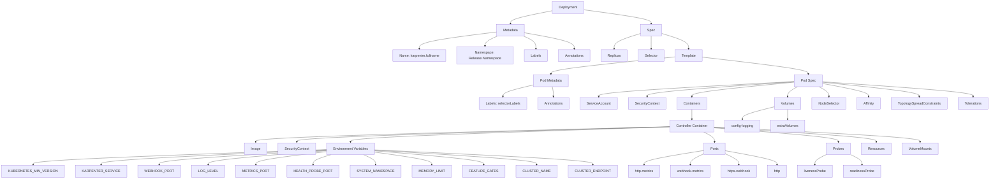
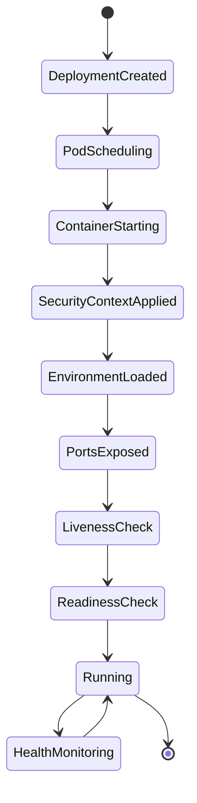

# Diagram: devops/k8s/karpenter/helm/templates/deployment.yaml


> Auto-generated by Obscura crawlers

## Diagram 1



### SVG

<svg id="container" width="4339.03515625" xmlns="http://www.w3.org/2000/svg" class="flowchart" height="822" viewBox="0 0 4339.03515625 822" role="graphics-document document" aria-roledescription="flowchart-v2"><style>#container{font-family:"trebuchet ms",verdana,arial,sans-serif;font-size:16px;fill:#333;}@keyframes edge-animation-frame{from{stroke-dashoffset:0;}}@keyframes dash{to{stroke-dashoffset:0;}}#container .edge-animation-slow{stroke-dasharray:9,5!important;stroke-dashoffset:900;animation:dash 50s linear infinite;stroke-linecap:round;}#container .edge-animation-fast{stroke-dasharray:9,5!important;stroke-dashoffset:900;animation:dash 20s linear infinite;stroke-linecap:round;}#container .error-icon{fill:#552222;}#container .error-text{fill:#552222;stroke:#552222;}#container .edge-thickness-normal{stroke-width:1px;}#container .edge-thickness-thick{stroke-width:3.5px;}#container .edge-pattern-solid{stroke-dasharray:0;}#container .edge-thickness-invisible{stroke-width:0;fill:none;}#container .edge-pattern-dashed{stroke-dasharray:3;}#container .edge-pattern-dotted{stroke-dasharray:2;}#container .marker{fill:#333333;stroke:#333333;}#container .marker.cross{stroke:#333333;}#container svg{font-family:"trebuchet ms",verdana,arial,sans-serif;font-size:16px;}#container p{margin:0;}#container .label{font-family:"trebuchet ms",verdana,arial,sans-serif;color:#333;}#container .cluster-label text{fill:#333;}#container .cluster-label span{color:#333;}#container .cluster-label span p{background-color:transparent;}#container .label text,#container span{fill:#333;color:#333;}#container .node rect,#container .node circle,#container .node ellipse,#container .node polygon,#container .node path{fill:#ECECFF;stroke:#9370DB;stroke-width:1px;}#container .rough-node .label text,#container .node .label text,#container .image-shape .label,#container .icon-shape .label{text-anchor:middle;}#container .node .katex path{fill:#000;stroke:#000;stroke-width:1px;}#container .rough-node .label,#container .node .label,#container .image-shape .label,#container .icon-shape .label{text-align:center;}#container .node.clickable{cursor:pointer;}#container .root .anchor path{fill:#333333!important;stroke-width:0;stroke:#333333;}#container .arrowheadPath{fill:#333333;}#container .edgePath .path{stroke:#333333;stroke-width:2.0px;}#container .flowchart-link{stroke:#333333;fill:none;}#container .edgeLabel{background-color:rgba(232,232,232, 0.8);text-align:center;}#container .edgeLabel p{background-color:rgba(232,232,232, 0.8);}#container .edgeLabel rect{opacity:0.5;background-color:rgba(232,232,232, 0.8);fill:rgba(232,232,232, 0.8);}#container .labelBkg{background-color:rgba(232, 232, 232, 0.5);}#container .cluster rect{fill:#ffffde;stroke:#aaaa33;stroke-width:1px;}#container .cluster text{fill:#333;}#container .cluster span{color:#333;}#container div.mermaidTooltip{position:absolute;text-align:center;max-width:200px;padding:2px;font-family:"trebuchet ms",verdana,arial,sans-serif;font-size:12px;background:hsl(80, 100%, 96.2745098039%);border:1px solid #aaaa33;border-radius:2px;pointer-events:none;z-index:100;}#container .flowchartTitleText{text-anchor:middle;font-size:18px;fill:#333;}#container rect.text{fill:none;stroke-width:0;}#container .icon-shape,#container .image-shape{background-color:rgba(232,232,232, 0.8);text-align:center;}#container .icon-shape p,#container .image-shape p{background-color:rgba(232,232,232, 0.8);padding:2px;}#container .icon-shape rect,#container .image-shape rect{opacity:0.5;background-color:rgba(232,232,232, 0.8);fill:rgba(232,232,232, 0.8);}#container .label-icon{display:inline-block;height:1em;overflow:visible;vertical-align:-0.125em;}#container .node .label-icon path{fill:currentColor;stroke:revert;stroke-width:revert;}#container :root{--mermaid-font-family:"trebuchet ms",verdana,arial,sans-serif;}</style><g><marker id="container_flowchart-v2-pointEnd" class="marker flowchart-v2" viewBox="0 0 10 10" refX="5" refY="5" markerUnits="userSpaceOnUse" markerWidth="8" markerHeight="8" orient="auto"><path d="M 0 0 L 10 5 L 0 10 z" class="arrowMarkerPath" style="stroke-width: 1; stroke-dasharray: 1, 0;"></path></marker><marker id="container_flowchart-v2-pointStart" class="marker flowchart-v2" viewBox="0 0 10 10" refX="4.5" refY="5" markerUnits="userSpaceOnUse" markerWidth="8" markerHeight="8" orient="auto"><path d="M 0 5 L 10 10 L 10 0 z" class="arrowMarkerPath" style="stroke-width: 1; stroke-dasharray: 1, 0;"></path></marker><marker id="container_flowchart-v2-circleEnd" class="marker flowchart-v2" viewBox="0 0 10 10" refX="11" refY="5" markerUnits="userSpaceOnUse" markerWidth="11" markerHeight="11" orient="auto"><circle cx="5" cy="5" r="5" class="arrowMarkerPath" style="stroke-width: 1; stroke-dasharray: 1, 0;"></circle></marker><marker id="container_flowchart-v2-circleStart" class="marker flowchart-v2" viewBox="0 0 10 10" refX="-1" refY="5" markerUnits="userSpaceOnUse" markerWidth="11" markerHeight="11" orient="auto"><circle cx="5" cy="5" r="5" class="arrowMarkerPath" style="stroke-width: 1; stroke-dasharray: 1, 0;"></circle></marker><marker id="container_flowchart-v2-crossEnd" class="marker cross flowchart-v2" viewBox="0 0 11 11" refX="12" refY="5.2" markerUnits="userSpaceOnUse" markerWidth="11" markerHeight="11" orient="auto"><path d="M 1,1 l 9,9 M 10,1 l -9,9" class="arrowMarkerPath" style="stroke-width: 2; stroke-dasharray: 1, 0;"></path></marker><marker id="container_flowchart-v2-crossStart" class="marker cross flowchart-v2" viewBox="0 0 11 11" refX="-1" refY="5.2" markerUnits="userSpaceOnUse" markerWidth="11" markerHeight="11" orient="auto"><path d="M 1,1 l 9,9 M 10,1 l -9,9" class="arrowMarkerPath" style="stroke-width: 2; stroke-dasharray: 1, 0;"></path></marker><g class="root"><g class="clusters"></g><g class="edgePaths"><path d="M2314.172,49.462L2282.187,55.719C2250.202,61.975,2186.232,74.487,2154.247,84.244C2122.262,94,2122.262,101,2122.262,104.5L2122.262,108" id="L_A_B_0" class="edge-thickness-normal edge-pattern-solid edge-thickness-normal edge-pattern-solid flowchart-link" style=";" data-edge="true" data-et="edge" data-id="L_A_B_0" data-points="W3sieCI6MjMxNC4xNzE4NzUsInkiOjQ5LjQ2MjIzMDE4OTQwMDA2fSx7IngiOjIxMjIuMjYxNzE4NzUsInkiOjg3fSx7IngiOjIxMjIuMjYxNzE4NzUsInkiOjExMn1d" marker-end="url(#container_flowchart-v2-pointEnd)"></path><path d="M2462.047,45.05L2513.486,52.041C2564.926,59.033,2667.805,73.017,2719.244,83.508C2770.684,94,2770.684,101,2770.684,104.5L2770.684,108" id="L_A_C_0" class="edge-thickness-normal edge-pattern-solid edge-thickness-normal edge-pattern-solid flowchart-link" style=";" data-edge="true" data-et="edge" data-id="L_A_C_0" data-points="W3sieCI6MjQ2Mi4wNDY4NzUsInkiOjQ1LjA0OTY4Mzk4Njk3MTQ4fSx7IngiOjI3NzAuNjgzNTkzNzUsInkiOjg3fSx7IngiOjI3NzAuNjgzNTkzNzUsInkiOjExMn1d" marker-end="url(#container_flowchart-v2-pointEnd)"></path><path d="M2058.168,146.923L1998.737,154.269C1939.306,161.615,1820.444,176.308,1761.013,189.154C1701.582,202,1701.582,213,1701.582,218.5L1701.582,224" id="L_B_D_0" class="edge-thickness-normal edge-pattern-solid edge-thickness-normal edge-pattern-solid flowchart-link" style=";" data-edge="true" data-et="edge" data-id="L_B_D_0" data-points="W3sieCI6MjA1OC4xNjc5Njg3NSwieSI6MTQ2LjkyMjU5NTUwMjA3MDd9LHsieCI6MTcwMS41ODIwMzEyNSwieSI6MTkxfSx7IngiOjE3MDEuNTgyMDMxMjUsInkiOjIyOH1d" marker-end="url(#container_flowchart-v2-pointEnd)"></path><path d="M2061.654,166L2052.301,170.167C2042.948,174.333,2024.241,182.667,2014.888,190.333C2005.535,198,2005.535,205,2005.535,208.5L2005.535,212" id="L_B_E_0" class="edge-thickness-normal edge-pattern-solid edge-thickness-normal edge-pattern-solid flowchart-link" style=";" data-edge="true" data-et="edge" data-id="L_B_E_0" data-points="W3sieCI6MjA2MS42NTM2OTU5MTM0NjE0LCJ5IjoxNjZ9LHsieCI6MjAwNS41MzUxNTYyNSwieSI6MTkxfSx7IngiOjIwMDUuNTM1MTU2MjUsInkiOjIxNn1d" marker-end="url(#container_flowchart-v2-pointEnd)"></path><path d="M2182.87,166L2192.223,170.167C2201.576,174.333,2220.282,182.667,2229.635,192.333C2238.988,202,2238.988,213,2238.988,218.5L2238.988,224" id="L_B_F_0" class="edge-thickness-normal edge-pattern-solid edge-thickness-normal edge-pattern-solid flowchart-link" style=";" data-edge="true" data-et="edge" data-id="L_B_F_0" data-points="W3sieCI6MjE4Mi44Njk3NDE1ODY1Mzg2LCJ5IjoxNjZ9LHsieCI6MjIzOC45ODgyODEyNSwieSI6MTkxfSx7IngiOjIyMzguOTg4MjgxMjUsInkiOjIyOH1d" marker-end="url(#container_flowchart-v2-pointEnd)"></path><path d="M2186.355,150.327L2224.714,157.106C2263.072,163.885,2339.788,177.442,2378.146,189.721C2416.504,202,2416.504,213,2416.504,218.5L2416.504,224" id="L_B_G_0" class="edge-thickness-normal edge-pattern-solid edge-thickness-normal edge-pattern-solid flowchart-link" style=";" data-edge="true" data-et="edge" data-id="L_B_G_0" data-points="W3sieCI6MjE4Ni4zNTU0Njg3NSwieSI6MTUwLjMyNjk3ODczMjQ0Mjk3fSx7IngiOjI0MTYuNTAzOTA2MjUsInkiOjE5MX0seyJ4IjoyNDE2LjUwMzkwNjI1LCJ5IjoyMjh9XQ==" marker-end="url(#container_flowchart-v2-pointEnd)"></path><path d="M2723.387,153.473L2702.948,159.728C2682.509,165.982,2641.632,178.491,2621.193,190.246C2600.754,202,2600.754,213,2600.754,218.5L2600.754,224" id="L_C_H_0" class="edge-thickness-normal edge-pattern-solid edge-thickness-normal edge-pattern-solid flowchart-link" style=";" data-edge="true" data-et="edge" data-id="L_C_H_0" data-points="W3sieCI6MjcyMy4zODY3MTg3NSwieSI6MTUzLjQ3MzI2NTU5Njk4NDA1fSx7IngiOjI2MDAuNzUzOTA2MjUsInkiOjE5MX0seyJ4IjoyNjAwLjc1MzkwNjI1LCJ5IjoyMjh9XQ==" marker-end="url(#container_flowchart-v2-pointEnd)"></path><path d="M2770.684,166L2770.684,170.167C2770.684,174.333,2770.684,182.667,2770.684,192.333C2770.684,202,2770.684,213,2770.684,218.5L2770.684,224" id="L_C_I_0" class="edge-thickness-normal edge-pattern-solid edge-thickness-normal edge-pattern-solid flowchart-link" style=";" data-edge="true" data-et="edge" data-id="L_C_I_0" data-points="W3sieCI6Mjc3MC42ODM1OTM3NSwieSI6MTY2fSx7IngiOjI3NzAuNjgzNTkzNzUsInkiOjE5MX0seyJ4IjoyNzcwLjY4MzU5Mzc1LCJ5IjoyMjh9XQ==" marker-end="url(#container_flowchart-v2-pointEnd)"></path><path d="M2817.98,153.2L2838.964,159.5C2859.947,165.8,2901.913,178.4,2922.896,190.2C2943.879,202,2943.879,213,2943.879,218.5L2943.879,224" id="L_C_J_0" class="edge-thickness-normal edge-pattern-solid edge-thickness-normal edge-pattern-solid flowchart-link" style=";" data-edge="true" data-et="edge" data-id="L_C_J_0" data-points="W3sieCI6MjgxNy45ODA0Njg3NSwieSI6MTUzLjIwMDM2OTg4NTg3NjY4fSx7IngiOjI5NDMuODc4OTA2MjUsInkiOjE5MX0seyJ4IjoyOTQzLjg3ODkwNjI1LCJ5IjoyMjh9XQ==" marker-end="url(#container_flowchart-v2-pointEnd)"></path><path d="M2880.426,261.388L2785.055,270.99C2689.685,280.592,2498.944,299.796,2403.574,312.898C2308.203,326,2308.203,333,2308.203,336.5L2308.203,340" id="L_J_K_0" class="edge-thickness-normal edge-pattern-solid edge-thickness-normal edge-pattern-solid flowchart-link" style=";" data-edge="true" data-et="edge" data-id="L_J_K_0" data-points="W3sieCI6Mjg4MC40MjU3ODEyNSwieSI6MjYxLjM4ODQ3NjgzMDE0NTA3fSx7IngiOjIzMDguMjAzMTI1LCJ5IjozMTl9LHsieCI6MjMwOC4yMDMxMjUsInkiOjM0NH1d" marker-end="url(#container_flowchart-v2-pointEnd)"></path><path d="M3007.332,262.349L3088.852,271.791C3170.372,281.233,3333.413,300.116,3414.933,313.058C3496.453,326,3496.453,333,3496.453,336.5L3496.453,340" id="L_J_L_0" class="edge-thickness-normal edge-pattern-solid edge-thickness-normal edge-pattern-solid flowchart-link" style=";" data-edge="true" data-et="edge" data-id="L_J_L_0" data-points="W3sieCI6MzAwNy4zMzIwMzEyNSwieSI6MjYyLjM0OTIzOTAwMjExMzd9LHsieCI6MzQ5Ni40NTMxMjUsInkiOjMxOX0seyJ4IjozNDk2LjQ1MzEyNSwieSI6MzQ0fV0=" marker-end="url(#container_flowchart-v2-pointEnd)"></path><path d="M2228.125,389.734L2204.426,395.279C2180.728,400.823,2133.331,411.911,2109.632,420.956C2085.934,430,2085.934,437,2085.934,440.5L2085.934,444" id="L_K_M_0" class="edge-thickness-normal edge-pattern-solid edge-thickness-normal edge-pattern-solid flowchart-link" style=";" data-edge="true" data-et="edge" data-id="L_K_M_0" data-points="W3sieCI6MjIyOC4xMjUsInkiOjM4OS43MzQyOTI4OTQ2NzY3NH0seyJ4IjoyMDg1LjkzMzU5Mzc1LCJ5Ijo0MjN9LHsieCI6MjA4NS45MzM1OTM3NSwieSI6NDQ4fV0=" marker-end="url(#container_flowchart-v2-pointEnd)"></path><path d="M2314.355,398L2315.304,402.167C2316.253,406.333,2318.152,414.667,2319.101,422.333C2320.051,430,2320.051,437,2320.051,440.5L2320.051,444" id="L_K_N_0" class="edge-thickness-normal edge-pattern-solid edge-thickness-normal edge-pattern-solid flowchart-link" style=";" data-edge="true" data-et="edge" data-id="L_K_N_0" data-points="W3sieCI6MjMxNC4zNTQ3OTI2NjgyNjksInkiOjM5OH0seyJ4IjoyMzIwLjA1MDc4MTI1LCJ5Ijo0MjN9LHsieCI6MjMyMC4wNTA3ODEyNSwieSI6NDQ4fV0=" marker-end="url(#container_flowchart-v2-pointEnd)"></path><path d="M3433.172,374.401L3282.469,382.501C3131.767,390.601,2830.362,406.8,2679.66,418.4C2528.957,430,2528.957,437,2528.957,440.5L2528.957,444" id="L_L_O_0" class="edge-thickness-normal edge-pattern-solid edge-thickness-normal edge-pattern-solid flowchart-link" style=";" data-edge="true" data-et="edge" data-id="L_L_O_0" data-points="W3sieCI6MzQzMy4xNzE4NzUsInkiOjM3NC40MDExNzY1MjI4Mzh9LHsieCI6MjUyOC45NTcwMzEyNSwieSI6NDIzfSx7IngiOjI1MjguOTU3MDMxMjUsInkiOjQ0OH1d" marker-end="url(#container_flowchart-v2-pointEnd)"></path><path d="M3433.172,375.412L3319.403,383.343C3205.634,391.274,2978.096,407.137,2864.327,418.569C2750.559,430,2750.559,437,2750.559,440.5L2750.559,444" id="L_L_P_0" class="edge-thickness-normal edge-pattern-solid edge-thickness-normal edge-pattern-solid flowchart-link" style=";" data-edge="true" data-et="edge" data-id="L_L_P_0" data-points="W3sieCI6MzQzMy4xNzE4NzUsInkiOjM3NS40MTE2NDkxODM4MTM1fSx7IngiOjI3NTAuNTU4NTkzNzUsInkiOjQyM30seyJ4IjoyNzUwLjU1ODU5Mzc1LCJ5Ijo0NDh9XQ==" marker-end="url(#container_flowchart-v2-pointEnd)"></path><path d="M3433.172,377.091L3353.675,384.742C3274.178,392.394,3115.185,407.697,3035.688,418.848C2956.191,430,2956.191,437,2956.191,440.5L2956.191,444" id="L_L_Q_0" class="edge-thickness-normal edge-pattern-solid edge-thickness-normal edge-pattern-solid flowchart-link" style=";" data-edge="true" data-et="edge" data-id="L_L_Q_0" data-points="W3sieCI6MzQzMy4xNzE4NzUsInkiOjM3Ny4wOTA3OTgwMDczMzE1fSx7IngiOjI5NTYuMTkxNDA2MjUsInkiOjQyM30seyJ4IjoyOTU2LjE5MTQwNjI1LCJ5Ijo0NDh9XQ==" marker-end="url(#container_flowchart-v2-pointEnd)"></path><path d="M3447.153,398L3439.544,402.167C3431.936,406.333,3416.72,414.667,3409.112,422.333C3401.504,430,3401.504,437,3401.504,440.5L3401.504,444" id="L_L_R_0" class="edge-thickness-normal edge-pattern-solid edge-thickness-normal edge-pattern-solid flowchart-link" style=";" data-edge="true" data-et="edge" data-id="L_L_R_0" data-points="W3sieCI6MzQ0Ny4xNTI1NjkxMTA1NzcsInkiOjM5OH0seyJ4IjozNDAxLjUwMzkwNjI1LCJ5Ijo0MjN9LHsieCI6MzQwMS41MDM5MDYyNSwieSI6NDQ4fV0=" marker-end="url(#container_flowchart-v2-pointEnd)"></path><path d="M2956.191,502L2956.191,506.167C2956.191,510.333,2956.191,518.667,2956.191,526.333C2956.191,534,2956.191,541,2956.191,544.5L2956.191,548" id="L_Q_S_0" class="edge-thickness-normal edge-pattern-solid edge-thickness-normal edge-pattern-solid flowchart-link" style=";" data-edge="true" data-et="edge" data-id="L_Q_S_0" data-points="W3sieCI6Mjk1Ni4xOTE0MDYyNSwieSI6NTAyfSx7IngiOjI5NTYuMTkxNDA2MjUsInkiOjUyN30seyJ4IjoyOTU2LjE5MTQwNjI1LCJ5Ijo1NTJ9XQ==" marker-end="url(#container_flowchart-v2-pointEnd)"></path><path d="M2852.629,581.756L2544.167,589.963C2235.706,598.17,1618.783,614.585,1310.321,626.293C1001.859,638,1001.859,645,1001.859,648.5L1001.859,652" id="L_S_T_0" class="edge-thickness-normal edge-pattern-solid edge-thickness-normal edge-pattern-solid flowchart-link" style=";" data-edge="true" data-et="edge" data-id="L_S_T_0" data-points="W3sieCI6Mjg1Mi42Mjg5MDYyNSwieSI6NTgxLjc1NTU0NTA3MzE0NDh9LHsieCI6MTAwMS44NTkzNzUsInkiOjYzMX0seyJ4IjoxMDAxLjg1OTM3NSwieSI6NjU2fV0=" marker-end="url(#container_flowchart-v2-pointEnd)"></path><path d="M2852.629,582.05L2575.607,590.208C2298.586,598.367,1744.543,614.683,1467.521,626.342C1190.5,638,1190.5,645,1190.5,648.5L1190.5,652" id="L_S_U_0" class="edge-thickness-normal edge-pattern-solid edge-thickness-normal edge-pattern-solid flowchart-link" style=";" data-edge="true" data-et="edge" data-id="L_S_U_0" data-points="W3sieCI6Mjg1Mi42Mjg5MDYyNSwieSI6NTgyLjA0OTkzODM4NzI3MzF9LHsieCI6MTE5MC41LCJ5Ijo2MzF9LHsieCI6MTE5MC41LCJ5Ijo2NTZ9XQ==" marker-end="url(#container_flowchart-v2-pointEnd)"></path><path d="M2852.629,582.549L2616.98,590.624C2381.331,598.699,1910.033,614.85,1674.383,626.425C1438.734,638,1438.734,645,1438.734,648.5L1438.734,652" id="L_S_V_0" class="edge-thickness-normal edge-pattern-solid edge-thickness-normal edge-pattern-solid flowchart-link" style=";" data-edge="true" data-et="edge" data-id="L_S_V_0" data-points="W3sieCI6Mjg1Mi42Mjg5MDYyNSwieSI6NTgyLjU0ODg2NDkwMjk5MX0seyJ4IjoxNDM4LjczNDM3NSwieSI6NjMxfSx7IngiOjE0MzguNzM0Mzc1LCJ5Ijo2NTZ9XQ==" marker-end="url(#container_flowchart-v2-pointEnd)"></path><path d="M3010.82,606L3019.251,610.167C3027.681,614.333,3044.542,622.667,3052.972,630.333C3061.402,638,3061.402,645,3061.402,648.5L3061.402,652" id="L_S_W_0" class="edge-thickness-normal edge-pattern-solid edge-thickness-normal edge-pattern-solid flowchart-link" style=";" data-edge="true" data-et="edge" data-id="L_S_W_0" data-points="W3sieCI6MzAxMC44MjAxNjIyNTk2MTUyLCJ5Ijo2MDZ9LHsieCI6MzA2MS40MDIzNDM3NSwieSI6NjMxfSx7IngiOjMwNjEuNDAyMzQzNzUsInkiOjY1Nn1d" marker-end="url(#container_flowchart-v2-pointEnd)"></path><path d="M3059.754,586.88L3156.396,594.233C3253.039,601.587,3446.324,616.293,3542.967,627.147C3639.609,638,3639.609,645,3639.609,648.5L3639.609,652" id="L_S_X_0" class="edge-thickness-normal edge-pattern-solid edge-thickness-normal edge-pattern-solid flowchart-link" style=";" data-edge="true" data-et="edge" data-id="L_S_X_0" data-points="W3sieCI6MzA1OS43NTM5MDYyNSwieSI6NTg2Ljg3OTg3NzY4MjgzMjh9LHsieCI6MzYzOS42MDkzNzUsInkiOjYzMX0seyJ4IjozNjM5LjYwOTM3NSwieSI6NjU2fV0=" marker-end="url(#container_flowchart-v2-pointEnd)"></path><path d="M3059.754,585.298L3184.999,592.915C3310.245,600.532,3560.736,615.766,3685.981,626.883C3811.227,638,3811.227,645,3811.227,648.5L3811.227,652" id="L_S_Y_0" class="edge-thickness-normal edge-pattern-solid edge-thickness-normal edge-pattern-solid flowchart-link" style=";" data-edge="true" data-et="edge" data-id="L_S_Y_0" data-points="W3sieCI6MzA1OS43NTM5MDYyNSwieSI6NTg1LjI5ODI3OTAzNjQwNjZ9LHsieCI6MzgxMS4yMjY1NjI1LCJ5Ijo2MzF9LHsieCI6MzgxMS4yMjY1NjI1LCJ5Ijo2NTZ9XQ==" marker-end="url(#container_flowchart-v2-pointEnd)"></path><path d="M3059.754,584.101L3218.46,591.917C3377.167,599.734,3694.579,615.367,3853.286,626.683C4011.992,638,4011.992,645,4011.992,648.5L4011.992,652" id="L_S_Z_0" class="edge-thickness-normal edge-pattern-solid edge-thickness-normal edge-pattern-solid flowchart-link" style=";" data-edge="true" data-et="edge" data-id="L_S_Z_0" data-points="W3sieCI6MzA1OS43NTM5MDYyNSwieSI6NTg0LjEwMDYzMDgxNTYyMDV9LHsieCI6NDAxMS45OTIxODc1LCJ5Ijo2MzF9LHsieCI6NDAxMS45OTIxODc1LCJ5Ijo2NTZ9XQ==" marker-end="url(#container_flowchart-v2-pointEnd)"></path><path d="M1327.258,687.454L1128.939,695.379C930.62,703.303,533.982,719.151,335.663,730.576C137.344,742,137.344,749,137.344,752.5L137.344,756" id="L_V_V1_0" class="edge-thickness-normal edge-pattern-solid edge-thickness-normal edge-pattern-solid flowchart-link" style=";" data-edge="true" data-et="edge" data-id="L_V_V1_0" data-points="W3sieCI6MTMyNy4yNTc4MTI1LCJ5Ijo2ODcuNDU0Mjk3Njg2MzY5Mn0seyJ4IjoxMzcuMzQzNzUsInkiOjczNX0seyJ4IjoxMzcuMzQzNzUsInkiOjc2MH1d" marker-end="url(#container_flowchart-v2-pointEnd)"></path><path d="M1327.258,688.698L1176.293,696.415C1025.328,704.132,723.398,719.566,572.434,730.783C421.469,742,421.469,749,421.469,752.5L421.469,756" id="L_V_V2_0" class="edge-thickness-normal edge-pattern-solid edge-thickness-normal edge-pattern-solid flowchart-link" style=";" data-edge="true" data-et="edge" data-id="L_V_V2_0" data-points="W3sieCI6MTMyNy4yNTc4MTI1LCJ5Ijo2ODguNjk4Mzk0OTAwNTQ1M30seyJ4Ijo0MjEuNDY4NzUsInkiOjczNX0seyJ4Ijo0MjEuNDY4NzUsInkiOjc2MH1d" marker-end="url(#container_flowchart-v2-pointEnd)"></path><path d="M1327.258,690.505L1217.113,697.921C1106.969,705.337,886.68,720.168,776.535,731.084C666.391,742,666.391,749,666.391,752.5L666.391,756" id="L_V_V3_0" class="edge-thickness-normal edge-pattern-solid edge-thickness-normal edge-pattern-solid flowchart-link" style=";" data-edge="true" data-et="edge" data-id="L_V_V3_0" data-points="W3sieCI6MTMyNy4yNTc4MTI1LCJ5Ijo2OTAuNTA1NDQyMDM5MjQ3NH0seyJ4Ijo2NjYuMzkwNjI1LCJ5Ijo3MzV9LHsieCI6NjY2LjM5MDYyNSwieSI6NzYwfV0=" marker-end="url(#container_flowchart-v2-pointEnd)"></path><path d="M1327.258,693.299L1252.029,700.249C1176.799,707.199,1026.341,721.1,951.112,731.55C875.883,742,875.883,749,875.883,752.5L875.883,756" id="L_V_V4_0" class="edge-thickness-normal edge-pattern-solid edge-thickness-normal edge-pattern-solid flowchart-link" style=";" data-edge="true" data-et="edge" data-id="L_V_V4_0" data-points="W3sieCI6MTMyNy4yNTc4MTI1LCJ5Ijo2OTMuMjk4OTUyMDQzODYxNX0seyJ4Ijo4NzUuODgyODEyNSwieSI6NzM1fSx7IngiOjg3NS44ODI4MTI1LCJ5Ijo3NjB9XQ==" marker-end="url(#container_flowchart-v2-pointEnd)"></path><path d="M1327.258,699.103L1285.841,705.086C1244.424,711.069,1161.591,723.034,1120.174,732.517C1078.758,742,1078.758,749,1078.758,752.5L1078.758,756" id="L_V_V5_0" class="edge-thickness-normal edge-pattern-solid edge-thickness-normal edge-pattern-solid flowchart-link" style=";" data-edge="true" data-et="edge" data-id="L_V_V5_0" data-points="W3sieCI6MTMyNy4yNTc4MTI1LCJ5Ijo2OTkuMTAzMjE4NTI1NTExN30seyJ4IjoxMDc4Ljc1NzgxMjUsInkiOjczNX0seyJ4IjoxMDc4Ljc1NzgxMjUsInkiOjc2MH1d" marker-end="url(#container_flowchart-v2-pointEnd)"></path><path d="M1377.55,710L1368.108,714.167C1358.666,718.333,1339.782,726.667,1330.34,734.333C1320.898,742,1320.898,749,1320.898,752.5L1320.898,756" id="L_V_V6_0" class="edge-thickness-normal edge-pattern-solid edge-thickness-normal edge-pattern-solid flowchart-link" style=";" data-edge="true" data-et="edge" data-id="L_V_V6_0" data-points="W3sieCI6MTM3Ny41NTAzMzA1Mjg4NDYyLCJ5Ijo3MTB9LHsieCI6MTMyMC44OTg0Mzc1LCJ5Ijo3MzV9LHsieCI6MTMyMC44OTg0Mzc1LCJ5Ijo3NjB9XQ==" marker-end="url(#container_flowchart-v2-pointEnd)"></path><path d="M1513.751,710L1525.328,714.167C1536.904,718.333,1560.058,726.667,1571.634,734.333C1583.211,742,1583.211,749,1583.211,752.5L1583.211,756" id="L_V_V7_0" class="edge-thickness-normal edge-pattern-solid edge-thickness-normal edge-pattern-solid flowchart-link" style=";" data-edge="true" data-et="edge" data-id="L_V_V7_0" data-points="W3sieCI6MTUxMy43NTEwNTE2ODI2OTI0LCJ5Ijo3MTB9LHsieCI6MTU4My4yMTA5Mzc1LCJ5Ijo3MzV9LHsieCI6MTU4My4yMTA5Mzc1LCJ5Ijo3NjB9XQ==" marker-end="url(#container_flowchart-v2-pointEnd)"></path><path d="M1550.211,698.176L1595.294,704.313C1640.378,710.451,1730.544,722.725,1775.628,732.363C1820.711,742,1820.711,749,1820.711,752.5L1820.711,756" id="L_V_V8_0" class="edge-thickness-normal edge-pattern-solid edge-thickness-normal edge-pattern-solid flowchart-link" style=";" data-edge="true" data-et="edge" data-id="L_V_V8_0" data-points="W3sieCI6MTU1MC4yMTA5Mzc1LCJ5Ijo2OTguMTc1NzUxMTMwMDE4Nn0seyJ4IjoxODIwLjcxMDkzNzUsInkiOjczNX0seyJ4IjoxODIwLjcxMDkzNzUsInkiOjc2MH1d" marker-end="url(#container_flowchart-v2-pointEnd)"></path><path d="M1550.211,692.621L1632.048,699.684C1713.885,706.747,1877.56,720.874,1959.397,731.437C2041.234,742,2041.234,749,2041.234,752.5L2041.234,756" id="L_V_V9_0" class="edge-thickness-normal edge-pattern-solid edge-thickness-normal edge-pattern-solid flowchart-link" style=";" data-edge="true" data-et="edge" data-id="L_V_V9_0" data-points="W3sieCI6MTU1MC4yMTA5Mzc1LCJ5Ijo2OTIuNjIxMjEzNjkyOTQ2MX0seyJ4IjoyMDQxLjIzNDM3NSwieSI6NzM1fSx7IngiOjIwNDEuMjM0Mzc1LCJ5Ijo3NjB9XQ==" marker-end="url(#container_flowchart-v2-pointEnd)"></path><path d="M1550.211,690.027L1669.111,697.523C1788.01,705.018,2025.81,720.009,2144.71,731.005C2263.609,742,2263.609,749,2263.609,752.5L2263.609,756" id="L_V_V10_0" class="edge-thickness-normal edge-pattern-solid edge-thickness-normal edge-pattern-solid flowchart-link" style=";" data-edge="true" data-et="edge" data-id="L_V_V10_0" data-points="W3sieCI6MTU1MC4yMTA5Mzc1LCJ5Ijo2OTAuMDI3NDY2MjgyNzcwMX0seyJ4IjoyMjYzLjYwOTM3NSwieSI6NzM1fSx7IngiOjIyNjMuNjA5Mzc1LCJ5Ijo3NjB9XQ==" marker-end="url(#container_flowchart-v2-pointEnd)"></path><path d="M1550.211,688.455L1708.745,696.212C1867.279,703.97,2184.346,719.485,2342.88,730.742C2501.414,742,2501.414,749,2501.414,752.5L2501.414,756" id="L_V_V11_0" class="edge-thickness-normal edge-pattern-solid edge-thickness-normal edge-pattern-solid flowchart-link" style=";" data-edge="true" data-et="edge" data-id="L_V_V11_0" data-points="W3sieCI6MTU1MC4yMTA5Mzc1LCJ5Ijo2ODguNDU0ODcxNjAyNTk2N30seyJ4IjoyNTAxLjQxNDA2MjUsInkiOjczNX0seyJ4IjoyNTAxLjQxNDA2MjUsInkiOjc2MH1d" marker-end="url(#container_flowchart-v2-pointEnd)"></path><path d="M3012.605,690.634L2965.34,698.028C2918.076,705.423,2823.546,720.211,2776.281,731.106C2729.016,742,2729.016,749,2729.016,752.5L2729.016,756" id="L_W_W1_0" class="edge-thickness-normal edge-pattern-solid edge-thickness-normal edge-pattern-solid flowchart-link" style=";" data-edge="true" data-et="edge" data-id="L_W_W1_0" data-points="W3sieCI6MzAxMi42MDU0Njg3NSwieSI6NjkwLjYzMzk5MTg0NDAyNTh9LHsieCI6MjcyOS4wMTU2MjUsInkiOjczNX0seyJ4IjoyNzI5LjAxNTYyNSwieSI6NzYwfV0=" marker-end="url(#container_flowchart-v2-pointEnd)"></path><path d="M3012.605,705.257L3001.738,710.215C2990.87,715.172,2969.134,725.086,2958.266,733.543C2947.398,742,2947.398,749,2947.398,752.5L2947.398,756" id="L_W_W2_0" class="edge-thickness-normal edge-pattern-solid edge-thickness-normal edge-pattern-solid flowchart-link" style=";" data-edge="true" data-et="edge" data-id="L_W_W2_0" data-points="W3sieCI6MzAxMi42MDU0Njg3NSwieSI6NzA1LjI1NzQ2MTAyNDQ5ODl9LHsieCI6Mjk0Ny4zOTg0Mzc1LCJ5Ijo3MzV9LHsieCI6Mjk0Ny4zOTg0Mzc1LCJ5Ijo3NjB9XQ==" marker-end="url(#container_flowchart-v2-pointEnd)"></path><path d="M3110.199,705.257L3121.067,710.215C3131.935,715.172,3153.671,725.086,3164.538,733.543C3175.406,742,3175.406,749,3175.406,752.5L3175.406,756" id="L_W_W3_0" class="edge-thickness-normal edge-pattern-solid edge-thickness-normal edge-pattern-solid flowchart-link" style=";" data-edge="true" data-et="edge" data-id="L_W_W3_0" data-points="W3sieCI6MzExMC4xOTkyMTg3NSwieSI6NzA1LjI1NzQ2MTAyNDQ5ODl9LHsieCI6MzE3NS40MDYyNSwieSI6NzM1fSx7IngiOjMxNzUuNDA2MjUsInkiOjc2MH1d" marker-end="url(#container_flowchart-v2-pointEnd)"></path><path d="M3110.199,691.622L3151.117,698.852C3192.034,706.081,3273.868,720.541,3314.786,731.27C3355.703,742,3355.703,749,3355.703,752.5L3355.703,756" id="L_W_W4_0" class="edge-thickness-normal edge-pattern-solid edge-thickness-normal edge-pattern-solid flowchart-link" style=";" data-edge="true" data-et="edge" data-id="L_W_W4_0" data-points="W3sieCI6MzExMC4xOTkyMTg3NSwieSI6NjkxLjYyMTkxOTAwODI0MjZ9LHsieCI6MzM1NS43MDMxMjUsInkiOjczNX0seyJ4IjozMzU1LjcwMzEyNSwieSI6NzYwfV0=" marker-end="url(#container_flowchart-v2-pointEnd)"></path><path d="M3584.75,709.351L3575.85,713.626C3566.951,717.901,3549.151,726.45,3540.251,734.225C3531.352,742,3531.352,749,3531.352,752.5L3531.352,756" id="L_X_X1_0" class="edge-thickness-normal edge-pattern-solid edge-thickness-normal edge-pattern-solid flowchart-link" style=";" data-edge="true" data-et="edge" data-id="L_X_X1_0" data-points="W3sieCI6MzU4NC43NSwieSI6NzA5LjM1MDg2OTU5NjU5Mzd9LHsieCI6MzUzMS4zNTE1NjI1LCJ5Ijo3MzV9LHsieCI6MzUzMS4zNTE1NjI1LCJ5Ijo3NjB9XQ==" marker-end="url(#container_flowchart-v2-pointEnd)"></path><path d="M3694.469,709.351L3703.368,713.626C3712.268,717.901,3730.068,726.45,3738.967,734.225C3747.867,742,3747.867,749,3747.867,752.5L3747.867,756" id="L_X_X2_0" class="edge-thickness-normal edge-pattern-solid edge-thickness-normal edge-pattern-solid flowchart-link" style=";" data-edge="true" data-et="edge" data-id="L_X_X2_0" data-points="W3sieCI6MzY5NC40Njg3NSwieSI6NzA5LjM1MDg2OTU5NjU5Mzd9LHsieCI6Mzc0Ny44NjcxODc1LCJ5Ijo3MzV9LHsieCI6Mzc0Ny44NjcxODc1LCJ5Ijo3NjB9XQ==" marker-end="url(#container_flowchart-v2-pointEnd)"></path><path d="M3340.629,490.044L3315.704,496.203C3290.78,502.362,3240.931,514.681,3216.007,524.341C3191.082,534,3191.082,541,3191.082,544.5L3191.082,548" id="L_R_R1_0" class="edge-thickness-normal edge-pattern-solid edge-thickness-normal edge-pattern-solid flowchart-link" style=";" data-edge="true" data-et="edge" data-id="L_R_R1_0" data-points="W3sieCI6MzM0MC42Mjg5MDYyNSwieSI6NDkwLjA0MzU4ODAyOTk5OTN9LHsieCI6MzE5MS4wODIwMzEyNSwieSI6NTI3fSx7IngiOjMxOTEuMDgyMDMxMjUsInkiOjU1Mn1d" marker-end="url(#container_flowchart-v2-pointEnd)"></path><path d="M3401.504,502L3401.504,506.167C3401.504,510.333,3401.504,518.667,3401.504,526.333C3401.504,534,3401.504,541,3401.504,544.5L3401.504,548" id="L_R_R2_0" class="edge-thickness-normal edge-pattern-solid edge-thickness-normal edge-pattern-solid flowchart-link" style=";" data-edge="true" data-et="edge" data-id="L_R_R2_0" data-points="W3sieCI6MzQwMS41MDM5MDYyNSwieSI6NTAyfSx7IngiOjM0MDEuNTAzOTA2MjUsInkiOjUyN30seyJ4IjozNDAxLjUwMzkwNjI1LCJ5Ijo1NTJ9XQ==" marker-end="url(#container_flowchart-v2-pointEnd)"></path><path d="M3545.754,398L3553.362,402.167C3560.97,406.333,3576.186,414.667,3583.794,422.333C3591.402,430,3591.402,437,3591.402,440.5L3591.402,444" id="L_L_AA_0" class="edge-thickness-normal edge-pattern-solid edge-thickness-normal edge-pattern-solid flowchart-link" style=";" data-edge="true" data-et="edge" data-id="L_L_AA_0" data-points="W3sieCI6MzU0NS43NTM2ODA4ODk0MjMsInkiOjM5OH0seyJ4IjozNTkxLjQwMjM0Mzc1LCJ5Ijo0MjN9LHsieCI6MzU5MS40MDIzNDM3NSwieSI6NDQ4fV0=" marker-end="url(#container_flowchart-v2-pointEnd)"></path><path d="M3559.734,382.77L3595.782,389.475C3631.829,396.18,3703.924,409.59,3739.972,419.795C3776.02,430,3776.02,437,3776.02,440.5L3776.02,444" id="L_L_AB_0" class="edge-thickness-normal edge-pattern-solid edge-thickness-normal edge-pattern-solid flowchart-link" style=";" data-edge="true" data-et="edge" data-id="L_L_AB_0" data-points="W3sieCI6MzU1OS43MzQzNzUsInkiOjM4Mi43NzA0NTkyNzcwNjEzfSx7IngiOjM3NzYuMDE5NTMxMjUsInkiOjQyM30seyJ4IjozNzc2LjAxOTUzMTI1LCJ5Ijo0NDh9XQ==" marker-end="url(#container_flowchart-v2-pointEnd)"></path><path d="M3559.734,377.397L3634.926,384.997C3710.118,392.598,3860.503,407.799,3935.695,418.899C4010.887,430,4010.887,437,4010.887,440.5L4010.887,444" id="L_L_AC_0" class="edge-thickness-normal edge-pattern-solid edge-thickness-normal edge-pattern-solid flowchart-link" style=";" data-edge="true" data-et="edge" data-id="L_L_AC_0" data-points="W3sieCI6MzU1OS43MzQzNzUsInkiOjM3Ny4zOTY1OTgyMDAzODcyNX0seyJ4Ijo0MDEwLjg4NjcxODc1LCJ5Ijo0MjN9LHsieCI6NDAxMC44ODY3MTg3NSwieSI6NDQ4fV0=" marker-end="url(#container_flowchart-v2-pointEnd)"></path><path d="M3559.734,375.306L3676.545,383.255C3793.355,391.204,4026.977,407.102,4143.787,418.551C4260.598,430,4260.598,437,4260.598,440.5L4260.598,444" id="L_L_AD_0" class="edge-thickness-normal edge-pattern-solid edge-thickness-normal edge-pattern-solid flowchart-link" style=";" data-edge="true" data-et="edge" data-id="L_L_AD_0" data-points="W3sieCI6MzU1OS43MzQzNzUsInkiOjM3NS4zMDYyODYxMzQ5MjQxNn0seyJ4Ijo0MjYwLjU5NzY1NjI1LCJ5Ijo0MjN9LHsieCI6NDI2MC41OTc2NTYyNSwieSI6NDQ4fV0=" marker-end="url(#container_flowchart-v2-pointEnd)"></path></g><g class="edgeLabels"><g class="edgeLabel"><g class="label" data-id="L_A_B_0" transform="translate(0, 0)"><foreignObject width="0" height="0"><div xmlns="http://www.w3.org/1999/xhtml" class="labelBkg" style="display: table-cell; white-space: nowrap; line-height: 1.5; max-width: 200px; text-align: center;"><span class="edgeLabel"></span></div></foreignObject></g></g><g class="edgeLabel"><g class="label" data-id="L_A_C_0" transform="translate(0, 0)"><foreignObject width="0" height="0"><div xmlns="http://www.w3.org/1999/xhtml" class="labelBkg" style="display: table-cell; white-space: nowrap; line-height: 1.5; max-width: 200px; text-align: center;"><span class="edgeLabel"></span></div></foreignObject></g></g><g class="edgeLabel"><g class="label" data-id="L_B_D_0" transform="translate(0, 0)"><foreignObject width="0" height="0"><div xmlns="http://www.w3.org/1999/xhtml" class="labelBkg" style="display: table-cell; white-space: nowrap; line-height: 1.5; max-width: 200px; text-align: center;"><span class="edgeLabel"></span></div></foreignObject></g></g><g class="edgeLabel"><g class="label" data-id="L_B_E_0" transform="translate(0, 0)"><foreignObject width="0" height="0"><div xmlns="http://www.w3.org/1999/xhtml" class="labelBkg" style="display: table-cell; white-space: nowrap; line-height: 1.5; max-width: 200px; text-align: center;"><span class="edgeLabel"></span></div></foreignObject></g></g><g class="edgeLabel"><g class="label" data-id="L_B_F_0" transform="translate(0, 0)"><foreignObject width="0" height="0"><div xmlns="http://www.w3.org/1999/xhtml" class="labelBkg" style="display: table-cell; white-space: nowrap; line-height: 1.5; max-width: 200px; text-align: center;"><span class="edgeLabel"></span></div></foreignObject></g></g><g class="edgeLabel"><g class="label" data-id="L_B_G_0" transform="translate(0, 0)"><foreignObject width="0" height="0"><div xmlns="http://www.w3.org/1999/xhtml" class="labelBkg" style="display: table-cell; white-space: nowrap; line-height: 1.5; max-width: 200px; text-align: center;"><span class="edgeLabel"></span></div></foreignObject></g></g><g class="edgeLabel"><g class="label" data-id="L_C_H_0" transform="translate(0, 0)"><foreignObject width="0" height="0"><div xmlns="http://www.w3.org/1999/xhtml" class="labelBkg" style="display: table-cell; white-space: nowrap; line-height: 1.5; max-width: 200px; text-align: center;"><span class="edgeLabel"></span></div></foreignObject></g></g><g class="edgeLabel"><g class="label" data-id="L_C_I_0" transform="translate(0, 0)"><foreignObject width="0" height="0"><div xmlns="http://www.w3.org/1999/xhtml" class="labelBkg" style="display: table-cell; white-space: nowrap; line-height: 1.5; max-width: 200px; text-align: center;"><span class="edgeLabel"></span></div></foreignObject></g></g><g class="edgeLabel"><g class="label" data-id="L_C_J_0" transform="translate(0, 0)"><foreignObject width="0" height="0"><div xmlns="http://www.w3.org/1999/xhtml" class="labelBkg" style="display: table-cell; white-space: nowrap; line-height: 1.5; max-width: 200px; text-align: center;"><span class="edgeLabel"></span></div></foreignObject></g></g><g class="edgeLabel"><g class="label" data-id="L_J_K_0" transform="translate(0, 0)"><foreignObject width="0" height="0"><div xmlns="http://www.w3.org/1999/xhtml" class="labelBkg" style="display: table-cell; white-space: nowrap; line-height: 1.5; max-width: 200px; text-align: center;"><span class="edgeLabel"></span></div></foreignObject></g></g><g class="edgeLabel"><g class="label" data-id="L_J_L_0" transform="translate(0, 0)"><foreignObject width="0" height="0"><div xmlns="http://www.w3.org/1999/xhtml" class="labelBkg" style="display: table-cell; white-space: nowrap; line-height: 1.5; max-width: 200px; text-align: center;"><span class="edgeLabel"></span></div></foreignObject></g></g><g class="edgeLabel"><g class="label" data-id="L_K_M_0" transform="translate(0, 0)"><foreignObject width="0" height="0"><div xmlns="http://www.w3.org/1999/xhtml" class="labelBkg" style="display: table-cell; white-space: nowrap; line-height: 1.5; max-width: 200px; text-align: center;"><span class="edgeLabel"></span></div></foreignObject></g></g><g class="edgeLabel"><g class="label" data-id="L_K_N_0" transform="translate(0, 0)"><foreignObject width="0" height="0"><div xmlns="http://www.w3.org/1999/xhtml" class="labelBkg" style="display: table-cell; white-space: nowrap; line-height: 1.5; max-width: 200px; text-align: center;"><span class="edgeLabel"></span></div></foreignObject></g></g><g class="edgeLabel"><g class="label" data-id="L_L_O_0" transform="translate(0, 0)"><foreignObject width="0" height="0"><div xmlns="http://www.w3.org/1999/xhtml" class="labelBkg" style="display: table-cell; white-space: nowrap; line-height: 1.5; max-width: 200px; text-align: center;"><span class="edgeLabel"></span></div></foreignObject></g></g><g class="edgeLabel"><g class="label" data-id="L_L_P_0" transform="translate(0, 0)"><foreignObject width="0" height="0"><div xmlns="http://www.w3.org/1999/xhtml" class="labelBkg" style="display: table-cell; white-space: nowrap; line-height: 1.5; max-width: 200px; text-align: center;"><span class="edgeLabel"></span></div></foreignObject></g></g><g class="edgeLabel"><g class="label" data-id="L_L_Q_0" transform="translate(0, 0)"><foreignObject width="0" height="0"><div xmlns="http://www.w3.org/1999/xhtml" class="labelBkg" style="display: table-cell; white-space: nowrap; line-height: 1.5; max-width: 200px; text-align: center;"><span class="edgeLabel"></span></div></foreignObject></g></g><g class="edgeLabel"><g class="label" data-id="L_L_R_0" transform="translate(0, 0)"><foreignObject width="0" height="0"><div xmlns="http://www.w3.org/1999/xhtml" class="labelBkg" style="display: table-cell; white-space: nowrap; line-height: 1.5; max-width: 200px; text-align: center;"><span class="edgeLabel"></span></div></foreignObject></g></g><g class="edgeLabel"><g class="label" data-id="L_Q_S_0" transform="translate(0, 0)"><foreignObject width="0" height="0"><div xmlns="http://www.w3.org/1999/xhtml" class="labelBkg" style="display: table-cell; white-space: nowrap; line-height: 1.5; max-width: 200px; text-align: center;"><span class="edgeLabel"></span></div></foreignObject></g></g><g class="edgeLabel"><g class="label" data-id="L_S_T_0" transform="translate(0, 0)"><foreignObject width="0" height="0"><div xmlns="http://www.w3.org/1999/xhtml" class="labelBkg" style="display: table-cell; white-space: nowrap; line-height: 1.5; max-width: 200px; text-align: center;"><span class="edgeLabel"></span></div></foreignObject></g></g><g class="edgeLabel"><g class="label" data-id="L_S_U_0" transform="translate(0, 0)"><foreignObject width="0" height="0"><div xmlns="http://www.w3.org/1999/xhtml" class="labelBkg" style="display: table-cell; white-space: nowrap; line-height: 1.5; max-width: 200px; text-align: center;"><span class="edgeLabel"></span></div></foreignObject></g></g><g class="edgeLabel"><g class="label" data-id="L_S_V_0" transform="translate(0, 0)"><foreignObject width="0" height="0"><div xmlns="http://www.w3.org/1999/xhtml" class="labelBkg" style="display: table-cell; white-space: nowrap; line-height: 1.5; max-width: 200px; text-align: center;"><span class="edgeLabel"></span></div></foreignObject></g></g><g class="edgeLabel"><g class="label" data-id="L_S_W_0" transform="translate(0, 0)"><foreignObject width="0" height="0"><div xmlns="http://www.w3.org/1999/xhtml" class="labelBkg" style="display: table-cell; white-space: nowrap; line-height: 1.5; max-width: 200px; text-align: center;"><span class="edgeLabel"></span></div></foreignObject></g></g><g class="edgeLabel"><g class="label" data-id="L_S_X_0" transform="translate(0, 0)"><foreignObject width="0" height="0"><div xmlns="http://www.w3.org/1999/xhtml" class="labelBkg" style="display: table-cell; white-space: nowrap; line-height: 1.5; max-width: 200px; text-align: center;"><span class="edgeLabel"></span></div></foreignObject></g></g><g class="edgeLabel"><g class="label" data-id="L_S_Y_0" transform="translate(0, 0)"><foreignObject width="0" height="0"><div xmlns="http://www.w3.org/1999/xhtml" class="labelBkg" style="display: table-cell; white-space: nowrap; line-height: 1.5; max-width: 200px; text-align: center;"><span class="edgeLabel"></span></div></foreignObject></g></g><g class="edgeLabel"><g class="label" data-id="L_S_Z_0" transform="translate(0, 0)"><foreignObject width="0" height="0"><div xmlns="http://www.w3.org/1999/xhtml" class="labelBkg" style="display: table-cell; white-space: nowrap; line-height: 1.5; max-width: 200px; text-align: center;"><span class="edgeLabel"></span></div></foreignObject></g></g><g class="edgeLabel"><g class="label" data-id="L_V_V1_0" transform="translate(0, 0)"><foreignObject width="0" height="0"><div xmlns="http://www.w3.org/1999/xhtml" class="labelBkg" style="display: table-cell; white-space: nowrap; line-height: 1.5; max-width: 200px; text-align: center;"><span class="edgeLabel"></span></div></foreignObject></g></g><g class="edgeLabel"><g class="label" data-id="L_V_V2_0" transform="translate(0, 0)"><foreignObject width="0" height="0"><div xmlns="http://www.w3.org/1999/xhtml" class="labelBkg" style="display: table-cell; white-space: nowrap; line-height: 1.5; max-width: 200px; text-align: center;"><span class="edgeLabel"></span></div></foreignObject></g></g><g class="edgeLabel"><g class="label" data-id="L_V_V3_0" transform="translate(0, 0)"><foreignObject width="0" height="0"><div xmlns="http://www.w3.org/1999/xhtml" class="labelBkg" style="display: table-cell; white-space: nowrap; line-height: 1.5; max-width: 200px; text-align: center;"><span class="edgeLabel"></span></div></foreignObject></g></g><g class="edgeLabel"><g class="label" data-id="L_V_V4_0" transform="translate(0, 0)"><foreignObject width="0" height="0"><div xmlns="http://www.w3.org/1999/xhtml" class="labelBkg" style="display: table-cell; white-space: nowrap; line-height: 1.5; max-width: 200px; text-align: center;"><span class="edgeLabel"></span></div></foreignObject></g></g><g class="edgeLabel"><g class="label" data-id="L_V_V5_0" transform="translate(0, 0)"><foreignObject width="0" height="0"><div xmlns="http://www.w3.org/1999/xhtml" class="labelBkg" style="display: table-cell; white-space: nowrap; line-height: 1.5; max-width: 200px; text-align: center;"><span class="edgeLabel"></span></div></foreignObject></g></g><g class="edgeLabel"><g class="label" data-id="L_V_V6_0" transform="translate(0, 0)"><foreignObject width="0" height="0"><div xmlns="http://www.w3.org/1999/xhtml" class="labelBkg" style="display: table-cell; white-space: nowrap; line-height: 1.5; max-width: 200px; text-align: center;"><span class="edgeLabel"></span></div></foreignObject></g></g><g class="edgeLabel"><g class="label" data-id="L_V_V7_0" transform="translate(0, 0)"><foreignObject width="0" height="0"><div xmlns="http://www.w3.org/1999/xhtml" class="labelBkg" style="display: table-cell; white-space: nowrap; line-height: 1.5; max-width: 200px; text-align: center;"><span class="edgeLabel"></span></div></foreignObject></g></g><g class="edgeLabel"><g class="label" data-id="L_V_V8_0" transform="translate(0, 0)"><foreignObject width="0" height="0"><div xmlns="http://www.w3.org/1999/xhtml" class="labelBkg" style="display: table-cell; white-space: nowrap; line-height: 1.5; max-width: 200px; text-align: center;"><span class="edgeLabel"></span></div></foreignObject></g></g><g class="edgeLabel"><g class="label" data-id="L_V_V9_0" transform="translate(0, 0)"><foreignObject width="0" height="0"><div xmlns="http://www.w3.org/1999/xhtml" class="labelBkg" style="display: table-cell; white-space: nowrap; line-height: 1.5; max-width: 200px; text-align: center;"><span class="edgeLabel"></span></div></foreignObject></g></g><g class="edgeLabel"><g class="label" data-id="L_V_V10_0" transform="translate(0, 0)"><foreignObject width="0" height="0"><div xmlns="http://www.w3.org/1999/xhtml" class="labelBkg" style="display: table-cell; white-space: nowrap; line-height: 1.5; max-width: 200px; text-align: center;"><span class="edgeLabel"></span></div></foreignObject></g></g><g class="edgeLabel"><g class="label" data-id="L_V_V11_0" transform="translate(0, 0)"><foreignObject width="0" height="0"><div xmlns="http://www.w3.org/1999/xhtml" class="labelBkg" style="display: table-cell; white-space: nowrap; line-height: 1.5; max-width: 200px; text-align: center;"><span class="edgeLabel"></span></div></foreignObject></g></g><g class="edgeLabel"><g class="label" data-id="L_W_W1_0" transform="translate(0, 0)"><foreignObject width="0" height="0"><div xmlns="http://www.w3.org/1999/xhtml" class="labelBkg" style="display: table-cell; white-space: nowrap; line-height: 1.5; max-width: 200px; text-align: center;"><span class="edgeLabel"></span></div></foreignObject></g></g><g class="edgeLabel"><g class="label" data-id="L_W_W2_0" transform="translate(0, 0)"><foreignObject width="0" height="0"><div xmlns="http://www.w3.org/1999/xhtml" class="labelBkg" style="display: table-cell; white-space: nowrap; line-height: 1.5; max-width: 200px; text-align: center;"><span class="edgeLabel"></span></div></foreignObject></g></g><g class="edgeLabel"><g class="label" data-id="L_W_W3_0" transform="translate(0, 0)"><foreignObject width="0" height="0"><div xmlns="http://www.w3.org/1999/xhtml" class="labelBkg" style="display: table-cell; white-space: nowrap; line-height: 1.5; max-width: 200px; text-align: center;"><span class="edgeLabel"></span></div></foreignObject></g></g><g class="edgeLabel"><g class="label" data-id="L_W_W4_0" transform="translate(0, 0)"><foreignObject width="0" height="0"><div xmlns="http://www.w3.org/1999/xhtml" class="labelBkg" style="display: table-cell; white-space: nowrap; line-height: 1.5; max-width: 200px; text-align: center;"><span class="edgeLabel"></span></div></foreignObject></g></g><g class="edgeLabel"><g class="label" data-id="L_X_X1_0" transform="translate(0, 0)"><foreignObject width="0" height="0"><div xmlns="http://www.w3.org/1999/xhtml" class="labelBkg" style="display: table-cell; white-space: nowrap; line-height: 1.5; max-width: 200px; text-align: center;"><span class="edgeLabel"></span></div></foreignObject></g></g><g class="edgeLabel"><g class="label" data-id="L_X_X2_0" transform="translate(0, 0)"><foreignObject width="0" height="0"><div xmlns="http://www.w3.org/1999/xhtml" class="labelBkg" style="display: table-cell; white-space: nowrap; line-height: 1.5; max-width: 200px; text-align: center;"><span class="edgeLabel"></span></div></foreignObject></g></g><g class="edgeLabel"><g class="label" data-id="L_R_R1_0" transform="translate(0, 0)"><foreignObject width="0" height="0"><div xmlns="http://www.w3.org/1999/xhtml" class="labelBkg" style="display: table-cell; white-space: nowrap; line-height: 1.5; max-width: 200px; text-align: center;"><span class="edgeLabel"></span></div></foreignObject></g></g><g class="edgeLabel"><g class="label" data-id="L_R_R2_0" transform="translate(0, 0)"><foreignObject width="0" height="0"><div xmlns="http://www.w3.org/1999/xhtml" class="labelBkg" style="display: table-cell; white-space: nowrap; line-height: 1.5; max-width: 200px; text-align: center;"><span class="edgeLabel"></span></div></foreignObject></g></g><g class="edgeLabel"><g class="label" data-id="L_L_AA_0" transform="translate(0, 0)"><foreignObject width="0" height="0"><div xmlns="http://www.w3.org/1999/xhtml" class="labelBkg" style="display: table-cell; white-space: nowrap; line-height: 1.5; max-width: 200px; text-align: center;"><span class="edgeLabel"></span></div></foreignObject></g></g><g class="edgeLabel"><g class="label" data-id="L_L_AB_0" transform="translate(0, 0)"><foreignObject width="0" height="0"><div xmlns="http://www.w3.org/1999/xhtml" class="labelBkg" style="display: table-cell; white-space: nowrap; line-height: 1.5; max-width: 200px; text-align: center;"><span class="edgeLabel"></span></div></foreignObject></g></g><g class="edgeLabel"><g class="label" data-id="L_L_AC_0" transform="translate(0, 0)"><foreignObject width="0" height="0"><div xmlns="http://www.w3.org/1999/xhtml" class="labelBkg" style="display: table-cell; white-space: nowrap; line-height: 1.5; max-width: 200px; text-align: center;"><span class="edgeLabel"></span></div></foreignObject></g></g><g class="edgeLabel"><g class="label" data-id="L_L_AD_0" transform="translate(0, 0)"><foreignObject width="0" height="0"><div xmlns="http://www.w3.org/1999/xhtml" class="labelBkg" style="display: table-cell; white-space: nowrap; line-height: 1.5; max-width: 200px; text-align: center;"><span class="edgeLabel"></span></div></foreignObject></g></g></g><g class="nodes"><g class="node default" id="flowchart-A-0" transform="translate(2388.109375, 35)"><rect class="basic label-container" style="" x="-73.9375" y="-27" width="147.875" height="54"></rect><g class="label" style="" transform="translate(-43.9375, -12)"><rect></rect><foreignObject width="87.875" height="24"><div xmlns="http://www.w3.org/1999/xhtml" style="display: table-cell; white-space: nowrap; line-height: 1.5; max-width: 200px; text-align: center;"><span class="nodeLabel"><p>Deployment</p></span></div></foreignObject></g></g><g class="node default" id="flowchart-B-1" transform="translate(2122.26171875, 139)"><rect class="basic label-container" style="" x="-64.09375" y="-27" width="128.1875" height="54"></rect><g class="label" style="" transform="translate(-34.09375, -12)"><rect></rect><foreignObject width="68.1875" height="24"><div xmlns="http://www.w3.org/1999/xhtml" style="display: table-cell; white-space: nowrap; line-height: 1.5; max-width: 200px; text-align: center;"><span class="nodeLabel"><p>Metadata</p></span></div></foreignObject></g></g><g class="node default" id="flowchart-C-3" transform="translate(2770.68359375, 139)"><rect class="basic label-container" style="" x="-47.296875" y="-27" width="94.59375" height="54"></rect><g class="label" style="" transform="translate(-17.296875, -12)"><rect></rect><foreignObject width="34.59375" height="24"><div xmlns="http://www.w3.org/1999/xhtml" style="display: table-cell; white-space: nowrap; line-height: 1.5; max-width: 200px; text-align: center;"><span class="nodeLabel"><p>Spec</p></span></div></foreignObject></g></g><g class="node default" id="flowchart-D-5" transform="translate(1701.58203125, 255)"><rect class="basic label-container" style="" x="-123.953125" y="-27" width="247.90625" height="54"></rect><g class="label" style="" transform="translate(-93.953125, -12)"><rect></rect><foreignObject width="187.90625" height="24"><div xmlns="http://www.w3.org/1999/xhtml" style="display: table-cell; white-space: nowrap; line-height: 1.5; max-width: 200px; text-align: center;"><span class="nodeLabel"><p>Name: karpenter.fullname</p></span></div></foreignObject></g></g><g class="node default" id="flowchart-E-7" transform="translate(2005.53515625, 255)"><rect class="basic label-container" style="" x="-130" y="-39" width="260" height="78"></rect><g class="label" style="" transform="translate(-100, -24)"><rect></rect><foreignObject width="200" height="48"><div xmlns="http://www.w3.org/1999/xhtml" style="display: table; white-space: break-spaces; line-height: 1.5; max-width: 200px; text-align: center; width: 200px;"><span class="nodeLabel"><p>Namespace: Release.Namespace</p></span></div></foreignObject></g></g><g class="node default" id="flowchart-F-9" transform="translate(2238.98828125, 255)"><rect class="basic label-container" style="" x="-53.453125" y="-27" width="106.90625" height="54"></rect><g class="label" style="" transform="translate(-23.453125, -12)"><rect></rect><foreignObject width="46.90625" height="24"><div xmlns="http://www.w3.org/1999/xhtml" style="display: table-cell; white-space: nowrap; line-height: 1.5; max-width: 200px; text-align: center;"><span class="nodeLabel"><p>Labels</p></span></div></foreignObject></g></g><g class="node default" id="flowchart-G-11" transform="translate(2416.50390625, 255)"><rect class="basic label-container" style="" x="-74.0625" y="-27" width="148.125" height="54"></rect><g class="label" style="" transform="translate(-44.0625, -12)"><rect></rect><foreignObject width="88.125" height="24"><div xmlns="http://www.w3.org/1999/xhtml" style="display: table-cell; white-space: nowrap; line-height: 1.5; max-width: 200px; text-align: center;"><span class="nodeLabel"><p>Annotations</p></span></div></foreignObject></g></g><g class="node default" id="flowchart-H-13" transform="translate(2600.75390625, 255)"><rect class="basic label-container" style="" x="-60.1875" y="-27" width="120.375" height="54"></rect><g class="label" style="" transform="translate(-30.1875, -12)"><rect></rect><foreignObject width="60.375" height="24"><div xmlns="http://www.w3.org/1999/xhtml" style="display: table-cell; white-space: nowrap; line-height: 1.5; max-width: 200px; text-align: center;"><span class="nodeLabel"><p>Replicas</p></span></div></foreignObject></g></g><g class="node default" id="flowchart-I-15" transform="translate(2770.68359375, 255)"><rect class="basic label-container" style="" x="-59.7421875" y="-27" width="119.484375" height="54"></rect><g class="label" style="" transform="translate(-29.7421875, -12)"><rect></rect><foreignObject width="59.484375" height="24"><div xmlns="http://www.w3.org/1999/xhtml" style="display: table-cell; white-space: nowrap; line-height: 1.5; max-width: 200px; text-align: center;"><span class="nodeLabel"><p>Selector</p></span></div></foreignObject></g></g><g class="node default" id="flowchart-J-17" transform="translate(2943.87890625, 255)"><rect class="basic label-container" style="" x="-63.453125" y="-27" width="126.90625" height="54"></rect><g class="label" style="" transform="translate(-33.453125, -12)"><rect></rect><foreignObject width="66.90625" height="24"><div xmlns="http://www.w3.org/1999/xhtml" style="display: table-cell; white-space: nowrap; line-height: 1.5; max-width: 200px; text-align: center;"><span class="nodeLabel"><p>Template</p></span></div></foreignObject></g></g><g class="node default" id="flowchart-K-19" transform="translate(2308.203125, 371)"><rect class="basic label-container" style="" x="-80.078125" y="-27" width="160.15625" height="54"></rect><g class="label" style="" transform="translate(-50.078125, -12)"><rect></rect><foreignObject width="100.15625" height="24"><div xmlns="http://www.w3.org/1999/xhtml" style="display: table-cell; white-space: nowrap; line-height: 1.5; max-width: 200px; text-align: center;"><span class="nodeLabel"><p>Pod Metadata</p></span></div></foreignObject></g></g><g class="node default" id="flowchart-L-21" transform="translate(3496.453125, 371)"><rect class="basic label-container" style="" x="-63.28125" y="-27" width="126.5625" height="54"></rect><g class="label" style="" transform="translate(-33.28125, -12)"><rect></rect><foreignObject width="66.5625" height="24"><div xmlns="http://www.w3.org/1999/xhtml" style="display: table-cell; white-space: nowrap; line-height: 1.5; max-width: 200px; text-align: center;"><span class="nodeLabel"><p>Pod Spec</p></span></div></foreignObject></g></g><g class="node default" id="flowchart-M-23" transform="translate(2085.93359375, 475)"><rect class="basic label-container" style="" x="-110.0546875" y="-27" width="220.109375" height="54"></rect><g class="label" style="" transform="translate(-80.0546875, -12)"><rect></rect><foreignObject width="160.109375" height="24"><div xmlns="http://www.w3.org/1999/xhtml" style="display: table-cell; white-space: nowrap; line-height: 1.5; max-width: 200px; text-align: center;"><span class="nodeLabel"><p>Labels: selectorLabels</p></span></div></foreignObject></g></g><g class="node default" id="flowchart-N-25" transform="translate(2320.05078125, 475)"><rect class="basic label-container" style="" x="-74.0625" y="-27" width="148.125" height="54"></rect><g class="label" style="" transform="translate(-44.0625, -12)"><rect></rect><foreignObject width="88.125" height="24"><div xmlns="http://www.w3.org/1999/xhtml" style="display: table-cell; white-space: nowrap; line-height: 1.5; max-width: 200px; text-align: center;"><span class="nodeLabel"><p>Annotations</p></span></div></foreignObject></g></g><g class="node default" id="flowchart-O-27" transform="translate(2528.95703125, 475)"><rect class="basic label-container" style="" x="-84.84375" y="-27" width="169.6875" height="54"></rect><g class="label" style="" transform="translate(-54.84375, -12)"><rect></rect><foreignObject width="109.6875" height="24"><div xmlns="http://www.w3.org/1999/xhtml" style="display: table-cell; white-space: nowrap; line-height: 1.5; max-width: 200px; text-align: center;"><span class="nodeLabel"><p>ServiceAccount</p></span></div></foreignObject></g></g><g class="node default" id="flowchart-P-29" transform="translate(2750.55859375, 475)"><rect class="basic label-container" style="" x="-86.7578125" y="-27" width="173.515625" height="54"></rect><g class="label" style="" transform="translate(-56.7578125, -12)"><rect></rect><foreignObject width="113.515625" height="24"><div xmlns="http://www.w3.org/1999/xhtml" style="display: table-cell; white-space: nowrap; line-height: 1.5; max-width: 200px; text-align: center;"><span class="nodeLabel"><p>SecurityContext</p></span></div></foreignObject></g></g><g class="node default" id="flowchart-Q-31" transform="translate(2956.19140625, 475)"><rect class="basic label-container" style="" x="-68.875" y="-27" width="137.75" height="54"></rect><g class="label" style="" transform="translate(-38.875, -12)"><rect></rect><foreignObject width="77.75" height="24"><div xmlns="http://www.w3.org/1999/xhtml" style="display: table-cell; white-space: nowrap; line-height: 1.5; max-width: 200px; text-align: center;"><span class="nodeLabel"><p>Containers</p></span></div></foreignObject></g></g><g class="node default" id="flowchart-R-33" transform="translate(3401.50390625, 475)"><rect class="basic label-container" style="" x="-60.875" y="-27" width="121.75" height="54"></rect><g class="label" style="" transform="translate(-30.875, -12)"><rect></rect><foreignObject width="61.75" height="24"><div xmlns="http://www.w3.org/1999/xhtml" style="display: table-cell; white-space: nowrap; line-height: 1.5; max-width: 200px; text-align: center;"><span class="nodeLabel"><p>Volumes</p></span></div></foreignObject></g></g><g class="node default" id="flowchart-S-35" transform="translate(2956.19140625, 579)"><rect class="basic label-container" style="" x="-103.5625" y="-27" width="207.125" height="54"></rect><g class="label" style="" transform="translate(-73.5625, -12)"><rect></rect><foreignObject width="147.125" height="24"><div xmlns="http://www.w3.org/1999/xhtml" style="display: table-cell; white-space: nowrap; line-height: 1.5; max-width: 200px; text-align: center;"><span class="nodeLabel"><p>Controller Container</p></span></div></foreignObject></g></g><g class="node default" id="flowchart-T-37" transform="translate(1001.859375, 683)"><rect class="basic label-container" style="" x="-51.8828125" y="-27" width="103.765625" height="54"></rect><g class="label" style="" transform="translate(-21.8828125, -12)"><rect></rect><foreignObject width="43.765625" height="24"><div xmlns="http://www.w3.org/1999/xhtml" style="display: table-cell; white-space: nowrap; line-height: 1.5; max-width: 200px; text-align: center;"><span class="nodeLabel"><p>Image</p></span></div></foreignObject></g></g><g class="node default" id="flowchart-U-39" transform="translate(1190.5, 683)"><rect class="basic label-container" style="" x="-86.7578125" y="-27" width="173.515625" height="54"></rect><g class="label" style="" transform="translate(-56.7578125, -12)"><rect></rect><foreignObject width="113.515625" height="24"><div xmlns="http://www.w3.org/1999/xhtml" style="display: table-cell; white-space: nowrap; line-height: 1.5; max-width: 200px; text-align: center;"><span class="nodeLabel"><p>SecurityContext</p></span></div></foreignObject></g></g><g class="node default" id="flowchart-V-41" transform="translate(1438.734375, 683)"><rect class="basic label-container" style="" x="-111.4765625" y="-27" width="222.953125" height="54"></rect><g class="label" style="" transform="translate(-81.4765625, -12)"><rect></rect><foreignObject width="162.953125" height="24"><div xmlns="http://www.w3.org/1999/xhtml" style="display: table-cell; white-space: nowrap; line-height: 1.5; max-width: 200px; text-align: center;"><span class="nodeLabel"><p>Environment Variables</p></span></div></foreignObject></g></g><g class="node default" id="flowchart-W-43" transform="translate(3061.40234375, 683)"><rect class="basic label-container" style="" x="-48.796875" y="-27" width="97.59375" height="54"></rect><g class="label" style="" transform="translate(-18.796875, -12)"><rect></rect><foreignObject width="37.59375" height="24"><div xmlns="http://www.w3.org/1999/xhtml" style="display: table-cell; white-space: nowrap; line-height: 1.5; max-width: 200px; text-align: center;"><span class="nodeLabel"><p>Ports</p></span></div></foreignObject></g></g><g class="node default" id="flowchart-X-45" transform="translate(3639.609375, 683)"><rect class="basic label-container" style="" x="-54.859375" y="-27" width="109.71875" height="54"></rect><g class="label" style="" transform="translate(-24.859375, -12)"><rect></rect><foreignObject width="49.71875" height="24"><div xmlns="http://www.w3.org/1999/xhtml" style="display: table-cell; white-space: nowrap; line-height: 1.5; max-width: 200px; text-align: center;"><span class="nodeLabel"><p>Probes</p></span></div></foreignObject></g></g><g class="node default" id="flowchart-Y-47" transform="translate(3811.2265625, 683)"><rect class="basic label-container" style="" x="-66.7578125" y="-27" width="133.515625" height="54"></rect><g class="label" style="" transform="translate(-36.7578125, -12)"><rect></rect><foreignObject width="73.515625" height="24"><div xmlns="http://www.w3.org/1999/xhtml" style="display: table-cell; white-space: nowrap; line-height: 1.5; max-width: 200px; text-align: center;"><span class="nodeLabel"><p>Resources</p></span></div></foreignObject></g></g><g class="node default" id="flowchart-Z-49" transform="translate(4011.9921875, 683)"><rect class="basic label-container" style="" x="-84.0078125" y="-27" width="168.015625" height="54"></rect><g class="label" style="" transform="translate(-54.0078125, -12)"><rect></rect><foreignObject width="108.015625" height="24"><div xmlns="http://www.w3.org/1999/xhtml" style="display: table-cell; white-space: nowrap; line-height: 1.5; max-width: 200px; text-align: center;"><span class="nodeLabel"><p>VolumeMounts</p></span></div></foreignObject></g></g><g class="node default" id="flowchart-V1-51" transform="translate(137.34375, 787)"><rect class="basic label-container" style="" x="-129.34375" y="-27" width="258.6875" height="54"></rect><g class="label" style="" transform="translate(-99.34375, -12)"><rect></rect><foreignObject width="198.6875" height="24"><div xmlns="http://www.w3.org/1999/xhtml" style="display: table-cell; white-space: nowrap; line-height: 1.5; max-width: 200px; text-align: center;"><span class="nodeLabel"><p>KUBERNETES_MIN_VERSION</p></span></div></foreignObject></g></g><g class="node default" id="flowchart-V2-53" transform="translate(421.46875, 787)"><rect class="basic label-container" style="" x="-104.78125" y="-27" width="209.5625" height="54"></rect><g class="label" style="" transform="translate(-74.78125, -12)"><rect></rect><foreignObject width="149.5625" height="24"><div xmlns="http://www.w3.org/1999/xhtml" style="display: table-cell; white-space: nowrap; line-height: 1.5; max-width: 200px; text-align: center;"><span class="nodeLabel"><p>KARPENTER_SERVICE</p></span></div></foreignObject></g></g><g class="node default" id="flowchart-V3-55" transform="translate(666.390625, 787)"><rect class="basic label-container" style="" x="-90.140625" y="-27" width="180.28125" height="54"></rect><g class="label" style="" transform="translate(-60.140625, -12)"><rect></rect><foreignObject width="120.28125" height="24"><div xmlns="http://www.w3.org/1999/xhtml" style="display: table-cell; white-space: nowrap; line-height: 1.5; max-width: 200px; text-align: center;"><span class="nodeLabel"><p>WEBHOOK_PORT</p></span></div></foreignObject></g></g><g class="node default" id="flowchart-V4-57" transform="translate(875.8828125, 787)"><rect class="basic label-container" style="" x="-69.3515625" y="-27" width="138.703125" height="54"></rect><g class="label" style="" transform="translate(-39.3515625, -12)"><rect></rect><foreignObject width="78.703125" height="24"><div xmlns="http://www.w3.org/1999/xhtml" style="display: table-cell; white-space: nowrap; line-height: 1.5; max-width: 200px; text-align: center;"><span class="nodeLabel"><p>LOG_LEVEL</p></span></div></foreignObject></g></g><g class="node default" id="flowchart-V5-59" transform="translate(1078.7578125, 787)"><rect class="basic label-container" style="" x="-83.5234375" y="-27" width="167.046875" height="54"></rect><g class="label" style="" transform="translate(-53.5234375, -12)"><rect></rect><foreignObject width="107.046875" height="24"><div xmlns="http://www.w3.org/1999/xhtml" style="display: table-cell; white-space: nowrap; line-height: 1.5; max-width: 200px; text-align: center;"><span class="nodeLabel"><p>METRICS_PORT</p></span></div></foreignObject></g></g><g class="node default" id="flowchart-V6-61" transform="translate(1320.8984375, 787)"><rect class="basic label-container" style="" x="-108.6171875" y="-27" width="217.234375" height="54"></rect><g class="label" style="" transform="translate(-78.6171875, -12)"><rect></rect><foreignObject width="157.234375" height="24"><div xmlns="http://www.w3.org/1999/xhtml" style="display: table-cell; white-space: nowrap; line-height: 1.5; max-width: 200px; text-align: center;"><span class="nodeLabel"><p>HEALTH_PROBE_PORT</p></span></div></foreignObject></g></g><g class="node default" id="flowchart-V7-63" transform="translate(1583.2109375, 787)"><rect class="basic label-container" style="" x="-103.6953125" y="-27" width="207.390625" height="54"></rect><g class="label" style="" transform="translate(-73.6953125, -12)"><rect></rect><foreignObject width="147.390625" height="24"><div xmlns="http://www.w3.org/1999/xhtml" style="display: table-cell; white-space: nowrap; line-height: 1.5; max-width: 200px; text-align: center;"><span class="nodeLabel"><p>SYSTEM_NAMESPACE</p></span></div></foreignObject></g></g><g class="node default" id="flowchart-V8-65" transform="translate(1820.7109375, 787)"><rect class="basic label-container" style="" x="-83.8046875" y="-27" width="167.609375" height="54"></rect><g class="label" style="" transform="translate(-53.8046875, -12)"><rect></rect><foreignObject width="107.609375" height="24"><div xmlns="http://www.w3.org/1999/xhtml" style="display: table-cell; white-space: nowrap; line-height: 1.5; max-width: 200px; text-align: center;"><span class="nodeLabel"><p>MEMORY_LIMIT</p></span></div></foreignObject></g></g><g class="node default" id="flowchart-V9-67" transform="translate(2041.234375, 787)"><rect class="basic label-container" style="" x="-86.71875" y="-27" width="173.4375" height="54"></rect><g class="label" style="" transform="translate(-56.71875, -12)"><rect></rect><foreignObject width="113.4375" height="24"><div xmlns="http://www.w3.org/1999/xhtml" style="display: table-cell; white-space: nowrap; line-height: 1.5; max-width: 200px; text-align: center;"><span class="nodeLabel"><p>FEATURE_GATES</p></span></div></foreignObject></g></g><g class="node default" id="flowchart-V10-69" transform="translate(2263.609375, 787)"><rect class="basic label-container" style="" x="-85.65625" y="-27" width="171.3125" height="54"></rect><g class="label" style="" transform="translate(-55.65625, -12)"><rect></rect><foreignObject width="111.3125" height="24"><div xmlns="http://www.w3.org/1999/xhtml" style="display: table-cell; white-space: nowrap; line-height: 1.5; max-width: 200px; text-align: center;"><span class="nodeLabel"><p>CLUSTER_NAME</p></span></div></foreignObject></g></g><g class="node default" id="flowchart-V11-71" transform="translate(2501.4140625, 787)"><rect class="basic label-container" style="" x="-102.1484375" y="-27" width="204.296875" height="54"></rect><g class="label" style="" transform="translate(-72.1484375, -12)"><rect></rect><foreignObject width="144.296875" height="24"><div xmlns="http://www.w3.org/1999/xhtml" style="display: table-cell; white-space: nowrap; line-height: 1.5; max-width: 200px; text-align: center;"><span class="nodeLabel"><p>CLUSTER_ENDPOINT</p></span></div></foreignObject></g></g><g class="node default" id="flowchart-W1-73" transform="translate(2729.015625, 787)"><rect class="basic label-container" style="" x="-75.453125" y="-27" width="150.90625" height="54"></rect><g class="label" style="" transform="translate(-45.453125, -12)"><rect></rect><foreignObject width="90.90625" height="24"><div xmlns="http://www.w3.org/1999/xhtml" style="display: table-cell; white-space: nowrap; line-height: 1.5; max-width: 200px; text-align: center;"><span class="nodeLabel"><p>http-metrics</p></span></div></foreignObject></g></g><g class="node default" id="flowchart-W2-75" transform="translate(2947.3984375, 787)"><rect class="basic label-container" style="" x="-92.9296875" y="-27" width="185.859375" height="54"></rect><g class="label" style="" transform="translate(-62.9296875, -12)"><rect></rect><foreignObject width="125.859375" height="24"><div xmlns="http://www.w3.org/1999/xhtml" style="display: table-cell; white-space: nowrap; line-height: 1.5; max-width: 200px; text-align: center;"><span class="nodeLabel"><p>webhook-metrics</p></span></div></foreignObject></g></g><g class="node default" id="flowchart-W3-77" transform="translate(3175.40625, 787)"><rect class="basic label-container" style="" x="-85.078125" y="-27" width="170.15625" height="54"></rect><g class="label" style="" transform="translate(-55.078125, -12)"><rect></rect><foreignObject width="110.15625" height="24"><div xmlns="http://www.w3.org/1999/xhtml" style="display: table-cell; white-space: nowrap; line-height: 1.5; max-width: 200px; text-align: center;"><span class="nodeLabel"><p>https-webhook</p></span></div></foreignObject></g></g><g class="node default" id="flowchart-W4-79" transform="translate(3355.703125, 787)"><rect class="basic label-container" style="" x="-45.21875" y="-27" width="90.4375" height="54"></rect><g class="label" style="" transform="translate(-15.21875, -12)"><rect></rect><foreignObject width="30.4375" height="24"><div xmlns="http://www.w3.org/1999/xhtml" style="display: table-cell; white-space: nowrap; line-height: 1.5; max-width: 200px; text-align: center;"><span class="nodeLabel"><p>http</p></span></div></foreignObject></g></g><g class="node default" id="flowchart-X1-81" transform="translate(3531.3515625, 787)"><rect class="basic label-container" style="" x="-80.4296875" y="-27" width="160.859375" height="54"></rect><g class="label" style="" transform="translate(-50.4296875, -12)"><rect></rect><foreignObject width="100.859375" height="24"><div xmlns="http://www.w3.org/1999/xhtml" style="display: table-cell; white-space: nowrap; line-height: 1.5; max-width: 200px; text-align: center;"><span class="nodeLabel"><p>livenessProbe</p></span></div></foreignObject></g></g><g class="node default" id="flowchart-X2-83" transform="translate(3747.8671875, 787)"><rect class="basic label-container" style="" x="-86.0859375" y="-27" width="172.171875" height="54"></rect><g class="label" style="" transform="translate(-56.0859375, -12)"><rect></rect><foreignObject width="112.171875" height="24"><div xmlns="http://www.w3.org/1999/xhtml" style="display: table-cell; white-space: nowrap; line-height: 1.5; max-width: 200px; text-align: center;"><span class="nodeLabel"><p>readinessProbe</p></span></div></foreignObject></g></g><g class="node default" id="flowchart-R1-85" transform="translate(3191.08203125, 579)"><rect class="basic label-container" style="" x="-81.328125" y="-27" width="162.65625" height="54"></rect><g class="label" style="" transform="translate(-51.328125, -12)"><rect></rect><foreignObject width="102.65625" height="24"><div xmlns="http://www.w3.org/1999/xhtml" style="display: table-cell; white-space: nowrap; line-height: 1.5; max-width: 200px; text-align: center;"><span class="nodeLabel"><p>config-logging</p></span></div></foreignObject></g></g><g class="node default" id="flowchart-R2-87" transform="translate(3401.50390625, 579)"><rect class="basic label-container" style="" x="-79.09375" y="-27" width="158.1875" height="54"></rect><g class="label" style="" transform="translate(-49.09375, -12)"><rect></rect><foreignObject width="98.1875" height="24"><div xmlns="http://www.w3.org/1999/xhtml" style="display: table-cell; white-space: nowrap; line-height: 1.5; max-width: 200px; text-align: center;"><span class="nodeLabel"><p>extraVolumes</p></span></div></foreignObject></g></g><g class="node default" id="flowchart-AA-89" transform="translate(3591.40234375, 475)"><rect class="basic label-container" style="" x="-79.0234375" y="-27" width="158.046875" height="54"></rect><g class="label" style="" transform="translate(-49.0234375, -12)"><rect></rect><foreignObject width="98.046875" height="24"><div xmlns="http://www.w3.org/1999/xhtml" style="display: table-cell; white-space: nowrap; line-height: 1.5; max-width: 200px; text-align: center;"><span class="nodeLabel"><p>NodeSelector</p></span></div></foreignObject></g></g><g class="node default" id="flowchart-AB-91" transform="translate(3776.01953125, 475)"><rect class="basic label-container" style="" x="-55.59375" y="-27" width="111.1875" height="54"></rect><g class="label" style="" transform="translate(-25.59375, -12)"><rect></rect><foreignObject width="51.1875" height="24"><div xmlns="http://www.w3.org/1999/xhtml" style="display: table-cell; white-space: nowrap; line-height: 1.5; max-width: 200px; text-align: center;"><span class="nodeLabel"><p>Affinity</p></span></div></foreignObject></g></g><g class="node default" id="flowchart-AC-93" transform="translate(4010.88671875, 475)"><rect class="basic label-container" style="" x="-129.2734375" y="-27" width="258.546875" height="54"></rect><g class="label" style="" transform="translate(-99.2734375, -12)"><rect></rect><foreignObject width="198.546875" height="24"><div xmlns="http://www.w3.org/1999/xhtml" style="display: table-cell; white-space: nowrap; line-height: 1.5; max-width: 200px; text-align: center;"><span class="nodeLabel"><p>TopologySpreadConstraints</p></span></div></foreignObject></g></g><g class="node default" id="flowchart-AD-95" transform="translate(4260.59765625, 475)"><rect class="basic label-container" style="" x="-70.4375" y="-27" width="140.875" height="54"></rect><g class="label" style="" transform="translate(-40.4375, -12)"><rect></rect><foreignObject width="80.875" height="24"><div xmlns="http://www.w3.org/1999/xhtml" style="display: table-cell; white-space: nowrap; line-height: 1.5; max-width: 200px; text-align: center;"><span class="nodeLabel"><p>Tolerations</p></span></div></foreignObject></g></g></g></g></g></svg>

## Diagram 2

```mermaid
flowchart LR
    subgraph Deployment
        subgraph Pod
            subgraph Container[Controller Container]
                Env[Environment Variables]
                Ports[Exposed Ports]
                Probes[Health Checks]
            end
            Volumes[Mounted Volumes]
        end
    end
    Env --> CLUSTER[Cluster Config]
    Env --> WEBHOOK[Webhook Config]
    Env --> METRICS[Metrics Config]
    Env --> FEATURES[Feature Gates]
    Ports --> MetricsPort[8080: Metrics]
    Ports --> WebhookPort[Webhook Port]
    Ports --> HealthPort[Health Probe]
    Probes --> Liveness[/healthz]
    Probes --> Readiness[/readyz]
    Volumes --> ConfigLog[config-logging]
```

> SVG rendering failed for this diagram.

## Diagram 3



### SVG

<svg id="container" width="234.17520141601562" xmlns="http://www.w3.org/2000/svg" class="statediagram" height="930" viewBox="0 0 234.17520141601562 930" role="graphics-document document" aria-roledescription="stateDiagram"><style>#container{font-family:"trebuchet ms",verdana,arial,sans-serif;font-size:16px;fill:#333;}@keyframes edge-animation-frame{from{stroke-dashoffset:0;}}@keyframes dash{to{stroke-dashoffset:0;}}#container .edge-animation-slow{stroke-dasharray:9,5!important;stroke-dashoffset:900;animation:dash 50s linear infinite;stroke-linecap:round;}#container .edge-animation-fast{stroke-dasharray:9,5!important;stroke-dashoffset:900;animation:dash 20s linear infinite;stroke-linecap:round;}#container .error-icon{fill:#552222;}#container .error-text{fill:#552222;stroke:#552222;}#container .edge-thickness-normal{stroke-width:1px;}#container .edge-thickness-thick{stroke-width:3.5px;}#container .edge-pattern-solid{stroke-dasharray:0;}#container .edge-thickness-invisible{stroke-width:0;fill:none;}#container .edge-pattern-dashed{stroke-dasharray:3;}#container .edge-pattern-dotted{stroke-dasharray:2;}#container .marker{fill:#333333;stroke:#333333;}#container .marker.cross{stroke:#333333;}#container svg{font-family:"trebuchet ms",verdana,arial,sans-serif;font-size:16px;}#container p{margin:0;}#container defs #statediagram-barbEnd{fill:#333333;stroke:#333333;}#container g.stateGroup text{fill:#9370DB;stroke:none;font-size:10px;}#container g.stateGroup text{fill:#333;stroke:none;font-size:10px;}#container g.stateGroup .state-title{font-weight:bolder;fill:#131300;}#container g.stateGroup rect{fill:#ECECFF;stroke:#9370DB;}#container g.stateGroup line{stroke:#333333;stroke-width:1;}#container .transition{stroke:#333333;stroke-width:1;fill:none;}#container .stateGroup .composit{fill:white;border-bottom:1px;}#container .stateGroup .alt-composit{fill:#e0e0e0;border-bottom:1px;}#container .state-note{stroke:#aaaa33;fill:#fff5ad;}#container .state-note text{fill:black;stroke:none;font-size:10px;}#container .stateLabel .box{stroke:none;stroke-width:0;fill:#ECECFF;opacity:0.5;}#container .edgeLabel .label rect{fill:#ECECFF;opacity:0.5;}#container .edgeLabel{background-color:rgba(232,232,232, 0.8);text-align:center;}#container .edgeLabel p{background-color:rgba(232,232,232, 0.8);}#container .edgeLabel rect{opacity:0.5;background-color:rgba(232,232,232, 0.8);fill:rgba(232,232,232, 0.8);}#container .edgeLabel .label text{fill:#333;}#container .label div .edgeLabel{color:#333;}#container .stateLabel text{fill:#131300;font-size:10px;font-weight:bold;}#container .node circle.state-start{fill:#333333;stroke:#333333;}#container .node .fork-join{fill:#333333;stroke:#333333;}#container .node circle.state-end{fill:#9370DB;stroke:white;stroke-width:1.5;}#container .end-state-inner{fill:white;stroke-width:1.5;}#container .node rect{fill:#ECECFF;stroke:#9370DB;stroke-width:1px;}#container .node polygon{fill:#ECECFF;stroke:#9370DB;stroke-width:1px;}#container #statediagram-barbEnd{fill:#333333;}#container .statediagram-cluster rect{fill:#ECECFF;stroke:#9370DB;stroke-width:1px;}#container .cluster-label,#container .nodeLabel{color:#131300;}#container .statediagram-cluster rect.outer{rx:5px;ry:5px;}#container .statediagram-state .divider{stroke:#9370DB;}#container .statediagram-state .title-state{rx:5px;ry:5px;}#container .statediagram-cluster.statediagram-cluster .inner{fill:white;}#container .statediagram-cluster.statediagram-cluster-alt .inner{fill:#f0f0f0;}#container .statediagram-cluster .inner{rx:0;ry:0;}#container .statediagram-state rect.basic{rx:5px;ry:5px;}#container .statediagram-state rect.divider{stroke-dasharray:10,10;fill:#f0f0f0;}#container .note-edge{stroke-dasharray:5;}#container .statediagram-note rect{fill:#fff5ad;stroke:#aaaa33;stroke-width:1px;rx:0;ry:0;}#container .statediagram-note rect{fill:#fff5ad;stroke:#aaaa33;stroke-width:1px;rx:0;ry:0;}#container .statediagram-note text{fill:black;}#container .statediagram-note .nodeLabel{color:black;}#container .statediagram .edgeLabel{color:red;}#container #dependencyStart,#container #dependencyEnd{fill:#333333;stroke:#333333;stroke-width:1;}#container .statediagramTitleText{text-anchor:middle;font-size:18px;fill:#333;}#container :root{--mermaid-font-family:"trebuchet ms",verdana,arial,sans-serif;}</style><g><defs><marker id="container_stateDiagram-barbEnd" refX="19" refY="7" markerWidth="20" markerHeight="14" markerUnits="userSpaceOnUse" orient="auto"><path d="M 19,7 L9,13 L14,7 L9,1 Z"></path></marker></defs><g class="root"><g class="clusters"></g><g class="edgePaths"><path d="M133.589,22L133.589,26.167C133.589,30.333,133.589,38.667,133.673,47.083C133.756,55.5,133.923,64,134.006,68.25L134.089,72.5" id="edge0" class="edge-thickness-normal edge-pattern-solid transition" style="fill:none;;;fill:none" data-edge="true" data-et="edge" data-id="edge0" data-points="W3sieCI6MTMzLjU4OTI2MDgxNjU3NDEsInkiOjIyfSx7IngiOjEzMy41ODkyNjA4MTY1NzQxLCJ5Ijo0N30seyJ4IjoxMzQuMDg5MjYwODE2NTc0MSwieSI6NzIuNX1d" marker-end="url(#container_stateDiagram-barbEnd)"></path><path d="M134.089,112.5L134.006,116.583C133.923,120.667,133.756,128.833,133.756,137.167C133.756,145.5,133.923,154,134.006,158.25L134.089,162.5" id="edge1" class="edge-thickness-normal edge-pattern-solid transition" style="fill:none;;;fill:none" data-edge="true" data-et="edge" data-id="edge1" data-points="W3sieCI6MTM0LjA4OTI2MDgxNjU3NDEsInkiOjExMi41fSx7IngiOjEzMy41ODkyNjA4MTY1NzQxLCJ5IjoxMzd9LHsieCI6MTM0LjA4OTI2MDgxNjU3NDEsInkiOjE2Mi41fV0=" marker-end="url(#container_stateDiagram-barbEnd)"></path><path d="M134.089,202.5L134.006,206.583C133.923,210.667,133.756,218.833,133.756,227.167C133.756,235.5,133.923,244,134.006,248.25L134.089,252.5" id="edge2" class="edge-thickness-normal edge-pattern-solid transition" style="fill:none;;;fill:none" data-edge="true" data-et="edge" data-id="edge2" data-points="W3sieCI6MTM0LjA4OTI2MDgxNjU3NDEsInkiOjIwMi41fSx7IngiOjEzMy41ODkyNjA4MTY1NzQxLCJ5IjoyMjd9LHsieCI6MTM0LjA4OTI2MDgxNjU3NDEsInkiOjI1Mi41fV0=" marker-end="url(#container_stateDiagram-barbEnd)"></path><path d="M134.089,292.5L134.006,296.583C133.923,300.667,133.756,308.833,133.756,317.167C133.756,325.5,133.923,334,134.006,338.25L134.089,342.5" id="edge3" class="edge-thickness-normal edge-pattern-solid transition" style="fill:none;;;fill:none" data-edge="true" data-et="edge" data-id="edge3" data-points="W3sieCI6MTM0LjA4OTI2MDgxNjU3NDEsInkiOjI5Mi41fSx7IngiOjEzMy41ODkyNjA4MTY1NzQxLCJ5IjozMTd9LHsieCI6MTM0LjA4OTI2MDgxNjU3NDEsInkiOjM0Mi41fV0=" marker-end="url(#container_stateDiagram-barbEnd)"></path><path d="M134.089,382.5L134.006,386.583C133.923,390.667,133.756,398.833,133.756,407.167C133.756,415.5,133.923,424,134.006,428.25L134.089,432.5" id="edge4" class="edge-thickness-normal edge-pattern-solid transition" style="fill:none;;;fill:none" data-edge="true" data-et="edge" data-id="edge4" data-points="W3sieCI6MTM0LjA4OTI2MDgxNjU3NDEsInkiOjM4Mi41fSx7IngiOjEzMy41ODkyNjA4MTY1NzQxLCJ5Ijo0MDd9LHsieCI6MTM0LjA4OTI2MDgxNjU3NDEsInkiOjQzMi41fV0=" marker-end="url(#container_stateDiagram-barbEnd)"></path><path d="M134.089,472.5L134.006,476.583C133.923,480.667,133.756,488.833,133.756,497.167C133.756,505.5,133.923,514,134.006,518.25L134.089,522.5" id="edge5" class="edge-thickness-normal edge-pattern-solid transition" style="fill:none;;;fill:none" data-edge="true" data-et="edge" data-id="edge5" data-points="W3sieCI6MTM0LjA4OTI2MDgxNjU3NDEsInkiOjQ3Mi41fSx7IngiOjEzMy41ODkyNjA4MTY1NzQxLCJ5Ijo0OTd9LHsieCI6MTM0LjA4OTI2MDgxNjU3NDEsInkiOjUyMi41fV0=" marker-end="url(#container_stateDiagram-barbEnd)"></path><path d="M134.089,562.5L134.006,566.583C133.923,570.667,133.756,578.833,133.756,587.167C133.756,595.5,133.923,604,134.006,608.25L134.089,612.5" id="edge6" class="edge-thickness-normal edge-pattern-solid transition" style="fill:none;;;fill:none" data-edge="true" data-et="edge" data-id="edge6" data-points="W3sieCI6MTM0LjA4OTI2MDgxNjU3NDEsInkiOjU2Mi41fSx7IngiOjEzMy41ODkyNjA4MTY1NzQxLCJ5Ijo1ODd9LHsieCI6MTM0LjA4OTI2MDgxNjU3NDEsInkiOjYxMi41fV0=" marker-end="url(#container_stateDiagram-barbEnd)"></path><path d="M134.089,652.5L134.006,656.583C133.923,660.667,133.756,668.833,133.756,677.167C133.756,685.5,133.923,694,134.006,698.25L134.089,702.5" id="edge7" class="edge-thickness-normal edge-pattern-solid transition" style="fill:none;;;fill:none" data-edge="true" data-et="edge" data-id="edge7" data-points="W3sieCI6MTM0LjA4OTI2MDgxNjU3NDEsInkiOjY1Mi41fSx7IngiOjEzMy41ODkyNjA4MTY1NzQxLCJ5Ijo2Nzd9LHsieCI6MTM0LjA4OTI2MDgxNjU3NDEsInkiOjcwMi41fV0=" marker-end="url(#container_stateDiagram-barbEnd)"></path><path d="M134.089,742.5L134.006,746.583C133.923,750.667,133.756,758.833,133.756,767.167C133.756,775.5,133.923,784,134.006,788.25L134.089,792.5" id="edge8" class="edge-thickness-normal edge-pattern-solid transition" style="fill:none;;;fill:none" data-edge="true" data-et="edge" data-id="edge8" data-points="W3sieCI6MTM0LjA4OTI2MDgxNjU3NDEsInkiOjc0Mi41fSx7IngiOjEzMy41ODkyNjA4MTY1NzQxLCJ5Ijo3Njd9LHsieCI6MTM0LjA4OTI2MDgxNjU3NDEsInkiOjc5Mi41fV0=" marker-end="url(#container_stateDiagram-barbEnd)"></path><path d="M105.557,832.5L99.529,836.583C93.501,840.667,81.446,848.833,76.428,857.167C71.409,865.5,73.428,874,74.437,878.25L75.446,882.5" id="edge9" class="edge-thickness-normal edge-pattern-solid transition" style="fill:none;;;fill:none" data-edge="true" data-et="edge" data-id="edge9" data-points="W3sieCI6MTA1LjU1NjUzMzc4Njk4NTYxLCJ5Ijo4MzIuNX0seyJ4Ijo2OS4zOTA2MjUsInkiOjg1N30seyJ4Ijo3NS40NDYxODA1NTU1NTU1NiwieSI6ODgyLjV9XQ==" marker-end="url(#container_stateDiagram-barbEnd)"></path><path d="M103.979,882.5L108.914,878.25C113.849,874,123.719,865.5,128.738,857.167C133.756,848.833,133.923,840.667,134.006,836.583L134.089,832.5" id="edge10" class="edge-thickness-normal edge-pattern-solid transition" style="fill:none;;;fill:none" data-edge="true" data-et="edge" data-id="edge10" data-points="W3sieCI6MTAzLjk3ODkwNzU4NTE0NDA0LCJ5Ijo4ODIuNX0seyJ4IjoxMzMuNTg5MjYwODE2NTc0MSwieSI6ODU3fSx7IngiOjEzNC4wODkyNjA4MTY1NzQxLCJ5Ijo4MzIuNX1d" marker-end="url(#container_stateDiagram-barbEnd)"></path><path d="M167.066,832.5L173.853,836.583C180.64,840.667,194.214,848.833,201.001,859.25C207.788,869.667,207.788,882.333,207.788,888.667L207.788,895" id="edge11" class="edge-thickness-normal edge-pattern-solid transition" style="fill:none;;;fill:none" data-edge="true" data-et="edge" data-id="edge11" data-points="W3sieCI6MTY3LjA2NjM5MzQxMTY1NDUzLCJ5Ijo4MzIuNDk5OTc2NDIwNjg3MX0seyJ4IjoyMDcuNzg3ODk2NjMzMTQ4MiwieSI6ODU3fSx7IngiOjIwNy43ODc4OTY2MzMxNDgyLCJ5Ijo4OTV9XQ==" marker-end="url(#container_stateDiagram-barbEnd)"></path></g><g class="edgeLabels"><g class="edgeLabel"><g class="label" data-id="edge0" transform="translate(0, 0)"><foreignObject width="0" height="0"><div xmlns="http://www.w3.org/1999/xhtml" class="labelBkg" style="display: table-cell; white-space: nowrap; line-height: 1.5; max-width: 200px; text-align: center;"><span class="edgeLabel"></span></div></foreignObject></g></g><g class="edgeLabel"><g class="label" data-id="edge1" transform="translate(0, 0)"><foreignObject width="0" height="0"><div xmlns="http://www.w3.org/1999/xhtml" class="labelBkg" style="display: table-cell; white-space: nowrap; line-height: 1.5; max-width: 200px; text-align: center;"><span class="edgeLabel"></span></div></foreignObject></g></g><g class="edgeLabel"><g class="label" data-id="edge2" transform="translate(0, 0)"><foreignObject width="0" height="0"><div xmlns="http://www.w3.org/1999/xhtml" class="labelBkg" style="display: table-cell; white-space: nowrap; line-height: 1.5; max-width: 200px; text-align: center;"><span class="edgeLabel"></span></div></foreignObject></g></g><g class="edgeLabel"><g class="label" data-id="edge3" transform="translate(0, 0)"><foreignObject width="0" height="0"><div xmlns="http://www.w3.org/1999/xhtml" class="labelBkg" style="display: table-cell; white-space: nowrap; line-height: 1.5; max-width: 200px; text-align: center;"><span class="edgeLabel"></span></div></foreignObject></g></g><g class="edgeLabel"><g class="label" data-id="edge4" transform="translate(0, 0)"><foreignObject width="0" height="0"><div xmlns="http://www.w3.org/1999/xhtml" class="labelBkg" style="display: table-cell; white-space: nowrap; line-height: 1.5; max-width: 200px; text-align: center;"><span class="edgeLabel"></span></div></foreignObject></g></g><g class="edgeLabel"><g class="label" data-id="edge5" transform="translate(0, 0)"><foreignObject width="0" height="0"><div xmlns="http://www.w3.org/1999/xhtml" class="labelBkg" style="display: table-cell; white-space: nowrap; line-height: 1.5; max-width: 200px; text-align: center;"><span class="edgeLabel"></span></div></foreignObject></g></g><g class="edgeLabel"><g class="label" data-id="edge6" transform="translate(0, 0)"><foreignObject width="0" height="0"><div xmlns="http://www.w3.org/1999/xhtml" class="labelBkg" style="display: table-cell; white-space: nowrap; line-height: 1.5; max-width: 200px; text-align: center;"><span class="edgeLabel"></span></div></foreignObject></g></g><g class="edgeLabel"><g class="label" data-id="edge7" transform="translate(0, 0)"><foreignObject width="0" height="0"><div xmlns="http://www.w3.org/1999/xhtml" class="labelBkg" style="display: table-cell; white-space: nowrap; line-height: 1.5; max-width: 200px; text-align: center;"><span class="edgeLabel"></span></div></foreignObject></g></g><g class="edgeLabel"><g class="label" data-id="edge8" transform="translate(0, 0)"><foreignObject width="0" height="0"><div xmlns="http://www.w3.org/1999/xhtml" class="labelBkg" style="display: table-cell; white-space: nowrap; line-height: 1.5; max-width: 200px; text-align: center;"><span class="edgeLabel"></span></div></foreignObject></g></g><g class="edgeLabel"><g class="label" data-id="edge9" transform="translate(0, 0)"><foreignObject width="0" height="0"><div xmlns="http://www.w3.org/1999/xhtml" class="labelBkg" style="display: table-cell; white-space: nowrap; line-height: 1.5; max-width: 200px; text-align: center;"><span class="edgeLabel"></span></div></foreignObject></g></g><g class="edgeLabel"><g class="label" data-id="edge10" transform="translate(0, 0)"><foreignObject width="0" height="0"><div xmlns="http://www.w3.org/1999/xhtml" class="labelBkg" style="display: table-cell; white-space: nowrap; line-height: 1.5; max-width: 200px; text-align: center;"><span class="edgeLabel"></span></div></foreignObject></g></g><g class="edgeLabel"><g class="label" data-id="edge11" transform="translate(0, 0)"><foreignObject width="0" height="0"><div xmlns="http://www.w3.org/1999/xhtml" class="labelBkg" style="display: table-cell; white-space: nowrap; line-height: 1.5; max-width: 200px; text-align: center;"><span class="edgeLabel"></span></div></foreignObject></g></g></g><g class="nodes"><g class="node default" id="state-root_start-0" transform="translate(133.5892608165741, 15)"><circle class="state-start" r="7" width="14" height="14"></circle></g><g class="node  statediagram-state" id="state-DeploymentCreated-1" transform="translate(133.5892608165741, 92)"><g class="basic label-container outer-path"><path d="M-74.6953125 -20 C-27.97981523404203 -20, 18.735682031915943 -20, 74.6953125 -20 C74.6953125 -20, 74.6953125 -20, 74.6953125 -20 C74.81904888720294 -19.994882225168972, 74.94278527440588 -19.989764450337944, 75.10820922736166 -19.982922465033347 C75.1907628942024 -19.97263216119306, 75.27331656104313 -19.962341857352772, 75.51828545140367 -19.931806517013612 C75.6731016411915 -19.89934497564298, 75.8279178309793 -19.866883434272342, 75.922739935704 -19.847001329696653 C76.04658346134583 -19.81013151465994, 76.17042698698766 -19.773261699623227, 76.31880984602341 -19.729086208503173 C76.431302473261 -19.685191449144682, 76.54379510049857 -19.64129668978619, 76.70378962326485 -19.578866633275286 C76.7906302628631 -19.536412831474482, 76.87747090246134 -19.493959029673675, 77.07504946518537 -19.397368756032446 C77.14843235424614 -19.353642045296606, 77.22181524330692 -19.309915334560767, 77.43005329061214 -19.185832391312644 C77.52155321075371 -19.120502704016786, 77.61305313089528 -19.055173016720925, 77.76637606344833 -18.94570254698197 C77.84518281900775 -18.878956629750995, 77.92398957456716 -18.81221071252002, 78.0817203581287 -18.678619553365657 C78.16678986317775 -18.593550048316608, 78.25185936822682 -18.508480543267556, 78.37393205336566 -18.386407858128706 C78.45623448775669 -18.289233557466183, 78.53853692214773 -18.19205925680366, 78.64101504698196 -18.07106356344834 C78.7052784003928 -17.981057136837233, 78.76954175380364 -17.891050710226125, 78.88114489131264 -17.734740790612136 C78.93656213197268 -17.64173866090755, 78.99197937263271 -17.548736531202962, 79.09268125603245 -17.37973696518537 C79.14525601551405 -17.272193575749284, 79.19783077499565 -17.164650186313196, 79.27417913327528 -17.008477123264846 C79.3060327868617 -16.92684320542542, 79.33788644044813 -16.845209287585995, 79.42439870850318 -16.623497346023417 C79.46569527809648 -16.484784613934732, 79.50699184768976 -16.346071881846047, 79.54231382969665 -16.227427435703994 C79.56614996819253 -16.113747678509082, 79.5899861066884 -16.00006792131417, 79.62711901701361 -15.82297295140367 C79.64528028829423 -15.677274674465117, 79.66344155957484 -15.531576397526564, 79.67823496503335 -15.412896727361662 C79.68313911012335 -15.294325431087245, 79.68804325521334 -15.175754134812825, 79.6953125 -15 C79.6953125 -15, 79.6953125 -15, 79.6953125 -15 C79.6953125 -8.257785025382308, 79.6953125 -1.515570050764616, 79.6953125 15 C79.6953125 15, 79.6953125 15, 79.6953125 15 C79.68950035333067 15.140524750404493, 79.68368820666134 15.281049500808987, 79.67823496503335 15.412896727361662 C79.66640615966267 15.507792978517296, 79.65457735429197 15.60268922967293, 79.62711901701361 15.822972951403669 C79.6009671980572 15.94769669512934, 79.5748153791008 16.072420438855012, 79.54231382969665 16.227427435703994 C79.5128994976944 16.326228435273165, 79.48348516569216 16.425029434842337, 79.42439870850318 16.623497346023417 C79.38297943803184 16.729645838956966, 79.3415601675605 16.83579433189051, 79.27417913327528 17.008477123264846 C79.21304737183051 17.133524139985294, 79.15191561038573 17.25857115670574, 79.09268125603245 17.379736965185366 C79.02383384883207 17.49527782247118, 78.95498644163168 17.610818679756992, 78.88114489131264 17.734740790612133 C78.80422734610735 17.842470515566994, 78.72730980090206 17.950200240521855, 78.64101504698196 18.07106356344834 C78.5734283710784 18.150863000896674, 78.50584169517485 18.230662438345007, 78.37393205336566 18.386407858128706 C78.26937925140275 18.490960660091616, 78.16482644943983 18.59551346205453, 78.0817203581287 18.678619553365657 C77.99408663496094 18.752841530804996, 77.90645291179317 18.827063508244336, 77.76637606344833 18.94570254698197 C77.6824193979342 19.005646453992547, 77.59846273242005 19.065590361003128, 77.43005329061214 19.185832391312644 C77.35276033606715 19.23188899535978, 77.27546738152216 19.277945599406916, 77.07504946518537 19.397368756032446 C76.99008618581158 19.438904772344266, 76.90512290643778 19.480440788656082, 76.70378962326485 19.578866633275286 C76.58986396270276 19.623320563972175, 76.47593830214066 19.66777449466906, 76.31880984602341 19.729086208503173 C76.21341791937853 19.76046274451199, 76.10802599273364 19.791839280520808, 75.922739935704 19.847001329696653 C75.7668605005796 19.879685810170283, 75.61098106545519 19.912370290643917, 75.51828545140367 19.931806517013612 C75.40491870879673 19.945937666742665, 75.29155196618979 19.960068816471722, 75.10820922736166 19.982922465033347 C75.00954284681569 19.987003336719045, 74.91087646626971 19.99108420840474, 74.6953125 20 C74.6953125 20, 74.6953125 20, 74.6953125 20 C21.980379504095545 20, -30.73455349180891 20, -74.6953125 20 C-74.6953125 20, -74.6953125 20, -74.6953125 20 C-74.81257648830753 19.99514992556747, -74.92984047661507 19.990299851134946, -75.10820922736166 19.982922465033347 C-75.20193115608055 19.971240038801746, -75.29565308479944 19.959557612570148, -75.51828545140367 19.931806517013612 C-75.60253258696358 19.914141750298427, -75.6867797225235 19.896476983583245, -75.922739935704 19.847001329696653 C-76.04149099311859 19.811647608138752, -76.16024205053318 19.776293886580852, -76.31880984602341 19.729086208503173 C-76.43687117421663 19.683018535288994, -76.55493250240986 19.636950862074816, -76.70378962326485 19.578866633275286 C-76.81898176843168 19.52255262496597, -76.9341739135985 19.466238616656653, -77.07504946518537 19.397368756032446 C-77.16987794970895 19.340863244116083, -77.26470643423254 19.28435773219972, -77.43005329061214 19.185832391312644 C-77.53904517346294 19.108013682690682, -77.64803705631374 19.030194974068724, -77.76637606344833 18.94570254698197 C-77.84260108262482 18.881143248927273, -77.91882610180132 18.816583950872577, -78.0817203581287 18.67861955336566 C-78.18331399658247 18.577025914911903, -78.28490763503622 18.475432276458147, -78.37393205336566 18.386407858128706 C-78.46806570481644 18.27526446588009, -78.56219935626721 18.164121073631467, -78.64101504698196 18.07106356344834 C-78.68975772401716 18.00279519663359, -78.73850040105235 17.934526829818832, -78.88114489131264 17.734740790612133 C-78.95873572050728 17.60452657794655, -79.03632654970191 17.474312365280966, -79.09268125603245 17.37973696518537 C-79.15603467575684 17.25014547381749, -79.21938809548124 17.120553982449614, -79.27417913327528 17.00847712326485 C-79.3311440465834 16.862488562169094, -79.38810895989151 16.716500001073335, -79.42439870850318 16.623497346023417 C-79.46299927746209 16.493840320435076, -79.501599846421 16.364183294846736, -79.54231382969665 16.227427435703994 C-79.57301410807074 16.081011094316104, -79.6037143864448 15.93459475292821, -79.62711901701361 15.82297295140367 C-79.642974704683 15.695771152729451, -79.65883039235237 15.568569354055231, -79.67823496503335 15.412896727361664 C-79.68401135772423 15.273236428455574, -79.68978775041512 15.133576129549486, -79.6953125 15 C-79.6953125 15, -79.6953125 15, -79.6953125 15 C-79.6953125 3.3108565420832825, -79.6953125 -8.378286915833435, -79.6953125 -15 C-79.6953125 -15, -79.6953125 -15, -79.6953125 -15 C-79.68907433213028 -15.15082499337118, -79.68283616426056 -15.30164998674236, -79.67823496503335 -15.41289672736166 C-79.66549666309464 -15.515089388597572, -79.65275836115593 -15.617282049833483, -79.62711901701361 -15.822972951403669 C-79.60205631213732 -15.94250247190367, -79.57699360726104 -16.06203199240367, -79.54231382969665 -16.227427435703994 C-79.50067594262619 -16.36728663298905, -79.45903805555572 -16.50714583027411, -79.42439870850318 -16.623497346023417 C-79.3749177636279 -16.75030613979666, -79.32543681875264 -16.8771149335699, -79.27417913327528 -17.008477123264846 C-79.2325628542997 -17.09360458254155, -79.1909465753241 -17.178732041818247, -79.09268125603245 -17.379736965185366 C-79.02312648872723 -17.49646492589666, -78.953571721422 -17.61319288660796, -78.88114489131264 -17.734740790612133 C-78.79698693328498 -17.852611344682533, -78.71282897525732 -17.970481898752933, -78.64101504698196 -18.07106356344834 C-78.53519974526624 -18.195999454102147, -78.4293844435505 -18.32093534475595, -78.37393205336566 -18.386407858128706 C-78.31444514580805 -18.44589476568632, -78.25495823825044 -18.50538167324393, -78.0817203581287 -18.678619553365657 C-78.01407703949353 -18.735910521821378, -77.94643372085835 -18.7932014902771, -77.76637606344833 -18.945702546981966 C-77.65687788830347 -19.02388274135386, -77.54737971315862 -19.10206293572575, -77.43005329061214 -19.185832391312644 C-77.29026855040642 -19.269126017095047, -77.15048381020071 -19.352419642877447, -77.07504946518537 -19.397368756032446 C-76.99926713495518 -19.434416479799566, -76.92348480472498 -19.47146420356669, -76.70378962326485 -19.578866633275286 C-76.56591195231466 -19.632666667427625, -76.42803428136446 -19.68646670157996, -76.31880984602341 -19.729086208503173 C-76.17153051124819 -19.772933166216546, -76.02425117647299 -19.816780123929917, -75.922739935704 -19.847001329696653 C-75.83873377497464 -19.864615569303258, -75.7547276142453 -19.88222980890986, -75.51828545140367 -19.931806517013612 C-75.39145153250816 -19.947616348516398, -75.26461761361264 -19.963426180019184, -75.10820922736167 -19.982922465033347 C-75.00317757635871 -19.987266606252557, -74.89814592535575 -19.991610747471764, -74.6953125 -20 C-74.6953125 -20, -74.6953125 -20, -74.6953125 -20" stroke="none" stroke-width="0" fill="#ECECFF" style=""></path><path d="M-74.6953125 -20 C-16.71148331483994 -20, 41.27234587032012 -20, 74.6953125 -20 M-74.6953125 -20 C-22.91608148110266 -20, 28.863149537794683 -20, 74.6953125 -20 M74.6953125 -20 C74.6953125 -20, 74.6953125 -20, 74.6953125 -20 M74.6953125 -20 C74.6953125 -20, 74.6953125 -20, 74.6953125 -20 M74.6953125 -20 C74.80643130588054 -19.99540409219273, 74.91755011176107 -19.99080818438546, 75.10820922736166 -19.982922465033347 M74.6953125 -20 C74.79930738305444 -19.995698739820334, 74.90330226610888 -19.991397479640668, 75.10820922736166 -19.982922465033347 M75.10820922736166 -19.982922465033347 C75.25391533276029 -19.964760217936202, 75.39962143815893 -19.94659797083906, 75.51828545140367 -19.931806517013612 M75.10820922736166 -19.982922465033347 C75.26870561697548 -19.962916610931416, 75.4292020065893 -19.942910756829484, 75.51828545140367 -19.931806517013612 M75.51828545140367 -19.931806517013612 C75.67391127239125 -19.899175213832393, 75.82953709337885 -19.866543910651174, 75.922739935704 -19.847001329696653 M75.51828545140367 -19.931806517013612 C75.67165496170007 -19.89964831243369, 75.82502447199647 -19.86749010785377, 75.922739935704 -19.847001329696653 M75.922739935704 -19.847001329696653 C76.07085635172851 -19.802905162097883, 76.21897276775303 -19.758808994499113, 76.31880984602341 -19.729086208503173 M75.922739935704 -19.847001329696653 C76.01940055178657 -19.818224217467094, 76.11606116786913 -19.78944710523754, 76.31880984602341 -19.729086208503173 M76.31880984602341 -19.729086208503173 C76.43968629902284 -19.681920070180954, 76.56056275202226 -19.634753931858736, 76.70378962326485 -19.578866633275286 M76.31880984602341 -19.729086208503173 C76.398123068707 -19.698138092976546, 76.47743629139059 -19.66718997744992, 76.70378962326485 -19.578866633275286 M76.70378962326485 -19.578866633275286 C76.80954832986426 -19.52716435206856, 76.91530703646366 -19.47546207086183, 77.07504946518537 -19.397368756032446 M76.70378962326485 -19.578866633275286 C76.82649456694462 -19.518879841572, 76.9491995106244 -19.458893049868717, 77.07504946518537 -19.397368756032446 M77.07504946518537 -19.397368756032446 C77.18595697682018 -19.331282223575666, 77.296864488455 -19.265195691118883, 77.43005329061214 -19.185832391312644 M77.07504946518537 -19.397368756032446 C77.1798392096963 -19.33492762152605, 77.28462895420722 -19.27248648701965, 77.43005329061214 -19.185832391312644 M77.43005329061214 -19.185832391312644 C77.55805475079795 -19.094441105348523, 77.68605621098376 -19.003049819384405, 77.76637606344833 -18.94570254698197 M77.43005329061214 -19.185832391312644 C77.51513802511006 -19.125083058528528, 77.60022275960799 -19.06433372574441, 77.76637606344833 -18.94570254698197 M77.76637606344833 -18.94570254698197 C77.83177744617961 -18.89031040137736, 77.89717882891091 -18.834918255772752, 78.0817203581287 -18.678619553365657 M77.76637606344833 -18.94570254698197 C77.85307824851884 -18.872269542065297, 77.93978043358936 -18.798836537148627, 78.0817203581287 -18.678619553365657 M78.0817203581287 -18.678619553365657 C78.16039725725156 -18.599942654242803, 78.23907415637441 -18.521265755119945, 78.37393205336566 -18.386407858128706 M78.0817203581287 -18.678619553365657 C78.18599658256419 -18.574343328930173, 78.29027280699968 -18.47006710449469, 78.37393205336566 -18.386407858128706 M78.37393205336566 -18.386407858128706 C78.45680414736049 -18.288560961642943, 78.53967624135531 -18.19071406515718, 78.64101504698196 -18.07106356344834 M78.37393205336566 -18.386407858128706 C78.46239516242262 -18.28195966263305, 78.5508582714796 -18.177511467137393, 78.64101504698196 -18.07106356344834 M78.64101504698196 -18.07106356344834 C78.70562321623773 -17.980574192197825, 78.77023138549347 -17.890084820947312, 78.88114489131264 -17.734740790612136 M78.64101504698196 -18.07106356344834 C78.71608721978225 -17.965918443359637, 78.79115939258254 -17.86077332327093, 78.88114489131264 -17.734740790612136 M78.88114489131264 -17.734740790612136 C78.93775490739347 -17.63973692547158, 78.9943649234743 -17.544733060331026, 79.09268125603245 -17.37973696518537 M78.88114489131264 -17.734740790612136 C78.95561063753367 -17.609771143872035, 79.03007638375468 -17.484801497131933, 79.09268125603245 -17.37973696518537 M79.09268125603245 -17.37973696518537 C79.15862472746745 -17.244847438362434, 79.22456819890247 -17.1099579115395, 79.27417913327528 -17.008477123264846 M79.09268125603245 -17.37973696518537 C79.15940214188203 -17.243257211760113, 79.22612302773159 -17.106777458334854, 79.27417913327528 -17.008477123264846 M79.27417913327528 -17.008477123264846 C79.3249855859079 -16.878271344242666, 79.3757920385405 -16.74806556522049, 79.42439870850318 -16.623497346023417 M79.27417913327528 -17.008477123264846 C79.30619477918685 -16.926428054675903, 79.33821042509841 -16.844378986086962, 79.42439870850318 -16.623497346023417 M79.42439870850318 -16.623497346023417 C79.45560145144152 -16.518689180011936, 79.48680419437986 -16.41388101400046, 79.54231382969665 -16.227427435703994 M79.42439870850318 -16.623497346023417 C79.45715064700964 -16.51348552382668, 79.4899025855161 -16.40347370162994, 79.54231382969665 -16.227427435703994 M79.54231382969665 -16.227427435703994 C79.56316651077533 -16.127976439381886, 79.584019191854 -16.028525443059774, 79.62711901701361 -15.82297295140367 M79.54231382969665 -16.227427435703994 C79.5606018401821 -16.140207914306977, 79.57888985066754 -16.05298839290996, 79.62711901701361 -15.82297295140367 M79.62711901701361 -15.82297295140367 C79.6397935697564 -15.721291716259985, 79.65246812249922 -15.619610481116299, 79.67823496503335 -15.412896727361662 M79.62711901701361 -15.82297295140367 C79.63961444775988 -15.72272871732959, 79.65210987850615 -15.62248448325551, 79.67823496503335 -15.412896727361662 M79.67823496503335 -15.412896727361662 C79.68207020310503 -15.320169220052403, 79.68590544117669 -15.227441712743143, 79.6953125 -15 M79.67823496503335 -15.412896727361662 C79.683111299397 -15.29499783245651, 79.68798763376066 -15.177098937551358, 79.6953125 -15 M79.6953125 -15 C79.6953125 -15, 79.6953125 -15, 79.6953125 -15 M79.6953125 -15 C79.6953125 -15, 79.6953125 -15, 79.6953125 -15 M79.6953125 -15 C79.6953125 -6.628772754580524, 79.6953125 1.742454490838952, 79.6953125 15 M79.6953125 -15 C79.6953125 -5.2101671048163105, 79.6953125 4.579665790367379, 79.6953125 15 M79.6953125 15 C79.6953125 15, 79.6953125 15, 79.6953125 15 M79.6953125 15 C79.6953125 15, 79.6953125 15, 79.6953125 15 M79.6953125 15 C79.68874349988161 15.158823779674195, 79.68217449976322 15.317647559348393, 79.67823496503335 15.412896727361662 M79.6953125 15 C79.68997764607535 15.128984875788163, 79.6846427921507 15.257969751576324, 79.67823496503335 15.412896727361662 M79.67823496503335 15.412896727361662 C79.66331909720225 15.53255884839143, 79.64840322937114 15.6522209694212, 79.62711901701361 15.822972951403669 M79.67823496503335 15.412896727361662 C79.66035800055596 15.556314161141708, 79.64248103607855 15.699731594921753, 79.62711901701361 15.822972951403669 M79.62711901701361 15.822972951403669 C79.59762163554988 15.963652414365455, 79.56812425408614 16.10433187732724, 79.54231382969665 16.227427435703994 M79.62711901701361 15.822972951403669 C79.60503778092978 15.92828319521719, 79.58295654484594 16.03359343903071, 79.54231382969665 16.227427435703994 M79.54231382969665 16.227427435703994 C79.51701982333348 16.312388505416493, 79.49172581697033 16.39734957512899, 79.42439870850318 16.623497346023417 M79.54231382969665 16.227427435703994 C79.50320921310689 16.35877752743964, 79.46410459651713 16.490127619175283, 79.42439870850318 16.623497346023417 M79.42439870850318 16.623497346023417 C79.36988877457253 16.763194334183787, 79.31537884064187 16.90289132234416, 79.27417913327528 17.008477123264846 M79.42439870850318 16.623497346023417 C79.37043425969453 16.76179637562584, 79.3164698108859 16.90009540522826, 79.27417913327528 17.008477123264846 M79.27417913327528 17.008477123264846 C79.23351542978521 17.091656058241725, 79.19285172629516 17.174834993218603, 79.09268125603245 17.379736965185366 M79.27417913327528 17.008477123264846 C79.20236144249682 17.155382557810693, 79.13054375171836 17.302287992356543, 79.09268125603245 17.379736965185366 M79.09268125603245 17.379736965185366 C79.02783883114576 17.488556594922372, 78.96299640625908 17.59737622465938, 78.88114489131264 17.734740790612133 M79.09268125603245 17.379736965185366 C79.03504151577732 17.476468930463675, 78.9774017755222 17.573200895741987, 78.88114489131264 17.734740790612133 M78.88114489131264 17.734740790612133 C78.80939581454018 17.835231625126315, 78.73764673776773 17.935722459640495, 78.64101504698196 18.07106356344834 M78.88114489131264 17.734740790612133 C78.78809683909382 17.865062696314737, 78.69504878687499 17.99538460201734, 78.64101504698196 18.07106356344834 M78.64101504698196 18.07106356344834 C78.53513107895697 18.196080528260307, 78.42924711093195 18.321097493072273, 78.37393205336566 18.386407858128706 M78.64101504698196 18.07106356344834 C78.57132866303259 18.153342121501773, 78.5016422790832 18.2356206795552, 78.37393205336566 18.386407858128706 M78.37393205336566 18.386407858128706 C78.27852293946815 18.481816972026223, 78.18311382557063 18.57722608592374, 78.0817203581287 18.678619553365657 M78.37393205336566 18.386407858128706 C78.31037468061193 18.44996523088244, 78.2468173078582 18.51352260363618, 78.0817203581287 18.678619553365657 M78.0817203581287 18.678619553365657 C78.00869776166809 18.740466537735884, 77.93567516520747 18.802313522106115, 77.76637606344833 18.94570254698197 M78.0817203581287 18.678619553365657 C78.00883068179748 18.740353960128914, 77.93594100546623 18.80208836689217, 77.76637606344833 18.94570254698197 M77.76637606344833 18.94570254698197 C77.6506006703667 19.02836458881627, 77.53482527728508 19.11102663065057, 77.43005329061214 19.185832391312644 M77.76637606344833 18.94570254698197 C77.6572247222806 19.023635106653916, 77.54807338111287 19.101567666325867, 77.43005329061214 19.185832391312644 M77.43005329061214 19.185832391312644 C77.34248772852548 19.23801014082334, 77.25492216643883 19.29018789033404, 77.07504946518537 19.397368756032446 M77.43005329061214 19.185832391312644 C77.35454311174122 19.230826691637418, 77.27903293287031 19.275820991962192, 77.07504946518537 19.397368756032446 M77.07504946518537 19.397368756032446 C76.95041598701211 19.458298350800423, 76.82578250883884 19.519227945568396, 76.70378962326485 19.578866633275286 M77.07504946518537 19.397368756032446 C76.98779401435867 19.44002534668602, 76.90053856353197 19.482681937339592, 76.70378962326485 19.578866633275286 M76.70378962326485 19.578866633275286 C76.5820764330491 19.626359267472473, 76.46036324283332 19.673851901669664, 76.31880984602341 19.729086208503173 M76.70378962326485 19.578866633275286 C76.58794268184893 19.624070250087698, 76.47209574043302 19.669273866900106, 76.31880984602341 19.729086208503173 M76.31880984602341 19.729086208503173 C76.2285989864076 19.7559431450374, 76.13838812679181 19.782800081571626, 75.922739935704 19.847001329696653 M76.31880984602341 19.729086208503173 C76.21180897039272 19.760941749378837, 76.10480809476205 19.7927972902545, 75.922739935704 19.847001329696653 M75.922739935704 19.847001329696653 C75.81855954505417 19.868845660484816, 75.71437915440434 19.890689991272982, 75.51828545140367 19.931806517013612 M75.922739935704 19.847001329696653 C75.80009770771223 19.872716700700153, 75.67745547972045 19.89843207170365, 75.51828545140367 19.931806517013612 M75.51828545140367 19.931806517013612 C75.37918298559737 19.949145621294, 75.24008051979106 19.966484725574386, 75.10820922736166 19.982922465033347 M75.51828545140367 19.931806517013612 C75.40576374512511 19.945832333074183, 75.29324203884656 19.959858149134753, 75.10820922736166 19.982922465033347 M75.10820922736166 19.982922465033347 C74.96377376951845 19.988896359758797, 74.81933831167524 19.99487025448425, 74.6953125 20 M75.10820922736166 19.982922465033347 C74.99361914654759 19.98766194583388, 74.8790290657335 19.992401426634416, 74.6953125 20 M74.6953125 20 C74.6953125 20, 74.6953125 20, 74.6953125 20 M74.6953125 20 C74.6953125 20, 74.6953125 20, 74.6953125 20 M74.6953125 20 C20.29996217125472 20, -34.09538815749056 20, -74.6953125 20 M74.6953125 20 C37.50970119523564 20, 0.324089890471285 20, -74.6953125 20 M-74.6953125 20 C-74.6953125 20, -74.6953125 20, -74.6953125 20 M-74.6953125 20 C-74.6953125 20, -74.6953125 20, -74.6953125 20 M-74.6953125 20 C-74.83762294990247 19.99411399625311, -74.97993339980492 19.98822799250622, -75.10820922736166 19.982922465033347 M-74.6953125 20 C-74.79779814474601 19.99576116237851, -74.90028378949201 19.991522324757025, -75.10820922736166 19.982922465033347 M-75.10820922736166 19.982922465033347 C-75.2423414166103 19.96620290507977, -75.37647360585896 19.94948334512619, -75.51828545140367 19.931806517013612 M-75.10820922736166 19.982922465033347 C-75.21568016482766 19.969526226648696, -75.32315110229366 19.956129988264045, -75.51828545140367 19.931806517013612 M-75.51828545140367 19.931806517013612 C-75.67590137614305 19.898757932956542, -75.83351730088242 19.865709348899472, -75.922739935704 19.847001329696653 M-75.51828545140367 19.931806517013612 C-75.6372658717746 19.90685894632698, -75.75624629214555 19.88191137564035, -75.922739935704 19.847001329696653 M-75.922739935704 19.847001329696653 C-76.04176575632607 19.811565807587726, -76.16079157694814 19.776130285478796, -76.31880984602341 19.729086208503173 M-75.922739935704 19.847001329696653 C-76.03600155643481 19.81328188424756, -76.14926317716562 19.779562438798465, -76.31880984602341 19.729086208503173 M-76.31880984602341 19.729086208503173 C-76.41764078138219 19.69052225785789, -76.51647171674098 19.651958307212606, -76.70378962326485 19.578866633275286 M-76.31880984602341 19.729086208503173 C-76.40260428169918 19.696389518240974, -76.48639871737494 19.663692827978775, -76.70378962326485 19.578866633275286 M-76.70378962326485 19.578866633275286 C-76.83260865383554 19.51589084662378, -76.9614276844062 19.452915059972273, -77.07504946518537 19.397368756032446 M-76.70378962326485 19.578866633275286 C-76.84556855122908 19.509555138850903, -76.9873474791933 19.440243644426516, -77.07504946518537 19.397368756032446 M-77.07504946518537 19.397368756032446 C-77.14798070647475 19.353911168953456, -77.22091194776414 19.310453581874466, -77.43005329061214 19.185832391312644 M-77.07504946518537 19.397368756032446 C-77.21054835195878 19.31662894457501, -77.34604723873217 19.235889133117574, -77.43005329061214 19.185832391312644 M-77.43005329061214 19.185832391312644 C-77.5630026366961 19.0909083827188, -77.69595198278007 18.995984374124962, -77.76637606344833 18.94570254698197 M-77.43005329061214 19.185832391312644 C-77.50572752284288 19.1318020280037, -77.58140175507361 19.077771664694755, -77.76637606344833 18.94570254698197 M-77.76637606344833 18.94570254698197 C-77.87253371516275 18.855791602362217, -77.97869136687716 18.76588065774246, -78.0817203581287 18.67861955336566 M-77.76637606344833 18.94570254698197 C-77.87385484966136 18.854672658519533, -77.98133363587436 18.763642770057096, -78.0817203581287 18.67861955336566 M-78.0817203581287 18.67861955336566 C-78.1885801384174 18.57175977307698, -78.29543991870607 18.4648999927883, -78.37393205336566 18.386407858128706 M-78.0817203581287 18.67861955336566 C-78.15571198112862 18.604627930365755, -78.22970360412852 18.53063630736585, -78.37393205336566 18.386407858128706 M-78.37393205336566 18.386407858128706 C-78.47917868672407 18.26214339293566, -78.58442532008246 18.137878927742612, -78.64101504698196 18.07106356344834 M-78.37393205336566 18.386407858128706 C-78.43274915901155 18.31696263271803, -78.49156626465744 18.247517407307356, -78.64101504698196 18.07106356344834 M-78.64101504698196 18.07106356344834 C-78.70505144634718 17.981375005755776, -78.7690878457124 17.89168644806321, -78.88114489131264 17.734740790612133 M-78.64101504698196 18.07106356344834 C-78.69505646252345 17.99537385160279, -78.74909787806493 17.91968413975724, -78.88114489131264 17.734740790612133 M-78.88114489131264 17.734740790612133 C-78.9474032736847 17.623544877607642, -79.01366165605675 17.512348964603152, -79.09268125603245 17.37973696518537 M-78.88114489131264 17.734740790612133 C-78.94156015982509 17.6333508879138, -79.00197542833752 17.531960985215466, -79.09268125603245 17.37973696518537 M-79.09268125603245 17.37973696518537 C-79.14149715397086 17.279882449930756, -79.19031305190929 17.180027934676144, -79.27417913327528 17.00847712326485 M-79.09268125603245 17.37973696518537 C-79.15511582679859 17.25202500940309, -79.21755039756474 17.124313053620813, -79.27417913327528 17.00847712326485 M-79.27417913327528 17.00847712326485 C-79.32667093958618 16.873952152934514, -79.37916274589706 16.739427182604178, -79.42439870850318 16.623497346023417 M-79.27417913327528 17.00847712326485 C-79.31767275575184 16.89701252175037, -79.36116637822842 16.78554792023589, -79.42439870850318 16.623497346023417 M-79.42439870850318 16.623497346023417 C-79.45389164307996 16.52443232506046, -79.48338457765674 16.4253673040975, -79.54231382969665 16.227427435703994 M-79.42439870850318 16.623497346023417 C-79.45593035554317 16.51758441060891, -79.48746200258319 16.411671475194403, -79.54231382969665 16.227427435703994 M-79.54231382969665 16.227427435703994 C-79.57364245540809 16.078014368451417, -79.60497108111953 15.928601301198835, -79.62711901701361 15.82297295140367 M-79.54231382969665 16.227427435703994 C-79.5736207953553 16.07811766998, -79.60492776101394 15.928807904256008, -79.62711901701361 15.82297295140367 M-79.62711901701361 15.82297295140367 C-79.63927136864562 15.725481059664501, -79.65142372027763 15.627989167925332, -79.67823496503335 15.412896727361664 M-79.62711901701361 15.82297295140367 C-79.63934323181363 15.724904539464381, -79.65156744661364 15.626836127525094, -79.67823496503335 15.412896727361664 M-79.67823496503335 15.412896727361664 C-79.6825337104408 15.30896264589393, -79.68683245584823 15.205028564426193, -79.6953125 15 M-79.67823496503335 15.412896727361664 C-79.68406845613514 15.271855916160188, -79.6899019472369 15.130815104958712, -79.6953125 15 M-79.6953125 15 C-79.6953125 15, -79.6953125 15, -79.6953125 15 M-79.6953125 15 C-79.6953125 15, -79.6953125 15, -79.6953125 15 M-79.6953125 15 C-79.6953125 6.542283461292046, -79.6953125 -1.9154330774159085, -79.6953125 -15 M-79.6953125 15 C-79.6953125 6.797112542549071, -79.6953125 -1.4057749149018584, -79.6953125 -15 M-79.6953125 -15 C-79.6953125 -15, -79.6953125 -15, -79.6953125 -15 M-79.6953125 -15 C-79.6953125 -15, -79.6953125 -15, -79.6953125 -15 M-79.6953125 -15 C-79.69118169640156 -15.09987362289129, -79.68705089280311 -15.199747245782577, -79.67823496503335 -15.41289672736166 M-79.6953125 -15 C-79.68895035279974 -15.15382253721692, -79.68258820559949 -15.30764507443384, -79.67823496503335 -15.41289672736166 M-79.67823496503335 -15.41289672736166 C-79.66199696104822 -15.543165647692257, -79.64575895706307 -15.673434568022856, -79.62711901701361 -15.822972951403669 M-79.67823496503335 -15.41289672736166 C-79.66693620635151 -15.50354069418832, -79.65563744766966 -15.59418466101498, -79.62711901701361 -15.822972951403669 M-79.62711901701361 -15.822972951403669 C-79.59896469433303 -15.957247073316033, -79.57081037165246 -16.091521195228395, -79.54231382969665 -16.227427435703994 M-79.62711901701361 -15.822972951403669 C-79.59482973975328 -15.976967575977138, -79.56254046249295 -16.13096220055061, -79.54231382969665 -16.227427435703994 M-79.54231382969665 -16.227427435703994 C-79.49629791157543 -16.381992180064756, -79.45028199345421 -16.536556924425515, -79.42439870850318 -16.623497346023417 M-79.54231382969665 -16.227427435703994 C-79.50109196001965 -16.365889255196866, -79.45987009034263 -16.504351074689737, -79.42439870850318 -16.623497346023417 M-79.42439870850318 -16.623497346023417 C-79.37704111659033 -16.74486445252493, -79.32968352467749 -16.86623155902644, -79.27417913327528 -17.008477123264846 M-79.42439870850318 -16.623497346023417 C-79.38821907866493 -16.716217790843434, -79.35203944882669 -16.80893823566345, -79.27417913327528 -17.008477123264846 M-79.27417913327528 -17.008477123264846 C-79.21749876640804 -17.1244186668399, -79.16081839954079 -17.24036021041496, -79.09268125603245 -17.379736965185366 M-79.27417913327528 -17.008477123264846 C-79.2157662057411 -17.127962676329684, -79.15735327820693 -17.247448229394525, -79.09268125603245 -17.379736965185366 M-79.09268125603245 -17.379736965185366 C-79.02837932370595 -17.4876495313698, -78.96407739137945 -17.595562097554232, -78.88114489131264 -17.734740790612133 M-79.09268125603245 -17.379736965185366 C-79.04510764792929 -17.459575781023702, -78.99753403982614 -17.539414596862034, -78.88114489131264 -17.734740790612133 M-78.88114489131264 -17.734740790612133 C-78.8185238444341 -17.822447023807765, -78.75590279755556 -17.910153257003394, -78.64101504698196 -18.07106356344834 M-78.88114489131264 -17.734740790612133 C-78.79657354804567 -17.853190326734193, -78.7120022047787 -17.97163986285625, -78.64101504698196 -18.07106356344834 M-78.64101504698196 -18.07106356344834 C-78.57803704906541 -18.145421545079728, -78.51505905114885 -18.219779526711115, -78.37393205336566 -18.386407858128706 M-78.64101504698196 -18.07106356344834 C-78.57329962409274 -18.1510150121754, -78.50558420120353 -18.23096646090246, -78.37393205336566 -18.386407858128706 M-78.37393205336566 -18.386407858128706 C-78.30237772261582 -18.457962188878554, -78.23082339186597 -18.5295165196284, -78.0817203581287 -18.678619553365657 M-78.37393205336566 -18.386407858128706 C-78.26268448322459 -18.497655428269773, -78.15143691308353 -18.60890299841084, -78.0817203581287 -18.678619553365657 M-78.0817203581287 -18.678619553365657 C-77.96269176103381 -18.779431632652766, -77.84366316393891 -18.880243711939876, -77.76637606344833 -18.945702546981966 M-78.0817203581287 -18.678619553365657 C-78.01787978324793 -18.73268976215325, -77.95403920836715 -18.786759970940842, -77.76637606344833 -18.945702546981966 M-77.76637606344833 -18.945702546981966 C-77.63272256992029 -19.04112930718762, -77.49906907639225 -19.136556067393276, -77.43005329061214 -19.185832391312644 M-77.76637606344833 -18.945702546981966 C-77.66285917578335 -19.019612184176516, -77.55934228811837 -19.093521821371063, -77.43005329061214 -19.185832391312644 M-77.43005329061214 -19.185832391312644 C-77.34453136547893 -19.23679239751756, -77.25900944034572 -19.287752403722482, -77.07504946518537 -19.397368756032446 M-77.43005329061214 -19.185832391312644 C-77.35296772321219 -19.23176541944423, -77.27588215581224 -19.277698447575816, -77.07504946518537 -19.397368756032446 M-77.07504946518537 -19.397368756032446 C-76.98432548808836 -19.441721005855527, -76.89360151099135 -19.48607325567861, -76.70378962326485 -19.578866633275286 M-77.07504946518537 -19.397368756032446 C-76.99251021829853 -19.43771973507098, -76.90997097141168 -19.478070714109517, -76.70378962326485 -19.578866633275286 M-76.70378962326485 -19.578866633275286 C-76.55512589197103 -19.63687540123388, -76.40646216067722 -19.694884169192473, -76.31880984602341 -19.729086208503173 M-76.70378962326485 -19.578866633275286 C-76.56529425436828 -19.63290769391423, -76.42679888547171 -19.686948754553175, -76.31880984602341 -19.729086208503173 M-76.31880984602341 -19.729086208503173 C-76.22107625596274 -19.758182758926264, -76.12334266590207 -19.787279309349355, -75.922739935704 -19.847001329696653 M-76.31880984602341 -19.729086208503173 C-76.20075793430348 -19.764231785369518, -76.08270602258355 -19.799377362235862, -75.922739935704 -19.847001329696653 M-75.922739935704 -19.847001329696653 C-75.76146861310055 -19.880816370085928, -75.60019729049709 -19.914631410475206, -75.51828545140367 -19.931806517013612 M-75.922739935704 -19.847001329696653 C-75.7686618322988 -19.879308110627328, -75.6145837288936 -19.911614891558003, -75.51828545140367 -19.931806517013612 M-75.51828545140367 -19.931806517013612 C-75.3563221070605 -19.951995226831862, -75.19435876271734 -19.97218393665011, -75.10820922736167 -19.982922465033347 M-75.51828545140367 -19.931806517013612 C-75.42359709005349 -19.943609408947072, -75.32890872870333 -19.955412300880532, -75.10820922736167 -19.982922465033347 M-75.10820922736167 -19.982922465033347 C-74.97853293861674 -19.988285916009424, -74.8488566498718 -19.993649366985505, -74.6953125 -20 M-75.10820922736167 -19.982922465033347 C-74.9582824083892 -19.98912348413515, -74.80835558941673 -19.99532450323695, -74.6953125 -20 M-74.6953125 -20 C-74.6953125 -20, -74.6953125 -20, -74.6953125 -20 M-74.6953125 -20 C-74.6953125 -20, -74.6953125 -20, -74.6953125 -20" stroke="#9370DB" stroke-width="1.3" fill="none" stroke-dasharray="0 0" style=""></path></g><g class="label" style="" transform="translate(-71.6953125, -12)"><rect></rect><foreignObject width="143.390625" height="24"><div xmlns="http://www.w3.org/1999/xhtml" style="display: table-cell; white-space: nowrap; line-height: 1.5; max-width: 200px; text-align: center;"><span class="nodeLabel"><p>DeploymentCreated</p></span></div></foreignObject></g></g><g class="node  statediagram-state" id="state-PodScheduling-2" transform="translate(133.5892608165741, 182)"><g class="basic label-container outer-path"><path d="M-56.984375 -20 C-28.615194086321615 -20, -0.24601317264323086 -20, 56.984375 -20 C56.984375 -20, 56.984375 -20, 56.984375 -20 C57.13509830285743 -19.993766038081038, 57.28582160571486 -19.987532076162072, 57.39727172736166 -19.982922465033347 C57.48358356808565 -19.97216370530705, 57.569895408809636 -19.961404945580753, 57.80734795140367 -19.931806517013612 C57.89281708583219 -19.91388552408021, 57.97828622026071 -19.895964531146806, 58.211802435703994 -19.847001329696653 C58.358759346138136 -19.80325036186856, 58.50571625657227 -19.759499394040468, 58.60787234602342 -19.729086208503173 C58.707665310990905 -19.69014687273971, 58.80745827595838 -19.65120753697625, 58.992852123264846 -19.578866633275286 C59.12320655261216 -19.515140235899928, 59.25356098195948 -19.45141383852457, 59.364111965185366 -19.397368756032446 C59.44909157359839 -19.34673190045098, 59.53407118201141 -19.296095044869514, 59.719115790612136 -19.185832391312644 C59.800349341259256 -19.12783275094687, 59.881582891906376 -19.06983311058109, 60.05543856344834 -18.94570254698197 C60.16984191220002 -18.848807853214637, 60.2842452609517 -18.7519131594473, 60.370782858128706 -18.678619553365657 C60.435408396691 -18.613994014803357, 60.500033935253306 -18.54936847624106, 60.66299455336566 -18.386407858128706 C60.7191527554601 -18.320101994209, 60.775310957554545 -18.2537961302893, 60.93007754698197 -18.07106356344834 C60.99745062614686 -17.976701694925055, 61.064823705311746 -17.88233982640177, 61.170207391312644 -17.734740790612136 C61.21970787905308 -17.651668253501917, 61.26920836679352 -17.568595716391698, 61.38174375603245 -17.37973696518537 C61.43715150511178 -17.266398602903372, 61.4925592541911 -17.153060240621375, 61.56324163327529 -17.008477123264846 C61.59995541152708 -16.914387773380692, 61.63666918977887 -16.82029842349654, 61.713461208503176 -16.623497346023417 C61.754754283484 -16.484796352131113, 61.79604735846482 -16.34609535823881, 61.83137632969665 -16.227427435703994 C61.85285532779583 -16.12498939654228, 61.87433432589501 -16.022551357380568, 61.91618151701361 -15.82297295140367 C61.93251360795263 -15.691949221189423, 61.948845698891645 -15.560925490975174, 61.96729746503335 -15.412896727361662 C61.972966152946505 -15.27584048989244, 61.97863484085967 -15.138784252423216, 61.984375 -15 C61.984375 -15, 61.984375 -15, 61.984375 -15 C61.984375 -8.6810055263457, 61.984375 -2.3620110526913987, 61.984375 15 C61.984375 15, 61.984375 15, 61.984375 15 C61.978511179687295 15.141774103913724, 61.97264735937459 15.283548207827447, 61.96729746503335 15.412896727361662 C61.95262913180249 15.530573009174464, 61.93796079857164 15.648249290987266, 61.91618151701361 15.822972951403669 C61.895292038206335 15.92259944414074, 61.87440255939906 16.022225936877813, 61.83137632969665 16.227427435703994 C61.79095934296523 16.363185701039875, 61.7505423562338 16.498943966375755, 61.713461208503176 16.623497346023417 C61.66081558656633 16.75841651201918, 61.60816996462948 16.893335678014946, 61.56324163327529 17.008477123264846 C61.51260657328891 17.112052793965532, 61.46197151330254 17.21562846466622, 61.38174375603245 17.379736965185366 C61.29960377662356 17.51758563696931, 61.217463797214684 17.65543430875326, 61.170207391312644 17.734740790612133 C61.1047463321889 17.82642470844691, 61.03928527306516 17.918108626281686, 60.93007754698197 18.07106356344834 C60.84062126433098 18.17668439679062, 60.751164981679985 18.282305230132895, 60.66299455336566 18.386407858128706 C60.59332004349859 18.45608236799577, 60.52364553363153 18.525756877862833, 60.370782858128706 18.678619553365657 C60.259504147904096 18.77286781329589, 60.148225437679486 18.86711607322612, 60.05543856344834 18.94570254698197 C59.954587202007154 19.01770903503267, 59.85373584056597 19.08971552308337, 59.719115790612136 19.185832391312644 C59.59877738434192 19.25753851720572, 59.47843897807171 19.329244643098797, 59.364111965185366 19.397368756032446 C59.25226650237216 19.452046671033514, 59.14042103955895 19.50672458603458, 58.992852123264846 19.578866633275286 C58.84231354059413 19.637606970511293, 58.69177495792341 19.696347307747295, 58.60787234602342 19.729086208503173 C58.52294347797781 19.754370628014733, 58.4380146099322 19.779655047526294, 58.211802435703994 19.847001329696653 C58.08120402292793 19.874384937219094, 57.950605610151854 19.90176854474154, 57.80734795140367 19.931806517013612 C57.71875050691768 19.94285017695173, 57.630153062431695 19.953893836889847, 57.39727172736166 19.982922465033347 C57.29607932387277 19.987107813800783, 57.19488692038388 19.99129316256822, 56.984375 20 C56.984375 20, 56.984375 20, 56.984375 20 C22.160609058065127 20, -12.663156883869746 20, -56.984375 20 C-56.984375 20, -56.984375 20, -56.984375 20 C-57.11541818558788 19.994580013752305, -57.246461371175755 19.98916002750461, -57.39727172736166 19.982922465033347 C-57.48887797312647 19.97150375840695, -57.580484218891286 19.96008505178055, -57.80734795140367 19.931806517013612 C-57.94244588167541 19.90347945988468, -58.07754381194715 19.875152402755745, -58.211802435703994 19.847001329696653 C-58.34080704991145 19.808594992021263, -58.46981166411889 19.770188654345873, -58.60787234602342 19.729086208503173 C-58.73823349089792 19.678219131926866, -58.868594635772425 19.627352055350563, -58.992852123264846 19.578866633275286 C-59.08730498489407 19.53269144288428, -59.18175784652328 19.486516252493274, -59.364111965185366 19.397368756032446 C-59.471514052536186 19.33337100306683, -59.57891613988701 19.26937325010121, -59.719115790612136 19.185832391312644 C-59.84245372396673 19.09777079950682, -59.96579165732132 19.009709207700997, -60.05543856344834 18.94570254698197 C-60.148144574567674 18.86718456078826, -60.240850585687 18.788666574594554, -60.370782858128706 18.67861955336566 C-60.46624805845482 18.58315435303954, -60.56171325878095 18.48768915271342, -60.66299455336566 18.386407858128706 C-60.72034794591302 18.3186908355078, -60.77770133846039 18.250973812886897, -60.93007754698197 18.07106356344834 C-61.00673811400903 17.963693758826164, -61.0833986810361 17.856323954203983, -61.170207391312644 17.734740790612133 C-61.23468887149808 17.626526904241672, -61.29917035168351 17.518313017871208, -61.38174375603244 17.37973696518537 C-61.44106012343796 17.258403396326017, -61.50037649084347 17.137069827466664, -61.56324163327528 17.00847712326485 C-61.59345602007577 16.931044286150968, -61.62367040687626 16.853611449037086, -61.713461208503176 16.623497346023417 C-61.74611608744947 16.513811541142378, -61.77877096639577 16.40412573626134, -61.83137632969665 16.227427435703994 C-61.851450460974725 16.131689513641444, -61.871524592252804 16.035951591578897, -61.91618151701361 15.82297295140367 C-61.926500931824656 15.740185742636633, -61.93682034663569 15.657398533869596, -61.96729746503335 15.412896727361664 C-61.97174706669903 15.305315277848598, -61.97619666836471 15.197733828335531, -61.984375 15 C-61.984375 15, -61.984375 15, -61.984375 15 C-61.984375 5.624367662704788, -61.984375 -3.7512646745904235, -61.984375 -15 C-61.984375 -15, -61.984375 -15, -61.984375 -15 C-61.979120851854844 -15.127033589943997, -61.97386670370969 -15.254067179887995, -61.96729746503335 -15.41289672736166 C-61.95089463369019 -15.544487970435236, -61.934491802347026 -15.676079213508812, -61.91618151701361 -15.822972951403669 C-61.89708343376795 -15.914055886948375, -61.877985350522295 -16.00513882249308, -61.83137632969665 -16.227427435703994 C-61.80153649622546 -16.327657669513368, -61.771696662754266 -16.427887903322738, -61.713461208503176 -16.623497346023417 C-61.678766215932455 -16.712412991610933, -61.64407122336173 -16.80132863719845, -61.56324163327529 -17.008477123264846 C-61.5014323183377 -17.13491009780726, -61.43962300340011 -17.26134307234967, -61.38174375603245 -17.379736965185366 C-61.33319583193965 -17.461210894229673, -61.28464790784685 -17.54268482327398, -61.170207391312644 -17.734740790612133 C-61.08295756564544 -17.856941774749124, -60.99570773997823 -17.979142758886113, -60.93007754698197 -18.07106356344834 C-60.83927669542532 -18.178271926297686, -60.748475843868675 -18.285480289147035, -60.66299455336566 -18.386407858128706 C-60.566357574204154 -18.48304483729021, -60.46972059504265 -18.579681816451707, -60.370782858128706 -18.678619553365657 C-60.27098967391821 -18.763140068976885, -60.17119648970771 -18.847660584588112, -60.05543856344834 -18.945702546981966 C-59.94296507445599 -19.0260070746097, -59.83049158546363 -19.10631160223744, -59.719115790612136 -19.185832391312644 C-59.57753716640743 -19.27019493994234, -59.435958542202734 -19.354557488572034, -59.364111965185366 -19.397368756032446 C-59.27593690392865 -19.440474916830944, -59.18776184267193 -19.483581077629445, -58.992852123264846 -19.578866633275286 C-58.889313212581825 -19.619267641592685, -58.785774301898805 -19.659668649910085, -58.60787234602342 -19.729086208503173 C-58.52822316222083 -19.752798797913133, -58.448573978418246 -19.77651138732309, -58.211802435703994 -19.847001329696653 C-58.0576814229086 -19.87931710778032, -57.90356041011321 -19.911632885863984, -57.80734795140367 -19.931806517013612 C-57.67190409678652 -19.948689575884867, -57.53646024216936 -19.96557263475612, -57.39727172736166 -19.982922465033347 C-57.2712299268563 -19.98813559246389, -57.145188126350945 -19.99334871989443, -56.984375 -20 C-56.984375 -20, -56.984375 -20, -56.984375 -20" stroke="none" stroke-width="0" fill="#ECECFF" style=""></path><path d="M-56.984375 -20 C-26.321879960820127 -20, 4.340615078359747 -20, 56.984375 -20 M-56.984375 -20 C-31.598739170462707 -20, -6.213103340925414 -20, 56.984375 -20 M56.984375 -20 C56.984375 -20, 56.984375 -20, 56.984375 -20 M56.984375 -20 C56.984375 -20, 56.984375 -20, 56.984375 -20 M56.984375 -20 C57.10483838777815 -19.995017597426532, 57.225301775556304 -19.990035194853068, 57.39727172736166 -19.982922465033347 M56.984375 -20 C57.12221359262359 -19.9942989536383, 57.260052185247176 -19.9885979072766, 57.39727172736166 -19.982922465033347 M57.39727172736166 -19.982922465033347 C57.54807125502822 -19.96412532351262, 57.698870782694776 -19.945328181991886, 57.80734795140367 -19.931806517013612 M57.39727172736166 -19.982922465033347 C57.55050286029138 -19.963822224232654, 57.7037339932211 -19.944721983431965, 57.80734795140367 -19.931806517013612 M57.80734795140367 -19.931806517013612 C57.893622143487946 -19.91371672124096, 57.97989633557222 -19.895626925468306, 58.211802435703994 -19.847001329696653 M57.80734795140367 -19.931806517013612 C57.90912436167855 -19.91046624790338, 58.01090077195343 -19.88912597879315, 58.211802435703994 -19.847001329696653 M58.211802435703994 -19.847001329696653 C58.356833408560014 -19.803823738328166, 58.501864381416034 -19.760646146959676, 58.60787234602342 -19.729086208503173 M58.211802435703994 -19.847001329696653 C58.34472381978436 -19.80742891910782, 58.47764520386473 -19.767856508518992, 58.60787234602342 -19.729086208503173 M58.60787234602342 -19.729086208503173 C58.74875774941492 -19.67411255351036, 58.88964315280643 -19.61913889851754, 58.992852123264846 -19.578866633275286 M58.60787234602342 -19.729086208503173 C58.71849600114611 -19.685920724326937, 58.82911965626879 -19.6427552401507, 58.992852123264846 -19.578866633275286 M58.992852123264846 -19.578866633275286 C59.069695292858924 -19.541300296744545, 59.146538462452995 -19.503733960213804, 59.364111965185366 -19.397368756032446 M58.992852123264846 -19.578866633275286 C59.10746950159086 -19.52283361135269, 59.22208687991688 -19.466800589430097, 59.364111965185366 -19.397368756032446 M59.364111965185366 -19.397368756032446 C59.45076659055862 -19.345733806984846, 59.53742121593187 -19.294098857937247, 59.719115790612136 -19.185832391312644 M59.364111965185366 -19.397368756032446 C59.445301249057835 -19.348990443646827, 59.526490532930296 -19.30061213126121, 59.719115790612136 -19.185832391312644 M59.719115790612136 -19.185832391312644 C59.80112742068283 -19.127277212916287, 59.883139050753535 -19.06872203451993, 60.05543856344834 -18.94570254698197 M59.719115790612136 -19.185832391312644 C59.82340429115107 -19.111371833115204, 59.92769279169001 -19.036911274917767, 60.05543856344834 -18.94570254698197 M60.05543856344834 -18.94570254698197 C60.156760637852734 -18.859887127429925, 60.25808271225712 -18.77407170787788, 60.370782858128706 -18.678619553365657 M60.05543856344834 -18.94570254698197 C60.1354597159309 -18.877928088023285, 60.21548086841346 -18.810153629064605, 60.370782858128706 -18.678619553365657 M60.370782858128706 -18.678619553365657 C60.46344280950449 -18.58595960198987, 60.55610276088028 -18.493299650614084, 60.66299455336566 -18.386407858128706 M60.370782858128706 -18.678619553365657 C60.44980053955764 -18.59960187193672, 60.52881822098658 -18.520584190507783, 60.66299455336566 -18.386407858128706 M60.66299455336566 -18.386407858128706 C60.755365017311675 -18.277346257433155, 60.84773548125769 -18.168284656737605, 60.93007754698197 -18.07106356344834 M60.66299455336566 -18.386407858128706 C60.76683919312541 -18.26379872364963, 60.87068383288517 -18.14118958917055, 60.93007754698197 -18.07106356344834 M60.93007754698197 -18.07106356344834 C61.01914397919855 -17.94631826353277, 61.108210411415136 -17.821572963617204, 61.170207391312644 -17.734740790612136 M60.93007754698197 -18.07106356344834 C60.997519011416884 -17.97660591539502, 61.064960475851805 -17.8821482673417, 61.170207391312644 -17.734740790612136 M61.170207391312644 -17.734740790612136 C61.21620978884535 -17.657538806336085, 61.262212186378044 -17.58033682206003, 61.38174375603245 -17.37973696518537 M61.170207391312644 -17.734740790612136 C61.22114878543469 -17.64925010058419, 61.272090179556734 -17.563759410556248, 61.38174375603245 -17.37973696518537 M61.38174375603245 -17.37973696518537 C61.44787418200824 -17.244465016736854, 61.51400460798403 -17.109193068288338, 61.56324163327529 -17.008477123264846 M61.38174375603245 -17.37973696518537 C61.42396927999875 -17.293363275361077, 61.46619480396505 -17.206989585536785, 61.56324163327529 -17.008477123264846 M61.56324163327529 -17.008477123264846 C61.60874310378375 -16.891866848246213, 61.65424457429222 -16.775256573227576, 61.713461208503176 -16.623497346023417 M61.56324163327529 -17.008477123264846 C61.5959001557187 -16.924780503325486, 61.62855867816212 -16.84108388338613, 61.713461208503176 -16.623497346023417 M61.713461208503176 -16.623497346023417 C61.75635530797352 -16.479418605667664, 61.79924940744387 -16.335339865311916, 61.83137632969665 -16.227427435703994 M61.713461208503176 -16.623497346023417 C61.7597359380769 -16.46806326931796, 61.806010667650625 -16.312629192612505, 61.83137632969665 -16.227427435703994 M61.83137632969665 -16.227427435703994 C61.851425090681445 -16.131810510118317, 61.87147385166624 -16.036193584532636, 61.91618151701361 -15.82297295140367 M61.83137632969665 -16.227427435703994 C61.86097508954656 -16.086264477048175, 61.89057384939647 -15.945101518392356, 61.91618151701361 -15.82297295140367 M61.91618151701361 -15.82297295140367 C61.93605268979345 -15.663557038825937, 61.955923862573286 -15.504141126248205, 61.96729746503335 -15.412896727361662 M61.91618151701361 -15.82297295140367 C61.93131232170298 -15.70158650560521, 61.94644312639235 -15.58020005980675, 61.96729746503335 -15.412896727361662 M61.96729746503335 -15.412896727361662 C61.97388231513373 -15.253689730454642, 61.98046716523412 -15.09448273354762, 61.984375 -15 M61.96729746503335 -15.412896727361662 C61.973506697157156 -15.262771335824992, 61.979715929280964 -15.112645944288323, 61.984375 -15 M61.984375 -15 C61.984375 -15, 61.984375 -15, 61.984375 -15 M61.984375 -15 C61.984375 -15, 61.984375 -15, 61.984375 -15 M61.984375 -15 C61.984375 -4.143199962702724, 61.984375 6.713600074594552, 61.984375 15 M61.984375 -15 C61.984375 -4.986972963322637, 61.984375 5.026054073354725, 61.984375 15 M61.984375 15 C61.984375 15, 61.984375 15, 61.984375 15 M61.984375 15 C61.984375 15, 61.984375 15, 61.984375 15 M61.984375 15 C61.98091086109668 15.083755156648728, 61.97744672219336 15.167510313297454, 61.96729746503335 15.412896727361662 M61.984375 15 C61.97815879474137 15.150293986392565, 61.97194258948274 15.300587972785129, 61.96729746503335 15.412896727361662 M61.96729746503335 15.412896727361662 C61.95262056869393 15.530641706466826, 61.937943672354514 15.648386685571989, 61.91618151701361 15.822972951403669 M61.96729746503335 15.412896727361662 C61.95033789663074 15.548954377495397, 61.93337832822813 15.685012027629131, 61.91618151701361 15.822972951403669 M61.91618151701361 15.822972951403669 C61.88484963574794 15.972401545106361, 61.85351775448227 16.121830138809056, 61.83137632969665 16.227427435703994 M61.91618151701361 15.822972951403669 C61.89298775359436 15.933589081377601, 61.86979399017511 16.044205211351535, 61.83137632969665 16.227427435703994 M61.83137632969665 16.227427435703994 C61.78724375210424 16.37566615074134, 61.74311117451182 16.523904865778682, 61.713461208503176 16.623497346023417 M61.83137632969665 16.227427435703994 C61.78732040440874 16.375408680189107, 61.743264479120825 16.523389924674223, 61.713461208503176 16.623497346023417 M61.713461208503176 16.623497346023417 C61.67477210931438 16.72264900961172, 61.63608301012559 16.821800673200027, 61.56324163327529 17.008477123264846 M61.713461208503176 16.623497346023417 C61.67529018144063 16.721321304540968, 61.63711915437808 16.819145263058516, 61.56324163327529 17.008477123264846 M61.56324163327529 17.008477123264846 C61.492871665049314 17.152421193996723, 61.42250169682333 17.296365264728596, 61.38174375603245 17.379736965185366 M61.56324163327529 17.008477123264846 C61.49499498952071 17.148077864368997, 61.426748345766136 17.28767860547315, 61.38174375603245 17.379736965185366 M61.38174375603245 17.379736965185366 C61.33464018165482 17.458786962652617, 61.28753660727719 17.537836960119872, 61.170207391312644 17.734740790612133 M61.38174375603245 17.379736965185366 C61.32157118538735 17.480719568309272, 61.26139861474224 17.581702171433175, 61.170207391312644 17.734740790612133 M61.170207391312644 17.734740790612133 C61.10849082577203 17.82118021887397, 61.04677426023141 17.907619647135807, 60.93007754698197 18.07106356344834 M61.170207391312644 17.734740790612133 C61.11007301339823 17.818964227225475, 61.04993863548381 17.90318766383882, 60.93007754698197 18.07106356344834 M60.93007754698197 18.07106356344834 C60.83967194710239 18.177805253524415, 60.74926634722281 18.284546943600485, 60.66299455336566 18.386407858128706 M60.93007754698197 18.07106356344834 C60.85122516716998 18.16416439236672, 60.77237278735799 18.2572652212851, 60.66299455336566 18.386407858128706 M60.66299455336566 18.386407858128706 C60.54821122569898 18.501191185795385, 60.4334278980323 18.615974513462064, 60.370782858128706 18.678619553365657 M60.66299455336566 18.386407858128706 C60.57318619261739 18.476216218876967, 60.483377831869134 18.566024579625232, 60.370782858128706 18.678619553365657 M60.370782858128706 18.678619553365657 C60.2535450014779 18.77791495286288, 60.1363071448271 18.8772103523601, 60.05543856344834 18.94570254698197 M60.370782858128706 18.678619553365657 C60.252921521844456 18.778443013175902, 60.135060185560214 18.878266472986148, 60.05543856344834 18.94570254698197 M60.05543856344834 18.94570254698197 C59.97201890665952 19.005263037132227, 59.888599249870694 19.064823527282485, 59.719115790612136 19.185832391312644 M60.05543856344834 18.94570254698197 C59.94983526644618 19.021101851810744, 59.84423196944401 19.09650115663952, 59.719115790612136 19.185832391312644 M59.719115790612136 19.185832391312644 C59.612940335641966 19.24909923002871, 59.506764880671795 19.31236606874477, 59.364111965185366 19.397368756032446 M59.719115790612136 19.185832391312644 C59.643098942018085 19.231128601261116, 59.567082093424034 19.276424811209587, 59.364111965185366 19.397368756032446 M59.364111965185366 19.397368756032446 C59.2794618960231 19.438751653202075, 59.19481182686084 19.48013455037171, 58.992852123264846 19.578866633275286 M59.364111965185366 19.397368756032446 C59.28536724141135 19.4358647057563, 59.20662251763734 19.474360655480147, 58.992852123264846 19.578866633275286 M58.992852123264846 19.578866633275286 C58.89285085249132 19.61788725021649, 58.792849581717796 19.656907867157695, 58.60787234602342 19.729086208503173 M58.992852123264846 19.578866633275286 C58.86743657094093 19.62780393365004, 58.742021018617024 19.67674123402479, 58.60787234602342 19.729086208503173 M58.60787234602342 19.729086208503173 C58.49528967641303 19.762603521445953, 58.38270700680264 19.79612083438873, 58.211802435703994 19.847001329696653 M58.60787234602342 19.729086208503173 C58.48764863480398 19.764878358094485, 58.367424923584544 19.800670507685794, 58.211802435703994 19.847001329696653 M58.211802435703994 19.847001329696653 C58.06516940642509 19.877747042743604, 57.91853637714619 19.908492755790554, 57.80734795140367 19.931806517013612 M58.211802435703994 19.847001329696653 C58.09752980953893 19.870961779743073, 57.98325718337387 19.894922229789493, 57.80734795140367 19.931806517013612 M57.80734795140367 19.931806517013612 C57.65213741878321 19.951153489728444, 57.496926886162754 19.97050046244328, 57.39727172736166 19.982922465033347 M57.80734795140367 19.931806517013612 C57.688585915959656 19.94661018929346, 57.569823880515635 19.961413861573302, 57.39727172736166 19.982922465033347 M57.39727172736166 19.982922465033347 C57.28821980494994 19.987432885907996, 57.17916788253822 19.991943306782648, 56.984375 20 M57.39727172736166 19.982922465033347 C57.25502789784797 19.988805713340575, 57.11278406833428 19.994688961647803, 56.984375 20 M56.984375 20 C56.984375 20, 56.984375 20, 56.984375 20 M56.984375 20 C56.984375 20, 56.984375 20, 56.984375 20 M56.984375 20 C12.134161088555729 20, -32.71605282288854 20, -56.984375 20 M56.984375 20 C33.6251312274338 20, 10.265887454867595 20, -56.984375 20 M-56.984375 20 C-56.984375 20, -56.984375 20, -56.984375 20 M-56.984375 20 C-56.984375 20, -56.984375 20, -56.984375 20 M-56.984375 20 C-57.110926663270135 19.994765784489516, -57.23747832654026 19.989531568979036, -57.39727172736166 19.982922465033347 M-56.984375 20 C-57.09479409121671 19.9954330326053, -57.205213182433425 19.990866065210597, -57.39727172736166 19.982922465033347 M-57.39727172736166 19.982922465033347 C-57.508116278014654 19.969105706203486, -57.61896082866764 19.95528894737362, -57.80734795140367 19.931806517013612 M-57.39727172736166 19.982922465033347 C-57.55192993813502 19.963644339164958, -57.70658814890838 19.944366213296565, -57.80734795140367 19.931806517013612 M-57.80734795140367 19.931806517013612 C-57.88825257870444 19.914842600579554, -57.969157206005214 19.897878684145496, -58.211802435703994 19.847001329696653 M-57.80734795140367 19.931806517013612 C-57.92081177161352 19.90801565574219, -58.034275591823366 19.884224794470764, -58.211802435703994 19.847001329696653 M-58.211802435703994 19.847001329696653 C-58.34958227508994 19.805982494294312, -58.4873621144759 19.76496365889197, -58.60787234602342 19.729086208503173 M-58.211802435703994 19.847001329696653 C-58.30536329238111 19.819147055825784, -58.398924149058224 19.791292781954915, -58.60787234602342 19.729086208503173 M-58.60787234602342 19.729086208503173 C-58.75307805290331 19.672426765858, -58.898283759783205 19.615767323212825, -58.992852123264846 19.578866633275286 M-58.60787234602342 19.729086208503173 C-58.69264918283822 19.696006184126993, -58.777426019653014 19.66292615975081, -58.992852123264846 19.578866633275286 M-58.992852123264846 19.578866633275286 C-59.12897293438518 19.512321223626042, -59.26509374550552 19.445775813976798, -59.364111965185366 19.397368756032446 M-58.992852123264846 19.578866633275286 C-59.13154200419085 19.51106528192816, -59.27023188511685 19.443263930581033, -59.364111965185366 19.397368756032446 M-59.364111965185366 19.397368756032446 C-59.44714749261261 19.347890321276328, -59.53018302003985 19.29841188652021, -59.719115790612136 19.185832391312644 M-59.364111965185366 19.397368756032446 C-59.484163833344326 19.32583336979361, -59.60421570150329 19.254297983554775, -59.719115790612136 19.185832391312644 M-59.719115790612136 19.185832391312644 C-59.805646812149945 19.124050429429953, -59.89217783368775 19.06226846754726, -60.05543856344834 18.94570254698197 M-59.719115790612136 19.185832391312644 C-59.831871068689296 19.10532667014545, -59.944626346766455 19.02482094897825, -60.05543856344834 18.94570254698197 M-60.05543856344834 18.94570254698197 C-60.17087303786221 18.847934534327003, -60.28630751227608 18.750166521672035, -60.370782858128706 18.67861955336566 M-60.05543856344834 18.94570254698197 C-60.181512177756034 18.83892364248504, -60.307585792063726 18.732144737988108, -60.370782858128706 18.67861955336566 M-60.370782858128706 18.67861955336566 C-60.48552410752835 18.563878303966014, -60.60026535692799 18.449137054566368, -60.66299455336566 18.386407858128706 M-60.370782858128706 18.67861955336566 C-60.43263571587291 18.616766695621454, -60.49448857361712 18.554913837877244, -60.66299455336566 18.386407858128706 M-60.66299455336566 18.386407858128706 C-60.72869431577346 18.30883629523497, -60.794394078181256 18.23126473234123, -60.93007754698197 18.07106356344834 M-60.66299455336566 18.386407858128706 C-60.73651922292118 18.299597444823608, -60.81004389247671 18.21278703151851, -60.93007754698197 18.07106356344834 M-60.93007754698197 18.07106356344834 C-60.98944138927532 17.98791932911978, -61.048805231568664 17.90477509479122, -61.170207391312644 17.734740790612133 M-60.93007754698197 18.07106356344834 C-60.9872917393801 17.99093010112691, -61.04450593177823 17.910796638805476, -61.170207391312644 17.734740790612133 M-61.170207391312644 17.734740790612133 C-61.21663766373038 17.656820739628287, -61.263067936148126 17.578900688644442, -61.38174375603244 17.37973696518537 M-61.170207391312644 17.734740790612133 C-61.22145133110598 17.64874236343546, -61.27269527089932 17.562743936258787, -61.38174375603244 17.37973696518537 M-61.38174375603244 17.37973696518537 C-61.440748719583425 17.259040383091723, -61.49975368313441 17.138343800998072, -61.56324163327528 17.00847712326485 M-61.38174375603244 17.37973696518537 C-61.45200920175173 17.236006698658265, -61.522274647471015 17.092276432131158, -61.56324163327528 17.00847712326485 M-61.56324163327528 17.00847712326485 C-61.597257693540115 16.921301432057366, -61.63127375380495 16.834125740849885, -61.713461208503176 16.623497346023417 M-61.56324163327528 17.00847712326485 C-61.60282376014171 16.907036825882432, -61.64240588700813 16.80559652850001, -61.713461208503176 16.623497346023417 M-61.713461208503176 16.623497346023417 C-61.75173755279428 16.49492937189686, -61.79001389708539 16.366361397770298, -61.83137632969665 16.227427435703994 M-61.713461208503176 16.623497346023417 C-61.75741070944298 16.47587357462222, -61.801360210382775 16.328249803221023, -61.83137632969665 16.227427435703994 M-61.83137632969665 16.227427435703994 C-61.84890296515341 16.143839078323378, -61.866429600610154 16.06025072094276, -61.91618151701361 15.82297295140367 M-61.83137632969665 16.227427435703994 C-61.8516459871726 16.130757006444284, -61.87191564464856 16.034086577184574, -61.91618151701361 15.82297295140367 M-61.91618151701361 15.82297295140367 C-61.92721420077812 15.734463562955067, -61.93824688454262 15.645954174506464, -61.96729746503335 15.412896727361664 M-61.91618151701361 15.82297295140367 C-61.93321596748436 15.6863145620302, -61.95025041795511 15.549656172656727, -61.96729746503335 15.412896727361664 M-61.96729746503335 15.412896727361664 C-61.97240402336258 15.289431530169, -61.97751058169182 15.165966332976335, -61.984375 15 M-61.96729746503335 15.412896727361664 C-61.97135306545329 15.314841349688388, -61.975408665873246 15.216785972015114, -61.984375 15 M-61.984375 15 C-61.984375 15, -61.984375 15, -61.984375 15 M-61.984375 15 C-61.984375 15, -61.984375 15, -61.984375 15 M-61.984375 15 C-61.984375 3.962867363018683, -61.984375 -7.074265273962634, -61.984375 -15 M-61.984375 15 C-61.984375 8.209715743059931, -61.984375 1.4194314861198603, -61.984375 -15 M-61.984375 -15 C-61.984375 -15, -61.984375 -15, -61.984375 -15 M-61.984375 -15 C-61.984375 -15, -61.984375 -15, -61.984375 -15 M-61.984375 -15 C-61.97906637554055 -15.1283507057886, -61.973757751081095 -15.2567014115772, -61.96729746503335 -15.41289672736166 M-61.984375 -15 C-61.97894835521795 -15.131204174105816, -61.9735217104359 -15.26240834821163, -61.96729746503335 -15.41289672736166 M-61.96729746503335 -15.41289672736166 C-61.951592216268494 -15.538891634247578, -61.93588696750364 -15.664886541133495, -61.91618151701361 -15.822972951403669 M-61.96729746503335 -15.41289672736166 C-61.95635208807312 -15.500705699481937, -61.945406711112895 -15.588514671602214, -61.91618151701361 -15.822972951403669 M-61.91618151701361 -15.822972951403669 C-61.88731293039741 -15.960653554226901, -61.8584443437812 -16.098334157050136, -61.83137632969665 -16.227427435703994 M-61.91618151701361 -15.822972951403669 C-61.886782688028234 -15.963182396043804, -61.85738385904286 -16.103391840683937, -61.83137632969665 -16.227427435703994 M-61.83137632969665 -16.227427435703994 C-61.80387324585133 -16.31980866587931, -61.776370162006 -16.41218989605463, -61.713461208503176 -16.623497346023417 M-61.83137632969665 -16.227427435703994 C-61.7995735467801 -16.33425110047383, -61.76777076386355 -16.44107476524366, -61.713461208503176 -16.623497346023417 M-61.713461208503176 -16.623497346023417 C-61.66280559564582 -16.753316555831912, -61.612149982788466 -16.883135765640407, -61.56324163327529 -17.008477123264846 M-61.713461208503176 -16.623497346023417 C-61.65375067438074 -16.77652233022104, -61.59404014025831 -16.92954731441867, -61.56324163327529 -17.008477123264846 M-61.56324163327529 -17.008477123264846 C-61.51601583249753 -17.105079042789573, -61.46879003171977 -17.2016809623143, -61.38174375603245 -17.379736965185366 M-61.56324163327529 -17.008477123264846 C-61.52392752120281 -17.088895424872565, -61.484613409130326 -17.169313726480283, -61.38174375603245 -17.379736965185366 M-61.38174375603245 -17.379736965185366 C-61.31669401637577 -17.488904513997714, -61.25164427671909 -17.598072062810065, -61.170207391312644 -17.734740790612133 M-61.38174375603245 -17.379736965185366 C-61.32088652259593 -17.48186858072802, -61.26002928915941 -17.584000196270676, -61.170207391312644 -17.734740790612133 M-61.170207391312644 -17.734740790612133 C-61.10628048358267 -17.824275995728005, -61.042353575852694 -17.913811200843874, -60.93007754698197 -18.07106356344834 M-61.170207391312644 -17.734740790612133 C-61.090800886382866 -17.845956520558794, -61.011394381453094 -17.957172250505458, -60.93007754698197 -18.07106356344834 M-60.93007754698197 -18.07106356344834 C-60.85339252820084 -18.161605394033128, -60.77670750941971 -18.252147224617914, -60.66299455336566 -18.386407858128706 M-60.93007754698197 -18.07106356344834 C-60.83988224486146 -18.177556955429473, -60.749686942740944 -18.284050347410602, -60.66299455336566 -18.386407858128706 M-60.66299455336566 -18.386407858128706 C-60.57606126801308 -18.47334114348129, -60.48912798266049 -18.560274428833868, -60.370782858128706 -18.678619553365657 M-60.66299455336566 -18.386407858128706 C-60.56368906683922 -18.485713344655146, -60.46438358031278 -18.585018831181586, -60.370782858128706 -18.678619553365657 M-60.370782858128706 -18.678619553365657 C-60.25755032978904 -18.774522612827553, -60.14431780144938 -18.87042567228945, -60.05543856344834 -18.945702546981966 M-60.370782858128706 -18.678619553365657 C-60.28931603835778 -18.747618430059696, -60.20784921858685 -18.816617306753734, -60.05543856344834 -18.945702546981966 M-60.05543856344834 -18.945702546981966 C-59.97145404215002 -19.005666342640176, -59.8874695208517 -19.06563013829838, -59.719115790612136 -19.185832391312644 M-60.05543856344834 -18.945702546981966 C-59.94804113536486 -19.02238283678132, -59.84064370728138 -19.099063126580667, -59.719115790612136 -19.185832391312644 M-59.719115790612136 -19.185832391312644 C-59.5863177283409 -19.264962860684122, -59.45351966606967 -19.344093330055603, -59.364111965185366 -19.397368756032446 M-59.719115790612136 -19.185832391312644 C-59.6001757832859 -19.256705252300247, -59.48123577595967 -19.327578113287846, -59.364111965185366 -19.397368756032446 M-59.364111965185366 -19.397368756032446 C-59.25911747118943 -19.448697436462496, -59.15412297719349 -19.500026116892546, -58.992852123264846 -19.578866633275286 M-59.364111965185366 -19.397368756032446 C-59.227329002279646 -19.464237871964702, -59.09054603937393 -19.531106987896955, -58.992852123264846 -19.578866633275286 M-58.992852123264846 -19.578866633275286 C-58.878266020647594 -19.623578269261785, -58.76367991803035 -19.668289905248283, -58.60787234602342 -19.729086208503173 M-58.992852123264846 -19.578866633275286 C-58.85292977468877 -19.633464503113018, -58.713007426112696 -19.68806237295075, -58.60787234602342 -19.729086208503173 M-58.60787234602342 -19.729086208503173 C-58.5278836089518 -19.75289988730121, -58.447894871880166 -19.776713566099247, -58.211802435703994 -19.847001329696653 M-58.60787234602342 -19.729086208503173 C-58.498949703491164 -19.761513884174235, -58.3900270609589 -19.793941559845297, -58.211802435703994 -19.847001329696653 M-58.211802435703994 -19.847001329696653 C-58.07153212425159 -19.876412921110475, -57.93126181279919 -19.905824512524298, -57.80734795140367 -19.931806517013612 M-58.211802435703994 -19.847001329696653 C-58.05082761231567 -19.880754200738192, -57.88985278892736 -19.91450707177973, -57.80734795140367 -19.931806517013612 M-57.80734795140367 -19.931806517013612 C-57.65764566394442 -19.950466887685135, -57.50794337648517 -19.969127258356657, -57.39727172736166 -19.982922465033347 M-57.80734795140367 -19.931806517013612 C-57.720300431424725 -19.942656979063408, -57.63325291144578 -19.9535074411132, -57.39727172736166 -19.982922465033347 M-57.39727172736166 -19.982922465033347 C-57.29399250466788 -19.987194125281544, -57.19071328197409 -19.991465785529744, -56.984375 -20 M-57.39727172736166 -19.982922465033347 C-57.26987507358619 -19.98819162960965, -57.142478419810715 -19.993460794185953, -56.984375 -20 M-56.984375 -20 C-56.984375 -20, -56.984375 -20, -56.984375 -20 M-56.984375 -20 C-56.984375 -20, -56.984375 -20, -56.984375 -20" stroke="#9370DB" stroke-width="1.3" fill="none" stroke-dasharray="0 0" style=""></path></g><g class="label" style="" transform="translate(-53.984375, -12)"><rect></rect><foreignObject width="107.96875" height="24"><div xmlns="http://www.w3.org/1999/xhtml" style="display: table-cell; white-space: nowrap; line-height: 1.5; max-width: 200px; text-align: center;"><span class="nodeLabel"><p>PodScheduling</p></span></div></foreignObject></g></g><g class="node  statediagram-state" id="state-ContainerStarting-3" transform="translate(133.5892608165741, 272)"><g class="basic label-container outer-path"><path d="M-66.8828125 -20 C-28.553274471826334 -20, 9.776263556347331 -20, 66.8828125 -20 C66.8828125 -20, 66.8828125 -20, 66.8828125 -20 C66.97279273476194 -19.9962783899614, 67.06277296952386 -19.992556779922797, 67.29570922736166 -19.982922465033347 C67.44584232153626 -19.964208394360757, 67.59597541571087 -19.945494323688166, 67.70578545140367 -19.931806517013612 C67.8442107978584 -19.90278177407915, 67.98263614431313 -19.873757031144685, 68.110239935704 -19.847001329696653 C68.23887540413521 -19.808704891480446, 68.36751087256643 -19.770408453264235, 68.50630984602341 -19.729086208503173 C68.61130475994891 -19.688117065957577, 68.7162996738744 -19.64714792341198, 68.89128962326485 -19.578866633275286 C69.01500999484689 -19.518383429119197, 69.13873036642893 -19.45790022496311, 69.26254946518537 -19.397368756032446 C69.36507826363957 -19.336274852951206, 69.46760706209378 -19.275180949869966, 69.61755329061214 -19.185832391312644 C69.68517658619085 -19.137550286287446, 69.75279988176956 -19.08926818126225, 69.95387606344833 -18.94570254698197 C70.04090182104953 -18.87199549011127, 70.12792757865074 -18.79828843324057, 70.2692203581287 -18.678619553365657 C70.36141980793774 -18.586420103556627, 70.45361925774677 -18.494220653747593, 70.56143205336566 -18.386407858128706 C70.62048471148172 -18.31668451644203, 70.67953736959778 -18.246961174755356, 70.82851504698196 -18.07106356344834 C70.91419379743107 -17.951063007063926, 70.99987254788017 -17.831062450679507, 71.06864489131264 -17.734740790612136 C71.14100641313172 -17.613302488060697, 71.2133679349508 -17.491864185509254, 71.28018125603245 -17.37973696518537 C71.33869900858527 -17.260036989117694, 71.39721676113807 -17.14033701305002, 71.46167913327528 -17.008477123264846 C71.49929750110732 -16.912069508969626, 71.53691586893935 -16.81566189467441, 71.61189870850318 -16.623497346023417 C71.65362243210454 -16.483349828913454, 71.6953461557059 -16.34320231180349, 71.72981382969665 -16.227427435703994 C71.76019827512427 -16.082517370707098, 71.79058272055187 -15.937607305710204, 71.81461901701361 -15.82297295140367 C71.8293031172148 -15.7051701795245, 71.84398721741599 -15.587367407645328, 71.86573496503335 -15.412896727361662 C71.87062943224988 -15.29455942049427, 71.87552389946643 -15.176222113626878, 71.8828125 -15 C71.8828125 -15, 71.8828125 -15, 71.8828125 -15 C71.8828125 -8.76103831891573, 71.8828125 -2.522076637831459, 71.8828125 15 C71.8828125 15, 71.8828125 15, 71.8828125 15 C71.87913837900544 15.088832055536583, 71.87546425801088 15.177664111073167, 71.86573496503335 15.412896727361662 C71.84645831965652 15.567543060934076, 71.82718167427967 15.72218939450649, 71.81461901701361 15.822972951403669 C71.78116743377146 15.982510867388319, 71.7477158505293 16.142048783372967, 71.72981382969665 16.227427435703994 C71.68886769785121 16.3649630681471, 71.64792156600578 16.502498700590206, 71.61189870850318 16.623497346023417 C71.56407494646814 16.746059144159013, 71.5162511844331 16.868620942294605, 71.46167913327528 17.008477123264846 C71.39997381996452 17.134697359079297, 71.33826850665375 17.260917594893748, 71.28018125603245 17.379736965185366 C71.22690909423272 17.46913918807365, 71.17363693243298 17.558541410961936, 71.06864489131264 17.734740790612133 C71.01006333298628 17.81678936807366, 70.95148177465991 17.898837945535192, 70.82851504698196 18.07106356344834 C70.75199109055475 18.161415228071196, 70.67546713412756 18.25176689269405, 70.56143205336566 18.386407858128706 C70.45567228168468 18.492167629809686, 70.34991251000369 18.59792740149067, 70.2692203581287 18.678619553365657 C70.18806871123603 18.74735149224839, 70.10691706434335 18.816083431131126, 69.95387606344833 18.94570254698197 C69.83306735983628 19.03195830346113, 69.71225865622421 19.11821405994029, 69.61755329061214 19.185832391312644 C69.49430539335822 19.259272197526315, 69.3710574961043 19.332712003739985, 69.26254946518537 19.397368756032446 C69.12664659074589 19.463807622930545, 68.99074371630641 19.53024648982864, 68.89128962326485 19.578866633275286 C68.78530712889184 19.620221130907304, 68.67932463451884 19.66157562853932, 68.50630984602341 19.729086208503173 C68.38935812483415 19.76390424445722, 68.2724064036449 19.79872228041127, 68.110239935704 19.847001329696653 C68.01309076565316 19.867371368560487, 67.9159415956023 19.88774140742432, 67.70578545140367 19.931806517013612 C67.58782623932275 19.94651011746561, 67.46986702724182 19.961213717917605, 67.29570922736166 19.982922465033347 C67.20452363317979 19.986693929106327, 67.11333803899794 19.99046539317931, 66.8828125 20 C66.8828125 20, 66.8828125 20, 66.8828125 20 C38.790222466441755 20, 10.697632432883509 20, -66.8828125 20 C-66.8828125 20, -66.8828125 20, -66.8828125 20 C-67.00114667625547 19.99510566226653, -67.11948085251095 19.990211324533057, -67.29570922736166 19.982922465033347 C-67.42531371148625 19.966767282934914, -67.55491819561084 19.950612100836477, -67.70578545140367 19.931806517013612 C-67.858911689678 19.89969932121268, -68.01203792795232 19.867592125411747, -68.110239935704 19.847001329696653 C-68.22018570659154 19.814269055516927, -68.33013147747907 19.781536781337202, -68.50630984602341 19.729086208503173 C-68.59818668858973 19.69323575328579, -68.69006353115604 19.657385298068412, -68.89128962326485 19.578866633275286 C-68.99361916425607 19.52884076898287, -69.09594870524728 19.478814904690452, -69.26254946518537 19.397368756032446 C-69.37480585504228 19.330478466615553, -69.4870622448992 19.26358817719866, -69.61755329061214 19.185832391312644 C-69.69390268358313 19.131319972500624, -69.77025207655413 19.076807553688607, -69.95387606344833 18.94570254698197 C-70.07356860106799 18.844328138754943, -70.19326113868766 18.74295373052792, -70.2692203581287 18.67861955336566 C-70.3491257500794 18.598714161414975, -70.42903114203008 18.51880876946429, -70.56143205336566 18.386407858128706 C-70.65742098074911 18.273073945725645, -70.75340990813255 18.159740033322585, -70.82851504698196 18.07106356344834 C-70.90100137951181 17.969540137998596, -70.97348771204165 17.868016712548854, -71.06864489131264 17.734740790612133 C-71.13096981841306 17.630146067291633, -71.19329474551348 17.525551343971134, -71.28018125603245 17.37973696518537 C-71.340359349704 17.256640707074947, -71.40053744337554 17.133544448964525, -71.46167913327528 17.00847712326485 C-71.50717616713072 16.891878218413453, -71.55267320098616 16.775279313562056, -71.61189870850318 16.623497346023417 C-71.64898475992854 16.49892749515551, -71.68607081135389 16.374357644287603, -71.72981382969665 16.227427435703994 C-71.75967717915084 16.085002591362457, -71.78954052860503 15.94257774702092, -71.81461901701361 15.82297295140367 C-71.82494999114299 15.74009300833754, -71.83528096527235 15.657213065271412, -71.86573496503335 15.412896727361664 C-71.86950466168481 15.321753865492145, -71.87327435833629 15.230611003622625, -71.8828125 15 C-71.8828125 15, -71.8828125 15, -71.8828125 15 C-71.8828125 7.342860197313813, -71.8828125 -0.31427960537237354, -71.8828125 -15 C-71.8828125 -15, -71.8828125 -15, -71.8828125 -15 C-71.87923837403275 -15.086414398678482, -71.87566424806552 -15.172828797356964, -71.86573496503335 -15.41289672736166 C-71.85333126326071 -15.512405068380902, -71.84092756148806 -15.611913409400142, -71.81461901701361 -15.822972951403669 C-71.78941341138108 -15.94318399686107, -71.76420780574855 -16.06339504231847, -71.72981382969665 -16.227427435703994 C-71.70503998014054 -16.310641329500147, -71.68026613058444 -16.3938552232963, -71.61189870850318 -16.623497346023417 C-71.56761873009623 -16.73697720507309, -71.52333875168928 -16.850457064122757, -71.46167913327528 -17.008477123264846 C-71.41910997029677 -17.09555373792378, -71.37654080731828 -17.182630352582713, -71.28018125603245 -17.379736965185366 C-71.21945149755564 -17.481654650142602, -71.15872173907883 -17.583572335099838, -71.06864489131264 -17.734740790612133 C-70.97896812764816 -17.86034091290716, -70.88929136398366 -17.985941035202185, -70.82851504698196 -18.07106356344834 C-70.7587871196485 -18.15339117168267, -70.68905919231504 -18.235718779916997, -70.56143205336566 -18.386407858128706 C-70.46270176113546 -18.485138150358903, -70.36397146890526 -18.5838684425891, -70.2692203581287 -18.678619553365657 C-70.19767470009037 -18.739215634701118, -70.12612904205206 -18.799811716036576, -69.95387606344833 -18.945702546981966 C-69.8661484899487 -19.008338830544705, -69.77842091644906 -19.070975114107444, -69.61755329061214 -19.185832391312644 C-69.4999874677077 -19.255886416118155, -69.38242164480324 -19.325940440923667, -69.26254946518537 -19.397368756032446 C-69.1534796204877 -19.450689754019812, -69.04440977579003 -19.50401075200718, -68.89128962326485 -19.578866633275286 C-68.739684525704 -19.638023125912795, -68.58807942814316 -19.6971796185503, -68.50630984602341 -19.729086208503173 C-68.36302272200243 -19.77174463357963, -68.21973559798145 -19.814403058656083, -68.110239935704 -19.847001329696653 C-68.02361790989852 -19.865164058531064, -67.93699588409304 -19.883326787365476, -67.70578545140367 -19.931806517013612 C-67.56340202681145 -19.949554592380164, -67.42101860221922 -19.967302667746715, -67.29570922736167 -19.982922465033347 C-67.18941492911583 -19.98731882972882, -67.08312063086998 -19.991715194424295, -66.8828125 -20 C-66.8828125 -20, -66.8828125 -20, -66.8828125 -20" stroke="none" stroke-width="0" fill="#ECECFF" style=""></path><path d="M-66.8828125 -20 C-21.105387643459494 -20, 24.672037213081012 -20, 66.8828125 -20 M-66.8828125 -20 C-19.07619488562048 -20, 28.730422728759038 -20, 66.8828125 -20 M66.8828125 -20 C66.8828125 -20, 66.8828125 -20, 66.8828125 -20 M66.8828125 -20 C66.8828125 -20, 66.8828125 -20, 66.8828125 -20 M66.8828125 -20 C66.9677097545595 -19.996488623577676, 67.052607009119 -19.992977247155352, 67.29570922736166 -19.982922465033347 M66.8828125 -20 C67.04528181580238 -19.99328021939202, 67.20775113160478 -19.98656043878404, 67.29570922736166 -19.982922465033347 M67.29570922736166 -19.982922465033347 C67.38949611525898 -19.9712319416486, 67.48328300315629 -19.959541418263854, 67.70578545140367 -19.931806517013612 M67.29570922736166 -19.982922465033347 C67.42048806752233 -19.967368798827714, 67.545266907683 -19.951815132622084, 67.70578545140367 -19.931806517013612 M67.70578545140367 -19.931806517013612 C67.82952478285173 -19.905861107605972, 67.95326411429978 -19.87991569819833, 68.110239935704 -19.847001329696653 M67.70578545140367 -19.931806517013612 C67.80382801741257 -19.91124915271636, 67.90187058342148 -19.8906917884191, 68.110239935704 -19.847001329696653 M68.110239935704 -19.847001329696653 C68.26247133963841 -19.80168007711803, 68.4147027435728 -19.756358824539408, 68.50630984602341 -19.729086208503173 M68.110239935704 -19.847001329696653 C68.23575204256797 -19.809634756507144, 68.36126414943192 -19.772268183317635, 68.50630984602341 -19.729086208503173 M68.50630984602341 -19.729086208503173 C68.63645623649667 -19.678302929354267, 68.76660262696993 -19.62751965020536, 68.89128962326485 -19.578866633275286 M68.50630984602341 -19.729086208503173 C68.6262942596925 -19.682268145007768, 68.74627867336159 -19.63545008151236, 68.89128962326485 -19.578866633275286 M68.89128962326485 -19.578866633275286 C69.0263880586901 -19.512821032647786, 69.16148649411535 -19.44677543202028, 69.26254946518537 -19.397368756032446 M68.89128962326485 -19.578866633275286 C69.02910117263994 -19.511494672058756, 69.16691272201503 -19.444122710842223, 69.26254946518537 -19.397368756032446 M69.26254946518537 -19.397368756032446 C69.34910987130424 -19.3457899494744, 69.43567027742309 -19.294211142916357, 69.61755329061214 -19.185832391312644 M69.26254946518537 -19.397368756032446 C69.35849952028396 -19.34019493311429, 69.45444957538253 -19.283021110196135, 69.61755329061214 -19.185832391312644 M69.61755329061214 -19.185832391312644 C69.75107321250172 -19.0905009994238, 69.88459313439131 -18.99516960753495, 69.95387606344833 -18.94570254698197 M69.61755329061214 -19.185832391312644 C69.73201401400502 -19.10410900559444, 69.8464747373979 -19.02238561987624, 69.95387606344833 -18.94570254698197 M69.95387606344833 -18.94570254698197 C70.02639488487175 -18.884282238303406, 70.09891370629516 -18.82286192962484, 70.2692203581287 -18.678619553365657 M69.95387606344833 -18.94570254698197 C70.02662278657567 -18.884089215406338, 70.09936950970301 -18.822475883830702, 70.2692203581287 -18.678619553365657 M70.2692203581287 -18.678619553365657 C70.38589193939929 -18.561947972095084, 70.50256352066987 -18.445276390824507, 70.56143205336566 -18.386407858128706 M70.2692203581287 -18.678619553365657 C70.36116121902033 -18.58667869247403, 70.45310207991196 -18.494737831582405, 70.56143205336566 -18.386407858128706 M70.56143205336566 -18.386407858128706 C70.64507583851542 -18.287649827618015, 70.72871962366517 -18.188891797107324, 70.82851504698196 -18.07106356344834 M70.56143205336566 -18.386407858128706 C70.64939831596367 -18.282546288138644, 70.73736457856167 -18.17868471814858, 70.82851504698196 -18.07106356344834 M70.82851504698196 -18.07106356344834 C70.89018538500365 -17.984688880855224, 70.95185572302532 -17.89831419826211, 71.06864489131264 -17.734740790612136 M70.82851504698196 -18.07106356344834 C70.91225123299687 -17.953783737836677, 70.99598741901175 -17.836503912225012, 71.06864489131264 -17.734740790612136 M71.06864489131264 -17.734740790612136 C71.11597139511147 -17.65531666930367, 71.1632978989103 -17.575892547995203, 71.28018125603245 -17.37973696518537 M71.06864489131264 -17.734740790612136 C71.1215213295661 -17.646002677523253, 71.17439776781954 -17.557264564434373, 71.28018125603245 -17.37973696518537 M71.28018125603245 -17.37973696518537 C71.34688580440196 -17.243290630609717, 71.41359035277148 -17.10684429603407, 71.46167913327528 -17.008477123264846 M71.28018125603245 -17.37973696518537 C71.3204246977427 -17.29741768941944, 71.36066813945294 -17.21509841365351, 71.46167913327528 -17.008477123264846 M71.46167913327528 -17.008477123264846 C71.519597251718 -16.860045706770062, 71.57751537016073 -16.71161429027528, 71.61189870850318 -16.623497346023417 M71.46167913327528 -17.008477123264846 C71.51933525371958 -16.86071715009507, 71.57699137416387 -16.712957176925293, 71.61189870850318 -16.623497346023417 M71.61189870850318 -16.623497346023417 C71.64860202943959 -16.50021306420635, 71.685305350376 -16.37692878238928, 71.72981382969665 -16.227427435703994 M71.61189870850318 -16.623497346023417 C71.63798769855433 -16.53586597317405, 71.66407668860548 -16.448234600324685, 71.72981382969665 -16.227427435703994 M71.72981382969665 -16.227427435703994 C71.75908438880543 -16.087829738156604, 71.78835494791421 -15.948232040609211, 71.81461901701361 -15.82297295140367 M71.72981382969665 -16.227427435703994 C71.74710058206594 -16.14498313322734, 71.76438733443524 -16.06253883075068, 71.81461901701361 -15.82297295140367 M71.81461901701361 -15.82297295140367 C71.82505173866004 -15.739276741805922, 71.83548446030646 -15.655580532208175, 71.86573496503335 -15.412896727361662 M71.81461901701361 -15.82297295140367 C71.83329867384207 -15.673115941304738, 71.8519783306705 -15.523258931205806, 71.86573496503335 -15.412896727361662 M71.86573496503335 -15.412896727361662 C71.86972843832494 -15.316343445162307, 71.87372191161654 -15.219790162962953, 71.8828125 -15 M71.86573496503335 -15.412896727361662 C71.87175006999996 -15.267464897750354, 71.87776517496657 -15.122033068139045, 71.8828125 -15 M71.8828125 -15 C71.8828125 -15, 71.8828125 -15, 71.8828125 -15 M71.8828125 -15 C71.8828125 -15, 71.8828125 -15, 71.8828125 -15 M71.8828125 -15 C71.8828125 -5.479817039206868, 71.8828125 4.040365921586265, 71.8828125 15 M71.8828125 -15 C71.8828125 -3.4871910753858337, 71.8828125 8.025617849228333, 71.8828125 15 M71.8828125 15 C71.8828125 15, 71.8828125 15, 71.8828125 15 M71.8828125 15 C71.8828125 15, 71.8828125 15, 71.8828125 15 M71.8828125 15 C71.87646090560933 15.153567393804636, 71.87010931121867 15.307134787609273, 71.86573496503335 15.412896727361662 M71.8828125 15 C71.87835481512579 15.107776883476742, 71.87389713025158 15.215553766953484, 71.86573496503335 15.412896727361662 M71.86573496503335 15.412896727361662 C71.84568739539894 15.57372777863604, 71.82563982576451 15.734558829910421, 71.81461901701361 15.822972951403669 M71.86573496503335 15.412896727361662 C71.85160964648666 15.526216689475683, 71.83748432793996 15.639536651589705, 71.81461901701361 15.822972951403669 M71.81461901701361 15.822972951403669 C71.78792846932521 15.950266010266438, 71.7612379216368 16.077559069129205, 71.72981382969665 16.227427435703994 M71.81461901701361 15.822972951403669 C71.7911232544636 15.935029381276212, 71.76762749191357 16.047085811148754, 71.72981382969665 16.227427435703994 M71.72981382969665 16.227427435703994 C71.70112038863012 16.323807005304158, 71.67242694756358 16.420186574904324, 71.61189870850318 16.623497346023417 M71.72981382969665 16.227427435703994 C71.69128497136934 16.3568435895268, 71.65275611304202 16.486259743349606, 71.61189870850318 16.623497346023417 M71.61189870850318 16.623497346023417 C71.57675045391026 16.713574602619794, 71.54160219931737 16.80365185921617, 71.46167913327528 17.008477123264846 M71.61189870850318 16.623497346023417 C71.57660770366628 16.71394044014161, 71.5413166988294 16.804383534259802, 71.46167913327528 17.008477123264846 M71.46167913327528 17.008477123264846 C71.39152294006074 17.151983910221528, 71.3213667468462 17.295490697178213, 71.28018125603245 17.379736965185366 M71.46167913327528 17.008477123264846 C71.3891158460449 17.156907699730173, 71.31655255881451 17.3053382761955, 71.28018125603245 17.379736965185366 M71.28018125603245 17.379736965185366 C71.22420246896358 17.473681491359493, 71.16822368189472 17.56762601753362, 71.06864489131264 17.734740790612133 M71.28018125603245 17.379736965185366 C71.21491540487992 17.489267195883876, 71.14964955372737 17.598797426582383, 71.06864489131264 17.734740790612133 M71.06864489131264 17.734740790612133 C70.98604023071302 17.850435816274185, 70.90343557011337 17.966130841936234, 70.82851504698196 18.07106356344834 M71.06864489131264 17.734740790612133 C71.0195860356788 17.80345199310733, 70.97052718004495 17.872163195602532, 70.82851504698196 18.07106356344834 M70.82851504698196 18.07106356344834 C70.74221684508151 18.17295565789437, 70.65591864318107 18.2748477523404, 70.56143205336566 18.386407858128706 M70.82851504698196 18.07106356344834 C70.75040252442078 18.163290844561377, 70.6722900018596 18.255518125674413, 70.56143205336566 18.386407858128706 M70.56143205336566 18.386407858128706 C70.45981741763153 18.488022493862843, 70.35820278189738 18.589637129596984, 70.2692203581287 18.678619553365657 M70.56143205336566 18.386407858128706 C70.46298515696166 18.484854754532705, 70.36453826055767 18.5833016509367, 70.2692203581287 18.678619553365657 M70.2692203581287 18.678619553365657 C70.15266571491695 18.777336300597224, 70.03611107170518 18.87605304782879, 69.95387606344833 18.94570254698197 M70.2692203581287 18.678619553365657 C70.19038395845335 18.7453905778821, 70.11154755877801 18.812161602398543, 69.95387606344833 18.94570254698197 M69.95387606344833 18.94570254698197 C69.85313445238887 19.017630674766263, 69.75239284132941 19.089558802550556, 69.61755329061214 19.185832391312644 M69.95387606344833 18.94570254698197 C69.86566460948258 19.008684314557055, 69.77745315551684 19.07166608213214, 69.61755329061214 19.185832391312644 M69.61755329061214 19.185832391312644 C69.509866382454 19.249999860641463, 69.40217947429588 19.31416732997028, 69.26254946518537 19.397368756032446 M69.61755329061214 19.185832391312644 C69.50060195085885 19.255520263635656, 69.38365061110557 19.32520813595867, 69.26254946518537 19.397368756032446 M69.26254946518537 19.397368756032446 C69.18160912724802 19.436938076115528, 69.10066878931067 19.476507396198606, 68.89128962326485 19.578866633275286 M69.26254946518537 19.397368756032446 C69.17514889969146 19.440096288923993, 69.08774833419754 19.48282382181554, 68.89128962326485 19.578866633275286 M68.89128962326485 19.578866633275286 C68.74819880111806 19.63470084533682, 68.60510797897128 19.69053505739835, 68.50630984602341 19.729086208503173 M68.89128962326485 19.578866633275286 C68.77982300416554 19.6223610430159, 68.6683563850662 19.66585545275651, 68.50630984602341 19.729086208503173 M68.50630984602341 19.729086208503173 C68.39418199130094 19.76246811718718, 68.28205413657848 19.795850025871182, 68.110239935704 19.847001329696653 M68.50630984602341 19.729086208503173 C68.3874858704042 19.764461638751158, 68.268661894785 19.799837068999143, 68.110239935704 19.847001329696653 M68.110239935704 19.847001329696653 C67.9738460027824 19.875600130004983, 67.83745206986079 19.904198930313314, 67.70578545140367 19.931806517013612 M68.110239935704 19.847001329696653 C67.99727293516122 19.870688018838543, 67.88430593461844 19.894374707980436, 67.70578545140367 19.931806517013612 M67.70578545140367 19.931806517013612 C67.56210698138315 19.949716019624454, 67.41842851136262 19.967625522235295, 67.29570922736166 19.982922465033347 M67.70578545140367 19.931806517013612 C67.59690650306601 19.945378263770383, 67.48802755472835 19.958950010527158, 67.29570922736166 19.982922465033347 M67.29570922736166 19.982922465033347 C67.17884116171234 19.9877561639836, 67.06197309606301 19.992589862933855, 66.8828125 20 M67.29570922736166 19.982922465033347 C67.17949748047714 19.987729018438692, 67.06328573359264 19.992535571844037, 66.8828125 20 M66.8828125 20 C66.8828125 20, 66.8828125 20, 66.8828125 20 M66.8828125 20 C66.8828125 20, 66.8828125 20, 66.8828125 20 M66.8828125 20 C15.348548811077691 20, -36.18571487784462 20, -66.8828125 20 M66.8828125 20 C23.949545456695887 20, -18.983721586608226 20, -66.8828125 20 M-66.8828125 20 C-66.8828125 20, -66.8828125 20, -66.8828125 20 M-66.8828125 20 C-66.8828125 20, -66.8828125 20, -66.8828125 20 M-66.8828125 20 C-66.9680999941449 19.996472483149034, -67.05338748828977 19.992944966298065, -67.29570922736166 19.982922465033347 M-66.8828125 20 C-66.98113243699282 19.995933457325656, -67.07945237398565 19.991866914651307, -67.29570922736166 19.982922465033347 M-67.29570922736166 19.982922465033347 C-67.4431517786502 19.964543770181752, -67.59059432993877 19.946165075330157, -67.70578545140367 19.931806517013612 M-67.29570922736166 19.982922465033347 C-67.4249271160023 19.96681547201173, -67.55414500464295 19.950708478990116, -67.70578545140367 19.931806517013612 M-67.70578545140367 19.931806517013612 C-67.83936830829634 19.90379713736558, -67.972951165189 19.875787757717546, -68.110239935704 19.847001329696653 M-67.70578545140367 19.931806517013612 C-67.84516426345728 19.902581853366556, -67.98454307551087 19.8733571897195, -68.110239935704 19.847001329696653 M-68.110239935704 19.847001329696653 C-68.2669597270575 19.80034382628782, -68.423679518411 19.75368632287898, -68.50630984602341 19.729086208503173 M-68.110239935704 19.847001329696653 C-68.23324208199955 19.810382004144248, -68.35624422829511 19.773762678591844, -68.50630984602341 19.729086208503173 M-68.50630984602341 19.729086208503173 C-68.59618808372244 19.694015611324996, -68.68606632142146 19.658945014146816, -68.89128962326485 19.578866633275286 M-68.50630984602341 19.729086208503173 C-68.60204812989167 19.691729014214193, -68.69778641375993 19.654371819925217, -68.89128962326485 19.578866633275286 M-68.89128962326485 19.578866633275286 C-68.98110933881925 19.534956449983316, -69.07092905437365 19.49104626669134, -69.26254946518537 19.397368756032446 M-68.89128962326485 19.578866633275286 C-69.0086745924624 19.52148061861946, -69.12605956165994 19.464094603963638, -69.26254946518537 19.397368756032446 M-69.26254946518537 19.397368756032446 C-69.38983272132712 19.321524397844033, -69.51711597746886 19.24568003965562, -69.61755329061214 19.185832391312644 M-69.26254946518537 19.397368756032446 C-69.37110248698036 19.33268519499685, -69.47965550877537 19.268001633961248, -69.61755329061214 19.185832391312644 M-69.61755329061214 19.185832391312644 C-69.73330042558638 19.103190525379222, -69.84904756056062 19.0205486594458, -69.95387606344833 18.94570254698197 M-69.61755329061214 19.185832391312644 C-69.74522139352526 19.09467911786645, -69.87288949643838 19.003525844420253, -69.95387606344833 18.94570254698197 M-69.95387606344833 18.94570254698197 C-70.02319884402098 18.886989146823844, -70.09252162459364 18.82827574666572, -70.2692203581287 18.67861955336566 M-69.95387606344833 18.94570254698197 C-70.0606986121861 18.85522846330931, -70.16752116092388 18.76475437963665, -70.2692203581287 18.67861955336566 M-70.2692203581287 18.67861955336566 C-70.33272349420923 18.615116417285126, -70.39622663028977 18.551613281204595, -70.56143205336566 18.386407858128706 M-70.2692203581287 18.67861955336566 C-70.35342657927524 18.594413332219133, -70.43763280042177 18.510207111072607, -70.56143205336566 18.386407858128706 M-70.56143205336566 18.386407858128706 C-70.64270577992812 18.29044815050425, -70.7239795064906 18.194488442879795, -70.82851504698196 18.07106356344834 M-70.56143205336566 18.386407858128706 C-70.62816908756388 18.307611590746262, -70.69490612176207 18.22881532336382, -70.82851504698196 18.07106356344834 M-70.82851504698196 18.07106356344834 C-70.91602943075578 17.948492042628413, -71.0035438145296 17.825920521808488, -71.06864489131264 17.734740790612133 M-70.82851504698196 18.07106356344834 C-70.92073280466269 17.94190455760144, -71.01295056234343 17.81274555175454, -71.06864489131264 17.734740790612133 M-71.06864489131264 17.734740790612133 C-71.1446399451378 17.60720463456077, -71.22063499896295 17.479668478509407, -71.28018125603245 17.37973696518537 M-71.06864489131264 17.734740790612133 C-71.12959581423462 17.632451943825643, -71.19054673715661 17.53016309703915, -71.28018125603245 17.37973696518537 M-71.28018125603245 17.37973696518537 C-71.32441731395711 17.28925066241543, -71.36865337188178 17.19876435964549, -71.46167913327528 17.00847712326485 M-71.28018125603245 17.37973696518537 C-71.3229038396173 17.292346523660132, -71.36562642320213 17.2049560821349, -71.46167913327528 17.00847712326485 M-71.46167913327528 17.00847712326485 C-71.51348691763091 16.875705150967985, -71.56529470198656 16.742933178671116, -71.61189870850318 16.623497346023417 M-71.46167913327528 17.00847712326485 C-71.51070655510253 16.88283060945237, -71.55973397692978 16.75718409563989, -71.61189870850318 16.623497346023417 M-71.61189870850318 16.623497346023417 C-71.63857908996576 16.53387952443941, -71.66525947142834 16.4442617028554, -71.72981382969665 16.227427435703994 M-71.61189870850318 16.623497346023417 C-71.63755681233884 16.537313294459018, -71.66321491617452 16.451129242894616, -71.72981382969665 16.227427435703994 M-71.72981382969665 16.227427435703994 C-71.74931011090631 16.134445406987382, -71.76880639211595 16.04146337827077, -71.81461901701361 15.82297295140367 M-71.72981382969665 16.227427435703994 C-71.75590434843926 16.102996046103655, -71.78199486718185 15.978564656503318, -71.81461901701361 15.82297295140367 M-71.81461901701361 15.82297295140367 C-71.8329671137267 15.675775872802085, -71.85131521043976 15.528578794200499, -71.86573496503335 15.412896727361664 M-71.81461901701361 15.82297295140367 C-71.82991833803116 15.700234588205168, -71.84521765904871 15.577496225006668, -71.86573496503335 15.412896727361664 M-71.86573496503335 15.412896727361664 C-71.8696953987742 15.317142267849636, -71.87365583251506 15.221387808337608, -71.8828125 15 M-71.86573496503335 15.412896727361664 C-71.8721188692395 15.258548154241579, -71.87850277344566 15.104199581121492, -71.8828125 15 M-71.8828125 15 C-71.8828125 15, -71.8828125 15, -71.8828125 15 M-71.8828125 15 C-71.8828125 15, -71.8828125 15, -71.8828125 15 M-71.8828125 15 C-71.8828125 4.6709560592817745, -71.8828125 -5.658087881436451, -71.8828125 -15 M-71.8828125 15 C-71.8828125 4.525589608440846, -71.8828125 -5.9488207831183075, -71.8828125 -15 M-71.8828125 -15 C-71.8828125 -15, -71.8828125 -15, -71.8828125 -15 M-71.8828125 -15 C-71.8828125 -15, -71.8828125 -15, -71.8828125 -15 M-71.8828125 -15 C-71.87645859678246 -15.153623216091853, -71.87010469356491 -15.307246432183707, -71.86573496503335 -15.41289672736166 M-71.8828125 -15 C-71.87680748837836 -15.145187795029198, -71.87080247675674 -15.290375590058394, -71.86573496503335 -15.41289672736166 M-71.86573496503335 -15.41289672736166 C-71.85209085962015 -15.522356170941109, -71.83844675420696 -15.631815614520557, -71.81461901701361 -15.822972951403669 M-71.86573496503335 -15.41289672736166 C-71.84782849255751 -15.556550888211277, -71.82992202008165 -15.700205049060894, -71.81461901701361 -15.822972951403669 M-71.81461901701361 -15.822972951403669 C-71.79286082105128 -15.92674254623233, -71.77110262508896 -16.030512141060992, -71.72981382969665 -16.227427435703994 M-71.81461901701361 -15.822972951403669 C-71.79550432846291 -15.914135081279536, -71.77638963991221 -16.0052972111554, -71.72981382969665 -16.227427435703994 M-71.72981382969665 -16.227427435703994 C-71.6903704237783 -16.359915500734587, -71.65092701785996 -16.492403565765184, -71.61189870850318 -16.623497346023417 M-71.72981382969665 -16.227427435703994 C-71.69542461239725 -16.342938780422735, -71.66103539509784 -16.45845012514148, -71.61189870850318 -16.623497346023417 M-71.61189870850318 -16.623497346023417 C-71.56613764005787 -16.74077291353636, -71.52037657161256 -16.858048481049302, -71.46167913327528 -17.008477123264846 M-71.61189870850318 -16.623497346023417 C-71.57124198318316 -16.72769160321875, -71.53058525786312 -16.83188586041409, -71.46167913327528 -17.008477123264846 M-71.46167913327528 -17.008477123264846 C-71.41818524742503 -17.097445288791473, -71.37469136157479 -17.1864134543181, -71.28018125603245 -17.379736965185366 M-71.46167913327528 -17.008477123264846 C-71.3958728835932 -17.143085958505733, -71.33006663391113 -17.277694793746615, -71.28018125603245 -17.379736965185366 M-71.28018125603245 -17.379736965185366 C-71.23136535708738 -17.461660614058218, -71.18254945814232 -17.543584262931073, -71.06864489131264 -17.734740790612133 M-71.28018125603245 -17.379736965185366 C-71.20771125102426 -17.50135732601873, -71.1352412460161 -17.622977686852096, -71.06864489131264 -17.734740790612133 M-71.06864489131264 -17.734740790612133 C-70.99778387723501 -17.83398781593296, -70.92692286315739 -17.933234841253793, -70.82851504698196 -18.07106356344834 M-71.06864489131264 -17.734740790612133 C-70.99309206265733 -17.84055911111203, -70.91753923400202 -17.946377431611925, -70.82851504698196 -18.07106356344834 M-70.82851504698196 -18.07106356344834 C-70.7427135695357 -18.172369176439556, -70.65691209208941 -18.27367478943077, -70.56143205336566 -18.386407858128706 M-70.82851504698196 -18.07106356344834 C-70.73280152965192 -18.184072299815806, -70.63708801232188 -18.297081036183272, -70.56143205336566 -18.386407858128706 M-70.56143205336566 -18.386407858128706 C-70.5016477728019 -18.446192138692467, -70.44186349223814 -18.505976419256232, -70.2692203581287 -18.678619553365657 M-70.56143205336566 -18.386407858128706 C-70.49164725390591 -18.456192657588453, -70.42186245444617 -18.5259774570482, -70.2692203581287 -18.678619553365657 M-70.2692203581287 -18.678619553365657 C-70.18033969392161 -18.753897635993088, -70.09145902971451 -18.829175718620515, -69.95387606344833 -18.945702546981966 M-70.2692203581287 -18.678619553365657 C-70.15156528944885 -18.77826831342646, -70.033910220769 -18.877917073487264, -69.95387606344833 -18.945702546981966 M-69.95387606344833 -18.945702546981966 C-69.84964159604507 -19.020124526262048, -69.74540712864183 -19.094546505542127, -69.61755329061214 -19.185832391312644 M-69.95387606344833 -18.945702546981966 C-69.83588227544676 -19.029948492345298, -69.71788848744521 -19.11419443770863, -69.61755329061214 -19.185832391312644 M-69.61755329061214 -19.185832391312644 C-69.53712682072671 -19.233756165222278, -69.4567003508413 -19.281679939131912, -69.26254946518537 -19.397368756032446 M-69.61755329061214 -19.185832391312644 C-69.52203766357636 -19.242747351293126, -69.42652203654056 -19.299662311273607, -69.26254946518537 -19.397368756032446 M-69.26254946518537 -19.397368756032446 C-69.17365466411977 -19.440826776183158, -69.08475986305416 -19.48428479633387, -68.89128962326485 -19.578866633275286 M-69.26254946518537 -19.397368756032446 C-69.16630858226776 -19.44441805676792, -69.07006769935015 -19.491467357503392, -68.89128962326485 -19.578866633275286 M-68.89128962326485 -19.578866633275286 C-68.77547596933431 -19.624057261270597, -68.65966231540376 -19.669247889265908, -68.50630984602341 -19.729086208503173 M-68.89128962326485 -19.578866633275286 C-68.7550795420497 -19.632015971893832, -68.61886946083453 -19.685165310512378, -68.50630984602341 -19.729086208503173 M-68.50630984602341 -19.729086208503173 C-68.34944547097822 -19.775786756342004, -68.19258109593304 -19.822487304180832, -68.110239935704 -19.847001329696653 M-68.50630984602341 -19.729086208503173 C-68.35904193342449 -19.772929765687326, -68.21177402082557 -19.816773322871484, -68.110239935704 -19.847001329696653 M-68.110239935704 -19.847001329696653 C-68.01437277466228 -19.867102559539, -67.91850561362057 -19.887203789381342, -67.70578545140367 -19.931806517013612 M-68.110239935704 -19.847001329696653 C-68.00373553732918 -19.869332953661413, -67.89723113895437 -19.891664577626177, -67.70578545140367 -19.931806517013612 M-67.70578545140367 -19.931806517013612 C-67.6201895791309 -19.942476031365537, -67.5345937068581 -19.95314554571746, -67.29570922736167 -19.982922465033347 M-67.70578545140367 -19.931806517013612 C-67.56106495023214 -19.94984590867197, -67.4163444490606 -19.967885300330327, -67.29570922736167 -19.982922465033347 M-67.29570922736167 -19.982922465033347 C-67.18233592886912 -19.987611619344797, -67.06896263037657 -19.992300773656247, -66.8828125 -20 M-67.29570922736167 -19.982922465033347 C-67.14939349366665 -19.988974128543287, -67.00307775997162 -19.995025792053227, -66.8828125 -20 M-66.8828125 -20 C-66.8828125 -20, -66.8828125 -20, -66.8828125 -20 M-66.8828125 -20 C-66.8828125 -20, -66.8828125 -20, -66.8828125 -20" stroke="#9370DB" stroke-width="1.3" fill="none" stroke-dasharray="0 0" style=""></path></g><g class="label" style="" transform="translate(-63.8828125, -12)"><rect></rect><foreignObject width="127.765625" height="24"><div xmlns="http://www.w3.org/1999/xhtml" style="display: table-cell; white-space: nowrap; line-height: 1.5; max-width: 200px; text-align: center;"><span class="nodeLabel"><p>ContainerStarting</p></span></div></foreignObject></g></g><g class="node  statediagram-state" id="state-SecurityContextApplied-4" transform="translate(133.5892608165741, 362)"><g class="basic label-container outer-path"><path d="M-87.5859375 -20 C-32.516630389441154 -20, 22.55267672111769 -20, 87.5859375 -20 C87.5859375 -20, 87.5859375 -20, 87.5859375 -20 C87.68777871975344 -19.995787815993364, 87.78961993950688 -19.991575631986723, 87.99883422736166 -19.982922465033347 C88.08142742168833 -19.97262723409708, 88.16402061601501 -19.962332003160807, 88.40891045140367 -19.931806517013612 C88.51097327774515 -19.91040619276956, 88.61303610408663 -19.889005868525512, 88.813364935704 -19.847001329696653 C88.89931151254626 -19.82141392514894, 88.98525808938852 -19.795826520601224, 89.20943484602341 -19.729086208503173 C89.29331719416676 -19.696355214689675, 89.37719954231011 -19.66362422087618, 89.59441462326485 -19.578866633275286 C89.69697118826069 -19.528729783709835, 89.79952775325653 -19.478592934144388, 89.96567446518537 -19.397368756032446 C90.10505229424851 -19.31431759666223, 90.24443012331164 -19.23126643729202, 90.32067829061214 -19.185832391312644 C90.43805970325158 -19.102023673554026, 90.55544111589103 -19.018214955795408, 90.65700106344833 -18.94570254698197 C90.74433642480197 -18.871733269108926, 90.83167178615561 -18.79776399123588, 90.9723453581287 -18.678619553365657 C91.06625884021572 -18.584706071278646, 91.16017232230273 -18.490792589191635, 91.26455705336566 -18.386407858128706 C91.34668856276261 -18.289435368225362, 91.42882007215954 -18.19246287832202, 91.53164004698196 -18.07106356344834 C91.58990039774147 -17.98946486517549, 91.64816074850097 -17.907866166902632, 91.77176989131264 -17.734740790612136 C91.81758980089552 -17.657845060631274, 91.86340971047838 -17.580949330650412, 91.98330625603245 -17.37973696518537 C92.03517926599667 -17.273629027330557, 92.08705227596091 -17.16752108947575, 92.16480413327528 -17.008477123264846 C92.21452001626056 -16.881066234717203, 92.26423589924585 -16.75365534616956, 92.31502370850318 -16.623497346023417 C92.3612616184387 -16.468186944302563, 92.40749952837423 -16.31287654258171, 92.43293882969665 -16.227427435703994 C92.46204422487989 -16.088617441037055, 92.49114962006314 -15.949807446370114, 92.51774401701361 -15.82297295140367 C92.53100509463599 -15.716586337268865, 92.54426617225836 -15.61019972313406, 92.56885996503335 -15.412896727361662 C92.5724794455999 -15.325385755573805, 92.57609892616642 -15.23787478378595, 92.5859375 -15 C92.5859375 -15, 92.5859375 -15, 92.5859375 -15 C92.5859375 -5.600998127832469, 92.5859375 3.7980037443350625, 92.5859375 15 C92.5859375 15, 92.5859375 15, 92.5859375 15 C92.58245436302278 15.084214487726383, 92.57897122604557 15.168428975452768, 92.56885996503335 15.412896727361662 C92.557733840991 15.502155737754002, 92.54660771694866 15.591414748146343, 92.51774401701361 15.822972951403669 C92.49107382006916 15.95016895311807, 92.4644036231247 16.077364954832472, 92.43293882969665 16.227427435703994 C92.39472841670806 16.355773950489187, 92.35651800371949 16.48412046527438, 92.31502370850318 16.623497346023417 C92.26224381920218 16.75876060978313, 92.20946392990119 16.894023873542846, 92.16480413327528 17.008477123264846 C92.12016090914017 17.099796297830448, 92.07551768500505 17.19111547239605, 91.98330625603245 17.379736965185366 C91.9100056492291 17.502751255686942, 91.83670504242576 17.625765546188518, 91.77176989131264 17.734740790612133 C91.71416050224772 17.815427760304384, 91.6565511131828 17.896114729996636, 91.53164004698196 18.07106356344834 C91.43286390090348 18.187688338746135, 91.334087754825 18.304313114043932, 91.26455705336566 18.386407858128706 C91.1627292091598 18.48823570233456, 91.06090136495395 18.590063546540414, 90.9723453581287 18.678619553365657 C90.89640689317955 18.742936152369953, 90.82046842823038 18.80725275137425, 90.65700106344833 18.94570254698197 C90.55002312742096 19.022083325210094, 90.4430451913936 19.098464103438218, 90.32067829061214 19.185832391312644 C90.20051239893735 19.257435720819416, 90.08034650726258 19.329039050326188, 89.96567446518537 19.397368756032446 C89.85005514405945 19.453891597943002, 89.73443582293353 19.510414439853562, 89.59441462326485 19.578866633275286 C89.50467935946195 19.613881441866077, 89.41494409565904 19.648896250456872, 89.20943484602341 19.729086208503173 C89.08415302992792 19.7663842211604, 88.95887121383241 19.803682233817625, 88.813364935704 19.847001329696653 C88.6610178977932 19.878945144362376, 88.50867085988239 19.910888959028096, 88.40891045140367 19.931806517013612 C88.28396275841827 19.947381230701897, 88.15901506543288 19.96295594439018, 87.99883422736166 19.982922465033347 C87.87480258848716 19.988052451563842, 87.75077094961267 19.993182438094337, 87.5859375 20 C87.5859375 20, 87.5859375 20, 87.5859375 20 C30.756755781881225 20, -26.07242593623755 20, -87.5859375 20 C-87.5859375 20, -87.5859375 20, -87.5859375 20 C-87.73620239087933 19.9937849981407, -87.88646728175866 19.987569996281398, -87.99883422736166 19.982922465033347 C-88.0880390198814 19.97180309924177, -88.17724381240116 19.9606837334502, -88.40891045140367 19.931806517013612 C-88.49114850868946 19.91456300971323, -88.57338656597526 19.89731950241285, -88.813364935704 19.847001329696653 C-88.96923180188229 19.80059775311433, -89.12509866806057 19.754194176532007, -89.20943484602341 19.729086208503173 C-89.3504576509325 19.67405893927183, -89.49148045584158 19.619031670040485, -89.59441462326485 19.578866633275286 C-89.68514605198985 19.534510740573264, -89.77587748071484 19.49015484787124, -89.96567446518537 19.397368756032446 C-90.03859809081564 19.3539157069013, -90.1115217164459 19.310462657770152, -90.32067829061214 19.185832391312644 C-90.39452807864402 19.1331046561242, -90.46837786667591 19.08037692093576, -90.65700106344833 18.94570254698197 C-90.75078811832134 18.86626896343378, -90.84457517319434 18.786835379885588, -90.9723453581287 18.67861955336566 C-91.04631718895253 18.60464772254184, -91.12028901977635 18.530675891718023, -91.26455705336566 18.386407858128706 C-91.35877845066042 18.275160864557865, -91.45299984795517 18.163913870987027, -91.53164004698196 18.07106356344834 C-91.60551860450927 17.96759020556573, -91.67939716203658 17.86411684768312, -91.77176989131264 17.734740790612133 C-91.85184456517884 17.600358148743663, -91.93191923904503 17.465975506875193, -91.98330625603245 17.37973696518537 C-92.02008884592662 17.304496974960752, -92.05687143582081 17.229256984736136, -92.16480413327528 17.00847712326485 C-92.222522333923 16.86055805216894, -92.28024053457071 16.712638981073027, -92.31502370850318 16.623497346023417 C-92.3574660726664 16.480935957816996, -92.39990843682962 16.338374569610572, -92.43293882969665 16.227427435703994 C-92.45633343604308 16.115853441888163, -92.47972804238951 16.004279448072328, -92.51774401701361 15.82297295140367 C-92.5333412145922 15.69784488205445, -92.5489384121708 15.572716812705231, -92.56885996503335 15.412896727361664 C-92.57532208912595 15.256656971750152, -92.58178421321854 15.100417216138638, -92.5859375 15 C-92.5859375 15, -92.5859375 15, -92.5859375 15 C-92.5859375 5.606443942695801, -92.5859375 -3.787112114608398, -92.5859375 -15 C-92.5859375 -15, -92.5859375 -15, -92.5859375 -15 C-92.58118976144583 -15.114789734889316, -92.57644202289167 -15.229579469778631, -92.56885996503335 -15.41289672736166 C-92.55682229521977 -15.5094685875081, -92.54478462540621 -15.606040447654541, -92.51774401701361 -15.822972951403669 C-92.48459029921924 -15.981090281927859, -92.45143658142487 -16.13920761245205, -92.43293882969665 -16.227427435703994 C-92.40049384250241 -16.336408226617586, -92.36804885530817 -16.445389017531177, -92.31502370850318 -16.623497346023417 C-92.25824861536886 -16.768999439705627, -92.20147352223454 -16.91450153338784, -92.16480413327528 -17.008477123264846 C-92.09476518711182 -17.151744077545196, -92.02472624094834 -17.295011031825542, -91.98330625603245 -17.379736965185366 C-91.93441402712548 -17.461788712262532, -91.88552179821852 -17.543840459339698, -91.77176989131264 -17.734740790612133 C-91.6809485874359 -17.86194394121411, -91.59012728355917 -17.989147091816086, -91.53164004698196 -18.07106356344834 C-91.46868097567092 -18.14539919847883, -91.40572190435988 -18.21973483350932, -91.26455705336566 -18.386407858128706 C-91.16862020338806 -18.482344708106307, -91.07268335341045 -18.57828155808391, -90.9723453581287 -18.678619553365657 C-90.89618228679805 -18.743126384271285, -90.82001921546741 -18.807633215176917, -90.65700106344833 -18.945702546981966 C-90.53508547063903 -19.032748607157735, -90.41316987782972 -19.119794667333505, -90.32067829061214 -19.185832391312644 C-90.18836790943742 -19.264672265825954, -90.0560575282627 -19.343512140339264, -89.96567446518537 -19.397368756032446 C-89.87823742261233 -19.440114121481358, -89.7908003800393 -19.482859486930273, -89.59441462326485 -19.578866633275286 C-89.47111541259058 -19.6269781345758, -89.3478162019163 -19.675089635876315, -89.20943484602341 -19.729086208503173 C-89.11923404495639 -19.755940150477684, -89.02903324388936 -19.782794092452196, -88.813364935704 -19.847001329696653 C-88.73069907930858 -19.864334537037543, -88.64803322291317 -19.881667744378433, -88.40891045140367 -19.931806517013612 C-88.2714288365408 -19.948943582434598, -88.13394722167796 -19.966080647855588, -87.99883422736167 -19.982922465033347 C-87.882032990321 -19.9877533999319, -87.7652317532803 -19.992584334830457, -87.5859375 -20 C-87.5859375 -20, -87.5859375 -20, -87.5859375 -20" stroke="none" stroke-width="0" fill="#ECECFF" style=""></path><path d="M-87.5859375 -20 C-45.758151198630735 -20, -3.9303648972614695 -20, 87.5859375 -20 M-87.5859375 -20 C-46.82047236488831 -20, -6.055007229776621 -20, 87.5859375 -20 M87.5859375 -20 C87.5859375 -20, 87.5859375 -20, 87.5859375 -20 M87.5859375 -20 C87.5859375 -20, 87.5859375 -20, 87.5859375 -20 M87.5859375 -20 C87.74771101156801 -19.99330899806803, 87.90948452313604 -19.986617996136058, 87.99883422736166 -19.982922465033347 M87.5859375 -20 C87.74917614793509 -19.993248399579638, 87.91241479587016 -19.98649679915928, 87.99883422736166 -19.982922465033347 M87.99883422736166 -19.982922465033347 C88.09277098444511 -19.97121326047403, 88.18670774152858 -19.95950405591471, 88.40891045140367 -19.931806517013612 M87.99883422736166 -19.982922465033347 C88.1262554626283 -19.967039424621248, 88.25367669789495 -19.95115638420915, 88.40891045140367 -19.931806517013612 M88.40891045140367 -19.931806517013612 C88.49801311293656 -19.913123653564075, 88.58711577446945 -19.894440790114537, 88.813364935704 -19.847001329696653 M88.40891045140367 -19.931806517013612 C88.56623304662341 -19.898819437689024, 88.72355564184315 -19.86583235836444, 88.813364935704 -19.847001329696653 M88.813364935704 -19.847001329696653 C88.91174842128784 -19.817711296993338, 89.01013190687168 -19.78842126429002, 89.20943484602341 -19.729086208503173 M88.813364935704 -19.847001329696653 C88.92818798117153 -19.812817027962677, 89.04301102663905 -19.7786327262287, 89.20943484602341 -19.729086208503173 M89.20943484602341 -19.729086208503173 C89.35262266122534 -19.673214149634084, 89.49581047642725 -19.617342090765, 89.59441462326485 -19.578866633275286 M89.20943484602341 -19.729086208503173 C89.34022809526678 -19.67805052427893, 89.47102134451015 -19.627014840054684, 89.59441462326485 -19.578866633275286 M89.59441462326485 -19.578866633275286 C89.70325728181554 -19.525656699827525, 89.81209994036622 -19.472446766379765, 89.96567446518537 -19.397368756032446 M89.59441462326485 -19.578866633275286 C89.6801016560474 -19.53697679548184, 89.76578868882996 -19.495086957688397, 89.96567446518537 -19.397368756032446 M89.96567446518537 -19.397368756032446 C90.04620802530498 -19.349381170193993, 90.1267415854246 -19.30139358435554, 90.32067829061214 -19.185832391312644 M89.96567446518537 -19.397368756032446 C90.05160476585735 -19.346165410824607, 90.13753506652932 -19.294962065616772, 90.32067829061214 -19.185832391312644 M90.32067829061214 -19.185832391312644 C90.38950278647619 -19.136692645768207, 90.45832728234022 -19.08755290022377, 90.65700106344833 -18.94570254698197 M90.32067829061214 -19.185832391312644 C90.43838988350475 -19.101787929384436, 90.55610147639739 -19.017743467456224, 90.65700106344833 -18.94570254698197 M90.65700106344833 -18.94570254698197 C90.72036310633644 -18.892037634117912, 90.78372514922454 -18.838372721253858, 90.9723453581287 -18.678619553365657 M90.65700106344833 -18.94570254698197 C90.76925042759055 -18.85063218511917, 90.88149979173278 -18.75556182325637, 90.9723453581287 -18.678619553365657 M90.9723453581287 -18.678619553365657 C91.0369898676152 -18.613975043879158, 91.1016343771017 -18.54933053439266, 91.26455705336566 -18.386407858128706 M90.9723453581287 -18.678619553365657 C91.0552580892853 -18.595706822209056, 91.13817082044191 -18.51279409105246, 91.26455705336566 -18.386407858128706 M91.26455705336566 -18.386407858128706 C91.34284134598286 -18.293977768493775, 91.42112563860005 -18.201547678858844, 91.53164004698196 -18.07106356344834 M91.26455705336566 -18.386407858128706 C91.37130337841626 -18.260372710300608, 91.47804970346685 -18.134337562472513, 91.53164004698196 -18.07106356344834 M91.53164004698196 -18.07106356344834 C91.60338538154924 -17.970577970218613, 91.67513071611654 -17.870092376988882, 91.77176989131264 -17.734740790612136 M91.53164004698196 -18.07106356344834 C91.6136286114169 -17.956231434153967, 91.69561717585184 -17.841399304859596, 91.77176989131264 -17.734740790612136 M91.77176989131264 -17.734740790612136 C91.84339488876118 -17.614538535439156, 91.91501988620973 -17.494336280266175, 91.98330625603245 -17.37973696518537 M91.77176989131264 -17.734740790612136 C91.81889891684504 -17.655648080596066, 91.86602794237744 -17.576555370579996, 91.98330625603245 -17.37973696518537 M91.98330625603245 -17.37973696518537 C92.02520630243068 -17.294029050367982, 92.06710634882889 -17.208321135550595, 92.16480413327528 -17.008477123264846 M91.98330625603245 -17.37973696518537 C92.0508036874694 -17.241668762372207, 92.11830111890634 -17.10360055955904, 92.16480413327528 -17.008477123264846 M92.16480413327528 -17.008477123264846 C92.19732721885798 -16.925127598252317, 92.22985030444066 -16.841778073239787, 92.31502370850318 -16.623497346023417 M92.16480413327528 -17.008477123264846 C92.20459257776194 -16.906508079137147, 92.2443810222486 -16.804539035009448, 92.31502370850318 -16.623497346023417 M92.31502370850318 -16.623497346023417 C92.33923058684888 -16.542187874952553, 92.3634374651946 -16.46087840388169, 92.43293882969665 -16.227427435703994 M92.31502370850318 -16.623497346023417 C92.34811181404726 -16.512356358651825, 92.38119991959134 -16.401215371280237, 92.43293882969665 -16.227427435703994 M92.43293882969665 -16.227427435703994 C92.46505927218084 -16.074238021100335, 92.49717971466502 -15.92104860649668, 92.51774401701361 -15.82297295140367 M92.43293882969665 -16.227427435703994 C92.46231573810019 -16.087322535112424, 92.49169264650374 -15.947217634520854, 92.51774401701361 -15.82297295140367 M92.51774401701361 -15.82297295140367 C92.53082548518421 -15.718027248934222, 92.5439069533548 -15.613081546464771, 92.56885996503335 -15.412896727361662 M92.51774401701361 -15.82297295140367 C92.53278647143456 -15.702295293094629, 92.54782892585553 -15.581617634785587, 92.56885996503335 -15.412896727361662 M92.56885996503335 -15.412896727361662 C92.5746466426727 -15.272987761328036, 92.58043332031207 -15.133078795294407, 92.5859375 -15 M92.56885996503335 -15.412896727361662 C92.57366683608875 -15.29667730040718, 92.57847370714413 -15.1804578734527, 92.5859375 -15 M92.5859375 -15 C92.5859375 -15, 92.5859375 -15, 92.5859375 -15 M92.5859375 -15 C92.5859375 -15, 92.5859375 -15, 92.5859375 -15 M92.5859375 -15 C92.5859375 -3.343894951918772, 92.5859375 8.312210096162456, 92.5859375 15 M92.5859375 -15 C92.5859375 -5.132120667193718, 92.5859375 4.735758665612565, 92.5859375 15 M92.5859375 15 C92.5859375 15, 92.5859375 15, 92.5859375 15 M92.5859375 15 C92.5859375 15, 92.5859375 15, 92.5859375 15 M92.5859375 15 C92.58252080967853 15.082607955709207, 92.57910411935704 15.165215911418413, 92.56885996503335 15.412896727361662 M92.5859375 15 C92.581079496986 15.117455683733546, 92.57622149397201 15.234911367467092, 92.56885996503335 15.412896727361662 M92.56885996503335 15.412896727361662 C92.54938251795969 15.569153986776332, 92.52990507088602 15.725411246191001, 92.51774401701361 15.822972951403669 M92.56885996503335 15.412896727361662 C92.55245817745481 15.54447959686359, 92.53605638987626 15.676062466365517, 92.51774401701361 15.822972951403669 M92.51774401701361 15.822972951403669 C92.49441401259963 15.93423884447588, 92.47108400818567 16.045504737548093, 92.43293882969665 16.227427435703994 M92.51774401701361 15.822972951403669 C92.49835651183987 15.915436203416837, 92.47896900666615 16.007899455430003, 92.43293882969665 16.227427435703994 M92.43293882969665 16.227427435703994 C92.39536082527127 16.35364972757038, 92.35778282084588 16.47987201943677, 92.31502370850318 16.623497346023417 M92.43293882969665 16.227427435703994 C92.39189060584447 16.365305989152873, 92.3508423819923 16.503184542601748, 92.31502370850318 16.623497346023417 M92.31502370850318 16.623497346023417 C92.27868928262099 16.71661449910482, 92.2423548567388 16.809731652186226, 92.16480413327528 17.008477123264846 M92.31502370850318 16.623497346023417 C92.28422113294157 16.70243758174291, 92.25341855737994 16.7813778174624, 92.16480413327528 17.008477123264846 M92.16480413327528 17.008477123264846 C92.11111875181545 17.118292326268865, 92.05743337035562 17.22810752927288, 91.98330625603245 17.379736965185366 M92.16480413327528 17.008477123264846 C92.10092801338475 17.139137814912104, 92.03705189349421 17.269798506559358, 91.98330625603245 17.379736965185366 M91.98330625603245 17.379736965185366 C91.90301532129956 17.514482539616612, 91.82272438656666 17.64922811404786, 91.77176989131264 17.734740790612133 M91.98330625603245 17.379736965185366 C91.93446755529878 17.461698880396927, 91.88562885456511 17.543660795608485, 91.77176989131264 17.734740790612133 M91.77176989131264 17.734740790612133 C91.68491547349865 17.85638797159332, 91.59806105568464 17.97803515257451, 91.53164004698196 18.07106356344834 M91.77176989131264 17.734740790612133 C91.71481928383633 17.814505079280732, 91.65786867636002 17.894269367949335, 91.53164004698196 18.07106356344834 M91.53164004698196 18.07106356344834 C91.42818115142136 18.193217250612108, 91.32472225586076 18.31537093777587, 91.26455705336566 18.386407858128706 M91.53164004698196 18.07106356344834 C91.42667770945931 18.19499236118241, 91.32171537193665 18.31892115891648, 91.26455705336566 18.386407858128706 M91.26455705336566 18.386407858128706 C91.17000878114906 18.480956130345298, 91.07546050893248 18.57550440256189, 90.9723453581287 18.678619553365657 M91.26455705336566 18.386407858128706 C91.15890953323506 18.492055378259305, 91.05326201310446 18.5977028983899, 90.9723453581287 18.678619553365657 M90.9723453581287 18.678619553365657 C90.88168346053429 18.75540626371662, 90.79102156293989 18.83219297406758, 90.65700106344833 18.94570254698197 M90.9723453581287 18.678619553365657 C90.84747216965118 18.784381749047036, 90.72259898117365 18.890143944728415, 90.65700106344833 18.94570254698197 M90.65700106344833 18.94570254698197 C90.58402733612068 18.997804786850068, 90.51105360879305 19.04990702671817, 90.32067829061214 19.185832391312644 M90.65700106344833 18.94570254698197 C90.56956718406302 19.008129136977548, 90.48213330467772 19.070555726973126, 90.32067829061214 19.185832391312644 M90.32067829061214 19.185832391312644 C90.22190757506144 19.244686963043673, 90.12313685951074 19.303541534774702, 89.96567446518537 19.397368756032446 M90.32067829061214 19.185832391312644 C90.17872536833214 19.270417973184514, 90.03677244605215 19.355003555056385, 89.96567446518537 19.397368756032446 M89.96567446518537 19.397368756032446 C89.86161961858754 19.44823807084075, 89.7575647719897 19.49910738564905, 89.59441462326485 19.578866633275286 M89.96567446518537 19.397368756032446 C89.89047273757609 19.43413264047379, 89.81527100996682 19.470896524915137, 89.59441462326485 19.578866633275286 M89.59441462326485 19.578866633275286 C89.49966316720997 19.615838766156592, 89.40491171115511 19.652810899037902, 89.20943484602341 19.729086208503173 M89.59441462326485 19.578866633275286 C89.4550770381451 19.6332363277043, 89.31573945302537 19.687606022133316, 89.20943484602341 19.729086208503173 M89.20943484602341 19.729086208503173 C89.07906495331653 19.767899007198523, 88.94869506060967 19.80671180589387, 88.813364935704 19.847001329696653 M89.20943484602341 19.729086208503173 C89.11280551199542 19.757854007661578, 89.01617617796742 19.786621806819984, 88.813364935704 19.847001329696653 M88.813364935704 19.847001329696653 C88.70858217843 19.86897196348399, 88.60379942115601 19.890942597271323, 88.40891045140367 19.931806517013612 M88.813364935704 19.847001329696653 C88.6556155765209 19.880077892014402, 88.49786621733779 19.913154454332155, 88.40891045140367 19.931806517013612 M88.40891045140367 19.931806517013612 C88.29612195190612 19.94586558881425, 88.18333345240856 19.959924660614885, 87.99883422736166 19.982922465033347 M88.40891045140367 19.931806517013612 C88.2944153905552 19.9460783114648, 88.17992032970672 19.96035010591599, 87.99883422736166 19.982922465033347 M87.99883422736166 19.982922465033347 C87.84696976439724 19.989203625683466, 87.69510530143285 19.995484786333584, 87.5859375 20 M87.99883422736166 19.982922465033347 C87.8532166341305 19.98894525324011, 87.70759904089935 19.994968041446874, 87.5859375 20 M87.5859375 20 C87.5859375 20, 87.5859375 20, 87.5859375 20 M87.5859375 20 C87.5859375 20, 87.5859375 20, 87.5859375 20 M87.5859375 20 C22.47787669426944 20, -42.63018411146112 20, -87.5859375 20 M87.5859375 20 C52.486477489168124 20, 17.387017478336247 20, -87.5859375 20 M-87.5859375 20 C-87.5859375 20, -87.5859375 20, -87.5859375 20 M-87.5859375 20 C-87.5859375 20, -87.5859375 20, -87.5859375 20 M-87.5859375 20 C-87.73492693763544 19.993837751277084, -87.88391637527087 19.987675502554165, -87.99883422736166 19.982922465033347 M-87.5859375 20 C-87.70531199452861 19.995062634384475, -87.82468648905723 19.990125268768946, -87.99883422736166 19.982922465033347 M-87.99883422736166 19.982922465033347 C-88.1473043590508 19.964415682418394, -88.29577449073996 19.945908899803445, -88.40891045140367 19.931806517013612 M-87.99883422736166 19.982922465033347 C-88.16152029882672 19.962643667373303, -88.32420637029179 19.94236486971326, -88.40891045140367 19.931806517013612 M-88.40891045140367 19.931806517013612 C-88.49661755236511 19.913416271844422, -88.58432465332655 19.89502602667523, -88.813364935704 19.847001329696653 M-88.40891045140367 19.931806517013612 C-88.51380580097485 19.909812275104166, -88.61870115054604 19.88781803319472, -88.813364935704 19.847001329696653 M-88.813364935704 19.847001329696653 C-88.9175046996768 19.815997578666916, -89.0216444636496 19.78499382763718, -89.20943484602341 19.729086208503173 M-88.813364935704 19.847001329696653 C-88.90025034890562 19.821134421454744, -88.98713576210723 19.79526751321283, -89.20943484602341 19.729086208503173 M-89.20943484602341 19.729086208503173 C-89.3319566350674 19.68127805806413, -89.45447842411139 19.633469907625084, -89.59441462326485 19.578866633275286 M-89.20943484602341 19.729086208503173 C-89.33116165921501 19.681588258604318, -89.4528884724066 19.634090308705467, -89.59441462326485 19.578866633275286 M-89.59441462326485 19.578866633275286 C-89.72118553046928 19.516892113125923, -89.84795643767372 19.454917592976557, -89.96567446518537 19.397368756032446 M-89.59441462326485 19.578866633275286 C-89.7030823885209 19.525742199949374, -89.81175015377694 19.472617766623465, -89.96567446518537 19.397368756032446 M-89.96567446518537 19.397368756032446 C-90.07238071015644 19.33378563512679, -90.1790869551275 19.27020251422114, -90.32067829061214 19.185832391312644 M-89.96567446518537 19.397368756032446 C-90.06443328354497 19.338521273488563, -90.16319210190457 19.279673790944678, -90.32067829061214 19.185832391312644 M-90.32067829061214 19.185832391312644 C-90.4007400947414 19.128669361880338, -90.48080189887064 19.07150633244803, -90.65700106344833 18.94570254698197 M-90.32067829061214 19.185832391312644 C-90.40202879812918 19.127749245346777, -90.48337930564622 19.06966609938091, -90.65700106344833 18.94570254698197 M-90.65700106344833 18.94570254698197 C-90.7209779580207 18.89151688130509, -90.78495485259306 18.837331215628215, -90.9723453581287 18.67861955336566 M-90.65700106344833 18.94570254698197 C-90.76571230786354 18.853628819668796, -90.87442355227873 18.76155509235562, -90.9723453581287 18.67861955336566 M-90.9723453581287 18.67861955336566 C-91.07866979435029 18.572295117144076, -91.18499423057187 18.46597068092249, -91.26455705336566 18.386407858128706 M-90.9723453581287 18.67861955336566 C-91.04695256263652 18.604012348857847, -91.12155976714433 18.529405144350033, -91.26455705336566 18.386407858128706 M-91.26455705336566 18.386407858128706 C-91.3594120864817 18.27441273215738, -91.45426711959772 18.16241760618605, -91.53164004698196 18.07106356344834 M-91.26455705336566 18.386407858128706 C-91.34068052815343 18.296529041284035, -91.41680400294119 18.206650224439365, -91.53164004698196 18.07106356344834 M-91.53164004698196 18.07106356344834 C-91.59321538746603 17.98482193318511, -91.65479072795009 17.898580302921882, -91.77176989131264 17.734740790612133 M-91.53164004698196 18.07106356344834 C-91.60631309212094 17.966477456430848, -91.68098613725991 17.861891349413355, -91.77176989131264 17.734740790612133 M-91.77176989131264 17.734740790612133 C-91.83756335134947 17.624325117959, -91.90335681138629 17.51390944530587, -91.98330625603245 17.37973696518537 M-91.77176989131264 17.734740790612133 C-91.83385466901564 17.63054908998172, -91.89593944671863 17.526357389351304, -91.98330625603245 17.37973696518537 M-91.98330625603245 17.37973696518537 C-92.03584966112349 17.27225771218028, -92.08839306621455 17.16477845917519, -92.16480413327528 17.00847712326485 M-91.98330625603245 17.37973696518537 C-92.02157118748364 17.301464796841152, -92.05983611893484 17.223192628496935, -92.16480413327528 17.00847712326485 M-92.16480413327528 17.00847712326485 C-92.20415781857285 16.90762227144873, -92.24351150387044 16.806767419632607, -92.31502370850318 16.623497346023417 M-92.16480413327528 17.00847712326485 C-92.21385112549616 16.882780454831913, -92.26289811771704 16.757083786398976, -92.31502370850318 16.623497346023417 M-92.31502370850318 16.623497346023417 C-92.35103462675593 16.50253880382352, -92.38704554500868 16.381580261623622, -92.43293882969665 16.227427435703994 M-92.31502370850318 16.623497346023417 C-92.35495540762173 16.489369133045237, -92.39488710674027 16.355240920067057, -92.43293882969665 16.227427435703994 M-92.43293882969665 16.227427435703994 C-92.45772992766953 16.109193267923857, -92.48252102564241 15.99095910014372, -92.51774401701361 15.82297295140367 M-92.43293882969665 16.227427435703994 C-92.4560428030973 16.117239533964877, -92.47914677649796 16.00705163222576, -92.51774401701361 15.82297295140367 M-92.51774401701361 15.82297295140367 C-92.53142715737657 15.713200351061557, -92.54511029773953 15.603427750719444, -92.56885996503335 15.412896727361664 M-92.51774401701361 15.82297295140367 C-92.5328576315444 15.701724413158479, -92.54797124607518 15.580475874913288, -92.56885996503335 15.412896727361664 M-92.56885996503335 15.412896727361664 C-92.5740994600272 15.286217417952615, -92.57933895502103 15.159538108543567, -92.5859375 15 M-92.56885996503335 15.412896727361664 C-92.57338385066444 15.303519257153855, -92.57790773629554 15.194141786946046, -92.5859375 15 M-92.5859375 15 C-92.5859375 15, -92.5859375 15, -92.5859375 15 M-92.5859375 15 C-92.5859375 15, -92.5859375 15, -92.5859375 15 M-92.5859375 15 C-92.5859375 7.965311811782277, -92.5859375 0.9306236235645535, -92.5859375 -15 M-92.5859375 15 C-92.5859375 7.70014846558341, -92.5859375 0.4002969311668192, -92.5859375 -15 M-92.5859375 -15 C-92.5859375 -15, -92.5859375 -15, -92.5859375 -15 M-92.5859375 -15 C-92.5859375 -15, -92.5859375 -15, -92.5859375 -15 M-92.5859375 -15 C-92.58022733748271 -15.138059000944756, -92.57451717496541 -15.276118001889513, -92.56885996503335 -15.41289672736166 M-92.5859375 -15 C-92.58091761590325 -15.121369607459949, -92.57589773180649 -15.242739214919897, -92.56885996503335 -15.41289672736166 M-92.56885996503335 -15.41289672736166 C-92.54939795859718 -15.569030114705738, -92.52993595216101 -15.725163502049815, -92.51774401701361 -15.822972951403669 M-92.56885996503335 -15.41289672736166 C-92.55676364729861 -15.509939088770237, -92.54466732956388 -15.606981450178811, -92.51774401701361 -15.822972951403669 M-92.51774401701361 -15.822972951403669 C-92.49952391876892 -15.909868584472909, -92.4813038205242 -15.996764217542147, -92.43293882969665 -16.227427435703994 M-92.51774401701361 -15.822972951403669 C-92.49408107742066 -15.935826685153767, -92.47041813782772 -16.048680418903867, -92.43293882969665 -16.227427435703994 M-92.43293882969665 -16.227427435703994 C-92.38743038460696 -16.38028760819938, -92.34192193951728 -16.533147780694772, -92.31502370850318 -16.623497346023417 M-92.43293882969665 -16.227427435703994 C-92.3913144353194 -16.367241311831428, -92.34969004094216 -16.507055187958862, -92.31502370850318 -16.623497346023417 M-92.31502370850318 -16.623497346023417 C-92.25822596650438 -16.769057483770702, -92.20142822450559 -16.914617621517987, -92.16480413327528 -17.008477123264846 M-92.31502370850318 -16.623497346023417 C-92.28189199560738 -16.70840664916116, -92.2487602827116 -16.793315952298897, -92.16480413327528 -17.008477123264846 M-92.16480413327528 -17.008477123264846 C-92.12819587203028 -17.083360518537948, -92.09158761078528 -17.15824391381105, -91.98330625603245 -17.379736965185366 M-92.16480413327528 -17.008477123264846 C-92.10800190537302 -17.124667937571264, -92.05119967747073 -17.240858751877678, -91.98330625603245 -17.379736965185366 M-91.98330625603245 -17.379736965185366 C-91.9107504056778 -17.50150139309878, -91.83819455532316 -17.623265821012197, -91.77176989131264 -17.734740790612133 M-91.98330625603245 -17.379736965185366 C-91.93846917214583 -17.454983300829888, -91.89363208825922 -17.53022963647441, -91.77176989131264 -17.734740790612133 M-91.77176989131264 -17.734740790612133 C-91.69762019629559 -17.838593900177102, -91.62347050127855 -17.942447009742075, -91.53164004698196 -18.07106356344834 M-91.77176989131264 -17.734740790612133 C-91.67905231843376 -17.86459983119988, -91.5863347455549 -17.994458871787625, -91.53164004698196 -18.07106356344834 M-91.53164004698196 -18.07106356344834 C-91.43992853841056 -18.179347137003276, -91.34821702983915 -18.28763071055821, -91.26455705336566 -18.386407858128706 M-91.53164004698196 -18.07106356344834 C-91.42806968280499 -18.193348861358764, -91.32449931862801 -18.315634159269187, -91.26455705336566 -18.386407858128706 M-91.26455705336566 -18.386407858128706 C-91.19007276962172 -18.460892141872645, -91.11558848587778 -18.535376425616587, -90.9723453581287 -18.678619553365657 M-91.26455705336566 -18.386407858128706 C-91.1896103623612 -18.46135454913317, -91.11466367135674 -18.536301240137632, -90.9723453581287 -18.678619553365657 M-90.9723453581287 -18.678619553365657 C-90.88260389068871 -18.75462669914164, -90.7928624232487 -18.83063384491762, -90.65700106344833 -18.945702546981966 M-90.9723453581287 -18.678619553365657 C-90.90840770398417 -18.73277198409549, -90.84447004983964 -18.78692441482532, -90.65700106344833 -18.945702546981966 M-90.65700106344833 -18.945702546981966 C-90.5395828996684 -19.029537504550547, -90.42216473588847 -19.113372462119123, -90.32067829061214 -19.185832391312644 M-90.65700106344833 -18.945702546981966 C-90.58403912873102 -18.997796367088128, -90.5110771940137 -19.049890187194293, -90.32067829061214 -19.185832391312644 M-90.32067829061214 -19.185832391312644 C-90.2276918520719 -19.24124028206818, -90.13470541353166 -19.296648172823716, -89.96567446518537 -19.397368756032446 M-90.32067829061214 -19.185832391312644 C-90.23129942982233 -19.23909063232327, -90.14192056903254 -19.29234887333389, -89.96567446518537 -19.397368756032446 M-89.96567446518537 -19.397368756032446 C-89.89060548039576 -19.434067746463533, -89.81553649560617 -19.47076673689462, -89.59441462326485 -19.578866633275286 M-89.96567446518537 -19.397368756032446 C-89.86810475405292 -19.445067681297644, -89.77053504292049 -19.492766606562842, -89.59441462326485 -19.578866633275286 M-89.59441462326485 -19.578866633275286 C-89.46429732553506 -19.62963856040047, -89.33418002780525 -19.680410487525652, -89.20943484602341 -19.729086208503173 M-89.59441462326485 -19.578866633275286 C-89.44987387853521 -19.635266606884265, -89.30533313380558 -19.691666580493248, -89.20943484602341 -19.729086208503173 M-89.20943484602341 -19.729086208503173 C-89.07175351323583 -19.770075717220546, -88.93407218044825 -19.81106522593792, -88.813364935704 -19.847001329696653 M-89.20943484602341 -19.729086208503173 C-89.08462585095579 -19.766243456241497, -88.95981685588818 -19.803400703979825, -88.813364935704 -19.847001329696653 M-88.813364935704 -19.847001329696653 C-88.66032889532404 -19.87908961298796, -88.50729285494407 -19.911177896279266, -88.40891045140367 -19.931806517013612 M-88.813364935704 -19.847001329696653 C-88.69580028756482 -19.871652044163433, -88.57823563942563 -19.896302758630213, -88.40891045140367 -19.931806517013612 M-88.40891045140367 -19.931806517013612 C-88.27701726528416 -19.9482469855182, -88.14512407916465 -19.964687454022783, -87.99883422736167 -19.982922465033347 M-88.40891045140367 -19.931806517013612 C-88.31867403917671 -19.943054474067587, -88.22843762694976 -19.95430243112156, -87.99883422736167 -19.982922465033347 M-87.99883422736167 -19.982922465033347 C-87.84251984796684 -19.98938767558845, -87.68620546857203 -19.995852886143552, -87.5859375 -20 M-87.99883422736167 -19.982922465033347 C-87.8479426760137 -19.989163385761355, -87.69705112466573 -19.99540430648936, -87.5859375 -20 M-87.5859375 -20 C-87.5859375 -20, -87.5859375 -20, -87.5859375 -20 M-87.5859375 -20 C-87.5859375 -20, -87.5859375 -20, -87.5859375 -20" stroke="#9370DB" stroke-width="1.3" fill="none" stroke-dasharray="0 0" style=""></path></g><g class="label" style="" transform="translate(-84.5859375, -12)"><rect></rect><foreignObject width="169.171875" height="24"><div xmlns="http://www.w3.org/1999/xhtml" style="display: table-cell; white-space: nowrap; line-height: 1.5; max-width: 200px; text-align: center;"><span class="nodeLabel"><p>SecurityContextApplied</p></span></div></foreignObject></g></g><g class="node  statediagram-state" id="state-EnvironmentLoaded-5" transform="translate(133.5892608165741, 452)"><g class="basic label-container outer-path"><path d="M-75.6875 -20 C-41.73495737973505 -20, -7.7824147594701 -20, 75.6875 -20 C75.6875 -20, 75.6875 -20, 75.6875 -20 C75.77645466294385 -19.996320807925564, 75.8654093258877 -19.992641615851124, 76.10039672736166 -19.982922465033347 C76.22785681356025 -19.96703458185763, 76.35531689975886 -19.951146698681914, 76.51047295140367 -19.931806517013612 C76.59790004537857 -19.91347498313547, 76.68532713935345 -19.89514344925733, 76.914927435704 -19.847001329696653 C77.06105978454747 -19.80349584449009, 77.20719213339095 -19.759990359283528, 77.31099734602341 -19.729086208503173 C77.44917997820997 -19.67516717810715, 77.58736261039653 -19.62124814771113, 77.69597712326485 -19.578866633275286 C77.82233597153606 -19.51709355646354, 77.94869481980726 -19.45532047965179, 78.06723696518537 -19.397368756032446 C78.19627359464869 -19.32047961412094, 78.325310224112 -19.243590472209437, 78.42224079061214 -19.185832391312644 C78.52263164317426 -19.11415470028187, 78.62302249573638 -19.042477009251098, 78.75856356344833 -18.94570254698197 C78.83673268629694 -18.879496677109085, 78.91490180914553 -18.8132908072362, 79.0739078581287 -18.678619553365657 C79.17694680534973 -18.575580606144634, 79.27998575257077 -18.472541658923607, 79.36611955336566 -18.386407858128706 C79.42105151692343 -18.321549811313428, 79.47598348048119 -18.25669176449815, 79.63320254698196 -18.07106356344834 C79.71024118640113 -17.963164235494315, 79.7872798258203 -17.85526490754029, 79.87333239131264 -17.734740790612136 C79.9463797784281 -17.612151457578236, 80.01942716554356 -17.48956212454433, 80.08486875603245 -17.37973696518537 C80.14541313384515 -17.25589146088865, 80.20595751165787 -17.13204595659193, 80.26636663327528 -17.008477123264846 C80.31043899419276 -16.895529342239783, 80.35451135511026 -16.78258156121472, 80.41658620850318 -16.623497346023417 C80.45207822149213 -16.504281775880163, 80.48757023448108 -16.38506620573691, 80.53450132969665 -16.227427435703994 C80.55680918148022 -16.12103641206, 80.5791170332638 -16.014645388416007, 80.61930651701361 -15.82297295140367 C80.63894451759727 -15.665427656069076, 80.6585825181809 -15.50788236073448, 80.67042246503335 -15.412896727361662 C80.6755508108838 -15.288904756473157, 80.68067915673427 -15.164912785584649, 80.6875 -15 C80.6875 -15, 80.6875 -15, 80.6875 -15 C80.6875 -5.269417201044835, 80.6875 4.46116559791033, 80.6875 15 C80.6875 15, 80.6875 15, 80.6875 15 C80.68284313947306 15.11259250677041, 80.67818627894611 15.22518501354082, 80.67042246503335 15.412896727361662 C80.65883455930977 15.505860368021294, 80.64724665358618 15.598824008680927, 80.61930651701361 15.822972951403669 C80.58648149214349 15.979522673490472, 80.55365646727337 16.136072395577276, 80.53450132969665 16.227427435703994 C80.50679734507905 16.320483479678035, 80.47909336046145 16.413539523652076, 80.41658620850318 16.623497346023417 C80.36385748910224 16.758629472568177, 80.31112876970131 16.89376159911294, 80.26636663327528 17.008477123264846 C80.21561985365132 17.11228132013685, 80.16487307402737 17.21608551700886, 80.08486875603245 17.379736965185366 C80.01366473400249 17.499232732449258, 79.94246071197253 17.618728499713153, 79.87333239131264 17.734740790612133 C79.80498639335335 17.830465316690926, 79.73664039539405 17.92618984276972, 79.63320254698196 18.07106356344834 C79.57373480774578 18.141276990487476, 79.51426706850958 18.211490417526612, 79.36611955336566 18.386407858128706 C79.2907901985137 18.461737212980665, 79.21546084366175 18.53706656783262, 79.0739078581287 18.678619553365657 C78.96835872368958 18.76801511014333, 78.86280958925045 18.857410666921, 78.75856356344833 18.94570254698197 C78.649199546222 19.023786954441135, 78.53983552899565 19.101871361900304, 78.42224079061214 19.185832391312644 C78.31895582652191 19.247376871312525, 78.21567086243171 19.30892135131241, 78.06723696518537 19.397368756032446 C77.94637717712789 19.4564535061174, 77.82551738907041 19.515538256202348, 77.69597712326485 19.578866633275286 C77.58834873944774 19.620863358961298, 77.48072035563062 19.662860084647313, 77.31099734602341 19.729086208503173 C77.2061379835969 19.760304193274653, 77.1012786211704 19.791522178046133, 76.914927435704 19.847001329696653 C76.82559394009506 19.86573259396215, 76.73626044448613 19.884463858227644, 76.51047295140367 19.931806517013612 C76.36400529090312 19.950063691855213, 76.21753763040259 19.96832086669681, 76.10039672736166 19.982922465033347 C75.99367450292137 19.987336528887145, 75.88695227848109 19.99175059274094, 75.6875 20 C75.6875 20, 75.6875 20, 75.6875 20 C29.889876567820075 20, -15.90774686435985 20, -75.6875 20 C-75.6875 20, -75.6875 20, -75.6875 20 C-75.80029637200694 19.9953347075445, -75.91309274401387 19.990669415089005, -76.10039672736166 19.982922465033347 C-76.21281370067922 19.96890970392275, -76.32523067399677 19.954896942812155, -76.51047295140367 19.931806517013612 C-76.59897309775523 19.91324998771241, -76.68747324410681 19.8946934584112, -76.914927435704 19.847001329696653 C-77.00305594574449 19.82076433549115, -77.09118445578498 19.79452734128564, -77.31099734602341 19.729086208503173 C-77.4390384933899 19.679124397763637, -77.56707964075639 19.629162587024105, -77.69597712326485 19.578866633275286 C-77.82458827717225 19.51599247133201, -77.95319943107965 19.453118309388735, -78.06723696518537 19.397368756032446 C-78.16577560299133 19.338652472620975, -78.26431424079729 19.279936189209504, -78.42224079061214 19.185832391312644 C-78.50238887530035 19.128607758745297, -78.58253695998856 19.07138312617795, -78.75856356344833 18.94570254698197 C-78.87602984534433 18.846213681170834, -78.99349612724035 18.7467248153597, -79.0739078581287 18.67861955336566 C-79.18794160381017 18.564585807684193, -79.30197534949164 18.45055206200272, -79.36611955336566 18.386407858128706 C-79.4718877059477 18.261527636351865, -79.57765585852972 18.136647414575023, -79.63320254698196 18.07106356344834 C-79.71885918194258 17.95109398173278, -79.8045158169032 17.831124400017217, -79.87333239131264 17.734740790612133 C-79.95410574413506 17.599185614165343, -80.0348790969575 17.46363043771855, -80.08486875603245 17.37973696518537 C-80.14223769427186 17.2623869263559, -80.19960663251128 17.145036887526437, -80.26636663327528 17.00847712326485 C-80.32099835270674 16.868468025614764, -80.3756300721382 16.728458927964674, -80.41658620850318 16.623497346023417 C-80.44137532017677 16.54023218767828, -80.46616443185037 16.456967029333146, -80.53450132969665 16.227427435703994 C-80.5547333140801 16.130936677661175, -80.57496529846354 16.034445919618356, -80.61930651701361 15.82297295140367 C-80.63071223975251 15.731470868503216, -80.64211796249141 15.63996878560276, -80.67042246503335 15.412896727361664 C-80.67658894099435 15.263805084532558, -80.68275541695535 15.114713441703454, -80.6875 15 C-80.6875 15, -80.6875 15, -80.6875 15 C-80.6875 7.169621451860152, -80.6875 -0.6607570962796956, -80.6875 -15 C-80.6875 -15, -80.6875 -15, -80.6875 -15 C-80.6811573494114 -15.153351152607708, -80.67481469882279 -15.306702305215417, -80.67042246503335 -15.41289672736166 C-80.6504498580462 -15.573126392952556, -80.63047725105906 -15.733356058543452, -80.61930651701361 -15.822972951403669 C-80.59138669129919 -15.956128706002483, -80.56346686558476 -16.0892844606013, -80.53450132969665 -16.227427435703994 C-80.49697670944443 -16.35347041329366, -80.45945208919218 -16.479513390883323, -80.41658620850318 -16.623497346023417 C-80.38269343071619 -16.71035709131783, -80.34880065292919 -16.797216836612247, -80.26636663327528 -17.008477123264846 C-80.19601112698783 -17.152391611628662, -80.12565562070036 -17.296306099992478, -80.08486875603245 -17.379736965185366 C-80.02169888096662 -17.48574969415423, -79.9585290059008 -17.591762423123093, -79.87333239131264 -17.734740790612133 C-79.79445669023174 -17.845213083512135, -79.71558098915082 -17.955685376412134, -79.63320254698196 -18.07106356344834 C-79.53006924174859 -18.19283282683917, -79.4269359365152 -18.314602090229993, -79.36611955336566 -18.386407858128706 C-79.27943923486644 -18.473088176627922, -79.19275891636723 -18.55976849512714, -79.0739078581287 -18.678619553365657 C-78.99940017229854 -18.741724344270832, -78.92489248646837 -18.80482913517601, -78.75856356344833 -18.945702546981966 C-78.66050875430001 -19.015712335073623, -78.5624539451517 -19.085722123165276, -78.42224079061214 -19.185832391312644 C-78.29498933615207 -19.261657799811914, -78.16773788169202 -19.337483208311184, -78.06723696518537 -19.397368756032446 C-77.95707403139807 -19.451224132713662, -77.84691109761077 -19.505079509394882, -77.69597712326485 -19.578866633275286 C-77.60175889947426 -19.61563069828141, -77.50754067568369 -19.652394763287536, -77.31099734602341 -19.729086208503173 C-77.172597890666 -19.770289511572624, -77.03419843530858 -19.811492814642076, -76.914927435704 -19.847001329696653 C-76.78524279233208 -19.874193339923252, -76.65555814896015 -19.901385350149855, -76.51047295140367 -19.931806517013612 C-76.3575675096638 -19.950866160449827, -76.2046620679239 -19.969925803886046, -76.10039672736167 -19.982922465033347 C-76.01583405452611 -19.986420003053208, -75.93127138169055 -19.989917541073066, -75.6875 -20 C-75.6875 -20, -75.6875 -20, -75.6875 -20" stroke="none" stroke-width="0" fill="#ECECFF" style=""></path><path d="M-75.6875 -20 C-30.359433483137927 -20, 14.968633033724146 -20, 75.6875 -20 M-75.6875 -20 C-17.232847741535203 -20, 41.221804516929595 -20, 75.6875 -20 M75.6875 -20 C75.6875 -20, 75.6875 -20, 75.6875 -20 M75.6875 -20 C75.6875 -20, 75.6875 -20, 75.6875 -20 M75.6875 -20 C75.78689463554235 -19.99588900746485, 75.8862892710847 -19.991778014929697, 76.10039672736166 -19.982922465033347 M75.6875 -20 C75.80394816238316 -19.9951836683773, 75.92039632476633 -19.990367336754602, 76.10039672736166 -19.982922465033347 M76.10039672736166 -19.982922465033347 C76.21520559670168 -19.96861155439448, 76.33001446604169 -19.954300643755616, 76.51047295140367 -19.931806517013612 M76.10039672736166 -19.982922465033347 C76.18381542152234 -19.97252433565008, 76.26723411568301 -19.96212620626681, 76.51047295140367 -19.931806517013612 M76.51047295140367 -19.931806517013612 C76.65690984358157 -19.901101929592006, 76.80334673575948 -19.870397342170396, 76.914927435704 -19.847001329696653 M76.51047295140367 -19.931806517013612 C76.60290863122145 -19.912424793121296, 76.69534431103924 -19.893043069228984, 76.914927435704 -19.847001329696653 M76.914927435704 -19.847001329696653 C77.04071633567122 -19.809552351629957, 77.16650523563844 -19.77210337356326, 77.31099734602341 -19.729086208503173 M76.914927435704 -19.847001329696653 C76.99987697162537 -19.821710757091882, 77.08482650754674 -19.79642018448711, 77.31099734602341 -19.729086208503173 M77.31099734602341 -19.729086208503173 C77.39838503064163 -19.694987428152782, 77.48577271525986 -19.66088864780239, 77.69597712326485 -19.578866633275286 M77.31099734602341 -19.729086208503173 C77.41530813546815 -19.688384012158334, 77.51961892491288 -19.647681815813495, 77.69597712326485 -19.578866633275286 M77.69597712326485 -19.578866633275286 C77.83177507804523 -19.512479058473073, 77.9675730328256 -19.446091483670855, 78.06723696518537 -19.397368756032446 M77.69597712326485 -19.578866633275286 C77.80323347362668 -19.526432198646468, 77.91048982398851 -19.473997764017653, 78.06723696518537 -19.397368756032446 M78.06723696518537 -19.397368756032446 C78.17905430287881 -19.330740084919164, 78.29087164057225 -19.26411141380588, 78.42224079061214 -19.185832391312644 M78.06723696518537 -19.397368756032446 C78.14546886580169 -19.350752661567544, 78.22370076641799 -19.304136567102645, 78.42224079061214 -19.185832391312644 M78.42224079061214 -19.185832391312644 C78.5024874959739 -19.128537344937797, 78.58273420133564 -19.071242298562947, 78.75856356344833 -18.94570254698197 M78.42224079061214 -19.185832391312644 C78.49876521549376 -19.131195002118453, 78.5752896403754 -19.076557612924265, 78.75856356344833 -18.94570254698197 M78.75856356344833 -18.94570254698197 C78.86284797079952 -18.857378159407148, 78.96713237815071 -18.769053771832326, 79.0739078581287 -18.678619553365657 M78.75856356344833 -18.94570254698197 C78.82352183605255 -18.890685696511078, 78.88848010865676 -18.835668846040186, 79.0739078581287 -18.678619553365657 M79.0739078581287 -18.678619553365657 C79.14892473927695 -18.60360267221741, 79.22394162042521 -18.528585791069162, 79.36611955336566 -18.386407858128706 M79.0739078581287 -18.678619553365657 C79.16487726550326 -18.587650145991102, 79.25584667287782 -18.496680738616543, 79.36611955336566 -18.386407858128706 M79.36611955336566 -18.386407858128706 C79.4633705646116 -18.271583806125015, 79.56062157585751 -18.156759754121328, 79.63320254698196 -18.07106356344834 M79.36611955336566 -18.386407858128706 C79.42479499624721 -18.317129893627822, 79.48347043912877 -18.247851929126934, 79.63320254698196 -18.07106356344834 M79.63320254698196 -18.07106356344834 C79.68649586772707 -17.99642162355702, 79.73978918847217 -17.921779683665697, 79.87333239131264 -17.734740790612136 M79.63320254698196 -18.07106356344834 C79.69483883815478 -17.984736566434037, 79.75647512932758 -17.898409569419737, 79.87333239131264 -17.734740790612136 M79.87333239131264 -17.734740790612136 C79.92486600641645 -17.64825622553911, 79.97639962152026 -17.561771660466086, 80.08486875603245 -17.37973696518537 M79.87333239131264 -17.734740790612136 C79.91894701422618 -17.658189576114548, 79.96456163713972 -17.58163836161696, 80.08486875603245 -17.37973696518537 M80.08486875603245 -17.37973696518537 C80.1349159574253 -17.27736377845759, 80.18496315881816 -17.174990591729813, 80.26636663327528 -17.008477123264846 M80.08486875603245 -17.37973696518537 C80.14607780024879 -17.254531864028937, 80.20728684446514 -17.129326762872505, 80.26636663327528 -17.008477123264846 M80.26636663327528 -17.008477123264846 C80.31988564184044 -16.871319659170425, 80.37340465040562 -16.734162195076, 80.41658620850318 -16.623497346023417 M80.26636663327528 -17.008477123264846 C80.31863479357818 -16.874525308531616, 80.37090295388109 -16.740573493798383, 80.41658620850318 -16.623497346023417 M80.41658620850318 -16.623497346023417 C80.45402193498774 -16.497752957335962, 80.4914576614723 -16.372008568648507, 80.53450132969665 -16.227427435703994 M80.41658620850318 -16.623497346023417 C80.46107912745015 -16.474048265711996, 80.5055720463971 -16.324599185400576, 80.53450132969665 -16.227427435703994 M80.53450132969665 -16.227427435703994 C80.56374090605192 -16.087977501683703, 80.59298048240719 -15.948527567663412, 80.61930651701361 -15.82297295140367 M80.53450132969665 -16.227427435703994 C80.55609864597874 -16.12442511125308, 80.57769596226082 -16.021422786802162, 80.61930651701361 -15.82297295140367 M80.61930651701361 -15.82297295140367 C80.63549952025205 -15.693065048270322, 80.65169252349048 -15.563157145136975, 80.67042246503335 -15.412896727361662 M80.61930651701361 -15.82297295140367 C80.6344130593275 -15.70178114981527, 80.6495196016414 -15.580589348226871, 80.67042246503335 -15.412896727361662 M80.67042246503335 -15.412896727361662 C80.67634947379945 -15.269594867500377, 80.68227648256556 -15.126293007639092, 80.6875 -15 M80.67042246503335 -15.412896727361662 C80.67486163728003 -15.305567437951346, 80.67930080952672 -15.198238148541028, 80.6875 -15 M80.6875 -15 C80.6875 -15, 80.6875 -15, 80.6875 -15 M80.6875 -15 C80.6875 -15, 80.6875 -15, 80.6875 -15 M80.6875 -15 C80.6875 -5.412608958769482, 80.6875 4.174782082461036, 80.6875 15 M80.6875 -15 C80.6875 -4.44067615505795, 80.6875 6.118647689884099, 80.6875 15 M80.6875 15 C80.6875 15, 80.6875 15, 80.6875 15 M80.6875 15 C80.6875 15, 80.6875 15, 80.6875 15 M80.6875 15 C80.68140843229142 15.147280528266403, 80.67531686458284 15.294561056532807, 80.67042246503335 15.412896727361662 M80.6875 15 C80.68146989813513 15.145794421180891, 80.67543979627028 15.291588842361783, 80.67042246503335 15.412896727361662 M80.67042246503335 15.412896727361662 C80.65406592039615 15.544116636666805, 80.63770937575896 15.675336545971948, 80.61930651701361 15.822972951403669 M80.67042246503335 15.412896727361662 C80.65494035206419 15.537101533739083, 80.639458239095 15.661306340116502, 80.61930651701361 15.822972951403669 M80.61930651701361 15.822972951403669 C80.58844899260562 15.970139233515305, 80.55759146819763 16.11730551562694, 80.53450132969665 16.227427435703994 M80.61930651701361 15.822972951403669 C80.597239966774 15.928213155214463, 80.57517341653438 16.03345335902526, 80.53450132969665 16.227427435703994 M80.53450132969665 16.227427435703994 C80.50910531742359 16.31273113722805, 80.48370930515054 16.398034838752103, 80.41658620850318 16.623497346023417 M80.53450132969665 16.227427435703994 C80.50214798238765 16.336100413669076, 80.46979463507866 16.444773391634158, 80.41658620850318 16.623497346023417 M80.41658620850318 16.623497346023417 C80.37616193521224 16.72709587972373, 80.33573766192129 16.83069441342404, 80.26636663327528 17.008477123264846 M80.41658620850318 16.623497346023417 C80.3593487009168 16.770184506382034, 80.30211119333043 16.91687166674065, 80.26636663327528 17.008477123264846 M80.26636663327528 17.008477123264846 C80.22173662447403 17.099769265432972, 80.17710661567277 17.191061407601097, 80.08486875603245 17.379736965185366 M80.26636663327528 17.008477123264846 C80.20410402028138 17.135837333801913, 80.14184140728746 17.26319754433898, 80.08486875603245 17.379736965185366 M80.08486875603245 17.379736965185366 C80.01631192728661 17.49479016890351, 79.94775509854075 17.609843372621658, 79.87333239131264 17.734740790612133 M80.08486875603245 17.379736965185366 C80.04250553787914 17.45083161844621, 80.00014231972582 17.521926271707052, 79.87333239131264 17.734740790612133 M79.87333239131264 17.734740790612133 C79.78465297327709 17.858944043441248, 79.69597355524152 17.983147296270367, 79.63320254698196 18.07106356344834 M79.87333239131264 17.734740790612133 C79.81184173082364 17.820863819162927, 79.75035107033464 17.90698684771372, 79.63320254698196 18.07106356344834 M79.63320254698196 18.07106356344834 C79.5366686075423 18.185040970370228, 79.44013466810262 18.299018377292114, 79.36611955336566 18.386407858128706 M79.63320254698196 18.07106356344834 C79.56390761232922 18.152879938190583, 79.49461267767647 18.234696312932826, 79.36611955336566 18.386407858128706 M79.36611955336566 18.386407858128706 C79.26242151931181 18.49010589218255, 79.15872348525797 18.593803926236394, 79.0739078581287 18.678619553365657 M79.36611955336566 18.386407858128706 C79.25471896305274 18.49780844844163, 79.14331837273981 18.609209038754557, 79.0739078581287 18.678619553365657 M79.0739078581287 18.678619553365657 C78.99257663926107 18.747503581953037, 78.91124542039344 18.81638761054042, 78.75856356344833 18.94570254698197 M79.0739078581287 18.678619553365657 C78.99183238597058 18.748133932335737, 78.90975691381246 18.817648311305817, 78.75856356344833 18.94570254698197 M78.75856356344833 18.94570254698197 C78.63470946339454 19.034132674727495, 78.51085536334074 19.122562802473016, 78.42224079061214 19.185832391312644 M78.75856356344833 18.94570254698197 C78.66503865688016 19.012478046796833, 78.57151375031198 19.079253546611696, 78.42224079061214 19.185832391312644 M78.42224079061214 19.185832391312644 C78.3214935020384 19.245864744920794, 78.22074621346465 19.30589709852895, 78.06723696518537 19.397368756032446 M78.42224079061214 19.185832391312644 C78.32857753229395 19.2416435791178, 78.23491427397575 19.297454766922957, 78.06723696518537 19.397368756032446 M78.06723696518537 19.397368756032446 C77.9599140625813 19.449835726069963, 77.85259115997725 19.50230269610748, 77.69597712326485 19.578866633275286 M78.06723696518537 19.397368756032446 C77.95318447647081 19.453125620251516, 77.83913198775625 19.50888248447059, 77.69597712326485 19.578866633275286 M77.69597712326485 19.578866633275286 C77.57746828555442 19.625108925244945, 77.45895944784397 19.671351217214607, 77.31099734602341 19.729086208503173 M77.69597712326485 19.578866633275286 C77.5813682009719 19.623587173526875, 77.46675927867895 19.66830771377846, 77.31099734602341 19.729086208503173 M77.31099734602341 19.729086208503173 C77.19618513378191 19.763267285046027, 77.08137292154039 19.79744836158888, 76.914927435704 19.847001329696653 M77.31099734602341 19.729086208503173 C77.18641818425525 19.766175031903643, 77.06183902248706 19.80326385530411, 76.914927435704 19.847001329696653 M76.914927435704 19.847001329696653 C76.82595365578068 19.865657169514446, 76.73697987585737 19.88431300933224, 76.51047295140367 19.931806517013612 M76.914927435704 19.847001329696653 C76.76747985620658 19.87791783596396, 76.62003227670915 19.908834342231266, 76.51047295140367 19.931806517013612 M76.51047295140367 19.931806517013612 C76.3695141171203 19.949377017383352, 76.22855528283692 19.96694751775309, 76.10039672736166 19.982922465033347 M76.51047295140367 19.931806517013612 C76.39989549639826 19.945589982405725, 76.28931804139285 19.959373447797837, 76.10039672736166 19.982922465033347 M76.10039672736166 19.982922465033347 C75.97606320793388 19.988064937435883, 75.85172968850608 19.99320740983842, 75.6875 20 M76.10039672736166 19.982922465033347 C75.9813295537483 19.987847119761796, 75.86226238013495 19.992771774490244, 75.6875 20 M75.6875 20 C75.6875 20, 75.6875 20, 75.6875 20 M75.6875 20 C75.6875 20, 75.6875 20, 75.6875 20 M75.6875 20 C25.54844664279203 20, -24.59060671441594 20, -75.6875 20 M75.6875 20 C15.624625050460345 20, -44.43824989907931 20, -75.6875 20 M-75.6875 20 C-75.6875 20, -75.6875 20, -75.6875 20 M-75.6875 20 C-75.6875 20, -75.6875 20, -75.6875 20 M-75.6875 20 C-75.84524805508073 19.993475492179904, -76.00299611016146 19.98695098435981, -76.10039672736166 19.982922465033347 M-75.6875 20 C-75.82970792194499 19.994118236840798, -75.97191584388999 19.988236473681596, -76.10039672736166 19.982922465033347 M-76.10039672736166 19.982922465033347 C-76.2064775994423 19.969699498118285, -76.31255847152292 19.95647653120322, -76.51047295140367 19.931806517013612 M-76.10039672736166 19.982922465033347 C-76.2078691646601 19.969526039694777, -76.31534160195854 19.956129614356207, -76.51047295140367 19.931806517013612 M-76.51047295140367 19.931806517013612 C-76.63771706647789 19.90512623175848, -76.76496118155211 19.878445946503348, -76.914927435704 19.847001329696653 M-76.51047295140367 19.931806517013612 C-76.65816488800766 19.900838774449024, -76.80585682461167 19.869871031884433, -76.914927435704 19.847001329696653 M-76.914927435704 19.847001329696653 C-77.05798484096384 19.804411294858525, -77.20104224622368 19.761821260020394, -77.31099734602341 19.729086208503173 M-76.914927435704 19.847001329696653 C-77.01824807476433 19.816241442719225, -77.12156871382464 19.785481555741793, -77.31099734602341 19.729086208503173 M-77.31099734602341 19.729086208503173 C-77.43064959586216 19.68239775573656, -77.55030184570091 19.63570930296995, -77.69597712326485 19.578866633275286 M-77.31099734602341 19.729086208503173 C-77.4091596050652 19.690783176166445, -77.50732186410697 19.652480143829713, -77.69597712326485 19.578866633275286 M-77.69597712326485 19.578866633275286 C-77.82471896869438 19.515928580140017, -77.95346081412391 19.452990527004747, -78.06723696518537 19.397368756032446 M-77.69597712326485 19.578866633275286 C-77.83983823936624 19.50853721909701, -77.98369935546765 19.438207804918736, -78.06723696518537 19.397368756032446 M-78.06723696518537 19.397368756032446 C-78.17983913535977 19.33027242626862, -78.29244130553417 19.2631760965048, -78.42224079061214 19.185832391312644 M-78.06723696518537 19.397368756032446 C-78.16052025637786 19.341783979490284, -78.25380354757037 19.286199202948122, -78.42224079061214 19.185832391312644 M-78.42224079061214 19.185832391312644 C-78.51600852837035 19.118883513360558, -78.60977626612855 19.05193463540847, -78.75856356344833 18.94570254698197 M-78.42224079061214 19.185832391312644 C-78.52779369956676 19.11046906285832, -78.63334660852138 19.035105734404, -78.75856356344833 18.94570254698197 M-78.75856356344833 18.94570254698197 C-78.8560874751969 18.863104007105484, -78.95361138694545 18.780505467229002, -79.0739078581287 18.67861955336566 M-78.75856356344833 18.94570254698197 C-78.88040954712595 18.84250426298027, -79.00225553080357 18.739305978978567, -79.0739078581287 18.67861955336566 M-79.0739078581287 18.67861955336566 C-79.16493513083668 18.587592280657685, -79.25596240354466 18.496565007949712, -79.36611955336566 18.386407858128706 M-79.0739078581287 18.67861955336566 C-79.15706710956808 18.59546030192629, -79.24022636100744 18.512301050486922, -79.36611955336566 18.386407858128706 M-79.36611955336566 18.386407858128706 C-79.4556575955434 18.280690491495612, -79.54519563772114 18.174973124862515, -79.63320254698196 18.07106356344834 M-79.36611955336566 18.386407858128706 C-79.46396436648743 18.27088270557503, -79.5618091796092 18.155357553021354, -79.63320254698196 18.07106356344834 M-79.63320254698196 18.07106356344834 C-79.71409554018125 17.957765877141842, -79.79498853338055 17.844468190835343, -79.87333239131264 17.734740790612133 M-79.63320254698196 18.07106356344834 C-79.72678262974289 17.939996502608317, -79.82036271250381 17.80892944176829, -79.87333239131264 17.734740790612133 M-79.87333239131264 17.734740790612133 C-79.93799314691236 17.62622604127677, -80.00265390251208 17.517711291941403, -80.08486875603245 17.37973696518537 M-79.87333239131264 17.734740790612133 C-79.9284796154752 17.64219180705886, -79.98362683963774 17.54964282350559, -80.08486875603245 17.37973696518537 M-80.08486875603245 17.37973696518537 C-80.13707554819653 17.27294626492786, -80.1892823403606 17.166155564670355, -80.26636663327528 17.00847712326485 M-80.08486875603245 17.37973696518537 C-80.14559638770093 17.255516609135217, -80.20632401936943 17.131296253085065, -80.26636663327528 17.00847712326485 M-80.26636663327528 17.00847712326485 C-80.30211257927122 16.916868114878792, -80.33785852526717 16.825259106492734, -80.41658620850318 16.623497346023417 M-80.26636663327528 17.00847712326485 C-80.31836247076193 16.875223212096998, -80.37035830824857 16.741969300929146, -80.41658620850318 16.623497346023417 M-80.41658620850318 16.623497346023417 C-80.44317102105175 16.53420053476292, -80.46975583360032 16.444903723502428, -80.53450132969665 16.227427435703994 M-80.41658620850318 16.623497346023417 C-80.45544511454206 16.492972581479602, -80.49430402058096 16.36244781693579, -80.53450132969665 16.227427435703994 M-80.53450132969665 16.227427435703994 C-80.55434647490571 16.13278159828136, -80.57419162011477 16.038135760858722, -80.61930651701361 15.82297295140367 M-80.53450132969665 16.227427435703994 C-80.56057397968308 16.10308126610951, -80.58664662966953 15.978735096515022, -80.61930651701361 15.82297295140367 M-80.61930651701361 15.82297295140367 C-80.63145805166384 15.725487613877364, -80.64360958631407 15.628002276351056, -80.67042246503335 15.412896727361664 M-80.61930651701361 15.82297295140367 C-80.63658565597818 15.684351555620294, -80.65386479494275 15.54573015983692, -80.67042246503335 15.412896727361664 M-80.67042246503335 15.412896727361664 C-80.67490498916767 15.304519285945702, -80.67938751330198 15.19614184452974, -80.6875 15 M-80.67042246503335 15.412896727361664 C-80.67588358162627 15.280859101711638, -80.68134469821916 15.148821476061611, -80.6875 15 M-80.6875 15 C-80.6875 15, -80.6875 15, -80.6875 15 M-80.6875 15 C-80.6875 15, -80.6875 15, -80.6875 15 M-80.6875 15 C-80.6875 3.005660625288332, -80.6875 -8.988678749423336, -80.6875 -15 M-80.6875 15 C-80.6875 4.562369373947467, -80.6875 -5.875261252105066, -80.6875 -15 M-80.6875 -15 C-80.6875 -15, -80.6875 -15, -80.6875 -15 M-80.6875 -15 C-80.6875 -15, -80.6875 -15, -80.6875 -15 M-80.6875 -15 C-80.68142074932767 -15.146982729786165, -80.67534149865534 -15.293965459572329, -80.67042246503335 -15.41289672736166 M-80.6875 -15 C-80.68257236126458 -15.119139320250452, -80.67764472252914 -15.238278640500905, -80.67042246503335 -15.41289672736166 M-80.67042246503335 -15.41289672736166 C-80.65890033996376 -15.505332644614993, -80.64737821489416 -15.597768561868326, -80.61930651701361 -15.822972951403669 M-80.67042246503335 -15.41289672736166 C-80.65760935430704 -15.515689539946312, -80.64479624358071 -15.618482352530963, -80.61930651701361 -15.822972951403669 M-80.61930651701361 -15.822972951403669 C-80.594592612951 -15.940838964544234, -80.5698787088884 -16.0587049776848, -80.53450132969665 -16.227427435703994 M-80.61930651701361 -15.822972951403669 C-80.58752375355436 -15.974551900890608, -80.55574099009512 -16.12613085037755, -80.53450132969665 -16.227427435703994 M-80.53450132969665 -16.227427435703994 C-80.49780641178339 -16.350683492263872, -80.4611114938701 -16.473939548823754, -80.41658620850318 -16.623497346023417 M-80.53450132969665 -16.227427435703994 C-80.49258333890766 -16.3682274847946, -80.45066534811868 -16.5090275338852, -80.41658620850318 -16.623497346023417 M-80.41658620850318 -16.623497346023417 C-80.35819782716825 -16.77313394302286, -80.29980944583335 -16.9227705400223, -80.26636663327528 -17.008477123264846 M-80.41658620850318 -16.623497346023417 C-80.37056017485982 -16.74145196114227, -80.32453414121647 -16.85940657626113, -80.26636663327528 -17.008477123264846 M-80.26636663327528 -17.008477123264846 C-80.21088941730189 -17.121957582349875, -80.15541220132849 -17.235438041434904, -80.08486875603245 -17.379736965185366 M-80.26636663327528 -17.008477123264846 C-80.20754007752411 -17.12880876637098, -80.14871352177296 -17.249140409477114, -80.08486875603245 -17.379736965185366 M-80.08486875603245 -17.379736965185366 C-80.0109537857036 -17.503782290715105, -79.93703881537476 -17.627827616244844, -79.87333239131264 -17.734740790612133 M-80.08486875603245 -17.379736965185366 C-80.02743671814886 -17.47612036090899, -79.97000468026529 -17.572503756632614, -79.87333239131264 -17.734740790612133 M-79.87333239131264 -17.734740790612133 C-79.81774706933375 -17.812592877965297, -79.76216174735487 -17.89044496531846, -79.63320254698196 -18.07106356344834 M-79.87333239131264 -17.734740790612133 C-79.82272136191592 -17.80562594772472, -79.77211033251919 -17.87651110483731, -79.63320254698196 -18.07106356344834 M-79.63320254698196 -18.07106356344834 C-79.54663633389077 -18.17327209810933, -79.46007012079959 -18.275480632770314, -79.36611955336566 -18.386407858128706 M-79.63320254698196 -18.07106356344834 C-79.55645985808916 -18.161673485005323, -79.47971716919635 -18.252283406562306, -79.36611955336566 -18.386407858128706 M-79.36611955336566 -18.386407858128706 C-79.28534169720437 -18.46718571429, -79.20456384104307 -18.54796357045129, -79.0739078581287 -18.678619553365657 M-79.36611955336566 -18.386407858128706 C-79.2937505511526 -18.458776860341775, -79.22138154893952 -18.531145862554848, -79.0739078581287 -18.678619553365657 M-79.0739078581287 -18.678619553365657 C-78.9674397514537 -18.768793439924295, -78.86097164477869 -18.858967326482933, -78.75856356344833 -18.945702546981966 M-79.0739078581287 -18.678619553365657 C-78.9816124962968 -18.7567897373544, -78.8893171344649 -18.834959921343145, -78.75856356344833 -18.945702546981966 M-78.75856356344833 -18.945702546981966 C-78.64150204186645 -19.02928286691547, -78.52444052028456 -19.11286318684897, -78.42224079061214 -19.185832391312644 M-78.75856356344833 -18.945702546981966 C-78.6565631993169 -19.018529407185337, -78.55456283518548 -19.09135626738871, -78.42224079061214 -19.185832391312644 M-78.42224079061214 -19.185832391312644 C-78.29136418773577 -19.26381791940114, -78.16048758485941 -19.341803447489642, -78.06723696518537 -19.397368756032446 M-78.42224079061214 -19.185832391312644 C-78.30032969316616 -19.25847563773885, -78.17841859572019 -19.331118884165054, -78.06723696518537 -19.397368756032446 M-78.06723696518537 -19.397368756032446 C-77.91905219117866 -19.46981187776304, -77.77086741717194 -19.54225499949363, -77.69597712326485 -19.578866633275286 M-78.06723696518537 -19.397368756032446 C-77.96658998519712 -19.44657206637238, -77.86594300520888 -19.495775376712313, -77.69597712326485 -19.578866633275286 M-77.69597712326485 -19.578866633275286 C-77.58318502669371 -19.62287824593034, -77.47039293012257 -19.666889858585396, -77.31099734602341 -19.729086208503173 M-77.69597712326485 -19.578866633275286 C-77.59436804046072 -19.618514620417635, -77.49275895765658 -19.65816260755998, -77.31099734602341 -19.729086208503173 M-77.31099734602341 -19.729086208503173 C-77.22576653362104 -19.754460520744512, -77.14053572121867 -19.779834832985852, -76.914927435704 -19.847001329696653 M-77.31099734602341 -19.729086208503173 C-77.21922946647867 -19.756406689954193, -77.1274615869339 -19.78372717140521, -76.914927435704 -19.847001329696653 M-76.914927435704 -19.847001329696653 C-76.7666555837669 -19.878090667719718, -76.61838373182981 -19.909180005742787, -76.51047295140367 -19.931806517013612 M-76.914927435704 -19.847001329696653 C-76.75418230702417 -19.88070603882249, -76.59343717834433 -19.91441074794832, -76.51047295140367 -19.931806517013612 M-76.51047295140367 -19.931806517013612 C-76.42129888517121 -19.942922052777472, -76.33212481893874 -19.95403758854133, -76.10039672736167 -19.982922465033347 M-76.51047295140367 -19.931806517013612 C-76.37787456872009 -19.948334888178238, -76.2452761860365 -19.964863259342867, -76.10039672736167 -19.982922465033347 M-76.10039672736167 -19.982922465033347 C-76.01625455848539 -19.986402610880802, -75.9321123896091 -19.989882756728253, -75.6875 -20 M-76.10039672736167 -19.982922465033347 C-75.94253303270874 -19.989451755741527, -75.7846693380558 -19.995981046449707, -75.6875 -20 M-75.6875 -20 C-75.6875 -20, -75.6875 -20, -75.6875 -20 M-75.6875 -20 C-75.6875 -20, -75.6875 -20, -75.6875 -20" stroke="#9370DB" stroke-width="1.3" fill="none" stroke-dasharray="0 0" style=""></path></g><g class="label" style="" transform="translate(-72.6875, -12)"><rect></rect><foreignObject width="145.375" height="24"><div xmlns="http://www.w3.org/1999/xhtml" style="display: table-cell; white-space: nowrap; line-height: 1.5; max-width: 200px; text-align: center;"><span class="nodeLabel"><p>EnvironmentLoaded</p></span></div></foreignObject></g></g><g class="node  statediagram-state" id="state-PortsExposed-6" transform="translate(133.5892608165741, 542)"><g class="basic label-container outer-path"><path d="M-52.2578125 -20 C-20.16067133622817 -20, 11.936469827543661 -20, 52.2578125 -20 C52.2578125 -20, 52.2578125 -20, 52.2578125 -20 C52.367864036626436 -19.995448234775605, 52.47791557325287 -19.990896469551206, 52.67070922736166 -19.982922465033347 C52.782221102512246 -19.969022524291606, 52.89373297766283 -19.955122583549866, 53.08078545140367 -19.931806517013612 C53.20431213625865 -19.905905694907776, 53.32783882111364 -19.880004872801944, 53.485239935703994 -19.847001329696653 C53.57861037142652 -19.8192037466002, 53.67198080714905 -19.79140616350374, 53.88130984602342 -19.729086208503173 C53.97440422214747 -19.69276067021733, 54.06749859827152 -19.65643513193148, 54.266289623264846 -19.578866633275286 C54.3971802094106 -19.514878124812764, 54.52807079555636 -19.450889616350242, 54.637549465185366 -19.397368756032446 C54.73198694458521 -19.341096232598286, 54.82642442398505 -19.28482370916413, 54.992553290612136 -19.185832391312644 C55.09003734191259 -19.116230116491657, 55.18752139321305 -19.046627841670666, 55.32887606344834 -18.94570254698197 C55.440539723029424 -18.85112825157796, 55.552203382610514 -18.756553956173956, 55.644220358128706 -18.678619553365657 C55.75212921748662 -18.570710694007744, 55.86003807684453 -18.46280183464983, 55.93643205336566 -18.386407858128706 C56.015330289930255 -18.293252886244833, 56.09422852649486 -18.20009791436096, 56.20351504698197 -18.07106356344834 C56.26632655055602 -17.98309057905351, 56.32913805413007 -17.89511759465868, 56.443644891312644 -17.734740790612136 C56.51500166288484 -17.614988676540456, 56.58635843445705 -17.495236562468772, 56.65518125603245 -17.37973696518537 C56.71769389757318 -17.251865313081186, 56.7802065391139 -17.123993660977007, 56.83667913327529 -17.008477123264846 C56.868234932455735 -16.92760654084752, 56.89979073163618 -16.846735958430195, 56.986898708503176 -16.623497346023417 C57.018142500135376 -16.518551299879768, 57.049386291767576 -16.413605253736122, 57.10481382969665 -16.227427435703994 C57.12379107423715 -16.136920806370334, 57.14276831877765 -16.046414177036674, 57.18961901701361 -15.82297295140367 C57.20175046834649 -15.725648731713688, 57.21388191967936 -15.628324512023708, 57.24073496503335 -15.412896727361662 C57.244231303699955 -15.328363052214167, 57.24772764236656 -15.243829377066671, 57.2578125 -15 C57.2578125 -15, 57.2578125 -15, 57.2578125 -15 C57.2578125 -6.00641015997892, 57.2578125 2.9871796800421606, 57.2578125 15 C57.2578125 15, 57.2578125 15, 57.2578125 15 C57.25171789008083 15.147354082136866, 57.24562328016166 15.29470816427373, 57.24073496503335 15.412896727361662 C57.22072200044964 15.573450160611177, 57.200709035865934 15.73400359386069, 57.18961901701361 15.822972951403669 C57.158360623978766 15.972051063662454, 57.127102230943926 16.121129175921237, 57.10481382969665 16.227427435703994 C57.07265130963182 16.335459436254816, 57.04048878956699 16.443491436805637, 56.986898708503176 16.623497346023417 C56.92955279462516 16.770462327897285, 56.872206880747136 16.91742730977115, 56.83667913327529 17.008477123264846 C56.76577213438333 17.15351970778205, 56.69486513549137 17.298562292299252, 56.65518125603245 17.379736965185366 C56.60357876948235 17.466337111458486, 56.551976282932245 17.552937257731603, 56.443644891312644 17.734740790612133 C56.359687814523234 17.85232999300279, 56.275730737733824 17.969919195393448, 56.20351504698197 18.07106356344834 C56.14536903099452 18.139716434796544, 56.08722301500708 18.20836930614475, 55.93643205336566 18.386407858128706 C55.849704228260215 18.473135683234148, 55.762976403154774 18.559863508339586, 55.644220358128706 18.678619553365657 C55.576346183193024 18.736106047134108, 55.50847200825734 18.793592540902555, 55.32887606344834 18.94570254698197 C55.24582763776693 19.004997983216068, 55.16277921208552 19.06429341945017, 54.992553290612136 19.185832391312644 C54.864350294166506 19.262224795765444, 54.73614729772088 19.33861720021825, 54.637549465185366 19.397368756032446 C54.557809748577164 19.436351128113056, 54.478070031968954 19.47533350019367, 54.266289623264846 19.578866633275286 C54.157339693185214 19.62137902791311, 54.04838976310559 19.66389142255094, 53.88130984602342 19.729086208503173 C53.79019380032511 19.756212630610122, 53.6990777546268 19.783339052717075, 53.485239935703994 19.847001329696653 C53.344505451379874 19.87651024792687, 53.20377096705575 19.906019166157087, 53.08078545140367 19.931806517013612 C52.95863241473716 19.947032877155035, 52.83647937807065 19.962259237296458, 52.67070922736166 19.982922465033347 C52.55021031126625 19.987906337068885, 52.429711395170834 19.992890209104424, 52.2578125 20 C52.2578125 20, 52.2578125 20, 52.2578125 20 C24.197933082666562 20, -3.861946334666875 20, -52.2578125 20 C-52.2578125 20, -52.2578125 20, -52.2578125 20 C-52.37596031239171 19.99511337033295, -52.49410812478342 19.9902267406659, -52.67070922736166 19.982922465033347 C-52.81050658855004 19.965496742133915, -52.95030394973842 19.948071019234483, -53.08078545140367 19.931806517013612 C-53.241690650251755 19.898068244702973, -53.40259584909983 19.86432997239233, -53.485239935703994 19.847001329696653 C-53.60827280313977 19.810372858064536, -53.73130567057554 19.77374438643242, -53.88130984602342 19.729086208503173 C-53.969709695506154 19.69459248019708, -54.058109544988895 19.660098751890988, -54.266289623264846 19.578866633275286 C-54.3820305270483 19.522284353225288, -54.49777143083176 19.465702073175287, -54.637549465185366 19.397368756032446 C-54.71230681534013 19.352823044253668, -54.78706416549489 19.308277332474894, -54.992553290612136 19.185832391312644 C-55.10481162242245 19.105681482960204, -55.21706995423277 19.025530574607767, -55.32887606344834 18.94570254698197 C-55.40633355491041 18.88009939814851, -55.483791046372474 18.81449624931505, -55.644220358128706 18.67861955336566 C-55.733826650009014 18.589013261485352, -55.82343294188932 18.499406969605044, -55.93643205336566 18.386407858128706 C-56.020991346789074 18.286568889041874, -56.10555064021249 18.186729919955045, -56.20351504698197 18.07106356344834 C-56.259018427766605 17.993326241878407, -56.31452180855124 17.91558892030847, -56.443644891312644 17.734740790612133 C-56.52637248469382 17.595905975342564, -56.60910007807501 17.457071160073, -56.65518125603244 17.37973696518537 C-56.70117405535696 17.285657190445875, -56.74716685468148 17.191577415706377, -56.83667913327528 17.00847712326485 C-56.88052821757097 16.896101551181218, -56.924377301866656 16.783725979097586, -56.986898708503176 16.623497346023417 C-57.01659270814221 16.52375695942143, -57.04628670778124 16.424016572819447, -57.10481382969665 16.227427435703994 C-57.12366380981432 16.13752775823419, -57.14251378993198 16.047628080764383, -57.18961901701361 15.82297295140367 C-57.201074282076796 15.731073416630377, -57.21252954713997 15.639173881857083, -57.24073496503335 15.412896727361664 C-57.24586242899481 15.288926078583108, -57.250989892956284 15.16495542980455, -57.2578125 15 C-57.2578125 15, -57.2578125 15, -57.2578125 15 C-57.2578125 8.664325289326706, -57.2578125 2.328650578653413, -57.2578125 -15 C-57.2578125 -15, -57.2578125 -15, -57.2578125 -15 C-57.253397643472056 -15.106741389534164, -57.24898278694411 -15.213482779068329, -57.24073496503335 -15.41289672736166 C-57.22935555504027 -15.504187717014899, -57.2179761450472 -15.595478706668139, -57.18961901701361 -15.822972951403669 C-57.164450144900094 -15.94300880667566, -57.13928127278658 -16.06304466194765, -57.10481382969665 -16.227427435703994 C-57.06770645633823 -16.352068905682597, -57.030599082979805 -16.476710375661202, -56.986898708503176 -16.623497346023417 C-56.93647119877954 -16.75273197760052, -56.88604368905591 -16.88196660917762, -56.83667913327529 -17.008477123264846 C-56.79091584551194 -17.102087424602157, -56.74515255774859 -17.195697725939468, -56.65518125603245 -17.379736965185366 C-56.57082932377341 -17.52129777282127, -56.48647739151437 -17.662858580457172, -56.443644891312644 -17.734740790612133 C-56.38867143590942 -17.81173590550564, -56.333697980506194 -17.888731020399145, -56.20351504698197 -18.07106356344834 C-56.13844747507408 -18.147888700429302, -56.073379903166185 -18.22471383741026, -55.93643205336566 -18.386407858128706 C-55.85504264824281 -18.467797263251555, -55.77365324311996 -18.549186668374407, -55.644220358128706 -18.678619553365657 C-55.52392435201199 -18.78050507333774, -55.40362834589527 -18.88239059330982, -55.32887606344834 -18.945702546981966 C-55.20688950086054 -19.032799278605633, -55.08490293827274 -19.1198960102293, -54.992553290612136 -19.185832391312644 C-54.86737639656534 -19.26042163012364, -54.742199502518545 -19.33501086893464, -54.637549465185366 -19.397368756032446 C-54.55333887039575 -19.438536807272808, -54.46912827560613 -19.47970485851317, -54.266289623264846 -19.578866633275286 C-54.12997835361691 -19.632055455742826, -53.99366708396898 -19.685244278210362, -53.88130984602342 -19.729086208503173 C-53.78091987220102 -19.75897359863673, -53.68052989837861 -19.788860988770285, -53.485239935703994 -19.847001329696653 C-53.36414250830852 -19.87239279007727, -53.24304508091304 -19.89778425045789, -53.08078545140367 -19.931806517013612 C-52.98374380191505 -19.94390274600762, -52.88670215242642 -19.955998975001627, -52.67070922736166 -19.982922465033347 C-52.51853397361986 -19.9892164800851, -52.366358719878065 -19.99551049513686, -52.2578125 -20 C-52.2578125 -20, -52.2578125 -20, -52.2578125 -20" stroke="none" stroke-width="0" fill="#ECECFF" style=""></path><path d="M-52.2578125 -20 C-14.388931710674456 -20, 23.47994907865109 -20, 52.2578125 -20 M-52.2578125 -20 C-30.295716581630046 -20, -8.333620663260092 -20, 52.2578125 -20 M52.2578125 -20 C52.2578125 -20, 52.2578125 -20, 52.2578125 -20 M52.2578125 -20 C52.2578125 -20, 52.2578125 -20, 52.2578125 -20 M52.2578125 -20 C52.373823451089585 -19.995201751570164, 52.48983440217917 -19.99040350314033, 52.67070922736166 -19.982922465033347 M52.2578125 -20 C52.40831216836424 -19.993775287672094, 52.55881183672848 -19.98755057534419, 52.67070922736166 -19.982922465033347 M52.67070922736166 -19.982922465033347 C52.782416897524286 -19.968998118468807, 52.894124567686916 -19.95507377190427, 53.08078545140367 -19.931806517013612 M52.67070922736166 -19.982922465033347 C52.766224926748315 -19.971016445521187, 52.86174062613496 -19.95911042600903, 53.08078545140367 -19.931806517013612 M53.08078545140367 -19.931806517013612 C53.1783748165697 -19.911344178940233, 53.27596418173572 -19.89088184086685, 53.485239935703994 -19.847001329696653 M53.08078545140367 -19.931806517013612 C53.180443443366315 -19.91091043351328, 53.28010143532896 -19.890014350012944, 53.485239935703994 -19.847001329696653 M53.485239935703994 -19.847001329696653 C53.57047500160812 -19.821625751132974, 53.655710067512246 -19.796250172569298, 53.88130984602342 -19.729086208503173 M53.485239935703994 -19.847001329696653 C53.630896337703994 -19.803637540004615, 53.776552739703995 -19.760273750312574, 53.88130984602342 -19.729086208503173 M53.88130984602342 -19.729086208503173 C54.00649854998686 -19.680237424633354, 54.13168725395029 -19.631388640763536, 54.266289623264846 -19.578866633275286 M53.88130984602342 -19.729086208503173 C53.97642684082188 -19.69197144196151, 54.07154383562034 -19.654856675419843, 54.266289623264846 -19.578866633275286 M54.266289623264846 -19.578866633275286 C54.34681231974967 -19.53950148565721, 54.427335016234494 -19.500136338039134, 54.637549465185366 -19.397368756032446 M54.266289623264846 -19.578866633275286 C54.36905633990599 -19.52862704683066, 54.47182305654713 -19.478387460386035, 54.637549465185366 -19.397368756032446 M54.637549465185366 -19.397368756032446 C54.725180786349426 -19.345151822616717, 54.81281210751349 -19.292934889200986, 54.992553290612136 -19.185832391312644 M54.637549465185366 -19.397368756032446 C54.7120735074033 -19.3529620656086, 54.786597549621234 -19.308555375184756, 54.992553290612136 -19.185832391312644 M54.992553290612136 -19.185832391312644 C55.09918666060944 -19.10969762850139, 55.205820030606745 -19.033562865690136, 55.32887606344834 -18.94570254698197 M54.992553290612136 -19.185832391312644 C55.12283310668678 -19.092814390510572, 55.25311292276142 -18.999796389708504, 55.32887606344834 -18.94570254698197 M55.32887606344834 -18.94570254698197 C55.44020121056714 -18.851414957008597, 55.55152635768594 -18.75712736703522, 55.644220358128706 -18.678619553365657 M55.32887606344834 -18.94570254698197 C55.41636681276936 -18.871601662213852, 55.50385756209038 -18.797500777445734, 55.644220358128706 -18.678619553365657 M55.644220358128706 -18.678619553365657 C55.748414449126564 -18.574425462367795, 55.85260854012443 -18.470231371369938, 55.93643205336566 -18.386407858128706 M55.644220358128706 -18.678619553365657 C55.721136129706906 -18.60170378178746, 55.7980519012851 -18.52478801020926, 55.93643205336566 -18.386407858128706 M55.93643205336566 -18.386407858128706 C56.03636480443946 -18.268417481893415, 56.13629755551326 -18.150427105658128, 56.20351504698197 -18.07106356344834 M55.93643205336566 -18.386407858128706 C56.0276877728668 -18.278662433712142, 56.11894349236794 -18.17091700929558, 56.20351504698197 -18.07106356344834 M56.20351504698197 -18.07106356344834 C56.29569328305017 -17.941959911063858, 56.38787151911837 -17.81285625867938, 56.443644891312644 -17.734740790612136 M56.20351504698197 -18.07106356344834 C56.27533083684855 -17.970479291432195, 56.34714662671514 -17.86989501941605, 56.443644891312644 -17.734740790612136 M56.443644891312644 -17.734740790612136 C56.513973754542405 -17.616713729319144, 56.58430261777217 -17.498686668026156, 56.65518125603245 -17.37973696518537 M56.443644891312644 -17.734740790612136 C56.490828177066945 -17.65555702019437, 56.53801146282125 -17.5763732497766, 56.65518125603245 -17.37973696518537 M56.65518125603245 -17.37973696518537 C56.71655594230808 -17.254193037781068, 56.7779306285837 -17.128649110376767, 56.83667913327529 -17.008477123264846 M56.65518125603245 -17.37973696518537 C56.70233080224934 -17.283291026858016, 56.749480348466236 -17.18684508853066, 56.83667913327529 -17.008477123264846 M56.83667913327529 -17.008477123264846 C56.883141495324075 -16.889404294277572, 56.929603857372854 -16.770331465290298, 56.986898708503176 -16.623497346023417 M56.83667913327529 -17.008477123264846 C56.89573432603291 -16.857131635046755, 56.954789518790534 -16.705786146828665, 56.986898708503176 -16.623497346023417 M56.986898708503176 -16.623497346023417 C57.02508455172406 -16.495233359633136, 57.06327039494495 -16.366969373242856, 57.10481382969665 -16.227427435703994 M56.986898708503176 -16.623497346023417 C57.02986839229564 -16.479164722405034, 57.0728380760881 -16.334832098786656, 57.10481382969665 -16.227427435703994 M57.10481382969665 -16.227427435703994 C57.12372273767666 -16.137246718371795, 57.142631645656664 -16.047066001039596, 57.18961901701361 -15.82297295140367 M57.10481382969665 -16.227427435703994 C57.1310682760232 -16.102214239606592, 57.157322722349754 -15.977001043509189, 57.18961901701361 -15.82297295140367 M57.18961901701361 -15.82297295140367 C57.20040122160442 -15.736473024927877, 57.211183426195234 -15.649973098452085, 57.24073496503335 -15.412896727361662 M57.18961901701361 -15.82297295140367 C57.202642892874 -15.718489281587745, 57.2156667687344 -15.61400561177182, 57.24073496503335 -15.412896727361662 M57.24073496503335 -15.412896727361662 C57.245261082639715 -15.303465292967214, 57.249787200246075 -15.194033858572768, 57.2578125 -15 M57.24073496503335 -15.412896727361662 C57.24580139729273 -15.290401689091617, 57.250867829552114 -15.167906650821571, 57.2578125 -15 M57.2578125 -15 C57.2578125 -15, 57.2578125 -15, 57.2578125 -15 M57.2578125 -15 C57.2578125 -15, 57.2578125 -15, 57.2578125 -15 M57.2578125 -15 C57.2578125 -6.563036949382251, 57.2578125 1.8739261012354973, 57.2578125 15 M57.2578125 -15 C57.2578125 -5.036144945309056, 57.2578125 4.927710109381888, 57.2578125 15 M57.2578125 15 C57.2578125 15, 57.2578125 15, 57.2578125 15 M57.2578125 15 C57.2578125 15, 57.2578125 15, 57.2578125 15 M57.2578125 15 C57.25319116389173 15.111733605515704, 57.24856982778345 15.223467211031409, 57.24073496503335 15.412896727361662 M57.2578125 15 C57.251707388210114 15.147607993960628, 57.245602276420236 15.295215987921255, 57.24073496503335 15.412896727361662 M57.24073496503335 15.412896727361662 C57.22329744518654 15.552788729221364, 57.20585992533973 15.692680731081065, 57.18961901701361 15.822972951403669 M57.24073496503335 15.412896727361662 C57.22861739588973 15.510109577587315, 57.2164998267461 15.607322427812965, 57.18961901701361 15.822972951403669 M57.18961901701361 15.822972951403669 C57.16342088842825 15.947917555877272, 57.137222759842885 16.072862160350876, 57.10481382969665 16.227427435703994 M57.18961901701361 15.822972951403669 C57.16477620801088 15.941453740393836, 57.13993339900814 16.059934529384, 57.10481382969665 16.227427435703994 M57.10481382969665 16.227427435703994 C57.07583146449434 16.324777484368983, 57.04684909929204 16.422127533033972, 56.986898708503176 16.623497346023417 M57.10481382969665 16.227427435703994 C57.07245292914173 16.336125784574897, 57.04009202858681 16.444824133445795, 56.986898708503176 16.623497346023417 M56.986898708503176 16.623497346023417 C56.94708967521852 16.725519154718288, 56.90728064193386 16.82754096341316, 56.83667913327529 17.008477123264846 M56.986898708503176 16.623497346023417 C56.93679719347298 16.75189652480238, 56.88669567844277 16.880295703581346, 56.83667913327529 17.008477123264846 M56.83667913327529 17.008477123264846 C56.783777715816704 17.116688702272835, 56.73087629835812 17.22490028128082, 56.65518125603245 17.379736965185366 M56.83667913327529 17.008477123264846 C56.78451267036492 17.115185328715338, 56.73234620745455 17.221893534165826, 56.65518125603245 17.379736965185366 M56.65518125603245 17.379736965185366 C56.57563795396438 17.51322785011498, 56.496094651896314 17.646718735044594, 56.443644891312644 17.734740790612133 M56.65518125603245 17.379736965185366 C56.57902177436557 17.50754906675983, 56.502862292698694 17.635361168334295, 56.443644891312644 17.734740790612133 M56.443644891312644 17.734740790612133 C56.38817171669028 17.812435805819522, 56.332698542067924 17.89013082102691, 56.20351504698197 18.07106356344834 M56.443644891312644 17.734740790612133 C56.353807247780104 17.86056623918206, 56.26396960424757 17.986391687751986, 56.20351504698197 18.07106356344834 M56.20351504698197 18.07106356344834 C56.12054693721791 18.169023825538623, 56.03757882745385 18.266984087628906, 55.93643205336566 18.386407858128706 M56.20351504698197 18.07106356344834 C56.11835364036321 18.171613446241555, 56.03319223374445 18.272163329034765, 55.93643205336566 18.386407858128706 M55.93643205336566 18.386407858128706 C55.84114308220755 18.481696829286815, 55.74585411104944 18.57698580044492, 55.644220358128706 18.678619553365657 M55.93643205336566 18.386407858128706 C55.85674470515721 18.46609520633715, 55.77705735694877 18.545782554545596, 55.644220358128706 18.678619553365657 M55.644220358128706 18.678619553365657 C55.533597075417696 18.77231269450864, 55.42297379270668 18.866005835651617, 55.32887606344834 18.94570254698197 M55.644220358128706 18.678619553365657 C55.57741211675647 18.73520324745793, 55.510603875384234 18.79178694155021, 55.32887606344834 18.94570254698197 M55.32887606344834 18.94570254698197 C55.25805497387365 18.99626783303586, 55.187233884298955 19.046833119089747, 54.992553290612136 19.185832391312644 M55.32887606344834 18.94570254698197 C55.19544046765164 19.040973731197724, 55.062004871854946 19.13624491541348, 54.992553290612136 19.185832391312644 M54.992553290612136 19.185832391312644 C54.86509996976141 19.261778086071896, 54.73764664891069 19.337723780831148, 54.637549465185366 19.397368756032446 M54.992553290612136 19.185832391312644 C54.90508522220089 19.237952047202366, 54.81761715378964 19.29007170309209, 54.637549465185366 19.397368756032446 M54.637549465185366 19.397368756032446 C54.549250032575266 19.440535718280714, 54.46095059996516 19.48370268052898, 54.266289623264846 19.578866633275286 M54.637549465185366 19.397368756032446 C54.52520974812466 19.452288297211762, 54.412870031063946 19.507207838391075, 54.266289623264846 19.578866633275286 M54.266289623264846 19.578866633275286 C54.186861114739614 19.609859733476917, 54.10743260621438 19.640852833678547, 53.88130984602342 19.729086208503173 M54.266289623264846 19.578866633275286 C54.13148165406431 19.631468866087996, 53.996673684863765 19.68407109890071, 53.88130984602342 19.729086208503173 M53.88130984602342 19.729086208503173 C53.7687552805184 19.76259515449127, 53.65620071501338 19.796104100479365, 53.485239935703994 19.847001329696653 M53.88130984602342 19.729086208503173 C53.77182003264037 19.761682738252432, 53.66233021925732 19.79427926800169, 53.485239935703994 19.847001329696653 M53.485239935703994 19.847001329696653 C53.38795462504359 19.86739991424447, 53.29066931438318 19.88779849879229, 53.08078545140367 19.931806517013612 M53.485239935703994 19.847001329696653 C53.347413524458005 19.8759004891241, 53.209587113212024 19.904799648551542, 53.08078545140367 19.931806517013612 M53.08078545140367 19.931806517013612 C52.9531317132795 19.94771853887668, 52.82547797515532 19.963630560739745, 52.67070922736166 19.982922465033347 M53.08078545140367 19.931806517013612 C52.97464972725703 19.945036321231573, 52.86851400311039 19.958266125449533, 52.67070922736166 19.982922465033347 M52.67070922736166 19.982922465033347 C52.55919543939697 19.98753470942046, 52.44768165143229 19.992146953807573, 52.2578125 20 M52.67070922736166 19.982922465033347 C52.54695427114632 19.98804100788441, 52.42319931493097 19.993159550735474, 52.2578125 20 M52.2578125 20 C52.2578125 20, 52.2578125 20, 52.2578125 20 M52.2578125 20 C52.2578125 20, 52.2578125 20, 52.2578125 20 M52.2578125 20 C26.865208509787873 20, 1.4726045195757465 20, -52.2578125 20 M52.2578125 20 C29.728199939956532 20, 7.198587379913064 20, -52.2578125 20 M-52.2578125 20 C-52.2578125 20, -52.2578125 20, -52.2578125 20 M-52.2578125 20 C-52.2578125 20, -52.2578125 20, -52.2578125 20 M-52.2578125 20 C-52.40310740471327 19.99399055828906, -52.548402309426535 19.987981116578123, -52.67070922736166 19.982922465033347 M-52.2578125 20 C-52.392301155433 19.994437508065392, -52.526789810866006 19.988875016130784, -52.67070922736166 19.982922465033347 M-52.67070922736166 19.982922465033347 C-52.799869575856 19.966822644383488, -52.92902992435034 19.95072282373363, -53.08078545140367 19.931806517013612 M-52.67070922736166 19.982922465033347 C-52.76349581936358 19.97135662840193, -52.856282411365484 19.959790791770512, -53.08078545140367 19.931806517013612 M-53.08078545140367 19.931806517013612 C-53.23168271201421 19.900166688680812, -53.38257997262476 19.868526860348013, -53.485239935703994 19.847001329696653 M-53.08078545140367 19.931806517013612 C-53.21336938699784 19.904006589136106, -53.34595332259201 19.8762066612586, -53.485239935703994 19.847001329696653 M-53.485239935703994 19.847001329696653 C-53.567093527407614 19.822632459619978, -53.648947119111234 19.798263589543303, -53.88130984602342 19.729086208503173 M-53.485239935703994 19.847001329696653 C-53.579754105093095 19.81886324233468, -53.674268274482195 19.79072515497271, -53.88130984602342 19.729086208503173 M-53.88130984602342 19.729086208503173 C-54.00795685450778 19.679668392443517, -54.13460386299215 19.63025057638386, -54.266289623264846 19.578866633275286 M-53.88130984602342 19.729086208503173 C-53.999921541863564 19.682803781166758, -54.11853323770371 19.636521353830343, -54.266289623264846 19.578866633275286 M-54.266289623264846 19.578866633275286 C-54.35719450784818 19.534425943171204, -54.44809939243151 19.489985253067125, -54.637549465185366 19.397368756032446 M-54.266289623264846 19.578866633275286 C-54.35207757403198 19.536927459685426, -54.437865524799115 19.494988286095566, -54.637549465185366 19.397368756032446 M-54.637549465185366 19.397368756032446 C-54.755705331509326 19.326963141663523, -54.873861197833286 19.256557527294603, -54.992553290612136 19.185832391312644 M-54.637549465185366 19.397368756032446 C-54.73512218335099 19.339228035797184, -54.83269490151661 19.281087315561923, -54.992553290612136 19.185832391312644 M-54.992553290612136 19.185832391312644 C-55.093650435159454 19.11365041749713, -55.19474757970678 19.04146844368162, -55.32887606344834 18.94570254698197 M-54.992553290612136 19.185832391312644 C-55.07804212299024 19.124794538187654, -55.163530955368344 19.063756685062668, -55.32887606344834 18.94570254698197 M-55.32887606344834 18.94570254698197 C-55.414401235673544 18.8732664210942, -55.49992640789874 18.800830295206428, -55.644220358128706 18.67861955336566 M-55.32887606344834 18.94570254698197 C-55.414558015532485 18.87313363532711, -55.50023996761663 18.800564723672256, -55.644220358128706 18.67861955336566 M-55.644220358128706 18.67861955336566 C-55.75679994928014 18.566039962214223, -55.869379540431574 18.45346037106279, -55.93643205336566 18.386407858128706 M-55.644220358128706 18.67861955336566 C-55.73163034601532 18.591209565479044, -55.81904033390193 18.503799577592428, -55.93643205336566 18.386407858128706 M-55.93643205336566 18.386407858128706 C-56.019354587768085 18.288501406766223, -56.10227712217051 18.190594955403743, -56.20351504698197 18.07106356344834 M-55.93643205336566 18.386407858128706 C-56.04308346618015 18.260484772966024, -56.14973487899464 18.13456168780334, -56.20351504698197 18.07106356344834 M-56.20351504698197 18.07106356344834 C-56.256764290231466 17.996483357930703, -56.31001353348096 17.92190315241307, -56.443644891312644 17.734740790612133 M-56.20351504698197 18.07106356344834 C-56.26319356948701 17.987478592060846, -56.322872091992046 17.903893620673355, -56.443644891312644 17.734740790612133 M-56.443644891312644 17.734740790612133 C-56.507681564001906 17.627273387537485, -56.57171823669116 17.519805984462835, -56.65518125603244 17.37973696518537 M-56.443644891312644 17.734740790612133 C-56.5251591072982 17.597942285353398, -56.60667332328375 17.461143780094663, -56.65518125603244 17.37973696518537 M-56.65518125603244 17.37973696518537 C-56.72402295155014 17.238919026244716, -56.79286464706783 17.098101087304066, -56.83667913327528 17.00847712326485 M-56.65518125603244 17.37973696518537 C-56.71045785167541 17.26666688154547, -56.76573444731837 17.153596797905568, -56.83667913327528 17.00847712326485 M-56.83667913327528 17.00847712326485 C-56.869987195041354 16.923115876705655, -56.903295256807425 16.83775463014646, -56.986898708503176 16.623497346023417 M-56.83667913327528 17.00847712326485 C-56.890609506418755 16.870265422107895, -56.944539879562235 16.73205372095094, -56.986898708503176 16.623497346023417 M-56.986898708503176 16.623497346023417 C-57.02316745899631 16.50167276059434, -57.059436209489455 16.379848175165257, -57.10481382969665 16.227427435703994 M-56.986898708503176 16.623497346023417 C-57.02888245884715 16.482476414481248, -57.07086620919113 16.341455482939082, -57.10481382969665 16.227427435703994 M-57.10481382969665 16.227427435703994 C-57.13154153235672 16.099957176655973, -57.15826923501678 15.97248691760795, -57.18961901701361 15.82297295140367 M-57.10481382969665 16.227427435703994 C-57.12479885569304 16.132114476216216, -57.14478388168941 16.036801516728435, -57.18961901701361 15.82297295140367 M-57.18961901701361 15.82297295140367 C-57.200152059693096 15.738471919201208, -57.21068510237257 15.653970886998744, -57.24073496503335 15.412896727361664 M-57.18961901701361 15.82297295140367 C-57.207544737517395 15.67916437380311, -57.22547045802117 15.535355796202547, -57.24073496503335 15.412896727361664 M-57.24073496503335 15.412896727361664 C-57.247284124691035 15.254552645800285, -57.253833284348715 15.096208564238907, -57.2578125 15 M-57.24073496503335 15.412896727361664 C-57.24744865271285 15.250574724987965, -57.25416234039235 15.088252722614264, -57.2578125 15 M-57.2578125 15 C-57.2578125 15, -57.2578125 15, -57.2578125 15 M-57.2578125 15 C-57.2578125 15, -57.2578125 15, -57.2578125 15 M-57.2578125 15 C-57.2578125 8.207775384932411, -57.2578125 1.4155507698648204, -57.2578125 -15 M-57.2578125 15 C-57.2578125 8.383563626579818, -57.2578125 1.7671272531596358, -57.2578125 -15 M-57.2578125 -15 C-57.2578125 -15, -57.2578125 -15, -57.2578125 -15 M-57.2578125 -15 C-57.2578125 -15, -57.2578125 -15, -57.2578125 -15 M-57.2578125 -15 C-57.25281294183803 -15.120878171666018, -57.24781338367606 -15.241756343332034, -57.24073496503335 -15.41289672736166 M-57.2578125 -15 C-57.25110159203139 -15.162254795160733, -57.24439068406278 -15.324509590321467, -57.24073496503335 -15.41289672736166 M-57.24073496503335 -15.41289672736166 C-57.22224300570879 -15.5612479396296, -57.203751046384234 -15.70959915189754, -57.18961901701361 -15.822972951403669 M-57.24073496503335 -15.41289672736166 C-57.229901199779704 -15.49981029777333, -57.21906743452605 -15.586723868184999, -57.18961901701361 -15.822972951403669 M-57.18961901701361 -15.822972951403669 C-57.15890016788653 -15.969477860773853, -57.12818131875945 -16.11598277014404, -57.10481382969665 -16.227427435703994 M-57.18961901701361 -15.822972951403669 C-57.164867289138755 -15.941019354576524, -57.1401155612639 -16.059065757749377, -57.10481382969665 -16.227427435703994 M-57.10481382969665 -16.227427435703994 C-57.077305858950005 -16.319825080691498, -57.049797888203365 -16.412222725678998, -56.986898708503176 -16.623497346023417 M-57.10481382969665 -16.227427435703994 C-57.066305176445496 -16.356775721872335, -57.02779652319433 -16.486124008040672, -56.986898708503176 -16.623497346023417 M-56.986898708503176 -16.623497346023417 C-56.94591070510286 -16.72854059617697, -56.90492270170255 -16.833583846330523, -56.83667913327529 -17.008477123264846 M-56.986898708503176 -16.623497346023417 C-56.95510814275864 -16.704969583580624, -56.92331757701411 -16.786441821137835, -56.83667913327529 -17.008477123264846 M-56.83667913327529 -17.008477123264846 C-56.7877935117396 -17.108474260417278, -56.738907890203905 -17.20847139756971, -56.65518125603245 -17.379736965185366 M-56.83667913327529 -17.008477123264846 C-56.772996020517105 -17.138743012512556, -56.70931290775892 -17.269008901760266, -56.65518125603245 -17.379736965185366 M-56.65518125603245 -17.379736965185366 C-56.578116729525554 -17.509067927976975, -56.501052203018666 -17.63839889076858, -56.443644891312644 -17.734740790612133 M-56.65518125603245 -17.379736965185366 C-56.59092104984773 -17.48757950586865, -56.52666084366301 -17.595422046551928, -56.443644891312644 -17.734740790612133 M-56.443644891312644 -17.734740790612133 C-56.356000385708136 -17.857494558395263, -56.26835588010363 -17.98024832617839, -56.20351504698197 -18.07106356344834 M-56.443644891312644 -17.734740790612133 C-56.3816183201997 -17.821614408693108, -56.31959174908676 -17.908488026774084, -56.20351504698197 -18.07106356344834 M-56.20351504698197 -18.07106356344834 C-56.11473305496541 -18.175888263342934, -56.025951062948856 -18.280712963237526, -55.93643205336566 -18.386407858128706 M-56.20351504698197 -18.07106356344834 C-56.13863056811569 -18.147672522883564, -56.07374608924941 -18.22428148231879, -55.93643205336566 -18.386407858128706 M-55.93643205336566 -18.386407858128706 C-55.86146874310106 -18.461371168393306, -55.78650543283646 -18.536334478657906, -55.644220358128706 -18.678619553365657 M-55.93643205336566 -18.386407858128706 C-55.87472240939689 -18.44811750209747, -55.81301276542813 -18.509827146066236, -55.644220358128706 -18.678619553365657 M-55.644220358128706 -18.678619553365657 C-55.544832354430426 -18.762796898588253, -55.445444350732146 -18.84697424381085, -55.32887606344834 -18.945702546981966 M-55.644220358128706 -18.678619553365657 C-55.55408352488578 -18.754961556895534, -55.46394669164285 -18.831303560425408, -55.32887606344834 -18.945702546981966 M-55.32887606344834 -18.945702546981966 C-55.21334006873624 -19.028193661665775, -55.097804074024125 -19.110684776349586, -54.992553290612136 -19.185832391312644 M-55.32887606344834 -18.945702546981966 C-55.198814115795294 -19.038564992720907, -55.06875216814224 -19.131427438459845, -54.992553290612136 -19.185832391312644 M-54.992553290612136 -19.185832391312644 C-54.88174522806861 -19.251859664973495, -54.77093716552508 -19.317886938634345, -54.637549465185366 -19.397368756032446 M-54.992553290612136 -19.185832391312644 C-54.88057603378432 -19.252556353546503, -54.76859877695651 -19.31928031578036, -54.637549465185366 -19.397368756032446 M-54.637549465185366 -19.397368756032446 C-54.53461124016772 -19.447692187813274, -54.431673015150075 -19.498015619594103, -54.266289623264846 -19.578866633275286 M-54.637549465185366 -19.397368756032446 C-54.52427836413832 -19.452743623097653, -54.411007263091264 -19.50811849016286, -54.266289623264846 -19.578866633275286 M-54.266289623264846 -19.578866633275286 C-54.181074386694696 -19.612117721766836, -54.09585915012455 -19.645368810258386, -53.88130984602342 -19.729086208503173 M-54.266289623264846 -19.578866633275286 C-54.178033515268616 -19.613304273479297, -54.089777407272386 -19.647741913683305, -53.88130984602342 -19.729086208503173 M-53.88130984602342 -19.729086208503173 C-53.786632485682965 -19.757272879916357, -53.69195512534251 -19.785459551329545, -53.485239935703994 -19.847001329696653 M-53.88130984602342 -19.729086208503173 C-53.75376464402195 -19.767058060339938, -53.62621944202048 -19.805029912176703, -53.485239935703994 -19.847001329696653 M-53.485239935703994 -19.847001329696653 C-53.37673442530586 -19.869752542729078, -53.26822891490774 -19.8925037557615, -53.08078545140367 -19.931806517013612 M-53.485239935703994 -19.847001329696653 C-53.33393759356766 -19.878726094693544, -53.18263525143133 -19.910450859690435, -53.08078545140367 -19.931806517013612 M-53.08078545140367 -19.931806517013612 C-52.98993546710864 -19.943130955746113, -52.8990854828136 -19.954455394478614, -52.67070922736166 -19.982922465033347 M-53.08078545140367 -19.931806517013612 C-52.99497636820941 -19.942502608079185, -52.909167285015144 -19.953198699144757, -52.67070922736166 -19.982922465033347 M-52.67070922736166 -19.982922465033347 C-52.55603349231563 -19.98766548851912, -52.4413577572696 -19.992408512004893, -52.2578125 -20 M-52.67070922736166 -19.982922465033347 C-52.532023610913654 -19.988658544559566, -52.39333799446564 -19.99439462408579, -52.2578125 -20 M-52.2578125 -20 C-52.2578125 -20, -52.2578125 -20, -52.2578125 -20 M-52.2578125 -20 C-52.2578125 -20, -52.2578125 -20, -52.2578125 -20" stroke="#9370DB" stroke-width="1.3" fill="none" stroke-dasharray="0 0" style=""></path></g><g class="label" style="" transform="translate(-49.2578125, -12)"><rect></rect><foreignObject width="98.515625" height="24"><div xmlns="http://www.w3.org/1999/xhtml" style="display: table-cell; white-space: nowrap; line-height: 1.5; max-width: 200px; text-align: center;"><span class="nodeLabel"><p>PortsExposed</p></span></div></foreignObject></g></g><g class="node  statediagram-state" id="state-LivenessCheck-7" transform="translate(133.5892608165741, 632)"><g class="basic label-container outer-path"><path d="M-55.3125 -20 C-14.911003012081586 -20, 25.490493975836827 -20, 55.3125 -20 C55.3125 -20, 55.3125 -20, 55.3125 -20 C55.43725958948877 -19.99483990520939, 55.56201917897754 -19.989679810418775, 55.72539672736166 -19.982922465033347 C55.81830761634903 -19.971341134798852, 55.9112185053364 -19.959759804564357, 56.13547295140367 -19.931806517013612 C56.272905787275114 -19.90298988166405, 56.41033862314656 -19.874173246314484, 56.539927435703994 -19.847001329696653 C56.63957338154244 -19.81733544629111, 56.73921932738089 -19.78766956288557, 56.93599734602342 -19.729086208503173 C57.06241593947909 -19.67975752026429, 57.18883453293476 -19.6304288320254, 57.320977123264846 -19.578866633275286 C57.44361020413922 -19.51891497315684, 57.566243285013584 -19.458963313038392, 57.692236965185366 -19.397368756032446 C57.78482154304059 -19.3422003222696, 57.87740612089583 -19.28703188850676, 58.047240790612136 -19.185832391312644 C58.11736796350418 -19.135762552247307, 58.18749513639623 -19.085692713181967, 58.38356356344834 -18.94570254698197 C58.4678850547431 -18.87428588683905, 58.55220654603786 -18.802869226696135, 58.698907858128706 -18.678619553365657 C58.77124709765854 -18.606280313835825, 58.84358633718837 -18.53394107430599, 58.99111955336566 -18.386407858128706 C59.07373074443814 -18.28886900914126, 59.156341935510625 -18.19133016015381, 59.25820254698197 -18.07106356344834 C59.329140159057026 -17.971709255957066, 59.40007777113208 -17.872354948465787, 59.498332391312644 -17.734740790612136 C59.56138266902512 -17.628928771899428, 59.6244329467376 -17.523116753186724, 59.70986875603245 -17.37973696518537 C59.77987321604902 -17.236540553446016, 59.849877676065596 -17.093344141706662, 59.89136663327529 -17.008477123264846 C59.92370025089606 -16.92561316302418, 59.956033868516826 -16.842749202783516, 60.041586208503176 -16.623497346023417 C60.077994901478256 -16.501202702083514, 60.114403594453336 -16.37890805814361, 60.15950132969665 -16.227427435703994 C60.17763044768184 -16.14096570738878, 60.19575956566703 -16.054503979073562, 60.24430651701361 -15.82297295140367 C60.255642158255284 -15.73203309530072, 60.26697779949696 -15.641093239197767, 60.29542246503335 -15.412896727361662 C60.300103121409 -15.2997288900135, 60.304783777784664 -15.186561052665338, 60.3125 -15 C60.3125 -15, 60.3125 -15, 60.3125 -15 C60.3125 -5.226737051622441, 60.3125 4.546525896755117, 60.3125 15 C60.3125 15, 60.3125 15, 60.3125 15 C60.30812044689593 15.105887831441118, 60.303740893791854 15.211775662882234, 60.29542246503335 15.412896727361662 C60.28409413640356 15.50377791824588, 60.27276580777377 15.5946591091301, 60.24430651701361 15.822972951403669 C60.2167303773737 15.95448959195266, 60.18915423773379 16.086006232501653, 60.15950132969665 16.227427435703994 C60.13266639387542 16.317564396227528, 60.10583145805418 16.40770135675106, 60.041586208503176 16.623497346023417 C60.00041676635221 16.72900558384389, 59.959247324201236 16.834513821664363, 59.89136663327529 17.008477123264846 C59.84071481240547 17.112087078900597, 59.79006299153566 17.21569703453635, 59.70986875603245 17.379736965185366 C59.65346024674487 17.474402658293204, 59.597051737457285 17.56906835140104, 59.498332391312644 17.734740790612133 C59.42323666660617 17.839918897197855, 59.3481409418997 17.94509700378358, 59.25820254698197 18.07106356344834 C59.16192795854927 18.18473475521492, 59.06565337011657 18.298405946981497, 58.99111955336566 18.386407858128706 C58.9059186445699 18.47160876692446, 58.820717735774146 18.556809675720217, 58.698907858128706 18.678619553365657 C58.609283112849035 18.754527840514648, 58.51965836756937 18.83043612766364, 58.38356356344834 18.94570254698197 C58.31408273074695 18.995310908021132, 58.24460189804556 19.044919269060294, 58.047240790612136 19.185832391312644 C57.94440593693951 19.247108663719704, 57.841571083266885 19.308384936126767, 57.692236965185366 19.397368756032446 C57.58194997739652 19.45128477901957, 57.47166298960768 19.50520080200669, 57.320977123264846 19.578866633275286 C57.18440497213812 19.632157252011737, 57.04783282101138 19.685447870748185, 56.93599734602342 19.729086208503173 C56.805849406322984 19.76783292892554, 56.675701466622556 19.806579649347906, 56.539927435703994 19.847001329696653 C56.41749283207803 19.872673166448667, 56.29505822845206 19.898345003200678, 56.13547295140367 19.931806517013612 C56.03039158337707 19.94490489587827, 55.925310215350464 19.95800327474293, 55.72539672736166 19.982922465033347 C55.59145642043514 19.988462277105963, 55.45751611350862 19.99400208917858, 55.3125 20 C55.3125 20, 55.3125 20, 55.3125 20 C20.58061702071189 20, -14.151265958576218 20, -55.3125 20 C-55.3125 20, -55.3125 20, -55.3125 20 C-55.458538189795654 19.99395981579065, -55.60457637959131 19.987919631581303, -55.72539672736166 19.982922465033347 C-55.8432833098103 19.96822791785557, -55.96116989225895 19.953533370677796, -56.13547295140367 19.931806517013612 C-56.243092205828866 19.909241132317163, -56.35071146025407 19.886675747620718, -56.539927435703994 19.847001329696653 C-56.692790768592495 19.801491943717167, -56.84565410148099 19.755982557737685, -56.93599734602342 19.729086208503173 C-57.046903625577414 19.685810443931626, -57.15780990513141 19.642534679360082, -57.320977123264846 19.578866633275286 C-57.44734240513127 19.517090411270484, -57.5737076869977 19.455314189265685, -57.692236965185366 19.397368756032446 C-57.7832076494005 19.34316199414246, -57.87417833361564 19.288955232252473, -58.047240790612136 19.185832391312644 C-58.14802135274496 19.11387645299651, -58.24880191487778 19.041920514680378, -58.38356356344834 18.94570254698197 C-58.48368209108525 18.860906479544546, -58.58380061872216 18.776110412107123, -58.698907858128706 18.67861955336566 C-58.79319402502795 18.584333386466415, -58.887480191927196 18.490047219567167, -58.99111955336566 18.386407858128706 C-59.05086845238635 18.315862466359302, -59.110617351407036 18.2453170745899, -59.25820254698197 18.07106356344834 C-59.319587294596296 17.985088875108183, -59.380972042210615 17.899114186768024, -59.498332391312644 17.734740790612133 C-59.58288832392626 17.59283762620764, -59.66744425653988 17.45093446180315, -59.70986875603244 17.37973696518537 C-59.77188218988295 17.252886458732974, -59.83389562373346 17.126035952280574, -59.89136663327528 17.00847712326485 C-59.93398511231589 16.89925532216116, -59.9766035913565 16.79003352105747, -60.041586208503176 16.623497346023417 C-60.08574290612821 16.475177613224673, -60.12989960375324 16.32685788042593, -60.15950132969665 16.227427435703994 C-60.18665433881567 16.09792879714325, -60.21380734793469 15.968430158582507, -60.24430651701361 15.82297295140367 C-60.26152227737894 15.684860008611354, -60.27873803774426 15.546747065819037, -60.29542246503335 15.412896727361664 C-60.301774538077424 15.259317760784592, -60.3081266111215 15.10573879420752, -60.3125 15 C-60.3125 15, -60.3125 15, -60.3125 15 C-60.3125 6.8972331954397, -60.3125 -1.2055336091206001, -60.3125 -15 C-60.3125 -15, -60.3125 -15, -60.3125 -15 C-60.305697216299066 -15.164476145564905, -60.29889443259813 -15.328952291129808, -60.29542246503335 -15.41289672736166 C-60.27711275954581 -15.55978581345967, -60.25880305405826 -15.70667489955768, -60.24430651701361 -15.822972951403669 C-60.226293181281584 -15.908882488833202, -60.20827984554956 -15.994792026262735, -60.15950132969665 -16.227427435703994 C-60.13017955922008 -16.325917526589, -60.10085778874351 -16.424407617474003, -60.041586208503176 -16.623497346023417 C-59.99362665337441 -16.746407152032784, -59.94566709824565 -16.869316958042152, -59.89136663327529 -17.008477123264846 C-59.82316932095343 -17.147976955310494, -59.754972008631576 -17.287476787356137, -59.70986875603245 -17.379736965185366 C-59.66076453700772 -17.462144477583827, -59.61166031798299 -17.54455198998229, -59.498332391312644 -17.734740790612133 C-59.42299352423849 -17.84025943927217, -59.34765465716434 -17.945778087932204, -59.25820254698197 -18.07106356344834 C-59.202488543363174 -18.136844963218888, -59.14677453974438 -18.20262636298943, -58.99111955336566 -18.386407858128706 C-58.920527718971556 -18.456999692522807, -58.849935884577455 -18.527591526916904, -58.698907858128706 -18.678619553365657 C-58.5760245232246 -18.782696429038985, -58.45314118832051 -18.886773304712317, -58.38356356344834 -18.945702546981966 C-58.25449268070793 -19.037857385974004, -58.12542179796753 -19.130012224966045, -58.047240790612136 -19.185832391312644 C-57.97049189304568 -19.23156480776743, -57.89374299547923 -19.27729722422222, -57.692236965185366 -19.397368756032446 C-57.571536123761554 -19.456375801843063, -57.45083528233774 -19.51538284765368, -57.320977123264846 -19.578866633275286 C-57.219387067476724 -19.61850719605295, -57.1177970116886 -19.658147758830612, -56.93599734602342 -19.729086208503173 C-56.82959238416075 -19.76076433816343, -56.72318742229807 -19.792442467823687, -56.539927435703994 -19.847001329696653 C-56.450693503067804 -19.865711717802082, -56.36145957043162 -19.884422105907515, -56.13547295140367 -19.931806517013612 C-56.048830398416314 -19.94260649998055, -55.96218784542896 -19.953406482947482, -55.72539672736166 -19.982922465033347 C-55.565645973998166 -19.98952980506713, -55.40589522063466 -19.99613714510091, -55.3125 -20 C-55.3125 -20, -55.3125 -20, -55.3125 -20" stroke="none" stroke-width="0" fill="#ECECFF" style=""></path><path d="M-55.3125 -20 C-14.714235947574267 -20, 25.884028104851467 -20, 55.3125 -20 M-55.3125 -20 C-31.02984236395319 -20, -6.7471847279063795 -20, 55.3125 -20 M55.3125 -20 C55.3125 -20, 55.3125 -20, 55.3125 -20 M55.3125 -20 C55.3125 -20, 55.3125 -20, 55.3125 -20 M55.3125 -20 C55.45704393452841 -19.99402161864566, 55.601587869056814 -19.988043237291322, 55.72539672736166 -19.982922465033347 M55.3125 -20 C55.442402820220096 -19.994627179612802, 55.572305640440185 -19.98925435922561, 55.72539672736166 -19.982922465033347 M55.72539672736166 -19.982922465033347 C55.808702521230366 -19.972538408656796, 55.89200831509907 -19.962154352280244, 56.13547295140367 -19.931806517013612 M55.72539672736166 -19.982922465033347 C55.80989070573295 -19.972390301613004, 55.89438468410424 -19.961858138192664, 56.13547295140367 -19.931806517013612 M56.13547295140367 -19.931806517013612 C56.29033493208121 -19.89933537430307, 56.44519691275874 -19.866864231592533, 56.539927435703994 -19.847001329696653 M56.13547295140367 -19.931806517013612 C56.27352962072298 -19.90285907754528, 56.411586290042294 -19.873911638076944, 56.539927435703994 -19.847001329696653 M56.539927435703994 -19.847001329696653 C56.6736927608823 -19.807177666957, 56.807458086060606 -19.76735400421735, 56.93599734602342 -19.729086208503173 M56.539927435703994 -19.847001329696653 C56.6429504718812 -19.816330042936297, 56.74597350805841 -19.78565875617594, 56.93599734602342 -19.729086208503173 M56.93599734602342 -19.729086208503173 C57.04110908738836 -19.688071479749244, 57.1462208287533 -19.64705675099532, 57.320977123264846 -19.578866633275286 M56.93599734602342 -19.729086208503173 C57.03307397182164 -19.691206791572604, 57.13015059761987 -19.653327374642036, 57.320977123264846 -19.578866633275286 M57.320977123264846 -19.578866633275286 C57.409954723658714 -19.535368134999498, 57.49893232405259 -19.49186963672371, 57.692236965185366 -19.397368756032446 M57.320977123264846 -19.578866633275286 C57.43244360370519 -19.524373991466792, 57.54391008414553 -19.4698813496583, 57.692236965185366 -19.397368756032446 M57.692236965185366 -19.397368756032446 C57.80350528325256 -19.33106722960769, 57.91477360131976 -19.26476570318294, 58.047240790612136 -19.185832391312644 M57.692236965185366 -19.397368756032446 C57.82968846180378 -19.315465441652663, 57.96713995842219 -19.233562127272876, 58.047240790612136 -19.185832391312644 M58.047240790612136 -19.185832391312644 C58.177933654259306 -19.092519480212186, 58.308626517906475 -18.999206569111724, 58.38356356344834 -18.94570254698197 M58.047240790612136 -19.185832391312644 C58.13247616668284 -19.124975502512868, 58.21771154275355 -19.06411861371309, 58.38356356344834 -18.94570254698197 M58.38356356344834 -18.94570254698197 C58.48143713251317 -18.862807862465026, 58.579310701577995 -18.779913177948078, 58.698907858128706 -18.678619553365657 M58.38356356344834 -18.94570254698197 C58.49204664595509 -18.853822062947856, 58.60052972846184 -18.761941578913742, 58.698907858128706 -18.678619553365657 M58.698907858128706 -18.678619553365657 C58.79621162864868 -18.58131578284569, 58.89351539916864 -18.48401201232572, 58.99111955336566 -18.386407858128706 M58.698907858128706 -18.678619553365657 C58.769524879983415 -18.60800253151095, 58.840141901838116 -18.537385509656243, 58.99111955336566 -18.386407858128706 M58.99111955336566 -18.386407858128706 C59.05356718709104 -18.31267607631455, 59.11601482081643 -18.238944294500396, 59.25820254698197 -18.07106356344834 M58.99111955336566 -18.386407858128706 C59.061675518897296 -18.303102587041206, 59.13223148442894 -18.21979731595371, 59.25820254698197 -18.07106356344834 M59.25820254698197 -18.07106356344834 C59.32047204569338 -17.983849704096052, 59.382741544404794 -17.896635844743763, 59.498332391312644 -17.734740790612136 M59.25820254698197 -18.07106356344834 C59.3192682895584 -17.9855356694631, 59.380334032134826 -17.90000777547786, 59.498332391312644 -17.734740790612136 M59.498332391312644 -17.734740790612136 C59.56464734726661 -17.623449934886942, 59.63096230322057 -17.512159079161748, 59.70986875603245 -17.37973696518537 M59.498332391312644 -17.734740790612136 C59.57061394322282 -17.613436694884275, 59.64289549513299 -17.492132599156413, 59.70986875603245 -17.37973696518537 M59.70986875603245 -17.37973696518537 C59.77972265696132 -17.236848526982392, 59.849576557890195 -17.093960088779415, 59.89136663327529 -17.008477123264846 M59.70986875603245 -17.37973696518537 C59.75177581771145 -17.294014700381783, 59.79368287939045 -17.208292435578194, 59.89136663327529 -17.008477123264846 M59.89136663327529 -17.008477123264846 C59.94083719174794 -16.88169494756027, 59.99030775022058 -16.754912771855693, 60.041586208503176 -16.623497346023417 M59.89136663327529 -17.008477123264846 C59.93764651789665 -16.889871943844895, 59.98392640251802 -16.77126676442494, 60.041586208503176 -16.623497346023417 M60.041586208503176 -16.623497346023417 C60.08127232266742 -16.490194038365644, 60.12095843683166 -16.35689073070787, 60.15950132969665 -16.227427435703994 M60.041586208503176 -16.623497346023417 C60.076790494355514 -16.50524823429571, 60.111994780207844 -16.386999122568003, 60.15950132969665 -16.227427435703994 M60.15950132969665 -16.227427435703994 C60.191655904063374 -16.07407523868823, 60.223810478430096 -15.920723041672469, 60.24430651701361 -15.82297295140367 M60.15950132969665 -16.227427435703994 C60.180339443878054 -16.1280459121006, 60.20117755805946 -16.0286643884972, 60.24430651701361 -15.82297295140367 M60.24430651701361 -15.82297295140367 C60.25633270932602 -15.726493169180523, 60.26835890163842 -15.630013386957375, 60.29542246503335 -15.412896727361662 M60.24430651701361 -15.82297295140367 C60.264563698453195 -15.660460295446093, 60.28482087989277 -15.497947639488515, 60.29542246503335 -15.412896727361662 M60.29542246503335 -15.412896727361662 C60.30212181357254 -15.25092141343666, 60.30882116211174 -15.088946099511658, 60.3125 -15 M60.29542246503335 -15.412896727361662 C60.30133198845794 -15.270017624080854, 60.30724151188254 -15.127138520800045, 60.3125 -15 M60.3125 -15 C60.3125 -15, 60.3125 -15, 60.3125 -15 M60.3125 -15 C60.3125 -15, 60.3125 -15, 60.3125 -15 M60.3125 -15 C60.3125 -7.68171543054393, 60.3125 -0.3634308610878598, 60.3125 15 M60.3125 -15 C60.3125 -5.554941833213233, 60.3125 3.890116333573534, 60.3125 15 M60.3125 15 C60.3125 15, 60.3125 15, 60.3125 15 M60.3125 15 C60.3125 15, 60.3125 15, 60.3125 15 M60.3125 15 C60.30764532615627 15.11737519181779, 60.30279065231253 15.234750383635577, 60.29542246503335 15.412896727361662 M60.3125 15 C60.307946494200515 15.110093619852178, 60.30339298840102 15.220187239704355, 60.29542246503335 15.412896727361662 M60.29542246503335 15.412896727361662 C60.27579261433903 15.570376640443287, 60.25616276364472 15.727856553524914, 60.24430651701361 15.822972951403669 M60.29542246503335 15.412896727361662 C60.27731365346098 15.558174147798377, 60.25920484188861 15.703451568235094, 60.24430651701361 15.822972951403669 M60.24430651701361 15.822972951403669 C60.2160419906413 15.957772658822286, 60.18777746426898 16.092572366240905, 60.15950132969665 16.227427435703994 M60.24430651701361 15.822972951403669 C60.211695711072295 15.978501016571625, 60.17908490513098 16.134029081739584, 60.15950132969665 16.227427435703994 M60.15950132969665 16.227427435703994 C60.1296948558454 16.32754561652521, 60.09988838199415 16.427663797346426, 60.041586208503176 16.623497346023417 M60.15950132969665 16.227427435703994 C60.11900022283261 16.36346825558458, 60.07849911596857 16.499509075465163, 60.041586208503176 16.623497346023417 M60.041586208503176 16.623497346023417 C60.006253230063315 16.714048009267007, 59.97092025162345 16.804598672510593, 59.89136663327529 17.008477123264846 M60.041586208503176 16.623497346023417 C59.99933673968612 16.731773454973155, 59.95708727086907 16.840049563922893, 59.89136663327529 17.008477123264846 M59.89136663327529 17.008477123264846 C59.85366851960743 17.085589847301307, 59.815970405939574 17.162702571337768, 59.70986875603245 17.379736965185366 M59.89136663327529 17.008477123264846 C59.82335142313752 17.14760445933917, 59.755336212999744 17.28673179541349, 59.70986875603245 17.379736965185366 M59.70986875603245 17.379736965185366 C59.656290813354424 17.469652354600274, 59.6027128706764 17.55956774401518, 59.498332391312644 17.734740790612133 M59.70986875603245 17.379736965185366 C59.667211713611984 17.45132471919029, 59.62455467119152 17.522912473195213, 59.498332391312644 17.734740790612133 M59.498332391312644 17.734740790612133 C59.44888702643807 17.80399333298089, 59.3994416615635 17.873245875349653, 59.25820254698197 18.07106356344834 M59.498332391312644 17.734740790612133 C59.446368808955725 17.807520316012212, 59.394405226598806 17.880299841412295, 59.25820254698197 18.07106356344834 M59.25820254698197 18.07106356344834 C59.20247079607377 18.13686591740389, 59.14673904516557 18.202668271359443, 58.99111955336566 18.386407858128706 M59.25820254698197 18.07106356344834 C59.169965760751204 18.175244540088045, 59.08172897452044 18.279425516727745, 58.99111955336566 18.386407858128706 M58.99111955336566 18.386407858128706 C58.89826410325529 18.47926330823907, 58.80540865314493 18.572118758349436, 58.698907858128706 18.678619553365657 M58.99111955336566 18.386407858128706 C58.92664078568017 18.450886625814196, 58.86216201799468 18.515365393499682, 58.698907858128706 18.678619553365657 M58.698907858128706 18.678619553365657 C58.61416457102224 18.75039345633803, 58.52942128391578 18.82216735931041, 58.38356356344834 18.94570254698197 M58.698907858128706 18.678619553365657 C58.61292279640629 18.751445185788732, 58.52693773468388 18.824270818211808, 58.38356356344834 18.94570254698197 M58.38356356344834 18.94570254698197 C58.251162268832 19.040235254349028, 58.11876097421565 19.13476796171609, 58.047240790612136 19.185832391312644 M58.38356356344834 18.94570254698197 C58.30686850274301 19.000461767812588, 58.23017344203767 19.055220988643207, 58.047240790612136 19.185832391312644 M58.047240790612136 19.185832391312644 C57.96743774842592 19.233384682946006, 57.8876347062397 19.28093697457937, 57.692236965185366 19.397368756032446 M58.047240790612136 19.185832391312644 C57.92858700858267 19.256534699042977, 57.809933226553206 19.32723700677331, 57.692236965185366 19.397368756032446 M57.692236965185366 19.397368756032446 C57.57846320383758 19.45298935874492, 57.46468944248979 19.508609961457392, 57.320977123264846 19.578866633275286 M57.692236965185366 19.397368756032446 C57.5505170558961 19.46665139798475, 57.40879714660684 19.535934039937057, 57.320977123264846 19.578866633275286 M57.320977123264846 19.578866633275286 C57.17925101518349 19.634168332256042, 57.037524907102124 19.689470031236795, 56.93599734602342 19.729086208503173 M57.320977123264846 19.578866633275286 C57.21319611666854 19.62092291255454, 57.105415110072244 19.662979191833795, 56.93599734602342 19.729086208503173 M56.93599734602342 19.729086208503173 C56.821080512024714 19.763298432292654, 56.706163678026016 19.797510656082135, 56.539927435703994 19.847001329696653 M56.93599734602342 19.729086208503173 C56.80338451238574 19.768566759645232, 56.67077167874807 19.808047310787295, 56.539927435703994 19.847001329696653 M56.539927435703994 19.847001329696653 C56.41379723322929 19.873448052040942, 56.287667030754584 19.89989477438523, 56.13547295140367 19.931806517013612 M56.539927435703994 19.847001329696653 C56.418462361227505 19.872469877563706, 56.29699728675102 19.89793842543076, 56.13547295140367 19.931806517013612 M56.13547295140367 19.931806517013612 C56.02520660485466 19.945551202777075, 55.914940258305656 19.95929588854054, 55.72539672736166 19.982922465033347 M56.13547295140367 19.931806517013612 C55.98191841004667 19.950947070632722, 55.828363868689664 19.970087624251835, 55.72539672736166 19.982922465033347 M55.72539672736166 19.982922465033347 C55.62282400913187 19.987164904040764, 55.520251290902074 19.99140734304818, 55.3125 20 M55.72539672736166 19.982922465033347 C55.57170323394464 19.989279274942565, 55.41800974052762 19.995636084851782, 55.3125 20 M55.3125 20 C55.3125 20, 55.3125 20, 55.3125 20 M55.3125 20 C55.3125 20, 55.3125 20, 55.3125 20 M55.3125 20 C22.248774772033144 20, -10.814950455933712 20, -55.3125 20 M55.3125 20 C19.604959090932333 20, -16.102581818135334 20, -55.3125 20 M-55.3125 20 C-55.3125 20, -55.3125 20, -55.3125 20 M-55.3125 20 C-55.3125 20, -55.3125 20, -55.3125 20 M-55.3125 20 C-55.44603516417228 19.99447694475565, -55.57957032834455 19.9889538895113, -55.72539672736166 19.982922465033347 M-55.3125 20 C-55.43966270935606 19.994740511436458, -55.56682541871211 19.989481022872916, -55.72539672736166 19.982922465033347 M-55.72539672736166 19.982922465033347 C-55.84831031848826 19.96760130187734, -55.971223909614864 19.952280138721335, -56.13547295140367 19.931806517013612 M-55.72539672736166 19.982922465033347 C-55.83615260172136 19.969116759691918, -55.94690847608105 19.955311054350485, -56.13547295140367 19.931806517013612 M-56.13547295140367 19.931806517013612 C-56.251762154233134 19.90742323530528, -56.36805135706259 19.883039953596953, -56.539927435703994 19.847001329696653 M-56.13547295140367 19.931806517013612 C-56.262882725040974 19.9050914968105, -56.39029249867827 19.878376476607386, -56.539927435703994 19.847001329696653 M-56.539927435703994 19.847001329696653 C-56.67571915766203 19.806574382497256, -56.811510879620066 19.76614743529786, -56.93599734602342 19.729086208503173 M-56.539927435703994 19.847001329696653 C-56.64850165247127 19.81467738487016, -56.75707586923854 19.78235344004366, -56.93599734602342 19.729086208503173 M-56.93599734602342 19.729086208503173 C-57.039613527589246 19.68865504899374, -57.143229709155065 19.64822388948431, -57.320977123264846 19.578866633275286 M-56.93599734602342 19.729086208503173 C-57.08397436933794 19.671345394829594, -57.231951392652455 19.61360458115601, -57.320977123264846 19.578866633275286 M-57.320977123264846 19.578866633275286 C-57.42999530188675 19.525570893293285, -57.53901348050864 19.47227515331128, -57.692236965185366 19.397368756032446 M-57.320977123264846 19.578866633275286 C-57.431195593812824 19.524984106326162, -57.5414140643608 19.471101579377038, -57.692236965185366 19.397368756032446 M-57.692236965185366 19.397368756032446 C-57.77917668484017 19.345563927666362, -57.86611640449498 19.293759099300278, -58.047240790612136 19.185832391312644 M-57.692236965185366 19.397368756032446 C-57.78888969741332 19.339776228427542, -57.885542429641276 19.282183700822635, -58.047240790612136 19.185832391312644 M-58.047240790612136 19.185832391312644 C-58.126942486899644 19.12892647393746, -58.206644183187144 19.07202055656228, -58.38356356344834 18.94570254698197 M-58.047240790612136 19.185832391312644 C-58.142258452196266 19.11799108490199, -58.237276113780396 19.050149778491335, -58.38356356344834 18.94570254698197 M-58.38356356344834 18.94570254698197 C-58.46575690192609 18.8760883403314, -58.54795024040385 18.806474133680833, -58.698907858128706 18.67861955336566 M-58.38356356344834 18.94570254698197 C-58.47027659185428 18.87226035822866, -58.55698962026022 18.798818169475354, -58.698907858128706 18.67861955336566 M-58.698907858128706 18.67861955336566 C-58.78074761294144 18.596779798552927, -58.86258736775417 18.514940043740193, -58.99111955336566 18.386407858128706 M-58.698907858128706 18.67861955336566 C-58.79143323821248 18.58609417328189, -58.88395861829625 18.49356879319812, -58.99111955336566 18.386407858128706 M-58.99111955336566 18.386407858128706 C-59.06653763665427 18.297361895453307, -59.14195571994288 18.208315932777907, -59.25820254698197 18.07106356344834 M-58.99111955336566 18.386407858128706 C-59.052396919854694 18.31405780822955, -59.11367428634374 18.241707758330392, -59.25820254698197 18.07106356344834 M-59.25820254698197 18.07106356344834 C-59.342974505269275 17.952333048507928, -59.42774646355658 17.833602533567515, -59.498332391312644 17.734740790612133 M-59.25820254698197 18.07106356344834 C-59.33270332193054 17.966718735844804, -59.4072040968791 17.86237390824127, -59.498332391312644 17.734740790612133 M-59.498332391312644 17.734740790612133 C-59.55822126331406 17.63423429524356, -59.61811013531547 17.53372779987498, -59.70986875603244 17.37973696518537 M-59.498332391312644 17.734740790612133 C-59.56693435617523 17.619611838716466, -59.63553632103781 17.5044828868208, -59.70986875603244 17.37973696518537 M-59.70986875603244 17.37973696518537 C-59.75236484554041 17.29280982469954, -59.794860935048376 17.20588268421371, -59.89136663327528 17.00847712326485 M-59.70986875603244 17.37973696518537 C-59.75867699205116 17.279898122638013, -59.80748522806987 17.180059280090653, -59.89136663327528 17.00847712326485 M-59.89136663327528 17.00847712326485 C-59.937691008176955 16.889757925028274, -59.98401538307863 16.771038726791698, -60.041586208503176 16.623497346023417 M-59.89136663327528 17.00847712326485 C-59.92786817568466 16.914931687229554, -59.964369718094034 16.821386251194262, -60.041586208503176 16.623497346023417 M-60.041586208503176 16.623497346023417 C-60.086205503703226 16.47362377536065, -60.13082479890328 16.323750204697884, -60.15950132969665 16.227427435703994 M-60.041586208503176 16.623497346023417 C-60.065358592234595 16.54364731663547, -60.089130975966015 16.463797287247527, -60.15950132969665 16.227427435703994 M-60.15950132969665 16.227427435703994 C-60.18553707503317 16.103257272455625, -60.21157282036969 15.979087109207258, -60.24430651701361 15.82297295140367 M-60.15950132969665 16.227427435703994 C-60.17772644504804 16.140507874955805, -60.19595156039942 16.053588314207616, -60.24430651701361 15.82297295140367 M-60.24430651701361 15.82297295140367 C-60.258668883422025 15.707751279631188, -60.27303124983044 15.592529607858706, -60.29542246503335 15.412896727361664 M-60.24430651701361 15.82297295140367 C-60.25506668248411 15.736649833137212, -60.265826847954614 15.650326714870756, -60.29542246503335 15.412896727361664 M-60.29542246503335 15.412896727361664 C-60.301329815861834 15.27007015261177, -60.307237166690314 15.127243577861877, -60.3125 15 M-60.29542246503335 15.412896727361664 C-60.30014492661866 15.298718133233667, -60.30486738820396 15.18453953910567, -60.3125 15 M-60.3125 15 C-60.3125 15, -60.3125 15, -60.3125 15 M-60.3125 15 C-60.3125 15, -60.3125 15, -60.3125 15 M-60.3125 15 C-60.3125 3.9004521961668708, -60.3125 -7.1990956076662584, -60.3125 -15 M-60.3125 15 C-60.3125 3.1860168966305267, -60.3125 -8.627966206738947, -60.3125 -15 M-60.3125 -15 C-60.3125 -15, -60.3125 -15, -60.3125 -15 M-60.3125 -15 C-60.3125 -15, -60.3125 -15, -60.3125 -15 M-60.3125 -15 C-60.30874962847977 -15.090675623274507, -60.30499925695954 -15.181351246549015, -60.29542246503335 -15.41289672736166 M-60.3125 -15 C-60.306822405580675 -15.137271576934548, -60.30114481116134 -15.274543153869095, -60.29542246503335 -15.41289672736166 M-60.29542246503335 -15.41289672736166 C-60.27768893983944 -15.55516342361198, -60.25995541464554 -15.697430119862299, -60.24430651701361 -15.822972951403669 M-60.29542246503335 -15.41289672736166 C-60.28427922275113 -15.50229306834141, -60.27313598046892 -15.59168940932116, -60.24430651701361 -15.822972951403669 M-60.24430651701361 -15.822972951403669 C-60.22305301455789 -15.924335552528248, -60.20179951210217 -16.02569815365283, -60.15950132969665 -16.227427435703994 M-60.24430651701361 -15.822972951403669 C-60.21626466371473 -15.956710682238882, -60.188222810415844 -16.090448413074093, -60.15950132969665 -16.227427435703994 M-60.15950132969665 -16.227427435703994 C-60.120710393872294 -16.357723892321726, -60.081919458047935 -16.488020348939457, -60.041586208503176 -16.623497346023417 M-60.15950132969665 -16.227427435703994 C-60.12283168772008 -16.350598591889085, -60.086162045743514 -16.473769748074176, -60.041586208503176 -16.623497346023417 M-60.041586208503176 -16.623497346023417 C-59.99178571808289 -16.751125064843894, -59.9419852276626 -16.878752783664375, -59.89136663327529 -17.008477123264846 M-60.041586208503176 -16.623497346023417 C-60.00728046264842 -16.711415437771652, -59.97297471679366 -16.79933352951989, -59.89136663327529 -17.008477123264846 M-59.89136663327529 -17.008477123264846 C-59.85301154309469 -17.086933714237773, -59.81465645291409 -17.165390305210703, -59.70986875603245 -17.379736965185366 M-59.89136663327529 -17.008477123264846 C-59.854736848470615 -17.08340454568297, -59.818107063665934 -17.15833196810109, -59.70986875603245 -17.379736965185366 M-59.70986875603245 -17.379736965185366 C-59.66655409841148 -17.45242833989468, -59.62323944079052 -17.525119714603992, -59.498332391312644 -17.734740790612133 M-59.70986875603245 -17.379736965185366 C-59.64023538854493 -17.496596834022387, -59.57060202105741 -17.613456702859413, -59.498332391312644 -17.734740790612133 M-59.498332391312644 -17.734740790612133 C-59.437484141904505 -17.819964066461985, -59.37663589249636 -17.905187342311837, -59.25820254698197 -18.07106356344834 M-59.498332391312644 -17.734740790612133 C-59.43191017451154 -17.82777089353308, -59.36548795771044 -17.92080099645403, -59.25820254698197 -18.07106356344834 M-59.25820254698197 -18.07106356344834 C-59.183638134691385 -18.15910159868098, -59.109073722400794 -18.247139633913616, -58.99111955336566 -18.386407858128706 M-59.25820254698197 -18.07106356344834 C-59.15934879048594 -18.18777997319297, -59.060495033989916 -18.304496382937604, -58.99111955336566 -18.386407858128706 M-58.99111955336566 -18.386407858128706 C-58.881895040170875 -18.495632371323488, -58.77267052697609 -18.60485688451827, -58.698907858128706 -18.678619553365657 M-58.99111955336566 -18.386407858128706 C-58.912370765682404 -18.46515664581196, -58.83362197799915 -18.543905433495215, -58.698907858128706 -18.678619553365657 M-58.698907858128706 -18.678619553365657 C-58.58512912832438 -18.774985221870303, -58.471350398520066 -18.87135089037495, -58.38356356344834 -18.945702546981966 M-58.698907858128706 -18.678619553365657 C-58.60889455517669 -18.754856932076073, -58.51888125222467 -18.831094310786487, -58.38356356344834 -18.945702546981966 M-58.38356356344834 -18.945702546981966 C-58.31186419412595 -18.99689491272277, -58.240164824803564 -19.048087278463576, -58.047240790612136 -19.185832391312644 M-58.38356356344834 -18.945702546981966 C-58.29026430744296 -19.01231693539167, -58.19696505143758 -19.078931323801378, -58.047240790612136 -19.185832391312644 M-58.047240790612136 -19.185832391312644 C-57.92765088606354 -19.257092506988823, -57.80806098151495 -19.328352622665005, -57.692236965185366 -19.397368756032446 M-58.047240790612136 -19.185832391312644 C-57.94948641699297 -19.244081354703393, -57.8517320433738 -19.302330318094146, -57.692236965185366 -19.397368756032446 M-57.692236965185366 -19.397368756032446 C-57.56113034637761 -19.461462876428016, -57.430023727569846 -19.52555699682359, -57.320977123264846 -19.578866633275286 M-57.692236965185366 -19.397368756032446 C-57.57782745563709 -19.453300157101815, -57.46341794608881 -19.50923155817118, -57.320977123264846 -19.578866633275286 M-57.320977123264846 -19.578866633275286 C-57.226041320860396 -19.615910698325415, -57.131105518455946 -19.65295476337554, -56.93599734602342 -19.729086208503173 M-57.320977123264846 -19.578866633275286 C-57.23534870118277 -19.612278947253888, -57.1497202791007 -19.645691261232493, -56.93599734602342 -19.729086208503173 M-56.93599734602342 -19.729086208503173 C-56.848158639977854 -19.755236924321217, -56.76031993393228 -19.78138764013926, -56.539927435703994 -19.847001329696653 M-56.93599734602342 -19.729086208503173 C-56.79825636483568 -19.770093475318678, -56.66051538364793 -19.81110074213418, -56.539927435703994 -19.847001329696653 M-56.539927435703994 -19.847001329696653 C-56.4141969402396 -19.87336424229424, -56.288466444775196 -19.89972715489183, -56.13547295140367 -19.931806517013612 M-56.539927435703994 -19.847001329696653 C-56.41830535153649 -19.872502799033917, -56.296683267368984 -19.898004268371185, -56.13547295140367 -19.931806517013612 M-56.13547295140367 -19.931806517013612 C-56.00405689996822 -19.948187510741853, -55.872640848532775 -19.964568504470094, -55.72539672736166 -19.982922465033347 M-56.13547295140367 -19.931806517013612 C-56.03061559961997 -19.944876972282714, -55.92575824783628 -19.95794742755181, -55.72539672736166 -19.982922465033347 M-55.72539672736166 -19.982922465033347 C-55.622793512457136 -19.987166165392562, -55.52019029755262 -19.991409865751777, -55.3125 -20 M-55.72539672736166 -19.982922465033347 C-55.5623592336722 -19.989665745652566, -55.39932173998273 -19.996409026271788, -55.3125 -20 M-55.3125 -20 C-55.3125 -20, -55.3125 -20, -55.3125 -20 M-55.3125 -20 C-55.3125 -20, -55.3125 -20, -55.3125 -20" stroke="#9370DB" stroke-width="1.3" fill="none" stroke-dasharray="0 0" style=""></path></g><g class="label" style="" transform="translate(-52.3125, -12)"><rect></rect><foreignObject width="104.625" height="24"><div xmlns="http://www.w3.org/1999/xhtml" style="display: table-cell; white-space: nowrap; line-height: 1.5; max-width: 200px; text-align: center;"><span class="nodeLabel"><p>LivenessCheck</p></span></div></foreignObject></g></g><g class="node  statediagram-state" id="state-ReadinessCheck-8" transform="translate(133.5892608165741, 722)"><g class="basic label-container outer-path"><path d="M-61.203125 -20 C-32.31236963059219 -20, -3.4216142611843736 -20, 61.203125 -20 C61.203125 -20, 61.203125 -20, 61.203125 -20 C61.289286013365995 -19.9964363541268, 61.37544702673199 -19.9928727082536, 61.61602172736166 -19.982922465033347 C61.769690408637786 -19.963767683888154, 61.92335908991391 -19.94461290274296, 62.02609795140367 -19.931806517013612 C62.137837506281336 -19.908377196163066, 62.24957706115901 -19.88494787531252, 62.430552435703994 -19.847001329696653 C62.53470861633819 -19.81599269121506, 62.638864796972385 -19.78498405273347, 62.82662234602342 -19.729086208503173 C62.945988081123694 -19.682509554134434, 63.065353816223976 -19.635932899765695, 63.211602123264846 -19.578866633275286 C63.327573504558714 -19.52217167963615, 63.44354488585258 -19.465476725997014, 63.582861965185366 -19.397368756032446 C63.68848418188522 -19.33443157577115, 63.794106398585086 -19.271494395509848, 63.937865790612136 -19.185832391312644 C64.03944359830241 -19.113307230609365, 64.1410214059927 -19.040782069906083, 64.27418856344833 -18.94570254698197 C64.38350998647287 -18.853112024748533, 64.49283140949741 -18.760521502515097, 64.5895328581287 -18.678619553365657 C64.65985267635727 -18.608299735137088, 64.73017249458584 -18.537979916908515, 64.88174455336566 -18.386407858128706 C64.95237042485944 -18.30302004922767, 65.02299629635323 -18.219632240326632, 65.14882754698196 -18.07106356344834 C65.21758405283093 -17.9747640852968, 65.28634055867991 -17.87846460714526, 65.38895739131264 -17.734740790612136 C65.47044937600961 -17.597979594269543, 65.55194136070658 -17.461218397926945, 65.60049375603245 -17.37973696518537 C65.66432400827176 -17.249170097318324, 65.72815426051108 -17.118603229451278, 65.78199163327528 -17.008477123264846 C65.83666180195242 -16.868369488643044, 65.89133197062954 -16.72826185402124, 65.93221120850318 -16.623497346023417 C65.95596089753823 -16.54372354677679, 65.97971058657329 -16.463949747530158, 66.05012632969665 -16.227427435703994 C66.07333210028862 -16.11675404089751, 66.0965378708806 -16.006080646091025, 66.13493151701361 -15.82297295140367 C66.15506786158085 -15.661429705781973, 66.17520420614808 -15.499886460160274, 66.18604746503335 -15.412896727361662 C66.1911228372304 -15.290185541327213, 66.19619820942744 -15.167474355292764, 66.203125 -15 C66.203125 -15, 66.203125 -15, 66.203125 -15 C66.203125 -7.249505383435778, 66.203125 0.5009892331284433, 66.203125 15 C66.203125 15, 66.203125 15, 66.203125 15 C66.19703094958162 15.14734055465503, 66.19093689916323 15.294681109310059, 66.18604746503335 15.412896727361662 C66.17299907143271 15.517577090044162, 66.15995067783206 15.622257452726663, 66.13493151701361 15.822972951403669 C66.10723164735604 15.95507968746526, 66.07953177769849 16.08718642352685, 66.05012632969665 16.227427435703994 C66.02262790340625 16.319793021428126, 65.99512947711584 16.41215860715226, 65.93221120850318 16.623497346023417 C65.87590459561935 16.767798827720135, 65.81959798273552 16.912100309416857, 65.78199163327528 17.008477123264846 C65.74082336082957 17.092688170537254, 65.69965508838385 17.176899217809666, 65.60049375603245 17.379736965185366 C65.55117333290997 17.462507314876017, 65.50185290978749 17.54527766456667, 65.38895739131264 17.734740790612133 C65.30819618706398 17.84785389500866, 65.22743498281534 17.960966999405187, 65.14882754698196 18.07106356344834 C65.07660447122399 18.15633718786062, 65.00438139546603 18.2416108122729, 64.88174455336566 18.386407858128706 C64.77012033464693 18.498032076847434, 64.6584961159282 18.60965629556616, 64.5895328581287 18.678619553365657 C64.48670414705768 18.76571102908236, 64.38387543598665 18.852802504799065, 64.27418856344833 18.94570254698197 C64.18533911435506 19.009139834322678, 64.09648966526179 19.072577121663386, 63.937865790612136 19.185832391312644 C63.86035639175994 19.232017968172556, 63.78284699290775 19.278203545032465, 63.582861965185366 19.397368756032446 C63.447879437354096 19.46335769289003, 63.31289690952282 19.529346629747607, 63.211602123264846 19.578866633275286 C63.131240533054175 19.610223823080386, 63.05087894284351 19.641581012885485, 62.82662234602342 19.729086208503173 C62.734270314752095 19.756580599458143, 62.64191828348077 19.784074990413114, 62.430552435703994 19.847001329696653 C62.28355880292954 19.877822653345476, 62.13656517015509 19.9086439769943, 62.02609795140367 19.931806517013612 C61.87525325772157 19.950609288472307, 61.72440856403947 19.969412059931006, 61.61602172736166 19.982922465033347 C61.524162584916425 19.986721787268568, 61.43230344247119 19.99052110950379, 61.203125 20 C61.203125 20, 61.203125 20, 61.203125 20 C35.61902679159279 20, 10.034928583185582 20, -61.203125 20 C-61.203125 20, -61.203125 20, -61.203125 20 C-61.30031102751986 19.995980356168367, -61.397497055039715 19.991960712336734, -61.61602172736166 19.982922465033347 C-61.746546137402 19.9666526142891, -61.87707054744234 19.95038276354485, -62.02609795140367 19.931806517013612 C-62.12053918500071 19.912004272715354, -62.21498041859775 19.892202028417092, -62.430552435703994 19.847001329696653 C-62.55071775879399 19.811226563004624, -62.67088308188399 19.77545179631259, -62.82662234602342 19.729086208503173 C-62.97432148352767 19.671453826209234, -63.122020621031915 19.613821443915295, -63.211602123264846 19.578866633275286 C-63.324758849595185 19.523547680601965, -63.43791557592552 19.468228727928647, -63.582861965185366 19.397368756032446 C-63.68865858944845 19.334327651420868, -63.79445521371154 19.271286546809286, -63.937865790612136 19.185832391312644 C-64.01348088499132 19.13184425161814, -64.08909597937051 19.077856111923637, -64.27418856344833 18.94570254698197 C-64.39621645193564 18.84235019746538, -64.51824434042295 18.73899784794879, -64.5895328581287 18.67861955336566 C-64.69472579204876 18.573426619445613, -64.7999187259688 18.46823368552557, -64.88174455336566 18.386407858128706 C-64.96576611878 18.28720378330248, -65.04978768419433 18.18799970847626, -65.14882754698196 18.07106356344834 C-65.19864103775839 18.00129542867411, -65.24845452853482 17.931527293899872, -65.38895739131264 17.734740790612133 C-65.45247405236206 17.62814607967085, -65.51599071341147 17.52155136872957, -65.60049375603245 17.37973696518537 C-65.6628274888102 17.252231276805244, -65.72516122158792 17.124725588425115, -65.78199163327528 17.00847712326485 C-65.81299563251177 16.92902068290712, -65.84399963174828 16.84956424254939, -65.93221120850318 16.623497346023417 C-65.96625581222706 16.50914353790024, -66.00030041595095 16.39478972977706, -66.05012632969665 16.227427435703994 C-66.07183840911947 16.123877780737494, -66.09355048854228 16.02032812577099, -66.13493151701361 15.82297295140367 C-66.15255553889445 15.681584742335636, -66.17017956077528 15.540196533267602, -66.18604746503335 15.412896727361664 C-66.18979666752128 15.32224936868229, -66.1935458700092 15.231602010002916, -66.203125 15 C-66.203125 15, -66.203125 15, -66.203125 15 C-66.203125 8.880222798990602, -66.203125 2.760445597981203, -66.203125 -15 C-66.203125 -15, -66.203125 -15, -66.203125 -15 C-66.1969699977601 -15.148814233829274, -66.19081499552023 -15.297628467658546, -66.18604746503335 -15.41289672736166 C-66.17248924137243 -15.521667187051523, -66.1589310177115 -15.630437646741386, -66.13493151701361 -15.822972951403669 C-66.10373657990438 -15.971748428476106, -66.07254164279513 -16.12052390554854, -66.05012632969665 -16.227427435703994 C-66.02647513580281 -16.306870395603195, -66.00282394190896 -16.386313355502395, -65.93221120850318 -16.623497346023417 C-65.89177693248425 -16.727121514518565, -65.85134265646532 -16.83074568301371, -65.78199163327528 -17.008477123264846 C-65.73832544900394 -17.09779773084508, -65.69465926473259 -17.18711833842531, -65.60049375603245 -17.379736965185366 C-65.55184519903663 -17.461379778031667, -65.50319664204082 -17.54302259087797, -65.38895739131264 -17.734740790612133 C-65.32442033714305 -17.825130558987226, -65.25988328297346 -17.915520327362316, -65.14882754698196 -18.07106356344834 C-65.0670007019536 -18.167676336811432, -64.98517385692524 -18.264289110174524, -64.88174455336566 -18.386407858128706 C-64.77701099848704 -18.49114141300732, -64.67227744360844 -18.595874967885933, -64.5895328581287 -18.678619553365657 C-64.5032182264434 -18.751724317308728, -64.41690359475808 -18.8248290812518, -64.27418856344833 -18.945702546981966 C-64.17056181031417 -19.01969062661379, -64.06693505718 -19.093678706245615, -63.937865790612136 -19.185832391312644 C-63.80974835851936 -19.26217381047781, -63.68163092642657 -19.33851522964298, -63.582861965185366 -19.397368756032446 C-63.43937723940109 -19.467514164196984, -63.29589251361681 -19.537659572361527, -63.211602123264846 -19.578866633275286 C-63.08443875645475 -19.62848593297887, -62.95727538964466 -19.678105232682448, -62.82662234602342 -19.729086208503173 C-62.68448220907663 -19.771403160732696, -62.542342072129834 -19.81372011296222, -62.430552435703994 -19.847001329696653 C-62.27232144237358 -19.880178880075277, -62.11409044904317 -19.9133564304539, -62.02609795140367 -19.931806517013612 C-61.86584796381732 -19.95178165713485, -61.70559797623098 -19.971756797256084, -61.61602172736166 -19.982922465033347 C-61.500305177249714 -19.987708536948677, -61.38458862713776 -19.992494608864007, -61.203125 -20 C-61.203125 -20, -61.203125 -20, -61.203125 -20" stroke="none" stroke-width="0" fill="#ECECFF" style=""></path><path d="M-61.203125 -20 C-22.419485455535963 -20, 16.364154088928075 -20, 61.203125 -20 M-61.203125 -20 C-17.343229610441362 -20, 26.516665779117275 -20, 61.203125 -20 M61.203125 -20 C61.203125 -20, 61.203125 -20, 61.203125 -20 M61.203125 -20 C61.203125 -20, 61.203125 -20, 61.203125 -20 M61.203125 -20 C61.36270607588349 -19.993399677878703, 61.522287151766974 -19.986799355757405, 61.61602172736166 -19.982922465033347 M61.203125 -20 C61.340355975015086 -19.994324084888483, 61.477586950030165 -19.988648169776965, 61.61602172736166 -19.982922465033347 M61.61602172736166 -19.982922465033347 C61.763124727563344 -19.96458609518059, 61.910227727765026 -19.946249725327835, 62.02609795140367 -19.931806517013612 M61.61602172736166 -19.982922465033347 C61.73210941454195 -19.968452149916928, 61.84819710172224 -19.95398183480051, 62.02609795140367 -19.931806517013612 M62.02609795140367 -19.931806517013612 C62.115653656382825 -19.913028660342796, 62.20520936136199 -19.894250803671984, 62.430552435703994 -19.847001329696653 M62.02609795140367 -19.931806517013612 C62.15659708375325 -19.904443726407514, 62.287096216102825 -19.87708093580142, 62.430552435703994 -19.847001329696653 M62.430552435703994 -19.847001329696653 C62.56358648035111 -19.807395378603896, 62.696620524998224 -19.76778942751114, 62.82662234602342 -19.729086208503173 M62.430552435703994 -19.847001329696653 C62.51960187776264 -19.820490162150275, 62.60865131982129 -19.793978994603897, 62.82662234602342 -19.729086208503173 M62.82662234602342 -19.729086208503173 C62.97341585843659 -19.67180720221634, 63.120209370849764 -19.614528195929502, 63.211602123264846 -19.578866633275286 M62.82662234602342 -19.729086208503173 C62.92401897306034 -19.69108192670179, 63.02141560009727 -19.653077644900414, 63.211602123264846 -19.578866633275286 M63.211602123264846 -19.578866633275286 C63.35335589049119 -19.50956743918614, 63.49510965771753 -19.44026824509699, 63.582861965185366 -19.397368756032446 M63.211602123264846 -19.578866633275286 C63.34709707224962 -19.512627188980293, 63.48259202123438 -19.4463877446853, 63.582861965185366 -19.397368756032446 M63.582861965185366 -19.397368756032446 C63.7022771403743 -19.3262127564556, 63.82169231556324 -19.255056756878755, 63.937865790612136 -19.185832391312644 M63.582861965185366 -19.397368756032446 C63.66315854705839 -19.349522378578836, 63.7434551289314 -19.30167600112523, 63.937865790612136 -19.185832391312644 M63.937865790612136 -19.185832391312644 C64.04203860852988 -19.111454428919185, 64.14621142644762 -19.037076466525725, 64.27418856344833 -18.94570254698197 M63.937865790612136 -19.185832391312644 C64.0156783895098 -19.130275263549063, 64.09349098840748 -19.07471813578548, 64.27418856344833 -18.94570254698197 M64.27418856344833 -18.94570254698197 C64.39302134859035 -18.845056311959183, 64.51185413373238 -18.744410076936393, 64.5895328581287 -18.678619553365657 M64.27418856344833 -18.94570254698197 C64.36078714165771 -18.872357292600505, 64.44738571986707 -18.799012038219043, 64.5895328581287 -18.678619553365657 M64.5895328581287 -18.678619553365657 C64.69415313687962 -18.57399927461475, 64.79877341563052 -18.469378995863842, 64.88174455336566 -18.386407858128706 M64.5895328581287 -18.678619553365657 C64.7025689461481 -18.565583465346254, 64.81560503416752 -18.452547377326855, 64.88174455336566 -18.386407858128706 M64.88174455336566 -18.386407858128706 C64.9425158385233 -18.314655337328418, 65.00328712368095 -18.242902816528133, 65.14882754698196 -18.07106356344834 M64.88174455336566 -18.386407858128706 C64.94544761040241 -18.311193800811772, 65.00915066743914 -18.23597974349484, 65.14882754698196 -18.07106356344834 M65.14882754698196 -18.07106356344834 C65.20125843219313 -17.9976295396783, 65.2536893174043 -17.924195515908263, 65.38895739131264 -17.734740790612136 M65.14882754698196 -18.07106356344834 C65.2401653412442 -17.9431370230525, 65.33150313550642 -17.81521048265666, 65.38895739131264 -17.734740790612136 M65.38895739131264 -17.734740790612136 C65.44489340097942 -17.640868054181606, 65.5008294106462 -17.546995317751072, 65.60049375603245 -17.37973696518537 M65.38895739131264 -17.734740790612136 C65.44471805491942 -17.641162322839193, 65.50047871852618 -17.547583855066247, 65.60049375603245 -17.37973696518537 M65.60049375603245 -17.37973696518537 C65.64490744813607 -17.28888730589468, 65.68932114023968 -17.19803764660399, 65.78199163327528 -17.008477123264846 M65.60049375603245 -17.37973696518537 C65.63782404375114 -17.303376641153886, 65.67515433146983 -17.227016317122406, 65.78199163327528 -17.008477123264846 M65.78199163327528 -17.008477123264846 C65.83530073832424 -16.871857595779478, 65.8886098433732 -16.73523806829411, 65.93221120850318 -16.623497346023417 M65.78199163327528 -17.008477123264846 C65.83170284662768 -16.88107820196067, 65.88141405998007 -16.753679280656492, 65.93221120850318 -16.623497346023417 M65.93221120850318 -16.623497346023417 C65.96186027045728 -16.523907902444368, 65.99150933241137 -16.424318458865315, 66.05012632969665 -16.227427435703994 M65.93221120850318 -16.623497346023417 C65.97850122691814 -16.468011915005466, 66.02479124533312 -16.312526483987515, 66.05012632969665 -16.227427435703994 M66.05012632969665 -16.227427435703994 C66.07865668023229 -16.091359954717625, 66.10718703076792 -15.955292473731252, 66.13493151701361 -15.82297295140367 M66.05012632969665 -16.227427435703994 C66.07264157796665 -16.12004729286082, 66.09515682623666 -16.012667150017652, 66.13493151701361 -15.82297295140367 M66.13493151701361 -15.82297295140367 C66.14551420188201 -15.738073666167276, 66.15609688675039 -15.65317438093088, 66.18604746503335 -15.412896727361662 M66.13493151701361 -15.82297295140367 C66.1533525218825 -15.675190969217347, 66.17177352675138 -15.527408987031022, 66.18604746503335 -15.412896727361662 M66.18604746503335 -15.412896727361662 C66.19038305269959 -15.308071882202471, 66.19471864036583 -15.20324703704328, 66.203125 -15 M66.18604746503335 -15.412896727361662 C66.19195956342813 -15.269955367041915, 66.19787166182289 -15.127014006722167, 66.203125 -15 M66.203125 -15 C66.203125 -15, 66.203125 -15, 66.203125 -15 M66.203125 -15 C66.203125 -15, 66.203125 -15, 66.203125 -15 M66.203125 -15 C66.203125 -7.979788708609217, 66.203125 -0.9595774172184335, 66.203125 15 M66.203125 -15 C66.203125 -7.445020263688304, 66.203125 0.10995947262339278, 66.203125 15 M66.203125 15 C66.203125 15, 66.203125 15, 66.203125 15 M66.203125 15 C66.203125 15, 66.203125 15, 66.203125 15 M66.203125 15 C66.19650452661014 15.160068288637481, 66.18988405322028 15.32013657727496, 66.18604746503335 15.412896727361662 M66.203125 15 C66.19742452810532 15.137824703291699, 66.19172405621063 15.2756494065834, 66.18604746503335 15.412896727361662 M66.18604746503335 15.412896727361662 C66.17004113418886 15.541307056579083, 66.15403480334437 15.669717385796504, 66.13493151701361 15.822972951403669 M66.18604746503335 15.412896727361662 C66.16624140453989 15.571790278493145, 66.14643534404642 15.730683829624628, 66.13493151701361 15.822972951403669 M66.13493151701361 15.822972951403669 C66.10600948537802 15.960908445212167, 66.07708745374245 16.098843939020668, 66.05012632969665 16.227427435703994 M66.13493151701361 15.822972951403669 C66.10696624094115 15.956345468699459, 66.07900096486868 16.08971798599525, 66.05012632969665 16.227427435703994 M66.05012632969665 16.227427435703994 C66.02297466843733 16.31862825822071, 65.995823007178 16.40982908073742, 65.93221120850318 16.623497346023417 M66.05012632969665 16.227427435703994 C66.01853916357162 16.333526856437803, 65.9869519974466 16.439626277171612, 65.93221120850318 16.623497346023417 M65.93221120850318 16.623497346023417 C65.88685819307723 16.73972716327206, 65.84150517765129 16.85595698052071, 65.78199163327528 17.008477123264846 M65.93221120850318 16.623497346023417 C65.88272916955589 16.75030894366294, 65.8332471306086 16.877120541302464, 65.78199163327528 17.008477123264846 M65.78199163327528 17.008477123264846 C65.73156479167271 17.11162687645383, 65.68113795007014 17.214776629642817, 65.60049375603245 17.379736965185366 M65.78199163327528 17.008477123264846 C65.72493466224059 17.125189022977377, 65.6678776912059 17.24190092268991, 65.60049375603245 17.379736965185366 M65.60049375603245 17.379736965185366 C65.52615109867878 17.504500042152777, 65.45180844132511 17.62926311912019, 65.38895739131264 17.734740790612133 M65.60049375603245 17.379736965185366 C65.52997342815476 17.49808534561675, 65.45945310027706 17.616433726048133, 65.38895739131264 17.734740790612133 M65.38895739131264 17.734740790612133 C65.33792665565859 17.80621378291294, 65.28689592000455 17.87768677521375, 65.14882754698196 18.07106356344834 M65.38895739131264 17.734740790612133 C65.29953010677234 17.859991495653155, 65.21010282223203 17.985242200694174, 65.14882754698196 18.07106356344834 M65.14882754698196 18.07106356344834 C65.08911591651726 18.141564952316845, 65.02940428605255 18.21206634118535, 64.88174455336566 18.386407858128706 M65.14882754698196 18.07106356344834 C65.06743642901604 18.167161874840946, 64.98604531105013 18.26326018623355, 64.88174455336566 18.386407858128706 M64.88174455336566 18.386407858128706 C64.7812631704579 18.486889241036465, 64.68078178755013 18.587370623944228, 64.5895328581287 18.678619553365657 M64.88174455336566 18.386407858128706 C64.76557803294645 18.50257437854791, 64.64941151252725 18.618740898967115, 64.5895328581287 18.678619553365657 M64.5895328581287 18.678619553365657 C64.52253743656495 18.73536178099331, 64.4555420150012 18.792104008620957, 64.27418856344833 18.94570254698197 M64.5895328581287 18.678619553365657 C64.47768455104786 18.773350237224548, 64.365836243967 18.868080921083436, 64.27418856344833 18.94570254698197 M64.27418856344833 18.94570254698197 C64.20166925629391 18.997480337082557, 64.12914994913949 19.049258127183148, 63.937865790612136 19.185832391312644 M64.27418856344833 18.94570254698197 C64.15401953007736 19.03150158768741, 64.03385049670639 19.11730062839285, 63.937865790612136 19.185832391312644 M63.937865790612136 19.185832391312644 C63.83042005986054 19.2498561501004, 63.72297432910896 19.313879908888154, 63.582861965185366 19.397368756032446 M63.937865790612136 19.185832391312644 C63.80289805448343 19.266255705683427, 63.66793031835472 19.346679020054214, 63.582861965185366 19.397368756032446 M63.582861965185366 19.397368756032446 C63.467116131269634 19.45395344627725, 63.3513702973539 19.510538136522054, 63.211602123264846 19.578866633275286 M63.582861965185366 19.397368756032446 C63.47388514179962 19.450644278671426, 63.36490831841387 19.503919801310406, 63.211602123264846 19.578866633275286 M63.211602123264846 19.578866633275286 C63.06465526042664 19.636205477083653, 62.917708397588434 19.69354432089202, 62.82662234602342 19.729086208503173 M63.211602123264846 19.578866633275286 C63.111285434812714 19.618010326576602, 63.010968746360575 19.65715401987792, 62.82662234602342 19.729086208503173 M62.82662234602342 19.729086208503173 C62.712601380800514 19.76303172060232, 62.59858041557761 19.79697723270147, 62.430552435703994 19.847001329696653 M62.82662234602342 19.729086208503173 C62.67974983319701 19.772812050074805, 62.5328773203706 19.816537891646433, 62.430552435703994 19.847001329696653 M62.430552435703994 19.847001329696653 C62.33935836954285 19.866122714582197, 62.2481643033817 19.885244099467744, 62.02609795140367 19.931806517013612 M62.430552435703994 19.847001329696653 C62.30099320515282 19.87416704362004, 62.17143397460165 19.901332757543425, 62.02609795140367 19.931806517013612 M62.02609795140367 19.931806517013612 C61.86973587683199 19.951297029282973, 61.71337380226031 19.970787541552333, 61.61602172736166 19.982922465033347 M62.02609795140367 19.931806517013612 C61.8975321250624 19.947832230554376, 61.768966298721125 19.96385794409514, 61.61602172736166 19.982922465033347 M61.61602172736166 19.982922465033347 C61.45926065304522 19.989406151027072, 61.30249957872878 19.995889837020794, 61.203125 20 M61.61602172736166 19.982922465033347 C61.47798014320554 19.98863190718694, 61.339938559049415 19.99434134934053, 61.203125 20 M61.203125 20 C61.203125 20, 61.203125 20, 61.203125 20 M61.203125 20 C61.203125 20, 61.203125 20, 61.203125 20 M61.203125 20 C27.488623467444143 20, -6.225878065111715 20, -61.203125 20 M61.203125 20 C26.84196742593256 20, -7.519190148134882 20, -61.203125 20 M-61.203125 20 C-61.203125 20, -61.203125 20, -61.203125 20 M-61.203125 20 C-61.203125 20, -61.203125 20, -61.203125 20 M-61.203125 20 C-61.30778063115899 19.99567141107658, -61.41243626231798 19.991342822153157, -61.61602172736166 19.982922465033347 M-61.203125 20 C-61.34296152935489 19.994216318363836, -61.482798058709776 19.988432636727673, -61.61602172736166 19.982922465033347 M-61.61602172736166 19.982922465033347 C-61.722291760941964 19.96967591916194, -61.82856179452227 19.95642937329053, -62.02609795140367 19.931806517013612 M-61.61602172736166 19.982922465033347 C-61.75516839644279 19.965577850820498, -61.89431506552393 19.94823323660765, -62.02609795140367 19.931806517013612 M-62.02609795140367 19.931806517013612 C-62.137177801263746 19.908515521759053, -62.24825765112382 19.885224526504498, -62.430552435703994 19.847001329696653 M-62.02609795140367 19.931806517013612 C-62.14519855483784 19.906833746588603, -62.264299158272 19.881860976163594, -62.430552435703994 19.847001329696653 M-62.430552435703994 19.847001329696653 C-62.52673096136698 19.818367742003474, -62.622909487029965 19.789734154310292, -62.82662234602342 19.729086208503173 M-62.430552435703994 19.847001329696653 C-62.586696013298145 19.80051537255654, -62.74283959089229 19.754029415416426, -62.82662234602342 19.729086208503173 M-62.82662234602342 19.729086208503173 C-62.96158387814242 19.67642405525374, -63.09654541026141 19.623761902004308, -63.211602123264846 19.578866633275286 M-62.82662234602342 19.729086208503173 C-62.91545157307923 19.69442493654816, -63.004280800135035 19.65976366459315, -63.211602123264846 19.578866633275286 M-63.211602123264846 19.578866633275286 C-63.3176152179763 19.527039989298554, -63.42362831268774 19.475213345321826, -63.582861965185366 19.397368756032446 M-63.211602123264846 19.578866633275286 C-63.35759700710185 19.50749408361395, -63.50359189093886 19.436121533952615, -63.582861965185366 19.397368756032446 M-63.582861965185366 19.397368756032446 C-63.712647422393864 19.320033409636167, -63.84243287960236 19.24269806323989, -63.937865790612136 19.185832391312644 M-63.582861965185366 19.397368756032446 C-63.680788191696635 19.339017390544992, -63.778714418207905 19.28066602505754, -63.937865790612136 19.185832391312644 M-63.937865790612136 19.185832391312644 C-64.0435118169997 19.110402578289083, -64.14915784338726 19.034972765265525, -64.27418856344833 18.94570254698197 M-63.937865790612136 19.185832391312644 C-64.01940754084359 19.127612700673186, -64.10094929107503 19.06939301003373, -64.27418856344833 18.94570254698197 M-64.27418856344833 18.94570254698197 C-64.37454080741115 18.860708531913865, -64.47489305137398 18.77571451684576, -64.5895328581287 18.67861955336566 M-64.27418856344833 18.94570254698197 C-64.33962571620553 18.890280105710804, -64.40506286896273 18.834857664439635, -64.5895328581287 18.67861955336566 M-64.5895328581287 18.67861955336566 C-64.66351775457137 18.604634656922997, -64.73750265101404 18.53064976048033, -64.88174455336566 18.386407858128706 M-64.5895328581287 18.67861955336566 C-64.70561293159976 18.562539479894614, -64.8216930050708 18.446459406423568, -64.88174455336566 18.386407858128706 M-64.88174455336566 18.386407858128706 C-64.97865613212133 18.271984573308973, -65.07556771087698 18.157561288489237, -65.14882754698196 18.07106356344834 M-64.88174455336566 18.386407858128706 C-64.97413885886738 18.277318107761523, -65.0665331643691 18.16822835739434, -65.14882754698196 18.07106356344834 M-65.14882754698196 18.07106356344834 C-65.21154270612355 17.983225517827, -65.27425786526514 17.895387472205663, -65.38895739131264 17.734740790612133 M-65.14882754698196 18.07106356344834 C-65.2191993720783 17.972501689925657, -65.28957119717462 17.873939816402974, -65.38895739131264 17.734740790612133 M-65.38895739131264 17.734740790612133 C-65.4569862079438 17.620573705556534, -65.52501502457497 17.506406620500936, -65.60049375603245 17.37973696518537 M-65.38895739131264 17.734740790612133 C-65.43295595552567 17.660901672550334, -65.4769545197387 17.587062554488533, -65.60049375603245 17.37973696518537 M-65.60049375603245 17.37973696518537 C-65.66043285685915 17.257129574752906, -65.72037195768583 17.134522184320442, -65.78199163327528 17.00847712326485 M-65.60049375603245 17.37973696518537 C-65.66843121362136 17.240768674491832, -65.73636867121027 17.1018003837983, -65.78199163327528 17.00847712326485 M-65.78199163327528 17.00847712326485 C-65.82866480250077 16.888864041785148, -65.87533797172625 16.769250960305445, -65.93221120850318 16.623497346023417 M-65.78199163327528 17.00847712326485 C-65.8402896671172 16.85907206704613, -65.89858770095913 16.70966701082741, -65.93221120850318 16.623497346023417 M-65.93221120850318 16.623497346023417 C-65.96955009556748 16.49807823521471, -66.00688898263179 16.372659124406006, -66.05012632969665 16.227427435703994 M-65.93221120850318 16.623497346023417 C-65.97124459497427 16.49238651203886, -66.01027798144536 16.3612756780543, -66.05012632969665 16.227427435703994 M-66.05012632969665 16.227427435703994 C-66.07976876516547 16.086056178470223, -66.10941120063428 15.944684921236448, -66.13493151701361 15.82297295140367 M-66.05012632969665 16.227427435703994 C-66.08298013242205 16.070740465731966, -66.11583393514745 15.914053495759935, -66.13493151701361 15.82297295140367 M-66.13493151701361 15.82297295140367 C-66.1475105574085 15.722057961326353, -66.16008959780338 15.621142971249036, -66.18604746503335 15.412896727361664 M-66.13493151701361 15.82297295140367 C-66.14930443412851 15.707666636891618, -66.16367735124341 15.592360322379566, -66.18604746503335 15.412896727361664 M-66.18604746503335 15.412896727361664 C-66.19259101734386 15.254688218955588, -66.19913456965436 15.096479710549513, -66.203125 15 M-66.18604746503335 15.412896727361664 C-66.19135531202056 15.28456481911885, -66.19666315900776 15.156232910876039, -66.203125 15 M-66.203125 15 C-66.203125 15, -66.203125 15, -66.203125 15 M-66.203125 15 C-66.203125 15, -66.203125 15, -66.203125 15 M-66.203125 15 C-66.203125 8.5366304406732, -66.203125 2.0732608813463997, -66.203125 -15 M-66.203125 15 C-66.203125 6.715550934739255, -66.203125 -1.5688981305214895, -66.203125 -15 M-66.203125 -15 C-66.203125 -15, -66.203125 -15, -66.203125 -15 M-66.203125 -15 C-66.203125 -15, -66.203125 -15, -66.203125 -15 M-66.203125 -15 C-66.19899772233991 -15.099788373561719, -66.19487044467982 -15.199576747123437, -66.18604746503335 -15.41289672736166 M-66.203125 -15 C-66.19663081232281 -15.15701498161305, -66.19013662464562 -15.314029963226101, -66.18604746503335 -15.41289672736166 M-66.18604746503335 -15.41289672736166 C-66.17578972038028 -15.495189189058655, -66.1655319757272 -15.577481650755649, -66.13493151701361 -15.822972951403669 M-66.18604746503335 -15.41289672736166 C-66.17350810551754 -15.513493378726999, -66.16096874600173 -15.614090030092337, -66.13493151701361 -15.822972951403669 M-66.13493151701361 -15.822972951403669 C-66.10332873661537 -15.973693522312303, -66.07172595621714 -16.12441409322094, -66.05012632969665 -16.227427435703994 M-66.13493151701361 -15.822972951403669 C-66.11626362831818 -15.912004195059385, -66.09759573962276 -16.0010354387151, -66.05012632969665 -16.227427435703994 M-66.05012632969665 -16.227427435703994 C-66.00715934540047 -16.371750991874237, -65.96419236110428 -16.51607454804448, -65.93221120850318 -16.623497346023417 M-66.05012632969665 -16.227427435703994 C-66.01230416767788 -16.35446983846998, -65.97448200565911 -16.48151224123597, -65.93221120850318 -16.623497346023417 M-65.93221120850318 -16.623497346023417 C-65.90010573643944 -16.705776619311038, -65.86800026437571 -16.788055892598656, -65.78199163327528 -17.008477123264846 M-65.93221120850318 -16.623497346023417 C-65.89544186427595 -16.71772909929814, -65.85867252004874 -16.81196085257286, -65.78199163327528 -17.008477123264846 M-65.78199163327528 -17.008477123264846 C-65.71224093926224 -17.151154448347157, -65.64249024524922 -17.29383177342947, -65.60049375603245 -17.379736965185366 M-65.78199163327528 -17.008477123264846 C-65.73418881127854 -17.106259358558525, -65.68638598928182 -17.204041593852203, -65.60049375603245 -17.379736965185366 M-65.60049375603245 -17.379736965185366 C-65.55273508541129 -17.45988635600178, -65.50497641479012 -17.540035746818187, -65.38895739131264 -17.734740790612133 M-65.60049375603245 -17.379736965185366 C-65.51747545292359 -17.51905965432736, -65.43445714981472 -17.658382343469352, -65.38895739131264 -17.734740790612133 M-65.38895739131264 -17.734740790612133 C-65.32802758224169 -17.820078297877185, -65.26709777317073 -17.90541580514224, -65.14882754698196 -18.07106356344834 M-65.38895739131264 -17.734740790612133 C-65.31159643708901 -17.84309154853758, -65.23423548286537 -17.951442306463026, -65.14882754698196 -18.07106356344834 M-65.14882754698196 -18.07106356344834 C-65.08086382862199 -18.151308174083756, -65.01290011026201 -18.23155278471917, -64.88174455336566 -18.386407858128706 M-65.14882754698196 -18.07106356344834 C-65.09084956612658 -18.13951803609102, -65.0328715852712 -18.2079725087337, -64.88174455336566 -18.386407858128706 M-64.88174455336566 -18.386407858128706 C-64.78872935199658 -18.479423059497794, -64.69571415062748 -18.572438260866885, -64.5895328581287 -18.678619553365657 M-64.88174455336566 -18.386407858128706 C-64.81432064380564 -18.45383176768872, -64.74689673424564 -18.521255677248732, -64.5895328581287 -18.678619553365657 M-64.5895328581287 -18.678619553365657 C-64.51560643012864 -18.741232044001105, -64.44168000212858 -18.803844534636553, -64.27418856344833 -18.945702546981966 M-64.5895328581287 -18.678619553365657 C-64.47347980899451 -18.776911472084137, -64.35742675986033 -18.87520339080262, -64.27418856344833 -18.945702546981966 M-64.27418856344833 -18.945702546981966 C-64.15947390659558 -19.027607237705706, -64.04475924974282 -19.109511928429445, -63.937865790612136 -19.185832391312644 M-64.27418856344833 -18.945702546981966 C-64.18609144849911 -19.008602678068367, -64.09799433354989 -19.07150280915477, -63.937865790612136 -19.185832391312644 M-63.937865790612136 -19.185832391312644 C-63.82677876331661 -19.25202589188514, -63.715691736021085 -19.31821939245763, -63.582861965185366 -19.397368756032446 M-63.937865790612136 -19.185832391312644 C-63.79731754367089 -19.269580968359524, -63.65676929672966 -19.353329545406403, -63.582861965185366 -19.397368756032446 M-63.582861965185366 -19.397368756032446 C-63.45999835847922 -19.457433113362907, -63.33713475177307 -19.51749747069337, -63.211602123264846 -19.578866633275286 M-63.582861965185366 -19.397368756032446 C-63.50301929288661 -19.436401460083218, -63.42317662058785 -19.47543416413399, -63.211602123264846 -19.578866633275286 M-63.211602123264846 -19.578866633275286 C-63.081648524533755 -19.629574684852958, -62.95169492580266 -19.680282736430634, -62.82662234602342 -19.729086208503173 M-63.211602123264846 -19.578866633275286 C-63.0795927500877 -19.63037685053102, -62.94758337691055 -19.68188706778676, -62.82662234602342 -19.729086208503173 M-62.82662234602342 -19.729086208503173 C-62.68393700770563 -19.771565474213375, -62.54125166938784 -19.814044739923578, -62.430552435703994 -19.847001329696653 M-62.82662234602342 -19.729086208503173 C-62.73522112725748 -19.756297530310793, -62.64381990849155 -19.783508852118413, -62.430552435703994 -19.847001329696653 M-62.430552435703994 -19.847001329696653 C-62.32637818687672 -19.868844372680055, -62.22220393804943 -19.890687415663454, -62.02609795140367 -19.931806517013612 M-62.430552435703994 -19.847001329696653 C-62.27828738709245 -19.87892795301415, -62.12602233848091 -19.91085457633164, -62.02609795140367 -19.931806517013612 M-62.02609795140367 -19.931806517013612 C-61.86516879155286 -19.951866315869328, -61.70423963170205 -19.97192611472504, -61.61602172736166 -19.982922465033347 M-62.02609795140367 -19.931806517013612 C-61.92705282217379 -19.94415247949693, -61.82800769294392 -19.956498441980244, -61.61602172736166 -19.982922465033347 M-61.61602172736166 -19.982922465033347 C-61.53211603487101 -19.986392830145142, -61.44821034238036 -19.989863195256937, -61.203125 -20 M-61.61602172736166 -19.982922465033347 C-61.477891732555044 -19.988635563878493, -61.33976173774842 -19.994348662723635, -61.203125 -20 M-61.203125 -20 C-61.203125 -20, -61.203125 -20, -61.203125 -20 M-61.203125 -20 C-61.203125 -20, -61.203125 -20, -61.203125 -20" stroke="#9370DB" stroke-width="1.3" fill="none" stroke-dasharray="0 0" style=""></path></g><g class="label" style="" transform="translate(-58.203125, -12)"><rect></rect><foreignObject width="116.40625" height="24"><div xmlns="http://www.w3.org/1999/xhtml" style="display: table-cell; white-space: nowrap; line-height: 1.5; max-width: 200px; text-align: center;"><span class="nodeLabel"><p>ReadinessCheck</p></span></div></foreignObject></g></g><g class="node  statediagram-state" id="state-Running-11" transform="translate(133.5892608165741, 812)"><g class="basic label-container outer-path"><path d="M-32.9765625 -20 C-14.229631549124164 -20, 4.517299401751671 -20, 32.9765625 -20 C32.9765625 -20, 32.9765625 -20, 32.9765625 -20 C33.072353497220746 -19.996038055048338, 33.168144494441485 -19.99207611009668, 33.38945922736166 -19.982922465033347 C33.52533459492529 -19.96598561812941, 33.661209962488925 -19.94904877122547, 33.79953545140367 -19.931806517013612 C33.949114546591396 -19.900443078905017, 34.09869364177913 -19.869079640796425, 34.203989935703994 -19.847001329696653 C34.305686474813434 -19.81672495822381, 34.407383013922875 -19.786448586750964, 34.60005984602342 -19.729086208503173 C34.742322090382046 -19.673575308497856, 34.884584334740666 -19.618064408492536, 34.985039623264846 -19.578866633275286 C35.10394888363616 -19.520735438071767, 35.22285814400747 -19.46260424286825, 35.356299465185366 -19.397368756032446 C35.46872551235514 -19.330377372800104, 35.58115155952492 -19.263385989567766, 35.711303290612136 -19.185832391312644 C35.83336976964335 -19.0986786004451, 35.95543624867456 -19.011524809577562, 36.04762606344834 -18.94570254698197 C36.12963069665611 -18.876248165542354, 36.21163532986387 -18.806793784102734, 36.362970358128706 -18.678619553365657 C36.43783197180244 -18.603757939691928, 36.512693585476164 -18.5288963260182, 36.65518205336566 -18.386407858128706 C36.72255730988255 -18.306858043078513, 36.78993256639945 -18.227308228028324, 36.92226504698197 -18.07106356344834 C36.97134629994112 -18.00232099154727, 37.02042755290026 -17.933578419646196, 37.162394891312644 -17.734740790612136 C37.2223524800413 -17.63411897369554, 37.28231006876996 -17.533497156778946, 37.37393125603245 -17.37973696518537 C37.42787782185966 -17.269387501018528, 37.48182438768688 -17.15903803685169, 37.55542913327529 -17.008477123264846 C37.610880864755394 -16.86636651484064, 37.66633259623549 -16.72425590641643, 37.705648708503176 -16.623497346023417 C37.730156044822266 -16.541178654410132, 37.754663381141356 -16.458859962796843, 37.82356382969665 -16.227427435703994 C37.84486794649568 -16.125823443707358, 37.86617206329471 -16.024219451710717, 37.90836901701361 -15.82297295140367 C37.91974472847264 -15.73171163313355, 37.93112043993166 -15.640450314863429, 37.95948496503335 -15.412896727361662 C37.96616758198851 -15.25132594584158, 37.972850198943675 -15.089755164321499, 37.9765625 -15 C37.9765625 -15, 37.9765625 -15, 37.9765625 -15 C37.9765625 -8.444833117921327, 37.9765625 -1.8896662358426521, 37.9765625 15 C37.9765625 15, 37.9765625 15, 37.9765625 15 C37.96989961250781 15.161093767084946, 37.963236725015626 15.32218753416989, 37.95948496503335 15.412896727361662 C37.939760900734974 15.571132466374381, 37.9200368364366 15.729368205387098, 37.90836901701361 15.822972951403669 C37.87871469091353 15.964400917658297, 37.84906036481346 16.105828883912928, 37.82356382969665 16.227427435703994 C37.79996492934297 16.30669474469809, 37.776366028989294 16.38596205369218, 37.705648708503176 16.623497346023417 C37.650887087676395 16.76383935241833, 37.59612546684962 16.904181358813243, 37.55542913327529 17.008477123264846 C37.488661407291296 17.14505268971648, 37.4218936813073 17.281628256168112, 37.37393125603245 17.379736965185366 C37.31555587939704 17.477703487602206, 37.25718050276162 17.57567001001905, 37.162394891312644 17.734740790612133 C37.0759016096858 17.855882168892393, 36.989408328058964 17.977023547172656, 36.92226504698197 18.07106356344834 C36.863870145665935 18.14001029314873, 36.80547524434989 18.208957022849123, 36.65518205336566 18.386407858128706 C36.559412098695624 18.482177812798735, 36.4636421440256 18.577947767468768, 36.362970358128706 18.678619553365657 C36.244672978760015 18.77881232282984, 36.126375599391324 18.87900509229402, 36.04762606344834 18.94570254698197 C35.96623674464863 19.003813403671032, 35.884847425848925 19.061924260360097, 35.711303290612136 19.185832391312644 C35.58910911138575 19.258644317866942, 35.466914932159376 19.331456244421236, 35.356299465185366 19.397368756032446 C35.268351358017156 19.440363965737816, 35.18040325084895 19.483359175443187, 34.985039623264846 19.578866633275286 C34.84771840914706 19.632449537297838, 34.71039719502928 19.68603244132039, 34.60005984602342 19.729086208503173 C34.4873614485577 19.76263797512125, 34.374663051091986 19.796189741739333, 34.203989935703994 19.847001329696653 C34.090182346836805 19.870864271675575, 33.976374757969616 19.894727213654495, 33.79953545140367 19.931806517013612 C33.67292910952094 19.947587981071337, 33.54632276763821 19.96336944512906, 33.38945922736166 19.982922465033347 C33.28086410011818 19.987413992720086, 33.17226897287469 19.991905520406824, 32.9765625 20 C32.9765625 20, 32.9765625 20, 32.9765625 20 C13.33063392180377 20, -6.31529465639246 20, -32.9765625 20 C-32.9765625 20, -32.9765625 20, -32.9765625 20 C-33.11830811538628 19.994137357981508, -33.26005373077255 19.988274715963012, -33.38945922736166 19.982922465033347 C-33.50700476354139 19.96827042922866, -33.62455029972111 19.953618393423973, -33.79953545140367 19.931806517013612 C-33.89496502844089 19.911797038888476, -33.99039460547811 19.891787560763344, -34.203989935703994 19.847001329696653 C-34.35595234353126 19.801760160728897, -34.50791475135852 19.75651899176114, -34.60005984602342 19.729086208503173 C-34.68493011386148 19.695969727228587, -34.76980038169955 19.662853245953997, -34.985039623264846 19.578866633275286 C-35.12762586305101 19.509160468150196, -35.27021210283717 19.439454303025105, -35.356299465185366 19.397368756032446 C-35.455044378165105 19.338529559296475, -35.55378929114485 19.279690362560505, -35.711303290612136 19.185832391312644 C-35.78555468745993 19.132817912941064, -35.85980608430771 19.079803434569484, -36.04762606344834 18.94570254698197 C-36.130140110595285 18.87581671394433, -36.212654157742236 18.805930880906693, -36.362970358128706 18.67861955336566 C-36.45990466096272 18.581685250531642, -36.55683896379674 18.484750947697624, -36.65518205336566 18.386407858128706 C-36.732842927473115 18.29471383733733, -36.81050380158057 18.203019816545954, -36.92226504698197 18.07106356344834 C-36.97076145006542 18.00314012476428, -37.01925785314887 17.935216686080214, -37.162394891312644 17.734740790612133 C-37.22626118706075 17.62755931693763, -37.290127482808856 17.52037784326313, -37.37393125603244 17.37973696518537 C-37.41802806848543 17.289535493580335, -37.46212488093841 17.199334021975297, -37.55542913327528 17.00847712326485 C-37.59052164249832 16.918542729807605, -37.625614151721344 16.82860833635036, -37.705648708503176 16.623497346023417 C-37.7361322534283 16.521104923554528, -37.76661579835343 16.418712501085636, -37.82356382969665 16.227427435703994 C-37.843672726245146 16.131523710464023, -37.863781622793645 16.035619985224052, -37.90836901701361 15.82297295140367 C-37.921838606191244 15.71491355930892, -37.93530819536887 15.60685416721417, -37.95948496503335 15.412896727361664 C-37.96627070890859 15.248832566797907, -37.97305645278383 15.084768406234149, -37.9765625 15 C-37.9765625 15, -37.9765625 15, -37.9765625 15 C-37.9765625 5.281502603705764, -37.9765625 -4.436994792588472, -37.9765625 -15 C-37.9765625 -15, -37.9765625 -15, -37.9765625 -15 C-37.97265758678205 -15.094412097031023, -37.968752673564104 -15.188824194062045, -37.95948496503335 -15.41289672736166 C-37.942370458177635 -15.550197366782871, -37.92525595132192 -15.687498006204084, -37.90836901701361 -15.822972951403669 C-37.88648971694878 -15.927320118181322, -37.86461041688395 -16.031667284958978, -37.82356382969665 -16.227427435703994 C-37.79885245953563 -16.310431464911456, -37.774141089374616 -16.393435494118922, -37.705648708503176 -16.623497346023417 C-37.66869128219977 -16.71821111234927, -37.63173385589636 -16.812924878675123, -37.55542913327529 -17.008477123264846 C-37.50895591105459 -17.103539618745756, -37.4624826888339 -17.198602114226667, -37.37393125603245 -17.379736965185366 C-37.28977763714371 -17.520964960043752, -37.20562401825496 -17.66219295490214, -37.162394891312644 -17.734740790612133 C-37.0866614732607 -17.840812042299284, -37.01092805520875 -17.94688329398643, -36.92226504698197 -18.07106356344834 C-36.82544795114663 -18.18537529249484, -36.728630855311295 -18.29968702154134, -36.65518205336566 -18.386407858128706 C-36.56237719542223 -18.47921271607213, -36.46957233747881 -18.572017574015558, -36.362970358128706 -18.678619553365657 C-36.27751985073055 -18.750992441370705, -36.19206934333239 -18.82336532937575, -36.04762606344834 -18.945702546981966 C-35.93886353737396 -19.023357498013105, -35.830101011299575 -19.101012449044244, -35.711303290612136 -19.185832391312644 C-35.604658596192 -19.249378836050724, -35.49801390177187 -19.312925280788804, -35.356299465185366 -19.397368756032446 C-35.258373003412615 -19.445242086058432, -35.160446541639864 -19.493115416084418, -34.985039623264846 -19.578866633275286 C-34.85555140061921 -19.62939309454092, -34.72606317797358 -19.679919555806553, -34.60005984602342 -19.729086208503173 C-34.450036958287136 -19.773749957322046, -34.300014070550844 -19.81841370614092, -34.203989935703994 -19.847001329696653 C-34.075298762313935 -19.873985031173625, -33.94660758892388 -19.9009687326506, -33.79953545140367 -19.931806517013612 C-33.639058314000344 -19.951809971330007, -33.478581176597025 -19.971813425646403, -33.38945922736166 -19.982922465033347 C-33.29712514795471 -19.98674143080661, -33.20479106854775 -19.99056039657987, -32.9765625 -20 C-32.9765625 -20, -32.9765625 -20, -32.9765625 -20" stroke="none" stroke-width="0" fill="#ECECFF" style=""></path><path d="M-32.9765625 -20 C-15.834157892428802 -20, 1.3082467151423955 -20, 32.9765625 -20 M-32.9765625 -20 C-12.484895055407051 -20, 8.006772389185898 -20, 32.9765625 -20 M32.9765625 -20 C32.9765625 -20, 32.9765625 -20, 32.9765625 -20 M32.9765625 -20 C32.9765625 -20, 32.9765625 -20, 32.9765625 -20 M32.9765625 -20 C33.089728228688124 -19.995319430839167, 33.20289395737625 -19.99063886167833, 33.38945922736166 -19.982922465033347 M32.9765625 -20 C33.067797703855355 -19.996226484055747, 33.15903290771072 -19.992452968111493, 33.38945922736166 -19.982922465033347 M33.38945922736166 -19.982922465033347 C33.51046675128354 -19.967838892906634, 33.63147427520542 -19.95275532077992, 33.79953545140367 -19.931806517013612 M33.38945922736166 -19.982922465033347 C33.50425401847419 -19.968613309243707, 33.61904880958672 -19.954304153454068, 33.79953545140367 -19.931806517013612 M33.79953545140367 -19.931806517013612 C33.93677784759218 -19.90302981266645, 34.07402024378069 -19.874253108319284, 34.203989935703994 -19.847001329696653 M33.79953545140367 -19.931806517013612 C33.958241841599595 -19.89852928639458, 34.11694823179552 -19.865252055775546, 34.203989935703994 -19.847001329696653 M34.203989935703994 -19.847001329696653 C34.291873191253494 -19.820837350916644, 34.37975644680299 -19.79467337213664, 34.60005984602342 -19.729086208503173 M34.203989935703994 -19.847001329696653 C34.29207498884445 -19.820777273170837, 34.3801600419849 -19.794553216645024, 34.60005984602342 -19.729086208503173 M34.60005984602342 -19.729086208503173 C34.744839071084826 -19.672593179579973, 34.88961829614624 -19.61610015065677, 34.985039623264846 -19.578866633275286 M34.60005984602342 -19.729086208503173 C34.71569781663292 -19.683964132352457, 34.83133578724241 -19.638842056201742, 34.985039623264846 -19.578866633275286 M34.985039623264846 -19.578866633275286 C35.076398371689386 -19.534204062659402, 35.167757120113926 -19.489541492043518, 35.356299465185366 -19.397368756032446 M34.985039623264846 -19.578866633275286 C35.0784785856443 -19.53318710802441, 35.17191754802375 -19.48750758277354, 35.356299465185366 -19.397368756032446 M35.356299465185366 -19.397368756032446 C35.447068245678715 -19.343282302646966, 35.537837026172056 -19.289195849261485, 35.711303290612136 -19.185832391312644 M35.356299465185366 -19.397368756032446 C35.4930435424168 -19.315886972111592, 35.62978761964823 -19.234405188190735, 35.711303290612136 -19.185832391312644 M35.711303290612136 -19.185832391312644 C35.83806231372522 -19.095328188368065, 35.96482133683829 -19.004823985423485, 36.04762606344834 -18.94570254698197 M35.711303290612136 -19.185832391312644 C35.80005514983519 -19.122464781800016, 35.88880700905824 -19.059097172287387, 36.04762606344834 -18.94570254698197 M36.04762606344834 -18.94570254698197 C36.17082038861634 -18.841362275990978, 36.29401471378435 -18.73702200499999, 36.362970358128706 -18.678619553365657 M36.04762606344834 -18.94570254698197 C36.12971692337106 -18.87617513524008, 36.21180778329378 -18.80664772349819, 36.362970358128706 -18.678619553365657 M36.362970358128706 -18.678619553365657 C36.475078060726744 -18.56651185076762, 36.58718576332478 -18.45440414816958, 36.65518205336566 -18.386407858128706 M36.362970358128706 -18.678619553365657 C36.47024771177748 -18.57134219971688, 36.57752506542626 -18.4640648460681, 36.65518205336566 -18.386407858128706 M36.65518205336566 -18.386407858128706 C36.72784565570994 -18.300614104958818, 36.80050925805422 -18.214820351788934, 36.92226504698197 -18.07106356344834 M36.65518205336566 -18.386407858128706 C36.75774865805252 -18.2653076968088, 36.860315262739384 -18.1442075354889, 36.92226504698197 -18.07106356344834 M36.92226504698197 -18.07106356344834 C37.00736481106734 -17.951873927921465, 37.09246457515271 -17.832684292394585, 37.162394891312644 -17.734740790612136 M36.92226504698197 -18.07106356344834 C37.013550342169275 -17.9432105525819, 37.10483563735658 -17.81535754171546, 37.162394891312644 -17.734740790612136 M37.162394891312644 -17.734740790612136 C37.23686999721612 -17.60975543629815, 37.31134510311959 -17.484770081984163, 37.37393125603245 -17.37973696518537 M37.162394891312644 -17.734740790612136 C37.24147754520005 -17.602022973077005, 37.320560199087446 -17.46930515554187, 37.37393125603245 -17.37973696518537 M37.37393125603245 -17.37973696518537 C37.42545798903571 -17.27433734817565, 37.47698472203898 -17.168937731165926, 37.55542913327529 -17.008477123264846 M37.37393125603245 -17.37973696518537 C37.419396970540326 -17.286735359671205, 37.464862685048196 -17.19373375415704, 37.55542913327529 -17.008477123264846 M37.55542913327529 -17.008477123264846 C37.61180763431196 -16.863991408021842, 37.66818613534862 -16.719505692778842, 37.705648708503176 -16.623497346023417 M37.55542913327529 -17.008477123264846 C37.60488574774753 -16.88173068297066, 37.65434236221978 -16.75498424267647, 37.705648708503176 -16.623497346023417 M37.705648708503176 -16.623497346023417 C37.742869273118025 -16.498475673316538, 37.78008983773288 -16.373454000609662, 37.82356382969665 -16.227427435703994 M37.705648708503176 -16.623497346023417 C37.738791476038266 -16.512172752260575, 37.771934243573355 -16.40084815849773, 37.82356382969665 -16.227427435703994 M37.82356382969665 -16.227427435703994 C37.84583634798482 -16.12120492522663, 37.86810886627299 -16.01498241474926, 37.90836901701361 -15.82297295140367 M37.82356382969665 -16.227427435703994 C37.8522076442419 -16.09081882004239, 37.88085145878715 -15.954210204380786, 37.90836901701361 -15.82297295140367 M37.90836901701361 -15.82297295140367 C37.92064134708662 -15.724518536069466, 37.93291367715963 -15.626064120735261, 37.95948496503335 -15.412896727361662 M37.90836901701361 -15.82297295140367 C37.925661699132306 -15.684242906055516, 37.94295438125099 -15.54551286070736, 37.95948496503335 -15.412896727361662 M37.95948496503335 -15.412896727361662 C37.966161388027515 -15.251475702011339, 37.97283781102168 -15.090054676661016, 37.9765625 -15 M37.95948496503335 -15.412896727361662 C37.96331495871825 -15.320296017633932, 37.96714495240315 -15.227695307906203, 37.9765625 -15 M37.9765625 -15 C37.9765625 -15, 37.9765625 -15, 37.9765625 -15 M37.9765625 -15 C37.9765625 -15, 37.9765625 -15, 37.9765625 -15 M37.9765625 -15 C37.9765625 -5.891036192591963, 37.9765625 3.217927614816073, 37.9765625 15 M37.9765625 -15 C37.9765625 -6.945929673316462, 37.9765625 1.1081406533670766, 37.9765625 15 M37.9765625 15 C37.9765625 15, 37.9765625 15, 37.9765625 15 M37.9765625 15 C37.9765625 15, 37.9765625 15, 37.9765625 15 M37.9765625 15 C37.971060559972955 15.133024645286598, 37.9655586199459 15.266049290573196, 37.95948496503335 15.412896727361662 M37.9765625 15 C37.96983285531086 15.162707807296353, 37.96310321062173 15.325415614592705, 37.95948496503335 15.412896727361662 M37.95948496503335 15.412896727361662 C37.945101757851305 15.528285593641662, 37.93071855066927 15.643674459921664, 37.90836901701361 15.822972951403669 M37.95948496503335 15.412896727361662 C37.947700734483966 15.507435378294364, 37.93591650393458 15.601974029227065, 37.90836901701361 15.822972951403669 M37.90836901701361 15.822972951403669 C37.881952680045714 15.948958239373393, 37.85553634307782 16.07494352734312, 37.82356382969665 16.227427435703994 M37.90836901701361 15.822972951403669 C37.876320049017906 15.975821488541088, 37.84427108102219 16.12867002567851, 37.82356382969665 16.227427435703994 M37.82356382969665 16.227427435703994 C37.77690180956352 16.384162398466994, 37.73023978943038 16.540897361229995, 37.705648708503176 16.623497346023417 M37.82356382969665 16.227427435703994 C37.78804153711747 16.34674471319795, 37.7525192445383 16.466061990691905, 37.705648708503176 16.623497346023417 M37.705648708503176 16.623497346023417 C37.65073450750084 16.764230381895725, 37.59582030649851 16.90496341776803, 37.55542913327529 17.008477123264846 M37.705648708503176 16.623497346023417 C37.67432822867458 16.703764856627245, 37.64300774884599 16.784032367231074, 37.55542913327529 17.008477123264846 M37.55542913327529 17.008477123264846 C37.48998467444707 17.142345903485506, 37.424540215618855 17.276214683706165, 37.37393125603245 17.379736965185366 M37.55542913327529 17.008477123264846 C37.48927849021259 17.143790426425618, 37.4231278471499 17.27910372958639, 37.37393125603245 17.379736965185366 M37.37393125603245 17.379736965185366 C37.323315895489586 17.464680500269143, 37.27270053494672 17.549624035352924, 37.162394891312644 17.734740790612133 M37.37393125603245 17.379736965185366 C37.309203948885965 17.48836340242707, 37.24447664173949 17.596989839668773, 37.162394891312644 17.734740790612133 M37.162394891312644 17.734740790612133 C37.09200583502094 17.833326797925533, 37.02161677872924 17.931912805238934, 36.92226504698197 18.07106356344834 M37.162394891312644 17.734740790612133 C37.09147184283375 17.834074700517856, 37.02054879435485 17.93340861042358, 36.92226504698197 18.07106356344834 M36.92226504698197 18.07106356344834 C36.85271817490865 18.15317740014096, 36.78317130283533 18.235291236833586, 36.65518205336566 18.386407858128706 M36.92226504698197 18.07106356344834 C36.84040520621891 18.167715294801773, 36.75854536545585 18.264367026155202, 36.65518205336566 18.386407858128706 M36.65518205336566 18.386407858128706 C36.55650899064961 18.48508092084475, 36.457835927933566 18.583753983560797, 36.362970358128706 18.678619553365657 M36.65518205336566 18.386407858128706 C36.55265449505666 18.488935416437705, 36.45012693674766 18.5914629747467, 36.362970358128706 18.678619553365657 M36.362970358128706 18.678619553365657 C36.274584492926635 18.753478562612884, 36.18619862772456 18.82833757186011, 36.04762606344834 18.94570254698197 M36.362970358128706 18.678619553365657 C36.26944169294093 18.757834292013804, 36.17591302775315 18.83704903066195, 36.04762606344834 18.94570254698197 M36.04762606344834 18.94570254698197 C35.934670669686135 19.026351148002036, 35.82171527592392 19.1069997490221, 35.711303290612136 19.185832391312644 M36.04762606344834 18.94570254698197 C35.97867766152313 18.99493075975367, 35.90972925959792 19.044158972525377, 35.711303290612136 19.185832391312644 M35.711303290612136 19.185832391312644 C35.632037619876954 19.233064479063362, 35.552771949141764 19.28029656681408, 35.356299465185366 19.397368756032446 M35.711303290612136 19.185832391312644 C35.63836155700233 19.22929623045756, 35.565419823392524 19.272760069602477, 35.356299465185366 19.397368756032446 M35.356299465185366 19.397368756032446 C35.26856424810921 19.440259890113605, 35.18082903103305 19.483151024194765, 34.985039623264846 19.578866633275286 M35.356299465185366 19.397368756032446 C35.21997582352042 19.46401332349282, 35.083652181855484 19.530657890953197, 34.985039623264846 19.578866633275286 M34.985039623264846 19.578866633275286 C34.85373576198344 19.630101558935042, 34.722431900702034 19.6813364845948, 34.60005984602342 19.729086208503173 M34.985039623264846 19.578866633275286 C34.87804618984749 19.620615600546493, 34.77105275643013 19.662364567817697, 34.60005984602342 19.729086208503173 M34.60005984602342 19.729086208503173 C34.47908102646616 19.765103163586765, 34.35810220690891 19.80112011867036, 34.203989935703994 19.847001329696653 M34.60005984602342 19.729086208503173 C34.48241535344922 19.764110491434547, 34.36477086087502 19.799134774365925, 34.203989935703994 19.847001329696653 M34.203989935703994 19.847001329696653 C34.103402400362235 19.86809231794757, 34.00281486502047 19.88918330619849, 33.79953545140367 19.931806517013612 M34.203989935703994 19.847001329696653 C34.1146204891293 19.865740132086966, 34.0252510425546 19.88447893447728, 33.79953545140367 19.931806517013612 M33.79953545140367 19.931806517013612 C33.68825236264819 19.945677939560944, 33.576969273892715 19.959549362108273, 33.38945922736166 19.982922465033347 M33.79953545140367 19.931806517013612 C33.70539077149303 19.94354163912631, 33.61124609158239 19.95527676123901, 33.38945922736166 19.982922465033347 M33.38945922736166 19.982922465033347 C33.29777536442836 19.98671453765433, 33.20609150149507 19.99050661027531, 32.9765625 20 M33.38945922736166 19.982922465033347 C33.30517170833347 19.986408622607552, 33.22088418930527 19.989894780181757, 32.9765625 20 M32.9765625 20 C32.9765625 20, 32.9765625 20, 32.9765625 20 M32.9765625 20 C32.9765625 20, 32.9765625 20, 32.9765625 20 M32.9765625 20 C16.176605568566995 20, -0.6233513628660106 20, -32.9765625 20 M32.9765625 20 C14.292593689842683 20, -4.391375120314635 20, -32.9765625 20 M-32.9765625 20 C-32.9765625 20, -32.9765625 20, -32.9765625 20 M-32.9765625 20 C-32.9765625 20, -32.9765625 20, -32.9765625 20 M-32.9765625 20 C-33.11692673844522 19.99419449215441, -33.25729097689045 19.988388984308823, -33.38945922736166 19.982922465033347 M-32.9765625 20 C-33.12907218917357 19.99369215259647, -33.28158187834715 19.987384305192936, -33.38945922736166 19.982922465033347 M-33.38945922736166 19.982922465033347 C-33.53150034814811 19.96521705779169, -33.67354146893455 19.947511650550034, -33.79953545140367 19.931806517013612 M-33.38945922736166 19.982922465033347 C-33.50904609290012 19.968015977789452, -33.62863295843857 19.953109490545557, -33.79953545140367 19.931806517013612 M-33.79953545140367 19.931806517013612 C-33.90631167577716 19.90941789713057, -34.01308790015065 19.887029277247528, -34.203989935703994 19.847001329696653 M-33.79953545140367 19.931806517013612 C-33.90933289032634 19.90878441505604, -34.019130329249 19.885762313098468, -34.203989935703994 19.847001329696653 M-34.203989935703994 19.847001329696653 C-34.36163808245402 19.800067442911452, -34.51928622920405 19.75313355612625, -34.60005984602342 19.729086208503173 M-34.203989935703994 19.847001329696653 C-34.29173582908823 19.820878245405073, -34.37948172247247 19.794755161113493, -34.60005984602342 19.729086208503173 M-34.60005984602342 19.729086208503173 C-34.68224033135767 19.697019283618463, -34.764420816691924 19.664952358733757, -34.985039623264846 19.578866633275286 M-34.60005984602342 19.729086208503173 C-34.753248750953794 19.66931171231234, -34.90643765588417 19.609537216121506, -34.985039623264846 19.578866633275286 M-34.985039623264846 19.578866633275286 C-35.12495504240833 19.510466152801232, -35.264870461551816 19.44206567232718, -35.356299465185366 19.397368756032446 M-34.985039623264846 19.578866633275286 C-35.07982325530797 19.532529739082253, -35.174606887351096 19.486192844889217, -35.356299465185366 19.397368756032446 M-35.356299465185366 19.397368756032446 C-35.442316314848284 19.34611383882002, -35.5283331645112 19.294858921607595, -35.711303290612136 19.185832391312644 M-35.356299465185366 19.397368756032446 C-35.454646334243826 19.338766741991634, -35.552993203302286 19.280164727950826, -35.711303290612136 19.185832391312644 M-35.711303290612136 19.185832391312644 C-35.793761535557955 19.1269583360245, -35.87621978050378 19.068084280736354, -36.04762606344834 18.94570254698197 M-35.711303290612136 19.185832391312644 C-35.8245670232823 19.10496364054374, -35.93783075595247 19.024094889774833, -36.04762606344834 18.94570254698197 M-36.04762606344834 18.94570254698197 C-36.1257452417324 18.879538977997466, -36.203864420016465 18.813375409012966, -36.362970358128706 18.67861955336566 M-36.04762606344834 18.94570254698197 C-36.125622747851494 18.879642725022435, -36.20361943225464 18.8135829030629, -36.362970358128706 18.67861955336566 M-36.362970358128706 18.67861955336566 C-36.43857697262209 18.60301293887228, -36.51418358711547 18.527406324378898, -36.65518205336566 18.386407858128706 M-36.362970358128706 18.67861955336566 C-36.461594472743776 18.57999543875059, -36.56021858735885 18.481371324135516, -36.65518205336566 18.386407858128706 M-36.65518205336566 18.386407858128706 C-36.72977143199757 18.298340345192567, -36.80436081062948 18.210272832256425, -36.92226504698197 18.07106356344834 M-36.65518205336566 18.386407858128706 C-36.72038146468969 18.30942705864326, -36.78558087601371 18.232446259157808, -36.92226504698197 18.07106356344834 M-36.92226504698197 18.07106356344834 C-37.017663484316465 17.937449738569516, -37.11306192165096 17.80383591369069, -37.162394891312644 17.734740790612133 M-36.92226504698197 18.07106356344834 C-36.9773626497737 17.993894569318538, -37.03246025256544 17.91672557518873, -37.162394891312644 17.734740790612133 M-37.162394891312644 17.734740790612133 C-37.230863196152924 17.61983614917622, -37.299331500993205 17.50493150774031, -37.37393125603244 17.37973696518537 M-37.162394891312644 17.734740790612133 C-37.21226512573871 17.651047738499628, -37.262135360164784 17.56735468638712, -37.37393125603244 17.37973696518537 M-37.37393125603244 17.37973696518537 C-37.42613537455027 17.272951733958678, -37.478339493068106 17.16616650273199, -37.55542913327528 17.00847712326485 M-37.37393125603244 17.37973696518537 C-37.44160212575583 17.24131398868679, -37.50927299547921 17.102891012188213, -37.55542913327528 17.00847712326485 M-37.55542913327528 17.00847712326485 C-37.6080103289656 16.873723067588443, -37.66059152465591 16.738969011912037, -37.705648708503176 16.623497346023417 M-37.55542913327528 17.00847712326485 C-37.60711365599251 16.876021043474182, -37.65879817870972 16.743564963683514, -37.705648708503176 16.623497346023417 M-37.705648708503176 16.623497346023417 C-37.745510478886985 16.489604019524755, -37.785372249270786 16.355710693026094, -37.82356382969665 16.227427435703994 M-37.705648708503176 16.623497346023417 C-37.74371522862838 16.49563415884639, -37.78178174875359 16.367770971669362, -37.82356382969665 16.227427435703994 M-37.82356382969665 16.227427435703994 C-37.8475646487268 16.11296228102727, -37.87156546775695 15.998497126350543, -37.90836901701361 15.82297295140367 M-37.82356382969665 16.227427435703994 C-37.84796534760587 16.11105126044445, -37.87236686551508 15.994675085184907, -37.90836901701361 15.82297295140367 M-37.90836901701361 15.82297295140367 C-37.92457154548566 15.692988632357352, -37.94077407395772 15.563004313311033, -37.95948496503335 15.412896727361664 M-37.90836901701361 15.82297295140367 C-37.920644000303874 15.724497250710305, -37.932918983594135 15.626021550016938, -37.95948496503335 15.412896727361664 M-37.95948496503335 15.412896727361664 C-37.964679956873674 15.287293405001012, -37.969874948714 15.16169008264036, -37.9765625 15 M-37.95948496503335 15.412896727361664 C-37.963881987127934 15.306586534670648, -37.96827900922252 15.200276341979635, -37.9765625 15 M-37.9765625 15 C-37.9765625 15, -37.9765625 15, -37.9765625 15 M-37.9765625 15 C-37.9765625 15, -37.9765625 15, -37.9765625 15 M-37.9765625 15 C-37.9765625 8.302931051149656, -37.9765625 1.6058621022993123, -37.9765625 -15 M-37.9765625 15 C-37.9765625 6.504071919704675, -37.9765625 -1.9918561605906504, -37.9765625 -15 M-37.9765625 -15 C-37.9765625 -15, -37.9765625 -15, -37.9765625 -15 M-37.9765625 -15 C-37.9765625 -15, -37.9765625 -15, -37.9765625 -15 M-37.9765625 -15 C-37.97166197029569 -15.118483884307501, -37.96676144059139 -15.236967768615003, -37.95948496503335 -15.41289672736166 M-37.9765625 -15 C-37.97142168322189 -15.124293490119697, -37.96628086644378 -15.248586980239395, -37.95948496503335 -15.41289672736166 M-37.95948496503335 -15.41289672736166 C-37.946953058477234 -15.513433587572, -37.934421151921114 -15.613970447782343, -37.90836901701361 -15.822972951403669 M-37.95948496503335 -15.41289672736166 C-37.94259336189927 -15.548409128081772, -37.92570175876519 -15.683921528801884, -37.90836901701361 -15.822972951403669 M-37.90836901701361 -15.822972951403669 C-37.89027553240922 -15.909264736333236, -37.87218204780482 -15.995556521262804, -37.82356382969665 -16.227427435703994 M-37.90836901701361 -15.822972951403669 C-37.88214077851085 -15.94806115665805, -37.85591254000809 -16.073149361912428, -37.82356382969665 -16.227427435703994 M-37.82356382969665 -16.227427435703994 C-37.79111850513162 -16.336409359826114, -37.75867318056658 -16.445391283948233, -37.705648708503176 -16.623497346023417 M-37.82356382969665 -16.227427435703994 C-37.78722743619582 -16.34947922999076, -37.75089104269499 -16.471531024277528, -37.705648708503176 -16.623497346023417 M-37.705648708503176 -16.623497346023417 C-37.65404509268493 -16.75574607920232, -37.60244147686668 -16.887994812381226, -37.55542913327529 -17.008477123264846 M-37.705648708503176 -16.623497346023417 C-37.66363165349946 -16.731177829416694, -37.621614598495746 -16.83885831280997, -37.55542913327529 -17.008477123264846 M-37.55542913327529 -17.008477123264846 C-37.513520090607315 -17.09420344024614, -37.47161104793934 -17.179929757227438, -37.37393125603245 -17.379736965185366 M-37.55542913327529 -17.008477123264846 C-37.48809129592752 -17.146218871150715, -37.420753458579746 -17.283960619036584, -37.37393125603245 -17.379736965185366 M-37.37393125603245 -17.379736965185366 C-37.30162939941667 -17.501075136605948, -37.229327542800895 -17.62241330802653, -37.162394891312644 -17.734740790612133 M-37.37393125603245 -17.379736965185366 C-37.29548248364436 -17.511390992305913, -37.217033711256285 -17.64304501942646, -37.162394891312644 -17.734740790612133 M-37.162394891312644 -17.734740790612133 C-37.107615874843304 -17.811463576834562, -37.05283685837397 -17.888186363056995, -36.92226504698197 -18.07106356344834 M-37.162394891312644 -17.734740790612133 C-37.08389140366304 -17.844691766165464, -37.00538791601344 -17.954642741718796, -36.92226504698197 -18.07106356344834 M-36.92226504698197 -18.07106356344834 C-36.840919262056026 -18.167108350221785, -36.75957347713009 -18.263153136995225, -36.65518205336566 -18.386407858128706 M-36.92226504698197 -18.07106356344834 C-36.85757618159131 -18.147441562489327, -36.792887316200655 -18.22381956153031, -36.65518205336566 -18.386407858128706 M-36.65518205336566 -18.386407858128706 C-36.58019741250257 -18.46139249899179, -36.50521277163949 -18.536377139854874, -36.362970358128706 -18.678619553365657 M-36.65518205336566 -18.386407858128706 C-36.5496781003786 -18.491911811115763, -36.44417414739154 -18.597415764102816, -36.362970358128706 -18.678619553365657 M-36.362970358128706 -18.678619553365657 C-36.271414996070625 -18.756162989516557, -36.179859634012544 -18.833706425667454, -36.04762606344834 -18.945702546981966 M-36.362970358128706 -18.678619553365657 C-36.29704161029998 -18.734458354423783, -36.23111286247124 -18.79029715548191, -36.04762606344834 -18.945702546981966 M-36.04762606344834 -18.945702546981966 C-35.95110755071789 -19.01461544051439, -35.854589037987445 -19.083528334046814, -35.711303290612136 -19.185832391312644 M-36.04762606344834 -18.945702546981966 C-35.92808016600345 -19.031056677187696, -35.80853426855855 -19.116410807393425, -35.711303290612136 -19.185832391312644 M-35.711303290612136 -19.185832391312644 C-35.60434359798828 -19.249566534239126, -35.49738390536443 -19.313300677165604, -35.356299465185366 -19.397368756032446 M-35.711303290612136 -19.185832391312644 C-35.61923611617503 -19.240692519557843, -35.52716894173792 -19.295552647803046, -35.356299465185366 -19.397368756032446 M-35.356299465185366 -19.397368756032446 C-35.24487602404866 -19.45184035720749, -35.13345258291196 -19.506311958382533, -34.985039623264846 -19.578866633275286 M-35.356299465185366 -19.397368756032446 C-35.23011198115876 -19.459058057969788, -35.10392449713215 -19.520747359907126, -34.985039623264846 -19.578866633275286 M-34.985039623264846 -19.578866633275286 C-34.86580139273004 -19.62539353520819, -34.74656316219524 -19.671920437141093, -34.60005984602342 -19.729086208503173 M-34.985039623264846 -19.578866633275286 C-34.89777983094429 -19.612915509896272, -34.81052003862373 -19.646964386517258, -34.60005984602342 -19.729086208503173 M-34.60005984602342 -19.729086208503173 C-34.460784501808284 -19.770550274983623, -34.321509157593155 -19.812014341464074, -34.203989935703994 -19.847001329696653 M-34.60005984602342 -19.729086208503173 C-34.46532297041838 -19.76919911433686, -34.33058609481333 -19.809312020170545, -34.203989935703994 -19.847001329696653 M-34.203989935703994 -19.847001329696653 C-34.085264361653024 -19.871895464729235, -33.966538787602055 -19.896789599761817, -33.79953545140367 -19.931806517013612 M-34.203989935703994 -19.847001329696653 C-34.05699665993181 -19.877822578489972, -33.91000338415962 -19.90864382728329, -33.79953545140367 -19.931806517013612 M-33.79953545140367 -19.931806517013612 C-33.666750444764816 -19.948358150830003, -33.53396543812596 -19.964909784646395, -33.38945922736166 -19.982922465033347 M-33.79953545140367 -19.931806517013612 C-33.69806439307649 -19.94445487124355, -33.59659333474932 -19.957103225473492, -33.38945922736166 -19.982922465033347 M-33.38945922736166 -19.982922465033347 C-33.235596048286354 -19.989286293193306, -33.08173286921104 -19.995650121353265, -32.9765625 -20 M-33.38945922736166 -19.982922465033347 C-33.27058767469535 -19.98783902881958, -33.151716122029036 -19.992755592605807, -32.9765625 -20 M-32.9765625 -20 C-32.9765625 -20, -32.9765625 -20, -32.9765625 -20 M-32.9765625 -20 C-32.9765625 -20, -32.9765625 -20, -32.9765625 -20" stroke="#9370DB" stroke-width="1.3" fill="none" stroke-dasharray="0 0" style=""></path></g><g class="label" style="" transform="translate(-29.9765625, -12)"><rect></rect><foreignObject width="59.953125" height="24"><div xmlns="http://www.w3.org/1999/xhtml" style="display: table-cell; white-space: nowrap; line-height: 1.5; max-width: 200px; text-align: center;"><span class="nodeLabel"><p>Running</p></span></div></foreignObject></g></g><g class="node  statediagram-state" id="state-HealthMonitoring-10" transform="translate(79.390625, 902)"><g class="basic label-container outer-path"><path d="M-66.390625 -20 C-27.212508581779602 -20, 11.965607836440796 -20, 66.390625 -20 C66.390625 -20, 66.390625 -20, 66.390625 -20 C66.49041773841708 -19.995872541808154, 66.59021047683414 -19.991745083616305, 66.80352172736166 -19.982922465033347 C66.9595272386539 -19.963476398330418, 67.11553274994617 -19.944030331627484, 67.21359795140367 -19.931806517013612 C67.31090841525254 -19.91140265839679, 67.40821887910141 -19.890998799779968, 67.618052435704 -19.847001329696653 C67.74093209867564 -19.810418469009687, 67.86381176164727 -19.773835608322717, 68.01412234602341 -19.729086208503173 C68.14515165858325 -19.67795841208701, 68.27618097114309 -19.626830615670844, 68.39910212326485 -19.578866633275286 C68.49997886057282 -19.529551001425986, 68.60085559788081 -19.480235369576686, 68.77036196518537 -19.397368756032446 C68.85706569091188 -19.34570454952481, 68.94376941663839 -19.29404034301718, 69.12536579061214 -19.185832391312644 C69.19682308473519 -19.134812863942084, 69.26828037885824 -19.083793336571524, 69.46168856344833 -18.94570254698197 C69.55024068192752 -18.870702728391752, 69.63879280040672 -18.79570290980153, 69.7770328581287 -18.678619553365657 C69.86404642297204 -18.591605988522325, 69.95105998781537 -18.50459242367899, 70.06924455336566 -18.386407858128706 C70.15296090776873 -18.287564145262547, 70.23667726217178 -18.188720432396384, 70.33632754698196 -18.07106356344834 C70.42461756675975 -17.947405696812915, 70.51290758653754 -17.823747830177485, 70.57645739131264 -17.734740790612136 C70.62688113941589 -17.650118822693205, 70.67730488751913 -17.565496854774274, 70.78799375603245 -17.37973696518537 C70.8411081225767 -17.27108979186034, 70.89422248912095 -17.162442618535312, 70.96949163327528 -17.008477123264846 C71.0112430134574 -16.901477506086785, 71.05299439363952 -16.794477888908723, 71.11971120850318 -16.623497346023417 C71.14724712041489 -16.531005848316855, 71.1747830323266 -16.438514350610294, 71.23762632969665 -16.227427435703994 C71.27053946469871 -16.07045749712921, 71.30345259970078 -15.913487558554426, 71.32243151701361 -15.82297295140367 C71.33636899436964 -15.711159939843768, 71.35030647172564 -15.599346928283866, 71.37354746503335 -15.412896727361662 C71.37973895186799 -15.26320037736062, 71.38593043870262 -15.113504027359578, 71.390625 -15 C71.390625 -15, 71.390625 -15, 71.390625 -15 C71.390625 -4.365943081127785, 71.390625 6.26811383774443, 71.390625 15 C71.390625 15, 71.390625 15, 71.390625 15 C71.38577956626443 15.117151786599697, 71.38093413252888 15.234303573199393, 71.37354746503335 15.412896727361662 C71.3605095275747 15.517493205945456, 71.34747159011606 15.622089684529248, 71.32243151701361 15.822972951403669 C71.30513774198745 15.90545074646673, 71.28784396696129 15.987928541529792, 71.23762632969665 16.227427435703994 C71.197684467493 16.36158978588328, 71.15774260528934 16.495752136062563, 71.11971120850318 16.623497346023417 C71.07701903676153 16.732908005334078, 71.03432686501989 16.842318664644736, 70.96949163327528 17.008477123264846 C70.93248248563404 17.08418054476833, 70.8954733379928 17.159883966271817, 70.78799375603245 17.379736965185366 C70.7069815358691 17.51569301275382, 70.62596931570575 17.651649060322278, 70.57645739131264 17.734740790612133 C70.48367370734717 17.86469242553784, 70.39089002338169 17.994644060463543, 70.33632754698196 18.07106356344834 C70.27841837051648 18.139436798901375, 70.22050919405099 18.207810034354413, 70.06924455336566 18.386407858128706 C69.98536471004932 18.470287701445045, 69.90148486673299 18.554167544761384, 69.7770328581287 18.678619553365657 C69.71074419755192 18.734763184971897, 69.64445553697513 18.790906816578133, 69.46168856344833 18.94570254698197 C69.36840482619759 19.01230585521384, 69.27512108894683 19.078909163445708, 69.12536579061214 19.185832391312644 C69.020793156668 19.248144156001725, 68.91622052272388 19.310455920690803, 68.77036196518537 19.397368756032446 C68.67306429887608 19.444934686687553, 68.5757666325668 19.492500617342664, 68.39910212326485 19.578866633275286 C68.30063348608647 19.617289214731894, 68.20216484890807 19.655711796188506, 68.01412234602341 19.729086208503173 C67.8609405580987 19.774690402654677, 67.707758770174 19.820294596806182, 67.618052435704 19.847001329696653 C67.50847285157722 19.86997775230713, 67.39889326745043 19.8929541749176, 67.21359795140367 19.931806517013612 C67.12206960212362 19.94321551385331, 67.03054125284358 19.95462451069301, 66.80352172736166 19.982922465033347 C66.64856998155659 19.98933131664629, 66.49361823575153 19.99574016825923, 66.390625 20 C66.390625 20, 66.390625 20, 66.390625 20 C17.97396808940215 20, -30.442688821195702 20, -66.390625 20 C-66.390625 20, -66.390625 20, -66.390625 20 C-66.49936098159407 19.995502646534227, -66.60809696318812 19.991005293068454, -66.80352172736166 19.982922465033347 C-66.92574524752476 19.967687319133237, -67.04796876768788 19.952452173233127, -67.21359795140367 19.931806517013612 C-67.35380344258515 19.902408516981346, -67.49400893376662 19.87301051694908, -67.618052435704 19.847001329696653 C-67.73622407347592 19.811820108840287, -67.85439571124785 19.77663888798392, -68.01412234602341 19.729086208503173 C-68.11730467891879 19.688824337270272, -68.22048701181416 19.648562466037372, -68.39910212326485 19.578866633275286 C-68.47565282482793 19.541443275652558, -68.55220352639103 19.504019918029826, -68.77036196518537 19.397368756032446 C-68.8869687090521 19.32788621828873, -69.00357545291882 19.25840368054501, -69.12536579061214 19.185832391312644 C-69.22626157676656 19.113794184626347, -69.32715736292099 19.041755977940046, -69.46168856344833 18.94570254698197 C-69.53367134209653 18.884736243375098, -69.60565412074472 18.823769939768226, -69.7770328581287 18.67861955336566 C-69.85253944188526 18.603112969609118, -69.92804602564179 18.527606385852575, -70.06924455336566 18.386407858128706 C-70.13802851238734 18.305194791174046, -70.20681247140901 18.223981724219385, -70.33632754698196 18.07106356344834 C-70.39438719737778 17.989745963524644, -70.4524468477736 17.908428363600947, -70.57645739131264 17.734740790612133 C-70.64791103766487 17.61482609968261, -70.7193646840171 17.49491140875309, -70.78799375603245 17.37973696518537 C-70.83809193521502 17.27725950172203, -70.88819011439759 17.174782038258684, -70.96949163327528 17.00847712326485 C-71.02833285775664 16.857679988743055, -71.08717408223801 16.70688285422126, -71.11971120850318 16.623497346023417 C-71.1567901084943 16.498951516399632, -71.19386900848544 16.374405686775845, -71.23762632969665 16.227427435703994 C-71.26946123135353 16.075599827750477, -71.30129613301041 15.923772219796959, -71.32243151701361 15.82297295140367 C-71.34101411000799 15.67389463312425, -71.35959670300235 15.52481631484483, -71.37354746503335 15.412896727361664 C-71.37852003931296 15.292670965820403, -71.38349261359257 15.172445204279141, -71.390625 15 C-71.390625 15, -71.390625 15, -71.390625 15 C-71.390625 8.42633145921855, -71.390625 1.852662918437101, -71.390625 -15 C-71.390625 -15, -71.390625 -15, -71.390625 -15 C-71.38429830292063 -15.152965432317046, -71.37797160584125 -15.30593086463409, -71.37354746503335 -15.41289672736166 C-71.35816838161867 -15.536274982099064, -71.34278929820397 -15.659653236836466, -71.32243151701361 -15.822972951403669 C-71.3044227867959 -15.908860524128263, -71.2864140565782 -15.994748096852858, -71.23762632969665 -16.227427435703994 C-71.19792890450306 -16.360768736439613, -71.15823147930948 -16.494110037175233, -71.11971120850318 -16.623497346023417 C-71.06313633123398 -16.768486330418536, -71.00656145396478 -16.913475314813653, -70.96949163327528 -17.008477123264846 C-70.90455354539414 -17.14131010515762, -70.83961545751299 -17.274143087050394, -70.78799375603245 -17.379736965185366 C-70.72365167127448 -17.487716915844285, -70.65930958651651 -17.5956968665032, -70.57645739131264 -17.734740790612133 C-70.49504040870241 -17.84877236975114, -70.41362342609217 -17.962803948890144, -70.33632754698196 -18.07106356344834 C-70.25264771235958 -18.169864157490945, -70.16896787773717 -18.26866475153355, -70.06924455336566 -18.386407858128706 C-69.97870248951178 -18.47694992198259, -69.88816042565789 -18.567491985836476, -69.7770328581287 -18.678619553365657 C-69.71088616297112 -18.734642946395237, -69.64473946781352 -18.790666339424817, -69.46168856344833 -18.945702546981966 C-69.34999230901317 -19.025452139802134, -69.238296054578 -19.105201732622298, -69.12536579061214 -19.185832391312644 C-69.0169791964035 -19.25041678303207, -68.90859260219486 -19.31500117475149, -68.77036196518537 -19.397368756032446 C-68.66409809681363 -19.44931799578139, -68.55783422844189 -19.50126723553033, -68.39910212326485 -19.578866633275286 C-68.31207049450904 -19.61282648019704, -68.22503886575322 -19.646786327118793, -68.01412234602341 -19.729086208503173 C-67.88794250246367 -19.76665157552013, -67.76176265890393 -19.80421694253708, -67.618052435704 -19.847001329696653 C-67.49080299339559 -19.87368273195533, -67.3635535510872 -19.90036413421401, -67.21359795140367 -19.931806517013612 C-67.10141337944815 -19.945790309324643, -66.98922880749262 -19.959774101635674, -66.80352172736167 -19.982922465033347 C-66.64630658056875 -19.98942493160362, -66.48909143377584 -19.99592739817389, -66.390625 -20 C-66.390625 -20, -66.390625 -20, -66.390625 -20" stroke="none" stroke-width="0" fill="#ECECFF" style=""></path><path d="M-66.390625 -20 C-29.1333707037504 -20, 8.123883592499197 -20, 66.390625 -20 M-66.390625 -20 C-28.793879486069713 -20, 8.802866027860574 -20, 66.390625 -20 M66.390625 -20 C66.390625 -20, 66.390625 -20, 66.390625 -20 M66.390625 -20 C66.390625 -20, 66.390625 -20, 66.390625 -20 M66.390625 -20 C66.50282711943835 -19.995359286012548, 66.6150292388767 -19.99071857202509, 66.80352172736166 -19.982922465033347 M66.390625 -20 C66.54801906101225 -19.99349013348288, 66.70541312202451 -19.98698026696576, 66.80352172736166 -19.982922465033347 M66.80352172736166 -19.982922465033347 C66.94042879859427 -19.965857016401184, 67.07733586982688 -19.94879156776902, 67.21359795140367 -19.931806517013612 M66.80352172736166 -19.982922465033347 C66.92153779759468 -19.968211777220084, 67.0395538678277 -19.953501089406817, 67.21359795140367 -19.931806517013612 M67.21359795140367 -19.931806517013612 C67.36445462702511 -19.900175198458147, 67.51531130264655 -19.86854387990268, 67.618052435704 -19.847001329696653 M67.21359795140367 -19.931806517013612 C67.35356826291958 -19.90245782897161, 67.49353857443549 -19.873109140929607, 67.618052435704 -19.847001329696653 M67.618052435704 -19.847001329696653 C67.74160201635047 -19.810219025876645, 67.86515159699692 -19.77343672205664, 68.01412234602341 -19.729086208503173 M67.618052435704 -19.847001329696653 C67.76333370766395 -19.803749221056325, 67.90861497962389 -19.760497112415997, 68.01412234602341 -19.729086208503173 M68.01412234602341 -19.729086208503173 C68.15917450700864 -19.672486679652017, 68.30422666799387 -19.61588715080086, 68.39910212326485 -19.578866633275286 M68.01412234602341 -19.729086208503173 C68.09851570900003 -19.696155816082978, 68.18290907197664 -19.66322542366278, 68.39910212326485 -19.578866633275286 M68.39910212326485 -19.578866633275286 C68.52748469973356 -19.516104216032687, 68.65586727620227 -19.453341798790085, 68.77036196518537 -19.397368756032446 M68.39910212326485 -19.578866633275286 C68.47693522533766 -19.540816348244828, 68.55476832741046 -19.50276606321437, 68.77036196518537 -19.397368756032446 M68.77036196518537 -19.397368756032446 C68.86691778927086 -19.339833973146618, 68.96347361335633 -19.282299190260794, 69.12536579061214 -19.185832391312644 M68.77036196518537 -19.397368756032446 C68.89712676671154 -19.321833329739402, 69.0238915682377 -19.24629790344636, 69.12536579061214 -19.185832391312644 M69.12536579061214 -19.185832391312644 C69.2363792942075 -19.10657027322247, 69.34739279780287 -19.027308155132292, 69.46168856344833 -18.94570254698197 M69.12536579061214 -19.185832391312644 C69.25039895821656 -19.096560425516728, 69.37543212582098 -19.007288459720808, 69.46168856344833 -18.94570254698197 M69.46168856344833 -18.94570254698197 C69.56676500281294 -18.856707342510333, 69.67184144217757 -18.767712138038696, 69.7770328581287 -18.678619553365657 M69.46168856344833 -18.94570254698197 C69.56134155025131 -18.86130077251789, 69.6609945370543 -18.77689899805381, 69.7770328581287 -18.678619553365657 M69.7770328581287 -18.678619553365657 C69.88815225338811 -18.56750015810626, 69.99927164864751 -18.45638076284686, 70.06924455336566 -18.386407858128706 M69.7770328581287 -18.678619553365657 C69.88203183221701 -18.57362057927736, 69.9870308063053 -18.468621605189064, 70.06924455336566 -18.386407858128706 M70.06924455336566 -18.386407858128706 C70.13825633784232 -18.304925798167638, 70.20726812231898 -18.22344373820657, 70.33632754698196 -18.07106356344834 M70.06924455336566 -18.386407858128706 C70.15085364699206 -18.290052183360082, 70.23246274061847 -18.19369650859146, 70.33632754698196 -18.07106356344834 M70.33632754698196 -18.07106356344834 C70.41425380401697 -17.961921049672885, 70.49218006105197 -17.85277853589743, 70.57645739131264 -17.734740790612136 M70.33632754698196 -18.07106356344834 C70.39787772109212 -17.98485718088487, 70.45942789520227 -17.8986507983214, 70.57645739131264 -17.734740790612136 M70.57645739131264 -17.734740790612136 C70.64012016090203 -17.627900877902885, 70.70378293049143 -17.521060965193634, 70.78799375603245 -17.37973696518537 M70.57645739131264 -17.734740790612136 C70.64160850114759 -17.62540312069028, 70.70675961098253 -17.51606545076842, 70.78799375603245 -17.37973696518537 M70.78799375603245 -17.37973696518537 C70.85608322594648 -17.24045772831081, 70.9241726958605 -17.101178491436247, 70.96949163327528 -17.008477123264846 M70.78799375603245 -17.37973696518537 C70.82677191771859 -17.300414967615666, 70.86555007940471 -17.221092970045962, 70.96949163327528 -17.008477123264846 M70.96949163327528 -17.008477123264846 C71.02009872404818 -16.878782264901457, 71.0707058148211 -16.74908740653807, 71.11971120850318 -16.623497346023417 M70.96949163327528 -17.008477123264846 C71.02762470637445 -16.859494825197988, 71.08575777947362 -16.710512527131133, 71.11971120850318 -16.623497346023417 M71.11971120850318 -16.623497346023417 C71.16538484877451 -16.470082292694137, 71.21105848904583 -16.316667239364858, 71.23762632969665 -16.227427435703994 M71.11971120850318 -16.623497346023417 C71.16320543922829 -16.477402800316757, 71.2066996699534 -16.331308254610093, 71.23762632969665 -16.227427435703994 M71.23762632969665 -16.227427435703994 C71.26139590259605 -16.114065144395905, 71.28516547549543 -16.00070285308782, 71.32243151701361 -15.82297295140367 M71.23762632969665 -16.227427435703994 C71.25994201487211 -16.12099905290105, 71.28225770004755 -16.0145706700981, 71.32243151701361 -15.82297295140367 M71.32243151701361 -15.82297295140367 C71.34045190108579 -15.678404938046098, 71.35847228515796 -15.533836924688524, 71.37354746503335 -15.412896727361662 M71.32243151701361 -15.82297295140367 C71.3401073584782 -15.681169021214135, 71.35778319994279 -15.539365091024601, 71.37354746503335 -15.412896727361662 M71.37354746503335 -15.412896727361662 C71.37906271632538 -15.279550245360431, 71.3845779676174 -15.1462037633592, 71.390625 -15 M71.37354746503335 -15.412896727361662 C71.37804062047839 -15.304262244550964, 71.38253377592343 -15.195627761740266, 71.390625 -15 M71.390625 -15 C71.390625 -15, 71.390625 -15, 71.390625 -15 M71.390625 -15 C71.390625 -15, 71.390625 -15, 71.390625 -15 M71.390625 -15 C71.390625 -6.218380010597585, 71.390625 2.5632399788048303, 71.390625 15 M71.390625 -15 C71.390625 -8.679236657102765, 71.390625 -2.358473314205529, 71.390625 15 M71.390625 15 C71.390625 15, 71.390625 15, 71.390625 15 M71.390625 15 C71.390625 15, 71.390625 15, 71.390625 15 M71.390625 15 C71.38619635940373 15.107074657579933, 71.38176771880745 15.214149315159867, 71.37354746503335 15.412896727361662 M71.390625 15 C71.3857961192855 15.116751571449365, 71.380967238571 15.23350314289873, 71.37354746503335 15.412896727361662 M71.37354746503335 15.412896727361662 C71.3538858788561 15.570631237443173, 71.33422429267884 15.728365747524682, 71.32243151701361 15.822972951403669 M71.37354746503335 15.412896727361662 C71.36091613707295 15.514231192930756, 71.34828480911254 15.61556565849985, 71.32243151701361 15.822972951403669 M71.32243151701361 15.822972951403669 C71.2923959945737 15.966218926366576, 71.26236047213376 16.10946490132948, 71.23762632969665 16.227427435703994 M71.32243151701361 15.822972951403669 C71.30046249550784 15.927748019354258, 71.27849347400208 16.03252308730485, 71.23762632969665 16.227427435703994 M71.23762632969665 16.227427435703994 C71.19603650050682 16.367125209413516, 71.15444667131699 16.50682298312304, 71.11971120850318 16.623497346023417 M71.23762632969665 16.227427435703994 C71.21201431609731 16.313456672893565, 71.18640230249797 16.399485910083136, 71.11971120850318 16.623497346023417 M71.11971120850318 16.623497346023417 C71.07019040226388 16.75040829571755, 71.02066959602458 16.87731924541168, 70.96949163327528 17.008477123264846 M71.11971120850318 16.623497346023417 C71.07670702228125 16.73370762991648, 71.03370283605935 16.843917913809545, 70.96949163327528 17.008477123264846 M70.96949163327528 17.008477123264846 C70.8978203303205 17.155083116731255, 70.82614902736572 17.301689110197664, 70.78799375603245 17.379736965185366 M70.96949163327528 17.008477123264846 C70.911262863287 17.127585976048575, 70.85303409329872 17.2466948288323, 70.78799375603245 17.379736965185366 M70.78799375603245 17.379736965185366 C70.7222083610659 17.49013910290419, 70.65642296609936 17.60054124062302, 70.57645739131264 17.734740790612133 M70.78799375603245 17.379736965185366 C70.72049074146075 17.49302164052964, 70.65298772688905 17.606306315873915, 70.57645739131264 17.734740790612133 M70.57645739131264 17.734740790612133 C70.50850556346488 17.8299132471002, 70.44055373561712 17.925085703588266, 70.33632754698196 18.07106356344834 M70.57645739131264 17.734740790612133 C70.48051799343101 17.869112277878646, 70.38457859554936 18.003483765145155, 70.33632754698196 18.07106356344834 M70.33632754698196 18.07106356344834 C70.27944079024236 18.138229630212123, 70.22255403350276 18.205395696975906, 70.06924455336566 18.386407858128706 M70.33632754698196 18.07106356344834 C70.26525211855562 18.15498216321665, 70.19417669012928 18.23890076298496, 70.06924455336566 18.386407858128706 M70.06924455336566 18.386407858128706 C70.00502632758021 18.45062608391416, 69.94080810179476 18.51484430969961, 69.7770328581287 18.678619553365657 M70.06924455336566 18.386407858128706 C69.97048413568207 18.4851682758123, 69.87172371799848 18.583928693495892, 69.7770328581287 18.678619553365657 M69.7770328581287 18.678619553365657 C69.6657438363009 18.772876546778292, 69.5544548144731 18.867133540190924, 69.46168856344833 18.94570254698197 M69.7770328581287 18.678619553365657 C69.67770049530311 18.762749773172967, 69.57836813247752 18.84687999298028, 69.46168856344833 18.94570254698197 M69.46168856344833 18.94570254698197 C69.38104682469118 19.003279641779947, 69.30040508593403 19.06085673657793, 69.12536579061214 19.185832391312644 M69.46168856344833 18.94570254698197 C69.3415501833964 19.031479701638286, 69.22141180334445 19.117256856294603, 69.12536579061214 19.185832391312644 M69.12536579061214 19.185832391312644 C68.99302511452048 19.26469031767819, 68.8606844384288 19.34354824404374, 68.77036196518537 19.397368756032446 M69.12536579061214 19.185832391312644 C69.01406344273985 19.252154195099905, 68.90276109486757 19.31847599888717, 68.77036196518537 19.397368756032446 M68.77036196518537 19.397368756032446 C68.64903094135691 19.45668387924817, 68.52769991752844 19.5159990024639, 68.39910212326485 19.578866633275286 M68.77036196518537 19.397368756032446 C68.68688746542487 19.438176952340633, 68.60341296566436 19.47898514864882, 68.39910212326485 19.578866633275286 M68.39910212326485 19.578866633275286 C68.26755218193617 19.630197579667453, 68.13600224060748 19.68152852605962, 68.01412234602341 19.729086208503173 M68.39910212326485 19.578866633275286 C68.25617917143725 19.634635342135006, 68.11325621960967 19.690404050994722, 68.01412234602341 19.729086208503173 M68.01412234602341 19.729086208503173 C67.86718626523535 19.77283097507695, 67.7202501844473 19.816575741650727, 67.618052435704 19.847001329696653 M68.01412234602341 19.729086208503173 C67.86405026916252 19.77376460155893, 67.71397819230162 19.818442994614692, 67.618052435704 19.847001329696653 M67.618052435704 19.847001329696653 C67.52636962823908 19.866225192857073, 67.43468682077415 19.885449056017492, 67.21359795140367 19.931806517013612 M67.618052435704 19.847001329696653 C67.46567015708115 19.878952533562646, 67.31328787845831 19.910903737428644, 67.21359795140367 19.931806517013612 M67.21359795140367 19.931806517013612 C67.11055317264352 19.94465103529095, 67.00750839388337 19.957495553568286, 66.80352172736166 19.982922465033347 M67.21359795140367 19.931806517013612 C67.12658718611007 19.942652397596657, 67.03957642081647 19.953498278179698, 66.80352172736166 19.982922465033347 M66.80352172736166 19.982922465033347 C66.657662952611 19.988955228581545, 66.51180417786034 19.994987992129744, 66.390625 20 M66.80352172736166 19.982922465033347 C66.71388432773057 19.98662989530605, 66.6242469280995 19.99033732557875, 66.390625 20 M66.390625 20 C66.390625 20, 66.390625 20, 66.390625 20 M66.390625 20 C66.390625 20, 66.390625 20, 66.390625 20 M66.390625 20 C27.803044703983247 20, -10.784535592033507 20, -66.390625 20 M66.390625 20 C13.29618348343785 20, -39.7982580331243 20, -66.390625 20 M-66.390625 20 C-66.390625 20, -66.390625 20, -66.390625 20 M-66.390625 20 C-66.390625 20, -66.390625 20, -66.390625 20 M-66.390625 20 C-66.5367301874677 19.993957044746438, -66.68283537493538 19.987914089492875, -66.80352172736166 19.982922465033347 M-66.390625 20 C-66.4868559126326 19.996019860012314, -66.58308682526521 19.992039720024632, -66.80352172736166 19.982922465033347 M-66.80352172736166 19.982922465033347 C-66.92513742929373 19.967763083596726, -67.04675313122578 19.9526037021601, -67.21359795140367 19.931806517013612 M-66.80352172736166 19.982922465033347 C-66.96519916970941 19.96276939286166, -67.12687661205716 19.942616320689975, -67.21359795140367 19.931806517013612 M-67.21359795140367 19.931806517013612 C-67.33841551789634 19.90563502549172, -67.463233084389 19.87946353396983, -67.618052435704 19.847001329696653 M-67.21359795140367 19.931806517013612 C-67.29475564611512 19.91478953792356, -67.37591334082656 19.897772558833505, -67.618052435704 19.847001329696653 M-67.618052435704 19.847001329696653 C-67.75264471408487 19.806931472321757, -67.88723699246573 19.766861614946862, -68.01412234602341 19.729086208503173 M-67.618052435704 19.847001329696653 C-67.73608511006069 19.811861480041486, -67.85411778441737 19.77672163038632, -68.01412234602341 19.729086208503173 M-68.01412234602341 19.729086208503173 C-68.16130546086372 19.671655178877526, -68.30848857570403 19.61422414925188, -68.39910212326485 19.578866633275286 M-68.01412234602341 19.729086208503173 C-68.15912670496064 19.672505332069026, -68.30413106389787 19.615924455634882, -68.39910212326485 19.578866633275286 M-68.39910212326485 19.578866633275286 C-68.48309111769579 19.537806915849018, -68.56708011212675 19.49674719842275, -68.77036196518537 19.397368756032446 M-68.39910212326485 19.578866633275286 C-68.48009869210031 19.539269823581186, -68.56109526093576 19.499673013887083, -68.77036196518537 19.397368756032446 M-68.77036196518537 19.397368756032446 C-68.89046732940201 19.32580149306227, -69.01057269361866 19.254234230092095, -69.12536579061214 19.185832391312644 M-68.77036196518537 19.397368756032446 C-68.90826213317035 19.315198091548126, -69.04616230115532 19.23302742706381, -69.12536579061214 19.185832391312644 M-69.12536579061214 19.185832391312644 C-69.21979823181847 19.118408924220546, -69.31423067302482 19.050985457128448, -69.46168856344833 18.94570254698197 M-69.12536579061214 19.185832391312644 C-69.20108173849721 19.131772243598984, -69.27679768638228 19.077712095885325, -69.46168856344833 18.94570254698197 M-69.46168856344833 18.94570254698197 C-69.56996776190284 18.853994743931597, -69.67824696035737 18.76228694088122, -69.7770328581287 18.67861955336566 M-69.46168856344833 18.94570254698197 C-69.53050867238356 18.887414887983567, -69.59932878131879 18.829127228985165, -69.7770328581287 18.67861955336566 M-69.7770328581287 18.67861955336566 C-69.84312255426097 18.612529857233387, -69.90921225039325 18.546440161101117, -70.06924455336566 18.386407858128706 M-69.7770328581287 18.67861955336566 C-69.88616970465132 18.569482706843047, -69.99530655117393 18.460345860320437, -70.06924455336566 18.386407858128706 M-70.06924455336566 18.386407858128706 C-70.15439974331714 18.285865315340676, -70.23955493326862 18.185322772552645, -70.33632754698196 18.07106356344834 M-70.06924455336566 18.386407858128706 C-70.17069166066219 18.266629484879882, -70.27213876795872 18.146851111631058, -70.33632754698196 18.07106356344834 M-70.33632754698196 18.07106356344834 C-70.42343991945108 17.949055094493488, -70.51055229192019 17.82704662553864, -70.57645739131264 17.734740790612133 M-70.33632754698196 18.07106356344834 C-70.39951702970419 17.98256118631791, -70.46270651242642 17.89405880918748, -70.57645739131264 17.734740790612133 M-70.57645739131264 17.734740790612133 C-70.64587257730473 17.6182470775688, -70.7152877632968 17.501753364525463, -70.78799375603245 17.37973696518537 M-70.57645739131264 17.734740790612133 C-70.6297047767544 17.645380147817523, -70.68295216219616 17.55601950502291, -70.78799375603245 17.37973696518537 M-70.78799375603245 17.37973696518537 C-70.83720114303063 17.27908164625938, -70.88640853002882 17.17842632733339, -70.96949163327528 17.00847712326485 M-70.78799375603245 17.37973696518537 C-70.8550282524418 17.24261571110668, -70.92206274885115 17.105494457027987, -70.96949163327528 17.00847712326485 M-70.96949163327528 17.00847712326485 C-71.0255548990826 16.864799286676778, -71.08161816488989 16.721121450088702, -71.11971120850318 16.623497346023417 M-70.96949163327528 17.00847712326485 C-71.01199945237894 16.899538919274338, -71.05450727148259 16.790600715283823, -71.11971120850318 16.623497346023417 M-71.11971120850318 16.623497346023417 C-71.16659593873042 16.466014313240986, -71.21348066895767 16.30853128045856, -71.23762632969665 16.227427435703994 M-71.11971120850318 16.623497346023417 C-71.14408094841893 16.54164083258184, -71.16845068833467 16.45978431914027, -71.23762632969665 16.227427435703994 M-71.23762632969665 16.227427435703994 C-71.26325448274069 16.10520116923454, -71.28888263578472 15.982974902765086, -71.32243151701361 15.82297295140367 M-71.23762632969665 16.227427435703994 C-71.26618369647515 16.09123110834724, -71.29474106325364 15.955034780990484, -71.32243151701361 15.82297295140367 M-71.32243151701361 15.82297295140367 C-71.33403084959737 15.729917639086702, -71.34563018218113 15.636862326769732, -71.37354746503335 15.412896727361664 M-71.32243151701361 15.82297295140367 C-71.33499001693008 15.722222746724192, -71.34754851684653 15.621472542044712, -71.37354746503335 15.412896727361664 M-71.37354746503335 15.412896727361664 C-71.3799784796024 15.257409130682047, -71.38640949417146 15.10192153400243, -71.390625 15 M-71.37354746503335 15.412896727361664 C-71.38023441401735 15.251221207040972, -71.38692136300135 15.08954568672028, -71.390625 15 M-71.390625 15 C-71.390625 15, -71.390625 15, -71.390625 15 M-71.390625 15 C-71.390625 15, -71.390625 15, -71.390625 15 M-71.390625 15 C-71.390625 5.196369824301707, -71.390625 -4.607260351396587, -71.390625 -15 M-71.390625 15 C-71.390625 8.544382071266686, -71.390625 2.088764142533371, -71.390625 -15 M-71.390625 -15 C-71.390625 -15, -71.390625 -15, -71.390625 -15 M-71.390625 -15 C-71.390625 -15, -71.390625 -15, -71.390625 -15 M-71.390625 -15 C-71.38619015157448 -15.107224749052907, -71.38175530314896 -15.214449498105814, -71.37354746503335 -15.41289672736166 M-71.390625 -15 C-71.38580251695221 -15.116596890129573, -71.38098003390442 -15.233193780259144, -71.37354746503335 -15.41289672736166 M-71.37354746503335 -15.41289672736166 C-71.35378815320713 -15.571415238653627, -71.3340288413809 -15.729933749945591, -71.32243151701361 -15.822972951403669 M-71.37354746503335 -15.41289672736166 C-71.36304988928161 -15.497113227155518, -71.35255231352988 -15.581329726949374, -71.32243151701361 -15.822972951403669 M-71.32243151701361 -15.822972951403669 C-71.30286137289792 -15.916307248472217, -71.28329122878223 -16.009641545540763, -71.23762632969665 -16.227427435703994 M-71.32243151701361 -15.822972951403669 C-71.29404508476371 -15.958354054611991, -71.26565865251382 -16.093735157820312, -71.23762632969665 -16.227427435703994 M-71.23762632969665 -16.227427435703994 C-71.19405533096923 -16.373779840584945, -71.15048433224183 -16.52013224546589, -71.11971120850318 -16.623497346023417 M-71.23762632969665 -16.227427435703994 C-71.21334253363514 -16.308995268827935, -71.18905873757363 -16.39056310195188, -71.11971120850318 -16.623497346023417 M-71.11971120850318 -16.623497346023417 C-71.07368321844966 -16.74145697499182, -71.02765522839614 -16.859416603960224, -70.96949163327528 -17.008477123264846 M-71.11971120850318 -16.623497346023417 C-71.0874782255395 -16.70610340174126, -71.05524524257581 -16.7887094574591, -70.96949163327528 -17.008477123264846 M-70.96949163327528 -17.008477123264846 C-70.91252854308594 -17.124996986638806, -70.8555654528966 -17.241516850012765, -70.78799375603245 -17.379736965185366 M-70.96949163327528 -17.008477123264846 C-70.92714465734866 -17.09509924704481, -70.88479768142204 -17.181721370824775, -70.78799375603245 -17.379736965185366 M-70.78799375603245 -17.379736965185366 C-70.71331961548935 -17.505056342722973, -70.63864547494626 -17.63037572026058, -70.57645739131264 -17.734740790612133 M-70.78799375603245 -17.379736965185366 C-70.73107076309435 -17.47526607326346, -70.67414777015625 -17.570795181341555, -70.57645739131264 -17.734740790612133 M-70.57645739131264 -17.734740790612133 C-70.5220151552555 -17.810991886518924, -70.46757291919836 -17.887242982425715, -70.33632754698196 -18.07106356344834 M-70.57645739131264 -17.734740790612133 C-70.484149539042 -17.86402598178341, -70.39184168677134 -17.993311172954687, -70.33632754698196 -18.07106356344834 M-70.33632754698196 -18.07106356344834 C-70.28152689625831 -18.135766569493352, -70.22672624553466 -18.200469575538364, -70.06924455336566 -18.386407858128706 M-70.33632754698196 -18.07106356344834 C-70.22954711138765 -18.197138985519306, -70.12276667579333 -18.323214407590275, -70.06924455336566 -18.386407858128706 M-70.06924455336566 -18.386407858128706 C-70.00028891953328 -18.455363491961087, -69.9313332857009 -18.52431912579347, -69.7770328581287 -18.678619553365657 M-70.06924455336566 -18.386407858128706 C-69.96216958292987 -18.4934828285645, -69.85509461249407 -18.600557799000295, -69.7770328581287 -18.678619553365657 M-69.7770328581287 -18.678619553365657 C-69.65904883457573 -18.778546923991996, -69.54106481102274 -18.87847429461834, -69.46168856344833 -18.945702546981966 M-69.7770328581287 -18.678619553365657 C-69.688662037356 -18.75346582063118, -69.60029121658329 -18.828312087896705, -69.46168856344833 -18.945702546981966 M-69.46168856344833 -18.945702546981966 C-69.36710766259947 -19.01323201222147, -69.27252676175058 -19.080761477460975, -69.12536579061214 -19.185832391312644 M-69.46168856344833 -18.945702546981966 C-69.33926296473652 -19.033112744373135, -69.2168373660247 -19.120522941764303, -69.12536579061214 -19.185832391312644 M-69.12536579061214 -19.185832391312644 C-69.01878402475126 -19.249341338768417, -68.91220225889037 -19.31285028622419, -68.77036196518537 -19.397368756032446 M-69.12536579061214 -19.185832391312644 C-69.03359038185297 -19.24051866494997, -68.94181497309383 -19.2952049385873, -68.77036196518537 -19.397368756032446 M-68.77036196518537 -19.397368756032446 C-68.66822886443515 -19.447298586542807, -68.56609576368493 -19.497228417053165, -68.39910212326485 -19.578866633275286 M-68.77036196518537 -19.397368756032446 C-68.6495128761538 -19.456448275682337, -68.52866378712226 -19.51552779533223, -68.39910212326485 -19.578866633275286 M-68.39910212326485 -19.578866633275286 C-68.27362973128285 -19.627826112553446, -68.14815733930084 -19.67678559183161, -68.01412234602341 -19.729086208503173 M-68.39910212326485 -19.578866633275286 C-68.31613567519462 -19.611240241771252, -68.23316922712436 -19.643613850267215, -68.01412234602341 -19.729086208503173 M-68.01412234602341 -19.729086208503173 C-67.8570929290603 -19.77583589144984, -67.70006351209719 -19.822585574396506, -67.618052435704 -19.847001329696653 M-68.01412234602341 -19.729086208503173 C-67.86131113676994 -19.77458007660417, -67.70849992751648 -19.820073944705165, -67.618052435704 -19.847001329696653 M-67.618052435704 -19.847001329696653 C-67.52497890382217 -19.866516797102445, -67.43190537194035 -19.886032264508234, -67.21359795140367 -19.931806517013612 M-67.618052435704 -19.847001329696653 C-67.4913342711656 -19.873571334721397, -67.3646161066272 -19.900141339746146, -67.21359795140367 -19.931806517013612 M-67.21359795140367 -19.931806517013612 C-67.0837719919727 -19.947989305980197, -66.95394603254174 -19.964172094946782, -66.80352172736167 -19.982922465033347 M-67.21359795140367 -19.931806517013612 C-67.07922714456247 -19.948555820619084, -66.94485633772125 -19.965305124224557, -66.80352172736167 -19.982922465033347 M-66.80352172736167 -19.982922465033347 C-66.70004729224057 -19.987202199327264, -66.59657285711945 -19.991481933621177, -66.390625 -20 M-66.80352172736167 -19.982922465033347 C-66.6672420584747 -19.98855903383236, -66.53096238958774 -19.994195602631372, -66.390625 -20 M-66.390625 -20 C-66.390625 -20, -66.390625 -20, -66.390625 -20 M-66.390625 -20 C-66.390625 -20, -66.390625 -20, -66.390625 -20" stroke="#9370DB" stroke-width="1.3" fill="none" stroke-dasharray="0 0" style=""></path></g><g class="label" style="" transform="translate(-63.390625, -12)"><rect></rect><foreignObject width="126.78125" height="24"><div xmlns="http://www.w3.org/1999/xhtml" style="display: table-cell; white-space: nowrap; line-height: 1.5; max-width: 200px; text-align: center;"><span class="nodeLabel"><p>HealthMonitoring</p></span></div></foreignObject></g></g><g class="node default" id="state-root_end-11" transform="translate(207.7878966331482, 902)"><g><path d="M7 0 C7 0.40517908122283747, 6.964012880168563 0.816513743121899, 6.893654271085456 1.2155372436685123 C6.823295662002349 1.6145607442151257, 6.716427752933756 2.013397210557766, 6.5778483455013586 2.394141003279681 C6.439268938068961 2.7748847960015954, 6.26476736710249 3.149104622578984, 6.062177826491071 3.4999999999999996 C5.859588285879653 3.8508953774210153, 5.622755194947063 4.189128084166967, 5.362311101832846 4.499513267805774 C5.10186700871863 4.809898451444582, 4.809898451444583 5.10186700871863, 4.499513267805775 5.362311101832846 C4.189128084166968 5.622755194947063, 3.8508953774210166 5.859588285879652, 3.500000000000001 6.06217782649107 C3.149104622578985 6.264767367102489, 2.7748847960015963 6.439268938068961, 2.3941410032796817 6.5778483455013586 C2.013397210557767 6.716427752933756, 1.6145607442151264 6.823295662002349, 1.2155372436685128 6.893654271085456 C0.8165137431218992 6.964012880168563, 0.4051790812228379 7, 4.286263797015736e-16 7 C-0.405179081222837 7, -0.8165137431218985 6.964012880168563, -1.2155372436685121 6.893654271085456 C-1.6145607442151257 6.823295662002349, -2.0133972105577667 6.716427752933756, -2.394141003279681 6.5778483455013586 C-2.774884796001595 6.439268938068961, -3.149104622578983 6.26476736710249, -3.4999999999999982 6.062177826491071 C-3.8508953774210135 5.859588285879653, -4.189128084166966 5.6227551949470636, -4.499513267805773 5.362311101832848 C-4.809898451444581 5.101867008718632, -5.101867008718628 4.809898451444586, -5.3623111018328435 4.499513267805779 C-5.622755194947059 4.189128084166971, -5.859588285879649 3.8508953774210206, -6.062177826491068 3.5000000000000053 C-6.264767367102486 3.14910462257899, -6.439268938068958 2.774884796001602, -6.577848345501356 2.394141003279688 C-6.716427752933754 2.0133972105577738, -6.823295662002347 1.614560744215134, -6.893654271085454 1.215537243668521 C-6.9640128801685615 0.816513743121908, -6.999999999999999 0.4051790812228472, -7 1.0183126166254463e-14 C-7.000000000000001 -0.40517908122282686, -6.964012880168565 -0.8165137431218878, -6.893654271085459 -1.215537243668501 C-6.823295662002352 -1.6145607442151142, -6.716427752933759 -2.0133972105577542, -6.577848345501363 -2.394141003279669 C-6.439268938068967 -2.7748847960015834, -6.264767367102496 -3.149104622578972, -6.062177826491078 -3.4999999999999876 C-5.859588285879661 -3.8508953774210033, -5.6227551949470715 -4.1891280841669545, -5.362311101832856 -4.499513267805763 C-5.10186700871864 -4.809898451444571, -4.809898451444594 -5.10186700871862, -4.499513267805787 -5.362311101832836 C-4.189128084166979 -5.622755194947053, -3.850895377421028 -5.859588285879643, -3.5000000000000133 -6.062177826491062 C-3.1491046225789985 -6.264767367102482, -2.774884796001611 -6.439268938068954, -2.3941410032796973 -6.577848345501353 C-2.0133972105577835 -6.716427752933752, -1.6145607442151435 -6.823295662002345, -1.2155372436685306 -6.893654271085453 C-0.8165137431219176 -6.9640128801685615, -0.40517908122285695 -6.999999999999999, -1.9937625952807352e-14 -7 C0.4051790812228171 -7.000000000000001, 0.8165137431218781 -6.964012880168565, 1.2155372436684913 -6.89365427108546 C1.6145607442151044 -6.823295662002354, 2.013397210557745 -6.716427752933763, 2.3941410032796595 -6.5778483455013665 C2.774884796001574 -6.43926893806897, 3.149104622578963 -6.2647673671025, 3.499999999999979 -6.062177826491083 C3.8508953774209953 -5.859588285879665, 4.189128084166947 -5.622755194947077, 4.499513267805756 -5.362311101832862 C4.809898451444564 -5.1018670087186475, 5.101867008718613 -4.809898451444602, 5.362311101832829 -4.499513267805796 C5.622755194947046 -4.189128084166989, 5.859588285879637 -3.8508953774210393, 6.062177826491056 -3.500000000000025 C6.2647673671024755 -3.1491046225790105, 6.439268938068949 -2.774884796001623, 6.577848345501348 -2.3941410032797092 C6.716427752933747 -2.0133972105577955, 6.823295662002342 -1.6145607442151562, 6.893654271085451 -1.2155372436685434 C6.96401288016856 -0.8165137431219307, 6.982275711847575 -0.2025895406114567, 7 -3.2800750208310675e-14 C7.017724288152425 0.2025895406113911, 7.017724288152424 -0.2025895406114242, 7 0" stroke="none" stroke-width="0" fill="#ECECFF" style=""></path><path d="M7 0 C7 0.40517908122283747, 6.964012880168563 0.816513743121899, 6.893654271085456 1.2155372436685123 C6.823295662002349 1.6145607442151257, 6.716427752933756 2.013397210557766, 6.5778483455013586 2.394141003279681 C6.439268938068961 2.7748847960015954, 6.26476736710249 3.149104622578984, 6.062177826491071 3.4999999999999996 C5.859588285879653 3.8508953774210153, 5.622755194947063 4.189128084166967, 5.362311101832846 4.499513267805774 C5.10186700871863 4.809898451444582, 4.809898451444583 5.10186700871863, 4.499513267805775 5.362311101832846 C4.189128084166968 5.622755194947063, 3.8508953774210166 5.859588285879652, 3.500000000000001 6.06217782649107 C3.149104622578985 6.264767367102489, 2.7748847960015963 6.439268938068961, 2.3941410032796817 6.5778483455013586 C2.013397210557767 6.716427752933756, 1.6145607442151264 6.823295662002349, 1.2155372436685128 6.893654271085456 C0.8165137431218992 6.964012880168563, 0.4051790812228379 7, 4.286263797015736e-16 7 C-0.405179081222837 7, -0.8165137431218985 6.964012880168563, -1.2155372436685121 6.893654271085456 C-1.6145607442151257 6.823295662002349, -2.0133972105577667 6.716427752933756, -2.394141003279681 6.5778483455013586 C-2.774884796001595 6.439268938068961, -3.149104622578983 6.26476736710249, -3.4999999999999982 6.062177826491071 C-3.8508953774210135 5.859588285879653, -4.189128084166966 5.6227551949470636, -4.499513267805773 5.362311101832848 C-4.809898451444581 5.101867008718632, -5.101867008718628 4.809898451444586, -5.3623111018328435 4.499513267805779 C-5.622755194947059 4.189128084166971, -5.859588285879649 3.8508953774210206, -6.062177826491068 3.5000000000000053 C-6.264767367102486 3.14910462257899, -6.439268938068958 2.774884796001602, -6.577848345501356 2.394141003279688 C-6.716427752933754 2.0133972105577738, -6.823295662002347 1.614560744215134, -6.893654271085454 1.215537243668521 C-6.9640128801685615 0.816513743121908, -6.999999999999999 0.4051790812228472, -7 1.0183126166254463e-14 C-7.000000000000001 -0.40517908122282686, -6.964012880168565 -0.8165137431218878, -6.893654271085459 -1.215537243668501 C-6.823295662002352 -1.6145607442151142, -6.716427752933759 -2.0133972105577542, -6.577848345501363 -2.394141003279669 C-6.439268938068967 -2.7748847960015834, -6.264767367102496 -3.149104622578972, -6.062177826491078 -3.4999999999999876 C-5.859588285879661 -3.8508953774210033, -5.6227551949470715 -4.1891280841669545, -5.362311101832856 -4.499513267805763 C-5.10186700871864 -4.809898451444571, -4.809898451444594 -5.10186700871862, -4.499513267805787 -5.362311101832836 C-4.189128084166979 -5.622755194947053, -3.850895377421028 -5.859588285879643, -3.5000000000000133 -6.062177826491062 C-3.1491046225789985 -6.264767367102482, -2.774884796001611 -6.439268938068954, -2.3941410032796973 -6.577848345501353 C-2.0133972105577835 -6.716427752933752, -1.6145607442151435 -6.823295662002345, -1.2155372436685306 -6.893654271085453 C-0.8165137431219176 -6.9640128801685615, -0.40517908122285695 -6.999999999999999, -1.9937625952807352e-14 -7 C0.4051790812228171 -7.000000000000001, 0.8165137431218781 -6.964012880168565, 1.2155372436684913 -6.89365427108546 C1.6145607442151044 -6.823295662002354, 2.013397210557745 -6.716427752933763, 2.3941410032796595 -6.5778483455013665 C2.774884796001574 -6.43926893806897, 3.149104622578963 -6.2647673671025, 3.499999999999979 -6.062177826491083 C3.8508953774209953 -5.859588285879665, 4.189128084166947 -5.622755194947077, 4.499513267805756 -5.362311101832862 C4.809898451444564 -5.1018670087186475, 5.101867008718613 -4.809898451444602, 5.362311101832829 -4.499513267805796 C5.622755194947046 -4.189128084166989, 5.859588285879637 -3.8508953774210393, 6.062177826491056 -3.500000000000025 C6.2647673671024755 -3.1491046225790105, 6.439268938068949 -2.774884796001623, 6.577848345501348 -2.3941410032797092 C6.716427752933747 -2.0133972105577955, 6.823295662002342 -1.6145607442151562, 6.893654271085451 -1.2155372436685434 C6.96401288016856 -0.8165137431219307, 6.982275711847575 -0.2025895406114567, 7 -3.2800750208310675e-14 C7.017724288152425 0.2025895406113911, 7.017724288152424 -0.2025895406114242, 7 0" stroke="#333333" stroke-width="2" fill="none" stroke-dasharray="0 0" style=""></path><g><path d="M2.5 0 C2.5 0.14470681472244193, 2.487147457203058 0.29161205111496386, 2.46201938253052 0.4341204441673258 C2.436891307857982 0.5766288372196877, 2.3987241974763416 0.7190704323420595, 2.3492315519647713 0.8550503583141718 C2.299738906453201 0.991030284286284, 2.2374169168223177 1.124680222349637, 2.165063509461097 1.2499999999999998 C2.092710102099876 1.3753197776503625, 2.0081268553382365 1.496117172916774, 1.915111107797445 1.6069690242163481 C1.8220953602566536 1.7178208755159223, 1.7178208755159226 1.8220953602566536, 1.6069690242163484 1.915111107797445 C1.4961171729167742 2.0081268553382365, 1.375319777650363 2.0927101020998755, 1.2500000000000002 2.1650635094610964 C1.1246802223496375 2.2374169168223172, 0.9910302842862845 2.2997389064532, 0.8550503583141721 2.349231551964771 C0.7190704323420597 2.3987241974763416, 0.576628837219688 2.436891307857982, 0.43412044416732604 2.46201938253052 C0.291612051114964 2.487147457203058, 0.14470681472244212 2.5, 1.5308084989341916e-16 2.5 C-0.1447068147224418 2.5, -0.2916120511149638 2.487147457203058, -0.43412044416732576 2.46201938253052 C-0.5766288372196877 2.436891307857982, -0.7190704323420595 2.3987241974763416, -0.8550503583141718 2.3492315519647713 C-0.991030284286284 2.299738906453201, -1.124680222349637 2.2374169168223177, -1.2499999999999996 2.165063509461097 C-1.375319777650362 2.092710102099876, -1.4961171729167733 2.008126855338237, -1.6069690242163475 1.9151111077974459 C-1.7178208755159217 1.8220953602566548, -1.822095360256653 1.7178208755159234, -1.9151111077974443 1.6069690242163495 C-2.0081268553382357 1.4961171729167755, -2.0927101020998746 1.3753197776503645, -2.1650635094610955 1.250000000000002 C-2.2374169168223164 1.1246802223496395, -2.2997389064531992 0.9910302842862865, -2.34923155196477 0.8550503583141743 C-2.3987241974763407 0.7190704323420621, -2.436891307857981 0.5766288372196907, -2.4620193825305194 0.434120444167329 C-2.487147457203058 0.29161205111496724, -2.5 0.14470681472244545, -2.5 3.636830773662308e-15 C-2.5 -0.14470681472243818, -2.4871474572030587 -0.2916120511149599, -2.4620193825305208 -0.4341204441673218 C-2.436891307857983 -0.5766288372196837, -2.398724197476343 -0.7190704323420553, -2.3492315519647726 -0.8550503583141675 C-2.2997389064532023 -0.9910302842862798, -2.23741691682232 -1.1246802223496328, -2.165063509461099 -1.2499999999999956 C-2.092710102099878 -1.3753197776503583, -2.00812685533824 -1.4961171729167695, -1.9151111077974488 -1.606969024216344 C-1.8220953602566576 -1.7178208755159183, -1.7178208755159263 -1.82209536025665, -1.6069690242163523 -1.9151111077974416 C-1.4961171729167784 -2.0081268553382334, -1.3753197776503672 -2.0927101020998724, -1.2500000000000047 -2.1650635094610937 C-1.1246802223496422 -2.237416916822315, -0.9910302842862897 -2.299738906453198, -0.8550503583141776 -2.3492315519647686 C-0.7190704323420656 -2.3987241974763394, -0.5766288372196942 -2.4368913078579806, -0.43412044416733236 -2.462019382530519 C-0.29161205111497057 -2.4871474572030574, -0.1447068147224489 -2.4999999999999996, -7.120580697431198e-15 -2.5 C0.14470681472243463 -2.5000000000000004, 0.29161205111495647 -2.487147457203059, 0.4341204441673183 -2.4620193825305217 C0.5766288372196802 -2.436891307857984, 0.7190704323420518 -2.3987241974763442, 0.8550503583141642 -2.349231551964774 C0.9910302842862766 -2.2997389064532037, 1.1246802223496295 -2.2374169168223212, 1.2499999999999925 -2.165063509461101 C1.3753197776503554 -2.0927101020998804, 1.4961171729167668 -2.008126855338242, 1.6069690242163412 -1.915111107797451 C1.7178208755159157 -1.82209536025666, 1.8220953602566472 -1.7178208755159294, 1.915111107797439 -1.6069690242163557 C2.0081268553382308 -1.496117172916782, 2.09271010209987 -1.3753197776503712, 2.1650635094610915 -1.2500000000000089 C2.237416916822313 -1.1246802223496466, 2.299738906453196 -0.9910302842862939, 2.3492315519647673 -0.855050358314182 C2.3987241974763385 -0.71907043234207, 2.4368913078579792 -0.5766288372196986, 2.462019382530518 -0.4341204441673369 C2.487147457203057 -0.29161205111497523, 2.4936698970884197 -0.07235340736123454, 2.5 -1.1714553645825241e-14 C2.5063301029115803 0.07235340736121111, 2.50633010291158 -0.07235340736122292, 2.5 0" stroke="none" stroke-width="0" fill="#9370DB" style=""></path><path d="M2.5 0 C2.5 0.14470681472244193, 2.487147457203058 0.29161205111496386, 2.46201938253052 0.4341204441673258 C2.436891307857982 0.5766288372196877, 2.3987241974763416 0.7190704323420595, 2.3492315519647713 0.8550503583141718 C2.299738906453201 0.991030284286284, 2.2374169168223177 1.124680222349637, 2.165063509461097 1.2499999999999998 C2.092710102099876 1.3753197776503625, 2.0081268553382365 1.496117172916774, 1.915111107797445 1.6069690242163481 C1.8220953602566536 1.7178208755159223, 1.7178208755159226 1.8220953602566536, 1.6069690242163484 1.915111107797445 C1.4961171729167742 2.0081268553382365, 1.375319777650363 2.0927101020998755, 1.2500000000000002 2.1650635094610964 C1.1246802223496375 2.2374169168223172, 0.9910302842862845 2.2997389064532, 0.8550503583141721 2.349231551964771 C0.7190704323420597 2.3987241974763416, 0.576628837219688 2.436891307857982, 0.43412044416732604 2.46201938253052 C0.291612051114964 2.487147457203058, 0.14470681472244212 2.5, 1.5308084989341916e-16 2.5 C-0.1447068147224418 2.5, -0.2916120511149638 2.487147457203058, -0.43412044416732576 2.46201938253052 C-0.5766288372196877 2.436891307857982, -0.7190704323420595 2.3987241974763416, -0.8550503583141718 2.3492315519647713 C-0.991030284286284 2.299738906453201, -1.124680222349637 2.2374169168223177, -1.2499999999999996 2.165063509461097 C-1.375319777650362 2.092710102099876, -1.4961171729167733 2.008126855338237, -1.6069690242163475 1.9151111077974459 C-1.7178208755159217 1.8220953602566548, -1.822095360256653 1.7178208755159234, -1.9151111077974443 1.6069690242163495 C-2.0081268553382357 1.4961171729167755, -2.0927101020998746 1.3753197776503645, -2.1650635094610955 1.250000000000002 C-2.2374169168223164 1.1246802223496395, -2.2997389064531992 0.9910302842862865, -2.34923155196477 0.8550503583141743 C-2.3987241974763407 0.7190704323420621, -2.436891307857981 0.5766288372196907, -2.4620193825305194 0.434120444167329 C-2.487147457203058 0.29161205111496724, -2.5 0.14470681472244545, -2.5 3.636830773662308e-15 C-2.5 -0.14470681472243818, -2.4871474572030587 -0.2916120511149599, -2.4620193825305208 -0.4341204441673218 C-2.436891307857983 -0.5766288372196837, -2.398724197476343 -0.7190704323420553, -2.3492315519647726 -0.8550503583141675 C-2.2997389064532023 -0.9910302842862798, -2.23741691682232 -1.1246802223496328, -2.165063509461099 -1.2499999999999956 C-2.092710102099878 -1.3753197776503583, -2.00812685533824 -1.4961171729167695, -1.9151111077974488 -1.606969024216344 C-1.8220953602566576 -1.7178208755159183, -1.7178208755159263 -1.82209536025665, -1.6069690242163523 -1.9151111077974416 C-1.4961171729167784 -2.0081268553382334, -1.3753197776503672 -2.0927101020998724, -1.2500000000000047 -2.1650635094610937 C-1.1246802223496422 -2.237416916822315, -0.9910302842862897 -2.299738906453198, -0.8550503583141776 -2.3492315519647686 C-0.7190704323420656 -2.3987241974763394, -0.5766288372196942 -2.4368913078579806, -0.43412044416733236 -2.462019382530519 C-0.29161205111497057 -2.4871474572030574, -0.1447068147224489 -2.4999999999999996, -7.120580697431198e-15 -2.5 C0.14470681472243463 -2.5000000000000004, 0.29161205111495647 -2.487147457203059, 0.4341204441673183 -2.4620193825305217 C0.5766288372196802 -2.436891307857984, 0.7190704323420518 -2.3987241974763442, 0.8550503583141642 -2.349231551964774 C0.9910302842862766 -2.2997389064532037, 1.1246802223496295 -2.2374169168223212, 1.2499999999999925 -2.165063509461101 C1.3753197776503554 -2.0927101020998804, 1.4961171729167668 -2.008126855338242, 1.6069690242163412 -1.915111107797451 C1.7178208755159157 -1.82209536025666, 1.8220953602566472 -1.7178208755159294, 1.915111107797439 -1.6069690242163557 C2.0081268553382308 -1.496117172916782, 2.09271010209987 -1.3753197776503712, 2.1650635094610915 -1.2500000000000089 C2.237416916822313 -1.1246802223496466, 2.299738906453196 -0.9910302842862939, 2.3492315519647673 -0.855050358314182 C2.3987241974763385 -0.71907043234207, 2.4368913078579792 -0.5766288372196986, 2.462019382530518 -0.4341204441673369 C2.487147457203057 -0.29161205111497523, 2.4936698970884197 -0.07235340736123454, 2.5 -1.1714553645825241e-14 C2.5063301029115803 0.07235340736121111, 2.50633010291158 -0.07235340736122292, 2.5 0" stroke="#9370DB" stroke-width="2" fill="none" stroke-dasharray="0 0" style=""></path></g></g></g></g></g></g></svg>
