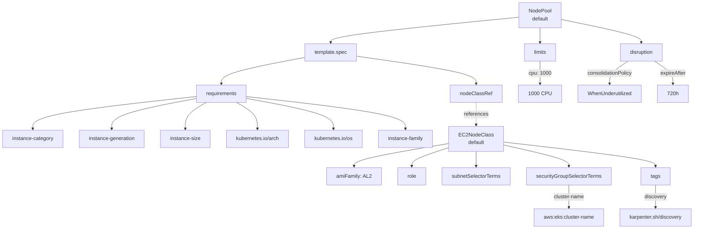
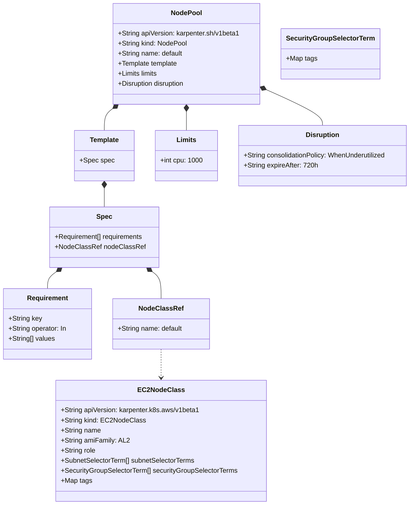
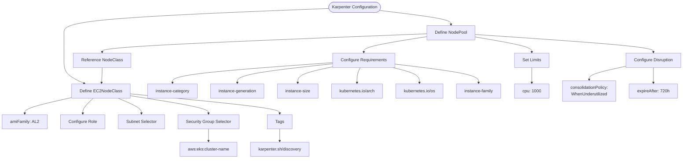

# Diagram: devops/k8s/karpenter/helm/templates/nodepool.yaml


> Auto-generated by Obscura crawlers

## Diagram 1

```mermaid
graph TB
      NodePool["NodePool<br/>default"]
      Template["template.spec"]
      Requirements["requirements"]...
  └ 283 lines...
```

> SVG rendering failed for this diagram.

## Diagram 2



### SVG

<svg id="container" width="2173.4140625" xmlns="http://www.w3.org/2000/svg" class="flowchart" height="710" viewBox="0 0 2173.4140625 710" role="graphics-document document" aria-roledescription="flowchart-v2"><style>#container{font-family:"trebuchet ms",verdana,arial,sans-serif;font-size:16px;fill:#333;}@keyframes edge-animation-frame{from{stroke-dashoffset:0;}}@keyframes dash{to{stroke-dashoffset:0;}}#container .edge-animation-slow{stroke-dasharray:9,5!important;stroke-dashoffset:900;animation:dash 50s linear infinite;stroke-linecap:round;}#container .edge-animation-fast{stroke-dasharray:9,5!important;stroke-dashoffset:900;animation:dash 20s linear infinite;stroke-linecap:round;}#container .error-icon{fill:#552222;}#container .error-text{fill:#552222;stroke:#552222;}#container .edge-thickness-normal{stroke-width:1px;}#container .edge-thickness-thick{stroke-width:3.5px;}#container .edge-pattern-solid{stroke-dasharray:0;}#container .edge-thickness-invisible{stroke-width:0;fill:none;}#container .edge-pattern-dashed{stroke-dasharray:3;}#container .edge-pattern-dotted{stroke-dasharray:2;}#container .marker{fill:#333333;stroke:#333333;}#container .marker.cross{stroke:#333333;}#container svg{font-family:"trebuchet ms",verdana,arial,sans-serif;font-size:16px;}#container p{margin:0;}#container .label{font-family:"trebuchet ms",verdana,arial,sans-serif;color:#333;}#container .cluster-label text{fill:#333;}#container .cluster-label span{color:#333;}#container .cluster-label span p{background-color:transparent;}#container .label text,#container span{fill:#333;color:#333;}#container .node rect,#container .node circle,#container .node ellipse,#container .node polygon,#container .node path{fill:#ECECFF;stroke:#9370DB;stroke-width:1px;}#container .rough-node .label text,#container .node .label text,#container .image-shape .label,#container .icon-shape .label{text-anchor:middle;}#container .node .katex path{fill:#000;stroke:#000;stroke-width:1px;}#container .rough-node .label,#container .node .label,#container .image-shape .label,#container .icon-shape .label{text-align:center;}#container .node.clickable{cursor:pointer;}#container .root .anchor path{fill:#333333!important;stroke-width:0;stroke:#333333;}#container .arrowheadPath{fill:#333333;}#container .edgePath .path{stroke:#333333;stroke-width:2.0px;}#container .flowchart-link{stroke:#333333;fill:none;}#container .edgeLabel{background-color:rgba(232,232,232, 0.8);text-align:center;}#container .edgeLabel p{background-color:rgba(232,232,232, 0.8);}#container .edgeLabel rect{opacity:0.5;background-color:rgba(232,232,232, 0.8);fill:rgba(232,232,232, 0.8);}#container .labelBkg{background-color:rgba(232, 232, 232, 0.5);}#container .cluster rect{fill:#ffffde;stroke:#aaaa33;stroke-width:1px;}#container .cluster text{fill:#333;}#container .cluster span{color:#333;}#container div.mermaidTooltip{position:absolute;text-align:center;max-width:200px;padding:2px;font-family:"trebuchet ms",verdana,arial,sans-serif;font-size:12px;background:hsl(80, 100%, 96.2745098039%);border:1px solid #aaaa33;border-radius:2px;pointer-events:none;z-index:100;}#container .flowchartTitleText{text-anchor:middle;font-size:18px;fill:#333;}#container rect.text{fill:none;stroke-width:0;}#container .icon-shape,#container .image-shape{background-color:rgba(232,232,232, 0.8);text-align:center;}#container .icon-shape p,#container .image-shape p{background-color:rgba(232,232,232, 0.8);padding:2px;}#container .icon-shape rect,#container .image-shape rect{opacity:0.5;background-color:rgba(232,232,232, 0.8);fill:rgba(232,232,232, 0.8);}#container .label-icon{display:inline-block;height:1em;overflow:visible;vertical-align:-0.125em;}#container .node .label-icon path{fill:currentColor;stroke:revert;stroke-width:revert;}#container :root{--mermaid-font-family:"trebuchet ms",verdana,arial,sans-serif;}</style><g><marker id="container_flowchart-v2-pointEnd" class="marker flowchart-v2" viewBox="0 0 10 10" refX="5" refY="5" markerUnits="userSpaceOnUse" markerWidth="8" markerHeight="8" orient="auto"><path d="M 0 0 L 10 5 L 0 10 z" class="arrowMarkerPath" style="stroke-width: 1; stroke-dasharray: 1, 0;"></path></marker><marker id="container_flowchart-v2-pointStart" class="marker flowchart-v2" viewBox="0 0 10 10" refX="4.5" refY="5" markerUnits="userSpaceOnUse" markerWidth="8" markerHeight="8" orient="auto"><path d="M 0 5 L 10 10 L 10 0 z" class="arrowMarkerPath" style="stroke-width: 1; stroke-dasharray: 1, 0;"></path></marker><marker id="container_flowchart-v2-circleEnd" class="marker flowchart-v2" viewBox="0 0 10 10" refX="11" refY="5" markerUnits="userSpaceOnUse" markerWidth="11" markerHeight="11" orient="auto"><circle cx="5" cy="5" r="5" class="arrowMarkerPath" style="stroke-width: 1; stroke-dasharray: 1, 0;"></circle></marker><marker id="container_flowchart-v2-circleStart" class="marker flowchart-v2" viewBox="0 0 10 10" refX="-1" refY="5" markerUnits="userSpaceOnUse" markerWidth="11" markerHeight="11" orient="auto"><circle cx="5" cy="5" r="5" class="arrowMarkerPath" style="stroke-width: 1; stroke-dasharray: 1, 0;"></circle></marker><marker id="container_flowchart-v2-crossEnd" class="marker cross flowchart-v2" viewBox="0 0 11 11" refX="12" refY="5.2" markerUnits="userSpaceOnUse" markerWidth="11" markerHeight="11" orient="auto"><path d="M 1,1 l 9,9 M 10,1 l -9,9" class="arrowMarkerPath" style="stroke-width: 2; stroke-dasharray: 1, 0;"></path></marker><marker id="container_flowchart-v2-crossStart" class="marker cross flowchart-v2" viewBox="0 0 11 11" refX="-1" refY="5.2" markerUnits="userSpaceOnUse" markerWidth="11" markerHeight="11" orient="auto"><path d="M 1,1 l 9,9 M 10,1 l -9,9" class="arrowMarkerPath" style="stroke-width: 2; stroke-dasharray: 1, 0;"></path></marker><g class="root"><g class="clusters"></g><g class="edgePaths"><path d="M1619.07,53.46L1522.003,63.05C1424.936,72.64,1230.802,91.82,1133.735,104.91C1036.668,118,1036.668,125,1036.668,128.5L1036.668,132" id="L_NodePool_Template_0" class="edge-thickness-normal edge-pattern-solid edge-thickness-normal edge-pattern-solid flowchart-link" style=";" data-edge="true" data-et="edge" data-id="L_NodePool_Template_0" data-points="W3sieCI6MTYxOS4wNzAzMTI1LCJ5Ijo1My40NTk3MDM0MzY1ODk4Mn0seyJ4IjoxMDM2LjY2Nzk2ODc1LCJ5IjoxMTF9LHsieCI6MTAzNi42Njc5Njg3NSwieSI6MTM2fV0=" marker-end="url(#container_flowchart-v2-pointEnd)"></path><path d="M955.598,178.154L912.046,186.295C868.493,194.436,781.389,210.718,737.837,224.359C694.285,238,694.285,249,694.285,254.5L694.285,260" id="L_Template_Requirements_0" class="edge-thickness-normal edge-pattern-solid edge-thickness-normal edge-pattern-solid flowchart-link" style=";" data-edge="true" data-et="edge" data-id="L_Template_Requirements_0" data-points="W3sieCI6OTU1LjU5NzY1NjI1LCJ5IjoxNzguMTU0MDkwMTMxMjAzNjV9LHsieCI6Njk0LjI4NTE1NjI1LCJ5IjoyMjd9LHsieCI6Njk0LjI4NTE1NjI1LCJ5IjoyNjR9XQ==" marker-end="url(#container_flowchart-v2-pointEnd)"></path><path d="M1117.738,174.385L1180.184,183.154C1242.63,191.923,1367.522,209.462,1429.968,223.731C1492.414,238,1492.414,249,1492.414,254.5L1492.414,260" id="L_Template_NodeClassRef_0" class="edge-thickness-normal edge-pattern-solid edge-thickness-normal edge-pattern-solid flowchart-link" style=";" data-edge="true" data-et="edge" data-id="L_Template_NodeClassRef_0" data-points="W3sieCI6MTExNy43MzgyODEyNSwieSI6MTc0LjM4NDYyODU3MDkzODh9LHsieCI6MTQ5Mi40MTQwNjI1LCJ5IjoyMjd9LHsieCI6MTQ5Mi40MTQwNjI1LCJ5IjoyNjR9XQ==" marker-end="url(#container_flowchart-v2-pointEnd)"></path><path d="M1684.453,86L1684.453,90.167C1684.453,94.333,1684.453,102.667,1684.453,110.333C1684.453,118,1684.453,125,1684.453,128.5L1684.453,132" id="L_NodePool_Limits_0" class="edge-thickness-normal edge-pattern-solid edge-thickness-normal edge-pattern-solid flowchart-link" style=";" data-edge="true" data-et="edge" data-id="L_NodePool_Limits_0" data-points="W3sieCI6MTY4NC40NTMxMjUsInkiOjg2fSx7IngiOjE2ODQuNDUzMTI1LCJ5IjoxMTF9LHsieCI6MTY4NC40NTMxMjUsInkiOjEzNn1d" marker-end="url(#container_flowchart-v2-pointEnd)"></path><path d="M1749.836,60.455L1790.772,68.879C1831.708,77.303,1913.581,94.152,1954.517,106.076C1995.453,118,1995.453,125,1995.453,128.5L1995.453,132" id="L_NodePool_Disruption_0" class="edge-thickness-normal edge-pattern-solid edge-thickness-normal edge-pattern-solid flowchart-link" style=";" data-edge="true" data-et="edge" data-id="L_NodePool_Disruption_0" data-points="W3sieCI6MTc0OS44MzU5Mzc1LCJ5Ijo2MC40NTQ5ODM5MjI4Mjk1ODR9LHsieCI6MTk5NS40NTMxMjUsInkiOjExMX0seyJ4IjoxOTk1LjQ1MzEyNSwieSI6MTM2fV0=" marker-end="url(#container_flowchart-v2-pointEnd)"></path><path d="M615.645,299.508L530.163,308.757C444.682,318.006,273.72,336.503,188.239,353.251C102.758,370,102.758,385,102.758,392.5L102.758,400" id="L_Requirements_R1_0" class="edge-thickness-normal edge-pattern-solid edge-thickness-normal edge-pattern-solid flowchart-link" style=";" data-edge="true" data-et="edge" data-id="L_Requirements_R1_0" data-points="W3sieCI6NjE1LjY0NDUzMTI1LCJ5IjoyOTkuNTA4NDgyNDExMTMxMX0seyJ4IjoxMDIuNzU3ODEyNSwieSI6MzU1fSx7IngiOjEwMi43NTc4MTI1LCJ5Ijo0MDR9XQ==" marker-end="url(#container_flowchart-v2-pointEnd)"></path><path d="M615.645,305.637L571.441,313.864C527.237,322.091,438.829,338.546,394.626,354.273C350.422,370,350.422,385,350.422,392.5L350.422,400" id="L_Requirements_R2_0" class="edge-thickness-normal edge-pattern-solid edge-thickness-normal edge-pattern-solid flowchart-link" style=";" data-edge="true" data-et="edge" data-id="L_Requirements_R2_0" data-points="W3sieCI6NjE1LjY0NDUzMTI1LCJ5IjozMDUuNjM2NjMxMTEwMjAyM30seyJ4IjozNTAuNDIxODc1LCJ5IjozNTV9LHsieCI6MzUwLjQyMTg3NSwieSI6NDA0fV0=" marker-end="url(#container_flowchart-v2-pointEnd)"></path><path d="M646.46,318L635.537,324.167C624.614,330.333,602.768,342.667,591.845,356.333C580.922,370,580.922,385,580.922,392.5L580.922,400" id="L_Requirements_R3_0" class="edge-thickness-normal edge-pattern-solid edge-thickness-normal edge-pattern-solid flowchart-link" style=";" data-edge="true" data-et="edge" data-id="L_Requirements_R3_0" data-points="W3sieCI6NjQ2LjQ2MDAyMTk3MjY1NjIsInkiOjMxOH0seyJ4Ijo1ODAuOTIxODc1LCJ5IjozNTV9LHsieCI6NTgwLjkyMTg3NSwieSI6NDA0fV0=" marker-end="url(#container_flowchart-v2-pointEnd)"></path><path d="M742.11,318L753.033,324.167C763.956,330.333,785.802,342.667,796.725,356.333C807.648,370,807.648,385,807.648,392.5L807.648,400" id="L_Requirements_R4_0" class="edge-thickness-normal edge-pattern-solid edge-thickness-normal edge-pattern-solid flowchart-link" style=";" data-edge="true" data-et="edge" data-id="L_Requirements_R4_0" data-points="W3sieCI6NzQyLjExMDI5MDUyNzM0MzgsInkiOjMxOH0seyJ4Ijo4MDcuNjQ4NDM3NSwieSI6MzU1fSx7IngiOjgwNy42NDg0Mzc1LCJ5Ijo0MDR9XQ==" marker-end="url(#container_flowchart-v2-pointEnd)"></path><path d="M772.926,305.205L818.873,313.504C864.82,321.803,956.715,338.402,1002.662,354.201C1048.609,370,1048.609,385,1048.609,392.5L1048.609,400" id="L_Requirements_R5_0" class="edge-thickness-normal edge-pattern-solid edge-thickness-normal edge-pattern-solid flowchart-link" style=";" data-edge="true" data-et="edge" data-id="L_Requirements_R5_0" data-points="W3sieCI6NzcyLjkyNTc4MTI1LCJ5IjozMDUuMjA0NTA0NjEzNzU2NH0seyJ4IjoxMDQ4LjYwOTM3NSwieSI6MzU1fSx7IngiOjEwNDguNjA5Mzc1LCJ5Ijo0MDR9XQ==" marker-end="url(#container_flowchart-v2-pointEnd)"></path><path d="M772.926,299.648L856.82,308.873C940.714,318.098,1108.501,336.549,1192.395,353.275C1276.289,370,1276.289,385,1276.289,392.5L1276.289,400" id="L_Requirements_R6_0" class="edge-thickness-normal edge-pattern-solid edge-thickness-normal edge-pattern-solid flowchart-link" style=";" data-edge="true" data-et="edge" data-id="L_Requirements_R6_0" data-points="W3sieCI6NzcyLjkyNTc4MTI1LCJ5IjoyOTkuNjQ3NzA4MjgxNTk3MTV9LHsieCI6MTI3Ni4yODkwNjI1LCJ5IjozNTV9LHsieCI6MTI3Ni4yODkwNjI1LCJ5Ijo0MDR9XQ==" marker-end="url(#container_flowchart-v2-pointEnd)"></path><path d="M1492.414,318L1492.414,324.167C1492.414,330.333,1492.414,342.667,1492.414,354.333C1492.414,366,1492.414,377,1492.414,382.5L1492.414,388" id="L_NodeClassRef_EC2NodeClass_0" class="edge-thickness-normal edge-pattern-dotted edge-thickness-normal edge-pattern-solid flowchart-link" style=";" data-edge="true" data-et="edge" data-id="L_NodeClassRef_EC2NodeClass_0" data-points="W3sieCI6MTQ5Mi40MTQwNjI1LCJ5IjozMTh9LHsieCI6MTQ5Mi40MTQwNjI1LCJ5IjozNTV9LHsieCI6MTQ5Mi40MTQwNjI1LCJ5IjozOTJ9XQ==" marker-end="url(#container_flowchart-v2-pointEnd)"></path><path d="M1684.453,190L1684.453,196.167C1684.453,202.333,1684.453,214.667,1684.453,226.333C1684.453,238,1684.453,249,1684.453,254.5L1684.453,260" id="L_Limits_LimitValue_0" class="edge-thickness-normal edge-pattern-solid edge-thickness-normal edge-pattern-solid flowchart-link" style=";" data-edge="true" data-et="edge" data-id="L_Limits_LimitValue_0" data-points="W3sieCI6MTY4NC40NTMxMjUsInkiOjE5MH0seyJ4IjoxNjg0LjQ1MzEyNSwieSI6MjI3fSx7IngiOjE2ODQuNDUzMTI1LCJ5IjoyNjR9XQ==" marker-end="url(#container_flowchart-v2-pointEnd)"></path><path d="M1954.09,190L1944.642,196.167C1935.195,202.333,1916.301,214.667,1906.853,226.333C1897.406,238,1897.406,249,1897.406,254.5L1897.406,260" id="L_Disruption_CP_0" class="edge-thickness-normal edge-pattern-solid edge-thickness-normal edge-pattern-solid flowchart-link" style=";" data-edge="true" data-et="edge" data-id="L_Disruption_CP_0" data-points="W3sieCI6MTk1NC4wODk1OTk2MDkzNzUsInkiOjE5MH0seyJ4IjoxODk3LjQwNjI1LCJ5IjoyMjd9LHsieCI6MTg5Ny40MDYyNSwieSI6MjY0fV0=" marker-end="url(#container_flowchart-v2-pointEnd)"></path><path d="M2036.817,190L2046.264,196.167C2055.711,202.333,2074.606,214.667,2084.053,226.333C2093.5,238,2093.5,249,2093.5,254.5L2093.5,260" id="L_Disruption_EA_0" class="edge-thickness-normal edge-pattern-solid edge-thickness-normal edge-pattern-solid flowchart-link" style=";" data-edge="true" data-et="edge" data-id="L_Disruption_EA_0" data-points="W3sieCI6MjAzNi44MTY2NTAzOTA2MjUsInkiOjE5MH0seyJ4IjoyMDkzLjUsInkiOjIyN30seyJ4IjoyMDkzLjUsInkiOjI2NH1d" marker-end="url(#container_flowchart-v2-pointEnd)"></path><path d="M1412.141,444.592L1362.521,452.993C1312.901,461.394,1213.661,478.197,1164.042,490.099C1114.422,502,1114.422,509,1114.422,512.5L1114.422,516" id="L_EC2NodeClass_AMI_0" class="edge-thickness-normal edge-pattern-solid edge-thickness-normal edge-pattern-solid flowchart-link" style=";" data-edge="true" data-et="edge" data-id="L_EC2NodeClass_AMI_0" data-points="W3sieCI6MTQxMi4xNDA2MjUsInkiOjQ0NC41OTE1NTA3NTEyOTY5NX0seyJ4IjoxMTE0LjQyMTg3NSwieSI6NDk1fSx7IngiOjExMTQuNDIxODc1LCJ5Ijo1MjB9XQ==" marker-end="url(#container_flowchart-v2-pointEnd)"></path><path d="M1412.141,456.593L1392.063,462.994C1371.984,469.395,1331.828,482.198,1311.75,492.099C1291.672,502,1291.672,509,1291.672,512.5L1291.672,516" id="L_EC2NodeClass_Role_0" class="edge-thickness-normal edge-pattern-solid edge-thickness-normal edge-pattern-solid flowchart-link" style=";" data-edge="true" data-et="edge" data-id="L_EC2NodeClass_Role_0" data-points="W3sieCI6MTQxMi4xNDA2MjUsInkiOjQ1Ni41OTI1Mjc3MjkxMzAyfSx7IngiOjEyOTEuNjcxODc1LCJ5Ijo0OTV9LHsieCI6MTI5MS42NzE4NzUsInkiOjUyMH1d" marker-end="url(#container_flowchart-v2-pointEnd)"></path><path d="M1492.414,470L1492.414,474.167C1492.414,478.333,1492.414,486.667,1492.414,494.333C1492.414,502,1492.414,509,1492.414,512.5L1492.414,516" id="L_EC2NodeClass_Subnets_0" class="edge-thickness-normal edge-pattern-solid edge-thickness-normal edge-pattern-solid flowchart-link" style=";" data-edge="true" data-et="edge" data-id="L_EC2NodeClass_Subnets_0" data-points="W3sieCI6MTQ5Mi40MTQwNjI1LCJ5Ijo0NzB9LHsieCI6MTQ5Mi40MTQwNjI1LCJ5Ijo0OTV9LHsieCI6MTQ5Mi40MTQwNjI1LCJ5Ijo1MjB9XQ==" marker-end="url(#container_flowchart-v2-pointEnd)"></path><path d="M1572.688,448.799L1607.414,456.5C1642.141,464.2,1711.594,479.6,1746.32,490.8C1781.047,502,1781.047,509,1781.047,512.5L1781.047,516" id="L_EC2NodeClass_SecurityGroups_0" class="edge-thickness-normal edge-pattern-solid edge-thickness-normal edge-pattern-solid flowchart-link" style=";" data-edge="true" data-et="edge" data-id="L_EC2NodeClass_SecurityGroups_0" data-points="W3sieCI6MTU3Mi42ODc1LCJ5Ijo0NDguNzk5NDMxNTg3NDk0OTV9LHsieCI6MTc4MS4wNDY4NzUsInkiOjQ5NX0seyJ4IjoxNzgxLjA0Njg3NSwieSI6NTIwfV0=" marker-end="url(#container_flowchart-v2-pointEnd)"></path><path d="M1572.688,440.179L1652.592,449.316C1732.497,458.453,1892.307,476.726,1972.212,489.363C2052.117,502,2052.117,509,2052.117,512.5L2052.117,516" id="L_EC2NodeClass_Tags_0" class="edge-thickness-normal edge-pattern-solid edge-thickness-normal edge-pattern-solid flowchart-link" style=";" data-edge="true" data-et="edge" data-id="L_EC2NodeClass_Tags_0" data-points="W3sieCI6MTU3Mi42ODc1LCJ5Ijo0NDAuMTc4OTczMjI3OTk0NzN9LHsieCI6MjA1Mi4xMTcxODc1LCJ5Ijo0OTV9LHsieCI6MjA1Mi4xMTcxODc1LCJ5Ijo1MjB9XQ==" marker-end="url(#container_flowchart-v2-pointEnd)"></path><path d="M1781.047,574L1781.047,580.167C1781.047,586.333,1781.047,598.667,1781.047,610.333C1781.047,622,1781.047,633,1781.047,638.5L1781.047,644" id="L_SecurityGroups_ClusterTag_0" class="edge-thickness-normal edge-pattern-solid edge-thickness-normal edge-pattern-solid flowchart-link" style=";" data-edge="true" data-et="edge" data-id="L_SecurityGroups_ClusterTag_0" data-points="W3sieCI6MTc4MS4wNDY4NzUsInkiOjU3NH0seyJ4IjoxNzgxLjA0Njg3NSwieSI6NjExfSx7IngiOjE3ODEuMDQ2ODc1LCJ5Ijo2NDh9XQ==" marker-end="url(#container_flowchart-v2-pointEnd)"></path><path d="M2052.117,574L2052.117,580.167C2052.117,586.333,2052.117,598.667,2052.117,610.333C2052.117,622,2052.117,633,2052.117,638.5L2052.117,644" id="L_Tags_Discovery_0" class="edge-thickness-normal edge-pattern-solid edge-thickness-normal edge-pattern-solid flowchart-link" style=";" data-edge="true" data-et="edge" data-id="L_Tags_Discovery_0" data-points="W3sieCI6MjA1Mi4xMTcxODc1LCJ5Ijo1NzR9LHsieCI6MjA1Mi4xMTcxODc1LCJ5Ijo2MTF9LHsieCI6MjA1Mi4xMTcxODc1LCJ5Ijo2NDh9XQ==" marker-end="url(#container_flowchart-v2-pointEnd)"></path></g><g class="edgeLabels"><g class="edgeLabel"><g class="label" data-id="L_NodePool_Template_0" transform="translate(0, 0)"><foreignObject width="0" height="0"><div xmlns="http://www.w3.org/1999/xhtml" class="labelBkg" style="display: table-cell; white-space: nowrap; line-height: 1.5; max-width: 200px; text-align: center;"><span class="edgeLabel"></span></div></foreignObject></g></g><g class="edgeLabel"><g class="label" data-id="L_Template_Requirements_0" transform="translate(0, 0)"><foreignObject width="0" height="0"><div xmlns="http://www.w3.org/1999/xhtml" class="labelBkg" style="display: table-cell; white-space: nowrap; line-height: 1.5; max-width: 200px; text-align: center;"><span class="edgeLabel"></span></div></foreignObject></g></g><g class="edgeLabel"><g class="label" data-id="L_Template_NodeClassRef_0" transform="translate(0, 0)"><foreignObject width="0" height="0"><div xmlns="http://www.w3.org/1999/xhtml" class="labelBkg" style="display: table-cell; white-space: nowrap; line-height: 1.5; max-width: 200px; text-align: center;"><span class="edgeLabel"></span></div></foreignObject></g></g><g class="edgeLabel"><g class="label" data-id="L_NodePool_Limits_0" transform="translate(0, 0)"><foreignObject width="0" height="0"><div xmlns="http://www.w3.org/1999/xhtml" class="labelBkg" style="display: table-cell; white-space: nowrap; line-height: 1.5; max-width: 200px; text-align: center;"><span class="edgeLabel"></span></div></foreignObject></g></g><g class="edgeLabel"><g class="label" data-id="L_NodePool_Disruption_0" transform="translate(0, 0)"><foreignObject width="0" height="0"><div xmlns="http://www.w3.org/1999/xhtml" class="labelBkg" style="display: table-cell; white-space: nowrap; line-height: 1.5; max-width: 200px; text-align: center;"><span class="edgeLabel"></span></div></foreignObject></g></g><g class="edgeLabel"><g class="label" data-id="L_Requirements_R1_0" transform="translate(0, 0)"><foreignObject width="0" height="0"><div xmlns="http://www.w3.org/1999/xhtml" class="labelBkg" style="display: table-cell; white-space: nowrap; line-height: 1.5; max-width: 200px; text-align: center;"><span class="edgeLabel"></span></div></foreignObject></g></g><g class="edgeLabel"><g class="label" data-id="L_Requirements_R2_0" transform="translate(0, 0)"><foreignObject width="0" height="0"><div xmlns="http://www.w3.org/1999/xhtml" class="labelBkg" style="display: table-cell; white-space: nowrap; line-height: 1.5; max-width: 200px; text-align: center;"><span class="edgeLabel"></span></div></foreignObject></g></g><g class="edgeLabel"><g class="label" data-id="L_Requirements_R3_0" transform="translate(0, 0)"><foreignObject width="0" height="0"><div xmlns="http://www.w3.org/1999/xhtml" class="labelBkg" style="display: table-cell; white-space: nowrap; line-height: 1.5; max-width: 200px; text-align: center;"><span class="edgeLabel"></span></div></foreignObject></g></g><g class="edgeLabel"><g class="label" data-id="L_Requirements_R4_0" transform="translate(0, 0)"><foreignObject width="0" height="0"><div xmlns="http://www.w3.org/1999/xhtml" class="labelBkg" style="display: table-cell; white-space: nowrap; line-height: 1.5; max-width: 200px; text-align: center;"><span class="edgeLabel"></span></div></foreignObject></g></g><g class="edgeLabel"><g class="label" data-id="L_Requirements_R5_0" transform="translate(0, 0)"><foreignObject width="0" height="0"><div xmlns="http://www.w3.org/1999/xhtml" class="labelBkg" style="display: table-cell; white-space: nowrap; line-height: 1.5; max-width: 200px; text-align: center;"><span class="edgeLabel"></span></div></foreignObject></g></g><g class="edgeLabel"><g class="label" data-id="L_Requirements_R6_0" transform="translate(0, 0)"><foreignObject width="0" height="0"><div xmlns="http://www.w3.org/1999/xhtml" class="labelBkg" style="display: table-cell; white-space: nowrap; line-height: 1.5; max-width: 200px; text-align: center;"><span class="edgeLabel"></span></div></foreignObject></g></g><g class="edgeLabel" transform="translate(1492.4140625, 355)"><g class="label" data-id="L_NodeClassRef_EC2NodeClass_0" transform="translate(-37.828125, -12)"><foreignObject width="75.65625" height="24"><div xmlns="http://www.w3.org/1999/xhtml" class="labelBkg" style="display: table-cell; white-space: nowrap; line-height: 1.5; max-width: 200px; text-align: center;"><span class="edgeLabel"><p>references</p></span></div></foreignObject></g></g><g class="edgeLabel" transform="translate(1684.453125, 227)"><g class="label" data-id="L_Limits_LimitValue_0" transform="translate(-34.1328125, -12)"><foreignObject width="68.265625" height="24"><div xmlns="http://www.w3.org/1999/xhtml" class="labelBkg" style="display: table-cell; white-space: nowrap; line-height: 1.5; max-width: 200px; text-align: center;"><span class="edgeLabel"><p>cpu: 1000</p></span></div></foreignObject></g></g><g class="edgeLabel" transform="translate(1897.40625, 227)"><g class="label" data-id="L_Disruption_CP_0" transform="translate(-71.1171875, -12)"><foreignObject width="142.234375" height="24"><div xmlns="http://www.w3.org/1999/xhtml" class="labelBkg" style="display: table-cell; white-space: nowrap; line-height: 1.5; max-width: 200px; text-align: center;"><span class="edgeLabel"><p>consolidationPolicy</p></span></div></foreignObject></g></g><g class="edgeLabel" transform="translate(2093.5, 227)"><g class="label" data-id="L_Disruption_EA_0" transform="translate(-39.8671875, -12)"><foreignObject width="79.734375" height="24"><div xmlns="http://www.w3.org/1999/xhtml" class="labelBkg" style="display: table-cell; white-space: nowrap; line-height: 1.5; max-width: 200px; text-align: center;"><span class="edgeLabel"><p>expireAfter</p></span></div></foreignObject></g></g><g class="edgeLabel"><g class="label" data-id="L_EC2NodeClass_AMI_0" transform="translate(0, 0)"><foreignObject width="0" height="0"><div xmlns="http://www.w3.org/1999/xhtml" class="labelBkg" style="display: table-cell; white-space: nowrap; line-height: 1.5; max-width: 200px; text-align: center;"><span class="edgeLabel"></span></div></foreignObject></g></g><g class="edgeLabel"><g class="label" data-id="L_EC2NodeClass_Role_0" transform="translate(0, 0)"><foreignObject width="0" height="0"><div xmlns="http://www.w3.org/1999/xhtml" class="labelBkg" style="display: table-cell; white-space: nowrap; line-height: 1.5; max-width: 200px; text-align: center;"><span class="edgeLabel"></span></div></foreignObject></g></g><g class="edgeLabel"><g class="label" data-id="L_EC2NodeClass_Subnets_0" transform="translate(0, 0)"><foreignObject width="0" height="0"><div xmlns="http://www.w3.org/1999/xhtml" class="labelBkg" style="display: table-cell; white-space: nowrap; line-height: 1.5; max-width: 200px; text-align: center;"><span class="edgeLabel"></span></div></foreignObject></g></g><g class="edgeLabel"><g class="label" data-id="L_EC2NodeClass_SecurityGroups_0" transform="translate(0, 0)"><foreignObject width="0" height="0"><div xmlns="http://www.w3.org/1999/xhtml" class="labelBkg" style="display: table-cell; white-space: nowrap; line-height: 1.5; max-width: 200px; text-align: center;"><span class="edgeLabel"></span></div></foreignObject></g></g><g class="edgeLabel"><g class="label" data-id="L_EC2NodeClass_Tags_0" transform="translate(0, 0)"><foreignObject width="0" height="0"><div xmlns="http://www.w3.org/1999/xhtml" class="labelBkg" style="display: table-cell; white-space: nowrap; line-height: 1.5; max-width: 200px; text-align: center;"><span class="edgeLabel"></span></div></foreignObject></g></g><g class="edgeLabel" transform="translate(1781.046875, 611)"><g class="label" data-id="L_SecurityGroups_ClusterTag_0" transform="translate(-47.9921875, -12)"><foreignObject width="95.984375" height="24"><div xmlns="http://www.w3.org/1999/xhtml" class="labelBkg" style="display: table-cell; white-space: nowrap; line-height: 1.5; max-width: 200px; text-align: center;"><span class="edgeLabel"><p>cluster-name</p></span></div></foreignObject></g></g><g class="edgeLabel" transform="translate(2052.1171875, 611)"><g class="label" data-id="L_Tags_Discovery_0" transform="translate(-34.375, -12)"><foreignObject width="68.75" height="24"><div xmlns="http://www.w3.org/1999/xhtml" class="labelBkg" style="display: table-cell; white-space: nowrap; line-height: 1.5; max-width: 200px; text-align: center;"><span class="edgeLabel"><p>discovery</p></span></div></foreignObject></g></g></g><g class="nodes"><g class="node default" id="flowchart-NodePool-0" transform="translate(1684.453125, 47)"><rect class="basic label-container" style="" x="-65.3828125" y="-39" width="130.765625" height="78"></rect><g class="label" style="" transform="translate(-35.3828125, -24)"><rect></rect><foreignObject width="70.765625" height="48"><div xmlns="http://www.w3.org/1999/xhtml" style="display: table-cell; white-space: nowrap; line-height: 1.5; max-width: 200px; text-align: center;"><span class="nodeLabel"><p>NodePool<br/>default</p></span></div></foreignObject></g></g><g class="node default" id="flowchart-Template-1" transform="translate(1036.66796875, 163)"><rect class="basic label-container" style="" x="-81.0703125" y="-27" width="162.140625" height="54"></rect><g class="label" style="" transform="translate(-51.0703125, -12)"><rect></rect><foreignObject width="102.140625" height="24"><div xmlns="http://www.w3.org/1999/xhtml" style="display: table-cell; white-space: nowrap; line-height: 1.5; max-width: 200px; text-align: center;"><span class="nodeLabel"><p>template.spec</p></span></div></foreignObject></g></g><g class="node default" id="flowchart-Requirements-2" transform="translate(694.28515625, 291)"><rect class="basic label-container" style="" x="-78.640625" y="-27" width="157.28125" height="54"></rect><g class="label" style="" transform="translate(-48.640625, -12)"><rect></rect><foreignObject width="97.28125" height="24"><div xmlns="http://www.w3.org/1999/xhtml" style="display: table-cell; white-space: nowrap; line-height: 1.5; max-width: 200px; text-align: center;"><span class="nodeLabel"><p>requirements</p></span></div></foreignObject></g></g><g class="node default" id="flowchart-NodeClassRef-3" transform="translate(1492.4140625, 291)"><rect class="basic label-container" style="" x="-78.6328125" y="-27" width="157.265625" height="54"></rect><g class="label" style="" transform="translate(-48.6328125, -12)"><rect></rect><foreignObject width="97.265625" height="24"><div xmlns="http://www.w3.org/1999/xhtml" style="display: table-cell; white-space: nowrap; line-height: 1.5; max-width: 200px; text-align: center;"><span class="nodeLabel"><p>nodeClassRef</p></span></div></foreignObject></g></g><g class="node default" id="flowchart-Limits-4" transform="translate(1684.453125, 163)"><rect class="basic label-container" style="" x="-50.34375" y="-27" width="100.6875" height="54"></rect><g class="label" style="" transform="translate(-20.34375, -12)"><rect></rect><foreignObject width="40.6875" height="24"><div xmlns="http://www.w3.org/1999/xhtml" style="display: table-cell; white-space: nowrap; line-height: 1.5; max-width: 200px; text-align: center;"><span class="nodeLabel"><p>limits</p></span></div></foreignObject></g></g><g class="node default" id="flowchart-Disruption-5" transform="translate(1995.453125, 163)"><rect class="basic label-container" style="" x="-67.78125" y="-27" width="135.5625" height="54"></rect><g class="label" style="" transform="translate(-37.78125, -12)"><rect></rect><foreignObject width="75.5625" height="24"><div xmlns="http://www.w3.org/1999/xhtml" style="display: table-cell; white-space: nowrap; line-height: 1.5; max-width: 200px; text-align: center;"><span class="nodeLabel"><p>disruption</p></span></div></foreignObject></g></g><g class="node default" id="flowchart-R1-6" transform="translate(102.7578125, 431)"><rect class="basic label-container" style="" x="-94.7578125" y="-27" width="189.515625" height="54"></rect><g class="label" style="" transform="translate(-64.7578125, -12)"><rect></rect><foreignObject width="129.515625" height="24"><div xmlns="http://www.w3.org/1999/xhtml" style="display: table-cell; white-space: nowrap; line-height: 1.5; max-width: 200px; text-align: center;"><span class="nodeLabel"><p>instance-category</p></span></div></foreignObject></g></g><g class="node default" id="flowchart-R2-7" transform="translate(350.421875, 431)"><rect class="basic label-container" style="" x="-102.90625" y="-27" width="205.8125" height="54"></rect><g class="label" style="" transform="translate(-72.90625, -12)"><rect></rect><foreignObject width="145.8125" height="24"><div xmlns="http://www.w3.org/1999/xhtml" style="display: table-cell; white-space: nowrap; line-height: 1.5; max-width: 200px; text-align: center;"><span class="nodeLabel"><p>instance-generation</p></span></div></foreignObject></g></g><g class="node default" id="flowchart-R3-8" transform="translate(580.921875, 431)"><rect class="basic label-container" style="" x="-77.59375" y="-27" width="155.1875" height="54"></rect><g class="label" style="" transform="translate(-47.59375, -12)"><rect></rect><foreignObject width="95.1875" height="24"><div xmlns="http://www.w3.org/1999/xhtml" style="display: table-cell; white-space: nowrap; line-height: 1.5; max-width: 200px; text-align: center;"><span class="nodeLabel"><p>instance-size</p></span></div></foreignObject></g></g><g class="node default" id="flowchart-R4-9" transform="translate(807.6484375, 431)"><rect class="basic label-container" style="" x="-99.1328125" y="-27" width="198.265625" height="54"></rect><g class="label" style="" transform="translate(-69.1328125, -12)"><rect></rect><foreignObject width="138.265625" height="24"><div xmlns="http://www.w3.org/1999/xhtml" style="display: table-cell; white-space: nowrap; line-height: 1.5; max-width: 200px; text-align: center;"><span class="nodeLabel"><p>kubernetes.io/arch</p></span></div></foreignObject></g></g><g class="node default" id="flowchart-R5-10" transform="translate(1048.609375, 431)"><rect class="basic label-container" style="" x="-91.828125" y="-27" width="183.65625" height="54"></rect><g class="label" style="" transform="translate(-61.828125, -12)"><rect></rect><foreignObject width="123.65625" height="24"><div xmlns="http://www.w3.org/1999/xhtml" style="display: table-cell; white-space: nowrap; line-height: 1.5; max-width: 200px; text-align: center;"><span class="nodeLabel"><p>kubernetes.io/os</p></span></div></foreignObject></g></g><g class="node default" id="flowchart-R6-11" transform="translate(1276.2890625, 431)"><rect class="basic label-container" style="" x="-85.8515625" y="-27" width="171.703125" height="54"></rect><g class="label" style="" transform="translate(-55.8515625, -12)"><rect></rect><foreignObject width="111.703125" height="24"><div xmlns="http://www.w3.org/1999/xhtml" style="display: table-cell; white-space: nowrap; line-height: 1.5; max-width: 200px; text-align: center;"><span class="nodeLabel"><p>instance-family</p></span></div></foreignObject></g></g><g class="node default" id="flowchart-EC2NodeClass-35" transform="translate(1492.4140625, 431)"><rect class="basic label-container" style="" x="-80.2734375" y="-39" width="160.546875" height="78"></rect><g class="label" style="" transform="translate(-50.2734375, -24)"><rect></rect><foreignObject width="100.546875" height="48"><div xmlns="http://www.w3.org/1999/xhtml" style="display: table-cell; white-space: nowrap; line-height: 1.5; max-width: 200px; text-align: center;"><span class="nodeLabel"><p>EC2NodeClass<br/>default</p></span></div></foreignObject></g></g><g class="node default" id="flowchart-LimitValue-37" transform="translate(1684.453125, 291)"><rect class="basic label-container" style="" x="-63.40625" y="-27" width="126.8125" height="54"></rect><g class="label" style="" transform="translate(-33.40625, -12)"><rect></rect><foreignObject width="66.8125" height="24"><div xmlns="http://www.w3.org/1999/xhtml" style="display: table-cell; white-space: nowrap; line-height: 1.5; max-width: 200px; text-align: center;"><span class="nodeLabel"><p>1000 CPU</p></span></div></foreignObject></g></g><g class="node default" id="flowchart-CP-39" transform="translate(1897.40625, 291)"><rect class="basic label-container" style="" x="-99.546875" y="-27" width="199.09375" height="54"></rect><g class="label" style="" transform="translate(-69.546875, -12)"><rect></rect><foreignObject width="139.09375" height="24"><div xmlns="http://www.w3.org/1999/xhtml" style="display: table-cell; white-space: nowrap; line-height: 1.5; max-width: 200px; text-align: center;"><span class="nodeLabel"><p>WhenUnderutilized</p></span></div></foreignObject></g></g><g class="node default" id="flowchart-EA-41" transform="translate(2093.5, 291)"><rect class="basic label-container" style="" x="-46.546875" y="-27" width="93.09375" height="54"></rect><g class="label" style="" transform="translate(-16.546875, -12)"><rect></rect><foreignObject width="33.09375" height="24"><div xmlns="http://www.w3.org/1999/xhtml" style="display: table-cell; white-space: nowrap; line-height: 1.5; max-width: 200px; text-align: center;"><span class="nodeLabel"><p>720h</p></span></div></foreignObject></g></g><g class="node default" id="flowchart-AMI-43" transform="translate(1114.421875, 547)"><rect class="basic label-container" style="" x="-83.0625" y="-27" width="166.125" height="54"></rect><g class="label" style="" transform="translate(-53.0625, -12)"><rect></rect><foreignObject width="106.125" height="24"><div xmlns="http://www.w3.org/1999/xhtml" style="display: table-cell; white-space: nowrap; line-height: 1.5; max-width: 200px; text-align: center;"><span class="nodeLabel"><p>amiFamily: AL2</p></span></div></foreignObject></g></g><g class="node default" id="flowchart-Role-44" transform="translate(1291.671875, 547)"><rect class="basic label-container" style="" x="-44.1875" y="-27" width="88.375" height="54"></rect><g class="label" style="" transform="translate(-14.1875, -12)"><rect></rect><foreignObject width="28.375" height="24"><div xmlns="http://www.w3.org/1999/xhtml" style="display: table-cell; white-space: nowrap; line-height: 1.5; max-width: 200px; text-align: center;"><span class="nodeLabel"><p>role</p></span></div></foreignObject></g></g><g class="node default" id="flowchart-Subnets-45" transform="translate(1492.4140625, 547)"><rect class="basic label-container" style="" x="-106.5546875" y="-27" width="213.109375" height="54"></rect><g class="label" style="" transform="translate(-76.5546875, -12)"><rect></rect><foreignObject width="153.109375" height="24"><div xmlns="http://www.w3.org/1999/xhtml" style="display: table-cell; white-space: nowrap; line-height: 1.5; max-width: 200px; text-align: center;"><span class="nodeLabel"><p>subnetSelectorTerms</p></span></div></foreignObject></g></g><g class="node default" id="flowchart-SecurityGroups-46" transform="translate(1781.046875, 547)"><rect class="basic label-container" style="" x="-132.078125" y="-27" width="264.15625" height="54"></rect><g class="label" style="" transform="translate(-102.078125, -12)"><rect></rect><foreignObject width="204.15625" height="24"><div xmlns="http://www.w3.org/1999/xhtml" style="display: table; white-space: break-spaces; line-height: 1.5; max-width: 200px; text-align: center; width: 200px;"><span class="nodeLabel"><p>securityGroupSelectorTerms</p></span></div></foreignObject></g></g><g class="node default" id="flowchart-Tags-47" transform="translate(2052.1171875, 547)"><rect class="basic label-container" style="" x="-44.9453125" y="-27" width="89.890625" height="54"></rect><g class="label" style="" transform="translate(-14.9453125, -12)"><rect></rect><foreignObject width="29.890625" height="24"><div xmlns="http://www.w3.org/1999/xhtml" style="display: table-cell; white-space: nowrap; line-height: 1.5; max-width: 200px; text-align: center;"><span class="nodeLabel"><p>tags</p></span></div></foreignObject></g></g><g class="node default" id="flowchart-ClusterTag-59" transform="translate(1781.046875, 675)"><rect class="basic label-container" style="" x="-107.7734375" y="-27" width="215.546875" height="54"></rect><g class="label" style="" transform="translate(-77.7734375, -12)"><rect></rect><foreignObject width="155.546875" height="24"><div xmlns="http://www.w3.org/1999/xhtml" style="display: table-cell; white-space: nowrap; line-height: 1.5; max-width: 200px; text-align: center;"><span class="nodeLabel"><p>aws:eks:cluster-name</p></span></div></foreignObject></g></g><g class="node default" id="flowchart-Discovery-61" transform="translate(2052.1171875, 675)"><rect class="basic label-container" style="" x="-113.296875" y="-27" width="226.59375" height="54"></rect><g class="label" style="" transform="translate(-83.296875, -12)"><rect></rect><foreignObject width="166.59375" height="24"><div xmlns="http://www.w3.org/1999/xhtml" style="display: table-cell; white-space: nowrap; line-height: 1.5; max-width: 200px; text-align: center;"><span class="nodeLabel"><p>karpenter.sh/discovery</p></span></div></foreignObject></g></g></g></g></g></svg>

## Diagram 3



### SVG

<svg id="container" width="978.052734375" xmlns="http://www.w3.org/2000/svg" class="classDiagram" height="1200" viewBox="0 0 978.052734375 1200" role="graphics-document document" aria-roledescription="class"><style>#container{font-family:"trebuchet ms",verdana,arial,sans-serif;font-size:16px;fill:#333;}@keyframes edge-animation-frame{from{stroke-dashoffset:0;}}@keyframes dash{to{stroke-dashoffset:0;}}#container .edge-animation-slow{stroke-dasharray:9,5!important;stroke-dashoffset:900;animation:dash 50s linear infinite;stroke-linecap:round;}#container .edge-animation-fast{stroke-dasharray:9,5!important;stroke-dashoffset:900;animation:dash 20s linear infinite;stroke-linecap:round;}#container .error-icon{fill:#552222;}#container .error-text{fill:#552222;stroke:#552222;}#container .edge-thickness-normal{stroke-width:1px;}#container .edge-thickness-thick{stroke-width:3.5px;}#container .edge-pattern-solid{stroke-dasharray:0;}#container .edge-thickness-invisible{stroke-width:0;fill:none;}#container .edge-pattern-dashed{stroke-dasharray:3;}#container .edge-pattern-dotted{stroke-dasharray:2;}#container .marker{fill:#333333;stroke:#333333;}#container .marker.cross{stroke:#333333;}#container svg{font-family:"trebuchet ms",verdana,arial,sans-serif;font-size:16px;}#container p{margin:0;}#container g.classGroup text{fill:#9370DB;stroke:none;font-family:"trebuchet ms",verdana,arial,sans-serif;font-size:10px;}#container g.classGroup text .title{font-weight:bolder;}#container .nodeLabel,#container .edgeLabel{color:#131300;}#container .edgeLabel .label rect{fill:#ECECFF;}#container .label text{fill:#131300;}#container .labelBkg{background:#ECECFF;}#container .edgeLabel .label span{background:#ECECFF;}#container .classTitle{font-weight:bolder;}#container .node rect,#container .node circle,#container .node ellipse,#container .node polygon,#container .node path{fill:#ECECFF;stroke:#9370DB;stroke-width:1px;}#container .divider{stroke:#9370DB;stroke-width:1;}#container g.clickable{cursor:pointer;}#container g.classGroup rect{fill:#ECECFF;stroke:#9370DB;}#container g.classGroup line{stroke:#9370DB;stroke-width:1;}#container .classLabel .box{stroke:none;stroke-width:0;fill:#ECECFF;opacity:0.5;}#container .classLabel .label{fill:#9370DB;font-size:10px;}#container .relation{stroke:#333333;stroke-width:1;fill:none;}#container .dashed-line{stroke-dasharray:3;}#container .dotted-line{stroke-dasharray:1 2;}#container #compositionStart,#container .composition{fill:#333333!important;stroke:#333333!important;stroke-width:1;}#container #compositionEnd,#container .composition{fill:#333333!important;stroke:#333333!important;stroke-width:1;}#container #dependencyStart,#container .dependency{fill:#333333!important;stroke:#333333!important;stroke-width:1;}#container #dependencyStart,#container .dependency{fill:#333333!important;stroke:#333333!important;stroke-width:1;}#container #extensionStart,#container .extension{fill:transparent!important;stroke:#333333!important;stroke-width:1;}#container #extensionEnd,#container .extension{fill:transparent!important;stroke:#333333!important;stroke-width:1;}#container #aggregationStart,#container .aggregation{fill:transparent!important;stroke:#333333!important;stroke-width:1;}#container #aggregationEnd,#container .aggregation{fill:transparent!important;stroke:#333333!important;stroke-width:1;}#container #lollipopStart,#container .lollipop{fill:#ECECFF!important;stroke:#333333!important;stroke-width:1;}#container #lollipopEnd,#container .lollipop{fill:#ECECFF!important;stroke:#333333!important;stroke-width:1;}#container .edgeTerminals{font-size:11px;line-height:initial;}#container .classTitleText{text-anchor:middle;font-size:18px;fill:#333;}#container .label-icon{display:inline-block;height:1em;overflow:visible;vertical-align:-0.125em;}#container .node .label-icon path{fill:currentColor;stroke:revert;stroke-width:revert;}#container :root{--mermaid-font-family:"trebuchet ms",verdana,arial,sans-serif;}</style><g><defs><marker id="container_class-aggregationStart" class="marker aggregation class" refX="18" refY="7" markerWidth="190" markerHeight="240" orient="auto"><path d="M 18,7 L9,13 L1,7 L9,1 Z"></path></marker></defs><defs><marker id="container_class-aggregationEnd" class="marker aggregation class" refX="1" refY="7" markerWidth="20" markerHeight="28" orient="auto"><path d="M 18,7 L9,13 L1,7 L9,1 Z"></path></marker></defs><defs><marker id="container_class-extensionStart" class="marker extension class" refX="18" refY="7" markerWidth="190" markerHeight="240" orient="auto"><path d="M 1,7 L18,13 V 1 Z"></path></marker></defs><defs><marker id="container_class-extensionEnd" class="marker extension class" refX="1" refY="7" markerWidth="20" markerHeight="28" orient="auto"><path d="M 1,1 V 13 L18,7 Z"></path></marker></defs><defs><marker id="container_class-compositionStart" class="marker composition class" refX="18" refY="7" markerWidth="190" markerHeight="240" orient="auto"><path d="M 18,7 L9,13 L1,7 L9,1 Z"></path></marker></defs><defs><marker id="container_class-compositionEnd" class="marker composition class" refX="1" refY="7" markerWidth="20" markerHeight="28" orient="auto"><path d="M 18,7 L9,13 L1,7 L9,1 Z"></path></marker></defs><defs><marker id="container_class-dependencyStart" class="marker dependency class" refX="6" refY="7" markerWidth="190" markerHeight="240" orient="auto"><path d="M 5,7 L9,13 L1,7 L9,1 Z"></path></marker></defs><defs><marker id="container_class-dependencyEnd" class="marker dependency class" refX="13" refY="7" markerWidth="20" markerHeight="28" orient="auto"><path d="M 18,7 L9,13 L14,7 L9,1 Z"></path></marker></defs><defs><marker id="container_class-lollipopStart" class="marker lollipop class" refX="13" refY="7" markerWidth="190" markerHeight="240" orient="auto"><circle stroke="black" fill="transparent" cx="7" cy="7" r="6"></circle></marker></defs><defs><marker id="container_class-lollipopEnd" class="marker lollipop class" refX="1" refY="7" markerWidth="190" markerHeight="240" orient="auto"><circle stroke="black" fill="transparent" cx="7" cy="7" r="6"></circle></marker></defs><g class="root"><g class="clusters"></g><g class="edgePaths"><path d="M267.733,258.397L264.511,260.831C261.289,263.265,254.845,268.132,251.623,276.733C248.4,285.333,248.4,297.667,248.4,303.833L248.4,310" id="id_NodePool_Template_1" class="edge-thickness-normal edge-pattern-solid relation" style=";;;" data-edge="true" data-et="edge" data-id="id_NodePool_Template_1" data-points="W3sieCI6MjgxLjQ5Nzc3NzQ3ODQ0ODI2LCJ5IjoyNDh9LHsieCI6MjQ4LjQwMDM5MDYyNSwieSI6MjczfSx7IngiOjI0OC40MDAzOTA2MjUsInkiOjMxMH1d" marker-start="url(#container_class-compositionStart)"></path><path d="M248.4,447.25L248.4,450.542C248.4,453.833,248.4,460.417,248.4,467.875C248.4,475.333,248.4,483.667,248.4,487.833L248.4,492" id="id_Template_Spec_2" class="edge-thickness-normal edge-pattern-solid relation" style=";;;" data-edge="true" data-et="edge" data-id="id_Template_Spec_2" data-points="W3sieCI6MjQ4LjQwMDM5MDYyNSwieSI6NDMwfSx7IngiOjI0OC40MDAzOTA2MjUsInkiOjQ2N30seyJ4IjoyNDguNDAwMzkwNjI1LCJ5Ijo0OTJ9XQ==" marker-start="url(#container_class-compositionStart)"></path><path d="M134.217,646.068L130.755,648.556C127.292,651.045,120.367,656.023,116.904,662.678C113.441,669.333,113.441,677.667,113.441,681.833L113.441,686" id="id_Spec_Requirement_3" class="edge-thickness-normal edge-pattern-solid relation" style=";;;" data-edge="true" data-et="edge" data-id="id_Spec_Requirement_3" data-points="W3sieCI6MTQ4LjIyNDY0OTY0NTYxODU3LCJ5Ijo2MzZ9LHsieCI6MTEzLjQ0MTQwNjI1LCJ5Ijo2NjF9LHsieCI6MTEzLjQ0MTQwNjI1LCJ5Ijo2ODZ9XQ==" marker-start="url(#container_class-compositionStart)"></path><path d="M362.583,646.068L366.046,648.556C369.509,651.045,376.434,656.023,379.897,666.678C383.359,677.333,383.359,693.667,383.359,701.833L383.359,710" id="id_Spec_NodeClassRef_4" class="edge-thickness-normal edge-pattern-solid relation" style=";;;" data-edge="true" data-et="edge" data-id="id_Spec_NodeClassRef_4" data-points="W3sieCI6MzQ4LjU3NjEzMTYwNDM4MTQzLCJ5Ijo2MzZ9LHsieCI6MzgzLjM1OTM3NSwieSI6NjYxfSx7IngiOjM4My4zNTkzNzUsInkiOjcxMH1d" marker-start="url(#container_class-compositionStart)"></path><path d="M440.365,265.25L440.365,266.542C440.365,267.833,440.365,270.417,440.365,277.875C440.365,285.333,440.365,297.667,440.365,303.833L440.365,310" id="id_NodePool_Limits_5" class="edge-thickness-normal edge-pattern-solid relation" style=";;;" data-edge="true" data-et="edge" data-id="id_NodePool_Limits_5" data-points="W3sieCI6NDQwLjM2NTIzNDM3NSwieSI6MjQ4fSx7IngiOjQ0MC4zNjUyMzQzNzUsInkiOjI3M30seyJ4Ijo0NDAuMzY1MjM0Mzc1LCJ5IjozMTB9XQ==" marker-start="url(#container_class-compositionStart)"></path><path d="M631.361,212.831L653.939,222.859C676.517,232.887,721.674,252.944,744.252,267.138C766.83,281.333,766.83,289.667,766.83,293.833L766.83,298" id="id_NodePool_Disruption_6" class="edge-thickness-normal edge-pattern-solid relation" style=";;;" data-edge="true" data-et="edge" data-id="id_NodePool_Disruption_6" data-points="W3sieCI6NjE1LjU5NTcwMzEyNSwieSI6MjA1LjgyODk1NjAyNzUyMDE4fSx7IngiOjc2Ni44MzAwNzgxMjUsInkiOjI3M30seyJ4Ijo3NjYuODMwMDc4MTI1LCJ5IjoyOTh9XQ==" marker-start="url(#container_class-compositionStart)"></path><path d="M383.359,830L383.359,838.167C383.359,846.333,383.359,862.667,383.359,874C383.359,885.333,383.359,891.667,383.359,894.833L383.359,898" id="id_NodeClassRef_EC2NodeClass_7" class="edge-thickness-normal edge-pattern-dashed relation" style=";;;" data-edge="true" data-et="edge" data-id="id_NodeClassRef_EC2NodeClass_7" data-points="W3sieCI6MzgzLjM1OTM3NSwieSI6ODMwfSx7IngiOjM4My4zNTkzNzUsInkiOjg3OX0seyJ4IjozODMuMzU5Mzc1LCJ5Ijo5MDR9XQ==" marker-end="url(#container_class-dependencyEnd)"></path></g><g class="edgeLabels"><g class="edgeLabel"><g class="label" data-id="id_NodePool_Template_1" transform="translate(0, 0)"><foreignObject width="0" height="0"><div xmlns="http://www.w3.org/1999/xhtml" class="labelBkg" style="display: table-cell; white-space: nowrap; line-height: 1.5; max-width: 200px; text-align: center;"><span class="edgeLabel"></span></div></foreignObject></g></g><g class="edgeLabel"><g class="label" data-id="id_Template_Spec_2" transform="translate(0, 0)"><foreignObject width="0" height="0"><div xmlns="http://www.w3.org/1999/xhtml" class="labelBkg" style="display: table-cell; white-space: nowrap; line-height: 1.5; max-width: 200px; text-align: center;"><span class="edgeLabel"></span></div></foreignObject></g></g><g class="edgeLabel"><g class="label" data-id="id_Spec_Requirement_3" transform="translate(0, 0)"><foreignObject width="0" height="0"><div xmlns="http://www.w3.org/1999/xhtml" class="labelBkg" style="display: table-cell; white-space: nowrap; line-height: 1.5; max-width: 200px; text-align: center;"><span class="edgeLabel"></span></div></foreignObject></g></g><g class="edgeLabel"><g class="label" data-id="id_Spec_NodeClassRef_4" transform="translate(0, 0)"><foreignObject width="0" height="0"><div xmlns="http://www.w3.org/1999/xhtml" class="labelBkg" style="display: table-cell; white-space: nowrap; line-height: 1.5; max-width: 200px; text-align: center;"><span class="edgeLabel"></span></div></foreignObject></g></g><g class="edgeLabel"><g class="label" data-id="id_NodePool_Limits_5" transform="translate(0, 0)"><foreignObject width="0" height="0"><div xmlns="http://www.w3.org/1999/xhtml" class="labelBkg" style="display: table-cell; white-space: nowrap; line-height: 1.5; max-width: 200px; text-align: center;"><span class="edgeLabel"></span></div></foreignObject></g></g><g class="edgeLabel"><g class="label" data-id="id_NodePool_Disruption_6" transform="translate(0, 0)"><foreignObject width="0" height="0"><div xmlns="http://www.w3.org/1999/xhtml" class="labelBkg" style="display: table-cell; white-space: nowrap; line-height: 1.5; max-width: 200px; text-align: center;"><span class="edgeLabel"></span></div></foreignObject></g></g><g class="edgeLabel"><g class="label" data-id="id_NodeClassRef_EC2NodeClass_7" transform="translate(0, 0)"><foreignObject width="0" height="0"><div xmlns="http://www.w3.org/1999/xhtml" class="labelBkg" style="display: table-cell; white-space: nowrap; line-height: 1.5; max-width: 200px; text-align: center;"><span class="edgeLabel"></span></div></foreignObject></g></g></g><g class="nodes"><g class="node default" id="classId-NodePool-0" transform="translate(440.365234375, 128)"><g class="basic label-container"><path d="M-175.23046875 -120 L175.23046875 -120 L175.23046875 120 L-175.23046875 120" stroke="none" stroke-width="0" fill="#ECECFF" style=""></path><path d="M-175.23046875 -120 C-66.82645456723718 -120, 41.577559615525644 -120, 175.23046875 -120 M-175.23046875 -120 C-101.48055200963937 -120, -27.730635269278736 -120, 175.23046875 -120 M175.23046875 -120 C175.23046875 -59.885384943153866, 175.23046875 0.22923011369226742, 175.23046875 120 M175.23046875 -120 C175.23046875 -66.06724118365199, 175.23046875 -12.13448236730396, 175.23046875 120 M175.23046875 120 C94.70642610549947 120, 14.182383460998949 120, -175.23046875 120 M175.23046875 120 C77.07049168326111 120, -21.08948538347778 120, -175.23046875 120 M-175.23046875 120 C-175.23046875 26.852086085654477, -175.23046875 -66.29582782869105, -175.23046875 -120 M-175.23046875 120 C-175.23046875 49.23391596303145, -175.23046875 -21.5321680739371, -175.23046875 -120" stroke="#9370DB" stroke-width="1.3" fill="none" stroke-dasharray="0 0" style=""></path></g><g class="annotation-group text" transform="translate(0, -96)"></g><g class="label-group text" transform="translate(-35.4765625, -96)"><g class="label" style="font-weight: bolder" transform="translate(0,-12)"><foreignObject width="70.953125" height="24"><div xmlns="http://www.w3.org/1999/xhtml" style="display: table-cell; white-space: nowrap; line-height: 1.5; max-width: 121px; text-align: center;"><span class="nodeLabel markdown-node-label" style=""><p>NodePool</p></span></div></foreignObject></g></g><g class="members-group text" transform="translate(-163.23046875, -48)"><g class="label" style="" transform="translate(0,-12)"><foreignObject width="290.984375" height="24"><div xmlns="http://www.w3.org/1999/xhtml" style="display: table-cell; white-space: nowrap; line-height: 1.5; max-width: 348px; text-align: center;"><span class="nodeLabel markdown-node-label" style=""><p>+String apiVersion: karpenter.sh/v1beta1</p></span></div></foreignObject></g><g class="label" style="" transform="translate(0,12)"><foreignObject width="164.953125" height="24"><div xmlns="http://www.w3.org/1999/xhtml" style="display: table-cell; white-space: nowrap; line-height: 1.5; max-width: 223px; text-align: center;"><span class="nodeLabel markdown-node-label" style=""><p>+String kind: NodePool</p></span></div></foreignObject></g><g class="label" style="" transform="translate(0,36)"><foreignObject width="154.84375" height="24"><div xmlns="http://www.w3.org/1999/xhtml" style="display: table-cell; white-space: nowrap; line-height: 1.5; max-width: 212px; text-align: center;"><span class="nodeLabel markdown-node-label" style=""><p>+String name: default</p></span></div></foreignObject></g><g class="label" style="" transform="translate(0,60)"><foreignObject width="143.375" height="24"><div xmlns="http://www.w3.org/1999/xhtml" style="display: table-cell; white-space: nowrap; line-height: 1.5; max-width: 201px; text-align: center;"><span class="nodeLabel markdown-node-label" style=""><p>+Template template</p></span></div></foreignObject></g><g class="label" style="" transform="translate(0,84)"><foreignObject width="96.859375" height="24"><div xmlns="http://www.w3.org/1999/xhtml" style="display: table-cell; white-space: nowrap; line-height: 1.5; max-width: 154px; text-align: center;"><span class="nodeLabel markdown-node-label" style=""><p>+Limits limits</p></span></div></foreignObject></g><g class="label" style="" transform="translate(0,108)"><foreignObject width="164.078125" height="24"><div xmlns="http://www.w3.org/1999/xhtml" style="display: table-cell; white-space: nowrap; line-height: 1.5; max-width: 221px; text-align: center;"><span class="nodeLabel markdown-node-label" style=""><p>+Disruption disruption</p></span></div></foreignObject></g></g><g class="methods-group text" transform="translate(-163.23046875, 120)"></g><g class="divider" style=""><path d="M-175.23046875 -72 C-72.07353331817 -72, 31.083402113659986 -72, 175.23046875 -72 M-175.23046875 -72 C-80.05762635167463 -72, 15.115216046650744 -72, 175.23046875 -72" stroke="#9370DB" stroke-width="1.3" fill="none" stroke-dasharray="0 0" style=""></path></g><g class="divider" style=""><path d="M-175.23046875 96 C-64.82277051333311 96, 45.58492772333378 96, 175.23046875 96 M-175.23046875 96 C-101.96385520401235 96, -28.697241658024694 96, 175.23046875 96" stroke="#9370DB" stroke-width="1.3" fill="none" stroke-dasharray="0 0" style=""></path></g></g><g class="node default" id="classId-Template-1" transform="translate(248.400390625, 370)"><g class="basic label-container"><path d="M-68.72265625 -60 L68.72265625 -60 L68.72265625 60 L-68.72265625 60" stroke="none" stroke-width="0" fill="#ECECFF" style=""></path><path d="M-68.72265625 -60 C-29.863817318395512 -60, 8.995021613208976 -60, 68.72265625 -60 M-68.72265625 -60 C-28.916577034631516 -60, 10.889502180736969 -60, 68.72265625 -60 M68.72265625 -60 C68.72265625 -14.516367666268636, 68.72265625 30.96726466746273, 68.72265625 60 M68.72265625 -60 C68.72265625 -17.1956881154429, 68.72265625 25.608623769114203, 68.72265625 60 M68.72265625 60 C25.07861052069339 60, -18.565435208613223 60, -68.72265625 60 M68.72265625 60 C36.35655412153951 60, 3.99045199307902 60, -68.72265625 60 M-68.72265625 60 C-68.72265625 31.572681468755786, -68.72265625 3.145362937511571, -68.72265625 -60 M-68.72265625 60 C-68.72265625 20.024366112157608, -68.72265625 -19.951267775684784, -68.72265625 -60" stroke="#9370DB" stroke-width="1.3" fill="none" stroke-dasharray="0 0" style=""></path></g><g class="annotation-group text" transform="translate(0, -36)"></g><g class="label-group text" transform="translate(-33.9140625, -36)"><g class="label" style="font-weight: bolder" transform="translate(0,-12)"><foreignObject width="67.828125" height="24"><div xmlns="http://www.w3.org/1999/xhtml" style="display: table-cell; white-space: nowrap; line-height: 1.5; max-width: 117px; text-align: center;"><span class="nodeLabel markdown-node-label" style=""><p>Template</p></span></div></foreignObject></g></g><g class="members-group text" transform="translate(-56.72265625, 12)"><g class="label" style="" transform="translate(0,-12)"><foreignObject width="79.53125" height="24"><div xmlns="http://www.w3.org/1999/xhtml" style="display: table-cell; white-space: nowrap; line-height: 1.5; max-width: 137px; text-align: center;"><span class="nodeLabel markdown-node-label" style=""><p>+Spec spec</p></span></div></foreignObject></g></g><g class="methods-group text" transform="translate(-56.72265625, 60)"></g><g class="divider" style=""><path d="M-68.72265625 -12 C-22.869995464847044 -12, 22.982665320305912 -12, 68.72265625 -12 M-68.72265625 -12 C-20.5187986117341 -12, 27.685059026531803 -12, 68.72265625 -12" stroke="#9370DB" stroke-width="1.3" fill="none" stroke-dasharray="0 0" style=""></path></g><g class="divider" style=""><path d="M-68.72265625 36 C-33.85638644975398 36, 1.0098833504920464 36, 68.72265625 36 M-68.72265625 36 C-30.817718206785045 36, 7.0872198364299095 36, 68.72265625 36" stroke="#9370DB" stroke-width="1.3" fill="none" stroke-dasharray="0 0" style=""></path></g></g><g class="node default" id="classId-Spec-2" transform="translate(248.400390625, 564)"><g class="basic label-container"><path d="M-127.48828125 -72 L127.48828125 -72 L127.48828125 72 L-127.48828125 72" stroke="none" stroke-width="0" fill="#ECECFF" style=""></path><path d="M-127.48828125 -72 C-43.27990596398371 -72, 40.92846932203258 -72, 127.48828125 -72 M-127.48828125 -72 C-38.26069517645705 -72, 50.966890897085904 -72, 127.48828125 -72 M127.48828125 -72 C127.48828125 -36.77954474900932, 127.48828125 -1.5590894980186363, 127.48828125 72 M127.48828125 -72 C127.48828125 -42.35151208461792, 127.48828125 -12.703024169235846, 127.48828125 72 M127.48828125 72 C43.00738857448761 72, -41.47350410102479 72, -127.48828125 72 M127.48828125 72 C54.46932237968316 72, -18.549636490633674 72, -127.48828125 72 M-127.48828125 72 C-127.48828125 15.300227384293422, -127.48828125 -41.39954523141316, -127.48828125 -72 M-127.48828125 72 C-127.48828125 28.24570926671508, -127.48828125 -15.508581466569836, -127.48828125 -72" stroke="#9370DB" stroke-width="1.3" fill="none" stroke-dasharray="0 0" style=""></path></g><g class="annotation-group text" transform="translate(0, -48)"></g><g class="label-group text" transform="translate(-17.6015625, -48)"><g class="label" style="font-weight: bolder" transform="translate(0,-12)"><foreignObject width="35.203125" height="24"><div xmlns="http://www.w3.org/1999/xhtml" style="display: table-cell; white-space: nowrap; line-height: 1.5; max-width: 85px; text-align: center;"><span class="nodeLabel markdown-node-label" style=""><p>Spec</p></span></div></foreignObject></g></g><g class="members-group text" transform="translate(-115.48828125, 0)"><g class="label" style="" transform="translate(0,-12)"><foreignObject width="213.375" height="24"><div xmlns="http://www.w3.org/1999/xhtml" style="display: table-cell; white-space: nowrap; line-height: 1.5; max-width: 271px; text-align: center;"><span class="nodeLabel markdown-node-label" style=""><p>+Requirement[] requirements</p></span></div></foreignObject></g><g class="label" style="" transform="translate(0,12)"><foreignObject width="208.3125" height="24"><div xmlns="http://www.w3.org/1999/xhtml" style="display: table-cell; white-space: nowrap; line-height: 1.5; max-width: 267px; text-align: center;"><span class="nodeLabel markdown-node-label" style=""><p>+NodeClassRef nodeClassRef</p></span></div></foreignObject></g></g><g class="methods-group text" transform="translate(-115.48828125, 72)"></g><g class="divider" style=""><path d="M-127.48828125 -24 C-59.46256022104674 -24, 8.563160807906513 -24, 127.48828125 -24 M-127.48828125 -24 C-62.65976456929823 -24, 2.168752111403535 -24, 127.48828125 -24" stroke="#9370DB" stroke-width="1.3" fill="none" stroke-dasharray="0 0" style=""></path></g><g class="divider" style=""><path d="M-127.48828125 48 C-46.80519351176389 48, 33.87789422647222 48, 127.48828125 48 M-127.48828125 48 C-45.1677916222892 48, 37.1526980054216 48, 127.48828125 48" stroke="#9370DB" stroke-width="1.3" fill="none" stroke-dasharray="0 0" style=""></path></g></g><g class="node default" id="classId-Requirement-3" transform="translate(113.44140625, 770)"><g class="basic label-container"><path d="M-105.44140625 -84 L105.44140625 -84 L105.44140625 84 L-105.44140625 84" stroke="none" stroke-width="0" fill="#ECECFF" style=""></path><path d="M-105.44140625 -84 C-31.063684460815054 -84, 43.31403732836989 -84, 105.44140625 -84 M-105.44140625 -84 C-39.629120883811055 -84, 26.18316448237789 -84, 105.44140625 -84 M105.44140625 -84 C105.44140625 -45.31157502519435, 105.44140625 -6.623150050388702, 105.44140625 84 M105.44140625 -84 C105.44140625 -22.657148790629677, 105.44140625 38.68570241874065, 105.44140625 84 M105.44140625 84 C33.46529170480868 84, -38.510822840382644 84, -105.44140625 84 M105.44140625 84 C26.217730842954694 84, -53.00594456409061 84, -105.44140625 84 M-105.44140625 84 C-105.44140625 42.634925663272455, -105.44140625 1.2698513265449094, -105.44140625 -84 M-105.44140625 84 C-105.44140625 22.234679445303428, -105.44140625 -39.530641109393144, -105.44140625 -84" stroke="#9370DB" stroke-width="1.3" fill="none" stroke-dasharray="0 0" style=""></path></g><g class="annotation-group text" transform="translate(0, -60)"></g><g class="label-group text" transform="translate(-47.1328125, -60)"><g class="label" style="font-weight: bolder" transform="translate(0,-12)"><foreignObject width="94.265625" height="24"><div xmlns="http://www.w3.org/1999/xhtml" style="display: table-cell; white-space: nowrap; line-height: 1.5; max-width: 144px; text-align: center;"><span class="nodeLabel markdown-node-label" style=""><p>Requirement</p></span></div></foreignObject></g></g><g class="members-group text" transform="translate(-93.44140625, -12)"><g class="label" style="" transform="translate(0,-12)"><foreignObject width="79.046875" height="24"><div xmlns="http://www.w3.org/1999/xhtml" style="display: table-cell; white-space: nowrap; line-height: 1.5; max-width: 137px; text-align: center;"><span class="nodeLabel markdown-node-label" style=""><p>+String key</p></span></div></foreignObject></g><g class="label" style="" transform="translate(0,12)"><foreignObject width="139.75" height="24"><div xmlns="http://www.w3.org/1999/xhtml" style="display: table-cell; white-space: nowrap; line-height: 1.5; max-width: 197px; text-align: center;"><span class="nodeLabel markdown-node-label" style=""><p>+String operator: In</p></span></div></foreignObject></g><g class="label" style="" transform="translate(0,36)"><foreignObject width="111.125" height="24"><div xmlns="http://www.w3.org/1999/xhtml" style="display: table-cell; white-space: nowrap; line-height: 1.5; max-width: 168px; text-align: center;"><span class="nodeLabel markdown-node-label" style=""><p>+String[] values</p></span></div></foreignObject></g></g><g class="methods-group text" transform="translate(-93.44140625, 84)"></g><g class="divider" style=""><path d="M-105.44140625 -36 C-37.15588353484641 -36, 31.12963918030718 -36, 105.44140625 -36 M-105.44140625 -36 C-34.21269735814663 -36, 37.016011533706745 -36, 105.44140625 -36" stroke="#9370DB" stroke-width="1.3" fill="none" stroke-dasharray="0 0" style=""></path></g><g class="divider" style=""><path d="M-105.44140625 60 C-28.795126214195037 60, 47.85115382160993 60, 105.44140625 60 M-105.44140625 60 C-43.30072633293501 60, 18.839953584129987 60, 105.44140625 60" stroke="#9370DB" stroke-width="1.3" fill="none" stroke-dasharray="0 0" style=""></path></g></g><g class="node default" id="classId-NodeClassRef-4" transform="translate(383.359375, 770)"><g class="basic label-container"><path d="M-114.4765625 -60 L114.4765625 -60 L114.4765625 60 L-114.4765625 60" stroke="none" stroke-width="0" fill="#ECECFF" style=""></path><path d="M-114.4765625 -60 C-45.8286809545387 -60, 22.819200590922605 -60, 114.4765625 -60 M-114.4765625 -60 C-34.20196506976666 -60, 46.072632360466685 -60, 114.4765625 -60 M114.4765625 -60 C114.4765625 -31.73551722543121, 114.4765625 -3.471034450862419, 114.4765625 60 M114.4765625 -60 C114.4765625 -27.97297343231903, 114.4765625 4.05405313536194, 114.4765625 60 M114.4765625 60 C24.509481894223285 60, -65.45759871155343 60, -114.4765625 60 M114.4765625 60 C31.5408544167133 60, -51.3948536665734 60, -114.4765625 60 M-114.4765625 60 C-114.4765625 12.423213276851726, -114.4765625 -35.15357344629655, -114.4765625 -60 M-114.4765625 60 C-114.4765625 16.419263766081038, -114.4765625 -27.161472467837925, -114.4765625 -60" stroke="#9370DB" stroke-width="1.3" fill="none" stroke-dasharray="0 0" style=""></path></g><g class="annotation-group text" transform="translate(0, -36)"></g><g class="label-group text" transform="translate(-50.109375, -36)"><g class="label" style="font-weight: bolder" transform="translate(0,-12)"><foreignObject width="100.21875" height="24"><div xmlns="http://www.w3.org/1999/xhtml" style="display: table-cell; white-space: nowrap; line-height: 1.5; max-width: 150px; text-align: center;"><span class="nodeLabel markdown-node-label" style=""><p>NodeClassRef</p></span></div></foreignObject></g></g><g class="members-group text" transform="translate(-102.4765625, 12)"><g class="label" style="" transform="translate(0,-12)"><foreignObject width="154.84375" height="24"><div xmlns="http://www.w3.org/1999/xhtml" style="display: table-cell; white-space: nowrap; line-height: 1.5; max-width: 212px; text-align: center;"><span class="nodeLabel markdown-node-label" style=""><p>+String name: default</p></span></div></foreignObject></g></g><g class="methods-group text" transform="translate(-102.4765625, 60)"></g><g class="divider" style=""><path d="M-114.4765625 -12 C-23.31369033450423 -12, 67.84918183099154 -12, 114.4765625 -12 M-114.4765625 -12 C-40.041705077019046 -12, 34.39315234596191 -12, 114.4765625 -12" stroke="#9370DB" stroke-width="1.3" fill="none" stroke-dasharray="0 0" style=""></path></g><g class="divider" style=""><path d="M-114.4765625 36 C-66.81663770066504 36, -19.156712901330096 36, 114.4765625 36 M-114.4765625 36 C-50.8920159122548 36, 12.692530675490403 36, 114.4765625 36" stroke="#9370DB" stroke-width="1.3" fill="none" stroke-dasharray="0 0" style=""></path></g></g><g class="node default" id="classId-Limits-5" transform="translate(440.365234375, 370)"><g class="basic label-container"><path d="M-73.2421875 -60 L73.2421875 -60 L73.2421875 60 L-73.2421875 60" stroke="none" stroke-width="0" fill="#ECECFF" style=""></path><path d="M-73.2421875 -60 C-36.07783394562471 -60, 1.086519608750578 -60, 73.2421875 -60 M-73.2421875 -60 C-32.833669353387215 -60, 7.57484879322557 -60, 73.2421875 -60 M73.2421875 -60 C73.2421875 -26.023464774343473, 73.2421875 7.953070451313053, 73.2421875 60 M73.2421875 -60 C73.2421875 -19.652148895029676, 73.2421875 20.69570220994065, 73.2421875 60 M73.2421875 60 C26.396893783524547 60, -20.448399932950906 60, -73.2421875 60 M73.2421875 60 C23.810439808457623 60, -25.621307883084754 60, -73.2421875 60 M-73.2421875 60 C-73.2421875 34.56542354465296, -73.2421875 9.13084708930591, -73.2421875 -60 M-73.2421875 60 C-73.2421875 25.662748975364444, -73.2421875 -8.674502049271112, -73.2421875 -60" stroke="#9370DB" stroke-width="1.3" fill="none" stroke-dasharray="0 0" style=""></path></g><g class="annotation-group text" transform="translate(0, -36)"></g><g class="label-group text" transform="translate(-22.328125, -36)"><g class="label" style="font-weight: bolder" transform="translate(0,-12)"><foreignObject width="44.65625" height="24"><div xmlns="http://www.w3.org/1999/xhtml" style="display: table-cell; white-space: nowrap; line-height: 1.5; max-width: 94px; text-align: center;"><span class="nodeLabel markdown-node-label" style=""><p>Limits</p></span></div></foreignObject></g></g><g class="members-group text" transform="translate(-61.2421875, 12)"><g class="label" style="" transform="translate(0,-12)"><foreignObject width="100.15625" height="24"><div xmlns="http://www.w3.org/1999/xhtml" style="display: table-cell; white-space: nowrap; line-height: 1.5; max-width: 158px; text-align: center;"><span class="nodeLabel markdown-node-label" style=""><p>+int cpu: 1000</p></span></div></foreignObject></g></g><g class="methods-group text" transform="translate(-61.2421875, 60)"></g><g class="divider" style=""><path d="M-73.2421875 -12 C-24.959412775947108 -12, 23.323361948105784 -12, 73.2421875 -12 M-73.2421875 -12 C-34.05662347012126 -12, 5.128940559757481 -12, 73.2421875 -12" stroke="#9370DB" stroke-width="1.3" fill="none" stroke-dasharray="0 0" style=""></path></g><g class="divider" style=""><path d="M-73.2421875 36 C-28.532229058578423 36, 16.177729382843154 36, 73.2421875 36 M-73.2421875 36 C-36.807351179330524 36, -0.3725148586610487 36, 73.2421875 36" stroke="#9370DB" stroke-width="1.3" fill="none" stroke-dasharray="0 0" style=""></path></g></g><g class="node default" id="classId-Disruption-6" transform="translate(766.830078125, 370)"><g class="basic label-container"><path d="M-203.22265625 -72 L203.22265625 -72 L203.22265625 72 L-203.22265625 72" stroke="none" stroke-width="0" fill="#ECECFF" style=""></path><path d="M-203.22265625 -72 C-64.39144406610015 -72, 74.4397681177997 -72, 203.22265625 -72 M-203.22265625 -72 C-82.67095229453267 -72, 37.88075166093466 -72, 203.22265625 -72 M203.22265625 -72 C203.22265625 -23.767069601345327, 203.22265625 24.465860797309347, 203.22265625 72 M203.22265625 -72 C203.22265625 -24.360884475410337, 203.22265625 23.278231049179325, 203.22265625 72 M203.22265625 72 C113.86276347564682 72, 24.50287070129363 72, -203.22265625 72 M203.22265625 72 C69.29091484250159 72, -64.64082656499681 72, -203.22265625 72 M-203.22265625 72 C-203.22265625 22.539809068464464, -203.22265625 -26.92038186307107, -203.22265625 -72 M-203.22265625 72 C-203.22265625 30.298475281956975, -203.22265625 -11.40304943608605, -203.22265625 -72" stroke="#9370DB" stroke-width="1.3" fill="none" stroke-dasharray="0 0" style=""></path></g><g class="annotation-group text" transform="translate(0, -48)"></g><g class="label-group text" transform="translate(-38.5234375, -48)"><g class="label" style="font-weight: bolder" transform="translate(0,-12)"><foreignObject width="77.046875" height="24"><div xmlns="http://www.w3.org/1999/xhtml" style="display: table-cell; white-space: nowrap; line-height: 1.5; max-width: 126px; text-align: center;"><span class="nodeLabel markdown-node-label" style=""><p>Disruption</p></span></div></foreignObject></g></g><g class="members-group text" transform="translate(-191.22265625, 0)"><g class="label" style="" transform="translate(0,-12)"><foreignObject width="343.921875" height="24"><div xmlns="http://www.w3.org/1999/xhtml" style="display: table-cell; white-space: nowrap; line-height: 1.5; max-width: 401px; text-align: center;"><span class="nodeLabel markdown-node-label" style=""><p>+String consolidationPolicy: WhenUnderutilized</p></span></div></foreignObject></g><g class="label" style="" transform="translate(0,12)"><foreignObject width="175.53125" height="24"><div xmlns="http://www.w3.org/1999/xhtml" style="display: table-cell; white-space: nowrap; line-height: 1.5; max-width: 233px; text-align: center;"><span class="nodeLabel markdown-node-label" style=""><p>+String expireAfter: 720h</p></span></div></foreignObject></g></g><g class="methods-group text" transform="translate(-191.22265625, 72)"></g><g class="divider" style=""><path d="M-203.22265625 -24 C-119.01949242075268 -24, -34.81632859150537 -24, 203.22265625 -24 M-203.22265625 -24 C-108.91396674587504 -24, -14.605277241750088 -24, 203.22265625 -24" stroke="#9370DB" stroke-width="1.3" fill="none" stroke-dasharray="0 0" style=""></path></g><g class="divider" style=""><path d="M-203.22265625 48 C-85.40402550645003 48, 32.41460523709995 48, 203.22265625 48 M-203.22265625 48 C-50.34073153737063 48, 102.54119317525874 48, 203.22265625 48" stroke="#9370DB" stroke-width="1.3" fill="none" stroke-dasharray="0 0" style=""></path></g></g><g class="node default" id="classId-EC2NodeClass-7" transform="translate(383.359375, 1048)"><g class="basic label-container"><path d="M-249.40625 -144 L249.40625 -144 L249.40625 144 L-249.40625 144" stroke="none" stroke-width="0" fill="#ECECFF" style=""></path><path d="M-249.40625 -144 C-147.33562271905572 -144, -45.26499543811147 -144, 249.40625 -144 M-249.40625 -144 C-52.71452354871502 -144, 143.97720290256996 -144, 249.40625 -144 M249.40625 -144 C249.40625 -71.66943284321172, 249.40625 0.6611343135765537, 249.40625 144 M249.40625 -144 C249.40625 -44.17266707253022, 249.40625 55.654665854939566, 249.40625 144 M249.40625 144 C108.94803372233798 144, -31.510182555324036 144, -249.40625 144 M249.40625 144 C146.14497128446385 144, 42.88369256892767 144, -249.40625 144 M-249.40625 144 C-249.40625 42.35964639577816, -249.40625 -59.28070720844369, -249.40625 -144 M-249.40625 144 C-249.40625 76.9734367278891, -249.40625 9.946873455778189, -249.40625 -144" stroke="#9370DB" stroke-width="1.3" fill="none" stroke-dasharray="0 0" style=""></path></g><g class="annotation-group text" transform="translate(0, -120)"></g><g class="label-group text" transform="translate(-50.859375, -120)"><g class="label" style="font-weight: bolder" transform="translate(0,-12)"><foreignObject width="101.71875" height="24"><div xmlns="http://www.w3.org/1999/xhtml" style="display: table-cell; white-space: nowrap; line-height: 1.5; max-width: 151px; text-align: center;"><span class="nodeLabel markdown-node-label" style=""><p>EC2NodeClass</p></span></div></foreignObject></g></g><g class="members-group text" transform="translate(-237.40625, -72)"><g class="label" style="" transform="translate(0,-12)"><foreignObject width="329.953125" height="24"><div xmlns="http://www.w3.org/1999/xhtml" style="display: table-cell; white-space: nowrap; line-height: 1.5; max-width: 387px; text-align: center;"><span class="nodeLabel markdown-node-label" style=""><p>+String apiVersion: karpenter.k8s.aws/v1beta1</p></span></div></foreignObject></g><g class="label" style="" transform="translate(0,12)"><foreignObject width="194.75" height="24"><div xmlns="http://www.w3.org/1999/xhtml" style="display: table-cell; white-space: nowrap; line-height: 1.5; max-width: 252px; text-align: center;"><span class="nodeLabel markdown-node-label" style=""><p>+String kind: EC2NodeClass</p></span></div></foreignObject></g><g class="label" style="" transform="translate(0,36)"><foreignObject width="94.984375" height="24"><div xmlns="http://www.w3.org/1999/xhtml" style="display: table-cell; white-space: nowrap; line-height: 1.5; max-width: 152px; text-align: center;"><span class="nodeLabel markdown-node-label" style=""><p>+String name</p></span></div></foreignObject></g><g class="label" style="" transform="translate(0,60)"><foreignObject width="160.578125" height="24"><div xmlns="http://www.w3.org/1999/xhtml" style="display: table-cell; white-space: nowrap; line-height: 1.5; max-width: 218px; text-align: center;"><span class="nodeLabel markdown-node-label" style=""><p>+String amiFamily: AL2</p></span></div></foreignObject></g><g class="label" style="" transform="translate(0,84)"><foreignObject width="82.84375" height="24"><div xmlns="http://www.w3.org/1999/xhtml" style="display: table-cell; white-space: nowrap; line-height: 1.5; max-width: 140px; text-align: center;"><span class="nodeLabel markdown-node-label" style=""><p>+String role</p></span></div></foreignObject></g><g class="label" style="" transform="translate(0,108)"><foreignObject width="321.875" height="24"><div xmlns="http://www.w3.org/1999/xhtml" style="display: table-cell; white-space: nowrap; line-height: 1.5; max-width: 379px; text-align: center;"><span class="nodeLabel markdown-node-label" style=""><p>+SubnetSelectorTerm[] subnetSelectorTerms</p></span></div></foreignObject></g><g class="label" style="" transform="translate(0,132)"><foreignObject width="423.953125" height="24"><div xmlns="http://www.w3.org/1999/xhtml" style="display: table-cell; white-space: nowrap; line-height: 1.5; max-width: 481px; text-align: center;"><span class="nodeLabel markdown-node-label" style=""><p>+SecurityGroupSelectorTerm[] securityGroupSelectorTerms</p></span></div></foreignObject></g><g class="label" style="" transform="translate(0,156)"><foreignObject width="72.78125" height="24"><div xmlns="http://www.w3.org/1999/xhtml" style="display: table-cell; white-space: nowrap; line-height: 1.5; max-width: 130px; text-align: center;"><span class="nodeLabel markdown-node-label" style=""><p>+Map tags</p></span></div></foreignObject></g></g><g class="methods-group text" transform="translate(-237.40625, 144)"></g><g class="divider" style=""><path d="M-249.40625 -96 C-103.19509914243434 -96, 43.01605171513131 -96, 249.40625 -96 M-249.40625 -96 C-81.28913658610256 -96, 86.82797682779488 -96, 249.40625 -96" stroke="#9370DB" stroke-width="1.3" fill="none" stroke-dasharray="0 0" style=""></path></g><g class="divider" style=""><path d="M-249.40625 120 C-90.85452271424424 120, 67.69720457151152 120, 249.40625 120 M-249.40625 120 C-62.95602207182773 120, 123.49420585634454 120, 249.40625 120" stroke="#9370DB" stroke-width="1.3" fill="none" stroke-dasharray="0 0" style=""></path></g></g><g class="node default" id="classId-SecurityGroupSelectorTerm-8" transform="translate(778.392578125, 128)"><g class="basic label-container"><path d="M-112.796875 -60 L112.796875 -60 L112.796875 60 L-112.796875 60" stroke="none" stroke-width="0" fill="#ECECFF" style=""></path><path d="M-112.796875 -60 C-26.000453694650034 -60, 60.79596761069993 -60, 112.796875 -60 M-112.796875 -60 C-59.58304940083441 -60, -6.369223801668824 -60, 112.796875 -60 M112.796875 -60 C112.796875 -30.235822707557382, 112.796875 -0.47164541511476443, 112.796875 60 M112.796875 -60 C112.796875 -22.817659631678872, 112.796875 14.364680736642256, 112.796875 60 M112.796875 60 C43.36895608855366 60, -26.05896282289268 60, -112.796875 60 M112.796875 60 C57.518709501031594 60, 2.2405440020631886 60, -112.796875 60 M-112.796875 60 C-112.796875 26.800898674683275, -112.796875 -6.398202650633451, -112.796875 -60 M-112.796875 60 C-112.796875 18.63591605658543, -112.796875 -22.72816788682914, -112.796875 -60" stroke="#9370DB" stroke-width="1.3" fill="none" stroke-dasharray="0 0" style=""></path></g><g class="annotation-group text" transform="translate(0, -36)"></g><g class="label-group text" transform="translate(-100.796875, -36)"><g class="label" style="font-weight: bolder" transform="translate(0,-12)"><foreignObject width="201.59375" height="24"><div xmlns="http://www.w3.org/1999/xhtml" style="display: table-cell; white-space: nowrap; line-height: 1.5; max-width: 248px; text-align: center;"><span class="nodeLabel markdown-node-label" style=""><p>SecurityGroupSelectorTerm</p></span></div></foreignObject></g></g><g class="members-group text" transform="translate(-100.796875, 12)"><g class="label" style="" transform="translate(0,-12)"><foreignObject width="72.78125" height="24"><div xmlns="http://www.w3.org/1999/xhtml" style="display: table-cell; white-space: nowrap; line-height: 1.5; max-width: 130px; text-align: center;"><span class="nodeLabel markdown-node-label" style=""><p>+Map tags</p></span></div></foreignObject></g></g><g class="methods-group text" transform="translate(-100.796875, 60)"></g><g class="divider" style=""><path d="M-112.796875 -12 C-44.78674008950223 -12, 23.223394820995537 -12, 112.796875 -12 M-112.796875 -12 C-56.13800437012081 -12, 0.5208662597583782 -12, 112.796875 -12" stroke="#9370DB" stroke-width="1.3" fill="none" stroke-dasharray="0 0" style=""></path></g><g class="divider" style=""><path d="M-112.796875 36 C-24.639749480244134 36, 63.51737603951173 36, 112.796875 36 M-112.796875 36 C-46.352515642519464 36, 20.091843714961072 36, 112.796875 36" stroke="#9370DB" stroke-width="1.3" fill="none" stroke-dasharray="0 0" style=""></path></g></g></g></g></g></svg>

## Diagram 4



### SVG

<svg id="container" width="2588.9140625" xmlns="http://www.w3.org/2000/svg" class="flowchart" height="599" viewBox="0 0 2588.9140625 599" role="graphics-document document" aria-roledescription="flowchart-v2"><style>#container{font-family:"trebuchet ms",verdana,arial,sans-serif;font-size:16px;fill:#333;}@keyframes edge-animation-frame{from{stroke-dashoffset:0;}}@keyframes dash{to{stroke-dashoffset:0;}}#container .edge-animation-slow{stroke-dasharray:9,5!important;stroke-dashoffset:900;animation:dash 50s linear infinite;stroke-linecap:round;}#container .edge-animation-fast{stroke-dasharray:9,5!important;stroke-dashoffset:900;animation:dash 20s linear infinite;stroke-linecap:round;}#container .error-icon{fill:#552222;}#container .error-text{fill:#552222;stroke:#552222;}#container .edge-thickness-normal{stroke-width:1px;}#container .edge-thickness-thick{stroke-width:3.5px;}#container .edge-pattern-solid{stroke-dasharray:0;}#container .edge-thickness-invisible{stroke-width:0;fill:none;}#container .edge-pattern-dashed{stroke-dasharray:3;}#container .edge-pattern-dotted{stroke-dasharray:2;}#container .marker{fill:#333333;stroke:#333333;}#container .marker.cross{stroke:#333333;}#container svg{font-family:"trebuchet ms",verdana,arial,sans-serif;font-size:16px;}#container p{margin:0;}#container .label{font-family:"trebuchet ms",verdana,arial,sans-serif;color:#333;}#container .cluster-label text{fill:#333;}#container .cluster-label span{color:#333;}#container .cluster-label span p{background-color:transparent;}#container .label text,#container span{fill:#333;color:#333;}#container .node rect,#container .node circle,#container .node ellipse,#container .node polygon,#container .node path{fill:#ECECFF;stroke:#9370DB;stroke-width:1px;}#container .rough-node .label text,#container .node .label text,#container .image-shape .label,#container .icon-shape .label{text-anchor:middle;}#container .node .katex path{fill:#000;stroke:#000;stroke-width:1px;}#container .rough-node .label,#container .node .label,#container .image-shape .label,#container .icon-shape .label{text-align:center;}#container .node.clickable{cursor:pointer;}#container .root .anchor path{fill:#333333!important;stroke-width:0;stroke:#333333;}#container .arrowheadPath{fill:#333333;}#container .edgePath .path{stroke:#333333;stroke-width:2.0px;}#container .flowchart-link{stroke:#333333;fill:none;}#container .edgeLabel{background-color:rgba(232,232,232, 0.8);text-align:center;}#container .edgeLabel p{background-color:rgba(232,232,232, 0.8);}#container .edgeLabel rect{opacity:0.5;background-color:rgba(232,232,232, 0.8);fill:rgba(232,232,232, 0.8);}#container .labelBkg{background-color:rgba(232, 232, 232, 0.5);}#container .cluster rect{fill:#ffffde;stroke:#aaaa33;stroke-width:1px;}#container .cluster text{fill:#333;}#container .cluster span{color:#333;}#container div.mermaidTooltip{position:absolute;text-align:center;max-width:200px;padding:2px;font-family:"trebuchet ms",verdana,arial,sans-serif;font-size:12px;background:hsl(80, 100%, 96.2745098039%);border:1px solid #aaaa33;border-radius:2px;pointer-events:none;z-index:100;}#container .flowchartTitleText{text-anchor:middle;font-size:18px;fill:#333;}#container rect.text{fill:none;stroke-width:0;}#container .icon-shape,#container .image-shape{background-color:rgba(232,232,232, 0.8);text-align:center;}#container .icon-shape p,#container .image-shape p{background-color:rgba(232,232,232, 0.8);padding:2px;}#container .icon-shape rect,#container .image-shape rect{opacity:0.5;background-color:rgba(232,232,232, 0.8);fill:rgba(232,232,232, 0.8);}#container .label-icon{display:inline-block;height:1em;overflow:visible;vertical-align:-0.125em;}#container .node .label-icon path{fill:currentColor;stroke:revert;stroke-width:revert;}#container :root{--mermaid-font-family:"trebuchet ms",verdana,arial,sans-serif;}</style><g><marker id="container_flowchart-v2-pointEnd" class="marker flowchart-v2" viewBox="0 0 10 10" refX="5" refY="5" markerUnits="userSpaceOnUse" markerWidth="8" markerHeight="8" orient="auto"><path d="M 0 0 L 10 5 L 0 10 z" class="arrowMarkerPath" style="stroke-width: 1; stroke-dasharray: 1, 0;"></path></marker><marker id="container_flowchart-v2-pointStart" class="marker flowchart-v2" viewBox="0 0 10 10" refX="4.5" refY="5" markerUnits="userSpaceOnUse" markerWidth="8" markerHeight="8" orient="auto"><path d="M 0 5 L 10 10 L 10 0 z" class="arrowMarkerPath" style="stroke-width: 1; stroke-dasharray: 1, 0;"></path></marker><marker id="container_flowchart-v2-circleEnd" class="marker flowchart-v2" viewBox="0 0 10 10" refX="11" refY="5" markerUnits="userSpaceOnUse" markerWidth="11" markerHeight="11" orient="auto"><circle cx="5" cy="5" r="5" class="arrowMarkerPath" style="stroke-width: 1; stroke-dasharray: 1, 0;"></circle></marker><marker id="container_flowchart-v2-circleStart" class="marker flowchart-v2" viewBox="0 0 10 10" refX="-1" refY="5" markerUnits="userSpaceOnUse" markerWidth="11" markerHeight="11" orient="auto"><circle cx="5" cy="5" r="5" class="arrowMarkerPath" style="stroke-width: 1; stroke-dasharray: 1, 0;"></circle></marker><marker id="container_flowchart-v2-crossEnd" class="marker cross flowchart-v2" viewBox="0 0 11 11" refX="12" refY="5.2" markerUnits="userSpaceOnUse" markerWidth="11" markerHeight="11" orient="auto"><path d="M 1,1 l 9,9 M 10,1 l -9,9" class="arrowMarkerPath" style="stroke-width: 2; stroke-dasharray: 1, 0;"></path></marker><marker id="container_flowchart-v2-crossStart" class="marker cross flowchart-v2" viewBox="0 0 11 11" refX="-1" refY="5.2" markerUnits="userSpaceOnUse" markerWidth="11" markerHeight="11" orient="auto"><path d="M 1,1 l 9,9 M 10,1 l -9,9" class="arrowMarkerPath" style="stroke-width: 2; stroke-dasharray: 1, 0;"></path></marker><g class="root"><g class="clusters"></g><g class="edgePaths"><path d="M1434.323,39.656L1479.045,45.047C1523.766,50.438,1613.209,61.219,1657.931,70.109C1702.652,79,1702.652,86,1702.652,89.5L1702.652,93" id="L_Start_NodePool_0" class="edge-thickness-normal edge-pattern-solid edge-thickness-normal edge-pattern-solid flowchart-link" style=";" data-edge="true" data-et="edge" data-id="L_Start_NodePool_0" data-points="W3sieCI6MTQzNC4zMjMyMjc5MzQ0NDk1LCJ5IjozOS42NTY0MDIwODcyODg4M30seyJ4IjoxNzAyLjY1MjM0Mzc1LCJ5Ijo3Mn0seyJ4IjoxNzAyLjY1MjM0Mzc1LCJ5Ijo5N31d" marker-end="url(#container_flowchart-v2-pointEnd)"></path><path d="M1240.048,32L1073.109,38.666C906.17,45.333,572.292,58.667,405.353,74C238.414,89.333,238.414,106.667,238.414,124C238.414,141.333,238.414,158.667,238.414,176C238.414,193.333,238.414,210.667,238.414,228C238.414,245.333,238.414,262.667,251.018,277.218C263.623,291.769,288.831,303.539,301.436,309.423L314.04,315.308" id="L_Start_EC2NodeClass_0" class="edge-thickness-normal edge-pattern-solid edge-thickness-normal edge-pattern-solid flowchart-link" style=";" data-edge="true" data-et="edge" data-id="L_Start_EC2NodeClass_0" data-points="W3sieCI6MTI0MC4wNDc3NzM1NzE3Nzg0LCJ5IjozMS45OTk1OTA3NzkzNjg5NzJ9LHsieCI6MjM4LjQxNDA2MjUsInkiOjcyfSx7IngiOjIzOC40MTQwNjI1LCJ5IjoxMjR9LHsieCI6MjM4LjQxNDA2MjUsInkiOjE3Nn0seyJ4IjoyMzguNDE0MDYyNSwieSI6MjI4fSx7IngiOjIzOC40MTQwNjI1LCJ5IjoyODB9LHsieCI6MzE3LjY2NDYxMTgxNjQwNjI1LCJ5IjozMTd9XQ==" marker-end="url(#container_flowchart-v2-pointEnd)"></path><path d="M1611.996,138.101L1571.387,144.417C1530.777,150.734,1449.559,163.367,1408.949,173.183C1368.34,183,1368.34,190,1368.34,193.5L1368.34,197" id="L_NodePool_Req_0" class="edge-thickness-normal edge-pattern-solid edge-thickness-normal edge-pattern-solid flowchart-link" style=";" data-edge="true" data-et="edge" data-id="L_NodePool_Req_0" data-points="W3sieCI6MTYxMS45OTYwOTM3NSwieSI6MTM4LjEwMDk1MzQ0OTI0Mjg0fSx7IngiOjEzNjguMzM5ODQzNzUsInkiOjE3Nn0seyJ4IjoxMzY4LjMzOTg0Mzc1LCJ5IjoyMDF9XQ==" marker-end="url(#container_flowchart-v2-pointEnd)"></path><path d="M1251.48,236.35L1149.667,243.625C1047.854,250.9,844.228,265.45,742.415,278.225C640.602,291,640.602,302,640.602,307.5L640.602,313" id="L_Req_InstCategory_0" class="edge-thickness-normal edge-pattern-solid edge-thickness-normal edge-pattern-solid flowchart-link" style=";" data-edge="true" data-et="edge" data-id="L_Req_InstCategory_0" data-points="W3sieCI6MTI1MS40ODA0Njg3NSwieSI6MjM2LjM1MDEwMDEwNjgxNjR9LHsieCI6NjQwLjYwMTU2MjUsInkiOjI4MH0seyJ4Ijo2NDAuNjAxNTYyNSwieSI6MzE3fV0=" marker-end="url(#container_flowchart-v2-pointEnd)"></path><path d="M1251.48,240.658L1190.945,247.215C1130.409,253.772,1009.337,266.886,948.801,278.943C888.266,291,888.266,302,888.266,307.5L888.266,313" id="L_Req_InstGen_0" class="edge-thickness-normal edge-pattern-solid edge-thickness-normal edge-pattern-solid flowchart-link" style=";" data-edge="true" data-et="edge" data-id="L_Req_InstGen_0" data-points="W3sieCI6MTI1MS40ODA0Njg3NSwieSI6MjQwLjY1NzgwODQ0NDMzMjM1fSx7IngiOjg4OC4yNjU2MjUsInkiOjI4MH0seyJ4Ijo4ODguMjY1NjI1LCJ5IjozMTd9XQ==" marker-end="url(#container_flowchart-v2-pointEnd)"></path><path d="M1251.48,252.348L1229.361,256.957C1207.242,261.565,1163.004,270.783,1140.885,280.891C1118.766,291,1118.766,302,1118.766,307.5L1118.766,313" id="L_Req_InstSize_0" class="edge-thickness-normal edge-pattern-solid edge-thickness-normal edge-pattern-solid flowchart-link" style=";" data-edge="true" data-et="edge" data-id="L_Req_InstSize_0" data-points="W3sieCI6MTI1MS40ODA0Njg3NSwieSI6MjUyLjM0ODIxODA1ODg4MTU0fSx7IngiOjExMTguNzY1NjI1LCJ5IjoyODB9LHsieCI6MTExOC43NjU2MjUsInkiOjMxN31d" marker-end="url(#container_flowchart-v2-pointEnd)"></path><path d="M1356.477,255L1354.646,259.167C1352.815,263.333,1349.154,271.667,1347.323,281.333C1345.492,291,1345.492,302,1345.492,307.5L1345.492,313" id="L_Req_Arch_0" class="edge-thickness-normal edge-pattern-solid edge-thickness-normal edge-pattern-solid flowchart-link" style=";" data-edge="true" data-et="edge" data-id="L_Req_Arch_0" data-points="W3sieCI6MTM1Ni40NzY2Mzc2MjAxOTI0LCJ5IjoyNTV9LHsieCI6MTM0NS40OTIxODc1LCJ5IjoyODB9LHsieCI6MTM0NS40OTIxODc1LCJ5IjozMTd9XQ==" marker-end="url(#container_flowchart-v2-pointEnd)"></path><path d="M1481.591,255L1499.068,259.167C1516.545,263.333,1551.499,271.667,1568.976,281.333C1586.453,291,1586.453,302,1586.453,307.5L1586.453,313" id="L_Req_OS_0" class="edge-thickness-normal edge-pattern-solid edge-thickness-normal edge-pattern-solid flowchart-link" style=";" data-edge="true" data-et="edge" data-id="L_Req_OS_0" data-points="W3sieCI6MTQ4MS41OTA5NzA1NTI4ODQ1LCJ5IjoyNTV9LHsieCI6MTU4Ni40NTMxMjUsInkiOjI4MH0seyJ4IjoxNTg2LjQ1MzEyNSwieSI6MzE3fV0=" marker-end="url(#container_flowchart-v2-pointEnd)"></path><path d="M1485.199,241.631L1540.021,248.026C1594.844,254.421,1704.488,267.21,1759.311,279.105C1814.133,291,1814.133,302,1814.133,307.5L1814.133,313" id="L_Req_InstFamily_0" class="edge-thickness-normal edge-pattern-solid edge-thickness-normal edge-pattern-solid flowchart-link" style=";" data-edge="true" data-et="edge" data-id="L_Req_InstFamily_0" data-points="W3sieCI6MTQ4NS4xOTkyMTg3NSwieSI6MjQxLjYzMTE4NzQwMzA2NTEzfSx7IngiOjE4MTQuMTMyODEyNSwieSI6MjgwfSx7IngiOjE4MTQuMTMyODEyNSwieSI6MzE3fV0=" marker-end="url(#container_flowchart-v2-pointEnd)"></path><path d="M1611.996,127.562L1406.521,135.635C1201.047,143.708,790.098,159.854,584.623,171.427C379.148,183,379.148,190,379.148,193.5L379.148,197" id="L_NodePool_Ref_0" class="edge-thickness-normal edge-pattern-solid edge-thickness-normal edge-pattern-solid flowchart-link" style=";" data-edge="true" data-et="edge" data-id="L_NodePool_Ref_0" data-points="W3sieCI6MTYxMS45OTYwOTM3NSwieSI6MTI3LjU2MTg1MTk3MzE4OTA2fSx7IngiOjM3OS4xNDg0Mzc1LCJ5IjoxNzZ9LHsieCI6Mzc5LjE0ODQzNzUsInkiOjIwMX1d" marker-end="url(#container_flowchart-v2-pointEnd)"></path><path d="M379.148,255L379.148,259.167C379.148,263.333,379.148,271.667,378.835,281.334C378.521,291.002,377.893,302.004,377.579,307.505L377.265,313.006" id="L_Ref_EC2NodeClass_0" class="edge-thickness-normal edge-pattern-solid edge-thickness-normal edge-pattern-solid flowchart-link" style=";" data-edge="true" data-et="edge" data-id="L_Ref_EC2NodeClass_0" data-points="W3sieCI6Mzc5LjE0ODQzNzUsInkiOjI1NX0seyJ4IjozNzkuMTQ4NDM3NSwieSI6MjgwfSx7IngiOjM3Ny4wMzY5MjYyNjk1MzEyNSwieSI6MzE3fV0=" marker-end="url(#container_flowchart-v2-pointEnd)"></path><path d="M1793.309,139.063L1830.36,145.219C1867.411,151.375,1941.514,163.688,1978.566,173.344C2015.617,183,2015.617,190,2015.617,193.5L2015.617,197" id="L_NodePool_Lim_0" class="edge-thickness-normal edge-pattern-solid edge-thickness-normal edge-pattern-solid flowchart-link" style=";" data-edge="true" data-et="edge" data-id="L_NodePool_Lim_0" data-points="W3sieCI6MTc5My4zMDg1OTM3NSwieSI6MTM5LjA2Mjc5NDA5Mzc4NTV9LHsieCI6MjAxNS42MTcxODc1LCJ5IjoxNzZ9LHsieCI6MjAxNS42MTcxODc1LCJ5IjoyMDF9XQ==" marker-end="url(#container_flowchart-v2-pointEnd)"></path><path d="M2015.617,255L2015.617,259.167C2015.617,263.333,2015.617,271.667,2015.617,281.333C2015.617,291,2015.617,302,2015.617,307.5L2015.617,313" id="L_Lim_CPU_0" class="edge-thickness-normal edge-pattern-solid edge-thickness-normal edge-pattern-solid flowchart-link" style=";" data-edge="true" data-et="edge" data-id="L_Lim_CPU_0" data-points="W3sieCI6MjAxNS42MTcxODc1LCJ5IjoyNTV9LHsieCI6MjAxNS42MTcxODc1LCJ5IjoyODB9LHsieCI6MjAxNS42MTcxODc1LCJ5IjozMTd9XQ==" marker-end="url(#container_flowchart-v2-pointEnd)"></path><path d="M1793.309,130.092L1907.161,137.744C2021.013,145.395,2248.717,160.697,2362.57,171.849C2476.422,183,2476.422,190,2476.422,193.5L2476.422,197" id="L_NodePool_Dis_0" class="edge-thickness-normal edge-pattern-solid edge-thickness-normal edge-pattern-solid flowchart-link" style=";" data-edge="true" data-et="edge" data-id="L_NodePool_Dis_0" data-points="W3sieCI6MTc5My4zMDg1OTM3NSwieSI6MTMwLjA5MjQxNDg3MjQwMzI1fSx7IngiOjI0NzYuNDIxODc1LCJ5IjoxNzZ9LHsieCI6MjQ3Ni40MjE4NzUsInkiOjIwMX1d" marker-end="url(#container_flowchart-v2-pointEnd)"></path><path d="M2371.93,250.305L2348.745,255.254C2325.56,260.203,2279.19,270.102,2256.005,278.551C2232.82,287,2232.82,294,2232.82,297.5L2232.82,301" id="L_Dis_ConsPol_0" class="edge-thickness-normal edge-pattern-solid edge-thickness-normal edge-pattern-solid flowchart-link" style=";" data-edge="true" data-et="edge" data-id="L_Dis_ConsPol_0" data-points="W3sieCI6MjM3MS45Mjk2ODc1LCJ5IjoyNTAuMzA1MjQ5OTkxOTgyM30seyJ4IjoyMjMyLjgyMDMxMjUsInkiOjI4MH0seyJ4IjoyMjMyLjgyMDMxMjUsInkiOjMwNX1d" marker-end="url(#container_flowchart-v2-pointEnd)"></path><path d="M2476.422,255L2476.422,259.167C2476.422,263.333,2476.422,271.667,2476.422,281.333C2476.422,291,2476.422,302,2476.422,307.5L2476.422,313" id="L_Dis_Expire_0" class="edge-thickness-normal edge-pattern-solid edge-thickness-normal edge-pattern-solid flowchart-link" style=";" data-edge="true" data-et="edge" data-id="L_Dis_Expire_0" data-points="W3sieCI6MjQ3Ni40MjE4NzUsInkiOjI1NX0seyJ4IjoyNDc2LjQyMTg3NSwieSI6MjgwfSx7IngiOjI0NzYuNDIxODc1LCJ5IjozMTd9XQ==" marker-end="url(#container_flowchart-v2-pointEnd)"></path><path d="M269.941,367.751L240.128,374.459C210.315,381.167,150.689,394.584,120.876,404.792C91.063,415,91.063,422,91.063,425.5L91.063,429" id="L_EC2NodeClass_AMI_0" class="edge-thickness-normal edge-pattern-solid edge-thickness-normal edge-pattern-solid flowchart-link" style=";" data-edge="true" data-et="edge" data-id="L_EC2NodeClass_AMI_0" data-points="W3sieCI6MjY5Ljk0MTQwNjI1LCJ5IjozNjcuNzUwNzEwNzA1MjExOH0seyJ4Ijo5MS4wNjI1LCJ5Ijo0MDh9LHsieCI6OTEuMDYyNSwieSI6NDMzfV0=" marker-end="url(#container_flowchart-v2-pointEnd)"></path><path d="M346.402,371L339.757,377.167C333.111,383.333,319.821,395.667,313.176,405.333C306.531,415,306.531,422,306.531,425.5L306.531,429" id="L_EC2NodeClass_Role_0" class="edge-thickness-normal edge-pattern-solid edge-thickness-normal edge-pattern-solid flowchart-link" style=";" data-edge="true" data-et="edge" data-id="L_EC2NodeClass_Role_0" data-points="W3sieCI6MzQ2LjQwMTU1MDI5Mjk2ODc1LCJ5IjozNzF9LHsieCI6MzA2LjUzMTI1LCJ5Ijo0MDh9LHsieCI6MzA2LjUzMTI1LCJ5Ijo0MzN9XQ==" marker-end="url(#container_flowchart-v2-pointEnd)"></path><path d="M439.201,371L453.751,377.167C468.301,383.333,497.4,395.667,511.95,405.333C526.5,415,526.5,422,526.5,425.5L526.5,429" id="L_EC2NodeClass_Subnet_0" class="edge-thickness-normal edge-pattern-solid edge-thickness-normal edge-pattern-solid flowchart-link" style=";" data-edge="true" data-et="edge" data-id="L_EC2NodeClass_Subnet_0" data-points="W3sieCI6NDM5LjIwMDg2NjY5OTIxODc1LCJ5IjozNzF9LHsieCI6NTI2LjUsInkiOjQwOH0seyJ4Ijo1MjYuNSwieSI6NDMzfV0=" marker-end="url(#container_flowchart-v2-pointEnd)"></path><path d="M481.051,360.731L530.753,368.609C580.456,376.487,679.861,392.244,729.563,403.622C779.266,415,779.266,422,779.266,425.5L779.266,429" id="L_EC2NodeClass_SG_0" class="edge-thickness-normal edge-pattern-solid edge-thickness-normal edge-pattern-solid flowchart-link" style=";" data-edge="true" data-et="edge" data-id="L_EC2NodeClass_SG_0" data-points="W3sieCI6NDgxLjA1MDc4MTI1LCJ5IjozNjAuNzMxMDc5MTg1NDEwOX0seyJ4Ijo3NzkuMjY1NjI1LCJ5Ijo0MDh9LHsieCI6Nzc5LjI2NTYyNSwieSI6NDMzfV0=" marker-end="url(#container_flowchart-v2-pointEnd)"></path><path d="M481.051,354.011L575.932,363.009C670.813,372.007,860.574,390.004,955.455,402.502C1050.336,415,1050.336,422,1050.336,425.5L1050.336,429" id="L_EC2NodeClass_Tag_0" class="edge-thickness-normal edge-pattern-solid edge-thickness-normal edge-pattern-solid flowchart-link" style=";" data-edge="true" data-et="edge" data-id="L_EC2NodeClass_Tag_0" data-points="W3sieCI6NDgxLjA1MDc4MTI1LCJ5IjozNTQuMDEwNTIzMzMwMTg4M30seyJ4IjoxMDUwLjMzNTkzNzUsInkiOjQwOH0seyJ4IjoxMDUwLjMzNTkzNzUsInkiOjQzM31d" marker-end="url(#container_flowchart-v2-pointEnd)"></path><path d="M779.266,487L779.266,491.167C779.266,495.333,779.266,503.667,779.266,511.333C779.266,519,779.266,526,779.266,529.5L779.266,533" id="L_SG_ClusterTag_0" class="edge-thickness-normal edge-pattern-solid edge-thickness-normal edge-pattern-solid flowchart-link" style=";" data-edge="true" data-et="edge" data-id="L_SG_ClusterTag_0" data-points="W3sieCI6Nzc5LjI2NTYyNSwieSI6NDg3fSx7IngiOjc3OS4yNjU2MjUsInkiOjUxMn0seyJ4Ijo3NzkuMjY1NjI1LCJ5Ijo1Mzd9XQ==" marker-end="url(#container_flowchart-v2-pointEnd)"></path><path d="M1050.336,487L1050.336,491.167C1050.336,495.333,1050.336,503.667,1050.336,511.333C1050.336,519,1050.336,526,1050.336,529.5L1050.336,533" id="L_Tag_Discovery_0" class="edge-thickness-normal edge-pattern-solid edge-thickness-normal edge-pattern-solid flowchart-link" style=";" data-edge="true" data-et="edge" data-id="L_Tag_Discovery_0" data-points="W3sieCI6MTA1MC4zMzU5Mzc1LCJ5Ijo0ODd9LHsieCI6MTA1MC4zMzU5Mzc1LCJ5Ijo1MTJ9LHsieCI6MTA1MC4zMzU5Mzc1LCJ5Ijo1Mzd9XQ==" marker-end="url(#container_flowchart-v2-pointEnd)"></path></g><g class="edgeLabels"><g class="edgeLabel"><g class="label" data-id="L_Start_NodePool_0" transform="translate(0, 0)"><foreignObject width="0" height="0"><div xmlns="http://www.w3.org/1999/xhtml" class="labelBkg" style="display: table-cell; white-space: nowrap; line-height: 1.5; max-width: 200px; text-align: center;"><span class="edgeLabel"></span></div></foreignObject></g></g><g class="edgeLabel"><g class="label" data-id="L_Start_EC2NodeClass_0" transform="translate(0, 0)"><foreignObject width="0" height="0"><div xmlns="http://www.w3.org/1999/xhtml" class="labelBkg" style="display: table-cell; white-space: nowrap; line-height: 1.5; max-width: 200px; text-align: center;"><span class="edgeLabel"></span></div></foreignObject></g></g><g class="edgeLabel"><g class="label" data-id="L_NodePool_Req_0" transform="translate(0, 0)"><foreignObject width="0" height="0"><div xmlns="http://www.w3.org/1999/xhtml" class="labelBkg" style="display: table-cell; white-space: nowrap; line-height: 1.5; max-width: 200px; text-align: center;"><span class="edgeLabel"></span></div></foreignObject></g></g><g class="edgeLabel"><g class="label" data-id="L_Req_InstCategory_0" transform="translate(0, 0)"><foreignObject width="0" height="0"><div xmlns="http://www.w3.org/1999/xhtml" class="labelBkg" style="display: table-cell; white-space: nowrap; line-height: 1.5; max-width: 200px; text-align: center;"><span class="edgeLabel"></span></div></foreignObject></g></g><g class="edgeLabel"><g class="label" data-id="L_Req_InstGen_0" transform="translate(0, 0)"><foreignObject width="0" height="0"><div xmlns="http://www.w3.org/1999/xhtml" class="labelBkg" style="display: table-cell; white-space: nowrap; line-height: 1.5; max-width: 200px; text-align: center;"><span class="edgeLabel"></span></div></foreignObject></g></g><g class="edgeLabel"><g class="label" data-id="L_Req_InstSize_0" transform="translate(0, 0)"><foreignObject width="0" height="0"><div xmlns="http://www.w3.org/1999/xhtml" class="labelBkg" style="display: table-cell; white-space: nowrap; line-height: 1.5; max-width: 200px; text-align: center;"><span class="edgeLabel"></span></div></foreignObject></g></g><g class="edgeLabel"><g class="label" data-id="L_Req_Arch_0" transform="translate(0, 0)"><foreignObject width="0" height="0"><div xmlns="http://www.w3.org/1999/xhtml" class="labelBkg" style="display: table-cell; white-space: nowrap; line-height: 1.5; max-width: 200px; text-align: center;"><span class="edgeLabel"></span></div></foreignObject></g></g><g class="edgeLabel"><g class="label" data-id="L_Req_OS_0" transform="translate(0, 0)"><foreignObject width="0" height="0"><div xmlns="http://www.w3.org/1999/xhtml" class="labelBkg" style="display: table-cell; white-space: nowrap; line-height: 1.5; max-width: 200px; text-align: center;"><span class="edgeLabel"></span></div></foreignObject></g></g><g class="edgeLabel"><g class="label" data-id="L_Req_InstFamily_0" transform="translate(0, 0)"><foreignObject width="0" height="0"><div xmlns="http://www.w3.org/1999/xhtml" class="labelBkg" style="display: table-cell; white-space: nowrap; line-height: 1.5; max-width: 200px; text-align: center;"><span class="edgeLabel"></span></div></foreignObject></g></g><g class="edgeLabel"><g class="label" data-id="L_NodePool_Ref_0" transform="translate(0, 0)"><foreignObject width="0" height="0"><div xmlns="http://www.w3.org/1999/xhtml" class="labelBkg" style="display: table-cell; white-space: nowrap; line-height: 1.5; max-width: 200px; text-align: center;"><span class="edgeLabel"></span></div></foreignObject></g></g><g class="edgeLabel"><g class="label" data-id="L_Ref_EC2NodeClass_0" transform="translate(0, 0)"><foreignObject width="0" height="0"><div xmlns="http://www.w3.org/1999/xhtml" class="labelBkg" style="display: table-cell; white-space: nowrap; line-height: 1.5; max-width: 200px; text-align: center;"><span class="edgeLabel"></span></div></foreignObject></g></g><g class="edgeLabel"><g class="label" data-id="L_NodePool_Lim_0" transform="translate(0, 0)"><foreignObject width="0" height="0"><div xmlns="http://www.w3.org/1999/xhtml" class="labelBkg" style="display: table-cell; white-space: nowrap; line-height: 1.5; max-width: 200px; text-align: center;"><span class="edgeLabel"></span></div></foreignObject></g></g><g class="edgeLabel"><g class="label" data-id="L_Lim_CPU_0" transform="translate(0, 0)"><foreignObject width="0" height="0"><div xmlns="http://www.w3.org/1999/xhtml" class="labelBkg" style="display: table-cell; white-space: nowrap; line-height: 1.5; max-width: 200px; text-align: center;"><span class="edgeLabel"></span></div></foreignObject></g></g><g class="edgeLabel"><g class="label" data-id="L_NodePool_Dis_0" transform="translate(0, 0)"><foreignObject width="0" height="0"><div xmlns="http://www.w3.org/1999/xhtml" class="labelBkg" style="display: table-cell; white-space: nowrap; line-height: 1.5; max-width: 200px; text-align: center;"><span class="edgeLabel"></span></div></foreignObject></g></g><g class="edgeLabel"><g class="label" data-id="L_Dis_ConsPol_0" transform="translate(0, 0)"><foreignObject width="0" height="0"><div xmlns="http://www.w3.org/1999/xhtml" class="labelBkg" style="display: table-cell; white-space: nowrap; line-height: 1.5; max-width: 200px; text-align: center;"><span class="edgeLabel"></span></div></foreignObject></g></g><g class="edgeLabel"><g class="label" data-id="L_Dis_Expire_0" transform="translate(0, 0)"><foreignObject width="0" height="0"><div xmlns="http://www.w3.org/1999/xhtml" class="labelBkg" style="display: table-cell; white-space: nowrap; line-height: 1.5; max-width: 200px; text-align: center;"><span class="edgeLabel"></span></div></foreignObject></g></g><g class="edgeLabel"><g class="label" data-id="L_EC2NodeClass_AMI_0" transform="translate(0, 0)"><foreignObject width="0" height="0"><div xmlns="http://www.w3.org/1999/xhtml" class="labelBkg" style="display: table-cell; white-space: nowrap; line-height: 1.5; max-width: 200px; text-align: center;"><span class="edgeLabel"></span></div></foreignObject></g></g><g class="edgeLabel"><g class="label" data-id="L_EC2NodeClass_Role_0" transform="translate(0, 0)"><foreignObject width="0" height="0"><div xmlns="http://www.w3.org/1999/xhtml" class="labelBkg" style="display: table-cell; white-space: nowrap; line-height: 1.5; max-width: 200px; text-align: center;"><span class="edgeLabel"></span></div></foreignObject></g></g><g class="edgeLabel"><g class="label" data-id="L_EC2NodeClass_Subnet_0" transform="translate(0, 0)"><foreignObject width="0" height="0"><div xmlns="http://www.w3.org/1999/xhtml" class="labelBkg" style="display: table-cell; white-space: nowrap; line-height: 1.5; max-width: 200px; text-align: center;"><span class="edgeLabel"></span></div></foreignObject></g></g><g class="edgeLabel"><g class="label" data-id="L_EC2NodeClass_SG_0" transform="translate(0, 0)"><foreignObject width="0" height="0"><div xmlns="http://www.w3.org/1999/xhtml" class="labelBkg" style="display: table-cell; white-space: nowrap; line-height: 1.5; max-width: 200px; text-align: center;"><span class="edgeLabel"></span></div></foreignObject></g></g><g class="edgeLabel"><g class="label" data-id="L_EC2NodeClass_Tag_0" transform="translate(0, 0)"><foreignObject width="0" height="0"><div xmlns="http://www.w3.org/1999/xhtml" class="labelBkg" style="display: table-cell; white-space: nowrap; line-height: 1.5; max-width: 200px; text-align: center;"><span class="edgeLabel"></span></div></foreignObject></g></g><g class="edgeLabel"><g class="label" data-id="L_SG_ClusterTag_0" transform="translate(0, 0)"><foreignObject width="0" height="0"><div xmlns="http://www.w3.org/1999/xhtml" class="labelBkg" style="display: table-cell; white-space: nowrap; line-height: 1.5; max-width: 200px; text-align: center;"><span class="edgeLabel"></span></div></foreignObject></g></g><g class="edgeLabel"><g class="label" data-id="L_Tag_Discovery_0" transform="translate(0, 0)"><foreignObject width="0" height="0"><div xmlns="http://www.w3.org/1999/xhtml" class="labelBkg" style="display: table-cell; white-space: nowrap; line-height: 1.5; max-width: 200px; text-align: center;"><span class="edgeLabel"></span></div></foreignObject></g></g></g><g class="nodes"><g class="node default" id="flowchart-Start-0" transform="translate(1338.4140625, 27.5)"><g class="basic label-container outer-path"><path d="M-79.7890625 -19.5 C-22.273568011446955 -19.5, 35.24192647710609 -19.5, 79.7890625 -19.5 C79.7890625 -19.5, 79.7890625 -19.5, 79.7890625 -19.5 C80.26764928606092 -19.484652653283696, 80.74623607212182 -19.46930530656739, 81.0384317896239 -19.45993515863156 C81.524594604833 -19.413035616544665, 82.0107574200421 -19.366136074457774, 82.28266715284786 -19.3399052695533 C82.60290550269157 -19.28813161663606, 82.92314385253528 -19.236357963718827, 83.51665575967675 -19.140403561325776 C83.97842496030583 -19.035007754607832, 84.44019416093492 -18.929611947889885, 84.73532688623538 -18.862249829261074 C85.00233935481702 -18.783001930163095, 85.26935182339865 -18.703754031065117, 85.9336727514606 -18.50658706670804 C86.25083034379463 -18.389870140956475, 86.56798793612866 -18.273153215204907, 87.1067690951478 -18.074876768247425 C87.53912574352393 -17.8834853054156, 87.97148239190004 -17.692093842583777, 88.24979541279238 -17.568892924097174 C88.58230295553423 -17.395423952029997, 88.91481049827608 -17.22195497996282, 89.35805476407678 -16.990714730406097 C89.58596172110417 -16.852556193726155, 89.81386867813154 -16.714397657046213, 90.4269930736057 -16.342718045390892 C90.64861222842337 -16.188126116728675, 90.87023138324103 -16.033534188066454, 91.45221784457871 -15.627565626425154 C91.81330883685021 -15.339605169123487, 92.17439982912171 -15.05164471182182, 92.42951620850187 -14.848196188198123 C92.62912518537605 -14.66691659676511, 92.82873416225023 -14.4856370053321, 93.35487223676799 -14.007812326905688 C93.53701457791361 -13.81973540550851, 93.71915691905924 -13.631658484111332, 94.22448344296865 -13.10986736009568 C94.49502724649173 -12.792071214098943, 94.76557105001481 -12.474275068102203, 95.03477640812658 -12.158051136245305 C95.30123840606423 -11.801016334196248, 95.56770040400188 -11.443981532147193, 95.78242146464063 -11.156274872382312 C96.02870968218878 -10.777910032581802, 96.27499789973693 -10.399545192781295, 96.46434637860425 -10.108655082055241 C96.64540037450965 -9.787175378620077, 96.82645437041505 -9.465695675184914, 97.0777489742735 -9.019496659696287 C97.29298519277984 -8.57255404665056, 97.50822141128617 -8.12561143360483, 97.62010864880834 -7.893275190886684 C97.7806479772974 -7.4967399457019335, 97.94118730578647 -7.100204700517183, 98.08919672997033 -6.734618561215508 C98.24173720878413 -6.275190943053068, 98.39427768759795 -5.815763324890628, 98.48308563421489 -5.548287939305138 C98.59884083280792 -5.106863198449441, 98.71459603140097 -4.665438457593743, 98.80015678754556 -4.339158212148133 C98.88367256883326 -3.9103223263024196, 98.96718835012096 -3.4814864404567056, 99.03910727658177 -3.1121979531509023 C99.0755456369471 -2.82958922572564, 99.11198399731241 -2.5469804983003774, 99.19895520250937 -1.872449005199798 C99.22540207486485 -1.460517620731993, 99.25184894722034 -1.048586236264188, 99.27904371591342 -0.6250057626472757 C99.27904371591342 -0.21808844546406525, 99.27904371591342 0.1888288717191452, 99.27904371591342 0.625005762647271 C99.255934485244 0.9849506837588117, 99.23282525457456 1.3448956048703522, 99.19895520250937 1.8724490051997846 C99.1607012018625 2.1691394801100263, 99.12244720121564 2.4658299550202676, 99.03910727658177 3.1121979531508885 C98.98874950825896 3.3707744503704014, 98.93839173993616 3.629350947589914, 98.80015678754556 4.339158212148129 C98.72701281411067 4.618087883654006, 98.65386884067577 4.897017555159883, 98.48308563421489 5.548287939305125 C98.36527539819058 5.9031135996983215, 98.24746516216626 6.257939260091518, 98.08919672997033 6.734618561215495 C97.9631252094464 7.046017654336601, 97.8370536889225 7.357416747457706, 97.62010864880834 7.893275190886679 C97.40529211729638 8.33934631490872, 97.19047558578443 8.785417438930763, 97.0777489742735 9.019496659696284 C96.84838465634567 9.426756231832853, 96.61902033841783 9.834015803969422, 96.46434637860425 10.108655082055236 C96.22821669571687 10.471413684668317, 95.99208701282947 10.834172287281397, 95.78242146464065 11.156274872382301 C95.62095151565444 11.372629893808856, 95.45948156666823 11.58898491523541, 95.03477640812659 12.158051136245302 C94.81143551291163 12.420400060221743, 94.58809461769667 12.682748984198183, 94.22448344296866 13.10986736009567 C93.92090495567894 13.423337072479654, 93.6173264683892 13.736806784863637, 93.35487223676799 14.007812326905684 C93.1605549855079 14.184286113147362, 92.96623773424783 14.36075989938904, 92.4295162085019 14.848196188198111 C92.13673028380562 15.081685171782711, 91.84394435910936 15.31517415536731, 91.45221784457871 15.627565626425152 C91.18215127954161 15.815952371201856, 90.91208471450452 16.00433911597856, 90.4269930736057 16.34271804539089 C90.1272250272122 16.524439196747203, 89.82745698081871 16.70616034810352, 89.35805476407678 16.990714730406093 C88.9296391965182 17.214218857588143, 88.5012236289596 17.43772298477019, 88.24979541279238 17.56889292409717 C87.89273068731354 17.7269548861179, 87.53566596183472 17.885016848138626, 87.1067690951478 18.07487676824742 C86.66540947050594 18.237301189999272, 86.22404984586409 18.39972561175112, 85.93367275146062 18.506587066708033 C85.67363946989455 18.583763579734292, 85.41360618832849 18.660940092760555, 84.73532688623541 18.86224982926107 C84.27641756300109 18.966992887626105, 83.81750823976677 19.071735945991136, 83.51665575967677 19.140403561325773 C83.23062020640974 19.18664757133914, 82.94458465314271 19.232891581352508, 82.28266715284788 19.3399052695533 C81.9776412099014 19.369330755421977, 81.67261526695494 19.398756241290656, 81.0384317896239 19.45993515863156 C80.61006955596058 19.473671901708634, 80.18170732229726 19.48740864478571, 79.7890625 19.5 C79.7890625 19.5, 79.7890625 19.5, 79.7890625 19.5 C40.55966901396293 19.5, 1.3302755279258633 19.5, -79.7890625 19.5 C-80.25036538178556 19.485206914452725, -80.71166826357113 19.470413828905453, -81.0384317896239 19.45993515863156 C-81.29199610998523 19.435474113602012, -81.54556043034655 19.411013068572466, -82.28266715284786 19.3399052695533 C-82.74078571968028 19.26584021243038, -83.1989042865127 19.19177515530746, -83.51665575967675 19.140403561325773 C-83.94610171947011 19.042385323399728, -84.37554767926345 18.94436708547368, -84.73532688623538 18.862249829261074 C-85.07230760078933 18.76223572202933, -85.40928831534326 18.66222161479759, -85.93367275146059 18.506587066708043 C-86.3218735588152 18.36372558111262, -86.7100743661698 18.220864095517204, -87.1067690951478 18.074876768247425 C-87.55266831506577 17.87749041072013, -87.99856753498376 17.68010405319284, -88.24979541279238 17.568892924097174 C-88.5704684043851 17.401598029784108, -88.89114139597781 17.23430313547104, -89.35805476407678 16.990714730406097 C-89.58548430772603 16.852845604521573, -89.81291385137528 16.714976478637045, -90.42699307360569 16.3427180453909 C-90.6666006975585 16.175578139368287, -90.9062083215113 16.00843823334568, -91.45221784457871 15.627565626425156 C-91.8410042284591 15.317518831320728, -92.22979061233949 15.007472036216301, -92.42951620850187 14.848196188198125 C-92.67353339990956 14.626586231302749, -92.91755059131725 14.404976274407375, -93.35487223676797 14.007812326905697 C-93.69322447358914 13.658435863152576, -94.0315767104103 13.309059399399457, -94.22448344296865 13.109867360095677 C-94.41258817956151 12.888908833030982, -94.60069291615436 12.667950305966286, -95.03477640812658 12.158051136245307 C-95.2082753085653 11.925578415732392, -95.38177420900405 11.693105695219478, -95.78242146464063 11.156274872382316 C-96.04065799276093 10.759554218972358, -96.29889452088122 10.362833565562402, -96.46434637860425 10.108655082055249 C-96.64301232289874 9.791415606071695, -96.82167826719324 9.474176130088141, -97.0777489742735 9.019496659696289 C-97.25146792657307 8.658765538256116, -97.42518687887264 8.298034416815941, -97.62010864880834 7.893275190886686 C-97.80543778642361 7.435508637881837, -97.9907669240389 6.977742084876988, -98.08919672997033 6.73461856121551 C-98.21916174631964 6.343184639084653, -98.34912676266896 5.951750716953796, -98.48308563421489 5.5482879393051325 C-98.56888763093298 5.221087738998418, -98.65468962765108 4.893887538691703, -98.80015678754556 4.339158212148136 C-98.89037131434844 3.875925683862297, -98.98058584115134 3.4126931555764584, -99.03910727658177 3.112197953150904 C-99.09830127435 2.6531009956374643, -99.15749527211825 2.194004038124025, -99.19895520250937 1.872449005199809 C-99.22026780750093 1.5404879792311867, -99.24158041249248 1.2085269532625644, -99.27904371591342 0.6250057626472781 C-99.27904371591342 0.1752658622724092, -99.27904371591342 -0.27447403810245974, -99.27904371591342 -0.6250057626472687 C-99.25634813073873 -0.9785078212895923, -99.23365254556406 -1.332009879931916, -99.19895520250937 -1.8724490051997822 C-99.15519648478354 -2.21183297874504, -99.11143776705772 -2.551216952290298, -99.03910727658177 -3.112197953150895 C-98.9843135290629 -3.39355226599764, -98.92951978154404 -3.674906578844385, -98.80015678754556 -4.339158212148126 C-98.68354890534084 -4.783834605170569, -98.56694102313612 -5.228510998193013, -98.48308563421489 -5.548287939305123 C-98.36210958664567 -5.912648519668012, -98.24113353907644 -6.2770091000309005, -98.08919672997033 -6.734618561215485 C-97.93375722165794 -7.118557151965524, -97.77831771334556 -7.5024957427155625, -97.62010864880834 -7.893275190886676 C-97.46160672515076 -8.222407826759508, -97.30310480149319 -8.55154046263234, -97.0777489742735 -9.019496659696282 C-96.89973478269164 -9.33557888274144, -96.72172059110977 -9.651661105786602, -96.46434637860425 -10.108655082055243 C-96.2401238243053 -10.453121137644745, -96.01590127000637 -10.797587193234246, -95.78242146464063 -11.156274872382308 C-95.54975535389826 -11.468026264458347, -95.3170892431559 -11.779777656534385, -95.03477640812659 -12.158051136245302 C-94.80300697210265 -12.430300703853522, -94.57123753607873 -12.702550271461742, -94.22448344296866 -13.10986736009567 C-93.91459701234182 -13.429850541867001, -93.60471058171497 -13.749833723638332, -93.35487223676799 -14.007812326905677 C-93.09403672145027 -14.24469624058768, -92.83320120613254 -14.481580154269684, -92.4295162085019 -14.848196188198107 C-92.15404775110423 -15.067874952449227, -91.87857929370657 -15.287553716700346, -91.45221784457871 -15.627565626425149 C-91.06891046346918 -15.894944262378072, -90.68560308235963 -16.162322898330995, -90.42699307360571 -16.342718045390885 C-90.06097959265458 -16.56459756847743, -89.69496611170342 -16.786477091563977, -89.35805476407678 -16.99071473040609 C-88.9746684305479 -17.190727135037445, -88.59128209701902 -17.3907395396688, -88.2497954127924 -17.56889292409717 C-87.82876413093145 -17.75527098312779, -87.40773284907048 -17.94164904215841, -87.10676909514781 -18.07487676824742 C-86.8387511379283 -18.17350985403504, -86.57073318070877 -18.27214293982266, -85.93367275146062 -18.506587066708033 C-85.57052325225719 -18.61436793186099, -85.20737375305377 -18.722148797013947, -84.73532688623541 -18.862249829261067 C-84.38643879642055 -18.941881259053755, -84.03755070660569 -19.021512688846443, -83.51665575967677 -19.140403561325773 C-83.02743985206325 -19.2194961953427, -82.53822394444975 -19.298588829359627, -82.28266715284788 -19.3399052695533 C-82.0195866636823 -19.365284327942522, -81.75650617451672 -19.39066338633175, -81.0384317896239 -19.45993515863156 C-80.60792138184685 -19.473740789471293, -80.1774109740698 -19.48754642031103, -79.7890625 -19.5 C-79.7890625 -19.5, -79.7890625 -19.5, -79.7890625 -19.5" stroke="none" stroke-width="0" fill="#ECECFF" style=""></path><path d="M-79.7890625 -19.5 C-25.761563381896103 -19.5, 28.265935736207794 -19.5, 79.7890625 -19.5 M-79.7890625 -19.5 C-22.790790343202872 -19.5, 34.207481813594256 -19.5, 79.7890625 -19.5 M79.7890625 -19.5 C79.7890625 -19.5, 79.7890625 -19.5, 79.7890625 -19.5 M79.7890625 -19.5 C79.7890625 -19.5, 79.7890625 -19.5, 79.7890625 -19.5 M79.7890625 -19.5 C80.26121225329575 -19.484859076395548, 80.73336200659152 -19.4697181527911, 81.0384317896239 -19.45993515863156 M79.7890625 -19.5 C80.06577728214712 -19.49112629552919, 80.34249206429426 -19.48225259105838, 81.0384317896239 -19.45993515863156 M81.0384317896239 -19.45993515863156 C81.39972735077234 -19.425081410369053, 81.76102291192078 -19.39022766210655, 82.28266715284786 -19.3399052695533 M81.0384317896239 -19.45993515863156 C81.36054867281682 -19.42886093031217, 81.68266555600975 -19.39778670199278, 82.28266715284786 -19.3399052695533 M82.28266715284786 -19.3399052695533 C82.7061641262301 -19.271437563164938, 83.12966109961235 -19.202969856776576, 83.51665575967675 -19.140403561325776 M82.28266715284786 -19.3399052695533 C82.60255649467555 -19.288188041545496, 82.92244583650324 -19.236470813537693, 83.51665575967675 -19.140403561325776 M83.51665575967675 -19.140403561325776 C83.94162790075823 -19.043406443326315, 84.36660004183973 -18.946409325326854, 84.73532688623538 -18.862249829261074 M83.51665575967675 -19.140403561325776 C83.84966356034947 -19.064396703901213, 84.18267136102219 -18.988389846476647, 84.73532688623538 -18.862249829261074 M84.73532688623538 -18.862249829261074 C85.19387591183191 -18.72615488543698, 85.65242493742844 -18.590059941612886, 85.9336727514606 -18.50658706670804 M84.73532688623538 -18.862249829261074 C85.16237238131247 -18.735504967929746, 85.58941787638955 -18.608760106598414, 85.9336727514606 -18.50658706670804 M85.9336727514606 -18.50658706670804 C86.38911012870807 -18.338981901864006, 86.84454750595555 -18.171376737019973, 87.1067690951478 -18.074876768247425 M85.9336727514606 -18.50658706670804 C86.33285331085636 -18.359684930865757, 86.73203387025214 -18.212782795023475, 87.1067690951478 -18.074876768247425 M87.1067690951478 -18.074876768247425 C87.49349747648064 -17.903683585721208, 87.8802258578135 -17.73249040319499, 88.24979541279238 -17.568892924097174 M87.1067690951478 -18.074876768247425 C87.40866881703744 -17.94123471690394, 87.71056853892708 -17.807592665560456, 88.24979541279238 -17.568892924097174 M88.24979541279238 -17.568892924097174 C88.50089803285171 -17.437892848051124, 88.75200065291105 -17.306892772005074, 89.35805476407678 -16.990714730406097 M88.24979541279238 -17.568892924097174 C88.51272440226143 -17.431723038705226, 88.77565339173047 -17.29455315331328, 89.35805476407678 -16.990714730406097 M89.35805476407678 -16.990714730406097 C89.58734001043527 -16.85172066663391, 89.81662525679377 -16.71272660286172, 90.4269930736057 -16.342718045390892 M89.35805476407678 -16.990714730406097 C89.68037178782713 -16.795324256463555, 90.00268881157749 -16.599933782521013, 90.4269930736057 -16.342718045390892 M90.4269930736057 -16.342718045390892 C90.7492149264181 -16.11795002962815, 91.07143677923051 -15.893182013865408, 91.45221784457871 -15.627565626425154 M90.4269930736057 -16.342718045390892 C90.78367961788629 -16.09390895281239, 91.14036616216688 -15.845099860233889, 91.45221784457871 -15.627565626425154 M91.45221784457871 -15.627565626425154 C91.81758735891724 -15.336193161631297, 92.18295687325575 -15.044820696837439, 92.42951620850187 -14.848196188198123 M91.45221784457871 -15.627565626425154 C91.73754087455826 -15.40002810278116, 92.02286390453783 -15.172490579137166, 92.42951620850187 -14.848196188198123 M92.42951620850187 -14.848196188198123 C92.68575539274919 -14.615486540782008, 92.9419945769965 -14.382776893365893, 93.35487223676799 -14.007812326905688 M92.42951620850187 -14.848196188198123 C92.6334709471392 -14.662969890914367, 92.83742568577655 -14.47774359363061, 93.35487223676799 -14.007812326905688 M93.35487223676799 -14.007812326905688 C93.5327722554039 -13.824115951800952, 93.7106722740398 -13.640419576696218, 94.22448344296865 -13.10986736009568 M93.35487223676799 -14.007812326905688 C93.57738689640809 -13.77804767203398, 93.79990155604817 -13.548283017162273, 94.22448344296865 -13.10986736009568 M94.22448344296865 -13.10986736009568 C94.5055630878003 -12.779695215391541, 94.78664273263196 -12.4495230706874, 95.03477640812658 -12.158051136245305 M94.22448344296865 -13.10986736009568 C94.40469435507953 -12.898181368438856, 94.5849052671904 -12.686495376782032, 95.03477640812658 -12.158051136245305 M95.03477640812658 -12.158051136245305 C95.18581363018794 -11.955675018457075, 95.3368508522493 -11.753298900668845, 95.78242146464063 -11.156274872382312 M95.03477640812658 -12.158051136245305 C95.32999263892546 -11.762488281726712, 95.62520886972433 -11.36692542720812, 95.78242146464063 -11.156274872382312 M95.78242146464063 -11.156274872382312 C95.97826696420981 -10.855403593163873, 96.17411246377898 -10.554532313945433, 96.46434637860425 -10.108655082055241 M95.78242146464063 -11.156274872382312 C95.99326243652953 -10.832366520832643, 96.20410340841843 -10.508458169282974, 96.46434637860425 -10.108655082055241 M96.46434637860425 -10.108655082055241 C96.62312547849945 -9.826726712063998, 96.78190457839465 -9.544798342072756, 97.0777489742735 -9.019496659696287 M96.46434637860425 -10.108655082055241 C96.67043055720744 -9.74273175465931, 96.87651473581063 -9.37680842726338, 97.0777489742735 -9.019496659696287 M97.0777489742735 -9.019496659696287 C97.27823928694384 -8.603174235630862, 97.47872959961417 -8.186851811565434, 97.62010864880834 -7.893275190886684 M97.0777489742735 -9.019496659696287 C97.20178825007166 -8.76192644948607, 97.32582752586983 -8.504356239275852, 97.62010864880834 -7.893275190886684 M97.62010864880834 -7.893275190886684 C97.75652218737676 -7.556331113246357, 97.89293572594516 -7.2193870356060295, 98.08919672997033 -6.734618561215508 M97.62010864880834 -7.893275190886684 C97.78700650100335 -7.481034269214559, 97.95390435319835 -7.068793347542433, 98.08919672997033 -6.734618561215508 M98.08919672997033 -6.734618561215508 C98.19314198176032 -6.421552024250851, 98.2970872335503 -6.1084854872861944, 98.48308563421489 -5.548287939305138 M98.08919672997033 -6.734618561215508 C98.1937638103395 -6.419679175645245, 98.2983308907087 -6.104739790074983, 98.48308563421489 -5.548287939305138 M98.48308563421489 -5.548287939305138 C98.55600948452799 -5.2701976926646, 98.62893333484111 -4.992107446024061, 98.80015678754556 -4.339158212148133 M98.48308563421489 -5.548287939305138 C98.55008412816603 -5.292793644538455, 98.61708262211718 -5.0372993497717715, 98.80015678754556 -4.339158212148133 M98.80015678754556 -4.339158212148133 C98.87238461040175 -3.9682836071373684, 98.94461243325793 -3.5974090021266036, 99.03910727658177 -3.1121979531509023 M98.80015678754556 -4.339158212148133 C98.89417966288526 -3.856370619020513, 98.98820253822495 -3.373583025892893, 99.03910727658177 -3.1121979531509023 M99.03910727658177 -3.1121979531509023 C99.07719116218084 -2.816826856958373, 99.11527504777992 -2.5214557607658437, 99.19895520250937 -1.872449005199798 M99.03910727658177 -3.1121979531509023 C99.10115500922178 -2.6309679915056945, 99.1632027418618 -2.1497380298604867, 99.19895520250937 -1.872449005199798 M99.19895520250937 -1.872449005199798 C99.22699839719874 -1.4356536118535737, 99.2550415918881 -0.9988582185073493, 99.27904371591342 -0.6250057626472757 M99.19895520250937 -1.872449005199798 C99.22490953022948 -1.4681894010028251, 99.25086385794958 -1.0639297968058523, 99.27904371591342 -0.6250057626472757 M99.27904371591342 -0.6250057626472757 C99.27904371591342 -0.28654406275254446, 99.27904371591342 0.05191763714218678, 99.27904371591342 0.625005762647271 M99.27904371591342 -0.6250057626472757 C99.27904371591342 -0.1537205522359435, 99.27904371591342 0.3175646581753887, 99.27904371591342 0.625005762647271 M99.27904371591342 0.625005762647271 C99.25573181627095 0.9881074166054739, 99.23241991662847 1.3512090705636766, 99.19895520250937 1.8724490051997846 M99.27904371591342 0.625005762647271 C99.25206622342442 1.045201984003337, 99.22508873093543 1.4653982053594032, 99.19895520250937 1.8724490051997846 M99.19895520250937 1.8724490051997846 C99.16377609813901 2.1452911917964097, 99.12859699376864 2.418133378393035, 99.03910727658177 3.1121979531508885 M99.19895520250937 1.8724490051997846 C99.14901848503636 2.2597483248001695, 99.09908176756336 2.647047644400555, 99.03910727658177 3.1121979531508885 M99.03910727658177 3.1121979531508885 C98.95000420609763 3.569723388146361, 98.86090113561349 4.027248823141833, 98.80015678754556 4.339158212148129 M99.03910727658177 3.1121979531508885 C98.94502948952604 3.595267506334806, 98.85095170247028 4.078337059518724, 98.80015678754556 4.339158212148129 M98.80015678754556 4.339158212148129 C98.68115125015326 4.792977903551126, 98.56214571276097 5.246797594954122, 98.48308563421489 5.548287939305125 M98.80015678754556 4.339158212148129 C98.7227995180742 4.634155007495105, 98.64544224860283 4.92915180284208, 98.48308563421489 5.548287939305125 M98.48308563421489 5.548287939305125 C98.39020745969079 5.828022202844238, 98.29732928516668 6.107756466383351, 98.08919672997033 6.734618561215495 M98.48308563421489 5.548287939305125 C98.34886473515189 5.9525399020867615, 98.2146438360889 6.356791864868398, 98.08919672997033 6.734618561215495 M98.08919672997033 6.734618561215495 C97.92938735509426 7.129350806863456, 97.76957798021819 7.524083052511417, 97.62010864880834 7.893275190886679 M98.08919672997033 6.734618561215495 C97.94288555324698 7.0960099964563055, 97.79657437652365 7.457401431697116, 97.62010864880834 7.893275190886679 M97.62010864880834 7.893275190886679 C97.41025924416708 8.329031969682216, 97.20040983952583 8.764788748477754, 97.0777489742735 9.019496659696284 M97.62010864880834 7.893275190886679 C97.4303999499828 8.287209363113803, 97.24069125115727 8.681143535340928, 97.0777489742735 9.019496659696284 M97.0777489742735 9.019496659696284 C96.90125413587015 9.332881117321802, 96.72475929746679 9.646265574947321, 96.46434637860425 10.108655082055236 M97.0777489742735 9.019496659696284 C96.84710517629904 9.429028078217042, 96.61646137832457 9.838559496737801, 96.46434637860425 10.108655082055236 M96.46434637860425 10.108655082055236 C96.30291216551815 10.356661384511424, 96.14147795243207 10.604667686967613, 95.78242146464065 11.156274872382301 M96.46434637860425 10.108655082055236 C96.32043375703087 10.329743514741773, 96.1765211354575 10.55083194742831, 95.78242146464065 11.156274872382301 M95.78242146464065 11.156274872382301 C95.58549851827802 11.420133680458761, 95.38857557191537 11.683992488535223, 95.03477640812659 12.158051136245302 M95.78242146464065 11.156274872382301 C95.52333593568288 11.503425878008462, 95.26425040672511 11.850576883634622, 95.03477640812659 12.158051136245302 M95.03477640812659 12.158051136245302 C94.74059677221207 12.503611275885984, 94.44641713629755 12.849171415526664, 94.22448344296866 13.10986736009567 M95.03477640812659 12.158051136245302 C94.77535019705768 12.462787925536436, 94.51592398598876 12.767524714827571, 94.22448344296866 13.10986736009567 M94.22448344296866 13.10986736009567 C93.87725536814256 13.468408855308741, 93.53002729331645 13.826950350521813, 93.35487223676799 14.007812326905684 M94.22448344296866 13.10986736009567 C93.93488221025315 13.40890440957783, 93.64528097753764 13.707941459059986, 93.35487223676799 14.007812326905684 M93.35487223676799 14.007812326905684 C93.05124073985624 14.283562418751757, 92.74760924294449 14.55931251059783, 92.4295162085019 14.848196188198111 M93.35487223676799 14.007812326905684 C93.05319121299183 14.281791050656704, 92.75151018921568 14.555769774407723, 92.4295162085019 14.848196188198111 M92.4295162085019 14.848196188198111 C92.08422356716325 15.123557881042593, 91.7389309258246 15.398919573887076, 91.45221784457871 15.627565626425152 M92.4295162085019 14.848196188198111 C92.12317546376484 15.092494780056327, 91.81683471902778 15.336793371914544, 91.45221784457871 15.627565626425152 M91.45221784457871 15.627565626425152 C91.05564298717425 15.904199079501613, 90.6590681297698 16.180832532578073, 90.4269930736057 16.34271804539089 M91.45221784457871 15.627565626425152 C91.12108550690341 15.85854921069957, 90.78995316922813 16.089532794973987, 90.4269930736057 16.34271804539089 M90.4269930736057 16.34271804539089 C90.17931997719582 16.49285893192323, 89.93164688078593 16.642999818455575, 89.35805476407678 16.990714730406093 M90.4269930736057 16.34271804539089 C90.02483298900363 16.58650985203165, 89.62267290440155 16.830301658672415, 89.35805476407678 16.990714730406093 M89.35805476407678 16.990714730406093 C88.95313481493515 17.201961208509672, 88.54821486579354 17.41320768661325, 88.24979541279238 17.56889292409717 M89.35805476407678 16.990714730406093 C88.98046353583757 17.187703832319762, 88.60287230759836 17.384692934233435, 88.24979541279238 17.56889292409717 M88.24979541279238 17.56889292409717 C87.82135365934558 17.758551379075016, 87.39291190589877 17.94820983405286, 87.1067690951478 18.07487676824742 M88.24979541279238 17.56889292409717 C87.92069328049581 17.714576675596966, 87.59159114819926 17.86026042709676, 87.1067690951478 18.07487676824742 M87.1067690951478 18.07487676824742 C86.68334330176448 18.230701374317608, 86.25991750838118 18.386525980387795, 85.93367275146062 18.506587066708033 M87.1067690951478 18.07487676824742 C86.72707169233082 18.21460892236838, 86.34737428951387 18.35434107648934, 85.93367275146062 18.506587066708033 M85.93367275146062 18.506587066708033 C85.68218198517698 18.581228206039047, 85.43069121889334 18.65586934537006, 84.73532688623541 18.86224982926107 M85.93367275146062 18.506587066708033 C85.49670197086448 18.636277700682538, 85.05973119026832 18.765968334657043, 84.73532688623541 18.86224982926107 M84.73532688623541 18.86224982926107 C84.309784340553 18.959377138388454, 83.88424179487059 19.056504447515834, 83.51665575967677 19.140403561325773 M84.73532688623541 18.86224982926107 C84.40048798103493 18.938674624345023, 84.06564907583444 19.015099419428974, 83.51665575967677 19.140403561325773 M83.51665575967677 19.140403561325773 C83.23506745927104 19.18592857398549, 82.9534791588653 19.231453586645202, 82.28266715284788 19.3399052695533 M83.51665575967677 19.140403561325773 C83.09126780811678 19.209176986401157, 82.66587985655681 19.27795041147654, 82.28266715284788 19.3399052695533 M82.28266715284788 19.3399052695533 C81.80358324125602 19.386121918321862, 81.32449932966418 19.432338567090426, 81.0384317896239 19.45993515863156 M82.28266715284788 19.3399052695533 C81.90970078712748 19.375884886296664, 81.53673442140708 19.411864503040032, 81.0384317896239 19.45993515863156 M81.0384317896239 19.45993515863156 C80.57369689509217 19.474838302147596, 80.10896200056044 19.489741445663633, 79.7890625 19.5 M81.0384317896239 19.45993515863156 C80.68943332282092 19.471126860177623, 80.34043485601794 19.48231856172369, 79.7890625 19.5 M79.7890625 19.5 C79.7890625 19.5, 79.7890625 19.5, 79.7890625 19.5 M79.7890625 19.5 C79.7890625 19.5, 79.7890625 19.5, 79.7890625 19.5 M79.7890625 19.5 C28.976507362538662 19.5, -21.836047774922676 19.5, -79.7890625 19.5 M79.7890625 19.5 C16.91192226491571 19.5, -45.96521797016858 19.5, -79.7890625 19.5 M-79.7890625 19.5 C-80.1000916723928 19.49002589982292, -80.41112084478557 19.480051799645842, -81.0384317896239 19.45993515863156 M-79.7890625 19.5 C-80.22625500581762 19.48598008728202, -80.66344751163525 19.471960174564035, -81.0384317896239 19.45993515863156 M-81.0384317896239 19.45993515863156 C-81.42331098810637 19.422806325238913, -81.80819018658883 19.38567749184627, -82.28266715284786 19.3399052695533 M-81.0384317896239 19.45993515863156 C-81.44834443303938 19.420391378913347, -81.85825707645486 19.380847599195135, -82.28266715284786 19.3399052695533 M-82.28266715284786 19.3399052695533 C-82.61482447252901 19.286204650025738, -82.94698179221015 19.232504030498173, -83.51665575967675 19.140403561325773 M-82.28266715284786 19.3399052695533 C-82.60607267962166 19.28761957203183, -82.92947820639544 19.23533387451036, -83.51665575967675 19.140403561325773 M-83.51665575967675 19.140403561325773 C-83.79314466159013 19.077296773722743, -84.06963356350353 19.014189986119714, -84.73532688623538 18.862249829261074 M-83.51665575967675 19.140403561325773 C-83.7744107808968 19.081572659741003, -84.03216580211684 19.022741758156233, -84.73532688623538 18.862249829261074 M-84.73532688623538 18.862249829261074 C-85.12697372241534 18.746011104079056, -85.51862055859532 18.629772378897037, -85.93367275146059 18.506587066708043 M-84.73532688623538 18.862249829261074 C-85.0158594790984 18.77898922824496, -85.2963920719614 18.69572862722885, -85.93367275146059 18.506587066708043 M-85.93367275146059 18.506587066708043 C-86.34070718722174 18.356794631762863, -86.74774162298289 18.207002196817683, -87.1067690951478 18.074876768247425 M-85.93367275146059 18.506587066708043 C-86.20148550381604 18.40802949820729, -86.46929825617151 18.309471929706536, -87.1067690951478 18.074876768247425 M-87.1067690951478 18.074876768247425 C-87.56011399567022 17.874194428784815, -88.01345889619263 17.673512089322205, -88.24979541279238 17.568892924097174 M-87.1067690951478 18.074876768247425 C-87.49154284312004 17.90454884392781, -87.87631659109228 17.734220919608195, -88.24979541279238 17.568892924097174 M-88.24979541279238 17.568892924097174 C-88.6470174463666 17.361662443614357, -89.04423947994083 17.15443196313154, -89.35805476407678 16.990714730406097 M-88.24979541279238 17.568892924097174 C-88.63048450315986 17.37028766949546, -89.01117359352733 17.171682414893752, -89.35805476407678 16.990714730406097 M-89.35805476407678 16.990714730406097 C-89.76605104911235 16.743384984765225, -90.17404733414793 16.496055239124356, -90.42699307360569 16.3427180453909 M-89.35805476407678 16.990714730406097 C-89.74374098852934 16.75690947459912, -90.1294272129819 16.523104218792145, -90.42699307360569 16.3427180453909 M-90.42699307360569 16.3427180453909 C-90.70871623699807 16.146200162207563, -90.99043940039044 15.949682279024225, -91.45221784457871 15.627565626425156 M-90.42699307360569 16.3427180453909 C-90.80081574563482 16.08195553190603, -91.17463841766396 15.82119301842116, -91.45221784457871 15.627565626425156 M-91.45221784457871 15.627565626425156 C-91.69615752545819 15.433030222431304, -91.94009720633767 15.238494818437452, -92.42951620850187 14.848196188198125 M-91.45221784457871 15.627565626425156 C-91.81308791546057 15.339781348052762, -92.17395798634244 15.051997069680368, -92.42951620850187 14.848196188198125 M-92.42951620850187 14.848196188198125 C-92.7569679886706 14.550813145348226, -93.08441976883931 14.253430102498328, -93.35487223676797 14.007812326905697 M-92.42951620850187 14.848196188198125 C-92.6508072087468 14.647225556814702, -92.87209820899172 14.44625492543128, -93.35487223676797 14.007812326905697 M-93.35487223676797 14.007812326905697 C-93.5671855590551 13.788581390396294, -93.77949888134223 13.569350453886893, -94.22448344296865 13.109867360095677 M-93.35487223676797 14.007812326905697 C-93.60827743445871 13.746150655336363, -93.86168263214944 13.48448898376703, -94.22448344296865 13.109867360095677 M-94.22448344296865 13.109867360095677 C-94.45658702140916 12.837225289791691, -94.68869059984969 12.564583219487705, -95.03477640812658 12.158051136245307 M-94.22448344296865 13.109867360095677 C-94.52996935362577 12.751026226797078, -94.83545526428288 12.39218509349848, -95.03477640812658 12.158051136245307 M-95.03477640812658 12.158051136245307 C-95.18501803209537 11.956741047420643, -95.33525965606417 11.755430958595978, -95.78242146464063 11.156274872382316 M-95.03477640812658 12.158051136245307 C-95.26117328307288 11.854699948996872, -95.48757015801918 11.551348761748436, -95.78242146464063 11.156274872382316 M-95.78242146464063 11.156274872382316 C-95.9654417570622 10.875106555392941, -96.14846204948375 10.593938238403567, -96.46434637860425 10.108655082055249 M-95.78242146464063 11.156274872382316 C-95.96758268289774 10.871817518390458, -96.15274390115485 10.587360164398602, -96.46434637860425 10.108655082055249 M-96.46434637860425 10.108655082055249 C-96.6646694041706 9.752961265256229, -96.86499242973696 9.397267448457209, -97.0777489742735 9.019496659696289 M-96.46434637860425 10.108655082055249 C-96.6275371432034 9.818893354652637, -96.79072790780256 9.529131627250027, -97.0777489742735 9.019496659696289 M-97.0777489742735 9.019496659696289 C-97.19558448372862 8.774808703036719, -97.31341999318376 8.530120746377149, -97.62010864880834 7.893275190886686 M-97.0777489742735 9.019496659696289 C-97.24426422016265 8.673724188751981, -97.41077946605179 8.327951717807673, -97.62010864880834 7.893275190886686 M-97.62010864880834 7.893275190886686 C-97.72014645733331 7.646179869730567, -97.82018426585827 7.399084548574447, -98.08919672997033 6.73461856121551 M-97.62010864880834 7.893275190886686 C-97.74193221471154 7.592368627807371, -97.86375578061474 7.291462064728056, -98.08919672997033 6.73461856121551 M-98.08919672997033 6.73461856121551 C-98.19240208521789 6.423780474750136, -98.29560744046545 6.112942388284763, -98.48308563421489 5.5482879393051325 M-98.08919672997033 6.73461856121551 C-98.22599835050495 6.322593876543436, -98.36279997103958 5.910569191871364, -98.48308563421489 5.5482879393051325 M-98.48308563421489 5.5482879393051325 C-98.56276744302434 5.244426668000293, -98.6424492518338 4.940565396695454, -98.80015678754556 4.339158212148136 M-98.48308563421489 5.5482879393051325 C-98.57668769915881 5.191342698282363, -98.67028976410275 4.834397457259594, -98.80015678754556 4.339158212148136 M-98.80015678754556 4.339158212148136 C-98.8576813780395 4.043781597788244, -98.91520596853344 3.748404983428351, -99.03910727658177 3.112197953150904 M-98.80015678754556 4.339158212148136 C-98.85112869341981 4.077428248399999, -98.90210059929406 3.8156982846518614, -99.03910727658177 3.112197953150904 M-99.03910727658177 3.112197953150904 C-99.0786672331219 2.805378742222693, -99.11822718966204 2.498559531294481, -99.19895520250937 1.872449005199809 M-99.03910727658177 3.112197953150904 C-99.0974112077323 2.660004176560805, -99.15571513888285 2.2078103999707057, -99.19895520250937 1.872449005199809 M-99.19895520250937 1.872449005199809 C-99.2254092067339 1.460406536114796, -99.25186321095843 1.048364067029783, -99.27904371591342 0.6250057626472781 M-99.19895520250937 1.872449005199809 C-99.2221377202886 1.5113625781966362, -99.24532023806785 1.1502761511934634, -99.27904371591342 0.6250057626472781 M-99.27904371591342 0.6250057626472781 C-99.27904371591342 0.1735448715049011, -99.27904371591342 -0.2779160196374759, -99.27904371591342 -0.6250057626472687 M-99.27904371591342 0.6250057626472781 C-99.27904371591342 0.23742939246064582, -99.27904371591342 -0.1501469777259865, -99.27904371591342 -0.6250057626472687 M-99.27904371591342 -0.6250057626472687 C-99.26007141944659 -0.9205145942801771, -99.24109912297976 -1.2160234259130855, -99.19895520250937 -1.8724490051997822 M-99.27904371591342 -0.6250057626472687 C-99.24710080126393 -1.122542442169658, -99.21515788661443 -1.6200791216920474, -99.19895520250937 -1.8724490051997822 M-99.19895520250937 -1.8724490051997822 C-99.15298263124197 -2.229003189638736, -99.10701005997456 -2.5855573740776894, -99.03910727658177 -3.112197953150895 M-99.19895520250937 -1.8724490051997822 C-99.14852080775572 -2.263608211511347, -99.09808641300206 -2.654767417822912, -99.03910727658177 -3.112197953150895 M-99.03910727658177 -3.112197953150895 C-98.96635522335295 -3.4857643703290035, -98.89360317012414 -3.859330787507112, -98.80015678754556 -4.339158212148126 M-99.03910727658177 -3.112197953150895 C-98.94935911058809 -3.5730358172468906, -98.8596109445944 -4.033873681342886, -98.80015678754556 -4.339158212148126 M-98.80015678754556 -4.339158212148126 C-98.72023414220199 -4.643937897536797, -98.6403114968584 -4.948717582925468, -98.48308563421489 -5.548287939305123 M-98.80015678754556 -4.339158212148126 C-98.72299562302877 -4.633407174310889, -98.64583445851198 -4.927656136473653, -98.48308563421489 -5.548287939305123 M-98.48308563421489 -5.548287939305123 C-98.33320301714453 -5.99971050136906, -98.18332040007417 -6.451133063432997, -98.08919672997033 -6.734618561215485 M-98.48308563421489 -5.548287939305123 C-98.40013722559743 -5.798115330026764, -98.31718881697996 -6.047942720748406, -98.08919672997033 -6.734618561215485 M-98.08919672997033 -6.734618561215485 C-97.98855165201202 -6.983213849612708, -97.88790657405372 -7.231809138009932, -97.62010864880834 -7.893275190886676 M-98.08919672997033 -6.734618561215485 C-97.9077156614089 -7.1828803092599856, -97.72623459284746 -7.631142057304487, -97.62010864880834 -7.893275190886676 M-97.62010864880834 -7.893275190886676 C-97.44225036250232 -8.262601727958815, -97.2643920761963 -8.631928265030954, -97.0777489742735 -9.019496659696282 M-97.62010864880834 -7.893275190886676 C-97.46376617841155 -8.217923675858591, -97.30742370801477 -8.542572160830506, -97.0777489742735 -9.019496659696282 M-97.0777489742735 -9.019496659696282 C-96.93910818237134 -9.265667424621086, -96.80046739046917 -9.51183818954589, -96.46434637860425 -10.108655082055243 M-97.0777489742735 -9.019496659696282 C-96.92540675370161 -9.289995698644281, -96.77306453312973 -9.56049473759228, -96.46434637860425 -10.108655082055243 M-96.46434637860425 -10.108655082055243 C-96.21261206849037 -10.495386582517323, -95.9608777583765 -10.882118082979403, -95.78242146464063 -11.156274872382308 M-96.46434637860425 -10.108655082055243 C-96.21182961517684 -10.496588640925053, -95.95931285174943 -10.884522199794862, -95.78242146464063 -11.156274872382308 M-95.78242146464063 -11.156274872382308 C-95.497053981369 -11.538641302453746, -95.2116864980974 -11.921007732525181, -95.03477640812659 -12.158051136245302 M-95.78242146464063 -11.156274872382308 C-95.62998516267528 -11.360525629783083, -95.47754886070993 -11.56477638718386, -95.03477640812659 -12.158051136245302 M-95.03477640812659 -12.158051136245302 C-94.72452407049045 -12.522491185890834, -94.4142717328543 -12.886931235536368, -94.22448344296866 -13.10986736009567 M-95.03477640812659 -12.158051136245302 C-94.74863359424651 -12.494170767416204, -94.46249078036642 -12.830290398587106, -94.22448344296866 -13.10986736009567 M-94.22448344296866 -13.10986736009567 C-93.98063442265654 -13.36166149394484, -93.7367854023444 -13.61345562779401, -93.35487223676799 -14.007812326905677 M-94.22448344296866 -13.10986736009567 C-93.92132322848012 -13.422905171471584, -93.61816301399158 -13.735942982847499, -93.35487223676799 -14.007812326905677 M-93.35487223676799 -14.007812326905677 C-93.05659457844996 -14.278700204195744, -92.75831692013193 -14.549588081485812, -92.4295162085019 -14.848196188198107 M-93.35487223676799 -14.007812326905677 C-93.10937388041368 -14.2307674386161, -92.86387552405937 -14.453722550326521, -92.4295162085019 -14.848196188198107 M-92.4295162085019 -14.848196188198107 C-92.06445003830076 -15.139326744114726, -91.69938386809962 -15.430457300031346, -91.45221784457871 -15.627565626425149 M-92.4295162085019 -14.848196188198107 C-92.05708655988724 -15.145198922199112, -91.6846569112726 -15.442201656200117, -91.45221784457871 -15.627565626425149 M-91.45221784457871 -15.627565626425149 C-91.18230902860238 -15.815842332285916, -90.91240021262604 -16.004119038146683, -90.42699307360571 -16.342718045390885 M-91.45221784457871 -15.627565626425149 C-91.23628592096239 -15.778190388797585, -91.02035399734605 -15.928815151170022, -90.42699307360571 -16.342718045390885 M-90.42699307360571 -16.342718045390885 C-90.0766322717162 -16.555108822444918, -89.7262714698267 -16.767499599498947, -89.35805476407678 -16.99071473040609 M-90.42699307360571 -16.342718045390885 C-90.1566059564601 -16.50662830477563, -89.88621883931448 -16.670538564160378, -89.35805476407678 -16.99071473040609 M-89.35805476407678 -16.99071473040609 C-89.06829174226628 -17.141883913282555, -88.77852872045578 -17.29305309615902, -88.2497954127924 -17.56889292409717 M-89.35805476407678 -16.99071473040609 C-89.0941918546524 -17.128371841240536, -88.830328945228 -17.26602895207498, -88.2497954127924 -17.56889292409717 M-88.2497954127924 -17.56889292409717 C-88.01059265647572 -17.674780888620905, -87.77138990015905 -17.780668853144643, -87.10676909514781 -18.07487676824742 M-88.2497954127924 -17.56889292409717 C-87.99503993114386 -17.68166561877011, -87.74028444949535 -17.794438313443056, -87.10676909514781 -18.07487676824742 M-87.10676909514781 -18.07487676824742 C-86.86927097018878 -18.162278273640943, -86.63177284522975 -18.249679779034466, -85.93367275146062 -18.506587066708033 M-87.10676909514781 -18.07487676824742 C-86.64370992259835 -18.24528682421769, -86.18065075004888 -18.41569688018796, -85.93367275146062 -18.506587066708033 M-85.93367275146062 -18.506587066708033 C-85.46587736271901 -18.645426282578438, -84.9980819739774 -18.784265498448846, -84.73532688623541 -18.862249829261067 M-85.93367275146062 -18.506587066708033 C-85.62472999388545 -18.598279655482717, -85.31578723631027 -18.6899722442574, -84.73532688623541 -18.862249829261067 M-84.73532688623541 -18.862249829261067 C-84.35394475264279 -18.94929781250258, -83.97256261905017 -19.036345795744086, -83.51665575967677 -19.140403561325773 M-84.73532688623541 -18.862249829261067 C-84.4618596211014 -18.924666947987227, -84.18839235596738 -18.98708406671339, -83.51665575967677 -19.140403561325773 M-83.51665575967677 -19.140403561325773 C-83.22023916755731 -19.188325897194645, -82.92382257543785 -19.236248233063513, -82.28266715284788 -19.3399052695533 M-83.51665575967677 -19.140403561325773 C-83.2428448112006 -19.18467119203978, -82.96903386272443 -19.22893882275379, -82.28266715284788 -19.3399052695533 M-82.28266715284788 -19.3399052695533 C-82.01011149429334 -19.366198386137917, -81.7375558357388 -19.392491502722535, -81.0384317896239 -19.45993515863156 M-82.28266715284788 -19.3399052695533 C-81.98718292048551 -19.368410278077516, -81.69169868812315 -19.39691528660173, -81.0384317896239 -19.45993515863156 M-81.0384317896239 -19.45993515863156 C-80.54837379047467 -19.475650364824244, -80.05831579132544 -19.49136557101693, -79.7890625 -19.5 M-81.0384317896239 -19.45993515863156 C-80.60740121747239 -19.473757470130344, -80.17637064532089 -19.48757978162913, -79.7890625 -19.5 M-79.7890625 -19.5 C-79.7890625 -19.5, -79.7890625 -19.5, -79.7890625 -19.5 M-79.7890625 -19.5 C-79.7890625 -19.5, -79.7890625 -19.5, -79.7890625 -19.5" stroke="#9370DB" stroke-width="1.3" fill="none" stroke-dasharray="0 0" style=""></path></g><g class="label" style="" transform="translate(-86.9140625, -12)"><rect></rect><foreignObject width="173.828125" height="24"><div xmlns="http://www.w3.org/1999/xhtml" style="display: table-cell; white-space: nowrap; line-height: 1.5; max-width: 200px; text-align: center;"><span class="nodeLabel"><p>Karpenter Configuration</p></span></div></foreignObject></g></g><g class="node default" id="flowchart-NodePool-2" transform="translate(1702.65234375, 124)"><rect class="basic label-container" style="" x="-90.65625" y="-27" width="181.3125" height="54"></rect><g class="label" style="" transform="translate(-60.65625, -12)"><rect></rect><foreignObject width="121.3125" height="24"><div xmlns="http://www.w3.org/1999/xhtml" style="display: table-cell; white-space: nowrap; line-height: 1.5; max-width: 200px; text-align: center;"><span class="nodeLabel"><p>Define NodePool</p></span></div></foreignObject></g></g><g class="node default" id="flowchart-EC2NodeClass-4" transform="translate(375.49609375, 344)"><rect class="basic label-container" style="" x="-105.5546875" y="-27" width="211.109375" height="54"></rect><g class="label" style="" transform="translate(-75.5546875, -12)"><rect></rect><foreignObject width="151.109375" height="24"><div xmlns="http://www.w3.org/1999/xhtml" style="display: table-cell; white-space: nowrap; line-height: 1.5; max-width: 200px; text-align: center;"><span class="nodeLabel"><p>Define EC2NodeClass</p></span></div></foreignObject></g></g><g class="node default" id="flowchart-Req-6" transform="translate(1368.33984375, 228)"><rect class="basic label-container" style="" x="-116.859375" y="-27" width="233.71875" height="54"></rect><g class="label" style="" transform="translate(-86.859375, -12)"><rect></rect><foreignObject width="173.71875" height="24"><div xmlns="http://www.w3.org/1999/xhtml" style="display: table-cell; white-space: nowrap; line-height: 1.5; max-width: 200px; text-align: center;"><span class="nodeLabel"><p>Configure Requirements</p></span></div></foreignObject></g></g><g class="node default" id="flowchart-InstCategory-8" transform="translate(640.6015625, 344)"><rect class="basic label-container" style="" x="-94.7578125" y="-27" width="189.515625" height="54"></rect><g class="label" style="" transform="translate(-64.7578125, -12)"><rect></rect><foreignObject width="129.515625" height="24"><div xmlns="http://www.w3.org/1999/xhtml" style="display: table-cell; white-space: nowrap; line-height: 1.5; max-width: 200px; text-align: center;"><span class="nodeLabel"><p>instance-category</p></span></div></foreignObject></g></g><g class="node default" id="flowchart-InstGen-10" transform="translate(888.265625, 344)"><rect class="basic label-container" style="" x="-102.90625" y="-27" width="205.8125" height="54"></rect><g class="label" style="" transform="translate(-72.90625, -12)"><rect></rect><foreignObject width="145.8125" height="24"><div xmlns="http://www.w3.org/1999/xhtml" style="display: table-cell; white-space: nowrap; line-height: 1.5; max-width: 200px; text-align: center;"><span class="nodeLabel"><p>instance-generation</p></span></div></foreignObject></g></g><g class="node default" id="flowchart-InstSize-12" transform="translate(1118.765625, 344)"><rect class="basic label-container" style="" x="-77.59375" y="-27" width="155.1875" height="54"></rect><g class="label" style="" transform="translate(-47.59375, -12)"><rect></rect><foreignObject width="95.1875" height="24"><div xmlns="http://www.w3.org/1999/xhtml" style="display: table-cell; white-space: nowrap; line-height: 1.5; max-width: 200px; text-align: center;"><span class="nodeLabel"><p>instance-size</p></span></div></foreignObject></g></g><g class="node default" id="flowchart-Arch-14" transform="translate(1345.4921875, 344)"><rect class="basic label-container" style="" x="-99.1328125" y="-27" width="198.265625" height="54"></rect><g class="label" style="" transform="translate(-69.1328125, -12)"><rect></rect><foreignObject width="138.265625" height="24"><div xmlns="http://www.w3.org/1999/xhtml" style="display: table-cell; white-space: nowrap; line-height: 1.5; max-width: 200px; text-align: center;"><span class="nodeLabel"><p>kubernetes.io/arch</p></span></div></foreignObject></g></g><g class="node default" id="flowchart-OS-16" transform="translate(1586.453125, 344)"><rect class="basic label-container" style="" x="-91.828125" y="-27" width="183.65625" height="54"></rect><g class="label" style="" transform="translate(-61.828125, -12)"><rect></rect><foreignObject width="123.65625" height="24"><div xmlns="http://www.w3.org/1999/xhtml" style="display: table-cell; white-space: nowrap; line-height: 1.5; max-width: 200px; text-align: center;"><span class="nodeLabel"><p>kubernetes.io/os</p></span></div></foreignObject></g></g><g class="node default" id="flowchart-InstFamily-18" transform="translate(1814.1328125, 344)"><rect class="basic label-container" style="" x="-85.8515625" y="-27" width="171.703125" height="54"></rect><g class="label" style="" transform="translate(-55.8515625, -12)"><rect></rect><foreignObject width="111.703125" height="24"><div xmlns="http://www.w3.org/1999/xhtml" style="display: table-cell; white-space: nowrap; line-height: 1.5; max-width: 200px; text-align: center;"><span class="nodeLabel"><p>instance-family</p></span></div></foreignObject></g></g><g class="node default" id="flowchart-Ref-20" transform="translate(379.1484375, 228)"><rect class="basic label-container" style="" x="-105.734375" y="-27" width="211.46875" height="54"></rect><g class="label" style="" transform="translate(-75.734375, -12)"><rect></rect><foreignObject width="151.46875" height="24"><div xmlns="http://www.w3.org/1999/xhtml" style="display: table-cell; white-space: nowrap; line-height: 1.5; max-width: 200px; text-align: center;"><span class="nodeLabel"><p>Reference NodeClass</p></span></div></foreignObject></g></g><g class="node default" id="flowchart-Lim-24" transform="translate(2015.6171875, 228)"><rect class="basic label-container" style="" x="-65.7109375" y="-27" width="131.421875" height="54"></rect><g class="label" style="" transform="translate(-35.7109375, -12)"><rect></rect><foreignObject width="71.421875" height="24"><div xmlns="http://www.w3.org/1999/xhtml" style="display: table-cell; white-space: nowrap; line-height: 1.5; max-width: 200px; text-align: center;"><span class="nodeLabel"><p>Set Limits</p></span></div></foreignObject></g></g><g class="node default" id="flowchart-CPU-26" transform="translate(2015.6171875, 344)"><rect class="basic label-container" style="" x="-64.1328125" y="-27" width="128.265625" height="54"></rect><g class="label" style="" transform="translate(-34.1328125, -12)"><rect></rect><foreignObject width="68.265625" height="24"><div xmlns="http://www.w3.org/1999/xhtml" style="display: table-cell; white-space: nowrap; line-height: 1.5; max-width: 200px; text-align: center;"><span class="nodeLabel"><p>cpu: 1000</p></span></div></foreignObject></g></g><g class="node default" id="flowchart-Dis-28" transform="translate(2476.421875, 228)"><rect class="basic label-container" style="" x="-104.4921875" y="-27" width="208.984375" height="54"></rect><g class="label" style="" transform="translate(-74.4921875, -12)"><rect></rect><foreignObject width="148.984375" height="24"><div xmlns="http://www.w3.org/1999/xhtml" style="display: table-cell; white-space: nowrap; line-height: 1.5; max-width: 200px; text-align: center;"><span class="nodeLabel"><p>Configure Disruption</p></span></div></foreignObject></g></g><g class="node default" id="flowchart-ConsPol-30" transform="translate(2232.8203125, 344)"><rect class="basic label-container" style="" x="-103.0703125" y="-39" width="206.140625" height="78"></rect><g class="label" style="" transform="translate(-73.0703125, -24)"><rect></rect><foreignObject width="146.140625" height="48"><div xmlns="http://www.w3.org/1999/xhtml" style="display: table-cell; white-space: nowrap; line-height: 1.5; max-width: 200px; text-align: center;"><span class="nodeLabel"><p>consolidationPolicy:<br/>WhenUnderutilized</p></span></div></foreignObject></g></g><g class="node default" id="flowchart-Expire-32" transform="translate(2476.421875, 344)"><rect class="basic label-container" style="" x="-90.53125" y="-27" width="181.0625" height="54"></rect><g class="label" style="" transform="translate(-60.53125, -12)"><rect></rect><foreignObject width="121.0625" height="24"><div xmlns="http://www.w3.org/1999/xhtml" style="display: table-cell; white-space: nowrap; line-height: 1.5; max-width: 200px; text-align: center;"><span class="nodeLabel"><p>expireAfter: 720h</p></span></div></foreignObject></g></g><g class="node default" id="flowchart-AMI-34" transform="translate(91.0625, 460)"><rect class="basic label-container" style="" x="-83.0625" y="-27" width="166.125" height="54"></rect><g class="label" style="" transform="translate(-53.0625, -12)"><rect></rect><foreignObject width="106.125" height="24"><div xmlns="http://www.w3.org/1999/xhtml" style="display: table-cell; white-space: nowrap; line-height: 1.5; max-width: 200px; text-align: center;"><span class="nodeLabel"><p>amiFamily: AL2</p></span></div></foreignObject></g></g><g class="node default" id="flowchart-Role-36" transform="translate(306.53125, 460)"><rect class="basic label-container" style="" x="-82.40625" y="-27" width="164.8125" height="54"></rect><g class="label" style="" transform="translate(-52.40625, -12)"><rect></rect><foreignObject width="104.8125" height="24"><div xmlns="http://www.w3.org/1999/xhtml" style="display: table-cell; white-space: nowrap; line-height: 1.5; max-width: 200px; text-align: center;"><span class="nodeLabel"><p>Configure Role</p></span></div></foreignObject></g></g><g class="node default" id="flowchart-Subnet-38" transform="translate(526.5, 460)"><rect class="basic label-container" style="" x="-87.5625" y="-27" width="175.125" height="54"></rect><g class="label" style="" transform="translate(-57.5625, -12)"><rect></rect><foreignObject width="115.125" height="24"><div xmlns="http://www.w3.org/1999/xhtml" style="display: table-cell; white-space: nowrap; line-height: 1.5; max-width: 200px; text-align: center;"><span class="nodeLabel"><p>Subnet Selector</p></span></div></foreignObject></g></g><g class="node default" id="flowchart-SG-40" transform="translate(779.265625, 460)"><rect class="basic label-container" style="" x="-115.203125" y="-27" width="230.40625" height="54"></rect><g class="label" style="" transform="translate(-85.203125, -12)"><rect></rect><foreignObject width="170.40625" height="24"><div xmlns="http://www.w3.org/1999/xhtml" style="display: table-cell; white-space: nowrap; line-height: 1.5; max-width: 200px; text-align: center;"><span class="nodeLabel"><p>Security Group Selector</p></span></div></foreignObject></g></g><g class="node default" id="flowchart-Tag-42" transform="translate(1050.3359375, 460)"><rect class="basic label-container" style="" x="-45.8515625" y="-27" width="91.703125" height="54"></rect><g class="label" style="" transform="translate(-15.8515625, -12)"><rect></rect><foreignObject width="31.703125" height="24"><div xmlns="http://www.w3.org/1999/xhtml" style="display: table-cell; white-space: nowrap; line-height: 1.5; max-width: 200px; text-align: center;"><span class="nodeLabel"><p>Tags</p></span></div></foreignObject></g></g><g class="node default" id="flowchart-ClusterTag-44" transform="translate(779.265625, 564)"><rect class="basic label-container" style="" x="-107.7734375" y="-27" width="215.546875" height="54"></rect><g class="label" style="" transform="translate(-77.7734375, -12)"><rect></rect><foreignObject width="155.546875" height="24"><div xmlns="http://www.w3.org/1999/xhtml" style="display: table-cell; white-space: nowrap; line-height: 1.5; max-width: 200px; text-align: center;"><span class="nodeLabel"><p>aws:eks:cluster-name</p></span></div></foreignObject></g></g><g class="node default" id="flowchart-Discovery-46" transform="translate(1050.3359375, 564)"><rect class="basic label-container" style="" x="-113.296875" y="-27" width="226.59375" height="54"></rect><g class="label" style="" transform="translate(-83.296875, -12)"><rect></rect><foreignObject width="166.59375" height="24"><div xmlns="http://www.w3.org/1999/xhtml" style="display: table-cell; white-space: nowrap; line-height: 1.5; max-width: 200px; text-align: center;"><span class="nodeLabel"><p>karpenter.sh/discovery</p></span></div></foreignObject></g></g></g></g></g></svg>
