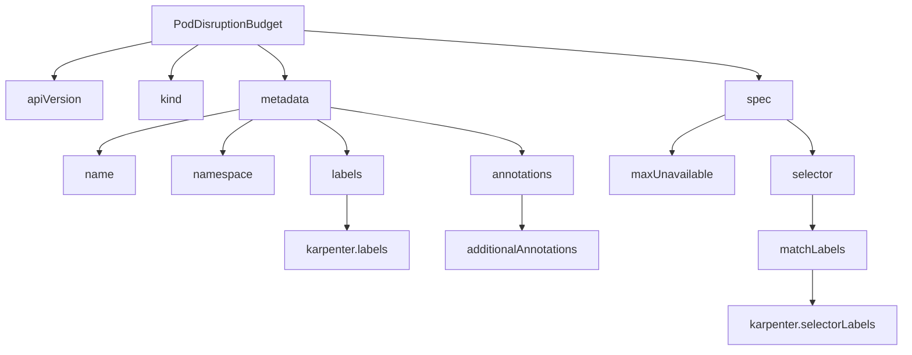
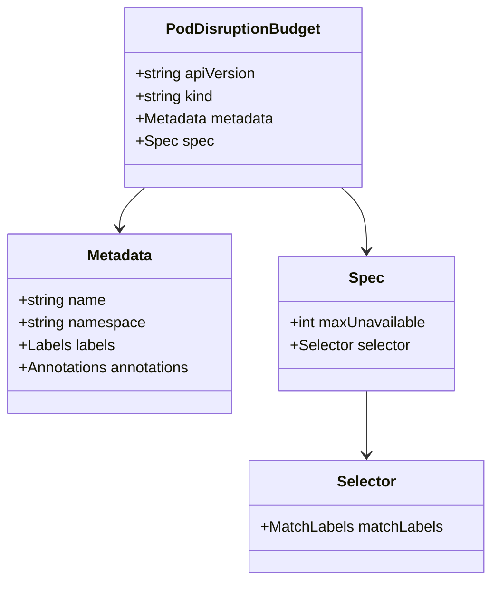
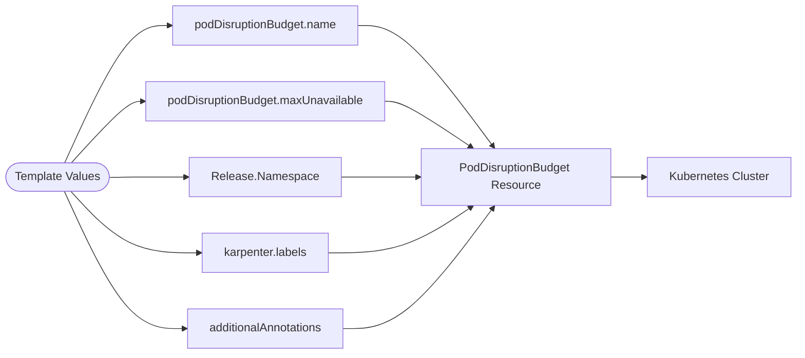

# Diagram: devops/k8s/karpenter/helm/templates/poddisruptionbudget.yaml

> Auto-generated by Obscura crawlers

## Diagram 1

### SVG

<svg id="container" width="1273.17578125" xmlns="http://www.w3.org/2000/svg" class="flowchart" height="486" viewBox="0 0 1273.17578125 486" role="graphics-document document" aria-roledescription="flowchart-v2"><g><marker id="container_flowchart-v2-pointEnd" class="marker flowchart-v2" viewBox="0 0 10 10" refX="5" refY="5" markerUnits="userSpaceOnUse" markerWidth="8" markerHeight="8" orient="auto"><path d="M 0 0 L 10 5 L 0 10 z" class="arrowMarkerPath" style="stroke-width: 1; stroke-dasharray: 1, 0;"></path></marker><marker id="container_flowchart-v2-pointStart" class="marker flowchart-v2" viewBox="0 0 10 10" refX="4.5" refY="5" markerUnits="userSpaceOnUse" markerWidth="8" markerHeight="8" orient="auto"><path d="M 0 5 L 10 10 L 10 0 z" class="arrowMarkerPath" style="stroke-width: 1; stroke-dasharray: 1, 0;"></path></marker><marker id="container_flowchart-v2-circleEnd" class="marker flowchart-v2" viewBox="0 0 10 10" refX="11" refY="5" markerUnits="userSpaceOnUse" markerWidth="11" markerHeight="11" orient="auto"><circle cx="5" cy="5" r="5" class="arrowMarkerPath" style="stroke-width: 1; stroke-dasharray: 1, 0;"></circle></marker><marker id="container_flowchart-v2-circleStart" class="marker flowchart-v2" viewBox="0 0 10 10" refX="-1" refY="5" markerUnits="userSpaceOnUse" markerWidth="11" markerHeight="11" orient="auto"><circle cx="5" cy="5" r="5" class="arrowMarkerPath" style="stroke-width: 1; stroke-dasharray: 1, 0;"></circle></marker><marker id="container_flowchart-v2-crossEnd" class="marker cross flowchart-v2" viewBox="0 0 11 11" refX="12" refY="5.2" markerUnits="userSpaceOnUse" markerWidth="11" markerHeight="11" orient="auto"><path d="M 1,1 l 9,9 M 10,1 l -9,9" class="arrowMarkerPath" style="stroke-width: 2; stroke-dasharray: 1, 0;"></path></marker><marker id="container_flowchart-v2-crossStart" class="marker cross flowchart-v2" viewBox="0 0 11 11" refX="-1" refY="5.2" markerUnits="userSpaceOnUse" markerWidth="11" markerHeight="11" orient="auto"><path d="M 1,1 l 9,9 M 10,1 l -9,9" class="arrowMarkerPath" style="stroke-width: 2; stroke-dasharray: 1, 0;"></path></marker><g class="root"><g class="clusters"></g><g class="edgePaths"><path d="M213.09,57.893L190.29,62.744C167.49,67.595,121.889,77.298,99.089,85.649C76.289,94,76.289,101,76.289,104.5L76.289,108" id="L_A_B_0" class="edge-thickness-normal edge-pattern-solid edge-thickness-normal edge-pattern-solid flowchart-link" style=";" data-edge="true" data-et="edge" data-id="L_A_B_0" data-points="W3sieCI6MjEzLjA4OTg0Mzc1LCJ5Ijo1Ny44OTI3OTk0ODg1MzE5M30seyJ4Ijo3Ni4yODkwNjI1LCJ5Ijo4N30seyJ4Ijo3Ni4yODkwNjI1LCJ5IjoxMTJ9XQ==" marker-end="url(#container_flowchart-v2-pointEnd)"></path><path d="M279.001,62L272.569,66.167C266.136,70.333,253.271,78.667,246.839,86.333C240.406,94,240.406,101,240.406,104.5L240.406,108" id="L_A_C_0" class="edge-thickness-normal edge-pattern-solid edge-thickness-normal edge-pattern-solid flowchart-link" style=";" data-edge="true" data-et="edge" data-id="L_A_C_0" data-points="W3sieCI6Mjc5LjAwMTEyNjgwMjg4NDY0LCJ5Ijo2Mn0seyJ4IjoyNDAuNDA2MjUsInkiOjg3fSx7IngiOjI0MC40MDYyNSwieSI6MTEyfV0=" marker-end="url(#container_flowchart-v2-pointEnd)"></path><path d="M362.366,62L368.799,66.167C375.231,70.333,388.096,78.667,394.528,86.333C400.961,94,400.961,101,400.961,104.5L400.961,108" id="L_A_D_0" class="edge-thickness-normal edge-pattern-solid edge-thickness-normal edge-pattern-solid flowchart-link" style=";" data-edge="true" data-et="edge" data-id="L_A_D_0" data-points="W3sieCI6MzYyLjM2NjA2MDY5NzExNTM2LCJ5Ijo2Mn0seyJ4Ijo0MDAuOTYwOTM3NSwieSI6ODd9LHsieCI6NDAwLjk2MDkzNzUsInkiOjExMn1d" marker-end="url(#container_flowchart-v2-pointEnd)"></path><path d="M428.277,42.475L535.096,49.896C641.914,57.316,855.551,72.158,962.369,83.079C1069.188,94,1069.188,101,1069.188,104.5L1069.188,108" id="L_A_E_0" class="edge-thickness-normal edge-pattern-solid edge-thickness-normal edge-pattern-solid flowchart-link" style=";" data-edge="true" data-et="edge" data-id="L_A_E_0" data-points="W3sieCI6NDI4LjI3NzM0Mzc1LCJ5Ijo0Mi40NzQ3NDM4OTAxNTU4ODV9LHsieCI6MTA2OS4xODc1LCJ5Ijo4N30seyJ4IjoxMDY5LjE4NzUsInkiOjExMn1d" marker-end="url(#container_flowchart-v2-pointEnd)"></path><path d="M336.234,152.058L304.063,158.548C271.892,165.039,207.549,178.019,175.378,188.01C143.207,198,143.207,205,143.207,208.5L143.207,212" id="L_D_F_0" class="edge-thickness-normal edge-pattern-solid edge-thickness-normal edge-pattern-solid flowchart-link" style=";" data-edge="true" data-et="edge" data-id="L_D_F_0" data-points="W3sieCI6MzM2LjIzNDM3NSwieSI6MTUyLjA1ODExOTI2OTUzMDk1fSx7IngiOjE0My4yMDcwMzEyNSwieSI6MTkxfSx7IngiOjE0My4yMDcwMzEyNSwieSI6MjE2fV0=" marker-end="url(#container_flowchart-v2-pointEnd)"></path><path d="M356.074,166L349.147,170.167C342.22,174.333,328.366,182.667,321.439,190.333C314.512,198,314.512,205,314.512,208.5L314.512,212" id="L_D_G_0" class="edge-thickness-normal edge-pattern-solid edge-thickness-normal edge-pattern-solid flowchart-link" style=";" data-edge="true" data-et="edge" data-id="L_D_G_0" data-points="W3sieCI6MzU2LjA3Mzg0MzE0OTAzODQ1LCJ5IjoxNjZ9LHsieCI6MzE0LjUxMTcxODc1LCJ5IjoxOTF9LHsieCI6MzE0LjUxMTcxODc1LCJ5IjoyMTZ9XQ==" marker-end="url(#container_flowchart-v2-pointEnd)"></path><path d="M445.848,166L452.775,170.167C459.702,174.333,473.556,182.667,480.483,190.333C487.41,198,487.41,205,487.41,208.5L487.41,212" id="L_D_H_0" class="edge-thickness-normal edge-pattern-solid edge-thickness-normal edge-pattern-solid flowchart-link" style=";" data-edge="true" data-et="edge" data-id="L_D_H_0" data-points="W3sieCI6NDQ1Ljg0ODAzMTg1MDk2MTU1LCJ5IjoxNjZ9LHsieCI6NDg3LjQxMDE1NjI1LCJ5IjoxOTF9LHsieCI6NDg3LjQxMDE1NjI1LCJ5IjoyMTZ9XQ==" marker-end="url(#container_flowchart-v2-pointEnd)"></path><path d="M465.688,149.006L510.962,156.005C556.236,163.004,646.784,177.002,692.058,187.501C737.332,198,737.332,205,737.332,208.5L737.332,212" id="L_D_I_0" class="edge-thickness-normal edge-pattern-solid edge-thickness-normal edge-pattern-solid flowchart-link" style=";" data-edge="true" data-et="edge" data-id="L_D_I_0" data-points="W3sieCI6NDY1LjY4NzUsInkiOjE0OS4wMDYxNTQ4NDY2NTE0fSx7IngiOjczNy4zMzIwMzEyNSwieSI6MTkxfSx7IngiOjczNy4zMzIwMzEyNSwieSI6MjE2fV0=" marker-end="url(#container_flowchart-v2-pointEnd)"></path><path d="M487.41,270L487.41,274.167C487.41,278.333,487.41,286.667,487.41,294.333C487.41,302,487.41,309,487.41,312.5L487.41,316" id="L_H_J_0" class="edge-thickness-normal edge-pattern-solid edge-thickness-normal edge-pattern-solid flowchart-link" style=";" data-edge="true" data-et="edge" data-id="L_H_J_0" data-points="W3sieCI6NDg3LjQxMDE1NjI1LCJ5IjoyNzB9LHsieCI6NDg3LjQxMDE1NjI1LCJ5IjoyOTV9LHsieCI6NDg3LjQxMDE1NjI1LCJ5IjozMjB9XQ==" marker-end="url(#container_flowchart-v2-pointEnd)"></path><path d="M737.332,270L737.332,274.167C737.332,278.333,737.332,286.667,737.332,294.333C737.332,302,737.332,309,737.332,312.5L737.332,316" id="L_I_K_0" class="edge-thickness-normal edge-pattern-solid edge-thickness-normal edge-pattern-solid flowchart-link" style=";" data-edge="true" data-et="edge" data-id="L_I_K_0" data-points="W3sieCI6NzM3LjMzMjAzMTI1LCJ5IjoyNzB9LHsieCI6NzM3LjMzMjAzMTI1LCJ5IjoyOTV9LHsieCI6NzM3LjMzMjAzMTI1LCJ5IjozMjB9XQ==" marker-end="url(#container_flowchart-v2-pointEnd)"></path><path d="M1022.508,159.189L1010.249,164.491C997.991,169.793,973.474,180.396,961.215,189.198C948.957,198,948.957,205,948.957,208.5L948.957,212" id="L_E_L_0" class="edge-thickness-normal edge-pattern-solid edge-thickness-normal edge-pattern-solid flowchart-link" style=";" data-edge="true" data-et="edge" data-id="L_E_L_0" data-points="W3sieCI6MTAyMi41MDc4MTI1LCJ5IjoxNTkuMTg5MDg5OTYzOTM2NDV9LHsieCI6OTQ4Ljk1NzAzMTI1LCJ5IjoxOTF9LHsieCI6OTQ4Ljk1NzAzMTI1LCJ5IjoyMTZ9XQ==" marker-end="url(#container_flowchart-v2-pointEnd)"></path><path d="M1109.004,166L1115.149,170.167C1121.293,174.333,1133.582,182.667,1139.727,190.333C1145.871,198,1145.871,205,1145.871,208.5L1145.871,212" id="L_E_M_0" class="edge-thickness-normal edge-pattern-solid edge-thickness-normal edge-pattern-solid flowchart-link" style=";" data-edge="true" data-et="edge" data-id="L_E_M_0" data-points="W3sieCI6MTEwOS4wMDM5ODEzNzAxOTI0LCJ5IjoxNjZ9LHsieCI6MTE0NS44NzEwOTM3NSwieSI6MTkxfSx7IngiOjExNDUuODcxMDkzNzUsInkiOjIxNn1d" marker-end="url(#container_flowchart-v2-pointEnd)"></path><path d="M1145.871,270L1145.871,274.167C1145.871,278.333,1145.871,286.667,1145.871,294.333C1145.871,302,1145.871,309,1145.871,312.5L1145.871,316" id="L_M_N_0" class="edge-thickness-normal edge-pattern-solid edge-thickness-normal edge-pattern-solid flowchart-link" style=";" data-edge="true" data-et="edge" data-id="L_M_N_0" data-points="W3sieCI6MTE0NS44NzEwOTM3NSwieSI6MjcwfSx7IngiOjExNDUuODcxMDkzNzUsInkiOjI5NX0seyJ4IjoxMTQ1Ljg3MTA5Mzc1LCJ5IjozMjB9XQ==" marker-end="url(#container_flowchart-v2-pointEnd)"></path><path d="M1145.871,374L1145.871,378.167C1145.871,382.333,1145.871,390.667,1145.871,398.333C1145.871,406,1145.871,413,1145.871,416.5L1145.871,420" id="L_N_O_0" class="edge-thickness-normal edge-pattern-solid edge-thickness-normal edge-pattern-solid flowchart-link" style=";" data-edge="true" data-et="edge" data-id="L_N_O_0" data-points="W3sieCI6MTE0NS44NzEwOTM3NSwieSI6Mzc0fSx7IngiOjExNDUuODcxMDkzNzUsInkiOjM5OX0seyJ4IjoxMTQ1Ljg3MTA5Mzc1LCJ5Ijo0MjR9XQ==" marker-end="url(#container_flowchart-v2-pointEnd)"></path></g><g class="edgeLabels"><g class="edgeLabel"><g class="label" data-id="L_A_B_0" transform="translate(0, 0)"><foreignObject width="0" height="0">

</foreignObject></g></g><g class="edgeLabel"><g class="label" data-id="L_A_C_0" transform="translate(0, 0)"><foreignObject width="0" height="0">

</foreignObject></g></g><g class="edgeLabel"><g class="label" data-id="L_A_D_0" transform="translate(0, 0)"><foreignObject width="0" height="0">

</foreignObject></g></g><g class="edgeLabel"><g class="label" data-id="L_A_E_0" transform="translate(0, 0)"><foreignObject width="0" height="0">

</foreignObject></g></g><g class="edgeLabel"><g class="label" data-id="L_D_F_0" transform="translate(0, 0)"><foreignObject width="0" height="0">

</foreignObject></g></g><g class="edgeLabel"><g class="label" data-id="L_D_G_0" transform="translate(0, 0)"><foreignObject width="0" height="0">

</foreignObject></g></g><g class="edgeLabel"><g class="label" data-id="L_D_H_0" transform="translate(0, 0)"><foreignObject width="0" height="0">

</foreignObject></g></g><g class="edgeLabel"><g class="label" data-id="L_D_I_0" transform="translate(0, 0)"><foreignObject width="0" height="0">

</foreignObject></g></g><g class="edgeLabel"><g class="label" data-id="L_H_J_0" transform="translate(0, 0)"><foreignObject width="0" height="0">

</foreignObject></g></g><g class="edgeLabel"><g class="label" data-id="L_I_K_0" transform="translate(0, 0)"><foreignObject width="0" height="0">

</foreignObject></g></g><g class="edgeLabel"><g class="label" data-id="L_E_L_0" transform="translate(0, 0)"><foreignObject width="0" height="0">

</foreignObject></g></g><g class="edgeLabel"><g class="label" data-id="L_E_M_0" transform="translate(0, 0)"><foreignObject width="0" height="0">

</foreignObject></g></g><g class="edgeLabel"><g class="label" data-id="L_M_N_0" transform="translate(0, 0)"><foreignObject width="0" height="0">

</foreignObject></g></g><g class="edgeLabel"><g class="label" data-id="L_N_O_0" transform="translate(0, 0)"><foreignObject width="0" height="0">

</foreignObject></g></g></g><g class="nodes"><g class="node default" id="flowchart-A-0" transform="translate(320.68359375, 35)"><rect class="basic label-container" style="" x="-107.59375" y="-27" width="215.1875" height="54"></rect><g class="label" style="" transform="translate(-77.59375, -12)"><rect></rect><foreignObject width="155.1875" height="24">

PodDisruptionBudget

</foreignObject></g></g><g class="node default" id="flowchart-B-1" transform="translate(76.2890625, 139)"><rect class="basic label-container" style="" x="-68.2890625" y="-27" width="136.578125" height="54"></rect><g class="label" style="" transform="translate(-38.2890625, -12)"><rect></rect><foreignObject width="76.578125" height="24">

apiVersion

</foreignObject></g></g><g class="node default" id="flowchart-C-3" transform="translate(240.40625, 139)"><rect class="basic label-container" style="" x="-45.828125" y="-27" width="91.65625" height="54"></rect><g class="label" style="" transform="translate(-15.828125, -12)"><rect></rect><foreignObject width="31.65625" height="24">

kind

</foreignObject></g></g><g class="node default" id="flowchart-D-5" transform="translate(400.9609375, 139)"><rect class="basic label-container" style="" x="-64.7265625" y="-27" width="129.453125" height="54"></rect><g class="label" style="" transform="translate(-34.7265625, -12)"><rect></rect><foreignObject width="69.453125" height="24">

metadata

</foreignObject></g></g><g class="node default" id="flowchart-E-7" transform="translate(1069.1875, 139)"><rect class="basic label-container" style="" x="-46.6796875" y="-27" width="93.359375" height="54"></rect><g class="label" style="" transform="translate(-16.6796875, -12)"><rect></rect><foreignObject width="33.359375" height="24">

spec

</foreignObject></g></g><g class="node default" id="flowchart-F-9" transform="translate(143.20703125, 243)"><rect class="basic label-container" style="" x="-50.2578125" y="-27" width="100.515625" height="54"></rect><g class="label" style="" transform="translate(-20.2578125, -12)"><rect></rect><foreignObject width="40.515625" height="24">

name

</foreignObject></g></g><g class="node default" id="flowchart-G-11" transform="translate(314.51171875, 243)"><rect class="basic label-container" style="" x="-71.046875" y="-27" width="142.09375" height="54"></rect><g class="label" style="" transform="translate(-41.046875, -12)"><rect></rect><foreignObject width="82.09375" height="24">

namespace

</foreignObject></g></g><g class="node default" id="flowchart-H-13" transform="translate(487.41015625, 243)"><rect class="basic label-container" style="" x="-51.8515625" y="-27" width="103.703125" height="54"></rect><g class="label" style="" transform="translate(-21.8515625, -12)"><rect></rect><foreignObject width="43.703125" height="24">

labels

</foreignObject></g></g><g class="node default" id="flowchart-I-15" transform="translate(737.33203125, 243)"><rect class="basic label-container" style="" x="-73.828125" y="-27" width="147.65625" height="54"></rect><g class="label" style="" transform="translate(-43.828125, -12)"><rect></rect><foreignObject width="87.65625" height="24">

annotations

</foreignObject></g></g><g class="node default" id="flowchart-J-17" transform="translate(487.41015625, 347)"><rect class="basic label-container" style="" x="-88.5625" y="-27" width="177.125" height="54"></rect><g class="label" style="" transform="translate(-58.5625, -12)"><rect></rect><foreignObject width="117.125" height="24">

karpenter.labels

</foreignObject></g></g><g class="node default" id="flowchart-K-19" transform="translate(737.33203125, 347)"><rect class="basic label-container" style="" x="-111.359375" y="-27" width="222.71875" height="54"></rect><g class="label" style="" transform="translate(-81.359375, -12)"><rect></rect><foreignObject width="162.71875" height="24">

additionalAnnotations

</foreignObject></g></g><g class="node default" id="flowchart-L-21" transform="translate(948.95703125, 243)"><rect class="basic label-container" style="" x="-87.796875" y="-27" width="175.59375" height="54"></rect><g class="label" style="" transform="translate(-57.796875, -12)"><rect></rect><foreignObject width="115.59375" height="24">

maxUnavailable

</foreignObject></g></g><g class="node default" id="flowchart-M-23" transform="translate(1145.87109375, 243)"><rect class="basic label-container" style="" x="-59.1171875" y="-27" width="118.234375" height="54"></rect><g class="label" style="" transform="translate(-29.1171875, -12)"><rect></rect><foreignObject width="58.234375" height="24">

selector

</foreignObject></g></g><g class="node default" id="flowchart-N-25" transform="translate(1145.87109375, 347)"><rect class="basic label-container" style="" x="-75.9375" y="-27" width="151.875" height="54"></rect><g class="label" style="" transform="translate(-45.9375, -12)"><rect></rect><foreignObject width="91.875" height="24">

matchLabels

</foreignObject></g></g><g class="node default" id="flowchart-O-27" transform="translate(1145.87109375, 451)"><rect class="basic label-container" style="" x="-119.3046875" y="-27" width="238.609375" height="54"></rect><g class="label" style="" transform="translate(-89.3046875, -12)"><rect></rect><foreignObject width="178.609375" height="24">

karpenter.selectorLabels

</foreignObject></g></g></g></g></g></svg>

## Diagram 2

### SVG

<svg id="container" width="531.57421875" xmlns="http://www.w3.org/2000/svg" class="classDiagram" height="620" viewBox="0 0 531.57421875 620" role="graphics-document document" aria-roledescription="class"><g><defs><marker id="container_class-aggregationStart" class="marker aggregation class" refX="18" refY="7" markerWidth="190" markerHeight="240" orient="auto"><path d="M 18,7 L9,13 L1,7 L9,1 Z"></path></marker></defs><defs><marker id="container_class-aggregationEnd" class="marker aggregation class" refX="1" refY="7" markerWidth="20" markerHeight="28" orient="auto"><path d="M 18,7 L9,13 L1,7 L9,1 Z"></path></marker></defs><defs><marker id="container_class-extensionStart" class="marker extension class" refX="18" refY="7" markerWidth="190" markerHeight="240" orient="auto"><path d="M 1,7 L18,13 V 1 Z"></path></marker></defs><defs><marker id="container_class-extensionEnd" class="marker extension class" refX="1" refY="7" markerWidth="20" markerHeight="28" orient="auto"><path d="M 1,1 V 13 L18,7 Z"></path></marker></defs><defs><marker id="container_class-compositionStart" class="marker composition class" refX="18" refY="7" markerWidth="190" markerHeight="240" orient="auto"><path d="M 18,7 L9,13 L1,7 L9,1 Z"></path></marker></defs><defs><marker id="container_class-compositionEnd" class="marker composition class" refX="1" refY="7" markerWidth="20" markerHeight="28" orient="auto"><path d="M 18,7 L9,13 L1,7 L9,1 Z"></path></marker></defs><defs><marker id="container_class-dependencyStart" class="marker dependency class" refX="6" refY="7" markerWidth="190" markerHeight="240" orient="auto"><path d="M 5,7 L9,13 L1,7 L9,1 Z"></path></marker></defs><defs><marker id="container_class-dependencyEnd" class="marker dependency class" refX="13" refY="7" markerWidth="20" markerHeight="28" orient="auto"><path d="M 18,7 L9,13 L14,7 L9,1 Z"></path></marker></defs><defs><marker id="container_class-lollipopStart" class="marker lollipop class" refX="13" refY="7" markerWidth="190" markerHeight="240" orient="auto"><circle stroke="black" fill="transparent" cx="7" cy="7" r="6"></circle></marker></defs><defs><marker id="container_class-lollipopEnd" class="marker lollipop class" refX="1" refY="7" markerWidth="190" markerHeight="240" orient="auto"><circle stroke="black" fill="transparent" cx="7" cy="7" r="6"></circle></marker></defs><g class="root"><g class="clusters"></g><g class="edgePaths"><path d="M158.897,200L154.287,204.167C149.676,208.333,140.455,216.667,135.845,224C131.234,231.333,131.234,237.667,131.234,240.833L131.234,244" id="id_PodDisruptionBudget_Metadata_1" class="edge-thickness-normal edge-pattern-solid relation" style=";;;" data-edge="true" data-et="edge" data-id="id_PodDisruptionBudget_Metadata_1" data-points="W3sieCI6MTU4Ljg5NzMyMzczNDUwNDE0LCJ5IjoyMDB9LHsieCI6MTMxLjIzNDM3NSwieSI6MjI1fSx7IngiOjEzMS4yMzQzNzUsInkiOjI1MH1d" marker-end="url(#container_class-dependencyEnd)"></path><path d="M371.349,200L375.959,204.167C380.57,208.333,389.791,216.667,394.401,228C399.012,239.333,399.012,253.667,399.012,260.833L399.012,268" id="id_PodDisruptionBudget_Spec_2" class="edge-thickness-normal edge-pattern-solid relation" style=";;;" data-edge="true" data-et="edge" data-id="id_PodDisruptionBudget_Spec_2" data-points="W3sieCI6MzcxLjM0ODc3MDAxNTQ5NTg2LCJ5IjoyMDB9LHsieCI6Mzk5LjAxMTcxODc1LCJ5IjoyMjV9LHsieCI6Mzk5LjAxMTcxODc1LCJ5IjoyNzR9XQ==" marker-end="url(#container_class-dependencyEnd)"></path><path d="M399.012,418L399.012,426.167C399.012,434.333,399.012,450.667,399.012,462C399.012,473.333,399.012,479.667,399.012,482.833L399.012,486" id="id_Spec_Selector_3" class="edge-thickness-normal edge-pattern-solid relation" style=";;;" data-edge="true" data-et="edge" data-id="id_Spec_Selector_3" data-points="W3sieCI6Mzk5LjAxMTcxODc1LCJ5Ijo0MTh9LHsieCI6Mzk5LjAxMTcxODc1LCJ5Ijo0Njd9LHsieCI6Mzk5LjAxMTcxODc1LCJ5Ijo0OTJ9XQ==" marker-end="url(#container_class-dependencyEnd)"></path></g><g class="edgeLabels"><g class="edgeLabel"><g class="label" data-id="id_PodDisruptionBudget_Metadata_1" transform="translate(0, 0)"><foreignObject width="0" height="0">

</foreignObject></g></g><g class="edgeLabel"><g class="label" data-id="id_PodDisruptionBudget_Spec_2" transform="translate(0, 0)"><foreignObject width="0" height="0">

</foreignObject></g></g><g class="edgeLabel"><g class="label" data-id="id_Spec_Selector_3" transform="translate(0, 0)"><foreignObject width="0" height="0">

</foreignObject></g></g></g><g class="nodes"><g class="node default" id="classId-PodDisruptionBudget-0" transform="translate(265.123046875, 104)"><g class="basic label-container"><path d="M-126.22265625 -96 L126.22265625 -96 L126.22265625 96 L-126.22265625 96" stroke="none" stroke-width="0" fill="#ECECFF" style=""></path><path d="M-126.22265625 -96 C-38.35480977327215 -96, 49.5130367034557 -96, 126.22265625 -96 M-126.22265625 -96 C-68.04192453049508 -96, -9.861192810990161 -96, 126.22265625 -96 M126.22265625 -96 C126.22265625 -47.982710874134625, 126.22265625 0.0345782517307498, 126.22265625 96 M126.22265625 -96 C126.22265625 -26.07076512177929, 126.22265625 43.85846975644142, 126.22265625 96 M126.22265625 96 C67.61188677464608 96, 9.001117299292176 96, -126.22265625 96 M126.22265625 96 C58.03437824704629 96, -10.153899755907418 96, -126.22265625 96 M-126.22265625 96 C-126.22265625 48.34502849852475, -126.22265625 0.6900569970494956, -126.22265625 -96 M-126.22265625 96 C-126.22265625 44.38354082666599, -126.22265625 -7.232918346668015, -126.22265625 -96" stroke="#9370DB" stroke-width="1.3" fill="none" stroke-dasharray="0 0" style=""></path></g><g class="annotation-group text" transform="translate(0, -72)"></g><g class="label-group text" transform="translate(-78.6015625, -72)"><g class="label" style="font-weight: bolder" transform="translate(0,-12)"><foreignObject width="157.203125" height="24">

PodDisruptionBudget

</foreignObject></g></g><g class="members-group text" transform="translate(-114.22265625, -24)"><g class="label" style="" transform="translate(0,-12)"><foreignObject width="130.4375" height="24">

+string apiVersion

</foreignObject></g><g class="label" style="" transform="translate(0,12)"><foreignObject width="85.515625" height="24">

+string kind

</foreignObject></g><g class="label" style="" transform="translate(0,36)"><foreignObject width="149.84375" height="24">

+Metadata metadata

</foreignObject></g><g class="label" style="" transform="translate(0,60)"><foreignObject width="79.53125" height="24">

+Spec spec

</foreignObject></g></g><g class="methods-group text" transform="translate(-114.22265625, 96)"></g><g class="divider" style=""><path d="M-126.22265625 -48 C-69.0959756627974 -48, -11.969295075594815 -48, 126.22265625 -48 M-126.22265625 -48 C-53.63270893804524 -48, 18.95723837390952 -48, 126.22265625 -48" stroke="#9370DB" stroke-width="1.3" fill="none" stroke-dasharray="0 0" style=""></path></g><g class="divider" style=""><path d="M-126.22265625 72 C-32.69066368731417 72, 60.84132887537166 72, 126.22265625 72 M-126.22265625 72 C-53.42250168734827 72, 19.377652875303454 72, 126.22265625 72" stroke="#9370DB" stroke-width="1.3" fill="none" stroke-dasharray="0 0" style=""></path></g></g><g class="node default" id="classId-Metadata-1" transform="translate(131.234375, 346)"><g class="basic label-container"><path d="M-123.234375 -96 L123.234375 -96 L123.234375 96 L-123.234375 96" stroke="none" stroke-width="0" fill="#ECECFF" style=""></path><path d="M-123.234375 -96 C-59.158188720342906 -96, 4.917997559314188 -96, 123.234375 -96 M-123.234375 -96 C-57.24701158196666 -96, 8.74035183606668 -96, 123.234375 -96 M123.234375 -96 C123.234375 -20.29887857454088, 123.234375 55.40224285091824, 123.234375 96 M123.234375 -96 C123.234375 -51.130051023308035, 123.234375 -6.260102046616069, 123.234375 96 M123.234375 96 C70.74491728658164 96, 18.25545957316328 96, -123.234375 96 M123.234375 96 C25.365101604716514 96, -72.50417179056697 96, -123.234375 96 M-123.234375 96 C-123.234375 49.54001701272606, -123.234375 3.0800340254521217, -123.234375 -96 M-123.234375 96 C-123.234375 23.487509007292743, -123.234375 -49.02498198541451, -123.234375 -96" stroke="#9370DB" stroke-width="1.3" fill="none" stroke-dasharray="0 0" style=""></path></g><g class="annotation-group text" transform="translate(0, -72)"></g><g class="label-group text" transform="translate(-34.640625, -72)"><g class="label" style="font-weight: bolder" transform="translate(0,-12)"><foreignObject width="69.28125" height="24">

Metadata

</foreignObject></g></g><g class="members-group text" transform="translate(-111.234375, -24)"><g class="label" style="" transform="translate(0,-12)"><foreignObject width="94.375" height="24">

+string name

</foreignObject></g><g class="label" style="" transform="translate(0,12)"><foreignObject width="135.9375" height="24">

+string namespace

</foreignObject></g><g class="label" style="" transform="translate(0,36)"><foreignObject width="102.828125" height="24">

+Labels labels

</foreignObject></g><g class="label" style="" transform="translate(0,60)"><foreignObject width="187.828125" height="24">

+Annotations annotations

</foreignObject></g></g><g class="methods-group text" transform="translate(-111.234375, 96)"></g><g class="divider" style=""><path d="M-123.234375 -48 C-41.497644394705915 -48, 40.23908621058817 -48, 123.234375 -48 M-123.234375 -48 C-29.007168309052787 -48, 65.22003838189443 -48, 123.234375 -48" stroke="#9370DB" stroke-width="1.3" fill="none" stroke-dasharray="0 0" style=""></path></g><g class="divider" style=""><path d="M-123.234375 72 C-43.71491664044886 72, 35.804541719102275 72, 123.234375 72 M-123.234375 72 C-40.308318700394466 72, 42.61773759921107 72, 123.234375 72" stroke="#9370DB" stroke-width="1.3" fill="none" stroke-dasharray="0 0" style=""></path></g></g><g class="node default" id="classId-Spec-2" transform="translate(399.01171875, 346)"><g class="basic label-container"><path d="M-94.54296875 -72 L94.54296875 -72 L94.54296875 72 L-94.54296875 72" stroke="none" stroke-width="0" fill="#ECECFF" style=""></path><path d="M-94.54296875 -72 C-53.42215141174423 -72, -12.301334073488462 -72, 94.54296875 -72 M-94.54296875 -72 C-35.24547741521442 -72, 24.052013919571166 -72, 94.54296875 -72 M94.54296875 -72 C94.54296875 -39.27585438193866, 94.54296875 -6.551708763877315, 94.54296875 72 M94.54296875 -72 C94.54296875 -28.64275589524314, 94.54296875 14.714488209513718, 94.54296875 72 M94.54296875 72 C40.73624849727251 72, -13.070471755454975 72, -94.54296875 72 M94.54296875 72 C49.46045129569976 72, 4.377933841399525 72, -94.54296875 72 M-94.54296875 72 C-94.54296875 41.59949163044573, -94.54296875 11.198983260891467, -94.54296875 -72 M-94.54296875 72 C-94.54296875 22.54755519330621, -94.54296875 -26.90488961338758, -94.54296875 -72" stroke="#9370DB" stroke-width="1.3" fill="none" stroke-dasharray="0 0" style=""></path></g><g class="annotation-group text" transform="translate(0, -48)"></g><g class="label-group text" transform="translate(-17.6015625, -48)"><g class="label" style="font-weight: bolder" transform="translate(0,-12)"><foreignObject width="35.203125" height="24">

Spec

</foreignObject></g></g><g class="members-group text" transform="translate(-82.54296875, 0)"><g class="label" style="" transform="translate(0,-12)"><foreignObject width="147.484375" height="24">

+int maxUnavailable

</foreignObject></g><g class="label" style="" transform="translate(0,12)"><foreignObject width="129.28125" height="24">

+Selector selector

</foreignObject></g></g><g class="methods-group text" transform="translate(-82.54296875, 72)"></g><g class="divider" style=""><path d="M-94.54296875 -24 C-20.540401733158177 -24, 53.462165283683646 -24, 94.54296875 -24 M-94.54296875 -24 C-24.458193283127088 -24, 45.626582183745825 -24, 94.54296875 -24" stroke="#9370DB" stroke-width="1.3" fill="none" stroke-dasharray="0 0" style=""></path></g><g class="divider" style=""><path d="M-94.54296875 48 C-21.568647356338744 48, 51.40567403732251 48, 94.54296875 48 M-94.54296875 48 C-29.908624212180214 48, 34.72572032563957 48, 94.54296875 48" stroke="#9370DB" stroke-width="1.3" fill="none" stroke-dasharray="0 0" style=""></path></g></g><g class="node default" id="classId-Selector-3" transform="translate(399.01171875, 552)"><g class="basic label-container"><path d="M-124.5625 -60 L124.5625 -60 L124.5625 60 L-124.5625 60" stroke="none" stroke-width="0" fill="#ECECFF" style=""></path><path d="M-124.5625 -60 C-34.62134466537515 -60, 55.319810669249705 -60, 124.5625 -60 M-124.5625 -60 C-72.2809791983893 -60, -19.999458396778593 -60, 124.5625 -60 M124.5625 -60 C124.5625 -31.303637357447695, 124.5625 -2.6072747148953894, 124.5625 60 M124.5625 -60 C124.5625 -17.52789885714271, 124.5625 24.94420228571458, 124.5625 60 M124.5625 60 C43.20490935738104 60, -38.15268128523792 60, -124.5625 60 M124.5625 60 C59.685506987076536 60, -5.1914860258469275 60, -124.5625 60 M-124.5625 60 C-124.5625 24.415438397447637, -124.5625 -11.169123205104725, -124.5625 -60 M-124.5625 60 C-124.5625 23.372700838385732, -124.5625 -13.254598323228535, -124.5625 -60" stroke="#9370DB" stroke-width="1.3" fill="none" stroke-dasharray="0 0" style=""></path></g><g class="annotation-group text" transform="translate(0, -36)"></g><g class="label-group text" transform="translate(-30.40625, -36)"><g class="label" style="font-weight: bolder" transform="translate(0,-12)"><foreignObject width="60.8125" height="24">

Selector

</foreignObject></g></g><g class="members-group text" transform="translate(-112.5625, 12)"><g class="label" style="" transform="translate(0,-12)"><foreignObject width="194.71875" height="24">

+MatchLabels matchLabels

</foreignObject></g></g><g class="methods-group text" transform="translate(-112.5625, 60)"></g><g class="divider" style=""><path d="M-124.5625 -12 C-53.03456082706657 -12, 18.49337834586686 -12, 124.5625 -12 M-124.5625 -12 C-60.55074705522013 -12, 3.4610058895597433 -12, 124.5625 -12" stroke="#9370DB" stroke-width="1.3" fill="none" stroke-dasharray="0 0" style=""></path></g><g class="divider" style=""><path d="M-124.5625 36 C-30.60738494743609 36, 63.34773010512782 36, 124.5625 36 M-124.5625 36 C-31.34320280636706 36, 61.87609438726588 36, 124.5625 36" stroke="#9370DB" stroke-width="1.3" fill="none" stroke-dasharray="0 0" style=""></path></g></g></g></g></g></svg>

## Diagram 3

### SVG

<svg id="container" width="1102.01123046875" xmlns="http://www.w3.org/2000/svg" class="flowchart" height="486" viewBox="0 0 1102.01123046875 486" role="graphics-document document" aria-roledescription="flowchart-v2"><g><marker id="container_flowchart-v2-pointEnd" class="marker flowchart-v2" viewBox="0 0 10 10" refX="5" refY="5" markerUnits="userSpaceOnUse" markerWidth="8" markerHeight="8" orient="auto"><path d="M 0 0 L 10 5 L 0 10 z" class="arrowMarkerPath" style="stroke-width: 1; stroke-dasharray: 1, 0;"></path></marker><marker id="container_flowchart-v2-pointStart" class="marker flowchart-v2" viewBox="0 0 10 10" refX="4.5" refY="5" markerUnits="userSpaceOnUse" markerWidth="8" markerHeight="8" orient="auto"><path d="M 0 5 L 10 10 L 10 0 z" class="arrowMarkerPath" style="stroke-width: 1; stroke-dasharray: 1, 0;"></path></marker><marker id="container_flowchart-v2-circleEnd" class="marker flowchart-v2" viewBox="0 0 10 10" refX="11" refY="5" markerUnits="userSpaceOnUse" markerWidth="11" markerHeight="11" orient="auto"><circle cx="5" cy="5" r="5" class="arrowMarkerPath" style="stroke-width: 1; stroke-dasharray: 1, 0;"></circle></marker><marker id="container_flowchart-v2-circleStart" class="marker flowchart-v2" viewBox="0 0 10 10" refX="-1" refY="5" markerUnits="userSpaceOnUse" markerWidth="11" markerHeight="11" orient="auto"><circle cx="5" cy="5" r="5" class="arrowMarkerPath" style="stroke-width: 1; stroke-dasharray: 1, 0;"></circle></marker><marker id="container_flowchart-v2-crossEnd" class="marker cross flowchart-v2" viewBox="0 0 11 11" refX="12" refY="5.2" markerUnits="userSpaceOnUse" markerWidth="11" markerHeight="11" orient="auto"><path d="M 1,1 l 9,9 M 10,1 l -9,9" class="arrowMarkerPath" style="stroke-width: 2; stroke-dasharray: 1, 0;"></path></marker><marker id="container_flowchart-v2-crossStart" class="marker cross flowchart-v2" viewBox="0 0 11 11" refX="-1" refY="5.2" markerUnits="userSpaceOnUse" markerWidth="11" markerHeight="11" orient="auto"><path d="M 1,1 l 9,9 M 10,1 l -9,9" class="arrowMarkerPath" style="stroke-width: 2; stroke-dasharray: 1, 0;"></path></marker><g class="root"><g class="clusters"></g><g class="edgePaths"><path d="M88.976,224L103.459,192.5C117.941,161,146.906,98,171.145,66.5C195.384,35,214.897,35,224.653,35L234.41,35" id="L_Start_Name_0" class="edge-thickness-normal edge-pattern-solid edge-thickness-normal edge-pattern-solid flowchart-link" style=";" data-edge="true" data-et="edge" data-id="L_Start_Name_0" data-points="W3sieCI6ODguOTc2MTA0MDIxMDcyMzksInkiOjIyNH0seyJ4IjoxNzUuODcwNTkwMjA5OTYwOTQsInkiOjM1fSx7IngiOjIzOC40MDk2NTI3MDk5NjA5NCwieSI6MzV9XQ==" marker-end="url(#container_flowchart-v2-pointEnd)"></path><path d="M98.017,224L110.993,209.833C123.968,195.667,149.919,167.333,166.395,153.167C182.871,139,189.871,139,193.371,139L196.871,139" id="L_Start_Max_0" class="edge-thickness-normal edge-pattern-solid edge-thickness-normal edge-pattern-solid flowchart-link" style=";" data-edge="true" data-et="edge" data-id="L_Start_Max_0" data-points="W3sieCI6OTguMDE2OTEyOTM3MTY0MywieSI6MjI0fSx7IngiOjE3NS44NzA1OTAyMDk5NjA5NCwieSI6MTM5fSx7IngiOjIwMC44NzA1OTAyMDk5NjA5NCwieSI6MTM5fV0=" marker-end="url(#container_flowchart-v2-pointEnd)"></path><path d="M151.371,243.5L155.454,243.417C159.537,243.333,167.704,243.167,186.286,243.083C204.868,243,233.865,243,248.364,243L262.863,243" id="L_Start_Namespace_0" class="edge-thickness-normal edge-pattern-solid edge-thickness-normal edge-pattern-solid flowchart-link" style=";" data-edge="true" data-et="edge" data-id="L_Start_Namespace_0" data-points="W3sieCI6MTUxLjM3MDU4NzQzMTgzMTMyLCJ5IjoyNDMuNX0seyJ4IjoxNzUuODcwNTkwMjA5OTYwOTQsInkiOjI0M30seyJ4IjoyNjYuODYyNzc3NzA5OTYwOTQsInkiOjI0M31d" marker-end="url(#container_flowchart-v2-pointEnd)"></path><path d="M98.017,263L110.993,277C123.968,291,149.919,319,179.582,333C209.246,347,242.621,347,259.308,347L275.996,347" id="L_Start_Labels_0" class="edge-thickness-normal edge-pattern-solid edge-thickness-normal edge-pattern-solid flowchart-link" style=";" data-edge="true" data-et="edge" data-id="L_Start_Labels_0" data-points="W3sieCI6OTguMDE2OTEyOTM3MTY0MywieSI6MjYzfSx7IngiOjE3NS44NzA1OTAyMDk5NjA5NCwieSI6MzQ3fSx7IngiOjI3OS45OTU1OTAyMDk5NjA5NCwieSI6MzQ3fV0=" marker-end="url(#container_flowchart-v2-pointEnd)"></path><path d="M88.976,263L103.459,294.333C117.941,325.667,146.906,388.333,174.276,419.667C201.647,451,227.423,451,240.311,451L253.199,451" id="L_Start_Anno_0" class="edge-thickness-normal edge-pattern-solid edge-thickness-normal edge-pattern-solid flowchart-link" style=";" data-edge="true" data-et="edge" data-id="L_Start_Anno_0" data-points="W3sieCI6ODguOTc2MTA0MDIxMDcyMzksInkiOjI2M30seyJ4IjoxNzUuODcwNTkwMjA5OTYwOTQsInkiOjQ1MX0seyJ4IjoyNTcuMTk4NzE1MjA5OTYwOTQsInkiOjQ1MX1d" marker-end="url(#container_flowchart-v2-pointEnd)"></path><path d="M498.707,35L509.13,35C519.553,35,540.399,35,571.414,62.632C602.428,90.264,643.611,145.528,664.202,173.161L684.793,200.793" id="L_Name_PDB_0" class="edge-thickness-normal edge-pattern-solid edge-thickness-normal edge-pattern-solid flowchart-link" style=";" data-edge="true" data-et="edge" data-id="L_Name_PDB_0" data-points="W3sieCI6NDk4LjcwNjUyNzcwOTk2MDk0LCJ5IjozNX0seyJ4Ijo1NjEuMjQ1NTkwMjA5OTYwOSwieSI6MzV9LHsieCI6Njg3LjE4MzA5MDIwOTk2MDksInkiOjIwNH1d" marker-end="url(#container_flowchart-v2-pointEnd)"></path><path d="M536.246,139L540.412,139C544.579,139,552.912,139,572.671,149.462C592.43,159.924,623.615,180.848,639.207,191.309L654.799,201.771" id="L_Max_PDB_0" class="edge-thickness-normal edge-pattern-solid edge-thickness-normal edge-pattern-solid flowchart-link" style=";" data-edge="true" data-et="edge" data-id="L_Max_PDB_0" data-points="W3sieCI6NTM2LjI0NTU5MDIwOTk2MDksInkiOjEzOX0seyJ4Ijo1NjEuMjQ1NTkwMjA5OTYwOSwieSI6MTM5fSx7IngiOjY1OC4xMjA1OTAyMDk5NjA5LCJ5IjoyMDR9XQ==" marker-end="url(#container_flowchart-v2-pointEnd)"></path><path d="M470.253,243L485.419,243C500.584,243,530.915,243,549.58,243C568.246,243,575.246,243,578.746,243L582.246,243" id="L_Namespace_PDB_0" class="edge-thickness-normal edge-pattern-solid edge-thickness-normal edge-pattern-solid flowchart-link" style=";" data-edge="true" data-et="edge" data-id="L_Namespace_PDB_0" data-points="W3sieCI6NDcwLjI1MzQwMjcwOTk2MDk0LCJ5IjoyNDN9LHsieCI6NTYxLjI0NTU5MDIwOTk2MDksInkiOjI0M30seyJ4Ijo1ODYuMjQ1NTkwMjA5OTYwOSwieSI6MjQzfV0=" marker-end="url(#container_flowchart-v2-pointEnd)"></path><path d="M457.121,347L474.475,347C491.829,347,526.537,347,559.484,336.538C592.43,326.076,623.615,305.152,639.207,294.691L654.799,284.229" id="L_Labels_PDB_0" class="edge-thickness-normal edge-pattern-solid edge-thickness-normal edge-pattern-solid flowchart-link" style=";" data-edge="true" data-et="edge" data-id="L_Labels_PDB_0" data-points="W3sieCI6NDU3LjEyMDU5MDIwOTk2MDk0LCJ5IjozNDd9LHsieCI6NTYxLjI0NTU5MDIwOTk2MDksInkiOjM0N30seyJ4Ijo2NTguMTIwNTkwMjA5OTYwOSwieSI6MjgyfV0=" marker-end="url(#container_flowchart-v2-pointEnd)"></path><path d="M479.917,451L493.472,451C507.027,451,534.136,451,568.282,423.368C602.428,395.736,643.611,340.472,664.202,312.839L684.793,285.207" id="L_Anno_PDB_0" class="edge-thickness-normal edge-pattern-solid edge-thickness-normal edge-pattern-solid flowchart-link" style=";" data-edge="true" data-et="edge" data-id="L_Anno_PDB_0" data-points="W3sieCI6NDc5LjkxNzQ2NTIwOTk2MDk0LCJ5Ijo0NTF9LHsieCI6NTYxLjI0NTU5MDIwOTk2MDksInkiOjQ1MX0seyJ4Ijo2ODcuMTgzMDkwMjA5OTYwOSwieSI6MjgyfV0=" marker-end="url(#container_flowchart-v2-pointEnd)"></path><path d="M846.246,243L850.412,243C854.579,243,862.912,243,870.579,243C878.246,243,885.246,243,888.746,243L892.246,243" id="L_PDB_Deploy_0" class="edge-thickness-normal edge-pattern-solid edge-thickness-normal edge-pattern-solid flowchart-link" style=";" data-edge="true" data-et="edge" data-id="L_PDB_Deploy_0" data-points="W3sieCI6ODQ2LjI0NTU5MDIwOTk2MDksInkiOjI0M30seyJ4Ijo4NzEuMjQ1NTkwMjA5OTYwOSwieSI6MjQzfSx7IngiOjg5Ni4yNDU1OTAyMDk5NjA5LCJ5IjoyNDN9XQ==" marker-end="url(#container_flowchart-v2-pointEnd)"></path></g><g class="edgeLabels"><g class="edgeLabel"><g class="label" data-id="L_Start_Name_0" transform="translate(0, 0)"><foreignObject width="0" height="0">

</foreignObject></g></g><g class="edgeLabel"><g class="label" data-id="L_Start_Max_0" transform="translate(0, 0)"><foreignObject width="0" height="0">

</foreignObject></g></g><g class="edgeLabel"><g class="label" data-id="L_Start_Namespace_0" transform="translate(0, 0)"><foreignObject width="0" height="0">

</foreignObject></g></g><g class="edgeLabel"><g class="label" data-id="L_Start_Labels_0" transform="translate(0, 0)"><foreignObject width="0" height="0">

</foreignObject></g></g><g class="edgeLabel"><g class="label" data-id="L_Start_Anno_0" transform="translate(0, 0)"><foreignObject width="0" height="0">

</foreignObject></g></g><g class="edgeLabel"><g class="label" data-id="L_Name_PDB_0" transform="translate(0, 0)"><foreignObject width="0" height="0">

</foreignObject></g></g><g class="edgeLabel"><g class="label" data-id="L_Max_PDB_0" transform="translate(0, 0)"><foreignObject width="0" height="0">

</foreignObject></g></g><g class="edgeLabel"><g class="label" data-id="L_Namespace_PDB_0" transform="translate(0, 0)"><foreignObject width="0" height="0">

</foreignObject></g></g><g class="edgeLabel"><g class="label" data-id="L_Labels_PDB_0" transform="translate(0, 0)"><foreignObject width="0" height="0">

</foreignObject></g></g><g class="edgeLabel"><g class="label" data-id="L_Anno_PDB_0" transform="translate(0, 0)"><foreignObject width="0" height="0">

</foreignObject></g></g><g class="edgeLabel"><g class="label" data-id="L_PDB_Deploy_0" transform="translate(0, 0)"><foreignObject width="0" height="0">

</foreignObject></g></g></g><g class="nodes"><g class="node default" id="flowchart-Start-0" transform="translate(79.43529510498047, 243)"><g class="basic label-container outer-path"><path d="M-51.9453125 -19.5 C-26.194822753443994 -19.5, -0.4443330068879874 -19.5, 51.9453125 -19.5 C51.9453125 -19.5, 51.9453125 -19.5, 51.9453125 -19.5 C52.244801268105405 -19.490395978126383, 52.54429003621081 -19.480791956252766, 53.1946817896239 -19.45993515863156 C53.59014368534198 -19.42178542516415, 53.98560558106006 -19.38363569169674, 54.438917152847864 -19.3399052695533 C54.859809309187675 -19.2718586897837, 55.28070146552749 -19.203812110014102, 55.67290575967676 -19.140403561325776 C55.95772704159385 -19.07539496236076, 56.242548323510945 -19.01038636339575, 56.89157688623539 -18.862249829261074 C57.30255967368599 -18.74027229523841, 57.71354246113659 -18.618294761215747, 58.089922751460605 -18.50658706670804 C58.4593311619537 -18.370641356872667, 58.8287395724468 -18.234695647037295, 59.2630190951478 -18.074876768247425 C59.495850897729035 -17.971809035954738, 59.72868270031027 -17.868741303662052, 60.40604541279238 -17.568892924097174 C60.694339728735294 -17.418489964131076, 60.982634044678214 -17.268087004164983, 61.51430476407678 -16.990714730406097 C61.74417785672925 -16.85136431075593, 61.97405094938173 -16.712013891105762, 62.5832430736057 -16.342718045390892 C62.788966655462765 -16.19921418031773, 62.99469023731983 -16.055710315244564, 63.60846784457871 -15.627565626425154 C63.85317440328945 -15.432418657768352, 64.09788096200019 -15.23727168911155, 64.58576620850187 -14.848196188198123 C64.77750958628687 -14.674059925745551, 64.96925296407188 -14.499923663292977, 65.51112223676799 -14.007812326905688 C65.76257717688352 -13.748164456401872, 66.01403211699906 -13.488516585898058, 66.38073344296865 -13.10986736009568 C66.58951305489487 -12.864622948030688, 66.79829266682107 -12.619378535965694, 67.19102640812658 -12.158051136245305 C67.40734903925035 -11.868198517936573, 67.62367167037411 -11.578345899627843, 67.93867146464063 -11.156274872382312 C68.09547391849432 -10.915384195908597, 68.25227637234802 -10.674493519434881, 68.62059637860425 -10.108655082055241 C68.82513171870204 -9.745481874262563, 69.02966705879983 -9.382308666469884, 69.2339989742735 -9.019496659696287 C69.35026302041678 -8.778071880227722, 69.46652706656003 -8.536647100759156, 69.77635864880834 -7.893275190886684 C69.92166681307314 -7.534361215810389, 70.06697497733795 -7.175447240734093, 70.24544672997033 -6.734618561215508 C70.34342312600641 -6.43952926677358, 70.4413995220425 -6.144439972331653, 70.63933563421489 -5.548287939305138 C70.74272197801058 -5.154031002487296, 70.84610832180628 -4.759774065669456, 70.95640678754556 -4.339158212148133 C71.02811111859906 -3.9709716269041264, 71.09981544965257 -3.6027850416601197, 71.19535727658177 -3.1121979531509023 C71.23970415248155 -2.7682523409533797, 71.28405102838133 -2.4243067287558575, 71.35520520250937 -1.872449005199798 C71.38672605297099 -1.381486316087588, 71.4182469034326 -0.8905236269753783, 71.43529371591342 -0.6250057626472757 C71.43529371591342 -0.28922161154781884, 71.43529371591342 0.04656253955163803, 71.43529371591342 0.625005762647271 C71.40683633702496 1.0682524092177874, 71.37837895813651 1.511499055788304, 71.35520520250937 1.8724490051997846 C71.31428173505437 2.1898433375281177, 71.27335826759935 2.5072376698564502, 71.19535727658177 3.1121979531508885 C71.10218188225879 3.590633910372855, 71.0090064879358 4.069069867594822, 70.95640678754556 4.339158212148129 C70.87538096580654 4.648144787252267, 70.79435514406754 4.957131362356406, 70.63933563421489 5.548287939305125 C70.50987980867794 5.93818825983769, 70.38042398314099 6.328088580370254, 70.24544672997033 6.734618561215495 C70.09370327213507 7.1094278358287575, 69.9419598142998 7.48423711044202, 69.77635864880834 7.893275190886679 C69.6645741278254 8.125398140513326, 69.55278960684248 8.357521090139974, 69.2339989742735 9.019496659696284 C69.0212132101388 9.397319330812538, 68.80842744600409 9.775142001928792, 68.62059637860425 10.108655082055236 C68.35482651873147 10.516948956019828, 68.0890566588587 10.925242829984418, 67.93867146464065 11.156274872382301 C67.767118219911 11.386140591497927, 67.59556497518135 11.616006310613551, 67.19102640812659 12.158051136245302 C66.93239633594393 12.461852735499049, 66.6737662637613 12.765654334752794, 66.38073344296866 13.10986736009567 C66.16956251149644 13.327918684296653, 65.9583915800242 13.545970008497637, 65.51112223676799 14.007812326905684 C65.17699447124214 14.311258323020034, 64.84286670571629 14.614704319134384, 64.5857662085019 14.848196188198111 C64.27595812715612 15.095259888732086, 63.96615004581032 15.342323589266062, 63.60846784457871 15.627565626425152 C63.205844693613045 15.908418107263506, 62.803221542647385 16.18927058810186, 62.58324307360571 16.34271804539089 C62.22020285031649 16.562795162209973, 61.85716262702727 16.782872279029057, 61.51430476407678 16.990714730406093 C61.21486587565361 17.146931806696703, 60.91542698723043 17.303148882987312, 60.40604541279239 17.56889292409717 C60.109403778564705 17.700207376008336, 59.81276214433702 17.831521827919502, 59.263019095147804 18.07487676824742 C58.99829928042027 18.172296107110295, 58.733579465692735 18.26971544597317, 58.08992275146062 18.506587066708033 C57.63664700069684 18.641116930241754, 57.18337124993307 18.775646793775476, 56.89157688623541 18.86224982926107 C56.52481275532541 18.945961348781655, 56.1580486244154 19.029672868302235, 55.672905759676766 19.140403561325773 C55.267971372965015 19.205870212656258, 54.86303698625326 19.271336863986747, 54.43891715284788 19.3399052695533 C54.10892550364843 19.371739167078548, 53.77893385444897 19.403573064603798, 53.1946817896239 19.45993515863156 C52.733976779500665 19.47470907159831, 52.27327176937744 19.489482984565058, 51.94531250000001 19.5 C51.94531250000001 19.5, 51.9453125 19.5, 51.9453125 19.5 C28.17464556408708 19.5, 4.403978628174158 19.5, -51.94531249999999 19.5 C-52.25150085698609 19.490181135350937, -52.55768921397219 19.480362270701875, -53.19468178962389 19.45993515863156 C-53.46171958218421 19.434174343943198, -53.728757374744525 19.408413529254837, -54.43891715284787 19.3399052695533 C-54.7202891488102 19.294415227318527, -55.001661144772534 19.248925185083756, -55.67290575967676 19.140403561325773 C-56.06603349951231 19.05067472010656, -56.45916123934786 18.960945878887348, -56.891576886235384 18.862249829261074 C-57.13599751710898 18.789707069007864, -57.380418147982574 18.717164308754654, -58.08992275146059 18.506587066708043 C-58.47362947733703 18.365379444639423, -58.857336203213464 18.224171822570803, -59.2630190951478 18.074876768247425 C-59.70187524939598 17.88060816696703, -60.140731403644175 17.686339565686634, -60.40604541279238 17.568892924097174 C-60.837643406866995 17.343728527040156, -61.26924140094162 17.118564129983138, -61.51430476407678 16.990714730406097 C-61.83309434088898 16.797462615527046, -62.15188391770116 16.604210500647994, -62.583243073605686 16.3427180453909 C-62.93532801610377 16.09711883101575, -63.287412958601855 15.851519616640596, -63.60846784457871 15.627565626425156 C-63.91296929409037 15.384733823563492, -64.21747074360202 15.141902020701828, -64.58576620850187 14.848196188198125 C-64.92484701138281 14.540251974608067, -65.26392781426377 14.232307761018008, -65.51112223676797 14.007812326905697 C-65.83064393579448 13.677879939441459, -66.150165634821 13.347947551977223, -66.38073344296865 13.109867360095677 C-66.64421541246595 12.800366446175353, -66.90769738196326 12.49086553225503, -67.19102640812658 12.158051136245307 C-67.42736434324192 11.841379834019572, -67.66370227835726 11.524708531793836, -67.93867146464063 11.156274872382316 C-68.16847840031367 10.803229707385828, -68.39828533598671 10.45018454238934, -68.62059637860425 10.108655082055249 C-68.7571830097049 9.866131687639859, -68.89376964080557 9.623608293224468, -69.2339989742735 9.019496659696289 C-69.41408724077041 8.645539521043839, -69.59417550726732 8.271582382391388, -69.77635864880834 7.893275190886686 C-69.95263523251445 7.457868621056682, -70.12891181622058 7.022462051226677, -70.24544672997033 6.73461856121551 C-70.34756543818993 6.427053282464632, -70.44968414640955 6.119488003713755, -70.63933563421489 5.5482879393051325 C-70.7074032786145 5.2887165105056955, -70.77547092301413 5.029145081706258, -70.95640678754556 4.339158212148136 C-71.04649520217592 3.8765732432144304, -71.13658361680628 3.4139882742807255, -71.19535727658177 3.112197953150904 C-71.2407304127101 2.7602928692787017, -71.28610354883845 2.4083877854064992, -71.35520520250937 1.872449005199809 C-71.37292872431678 1.5963908468799737, -71.3906522461242 1.3203326885601385, -71.43529371591342 0.6250057626472781 C-71.43529371591342 0.2924093401088773, -71.43529371591342 -0.04018708242952351, -71.43529371591342 -0.6250057626472687 C-71.40692217766203 -1.066915372006275, -71.37855063941062 -1.5088249813652812, -71.35520520250937 -1.8724490051997822 C-71.29993987679025 -2.3010759581043705, -71.24467455107111 -2.729702911008959, -71.19535727658177 -3.112197953150895 C-71.1317870185246 -3.4386177926956765, -71.06821676046744 -3.7650376322404577, -70.95640678754556 -4.339158212148126 C-70.86509719423151 -4.687361265282706, -70.77378760091744 -5.035564318417286, -70.63933563421489 -5.548287939305123 C-70.48569813442744 -6.011019609853611, -70.33206063463999 -6.473751280402099, -70.24544672997033 -6.734618561215485 C-70.13017390961365 -7.0193446561448525, -70.01490108925697 -7.30407075107422, -69.77635864880834 -7.893275190886676 C-69.64469461008478 -8.16667838445528, -69.51303057136123 -8.440081578023882, -69.2339989742735 -9.019496659696282 C-69.05631375121766 -9.334994765811816, -68.87862852816181 -9.65049287192735, -68.62059637860425 -10.108655082055243 C-68.35979392691455 -10.509317683114748, -68.09899147522486 -10.909980284174253, -67.93867146464063 -11.156274872382308 C-67.78195698735712 -11.366257994959641, -67.62524251007359 -11.576241117536973, -67.19102640812659 -12.158051136245302 C-66.91336377528901 -12.484209464227705, -66.63570114245144 -12.81036779221011, -66.38073344296866 -13.10986736009567 C-66.15956228281293 -13.33824474144641, -65.9383911226572 -13.56662212279715, -65.51112223676799 -14.007812326905677 C-65.15668110462515 -14.329706385119348, -64.80223997248231 -14.651600443333017, -64.5857662085019 -14.848196188198107 C-64.2857520633343 -15.087449485257565, -63.985737918166706 -15.326702782317025, -63.60846784457872 -15.627565626425149 C-63.34578147385839 -15.810804267129942, -63.08309510313806 -15.994042907834734, -62.583243073605715 -16.342718045390885 C-62.214549131847015 -16.56622247957111, -61.845855190088315 -16.78972691375133, -61.51430476407679 -16.99071473040609 C-61.114845533332556 -17.199112355219512, -60.715386302588314 -17.40750998003293, -60.40604541279239 -17.56889292409717 C-59.975351481382226 -17.75954835145091, -59.544657549972065 -17.950203778804646, -59.263019095147804 -18.07487676824742 C-58.88525771334769 -18.213896448737795, -58.50749633154758 -18.35291612922817, -58.08992275146062 -18.506587066708033 C-57.69371136533715 -18.624180526353474, -57.297499979213676 -18.741773985998915, -56.89157688623541 -18.862249829261067 C-56.640580798433135 -18.919538048399396, -56.38958471063086 -18.97682626753772, -55.672905759676766 -19.140403561325773 C-55.306042342862874 -19.199715193487954, -54.93917892604898 -19.259026825650135, -54.43891715284788 -19.3399052695533 C-54.0477544003361 -19.377640269846072, -53.65659164782433 -19.415375270138846, -53.1946817896239 -19.45993515863156 C-52.71517183084162 -19.47531210970019, -52.23566187205933 -19.490689060768826, -51.94531250000001 -19.5 C-51.94531250000001 -19.5, -51.94531250000001 -19.5, -51.9453125 -19.5" stroke="none" stroke-width="0" fill="#ECECFF" style=""></path><path d="M-51.9453125 -19.5 C-15.478641638608686 -19.5, 20.98802922278263 -19.5, 51.9453125 -19.5 M-51.9453125 -19.5 C-25.69130821996105 -19.5, 0.5626960600778972 -19.5, 51.9453125 -19.5 M51.9453125 -19.5 C51.9453125 -19.5, 51.9453125 -19.5, 51.9453125 -19.5 M51.9453125 -19.5 C51.9453125 -19.5, 51.9453125 -19.5, 51.9453125 -19.5 M51.9453125 -19.5 C52.21299178911402 -19.491416046204243, 52.48067107822804 -19.482832092408483, 53.1946817896239 -19.45993515863156 M51.9453125 -19.5 C52.21771935392186 -19.491264442402503, 52.49012620784371 -19.482528884805003, 53.1946817896239 -19.45993515863156 M53.1946817896239 -19.45993515863156 C53.57112639562919 -19.423620000231104, 53.94757100163449 -19.38730484183065, 54.438917152847864 -19.3399052695533 M53.1946817896239 -19.45993515863156 C53.63266997441577 -19.417682965202548, 54.07065815920764 -19.375430771773534, 54.438917152847864 -19.3399052695533 M54.438917152847864 -19.3399052695533 C54.71081436803554 -19.29594703639615, 54.98271158322322 -19.251988803239005, 55.67290575967676 -19.140403561325776 M54.438917152847864 -19.3399052695533 C54.841893328402406 -19.274755206616558, 55.24486950395694 -19.209605143679816, 55.67290575967676 -19.140403561325776 M55.67290575967676 -19.140403561325776 C56.15706986877821 -19.029896262889448, 56.64123397787966 -18.919388964453123, 56.89157688623539 -18.862249829261074 M55.67290575967676 -19.140403561325776 C56.04837069508835 -19.054706139955762, 56.423835630499944 -18.969008718585744, 56.89157688623539 -18.862249829261074 M56.89157688623539 -18.862249829261074 C57.36531086111121 -18.72164807219831, 57.83904483598704 -18.581046315135545, 58.089922751460605 -18.50658706670804 M56.89157688623539 -18.862249829261074 C57.24636503035773 -18.756950570406538, 57.60115317448007 -18.651651311551998, 58.089922751460605 -18.50658706670804 M58.089922751460605 -18.50658706670804 C58.55315056165024 -18.336114950527318, 59.01637837183988 -18.165642834346592, 59.2630190951478 -18.074876768247425 M58.089922751460605 -18.50658706670804 C58.39922236429187 -18.392761950051856, 58.708521977123134 -18.278936833395672, 59.2630190951478 -18.074876768247425 M59.2630190951478 -18.074876768247425 C59.55350400915163 -17.94628771374674, 59.843988923155464 -17.81769865924606, 60.40604541279238 -17.568892924097174 M59.2630190951478 -18.074876768247425 C59.58294631265753 -17.93325447935958, 59.90287353016728 -17.791632190471734, 60.40604541279238 -17.568892924097174 M60.40604541279238 -17.568892924097174 C60.64416112796336 -17.44466810801287, 60.88227684313433 -17.32044329192857, 61.51430476407678 -16.990714730406097 M60.40604541279238 -17.568892924097174 C60.70794689845056 -17.411391112406434, 61.009848384108736 -17.25388930071569, 61.51430476407678 -16.990714730406097 M61.51430476407678 -16.990714730406097 C61.763478699487735 -16.8396640264514, 62.01265263489869 -16.688613322496696, 62.5832430736057 -16.342718045390892 M61.51430476407678 -16.990714730406097 C61.8473476607535 -16.78882216926337, 62.18039055743021 -16.58692960812064, 62.5832430736057 -16.342718045390892 M62.5832430736057 -16.342718045390892 C62.96843851937317 -16.074022377265596, 63.35363396514065 -15.805326709140303, 63.60846784457871 -15.627565626425154 M62.5832430736057 -16.342718045390892 C62.90418815841498 -16.118840647716734, 63.22513324322427 -15.894963250042574, 63.60846784457871 -15.627565626425154 M63.60846784457871 -15.627565626425154 C63.9077527096644 -15.388893910824057, 64.20703757475009 -15.150222195222959, 64.58576620850187 -14.848196188198123 M63.60846784457871 -15.627565626425154 C63.8835041213293 -15.40823151473926, 64.1585403980799 -15.188897403053367, 64.58576620850187 -14.848196188198123 M64.58576620850187 -14.848196188198123 C64.82444628596876 -14.63143325697148, 65.06312636343566 -14.414670325744837, 65.51112223676799 -14.007812326905688 M64.58576620850187 -14.848196188198123 C64.94635584521376 -14.520718220815356, 65.30694548192567 -14.193240253432586, 65.51112223676799 -14.007812326905688 M65.51112223676799 -14.007812326905688 C65.77619730136522 -13.734100559641515, 66.04127236596243 -13.46038879237734, 66.38073344296865 -13.10986736009568 M65.51112223676799 -14.007812326905688 C65.82055667888565 -13.688295860379027, 66.12999112100333 -13.368779393852364, 66.38073344296865 -13.10986736009568 M66.38073344296865 -13.10986736009568 C66.69493412988386 -12.740789354719503, 67.00913481679908 -12.371711349343327, 67.19102640812658 -12.158051136245305 M66.38073344296865 -13.10986736009568 C66.67102583670724 -12.768873396305182, 66.96131823044584 -12.427879432514684, 67.19102640812658 -12.158051136245305 M67.19102640812658 -12.158051136245305 C67.41129603072325 -11.862909908941194, 67.63156565331992 -11.567768681637084, 67.93867146464063 -11.156274872382312 M67.19102640812658 -12.158051136245305 C67.4055846863615 -11.870562590071785, 67.6201429645964 -11.583074043898264, 67.93867146464063 -11.156274872382312 M67.93867146464063 -11.156274872382312 C68.07747361689687 -10.943037492920054, 68.21627576915311 -10.729800113457795, 68.62059637860425 -10.108655082055241 M67.93867146464063 -11.156274872382312 C68.10818685935972 -10.89585370483673, 68.27770225407882 -10.635432537291148, 68.62059637860425 -10.108655082055241 M68.62059637860425 -10.108655082055241 C68.77627372698677 -9.832234185961159, 68.93195107536928 -9.555813289867078, 69.2339989742735 -9.019496659696287 M68.62059637860425 -10.108655082055241 C68.74989142906885 -9.879078627411777, 68.87918647953344 -9.649502172768313, 69.2339989742735 -9.019496659696287 M69.2339989742735 -9.019496659696287 C69.42190745714673 -8.62930067441257, 69.60981594001997 -8.239104689128855, 69.77635864880834 -7.893275190886684 M69.2339989742735 -9.019496659696287 C69.35306646402606 -8.772250469588965, 69.4721339537786 -8.52500427948164, 69.77635864880834 -7.893275190886684 M69.77635864880834 -7.893275190886684 C69.88503294643174 -7.624847574682301, 69.99370724405512 -7.356419958477916, 70.24544672997033 -6.734618561215508 M69.77635864880834 -7.893275190886684 C69.94702998445759 -7.471713692127257, 70.11770132010683 -7.05015219336783, 70.24544672997033 -6.734618561215508 M70.24544672997033 -6.734618561215508 C70.34778912834028 -6.4263795633719765, 70.45013152671024 -6.118140565528444, 70.63933563421489 -5.548287939305138 M70.24544672997033 -6.734618561215508 C70.39879914355964 -6.272745524873495, 70.55215155714895 -5.810872488531482, 70.63933563421489 -5.548287939305138 M70.63933563421489 -5.548287939305138 C70.75375511755408 -5.111956859615015, 70.86817460089327 -4.675625779924893, 70.95640678754556 -4.339158212148133 M70.63933563421489 -5.548287939305138 C70.71288699858923 -5.267804709582801, 70.78643836296357 -4.987321479860464, 70.95640678754556 -4.339158212148133 M70.95640678754556 -4.339158212148133 C71.0244250993031 -3.9898985569484164, 71.09244341106066 -3.6406389017486993, 71.19535727658177 -3.1121979531509023 M70.95640678754556 -4.339158212148133 C71.01359171392072 -4.045525701250156, 71.07077664029588 -3.7518931903521784, 71.19535727658177 -3.1121979531509023 M71.19535727658177 -3.1121979531509023 C71.2409048788734 -2.758939744168553, 71.286452481165 -2.4056815351862033, 71.35520520250937 -1.872449005199798 M71.19535727658177 -3.1121979531509023 C71.23773976350105 -2.783487753973697, 71.28012225042032 -2.4547775547964914, 71.35520520250937 -1.872449005199798 M71.35520520250937 -1.872449005199798 C71.37874718260746 -1.5057636624277704, 71.40228916270554 -1.1390783196557428, 71.43529371591342 -0.6250057626472757 M71.35520520250937 -1.872449005199798 C71.38060358515128 -1.4768486943464947, 71.4060019677932 -1.0812483834931914, 71.43529371591342 -0.6250057626472757 M71.43529371591342 -0.6250057626472757 C71.43529371591342 -0.16116973569530935, 71.43529371591342 0.302666291256657, 71.43529371591342 0.625005762647271 M71.43529371591342 -0.6250057626472757 C71.43529371591342 -0.33538779905229005, 71.43529371591342 -0.0457698354573044, 71.43529371591342 0.625005762647271 M71.43529371591342 0.625005762647271 C71.41129885610101 0.9987450725277736, 71.3873039962886 1.3724843824082762, 71.35520520250937 1.8724490051997846 M71.43529371591342 0.625005762647271 C71.40890144535193 1.036086680099688, 71.38250917479046 1.447167597552105, 71.35520520250937 1.8724490051997846 M71.35520520250937 1.8724490051997846 C71.29891484340313 2.309025914639128, 71.24262448429688 2.745602824078471, 71.19535727658177 3.1121979531508885 M71.35520520250937 1.8724490051997846 C71.31695505118869 2.1691096254963167, 71.27870489986799 2.4657702457928483, 71.19535727658177 3.1121979531508885 M71.19535727658177 3.1121979531508885 C71.12099213588911 3.494047233529683, 71.04662699519645 3.875896513908477, 70.95640678754556 4.339158212148129 M71.19535727658177 3.1121979531508885 C71.11625134301023 3.5183902029958096, 71.03714540943868 3.9245824528407307, 70.95640678754556 4.339158212148129 M70.95640678754556 4.339158212148129 C70.85372297333151 4.7307360991928755, 70.75103915911747 5.122313986237622, 70.63933563421489 5.548287939305125 M70.95640678754556 4.339158212148129 C70.84068908867756 4.780439950299745, 70.72497138980957 5.221721688451362, 70.63933563421489 5.548287939305125 M70.63933563421489 5.548287939305125 C70.49339925050745 5.98782507522682, 70.34746286680002 6.427362211148516, 70.24544672997033 6.734618561215495 M70.63933563421489 5.548287939305125 C70.55739046759383 5.795093724978487, 70.4754453009728 6.041899510651848, 70.24544672997033 6.734618561215495 M70.24544672997033 6.734618561215495 C70.10989964507476 7.069422481532128, 69.97435256017921 7.404226401848763, 69.77635864880834 7.893275190886679 M70.24544672997033 6.734618561215495 C70.09250874868775 7.112378331838165, 69.93957076740519 7.4901381024608344, 69.77635864880834 7.893275190886679 M69.77635864880834 7.893275190886679 C69.61270886858259 8.233097461069818, 69.44905908835683 8.572919731252957, 69.2339989742735 9.019496659696284 M69.77635864880834 7.893275190886679 C69.56410859373115 8.334016971678121, 69.35185853865397 8.774758752469562, 69.2339989742735 9.019496659696284 M69.2339989742735 9.019496659696284 C69.02235721067807 9.395288042012439, 68.81071544708264 9.771079424328594, 68.62059637860425 10.108655082055236 M69.2339989742735 9.019496659696284 C69.03082089240975 9.380259918057137, 68.827642810546 9.741023176417988, 68.62059637860425 10.108655082055236 M68.62059637860425 10.108655082055236 C68.40058049312432 10.446658564689981, 68.18056460764441 10.784662047324726, 67.93867146464065 11.156274872382301 M68.62059637860425 10.108655082055236 C68.42701985262498 10.40604060853487, 68.23344332664571 10.703426135014503, 67.93867146464065 11.156274872382301 M67.93867146464065 11.156274872382301 C67.73607068556127 11.42774145903798, 67.53346990648191 11.69920804569366, 67.19102640812659 12.158051136245302 M67.93867146464065 11.156274872382301 C67.66780308170888 11.519213828893532, 67.39693469877713 11.882152785404763, 67.19102640812659 12.158051136245302 M67.19102640812659 12.158051136245302 C66.98038905979388 12.405477751201554, 66.76975171146118 12.652904366157806, 66.38073344296866 13.10986736009567 M67.19102640812659 12.158051136245302 C66.93958519997842 12.453408286746185, 66.68814399183027 12.74876543724707, 66.38073344296866 13.10986736009567 M66.38073344296866 13.10986736009567 C66.1076717665812 13.391825959746289, 65.83461009019373 13.673784559396907, 65.51112223676799 14.007812326905684 M66.38073344296866 13.10986736009567 C66.17236874900729 13.325021013670309, 65.96400405504592 13.540174667244948, 65.51112223676799 14.007812326905684 M65.51112223676799 14.007812326905684 C65.16018808679257 14.326521436704569, 64.80925393681716 14.645230546503452, 64.5857662085019 14.848196188198111 M65.51112223676799 14.007812326905684 C65.19122398015551 14.29833545951708, 64.87132572354305 14.588858592128474, 64.5857662085019 14.848196188198111 M64.5857662085019 14.848196188198111 C64.24921823560229 15.116584240667866, 63.91267026270267 15.384972293137622, 63.60846784457871 15.627565626425152 M64.5857662085019 14.848196188198111 C64.39004444976324 15.004279082417451, 64.19432269102458 15.160361976636793, 63.60846784457871 15.627565626425152 M63.60846784457871 15.627565626425152 C63.34731864441252 15.809732003494421, 63.08616944424632 15.991898380563688, 62.58324307360571 16.34271804539089 M63.60846784457871 15.627565626425152 C63.203188562460056 15.910270909373768, 62.7979092803414 16.192976192322384, 62.58324307360571 16.34271804539089 M62.58324307360571 16.34271804539089 C62.1963523912212 16.577253450674398, 61.80946170883668 16.811788855957907, 61.51430476407678 16.990714730406093 M62.58324307360571 16.34271804539089 C62.29844678415309 16.51536322970583, 62.013650494700485 16.68800841402077, 61.51430476407678 16.990714730406093 M61.51430476407678 16.990714730406093 C61.18486884432374 17.162581238727483, 60.855432924570685 17.33444774704887, 60.40604541279239 17.56889292409717 M61.51430476407678 16.990714730406093 C61.17704020543808 17.166665434619645, 60.83977564679938 17.342616138833193, 60.40604541279239 17.56889292409717 M60.40604541279239 17.56889292409717 C60.06608996276912 17.719381117402346, 59.72613451274586 17.86986931070752, 59.263019095147804 18.07487676824742 M60.40604541279239 17.56889292409717 C60.02548450727744 17.737355948030473, 59.644923601762486 17.905818971963775, 59.263019095147804 18.07487676824742 M59.263019095147804 18.07487676824742 C58.94802460192395 18.19079765353098, 58.63303010870008 18.306718538814533, 58.08992275146062 18.506587066708033 M59.263019095147804 18.07487676824742 C58.997567589847996 18.172565376004567, 58.73211608454819 18.270253983761712, 58.08992275146062 18.506587066708033 M58.08992275146062 18.506587066708033 C57.78483431796708 18.59713571232705, 57.47974588447354 18.687684357946065, 56.89157688623541 18.86224982926107 M58.08992275146062 18.506587066708033 C57.71129035217184 18.618963175334923, 57.332657952883054 18.731339283961812, 56.89157688623541 18.86224982926107 M56.89157688623541 18.86224982926107 C56.57260139700786 18.935053903167663, 56.253625907780304 19.00785797707426, 55.672905759676766 19.140403561325773 M56.89157688623541 18.86224982926107 C56.552008121171255 18.939754183993685, 56.2124393561071 19.017258538726303, 55.672905759676766 19.140403561325773 M55.672905759676766 19.140403561325773 C55.28117771834827 19.203735113151435, 54.88944967701977 19.267066664977094, 54.43891715284788 19.3399052695533 M55.672905759676766 19.140403561325773 C55.37570868524118 19.188452079522783, 55.078511610805585 19.236500597719797, 54.43891715284788 19.3399052695533 M54.43891715284788 19.3399052695533 C53.96728819486684 19.38540274791292, 53.4956592368858 19.430900226272545, 53.1946817896239 19.45993515863156 M54.43891715284788 19.3399052695533 C54.00327686534624 19.38193096415448, 53.5676365778446 19.423956658755664, 53.1946817896239 19.45993515863156 M53.1946817896239 19.45993515863156 C52.89679878421999 19.469487686820766, 52.59891577881608 19.479040215009974, 51.94531250000001 19.5 M53.1946817896239 19.45993515863156 C52.915468744891655 19.4688889775209, 52.63625570015941 19.47784279641024, 51.94531250000001 19.5 M51.94531250000001 19.5 C51.94531250000001 19.5, 51.94531250000001 19.5, 51.9453125 19.5 M51.94531250000001 19.5 C51.94531250000001 19.5, 51.94531250000001 19.5, 51.9453125 19.5 M51.9453125 19.5 C18.17156270687653 19.5, -15.602187086246943 19.5, -51.94531249999999 19.5 M51.9453125 19.5 C16.376808335837673 19.5, -19.191695828324654 19.5, -51.94531249999999 19.5 M-51.94531249999999 19.5 C-52.40350672144813 19.485306603139108, -52.86170094289627 19.470613206278212, -53.19468178962389 19.45993515863156 M-51.94531249999999 19.5 C-52.26738513780967 19.489671757381803, -52.589457775619344 19.479343514763606, -53.19468178962389 19.45993515863156 M-53.19468178962389 19.45993515863156 C-53.52716424439637 19.42786097608831, -53.85964669916884 19.395786793545067, -54.43891715284787 19.3399052695533 M-53.19468178962389 19.45993515863156 C-53.505461792099176 19.429954585560406, -53.81624179457446 19.399974012489253, -54.43891715284787 19.3399052695533 M-54.43891715284787 19.3399052695533 C-54.9269224258403 19.261008361553298, -55.41492769883273 19.182111453553294, -55.67290575967676 19.140403561325773 M-54.43891715284787 19.3399052695533 C-54.77264139295083 19.285951322483587, -55.106365633053784 19.231997375413876, -55.67290575967676 19.140403561325773 M-55.67290575967676 19.140403561325773 C-56.14958692988966 19.03160419486002, -56.626268100102564 18.922804828394263, -56.891576886235384 18.862249829261074 M-55.67290575967676 19.140403561325773 C-55.96183996755638 19.074456213849164, -56.25077417543599 19.00850886637255, -56.891576886235384 18.862249829261074 M-56.891576886235384 18.862249829261074 C-57.2808463665756 18.746716690813297, -57.67011584691582 18.63118355236552, -58.08992275146059 18.506587066708043 M-56.891576886235384 18.862249829261074 C-57.35582272082077 18.724464102432247, -57.82006855540616 18.58667837560342, -58.08992275146059 18.506587066708043 M-58.08992275146059 18.506587066708043 C-58.521208665518564 18.347869863571425, -58.95249457957654 18.189152660434804, -59.2630190951478 18.074876768247425 M-58.08992275146059 18.506587066708043 C-58.486063615594006 18.36080356682094, -58.88220447972743 18.215020066933835, -59.2630190951478 18.074876768247425 M-59.2630190951478 18.074876768247425 C-59.66780986113406 17.895687903836745, -60.07260062712032 17.716499039426065, -60.40604541279238 17.568892924097174 M-59.2630190951478 18.074876768247425 C-59.5040259424286 17.968190186170325, -59.7450327897094 17.86150360409323, -60.40604541279238 17.568892924097174 M-60.40604541279238 17.568892924097174 C-60.636115201156635 17.448865662874276, -60.86618498952089 17.328838401651378, -61.51430476407678 16.990714730406097 M-60.40604541279238 17.568892924097174 C-60.674803562600154 17.42868196949027, -60.94356171240793 17.288471014883367, -61.51430476407678 16.990714730406097 M-61.51430476407678 16.990714730406097 C-61.806814306680934 16.813393726702582, -62.099323849285085 16.63607272299907, -62.583243073605686 16.3427180453909 M-61.51430476407678 16.990714730406097 C-61.90772209075371 16.752222834997706, -62.30113941743063 16.513730939589315, -62.583243073605686 16.3427180453909 M-62.583243073605686 16.3427180453909 C-62.97756995272105 16.0676526846555, -63.371896831836416 15.792587323920095, -63.60846784457871 15.627565626425156 M-62.583243073605686 16.3427180453909 C-62.79940909210789 16.191929988559885, -63.015575110610094 16.04114193172887, -63.60846784457871 15.627565626425156 M-63.60846784457871 15.627565626425156 C-63.98386522808532 15.328196202822552, -64.35926261159193 15.02882677921995, -64.58576620850187 14.848196188198125 M-63.60846784457871 15.627565626425156 C-63.96472333831426 15.343461350527898, -64.3209788320498 15.05935707463064, -64.58576620850187 14.848196188198125 M-64.58576620850187 14.848196188198125 C-64.83828953847852 14.618861181314509, -65.09081286845517 14.389526174430895, -65.51112223676797 14.007812326905697 M-64.58576620850187 14.848196188198125 C-64.94975908958615 14.517627484321268, -65.31375197067042 14.187058780444413, -65.51112223676797 14.007812326905697 M-65.51112223676797 14.007812326905697 C-65.78518567213435 13.724819328863417, -66.0592491075007 13.441826330821135, -66.38073344296865 13.109867360095677 M-65.51112223676797 14.007812326905697 C-65.75899048852187 13.751868006607857, -66.00685874027577 13.49592368631002, -66.38073344296865 13.109867360095677 M-66.38073344296865 13.109867360095677 C-66.62553477201425 12.822309789408486, -66.87033610105985 12.534752218721295, -67.19102640812658 12.158051136245307 M-66.38073344296865 13.109867360095677 C-66.57087002969408 12.886522106249705, -66.76100661641952 12.663176852403735, -67.19102640812658 12.158051136245307 M-67.19102640812658 12.158051136245307 C-67.43815380729406 11.826922935130096, -67.68528120646154 11.495794734014884, -67.93867146464063 11.156274872382316 M-67.19102640812658 12.158051136245307 C-67.3501084774894 11.944895655973777, -67.50919054685224 11.731740175702248, -67.93867146464063 11.156274872382316 M-67.93867146464063 11.156274872382316 C-68.19332470359124 10.76505911338487, -68.44797794254184 10.373843354387427, -68.62059637860425 10.108655082055249 M-67.93867146464063 11.156274872382316 C-68.17109599522999 10.799208378671715, -68.40352052581935 10.442141884961112, -68.62059637860425 10.108655082055249 M-68.62059637860425 10.108655082055249 C-68.78849001208111 9.810542934743161, -68.95638364555796 9.512430787431075, -69.2339989742735 9.019496659696289 M-68.62059637860425 10.108655082055249 C-68.78938488504998 9.8089539971712, -68.95817339149573 9.50925291228715, -69.2339989742735 9.019496659696289 M-69.2339989742735 9.019496659696289 C-69.39940411373605 8.676029348499283, -69.56480925319859 8.332562037302274, -69.77635864880834 7.893275190886686 M-69.2339989742735 9.019496659696289 C-69.43994786748083 8.591839376350903, -69.64589676068813 8.164182093005516, -69.77635864880834 7.893275190886686 M-69.77635864880834 7.893275190886686 C-69.90738877393332 7.569628248532856, -70.0384188990583 7.245981306179026, -70.24544672997033 6.73461856121551 M-69.77635864880834 7.893275190886686 C-69.92078345565217 7.536543125718748, -70.065208262496 7.1798110605508105, -70.24544672997033 6.73461856121551 M-70.24544672997033 6.73461856121551 C-70.38637979303857 6.310150629888153, -70.52731285610682 5.885682698560797, -70.63933563421489 5.5482879393051325 M-70.24544672997033 6.73461856121551 C-70.382727803683 6.321149839961652, -70.52000887739568 5.907681118707794, -70.63933563421489 5.5482879393051325 M-70.63933563421489 5.5482879393051325 C-70.72207876416238 5.232752523715997, -70.80482189410986 4.917217108126862, -70.95640678754556 4.339158212148136 M-70.63933563421489 5.5482879393051325 C-70.73382686695169 5.187951916120365, -70.8283180996885 4.827615892935598, -70.95640678754556 4.339158212148136 M-70.95640678754556 4.339158212148136 C-71.0131578238485 4.047753635068308, -71.06990886015144 3.7563490579884813, -71.19535727658177 3.112197953150904 M-70.95640678754556 4.339158212148136 C-71.04553796096819 3.881488474503115, -71.13466913439082 3.423818736858094, -71.19535727658177 3.112197953150904 M-71.19535727658177 3.112197953150904 C-71.23801279480762 2.781370177076039, -71.28066831303347 2.4505424010011745, -71.35520520250937 1.872449005199809 M-71.19535727658177 3.112197953150904 C-71.23097044167719 2.835989277285829, -71.26658360677258 2.559780601420754, -71.35520520250937 1.872449005199809 M-71.35520520250937 1.872449005199809 C-71.38445918915005 1.4167945498781347, -71.41371317579073 0.9611400945564604, -71.43529371591342 0.6250057626472781 M-71.35520520250937 1.872449005199809 C-71.37130023299038 1.6217559137832696, -71.38739526347139 1.37106282236673, -71.43529371591342 0.6250057626472781 M-71.43529371591342 0.6250057626472781 C-71.43529371591342 0.2274848132236053, -71.43529371591342 -0.17003613620006752, -71.43529371591342 -0.6250057626472687 M-71.43529371591342 0.6250057626472781 C-71.43529371591342 0.34729239239411863, -71.43529371591342 0.06957902214095912, -71.43529371591342 -0.6250057626472687 M-71.43529371591342 -0.6250057626472687 C-71.40684893137856 -1.0680562419945328, -71.37840414684369 -1.5111067213417968, -71.35520520250937 -1.8724490051997822 M-71.43529371591342 -0.6250057626472687 C-71.40552509327708 -1.088676089007894, -71.37575647064075 -1.5523464153685194, -71.35520520250937 -1.8724490051997822 M-71.35520520250937 -1.8724490051997822 C-71.29591678706078 -2.332278247597151, -71.23662837161218 -2.7921074899945197, -71.19535727658177 -3.112197953150895 M-71.35520520250937 -1.8724490051997822 C-71.30147575919042 -2.289163957502842, -71.24774631587148 -2.705878909805902, -71.19535727658177 -3.112197953150895 M-71.19535727658177 -3.112197953150895 C-71.1155217806486 -3.5221363515296433, -71.03568628471545 -3.932074749908392, -70.95640678754556 -4.339158212148126 M-71.19535727658177 -3.112197953150895 C-71.12543716903961 -3.4712229277599502, -71.05551706149744 -3.8302479023690053, -70.95640678754556 -4.339158212148126 M-70.95640678754556 -4.339158212148126 C-70.88089013926333 -4.627135921170691, -70.8053734909811 -4.9151136301932565, -70.63933563421489 -5.548287939305123 M-70.95640678754556 -4.339158212148126 C-70.85023666173846 -4.744030916274184, -70.74406653593137 -5.148903620400242, -70.63933563421489 -5.548287939305123 M-70.63933563421489 -5.548287939305123 C-70.52813294582364 -5.883212718997278, -70.41693025743238 -6.218137498689434, -70.24544672997033 -6.734618561215485 M-70.63933563421489 -5.548287939305123 C-70.5449864315643 -5.832452705184689, -70.45063722891372 -6.116617471064255, -70.24544672997033 -6.734618561215485 M-70.24544672997033 -6.734618561215485 C-70.06565901109317 -7.178697702801126, -69.88587129221602 -7.6227768443867685, -69.77635864880834 -7.893275190886676 M-70.24544672997033 -6.734618561215485 C-70.09206300393295 -7.113479330000404, -69.93867927789557 -7.492340098785322, -69.77635864880834 -7.893275190886676 M-69.77635864880834 -7.893275190886676 C-69.59317727871357 -8.273655225341912, -69.4099959086188 -8.654035259797146, -69.2339989742735 -9.019496659696282 M-69.77635864880834 -7.893275190886676 C-69.57998656089055 -8.301046033137572, -69.38361447297274 -8.708816875388466, -69.2339989742735 -9.019496659696282 M-69.2339989742735 -9.019496659696282 C-69.05810128217507 -9.3318208235898, -68.88220359007663 -9.644144987483317, -68.62059637860425 -10.108655082055243 M-69.2339989742735 -9.019496659696282 C-69.01190210865428 -9.413852134349563, -68.78980524303506 -9.808207609002842, -68.62059637860425 -10.108655082055243 M-68.62059637860425 -10.108655082055243 C-68.43104927090548 -10.399850340005706, -68.24150216320672 -10.69104559795617, -67.93867146464063 -11.156274872382308 M-68.62059637860425 -10.108655082055243 C-68.42592942684455 -10.407715795353935, -68.23126247508485 -10.706776508652627, -67.93867146464063 -11.156274872382308 M-67.93867146464063 -11.156274872382308 C-67.68838082036545 -11.491641533764277, -67.43809017609028 -11.827008195146243, -67.19102640812659 -12.158051136245302 M-67.93867146464063 -11.156274872382308 C-67.71771325959133 -11.45233873744178, -67.49675505454205 -11.74840260250125, -67.19102640812659 -12.158051136245302 M-67.19102640812659 -12.158051136245302 C-66.99626853866882 -12.386824811747115, -66.80151066921104 -12.615598487248928, -66.38073344296866 -13.10986736009567 M-67.19102640812659 -12.158051136245302 C-66.91720656068462 -12.47969550984135, -66.64338671324263 -12.801339883437395, -66.38073344296866 -13.10986736009567 M-66.38073344296866 -13.10986736009567 C-66.1471618401903 -13.351049216549555, -65.91359023741192 -13.592231073003438, -65.51112223676799 -14.007812326905677 M-66.38073344296866 -13.10986736009567 C-66.11288963724046 -13.386438079895457, -65.84504583151225 -13.663008799695245, -65.51112223676799 -14.007812326905677 M-65.51112223676799 -14.007812326905677 C-65.21455420955398 -14.277147562461431, -64.91798618233997 -14.546482798017188, -64.5857662085019 -14.848196188198107 M-65.51112223676799 -14.007812326905677 C-65.16530716475042 -14.321872425546632, -64.81949209273283 -14.635932524187584, -64.5857662085019 -14.848196188198107 M-64.5857662085019 -14.848196188198107 C-64.2896527144352 -15.084338819805275, -63.993539220368525 -15.320481451412444, -63.60846784457872 -15.627565626425149 M-64.5857662085019 -14.848196188198107 C-64.22621447828844 -15.134929124969958, -63.866662748074994 -15.421662061741808, -63.60846784457872 -15.627565626425149 M-63.60846784457872 -15.627565626425149 C-63.25619370250844 -15.873296818231546, -62.90391956043817 -16.119028010037944, -62.583243073605715 -16.342718045390885 M-63.60846784457872 -15.627565626425149 C-63.21741599303697 -15.900346469698857, -62.826364141495226 -16.173127312972564, -62.583243073605715 -16.342718045390885 M-62.583243073605715 -16.342718045390885 C-62.23910254287116 -16.551338057516414, -61.8949620121366 -16.75995806964194, -61.51430476407679 -16.99071473040609 M-62.583243073605715 -16.342718045390885 C-62.24981629067518 -16.544843320636645, -61.91638950774465 -16.746968595882404, -61.51430476407679 -16.99071473040609 M-61.51430476407679 -16.99071473040609 C-61.10053947364555 -17.206575817394754, -60.6867741832143 -17.422436904383417, -60.40604541279239 -17.56889292409717 M-61.51430476407679 -16.99071473040609 C-61.249839746975915 -17.12868596042969, -60.98537472987504 -17.266657190453287, -60.40604541279239 -17.56889292409717 M-60.40604541279239 -17.56889292409717 C-60.02274653406428 -17.73856796755285, -59.63944765533617 -17.908243011008526, -59.263019095147804 -18.07487676824742 M-60.40604541279239 -17.56889292409717 C-60.11554790123599 -17.69748755516068, -59.825050389679596 -17.82608218622419, -59.263019095147804 -18.07487676824742 M-59.263019095147804 -18.07487676824742 C-58.801911043899345 -18.244568793542953, -58.34080299265089 -18.414260818838486, -58.08992275146062 -18.506587066708033 M-59.263019095147804 -18.07487676824742 C-58.81217214806979 -18.240792612355623, -58.36132520099178 -18.406708456463825, -58.08992275146062 -18.506587066708033 M-58.08992275146062 -18.506587066708033 C-57.660128989330566 -18.634147599274737, -57.23033522720051 -18.761708131841445, -56.89157688623541 -18.862249829261067 M-58.08992275146062 -18.506587066708033 C-57.72664784384001 -18.614405152420925, -57.363372936219406 -18.72222323813382, -56.89157688623541 -18.862249829261067 M-56.89157688623541 -18.862249829261067 C-56.56317148033443 -18.937206220112415, -56.23476607443345 -19.012162610963763, -55.672905759676766 -19.140403561325773 M-56.89157688623541 -18.862249829261067 C-56.50120200742472 -18.951350347915454, -56.110827128614034 -19.040450866569838, -55.672905759676766 -19.140403561325773 M-55.672905759676766 -19.140403561325773 C-55.332007693091235 -19.19551731702733, -54.991109626505704 -19.25063107272889, -54.43891715284788 -19.3399052695533 M-55.672905759676766 -19.140403561325773 C-55.37577852926391 -19.188440787682836, -55.07865129885106 -19.236478014039903, -54.43891715284788 -19.3399052695533 M-54.43891715284788 -19.3399052695533 C-54.15002496837881 -19.367774351145346, -53.861132783909746 -19.39564343273739, -53.1946817896239 -19.45993515863156 M-54.43891715284788 -19.3399052695533 C-54.082511882615975 -19.374287257332522, -53.72610661238407 -19.408669245111742, -53.1946817896239 -19.45993515863156 M-53.1946817896239 -19.45993515863156 C-52.73979887315464 -19.474522368386843, -52.284915956685374 -19.489109578142127, -51.94531250000001 -19.5 M-53.1946817896239 -19.45993515863156 C-52.744058160499286 -19.4743857813319, -52.293434531374665 -19.48883640403224, -51.94531250000001 -19.5 M-51.94531250000001 -19.5 C-51.94531250000001 -19.5, -51.9453125 -19.5, -51.9453125 -19.5 M-51.94531250000001 -19.5 C-51.94531250000001 -19.5, -51.9453125 -19.5, -51.9453125 -19.5" stroke="#9370DB" stroke-width="1.3" fill="none" stroke-dasharray="0 0" style=""></path></g><g class="label" style="" transform="translate(-59.0703125, -12)"><rect></rect><foreignObject width="118.140625" height="24">

Template Values

</foreignObject></g></g><g class="node default" id="flowchart-Name-1" transform="translate(368.55809020996094, 35)"><rect class="basic label-container" style="" x="-130.1484375" y="-27" width="260.296875" height="54"></rect><g class="label" style="" transform="translate(-100.1484375, -12)"><rect></rect><foreignObject width="200.296875" height="24">

podDisruptionBudget.name

</foreignObject></g></g><g class="node default" id="flowchart-Max-3" transform="translate(368.55809020996094, 139)"><rect class="basic label-container" style="" x="-167.6875" y="-27" width="335.375" height="54"></rect><g class="label" style="" transform="translate(-137.6875, -12)"><rect></rect><foreignObject width="275.375" height="24">

podDisruptionBudget.maxUnavailable

</foreignObject></g></g><g class="node default" id="flowchart-Namespace-5" transform="translate(368.55809020996094, 243)"><rect class="basic label-container" style="" x="-101.6953125" y="-27" width="203.390625" height="54"></rect><g class="label" style="" transform="translate(-71.6953125, -12)"><rect></rect><foreignObject width="143.390625" height="24">

Release.Namespace

</foreignObject></g></g><g class="node default" id="flowchart-Labels-7" transform="translate(368.55809020996094, 347)"><rect class="basic label-container" style="" x="-88.5625" y="-27" width="177.125" height="54"></rect><g class="label" style="" transform="translate(-58.5625, -12)"><rect></rect><foreignObject width="117.125" height="24">

karpenter.labels

</foreignObject></g></g><g class="node default" id="flowchart-Anno-9" transform="translate(368.55809020996094, 451)"><rect class="basic label-container" style="" x="-111.359375" y="-27" width="222.71875" height="54"></rect><g class="label" style="" transform="translate(-81.359375, -12)"><rect></rect><foreignObject width="162.71875" height="24">

additionalAnnotations

</foreignObject></g></g><g class="node default" id="flowchart-PDB-11" transform="translate(716.2455902099609, 243)"><rect class="basic label-container" style="" x="-130" y="-39" width="260" height="78"></rect><g class="label" style="" transform="translate(-100, -24)"><rect></rect><foreignObject width="200" height="48">

PodDisruptionBudget Resource

</foreignObject></g></g><g class="node default" id="flowchart-Deploy-21" transform="translate(995.1284027099609, 243)"><rect class="basic label-container" style="" x="-98.8828125" y="-27" width="197.765625" height="54"></rect><g class="label" style="" transform="translate(-68.8828125, -12)"><rect></rect><foreignObject width="137.765625" height="24">

Kubernetes Cluster

</foreignObject></g></g></g></g></g></svg>
