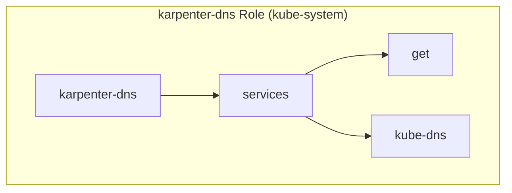
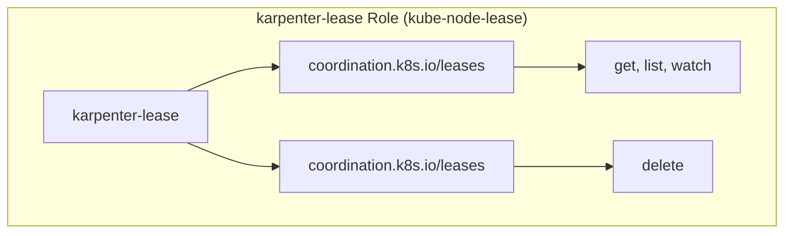
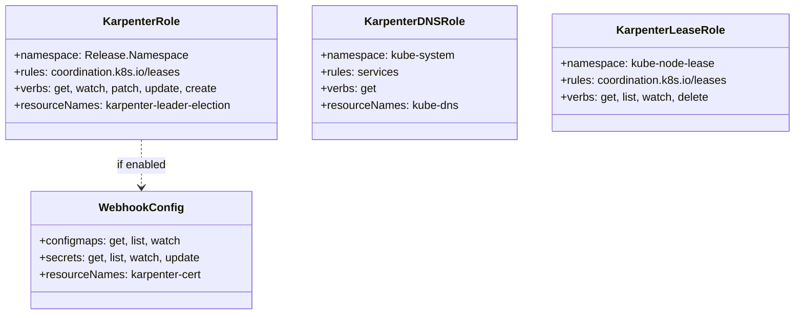
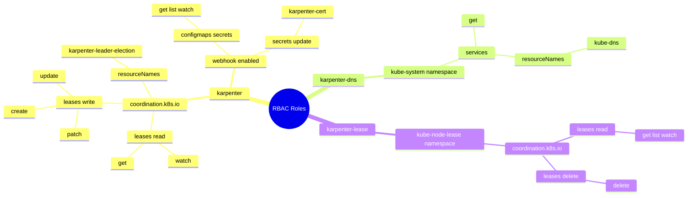

# Diagram: devops/k8s/karpenter/helm/templates/role.yaml


> Auto-generated by Obscura crawlers

## Diagram 1

```mermaid
graph TD
    subgraph "karpenter Role (Release Namespace)"
        R1[karpenter]
        R1 --> L1[coordination.k8s.io/leases]
        L1 --> V1[get, watch]
        R1 --> L2[coordination.k8s.io/leases]
        L2 --> V2[patch, update]
        L2 --> RN1[karpenter-leader-election]
        R1 --> L3[coordination.k8s.io/leases]
        L3 --> V3[create]
        R1 -.webhook.enabled.-> CM[configmaps, secrets]
        CM --> V4[get, list, watch]
        R1 -.webhook.enabled.-> S[secrets]
        S --> V5[update]
        S --> RN2[karpenter-cert]
    end
```

> SVG rendering failed for this diagram.

## Diagram 2



### SVG

<svg id="container" width="650.96875" xmlns="http://www.w3.org/2000/svg" class="flowchart" height="244" viewBox="0 0 650.96875 244" role="graphics-document document" aria-roledescription="flowchart-v2"><style>#container{font-family:"trebuchet ms",verdana,arial,sans-serif;font-size:16px;fill:#333;}@keyframes edge-animation-frame{from{stroke-dashoffset:0;}}@keyframes dash{to{stroke-dashoffset:0;}}#container .edge-animation-slow{stroke-dasharray:9,5!important;stroke-dashoffset:900;animation:dash 50s linear infinite;stroke-linecap:round;}#container .edge-animation-fast{stroke-dasharray:9,5!important;stroke-dashoffset:900;animation:dash 20s linear infinite;stroke-linecap:round;}#container .error-icon{fill:#552222;}#container .error-text{fill:#552222;stroke:#552222;}#container .edge-thickness-normal{stroke-width:1px;}#container .edge-thickness-thick{stroke-width:3.5px;}#container .edge-pattern-solid{stroke-dasharray:0;}#container .edge-thickness-invisible{stroke-width:0;fill:none;}#container .edge-pattern-dashed{stroke-dasharray:3;}#container .edge-pattern-dotted{stroke-dasharray:2;}#container .marker{fill:#333333;stroke:#333333;}#container .marker.cross{stroke:#333333;}#container svg{font-family:"trebuchet ms",verdana,arial,sans-serif;font-size:16px;}#container p{margin:0;}#container .label{font-family:"trebuchet ms",verdana,arial,sans-serif;color:#333;}#container .cluster-label text{fill:#333;}#container .cluster-label span{color:#333;}#container .cluster-label span p{background-color:transparent;}#container .label text,#container span{fill:#333;color:#333;}#container .node rect,#container .node circle,#container .node ellipse,#container .node polygon,#container .node path{fill:#ECECFF;stroke:#9370DB;stroke-width:1px;}#container .rough-node .label text,#container .node .label text,#container .image-shape .label,#container .icon-shape .label{text-anchor:middle;}#container .node .katex path{fill:#000;stroke:#000;stroke-width:1px;}#container .rough-node .label,#container .node .label,#container .image-shape .label,#container .icon-shape .label{text-align:center;}#container .node.clickable{cursor:pointer;}#container .root .anchor path{fill:#333333!important;stroke-width:0;stroke:#333333;}#container .arrowheadPath{fill:#333333;}#container .edgePath .path{stroke:#333333;stroke-width:2.0px;}#container .flowchart-link{stroke:#333333;fill:none;}#container .edgeLabel{background-color:rgba(232,232,232, 0.8);text-align:center;}#container .edgeLabel p{background-color:rgba(232,232,232, 0.8);}#container .edgeLabel rect{opacity:0.5;background-color:rgba(232,232,232, 0.8);fill:rgba(232,232,232, 0.8);}#container .labelBkg{background-color:rgba(232, 232, 232, 0.5);}#container .cluster rect{fill:#ffffde;stroke:#aaaa33;stroke-width:1px;}#container .cluster text{fill:#333;}#container .cluster span{color:#333;}#container div.mermaidTooltip{position:absolute;text-align:center;max-width:200px;padding:2px;font-family:"trebuchet ms",verdana,arial,sans-serif;font-size:12px;background:hsl(80, 100%, 96.2745098039%);border:1px solid #aaaa33;border-radius:2px;pointer-events:none;z-index:100;}#container .flowchartTitleText{text-anchor:middle;font-size:18px;fill:#333;}#container rect.text{fill:none;stroke-width:0;}#container .icon-shape,#container .image-shape{background-color:rgba(232,232,232, 0.8);text-align:center;}#container .icon-shape p,#container .image-shape p{background-color:rgba(232,232,232, 0.8);padding:2px;}#container .icon-shape rect,#container .image-shape rect{opacity:0.5;background-color:rgba(232,232,232, 0.8);fill:rgba(232,232,232, 0.8);}#container .label-icon{display:inline-block;height:1em;overflow:visible;vertical-align:-0.125em;}#container .node .label-icon path{fill:currentColor;stroke:revert;stroke-width:revert;}#container :root{--mermaid-font-family:"trebuchet ms",verdana,arial,sans-serif;}</style><g><marker id="container_flowchart-v2-pointEnd" class="marker flowchart-v2" viewBox="0 0 10 10" refX="5" refY="5" markerUnits="userSpaceOnUse" markerWidth="8" markerHeight="8" orient="auto"><path d="M 0 0 L 10 5 L 0 10 z" class="arrowMarkerPath" style="stroke-width: 1; stroke-dasharray: 1, 0;"></path></marker><marker id="container_flowchart-v2-pointStart" class="marker flowchart-v2" viewBox="0 0 10 10" refX="4.5" refY="5" markerUnits="userSpaceOnUse" markerWidth="8" markerHeight="8" orient="auto"><path d="M 0 5 L 10 10 L 10 0 z" class="arrowMarkerPath" style="stroke-width: 1; stroke-dasharray: 1, 0;"></path></marker><marker id="container_flowchart-v2-circleEnd" class="marker flowchart-v2" viewBox="0 0 10 10" refX="11" refY="5" markerUnits="userSpaceOnUse" markerWidth="11" markerHeight="11" orient="auto"><circle cx="5" cy="5" r="5" class="arrowMarkerPath" style="stroke-width: 1; stroke-dasharray: 1, 0;"></circle></marker><marker id="container_flowchart-v2-circleStart" class="marker flowchart-v2" viewBox="0 0 10 10" refX="-1" refY="5" markerUnits="userSpaceOnUse" markerWidth="11" markerHeight="11" orient="auto"><circle cx="5" cy="5" r="5" class="arrowMarkerPath" style="stroke-width: 1; stroke-dasharray: 1, 0;"></circle></marker><marker id="container_flowchart-v2-crossEnd" class="marker cross flowchart-v2" viewBox="0 0 11 11" refX="12" refY="5.2" markerUnits="userSpaceOnUse" markerWidth="11" markerHeight="11" orient="auto"><path d="M 1,1 l 9,9 M 10,1 l -9,9" class="arrowMarkerPath" style="stroke-width: 2; stroke-dasharray: 1, 0;"></path></marker><marker id="container_flowchart-v2-crossStart" class="marker cross flowchart-v2" viewBox="0 0 11 11" refX="-1" refY="5.2" markerUnits="userSpaceOnUse" markerWidth="11" markerHeight="11" orient="auto"><path d="M 1,1 l 9,9 M 10,1 l -9,9" class="arrowMarkerPath" style="stroke-width: 2; stroke-dasharray: 1, 0;"></path></marker><g class="root"><g class="clusters"></g><g class="edgePaths"></g><g class="edgeLabels"></g><g class="nodes"><g class="root" transform="translate(0, 0)"><g class="clusters"><g class="cluster" id="subGraph0" data-look="classic"><rect style="" x="8" y="8" width="634.96875" height="228"></rect><g class="cluster-label" transform="translate(225.484375, 8)"><foreignObject width="200" height="48"><div xmlns="http://www.w3.org/1999/xhtml" style="display: table; white-space: break-spaces; line-height: 1.5; max-width: 200px; text-align: center; width: 200px;"><span class="nodeLabel"><p>karpenter-dns Role (kube-system)</p></span></div></foreignObject></g></g></g><g class="edgePaths"><path d="M208.703,122L214.953,122C221.203,122,233.703,122,245.536,122C257.37,122,268.536,122,274.12,122L279.703,122" id="L_R2_SVC_0" class="edge-thickness-normal edge-pattern-solid edge-thickness-normal edge-pattern-solid flowchart-link" style=";" data-edge="true" data-et="edge" data-id="L_R2_SVC_0" data-points="W3sieCI6MjA4LjcwMzEyNSwieSI6MTIyfSx7IngiOjI0Ni4yMDMxMjUsInkiOjEyMn0seyJ4IjoyODMuNzAzMTI1LCJ5IjoxMjJ9XQ==" marker-end="url(#container_flowchart-v2-pointEnd)"></path><path d="M393.023,95L400.766,90.833C408.51,86.667,423.997,78.333,441.151,74.167C458.305,70,477.125,70,486.535,70L495.945,70" id="L_SVC_V6_0" class="edge-thickness-normal edge-pattern-solid edge-thickness-normal edge-pattern-solid flowchart-link" style=";" data-edge="true" data-et="edge" data-id="L_SVC_V6_0" data-points="W3sieCI6MzkzLjAyMjUzNjA1NzY5MjMsInkiOjk1fSx7IngiOjQzOS40ODQzNzUsInkiOjcwfSx7IngiOjQ5OS45NDUzMTI1LCJ5Ijo3MH1d" marker-end="url(#container_flowchart-v2-pointEnd)"></path><path d="M393.023,149L400.766,153.167C408.51,157.333,423.997,165.667,437.324,169.833C450.651,174,461.818,174,467.401,174L472.984,174" id="L_SVC_RN3_0" class="edge-thickness-normal edge-pattern-solid edge-thickness-normal edge-pattern-solid flowchart-link" style=";" data-edge="true" data-et="edge" data-id="L_SVC_RN3_0" data-points="W3sieCI6MzkzLjAyMjUzNjA1NzY5MjMsInkiOjE0OX0seyJ4Ijo0MzkuNDg0Mzc1LCJ5IjoxNzR9LHsieCI6NDc2Ljk4NDM3NSwieSI6MTc0fV0=" marker-end="url(#container_flowchart-v2-pointEnd)"></path></g><g class="edgeLabels"><g class="edgeLabel"><g class="label" data-id="L_R2_SVC_0" transform="translate(0, 0)"><foreignObject width="0" height="0"><div xmlns="http://www.w3.org/1999/xhtml" class="labelBkg" style="display: table-cell; white-space: nowrap; line-height: 1.5; max-width: 200px; text-align: center;"><span class="edgeLabel"></span></div></foreignObject></g></g><g class="edgeLabel"><g class="label" data-id="L_SVC_V6_0" transform="translate(0, 0)"><foreignObject width="0" height="0"><div xmlns="http://www.w3.org/1999/xhtml" class="labelBkg" style="display: table-cell; white-space: nowrap; line-height: 1.5; max-width: 200px; text-align: center;"><span class="edgeLabel"></span></div></foreignObject></g></g><g class="edgeLabel"><g class="label" data-id="L_SVC_RN3_0" transform="translate(0, 0)"><foreignObject width="0" height="0"><div xmlns="http://www.w3.org/1999/xhtml" class="labelBkg" style="display: table-cell; white-space: nowrap; line-height: 1.5; max-width: 200px; text-align: center;"><span class="edgeLabel"></span></div></foreignObject></g></g></g><g class="nodes"><g class="node default" id="flowchart-R2-0" transform="translate(127.1015625, 122)"><rect class="basic label-container" style="" x="-81.6015625" y="-27" width="163.203125" height="54"></rect><g class="label" style="" transform="translate(-51.6015625, -12)"><rect></rect><foreignObject width="103.203125" height="24"><div xmlns="http://www.w3.org/1999/xhtml" style="display: table-cell; white-space: nowrap; line-height: 1.5; max-width: 200px; text-align: center;"><span class="nodeLabel"><p>karpenter-dns</p></span></div></foreignObject></g></g><g class="node default" id="flowchart-SVC-2" transform="translate(342.84375, 122)"><rect class="basic label-container" style="" x="-59.140625" y="-27" width="118.28125" height="54"></rect><g class="label" style="" transform="translate(-29.140625, -12)"><rect></rect><foreignObject width="58.28125" height="24"><div xmlns="http://www.w3.org/1999/xhtml" style="display: table-cell; white-space: nowrap; line-height: 1.5; max-width: 200px; text-align: center;"><span class="nodeLabel"><p>services</p></span></div></foreignObject></g></g><g class="node default" id="flowchart-V6-4" transform="translate(541.2265625, 70)"><rect class="basic label-container" style="" x="-41.28125" y="-27" width="82.5625" height="54"></rect><g class="label" style="" transform="translate(-11.28125, -12)"><rect></rect><foreignObject width="22.5625" height="24"><div xmlns="http://www.w3.org/1999/xhtml" style="display: table-cell; white-space: nowrap; line-height: 1.5; max-width: 200px; text-align: center;"><span class="nodeLabel"><p>get</p></span></div></foreignObject></g></g><g class="node default" id="flowchart-RN3-6" transform="translate(541.2265625, 174)"><rect class="basic label-container" style="" x="-64.2421875" y="-27" width="128.484375" height="54"></rect><g class="label" style="" transform="translate(-34.2421875, -12)"><rect></rect><foreignObject width="68.484375" height="24"><div xmlns="http://www.w3.org/1999/xhtml" style="display: table-cell; white-space: nowrap; line-height: 1.5; max-width: 200px; text-align: center;"><span class="nodeLabel"><p>kube-dns</p></span></div></foreignObject></g></g></g></g></g></g></g></svg>

## Diagram 3



### SVG

<svg id="container" width="832.140625" xmlns="http://www.w3.org/2000/svg" class="flowchart" height="244" viewBox="0 0 832.140625 244" role="graphics-document document" aria-roledescription="flowchart-v2"><style>#container{font-family:"trebuchet ms",verdana,arial,sans-serif;font-size:16px;fill:#333;}@keyframes edge-animation-frame{from{stroke-dashoffset:0;}}@keyframes dash{to{stroke-dashoffset:0;}}#container .edge-animation-slow{stroke-dasharray:9,5!important;stroke-dashoffset:900;animation:dash 50s linear infinite;stroke-linecap:round;}#container .edge-animation-fast{stroke-dasharray:9,5!important;stroke-dashoffset:900;animation:dash 20s linear infinite;stroke-linecap:round;}#container .error-icon{fill:#552222;}#container .error-text{fill:#552222;stroke:#552222;}#container .edge-thickness-normal{stroke-width:1px;}#container .edge-thickness-thick{stroke-width:3.5px;}#container .edge-pattern-solid{stroke-dasharray:0;}#container .edge-thickness-invisible{stroke-width:0;fill:none;}#container .edge-pattern-dashed{stroke-dasharray:3;}#container .edge-pattern-dotted{stroke-dasharray:2;}#container .marker{fill:#333333;stroke:#333333;}#container .marker.cross{stroke:#333333;}#container svg{font-family:"trebuchet ms",verdana,arial,sans-serif;font-size:16px;}#container p{margin:0;}#container .label{font-family:"trebuchet ms",verdana,arial,sans-serif;color:#333;}#container .cluster-label text{fill:#333;}#container .cluster-label span{color:#333;}#container .cluster-label span p{background-color:transparent;}#container .label text,#container span{fill:#333;color:#333;}#container .node rect,#container .node circle,#container .node ellipse,#container .node polygon,#container .node path{fill:#ECECFF;stroke:#9370DB;stroke-width:1px;}#container .rough-node .label text,#container .node .label text,#container .image-shape .label,#container .icon-shape .label{text-anchor:middle;}#container .node .katex path{fill:#000;stroke:#000;stroke-width:1px;}#container .rough-node .label,#container .node .label,#container .image-shape .label,#container .icon-shape .label{text-align:center;}#container .node.clickable{cursor:pointer;}#container .root .anchor path{fill:#333333!important;stroke-width:0;stroke:#333333;}#container .arrowheadPath{fill:#333333;}#container .edgePath .path{stroke:#333333;stroke-width:2.0px;}#container .flowchart-link{stroke:#333333;fill:none;}#container .edgeLabel{background-color:rgba(232,232,232, 0.8);text-align:center;}#container .edgeLabel p{background-color:rgba(232,232,232, 0.8);}#container .edgeLabel rect{opacity:0.5;background-color:rgba(232,232,232, 0.8);fill:rgba(232,232,232, 0.8);}#container .labelBkg{background-color:rgba(232, 232, 232, 0.5);}#container .cluster rect{fill:#ffffde;stroke:#aaaa33;stroke-width:1px;}#container .cluster text{fill:#333;}#container .cluster span{color:#333;}#container div.mermaidTooltip{position:absolute;text-align:center;max-width:200px;padding:2px;font-family:"trebuchet ms",verdana,arial,sans-serif;font-size:12px;background:hsl(80, 100%, 96.2745098039%);border:1px solid #aaaa33;border-radius:2px;pointer-events:none;z-index:100;}#container .flowchartTitleText{text-anchor:middle;font-size:18px;fill:#333;}#container rect.text{fill:none;stroke-width:0;}#container .icon-shape,#container .image-shape{background-color:rgba(232,232,232, 0.8);text-align:center;}#container .icon-shape p,#container .image-shape p{background-color:rgba(232,232,232, 0.8);padding:2px;}#container .icon-shape rect,#container .image-shape rect{opacity:0.5;background-color:rgba(232,232,232, 0.8);fill:rgba(232,232,232, 0.8);}#container .label-icon{display:inline-block;height:1em;overflow:visible;vertical-align:-0.125em;}#container .node .label-icon path{fill:currentColor;stroke:revert;stroke-width:revert;}#container :root{--mermaid-font-family:"trebuchet ms",verdana,arial,sans-serif;}</style><g><marker id="container_flowchart-v2-pointEnd" class="marker flowchart-v2" viewBox="0 0 10 10" refX="5" refY="5" markerUnits="userSpaceOnUse" markerWidth="8" markerHeight="8" orient="auto"><path d="M 0 0 L 10 5 L 0 10 z" class="arrowMarkerPath" style="stroke-width: 1; stroke-dasharray: 1, 0;"></path></marker><marker id="container_flowchart-v2-pointStart" class="marker flowchart-v2" viewBox="0 0 10 10" refX="4.5" refY="5" markerUnits="userSpaceOnUse" markerWidth="8" markerHeight="8" orient="auto"><path d="M 0 5 L 10 10 L 10 0 z" class="arrowMarkerPath" style="stroke-width: 1; stroke-dasharray: 1, 0;"></path></marker><marker id="container_flowchart-v2-circleEnd" class="marker flowchart-v2" viewBox="0 0 10 10" refX="11" refY="5" markerUnits="userSpaceOnUse" markerWidth="11" markerHeight="11" orient="auto"><circle cx="5" cy="5" r="5" class="arrowMarkerPath" style="stroke-width: 1; stroke-dasharray: 1, 0;"></circle></marker><marker id="container_flowchart-v2-circleStart" class="marker flowchart-v2" viewBox="0 0 10 10" refX="-1" refY="5" markerUnits="userSpaceOnUse" markerWidth="11" markerHeight="11" orient="auto"><circle cx="5" cy="5" r="5" class="arrowMarkerPath" style="stroke-width: 1; stroke-dasharray: 1, 0;"></circle></marker><marker id="container_flowchart-v2-crossEnd" class="marker cross flowchart-v2" viewBox="0 0 11 11" refX="12" refY="5.2" markerUnits="userSpaceOnUse" markerWidth="11" markerHeight="11" orient="auto"><path d="M 1,1 l 9,9 M 10,1 l -9,9" class="arrowMarkerPath" style="stroke-width: 2; stroke-dasharray: 1, 0;"></path></marker><marker id="container_flowchart-v2-crossStart" class="marker cross flowchart-v2" viewBox="0 0 11 11" refX="-1" refY="5.2" markerUnits="userSpaceOnUse" markerWidth="11" markerHeight="11" orient="auto"><path d="M 1,1 l 9,9 M 10,1 l -9,9" class="arrowMarkerPath" style="stroke-width: 2; stroke-dasharray: 1, 0;"></path></marker><g class="root"><g class="clusters"></g><g class="edgePaths"></g><g class="edgeLabels"></g><g class="nodes"><g class="root" transform="translate(0, 0)"><g class="clusters"><g class="cluster" id="subGraph0" data-look="classic"><rect style="" x="8" y="8" width="816.140625" height="228"></rect><g class="cluster-label" transform="translate(316.0703125, 8)"><foreignObject width="200" height="48"><div xmlns="http://www.w3.org/1999/xhtml" style="display: table; white-space: break-spaces; line-height: 1.5; max-width: 200px; text-align: center; width: 200px;"><span class="nodeLabel"><p>karpenter-lease Role (kube-node-lease)</p></span></div></foreignObject></g></g></g><g class="edgePaths"><path d="M197.678,95L207.682,90.833C217.687,86.667,237.695,78.333,253.282,74.167C268.87,70,280.036,70,285.62,70L291.203,70" id="L_R3_L4_0" class="edge-thickness-normal edge-pattern-solid edge-thickness-normal edge-pattern-solid flowchart-link" style=";" data-edge="true" data-et="edge" data-id="L_R3_L4_0" data-points="W3sieCI6MTk3LjY3ODMzNTMzNjUzODQ1LCJ5Ijo5NX0seyJ4IjoyNTcuNzAzMTI1LCJ5Ijo3MH0seyJ4IjoyOTUuMjAzMTI1LCJ5Ijo3MH1d" marker-end="url(#container_flowchart-v2-pointEnd)"></path><path d="M547.797,70L554.047,70C560.297,70,572.797,70,584.63,70C596.464,70,607.63,70,613.214,70L618.797,70" id="L_L4_V7_0" class="edge-thickness-normal edge-pattern-solid edge-thickness-normal edge-pattern-solid flowchart-link" style=";" data-edge="true" data-et="edge" data-id="L_L4_V7_0" data-points="W3sieCI6NTQ3Ljc5Njg3NSwieSI6NzB9LHsieCI6NTg1LjI5Njg3NSwieSI6NzB9LHsieCI6NjIyLjc5Njg3NSwieSI6NzB9XQ==" marker-end="url(#container_flowchart-v2-pointEnd)"></path><path d="M197.678,149L207.682,153.167C217.687,157.333,237.695,165.667,253.282,169.833C268.87,174,280.036,174,285.62,174L291.203,174" id="L_R3_L5_0" class="edge-thickness-normal edge-pattern-solid edge-thickness-normal edge-pattern-solid flowchart-link" style=";" data-edge="true" data-et="edge" data-id="L_R3_L5_0" data-points="W3sieCI6MTk3LjY3ODMzNTMzNjUzODQ1LCJ5IjoxNDl9LHsieCI6MjU3LjcwMzEyNSwieSI6MTc0fSx7IngiOjI5NS4yMDMxMjUsInkiOjE3NH1d" marker-end="url(#container_flowchart-v2-pointEnd)"></path><path d="M547.797,174L554.047,174C560.297,174,572.797,174,589.461,174C606.125,174,626.953,174,637.367,174L647.781,174" id="L_L5_V8_0" class="edge-thickness-normal edge-pattern-solid edge-thickness-normal edge-pattern-solid flowchart-link" style=";" data-edge="true" data-et="edge" data-id="L_L5_V8_0" data-points="W3sieCI6NTQ3Ljc5Njg3NSwieSI6MTc0fSx7IngiOjU4NS4yOTY4NzUsInkiOjE3NH0seyJ4Ijo2NTEuNzgxMjUsInkiOjE3NH1d" marker-end="url(#container_flowchart-v2-pointEnd)"></path></g><g class="edgeLabels"><g class="edgeLabel"><g class="label" data-id="L_R3_L4_0" transform="translate(0, 0)"><foreignObject width="0" height="0"><div xmlns="http://www.w3.org/1999/xhtml" class="labelBkg" style="display: table-cell; white-space: nowrap; line-height: 1.5; max-width: 200px; text-align: center;"><span class="edgeLabel"></span></div></foreignObject></g></g><g class="edgeLabel"><g class="label" data-id="L_L4_V7_0" transform="translate(0, 0)"><foreignObject width="0" height="0"><div xmlns="http://www.w3.org/1999/xhtml" class="labelBkg" style="display: table-cell; white-space: nowrap; line-height: 1.5; max-width: 200px; text-align: center;"><span class="edgeLabel"></span></div></foreignObject></g></g><g class="edgeLabel"><g class="label" data-id="L_R3_L5_0" transform="translate(0, 0)"><foreignObject width="0" height="0"><div xmlns="http://www.w3.org/1999/xhtml" class="labelBkg" style="display: table-cell; white-space: nowrap; line-height: 1.5; max-width: 200px; text-align: center;"><span class="edgeLabel"></span></div></foreignObject></g></g><g class="edgeLabel"><g class="label" data-id="L_L5_V8_0" transform="translate(0, 0)"><foreignObject width="0" height="0"><div xmlns="http://www.w3.org/1999/xhtml" class="labelBkg" style="display: table-cell; white-space: nowrap; line-height: 1.5; max-width: 200px; text-align: center;"><span class="edgeLabel"></span></div></foreignObject></g></g></g><g class="nodes"><g class="node default" id="flowchart-R3-0" transform="translate(132.8515625, 122)"><rect class="basic label-container" style="" x="-87.3515625" y="-27" width="174.703125" height="54"></rect><g class="label" style="" transform="translate(-57.3515625, -12)"><rect></rect><foreignObject width="114.703125" height="24"><div xmlns="http://www.w3.org/1999/xhtml" style="display: table-cell; white-space: nowrap; line-height: 1.5; max-width: 200px; text-align: center;"><span class="nodeLabel"><p>karpenter-lease</p></span></div></foreignObject></g></g><g class="node default" id="flowchart-L4-2" transform="translate(421.5, 70)"><rect class="basic label-container" style="" x="-126.296875" y="-27" width="252.59375" height="54"></rect><g class="label" style="" transform="translate(-96.296875, -12)"><rect></rect><foreignObject width="192.59375" height="24"><div xmlns="http://www.w3.org/1999/xhtml" style="display: table-cell; white-space: nowrap; line-height: 1.5; max-width: 200px; text-align: center;"><span class="nodeLabel"><p>coordination.k8s.io/leases</p></span></div></foreignObject></g></g><g class="node default" id="flowchart-V7-4" transform="translate(704.71875, 70)"><rect class="basic label-container" style="" x="-81.921875" y="-27" width="163.84375" height="54"></rect><g class="label" style="" transform="translate(-51.921875, -12)"><rect></rect><foreignObject width="103.84375" height="24"><div xmlns="http://www.w3.org/1999/xhtml" style="display: table-cell; white-space: nowrap; line-height: 1.5; max-width: 200px; text-align: center;"><span class="nodeLabel"><p>get, list, watch</p></span></div></foreignObject></g></g><g class="node default" id="flowchart-L5-6" transform="translate(421.5, 174)"><rect class="basic label-container" style="" x="-126.296875" y="-27" width="252.59375" height="54"></rect><g class="label" style="" transform="translate(-96.296875, -12)"><rect></rect><foreignObject width="192.59375" height="24"><div xmlns="http://www.w3.org/1999/xhtml" style="display: table-cell; white-space: nowrap; line-height: 1.5; max-width: 200px; text-align: center;"><span class="nodeLabel"><p>coordination.k8s.io/leases</p></span></div></foreignObject></g></g><g class="node default" id="flowchart-V8-8" transform="translate(704.71875, 174)"><rect class="basic label-container" style="" x="-52.9375" y="-27" width="105.875" height="54"></rect><g class="label" style="" transform="translate(-22.9375, -12)"><rect></rect><foreignObject width="45.875" height="24"><div xmlns="http://www.w3.org/1999/xhtml" style="display: table-cell; white-space: nowrap; line-height: 1.5; max-width: 200px; text-align: center;"><span class="nodeLabel"><p>delete</p></span></div></foreignObject></g></g></g></g></g></g></g></svg>

## Diagram 4



### SVG

<svg id="container" width="1140.4921875" xmlns="http://www.w3.org/2000/svg" class="classDiagram" height="450" viewBox="0 0 1140.4921875 450" role="graphics-document document" aria-roledescription="class"><style>#container{font-family:"trebuchet ms",verdana,arial,sans-serif;font-size:16px;fill:#333;}@keyframes edge-animation-frame{from{stroke-dashoffset:0;}}@keyframes dash{to{stroke-dashoffset:0;}}#container .edge-animation-slow{stroke-dasharray:9,5!important;stroke-dashoffset:900;animation:dash 50s linear infinite;stroke-linecap:round;}#container .edge-animation-fast{stroke-dasharray:9,5!important;stroke-dashoffset:900;animation:dash 20s linear infinite;stroke-linecap:round;}#container .error-icon{fill:#552222;}#container .error-text{fill:#552222;stroke:#552222;}#container .edge-thickness-normal{stroke-width:1px;}#container .edge-thickness-thick{stroke-width:3.5px;}#container .edge-pattern-solid{stroke-dasharray:0;}#container .edge-thickness-invisible{stroke-width:0;fill:none;}#container .edge-pattern-dashed{stroke-dasharray:3;}#container .edge-pattern-dotted{stroke-dasharray:2;}#container .marker{fill:#333333;stroke:#333333;}#container .marker.cross{stroke:#333333;}#container svg{font-family:"trebuchet ms",verdana,arial,sans-serif;font-size:16px;}#container p{margin:0;}#container g.classGroup text{fill:#9370DB;stroke:none;font-family:"trebuchet ms",verdana,arial,sans-serif;font-size:10px;}#container g.classGroup text .title{font-weight:bolder;}#container .nodeLabel,#container .edgeLabel{color:#131300;}#container .edgeLabel .label rect{fill:#ECECFF;}#container .label text{fill:#131300;}#container .labelBkg{background:#ECECFF;}#container .edgeLabel .label span{background:#ECECFF;}#container .classTitle{font-weight:bolder;}#container .node rect,#container .node circle,#container .node ellipse,#container .node polygon,#container .node path{fill:#ECECFF;stroke:#9370DB;stroke-width:1px;}#container .divider{stroke:#9370DB;stroke-width:1;}#container g.clickable{cursor:pointer;}#container g.classGroup rect{fill:#ECECFF;stroke:#9370DB;}#container g.classGroup line{stroke:#9370DB;stroke-width:1;}#container .classLabel .box{stroke:none;stroke-width:0;fill:#ECECFF;opacity:0.5;}#container .classLabel .label{fill:#9370DB;font-size:10px;}#container .relation{stroke:#333333;stroke-width:1;fill:none;}#container .dashed-line{stroke-dasharray:3;}#container .dotted-line{stroke-dasharray:1 2;}#container #compositionStart,#container .composition{fill:#333333!important;stroke:#333333!important;stroke-width:1;}#container #compositionEnd,#container .composition{fill:#333333!important;stroke:#333333!important;stroke-width:1;}#container #dependencyStart,#container .dependency{fill:#333333!important;stroke:#333333!important;stroke-width:1;}#container #dependencyStart,#container .dependency{fill:#333333!important;stroke:#333333!important;stroke-width:1;}#container #extensionStart,#container .extension{fill:transparent!important;stroke:#333333!important;stroke-width:1;}#container #extensionEnd,#container .extension{fill:transparent!important;stroke:#333333!important;stroke-width:1;}#container #aggregationStart,#container .aggregation{fill:transparent!important;stroke:#333333!important;stroke-width:1;}#container #aggregationEnd,#container .aggregation{fill:transparent!important;stroke:#333333!important;stroke-width:1;}#container #lollipopStart,#container .lollipop{fill:#ECECFF!important;stroke:#333333!important;stroke-width:1;}#container #lollipopEnd,#container .lollipop{fill:#ECECFF!important;stroke:#333333!important;stroke-width:1;}#container .edgeTerminals{font-size:11px;line-height:initial;}#container .classTitleText{text-anchor:middle;font-size:18px;fill:#333;}#container .label-icon{display:inline-block;height:1em;overflow:visible;vertical-align:-0.125em;}#container .node .label-icon path{fill:currentColor;stroke:revert;stroke-width:revert;}#container :root{--mermaid-font-family:"trebuchet ms",verdana,arial,sans-serif;}</style><g><defs><marker id="container_class-aggregationStart" class="marker aggregation class" refX="18" refY="7" markerWidth="190" markerHeight="240" orient="auto"><path d="M 18,7 L9,13 L1,7 L9,1 Z"></path></marker></defs><defs><marker id="container_class-aggregationEnd" class="marker aggregation class" refX="1" refY="7" markerWidth="20" markerHeight="28" orient="auto"><path d="M 18,7 L9,13 L1,7 L9,1 Z"></path></marker></defs><defs><marker id="container_class-extensionStart" class="marker extension class" refX="18" refY="7" markerWidth="190" markerHeight="240" orient="auto"><path d="M 1,7 L18,13 V 1 Z"></path></marker></defs><defs><marker id="container_class-extensionEnd" class="marker extension class" refX="1" refY="7" markerWidth="20" markerHeight="28" orient="auto"><path d="M 1,1 V 13 L18,7 Z"></path></marker></defs><defs><marker id="container_class-compositionStart" class="marker composition class" refX="18" refY="7" markerWidth="190" markerHeight="240" orient="auto"><path d="M 18,7 L9,13 L1,7 L9,1 Z"></path></marker></defs><defs><marker id="container_class-compositionEnd" class="marker composition class" refX="1" refY="7" markerWidth="20" markerHeight="28" orient="auto"><path d="M 18,7 L9,13 L1,7 L9,1 Z"></path></marker></defs><defs><marker id="container_class-dependencyStart" class="marker dependency class" refX="6" refY="7" markerWidth="190" markerHeight="240" orient="auto"><path d="M 5,7 L9,13 L1,7 L9,1 Z"></path></marker></defs><defs><marker id="container_class-dependencyEnd" class="marker dependency class" refX="13" refY="7" markerWidth="20" markerHeight="28" orient="auto"><path d="M 18,7 L9,13 L14,7 L9,1 Z"></path></marker></defs><defs><marker id="container_class-lollipopStart" class="marker lollipop class" refX="13" refY="7" markerWidth="190" markerHeight="240" orient="auto"><circle stroke="black" fill="transparent" cx="7" cy="7" r="6"></circle></marker></defs><defs><marker id="container_class-lollipopEnd" class="marker lollipop class" refX="1" refY="7" markerWidth="190" markerHeight="240" orient="auto"><circle stroke="black" fill="transparent" cx="7" cy="7" r="6"></circle></marker></defs><g class="root"><g class="clusters"></g><g class="edgePaths"><path d="M204.422,200L204.422,206.167C204.422,212.333,204.422,224.667,204.422,236C204.422,247.333,204.422,257.667,204.422,262.833L204.422,268" id="id_KarpenterRole_WebhookConfig_1" class="edge-thickness-normal edge-pattern-dashed relation" style=";;;" data-edge="true" data-et="edge" data-id="id_KarpenterRole_WebhookConfig_1" data-points="W3sieCI6MjA0LjQyMTg3NSwieSI6MjAwfSx7IngiOjIwNC40MjE4NzUsInkiOjIzN30seyJ4IjoyMDQuNDIxODc1LCJ5IjoyNzR9XQ==" marker-end="url(#container_class-dependencyEnd)"></path></g><g class="edgeLabels"><g class="edgeLabel" transform="translate(204.421875, 237)"><g class="label" data-id="id_KarpenterRole_WebhookConfig_1" transform="translate(-36.65625, -12)"><foreignObject width="73.3125" height="24"><div xmlns="http://www.w3.org/1999/xhtml" class="labelBkg" style="display: table-cell; white-space: nowrap; line-height: 1.5; max-width: 200px; text-align: center;"><span class="edgeLabel"><p>if enabled</p></span></div></foreignObject></g></g></g><g class="nodes"><g class="node default" id="classId-KarpenterRole-0" transform="translate(204.421875, 104)"><g class="basic label-container"><path d="M-196.421875 -96 L196.421875 -96 L196.421875 96 L-196.421875 96" stroke="none" stroke-width="0" fill="#ECECFF" style=""></path><path d="M-196.421875 -96 C-104.47029538920705 -96, -12.518715778414105 -96, 196.421875 -96 M-196.421875 -96 C-73.49996485552211 -96, 49.42194528895578 -96, 196.421875 -96 M196.421875 -96 C196.421875 -52.860775877893815, 196.421875 -9.72155175578763, 196.421875 96 M196.421875 -96 C196.421875 -32.52695508618343, 196.421875 30.946089827633145, 196.421875 96 M196.421875 96 C54.058171690849406 96, -88.30553161830119 96, -196.421875 96 M196.421875 96 C93.19363673938685 96, -10.034601521226307 96, -196.421875 96 M-196.421875 96 C-196.421875 41.6198369943875, -196.421875 -12.760326011225004, -196.421875 -96 M-196.421875 96 C-196.421875 38.01182069646721, -196.421875 -19.976358607065578, -196.421875 -96" stroke="#9370DB" stroke-width="1.3" fill="none" stroke-dasharray="0 0" style=""></path></g><g class="annotation-group text" transform="translate(0, -72)"></g><g class="label-group text" transform="translate(-53.203125, -72)"><g class="label" style="font-weight: bolder" transform="translate(0,-12)"><foreignObject width="106.40625" height="24"><div xmlns="http://www.w3.org/1999/xhtml" style="display: table-cell; white-space: nowrap; line-height: 1.5; max-width: 154px; text-align: center;"><span class="nodeLabel markdown-node-label" style=""><p>KarpenterRole</p></span></div></foreignObject></g></g><g class="members-group text" transform="translate(-184.421875, -24)"><g class="label" style="" transform="translate(0,-12)"><foreignObject width="241.53125" height="24"><div xmlns="http://www.w3.org/1999/xhtml" style="display: table-cell; white-space: nowrap; line-height: 1.5; max-width: 299px; text-align: center;"><span class="nodeLabel markdown-node-label" style=""><p>+namespace: Release.Namespace</p></span></div></foreignObject></g><g class="label" style="" transform="translate(0,12)"><foreignObject width="244.953125" height="24"><div xmlns="http://www.w3.org/1999/xhtml" style="display: table-cell; white-space: nowrap; line-height: 1.5; max-width: 302px; text-align: center;"><span class="nodeLabel markdown-node-label" style=""><p>+rules: coordination.k8s.io/leases</p></span></div></foreignObject></g><g class="label" style="" transform="translate(0,36)"><foreignObject width="289.734375" height="24"><div xmlns="http://www.w3.org/1999/xhtml" style="display: table-cell; white-space: nowrap; line-height: 1.5; max-width: 347px; text-align: center;"><span class="nodeLabel markdown-node-label" style=""><p>+verbs: get, watch, patch, update, create</p></span></div></foreignObject></g><g class="label" style="" transform="translate(0,60)"><foreignObject width="315.640625" height="24"><div xmlns="http://www.w3.org/1999/xhtml" style="display: table-cell; white-space: nowrap; line-height: 1.5; max-width: 373px; text-align: center;"><span class="nodeLabel markdown-node-label" style=""><p>+resourceNames: karpenter-leader-election</p></span></div></foreignObject></g></g><g class="methods-group text" transform="translate(-184.421875, 96)"></g><g class="divider" style=""><path d="M-196.421875 -48 C-90.16090716333314 -48, 16.10006067333373 -48, 196.421875 -48 M-196.421875 -48 C-110.86310633372018 -48, -25.304337667440365 -48, 196.421875 -48" stroke="#9370DB" stroke-width="1.3" fill="none" stroke-dasharray="0 0" style=""></path></g><g class="divider" style=""><path d="M-196.421875 72 C-104.36641843457765 72, -12.310961869155307 72, 196.421875 72 M-196.421875 72 C-57.51594364012425 72, 81.3899877197515 72, 196.421875 72" stroke="#9370DB" stroke-width="1.3" fill="none" stroke-dasharray="0 0" style=""></path></g></g><g class="node default" id="classId-KarpenterDNSRole-1" transform="translate(595.17578125, 104)"><g class="basic label-container"><path d="M-144.33203125 -96 L144.33203125 -96 L144.33203125 96 L-144.33203125 96" stroke="none" stroke-width="0" fill="#ECECFF" style=""></path><path d="M-144.33203125 -96 C-78.36723129917888 -96, -12.402431348357766 -96, 144.33203125 -96 M-144.33203125 -96 C-75.76432444344822 -96, -7.196617636896434 -96, 144.33203125 -96 M144.33203125 -96 C144.33203125 -27.89062863748913, 144.33203125 40.21874272502174, 144.33203125 96 M144.33203125 -96 C144.33203125 -44.278023845450434, 144.33203125 7.4439523090991315, 144.33203125 96 M144.33203125 96 C67.47272107750526 96, -9.386589094989489 96, -144.33203125 96 M144.33203125 96 C38.928154382600255 96, -66.47572248479949 96, -144.33203125 96 M-144.33203125 96 C-144.33203125 19.650491873138833, -144.33203125 -56.699016253722334, -144.33203125 -96 M-144.33203125 96 C-144.33203125 22.671953109546408, -144.33203125 -50.656093780907185, -144.33203125 -96" stroke="#9370DB" stroke-width="1.3" fill="none" stroke-dasharray="0 0" style=""></path></g><g class="annotation-group text" transform="translate(0, -72)"></g><g class="label-group text" transform="translate(-68.2890625, -72)"><g class="label" style="font-weight: bolder" transform="translate(0,-12)"><foreignObject width="136.578125" height="24"><div xmlns="http://www.w3.org/1999/xhtml" style="display: table-cell; white-space: nowrap; line-height: 1.5; max-width: 184px; text-align: center;"><span class="nodeLabel markdown-node-label" style=""><p>KarpenterDNSRole</p></span></div></foreignObject></g></g><g class="members-group text" transform="translate(-132.33203125, -24)"><g class="label" style="" transform="translate(0,-12)"><foreignObject width="190.609375" height="24"><div xmlns="http://www.w3.org/1999/xhtml" style="display: table-cell; white-space: nowrap; line-height: 1.5; max-width: 248px; text-align: center;"><span class="nodeLabel markdown-node-label" style=""><p>+namespace: kube-system</p></span></div></foreignObject></g><g class="label" style="" transform="translate(0,12)"><foreignObject width="110.625" height="24"><div xmlns="http://www.w3.org/1999/xhtml" style="display: table-cell; white-space: nowrap; line-height: 1.5; max-width: 168px; text-align: center;"><span class="nodeLabel markdown-node-label" style=""><p>+rules: services</p></span></div></foreignObject></g><g class="label" style="" transform="translate(0,36)"><foreignObject width="78.15625" height="24"><div xmlns="http://www.w3.org/1999/xhtml" style="display: table-cell; white-space: nowrap; line-height: 1.5; max-width: 136px; text-align: center;"><span class="nodeLabel markdown-node-label" style=""><p>+verbs: get</p></span></div></foreignObject></g><g class="label" style="" transform="translate(0,60)"><foreignObject width="196.375" height="24"><div xmlns="http://www.w3.org/1999/xhtml" style="display: table-cell; white-space: nowrap; line-height: 1.5; max-width: 254px; text-align: center;"><span class="nodeLabel markdown-node-label" style=""><p>+resourceNames: kube-dns</p></span></div></foreignObject></g></g><g class="methods-group text" transform="translate(-132.33203125, 96)"></g><g class="divider" style=""><path d="M-144.33203125 -48 C-69.25681853471774 -48, 5.818394180564525 -48, 144.33203125 -48 M-144.33203125 -48 C-71.48776915277746 -48, 1.3564929444450797 -48, 144.33203125 -48" stroke="#9370DB" stroke-width="1.3" fill="none" stroke-dasharray="0 0" style=""></path></g><g class="divider" style=""><path d="M-144.33203125 72 C-50.641328405497575 72, 43.04937443900485 72, 144.33203125 72 M-144.33203125 72 C-80.675324866507 72, -17.01861848301401 72, 144.33203125 72" stroke="#9370DB" stroke-width="1.3" fill="none" stroke-dasharray="0 0" style=""></path></g></g><g class="node default" id="classId-KarpenterLeaseRole-2" transform="translate(961, 104)"><g class="basic label-container"><path d="M-171.4921875 -84 L171.4921875 -84 L171.4921875 84 L-171.4921875 84" stroke="none" stroke-width="0" fill="#ECECFF" style=""></path><path d="M-171.4921875 -84 C-88.55598052528431 -84, -5.619773550568624 -84, 171.4921875 -84 M-171.4921875 -84 C-38.85712684779699 -84, 93.77793380440602 -84, 171.4921875 -84 M171.4921875 -84 C171.4921875 -30.80723957502861, 171.4921875 22.38552084994278, 171.4921875 84 M171.4921875 -84 C171.4921875 -27.821184946745788, 171.4921875 28.357630106508424, 171.4921875 84 M171.4921875 84 C90.11124530194621 84, 8.730303103892425 84, -171.4921875 84 M171.4921875 84 C89.64838780128711 84, 7.804588102574229 84, -171.4921875 84 M-171.4921875 84 C-171.4921875 22.723432735702005, -171.4921875 -38.55313452859599, -171.4921875 -84 M-171.4921875 84 C-171.4921875 41.6360224712618, -171.4921875 -0.7279550574763931, -171.4921875 -84" stroke="#9370DB" stroke-width="1.3" fill="none" stroke-dasharray="0 0" style=""></path></g><g class="annotation-group text" transform="translate(0, -60)"></g><g class="label-group text" transform="translate(-74.03125, -60)"><g class="label" style="font-weight: bolder" transform="translate(0,-12)"><foreignObject width="148.0625" height="24"><div xmlns="http://www.w3.org/1999/xhtml" style="display: table-cell; white-space: nowrap; line-height: 1.5; max-width: 195px; text-align: center;"><span class="nodeLabel markdown-node-label" style=""><p>KarpenterLeaseRole</p></span></div></foreignObject></g></g><g class="members-group text" transform="translate(-159.4921875, -12)"><g class="label" style="" transform="translate(0,-12)"><foreignObject width="221.578125" height="24"><div xmlns="http://www.w3.org/1999/xhtml" style="display: table-cell; white-space: nowrap; line-height: 1.5; max-width: 279px; text-align: center;"><span class="nodeLabel markdown-node-label" style=""><p>+namespace: kube-node-lease</p></span></div></foreignObject></g><g class="label" style="" transform="translate(0,12)"><foreignObject width="244.953125" height="24"><div xmlns="http://www.w3.org/1999/xhtml" style="display: table-cell; white-space: nowrap; line-height: 1.5; max-width: 302px; text-align: center;"><span class="nodeLabel markdown-node-label" style=""><p>+rules: coordination.k8s.io/leases</p></span></div></foreignObject></g><g class="label" style="" transform="translate(0,36)"><foreignObject width="213.390625" height="24"><div xmlns="http://www.w3.org/1999/xhtml" style="display: table-cell; white-space: nowrap; line-height: 1.5; max-width: 271px; text-align: center;"><span class="nodeLabel markdown-node-label" style=""><p>+verbs: get, list, watch, delete</p></span></div></foreignObject></g></g><g class="methods-group text" transform="translate(-159.4921875, 84)"></g><g class="divider" style=""><path d="M-171.4921875 -36 C-97.43052601338758 -36, -23.368864526775155 -36, 171.4921875 -36 M-171.4921875 -36 C-77.89743213958576 -36, 15.69732322082848 -36, 171.4921875 -36" stroke="#9370DB" stroke-width="1.3" fill="none" stroke-dasharray="0 0" style=""></path></g><g class="divider" style=""><path d="M-171.4921875 60 C-63.643446802216246 60, 44.20529389556751 60, 171.4921875 60 M-171.4921875 60 C-92.3249975920343 60, -13.157807684068587 60, 171.4921875 60" stroke="#9370DB" stroke-width="1.3" fill="none" stroke-dasharray="0 0" style=""></path></g></g><g class="node default" id="classId-WebhookConfig-3" transform="translate(204.421875, 358)"><g class="basic label-container"><path d="M-156.94140625 -84 L156.94140625 -84 L156.94140625 84 L-156.94140625 84" stroke="none" stroke-width="0" fill="#ECECFF" style=""></path><path d="M-156.94140625 -84 C-55.82383458216243 -84, 45.29373708567513 -84, 156.94140625 -84 M-156.94140625 -84 C-45.537160174469136 -84, 65.86708590106173 -84, 156.94140625 -84 M156.94140625 -84 C156.94140625 -18.51665084193749, 156.94140625 46.96669831612502, 156.94140625 84 M156.94140625 -84 C156.94140625 -26.587503675901026, 156.94140625 30.82499264819795, 156.94140625 84 M156.94140625 84 C40.36677552710144 84, -76.20785519579712 84, -156.94140625 84 M156.94140625 84 C42.12579456741331 84, -72.68981711517338 84, -156.94140625 84 M-156.94140625 84 C-156.94140625 47.91044425819724, -156.94140625 11.820888516394476, -156.94140625 -84 M-156.94140625 84 C-156.94140625 21.38409050049193, -156.94140625 -41.23181899901614, -156.94140625 -84" stroke="#9370DB" stroke-width="1.3" fill="none" stroke-dasharray="0 0" style=""></path></g><g class="annotation-group text" transform="translate(0, -60)"></g><g class="label-group text" transform="translate(-57.1953125, -60)"><g class="label" style="font-weight: bolder" transform="translate(0,-12)"><foreignObject width="114.390625" height="24"><div xmlns="http://www.w3.org/1999/xhtml" style="display: table-cell; white-space: nowrap; line-height: 1.5; max-width: 163px; text-align: center;"><span class="nodeLabel markdown-node-label" style=""><p>WebhookConfig</p></span></div></foreignObject></g></g><g class="members-group text" transform="translate(-144.94140625, -12)"><g class="label" style="" transform="translate(0,-12)"><foreignObject width="202.875" height="24"><div xmlns="http://www.w3.org/1999/xhtml" style="display: table-cell; white-space: nowrap; line-height: 1.5; max-width: 260px; text-align: center;"><span class="nodeLabel markdown-node-label" style=""><p>+configmaps: get, list, watch</p></span></div></foreignObject></g><g class="label" style="" transform="translate(0,12)"><foreignObject width="230.84375" height="24"><div xmlns="http://www.w3.org/1999/xhtml" style="display: table-cell; white-space: nowrap; line-height: 1.5; max-width: 288px; text-align: center;"><span class="nodeLabel markdown-node-label" style=""><p>+secrets: get, list, watch, update</p></span></div></foreignObject></g><g class="label" style="" transform="translate(0,36)"><foreignObject width="232.6875" height="24"><div xmlns="http://www.w3.org/1999/xhtml" style="display: table-cell; white-space: nowrap; line-height: 1.5; max-width: 290px; text-align: center;"><span class="nodeLabel markdown-node-label" style=""><p>+resourceNames: karpenter-cert</p></span></div></foreignObject></g></g><g class="methods-group text" transform="translate(-144.94140625, 84)"></g><g class="divider" style=""><path d="M-156.94140625 -36 C-60.55613174119688 -36, 35.82914276760624 -36, 156.94140625 -36 M-156.94140625 -36 C-44.20004234313676 -36, 68.54132156372648 -36, 156.94140625 -36" stroke="#9370DB" stroke-width="1.3" fill="none" stroke-dasharray="0 0" style=""></path></g><g class="divider" style=""><path d="M-156.94140625 60 C-48.995988496971506 60, 58.94942925605699 60, 156.94140625 60 M-156.94140625 60 C-34.50871082361623 60, 87.92398460276755 60, 156.94140625 60" stroke="#9370DB" stroke-width="1.3" fill="none" stroke-dasharray="0 0" style=""></path></g></g></g></g></g></svg>

## Diagram 5



### SVG

<svg id="container" width="100%" xmlns="http://www.w3.org/2000/svg" class="mindmapDiagram" style="max-width: 1867.20361328125px;" viewBox="5 5 1867.20361328125 542.1054077148438" role="graphics-document document" aria-roledescription="mindmap"><style>#container{font-family:"trebuchet ms",verdana,arial,sans-serif;font-size:16px;fill:#333;}@keyframes edge-animation-frame{from{stroke-dashoffset:0;}}@keyframes dash{to{stroke-dashoffset:0;}}#container .edge-animation-slow{stroke-dasharray:9,5!important;stroke-dashoffset:900;animation:dash 50s linear infinite;stroke-linecap:round;}#container .edge-animation-fast{stroke-dasharray:9,5!important;stroke-dashoffset:900;animation:dash 20s linear infinite;stroke-linecap:round;}#container .error-icon{fill:#552222;}#container .error-text{fill:#552222;stroke:#552222;}#container .edge-thickness-normal{stroke-width:1px;}#container .edge-thickness-thick{stroke-width:3.5px;}#container .edge-pattern-solid{stroke-dasharray:0;}#container .edge-thickness-invisible{stroke-width:0;fill:none;}#container .edge-pattern-dashed{stroke-dasharray:3;}#container .edge-pattern-dotted{stroke-dasharray:2;}#container .marker{fill:#333333;stroke:#333333;}#container .marker.cross{stroke:#333333;}#container svg{font-family:"trebuchet ms",verdana,arial,sans-serif;font-size:16px;}#container p{margin:0;}#container .edge{stroke-width:3;}#container .section--1 rect,#container .section--1 path,#container .section--1 circle,#container .section--1 polygon,#container .section--1 path{fill:hsl(240, 100%, 76.2745098039%);}#container .section--1 text{fill:#ffffff;}#container .node-icon--1{font-size:40px;color:#ffffff;}#container .section-edge--1{stroke:hsl(240, 100%, 76.2745098039%);}#container .edge-depth--1{stroke-width:17;}#container .section--1 line{stroke:hsl(60, 100%, 86.2745098039%);stroke-width:3;}#container .disabled,#container .disabled circle,#container .disabled text{fill:lightgray;}#container .disabled text{fill:#efefef;}#container .section-0 rect,#container .section-0 path,#container .section-0 circle,#container .section-0 polygon,#container .section-0 path{fill:hsl(60, 100%, 73.5294117647%);}#container .section-0 text{fill:black;}#container .node-icon-0{font-size:40px;color:black;}#container .section-edge-0{stroke:hsl(60, 100%, 73.5294117647%);}#container .edge-depth-0{stroke-width:14;}#container .section-0 line{stroke:hsl(240, 100%, 83.5294117647%);stroke-width:3;}#container .disabled,#container .disabled circle,#container .disabled text{fill:lightgray;}#container .disabled text{fill:#efefef;}#container .section-1 rect,#container .section-1 path,#container .section-1 circle,#container .section-1 polygon,#container .section-1 path{fill:hsl(80, 100%, 76.2745098039%);}#container .section-1 text{fill:black;}#container .node-icon-1{font-size:40px;color:black;}#container .section-edge-1{stroke:hsl(80, 100%, 76.2745098039%);}#container .edge-depth-1{stroke-width:11;}#container .section-1 line{stroke:hsl(260, 100%, 86.2745098039%);stroke-width:3;}#container .disabled,#container .disabled circle,#container .disabled text{fill:lightgray;}#container .disabled text{fill:#efefef;}#container .section-2 rect,#container .section-2 path,#container .section-2 circle,#container .section-2 polygon,#container .section-2 path{fill:hsl(270, 100%, 76.2745098039%);}#container .section-2 text{fill:#ffffff;}#container .node-icon-2{font-size:40px;color:#ffffff;}#container .section-edge-2{stroke:hsl(270, 100%, 76.2745098039%);}#container .edge-depth-2{stroke-width:8;}#container .section-2 line{stroke:hsl(90, 100%, 86.2745098039%);stroke-width:3;}#container .disabled,#container .disabled circle,#container .disabled text{fill:lightgray;}#container .disabled text{fill:#efefef;}#container .section-3 rect,#container .section-3 path,#container .section-3 circle,#container .section-3 polygon,#container .section-3 path{fill:hsl(300, 100%, 76.2745098039%);}#container .section-3 text{fill:black;}#container .node-icon-3{font-size:40px;color:black;}#container .section-edge-3{stroke:hsl(300, 100%, 76.2745098039%);}#container .edge-depth-3{stroke-width:5;}#container .section-3 line{stroke:hsl(120, 100%, 86.2745098039%);stroke-width:3;}#container .disabled,#container .disabled circle,#container .disabled text{fill:lightgray;}#container .disabled text{fill:#efefef;}#container .section-4 rect,#container .section-4 path,#container .section-4 circle,#container .section-4 polygon,#container .section-4 path{fill:hsl(330, 100%, 76.2745098039%);}#container .section-4 text{fill:black;}#container .node-icon-4{font-size:40px;color:black;}#container .section-edge-4{stroke:hsl(330, 100%, 76.2745098039%);}#container .edge-depth-4{stroke-width:2;}#container .section-4 line{stroke:hsl(150, 100%, 86.2745098039%);stroke-width:3;}#container .disabled,#container .disabled circle,#container .disabled text{fill:lightgray;}#container .disabled text{fill:#efefef;}#container .section-5 rect,#container .section-5 path,#container .section-5 circle,#container .section-5 polygon,#container .section-5 path{fill:hsl(0, 100%, 76.2745098039%);}#container .section-5 text{fill:black;}#container .node-icon-5{font-size:40px;color:black;}#container .section-edge-5{stroke:hsl(0, 100%, 76.2745098039%);}#container .edge-depth-5{stroke-width:-1;}#container .section-5 line{stroke:hsl(180, 100%, 86.2745098039%);stroke-width:3;}#container .disabled,#container .disabled circle,#container .disabled text{fill:lightgray;}#container .disabled text{fill:#efefef;}#container .section-6 rect,#container .section-6 path,#container .section-6 circle,#container .section-6 polygon,#container .section-6 path{fill:hsl(30, 100%, 76.2745098039%);}#container .section-6 text{fill:black;}#container .node-icon-6{font-size:40px;color:black;}#container .section-edge-6{stroke:hsl(30, 100%, 76.2745098039%);}#container .edge-depth-6{stroke-width:-4;}#container .section-6 line{stroke:hsl(210, 100%, 86.2745098039%);stroke-width:3;}#container .disabled,#container .disabled circle,#container .disabled text{fill:lightgray;}#container .disabled text{fill:#efefef;}#container .section-7 rect,#container .section-7 path,#container .section-7 circle,#container .section-7 polygon,#container .section-7 path{fill:hsl(90, 100%, 76.2745098039%);}#container .section-7 text{fill:black;}#container .node-icon-7{font-size:40px;color:black;}#container .section-edge-7{stroke:hsl(90, 100%, 76.2745098039%);}#container .edge-depth-7{stroke-width:-7;}#container .section-7 line{stroke:hsl(270, 100%, 86.2745098039%);stroke-width:3;}#container .disabled,#container .disabled circle,#container .disabled text{fill:lightgray;}#container .disabled text{fill:#efefef;}#container .section-8 rect,#container .section-8 path,#container .section-8 circle,#container .section-8 polygon,#container .section-8 path{fill:hsl(150, 100%, 76.2745098039%);}#container .section-8 text{fill:black;}#container .node-icon-8{font-size:40px;color:black;}#container .section-edge-8{stroke:hsl(150, 100%, 76.2745098039%);}#container .edge-depth-8{stroke-width:-10;}#container .section-8 line{stroke:hsl(330, 100%, 86.2745098039%);stroke-width:3;}#container .disabled,#container .disabled circle,#container .disabled text{fill:lightgray;}#container .disabled text{fill:#efefef;}#container .section-9 rect,#container .section-9 path,#container .section-9 circle,#container .section-9 polygon,#container .section-9 path{fill:hsl(180, 100%, 76.2745098039%);}#container .section-9 text{fill:black;}#container .node-icon-9{font-size:40px;color:black;}#container .section-edge-9{stroke:hsl(180, 100%, 76.2745098039%);}#container .edge-depth-9{stroke-width:-13;}#container .section-9 line{stroke:hsl(0, 100%, 86.2745098039%);stroke-width:3;}#container .disabled,#container .disabled circle,#container .disabled text{fill:lightgray;}#container .disabled text{fill:#efefef;}#container .section-10 rect,#container .section-10 path,#container .section-10 circle,#container .section-10 polygon,#container .section-10 path{fill:hsl(210, 100%, 76.2745098039%);}#container .section-10 text{fill:black;}#container .node-icon-10{font-size:40px;color:black;}#container .section-edge-10{stroke:hsl(210, 100%, 76.2745098039%);}#container .edge-depth-10{stroke-width:-16;}#container .section-10 line{stroke:hsl(30, 100%, 86.2745098039%);stroke-width:3;}#container .disabled,#container .disabled circle,#container .disabled text{fill:lightgray;}#container .disabled text{fill:#efefef;}#container .section-root rect,#container .section-root path,#container .section-root circle,#container .section-root polygon{fill:hsl(240, 100%, 46.2745098039%);}#container .section-root text{fill:#ffffff;}#container .section-root span{color:#ffffff;}#container .section-2 span{color:#ffffff;}#container .icon-container{height:100%;display:flex;justify-content:center;align-items:center;}#container .edge{fill:none;}#container .mindmap-node-label{dy:1em;alignment-baseline:middle;text-anchor:middle;dominant-baseline:middle;text-align:center;}#container :root{--mermaid-font-family:"trebuchet ms",verdana,arial,sans-serif;}</style><g><marker id="container_mindmap-pointEnd" class="marker mindmap" viewBox="0 0 10 10" refX="5" refY="5" markerUnits="userSpaceOnUse" markerWidth="8" markerHeight="8" orient="auto"><path d="M 0 0 L 10 5 L 0 10 z" class="arrowMarkerPath" style="stroke-width: 1; stroke-dasharray: 1, 0;"></path></marker><marker id="container_mindmap-pointStart" class="marker mindmap" viewBox="0 0 10 10" refX="4.5" refY="5" markerUnits="userSpaceOnUse" markerWidth="8" markerHeight="8" orient="auto"><path d="M 0 5 L 10 10 L 10 0 z" class="arrowMarkerPath" style="stroke-width: 1; stroke-dasharray: 1, 0;"></path></marker><g class="subgraphs"></g><g class="edgePaths"><path d="M770.337,323.67L759.772,320.137C749.206,316.605,728.076,309.54,706.945,302.475C685.815,295.41,664.684,288.344,654.119,284.812L643.554,281.279" id="edge_0_1" class="edge-thickness-normal edge-pattern-solid edge section-edge-0 edge-depth-1" style="undefined;;;undefined" data-edge="true" data-et="edge" data-id="edge_0_1" data-points="W3sieCI6NzcwLjMzNjkxMjA5NDQzMjEsInkiOjMyMy42Njk4OTk3ODEwMDc4N30seyJ4Ijo3MDYuOTQ1NDE1NTIzOTQzLCJ5IjozMDIuNDc0NjE3NTI3OTgwODV9LHsieCI6NjQzLjU1MzkxODk1MzQ1MzYsInkiOjI4MS4yNzkzMzUyNzQ5NTM4NH1d"></path><path d="M614.386,277.836L600.057,279.096C585.728,280.356,557.071,282.875,528.414,285.394C499.756,287.914,471.099,290.433,456.77,291.693L442.442,292.952" id="edge_1_2" class="edge-thickness-normal edge-pattern-solid edge section-edge-0 edge-depth-3" style="undefined;;;undefined" data-edge="true" data-et="edge" data-id="edge_1_2" data-points="W3sieCI6NjE0LjM4NTY2NzI5NTc2MTMsInkiOjI3Ny44MzY0NTI5NDE0MDE3fSx7IngiOjUyOC40MTM2MjYzMTE2OTcsInkiOjI4NS4zOTQ0NDQwNzg3Nzg5fSx7IngiOjQ0Mi40NDE1ODUzMjc2MzI5LCJ5IjoyOTIuOTUyNDM1MjE2MTU2MX1d"></path><path d="M429.989,309.058L430.797,313.861C431.605,318.665,433.222,328.271,434.839,337.878C436.456,347.485,438.072,357.091,438.881,361.895L439.689,366.698" id="edge_2_3" class="edge-thickness-normal edge-pattern-solid edge section-edge-0 edge-depth-5" style="undefined;;;undefined" data-edge="true" data-et="edge" data-id="edge_2_3" data-points="W3sieCI6NDI5Ljk4ODYzNTI0MzE3NzIsInkiOjMwOS4wNTgwMzU3NjcyMDY2Nn0seyJ4Ijo0MzQuODM4OTE1MzUwNTM5NzYsInkiOjMzNy44NzgxMTMzMTU0NTYzfSx7IngiOjQzOS42ODkxOTU0NTc5MDI0MywieSI6MzY2LjY5ODE5MDg2MzcwNTl9XQ=="></path><path d="M431.966,392.476L427.995,396.748C424.023,401.02,416.081,409.564,408.139,418.107C400.197,426.651,392.254,435.195,388.283,439.467L384.312,443.738" id="edge_3_4" class="edge-thickness-normal edge-pattern-solid edge section-edge-0 edge-depth-7" style="undefined;;;undefined" data-edge="true" data-et="edge" data-id="edge_3_4" data-points="W3sieCI6NDMxLjk2NTczMTE2MzA5Nzc2LCJ5IjozOTIuNDc2MzkzNjA5NDkzOX0seyJ4Ijo0MDguMTM4OTE2NTM1Mzk4NTUsInkiOjQxOC4xMDc0MTAzNjIyMzI2fSx7IngiOjM4NC4zMTIxMDE5MDc2OTkzNCwieSI6NDQzLjczODQyNzExNDk3MTN9XQ=="></path><path d="M456.455,386.093L466.154,389.219C475.852,392.346,495.25,398.599,514.647,404.853C534.044,411.106,553.442,417.359,563.14,420.486L572.839,423.612" id="edge_3_5" class="edge-thickness-normal edge-pattern-solid edge section-edge-0 edge-depth-7" style="undefined;;;undefined" data-edge="true" data-et="edge" data-id="edge_3_5" data-points="W3sieCI6NDU2LjQ1NTA4MDgyMjkyMjcsInkiOjM4Ni4wOTI2MjI1NjI1NjM1fSx7IngiOjUxNC42NDY5ODMxMzQ2MjQ3LCJ5Ijo0MDQuODUyNTMwODA2Njg0MDZ9LHsieCI6NTcyLjgzODg4NTQ0NjMyNjgsInkiOjQyMy42MTI0MzkwNTA4MDQ2fV0="></path><path d="M412.542,295.397L397.594,296.527C382.647,297.657,352.751,299.918,322.856,302.178C292.961,304.438,263.066,306.698,248.118,307.829L233.17,308.959" id="edge_2_6" class="edge-thickness-normal edge-pattern-solid edge section-edge-0 edge-depth-5" style="undefined;;;undefined" data-edge="true" data-et="edge" data-id="edge_2_6" data-points="W3sieCI6NDEyLjU0MTkwNjEzMzAxNzA1LCJ5IjoyOTUuMzk2OTMyODMwODA2ODZ9LHsieCI6MzIyLjg1NjE5MzM2Mzg4ODcsInkiOjMwMi4xNzc4MjI5NjU2NjU3N30seyJ4IjoyMzMuMTcwNDgwNTk0NzYwMjgsInkiOjMwOC45NTg3MTMxMDA1MjQ3fV0="></path><path d="M215.934,324.915L215.195,329.727C214.455,334.538,212.976,344.16,211.497,353.782C210.018,363.405,208.539,373.027,207.8,377.838L207.06,382.649" id="edge_6_7" class="edge-thickness-normal edge-pattern-solid edge section-edge-0 edge-depth-7" style="undefined;;;undefined" data-edge="true" data-et="edge" data-id="edge_6_7" data-points="W3sieCI6MjE1LjkzNDI4ODY5MjYwOTA3LCJ5IjozMjQuOTE1NDczMzgwMjE5ODV9LHsieCI6MjExLjQ5NzE2MjQyNTYwMTA2LCJ5IjozNTMuNzgyMzg1ODEzMDI1MTR9LHsieCI6MjA3LjA2MDAzNjE1ODU5MzA1LCJ5IjozODIuNjQ5Mjk4MjQ1ODMwNDR9XQ=="></path><path d="M209.445,297.919L206.236,293.465C203.026,289.01,196.608,280.102,190.189,271.193C183.771,262.284,177.352,253.375,174.143,248.92L170.934,244.466" id="edge_6_8" class="edge-thickness-normal edge-pattern-solid edge section-edge-0 edge-depth-7" style="undefined;;;undefined" data-edge="true" data-et="edge" data-id="edge_6_8" data-points="W3sieCI6MjA5LjQ0NDg4MDQ2NDg4MDQsInkiOjI5Ny45MTkyNTgwODcwNzQxfSx7IngiOjE5MC4xODkzMTMyNzE2NzY1NSwieSI6MjcxLjE5MjY0MzQ5OTU3NjJ9LHsieCI6MTcwLjkzMzc0NjA3ODQ3MjcsInkiOjI0NC40NjYwMjg5MTIwNzgzfV0="></path><path d="M203.244,311.052L192.341,311.754C181.438,312.455,159.632,313.858,137.825,315.26C116.019,316.663,94.213,318.065,83.31,318.767L72.407,319.468" id="edge_6_9" class="edge-thickness-normal edge-pattern-solid edge section-edge-0 edge-depth-7" style="undefined;;;undefined" data-edge="true" data-et="edge" data-id="edge_6_9" data-points="W3sieCI6MjAzLjI0NDEwMzI1NzgxODcsInkiOjMxMS4wNTI0MDcwNDM2NjE0fSx7IngiOjEzNy44MjUzMzU1Mzc2MjU3MywieSI6MzE1LjI2MDE1MjkxNzk0OX0seyJ4Ijo3Mi40MDY1Njc4MTc0MzI3NywieSI6MzE5LjQ2Nzg5ODc5MjIzNjU1fV0="></path><path d="M420.826,280.832L418.53,276.21C416.234,271.588,411.642,262.344,407.05,253.1C402.458,243.855,397.866,234.611,395.569,229.989L393.273,225.367" id="edge_2_10" class="edge-thickness-normal edge-pattern-solid edge section-edge-0 edge-depth-5" style="undefined;;;undefined" data-edge="true" data-et="edge" data-id="edge_2_10" data-points="W3sieCI6NDIwLjgyNTk0NzEyODEzNjc2LCJ5IjoyODAuODMyMjMyOTk4OTczMTV9LHsieCI6NDA3LjA0OTY5NTgzOTg4Njc0LCJ5IjoyNTMuMDk5NTQ2NTgwOTM2MDJ9LHsieCI6MzkzLjI3MzQ0NDU1MTYzNjcsInkiOjIyNS4zNjY4NjAxNjI4OTg5fV0="></path><path d="M374.333,203.3L368.659,199.306C362.984,195.313,351.634,187.325,340.284,179.338C328.935,171.35,317.585,163.363,311.91,159.369L306.235,155.375" id="edge_10_11" class="edge-thickness-normal edge-pattern-solid edge section-edge-0 edge-depth-7" style="undefined;;;undefined" data-edge="true" data-et="edge" data-id="edge_10_11" data-points="W3sieCI6Mzc0LjMzMzQyNTU1NzU4OTQsInkiOjIwMy4zMDAxNDg4NzYwMDE2fSx7IngiOjM0MC4yODQ0MTUxMjI4NDE4LCJ5IjoxNzkuMzM3Njk0NjM1MjYxMzZ9LHsieCI6MzA2LjIzNTQwNDY4ODA5NDI2LCJ5IjoxNTUuMzc1MjQwMzk0NTIxMTF9XQ=="></path><path d="M633.03,261.987L634.26,257.158C635.49,252.329,637.95,242.671,640.41,233.013C642.87,223.355,645.33,213.697,646.56,208.868L647.79,204.039" id="edge_1_12" class="edge-thickness-normal edge-pattern-solid edge section-edge-0 edge-depth-3" style="undefined;;;undefined" data-edge="true" data-et="edge" data-id="edge_1_12" data-points="W3sieCI6NjMzLjAzMDM2NTYxNzI0NjUsInkiOjI2MS45ODY5MjM1MTQzMzM0fSx7IngiOjY0MC40MTAwNDI2Mzg2Mjk0LCJ5IjoyMzMuMDEzMTc0MTk1MDg1MjR9LHsieCI6NjQ3Ljc4OTcxOTY2MDAxMjMsInkiOjIwNC4wMzk0MjQ4NzU4MzcxfV0="></path><path d="M640.904,178.878L636.679,174.638C632.454,170.398,624.005,161.919,615.555,153.439C607.105,144.959,598.655,136.479,594.43,132.239L590.205,127.999" id="edge_12_13" class="edge-thickness-normal edge-pattern-solid edge section-edge-0 edge-depth-5" style="undefined;;;undefined" data-edge="true" data-et="edge" data-id="edge_12_13" data-points="W3sieCI6NjQwLjkwNDI2MjA5MDY5MjcsInkiOjE3OC44NzgxMjgxMTcyMzMzM30seyJ4Ijo2MTUuNTU0ODc4NzkxNTQ2NiwieSI6MTUzLjQzODcyODA2NDM1OTk2fSx7IngiOjU5MC4yMDU0OTU0OTI0MDA1LCJ5IjoxMjcuOTk5MzI4MDExNDg2Nn1d"></path><path d="M583.705,102.941L585.038,98.232C586.372,93.523,589.039,84.105,591.706,74.687C594.373,65.269,597.04,55.851,598.374,51.142L599.707,46.432" id="edge_13_14" class="edge-thickness-normal edge-pattern-solid edge section-edge-0 edge-depth-7" style="undefined;;;undefined" data-edge="true" data-et="edge" data-id="edge_13_14" data-points="W3sieCI6NTgzLjcwNDc3MDg2MDQ5MzUsInkiOjEwMi45NDE0ODMyMTA4MzgzM30seyJ4Ijo1OTEuNzA2MDM0NjcyNjEwOSwieSI6NzQuNjg2OTcyMDU1MDc3NDN9LHsieCI6NTk5LjcwNzI5ODQ4NDcyODQsInkiOjQ2LjQzMjQ2MDg5OTMxNjU0fV0="></path><path d="M665.842,185.136L677.114,181.705C688.386,178.274,710.93,171.412,733.473,164.549C756.017,157.687,778.561,150.825,789.833,147.394L801.105,143.963" id="edge_12_15" class="edge-thickness-normal edge-pattern-solid edge section-edge-0 edge-depth-5" style="undefined;;;undefined" data-edge="true" data-et="edge" data-id="edge_12_15" data-points="W3sieCI6NjY1Ljg0MjAwMTkwMTk3NDMsInkiOjE4NS4xMzU1Nzk4MDcwMjcxfSx7IngiOjczMy40NzM0MjM2NjU5MTY2LCJ5IjoxNjQuNTQ5NDg3NzU2ODIzOX0seyJ4Ijo4MDEuMTA0ODQ1NDI5ODU4OSwieSI6MTQzLjk2MzM5NTcwNjYyMDd9XQ=="></path><path d="M825.055,128.07L828.671,123.729C832.287,119.388,839.519,110.707,846.751,102.025C853.984,93.343,861.216,84.661,864.832,80.32L868.448,75.979" id="edge_15_16" class="edge-thickness-normal edge-pattern-solid edge section-edge-0 edge-depth-7" style="undefined;;;undefined" data-edge="true" data-et="edge" data-id="edge_15_16" data-points="W3sieCI6ODI1LjA1NTMzNDg0MzQwMjQsInkiOjEyOC4wNzAyODYxODU5MDEzfSx7IngiOjg0Ni43NTE0NjY4MDIyNDA0LCJ5IjoxMDIuMDI0NjgwNzY0NDU4OTR9LHsieCI6ODY4LjQ0NzU5ODc2MTA3ODQsInkiOjc1Ljk3OTA3NTM0MzAxNjU2fV0="></path><path d="M797.56,320.938L805.987,316.082C814.414,311.226,831.268,301.515,848.122,291.804C864.976,282.093,881.831,272.382,890.258,267.526L898.685,262.67" id="edge_0_17" class="edge-thickness-normal edge-pattern-solid edge section-edge-1 edge-depth-1" style="undefined;;;undefined" data-edge="true" data-et="edge" data-id="edge_0_17" data-points="W3sieCI6Nzk3LjU1OTY5MzAwMjIwNTEsInkiOjMyMC45Mzc2OTkzMDk0MDF9LHsieCI6ODQ4LjEyMjIzNjg2ODU1OCwieSI6MjkxLjgwNDAwNDIwMDQ2Mjc3fSx7IngiOjg5OC42ODQ3ODA3MzQ5MTEsInkiOjI2Mi42NzAzMDkwOTE1MjQ1M31d"></path><path d="M926.252,251.619L939.776,248.313C953.3,245.006,980.347,238.393,1007.395,231.78C1034.442,225.167,1061.489,218.554,1075.013,215.247L1088.537,211.941" id="edge_17_18" class="edge-thickness-normal edge-pattern-solid edge section-edge-1 edge-depth-3" style="undefined;;;undefined" data-edge="true" data-et="edge" data-id="edge_17_18" data-points="W3sieCI6OTI2LjI1MjQ3OTE0MTE0MjksInkiOjI1MS42MTkwNTQxMDUzMjYxfSx7IngiOjEwMDcuMzk0NTE0MTU4OTgxMywieSI6MjMxLjc3OTg1MzYxODMxMzk1fSx7IngiOjEwODguNTM2NTQ5MTc2ODE5NiwieSI6MjExLjk0MDY1MzEzMTMwMTgxfV0="></path><path d="M1117.891,205.839L1132.256,203.371C1146.622,200.904,1175.353,195.968,1204.084,191.033C1232.815,186.098,1261.546,181.163,1275.911,178.695L1290.277,176.228" id="edge_18_19" class="edge-thickness-normal edge-pattern-solid edge section-edge-1 edge-depth-5" style="undefined;;;undefined" data-edge="true" data-et="edge" data-id="edge_18_19" data-points="W3sieCI6MTExNy44OTA4MzUyODg2MzQ3LCJ5IjoyMDUuODM4NzAzMjkzNTEwNzJ9LHsieCI6MTIwNC4wODM4NTc3NzgyODY4LCJ5IjoxOTEuMDMzMTI1MzQzODk3NzJ9LHsieCI6MTI5MC4yNzY4ODAyNjc5Mzg5LCJ5IjoxNzYuMjI3NTQ3Mzk0Mjg0NzN9XQ=="></path><path d="M1303.889,158.734L1303.512,153.922C1303.136,149.111,1302.382,139.487,1301.628,129.864C1300.875,120.241,1300.121,110.618,1299.744,105.806L1299.367,100.994" id="edge_19_20" class="edge-thickness-normal edge-pattern-solid edge section-edge-1 edge-depth-7" style="undefined;;;undefined" data-edge="true" data-et="edge" data-id="edge_19_20" data-points="W3sieCI6MTMwMy44ODkyMTIzNjI2MDk3LCJ5IjoxNTguNzMzOTQzMTU2NzU0MTh9LHsieCI6MTMwMS42MjgyNDIxNTAzNzg2LCJ5IjoxMjkuODY0MTIwODIzMjQ5NjZ9LHsieCI6MTI5OS4zNjcyNzE5MzgxNDc1LCJ5IjoxMDAuOTk0Mjk4NDg5NzQ1MTV9XQ=="></path><path d="M1319.973,175.309L1332.41,176.661C1344.848,178.012,1369.724,180.716,1394.599,183.42C1419.475,186.123,1444.351,188.827,1456.788,190.179L1469.226,191.53" id="edge_19_21" class="edge-thickness-normal edge-pattern-solid edge section-edge-1 edge-depth-7" style="undefined;;;undefined" data-edge="true" data-et="edge" data-id="edge_19_21" data-points="W3sieCI6MTMxOS45NzI1NTE2ODIzMjI4LCJ5IjoxNzUuMzA4ODc2NzY1Mn0seyJ4IjoxMzk0LjU5OTQxNDA3MjExNTUsInkiOjE4My40MTk2NjEyNDM0NTM0fSx7IngiOjE0NjkuMjI2Mjc2NDYxOTA4NiwieSI6MTkxLjUzMDQ0NTcyMTcwNjc3fV0="></path><path d="M1498.292,188.184L1508.228,184.696C1518.164,181.209,1538.035,174.235,1557.907,167.26C1577.778,160.286,1597.65,153.312,1607.586,149.824L1617.522,146.337" id="edge_21_22" class="edge-thickness-normal edge-pattern-solid edge section-edge-1 edge-depth-9" style="undefined;;;undefined" data-edge="true" data-et="edge" data-id="edge_21_22" data-points="W3sieCI6MTQ5OC4yOTIwMzYxMzQzNjAyLCJ5IjoxODguMTgzNjQyOTg2NDcyNn0seyJ4IjoxNTU3LjkwNjg4MzY4NTQ1NzQsInkiOjE2Ny4yNjA0MjU1NDEwMDkyM30seyJ4IjoxNjE3LjUyMTczMTIzNjU1NDYsInkiOjE0Ni4zMzcyMDgwOTU1NDU4Nn1d"></path><path d="M798.374,334.279L807.882,338.308C817.391,342.336,836.408,350.394,855.424,358.452C874.441,366.51,893.458,374.568,902.966,378.597L912.475,382.626" id="edge_0_23" class="edge-thickness-normal edge-pattern-solid edge section-edge-2 edge-depth-1" style="undefined;;;undefined" data-edge="true" data-et="edge" data-id="edge_0_23" data-points="W3sieCI6Nzk4LjM3NDA5Mzg0NDg4NDgsInkiOjMzNC4yNzg1Nzc2NTY1MDkxfSx7IngiOjg1NS40MjQzOTAyMTYyMTkzLCJ5IjozNTguNDUyMTU2NTY1ODcyNDN9LHsieCI6OTEyLjQ3NDY4NjU4NzU1MzgsInkiOjM4Mi42MjU3MzU0NzUyMzU3M31d"></path><path d="M941.255,389.436L959.783,390.622C978.311,391.808,1015.367,394.18,1052.423,396.552C1089.479,398.924,1126.535,401.295,1145.063,402.481L1163.591,403.667" id="edge_23_24" class="edge-thickness-normal edge-pattern-solid edge section-edge-2 edge-depth-3" style="undefined;;;undefined" data-edge="true" data-et="edge" data-id="edge_23_24" data-points="W3sieCI6OTQxLjI1NTM1MjY4OTcwMDUsInkiOjM4OS40MzYwNzQ5NTA3MTk4NH0seyJ4IjoxMDUyLjQyMzI3MjE5NDg2NywieSI6Mzk2LjU1MTcyMDgxOTAwNDh9LHsieCI6MTE2My41OTExOTE3MDAwMzMzLCJ5Ijo0MDMuNjY3MzY2Njg3Mjg5NzZ9XQ=="></path><path d="M1193.503,405.937L1213.025,407.65C1232.546,409.363,1271.59,412.789,1310.633,416.215C1349.676,419.641,1388.72,423.067,1408.241,424.78L1427.763,426.493" id="edge_24_25" class="edge-thickness-normal edge-pattern-solid edge section-edge-2 edge-depth-5" style="undefined;;;undefined" data-edge="true" data-et="edge" data-id="edge_24_25" data-points="W3sieCI6MTE5My41MDMxMzkzMzYyMDUzLCJ5Ijo0MDUuOTM2NzM0MjgxOTQwODZ9LHsieCI6MTMxMC42MzI5NzY4OTE3NzY1LCJ5Ijo0MTYuMjE0ODQyODk2ODUzfSx7IngiOjE0MjcuNzYyODE0NDQ3MzQ3NiwieSI6NDI2LjQ5Mjk1MTUxMTc2NTF9XQ=="></path><path d="M1457.101,423.59L1468.754,420.179C1480.406,416.769,1503.711,409.947,1527.016,403.125C1550.321,396.303,1573.625,389.482,1585.278,386.071L1596.93,382.66" id="edge_25_26" class="edge-thickness-normal edge-pattern-solid edge section-edge-2 edge-depth-7" style="undefined;;;undefined" data-edge="true" data-et="edge" data-id="edge_25_26" data-points="W3sieCI6MTQ1Ny4xMDEzMjk0Mjg0MTIsInkiOjQyMy41OTAyNDE5NTY0Mzc3fSx7IngiOjE1MjcuMDE1Nzk4Nzk4MDM5MiwieSI6NDAzLjEyNTE3NTAyMjY4MDJ9LHsieCI6MTU5Ni45MzAyNjgxNjc2NjYzLCJ5IjozODIuNjYwMTA4MDg4OTIyN31d"></path><path d="M1626.306,377.666L1639.047,377.003C1651.788,376.34,1677.271,375.013,1702.753,373.687C1728.236,372.36,1753.718,371.034,1766.459,370.37L1779.201,369.707" id="edge_26_27" class="edge-thickness-normal edge-pattern-solid edge section-edge-2 edge-depth-9" style="undefined;;;undefined" data-edge="true" data-et="edge" data-id="edge_26_27" data-points="W3sieCI6MTYyNi4zMDU5MTc1MTc0NjYyLCJ5IjozNzcuNjY2MzcxOTU4NTkwNX0seyJ4IjoxNzAyLjc1MzIxMjM3MDg1OTUsInkiOjM3My42ODY2NTA4OTM2MTkwNn0seyJ4IjoxNzc5LjIwMDUwNzIyNDI1MjgsInkiOjM2OS43MDY5Mjk4Mjg2NDc2fV0="></path><path d="M1452.538,439.132L1456.321,443.489C1460.103,447.846,1467.668,456.561,1475.233,465.276C1482.798,473.991,1490.362,482.705,1494.145,487.063L1497.927,491.42" id="edge_25_28" class="edge-thickness-normal edge-pattern-solid edge section-edge-2 edge-depth-7" style="undefined;;;undefined" data-edge="true" data-et="edge" data-id="edge_25_28" data-points="W3sieCI6MTQ1Mi41MzgzMTA3ODQ0MiwieSI6NDM5LjEzMTcyNTk0NjExNzQ2fSx7IngiOjE0NzUuMjMyNzQ0MDY5NDM5NCwieSI6NDY1LjI3NTgyNjY5NjMzfSx7IngiOjE0OTcuOTI3MTc3MzU0NDU5MiwieSI6NDkxLjQxOTkyNzQ0NjU0MjU0fV0="></path><path d="M1522.677,504.322L1533.899,505.506C1545.121,506.69,1567.565,509.058,1590.009,511.426C1612.453,513.795,1634.897,516.163,1646.119,517.347L1657.341,518.531" id="edge_28_29" class="edge-thickness-normal edge-pattern-solid edge section-edge-2 edge-depth-9" style="undefined;;;undefined" data-edge="true" data-et="edge" data-id="edge_28_29" data-points="W3sieCI6MTUyMi42NzcyNzQ2MjcxMDIsInkiOjUwNC4zMjE1NTc3MTUzNTYzM30seyJ4IjoxNTkwLjAwOTI4NTgzNjY5NSwieSI6NTExLjQyNjQzOTkxNjA0MDM1fSx7IngiOjE2NTcuMzQxMjk3MDQ2Mjg4LCJ5Ijo1MTguNTMxMzIyMTE2NzI0NH1d"></path></g><g class="edgeLabels"><g class="edgeLabel"><g class="label" data-id="edge_0_1" transform="translate(0, 0)"><foreignObject width="0" height="0"><div xmlns="http://www.w3.org/1999/xhtml" class="labelBkg" style="display: table-cell; white-space: nowrap; line-height: 1.5; max-width: 200px; text-align: center;"><span class="edgeLabel"></span></div></foreignObject></g></g><g class="edgeLabel"><g class="label" data-id="edge_1_2" transform="translate(0, 0)"><foreignObject width="0" height="0"><div xmlns="http://www.w3.org/1999/xhtml" class="labelBkg" style="display: table-cell; white-space: nowrap; line-height: 1.5; max-width: 200px; text-align: center;"><span class="edgeLabel"></span></div></foreignObject></g></g><g class="edgeLabel"><g class="label" data-id="edge_2_3" transform="translate(0, 0)"><foreignObject width="0" height="0"><div xmlns="http://www.w3.org/1999/xhtml" class="labelBkg" style="display: table-cell; white-space: nowrap; line-height: 1.5; max-width: 200px; text-align: center;"><span class="edgeLabel"></span></div></foreignObject></g></g><g class="edgeLabel"><g class="label" data-id="edge_3_4" transform="translate(0, 0)"><foreignObject width="0" height="0"><div xmlns="http://www.w3.org/1999/xhtml" class="labelBkg" style="display: table-cell; white-space: nowrap; line-height: 1.5; max-width: 200px; text-align: center;"><span class="edgeLabel"></span></div></foreignObject></g></g><g class="edgeLabel"><g class="label" data-id="edge_3_5" transform="translate(0, 0)"><foreignObject width="0" height="0"><div xmlns="http://www.w3.org/1999/xhtml" class="labelBkg" style="display: table-cell; white-space: nowrap; line-height: 1.5; max-width: 200px; text-align: center;"><span class="edgeLabel"></span></div></foreignObject></g></g><g class="edgeLabel"><g class="label" data-id="edge_2_6" transform="translate(0, 0)"><foreignObject width="0" height="0"><div xmlns="http://www.w3.org/1999/xhtml" class="labelBkg" style="display: table-cell; white-space: nowrap; line-height: 1.5; max-width: 200px; text-align: center;"><span class="edgeLabel"></span></div></foreignObject></g></g><g class="edgeLabel"><g class="label" data-id="edge_6_7" transform="translate(0, 0)"><foreignObject width="0" height="0"><div xmlns="http://www.w3.org/1999/xhtml" class="labelBkg" style="display: table-cell; white-space: nowrap; line-height: 1.5; max-width: 200px; text-align: center;"><span class="edgeLabel"></span></div></foreignObject></g></g><g class="edgeLabel"><g class="label" data-id="edge_6_8" transform="translate(0, 0)"><foreignObject width="0" height="0"><div xmlns="http://www.w3.org/1999/xhtml" class="labelBkg" style="display: table-cell; white-space: nowrap; line-height: 1.5; max-width: 200px; text-align: center;"><span class="edgeLabel"></span></div></foreignObject></g></g><g class="edgeLabel"><g class="label" data-id="edge_6_9" transform="translate(0, 0)"><foreignObject width="0" height="0"><div xmlns="http://www.w3.org/1999/xhtml" class="labelBkg" style="display: table-cell; white-space: nowrap; line-height: 1.5; max-width: 200px; text-align: center;"><span class="edgeLabel"></span></div></foreignObject></g></g><g class="edgeLabel"><g class="label" data-id="edge_2_10" transform="translate(0, 0)"><foreignObject width="0" height="0"><div xmlns="http://www.w3.org/1999/xhtml" class="labelBkg" style="display: table-cell; white-space: nowrap; line-height: 1.5; max-width: 200px; text-align: center;"><span class="edgeLabel"></span></div></foreignObject></g></g><g class="edgeLabel"><g class="label" data-id="edge_10_11" transform="translate(0, 0)"><foreignObject width="0" height="0"><div xmlns="http://www.w3.org/1999/xhtml" class="labelBkg" style="display: table-cell; white-space: nowrap; line-height: 1.5; max-width: 200px; text-align: center;"><span class="edgeLabel"></span></div></foreignObject></g></g><g class="edgeLabel"><g class="label" data-id="edge_1_12" transform="translate(0, 0)"><foreignObject width="0" height="0"><div xmlns="http://www.w3.org/1999/xhtml" class="labelBkg" style="display: table-cell; white-space: nowrap; line-height: 1.5; max-width: 200px; text-align: center;"><span class="edgeLabel"></span></div></foreignObject></g></g><g class="edgeLabel"><g class="label" data-id="edge_12_13" transform="translate(0, 0)"><foreignObject width="0" height="0"><div xmlns="http://www.w3.org/1999/xhtml" class="labelBkg" style="display: table-cell; white-space: nowrap; line-height: 1.5; max-width: 200px; text-align: center;"><span class="edgeLabel"></span></div></foreignObject></g></g><g class="edgeLabel"><g class="label" data-id="edge_13_14" transform="translate(0, 0)"><foreignObject width="0" height="0"><div xmlns="http://www.w3.org/1999/xhtml" class="labelBkg" style="display: table-cell; white-space: nowrap; line-height: 1.5; max-width: 200px; text-align: center;"><span class="edgeLabel"></span></div></foreignObject></g></g><g class="edgeLabel"><g class="label" data-id="edge_12_15" transform="translate(0, 0)"><foreignObject width="0" height="0"><div xmlns="http://www.w3.org/1999/xhtml" class="labelBkg" style="display: table-cell; white-space: nowrap; line-height: 1.5; max-width: 200px; text-align: center;"><span class="edgeLabel"></span></div></foreignObject></g></g><g class="edgeLabel"><g class="label" data-id="edge_15_16" transform="translate(0, 0)"><foreignObject width="0" height="0"><div xmlns="http://www.w3.org/1999/xhtml" class="labelBkg" style="display: table-cell; white-space: nowrap; line-height: 1.5; max-width: 200px; text-align: center;"><span class="edgeLabel"></span></div></foreignObject></g></g><g class="edgeLabel"><g class="label" data-id="edge_0_17" transform="translate(0, 0)"><foreignObject width="0" height="0"><div xmlns="http://www.w3.org/1999/xhtml" class="labelBkg" style="display: table-cell; white-space: nowrap; line-height: 1.5; max-width: 200px; text-align: center;"><span class="edgeLabel"></span></div></foreignObject></g></g><g class="edgeLabel"><g class="label" data-id="edge_17_18" transform="translate(0, 0)"><foreignObject width="0" height="0"><div xmlns="http://www.w3.org/1999/xhtml" class="labelBkg" style="display: table-cell; white-space: nowrap; line-height: 1.5; max-width: 200px; text-align: center;"><span class="edgeLabel"></span></div></foreignObject></g></g><g class="edgeLabel"><g class="label" data-id="edge_18_19" transform="translate(0, 0)"><foreignObject width="0" height="0"><div xmlns="http://www.w3.org/1999/xhtml" class="labelBkg" style="display: table-cell; white-space: nowrap; line-height: 1.5; max-width: 200px; text-align: center;"><span class="edgeLabel"></span></div></foreignObject></g></g><g class="edgeLabel"><g class="label" data-id="edge_19_20" transform="translate(0, 0)"><foreignObject width="0" height="0"><div xmlns="http://www.w3.org/1999/xhtml" class="labelBkg" style="display: table-cell; white-space: nowrap; line-height: 1.5; max-width: 200px; text-align: center;"><span class="edgeLabel"></span></div></foreignObject></g></g><g class="edgeLabel"><g class="label" data-id="edge_19_21" transform="translate(0, 0)"><foreignObject width="0" height="0"><div xmlns="http://www.w3.org/1999/xhtml" class="labelBkg" style="display: table-cell; white-space: nowrap; line-height: 1.5; max-width: 200px; text-align: center;"><span class="edgeLabel"></span></div></foreignObject></g></g><g class="edgeLabel"><g class="label" data-id="edge_21_22" transform="translate(0, 0)"><foreignObject width="0" height="0"><div xmlns="http://www.w3.org/1999/xhtml" class="labelBkg" style="display: table-cell; white-space: nowrap; line-height: 1.5; max-width: 200px; text-align: center;"><span class="edgeLabel"></span></div></foreignObject></g></g><g class="edgeLabel"><g class="label" data-id="edge_0_23" transform="translate(0, 0)"><foreignObject width="0" height="0"><div xmlns="http://www.w3.org/1999/xhtml" class="labelBkg" style="display: table-cell; white-space: nowrap; line-height: 1.5; max-width: 200px; text-align: center;"><span class="edgeLabel"></span></div></foreignObject></g></g><g class="edgeLabel"><g class="label" data-id="edge_23_24" transform="translate(0, 0)"><foreignObject width="0" height="0"><div xmlns="http://www.w3.org/1999/xhtml" class="labelBkg" style="display: table-cell; white-space: nowrap; line-height: 1.5; max-width: 200px; text-align: center;"><span class="edgeLabel"></span></div></foreignObject></g></g><g class="edgeLabel"><g class="label" data-id="edge_24_25" transform="translate(0, 0)"><foreignObject width="0" height="0"><div xmlns="http://www.w3.org/1999/xhtml" class="labelBkg" style="display: table-cell; white-space: nowrap; line-height: 1.5; max-width: 200px; text-align: center;"><span class="edgeLabel"></span></div></foreignObject></g></g><g class="edgeLabel"><g class="label" data-id="edge_25_26" transform="translate(0, 0)"><foreignObject width="0" height="0"><div xmlns="http://www.w3.org/1999/xhtml" class="labelBkg" style="display: table-cell; white-space: nowrap; line-height: 1.5; max-width: 200px; text-align: center;"><span class="edgeLabel"></span></div></foreignObject></g></g><g class="edgeLabel"><g class="label" data-id="edge_26_27" transform="translate(0, 0)"><foreignObject width="0" height="0"><div xmlns="http://www.w3.org/1999/xhtml" class="labelBkg" style="display: table-cell; white-space: nowrap; line-height: 1.5; max-width: 200px; text-align: center;"><span class="edgeLabel"></span></div></foreignObject></g></g><g class="edgeLabel"><g class="label" data-id="edge_25_28" transform="translate(0, 0)"><foreignObject width="0" height="0"><div xmlns="http://www.w3.org/1999/xhtml" class="labelBkg" style="display: table-cell; white-space: nowrap; line-height: 1.5; max-width: 200px; text-align: center;"><span class="edgeLabel"></span></div></foreignObject></g></g><g class="edgeLabel"><g class="label" data-id="edge_28_29" transform="translate(0, 0)"><foreignObject width="0" height="0"><div xmlns="http://www.w3.org/1999/xhtml" class="labelBkg" style="display: table-cell; white-space: nowrap; line-height: 1.5; max-width: 200px; text-align: center;"><span class="edgeLabel"></span></div></foreignObject></g></g></g><g class="nodes"><g class="node mindmap-node section-root section--1" id="node_0" transform="translate(784.5627940770174, 328.4263986843563)"><circle class="basic label-container" style="" r="50.5625" cx="0" cy="0"></circle><g class="label" style="" transform="translate(-40.5625, -12)"><rect></rect><foreignObject width="81.125" height="24"><div xmlns="http://www.w3.org/1999/xhtml" style="display: table-cell; white-space: nowrap; line-height: 1.5; max-width: 200px; text-align: center;"><span class="nodeLabel"><p>RBAC Roles</p></span></div></foreignObject></g></g><g class="node mindmap-node section-0" id="node_1" transform="translate(629.3280369708683, 276.5228363716054)"><path id="node-1" class="node-bkg node-0" style="" d="M-55.4375 12
    v-24
    q0,-5 5,-5
    h100.875
    q5,0 5,5
    v24
    q0,5 -5,5
    h-100.875
    q-5,0 -5,-5
    Z"></path><line class="node-line-" x1="-55.4375" y1="17" x2="55.4375" y2="17"></line><g class="label" style="" transform="translate(-35.4375, -12)"><rect></rect><foreignObject width="70.875" height="24"><div xmlns="http://www.w3.org/1999/xhtml" style="display: table-cell; white-space: nowrap; line-height: 1.5; max-width: 200px; text-align: center;"><span class="nodeLabel"><p>karpenter</p></span></div></foreignObject></g></g><g class="node mindmap-node section-0" id="node_2" transform="translate(427.4992156525259, 294.2660517859524)"><path id="node-2" class="node-bkg node-0" style="" d="M-89.453125 12
    v-24
    q0,-5 5,-5
    h168.90625
    q5,0 5,5
    v24
    q0,5 -5,5
    h-168.90625
    q-5,0 -5,-5
    Z"></path><line class="node-line-" x1="-89.453125" y1="17" x2="89.453125" y2="17"></line><g class="label" style="" transform="translate(-69.453125, -12)"><rect></rect><foreignObject width="138.90625" height="24"><div xmlns="http://www.w3.org/1999/xhtml" style="display: table-cell; white-space: nowrap; line-height: 1.5; max-width: 200px; text-align: center;"><span class="nodeLabel"><p>coordination.k8s.io</p></span></div></foreignObject></g></g><g class="node mindmap-node section-0" id="node_3" transform="translate(442.17861504855375, 381.49017484496017)"><path id="node-3" class="node-bkg node-0" style="" d="M-61.078125 12
    v-24
    q0,-5 5,-5
    h112.15625
    q5,0 5,5
    v24
    q0,5 -5,5
    h-112.15625
    q-5,0 -5,-5
    Z"></path><line class="node-line-" x1="-61.078125" y1="17" x2="61.078125" y2="17"></line><g class="label" style="" transform="translate(-41.078125, -12)"><rect></rect><foreignObject width="82.15625" height="24"><div xmlns="http://www.w3.org/1999/xhtml" style="display: table-cell; white-space: nowrap; line-height: 1.5; max-width: 200px; text-align: center;"><span class="nodeLabel"><p>leases read</p></span></div></foreignObject></g></g><g class="node mindmap-node section-0" id="node_4" transform="translate(374.09921802224335, 454.72464587950503)"><path id="node-4" class="node-bkg node-0" style="" d="M-31.28125 12
    v-24
    q0,-5 5,-5
    h52.5625
    q5,0 5,5
    v24
    q0,5 -5,5
    h-52.5625
    q-5,0 -5,-5
    Z"></path><line class="node-line-" x1="-31.28125" y1="17" x2="31.28125" y2="17"></line><g class="label" style="" transform="translate(-11.28125, -12)"><rect></rect><foreignObject width="22.5625" height="24"><div xmlns="http://www.w3.org/1999/xhtml" style="display: table-cell; white-space: nowrap; line-height: 1.5; max-width: 200px; text-align: center;"><span class="nodeLabel"><p>get</p></span></div></foreignObject></g></g><g class="node mindmap-node section-0" id="node_5" transform="translate(587.1153512206957, 428.21488676840795)"><path id="node-5" class="node-bkg node-0" style="" d="M-41.2734375 12
    v-24
    q0,-5 5,-5
    h72.546875
    q5,0 5,5
    v24
    q0,5 -5,5
    h-72.546875
    q-5,0 -5,-5
    Z"></path><line class="node-line-" x1="-41.2734375" y1="17" x2="41.2734375" y2="17"></line><g class="label" style="" transform="translate(-21.2734375, -12)"><rect></rect><foreignObject width="42.546875" height="24"><div xmlns="http://www.w3.org/1999/xhtml" style="display: table-cell; white-space: nowrap; line-height: 1.5; max-width: 200px; text-align: center;"><span class="nodeLabel"><p>watch</p></span></div></foreignObject></g></g><g class="node mindmap-node section-0" id="node_6" transform="translate(218.21317107525147, 310.0895941453791)"><path id="node-6" class="node-bkg node-0" style="" d="M-63.0234375 12
    v-24
    q0,-5 5,-5
    h116.046875
    q5,0 5,5
    v24
    q0,5 -5,5
    h-116.046875
    q-5,0 -5,-5
    Z"></path><line class="node-line-" x1="-63.0234375" y1="17" x2="63.0234375" y2="17"></line><g class="label" style="" transform="translate(-43.0234375, -12)"><rect></rect><foreignObject width="86.046875" height="24"><div xmlns="http://www.w3.org/1999/xhtml" style="display: table-cell; white-space: nowrap; line-height: 1.5; max-width: 200px; text-align: center;"><span class="nodeLabel"><p>leases write</p></span></div></foreignObject></g></g><g class="node mindmap-node section-0" id="node_7" transform="translate(204.78115377595066, 397.47517748067116)"><path id="node-7" class="node-bkg node-0" style="" d="M-40.3046875 12
    v-24
    q0,-5 5,-5
    h70.609375
    q5,0 5,5
    v24
    q0,5 -5,5
    h-70.609375
    q-5,0 -5,-5
    Z"></path><line class="node-line-" x1="-40.3046875" y1="17" x2="40.3046875" y2="17"></line><g class="label" style="" transform="translate(-20.3046875, -12)"><rect></rect><foreignObject width="40.609375" height="24"><div xmlns="http://www.w3.org/1999/xhtml" style="display: table-cell; white-space: nowrap; line-height: 1.5; max-width: 200px; text-align: center;"><span class="nodeLabel"><p>patch</p></span></div></foreignObject></g></g><g class="node mindmap-node section-0" id="node_8" transform="translate(162.16545546810164, 232.2956928537733)"><path id="node-8" class="node-bkg node-0" style="" d="M-45.6796875 12
    v-24
    q0,-5 5,-5
    h81.359375
    q5,0 5,5
    v24
    q0,5 -5,5
    h-81.359375
    q-5,0 -5,-5
    Z"></path><line class="node-line-" x1="-45.6796875" y1="17" x2="45.6796875" y2="17"></line><g class="label" style="" transform="translate(-25.6796875, -12)"><rect></rect><foreignObject width="51.359375" height="24"><div xmlns="http://www.w3.org/1999/xhtml" style="display: table-cell; white-space: nowrap; line-height: 1.5; max-width: 200px; text-align: center;"><span class="nodeLabel"><p>update</p></span></div></foreignObject></g></g><g class="node mindmap-node section-0" id="node_9" transform="translate(57.4375, 320.4307116905188)"><path id="node-9" class="node-bkg node-0" style="" d="M-42.4375 12
    v-24
    q0,-5 5,-5
    h74.875
    q5,0 5,5
    v24
    q0,5 -5,5
    h-74.875
    q-5,0 -5,-5
    Z"></path><line class="node-line-" x1="-42.4375" y1="17" x2="42.4375" y2="17"></line><g class="label" style="" transform="translate(-22.4375, -12)"><rect></rect><foreignObject width="44.875" height="24"><div xmlns="http://www.w3.org/1999/xhtml" style="display: table-cell; white-space: nowrap; line-height: 1.5; max-width: 200px; text-align: center;"><span class="nodeLabel"><p>create</p></span></div></foreignObject></g></g><g class="node mindmap-node section-0" id="node_10" transform="translate(386.6001760272476, 211.93304137591963)"><path id="node-10" class="node-bkg node-0" style="" d="M-75.9140625 12
    v-24
    q0,-5 5,-5
    h141.828125
    q5,0 5,5
    v24
    q0,5 -5,5
    h-141.828125
    q-5,0 -5,-5
    Z"></path><line class="node-line-" x1="-75.9140625" y1="17" x2="75.9140625" y2="17"></line><g class="label" style="" transform="translate(-55.9140625, -12)"><rect></rect><foreignObject width="111.828125" height="24"><div xmlns="http://www.w3.org/1999/xhtml" style="display: table-cell; white-space: nowrap; line-height: 1.5; max-width: 200px; text-align: center;"><span class="nodeLabel"><p>resourceNames</p></span></div></foreignObject></g></g><g class="node mindmap-node section-0" id="node_11" transform="translate(293.9686542184361, 146.74234789460309)"><path id="node-11" class="node-bkg node-0" style="" d="M-113.875 12
    v-24
    q0,-5 5,-5
    h217.75
    q5,0 5,5
    v24
    q0,5 -5,5
    h-217.75
    q-5,0 -5,-5
    Z"></path><line class="node-line-" x1="-113.875" y1="17" x2="113.875" y2="17"></line><g class="label" style="" transform="translate(-93.875, -12)"><rect></rect><foreignObject width="187.75" height="24"><div xmlns="http://www.w3.org/1999/xhtml" style="display: table-cell; white-space: nowrap; line-height: 1.5; max-width: 200px; text-align: center;"><span class="nodeLabel"><p>karpenter-leader-election</p></span></div></foreignObject></g></g><g class="node mindmap-node section-0" id="node_12" transform="translate(651.4920483063905, 189.50351201856506)"><path id="node-12" class="node-bkg node-0" style="" d="M-84.703125 12
    v-24
    q0,-5 5,-5
    h159.40625
    q5,0 5,5
    v24
    q0,5 -5,5
    h-159.40625
    q-5,0 -5,-5
    Z"></path><line class="node-line-" x1="-84.703125" y1="17" x2="84.703125" y2="17"></line><g class="label" style="" transform="translate(-64.703125, -12)"><rect></rect><foreignObject width="129.40625" height="24"><div xmlns="http://www.w3.org/1999/xhtml" style="display: table-cell; white-space: nowrap; line-height: 1.5; max-width: 200px; text-align: center;"><span class="nodeLabel"><p>webhook enabled</p></span></div></foreignObject></g></g><g class="node mindmap-node section-0" id="node_13" transform="translate(579.6177092767026, 117.37394411015487)"><path id="node-13" class="node-bkg node-0" style="" d="M-89.359375 12
    v-24
    q0,-5 5,-5
    h168.71875
    q5,0 5,5
    v24
    q0,5 -5,5
    h-168.71875
    q-5,0 -5,-5
    Z"></path><line class="node-line-" x1="-89.359375" y1="17" x2="89.359375" y2="17"></line><g class="label" style="" transform="translate(-69.359375, -12)"><rect></rect><foreignObject width="138.71875" height="24"><div xmlns="http://www.w3.org/1999/xhtml" style="display: table-cell; white-space: nowrap; line-height: 1.5; max-width: 200px; text-align: center;"><span class="nodeLabel"><p>configmaps secrets</p></span></div></foreignObject></g></g><g class="node mindmap-node section-0" id="node_14" transform="translate(603.7943600685193, 32)"><path id="node-14" class="node-bkg node-0" style="" d="M-68.0234375 12
    v-24
    q0,-5 5,-5
    h126.046875
    q5,0 5,5
    v24
    q0,5 -5,5
    h-126.046875
    q-5,0 -5,-5
    Z"></path><line class="node-line-" x1="-68.0234375" y1="17" x2="68.0234375" y2="17"></line><g class="label" style="" transform="translate(-48.0234375, -12)"><rect></rect><foreignObject width="96.046875" height="24"><div xmlns="http://www.w3.org/1999/xhtml" style="display: table-cell; white-space: nowrap; line-height: 1.5; max-width: 200px; text-align: center;"><span class="nodeLabel"><p>get list watch</p></span></div></foreignObject></g></g><g class="node mindmap-node section-0" id="node_15" transform="translate(815.4547990254426, 139.59546349508275)"><path id="node-15" class="node-bkg node-0" style="" d="M-73.546875 12
    v-24
    q0,-5 5,-5
    h137.09375
    q5,0 5,5
    v24
    q0,5 -5,5
    h-137.09375
    q-5,0 -5,-5
    Z"></path><line class="node-line-" x1="-73.546875" y1="17" x2="73.546875" y2="17"></line><g class="label" style="" transform="translate(-53.546875, -12)"><rect></rect><foreignObject width="107.09375" height="24"><div xmlns="http://www.w3.org/1999/xhtml" style="display: table-cell; white-space: nowrap; line-height: 1.5; max-width: 200px; text-align: center;"><span class="nodeLabel"><p>secrets update</p></span></div></foreignObject></g></g><g class="node mindmap-node section-0" id="node_16" transform="translate(878.0481345790382, 64.45389803383512)"><path id="node-16" class="node-bkg node-0" style="" d="M-72.3984375 12
    v-24
    q0,-5 5,-5
    h134.796875
    q5,0 5,5
    v24
    q0,5 -5,5
    h-134.796875
    q-5,0 -5,-5
    Z"></path><line class="node-line-" x1="-72.3984375" y1="17" x2="72.3984375" y2="17"></line><g class="label" style="" transform="translate(-52.3984375, -12)"><rect></rect><foreignObject width="104.796875" height="24"><div xmlns="http://www.w3.org/1999/xhtml" style="display: table-cell; white-space: nowrap; line-height: 1.5; max-width: 200px; text-align: center;"><span class="nodeLabel"><p>karpenter-cert</p></span></div></foreignObject></g></g><g class="node mindmap-node section-1" id="node_17" transform="translate(911.6816796600987, 255.18160971656926)"><path id="node-17" class="node-bkg node-0" style="" d="M-71.6015625 12
    v-24
    q0,-5 5,-5
    h133.203125
    q5,0 5,5
    v24
    q0,5 -5,5
    h-133.203125
    q-5,0 -5,-5
    Z"></path><line class="node-line-" x1="-71.6015625" y1="17" x2="71.6015625" y2="17"></line><g class="label" style="" transform="translate(-51.6015625, -12)"><rect></rect><foreignObject width="103.203125" height="24"><div xmlns="http://www.w3.org/1999/xhtml" style="display: table-cell; white-space: nowrap; line-height: 1.5; max-width: 200px; text-align: center;"><span class="nodeLabel"><p>karpenter-dns</p></span></div></foreignObject></g></g><g class="node mindmap-node section-1" id="node_18" transform="translate(1103.107348657864, 208.37809752005865)"><path id="node-18" class="node-bkg node-0" style="" d="M-109.3984375 12
    v-24
    q0,-5 5,-5
    h208.796875
    q5,0 5,5
    v24
    q0,5 -5,5
    h-208.796875
    q-5,0 -5,-5
    Z"></path><line class="node-line-" x1="-109.3984375" y1="17" x2="109.3984375" y2="17"></line><g class="label" style="" transform="translate(-89.3984375, -12)"><rect></rect><foreignObject width="178.796875" height="24"><div xmlns="http://www.w3.org/1999/xhtml" style="display: table-cell; white-space: nowrap; line-height: 1.5; max-width: 200px; text-align: center;"><span class="nodeLabel"><p>kube-system namespace</p></span></div></foreignObject></g></g><g class="node mindmap-node section-1" id="node_19" transform="translate(1305.0603668987096, 173.6881531677368)"><path id="node-19" class="node-bkg node-0" style="" d="M-49.140625 12
    v-24
    q0,-5 5,-5
    h88.28125
    q5,0 5,5
    v24
    q0,5 -5,5
    h-88.28125
    q-5,0 -5,-5
    Z"></path><line class="node-line-" x1="-49.140625" y1="17" x2="49.140625" y2="17"></line><g class="label" style="" transform="translate(-29.140625, -12)"><rect></rect><foreignObject width="58.28125" height="24"><div xmlns="http://www.w3.org/1999/xhtml" style="display: table-cell; white-space: nowrap; line-height: 1.5; max-width: 200px; text-align: center;"><span class="nodeLabel"><p>services</p></span></div></foreignObject></g></g><g class="node mindmap-node section-1" id="node_20" transform="translate(1298.1961174020475, 86.04008847876253)"><path id="node-20" class="node-bkg node-0" style="" d="M-31.28125 12
    v-24
    q0,-5 5,-5
    h52.5625
    q5,0 5,5
    v24
    q0,5 -5,5
    h-52.5625
    q-5,0 -5,-5
    Z"></path><line class="node-line-" x1="-31.28125" y1="17" x2="31.28125" y2="17"></line><g class="label" style="" transform="translate(-11.28125, -12)"><rect></rect><foreignObject width="22.5625" height="24"><div xmlns="http://www.w3.org/1999/xhtml" style="display: table-cell; white-space: nowrap; line-height: 1.5; max-width: 200px; text-align: center;"><span class="nodeLabel"><p>get</p></span></div></foreignObject></g></g><g class="node mindmap-node section-1" id="node_21" transform="translate(1484.1384612455217, 193.15116931916998)"><path id="node-21" class="node-bkg node-0" style="" d="M-75.9140625 12
    v-24
    q0,-5 5,-5
    h141.828125
    q5,0 5,5
    v24
    q0,5 -5,5
    h-141.828125
    q-5,0 -5,-5
    Z"></path><line class="node-line-" x1="-75.9140625" y1="17" x2="75.9140625" y2="17"></line><g class="label" style="" transform="translate(-55.9140625, -12)"><rect></rect><foreignObject width="111.828125" height="24"><div xmlns="http://www.w3.org/1999/xhtml" style="display: table-cell; white-space: nowrap; line-height: 1.5; max-width: 200px; text-align: center;"><span class="nodeLabel"><p>resourceNames</p></span></div></foreignObject></g></g><g class="node mindmap-node section-1" id="node_22" transform="translate(1631.675306125393, 141.36968176284847)"><path id="node-22" class="node-bkg node-0" style="" d="M-54.2421875 12
    v-24
    q0,-5 5,-5
    h98.484375
    q5,0 5,5
    v24
    q0,5 -5,5
    h-98.484375
    q-5,0 -5,-5
    Z"></path><line class="node-line-" x1="-54.2421875" y1="17" x2="54.2421875" y2="17"></line><g class="label" style="" transform="translate(-34.2421875, -12)"><rect></rect><foreignObject width="68.484375" height="24"><div xmlns="http://www.w3.org/1999/xhtml" style="display: table-cell; white-space: nowrap; line-height: 1.5; max-width: 200px; text-align: center;"><span class="nodeLabel"><p>kube-dns</p></span></div></foreignObject></g></g><g class="node mindmap-node section-2" id="node_23" transform="translate(926.2859863554212, 388.47791444738857)"><path id="node-23" class="node-bkg node-0" style="" d="M-77.3515625 12
    v-24
    q0,-5 5,-5
    h144.703125
    q5,0 5,5
    v24
    q0,5 -5,5
    h-144.703125
    q-5,0 -5,-5
    Z"></path><line class="node-line-" x1="-77.3515625" y1="17" x2="77.3515625" y2="17"></line><g class="label" style="" transform="translate(-57.3515625, -12)"><rect></rect><foreignObject width="114.703125" height="24"><div xmlns="http://www.w3.org/1999/xhtml" style="display: table-cell; white-space: nowrap; line-height: 1.5; max-width: 200px; text-align: center;"><span class="nodeLabel"><p>karpenter-lease</p></span></div></foreignObject></g></g><g class="node mindmap-node section-2" id="node_24" transform="translate(1178.5605580343126, 404.625527190621)"><path id="node-24" class="node-bkg node-0" style="" d="M-120 24
    v-48
    q0,-5 5,-5
    h230
    q5,0 5,5
    v48
    q0,5 -5,5
    h-230
    q-5,0 -5,-5
    Z"></path><line class="node-line-" x1="-120" y1="29" x2="120" y2="29"></line><g class="label" style="" transform="translate(-100, -24)"><rect></rect><foreignObject width="200" height="48"><div xmlns="http://www.w3.org/1999/xhtml" style="display: table; white-space: break-spaces; line-height: 1.5; max-width: 200px; text-align: center; width: 200px;"><span class="nodeLabel"><p>kube-node-lease namespace</p></span></div></foreignObject></g></g><g class="node mindmap-node section-2" id="node_25" transform="translate(1442.7053957492403, 427.80415860308494)"><path id="node-25" class="node-bkg node-0" style="" d="M-89.453125 12
    v-24
    q0,-5 5,-5
    h168.90625
    q5,0 5,5
    v24
    q0,5 -5,5
    h-168.90625
    q-5,0 -5,-5
    Z"></path><line class="node-line-" x1="-89.453125" y1="17" x2="89.453125" y2="17"></line><g class="label" style="" transform="translate(-69.453125, -12)"><rect></rect><foreignObject width="138.90625" height="24"><div xmlns="http://www.w3.org/1999/xhtml" style="display: table-cell; white-space: nowrap; line-height: 1.5; max-width: 200px; text-align: center;"><span class="nodeLabel"><p>coordination.k8s.io</p></span></div></foreignObject></g></g><g class="node mindmap-node section-2" id="node_26" transform="translate(1611.326201846838, 378.44619144227545)"><path id="node-26" class="node-bkg node-0" style="" d="M-61.078125 12
    v-24
    q0,-5 5,-5
    h112.15625
    q5,0 5,5
    v24
    q0,5 -5,5
    h-112.15625
    q-5,0 -5,-5
    Z"></path><line class="node-line-" x1="-61.078125" y1="17" x2="61.078125" y2="17"></line><g class="label" style="" transform="translate(-41.078125, -12)"><rect></rect><foreignObject width="82.15625" height="24"><div xmlns="http://www.w3.org/1999/xhtml" style="display: table-cell; white-space: nowrap; line-height: 1.5; max-width: 200px; text-align: center;"><span class="nodeLabel"><p>leases read</p></span></div></foreignObject></g></g><g class="node mindmap-node section-2" id="node_27" transform="translate(1794.180222894881, 368.92711034496267)"><path id="node-27" class="node-bkg node-0" style="" d="M-68.0234375 12
    v-24
    q0,-5 5,-5
    h126.046875
    q5,0 5,5
    v24
    q0,5 -5,5
    h-126.046875
    q-5,0 -5,-5
    Z"></path><line class="node-line-" x1="-68.0234375" y1="17" x2="68.0234375" y2="17"></line><g class="label" style="" transform="translate(-48.0234375, -12)"><rect></rect><foreignObject width="96.046875" height="24"><div xmlns="http://www.w3.org/1999/xhtml" style="display: table-cell; white-space: nowrap; line-height: 1.5; max-width: 200px; text-align: center;"><span class="nodeLabel"><p>get list watch</p></span></div></foreignObject></g></g><g class="node mindmap-node section-2" id="node_28" transform="translate(1507.7600923896389, 502.74749478957506)"><path id="node-28" class="node-bkg node-0" style="" d="M-67.75 12
    v-24
    q0,-5 5,-5
    h125.5
    q5,0 5,5
    v24
    q0,5 -5,5
    h-125.5
    q-5,0 -5,-5
    Z"></path><line class="node-line-" x1="-67.75" y1="17" x2="67.75" y2="17"></line><g class="label" style="" transform="translate(-47.75, -12)"><rect></rect><foreignObject width="95.5" height="24"><div xmlns="http://www.w3.org/1999/xhtml" style="display: table-cell; white-space: nowrap; line-height: 1.5; max-width: 200px; text-align: center;"><span class="nodeLabel"><p>leases delete</p></span></div></foreignObject></g></g><g class="node mindmap-node section-2" id="node_29" transform="translate(1672.258479283751, 520.1053850425056)"><path id="node-29" class="node-bkg node-0" style="" d="M-42.9375 12
    v-24
    q0,-5 5,-5
    h75.875
    q5,0 5,5
    v24
    q0,5 -5,5
    h-75.875
    q-5,0 -5,-5
    Z"></path><line class="node-line-" x1="-42.9375" y1="17" x2="42.9375" y2="17"></line><g class="label" style="" transform="translate(-22.9375, -12)"><rect></rect><foreignObject width="45.875" height="24"><div xmlns="http://www.w3.org/1999/xhtml" style="display: table-cell; white-space: nowrap; line-height: 1.5; max-width: 200px; text-align: center;"><span class="nodeLabel"><p>delete</p></span></div></foreignObject></g></g></g></g></svg>
