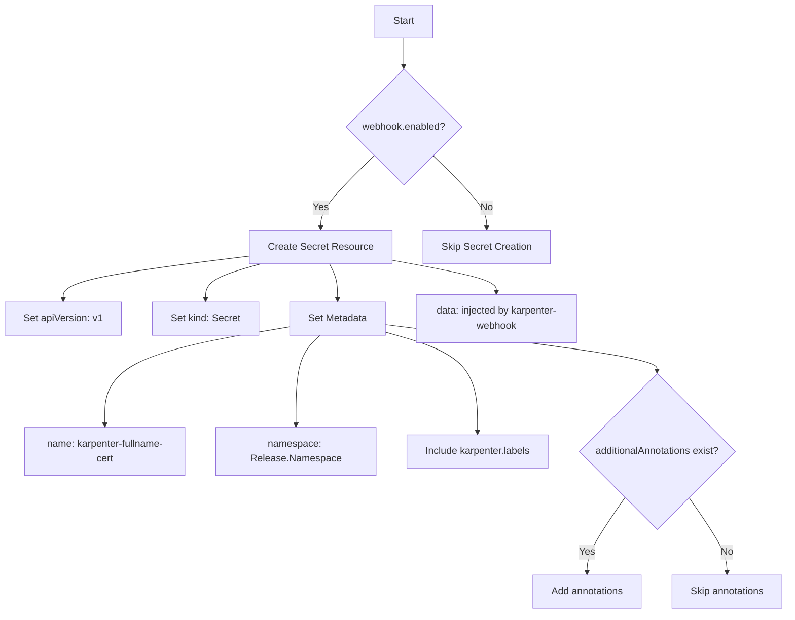
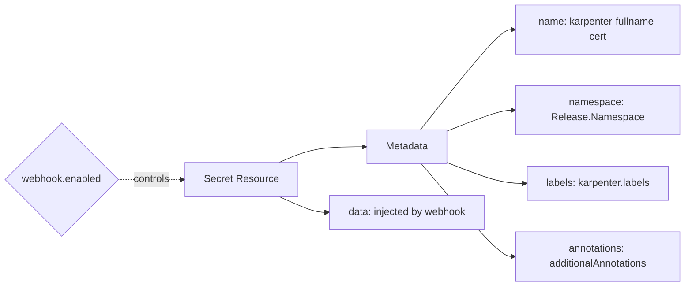

# Diagram: devops/k8s/karpenter/helm/templates/secret-webhook-cert.yaml

> Auto-generated by Obscura crawlers

## Diagram 1

### SVG

<svg id="container" width="1297.9140625" xmlns="http://www.w3.org/2000/svg" class="flowchart" height="1022.25" viewBox="0 0 1297.9140625 1022.25" role="graphics-document document" aria-roledescription="flowchart-v2"><g><marker id="container_flowchart-v2-pointEnd" class="marker flowchart-v2" viewBox="0 0 10 10" refX="5" refY="5" markerUnits="userSpaceOnUse" markerWidth="8" markerHeight="8" orient="auto"><path d="M 0 0 L 10 5 L 0 10 z" class="arrowMarkerPath" style="stroke-width: 1; stroke-dasharray: 1, 0;"></path></marker><marker id="container_flowchart-v2-pointStart" class="marker flowchart-v2" viewBox="0 0 10 10" refX="4.5" refY="5" markerUnits="userSpaceOnUse" markerWidth="8" markerHeight="8" orient="auto"><path d="M 0 5 L 10 10 L 10 0 z" class="arrowMarkerPath" style="stroke-width: 1; stroke-dasharray: 1, 0;"></path></marker><marker id="container_flowchart-v2-circleEnd" class="marker flowchart-v2" viewBox="0 0 10 10" refX="11" refY="5" markerUnits="userSpaceOnUse" markerWidth="11" markerHeight="11" orient="auto"><circle cx="5" cy="5" r="5" class="arrowMarkerPath" style="stroke-width: 1; stroke-dasharray: 1, 0;"></circle></marker><marker id="container_flowchart-v2-circleStart" class="marker flowchart-v2" viewBox="0 0 10 10" refX="-1" refY="5" markerUnits="userSpaceOnUse" markerWidth="11" markerHeight="11" orient="auto"><circle cx="5" cy="5" r="5" class="arrowMarkerPath" style="stroke-width: 1; stroke-dasharray: 1, 0;"></circle></marker><marker id="container_flowchart-v2-crossEnd" class="marker cross flowchart-v2" viewBox="0 0 11 11" refX="12" refY="5.2" markerUnits="userSpaceOnUse" markerWidth="11" markerHeight="11" orient="auto"><path d="M 1,1 l 9,9 M 10,1 l -9,9" class="arrowMarkerPath" style="stroke-width: 2; stroke-dasharray: 1, 0;"></path></marker><marker id="container_flowchart-v2-crossStart" class="marker cross flowchart-v2" viewBox="0 0 11 11" refX="-1" refY="5.2" markerUnits="userSpaceOnUse" markerWidth="11" markerHeight="11" orient="auto"><path d="M 1,1 l 9,9 M 10,1 l -9,9" class="arrowMarkerPath" style="stroke-width: 2; stroke-dasharray: 1, 0;"></path></marker><g class="root"><g class="clusters"></g><g class="edgePaths"><path d="M652.941,62L652.941,66.167C652.941,70.333,652.941,78.667,652.941,86.333C652.941,94,652.941,101,652.941,104.5L652.941,108" id="L_A_B_0" class="edge-thickness-normal edge-pattern-solid edge-thickness-normal edge-pattern-solid flowchart-link" style=";" data-edge="true" data-et="edge" data-id="L_A_B_0" data-points="W3sieCI6NjUyLjk0MTQwNjI1LCJ5Ijo2Mn0seyJ4Ijo2NTIuOTQxNDA2MjUsInkiOjg3fSx7IngiOjY1Mi45NDE0MDYyNSwieSI6MTEyfV0=" marker-end="url(#container_flowchart-v2-pointEnd)"></path><path d="M605.261,254.57L591.078,268.683C576.894,282.796,548.527,311.023,534.344,330.637C520.16,350.25,520.16,361.25,520.16,366.75L520.16,372.25" id="L_B_C_0" class="edge-thickness-normal edge-pattern-solid edge-thickness-normal edge-pattern-solid flowchart-link" style=";" data-edge="true" data-et="edge" data-id="L_B_C_0" data-points="W3sieCI6NjA1LjI2MTA4MDA3MzI4NjUsInkiOjI1NC41Njk2NzM4MjMyODY1NH0seyJ4Ijo1MjAuMTYwMTU2MjUsInkiOjMzOS4yNX0seyJ4Ijo1MjAuMTYwMTU2MjUsInkiOjM3Ni4yNX1d" marker-end="url(#container_flowchart-v2-pointEnd)"></path><path d="M700.622,254.57L714.805,268.683C728.989,282.796,757.356,311.023,771.539,330.637C785.723,350.25,785.723,361.25,785.723,366.75L785.723,372.25" id="L_B_D_0" class="edge-thickness-normal edge-pattern-solid edge-thickness-normal edge-pattern-solid flowchart-link" style=";" data-edge="true" data-et="edge" data-id="L_B_D_0" data-points="W3sieCI6NzAwLjYyMTczMjQyNjcxMzUsInkiOjI1NC41Njk2NzM4MjMyODY1NH0seyJ4Ijo3ODUuNzIyNjU2MjUsInkiOjMzOS4yNX0seyJ4Ijo3ODUuNzIyNjU2MjUsInkiOjM3Ni4yNX1d" marker-end="url(#container_flowchart-v2-pointEnd)"></path><path d="M407.293,417.267L356.321,423.598C305.349,429.928,203.405,442.589,152.433,454.42C101.461,466.25,101.461,477.25,101.461,482.75L101.461,488.25" id="L_C_E_0" class="edge-thickness-normal edge-pattern-solid edge-thickness-normal edge-pattern-solid flowchart-link" style=";" data-edge="true" data-et="edge" data-id="L_C_E_0" data-points="W3sieCI6NDA3LjI5Mjk2ODc1LCJ5Ijo0MTcuMjY3NDQ2MTQ1NTIxNH0seyJ4IjoxMDEuNDYwOTM3NSwieSI6NDU1LjI1fSx7IngiOjEwMS40NjA5Mzc1LCJ5Ijo0OTIuMjV9XQ==" marker-end="url(#container_flowchart-v2-pointEnd)"></path><path d="M422.024,430.25L406.879,434.417C391.734,438.583,361.445,446.917,346.301,456.583C331.156,466.25,331.156,477.25,331.156,482.75L331.156,488.25" id="L_C_F_0" class="edge-thickness-normal edge-pattern-solid edge-thickness-normal edge-pattern-solid flowchart-link" style=";" data-edge="true" data-et="edge" data-id="L_C_F_0" data-points="W3sieCI6NDIyLjAyMzUxMjYyMDE5MjMsInkiOjQzMC4yNX0seyJ4IjozMzEuMTU2MjUsInkiOjQ1NS4yNX0seyJ4IjozMzEuMTU2MjUsInkiOjQ5Mi4yNX1d" marker-end="url(#container_flowchart-v2-pointEnd)"></path><path d="M533.167,430.25L535.175,434.417C537.182,438.583,541.196,446.917,543.204,456.583C545.211,466.25,545.211,477.25,545.211,482.75L545.211,488.25" id="L_C_G_0" class="edge-thickness-normal edge-pattern-solid edge-thickness-normal edge-pattern-solid flowchart-link" style=";" data-edge="true" data-et="edge" data-id="L_C_G_0" data-points="W3sieCI6NTMzLjE2NzI5MjY2ODI2OTMsInkiOjQzMC4yNX0seyJ4Ijo1NDUuMjEwOTM3NSwieSI6NDU1LjI1fSx7IngiOjU0NS4yMTA5Mzc1LCJ5Ijo0OTIuMjV9XQ==" marker-end="url(#container_flowchart-v2-pointEnd)"></path><path d="M467.391,532.465L417.548,540.929C367.706,549.394,268.021,566.322,218.178,594.953C168.336,623.583,168.336,663.917,168.336,684.083L168.336,704.25" id="L_G_H_0" class="edge-thickness-normal edge-pattern-solid edge-thickness-normal edge-pattern-solid flowchart-link" style=";" data-edge="true" data-et="edge" data-id="L_G_H_0" data-points="W3sieCI6NDY3LjM5MDYyNSwieSI6NTMyLjQ2NTI1NzA0ODA5Mjl9LHsieCI6MTY4LjMzNTkzNzUsInkiOjU4My4yNX0seyJ4IjoxNjguMzM1OTM3NSwieSI6NzA4LjI1fV0=" marker-end="url(#container_flowchart-v2-pointEnd)"></path><path d="M516.998,546.25L510.554,552.417C504.111,558.583,491.223,570.917,484.78,597.25C478.336,623.583,478.336,663.917,478.336,684.083L478.336,704.25" id="L_G_I_0" class="edge-thickness-normal edge-pattern-solid edge-thickness-normal edge-pattern-solid flowchart-link" style=";" data-edge="true" data-et="edge" data-id="L_G_I_0" data-points="W3sieCI6NTE2Ljk5ODA0Njg3NSwieSI6NTQ2LjI1fSx7IngiOjQ3OC4zMzU5Mzc1LCJ5Ijo1ODMuMjV9LHsieCI6NDc4LjMzNTkzNzUsInkiOjcwOC4yNX1d" marker-end="url(#container_flowchart-v2-pointEnd)"></path><path d="M623.031,540.827L648.533,547.897C674.034,554.968,725.036,569.109,750.538,598.346C776.039,627.583,776.039,671.917,776.039,694.083L776.039,716.25" id="L_G_J_0" class="edge-thickness-normal edge-pattern-solid edge-thickness-normal edge-pattern-solid flowchart-link" style=";" data-edge="true" data-et="edge" data-id="L_G_J_0" data-points="W3sieCI6NjIzLjAzMTI1LCJ5Ijo1NDAuODI2NjYwMTIzMTk3N30seyJ4Ijo3NzYuMDM5MDYyNSwieSI6NTgzLjI1fSx7IngiOjc3Ni4wMzkwNjI1LCJ5Ijo3MjAuMjV9XQ==" marker-end="url(#container_flowchart-v2-pointEnd)"></path><path d="M623.031,528.516L699.65,537.638C776.268,546.76,929.505,565.005,1006.124,577.628C1082.742,590.25,1082.742,597.25,1082.742,600.75L1082.742,604.25" id="L_G_K_0" class="edge-thickness-normal edge-pattern-solid edge-thickness-normal edge-pattern-solid flowchart-link" style=";" data-edge="true" data-et="edge" data-id="L_G_K_0" data-points="W3sieCI6NjIzLjAzMTI1LCJ5Ijo1MjguNTE1NTA3ODE5MzEyOH0seyJ4IjoxMDgyLjc0MjE4NzUsInkiOjU4My4yNX0seyJ4IjoxMDgyLjc0MjE4NzUsInkiOjYwOC4yNX1d" marker-end="url(#container_flowchart-v2-pointEnd)"></path><path d="M1027.593,831.1L1017.491,846.459C1007.39,861.817,987.187,892.533,977.086,913.392C966.984,934.25,966.984,945.25,966.984,950.75L966.984,956.25" id="L_K_L_0" class="edge-thickness-normal edge-pattern-solid edge-thickness-normal edge-pattern-solid flowchart-link" style=";" data-edge="true" data-et="edge" data-id="L_K_L_0" data-points="W3sieCI6MTAyNy41OTI1NTU2ODg1MTI0LCJ5Ijo4MzEuMTAwMzY4MTg4NTEyNn0seyJ4Ijo5NjYuOTg0Mzc1LCJ5Ijo5MjMuMjV9LHsieCI6OTY2Ljk4NDM3NSwieSI6OTYwLjI1fV0=" marker-end="url(#container_flowchart-v2-pointEnd)"></path><path d="M1137.892,831.1L1147.993,846.459C1158.095,861.817,1178.297,892.533,1188.399,913.392C1198.5,934.25,1198.5,945.25,1198.5,950.75L1198.5,956.25" id="L_K_M_0" class="edge-thickness-normal edge-pattern-solid edge-thickness-normal edge-pattern-solid flowchart-link" style=";" data-edge="true" data-et="edge" data-id="L_K_M_0" data-points="W3sieCI6MTEzNy44OTE4MTkzMTE0ODc2LCJ5Ijo4MzEuMTAwMzY4MTg4NTEyNn0seyJ4IjoxMTk4LjUsInkiOjkyMy4yNX0seyJ4IjoxMTk4LjUsInkiOjk2MC4yNX1d" marker-end="url(#container_flowchart-v2-pointEnd)"></path><path d="M633.027,423.998L661.361,429.207C689.695,434.416,746.363,444.833,774.697,453.541C803.031,462.25,803.031,469.25,803.031,472.75L803.031,476.25" id="L_C_N_0" class="edge-thickness-normal edge-pattern-solid edge-thickness-normal edge-pattern-solid flowchart-link" style=";" data-edge="true" data-et="edge" data-id="L_C_N_0" data-points="W3sieCI6NjMzLjAyNzM0Mzc1LCJ5Ijo0MjMuOTk4Mjk4MDA0NTU3MDZ9LHsieCI6ODAzLjAzMTI1LCJ5Ijo0NTUuMjV9LHsieCI6ODAzLjAzMTI1LCJ5Ijo0ODAuMjV9XQ==" marker-end="url(#container_flowchart-v2-pointEnd)"></path></g><g class="edgeLabels"><g class="edgeLabel"><g class="label" data-id="L_A_B_0" transform="translate(0, 0)"><foreignObject width="0" height="0">

</foreignObject></g></g><g class="edgeLabel" transform="translate(520.16015625, 339.25)"><g class="label" data-id="L_B_C_0" transform="translate(-12.03125, -12)"><foreignObject width="24.0625" height="24">

Yes

</foreignObject></g></g><g class="edgeLabel" transform="translate(785.72265625, 339.25)"><g class="label" data-id="L_B_D_0" transform="translate(-10.140625, -12)"><foreignObject width="20.28125" height="24">

No

</foreignObject></g></g><g class="edgeLabel"><g class="label" data-id="L_C_E_0" transform="translate(0, 0)"><foreignObject width="0" height="0">

</foreignObject></g></g><g class="edgeLabel"><g class="label" data-id="L_C_F_0" transform="translate(0, 0)"><foreignObject width="0" height="0">

</foreignObject></g></g><g class="edgeLabel"><g class="label" data-id="L_C_G_0" transform="translate(0, 0)"><foreignObject width="0" height="0">

</foreignObject></g></g><g class="edgeLabel"><g class="label" data-id="L_G_H_0" transform="translate(0, 0)"><foreignObject width="0" height="0">

</foreignObject></g></g><g class="edgeLabel"><g class="label" data-id="L_G_I_0" transform="translate(0, 0)"><foreignObject width="0" height="0">

</foreignObject></g></g><g class="edgeLabel"><g class="label" data-id="L_G_J_0" transform="translate(0, 0)"><foreignObject width="0" height="0">

</foreignObject></g></g><g class="edgeLabel"><g class="label" data-id="L_G_K_0" transform="translate(0, 0)"><foreignObject width="0" height="0">

</foreignObject></g></g><g class="edgeLabel" transform="translate(966.984375, 923.25)"><g class="label" data-id="L_K_L_0" transform="translate(-12.03125, -12)"><foreignObject width="24.0625" height="24">

Yes

</foreignObject></g></g><g class="edgeLabel" transform="translate(1198.5, 923.25)"><g class="label" data-id="L_K_M_0" transform="translate(-10.140625, -12)"><foreignObject width="20.28125" height="24">

No

</foreignObject></g></g><g class="edgeLabel"><g class="label" data-id="L_C_N_0" transform="translate(0, 0)"><foreignObject width="0" height="0">

</foreignObject></g></g></g><g class="nodes"><g class="node default" id="flowchart-A-0" transform="translate(652.94140625, 35)"><rect class="basic label-container" style="" x="-47.5234375" y="-27" width="95.046875" height="54"></rect><g class="label" style="" transform="translate(-17.5234375, -12)"><rect></rect><foreignObject width="35.046875" height="24">

Start

</foreignObject></g></g><g class="node default" id="flowchart-B-1" transform="translate(652.94140625, 207.125)"><polygon points="95.125,0 190.25,-95.125 95.125,-190.25 0,-95.125" class="label-container" transform="translate(-94.625, 95.125)"></polygon><g class="label" style="" transform="translate(-68.125, -12)"><rect></rect><foreignObject width="136.25" height="24">

webhook.enabled?

</foreignObject></g></g><g class="node default" id="flowchart-C-3" transform="translate(520.16015625, 403.25)"><rect class="basic label-container" style="" x="-112.8671875" y="-27" width="225.734375" height="54"></rect><g class="label" style="" transform="translate(-82.8671875, -12)"><rect></rect><foreignObject width="165.734375" height="24">

Create Secret Resource

</foreignObject></g></g><g class="node default" id="flowchart-D-5" transform="translate(785.72265625, 403.25)"><rect class="basic label-container" style="" x="-102.6953125" y="-27" width="205.390625" height="54"></rect><g class="label" style="" transform="translate(-72.6953125, -12)"><rect></rect><foreignObject width="145.390625" height="24">

Skip Secret Creation

</foreignObject></g></g><g class="node default" id="flowchart-E-7" transform="translate(101.4609375, 519.25)"><rect class="basic label-container" style="" x="-93.4609375" y="-27" width="186.921875" height="54"></rect><g class="label" style="" transform="translate(-63.4609375, -12)"><rect></rect><foreignObject width="126.921875" height="24">

Set apiVersion: v1

</foreignObject></g></g><g class="node default" id="flowchart-F-9" transform="translate(331.15625, 519.25)"><rect class="basic label-container" style="" x="-86.234375" y="-27" width="172.46875" height="54"></rect><g class="label" style="" transform="translate(-56.234375, -12)"><rect></rect><foreignObject width="112.46875" height="24">

Set kind: Secret

</foreignObject></g></g><g class="node default" id="flowchart-G-11" transform="translate(545.2109375, 519.25)"><rect class="basic label-container" style="" x="-77.8203125" y="-27" width="155.640625" height="54"></rect><g class="label" style="" transform="translate(-47.8203125, -12)"><rect></rect><foreignObject width="95.640625" height="24">

Set Metadata

</foreignObject></g></g><g class="node default" id="flowchart-H-13" transform="translate(168.3359375, 747.25)"><rect class="basic label-container" style="" x="-130" y="-39" width="260" height="78"></rect><g class="label" style="" transform="translate(-100, -24)"><rect></rect><foreignObject width="200" height="48">

name: karpenter-fullname-cert

</foreignObject></g></g><g class="node default" id="flowchart-I-15" transform="translate(478.3359375, 747.25)"><rect class="basic label-container" style="" x="-130" y="-39" width="260" height="78"></rect><g class="label" style="" transform="translate(-100, -24)"><rect></rect><foreignObject width="200" height="48">

namespace: Release.Namespace

</foreignObject></g></g><g class="node default" id="flowchart-J-17" transform="translate(776.0390625, 747.25)"><rect class="basic label-container" style="" x="-117.703125" y="-27" width="235.40625" height="54"></rect><g class="label" style="" transform="translate(-87.703125, -12)"><rect></rect><foreignObject width="175.40625" height="24">

Include karpenter.labels

</foreignObject></g></g><g class="node default" id="flowchart-K-19" transform="translate(1082.7421875, 747.25)"><polygon points="139,0 278,-139 139,-278 0,-139" class="label-container" transform="translate(-138.5, 139)"></polygon><g class="label" style="" transform="translate(-100, -24)"><rect></rect><foreignObject width="200" height="48">

additionalAnnotations exist?

</foreignObject></g></g><g class="node default" id="flowchart-L-21" transform="translate(966.984375, 987.25)"><rect class="basic label-container" style="" x="-90.1015625" y="-27" width="180.203125" height="54"></rect><g class="label" style="" transform="translate(-60.1015625, -12)"><rect></rect><foreignObject width="120.203125" height="24">

Add annotations

</foreignObject></g></g><g class="node default" id="flowchart-M-23" transform="translate(1198.5, 987.25)"><rect class="basic label-container" style="" x="-91.4140625" y="-27" width="182.828125" height="54"></rect><g class="label" style="" transform="translate(-61.4140625, -12)"><rect></rect><foreignObject width="122.828125" height="24">

Skip annotations

</foreignObject></g></g><g class="node default" id="flowchart-N-25" transform="translate(803.03125, 519.25)"><rect class="basic label-container" style="" x="-130" y="-39" width="260" height="78"></rect><g class="label" style="" transform="translate(-100, -24)"><rect></rect><foreignObject width="200" height="48">

data: injected by karpenter-webhook

</foreignObject></g></g></g></g></g></svg>

## Diagram 2

### SVG

<svg id="container" width="1094.03125" xmlns="http://www.w3.org/2000/svg" class="flowchart" height="454" viewBox="0.5 0 1094.03125 454" role="graphics-document document" aria-roledescription="flowchart-v2"><g><marker id="container_flowchart-v2-pointEnd" class="marker flowchart-v2" viewBox="0 0 10 10" refX="5" refY="5" markerUnits="userSpaceOnUse" markerWidth="8" markerHeight="8" orient="auto"><path d="M 0 0 L 10 5 L 0 10 z" class="arrowMarkerPath" style="stroke-width: 1; stroke-dasharray: 1, 0;"></path></marker><marker id="container_flowchart-v2-pointStart" class="marker flowchart-v2" viewBox="0 0 10 10" refX="4.5" refY="5" markerUnits="userSpaceOnUse" markerWidth="8" markerHeight="8" orient="auto"><path d="M 0 5 L 10 10 L 10 0 z" class="arrowMarkerPath" style="stroke-width: 1; stroke-dasharray: 1, 0;"></path></marker><marker id="container_flowchart-v2-circleEnd" class="marker flowchart-v2" viewBox="0 0 10 10" refX="11" refY="5" markerUnits="userSpaceOnUse" markerWidth="11" markerHeight="11" orient="auto"><circle cx="5" cy="5" r="5" class="arrowMarkerPath" style="stroke-width: 1; stroke-dasharray: 1, 0;"></circle></marker><marker id="container_flowchart-v2-circleStart" class="marker flowchart-v2" viewBox="0 0 10 10" refX="-1" refY="5" markerUnits="userSpaceOnUse" markerWidth="11" markerHeight="11" orient="auto"><circle cx="5" cy="5" r="5" class="arrowMarkerPath" style="stroke-width: 1; stroke-dasharray: 1, 0;"></circle></marker><marker id="container_flowchart-v2-crossEnd" class="marker cross flowchart-v2" viewBox="0 0 11 11" refX="12" refY="5.2" markerUnits="userSpaceOnUse" markerWidth="11" markerHeight="11" orient="auto"><path d="M 1,1 l 9,9 M 10,1 l -9,9" class="arrowMarkerPath" style="stroke-width: 2; stroke-dasharray: 1, 0;"></path></marker><marker id="container_flowchart-v2-crossStart" class="marker cross flowchart-v2" viewBox="0 0 11 11" refX="-1" refY="5.2" markerUnits="userSpaceOnUse" markerWidth="11" markerHeight="11" orient="auto"><path d="M 1,1 l 9,9 M 10,1 l -9,9" class="arrowMarkerPath" style="stroke-width: 2; stroke-dasharray: 1, 0;"></path></marker><g class="root"><g class="clusters"></g><g class="edgePaths"><path d="M446.278,258L455.315,253.833C464.352,249.667,482.426,241.333,505.2,237.167C527.974,233,555.448,233,569.185,233L582.922,233" id="L_Secret_Metadata_0" class="edge-thickness-normal edge-pattern-solid edge-thickness-normal edge-pattern-solid flowchart-link" style=";" data-edge="true" data-et="edge" data-id="L_Secret_Metadata_0" data-points="W3sieCI6NDQ2LjI3ODI0NTE5MjMwNzcsInkiOjI1OH0seyJ4Ijo1MDAuNSwieSI6MjMzfSx7IngiOjU4Ni45MjE4NzUsInkiOjIzM31d" marker-end="url(#container_flowchart-v2-pointEnd)"></path><path d="M446.278,312L455.315,316.167C464.352,320.333,482.426,328.667,494.963,332.833C507.5,337,514.5,337,518,337L521.5,337" id="L_Secret_Data_0" class="edge-thickness-normal edge-pattern-solid edge-thickness-normal edge-pattern-solid flowchart-link" style=";" data-edge="true" data-et="edge" data-id="L_Secret_Data_0" data-points="W3sieCI6NDQ2LjI3ODI0NTE5MjMwNzcsInkiOjMxMn0seyJ4Ijo1MDAuNSwieSI6MzM3fSx7IngiOjUyNS41LCJ5IjozMzd9XQ==" marker-end="url(#container_flowchart-v2-pointEnd)"></path><path d="M672.865,206L694.309,179.5C715.754,153,758.642,100,783.587,73.5C808.531,47,815.531,47,819.031,47L822.531,47" id="L_Metadata_Name_0" class="edge-thickness-normal edge-pattern-solid edge-thickness-normal edge-pattern-solid flowchart-link" style=";" data-edge="true" data-et="edge" data-id="L_Metadata_Name_0" data-points="W3sieCI6NjcyLjg2NDY2NzMzODcwOTYsInkiOjIwNn0seyJ4Ijo4MDEuNTMxMjUsInkiOjQ3fSx7IngiOjgyNi41MzEyNSwieSI6NDd9XQ==" marker-end="url(#container_flowchart-v2-pointEnd)"></path><path d="M715.109,208.302L729.513,202.752C743.917,197.201,772.724,186.101,790.628,180.55C808.531,175,815.531,175,819.031,175L822.531,175" id="L_Metadata_Namespace_0" class="edge-thickness-normal edge-pattern-solid edge-thickness-normal edge-pattern-solid flowchart-link" style=";" data-edge="true" data-et="edge" data-id="L_Metadata_Namespace_0" data-points="W3sieCI6NzE1LjEwOTM3NSwieSI6MjA4LjMwMTk4Mjc2NzU2OTgzfSx7IngiOjgwMS41MzEyNSwieSI6MTc1fSx7IngiOjgyNi41MzEyNSwieSI6MTc1fV0=" marker-end="url(#container_flowchart-v2-pointEnd)"></path><path d="M715.109,257.698L729.513,263.248C743.917,268.799,772.724,279.899,793.219,285.45C813.714,291,825.896,291,831.987,291L838.078,291" id="L_Metadata_Labels_0" class="edge-thickness-normal edge-pattern-solid edge-thickness-normal edge-pattern-solid flowchart-link" style=";" data-edge="true" data-et="edge" data-id="L_Metadata_Labels_0" data-points="W3sieCI6NzE1LjEwOTM3NSwieSI6MjU3LjY5ODAxNzIzMjQzMDJ9LHsieCI6ODAxLjUzMTI1LCJ5IjoyOTF9LHsieCI6ODQyLjA3ODEyNSwieSI6MjkxfV0=" marker-end="url(#container_flowchart-v2-pointEnd)"></path><path d="M674.371,260L695.565,284.5C716.758,309,759.145,358,783.838,382.5C808.531,407,815.531,407,819.031,407L822.531,407" id="L_Metadata_Annotations_0" class="edge-thickness-normal edge-pattern-solid edge-thickness-normal edge-pattern-solid flowchart-link" style=";" data-edge="true" data-et="edge" data-id="L_Metadata_Annotations_0" data-points="W3sieCI6Njc0LjM3MTQ5Nzg0NDgyNzYsInkiOjI2MH0seyJ4Ijo4MDEuNTMxMjUsInkiOjQwN30seyJ4Ijo4MjYuNTMxMjUsInkiOjQwN31d" marker-end="url(#container_flowchart-v2-pointEnd)"></path><path d="M190.906,285L199.992,285C209.078,285,227.25,285,244.755,285C262.26,285,279.099,285,287.518,285L295.938,285" id="L_Condition_Secret_0" class="edge-thickness-normal edge-pattern-dotted edge-thickness-normal edge-pattern-solid flowchart-link" style=";" data-edge="true" data-et="edge" data-id="L_Condition_Secret_0" data-points="W3sieCI6MTkwLjkwNjI1LCJ5IjoyODV9LHsieCI6MjQ1LjQyMTg3NSwieSI6Mjg1fSx7IngiOjI5OS45Mzc1LCJ5IjoyODV9XQ==" marker-end="url(#container_flowchart-v2-pointEnd)"></path></g><g class="edgeLabels"><g class="edgeLabel"><g class="label" data-id="L_Secret_Metadata_0" transform="translate(0, 0)"><foreignObject width="0" height="0">

</foreignObject></g></g><g class="edgeLabel"><g class="label" data-id="L_Secret_Data_0" transform="translate(0, 0)"><foreignObject width="0" height="0">

</foreignObject></g></g><g class="edgeLabel"><g class="label" data-id="L_Metadata_Name_0" transform="translate(0, 0)"><foreignObject width="0" height="0">

</foreignObject></g></g><g class="edgeLabel"><g class="label" data-id="L_Metadata_Namespace_0" transform="translate(0, 0)"><foreignObject width="0" height="0">

</foreignObject></g></g><g class="edgeLabel"><g class="label" data-id="L_Metadata_Labels_0" transform="translate(0, 0)"><foreignObject width="0" height="0">

</foreignObject></g></g><g class="edgeLabel"><g class="label" data-id="L_Metadata_Annotations_0" transform="translate(0, 0)"><foreignObject width="0" height="0">

</foreignObject></g></g><g class="edgeLabel" transform="translate(245.421875, 285)"><g class="label" data-id="L_Condition_Secret_0" transform="translate(-29.515625, -12)"><foreignObject width="59.03125" height="24">

controls

</foreignObject></g></g></g><g class="nodes"><g class="node default" id="flowchart-Secret-0" transform="translate(387.71875, 285)"><rect class="basic label-container" style="" x="-87.78125" y="-27" width="175.5625" height="54"></rect><g class="label" style="" transform="translate(-57.78125, -12)"><rect></rect><foreignObject width="115.5625" height="24">

Secret Resource

</foreignObject></g></g><g class="node default" id="flowchart-Metadata-1" transform="translate(651.015625, 233)"><rect class="basic label-container" style="" x="-64.09375" y="-27" width="128.1875" height="54"></rect><g class="label" style="" transform="translate(-34.09375, -12)"><rect></rect><foreignObject width="68.1875" height="24">

Metadata

</foreignObject></g></g><g class="node default" id="flowchart-Data-3" transform="translate(651.015625, 337)"><rect class="basic label-container" style="" x="-125.515625" y="-27" width="251.03125" height="54"></rect><g class="label" style="" transform="translate(-95.515625, -12)"><rect></rect><foreignObject width="191.03125" height="24">

data: injected by webhook

</foreignObject></g></g><g class="node default" id="flowchart-Name-5" transform="translate(956.53125, 47)"><rect class="basic label-container" style="" x="-130" y="-39" width="260" height="78"></rect><g class="label" style="" transform="translate(-100, -24)"><rect></rect><foreignObject width="200" height="48">

name: karpenter-fullname-cert

</foreignObject></g></g><g class="node default" id="flowchart-Namespace-7" transform="translate(956.53125, 175)"><rect class="basic label-container" style="" x="-130" y="-39" width="260" height="78"></rect><g class="label" style="" transform="translate(-100, -24)"><rect></rect><foreignObject width="200" height="48">

namespace: Release.Namespace

</foreignObject></g></g><g class="node default" id="flowchart-Labels-9" transform="translate(956.53125, 291)"><rect class="basic label-container" style="" x="-114.453125" y="-27" width="228.90625" height="54"></rect><g class="label" style="" transform="translate(-84.453125, -12)"><rect></rect><foreignObject width="168.90625" height="24">

labels: karpenter.labels

</foreignObject></g></g><g class="node default" id="flowchart-Annotations-11" transform="translate(956.53125, 407)"><rect class="basic label-container" style="" x="-130" y="-39" width="260" height="78"></rect><g class="label" style="" transform="translate(-100, -24)"><rect></rect><foreignObject width="200" height="48">

annotations: additionalAnnotations

</foreignObject></g></g><g class="node default" id="flowchart-Condition-12" transform="translate(99.453125, 285)"><polygon points="91.453125,0 182.90625,-91.453125 91.453125,-182.90625 0,-91.453125" class="label-container" transform="translate(-90.953125, 91.453125)"></polygon><g class="label" style="" transform="translate(-64.453125, -12)"><rect></rect><foreignObject width="128.90625" height="24">

webhook.enabled

</foreignObject></g></g></g></g></g></svg>
