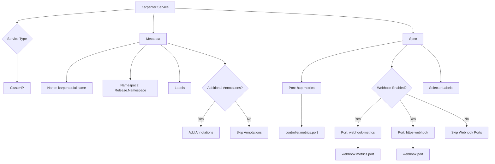
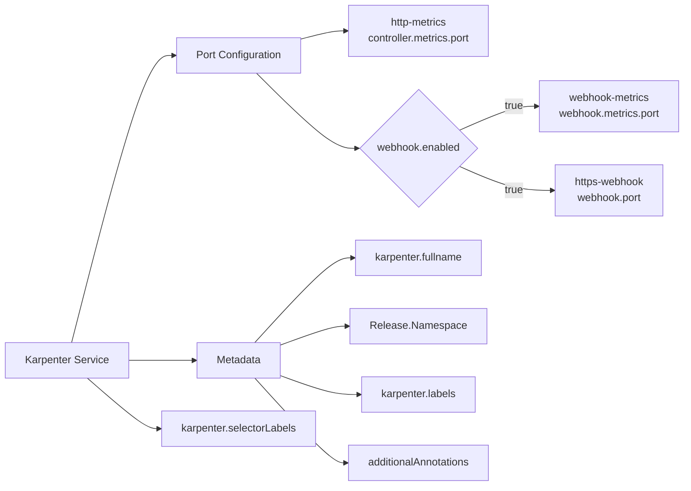
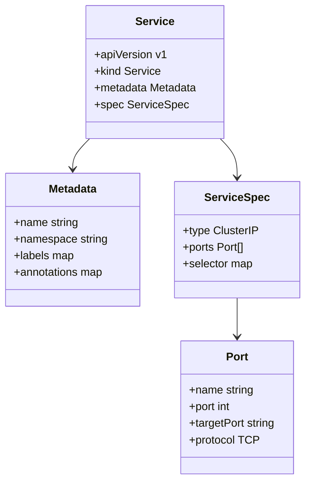

# Diagram: devops/k8s/karpenter/helm/templates/service.yaml

> Auto-generated by Obscura crawlers

## Diagram 1

### SVG

<svg id="container" width="2348.77734375" xmlns="http://www.w3.org/2000/svg" class="flowchart" height="774.3125" viewBox="0.5 0 2348.77734375 774.3125" role="graphics-document document" aria-roledescription="flowchart-v2"><g><marker id="container_flowchart-v2-pointEnd" class="marker flowchart-v2" viewBox="0 0 10 10" refX="5" refY="5" markerUnits="userSpaceOnUse" markerWidth="8" markerHeight="8" orient="auto"><path d="M 0 0 L 10 5 L 0 10 z" class="arrowMarkerPath" style="stroke-width: 1; stroke-dasharray: 1, 0;"></path></marker><marker id="container_flowchart-v2-pointStart" class="marker flowchart-v2" viewBox="0 0 10 10" refX="4.5" refY="5" markerUnits="userSpaceOnUse" markerWidth="8" markerHeight="8" orient="auto"><path d="M 0 5 L 10 10 L 10 0 z" class="arrowMarkerPath" style="stroke-width: 1; stroke-dasharray: 1, 0;"></path></marker><marker id="container_flowchart-v2-circleEnd" class="marker flowchart-v2" viewBox="0 0 10 10" refX="11" refY="5" markerUnits="userSpaceOnUse" markerWidth="11" markerHeight="11" orient="auto"><circle cx="5" cy="5" r="5" class="arrowMarkerPath" style="stroke-width: 1; stroke-dasharray: 1, 0;"></circle></marker><marker id="container_flowchart-v2-circleStart" class="marker flowchart-v2" viewBox="0 0 10 10" refX="-1" refY="5" markerUnits="userSpaceOnUse" markerWidth="11" markerHeight="11" orient="auto"><circle cx="5" cy="5" r="5" class="arrowMarkerPath" style="stroke-width: 1; stroke-dasharray: 1, 0;"></circle></marker><marker id="container_flowchart-v2-crossEnd" class="marker cross flowchart-v2" viewBox="0 0 11 11" refX="12" refY="5.2" markerUnits="userSpaceOnUse" markerWidth="11" markerHeight="11" orient="auto"><path d="M 1,1 l 9,9 M 10,1 l -9,9" class="arrowMarkerPath" style="stroke-width: 2; stroke-dasharray: 1, 0;"></path></marker><marker id="container_flowchart-v2-crossStart" class="marker cross flowchart-v2" viewBox="0 0 11 11" refX="-1" refY="5.2" markerUnits="userSpaceOnUse" markerWidth="11" markerHeight="11" orient="auto"><path d="M 1,1 l 9,9 M 10,1 l -9,9" class="arrowMarkerPath" style="stroke-width: 2; stroke-dasharray: 1, 0;"></path></marker><g class="root"><g class="clusters"></g><g class="edgePaths"><path d="M642.758,42.46L548.967,49.884C455.177,57.307,267.596,72.153,173.806,83.077C80.016,94,80.016,101,80.016,104.5L80.016,108" id="L_A_B_0" class="edge-thickness-normal edge-pattern-solid edge-thickness-normal edge-pattern-solid flowchart-link" style=";" data-edge="true" data-et="edge" data-id="L_A_B_0" data-points="W3sieCI6NjQyLjc1NzgxMjUsInkiOjQyLjQ2MDI4MzQ4NTU0MDM0fSx7IngiOjgwLjAxNTYyNSwieSI6ODd9LHsieCI6ODAuMDE1NjI1LCJ5IjoxMTJ9XQ==" marker-end="url(#container_flowchart-v2-pointEnd)"></path><path d="M80.016,256.031L80.016,260.198C80.016,264.365,80.016,272.698,80.016,294.888C80.016,317.078,80.016,353.125,80.016,371.148L80.016,389.172" id="L_B_C_0" class="edge-thickness-normal edge-pattern-solid edge-thickness-normal edge-pattern-solid flowchart-link" style=";" data-edge="true" data-et="edge" data-id="L_B_C_0" data-points="W3sieCI6ODAuMDE1NjI1LCJ5IjoyNTYuMDMxMjV9LHsieCI6ODAuMDE1NjI1LCJ5IjoyODEuMDMxMjV9LHsieCI6ODAuMDE1NjI1LCJ5IjozOTMuMTcxODc1fV0=" marker-end="url(#container_flowchart-v2-pointEnd)"></path><path d="M733.454,62L732.904,66.167C732.355,70.333,731.256,78.667,730.706,93.836C730.156,109.005,730.156,131.01,730.156,142.013L730.156,153.016" id="L_A_D_0" class="edge-thickness-normal edge-pattern-solid edge-thickness-normal edge-pattern-solid flowchart-link" style=";" data-edge="true" data-et="edge" data-id="L_A_D_0" data-points="W3sieCI6NzMzLjQ1NDAyNjQ0MjMwNzcsInkiOjYyfSx7IngiOjczMC4xNTYyNSwieSI6ODd9LHsieCI6NzMwLjE1NjI1LCJ5IjoxNTcuMDE1NjI1fV0=" marker-end="url(#container_flowchart-v2-pointEnd)"></path><path d="M666.063,199.042L607.775,212.707C549.487,226.372,432.911,253.701,374.624,285.39C316.336,317.078,316.336,353.125,316.336,371.148L316.336,389.172" id="L_D_E_0" class="edge-thickness-normal edge-pattern-solid edge-thickness-normal edge-pattern-solid flowchart-link" style=";" data-edge="true" data-et="edge" data-id="L_D_E_0" data-points="W3sieCI6NjY2LjA2MjUsInkiOjE5OS4wNDE3MDAzOTMxNTQ0OX0seyJ4IjozMTYuMzM1OTM3NSwieSI6MjgxLjAzMTI1fSx7IngiOjMxNi4zMzU5Mzc1LCJ5IjozOTMuMTcxODc1fV0=" marker-end="url(#container_flowchart-v2-pointEnd)"></path><path d="M699.58,211.016L686.364,222.685C673.149,234.354,646.719,257.693,633.504,285.385C620.289,313.078,620.289,345.125,620.289,361.148L620.289,377.172" id="L_D_F_0" class="edge-thickness-normal edge-pattern-solid edge-thickness-normal edge-pattern-solid flowchart-link" style=";" data-edge="true" data-et="edge" data-id="L_D_F_0" data-points="W3sieCI6Njk5LjU3OTU4NzA5MTMxOSwieSI6MjExLjAxNTYyNX0seyJ4Ijo2MjAuMjg5MDYyNSwieSI6MjgxLjAzMTI1fSx7IngiOjYyMC4yODkwNjI1LCJ5IjozODEuMTcxODc1fV0=" marker-end="url(#container_flowchart-v2-pointEnd)"></path><path d="M764.551,211.016L779.416,222.685C794.281,234.354,824.012,257.693,838.877,287.385C853.742,317.078,853.742,353.125,853.742,371.148L853.742,389.172" id="L_D_G_0" class="edge-thickness-normal edge-pattern-solid edge-thickness-normal edge-pattern-solid flowchart-link" style=";" data-edge="true" data-et="edge" data-id="L_D_G_0" data-points="W3sieCI6NzY0LjU1MDkxOTAyODgyOTEsInkiOjIxMS4wMTU2MjV9LHsieCI6ODUzLjc0MjE4NzUsInkiOjI4MS4wMzEyNX0seyJ4Ijo4NTMuNzQyMTg3NSwieSI6MzkzLjE3MTg3NX1d" marker-end="url(#container_flowchart-v2-pointEnd)"></path><path d="M794.25,202.241L840.431,215.373C886.612,228.504,978.974,254.768,1025.155,271.4C1071.336,288.031,1071.336,295.031,1071.336,298.531L1071.336,302.031" id="L_D_H_0" class="edge-thickness-normal edge-pattern-solid edge-thickness-normal edge-pattern-solid flowchart-link" style=";" data-edge="true" data-et="edge" data-id="L_D_H_0" data-points="W3sieCI6Nzk0LjI1LCJ5IjoyMDIuMjQwOTA0NjQ3ODIxMn0seyJ4IjoxMDcxLjMzNTkzNzUsInkiOjI4MS4wMzEyNX0seyJ4IjoxMDcxLjMzNTkzNzUsInkiOjMwNi4wMzEyNX1d" marker-end="url(#container_flowchart-v2-pointEnd)"></path><path d="M1021.776,484.752L1010.704,499.179C999.633,513.606,977.49,542.459,966.419,562.386C955.348,582.313,955.348,593.313,955.348,598.813L955.348,604.313" id="L_H_I_0" class="edge-thickness-normal edge-pattern-solid edge-thickness-normal edge-pattern-solid flowchart-link" style=";" data-edge="true" data-et="edge" data-id="L_H_I_0" data-points="W3sieCI6MTAyMS43NzU2ODkyMjczNTI1LCJ5Ijo0ODQuNzUyMjUxNzI3MzUyNX0seyJ4Ijo5NTUuMzQ3NjU2MjUsInkiOjU3MS4zMTI1fSx7IngiOjk1NS4zNDc2NTYyNSwieSI6NjA4LjMxMjV9XQ==" marker-end="url(#container_flowchart-v2-pointEnd)"></path><path d="M1120.896,484.752L1131.968,499.179C1143.039,513.606,1165.182,542.459,1176.253,562.386C1187.324,582.313,1187.324,593.313,1187.324,598.813L1187.324,604.313" id="L_H_J_0" class="edge-thickness-normal edge-pattern-solid edge-thickness-normal edge-pattern-solid flowchart-link" style=";" data-edge="true" data-et="edge" data-id="L_H_J_0" data-points="W3sieCI6MTEyMC44OTYxODU3NzI2NDc0LCJ5Ijo0ODQuNzUyMjUxNzI3MzUyNX0seyJ4IjoxMTg3LjMyNDIxODc1LCJ5Ijo1NzEuMzEyNX0seyJ4IjoxMTg3LjMyNDIxODc1LCJ5Ijo2MDguMzEyNX1d" marker-end="url(#container_flowchart-v2-pointEnd)"></path><path d="M831.273,38.935L1023.152,46.946C1215.03,54.957,1598.786,70.978,1790.665,89.992C1982.543,109.005,1982.543,131.01,1982.543,142.013L1982.543,153.016" id="L_A_K_0" class="edge-thickness-normal edge-pattern-solid edge-thickness-normal edge-pattern-solid flowchart-link" style=";" data-edge="true" data-et="edge" data-id="L_A_K_0" data-points="W3sieCI6ODMxLjI3MzQzNzUsInkiOjM4LjkzNTIwNTY1Nzc0NDExfSx7IngiOjE5ODIuNTQyOTY4NzUsInkiOjg3fSx7IngiOjE5ODIuNTQyOTY4NzUsInkiOjE1Ny4wMTU2MjV9XQ==" marker-end="url(#container_flowchart-v2-pointEnd)"></path><path d="M1935.246,192.521L1853.217,207.273C1771.189,222.025,1607.132,251.528,1525.103,284.303C1443.074,317.078,1443.074,353.125,1443.074,371.148L1443.074,389.172" id="L_K_L_0" class="edge-thickness-normal edge-pattern-solid edge-thickness-normal edge-pattern-solid flowchart-link" style=";" data-edge="true" data-et="edge" data-id="L_K_L_0" data-points="W3sieCI6MTkzNS4yNDYwOTM3NSwieSI6MTkyLjUyMTI4MTUxNjEwMzh9LHsieCI6MTQ0My4wNzQyMTg3NSwieSI6MjgxLjAzMTI1fSx7IngiOjE0NDMuMDc0MjE4NzUsInkiOjM5My4xNzE4NzV9XQ==" marker-end="url(#container_flowchart-v2-pointEnd)"></path><path d="M1443.074,447.172L1443.074,467.862C1443.074,488.552,1443.074,529.932,1443.074,556.122C1443.074,582.313,1443.074,593.313,1443.074,598.813L1443.074,604.313" id="L_L_M_0" class="edge-thickness-normal edge-pattern-solid edge-thickness-normal edge-pattern-solid flowchart-link" style=";" data-edge="true" data-et="edge" data-id="L_L_M_0" data-points="W3sieCI6MTQ0My4wNzQyMTg3NSwieSI6NDQ3LjE3MTg3NX0seyJ4IjoxNDQzLjA3NDIxODc1LCJ5Ijo1NzEuMzEyNX0seyJ4IjoxNDQzLjA3NDIxODc1LCJ5Ijo2MDguMzEyNX1d" marker-end="url(#container_flowchart-v2-pointEnd)"></path><path d="M1954.59,211.016L1942.508,222.685C1930.427,234.354,1906.264,257.693,1894.183,275.884C1882.102,294.076,1882.102,307.12,1882.102,313.642L1882.102,320.164" id="L_K_N_0" class="edge-thickness-normal edge-pattern-solid edge-thickness-normal edge-pattern-solid flowchart-link" style=";" data-edge="true" data-et="edge" data-id="L_K_N_0" data-points="W3sieCI6MTk1NC41ODk1NTQzNTE1NDYyLCJ5IjoyMTEuMDE1NjI1fSx7IngiOjE4ODIuMTAxNTYyNSwieSI6MjgxLjAzMTI1fSx7IngiOjE4ODIuMTAxNTYyNSwieSI6MzI0LjE2NDA2MjV9XQ==" marker-end="url(#container_flowchart-v2-pointEnd)"></path><path d="M1831.874,465.952L1812.608,483.512C1793.342,501.072,1754.81,536.192,1735.543,559.252C1716.277,582.313,1716.277,593.313,1716.277,598.813L1716.277,604.313" id="L_N_O_0" class="edge-thickness-normal edge-pattern-solid edge-thickness-normal edge-pattern-solid flowchart-link" style=";" data-edge="true" data-et="edge" data-id="L_N_O_0" data-points="W3sieCI6MTgzMS44NzM4NDU0MDI1NjA4LCJ5Ijo0NjUuOTUxOTcwNDAyNTYwOX0seyJ4IjoxNzE2LjI3NzM0Mzc1LCJ5Ijo1NzEuMzEyNX0seyJ4IjoxNzE2LjI3NzM0Mzc1LCJ5Ijo2MDguMzEyNX1d" marker-end="url(#container_flowchart-v2-pointEnd)"></path><path d="M1920.432,477.85L1930.784,493.427C1941.135,509.004,1961.839,540.158,1972.191,561.235C1982.543,582.313,1982.543,593.313,1982.543,598.813L1982.543,604.313" id="L_N_P_0" class="edge-thickness-normal edge-pattern-solid edge-thickness-normal edge-pattern-solid flowchart-link" style=";" data-edge="true" data-et="edge" data-id="L_N_P_0" data-points="W3sieCI6MTkyMC40MzE2NDM3NDg1NDQzLCJ5Ijo0NzcuODQ5NjA2MjUxNDU1Nn0seyJ4IjoxOTgyLjU0Mjk2ODc1LCJ5Ijo1NzEuMzEyNX0seyJ4IjoxOTgyLjU0Mjk2ODc1LCJ5Ijo2MDguMzEyNX1d" marker-end="url(#container_flowchart-v2-pointEnd)"></path><path d="M1716.277,662.313L1716.277,666.479C1716.277,670.646,1716.277,678.979,1716.277,686.646C1716.277,694.313,1716.277,701.313,1716.277,704.813L1716.277,708.313" id="L_O_Q_0" class="edge-thickness-normal edge-pattern-solid edge-thickness-normal edge-pattern-solid flowchart-link" style=";" data-edge="true" data-et="edge" data-id="L_O_Q_0" data-points="W3sieCI6MTcxNi4yNzczNDM3NSwieSI6NjYyLjMxMjV9LHsieCI6MTcxNi4yNzczNDM3NSwieSI6Njg3LjMxMjV9LHsieCI6MTcxNi4yNzczNDM3NSwieSI6NzEyLjMxMjV9XQ==" marker-end="url(#container_flowchart-v2-pointEnd)"></path><path d="M1982.543,662.313L1982.543,666.479C1982.543,670.646,1982.543,678.979,1982.543,686.646C1982.543,694.313,1982.543,701.313,1982.543,704.813L1982.543,708.313" id="L_P_R_0" class="edge-thickness-normal edge-pattern-solid edge-thickness-normal edge-pattern-solid flowchart-link" style=";" data-edge="true" data-et="edge" data-id="L_P_R_0" data-points="W3sieCI6MTk4Mi41NDI5Njg3NSwieSI6NjYyLjMxMjV9LHsieCI6MTk4Mi41NDI5Njg3NSwieSI6Njg3LjMxMjV9LHsieCI6MTk4Mi41NDI5Njg3NSwieSI6NzEyLjMxMjV9XQ==" marker-end="url(#container_flowchart-v2-pointEnd)"></path><path d="M1949.548,448.733L1997.792,469.163C2046.036,489.593,2142.524,530.453,2190.768,556.383C2239.012,582.313,2239.012,593.313,2239.012,598.813L2239.012,604.313" id="L_N_S_0" class="edge-thickness-normal edge-pattern-solid edge-thickness-normal edge-pattern-solid flowchart-link" style=";" data-edge="true" data-et="edge" data-id="L_N_S_0" data-points="W3sieCI6MTk0OS41NDc4OTc4MzczNjEsInkiOjQ0OC43MzMzNTIxNjI2MzkwNX0seyJ4IjoyMjM5LjAxMTcxODc1LCJ5Ijo1NzEuMzEyNX0seyJ4IjoyMjM5LjAxMTcxODc1LCJ5Ijo2MDguMzEyNX1d" marker-end="url(#container_flowchart-v2-pointEnd)"></path><path d="M2018.965,211.016L2034.707,222.685C2050.448,234.354,2081.931,257.693,2097.673,287.385C2113.414,317.078,2113.414,353.125,2113.414,371.148L2113.414,389.172" id="L_K_T_0" class="edge-thickness-normal edge-pattern-solid edge-thickness-normal edge-pattern-solid flowchart-link" style=";" data-edge="true" data-et="edge" data-id="L_K_T_0" data-points="W3sieCI6MjAxOC45NjUxMzgxODE0NzA0LCJ5IjoyMTEuMDE1NjI1fSx7IngiOjIxMTMuNDE0MDYyNSwieSI6MjgxLjAzMTI1fSx7IngiOjIxMTMuNDE0MDYyNSwieSI6MzkzLjE3MTg3NX1d" marker-end="url(#container_flowchart-v2-pointEnd)"></path></g><g class="edgeLabels"><g class="edgeLabel"><g class="label" data-id="L_A_B_0" transform="translate(0, 0)"><foreignObject width="0" height="0">

</foreignObject></g></g><g class="edgeLabel"><g class="label" data-id="L_B_C_0" transform="translate(0, 0)"><foreignObject width="0" height="0">

</foreignObject></g></g><g class="edgeLabel"><g class="label" data-id="L_A_D_0" transform="translate(0, 0)"><foreignObject width="0" height="0">

</foreignObject></g></g><g class="edgeLabel"><g class="label" data-id="L_D_E_0" transform="translate(0, 0)"><foreignObject width="0" height="0">

</foreignObject></g></g><g class="edgeLabel"><g class="label" data-id="L_D_F_0" transform="translate(0, 0)"><foreignObject width="0" height="0">

</foreignObject></g></g><g class="edgeLabel"><g class="label" data-id="L_D_G_0" transform="translate(0, 0)"><foreignObject width="0" height="0">

</foreignObject></g></g><g class="edgeLabel"><g class="label" data-id="L_D_H_0" transform="translate(0, 0)"><foreignObject width="0" height="0">

</foreignObject></g></g><g class="edgeLabel" transform="translate(955.34765625, 571.3125)"><g class="label" data-id="L_H_I_0" transform="translate(-12.03125, -12)"><foreignObject width="24.0625" height="24">

Yes

</foreignObject></g></g><g class="edgeLabel" transform="translate(1187.32421875, 571.3125)"><g class="label" data-id="L_H_J_0" transform="translate(-10.140625, -12)"><foreignObject width="20.28125" height="24">

No

</foreignObject></g></g><g class="edgeLabel"><g class="label" data-id="L_A_K_0" transform="translate(0, 0)"><foreignObject width="0" height="0">

</foreignObject></g></g><g class="edgeLabel"><g class="label" data-id="L_K_L_0" transform="translate(0, 0)"><foreignObject width="0" height="0">

</foreignObject></g></g><g class="edgeLabel"><g class="label" data-id="L_L_M_0" transform="translate(0, 0)"><foreignObject width="0" height="0">

</foreignObject></g></g><g class="edgeLabel"><g class="label" data-id="L_K_N_0" transform="translate(0, 0)"><foreignObject width="0" height="0">

</foreignObject></g></g><g class="edgeLabel" transform="translate(1716.27734375, 571.3125)"><g class="label" data-id="L_N_O_0" transform="translate(-12.03125, -12)"><foreignObject width="24.0625" height="24">

Yes

</foreignObject></g></g><g class="edgeLabel" transform="translate(1982.54296875, 571.3125)"><g class="label" data-id="L_N_P_0" transform="translate(-12.03125, -12)"><foreignObject width="24.0625" height="24">

Yes

</foreignObject></g></g><g class="edgeLabel"><g class="label" data-id="L_O_Q_0" transform="translate(0, 0)"><foreignObject width="0" height="0">

</foreignObject></g></g><g class="edgeLabel"><g class="label" data-id="L_P_R_0" transform="translate(0, 0)"><foreignObject width="0" height="0">

</foreignObject></g></g><g class="edgeLabel" transform="translate(2239.01171875, 571.3125)"><g class="label" data-id="L_N_S_0" transform="translate(-10.140625, -12)"><foreignObject width="20.28125" height="24">

No

</foreignObject></g></g><g class="edgeLabel"><g class="label" data-id="L_K_T_0" transform="translate(0, 0)"><foreignObject width="0" height="0">

</foreignObject></g></g></g><g class="nodes"><g class="node default" id="flowchart-A-0" transform="translate(737.015625, 35)"><rect class="basic label-container" style="" x="-94.2578125" y="-27" width="188.515625" height="54"></rect><g class="label" style="" transform="translate(-64.2578125, -12)"><rect></rect><foreignObject width="128.515625" height="24">

Karpenter Service

</foreignObject></g></g><g class="node default" id="flowchart-B-1" transform="translate(80.015625, 184.015625)"><polygon points="72.015625,0 144.03125,-72.015625 72.015625,-144.03125 0,-72.015625" class="label-container" transform="translate(-71.515625, 72.015625)"></polygon><g class="label" style="" transform="translate(-45.015625, -12)"><rect></rect><foreignObject width="90.03125" height="24">

Service Type

</foreignObject></g></g><g class="node default" id="flowchart-C-3" transform="translate(80.015625, 420.171875)"><rect class="basic label-container" style="" x="-62.3671875" y="-27" width="124.734375" height="54"></rect><g class="label" style="" transform="translate(-32.3671875, -12)"><rect></rect><foreignObject width="64.734375" height="24">

ClusterIP

</foreignObject></g></g><g class="node default" id="flowchart-D-5" transform="translate(730.15625, 184.015625)"><rect class="basic label-container" style="" x="-64.09375" y="-27" width="128.1875" height="54"></rect><g class="label" style="" transform="translate(-34.09375, -12)"><rect></rect><foreignObject width="68.1875" height="24">

Metadata

</foreignObject></g></g><g class="node default" id="flowchart-E-7" transform="translate(316.3359375, 420.171875)"><rect class="basic label-container" style="" x="-123.953125" y="-27" width="247.90625" height="54"></rect><g class="label" style="" transform="translate(-93.953125, -12)"><rect></rect><foreignObject width="187.90625" height="24">

Name: karpenter.fullname

</foreignObject></g></g><g class="node default" id="flowchart-F-9" transform="translate(620.2890625, 420.171875)"><rect class="basic label-container" style="" x="-130" y="-39" width="260" height="78"></rect><g class="label" style="" transform="translate(-100, -24)"><rect></rect><foreignObject width="200" height="48">

Namespace: Release.Namespace

</foreignObject></g></g><g class="node default" id="flowchart-G-11" transform="translate(853.7421875, 420.171875)"><rect class="basic label-container" style="" x="-53.453125" y="-27" width="106.90625" height="54"></rect><g class="label" style="" transform="translate(-23.453125, -12)"><rect></rect><foreignObject width="46.90625" height="24">

Labels

</foreignObject></g></g><g class="node default" id="flowchart-H-13" transform="translate(1071.3359375, 420.171875)"><polygon points="114.140625,0 228.28125,-114.140625 114.140625,-228.28125 0,-114.140625" class="label-container" transform="translate(-113.640625, 114.140625)"></polygon><g class="label" style="" transform="translate(-87.140625, -12)"><rect></rect><foreignObject width="174.28125" height="24">

Additional Annotations?

</foreignObject></g></g><g class="node default" id="flowchart-I-15" transform="translate(955.34765625, 635.3125)"><rect class="basic label-container" style="" x="-90.3359375" y="-27" width="180.671875" height="54"></rect><g class="label" style="" transform="translate(-60.3359375, -12)"><rect></rect><foreignObject width="120.671875" height="24">

Add Annotations

</foreignObject></g></g><g class="node default" id="flowchart-J-17" transform="translate(1187.32421875, 635.3125)"><rect class="basic label-container" style="" x="-91.640625" y="-27" width="183.28125" height="54"></rect><g class="label" style="" transform="translate(-61.640625, -12)"><rect></rect><foreignObject width="123.28125" height="24">

Skip Annotations

</foreignObject></g></g><g class="node default" id="flowchart-K-19" transform="translate(1982.54296875, 184.015625)"><rect class="basic label-container" style="" x="-47.296875" y="-27" width="94.59375" height="54"></rect><g class="label" style="" transform="translate(-17.296875, -12)"><rect></rect><foreignObject width="34.59375" height="24">

Spec

</foreignObject></g></g><g class="node default" id="flowchart-L-21" transform="translate(1443.07421875, 420.171875)"><rect class="basic label-container" style="" x="-94.578125" y="-27" width="189.15625" height="54"></rect><g class="label" style="" transform="translate(-64.578125, -12)"><rect></rect><foreignObject width="129.15625" height="24">

Port: http-metrics

</foreignObject></g></g><g class="node default" id="flowchart-M-23" transform="translate(1443.07421875, 635.3125)"><rect class="basic label-container" style="" x="-111.140625" y="-27" width="222.28125" height="54"></rect><g class="label" style="" transform="translate(-81.140625, -12)"><rect></rect><foreignObject width="162.28125" height="24">

controller.metrics.port

</foreignObject></g></g><g class="node default" id="flowchart-N-25" transform="translate(1882.1015625, 420.171875)"><polygon points="96.0078125,0 192.015625,-96.0078125 96.0078125,-192.015625 0,-96.0078125" class="label-container" transform="translate(-95.5078125, 96.0078125)"></polygon><g class="label" style="" transform="translate(-69.0078125, -12)"><rect></rect><foreignObject width="138.015625" height="24">

Webhook Enabled?

</foreignObject></g></g><g class="node default" id="flowchart-O-27" transform="translate(1716.27734375, 635.3125)"><rect class="basic label-container" style="" x="-112.0625" y="-27" width="224.125" height="54"></rect><g class="label" style="" transform="translate(-82.0625, -12)"><rect></rect><foreignObject width="164.125" height="24">

Port: webhook-metrics

</foreignObject></g></g><g class="node default" id="flowchart-P-29" transform="translate(1982.54296875, 635.3125)"><rect class="basic label-container" style="" x="-104.203125" y="-27" width="208.40625" height="54"></rect><g class="label" style="" transform="translate(-74.203125, -12)"><rect></rect><foreignObject width="148.40625" height="24">

Port: https-webhook

</foreignObject></g></g><g class="node default" id="flowchart-Q-31" transform="translate(1716.27734375, 739.3125)"><rect class="basic label-container" style="" x="-109.2578125" y="-27" width="218.515625" height="54"></rect><g class="label" style="" transform="translate(-79.2578125, -12)"><rect></rect><foreignObject width="158.515625" height="24">

webhook.metrics.port

</foreignObject></g></g><g class="node default" id="flowchart-R-33" transform="translate(1982.54296875, 739.3125)"><rect class="basic label-container" style="" x="-80.328125" y="-27" width="160.65625" height="54"></rect><g class="label" style="" transform="translate(-50.328125, -12)"><rect></rect><foreignObject width="100.65625" height="24">

webhook.port

</foreignObject></g></g><g class="node default" id="flowchart-S-35" transform="translate(2239.01171875, 635.3125)"><rect class="basic label-container" style="" x="-102.265625" y="-27" width="204.53125" height="54"></rect><g class="label" style="" transform="translate(-72.265625, -12)"><rect></rect><foreignObject width="144.53125" height="24">

Skip Webhook Ports

</foreignObject></g></g><g class="node default" id="flowchart-T-37" transform="translate(2113.4140625, 420.171875)"><rect class="basic label-container" style="" x="-85.3046875" y="-27" width="170.609375" height="54"></rect><g class="label" style="" transform="translate(-55.3046875, -12)"><rect></rect><foreignObject width="110.609375" height="24">

Selector Labels

</foreignObject></g></g></g></g></g></svg>

## Diagram 2

### SVG

<svg id="container" width="1064.34375" xmlns="http://www.w3.org/2000/svg" class="flowchart" height="742.90625" viewBox="0 0 1064.34375 742.90625" role="graphics-document document" aria-roledescription="flowchart-v2"><g><marker id="container_flowchart-v2-pointEnd" class="marker flowchart-v2" viewBox="0 0 10 10" refX="5" refY="5" markerUnits="userSpaceOnUse" markerWidth="8" markerHeight="8" orient="auto"><path d="M 0 0 L 10 5 L 0 10 z" class="arrowMarkerPath" style="stroke-width: 1; stroke-dasharray: 1, 0;"></path></marker><marker id="container_flowchart-v2-pointStart" class="marker flowchart-v2" viewBox="0 0 10 10" refX="4.5" refY="5" markerUnits="userSpaceOnUse" markerWidth="8" markerHeight="8" orient="auto"><path d="M 0 5 L 10 10 L 10 0 z" class="arrowMarkerPath" style="stroke-width: 1; stroke-dasharray: 1, 0;"></path></marker><marker id="container_flowchart-v2-circleEnd" class="marker flowchart-v2" viewBox="0 0 10 10" refX="11" refY="5" markerUnits="userSpaceOnUse" markerWidth="11" markerHeight="11" orient="auto"><circle cx="5" cy="5" r="5" class="arrowMarkerPath" style="stroke-width: 1; stroke-dasharray: 1, 0;"></circle></marker><marker id="container_flowchart-v2-circleStart" class="marker flowchart-v2" viewBox="0 0 10 10" refX="-1" refY="5" markerUnits="userSpaceOnUse" markerWidth="11" markerHeight="11" orient="auto"><circle cx="5" cy="5" r="5" class="arrowMarkerPath" style="stroke-width: 1; stroke-dasharray: 1, 0;"></circle></marker><marker id="container_flowchart-v2-crossEnd" class="marker cross flowchart-v2" viewBox="0 0 11 11" refX="12" refY="5.2" markerUnits="userSpaceOnUse" markerWidth="11" markerHeight="11" orient="auto"><path d="M 1,1 l 9,9 M 10,1 l -9,9" class="arrowMarkerPath" style="stroke-width: 2; stroke-dasharray: 1, 0;"></path></marker><marker id="container_flowchart-v2-crossStart" class="marker cross flowchart-v2" viewBox="0 0 11 11" refX="-1" refY="5.2" markerUnits="userSpaceOnUse" markerWidth="11" markerHeight="11" orient="auto"><path d="M 1,1 l 9,9 M 10,1 l -9,9" class="arrowMarkerPath" style="stroke-width: 2; stroke-dasharray: 1, 0;"></path></marker><g class="root"><g class="clusters"></g><g class="edgePaths"><path d="M109.158,524.906L127.884,451.626C146.61,378.346,184.063,231.786,210.197,158.507C236.331,85.227,251.146,85.227,258.553,85.227L265.961,85.227" id="L_Service_Ports_0" class="edge-thickness-normal edge-pattern-solid edge-thickness-normal edge-pattern-solid flowchart-link" style=";" data-edge="true" data-et="edge" data-id="L_Service_Ports_0" data-points="W3sieCI6MTA5LjE1NzUzNjI4MDAyODQ3LCJ5Ijo1MjQuOTA2MjV9LHsieCI6MjIxLjUxNTYyNSwieSI6ODUuMjI2NTYyNX0seyJ4IjoyNjkuOTYwOTM3NSwieSI6ODUuMjI2NTYyNX1d" marker-end="url(#container_flowchart-v2-pointEnd)"></path><path d="M461.68,59.833L469.754,57.694C477.828,55.555,493.977,51.278,505.587,49.139C517.198,47,524.271,47,527.807,47L531.344,47" id="L_Ports_HttpMetrics_0" class="edge-thickness-normal edge-pattern-solid edge-thickness-normal edge-pattern-solid flowchart-link" style=";" data-edge="true" data-et="edge" data-id="L_Ports_HttpMetrics_0" data-points="W3sieCI6NDYxLjY3OTY4NzUsInkiOjU5LjgzMzI0NzQ3MjM4OTE1fSx7IngiOjUxMC4xMjUsInkiOjQ3fSx7IngiOjUzNS4zNDM3NSwieSI6NDd9XQ==" marker-end="url(#container_flowchart-v2-pointEnd)"></path><path d="M393.215,112.227L412.7,131.431C432.185,150.635,471.155,189.044,497.458,208.249C523.76,227.453,537.396,227.453,544.214,227.453L551.031,227.453" id="L_Ports_WebhookCond_0" class="edge-thickness-normal edge-pattern-solid edge-thickness-normal edge-pattern-solid flowchart-link" style=";" data-edge="true" data-et="edge" data-id="L_Ports_WebhookCond_0" data-points="W3sieCI6MzkzLjIxNDgxOTUwMzU3MDQsInkiOjExMi4yMjY1NjI1fSx7IngiOjUxMC4xMjUsInkiOjIyNy40NTMxMjV9LHsieCI6NTU1LjAzMTI1LCJ5IjoyMjcuNDUzMTI1fV0=" marker-end="url(#container_flowchart-v2-pointEnd)"></path><path d="M710.759,200.274L725.272,194.137C739.784,188.001,768.81,175.727,789.322,169.59C809.833,163.453,821.831,163.453,827.829,163.453L833.828,163.453" id="L_WebhookCond_WebhookMetrics_0" class="edge-thickness-normal edge-pattern-solid edge-thickness-normal edge-pattern-solid flowchart-link" style=";" data-edge="true" data-et="edge" data-id="L_WebhookCond_WebhookMetrics_0" data-points="W3sieCI6NzEwLjc1ODY4NjI4Njk1ODEsInkiOjIwMC4yNzQzMTEyODY5NTgxfSx7IngiOjc5Ny44MzU5Mzc1LCJ5IjoxNjMuNDUzMTI1fSx7IngiOjgzNy44MjgxMjUsInkiOjE2My40NTMxMjV9XQ==" marker-end="url(#container_flowchart-v2-pointEnd)"></path><path d="M710.759,254.632L725.272,260.769C739.784,266.906,768.81,279.179,793.352,285.316C817.893,291.453,837.951,291.453,847.979,291.453L858.008,291.453" id="L_WebhookCond_HttpsWebhook_0" class="edge-thickness-normal edge-pattern-solid edge-thickness-normal edge-pattern-solid flowchart-link" style=";" data-edge="true" data-et="edge" data-id="L_WebhookCond_HttpsWebhook_0" data-points="W3sieCI6NzEwLjc1ODY4NjI4Njk1ODEsInkiOjI1NC42MzE5Mzg3MTMwNDE5fSx7IngiOjc5Ny44MzU5Mzc1LCJ5IjoyOTEuNDUzMTI1fSx7IngiOjg2Mi4wMDc4MTI1LCJ5IjoyOTEuNDUzMTI1fV0=" marker-end="url(#container_flowchart-v2-pointEnd)"></path><path d="M196.516,551.906L200.682,551.906C204.849,551.906,213.182,551.906,230.051,551.906C246.919,551.906,272.323,551.906,285.025,551.906L297.727,551.906" id="L_Service_Meta_0" class="edge-thickness-normal edge-pattern-solid edge-thickness-normal edge-pattern-solid flowchart-link" style=";" data-edge="true" data-et="edge" data-id="L_Service_Meta_0" data-points="W3sieCI6MTk2LjUxNTYyNSwieSI6NTUxLjkwNjI1fSx7IngiOjIyMS41MTU2MjUsInkiOjU1MS45MDYyNX0seyJ4IjozMDEuNzI2NTYyNSwieSI6NTUxLjkwNjI1fV0=" marker-end="url(#container_flowchart-v2-pointEnd)"></path><path d="M390.796,524.906L410.684,503.406C430.572,481.906,470.349,438.906,495.816,417.406C521.284,395.906,532.443,395.906,538.022,395.906L543.602,395.906" id="L_Meta_Name_0" class="edge-thickness-normal edge-pattern-solid edge-thickness-normal edge-pattern-solid flowchart-link" style=";" data-edge="true" data-et="edge" data-id="L_Meta_Name_0" data-points="W3sieCI6MzkwLjc5NjEyMzc5ODA3NjksInkiOjUyNC45MDYyNX0seyJ4Ijo1MTAuMTI1LCJ5IjozOTUuOTA2MjV9LHsieCI6NTQ3LjYwMTU2MjUsInkiOjM5NS45MDYyNX1d" marker-end="url(#container_flowchart-v2-pointEnd)"></path><path d="M429.914,528.81L443.283,523.993C456.651,519.176,483.388,509.541,501.867,504.724C520.346,499.906,530.568,499.906,535.678,499.906L540.789,499.906" id="L_Meta_NS_0" class="edge-thickness-normal edge-pattern-solid edge-thickness-normal edge-pattern-solid flowchart-link" style=";" data-edge="true" data-et="edge" data-id="L_Meta_NS_0" data-points="W3sieCI6NDI5LjkxNDA2MjUsInkiOjUyOC44MTAxNTM0MTYxNjU5fSx7IngiOjUxMC4xMjUsInkiOjQ5OS45MDYyNX0seyJ4Ijo1NDQuNzg5MDYyNSwieSI6NDk5LjkwNjI1fV0=" marker-end="url(#container_flowchart-v2-pointEnd)"></path><path d="M429.914,575.002L443.283,579.82C456.651,584.637,483.388,594.272,504.056,599.089C524.724,603.906,539.323,603.906,546.622,603.906L553.922,603.906" id="L_Meta_Labels_0" class="edge-thickness-normal edge-pattern-solid edge-thickness-normal edge-pattern-solid flowchart-link" style=";" data-edge="true" data-et="edge" data-id="L_Meta_Labels_0" data-points="W3sieCI6NDI5LjkxNDA2MjUsInkiOjU3NS4wMDIzNDY1ODM4MzQxfSx7IngiOjUxMC4xMjUsInkiOjYwMy45MDYyNX0seyJ4Ijo1NTcuOTIxODc1LCJ5Ijo2MDMuOTA2MjV9XQ==" marker-end="url(#container_flowchart-v2-pointEnd)"></path><path d="M390.796,578.906L410.684,600.406C430.572,621.906,470.349,664.906,493.737,686.406C517.125,707.906,524.125,707.906,527.625,707.906L531.125,707.906" id="L_Meta_Annotations_0" class="edge-thickness-normal edge-pattern-solid edge-thickness-normal edge-pattern-solid flowchart-link" style=";" data-edge="true" data-et="edge" data-id="L_Meta_Annotations_0" data-points="W3sieCI6MzkwLjc5NjEyMzc5ODA3NjksInkiOjU3OC45MDYyNX0seyJ4Ijo1MTAuMTI1LCJ5Ijo3MDcuOTA2MjV9LHsieCI6NTM1LjEyNSwieSI6NzA3LjkwNjI1fV0=" marker-end="url(#container_flowchart-v2-pointEnd)"></path><path d="M133.219,578.906L147.935,591.74C162.651,604.573,192.083,630.24,210.3,643.073C228.516,655.906,235.516,655.906,239.016,655.906L242.516,655.906" id="L_Service_Selector_0" class="edge-thickness-normal edge-pattern-solid edge-thickness-normal edge-pattern-solid flowchart-link" style=";" data-edge="true" data-et="edge" data-id="L_Service_Selector_0" data-points="W3sieCI6MTMzLjIxODk3NTM2MDU3NjkzLCJ5Ijo1NzguOTA2MjV9LHsieCI6MjIxLjUxNTYyNSwieSI6NjU1LjkwNjI1fSx7IngiOjI0Ni41MTU2MjUsInkiOjY1NS45MDYyNX1d" marker-end="url(#container_flowchart-v2-pointEnd)"></path></g><g class="edgeLabels"><g class="edgeLabel"><g class="label" data-id="L_Service_Ports_0" transform="translate(0, 0)"><foreignObject width="0" height="0">

</foreignObject></g></g><g class="edgeLabel"><g class="label" data-id="L_Ports_HttpMetrics_0" transform="translate(0, 0)"><foreignObject width="0" height="0">

</foreignObject></g></g><g class="edgeLabel"><g class="label" data-id="L_Ports_WebhookCond_0" transform="translate(0, 0)"><foreignObject width="0" height="0">

</foreignObject></g></g><g class="edgeLabel" transform="translate(797.8359375, 163.453125)"><g class="label" data-id="L_WebhookCond_WebhookMetrics_0" transform="translate(-14.9921875, -12)"><foreignObject width="29.984375" height="24">

true

</foreignObject></g></g><g class="edgeLabel" transform="translate(797.8359375, 291.453125)"><g class="label" data-id="L_WebhookCond_HttpsWebhook_0" transform="translate(-14.9921875, -12)"><foreignObject width="29.984375" height="24">

true

</foreignObject></g></g><g class="edgeLabel"><g class="label" data-id="L_Service_Meta_0" transform="translate(0, 0)"><foreignObject width="0" height="0">

</foreignObject></g></g><g class="edgeLabel"><g class="label" data-id="L_Meta_Name_0" transform="translate(0, 0)"><foreignObject width="0" height="0">

</foreignObject></g></g><g class="edgeLabel"><g class="label" data-id="L_Meta_NS_0" transform="translate(0, 0)"><foreignObject width="0" height="0">

</foreignObject></g></g><g class="edgeLabel"><g class="label" data-id="L_Meta_Labels_0" transform="translate(0, 0)"><foreignObject width="0" height="0">

</foreignObject></g></g><g class="edgeLabel"><g class="label" data-id="L_Meta_Annotations_0" transform="translate(0, 0)"><foreignObject width="0" height="0">

</foreignObject></g></g><g class="edgeLabel"><g class="label" data-id="L_Service_Selector_0" transform="translate(0, 0)"><foreignObject width="0" height="0">

</foreignObject></g></g></g><g class="nodes"><g class="node default" id="flowchart-Service-0" transform="translate(102.2578125, 551.90625)"><rect class="basic label-container" style="" x="-94.2578125" y="-27" width="188.515625" height="54"></rect><g class="label" style="" transform="translate(-64.2578125, -12)"><rect></rect><foreignObject width="128.515625" height="24">

Karpenter Service

</foreignObject></g></g><g class="node default" id="flowchart-Ports-1" transform="translate(365.8203125, 85.2265625)"><rect class="basic label-container" style="" x="-95.859375" y="-27" width="191.71875" height="54"></rect><g class="label" style="" transform="translate(-65.859375, -12)"><rect></rect><foreignObject width="131.71875" height="24">

Port Configuration

</foreignObject></g></g><g class="node default" id="flowchart-HttpMetrics-3" transform="translate(646.484375, 47)"><rect class="basic label-container" style="" x="-111.140625" y="-39" width="222.28125" height="78"></rect><g class="label" style="" transform="translate(-81.140625, -24)"><rect></rect><foreignObject width="162.28125" height="48">

http-metrics controller.metrics.port

</foreignObject></g></g><g class="node default" id="flowchart-WebhookCond-5" transform="translate(646.484375, 227.453125)"><polygon points="91.453125,0 182.90625,-91.453125 91.453125,-182.90625 0,-91.453125" class="label-container" transform="translate(-90.953125, 91.453125)"></polygon><g class="label" style="" transform="translate(-64.453125, -12)"><rect></rect><foreignObject width="128.90625" height="24">

webhook.enabled

</foreignObject></g></g><g class="node default" id="flowchart-WebhookMetrics-7" transform="translate(947.0859375, 163.453125)"><rect class="basic label-container" style="" x="-109.2578125" y="-39" width="218.515625" height="78"></rect><g class="label" style="" transform="translate(-79.2578125, -24)"><rect></rect><foreignObject width="158.515625" height="48">

webhook-metrics webhook.metrics.port

</foreignObject></g></g><g class="node default" id="flowchart-HttpsWebhook-9" transform="translate(947.0859375, 291.453125)"><rect class="basic label-container" style="" x="-85.078125" y="-39" width="170.15625" height="78"></rect><g class="label" style="" transform="translate(-55.078125, -24)"><rect></rect><foreignObject width="110.15625" height="48">

https-webhook webhook.port

</foreignObject></g></g><g class="node default" id="flowchart-Meta-11" transform="translate(365.8203125, 551.90625)"><rect class="basic label-container" style="" x="-64.09375" y="-27" width="128.1875" height="54"></rect><g class="label" style="" transform="translate(-34.09375, -12)"><rect></rect><foreignObject width="68.1875" height="24">

Metadata

</foreignObject></g></g><g class="node default" id="flowchart-Name-13" transform="translate(646.484375, 395.90625)"><rect class="basic label-container" style="" x="-98.8828125" y="-27" width="197.765625" height="54"></rect><g class="label" style="" transform="translate(-68.8828125, -12)"><rect></rect><foreignObject width="137.765625" height="24">

karpenter.fullname

</foreignObject></g></g><g class="node default" id="flowchart-NS-15" transform="translate(646.484375, 499.90625)"><rect class="basic label-container" style="" x="-101.6953125" y="-27" width="203.390625" height="54"></rect><g class="label" style="" transform="translate(-71.6953125, -12)"><rect></rect><foreignObject width="143.390625" height="24">

Release.Namespace

</foreignObject></g></g><g class="node default" id="flowchart-Labels-17" transform="translate(646.484375, 603.90625)"><rect class="basic label-container" style="" x="-88.5625" y="-27" width="177.125" height="54"></rect><g class="label" style="" transform="translate(-58.5625, -12)"><rect></rect><foreignObject width="117.125" height="24">

karpenter.labels

</foreignObject></g></g><g class="node default" id="flowchart-Annotations-19" transform="translate(646.484375, 707.90625)"><rect class="basic label-container" style="" x="-111.359375" y="-27" width="222.71875" height="54"></rect><g class="label" style="" transform="translate(-81.359375, -12)"><rect></rect><foreignObject width="162.71875" height="24">

additionalAnnotations

</foreignObject></g></g><g class="node default" id="flowchart-Selector-21" transform="translate(365.8203125, 655.90625)"><rect class="basic label-container" style="" x="-119.3046875" y="-27" width="238.609375" height="54"></rect><g class="label" style="" transform="translate(-89.3046875, -12)"><rect></rect><foreignObject width="178.609375" height="24">

karpenter.selectorLabels

</foreignObject></g></g></g></g></g></svg>

## Diagram 3

### SVG

<svg id="container" width="437.484375" xmlns="http://www.w3.org/2000/svg" class="classDiagram" height="692" viewBox="0 0 437.484375 692" role="graphics-document document" aria-roledescription="class"><g><defs><marker id="container_class-aggregationStart" class="marker aggregation class" refX="18" refY="7" markerWidth="190" markerHeight="240" orient="auto"><path d="M 18,7 L9,13 L1,7 L9,1 Z"></path></marker></defs><defs><marker id="container_class-aggregationEnd" class="marker aggregation class" refX="1" refY="7" markerWidth="20" markerHeight="28" orient="auto"><path d="M 18,7 L9,13 L1,7 L9,1 Z"></path></marker></defs><defs><marker id="container_class-extensionStart" class="marker extension class" refX="18" refY="7" markerWidth="190" markerHeight="240" orient="auto"><path d="M 1,7 L18,13 V 1 Z"></path></marker></defs><defs><marker id="container_class-extensionEnd" class="marker extension class" refX="1" refY="7" markerWidth="20" markerHeight="28" orient="auto"><path d="M 1,1 V 13 L18,7 Z"></path></marker></defs><defs><marker id="container_class-compositionStart" class="marker composition class" refX="18" refY="7" markerWidth="190" markerHeight="240" orient="auto"><path d="M 18,7 L9,13 L1,7 L9,1 Z"></path></marker></defs><defs><marker id="container_class-compositionEnd" class="marker composition class" refX="1" refY="7" markerWidth="20" markerHeight="28" orient="auto"><path d="M 18,7 L9,13 L1,7 L9,1 Z"></path></marker></defs><defs><marker id="container_class-dependencyStart" class="marker dependency class" refX="6" refY="7" markerWidth="190" markerHeight="240" orient="auto"><path d="M 5,7 L9,13 L1,7 L9,1 Z"></path></marker></defs><defs><marker id="container_class-dependencyEnd" class="marker dependency class" refX="13" refY="7" markerWidth="20" markerHeight="28" orient="auto"><path d="M 18,7 L9,13 L14,7 L9,1 Z"></path></marker></defs><defs><marker id="container_class-lollipopStart" class="marker lollipop class" refX="13" refY="7" markerWidth="190" markerHeight="240" orient="auto"><circle stroke="black" fill="transparent" cx="7" cy="7" r="6"></circle></marker></defs><defs><marker id="container_class-lollipopEnd" class="marker lollipop class" refX="1" refY="7" markerWidth="190" markerHeight="240" orient="auto"><circle stroke="black" fill="transparent" cx="7" cy="7" r="6"></circle></marker></defs><g class="root"><g class="clusters"></g><g class="edgePaths"><path d="M129.643,200L125.584,204.167C121.525,208.333,113.407,216.667,109.348,224C105.289,231.333,105.289,237.667,105.289,240.833L105.289,244" id="id_Service_Metadata_1" class="edge-thickness-normal edge-pattern-solid relation" style=";;;" data-edge="true" data-et="edge" data-id="id_Service_Metadata_1" data-points="W3sieCI6MTI5LjY0MjU5NDI2NjUyODkzLCJ5IjoyMDB9LHsieCI6MTA1LjI4OTA2MjUsInkiOjIyNX0seyJ4IjoxMDUuMjg5MDYyNSwieSI6MjUwfV0=" marker-end="url(#container_class-dependencyEnd)"></path><path d="M316.678,200L320.737,204.167C324.796,208.333,332.913,216.667,336.972,226C341.031,235.333,341.031,245.667,341.031,250.833L341.031,256" id="id_Service_ServiceSpec_2" class="edge-thickness-normal edge-pattern-solid relation" style=";;;" data-edge="true" data-et="edge" data-id="id_Service_ServiceSpec_2" data-points="W3sieCI6MzE2LjY3NzcxODIzMzQ3MTA3LCJ5IjoyMDB9LHsieCI6MzQxLjAzMTI1LCJ5IjoyMjV9LHsieCI6MzQxLjAzMTI1LCJ5IjoyNjJ9XQ==" marker-end="url(#container_class-dependencyEnd)"></path><path d="M341.031,430L341.031,436.167C341.031,442.333,341.031,454.667,341.031,464C341.031,473.333,341.031,479.667,341.031,482.833L341.031,486" id="id_ServiceSpec_Port_3" class="edge-thickness-normal edge-pattern-solid relation" style=";;;" data-edge="true" data-et="edge" data-id="id_ServiceSpec_Port_3" data-points="W3sieCI6MzQxLjAzMTI1LCJ5Ijo0MzB9LHsieCI6MzQxLjAzMTI1LCJ5Ijo0Njd9LHsieCI6MzQxLjAzMTI1LCJ5Ijo0OTJ9XQ==" marker-end="url(#container_class-dependencyEnd)"></path></g><g class="edgeLabels"><g class="edgeLabel"><g class="label" data-id="id_Service_Metadata_1" transform="translate(0, 0)"><foreignObject width="0" height="0">

</foreignObject></g></g><g class="edgeLabel"><g class="label" data-id="id_Service_ServiceSpec_2" transform="translate(0, 0)"><foreignObject width="0" height="0">

</foreignObject></g></g><g class="edgeLabel"><g class="label" data-id="id_ServiceSpec_Port_3" transform="translate(0, 0)"><foreignObject width="0" height="0">

</foreignObject></g></g></g><g class="nodes"><g class="node default" id="classId-Service-0" transform="translate(223.16015625, 104)"><g class="basic label-container"><path d="M-100.24609375 -96 L100.24609375 -96 L100.24609375 96 L-100.24609375 96" stroke="none" stroke-width="0" fill="#ECECFF" style=""></path><path d="M-100.24609375 -96 C-30.587545174418224 -96, 39.07100340116355 -96, 100.24609375 -96 M-100.24609375 -96 C-54.590949921579394 -96, -8.935806093158789 -96, 100.24609375 -96 M100.24609375 -96 C100.24609375 -41.53565263963165, 100.24609375 12.9286947207367, 100.24609375 96 M100.24609375 -96 C100.24609375 -43.45850772345993, 100.24609375 9.082984553080138, 100.24609375 96 M100.24609375 96 C54.713216644233164 96, 9.180339538466328 96, -100.24609375 96 M100.24609375 96 C53.01451303882324 96, 5.782932327646478 96, -100.24609375 96 M-100.24609375 96 C-100.24609375 21.14850561459633, -100.24609375 -53.70298877080734, -100.24609375 -96 M-100.24609375 96 C-100.24609375 32.219389994385025, -100.24609375 -31.56122001122995, -100.24609375 -96" stroke="#9370DB" stroke-width="1.3" fill="none" stroke-dasharray="0 0" style=""></path></g><g class="annotation-group text" transform="translate(0, -72)"></g><g class="label-group text" transform="translate(-26.6484375, -72)"><g class="label" style="font-weight: bolder" transform="translate(0,-12)"><foreignObject width="53.296875" height="24">

Service

</foreignObject></g></g><g class="members-group text" transform="translate(-88.24609375, -24)"><g class="label" style="" transform="translate(0,-12)"><foreignObject width="103.375" height="24">

+apiVersion v1

</foreignObject></g><g class="label" style="" transform="translate(0,12)"><foreignObject width="95.921875" height="24">

+kind Service

</foreignObject></g><g class="label" style="" transform="translate(0,36)"><foreignObject width="149.84375" height="24">

+metadata Metadata

</foreignObject></g><g class="label" style="" transform="translate(0,60)"><foreignObject width="132.21875" height="24">

+spec ServiceSpec

</foreignObject></g></g><g class="methods-group text" transform="translate(-88.24609375, 96)"></g><g class="divider" style=""><path d="M-100.24609375 -48 C-49.347158869675106 -48, 1.5517760106497889 -48, 100.24609375 -48 M-100.24609375 -48 C-26.318385883787386 -48, 47.60932198242523 -48, 100.24609375 -48" stroke="#9370DB" stroke-width="1.3" fill="none" stroke-dasharray="0 0" style=""></path></g><g class="divider" style=""><path d="M-100.24609375 72 C-45.66393615621442 72, 8.918221437571162 72, 100.24609375 72 M-100.24609375 72 C-34.88191244528532 72, 30.482268859429354 72, 100.24609375 72" stroke="#9370DB" stroke-width="1.3" fill="none" stroke-dasharray="0 0" style=""></path></g></g><g class="node default" id="classId-Metadata-1" transform="translate(105.2890625, 346)"><g class="basic label-container"><path d="M-97.2890625 -96 L97.2890625 -96 L97.2890625 96 L-97.2890625 96" stroke="none" stroke-width="0" fill="#ECECFF" style=""></path><path d="M-97.2890625 -96 C-26.89553103935266 -96, 43.49800042129468 -96, 97.2890625 -96 M-97.2890625 -96 C-51.9103385217783 -96, -6.5316145435566 -96, 97.2890625 -96 M97.2890625 -96 C97.2890625 -43.998671556421655, 97.2890625 8.00265688715669, 97.2890625 96 M97.2890625 -96 C97.2890625 -26.248887740995073, 97.2890625 43.502224518009854, 97.2890625 96 M97.2890625 96 C51.82738054059252 96, 6.365698581185043 96, -97.2890625 96 M97.2890625 96 C41.31854537210907 96, -14.651971755781858 96, -97.2890625 96 M-97.2890625 96 C-97.2890625 47.07533355676614, -97.2890625 -1.849332886467721, -97.2890625 -96 M-97.2890625 96 C-97.2890625 46.87093874367427, -97.2890625 -2.258122512651454, -97.2890625 -96" stroke="#9370DB" stroke-width="1.3" fill="none" stroke-dasharray="0 0" style=""></path></g><g class="annotation-group text" transform="translate(0, -72)"></g><g class="label-group text" transform="translate(-34.640625, -72)"><g class="label" style="font-weight: bolder" transform="translate(0,-12)"><foreignObject width="69.28125" height="24">

Metadata

</foreignObject></g></g><g class="members-group text" transform="translate(-85.2890625, -24)"><g class="label" style="" transform="translate(0,-12)"><foreignObject width="94.375" height="24">

+name string

</foreignObject></g><g class="label" style="" transform="translate(0,12)"><foreignObject width="135.9375" height="24">

+namespace string

</foreignObject></g><g class="label" style="" transform="translate(0,36)"><foreignObject width="87.84375" height="24">

+labels map

</foreignObject></g><g class="label" style="" transform="translate(0,60)"><foreignObject width="131.5625" height="24">

+annotations map

</foreignObject></g></g><g class="methods-group text" transform="translate(-85.2890625, 96)"></g><g class="divider" style=""><path d="M-97.2890625 -48 C-22.72257668266471 -48, 51.84390913467058 -48, 97.2890625 -48 M-97.2890625 -48 C-31.83680004966314 -48, 33.61546240067372 -48, 97.2890625 -48" stroke="#9370DB" stroke-width="1.3" fill="none" stroke-dasharray="0 0" style=""></path></g><g class="divider" style=""><path d="M-97.2890625 72 C-42.88009993438829 72, 11.528862631223419 72, 97.2890625 72 M-97.2890625 72 C-44.166195047821056 72, 8.956672404357889 72, 97.2890625 72" stroke="#9370DB" stroke-width="1.3" fill="none" stroke-dasharray="0 0" style=""></path></g></g><g class="node default" id="classId-ServiceSpec-2" transform="translate(341.03125, 346)"><g class="basic label-container"><path d="M-88.453125 -84 L88.453125 -84 L88.453125 84 L-88.453125 84" stroke="none" stroke-width="0" fill="#ECECFF" style=""></path><path d="M-88.453125 -84 C-45.64092637685088 -84, -2.828727753701756 -84, 88.453125 -84 M-88.453125 -84 C-29.317978957957123 -84, 29.817167084085753 -84, 88.453125 -84 M88.453125 -84 C88.453125 -19.523522841573566, 88.453125 44.95295431685287, 88.453125 84 M88.453125 -84 C88.453125 -37.55453579857462, 88.453125 8.890928402850761, 88.453125 84 M88.453125 84 C21.1573325281381 84, -46.1384599437238 84, -88.453125 84 M88.453125 84 C40.21740261493755 84, -8.018319770124904 84, -88.453125 84 M-88.453125 84 C-88.453125 34.4992529972442, -88.453125 -15.001494005511603, -88.453125 -84 M-88.453125 84 C-88.453125 19.99974901032941, -88.453125 -44.00050197934118, -88.453125 -84" stroke="#9370DB" stroke-width="1.3" fill="none" stroke-dasharray="0 0" style=""></path></g><g class="annotation-group text" transform="translate(0, -60)"></g><g class="label-group text" transform="translate(-44.25, -60)"><g class="label" style="font-weight: bolder" transform="translate(0,-12)"><foreignObject width="88.5" height="24">

ServiceSpec

</foreignObject></g></g><g class="members-group text" transform="translate(-76.453125, -12)"><g class="label" style="" transform="translate(0,-12)"><foreignObject width="108.65625" height="24">

+type ClusterIP

</foreignObject></g><g class="label" style="" transform="translate(0,12)"><foreignObject width="90.921875" height="24">

+ports Port[]

</foreignObject></g><g class="label" style="" transform="translate(0,36)"><foreignObject width="102.375" height="24">

+selector map

</foreignObject></g></g><g class="methods-group text" transform="translate(-76.453125, 84)"></g><g class="divider" style=""><path d="M-88.453125 -36 C-23.96093398072081 -36, 40.53125703855838 -36, 88.453125 -36 M-88.453125 -36 C-46.87352608522148 -36, -5.293927170442956 -36, 88.453125 -36" stroke="#9370DB" stroke-width="1.3" fill="none" stroke-dasharray="0 0" style=""></path></g><g class="divider" style=""><path d="M-88.453125 60 C-50.67385835313474 60, -12.89459170626948 60, 88.453125 60 M-88.453125 60 C-39.65578897434697 60, 9.141547051306063 60, 88.453125 60" stroke="#9370DB" stroke-width="1.3" fill="none" stroke-dasharray="0 0" style=""></path></g></g><g class="node default" id="classId-Port-3" transform="translate(341.03125, 588)"><g class="basic label-container"><path d="M-83.1484375 -96 L83.1484375 -96 L83.1484375 96 L-83.1484375 96" stroke="none" stroke-width="0" fill="#ECECFF" style=""></path><path d="M-83.1484375 -96 C-26.082490427414477 -96, 30.983456645171046 -96, 83.1484375 -96 M-83.1484375 -96 C-20.922123534433993 -96, 41.304190431132014 -96, 83.1484375 -96 M83.1484375 -96 C83.1484375 -39.102602366965414, 83.1484375 17.794795266069173, 83.1484375 96 M83.1484375 -96 C83.1484375 -24.40053285448785, 83.1484375 47.1989342910243, 83.1484375 96 M83.1484375 96 C29.111317449198502 96, -24.925802601602996 96, -83.1484375 96 M83.1484375 96 C21.51315641390812 96, -40.12212467218376 96, -83.1484375 96 M-83.1484375 96 C-83.1484375 35.37021891919065, -83.1484375 -25.259562161618703, -83.1484375 -96 M-83.1484375 96 C-83.1484375 29.23183816610691, -83.1484375 -37.53632366778618, -83.1484375 -96" stroke="#9370DB" stroke-width="1.3" fill="none" stroke-dasharray="0 0" style=""></path></g><g class="annotation-group text" transform="translate(0, -72)"></g><g class="label-group text" transform="translate(-15.53125, -72)"><g class="label" style="font-weight: bolder" transform="translate(0,-12)"><foreignObject width="31.0625" height="24">

Port

</foreignObject></g></g><g class="members-group text" transform="translate(-71.1484375, -24)"><g class="label" style="" transform="translate(0,-12)"><foreignObject width="94.375" height="24">

+name string

</foreignObject></g><g class="label" style="" transform="translate(0,12)"><foreignObject width="62.703125" height="24">

+port int

</foreignObject></g><g class="label" style="" transform="translate(0,36)"><foreignObject width="126.765625" height="24">

+targetPort string

</foreignObject></g><g class="label" style="" transform="translate(0,60)"><foreignObject width="98.984375" height="24">

+protocol TCP

</foreignObject></g></g><g class="methods-group text" transform="translate(-71.1484375, 96)"></g><g class="divider" style=""><path d="M-83.1484375 -48 C-47.54121392256356 -48, -11.933990345127114 -48, 83.1484375 -48 M-83.1484375 -48 C-44.260437671433046 -48, -5.372437842866091 -48, 83.1484375 -48" stroke="#9370DB" stroke-width="1.3" fill="none" stroke-dasharray="0 0" style=""></path></g><g class="divider" style=""><path d="M-83.1484375 72 C-18.860067242773994 72, 45.42830301445201 72, 83.1484375 72 M-83.1484375 72 C-31.445063718394998 72, 20.258310063210004 72, 83.1484375 72" stroke="#9370DB" stroke-width="1.3" fill="none" stroke-dasharray="0 0" style=""></path></g></g></g></g></g></svg>
