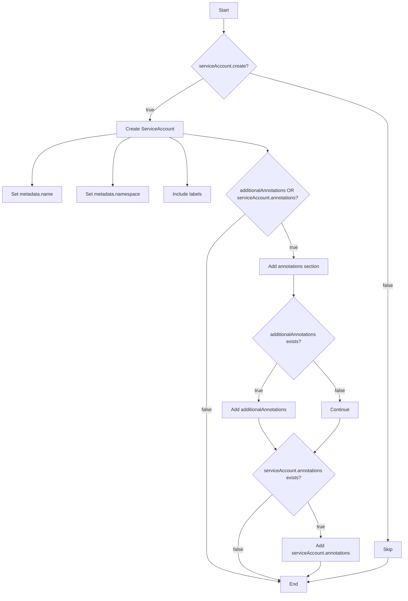
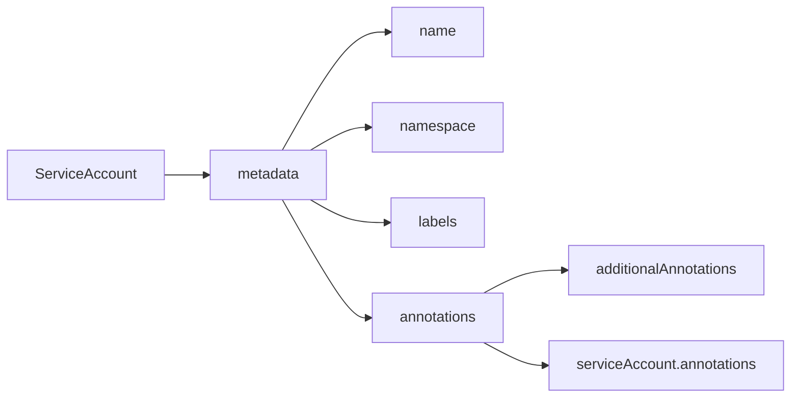

# Diagram: devops/k8s/karpenter/helm/templates/serviceaccount.yaml

> Auto-generated by Obscura crawlers

## Diagram 1

### SVG

<svg id="container" width="1366.4453125" xmlns="http://www.w3.org/2000/svg" class="flowchart" height="1996.84375" viewBox="0 0 1366.4453125 1996.84375" role="graphics-document document" aria-roledescription="flowchart-v2"><g><marker id="container_flowchart-v2-pointEnd" class="marker flowchart-v2" viewBox="0 0 10 10" refX="5" refY="5" markerUnits="userSpaceOnUse" markerWidth="8" markerHeight="8" orient="auto"><path d="M 0 0 L 10 5 L 0 10 z" class="arrowMarkerPath" style="stroke-width: 1; stroke-dasharray: 1, 0;"></path></marker><marker id="container_flowchart-v2-pointStart" class="marker flowchart-v2" viewBox="0 0 10 10" refX="4.5" refY="5" markerUnits="userSpaceOnUse" markerWidth="8" markerHeight="8" orient="auto"><path d="M 0 5 L 10 10 L 10 0 z" class="arrowMarkerPath" style="stroke-width: 1; stroke-dasharray: 1, 0;"></path></marker><marker id="container_flowchart-v2-circleEnd" class="marker flowchart-v2" viewBox="0 0 10 10" refX="11" refY="5" markerUnits="userSpaceOnUse" markerWidth="11" markerHeight="11" orient="auto"><circle cx="5" cy="5" r="5" class="arrowMarkerPath" style="stroke-width: 1; stroke-dasharray: 1, 0;"></circle></marker><marker id="container_flowchart-v2-circleStart" class="marker flowchart-v2" viewBox="0 0 10 10" refX="-1" refY="5" markerUnits="userSpaceOnUse" markerWidth="11" markerHeight="11" orient="auto"><circle cx="5" cy="5" r="5" class="arrowMarkerPath" style="stroke-width: 1; stroke-dasharray: 1, 0;"></circle></marker><marker id="container_flowchart-v2-crossEnd" class="marker cross flowchart-v2" viewBox="0 0 11 11" refX="12" refY="5.2" markerUnits="userSpaceOnUse" markerWidth="11" markerHeight="11" orient="auto"><path d="M 1,1 l 9,9 M 10,1 l -9,9" class="arrowMarkerPath" style="stroke-width: 2; stroke-dasharray: 1, 0;"></path></marker><marker id="container_flowchart-v2-crossStart" class="marker cross flowchart-v2" viewBox="0 0 11 11" refX="-1" refY="5.2" markerUnits="userSpaceOnUse" markerWidth="11" markerHeight="11" orient="auto"><path d="M 1,1 l 9,9 M 10,1 l -9,9" class="arrowMarkerPath" style="stroke-width: 2; stroke-dasharray: 1, 0;"></path></marker><g class="root"><g class="clusters"></g><g class="edgePaths"><path d="M756.305,62L756.305,66.167C756.305,70.333,756.305,78.667,756.305,86.333C756.305,94,756.305,101,756.305,104.5L756.305,108" id="L_A_B_0" class="edge-thickness-normal edge-pattern-solid edge-thickness-normal edge-pattern-solid flowchart-link" style=";" data-edge="true" data-et="edge" data-id="L_A_B_0" data-points="W3sieCI6NzU2LjMwNDY4NzUsInkiOjYyfSx7IngiOjc1Ni4zMDQ2ODc1LCJ5Ijo4N30seyJ4Ijo3NTYuMzA0Njg3NSwieSI6MTEyfV0=" marker-end="url(#container_flowchart-v2-pointEnd)"></path><path d="M687.605,261.051L657.482,278.667C627.358,296.284,567.111,331.517,536.987,354.633C506.863,377.75,506.863,388.75,506.863,394.25L506.863,399.75" id="L_B_C_0" class="edge-thickness-normal edge-pattern-solid edge-thickness-normal edge-pattern-solid flowchart-link" style=";" data-edge="true" data-et="edge" data-id="L_B_C_0" data-points="W3sieCI6Njg3LjYwNTQ1NjUxNDE0MDIsInkiOjI2MS4wNTA3NjkwMTQxNDAyfSx7IngiOjUwNi44NjMyODEyNSwieSI6MzY2Ljc1fSx7IngiOjUwNi44NjMyODEyNSwieSI6NDAzLjc1fV0=" marker-end="url(#container_flowchart-v2-pointEnd)"></path><path d="M842.573,243.482L920.974,264.026C999.374,284.571,1156.175,325.661,1234.576,356.872C1312.977,388.083,1312.977,409.417,1312.977,428.75C1312.977,448.083,1312.977,465.417,1312.977,501.988C1312.977,538.56,1312.977,594.37,1312.977,652.18C1312.977,709.99,1312.977,769.799,1312.977,810.371C1312.977,850.943,1312.977,872.276,1312.977,893.609C1312.977,914.943,1312.977,936.276,1312.977,976.276C1312.977,1016.276,1312.977,1074.943,1312.977,1133.609C1312.977,1192.276,1312.977,1250.943,1312.977,1290.943C1312.977,1330.943,1312.977,1352.276,1312.977,1371.609C1312.977,1390.943,1312.977,1408.276,1312.977,1444.629C1312.977,1480.982,1312.977,1536.354,1312.977,1593.727C1312.977,1651.099,1312.977,1710.471,1312.977,1747.658C1312.977,1784.844,1312.977,1799.844,1312.977,1807.344L1312.977,1814.844" id="L_B_D_0" class="edge-thickness-normal edge-pattern-solid edge-thickness-normal edge-pattern-solid flowchart-link" style=";" data-edge="true" data-et="edge" data-id="L_B_D_0" data-points="W3sieCI6ODQyLjU3MzE2NjU4MjgwMTQsInkiOjI0My40ODE1MjA5MTcxOTg2fSx7IngiOjEzMTIuOTc2NTYyNSwieSI6MzY2Ljc1fSx7IngiOjEzMTIuOTc2NTYyNSwieSI6NDMwLjc1fSx7IngiOjEzMTIuOTc2NTYyNSwieSI6NDgyLjc1fSx7IngiOjEzMTIuOTc2NTYyNSwieSI6NjUwLjE3OTY4NzV9LHsieCI6MTMxMi45NzY1NjI1LCJ5Ijo4MjkuNjA5Mzc1fSx7IngiOjEzMTIuOTc2NTYyNSwieSI6ODkzLjYwOTM3NX0seyJ4IjoxMzEyLjk3NjU2MjUsInkiOjk1Ny42MDkzNzV9LHsieCI6MTMxMi45NzY1NjI1LCJ5IjoxMTMzLjYwOTM3NX0seyJ4IjoxMzEyLjk3NjU2MjUsInkiOjEzMDkuNjA5Mzc1fSx7IngiOjEzMTIuOTc2NTYyNSwieSI6MTM3My42MDkzNzV9LHsieCI6MTMxMi45NzY1NjI1LCJ5IjoxNDI1LjYwOTM3NX0seyJ4IjoxMzEyLjk3NjU2MjUsInkiOjE1OTEuNzI2NTYyNX0seyJ4IjoxMzEyLjk3NjU2MjUsInkiOjE3NjkuODQzNzV9LHsieCI6MTMxMi45NzY1NjI1LCJ5IjoxODE4Ljg0Mzc1fV0=" marker-end="url(#container_flowchart-v2-pointEnd)"></path><path d="M396.934,445.104L348.882,451.378C300.831,457.653,204.728,470.201,156.676,499.214C108.625,528.227,108.625,573.703,108.625,596.441L108.625,619.18" id="L_C_E_0" class="edge-thickness-normal edge-pattern-solid edge-thickness-normal edge-pattern-solid flowchart-link" style=";" data-edge="true" data-et="edge" data-id="L_C_E_0" data-points="W3sieCI6Mzk2LjkzMzU5Mzc1LCJ5Ijo0NDUuMTA0MDc5MDAwMjg0NDZ9LHsieCI6MTA4LjYyNSwieSI6NDgyLjc1fSx7IngiOjEwOC42MjUsInkiOjYyMy4xNzk2ODc1fV0=" marker-end="url(#container_flowchart-v2-pointEnd)"></path><path d="M441.337,457.75L431.225,461.917C421.113,466.083,400.888,474.417,390.776,501.322C380.664,528.227,380.664,573.703,380.664,596.441L380.664,619.18" id="L_C_F_0" class="edge-thickness-normal edge-pattern-solid edge-thickness-normal edge-pattern-solid flowchart-link" style=";" data-edge="true" data-et="edge" data-id="L_C_F_0" data-points="W3sieCI6NDQxLjMzNjc2MzgyMjExNTM2LCJ5Ijo0NTcuNzV9LHsieCI6MzgwLjY2NDA2MjUsInkiOjQ4Mi43NX0seyJ4IjozODAuNjY0MDYyNSwieSI6NjIzLjE3OTY4NzV9XQ==" marker-end="url(#container_flowchart-v2-pointEnd)"></path><path d="M572.39,457.75L582.502,461.917C592.614,466.083,612.838,474.417,622.95,501.322C633.063,528.227,633.063,573.703,633.063,596.441L633.063,619.18" id="L_C_G_0" class="edge-thickness-normal edge-pattern-solid edge-thickness-normal edge-pattern-solid flowchart-link" style=";" data-edge="true" data-et="edge" data-id="L_C_G_0" data-points="W3sieCI6NTcyLjM4OTc5ODY3Nzg4NDYsInkiOjQ1Ny43NX0seyJ4Ijo2MzMuMDYyNSwieSI6NDgyLjc1fSx7IngiOjYzMy4wNjI1LCJ5Ijo2MjMuMTc5Njg3NX1d" marker-end="url(#container_flowchart-v2-pointEnd)"></path><path d="M616.793,445.055L665.074,451.337C713.354,457.62,809.915,470.185,858.196,479.967C906.477,489.75,906.477,496.75,906.477,500.25L906.477,503.75" id="L_C_H_0" class="edge-thickness-normal edge-pattern-solid edge-thickness-normal edge-pattern-solid flowchart-link" style=";" data-edge="true" data-et="edge" data-id="L_C_H_0" data-points="W3sieCI6NjE2Ljc5Mjk2ODc1LCJ5Ijo0NDUuMDU0Njg5MTAzNzIzM30seyJ4Ijo5MDYuNDc2NTYyNSwieSI6NDgyLjc1fSx7IngiOjkwNi40NzY1NjI1LCJ5Ijo1MDcuNzV9XQ==" marker-end="url(#container_flowchart-v2-pointEnd)"></path><path d="M954.026,745.06L961.088,759.151C968.15,773.243,982.274,801.426,989.336,821.018C996.398,840.609,996.398,851.609,996.398,857.109L996.398,862.609" id="L_H_I_0" class="edge-thickness-normal edge-pattern-solid edge-thickness-normal edge-pattern-solid flowchart-link" style=";" data-edge="true" data-et="edge" data-id="L_H_I_0" data-points="W3sieCI6OTU0LjAyNjEwODY2NDgzNDUsInkiOjc0NS4wNTk4Mjg4MzUxNjU1fSx7IngiOjk5Ni4zOTg0Mzc1LCJ5Ijo4MjkuNjA5Mzc1fSx7IngiOjk5Ni4zOTg0Mzc1LCJ5Ijo4NjYuNjA5Mzc1fV0=" marker-end="url(#container_flowchart-v2-pointEnd)"></path><path d="M829.671,715.804L807.472,734.772C785.273,753.739,740.875,791.674,718.676,821.309C696.477,850.943,696.477,872.276,696.477,893.609C696.477,914.943,696.477,936.276,696.477,976.276C696.477,1016.276,696.477,1074.943,696.477,1133.609C696.477,1192.276,696.477,1250.943,696.477,1290.943C696.477,1330.943,696.477,1352.276,696.477,1371.609C696.477,1390.943,696.477,1408.276,696.477,1444.629C696.477,1480.982,696.477,1536.354,696.477,1593.727C696.477,1651.099,696.477,1710.471,696.477,1752.824C696.477,1795.177,696.477,1820.51,696.477,1843.844C696.477,1867.177,696.477,1888.51,738.527,1906.468C780.577,1924.425,864.677,1939.006,906.727,1946.297L948.778,1953.587" id="L_H_J_0" class="edge-thickness-normal edge-pattern-solid edge-thickness-normal edge-pattern-solid flowchart-link" style=";" data-edge="true" data-et="edge" data-id="L_H_J_0" data-points="W3sieCI6ODI5LjY3MTMzODUxNDYwNDcsInkiOjcxNS44MDQxNTEwMTQ2MDQ3fSx7IngiOjY5Ni40NzY1NjI1LCJ5Ijo4MjkuNjA5Mzc1fSx7IngiOjY5Ni40NzY1NjI1LCJ5Ijo4OTMuNjA5Mzc1fSx7IngiOjY5Ni40NzY1NjI1LCJ5Ijo5NTcuNjA5Mzc1fSx7IngiOjY5Ni40NzY1NjI1LCJ5IjoxMTMzLjYwOTM3NX0seyJ4Ijo2OTYuNDc2NTYyNSwieSI6MTMwOS42MDkzNzV9LHsieCI6Njk2LjQ3NjU2MjUsInkiOjEzNzMuNjA5Mzc1fSx7IngiOjY5Ni40NzY1NjI1LCJ5IjoxNDI1LjYwOTM3NX0seyJ4Ijo2OTYuNDc2NTYyNSwieSI6MTU5MS43MjY1NjI1fSx7IngiOjY5Ni40NzY1NjI1LCJ5IjoxNzY5Ljg0Mzc1fSx7IngiOjY5Ni40NzY1NjI1LCJ5IjoxODQ1Ljg0Mzc1fSx7IngiOjY5Ni40NzY1NjI1LCJ5IjoxOTA5Ljg0Mzc1fSx7IngiOjk1Mi43MTg3NSwieSI6MTk1NC4yNzA2MzIwMDA1MjF9XQ==" marker-end="url(#container_flowchart-v2-pointEnd)"></path><path d="M996.398,920.609L996.398,926.776C996.398,932.943,996.398,945.276,996.398,956.943C996.398,968.609,996.398,979.609,996.398,985.109L996.398,990.609" id="L_I_K_0" class="edge-thickness-normal edge-pattern-solid edge-thickness-normal edge-pattern-solid flowchart-link" style=";" data-edge="true" data-et="edge" data-id="L_I_K_0" data-points="W3sieCI6OTk2LjM5ODQzNzUsInkiOjkyMC42MDkzNzV9LHsieCI6OTk2LjM5ODQzNzUsInkiOjk1Ny42MDkzNzV9LHsieCI6OTk2LjM5ODQzNzUsInkiOjk5NC42MDkzNzV9XQ==" marker-end="url(#container_flowchart-v2-pointEnd)"></path><path d="M940.025,1216.236L929.408,1231.798C918.79,1247.361,897.555,1278.485,886.938,1299.547C876.32,1320.609,876.32,1331.609,876.32,1337.109L876.32,1342.609" id="L_K_L_0" class="edge-thickness-normal edge-pattern-solid edge-thickness-normal edge-pattern-solid flowchart-link" style=";" data-edge="true" data-et="edge" data-id="L_K_L_0" data-points="W3sieCI6OTQwLjAyNTI3Nzk2NjUxNTQsInkiOjEyMTYuMjM2MjE1NDY2NTE1NH0seyJ4Ijo4NzYuMzIwMzEyNSwieSI6MTMwOS42MDkzNzV9LHsieCI6ODc2LjMyMDMxMjUsInkiOjEzNDYuNjA5Mzc1fV0=" marker-end="url(#container_flowchart-v2-pointEnd)"></path><path d="M1061.507,1207.501L1076.502,1224.519C1091.497,1241.537,1121.487,1275.573,1136.482,1298.091C1151.477,1320.609,1151.477,1331.609,1151.477,1337.109L1151.477,1342.609" id="L_K_M_0" class="edge-thickness-normal edge-pattern-solid edge-thickness-normal edge-pattern-solid flowchart-link" style=";" data-edge="true" data-et="edge" data-id="L_K_M_0" data-points="W3sieCI6MTA2MS41MDY1MTI0NDQ1NDY2LCJ5IjoxMjA3LjUwMTMwMDA1NTQ1MzR9LHsieCI6MTE1MS40NzY1NjI1LCJ5IjoxMzA5LjYwOTM3NX0seyJ4IjoxMTUxLjQ3NjU2MjUsInkiOjEzNDYuNjA5Mzc1fV0=" marker-end="url(#container_flowchart-v2-pointEnd)"></path><path d="M876.32,1400.609L876.32,1404.776C876.32,1408.943,876.32,1417.276,886.075,1434.937C895.829,1452.598,915.338,1479.587,925.093,1493.081L934.847,1506.576" id="L_L_N_0" class="edge-thickness-normal edge-pattern-solid edge-thickness-normal edge-pattern-solid flowchart-link" style=";" data-edge="true" data-et="edge" data-id="L_L_N_0" data-points="W3sieCI6ODc2LjMyMDMxMjUsInkiOjE0MDAuNjA5Mzc1fSx7IngiOjg3Ni4zMjAzMTI1LCJ5IjoxNDI1LjYwOTM3NX0seyJ4Ijo5MzcuMTkwMzE0NDQ0OTY3NiwieSI6MTUwOS44MTc0OTgwNTUwMzIzfV0=" marker-end="url(#container_flowchart-v2-pointEnd)"></path><path d="M1151.477,1400.609L1151.477,1404.776C1151.477,1408.943,1151.477,1417.276,1137.441,1436.478C1123.405,1455.679,1095.333,1485.749,1081.297,1500.784L1067.262,1515.819" id="L_M_N_0" class="edge-thickness-normal edge-pattern-solid edge-thickness-normal edge-pattern-solid flowchart-link" style=";" data-edge="true" data-et="edge" data-id="L_M_N_0" data-points="W3sieCI6MTE1MS40NzY1NjI1LCJ5IjoxNDAwLjYwOTM3NX0seyJ4IjoxMTUxLjQ3NjU2MjUsInkiOjE0MjUuNjA5Mzc1fSx7IngiOjEwNjQuNTMyMDI0NzMyMTQwNiwieSI6MTUxOC43NDI5NjIyMzIxNDA2fV0=" marker-end="url(#container_flowchart-v2-pointEnd)"></path><path d="M1044.154,1685.088L1051.38,1699.214C1058.605,1713.34,1073.057,1741.592,1080.282,1761.218C1087.508,1780.844,1087.508,1791.844,1087.508,1797.344L1087.508,1802.844" id="L_N_O_0" class="edge-thickness-normal edge-pattern-solid edge-thickness-normal edge-pattern-solid flowchart-link" style=";" data-edge="true" data-et="edge" data-id="L_N_O_0" data-points="W3sieCI6MTA0NC4xNTQxMjE5MTQ5OTA4LCJ5IjoxNjg1LjA4ODA2NTU4NTAwOTJ9LHsieCI6MTA4Ny41MDc4MTI1LCJ5IjoxNzY5Ljg0Mzc1fSx7IngiOjEwODcuNTA3ODEyNSwieSI6MTgwNi44NDM3NX1d" marker-end="url(#container_flowchart-v2-pointEnd)"></path><path d="M923.305,1659.751L903.589,1678.099C883.873,1696.448,844.44,1733.146,824.724,1764.162C805.008,1795.177,805.008,1820.51,805.008,1843.844C805.008,1867.177,805.008,1888.51,828.983,1905.691C852.958,1922.872,900.908,1935.9,924.884,1942.413L948.859,1948.927" id="L_N_J_0" class="edge-thickness-normal edge-pattern-solid edge-thickness-normal edge-pattern-solid flowchart-link" style=";" data-edge="true" data-et="edge" data-id="L_N_J_0" data-points="W3sieCI6OTIzLjMwNTI0MjE3MzEyOTQsInkiOjE2NTkuNzUwNTU0NjczMTI5M30seyJ4Ijo4MDUuMDA3ODEyNSwieSI6MTc2OS44NDM3NX0seyJ4Ijo4MDUuMDA3ODEyNSwieSI6MTg0NS44NDM3NX0seyJ4Ijo4MDUuMDA3ODEyNSwieSI6MTkwOS44NDM3NX0seyJ4Ijo5NTIuNzE4NzUsInkiOjE5NDkuOTc2MTY4OTcyOTc3M31d" marker-end="url(#container_flowchart-v2-pointEnd)"></path><path d="M1087.508,1884.844L1087.508,1889.01C1087.508,1893.177,1087.508,1901.51,1080.182,1909.858C1072.856,1918.206,1058.204,1926.569,1050.878,1930.75L1043.552,1934.931" id="L_O_J_0" class="edge-thickness-normal edge-pattern-solid edge-thickness-normal edge-pattern-solid flowchart-link" style=";" data-edge="true" data-et="edge" data-id="L_O_J_0" data-points="W3sieCI6MTA4Ny41MDc4MTI1LCJ5IjoxODg0Ljg0Mzc1fSx7IngiOjEwODcuNTA3ODEyNSwieSI6MTkwOS44NDM3NX0seyJ4IjoxMDQwLjA3ODEyNSwieSI6MTkzNi45MTM4OTIzNDI2NTEzfV0=" marker-end="url(#container_flowchart-v2-pointEnd)"></path><path d="M1312.977,1872.844L1312.977,1879.01C1312.977,1885.177,1312.977,1897.51,1268.151,1911.04C1223.326,1924.569,1133.676,1939.295,1088.85,1946.658L1044.025,1954.021" id="L_D_J_0" class="edge-thickness-normal edge-pattern-solid edge-thickness-normal edge-pattern-solid flowchart-link" style=";" data-edge="true" data-et="edge" data-id="L_D_J_0" data-points="W3sieCI6MTMxMi45NzY1NjI1LCJ5IjoxODcyLjg0Mzc1fSx7IngiOjEzMTIuOTc2NTYyNSwieSI6MTkwOS44NDM3NX0seyJ4IjoxMDQwLjA3ODEyNSwieSI6MTk1NC42NjkwNzk0NTA2Njg3fV0=" marker-end="url(#container_flowchart-v2-pointEnd)"></path></g><g class="edgeLabels"><g class="edgeLabel"><g class="label" data-id="L_A_B_0" transform="translate(0, 0)"><foreignObject width="0" height="0">

</foreignObject></g></g><g class="edgeLabel" transform="translate(506.86328125, 366.75)"><g class="label" data-id="L_B_C_0" transform="translate(-14.9921875, -12)"><foreignObject width="29.984375" height="24">

true

</foreignObject></g></g><g class="edgeLabel" transform="translate(1312.9765625, 957.609375)"><g class="label" data-id="L_B_D_0" transform="translate(-17.21875, -12)"><foreignObject width="34.4375" height="24">

false

</foreignObject></g></g><g class="edgeLabel"><g class="label" data-id="L_C_E_0" transform="translate(0, 0)"><foreignObject width="0" height="0">

</foreignObject></g></g><g class="edgeLabel"><g class="label" data-id="L_C_F_0" transform="translate(0, 0)"><foreignObject width="0" height="0">

</foreignObject></g></g><g class="edgeLabel"><g class="label" data-id="L_C_G_0" transform="translate(0, 0)"><foreignObject width="0" height="0">

</foreignObject></g></g><g class="edgeLabel"><g class="label" data-id="L_C_H_0" transform="translate(0, 0)"><foreignObject width="0" height="0">

</foreignObject></g></g><g class="edgeLabel" transform="translate(996.3984375, 829.609375)"><g class="label" data-id="L_H_I_0" transform="translate(-14.9921875, -12)"><foreignObject width="29.984375" height="24">

true

</foreignObject></g></g><g class="edgeLabel" transform="translate(696.4765625, 1373.609375)"><g class="label" data-id="L_H_J_0" transform="translate(-17.21875, -12)"><foreignObject width="34.4375" height="24">

false

</foreignObject></g></g><g class="edgeLabel"><g class="label" data-id="L_I_K_0" transform="translate(0, 0)"><foreignObject width="0" height="0">

</foreignObject></g></g><g class="edgeLabel" transform="translate(876.3203125, 1309.609375)"><g class="label" data-id="L_K_L_0" transform="translate(-14.9921875, -12)"><foreignObject width="29.984375" height="24">

true

</foreignObject></g></g><g class="edgeLabel" transform="translate(1151.4765625, 1309.609375)"><g class="label" data-id="L_K_M_0" transform="translate(-17.21875, -12)"><foreignObject width="34.4375" height="24">

false

</foreignObject></g></g><g class="edgeLabel"><g class="label" data-id="L_L_N_0" transform="translate(0, 0)"><foreignObject width="0" height="0">

</foreignObject></g></g><g class="edgeLabel"><g class="label" data-id="L_M_N_0" transform="translate(0, 0)"><foreignObject width="0" height="0">

</foreignObject></g></g><g class="edgeLabel" transform="translate(1087.5078125, 1769.84375)"><g class="label" data-id="L_N_O_0" transform="translate(-14.9921875, -12)"><foreignObject width="29.984375" height="24">

true

</foreignObject></g></g><g class="edgeLabel" transform="translate(805.0078125, 1845.84375)"><g class="label" data-id="L_N_J_0" transform="translate(-17.21875, -12)"><foreignObject width="34.4375" height="24">

false

</foreignObject></g></g><g class="edgeLabel"><g class="label" data-id="L_O_J_0" transform="translate(0, 0)"><foreignObject width="0" height="0">

</foreignObject></g></g><g class="edgeLabel"><g class="label" data-id="L_D_J_0" transform="translate(0, 0)"><foreignObject width="0" height="0">

</foreignObject></g></g></g><g class="nodes"><g class="node default" id="flowchart-A-0" transform="translate(756.3046875, 35)"><rect class="basic label-container" style="" x="-47.5234375" y="-27" width="95.046875" height="54"></rect><g class="label" style="" transform="translate(-17.5234375, -12)"><rect></rect><foreignObject width="35.046875" height="24">

Start

</foreignObject></g></g><g class="node default" id="flowchart-B-1" transform="translate(756.3046875, 220.875)"><polygon points="108.875,0 217.75,-108.875 108.875,-217.75 0,-108.875" class="label-container" transform="translate(-108.375, 108.875)"></polygon><g class="label" style="" transform="translate(-81.875, -12)"><rect></rect><foreignObject width="163.75" height="24">

serviceAccount.create?

</foreignObject></g></g><g class="node default" id="flowchart-C-3" transform="translate(506.86328125, 430.75)"><rect class="basic label-container" style="" x="-109.9296875" y="-27" width="219.859375" height="54"></rect><g class="label" style="" transform="translate(-79.9296875, -12)"><rect></rect><foreignObject width="159.859375" height="24">

Create ServiceAccount

</foreignObject></g></g><g class="node default" id="flowchart-D-5" transform="translate(1312.9765625, 1845.84375)"><rect class="basic label-container" style="" x="-45.46875" y="-27" width="90.9375" height="54"></rect><g class="label" style="" transform="translate(-15.46875, -12)"><rect></rect><foreignObject width="30.9375" height="24">

Skip

</foreignObject></g></g><g class="node default" id="flowchart-E-7" transform="translate(108.625, 650.1796875)"><rect class="basic label-container" style="" x="-100.625" y="-27" width="201.25" height="54"></rect><g class="label" style="" transform="translate(-70.625, -12)"><rect></rect><foreignObject width="141.25" height="24">

Set metadata.name

</foreignObject></g></g><g class="node default" id="flowchart-F-9" transform="translate(380.6640625, 650.1796875)"><rect class="basic label-container" style="" x="-121.4140625" y="-27" width="242.828125" height="54"></rect><g class="label" style="" transform="translate(-91.4140625, -12)"><rect></rect><foreignObject width="182.828125" height="24">

Set metadata.namespace

</foreignObject></g></g><g class="node default" id="flowchart-G-11" transform="translate(633.0625, 650.1796875)"><rect class="basic label-container" style="" x="-80.984375" y="-27" width="161.96875" height="54"></rect><g class="label" style="" transform="translate(-50.984375, -12)"><rect></rect><foreignObject width="101.96875" height="24">

Include labels

</foreignObject></g></g><g class="node default" id="flowchart-H-13" transform="translate(906.4765625, 650.1796875)"><polygon points="142.4296875,0 284.859375,-142.4296875 142.4296875,-284.859375 0,-142.4296875" class="label-container" transform="translate(-141.9296875, 142.4296875)"></polygon><g class="label" style="" transform="translate(-103.4296875, -24)"><rect></rect><foreignObject width="206.859375" height="48">

additionalAnnotations OR serviceAccount.annotations?

</foreignObject></g></g><g class="node default" id="flowchart-I-15" transform="translate(996.3984375, 893.609375)"><rect class="basic label-container" style="" x="-118.640625" y="-27" width="237.28125" height="54"></rect><g class="label" style="" transform="translate(-88.640625, -12)"><rect></rect><foreignObject width="177.28125" height="24">

Add annotations section

</foreignObject></g></g><g class="node default" id="flowchart-J-17" transform="translate(996.3984375, 1961.84375)"><rect class="basic label-container" style="" x="-43.6796875" y="-27" width="87.359375" height="54"></rect><g class="label" style="" transform="translate(-13.6796875, -12)"><rect></rect><foreignObject width="27.359375" height="24">

End

</foreignObject></g></g><g class="node default" id="flowchart-K-19" transform="translate(996.3984375, 1133.609375)"><polygon points="139,0 278,-139 139,-278 0,-139" class="label-container" transform="translate(-138.5, 139)"></polygon><g class="label" style="" transform="translate(-100, -24)"><rect></rect><foreignObject width="200" height="48">

additionalAnnotations exists?

</foreignObject></g></g><g class="node default" id="flowchart-L-21" transform="translate(876.3203125, 1373.609375)"><rect class="basic label-container" style="" x="-127.625" y="-27" width="255.25" height="54"></rect><g class="label" style="" transform="translate(-97.625, -12)"><rect></rect><foreignObject width="195.25" height="24">

Add additionalAnnotations

</foreignObject></g></g><g class="node default" id="flowchart-M-23" transform="translate(1151.4765625, 1373.609375)"><rect class="basic label-container" style="" x="-62.53125" y="-27" width="125.0625" height="54"></rect><g class="label" style="" transform="translate(-32.53125, -12)"><rect></rect><foreignObject width="65.0625" height="24">

Continue

</foreignObject></g></g><g class="node default" id="flowchart-N-25" transform="translate(996.3984375, 1591.7265625)"><polygon points="141.1171875,0 282.234375,-141.1171875 141.1171875,-282.234375 0,-141.1171875" class="label-container" transform="translate(-140.6171875, 141.1171875)"></polygon><g class="label" style="" transform="translate(-102.1171875, -24)"><rect></rect><foreignObject width="204.234375" height="48">

serviceAccount.annotations exists?

</foreignObject></g></g><g class="node default" id="flowchart-O-29" transform="translate(1087.5078125, 1845.84375)"><rect class="basic label-container" style="" x="-130" y="-39" width="260" height="78"></rect><g class="label" style="" transform="translate(-100, -24)"><rect></rect><foreignObject width="200" height="48">

Add serviceAccount.annotations

</foreignObject></g></g></g></g></g></svg>

## Diagram 2

### SVG

<svg id="container" width="872.796875" xmlns="http://www.w3.org/2000/svg" class="flowchart" height="434" viewBox="0 0 872.796875 434" role="graphics-document document" aria-roledescription="flowchart-v2"><g><marker id="container_flowchart-v2-pointEnd" class="marker flowchart-v2" viewBox="0 0 10 10" refX="5" refY="5" markerUnits="userSpaceOnUse" markerWidth="8" markerHeight="8" orient="auto"><path d="M 0 0 L 10 5 L 0 10 z" class="arrowMarkerPath" style="stroke-width: 1; stroke-dasharray: 1, 0;"></path></marker><marker id="container_flowchart-v2-pointStart" class="marker flowchart-v2" viewBox="0 0 10 10" refX="4.5" refY="5" markerUnits="userSpaceOnUse" markerWidth="8" markerHeight="8" orient="auto"><path d="M 0 5 L 10 10 L 10 0 z" class="arrowMarkerPath" style="stroke-width: 1; stroke-dasharray: 1, 0;"></path></marker><marker id="container_flowchart-v2-circleEnd" class="marker flowchart-v2" viewBox="0 0 10 10" refX="11" refY="5" markerUnits="userSpaceOnUse" markerWidth="11" markerHeight="11" orient="auto"><circle cx="5" cy="5" r="5" class="arrowMarkerPath" style="stroke-width: 1; stroke-dasharray: 1, 0;"></circle></marker><marker id="container_flowchart-v2-circleStart" class="marker flowchart-v2" viewBox="0 0 10 10" refX="-1" refY="5" markerUnits="userSpaceOnUse" markerWidth="11" markerHeight="11" orient="auto"><circle cx="5" cy="5" r="5" class="arrowMarkerPath" style="stroke-width: 1; stroke-dasharray: 1, 0;"></circle></marker><marker id="container_flowchart-v2-crossEnd" class="marker cross flowchart-v2" viewBox="0 0 11 11" refX="12" refY="5.2" markerUnits="userSpaceOnUse" markerWidth="11" markerHeight="11" orient="auto"><path d="M 1,1 l 9,9 M 10,1 l -9,9" class="arrowMarkerPath" style="stroke-width: 2; stroke-dasharray: 1, 0;"></path></marker><marker id="container_flowchart-v2-crossStart" class="marker cross flowchart-v2" viewBox="0 0 11 11" refX="-1" refY="5.2" markerUnits="userSpaceOnUse" markerWidth="11" markerHeight="11" orient="auto"><path d="M 1,1 l 9,9 M 10,1 l -9,9" class="arrowMarkerPath" style="stroke-width: 2; stroke-dasharray: 1, 0;"></path></marker><g class="root"><g class="clusters"></g><g class="edgePaths"><path d="M177.688,191L181.854,191C186.021,191,194.354,191,202.021,191C209.688,191,216.688,191,220.188,191L223.688,191" id="L_SA_MD_0" class="edge-thickness-normal edge-pattern-solid edge-thickness-normal edge-pattern-solid flowchart-link" style=";" data-edge="true" data-et="edge" data-id="L_SA_MD_0" data-points="W3sieCI6MTc3LjY4NzUsInkiOjE5MX0seyJ4IjoyMDIuNjg3NSwieSI6MTkxfSx7IngiOjIyNy42ODc1LCJ5IjoxOTF9XQ==" marker-end="url(#container_flowchart-v2-pointEnd)"></path><path d="M307.944,164L320.31,142.5C332.676,121,357.408,78,377.203,56.5C396.997,35,411.854,35,419.283,35L426.711,35" id="L_MD_N_0" class="edge-thickness-normal edge-pattern-solid edge-thickness-normal edge-pattern-solid flowchart-link" style=";" data-edge="true" data-et="edge" data-id="L_MD_N_0" data-points="W3sieCI6MzA3Ljk0MzY1OTg1NTc2OTIsInkiOjE2NH0seyJ4IjozODIuMTQwNjI1LCJ5IjozNX0seyJ4Ijo0MzAuNzEwOTM3NSwieSI6MzV9XQ==" marker-end="url(#container_flowchart-v2-pointEnd)"></path><path d="M339.003,164L346.192,159.833C353.382,155.667,367.761,147.333,378.915,143.167C390.068,139,397.995,139,401.958,139L405.922,139" id="L_MD_NS_0" class="edge-thickness-normal edge-pattern-solid edge-thickness-normal edge-pattern-solid flowchart-link" style=";" data-edge="true" data-et="edge" data-id="L_MD_NS_0" data-points="W3sieCI6MzM5LjAwMjg1NDU2NzMwNzcsInkiOjE2NH0seyJ4IjozODIuMTQwNjI1LCJ5IjoxMzl9LHsieCI6NDA5LjkyMTg3NSwieSI6MTM5fV0=" marker-end="url(#container_flowchart-v2-pointEnd)"></path><path d="M339.003,218L346.192,222.167C353.382,226.333,367.761,234.667,382.114,238.833C396.466,243,410.792,243,417.954,243L425.117,243" id="L_MD_L_0" class="edge-thickness-normal edge-pattern-solid edge-thickness-normal edge-pattern-solid flowchart-link" style=";" data-edge="true" data-et="edge" data-id="L_MD_L_0" data-points="W3sieCI6MzM5LjAwMjg1NDU2NzMwNzcsInkiOjIxOH0seyJ4IjozODIuMTQwNjI1LCJ5IjoyNDN9LHsieCI6NDI5LjExNzE4NzUsInkiOjI0M31d" marker-end="url(#container_flowchart-v2-pointEnd)"></path><path d="M307.944,218L320.31,239.5C332.676,261,357.408,304,373.274,325.5C389.141,347,396.141,347,399.641,347L403.141,347" id="L_MD_AN_0" class="edge-thickness-normal edge-pattern-solid edge-thickness-normal edge-pattern-solid flowchart-link" style=";" data-edge="true" data-et="edge" data-id="L_MD_AN_0" data-points="W3sieCI6MzA3Ljk0MzY1OTg1NTc2OTIsInkiOjIxOH0seyJ4IjozODIuMTQwNjI1LCJ5IjozNDd9LHsieCI6NDA3LjE0MDYyNSwieSI6MzQ3fV0=" marker-end="url(#container_flowchart-v2-pointEnd)"></path><path d="M532.283,320L540.202,315.833C548.121,311.667,563.959,303.333,578.485,299.167C593.01,295,606.224,295,612.831,295L619.438,295" id="L_AN_AA_0" class="edge-thickness-normal edge-pattern-solid edge-thickness-normal edge-pattern-solid flowchart-link" style=";" data-edge="true" data-et="edge" data-id="L_AN_AA_0" data-points="W3sieCI6NTMyLjI4MzM1MzM2NTM4NDYsInkiOjMyMH0seyJ4Ijo1NzkuNzk2ODc1LCJ5IjoyOTV9LHsieCI6NjIzLjQzNzUsInkiOjI5NX1d" marker-end="url(#container_flowchart-v2-pointEnd)"></path><path d="M532.283,374L540.202,378.167C548.121,382.333,563.959,390.667,575.378,394.833C586.797,399,593.797,399,597.297,399L600.797,399" id="L_AN_SAA_0" class="edge-thickness-normal edge-pattern-solid edge-thickness-normal edge-pattern-solid flowchart-link" style=";" data-edge="true" data-et="edge" data-id="L_AN_SAA_0" data-points="W3sieCI6NTMyLjI4MzM1MzM2NTM4NDYsInkiOjM3NH0seyJ4Ijo1NzkuNzk2ODc1LCJ5IjozOTl9LHsieCI6NjA0Ljc5Njg3NSwieSI6Mzk5fV0=" marker-end="url(#container_flowchart-v2-pointEnd)"></path></g><g class="edgeLabels"><g class="edgeLabel"><g class="label" data-id="L_SA_MD_0" transform="translate(0, 0)"><foreignObject width="0" height="0">

</foreignObject></g></g><g class="edgeLabel"><g class="label" data-id="L_MD_N_0" transform="translate(0, 0)"><foreignObject width="0" height="0">

</foreignObject></g></g><g class="edgeLabel"><g class="label" data-id="L_MD_NS_0" transform="translate(0, 0)"><foreignObject width="0" height="0">

</foreignObject></g></g><g class="edgeLabel"><g class="label" data-id="L_MD_L_0" transform="translate(0, 0)"><foreignObject width="0" height="0">

</foreignObject></g></g><g class="edgeLabel"><g class="label" data-id="L_MD_AN_0" transform="translate(0, 0)"><foreignObject width="0" height="0">

</foreignObject></g></g><g class="edgeLabel"><g class="label" data-id="L_AN_AA_0" transform="translate(0, 0)"><foreignObject width="0" height="0">

</foreignObject></g></g><g class="edgeLabel"><g class="label" data-id="L_AN_SAA_0" transform="translate(0, 0)"><foreignObject width="0" height="0">

</foreignObject></g></g></g><g class="nodes"><g class="node default" id="flowchart-SA-0" transform="translate(92.84375, 191)"><rect class="basic label-container" style="" x="-84.84375" y="-27" width="169.6875" height="54"></rect><g class="label" style="" transform="translate(-54.84375, -12)"><rect></rect><foreignObject width="109.6875" height="24">

ServiceAccount

</foreignObject></g></g><g class="node default" id="flowchart-MD-1" transform="translate(292.4140625, 191)"><rect class="basic label-container" style="" x="-64.7265625" y="-27" width="129.453125" height="54"></rect><g class="label" style="" transform="translate(-34.7265625, -12)"><rect></rect><foreignObject width="69.453125" height="24">

metadata

</foreignObject></g></g><g class="node default" id="flowchart-N-3" transform="translate(480.96875, 35)"><rect class="basic label-container" style="" x="-50.2578125" y="-27" width="100.515625" height="54"></rect><g class="label" style="" transform="translate(-20.2578125, -12)"><rect></rect><foreignObject width="40.515625" height="24">

name

</foreignObject></g></g><g class="node default" id="flowchart-NS-5" transform="translate(480.96875, 139)"><rect class="basic label-container" style="" x="-71.046875" y="-27" width="142.09375" height="54"></rect><g class="label" style="" transform="translate(-41.046875, -12)"><rect></rect><foreignObject width="82.09375" height="24">

namespace

</foreignObject></g></g><g class="node default" id="flowchart-L-7" transform="translate(480.96875, 243)"><rect class="basic label-container" style="" x="-51.8515625" y="-27" width="103.703125" height="54"></rect><g class="label" style="" transform="translate(-21.8515625, -12)"><rect></rect><foreignObject width="43.703125" height="24">

labels

</foreignObject></g></g><g class="node default" id="flowchart-AN-9" transform="translate(480.96875, 347)"><rect class="basic label-container" style="" x="-73.828125" y="-27" width="147.65625" height="54"></rect><g class="label" style="" transform="translate(-43.828125, -12)"><rect></rect><foreignObject width="87.65625" height="24">

annotations

</foreignObject></g></g><g class="node default" id="flowchart-AA-11" transform="translate(734.796875, 295)"><rect class="basic label-container" style="" x="-111.359375" y="-27" width="222.71875" height="54"></rect><g class="label" style="" transform="translate(-81.359375, -12)"><rect></rect><foreignObject width="162.71875" height="24">

additionalAnnotations

</foreignObject></g></g><g class="node default" id="flowchart-SAA-13" transform="translate(734.796875, 399)"><rect class="basic label-container" style="" x="-130" y="-27" width="260" height="54"></rect><g class="label" style="" transform="translate(-100, -12)"><rect></rect><foreignObject width="200" height="24">

serviceAccount.annotations

</foreignObject></g></g></g></g></g></svg>
