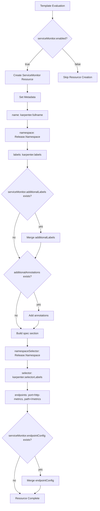
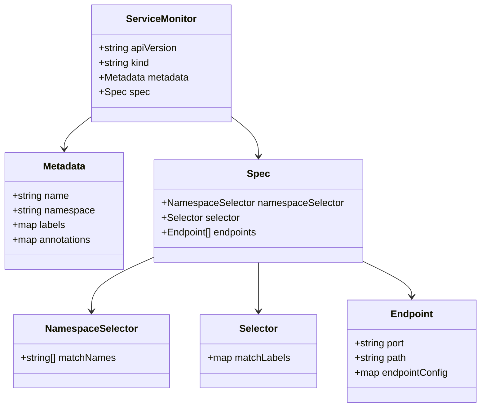

# Diagram: devops/k8s/karpenter/helm/templates/servicemonitor.yaml

> Auto-generated by Obscura crawlers

## Diagram 1

### SVG

<svg id="container" width="578.5546875" xmlns="http://www.w3.org/2000/svg" class="flowchart" height="2963.546875" viewBox="0.5 0 578.5546875 2963.546875" role="graphics-document document" aria-roledescription="flowchart-v2"><g><marker id="container_flowchart-v2-pointEnd" class="marker flowchart-v2" viewBox="0 0 10 10" refX="5" refY="5" markerUnits="userSpaceOnUse" markerWidth="8" markerHeight="8" orient="auto"><path d="M 0 0 L 10 5 L 0 10 z" class="arrowMarkerPath" style="stroke-width: 1; stroke-dasharray: 1, 0;"></path></marker><marker id="container_flowchart-v2-pointStart" class="marker flowchart-v2" viewBox="0 0 10 10" refX="4.5" refY="5" markerUnits="userSpaceOnUse" markerWidth="8" markerHeight="8" orient="auto"><path d="M 0 5 L 10 10 L 10 0 z" class="arrowMarkerPath" style="stroke-width: 1; stroke-dasharray: 1, 0;"></path></marker><marker id="container_flowchart-v2-circleEnd" class="marker flowchart-v2" viewBox="0 0 10 10" refX="11" refY="5" markerUnits="userSpaceOnUse" markerWidth="11" markerHeight="11" orient="auto"><circle cx="5" cy="5" r="5" class="arrowMarkerPath" style="stroke-width: 1; stroke-dasharray: 1, 0;"></circle></marker><marker id="container_flowchart-v2-circleStart" class="marker flowchart-v2" viewBox="0 0 10 10" refX="-1" refY="5" markerUnits="userSpaceOnUse" markerWidth="11" markerHeight="11" orient="auto"><circle cx="5" cy="5" r="5" class="arrowMarkerPath" style="stroke-width: 1; stroke-dasharray: 1, 0;"></circle></marker><marker id="container_flowchart-v2-crossEnd" class="marker cross flowchart-v2" viewBox="0 0 11 11" refX="12" refY="5.2" markerUnits="userSpaceOnUse" markerWidth="11" markerHeight="11" orient="auto"><path d="M 1,1 l 9,9 M 10,1 l -9,9" class="arrowMarkerPath" style="stroke-width: 2; stroke-dasharray: 1, 0;"></path></marker><marker id="container_flowchart-v2-crossStart" class="marker cross flowchart-v2" viewBox="0 0 11 11" refX="-1" refY="5.2" markerUnits="userSpaceOnUse" markerWidth="11" markerHeight="11" orient="auto"><path d="M 1,1 l 9,9 M 10,1 l -9,9" class="arrowMarkerPath" style="stroke-width: 2; stroke-dasharray: 1, 0;"></path></marker><g class="root"><g class="clusters"></g><g class="edgePaths"><path d="M311.449,62L311.449,66.167C311.449,70.333,311.449,78.667,311.449,86.333C311.449,94,311.449,101,311.449,104.5L311.449,108" id="L_Start_CheckEnabled_0" class="edge-thickness-normal edge-pattern-solid edge-thickness-normal edge-pattern-solid flowchart-link" style=";" data-edge="true" data-et="edge" data-id="L_Start_CheckEnabled_0" data-points="W3sieCI6MzExLjQ0OTIxODc1LCJ5Ijo2Mn0seyJ4IjozMTEuNDQ5MjE4NzUsInkiOjg3fSx7IngiOjMxMS40NDkyMTg3NSwieSI6MTEyfV0=" marker-end="url(#container_flowchart-v2-pointEnd)"></path><path d="M254.929,285.964L239.926,301.551C224.924,317.137,194.919,348.311,179.917,369.398C164.914,390.484,164.914,401.484,164.914,406.984L164.914,412.484" id="L_CheckEnabled_CreateResource_0" class="edge-thickness-normal edge-pattern-solid edge-thickness-normal edge-pattern-solid flowchart-link" style=";" data-edge="true" data-et="edge" data-id="L_CheckEnabled_CreateResource_0" data-points="W3sieCI6MjU0LjkyODc2MTk0NDQzMTczLCJ5IjoyODUuOTYzOTE4MTk0NDMxNzZ9LHsieCI6MTY0LjkxNDA2MjUsInkiOjM3OS40ODQzNzV9LHsieCI6MTY0LjkxNDA2MjUsInkiOjQxNi40ODQzNzV9XQ==" marker-end="url(#container_flowchart-v2-pointEnd)"></path><path d="M367.97,285.964L382.972,301.551C397.975,317.137,427.979,348.311,442.982,371.398C457.984,394.484,457.984,409.484,457.984,416.984L457.984,424.484" id="L_CheckEnabled_Skip_0" class="edge-thickness-normal edge-pattern-solid edge-thickness-normal edge-pattern-solid flowchart-link" style=";" data-edge="true" data-et="edge" data-id="L_CheckEnabled_Skip_0" data-points="W3sieCI6MzY3Ljk2OTY3NTU1NTU2ODI0LCJ5IjoyODUuOTYzOTE4MTk0NDMxNzZ9LHsieCI6NDU3Ljk4NDM3NSwieSI6Mzc5LjQ4NDM3NX0seyJ4Ijo0NTcuOTg0Mzc1LCJ5Ijo0MjguNDg0Mzc1fV0=" marker-end="url(#container_flowchart-v2-pointEnd)"></path><path d="M164.914,494.484L164.914,498.651C164.914,502.818,164.914,511.151,164.914,518.818C164.914,526.484,164.914,533.484,164.914,536.984L164.914,540.484" id="L_CreateResource_SetMetadata_0" class="edge-thickness-normal edge-pattern-solid edge-thickness-normal edge-pattern-solid flowchart-link" style=";" data-edge="true" data-et="edge" data-id="L_CreateResource_SetMetadata_0" data-points="W3sieCI6MTY0LjkxNDA2MjUsInkiOjQ5NC40ODQzNzV9LHsieCI6MTY0LjkxNDA2MjUsInkiOjUxOS40ODQzNzV9LHsieCI6MTY0LjkxNDA2MjUsInkiOjU0NC40ODQzNzV9XQ==" marker-end="url(#container_flowchart-v2-pointEnd)"></path><path d="M164.914,598.484L164.914,602.651C164.914,606.818,164.914,615.151,164.914,622.818C164.914,630.484,164.914,637.484,164.914,640.984L164.914,644.484" id="L_SetMetadata_SetName_0" class="edge-thickness-normal edge-pattern-solid edge-thickness-normal edge-pattern-solid flowchart-link" style=";" data-edge="true" data-et="edge" data-id="L_SetMetadata_SetName_0" data-points="W3sieCI6MTY0LjkxNDA2MjUsInkiOjU5OC40ODQzNzV9LHsieCI6MTY0LjkxNDA2MjUsInkiOjYyMy40ODQzNzV9LHsieCI6MTY0LjkxNDA2MjUsInkiOjY0OC40ODQzNzV9XQ==" marker-end="url(#container_flowchart-v2-pointEnd)"></path><path d="M164.914,702.484L164.914,706.651C164.914,710.818,164.914,719.151,164.914,726.818C164.914,734.484,164.914,741.484,164.914,744.984L164.914,748.484" id="L_SetName_SetNamespace_0" class="edge-thickness-normal edge-pattern-solid edge-thickness-normal edge-pattern-solid flowchart-link" style=";" data-edge="true" data-et="edge" data-id="L_SetName_SetNamespace_0" data-points="W3sieCI6MTY0LjkxNDA2MjUsInkiOjcwMi40ODQzNzV9LHsieCI6MTY0LjkxNDA2MjUsInkiOjcyNy40ODQzNzV9LHsieCI6MTY0LjkxNDA2MjUsInkiOjc1Mi40ODQzNzV9XQ==" marker-end="url(#container_flowchart-v2-pointEnd)"></path><path d="M164.914,830.484L164.914,834.651C164.914,838.818,164.914,847.151,164.914,854.818C164.914,862.484,164.914,869.484,164.914,872.984L164.914,876.484" id="L_SetNamespace_AddBaseLabels_0" class="edge-thickness-normal edge-pattern-solid edge-thickness-normal edge-pattern-solid flowchart-link" style=";" data-edge="true" data-et="edge" data-id="L_SetNamespace_AddBaseLabels_0" data-points="W3sieCI6MTY0LjkxNDA2MjUsInkiOjgzMC40ODQzNzV9LHsieCI6MTY0LjkxNDA2MjUsInkiOjg1NS40ODQzNzV9LHsieCI6MTY0LjkxNDA2MjUsInkiOjg4MC40ODQzNzV9XQ==" marker-end="url(#container_flowchart-v2-pointEnd)"></path><path d="M164.914,934.484L164.914,938.651C164.914,942.818,164.914,951.151,164.914,958.818C164.914,966.484,164.914,973.484,164.914,976.984L164.914,980.484" id="L_AddBaseLabels_CheckAddLabels_0" class="edge-thickness-normal edge-pattern-solid edge-thickness-normal edge-pattern-solid flowchart-link" style=";" data-edge="true" data-et="edge" data-id="L_AddBaseLabels_CheckAddLabels_0" data-points="W3sieCI6MTY0LjkxNDA2MjUsInkiOjkzNC40ODQzNzV9LHsieCI6MTY0LjkxNDA2MjUsInkiOjk1OS40ODQzNzV9LHsieCI6MTY0LjkxNDA2MjUsInkiOjk4NC40ODQzNzV9XQ==" marker-end="url(#container_flowchart-v2-pointEnd)"></path><path d="M210.576,1252.65L216.231,1266.427C221.885,1280.204,233.195,1307.758,238.849,1327.035C244.504,1346.313,244.504,1357.313,244.504,1362.813L244.504,1368.313" id="L_CheckAddLabels_MergeLabels_0" class="edge-thickness-normal edge-pattern-solid edge-thickness-normal edge-pattern-solid flowchart-link" style=";" data-edge="true" data-et="edge" data-id="L_CheckAddLabels_MergeLabels_0" data-points="W3sieCI6MjEwLjU3NjE3MzQ2NTAxNTY0LCJ5IjoxMjUyLjY1MDM4OTAzNDk4NDN9LHsieCI6MjQ0LjUwMzkwNjI1LCJ5IjoxMzM1LjMxMjV9LHsieCI6MjQ0LjUwMzkwNjI1LCJ5IjoxMzcyLjMxMjV9XQ==" marker-end="url(#container_flowchart-v2-pointEnd)"></path><path d="M119.252,1252.65L113.597,1266.427C107.943,1280.204,96.633,1307.758,90.979,1332.202C85.324,1356.646,85.324,1377.979,85.324,1397.313C85.324,1416.646,85.324,1433.979,90.729,1453.782C96.133,1473.585,106.942,1495.858,112.347,1506.994L117.751,1518.13" id="L_CheckAddLabels_CheckAnnotations_0" class="edge-thickness-normal edge-pattern-solid edge-thickness-normal edge-pattern-solid flowchart-link" style=";" data-edge="true" data-et="edge" data-id="L_CheckAddLabels_CheckAnnotations_0" data-points="W3sieCI6MTE5LjI1MTk1MTUzNDk4NDM2LCJ5IjoxMjUyLjY1MDM4OTAzNDk4NDN9LHsieCI6ODUuMzI0MjE4NzUsInkiOjEzMzUuMzEyNX0seyJ4Ijo4NS4zMjQyMTg3NSwieSI6MTM5OS4zMTI1fSx7IngiOjg1LjMyNDIxODc1LCJ5IjoxNDUxLjMxMjV9LHsieCI6MTE5LjQ5NzYwMjk2NzI5NDIxLCJ5IjoxNTIxLjcyODk1OTUzMjcwNTl9XQ==" marker-end="url(#container_flowchart-v2-pointEnd)"></path><path d="M244.504,1426.313L244.504,1430.479C244.504,1434.646,244.504,1442.979,239.099,1458.282C233.695,1473.585,222.886,1495.858,217.481,1506.994L212.077,1518.13" id="L_MergeLabels_CheckAnnotations_0" class="edge-thickness-normal edge-pattern-solid edge-thickness-normal edge-pattern-solid flowchart-link" style=";" data-edge="true" data-et="edge" data-id="L_MergeLabels_CheckAnnotations_0" data-points="W3sieCI6MjQ0LjUwMzkwNjI1LCJ5IjoxNDI2LjMxMjV9LHsieCI6MjQ0LjUwMzkwNjI1LCJ5IjoxNDUxLjMxMjV9LHsieCI6MjEwLjMzMDUyMjAzMjcwNTc3LCJ5IjoxNTIxLjcyODk1OTUzMjcwNTl9XQ==" marker-end="url(#container_flowchart-v2-pointEnd)"></path><path d="M203.336,1715.89L208.138,1728.461C212.94,1741.031,222.544,1766.172,227.346,1784.242C232.148,1802.313,232.148,1813.313,232.148,1818.813L232.148,1824.313" id="L_CheckAnnotations_AddAnnotations_0" class="edge-thickness-normal edge-pattern-solid edge-thickness-normal edge-pattern-solid flowchart-link" style=";" data-edge="true" data-et="edge" data-id="L_CheckAnnotations_AddAnnotations_0" data-points="W3sieCI6MjAzLjMzNjE3MzM3NTU3MDEzLCJ5IjoxNzE1Ljg5MDM4OTEyNDQzfSx7IngiOjIzMi4xNDg0Mzc1LCJ5IjoxNzkxLjMxMjV9LHsieCI6MjMyLjE0ODQzNzUsInkiOjE4MjguMzEyNX1d" marker-end="url(#container_flowchart-v2-pointEnd)"></path><path d="M126.492,1715.89L121.69,1728.461C116.888,1741.031,107.284,1766.172,102.482,1789.409C97.68,1812.646,97.68,1833.979,97.68,1853.313C97.68,1872.646,97.68,1889.979,102.54,1902.405C107.4,1914.83,117.12,1922.348,121.98,1926.107L126.84,1929.865" id="L_CheckAnnotations_BuildSpec_0" class="edge-thickness-normal edge-pattern-solid edge-thickness-normal edge-pattern-solid flowchart-link" style=";" data-edge="true" data-et="edge" data-id="L_CheckAnnotations_BuildSpec_0" data-points="W3sieCI6MTI2LjQ5MTk1MTYyNDQyOTg5LCJ5IjoxNzE1Ljg5MDM4OTEyNDQzfSx7IngiOjk3LjY3OTY4NzUsInkiOjE3OTEuMzEyNX0seyJ4Ijo5Ny42Nzk2ODc1LCJ5IjoxODU1LjMxMjV9LHsieCI6OTcuNjc5Njg3NSwieSI6MTkwNy4zMTI1fSx7IngiOjEzMC4wMDM5MDYyNSwieSI6MTkzMi4zMTI1fV0=" marker-end="url(#container_flowchart-v2-pointEnd)"></path><path d="M232.148,1882.313L232.148,1886.479C232.148,1890.646,232.148,1898.979,227.288,1906.905C222.428,1914.83,212.708,1922.348,207.848,1926.107L202.988,1929.865" id="L_AddAnnotations_BuildSpec_0" class="edge-thickness-normal edge-pattern-solid edge-thickness-normal edge-pattern-solid flowchart-link" style=";" data-edge="true" data-et="edge" data-id="L_AddAnnotations_BuildSpec_0" data-points="W3sieCI6MjMyLjE0ODQzNzUsInkiOjE4ODIuMzEyNX0seyJ4IjoyMzIuMTQ4NDM3NSwieSI6MTkwNy4zMTI1fSx7IngiOjE5OS44MjQyMTg3NSwieSI6MTkzMi4zMTI1fV0=" marker-end="url(#container_flowchart-v2-pointEnd)"></path><path d="M164.914,1986.313L164.914,1990.479C164.914,1994.646,164.914,2002.979,164.914,2010.646C164.914,2018.313,164.914,2025.313,164.914,2028.813L164.914,2032.313" id="L_BuildSpec_NSSelector_0" class="edge-thickness-normal edge-pattern-solid edge-thickness-normal edge-pattern-solid flowchart-link" style=";" data-edge="true" data-et="edge" data-id="L_BuildSpec_NSSelector_0" data-points="W3sieCI6MTY0LjkxNDA2MjUsInkiOjE5ODYuMzEyNX0seyJ4IjoxNjQuOTE0MDYyNSwieSI6MjAxMS4zMTI1fSx7IngiOjE2NC45MTQwNjI1LCJ5IjoyMDM2LjMxMjV9XQ==" marker-end="url(#container_flowchart-v2-pointEnd)"></path><path d="M164.914,2114.313L164.914,2118.479C164.914,2122.646,164.914,2130.979,164.914,2138.646C164.914,2146.313,164.914,2153.313,164.914,2156.813L164.914,2160.313" id="L_NSSelector_PodSelector_0" class="edge-thickness-normal edge-pattern-solid edge-thickness-normal edge-pattern-solid flowchart-link" style=";" data-edge="true" data-et="edge" data-id="L_NSSelector_PodSelector_0" data-points="W3sieCI6MTY0LjkxNDA2MjUsInkiOjIxMTQuMzEyNX0seyJ4IjoxNjQuOTE0MDYyNSwieSI6MjEzOS4zMTI1fSx7IngiOjE2NC45MTQwNjI1LCJ5IjoyMTY0LjMxMjV9XQ==" marker-end="url(#container_flowchart-v2-pointEnd)"></path><path d="M164.914,2242.313L164.914,2246.479C164.914,2250.646,164.914,2258.979,164.914,2266.646C164.914,2274.313,164.914,2281.313,164.914,2284.813L164.914,2288.313" id="L_PodSelector_AddEndpoint_0" class="edge-thickness-normal edge-pattern-solid edge-thickness-normal edge-pattern-solid flowchart-link" style=";" data-edge="true" data-et="edge" data-id="L_PodSelector_AddEndpoint_0" data-points="W3sieCI6MTY0LjkxNDA2MjUsInkiOjIyNDIuMzEyNX0seyJ4IjoxNjQuOTE0MDYyNSwieSI6MjI2Ny4zMTI1fSx7IngiOjE2NC45MTQwNjI1LCJ5IjoyMjkyLjMxMjV9XQ==" marker-end="url(#container_flowchart-v2-pointEnd)"></path><path d="M164.914,2370.313L164.914,2374.479C164.914,2378.646,164.914,2386.979,164.914,2394.646C164.914,2402.313,164.914,2409.313,164.914,2412.813L164.914,2416.313" id="L_AddEndpoint_CheckEndpointConfig_0" class="edge-thickness-normal edge-pattern-solid edge-thickness-normal edge-pattern-solid flowchart-link" style=";" data-edge="true" data-et="edge" data-id="L_AddEndpoint_CheckEndpointConfig_0" data-points="W3sieCI6MTY0LjkxNDA2MjUsInkiOjIzNzAuMzEyNX0seyJ4IjoxNjQuOTE0MDYyNSwieSI6MjM5NS4zMTI1fSx7IngiOjE2NC45MTQwNjI1LCJ5IjoyNDIwLjMxMjV9XQ==" marker-end="url(#container_flowchart-v2-pointEnd)"></path><path d="M208.859,2679.602L214.365,2693.093C219.871,2706.584,230.883,2733.565,236.389,2752.556C241.895,2771.547,241.895,2782.547,241.895,2788.047L241.895,2793.547" id="L_CheckEndpointConfig_MergeEndpointConfig_0" class="edge-thickness-normal edge-pattern-solid edge-thickness-normal edge-pattern-solid flowchart-link" style=";" data-edge="true" data-et="edge" data-id="L_CheckEndpointConfig_MergeEndpointConfig_0" data-points="W3sieCI6MjA4Ljg1ODU4NDkzNzA1MjM0LCJ5IjoyNjc5LjYwMjM1MjU2Mjk0NzV9LHsieCI6MjQxLjg5NDUzMTI1LCJ5IjoyNzYwLjU0Njg3NX0seyJ4IjoyNDEuODk0NTMxMjUsInkiOjI3OTcuNTQ2ODc1fV0=" marker-end="url(#container_flowchart-v2-pointEnd)"></path><path d="M120.97,2679.602L115.464,2693.093C109.958,2706.584,98.946,2733.565,93.44,2757.723C87.934,2781.88,87.934,2803.214,87.934,2822.547C87.934,2841.88,87.934,2859.214,93.549,2871.674C99.165,2884.134,110.397,2891.721,116.013,2895.514L121.629,2899.308" id="L_CheckEndpointConfig_Done_0" class="edge-thickness-normal edge-pattern-solid edge-thickness-normal edge-pattern-solid flowchart-link" style=";" data-edge="true" data-et="edge" data-id="L_CheckEndpointConfig_Done_0" data-points="W3sieCI6MTIwLjk2OTU0MDA2Mjk0NzY2LCJ5IjoyNjc5LjYwMjM1MjU2Mjk0NzV9LHsieCI6ODcuOTMzNTkzNzUsInkiOjI3NjAuNTQ2ODc1fSx7IngiOjg3LjkzMzU5Mzc1LCJ5IjoyODI0LjU0Njg3NX0seyJ4Ijo4Ny45MzM1OTM3NSwieSI6Mjg3Ni41NDY4NzV9LHsieCI6MTI0Ljk0MzQzNDQ5NTE5MjMsInkiOjI5MDEuNTQ2ODc1fV0=" marker-end="url(#container_flowchart-v2-pointEnd)"></path><path d="M241.895,2851.547L241.895,2855.714C241.895,2859.88,241.895,2868.214,236.279,2876.174C230.663,2884.134,219.431,2891.721,213.815,2895.514L208.199,2899.308" id="L_MergeEndpointConfig_Done_0" class="edge-thickness-normal edge-pattern-solid edge-thickness-normal edge-pattern-solid flowchart-link" style=";" data-edge="true" data-et="edge" data-id="L_MergeEndpointConfig_Done_0" data-points="W3sieCI6MjQxLjg5NDUzMTI1LCJ5IjoyODUxLjU0Njg3NX0seyJ4IjoyNDEuODk0NTMxMjUsInkiOjI4NzYuNTQ2ODc1fSx7IngiOjIwNC44ODQ2OTA1MDQ4MDc2OCwieSI6MjkwMS41NDY4NzV9XQ==" marker-end="url(#container_flowchart-v2-pointEnd)"></path></g><g class="edgeLabels"><g class="edgeLabel"><g class="label" data-id="L_Start_CheckEnabled_0" transform="translate(0, 0)"><foreignObject width="0" height="0">

</foreignObject></g></g><g class="edgeLabel" transform="translate(164.9140625, 379.484375)"><g class="label" data-id="L_CheckEnabled_CreateResource_0" transform="translate(-14.9921875, -12)"><foreignObject width="29.984375" height="24">

true

</foreignObject></g></g><g class="edgeLabel" transform="translate(457.984375, 379.484375)"><g class="label" data-id="L_CheckEnabled_Skip_0" transform="translate(-17.21875, -12)"><foreignObject width="34.4375" height="24">

false

</foreignObject></g></g><g class="edgeLabel"><g class="label" data-id="L_CreateResource_SetMetadata_0" transform="translate(0, 0)"><foreignObject width="0" height="0">

</foreignObject></g></g><g class="edgeLabel"><g class="label" data-id="L_SetMetadata_SetName_0" transform="translate(0, 0)"><foreignObject width="0" height="0">

</foreignObject></g></g><g class="edgeLabel"><g class="label" data-id="L_SetName_SetNamespace_0" transform="translate(0, 0)"><foreignObject width="0" height="0">

</foreignObject></g></g><g class="edgeLabel"><g class="label" data-id="L_SetNamespace_AddBaseLabels_0" transform="translate(0, 0)"><foreignObject width="0" height="0">

</foreignObject></g></g><g class="edgeLabel"><g class="label" data-id="L_AddBaseLabels_CheckAddLabels_0" transform="translate(0, 0)"><foreignObject width="0" height="0">

</foreignObject></g></g><g class="edgeLabel" transform="translate(244.50390625, 1335.3125)"><g class="label" data-id="L_CheckAddLabels_MergeLabels_0" transform="translate(-12.0078125, -12)"><foreignObject width="24.015625" height="24">

yes

</foreignObject></g></g><g class="edgeLabel" transform="translate(85.32421875, 1399.3125)"><g class="label" data-id="L_CheckAddLabels_CheckAnnotations_0" transform="translate(-9.3671875, -12)"><foreignObject width="18.734375" height="24">

no

</foreignObject></g></g><g class="edgeLabel"><g class="label" data-id="L_MergeLabels_CheckAnnotations_0" transform="translate(0, 0)"><foreignObject width="0" height="0">

</foreignObject></g></g><g class="edgeLabel" transform="translate(232.1484375, 1791.3125)"><g class="label" data-id="L_CheckAnnotations_AddAnnotations_0" transform="translate(-12.0078125, -12)"><foreignObject width="24.015625" height="24">

yes

</foreignObject></g></g><g class="edgeLabel" transform="translate(97.6796875, 1855.3125)"><g class="label" data-id="L_CheckAnnotations_BuildSpec_0" transform="translate(-9.3671875, -12)"><foreignObject width="18.734375" height="24">

no

</foreignObject></g></g><g class="edgeLabel"><g class="label" data-id="L_AddAnnotations_BuildSpec_0" transform="translate(0, 0)"><foreignObject width="0" height="0">

</foreignObject></g></g><g class="edgeLabel"><g class="label" data-id="L_BuildSpec_NSSelector_0" transform="translate(0, 0)"><foreignObject width="0" height="0">

</foreignObject></g></g><g class="edgeLabel"><g class="label" data-id="L_NSSelector_PodSelector_0" transform="translate(0, 0)"><foreignObject width="0" height="0">

</foreignObject></g></g><g class="edgeLabel"><g class="label" data-id="L_PodSelector_AddEndpoint_0" transform="translate(0, 0)"><foreignObject width="0" height="0">

</foreignObject></g></g><g class="edgeLabel"><g class="label" data-id="L_AddEndpoint_CheckEndpointConfig_0" transform="translate(0, 0)"><foreignObject width="0" height="0">

</foreignObject></g></g><g class="edgeLabel" transform="translate(241.89453125, 2760.546875)"><g class="label" data-id="L_CheckEndpointConfig_MergeEndpointConfig_0" transform="translate(-12.0078125, -12)"><foreignObject width="24.015625" height="24">

yes

</foreignObject></g></g><g class="edgeLabel" transform="translate(87.93359375, 2824.546875)"><g class="label" data-id="L_CheckEndpointConfig_Done_0" transform="translate(-9.3671875, -12)"><foreignObject width="18.734375" height="24">

no

</foreignObject></g></g><g class="edgeLabel"><g class="label" data-id="L_MergeEndpointConfig_Done_0" transform="translate(0, 0)"><foreignObject width="0" height="0">

</foreignObject></g></g></g><g class="nodes"><g class="node default" id="flowchart-Start-0" transform="translate(311.44921875, 35)"><rect class="basic label-container" style="" x="-103.625" y="-27" width="207.25" height="54"></rect><g class="label" style="" transform="translate(-73.625, -12)"><rect></rect><foreignObject width="147.25" height="24">

Template Evaluation

</foreignObject></g></g><g class="node default" id="flowchart-CheckEnabled-1" transform="translate(311.44921875, 227.2421875)"><polygon points="115.2421875,0 230.484375,-115.2421875 115.2421875,-230.484375 0,-115.2421875" class="label-container" transform="translate(-114.7421875, 115.2421875)"></polygon><g class="label" style="" transform="translate(-88.2421875, -12)"><rect></rect><foreignObject width="176.484375" height="24">

serviceMonitor.enabled?

</foreignObject></g></g><g class="node default" id="flowchart-CreateResource-3" transform="translate(164.9140625, 455.484375)"><rect class="basic label-container" style="" x="-130" y="-39" width="260" height="78"></rect><g class="label" style="" transform="translate(-100, -24)"><rect></rect><foreignObject width="200" height="48">

Create ServiceMonitor Resource

</foreignObject></g></g><g class="node default" id="flowchart-Skip-5" transform="translate(457.984375, 455.484375)"><rect class="basic label-container" style="" x="-113.0703125" y="-27" width="226.140625" height="54"></rect><g class="label" style="" transform="translate(-83.0703125, -12)"><rect></rect><foreignObject width="166.140625" height="24">

Skip Resource Creation

</foreignObject></g></g><g class="node default" id="flowchart-SetMetadata-7" transform="translate(164.9140625, 571.484375)"><rect class="basic label-container" style="" x="-77.8203125" y="-27" width="155.640625" height="54"></rect><g class="label" style="" transform="translate(-47.8203125, -12)"><rect></rect><foreignObject width="95.640625" height="24">

Set Metadata

</foreignObject></g></g><g class="node default" id="flowchart-SetName-9" transform="translate(164.9140625, 675.484375)"><rect class="basic label-container" style="" x="-123.1796875" y="-27" width="246.359375" height="54"></rect><g class="label" style="" transform="translate(-93.1796875, -12)"><rect></rect><foreignObject width="186.359375" height="24">

name: karpenter.fullname

</foreignObject></g></g><g class="node default" id="flowchart-SetNamespace-11" transform="translate(164.9140625, 791.484375)"><rect class="basic label-container" style="" x="-130" y="-39" width="260" height="78"></rect><g class="label" style="" transform="translate(-100, -24)"><rect></rect><foreignObject width="200" height="48">

namespace: Release.Namespace

</foreignObject></g></g><g class="node default" id="flowchart-AddBaseLabels-13" transform="translate(164.9140625, 907.484375)"><rect class="basic label-container" style="" x="-114.453125" y="-27" width="228.90625" height="54"></rect><g class="label" style="" transform="translate(-84.453125, -12)"><rect></rect><foreignObject width="168.90625" height="24">

labels: karpenter.labels

</foreignObject></g></g><g class="node default" id="flowchart-CheckAddLabels-15" transform="translate(164.9140625, 1141.3984375)"><polygon points="156.9140625,0 313.828125,-156.9140625 156.9140625,-313.828125 0,-156.9140625" class="label-container" transform="translate(-156.4140625, 156.9140625)"></polygon><g class="label" style="" transform="translate(-117.9140625, -24)"><rect></rect><foreignObject width="235.828125" height="48">

serviceMonitor.additionalLabels exists?

</foreignObject></g></g><g class="node default" id="flowchart-MergeLabels-17" transform="translate(244.50390625, 1399.3125)"><rect class="basic label-container" style="" x="-114.8125" y="-27" width="229.625" height="54"></rect><g class="label" style="" transform="translate(-84.8125, -12)"><rect></rect><foreignObject width="169.625" height="24">

Merge additionalLabels

</foreignObject></g></g><g class="node default" id="flowchart-CheckAnnotations-19" transform="translate(164.9140625, 1615.3125)"><polygon points="139,0 278,-139 139,-278 0,-139" class="label-container" transform="translate(-138.5, 139)"></polygon><g class="label" style="" transform="translate(-100, -24)"><rect></rect><foreignObject width="200" height="48">

additionalAnnotations exists?

</foreignObject></g></g><g class="node default" id="flowchart-AddAnnotations-23" transform="translate(232.1484375, 1855.3125)"><rect class="basic label-container" style="" x="-90.1015625" y="-27" width="180.203125" height="54"></rect><g class="label" style="" transform="translate(-60.1015625, -12)"><rect></rect><foreignObject width="120.203125" height="24">

Add annotations

</foreignObject></g></g><g class="node default" id="flowchart-BuildSpec-25" transform="translate(164.9140625, 1959.3125)"><rect class="basic label-container" style="" x="-96.203125" y="-27" width="192.40625" height="54"></rect><g class="label" style="" transform="translate(-66.203125, -12)"><rect></rect><foreignObject width="132.40625" height="24">

Build spec section

</foreignObject></g></g><g class="node default" id="flowchart-NSSelector-29" transform="translate(164.9140625, 2075.3125)"><rect class="basic label-container" style="" x="-130" y="-39" width="260" height="78"></rect><g class="label" style="" transform="translate(-100, -24)"><rect></rect><foreignObject width="200" height="48">

namespaceSelector: Release.Namespace

</foreignObject></g></g><g class="node default" id="flowchart-PodSelector-31" transform="translate(164.9140625, 2203.3125)"><rect class="basic label-container" style="" x="-130" y="-39" width="260" height="78"></rect><g class="label" style="" transform="translate(-100, -24)"><rect></rect><foreignObject width="200" height="48">

selector: karpenter.selectorLabels

</foreignObject></g></g><g class="node default" id="flowchart-AddEndpoint-33" transform="translate(164.9140625, 2331.3125)"><rect class="basic label-container" style="" x="-130" y="-39" width="260" height="78"></rect><g class="label" style="" transform="translate(-100, -24)"><rect></rect><foreignObject width="200" height="48">

endpoints: port=http-metrics, path=/metrics

</foreignObject></g></g><g class="node default" id="flowchart-CheckEndpointConfig-35" transform="translate(164.9140625, 2571.9296875)"><polygon points="151.6171875,0 303.234375,-151.6171875 151.6171875,-303.234375 0,-151.6171875" class="label-container" transform="translate(-151.1171875, 151.6171875)"></polygon><g class="label" style="" transform="translate(-112.6171875, -24)"><rect></rect><foreignObject width="225.234375" height="48">

serviceMonitor.endpointConfig exists?

</foreignObject></g></g><g class="node default" id="flowchart-MergeEndpointConfig-37" transform="translate(241.89453125, 2824.546875)"><rect class="basic label-container" style="" x="-109.59375" y="-27" width="219.1875" height="54"></rect><g class="label" style="" transform="translate(-79.59375, -12)"><rect></rect><foreignObject width="159.1875" height="24">

Merge endpointConfig

</foreignObject></g></g><g class="node default" id="flowchart-Done-39" transform="translate(164.9140625, 2928.546875)"><rect class="basic label-container" style="" x="-99.53125" y="-27" width="199.0625" height="54"></rect><g class="label" style="" transform="translate(-69.53125, -12)"><rect></rect><foreignObject width="139.0625" height="24">

Resource Complete

</foreignObject></g></g></g></g></g></svg>

## Diagram 2

### SVG

<svg id="container" width="787.19921875" xmlns="http://www.w3.org/2000/svg" class="classDiagram" height="668" viewBox="0 0 787.19921875 668" role="graphics-document document" aria-roledescription="class"><g><defs><marker id="container_class-aggregationStart" class="marker aggregation class" refX="18" refY="7" markerWidth="190" markerHeight="240" orient="auto"><path d="M 18,7 L9,13 L1,7 L9,1 Z"></path></marker></defs><defs><marker id="container_class-aggregationEnd" class="marker aggregation class" refX="1" refY="7" markerWidth="20" markerHeight="28" orient="auto"><path d="M 18,7 L9,13 L1,7 L9,1 Z"></path></marker></defs><defs><marker id="container_class-extensionStart" class="marker extension class" refX="18" refY="7" markerWidth="190" markerHeight="240" orient="auto"><path d="M 1,7 L18,13 V 1 Z"></path></marker></defs><defs><marker id="container_class-extensionEnd" class="marker extension class" refX="1" refY="7" markerWidth="20" markerHeight="28" orient="auto"><path d="M 1,1 V 13 L18,7 Z"></path></marker></defs><defs><marker id="container_class-compositionStart" class="marker composition class" refX="18" refY="7" markerWidth="190" markerHeight="240" orient="auto"><path d="M 18,7 L9,13 L1,7 L9,1 Z"></path></marker></defs><defs><marker id="container_class-compositionEnd" class="marker composition class" refX="1" refY="7" markerWidth="20" markerHeight="28" orient="auto"><path d="M 18,7 L9,13 L1,7 L9,1 Z"></path></marker></defs><defs><marker id="container_class-dependencyStart" class="marker dependency class" refX="6" refY="7" markerWidth="190" markerHeight="240" orient="auto"><path d="M 5,7 L9,13 L1,7 L9,1 Z"></path></marker></defs><defs><marker id="container_class-dependencyEnd" class="marker dependency class" refX="13" refY="7" markerWidth="20" markerHeight="28" orient="auto"><path d="M 18,7 L9,13 L14,7 L9,1 Z"></path></marker></defs><defs><marker id="container_class-lollipopStart" class="marker lollipop class" refX="13" refY="7" markerWidth="190" markerHeight="240" orient="auto"><circle stroke="black" fill="transparent" cx="7" cy="7" r="6"></circle></marker></defs><defs><marker id="container_class-lollipopEnd" class="marker lollipop class" refX="1" refY="7" markerWidth="190" markerHeight="240" orient="auto"><circle stroke="black" fill="transparent" cx="7" cy="7" r="6"></circle></marker></defs><g class="root"><g class="clusters"></g><g class="edgePaths"><path d="M148.982,191.595L141.7,197.163C134.418,202.73,119.854,213.865,112.571,222.599C105.289,231.333,105.289,237.667,105.289,240.833L105.289,244" id="id_ServiceMonitor_Metadata_1" class="edge-thickness-normal edge-pattern-solid relation" style=";;;" data-edge="true" data-et="edge" data-id="id_ServiceMonitor_Metadata_1" data-points="W3sieCI6MTQ4Ljk4MjQyMTg3NSwieSI6MTkxLjU5NTIwMTk1NDc1OTE4fSx7IngiOjEwNS4yODkwNjI1LCJ5IjoyMjV9LHsieCI6MTA1LjI4OTA2MjUsInkiOjI1MH1d" marker-end="url(#container_class-dependencyEnd)"></path><path d="M378.131,191.595L385.413,197.163C392.695,202.73,407.26,213.865,414.542,224.599C421.824,235.333,421.824,245.667,421.824,250.833L421.824,256" id="id_ServiceMonitor_Spec_2" class="edge-thickness-normal edge-pattern-solid relation" style=";;;" data-edge="true" data-et="edge" data-id="id_ServiceMonitor_Spec_2" data-points="W3sieCI6Mzc4LjEzMDg1OTM3NSwieSI6MTkxLjU5NTIwMTk1NDc1OTE4fSx7IngiOjQyMS44MjQyMTg3NSwieSI6MjI1fSx7IngiOjQyMS44MjQyMTg3NSwieSI6MjYyfV0=" marker-end="url(#container_class-dependencyEnd)"></path><path d="M252.578,421.093L235.334,428.744C218.09,436.396,183.602,451.698,166.357,466.516C149.113,481.333,149.113,495.667,149.113,502.833L149.113,510" id="id_Spec_NamespaceSelector_3" class="edge-thickness-normal edge-pattern-solid relation" style=";;;" data-edge="true" data-et="edge" data-id="id_Spec_NamespaceSelector_3" data-points="W3sieCI6MjUyLjU3ODEyNSwieSI6NDIxLjA5MzM0ODAzOTA3NTI0fSx7IngiOjE0OS4xMTMyODEyNSwieSI6NDY3fSx7IngiOjE0OS4xMTMyODEyNSwieSI6NTE2fV0=" marker-end="url(#container_class-dependencyEnd)"></path><path d="M421.824,430L421.824,436.167C421.824,442.333,421.824,454.667,421.824,468C421.824,481.333,421.824,495.667,421.824,502.833L421.824,510" id="id_Spec_Selector_4" class="edge-thickness-normal edge-pattern-solid relation" style=";;;" data-edge="true" data-et="edge" data-id="id_Spec_Selector_4" data-points="W3sieCI6NDIxLjgyNDIxODc1LCJ5Ijo0MzB9LHsieCI6NDIxLjgyNDIxODc1LCJ5Ijo0Njd9LHsieCI6NDIxLjgyNDIxODc1LCJ5Ijo1MTZ9XQ==" marker-end="url(#container_class-dependencyEnd)"></path><path d="M591.07,427.492L604.745,434.077C618.421,440.662,645.771,453.831,659.446,463.582C673.121,473.333,673.121,479.667,673.121,482.833L673.121,486" id="id_Spec_Endpoint_5" class="edge-thickness-normal edge-pattern-solid relation" style=";;;" data-edge="true" data-et="edge" data-id="id_Spec_Endpoint_5" data-points="W3sieCI6NTkxLjA3MDMxMjUsInkiOjQyNy40OTIzNjc3MTc0NjU2NH0seyJ4Ijo2NzMuMTIxMDkzNzUsInkiOjQ2N30seyJ4Ijo2NzMuMTIxMDkzNzUsInkiOjQ5Mn1d" marker-end="url(#container_class-dependencyEnd)"></path></g><g class="edgeLabels"><g class="edgeLabel"><g class="label" data-id="id_ServiceMonitor_Metadata_1" transform="translate(0, 0)"><foreignObject width="0" height="0">

</foreignObject></g></g><g class="edgeLabel"><g class="label" data-id="id_ServiceMonitor_Spec_2" transform="translate(0, 0)"><foreignObject width="0" height="0">

</foreignObject></g></g><g class="edgeLabel"><g class="label" data-id="id_Spec_NamespaceSelector_3" transform="translate(0, 0)"><foreignObject width="0" height="0">

</foreignObject></g></g><g class="edgeLabel"><g class="label" data-id="id_Spec_Selector_4" transform="translate(0, 0)"><foreignObject width="0" height="0">

</foreignObject></g></g><g class="edgeLabel"><g class="label" data-id="id_Spec_Endpoint_5" transform="translate(0, 0)"><foreignObject width="0" height="0">

</foreignObject></g></g></g><g class="nodes"><g class="node default" id="classId-ServiceMonitor-0" transform="translate(263.556640625, 104)"><g class="basic label-container"><path d="M-114.57421875 -96 L114.57421875 -96 L114.57421875 96 L-114.57421875 96" stroke="none" stroke-width="0" fill="#ECECFF" style=""></path><path d="M-114.57421875 -96 C-24.807290208046297 -96, 64.9596383339074 -96, 114.57421875 -96 M-114.57421875 -96 C-50.98711559968847 -96, 12.599987550623055 -96, 114.57421875 -96 M114.57421875 -96 C114.57421875 -22.96336661331894, 114.57421875 50.07326677336212, 114.57421875 96 M114.57421875 -96 C114.57421875 -41.88919649299152, 114.57421875 12.221607014016953, 114.57421875 96 M114.57421875 96 C30.39165089486056 96, -53.79091696027888 96, -114.57421875 96 M114.57421875 96 C67.09422282102682 96, 19.614226892053637 96, -114.57421875 96 M-114.57421875 96 C-114.57421875 44.78438218949896, -114.57421875 -6.431235621002074, -114.57421875 -96 M-114.57421875 96 C-114.57421875 26.477761840042135, -114.57421875 -43.04447631991573, -114.57421875 -96" stroke="#9370DB" stroke-width="1.3" fill="none" stroke-dasharray="0 0" style=""></path></g><g class="annotation-group text" transform="translate(0, -72)"></g><g class="label-group text" transform="translate(-55.3046875, -72)"><g class="label" style="font-weight: bolder" transform="translate(0,-12)"><foreignObject width="110.609375" height="24">

ServiceMonitor

</foreignObject></g></g><g class="members-group text" transform="translate(-102.57421875, -24)"><g class="label" style="" transform="translate(0,-12)"><foreignObject width="130.4375" height="24">

+string apiVersion

</foreignObject></g><g class="label" style="" transform="translate(0,12)"><foreignObject width="85.515625" height="24">

+string kind

</foreignObject></g><g class="label" style="" transform="translate(0,36)"><foreignObject width="149.84375" height="24">

+Metadata metadata

</foreignObject></g><g class="label" style="" transform="translate(0,60)"><foreignObject width="79.53125" height="24">

+Spec spec

</foreignObject></g></g><g class="methods-group text" transform="translate(-102.57421875, 96)"></g><g class="divider" style=""><path d="M-114.57421875 -48 C-28.635718192292586 -48, 57.30278236541483 -48, 114.57421875 -48 M-114.57421875 -48 C-52.4198871991335 -48, 9.734444351733003 -48, 114.57421875 -48" stroke="#9370DB" stroke-width="1.3" fill="none" stroke-dasharray="0 0" style=""></path></g><g class="divider" style=""><path d="M-114.57421875 72 C-32.282792356532795 72, 50.00863403693441 72, 114.57421875 72 M-114.57421875 72 C-51.81357740354788 72, 10.947063942904236 72, 114.57421875 72" stroke="#9370DB" stroke-width="1.3" fill="none" stroke-dasharray="0 0" style=""></path></g></g><g class="node default" id="classId-Metadata-1" transform="translate(105.2890625, 346)"><g class="basic label-container"><path d="M-97.2890625 -96 L97.2890625 -96 L97.2890625 96 L-97.2890625 96" stroke="none" stroke-width="0" fill="#ECECFF" style=""></path><path d="M-97.2890625 -96 C-40.33537548208106 -96, 16.618311535837876 -96, 97.2890625 -96 M-97.2890625 -96 C-26.234871406591466 -96, 44.81931968681707 -96, 97.2890625 -96 M97.2890625 -96 C97.2890625 -56.272616750455924, 97.2890625 -16.54523350091185, 97.2890625 96 M97.2890625 -96 C97.2890625 -55.0847809709903, 97.2890625 -14.169561941980604, 97.2890625 96 M97.2890625 96 C32.37390828743668 96, -32.541245925126645 96, -97.2890625 96 M97.2890625 96 C20.61369071694574 96, -56.06168106610852 96, -97.2890625 96 M-97.2890625 96 C-97.2890625 42.761383847637134, -97.2890625 -10.477232304725732, -97.2890625 -96 M-97.2890625 96 C-97.2890625 55.09543851986962, -97.2890625 14.190877039739235, -97.2890625 -96" stroke="#9370DB" stroke-width="1.3" fill="none" stroke-dasharray="0 0" style=""></path></g><g class="annotation-group text" transform="translate(0, -72)"></g><g class="label-group text" transform="translate(-34.640625, -72)"><g class="label" style="font-weight: bolder" transform="translate(0,-12)"><foreignObject width="69.28125" height="24">

Metadata

</foreignObject></g></g><g class="members-group text" transform="translate(-85.2890625, -24)"><g class="label" style="" transform="translate(0,-12)"><foreignObject width="94.375" height="24">

+string name

</foreignObject></g><g class="label" style="" transform="translate(0,12)"><foreignObject width="135.9375" height="24">

+string namespace

</foreignObject></g><g class="label" style="" transform="translate(0,36)"><foreignObject width="87.84375" height="24">

+map labels

</foreignObject></g><g class="label" style="" transform="translate(0,60)"><foreignObject width="131.796875" height="24">

+map annotations

</foreignObject></g></g><g class="methods-group text" transform="translate(-85.2890625, 96)"></g><g class="divider" style=""><path d="M-97.2890625 -48 C-35.39556757524669 -48, 26.497927349506625 -48, 97.2890625 -48 M-97.2890625 -48 C-57.51304846144361 -48, -17.73703442288722 -48, 97.2890625 -48" stroke="#9370DB" stroke-width="1.3" fill="none" stroke-dasharray="0 0" style=""></path></g><g class="divider" style=""><path d="M-97.2890625 72 C-40.16739654603005 72, 16.954269407939904 72, 97.2890625 72 M-97.2890625 72 C-39.85214977102317 72, 17.584762957953657 72, 97.2890625 72" stroke="#9370DB" stroke-width="1.3" fill="none" stroke-dasharray="0 0" style=""></path></g></g><g class="node default" id="classId-Spec-2" transform="translate(421.82421875, 346)"><g class="basic label-container"><path d="M-169.24609375 -84 L169.24609375 -84 L169.24609375 84 L-169.24609375 84" stroke="none" stroke-width="0" fill="#ECECFF" style=""></path><path d="M-169.24609375 -84 C-101.42011937741329 -84, -33.59414500482657 -84, 169.24609375 -84 M-169.24609375 -84 C-57.1501729970156 -84, 54.945747755968796 -84, 169.24609375 -84 M169.24609375 -84 C169.24609375 -41.445209633577825, 169.24609375 1.1095807328443499, 169.24609375 84 M169.24609375 -84 C169.24609375 -31.634322966919292, 169.24609375 20.731354066161416, 169.24609375 84 M169.24609375 84 C86.42125321360108 84, 3.596412677202153 84, -169.24609375 84 M169.24609375 84 C90.62620930064881 84, 12.00632485129762 84, -169.24609375 84 M-169.24609375 84 C-169.24609375 32.77978256769705, -169.24609375 -18.440434864605905, -169.24609375 -84 M-169.24609375 84 C-169.24609375 38.764205887486206, -169.24609375 -6.471588225027588, -169.24609375 -84" stroke="#9370DB" stroke-width="1.3" fill="none" stroke-dasharray="0 0" style=""></path></g><g class="annotation-group text" transform="translate(0, -60)"></g><g class="label-group text" transform="translate(-17.6015625, -60)"><g class="label" style="font-weight: bolder" transform="translate(0,-12)"><foreignObject width="35.203125" height="24">

Spec

</foreignObject></g></g><g class="members-group text" transform="translate(-157.24609375, -12)"><g class="label" style="" transform="translate(0,-12)"><foreignObject width="296.890625" height="24">

+NamespaceSelector namespaceSelector

</foreignObject></g><g class="label" style="" transform="translate(0,12)"><foreignObject width="129.28125" height="24">

+Selector selector

</foreignObject></g><g class="label" style="" transform="translate(0,36)"><foreignObject width="162.046875" height="24">

+Endpoint[] endpoints

</foreignObject></g></g><g class="methods-group text" transform="translate(-157.24609375, 84)"></g><g class="divider" style=""><path d="M-169.24609375 -36 C-83.65025723427536 -36, 1.9455792814492838 -36, 169.24609375 -36 M-169.24609375 -36 C-85.57513305836977 -36, -1.9041723667395445 -36, 169.24609375 -36" stroke="#9370DB" stroke-width="1.3" fill="none" stroke-dasharray="0 0" style=""></path></g><g class="divider" style=""><path d="M-169.24609375 60 C-47.777539444096774 60, 73.69101486180645 60, 169.24609375 60 M-169.24609375 60 C-70.20369865593531 60, 28.838696438129375 60, 169.24609375 60" stroke="#9370DB" stroke-width="1.3" fill="none" stroke-dasharray="0 0" style=""></path></g></g><g class="node default" id="classId-NamespaceSelector-3" transform="translate(149.11328125, 576)"><g class="basic label-container"><path d="M-127.4921875 -60 L127.4921875 -60 L127.4921875 60 L-127.4921875 60" stroke="none" stroke-width="0" fill="#ECECFF" style=""></path><path d="M-127.4921875 -60 C-37.39605306081302 -60, 52.700081378373966 -60, 127.4921875 -60 M-127.4921875 -60 C-32.00453696398672 -60, 63.483113572026554 -60, 127.4921875 -60 M127.4921875 -60 C127.4921875 -30.00350633590029, 127.4921875 -0.007012671800580961, 127.4921875 60 M127.4921875 -60 C127.4921875 -12.636626883464317, 127.4921875 34.72674623307137, 127.4921875 60 M127.4921875 60 C67.96988891190806 60, 8.447590323816115 60, -127.4921875 60 M127.4921875 60 C42.49791664061976 60, -42.49635421876047 60, -127.4921875 60 M-127.4921875 60 C-127.4921875 15.201195021555726, -127.4921875 -29.597609956888547, -127.4921875 -60 M-127.4921875 60 C-127.4921875 13.419620469474133, -127.4921875 -33.160759061051735, -127.4921875 -60" stroke="#9370DB" stroke-width="1.3" fill="none" stroke-dasharray="0 0" style=""></path></g><g class="annotation-group text" transform="translate(0, -36)"></g><g class="label-group text" transform="translate(-72.296875, -36)"><g class="label" style="font-weight: bolder" transform="translate(0,-12)"><foreignObject width="144.59375" height="24">

NamespaceSelector

</foreignObject></g></g><g class="members-group text" transform="translate(-115.4921875, 12)"><g class="label" style="" transform="translate(0,-12)"><foreignObject width="158.6875" height="24">

+string[] matchNames

</foreignObject></g></g><g class="methods-group text" transform="translate(-115.4921875, 60)"></g><g class="divider" style=""><path d="M-127.4921875 -12 C-50.96922525726947 -12, 25.553736985461057 -12, 127.4921875 -12 M-127.4921875 -12 C-27.716640853253082 -12, 72.05890579349384 -12, 127.4921875 -12" stroke="#9370DB" stroke-width="1.3" fill="none" stroke-dasharray="0 0" style=""></path></g><g class="divider" style=""><path d="M-127.4921875 36 C-66.07982797329035 36, -4.667468446580685 36, 127.4921875 36 M-127.4921875 36 C-43.14503731887761 36, 41.202112862244775 36, 127.4921875 36" stroke="#9370DB" stroke-width="1.3" fill="none" stroke-dasharray="0 0" style=""></path></g></g><g class="node default" id="classId-Selector-4" transform="translate(421.82421875, 576)"><g class="basic label-container"><path d="M-95.21875 -60 L95.21875 -60 L95.21875 60 L-95.21875 60" stroke="none" stroke-width="0" fill="#ECECFF" style=""></path><path d="M-95.21875 -60 C-23.369630791085584 -60, 48.47948841782883 -60, 95.21875 -60 M-95.21875 -60 C-22.260346321861064 -60, 50.69805735627787 -60, 95.21875 -60 M95.21875 -60 C95.21875 -30.57525698426106, 95.21875 -1.1505139685221195, 95.21875 60 M95.21875 -60 C95.21875 -17.893854726030064, 95.21875 24.212290547939872, 95.21875 60 M95.21875 60 C34.224468405663494 60, -26.769813188673012 60, -95.21875 60 M95.21875 60 C40.06442629456475 60, -15.089897410870506 60, -95.21875 60 M-95.21875 60 C-95.21875 35.2260159432944, -95.21875 10.452031886588799, -95.21875 -60 M-95.21875 60 C-95.21875 25.3388810303409, -95.21875 -9.3222379393182, -95.21875 -60" stroke="#9370DB" stroke-width="1.3" fill="none" stroke-dasharray="0 0" style=""></path></g><g class="annotation-group text" transform="translate(0, -36)"></g><g class="label-group text" transform="translate(-30.40625, -36)"><g class="label" style="font-weight: bolder" transform="translate(0,-12)"><foreignObject width="60.8125" height="24">

Selector

</foreignObject></g></g><g class="members-group text" transform="translate(-83.21875, 12)"><g class="label" style="" transform="translate(0,-12)"><foreignObject width="136.03125" height="24">

+map matchLabels

</foreignObject></g></g><g class="methods-group text" transform="translate(-83.21875, 60)"></g><g class="divider" style=""><path d="M-95.21875 -12 C-48.098895239860596 -12, -0.979040479721192 -12, 95.21875 -12 M-95.21875 -12 C-49.51932010168893 -12, -3.8198902033778666 -12, 95.21875 -12" stroke="#9370DB" stroke-width="1.3" fill="none" stroke-dasharray="0 0" style=""></path></g><g class="divider" style=""><path d="M-95.21875 36 C-38.89299381117948 36, 17.43276237764104 36, 95.21875 36 M-95.21875 36 C-39.852721434621486 36, 15.513307130757028 36, 95.21875 36" stroke="#9370DB" stroke-width="1.3" fill="none" stroke-dasharray="0 0" style=""></path></g></g><g class="node default" id="classId-Endpoint-5" transform="translate(673.12109375, 576)"><g class="basic label-container"><path d="M-106.078125 -84 L106.078125 -84 L106.078125 84 L-106.078125 84" stroke="none" stroke-width="0" fill="#ECECFF" style=""></path><path d="M-106.078125 -84 C-36.33655325243099 -84, 33.40501849513802 -84, 106.078125 -84 M-106.078125 -84 C-46.88774645227842 -84, 12.302632095443158 -84, 106.078125 -84 M106.078125 -84 C106.078125 -23.175682501156274, 106.078125 37.64863499768745, 106.078125 84 M106.078125 -84 C106.078125 -21.601107400272753, 106.078125 40.797785199454495, 106.078125 84 M106.078125 84 C49.17974553546769 84, -7.718633929064623 84, -106.078125 84 M106.078125 84 C63.54033671351914 84, 21.002548427038278 84, -106.078125 84 M-106.078125 84 C-106.078125 49.318989871311764, -106.078125 14.637979742623529, -106.078125 -84 M-106.078125 84 C-106.078125 50.086491889710665, -106.078125 16.17298377942133, -106.078125 -84" stroke="#9370DB" stroke-width="1.3" fill="none" stroke-dasharray="0 0" style=""></path></g><g class="annotation-group text" transform="translate(0, -60)"></g><g class="label-group text" transform="translate(-32.953125, -60)"><g class="label" style="font-weight: bolder" transform="translate(0,-12)"><foreignObject width="65.90625" height="24">

Endpoint

</foreignObject></g></g><g class="members-group text" transform="translate(-94.078125, -12)"><g class="label" style="" transform="translate(0,-12)"><foreignObject width="84.65625" height="24">

+string port

</foreignObject></g><g class="label" style="" transform="translate(0,12)"><foreignObject width="87.0625" height="24">

+string path

</foreignObject></g><g class="label" style="" transform="translate(0,36)"><foreignObject width="155.203125" height="24">

+map endpointConfig

</foreignObject></g></g><g class="methods-group text" transform="translate(-94.078125, 84)"></g><g class="divider" style=""><path d="M-106.078125 -36 C-56.96659235672871 -36, -7.855059713457422 -36, 106.078125 -36 M-106.078125 -36 C-39.070199369205724 -36, 27.93772626158855 -36, 106.078125 -36" stroke="#9370DB" stroke-width="1.3" fill="none" stroke-dasharray="0 0" style=""></path></g><g class="divider" style=""><path d="M-106.078125 60 C-31.48703547262231 60, 43.10405405475538 60, 106.078125 60 M-106.078125 60 C-50.156975542796 60, 5.764173914408005 60, 106.078125 60" stroke="#9370DB" stroke-width="1.3" fill="none" stroke-dasharray="0 0" style=""></path></g></g></g></g></g></svg>
