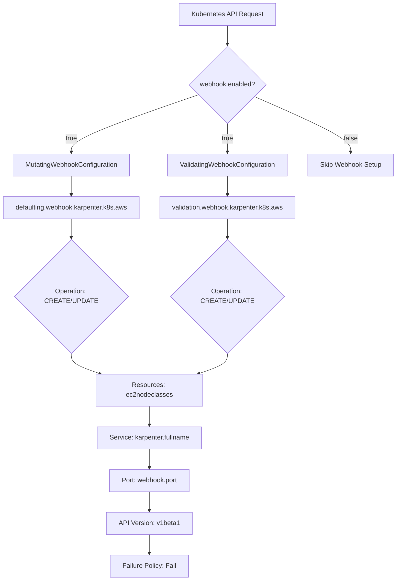
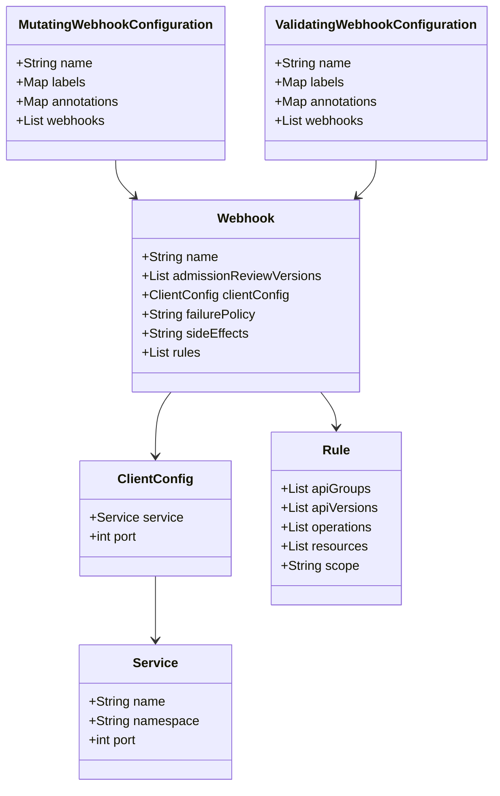
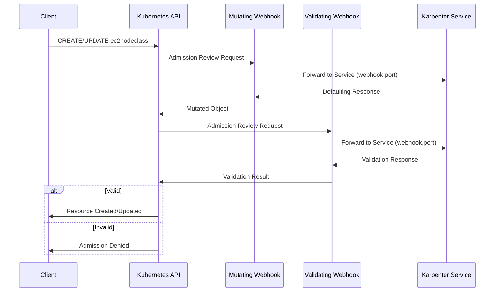

# Diagram: devops/k8s/karpenter/helm/templates/webhooks.yaml

> Auto-generated by Obscura crawlers

## Diagram 1

### SVG

<svg id="container" width="977.921875" xmlns="http://www.w3.org/2000/svg" class="flowchart" height="1362.921875" viewBox="0 0 977.921875 1362.921875" role="graphics-document document" aria-roledescription="flowchart-v2"><g><marker id="container_flowchart-v2-pointEnd" class="marker flowchart-v2" viewBox="0 0 10 10" refX="5" refY="5" markerUnits="userSpaceOnUse" markerWidth="8" markerHeight="8" orient="auto"><path d="M 0 0 L 10 5 L 0 10 z" class="arrowMarkerPath" style="stroke-width: 1; stroke-dasharray: 1, 0;"></path></marker><marker id="container_flowchart-v2-pointStart" class="marker flowchart-v2" viewBox="0 0 10 10" refX="4.5" refY="5" markerUnits="userSpaceOnUse" markerWidth="8" markerHeight="8" orient="auto"><path d="M 0 5 L 10 10 L 10 0 z" class="arrowMarkerPath" style="stroke-width: 1; stroke-dasharray: 1, 0;"></path></marker><marker id="container_flowchart-v2-circleEnd" class="marker flowchart-v2" viewBox="0 0 10 10" refX="11" refY="5" markerUnits="userSpaceOnUse" markerWidth="11" markerHeight="11" orient="auto"><circle cx="5" cy="5" r="5" class="arrowMarkerPath" style="stroke-width: 1; stroke-dasharray: 1, 0;"></circle></marker><marker id="container_flowchart-v2-circleStart" class="marker flowchart-v2" viewBox="0 0 10 10" refX="-1" refY="5" markerUnits="userSpaceOnUse" markerWidth="11" markerHeight="11" orient="auto"><circle cx="5" cy="5" r="5" class="arrowMarkerPath" style="stroke-width: 1; stroke-dasharray: 1, 0;"></circle></marker><marker id="container_flowchart-v2-crossEnd" class="marker cross flowchart-v2" viewBox="0 0 11 11" refX="12" refY="5.2" markerUnits="userSpaceOnUse" markerWidth="11" markerHeight="11" orient="auto"><path d="M 1,1 l 9,9 M 10,1 l -9,9" class="arrowMarkerPath" style="stroke-width: 2; stroke-dasharray: 1, 0;"></path></marker><marker id="container_flowchart-v2-crossStart" class="marker cross flowchart-v2" viewBox="0 0 11 11" refX="-1" refY="5.2" markerUnits="userSpaceOnUse" markerWidth="11" markerHeight="11" orient="auto"><path d="M 1,1 l 9,9 M 10,1 l -9,9" class="arrowMarkerPath" style="stroke-width: 2; stroke-dasharray: 1, 0;"></path></marker><g class="root"><g class="clusters"></g><g class="edgePaths"><path d="M562.359,62L562.359,66.167C562.359,70.333,562.359,78.667,562.359,86.333C562.359,94,562.359,101,562.359,104.5L562.359,108" id="L_A_B_0" class="edge-thickness-normal edge-pattern-solid edge-thickness-normal edge-pattern-solid flowchart-link" style=";" data-edge="true" data-et="edge" data-id="L_A_B_0" data-points="W3sieCI6NTYyLjM1OTM3NSwieSI6NjJ9LHsieCI6NTYyLjM1OTM3NSwieSI6ODd9LHsieCI6NTYyLjM1OTM3NSwieSI6MTEyfV0=" marker-end="url(#container_flowchart-v2-pointEnd)"></path><path d="M491.491,231.382L438.967,249.36C386.442,267.338,281.393,303.294,228.868,326.772C176.344,350.25,176.344,361.25,176.344,366.75L176.344,372.25" id="L_B_C_0" class="edge-thickness-normal edge-pattern-solid edge-thickness-normal edge-pattern-solid flowchart-link" style=";" data-edge="true" data-et="edge" data-id="L_B_C_0" data-points="W3sieCI6NDkxLjQ5MTA5MjIyODA2OTE0LCJ5IjoyMzEuMzgxNzE3MjI4MDY5MX0seyJ4IjoxNzYuMzQzNzUsInkiOjMzOS4yNX0seyJ4IjoxNzYuMzQzNzUsInkiOjM3Ni4yNX1d" marker-end="url(#container_flowchart-v2-pointEnd)"></path><path d="M562.359,302.25L562.359,308.417C562.359,314.583,562.359,326.917,562.359,338.583C562.359,350.25,562.359,361.25,562.359,366.75L562.359,372.25" id="L_B_D_0" class="edge-thickness-normal edge-pattern-solid edge-thickness-normal edge-pattern-solid flowchart-link" style=";" data-edge="true" data-et="edge" data-id="L_B_D_0" data-points="W3sieCI6NTYyLjM1OTM3NSwieSI6MzAyLjI1fSx7IngiOjU2Mi4zNTkzNzUsInkiOjMzOS4yNX0seyJ4Ijo1NjIuMzU5Mzc1LCJ5IjozNzYuMjV9XQ==" marker-end="url(#container_flowchart-v2-pointEnd)"></path><path d="M628.604,236.005L668.075,253.212C707.546,270.42,786.488,304.835,825.959,327.542C865.43,350.25,865.43,361.25,865.43,366.75L865.43,372.25" id="L_B_E_0" class="edge-thickness-normal edge-pattern-solid edge-thickness-normal edge-pattern-solid flowchart-link" style=";" data-edge="true" data-et="edge" data-id="L_B_E_0" data-points="W3sieCI6NjI4LjYwNDQ4OTg5MDk0MzMsInkiOjIzNi4wMDQ4ODUxMDkwNTY2M30seyJ4Ijo4NjUuNDI5Njg3NSwieSI6MzM5LjI1fSx7IngiOjg2NS40Mjk2ODc1LCJ5IjozNzYuMjV9XQ==" marker-end="url(#container_flowchart-v2-pointEnd)"></path><path d="M176.344,430.25L176.344,434.417C176.344,438.583,176.344,446.917,176.344,454.583C176.344,462.25,176.344,469.25,176.344,472.75L176.344,476.25" id="L_C_F_0" class="edge-thickness-normal edge-pattern-solid edge-thickness-normal edge-pattern-solid flowchart-link" style=";" data-edge="true" data-et="edge" data-id="L_C_F_0" data-points="W3sieCI6MTc2LjM0Mzc1LCJ5Ijo0MzAuMjV9LHsieCI6MTc2LjM0Mzc1LCJ5Ijo0NTUuMjV9LHsieCI6MTc2LjM0Mzc1LCJ5Ijo0ODAuMjV9XQ==" marker-end="url(#container_flowchart-v2-pointEnd)"></path><path d="M562.359,430.25L562.359,434.417C562.359,438.583,562.359,446.917,562.359,454.583C562.359,462.25,562.359,469.25,562.359,472.75L562.359,476.25" id="L_D_G_0" class="edge-thickness-normal edge-pattern-solid edge-thickness-normal edge-pattern-solid flowchart-link" style=";" data-edge="true" data-et="edge" data-id="L_D_G_0" data-points="W3sieCI6NTYyLjM1OTM3NSwieSI6NDMwLjI1fSx7IngiOjU2Mi4zNTkzNzUsInkiOjQ1NS4yNX0seyJ4Ijo1NjIuMzU5Mzc1LCJ5Ijo0ODAuMjV9XQ==" marker-end="url(#container_flowchart-v2-pointEnd)"></path><path d="M176.344,534.25L176.344,538.417C176.344,542.583,176.344,550.917,176.344,558.583C176.344,566.25,176.344,573.25,176.344,576.75L176.344,580.25" id="L_F_H_0" class="edge-thickness-normal edge-pattern-solid edge-thickness-normal edge-pattern-solid flowchart-link" style=";" data-edge="true" data-et="edge" data-id="L_F_H_0" data-points="W3sieCI6MTc2LjM0Mzc1LCJ5Ijo1MzQuMjV9LHsieCI6MTc2LjM0Mzc1LCJ5Ijo1NTkuMjV9LHsieCI6MTc2LjM0Mzc1LCJ5Ijo1ODQuMjV9XQ==" marker-end="url(#container_flowchart-v2-pointEnd)"></path><path d="M562.359,534.25L562.359,538.417C562.359,542.583,562.359,550.917,562.359,558.583C562.359,566.25,562.359,573.25,562.359,576.75L562.359,580.25" id="L_G_I_0" class="edge-thickness-normal edge-pattern-solid edge-thickness-normal edge-pattern-solid flowchart-link" style=";" data-edge="true" data-et="edge" data-id="L_G_I_0" data-points="W3sieCI6NTYyLjM1OTM3NSwieSI6NTM0LjI1fSx7IngiOjU2Mi4zNTkzNzUsInkiOjU1OS4yNX0seyJ4Ijo1NjIuMzU5Mzc1LCJ5Ijo1ODQuMjV9XQ==" marker-end="url(#container_flowchart-v2-pointEnd)"></path><path d="M176.344,834.922L176.344,839.089C176.344,843.255,176.344,851.589,191.165,859.748C205.987,867.908,235.63,875.895,250.452,879.888L265.274,883.881" id="L_H_J_0" class="edge-thickness-normal edge-pattern-solid edge-thickness-normal edge-pattern-solid flowchart-link" style=";" data-edge="true" data-et="edge" data-id="L_H_J_0" data-points="W3sieCI6MTc2LjM0Mzc1LCJ5Ijo4MzQuOTIxODc1fSx7IngiOjE3Ni4zNDM3NSwieSI6ODU5LjkyMTg3NX0seyJ4IjoyNjkuMTM1OTY3NTQ4MDc2OSwieSI6ODg0LjkyMTg3NX1d" marker-end="url(#container_flowchart-v2-pointEnd)"></path><path d="M562.359,834.922L562.359,839.089C562.359,843.255,562.359,851.589,547.538,859.748C532.716,867.908,503.073,875.895,488.251,879.888L473.429,883.881" id="L_I_J_0" class="edge-thickness-normal edge-pattern-solid edge-thickness-normal edge-pattern-solid flowchart-link" style=";" data-edge="true" data-et="edge" data-id="L_I_J_0" data-points="W3sieCI6NTYyLjM1OTM3NSwieSI6ODM0LjkyMTg3NX0seyJ4Ijo1NjIuMzU5Mzc1LCJ5Ijo4NTkuOTIxODc1fSx7IngiOjQ2OS41NjcxNTc0NTE5MjMxLCJ5Ijo4ODQuOTIxODc1fV0=" marker-end="url(#container_flowchart-v2-pointEnd)"></path><path d="M369.352,938.922L369.352,943.089C369.352,947.255,369.352,955.589,369.352,963.255C369.352,970.922,369.352,977.922,369.352,981.422L369.352,984.922" id="L_J_K_0" class="edge-thickness-normal edge-pattern-solid edge-thickness-normal edge-pattern-solid flowchart-link" style=";" data-edge="true" data-et="edge" data-id="L_J_K_0" data-points="W3sieCI6MzY5LjM1MTU2MjUsInkiOjkzOC45MjE4NzV9LHsieCI6MzY5LjM1MTU2MjUsInkiOjk2My45MjE4NzV9LHsieCI6MzY5LjM1MTU2MjUsInkiOjk4OC45MjE4NzV9XQ==" marker-end="url(#container_flowchart-v2-pointEnd)"></path><path d="M369.352,1042.922L369.352,1047.089C369.352,1051.255,369.352,1059.589,369.352,1067.255C369.352,1074.922,369.352,1081.922,369.352,1085.422L369.352,1088.922" id="L_K_L_0" class="edge-thickness-normal edge-pattern-solid edge-thickness-normal edge-pattern-solid flowchart-link" style=";" data-edge="true" data-et="edge" data-id="L_K_L_0" data-points="W3sieCI6MzY5LjM1MTU2MjUsInkiOjEwNDIuOTIxODc1fSx7IngiOjM2OS4zNTE1NjI1LCJ5IjoxMDY3LjkyMTg3NX0seyJ4IjozNjkuMzUxNTYyNSwieSI6MTA5Mi45MjE4NzV9XQ==" marker-end="url(#container_flowchart-v2-pointEnd)"></path><path d="M369.352,1146.922L369.352,1151.089C369.352,1155.255,369.352,1163.589,369.352,1171.255C369.352,1178.922,369.352,1185.922,369.352,1189.422L369.352,1192.922" id="L_L_M_0" class="edge-thickness-normal edge-pattern-solid edge-thickness-normal edge-pattern-solid flowchart-link" style=";" data-edge="true" data-et="edge" data-id="L_L_M_0" data-points="W3sieCI6MzY5LjM1MTU2MjUsInkiOjExNDYuOTIxODc1fSx7IngiOjM2OS4zNTE1NjI1LCJ5IjoxMTcxLjkyMTg3NX0seyJ4IjozNjkuMzUxNTYyNSwieSI6MTE5Ni45MjE4NzV9XQ==" marker-end="url(#container_flowchart-v2-pointEnd)"></path><path d="M369.352,1250.922L369.352,1255.089C369.352,1259.255,369.352,1267.589,369.352,1275.255C369.352,1282.922,369.352,1289.922,369.352,1293.422L369.352,1296.922" id="L_M_N_0" class="edge-thickness-normal edge-pattern-solid edge-thickness-normal edge-pattern-solid flowchart-link" style=";" data-edge="true" data-et="edge" data-id="L_M_N_0" data-points="W3sieCI6MzY5LjM1MTU2MjUsInkiOjEyNTAuOTIxODc1fSx7IngiOjM2OS4zNTE1NjI1LCJ5IjoxMjc1LjkyMTg3NX0seyJ4IjozNjkuMzUxNTYyNSwieSI6MTMwMC45MjE4NzV9XQ==" marker-end="url(#container_flowchart-v2-pointEnd)"></path></g><g class="edgeLabels"><g class="edgeLabel"><g class="label" data-id="L_A_B_0" transform="translate(0, 0)"><foreignObject width="0" height="0">

</foreignObject></g></g><g class="edgeLabel" transform="translate(176.34375, 339.25)"><g class="label" data-id="L_B_C_0" transform="translate(-14.9921875, -12)"><foreignObject width="29.984375" height="24">

true

</foreignObject></g></g><g class="edgeLabel" transform="translate(562.359375, 339.25)"><g class="label" data-id="L_B_D_0" transform="translate(-14.9921875, -12)"><foreignObject width="29.984375" height="24">

true

</foreignObject></g></g><g class="edgeLabel" transform="translate(865.4296875, 339.25)"><g class="label" data-id="L_B_E_0" transform="translate(-17.21875, -12)"><foreignObject width="34.4375" height="24">

false

</foreignObject></g></g><g class="edgeLabel"><g class="label" data-id="L_C_F_0" transform="translate(0, 0)"><foreignObject width="0" height="0">

</foreignObject></g></g><g class="edgeLabel"><g class="label" data-id="L_D_G_0" transform="translate(0, 0)"><foreignObject width="0" height="0">

</foreignObject></g></g><g class="edgeLabel"><g class="label" data-id="L_F_H_0" transform="translate(0, 0)"><foreignObject width="0" height="0">

</foreignObject></g></g><g class="edgeLabel"><g class="label" data-id="L_G_I_0" transform="translate(0, 0)"><foreignObject width="0" height="0">

</foreignObject></g></g><g class="edgeLabel"><g class="label" data-id="L_H_J_0" transform="translate(0, 0)"><foreignObject width="0" height="0">

</foreignObject></g></g><g class="edgeLabel"><g class="label" data-id="L_I_J_0" transform="translate(0, 0)"><foreignObject width="0" height="0">

</foreignObject></g></g><g class="edgeLabel"><g class="label" data-id="L_J_K_0" transform="translate(0, 0)"><foreignObject width="0" height="0">

</foreignObject></g></g><g class="edgeLabel"><g class="label" data-id="L_K_L_0" transform="translate(0, 0)"><foreignObject width="0" height="0">

</foreignObject></g></g><g class="edgeLabel"><g class="label" data-id="L_L_M_0" transform="translate(0, 0)"><foreignObject width="0" height="0">

</foreignObject></g></g><g class="edgeLabel"><g class="label" data-id="L_M_N_0" transform="translate(0, 0)"><foreignObject width="0" height="0">

</foreignObject></g></g></g><g class="nodes"><g class="node default" id="flowchart-A-0" transform="translate(562.359375, 35)"><rect class="basic label-container" style="" x="-116.75" y="-27" width="233.5" height="54"></rect><g class="label" style="" transform="translate(-86.75, -12)"><rect></rect><foreignObject width="173.5" height="24">

Kubernetes API Request

</foreignObject></g></g><g class="node default" id="flowchart-B-1" transform="translate(562.359375, 207.125)"><polygon points="95.125,0 190.25,-95.125 95.125,-190.25 0,-95.125" class="label-container" transform="translate(-94.625, 95.125)"></polygon><g class="label" style="" transform="translate(-68.125, -12)"><rect></rect><foreignObject width="136.25" height="24">

webhook.enabled?

</foreignObject></g></g><g class="node default" id="flowchart-C-3" transform="translate(176.34375, 403.25)"><rect class="basic label-container" style="" x="-144.5078125" y="-27" width="289.015625" height="54"></rect><g class="label" style="" transform="translate(-114.5078125, -12)"><rect></rect><foreignObject width="229.015625" height="24">

MutatingWebhookConfiguration

</foreignObject></g></g><g class="node default" id="flowchart-D-5" transform="translate(562.359375, 403.25)"><rect class="basic label-container" style="" x="-148.578125" y="-27" width="297.15625" height="54"></rect><g class="label" style="" transform="translate(-118.578125, -12)"><rect></rect><foreignObject width="237.15625" height="24">

ValidatingWebhookConfiguration

</foreignObject></g></g><g class="node default" id="flowchart-E-7" transform="translate(865.4296875, 403.25)"><rect class="basic label-container" style="" x="-104.4921875" y="-27" width="208.984375" height="54"></rect><g class="label" style="" transform="translate(-74.4921875, -12)"><rect></rect><foreignObject width="148.984375" height="24">

Skip Webhook Setup

</foreignObject></g></g><g class="node default" id="flowchart-F-9" transform="translate(176.34375, 507.25)"><rect class="basic label-container" style="" x="-168.34375" y="-27" width="336.6875" height="54"></rect><g class="label" style="" transform="translate(-138.34375, -12)"><rect></rect><foreignObject width="276.6875" height="24">

defaulting.webhook.karpenter.k8s.aws

</foreignObject></g></g><g class="node default" id="flowchart-G-11" transform="translate(562.359375, 507.25)"><rect class="basic label-container" style="" x="-167.671875" y="-27" width="335.34375" height="54"></rect><g class="label" style="" transform="translate(-137.671875, -12)"><rect></rect><foreignObject width="275.34375" height="24">

validation.webhook.karpenter.k8s.aws

</foreignObject></g></g><g class="node default" id="flowchart-H-13" transform="translate(176.34375, 709.5859375)"><polygon points="125.3359375,0 250.671875,-125.3359375 125.3359375,-250.671875 0,-125.3359375" class="label-container" transform="translate(-124.8359375, 125.3359375)"></polygon><g class="label" style="" transform="translate(-98.3359375, -12)"><rect></rect><foreignObject width="196.671875" height="24">

Operation: CREATE/UPDATE

</foreignObject></g></g><g class="node default" id="flowchart-I-15" transform="translate(562.359375, 709.5859375)"><polygon points="125.3359375,0 250.671875,-125.3359375 125.3359375,-250.671875 0,-125.3359375" class="label-container" transform="translate(-124.8359375, 125.3359375)"></polygon><g class="label" style="" transform="translate(-98.3359375, -12)"><rect></rect><foreignObject width="196.671875" height="24">

Operation: CREATE/UPDATE

</foreignObject></g></g><g class="node default" id="flowchart-J-17" transform="translate(369.3515625, 911.921875)"><rect class="basic label-container" style="" x="-127.3359375" y="-27" width="254.671875" height="54"></rect><g class="label" style="" transform="translate(-97.3359375, -12)"><rect></rect><foreignObject width="194.671875" height="24">

Resources: ec2nodeclasses

</foreignObject></g></g><g class="node default" id="flowchart-K-21" transform="translate(369.3515625, 1015.921875)"><rect class="basic label-container" style="" x="-128.9453125" y="-27" width="257.890625" height="54"></rect><g class="label" style="" transform="translate(-98.9453125, -12)"><rect></rect><foreignObject width="197.890625" height="24">

Service: karpenter.fullname

</foreignObject></g></g><g class="node default" id="flowchart-L-23" transform="translate(369.3515625, 1119.921875)"><rect class="basic label-container" style="" x="-99.4609375" y="-27" width="198.921875" height="54"></rect><g class="label" style="" transform="translate(-69.4609375, -12)"><rect></rect><foreignObject width="138.921875" height="24">

Port: webhook.port

</foreignObject></g></g><g class="node default" id="flowchart-M-25" transform="translate(369.3515625, 1223.921875)"><rect class="basic label-container" style="" x="-101.4453125" y="-27" width="202.890625" height="54"></rect><g class="label" style="" transform="translate(-71.4453125, -12)"><rect></rect><foreignObject width="142.890625" height="24">

API Version: v1beta1

</foreignObject></g></g><g class="node default" id="flowchart-N-27" transform="translate(369.3515625, 1327.921875)"><rect class="basic label-container" style="" x="-94.296875" y="-27" width="188.59375" height="54"></rect><g class="label" style="" transform="translate(-64.296875, -12)"><rect></rect><foreignObject width="128.59375" height="24">

Failure Policy: Fail

</foreignObject></g></g></g></g></g></svg>

## Diagram 2

### SVG

<svg id="container" width="611.671875" xmlns="http://www.w3.org/2000/svg" class="classDiagram" height="982" viewBox="0 0 611.671875 982" role="graphics-document document" aria-roledescription="class"><g><defs><marker id="container_class-aggregationStart" class="marker aggregation class" refX="18" refY="7" markerWidth="190" markerHeight="240" orient="auto"><path d="M 18,7 L9,13 L1,7 L9,1 Z"></path></marker></defs><defs><marker id="container_class-aggregationEnd" class="marker aggregation class" refX="1" refY="7" markerWidth="20" markerHeight="28" orient="auto"><path d="M 18,7 L9,13 L1,7 L9,1 Z"></path></marker></defs><defs><marker id="container_class-extensionStart" class="marker extension class" refX="18" refY="7" markerWidth="190" markerHeight="240" orient="auto"><path d="M 1,7 L18,13 V 1 Z"></path></marker></defs><defs><marker id="container_class-extensionEnd" class="marker extension class" refX="1" refY="7" markerWidth="20" markerHeight="28" orient="auto"><path d="M 1,1 V 13 L18,7 Z"></path></marker></defs><defs><marker id="container_class-compositionStart" class="marker composition class" refX="18" refY="7" markerWidth="190" markerHeight="240" orient="auto"><path d="M 18,7 L9,13 L1,7 L9,1 Z"></path></marker></defs><defs><marker id="container_class-compositionEnd" class="marker composition class" refX="1" refY="7" markerWidth="20" markerHeight="28" orient="auto"><path d="M 18,7 L9,13 L1,7 L9,1 Z"></path></marker></defs><defs><marker id="container_class-dependencyStart" class="marker dependency class" refX="6" refY="7" markerWidth="190" markerHeight="240" orient="auto"><path d="M 5,7 L9,13 L1,7 L9,1 Z"></path></marker></defs><defs><marker id="container_class-dependencyEnd" class="marker dependency class" refX="13" refY="7" markerWidth="20" markerHeight="28" orient="auto"><path d="M 18,7 L9,13 L14,7 L9,1 Z"></path></marker></defs><defs><marker id="container_class-lollipopStart" class="marker lollipop class" refX="13" refY="7" markerWidth="190" markerHeight="240" orient="auto"><circle stroke="black" fill="transparent" cx="7" cy="7" r="6"></circle></marker></defs><defs><marker id="container_class-lollipopEnd" class="marker lollipop class" refX="1" refY="7" markerWidth="190" markerHeight="240" orient="auto"><circle stroke="black" fill="transparent" cx="7" cy="7" r="6"></circle></marker></defs><g class="root"><g class="clusters"></g><g class="edgePaths"><path d="M143.387,200L143.387,204.167C143.387,208.333,143.387,216.667,147.281,224.332C151.176,231.997,158.965,238.994,162.859,242.492L166.754,245.99" id="id_MutatingWebhookConfiguration_Webhook_1" class="edge-thickness-normal edge-pattern-solid relation" style=";;;" data-edge="true" data-et="edge" data-id="id_MutatingWebhookConfiguration_Webhook_1" data-points="W3sieCI6MTQzLjM4NjcxODc1LCJ5IjoyMDB9LHsieCI6MTQzLjM4NjcxODc1LCJ5IjoyMjV9LHsieCI6MTcxLjIxNzQwMzAxNzI0MTM3LCJ5IjoyNTB9XQ==" marker-end="url(#container_class-dependencyEnd)"></path><path d="M466.223,200L466.223,204.167C466.223,208.333,466.223,216.667,462.328,224.332C458.434,231.997,450.645,238.994,446.75,242.492L442.856,245.99" id="id_ValidatingWebhookConfiguration_Webhook_2" class="edge-thickness-normal edge-pattern-solid relation" style=";;;" data-edge="true" data-et="edge" data-id="id_ValidatingWebhookConfiguration_Webhook_2" data-points="W3sieCI6NDY2LjIyMjY1NjI1LCJ5IjoyMDB9LHsieCI6NDY2LjIyMjY1NjI1LCJ5IjoyMjV9LHsieCI6NDM4LjM5MTk3MTk4Mjc1ODYsInkiOjI1MH1d" marker-end="url(#container_class-dependencyEnd)"></path><path d="M212.752,490L209.556,494.167C206.359,498.333,199.967,506.667,196.77,520C193.574,533.333,193.574,551.667,193.574,560.833L193.574,570" id="id_Webhook_ClientConfig_3" class="edge-thickness-normal edge-pattern-solid relation" style=";;;" data-edge="true" data-et="edge" data-id="id_Webhook_ClientConfig_3" data-points="W3sieCI6MjEyLjc1MTg4NTc3NTg2MjA2LCJ5Ijo0OTB9LHsieCI6MTkzLjU3NDIxODc1LCJ5Ijo1MTV9LHsieCI6MTkzLjU3NDIxODc1LCJ5Ijo1NzZ9XQ==" marker-end="url(#container_class-dependencyEnd)"></path><path d="M396.857,490L400.054,494.167C403.25,498.333,409.643,506.667,412.839,514C416.035,521.333,416.035,527.667,416.035,530.833L416.035,534" id="id_Webhook_Rule_4" class="edge-thickness-normal edge-pattern-solid relation" style=";;;" data-edge="true" data-et="edge" data-id="id_Webhook_Rule_4" data-points="W3sieCI6Mzk2Ljg1NzQ4OTIyNDEzNzksInkiOjQ5MH0seyJ4Ijo0MTYuMDM1MTU2MjUsInkiOjUxNX0seyJ4Ijo0MTYuMDM1MTU2MjUsInkiOjU0MH1d" marker-end="url(#container_class-dependencyEnd)"></path><path d="M193.574,720L193.574,730.167C193.574,740.333,193.574,760.667,193.574,774C193.574,787.333,193.574,793.667,193.574,796.833L193.574,800" id="id_ClientConfig_Service_5" class="edge-thickness-normal edge-pattern-solid relation" style=";;;" data-edge="true" data-et="edge" data-id="id_ClientConfig_Service_5" data-points="W3sieCI6MTkzLjU3NDIxODc1LCJ5Ijo3MjB9LHsieCI6MTkzLjU3NDIxODc1LCJ5Ijo3ODF9LHsieCI6MTkzLjU3NDIxODc1LCJ5Ijo4MDZ9XQ==" marker-end="url(#container_class-dependencyEnd)"></path></g><g class="edgeLabels"><g class="edgeLabel"><g class="label" data-id="id_MutatingWebhookConfiguration_Webhook_1" transform="translate(0, 0)"><foreignObject width="0" height="0">

</foreignObject></g></g><g class="edgeLabel"><g class="label" data-id="id_ValidatingWebhookConfiguration_Webhook_2" transform="translate(0, 0)"><foreignObject width="0" height="0">

</foreignObject></g></g><g class="edgeLabel"><g class="label" data-id="id_Webhook_ClientConfig_3" transform="translate(0, 0)"><foreignObject width="0" height="0">

</foreignObject></g></g><g class="edgeLabel"><g class="label" data-id="id_Webhook_Rule_4" transform="translate(0, 0)"><foreignObject width="0" height="0">

</foreignObject></g></g><g class="edgeLabel"><g class="label" data-id="id_ClientConfig_Service_5" transform="translate(0, 0)"><foreignObject width="0" height="0">

</foreignObject></g></g></g><g class="nodes"><g class="node default" id="classId-MutatingWebhookConfiguration-0" transform="translate(143.38671875, 104)"><g class="basic label-container"><path d="M-135.38671875 -96 L135.38671875 -96 L135.38671875 96 L-135.38671875 96" stroke="none" stroke-width="0" fill="#ECECFF" style=""></path><path d="M-135.38671875 -96 C-30.449977206951232 -96, 74.48676433609754 -96, 135.38671875 -96 M-135.38671875 -96 C-71.28167507450758 -96, -7.17663139901515 -96, 135.38671875 -96 M135.38671875 -96 C135.38671875 -54.640863782964814, 135.38671875 -13.281727565929629, 135.38671875 96 M135.38671875 -96 C135.38671875 -30.019870744259322, 135.38671875 35.960258511481356, 135.38671875 96 M135.38671875 96 C73.92466204153266 96, 12.462605333065312 96, -135.38671875 96 M135.38671875 96 C31.960658382715252 96, -71.4654019845695 96, -135.38671875 96 M-135.38671875 96 C-135.38671875 53.859302184412414, -135.38671875 11.718604368824828, -135.38671875 -96 M-135.38671875 96 C-135.38671875 22.948991813648846, -135.38671875 -50.10201637270231, -135.38671875 -96" stroke="#9370DB" stroke-width="1.3" fill="none" stroke-dasharray="0 0" style=""></path></g><g class="annotation-group text" transform="translate(0, -72)"></g><g class="label-group text" transform="translate(-116.2421875, -72)"><g class="label" style="font-weight: bolder" transform="translate(0,-12)"><foreignObject width="232.484375" height="24">

MutatingWebhookConfiguration

</foreignObject></g></g><g class="members-group text" transform="translate(-123.38671875, -24)"><g class="label" style="" transform="translate(0,-12)"><foreignObject width="94.984375" height="24">

+String name

</foreignObject></g><g class="label" style="" transform="translate(0,12)"><foreignObject width="86.578125" height="24">

+Map labels

</foreignObject></g><g class="label" style="" transform="translate(0,36)"><foreignObject width="130.53125" height="24">

+Map annotations

</foreignObject></g><g class="label" style="" transform="translate(0,60)"><foreignObject width="111.296875" height="24">

+List webhooks

</foreignObject></g></g><g class="methods-group text" transform="translate(-123.38671875, 96)"></g><g class="divider" style=""><path d="M-135.38671875 -48 C-58.90671503963793 -48, 17.57328867072414 -48, 135.38671875 -48 M-135.38671875 -48 C-48.81681245348632 -48, 37.75309384302736 -48, 135.38671875 -48" stroke="#9370DB" stroke-width="1.3" fill="none" stroke-dasharray="0 0" style=""></path></g><g class="divider" style=""><path d="M-135.38671875 72 C-54.9591732364139 72, 25.468372277172193 72, 135.38671875 72 M-135.38671875 72 C-47.40758297057738 72, 40.57155280884524 72, 135.38671875 72" stroke="#9370DB" stroke-width="1.3" fill="none" stroke-dasharray="0 0" style=""></path></g></g><g class="node default" id="classId-ValidatingWebhookConfiguration-1" transform="translate(466.22265625, 104)"><g class="basic label-container"><path d="M-137.44921875 -96 L137.44921875 -96 L137.44921875 96 L-137.44921875 96" stroke="none" stroke-width="0" fill="#ECECFF" style=""></path><path d="M-137.44921875 -96 C-63.608770426601026 -96, 10.231677896797947 -96, 137.44921875 -96 M-137.44921875 -96 C-62.89773642114703 -96, 11.65374590770594 -96, 137.44921875 -96 M137.44921875 -96 C137.44921875 -33.90909233122816, 137.44921875 28.181815337543682, 137.44921875 96 M137.44921875 -96 C137.44921875 -44.61350550751415, 137.44921875 6.772988984971704, 137.44921875 96 M137.44921875 96 C65.42393994050916 96, -6.601338868981685 96, -137.44921875 96 M137.44921875 96 C44.258102308880325 96, -48.93301413223935 96, -137.44921875 96 M-137.44921875 96 C-137.44921875 33.57663229904266, -137.44921875 -28.846735401914685, -137.44921875 -96 M-137.44921875 96 C-137.44921875 19.37415121459877, -137.44921875 -57.25169757080246, -137.44921875 -96" stroke="#9370DB" stroke-width="1.3" fill="none" stroke-dasharray="0 0" style=""></path></g><g class="annotation-group text" transform="translate(0, -72)"></g><g class="label-group text" transform="translate(-120.3671875, -72)"><g class="label" style="font-weight: bolder" transform="translate(0,-12)"><foreignObject width="240.734375" height="24">

ValidatingWebhookConfiguration

</foreignObject></g></g><g class="members-group text" transform="translate(-125.44921875, -24)"><g class="label" style="" transform="translate(0,-12)"><foreignObject width="94.984375" height="24">

+String name

</foreignObject></g><g class="label" style="" transform="translate(0,12)"><foreignObject width="86.578125" height="24">

+Map labels

</foreignObject></g><g class="label" style="" transform="translate(0,36)"><foreignObject width="130.53125" height="24">

+Map annotations

</foreignObject></g><g class="label" style="" transform="translate(0,60)"><foreignObject width="111.296875" height="24">

+List webhooks

</foreignObject></g></g><g class="methods-group text" transform="translate(-125.44921875, 96)"></g><g class="divider" style=""><path d="M-137.44921875 -48 C-54.417990671971495 -48, 28.61323740605701 -48, 137.44921875 -48 M-137.44921875 -48 C-29.500666935787535 -48, 78.44788487842493 -48, 137.44921875 -48" stroke="#9370DB" stroke-width="1.3" fill="none" stroke-dasharray="0 0" style=""></path></g><g class="divider" style=""><path d="M-137.44921875 72 C-67.80568009798353 72, 1.8378585540329482 72, 137.44921875 72 M-137.44921875 72 C-41.70266422903953 72, 54.043890291920945 72, 137.44921875 72" stroke="#9370DB" stroke-width="1.3" fill="none" stroke-dasharray="0 0" style=""></path></g></g><g class="node default" id="classId-Webhook-2" transform="translate(304.8046875, 370)"><g class="basic label-container"><path d="M-141.3671875 -120 L141.3671875 -120 L141.3671875 120 L-141.3671875 120" stroke="none" stroke-width="0" fill="#ECECFF" style=""></path><path d="M-141.3671875 -120 C-83.78873517808366 -120, -26.21028285616731 -120, 141.3671875 -120 M-141.3671875 -120 C-33.064008192940875 -120, 75.23917111411825 -120, 141.3671875 -120 M141.3671875 -120 C141.3671875 -33.317444802674956, 141.3671875 53.36511039465009, 141.3671875 120 M141.3671875 -120 C141.3671875 -69.25777723070252, 141.3671875 -18.51555446140503, 141.3671875 120 M141.3671875 120 C30.753818947325726 120, -79.85954960534855 120, -141.3671875 120 M141.3671875 120 C61.60089121110883 120, -18.16540507778234 120, -141.3671875 120 M-141.3671875 120 C-141.3671875 48.754663257456016, -141.3671875 -22.490673485087967, -141.3671875 -120 M-141.3671875 120 C-141.3671875 71.54237829852141, -141.3671875 23.084756597042812, -141.3671875 -120" stroke="#9370DB" stroke-width="1.3" fill="none" stroke-dasharray="0 0" style=""></path></g><g class="annotation-group text" transform="translate(0, -96)"></g><g class="label-group text" transform="translate(-34.265625, -96)"><g class="label" style="font-weight: bolder" transform="translate(0,-12)"><foreignObject width="68.53125" height="24">

Webhook

</foreignObject></g></g><g class="members-group text" transform="translate(-129.3671875, -48)"><g class="label" style="" transform="translate(0,-12)"><foreignObject width="94.984375" height="24">

+String name

</foreignObject></g><g class="label" style="" transform="translate(0,12)"><foreignObject width="224.46875" height="24">

+List admissionReviewVersions

</foreignObject></g><g class="label" style="" transform="translate(0,36)"><foreignObject width="184.578125" height="24">

+ClientConfig clientConfig

</foreignObject></g><g class="label" style="" transform="translate(0,60)"><foreignObject width="143.984375" height="24">

+String failurePolicy

</foreignObject></g><g class="label" style="" transform="translate(0,84)"><foreignObject width="133.15625" height="24">

+String sideEffects

</foreignObject></g><g class="label" style="" transform="translate(0,108)"><foreignObject width="74.25" height="24">

+List rules

</foreignObject></g></g><g class="methods-group text" transform="translate(-129.3671875, 120)"></g><g class="divider" style=""><path d="M-141.3671875 -72 C-29.035322014309855 -72, 83.29654347138029 -72, 141.3671875 -72 M-141.3671875 -72 C-31.059031522696614 -72, 79.24912445460677 -72, 141.3671875 -72" stroke="#9370DB" stroke-width="1.3" fill="none" stroke-dasharray="0 0" style=""></path></g><g class="divider" style=""><path d="M-141.3671875 96 C-55.47582966283157 96, 30.415528174336856 96, 141.3671875 96 M-141.3671875 96 C-45.399384047549404 96, 50.56841940490119 96, 141.3671875 96" stroke="#9370DB" stroke-width="1.3" fill="none" stroke-dasharray="0 0" style=""></path></g></g><g class="node default" id="classId-ClientConfig-3" transform="translate(193.57421875, 648)"><g class="basic label-container"><path d="M-91.3203125 -72 L91.3203125 -72 L91.3203125 72 L-91.3203125 72" stroke="none" stroke-width="0" fill="#ECECFF" style=""></path><path d="M-91.3203125 -72 C-27.8956036305997 -72, 35.5291052388006 -72, 91.3203125 -72 M-91.3203125 -72 C-32.430131795669695 -72, 26.46004890866061 -72, 91.3203125 -72 M91.3203125 -72 C91.3203125 -24.88933413404026, 91.3203125 22.221331731919477, 91.3203125 72 M91.3203125 -72 C91.3203125 -25.11124796990196, 91.3203125 21.77750406019608, 91.3203125 72 M91.3203125 72 C54.280988291239765 72, 17.24166408247953 72, -91.3203125 72 M91.3203125 72 C26.14786538403314 72, -39.02458173193372 72, -91.3203125 72 M-91.3203125 72 C-91.3203125 27.519844299884447, -91.3203125 -16.960311400231106, -91.3203125 -72 M-91.3203125 72 C-91.3203125 20.630495506777244, -91.3203125 -30.739008986445512, -91.3203125 -72" stroke="#9370DB" stroke-width="1.3" fill="none" stroke-dasharray="0 0" style=""></path></g><g class="annotation-group text" transform="translate(0, -48)"></g><g class="label-group text" transform="translate(-44.203125, -48)"><g class="label" style="font-weight: bolder" transform="translate(0,-12)"><foreignObject width="88.40625" height="24">

ClientConfig

</foreignObject></g></g><g class="members-group text" transform="translate(-79.3203125, 0)"><g class="label" style="" transform="translate(0,-12)"><foreignObject width="114.4375" height="24">

+Service service

</foreignObject></g><g class="label" style="" transform="translate(0,12)"><foreignObject width="62.703125" height="24">

+int port

</foreignObject></g></g><g class="methods-group text" transform="translate(-79.3203125, 72)"></g><g class="divider" style=""><path d="M-91.3203125 -24 C-26.997194609551613 -24, 37.325923280896774 -24, 91.3203125 -24 M-91.3203125 -24 C-24.86682266504205 -24, 41.5866671699159 -24, 91.3203125 -24" stroke="#9370DB" stroke-width="1.3" fill="none" stroke-dasharray="0 0" style=""></path></g><g class="divider" style=""><path d="M-91.3203125 48 C-22.855927386981378 48, 45.608457726037244 48, 91.3203125 48 M-91.3203125 48 C-53.72516219596948 48, -16.130011891938963 48, 91.3203125 48" stroke="#9370DB" stroke-width="1.3" fill="none" stroke-dasharray="0 0" style=""></path></g></g><g class="node default" id="classId-Service-4" transform="translate(193.57421875, 890)"><g class="basic label-container"><path d="M-93.59765625 -84 L93.59765625 -84 L93.59765625 84 L-93.59765625 84" stroke="none" stroke-width="0" fill="#ECECFF" style=""></path><path d="M-93.59765625 -84 C-32.05539263955271 -84, 29.486870970894586 -84, 93.59765625 -84 M-93.59765625 -84 C-21.328588082397616 -84, 50.94048008520477 -84, 93.59765625 -84 M93.59765625 -84 C93.59765625 -31.592439351740815, 93.59765625 20.81512129651837, 93.59765625 84 M93.59765625 -84 C93.59765625 -30.294535034849936, 93.59765625 23.410929930300128, 93.59765625 84 M93.59765625 84 C25.073095115883575 84, -43.45146601823285 84, -93.59765625 84 M93.59765625 84 C34.776625452641966 84, -24.04440534471607 84, -93.59765625 84 M-93.59765625 84 C-93.59765625 44.403168973011056, -93.59765625 4.806337946022111, -93.59765625 -84 M-93.59765625 84 C-93.59765625 33.227767092122804, -93.59765625 -17.544465815754393, -93.59765625 -84" stroke="#9370DB" stroke-width="1.3" fill="none" stroke-dasharray="0 0" style=""></path></g><g class="annotation-group text" transform="translate(0, -60)"></g><g class="label-group text" transform="translate(-26.6484375, -60)"><g class="label" style="font-weight: bolder" transform="translate(0,-12)"><foreignObject width="53.296875" height="24">

Service

</foreignObject></g></g><g class="members-group text" transform="translate(-81.59765625, -12)"><g class="label" style="" transform="translate(0,-12)"><foreignObject width="94.984375" height="24">

+String name

</foreignObject></g><g class="label" style="" transform="translate(0,12)"><foreignObject width="136.546875" height="24">

+String namespace

</foreignObject></g><g class="label" style="" transform="translate(0,36)"><foreignObject width="62.703125" height="24">

+int port

</foreignObject></g></g><g class="methods-group text" transform="translate(-81.59765625, 84)"></g><g class="divider" style=""><path d="M-93.59765625 -36 C-23.68012755164719 -36, 46.23740114670562 -36, 93.59765625 -36 M-93.59765625 -36 C-24.542983909048075 -36, 44.51168843190385 -36, 93.59765625 -36" stroke="#9370DB" stroke-width="1.3" fill="none" stroke-dasharray="0 0" style=""></path></g><g class="divider" style=""><path d="M-93.59765625 60 C-24.950940880737107 60, 43.695774488525785 60, 93.59765625 60 M-93.59765625 60 C-41.744286950530665 60, 10.10908234893867 60, 93.59765625 60" stroke="#9370DB" stroke-width="1.3" fill="none" stroke-dasharray="0 0" style=""></path></g></g><g class="node default" id="classId-Rule-5" transform="translate(416.03515625, 648)"><g class="basic label-container"><path d="M-81.140625 -108 L81.140625 -108 L81.140625 108 L-81.140625 108" stroke="none" stroke-width="0" fill="#ECECFF" style=""></path><path d="M-81.140625 -108 C-41.87959771592433 -108, -2.618570431848653 -108, 81.140625 -108 M-81.140625 -108 C-27.911157651519453 -108, 25.318309696961094 -108, 81.140625 -108 M81.140625 -108 C81.140625 -56.5099688585567, 81.140625 -5.019937717113393, 81.140625 108 M81.140625 -108 C81.140625 -39.06372748834734, 81.140625 29.87254502330532, 81.140625 108 M81.140625 108 C47.672194753779415 108, 14.20376450755883 108, -81.140625 108 M81.140625 108 C33.35099169887944 108, -14.43864160224112 108, -81.140625 108 M-81.140625 108 C-81.140625 26.507960541642774, -81.140625 -54.98407891671445, -81.140625 -108 M-81.140625 108 C-81.140625 48.95288640324262, -81.140625 -10.094227193514755, -81.140625 -108" stroke="#9370DB" stroke-width="1.3" fill="none" stroke-dasharray="0 0" style=""></path></g><g class="annotation-group text" transform="translate(0, -84)"></g><g class="label-group text" transform="translate(-16.265625, -84)"><g class="label" style="font-weight: bolder" transform="translate(0,-12)"><foreignObject width="32.53125" height="24">

Rule

</foreignObject></g></g><g class="members-group text" transform="translate(-69.140625, -36)"><g class="label" style="" transform="translate(0,-12)"><foreignObject width="112.109375" height="24">

+List apiGroups

</foreignObject></g><g class="label" style="" transform="translate(0,12)"><foreignObject width="122.015625" height="24">

+List apiVersions

</foreignObject></g><g class="label" style="" transform="translate(0,36)"><foreignObject width="116.328125" height="24">

+List operations

</foreignObject></g><g class="label" style="" transform="translate(0,60)"><foreignObject width="107.71875" height="24">

+List resources

</foreignObject></g><g class="label" style="" transform="translate(0,84)"><foreignObject width="96.84375" height="24">

+String scope

</foreignObject></g></g><g class="methods-group text" transform="translate(-69.140625, 108)"></g><g class="divider" style=""><path d="M-81.140625 -60 C-20.378250780451523 -60, 40.38412343909695 -60, 81.140625 -60 M-81.140625 -60 C-19.76968697034576 -60, 41.60125105930848 -60, 81.140625 -60" stroke="#9370DB" stroke-width="1.3" fill="none" stroke-dasharray="0 0" style=""></path></g><g class="divider" style=""><path d="M-81.140625 84 C-16.413687154982938 84, 48.313250690034124 84, 81.140625 84 M-81.140625 84 C-31.159950951757487 84, 18.820723096485025 84, 81.140625 84" stroke="#9370DB" stroke-width="1.3" fill="none" stroke-dasharray="0 0" style=""></path></g></g></g></g></g></svg>

## Diagram 3

### SVG

<svg id="container" width="1330" xmlns="http://www.w3.org/2000/svg" height="799" viewBox="-50 -10 1330 799" role="graphics-document document" aria-roledescription="sequence"><g><rect x="1080" y="713" fill="#eaeaea" stroke="#666" width="150" height="65" name="Karpenter" rx="3" ry="3" class="actor actor-bottom"></rect><text x="1155" y="745.5" dominant-baseline="central" alignment-baseline="central" class="actor actor-box" style="text-anchor: middle; font-size: 16px; font-weight: 400;"><tspan x="1155" dy="0">Karpenter Service</tspan></text></g><g><rect x="753.5" y="713" fill="#eaeaea" stroke="#666" width="165" height="65" name="ValidatingWH" rx="3" ry="3" class="actor actor-bottom"></rect><text x="836" y="745.5" dominant-baseline="central" alignment-baseline="central" class="actor actor-box" style="text-anchor: middle; font-size: 16px; font-weight: 400;"><tspan x="836" dy="0">Validating Webhook</tspan></text></g><g><rect x="546.5" y="713" fill="#eaeaea" stroke="#666" width="157" height="65" name="MutatingWH" rx="3" ry="3" class="actor actor-bottom"></rect><text x="625" y="745.5" dominant-baseline="central" alignment-baseline="central" class="actor actor-box" style="text-anchor: middle; font-size: 16px; font-weight: 400;"><tspan x="625" dy="0">Mutating Webhook</tspan></text></g><g><rect x="287" y="713" fill="#eaeaea" stroke="#666" width="150" height="65" name="K8sAPI" rx="3" ry="3" class="actor actor-bottom"></rect><text x="362" y="745.5" dominant-baseline="central" alignment-baseline="central" class="actor actor-box" style="text-anchor: middle; font-size: 16px; font-weight: 400;"><tspan x="362" dy="0">Kubernetes API</tspan></text></g><g><rect x="0" y="713" fill="#eaeaea" stroke="#666" width="150" height="65" name="Client" rx="3" ry="3" class="actor actor-bottom"></rect><text x="75" y="745.5" dominant-baseline="central" alignment-baseline="central" class="actor actor-box" style="text-anchor: middle; font-size: 16px; font-weight: 400;"><tspan x="75" dy="0">Client</tspan></text></g><g><line id="actor4" x1="1155" y1="65" x2="1155" y2="713" class="actor-line 200" stroke-width="0.5px" stroke="#999" name="Karpenter"></line><g id="root-4"><rect x="1080" y="0" fill="#eaeaea" stroke="#666" width="150" height="65" name="Karpenter" rx="3" ry="3" class="actor actor-top"></rect><text x="1155" y="32.5" dominant-baseline="central" alignment-baseline="central" class="actor actor-box" style="text-anchor: middle; font-size: 16px; font-weight: 400;"><tspan x="1155" dy="0">Karpenter Service</tspan></text></g></g><g><line id="actor3" x1="836" y1="65" x2="836" y2="713" class="actor-line 200" stroke-width="0.5px" stroke="#999" name="ValidatingWH"></line><g id="root-3"><rect x="753.5" y="0" fill="#eaeaea" stroke="#666" width="165" height="65" name="ValidatingWH" rx="3" ry="3" class="actor actor-top"></rect><text x="836" y="32.5" dominant-baseline="central" alignment-baseline="central" class="actor actor-box" style="text-anchor: middle; font-size: 16px; font-weight: 400;"><tspan x="836" dy="0">Validating Webhook</tspan></text></g></g><g><line id="actor2" x1="625" y1="65" x2="625" y2="713" class="actor-line 200" stroke-width="0.5px" stroke="#999" name="MutatingWH"></line><g id="root-2"><rect x="546.5" y="0" fill="#eaeaea" stroke="#666" width="157" height="65" name="MutatingWH" rx="3" ry="3" class="actor actor-top"></rect><text x="625" y="32.5" dominant-baseline="central" alignment-baseline="central" class="actor actor-box" style="text-anchor: middle; font-size: 16px; font-weight: 400;"><tspan x="625" dy="0">Mutating Webhook</tspan></text></g></g><g><line id="actor1" x1="362" y1="65" x2="362" y2="713" class="actor-line 200" stroke-width="0.5px" stroke="#999" name="K8sAPI"></line><g id="root-1"><rect x="287" y="0" fill="#eaeaea" stroke="#666" width="150" height="65" name="K8sAPI" rx="3" ry="3" class="actor actor-top"></rect><text x="362" y="32.5" dominant-baseline="central" alignment-baseline="central" class="actor actor-box" style="text-anchor: middle; font-size: 16px; font-weight: 400;"><tspan x="362" dy="0">Kubernetes API</tspan></text></g></g><g><line id="actor0" x1="75" y1="65" x2="75" y2="713" class="actor-line 200" stroke-width="0.5px" stroke="#999" name="Client"></line><g id="root-0"><rect x="0" y="0" fill="#eaeaea" stroke="#666" width="150" height="65" name="Client" rx="3" ry="3" class="actor actor-top"></rect><text x="75" y="32.5" dominant-baseline="central" alignment-baseline="central" class="actor actor-box" style="text-anchor: middle; font-size: 16px; font-weight: 400;"><tspan x="75" dy="0">Client</tspan></text></g></g><g></g><defs><symbol id="computer" width="24" height="24"><path transform="scale(.5)" d="M2 2v13h20v-13h-20zm18 11h-16v-9h16v9zm-10.228 6l.466-1h3.524l.467 1h-4.457zm14.228 3h-24l2-6h2.104l-1.33 4h18.45l-1.297-4h2.073l2 6zm-5-10h-14v-7h14v7z"></path></symbol></defs><defs><symbol id="database" fill-rule="evenodd" clip-rule="evenodd"><path transform="scale(.5)" d="M12.258.001l.256.004.255.005.253.008.251.01.249.012.247.015.246.016.242.019.241.02.239.023.236.024.233.027.231.028.229.031.225.032.223.034.22.036.217.038.214.04.211.041.208.043.205.045.201.046.198.048.194.05.191.051.187.053.183.054.18.056.175.057.172.059.168.06.163.061.16.063.155.064.15.066.074.033.073.033.071.034.07.034.069.035.068.035.067.035.066.035.064.036.064.036.062.036.06.036.06.037.058.037.058.037.055.038.055.038.053.038.052.038.051.039.05.039.048.039.047.039.045.04.044.04.043.04.041.04.04.041.039.041.037.041.036.041.034.041.033.042.032.042.03.042.029.042.027.042.026.043.024.043.023.043.021.043.02.043.018.044.017.043.015.044.013.044.012.044.011.045.009.044.007.045.006.045.004.045.002.045.001.045v17l-.001.045-.002.045-.004.045-.006.045-.007.045-.009.044-.011.045-.012.044-.013.044-.015.044-.017.043-.018.044-.02.043-.021.043-.023.043-.024.043-.026.043-.027.042-.029.042-.03.042-.032.042-.033.042-.034.041-.036.041-.037.041-.039.041-.04.041-.041.04-.043.04-.044.04-.045.04-.047.039-.048.039-.05.039-.051.039-.052.038-.053.038-.055.038-.055.038-.058.037-.058.037-.06.037-.06.036-.062.036-.064.036-.064.036-.066.035-.067.035-.068.035-.069.035-.07.034-.071.034-.073.033-.074.033-.15.066-.155.064-.16.063-.163.061-.168.06-.172.059-.175.057-.18.056-.183.054-.187.053-.191.051-.194.05-.198.048-.201.046-.205.045-.208.043-.211.041-.214.04-.217.038-.22.036-.223.034-.225.032-.229.031-.231.028-.233.027-.236.024-.239.023-.241.02-.242.019-.246.016-.247.015-.249.012-.251.01-.253.008-.255.005-.256.004-.258.001-.258-.001-.256-.004-.255-.005-.253-.008-.251-.01-.249-.012-.247-.015-.245-.016-.243-.019-.241-.02-.238-.023-.236-.024-.234-.027-.231-.028-.228-.031-.226-.032-.223-.034-.22-.036-.217-.038-.214-.04-.211-.041-.208-.043-.204-.045-.201-.046-.198-.048-.195-.05-.19-.051-.187-.053-.184-.054-.179-.056-.176-.057-.172-.059-.167-.06-.164-.061-.159-.063-.155-.064-.151-.066-.074-.033-.072-.033-.072-.034-.07-.034-.069-.035-.068-.035-.067-.035-.066-.035-.064-.036-.063-.036-.062-.036-.061-.036-.06-.037-.058-.037-.057-.037-.056-.038-.055-.038-.053-.038-.052-.038-.051-.039-.049-.039-.049-.039-.046-.039-.046-.04-.044-.04-.043-.04-.041-.04-.04-.041-.039-.041-.037-.041-.036-.041-.034-.041-.033-.042-.032-.042-.03-.042-.029-.042-.027-.042-.026-.043-.024-.043-.023-.043-.021-.043-.02-.043-.018-.044-.017-.043-.015-.044-.013-.044-.012-.044-.011-.045-.009-.044-.007-.045-.006-.045-.004-.045-.002-.045-.001-.045v-17l.001-.045.002-.045.004-.045.006-.045.007-.045.009-.044.011-.045.012-.044.013-.044.015-.044.017-.043.018-.044.02-.043.021-.043.023-.043.024-.043.026-.043.027-.042.029-.042.03-.042.032-.042.033-.042.034-.041.036-.041.037-.041.039-.041.04-.041.041-.04.043-.04.044-.04.046-.04.046-.039.049-.039.049-.039.051-.039.052-.038.053-.038.055-.038.056-.038.057-.037.058-.037.06-.037.061-.036.062-.036.063-.036.064-.036.066-.035.067-.035.068-.035.069-.035.07-.034.072-.034.072-.033.074-.033.151-.066.155-.064.159-.063.164-.061.167-.06.172-.059.176-.057.179-.056.184-.054.187-.053.19-.051.195-.05.198-.048.201-.046.204-.045.208-.043.211-.041.214-.04.217-.038.22-.036.223-.034.226-.032.228-.031.231-.028.234-.027.236-.024.238-.023.241-.02.243-.019.245-.016.247-.015.249-.012.251-.01.253-.008.255-.005.256-.004.258-.001.258.001zm-9.258 20.499v.01l.001.021.003.021.004.022.005.021.006.022.007.022.009.023.01.022.011.023.012.023.013.023.015.023.016.024.017.023.018.024.019.024.021.024.022.025.023.024.024.025.052.049.056.05.061.051.066.051.07.051.075.051.079.052.084.052.088.052.092.052.097.052.102.051.105.052.11.052.114.051.119.051.123.051.127.05.131.05.135.05.139.048.144.049.147.047.152.047.155.047.16.045.163.045.167.043.171.043.176.041.178.041.183.039.187.039.19.037.194.035.197.035.202.033.204.031.209.03.212.029.216.027.219.025.222.024.226.021.23.02.233.018.236.016.24.015.243.012.246.01.249.008.253.005.256.004.259.001.26-.001.257-.004.254-.005.25-.008.247-.011.244-.012.241-.014.237-.016.233-.018.231-.021.226-.021.224-.024.22-.026.216-.027.212-.028.21-.031.205-.031.202-.034.198-.034.194-.036.191-.037.187-.039.183-.04.179-.04.175-.042.172-.043.168-.044.163-.045.16-.046.155-.046.152-.047.148-.048.143-.049.139-.049.136-.05.131-.05.126-.05.123-.051.118-.052.114-.051.11-.052.106-.052.101-.052.096-.052.092-.052.088-.053.083-.051.079-.052.074-.052.07-.051.065-.051.06-.051.056-.05.051-.05.023-.024.023-.025.021-.024.02-.024.019-.024.018-.024.017-.024.015-.023.014-.024.013-.023.012-.023.01-.023.01-.022.008-.022.006-.022.006-.022.004-.022.004-.021.001-.021.001-.021v-4.127l-.077.055-.08.053-.083.054-.085.053-.087.052-.09.052-.093.051-.095.05-.097.05-.1.049-.102.049-.105.048-.106.047-.109.047-.111.046-.114.045-.115.045-.118.044-.12.043-.122.042-.124.042-.126.041-.128.04-.13.04-.132.038-.134.038-.135.037-.138.037-.139.035-.142.035-.143.034-.144.033-.147.032-.148.031-.15.03-.151.03-.153.029-.154.027-.156.027-.158.026-.159.025-.161.024-.162.023-.163.022-.165.021-.166.02-.167.019-.169.018-.169.017-.171.016-.173.015-.173.014-.175.013-.175.012-.177.011-.178.01-.179.008-.179.008-.181.006-.182.005-.182.004-.184.003-.184.002h-.37l-.184-.002-.184-.003-.182-.004-.182-.005-.181-.006-.179-.008-.179-.008-.178-.01-.176-.011-.176-.012-.175-.013-.173-.014-.172-.015-.171-.016-.17-.017-.169-.018-.167-.019-.166-.02-.165-.021-.163-.022-.162-.023-.161-.024-.159-.025-.157-.026-.156-.027-.155-.027-.153-.029-.151-.03-.15-.03-.148-.031-.146-.032-.145-.033-.143-.034-.141-.035-.14-.035-.137-.037-.136-.037-.134-.038-.132-.038-.13-.04-.128-.04-.126-.041-.124-.042-.122-.042-.12-.044-.117-.043-.116-.045-.113-.045-.112-.046-.109-.047-.106-.047-.105-.048-.102-.049-.1-.049-.097-.05-.095-.05-.093-.052-.09-.051-.087-.052-.085-.053-.083-.054-.08-.054-.077-.054v4.127zm0-5.654v.011l.001.021.003.021.004.021.005.022.006.022.007.022.009.022.01.022.011.023.012.023.013.023.015.024.016.023.017.024.018.024.019.024.021.024.022.024.023.025.024.024.052.05.056.05.061.05.066.051.07.051.075.052.079.051.084.052.088.052.092.052.097.052.102.052.105.052.11.051.114.051.119.052.123.05.127.051.131.05.135.049.139.049.144.048.147.048.152.047.155.046.16.045.163.045.167.044.171.042.176.042.178.04.183.04.187.038.19.037.194.036.197.034.202.033.204.032.209.03.212.028.216.027.219.025.222.024.226.022.23.02.233.018.236.016.24.014.243.012.246.01.249.008.253.006.256.003.259.001.26-.001.257-.003.254-.006.25-.008.247-.01.244-.012.241-.015.237-.016.233-.018.231-.02.226-.022.224-.024.22-.025.216-.027.212-.029.21-.03.205-.032.202-.033.198-.035.194-.036.191-.037.187-.039.183-.039.179-.041.175-.042.172-.043.168-.044.163-.045.16-.045.155-.047.152-.047.148-.048.143-.048.139-.05.136-.049.131-.05.126-.051.123-.051.118-.051.114-.052.11-.052.106-.052.101-.052.096-.052.092-.052.088-.052.083-.052.079-.052.074-.051.07-.052.065-.051.06-.05.056-.051.051-.049.023-.025.023-.024.021-.025.02-.024.019-.024.018-.024.017-.024.015-.023.014-.023.013-.024.012-.022.01-.023.01-.023.008-.022.006-.022.006-.022.004-.021.004-.022.001-.021.001-.021v-4.139l-.077.054-.08.054-.083.054-.085.052-.087.053-.09.051-.093.051-.095.051-.097.05-.1.049-.102.049-.105.048-.106.047-.109.047-.111.046-.114.045-.115.044-.118.044-.12.044-.122.042-.124.042-.126.041-.128.04-.13.039-.132.039-.134.038-.135.037-.138.036-.139.036-.142.035-.143.033-.144.033-.147.033-.148.031-.15.03-.151.03-.153.028-.154.028-.156.027-.158.026-.159.025-.161.024-.162.023-.163.022-.165.021-.166.02-.167.019-.169.018-.169.017-.171.016-.173.015-.173.014-.175.013-.175.012-.177.011-.178.009-.179.009-.179.007-.181.007-.182.005-.182.004-.184.003-.184.002h-.37l-.184-.002-.184-.003-.182-.004-.182-.005-.181-.007-.179-.007-.179-.009-.178-.009-.176-.011-.176-.012-.175-.013-.173-.014-.172-.015-.171-.016-.17-.017-.169-.018-.167-.019-.166-.02-.165-.021-.163-.022-.162-.023-.161-.024-.159-.025-.157-.026-.156-.027-.155-.028-.153-.028-.151-.03-.15-.03-.148-.031-.146-.033-.145-.033-.143-.033-.141-.035-.14-.036-.137-.036-.136-.037-.134-.038-.132-.039-.13-.039-.128-.04-.126-.041-.124-.042-.122-.043-.12-.043-.117-.044-.116-.044-.113-.046-.112-.046-.109-.046-.106-.047-.105-.048-.102-.049-.1-.049-.097-.05-.095-.051-.093-.051-.09-.051-.087-.053-.085-.052-.083-.054-.08-.054-.077-.054v4.139zm0-5.666v.011l.001.02.003.022.004.021.005.022.006.021.007.022.009.023.01.022.011.023.012.023.013.023.015.023.016.024.017.024.018.023.019.024.021.025.022.024.023.024.024.025.052.05.056.05.061.05.066.051.07.051.075.052.079.051.084.052.088.052.092.052.097.052.102.052.105.051.11.052.114.051.119.051.123.051.127.05.131.05.135.05.139.049.144.048.147.048.152.047.155.046.16.045.163.045.167.043.171.043.176.042.178.04.183.04.187.038.19.037.194.036.197.034.202.033.204.032.209.03.212.028.216.027.219.025.222.024.226.021.23.02.233.018.236.017.24.014.243.012.246.01.249.008.253.006.256.003.259.001.26-.001.257-.003.254-.006.25-.008.247-.01.244-.013.241-.014.237-.016.233-.018.231-.02.226-.022.224-.024.22-.025.216-.027.212-.029.21-.03.205-.032.202-.033.198-.035.194-.036.191-.037.187-.039.183-.039.179-.041.175-.042.172-.043.168-.044.163-.045.16-.045.155-.047.152-.047.148-.048.143-.049.139-.049.136-.049.131-.051.126-.05.123-.051.118-.052.114-.051.11-.052.106-.052.101-.052.096-.052.092-.052.088-.052.083-.052.079-.052.074-.052.07-.051.065-.051.06-.051.056-.05.051-.049.023-.025.023-.025.021-.024.02-.024.019-.024.018-.024.017-.024.015-.023.014-.024.013-.023.012-.023.01-.022.01-.023.008-.022.006-.022.006-.022.004-.022.004-.021.001-.021.001-.021v-4.153l-.077.054-.08.054-.083.053-.085.053-.087.053-.09.051-.093.051-.095.051-.097.05-.1.049-.102.048-.105.048-.106.048-.109.046-.111.046-.114.046-.115.044-.118.044-.12.043-.122.043-.124.042-.126.041-.128.04-.13.039-.132.039-.134.038-.135.037-.138.036-.139.036-.142.034-.143.034-.144.033-.147.032-.148.032-.15.03-.151.03-.153.028-.154.028-.156.027-.158.026-.159.024-.161.024-.162.023-.163.023-.165.021-.166.02-.167.019-.169.018-.169.017-.171.016-.173.015-.173.014-.175.013-.175.012-.177.01-.178.01-.179.009-.179.007-.181.006-.182.006-.182.004-.184.003-.184.001-.185.001-.185-.001-.184-.001-.184-.003-.182-.004-.182-.006-.181-.006-.179-.007-.179-.009-.178-.01-.176-.01-.176-.012-.175-.013-.173-.014-.172-.015-.171-.016-.17-.017-.169-.018-.167-.019-.166-.02-.165-.021-.163-.023-.162-.023-.161-.024-.159-.024-.157-.026-.156-.027-.155-.028-.153-.028-.151-.03-.15-.03-.148-.032-.146-.032-.145-.033-.143-.034-.141-.034-.14-.036-.137-.036-.136-.037-.134-.038-.132-.039-.13-.039-.128-.041-.126-.041-.124-.041-.122-.043-.12-.043-.117-.044-.116-.044-.113-.046-.112-.046-.109-.046-.106-.048-.105-.048-.102-.048-.1-.05-.097-.049-.095-.051-.093-.051-.09-.052-.087-.052-.085-.053-.083-.053-.08-.054-.077-.054v4.153zm8.74-8.179l-.257.004-.254.005-.25.008-.247.011-.244.012-.241.014-.237.016-.233.018-.231.021-.226.022-.224.023-.22.026-.216.027-.212.028-.21.031-.205.032-.202.033-.198.034-.194.036-.191.038-.187.038-.183.04-.179.041-.175.042-.172.043-.168.043-.163.045-.16.046-.155.046-.152.048-.148.048-.143.048-.139.049-.136.05-.131.05-.126.051-.123.051-.118.051-.114.052-.11.052-.106.052-.101.052-.096.052-.092.052-.088.052-.083.052-.079.052-.074.051-.07.052-.065.051-.06.05-.056.05-.051.05-.023.025-.023.024-.021.024-.02.025-.019.024-.018.024-.017.023-.015.024-.014.023-.013.023-.012.023-.01.023-.01.022-.008.022-.006.023-.006.021-.004.022-.004.021-.001.021-.001.021.001.021.001.021.004.021.004.022.006.021.006.023.008.022.01.022.01.023.012.023.013.023.014.023.015.024.017.023.018.024.019.024.02.025.021.024.023.024.023.025.051.05.056.05.06.05.065.051.07.052.074.051.079.052.083.052.088.052.092.052.096.052.101.052.106.052.11.052.114.052.118.051.123.051.126.051.131.05.136.05.139.049.143.048.148.048.152.048.155.046.16.046.163.045.168.043.172.043.175.042.179.041.183.04.187.038.191.038.194.036.198.034.202.033.205.032.21.031.212.028.216.027.22.026.224.023.226.022.231.021.233.018.237.016.241.014.244.012.247.011.25.008.254.005.257.004.26.001.26-.001.257-.004.254-.005.25-.008.247-.011.244-.012.241-.014.237-.016.233-.018.231-.021.226-.022.224-.023.22-.026.216-.027.212-.028.21-.031.205-.032.202-.033.198-.034.194-.036.191-.038.187-.038.183-.04.179-.041.175-.042.172-.043.168-.043.163-.045.16-.046.155-.046.152-.048.148-.048.143-.048.139-.049.136-.05.131-.05.126-.051.123-.051.118-.051.114-.052.11-.052.106-.052.101-.052.096-.052.092-.052.088-.052.083-.052.079-.052.074-.051.07-.052.065-.051.06-.05.056-.05.051-.05.023-.025.023-.024.021-.024.02-.025.019-.024.018-.024.017-.023.015-.024.014-.023.013-.023.012-.023.01-.023.01-.022.008-.022.006-.023.006-.021.004-.022.004-.021.001-.021.001-.021-.001-.021-.001-.021-.004-.021-.004-.022-.006-.021-.006-.023-.008-.022-.01-.022-.01-.023-.012-.023-.013-.023-.014-.023-.015-.024-.017-.023-.018-.024-.019-.024-.02-.025-.021-.024-.023-.024-.023-.025-.051-.05-.056-.05-.06-.05-.065-.051-.07-.052-.074-.051-.079-.052-.083-.052-.088-.052-.092-.052-.096-.052-.101-.052-.106-.052-.11-.052-.114-.052-.118-.051-.123-.051-.126-.051-.131-.05-.136-.05-.139-.049-.143-.048-.148-.048-.152-.048-.155-.046-.16-.046-.163-.045-.168-.043-.172-.043-.175-.042-.179-.041-.183-.04-.187-.038-.191-.038-.194-.036-.198-.034-.202-.033-.205-.032-.21-.031-.212-.028-.216-.027-.22-.026-.224-.023-.226-.022-.231-.021-.233-.018-.237-.016-.241-.014-.244-.012-.247-.011-.25-.008-.254-.005-.257-.004-.26-.001-.26.001z"></path></symbol></defs><defs><symbol id="clock" width="24" height="24"><path transform="scale(.5)" d="M12 2c5.514 0 10 4.486 10 10s-4.486 10-10 10-10-4.486-10-10 4.486-10 10-10zm0-2c-6.627 0-12 5.373-12 12s5.373 12 12 12 12-5.373 12-12-5.373-12-12-12zm5.848 12.459c.202.038.202.333.001.372-1.907.361-6.045 1.111-6.547 1.111-.719 0-1.301-.582-1.301-1.301 0-.512.77-5.447 1.125-7.445.034-.192.312-.181.343.014l.985 6.238 5.394 1.011z"></path></symbol></defs><defs><marker id="arrowhead" refX="7.9" refY="5" markerUnits="userSpaceOnUse" markerWidth="12" markerHeight="12" orient="auto-start-reverse"><path d="M -1 0 L 10 5 L 0 10 z"></path></marker></defs><defs><marker id="crosshead" markerWidth="15" markerHeight="8" orient="auto" refX="4" refY="4.5"><path fill="none" stroke="#000000" stroke-width="1pt" d="M 1,2 L 6,7 M 6,2 L 1,7" style="stroke-dasharray: 0, 0;"></path></marker></defs><defs><marker id="filled-head" refX="15.5" refY="7" markerWidth="20" markerHeight="28" orient="auto"><path d="M 18,7 L9,13 L14,7 L9,1 Z"></path></marker></defs><defs><marker id="sequencenumber" refX="15" refY="15" markerWidth="60" markerHeight="40" orient="auto"><circle cx="15" cy="15" r="6"></circle></marker></defs><g><line x1="64" y1="507" x2="373" y2="507" class="loopLine"></line><line x1="373" y1="507" x2="373" y2="693" class="loopLine"></line><line x1="64" y1="693" x2="373" y2="693" class="loopLine"></line><line x1="64" y1="507" x2="64" y2="693" class="loopLine"></line><line x1="64" y1="605" x2="373" y2="605" class="loopLine" style="stroke-dasharray: 3, 3;"></line><polygon points="64,507 114,507 114,520 105.6,527 64,527" class="labelBox"></polygon><text x="89" y="520" text-anchor="middle" dominant-baseline="middle" alignment-baseline="middle" class="labelText" style="font-size: 16px; font-weight: 400;">alt</text><text x="243.5" y="525" text-anchor="middle" class="loopText" style="font-size: 16px; font-weight: 400;"><tspan x="243.5">[Valid]</tspan></text><text x="218.5" y="623" text-anchor="middle" class="loopText" style="font-size: 16px; font-weight: 400;">[Invalid]</text></g><text x="217" y="80" text-anchor="middle" dominant-baseline="middle" alignment-baseline="middle" class="messageText" dy="1em" style="font-size: 16px; font-weight: 400;">CREATE/UPDATE ec2nodeclass</text><line x1="76" y1="113" x2="358" y2="113" class="messageLine0" stroke-width="2" stroke="none" marker-end="url(#arrowhead)" style="fill: none;"></line><text x="492" y="128" text-anchor="middle" dominant-baseline="middle" alignment-baseline="middle" class="messageText" dy="1em" style="font-size: 16px; font-weight: 400;">Admission Review Request</text><line x1="363" y1="161" x2="621" y2="161" class="messageLine0" stroke-width="2" stroke="none" marker-end="url(#arrowhead)" style="fill: none;"></line><text x="889" y="176" text-anchor="middle" dominant-baseline="middle" alignment-baseline="middle" class="messageText" dy="1em" style="font-size: 16px; font-weight: 400;">Forward to Service (webhook.port)</text><line x1="626" y1="209" x2="1151" y2="209" class="messageLine0" stroke-width="2" stroke="none" marker-end="url(#arrowhead)" style="fill: none;"></line><text x="892" y="224" text-anchor="middle" dominant-baseline="middle" alignment-baseline="middle" class="messageText" dy="1em" style="font-size: 16px; font-weight: 400;">Defaulting Response</text><line x1="1154" y1="257" x2="629" y2="257" class="messageLine0" stroke-width="2" stroke="none" marker-end="url(#arrowhead)" style="fill: none;"></line><text x="495" y="272" text-anchor="middle" dominant-baseline="middle" alignment-baseline="middle" class="messageText" dy="1em" style="font-size: 16px; font-weight: 400;">Mutated Object</text><line x1="624" y1="305" x2="366" y2="305" class="messageLine0" stroke-width="2" stroke="none" marker-end="url(#arrowhead)" style="fill: none;"></line><text x="598" y="320" text-anchor="middle" dominant-baseline="middle" alignment-baseline="middle" class="messageText" dy="1em" style="font-size: 16px; font-weight: 400;">Admission Review Request</text><line x1="363" y1="353" x2="832" y2="353" class="messageLine0" stroke-width="2" stroke="none" marker-end="url(#arrowhead)" style="fill: none;"></line><text x="994" y="368" text-anchor="middle" dominant-baseline="middle" alignment-baseline="middle" class="messageText" dy="1em" style="font-size: 16px; font-weight: 400;">Forward to Service (webhook.port)</text><line x1="837" y1="401" x2="1151" y2="401" class="messageLine0" stroke-width="2" stroke="none" marker-end="url(#arrowhead)" style="fill: none;"></line><text x="997" y="416" text-anchor="middle" dominant-baseline="middle" alignment-baseline="middle" class="messageText" dy="1em" style="font-size: 16px; font-weight: 400;">Validation Response</text><line x1="1154" y1="449" x2="840" y2="449" class="messageLine0" stroke-width="2" stroke="none" marker-end="url(#arrowhead)" style="fill: none;"></line><text x="601" y="464" text-anchor="middle" dominant-baseline="middle" alignment-baseline="middle" class="messageText" dy="1em" style="font-size: 16px; font-weight: 400;">Validation Result</text><line x1="835" y1="497" x2="366" y2="497" class="messageLine0" stroke-width="2" stroke="none" marker-end="url(#arrowhead)" style="fill: none;"></line><text x="220" y="557" text-anchor="middle" dominant-baseline="middle" alignment-baseline="middle" class="messageText" dy="1em" style="font-size: 16px; font-weight: 400;">Resource Created/Updated</text><line x1="361" y1="590" x2="79" y2="590" class="messageLine0" stroke-width="2" stroke="none" marker-end="url(#arrowhead)" style="fill: none;"></line><text x="220" y="650" text-anchor="middle" dominant-baseline="middle" alignment-baseline="middle" class="messageText" dy="1em" style="font-size: 16px; font-weight: 400;">Admission Denied</text><line x1="361" y1="683" x2="79" y2="683" class="messageLine0" stroke-width="2" stroke="none" marker-end="url(#arrowhead)" style="fill: none;"></line></svg>
