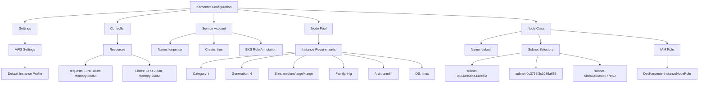
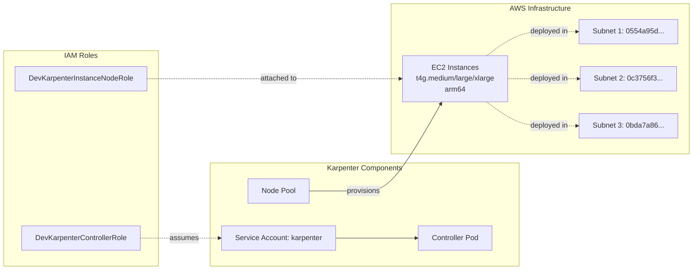

# Diagram: devops/k8s/karpenter/helm/values.dev1.yaml

> Auto-generated by Obscura crawlers

## Diagram 1

### SVG

<svg id="container" width="3379.359375" xmlns="http://www.w3.org/2000/svg" class="flowchart" height="406" viewBox="0 0 3379.359375 406" role="graphics-document document" aria-roledescription="flowchart-v2"><g><marker id="container_flowchart-v2-pointEnd" class="marker flowchart-v2" viewBox="0 0 10 10" refX="5" refY="5" markerUnits="userSpaceOnUse" markerWidth="8" markerHeight="8" orient="auto"><path d="M 0 0 L 10 5 L 0 10 z" class="arrowMarkerPath" style="stroke-width: 1; stroke-dasharray: 1, 0;"></path></marker><marker id="container_flowchart-v2-pointStart" class="marker flowchart-v2" viewBox="0 0 10 10" refX="4.5" refY="5" markerUnits="userSpaceOnUse" markerWidth="8" markerHeight="8" orient="auto"><path d="M 0 5 L 10 10 L 10 0 z" class="arrowMarkerPath" style="stroke-width: 1; stroke-dasharray: 1, 0;"></path></marker><marker id="container_flowchart-v2-circleEnd" class="marker flowchart-v2" viewBox="0 0 10 10" refX="11" refY="5" markerUnits="userSpaceOnUse" markerWidth="11" markerHeight="11" orient="auto"><circle cx="5" cy="5" r="5" class="arrowMarkerPath" style="stroke-width: 1; stroke-dasharray: 1, 0;"></circle></marker><marker id="container_flowchart-v2-circleStart" class="marker flowchart-v2" viewBox="0 0 10 10" refX="-1" refY="5" markerUnits="userSpaceOnUse" markerWidth="11" markerHeight="11" orient="auto"><circle cx="5" cy="5" r="5" class="arrowMarkerPath" style="stroke-width: 1; stroke-dasharray: 1, 0;"></circle></marker><marker id="container_flowchart-v2-crossEnd" class="marker cross flowchart-v2" viewBox="0 0 11 11" refX="12" refY="5.2" markerUnits="userSpaceOnUse" markerWidth="11" markerHeight="11" orient="auto"><path d="M 1,1 l 9,9 M 10,1 l -9,9" class="arrowMarkerPath" style="stroke-width: 2; stroke-dasharray: 1, 0;"></path></marker><marker id="container_flowchart-v2-crossStart" class="marker cross flowchart-v2" viewBox="0 0 11 11" refX="-1" refY="5.2" markerUnits="userSpaceOnUse" markerWidth="11" markerHeight="11" orient="auto"><path d="M 1,1 l 9,9 M 10,1 l -9,9" class="arrowMarkerPath" style="stroke-width: 2; stroke-dasharray: 1, 0;"></path></marker><g class="root"><g class="clusters"></g><g class="edgePaths"><path d="M923.434,41.623L789.937,49.186C656.44,56.749,389.447,71.874,255.95,82.937C122.453,94,122.453,101,122.453,104.5L122.453,108" id="L_A_B_0" class="edge-thickness-normal edge-pattern-solid edge-thickness-normal edge-pattern-solid flowchart-link" style=";" data-edge="true" data-et="edge" data-id="L_A_B_0" data-points="W3sieCI6OTIzLjQzMzU5Mzc1LCJ5Ijo0MS42MjMzNDQwMTUwNDgwMjZ9LHsieCI6MTIyLjQ1MzEyNSwieSI6ODd9LHsieCI6MTIyLjQ1MzEyNSwieSI6MTEyfV0=" marker-end="url(#container_flowchart-v2-pointEnd)"></path><path d="M923.434,47.978L864.846,54.482C806.258,60.985,689.082,73.993,630.494,83.996C571.906,94,571.906,101,571.906,104.5L571.906,108" id="L_A_C_0" class="edge-thickness-normal edge-pattern-solid edge-thickness-normal edge-pattern-solid flowchart-link" style=";" data-edge="true" data-et="edge" data-id="L_A_C_0" data-points="W3sieCI6OTIzLjQzMzU5Mzc1LCJ5Ijo0Ny45NzgyMTA2NTUzNDgxMX0seyJ4Ijo1NzEuOTA2MjUsInkiOjg3fSx7IngiOjU3MS45MDYyNSwieSI6MTEyfV0=" marker-end="url(#container_flowchart-v2-pointEnd)"></path><path d="M1040.348,62L1040.348,66.167C1040.348,70.333,1040.348,78.667,1040.348,86.333C1040.348,94,1040.348,101,1040.348,104.5L1040.348,108" id="L_A_D_0" class="edge-thickness-normal edge-pattern-solid edge-thickness-normal edge-pattern-solid flowchart-link" style=";" data-edge="true" data-et="edge" data-id="L_A_D_0" data-points="W3sieCI6MTA0MC4zNDc2NTYyNSwieSI6NjJ9LHsieCI6MTA0MC4zNDc2NTYyNSwieSI6ODd9LHsieCI6MTA0MC4zNDc2NTYyNSwieSI6MTEyfV0=" marker-end="url(#container_flowchart-v2-pointEnd)"></path><path d="M1157.262,46.943L1222.615,53.619C1287.969,60.295,1418.676,73.648,1484.029,83.824C1549.383,94,1549.383,101,1549.383,104.5L1549.383,108" id="L_A_E_0" class="edge-thickness-normal edge-pattern-solid edge-thickness-normal edge-pattern-solid flowchart-link" style=";" data-edge="true" data-et="edge" data-id="L_A_E_0" data-points="W3sieCI6MTE1Ny4yNjE3MTg3NSwieSI6NDYuOTQzMjQ0MzQyNDY3NzV9LHsieCI6MTU0OS4zODI4MTI1LCJ5Ijo4N30seyJ4IjoxNTQ5LjM4MjgxMjUsInkiOjExMn1d" marker-end="url(#container_flowchart-v2-pointEnd)"></path><path d="M1157.262,38.912L1396.796,46.927C1636.331,54.941,2115.4,70.971,2354.934,82.485C2594.469,94,2594.469,101,2594.469,104.5L2594.469,108" id="L_A_F_0" class="edge-thickness-normal edge-pattern-solid edge-thickness-normal edge-pattern-solid flowchart-link" style=";" data-edge="true" data-et="edge" data-id="L_A_F_0" data-points="W3sieCI6MTE1Ny4yNjE3MTg3NSwieSI6MzguOTExODc3NDQyNzg2OTQ1fSx7IngiOjI1OTQuNDY4NzUsInkiOjg3fSx7IngiOjI1OTQuNDY4NzUsInkiOjExMn1d" marker-end="url(#container_flowchart-v2-pointEnd)"></path><path d="M122.453,166L122.453,170.167C122.453,174.333,122.453,182.667,122.453,190.333C122.453,198,122.453,205,122.453,208.5L122.453,212" id="L_B_B1_0" class="edge-thickness-normal edge-pattern-solid edge-thickness-normal edge-pattern-solid flowchart-link" style=";" data-edge="true" data-et="edge" data-id="L_B_B1_0" data-points="W3sieCI6MTIyLjQ1MzEyNSwieSI6MTY2fSx7IngiOjEyMi40NTMxMjUsInkiOjE5MX0seyJ4IjoxMjIuNDUzMTI1LCJ5IjoyMTZ9XQ==" marker-end="url(#container_flowchart-v2-pointEnd)"></path><path d="M122.453,270L122.453,274.167C122.453,278.333,122.453,286.667,122.453,296.333C122.453,306,122.453,317,122.453,322.5L122.453,328" id="L_B1_B2_0" class="edge-thickness-normal edge-pattern-solid edge-thickness-normal edge-pattern-solid flowchart-link" style=";" data-edge="true" data-et="edge" data-id="L_B1_B2_0" data-points="W3sieCI6MTIyLjQ1MzEyNSwieSI6MjcwfSx7IngiOjEyMi40NTMxMjUsInkiOjI5NX0seyJ4IjoxMjIuNDUzMTI1LCJ5IjozMzJ9XQ==" marker-end="url(#container_flowchart-v2-pointEnd)"></path><path d="M571.906,166L571.906,170.167C571.906,174.333,571.906,182.667,571.906,190.333C571.906,198,571.906,205,571.906,208.5L571.906,212" id="L_C_C1_0" class="edge-thickness-normal edge-pattern-solid edge-thickness-normal edge-pattern-solid flowchart-link" style=";" data-edge="true" data-et="edge" data-id="L_C_C1_0" data-points="W3sieCI6NTcxLjkwNjI1LCJ5IjoxNjZ9LHsieCI6NTcxLjkwNjI1LCJ5IjoxOTF9LHsieCI6NTcxLjkwNjI1LCJ5IjoyMTZ9XQ==" marker-end="url(#container_flowchart-v2-pointEnd)"></path><path d="M505.148,265.396L490.441,270.33C475.734,275.264,446.32,285.132,431.613,293.566C416.906,302,416.906,309,416.906,312.5L416.906,316" id="L_C1_C2_0" class="edge-thickness-normal edge-pattern-solid edge-thickness-normal edge-pattern-solid flowchart-link" style=";" data-edge="true" data-et="edge" data-id="L_C1_C2_0" data-points="W3sieCI6NTA1LjE0ODQzNzUsInkiOjI2NS4zOTYxNjkzNTQ4Mzg3fSx7IngiOjQxNi45MDYyNSwieSI6Mjk1fSx7IngiOjQxNi45MDYyNSwieSI6MzIwfV0=" marker-end="url(#container_flowchart-v2-pointEnd)"></path><path d="M638.664,265.396L653.371,270.33C668.078,275.264,697.492,285.132,712.199,293.566C726.906,302,726.906,309,726.906,312.5L726.906,316" id="L_C1_C3_0" class="edge-thickness-normal edge-pattern-solid edge-thickness-normal edge-pattern-solid flowchart-link" style=";" data-edge="true" data-et="edge" data-id="L_C1_C3_0" data-points="W3sieCI6NjM4LjY2NDA2MjUsInkiOjI2NS4zOTYxNjkzNTQ4Mzg3fSx7IngiOjcyNi45MDYyNSwieSI6Mjk1fSx7IngiOjcyNi45MDYyNSwieSI6MzIwfV0=" marker-end="url(#container_flowchart-v2-pointEnd)"></path><path d="M953.387,160.278L932.461,165.399C911.535,170.519,869.684,180.759,848.758,189.38C827.832,198,827.832,205,827.832,208.5L827.832,212" id="L_D_D1_0" class="edge-thickness-normal edge-pattern-solid edge-thickness-normal edge-pattern-solid flowchart-link" style=";" data-edge="true" data-et="edge" data-id="L_D_D1_0" data-points="W3sieCI6OTUzLjM4NjcxODc1LCJ5IjoxNjAuMjc4Mjg4MzYxMTQ5OTJ9LHsieCI6ODI3LjgzMjAzMTI1LCJ5IjoxOTF9LHsieCI6ODI3LjgzMjAzMTI1LCJ5IjoyMTZ9XQ==" marker-end="url(#container_flowchart-v2-pointEnd)"></path><path d="M1040.348,166L1040.348,170.167C1040.348,174.333,1040.348,182.667,1040.348,190.333C1040.348,198,1040.348,205,1040.348,208.5L1040.348,212" id="L_D_D2_0" class="edge-thickness-normal edge-pattern-solid edge-thickness-normal edge-pattern-solid flowchart-link" style=";" data-edge="true" data-et="edge" data-id="L_D_D2_0" data-points="W3sieCI6MTA0MC4zNDc2NTYyNSwieSI6MTY2fSx7IngiOjEwNDAuMzQ3NjU2MjUsInkiOjE5MX0seyJ4IjoxMDQwLjM0NzY1NjI1LCJ5IjoyMTZ9XQ==" marker-end="url(#container_flowchart-v2-pointEnd)"></path><path d="M1127.309,159.018L1150.465,164.348C1173.621,169.678,1219.934,180.339,1243.09,189.17C1266.246,198,1266.246,205,1266.246,208.5L1266.246,212" id="L_D_D3_0" class="edge-thickness-normal edge-pattern-solid edge-thickness-normal edge-pattern-solid flowchart-link" style=";" data-edge="true" data-et="edge" data-id="L_D_D3_0" data-points="W3sieCI6MTEyNy4zMDg1OTM3NSwieSI6MTU5LjAxNzcwNzA3MjQ1MzczfSx7IngiOjEyNjYuMjQ2MDkzNzUsInkiOjE5MX0seyJ4IjoxMjY2LjI0NjA5Mzc1LCJ5IjoyMTZ9XQ==" marker-end="url(#container_flowchart-v2-pointEnd)"></path><path d="M1549.383,166L1549.383,170.167C1549.383,174.333,1549.383,182.667,1549.383,190.333C1549.383,198,1549.383,205,1549.383,208.5L1549.383,212" id="L_E_E1_0" class="edge-thickness-normal edge-pattern-solid edge-thickness-normal edge-pattern-solid flowchart-link" style=";" data-edge="true" data-et="edge" data-id="L_E_E1_0" data-points="W3sieCI6MTU0OS4zODI4MTI1LCJ5IjoxNjZ9LHsieCI6MTU0OS4zODI4MTI1LCJ5IjoxOTF9LHsieCI6MTU0OS4zODI4MTI1LCJ5IjoyMTZ9XQ==" marker-end="url(#container_flowchart-v2-pointEnd)"></path><path d="M1436.07,253.267L1359.305,260.222C1282.539,267.178,1129.008,281.089,1052.242,293.544C975.477,306,975.477,317,975.477,322.5L975.477,328" id="L_E1_E2_0" class="edge-thickness-normal edge-pattern-solid edge-thickness-normal edge-pattern-solid flowchart-link" style=";" data-edge="true" data-et="edge" data-id="L_E1_E2_0" data-points="W3sieCI6MTQzNi4wNzAzMTI1LCJ5IjoyNTMuMjY2OTIwNzczMjA5OX0seyJ4Ijo5NzUuNDc2NTYyNSwieSI6Mjk1fSx7IngiOjk3NS40NzY1NjI1LCJ5IjozMzJ9XQ==" marker-end="url(#container_flowchart-v2-pointEnd)"></path><path d="M1436.07,258.633L1392.137,264.694C1348.203,270.755,1260.336,282.878,1216.402,294.439C1172.469,306,1172.469,317,1172.469,322.5L1172.469,328" id="L_E1_E3_0" class="edge-thickness-normal edge-pattern-solid edge-thickness-normal edge-pattern-solid flowchart-link" style=";" data-edge="true" data-et="edge" data-id="L_E1_E3_0" data-points="W3sieCI6MTQzNi4wNzAzMTI1LCJ5IjoyNTguNjMyODczODcyOTQwMn0seyJ4IjoxMTcyLjQ2ODc1LCJ5IjoyOTV9LHsieCI6MTE3Mi40Njg3NSwieSI6MzMyfV0=" marker-end="url(#container_flowchart-v2-pointEnd)"></path><path d="M1485.895,270L1476.097,274.167C1466.3,278.333,1446.704,286.667,1436.907,296.333C1427.109,306,1427.109,317,1427.109,322.5L1427.109,328" id="L_E1_E4_0" class="edge-thickness-normal edge-pattern-solid edge-thickness-normal edge-pattern-solid flowchart-link" style=";" data-edge="true" data-et="edge" data-id="L_E1_E4_0" data-points="W3sieCI6MTQ4NS44OTQ2ODE0OTAzODQ1LCJ5IjoyNzB9LHsieCI6MTQyNy4xMDkzNzUsInkiOjI5NX0seyJ4IjoxNDI3LjEwOTM3NSwieSI6MzMyfV0=" marker-end="url(#container_flowchart-v2-pointEnd)"></path><path d="M1612.871,270L1622.668,274.167C1632.466,278.333,1652.061,286.667,1661.859,296.333C1671.656,306,1671.656,317,1671.656,322.5L1671.656,328" id="L_E1_E5_0" class="edge-thickness-normal edge-pattern-solid edge-thickness-normal edge-pattern-solid flowchart-link" style=";" data-edge="true" data-et="edge" data-id="L_E1_E5_0" data-points="W3sieCI6MTYxMi44NzA5NDM1MDk2MTU1LCJ5IjoyNzB9LHsieCI6MTY3MS42NTYyNSwieSI6Mjk1fSx7IngiOjE2NzEuNjU2MjUsInkiOjMzMn1d" marker-end="url(#container_flowchart-v2-pointEnd)"></path><path d="M1662.695,261.801L1696.044,267.334C1729.393,272.867,1796.091,283.934,1829.44,294.967C1862.789,306,1862.789,317,1862.789,322.5L1862.789,328" id="L_E1_E6_0" class="edge-thickness-normal edge-pattern-solid edge-thickness-normal edge-pattern-solid flowchart-link" style=";" data-edge="true" data-et="edge" data-id="L_E1_E6_0" data-points="W3sieCI6MTY2Mi42OTUzMTI1LCJ5IjoyNjEuODAwNjc4MDMzNzAyMjR9LHsieCI6MTg2Mi43ODkwNjI1LCJ5IjoyOTV9LHsieCI6MTg2Mi43ODkwNjI1LCJ5IjozMzJ9XQ==" marker-end="url(#container_flowchart-v2-pointEnd)"></path><path d="M1662.695,254.832L1726.806,261.527C1790.917,268.222,1919.138,281.611,1983.249,293.805C2047.359,306,2047.359,317,2047.359,322.5L2047.359,328" id="L_E1_E7_0" class="edge-thickness-normal edge-pattern-solid edge-thickness-normal edge-pattern-solid flowchart-link" style=";" data-edge="true" data-et="edge" data-id="L_E1_E7_0" data-points="W3sieCI6MTY2Mi42OTUzMTI1LCJ5IjoyNTQuODMyMzg0MTc5NzI3MzR9LHsieCI6MjA0Ny4zNTkzNzUsInkiOjI5NX0seyJ4IjoyMDQ3LjM1OTM3NSwieSI6MzMyfV0=" marker-end="url(#container_flowchart-v2-pointEnd)"></path><path d="M2524.695,152.822L2492.576,159.185C2460.457,165.548,2396.219,178.274,2364.1,188.137C2331.98,198,2331.98,205,2331.98,208.5L2331.98,212" id="L_F_F1_0" class="edge-thickness-normal edge-pattern-solid edge-thickness-normal edge-pattern-solid flowchart-link" style=";" data-edge="true" data-et="edge" data-id="L_F_F1_0" data-points="W3sieCI6MjUyNC42OTUzMTI1LCJ5IjoxNTIuODIyNDAyNzg1ODM4NjV9LHsieCI6MjMzMS45ODA0Njg3NSwieSI6MTkxfSx7IngiOjIzMzEuOTgwNDY4NzUsInkiOjIxNn1d" marker-end="url(#container_flowchart-v2-pointEnd)"></path><path d="M2607.109,166L2609.059,170.167C2611.01,174.333,2614.911,182.667,2616.862,190.333C2618.813,198,2618.813,205,2618.813,208.5L2618.813,212" id="L_F_F2_0" class="edge-thickness-normal edge-pattern-solid edge-thickness-normal edge-pattern-solid flowchart-link" style=";" data-edge="true" data-et="edge" data-id="L_F_F2_0" data-points="W3sieCI6MjYwNy4xMDg3NzQwMzg0NjE0LCJ5IjoxNjZ9LHsieCI6MjYxOC44MTI1LCJ5IjoxOTF9LHsieCI6MjYxOC44MTI1LCJ5IjoyMTZ9XQ==" marker-end="url(#container_flowchart-v2-pointEnd)"></path><path d="M2664.242,144.747L2757.837,152.456C2851.432,160.165,3038.622,175.582,3132.217,186.791C3225.813,198,3225.813,205,3225.813,208.5L3225.813,212" id="L_F_F3_0" class="edge-thickness-normal edge-pattern-solid edge-thickness-normal edge-pattern-solid flowchart-link" style=";" data-edge="true" data-et="edge" data-id="L_F_F3_0" data-points="W3sieCI6MjY2NC4yNDIxODc1LCJ5IjoxNDQuNzQ2ODE5Nzc5MjQwN30seyJ4IjozMjI1LjgxMjUsInkiOjE5MX0seyJ4IjozMjI1LjgxMjUsInkiOjIxNn1d" marker-end="url(#container_flowchart-v2-pointEnd)"></path><path d="M2527.633,257.369L2487.835,263.641C2448.036,269.913,2368.44,282.456,2328.642,294.228C2288.844,306,2288.844,317,2288.844,322.5L2288.844,328" id="L_F2_F4_0" class="edge-thickness-normal edge-pattern-solid edge-thickness-normal edge-pattern-solid flowchart-link" style=";" data-edge="true" data-et="edge" data-id="L_F2_F4_0" data-points="W3sieCI6MjUyNy42MzI4MTI1LCJ5IjoyNTcuMzY5MDY5MDQwNjI4ODZ9LHsieCI6MjI4OC44NDM3NSwieSI6Mjk1fSx7IngiOjIyODguODQzNzUsInkiOjMzMn1d" marker-end="url(#container_flowchart-v2-pointEnd)"></path><path d="M2606.172,270L2604.222,274.167C2602.271,278.333,2598.37,286.667,2596.419,296.333C2594.469,306,2594.469,317,2594.469,322.5L2594.469,328" id="L_F2_F5_0" class="edge-thickness-normal edge-pattern-solid edge-thickness-normal edge-pattern-solid flowchart-link" style=";" data-edge="true" data-et="edge" data-id="L_F2_F5_0" data-points="W3sieCI6MjYwNi4xNzI0NzU5NjE1Mzg2LCJ5IjoyNzB9LHsieCI6MjU5NC40Njg3NSwieSI6Mjk1fSx7IngiOjI1OTQuNDY4NzUsInkiOjMzMn1d" marker-end="url(#container_flowchart-v2-pointEnd)"></path><path d="M2709.992,259.843L2741.714,265.702C2773.435,271.562,2836.878,283.281,2868.599,294.64C2900.32,306,2900.32,317,2900.32,322.5L2900.32,328" id="L_F2_F6_0" class="edge-thickness-normal edge-pattern-solid edge-thickness-normal edge-pattern-solid flowchart-link" style=";" data-edge="true" data-et="edge" data-id="L_F2_F6_0" data-points="W3sieCI6MjcwOS45OTIxODc1LCJ5IjoyNTkuODQyNjcxOTk1MTE1Nn0seyJ4IjoyOTAwLjMyMDMxMjUsInkiOjI5NX0seyJ4IjoyOTAwLjMyMDMxMjUsInkiOjMzMn1d" marker-end="url(#container_flowchart-v2-pointEnd)"></path><path d="M3225.813,270L3225.813,274.167C3225.813,278.333,3225.813,286.667,3225.813,296.333C3225.813,306,3225.813,317,3225.813,322.5L3225.813,328" id="L_F3_F7_0" class="edge-thickness-normal edge-pattern-solid edge-thickness-normal edge-pattern-solid flowchart-link" style=";" data-edge="true" data-et="edge" data-id="L_F3_F7_0" data-points="W3sieCI6MzIyNS44MTI1LCJ5IjoyNzB9LHsieCI6MzIyNS44MTI1LCJ5IjoyOTV9LHsieCI6MzIyNS44MTI1LCJ5IjozMzJ9XQ==" marker-end="url(#container_flowchart-v2-pointEnd)"></path></g><g class="edgeLabels"><g class="edgeLabel"><g class="label" data-id="L_A_B_0" transform="translate(0, 0)"><foreignObject width="0" height="0">

</foreignObject></g></g><g class="edgeLabel"><g class="label" data-id="L_A_C_0" transform="translate(0, 0)"><foreignObject width="0" height="0">

</foreignObject></g></g><g class="edgeLabel"><g class="label" data-id="L_A_D_0" transform="translate(0, 0)"><foreignObject width="0" height="0">

</foreignObject></g></g><g class="edgeLabel"><g class="label" data-id="L_A_E_0" transform="translate(0, 0)"><foreignObject width="0" height="0">

</foreignObject></g></g><g class="edgeLabel"><g class="label" data-id="L_A_F_0" transform="translate(0, 0)"><foreignObject width="0" height="0">

</foreignObject></g></g><g class="edgeLabel"><g class="label" data-id="L_B_B1_0" transform="translate(0, 0)"><foreignObject width="0" height="0">

</foreignObject></g></g><g class="edgeLabel"><g class="label" data-id="L_B1_B2_0" transform="translate(0, 0)"><foreignObject width="0" height="0">

</foreignObject></g></g><g class="edgeLabel"><g class="label" data-id="L_C_C1_0" transform="translate(0, 0)"><foreignObject width="0" height="0">

</foreignObject></g></g><g class="edgeLabel"><g class="label" data-id="L_C1_C2_0" transform="translate(0, 0)"><foreignObject width="0" height="0">

</foreignObject></g></g><g class="edgeLabel"><g class="label" data-id="L_C1_C3_0" transform="translate(0, 0)"><foreignObject width="0" height="0">

</foreignObject></g></g><g class="edgeLabel"><g class="label" data-id="L_D_D1_0" transform="translate(0, 0)"><foreignObject width="0" height="0">

</foreignObject></g></g><g class="edgeLabel"><g class="label" data-id="L_D_D2_0" transform="translate(0, 0)"><foreignObject width="0" height="0">

</foreignObject></g></g><g class="edgeLabel"><g class="label" data-id="L_D_D3_0" transform="translate(0, 0)"><foreignObject width="0" height="0">

</foreignObject></g></g><g class="edgeLabel"><g class="label" data-id="L_E_E1_0" transform="translate(0, 0)"><foreignObject width="0" height="0">

</foreignObject></g></g><g class="edgeLabel"><g class="label" data-id="L_E1_E2_0" transform="translate(0, 0)"><foreignObject width="0" height="0">

</foreignObject></g></g><g class="edgeLabel"><g class="label" data-id="L_E1_E3_0" transform="translate(0, 0)"><foreignObject width="0" height="0">

</foreignObject></g></g><g class="edgeLabel"><g class="label" data-id="L_E1_E4_0" transform="translate(0, 0)"><foreignObject width="0" height="0">

</foreignObject></g></g><g class="edgeLabel"><g class="label" data-id="L_E1_E5_0" transform="translate(0, 0)"><foreignObject width="0" height="0">

</foreignObject></g></g><g class="edgeLabel"><g class="label" data-id="L_E1_E6_0" transform="translate(0, 0)"><foreignObject width="0" height="0">

</foreignObject></g></g><g class="edgeLabel"><g class="label" data-id="L_E1_E7_0" transform="translate(0, 0)"><foreignObject width="0" height="0">

</foreignObject></g></g><g class="edgeLabel"><g class="label" data-id="L_F_F1_0" transform="translate(0, 0)"><foreignObject width="0" height="0">

</foreignObject></g></g><g class="edgeLabel"><g class="label" data-id="L_F_F2_0" transform="translate(0, 0)"><foreignObject width="0" height="0">

</foreignObject></g></g><g class="edgeLabel"><g class="label" data-id="L_F_F3_0" transform="translate(0, 0)"><foreignObject width="0" height="0">

</foreignObject></g></g><g class="edgeLabel"><g class="label" data-id="L_F2_F4_0" transform="translate(0, 0)"><foreignObject width="0" height="0">

</foreignObject></g></g><g class="edgeLabel"><g class="label" data-id="L_F2_F5_0" transform="translate(0, 0)"><foreignObject width="0" height="0">

</foreignObject></g></g><g class="edgeLabel"><g class="label" data-id="L_F2_F6_0" transform="translate(0, 0)"><foreignObject width="0" height="0">

</foreignObject></g></g><g class="edgeLabel"><g class="label" data-id="L_F3_F7_0" transform="translate(0, 0)"><foreignObject width="0" height="0">

</foreignObject></g></g></g><g class="nodes"><g class="node default" id="flowchart-A-0" transform="translate(1040.34765625, 35)"><rect class="basic label-container" style="" x="-116.9140625" y="-27" width="233.828125" height="54"></rect><g class="label" style="" transform="translate(-86.9140625, -12)"><rect></rect><foreignObject width="173.828125" height="24">

Karpenter Configuration

</foreignObject></g></g><g class="node default" id="flowchart-B-1" transform="translate(122.453125, 139)"><rect class="basic label-container" style="" x="-59.28125" y="-27" width="118.5625" height="54"></rect><g class="label" style="" transform="translate(-29.28125, -12)"><rect></rect><foreignObject width="58.5625" height="24">

Settings

</foreignObject></g></g><g class="node default" id="flowchart-C-3" transform="translate(571.90625, 139)"><rect class="basic label-container" style="" x="-66.1875" y="-27" width="132.375" height="54"></rect><g class="label" style="" transform="translate(-36.1875, -12)"><rect></rect><foreignObject width="72.375" height="24">

Controller

</foreignObject></g></g><g class="node default" id="flowchart-D-5" transform="translate(1040.34765625, 139)"><rect class="basic label-container" style="" x="-86.9609375" y="-27" width="173.921875" height="54"></rect><g class="label" style="" transform="translate(-56.9609375, -12)"><rect></rect><foreignObject width="113.921875" height="24">

Service Account

</foreignObject></g></g><g class="node default" id="flowchart-E-7" transform="translate(1549.3828125, 139)"><rect class="basic label-container" style="" x="-67.5" y="-27" width="135" height="54"></rect><g class="label" style="" transform="translate(-37.5, -12)"><rect></rect><foreignObject width="75" height="24">

Node Pool

</foreignObject></g></g><g class="node default" id="flowchart-F-9" transform="translate(2594.46875, 139)"><rect class="basic label-container" style="" x="-69.7734375" y="-27" width="139.546875" height="54"></rect><g class="label" style="" transform="translate(-39.7734375, -12)"><rect></rect><foreignObject width="79.546875" height="24">

Node Class

</foreignObject></g></g><g class="node default" id="flowchart-B1-11" transform="translate(122.453125, 243)"><rect class="basic label-container" style="" x="-76.875" y="-27" width="153.75" height="54"></rect><g class="label" style="" transform="translate(-46.875, -12)"><rect></rect><foreignObject width="93.75" height="24">

AWS Settings

</foreignObject></g></g><g class="node default" id="flowchart-B2-13" transform="translate(122.453125, 359)"><rect class="basic label-container" style="" x="-114.453125" y="-27" width="228.90625" height="54"></rect><g class="label" style="" transform="translate(-84.453125, -12)"><rect></rect><foreignObject width="168.90625" height="24">

Default Instance Profile

</foreignObject></g></g><g class="node default" id="flowchart-C1-15" transform="translate(571.90625, 243)"><rect class="basic label-container" style="" x="-66.7578125" y="-27" width="133.515625" height="54"></rect><g class="label" style="" transform="translate(-36.7578125, -12)"><rect></rect><foreignObject width="73.515625" height="24">

Resources

</foreignObject></g></g><g class="node default" id="flowchart-C2-17" transform="translate(416.90625, 359)"><rect class="basic label-container" style="" x="-130" y="-39" width="260" height="78"></rect><g class="label" style="" transform="translate(-100, -24)"><rect></rect><foreignObject width="200" height="48">

Requests: CPU 100m, Memory 200Mi

</foreignObject></g></g><g class="node default" id="flowchart-C3-19" transform="translate(726.90625, 359)"><rect class="basic label-container" style="" x="-130" y="-39" width="260" height="78"></rect><g class="label" style="" transform="translate(-100, -24)"><rect></rect><foreignObject width="200" height="48">

Limits: CPU 200m, Memory 200Mi

</foreignObject></g></g><g class="node default" id="flowchart-D1-21" transform="translate(827.83203125, 243)"><rect class="basic label-container" style="" x="-90.5078125" y="-27" width="181.015625" height="54"></rect><g class="label" style="" transform="translate(-60.5078125, -12)"><rect></rect><foreignObject width="121.015625" height="24">

Name: karpenter

</foreignObject></g></g><g class="node default" id="flowchart-D2-23" transform="translate(1040.34765625, 243)"><rect class="basic label-container" style="" x="-72.0078125" y="-27" width="144.015625" height="54"></rect><g class="label" style="" transform="translate(-42.0078125, -12)"><rect></rect><foreignObject width="84.015625" height="24">

Create: true

</foreignObject></g></g><g class="node default" id="flowchart-D3-25" transform="translate(1266.24609375, 243)"><rect class="basic label-container" style="" x="-103.890625" y="-27" width="207.78125" height="54"></rect><g class="label" style="" transform="translate(-73.890625, -12)"><rect></rect><foreignObject width="147.78125" height="24">

EKS Role Annotation

</foreignObject></g></g><g class="node default" id="flowchart-E1-27" transform="translate(1549.3828125, 243)"><rect class="basic label-container" style="" x="-113.3125" y="-27" width="226.625" height="54"></rect><g class="label" style="" transform="translate(-83.3125, -12)"><rect></rect><foreignObject width="166.625" height="24">

Instance Requirements

</foreignObject></g></g><g class="node default" id="flowchart-E2-29" transform="translate(975.4765625, 359)"><rect class="basic label-container" style="" x="-68.5703125" y="-27" width="137.140625" height="54"></rect><g class="label" style="" transform="translate(-38.5703125, -12)"><rect></rect><foreignObject width="77.140625" height="24">

Category: t

</foreignObject></g></g><g class="node default" id="flowchart-E3-31" transform="translate(1172.46875, 359)"><rect class="basic label-container" style="" x="-78.421875" y="-27" width="156.84375" height="54"></rect><g class="label" style="" transform="translate(-48.421875, -12)"><rect></rect><foreignObject width="96.84375" height="24">

Generation: 4

</foreignObject></g></g><g class="node default" id="flowchart-E4-33" transform="translate(1427.109375, 359)"><rect class="basic label-container" style="" x="-126.21875" y="-27" width="252.4375" height="54"></rect><g class="label" style="" transform="translate(-96.21875, -12)"><rect></rect><foreignObject width="192.4375" height="24">

Size: medium/large/xlarge

</foreignObject></g></g><g class="node default" id="flowchart-E5-35" transform="translate(1671.65625, 359)"><rect class="basic label-container" style="" x="-68.328125" y="-27" width="136.65625" height="54"></rect><g class="label" style="" transform="translate(-38.328125, -12)"><rect></rect><foreignObject width="76.65625" height="24">

Family: t4g

</foreignObject></g></g><g class="node default" id="flowchart-E6-37" transform="translate(1862.7890625, 359)"><rect class="basic label-container" style="" x="-72.8046875" y="-27" width="145.609375" height="54"></rect><g class="label" style="" transform="translate(-42.8046875, -12)"><rect></rect><foreignObject width="85.609375" height="24">

Arch: arm64

</foreignObject></g></g><g class="node default" id="flowchart-E7-39" transform="translate(2047.359375, 359)"><rect class="basic label-container" style="" x="-61.765625" y="-27" width="123.53125" height="54"></rect><g class="label" style="" transform="translate(-31.765625, -12)"><rect></rect><foreignObject width="63.53125" height="24">

OS: linux

</foreignObject></g></g><g class="node default" id="flowchart-F1-41" transform="translate(2331.98046875, 243)"><rect class="basic label-container" style="" x="-80.9609375" y="-27" width="161.921875" height="54"></rect><g class="label" style="" transform="translate(-50.9609375, -12)"><rect></rect><foreignObject width="101.921875" height="24">

Name: default

</foreignObject></g></g><g class="node default" id="flowchart-F2-43" transform="translate(2618.8125, 243)"><rect class="basic label-container" style="" x="-91.1796875" y="-27" width="182.359375" height="54"></rect><g class="label" style="" transform="translate(-61.1796875, -12)"><rect></rect><foreignObject width="122.359375" height="24">

Subnet Selectors

</foreignObject></g></g><g class="node default" id="flowchart-F3-45" transform="translate(3225.8125, 243)"><rect class="basic label-container" style="" x="-61.3515625" y="-27" width="122.703125" height="54"></rect><g class="label" style="" transform="translate(-31.3515625, -12)"><rect></rect><foreignObject width="62.703125" height="24">

IAM Role

</foreignObject></g></g><g class="node default" id="flowchart-F4-47" transform="translate(2288.84375, 359)"><rect class="basic label-container" style="" x="-129.71875" y="-27" width="259.4375" height="54"></rect><g class="label" style="" transform="translate(-99.71875, -12)"><rect></rect><foreignObject width="199.4375" height="24">

subnet-0554a95dda440ef3a

</foreignObject></g></g><g class="node default" id="flowchart-F5-49" transform="translate(2594.46875, 359)"><rect class="basic label-container" style="" x="-125.90625" y="-27" width="251.8125" height="54"></rect><g class="label" style="" transform="translate(-95.90625, -12)"><rect></rect><foreignObject width="191.8125" height="24">

subnet-0c3756f3c1036a686

</foreignObject></g></g><g class="node default" id="flowchart-F6-51" transform="translate(2900.3203125, 359)"><rect class="basic label-container" style="" x="-129.9453125" y="-27" width="259.890625" height="54"></rect><g class="label" style="" transform="translate(-99.9453125, -12)"><rect></rect><foreignObject width="199.890625" height="24">

subnet-0bda7a86e0d877e50

</foreignObject></g></g><g class="node default" id="flowchart-F7-53" transform="translate(3225.8125, 359)"><rect class="basic label-container" style="" x="-145.546875" y="-27" width="291.09375" height="54"></rect><g class="label" style="" transform="translate(-115.546875, -12)"><rect></rect><foreignObject width="231.09375" height="24">

DevKarpenterInstanceNodeRole

</foreignObject></g></g></g></g></g></svg>

## Diagram 2

### SVG

<svg id="container" width="1537.25" xmlns="http://www.w3.org/2000/svg" class="flowchart" height="596" viewBox="0 0 1537.25 596" role="graphics-document document" aria-roledescription="flowchart-v2"><g><marker id="container_flowchart-v2-pointEnd" class="marker flowchart-v2" viewBox="0 0 10 10" refX="5" refY="5" markerUnits="userSpaceOnUse" markerWidth="8" markerHeight="8" orient="auto"><path d="M 0 0 L 10 5 L 0 10 z" class="arrowMarkerPath" style="stroke-width: 1; stroke-dasharray: 1, 0;"></path></marker><marker id="container_flowchart-v2-pointStart" class="marker flowchart-v2" viewBox="0 0 10 10" refX="4.5" refY="5" markerUnits="userSpaceOnUse" markerWidth="8" markerHeight="8" orient="auto"><path d="M 0 5 L 10 10 L 10 0 z" class="arrowMarkerPath" style="stroke-width: 1; stroke-dasharray: 1, 0;"></path></marker><marker id="container_flowchart-v2-circleEnd" class="marker flowchart-v2" viewBox="0 0 10 10" refX="11" refY="5" markerUnits="userSpaceOnUse" markerWidth="11" markerHeight="11" orient="auto"><circle cx="5" cy="5" r="5" class="arrowMarkerPath" style="stroke-width: 1; stroke-dasharray: 1, 0;"></circle></marker><marker id="container_flowchart-v2-circleStart" class="marker flowchart-v2" viewBox="0 0 10 10" refX="-1" refY="5" markerUnits="userSpaceOnUse" markerWidth="11" markerHeight="11" orient="auto"><circle cx="5" cy="5" r="5" class="arrowMarkerPath" style="stroke-width: 1; stroke-dasharray: 1, 0;"></circle></marker><marker id="container_flowchart-v2-crossEnd" class="marker cross flowchart-v2" viewBox="0 0 11 11" refX="12" refY="5.2" markerUnits="userSpaceOnUse" markerWidth="11" markerHeight="11" orient="auto"><path d="M 1,1 l 9,9 M 10,1 l -9,9" class="arrowMarkerPath" style="stroke-width: 2; stroke-dasharray: 1, 0;"></path></marker><marker id="container_flowchart-v2-crossStart" class="marker cross flowchart-v2" viewBox="0 0 11 11" refX="-1" refY="5.2" markerUnits="userSpaceOnUse" markerWidth="11" markerHeight="11" orient="auto"><path d="M 1,1 l 9,9 M 10,1 l -9,9" class="arrowMarkerPath" style="stroke-width: 2; stroke-dasharray: 1, 0;"></path></marker><g class="root"><g class="clusters"><g class="cluster" id="subGraph2" data-look="classic"><rect style="" x="864.625" y="8" width="664.625" height="332"></rect><g class="cluster-label" transform="translate(1129.5859375, 8)"><foreignObject width="134.703125" height="24">

AWS Infrastructure

</foreignObject></g></g><g class="cluster" id="subGraph1" data-look="classic"><rect style="" x="461.640625" y="360" width="694.640625" height="228"></rect><g class="cluster-label" transform="translate(725.09375, 360)"><foreignObject width="167.734375" height="24">

Karpenter Components

</foreignObject></g></g><g class="cluster" id="subGraph0" data-look="classic"><rect style="" x="8" y="112" width="341.09375" height="476"></rect><g class="cluster-label" transform="translate(143.4609375, 112)"><foreignObject width="70.171875" height="24">

IAM Roles

</foreignObject></g></g></g><g class="edgePaths"><path d="M310.32,526L316.783,526C323.245,526,336.169,526,352.01,526C367.852,526,386.609,526,405.367,526C424.125,526,442.883,526,455.762,526C468.641,526,475.641,526,479.141,526L482.641,526" id="L_R1_SA_0" class="edge-thickness-normal edge-pattern-dotted edge-thickness-normal edge-pattern-solid flowchart-link" style=";" data-edge="true" data-et="edge" data-id="L_R1_SA_0" data-points="W3sieCI6MzEwLjMyMDMxMjUsInkiOjUyNn0seyJ4IjozNDkuMDkzNzUsInkiOjUyNn0seyJ4Ijo0MDUuMzY3MTg3NSwieSI6NTI2fSx7IngiOjQ2MS42NDA2MjUsInkiOjUyNn0seyJ4Ijo0ODYuNjQwNjI1LCJ5Ijo1MjZ9XQ==" marker-end="url(#container_flowchart-v2-pointEnd)"></path><path d="M739.578,526L749.999,526C760.419,526,781.26,526,802.102,526C822.943,526,843.784,526,864.147,526C884.51,526,904.396,526,914.339,526L924.281,526" id="L_SA_CTRL_0" class="edge-thickness-normal edge-pattern-solid edge-thickness-normal edge-pattern-solid flowchart-link" style=";" data-edge="true" data-et="edge" data-id="L_SA_CTRL_0" data-points="W3sieCI6NzM5LjU3ODEyNSwieSI6NTI2fSx7IngiOjgwMi4xMDE1NjI1LCJ5Ijo1MjZ9LHsieCI6ODY0LjYyNSwieSI6NTI2fSx7IngiOjkyOC4yODEyNSwieSI6NTI2fV0=" marker-end="url(#container_flowchart-v2-pointEnd)"></path><path d="M680.609,422L700.858,422C721.107,422,761.604,422,792.273,422C822.943,422,843.784,422,873.173,389.741C902.562,357.483,940.5,292.965,959.468,260.707L978.437,228.448" id="L_NP_EC2_0" class="edge-thickness-normal edge-pattern-solid edge-thickness-normal edge-pattern-solid flowchart-link" style=";" data-edge="true" data-et="edge" data-id="L_NP_EC2_0" data-points="W3sieCI6NjgwLjYwOTM3NSwieSI6NDIyfSx7IngiOjgwMi4xMDE1NjI1LCJ5Ijo0MjJ9LHsieCI6ODY0LjYyNSwieSI6NDIyfSx7IngiOjk4MC40NjQyNzY3MTM3MDk2LCJ5IjoyMjV9XQ==" marker-end="url(#container_flowchart-v2-pointEnd)"></path><path d="M324.094,174L328.26,174C332.427,174,340.76,174,354.306,174C367.852,174,386.609,174,405.367,174C424.125,174,442.883,174,477.507,174C512.13,174,562.62,174,619.363,174C676.107,174,739.104,174,781.023,174C822.943,174,843.784,174,857.704,174C871.625,174,878.625,174,882.125,174L885.625,174" id="L_R2_EC2_0" class="edge-thickness-normal edge-pattern-dotted edge-thickness-normal edge-pattern-solid flowchart-link" style=";" data-edge="true" data-et="edge" data-id="L_R2_EC2_0" data-points="W3sieCI6MzI0LjA5Mzc1LCJ5IjoxNzR9LHsieCI6MzQ5LjA5Mzc1LCJ5IjoxNzR9LHsieCI6NDA1LjM2NzE4NzUsInkiOjE3NH0seyJ4Ijo0NjEuNjQwNjI1LCJ5IjoxNzR9LHsieCI6NjEzLjEwOTM3NSwieSI6MTc0fSx7IngiOjgwMi4xMDE1NjI1LCJ5IjoxNzR9LHsieCI6ODY0LjYyNSwieSI6MTc0fSx7IngiOjg4OS42MjUsInkiOjE3NH1d" marker-end="url(#container_flowchart-v2-pointEnd)"></path><path d="M1081.965,123L1094.351,114.167C1106.737,105.333,1131.509,87.667,1155.221,78.833C1178.932,70,1201.583,70,1223.717,70C1245.852,70,1267.469,70,1278.277,70L1289.086,70" id="L_EC2_S1_0" class="edge-thickness-normal edge-pattern-dotted edge-thickness-normal edge-pattern-solid flowchart-link" style=";" data-edge="true" data-et="edge" data-id="L_EC2_S1_0" data-points="W3sieCI6MTA4MS45NjQ5OTM5OTAzODQ1LCJ5IjoxMjN9LHsieCI6MTE1Ni4yODEyNSwieSI6NzB9LHsieCI6MTIyNC4yMzQzNzUsInkiOjcwfSx7IngiOjEyOTMuMDg1OTM3NSwieSI6NzB9XQ==" marker-end="url(#container_flowchart-v2-pointEnd)"></path><path d="M1131.281,174L1135.448,174C1139.615,174,1147.948,174,1163.44,174C1178.932,174,1201.583,174,1224.173,174C1246.763,174,1269.292,174,1280.556,174L1291.82,174" id="L_EC2_S2_0" class="edge-thickness-normal edge-pattern-dotted edge-thickness-normal edge-pattern-solid flowchart-link" style=";" data-edge="true" data-et="edge" data-id="L_EC2_S2_0" data-points="W3sieCI6MTEzMS4yODEyNSwieSI6MTc0fSx7IngiOjExNTYuMjgxMjUsInkiOjE3NH0seyJ4IjoxMjI0LjIzNDM3NSwieSI6MTc0fSx7IngiOjEyOTUuODIwMzEyNSwieSI6MTc0fV0=" marker-end="url(#container_flowchart-v2-pointEnd)"></path><path d="M1081.965,225L1094.351,233.833C1106.737,242.667,1131.509,260.333,1155.221,269.167C1178.932,278,1201.583,278,1223.568,278C1245.552,278,1266.87,278,1277.529,278L1288.188,278" id="L_EC2_S3_0" class="edge-thickness-normal edge-pattern-dotted edge-thickness-normal edge-pattern-solid flowchart-link" style=";" data-edge="true" data-et="edge" data-id="L_EC2_S3_0" data-points="W3sieCI6MTA4MS45NjQ5OTM5OTAzODQ1LCJ5IjoyMjV9LHsieCI6MTE1Ni4yODEyNSwieSI6Mjc4fSx7IngiOjEyMjQuMjM0Mzc1LCJ5IjoyNzh9LHsieCI6MTI5Mi4xODc1LCJ5IjoyNzh9XQ==" marker-end="url(#container_flowchart-v2-pointEnd)"></path></g><g class="edgeLabels"><g class="edgeLabel" transform="translate(405.3671875, 526)"><g class="label" data-id="L_R1_SA_0" transform="translate(-31.2734375, -12)"><foreignObject width="62.546875" height="24">

assumes

</foreignObject></g></g><g class="edgeLabel"><g class="label" data-id="L_SA_CTRL_0" transform="translate(0, 0)"><foreignObject width="0" height="0">

</foreignObject></g></g><g class="edgeLabel" transform="translate(802.1015625, 422)"><g class="label" data-id="L_NP_EC2_0" transform="translate(-37.5234375, -12)"><foreignObject width="75.046875" height="24">

provisions

</foreignObject></g></g><g class="edgeLabel" transform="translate(613.109375, 174)"><g class="label" data-id="L_R2_EC2_0" transform="translate(-41.640625, -12)"><foreignObject width="83.28125" height="24">

attached to

</foreignObject></g></g><g class="edgeLabel" transform="translate(1224.234375, 70)"><g class="label" data-id="L_EC2_S1_0" transform="translate(-42.953125, -12)"><foreignObject width="85.90625" height="24">

deployed in

</foreignObject></g></g><g class="edgeLabel" transform="translate(1224.234375, 174)"><g class="label" data-id="L_EC2_S2_0" transform="translate(-42.953125, -12)"><foreignObject width="85.90625" height="24">

deployed in

</foreignObject></g></g><g class="edgeLabel" transform="translate(1224.234375, 278)"><g class="label" data-id="L_EC2_S3_0" transform="translate(-42.953125, -12)"><foreignObject width="85.90625" height="24">

deployed in

</foreignObject></g></g></g><g class="nodes"><g class="node default" id="flowchart-R1-0" transform="translate(178.546875, 526)"><rect class="basic label-container" style="" x="-131.7734375" y="-27" width="263.546875" height="54"></rect><g class="label" style="" transform="translate(-101.7734375, -12)"><rect></rect><foreignObject width="203.546875" height="24">

DevKarpenterControllerRole

</foreignObject></g></g><g class="node default" id="flowchart-R2-1" transform="translate(178.546875, 174)"><rect class="basic label-container" style="" x="-145.546875" y="-27" width="291.09375" height="54"></rect><g class="label" style="" transform="translate(-115.546875, -12)"><rect></rect><foreignObject width="231.09375" height="24">

DevKarpenterInstanceNodeRole

</foreignObject></g></g><g class="node default" id="flowchart-SA-2" transform="translate(613.109375, 526)"><rect class="basic label-container" style="" x="-126.46875" y="-27" width="252.9375" height="54"></rect><g class="label" style="" transform="translate(-96.46875, -12)"><rect></rect><foreignObject width="192.9375" height="24">

Service Account: karpenter

</foreignObject></g></g><g class="node default" id="flowchart-CTRL-3" transform="translate(1010.453125, 526)"><rect class="basic label-container" style="" x="-82.171875" y="-27" width="164.34375" height="54"></rect><g class="label" style="" transform="translate(-52.171875, -12)"><rect></rect><foreignObject width="104.34375" height="24">

Controller Pod

</foreignObject></g></g><g class="node default" id="flowchart-NP-4" transform="translate(613.109375, 422)"><rect class="basic label-container" style="" x="-67.5" y="-27" width="135" height="54"></rect><g class="label" style="" transform="translate(-37.5, -12)"><rect></rect><foreignObject width="75" height="24">

Node Pool

</foreignObject></g></g><g class="node default" id="flowchart-S1-5" transform="translate(1398.21875, 70)"><rect class="basic label-container" style="" x="-105.1328125" y="-27" width="210.265625" height="54"></rect><g class="label" style="" transform="translate(-75.1328125, -12)"><rect></rect><foreignObject width="150.265625" height="24">

Subnet 1: 0554a95d...

</foreignObject></g></g><g class="node default" id="flowchart-S2-6" transform="translate(1398.21875, 174)"><rect class="basic label-container" style="" x="-102.3984375" y="-27" width="204.796875" height="54"></rect><g class="label" style="" transform="translate(-72.3984375, -12)"><rect></rect><foreignObject width="144.796875" height="24">

Subnet 2: 0c3756f3...

</foreignObject></g></g><g class="node default" id="flowchart-S3-7" transform="translate(1398.21875, 278)"><rect class="basic label-container" style="" x="-106.03125" y="-27" width="212.0625" height="54"></rect><g class="label" style="" transform="translate(-76.03125, -12)"><rect></rect><foreignObject width="152.0625" height="24">

Subnet 3: 0bda7a86...

</foreignObject></g></g><g class="node default" id="flowchart-EC2-8" transform="translate(1010.453125, 174)"><rect class="basic label-container" style="" x="-120.828125" y="-51" width="241.65625" height="102"></rect><g class="label" style="" transform="translate(-90.828125, -36)"><rect></rect><foreignObject width="181.65625" height="72">

EC2 Instances t4g.medium/large/xlarge arm64

</foreignObject></g></g></g></g></g></svg>
