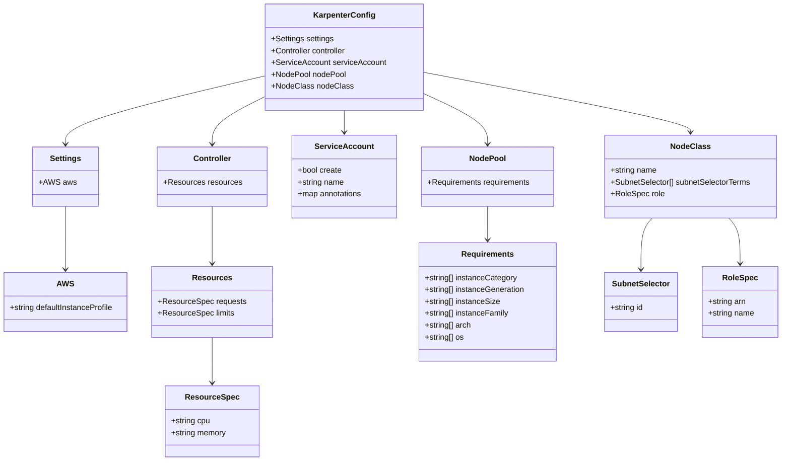
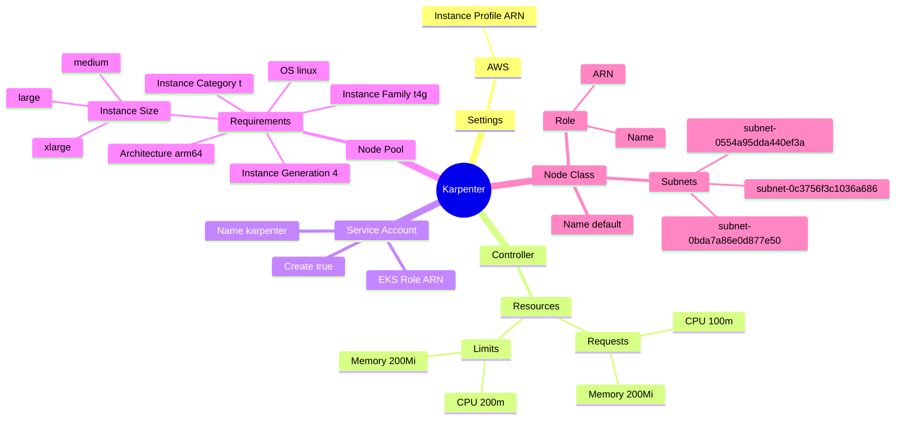
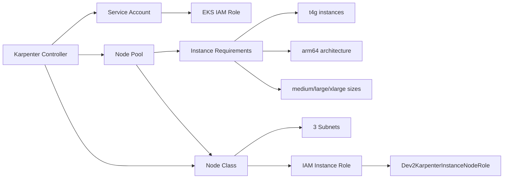

# Diagram: devops/k8s/karpenter/helm/values.dev2.yaml

> Auto-generated by Obscura crawlers

## Diagram 1

```mermaid
graph TD
    Root[Karpenter Configuration]
    Root --> Settings
    Root --> Controller
    Root --> ServiceAccount
    Root --> NodePool
    Root --> NodeClass
    
    Settings --> AWS[AWS Settings]
    AWS --> InstanceProfile["defaultInstanceProfile<br/>Dev2KarpenterInstanceNodeRole"]
    
    Controller --> Resources
    Resources --> Requests["Requests<br/>CPU: 100m<br/>Memory: 200Mi"]
    Resources --> Limits["Limits<br/>CPU: 200m<br/>Memory: 200Mi"]
    
    ServiceAccount --> SACreate["create: true"]
    ServiceAccount --> SAName["name: karpenter"]
    ServiceAccount --> SAAnnotations["Annotations<br/>Role: Dev2KarpenterControllerRole"]
    
    NodePool --> Requirements
    Requirements --> InstanceCat["instanceCategory: t"]
    Requirements --> InstanceGen["instanceGeneration: 4"]
    Requirements --> InstanceSize["instanceSize: medium, large, xlarge"]
    Requirements --> InstanceFam["instanceFamily: t4g"]
    Requirements --> Arch["arch: arm64"]
    Requirements --> OS["os: linux"]
    
    NodeClass --> NCName["name: default"]
    NodeClass --> Subnets["Subnet Selectors"]
    NodeClass --> Role["Role"]
    Subnets --> Subnet1["subnet-0554a95dda440ef3a"]
    Subnets --> Subnet2["subnet-0c3756f3c1036a686"]
    Subnets --> Subnet3["subnet-0bda7a86e0d877e50"]
    Role --> RoleArn["arn: Dev2KarpenterInstanceNodeRole"]
    Role --> RoleName["name: Dev2KarpenterInstanceNodeRole"]
```

### SVG

<svg id="container" width="3811.796875" xmlns="http://www.w3.org/2000/svg" class="flowchart" height="478" viewBox="0 0 3811.796875 478" role="graphics-document document" aria-roledescription="flowchart-v2"><g><marker id="container_flowchart-v2-pointEnd" class="marker flowchart-v2" viewBox="0 0 10 10" refX="5" refY="5" markerUnits="userSpaceOnUse" markerWidth="8" markerHeight="8" orient="auto"><path d="M 0 0 L 10 5 L 0 10 z" class="arrowMarkerPath" style="stroke-width: 1; stroke-dasharray: 1, 0;"></path></marker><marker id="container_flowchart-v2-pointStart" class="marker flowchart-v2" viewBox="0 0 10 10" refX="4.5" refY="5" markerUnits="userSpaceOnUse" markerWidth="8" markerHeight="8" orient="auto"><path d="M 0 5 L 10 10 L 10 0 z" class="arrowMarkerPath" style="stroke-width: 1; stroke-dasharray: 1, 0;"></path></marker><marker id="container_flowchart-v2-circleEnd" class="marker flowchart-v2" viewBox="0 0 10 10" refX="11" refY="5" markerUnits="userSpaceOnUse" markerWidth="11" markerHeight="11" orient="auto"><circle cx="5" cy="5" r="5" class="arrowMarkerPath" style="stroke-width: 1; stroke-dasharray: 1, 0;"></circle></marker><marker id="container_flowchart-v2-circleStart" class="marker flowchart-v2" viewBox="0 0 10 10" refX="-1" refY="5" markerUnits="userSpaceOnUse" markerWidth="11" markerHeight="11" orient="auto"><circle cx="5" cy="5" r="5" class="arrowMarkerPath" style="stroke-width: 1; stroke-dasharray: 1, 0;"></circle></marker><marker id="container_flowchart-v2-crossEnd" class="marker cross flowchart-v2" viewBox="0 0 11 11" refX="12" refY="5.2" markerUnits="userSpaceOnUse" markerWidth="11" markerHeight="11" orient="auto"><path d="M 1,1 l 9,9 M 10,1 l -9,9" class="arrowMarkerPath" style="stroke-width: 2; stroke-dasharray: 1, 0;"></path></marker><marker id="container_flowchart-v2-crossStart" class="marker cross flowchart-v2" viewBox="0 0 11 11" refX="-1" refY="5.2" markerUnits="userSpaceOnUse" markerWidth="11" markerHeight="11" orient="auto"><path d="M 1,1 l 9,9 M 10,1 l -9,9" class="arrowMarkerPath" style="stroke-width: 2; stroke-dasharray: 1, 0;"></path></marker><g class="root"><g class="clusters"></g><g class="edgePaths"><path d="M863.051,42.391L745.447,49.826C627.844,57.261,392.637,72.13,275.033,83.065C157.43,94,157.43,101,157.43,104.5L157.43,108" id="L_Root_Settings_0" class="edge-thickness-normal edge-pattern-solid edge-thickness-normal edge-pattern-solid flowchart-link" style=";" data-edge="true" data-et="edge" data-id="L_Root_Settings_0" data-points="W3sieCI6ODYzLjA1MDc4MTI1LCJ5Ijo0Mi4zOTEyMTE0MzE4ODIxOH0seyJ4IjoxNTcuNDI5Njg3NSwieSI6ODd9LHsieCI6MTU3LjQyOTY4NzUsInkiOjExMn1d" marker-end="url(#container_flowchart-v2-pointEnd)"></path><path d="M863.051,49.173L811.045,55.478C759.039,61.782,655.027,74.391,603.021,84.196C551.016,94,551.016,101,551.016,104.5L551.016,108" id="L_Root_Controller_0" class="edge-thickness-normal edge-pattern-solid edge-thickness-normal edge-pattern-solid flowchart-link" style=";" data-edge="true" data-et="edge" data-id="L_Root_Controller_0" data-points="W3sieCI6ODYzLjA1MDc4MTI1LCJ5Ijo0OS4xNzMwNzkxOTk3MTU4N30seyJ4Ijo1NTEuMDE1NjI1LCJ5Ijo4N30seyJ4Ijo1NTEuMDE1NjI1LCJ5IjoxMTJ9XQ==" marker-end="url(#container_flowchart-v2-pointEnd)"></path><path d="M979.965,62L979.965,66.167C979.965,70.333,979.965,78.667,979.965,86.333C979.965,94,979.965,101,979.965,104.5L979.965,108" id="L_Root_ServiceAccount_0" class="edge-thickness-normal edge-pattern-solid edge-thickness-normal edge-pattern-solid flowchart-link" style=";" data-edge="true" data-et="edge" data-id="L_Root_ServiceAccount_0" data-points="W3sieCI6OTc5Ljk2NDg0Mzc1LCJ5Ijo2Mn0seyJ4Ijo5NzkuOTY0ODQzNzUsInkiOjg3fSx7IngiOjk3OS45NjQ4NDM3NSwieSI6MTEyfV0=" marker-end="url(#container_flowchart-v2-pointEnd)"></path><path d="M1096.879,45.117L1177.55,52.097C1258.221,59.078,1419.564,73.039,1500.235,83.519C1580.906,94,1580.906,101,1580.906,104.5L1580.906,108" id="L_Root_NodePool_0" class="edge-thickness-normal edge-pattern-solid edge-thickness-normal edge-pattern-solid flowchart-link" style=";" data-edge="true" data-et="edge" data-id="L_Root_NodePool_0" data-points="W3sieCI6MTA5Ni44Nzg5MDYyNSwieSI6NDUuMTE2Njc4OTA4NzQzNDQ1fSx7IngiOjE1ODAuOTA2MjUsInkiOjg3fSx7IngiOjE1ODAuOTA2MjUsInkiOjExMn1d" marker-end="url(#container_flowchart-v2-pointEnd)"></path><path d="M1096.879,38.597L1359.115,46.664C1621.352,54.731,2145.824,70.866,2408.061,82.433C2670.297,94,2670.297,101,2670.297,104.5L2670.297,108" id="L_Root_NodeClass_0" class="edge-thickness-normal edge-pattern-solid edge-thickness-normal edge-pattern-solid flowchart-link" style=";" data-edge="true" data-et="edge" data-id="L_Root_NodeClass_0" data-points="W3sieCI6MTA5Ni44Nzg5MDYyNSwieSI6MzguNTk2NjQ5MTQyMDY0ODJ9LHsieCI6MjY3MC4yOTY4NzUsInkiOjg3fSx7IngiOjI2NzAuMjk2ODc1LCJ5IjoxMTJ9XQ==" marker-end="url(#container_flowchart-v2-pointEnd)"></path><path d="M157.43,166L157.43,170.167C157.43,174.333,157.43,182.667,157.43,194.333C157.43,206,157.43,221,157.43,228.5L157.43,236" id="L_Settings_AWS_0" class="edge-thickness-normal edge-pattern-solid edge-thickness-normal edge-pattern-solid flowchart-link" style=";" data-edge="true" data-et="edge" data-id="L_Settings_AWS_0" data-points="W3sieCI6MTU3LjQyOTY4NzUsInkiOjE2Nn0seyJ4IjoxNTcuNDI5Njg3NSwieSI6MTkxfSx7IngiOjE1Ny40Mjk2ODc1LCJ5IjoyNDB9XQ==" marker-end="url(#container_flowchart-v2-pointEnd)"></path><path d="M157.43,294L157.43,302.167C157.43,310.333,157.43,326.667,157.43,340.333C157.43,354,157.43,365,157.43,370.5L157.43,376" id="L_AWS_InstanceProfile_0" class="edge-thickness-normal edge-pattern-solid edge-thickness-normal edge-pattern-solid flowchart-link" style=";" data-edge="true" data-et="edge" data-id="L_AWS_InstanceProfile_0" data-points="W3sieCI6MTU3LjQyOTY4NzUsInkiOjI5NH0seyJ4IjoxNTcuNDI5Njg3NSwieSI6MzQzfSx7IngiOjE1Ny40Mjk2ODc1LCJ5IjozODB9XQ==" marker-end="url(#container_flowchart-v2-pointEnd)"></path><path d="M551.016,166L551.016,170.167C551.016,174.333,551.016,182.667,551.016,194.333C551.016,206,551.016,221,551.016,228.5L551.016,236" id="L_Controller_Resources_0" class="edge-thickness-normal edge-pattern-solid edge-thickness-normal edge-pattern-solid flowchart-link" style=";" data-edge="true" data-et="edge" data-id="L_Controller_Resources_0" data-points="W3sieCI6NTUxLjAxNTYyNSwieSI6MTY2fSx7IngiOjU1MS4wMTU2MjUsInkiOjE5MX0seyJ4Ijo1NTEuMDE1NjI1LCJ5IjoyNDB9XQ==" marker-end="url(#container_flowchart-v2-pointEnd)"></path><path d="M512.087,294L500.312,302.167C488.537,310.333,464.987,326.667,453.212,338.333C441.438,350,441.438,357,441.438,360.5L441.438,364" id="L_Resources_Requests_0" class="edge-thickness-normal edge-pattern-solid edge-thickness-normal edge-pattern-solid flowchart-link" style=";" data-edge="true" data-et="edge" data-id="L_Resources_Requests_0" data-points="W3sieCI6NTEyLjA4NjU1NDI3NjMxNTgsInkiOjI5NH0seyJ4Ijo0NDEuNDM3NSwieSI6MzQzfSx7IngiOjQ0MS40Mzc1LCJ5IjozNjh9XQ==" marker-end="url(#container_flowchart-v2-pointEnd)"></path><path d="M589.945,294L601.72,302.167C613.494,310.333,637.044,326.667,648.819,338.333C660.594,350,660.594,357,660.594,360.5L660.594,364" id="L_Resources_Limits_0" class="edge-thickness-normal edge-pattern-solid edge-thickness-normal edge-pattern-solid flowchart-link" style=";" data-edge="true" data-et="edge" data-id="L_Resources_Limits_0" data-points="W3sieCI6NTg5Ljk0NDY5NTcyMzY4NDIsInkiOjI5NH0seyJ4Ijo2NjAuNTkzNzUsInkiOjM0M30seyJ4Ijo2NjAuNTkzNzUsInkiOjM2OH1d" marker-end="url(#container_flowchart-v2-pointEnd)"></path><path d="M895.121,159.889L874.061,165.074C853.001,170.26,810.882,180.63,789.822,193.315C768.762,206,768.762,221,768.762,228.5L768.762,236" id="L_ServiceAccount_SACreate_0" class="edge-thickness-normal edge-pattern-solid edge-thickness-normal edge-pattern-solid flowchart-link" style=";" data-edge="true" data-et="edge" data-id="L_ServiceAccount_SACreate_0" data-points="W3sieCI6ODk1LjEyMTA5Mzc1LCJ5IjoxNTkuODg5MjUwNTczMzUyMX0seyJ4Ijo3NjguNzYxNzE4NzUsInkiOjE5MX0seyJ4Ijo3NjguNzYxNzE4NzUsInkiOjI0MH1d" marker-end="url(#container_flowchart-v2-pointEnd)"></path><path d="M979.965,166L979.965,170.167C979.965,174.333,979.965,182.667,979.965,194.333C979.965,206,979.965,221,979.965,228.5L979.965,236" id="L_ServiceAccount_SAName_0" class="edge-thickness-normal edge-pattern-solid edge-thickness-normal edge-pattern-solid flowchart-link" style=";" data-edge="true" data-et="edge" data-id="L_ServiceAccount_SAName_0" data-points="W3sieCI6OTc5Ljk2NDg0Mzc1LCJ5IjoxNjZ9LHsieCI6OTc5Ljk2NDg0Mzc1LCJ5IjoxOTF9LHsieCI6OTc5Ljk2NDg0Mzc1LCJ5IjoyNDB9XQ==" marker-end="url(#container_flowchart-v2-pointEnd)"></path><path d="M1064.809,155.021L1096.565,161.017C1128.322,167.014,1191.835,179.007,1223.591,188.503C1255.348,198,1255.348,205,1255.348,208.5L1255.348,212" id="L_ServiceAccount_SAAnnotations_0" class="edge-thickness-normal edge-pattern-solid edge-thickness-normal edge-pattern-solid flowchart-link" style=";" data-edge="true" data-et="edge" data-id="L_ServiceAccount_SAAnnotations_0" data-points="W3sieCI6MTA2NC44MDg1OTM3NSwieSI6MTU1LjAyMDg4MDAyNDk2NTI0fSx7IngiOjEyNTUuMzQ3NjU2MjUsInkiOjE5MX0seyJ4IjoxMjU1LjM0NzY1NjI1LCJ5IjoyMTZ9XQ==" marker-end="url(#container_flowchart-v2-pointEnd)"></path><path d="M1580.906,166L1580.906,170.167C1580.906,174.333,1580.906,182.667,1580.906,194.333C1580.906,206,1580.906,221,1580.906,228.5L1580.906,236" id="L_NodePool_Requirements_0" class="edge-thickness-normal edge-pattern-solid edge-thickness-normal edge-pattern-solid flowchart-link" style=";" data-edge="true" data-et="edge" data-id="L_NodePool_Requirements_0" data-points="W3sieCI6MTU4MC45MDYyNSwieSI6MTY2fSx7IngiOjE1ODAuOTA2MjUsInkiOjE5MX0seyJ4IjoxNTgwLjkwNjI1LCJ5IjoyNDB9XQ==" marker-end="url(#container_flowchart-v2-pointEnd)"></path><path d="M1500.391,275.912L1399.379,287.094C1298.367,298.275,1096.344,320.637,995.332,339.319C894.32,358,894.32,373,894.32,380.5L894.32,388" id="L_Requirements_InstanceCat_0" class="edge-thickness-normal edge-pattern-solid edge-thickness-normal edge-pattern-solid flowchart-link" style=";" data-edge="true" data-et="edge" data-id="L_Requirements_InstanceCat_0" data-points="W3sieCI6MTUwMC4zOTA2MjUsInkiOjI3NS45MTI0ODU5MTg3Nzg0fSx7IngiOjg5NC4zMjAzMTI1LCJ5IjozNDN9LHsieCI6ODk0LjMyMDMxMjUsInkiOjM5Mn1d" marker-end="url(#container_flowchart-v2-pointEnd)"></path><path d="M1500.391,281.282L1442.402,291.569C1384.414,301.855,1268.438,322.427,1210.449,340.214C1152.461,358,1152.461,373,1152.461,380.5L1152.461,388" id="L_Requirements_InstanceGen_0" class="edge-thickness-normal edge-pattern-solid edge-thickness-normal edge-pattern-solid flowchart-link" style=";" data-edge="true" data-et="edge" data-id="L_Requirements_InstanceGen_0" data-points="W3sieCI6MTUwMC4zOTA2MjUsInkiOjI4MS4yODIzMDcwMzMwNTkyfSx7IngiOjExNTIuNDYwOTM3NSwieSI6MzQzfSx7IngiOjExNTIuNDYwOTM3NSwieSI6MzkyfV0=" marker-end="url(#container_flowchart-v2-pointEnd)"></path><path d="M1531.364,294L1516.379,302.167C1501.394,310.333,1471.423,326.667,1456.438,340.333C1441.453,354,1441.453,365,1441.453,370.5L1441.453,376" id="L_Requirements_InstanceSize_0" class="edge-thickness-normal edge-pattern-solid edge-thickness-normal edge-pattern-solid flowchart-link" style=";" data-edge="true" data-et="edge" data-id="L_Requirements_InstanceSize_0" data-points="W3sieCI6MTUzMS4zNjM2OTI0MzQyMTA2LCJ5IjoyOTR9LHsieCI6MTQ0MS40NTMxMjUsInkiOjM0M30seyJ4IjoxNDQxLjQ1MzEyNSwieSI6MzgwfV0=" marker-end="url(#container_flowchart-v2-pointEnd)"></path><path d="M1630.449,294L1645.434,302.167C1660.419,310.333,1690.389,326.667,1705.374,342.333C1720.359,358,1720.359,373,1720.359,380.5L1720.359,388" id="L_Requirements_InstanceFam_0" class="edge-thickness-normal edge-pattern-solid edge-thickness-normal edge-pattern-solid flowchart-link" style=";" data-edge="true" data-et="edge" data-id="L_Requirements_InstanceFam_0" data-points="W3sieCI6MTYzMC40NDg4MDc1NjU3ODk0LCJ5IjoyOTR9LHsieCI6MTcyMC4zNTkzNzUsInkiOjM0M30seyJ4IjoxNzIwLjM1OTM3NSwieSI6MzkyfV0=" marker-end="url(#container_flowchart-v2-pointEnd)"></path><path d="M1661.422,283.954L1708.158,293.795C1754.893,303.636,1848.365,323.318,1895.1,340.659C1941.836,358,1941.836,373,1941.836,380.5L1941.836,388" id="L_Requirements_Arch_0" class="edge-thickness-normal edge-pattern-solid edge-thickness-normal edge-pattern-solid flowchart-link" style=";" data-edge="true" data-et="edge" data-id="L_Requirements_Arch_0" data-points="W3sieCI6MTY2MS40MjE4NzUsInkiOjI4My45NTM5NjAwNDI0MjUxNH0seyJ4IjoxOTQxLjgzNTkzNzUsInkiOjM0M30seyJ4IjoxOTQxLjgzNTkzNzUsInkiOjM5Mn1d" marker-end="url(#container_flowchart-v2-pointEnd)"></path><path d="M1661.422,278.253L1738.632,289.044C1815.841,299.835,1970.26,321.418,2047.47,339.709C2124.68,358,2124.68,373,2124.68,380.5L2124.68,388" id="L_Requirements_OS_0" class="edge-thickness-normal edge-pattern-solid edge-thickness-normal edge-pattern-solid flowchart-link" style=";" data-edge="true" data-et="edge" data-id="L_Requirements_OS_0" data-points="W3sieCI6MTY2MS40MjE4NzUsInkiOjI3OC4yNTMxOTMxMDk0OTI0M30seyJ4IjoyMTI0LjY3OTY4NzUsInkiOjM0M30seyJ4IjoyMTI0LjY3OTY4NzUsInkiOjM5Mn1d" marker-end="url(#container_flowchart-v2-pointEnd)"></path><path d="M2602.648,151.647L2567.566,158.206C2532.484,164.765,2462.32,177.882,2427.238,191.941C2392.156,206,2392.156,221,2392.156,228.5L2392.156,236" id="L_NodeClass_NCName_0" class="edge-thickness-normal edge-pattern-solid edge-thickness-normal edge-pattern-solid flowchart-link" style=";" data-edge="true" data-et="edge" data-id="L_NodeClass_NCName_0" data-points="W3sieCI6MjYwMi42NDg0Mzc1LCJ5IjoxNTEuNjQ3MjY3MDA3NDcxNX0seyJ4IjoyMzkyLjE1NjI1LCJ5IjoxOTF9LHsieCI6MjM5Mi4xNTYyNSwieSI6MjQwfV0=" marker-end="url(#container_flowchart-v2-pointEnd)"></path><path d="M2720.993,166L2728.816,170.167C2736.64,174.333,2752.287,182.667,2760.11,194.333C2767.934,206,2767.934,221,2767.934,228.5L2767.934,236" id="L_NodeClass_Subnets_0" class="edge-thickness-normal edge-pattern-solid edge-thickness-normal edge-pattern-solid flowchart-link" style=";" data-edge="true" data-et="edge" data-id="L_NodeClass_Subnets_0" data-points="W3sieCI6MjcyMC45OTI4NjM1ODE3MzEsInkiOjE2Nn0seyJ4IjoyNzY3LjkzMzU5Mzc1LCJ5IjoxOTF9LHsieCI6Mjc2Ny45MzM1OTM3NSwieSI6MjQwfV0=" marker-end="url(#container_flowchart-v2-pointEnd)"></path><path d="M2737.945,142.575L2890.682,150.646C3043.419,158.716,3348.893,174.858,3501.63,190.429C3654.367,206,3654.367,221,3654.367,228.5L3654.367,236" id="L_NodeClass_Role_0" class="edge-thickness-normal edge-pattern-solid edge-thickness-normal edge-pattern-solid flowchart-link" style=";" data-edge="true" data-et="edge" data-id="L_NodeClass_Role_0" data-points="W3sieCI6MjczNy45NDUzMTI1LCJ5IjoxNDIuNTc0NjYxOTk4NTU1MTF9LHsieCI6MzY1NC4zNjcxODc1LCJ5IjoxOTF9LHsieCI6MzY1NC4zNjcxODc1LCJ5IjoyNDB9XQ==" marker-end="url(#container_flowchart-v2-pointEnd)"></path><path d="M2676.754,284.184L2624.74,293.987C2572.727,303.789,2468.699,323.395,2416.686,340.697C2364.672,358,2364.672,373,2364.672,380.5L2364.672,388" id="L_Subnets_Subnet1_0" class="edge-thickness-normal edge-pattern-solid edge-thickness-normal edge-pattern-solid flowchart-link" style=";" data-edge="true" data-et="edge" data-id="L_Subnets_Subnet1_0" data-points="W3sieCI6MjY3Ni43NTM5MDYyNSwieSI6Mjg0LjE4NDAxNzA0ODQ4MTZ9LHsieCI6MjM2NC42NzE4NzUsInkiOjM0M30seyJ4IjoyMzY0LjY3MTg3NSwieSI6MzkyfV0=" marker-end="url(#container_flowchart-v2-pointEnd)"></path><path d="M2733.247,294L2722.755,302.167C2712.264,310.333,2691.28,326.667,2680.789,342.333C2670.297,358,2670.297,373,2670.297,380.5L2670.297,388" id="L_Subnets_Subnet2_0" class="edge-thickness-normal edge-pattern-solid edge-thickness-normal edge-pattern-solid flowchart-link" style=";" data-edge="true" data-et="edge" data-id="L_Subnets_Subnet2_0" data-points="W3sieCI6MjczMy4yNDY4NjQ3MjAzOTQ2LCJ5IjoyOTR9LHsieCI6MjY3MC4yOTY4NzUsInkiOjM0M30seyJ4IjoyNjcwLjI5Njg3NSwieSI6MzkyfV0=" marker-end="url(#container_flowchart-v2-pointEnd)"></path><path d="M2841.905,294L2864.279,302.167C2886.653,310.333,2931.401,326.667,2953.774,342.333C2976.148,358,2976.148,373,2976.148,380.5L2976.148,388" id="L_Subnets_Subnet3_0" class="edge-thickness-normal edge-pattern-solid edge-thickness-normal edge-pattern-solid flowchart-link" style=";" data-edge="true" data-et="edge" data-id="L_Subnets_Subnet3_0" data-points="W3sieCI6Mjg0MS45MDQ2NTY2NjExODQsInkiOjI5NH0seyJ4IjoyOTc2LjE0ODQzNzUsInkiOjM0M30seyJ4IjoyOTc2LjE0ODQzNzUsInkiOjM5Mn1d" marker-end="url(#container_flowchart-v2-pointEnd)"></path><path d="M3608.305,277.035L3557.84,288.029C3507.375,299.023,3406.445,321.012,3355.98,337.506C3305.516,354,3305.516,365,3305.516,370.5L3305.516,376" id="L_Role_RoleArn_0" class="edge-thickness-normal edge-pattern-solid edge-thickness-normal edge-pattern-solid flowchart-link" style=";" data-edge="true" data-et="edge" data-id="L_Role_RoleArn_0" data-points="W3sieCI6MzYwOC4zMDQ2ODc1LCJ5IjoyNzcuMDM1MDcwNDMxOTk3ODR9LHsieCI6MzMwNS41MTU2MjUsInkiOjM0M30seyJ4IjozMzA1LjUxNTYyNSwieSI6MzgwfV0=" marker-end="url(#container_flowchart-v2-pointEnd)"></path><path d="M3654.367,294L3654.367,302.167C3654.367,310.333,3654.367,326.667,3654.367,340.333C3654.367,354,3654.367,365,3654.367,370.5L3654.367,376" id="L_Role_RoleName_0" class="edge-thickness-normal edge-pattern-solid edge-thickness-normal edge-pattern-solid flowchart-link" style=";" data-edge="true" data-et="edge" data-id="L_Role_RoleName_0" data-points="W3sieCI6MzY1NC4zNjcxODc1LCJ5IjoyOTR9LHsieCI6MzY1NC4zNjcxODc1LCJ5IjozNDN9LHsieCI6MzY1NC4zNjcxODc1LCJ5IjozODB9XQ==" marker-end="url(#container_flowchart-v2-pointEnd)"></path></g><g class="edgeLabels"><g class="edgeLabel"><g class="label" data-id="L_Root_Settings_0" transform="translate(0, 0)"><foreignObject width="0" height="0">

</foreignObject></g></g><g class="edgeLabel"><g class="label" data-id="L_Root_Controller_0" transform="translate(0, 0)"><foreignObject width="0" height="0">

</foreignObject></g></g><g class="edgeLabel"><g class="label" data-id="L_Root_ServiceAccount_0" transform="translate(0, 0)"><foreignObject width="0" height="0">

</foreignObject></g></g><g class="edgeLabel"><g class="label" data-id="L_Root_NodePool_0" transform="translate(0, 0)"><foreignObject width="0" height="0">

</foreignObject></g></g><g class="edgeLabel"><g class="label" data-id="L_Root_NodeClass_0" transform="translate(0, 0)"><foreignObject width="0" height="0">

</foreignObject></g></g><g class="edgeLabel"><g class="label" data-id="L_Settings_AWS_0" transform="translate(0, 0)"><foreignObject width="0" height="0">

</foreignObject></g></g><g class="edgeLabel"><g class="label" data-id="L_AWS_InstanceProfile_0" transform="translate(0, 0)"><foreignObject width="0" height="0">

</foreignObject></g></g><g class="edgeLabel"><g class="label" data-id="L_Controller_Resources_0" transform="translate(0, 0)"><foreignObject width="0" height="0">

</foreignObject></g></g><g class="edgeLabel"><g class="label" data-id="L_Resources_Requests_0" transform="translate(0, 0)"><foreignObject width="0" height="0">

</foreignObject></g></g><g class="edgeLabel"><g class="label" data-id="L_Resources_Limits_0" transform="translate(0, 0)"><foreignObject width="0" height="0">

</foreignObject></g></g><g class="edgeLabel"><g class="label" data-id="L_ServiceAccount_SACreate_0" transform="translate(0, 0)"><foreignObject width="0" height="0">

</foreignObject></g></g><g class="edgeLabel"><g class="label" data-id="L_ServiceAccount_SAName_0" transform="translate(0, 0)"><foreignObject width="0" height="0">

</foreignObject></g></g><g class="edgeLabel"><g class="label" data-id="L_ServiceAccount_SAAnnotations_0" transform="translate(0, 0)"><foreignObject width="0" height="0">

</foreignObject></g></g><g class="edgeLabel"><g class="label" data-id="L_NodePool_Requirements_0" transform="translate(0, 0)"><foreignObject width="0" height="0">

</foreignObject></g></g><g class="edgeLabel"><g class="label" data-id="L_Requirements_InstanceCat_0" transform="translate(0, 0)"><foreignObject width="0" height="0">

</foreignObject></g></g><g class="edgeLabel"><g class="label" data-id="L_Requirements_InstanceGen_0" transform="translate(0, 0)"><foreignObject width="0" height="0">

</foreignObject></g></g><g class="edgeLabel"><g class="label" data-id="L_Requirements_InstanceSize_0" transform="translate(0, 0)"><foreignObject width="0" height="0">

</foreignObject></g></g><g class="edgeLabel"><g class="label" data-id="L_Requirements_InstanceFam_0" transform="translate(0, 0)"><foreignObject width="0" height="0">

</foreignObject></g></g><g class="edgeLabel"><g class="label" data-id="L_Requirements_Arch_0" transform="translate(0, 0)"><foreignObject width="0" height="0">

</foreignObject></g></g><g class="edgeLabel"><g class="label" data-id="L_Requirements_OS_0" transform="translate(0, 0)"><foreignObject width="0" height="0">

</foreignObject></g></g><g class="edgeLabel"><g class="label" data-id="L_NodeClass_NCName_0" transform="translate(0, 0)"><foreignObject width="0" height="0">

</foreignObject></g></g><g class="edgeLabel"><g class="label" data-id="L_NodeClass_Subnets_0" transform="translate(0, 0)"><foreignObject width="0" height="0">

</foreignObject></g></g><g class="edgeLabel"><g class="label" data-id="L_NodeClass_Role_0" transform="translate(0, 0)"><foreignObject width="0" height="0">

</foreignObject></g></g><g class="edgeLabel"><g class="label" data-id="L_Subnets_Subnet1_0" transform="translate(0, 0)"><foreignObject width="0" height="0">

</foreignObject></g></g><g class="edgeLabel"><g class="label" data-id="L_Subnets_Subnet2_0" transform="translate(0, 0)"><foreignObject width="0" height="0">

</foreignObject></g></g><g class="edgeLabel"><g class="label" data-id="L_Subnets_Subnet3_0" transform="translate(0, 0)"><foreignObject width="0" height="0">

</foreignObject></g></g><g class="edgeLabel"><g class="label" data-id="L_Role_RoleArn_0" transform="translate(0, 0)"><foreignObject width="0" height="0">

</foreignObject></g></g><g class="edgeLabel"><g class="label" data-id="L_Role_RoleName_0" transform="translate(0, 0)"><foreignObject width="0" height="0">

</foreignObject></g></g></g><g class="nodes"><g class="node default" id="flowchart-Root-0" transform="translate(979.96484375, 35)"><rect class="basic label-container" style="" x="-116.9140625" y="-27" width="233.828125" height="54"></rect><g class="label" style="" transform="translate(-86.9140625, -12)"><rect></rect><foreignObject width="173.828125" height="24">

Karpenter Configuration

</foreignObject></g></g><g class="node default" id="flowchart-Settings-2" transform="translate(157.4296875, 139)"><rect class="basic label-container" style="" x="-59.28125" y="-27" width="118.5625" height="54"></rect><g class="label" style="" transform="translate(-29.28125, -12)"><rect></rect><foreignObject width="58.5625" height="24">

Settings

</foreignObject></g></g><g class="node default" id="flowchart-Controller-4" transform="translate(551.015625, 139)"><rect class="basic label-container" style="" x="-66.1875" y="-27" width="132.375" height="54"></rect><g class="label" style="" transform="translate(-36.1875, -12)"><rect></rect><foreignObject width="72.375" height="24">

Controller

</foreignObject></g></g><g class="node default" id="flowchart-ServiceAccount-6" transform="translate(979.96484375, 139)"><rect class="basic label-container" style="" x="-84.84375" y="-27" width="169.6875" height="54"></rect><g class="label" style="" transform="translate(-54.84375, -12)"><rect></rect><foreignObject width="109.6875" height="24">

ServiceAccount

</foreignObject></g></g><g class="node default" id="flowchart-NodePool-8" transform="translate(1580.90625, 139)"><rect class="basic label-container" style="" x="-65.3828125" y="-27" width="130.765625" height="54"></rect><g class="label" style="" transform="translate(-35.3828125, -12)"><rect></rect><foreignObject width="70.765625" height="24">

NodePool

</foreignObject></g></g><g class="node default" id="flowchart-NodeClass-10" transform="translate(2670.296875, 139)"><rect class="basic label-container" style="" x="-67.6484375" y="-27" width="135.296875" height="54"></rect><g class="label" style="" transform="translate(-37.6484375, -12)"><rect></rect><foreignObject width="75.296875" height="24">

NodeClass

</foreignObject></g></g><g class="node default" id="flowchart-AWS-12" transform="translate(157.4296875, 267)"><rect class="basic label-container" style="" x="-76.875" y="-27" width="153.75" height="54"></rect><g class="label" style="" transform="translate(-46.875, -12)"><rect></rect><foreignObject width="93.75" height="24">

AWS Settings

</foreignObject></g></g><g class="node default" id="flowchart-InstanceProfile-14" transform="translate(157.4296875, 419)"><rect class="basic label-container" style="" x="-149.4296875" y="-39" width="298.859375" height="78"></rect><g class="label" style="" transform="translate(-119.4296875, -24)"><rect></rect><foreignObject width="238.859375" height="48">

defaultInstanceProfile Dev2KarpenterInstanceNodeRole

</foreignObject></g></g><g class="node default" id="flowchart-Resources-16" transform="translate(551.015625, 267)"><rect class="basic label-container" style="" x="-66.7578125" y="-27" width="133.515625" height="54"></rect><g class="label" style="" transform="translate(-36.7578125, -12)"><rect></rect><foreignObject width="73.515625" height="24">

Resources

</foreignObject></g></g><g class="node default" id="flowchart-Requests-18" transform="translate(441.4375, 419)"><rect class="basic label-container" style="" x="-84.578125" y="-51" width="169.15625" height="102"></rect><g class="label" style="" transform="translate(-54.578125, -36)"><rect></rect><foreignObject width="109.15625" height="72">

Requests CPU: 100m Memory: 200Mi

</foreignObject></g></g><g class="node default" id="flowchart-Limits-20" transform="translate(660.59375, 419)"><rect class="basic label-container" style="" x="-84.578125" y="-51" width="169.15625" height="102"></rect><g class="label" style="" transform="translate(-54.578125, -36)"><rect></rect><foreignObject width="109.15625" height="72">

Limits CPU: 200m Memory: 200Mi

</foreignObject></g></g><g class="node default" id="flowchart-SACreate-22" transform="translate(768.76171875, 267)"><rect class="basic label-container" style="" x="-71.46875" y="-27" width="142.9375" height="54"></rect><g class="label" style="" transform="translate(-41.46875, -12)"><rect></rect><foreignObject width="82.9375" height="24">

create: true

</foreignObject></g></g><g class="node default" id="flowchart-SAName-24" transform="translate(979.96484375, 267)"><rect class="basic label-container" style="" x="-89.734375" y="-27" width="179.46875" height="54"></rect><g class="label" style="" transform="translate(-59.734375, -12)"><rect></rect><foreignObject width="119.46875" height="24">

name: karpenter

</foreignObject></g></g><g class="node default" id="flowchart-SAAnnotations-26" transform="translate(1255.34765625, 267)"><rect class="basic label-container" style="" x="-135.6484375" y="-51" width="271.296875" height="102"></rect><g class="label" style="" transform="translate(-105.6484375, -36)"><rect></rect><foreignObject width="211.296875" height="72">

Annotations Role: Dev2KarpenterControllerRole

</foreignObject></g></g><g class="node default" id="flowchart-Requirements-28" transform="translate(1580.90625, 267)"><rect class="basic label-container" style="" x="-80.515625" y="-27" width="161.03125" height="54"></rect><g class="label" style="" transform="translate(-50.515625, -12)"><rect></rect><foreignObject width="101.03125" height="24">

Requirements

</foreignObject></g></g><g class="node default" id="flowchart-InstanceCat-30" transform="translate(894.3203125, 419)"><rect class="basic label-container" style="" x="-99.1484375" y="-27" width="198.296875" height="54"></rect><g class="label" style="" transform="translate(-69.1484375, -12)"><rect></rect><foreignObject width="138.296875" height="24">

instanceCategory: t

</foreignObject></g></g><g class="node default" id="flowchart-InstanceGen-32" transform="translate(1152.4609375, 419)"><rect class="basic label-container" style="" x="-108.9921875" y="-27" width="217.984375" height="54"></rect><g class="label" style="" transform="translate(-78.9921875, -12)"><rect></rect><foreignObject width="157.984375" height="24">

instanceGeneration: 4

</foreignObject></g></g><g class="node default" id="flowchart-InstanceSize-34" transform="translate(1441.453125, 419)"><rect class="basic label-container" style="" x="-130" y="-39" width="260" height="78"></rect><g class="label" style="" transform="translate(-100, -24)"><rect></rect><foreignObject width="200" height="48">

instanceSize: medium, large, xlarge

</foreignObject></g></g><g class="node default" id="flowchart-InstanceFam-36" transform="translate(1720.359375, 419)"><rect class="basic label-container" style="" x="-98.90625" y="-27" width="197.8125" height="54"></rect><g class="label" style="" transform="translate(-68.90625, -12)"><rect></rect><foreignObject width="137.8125" height="24">

instanceFamily: t4g

</foreignObject></g></g><g class="node default" id="flowchart-Arch-38" transform="translate(1941.8359375, 419)"><rect class="basic label-container" style="" x="-72.5703125" y="-27" width="145.140625" height="54"></rect><g class="label" style="" transform="translate(-42.5703125, -12)"><rect></rect><foreignObject width="85.140625" height="24">

arch: arm64

</foreignObject></g></g><g class="node default" id="flowchart-OS-40" transform="translate(2124.6796875, 419)"><rect class="basic label-container" style="" x="-60.2734375" y="-27" width="120.546875" height="54"></rect><g class="label" style="" transform="translate(-30.2734375, -12)"><rect></rect><foreignObject width="60.546875" height="24">

os: linux

</foreignObject></g></g><g class="node default" id="flowchart-NCName-42" transform="translate(2392.15625, 267)"><rect class="basic label-container" style="" x="-80.1875" y="-27" width="160.375" height="54"></rect><g class="label" style="" transform="translate(-50.1875, -12)"><rect></rect><foreignObject width="100.375" height="24">

name: default

</foreignObject></g></g><g class="node default" id="flowchart-Subnets-44" transform="translate(2767.93359375, 267)"><rect class="basic label-container" style="" x="-91.1796875" y="-27" width="182.359375" height="54"></rect><g class="label" style="" transform="translate(-61.1796875, -12)"><rect></rect><foreignObject width="122.359375" height="24">

Subnet Selectors

</foreignObject></g></g><g class="node default" id="flowchart-Role-46" transform="translate(3654.3671875, 267)"><rect class="basic label-container" style="" x="-46.0625" y="-27" width="92.125" height="54"></rect><g class="label" style="" transform="translate(-16.0625, -12)"><rect></rect><foreignObject width="32.125" height="24">

Role

</foreignObject></g></g><g class="node default" id="flowchart-Subnet1-48" transform="translate(2364.671875, 419)"><rect class="basic label-container" style="" x="-129.71875" y="-27" width="259.4375" height="54"></rect><g class="label" style="" transform="translate(-99.71875, -12)"><rect></rect><foreignObject width="199.4375" height="24">

subnet-0554a95dda440ef3a

</foreignObject></g></g><g class="node default" id="flowchart-Subnet2-50" transform="translate(2670.296875, 419)"><rect class="basic label-container" style="" x="-125.90625" y="-27" width="251.8125" height="54"></rect><g class="label" style="" transform="translate(-95.90625, -12)"><rect></rect><foreignObject width="191.8125" height="24">

subnet-0c3756f3c1036a686

</foreignObject></g></g><g class="node default" id="flowchart-Subnet3-52" transform="translate(2976.1484375, 419)"><rect class="basic label-container" style="" x="-129.9453125" y="-27" width="259.890625" height="54"></rect><g class="label" style="" transform="translate(-99.9453125, -12)"><rect></rect><foreignObject width="199.890625" height="24">

subnet-0bda7a86e0d877e50

</foreignObject></g></g><g class="node default" id="flowchart-RoleArn-54" transform="translate(3305.515625, 419)"><rect class="basic label-container" style="" x="-149.421875" y="-39" width="298.84375" height="78"></rect><g class="label" style="" transform="translate(-119.421875, -24)"><rect></rect><foreignObject width="238.84375" height="48">

arn: Dev2KarpenterInstanceNodeRole

</foreignObject></g></g><g class="node default" id="flowchart-RoleName-56" transform="translate(3654.3671875, 419)"><rect class="basic label-container" style="" x="-149.4296875" y="-39" width="298.859375" height="78"></rect><g class="label" style="" transform="translate(-119.4296875, -24)"><rect></rect><foreignObject width="238.859375" height="48">

name: Dev2KarpenterInstanceNodeRole

</foreignObject></g></g></g></g></g></svg>

## Diagram 2

### SVG

<svg id="container" width="1580.71875" xmlns="http://www.w3.org/2000/svg" class="classDiagram" height="934" viewBox="0 0 1580.71875 934" role="graphics-document document" aria-roledescription="class"><g><defs><marker id="container_class-aggregationStart" class="marker aggregation class" refX="18" refY="7" markerWidth="190" markerHeight="240" orient="auto"><path d="M 18,7 L9,13 L1,7 L9,1 Z"></path></marker></defs><defs><marker id="container_class-aggregationEnd" class="marker aggregation class" refX="1" refY="7" markerWidth="20" markerHeight="28" orient="auto"><path d="M 18,7 L9,13 L1,7 L9,1 Z"></path></marker></defs><defs><marker id="container_class-extensionStart" class="marker extension class" refX="18" refY="7" markerWidth="190" markerHeight="240" orient="auto"><path d="M 1,7 L18,13 V 1 Z"></path></marker></defs><defs><marker id="container_class-extensionEnd" class="marker extension class" refX="1" refY="7" markerWidth="20" markerHeight="28" orient="auto"><path d="M 1,1 V 13 L18,7 Z"></path></marker></defs><defs><marker id="container_class-compositionStart" class="marker composition class" refX="18" refY="7" markerWidth="190" markerHeight="240" orient="auto"><path d="M 18,7 L9,13 L1,7 L9,1 Z"></path></marker></defs><defs><marker id="container_class-compositionEnd" class="marker composition class" refX="1" refY="7" markerWidth="20" markerHeight="28" orient="auto"><path d="M 18,7 L9,13 L1,7 L9,1 Z"></path></marker></defs><defs><marker id="container_class-dependencyStart" class="marker dependency class" refX="6" refY="7" markerWidth="190" markerHeight="240" orient="auto"><path d="M 5,7 L9,13 L1,7 L9,1 Z"></path></marker></defs><defs><marker id="container_class-dependencyEnd" class="marker dependency class" refX="13" refY="7" markerWidth="20" markerHeight="28" orient="auto"><path d="M 18,7 L9,13 L14,7 L9,1 Z"></path></marker></defs><defs><marker id="container_class-lollipopStart" class="marker lollipop class" refX="13" refY="7" markerWidth="190" markerHeight="240" orient="auto"><circle stroke="black" fill="transparent" cx="7" cy="7" r="6"></circle></marker></defs><defs><marker id="container_class-lollipopEnd" class="marker lollipop class" refX="1" refY="7" markerWidth="190" markerHeight="240" orient="auto"><circle stroke="black" fill="transparent" cx="7" cy="7" r="6"></circle></marker></defs><g class="root"><g class="clusters"></g><g class="edgePaths"><path d="M537.055,153.3L470.007,169.25C402.96,185.2,268.865,217.1,201.817,240.217C134.77,263.333,134.77,277.667,134.77,284.833L134.77,292" id="id_KarpenterConfig_Settings_1" class="edge-thickness-normal edge-pattern-solid relation" style=";;;" data-edge="true" data-et="edge" data-id="id_KarpenterConfig_Settings_1" data-points="W3sieCI6NTM3LjA1NDY4NzUsInkiOjE1My4zMDA0MDE3NDY3MjQ5fSx7IngiOjEzNC43Njk1MzEyNSwieSI6MjQ5fSx7IngiOjEzNC43Njk1MzEyNSwieSI6Mjk4fV0=" marker-end="url(#container_class-dependencyEnd)"></path><path d="M537.055,195.027L519.207,204.023C501.359,213.018,465.664,231.009,447.816,247.171C429.969,263.333,429.969,277.667,429.969,284.833L429.969,292" id="id_KarpenterConfig_Controller_2" class="edge-thickness-normal edge-pattern-solid relation" style=";;;" data-edge="true" data-et="edge" data-id="id_KarpenterConfig_Controller_2" data-points="W3sieCI6NTM3LjA1NDY4NzUsInkiOjE5NS4wMjc0NDQ3MTA4OTc5NX0seyJ4Ijo0MjkuOTY4NzUsInkiOjI0OX0seyJ4Ijo0MjkuOTY4NzUsInkiOjI5OH1d" marker-end="url(#container_class-dependencyEnd)"></path><path d="M693.852,224L693.852,228.167C693.852,232.333,693.852,240.667,693.852,248C693.852,255.333,693.852,261.667,693.852,264.833L693.852,268" id="id_KarpenterConfig_ServiceAccount_3" class="edge-thickness-normal edge-pattern-solid relation" style=";;;" data-edge="true" data-et="edge" data-id="id_KarpenterConfig_ServiceAccount_3" data-points="W3sieCI6NjkzLjg1MTU2MjUsInkiOjIyNH0seyJ4Ijo2OTMuODUxNTYyNSwieSI6MjQ5fSx7IngiOjY5My44NTE1NjI1LCJ5IjoyNzR9XQ==" marker-end="url(#container_class-dependencyEnd)"></path><path d="M850.648,187.728L872.972,197.94C895.296,208.152,939.943,228.576,962.266,245.955C984.59,263.333,984.59,277.667,984.59,284.833L984.59,292" id="id_KarpenterConfig_NodePool_4" class="edge-thickness-normal edge-pattern-solid relation" style=";;;" data-edge="true" data-et="edge" data-id="id_KarpenterConfig_NodePool_4" data-points="W3sieCI6ODUwLjY0ODQzNzUsInkiOjE4Ny43Mjc2ODY3ODg3NTE3fSx7IngiOjk4NC41ODk4NDM3NSwieSI6MjQ5fSx7IngiOjk4NC41ODk4NDM3NSwieSI6Mjk4fV0=" marker-end="url(#container_class-dependencyEnd)"></path><path d="M850.648,145.681L941.617,162.901C1032.585,180.121,1214.521,214.56,1305.489,234.947C1396.457,255.333,1396.457,261.667,1396.457,264.833L1396.457,268" id="id_KarpenterConfig_NodeClass_5" class="edge-thickness-normal edge-pattern-solid relation" style=";;;" data-edge="true" data-et="edge" data-id="id_KarpenterConfig_NodeClass_5" data-points="W3sieCI6ODUwLjY0ODQzNzUsInkiOjE0NS42ODA5MzA5MTAwNjEzM30seyJ4IjoxMzk2LjQ1NzAzMTI1LCJ5IjoyNDl9LHsieCI6MTM5Ni40NTcwMzEyNSwieSI6Mjc0fV0=" marker-end="url(#container_class-dependencyEnd)"></path><path d="M134.77,418L134.77,426.167C134.77,434.333,134.77,450.667,134.77,472C134.77,493.333,134.77,519.667,134.77,532.833L134.77,546" id="id_Settings_AWS_6" class="edge-thickness-normal edge-pattern-solid relation" style=";;;" data-edge="true" data-et="edge" data-id="id_Settings_AWS_6" data-points="W3sieCI6MTM0Ljc2OTUzMTI1LCJ5Ijo0MTh9LHsieCI6MTM0Ljc2OTUzMTI1LCJ5Ijo0Njd9LHsieCI6MTM0Ljc2OTUzMTI1LCJ5Ijo1NTJ9XQ==" marker-end="url(#container_class-dependencyEnd)"></path><path d="M429.969,418L429.969,426.167C429.969,434.333,429.969,450.667,429.969,470C429.969,489.333,429.969,511.667,429.969,522.833L429.969,534" id="id_Controller_Resources_7" class="edge-thickness-normal edge-pattern-solid relation" style=";;;" data-edge="true" data-et="edge" data-id="id_Controller_Resources_7" data-points="W3sieCI6NDI5Ljk2ODc1LCJ5Ijo0MTh9LHsieCI6NDI5Ljk2ODc1LCJ5Ijo0Njd9LHsieCI6NDI5Ljk2ODc1LCJ5Ijo1NDB9XQ==" marker-end="url(#container_class-dependencyEnd)"></path><path d="M429.969,684L429.969,696.167C429.969,708.333,429.969,732.667,429.969,748C429.969,763.333,429.969,769.667,429.969,772.833L429.969,776" id="id_Resources_ResourceSpec_8" class="edge-thickness-normal edge-pattern-solid relation" style=";;;" data-edge="true" data-et="edge" data-id="id_Resources_ResourceSpec_8" data-points="W3sieCI6NDI5Ljk2ODc1LCJ5Ijo2ODR9LHsieCI6NDI5Ljk2ODc1LCJ5Ijo3NTd9LHsieCI6NDI5Ljk2ODc1LCJ5Ijo3ODJ9XQ==" marker-end="url(#container_class-dependencyEnd)"></path><path d="M984.59,418L984.59,426.167C984.59,434.333,984.59,450.667,984.59,462C984.59,473.333,984.59,479.667,984.59,482.833L984.59,486" id="id_NodePool_Requirements_9" class="edge-thickness-normal edge-pattern-solid relation" style=";;;" data-edge="true" data-et="edge" data-id="id_NodePool_Requirements_9" data-points="W3sieCI6OTg0LjU4OTg0Mzc1LCJ5Ijo0MTh9LHsieCI6OTg0LjU4OTg0Mzc1LCJ5Ijo0Njd9LHsieCI6OTg0LjU4OTg0Mzc1LCJ5Ijo0OTJ9XQ==" marker-end="url(#container_class-dependencyEnd)"></path><path d="M1319.275,442L1315.447,446.167C1311.619,450.333,1303.962,458.667,1300.133,476C1296.305,493.333,1296.305,519.667,1296.305,532.833L1296.305,546" id="id_NodeClass_SubnetSelector_10" class="edge-thickness-normal edge-pattern-solid relation" style=";;;" data-edge="true" data-et="edge" data-id="id_NodeClass_SubnetSelector_10" data-points="W3sieCI6MTMxOS4yNzU0MDg1NDM1NzgsInkiOjQ0Mn0seyJ4IjoxMjk2LjMwNDY4NzUsInkiOjQ2N30seyJ4IjoxMjk2LjMwNDY4NzUsInkiOjU1Mn1d" marker-end="url(#container_class-dependencyEnd)"></path><path d="M1473.639,442L1477.467,446.167C1481.296,450.333,1488.952,458.667,1492.781,474C1496.609,489.333,1496.609,511.667,1496.609,522.833L1496.609,534" id="id_NodeClass_RoleSpec_11" class="edge-thickness-normal edge-pattern-solid relation" style=";;;" data-edge="true" data-et="edge" data-id="id_NodeClass_RoleSpec_11" data-points="W3sieCI6MTQ3My42Mzg2NTM5NTY0MjIsInkiOjQ0Mn0seyJ4IjoxNDk2LjYwOTM3NSwieSI6NDY3fSx7IngiOjE0OTYuNjA5Mzc1LCJ5Ijo1NDB9XQ==" marker-end="url(#container_class-dependencyEnd)"></path></g><g class="edgeLabels"><g class="edgeLabel"><g class="label" data-id="id_KarpenterConfig_Settings_1" transform="translate(0, 0)"><foreignObject width="0" height="0">

</foreignObject></g></g><g class="edgeLabel"><g class="label" data-id="id_KarpenterConfig_Controller_2" transform="translate(0, 0)"><foreignObject width="0" height="0">

</foreignObject></g></g><g class="edgeLabel"><g class="label" data-id="id_KarpenterConfig_ServiceAccount_3" transform="translate(0, 0)"><foreignObject width="0" height="0">

</foreignObject></g></g><g class="edgeLabel"><g class="label" data-id="id_KarpenterConfig_NodePool_4" transform="translate(0, 0)"><foreignObject width="0" height="0">

</foreignObject></g></g><g class="edgeLabel"><g class="label" data-id="id_KarpenterConfig_NodeClass_5" transform="translate(0, 0)"><foreignObject width="0" height="0">

</foreignObject></g></g><g class="edgeLabel"><g class="label" data-id="id_Settings_AWS_6" transform="translate(0, 0)"><foreignObject width="0" height="0">

</foreignObject></g></g><g class="edgeLabel"><g class="label" data-id="id_Controller_Resources_7" transform="translate(0, 0)"><foreignObject width="0" height="0">

</foreignObject></g></g><g class="edgeLabel"><g class="label" data-id="id_Resources_ResourceSpec_8" transform="translate(0, 0)"><foreignObject width="0" height="0">

</foreignObject></g></g><g class="edgeLabel"><g class="label" data-id="id_NodePool_Requirements_9" transform="translate(0, 0)"><foreignObject width="0" height="0">

</foreignObject></g></g><g class="edgeLabel"><g class="label" data-id="id_NodeClass_SubnetSelector_10" transform="translate(0, 0)"><foreignObject width="0" height="0">

</foreignObject></g></g><g class="edgeLabel"><g class="label" data-id="id_NodeClass_RoleSpec_11" transform="translate(0, 0)"><foreignObject width="0" height="0">

</foreignObject></g></g></g><g class="nodes"><g class="node default" id="classId-KarpenterConfig-0" transform="translate(693.8515625, 116)"><g class="basic label-container"><path d="M-156.796875 -108 L156.796875 -108 L156.796875 108 L-156.796875 108" stroke="none" stroke-width="0" fill="#ECECFF" style=""></path><path d="M-156.796875 -108 C-42.69023610773992 -108, 71.41640278452016 -108, 156.796875 -108 M-156.796875 -108 C-41.18974859006367 -108, 74.41737781987266 -108, 156.796875 -108 M156.796875 -108 C156.796875 -41.328302391424444, 156.796875 25.343395217151112, 156.796875 108 M156.796875 -108 C156.796875 -58.07123917633134, 156.796875 -8.142478352662678, 156.796875 108 M156.796875 108 C53.7468152701489 108, -49.3032444597022 108, -156.796875 108 M156.796875 108 C88.65456895105483 108, 20.512262902109654 108, -156.796875 108 M-156.796875 108 C-156.796875 56.913021802755054, -156.796875 5.826043605510108, -156.796875 -108 M-156.796875 108 C-156.796875 53.00373456297832, -156.796875 -1.9925308740433536, -156.796875 -108" stroke="#9370DB" stroke-width="1.3" fill="none" stroke-dasharray="0 0" style=""></path></g><g class="annotation-group text" transform="translate(0, -84)"></g><g class="label-group text" transform="translate(-59.890625, -84)"><g class="label" style="font-weight: bolder" transform="translate(0,-12)"><foreignObject width="119.78125" height="24">

KarpenterConfig

</foreignObject></g></g><g class="members-group text" transform="translate(-144.796875, -36)"><g class="label" style="" transform="translate(0,-12)"><foreignObject width="127.46875" height="24">

+Settings settings

</foreignObject></g><g class="label" style="" transform="translate(0,12)"><foreignObject width="155.65625" height="24">

+Controller controller

</foreignObject></g><g class="label" style="" transform="translate(0,36)"><foreignObject width="229.703125" height="24">

+ServiceAccount serviceAccount

</foreignObject></g><g class="label" style="" transform="translate(0,60)"><foreignObject width="152.1875" height="24">

+NodePool nodePool

</foreignObject></g><g class="label" style="" transform="translate(0,84)"><foreignObject width="161.265625" height="24">

+NodeClass nodeClass

</foreignObject></g></g><g class="methods-group text" transform="translate(-144.796875, 108)"></g><g class="divider" style=""><path d="M-156.796875 -60 C-66.56202240091515 -60, 23.67283019816969 -60, 156.796875 -60 M-156.796875 -60 C-93.30307507512154 -60, -29.809275150243096 -60, 156.796875 -60" stroke="#9370DB" stroke-width="1.3" fill="none" stroke-dasharray="0 0" style=""></path></g><g class="divider" style=""><path d="M-156.796875 84 C-92.633252564088 84, -28.469630128175993 84, 156.796875 84 M-156.796875 84 C-66.22449864664236 84, 24.34787770671528 84, 156.796875 84" stroke="#9370DB" stroke-width="1.3" fill="none" stroke-dasharray="0 0" style=""></path></g></g><g class="node default" id="classId-Settings-1" transform="translate(134.76953125, 358)"><g class="basic label-container"><path d="M-62.41015625 -60 L62.41015625 -60 L62.41015625 60 L-62.41015625 60" stroke="none" stroke-width="0" fill="#ECECFF" style=""></path><path d="M-62.41015625 -60 C-34.145325651316426 -60, -5.880495052632845 -60, 62.41015625 -60 M-62.41015625 -60 C-21.883111405520324 -60, 18.64393343895935 -60, 62.41015625 -60 M62.41015625 -60 C62.41015625 -19.302185733909205, 62.41015625 21.39562853218159, 62.41015625 60 M62.41015625 -60 C62.41015625 -24.283030973932483, 62.41015625 11.433938052135034, 62.41015625 60 M62.41015625 60 C13.882910035363892 60, -34.644336179272216 60, -62.41015625 60 M62.41015625 60 C28.862472149353025 60, -4.685211951293951 60, -62.41015625 60 M-62.41015625 60 C-62.41015625 20.948613385691765, -62.41015625 -18.10277322861647, -62.41015625 -60 M-62.41015625 60 C-62.41015625 18.43301381050332, -62.41015625 -23.133972378993363, -62.41015625 -60" stroke="#9370DB" stroke-width="1.3" fill="none" stroke-dasharray="0 0" style=""></path></g><g class="annotation-group text" transform="translate(0, -36)"></g><g class="label-group text" transform="translate(-30.2421875, -36)"><g class="label" style="font-weight: bolder" transform="translate(0,-12)"><foreignObject width="60.484375" height="24">

Settings

</foreignObject></g></g><g class="members-group text" transform="translate(-50.41015625, 12)"><g class="label" style="" transform="translate(0,-12)"><foreignObject width="70.578125" height="24">

+AWS aws

</foreignObject></g></g><g class="methods-group text" transform="translate(-50.41015625, 60)"></g><g class="divider" style=""><path d="M-62.41015625 -12 C-26.103225169565178 -12, 10.203705910869644 -12, 62.41015625 -12 M-62.41015625 -12 C-28.590691873279503 -12, 5.228772503440993 -12, 62.41015625 -12" stroke="#9370DB" stroke-width="1.3" fill="none" stroke-dasharray="0 0" style=""></path></g><g class="divider" style=""><path d="M-62.41015625 36 C-26.25854014559519 36, 9.893075958809618 36, 62.41015625 36 M-62.41015625 36 C-26.202528069686352 36, 10.005100110627296 36, 62.41015625 36" stroke="#9370DB" stroke-width="1.3" fill="none" stroke-dasharray="0 0" style=""></path></g></g><g class="node default" id="classId-AWS-2" transform="translate(134.76953125, 612)"><g class="basic label-container"><path d="M-126.76953125 -60 L126.76953125 -60 L126.76953125 60 L-126.76953125 60" stroke="none" stroke-width="0" fill="#ECECFF" style=""></path><path d="M-126.76953125 -60 C-42.803562414204066 -60, 41.16240642159187 -60, 126.76953125 -60 M-126.76953125 -60 C-27.560782272692165 -60, 71.64796670461567 -60, 126.76953125 -60 M126.76953125 -60 C126.76953125 -32.38278702716268, 126.76953125 -4.765574054325363, 126.76953125 60 M126.76953125 -60 C126.76953125 -24.14199575492674, 126.76953125 11.716008490146521, 126.76953125 60 M126.76953125 60 C44.51124167521837 60, -37.747047899563256 60, -126.76953125 60 M126.76953125 60 C37.968111723279875 60, -50.83330780344025 60, -126.76953125 60 M-126.76953125 60 C-126.76953125 31.317051731865547, -126.76953125 2.634103463731094, -126.76953125 -60 M-126.76953125 60 C-126.76953125 26.27285271145999, -126.76953125 -7.45429457708002, -126.76953125 -60" stroke="#9370DB" stroke-width="1.3" fill="none" stroke-dasharray="0 0" style=""></path></g><g class="annotation-group text" transform="translate(0, -36)"></g><g class="label-group text" transform="translate(-15.9921875, -36)"><g class="label" style="font-weight: bolder" transform="translate(0,-12)"><foreignObject width="31.984375" height="24">

AWS

</foreignObject></g></g><g class="members-group text" transform="translate(-114.76953125, 12)"><g class="label" style="" transform="translate(0,-12)"><foreignObject width="213.546875" height="24">

+string defaultInstanceProfile

</foreignObject></g></g><g class="methods-group text" transform="translate(-114.76953125, 60)"></g><g class="divider" style=""><path d="M-126.76953125 -12 C-45.590259136561556 -12, 35.58901297687689 -12, 126.76953125 -12 M-126.76953125 -12 C-26.253169984494065 -12, 74.26319128101187 -12, 126.76953125 -12" stroke="#9370DB" stroke-width="1.3" fill="none" stroke-dasharray="0 0" style=""></path></g><g class="divider" style=""><path d="M-126.76953125 36 C-37.35670932089725 36, 52.056112608205495 36, 126.76953125 36 M-126.76953125 36 C-39.592822269245374 36, 47.58388671150925 36, 126.76953125 36" stroke="#9370DB" stroke-width="1.3" fill="none" stroke-dasharray="0 0" style=""></path></g></g><g class="node default" id="classId-Controller-3" transform="translate(429.96875, 358)"><g class="basic label-container"><path d="M-108.1484375 -60 L108.1484375 -60 L108.1484375 60 L-108.1484375 60" stroke="none" stroke-width="0" fill="#ECECFF" style=""></path><path d="M-108.1484375 -60 C-42.77460909030302 -60, 22.599219319393967 -60, 108.1484375 -60 M-108.1484375 -60 C-61.17111624625536 -60, -14.193794992510718 -60, 108.1484375 -60 M108.1484375 -60 C108.1484375 -27.252591147083166, 108.1484375 5.494817705833668, 108.1484375 60 M108.1484375 -60 C108.1484375 -28.01365504157554, 108.1484375 3.972689916848921, 108.1484375 60 M108.1484375 60 C34.55370747235196 60, -39.04102255529608 60, -108.1484375 60 M108.1484375 60 C30.42244887601869 60, -47.30353974796262 60, -108.1484375 60 M-108.1484375 60 C-108.1484375 23.2951530839414, -108.1484375 -13.409693832117199, -108.1484375 -60 M-108.1484375 60 C-108.1484375 25.192363069880614, -108.1484375 -9.615273860238773, -108.1484375 -60" stroke="#9370DB" stroke-width="1.3" fill="none" stroke-dasharray="0 0" style=""></path></g><g class="annotation-group text" transform="translate(0, -36)"></g><g class="label-group text" transform="translate(-36.796875, -36)"><g class="label" style="font-weight: bolder" transform="translate(0,-12)"><foreignObject width="73.59375" height="24">

Controller

</foreignObject></g></g><g class="members-group text" transform="translate(-96.1484375, 12)"><g class="label" style="" transform="translate(0,-12)"><foreignObject width="155.5" height="24">

+Resources resources

</foreignObject></g></g><g class="methods-group text" transform="translate(-96.1484375, 60)"></g><g class="divider" style=""><path d="M-108.1484375 -12 C-41.59554611483311 -12, 24.957345270333775 -12, 108.1484375 -12 M-108.1484375 -12 C-46.650437586559086 -12, 14.847562326881828 -12, 108.1484375 -12" stroke="#9370DB" stroke-width="1.3" fill="none" stroke-dasharray="0 0" style=""></path></g><g class="divider" style=""><path d="M-108.1484375 36 C-50.636194376927676 36, 6.876048746144647 36, 108.1484375 36 M-108.1484375 36 C-45.17411127851684 36, 17.80021494296632 36, 108.1484375 36" stroke="#9370DB" stroke-width="1.3" fill="none" stroke-dasharray="0 0" style=""></path></g></g><g class="node default" id="classId-Resources-4" transform="translate(429.96875, 612)"><g class="basic label-container"><path d="M-118.4296875 -72 L118.4296875 -72 L118.4296875 72 L-118.4296875 72" stroke="none" stroke-width="0" fill="#ECECFF" style=""></path><path d="M-118.4296875 -72 C-41.70119621821718 -72, 35.027295063565646 -72, 118.4296875 -72 M-118.4296875 -72 C-48.11048885465772 -72, 22.208709790684566 -72, 118.4296875 -72 M118.4296875 -72 C118.4296875 -28.840195436343095, 118.4296875 14.31960912731381, 118.4296875 72 M118.4296875 -72 C118.4296875 -25.364461448881933, 118.4296875 21.271077102236134, 118.4296875 72 M118.4296875 72 C45.19152952997567 72, -28.046628440048664 72, -118.4296875 72 M118.4296875 72 C55.134786171884826 72, -8.160115156230347 72, -118.4296875 72 M-118.4296875 72 C-118.4296875 33.57606867764218, -118.4296875 -4.847862644715633, -118.4296875 -72 M-118.4296875 72 C-118.4296875 32.83845859467396, -118.4296875 -6.323082810652082, -118.4296875 -72" stroke="#9370DB" stroke-width="1.3" fill="none" stroke-dasharray="0 0" style=""></path></g><g class="annotation-group text" transform="translate(0, -48)"></g><g class="label-group text" transform="translate(-37.265625, -48)"><g class="label" style="font-weight: bolder" transform="translate(0,-12)"><foreignObject width="74.53125" height="24">

Resources

</foreignObject></g></g><g class="members-group text" transform="translate(-106.4296875, 0)"><g class="label" style="" transform="translate(0,-12)"><foreignObject width="175.59375" height="24">

+ResourceSpec requests

</foreignObject></g><g class="label" style="" transform="translate(0,12)"><foreignObject width="153.53125" height="24">

+ResourceSpec limits

</foreignObject></g></g><g class="methods-group text" transform="translate(-106.4296875, 72)"></g><g class="divider" style=""><path d="M-118.4296875 -24 C-68.9126653204993 -24, -19.3956431409986 -24, 118.4296875 -24 M-118.4296875 -24 C-67.96509189727891 -24, -17.50049629455782 -24, 118.4296875 -24" stroke="#9370DB" stroke-width="1.3" fill="none" stroke-dasharray="0 0" style=""></path></g><g class="divider" style=""><path d="M-118.4296875 48 C-33.96798424648128 48, 50.49371900703744 48, 118.4296875 48 M-118.4296875 48 C-64.54936425077679 48, -10.669041001553595 48, 118.4296875 48" stroke="#9370DB" stroke-width="1.3" fill="none" stroke-dasharray="0 0" style=""></path></g></g><g class="node default" id="classId-ResourceSpec-5" transform="translate(429.96875, 854)"><g class="basic label-container"><path d="M-94.20703125 -72 L94.20703125 -72 L94.20703125 72 L-94.20703125 72" stroke="none" stroke-width="0" fill="#ECECFF" style=""></path><path d="M-94.20703125 -72 C-48.32943681939781 -72, -2.451842388795626 -72, 94.20703125 -72 M-94.20703125 -72 C-30.80232170259322 -72, 32.60238784481356 -72, 94.20703125 -72 M94.20703125 -72 C94.20703125 -39.552211177643954, 94.20703125 -7.104422355287909, 94.20703125 72 M94.20703125 -72 C94.20703125 -40.61576062290548, 94.20703125 -9.231521245810974, 94.20703125 72 M94.20703125 72 C42.68501781031901 72, -8.83699562936198 72, -94.20703125 72 M94.20703125 72 C41.996159892893736 72, -10.214711464212527 72, -94.20703125 72 M-94.20703125 72 C-94.20703125 30.840682325972935, -94.20703125 -10.31863534805413, -94.20703125 -72 M-94.20703125 72 C-94.20703125 39.25789415240459, -94.20703125 6.515788304809178, -94.20703125 -72" stroke="#9370DB" stroke-width="1.3" fill="none" stroke-dasharray="0 0" style=""></path></g><g class="annotation-group text" transform="translate(0, -48)"></g><g class="label-group text" transform="translate(-51.0078125, -48)"><g class="label" style="font-weight: bolder" transform="translate(0,-12)"><foreignObject width="102.015625" height="24">

ResourceSpec

</foreignObject></g></g><g class="members-group text" transform="translate(-82.20703125, 0)"><g class="label" style="" transform="translate(0,-12)"><foreignObject width="80.328125" height="24">

+string cpu

</foreignObject></g><g class="label" style="" transform="translate(0,12)"><foreignObject width="113.40625" height="24">

+string memory

</foreignObject></g></g><g class="methods-group text" transform="translate(-82.20703125, 72)"></g><g class="divider" style=""><path d="M-94.20703125 -24 C-49.86964483654393 -24, -5.532258423087853 -24, 94.20703125 -24 M-94.20703125 -24 C-40.999625890536215 -24, 12.20777946892757 -24, 94.20703125 -24" stroke="#9370DB" stroke-width="1.3" fill="none" stroke-dasharray="0 0" style=""></path></g><g class="divider" style=""><path d="M-94.20703125 48 C-32.44893969050782 48, 29.309151868984358 48, 94.20703125 48 M-94.20703125 48 C-25.55353200130058 48, 43.09996724739884 48, 94.20703125 48" stroke="#9370DB" stroke-width="1.3" fill="none" stroke-dasharray="0 0" style=""></path></g></g><g class="node default" id="classId-ServiceAccount-6" transform="translate(693.8515625, 358)"><g class="basic label-container"><path d="M-105.734375 -84 L105.734375 -84 L105.734375 84 L-105.734375 84" stroke="none" stroke-width="0" fill="#ECECFF" style=""></path><path d="M-105.734375 -84 C-52.749220606171605 -84, 0.23593378765679063 -84, 105.734375 -84 M-105.734375 -84 C-43.02703048976634 -84, 19.68031402046732 -84, 105.734375 -84 M105.734375 -84 C105.734375 -27.17223595378551, 105.734375 29.65552809242898, 105.734375 84 M105.734375 -84 C105.734375 -42.58082241338757, 105.734375 -1.1616448267751451, 105.734375 84 M105.734375 84 C47.80849649012805 84, -10.1173820197439 84, -105.734375 84 M105.734375 84 C32.96482300272477 84, -39.80472899455046 84, -105.734375 84 M-105.734375 84 C-105.734375 35.747581880349266, -105.734375 -12.504836239301468, -105.734375 -84 M-105.734375 84 C-105.734375 42.18988063092823, -105.734375 0.37976126185645853, -105.734375 -84" stroke="#9370DB" stroke-width="1.3" fill="none" stroke-dasharray="0 0" style=""></path></g><g class="annotation-group text" transform="translate(0, -60)"></g><g class="label-group text" transform="translate(-55.671875, -60)"><g class="label" style="font-weight: bolder" transform="translate(0,-12)"><foreignObject width="111.34375" height="24">

ServiceAccount

</foreignObject></g></g><g class="members-group text" transform="translate(-93.734375, -12)"><g class="label" style="" transform="translate(0,-12)"><foreignObject width="89.96875" height="24">

+bool create

</foreignObject></g><g class="label" style="" transform="translate(0,12)"><foreignObject width="94.375" height="24">

+string name

</foreignObject></g><g class="label" style="" transform="translate(0,36)"><foreignObject width="131.796875" height="24">

+map annotations

</foreignObject></g></g><g class="methods-group text" transform="translate(-93.734375, 84)"></g><g class="divider" style=""><path d="M-105.734375 -36 C-32.35686797823112 -36, 41.020639043537756 -36, 105.734375 -36 M-105.734375 -36 C-51.6209286500459 -36, 2.4925176999082055 -36, 105.734375 -36" stroke="#9370DB" stroke-width="1.3" fill="none" stroke-dasharray="0 0" style=""></path></g><g class="divider" style=""><path d="M-105.734375 60 C-54.829715241710986 60, -3.9250554834219713 60, 105.734375 60 M-105.734375 60 C-44.37669706958995 60, 16.980980860820097 60, 105.734375 60" stroke="#9370DB" stroke-width="1.3" fill="none" stroke-dasharray="0 0" style=""></path></g></g><g class="node default" id="classId-NodePool-7" transform="translate(984.58984375, 358)"><g class="basic label-container"><path d="M-135.00390625 -60 L135.00390625 -60 L135.00390625 60 L-135.00390625 60" stroke="none" stroke-width="0" fill="#ECECFF" style=""></path><path d="M-135.00390625 -60 C-32.01243559377893 -60, 70.97903506244214 -60, 135.00390625 -60 M-135.00390625 -60 C-69.27192751620765 -60, -3.5399487824153084 -60, 135.00390625 -60 M135.00390625 -60 C135.00390625 -20.84439932440955, 135.00390625 18.311201351180898, 135.00390625 60 M135.00390625 -60 C135.00390625 -26.30809417090464, 135.00390625 7.383811658190723, 135.00390625 60 M135.00390625 60 C64.41910982883341 60, -6.165686592333174 60, -135.00390625 60 M135.00390625 60 C31.57419215995951 60, -71.85552193008098 60, -135.00390625 60 M-135.00390625 60 C-135.00390625 35.71684400336186, -135.00390625 11.433688006723713, -135.00390625 -60 M-135.00390625 60 C-135.00390625 28.855212372402875, -135.00390625 -2.2895752551942508, -135.00390625 -60" stroke="#9370DB" stroke-width="1.3" fill="none" stroke-dasharray="0 0" style=""></path></g><g class="annotation-group text" transform="translate(0, -36)"></g><g class="label-group text" transform="translate(-35.4765625, -36)"><g class="label" style="font-weight: bolder" transform="translate(0,-12)"><foreignObject width="70.953125" height="24">

NodePool

</foreignObject></g></g><g class="members-group text" transform="translate(-123.00390625, 12)"><g class="label" style="" transform="translate(0,-12)"><foreignObject width="210.53125" height="24">

+Requirements requirements

</foreignObject></g></g><g class="methods-group text" transform="translate(-123.00390625, 60)"></g><g class="divider" style=""><path d="M-135.00390625 -12 C-65.769376116986 -12, 3.465154016028009 -12, 135.00390625 -12 M-135.00390625 -12 C-40.70467460146479 -12, 53.594557047070424 -12, 135.00390625 -12" stroke="#9370DB" stroke-width="1.3" fill="none" stroke-dasharray="0 0" style=""></path></g><g class="divider" style=""><path d="M-135.00390625 36 C-59.67934014566808 36, 15.645225958663843 36, 135.00390625 36 M-135.00390625 36 C-46.48829933586835 36, 42.027307578263304 36, 135.00390625 36" stroke="#9370DB" stroke-width="1.3" fill="none" stroke-dasharray="0 0" style=""></path></g></g><g class="node default" id="classId-Requirements-8" transform="translate(984.58984375, 612)"><g class="basic label-container"><path d="M-140.27734375 -120 L140.27734375 -120 L140.27734375 120 L-140.27734375 120" stroke="none" stroke-width="0" fill="#ECECFF" style=""></path><path d="M-140.27734375 -120 C-58.29028797463765 -120, 23.6967678007247 -120, 140.27734375 -120 M-140.27734375 -120 C-69.62129020173296 -120, 1.0347633465340778 -120, 140.27734375 -120 M140.27734375 -120 C140.27734375 -46.748828365001145, 140.27734375 26.50234326999771, 140.27734375 120 M140.27734375 -120 C140.27734375 -35.5174288303221, 140.27734375 48.96514233935579, 140.27734375 120 M140.27734375 120 C63.45720675885754 120, -13.362930232284924 120, -140.27734375 120 M140.27734375 120 C35.834791311598664 120, -68.60776112680267 120, -140.27734375 120 M-140.27734375 120 C-140.27734375 47.069253107969104, -140.27734375 -25.861493784061793, -140.27734375 -120 M-140.27734375 120 C-140.27734375 52.002949942855494, -140.27734375 -15.994100114289012, -140.27734375 -120" stroke="#9370DB" stroke-width="1.3" fill="none" stroke-dasharray="0 0" style=""></path></g><g class="annotation-group text" transform="translate(0, -96)"></g><g class="label-group text" transform="translate(-50.9921875, -96)"><g class="label" style="font-weight: bolder" transform="translate(0,-12)"><foreignObject width="101.984375" height="24">

Requirements

</foreignObject></g></g><g class="members-group text" transform="translate(-128.27734375, -48)"><g class="label" style="" transform="translate(0,-12)"><foreignObject width="188.53125" height="24">

+string[] instanceCategory

</foreignObject></g><g class="label" style="" transform="translate(0,12)"><foreignObject width="205.5625" height="24">

+string[] instanceGeneration

</foreignObject></g><g class="label" style="" transform="translate(0,36)"><foreignObject width="154.15625" height="24">

+string[] instanceSize

</foreignObject></g><g class="label" style="" transform="translate(0,60)"><foreignObject width="171.546875" height="24">

+string[] instanceFamily

</foreignObject></g><g class="label" style="" transform="translate(0,84)"><foreignObject width="95.59375" height="24">

+string[] arch

</foreignObject></g><g class="label" style="" transform="translate(0,108)"><foreignObject width="80.984375" height="24">

+string[] os

</foreignObject></g></g><g class="methods-group text" transform="translate(-128.27734375, 120)"></g><g class="divider" style=""><path d="M-140.27734375 -72 C-78.1335601874346 -72, -15.98977662486918 -72, 140.27734375 -72 M-140.27734375 -72 C-71.90695526157602 -72, -3.536566773152032 -72, 140.27734375 -72" stroke="#9370DB" stroke-width="1.3" fill="none" stroke-dasharray="0 0" style=""></path></g><g class="divider" style=""><path d="M-140.27734375 96 C-77.16752739899346 96, -14.0577110479869 96, 140.27734375 96 M-140.27734375 96 C-72.70641314426085 96, -5.1354825385217 96, 140.27734375 96" stroke="#9370DB" stroke-width="1.3" fill="none" stroke-dasharray="0 0" style=""></path></g></g><g class="node default" id="classId-NodeClass-9" transform="translate(1396.45703125, 358)"><g class="basic label-container"><path d="M-173.953125 -84 L173.953125 -84 L173.953125 84 L-173.953125 84" stroke="none" stroke-width="0" fill="#ECECFF" style=""></path><path d="M-173.953125 -84 C-60.9802178602674 -84, 51.992689279465196 -84, 173.953125 -84 M-173.953125 -84 C-71.3573242486695 -84, 31.238476502661 -84, 173.953125 -84 M173.953125 -84 C173.953125 -35.62846556818418, 173.953125 12.743068863631635, 173.953125 84 M173.953125 -84 C173.953125 -18.517480976348267, 173.953125 46.965038047303466, 173.953125 84 M173.953125 84 C35.152244427257386 84, -103.64863614548523 84, -173.953125 84 M173.953125 84 C39.02331643654989 84, -95.90649212690022 84, -173.953125 84 M-173.953125 84 C-173.953125 43.64040221623151, -173.953125 3.2808044324630146, -173.953125 -84 M-173.953125 84 C-173.953125 32.893914869899874, -173.953125 -18.212170260200253, -173.953125 -84" stroke="#9370DB" stroke-width="1.3" fill="none" stroke-dasharray="0 0" style=""></path></g><g class="annotation-group text" transform="translate(0, -60)"></g><g class="label-group text" transform="translate(-38.03125, -60)"><g class="label" style="font-weight: bolder" transform="translate(0,-12)"><foreignObject width="76.0625" height="24">

NodeClass

</foreignObject></g></g><g class="members-group text" transform="translate(-161.953125, -12)"><g class="label" style="" transform="translate(0,-12)"><foreignObject width="94.375" height="24">

+string name

</foreignObject></g><g class="label" style="" transform="translate(0,12)"><foreignObject width="285.875" height="24">

+SubnetSelector[] subnetSelectorTerms

</foreignObject></g><g class="label" style="" transform="translate(0,36)"><foreignObject width="107.296875" height="24">

+RoleSpec role

</foreignObject></g></g><g class="methods-group text" transform="translate(-161.953125, 84)"></g><g class="divider" style=""><path d="M-173.953125 -36 C-51.10358469433743 -36, 71.74595561132514 -36, 173.953125 -36 M-173.953125 -36 C-78.86761645433587 -36, 16.217892091328252 -36, 173.953125 -36" stroke="#9370DB" stroke-width="1.3" fill="none" stroke-dasharray="0 0" style=""></path></g><g class="divider" style=""><path d="M-173.953125 60 C-96.35621007708434 60, -18.759295154168683 60, 173.953125 60 M-173.953125 60 C-74.2480485598572 60, 25.457027880285608 60, 173.953125 60" stroke="#9370DB" stroke-width="1.3" fill="none" stroke-dasharray="0 0" style=""></path></g></g><g class="node default" id="classId-SubnetSelector-10" transform="translate(1296.3046875, 612)"><g class="basic label-container"><path d="M-74.1953125 -60 L74.1953125 -60 L74.1953125 60 L-74.1953125 60" stroke="none" stroke-width="0" fill="#ECECFF" style=""></path><path d="M-74.1953125 -60 C-35.03641189169623 -60, 4.122488716607535 -60, 74.1953125 -60 M-74.1953125 -60 C-17.195515663247477 -60, 39.804281173505046 -60, 74.1953125 -60 M74.1953125 -60 C74.1953125 -29.152120448435713, 74.1953125 1.695759103128573, 74.1953125 60 M74.1953125 -60 C74.1953125 -13.505302591294821, 74.1953125 32.98939481741036, 74.1953125 60 M74.1953125 60 C20.430328688091663 60, -33.334655123816674 60, -74.1953125 60 M74.1953125 60 C20.90034825428787 60, -32.39461599142426 60, -74.1953125 60 M-74.1953125 60 C-74.1953125 14.120046766246716, -74.1953125 -31.759906467506568, -74.1953125 -60 M-74.1953125 60 C-74.1953125 20.65249488562202, -74.1953125 -18.69501022875596, -74.1953125 -60" stroke="#9370DB" stroke-width="1.3" fill="none" stroke-dasharray="0 0" style=""></path></g><g class="annotation-group text" transform="translate(0, -36)"></g><g class="label-group text" transform="translate(-56.453125, -36)"><g class="label" style="font-weight: bolder" transform="translate(0,-12)"><foreignObject width="112.90625" height="24">

SubnetSelector

</foreignObject></g></g><g class="members-group text" transform="translate(-62.1953125, 12)"><g class="label" style="" transform="translate(0,-12)"><foreignObject width="67.9375" height="24">

+string id

</foreignObject></g></g><g class="methods-group text" transform="translate(-62.1953125, 60)"></g><g class="divider" style=""><path d="M-74.1953125 -12 C-36.2827539657241 -12, 1.6298045685518048 -12, 74.1953125 -12 M-74.1953125 -12 C-20.004854514022917 -12, 34.18560347195417 -12, 74.1953125 -12" stroke="#9370DB" stroke-width="1.3" fill="none" stroke-dasharray="0 0" style=""></path></g><g class="divider" style=""><path d="M-74.1953125 36 C-36.80192032694936 36, 0.5914718461012853 36, 74.1953125 36 M-74.1953125 36 C-43.83639456394265 36, -13.477476627885295 36, 74.1953125 36" stroke="#9370DB" stroke-width="1.3" fill="none" stroke-dasharray="0 0" style=""></path></g></g><g class="node default" id="classId-RoleSpec-11" transform="translate(1496.609375, 612)"><g class="basic label-container"><path d="M-76.109375 -72 L76.109375 -72 L76.109375 72 L-76.109375 72" stroke="none" stroke-width="0" fill="#ECECFF" style=""></path><path d="M-76.109375 -72 C-28.83474177539334 -72, 18.43989144921332 -72, 76.109375 -72 M-76.109375 -72 C-31.60245070603534 -72, 12.904473587929317 -72, 76.109375 -72 M76.109375 -72 C76.109375 -30.69438825627529, 76.109375 10.611223487449422, 76.109375 72 M76.109375 -72 C76.109375 -23.59232452393738, 76.109375 24.815350952125243, 76.109375 72 M76.109375 72 C19.301560892014955 72, -37.50625321597009 72, -76.109375 72 M76.109375 72 C26.160922364160996 72, -23.78753027167801 72, -76.109375 72 M-76.109375 72 C-76.109375 25.800224918496284, -76.109375 -20.399550163007433, -76.109375 -72 M-76.109375 72 C-76.109375 16.02153448012419, -76.109375 -39.95693103975162, -76.109375 -72" stroke="#9370DB" stroke-width="1.3" fill="none" stroke-dasharray="0 0" style=""></path></g><g class="annotation-group text" transform="translate(0, -48)"></g><g class="label-group text" transform="translate(-33.84375, -48)"><g class="label" style="font-weight: bolder" transform="translate(0,-12)"><foreignObject width="67.6875" height="24">

RoleSpec

</foreignObject></g></g><g class="members-group text" transform="translate(-64.109375, 0)"><g class="label" style="" transform="translate(0,-12)"><foreignObject width="78.125" height="24">

+string arn

</foreignObject></g><g class="label" style="" transform="translate(0,12)"><foreignObject width="94.375" height="24">

+string name

</foreignObject></g></g><g class="methods-group text" transform="translate(-64.109375, 72)"></g><g class="divider" style=""><path d="M-76.109375 -24 C-18.13674616567299 -24, 39.83588266865402 -24, 76.109375 -24 M-76.109375 -24 C-38.56195685167232 -24, -1.0145387033446411 -24, 76.109375 -24" stroke="#9370DB" stroke-width="1.3" fill="none" stroke-dasharray="0 0" style=""></path></g><g class="divider" style=""><path d="M-76.109375 48 C-32.00665899711034 48, 12.096057005779315 48, 76.109375 48 M-76.109375 48 C-40.5965172204406 48, -5.083659440881206 48, 76.109375 48" stroke="#9370DB" stroke-width="1.3" fill="none" stroke-dasharray="0 0" style=""></path></g></g></g></g></g></svg>

## Diagram 3

### SVG

<svg id="container" width="100%" xmlns="http://www.w3.org/2000/svg" class="mindmapDiagram" style="max-width: 1362.345458984375px;" viewBox="5 5 1362.345458984375 657.6778564453125" role="graphics-document document" aria-roledescription="mindmap"><g><marker id="container_mindmap-pointEnd" class="marker mindmap" viewBox="0 0 10 10" refX="5" refY="5" markerUnits="userSpaceOnUse" markerWidth="8" markerHeight="8" orient="auto"><path d="M 0 0 L 10 5 L 0 10 z" class="arrowMarkerPath" style="stroke-width: 1; stroke-dasharray: 1, 0;"></path></marker><marker id="container_mindmap-pointStart" class="marker mindmap" viewBox="0 0 10 10" refX="4.5" refY="5" markerUnits="userSpaceOnUse" markerWidth="8" markerHeight="8" orient="auto"><path d="M 0 5 L 10 10 L 10 0 z" class="arrowMarkerPath" style="stroke-width: 1; stroke-dasharray: 1, 0;"></path></marker><g class="subgraphs"></g><g class="edgePaths"><path d="M719.311,281.833L728.722,285.63C738.133,289.426,756.956,297.019,775.779,304.612C794.601,312.205,813.424,319.798,822.835,323.594L832.246,327.391" id="edge_0_1" class="edge-thickness-normal edge-pattern-solid edge section-edge-0 edge-depth-1" style="undefined;;;undefined" data-edge="true" data-et="edge" data-id="edge_0_1" data-points="W3sieCI6NzE5LjMxMDk0Mjg5MTY0MjUsInkiOjI4MS44MzM0ODM1NTg0MzQzNX0seyJ4Ijo3NzUuNzc4NTc1NzkwMTk2NCwieSI6MzA0LjYxMjE4MDg5MzQzMDQzfSx7IngiOjgzMi4yNDYyMDg2ODg3NTA1LCJ5IjozMjcuMzkwODc4MjI4NDI2NX1d"></path><path d="M860.502,337.387L869.567,340.158C878.633,342.929,896.764,348.471,914.895,354.013C933.026,359.555,951.157,365.096,960.222,367.867L969.288,370.638" id="edge_1_2" class="edge-thickness-normal edge-pattern-solid edge section-edge-0 edge-depth-3" style="undefined;;;undefined" data-edge="true" data-et="edge" data-id="edge_1_2" data-points="W3sieCI6ODYwLjUwMTg4MjU3NzI4ODQsInkiOjMzNy4zODcwMzYxOTcwMjc4fSx7IngiOjkxNC44OTQ4MzkzNzcxMTI3LCJ5IjozNTQuMDEyNjc4MTYzNjY4Nn0seyJ4Ijo5NjkuMjg3Nzk2MTc2OTM3LCJ5IjozNzAuNjM4MzIwMTMwMzA5NDd9XQ=="></path><path d="M998.63,375.322L1011.349,375.575C1024.069,375.828,1049.508,376.335,1074.947,376.842C1100.386,377.348,1125.825,377.855,1138.544,378.108L1151.264,378.362" id="edge_2_3" class="edge-thickness-normal edge-pattern-solid edge section-edge-0 edge-depth-5" style="undefined;;;undefined" data-edge="true" data-et="edge" data-id="edge_2_3" data-points="W3sieCI6OTk4LjYyOTY4NDc3MzgyOTIsInkiOjM3NS4zMjE2MzcwNjc2MTgxNn0seyJ4IjoxMDc0Ljk0NjYxMTUyMjI0LCJ5IjozNzYuODQxNjM3MjE5ODYxMjR9LHsieCI6MTE1MS4yNjM1MzgyNzA2NTA1LCJ5IjozNzguMzYxNjM3MzcyMTA0M31d"></path><path d="M712.026,289.679L715.654,297.049C719.283,304.419,726.54,319.159,733.797,333.899C741.054,348.639,748.311,363.379,751.939,370.749L755.568,378.119" id="edge_0_4" class="edge-thickness-normal edge-pattern-solid edge section-edge-1 edge-depth-1" style="undefined;;;undefined" data-edge="true" data-et="edge" data-id="edge_0_4" data-points="W3sieCI6NzEyLjAyNTY1NjExNjQxNzMsInkiOjI4OS42NzkzNzc3ODk2MDUxfSx7IngiOjczMy43OTY1ODUxOTk1MjAyLCJ5IjozMzMuODk5Mzg5MjYwNjg4ODV9LHsieCI6NzU1LjU2NzUxNDI4MjYyMzMsInkiOjM3OC4xMTk0MDA3MzE3NzI2fV0="></path><path d="M769.386,404.74L771.951,409.434C774.516,414.127,779.646,423.515,784.776,432.903C789.906,442.291,795.036,451.678,797.601,456.372L800.166,461.066" id="edge_4_5" class="edge-thickness-normal edge-pattern-solid edge section-edge-1 edge-depth-3" style="undefined;;;undefined" data-edge="true" data-et="edge" data-id="edge_4_5" data-points="W3sieCI6NzY5LjM4NjA2MzQ3MzAwMjMsInkiOjQwNC43Mzk2NzIzMDU3MzE1fSx7IngiOjc4NC43NzYyNjY0ODk4MjQxLCJ5Ijo0MzIuOTAyOTAwMjY0Mzg3NX0seyJ4Ijo4MDAuMTY2NDY5NTA2NjQ2LCJ5Ijo0NjEuMDY2MTI4MjIzMDQzNDV9XQ=="></path><path d="M821.802,478.279L832.965,481.409C844.128,484.539,866.454,490.8,888.78,497.06C911.106,503.321,933.432,509.581,944.595,512.711L955.758,515.841" id="edge_5_6" class="edge-thickness-normal edge-pattern-solid edge section-edge-1 edge-depth-5" style="undefined;;;undefined" data-edge="true" data-et="edge" data-id="edge_5_6" data-points="W3sieCI6ODIxLjgwMjQxNjAzODEzOTQsInkiOjQ3OC4yNzg5MDk3NTQyMjkzNX0seyJ4Ijo4ODguNzgwMjQxNTYwOTEwMywieSI6NDk3LjA2MDE2NDI3ODM5MDR9LHsieCI6OTU1Ljc1ODA2NzA4MzY4MTIsInkiOjUxNS44NDE0MTg4MDI1NTE1fV0="></path><path d="M985.178,519.058L996.264,518.441C1007.349,517.824,1029.521,516.59,1051.693,515.356C1073.864,514.122,1096.036,512.887,1107.122,512.27L1118.207,511.653" id="edge_6_7" class="edge-thickness-normal edge-pattern-solid edge section-edge-1 edge-depth-7" style="undefined;;;undefined" data-edge="true" data-et="edge" data-id="edge_6_7" data-points="W3sieCI6OTg1LjE3NzgwNzU5MjksInkiOjUxOS4wNTc3NTUwMjM2NzY2fSx7IngiOjEwNTEuNjkyNjM2NjIwMjMzLCJ5Ijo1MTUuMzU1NTY1MzE0NjU0MX0seyJ4IjoxMTE4LjIwNzQ2NTY0NzU2NjMsInkiOjUxMS42NTMzNzU2MDU2MzE3fV0="></path><path d="M975.427,533.951L977.176,538.656C978.925,543.361,982.422,552.771,985.92,562.181C989.418,571.59,992.915,581,994.664,585.705L996.413,590.41" id="edge_6_8" class="edge-thickness-normal edge-pattern-solid edge section-edge-1 edge-depth-7" style="undefined;;;undefined" data-edge="true" data-et="edge" data-id="edge_6_8" data-points="W3sieCI6OTc1LjQyNzIxMzA1MjIyMDQsInkiOjUzMy45NTE0NjQ5MTgzMzE1fSx7IngiOjk4NS45MjAxMjI5ODMwNjc0LCJ5Ijo1NjIuMTgwNTI5NTMyNzExfSx7IngiOjk5Ni40MTMwMzI5MTM5MTQzLCJ5Ijo1OTAuNDA5NTk0MTQ3MDkwN31d"></path><path d="M797.892,485.863L794.287,490.293C790.682,494.723,783.472,503.583,776.262,512.443C769.053,521.302,761.843,530.162,758.238,534.592L754.633,539.022" id="edge_5_9" class="edge-thickness-normal edge-pattern-solid edge section-edge-1 edge-depth-5" style="undefined;;;undefined" data-edge="true" data-et="edge" data-id="edge_5_9" data-points="W3sieCI6Nzk3Ljg5MTczNjAzMzc3MzQsInkiOjQ4NS44NjM0Njc4ODM5MjIzfSx7IngiOjc3Ni4yNjI0OTAwMDg4NTk3LCJ5Ijo1MTIuNDQyNjY2MDE2MjcxOH0seyJ4Ijo3NTQuNjMzMjQzOTgzOTQ1OSwieSI6NTM5LjAyMTg2NDE0ODYyMTN9XQ=="></path><path d="M750.085,564.827L751.725,569.55C753.365,574.273,756.645,583.72,759.925,593.167C763.204,602.614,766.484,612.061,768.124,616.784L769.764,621.508" id="edge_9_10" class="edge-thickness-normal edge-pattern-solid edge section-edge-1 edge-depth-7" style="undefined;;;undefined" data-edge="true" data-et="edge" data-id="edge_9_10" data-points="W3sieCI6NzUwLjA4NTIxNTYzODk4OTgsInkiOjU2NC44MjY2MjIwMjU5NDk0fSx7IngiOjc1OS45MjQ2NjgwNDU5MTEyLCJ5Ijo1OTMuMTY3MTE4OTg2Nzc0N30seyJ4Ijo3NjkuNzY0MTIwNDUyODMyNywieSI6NjIxLjUwNzYxNTk0NzU5OTl9XQ=="></path><path d="M730.238,552.126L718.647,553.268C707.056,554.409,683.875,556.692,660.694,558.975C637.513,561.258,614.331,563.541,602.741,564.682L591.15,565.824" id="edge_9_11" class="edge-thickness-normal edge-pattern-solid edge section-edge-1 edge-depth-7" style="undefined;;;undefined" data-edge="true" data-et="edge" data-id="edge_9_11" data-points="W3sieCI6NzMwLjIzNzY5ODU3MTY2OTYsInkiOjU1Mi4xMjY0NTU5NDA5Mn0seyJ4Ijo2NjAuNjkzODYwOTEyMjk0NywieSI6NTU4Ljk3NTE1NjQ0NzE2OTV9LHsieCI6NTkxLjE1MDAyMzI1MjkxOTksInkiOjU2NS44MjM4NTY5NTM0MTkxfV0="></path><path d="M692.01,282.983L683.07,287.496C674.131,292.01,656.251,301.037,638.372,310.065C620.492,319.092,602.613,328.119,593.673,332.633L584.733,337.147" id="edge_0_12" class="edge-thickness-normal edge-pattern-solid edge section-edge-2 edge-depth-1" style="undefined;;;undefined" data-edge="true" data-et="edge" data-id="edge_0_12" data-points="W3sieCI6NjkyLjAxMDA3ODEzMDk2NzgsInkiOjI4Mi45ODI2MDI5NjIyNjk0fSx7IngiOjYzOC4zNzE3ODYyMTI0MTgyLCJ5IjozMTAuMDY0NjQ1NzQyNTY0NH0seyJ4Ijo1ODQuNzMzNDk0MjkzODY4NiwieSI6MzM3LjE0NjY4ODUyMjg1OTM0fV0="></path><path d="M575.93,358.189L577.485,363.03C579.04,367.872,582.149,377.554,585.259,387.237C588.369,396.92,591.478,406.603,593.033,411.444L594.588,416.286" id="edge_12_13" class="edge-thickness-normal edge-pattern-solid edge section-edge-2 edge-depth-3" style="undefined;;;undefined" data-edge="true" data-et="edge" data-id="edge_12_13" data-points="W3sieCI6NTc1LjkyOTk4OTM5MTM4NzMsInkiOjM1OC4xODg5MjU0MTE2NTc5fSx7IngiOjU4NS4yNTg5MDE3NzI2OTMyLCJ5IjozODcuMjM3MjYzODcyNzMzMjV9LHsieCI6NTk0LjU4NzgxNDE1Mzk5OSwieSI6NDE2LjI4NTYwMjMzMzgwODQ3fV0="></path><path d="M557.236,349.006L547.176,352.642C537.115,356.278,516.994,363.55,496.872,370.822C476.751,378.094,456.63,385.366,446.569,389.003L436.508,392.639" id="edge_12_14" class="edge-thickness-normal edge-pattern-solid edge section-edge-2 edge-depth-3" style="undefined;;;undefined" data-edge="true" data-et="edge" data-id="edge_12_14" data-points="W3sieCI6NTU3LjIzNjQ5NzA4MDc3NzgsInkiOjM0OS4wMDU3ODkyOTcxODg0N30seyJ4Ijo0OTYuODcyNDg1NTYwMTg4OCwieSI6MzcwLjgyMjE4MTc1MTMxMzh9LHsieCI6NDM2LjUwODQ3NDAzOTU5OTgzLCJ5IjozOTIuNjM4NTc0MjA1NDM5MX1d"></path><path d="M556.476,341.921L542.323,340.03C528.171,338.14,499.867,334.358,471.562,330.577C443.258,326.796,414.954,323.014,400.801,321.123L386.649,319.233" id="edge_12_15" class="edge-thickness-normal edge-pattern-solid edge section-edge-2 edge-depth-3" style="undefined;;;undefined" data-edge="true" data-et="edge" data-id="edge_12_15" data-points="W3sieCI6NTU2LjQ3NTUzNTkxMDQ0NiwieSI6MzQxLjkyMTAzODA3MTk5Mzd9LHsieCI6NDcxLjU2MjQwMjYyMjE5ODY1LCJ5IjozMzAuNTc2OTA3NDE1MTk5N30seyJ4IjozODYuNjQ5MjY5MzMzOTUxMzQsInkiOjMxOS4yMzI3NzY3NTg0MDU3fV0="></path><path d="M692.179,269.136L683.262,264.357C674.344,259.578,656.509,250.019,638.674,240.46C620.839,230.901,603.004,221.343,594.086,216.563L585.168,211.784" id="edge_0_16" class="edge-thickness-normal edge-pattern-solid edge section-edge-3 edge-depth-1" style="undefined;;;undefined" data-edge="true" data-et="edge" data-id="edge_0_16" data-points="W3sieCI6NjkyLjE3OTIxMzM4MzIwNDMsInkiOjI2OS4xMzYyMzU1NDM2OTc2fSx7IngiOjYzOC42NzM4Mjg3MTQ3MDM1LCJ5IjoyNDAuNDYwMTgzMzk0NjE4NTh9LHsieCI6NTg1LjE2ODQ0NDA0NjIwMjcsInkiOjIxMS43ODQxMzEyNDU1Mzk2NH1d"></path><path d="M558.604,197.847L550.281,193.575C541.959,189.302,525.315,180.756,508.67,172.211C492.026,163.665,475.381,155.119,467.059,150.847L458.737,146.574" id="edge_16_17" class="edge-thickness-normal edge-pattern-solid edge section-edge-3 edge-depth-3" style="undefined;;;undefined" data-edge="true" data-et="edge" data-id="edge_16_17" data-points="W3sieCI6NTU4LjYwMzUxMzgyNjE3MTMsInkiOjE5Ny44NDczMzUzNDEwNTA0NH0seyJ4Ijo1MDguNjcwMTY3OTc2MjAzLCJ5IjoxNzIuMjEwNTUxNzk2OTk5NTR9LHsieCI6NDU4LjczNjgyMjEyNjIzNDc2LCJ5IjoxNDYuNTczNzY4MjUyOTQ4NjR9XQ=="></path><path d="M436.473,151.783L433.214,156.189C429.955,160.595,423.437,169.408,416.919,178.221C410.401,187.034,403.883,195.847,400.624,200.253L397.365,204.66" id="edge_17_18" class="edge-thickness-normal edge-pattern-solid edge section-edge-3 edge-depth-5" style="undefined;;;undefined" data-edge="true" data-et="edge" data-id="edge_17_18" data-points="W3sieCI6NDM2LjQ3MzI1ODkxNjEwOTcsInkiOjE1MS43ODI2MDE1MjY2ODgxNX0seyJ4Ijo0MTYuOTE5MTkzMTkwMjg2MywieSI6MTc4LjIyMTE5Njk4OTcwNjM2fSx7IngiOjM5Ny4zNjUxMjc0NjQ0NjI5LCJ5IjoyMDQuNjU5NzkyNDUyNzI0NTZ9XQ=="></path><path d="M431.134,135.066L420.278,131.521C409.423,127.975,387.712,120.885,366.001,113.794C344.289,106.704,322.578,99.613,311.723,96.068L300.867,92.522" id="edge_17_19" class="edge-thickness-normal edge-pattern-solid edge section-edge-3 edge-depth-5" style="undefined;;;undefined" data-edge="true" data-et="edge" data-id="edge_17_19" data-points="W3sieCI6NDMxLjEzMzk2ODQ1NTYzNTcsInkiOjEzNS4wNjU5MjI5MjY4NDI0fSx7IngiOjM2Ni4wMDA1ODU2MDMyODU3LCJ5IjoxMTMuNzk0MTY1NTMxNzI1NTh9LHsieCI6MzAwLjg2NzIwMjc1MDkzNTcsInkiOjkyLjUyMjQwODEzNjYwODc5fV0="></path><path d="M430.534,141.778L415.815,143.815C401.096,145.851,371.658,149.924,342.22,153.997C312.782,158.07,283.344,162.143,268.625,164.18L253.906,166.216" id="edge_17_20" class="edge-thickness-normal edge-pattern-solid edge section-edge-3 edge-depth-5" style="undefined;;;undefined" data-edge="true" data-et="edge" data-id="edge_17_20" data-points="W3sieCI6NDMwLjUzNDM0OTE3NjYxNTcsInkiOjE0MS43Nzg0Mzk5MTM4MzM4fSx7IngiOjM0Mi4yMTk5MzQwOTI5NDM0LCJ5IjoxNTMuOTk3MjU4OTMzOTM4MDd9LHsieCI6MjUzLjkwNTUxOTAwOTI3MTEzLCJ5IjoxNjYuMjE2MDc3OTU0MDQyMzN9XQ=="></path><path d="M224.35,171.27L212.276,173.732C200.203,176.195,176.057,181.12,151.91,186.045C127.764,190.97,103.617,195.896,91.544,198.358L79.471,200.821" id="edge_20_21" class="edge-thickness-normal edge-pattern-solid edge section-edge-3 edge-depth-7" style="undefined;;;undefined" data-edge="true" data-et="edge" data-id="edge_20_21" data-points="W3sieCI6MjI0LjM0OTY3OTcwNTYxMTksInkiOjE3MS4yNjk2Nzg4NTU1MzY5fSx7IngiOjE1MS45MTAyNDc2NTYwMTg3NSwieSI6MTg2LjA0NTI1NDAzNzAwMTQ4fSx7IngiOjc5LjQ3MDgxNTYwNjQyNTU5LCJ5IjoyMDAuODIwODI5MjE4NDY2MDZ9XQ=="></path><path d="M225.144,162.641L216.34,159.076C207.536,155.51,189.927,148.379,172.319,141.248C154.711,134.117,137.103,126.986,128.299,123.421L119.495,119.855" id="edge_20_22" class="edge-thickness-normal edge-pattern-solid edge section-edge-3 edge-depth-7" style="undefined;;;undefined" data-edge="true" data-et="edge" data-id="edge_20_22" data-points="W3sieCI6MjI1LjE0MzkxNDAzNDUxNjYzLCJ5IjoxNjIuNjQxMzI3OTE1MTQyMTd9LHsieCI6MTcyLjMxOTIzNjU0MzQ0MjE0LCJ5IjoxNDEuMjQ4MzUwNDU1ODA5M30seyJ4IjoxMTkuNDk0NTU5MDUyMzY3NjYsInkiOjExOS44NTUzNzI5OTY0NzY0fV0="></path><path d="M232.918,181.963L230.805,186.683C228.692,191.404,224.466,200.844,220.239,210.285C216.013,219.726,211.786,229.167,209.673,233.888L207.56,238.608" id="edge_20_23" class="edge-thickness-normal edge-pattern-solid edge section-edge-3 edge-depth-7" style="undefined;;;undefined" data-edge="true" data-et="edge" data-id="edge_20_23" data-points="W3sieCI6MjMyLjkxODIwNDc1MjEyODQsInkiOjE4MS45NjI2MDI2NTU2NzI3NX0seyJ4IjoyMjAuMjM5MTY3NzY1MDA5MjgsInkiOjIxMC4yODUzMTkyOTY4Nzg4N30seyJ4IjoyMDcuNTYwMTMwNzc3ODkwMTgsInkiOjIzOC42MDgwMzU5MzgwODQ5OH1d"></path><path d="M459.185,133.825L467.996,130.057C476.808,126.289,494.431,118.754,512.054,111.218C529.678,103.682,547.301,96.146,556.112,92.378L564.924,88.61" id="edge_17_24" class="edge-thickness-normal edge-pattern-solid edge section-edge-3 edge-depth-5" style="undefined;;;undefined" data-edge="true" data-et="edge" data-id="edge_17_24" data-points="W3sieCI6NDU5LjE4NDc5ODg1MTczOTc0LCJ5IjoxMzMuODI1MTM3OTQ3MTc0Mzd9LHsieCI6NTEyLjA1NDM2OTQwNzg3MTcsInkiOjExMS4yMTc3NTYzMjk3MzgwNX0seyJ4Ijo1NjQuOTIzOTM5OTY0MDAzNiwieSI6ODguNjEwMzc0NzEyMzAxNzJ9XQ=="></path><path d="M460.393,139.672L475.9,139.62C491.406,139.567,522.42,139.462,553.434,139.358C584.448,139.253,615.462,139.148,630.968,139.096L646.475,139.043" id="edge_17_25" class="edge-thickness-normal edge-pattern-solid edge section-edge-3 edge-depth-5" style="undefined;;;undefined" data-edge="true" data-et="edge" data-id="edge_17_25" data-points="W3sieCI6NDYwLjM5MjcyNDczOTAyMzYsInkiOjEzOS42NzE5OTg2OTg0ODAzN30seyJ4Ijo1NTMuNDM0MDIzMDc2NTI0MywieSI6MTM5LjM1NzYwNjE4MjY2MzN9LHsieCI6NjQ2LjQ3NTMyMTQxNDAyNTEsInkiOjEzOS4wNDMyMTM2NjY4NDYyfV0="></path><path d="M442.055,125.099L440.87,119.907C439.684,114.714,437.314,104.33,434.944,93.945C432.573,83.56,430.203,73.176,429.018,67.983L427.832,62.791" id="edge_17_26" class="edge-thickness-normal edge-pattern-solid edge section-edge-3 edge-depth-5" style="undefined;;;undefined" data-edge="true" data-et="edge" data-id="edge_17_26" data-points="W3sieCI6NDQyLjA1NDc3MTYwNTkzOTksInkiOjEyNS4wOTg4MTY5OTAxNTIxNn0seyJ4Ijo0MzQuOTQzNjA4OTM1MjA3MywieSI6OTMuOTQ0OTg0NzM5MDM0MTR9LHsieCI6NDI3LjgzMjQ0NjI2NDQ3NDcsInkiOjYyLjc5MTE1MjQ4NzkxNjEyfV0="></path><path d="M718.46,268.843L727.274,263.863C736.089,258.883,753.718,248.923,771.347,238.963C788.976,229.003,806.605,219.043,815.42,214.063L824.234,209.083" id="edge_0_27" class="edge-thickness-normal edge-pattern-solid edge section-edge-4 edge-depth-1" style="undefined;;;undefined" data-edge="true" data-et="edge" data-id="edge_0_27" data-points="W3sieCI6NzE4LjQ1OTg5MjM4MjY1NjYsInkiOjI2OC44NDM0MjA5NjIyMjIyNH0seyJ4Ijo3NzEuMzQ3MTM2OTA4NDI5MSwieSI6MjM4Ljk2MzA5MjAwNjk4ODEyfSx7IngiOjgyNC4yMzQzODE0MzQyMDE2LCJ5IjoyMDkuMDgyNzYzMDUxNzU0fV0="></path><path d="M849.123,210.927L854.072,214.786C859.021,218.645,868.919,226.362,878.817,234.079C888.715,241.797,898.613,249.514,903.562,253.373L908.511,257.232" id="edge_27_28" class="edge-thickness-normal edge-pattern-solid edge section-edge-4 edge-depth-3" style="undefined;;;undefined" data-edge="true" data-et="edge" data-id="edge_27_28" data-points="W3sieCI6ODQ5LjEyMzQ2MjQ1Nzg2NjYsInkiOjIxMC45Mjc0MjMzNTMyMzY1Mn0seyJ4Ijo4NzguODE3NDM2MTMwNzQ2NSwieSI6MjM0LjA3OTQ3NzU1MjExMzQ3fSx7IngiOjkwOC41MTE0MDk4MDM2MjYzLCJ5IjoyNTcuMjMxNTMxNzUwOTkwNH1d"></path><path d="M852.252,200.583L864.226,199.686C876.199,198.789,900.147,196.995,924.094,195.2C948.041,193.406,971.988,191.612,983.962,190.715L995.936,189.817" id="edge_27_29" class="edge-thickness-normal edge-pattern-solid edge section-edge-4 edge-depth-3" style="undefined;;;undefined" data-edge="true" data-et="edge" data-id="edge_27_29" data-points="W3sieCI6ODUyLjI1MjIxMDcxMDkyMDYsInkiOjIwMC41ODM0NDIzNDM4NDA3NH0seyJ4Ijo5MjQuMDkzODc4MzI0ODIsInkiOjE5NS4yMDA0MTMzNjk5MDE4fSx7IngiOjk5NS45MzU1NDU5Mzg3MTk1LCJ5IjoxODkuODE3Mzg0Mzk1OTYyODh9XQ=="></path><path d="M1025.804,187.059L1042.213,185.257C1058.623,183.455,1091.441,179.851,1124.26,176.246C1157.079,172.642,1189.898,169.038,1206.307,167.236L1222.716,165.434" id="edge_29_30" class="edge-thickness-normal edge-pattern-solid edge section-edge-4 edge-depth-5" style="undefined;;;undefined" data-edge="true" data-et="edge" data-id="edge_29_30" data-points="W3sieCI6MTAyNS44MDM5NjgzNzA0NzMzLCJ5IjoxODcuMDU5MTA2NTcyNDM5MjV9LHsieCI6MTEyNC4yNjAxODA0OTA3MDE3LCJ5IjoxNzYuMjQ2NDU1OTg5NjkwNn0seyJ4IjoxMjIyLjcxNjM5MjYxMDkzLCJ5IjoxNjUuNDMzODA1NDA2OTQxOTN9XQ=="></path><path d="M1020.702,177.348L1024.48,172.978C1028.257,168.608,1035.811,159.868,1043.366,151.128C1050.92,142.388,1058.474,133.648,1062.252,129.278L1066.029,124.908" id="edge_29_31" class="edge-thickness-normal edge-pattern-solid edge section-edge-4 edge-depth-5" style="undefined;;;undefined" data-edge="true" data-et="edge" data-id="edge_29_31" data-points="W3sieCI6MTAyMC43MDI0Njc5NTk4NDAxLCJ5IjoxNzcuMzQ4MTgwODI2NTQ3OH0seyJ4IjoxMDQzLjM2NTY3NTA3OTEwNCwieSI6MTUxLjEyNzg1MjQxOTM2ODM3fSx7IngiOjEwNjYuMDI4ODgyMTk4MzY4LCJ5IjoxMjQuOTA3NTI0MDEyMTg4OTN9XQ=="></path><path d="M1024.956,193.918L1034.72,197.544C1044.484,201.169,1064.012,208.42,1083.541,215.671C1103.069,222.923,1122.597,230.174,1132.361,233.799L1142.126,237.425" id="edge_29_32" class="edge-thickness-normal edge-pattern-solid edge section-edge-4 edge-depth-5" style="undefined;;;undefined" data-edge="true" data-et="edge" data-id="edge_29_32" data-points="W3sieCI6MTAyNC45NTU1MTYwMTkzNDA0LCJ5IjoxOTMuOTE3OTgxOTQ4NDAwOX0seyJ4IjoxMDgzLjU0MDU5NTIzNTQ5MzYsInkiOjIxNS42NzE0ODcxNDUxMzcxOH0seyJ4IjoxMTQyLjEyNTY3NDQ1MTY0NjUsInkiOjIzNy40MjQ5OTIzNDE4NzM0Nn1d"></path><path d="M838.901,186.791L839.432,181.862C839.963,176.934,841.024,167.078,842.086,157.222C843.148,147.366,844.21,137.509,844.741,132.581L845.272,127.653" id="edge_27_33" class="edge-thickness-normal edge-pattern-solid edge section-edge-4 edge-depth-3" style="undefined;;;undefined" data-edge="true" data-et="edge" data-id="edge_27_33" data-points="W3sieCI6ODM4LjkwMDc4MTIyODIxNSwieSI6MTg2Ljc5MDUyNzY0MzY2NTd9LHsieCI6ODQyLjA4NjE4Njk4Njk2NiwieSI6MTU3LjIyMTg0MDM2ODg4MDI0fSx7IngiOjg0NS4yNzE1OTI3NDU3MTY5LCJ5IjoxMjcuNjUzMTUzMDk0MDk0Nzh9XQ=="></path><path d="M859.34,104.39L865.241,100.437C871.141,96.483,882.943,88.577,894.744,80.67C906.546,72.763,918.347,64.856,924.248,60.903L930.148,56.949" id="edge_33_34" class="edge-thickness-normal edge-pattern-solid edge section-edge-4 edge-depth-5" style="undefined;;;undefined" data-edge="true" data-et="edge" data-id="edge_33_34" data-points="W3sieCI6ODU5LjMzOTg1MzU0MzMxNjgsInkiOjEwNC4zOTAzMTMyNzUyMjkzNn0seyJ4Ijo4OTQuNzQ0MTc0ODQ0MjMzNCwieSI6ODAuNjY5ODU5NTQ0MTIxMDV9LHsieCI6OTMwLjE0ODQ5NjE0NTE0OTksInkiOjU2Ljk0OTQwNTgxMzAxMjc0Nn1d"></path><path d="M839.228,99.837L836.513,95.259C833.799,90.681,828.37,81.526,822.941,72.37C817.512,63.214,812.083,54.058,809.369,49.48L806.654,44.902" id="edge_33_35" class="edge-thickness-normal edge-pattern-solid edge section-edge-4 edge-depth-5" style="undefined;;;undefined" data-edge="true" data-et="edge" data-id="edge_33_35" data-points="W3sieCI6ODM5LjIyNzgwMTg4ODUxNDQsInkiOjk5LjgzNzA4MzMwNTM3ODgzfSx7IngiOjgyMi45NDEwODI5NDExNTk3LCJ5Ijo3Mi4zNjk3MjIxNDUyMDQ1fSx7IngiOjgwNi42NTQzNjM5OTM4MDUsInkiOjQ0LjkwMjM2MDk4NTAzMDE4NX1d"></path></g><g class="edgeLabels"><g class="edgeLabel"><g class="label" data-id="edge_0_1" transform="translate(0, 0)"><foreignObject width="0" height="0">

</foreignObject></g></g><g class="edgeLabel"><g class="label" data-id="edge_1_2" transform="translate(0, 0)"><foreignObject width="0" height="0">

</foreignObject></g></g><g class="edgeLabel"><g class="label" data-id="edge_2_3" transform="translate(0, 0)"><foreignObject width="0" height="0">

</foreignObject></g></g><g class="edgeLabel"><g class="label" data-id="edge_0_4" transform="translate(0, 0)"><foreignObject width="0" height="0">

</foreignObject></g></g><g class="edgeLabel"><g class="label" data-id="edge_4_5" transform="translate(0, 0)"><foreignObject width="0" height="0">

</foreignObject></g></g><g class="edgeLabel"><g class="label" data-id="edge_5_6" transform="translate(0, 0)"><foreignObject width="0" height="0">

</foreignObject></g></g><g class="edgeLabel"><g class="label" data-id="edge_6_7" transform="translate(0, 0)"><foreignObject width="0" height="0">

</foreignObject></g></g><g class="edgeLabel"><g class="label" data-id="edge_6_8" transform="translate(0, 0)"><foreignObject width="0" height="0">

</foreignObject></g></g><g class="edgeLabel"><g class="label" data-id="edge_5_9" transform="translate(0, 0)"><foreignObject width="0" height="0">

</foreignObject></g></g><g class="edgeLabel"><g class="label" data-id="edge_9_10" transform="translate(0, 0)"><foreignObject width="0" height="0">

</foreignObject></g></g><g class="edgeLabel"><g class="label" data-id="edge_9_11" transform="translate(0, 0)"><foreignObject width="0" height="0">

</foreignObject></g></g><g class="edgeLabel"><g class="label" data-id="edge_0_12" transform="translate(0, 0)"><foreignObject width="0" height="0">

</foreignObject></g></g><g class="edgeLabel"><g class="label" data-id="edge_12_13" transform="translate(0, 0)"><foreignObject width="0" height="0">

</foreignObject></g></g><g class="edgeLabel"><g class="label" data-id="edge_12_14" transform="translate(0, 0)"><foreignObject width="0" height="0">

</foreignObject></g></g><g class="edgeLabel"><g class="label" data-id="edge_12_15" transform="translate(0, 0)"><foreignObject width="0" height="0">

</foreignObject></g></g><g class="edgeLabel"><g class="label" data-id="edge_0_16" transform="translate(0, 0)"><foreignObject width="0" height="0">

</foreignObject></g></g><g class="edgeLabel"><g class="label" data-id="edge_16_17" transform="translate(0, 0)"><foreignObject width="0" height="0">

</foreignObject></g></g><g class="edgeLabel"><g class="label" data-id="edge_17_18" transform="translate(0, 0)"><foreignObject width="0" height="0">

</foreignObject></g></g><g class="edgeLabel"><g class="label" data-id="edge_17_19" transform="translate(0, 0)"><foreignObject width="0" height="0">

</foreignObject></g></g><g class="edgeLabel"><g class="label" data-id="edge_17_20" transform="translate(0, 0)"><foreignObject width="0" height="0">

</foreignObject></g></g><g class="edgeLabel"><g class="label" data-id="edge_20_21" transform="translate(0, 0)"><foreignObject width="0" height="0">

</foreignObject></g></g><g class="edgeLabel"><g class="label" data-id="edge_20_22" transform="translate(0, 0)"><foreignObject width="0" height="0">

</foreignObject></g></g><g class="edgeLabel"><g class="label" data-id="edge_20_23" transform="translate(0, 0)"><foreignObject width="0" height="0">

</foreignObject></g></g><g class="edgeLabel"><g class="label" data-id="edge_17_24" transform="translate(0, 0)"><foreignObject width="0" height="0">

</foreignObject></g></g><g class="edgeLabel"><g class="label" data-id="edge_17_25" transform="translate(0, 0)"><foreignObject width="0" height="0">

</foreignObject></g></g><g class="edgeLabel"><g class="label" data-id="edge_17_26" transform="translate(0, 0)"><foreignObject width="0" height="0">

</foreignObject></g></g><g class="edgeLabel"><g class="label" data-id="edge_0_27" transform="translate(0, 0)"><foreignObject width="0" height="0">

</foreignObject></g></g><g class="edgeLabel"><g class="label" data-id="edge_27_28" transform="translate(0, 0)"><foreignObject width="0" height="0">

</foreignObject></g></g><g class="edgeLabel"><g class="label" data-id="edge_27_29" transform="translate(0, 0)"><foreignObject width="0" height="0">

</foreignObject></g></g><g class="edgeLabel"><g class="label" data-id="edge_29_30" transform="translate(0, 0)"><foreignObject width="0" height="0">

</foreignObject></g></g><g class="edgeLabel"><g class="label" data-id="edge_29_31" transform="translate(0, 0)"><foreignObject width="0" height="0">

</foreignObject></g></g><g class="edgeLabel"><g class="label" data-id="edge_29_32" transform="translate(0, 0)"><foreignObject width="0" height="0">

</foreignObject></g></g><g class="edgeLabel"><g class="label" data-id="edge_27_33" transform="translate(0, 0)"><foreignObject width="0" height="0">

</foreignObject></g></g><g class="edgeLabel"><g class="label" data-id="edge_33_34" transform="translate(0, 0)"><foreignObject width="0" height="0">

</foreignObject></g></g><g class="edgeLabel"><g class="label" data-id="edge_33_35" transform="translate(0, 0)"><foreignObject width="0" height="0">

</foreignObject></g></g></g><g class="nodes"><g class="node mindmap-node section-root section--1" id="node_0" transform="translate(705.4001318508504, 276.22194756662475)"><circle class="basic label-container" style="" r="46.1171875" cx="0" cy="0"></circle><g class="label" style="" transform="translate(-36.1171875, -12)"><rect></rect><foreignObject width="72.234375" height="24">

Karpenter

</foreignObject></g></g><g class="node mindmap-node section-0" id="node_1" transform="translate(846.1570197295426, 333.0024142202361)"><path id="node-1" class="node-bkg node-0" style="" d="M-49.28125 12
    v-24
    q0,-5 5,-5
    h88.5625
    q5,0 5,5
    v24
    q0,5 -5,5
    h-88.5625
    q-5,0 -5,-5
    Z"></path><line class="node-line-" x1="-49.28125" y1="17" x2="49.28125" y2="17"></line><g class="label" style="" transform="translate(-29.28125, -12)"><rect></rect><foreignObject width="58.5625" height="24">

Settings

</foreignObject></g></g><g class="node mindmap-node section-0" id="node_2" transform="translate(983.6326590246828, 375.02294210710113)"><path id="node-2" class="node-bkg node-0" style="" d="M-35.4765625 12
    v-24
    q0,-5 5,-5
    h60.953125
    q5,0 5,5
    v24
    q0,5 -5,5
    h-60.953125
    q-5,0 -5,-5
    Z"></path><line class="node-line-" x1="-35.4765625" y1="17" x2="35.4765625" y2="17"></line><g class="label" style="" transform="translate(-15.4765625, -12)"><rect></rect><foreignObject width="30.953125" height="24">

AWS

</foreignObject></g></g><g class="node mindmap-node section-0" id="node_3" transform="translate(1166.260564019797, 378.66033233262135)"><path id="node-3" class="node-bkg node-0" style="" d="M-93.0859375 12
    v-24
    q0,-5 5,-5
    h176.171875
    q5,0 5,5
    v24
    q0,5 -5,5
    h-176.171875
    q-5,0 -5,-5
    Z"></path><line class="node-line-" x1="-93.0859375" y1="17" x2="93.0859375" y2="17"></line><g class="label" style="" transform="translate(-73.0859375, -12)"><rect></rect><foreignObject width="146.171875" height="24">

Instance Profile ARN

</foreignObject></g></g><g class="node mindmap-node section-1" id="node_4" transform="translate(762.1930385481902, 391.57683095475295)"><path id="node-4" class="node-bkg node-0" style="" d="M-56.1875 12
    v-24
    q0,-5 5,-5
    h102.375
    q5,0 5,5
    v24
    q0,5 -5,5
    h-102.375
    q-5,0 -5,-5
    Z"></path><line class="node-line-" x1="-56.1875" y1="17" x2="56.1875" y2="17"></line><g class="label" style="" transform="translate(-36.1875, -12)"><rect></rect><foreignObject width="72.375" height="24">

Controller

</foreignObject></g></g><g class="node mindmap-node section-1" id="node_5" transform="translate(807.3594944314581, 474.228969574022)"><path id="node-5" class="node-bkg node-0" style="" d="M-56.7578125 12
    v-24
    q0,-5 5,-5
    h103.515625
    q5,0 5,5
    v24
    q0,5 -5,5
    h-103.515625
    q-5,0 -5,-5
    Z"></path><line class="node-line-" x1="-56.7578125" y1="17" x2="56.7578125" y2="17"></line><g class="label" style="" transform="translate(-36.7578125, -12)"><rect></rect><foreignObject width="73.515625" height="24">

Resources

</foreignObject></g></g><g class="node mindmap-node section-1" id="node_6" transform="translate(970.2009886903626, 519.8913589827589)"><path id="node-6" class="node-bkg node-0" style="" d="M-53.2421875 12
    v-24
    q0,-5 5,-5
    h96.484375
    q5,0 5,5
    v24
    q0,5 -5,5
    h-96.484375
    q-5,0 -5,-5
    Z"></path><line class="node-line-" x1="-53.2421875" y1="17" x2="53.2421875" y2="17"></line><g class="label" style="" transform="translate(-33.2421875, -12)"><rect></rect><foreignObject width="66.484375" height="24">

Requests

</foreignObject></g></g><g class="node mindmap-node section-1" id="node_7" transform="translate(1133.1842845501037, 510.8197716465494)"><path id="node-7" class="node-bkg node-0" style="" d="M-55.796875 12
    v-24
    q0,-5 5,-5
    h101.59375
    q5,0 5,5
    v24
    q0,5 -5,5
    h-101.59375
    q-5,0 -5,-5
    Z"></path><line class="node-line-" x1="-55.796875" y1="17" x2="55.796875" y2="17"></line><g class="label" style="" transform="translate(-35.796875, -12)"><rect></rect><foreignObject width="71.59375" height="24">

CPU 100m

</foreignObject></g></g><g class="node mindmap-node section-1" id="node_8" transform="translate(1001.6392572757721, 604.4697000826633)"><path id="node-8" class="node-bkg node-0" style="" d="M-72.625 12
    v-24
    q0,-5 5,-5
    h135.25
    q5,0 5,5
    v24
    q0,5 -5,5
    h-135.25
    q-5,0 -5,-5
    Z"></path><line class="node-line-" x1="-72.625" y1="17" x2="72.625" y2="17"></line><g class="label" style="" transform="translate(-52.625, -12)"><rect></rect><foreignObject width="105.25" height="24">

Memory 200Mi

</foreignObject></g></g><g class="node mindmap-node section-1" id="node_9" transform="translate(745.1654855862613, 550.6563624585216)"><path id="node-9" class="node-bkg node-0" style="" d="M-41.9765625 12
    v-24
    q0,-5 5,-5
    h73.953125
    q5,0 5,5
    v24
    q0,5 -5,5
    h-73.953125
    q-5,0 -5,-5
    Z"></path><line class="node-line-" x1="-41.9765625" y1="17" x2="41.9765625" y2="17"></line><g class="label" style="" transform="translate(-21.9765625, -12)"><rect></rect><foreignObject width="43.953125" height="24">

Limits

</foreignObject></g></g><g class="node mindmap-node section-1" id="node_10" transform="translate(774.6838505055612, 635.6778755150277)"><path id="node-10" class="node-bkg node-0" style="" d="M-56.2890625 12
    v-24
    q0,-5 5,-5
    h102.578125
    q5,0 5,5
    v24
    q0,5 -5,5
    h-102.578125
    q-5,0 -5,-5
    Z"></path><line class="node-line-" x1="-56.2890625" y1="17" x2="56.2890625" y2="17"></line><g class="label" style="" transform="translate(-36.2890625, -12)"><rect></rect><foreignObject width="72.578125" height="24">

CPU 200m

</foreignObject></g></g><g class="node mindmap-node section-1" id="node_11" transform="translate(576.2222362383283, 567.2939504358175)"><path id="node-11" class="node-bkg node-0" style="" d="M-72.625 12
    v-24
    q0,-5 5,-5
    h135.25
    q5,0 5,5
    v24
    q0,5 -5,5
    h-135.25
    q-5,0 -5,-5
    Z"></path><line class="node-line-" x1="-72.625" y1="17" x2="72.625" y2="17"></line><g class="label" style="" transform="translate(-52.625, -12)"><rect></rect><foreignObject width="105.25" height="24">

Memory 200Mi

</foreignObject></g></g><g class="node mindmap-node section-2" id="node_12" transform="translate(571.3434405739861, 343.907343918504)"><path id="node-12" class="node-bkg node-0" style="" d="M-76.9609375 12
    v-24
    q0,-5 5,-5
    h143.921875
    q5,0 5,5
    v24
    q0,5 -5,5
    h-143.921875
    q-5,0 -5,-5
    Z"></path><line class="node-line-" x1="-76.9609375" y1="17" x2="76.9609375" y2="17"></line><g class="label" style="" transform="translate(-56.9609375, -12)"><rect></rect><foreignObject width="113.921875" height="24">

Service Account

</foreignObject></g></g><g class="node mindmap-node section-2" id="node_13" transform="translate(599.1743629714002, 430.5671838269624)"><path id="node-13" class="node-bkg node-0" style="" d="M-60.0859375 12
    v-24
    q0,-5 5,-5
    h110.171875
    q5,0 5,5
    v24
    q0,5 -5,5
    h-110.171875
    q-5,0 -5,-5
    Z"></path><line class="node-line-" x1="-60.0859375" y1="17" x2="60.0859375" y2="17"></line><g class="label" style="" transform="translate(-40.0859375, -12)"><rect></rect><foreignObject width="80.171875" height="24">

Create true

</foreignObject></g></g><g class="node mindmap-node section-2" id="node_14" transform="translate(422.40153054639154, 397.7370195841236)"><path id="node-14" class="node-bkg node-0" style="" d="M-78.5859375 12
    v-24
    q0,-5 5,-5
    h147.171875
    q5,0 5,5
    v24
    q0,5 -5,5
    h-147.171875
    q-5,0 -5,-5
    Z"></path><line class="node-line-" x1="-78.5859375" y1="17" x2="78.5859375" y2="17"></line><g class="label" style="" transform="translate(-58.5859375, -12)"><rect></rect><foreignObject width="117.171875" height="24">

Name karpenter

</foreignObject></g></g><g class="node mindmap-node section-2" id="node_15" transform="translate(371.7813646704112, 317.24647091189536)"><path id="node-15" class="node-bkg node-0" style="" d="M-68.4609375 12
    v-24
    q0,-5 5,-5
    h126.921875
    q5,0 5,5
    v24
    q0,5 -5,5
    h-126.921875
    q-5,0 -5,-5
    Z"></path><line class="node-line-" x1="-68.4609375" y1="17" x2="68.4609375" y2="17"></line><g class="label" style="" transform="translate(-48.4609375, -12)"><rect></rect><foreignObject width="96.921875" height="24">

EKS Role ARN

</foreignObject></g></g><g class="node mindmap-node section-3" id="node_16" transform="translate(571.9475255785567, 204.69841922261244)"><path id="node-16" class="node-bkg node-0" style="" d="M-57.5 12
    v-24
    q0,-5 5,-5
    h105
    q5,0 5,5
    v24
    q0,5 -5,5
    h-105
    q-5,0 -5,-5
    Z"></path><line class="node-line-" x1="-57.5" y1="17" x2="57.5" y2="17"></line><g class="label" style="" transform="translate(-37.5, -12)"><rect></rect><foreignObject width="75" height="24">

Node Pool

</foreignObject></g></g><g class="node mindmap-node section-3" id="node_17" transform="translate(445.39281037384933, 139.72268437138663)"><path id="node-17" class="node-bkg node-0" style="" d="M-70.515625 12
    v-24
    q0,-5 5,-5
    h131.03125
    q5,0 5,5
    v24
    q0,5 -5,5
    h-131.03125
    q-5,0 -5,-5
    Z"></path><line class="node-line-" x1="-70.515625" y1="17" x2="70.515625" y2="17"></line><g class="label" style="" transform="translate(-50.515625, -12)"><rect></rect><foreignObject width="101.03125" height="24">

Requirements

</foreignObject></g></g><g class="node mindmap-node section-3" id="node_18" transform="translate(388.4455760067233, 216.71970960802608)"><path id="node-18" class="node-bkg node-0" style="" d="M-89.421875 12
    v-24
    q0,-5 5,-5
    h168.84375
    q5,0 5,5
    v24
    q0,5 -5,5
    h-168.84375
    q-5,0 -5,-5
    Z"></path><line class="node-line-" x1="-89.421875" y1="17" x2="89.421875" y2="17"></line><g class="label" style="" transform="translate(-69.421875, -12)"><rect></rect><foreignObject width="138.84375" height="24">

Instance Category t

</foreignObject></g></g><g class="node mindmap-node section-3" id="node_19" transform="translate(286.60836083272204, 87.86564669206456)"><path id="node-19" class="node-bkg node-0" style="" d="M-99.296875 12
    v-24
    q0,-5 5,-5
    h188.59375
    q5,0 5,5
    v24
    q0,5 -5,5
    h-188.59375
    q-5,0 -5,-5
    Z"></path><line class="node-line-" x1="-99.296875" y1="17" x2="99.296875" y2="17"></line><g class="label" style="" transform="translate(-79.296875, -12)"><rect></rect><foreignObject width="158.59375" height="24">

Instance Generation 4

</foreignObject></g></g><g class="node mindmap-node section-3" id="node_20" transform="translate(239.04705781203748, 168.2718334964895)"><path id="node-20" class="node-bkg node-0" style="" d="M-67.21875 12
    v-24
    q0,-5 5,-5
    h124.4375
    q5,0 5,5
    v24
    q0,5 -5,5
    h-124.4375
    q-5,0 -5,-5
    Z"></path><line class="node-line-" x1="-67.21875" y1="17" x2="67.21875" y2="17"></line><g class="label" style="" transform="translate(-47.21875, -12)"><rect></rect><foreignObject width="94.4375" height="24">

Instance Size

</foreignObject></g></g><g class="node mindmap-node section-3" id="node_21" transform="translate(64.7734375, 203.81867457751346)"><path id="node-21" class="node-bkg node-0" style="" d="M-49.7734375 12
    v-24
    q0,-5 5,-5
    h89.546875
    q5,0 5,5
    v24
    q0,5 -5,5
    h-89.546875
    q-5,0 -5,-5
    Z"></path><line class="node-line-" x1="-49.7734375" y1="17" x2="49.7734375" y2="17"></line><g class="label" style="" transform="translate(-29.7734375, -12)"><rect></rect><foreignObject width="59.546875" height="24">

medium

</foreignObject></g></g><g class="node mindmap-node section-3" id="node_22" transform="translate(105.59141527484681, 114.22486741512907)"><path id="node-22" class="node-bkg node-0" style="" d="M-38.0234375 12
    v-24
    q0,-5 5,-5
    h66.046875
    q5,0 5,5
    v24
    q0,5 -5,5
    h-66.046875
    q-5,0 -5,-5
    Z"></path><line class="node-line-" x1="-38.0234375" y1="17" x2="38.0234375" y2="17"></line><g class="label" style="" transform="translate(-18.0234375, -12)"><rect></rect><foreignObject width="36.046875" height="24">

large

</foreignObject></g></g><g class="node mindmap-node section-3" id="node_23" transform="translate(201.4312777179811, 252.29880509726823)"><path id="node-23" class="node-bkg node-0" style="" d="M-41.8984375 12
    v-24
    q0,-5 5,-5
    h73.796875
    q5,0 5,5
    v24
    q0,5 -5,5
    h-73.796875
    q-5,0 -5,-5
    Z"></path><line class="node-line-" x1="-41.8984375" y1="17" x2="41.8984375" y2="17"></line><g class="label" style="" transform="translate(-21.8984375, -12)"><rect></rect><foreignObject width="43.796875" height="24">

xlarge

</foreignObject></g></g><g class="node mindmap-node section-3" id="node_24" transform="translate(578.715928441894, 82.71282828808947)"><path id="node-24" class="node-bkg node-0" style="" d="M-89.1796875 12
    v-24
    q0,-5 5,-5
    h168.359375
    q5,0 5,5
    v24
    q0,5 -5,5
    h-168.359375
    q-5,0 -5,-5
    Z"></path><line class="node-line-" x1="-89.1796875" y1="17" x2="89.1796875" y2="17"></line><g class="label" style="" transform="translate(-69.1796875, -12)"><rect></rect><foreignObject width="138.359375" height="24">

Instance Family t4g

</foreignObject></g></g><g class="node mindmap-node section-3" id="node_25" transform="translate(661.4752357791994, 138.99252799393994)"><path id="node-25" class="node-bkg node-0" style="" d="M-88.84375 12
    v-24
    q0,-5 5,-5
    h167.6875
    q5,0 5,5
    v24
    q0,5 -5,5
    h-167.6875
    q-5,0 -5,-5
    Z"></path><line class="node-line-" x1="-88.84375" y1="17" x2="88.84375" y2="17"></line><g class="label" style="" transform="translate(-68.84375, -12)"><rect></rect><foreignObject width="137.6875" height="24">

Architecture arm64

</foreignObject></g></g><g class="node mindmap-node section-3" id="node_26" transform="translate(424.49440749656526, 48.167285106681646)"><path id="node-26" class="node-bkg node-0" style="" d="M-49.84375 12
    v-24
    q0,-5 5,-5
    h89.6875
    q5,0 5,5
    v24
    q0,5 -5,5
    h-89.6875
    q-5,0 -5,-5
    Z"></path><line class="node-line-" x1="-49.84375" y1="17" x2="49.84375" y2="17"></line><g class="label" style="" transform="translate(-29.84375, -12)"><rect></rect><foreignObject width="59.6875" height="24">

OS linux

</foreignObject></g></g><g class="node mindmap-node section-4" id="node_27" transform="translate(837.2941419660078, 201.70423644735146)"><path id="node-27" class="node-bkg node-0" style="" d="M-59.7734375 12
    v-24
    q0,-5 5,-5
    h109.546875
    q5,0 5,5
    v24
    q0,5 -5,5
    h-109.546875
    q-5,0 -5,-5
    Z"></path><line class="node-line-" x1="-59.7734375" y1="17" x2="59.7734375" y2="17"></line><g class="label" style="" transform="translate(-39.7734375, -12)"><rect></rect><foreignObject width="79.546875" height="24">

Node Class

</foreignObject></g></g><g class="node mindmap-node section-4" id="node_28" transform="translate(920.3407302954851, 266.45471865687546)"><path id="node-28" class="node-bkg node-0" style="" d="M-69.046875 12
    v-24
    q0,-5 5,-5
    h128.09375
    q5,0 5,5
    v24
    q0,5 -5,5
    h-128.09375
    q-5,0 -5,-5
    Z"></path><line class="node-line-" x1="-69.046875" y1="17" x2="69.046875" y2="17"></line><g class="label" style="" transform="translate(-49.046875, -12)"><rect></rect><foreignObject width="98.09375" height="24">

Name default

</foreignObject></g></g><g class="node mindmap-node section-4" id="node_29" transform="translate(1010.8936146836323, 188.69659029245216)"><path id="node-29" class="node-bkg node-0" style="" d="M-49.4453125 12
    v-24
    q0,-5 5,-5
    h88.890625
    q5,0 5,5
    v24
    q0,5 -5,5
    h-88.890625
    q-5,0 -5,-5
    Z"></path><line class="node-line-" x1="-49.4453125" y1="17" x2="49.4453125" y2="17"></line><g class="label" style="" transform="translate(-29.4453125, -12)"><rect></rect><foreignObject width="58.890625" height="24">

Subnets

</foreignObject></g></g><g class="node mindmap-node section-4" id="node_30" transform="translate(1237.626746297771, 163.79632168692902)"><path id="node-30" class="node-bkg node-0" style="" d="M-119.71875 12
    v-24
    q0,-5 5,-5
    h229.4375
    q5,0 5,5
    v24
    q0,5 -5,5
    h-229.4375
    q-5,0 -5,-5
    Z"></path><line class="node-line-" x1="-119.71875" y1="17" x2="119.71875" y2="17"></line><g class="label" style="" transform="translate(-99.71875, -12)"><rect></rect><foreignObject width="199.4375" height="24">

subnet-0554a95dda440ef3a

</foreignObject></g></g><g class="node mindmap-node section-4" id="node_31" transform="translate(1075.8377354745758, 113.55911454628458)"><path id="node-31" class="node-bkg node-0" style="" d="M-115.90625 12
    v-24
    q0,-5 5,-5
    h221.8125
    q5,0 5,5
    v24
    q0,5 -5,5
    h-221.8125
    q-5,0 -5,-5
    Z"></path><line class="node-line-" x1="-115.90625" y1="17" x2="115.90625" y2="17"></line><g class="label" style="" transform="translate(-95.90625, -12)"><rect></rect><foreignObject width="191.8125" height="24">

subnet-0c3756f3c1036a686

</foreignObject></g></g><g class="node mindmap-node section-4" id="node_32" transform="translate(1156.1875757873547, 242.6463839978222)"><path id="node-32" class="node-bkg node-0" style="" d="M-119.9453125 12
    v-24
    q0,-5 5,-5
    h229.890625
    q5,0 5,5
    v24
    q0,5 -5,5
    h-229.890625
    q-5,0 -5,-5
    Z"></path><line class="node-line-" x1="-119.9453125" y1="17" x2="119.9453125" y2="17"></line><g class="label" style="" transform="translate(-99.9453125, -12)"><rect></rect><foreignObject width="199.890625" height="24">

subnet-0bda7a86e0d877e50

</foreignObject></g></g><g class="node mindmap-node section-4" id="node_33" transform="translate(846.8782320079241, 112.73944429040901)"><path id="node-33" class="node-bkg node-0" style="" d="M-36.0625 12
    v-24
    q0,-5 5,-5
    h62.125
    q5,0 5,5
    v24
    q0,5 -5,5
    h-62.125
    q-5,0 -5,-5
    Z"></path><line class="node-line-" x1="-36.0625" y1="17" x2="36.0625" y2="17"></line><g class="label" style="" transform="translate(-16.0625, -12)"><rect></rect><foreignObject width="32.125" height="24">

Role

</foreignObject></g></g><g class="node mindmap-node section-4" id="node_34" transform="translate(942.6101176805427, 48.600274797833094)"><path id="node-34" class="node-bkg node-0" style="" d="M-34.890625 12
    v-24
    q0,-5 5,-5
    h59.78125
    q5,0 5,5
    v24
    q0,5 -5,5
    h-59.78125
    q-5,0 -5,-5
    Z"></path><line class="node-line-" x1="-34.890625" y1="17" x2="34.890625" y2="17"></line><g class="label" style="" transform="translate(-14.890625, -12)"><rect></rect><foreignObject width="29.78125" height="24">

ARN

</foreignObject></g></g><g class="node mindmap-node section-4" id="node_35" transform="translate(799.0039338743952, 32)"><path id="node-35" class="node-bkg node-0" style="" d="M-41.0390625 12
    v-24
    q0,-5 5,-5
    h72.078125
    q5,0 5,5
    v24
    q0,5 -5,5
    h-72.078125
    q-5,0 -5,-5
    Z"></path><line class="node-line-" x1="-41.0390625" y1="17" x2="41.0390625" y2="17"></line><g class="label" style="" transform="translate(-21.0390625, -12)"><rect></rect><foreignObject width="42.078125" height="24">

Name

</foreignObject></g></g></g></g></svg>

## Diagram 4

### SVG

<svg id="container" width="1379.078125" xmlns="http://www.w3.org/2000/svg" class="flowchart" height="486" viewBox="0 0 1379.078125 486" role="graphics-document document" aria-roledescription="flowchart-v2"><g><marker id="container_flowchart-v2-pointEnd" class="marker flowchart-v2" viewBox="0 0 10 10" refX="5" refY="5" markerUnits="userSpaceOnUse" markerWidth="8" markerHeight="8" orient="auto"><path d="M 0 0 L 10 5 L 0 10 z" class="arrowMarkerPath" style="stroke-width: 1; stroke-dasharray: 1, 0;"></path></marker><marker id="container_flowchart-v2-pointStart" class="marker flowchart-v2" viewBox="0 0 10 10" refX="4.5" refY="5" markerUnits="userSpaceOnUse" markerWidth="8" markerHeight="8" orient="auto"><path d="M 0 5 L 10 10 L 10 0 z" class="arrowMarkerPath" style="stroke-width: 1; stroke-dasharray: 1, 0;"></path></marker><marker id="container_flowchart-v2-circleEnd" class="marker flowchart-v2" viewBox="0 0 10 10" refX="11" refY="5" markerUnits="userSpaceOnUse" markerWidth="11" markerHeight="11" orient="auto"><circle cx="5" cy="5" r="5" class="arrowMarkerPath" style="stroke-width: 1; stroke-dasharray: 1, 0;"></circle></marker><marker id="container_flowchart-v2-circleStart" class="marker flowchart-v2" viewBox="0 0 10 10" refX="-1" refY="5" markerUnits="userSpaceOnUse" markerWidth="11" markerHeight="11" orient="auto"><circle cx="5" cy="5" r="5" class="arrowMarkerPath" style="stroke-width: 1; stroke-dasharray: 1, 0;"></circle></marker><marker id="container_flowchart-v2-crossEnd" class="marker cross flowchart-v2" viewBox="0 0 11 11" refX="12" refY="5.2" markerUnits="userSpaceOnUse" markerWidth="11" markerHeight="11" orient="auto"><path d="M 1,1 l 9,9 M 10,1 l -9,9" class="arrowMarkerPath" style="stroke-width: 2; stroke-dasharray: 1, 0;"></path></marker><marker id="container_flowchart-v2-crossStart" class="marker cross flowchart-v2" viewBox="0 0 11 11" refX="-1" refY="5.2" markerUnits="userSpaceOnUse" markerWidth="11" markerHeight="11" orient="auto"><path d="M 1,1 l 9,9 M 10,1 l -9,9" class="arrowMarkerPath" style="stroke-width: 2; stroke-dasharray: 1, 0;"></path></marker><g class="root"><g class="clusters"></g><g class="edgePaths"><path d="M143.074,122L159.536,107.5C175.998,93,208.921,64,228.882,49.5C248.844,35,255.844,35,259.344,35L262.844,35" id="L_A_B_0" class="edge-thickness-normal edge-pattern-solid edge-thickness-normal edge-pattern-solid flowchart-link" style=";" data-edge="true" data-et="edge" data-id="L_A_B_0" data-points="W3sieCI6MTQzLjA3NDQyNDM0MjEwNTI2LCJ5IjoxMjJ9LHsieCI6MjQxLjg0Mzc1LCJ5IjozNX0seyJ4IjoyNjYuODQzNzUsInkiOjM1fV0=" marker-end="url(#container_flowchart-v2-pointEnd)"></path><path d="M440.766,35L444.932,35C449.099,35,457.432,35,471.194,35C484.956,35,504.146,35,513.741,35L523.336,35" id="L_B_C_0" class="edge-thickness-normal edge-pattern-solid edge-thickness-normal edge-pattern-solid flowchart-link" style=";" data-edge="true" data-et="edge" data-id="L_B_C_0" data-points="W3sieCI6NDQwLjc2NTYyNSwieSI6MzV9LHsieCI6NDY1Ljc2NTYyNSwieSI6MzV9LHsieCI6NTI3LjMzNTkzNzUsInkiOjM1fV0=" marker-end="url(#container_flowchart-v2-pointEnd)"></path><path d="M216.844,149L221.01,149C225.177,149,233.51,149,244.421,149C255.331,149,268.818,149,275.561,149L282.305,149" id="L_A_D_0" class="edge-thickness-normal edge-pattern-solid edge-thickness-normal edge-pattern-solid flowchart-link" style=";" data-edge="true" data-et="edge" data-id="L_A_D_0" data-points="W3sieCI6MjE2Ljg0Mzc1LCJ5IjoxNDl9LHsieCI6MjQxLjg0Mzc1LCJ5IjoxNDl9LHsieCI6Mjg2LjMwNDY4NzUsInkiOjE0OX1d" marker-end="url(#container_flowchart-v2-pointEnd)"></path><path d="M421.305,142.971L428.715,142.309C436.125,141.647,450.945,140.324,461.855,139.662C472.766,139,479.766,139,483.266,139L486.766,139" id="L_D_E_0" class="edge-thickness-normal edge-pattern-solid edge-thickness-normal edge-pattern-solid flowchart-link" style=";" data-edge="true" data-et="edge" data-id="L_D_E_0" data-points="W3sieCI6NDIxLjMwNDY4NzUsInkiOjE0Mi45NzExMTE1NzYzMDMxMn0seyJ4Ijo0NjUuNzY1NjI1LCJ5IjoxMzl9LHsieCI6NDkwLjc2NTYyNSwieSI6MTM5fV0=" marker-end="url(#container_flowchart-v2-pointEnd)"></path><path d="M639.986,112L657.054,99.167C674.121,86.333,708.256,60.667,737.129,47.833C766.003,35,789.615,35,801.421,35L813.227,35" id="L_E_F_0" class="edge-thickness-normal edge-pattern-solid edge-thickness-normal edge-pattern-solid flowchart-link" style=";" data-edge="true" data-et="edge" data-id="L_E_F_0" data-points="W3sieCI6NjM5Ljk4NjE3Nzg4NDYxNTQsInkiOjExMn0seyJ4Ijo3NDIuMzkwNjI1LCJ5IjozNX0seyJ4Ijo4MTcuMjI2NTYyNSwieSI6MzV9XQ==" marker-end="url(#container_flowchart-v2-pointEnd)"></path><path d="M717.391,139L721.557,139C725.724,139,734.057,139,746.525,139C758.992,139,775.594,139,783.895,139L792.195,139" id="L_E_G_0" class="edge-thickness-normal edge-pattern-solid edge-thickness-normal edge-pattern-solid flowchart-link" style=";" data-edge="true" data-et="edge" data-id="L_E_G_0" data-points="W3sieCI6NzE3LjM5MDYyNSwieSI6MTM5fSx7IngiOjc0Mi4zOTA2MjUsInkiOjEzOX0seyJ4Ijo3OTYuMTk1MzEyNSwieSI6MTM5fV0=" marker-end="url(#container_flowchart-v2-pointEnd)"></path><path d="M639.986,166L657.054,178.833C674.121,191.667,708.256,217.333,728.823,230.167C749.391,243,756.391,243,759.891,243L763.391,243" id="L_E_H_0" class="edge-thickness-normal edge-pattern-solid edge-thickness-normal edge-pattern-solid flowchart-link" style=";" data-edge="true" data-et="edge" data-id="L_E_H_0" data-points="W3sieCI6NjM5Ljk4NjE3Nzg4NDYxNTQsInkiOjE2Nn0seyJ4Ijo3NDIuMzkwNjI1LCJ5IjoyNDN9LHsieCI6NzY3LjM5MDYyNSwieSI6MjQzfV0=" marker-end="url(#container_flowchart-v2-pointEnd)"></path><path d="M123.993,176L143.635,221.833C163.276,267.667,202.56,359.333,240.862,405.167C279.164,451,316.484,451,353.805,451C391.125,451,428.445,451,457.862,451C487.279,451,508.792,451,519.548,451L530.305,451" id="L_A_I_0" class="edge-thickness-normal edge-pattern-solid edge-thickness-normal edge-pattern-solid flowchart-link" style=";" data-edge="true" data-et="edge" data-id="L_A_I_0" data-points="W3sieCI6MTIzLjk5MjcwNDg4NDEwNTk2LCJ5IjoxNzZ9LHsieCI6MjQxLjg0Mzc1LCJ5Ijo0NTF9LHsieCI6MzUzLjgwNDY4NzUsInkiOjQ1MX0seyJ4Ijo0NjUuNzY1NjI1LCJ5Ijo0NTF9LHsieCI6NTM0LjMwNDY4NzUsInkiOjQ1MX1d" marker-end="url(#container_flowchart-v2-pointEnd)"></path><path d="M639.986,424L657.054,411.167C674.121,398.333,708.256,372.667,739.133,359.833C770.01,347,797.63,347,811.44,347L825.25,347" id="L_I_J_0" class="edge-thickness-normal edge-pattern-solid edge-thickness-normal edge-pattern-solid flowchart-link" style=";" data-edge="true" data-et="edge" data-id="L_I_J_0" data-points="W3sieCI6NjM5Ljk4NjE3Nzg4NDYxNTQsInkiOjQyNH0seyJ4Ijo3NDIuMzkwNjI1LCJ5IjozNDd9LHsieCI6ODI5LjI1LCJ5IjozNDd9XQ==" marker-end="url(#container_flowchart-v2-pointEnd)"></path><path d="M673.852,451L685.275,451C696.698,451,719.544,451,740.012,451C760.479,451,778.568,451,787.612,451L796.656,451" id="L_I_K_0" class="edge-thickness-normal edge-pattern-solid edge-thickness-normal edge-pattern-solid flowchart-link" style=";" data-edge="true" data-et="edge" data-id="L_I_K_0" data-points="W3sieCI6NjczLjg1MTU2MjUsInkiOjQ1MX0seyJ4Ijo3NDIuMzkwNjI1LCJ5Ijo0NTF9LHsieCI6ODAwLjY1NjI1LCJ5Ijo0NTF9XQ==" marker-end="url(#container_flowchart-v2-pointEnd)"></path><path d="M988.953,451L998.664,451C1008.375,451,1027.797,451,1041.008,451C1054.219,451,1061.219,451,1064.719,451L1068.219,451" id="L_K_L_0" class="edge-thickness-normal edge-pattern-solid edge-thickness-normal edge-pattern-solid flowchart-link" style=";" data-edge="true" data-et="edge" data-id="L_K_L_0" data-points="W3sieCI6OTg4Ljk1MzEyNSwieSI6NDUxfSx7IngiOjEwNDcuMjE4NzUsInkiOjQ1MX0seyJ4IjoxMDcyLjIxODc1LCJ5Ijo0NTF9XQ==" marker-end="url(#container_flowchart-v2-pointEnd)"></path><path d="M373.183,176L388.613,197.5C404.044,219,434.905,262,468.666,302.849C502.427,343.699,539.088,382.397,557.418,401.747L575.749,421.096" id="L_D_I_0" class="edge-thickness-normal edge-pattern-solid edge-thickness-normal edge-pattern-solid flowchart-link" style=";" data-edge="true" data-et="edge" data-id="L_D_I_0" data-points="W3sieCI6MzczLjE4MjU0MjA2NzMwNzcsInkiOjE3Nn0seyJ4Ijo0NjUuNzY1NjI1LCJ5IjozMDV9LHsieCI6NTc4LjQ5OTc4NTk1ODkwNDEsInkiOjQyNH1d" marker-end="url(#container_flowchart-v2-pointEnd)"></path></g><g class="edgeLabels"><g class="edgeLabel"><g class="label" data-id="L_A_B_0" transform="translate(0, 0)"><foreignObject width="0" height="0">

</foreignObject></g></g><g class="edgeLabel"><g class="label" data-id="L_B_C_0" transform="translate(0, 0)"><foreignObject width="0" height="0">

</foreignObject></g></g><g class="edgeLabel"><g class="label" data-id="L_A_D_0" transform="translate(0, 0)"><foreignObject width="0" height="0">

</foreignObject></g></g><g class="edgeLabel"><g class="label" data-id="L_D_E_0" transform="translate(0, 0)"><foreignObject width="0" height="0">

</foreignObject></g></g><g class="edgeLabel"><g class="label" data-id="L_E_F_0" transform="translate(0, 0)"><foreignObject width="0" height="0">

</foreignObject></g></g><g class="edgeLabel"><g class="label" data-id="L_E_G_0" transform="translate(0, 0)"><foreignObject width="0" height="0">

</foreignObject></g></g><g class="edgeLabel"><g class="label" data-id="L_E_H_0" transform="translate(0, 0)"><foreignObject width="0" height="0">

</foreignObject></g></g><g class="edgeLabel"><g class="label" data-id="L_A_I_0" transform="translate(0, 0)"><foreignObject width="0" height="0">

</foreignObject></g></g><g class="edgeLabel"><g class="label" data-id="L_I_J_0" transform="translate(0, 0)"><foreignObject width="0" height="0">

</foreignObject></g></g><g class="edgeLabel"><g class="label" data-id="L_I_K_0" transform="translate(0, 0)"><foreignObject width="0" height="0">

</foreignObject></g></g><g class="edgeLabel"><g class="label" data-id="L_K_L_0" transform="translate(0, 0)"><foreignObject width="0" height="0">

</foreignObject></g></g><g class="edgeLabel"><g class="label" data-id="L_D_I_0" transform="translate(0, 0)"><foreignObject width="0" height="0">

</foreignObject></g></g></g><g class="nodes"><g class="node default" id="flowchart-A-0" transform="translate(112.421875, 149)"><rect class="basic label-container" style="" x="-104.421875" y="-27" width="208.84375" height="54"></rect><g class="label" style="" transform="translate(-74.421875, -12)"><rect></rect><foreignObject width="148.84375" height="24">

Karpenter Controller

</foreignObject></g></g><g class="node default" id="flowchart-B-1" transform="translate(353.8046875, 35)"><rect class="basic label-container" style="" x="-86.9609375" y="-27" width="173.921875" height="54"></rect><g class="label" style="" transform="translate(-56.9609375, -12)"><rect></rect><foreignObject width="113.921875" height="24">

Service Account

</foreignObject></g></g><g class="node default" id="flowchart-C-3" transform="translate(604.078125, 35)"><rect class="basic label-container" style="" x="-76.7421875" y="-27" width="153.484375" height="54"></rect><g class="label" style="" transform="translate(-46.7421875, -12)"><rect></rect><foreignObject width="93.484375" height="24">

EKS IAM Role

</foreignObject></g></g><g class="node default" id="flowchart-D-5" transform="translate(353.8046875, 149)"><rect class="basic label-container" style="" x="-67.5" y="-27" width="135" height="54"></rect><g class="label" style="" transform="translate(-37.5, -12)"><rect></rect><foreignObject width="75" height="24">

Node Pool

</foreignObject></g></g><g class="node default" id="flowchart-E-7" transform="translate(604.078125, 139)"><rect class="basic label-container" style="" x="-113.3125" y="-27" width="226.625" height="54"></rect><g class="label" style="" transform="translate(-83.3125, -12)"><rect></rect><foreignObject width="166.625" height="24">

Instance Requirements

</foreignObject></g></g><g class="node default" id="flowchart-F-9" transform="translate(894.8046875, 35)"><rect class="basic label-container" style="" x="-77.578125" y="-27" width="155.15625" height="54"></rect><g class="label" style="" transform="translate(-47.578125, -12)"><rect></rect><foreignObject width="95.15625" height="24">

t4g instances

</foreignObject></g></g><g class="node default" id="flowchart-G-11" transform="translate(894.8046875, 139)"><rect class="basic label-container" style="" x="-98.609375" y="-27" width="197.21875" height="54"></rect><g class="label" style="" transform="translate(-68.609375, -12)"><rect></rect><foreignObject width="137.21875" height="24">

arm64 architecture

</foreignObject></g></g><g class="node default" id="flowchart-H-13" transform="translate(894.8046875, 243)"><rect class="basic label-container" style="" x="-127.4140625" y="-27" width="254.828125" height="54"></rect><g class="label" style="" transform="translate(-97.4140625, -12)"><rect></rect><foreignObject width="194.828125" height="24">

medium/large/xlarge sizes

</foreignObject></g></g><g class="node default" id="flowchart-I-15" transform="translate(604.078125, 451)"><rect class="basic label-container" style="" x="-69.7734375" y="-27" width="139.546875" height="54"></rect><g class="label" style="" transform="translate(-39.7734375, -12)"><rect></rect><foreignObject width="79.546875" height="24">

Node Class

</foreignObject></g></g><g class="node default" id="flowchart-J-17" transform="translate(894.8046875, 347)"><rect class="basic label-container" style="" x="-65.5546875" y="-27" width="131.109375" height="54"></rect><g class="label" style="" transform="translate(-35.5546875, -12)"><rect></rect><foreignObject width="71.109375" height="24">

3 Subnets

</foreignObject></g></g><g class="node default" id="flowchart-K-19" transform="translate(894.8046875, 451)"><rect class="basic label-container" style="" x="-94.1484375" y="-27" width="188.296875" height="54"></rect><g class="label" style="" transform="translate(-64.1484375, -12)"><rect></rect><foreignObject width="128.296875" height="24">

IAM Instance Role

</foreignObject></g></g><g class="node default" id="flowchart-L-21" transform="translate(1221.6484375, 451)"><rect class="basic label-container" style="" x="-149.4296875" y="-27" width="298.859375" height="54"></rect><g class="label" style="" transform="translate(-119.4296875, -12)"><rect></rect><foreignObject width="238.859375" height="24">

Dev2KarpenterInstanceNodeRole

</foreignObject></g></g></g></g></g></svg>
