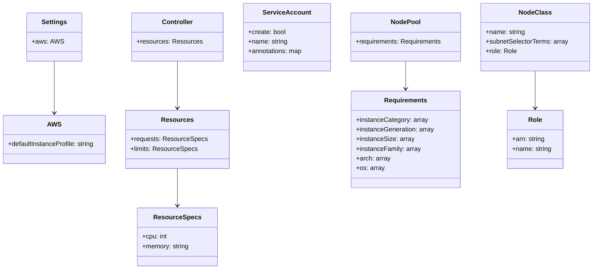
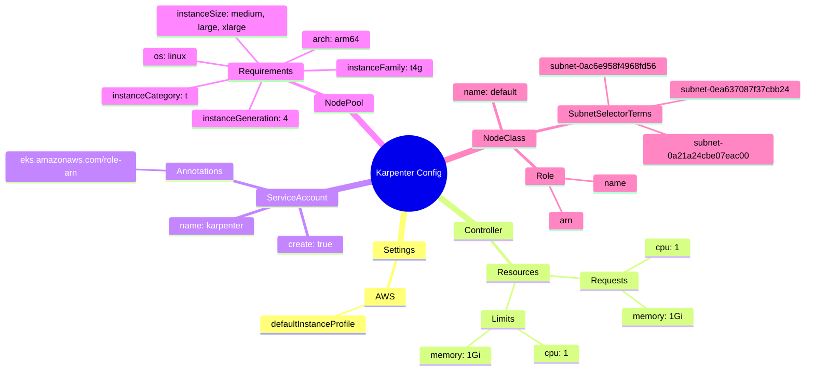

# Diagram: devops/k8s/karpenter/helm/values.ephemeral-test.yaml


> Auto-generated by Obscura crawlers

## Diagram 1

```mermaid
graph TD
      Settings[Settings] --> AWS[AWS Configuration]
      AWS --> InstanceProfile["defaultInstanceProfile<br/>arn:aws:iam::519940785508:role/Ephemer
  al-TestKarpenterInstanceNodeRole"]...
  └ 232 lines...
```

> SVG rendering failed for this diagram.

## Diagram 2

```mermaid
graph TD
    Settings[Settings] --> AWS[AWS Configuration]
    AWS --> InstanceProfile["defaultInstanceProfile<br/>arn:aws:iam::519940785508:role/Ephemeral-TestKarpenterInstanceNodeRole"]
    
    Controller[Controller] --> Resources[Resources]
    Resources --> Requests["Requests<br/>cpu: 1<br/>memory: 1Gi"]
    Resources --> Limits["Limits<br/>cpu: 1<br/>memory: 1Gi"]
    
    ServiceAccount[Service Account] --> Create["create: true"]
    ServiceAccount --> SAName["name: karpenter"]
    ServiceAccount --> Annotations[Annotations]
    Annotations --> RoleARN["eks.amazonaws.com/role-arn<br/>arn:aws:iam::519940785508:role/Ephemeral-TestKarpenterControllerRole"]
    
    NodePool[Node Pool] --> Requirements[Requirements]
    Requirements --> InstanceCategory["instanceCategory: t"]
    Requirements --> InstanceGeneration["instanceGeneration: 4"]
    Requirements --> InstanceSize["instanceSize: medium, large, xlarge"]
    Requirements --> InstanceFamily["instanceFamily: t4g"]
    Requirements --> Arch["arch: arm64"]
    Requirements --> OS["os: linux"]
    
    NodeClass[Node Class] --> NCName["name: default"]
    NodeClass --> SubnetSelector[Subnet Selector Terms]
    SubnetSelector --> Subnet1["subnet-0ea637087f37cbb24"]
    SubnetSelector --> Subnet2["subnet-0a21a24cbe07eac00"]
    SubnetSelector --> Subnet3["subnet-0ac6e958f4968fd56"]
    NodeClass --> Role[Role]
    Role --> RoleArn["arn: arn:aws:iam::519940785508:role/Ephemeral-TestKarpenterInstanceNodeRole"]
    Role --> RoleName["name: Ephemeral-TestKarpenterInstanceNodeRole"]
```



### SVG

<svg id="container" width="4536.46875" xmlns="http://www.w3.org/2000/svg" class="flowchart" height="326" viewBox="0 0 4536.46875 326" role="graphics-document document" aria-roledescription="flowchart-v2"><style>#container{font-family:"trebuchet ms",verdana,arial,sans-serif;font-size:16px;fill:#333;}@keyframes edge-animation-frame{from{stroke-dashoffset:0;}}@keyframes dash{to{stroke-dashoffset:0;}}#container .edge-animation-slow{stroke-dasharray:9,5!important;stroke-dashoffset:900;animation:dash 50s linear infinite;stroke-linecap:round;}#container .edge-animation-fast{stroke-dasharray:9,5!important;stroke-dashoffset:900;animation:dash 20s linear infinite;stroke-linecap:round;}#container .error-icon{fill:#552222;}#container .error-text{fill:#552222;stroke:#552222;}#container .edge-thickness-normal{stroke-width:1px;}#container .edge-thickness-thick{stroke-width:3.5px;}#container .edge-pattern-solid{stroke-dasharray:0;}#container .edge-thickness-invisible{stroke-width:0;fill:none;}#container .edge-pattern-dashed{stroke-dasharray:3;}#container .edge-pattern-dotted{stroke-dasharray:2;}#container .marker{fill:#333333;stroke:#333333;}#container .marker.cross{stroke:#333333;}#container svg{font-family:"trebuchet ms",verdana,arial,sans-serif;font-size:16px;}#container p{margin:0;}#container .label{font-family:"trebuchet ms",verdana,arial,sans-serif;color:#333;}#container .cluster-label text{fill:#333;}#container .cluster-label span{color:#333;}#container .cluster-label span p{background-color:transparent;}#container .label text,#container span{fill:#333;color:#333;}#container .node rect,#container .node circle,#container .node ellipse,#container .node polygon,#container .node path{fill:#ECECFF;stroke:#9370DB;stroke-width:1px;}#container .rough-node .label text,#container .node .label text,#container .image-shape .label,#container .icon-shape .label{text-anchor:middle;}#container .node .katex path{fill:#000;stroke:#000;stroke-width:1px;}#container .rough-node .label,#container .node .label,#container .image-shape .label,#container .icon-shape .label{text-align:center;}#container .node.clickable{cursor:pointer;}#container .root .anchor path{fill:#333333!important;stroke-width:0;stroke:#333333;}#container .arrowheadPath{fill:#333333;}#container .edgePath .path{stroke:#333333;stroke-width:2.0px;}#container .flowchart-link{stroke:#333333;fill:none;}#container .edgeLabel{background-color:rgba(232,232,232, 0.8);text-align:center;}#container .edgeLabel p{background-color:rgba(232,232,232, 0.8);}#container .edgeLabel rect{opacity:0.5;background-color:rgba(232,232,232, 0.8);fill:rgba(232,232,232, 0.8);}#container .labelBkg{background-color:rgba(232, 232, 232, 0.5);}#container .cluster rect{fill:#ffffde;stroke:#aaaa33;stroke-width:1px;}#container .cluster text{fill:#333;}#container .cluster span{color:#333;}#container div.mermaidTooltip{position:absolute;text-align:center;max-width:200px;padding:2px;font-family:"trebuchet ms",verdana,arial,sans-serif;font-size:12px;background:hsl(80, 100%, 96.2745098039%);border:1px solid #aaaa33;border-radius:2px;pointer-events:none;z-index:100;}#container .flowchartTitleText{text-anchor:middle;font-size:18px;fill:#333;}#container rect.text{fill:none;stroke-width:0;}#container .icon-shape,#container .image-shape{background-color:rgba(232,232,232, 0.8);text-align:center;}#container .icon-shape p,#container .image-shape p{background-color:rgba(232,232,232, 0.8);padding:2px;}#container .icon-shape rect,#container .image-shape rect{opacity:0.5;background-color:rgba(232,232,232, 0.8);fill:rgba(232,232,232, 0.8);}#container .label-icon{display:inline-block;height:1em;overflow:visible;vertical-align:-0.125em;}#container .node .label-icon path{fill:currentColor;stroke:revert;stroke-width:revert;}#container :root{--mermaid-font-family:"trebuchet ms",verdana,arial,sans-serif;}</style><g><marker id="container_flowchart-v2-pointEnd" class="marker flowchart-v2" viewBox="0 0 10 10" refX="5" refY="5" markerUnits="userSpaceOnUse" markerWidth="8" markerHeight="8" orient="auto"><path d="M 0 0 L 10 5 L 0 10 z" class="arrowMarkerPath" style="stroke-width: 1; stroke-dasharray: 1, 0;"></path></marker><marker id="container_flowchart-v2-pointStart" class="marker flowchart-v2" viewBox="0 0 10 10" refX="4.5" refY="5" markerUnits="userSpaceOnUse" markerWidth="8" markerHeight="8" orient="auto"><path d="M 0 5 L 10 10 L 10 0 z" class="arrowMarkerPath" style="stroke-width: 1; stroke-dasharray: 1, 0;"></path></marker><marker id="container_flowchart-v2-circleEnd" class="marker flowchart-v2" viewBox="0 0 10 10" refX="11" refY="5" markerUnits="userSpaceOnUse" markerWidth="11" markerHeight="11" orient="auto"><circle cx="5" cy="5" r="5" class="arrowMarkerPath" style="stroke-width: 1; stroke-dasharray: 1, 0;"></circle></marker><marker id="container_flowchart-v2-circleStart" class="marker flowchart-v2" viewBox="0 0 10 10" refX="-1" refY="5" markerUnits="userSpaceOnUse" markerWidth="11" markerHeight="11" orient="auto"><circle cx="5" cy="5" r="5" class="arrowMarkerPath" style="stroke-width: 1; stroke-dasharray: 1, 0;"></circle></marker><marker id="container_flowchart-v2-crossEnd" class="marker cross flowchart-v2" viewBox="0 0 11 11" refX="12" refY="5.2" markerUnits="userSpaceOnUse" markerWidth="11" markerHeight="11" orient="auto"><path d="M 1,1 l 9,9 M 10,1 l -9,9" class="arrowMarkerPath" style="stroke-width: 2; stroke-dasharray: 1, 0;"></path></marker><marker id="container_flowchart-v2-crossStart" class="marker cross flowchart-v2" viewBox="0 0 11 11" refX="-1" refY="5.2" markerUnits="userSpaceOnUse" markerWidth="11" markerHeight="11" orient="auto"><path d="M 1,1 l 9,9 M 10,1 l -9,9" class="arrowMarkerPath" style="stroke-width: 2; stroke-dasharray: 1, 0;"></path></marker><g class="root"><g class="clusters"></g><g class="edgePaths"><path d="M195.336,62L195.336,66.167C195.336,70.333,195.336,78.667,195.336,86.333C195.336,94,195.336,101,195.336,104.5L195.336,108" id="L_Settings_AWS_0" class="edge-thickness-normal edge-pattern-solid edge-thickness-normal edge-pattern-solid flowchart-link" style=";" data-edge="true" data-et="edge" data-id="L_Settings_AWS_0" data-points="W3sieCI6MTk1LjMzNTkzNzUsInkiOjYyfSx7IngiOjE5NS4zMzU5Mzc1LCJ5Ijo4N30seyJ4IjoxOTUuMzM1OTM3NSwieSI6MTEyfV0=" marker-end="url(#container_flowchart-v2-pointEnd)"></path><path d="M195.336,166L195.336,170.167C195.336,174.333,195.336,182.667,195.336,190.333C195.336,198,195.336,205,195.336,208.5L195.336,212" id="L_AWS_InstanceProfile_0" class="edge-thickness-normal edge-pattern-solid edge-thickness-normal edge-pattern-solid flowchart-link" style=";" data-edge="true" data-et="edge" data-id="L_AWS_InstanceProfile_0" data-points="W3sieCI6MTk1LjMzNTkzNzUsInkiOjE2Nn0seyJ4IjoxOTUuMzM1OTM3NSwieSI6MTkxfSx7IngiOjE5NS4zMzU5Mzc1LCJ5IjoyMTZ9XQ==" marker-end="url(#container_flowchart-v2-pointEnd)"></path><path d="M606.891,62L606.891,66.167C606.891,70.333,606.891,78.667,606.891,86.333C606.891,94,606.891,101,606.891,104.5L606.891,108" id="L_Controller_Resources_0" class="edge-thickness-normal edge-pattern-solid edge-thickness-normal edge-pattern-solid flowchart-link" style=";" data-edge="true" data-et="edge" data-id="L_Controller_Resources_0" data-points="W3sieCI6NjA2Ljg5MDYyNSwieSI6NjJ9LHsieCI6NjA2Ljg5MDYyNSwieSI6ODd9LHsieCI6NjA2Ljg5MDYyNSwieSI6MTEyfV0=" marker-end="url(#container_flowchart-v2-pointEnd)"></path><path d="M555.17,166L547.189,170.167C539.207,174.333,523.244,182.667,515.263,190.333C507.281,198,507.281,205,507.281,208.5L507.281,212" id="L_Resources_Requests_0" class="edge-thickness-normal edge-pattern-solid edge-thickness-normal edge-pattern-solid flowchart-link" style=";" data-edge="true" data-et="edge" data-id="L_Resources_Requests_0" data-points="W3sieCI6NTU1LjE3MDM3MjU5NjE1MzgsInkiOjE2Nn0seyJ4Ijo1MDcuMjgxMjUsInkiOjE5MX0seyJ4Ijo1MDcuMjgxMjUsInkiOjIxNn1d" marker-end="url(#container_flowchart-v2-pointEnd)"></path><path d="M673.648,162.044L687.629,166.87C701.609,171.696,729.57,181.348,743.551,189.674C757.531,198,757.531,205,757.531,208.5L757.531,212" id="L_Resources_Limits_0" class="edge-thickness-normal edge-pattern-solid edge-thickness-normal edge-pattern-solid flowchart-link" style=";" data-edge="true" data-et="edge" data-id="L_Resources_Limits_0" data-points="W3sieCI6NjczLjY0ODQzNzUsInkiOjE2Mi4wNDQyOTAwMTE0MDk2fSx7IngiOjc1Ny41MzEyNSwieSI6MTkxfSx7IngiOjc1Ny41MzEyNSwieSI6MjE2fV0=" marker-end="url(#container_flowchart-v2-pointEnd)"></path><path d="M919.359,56.411L898.652,61.509C877.945,66.607,836.531,76.804,815.824,85.402C795.117,94,795.117,101,795.117,104.5L795.117,108" id="L_ServiceAccount_Create_0" class="edge-thickness-normal edge-pattern-solid edge-thickness-normal edge-pattern-solid flowchart-link" style=";" data-edge="true" data-et="edge" data-id="L_ServiceAccount_Create_0" data-points="W3sieCI6OTE5LjM1OTM3NSwieSI6NTYuNDEwNTIwMDg1ODE3ODZ9LHsieCI6Nzk1LjExNzE4NzUsInkiOjg3fSx7IngiOjc5NS4xMTcxODc1LCJ5IjoxMTJ9XQ==" marker-end="url(#container_flowchart-v2-pointEnd)"></path><path d="M1006.32,62L1006.32,66.167C1006.32,70.333,1006.32,78.667,1006.32,86.333C1006.32,94,1006.32,101,1006.32,104.5L1006.32,108" id="L_ServiceAccount_SAName_0" class="edge-thickness-normal edge-pattern-solid edge-thickness-normal edge-pattern-solid flowchart-link" style=";" data-edge="true" data-et="edge" data-id="L_ServiceAccount_SAName_0" data-points="W3sieCI6MTAwNi4zMjAzMTI1LCJ5Ijo2Mn0seyJ4IjoxMDA2LjMyMDMxMjUsInkiOjg3fSx7IngiOjEwMDYuMzIwMzEyNSwieSI6MTEyfV0=" marker-end="url(#container_flowchart-v2-pointEnd)"></path><path d="M1093.281,56.151L1114.421,61.292C1135.56,66.434,1177.839,76.717,1198.978,85.358C1220.117,94,1220.117,101,1220.117,104.5L1220.117,108" id="L_ServiceAccount_Annotations_0" class="edge-thickness-normal edge-pattern-solid edge-thickness-normal edge-pattern-solid flowchart-link" style=";" data-edge="true" data-et="edge" data-id="L_ServiceAccount_Annotations_0" data-points="W3sieCI6MTA5My4yODEyNSwieSI6NTYuMTUwNzcxMDI5NzQ0OTR9LHsieCI6MTIyMC4xMTcxODc1LCJ5Ijo4N30seyJ4IjoxMjIwLjExNzE4NzUsInkiOjExMn1d" marker-end="url(#container_flowchart-v2-pointEnd)"></path><path d="M1220.117,166L1220.117,170.167C1220.117,174.333,1220.117,182.667,1220.117,190.333C1220.117,198,1220.117,205,1220.117,208.5L1220.117,212" id="L_Annotations_RoleARN_0" class="edge-thickness-normal edge-pattern-solid edge-thickness-normal edge-pattern-solid flowchart-link" style=";" data-edge="true" data-et="edge" data-id="L_Annotations_RoleARN_0" data-points="W3sieCI6MTIyMC4xMTcxODc1LCJ5IjoxNjZ9LHsieCI6MTIyMC4xMTcxODc1LCJ5IjoxOTF9LHsieCI6MTIyMC4xMTcxODc1LCJ5IjoyMTZ9XQ==" marker-end="url(#container_flowchart-v2-pointEnd)"></path><path d="M2243.188,62L2243.188,66.167C2243.188,70.333,2243.188,78.667,2243.188,86.333C2243.188,94,2243.188,101,2243.188,104.5L2243.188,108" id="L_NodePool_Requirements_0" class="edge-thickness-normal edge-pattern-solid edge-thickness-normal edge-pattern-solid flowchart-link" style=";" data-edge="true" data-et="edge" data-id="L_NodePool_Requirements_0" data-points="W3sieCI6MjI0My4xODc1LCJ5Ijo2Mn0seyJ4IjoyMjQzLjE4NzUsInkiOjg3fSx7IngiOjIyNDMuMTg3NSwieSI6MTEyfV0=" marker-end="url(#container_flowchart-v2-pointEnd)"></path><path d="M2162.672,145.098L2061.66,152.748C1960.648,160.399,1758.625,175.699,1657.613,190.85C1556.602,206,1556.602,221,1556.602,228.5L1556.602,236" id="L_Requirements_InstanceCategory_0" class="edge-thickness-normal edge-pattern-solid edge-thickness-normal edge-pattern-solid flowchart-link" style=";" data-edge="true" data-et="edge" data-id="L_Requirements_InstanceCategory_0" data-points="W3sieCI6MjE2Mi42NzE4NzUsInkiOjE0NS4wOTgwMTY2ODEyNjk0M30seyJ4IjoxNTU2LjYwMTU2MjUsInkiOjE5MX0seyJ4IjoxNTU2LjYwMTU2MjUsInkiOjI0MH1d" marker-end="url(#container_flowchart-v2-pointEnd)"></path><path d="M2162.672,148.772L2104.684,155.81C2046.695,162.848,1930.719,176.924,1872.73,191.462C1814.742,206,1814.742,221,1814.742,228.5L1814.742,236" id="L_Requirements_InstanceGeneration_0" class="edge-thickness-normal edge-pattern-solid edge-thickness-normal edge-pattern-solid flowchart-link" style=";" data-edge="true" data-et="edge" data-id="L_Requirements_InstanceGeneration_0" data-points="W3sieCI6MjE2Mi42NzE4NzUsInkiOjE0OC43NzIxMDQ4MTIwOTMxNX0seyJ4IjoxODE0Ljc0MjE4NzUsInkiOjE5MX0seyJ4IjoxODE0Ljc0MjE4NzUsInkiOjI0MH1d" marker-end="url(#container_flowchart-v2-pointEnd)"></path><path d="M2170.779,166L2159.605,170.167C2148.431,174.333,2126.083,182.667,2114.909,192.333C2103.734,202,2103.734,213,2103.734,218.5L2103.734,224" id="L_Requirements_InstanceSize_0" class="edge-thickness-normal edge-pattern-solid edge-thickness-normal edge-pattern-solid flowchart-link" style=";" data-edge="true" data-et="edge" data-id="L_Requirements_InstanceSize_0" data-points="W3sieCI6MjE3MC43NzkxNDY2MzQ2MTUyLCJ5IjoxNjZ9LHsieCI6MjEwMy43MzQzNzUsInkiOjE5MX0seyJ4IjoyMTAzLjczNDM3NSwieSI6MjI4fV0=" marker-end="url(#container_flowchart-v2-pointEnd)"></path><path d="M2315.596,166L2326.77,170.167C2337.944,174.333,2360.292,182.667,2371.466,194.333C2382.641,206,2382.641,221,2382.641,228.5L2382.641,236" id="L_Requirements_InstanceFamily_0" class="edge-thickness-normal edge-pattern-solid edge-thickness-normal edge-pattern-solid flowchart-link" style=";" data-edge="true" data-et="edge" data-id="L_Requirements_InstanceFamily_0" data-points="W3sieCI6MjMxNS41OTU4NTMzNjUzODQ4LCJ5IjoxNjZ9LHsieCI6MjM4Mi42NDA2MjUsInkiOjE5MX0seyJ4IjoyMzgyLjY0MDYyNSwieSI6MjQwfV0=" marker-end="url(#container_flowchart-v2-pointEnd)"></path><path d="M2323.703,150.6L2370.439,157.333C2417.174,164.067,2510.646,177.533,2557.382,191.767C2604.117,206,2604.117,221,2604.117,228.5L2604.117,236" id="L_Requirements_Arch_0" class="edge-thickness-normal edge-pattern-solid edge-thickness-normal edge-pattern-solid flowchart-link" style=";" data-edge="true" data-et="edge" data-id="L_Requirements_Arch_0" data-points="W3sieCI6MjMyMy43MDMxMjUsInkiOjE1MC42MDAwNzc5MjM3NjQ2fSx7IngiOjI2MDQuMTE3MTg3NSwieSI6MTkxfSx7IngiOjI2MDQuMTE3MTg3NSwieSI6MjQwfV0=" marker-end="url(#container_flowchart-v2-pointEnd)"></path><path d="M2323.703,146.7L2400.913,154.083C2478.122,161.466,2632.542,176.233,2709.751,191.117C2786.961,206,2786.961,221,2786.961,228.5L2786.961,236" id="L_Requirements_OS_0" class="edge-thickness-normal edge-pattern-solid edge-thickness-normal edge-pattern-solid flowchart-link" style=";" data-edge="true" data-et="edge" data-id="L_Requirements_OS_0" data-points="W3sieCI6MjMyMy43MDMxMjUsInkiOjE0Ni42OTk1NTMxODAxNzl9LHsieCI6Mjc4Ni45NjA5Mzc1LCJ5IjoxOTF9LHsieCI6Mjc4Ni45NjA5Mzc1LCJ5IjoyNDB9XQ==" marker-end="url(#container_flowchart-v2-pointEnd)"></path><path d="M3258.258,43.422L3198.089,50.685C3137.921,57.948,3017.583,72.474,2957.415,83.237C2897.246,94,2897.246,101,2897.246,104.5L2897.246,108" id="L_NodeClass_NCName_0" class="edge-thickness-normal edge-pattern-solid edge-thickness-normal edge-pattern-solid flowchart-link" style=";" data-edge="true" data-et="edge" data-id="L_NodeClass_NCName_0" data-points="W3sieCI6MzI1OC4yNTc4MTI1LCJ5Ijo0My40MjIzMzkyOTY4ODcwNDZ9LHsieCI6Mjg5Ny4yNDYwOTM3NSwieSI6ODd9LHsieCI6Mjg5Ny4yNDYwOTM3NSwieSI6MTEyfV0=" marker-end="url(#container_flowchart-v2-pointEnd)"></path><path d="M3328.031,62L3328.031,66.167C3328.031,70.333,3328.031,78.667,3328.031,86.333C3328.031,94,3328.031,101,3328.031,104.5L3328.031,108" id="L_NodeClass_SubnetSelector_0" class="edge-thickness-normal edge-pattern-solid edge-thickness-normal edge-pattern-solid flowchart-link" style=";" data-edge="true" data-et="edge" data-id="L_NodeClass_SubnetSelector_0" data-points="W3sieCI6MzMyOC4wMzEyNSwieSI6NjJ9LHsieCI6MzMyOC4wMzEyNSwieSI6ODd9LHsieCI6MzMyOC4wMzEyNSwieSI6MTEyfV0=" marker-end="url(#container_flowchart-v2-pointEnd)"></path><path d="M3216.609,158.027L3184.427,163.522C3152.245,169.018,3087.88,180.009,3055.698,193.004C3023.516,206,3023.516,221,3023.516,228.5L3023.516,236" id="L_SubnetSelector_Subnet1_0" class="edge-thickness-normal edge-pattern-solid edge-thickness-normal edge-pattern-solid flowchart-link" style=";" data-edge="true" data-et="edge" data-id="L_SubnetSelector_Subnet1_0" data-points="W3sieCI6MzIxNi42MDkzNzUsInkiOjE1OC4wMjY3MzMwMjg4ODgxfSx7IngiOjMwMjMuNTE1NjI1LCJ5IjoxOTF9LHsieCI6MzAyMy41MTU2MjUsInkiOjI0MH1d" marker-end="url(#container_flowchart-v2-pointEnd)"></path><path d="M3328.031,166L3328.031,170.167C3328.031,174.333,3328.031,182.667,3328.031,194.333C3328.031,206,3328.031,221,3328.031,228.5L3328.031,236" id="L_SubnetSelector_Subnet2_0" class="edge-thickness-normal edge-pattern-solid edge-thickness-normal edge-pattern-solid flowchart-link" style=";" data-edge="true" data-et="edge" data-id="L_SubnetSelector_Subnet2_0" data-points="W3sieCI6MzMyOC4wMzEyNSwieSI6MTY2fSx7IngiOjMzMjguMDMxMjUsInkiOjE5MX0seyJ4IjozMzI4LjAzMTI1LCJ5IjoyNDB9XQ==" marker-end="url(#container_flowchart-v2-pointEnd)"></path><path d="M3439.453,157.984L3471.75,163.487C3504.047,168.989,3568.641,179.995,3600.938,192.997C3633.234,206,3633.234,221,3633.234,228.5L3633.234,236" id="L_SubnetSelector_Subnet3_0" class="edge-thickness-normal edge-pattern-solid edge-thickness-normal edge-pattern-solid flowchart-link" style=";" data-edge="true" data-et="edge" data-id="L_SubnetSelector_Subnet3_0" data-points="W3sieCI6MzQzOS40NTMxMjUsInkiOjE1Ny45ODM4NzM0NDQ5MzkzMn0seyJ4IjozNjMzLjIzNDM3NSwieSI6MTkxfSx7IngiOjM2MzMuMjM0Mzc1LCJ5IjoyNDB9XQ==" marker-end="url(#container_flowchart-v2-pointEnd)"></path><path d="M3397.805,39.175L3531.014,47.146C3664.223,55.117,3930.641,71.058,4063.85,82.529C4197.059,94,4197.059,101,4197.059,104.5L4197.059,108" id="L_NodeClass_Role_0" class="edge-thickness-normal edge-pattern-solid edge-thickness-normal edge-pattern-solid flowchart-link" style=";" data-edge="true" data-et="edge" data-id="L_NodeClass_Role_0" data-points="W3sieCI6MzM5Ny44MDQ2ODc1LCJ5IjozOS4xNzUwMzQwNDkzODE3MTV9LHsieCI6NDE5Ny4wNTg1OTM3NSwieSI6ODd9LHsieCI6NDE5Ny4wNTg1OTM3NSwieSI6MTEyfV0=" marker-end="url(#container_flowchart-v2-pointEnd)"></path><path d="M4150.996,151.005L4125.419,157.671C4099.841,164.336,4048.686,177.668,4023.109,187.834C3997.531,198,3997.531,205,3997.531,208.5L3997.531,212" id="L_Role_RoleArn_0" class="edge-thickness-normal edge-pattern-solid edge-thickness-normal edge-pattern-solid flowchart-link" style=";" data-edge="true" data-et="edge" data-id="L_Role_RoleArn_0" data-points="W3sieCI6NDE1MC45OTYwOTM3NSwieSI6MTUxLjAwNDYyMDI5NDA1NDMyfSx7IngiOjM5OTcuNTMxMjUsInkiOjE5MX0seyJ4IjozOTk3LjUzMTI1LCJ5IjoyMTZ9XQ==" marker-end="url(#container_flowchart-v2-pointEnd)"></path><path d="M4243.121,151.975L4266.212,158.479C4289.302,164.983,4335.483,177.992,4358.574,189.996C4381.664,202,4381.664,213,4381.664,218.5L4381.664,224" id="L_Role_RoleName_0" class="edge-thickness-normal edge-pattern-solid edge-thickness-normal edge-pattern-solid flowchart-link" style=";" data-edge="true" data-et="edge" data-id="L_Role_RoleName_0" data-points="W3sieCI6NDI0My4xMjEwOTM3NSwieSI6MTUxLjk3NDk2NzczMTAxNDJ9LHsieCI6NDM4MS42NjQwNjI1LCJ5IjoxOTF9LHsieCI6NDM4MS42NjQwNjI1LCJ5IjoyMjh9XQ==" marker-end="url(#container_flowchart-v2-pointEnd)"></path></g><g class="edgeLabels"><g class="edgeLabel"><g class="label" data-id="L_Settings_AWS_0" transform="translate(0, 0)"><foreignObject width="0" height="0"><div xmlns="http://www.w3.org/1999/xhtml" class="labelBkg" style="display: table-cell; white-space: nowrap; line-height: 1.5; max-width: 200px; text-align: center;"><span class="edgeLabel"></span></div></foreignObject></g></g><g class="edgeLabel"><g class="label" data-id="L_AWS_InstanceProfile_0" transform="translate(0, 0)"><foreignObject width="0" height="0"><div xmlns="http://www.w3.org/1999/xhtml" class="labelBkg" style="display: table-cell; white-space: nowrap; line-height: 1.5; max-width: 200px; text-align: center;"><span class="edgeLabel"></span></div></foreignObject></g></g><g class="edgeLabel"><g class="label" data-id="L_Controller_Resources_0" transform="translate(0, 0)"><foreignObject width="0" height="0"><div xmlns="http://www.w3.org/1999/xhtml" class="labelBkg" style="display: table-cell; white-space: nowrap; line-height: 1.5; max-width: 200px; text-align: center;"><span class="edgeLabel"></span></div></foreignObject></g></g><g class="edgeLabel"><g class="label" data-id="L_Resources_Requests_0" transform="translate(0, 0)"><foreignObject width="0" height="0"><div xmlns="http://www.w3.org/1999/xhtml" class="labelBkg" style="display: table-cell; white-space: nowrap; line-height: 1.5; max-width: 200px; text-align: center;"><span class="edgeLabel"></span></div></foreignObject></g></g><g class="edgeLabel"><g class="label" data-id="L_Resources_Limits_0" transform="translate(0, 0)"><foreignObject width="0" height="0"><div xmlns="http://www.w3.org/1999/xhtml" class="labelBkg" style="display: table-cell; white-space: nowrap; line-height: 1.5; max-width: 200px; text-align: center;"><span class="edgeLabel"></span></div></foreignObject></g></g><g class="edgeLabel"><g class="label" data-id="L_ServiceAccount_Create_0" transform="translate(0, 0)"><foreignObject width="0" height="0"><div xmlns="http://www.w3.org/1999/xhtml" class="labelBkg" style="display: table-cell; white-space: nowrap; line-height: 1.5; max-width: 200px; text-align: center;"><span class="edgeLabel"></span></div></foreignObject></g></g><g class="edgeLabel"><g class="label" data-id="L_ServiceAccount_SAName_0" transform="translate(0, 0)"><foreignObject width="0" height="0"><div xmlns="http://www.w3.org/1999/xhtml" class="labelBkg" style="display: table-cell; white-space: nowrap; line-height: 1.5; max-width: 200px; text-align: center;"><span class="edgeLabel"></span></div></foreignObject></g></g><g class="edgeLabel"><g class="label" data-id="L_ServiceAccount_Annotations_0" transform="translate(0, 0)"><foreignObject width="0" height="0"><div xmlns="http://www.w3.org/1999/xhtml" class="labelBkg" style="display: table-cell; white-space: nowrap; line-height: 1.5; max-width: 200px; text-align: center;"><span class="edgeLabel"></span></div></foreignObject></g></g><g class="edgeLabel"><g class="label" data-id="L_Annotations_RoleARN_0" transform="translate(0, 0)"><foreignObject width="0" height="0"><div xmlns="http://www.w3.org/1999/xhtml" class="labelBkg" style="display: table-cell; white-space: nowrap; line-height: 1.5; max-width: 200px; text-align: center;"><span class="edgeLabel"></span></div></foreignObject></g></g><g class="edgeLabel"><g class="label" data-id="L_NodePool_Requirements_0" transform="translate(0, 0)"><foreignObject width="0" height="0"><div xmlns="http://www.w3.org/1999/xhtml" class="labelBkg" style="display: table-cell; white-space: nowrap; line-height: 1.5; max-width: 200px; text-align: center;"><span class="edgeLabel"></span></div></foreignObject></g></g><g class="edgeLabel"><g class="label" data-id="L_Requirements_InstanceCategory_0" transform="translate(0, 0)"><foreignObject width="0" height="0"><div xmlns="http://www.w3.org/1999/xhtml" class="labelBkg" style="display: table-cell; white-space: nowrap; line-height: 1.5; max-width: 200px; text-align: center;"><span class="edgeLabel"></span></div></foreignObject></g></g><g class="edgeLabel"><g class="label" data-id="L_Requirements_InstanceGeneration_0" transform="translate(0, 0)"><foreignObject width="0" height="0"><div xmlns="http://www.w3.org/1999/xhtml" class="labelBkg" style="display: table-cell; white-space: nowrap; line-height: 1.5; max-width: 200px; text-align: center;"><span class="edgeLabel"></span></div></foreignObject></g></g><g class="edgeLabel"><g class="label" data-id="L_Requirements_InstanceSize_0" transform="translate(0, 0)"><foreignObject width="0" height="0"><div xmlns="http://www.w3.org/1999/xhtml" class="labelBkg" style="display: table-cell; white-space: nowrap; line-height: 1.5; max-width: 200px; text-align: center;"><span class="edgeLabel"></span></div></foreignObject></g></g><g class="edgeLabel"><g class="label" data-id="L_Requirements_InstanceFamily_0" transform="translate(0, 0)"><foreignObject width="0" height="0"><div xmlns="http://www.w3.org/1999/xhtml" class="labelBkg" style="display: table-cell; white-space: nowrap; line-height: 1.5; max-width: 200px; text-align: center;"><span class="edgeLabel"></span></div></foreignObject></g></g><g class="edgeLabel"><g class="label" data-id="L_Requirements_Arch_0" transform="translate(0, 0)"><foreignObject width="0" height="0"><div xmlns="http://www.w3.org/1999/xhtml" class="labelBkg" style="display: table-cell; white-space: nowrap; line-height: 1.5; max-width: 200px; text-align: center;"><span class="edgeLabel"></span></div></foreignObject></g></g><g class="edgeLabel"><g class="label" data-id="L_Requirements_OS_0" transform="translate(0, 0)"><foreignObject width="0" height="0"><div xmlns="http://www.w3.org/1999/xhtml" class="labelBkg" style="display: table-cell; white-space: nowrap; line-height: 1.5; max-width: 200px; text-align: center;"><span class="edgeLabel"></span></div></foreignObject></g></g><g class="edgeLabel"><g class="label" data-id="L_NodeClass_NCName_0" transform="translate(0, 0)"><foreignObject width="0" height="0"><div xmlns="http://www.w3.org/1999/xhtml" class="labelBkg" style="display: table-cell; white-space: nowrap; line-height: 1.5; max-width: 200px; text-align: center;"><span class="edgeLabel"></span></div></foreignObject></g></g><g class="edgeLabel"><g class="label" data-id="L_NodeClass_SubnetSelector_0" transform="translate(0, 0)"><foreignObject width="0" height="0"><div xmlns="http://www.w3.org/1999/xhtml" class="labelBkg" style="display: table-cell; white-space: nowrap; line-height: 1.5; max-width: 200px; text-align: center;"><span class="edgeLabel"></span></div></foreignObject></g></g><g class="edgeLabel"><g class="label" data-id="L_SubnetSelector_Subnet1_0" transform="translate(0, 0)"><foreignObject width="0" height="0"><div xmlns="http://www.w3.org/1999/xhtml" class="labelBkg" style="display: table-cell; white-space: nowrap; line-height: 1.5; max-width: 200px; text-align: center;"><span class="edgeLabel"></span></div></foreignObject></g></g><g class="edgeLabel"><g class="label" data-id="L_SubnetSelector_Subnet2_0" transform="translate(0, 0)"><foreignObject width="0" height="0"><div xmlns="http://www.w3.org/1999/xhtml" class="labelBkg" style="display: table-cell; white-space: nowrap; line-height: 1.5; max-width: 200px; text-align: center;"><span class="edgeLabel"></span></div></foreignObject></g></g><g class="edgeLabel"><g class="label" data-id="L_SubnetSelector_Subnet3_0" transform="translate(0, 0)"><foreignObject width="0" height="0"><div xmlns="http://www.w3.org/1999/xhtml" class="labelBkg" style="display: table-cell; white-space: nowrap; line-height: 1.5; max-width: 200px; text-align: center;"><span class="edgeLabel"></span></div></foreignObject></g></g><g class="edgeLabel"><g class="label" data-id="L_NodeClass_Role_0" transform="translate(0, 0)"><foreignObject width="0" height="0"><div xmlns="http://www.w3.org/1999/xhtml" class="labelBkg" style="display: table-cell; white-space: nowrap; line-height: 1.5; max-width: 200px; text-align: center;"><span class="edgeLabel"></span></div></foreignObject></g></g><g class="edgeLabel"><g class="label" data-id="L_Role_RoleArn_0" transform="translate(0, 0)"><foreignObject width="0" height="0"><div xmlns="http://www.w3.org/1999/xhtml" class="labelBkg" style="display: table-cell; white-space: nowrap; line-height: 1.5; max-width: 200px; text-align: center;"><span class="edgeLabel"></span></div></foreignObject></g></g><g class="edgeLabel"><g class="label" data-id="L_Role_RoleName_0" transform="translate(0, 0)"><foreignObject width="0" height="0"><div xmlns="http://www.w3.org/1999/xhtml" class="labelBkg" style="display: table-cell; white-space: nowrap; line-height: 1.5; max-width: 200px; text-align: center;"><span class="edgeLabel"></span></div></foreignObject></g></g></g><g class="nodes"><g class="node default" id="flowchart-Settings-0" transform="translate(195.3359375, 35)"><rect class="basic label-container" style="" x="-59.28125" y="-27" width="118.5625" height="54"></rect><g class="label" style="" transform="translate(-29.28125, -12)"><rect></rect><foreignObject width="58.5625" height="24"><div xmlns="http://www.w3.org/1999/xhtml" style="display: table-cell; white-space: nowrap; line-height: 1.5; max-width: 200px; text-align: center;"><span class="nodeLabel"><p>Settings</p></span></div></foreignObject></g></g><g class="node default" id="flowchart-AWS-1" transform="translate(195.3359375, 139)"><rect class="basic label-container" style="" x="-96.2734375" y="-27" width="192.546875" height="54"></rect><g class="label" style="" transform="translate(-66.2734375, -12)"><rect></rect><foreignObject width="132.546875" height="24"><div xmlns="http://www.w3.org/1999/xhtml" style="display: table-cell; white-space: nowrap; line-height: 1.5; max-width: 200px; text-align: center;"><span class="nodeLabel"><p>AWS Configuration</p></span></div></foreignObject></g></g><g class="node default" id="flowchart-InstanceProfile-3" transform="translate(195.3359375, 267)"><rect class="basic label-container" style="" x="-187.3359375" y="-51" width="374.671875" height="102"></rect><g class="label" style="" transform="translate(-157.3359375, -36)"><rect></rect><foreignObject width="314.671875" height="72"><div xmlns="http://www.w3.org/1999/xhtml" style="display: table; white-space: break-spaces; line-height: 1.5; max-width: 200px; text-align: center; width: 200px;"><span class="nodeLabel"><p>defaultInstanceProfile<br/>arn:aws:iam::519940785508:role/Ephemeral-TestKarpenterInstanceNodeRole</p></span></div></foreignObject></g></g><g class="node default" id="flowchart-Controller-4" transform="translate(606.890625, 35)"><rect class="basic label-container" style="" x="-66.1875" y="-27" width="132.375" height="54"></rect><g class="label" style="" transform="translate(-36.1875, -12)"><rect></rect><foreignObject width="72.375" height="24"><div xmlns="http://www.w3.org/1999/xhtml" style="display: table-cell; white-space: nowrap; line-height: 1.5; max-width: 200px; text-align: center;"><span class="nodeLabel"><p>Controller</p></span></div></foreignObject></g></g><g class="node default" id="flowchart-Resources-5" transform="translate(606.890625, 139)"><rect class="basic label-container" style="" x="-66.7578125" y="-27" width="133.515625" height="54"></rect><g class="label" style="" transform="translate(-36.7578125, -12)"><rect></rect><foreignObject width="73.515625" height="24"><div xmlns="http://www.w3.org/1999/xhtml" style="display: table-cell; white-space: nowrap; line-height: 1.5; max-width: 200px; text-align: center;"><span class="nodeLabel"><p>Resources</p></span></div></foreignObject></g></g><g class="node default" id="flowchart-Requests-7" transform="translate(507.28125, 267)"><rect class="basic label-container" style="" x="-74.609375" y="-51" width="149.21875" height="102"></rect><g class="label" style="" transform="translate(-44.609375, -36)"><rect></rect><foreignObject width="89.21875" height="72"><div xmlns="http://www.w3.org/1999/xhtml" style="display: table-cell; white-space: nowrap; line-height: 1.5; max-width: 200px; text-align: center;"><span class="nodeLabel"><p>Requests<br/>cpu: 1<br/>memory: 1Gi</p></span></div></foreignObject></g></g><g class="node default" id="flowchart-Limits-9" transform="translate(757.53125, 267)"><rect class="basic label-container" style="" x="-74.609375" y="-51" width="149.21875" height="102"></rect><g class="label" style="" transform="translate(-44.609375, -36)"><rect></rect><foreignObject width="89.21875" height="72"><div xmlns="http://www.w3.org/1999/xhtml" style="display: table-cell; white-space: nowrap; line-height: 1.5; max-width: 200px; text-align: center;"><span class="nodeLabel"><p>Limits<br/>cpu: 1<br/>memory: 1Gi</p></span></div></foreignObject></g></g><g class="node default" id="flowchart-ServiceAccount-10" transform="translate(1006.3203125, 35)"><rect class="basic label-container" style="" x="-86.9609375" y="-27" width="173.921875" height="54"></rect><g class="label" style="" transform="translate(-56.9609375, -12)"><rect></rect><foreignObject width="113.921875" height="24"><div xmlns="http://www.w3.org/1999/xhtml" style="display: table-cell; white-space: nowrap; line-height: 1.5; max-width: 200px; text-align: center;"><span class="nodeLabel"><p>Service Account</p></span></div></foreignObject></g></g><g class="node default" id="flowchart-Create-11" transform="translate(795.1171875, 139)"><rect class="basic label-container" style="" x="-71.46875" y="-27" width="142.9375" height="54"></rect><g class="label" style="" transform="translate(-41.46875, -12)"><rect></rect><foreignObject width="82.9375" height="24"><div xmlns="http://www.w3.org/1999/xhtml" style="display: table-cell; white-space: nowrap; line-height: 1.5; max-width: 200px; text-align: center;"><span class="nodeLabel"><p>create: true</p></span></div></foreignObject></g></g><g class="node default" id="flowchart-SAName-13" transform="translate(1006.3203125, 139)"><rect class="basic label-container" style="" x="-89.734375" y="-27" width="179.46875" height="54"></rect><g class="label" style="" transform="translate(-59.734375, -12)"><rect></rect><foreignObject width="119.46875" height="24"><div xmlns="http://www.w3.org/1999/xhtml" style="display: table-cell; white-space: nowrap; line-height: 1.5; max-width: 200px; text-align: center;"><span class="nodeLabel"><p>name: karpenter</p></span></div></foreignObject></g></g><g class="node default" id="flowchart-Annotations-15" transform="translate(1220.1171875, 139)"><rect class="basic label-container" style="" x="-74.0625" y="-27" width="148.125" height="54"></rect><g class="label" style="" transform="translate(-44.0625, -12)"><rect></rect><foreignObject width="88.125" height="24"><div xmlns="http://www.w3.org/1999/xhtml" style="display: table-cell; white-space: nowrap; line-height: 1.5; max-width: 200px; text-align: center;"><span class="nodeLabel"><p>Annotations</p></span></div></foreignObject></g></g><g class="node default" id="flowchart-RoleARN-17" transform="translate(1220.1171875, 267)"><rect class="basic label-container" style="" x="-187.3359375" y="-51" width="374.671875" height="102"></rect><g class="label" style="" transform="translate(-157.3359375, -36)"><rect></rect><foreignObject width="314.671875" height="72"><div xmlns="http://www.w3.org/1999/xhtml" style="display: table; white-space: break-spaces; line-height: 1.5; max-width: 200px; text-align: center; width: 200px;"><span class="nodeLabel"><p>eks.amazonaws.com/role-arn<br/>arn:aws:iam::519940785508:role/Ephemeral-TestKarpenterControllerRole</p></span></div></foreignObject></g></g><g class="node default" id="flowchart-NodePool-18" transform="translate(2243.1875, 35)"><rect class="basic label-container" style="" x="-67.5" y="-27" width="135" height="54"></rect><g class="label" style="" transform="translate(-37.5, -12)"><rect></rect><foreignObject width="75" height="24"><div xmlns="http://www.w3.org/1999/xhtml" style="display: table-cell; white-space: nowrap; line-height: 1.5; max-width: 200px; text-align: center;"><span class="nodeLabel"><p>Node Pool</p></span></div></foreignObject></g></g><g class="node default" id="flowchart-Requirements-19" transform="translate(2243.1875, 139)"><rect class="basic label-container" style="" x="-80.515625" y="-27" width="161.03125" height="54"></rect><g class="label" style="" transform="translate(-50.515625, -12)"><rect></rect><foreignObject width="101.03125" height="24"><div xmlns="http://www.w3.org/1999/xhtml" style="display: table-cell; white-space: nowrap; line-height: 1.5; max-width: 200px; text-align: center;"><span class="nodeLabel"><p>Requirements</p></span></div></foreignObject></g></g><g class="node default" id="flowchart-InstanceCategory-21" transform="translate(1556.6015625, 267)"><rect class="basic label-container" style="" x="-99.1484375" y="-27" width="198.296875" height="54"></rect><g class="label" style="" transform="translate(-69.1484375, -12)"><rect></rect><foreignObject width="138.296875" height="24"><div xmlns="http://www.w3.org/1999/xhtml" style="display: table-cell; white-space: nowrap; line-height: 1.5; max-width: 200px; text-align: center;"><span class="nodeLabel"><p>instanceCategory: t</p></span></div></foreignObject></g></g><g class="node default" id="flowchart-InstanceGeneration-23" transform="translate(1814.7421875, 267)"><rect class="basic label-container" style="" x="-108.9921875" y="-27" width="217.984375" height="54"></rect><g class="label" style="" transform="translate(-78.9921875, -12)"><rect></rect><foreignObject width="157.984375" height="24"><div xmlns="http://www.w3.org/1999/xhtml" style="display: table-cell; white-space: nowrap; line-height: 1.5; max-width: 200px; text-align: center;"><span class="nodeLabel"><p>instanceGeneration: 4</p></span></div></foreignObject></g></g><g class="node default" id="flowchart-InstanceSize-25" transform="translate(2103.734375, 267)"><rect class="basic label-container" style="" x="-130" y="-39" width="260" height="78"></rect><g class="label" style="" transform="translate(-100, -24)"><rect></rect><foreignObject width="200" height="48"><div xmlns="http://www.w3.org/1999/xhtml" style="display: table; white-space: break-spaces; line-height: 1.5; max-width: 200px; text-align: center; width: 200px;"><span class="nodeLabel"><p>instanceSize: medium, large, xlarge</p></span></div></foreignObject></g></g><g class="node default" id="flowchart-InstanceFamily-27" transform="translate(2382.640625, 267)"><rect class="basic label-container" style="" x="-98.90625" y="-27" width="197.8125" height="54"></rect><g class="label" style="" transform="translate(-68.90625, -12)"><rect></rect><foreignObject width="137.8125" height="24"><div xmlns="http://www.w3.org/1999/xhtml" style="display: table-cell; white-space: nowrap; line-height: 1.5; max-width: 200px; text-align: center;"><span class="nodeLabel"><p>instanceFamily: t4g</p></span></div></foreignObject></g></g><g class="node default" id="flowchart-Arch-29" transform="translate(2604.1171875, 267)"><rect class="basic label-container" style="" x="-72.5703125" y="-27" width="145.140625" height="54"></rect><g class="label" style="" transform="translate(-42.5703125, -12)"><rect></rect><foreignObject width="85.140625" height="24"><div xmlns="http://www.w3.org/1999/xhtml" style="display: table-cell; white-space: nowrap; line-height: 1.5; max-width: 200px; text-align: center;"><span class="nodeLabel"><p>arch: arm64</p></span></div></foreignObject></g></g><g class="node default" id="flowchart-OS-31" transform="translate(2786.9609375, 267)"><rect class="basic label-container" style="" x="-60.2734375" y="-27" width="120.546875" height="54"></rect><g class="label" style="" transform="translate(-30.2734375, -12)"><rect></rect><foreignObject width="60.546875" height="24"><div xmlns="http://www.w3.org/1999/xhtml" style="display: table-cell; white-space: nowrap; line-height: 1.5; max-width: 200px; text-align: center;"><span class="nodeLabel"><p>os: linux</p></span></div></foreignObject></g></g><g class="node default" id="flowchart-NodeClass-32" transform="translate(3328.03125, 35)"><rect class="basic label-container" style="" x="-69.7734375" y="-27" width="139.546875" height="54"></rect><g class="label" style="" transform="translate(-39.7734375, -12)"><rect></rect><foreignObject width="79.546875" height="24"><div xmlns="http://www.w3.org/1999/xhtml" style="display: table-cell; white-space: nowrap; line-height: 1.5; max-width: 200px; text-align: center;"><span class="nodeLabel"><p>Node Class</p></span></div></foreignObject></g></g><g class="node default" id="flowchart-NCName-33" transform="translate(2897.24609375, 139)"><rect class="basic label-container" style="" x="-80.1875" y="-27" width="160.375" height="54"></rect><g class="label" style="" transform="translate(-50.1875, -12)"><rect></rect><foreignObject width="100.375" height="24"><div xmlns="http://www.w3.org/1999/xhtml" style="display: table-cell; white-space: nowrap; line-height: 1.5; max-width: 200px; text-align: center;"><span class="nodeLabel"><p>name: default</p></span></div></foreignObject></g></g><g class="node default" id="flowchart-SubnetSelector-35" transform="translate(3328.03125, 139)"><rect class="basic label-container" style="" x="-111.421875" y="-27" width="222.84375" height="54"></rect><g class="label" style="" transform="translate(-81.421875, -12)"><rect></rect><foreignObject width="162.84375" height="24"><div xmlns="http://www.w3.org/1999/xhtml" style="display: table-cell; white-space: nowrap; line-height: 1.5; max-width: 200px; text-align: center;"><span class="nodeLabel"><p>Subnet Selector Terms</p></span></div></foreignObject></g></g><g class="node default" id="flowchart-Subnet1-37" transform="translate(3023.515625, 267)"><rect class="basic label-container" style="" x="-126.28125" y="-27" width="252.5625" height="54"></rect><g class="label" style="" transform="translate(-96.28125, -12)"><rect></rect><foreignObject width="192.5625" height="24"><div xmlns="http://www.w3.org/1999/xhtml" style="display: table-cell; white-space: nowrap; line-height: 1.5; max-width: 200px; text-align: center;"><span class="nodeLabel"><p>subnet-0ea637087f37cbb24</p></span></div></foreignObject></g></g><g class="node default" id="flowchart-Subnet2-39" transform="translate(3328.03125, 267)"><rect class="basic label-container" style="" x="-128.234375" y="-27" width="256.46875" height="54"></rect><g class="label" style="" transform="translate(-98.234375, -12)"><rect></rect><foreignObject width="196.46875" height="24"><div xmlns="http://www.w3.org/1999/xhtml" style="display: table-cell; white-space: nowrap; line-height: 1.5; max-width: 200px; text-align: center;"><span class="nodeLabel"><p>subnet-0a21a24cbe07eac00</p></span></div></foreignObject></g></g><g class="node default" id="flowchart-Subnet3-41" transform="translate(3633.234375, 267)"><rect class="basic label-container" style="" x="-126.96875" y="-27" width="253.9375" height="54"></rect><g class="label" style="" transform="translate(-96.96875, -12)"><rect></rect><foreignObject width="193.9375" height="24"><div xmlns="http://www.w3.org/1999/xhtml" style="display: table-cell; white-space: nowrap; line-height: 1.5; max-width: 200px; text-align: center;"><span class="nodeLabel"><p>subnet-0ac6e958f4968fd56</p></span></div></foreignObject></g></g><g class="node default" id="flowchart-Role-43" transform="translate(4197.05859375, 139)"><rect class="basic label-container" style="" x="-46.0625" y="-27" width="92.125" height="54"></rect><g class="label" style="" transform="translate(-16.0625, -12)"><rect></rect><foreignObject width="32.125" height="24"><div xmlns="http://www.w3.org/1999/xhtml" style="display: table-cell; white-space: nowrap; line-height: 1.5; max-width: 200px; text-align: center;"><span class="nodeLabel"><p>Role</p></span></div></foreignObject></g></g><g class="node default" id="flowchart-RoleArn-45" transform="translate(3997.53125, 267)"><rect class="basic label-container" style="" x="-187.328125" y="-51" width="374.65625" height="102"></rect><g class="label" style="" transform="translate(-157.328125, -36)"><rect></rect><foreignObject width="314.65625" height="72"><div xmlns="http://www.w3.org/1999/xhtml" style="display: table; white-space: break-spaces; line-height: 1.5; max-width: 200px; text-align: center; width: 200px;"><span class="nodeLabel"><p>arn: arn:aws:iam::519940785508:role/Ephemeral-TestKarpenterInstanceNodeRole</p></span></div></foreignObject></g></g><g class="node default" id="flowchart-RoleName-47" transform="translate(4381.6640625, 267)"><rect class="basic label-container" style="" x="-146.8046875" y="-39" width="293.609375" height="78"></rect><g class="label" style="" transform="translate(-116.8046875, -24)"><rect></rect><foreignObject width="233.609375" height="48"><div xmlns="http://www.w3.org/1999/xhtml" style="display: table; white-space: break-spaces; line-height: 1.5; max-width: 200px; text-align: center; width: 200px;"><span class="nodeLabel"><p>name: Ephemeral-TestKarpenterInstanceNodeRole</p></span></div></foreignObject></g></g></g></g></g></svg>

## Diagram 3



### SVG

<svg id="container" width="1464.515625" xmlns="http://www.w3.org/2000/svg" class="classDiagram" height="668" viewBox="0 0 1464.515625 668" role="graphics-document document" aria-roledescription="class"><style>#container{font-family:"trebuchet ms",verdana,arial,sans-serif;font-size:16px;fill:#333;}@keyframes edge-animation-frame{from{stroke-dashoffset:0;}}@keyframes dash{to{stroke-dashoffset:0;}}#container .edge-animation-slow{stroke-dasharray:9,5!important;stroke-dashoffset:900;animation:dash 50s linear infinite;stroke-linecap:round;}#container .edge-animation-fast{stroke-dasharray:9,5!important;stroke-dashoffset:900;animation:dash 20s linear infinite;stroke-linecap:round;}#container .error-icon{fill:#552222;}#container .error-text{fill:#552222;stroke:#552222;}#container .edge-thickness-normal{stroke-width:1px;}#container .edge-thickness-thick{stroke-width:3.5px;}#container .edge-pattern-solid{stroke-dasharray:0;}#container .edge-thickness-invisible{stroke-width:0;fill:none;}#container .edge-pattern-dashed{stroke-dasharray:3;}#container .edge-pattern-dotted{stroke-dasharray:2;}#container .marker{fill:#333333;stroke:#333333;}#container .marker.cross{stroke:#333333;}#container svg{font-family:"trebuchet ms",verdana,arial,sans-serif;font-size:16px;}#container p{margin:0;}#container g.classGroup text{fill:#9370DB;stroke:none;font-family:"trebuchet ms",verdana,arial,sans-serif;font-size:10px;}#container g.classGroup text .title{font-weight:bolder;}#container .nodeLabel,#container .edgeLabel{color:#131300;}#container .edgeLabel .label rect{fill:#ECECFF;}#container .label text{fill:#131300;}#container .labelBkg{background:#ECECFF;}#container .edgeLabel .label span{background:#ECECFF;}#container .classTitle{font-weight:bolder;}#container .node rect,#container .node circle,#container .node ellipse,#container .node polygon,#container .node path{fill:#ECECFF;stroke:#9370DB;stroke-width:1px;}#container .divider{stroke:#9370DB;stroke-width:1;}#container g.clickable{cursor:pointer;}#container g.classGroup rect{fill:#ECECFF;stroke:#9370DB;}#container g.classGroup line{stroke:#9370DB;stroke-width:1;}#container .classLabel .box{stroke:none;stroke-width:0;fill:#ECECFF;opacity:0.5;}#container .classLabel .label{fill:#9370DB;font-size:10px;}#container .relation{stroke:#333333;stroke-width:1;fill:none;}#container .dashed-line{stroke-dasharray:3;}#container .dotted-line{stroke-dasharray:1 2;}#container #compositionStart,#container .composition{fill:#333333!important;stroke:#333333!important;stroke-width:1;}#container #compositionEnd,#container .composition{fill:#333333!important;stroke:#333333!important;stroke-width:1;}#container #dependencyStart,#container .dependency{fill:#333333!important;stroke:#333333!important;stroke-width:1;}#container #dependencyStart,#container .dependency{fill:#333333!important;stroke:#333333!important;stroke-width:1;}#container #extensionStart,#container .extension{fill:transparent!important;stroke:#333333!important;stroke-width:1;}#container #extensionEnd,#container .extension{fill:transparent!important;stroke:#333333!important;stroke-width:1;}#container #aggregationStart,#container .aggregation{fill:transparent!important;stroke:#333333!important;stroke-width:1;}#container #aggregationEnd,#container .aggregation{fill:transparent!important;stroke:#333333!important;stroke-width:1;}#container #lollipopStart,#container .lollipop{fill:#ECECFF!important;stroke:#333333!important;stroke-width:1;}#container #lollipopEnd,#container .lollipop{fill:#ECECFF!important;stroke:#333333!important;stroke-width:1;}#container .edgeTerminals{font-size:11px;line-height:initial;}#container .classTitleText{text-anchor:middle;font-size:18px;fill:#333;}#container .label-icon{display:inline-block;height:1em;overflow:visible;vertical-align:-0.125em;}#container .node .label-icon path{fill:currentColor;stroke:revert;stroke-width:revert;}#container :root{--mermaid-font-family:"trebuchet ms",verdana,arial,sans-serif;}</style><g><defs><marker id="container_class-aggregationStart" class="marker aggregation class" refX="18" refY="7" markerWidth="190" markerHeight="240" orient="auto"><path d="M 18,7 L9,13 L1,7 L9,1 Z"></path></marker></defs><defs><marker id="container_class-aggregationEnd" class="marker aggregation class" refX="1" refY="7" markerWidth="20" markerHeight="28" orient="auto"><path d="M 18,7 L9,13 L1,7 L9,1 Z"></path></marker></defs><defs><marker id="container_class-extensionStart" class="marker extension class" refX="18" refY="7" markerWidth="190" markerHeight="240" orient="auto"><path d="M 1,7 L18,13 V 1 Z"></path></marker></defs><defs><marker id="container_class-extensionEnd" class="marker extension class" refX="1" refY="7" markerWidth="20" markerHeight="28" orient="auto"><path d="M 1,1 V 13 L18,7 Z"></path></marker></defs><defs><marker id="container_class-compositionStart" class="marker composition class" refX="18" refY="7" markerWidth="190" markerHeight="240" orient="auto"><path d="M 18,7 L9,13 L1,7 L9,1 Z"></path></marker></defs><defs><marker id="container_class-compositionEnd" class="marker composition class" refX="1" refY="7" markerWidth="20" markerHeight="28" orient="auto"><path d="M 18,7 L9,13 L1,7 L9,1 Z"></path></marker></defs><defs><marker id="container_class-dependencyStart" class="marker dependency class" refX="6" refY="7" markerWidth="190" markerHeight="240" orient="auto"><path d="M 5,7 L9,13 L1,7 L9,1 Z"></path></marker></defs><defs><marker id="container_class-dependencyEnd" class="marker dependency class" refX="13" refY="7" markerWidth="20" markerHeight="28" orient="auto"><path d="M 18,7 L9,13 L14,7 L9,1 Z"></path></marker></defs><defs><marker id="container_class-lollipopStart" class="marker lollipop class" refX="13" refY="7" markerWidth="190" markerHeight="240" orient="auto"><circle stroke="black" fill="transparent" cx="7" cy="7" r="6"></circle></marker></defs><defs><marker id="container_class-lollipopEnd" class="marker lollipop class" refX="1" refY="7" markerWidth="190" markerHeight="240" orient="auto"><circle stroke="black" fill="transparent" cx="7" cy="7" r="6"></circle></marker></defs><g class="root"><g class="clusters"></g><g class="edgePaths"><path d="M136.691,152L136.691,160.167C136.691,168.333,136.691,184.667,136.691,206C136.691,227.333,136.691,253.667,136.691,266.833L136.691,280" id="id_Settings_AWS_1" class="edge-thickness-normal edge-pattern-solid relation" style=";;;" data-edge="true" data-et="edge" data-id="id_Settings_AWS_1" data-points="W3sieCI6MTM2LjY5MTQwNjI1LCJ5IjoxNTJ9LHsieCI6MTM2LjY5MTQwNjI1LCJ5IjoyMDF9LHsieCI6MTM2LjY5MTQwNjI1LCJ5IjoyODZ9XQ==" marker-end="url(#container_class-dependencyEnd)"></path><path d="M439.469,152L439.469,160.167C439.469,168.333,439.469,184.667,439.469,204C439.469,223.333,439.469,245.667,439.469,256.833L439.469,268" id="id_Controller_Resources_2" class="edge-thickness-normal edge-pattern-solid relation" style=";;;" data-edge="true" data-et="edge" data-id="id_Controller_Resources_2" data-points="W3sieCI6NDM5LjQ2ODc1LCJ5IjoxNTJ9LHsieCI6NDM5LjQ2ODc1LCJ5IjoyMDF9LHsieCI6NDM5LjQ2ODc1LCJ5IjoyNzR9XQ==" marker-end="url(#container_class-dependencyEnd)"></path><path d="M439.469,418L439.469,430.167C439.469,442.333,439.469,466.667,439.469,482C439.469,497.333,439.469,503.667,439.469,506.833L439.469,510" id="id_Resources_ResourceSpecs_3" class="edge-thickness-normal edge-pattern-solid relation" style=";;;" data-edge="true" data-et="edge" data-id="id_Resources_ResourceSpecs_3" data-points="W3sieCI6NDM5LjQ2ODc1LCJ5Ijo0MTh9LHsieCI6NDM5LjQ2ODc1LCJ5Ijo0OTF9LHsieCI6NDM5LjQ2ODc1LCJ5Ijo1MTZ9XQ==" marker-end="url(#container_class-dependencyEnd)"></path><path d="M1001.543,152L1001.543,160.167C1001.543,168.333,1001.543,184.667,1001.543,196C1001.543,207.333,1001.543,213.667,1001.543,216.833L1001.543,220" id="id_NodePool_Requirements_4" class="edge-thickness-normal edge-pattern-solid relation" style=";;;" data-edge="true" data-et="edge" data-id="id_NodePool_Requirements_4" data-points="W3sieCI6MTAwMS41NDI5Njg3NSwieSI6MTUyfSx7IngiOjEwMDEuNTQyOTY4NzUsInkiOjIwMX0seyJ4IjoxMDAxLjU0Mjk2ODc1LCJ5IjoyMjZ9XQ==" marker-end="url(#container_class-dependencyEnd)"></path><path d="M1322.492,176L1322.492,180.167C1322.492,184.333,1322.492,192.667,1322.492,208C1322.492,223.333,1322.492,245.667,1322.492,256.833L1322.492,268" id="id_NodeClass_Role_5" class="edge-thickness-normal edge-pattern-solid relation" style=";;;" data-edge="true" data-et="edge" data-id="id_NodeClass_Role_5" data-points="W3sieCI6MTMyMi40OTIxODc1LCJ5IjoxNzZ9LHsieCI6MTMyMi40OTIxODc1LCJ5IjoyMDF9LHsieCI6MTMyMi40OTIxODc1LCJ5IjoyNzR9XQ==" marker-end="url(#container_class-dependencyEnd)"></path></g><g class="edgeLabels"><g class="edgeLabel"><g class="label" data-id="id_Settings_AWS_1" transform="translate(0, 0)"><foreignObject width="0" height="0"><div xmlns="http://www.w3.org/1999/xhtml" class="labelBkg" style="display: table-cell; white-space: nowrap; line-height: 1.5; max-width: 200px; text-align: center;"><span class="edgeLabel"></span></div></foreignObject></g></g><g class="edgeLabel"><g class="label" data-id="id_Controller_Resources_2" transform="translate(0, 0)"><foreignObject width="0" height="0"><div xmlns="http://www.w3.org/1999/xhtml" class="labelBkg" style="display: table-cell; white-space: nowrap; line-height: 1.5; max-width: 200px; text-align: center;"><span class="edgeLabel"></span></div></foreignObject></g></g><g class="edgeLabel"><g class="label" data-id="id_Resources_ResourceSpecs_3" transform="translate(0, 0)"><foreignObject width="0" height="0"><div xmlns="http://www.w3.org/1999/xhtml" class="labelBkg" style="display: table-cell; white-space: nowrap; line-height: 1.5; max-width: 200px; text-align: center;"><span class="edgeLabel"></span></div></foreignObject></g></g><g class="edgeLabel"><g class="label" data-id="id_NodePool_Requirements_4" transform="translate(0, 0)"><foreignObject width="0" height="0"><div xmlns="http://www.w3.org/1999/xhtml" class="labelBkg" style="display: table-cell; white-space: nowrap; line-height: 1.5; max-width: 200px; text-align: center;"><span class="edgeLabel"></span></div></foreignObject></g></g><g class="edgeLabel"><g class="label" data-id="id_NodeClass_Role_5" transform="translate(0, 0)"><foreignObject width="0" height="0"><div xmlns="http://www.w3.org/1999/xhtml" class="labelBkg" style="display: table-cell; white-space: nowrap; line-height: 1.5; max-width: 200px; text-align: center;"><span class="edgeLabel"></span></div></foreignObject></g></g></g><g class="nodes"><g class="node default" id="classId-Settings-0" transform="translate(136.69140625, 92)"><g class="basic label-container"><path d="M-64.29296875 -60 L64.29296875 -60 L64.29296875 60 L-64.29296875 60" stroke="none" stroke-width="0" fill="#ECECFF" style=""></path><path d="M-64.29296875 -60 C-27.243480324379725 -60, 9.80600810124055 -60, 64.29296875 -60 M-64.29296875 -60 C-18.08936748368845 -60, 28.114233782623103 -60, 64.29296875 -60 M64.29296875 -60 C64.29296875 -22.997304252894722, 64.29296875 14.005391494210556, 64.29296875 60 M64.29296875 -60 C64.29296875 -23.07208066721595, 64.29296875 13.8558386655681, 64.29296875 60 M64.29296875 60 C35.844578483859735 60, 7.396188217719477 60, -64.29296875 60 M64.29296875 60 C29.67548181015843 60, -4.942005129683139 60, -64.29296875 60 M-64.29296875 60 C-64.29296875 23.08340361621756, -64.29296875 -13.833192767564881, -64.29296875 -60 M-64.29296875 60 C-64.29296875 34.986235023403765, -64.29296875 9.972470046807523, -64.29296875 -60" stroke="#9370DB" stroke-width="1.3" fill="none" stroke-dasharray="0 0" style=""></path></g><g class="annotation-group text" transform="translate(0, -36)"></g><g class="label-group text" transform="translate(-30.2421875, -36)"><g class="label" style="font-weight: bolder" transform="translate(0,-12)"><foreignObject width="60.484375" height="24"><div xmlns="http://www.w3.org/1999/xhtml" style="display: table-cell; white-space: nowrap; line-height: 1.5; max-width: 109px; text-align: center;"><span class="nodeLabel markdown-node-label" style=""><p>Settings</p></span></div></foreignObject></g></g><g class="members-group text" transform="translate(-52.29296875, 12)"><g class="label" style="" transform="translate(0,-12)"><foreignObject width="74.34375" height="24"><div xmlns="http://www.w3.org/1999/xhtml" style="display: table-cell; white-space: nowrap; line-height: 1.5; max-width: 132px; text-align: center;"><span class="nodeLabel markdown-node-label" style=""><p>+aws: AWS</p></span></div></foreignObject></g></g><g class="methods-group text" transform="translate(-52.29296875, 60)"></g><g class="divider" style=""><path d="M-64.29296875 -12 C-30.17638489615532 -12, 3.9401989576893612 -12, 64.29296875 -12 M-64.29296875 -12 C-33.82367869984819 -12, -3.354388649696375 -12, 64.29296875 -12" stroke="#9370DB" stroke-width="1.3" fill="none" stroke-dasharray="0 0" style=""></path></g><g class="divider" style=""><path d="M-64.29296875 36 C-23.60121742221652 36, 17.090533905566957 36, 64.29296875 36 M-64.29296875 36 C-19.485083241444435 36, 25.32280226711113 36, 64.29296875 36" stroke="#9370DB" stroke-width="1.3" fill="none" stroke-dasharray="0 0" style=""></path></g></g><g class="node default" id="classId-AWS-1" transform="translate(136.69140625, 346)"><g class="basic label-container"><path d="M-128.69140625 -60 L128.69140625 -60 L128.69140625 60 L-128.69140625 60" stroke="none" stroke-width="0" fill="#ECECFF" style=""></path><path d="M-128.69140625 -60 C-53.438574365184934 -60, 21.814257519630132 -60, 128.69140625 -60 M-128.69140625 -60 C-45.76984150662025 -60, 37.151723236759494 -60, 128.69140625 -60 M128.69140625 -60 C128.69140625 -25.67340010581809, 128.69140625 8.653199788363821, 128.69140625 60 M128.69140625 -60 C128.69140625 -21.581046184972806, 128.69140625 16.83790763005439, 128.69140625 60 M128.69140625 60 C74.69160125306126 60, 20.691796256122515 60, -128.69140625 60 M128.69140625 60 C40.78731340953695 60, -47.1167794309261 60, -128.69140625 60 M-128.69140625 60 C-128.69140625 13.43040941396481, -128.69140625 -33.13918117207038, -128.69140625 -60 M-128.69140625 60 C-128.69140625 32.274780175321425, -128.69140625 4.549560350642857, -128.69140625 -60" stroke="#9370DB" stroke-width="1.3" fill="none" stroke-dasharray="0 0" style=""></path></g><g class="annotation-group text" transform="translate(0, -36)"></g><g class="label-group text" transform="translate(-15.9921875, -36)"><g class="label" style="font-weight: bolder" transform="translate(0,-12)"><foreignObject width="31.984375" height="24"><div xmlns="http://www.w3.org/1999/xhtml" style="display: table-cell; white-space: nowrap; line-height: 1.5; max-width: 81px; text-align: center;"><span class="nodeLabel markdown-node-label" style=""><p>AWS</p></span></div></foreignObject></g></g><g class="members-group text" transform="translate(-116.69140625, 12)"><g class="label" style="" transform="translate(0,-12)"><foreignObject width="217.390625" height="24"><div xmlns="http://www.w3.org/1999/xhtml" style="display: table-cell; white-space: nowrap; line-height: 1.5; max-width: 275px; text-align: center;"><span class="nodeLabel markdown-node-label" style=""><p>+defaultInstanceProfile: string</p></span></div></foreignObject></g></g><g class="methods-group text" transform="translate(-116.69140625, 60)"></g><g class="divider" style=""><path d="M-128.69140625 -12 C-43.486232881201516 -12, 41.71894048759697 -12, 128.69140625 -12 M-128.69140625 -12 C-53.28990376215046 -12, 22.111598725699082 -12, 128.69140625 -12" stroke="#9370DB" stroke-width="1.3" fill="none" stroke-dasharray="0 0" style=""></path></g><g class="divider" style=""><path d="M-128.69140625 36 C-62.98665360881182 36, 2.718099032376358 36, 128.69140625 36 M-128.69140625 36 C-35.824927676290415 36, 57.04155089741917 36, 128.69140625 36" stroke="#9370DB" stroke-width="1.3" fill="none" stroke-dasharray="0 0" style=""></path></g></g><g class="node default" id="classId-Controller-2" transform="translate(439.46875, 92)"><g class="basic label-container"><path d="M-110.0703125 -60 L110.0703125 -60 L110.0703125 60 L-110.0703125 60" stroke="none" stroke-width="0" fill="#ECECFF" style=""></path><path d="M-110.0703125 -60 C-32.142700657720866 -60, 45.78491118455827 -60, 110.0703125 -60 M-110.0703125 -60 C-41.47485985620507 -60, 27.120592787589857 -60, 110.0703125 -60 M110.0703125 -60 C110.0703125 -32.139867461876605, 110.0703125 -4.279734923753217, 110.0703125 60 M110.0703125 -60 C110.0703125 -24.755600662891723, 110.0703125 10.488798674216554, 110.0703125 60 M110.0703125 60 C31.0838106909317 60, -47.9026911181366 60, -110.0703125 60 M110.0703125 60 C65.4283828288267 60, 20.786453157653398 60, -110.0703125 60 M-110.0703125 60 C-110.0703125 24.74987036349222, -110.0703125 -10.500259273015558, -110.0703125 -60 M-110.0703125 60 C-110.0703125 26.08353812313451, -110.0703125 -7.832923753730981, -110.0703125 -60" stroke="#9370DB" stroke-width="1.3" fill="none" stroke-dasharray="0 0" style=""></path></g><g class="annotation-group text" transform="translate(0, -36)"></g><g class="label-group text" transform="translate(-36.796875, -36)"><g class="label" style="font-weight: bolder" transform="translate(0,-12)"><foreignObject width="73.59375" height="24"><div xmlns="http://www.w3.org/1999/xhtml" style="display: table-cell; white-space: nowrap; line-height: 1.5; max-width: 123px; text-align: center;"><span class="nodeLabel markdown-node-label" style=""><p>Controller</p></span></div></foreignObject></g></g><g class="members-group text" transform="translate(-98.0703125, 12)"><g class="label" style="" transform="translate(0,-12)"><foreignObject width="159.34375" height="24"><div xmlns="http://www.w3.org/1999/xhtml" style="display: table-cell; white-space: nowrap; line-height: 1.5; max-width: 217px; text-align: center;"><span class="nodeLabel markdown-node-label" style=""><p>+resources: Resources</p></span></div></foreignObject></g></g><g class="methods-group text" transform="translate(-98.0703125, 60)"></g><g class="divider" style=""><path d="M-110.0703125 -12 C-27.970241764646318 -12, 54.129828970707365 -12, 110.0703125 -12 M-110.0703125 -12 C-33.62521229317643 -12, 42.819887913647136 -12, 110.0703125 -12" stroke="#9370DB" stroke-width="1.3" fill="none" stroke-dasharray="0 0" style=""></path></g><g class="divider" style=""><path d="M-110.0703125 36 C-63.291468741980836 36, -16.512624983961672 36, 110.0703125 36 M-110.0703125 36 C-39.89617058273174 36, 30.277971334536517 36, 110.0703125 36" stroke="#9370DB" stroke-width="1.3" fill="none" stroke-dasharray="0 0" style=""></path></g></g><g class="node default" id="classId-Resources-3" transform="translate(439.46875, 346)"><g class="basic label-container"><path d="M-124.0859375 -72 L124.0859375 -72 L124.0859375 72 L-124.0859375 72" stroke="none" stroke-width="0" fill="#ECECFF" style=""></path><path d="M-124.0859375 -72 C-57.673936016246216 -72, 8.738065467507568 -72, 124.0859375 -72 M-124.0859375 -72 C-25.56445440426475 -72, 72.9570286914705 -72, 124.0859375 -72 M124.0859375 -72 C124.0859375 -38.57305857353666, 124.0859375 -5.146117147073326, 124.0859375 72 M124.0859375 -72 C124.0859375 -22.55791796276815, 124.0859375 26.884164074463698, 124.0859375 72 M124.0859375 72 C70.36017697235503 72, 16.63441644471007 72, -124.0859375 72 M124.0859375 72 C42.3111406430356 72, -39.4636562139288 72, -124.0859375 72 M-124.0859375 72 C-124.0859375 36.75366745238935, -124.0859375 1.507334904778702, -124.0859375 -72 M-124.0859375 72 C-124.0859375 42.61367296382553, -124.0859375 13.227345927651058, -124.0859375 -72" stroke="#9370DB" stroke-width="1.3" fill="none" stroke-dasharray="0 0" style=""></path></g><g class="annotation-group text" transform="translate(0, -48)"></g><g class="label-group text" transform="translate(-37.265625, -48)"><g class="label" style="font-weight: bolder" transform="translate(0,-12)"><foreignObject width="74.53125" height="24"><div xmlns="http://www.w3.org/1999/xhtml" style="display: table-cell; white-space: nowrap; line-height: 1.5; max-width: 124px; text-align: center;"><span class="nodeLabel markdown-node-label" style=""><p>Resources</p></span></div></foreignObject></g></g><g class="members-group text" transform="translate(-112.0859375, 0)"><g class="label" style="" transform="translate(0,-12)"><foreignObject width="186.90625" height="24"><div xmlns="http://www.w3.org/1999/xhtml" style="display: table-cell; white-space: nowrap; line-height: 1.5; max-width: 244px; text-align: center;"><span class="nodeLabel markdown-node-label" style=""><p>+requests: ResourceSpecs</p></span></div></foreignObject></g><g class="label" style="" transform="translate(0,12)"><foreignObject width="164.84375" height="24"><div xmlns="http://www.w3.org/1999/xhtml" style="display: table-cell; white-space: nowrap; line-height: 1.5; max-width: 222px; text-align: center;"><span class="nodeLabel markdown-node-label" style=""><p>+limits: ResourceSpecs</p></span></div></foreignObject></g></g><g class="methods-group text" transform="translate(-112.0859375, 72)"></g><g class="divider" style=""><path d="M-124.0859375 -24 C-30.304956970302598 -24, 63.476023559394804 -24, 124.0859375 -24 M-124.0859375 -24 C-40.12825375697096 -24, 43.829429986058074 -24, 124.0859375 -24" stroke="#9370DB" stroke-width="1.3" fill="none" stroke-dasharray="0 0" style=""></path></g><g class="divider" style=""><path d="M-124.0859375 48 C-38.89214846551086 48, 46.301640568978286 48, 124.0859375 48 M-124.0859375 48 C-71.83935784362444 48, -19.592778187248868 48, 124.0859375 48" stroke="#9370DB" stroke-width="1.3" fill="none" stroke-dasharray="0 0" style=""></path></g></g><g class="node default" id="classId-ResourceSpecs-4" transform="translate(439.46875, 588)"><g class="basic label-container"><path d="M-98.08203125 -72 L98.08203125 -72 L98.08203125 72 L-98.08203125 72" stroke="none" stroke-width="0" fill="#ECECFF" style=""></path><path d="M-98.08203125 -72 C-20.9636670054779 -72, 56.1546972390442 -72, 98.08203125 -72 M-98.08203125 -72 C-45.3339743066452 -72, 7.414082636709594 -72, 98.08203125 -72 M98.08203125 -72 C98.08203125 -24.70265181426265, 98.08203125 22.594696371474697, 98.08203125 72 M98.08203125 -72 C98.08203125 -22.563663115614993, 98.08203125 26.872673768770014, 98.08203125 72 M98.08203125 72 C22.40655763776965 72, -53.2689159744607 72, -98.08203125 72 M98.08203125 72 C45.64473434640098 72, -6.792562557198039 72, -98.08203125 72 M-98.08203125 72 C-98.08203125 36.17123900136479, -98.08203125 0.3424780027295782, -98.08203125 -72 M-98.08203125 72 C-98.08203125 25.787480639127125, -98.08203125 -20.42503872174575, -98.08203125 -72" stroke="#9370DB" stroke-width="1.3" fill="none" stroke-dasharray="0 0" style=""></path></g><g class="annotation-group text" transform="translate(0, -48)"></g><g class="label-group text" transform="translate(-54.8671875, -48)"><g class="label" style="font-weight: bolder" transform="translate(0,-12)"><foreignObject width="109.734375" height="24"><div xmlns="http://www.w3.org/1999/xhtml" style="display: table-cell; white-space: nowrap; line-height: 1.5; max-width: 158px; text-align: center;"><span class="nodeLabel markdown-node-label" style=""><p>ResourceSpecs</p></span></div></foreignObject></g></g><g class="members-group text" transform="translate(-86.08203125, 0)"><g class="label" style="" transform="translate(0,-12)"><foreignObject width="62.203125" height="24"><div xmlns="http://www.w3.org/1999/xhtml" style="display: table-cell; white-space: nowrap; line-height: 1.5; max-width: 120px; text-align: center;"><span class="nodeLabel markdown-node-label" style=""><p>+cpu: int</p></span></div></foreignObject></g><g class="label" style="" transform="translate(0,12)"><foreignObject width="117.296875" height="24"><div xmlns="http://www.w3.org/1999/xhtml" style="display: table-cell; white-space: nowrap; line-height: 1.5; max-width: 175px; text-align: center;"><span class="nodeLabel markdown-node-label" style=""><p>+memory: string</p></span></div></foreignObject></g></g><g class="methods-group text" transform="translate(-86.08203125, 72)"></g><g class="divider" style=""><path d="M-98.08203125 -24 C-36.43287887588855 -24, 25.216273498222904 -24, 98.08203125 -24 M-98.08203125 -24 C-36.04399296407645 -24, 25.994045321847096 -24, 98.08203125 -24" stroke="#9370DB" stroke-width="1.3" fill="none" stroke-dasharray="0 0" style=""></path></g><g class="divider" style=""><path d="M-98.08203125 48 C-34.844173050050316 48, 28.39368514989937 48, 98.08203125 48 M-98.08203125 48 C-33.93860730703199 48, 30.204816635936027 48, 98.08203125 48" stroke="#9370DB" stroke-width="1.3" fill="none" stroke-dasharray="0 0" style=""></path></g></g><g class="node default" id="classId-ServiceAccount-5" transform="translate(707.078125, 92)"><g class="basic label-container"><path d="M-107.5390625 -84 L107.5390625 -84 L107.5390625 84 L-107.5390625 84" stroke="none" stroke-width="0" fill="#ECECFF" style=""></path><path d="M-107.5390625 -84 C-52.542282368040865 -84, 2.454497763918269 -84, 107.5390625 -84 M-107.5390625 -84 C-31.753720026892807 -84, 44.031622446214385 -84, 107.5390625 -84 M107.5390625 -84 C107.5390625 -25.68815808361238, 107.5390625 32.62368383277524, 107.5390625 84 M107.5390625 -84 C107.5390625 -26.16816133083134, 107.5390625 31.663677338337322, 107.5390625 84 M107.5390625 84 C44.41511639506979 84, -18.708829709860424 84, -107.5390625 84 M107.5390625 84 C44.64467066285458 84, -18.24972117429084 84, -107.5390625 84 M-107.5390625 84 C-107.5390625 29.412736815628328, -107.5390625 -25.174526368743344, -107.5390625 -84 M-107.5390625 84 C-107.5390625 36.26831357937578, -107.5390625 -11.463372841248443, -107.5390625 -84" stroke="#9370DB" stroke-width="1.3" fill="none" stroke-dasharray="0 0" style=""></path></g><g class="annotation-group text" transform="translate(0, -60)"></g><g class="label-group text" transform="translate(-55.671875, -60)"><g class="label" style="font-weight: bolder" transform="translate(0,-12)"><foreignObject width="111.34375" height="24"><div xmlns="http://www.w3.org/1999/xhtml" style="display: table-cell; white-space: nowrap; line-height: 1.5; max-width: 160px; text-align: center;"><span class="nodeLabel markdown-node-label" style=""><p>ServiceAccount</p></span></div></foreignObject></g></g><g class="members-group text" transform="translate(-95.5390625, -12)"><g class="label" style="" transform="translate(0,-12)"><foreignObject width="93.8125" height="24"><div xmlns="http://www.w3.org/1999/xhtml" style="display: table-cell; white-space: nowrap; line-height: 1.5; max-width: 151px; text-align: center;"><span class="nodeLabel markdown-node-label" style=""><p>+create: bool</p></span></div></foreignObject></g><g class="label" style="" transform="translate(0,12)"><foreignObject width="98.21875" height="24"><div xmlns="http://www.w3.org/1999/xhtml" style="display: table-cell; white-space: nowrap; line-height: 1.5; max-width: 156px; text-align: center;"><span class="nodeLabel markdown-node-label" style=""><p>+name: string</p></span></div></foreignObject></g><g class="label" style="" transform="translate(0,36)"><foreignObject width="135.40625" height="24"><div xmlns="http://www.w3.org/1999/xhtml" style="display: table-cell; white-space: nowrap; line-height: 1.5; max-width: 193px; text-align: center;"><span class="nodeLabel markdown-node-label" style=""><p>+annotations: map</p></span></div></foreignObject></g></g><g class="methods-group text" transform="translate(-95.5390625, 84)"></g><g class="divider" style=""><path d="M-107.5390625 -36 C-28.541740953522847 -36, 50.455580592954306 -36, 107.5390625 -36 M-107.5390625 -36 C-52.75959563002542 -36, 2.019871239949154 -36, 107.5390625 -36" stroke="#9370DB" stroke-width="1.3" fill="none" stroke-dasharray="0 0" style=""></path></g><g class="divider" style=""><path d="M-107.5390625 60 C-29.672895581391174 60, 48.19327133721765 60, 107.5390625 60 M-107.5390625 60 C-42.447720844648956 60, 22.64362081070209 60, 107.5390625 60" stroke="#9370DB" stroke-width="1.3" fill="none" stroke-dasharray="0 0" style=""></path></g></g><g class="node default" id="classId-NodePool-6" transform="translate(1001.54296875, 92)"><g class="basic label-container"><path d="M-136.92578125 -60 L136.92578125 -60 L136.92578125 60 L-136.92578125 60" stroke="none" stroke-width="0" fill="#ECECFF" style=""></path><path d="M-136.92578125 -60 C-76.33359776951264 -60, -15.741414289025272 -60, 136.92578125 -60 M-136.92578125 -60 C-54.08224047757044 -60, 28.761300294859126 -60, 136.92578125 -60 M136.92578125 -60 C136.92578125 -12.85676143740961, 136.92578125 34.28647712518078, 136.92578125 60 M136.92578125 -60 C136.92578125 -35.201897719699076, 136.92578125 -10.403795439398152, 136.92578125 60 M136.92578125 60 C66.71012892875895 60, -3.505523392482104 60, -136.92578125 60 M136.92578125 60 C48.944174922500665 60, -39.03743140499867 60, -136.92578125 60 M-136.92578125 60 C-136.92578125 31.28703176558639, -136.92578125 2.574063531172783, -136.92578125 -60 M-136.92578125 60 C-136.92578125 27.35250381861492, -136.92578125 -5.294992362770159, -136.92578125 -60" stroke="#9370DB" stroke-width="1.3" fill="none" stroke-dasharray="0 0" style=""></path></g><g class="annotation-group text" transform="translate(0, -36)"></g><g class="label-group text" transform="translate(-35.4765625, -36)"><g class="label" style="font-weight: bolder" transform="translate(0,-12)"><foreignObject width="70.953125" height="24"><div xmlns="http://www.w3.org/1999/xhtml" style="display: table-cell; white-space: nowrap; line-height: 1.5; max-width: 121px; text-align: center;"><span class="nodeLabel markdown-node-label" style=""><p>NodePool</p></span></div></foreignObject></g></g><g class="members-group text" transform="translate(-124.92578125, 12)"><g class="label" style="" transform="translate(0,-12)"><foreignObject width="214.375" height="24"><div xmlns="http://www.w3.org/1999/xhtml" style="display: table-cell; white-space: nowrap; line-height: 1.5; max-width: 272px; text-align: center;"><span class="nodeLabel markdown-node-label" style=""><p>+requirements: Requirements</p></span></div></foreignObject></g></g><g class="methods-group text" transform="translate(-124.92578125, 60)"></g><g class="divider" style=""><path d="M-136.92578125 -12 C-71.16422168317455 -12, -5.4026621163490915 -12, 136.92578125 -12 M-136.92578125 -12 C-40.41198972950103 -12, 56.10180179099794 -12, 136.92578125 -12" stroke="#9370DB" stroke-width="1.3" fill="none" stroke-dasharray="0 0" style=""></path></g><g class="divider" style=""><path d="M-136.92578125 36 C-54.75243613419967 36, 27.42090898160066 36, 136.92578125 36 M-136.92578125 36 C-54.67472373392273 36, 27.576333782154535 36, 136.92578125 36" stroke="#9370DB" stroke-width="1.3" fill="none" stroke-dasharray="0 0" style=""></path></g></g><g class="node default" id="classId-Requirements-7" transform="translate(1001.54296875, 346)"><g class="basic label-container"><path d="M-134.64453125 -120 L134.64453125 -120 L134.64453125 120 L-134.64453125 120" stroke="none" stroke-width="0" fill="#ECECFF" style=""></path><path d="M-134.64453125 -120 C-36.596850963825204 -120, 61.45082932234959 -120, 134.64453125 -120 M-134.64453125 -120 C-65.56703376221554 -120, 3.5104637255689113 -120, 134.64453125 -120 M134.64453125 -120 C134.64453125 -35.25508792639654, 134.64453125 49.48982414720692, 134.64453125 120 M134.64453125 -120 C134.64453125 -41.746410782019595, 134.64453125 36.50717843596081, 134.64453125 120 M134.64453125 120 C57.7327983474415 120, -19.178934555116996 120, -134.64453125 120 M134.64453125 120 C79.85898817564686 120, 25.0734451012937 120, -134.64453125 120 M-134.64453125 120 C-134.64453125 26.639499575077537, -134.64453125 -66.72100084984493, -134.64453125 -120 M-134.64453125 120 C-134.64453125 44.616830675023195, -134.64453125 -30.76633864995361, -134.64453125 -120" stroke="#9370DB" stroke-width="1.3" fill="none" stroke-dasharray="0 0" style=""></path></g><g class="annotation-group text" transform="translate(0, -96)"></g><g class="label-group text" transform="translate(-50.9921875, -96)"><g class="label" style="font-weight: bolder" transform="translate(0,-12)"><foreignObject width="101.984375" height="24"><div xmlns="http://www.w3.org/1999/xhtml" style="display: table-cell; white-space: nowrap; line-height: 1.5; max-width: 151px; text-align: center;"><span class="nodeLabel markdown-node-label" style=""><p>Requirements</p></span></div></foreignObject></g></g><g class="members-group text" transform="translate(-122.64453125, -48)"><g class="label" style="" transform="translate(0,-12)"><foreignObject width="177.34375" height="24"><div xmlns="http://www.w3.org/1999/xhtml" style="display: table-cell; white-space: nowrap; line-height: 1.5; max-width: 235px; text-align: center;"><span class="nodeLabel markdown-node-label" style=""><p>+instanceCategory: array</p></span></div></foreignObject></g><g class="label" style="" transform="translate(0,12)"><foreignObject width="194.296875" height="24"><div xmlns="http://www.w3.org/1999/xhtml" style="display: table-cell; white-space: nowrap; line-height: 1.5; max-width: 252px; text-align: center;"><span class="nodeLabel markdown-node-label" style=""><p>+instanceGeneration: array</p></span></div></foreignObject></g><g class="label" style="" transform="translate(0,36)"><foreignObject width="142.890625" height="24"><div xmlns="http://www.w3.org/1999/xhtml" style="display: table-cell; white-space: nowrap; line-height: 1.5; max-width: 200px; text-align: center;"><span class="nodeLabel markdown-node-label" style=""><p>+instanceSize: array</p></span></div></foreignObject></g><g class="label" style="" transform="translate(0,60)"><foreignObject width="160.34375" height="24"><div xmlns="http://www.w3.org/1999/xhtml" style="display: table-cell; white-space: nowrap; line-height: 1.5; max-width: 218px; text-align: center;"><span class="nodeLabel markdown-node-label" style=""><p>+instanceFamily: array</p></span></div></foreignObject></g><g class="label" style="" transform="translate(0,84)"><foreignObject width="84.09375" height="24"><div xmlns="http://www.w3.org/1999/xhtml" style="display: table-cell; white-space: nowrap; line-height: 1.5; max-width: 142px; text-align: center;"><span class="nodeLabel markdown-node-label" style=""><p>+arch: array</p></span></div></foreignObject></g><g class="label" style="" transform="translate(0,108)"><foreignObject width="69.71875" height="24"><div xmlns="http://www.w3.org/1999/xhtml" style="display: table-cell; white-space: nowrap; line-height: 1.5; max-width: 127px; text-align: center;"><span class="nodeLabel markdown-node-label" style=""><p>+os: array</p></span></div></foreignObject></g></g><g class="methods-group text" transform="translate(-122.64453125, 120)"></g><g class="divider" style=""><path d="M-134.64453125 -72 C-76.30689605136408 -72, -17.96926085272814 -72, 134.64453125 -72 M-134.64453125 -72 C-43.83017333547505 -72, 46.984184579049895 -72, 134.64453125 -72" stroke="#9370DB" stroke-width="1.3" fill="none" stroke-dasharray="0 0" style=""></path></g><g class="divider" style=""><path d="M-134.64453125 96 C-50.37795063960277 96, 33.888629970794454 96, 134.64453125 96 M-134.64453125 96 C-45.299025715620886 96, 44.04647981875823 96, 134.64453125 96" stroke="#9370DB" stroke-width="1.3" fill="none" stroke-dasharray="0 0" style=""></path></g></g><g class="node default" id="classId-NodeClass-8" transform="translate(1322.4921875, 92)"><g class="basic label-container"><path d="M-134.0234375 -84 L134.0234375 -84 L134.0234375 84 L-134.0234375 84" stroke="none" stroke-width="0" fill="#ECECFF" style=""></path><path d="M-134.0234375 -84 C-65.45450779592034 -84, 3.114421908159329 -84, 134.0234375 -84 M-134.0234375 -84 C-51.934617439636256 -84, 30.15420262072749 -84, 134.0234375 -84 M134.0234375 -84 C134.0234375 -47.54223619665826, 134.0234375 -11.084472393316517, 134.0234375 84 M134.0234375 -84 C134.0234375 -43.369411014676444, 134.0234375 -2.738822029352889, 134.0234375 84 M134.0234375 84 C71.07334908791356 84, 8.123260675827126 84, -134.0234375 84 M134.0234375 84 C34.92405375624756 84, -64.17532998750488 84, -134.0234375 84 M-134.0234375 84 C-134.0234375 36.03806654100229, -134.0234375 -11.923866917995426, -134.0234375 -84 M-134.0234375 84 C-134.0234375 43.58726536540014, -134.0234375 3.174530730800285, -134.0234375 -84" stroke="#9370DB" stroke-width="1.3" fill="none" stroke-dasharray="0 0" style=""></path></g><g class="annotation-group text" transform="translate(0, -60)"></g><g class="label-group text" transform="translate(-38.03125, -60)"><g class="label" style="font-weight: bolder" transform="translate(0,-12)"><foreignObject width="76.0625" height="24"><div xmlns="http://www.w3.org/1999/xhtml" style="display: table-cell; white-space: nowrap; line-height: 1.5; max-width: 125px; text-align: center;"><span class="nodeLabel markdown-node-label" style=""><p>NodeClass</p></span></div></foreignObject></g></g><g class="members-group text" transform="translate(-122.0234375, -12)"><g class="label" style="" transform="translate(0,-12)"><foreignObject width="98.21875" height="24"><div xmlns="http://www.w3.org/1999/xhtml" style="display: table-cell; white-space: nowrap; line-height: 1.5; max-width: 156px; text-align: center;"><span class="nodeLabel markdown-node-label" style=""><p>+name: string</p></span></div></foreignObject></g><g class="label" style="" transform="translate(0,12)"><foreignObject width="206.015625" height="24"><div xmlns="http://www.w3.org/1999/xhtml" style="display: table-cell; white-space: nowrap; line-height: 1.5; max-width: 263px; text-align: center;"><span class="nodeLabel markdown-node-label" style=""><p>+subnetSelectorTerms: array</p></span></div></foreignObject></g><g class="label" style="" transform="translate(0,36)"><foreignObject width="76.546875" height="24"><div xmlns="http://www.w3.org/1999/xhtml" style="display: table-cell; white-space: nowrap; line-height: 1.5; max-width: 134px; text-align: center;"><span class="nodeLabel markdown-node-label" style=""><p>+role: Role</p></span></div></foreignObject></g></g><g class="methods-group text" transform="translate(-122.0234375, 84)"></g><g class="divider" style=""><path d="M-134.0234375 -36 C-42.00399157123782 -36, 50.01545435752436 -36, 134.0234375 -36 M-134.0234375 -36 C-39.20543114219225 -36, 55.61257521561549 -36, 134.0234375 -36" stroke="#9370DB" stroke-width="1.3" fill="none" stroke-dasharray="0 0" style=""></path></g><g class="divider" style=""><path d="M-134.0234375 60 C-31.163285924995677 60, 71.69686565000865 60, 134.0234375 60 M-134.0234375 60 C-51.52311486013663 60, 30.97720777972674 60, 134.0234375 60" stroke="#9370DB" stroke-width="1.3" fill="none" stroke-dasharray="0 0" style=""></path></g></g><g class="node default" id="classId-Role-9" transform="translate(1322.4921875, 346)"><g class="basic label-container"><path d="M-69.23046875 -72 L69.23046875 -72 L69.23046875 72 L-69.23046875 72" stroke="none" stroke-width="0" fill="#ECECFF" style=""></path><path d="M-69.23046875 -72 C-30.178320913102453 -72, 8.873826923795093 -72, 69.23046875 -72 M-69.23046875 -72 C-19.25067572636071 -72, 30.729117297278577 -72, 69.23046875 -72 M69.23046875 -72 C69.23046875 -35.872638638523355, 69.23046875 0.25472272295328935, 69.23046875 72 M69.23046875 -72 C69.23046875 -33.32526892927456, 69.23046875 5.349462141450886, 69.23046875 72 M69.23046875 72 C32.26947818386963 72, -4.69151238226074 72, -69.23046875 72 M69.23046875 72 C37.188474198387325 72, 5.146479646774651 72, -69.23046875 72 M-69.23046875 72 C-69.23046875 36.78766066918202, -69.23046875 1.5753213383640343, -69.23046875 -72 M-69.23046875 72 C-69.23046875 25.613340421936677, -69.23046875 -20.773319156126647, -69.23046875 -72" stroke="#9370DB" stroke-width="1.3" fill="none" stroke-dasharray="0 0" style=""></path></g><g class="annotation-group text" transform="translate(0, -48)"></g><g class="label-group text" transform="translate(-16.2421875, -48)"><g class="label" style="font-weight: bolder" transform="translate(0,-12)"><foreignObject width="32.484375" height="24"><div xmlns="http://www.w3.org/1999/xhtml" style="display: table-cell; white-space: nowrap; line-height: 1.5; max-width: 82px; text-align: center;"><span class="nodeLabel markdown-node-label" style=""><p>Role</p></span></div></foreignObject></g></g><g class="members-group text" transform="translate(-57.23046875, 0)"><g class="label" style="" transform="translate(0,-12)"><foreignObject width="81.71875" height="24"><div xmlns="http://www.w3.org/1999/xhtml" style="display: table-cell; white-space: nowrap; line-height: 1.5; max-width: 140px; text-align: center;"><span class="nodeLabel markdown-node-label" style=""><p>+arn: string</p></span></div></foreignObject></g><g class="label" style="" transform="translate(0,12)"><foreignObject width="98.21875" height="24"><div xmlns="http://www.w3.org/1999/xhtml" style="display: table-cell; white-space: nowrap; line-height: 1.5; max-width: 156px; text-align: center;"><span class="nodeLabel markdown-node-label" style=""><p>+name: string</p></span></div></foreignObject></g></g><g class="methods-group text" transform="translate(-57.23046875, 72)"></g><g class="divider" style=""><path d="M-69.23046875 -24 C-23.029237857734856 -24, 23.17199303453029 -24, 69.23046875 -24 M-69.23046875 -24 C-28.21512654215266 -24, 12.80021566569468 -24, 69.23046875 -24" stroke="#9370DB" stroke-width="1.3" fill="none" stroke-dasharray="0 0" style=""></path></g><g class="divider" style=""><path d="M-69.23046875 48 C-21.632576151632065 48, 25.96531644673587 48, 69.23046875 48 M-69.23046875 48 C-27.907000582316208 48, 13.416467585367585 48, 69.23046875 48" stroke="#9370DB" stroke-width="1.3" fill="none" stroke-dasharray="0 0" style=""></path></g></g></g></g></g></svg>

## Diagram 4



### SVG

<svg id="container" width="100%" xmlns="http://www.w3.org/2000/svg" class="mindmapDiagram" style="max-width: 1406.9228515625px;" viewBox="5 5 1406.9228515625 670.9055786132812" role="graphics-document document" aria-roledescription="mindmap"><style>#container{font-family:"trebuchet ms",verdana,arial,sans-serif;font-size:16px;fill:#333;}@keyframes edge-animation-frame{from{stroke-dashoffset:0;}}@keyframes dash{to{stroke-dashoffset:0;}}#container .edge-animation-slow{stroke-dasharray:9,5!important;stroke-dashoffset:900;animation:dash 50s linear infinite;stroke-linecap:round;}#container .edge-animation-fast{stroke-dasharray:9,5!important;stroke-dashoffset:900;animation:dash 20s linear infinite;stroke-linecap:round;}#container .error-icon{fill:#552222;}#container .error-text{fill:#552222;stroke:#552222;}#container .edge-thickness-normal{stroke-width:1px;}#container .edge-thickness-thick{stroke-width:3.5px;}#container .edge-pattern-solid{stroke-dasharray:0;}#container .edge-thickness-invisible{stroke-width:0;fill:none;}#container .edge-pattern-dashed{stroke-dasharray:3;}#container .edge-pattern-dotted{stroke-dasharray:2;}#container .marker{fill:#333333;stroke:#333333;}#container .marker.cross{stroke:#333333;}#container svg{font-family:"trebuchet ms",verdana,arial,sans-serif;font-size:16px;}#container p{margin:0;}#container .edge{stroke-width:3;}#container .section--1 rect,#container .section--1 path,#container .section--1 circle,#container .section--1 polygon,#container .section--1 path{fill:hsl(240, 100%, 76.2745098039%);}#container .section--1 text{fill:#ffffff;}#container .node-icon--1{font-size:40px;color:#ffffff;}#container .section-edge--1{stroke:hsl(240, 100%, 76.2745098039%);}#container .edge-depth--1{stroke-width:17;}#container .section--1 line{stroke:hsl(60, 100%, 86.2745098039%);stroke-width:3;}#container .disabled,#container .disabled circle,#container .disabled text{fill:lightgray;}#container .disabled text{fill:#efefef;}#container .section-0 rect,#container .section-0 path,#container .section-0 circle,#container .section-0 polygon,#container .section-0 path{fill:hsl(60, 100%, 73.5294117647%);}#container .section-0 text{fill:black;}#container .node-icon-0{font-size:40px;color:black;}#container .section-edge-0{stroke:hsl(60, 100%, 73.5294117647%);}#container .edge-depth-0{stroke-width:14;}#container .section-0 line{stroke:hsl(240, 100%, 83.5294117647%);stroke-width:3;}#container .disabled,#container .disabled circle,#container .disabled text{fill:lightgray;}#container .disabled text{fill:#efefef;}#container .section-1 rect,#container .section-1 path,#container .section-1 circle,#container .section-1 polygon,#container .section-1 path{fill:hsl(80, 100%, 76.2745098039%);}#container .section-1 text{fill:black;}#container .node-icon-1{font-size:40px;color:black;}#container .section-edge-1{stroke:hsl(80, 100%, 76.2745098039%);}#container .edge-depth-1{stroke-width:11;}#container .section-1 line{stroke:hsl(260, 100%, 86.2745098039%);stroke-width:3;}#container .disabled,#container .disabled circle,#container .disabled text{fill:lightgray;}#container .disabled text{fill:#efefef;}#container .section-2 rect,#container .section-2 path,#container .section-2 circle,#container .section-2 polygon,#container .section-2 path{fill:hsl(270, 100%, 76.2745098039%);}#container .section-2 text{fill:#ffffff;}#container .node-icon-2{font-size:40px;color:#ffffff;}#container .section-edge-2{stroke:hsl(270, 100%, 76.2745098039%);}#container .edge-depth-2{stroke-width:8;}#container .section-2 line{stroke:hsl(90, 100%, 86.2745098039%);stroke-width:3;}#container .disabled,#container .disabled circle,#container .disabled text{fill:lightgray;}#container .disabled text{fill:#efefef;}#container .section-3 rect,#container .section-3 path,#container .section-3 circle,#container .section-3 polygon,#container .section-3 path{fill:hsl(300, 100%, 76.2745098039%);}#container .section-3 text{fill:black;}#container .node-icon-3{font-size:40px;color:black;}#container .section-edge-3{stroke:hsl(300, 100%, 76.2745098039%);}#container .edge-depth-3{stroke-width:5;}#container .section-3 line{stroke:hsl(120, 100%, 86.2745098039%);stroke-width:3;}#container .disabled,#container .disabled circle,#container .disabled text{fill:lightgray;}#container .disabled text{fill:#efefef;}#container .section-4 rect,#container .section-4 path,#container .section-4 circle,#container .section-4 polygon,#container .section-4 path{fill:hsl(330, 100%, 76.2745098039%);}#container .section-4 text{fill:black;}#container .node-icon-4{font-size:40px;color:black;}#container .section-edge-4{stroke:hsl(330, 100%, 76.2745098039%);}#container .edge-depth-4{stroke-width:2;}#container .section-4 line{stroke:hsl(150, 100%, 86.2745098039%);stroke-width:3;}#container .disabled,#container .disabled circle,#container .disabled text{fill:lightgray;}#container .disabled text{fill:#efefef;}#container .section-5 rect,#container .section-5 path,#container .section-5 circle,#container .section-5 polygon,#container .section-5 path{fill:hsl(0, 100%, 76.2745098039%);}#container .section-5 text{fill:black;}#container .node-icon-5{font-size:40px;color:black;}#container .section-edge-5{stroke:hsl(0, 100%, 76.2745098039%);}#container .edge-depth-5{stroke-width:-1;}#container .section-5 line{stroke:hsl(180, 100%, 86.2745098039%);stroke-width:3;}#container .disabled,#container .disabled circle,#container .disabled text{fill:lightgray;}#container .disabled text{fill:#efefef;}#container .section-6 rect,#container .section-6 path,#container .section-6 circle,#container .section-6 polygon,#container .section-6 path{fill:hsl(30, 100%, 76.2745098039%);}#container .section-6 text{fill:black;}#container .node-icon-6{font-size:40px;color:black;}#container .section-edge-6{stroke:hsl(30, 100%, 76.2745098039%);}#container .edge-depth-6{stroke-width:-4;}#container .section-6 line{stroke:hsl(210, 100%, 86.2745098039%);stroke-width:3;}#container .disabled,#container .disabled circle,#container .disabled text{fill:lightgray;}#container .disabled text{fill:#efefef;}#container .section-7 rect,#container .section-7 path,#container .section-7 circle,#container .section-7 polygon,#container .section-7 path{fill:hsl(90, 100%, 76.2745098039%);}#container .section-7 text{fill:black;}#container .node-icon-7{font-size:40px;color:black;}#container .section-edge-7{stroke:hsl(90, 100%, 76.2745098039%);}#container .edge-depth-7{stroke-width:-7;}#container .section-7 line{stroke:hsl(270, 100%, 86.2745098039%);stroke-width:3;}#container .disabled,#container .disabled circle,#container .disabled text{fill:lightgray;}#container .disabled text{fill:#efefef;}#container .section-8 rect,#container .section-8 path,#container .section-8 circle,#container .section-8 polygon,#container .section-8 path{fill:hsl(150, 100%, 76.2745098039%);}#container .section-8 text{fill:black;}#container .node-icon-8{font-size:40px;color:black;}#container .section-edge-8{stroke:hsl(150, 100%, 76.2745098039%);}#container .edge-depth-8{stroke-width:-10;}#container .section-8 line{stroke:hsl(330, 100%, 86.2745098039%);stroke-width:3;}#container .disabled,#container .disabled circle,#container .disabled text{fill:lightgray;}#container .disabled text{fill:#efefef;}#container .section-9 rect,#container .section-9 path,#container .section-9 circle,#container .section-9 polygon,#container .section-9 path{fill:hsl(180, 100%, 76.2745098039%);}#container .section-9 text{fill:black;}#container .node-icon-9{font-size:40px;color:black;}#container .section-edge-9{stroke:hsl(180, 100%, 76.2745098039%);}#container .edge-depth-9{stroke-width:-13;}#container .section-9 line{stroke:hsl(0, 100%, 86.2745098039%);stroke-width:3;}#container .disabled,#container .disabled circle,#container .disabled text{fill:lightgray;}#container .disabled text{fill:#efefef;}#container .section-10 rect,#container .section-10 path,#container .section-10 circle,#container .section-10 polygon,#container .section-10 path{fill:hsl(210, 100%, 76.2745098039%);}#container .section-10 text{fill:black;}#container .node-icon-10{font-size:40px;color:black;}#container .section-edge-10{stroke:hsl(210, 100%, 76.2745098039%);}#container .edge-depth-10{stroke-width:-16;}#container .section-10 line{stroke:hsl(30, 100%, 86.2745098039%);stroke-width:3;}#container .disabled,#container .disabled circle,#container .disabled text{fill:lightgray;}#container .disabled text{fill:#efefef;}#container .section-root rect,#container .section-root path,#container .section-root circle,#container .section-root polygon{fill:hsl(240, 100%, 46.2745098039%);}#container .section-root text{fill:#ffffff;}#container .section-root span{color:#ffffff;}#container .section-2 span{color:#ffffff;}#container .icon-container{height:100%;display:flex;justify-content:center;align-items:center;}#container .edge{fill:none;}#container .mindmap-node-label{dy:1em;alignment-baseline:middle;text-anchor:middle;dominant-baseline:middle;text-align:center;}#container :root{--mermaid-font-family:"trebuchet ms",verdana,arial,sans-serif;}</style><g><marker id="container_mindmap-pointEnd" class="marker mindmap" viewBox="0 0 10 10" refX="5" refY="5" markerUnits="userSpaceOnUse" markerWidth="8" markerHeight="8" orient="auto"><path d="M 0 0 L 10 5 L 0 10 z" class="arrowMarkerPath" style="stroke-width: 1; stroke-dasharray: 1, 0;"></path></marker><marker id="container_mindmap-pointStart" class="marker mindmap" viewBox="0 0 10 10" refX="4.5" refY="5" markerUnits="userSpaceOnUse" markerWidth="8" markerHeight="8" orient="auto"><path d="M 0 5 L 10 10 L 10 0 z" class="arrowMarkerPath" style="stroke-width: 1; stroke-dasharray: 1, 0;"></path></marker><g class="subgraphs"></g><g class="edgePaths"><path d="M601.076,312.446L589.064,313.246C577.053,314.046,553.029,315.647,529.005,317.247C504.982,318.847,480.958,320.448,468.946,321.248L456.935,322.048" id="edge_0_1" class="edge-thickness-normal edge-pattern-solid edge section-edge-0 edge-depth-1" style="undefined;;;undefined" data-edge="true" data-et="edge" data-id="edge_0_1" data-points="W3sieCI6NjAxLjA3NjIxODQ0ODc3NDYsInkiOjMxMi40NDYwOTQ5NDM4ODM2fSx7IngiOjUyOS4wMDU0NTE0OTYwMjIsInkiOjMxNy4yNDcwNTk5MTI3ODc1Nn0seyJ4Ijo0NTYuOTM0Njg0NTQzMjY5NCwieSI6MzIyLjA0ODAyNDg4MTY5MTV9XQ=="></path><path d="M427.248,320.161L418.187,318.386C409.126,316.611,391.005,313.061,372.884,309.51C354.763,305.96,336.641,302.41,327.581,300.635L318.52,298.859" id="edge_1_2" class="edge-thickness-normal edge-pattern-solid edge section-edge-0 edge-depth-3" style="undefined;;;undefined" data-edge="true" data-et="edge" data-id="edge_1_2" data-points="W3sieCI6NDI3LjI0NzcwMzI2NjQ5MjUsInkiOjMyMC4xNjEwOTI1NDYxNjExfSx7IngiOjM3Mi44ODM5MDE3ODg2ODM2LCJ5IjozMDkuNTEwMjQ5NjU3MTI1MDN9LHsieCI6MzE4LjUyMDEwMDMxMDg3NDcsInkiOjI5OC44NTk0MDY3NjgwODg5NX1d"></path><path d="M288.846,297.145L275.592,298.182C262.338,299.219,235.83,301.292,209.322,303.366C182.814,305.439,156.306,307.513,143.052,308.55L129.798,309.587" id="edge_2_3" class="edge-thickness-normal edge-pattern-solid edge section-edge-0 edge-depth-5" style="undefined;;;undefined" data-edge="true" data-et="edge" data-id="edge_2_3" data-points="W3sieCI6Mjg4Ljg0NTYzMTA5OTkxMDMsInkiOjI5Ny4xNDUyNTI2ODAyODczfSx7IngiOjIwOS4zMjE4NDkwNTQxMTAyLCJ5IjozMDMuMzY1OTI2NDAzNTcxOX0seyJ4IjoxMjkuNzk4MDY3MDA4MzEwMSwieSI6MzA5LjU4NjYwMDEyNjg1NjV9XQ=="></path><path d="M626.401,322.299L634.777,331.072C643.153,339.846,659.906,357.393,676.658,374.941C693.41,392.488,710.162,410.035,718.539,418.809L726.915,427.583" id="edge_0_4" class="edge-thickness-normal edge-pattern-solid edge section-edge-1 edge-depth-1" style="undefined;;;undefined" data-edge="true" data-et="edge" data-id="edge_0_4" data-points="W3sieCI6NjI2LjQwMTAxMTU0MDY4OTgsInkiOjMyMi4yOTg2Mjg1OTU0NTc2N30seyJ4Ijo2NzYuNjU3ODUwOTQ0MzIyMywieSI6Mzc0Ljk0MDYwODY5OTg3NzF9LHsieCI6NzI2LjkxNDY5MDM0Nzk1NDgsInkiOjQyNy41ODI1ODg4MDQyOTY1fV0="></path><path d="M751.683,442.598L763.082,445.894C774.482,449.189,797.282,455.78,820.082,462.372C842.882,468.963,865.682,475.554,877.082,478.85L888.481,482.145" id="edge_4_5" class="edge-thickness-normal edge-pattern-solid edge section-edge-1 edge-depth-3" style="undefined;;;undefined" data-edge="true" data-et="edge" data-id="edge_4_5" data-points="W3sieCI6NzUxLjY4MjU4OTU4NTQ3OTgsInkiOjQ0Mi41OTc5MTY5OTIyOTM4fSx7IngiOjgyMC4wODIwMjk4MjYwMzM3LCJ5Ijo0NjIuMzcxNTkyMzU0MDY2MTR9LHsieCI6ODg4LjQ4MTQ3MDA2NjU4NzYsInkiOjQ4Mi4xNDUyNjc3MTU4Mzg1fV0="></path><path d="M917.643,489.027L928.875,491.095C940.107,493.163,962.571,497.299,985.034,501.435C1007.498,505.571,1029.962,509.707,1041.194,511.775L1052.425,513.843" id="edge_5_6" class="edge-thickness-normal edge-pattern-solid edge section-edge-1 edge-depth-5" style="undefined;;;undefined" data-edge="true" data-et="edge" data-id="edge_5_6" data-points="W3sieCI6OTE3LjY0MzQ0NTUwNDEwNzMsInkiOjQ4OS4wMjcxNzMyNzg0MDExfSx7IngiOjk4NS4wMzQzOTIyMzkwOTY2LCJ5Ijo1MDEuNDM1MDc4NTQ5NTczNH0seyJ4IjoxMDUyLjQyNTMzODk3NDA4NjEsInkiOjUxMy44NDI5ODM4MjA3NDU4fV0="></path><path d="M1081.656,512.639L1091.449,509.988C1101.241,507.336,1120.827,502.033,1140.412,496.73C1159.998,491.428,1179.583,486.125,1189.376,483.473L1199.169,480.822" id="edge_6_7" class="edge-thickness-normal edge-pattern-solid edge section-edge-1 edge-depth-7" style="undefined;;;undefined" data-edge="true" data-et="edge" data-id="edge_6_7" data-points="W3sieCI6MTA4MS42NTYwNjA4ODgzMTIsInkiOjUxMi42Mzg5Mjg1NTg4NDg1fSx7IngiOjExNDAuNDEyMzU4MTU2MzU1NiwieSI6NDk2LjczMDM2Njk0MjgxMjl9LHsieCI6MTE5OS4xNjg2NTU0MjQzOTkzLCJ5Ijo0ODAuODIxODA1MzI2Nzc3MzR9XQ=="></path><path d="M1076.097,528.619L1079.4,533.086C1082.704,537.553,1089.311,546.487,1095.919,555.421C1102.526,564.354,1109.134,573.288,1112.437,577.755L1115.741,582.222" id="edge_6_8" class="edge-thickness-normal edge-pattern-solid edge section-edge-1 edge-depth-7" style="undefined;;;undefined" data-edge="true" data-et="edge" data-id="edge_6_8" data-points="W3sieCI6MTA3Ni4wOTY4MDUzNzYzNjEsInkiOjUyOC42MTkxMTM5MTQzOTc0fSx7IngiOjEwOTUuOTE4ODI2ODA4NTgsInkiOjU1NS40MjA1ODgzNDk4NzA3fSx7IngiOjExMTUuNzQwODQ4MjQwNzk4OSwieSI6NTgyLjIyMjA2Mjc4NTM0NDF9XQ=="></path><path d="M898.072,500.516L896.473,505.231C894.873,509.946,891.674,519.375,888.475,528.805C885.276,538.235,882.077,547.664,880.478,552.379L878.878,557.094" id="edge_5_9" class="edge-thickness-normal edge-pattern-solid edge section-edge-1 edge-depth-5" style="undefined;;;undefined" data-edge="true" data-et="edge" data-id="edge_5_9" data-points="W3sieCI6ODk4LjA3MjQ1Mjg4OTEzNTgsInkiOjUwMC41MTU5MDA2Nzc5MTc2N30seyJ4Ijo4ODguNDc1NDcyMjE1NzMwOSwieSI6NTI4LjgwNDk2MzgzNTAxNH0seyJ4Ijo4NzguODc4NDkxNTQyMzI2LCJ5Ijo1NTcuMDk0MDI2OTkyMTEwMX1d"></path><path d="M882.871,583.438L886.097,587.882C889.322,592.326,895.774,601.214,902.225,610.102C908.676,618.99,915.128,627.878,918.354,632.322L921.579,636.766" id="edge_9_10" class="edge-thickness-normal edge-pattern-solid edge section-edge-1 edge-depth-7" style="undefined;;;undefined" data-edge="true" data-et="edge" data-id="edge_9_10" data-points="W3sieCI6ODgyLjg3MDgyOTY2MjU1MzEsInkiOjU4My40MzgxMTUxNTc5NDg4fSx7IngiOjkwMi4yMjUwMjQ2ODUxMTExLCJ5Ijo2MTAuMTAyMjI2MDczNDQxN30seyJ4Ijo5MjEuNTc5MjE5NzA3NjY5LCJ5Ijo2MzYuNzY2MzM2OTg4OTM0NX1d"></path><path d="M860.461,577.631L852.605,581.289C844.749,584.947,829.036,592.263,813.323,599.579C797.611,606.895,781.898,614.212,774.041,617.87L766.185,621.528" id="edge_9_11" class="edge-thickness-normal edge-pattern-solid edge section-edge-1 edge-depth-7" style="undefined;;;undefined" data-edge="true" data-et="edge" data-id="edge_9_11" data-points="W3sieCI6ODYwLjQ2MTM2NjY1MjEwMzUsInkiOjU3Ny42MzA1MTc4MTgyODk1fSx7IngiOjgxMy4zMjMyNDA2Njg1NDMxLCJ5Ijo1OTkuNTc5MTg3MTgyNDIwOX0seyJ4Ijo3NjYuMTg1MTE0Njg0OTgyOCwieSI6NjIxLjUyNzg1NjU0NjU1MjR9XQ=="></path><path d="M606.213,322.779L598.406,331.777C590.599,340.775,574.984,358.771,559.37,376.767C543.756,394.764,528.142,412.76,520.335,421.758L512.528,430.756" id="edge_0_12" class="edge-thickness-normal edge-pattern-solid edge section-edge-2 edge-depth-1" style="undefined;;;undefined" data-edge="true" data-et="edge" data-id="edge_0_12" data-points="W3sieCI6NjA2LjIxMjgwNzE2MTE1MTIsInkiOjMyMi43Nzg5NzQyMjc2MjMxfSx7IngiOjU1OS4zNzAzMjI2MDY0MTc5LCJ5IjozNzYuNzY3NDk0MzA2NjI3N30seyJ4Ijo1MTIuNTI3ODM4MDUxNjg0NiwieSI6NDMwLjc1NjAxNDM4NTYzMjM0fV0="></path><path d="M489.072,448.359L481.031,452.061C472.99,455.764,456.907,463.168,440.825,470.573C424.742,477.977,408.659,485.382,400.618,489.084L392.577,492.786" id="edge_12_13" class="edge-thickness-normal edge-pattern-solid edge section-edge-2 edge-depth-3" style="undefined;;;undefined" data-edge="true" data-et="edge" data-id="edge_12_13" data-points="W3sieCI6NDg5LjA3MjM0OTY3NDA4MjYsInkiOjQ0OC4zNTkwNjkzMTYxMDg0fSx7IngiOjQ0MC44MjQ1ODYyMzMyMjkzNSwieSI6NDcwLjU3MjcwMTQ5ODQwMDl9LHsieCI6MzkyLjU3NjgyMjc5MjM3NjEsInkiOjQ5Mi43ODYzMzM2ODA2OTMzNn1d"></path><path d="M487.731,441.092L472.707,440.094C457.684,439.097,427.638,437.101,397.591,435.106C367.545,433.111,337.499,431.115,322.475,430.118L307.452,429.12" id="edge_12_14" class="edge-thickness-normal edge-pattern-solid edge section-edge-2 edge-depth-3" style="undefined;;;undefined" data-edge="true" data-et="edge" data-id="edge_12_14" data-points="W3sieCI6NDg3LjczMDU2NDE5NDcwNjksInkiOjQ0MS4wOTE5NjcxNDExMzE0fSx7IngiOjM5Ny41OTEzODMzNTMzMjg4NywieSI6NDM1LjEwNTk3NDEzNDgzMjE0fSx7IngiOjMwNy40NTIyMDI1MTE5NTA4LCJ5Ijo0MjkuMTE5OTgxMTI4NTMyODZ9XQ=="></path><path d="M511.866,453.958L515.326,458.438C518.786,462.918,525.707,471.878,532.627,480.839C539.547,489.799,546.467,498.76,549.928,503.24L553.388,507.72" id="edge_12_15" class="edge-thickness-normal edge-pattern-solid edge section-edge-2 edge-depth-3" style="undefined;;;undefined" data-edge="true" data-et="edge" data-id="edge_12_15" data-points="W3sieCI6NTExLjg2NjIwNjAxNDAzMiwieSI6NDUzLjk1NzU3NTk5NjY3Mzh9LHsieCI6NTMyLjYyNjk0ODg3Mjk3MTMsInkiOjQ4MC44Mzg5NDU4OTc5OTh9LHsieCI6NTUzLjM4NzY5MTczMTkxMDYsInkiOjUwNy43MjAzMTU3OTkzMjIyfV0="></path><path d="M552.98,531.138L548.5,536.539C544.02,541.941,535.059,552.745,526.099,563.549C517.138,574.352,508.178,585.156,503.697,590.558L499.217,595.96" id="edge_15_16" class="edge-thickness-normal edge-pattern-solid edge section-edge-2 edge-depth-5" style="undefined;;;undefined" data-edge="true" data-et="edge" data-id="edge_15_16" data-points="W3sieCI6NTUyLjk4MDM4OTU4MjY2MTEsInkiOjUzMS4xMzc2MzQ3MzgwOTcyfSx7IngiOjUyNi4wOTg3NDQ3MTQ2OTk4LCJ5Ijo1NjMuNTQ4NzUxNDYzOTcwOX0seyJ4Ijo0OTkuMjE3MDk5ODQ2NzM4NDUsInkiOjU5NS45NTk4NjgxODk4NDQ3fV0="></path><path d="M609.98,297.729L605.878,288.445C601.776,279.161,593.572,260.594,585.367,242.027C577.163,223.459,568.958,204.892,564.856,195.608L560.754,186.324" id="edge_0_17" class="edge-thickness-normal edge-pattern-solid edge section-edge-3 edge-depth-1" style="undefined;;;undefined" data-edge="true" data-et="edge" data-id="edge_0_17" data-points="W3sieCI6NjA5Ljk4MDQ1MDgxNzg5NDgsInkiOjI5Ny43Mjg4NDgwMzI0MTU1fSx7IngiOjU4NS4zNjcxMzU2OTIyMzk2LCJ5IjoyNDIuMDI2NTU1ODc0NzI3MDh9LHsieCI6NTYwLjc1MzgyMDU2NjU4NDQsInkiOjE4Ni4zMjQyNjM3MTcwMzg2M31d"></path><path d="M541.598,165.286L534.149,161.123C526.701,156.96,511.805,148.634,496.908,140.308C482.012,131.982,467.115,123.656,459.667,119.493L452.219,115.33" id="edge_17_18" class="edge-thickness-normal edge-pattern-solid edge section-edge-3 edge-depth-3" style="undefined;;;undefined" data-edge="true" data-et="edge" data-id="edge_17_18" data-points="W3sieCI6NTQxLjU5NzYzNzg5NzU3NTksInkiOjE2NS4yODU2OTI0NzE2MTgzNX0seyJ4Ijo0OTYuOTA4MzMwNjE5NTA1OCwieSI6MTQwLjMwNzcxNzc4NDE5MzkzfSx7IngiOjQ1Mi4yMTkwMjMzNDE0MzU5LCJ5IjoxMTUuMzI5NzQzMDk2NzY5NX1d"></path><path d="M428.344,97.583L423.591,92.987C418.839,88.391,409.335,79.198,399.831,70.006C390.327,60.813,380.823,51.621,376.071,47.025L371.319,42.428" id="edge_18_19" class="edge-thickness-normal edge-pattern-solid edge section-edge-3 edge-depth-5" style="undefined;;;undefined" data-edge="true" data-et="edge" data-id="edge_18_19" data-points="W3sieCI6NDI4LjM0MzUyNjMxNjg2OTMsInkiOjk3LjU4MzA2MzgwOTU4NDM1fSx7IngiOjM5OS44MzExNzcyNDIzMjk1LCJ5Ijo3MC4wMDU3MDQ3NTEwMzkzM30seyJ4IjozNzEuMzE4ODI4MTY3Nzg5NjYsInkiOjQyLjQyODM0NTY5MjQ5NDMyfV0="></path><path d="M452.922,102.124L462.002,98.249C471.082,94.374,489.242,86.624,507.402,78.874C525.562,71.124,543.722,63.374,552.802,59.499L561.882,55.624" id="edge_18_20" class="edge-thickness-normal edge-pattern-solid edge section-edge-3 edge-depth-5" style="undefined;;;undefined" data-edge="true" data-et="edge" data-id="edge_18_20" data-points="W3sieCI6NDUyLjkyMTY1OTMxMzg1ODYsInkiOjEwMi4xMjM3NzMyODAyMzIwN30seyJ4Ijo1MDcuNDAyMDMzOTU0MjAzMjYsInkiOjc4Ljg3Mzg4NDM5MTA2NDUxfSx7IngiOjU2MS44ODI0MDg1OTQ1NDgsInkiOjU1LjYyMzk5NTUwMTg5Njk0fV0="></path><path d="M424.169,106.874L405.372,105.445C386.576,104.015,348.983,101.156,311.39,98.297C273.797,95.439,236.204,92.58,217.407,91.15L198.611,89.721" id="edge_18_21" class="edge-thickness-normal edge-pattern-solid edge section-edge-3 edge-depth-5" style="undefined;;;undefined" data-edge="true" data-et="edge" data-id="edge_18_21" data-points="W3sieCI6NDI0LjE2ODYyNDUzMTMwMDgsInkiOjEwNi44NzM5Nzg0MTE0NzUxNH0seyJ4IjozMTEuMzg5ODE5NTc4NDMyNSwieSI6OTguMjk3NDEwNjMzNjg3OTV9LHsieCI6MTk4LjYxMTAxNDYyNTU2NDI4LCJ5Ijo4OS43MjA4NDI4NTU5MDA3Nn1d"></path><path d="M424.819,112.521L413.579,116.065C402.338,119.608,379.857,126.695,357.376,133.782C334.894,140.868,312.413,147.955,301.172,151.499L289.932,155.042" id="edge_18_22" class="edge-thickness-normal edge-pattern-solid edge section-edge-3 edge-depth-5" style="undefined;;;undefined" data-edge="true" data-et="edge" data-id="edge_18_22" data-points="W3sieCI6NDI0LjgxOTQwNjUzMTE3MjQzLCJ5IjoxMTIuNTIxMTE5MTg1MTg4MzV9LHsieCI6MzU3LjM3NTUyMjc3NjEyMzk0LCJ5IjoxMzMuNzgxNTQ2OTY1OTgyNDd9LHsieCI6Mjg5LjkzMTYzOTAyMTA3NTQ1LCJ5IjoxNTUuMDQxOTc0NzQ2Nzc2Nn1d"></path><path d="M454.118,108.476L467.73,108.899C481.342,109.321,508.566,110.165,535.791,111.009C563.015,111.854,590.239,112.698,603.851,113.12L617.463,113.542" id="edge_18_23" class="edge-thickness-normal edge-pattern-solid edge section-edge-3 edge-depth-5" style="undefined;;;undefined" data-edge="true" data-et="edge" data-id="edge_18_23" data-points="W3sieCI6NDU0LjExODIyODI4MjQxMDc3LCJ5IjoxMDguNDc2NDA1MDcxNDMyfSx7IngiOjUzNS43OTA2MDE4MzE2MDkxLCJ5IjoxMTEuMDA5NDQxOTIwOTE3NTF9LHsieCI6NjE3LjQ2Mjk3NTM4MDgwNzQsInkiOjExMy41NDI0Nzg3NzA0MDMwMn1d"></path><path d="M436.088,122.701L435.057,127.686C434.026,132.671,431.965,142.642,429.903,152.612C427.841,162.583,425.78,172.553,424.749,177.539L423.718,182.524" id="edge_18_24" class="edge-thickness-normal edge-pattern-solid edge section-edge-3 edge-depth-5" style="undefined;;;undefined" data-edge="true" data-et="edge" data-id="edge_18_24" data-points="W3sieCI6NDM2LjA4ODA1MzM2MjE2NjEsInkiOjEyMi43MDA2Njc0MjU2MDI5NH0seyJ4Ijo0MjkuOTAzMDUyNzM3NjkzOTQsInkiOjE1Mi42MTIyODUxMTE1Njg3fSx7IngiOjQyMy43MTgwNTIxMTMyMjE4LCJ5IjoxODIuNTIzOTAyNzk3NTM0NDV9XQ=="></path><path d="M630.628,307.944L643.576,304.832C656.525,301.72,682.422,295.495,708.319,289.271C734.216,283.047,760.113,276.823,773.061,273.711L786.01,270.599" id="edge_0_25" class="edge-thickness-normal edge-pattern-solid edge section-edge-4 edge-depth-1" style="undefined;;;undefined" data-edge="true" data-et="edge" data-id="edge_0_25" data-points="W3sieCI6NjMwLjYyNzcxNDU4NjgzMTEsInkiOjMwNy45NDM3MzQ1NDAzNjI2fSx7IngiOjcwOC4zMTg2MTc5NzEyMTg1LCJ5IjoyODkuMjcxMTE3ODk2NTY1MX0seyJ4Ijo3ODYuMDA5NTIxMzU1NjA1OSwieSI6MjcwLjU5ODUwMTI1Mjc2NzZ9XQ=="></path><path d="M806.409,280.92L808.349,285.532C810.288,290.143,814.167,299.366,818.045,308.59C821.924,317.813,825.803,327.036,827.742,331.648L829.682,336.259" id="edge_25_26" class="edge-thickness-normal edge-pattern-solid edge section-edge-4 edge-depth-3" style="undefined;;;undefined" data-edge="true" data-et="edge" data-id="edge_25_26" data-points="W3sieCI6ODA2LjQwOTEyMDcwOTcwNDMsInkiOjI4MC45MjAxNzMwMTY2MjcyNX0seyJ4Ijo4MTguMDQ1NDc5OTI1ODYwNSwieSI6MzA4LjU4OTY2MjA4NDI1NDd9LHsieCI6ODI5LjY4MTgzOTE0MjAxNjcsInkiOjMzNi4yNTkxNTExNTE4ODIyfV0="></path><path d="M815.533,268.443L830.754,269.818C845.975,271.193,876.418,273.943,906.86,276.694C937.302,279.444,967.744,282.194,982.965,283.57L998.186,284.945" id="edge_25_27" class="edge-thickness-normal edge-pattern-solid edge section-edge-4 edge-depth-3" style="undefined;;;undefined" data-edge="true" data-et="edge" data-id="edge_25_27" data-points="W3sieCI6ODE1LjUzMzM0MzEwNDIzNzksInkiOjI2OC40NDI4Mzc5NjUyNTM2fSx7IngiOjkwNi44NTk2MTg3NDIwNjQ2LCJ5IjoyNzYuNjkzNzcxMDEzMTI2NjV9LHsieCI6OTk4LjE4NTg5NDM3OTg5MTQsInkiOjI4NC45NDQ3MDQwNjA5OTk3fV0="></path><path d="M1025.407,294.905L1031.13,298.918C1036.854,302.93,1048.3,310.955,1059.747,318.98C1071.193,327.005,1082.639,335.03,1088.363,339.042L1094.086,343.055" id="edge_27_28" class="edge-thickness-normal edge-pattern-solid edge section-edge-4 edge-depth-5" style="undefined;;;undefined" data-edge="true" data-et="edge" data-id="edge_27_28" data-points="W3sieCI6MTAyNS40MDcyNTUzNjE2MzM0LCJ5IjoyOTQuOTA1MjgwODY0Mzg4MDN9LHsieCI6MTA1OS43NDY1NTgyNzI5OTcsInkiOjMxOC45ODAxMDIzMzk4MDc3M30seyJ4IjoxMDk0LjA4NTg2MTE4NDM2MDUsInkiOjM0My4wNTQ5MjM4MTUyMjc0fV0="></path><path d="M1028.112,285.679L1048.161,284.856C1068.211,284.033,1108.309,282.387,1148.407,280.741C1188.505,279.095,1228.603,277.449,1248.652,276.625L1268.701,275.802" id="edge_27_29" class="edge-thickness-normal edge-pattern-solid edge section-edge-4 edge-depth-5" style="undefined;;;undefined" data-edge="true" data-et="edge" data-id="edge_27_29" data-points="W3sieCI6MTAyOC4xMTI0MjUzNDM1NTg1LCJ5IjoyODUuNjc5MTI1ODk4NTE2OX0seyJ4IjoxMTQ4LjQwNjc4ODcyNDM0OTgsInkiOjI4MC43NDA3Njc2MDcwMDgyNX0seyJ4IjoxMjY4LjcwMTE1MjEwNTE0MSwieSI6Mjc1LjgwMjQwOTMxNTQ5OTYzfV0="></path><path d="M1024.233,276.214L1028.838,272.034C1033.443,267.855,1042.654,259.496,1051.865,251.137C1061.075,242.778,1070.286,234.419,1074.891,230.24L1079.496,226.061" id="edge_27_30" class="edge-thickness-normal edge-pattern-solid edge section-edge-4 edge-depth-5" style="undefined;;;undefined" data-edge="true" data-et="edge" data-id="edge_27_30" data-points="W3sieCI6MTAyNC4yMzI3NzU3MjY2NDI2LCJ5IjoyNzYuMjEzNzk2Mjc5MDQ5MX0seyJ4IjoxMDUxLjg2NDUwNTk3MTc0MTIsInkiOjI1MS4xMzcxNzA5ODYzOTI4fSx7IngiOjEwNzkuNDk2MjM2MjE2ODM5OSwieSI6MjI2LjA2MDU0NTY5MzczNjUxfV0="></path><path d="M805.247,252.833L806.816,248.027C808.384,243.221,811.52,233.61,814.657,223.998C817.793,214.386,820.929,204.775,822.498,199.969L824.066,195.163" id="edge_25_31" class="edge-thickness-normal edge-pattern-solid edge section-edge-4 edge-depth-3" style="undefined;;;undefined" data-edge="true" data-et="edge" data-id="edge_25_31" data-points="W3sieCI6ODA1LjI0NzM5MjY4NjQ3MjQsInkiOjI1Mi44MzMxNDY5NTI1NDUzfSx7IngiOjgxNC42NTY2MjY4NTU1OTc5LCJ5IjoyMjMuOTk4MDI1NzYyMTE3MDR9LHsieCI6ODI0LjA2NTg2MTAyNDcyMzQsInkiOjE5NS4xNjI5MDQ1NzE2ODg3OH1d"></path><path d="M843.325,177.486L850.962,175.7C858.6,173.913,873.875,170.34,889.15,166.766C904.425,163.193,919.7,159.62,927.338,157.833L934.975,156.046" id="edge_31_32" class="edge-thickness-normal edge-pattern-solid edge section-edge-4 edge-depth-5" style="undefined;;;undefined" data-edge="true" data-et="edge" data-id="edge_31_32" data-points="W3sieCI6ODQzLjMyNDc0ODY4NDkyODksInkiOjE3Ny40ODYxNzU5OTEzNTA5fSx7IngiOjg4OS4xNTAxMDk4OTgzOTU3LCJ5IjoxNjYuNzY2MTkzMDYwMzQ3MDR9LHsieCI6OTM0Ljk3NTQ3MTExMTg2MjYsInkiOjE1Ni4wNDYyMTAxMjkzNDMxN31d"></path><path d="M827.019,166L826.464,161.129C825.908,156.259,824.797,146.519,823.687,136.779C822.576,127.039,821.465,117.299,820.909,112.429L820.354,107.558" id="edge_31_33" class="edge-thickness-normal edge-pattern-solid edge section-edge-4 edge-depth-5" style="undefined;;;undefined" data-edge="true" data-et="edge" data-id="edge_31_33" data-points="W3sieCI6ODI3LjAxOTI3ODE3NjQ2NTUsInkiOjE2NS45OTk1MjE4MDU0ODExfSx7IngiOjgyMy42ODY1NjYyMDM1NzE0LCJ5IjoxMzYuNzc4OTk2OTQzOTU1MDZ9LHsieCI6ODIwLjM1Mzg1NDIzMDY3NzMsInkiOjEwNy41NTg0NzIwODI0MjkwMn1d"></path></g><g class="edgeLabels"><g class="edgeLabel"><g class="label" data-id="edge_0_1" transform="translate(0, 0)"><foreignObject width="0" height="0"><div xmlns="http://www.w3.org/1999/xhtml" class="labelBkg" style="display: table-cell; white-space: nowrap; line-height: 1.5; max-width: 200px; text-align: center;"><span class="edgeLabel"></span></div></foreignObject></g></g><g class="edgeLabel"><g class="label" data-id="edge_1_2" transform="translate(0, 0)"><foreignObject width="0" height="0"><div xmlns="http://www.w3.org/1999/xhtml" class="labelBkg" style="display: table-cell; white-space: nowrap; line-height: 1.5; max-width: 200px; text-align: center;"><span class="edgeLabel"></span></div></foreignObject></g></g><g class="edgeLabel"><g class="label" data-id="edge_2_3" transform="translate(0, 0)"><foreignObject width="0" height="0"><div xmlns="http://www.w3.org/1999/xhtml" class="labelBkg" style="display: table-cell; white-space: nowrap; line-height: 1.5; max-width: 200px; text-align: center;"><span class="edgeLabel"></span></div></foreignObject></g></g><g class="edgeLabel"><g class="label" data-id="edge_0_4" transform="translate(0, 0)"><foreignObject width="0" height="0"><div xmlns="http://www.w3.org/1999/xhtml" class="labelBkg" style="display: table-cell; white-space: nowrap; line-height: 1.5; max-width: 200px; text-align: center;"><span class="edgeLabel"></span></div></foreignObject></g></g><g class="edgeLabel"><g class="label" data-id="edge_4_5" transform="translate(0, 0)"><foreignObject width="0" height="0"><div xmlns="http://www.w3.org/1999/xhtml" class="labelBkg" style="display: table-cell; white-space: nowrap; line-height: 1.5; max-width: 200px; text-align: center;"><span class="edgeLabel"></span></div></foreignObject></g></g><g class="edgeLabel"><g class="label" data-id="edge_5_6" transform="translate(0, 0)"><foreignObject width="0" height="0"><div xmlns="http://www.w3.org/1999/xhtml" class="labelBkg" style="display: table-cell; white-space: nowrap; line-height: 1.5; max-width: 200px; text-align: center;"><span class="edgeLabel"></span></div></foreignObject></g></g><g class="edgeLabel"><g class="label" data-id="edge_6_7" transform="translate(0, 0)"><foreignObject width="0" height="0"><div xmlns="http://www.w3.org/1999/xhtml" class="labelBkg" style="display: table-cell; white-space: nowrap; line-height: 1.5; max-width: 200px; text-align: center;"><span class="edgeLabel"></span></div></foreignObject></g></g><g class="edgeLabel"><g class="label" data-id="edge_6_8" transform="translate(0, 0)"><foreignObject width="0" height="0"><div xmlns="http://www.w3.org/1999/xhtml" class="labelBkg" style="display: table-cell; white-space: nowrap; line-height: 1.5; max-width: 200px; text-align: center;"><span class="edgeLabel"></span></div></foreignObject></g></g><g class="edgeLabel"><g class="label" data-id="edge_5_9" transform="translate(0, 0)"><foreignObject width="0" height="0"><div xmlns="http://www.w3.org/1999/xhtml" class="labelBkg" style="display: table-cell; white-space: nowrap; line-height: 1.5; max-width: 200px; text-align: center;"><span class="edgeLabel"></span></div></foreignObject></g></g><g class="edgeLabel"><g class="label" data-id="edge_9_10" transform="translate(0, 0)"><foreignObject width="0" height="0"><div xmlns="http://www.w3.org/1999/xhtml" class="labelBkg" style="display: table-cell; white-space: nowrap; line-height: 1.5; max-width: 200px; text-align: center;"><span class="edgeLabel"></span></div></foreignObject></g></g><g class="edgeLabel"><g class="label" data-id="edge_9_11" transform="translate(0, 0)"><foreignObject width="0" height="0"><div xmlns="http://www.w3.org/1999/xhtml" class="labelBkg" style="display: table-cell; white-space: nowrap; line-height: 1.5; max-width: 200px; text-align: center;"><span class="edgeLabel"></span></div></foreignObject></g></g><g class="edgeLabel"><g class="label" data-id="edge_0_12" transform="translate(0, 0)"><foreignObject width="0" height="0"><div xmlns="http://www.w3.org/1999/xhtml" class="labelBkg" style="display: table-cell; white-space: nowrap; line-height: 1.5; max-width: 200px; text-align: center;"><span class="edgeLabel"></span></div></foreignObject></g></g><g class="edgeLabel"><g class="label" data-id="edge_12_13" transform="translate(0, 0)"><foreignObject width="0" height="0"><div xmlns="http://www.w3.org/1999/xhtml" class="labelBkg" style="display: table-cell; white-space: nowrap; line-height: 1.5; max-width: 200px; text-align: center;"><span class="edgeLabel"></span></div></foreignObject></g></g><g class="edgeLabel"><g class="label" data-id="edge_12_14" transform="translate(0, 0)"><foreignObject width="0" height="0"><div xmlns="http://www.w3.org/1999/xhtml" class="labelBkg" style="display: table-cell; white-space: nowrap; line-height: 1.5; max-width: 200px; text-align: center;"><span class="edgeLabel"></span></div></foreignObject></g></g><g class="edgeLabel"><g class="label" data-id="edge_12_15" transform="translate(0, 0)"><foreignObject width="0" height="0"><div xmlns="http://www.w3.org/1999/xhtml" class="labelBkg" style="display: table-cell; white-space: nowrap; line-height: 1.5; max-width: 200px; text-align: center;"><span class="edgeLabel"></span></div></foreignObject></g></g><g class="edgeLabel"><g class="label" data-id="edge_15_16" transform="translate(0, 0)"><foreignObject width="0" height="0"><div xmlns="http://www.w3.org/1999/xhtml" class="labelBkg" style="display: table-cell; white-space: nowrap; line-height: 1.5; max-width: 200px; text-align: center;"><span class="edgeLabel"></span></div></foreignObject></g></g><g class="edgeLabel"><g class="label" data-id="edge_0_17" transform="translate(0, 0)"><foreignObject width="0" height="0"><div xmlns="http://www.w3.org/1999/xhtml" class="labelBkg" style="display: table-cell; white-space: nowrap; line-height: 1.5; max-width: 200px; text-align: center;"><span class="edgeLabel"></span></div></foreignObject></g></g><g class="edgeLabel"><g class="label" data-id="edge_17_18" transform="translate(0, 0)"><foreignObject width="0" height="0"><div xmlns="http://www.w3.org/1999/xhtml" class="labelBkg" style="display: table-cell; white-space: nowrap; line-height: 1.5; max-width: 200px; text-align: center;"><span class="edgeLabel"></span></div></foreignObject></g></g><g class="edgeLabel"><g class="label" data-id="edge_18_19" transform="translate(0, 0)"><foreignObject width="0" height="0"><div xmlns="http://www.w3.org/1999/xhtml" class="labelBkg" style="display: table-cell; white-space: nowrap; line-height: 1.5; max-width: 200px; text-align: center;"><span class="edgeLabel"></span></div></foreignObject></g></g><g class="edgeLabel"><g class="label" data-id="edge_18_20" transform="translate(0, 0)"><foreignObject width="0" height="0"><div xmlns="http://www.w3.org/1999/xhtml" class="labelBkg" style="display: table-cell; white-space: nowrap; line-height: 1.5; max-width: 200px; text-align: center;"><span class="edgeLabel"></span></div></foreignObject></g></g><g class="edgeLabel"><g class="label" data-id="edge_18_21" transform="translate(0, 0)"><foreignObject width="0" height="0"><div xmlns="http://www.w3.org/1999/xhtml" class="labelBkg" style="display: table-cell; white-space: nowrap; line-height: 1.5; max-width: 200px; text-align: center;"><span class="edgeLabel"></span></div></foreignObject></g></g><g class="edgeLabel"><g class="label" data-id="edge_18_22" transform="translate(0, 0)"><foreignObject width="0" height="0"><div xmlns="http://www.w3.org/1999/xhtml" class="labelBkg" style="display: table-cell; white-space: nowrap; line-height: 1.5; max-width: 200px; text-align: center;"><span class="edgeLabel"></span></div></foreignObject></g></g><g class="edgeLabel"><g class="label" data-id="edge_18_23" transform="translate(0, 0)"><foreignObject width="0" height="0"><div xmlns="http://www.w3.org/1999/xhtml" class="labelBkg" style="display: table-cell; white-space: nowrap; line-height: 1.5; max-width: 200px; text-align: center;"><span class="edgeLabel"></span></div></foreignObject></g></g><g class="edgeLabel"><g class="label" data-id="edge_18_24" transform="translate(0, 0)"><foreignObject width="0" height="0"><div xmlns="http://www.w3.org/1999/xhtml" class="labelBkg" style="display: table-cell; white-space: nowrap; line-height: 1.5; max-width: 200px; text-align: center;"><span class="edgeLabel"></span></div></foreignObject></g></g><g class="edgeLabel"><g class="label" data-id="edge_0_25" transform="translate(0, 0)"><foreignObject width="0" height="0"><div xmlns="http://www.w3.org/1999/xhtml" class="labelBkg" style="display: table-cell; white-space: nowrap; line-height: 1.5; max-width: 200px; text-align: center;"><span class="edgeLabel"></span></div></foreignObject></g></g><g class="edgeLabel"><g class="label" data-id="edge_25_26" transform="translate(0, 0)"><foreignObject width="0" height="0"><div xmlns="http://www.w3.org/1999/xhtml" class="labelBkg" style="display: table-cell; white-space: nowrap; line-height: 1.5; max-width: 200px; text-align: center;"><span class="edgeLabel"></span></div></foreignObject></g></g><g class="edgeLabel"><g class="label" data-id="edge_25_27" transform="translate(0, 0)"><foreignObject width="0" height="0"><div xmlns="http://www.w3.org/1999/xhtml" class="labelBkg" style="display: table-cell; white-space: nowrap; line-height: 1.5; max-width: 200px; text-align: center;"><span class="edgeLabel"></span></div></foreignObject></g></g><g class="edgeLabel"><g class="label" data-id="edge_27_28" transform="translate(0, 0)"><foreignObject width="0" height="0"><div xmlns="http://www.w3.org/1999/xhtml" class="labelBkg" style="display: table-cell; white-space: nowrap; line-height: 1.5; max-width: 200px; text-align: center;"><span class="edgeLabel"></span></div></foreignObject></g></g><g class="edgeLabel"><g class="label" data-id="edge_27_29" transform="translate(0, 0)"><foreignObject width="0" height="0"><div xmlns="http://www.w3.org/1999/xhtml" class="labelBkg" style="display: table-cell; white-space: nowrap; line-height: 1.5; max-width: 200px; text-align: center;"><span class="edgeLabel"></span></div></foreignObject></g></g><g class="edgeLabel"><g class="label" data-id="edge_27_30" transform="translate(0, 0)"><foreignObject width="0" height="0"><div xmlns="http://www.w3.org/1999/xhtml" class="labelBkg" style="display: table-cell; white-space: nowrap; line-height: 1.5; max-width: 200px; text-align: center;"><span class="edgeLabel"></span></div></foreignObject></g></g><g class="edgeLabel"><g class="label" data-id="edge_25_31" transform="translate(0, 0)"><foreignObject width="0" height="0"><div xmlns="http://www.w3.org/1999/xhtml" class="labelBkg" style="display: table-cell; white-space: nowrap; line-height: 1.5; max-width: 200px; text-align: center;"><span class="edgeLabel"></span></div></foreignObject></g></g><g class="edgeLabel"><g class="label" data-id="edge_31_32" transform="translate(0, 0)"><foreignObject width="0" height="0"><div xmlns="http://www.w3.org/1999/xhtml" class="labelBkg" style="display: table-cell; white-space: nowrap; line-height: 1.5; max-width: 200px; text-align: center;"><span class="edgeLabel"></span></div></foreignObject></g></g><g class="edgeLabel"><g class="label" data-id="edge_31_33" transform="translate(0, 0)"><foreignObject width="0" height="0"><div xmlns="http://www.w3.org/1999/xhtml" class="labelBkg" style="display: table-cell; white-space: nowrap; line-height: 1.5; max-width: 200px; text-align: center;"><span class="edgeLabel"></span></div></foreignObject></g></g></g><g class="nodes"><g class="node mindmap-node section-root section--1" id="node_0" transform="translate(616.0430475228973, 311.4490856831449)"><circle class="basic label-container" style="" r="70.6796875" cx="0" cy="0"></circle><g class="label" style="" transform="translate(-60.6796875, -12)"><rect></rect><foreignObject width="121.359375" height="24"><div xmlns="http://www.w3.org/1999/xhtml" style="display: table-cell; white-space: nowrap; line-height: 1.5; max-width: 200px; text-align: center;"><span class="nodeLabel"><p>Karpenter Config</p></span></div></foreignObject></g></g><g class="node mindmap-node section-0" id="node_1" transform="translate(441.9678554691468, 323.0450341424302)"><path id="node-1" class="node-bkg node-0" style="" d="M-49.28125 12
    v-24
    q0,-5 5,-5
    h88.5625
    q5,0 5,5
    v24
    q0,5 -5,5
    h-88.5625
    q-5,0 -5,-5
    Z"></path><line class="node-line-" x1="-49.28125" y1="17" x2="49.28125" y2="17"></line><g class="label" style="" transform="translate(-29.28125, -12)"><rect></rect><foreignObject width="58.5625" height="24"><div xmlns="http://www.w3.org/1999/xhtml" style="display: table-cell; white-space: nowrap; line-height: 1.5; max-width: 200px; text-align: center;"><span class="nodeLabel"><p>Settings</p></span></div></foreignObject></g></g><g class="node mindmap-node section-0" id="node_2" transform="translate(303.7999481082204, 295.97546517181985)"><path id="node-2" class="node-bkg node-0" style="" d="M-35.4765625 12
    v-24
    q0,-5 5,-5
    h60.953125
    q5,0 5,5
    v24
    q0,5 -5,5
    h-60.953125
    q-5,0 -5,-5
    Z"></path><line class="node-line-" x1="-35.4765625" y1="17" x2="35.4765625" y2="17"></line><g class="label" style="" transform="translate(-15.4765625, -12)"><rect></rect><foreignObject width="30.953125" height="24"><div xmlns="http://www.w3.org/1999/xhtml" style="display: table-cell; white-space: nowrap; line-height: 1.5; max-width: 200px; text-align: center;"><span class="nodeLabel"><p>AWS</p></span></div></foreignObject></g></g><g class="node mindmap-node section-0" id="node_3" transform="translate(114.84375, 310.75638763532396)"><path id="node-3" class="node-bkg node-0" style="" d="M-99.84375 12
    v-24
    q0,-5 5,-5
    h189.6875
    q5,0 5,5
    v24
    q0,5 -5,5
    h-189.6875
    q-5,0 -5,-5
    Z"></path><line class="node-line-" x1="-99.84375" y1="17" x2="99.84375" y2="17"></line><g class="label" style="" transform="translate(-79.84375, -12)"><rect></rect><foreignObject width="159.6875" height="24"><div xmlns="http://www.w3.org/1999/xhtml" style="display: table-cell; white-space: nowrap; line-height: 1.5; max-width: 200px; text-align: center;"><span class="nodeLabel"><p>defaultInstanceProfile</p></span></div></foreignObject></g></g><g class="node mindmap-node section-1" id="node_4" transform="translate(737.2726543657473, 438.43213171660926)"><path id="node-4" class="node-bkg node-0" style="" d="M-56.1875 12
    v-24
    q0,-5 5,-5
    h102.375
    q5,0 5,5
    v24
    q0,5 -5,5
    h-102.375
    q-5,0 -5,-5
    Z"></path><line class="node-line-" x1="-56.1875" y1="17" x2="56.1875" y2="17"></line><g class="label" style="" transform="translate(-36.1875, -12)"><rect></rect><foreignObject width="72.375" height="24"><div xmlns="http://www.w3.org/1999/xhtml" style="display: table-cell; white-space: nowrap; line-height: 1.5; max-width: 200px; text-align: center;"><span class="nodeLabel"><p>Controller</p></span></div></foreignObject></g></g><g class="node mindmap-node section-1" id="node_5" transform="translate(902.8914052863202, 486.311052991523)"><path id="node-5" class="node-bkg node-0" style="" d="M-56.7578125 12
    v-24
    q0,-5 5,-5
    h103.515625
    q5,0 5,5
    v24
    q0,5 -5,5
    h-103.515625
    q-5,0 -5,-5
    Z"></path><line class="node-line-" x1="-56.7578125" y1="17" x2="56.7578125" y2="17"></line><g class="label" style="" transform="translate(-36.7578125, -12)"><rect></rect><foreignObject width="73.515625" height="24"><div xmlns="http://www.w3.org/1999/xhtml" style="display: table-cell; white-space: nowrap; line-height: 1.5; max-width: 200px; text-align: center;"><span class="nodeLabel"><p>Resources</p></span></div></foreignObject></g></g><g class="node mindmap-node section-1" id="node_6" transform="translate(1067.1773791918733, 516.5591041076239)"><path id="node-6" class="node-bkg node-0" style="" d="M-53.2421875 12
    v-24
    q0,-5 5,-5
    h96.484375
    q5,0 5,5
    v24
    q0,5 -5,5
    h-96.484375
    q-5,0 -5,-5
    Z"></path><line class="node-line-" x1="-53.2421875" y1="17" x2="53.2421875" y2="17"></line><g class="label" style="" transform="translate(-33.2421875, -12)"><rect></rect><foreignObject width="66.484375" height="24"><div xmlns="http://www.w3.org/1999/xhtml" style="display: table-cell; white-space: nowrap; line-height: 1.5; max-width: 200px; text-align: center;"><span class="nodeLabel"><p>Requests</p></span></div></foreignObject></g></g><g class="node mindmap-node section-1" id="node_7" transform="translate(1213.6473371208378, 476.901629778002)"><path id="node-7" class="node-bkg node-0" style="" d="M-40.7421875 12
    v-24
    q0,-5 5,-5
    h71.484375
    q5,0 5,5
    v24
    q0,5 -5,5
    h-71.484375
    q-5,0 -5,-5
    Z"></path><line class="node-line-" x1="-40.7421875" y1="17" x2="40.7421875" y2="17"></line><g class="label" style="" transform="translate(-20.7421875, -12)"><rect></rect><foreignObject width="41.484375" height="24"><div xmlns="http://www.w3.org/1999/xhtml" style="display: table-cell; white-space: nowrap; line-height: 1.5; max-width: 200px; text-align: center;"><span class="nodeLabel"><p>cpu: 1</p></span></div></foreignObject></g></g><g class="node mindmap-node section-1" id="node_8" transform="translate(1124.6602744252866, 594.2820725921176)"><path id="node-8" class="node-bkg node-0" style="" d="M-64.609375 12
    v-24
    q0,-5 5,-5
    h119.21875
    q5,0 5,5
    v24
    q0,5 -5,5
    h-119.21875
    q-5,0 -5,-5
    Z"></path><line class="node-line-" x1="-64.609375" y1="17" x2="64.609375" y2="17"></line><g class="label" style="" transform="translate(-44.609375, -12)"><rect></rect><foreignObject width="89.21875" height="24"><div xmlns="http://www.w3.org/1999/xhtml" style="display: table-cell; white-space: nowrap; line-height: 1.5; max-width: 200px; text-align: center;"><span class="nodeLabel"><p>memory: 1Gi</p></span></div></foreignObject></g></g><g class="node mindmap-node section-1" id="node_9" transform="translate(874.0595391451416, 571.2988746785047)"><path id="node-9" class="node-bkg node-0" style="" d="M-41.9765625 12
    v-24
    q0,-5 5,-5
    h73.953125
    q5,0 5,5
    v24
    q0,5 -5,5
    h-73.953125
    q-5,0 -5,-5
    Z"></path><line class="node-line-" x1="-41.9765625" y1="17" x2="41.9765625" y2="17"></line><g class="label" style="" transform="translate(-21.9765625, -12)"><rect></rect><foreignObject width="43.953125" height="24"><div xmlns="http://www.w3.org/1999/xhtml" style="display: table-cell; white-space: nowrap; line-height: 1.5; max-width: 200px; text-align: center;"><span class="nodeLabel"><p>Limits</p></span></div></foreignObject></g></g><g class="node mindmap-node section-1" id="node_10" transform="translate(930.3905102250806, 648.9055774683786)"><path id="node-10" class="node-bkg node-0" style="" d="M-40.7421875 12
    v-24
    q0,-5 5,-5
    h71.484375
    q5,0 5,5
    v24
    q0,5 -5,5
    h-71.484375
    q-5,0 -5,-5
    Z"></path><line class="node-line-" x1="-40.7421875" y1="17" x2="40.7421875" y2="17"></line><g class="label" style="" transform="translate(-20.7421875, -12)"><rect></rect><foreignObject width="41.484375" height="24"><div xmlns="http://www.w3.org/1999/xhtml" style="display: table-cell; white-space: nowrap; line-height: 1.5; max-width: 200px; text-align: center;"><span class="nodeLabel"><p>cpu: 1</p></span></div></foreignObject></g></g><g class="node mindmap-node section-1" id="node_11" transform="translate(752.5869421919447, 627.8594996863371)"><path id="node-11" class="node-bkg node-0" style="" d="M-64.609375 12
    v-24
    q0,-5 5,-5
    h119.21875
    q5,0 5,5
    v24
    q0,5 -5,5
    h-119.21875
    q-5,0 -5,-5
    Z"></path><line class="node-line-" x1="-64.609375" y1="17" x2="64.609375" y2="17"></line><g class="label" style="" transform="translate(-44.609375, -12)"><rect></rect><foreignObject width="89.21875" height="24"><div xmlns="http://www.w3.org/1999/xhtml" style="display: table-cell; white-space: nowrap; line-height: 1.5; max-width: 200px; text-align: center;"><span class="nodeLabel"><p>memory: 1Gi</p></span></div></foreignObject></g></g><g class="node mindmap-node section-2" id="node_12" transform="translate(502.69759768993856, 442.08590293011054)"><path id="node-12" class="node-bkg node-0" style="" d="M-74.84375 12
    v-24
    q0,-5 5,-5
    h139.6875
    q5,0 5,5
    v24
    q0,5 -5,5
    h-139.6875
    q-5,0 -5,-5
    Z"></path><line class="node-line-" x1="-74.84375" y1="17" x2="74.84375" y2="17"></line><g class="label" style="" transform="translate(-54.84375, -12)"><rect></rect><foreignObject width="109.6875" height="24"><div xmlns="http://www.w3.org/1999/xhtml" style="display: table-cell; white-space: nowrap; line-height: 1.5; max-width: 200px; text-align: center;"><span class="nodeLabel"><p>ServiceAccount</p></span></div></foreignObject></g></g><g class="node mindmap-node section-2" id="node_13" transform="translate(378.95157477652015, 499.0595000666912)"><path id="node-13" class="node-bkg node-0" style="" d="M-61.46875 12
    v-24
    q0,-5 5,-5
    h112.9375
    q5,0 5,5
    v24
    q0,5 -5,5
    h-112.9375
    q-5,0 -5,-5
    Z"></path><line class="node-line-" x1="-61.46875" y1="17" x2="61.46875" y2="17"></line><g class="label" style="" transform="translate(-41.46875, -12)"><rect></rect><foreignObject width="82.9375" height="24"><div xmlns="http://www.w3.org/1999/xhtml" style="display: table-cell; white-space: nowrap; line-height: 1.5; max-width: 200px; text-align: center;"><span class="nodeLabel"><p>create: true</p></span></div></foreignObject></g></g><g class="node mindmap-node section-2" id="node_14" transform="translate(292.48516901671917, 428.12604533955374)"><path id="node-14" class="node-bkg node-0" style="" d="M-79.734375 12
    v-24
    q0,-5 5,-5
    h149.46875
    q5,0 5,5
    v24
    q0,5 -5,5
    h-149.46875
    q-5,0 -5,-5
    Z"></path><line class="node-line-" x1="-79.734375" y1="17" x2="79.734375" y2="17"></line><g class="label" style="" transform="translate(-59.734375, -12)"><rect></rect><foreignObject width="119.46875" height="24"><div xmlns="http://www.w3.org/1999/xhtml" style="display: table-cell; white-space: nowrap; line-height: 1.5; max-width: 200px; text-align: center;"><span class="nodeLabel"><p>name: karpenter</p></span></div></foreignObject></g></g><g class="node mindmap-node section-2" id="node_15" transform="translate(562.5563000560041, 519.5919888658855)"><path id="node-15" class="node-bkg node-0" style="" d="M-64.0625 12
    v-24
    q0,-5 5,-5
    h118.125
    q5,0 5,5
    v24
    q0,5 -5,5
    h-118.125
    q-5,0 -5,-5
    Z"></path><line class="node-line-" x1="-64.0625" y1="17" x2="64.0625" y2="17"></line><g class="label" style="" transform="translate(-44.0625, -12)"><rect></rect><foreignObject width="88.125" height="24"><div xmlns="http://www.w3.org/1999/xhtml" style="display: table-cell; white-space: nowrap; line-height: 1.5; max-width: 200px; text-align: center;"><span class="nodeLabel"><p>Annotations</p></span></div></foreignObject></g></g><g class="node mindmap-node section-2" id="node_16" transform="translate(489.6411893733954, 607.5055140620564)"><path id="node-16" class="node-bkg node-0" style="" d="M-120 24
    v-48
    q0,-5 5,-5
    h230
    q5,0 5,5
    v48
    q0,5 -5,5
    h-230
    q-5,0 -5,-5
    Z"></path><line class="node-line-" x1="-120" y1="29" x2="120" y2="29"></line><g class="label" style="" transform="translate(-100, -24)"><rect></rect><foreignObject width="200" height="48"><div xmlns="http://www.w3.org/1999/xhtml" style="display: table; white-space: break-spaces; line-height: 1.5; max-width: 200px; text-align: center; width: 200px;"><span class="nodeLabel"><p>eks.amazonaws.com/role-arn</p></span></div></foreignObject></g></g><g class="node mindmap-node section-3" id="node_17" transform="translate(554.691223861582, 172.6040260663092)"><path id="node-17" class="node-bkg node-0" style="" d="M-55.3828125 12
    v-24
    q0,-5 5,-5
    h100.765625
    q5,0 5,5
    v24
    q0,5 -5,5
    h-100.765625
    q-5,0 -5,-5
    Z"></path><line class="node-line-" x1="-55.3828125" y1="17" x2="55.3828125" y2="17"></line><g class="label" style="" transform="translate(-35.3828125, -12)"><rect></rect><foreignObject width="70.765625" height="24"><div xmlns="http://www.w3.org/1999/xhtml" style="display: table-cell; white-space: nowrap; line-height: 1.5; max-width: 200px; text-align: center;"><span class="nodeLabel"><p>NodePool</p></span></div></foreignObject></g></g><g class="node mindmap-node section-3" id="node_18" transform="translate(439.12543737742976, 108.01140950207866)"><path id="node-18" class="node-bkg node-0" style="" d="M-70.515625 12
    v-24
    q0,-5 5,-5
    h131.03125
    q5,0 5,5
    v24
    q0,5 -5,5
    h-131.03125
    q-5,0 -5,-5
    Z"></path><line class="node-line-" x1="-70.515625" y1="17" x2="70.515625" y2="17"></line><g class="label" style="" transform="translate(-50.515625, -12)"><rect></rect><foreignObject width="101.03125" height="24"><div xmlns="http://www.w3.org/1999/xhtml" style="display: table-cell; white-space: nowrap; line-height: 1.5; max-width: 200px; text-align: center;"><span class="nodeLabel"><p>Requirements</p></span></div></foreignObject></g></g><g class="node mindmap-node section-3" id="node_19" transform="translate(360.5369171072292, 32)"><path id="node-19" class="node-bkg node-0" style="" d="M-89.1484375 12
    v-24
    q0,-5 5,-5
    h168.296875
    q5,0 5,5
    v24
    q0,5 -5,5
    h-168.296875
    q-5,0 -5,-5
    Z"></path><line class="node-line-" x1="-89.1484375" y1="17" x2="89.1484375" y2="17"></line><g class="label" style="" transform="translate(-69.1484375, -12)"><rect></rect><foreignObject width="138.296875" height="24"><div xmlns="http://www.w3.org/1999/xhtml" style="display: table-cell; white-space: nowrap; line-height: 1.5; max-width: 200px; text-align: center;"><span class="nodeLabel"><p>instanceCategory: t</p></span></div></foreignObject></g></g><g class="node mindmap-node section-3" id="node_20" transform="translate(575.6786305309769, 49.73635928005035)"><path id="node-20" class="node-bkg node-0" style="" d="M-98.9921875 12
    v-24
    q0,-5 5,-5
    h187.984375
    q5,0 5,5
    v24
    q0,5 -5,5
    h-187.984375
    q-5,0 -5,-5
    Z"></path><line class="node-line-" x1="-98.9921875" y1="17" x2="98.9921875" y2="17"></line><g class="label" style="" transform="translate(-78.9921875, -12)"><rect></rect><foreignObject width="157.984375" height="24"><div xmlns="http://www.w3.org/1999/xhtml" style="display: table-cell; white-space: nowrap; line-height: 1.5; max-width: 200px; text-align: center;"><span class="nodeLabel"><p>instanceGeneration: 4</p></span></div></foreignObject></g></g><g class="node mindmap-node section-3" id="node_21" transform="translate(183.6542017794353, 88.58341176529723)"><path id="node-21" class="node-bkg node-0" style="" d="M-120 24
    v-48
    q0,-5 5,-5
    h230
    q5,0 5,5
    v48
    q0,5 -5,5
    h-230
    q-5,0 -5,-5
    Z"></path><line class="node-line-" x1="-120" y1="29" x2="120" y2="29"></line><g class="label" style="" transform="translate(-100, -24)"><rect></rect><foreignObject width="200" height="48"><div xmlns="http://www.w3.org/1999/xhtml" style="display: table; white-space: break-spaces; line-height: 1.5; max-width: 200px; text-align: center; width: 200px;"><span class="nodeLabel"><p>instanceSize: medium, large, xlarge</p></span></div></foreignObject></g></g><g class="node mindmap-node section-3" id="node_22" transform="translate(275.6256081748181, 159.55168442988628)"><path id="node-22" class="node-bkg node-0" style="" d="M-88.90625 12
    v-24
    q0,-5 5,-5
    h167.8125
    q5,0 5,5
    v24
    q0,5 -5,5
    h-167.8125
    q-5,0 -5,-5
    Z"></path><line class="node-line-" x1="-88.90625" y1="17" x2="88.90625" y2="17"></line><g class="label" style="" transform="translate(-68.90625, -12)"><rect></rect><foreignObject width="137.8125" height="24"><div xmlns="http://www.w3.org/1999/xhtml" style="display: table-cell; white-space: nowrap; line-height: 1.5; max-width: 200px; text-align: center;"><span class="nodeLabel"><p>instanceFamily: t4g</p></span></div></foreignObject></g></g><g class="node mindmap-node section-3" id="node_23" transform="translate(632.4557662857884, 114.00747433975636)"><path id="node-23" class="node-bkg node-0" style="" d="M-62.5703125 12
    v-24
    q0,-5 5,-5
    h115.140625
    q5,0 5,5
    v24
    q0,5 -5,5
    h-115.140625
    q-5,0 -5,-5
    Z"></path><line class="node-line-" x1="-62.5703125" y1="17" x2="62.5703125" y2="17"></line><g class="label" style="" transform="translate(-42.5703125, -12)"><rect></rect><foreignObject width="85.140625" height="24"><div xmlns="http://www.w3.org/1999/xhtml" style="display: table-cell; white-space: nowrap; line-height: 1.5; max-width: 200px; text-align: center;"><span class="nodeLabel"><p>arch: arm64</p></span></div></foreignObject></g></g><g class="node mindmap-node section-3" id="node_24" transform="translate(420.6806680979581, 197.21316072105873)"><path id="node-24" class="node-bkg node-0" style="" d="M-50.2734375 12
    v-24
    q0,-5 5,-5
    h90.546875
    q5,0 5,5
    v24
    q0,5 -5,5
    h-90.546875
    q-5,0 -5,-5
    Z"></path><line class="node-line-" x1="-50.2734375" y1="17" x2="50.2734375" y2="17"></line><g class="label" style="" transform="translate(-30.2734375, -12)"><rect></rect><foreignObject width="60.546875" height="24"><div xmlns="http://www.w3.org/1999/xhtml" style="display: table-cell; white-space: nowrap; line-height: 1.5; max-width: 200px; text-align: center;"><span class="nodeLabel"><p>os: linux</p></span></div></foreignObject></g></g><g class="node mindmap-node section-4" id="node_25" transform="translate(800.5941884195397, 267.0931501099853)"><path id="node-25" class="node-bkg node-0" style="" d="M-57.6484375 12
    v-24
    q0,-5 5,-5
    h105.296875
    q5,0 5,5
    v24
    q0,5 -5,5
    h-105.296875
    q-5,0 -5,-5
    Z"></path><line class="node-line-" x1="-57.6484375" y1="17" x2="57.6484375" y2="17"></line><g class="label" style="" transform="translate(-37.6484375, -12)"><rect></rect><foreignObject width="75.296875" height="24"><div xmlns="http://www.w3.org/1999/xhtml" style="display: table-cell; white-space: nowrap; line-height: 1.5; max-width: 200px; text-align: center;"><span class="nodeLabel"><p>NodeClass</p></span></div></foreignObject></g></g><g class="node mindmap-node section-4" id="node_26" transform="translate(835.4967714321813, 350.08617405852414)"><path id="node-26" class="node-bkg node-0" style="" d="M-70.1875 12
    v-24
    q0,-5 5,-5
    h130.375
    q5,0 5,5
    v24
    q0,5 -5,5
    h-130.375
    q-5,0 -5,-5
    Z"></path><line class="node-line-" x1="-70.1875" y1="17" x2="70.1875" y2="17"></line><g class="label" style="" transform="translate(-50.1875, -12)"><rect></rect><foreignObject width="100.375" height="24"><div xmlns="http://www.w3.org/1999/xhtml" style="display: table-cell; white-space: nowrap; line-height: 1.5; max-width: 200px; text-align: center;"><span class="nodeLabel"><p>name: default</p></span></div></foreignObject></g></g><g class="node mindmap-node section-4" id="node_27" transform="translate(1013.1250490645896, 286.294391916268)"><path id="node-27" class="node-bkg node-0" style="" d="M-97.1796875 12
    v-24
    q0,-5 5,-5
    h184.359375
    q5,0 5,5
    v24
    q0,5 -5,5
    h-184.359375
    q-5,0 -5,-5
    Z"></path><line class="node-line-" x1="-97.1796875" y1="17" x2="97.1796875" y2="17"></line><g class="label" style="" transform="translate(-77.1796875, -12)"><rect></rect><foreignObject width="154.359375" height="24"><div xmlns="http://www.w3.org/1999/xhtml" style="display: table-cell; white-space: nowrap; line-height: 1.5; max-width: 200px; text-align: center;"><span class="nodeLabel"><p>SubnetSelectorTerms</p></span></div></foreignObject></g></g><g class="node mindmap-node section-4" id="node_28" transform="translate(1106.3680674814043, 351.66581276334745)"><path id="node-28" class="node-bkg node-0" style="" d="M-116.28125 12
    v-24
    q0,-5 5,-5
    h222.5625
    q5,0 5,5
    v24
    q0,5 -5,5
    h-222.5625
    q-5,0 -5,-5
    Z"></path><line class="node-line-" x1="-116.28125" y1="17" x2="116.28125" y2="17"></line><g class="label" style="" transform="translate(-96.28125, -12)"><rect></rect><foreignObject width="192.5625" height="24"><div xmlns="http://www.w3.org/1999/xhtml" style="display: table-cell; white-space: nowrap; line-height: 1.5; max-width: 200px; text-align: center;"><span class="nodeLabel"><p>subnet-0ea637087f37cbb24</p></span></div></foreignObject></g></g><g class="node mindmap-node section-4" id="node_29" transform="translate(1283.68852838411, 275.1871432977485)"><path id="node-29" class="node-bkg node-0" style="" d="M-118.234375 12
    v-24
    q0,-5 5,-5
    h226.46875
    q5,0 5,5
    v24
    q0,5 -5,5
    h-226.46875
    q-5,0 -5,-5
    Z"></path><line class="node-line-" x1="-118.234375" y1="17" x2="118.234375" y2="17"></line><g class="label" style="" transform="translate(-98.234375, -12)"><rect></rect><foreignObject width="196.46875" height="24"><div xmlns="http://www.w3.org/1999/xhtml" style="display: table-cell; white-space: nowrap; line-height: 1.5; max-width: 200px; text-align: center;"><span class="nodeLabel"><p>subnet-0a21a24cbe07eac00</p></span></div></foreignObject></g></g><g class="node mindmap-node section-4" id="node_30" transform="translate(1090.6039628788928, 215.97995005651762)"><path id="node-30" class="node-bkg node-0" style="" d="M-116.96875 12
    v-24
    q0,-5 5,-5
    h223.9375
    q5,0 5,5
    v24
    q0,5 -5,5
    h-223.9375
    q-5,0 -5,-5
    Z"></path><line class="node-line-" x1="-116.96875" y1="17" x2="116.96875" y2="17"></line><g class="label" style="" transform="translate(-96.96875, -12)"><rect></rect><foreignObject width="193.9375" height="24"><div xmlns="http://www.w3.org/1999/xhtml" style="display: table-cell; white-space: nowrap; line-height: 1.5; max-width: 200px; text-align: center;"><span class="nodeLabel"><p>subnet-0ac6e958f4968fd56</p></span></div></foreignObject></g></g><g class="node mindmap-node section-4" id="node_31" transform="translate(828.7190652916561, 180.9029014142488)"><path id="node-31" class="node-bkg node-0" style="" d="M-36.0625 12
    v-24
    q0,-5 5,-5
    h62.125
    q5,0 5,5
    v24
    q0,5 -5,5
    h-62.125
    q-5,0 -5,-5
    Z"></path><line class="node-line-" x1="-36.0625" y1="17" x2="36.0625" y2="17"></line><g class="label" style="" transform="translate(-16.0625, -12)"><rect></rect><foreignObject width="32.125" height="24"><div xmlns="http://www.w3.org/1999/xhtml" style="display: table-cell; white-space: nowrap; line-height: 1.5; max-width: 200px; text-align: center;"><span class="nodeLabel"><p>Role</p></span></div></foreignObject></g></g><g class="node mindmap-node section-4" id="node_32" transform="translate(949.5811545051354, 152.62948470644528)"><path id="node-32" class="node-bkg node-0" style="" d="M-32.1328125 12
    v-24
    q0,-5 5,-5
    h54.265625
    q5,0 5,5
    v24
    q0,5 -5,5
    h-54.265625
    q-5,0 -5,-5
    Z"></path><line class="node-line-" x1="-32.1328125" y1="17" x2="32.1328125" y2="17"></line><g class="label" style="" transform="translate(-12.1328125, -12)"><rect></rect><foreignObject width="24.265625" height="24"><div xmlns="http://www.w3.org/1999/xhtml" style="display: table-cell; white-space: nowrap; line-height: 1.5; max-width: 200px; text-align: center;"><span class="nodeLabel"><p>arn</p></span></div></foreignObject></g></g><g class="node mindmap-node section-4" id="node_33" transform="translate(818.6540671154867, 92.65509247366134)"><path id="node-33" class="node-bkg node-0" style="" d="M-40.2578125 12
    v-24
    q0,-5 5,-5
    h70.515625
    q5,0 5,5
    v24
    q0,5 -5,5
    h-70.515625
    q-5,0 -5,-5
    Z"></path><line class="node-line-" x1="-40.2578125" y1="17" x2="40.2578125" y2="17"></line><g class="label" style="" transform="translate(-20.2578125, -12)"><rect></rect><foreignObject width="40.515625" height="24"><div xmlns="http://www.w3.org/1999/xhtml" style="display: table-cell; white-space: nowrap; line-height: 1.5; max-width: 200px; text-align: center;"><span class="nodeLabel"><p>name</p></span></div></foreignObject></g></g></g></g></svg>
