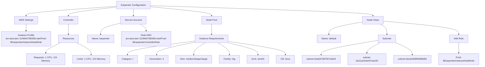
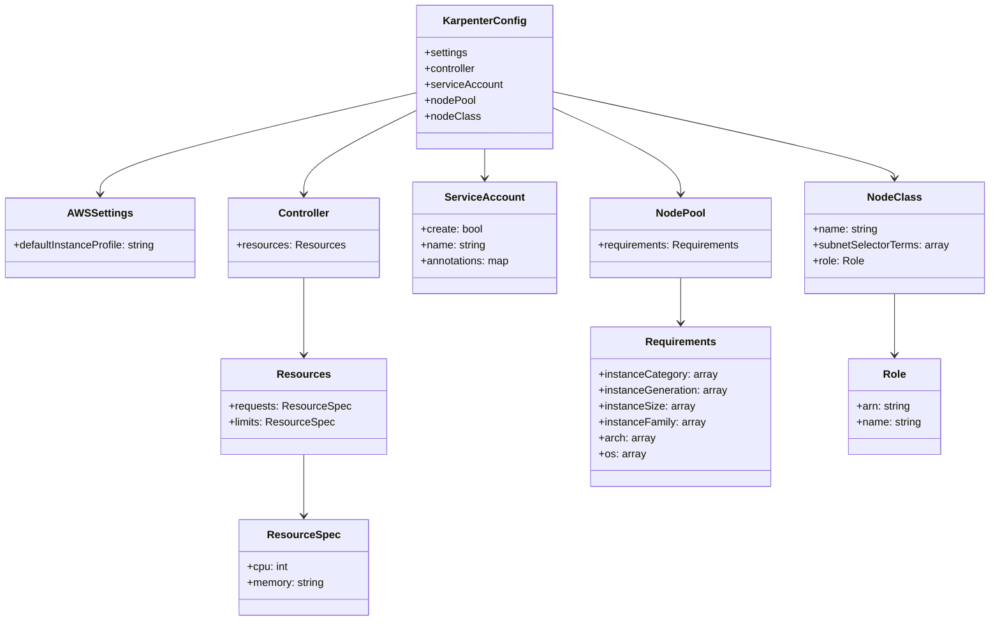
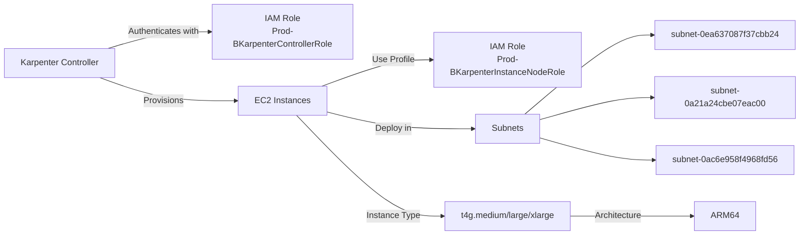

# Diagram: devops/k8s/karpenter/helm/values.prod-b.yaml


> Auto-generated by Obscura crawlers

## Diagram 1

```mermaid
graph TD
      A[Karpenter Configuration]
      A --> B[AWS Settings]
      A --> C[Controller]...
  └ 203 lines...
```

> SVG rendering failed for this diagram.

## Diagram 2



### SVG

<svg id="container" width="3226.875" xmlns="http://www.w3.org/2000/svg" class="flowchart" height="454" viewBox="0 0 3226.875 454" role="graphics-document document" aria-roledescription="flowchart-v2"><style>#container{font-family:"trebuchet ms",verdana,arial,sans-serif;font-size:16px;fill:#333;}@keyframes edge-animation-frame{from{stroke-dashoffset:0;}}@keyframes dash{to{stroke-dashoffset:0;}}#container .edge-animation-slow{stroke-dasharray:9,5!important;stroke-dashoffset:900;animation:dash 50s linear infinite;stroke-linecap:round;}#container .edge-animation-fast{stroke-dasharray:9,5!important;stroke-dashoffset:900;animation:dash 20s linear infinite;stroke-linecap:round;}#container .error-icon{fill:#552222;}#container .error-text{fill:#552222;stroke:#552222;}#container .edge-thickness-normal{stroke-width:1px;}#container .edge-thickness-thick{stroke-width:3.5px;}#container .edge-pattern-solid{stroke-dasharray:0;}#container .edge-thickness-invisible{stroke-width:0;fill:none;}#container .edge-pattern-dashed{stroke-dasharray:3;}#container .edge-pattern-dotted{stroke-dasharray:2;}#container .marker{fill:#333333;stroke:#333333;}#container .marker.cross{stroke:#333333;}#container svg{font-family:"trebuchet ms",verdana,arial,sans-serif;font-size:16px;}#container p{margin:0;}#container .label{font-family:"trebuchet ms",verdana,arial,sans-serif;color:#333;}#container .cluster-label text{fill:#333;}#container .cluster-label span{color:#333;}#container .cluster-label span p{background-color:transparent;}#container .label text,#container span{fill:#333;color:#333;}#container .node rect,#container .node circle,#container .node ellipse,#container .node polygon,#container .node path{fill:#ECECFF;stroke:#9370DB;stroke-width:1px;}#container .rough-node .label text,#container .node .label text,#container .image-shape .label,#container .icon-shape .label{text-anchor:middle;}#container .node .katex path{fill:#000;stroke:#000;stroke-width:1px;}#container .rough-node .label,#container .node .label,#container .image-shape .label,#container .icon-shape .label{text-align:center;}#container .node.clickable{cursor:pointer;}#container .root .anchor path{fill:#333333!important;stroke-width:0;stroke:#333333;}#container .arrowheadPath{fill:#333333;}#container .edgePath .path{stroke:#333333;stroke-width:2.0px;}#container .flowchart-link{stroke:#333333;fill:none;}#container .edgeLabel{background-color:rgba(232,232,232, 0.8);text-align:center;}#container .edgeLabel p{background-color:rgba(232,232,232, 0.8);}#container .edgeLabel rect{opacity:0.5;background-color:rgba(232,232,232, 0.8);fill:rgba(232,232,232, 0.8);}#container .labelBkg{background-color:rgba(232, 232, 232, 0.5);}#container .cluster rect{fill:#ffffde;stroke:#aaaa33;stroke-width:1px;}#container .cluster text{fill:#333;}#container .cluster span{color:#333;}#container div.mermaidTooltip{position:absolute;text-align:center;max-width:200px;padding:2px;font-family:"trebuchet ms",verdana,arial,sans-serif;font-size:12px;background:hsl(80, 100%, 96.2745098039%);border:1px solid #aaaa33;border-radius:2px;pointer-events:none;z-index:100;}#container .flowchartTitleText{text-anchor:middle;font-size:18px;fill:#333;}#container rect.text{fill:none;stroke-width:0;}#container .icon-shape,#container .image-shape{background-color:rgba(232,232,232, 0.8);text-align:center;}#container .icon-shape p,#container .image-shape p{background-color:rgba(232,232,232, 0.8);padding:2px;}#container .icon-shape rect,#container .image-shape rect{opacity:0.5;background-color:rgba(232,232,232, 0.8);fill:rgba(232,232,232, 0.8);}#container .label-icon{display:inline-block;height:1em;overflow:visible;vertical-align:-0.125em;}#container .node .label-icon path{fill:currentColor;stroke:revert;stroke-width:revert;}#container :root{--mermaid-font-family:"trebuchet ms",verdana,arial,sans-serif;}</style><g><marker id="container_flowchart-v2-pointEnd" class="marker flowchart-v2" viewBox="0 0 10 10" refX="5" refY="5" markerUnits="userSpaceOnUse" markerWidth="8" markerHeight="8" orient="auto"><path d="M 0 0 L 10 5 L 0 10 z" class="arrowMarkerPath" style="stroke-width: 1; stroke-dasharray: 1, 0;"></path></marker><marker id="container_flowchart-v2-pointStart" class="marker flowchart-v2" viewBox="0 0 10 10" refX="4.5" refY="5" markerUnits="userSpaceOnUse" markerWidth="8" markerHeight="8" orient="auto"><path d="M 0 5 L 10 10 L 10 0 z" class="arrowMarkerPath" style="stroke-width: 1; stroke-dasharray: 1, 0;"></path></marker><marker id="container_flowchart-v2-circleEnd" class="marker flowchart-v2" viewBox="0 0 10 10" refX="11" refY="5" markerUnits="userSpaceOnUse" markerWidth="11" markerHeight="11" orient="auto"><circle cx="5" cy="5" r="5" class="arrowMarkerPath" style="stroke-width: 1; stroke-dasharray: 1, 0;"></circle></marker><marker id="container_flowchart-v2-circleStart" class="marker flowchart-v2" viewBox="0 0 10 10" refX="-1" refY="5" markerUnits="userSpaceOnUse" markerWidth="11" markerHeight="11" orient="auto"><circle cx="5" cy="5" r="5" class="arrowMarkerPath" style="stroke-width: 1; stroke-dasharray: 1, 0;"></circle></marker><marker id="container_flowchart-v2-crossEnd" class="marker cross flowchart-v2" viewBox="0 0 11 11" refX="12" refY="5.2" markerUnits="userSpaceOnUse" markerWidth="11" markerHeight="11" orient="auto"><path d="M 1,1 l 9,9 M 10,1 l -9,9" class="arrowMarkerPath" style="stroke-width: 2; stroke-dasharray: 1, 0;"></path></marker><marker id="container_flowchart-v2-crossStart" class="marker cross flowchart-v2" viewBox="0 0 11 11" refX="-1" refY="5.2" markerUnits="userSpaceOnUse" markerWidth="11" markerHeight="11" orient="auto"><path d="M 1,1 l 9,9 M 10,1 l -9,9" class="arrowMarkerPath" style="stroke-width: 2; stroke-dasharray: 1, 0;"></path></marker><g class="root"><g class="clusters"></g><g class="edgePaths"><path d="M775.879,43.458L675.559,50.715C575.24,57.972,374.6,72.486,274.281,83.243C173.961,94,173.961,101,173.961,104.5L173.961,108" id="L_A_B_0" class="edge-thickness-normal edge-pattern-solid edge-thickness-normal edge-pattern-solid flowchart-link" style=";" data-edge="true" data-et="edge" data-id="L_A_B_0" data-points="W3sieCI6Nzc1Ljg3ODkwNjI1LCJ5Ijo0My40NTc1MTMwMDEyMzM1NX0seyJ4IjoxNzMuOTYwOTM3NSwieSI6ODd9LHsieCI6MTczLjk2MDkzNzUsInkiOjExMn1d" marker-end="url(#container_flowchart-v2-pointEnd)"></path><path d="M775.879,48.94L722.679,55.284C669.479,61.627,563.079,74.313,509.88,84.157C456.68,94,456.68,101,456.68,104.5L456.68,108" id="L_A_C_0" class="edge-thickness-normal edge-pattern-solid edge-thickness-normal edge-pattern-solid flowchart-link" style=";" data-edge="true" data-et="edge" data-id="L_A_C_0" data-points="W3sieCI6Nzc1Ljg3ODkwNjI1LCJ5Ijo0OC45NDAyNTcwNjQ4MDM2Mn0seyJ4Ijo0NTYuNjc5Njg3NSwieSI6ODd9LHsieCI6NDU2LjY3OTY4NzUsInkiOjExMn1d" marker-end="url(#container_flowchart-v2-pointEnd)"></path><path d="M892.793,62L892.793,66.167C892.793,70.333,892.793,78.667,892.793,86.333C892.793,94,892.793,101,892.793,104.5L892.793,108" id="L_A_D_0" class="edge-thickness-normal edge-pattern-solid edge-thickness-normal edge-pattern-solid flowchart-link" style=";" data-edge="true" data-et="edge" data-id="L_A_D_0" data-points="W3sieCI6ODkyLjc5Mjk2ODc1LCJ5Ijo2Mn0seyJ4Ijo4OTIuNzkyOTY4NzUsInkiOjg3fSx7IngiOjg5Mi43OTI5Njg3NSwieSI6MTEyfV0=" marker-end="url(#container_flowchart-v2-pointEnd)"></path><path d="M1009.707,46.484L1078.452,53.237C1147.198,59.989,1284.689,73.495,1353.434,83.747C1422.18,94,1422.18,101,1422.18,104.5L1422.18,108" id="L_A_E_0" class="edge-thickness-normal edge-pattern-solid edge-thickness-normal edge-pattern-solid flowchart-link" style=";" data-edge="true" data-et="edge" data-id="L_A_E_0" data-points="W3sieCI6MTAwOS43MDcwMzEyNSwieSI6NDYuNDg0MTAyMzI5NDkzODg2fSx7IngiOjE0MjIuMTc5Njg3NSwieSI6ODd9LHsieCI6MTQyMi4xNzk2ODc1LCJ5IjoxMTJ9XQ==" marker-end="url(#container_flowchart-v2-pointEnd)"></path><path d="M1009.707,38.767L1259.226,46.806C1508.745,54.844,2007.783,70.922,2257.301,82.461C2506.82,94,2506.82,101,2506.82,104.5L2506.82,108" id="L_A_F_0" class="edge-thickness-normal edge-pattern-solid edge-thickness-normal edge-pattern-solid flowchart-link" style=";" data-edge="true" data-et="edge" data-id="L_A_F_0" data-points="W3sieCI6MTAwOS43MDcwMzEyNSwieSI6MzguNzY2Njg0MTcyNjk0OTV9LHsieCI6MjUwNi44MjAzMTI1LCJ5Ijo4N30seyJ4IjoyNTA2LjgyMDMxMjUsInkiOjExMn1d" marker-end="url(#container_flowchart-v2-pointEnd)"></path><path d="M173.961,166L173.961,170.167C173.961,174.333,173.961,182.667,173.961,190.333C173.961,198,173.961,205,173.961,208.5L173.961,212" id="L_B_B1_0" class="edge-thickness-normal edge-pattern-solid edge-thickness-normal edge-pattern-solid flowchart-link" style=";" data-edge="true" data-et="edge" data-id="L_B_B1_0" data-points="W3sieCI6MTczLjk2MDkzNzUsInkiOjE2Nn0seyJ4IjoxNzMuOTYwOTM3NSwieSI6MTkxfSx7IngiOjE3My45NjA5Mzc1LCJ5IjoyMTZ9XQ==" marker-end="url(#container_flowchart-v2-pointEnd)"></path><path d="M456.68,166L456.68,170.167C456.68,174.333,456.68,182.667,456.68,194.333C456.68,206,456.68,221,456.68,228.5L456.68,236" id="L_C_C1_0" class="edge-thickness-normal edge-pattern-solid edge-thickness-normal edge-pattern-solid flowchart-link" style=";" data-edge="true" data-et="edge" data-id="L_C_C1_0" data-points="W3sieCI6NDU2LjY3OTY4NzUsInkiOjE2Nn0seyJ4Ijo0NTYuNjc5Njg3NSwieSI6MTkxfSx7IngiOjQ1Ni42Nzk2ODc1LCJ5IjoyNDB9XQ==" marker-end="url(#container_flowchart-v2-pointEnd)"></path><path d="M403.032,294L386.805,302.167C370.579,310.333,338.125,326.667,321.899,338.333C305.672,350,305.672,357,305.672,360.5L305.672,364" id="L_C1_C2_0" class="edge-thickness-normal edge-pattern-solid edge-thickness-normal edge-pattern-solid flowchart-link" style=";" data-edge="true" data-et="edge" data-id="L_C1_C2_0" data-points="W3sieCI6NDAzLjAzMjE3NTE2NDQ3MzcsInkiOjI5NH0seyJ4IjozMDUuNjcxODc1LCJ5IjozNDN9LHsieCI6MzA1LjY3MTg3NSwieSI6MzY4fV0=" marker-end="url(#container_flowchart-v2-pointEnd)"></path><path d="M510.327,294L526.554,302.167C542.781,310.333,575.234,326.667,591.461,340.333C607.688,354,607.688,365,607.688,370.5L607.688,376" id="L_C1_C3_0" class="edge-thickness-normal edge-pattern-solid edge-thickness-normal edge-pattern-solid flowchart-link" style=";" data-edge="true" data-et="edge" data-id="L_C1_C3_0" data-points="W3sieCI6NTEwLjMyNzE5OTgzNTUyNjMsInkiOjI5NH0seyJ4Ijo2MDcuNjg3NSwieSI6MzQzfSx7IngiOjYwNy42ODc1LCJ5IjozODB9XQ==" marker-end="url(#container_flowchart-v2-pointEnd)"></path><path d="M805.832,159.629L783.792,164.858C761.753,170.086,717.673,180.543,695.633,193.272C673.594,206,673.594,221,673.594,228.5L673.594,236" id="L_D_D1_0" class="edge-thickness-normal edge-pattern-solid edge-thickness-normal edge-pattern-solid flowchart-link" style=";" data-edge="true" data-et="edge" data-id="L_D_D1_0" data-points="W3sieCI6ODA1LjgzMjAzMTI1LCJ5IjoxNTkuNjI5NDkzMDA1NDM1Mjh9LHsieCI6NjczLjU5Mzc1LCJ5IjoxOTF9LHsieCI6NjczLjU5Mzc1LCJ5IjoyNDB9XQ==" marker-end="url(#container_flowchart-v2-pointEnd)"></path><path d="M938.106,166L945.099,170.167C952.091,174.333,966.077,182.667,973.07,190.333C980.063,198,980.063,205,980.063,208.5L980.063,212" id="L_D_D2_0" class="edge-thickness-normal edge-pattern-solid edge-thickness-normal edge-pattern-solid flowchart-link" style=";" data-edge="true" data-et="edge" data-id="L_D_D2_0" data-points="W3sieCI6OTM4LjEwNTk5NDU5MTM0NjIsInkiOjE2Nn0seyJ4Ijo5ODAuMDYyNSwieSI6MTkxfSx7IngiOjk4MC4wNjI1LCJ5IjoyMTZ9XQ==" marker-end="url(#container_flowchart-v2-pointEnd)"></path><path d="M1422.18,166L1422.18,170.167C1422.18,174.333,1422.18,182.667,1422.18,194.333C1422.18,206,1422.18,221,1422.18,228.5L1422.18,236" id="L_E_E1_0" class="edge-thickness-normal edge-pattern-solid edge-thickness-normal edge-pattern-solid flowchart-link" style=";" data-edge="true" data-et="edge" data-id="L_E_E1_0" data-points="W3sieCI6MTQyMi4xNzk2ODc1LCJ5IjoxNjZ9LHsieCI6MTQyMi4xNzk2ODc1LCJ5IjoxOTF9LHsieCI6MTQyMi4xNzk2ODc1LCJ5IjoyNDB9XQ==" marker-end="url(#container_flowchart-v2-pointEnd)"></path><path d="M1308.867,282.005L1232.102,292.171C1155.336,302.337,1001.805,322.668,925.039,338.334C848.273,354,848.273,365,848.273,370.5L848.273,376" id="L_E1_E2_0" class="edge-thickness-normal edge-pattern-solid edge-thickness-normal edge-pattern-solid flowchart-link" style=";" data-edge="true" data-et="edge" data-id="L_E1_E2_0" data-points="W3sieCI6MTMwOC44NjcxODc1LCJ5IjoyODIuMDA1NDk5NTkxNjE0NDd9LHsieCI6ODQ4LjI3MzQzNzUsInkiOjM0M30seyJ4Ijo4NDguMjczNDM3NSwieSI6MzgwfV0=" marker-end="url(#container_flowchart-v2-pointEnd)"></path><path d="M1308.867,289.848L1264.934,298.707C1221,307.565,1133.133,325.283,1089.199,339.641C1045.266,354,1045.266,365,1045.266,370.5L1045.266,376" id="L_E1_E3_0" class="edge-thickness-normal edge-pattern-solid edge-thickness-normal edge-pattern-solid flowchart-link" style=";" data-edge="true" data-et="edge" data-id="L_E1_E3_0" data-points="W3sieCI6MTMwOC44NjcxODc1LCJ5IjoyODkuODQ4MDQ2NDI5NjgxODZ9LHsieCI6MTA0NS4yNjU2MjUsInkiOjM0M30seyJ4IjoxMDQ1LjI2NTYyNSwieSI6MzgwfV0=" marker-end="url(#container_flowchart-v2-pointEnd)"></path><path d="M1378.74,294L1365.601,302.167C1352.462,310.333,1326.184,326.667,1313.045,340.333C1299.906,354,1299.906,365,1299.906,370.5L1299.906,376" id="L_E1_E4_0" class="edge-thickness-normal edge-pattern-solid edge-thickness-normal edge-pattern-solid flowchart-link" style=";" data-edge="true" data-et="edge" data-id="L_E1_E4_0" data-points="W3sieCI6MTM3OC43NDA0Mzk5NjcxMDUyLCJ5IjoyOTR9LHsieCI6MTI5OS45MDYyNSwieSI6MzQzfSx7IngiOjEyOTkuOTA2MjUsInkiOjM4MH1d" marker-end="url(#container_flowchart-v2-pointEnd)"></path><path d="M1465.619,294L1478.758,302.167C1491.897,310.333,1518.175,326.667,1531.314,340.333C1544.453,354,1544.453,365,1544.453,370.5L1544.453,376" id="L_E1_E5_0" class="edge-thickness-normal edge-pattern-solid edge-thickness-normal edge-pattern-solid flowchart-link" style=";" data-edge="true" data-et="edge" data-id="L_E1_E5_0" data-points="W3sieCI6MTQ2NS42MTg5MzUwMzI4OTQ4LCJ5IjoyOTR9LHsieCI6MTU0NC40NTMxMjUsInkiOjM0M30seyJ4IjoxNTQ0LjQ1MzEyNSwieSI6MzgwfV0=" marker-end="url(#container_flowchart-v2-pointEnd)"></path><path d="M1533.521,294L1567.199,302.167C1600.876,310.333,1668.231,326.667,1701.909,340.333C1735.586,354,1735.586,365,1735.586,370.5L1735.586,376" id="L_E1_E6_0" class="edge-thickness-normal edge-pattern-solid edge-thickness-normal edge-pattern-solid flowchart-link" style=";" data-edge="true" data-et="edge" data-id="L_E1_E6_0" data-points="W3sieCI6MTUzMy41MjEzODE1Nzg5NDczLCJ5IjoyOTR9LHsieCI6MTczNS41ODU5Mzc1LCJ5IjozNDN9LHsieCI6MTczNS41ODU5Mzc1LCJ5IjozODB9XQ==" marker-end="url(#container_flowchart-v2-pointEnd)"></path><path d="M1535.492,284.293L1599.603,294.078C1663.714,303.862,1791.935,323.431,1856.046,338.716C1920.156,354,1920.156,365,1920.156,370.5L1920.156,376" id="L_E1_E7_0" class="edge-thickness-normal edge-pattern-solid edge-thickness-normal edge-pattern-solid flowchart-link" style=";" data-edge="true" data-et="edge" data-id="L_E1_E7_0" data-points="W3sieCI6MTUzNS40OTIxODc1LCJ5IjoyODQuMjkzNDg0NTcwMzcwN30seyJ4IjoxOTIwLjE1NjI1LCJ5IjozNDN9LHsieCI6MTkyMC4xNTYyNSwieSI6MzgwfV0=" marker-end="url(#container_flowchart-v2-pointEnd)"></path><path d="M2437.047,151.489L2400.258,158.074C2363.47,164.66,2289.893,177.83,2253.105,191.915C2216.316,206,2216.316,221,2216.316,228.5L2216.316,236" id="L_F_F1_0" class="edge-thickness-normal edge-pattern-solid edge-thickness-normal edge-pattern-solid flowchart-link" style=";" data-edge="true" data-et="edge" data-id="L_F_F1_0" data-points="W3sieCI6MjQzNy4wNDY4NzUsInkiOjE1MS40ODkzOTc0NjM5OTcxfSx7IngiOjIyMTYuMzE2NDA2MjUsInkiOjE5MX0seyJ4IjoyMjE2LjMxNjQwNjI1LCJ5IjoyNDB9XQ==" marker-end="url(#container_flowchart-v2-pointEnd)"></path><path d="M2556.253,166L2563.881,170.167C2571.51,174.333,2586.767,182.667,2594.395,194.333C2602.023,206,2602.023,221,2602.023,228.5L2602.023,236" id="L_F_F2_0" class="edge-thickness-normal edge-pattern-solid edge-thickness-normal edge-pattern-solid flowchart-link" style=";" data-edge="true" data-et="edge" data-id="L_F_F2_0" data-points="W3sieCI6MjU1Ni4yNTI3MDQzMjY5MjMsInkiOjE2Nn0seyJ4IjoyNjAyLjAyMzQzNzUsInkiOjE5MX0seyJ4IjoyNjAyLjAyMzQzNzUsInkiOjI0MH1d" marker-end="url(#container_flowchart-v2-pointEnd)"></path><path d="M2576.594,145.309L2660.809,152.924C2745.023,160.54,2913.453,175.77,2997.668,190.885C3081.883,206,3081.883,221,3081.883,228.5L3081.883,236" id="L_F_F3_0" class="edge-thickness-normal edge-pattern-solid edge-thickness-normal edge-pattern-solid flowchart-link" style=";" data-edge="true" data-et="edge" data-id="L_F_F3_0" data-points="W3sieCI6MjU3Ni41OTM3NSwieSI6MTQ1LjMwOTI1OTg2MzA1ODM3fSx7IngiOjMwODEuODgyODEyNSwieSI6MTkxfSx7IngiOjMwODEuODgyODEyNSwieSI6MjQwfV0=" marker-end="url(#container_flowchart-v2-pointEnd)"></path><path d="M2542.578,277.179L2478.516,288.15C2414.453,299.12,2286.328,321.06,2222.266,337.53C2158.203,354,2158.203,365,2158.203,370.5L2158.203,376" id="L_F2_F2A_0" class="edge-thickness-normal edge-pattern-solid edge-thickness-normal edge-pattern-solid flowchart-link" style=";" data-edge="true" data-et="edge" data-id="L_F2_F2A_0" data-points="W3sieCI6MjU0Mi41NzgxMjUsInkiOjI3Ny4xNzk0NDMzOTgwNTMxNH0seyJ4IjoyMTU4LjIwMzEyNSwieSI6MzQzfSx7IngiOjIxNTguMjAzMTI1LCJ5IjozODB9XQ==" marker-end="url(#container_flowchart-v2-pointEnd)"></path><path d="M2552.534,294L2537.564,302.167C2522.595,310.333,2492.657,326.667,2477.688,340.333C2462.719,354,2462.719,365,2462.719,370.5L2462.719,376" id="L_F2_F2B_0" class="edge-thickness-normal edge-pattern-solid edge-thickness-normal edge-pattern-solid flowchart-link" style=";" data-edge="true" data-et="edge" data-id="L_F2_F2B_0" data-points="W3sieCI6MjU1Mi41MzM2MTQzMDkyMTA0LCJ5IjoyOTR9LHsieCI6MjQ2Mi43MTg3NSwieSI6MzQzfSx7IngiOjI0NjIuNzE4NzUsInkiOjM4MH1d" marker-end="url(#container_flowchart-v2-pointEnd)"></path><path d="M2660.961,294L2678.788,302.167C2696.615,310.333,2732.268,326.667,2750.095,340.333C2767.922,354,2767.922,365,2767.922,370.5L2767.922,376" id="L_F2_F2C_0" class="edge-thickness-normal edge-pattern-solid edge-thickness-normal edge-pattern-solid flowchart-link" style=";" data-edge="true" data-et="edge" data-id="L_F2_F2C_0" data-points="W3sieCI6MjY2MC45NjEwNDAyOTYwNTI1LCJ5IjoyOTR9LHsieCI6Mjc2Ny45MjE4NzUsInkiOjM0M30seyJ4IjoyNzY3LjkyMTg3NSwieSI6MzgwfV0=" marker-end="url(#container_flowchart-v2-pointEnd)"></path><path d="M3081.883,294L3081.883,302.167C3081.883,310.333,3081.883,326.667,3081.883,338.333C3081.883,350,3081.883,357,3081.883,360.5L3081.883,364" id="L_F3_F3A_0" class="edge-thickness-normal edge-pattern-solid edge-thickness-normal edge-pattern-solid flowchart-link" style=";" data-edge="true" data-et="edge" data-id="L_F3_F3A_0" data-points="W3sieCI6MzA4MS44ODI4MTI1LCJ5IjoyOTR9LHsieCI6MzA4MS44ODI4MTI1LCJ5IjozNDN9LHsieCI6MzA4MS44ODI4MTI1LCJ5IjozNjh9XQ==" marker-end="url(#container_flowchart-v2-pointEnd)"></path></g><g class="edgeLabels"><g class="edgeLabel"><g class="label" data-id="L_A_B_0" transform="translate(0, 0)"><foreignObject width="0" height="0"><div xmlns="http://www.w3.org/1999/xhtml" class="labelBkg" style="display: table-cell; white-space: nowrap; line-height: 1.5; max-width: 200px; text-align: center;"><span class="edgeLabel"></span></div></foreignObject></g></g><g class="edgeLabel"><g class="label" data-id="L_A_C_0" transform="translate(0, 0)"><foreignObject width="0" height="0"><div xmlns="http://www.w3.org/1999/xhtml" class="labelBkg" style="display: table-cell; white-space: nowrap; line-height: 1.5; max-width: 200px; text-align: center;"><span class="edgeLabel"></span></div></foreignObject></g></g><g class="edgeLabel"><g class="label" data-id="L_A_D_0" transform="translate(0, 0)"><foreignObject width="0" height="0"><div xmlns="http://www.w3.org/1999/xhtml" class="labelBkg" style="display: table-cell; white-space: nowrap; line-height: 1.5; max-width: 200px; text-align: center;"><span class="edgeLabel"></span></div></foreignObject></g></g><g class="edgeLabel"><g class="label" data-id="L_A_E_0" transform="translate(0, 0)"><foreignObject width="0" height="0"><div xmlns="http://www.w3.org/1999/xhtml" class="labelBkg" style="display: table-cell; white-space: nowrap; line-height: 1.5; max-width: 200px; text-align: center;"><span class="edgeLabel"></span></div></foreignObject></g></g><g class="edgeLabel"><g class="label" data-id="L_A_F_0" transform="translate(0, 0)"><foreignObject width="0" height="0"><div xmlns="http://www.w3.org/1999/xhtml" class="labelBkg" style="display: table-cell; white-space: nowrap; line-height: 1.5; max-width: 200px; text-align: center;"><span class="edgeLabel"></span></div></foreignObject></g></g><g class="edgeLabel"><g class="label" data-id="L_B_B1_0" transform="translate(0, 0)"><foreignObject width="0" height="0"><div xmlns="http://www.w3.org/1999/xhtml" class="labelBkg" style="display: table-cell; white-space: nowrap; line-height: 1.5; max-width: 200px; text-align: center;"><span class="edgeLabel"></span></div></foreignObject></g></g><g class="edgeLabel"><g class="label" data-id="L_C_C1_0" transform="translate(0, 0)"><foreignObject width="0" height="0"><div xmlns="http://www.w3.org/1999/xhtml" class="labelBkg" style="display: table-cell; white-space: nowrap; line-height: 1.5; max-width: 200px; text-align: center;"><span class="edgeLabel"></span></div></foreignObject></g></g><g class="edgeLabel"><g class="label" data-id="L_C1_C2_0" transform="translate(0, 0)"><foreignObject width="0" height="0"><div xmlns="http://www.w3.org/1999/xhtml" class="labelBkg" style="display: table-cell; white-space: nowrap; line-height: 1.5; max-width: 200px; text-align: center;"><span class="edgeLabel"></span></div></foreignObject></g></g><g class="edgeLabel"><g class="label" data-id="L_C1_C3_0" transform="translate(0, 0)"><foreignObject width="0" height="0"><div xmlns="http://www.w3.org/1999/xhtml" class="labelBkg" style="display: table-cell; white-space: nowrap; line-height: 1.5; max-width: 200px; text-align: center;"><span class="edgeLabel"></span></div></foreignObject></g></g><g class="edgeLabel"><g class="label" data-id="L_D_D1_0" transform="translate(0, 0)"><foreignObject width="0" height="0"><div xmlns="http://www.w3.org/1999/xhtml" class="labelBkg" style="display: table-cell; white-space: nowrap; line-height: 1.5; max-width: 200px; text-align: center;"><span class="edgeLabel"></span></div></foreignObject></g></g><g class="edgeLabel"><g class="label" data-id="L_D_D2_0" transform="translate(0, 0)"><foreignObject width="0" height="0"><div xmlns="http://www.w3.org/1999/xhtml" class="labelBkg" style="display: table-cell; white-space: nowrap; line-height: 1.5; max-width: 200px; text-align: center;"><span class="edgeLabel"></span></div></foreignObject></g></g><g class="edgeLabel"><g class="label" data-id="L_E_E1_0" transform="translate(0, 0)"><foreignObject width="0" height="0"><div xmlns="http://www.w3.org/1999/xhtml" class="labelBkg" style="display: table-cell; white-space: nowrap; line-height: 1.5; max-width: 200px; text-align: center;"><span class="edgeLabel"></span></div></foreignObject></g></g><g class="edgeLabel"><g class="label" data-id="L_E1_E2_0" transform="translate(0, 0)"><foreignObject width="0" height="0"><div xmlns="http://www.w3.org/1999/xhtml" class="labelBkg" style="display: table-cell; white-space: nowrap; line-height: 1.5; max-width: 200px; text-align: center;"><span class="edgeLabel"></span></div></foreignObject></g></g><g class="edgeLabel"><g class="label" data-id="L_E1_E3_0" transform="translate(0, 0)"><foreignObject width="0" height="0"><div xmlns="http://www.w3.org/1999/xhtml" class="labelBkg" style="display: table-cell; white-space: nowrap; line-height: 1.5; max-width: 200px; text-align: center;"><span class="edgeLabel"></span></div></foreignObject></g></g><g class="edgeLabel"><g class="label" data-id="L_E1_E4_0" transform="translate(0, 0)"><foreignObject width="0" height="0"><div xmlns="http://www.w3.org/1999/xhtml" class="labelBkg" style="display: table-cell; white-space: nowrap; line-height: 1.5; max-width: 200px; text-align: center;"><span class="edgeLabel"></span></div></foreignObject></g></g><g class="edgeLabel"><g class="label" data-id="L_E1_E5_0" transform="translate(0, 0)"><foreignObject width="0" height="0"><div xmlns="http://www.w3.org/1999/xhtml" class="labelBkg" style="display: table-cell; white-space: nowrap; line-height: 1.5; max-width: 200px; text-align: center;"><span class="edgeLabel"></span></div></foreignObject></g></g><g class="edgeLabel"><g class="label" data-id="L_E1_E6_0" transform="translate(0, 0)"><foreignObject width="0" height="0"><div xmlns="http://www.w3.org/1999/xhtml" class="labelBkg" style="display: table-cell; white-space: nowrap; line-height: 1.5; max-width: 200px; text-align: center;"><span class="edgeLabel"></span></div></foreignObject></g></g><g class="edgeLabel"><g class="label" data-id="L_E1_E7_0" transform="translate(0, 0)"><foreignObject width="0" height="0"><div xmlns="http://www.w3.org/1999/xhtml" class="labelBkg" style="display: table-cell; white-space: nowrap; line-height: 1.5; max-width: 200px; text-align: center;"><span class="edgeLabel"></span></div></foreignObject></g></g><g class="edgeLabel"><g class="label" data-id="L_F_F1_0" transform="translate(0, 0)"><foreignObject width="0" height="0"><div xmlns="http://www.w3.org/1999/xhtml" class="labelBkg" style="display: table-cell; white-space: nowrap; line-height: 1.5; max-width: 200px; text-align: center;"><span class="edgeLabel"></span></div></foreignObject></g></g><g class="edgeLabel"><g class="label" data-id="L_F_F2_0" transform="translate(0, 0)"><foreignObject width="0" height="0"><div xmlns="http://www.w3.org/1999/xhtml" class="labelBkg" style="display: table-cell; white-space: nowrap; line-height: 1.5; max-width: 200px; text-align: center;"><span class="edgeLabel"></span></div></foreignObject></g></g><g class="edgeLabel"><g class="label" data-id="L_F_F3_0" transform="translate(0, 0)"><foreignObject width="0" height="0"><div xmlns="http://www.w3.org/1999/xhtml" class="labelBkg" style="display: table-cell; white-space: nowrap; line-height: 1.5; max-width: 200px; text-align: center;"><span class="edgeLabel"></span></div></foreignObject></g></g><g class="edgeLabel"><g class="label" data-id="L_F2_F2A_0" transform="translate(0, 0)"><foreignObject width="0" height="0"><div xmlns="http://www.w3.org/1999/xhtml" class="labelBkg" style="display: table-cell; white-space: nowrap; line-height: 1.5; max-width: 200px; text-align: center;"><span class="edgeLabel"></span></div></foreignObject></g></g><g class="edgeLabel"><g class="label" data-id="L_F2_F2B_0" transform="translate(0, 0)"><foreignObject width="0" height="0"><div xmlns="http://www.w3.org/1999/xhtml" class="labelBkg" style="display: table-cell; white-space: nowrap; line-height: 1.5; max-width: 200px; text-align: center;"><span class="edgeLabel"></span></div></foreignObject></g></g><g class="edgeLabel"><g class="label" data-id="L_F2_F2C_0" transform="translate(0, 0)"><foreignObject width="0" height="0"><div xmlns="http://www.w3.org/1999/xhtml" class="labelBkg" style="display: table-cell; white-space: nowrap; line-height: 1.5; max-width: 200px; text-align: center;"><span class="edgeLabel"></span></div></foreignObject></g></g><g class="edgeLabel"><g class="label" data-id="L_F3_F3A_0" transform="translate(0, 0)"><foreignObject width="0" height="0"><div xmlns="http://www.w3.org/1999/xhtml" class="labelBkg" style="display: table-cell; white-space: nowrap; line-height: 1.5; max-width: 200px; text-align: center;"><span class="edgeLabel"></span></div></foreignObject></g></g></g><g class="nodes"><g class="node default" id="flowchart-A-0" transform="translate(892.79296875, 35)"><rect class="basic label-container" style="" x="-116.9140625" y="-27" width="233.828125" height="54"></rect><g class="label" style="" transform="translate(-86.9140625, -12)"><rect></rect><foreignObject width="173.828125" height="24"><div xmlns="http://www.w3.org/1999/xhtml" style="display: table-cell; white-space: nowrap; line-height: 1.5; max-width: 200px; text-align: center;"><span class="nodeLabel"><p>Karpenter Configuration</p></span></div></foreignObject></g></g><g class="node default" id="flowchart-B-2" transform="translate(173.9609375, 139)"><rect class="basic label-container" style="" x="-76.875" y="-27" width="153.75" height="54"></rect><g class="label" style="" transform="translate(-46.875, -12)"><rect></rect><foreignObject width="93.75" height="24"><div xmlns="http://www.w3.org/1999/xhtml" style="display: table-cell; white-space: nowrap; line-height: 1.5; max-width: 200px; text-align: center;"><span class="nodeLabel"><p>AWS Settings</p></span></div></foreignObject></g></g><g class="node default" id="flowchart-C-4" transform="translate(456.6796875, 139)"><rect class="basic label-container" style="" x="-66.1875" y="-27" width="132.375" height="54"></rect><g class="label" style="" transform="translate(-36.1875, -12)"><rect></rect><foreignObject width="72.375" height="24"><div xmlns="http://www.w3.org/1999/xhtml" style="display: table-cell; white-space: nowrap; line-height: 1.5; max-width: 200px; text-align: center;"><span class="nodeLabel"><p>Controller</p></span></div></foreignObject></g></g><g class="node default" id="flowchart-D-6" transform="translate(892.79296875, 139)"><rect class="basic label-container" style="" x="-86.9609375" y="-27" width="173.921875" height="54"></rect><g class="label" style="" transform="translate(-56.9609375, -12)"><rect></rect><foreignObject width="113.921875" height="24"><div xmlns="http://www.w3.org/1999/xhtml" style="display: table-cell; white-space: nowrap; line-height: 1.5; max-width: 200px; text-align: center;"><span class="nodeLabel"><p>Service Account</p></span></div></foreignObject></g></g><g class="node default" id="flowchart-E-8" transform="translate(1422.1796875, 139)"><rect class="basic label-container" style="" x="-67.5" y="-27" width="135" height="54"></rect><g class="label" style="" transform="translate(-37.5, -12)"><rect></rect><foreignObject width="75" height="24"><div xmlns="http://www.w3.org/1999/xhtml" style="display: table-cell; white-space: nowrap; line-height: 1.5; max-width: 200px; text-align: center;"><span class="nodeLabel"><p>Node Pool</p></span></div></foreignObject></g></g><g class="node default" id="flowchart-F-10" transform="translate(2506.8203125, 139)"><rect class="basic label-container" style="" x="-69.7734375" y="-27" width="139.546875" height="54"></rect><g class="label" style="" transform="translate(-39.7734375, -12)"><rect></rect><foreignObject width="79.546875" height="24"><div xmlns="http://www.w3.org/1999/xhtml" style="display: table-cell; white-space: nowrap; line-height: 1.5; max-width: 200px; text-align: center;"><span class="nodeLabel"><p>Node Class</p></span></div></foreignObject></g></g><g class="node default" id="flowchart-B1-12" transform="translate(173.9609375, 267)"><rect class="basic label-container" style="" x="-165.9609375" y="-51" width="331.921875" height="102"></rect><g class="label" style="" transform="translate(-135.9609375, -36)"><rect></rect><foreignObject width="271.921875" height="72"><div xmlns="http://www.w3.org/1999/xhtml" style="display: table; white-space: break-spaces; line-height: 1.5; max-width: 200px; text-align: center; width: 200px;"><span class="nodeLabel"><p>Instance Profile<br/>arn:aws:iam::519940785508:role/Prod-BKarpenterInstanceNodeRole</p></span></div></foreignObject></g></g><g class="node default" id="flowchart-C1-14" transform="translate(456.6796875, 267)"><rect class="basic label-container" style="" x="-66.7578125" y="-27" width="133.515625" height="54"></rect><g class="label" style="" transform="translate(-36.7578125, -12)"><rect></rect><foreignObject width="73.515625" height="24"><div xmlns="http://www.w3.org/1999/xhtml" style="display: table-cell; white-space: nowrap; line-height: 1.5; max-width: 200px; text-align: center;"><span class="nodeLabel"><p>Resources</p></span></div></foreignObject></g></g><g class="node default" id="flowchart-C2-16" transform="translate(305.671875, 407)"><rect class="basic label-container" style="" x="-130" y="-39" width="260" height="78"></rect><g class="label" style="" transform="translate(-100, -24)"><rect></rect><foreignObject width="200" height="48"><div xmlns="http://www.w3.org/1999/xhtml" style="display: table; white-space: break-spaces; line-height: 1.5; max-width: 200px; text-align: center; width: 200px;"><span class="nodeLabel"><p>Requests: 1 CPU, 1Gi Memory</p></span></div></foreignObject></g></g><g class="node default" id="flowchart-C3-18" transform="translate(607.6875, 407)"><rect class="basic label-container" style="" x="-122.015625" y="-27" width="244.03125" height="54"></rect><g class="label" style="" transform="translate(-92.015625, -12)"><rect></rect><foreignObject width="184.03125" height="24"><div xmlns="http://www.w3.org/1999/xhtml" style="display: table-cell; white-space: nowrap; line-height: 1.5; max-width: 200px; text-align: center;"><span class="nodeLabel"><p>Limits: 1 CPU, 1Gi Memory</p></span></div></foreignObject></g></g><g class="node default" id="flowchart-D1-20" transform="translate(673.59375, 267)"><rect class="basic label-container" style="" x="-90.5078125" y="-27" width="181.015625" height="54"></rect><g class="label" style="" transform="translate(-60.5078125, -12)"><rect></rect><foreignObject width="121.015625" height="24"><div xmlns="http://www.w3.org/1999/xhtml" style="display: table-cell; white-space: nowrap; line-height: 1.5; max-width: 200px; text-align: center;"><span class="nodeLabel"><p>Name: karpenter</p></span></div></foreignObject></g></g><g class="node default" id="flowchart-D2-22" transform="translate(980.0625, 267)"><rect class="basic label-container" style="" x="-165.9609375" y="-51" width="331.921875" height="102"></rect><g class="label" style="" transform="translate(-135.9609375, -36)"><rect></rect><foreignObject width="271.921875" height="72"><div xmlns="http://www.w3.org/1999/xhtml" style="display: table; white-space: break-spaces; line-height: 1.5; max-width: 200px; text-align: center; width: 200px;"><span class="nodeLabel"><p>Role ARN<br/>arn:aws:iam::519940785508:role/Prod-BKarpenterControllerRole</p></span></div></foreignObject></g></g><g class="node default" id="flowchart-E1-24" transform="translate(1422.1796875, 267)"><rect class="basic label-container" style="" x="-113.3125" y="-27" width="226.625" height="54"></rect><g class="label" style="" transform="translate(-83.3125, -12)"><rect></rect><foreignObject width="166.625" height="24"><div xmlns="http://www.w3.org/1999/xhtml" style="display: table-cell; white-space: nowrap; line-height: 1.5; max-width: 200px; text-align: center;"><span class="nodeLabel"><p>Instance Requirements</p></span></div></foreignObject></g></g><g class="node default" id="flowchart-E2-26" transform="translate(848.2734375, 407)"><rect class="basic label-container" style="" x="-68.5703125" y="-27" width="137.140625" height="54"></rect><g class="label" style="" transform="translate(-38.5703125, -12)"><rect></rect><foreignObject width="77.140625" height="24"><div xmlns="http://www.w3.org/1999/xhtml" style="display: table-cell; white-space: nowrap; line-height: 1.5; max-width: 200px; text-align: center;"><span class="nodeLabel"><p>Category: t</p></span></div></foreignObject></g></g><g class="node default" id="flowchart-E3-28" transform="translate(1045.265625, 407)"><rect class="basic label-container" style="" x="-78.421875" y="-27" width="156.84375" height="54"></rect><g class="label" style="" transform="translate(-48.421875, -12)"><rect></rect><foreignObject width="96.84375" height="24"><div xmlns="http://www.w3.org/1999/xhtml" style="display: table-cell; white-space: nowrap; line-height: 1.5; max-width: 200px; text-align: center;"><span class="nodeLabel"><p>Generation: 4</p></span></div></foreignObject></g></g><g class="node default" id="flowchart-E4-30" transform="translate(1299.90625, 407)"><rect class="basic label-container" style="" x="-126.21875" y="-27" width="252.4375" height="54"></rect><g class="label" style="" transform="translate(-96.21875, -12)"><rect></rect><foreignObject width="192.4375" height="24"><div xmlns="http://www.w3.org/1999/xhtml" style="display: table-cell; white-space: nowrap; line-height: 1.5; max-width: 200px; text-align: center;"><span class="nodeLabel"><p>Size: medium/large/xlarge</p></span></div></foreignObject></g></g><g class="node default" id="flowchart-E5-32" transform="translate(1544.453125, 407)"><rect class="basic label-container" style="" x="-68.328125" y="-27" width="136.65625" height="54"></rect><g class="label" style="" transform="translate(-38.328125, -12)"><rect></rect><foreignObject width="76.65625" height="24"><div xmlns="http://www.w3.org/1999/xhtml" style="display: table-cell; white-space: nowrap; line-height: 1.5; max-width: 200px; text-align: center;"><span class="nodeLabel"><p>Family: t4g</p></span></div></foreignObject></g></g><g class="node default" id="flowchart-E6-34" transform="translate(1735.5859375, 407)"><rect class="basic label-container" style="" x="-72.8046875" y="-27" width="145.609375" height="54"></rect><g class="label" style="" transform="translate(-42.8046875, -12)"><rect></rect><foreignObject width="85.609375" height="24"><div xmlns="http://www.w3.org/1999/xhtml" style="display: table-cell; white-space: nowrap; line-height: 1.5; max-width: 200px; text-align: center;"><span class="nodeLabel"><p>Arch: arm64</p></span></div></foreignObject></g></g><g class="node default" id="flowchart-E7-36" transform="translate(1920.15625, 407)"><rect class="basic label-container" style="" x="-61.765625" y="-27" width="123.53125" height="54"></rect><g class="label" style="" transform="translate(-31.765625, -12)"><rect></rect><foreignObject width="63.53125" height="24"><div xmlns="http://www.w3.org/1999/xhtml" style="display: table-cell; white-space: nowrap; line-height: 1.5; max-width: 200px; text-align: center;"><span class="nodeLabel"><p>OS: linux</p></span></div></foreignObject></g></g><g class="node default" id="flowchart-F1-38" transform="translate(2216.31640625, 267)"><rect class="basic label-container" style="" x="-80.9609375" y="-27" width="161.921875" height="54"></rect><g class="label" style="" transform="translate(-50.9609375, -12)"><rect></rect><foreignObject width="101.921875" height="24"><div xmlns="http://www.w3.org/1999/xhtml" style="display: table-cell; white-space: nowrap; line-height: 1.5; max-width: 200px; text-align: center;"><span class="nodeLabel"><p>Name: default</p></span></div></foreignObject></g></g><g class="node default" id="flowchart-F2-40" transform="translate(2602.0234375, 267)"><rect class="basic label-container" style="" x="-59.4453125" y="-27" width="118.890625" height="54"></rect><g class="label" style="" transform="translate(-29.4453125, -12)"><rect></rect><foreignObject width="58.890625" height="24"><div xmlns="http://www.w3.org/1999/xhtml" style="display: table-cell; white-space: nowrap; line-height: 1.5; max-width: 200px; text-align: center;"><span class="nodeLabel"><p>Subnets</p></span></div></foreignObject></g></g><g class="node default" id="flowchart-F3-42" transform="translate(3081.8828125, 267)"><rect class="basic label-container" style="" x="-61.3515625" y="-27" width="122.703125" height="54"></rect><g class="label" style="" transform="translate(-31.3515625, -12)"><rect></rect><foreignObject width="62.703125" height="24"><div xmlns="http://www.w3.org/1999/xhtml" style="display: table-cell; white-space: nowrap; line-height: 1.5; max-width: 200px; text-align: center;"><span class="nodeLabel"><p>IAM Role</p></span></div></foreignObject></g></g><g class="node default" id="flowchart-F2A-44" transform="translate(2158.203125, 407)"><rect class="basic label-container" style="" x="-126.28125" y="-27" width="252.5625" height="54"></rect><g class="label" style="" transform="translate(-96.28125, -12)"><rect></rect><foreignObject width="192.5625" height="24"><div xmlns="http://www.w3.org/1999/xhtml" style="display: table-cell; white-space: nowrap; line-height: 1.5; max-width: 200px; text-align: center;"><span class="nodeLabel"><p>subnet-0ea637087f37cbb24</p></span></div></foreignObject></g></g><g class="node default" id="flowchart-F2B-46" transform="translate(2462.71875, 407)"><rect class="basic label-container" style="" x="-128.234375" y="-27" width="256.46875" height="54"></rect><g class="label" style="" transform="translate(-98.234375, -12)"><rect></rect><foreignObject width="196.46875" height="24"><div xmlns="http://www.w3.org/1999/xhtml" style="display: table-cell; white-space: nowrap; line-height: 1.5; max-width: 200px; text-align: center;"><span class="nodeLabel"><p>subnet-0a21a24cbe07eac00</p></span></div></foreignObject></g></g><g class="node default" id="flowchart-F2C-48" transform="translate(2767.921875, 407)"><rect class="basic label-container" style="" x="-126.96875" y="-27" width="253.9375" height="54"></rect><g class="label" style="" transform="translate(-96.96875, -12)"><rect></rect><foreignObject width="193.9375" height="24"><div xmlns="http://www.w3.org/1999/xhtml" style="display: table-cell; white-space: nowrap; line-height: 1.5; max-width: 200px; text-align: center;"><span class="nodeLabel"><p>subnet-0ac6e958f4968fd56</p></span></div></foreignObject></g></g><g class="node default" id="flowchart-F3A-50" transform="translate(3081.8828125, 407)"><rect class="basic label-container" style="" x="-136.9921875" y="-39" width="273.984375" height="78"></rect><g class="label" style="" transform="translate(-106.9921875, -24)"><rect></rect><foreignObject width="213.984375" height="48"><div xmlns="http://www.w3.org/1999/xhtml" style="display: table; white-space: break-spaces; line-height: 1.5; max-width: 200px; text-align: center; width: 200px;"><span class="nodeLabel"><p>Prod-BKarpenterInstanceNodeRole</p></span></div></foreignObject></g></g></g></g></g></svg>

## Diagram 3



### SVG

<svg id="container" width="1480.65625" xmlns="http://www.w3.org/2000/svg" class="classDiagram" height="934" viewBox="0 0 1480.65625 934" role="graphics-document document" aria-roledescription="class"><style>#container{font-family:"trebuchet ms",verdana,arial,sans-serif;font-size:16px;fill:#333;}@keyframes edge-animation-frame{from{stroke-dashoffset:0;}}@keyframes dash{to{stroke-dashoffset:0;}}#container .edge-animation-slow{stroke-dasharray:9,5!important;stroke-dashoffset:900;animation:dash 50s linear infinite;stroke-linecap:round;}#container .edge-animation-fast{stroke-dasharray:9,5!important;stroke-dashoffset:900;animation:dash 20s linear infinite;stroke-linecap:round;}#container .error-icon{fill:#552222;}#container .error-text{fill:#552222;stroke:#552222;}#container .edge-thickness-normal{stroke-width:1px;}#container .edge-thickness-thick{stroke-width:3.5px;}#container .edge-pattern-solid{stroke-dasharray:0;}#container .edge-thickness-invisible{stroke-width:0;fill:none;}#container .edge-pattern-dashed{stroke-dasharray:3;}#container .edge-pattern-dotted{stroke-dasharray:2;}#container .marker{fill:#333333;stroke:#333333;}#container .marker.cross{stroke:#333333;}#container svg{font-family:"trebuchet ms",verdana,arial,sans-serif;font-size:16px;}#container p{margin:0;}#container g.classGroup text{fill:#9370DB;stroke:none;font-family:"trebuchet ms",verdana,arial,sans-serif;font-size:10px;}#container g.classGroup text .title{font-weight:bolder;}#container .nodeLabel,#container .edgeLabel{color:#131300;}#container .edgeLabel .label rect{fill:#ECECFF;}#container .label text{fill:#131300;}#container .labelBkg{background:#ECECFF;}#container .edgeLabel .label span{background:#ECECFF;}#container .classTitle{font-weight:bolder;}#container .node rect,#container .node circle,#container .node ellipse,#container .node polygon,#container .node path{fill:#ECECFF;stroke:#9370DB;stroke-width:1px;}#container .divider{stroke:#9370DB;stroke-width:1;}#container g.clickable{cursor:pointer;}#container g.classGroup rect{fill:#ECECFF;stroke:#9370DB;}#container g.classGroup line{stroke:#9370DB;stroke-width:1;}#container .classLabel .box{stroke:none;stroke-width:0;fill:#ECECFF;opacity:0.5;}#container .classLabel .label{fill:#9370DB;font-size:10px;}#container .relation{stroke:#333333;stroke-width:1;fill:none;}#container .dashed-line{stroke-dasharray:3;}#container .dotted-line{stroke-dasharray:1 2;}#container #compositionStart,#container .composition{fill:#333333!important;stroke:#333333!important;stroke-width:1;}#container #compositionEnd,#container .composition{fill:#333333!important;stroke:#333333!important;stroke-width:1;}#container #dependencyStart,#container .dependency{fill:#333333!important;stroke:#333333!important;stroke-width:1;}#container #dependencyStart,#container .dependency{fill:#333333!important;stroke:#333333!important;stroke-width:1;}#container #extensionStart,#container .extension{fill:transparent!important;stroke:#333333!important;stroke-width:1;}#container #extensionEnd,#container .extension{fill:transparent!important;stroke:#333333!important;stroke-width:1;}#container #aggregationStart,#container .aggregation{fill:transparent!important;stroke:#333333!important;stroke-width:1;}#container #aggregationEnd,#container .aggregation{fill:transparent!important;stroke:#333333!important;stroke-width:1;}#container #lollipopStart,#container .lollipop{fill:#ECECFF!important;stroke:#333333!important;stroke-width:1;}#container #lollipopEnd,#container .lollipop{fill:#ECECFF!important;stroke:#333333!important;stroke-width:1;}#container .edgeTerminals{font-size:11px;line-height:initial;}#container .classTitleText{text-anchor:middle;font-size:18px;fill:#333;}#container .label-icon{display:inline-block;height:1em;overflow:visible;vertical-align:-0.125em;}#container .node .label-icon path{fill:currentColor;stroke:revert;stroke-width:revert;}#container :root{--mermaid-font-family:"trebuchet ms",verdana,arial,sans-serif;}</style><g><defs><marker id="container_class-aggregationStart" class="marker aggregation class" refX="18" refY="7" markerWidth="190" markerHeight="240" orient="auto"><path d="M 18,7 L9,13 L1,7 L9,1 Z"></path></marker></defs><defs><marker id="container_class-aggregationEnd" class="marker aggregation class" refX="1" refY="7" markerWidth="20" markerHeight="28" orient="auto"><path d="M 18,7 L9,13 L1,7 L9,1 Z"></path></marker></defs><defs><marker id="container_class-extensionStart" class="marker extension class" refX="18" refY="7" markerWidth="190" markerHeight="240" orient="auto"><path d="M 1,7 L18,13 V 1 Z"></path></marker></defs><defs><marker id="container_class-extensionEnd" class="marker extension class" refX="1" refY="7" markerWidth="20" markerHeight="28" orient="auto"><path d="M 1,1 V 13 L18,7 Z"></path></marker></defs><defs><marker id="container_class-compositionStart" class="marker composition class" refX="18" refY="7" markerWidth="190" markerHeight="240" orient="auto"><path d="M 18,7 L9,13 L1,7 L9,1 Z"></path></marker></defs><defs><marker id="container_class-compositionEnd" class="marker composition class" refX="1" refY="7" markerWidth="20" markerHeight="28" orient="auto"><path d="M 18,7 L9,13 L1,7 L9,1 Z"></path></marker></defs><defs><marker id="container_class-dependencyStart" class="marker dependency class" refX="6" refY="7" markerWidth="190" markerHeight="240" orient="auto"><path d="M 5,7 L9,13 L1,7 L9,1 Z"></path></marker></defs><defs><marker id="container_class-dependencyEnd" class="marker dependency class" refX="13" refY="7" markerWidth="20" markerHeight="28" orient="auto"><path d="M 18,7 L9,13 L14,7 L9,1 Z"></path></marker></defs><defs><marker id="container_class-lollipopStart" class="marker lollipop class" refX="13" refY="7" markerWidth="190" markerHeight="240" orient="auto"><circle stroke="black" fill="transparent" cx="7" cy="7" r="6"></circle></marker></defs><defs><marker id="container_class-lollipopEnd" class="marker lollipop class" refX="1" refY="7" markerWidth="190" markerHeight="240" orient="auto"><circle stroke="black" fill="transparent" cx="7" cy="7" r="6"></circle></marker></defs><g class="root"><g class="clusters"></g><g class="edgePaths"><path d="M623.063,139.311L544.514,157.592C465.965,175.874,308.867,212.437,230.318,237.885C151.77,263.333,151.77,277.667,151.77,284.833L151.77,292" id="id_KarpenterConfig_AWSSettings_1" class="edge-thickness-normal edge-pattern-solid relation" style=";;;" data-edge="true" data-et="edge" data-id="id_KarpenterConfig_AWSSettings_1" data-points="W3sieCI6NjIzLjA2MjUsInkiOjEzOS4zMTA1MjQ5MTI2NzQwNX0seyJ4IjoxNTEuNzY5NTMxMjUsInkiOjI0OX0seyJ4IjoxNTEuNzY5NTMxMjUsInkiOjI5OH1d" marker-end="url(#container_class-dependencyEnd)"></path><path d="M623.063,165.777L595.154,179.647C567.245,193.518,511.427,221.259,483.518,242.296C455.609,263.333,455.609,277.667,455.609,284.833L455.609,292" id="id_KarpenterConfig_Controller_2" class="edge-thickness-normal edge-pattern-solid relation" style=";;;" data-edge="true" data-et="edge" data-id="id_KarpenterConfig_Controller_2" data-points="W3sieCI6NjIzLjA2MjUsInkiOjE2NS43NzY5NjAzNTQ5OTUwM30seyJ4Ijo0NTUuNjA5Mzc1LCJ5IjoyNDl9LHsieCI6NDU1LjYwOTM3NSwieSI6Mjk4fV0=" marker-end="url(#container_class-dependencyEnd)"></path><path d="M723.219,224L723.219,228.167C723.219,232.333,723.219,240.667,723.219,248C723.219,255.333,723.219,261.667,723.219,264.833L723.219,268" id="id_KarpenterConfig_ServiceAccount_3" class="edge-thickness-normal edge-pattern-solid relation" style=";;;" data-edge="true" data-et="edge" data-id="id_KarpenterConfig_ServiceAccount_3" data-points="W3sieCI6NzIzLjIxODc1LCJ5IjoyMjR9LHsieCI6NzIzLjIxODc1LCJ5IjoyNDl9LHsieCI6NzIzLjIxODc1LCJ5IjoyNzR9XQ==" marker-end="url(#container_class-dependencyEnd)"></path><path d="M823.375,161.237L855.76,175.864C888.145,190.492,952.914,219.746,985.299,241.54C1017.684,263.333,1017.684,277.667,1017.684,284.833L1017.684,292" id="id_KarpenterConfig_NodePool_4" class="edge-thickness-normal edge-pattern-solid relation" style=";;;" data-edge="true" data-et="edge" data-id="id_KarpenterConfig_NodePool_4" data-points="W3sieCI6ODIzLjM3NSwieSI6MTYxLjIzNzI1NTA4NDAzNzV9LHsieCI6MTAxNy42ODM1OTM3NSwieSI6MjQ5fSx7IngiOjEwMTcuNjgzNTkzNzUsInkiOjI5OH1d" marker-end="url(#container_class-dependencyEnd)"></path><path d="M823.375,137.645L909.251,156.204C995.128,174.763,1166.88,211.882,1252.757,233.608C1338.633,255.333,1338.633,261.667,1338.633,264.833L1338.633,268" id="id_KarpenterConfig_NodeClass_5" class="edge-thickness-normal edge-pattern-solid relation" style=";;;" data-edge="true" data-et="edge" data-id="id_KarpenterConfig_NodeClass_5" data-points="W3sieCI6ODIzLjM3NSwieSI6MTM3LjY0NTIzMzc3Mjk5MzN9LHsieCI6MTMzOC42MzI4MTI1LCJ5IjoyNDl9LHsieCI6MTMzOC42MzI4MTI1LCJ5IjoyNzR9XQ==" marker-end="url(#container_class-dependencyEnd)"></path><path d="M455.609,418L455.609,426.167C455.609,434.333,455.609,450.667,455.609,470C455.609,489.333,455.609,511.667,455.609,522.833L455.609,534" id="id_Controller_Resources_6" class="edge-thickness-normal edge-pattern-solid relation" style=";;;" data-edge="true" data-et="edge" data-id="id_Controller_Resources_6" data-points="W3sieCI6NDU1LjYwOTM3NSwieSI6NDE4fSx7IngiOjQ1NS42MDkzNzUsInkiOjQ2N30seyJ4Ijo0NTUuNjA5Mzc1LCJ5Ijo1NDB9XQ==" marker-end="url(#container_class-dependencyEnd)"></path><path d="M455.609,684L455.609,696.167C455.609,708.333,455.609,732.667,455.609,748C455.609,763.333,455.609,769.667,455.609,772.833L455.609,776" id="id_Resources_ResourceSpec_7" class="edge-thickness-normal edge-pattern-solid relation" style=";;;" data-edge="true" data-et="edge" data-id="id_Resources_ResourceSpec_7" data-points="W3sieCI6NDU1LjYwOTM3NSwieSI6Njg0fSx7IngiOjQ1NS42MDkzNzUsInkiOjc1N30seyJ4Ijo0NTUuNjA5Mzc1LCJ5Ijo3ODJ9XQ==" marker-end="url(#container_class-dependencyEnd)"></path><path d="M1017.684,418L1017.684,426.167C1017.684,434.333,1017.684,450.667,1017.684,462C1017.684,473.333,1017.684,479.667,1017.684,482.833L1017.684,486" id="id_NodePool_Requirements_8" class="edge-thickness-normal edge-pattern-solid relation" style=";;;" data-edge="true" data-et="edge" data-id="id_NodePool_Requirements_8" data-points="W3sieCI6MTAxNy42ODM1OTM3NSwieSI6NDE4fSx7IngiOjEwMTcuNjgzNTkzNzUsInkiOjQ2N30seyJ4IjoxMDE3LjY4MzU5Mzc1LCJ5Ijo0OTJ9XQ==" marker-end="url(#container_class-dependencyEnd)"></path><path d="M1338.633,442L1338.633,446.167C1338.633,450.333,1338.633,458.667,1338.633,474C1338.633,489.333,1338.633,511.667,1338.633,522.833L1338.633,534" id="id_NodeClass_Role_9" class="edge-thickness-normal edge-pattern-solid relation" style=";;;" data-edge="true" data-et="edge" data-id="id_NodeClass_Role_9" data-points="W3sieCI6MTMzOC42MzI4MTI1LCJ5Ijo0NDJ9LHsieCI6MTMzOC42MzI4MTI1LCJ5Ijo0Njd9LHsieCI6MTMzOC42MzI4MTI1LCJ5Ijo1NDB9XQ==" marker-end="url(#container_class-dependencyEnd)"></path></g><g class="edgeLabels"><g class="edgeLabel"><g class="label" data-id="id_KarpenterConfig_AWSSettings_1" transform="translate(0, 0)"><foreignObject width="0" height="0"><div xmlns="http://www.w3.org/1999/xhtml" class="labelBkg" style="display: table-cell; white-space: nowrap; line-height: 1.5; max-width: 200px; text-align: center;"><span class="edgeLabel"></span></div></foreignObject></g></g><g class="edgeLabel"><g class="label" data-id="id_KarpenterConfig_Controller_2" transform="translate(0, 0)"><foreignObject width="0" height="0"><div xmlns="http://www.w3.org/1999/xhtml" class="labelBkg" style="display: table-cell; white-space: nowrap; line-height: 1.5; max-width: 200px; text-align: center;"><span class="edgeLabel"></span></div></foreignObject></g></g><g class="edgeLabel"><g class="label" data-id="id_KarpenterConfig_ServiceAccount_3" transform="translate(0, 0)"><foreignObject width="0" height="0"><div xmlns="http://www.w3.org/1999/xhtml" class="labelBkg" style="display: table-cell; white-space: nowrap; line-height: 1.5; max-width: 200px; text-align: center;"><span class="edgeLabel"></span></div></foreignObject></g></g><g class="edgeLabel"><g class="label" data-id="id_KarpenterConfig_NodePool_4" transform="translate(0, 0)"><foreignObject width="0" height="0"><div xmlns="http://www.w3.org/1999/xhtml" class="labelBkg" style="display: table-cell; white-space: nowrap; line-height: 1.5; max-width: 200px; text-align: center;"><span class="edgeLabel"></span></div></foreignObject></g></g><g class="edgeLabel"><g class="label" data-id="id_KarpenterConfig_NodeClass_5" transform="translate(0, 0)"><foreignObject width="0" height="0"><div xmlns="http://www.w3.org/1999/xhtml" class="labelBkg" style="display: table-cell; white-space: nowrap; line-height: 1.5; max-width: 200px; text-align: center;"><span class="edgeLabel"></span></div></foreignObject></g></g><g class="edgeLabel"><g class="label" data-id="id_Controller_Resources_6" transform="translate(0, 0)"><foreignObject width="0" height="0"><div xmlns="http://www.w3.org/1999/xhtml" class="labelBkg" style="display: table-cell; white-space: nowrap; line-height: 1.5; max-width: 200px; text-align: center;"><span class="edgeLabel"></span></div></foreignObject></g></g><g class="edgeLabel"><g class="label" data-id="id_Resources_ResourceSpec_7" transform="translate(0, 0)"><foreignObject width="0" height="0"><div xmlns="http://www.w3.org/1999/xhtml" class="labelBkg" style="display: table-cell; white-space: nowrap; line-height: 1.5; max-width: 200px; text-align: center;"><span class="edgeLabel"></span></div></foreignObject></g></g><g class="edgeLabel"><g class="label" data-id="id_NodePool_Requirements_8" transform="translate(0, 0)"><foreignObject width="0" height="0"><div xmlns="http://www.w3.org/1999/xhtml" class="labelBkg" style="display: table-cell; white-space: nowrap; line-height: 1.5; max-width: 200px; text-align: center;"><span class="edgeLabel"></span></div></foreignObject></g></g><g class="edgeLabel"><g class="label" data-id="id_NodeClass_Role_9" transform="translate(0, 0)"><foreignObject width="0" height="0"><div xmlns="http://www.w3.org/1999/xhtml" class="labelBkg" style="display: table-cell; white-space: nowrap; line-height: 1.5; max-width: 200px; text-align: center;"><span class="edgeLabel"></span></div></foreignObject></g></g></g><g class="nodes"><g class="node default" id="classId-KarpenterConfig-0" transform="translate(723.21875, 116)"><g class="basic label-container"><path d="M-100.15625 -108 L100.15625 -108 L100.15625 108 L-100.15625 108" stroke="none" stroke-width="0" fill="#ECECFF" style=""></path><path d="M-100.15625 -108 C-39.3479914149597 -108, 21.4602671700806 -108, 100.15625 -108 M-100.15625 -108 C-21.972066756212044 -108, 56.21211648757591 -108, 100.15625 -108 M100.15625 -108 C100.15625 -44.81518765156655, 100.15625 18.369624696866893, 100.15625 108 M100.15625 -108 C100.15625 -47.812501655273905, 100.15625 12.374996689452189, 100.15625 108 M100.15625 108 C33.54019603400572 108, -33.075857931988565 108, -100.15625 108 M100.15625 108 C44.91069358547718 108, -10.334862829045633 108, -100.15625 108 M-100.15625 108 C-100.15625 22.650642789978903, -100.15625 -62.698714420042194, -100.15625 -108 M-100.15625 108 C-100.15625 24.52636036387476, -100.15625 -58.94727927225048, -100.15625 -108" stroke="#9370DB" stroke-width="1.3" fill="none" stroke-dasharray="0 0" style=""></path></g><g class="annotation-group text" transform="translate(0, -84)"></g><g class="label-group text" transform="translate(-59.890625, -84)"><g class="label" style="font-weight: bolder" transform="translate(0,-12)"><foreignObject width="119.78125" height="24"><div xmlns="http://www.w3.org/1999/xhtml" style="display: table-cell; white-space: nowrap; line-height: 1.5; max-width: 168px; text-align: center;"><span class="nodeLabel markdown-node-label" style=""><p>KarpenterConfig</p></span></div></foreignObject></g></g><g class="members-group text" transform="translate(-88.15625, -36)"><g class="label" style="" transform="translate(0,-12)"><foreignObject width="65.296875" height="24"><div xmlns="http://www.w3.org/1999/xhtml" style="display: table-cell; white-space: nowrap; line-height: 1.5; max-width: 123px; text-align: center;"><span class="nodeLabel markdown-node-label" style=""><p>+settings</p></span></div></foreignObject></g><g class="label" style="" transform="translate(0,12)"><foreignObject width="79.046875" height="24"><div xmlns="http://www.w3.org/1999/xhtml" style="display: table-cell; white-space: nowrap; line-height: 1.5; max-width: 137px; text-align: center;"><span class="nodeLabel markdown-node-label" style=""><p>+controller</p></span></div></foreignObject></g><g class="label" style="" transform="translate(0,36)"><foreignObject width="116.421875" height="24"><div xmlns="http://www.w3.org/1999/xhtml" style="display: table-cell; white-space: nowrap; line-height: 1.5; max-width: 174px; text-align: center;"><span class="nodeLabel markdown-node-label" style=""><p>+serviceAccount</p></span></div></foreignObject></g><g class="label" style="" transform="translate(0,60)"><foreignObject width="77.1875" height="24"><div xmlns="http://www.w3.org/1999/xhtml" style="display: table-cell; white-space: nowrap; line-height: 1.5; max-width: 135px; text-align: center;"><span class="nodeLabel markdown-node-label" style=""><p>+nodePool</p></span></div></foreignObject></g><g class="label" style="" transform="translate(0,84)"><foreignObject width="81.734375" height="24"><div xmlns="http://www.w3.org/1999/xhtml" style="display: table-cell; white-space: nowrap; line-height: 1.5; max-width: 139px; text-align: center;"><span class="nodeLabel markdown-node-label" style=""><p>+nodeClass</p></span></div></foreignObject></g></g><g class="methods-group text" transform="translate(-88.15625, 108)"></g><g class="divider" style=""><path d="M-100.15625 -60 C-30.374056041318596 -60, 39.40813791736281 -60, 100.15625 -60 M-100.15625 -60 C-32.22744918736855 -60, 35.7013516252629 -60, 100.15625 -60" stroke="#9370DB" stroke-width="1.3" fill="none" stroke-dasharray="0 0" style=""></path></g><g class="divider" style=""><path d="M-100.15625 84 C-42.75431273808519 84, 14.64762452382962 84, 100.15625 84 M-100.15625 84 C-38.071148648623264 84, 24.01395270275347 84, 100.15625 84" stroke="#9370DB" stroke-width="1.3" fill="none" stroke-dasharray="0 0" style=""></path></g></g><g class="node default" id="classId-AWSSettings-1" transform="translate(151.76953125, 358)"><g class="basic label-container"><path d="M-143.76953125 -60 L143.76953125 -60 L143.76953125 60 L-143.76953125 60" stroke="none" stroke-width="0" fill="#ECECFF" style=""></path><path d="M-143.76953125 -60 C-76.26799018855698 -60, -8.766449127113958 -60, 143.76953125 -60 M-143.76953125 -60 C-86.20591883487525 -60, -28.642306419750497 -60, 143.76953125 -60 M143.76953125 -60 C143.76953125 -16.00097543657286, 143.76953125 27.998049126854283, 143.76953125 60 M143.76953125 -60 C143.76953125 -27.60891759016743, 143.76953125 4.782164819665141, 143.76953125 60 M143.76953125 60 C77.93191577910343 60, 12.094300308206869 60, -143.76953125 60 M143.76953125 60 C71.68775140350458 60, -0.3940284429908445 60, -143.76953125 60 M-143.76953125 60 C-143.76953125 34.74182302851706, -143.76953125 9.483646057034122, -143.76953125 -60 M-143.76953125 60 C-143.76953125 16.42698824176658, -143.76953125 -27.14602351646684, -143.76953125 -60" stroke="#9370DB" stroke-width="1.3" fill="none" stroke-dasharray="0 0" style=""></path></g><g class="annotation-group text" transform="translate(0, -36)"></g><g class="label-group text" transform="translate(-46.1484375, -36)"><g class="label" style="font-weight: bolder" transform="translate(0,-12)"><foreignObject width="92.296875" height="24"><div xmlns="http://www.w3.org/1999/xhtml" style="display: table-cell; white-space: nowrap; line-height: 1.5; max-width: 139px; text-align: center;"><span class="nodeLabel markdown-node-label" style=""><p>AWSSettings</p></span></div></foreignObject></g></g><g class="members-group text" transform="translate(-131.76953125, 12)"><g class="label" style="" transform="translate(0,-12)"><foreignObject width="217.390625" height="24"><div xmlns="http://www.w3.org/1999/xhtml" style="display: table-cell; white-space: nowrap; line-height: 1.5; max-width: 275px; text-align: center;"><span class="nodeLabel markdown-node-label" style=""><p>+defaultInstanceProfile: string</p></span></div></foreignObject></g></g><g class="methods-group text" transform="translate(-131.76953125, 60)"></g><g class="divider" style=""><path d="M-143.76953125 -12 C-67.78777970700168 -12, 8.19397183599665 -12, 143.76953125 -12 M-143.76953125 -12 C-34.741008753593405 -12, 74.28751374281319 -12, 143.76953125 -12" stroke="#9370DB" stroke-width="1.3" fill="none" stroke-dasharray="0 0" style=""></path></g><g class="divider" style=""><path d="M-143.76953125 36 C-80.04058107214087 36, -16.31163089428172 36, 143.76953125 36 M-143.76953125 36 C-81.53213347698764 36, -19.29473570397529 36, 143.76953125 36" stroke="#9370DB" stroke-width="1.3" fill="none" stroke-dasharray="0 0" style=""></path></g></g><g class="node default" id="classId-Controller-2" transform="translate(455.609375, 358)"><g class="basic label-container"><path d="M-110.0703125 -60 L110.0703125 -60 L110.0703125 60 L-110.0703125 60" stroke="none" stroke-width="0" fill="#ECECFF" style=""></path><path d="M-110.0703125 -60 C-49.08157493798831 -60, 11.907162624023385 -60, 110.0703125 -60 M-110.0703125 -60 C-27.10010511011727 -60, 55.87010227976546 -60, 110.0703125 -60 M110.0703125 -60 C110.0703125 -22.403602181628244, 110.0703125 15.192795636743512, 110.0703125 60 M110.0703125 -60 C110.0703125 -20.46742730734976, 110.0703125 19.065145385300482, 110.0703125 60 M110.0703125 60 C60.03105965928207 60, 9.991806818564143 60, -110.0703125 60 M110.0703125 60 C53.821258449156005 60, -2.42779560168799 60, -110.0703125 60 M-110.0703125 60 C-110.0703125 29.856245776507055, -110.0703125 -0.28750844698588907, -110.0703125 -60 M-110.0703125 60 C-110.0703125 16.26976892529533, -110.0703125 -27.460462149409338, -110.0703125 -60" stroke="#9370DB" stroke-width="1.3" fill="none" stroke-dasharray="0 0" style=""></path></g><g class="annotation-group text" transform="translate(0, -36)"></g><g class="label-group text" transform="translate(-36.796875, -36)"><g class="label" style="font-weight: bolder" transform="translate(0,-12)"><foreignObject width="73.59375" height="24"><div xmlns="http://www.w3.org/1999/xhtml" style="display: table-cell; white-space: nowrap; line-height: 1.5; max-width: 123px; text-align: center;"><span class="nodeLabel markdown-node-label" style=""><p>Controller</p></span></div></foreignObject></g></g><g class="members-group text" transform="translate(-98.0703125, 12)"><g class="label" style="" transform="translate(0,-12)"><foreignObject width="159.34375" height="24"><div xmlns="http://www.w3.org/1999/xhtml" style="display: table-cell; white-space: nowrap; line-height: 1.5; max-width: 217px; text-align: center;"><span class="nodeLabel markdown-node-label" style=""><p>+resources: Resources</p></span></div></foreignObject></g></g><g class="methods-group text" transform="translate(-98.0703125, 60)"></g><g class="divider" style=""><path d="M-110.0703125 -12 C-60.92597949240639 -12, -11.781646484812782 -12, 110.0703125 -12 M-110.0703125 -12 C-65.25536589913054 -12, -20.440419298261077 -12, 110.0703125 -12" stroke="#9370DB" stroke-width="1.3" fill="none" stroke-dasharray="0 0" style=""></path></g><g class="divider" style=""><path d="M-110.0703125 36 C-55.75847517348975 36, -1.446637846979499 36, 110.0703125 36 M-110.0703125 36 C-54.140159330796045 36, 1.7899938384079093 36, 110.0703125 36" stroke="#9370DB" stroke-width="1.3" fill="none" stroke-dasharray="0 0" style=""></path></g></g><g class="node default" id="classId-Resources-3" transform="translate(455.609375, 612)"><g class="basic label-container"><path d="M-120.3515625 -72 L120.3515625 -72 L120.3515625 72 L-120.3515625 72" stroke="none" stroke-width="0" fill="#ECECFF" style=""></path><path d="M-120.3515625 -72 C-37.56325859154282 -72, 45.22504531691436 -72, 120.3515625 -72 M-120.3515625 -72 C-33.02145655707038 -72, 54.30864938585924 -72, 120.3515625 -72 M120.3515625 -72 C120.3515625 -40.26911192391064, 120.3515625 -8.538223847821293, 120.3515625 72 M120.3515625 -72 C120.3515625 -38.60171900700621, 120.3515625 -5.20343801401242, 120.3515625 72 M120.3515625 72 C62.98325037064508 72, 5.614938241290162 72, -120.3515625 72 M120.3515625 72 C47.85372760586762 72, -24.644107288264763 72, -120.3515625 72 M-120.3515625 72 C-120.3515625 28.51805928975792, -120.3515625 -14.963881420484157, -120.3515625 -72 M-120.3515625 72 C-120.3515625 27.995425640674938, -120.3515625 -16.009148718650124, -120.3515625 -72" stroke="#9370DB" stroke-width="1.3" fill="none" stroke-dasharray="0 0" style=""></path></g><g class="annotation-group text" transform="translate(0, -48)"></g><g class="label-group text" transform="translate(-37.265625, -48)"><g class="label" style="font-weight: bolder" transform="translate(0,-12)"><foreignObject width="74.53125" height="24"><div xmlns="http://www.w3.org/1999/xhtml" style="display: table-cell; white-space: nowrap; line-height: 1.5; max-width: 124px; text-align: center;"><span class="nodeLabel markdown-node-label" style=""><p>Resources</p></span></div></foreignObject></g></g><g class="members-group text" transform="translate(-108.3515625, 0)"><g class="label" style="" transform="translate(0,-12)"><foreignObject width="179.4375" height="24"><div xmlns="http://www.w3.org/1999/xhtml" style="display: table-cell; white-space: nowrap; line-height: 1.5; max-width: 237px; text-align: center;"><span class="nodeLabel markdown-node-label" style=""><p>+requests: ResourceSpec</p></span></div></foreignObject></g><g class="label" style="" transform="translate(0,12)"><foreignObject width="157.375" height="24"><div xmlns="http://www.w3.org/1999/xhtml" style="display: table-cell; white-space: nowrap; line-height: 1.5; max-width: 215px; text-align: center;"><span class="nodeLabel markdown-node-label" style=""><p>+limits: ResourceSpec</p></span></div></foreignObject></g></g><g class="methods-group text" transform="translate(-108.3515625, 72)"></g><g class="divider" style=""><path d="M-120.3515625 -24 C-55.88533205393951 -24, 8.580898392120986 -24, 120.3515625 -24 M-120.3515625 -24 C-65.9570263906785 -24, -11.562490281357 -24, 120.3515625 -24" stroke="#9370DB" stroke-width="1.3" fill="none" stroke-dasharray="0 0" style=""></path></g><g class="divider" style=""><path d="M-120.3515625 48 C-66.85672065972233 48, -13.361878819444641 48, 120.3515625 48 M-120.3515625 48 C-27.587497297303287 48, 65.17656790539343 48, 120.3515625 48" stroke="#9370DB" stroke-width="1.3" fill="none" stroke-dasharray="0 0" style=""></path></g></g><g class="node default" id="classId-ResourceSpec-4" transform="translate(455.609375, 854)"><g class="basic label-container"><path d="M-96.15234375 -72 L96.15234375 -72 L96.15234375 72 L-96.15234375 72" stroke="none" stroke-width="0" fill="#ECECFF" style=""></path><path d="M-96.15234375 -72 C-33.98609964849223 -72, 28.180144453015544 -72, 96.15234375 -72 M-96.15234375 -72 C-45.73265926147799 -72, 4.687025227044018 -72, 96.15234375 -72 M96.15234375 -72 C96.15234375 -19.171858379114504, 96.15234375 33.65628324177099, 96.15234375 72 M96.15234375 -72 C96.15234375 -41.52755331532725, 96.15234375 -11.0551066306545, 96.15234375 72 M96.15234375 72 C28.65748168914628 72, -38.83738037170744 72, -96.15234375 72 M96.15234375 72 C32.37422353238945 72, -31.4038966852211 72, -96.15234375 72 M-96.15234375 72 C-96.15234375 29.424663635286507, -96.15234375 -13.150672729426987, -96.15234375 -72 M-96.15234375 72 C-96.15234375 39.667291627806755, -96.15234375 7.334583255613509, -96.15234375 -72" stroke="#9370DB" stroke-width="1.3" fill="none" stroke-dasharray="0 0" style=""></path></g><g class="annotation-group text" transform="translate(0, -48)"></g><g class="label-group text" transform="translate(-51.0078125, -48)"><g class="label" style="font-weight: bolder" transform="translate(0,-12)"><foreignObject width="102.015625" height="24"><div xmlns="http://www.w3.org/1999/xhtml" style="display: table-cell; white-space: nowrap; line-height: 1.5; max-width: 151px; text-align: center;"><span class="nodeLabel markdown-node-label" style=""><p>ResourceSpec</p></span></div></foreignObject></g></g><g class="members-group text" transform="translate(-84.15234375, 0)"><g class="label" style="" transform="translate(0,-12)"><foreignObject width="62.203125" height="24"><div xmlns="http://www.w3.org/1999/xhtml" style="display: table-cell; white-space: nowrap; line-height: 1.5; max-width: 120px; text-align: center;"><span class="nodeLabel markdown-node-label" style=""><p>+cpu: int</p></span></div></foreignObject></g><g class="label" style="" transform="translate(0,12)"><foreignObject width="117.296875" height="24"><div xmlns="http://www.w3.org/1999/xhtml" style="display: table-cell; white-space: nowrap; line-height: 1.5; max-width: 175px; text-align: center;"><span class="nodeLabel markdown-node-label" style=""><p>+memory: string</p></span></div></foreignObject></g></g><g class="methods-group text" transform="translate(-84.15234375, 72)"></g><g class="divider" style=""><path d="M-96.15234375 -24 C-28.513195586032708 -24, 39.125952577934584 -24, 96.15234375 -24 M-96.15234375 -24 C-56.18476136260104 -24, -16.217178975202074 -24, 96.15234375 -24" stroke="#9370DB" stroke-width="1.3" fill="none" stroke-dasharray="0 0" style=""></path></g><g class="divider" style=""><path d="M-96.15234375 48 C-43.749129567865 48, 8.654084614270005 48, 96.15234375 48 M-96.15234375 48 C-56.17719021902635 48, -16.2020366880527 48, 96.15234375 48" stroke="#9370DB" stroke-width="1.3" fill="none" stroke-dasharray="0 0" style=""></path></g></g><g class="node default" id="classId-ServiceAccount-5" transform="translate(723.21875, 358)"><g class="basic label-container"><path d="M-107.5390625 -84 L107.5390625 -84 L107.5390625 84 L-107.5390625 84" stroke="none" stroke-width="0" fill="#ECECFF" style=""></path><path d="M-107.5390625 -84 C-46.52785063436268 -84, 14.483361231274642 -84, 107.5390625 -84 M-107.5390625 -84 C-50.76196424301998 -84, 6.015134013960036 -84, 107.5390625 -84 M107.5390625 -84 C107.5390625 -33.453903059948615, 107.5390625 17.09219388010277, 107.5390625 84 M107.5390625 -84 C107.5390625 -49.330152364377426, 107.5390625 -14.660304728754852, 107.5390625 84 M107.5390625 84 C21.790083136208622 84, -63.958896227582756 84, -107.5390625 84 M107.5390625 84 C63.3946122358886 84, 19.250161971777203 84, -107.5390625 84 M-107.5390625 84 C-107.5390625 34.910650331433416, -107.5390625 -14.178699337133168, -107.5390625 -84 M-107.5390625 84 C-107.5390625 35.41954217611413, -107.5390625 -13.160915647771745, -107.5390625 -84" stroke="#9370DB" stroke-width="1.3" fill="none" stroke-dasharray="0 0" style=""></path></g><g class="annotation-group text" transform="translate(0, -60)"></g><g class="label-group text" transform="translate(-55.671875, -60)"><g class="label" style="font-weight: bolder" transform="translate(0,-12)"><foreignObject width="111.34375" height="24"><div xmlns="http://www.w3.org/1999/xhtml" style="display: table-cell; white-space: nowrap; line-height: 1.5; max-width: 160px; text-align: center;"><span class="nodeLabel markdown-node-label" style=""><p>ServiceAccount</p></span></div></foreignObject></g></g><g class="members-group text" transform="translate(-95.5390625, -12)"><g class="label" style="" transform="translate(0,-12)"><foreignObject width="93.8125" height="24"><div xmlns="http://www.w3.org/1999/xhtml" style="display: table-cell; white-space: nowrap; line-height: 1.5; max-width: 151px; text-align: center;"><span class="nodeLabel markdown-node-label" style=""><p>+create: bool</p></span></div></foreignObject></g><g class="label" style="" transform="translate(0,12)"><foreignObject width="98.21875" height="24"><div xmlns="http://www.w3.org/1999/xhtml" style="display: table-cell; white-space: nowrap; line-height: 1.5; max-width: 156px; text-align: center;"><span class="nodeLabel markdown-node-label" style=""><p>+name: string</p></span></div></foreignObject></g><g class="label" style="" transform="translate(0,36)"><foreignObject width="135.40625" height="24"><div xmlns="http://www.w3.org/1999/xhtml" style="display: table-cell; white-space: nowrap; line-height: 1.5; max-width: 193px; text-align: center;"><span class="nodeLabel markdown-node-label" style=""><p>+annotations: map</p></span></div></foreignObject></g></g><g class="methods-group text" transform="translate(-95.5390625, 84)"></g><g class="divider" style=""><path d="M-107.5390625 -36 C-53.1925520340682 -36, 1.1539584318636003 -36, 107.5390625 -36 M-107.5390625 -36 C-23.7603064127278 -36, 60.0184496745444 -36, 107.5390625 -36" stroke="#9370DB" stroke-width="1.3" fill="none" stroke-dasharray="0 0" style=""></path></g><g class="divider" style=""><path d="M-107.5390625 60 C-40.181006101007284 60, 27.17705029798543 60, 107.5390625 60 M-107.5390625 60 C-45.07961964500301 60, 17.379823209993987 60, 107.5390625 60" stroke="#9370DB" stroke-width="1.3" fill="none" stroke-dasharray="0 0" style=""></path></g></g><g class="node default" id="classId-NodePool-6" transform="translate(1017.68359375, 358)"><g class="basic label-container"><path d="M-136.92578125 -60 L136.92578125 -60 L136.92578125 60 L-136.92578125 60" stroke="none" stroke-width="0" fill="#ECECFF" style=""></path><path d="M-136.92578125 -60 C-38.492856952913684 -60, 59.94006734417263 -60, 136.92578125 -60 M-136.92578125 -60 C-52.73581314403866 -60, 31.454154961922683 -60, 136.92578125 -60 M136.92578125 -60 C136.92578125 -24.564807611117708, 136.92578125 10.870384777764585, 136.92578125 60 M136.92578125 -60 C136.92578125 -13.714807932455322, 136.92578125 32.570384135089355, 136.92578125 60 M136.92578125 60 C39.71397116219832 60, -57.49783892560336 60, -136.92578125 60 M136.92578125 60 C78.79642187105307 60, 20.667062492106155 60, -136.92578125 60 M-136.92578125 60 C-136.92578125 21.000529422949114, -136.92578125 -17.99894115410177, -136.92578125 -60 M-136.92578125 60 C-136.92578125 23.91054314229946, -136.92578125 -12.17891371540108, -136.92578125 -60" stroke="#9370DB" stroke-width="1.3" fill="none" stroke-dasharray="0 0" style=""></path></g><g class="annotation-group text" transform="translate(0, -36)"></g><g class="label-group text" transform="translate(-35.4765625, -36)"><g class="label" style="font-weight: bolder" transform="translate(0,-12)"><foreignObject width="70.953125" height="24"><div xmlns="http://www.w3.org/1999/xhtml" style="display: table-cell; white-space: nowrap; line-height: 1.5; max-width: 121px; text-align: center;"><span class="nodeLabel markdown-node-label" style=""><p>NodePool</p></span></div></foreignObject></g></g><g class="members-group text" transform="translate(-124.92578125, 12)"><g class="label" style="" transform="translate(0,-12)"><foreignObject width="214.375" height="24"><div xmlns="http://www.w3.org/1999/xhtml" style="display: table-cell; white-space: nowrap; line-height: 1.5; max-width: 272px; text-align: center;"><span class="nodeLabel markdown-node-label" style=""><p>+requirements: Requirements</p></span></div></foreignObject></g></g><g class="methods-group text" transform="translate(-124.92578125, 60)"></g><g class="divider" style=""><path d="M-136.92578125 -12 C-36.41114455119276 -12, 64.10349214761447 -12, 136.92578125 -12 M-136.92578125 -12 C-79.47851112503442 -12, -22.03124100006883 -12, 136.92578125 -12" stroke="#9370DB" stroke-width="1.3" fill="none" stroke-dasharray="0 0" style=""></path></g><g class="divider" style=""><path d="M-136.92578125 36 C-50.895300896694906 36, 35.13517945661019 36, 136.92578125 36 M-136.92578125 36 C-81.267081151805 36, -25.608381053610017 36, 136.92578125 36" stroke="#9370DB" stroke-width="1.3" fill="none" stroke-dasharray="0 0" style=""></path></g></g><g class="node default" id="classId-Requirements-7" transform="translate(1017.68359375, 612)"><g class="basic label-container"><path d="M-134.64453125 -120 L134.64453125 -120 L134.64453125 120 L-134.64453125 120" stroke="none" stroke-width="0" fill="#ECECFF" style=""></path><path d="M-134.64453125 -120 C-79.59255238678564 -120, -24.540573523571283 -120, 134.64453125 -120 M-134.64453125 -120 C-73.33494271699237 -120, -12.025354183984746 -120, 134.64453125 -120 M134.64453125 -120 C134.64453125 -25.70538965852515, 134.64453125 68.5892206829497, 134.64453125 120 M134.64453125 -120 C134.64453125 -36.09938253678625, 134.64453125 47.8012349264275, 134.64453125 120 M134.64453125 120 C51.067708944623035 120, -32.50911336075393 120, -134.64453125 120 M134.64453125 120 C30.343265687674815 120, -73.95799987465037 120, -134.64453125 120 M-134.64453125 120 C-134.64453125 27.622268355863326, -134.64453125 -64.75546328827335, -134.64453125 -120 M-134.64453125 120 C-134.64453125 46.16424775642858, -134.64453125 -27.67150448714284, -134.64453125 -120" stroke="#9370DB" stroke-width="1.3" fill="none" stroke-dasharray="0 0" style=""></path></g><g class="annotation-group text" transform="translate(0, -96)"></g><g class="label-group text" transform="translate(-50.9921875, -96)"><g class="label" style="font-weight: bolder" transform="translate(0,-12)"><foreignObject width="101.984375" height="24"><div xmlns="http://www.w3.org/1999/xhtml" style="display: table-cell; white-space: nowrap; line-height: 1.5; max-width: 151px; text-align: center;"><span class="nodeLabel markdown-node-label" style=""><p>Requirements</p></span></div></foreignObject></g></g><g class="members-group text" transform="translate(-122.64453125, -48)"><g class="label" style="" transform="translate(0,-12)"><foreignObject width="177.34375" height="24"><div xmlns="http://www.w3.org/1999/xhtml" style="display: table-cell; white-space: nowrap; line-height: 1.5; max-width: 235px; text-align: center;"><span class="nodeLabel markdown-node-label" style=""><p>+instanceCategory: array</p></span></div></foreignObject></g><g class="label" style="" transform="translate(0,12)"><foreignObject width="194.296875" height="24"><div xmlns="http://www.w3.org/1999/xhtml" style="display: table-cell; white-space: nowrap; line-height: 1.5; max-width: 252px; text-align: center;"><span class="nodeLabel markdown-node-label" style=""><p>+instanceGeneration: array</p></span></div></foreignObject></g><g class="label" style="" transform="translate(0,36)"><foreignObject width="142.890625" height="24"><div xmlns="http://www.w3.org/1999/xhtml" style="display: table-cell; white-space: nowrap; line-height: 1.5; max-width: 200px; text-align: center;"><span class="nodeLabel markdown-node-label" style=""><p>+instanceSize: array</p></span></div></foreignObject></g><g class="label" style="" transform="translate(0,60)"><foreignObject width="160.34375" height="24"><div xmlns="http://www.w3.org/1999/xhtml" style="display: table-cell; white-space: nowrap; line-height: 1.5; max-width: 218px; text-align: center;"><span class="nodeLabel markdown-node-label" style=""><p>+instanceFamily: array</p></span></div></foreignObject></g><g class="label" style="" transform="translate(0,84)"><foreignObject width="84.09375" height="24"><div xmlns="http://www.w3.org/1999/xhtml" style="display: table-cell; white-space: nowrap; line-height: 1.5; max-width: 142px; text-align: center;"><span class="nodeLabel markdown-node-label" style=""><p>+arch: array</p></span></div></foreignObject></g><g class="label" style="" transform="translate(0,108)"><foreignObject width="69.71875" height="24"><div xmlns="http://www.w3.org/1999/xhtml" style="display: table-cell; white-space: nowrap; line-height: 1.5; max-width: 127px; text-align: center;"><span class="nodeLabel markdown-node-label" style=""><p>+os: array</p></span></div></foreignObject></g></g><g class="methods-group text" transform="translate(-122.64453125, 120)"></g><g class="divider" style=""><path d="M-134.64453125 -72 C-37.432159196102916 -72, 59.78021285779417 -72, 134.64453125 -72 M-134.64453125 -72 C-32.95582821360176 -72, 68.73287482279648 -72, 134.64453125 -72" stroke="#9370DB" stroke-width="1.3" fill="none" stroke-dasharray="0 0" style=""></path></g><g class="divider" style=""><path d="M-134.64453125 96 C-53.59069311623176 96, 27.463145017536476 96, 134.64453125 96 M-134.64453125 96 C-43.00982479139266 96, 48.62488166721468 96, 134.64453125 96" stroke="#9370DB" stroke-width="1.3" fill="none" stroke-dasharray="0 0" style=""></path></g></g><g class="node default" id="classId-NodeClass-8" transform="translate(1338.6328125, 358)"><g class="basic label-container"><path d="M-134.0234375 -84 L134.0234375 -84 L134.0234375 84 L-134.0234375 84" stroke="none" stroke-width="0" fill="#ECECFF" style=""></path><path d="M-134.0234375 -84 C-57.77059320208869 -84, 18.48225109582262 -84, 134.0234375 -84 M-134.0234375 -84 C-77.89728649553805 -84, -21.771135491076123 -84, 134.0234375 -84 M134.0234375 -84 C134.0234375 -27.76725581092353, 134.0234375 28.46548837815294, 134.0234375 84 M134.0234375 -84 C134.0234375 -32.15726296772124, 134.0234375 19.685474064557525, 134.0234375 84 M134.0234375 84 C38.95963572284808 84, -56.104166054303846 84, -134.0234375 84 M134.0234375 84 C31.416261566875292 84, -71.19091436624942 84, -134.0234375 84 M-134.0234375 84 C-134.0234375 32.14130154047729, -134.0234375 -19.717396919045413, -134.0234375 -84 M-134.0234375 84 C-134.0234375 39.62549290035773, -134.0234375 -4.749014199284545, -134.0234375 -84" stroke="#9370DB" stroke-width="1.3" fill="none" stroke-dasharray="0 0" style=""></path></g><g class="annotation-group text" transform="translate(0, -60)"></g><g class="label-group text" transform="translate(-38.03125, -60)"><g class="label" style="font-weight: bolder" transform="translate(0,-12)"><foreignObject width="76.0625" height="24"><div xmlns="http://www.w3.org/1999/xhtml" style="display: table-cell; white-space: nowrap; line-height: 1.5; max-width: 125px; text-align: center;"><span class="nodeLabel markdown-node-label" style=""><p>NodeClass</p></span></div></foreignObject></g></g><g class="members-group text" transform="translate(-122.0234375, -12)"><g class="label" style="" transform="translate(0,-12)"><foreignObject width="98.21875" height="24"><div xmlns="http://www.w3.org/1999/xhtml" style="display: table-cell; white-space: nowrap; line-height: 1.5; max-width: 156px; text-align: center;"><span class="nodeLabel markdown-node-label" style=""><p>+name: string</p></span></div></foreignObject></g><g class="label" style="" transform="translate(0,12)"><foreignObject width="206.015625" height="24"><div xmlns="http://www.w3.org/1999/xhtml" style="display: table-cell; white-space: nowrap; line-height: 1.5; max-width: 263px; text-align: center;"><span class="nodeLabel markdown-node-label" style=""><p>+subnetSelectorTerms: array</p></span></div></foreignObject></g><g class="label" style="" transform="translate(0,36)"><foreignObject width="76.546875" height="24"><div xmlns="http://www.w3.org/1999/xhtml" style="display: table-cell; white-space: nowrap; line-height: 1.5; max-width: 134px; text-align: center;"><span class="nodeLabel markdown-node-label" style=""><p>+role: Role</p></span></div></foreignObject></g></g><g class="methods-group text" transform="translate(-122.0234375, 84)"></g><g class="divider" style=""><path d="M-134.0234375 -36 C-33.12232175411921 -36, 67.77879399176157 -36, 134.0234375 -36 M-134.0234375 -36 C-34.85121780054445 -36, 64.3210018989111 -36, 134.0234375 -36" stroke="#9370DB" stroke-width="1.3" fill="none" stroke-dasharray="0 0" style=""></path></g><g class="divider" style=""><path d="M-134.0234375 60 C-39.906304756087295 60, 54.21082798782541 60, 134.0234375 60 M-134.0234375 60 C-35.49840161981366 60, 63.026634260372674 60, 134.0234375 60" stroke="#9370DB" stroke-width="1.3" fill="none" stroke-dasharray="0 0" style=""></path></g></g><g class="node default" id="classId-Role-9" transform="translate(1338.6328125, 612)"><g class="basic label-container"><path d="M-69.23046875 -72 L69.23046875 -72 L69.23046875 72 L-69.23046875 72" stroke="none" stroke-width="0" fill="#ECECFF" style=""></path><path d="M-69.23046875 -72 C-26.28471003490204 -72, 16.66104868019592 -72, 69.23046875 -72 M-69.23046875 -72 C-21.417297878878223 -72, 26.395872992243554 -72, 69.23046875 -72 M69.23046875 -72 C69.23046875 -21.433888584201263, 69.23046875 29.132222831597474, 69.23046875 72 M69.23046875 -72 C69.23046875 -37.60241772972698, 69.23046875 -3.2048354594539603, 69.23046875 72 M69.23046875 72 C17.351009543899906 72, -34.52844966220019 72, -69.23046875 72 M69.23046875 72 C15.977798255870077 72, -37.274872238259846 72, -69.23046875 72 M-69.23046875 72 C-69.23046875 31.460035948042922, -69.23046875 -9.079928103914156, -69.23046875 -72 M-69.23046875 72 C-69.23046875 27.90684393796173, -69.23046875 -16.186312124076537, -69.23046875 -72" stroke="#9370DB" stroke-width="1.3" fill="none" stroke-dasharray="0 0" style=""></path></g><g class="annotation-group text" transform="translate(0, -48)"></g><g class="label-group text" transform="translate(-16.2421875, -48)"><g class="label" style="font-weight: bolder" transform="translate(0,-12)"><foreignObject width="32.484375" height="24"><div xmlns="http://www.w3.org/1999/xhtml" style="display: table-cell; white-space: nowrap; line-height: 1.5; max-width: 82px; text-align: center;"><span class="nodeLabel markdown-node-label" style=""><p>Role</p></span></div></foreignObject></g></g><g class="members-group text" transform="translate(-57.23046875, 0)"><g class="label" style="" transform="translate(0,-12)"><foreignObject width="81.71875" height="24"><div xmlns="http://www.w3.org/1999/xhtml" style="display: table-cell; white-space: nowrap; line-height: 1.5; max-width: 140px; text-align: center;"><span class="nodeLabel markdown-node-label" style=""><p>+arn: string</p></span></div></foreignObject></g><g class="label" style="" transform="translate(0,12)"><foreignObject width="98.21875" height="24"><div xmlns="http://www.w3.org/1999/xhtml" style="display: table-cell; white-space: nowrap; line-height: 1.5; max-width: 156px; text-align: center;"><span class="nodeLabel markdown-node-label" style=""><p>+name: string</p></span></div></foreignObject></g></g><g class="methods-group text" transform="translate(-57.23046875, 72)"></g><g class="divider" style=""><path d="M-69.23046875 -24 C-21.2262439781819 -24, 26.777980793636203 -24, 69.23046875 -24 M-69.23046875 -24 C-13.884471411957875 -24, 41.46152592608425 -24, 69.23046875 -24" stroke="#9370DB" stroke-width="1.3" fill="none" stroke-dasharray="0 0" style=""></path></g><g class="divider" style=""><path d="M-69.23046875 48 C-28.12319474458336 48, 12.984079260833283 48, 69.23046875 48 M-69.23046875 48 C-20.089888952361093 48, 29.050690845277813 48, 69.23046875 48" stroke="#9370DB" stroke-width="1.3" fill="none" stroke-dasharray="0 0" style=""></path></g></g></g></g></g></svg>

## Diagram 4



### SVG

<svg id="container" width="1487.765625" xmlns="http://www.w3.org/2000/svg" class="flowchart" height="418" viewBox="0 0 1487.765625 418" role="graphics-document document" aria-roledescription="flowchart-v2"><style>#container{font-family:"trebuchet ms",verdana,arial,sans-serif;font-size:16px;fill:#333;}@keyframes edge-animation-frame{from{stroke-dashoffset:0;}}@keyframes dash{to{stroke-dashoffset:0;}}#container .edge-animation-slow{stroke-dasharray:9,5!important;stroke-dashoffset:900;animation:dash 50s linear infinite;stroke-linecap:round;}#container .edge-animation-fast{stroke-dasharray:9,5!important;stroke-dashoffset:900;animation:dash 20s linear infinite;stroke-linecap:round;}#container .error-icon{fill:#552222;}#container .error-text{fill:#552222;stroke:#552222;}#container .edge-thickness-normal{stroke-width:1px;}#container .edge-thickness-thick{stroke-width:3.5px;}#container .edge-pattern-solid{stroke-dasharray:0;}#container .edge-thickness-invisible{stroke-width:0;fill:none;}#container .edge-pattern-dashed{stroke-dasharray:3;}#container .edge-pattern-dotted{stroke-dasharray:2;}#container .marker{fill:#333333;stroke:#333333;}#container .marker.cross{stroke:#333333;}#container svg{font-family:"trebuchet ms",verdana,arial,sans-serif;font-size:16px;}#container p{margin:0;}#container .label{font-family:"trebuchet ms",verdana,arial,sans-serif;color:#333;}#container .cluster-label text{fill:#333;}#container .cluster-label span{color:#333;}#container .cluster-label span p{background-color:transparent;}#container .label text,#container span{fill:#333;color:#333;}#container .node rect,#container .node circle,#container .node ellipse,#container .node polygon,#container .node path{fill:#ECECFF;stroke:#9370DB;stroke-width:1px;}#container .rough-node .label text,#container .node .label text,#container .image-shape .label,#container .icon-shape .label{text-anchor:middle;}#container .node .katex path{fill:#000;stroke:#000;stroke-width:1px;}#container .rough-node .label,#container .node .label,#container .image-shape .label,#container .icon-shape .label{text-align:center;}#container .node.clickable{cursor:pointer;}#container .root .anchor path{fill:#333333!important;stroke-width:0;stroke:#333333;}#container .arrowheadPath{fill:#333333;}#container .edgePath .path{stroke:#333333;stroke-width:2.0px;}#container .flowchart-link{stroke:#333333;fill:none;}#container .edgeLabel{background-color:rgba(232,232,232, 0.8);text-align:center;}#container .edgeLabel p{background-color:rgba(232,232,232, 0.8);}#container .edgeLabel rect{opacity:0.5;background-color:rgba(232,232,232, 0.8);fill:rgba(232,232,232, 0.8);}#container .labelBkg{background-color:rgba(232, 232, 232, 0.5);}#container .cluster rect{fill:#ffffde;stroke:#aaaa33;stroke-width:1px;}#container .cluster text{fill:#333;}#container .cluster span{color:#333;}#container div.mermaidTooltip{position:absolute;text-align:center;max-width:200px;padding:2px;font-family:"trebuchet ms",verdana,arial,sans-serif;font-size:12px;background:hsl(80, 100%, 96.2745098039%);border:1px solid #aaaa33;border-radius:2px;pointer-events:none;z-index:100;}#container .flowchartTitleText{text-anchor:middle;font-size:18px;fill:#333;}#container rect.text{fill:none;stroke-width:0;}#container .icon-shape,#container .image-shape{background-color:rgba(232,232,232, 0.8);text-align:center;}#container .icon-shape p,#container .image-shape p{background-color:rgba(232,232,232, 0.8);padding:2px;}#container .icon-shape rect,#container .image-shape rect{opacity:0.5;background-color:rgba(232,232,232, 0.8);fill:rgba(232,232,232, 0.8);}#container .label-icon{display:inline-block;height:1em;overflow:visible;vertical-align:-0.125em;}#container .node .label-icon path{fill:currentColor;stroke:revert;stroke-width:revert;}#container :root{--mermaid-font-family:"trebuchet ms",verdana,arial,sans-serif;}</style><g><marker id="container_flowchart-v2-pointEnd" class="marker flowchart-v2" viewBox="0 0 10 10" refX="5" refY="5" markerUnits="userSpaceOnUse" markerWidth="8" markerHeight="8" orient="auto"><path d="M 0 0 L 10 5 L 0 10 z" class="arrowMarkerPath" style="stroke-width: 1; stroke-dasharray: 1, 0;"></path></marker><marker id="container_flowchart-v2-pointStart" class="marker flowchart-v2" viewBox="0 0 10 10" refX="4.5" refY="5" markerUnits="userSpaceOnUse" markerWidth="8" markerHeight="8" orient="auto"><path d="M 0 5 L 10 10 L 10 0 z" class="arrowMarkerPath" style="stroke-width: 1; stroke-dasharray: 1, 0;"></path></marker><marker id="container_flowchart-v2-circleEnd" class="marker flowchart-v2" viewBox="0 0 10 10" refX="11" refY="5" markerUnits="userSpaceOnUse" markerWidth="11" markerHeight="11" orient="auto"><circle cx="5" cy="5" r="5" class="arrowMarkerPath" style="stroke-width: 1; stroke-dasharray: 1, 0;"></circle></marker><marker id="container_flowchart-v2-circleStart" class="marker flowchart-v2" viewBox="0 0 10 10" refX="-1" refY="5" markerUnits="userSpaceOnUse" markerWidth="11" markerHeight="11" orient="auto"><circle cx="5" cy="5" r="5" class="arrowMarkerPath" style="stroke-width: 1; stroke-dasharray: 1, 0;"></circle></marker><marker id="container_flowchart-v2-crossEnd" class="marker cross flowchart-v2" viewBox="0 0 11 11" refX="12" refY="5.2" markerUnits="userSpaceOnUse" markerWidth="11" markerHeight="11" orient="auto"><path d="M 1,1 l 9,9 M 10,1 l -9,9" class="arrowMarkerPath" style="stroke-width: 2; stroke-dasharray: 1, 0;"></path></marker><marker id="container_flowchart-v2-crossStart" class="marker cross flowchart-v2" viewBox="0 0 11 11" refX="-1" refY="5.2" markerUnits="userSpaceOnUse" markerWidth="11" markerHeight="11" orient="auto"><path d="M 1,1 l 9,9 M 10,1 l -9,9" class="arrowMarkerPath" style="stroke-width: 2; stroke-dasharray: 1, 0;"></path></marker><g class="root"><g class="clusters"></g><g class="edgePaths"><path d="M214.751,84L230.542,79.833C246.334,75.667,277.917,67.333,308.485,63.167C339.052,59,368.604,59,383.38,59L398.156,59" id="L_A_B_0" class="edge-thickness-normal edge-pattern-solid edge-thickness-normal edge-pattern-solid flowchart-link" style=";" data-edge="true" data-et="edge" data-id="L_A_B_0" data-points="W3sieCI6MjE0Ljc1MDkwMTQ0MjMwNzY4LCJ5Ijo4NH0seyJ4IjozMDkuNSwieSI6NTl9LHsieCI6NDAyLjE1NjI1LCJ5Ijo1OX1d" marker-end="url(#container_flowchart-v2-pointEnd)"></path><path d="M182.436,138L203.614,146.167C224.791,154.333,267.145,170.667,311.571,178.833C355.997,187,402.495,187,425.743,187L448.992,187" id="L_A_C_0" class="edge-thickness-normal edge-pattern-solid edge-thickness-normal edge-pattern-solid flowchart-link" style=";" data-edge="true" data-et="edge" data-id="L_A_C_0" data-points="W3sieCI6MTgyLjQzNjQ3MjAzOTQ3MzcsInkiOjEzOH0seyJ4IjozMDkuNSwieSI6MTg3fSx7IngiOjQ1Mi45OTIxODc1LCJ5IjoxODd9XQ==" marker-end="url(#container_flowchart-v2-pointEnd)"></path><path d="M594.953,160L618.599,149.833C642.245,139.667,689.537,119.333,724.961,109.167C760.385,99,783.943,99,795.721,99L807.5,99" id="L_C_D_0" class="edge-thickness-normal edge-pattern-solid edge-thickness-normal edge-pattern-solid flowchart-link" style=";" data-edge="true" data-et="edge" data-id="L_C_D_0" data-points="W3sieCI6NTk0Ljk1MzMwMjU1NjgxODEsInkiOjE2MH0seyJ4Ijo3MzYuODI4MTI1LCJ5Ijo5OX0seyJ4Ijo4MTEuNSwieSI6OTl9XQ==" marker-end="url(#container_flowchart-v2-pointEnd)"></path><path d="M611.32,202.471L632.238,206.56C653.156,210.648,694.992,218.824,740.613,222.912C786.234,227,835.641,227,860.344,227L885.047,227" id="L_C_E_0" class="edge-thickness-normal edge-pattern-solid edge-thickness-normal edge-pattern-solid flowchart-link" style=";" data-edge="true" data-et="edge" data-id="L_C_E_0" data-points="W3sieCI6NjExLjMyMDMxMjUsInkiOjIwMi40NzE0MTAwMzEzMDAxfSx7IngiOjczNi44MjgxMjUsInkiOjIyN30seyJ4Ijo4ODkuMDQ2ODc1LCJ5IjoyMjd9XQ==" marker-end="url(#container_flowchart-v2-pointEnd)"></path><path d="M984.128,200L1012.505,178.5C1040.883,157,1097.637,114,1137.157,92.5C1176.677,71,1198.964,71,1210.107,71L1221.25,71" id="L_E_E1_0" class="edge-thickness-normal edge-pattern-solid edge-thickness-normal edge-pattern-solid flowchart-link" style=";" data-edge="true" data-et="edge" data-id="L_E_E1_0" data-points="W3sieCI6OTg0LjEyODQ1NTUyODg0NjIsInkiOjIwMH0seyJ4IjoxMTU0LjM5MDYyNSwieSI6NzF9LHsieCI6MTIyNS4yNSwieSI6NzF9XQ==" marker-end="url(#container_flowchart-v2-pointEnd)"></path><path d="M1007.938,211.987L1032.346,205.822C1056.755,199.658,1105.573,187.329,1140.799,181.164C1176.026,175,1197.661,175,1208.479,175L1219.297,175" id="L_E_E2_0" class="edge-thickness-normal edge-pattern-solid edge-thickness-normal edge-pattern-solid flowchart-link" style=";" data-edge="true" data-et="edge" data-id="L_E_E2_0" data-points="W3sieCI6MTAwNy45Mzc1LCJ5IjoyMTEuOTg2OTg1MzkxNzY2Mjd9LHsieCI6MTE1NC4zOTA2MjUsInkiOjE3NX0seyJ4IjoxMjIzLjI5Njg3NSwieSI6MTc1fV0=" marker-end="url(#container_flowchart-v2-pointEnd)"></path><path d="M1007.938,242.013L1032.346,248.178C1056.755,254.342,1105.573,266.671,1141.01,272.836C1176.448,279,1198.505,279,1209.534,279L1220.563,279" id="L_E_E3_0" class="edge-thickness-normal edge-pattern-solid edge-thickness-normal edge-pattern-solid flowchart-link" style=";" data-edge="true" data-et="edge" data-id="L_E_E3_0" data-points="W3sieCI6MTAwNy45Mzc1LCJ5IjoyNDIuMDEzMDE0NjA4MjMzNzN9LHsieCI6MTE1NC4zOTA2MjUsInkiOjI3OX0seyJ4IjoxMjI0LjU2MjUsInkiOjI3OX1d" marker-end="url(#container_flowchart-v2-pointEnd)"></path><path d="M560.351,214L589.764,242.167C619.177,270.333,678.002,326.667,721.888,354.833C765.773,383,794.719,383,809.191,383L823.664,383" id="L_C_F_0" class="edge-thickness-normal edge-pattern-solid edge-thickness-normal edge-pattern-solid flowchart-link" style=";" data-edge="true" data-et="edge" data-id="L_C_F_0" data-points="W3sieCI6NTYwLjM1MDg0NTAyNTUxMDIsInkiOjIxNH0seyJ4Ijo3MzYuODI4MTI1LCJ5IjozODN9LHsieCI6ODI3LjY2NDA2MjUsInkiOjM4M31d" marker-end="url(#container_flowchart-v2-pointEnd)"></path><path d="M1069.32,383L1083.499,383C1097.677,383,1126.034,383,1163.374,383C1200.714,383,1247.036,383,1270.198,383L1293.359,383" id="L_F_G_0" class="edge-thickness-normal edge-pattern-solid edge-thickness-normal edge-pattern-solid flowchart-link" style=";" data-edge="true" data-et="edge" data-id="L_F_G_0" data-points="W3sieCI6MTA2OS4zMjAzMTI1LCJ5IjozODN9LHsieCI6MTE1NC4zOTA2MjUsInkiOjM4M30seyJ4IjoxMjk3LjM1OTM3NSwieSI6MzgzfV0=" marker-end="url(#container_flowchart-v2-pointEnd)"></path></g><g class="edgeLabels"><g class="edgeLabel" transform="translate(309.5, 59)"><g class="label" data-id="L_A_B_0" transform="translate(-67.65625, -12)"><foreignObject width="135.3125" height="24"><div xmlns="http://www.w3.org/1999/xhtml" class="labelBkg" style="display: table-cell; white-space: nowrap; line-height: 1.5; max-width: 200px; text-align: center;"><span class="edgeLabel"><p>Authenticates with</p></span></div></foreignObject></g></g><g class="edgeLabel" transform="translate(309.5, 187)"><g class="label" data-id="L_A_C_0" transform="translate(-37.2578125, -12)"><foreignObject width="74.515625" height="24"><div xmlns="http://www.w3.org/1999/xhtml" class="labelBkg" style="display: table-cell; white-space: nowrap; line-height: 1.5; max-width: 200px; text-align: center;"><span class="edgeLabel"><p>Provisions</p></span></div></foreignObject></g></g><g class="edgeLabel" transform="translate(736.828125, 99)"><g class="label" data-id="L_C_D_0" transform="translate(-38.75, -12)"><foreignObject width="77.5" height="24"><div xmlns="http://www.w3.org/1999/xhtml" class="labelBkg" style="display: table-cell; white-space: nowrap; line-height: 1.5; max-width: 200px; text-align: center;"><span class="edgeLabel"><p>Use Profile</p></span></div></foreignObject></g></g><g class="edgeLabel" transform="translate(736.828125, 227)"><g class="label" data-id="L_C_E_0" transform="translate(-34.2109375, -12)"><foreignObject width="68.421875" height="24"><div xmlns="http://www.w3.org/1999/xhtml" class="labelBkg" style="display: table-cell; white-space: nowrap; line-height: 1.5; max-width: 200px; text-align: center;"><span class="edgeLabel"><p>Deploy in</p></span></div></foreignObject></g></g><g class="edgeLabel"><g class="label" data-id="L_E_E1_0" transform="translate(0, 0)"><foreignObject width="0" height="0"><div xmlns="http://www.w3.org/1999/xhtml" class="labelBkg" style="display: table-cell; white-space: nowrap; line-height: 1.5; max-width: 200px; text-align: center;"><span class="edgeLabel"></span></div></foreignObject></g></g><g class="edgeLabel"><g class="label" data-id="L_E_E2_0" transform="translate(0, 0)"><foreignObject width="0" height="0"><div xmlns="http://www.w3.org/1999/xhtml" class="labelBkg" style="display: table-cell; white-space: nowrap; line-height: 1.5; max-width: 200px; text-align: center;"><span class="edgeLabel"></span></div></foreignObject></g></g><g class="edgeLabel"><g class="label" data-id="L_E_E3_0" transform="translate(0, 0)"><foreignObject width="0" height="0"><div xmlns="http://www.w3.org/1999/xhtml" class="labelBkg" style="display: table-cell; white-space: nowrap; line-height: 1.5; max-width: 200px; text-align: center;"><span class="edgeLabel"></span></div></foreignObject></g></g><g class="edgeLabel" transform="translate(736.828125, 383)"><g class="label" data-id="L_C_F_0" transform="translate(-49.671875, -12)"><foreignObject width="99.34375" height="24"><div xmlns="http://www.w3.org/1999/xhtml" class="labelBkg" style="display: table-cell; white-space: nowrap; line-height: 1.5; max-width: 200px; text-align: center;"><span class="edgeLabel"><p>Instance Type</p></span></div></foreignObject></g></g><g class="edgeLabel" transform="translate(1154.390625, 383)"><g class="label" data-id="L_F_G_0" transform="translate(-43.90625, -12)"><foreignObject width="87.8125" height="24"><div xmlns="http://www.w3.org/1999/xhtml" class="labelBkg" style="display: table-cell; white-space: nowrap; line-height: 1.5; max-width: 200px; text-align: center;"><span class="edgeLabel"><p>Architecture</p></span></div></foreignObject></g></g></g><g class="nodes"><g class="node default" id="flowchart-A-0" transform="translate(112.421875, 111)"><rect class="basic label-container" style="" x="-104.421875" y="-27" width="208.84375" height="54"></rect><g class="label" style="" transform="translate(-74.421875, -12)"><rect></rect><foreignObject width="148.84375" height="24"><div xmlns="http://www.w3.org/1999/xhtml" style="display: table-cell; white-space: nowrap; line-height: 1.5; max-width: 200px; text-align: center;"><span class="nodeLabel"><p>Karpenter Controller</p></span></div></foreignObject></g></g><g class="node default" id="flowchart-B-1" transform="translate(532.15625, 59)"><rect class="basic label-container" style="" x="-130" y="-51" width="260" height="102"></rect><g class="label" style="" transform="translate(-100, -36)"><rect></rect><foreignObject width="200" height="72"><div xmlns="http://www.w3.org/1999/xhtml" style="display: table; white-space: break-spaces; line-height: 1.5; max-width: 200px; text-align: center; width: 200px;"><span class="nodeLabel"><p>IAM Role<br/>Prod-BKarpenterControllerRole</p></span></div></foreignObject></g></g><g class="node default" id="flowchart-C-3" transform="translate(532.15625, 187)"><rect class="basic label-container" style="" x="-79.1640625" y="-27" width="158.328125" height="54"></rect><g class="label" style="" transform="translate(-49.1640625, -12)"><rect></rect><foreignObject width="98.328125" height="24"><div xmlns="http://www.w3.org/1999/xhtml" style="display: table-cell; white-space: nowrap; line-height: 1.5; max-width: 200px; text-align: center;"><span class="nodeLabel"><p>EC2 Instances</p></span></div></foreignObject></g></g><g class="node default" id="flowchart-D-5" transform="translate(948.4921875, 99)"><rect class="basic label-container" style="" x="-136.9921875" y="-51" width="273.984375" height="102"></rect><g class="label" style="" transform="translate(-106.9921875, -36)"><rect></rect><foreignObject width="213.984375" height="72"><div xmlns="http://www.w3.org/1999/xhtml" style="display: table; white-space: break-spaces; line-height: 1.5; max-width: 200px; text-align: center; width: 200px;"><span class="nodeLabel"><p>IAM Role<br/>Prod-BKarpenterInstanceNodeRole</p></span></div></foreignObject></g></g><g class="node default" id="flowchart-E-7" transform="translate(948.4921875, 227)"><rect class="basic label-container" style="" x="-59.4453125" y="-27" width="118.890625" height="54"></rect><g class="label" style="" transform="translate(-29.4453125, -12)"><rect></rect><foreignObject width="58.890625" height="24"><div xmlns="http://www.w3.org/1999/xhtml" style="display: table-cell; white-space: nowrap; line-height: 1.5; max-width: 200px; text-align: center;"><span class="nodeLabel"><p>Subnets</p></span></div></foreignObject></g></g><g class="node default" id="flowchart-E1-9" transform="translate(1351.53125, 71)"><rect class="basic label-container" style="" x="-126.28125" y="-27" width="252.5625" height="54"></rect><g class="label" style="" transform="translate(-96.28125, -12)"><rect></rect><foreignObject width="192.5625" height="24"><div xmlns="http://www.w3.org/1999/xhtml" style="display: table-cell; white-space: nowrap; line-height: 1.5; max-width: 200px; text-align: center;"><span class="nodeLabel"><p>subnet-0ea637087f37cbb24</p></span></div></foreignObject></g></g><g class="node default" id="flowchart-E2-11" transform="translate(1351.53125, 175)"><rect class="basic label-container" style="" x="-128.234375" y="-27" width="256.46875" height="54"></rect><g class="label" style="" transform="translate(-98.234375, -12)"><rect></rect><foreignObject width="196.46875" height="24"><div xmlns="http://www.w3.org/1999/xhtml" style="display: table-cell; white-space: nowrap; line-height: 1.5; max-width: 200px; text-align: center;"><span class="nodeLabel"><p>subnet-0a21a24cbe07eac00</p></span></div></foreignObject></g></g><g class="node default" id="flowchart-E3-13" transform="translate(1351.53125, 279)"><rect class="basic label-container" style="" x="-126.96875" y="-27" width="253.9375" height="54"></rect><g class="label" style="" transform="translate(-96.96875, -12)"><rect></rect><foreignObject width="193.9375" height="24"><div xmlns="http://www.w3.org/1999/xhtml" style="display: table-cell; white-space: nowrap; line-height: 1.5; max-width: 200px; text-align: center;"><span class="nodeLabel"><p>subnet-0ac6e958f4968fd56</p></span></div></foreignObject></g></g><g class="node default" id="flowchart-F-15" transform="translate(948.4921875, 383)"><rect class="basic label-container" style="" x="-120.828125" y="-27" width="241.65625" height="54"></rect><g class="label" style="" transform="translate(-90.828125, -12)"><rect></rect><foreignObject width="181.65625" height="24"><div xmlns="http://www.w3.org/1999/xhtml" style="display: table-cell; white-space: nowrap; line-height: 1.5; max-width: 200px; text-align: center;"><span class="nodeLabel"><p>t4g.medium/large/xlarge</p></span></div></foreignObject></g></g><g class="node default" id="flowchart-G-17" transform="translate(1351.53125, 383)"><rect class="basic label-container" style="" x="-54.171875" y="-27" width="108.34375" height="54"></rect><g class="label" style="" transform="translate(-24.171875, -12)"><rect></rect><foreignObject width="48.34375" height="24"><div xmlns="http://www.w3.org/1999/xhtml" style="display: table-cell; white-space: nowrap; line-height: 1.5; max-width: 200px; text-align: center;"><span class="nodeLabel"><p>ARM64</p></span></div></foreignObject></g></g></g></g></g></svg>
