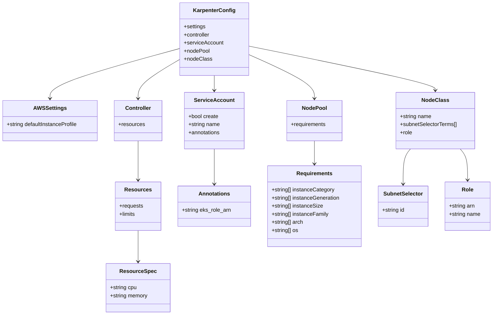
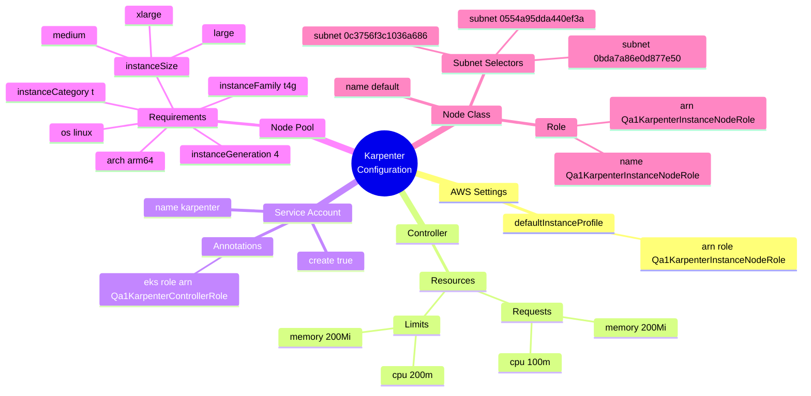

# Diagram: devops/k8s/karpenter/helm/values.qa1.yaml


> Auto-generated by Obscura crawlers

## Diagram 1

```mermaid
graph TD
      Karpenter[Karpenter Configuration]
      Karpenter --> Settings[AWS Settings]
      Karpenter --> Controller[Controller]...
  └ 281 lines...
```

> SVG rendering failed for this diagram.

## Diagram 2

```mermaid
graph TD
    Karpenter[Karpenter Configuration]
    Karpenter --> Settings[AWS Settings]
    Karpenter --> Controller[Controller]
    Karpenter --> ServiceAccount[Service Account]
    Karpenter --> NodePool[Node Pool]
    Karpenter --> NodeClass[Node Class]
    
    Settings --> InstanceProfile[Instance Profile<br/>arn:...:role/Qa1KarpenterInstanceNodeRole]
    
    Controller --> Resources[Resources]
    Resources --> Requests[Requests<br/>cpu: 100m<br/>memory: 200Mi]
    Resources --> Limits[Limits<br/>cpu: 200m<br/>memory: 200Mi]
    
    ServiceAccount --> SACreate[create: true]
    ServiceAccount --> SAName[name: karpenter]
    ServiceAccount --> SAAnnotations[Annotations]
    SAAnnotations --> RoleArn[eks.amazonaws.com/role-arn<br/>arn:...:role/Qa1KarpenterControllerRole]
    
    NodePool --> Requirements[Requirements]
    Requirements --> InstCategory[instanceCategory: t]
    Requirements --> InstGeneration[instanceGeneration: 4]
    Requirements --> InstSize[instanceSize: medium, large, xlarge]
    Requirements --> InstFamily[instanceFamily: t4g]
    Requirements --> Arch[arch: arm64]
    Requirements --> OS[os: linux]
    
    NodeClass --> NCName[name: default]
    NodeClass --> SubnetSelectors[Subnet Selectors]
    NodeClass --> Role[Role]
    SubnetSelectors --> Subnet1[subnet-0554a95dda440ef3a]
    SubnetSelectors --> Subnet2[subnet-0c3756f3c1036a686]
    SubnetSelectors --> Subnet3[subnet-0bda7a86e0d877e50]
    Role --> RoleArn2[arn: arn:...:role/Qa1KarpenterInstanceNodeRole]
    Role --> RoleName[name: Qa1KarpenterInstanceNodeRole]
```



### SVG

<svg id="container" width="4407.6484375" xmlns="http://www.w3.org/2000/svg" class="flowchart" height="454" viewBox="0 0 4407.6484375 454" role="graphics-document document" aria-roledescription="flowchart-v2"><style>#container{font-family:"trebuchet ms",verdana,arial,sans-serif;font-size:16px;fill:#333;}@keyframes edge-animation-frame{from{stroke-dashoffset:0;}}@keyframes dash{to{stroke-dashoffset:0;}}#container .edge-animation-slow{stroke-dasharray:9,5!important;stroke-dashoffset:900;animation:dash 50s linear infinite;stroke-linecap:round;}#container .edge-animation-fast{stroke-dasharray:9,5!important;stroke-dashoffset:900;animation:dash 20s linear infinite;stroke-linecap:round;}#container .error-icon{fill:#552222;}#container .error-text{fill:#552222;stroke:#552222;}#container .edge-thickness-normal{stroke-width:1px;}#container .edge-thickness-thick{stroke-width:3.5px;}#container .edge-pattern-solid{stroke-dasharray:0;}#container .edge-thickness-invisible{stroke-width:0;fill:none;}#container .edge-pattern-dashed{stroke-dasharray:3;}#container .edge-pattern-dotted{stroke-dasharray:2;}#container .marker{fill:#333333;stroke:#333333;}#container .marker.cross{stroke:#333333;}#container svg{font-family:"trebuchet ms",verdana,arial,sans-serif;font-size:16px;}#container p{margin:0;}#container .label{font-family:"trebuchet ms",verdana,arial,sans-serif;color:#333;}#container .cluster-label text{fill:#333;}#container .cluster-label span{color:#333;}#container .cluster-label span p{background-color:transparent;}#container .label text,#container span{fill:#333;color:#333;}#container .node rect,#container .node circle,#container .node ellipse,#container .node polygon,#container .node path{fill:#ECECFF;stroke:#9370DB;stroke-width:1px;}#container .rough-node .label text,#container .node .label text,#container .image-shape .label,#container .icon-shape .label{text-anchor:middle;}#container .node .katex path{fill:#000;stroke:#000;stroke-width:1px;}#container .rough-node .label,#container .node .label,#container .image-shape .label,#container .icon-shape .label{text-align:center;}#container .node.clickable{cursor:pointer;}#container .root .anchor path{fill:#333333!important;stroke-width:0;stroke:#333333;}#container .arrowheadPath{fill:#333333;}#container .edgePath .path{stroke:#333333;stroke-width:2.0px;}#container .flowchart-link{stroke:#333333;fill:none;}#container .edgeLabel{background-color:rgba(232,232,232, 0.8);text-align:center;}#container .edgeLabel p{background-color:rgba(232,232,232, 0.8);}#container .edgeLabel rect{opacity:0.5;background-color:rgba(232,232,232, 0.8);fill:rgba(232,232,232, 0.8);}#container .labelBkg{background-color:rgba(232, 232, 232, 0.5);}#container .cluster rect{fill:#ffffde;stroke:#aaaa33;stroke-width:1px;}#container .cluster text{fill:#333;}#container .cluster span{color:#333;}#container div.mermaidTooltip{position:absolute;text-align:center;max-width:200px;padding:2px;font-family:"trebuchet ms",verdana,arial,sans-serif;font-size:12px;background:hsl(80, 100%, 96.2745098039%);border:1px solid #aaaa33;border-radius:2px;pointer-events:none;z-index:100;}#container .flowchartTitleText{text-anchor:middle;font-size:18px;fill:#333;}#container rect.text{fill:none;stroke-width:0;}#container .icon-shape,#container .image-shape{background-color:rgba(232,232,232, 0.8);text-align:center;}#container .icon-shape p,#container .image-shape p{background-color:rgba(232,232,232, 0.8);padding:2px;}#container .icon-shape rect,#container .image-shape rect{opacity:0.5;background-color:rgba(232,232,232, 0.8);fill:rgba(232,232,232, 0.8);}#container .label-icon{display:inline-block;height:1em;overflow:visible;vertical-align:-0.125em;}#container .node .label-icon path{fill:currentColor;stroke:revert;stroke-width:revert;}#container :root{--mermaid-font-family:"trebuchet ms",verdana,arial,sans-serif;}</style><g><marker id="container_flowchart-v2-pointEnd" class="marker flowchart-v2" viewBox="0 0 10 10" refX="5" refY="5" markerUnits="userSpaceOnUse" markerWidth="8" markerHeight="8" orient="auto"><path d="M 0 0 L 10 5 L 0 10 z" class="arrowMarkerPath" style="stroke-width: 1; stroke-dasharray: 1, 0;"></path></marker><marker id="container_flowchart-v2-pointStart" class="marker flowchart-v2" viewBox="0 0 10 10" refX="4.5" refY="5" markerUnits="userSpaceOnUse" markerWidth="8" markerHeight="8" orient="auto"><path d="M 0 5 L 10 10 L 10 0 z" class="arrowMarkerPath" style="stroke-width: 1; stroke-dasharray: 1, 0;"></path></marker><marker id="container_flowchart-v2-circleEnd" class="marker flowchart-v2" viewBox="0 0 10 10" refX="11" refY="5" markerUnits="userSpaceOnUse" markerWidth="11" markerHeight="11" orient="auto"><circle cx="5" cy="5" r="5" class="arrowMarkerPath" style="stroke-width: 1; stroke-dasharray: 1, 0;"></circle></marker><marker id="container_flowchart-v2-circleStart" class="marker flowchart-v2" viewBox="0 0 10 10" refX="-1" refY="5" markerUnits="userSpaceOnUse" markerWidth="11" markerHeight="11" orient="auto"><circle cx="5" cy="5" r="5" class="arrowMarkerPath" style="stroke-width: 1; stroke-dasharray: 1, 0;"></circle></marker><marker id="container_flowchart-v2-crossEnd" class="marker cross flowchart-v2" viewBox="0 0 11 11" refX="12" refY="5.2" markerUnits="userSpaceOnUse" markerWidth="11" markerHeight="11" orient="auto"><path d="M 1,1 l 9,9 M 10,1 l -9,9" class="arrowMarkerPath" style="stroke-width: 2; stroke-dasharray: 1, 0;"></path></marker><marker id="container_flowchart-v2-crossStart" class="marker cross flowchart-v2" viewBox="0 0 11 11" refX="-1" refY="5.2" markerUnits="userSpaceOnUse" markerWidth="11" markerHeight="11" orient="auto"><path d="M 1,1 l 9,9 M 10,1 l -9,9" class="arrowMarkerPath" style="stroke-width: 2; stroke-dasharray: 1, 0;"></path></marker><g class="root"><g class="clusters"></g><g class="edgePaths"><path d="M777.086,43.671L679.723,50.893C582.359,58.114,387.633,72.557,290.27,83.279C192.906,94,192.906,101,192.906,104.5L192.906,108" id="L_Karpenter_Settings_0" class="edge-thickness-normal edge-pattern-solid edge-thickness-normal edge-pattern-solid flowchart-link" style=";" data-edge="true" data-et="edge" data-id="L_Karpenter_Settings_0" data-points="W3sieCI6Nzc3LjA4NTkzNzUsInkiOjQzLjY3MTQ5NTQzMTI0NTgyfSx7IngiOjE5Mi45MDYyNSwieSI6ODd9LHsieCI6MTkyLjkwNjI1LCJ5IjoxMTJ9XQ==" marker-end="url(#container_flowchart-v2-pointEnd)"></path><path d="M777.086,50.221L730,56.35C682.914,62.48,588.742,74.74,541.656,84.37C494.57,94,494.57,101,494.57,104.5L494.57,108" id="L_Karpenter_Controller_0" class="edge-thickness-normal edge-pattern-solid edge-thickness-normal edge-pattern-solid flowchart-link" style=";" data-edge="true" data-et="edge" data-id="L_Karpenter_Controller_0" data-points="W3sieCI6Nzc3LjA4NTkzNzUsInkiOjUwLjIyMDUyOTI3MDI0ODZ9LHsieCI6NDk0LjU3MDMxMjUsInkiOjg3fSx7IngiOjQ5NC41NzAzMTI1LCJ5IjoxMTJ9XQ==" marker-end="url(#container_flowchart-v2-pointEnd)"></path><path d="M894,62L894,66.167C894,70.333,894,78.667,894,86.333C894,94,894,101,894,104.5L894,108" id="L_Karpenter_ServiceAccount_0" class="edge-thickness-normal edge-pattern-solid edge-thickness-normal edge-pattern-solid flowchart-link" style=";" data-edge="true" data-et="edge" data-id="L_Karpenter_ServiceAccount_0" data-points="W3sieCI6ODk0LCJ5Ijo2Mn0seyJ4Ijo4OTQsInkiOjg3fSx7IngiOjg5NCwieSI6MTEyfV0=" marker-end="url(#container_flowchart-v2-pointEnd)"></path><path d="M1010.914,39.981L1194.872,47.817C1378.831,55.654,1746.747,71.327,1930.706,82.663C2114.664,94,2114.664,101,2114.664,104.5L2114.664,108" id="L_Karpenter_NodePool_0" class="edge-thickness-normal edge-pattern-solid edge-thickness-normal edge-pattern-solid flowchart-link" style=";" data-edge="true" data-et="edge" data-id="L_Karpenter_NodePool_0" data-points="W3sieCI6MTAxMC45MTQwNjI1LCJ5IjozOS45ODA1MTEzNzYzNjQwNH0seyJ4IjoyMTE0LjY2NDA2MjUsInkiOjg3fSx7IngiOjIxMTQuNjY0MDYyNSwieSI6MTEyfV0=" marker-end="url(#container_flowchart-v2-pointEnd)"></path><path d="M1010.914,37.632L1376.438,45.86C1741.961,54.088,2473.008,70.544,2838.531,82.272C3204.055,94,3204.055,101,3204.055,104.5L3204.055,108" id="L_Karpenter_NodeClass_0" class="edge-thickness-normal edge-pattern-solid edge-thickness-normal edge-pattern-solid flowchart-link" style=";" data-edge="true" data-et="edge" data-id="L_Karpenter_NodeClass_0" data-points="W3sieCI6MTAxMC45MTQwNjI1LCJ5IjozNy42MzE3Njk0MDQ4MDk4MTZ9LHsieCI6MzIwNC4wNTQ2ODc1LCJ5Ijo4N30seyJ4IjozMjA0LjA1NDY4NzUsInkiOjExMn1d" marker-end="url(#container_flowchart-v2-pointEnd)"></path><path d="M192.906,166L192.906,170.167C192.906,174.333,192.906,182.667,192.906,190.333C192.906,198,192.906,205,192.906,208.5L192.906,212" id="L_Settings_InstanceProfile_0" class="edge-thickness-normal edge-pattern-solid edge-thickness-normal edge-pattern-solid flowchart-link" style=";" data-edge="true" data-et="edge" data-id="L_Settings_InstanceProfile_0" data-points="W3sieCI6MTkyLjkwNjI1LCJ5IjoxNjZ9LHsieCI6MTkyLjkwNjI1LCJ5IjoxOTF9LHsieCI6MTkyLjkwNjI1LCJ5IjoyMTZ9XQ==" marker-end="url(#container_flowchart-v2-pointEnd)"></path><path d="M494.57,166L494.57,170.167C494.57,174.333,494.57,182.667,494.57,192.333C494.57,202,494.57,213,494.57,218.5L494.57,224" id="L_Controller_Resources_0" class="edge-thickness-normal edge-pattern-solid edge-thickness-normal edge-pattern-solid flowchart-link" style=";" data-edge="true" data-et="edge" data-id="L_Controller_Resources_0" data-points="W3sieCI6NDk0LjU3MDMxMjUsInkiOjE2Nn0seyJ4Ijo0OTQuNTcwMzEyNSwieSI6MTkxfSx7IngiOjQ5NC41NzAzMTI1LCJ5IjoyMjh9XQ==" marker-end="url(#container_flowchart-v2-pointEnd)"></path><path d="M448.075,282L437.456,288.167C426.837,294.333,405.598,306.667,394.979,316.333C384.359,326,384.359,333,384.359,336.5L384.359,340" id="L_Resources_Requests_0" class="edge-thickness-normal edge-pattern-solid edge-thickness-normal edge-pattern-solid flowchart-link" style=";" data-edge="true" data-et="edge" data-id="L_Resources_Requests_0" data-points="W3sieCI6NDQ4LjA3NTA3MzI0MjE4NzUsInkiOjI4Mn0seyJ4IjozODQuMzU5Mzc1LCJ5IjozMTl9LHsieCI6Mzg0LjM1OTM3NSwieSI6MzQ0fV0=" marker-end="url(#container_flowchart-v2-pointEnd)"></path><path d="M559.303,282L574.088,288.167C588.873,294.333,618.442,306.667,633.227,316.333C648.012,326,648.012,333,648.012,336.5L648.012,340" id="L_Resources_Limits_0" class="edge-thickness-normal edge-pattern-solid edge-thickness-normal edge-pattern-solid flowchart-link" style=";" data-edge="true" data-et="edge" data-id="L_Resources_Limits_0" data-points="W3sieCI6NTU5LjMwMzQwNTc2MTcxODgsInkiOjI4Mn0seyJ4Ijo2NDguMDExNzE4NzUsInkiOjMxOX0seyJ4Ijo2NDguMDExNzE4NzUsInkiOjM0NH1d" marker-end="url(#container_flowchart-v2-pointEnd)"></path><path d="M807.039,160.411L786.332,165.509C765.625,170.607,724.211,180.804,703.504,191.402C682.797,202,682.797,213,682.797,218.5L682.797,224" id="L_ServiceAccount_SACreate_0" class="edge-thickness-normal edge-pattern-solid edge-thickness-normal edge-pattern-solid flowchart-link" style=";" data-edge="true" data-et="edge" data-id="L_ServiceAccount_SACreate_0" data-points="W3sieCI6ODA3LjAzOTA2MjUsInkiOjE2MC40MTA1MjAwODU4MTc4Nn0seyJ4Ijo2ODIuNzk2ODc1LCJ5IjoxOTF9LHsieCI6NjgyLjc5Njg3NSwieSI6MjI4fV0=" marker-end="url(#container_flowchart-v2-pointEnd)"></path><path d="M894,166L894,170.167C894,174.333,894,182.667,894,192.333C894,202,894,213,894,218.5L894,224" id="L_ServiceAccount_SAName_0" class="edge-thickness-normal edge-pattern-solid edge-thickness-normal edge-pattern-solid flowchart-link" style=";" data-edge="true" data-et="edge" data-id="L_ServiceAccount_SAName_0" data-points="W3sieCI6ODk0LCJ5IjoxNjZ9LHsieCI6ODk0LCJ5IjoxOTF9LHsieCI6ODk0LCJ5IjoyMjh9XQ==" marker-end="url(#container_flowchart-v2-pointEnd)"></path><path d="M980.961,160.151L1002.1,165.292C1023.24,170.434,1065.518,180.717,1086.658,191.358C1107.797,202,1107.797,213,1107.797,218.5L1107.797,224" id="L_ServiceAccount_SAAnnotations_0" class="edge-thickness-normal edge-pattern-solid edge-thickness-normal edge-pattern-solid flowchart-link" style=";" data-edge="true" data-et="edge" data-id="L_ServiceAccount_SAAnnotations_0" data-points="W3sieCI6OTgwLjk2MDkzNzUsInkiOjE2MC4xNTA3NzEwMjk3NDQ5M30seyJ4IjoxMTA3Ljc5Njg3NSwieSI6MTkxfSx7IngiOjExMDcuNzk2ODc1LCJ5IjoyMjh9XQ==" marker-end="url(#container_flowchart-v2-pointEnd)"></path><path d="M1107.797,282L1107.797,288.167C1107.797,294.333,1107.797,306.667,1107.797,318.333C1107.797,330,1107.797,341,1107.797,346.5L1107.797,352" id="L_SAAnnotations_RoleArn_0" class="edge-thickness-normal edge-pattern-solid edge-thickness-normal edge-pattern-solid flowchart-link" style=";" data-edge="true" data-et="edge" data-id="L_SAAnnotations_RoleArn_0" data-points="W3sieCI6MTEwNy43OTY4NzUsInkiOjI4Mn0seyJ4IjoxMTA3Ljc5Njg3NSwieSI6MzE5fSx7IngiOjExMDcuNzk2ODc1LCJ5IjozNTZ9XQ==" marker-end="url(#container_flowchart-v2-pointEnd)"></path><path d="M2114.664,166L2114.664,170.167C2114.664,174.333,2114.664,182.667,2114.664,192.333C2114.664,202,2114.664,213,2114.664,218.5L2114.664,224" id="L_NodePool_Requirements_0" class="edge-thickness-normal edge-pattern-solid edge-thickness-normal edge-pattern-solid flowchart-link" style=";" data-edge="true" data-et="edge" data-id="L_NodePool_Requirements_0" data-points="W3sieCI6MjExNC42NjQwNjI1LCJ5IjoxNjZ9LHsieCI6MjExNC42NjQwNjI1LCJ5IjoxOTF9LHsieCI6MjExNC42NjQwNjI1LCJ5IjoyMjh9XQ==" marker-end="url(#container_flowchart-v2-pointEnd)"></path><path d="M2034.148,262.505L1933.137,271.921C1832.125,281.337,1630.102,300.168,1529.09,317.084C1428.078,334,1428.078,349,1428.078,356.5L1428.078,364" id="L_Requirements_InstCategory_0" class="edge-thickness-normal edge-pattern-solid edge-thickness-normal edge-pattern-solid flowchart-link" style=";" data-edge="true" data-et="edge" data-id="L_Requirements_InstCategory_0" data-points="W3sieCI6MjAzNC4xNDg0Mzc1LCJ5IjoyNjIuNTA1MjUxMzAwMDIzOX0seyJ4IjoxNDI4LjA3ODEyNSwieSI6MzE5fSx7IngiOjE0MjguMDc4MTI1LCJ5IjozNjh9XQ==" marker-end="url(#container_flowchart-v2-pointEnd)"></path><path d="M2034.148,267.027L1976.16,275.689C1918.172,284.351,1802.195,301.676,1744.207,317.838C1686.219,334,1686.219,349,1686.219,356.5L1686.219,364" id="L_Requirements_InstGeneration_0" class="edge-thickness-normal edge-pattern-solid edge-thickness-normal edge-pattern-solid flowchart-link" style=";" data-edge="true" data-et="edge" data-id="L_Requirements_InstGeneration_0" data-points="W3sieCI6MjAzNC4xNDg0Mzc1LCJ5IjoyNjcuMDI3MjA1OTIyNTc2Mn0seyJ4IjoxNjg2LjIxODc1LCJ5IjozMTl9LHsieCI6MTY4Ni4yMTg3NSwieSI6MzY4fV0=" marker-end="url(#container_flowchart-v2-pointEnd)"></path><path d="M2055.832,282L2042.395,288.167C2028.958,294.333,2002.085,306.667,1988.648,318.333C1975.211,330,1975.211,341,1975.211,346.5L1975.211,352" id="L_Requirements_InstSize_0" class="edge-thickness-normal edge-pattern-solid edge-thickness-normal edge-pattern-solid flowchart-link" style=";" data-edge="true" data-et="edge" data-id="L_Requirements_InstSize_0" data-points="W3sieCI6MjA1NS44MzIyNzUzOTA2MjUsInkiOjI4Mn0seyJ4IjoxOTc1LjIxMDkzNzUsInkiOjMxOX0seyJ4IjoxOTc1LjIxMDkzNzUsInkiOjM1Nn1d" marker-end="url(#container_flowchart-v2-pointEnd)"></path><path d="M2173.496,282L2186.933,288.167C2200.37,294.333,2227.243,306.667,2240.68,320.333C2254.117,334,2254.117,349,2254.117,356.5L2254.117,364" id="L_Requirements_InstFamily_0" class="edge-thickness-normal edge-pattern-solid edge-thickness-normal edge-pattern-solid flowchart-link" style=";" data-edge="true" data-et="edge" data-id="L_Requirements_InstFamily_0" data-points="W3sieCI6MjE3My40OTU4NDk2MDkzNzUsInkiOjI4Mn0seyJ4IjoyMjU0LjExNzE4NzUsInkiOjMxOX0seyJ4IjoyMjU0LjExNzE4NzUsInkiOjM2OH1d" marker-end="url(#container_flowchart-v2-pointEnd)"></path><path d="M2195.18,269.277L2241.915,277.564C2288.651,285.851,2382.122,302.426,2428.858,318.213C2475.594,334,2475.594,349,2475.594,356.5L2475.594,364" id="L_Requirements_Arch_0" class="edge-thickness-normal edge-pattern-solid edge-thickness-normal edge-pattern-solid flowchart-link" style=";" data-edge="true" data-et="edge" data-id="L_Requirements_Arch_0" data-points="W3sieCI6MjE5NS4xNzk2ODc1LCJ5IjoyNjkuMjc3MDE4OTgzMDk0OX0seyJ4IjoyNDc1LjU5Mzc1LCJ5IjozMTl9LHsieCI6MjQ3NS41OTM3NSwieSI6MzY4fV0=" marker-end="url(#container_flowchart-v2-pointEnd)"></path><path d="M2195.18,264.476L2272.389,273.564C2349.599,282.651,2504.018,300.825,2581.228,317.413C2658.438,334,2658.438,349,2658.438,356.5L2658.438,364" id="L_Requirements_OS_0" class="edge-thickness-normal edge-pattern-solid edge-thickness-normal edge-pattern-solid flowchart-link" style=";" data-edge="true" data-et="edge" data-id="L_Requirements_OS_0" data-points="W3sieCI6MjE5NS4xNzk2ODc1LCJ5IjoyNjQuNDc2MzczMTQ0ODM1N30seyJ4IjoyNjU4LjQzNzUsInkiOjMxOX0seyJ4IjoyNjU4LjQzNzUsInkiOjM2OH1d" marker-end="url(#container_flowchart-v2-pointEnd)"></path><path d="M3134.281,147.567L3075.328,154.806C3016.375,162.045,2898.469,176.522,2839.516,189.261C2780.563,202,2780.563,213,2780.563,218.5L2780.563,224" id="L_NodeClass_NCName_0" class="edge-thickness-normal edge-pattern-solid edge-thickness-normal edge-pattern-solid flowchart-link" style=";" data-edge="true" data-et="edge" data-id="L_NodeClass_NCName_0" data-points="W3sieCI6MzEzNC4yODEyNSwieSI6MTQ3LjU2NzM4MDU5NjYwMTl9LHsieCI6Mjc4MC41NjI1LCJ5IjoxOTF9LHsieCI6Mjc4MC41NjI1LCJ5IjoyMjh9XQ==" marker-end="url(#container_flowchart-v2-pointEnd)"></path><path d="M3204.055,166L3204.055,170.167C3204.055,174.333,3204.055,182.667,3204.055,192.333C3204.055,202,3204.055,213,3204.055,218.5L3204.055,224" id="L_NodeClass_SubnetSelectors_0" class="edge-thickness-normal edge-pattern-solid edge-thickness-normal edge-pattern-solid flowchart-link" style=";" data-edge="true" data-et="edge" data-id="L_NodeClass_SubnetSelectors_0" data-points="W3sieCI6MzIwNC4wNTQ2ODc1LCJ5IjoxNjZ9LHsieCI6MzIwNC4wNTQ2ODc1LCJ5IjoxOTF9LHsieCI6MzIwNC4wNTQ2ODc1LCJ5IjoyMjh9XQ==" marker-end="url(#container_flowchart-v2-pointEnd)"></path><path d="M3273.828,143.179L3406.885,151.15C3539.941,159.12,3806.055,175.06,3939.111,188.53C4072.168,202,4072.168,213,4072.168,218.5L4072.168,224" id="L_NodeClass_Role_0" class="edge-thickness-normal edge-pattern-solid edge-thickness-normal edge-pattern-solid flowchart-link" style=";" data-edge="true" data-et="edge" data-id="L_NodeClass_Role_0" data-points="W3sieCI6MzI3My44MjgxMjUsInkiOjE0My4xNzk0MzAwNjc5MDA0OH0seyJ4Ijo0MDcyLjE2Nzk2ODc1LCJ5IjoxOTF9LHsieCI6NDA3Mi4xNjc5Njg3NSwieSI6MjI4fV0=" marker-end="url(#container_flowchart-v2-pointEnd)"></path><path d="M3112.875,274.094L3077.134,281.578C3041.393,289.062,2969.911,304.031,2934.171,319.016C2898.43,334,2898.43,349,2898.43,356.5L2898.43,364" id="L_SubnetSelectors_Subnet1_0" class="edge-thickness-normal edge-pattern-solid edge-thickness-normal edge-pattern-solid flowchart-link" style=";" data-edge="true" data-et="edge" data-id="L_SubnetSelectors_Subnet1_0" data-points="W3sieCI6MzExMi44NzUsInkiOjI3NC4wOTM2NjA1MzE2OTczN30seyJ4IjoyODk4LjQyOTY4NzUsInkiOjMxOX0seyJ4IjoyODk4LjQyOTY4NzUsInkiOjM2OH1d" marker-end="url(#container_flowchart-v2-pointEnd)"></path><path d="M3204.055,282L3204.055,288.167C3204.055,294.333,3204.055,306.667,3204.055,320.333C3204.055,334,3204.055,349,3204.055,356.5L3204.055,364" id="L_SubnetSelectors_Subnet2_0" class="edge-thickness-normal edge-pattern-solid edge-thickness-normal edge-pattern-solid flowchart-link" style=";" data-edge="true" data-et="edge" data-id="L_SubnetSelectors_Subnet2_0" data-points="W3sieCI6MzIwNC4wNTQ2ODc1LCJ5IjoyODJ9LHsieCI6MzIwNC4wNTQ2ODc1LCJ5IjozMTl9LHsieCI6MzIwNC4wNTQ2ODc1LCJ5IjozNjh9XQ==" marker-end="url(#container_flowchart-v2-pointEnd)"></path><path d="M3295.234,274.08L3331.013,281.566C3366.792,289.053,3438.349,304.027,3474.128,319.013C3509.906,334,3509.906,349,3509.906,356.5L3509.906,364" id="L_SubnetSelectors_Subnet3_0" class="edge-thickness-normal edge-pattern-solid edge-thickness-normal edge-pattern-solid flowchart-link" style=";" data-edge="true" data-et="edge" data-id="L_SubnetSelectors_Subnet3_0" data-points="W3sieCI6MzI5NS4yMzQzNzUsInkiOjI3NC4wNzk1MTY3MTgxNzkyNn0seyJ4IjozNTA5LjkwNjI1LCJ5IjozMTl9LHsieCI6MzUwOS45MDYyNSwieSI6MzY4fV0=" marker-end="url(#container_flowchart-v2-pointEnd)"></path><path d="M4026.105,269.933L4000.881,278.111C3975.656,286.289,3925.207,302.644,3899.982,316.322C3874.758,330,3874.758,341,3874.758,346.5L3874.758,352" id="L_Role_RoleArn2_0" class="edge-thickness-normal edge-pattern-solid edge-thickness-normal edge-pattern-solid flowchart-link" style=";" data-edge="true" data-et="edge" data-id="L_Role_RoleArn2_0" data-points="W3sieCI6NDAyNi4xMDU0Njg3NSwieSI6MjY5LjkzMzM3NTU0NjYyOTJ9LHsieCI6Mzg3NC43NTc4MTI1LCJ5IjozMTl9LHsieCI6Mzg3NC43NTc4MTI1LCJ5IjozNTZ9XQ==" marker-end="url(#container_flowchart-v2-pointEnd)"></path><path d="M4118.23,271.154L4140.968,279.129C4163.706,287.103,4209.181,303.051,4231.919,316.526C4254.656,330,4254.656,341,4254.656,346.5L4254.656,352" id="L_Role_RoleName_0" class="edge-thickness-normal edge-pattern-solid edge-thickness-normal edge-pattern-solid flowchart-link" style=";" data-edge="true" data-et="edge" data-id="L_Role_RoleName_0" data-points="W3sieCI6NDExOC4yMzA0Njg3NSwieSI6MjcxLjE1NDQ2MTk3MzE1NzU0fSx7IngiOjQyNTQuNjU2MjUsInkiOjMxOX0seyJ4Ijo0MjU0LjY1NjI1LCJ5IjozNTZ9XQ==" marker-end="url(#container_flowchart-v2-pointEnd)"></path></g><g class="edgeLabels"><g class="edgeLabel"><g class="label" data-id="L_Karpenter_Settings_0" transform="translate(0, 0)"><foreignObject width="0" height="0"><div xmlns="http://www.w3.org/1999/xhtml" class="labelBkg" style="display: table-cell; white-space: nowrap; line-height: 1.5; max-width: 200px; text-align: center;"><span class="edgeLabel"></span></div></foreignObject></g></g><g class="edgeLabel"><g class="label" data-id="L_Karpenter_Controller_0" transform="translate(0, 0)"><foreignObject width="0" height="0"><div xmlns="http://www.w3.org/1999/xhtml" class="labelBkg" style="display: table-cell; white-space: nowrap; line-height: 1.5; max-width: 200px; text-align: center;"><span class="edgeLabel"></span></div></foreignObject></g></g><g class="edgeLabel"><g class="label" data-id="L_Karpenter_ServiceAccount_0" transform="translate(0, 0)"><foreignObject width="0" height="0"><div xmlns="http://www.w3.org/1999/xhtml" class="labelBkg" style="display: table-cell; white-space: nowrap; line-height: 1.5; max-width: 200px; text-align: center;"><span class="edgeLabel"></span></div></foreignObject></g></g><g class="edgeLabel"><g class="label" data-id="L_Karpenter_NodePool_0" transform="translate(0, 0)"><foreignObject width="0" height="0"><div xmlns="http://www.w3.org/1999/xhtml" class="labelBkg" style="display: table-cell; white-space: nowrap; line-height: 1.5; max-width: 200px; text-align: center;"><span class="edgeLabel"></span></div></foreignObject></g></g><g class="edgeLabel"><g class="label" data-id="L_Karpenter_NodeClass_0" transform="translate(0, 0)"><foreignObject width="0" height="0"><div xmlns="http://www.w3.org/1999/xhtml" class="labelBkg" style="display: table-cell; white-space: nowrap; line-height: 1.5; max-width: 200px; text-align: center;"><span class="edgeLabel"></span></div></foreignObject></g></g><g class="edgeLabel"><g class="label" data-id="L_Settings_InstanceProfile_0" transform="translate(0, 0)"><foreignObject width="0" height="0"><div xmlns="http://www.w3.org/1999/xhtml" class="labelBkg" style="display: table-cell; white-space: nowrap; line-height: 1.5; max-width: 200px; text-align: center;"><span class="edgeLabel"></span></div></foreignObject></g></g><g class="edgeLabel"><g class="label" data-id="L_Controller_Resources_0" transform="translate(0, 0)"><foreignObject width="0" height="0"><div xmlns="http://www.w3.org/1999/xhtml" class="labelBkg" style="display: table-cell; white-space: nowrap; line-height: 1.5; max-width: 200px; text-align: center;"><span class="edgeLabel"></span></div></foreignObject></g></g><g class="edgeLabel"><g class="label" data-id="L_Resources_Requests_0" transform="translate(0, 0)"><foreignObject width="0" height="0"><div xmlns="http://www.w3.org/1999/xhtml" class="labelBkg" style="display: table-cell; white-space: nowrap; line-height: 1.5; max-width: 200px; text-align: center;"><span class="edgeLabel"></span></div></foreignObject></g></g><g class="edgeLabel"><g class="label" data-id="L_Resources_Limits_0" transform="translate(0, 0)"><foreignObject width="0" height="0"><div xmlns="http://www.w3.org/1999/xhtml" class="labelBkg" style="display: table-cell; white-space: nowrap; line-height: 1.5; max-width: 200px; text-align: center;"><span class="edgeLabel"></span></div></foreignObject></g></g><g class="edgeLabel"><g class="label" data-id="L_ServiceAccount_SACreate_0" transform="translate(0, 0)"><foreignObject width="0" height="0"><div xmlns="http://www.w3.org/1999/xhtml" class="labelBkg" style="display: table-cell; white-space: nowrap; line-height: 1.5; max-width: 200px; text-align: center;"><span class="edgeLabel"></span></div></foreignObject></g></g><g class="edgeLabel"><g class="label" data-id="L_ServiceAccount_SAName_0" transform="translate(0, 0)"><foreignObject width="0" height="0"><div xmlns="http://www.w3.org/1999/xhtml" class="labelBkg" style="display: table-cell; white-space: nowrap; line-height: 1.5; max-width: 200px; text-align: center;"><span class="edgeLabel"></span></div></foreignObject></g></g><g class="edgeLabel"><g class="label" data-id="L_ServiceAccount_SAAnnotations_0" transform="translate(0, 0)"><foreignObject width="0" height="0"><div xmlns="http://www.w3.org/1999/xhtml" class="labelBkg" style="display: table-cell; white-space: nowrap; line-height: 1.5; max-width: 200px; text-align: center;"><span class="edgeLabel"></span></div></foreignObject></g></g><g class="edgeLabel"><g class="label" data-id="L_SAAnnotations_RoleArn_0" transform="translate(0, 0)"><foreignObject width="0" height="0"><div xmlns="http://www.w3.org/1999/xhtml" class="labelBkg" style="display: table-cell; white-space: nowrap; line-height: 1.5; max-width: 200px; text-align: center;"><span class="edgeLabel"></span></div></foreignObject></g></g><g class="edgeLabel"><g class="label" data-id="L_NodePool_Requirements_0" transform="translate(0, 0)"><foreignObject width="0" height="0"><div xmlns="http://www.w3.org/1999/xhtml" class="labelBkg" style="display: table-cell; white-space: nowrap; line-height: 1.5; max-width: 200px; text-align: center;"><span class="edgeLabel"></span></div></foreignObject></g></g><g class="edgeLabel"><g class="label" data-id="L_Requirements_InstCategory_0" transform="translate(0, 0)"><foreignObject width="0" height="0"><div xmlns="http://www.w3.org/1999/xhtml" class="labelBkg" style="display: table-cell; white-space: nowrap; line-height: 1.5; max-width: 200px; text-align: center;"><span class="edgeLabel"></span></div></foreignObject></g></g><g class="edgeLabel"><g class="label" data-id="L_Requirements_InstGeneration_0" transform="translate(0, 0)"><foreignObject width="0" height="0"><div xmlns="http://www.w3.org/1999/xhtml" class="labelBkg" style="display: table-cell; white-space: nowrap; line-height: 1.5; max-width: 200px; text-align: center;"><span class="edgeLabel"></span></div></foreignObject></g></g><g class="edgeLabel"><g class="label" data-id="L_Requirements_InstSize_0" transform="translate(0, 0)"><foreignObject width="0" height="0"><div xmlns="http://www.w3.org/1999/xhtml" class="labelBkg" style="display: table-cell; white-space: nowrap; line-height: 1.5; max-width: 200px; text-align: center;"><span class="edgeLabel"></span></div></foreignObject></g></g><g class="edgeLabel"><g class="label" data-id="L_Requirements_InstFamily_0" transform="translate(0, 0)"><foreignObject width="0" height="0"><div xmlns="http://www.w3.org/1999/xhtml" class="labelBkg" style="display: table-cell; white-space: nowrap; line-height: 1.5; max-width: 200px; text-align: center;"><span class="edgeLabel"></span></div></foreignObject></g></g><g class="edgeLabel"><g class="label" data-id="L_Requirements_Arch_0" transform="translate(0, 0)"><foreignObject width="0" height="0"><div xmlns="http://www.w3.org/1999/xhtml" class="labelBkg" style="display: table-cell; white-space: nowrap; line-height: 1.5; max-width: 200px; text-align: center;"><span class="edgeLabel"></span></div></foreignObject></g></g><g class="edgeLabel"><g class="label" data-id="L_Requirements_OS_0" transform="translate(0, 0)"><foreignObject width="0" height="0"><div xmlns="http://www.w3.org/1999/xhtml" class="labelBkg" style="display: table-cell; white-space: nowrap; line-height: 1.5; max-width: 200px; text-align: center;"><span class="edgeLabel"></span></div></foreignObject></g></g><g class="edgeLabel"><g class="label" data-id="L_NodeClass_NCName_0" transform="translate(0, 0)"><foreignObject width="0" height="0"><div xmlns="http://www.w3.org/1999/xhtml" class="labelBkg" style="display: table-cell; white-space: nowrap; line-height: 1.5; max-width: 200px; text-align: center;"><span class="edgeLabel"></span></div></foreignObject></g></g><g class="edgeLabel"><g class="label" data-id="L_NodeClass_SubnetSelectors_0" transform="translate(0, 0)"><foreignObject width="0" height="0"><div xmlns="http://www.w3.org/1999/xhtml" class="labelBkg" style="display: table-cell; white-space: nowrap; line-height: 1.5; max-width: 200px; text-align: center;"><span class="edgeLabel"></span></div></foreignObject></g></g><g class="edgeLabel"><g class="label" data-id="L_NodeClass_Role_0" transform="translate(0, 0)"><foreignObject width="0" height="0"><div xmlns="http://www.w3.org/1999/xhtml" class="labelBkg" style="display: table-cell; white-space: nowrap; line-height: 1.5; max-width: 200px; text-align: center;"><span class="edgeLabel"></span></div></foreignObject></g></g><g class="edgeLabel"><g class="label" data-id="L_SubnetSelectors_Subnet1_0" transform="translate(0, 0)"><foreignObject width="0" height="0"><div xmlns="http://www.w3.org/1999/xhtml" class="labelBkg" style="display: table-cell; white-space: nowrap; line-height: 1.5; max-width: 200px; text-align: center;"><span class="edgeLabel"></span></div></foreignObject></g></g><g class="edgeLabel"><g class="label" data-id="L_SubnetSelectors_Subnet2_0" transform="translate(0, 0)"><foreignObject width="0" height="0"><div xmlns="http://www.w3.org/1999/xhtml" class="labelBkg" style="display: table-cell; white-space: nowrap; line-height: 1.5; max-width: 200px; text-align: center;"><span class="edgeLabel"></span></div></foreignObject></g></g><g class="edgeLabel"><g class="label" data-id="L_SubnetSelectors_Subnet3_0" transform="translate(0, 0)"><foreignObject width="0" height="0"><div xmlns="http://www.w3.org/1999/xhtml" class="labelBkg" style="display: table-cell; white-space: nowrap; line-height: 1.5; max-width: 200px; text-align: center;"><span class="edgeLabel"></span></div></foreignObject></g></g><g class="edgeLabel"><g class="label" data-id="L_Role_RoleArn2_0" transform="translate(0, 0)"><foreignObject width="0" height="0"><div xmlns="http://www.w3.org/1999/xhtml" class="labelBkg" style="display: table-cell; white-space: nowrap; line-height: 1.5; max-width: 200px; text-align: center;"><span class="edgeLabel"></span></div></foreignObject></g></g><g class="edgeLabel"><g class="label" data-id="L_Role_RoleName_0" transform="translate(0, 0)"><foreignObject width="0" height="0"><div xmlns="http://www.w3.org/1999/xhtml" class="labelBkg" style="display: table-cell; white-space: nowrap; line-height: 1.5; max-width: 200px; text-align: center;"><span class="edgeLabel"></span></div></foreignObject></g></g></g><g class="nodes"><g class="node default" id="flowchart-Karpenter-0" transform="translate(894, 35)"><rect class="basic label-container" style="" x="-116.9140625" y="-27" width="233.828125" height="54"></rect><g class="label" style="" transform="translate(-86.9140625, -12)"><rect></rect><foreignObject width="173.828125" height="24"><div xmlns="http://www.w3.org/1999/xhtml" style="display: table-cell; white-space: nowrap; line-height: 1.5; max-width: 200px; text-align: center;"><span class="nodeLabel"><p>Karpenter Configuration</p></span></div></foreignObject></g></g><g class="node default" id="flowchart-Settings-2" transform="translate(192.90625, 139)"><rect class="basic label-container" style="" x="-76.875" y="-27" width="153.75" height="54"></rect><g class="label" style="" transform="translate(-46.875, -12)"><rect></rect><foreignObject width="93.75" height="24"><div xmlns="http://www.w3.org/1999/xhtml" style="display: table-cell; white-space: nowrap; line-height: 1.5; max-width: 200px; text-align: center;"><span class="nodeLabel"><p>AWS Settings</p></span></div></foreignObject></g></g><g class="node default" id="flowchart-Controller-4" transform="translate(494.5703125, 139)"><rect class="basic label-container" style="" x="-66.1875" y="-27" width="132.375" height="54"></rect><g class="label" style="" transform="translate(-36.1875, -12)"><rect></rect><foreignObject width="72.375" height="24"><div xmlns="http://www.w3.org/1999/xhtml" style="display: table-cell; white-space: nowrap; line-height: 1.5; max-width: 200px; text-align: center;"><span class="nodeLabel"><p>Controller</p></span></div></foreignObject></g></g><g class="node default" id="flowchart-ServiceAccount-6" transform="translate(894, 139)"><rect class="basic label-container" style="" x="-86.9609375" y="-27" width="173.921875" height="54"></rect><g class="label" style="" transform="translate(-56.9609375, -12)"><rect></rect><foreignObject width="113.921875" height="24"><div xmlns="http://www.w3.org/1999/xhtml" style="display: table-cell; white-space: nowrap; line-height: 1.5; max-width: 200px; text-align: center;"><span class="nodeLabel"><p>Service Account</p></span></div></foreignObject></g></g><g class="node default" id="flowchart-NodePool-8" transform="translate(2114.6640625, 139)"><rect class="basic label-container" style="" x="-67.5" y="-27" width="135" height="54"></rect><g class="label" style="" transform="translate(-37.5, -12)"><rect></rect><foreignObject width="75" height="24"><div xmlns="http://www.w3.org/1999/xhtml" style="display: table-cell; white-space: nowrap; line-height: 1.5; max-width: 200px; text-align: center;"><span class="nodeLabel"><p>Node Pool</p></span></div></foreignObject></g></g><g class="node default" id="flowchart-NodeClass-10" transform="translate(3204.0546875, 139)"><rect class="basic label-container" style="" x="-69.7734375" y="-27" width="139.546875" height="54"></rect><g class="label" style="" transform="translate(-39.7734375, -12)"><rect></rect><foreignObject width="79.546875" height="24"><div xmlns="http://www.w3.org/1999/xhtml" style="display: table-cell; white-space: nowrap; line-height: 1.5; max-width: 200px; text-align: center;"><span class="nodeLabel"><p>Node Class</p></span></div></foreignObject></g></g><g class="node default" id="flowchart-InstanceProfile-12" transform="translate(192.90625, 255)"><rect class="basic label-container" style="" x="-184.90625" y="-39" width="369.8125" height="78"></rect><g class="label" style="" transform="translate(-154.90625, -24)"><rect></rect><foreignObject width="309.8125" height="48"><div xmlns="http://www.w3.org/1999/xhtml" style="display: table; white-space: break-spaces; line-height: 1.5; max-width: 200px; text-align: center; width: 200px;"><span class="nodeLabel"><p>Instance Profile<br/>arn:...:role/Qa1KarpenterInstanceNodeRole</p></span></div></foreignObject></g></g><g class="node default" id="flowchart-Resources-14" transform="translate(494.5703125, 255)"><rect class="basic label-container" style="" x="-66.7578125" y="-27" width="133.515625" height="54"></rect><g class="label" style="" transform="translate(-36.7578125, -12)"><rect></rect><foreignObject width="73.515625" height="24"><div xmlns="http://www.w3.org/1999/xhtml" style="display: table-cell; white-space: nowrap; line-height: 1.5; max-width: 200px; text-align: center;"><span class="nodeLabel"><p>Resources</p></span></div></foreignObject></g></g><g class="node default" id="flowchart-Requests-16" transform="translate(384.359375, 395)"><rect class="basic label-container" style="" x="-85.2109375" y="-51" width="170.421875" height="102"></rect><g class="label" style="" transform="translate(-55.2109375, -36)"><rect></rect><foreignObject width="110.421875" height="72"><div xmlns="http://www.w3.org/1999/xhtml" style="display: table-cell; white-space: nowrap; line-height: 1.5; max-width: 200px; text-align: center;"><span class="nodeLabel"><p>Requests<br/>cpu: 100m<br/>memory: 200Mi</p></span></div></foreignObject></g></g><g class="node default" id="flowchart-Limits-18" transform="translate(648.01171875, 395)"><rect class="basic label-container" style="" x="-85.2109375" y="-51" width="170.421875" height="102"></rect><g class="label" style="" transform="translate(-55.2109375, -36)"><rect></rect><foreignObject width="110.421875" height="72"><div xmlns="http://www.w3.org/1999/xhtml" style="display: table-cell; white-space: nowrap; line-height: 1.5; max-width: 200px; text-align: center;"><span class="nodeLabel"><p>Limits<br/>cpu: 200m<br/>memory: 200Mi</p></span></div></foreignObject></g></g><g class="node default" id="flowchart-SACreate-20" transform="translate(682.796875, 255)"><rect class="basic label-container" style="" x="-71.46875" y="-27" width="142.9375" height="54"></rect><g class="label" style="" transform="translate(-41.46875, -12)"><rect></rect><foreignObject width="82.9375" height="24"><div xmlns="http://www.w3.org/1999/xhtml" style="display: table-cell; white-space: nowrap; line-height: 1.5; max-width: 200px; text-align: center;"><span class="nodeLabel"><p>create: true</p></span></div></foreignObject></g></g><g class="node default" id="flowchart-SAName-22" transform="translate(894, 255)"><rect class="basic label-container" style="" x="-89.734375" y="-27" width="179.46875" height="54"></rect><g class="label" style="" transform="translate(-59.734375, -12)"><rect></rect><foreignObject width="119.46875" height="24"><div xmlns="http://www.w3.org/1999/xhtml" style="display: table-cell; white-space: nowrap; line-height: 1.5; max-width: 200px; text-align: center;"><span class="nodeLabel"><p>name: karpenter</p></span></div></foreignObject></g></g><g class="node default" id="flowchart-SAAnnotations-24" transform="translate(1107.796875, 255)"><rect class="basic label-container" style="" x="-74.0625" y="-27" width="148.125" height="54"></rect><g class="label" style="" transform="translate(-44.0625, -12)"><rect></rect><foreignObject width="88.125" height="24"><div xmlns="http://www.w3.org/1999/xhtml" style="display: table-cell; white-space: nowrap; line-height: 1.5; max-width: 200px; text-align: center;"><span class="nodeLabel"><p>Annotations</p></span></div></foreignObject></g></g><g class="node default" id="flowchart-RoleArn-26" transform="translate(1107.796875, 395)"><rect class="basic label-container" style="" x="-171.1328125" y="-39" width="342.265625" height="78"></rect><g class="label" style="" transform="translate(-141.1328125, -24)"><rect></rect><foreignObject width="282.265625" height="48"><div xmlns="http://www.w3.org/1999/xhtml" style="display: table; white-space: break-spaces; line-height: 1.5; max-width: 200px; text-align: center; width: 200px;"><span class="nodeLabel"><p>eks.amazonaws.com/role-arn<br/>arn:...:role/Qa1KarpenterControllerRole</p></span></div></foreignObject></g></g><g class="node default" id="flowchart-Requirements-28" transform="translate(2114.6640625, 255)"><rect class="basic label-container" style="" x="-80.515625" y="-27" width="161.03125" height="54"></rect><g class="label" style="" transform="translate(-50.515625, -12)"><rect></rect><foreignObject width="101.03125" height="24"><div xmlns="http://www.w3.org/1999/xhtml" style="display: table-cell; white-space: nowrap; line-height: 1.5; max-width: 200px; text-align: center;"><span class="nodeLabel"><p>Requirements</p></span></div></foreignObject></g></g><g class="node default" id="flowchart-InstCategory-30" transform="translate(1428.078125, 395)"><rect class="basic label-container" style="" x="-99.1484375" y="-27" width="198.296875" height="54"></rect><g class="label" style="" transform="translate(-69.1484375, -12)"><rect></rect><foreignObject width="138.296875" height="24"><div xmlns="http://www.w3.org/1999/xhtml" style="display: table-cell; white-space: nowrap; line-height: 1.5; max-width: 200px; text-align: center;"><span class="nodeLabel"><p>instanceCategory: t</p></span></div></foreignObject></g></g><g class="node default" id="flowchart-InstGeneration-32" transform="translate(1686.21875, 395)"><rect class="basic label-container" style="" x="-108.9921875" y="-27" width="217.984375" height="54"></rect><g class="label" style="" transform="translate(-78.9921875, -12)"><rect></rect><foreignObject width="157.984375" height="24"><div xmlns="http://www.w3.org/1999/xhtml" style="display: table-cell; white-space: nowrap; line-height: 1.5; max-width: 200px; text-align: center;"><span class="nodeLabel"><p>instanceGeneration: 4</p></span></div></foreignObject></g></g><g class="node default" id="flowchart-InstSize-34" transform="translate(1975.2109375, 395)"><rect class="basic label-container" style="" x="-130" y="-39" width="260" height="78"></rect><g class="label" style="" transform="translate(-100, -24)"><rect></rect><foreignObject width="200" height="48"><div xmlns="http://www.w3.org/1999/xhtml" style="display: table; white-space: break-spaces; line-height: 1.5; max-width: 200px; text-align: center; width: 200px;"><span class="nodeLabel"><p>instanceSize: medium, large, xlarge</p></span></div></foreignObject></g></g><g class="node default" id="flowchart-InstFamily-36" transform="translate(2254.1171875, 395)"><rect class="basic label-container" style="" x="-98.90625" y="-27" width="197.8125" height="54"></rect><g class="label" style="" transform="translate(-68.90625, -12)"><rect></rect><foreignObject width="137.8125" height="24"><div xmlns="http://www.w3.org/1999/xhtml" style="display: table-cell; white-space: nowrap; line-height: 1.5; max-width: 200px; text-align: center;"><span class="nodeLabel"><p>instanceFamily: t4g</p></span></div></foreignObject></g></g><g class="node default" id="flowchart-Arch-38" transform="translate(2475.59375, 395)"><rect class="basic label-container" style="" x="-72.5703125" y="-27" width="145.140625" height="54"></rect><g class="label" style="" transform="translate(-42.5703125, -12)"><rect></rect><foreignObject width="85.140625" height="24"><div xmlns="http://www.w3.org/1999/xhtml" style="display: table-cell; white-space: nowrap; line-height: 1.5; max-width: 200px; text-align: center;"><span class="nodeLabel"><p>arch: arm64</p></span></div></foreignObject></g></g><g class="node default" id="flowchart-OS-40" transform="translate(2658.4375, 395)"><rect class="basic label-container" style="" x="-60.2734375" y="-27" width="120.546875" height="54"></rect><g class="label" style="" transform="translate(-30.2734375, -12)"><rect></rect><foreignObject width="60.546875" height="24"><div xmlns="http://www.w3.org/1999/xhtml" style="display: table-cell; white-space: nowrap; line-height: 1.5; max-width: 200px; text-align: center;"><span class="nodeLabel"><p>os: linux</p></span></div></foreignObject></g></g><g class="node default" id="flowchart-NCName-42" transform="translate(2780.5625, 255)"><rect class="basic label-container" style="" x="-80.1875" y="-27" width="160.375" height="54"></rect><g class="label" style="" transform="translate(-50.1875, -12)"><rect></rect><foreignObject width="100.375" height="24"><div xmlns="http://www.w3.org/1999/xhtml" style="display: table-cell; white-space: nowrap; line-height: 1.5; max-width: 200px; text-align: center;"><span class="nodeLabel"><p>name: default</p></span></div></foreignObject></g></g><g class="node default" id="flowchart-SubnetSelectors-44" transform="translate(3204.0546875, 255)"><rect class="basic label-container" style="" x="-91.1796875" y="-27" width="182.359375" height="54"></rect><g class="label" style="" transform="translate(-61.1796875, -12)"><rect></rect><foreignObject width="122.359375" height="24"><div xmlns="http://www.w3.org/1999/xhtml" style="display: table-cell; white-space: nowrap; line-height: 1.5; max-width: 200px; text-align: center;"><span class="nodeLabel"><p>Subnet Selectors</p></span></div></foreignObject></g></g><g class="node default" id="flowchart-Role-46" transform="translate(4072.16796875, 255)"><rect class="basic label-container" style="" x="-46.0625" y="-27" width="92.125" height="54"></rect><g class="label" style="" transform="translate(-16.0625, -12)"><rect></rect><foreignObject width="32.125" height="24"><div xmlns="http://www.w3.org/1999/xhtml" style="display: table-cell; white-space: nowrap; line-height: 1.5; max-width: 200px; text-align: center;"><span class="nodeLabel"><p>Role</p></span></div></foreignObject></g></g><g class="node default" id="flowchart-Subnet1-48" transform="translate(2898.4296875, 395)"><rect class="basic label-container" style="" x="-129.71875" y="-27" width="259.4375" height="54"></rect><g class="label" style="" transform="translate(-99.71875, -12)"><rect></rect><foreignObject width="199.4375" height="24"><div xmlns="http://www.w3.org/1999/xhtml" style="display: table-cell; white-space: nowrap; line-height: 1.5; max-width: 200px; text-align: center;"><span class="nodeLabel"><p>subnet-0554a95dda440ef3a</p></span></div></foreignObject></g></g><g class="node default" id="flowchart-Subnet2-50" transform="translate(3204.0546875, 395)"><rect class="basic label-container" style="" x="-125.90625" y="-27" width="251.8125" height="54"></rect><g class="label" style="" transform="translate(-95.90625, -12)"><rect></rect><foreignObject width="191.8125" height="24"><div xmlns="http://www.w3.org/1999/xhtml" style="display: table-cell; white-space: nowrap; line-height: 1.5; max-width: 200px; text-align: center;"><span class="nodeLabel"><p>subnet-0c3756f3c1036a686</p></span></div></foreignObject></g></g><g class="node default" id="flowchart-Subnet3-52" transform="translate(3509.90625, 395)"><rect class="basic label-container" style="" x="-129.9453125" y="-27" width="259.890625" height="54"></rect><g class="label" style="" transform="translate(-99.9453125, -12)"><rect></rect><foreignObject width="199.890625" height="24"><div xmlns="http://www.w3.org/1999/xhtml" style="display: table-cell; white-space: nowrap; line-height: 1.5; max-width: 200px; text-align: center;"><span class="nodeLabel"><p>subnet-0bda7a86e0d877e50</p></span></div></foreignObject></g></g><g class="node default" id="flowchart-RoleArn2-54" transform="translate(3874.7578125, 395)"><rect class="basic label-container" style="" x="-184.90625" y="-39" width="369.8125" height="78"></rect><g class="label" style="" transform="translate(-154.90625, -24)"><rect></rect><foreignObject width="309.8125" height="48"><div xmlns="http://www.w3.org/1999/xhtml" style="display: table; white-space: break-spaces; line-height: 1.5; max-width: 200px; text-align: center; width: 200px;"><span class="nodeLabel"><p>arn: arn:...:role/Qa1KarpenterInstanceNodeRole</p></span></div></foreignObject></g></g><g class="node default" id="flowchart-RoleName-56" transform="translate(4254.65625, 395)"><rect class="basic label-container" style="" x="-144.9921875" y="-39" width="289.984375" height="78"></rect><g class="label" style="" transform="translate(-114.9921875, -24)"><rect></rect><foreignObject width="229.984375" height="48"><div xmlns="http://www.w3.org/1999/xhtml" style="display: table; white-space: break-spaces; line-height: 1.5; max-width: 200px; text-align: center; width: 200px;"><span class="nodeLabel"><p>name: Qa1KarpenterInstanceNodeRole</p></span></div></foreignObject></g></g></g></g></g></svg>

## Diagram 3



### SVG

<svg id="container" width="1463.5" xmlns="http://www.w3.org/2000/svg" class="classDiagram" height="934" viewBox="0 0 1463.5 934" role="graphics-document document" aria-roledescription="class"><style>#container{font-family:"trebuchet ms",verdana,arial,sans-serif;font-size:16px;fill:#333;}@keyframes edge-animation-frame{from{stroke-dashoffset:0;}}@keyframes dash{to{stroke-dashoffset:0;}}#container .edge-animation-slow{stroke-dasharray:9,5!important;stroke-dashoffset:900;animation:dash 50s linear infinite;stroke-linecap:round;}#container .edge-animation-fast{stroke-dasharray:9,5!important;stroke-dashoffset:900;animation:dash 20s linear infinite;stroke-linecap:round;}#container .error-icon{fill:#552222;}#container .error-text{fill:#552222;stroke:#552222;}#container .edge-thickness-normal{stroke-width:1px;}#container .edge-thickness-thick{stroke-width:3.5px;}#container .edge-pattern-solid{stroke-dasharray:0;}#container .edge-thickness-invisible{stroke-width:0;fill:none;}#container .edge-pattern-dashed{stroke-dasharray:3;}#container .edge-pattern-dotted{stroke-dasharray:2;}#container .marker{fill:#333333;stroke:#333333;}#container .marker.cross{stroke:#333333;}#container svg{font-family:"trebuchet ms",verdana,arial,sans-serif;font-size:16px;}#container p{margin:0;}#container g.classGroup text{fill:#9370DB;stroke:none;font-family:"trebuchet ms",verdana,arial,sans-serif;font-size:10px;}#container g.classGroup text .title{font-weight:bolder;}#container .nodeLabel,#container .edgeLabel{color:#131300;}#container .edgeLabel .label rect{fill:#ECECFF;}#container .label text{fill:#131300;}#container .labelBkg{background:#ECECFF;}#container .edgeLabel .label span{background:#ECECFF;}#container .classTitle{font-weight:bolder;}#container .node rect,#container .node circle,#container .node ellipse,#container .node polygon,#container .node path{fill:#ECECFF;stroke:#9370DB;stroke-width:1px;}#container .divider{stroke:#9370DB;stroke-width:1;}#container g.clickable{cursor:pointer;}#container g.classGroup rect{fill:#ECECFF;stroke:#9370DB;}#container g.classGroup line{stroke:#9370DB;stroke-width:1;}#container .classLabel .box{stroke:none;stroke-width:0;fill:#ECECFF;opacity:0.5;}#container .classLabel .label{fill:#9370DB;font-size:10px;}#container .relation{stroke:#333333;stroke-width:1;fill:none;}#container .dashed-line{stroke-dasharray:3;}#container .dotted-line{stroke-dasharray:1 2;}#container #compositionStart,#container .composition{fill:#333333!important;stroke:#333333!important;stroke-width:1;}#container #compositionEnd,#container .composition{fill:#333333!important;stroke:#333333!important;stroke-width:1;}#container #dependencyStart,#container .dependency{fill:#333333!important;stroke:#333333!important;stroke-width:1;}#container #dependencyStart,#container .dependency{fill:#333333!important;stroke:#333333!important;stroke-width:1;}#container #extensionStart,#container .extension{fill:transparent!important;stroke:#333333!important;stroke-width:1;}#container #extensionEnd,#container .extension{fill:transparent!important;stroke:#333333!important;stroke-width:1;}#container #aggregationStart,#container .aggregation{fill:transparent!important;stroke:#333333!important;stroke-width:1;}#container #aggregationEnd,#container .aggregation{fill:transparent!important;stroke:#333333!important;stroke-width:1;}#container #lollipopStart,#container .lollipop{fill:#ECECFF!important;stroke:#333333!important;stroke-width:1;}#container #lollipopEnd,#container .lollipop{fill:#ECECFF!important;stroke:#333333!important;stroke-width:1;}#container .edgeTerminals{font-size:11px;line-height:initial;}#container .classTitleText{text-anchor:middle;font-size:18px;fill:#333;}#container .label-icon{display:inline-block;height:1em;overflow:visible;vertical-align:-0.125em;}#container .node .label-icon path{fill:currentColor;stroke:revert;stroke-width:revert;}#container :root{--mermaid-font-family:"trebuchet ms",verdana,arial,sans-serif;}</style><g><defs><marker id="container_class-aggregationStart" class="marker aggregation class" refX="18" refY="7" markerWidth="190" markerHeight="240" orient="auto"><path d="M 18,7 L9,13 L1,7 L9,1 Z"></path></marker></defs><defs><marker id="container_class-aggregationEnd" class="marker aggregation class" refX="1" refY="7" markerWidth="20" markerHeight="28" orient="auto"><path d="M 18,7 L9,13 L1,7 L9,1 Z"></path></marker></defs><defs><marker id="container_class-extensionStart" class="marker extension class" refX="18" refY="7" markerWidth="190" markerHeight="240" orient="auto"><path d="M 1,7 L18,13 V 1 Z"></path></marker></defs><defs><marker id="container_class-extensionEnd" class="marker extension class" refX="1" refY="7" markerWidth="20" markerHeight="28" orient="auto"><path d="M 1,1 V 13 L18,7 Z"></path></marker></defs><defs><marker id="container_class-compositionStart" class="marker composition class" refX="18" refY="7" markerWidth="190" markerHeight="240" orient="auto"><path d="M 18,7 L9,13 L1,7 L9,1 Z"></path></marker></defs><defs><marker id="container_class-compositionEnd" class="marker composition class" refX="1" refY="7" markerWidth="20" markerHeight="28" orient="auto"><path d="M 18,7 L9,13 L1,7 L9,1 Z"></path></marker></defs><defs><marker id="container_class-dependencyStart" class="marker dependency class" refX="6" refY="7" markerWidth="190" markerHeight="240" orient="auto"><path d="M 5,7 L9,13 L1,7 L9,1 Z"></path></marker></defs><defs><marker id="container_class-dependencyEnd" class="marker dependency class" refX="13" refY="7" markerWidth="20" markerHeight="28" orient="auto"><path d="M 18,7 L9,13 L14,7 L9,1 Z"></path></marker></defs><defs><marker id="container_class-lollipopStart" class="marker lollipop class" refX="13" refY="7" markerWidth="190" markerHeight="240" orient="auto"><circle stroke="black" fill="transparent" cx="7" cy="7" r="6"></circle></marker></defs><defs><marker id="container_class-lollipopEnd" class="marker lollipop class" refX="1" refY="7" markerWidth="190" markerHeight="240" orient="auto"><circle stroke="black" fill="transparent" cx="7" cy="7" r="6"></circle></marker></defs><g class="root"><g class="clusters"></g><g class="edgePaths"><path d="M534.297,143.488L470.222,161.073C406.147,178.659,277.997,213.829,213.923,238.581C149.848,263.333,149.848,277.667,149.848,284.833L149.848,292" id="id_KarpenterConfig_AWSSettings_1" class="edge-thickness-normal edge-pattern-solid relation" style=";;;" data-edge="true" data-et="edge" data-id="id_KarpenterConfig_AWSSettings_1" data-points="W3sieCI6NTM0LjI5Njg3NSwieSI6MTQzLjQ4Nzg4ODgyNzA5MDMzfSx7IngiOjE0OS44NDc2NTYyNSwieSI6MjQ5fSx7IngiOjE0OS44NDc2NTYyNSwieSI6Mjk4fV0=" marker-end="url(#container_class-dependencyEnd)"></path><path d="M534.297,175.605L513.742,187.837C493.188,200.07,452.078,224.535,431.523,243.934C410.969,263.333,410.969,277.667,410.969,284.833L410.969,292" id="id_KarpenterConfig_Controller_2" class="edge-thickness-normal edge-pattern-solid relation" style=";;;" data-edge="true" data-et="edge" data-id="id_KarpenterConfig_Controller_2" data-points="W3sieCI6NTM0LjI5Njg3NSwieSI6MTc1LjYwNDk3Nzk3NjY0ODI2fSx7IngiOjQxMC45Njg3NSwieSI6MjQ5fSx7IngiOjQxMC45Njg3NSwieSI6Mjk4fV0=" marker-end="url(#container_class-dependencyEnd)"></path><path d="M634.453,224L634.453,228.167C634.453,232.333,634.453,240.667,634.453,248C634.453,255.333,634.453,261.667,634.453,264.833L634.453,268" id="id_KarpenterConfig_ServiceAccount_3" class="edge-thickness-normal edge-pattern-solid relation" style=";;;" data-edge="true" data-et="edge" data-id="id_KarpenterConfig_ServiceAccount_3" data-points="W3sieCI6NjM0LjQ1MzEyNSwieSI6MjI0fSx7IngiOjYzNC40NTMxMjUsInkiOjI0OX0seyJ4Ijo2MzQuNDUzMTI1LCJ5IjoyNzR9XQ==" marker-end="url(#container_class-dependencyEnd)"></path><path d="M734.609,160.736L767.544,175.447C800.478,190.158,866.346,219.579,899.281,241.456C932.215,263.333,932.215,277.667,932.215,284.833L932.215,292" id="id_KarpenterConfig_NodePool_4" class="edge-thickness-normal edge-pattern-solid relation" style=";;;" data-edge="true" data-et="edge" data-id="id_KarpenterConfig_NodePool_4" data-points="W3sieCI6NzM0LjYwOTM3NSwieSI6MTYwLjczNjM3OTQ5ODA3ODEyfSx7IngiOjkzMi4yMTQ4NDM3NSwieSI6MjQ5fSx7IngiOjkzMi4yMTQ4NDM3NSwieSI6Mjk4fV0=" marker-end="url(#container_class-dependencyEnd)"></path><path d="M734.609,136.245L827.581,155.037C920.553,173.83,1106.496,211.415,1199.468,233.374C1292.439,255.333,1292.439,261.667,1292.439,264.833L1292.439,268" id="id_KarpenterConfig_NodeClass_5" class="edge-thickness-normal edge-pattern-solid relation" style=";;;" data-edge="true" data-et="edge" data-id="id_KarpenterConfig_NodeClass_5" data-points="W3sieCI6NzM0LjYwOTM3NSwieSI6MTM2LjI0NDc2OTA0ODU1OTAyfSx7IngiOjEyOTIuNDM5NDUzMTI1LCJ5IjoyNDl9LHsieCI6MTI5Mi40Mzk0NTMxMjUsInkiOjI3NH1d" marker-end="url(#container_class-dependencyEnd)"></path><path d="M410.969,418L410.969,426.167C410.969,434.333,410.969,450.667,410.969,470C410.969,489.333,410.969,511.667,410.969,522.833L410.969,534" id="id_Controller_Resources_6" class="edge-thickness-normal edge-pattern-solid relation" style=";;;" data-edge="true" data-et="edge" data-id="id_Controller_Resources_6" data-points="W3sieCI6NDEwLjk2ODc1LCJ5Ijo0MTh9LHsieCI6NDEwLjk2ODc1LCJ5Ijo0Njd9LHsieCI6NDEwLjk2ODc1LCJ5Ijo1NDB9XQ==" marker-end="url(#container_class-dependencyEnd)"></path><path d="M410.969,684L410.969,696.167C410.969,708.333,410.969,732.667,410.969,748C410.969,763.333,410.969,769.667,410.969,772.833L410.969,776" id="id_Resources_ResourceSpec_7" class="edge-thickness-normal edge-pattern-solid relation" style=";;;" data-edge="true" data-et="edge" data-id="id_Resources_ResourceSpec_7" data-points="W3sieCI6NDEwLjk2ODc1LCJ5Ijo2ODR9LHsieCI6NDEwLjk2ODc1LCJ5Ijo3NTd9LHsieCI6NDEwLjk2ODc1LCJ5Ijo3ODJ9XQ==" marker-end="url(#container_class-dependencyEnd)"></path><path d="M634.453,442L634.453,446.167C634.453,450.333,634.453,458.667,634.453,476C634.453,493.333,634.453,519.667,634.453,532.833L634.453,546" id="id_ServiceAccount_Annotations_8" class="edge-thickness-normal edge-pattern-solid relation" style=";;;" data-edge="true" data-et="edge" data-id="id_ServiceAccount_Annotations_8" data-points="W3sieCI6NjM0LjQ1MzEyNSwieSI6NDQyfSx7IngiOjYzNC40NTMxMjUsInkiOjQ2N30seyJ4Ijo2MzQuNDUzMTI1LCJ5Ijo1NTJ9XQ==" marker-end="url(#container_class-dependencyEnd)"></path><path d="M932.215,418L932.215,426.167C932.215,434.333,932.215,450.667,932.215,462C932.215,473.333,932.215,479.667,932.215,482.833L932.215,486" id="id_NodePool_Requirements_9" class="edge-thickness-normal edge-pattern-solid relation" style=";;;" data-edge="true" data-et="edge" data-id="id_NodePool_Requirements_9" data-points="W3sieCI6OTMyLjIxNDg0Mzc1LCJ5Ijo0MTh9LHsieCI6OTMyLjIxNDg0Mzc1LCJ5Ijo0Njd9LHsieCI6OTMyLjIxNDg0Mzc1LCJ5Ijo0OTJ9XQ==" marker-end="url(#container_class-dependencyEnd)"></path><path d="M1218.649,442L1214.989,446.167C1211.328,450.333,1204.008,458.667,1200.348,476C1196.688,493.333,1196.688,519.667,1196.688,532.833L1196.688,546" id="id_NodeClass_SubnetSelector_10" class="edge-thickness-normal edge-pattern-solid relation" style=";;;" data-edge="true" data-et="edge" data-id="id_NodeClass_SubnetSelector_10" data-points="W3sieCI6MTIxOC42NDg5NTcxMzg3NjE1LCJ5Ijo0NDJ9LHsieCI6MTE5Ni42ODc1LCJ5Ijo0Njd9LHsieCI6MTE5Ni42ODc1LCJ5Ijo1NTJ9XQ==" marker-end="url(#container_class-dependencyEnd)"></path><path d="M1366.23,442L1369.89,446.167C1373.55,450.333,1380.871,458.667,1384.531,474C1388.191,489.333,1388.191,511.667,1388.191,522.833L1388.191,534" id="id_NodeClass_Role_11" class="edge-thickness-normal edge-pattern-solid relation" style=";;;" data-edge="true" data-et="edge" data-id="id_NodeClass_Role_11" data-points="W3sieCI6MTM2Ni4yMjk5NDkxMTEyMzg1LCJ5Ijo0NDJ9LHsieCI6MTM4OC4xOTE0MDYyNSwieSI6NDY3fSx7IngiOjEzODguMTkxNDA2MjUsInkiOjU0MH1d" marker-end="url(#container_class-dependencyEnd)"></path></g><g class="edgeLabels"><g class="edgeLabel"><g class="label" data-id="id_KarpenterConfig_AWSSettings_1" transform="translate(0, 0)"><foreignObject width="0" height="0"><div xmlns="http://www.w3.org/1999/xhtml" class="labelBkg" style="display: table-cell; white-space: nowrap; line-height: 1.5; max-width: 200px; text-align: center;"><span class="edgeLabel"></span></div></foreignObject></g></g><g class="edgeLabel"><g class="label" data-id="id_KarpenterConfig_Controller_2" transform="translate(0, 0)"><foreignObject width="0" height="0"><div xmlns="http://www.w3.org/1999/xhtml" class="labelBkg" style="display: table-cell; white-space: nowrap; line-height: 1.5; max-width: 200px; text-align: center;"><span class="edgeLabel"></span></div></foreignObject></g></g><g class="edgeLabel"><g class="label" data-id="id_KarpenterConfig_ServiceAccount_3" transform="translate(0, 0)"><foreignObject width="0" height="0"><div xmlns="http://www.w3.org/1999/xhtml" class="labelBkg" style="display: table-cell; white-space: nowrap; line-height: 1.5; max-width: 200px; text-align: center;"><span class="edgeLabel"></span></div></foreignObject></g></g><g class="edgeLabel"><g class="label" data-id="id_KarpenterConfig_NodePool_4" transform="translate(0, 0)"><foreignObject width="0" height="0"><div xmlns="http://www.w3.org/1999/xhtml" class="labelBkg" style="display: table-cell; white-space: nowrap; line-height: 1.5; max-width: 200px; text-align: center;"><span class="edgeLabel"></span></div></foreignObject></g></g><g class="edgeLabel"><g class="label" data-id="id_KarpenterConfig_NodeClass_5" transform="translate(0, 0)"><foreignObject width="0" height="0"><div xmlns="http://www.w3.org/1999/xhtml" class="labelBkg" style="display: table-cell; white-space: nowrap; line-height: 1.5; max-width: 200px; text-align: center;"><span class="edgeLabel"></span></div></foreignObject></g></g><g class="edgeLabel"><g class="label" data-id="id_Controller_Resources_6" transform="translate(0, 0)"><foreignObject width="0" height="0"><div xmlns="http://www.w3.org/1999/xhtml" class="labelBkg" style="display: table-cell; white-space: nowrap; line-height: 1.5; max-width: 200px; text-align: center;"><span class="edgeLabel"></span></div></foreignObject></g></g><g class="edgeLabel"><g class="label" data-id="id_Resources_ResourceSpec_7" transform="translate(0, 0)"><foreignObject width="0" height="0"><div xmlns="http://www.w3.org/1999/xhtml" class="labelBkg" style="display: table-cell; white-space: nowrap; line-height: 1.5; max-width: 200px; text-align: center;"><span class="edgeLabel"></span></div></foreignObject></g></g><g class="edgeLabel"><g class="label" data-id="id_ServiceAccount_Annotations_8" transform="translate(0, 0)"><foreignObject width="0" height="0"><div xmlns="http://www.w3.org/1999/xhtml" class="labelBkg" style="display: table-cell; white-space: nowrap; line-height: 1.5; max-width: 200px; text-align: center;"><span class="edgeLabel"></span></div></foreignObject></g></g><g class="edgeLabel"><g class="label" data-id="id_NodePool_Requirements_9" transform="translate(0, 0)"><foreignObject width="0" height="0"><div xmlns="http://www.w3.org/1999/xhtml" class="labelBkg" style="display: table-cell; white-space: nowrap; line-height: 1.5; max-width: 200px; text-align: center;"><span class="edgeLabel"></span></div></foreignObject></g></g><g class="edgeLabel"><g class="label" data-id="id_NodeClass_SubnetSelector_10" transform="translate(0, 0)"><foreignObject width="0" height="0"><div xmlns="http://www.w3.org/1999/xhtml" class="labelBkg" style="display: table-cell; white-space: nowrap; line-height: 1.5; max-width: 200px; text-align: center;"><span class="edgeLabel"></span></div></foreignObject></g></g><g class="edgeLabel"><g class="label" data-id="id_NodeClass_Role_11" transform="translate(0, 0)"><foreignObject width="0" height="0"><div xmlns="http://www.w3.org/1999/xhtml" class="labelBkg" style="display: table-cell; white-space: nowrap; line-height: 1.5; max-width: 200px; text-align: center;"><span class="edgeLabel"></span></div></foreignObject></g></g></g><g class="nodes"><g class="node default" id="classId-KarpenterConfig-0" transform="translate(634.453125, 116)"><g class="basic label-container"><path d="M-100.15625 -108 L100.15625 -108 L100.15625 108 L-100.15625 108" stroke="none" stroke-width="0" fill="#ECECFF" style=""></path><path d="M-100.15625 -108 C-26.268191011118304 -108, 47.61986797776339 -108, 100.15625 -108 M-100.15625 -108 C-54.293531704560415 -108, -8.43081340912083 -108, 100.15625 -108 M100.15625 -108 C100.15625 -31.9208528782314, 100.15625 44.1582942435372, 100.15625 108 M100.15625 -108 C100.15625 -53.39635187237559, 100.15625 1.2072962552488207, 100.15625 108 M100.15625 108 C36.665773884604825 108, -26.82470223079035 108, -100.15625 108 M100.15625 108 C43.13258470034923 108, -13.891080599301546 108, -100.15625 108 M-100.15625 108 C-100.15625 41.37353108155166, -100.15625 -25.252937836896677, -100.15625 -108 M-100.15625 108 C-100.15625 33.926195651529, -100.15625 -40.147608696942, -100.15625 -108" stroke="#9370DB" stroke-width="1.3" fill="none" stroke-dasharray="0 0" style=""></path></g><g class="annotation-group text" transform="translate(0, -84)"></g><g class="label-group text" transform="translate(-59.890625, -84)"><g class="label" style="font-weight: bolder" transform="translate(0,-12)"><foreignObject width="119.78125" height="24"><div xmlns="http://www.w3.org/1999/xhtml" style="display: table-cell; white-space: nowrap; line-height: 1.5; max-width: 168px; text-align: center;"><span class="nodeLabel markdown-node-label" style=""><p>KarpenterConfig</p></span></div></foreignObject></g></g><g class="members-group text" transform="translate(-88.15625, -36)"><g class="label" style="" transform="translate(0,-12)"><foreignObject width="65.296875" height="24"><div xmlns="http://www.w3.org/1999/xhtml" style="display: table-cell; white-space: nowrap; line-height: 1.5; max-width: 123px; text-align: center;"><span class="nodeLabel markdown-node-label" style=""><p>+settings</p></span></div></foreignObject></g><g class="label" style="" transform="translate(0,12)"><foreignObject width="79.046875" height="24"><div xmlns="http://www.w3.org/1999/xhtml" style="display: table-cell; white-space: nowrap; line-height: 1.5; max-width: 137px; text-align: center;"><span class="nodeLabel markdown-node-label" style=""><p>+controller</p></span></div></foreignObject></g><g class="label" style="" transform="translate(0,36)"><foreignObject width="116.421875" height="24"><div xmlns="http://www.w3.org/1999/xhtml" style="display: table-cell; white-space: nowrap; line-height: 1.5; max-width: 174px; text-align: center;"><span class="nodeLabel markdown-node-label" style=""><p>+serviceAccount</p></span></div></foreignObject></g><g class="label" style="" transform="translate(0,60)"><foreignObject width="77.1875" height="24"><div xmlns="http://www.w3.org/1999/xhtml" style="display: table-cell; white-space: nowrap; line-height: 1.5; max-width: 135px; text-align: center;"><span class="nodeLabel markdown-node-label" style=""><p>+nodePool</p></span></div></foreignObject></g><g class="label" style="" transform="translate(0,84)"><foreignObject width="81.734375" height="24"><div xmlns="http://www.w3.org/1999/xhtml" style="display: table-cell; white-space: nowrap; line-height: 1.5; max-width: 139px; text-align: center;"><span class="nodeLabel markdown-node-label" style=""><p>+nodeClass</p></span></div></foreignObject></g></g><g class="methods-group text" transform="translate(-88.15625, 108)"></g><g class="divider" style=""><path d="M-100.15625 -60 C-57.01944548592654 -60, -13.882640971853078 -60, 100.15625 -60 M-100.15625 -60 C-24.20739701933107 -60, 51.74145596133786 -60, 100.15625 -60" stroke="#9370DB" stroke-width="1.3" fill="none" stroke-dasharray="0 0" style=""></path></g><g class="divider" style=""><path d="M-100.15625 84 C-26.819896633085605 84, 46.51645673382879 84, 100.15625 84 M-100.15625 84 C-54.35416936644759 84, -8.552088732895186 84, 100.15625 84" stroke="#9370DB" stroke-width="1.3" fill="none" stroke-dasharray="0 0" style=""></path></g></g><g class="node default" id="classId-AWSSettings-1" transform="translate(149.84765625, 358)"><g class="basic label-container"><path d="M-141.84765625 -60 L141.84765625 -60 L141.84765625 60 L-141.84765625 60" stroke="none" stroke-width="0" fill="#ECECFF" style=""></path><path d="M-141.84765625 -60 C-29.975527848957952 -60, 81.8966005520841 -60, 141.84765625 -60 M-141.84765625 -60 C-84.289680795713 -60, -26.731705341426007 -60, 141.84765625 -60 M141.84765625 -60 C141.84765625 -33.82218393601498, 141.84765625 -7.644367872029967, 141.84765625 60 M141.84765625 -60 C141.84765625 -20.610905970403508, 141.84765625 18.778188059192985, 141.84765625 60 M141.84765625 60 C47.13701374789228 60, -47.573628754215434 60, -141.84765625 60 M141.84765625 60 C30.52966123867867 60, -80.78833377264266 60, -141.84765625 60 M-141.84765625 60 C-141.84765625 17.110737891987533, -141.84765625 -25.778524216024934, -141.84765625 -60 M-141.84765625 60 C-141.84765625 21.50068523118542, -141.84765625 -16.998629537629157, -141.84765625 -60" stroke="#9370DB" stroke-width="1.3" fill="none" stroke-dasharray="0 0" style=""></path></g><g class="annotation-group text" transform="translate(0, -36)"></g><g class="label-group text" transform="translate(-46.1484375, -36)"><g class="label" style="font-weight: bolder" transform="translate(0,-12)"><foreignObject width="92.296875" height="24"><div xmlns="http://www.w3.org/1999/xhtml" style="display: table-cell; white-space: nowrap; line-height: 1.5; max-width: 139px; text-align: center;"><span class="nodeLabel markdown-node-label" style=""><p>AWSSettings</p></span></div></foreignObject></g></g><g class="members-group text" transform="translate(-129.84765625, 12)"><g class="label" style="" transform="translate(0,-12)"><foreignObject width="213.546875" height="24"><div xmlns="http://www.w3.org/1999/xhtml" style="display: table-cell; white-space: nowrap; line-height: 1.5; max-width: 271px; text-align: center;"><span class="nodeLabel markdown-node-label" style=""><p>+string defaultInstanceProfile</p></span></div></foreignObject></g></g><g class="methods-group text" transform="translate(-129.84765625, 60)"></g><g class="divider" style=""><path d="M-141.84765625 -12 C-74.73736442091933 -12, -7.627072591838669 -12, 141.84765625 -12 M-141.84765625 -12 C-57.498477818600534 -12, 26.85070061279893 -12, 141.84765625 -12" stroke="#9370DB" stroke-width="1.3" fill="none" stroke-dasharray="0 0" style=""></path></g><g class="divider" style=""><path d="M-141.84765625 36 C-69.84154508004967 36, 2.16456608990066 36, 141.84765625 36 M-141.84765625 36 C-60.619986844273384 36, 20.60768256145323 36, 141.84765625 36" stroke="#9370DB" stroke-width="1.3" fill="none" stroke-dasharray="0 0" style=""></path></g></g><g class="node default" id="classId-Controller-2" transform="translate(410.96875, 358)"><g class="basic label-container"><path d="M-69.2734375 -60 L69.2734375 -60 L69.2734375 60 L-69.2734375 60" stroke="none" stroke-width="0" fill="#ECECFF" style=""></path><path d="M-69.2734375 -60 C-20.972843780689438 -60, 27.327749938621125 -60, 69.2734375 -60 M-69.2734375 -60 C-38.87008607945478 -60, -8.466734658909559 -60, 69.2734375 -60 M69.2734375 -60 C69.2734375 -34.06906077627995, 69.2734375 -8.138121552559895, 69.2734375 60 M69.2734375 -60 C69.2734375 -14.846161337758979, 69.2734375 30.307677324482043, 69.2734375 60 M69.2734375 60 C29.632392300091723 60, -10.008652899816553 60, -69.2734375 60 M69.2734375 60 C19.564102188272344 60, -30.145233123455313 60, -69.2734375 60 M-69.2734375 60 C-69.2734375 20.949880820325873, -69.2734375 -18.100238359348253, -69.2734375 -60 M-69.2734375 60 C-69.2734375 20.784665472761297, -69.2734375 -18.430669054477406, -69.2734375 -60" stroke="#9370DB" stroke-width="1.3" fill="none" stroke-dasharray="0 0" style=""></path></g><g class="annotation-group text" transform="translate(0, -36)"></g><g class="label-group text" transform="translate(-36.796875, -36)"><g class="label" style="font-weight: bolder" transform="translate(0,-12)"><foreignObject width="73.59375" height="24"><div xmlns="http://www.w3.org/1999/xhtml" style="display: table-cell; white-space: nowrap; line-height: 1.5; max-width: 123px; text-align: center;"><span class="nodeLabel markdown-node-label" style=""><p>Controller</p></span></div></foreignObject></g></g><g class="members-group text" transform="translate(-57.2734375, 12)"><g class="label" style="" transform="translate(0,-12)"><foreignObject width="77.75" height="24"><div xmlns="http://www.w3.org/1999/xhtml" style="display: table-cell; white-space: nowrap; line-height: 1.5; max-width: 135px; text-align: center;"><span class="nodeLabel markdown-node-label" style=""><p>+resources</p></span></div></foreignObject></g></g><g class="methods-group text" transform="translate(-57.2734375, 60)"></g><g class="divider" style=""><path d="M-69.2734375 -12 C-25.701702228460263 -12, 17.870033043079474 -12, 69.2734375 -12 M-69.2734375 -12 C-34.60122291573799 -12, 0.07099166852401595 -12, 69.2734375 -12" stroke="#9370DB" stroke-width="1.3" fill="none" stroke-dasharray="0 0" style=""></path></g><g class="divider" style=""><path d="M-69.2734375 36 C-33.984873584934356 36, 1.303690330131289 36, 69.2734375 36 M-69.2734375 36 C-14.32746027862563 36, 40.61851694274874 36, 69.2734375 36" stroke="#9370DB" stroke-width="1.3" fill="none" stroke-dasharray="0 0" style=""></path></g></g><g class="node default" id="classId-Resources-3" transform="translate(410.96875, 612)"><g class="basic label-container"><path d="M-66 -72 L66 -72 L66 72 L-66 72" stroke="none" stroke-width="0" fill="#ECECFF" style=""></path><path d="M-66 -72 C-26.82513497245121 -72, 12.34973005509758 -72, 66 -72 M-66 -72 C-17.225446601261368 -72, 31.549106797477265 -72, 66 -72 M66 -72 C66 -22.72940234759634, 66 26.541195304807317, 66 72 M66 -72 C66 -35.62770660040065, 66 0.7445867991987001, 66 72 M66 72 C25.08724563048908 72, -15.825508739021842 72, -66 72 M66 72 C15.684818364470097 72, -34.63036327105981 72, -66 72 M-66 72 C-66 36.31698311099154, -66 0.633966221983087, -66 -72 M-66 72 C-66 40.696025507347734, -66 9.392051014695468, -66 -72" stroke="#9370DB" stroke-width="1.3" fill="none" stroke-dasharray="0 0" style=""></path></g><g class="annotation-group text" transform="translate(0, -48)"></g><g class="label-group text" transform="translate(-37.265625, -48)"><g class="label" style="font-weight: bolder" transform="translate(0,-12)"><foreignObject width="74.53125" height="24"><div xmlns="http://www.w3.org/1999/xhtml" style="display: table-cell; white-space: nowrap; line-height: 1.5; max-width: 124px; text-align: center;"><span class="nodeLabel markdown-node-label" style=""><p>Resources</p></span></div></foreignObject></g></g><g class="members-group text" transform="translate(-54, 0)"><g class="label" style="" transform="translate(0,-12)"><foreignObject width="70.734375" height="24"><div xmlns="http://www.w3.org/1999/xhtml" style="display: table-cell; white-space: nowrap; line-height: 1.5; max-width: 128px; text-align: center;"><span class="nodeLabel markdown-node-label" style=""><p>+requests</p></span></div></foreignObject></g><g class="label" style="" transform="translate(0,12)"><foreignObject width="48.65625" height="24"><div xmlns="http://www.w3.org/1999/xhtml" style="display: table-cell; white-space: nowrap; line-height: 1.5; max-width: 106px; text-align: center;"><span class="nodeLabel markdown-node-label" style=""><p>+limits</p></span></div></foreignObject></g></g><g class="methods-group text" transform="translate(-54, 72)"></g><g class="divider" style=""><path d="M-66 -24 C-30.31316681401443 -24, 5.37366637197114 -24, 66 -24 M-66 -24 C-37.535984610846405 -24, -9.071969221692811 -24, 66 -24" stroke="#9370DB" stroke-width="1.3" fill="none" stroke-dasharray="0 0" style=""></path></g><g class="divider" style=""><path d="M-66 48 C-29.578786550993257 48, 6.8424268980134855 48, 66 48 M-66 48 C-35.261562817630036 48, -4.5231256352600795 48, 66 48" stroke="#9370DB" stroke-width="1.3" fill="none" stroke-dasharray="0 0" style=""></path></g></g><g class="node default" id="classId-ResourceSpec-4" transform="translate(410.96875, 854)"><g class="basic label-container"><path d="M-94.20703125 -72 L94.20703125 -72 L94.20703125 72 L-94.20703125 72" stroke="none" stroke-width="0" fill="#ECECFF" style=""></path><path d="M-94.20703125 -72 C-33.984820985085314 -72, 26.237389279829372 -72, 94.20703125 -72 M-94.20703125 -72 C-52.77251320188108 -72, -11.337995153762165 -72, 94.20703125 -72 M94.20703125 -72 C94.20703125 -40.92352454230297, 94.20703125 -9.847049084605935, 94.20703125 72 M94.20703125 -72 C94.20703125 -30.681588386590292, 94.20703125 10.636823226819416, 94.20703125 72 M94.20703125 72 C29.55962889655673 72, -35.08777345688654 72, -94.20703125 72 M94.20703125 72 C34.07989508656472 72, -26.047241076870563 72, -94.20703125 72 M-94.20703125 72 C-94.20703125 36.838407693090346, -94.20703125 1.6768153861806923, -94.20703125 -72 M-94.20703125 72 C-94.20703125 31.691889071013392, -94.20703125 -8.616221857973215, -94.20703125 -72" stroke="#9370DB" stroke-width="1.3" fill="none" stroke-dasharray="0 0" style=""></path></g><g class="annotation-group text" transform="translate(0, -48)"></g><g class="label-group text" transform="translate(-51.0078125, -48)"><g class="label" style="font-weight: bolder" transform="translate(0,-12)"><foreignObject width="102.015625" height="24"><div xmlns="http://www.w3.org/1999/xhtml" style="display: table-cell; white-space: nowrap; line-height: 1.5; max-width: 151px; text-align: center;"><span class="nodeLabel markdown-node-label" style=""><p>ResourceSpec</p></span></div></foreignObject></g></g><g class="members-group text" transform="translate(-82.20703125, 0)"><g class="label" style="" transform="translate(0,-12)"><foreignObject width="80.328125" height="24"><div xmlns="http://www.w3.org/1999/xhtml" style="display: table-cell; white-space: nowrap; line-height: 1.5; max-width: 138px; text-align: center;"><span class="nodeLabel markdown-node-label" style=""><p>+string cpu</p></span></div></foreignObject></g><g class="label" style="" transform="translate(0,12)"><foreignObject width="113.40625" height="24"><div xmlns="http://www.w3.org/1999/xhtml" style="display: table-cell; white-space: nowrap; line-height: 1.5; max-width: 171px; text-align: center;"><span class="nodeLabel markdown-node-label" style=""><p>+string memory</p></span></div></foreignObject></g></g><g class="methods-group text" transform="translate(-82.20703125, 72)"></g><g class="divider" style=""><path d="M-94.20703125 -24 C-25.587920760802987 -24, 43.031189728394025 -24, 94.20703125 -24 M-94.20703125 -24 C-49.46622571444209 -24, -4.725420178884178 -24, 94.20703125 -24" stroke="#9370DB" stroke-width="1.3" fill="none" stroke-dasharray="0 0" style=""></path></g><g class="divider" style=""><path d="M-94.20703125 48 C-41.150081770495305 48, 11.90686770900939 48, 94.20703125 48 M-94.20703125 48 C-19.894417666435558 48, 54.418195917128884 48, 94.20703125 48" stroke="#9370DB" stroke-width="1.3" fill="none" stroke-dasharray="0 0" style=""></path></g></g><g class="node default" id="classId-ServiceAccount-5" transform="translate(634.453125, 358)"><g class="basic label-container"><path d="M-87.5390625 -84 L87.5390625 -84 L87.5390625 84 L-87.5390625 84" stroke="none" stroke-width="0" fill="#ECECFF" style=""></path><path d="M-87.5390625 -84 C-18.13153797125979 -84, 51.27598655748042 -84, 87.5390625 -84 M-87.5390625 -84 C-50.90218650840992 -84, -14.265310516819838 -84, 87.5390625 -84 M87.5390625 -84 C87.5390625 -26.233831849509805, 87.5390625 31.53233630098039, 87.5390625 84 M87.5390625 -84 C87.5390625 -40.647913094479435, 87.5390625 2.70417381104113, 87.5390625 84 M87.5390625 84 C39.47844158199077 84, -8.582179336018456 84, -87.5390625 84 M87.5390625 84 C38.46220457124305 84, -10.614653357513902 84, -87.5390625 84 M-87.5390625 84 C-87.5390625 19.804641055674892, -87.5390625 -44.390717888650215, -87.5390625 -84 M-87.5390625 84 C-87.5390625 49.64884616931371, -87.5390625 15.297692338627414, -87.5390625 -84" stroke="#9370DB" stroke-width="1.3" fill="none" stroke-dasharray="0 0" style=""></path></g><g class="annotation-group text" transform="translate(0, -60)"></g><g class="label-group text" transform="translate(-55.671875, -60)"><g class="label" style="font-weight: bolder" transform="translate(0,-12)"><foreignObject width="111.34375" height="24"><div xmlns="http://www.w3.org/1999/xhtml" style="display: table-cell; white-space: nowrap; line-height: 1.5; max-width: 160px; text-align: center;"><span class="nodeLabel markdown-node-label" style=""><p>ServiceAccount</p></span></div></foreignObject></g></g><g class="members-group text" transform="translate(-75.5390625, -12)"><g class="label" style="" transform="translate(0,-12)"><foreignObject width="89.96875" height="24"><div xmlns="http://www.w3.org/1999/xhtml" style="display: table-cell; white-space: nowrap; line-height: 1.5; max-width: 147px; text-align: center;"><span class="nodeLabel markdown-node-label" style=""><p>+bool create</p></span></div></foreignObject></g><g class="label" style="" transform="translate(0,12)"><foreignObject width="94.375" height="24"><div xmlns="http://www.w3.org/1999/xhtml" style="display: table-cell; white-space: nowrap; line-height: 1.5; max-width: 152px; text-align: center;"><span class="nodeLabel markdown-node-label" style=""><p>+string name</p></span></div></foreignObject></g><g class="label" style="" transform="translate(0,36)"><foreignObject width="95.40625" height="24"><div xmlns="http://www.w3.org/1999/xhtml" style="display: table-cell; white-space: nowrap; line-height: 1.5; max-width: 153px; text-align: center;"><span class="nodeLabel markdown-node-label" style=""><p>+annotations</p></span></div></foreignObject></g></g><g class="methods-group text" transform="translate(-75.5390625, 84)"></g><g class="divider" style=""><path d="M-87.5390625 -36 C-26.69387845123856 -36, 34.15130559752288 -36, 87.5390625 -36 M-87.5390625 -36 C-49.81448885633504 -36, -12.089915212670078 -36, 87.5390625 -36" stroke="#9370DB" stroke-width="1.3" fill="none" stroke-dasharray="0 0" style=""></path></g><g class="divider" style=""><path d="M-87.5390625 60 C-24.78095942689319 60, 37.97714364621362 60, 87.5390625 60 M-87.5390625 60 C-44.648274811594376 60, -1.7574871231887528 60, 87.5390625 60" stroke="#9370DB" stroke-width="1.3" fill="none" stroke-dasharray="0 0" style=""></path></g></g><g class="node default" id="classId-Annotations-6" transform="translate(634.453125, 612)"><g class="basic label-container"><path d="M-107.484375 -60 L107.484375 -60 L107.484375 60 L-107.484375 60" stroke="none" stroke-width="0" fill="#ECECFF" style=""></path><path d="M-107.484375 -60 C-27.819208438340198 -60, 51.845958123319605 -60, 107.484375 -60 M-107.484375 -60 C-59.35123733665888 -60, -11.218099673317766 -60, 107.484375 -60 M107.484375 -60 C107.484375 -12.332405703514084, 107.484375 35.33518859297183, 107.484375 60 M107.484375 -60 C107.484375 -21.19968821791816, 107.484375 17.600623564163683, 107.484375 60 M107.484375 60 C52.19993456215128 60, -3.0845058756974453 60, -107.484375 60 M107.484375 60 C43.98694946718845 60, -19.510476065623095 60, -107.484375 60 M-107.484375 60 C-107.484375 26.33025834456619, -107.484375 -7.339483310867621, -107.484375 -60 M-107.484375 60 C-107.484375 34.15293832826213, -107.484375 8.305876656524262, -107.484375 -60" stroke="#9370DB" stroke-width="1.3" fill="none" stroke-dasharray="0 0" style=""></path></g><g class="annotation-group text" transform="translate(0, -36)"></g><g class="label-group text" transform="translate(-44.5, -36)"><g class="label" style="font-weight: bolder" transform="translate(0,-12)"><foreignObject width="89" height="24"><div xmlns="http://www.w3.org/1999/xhtml" style="display: table-cell; white-space: nowrap; line-height: 1.5; max-width: 138px; text-align: center;"><span class="nodeLabel markdown-node-label" style=""><p>Annotations</p></span></div></foreignObject></g></g><g class="members-group text" transform="translate(-95.484375, 12)"><g class="label" style="" transform="translate(0,-12)"><foreignObject width="146.46875" height="24"><div xmlns="http://www.w3.org/1999/xhtml" style="display: table-cell; white-space: nowrap; line-height: 1.5; max-width: 204px; text-align: center;"><span class="nodeLabel markdown-node-label" style=""><p>+string eks_role_arn</p></span></div></foreignObject></g></g><g class="methods-group text" transform="translate(-95.484375, 60)"></g><g class="divider" style=""><path d="M-107.484375 -12 C-36.47144932069213 -12, 34.54147635861574 -12, 107.484375 -12 M-107.484375 -12 C-57.668544310740224 -12, -7.852713621480447 -12, 107.484375 -12" stroke="#9370DB" stroke-width="1.3" fill="none" stroke-dasharray="0 0" style=""></path></g><g class="divider" style=""><path d="M-107.484375 36 C-63.0626133555298 36, -18.640851711059597 36, 107.484375 36 M-107.484375 36 C-36.5871985591332 36, 34.3099778817336 36, 107.484375 36" stroke="#9370DB" stroke-width="1.3" fill="none" stroke-dasharray="0 0" style=""></path></g></g><g class="node default" id="classId-NodePool-7" transform="translate(932.21484375, 358)"><g class="basic label-container"><path d="M-82.37109375 -60 L82.37109375 -60 L82.37109375 60 L-82.37109375 60" stroke="none" stroke-width="0" fill="#ECECFF" style=""></path><path d="M-82.37109375 -60 C-22.090979065044515 -60, 38.18913561991097 -60, 82.37109375 -60 M-82.37109375 -60 C-41.561195907601736 -60, -0.7512980652034713 -60, 82.37109375 -60 M82.37109375 -60 C82.37109375 -21.918846078112615, 82.37109375 16.16230784377477, 82.37109375 60 M82.37109375 -60 C82.37109375 -20.363258498579718, 82.37109375 19.273483002840564, 82.37109375 60 M82.37109375 60 C28.19201605742719 60, -25.987061635145622 60, -82.37109375 60 M82.37109375 60 C17.904378560990864 60, -46.56233662801827 60, -82.37109375 60 M-82.37109375 60 C-82.37109375 14.002689392981729, -82.37109375 -31.994621214036542, -82.37109375 -60 M-82.37109375 60 C-82.37109375 25.719445947242136, -82.37109375 -8.561108105515729, -82.37109375 -60" stroke="#9370DB" stroke-width="1.3" fill="none" stroke-dasharray="0 0" style=""></path></g><g class="annotation-group text" transform="translate(0, -36)"></g><g class="label-group text" transform="translate(-35.4765625, -36)"><g class="label" style="font-weight: bolder" transform="translate(0,-12)"><foreignObject width="70.953125" height="24"><div xmlns="http://www.w3.org/1999/xhtml" style="display: table-cell; white-space: nowrap; line-height: 1.5; max-width: 121px; text-align: center;"><span class="nodeLabel markdown-node-label" style=""><p>NodePool</p></span></div></foreignObject></g></g><g class="members-group text" transform="translate(-70.37109375, 12)"><g class="label" style="" transform="translate(0,-12)"><foreignObject width="105.265625" height="24"><div xmlns="http://www.w3.org/1999/xhtml" style="display: table-cell; white-space: nowrap; line-height: 1.5; max-width: 163px; text-align: center;"><span class="nodeLabel markdown-node-label" style=""><p>+requirements</p></span></div></foreignObject></g></g><g class="methods-group text" transform="translate(-70.37109375, 60)"></g><g class="divider" style=""><path d="M-82.37109375 -12 C-45.02137520207747 -12, -7.671656654154944 -12, 82.37109375 -12 M-82.37109375 -12 C-33.895048161179204 -12, 14.580997427641591 -12, 82.37109375 -12" stroke="#9370DB" stroke-width="1.3" fill="none" stroke-dasharray="0 0" style=""></path></g><g class="divider" style=""><path d="M-82.37109375 36 C-39.03935168069262 36, 4.292390388614763 36, 82.37109375 36 M-82.37109375 36 C-25.199300346948633 36, 31.972493056102735 36, 82.37109375 36" stroke="#9370DB" stroke-width="1.3" fill="none" stroke-dasharray="0 0" style=""></path></g></g><g class="node default" id="classId-Requirements-8" transform="translate(932.21484375, 612)"><g class="basic label-container"><path d="M-140.27734375 -120 L140.27734375 -120 L140.27734375 120 L-140.27734375 120" stroke="none" stroke-width="0" fill="#ECECFF" style=""></path><path d="M-140.27734375 -120 C-45.02917467960684 -120, 50.21899439078632 -120, 140.27734375 -120 M-140.27734375 -120 C-70.9137925280007 -120, -1.5502413060013964 -120, 140.27734375 -120 M140.27734375 -120 C140.27734375 -25.07744235585983, 140.27734375 69.84511528828034, 140.27734375 120 M140.27734375 -120 C140.27734375 -25.93757181253369, 140.27734375 68.12485637493262, 140.27734375 120 M140.27734375 120 C35.00642476530105 120, -70.2644942193979 120, -140.27734375 120 M140.27734375 120 C34.09801745808865 120, -72.0813088338227 120, -140.27734375 120 M-140.27734375 120 C-140.27734375 52.63086151198159, -140.27734375 -14.738276976036815, -140.27734375 -120 M-140.27734375 120 C-140.27734375 62.418006142544975, -140.27734375 4.83601228508995, -140.27734375 -120" stroke="#9370DB" stroke-width="1.3" fill="none" stroke-dasharray="0 0" style=""></path></g><g class="annotation-group text" transform="translate(0, -96)"></g><g class="label-group text" transform="translate(-50.9921875, -96)"><g class="label" style="font-weight: bolder" transform="translate(0,-12)"><foreignObject width="101.984375" height="24"><div xmlns="http://www.w3.org/1999/xhtml" style="display: table-cell; white-space: nowrap; line-height: 1.5; max-width: 151px; text-align: center;"><span class="nodeLabel markdown-node-label" style=""><p>Requirements</p></span></div></foreignObject></g></g><g class="members-group text" transform="translate(-128.27734375, -48)"><g class="label" style="" transform="translate(0,-12)"><foreignObject width="188.53125" height="24"><div xmlns="http://www.w3.org/1999/xhtml" style="display: table-cell; white-space: nowrap; line-height: 1.5; max-width: 246px; text-align: center;"><span class="nodeLabel markdown-node-label" style=""><p>+string[] instanceCategory</p></span></div></foreignObject></g><g class="label" style="" transform="translate(0,12)"><foreignObject width="205.5625" height="24"><div xmlns="http://www.w3.org/1999/xhtml" style="display: table-cell; white-space: nowrap; line-height: 1.5; max-width: 263px; text-align: center;"><span class="nodeLabel markdown-node-label" style=""><p>+string[] instanceGeneration</p></span></div></foreignObject></g><g class="label" style="" transform="translate(0,36)"><foreignObject width="154.15625" height="24"><div xmlns="http://www.w3.org/1999/xhtml" style="display: table-cell; white-space: nowrap; line-height: 1.5; max-width: 212px; text-align: center;"><span class="nodeLabel markdown-node-label" style=""><p>+string[] instanceSize</p></span></div></foreignObject></g><g class="label" style="" transform="translate(0,60)"><foreignObject width="171.546875" height="24"><div xmlns="http://www.w3.org/1999/xhtml" style="display: table-cell; white-space: nowrap; line-height: 1.5; max-width: 229px; text-align: center;"><span class="nodeLabel markdown-node-label" style=""><p>+string[] instanceFamily</p></span></div></foreignObject></g><g class="label" style="" transform="translate(0,84)"><foreignObject width="95.59375" height="24"><div xmlns="http://www.w3.org/1999/xhtml" style="display: table-cell; white-space: nowrap; line-height: 1.5; max-width: 153px; text-align: center;"><span class="nodeLabel markdown-node-label" style=""><p>+string[] arch</p></span></div></foreignObject></g><g class="label" style="" transform="translate(0,108)"><foreignObject width="80.984375" height="24"><div xmlns="http://www.w3.org/1999/xhtml" style="display: table-cell; white-space: nowrap; line-height: 1.5; max-width: 138px; text-align: center;"><span class="nodeLabel markdown-node-label" style=""><p>+string[] os</p></span></div></foreignObject></g></g><g class="methods-group text" transform="translate(-128.27734375, 120)"></g><g class="divider" style=""><path d="M-140.27734375 -72 C-47.99625918887641 -72, 44.284825372247184 -72, 140.27734375 -72 M-140.27734375 -72 C-67.05154856215984 -72, 6.1742466256803255 -72, 140.27734375 -72" stroke="#9370DB" stroke-width="1.3" fill="none" stroke-dasharray="0 0" style=""></path></g><g class="divider" style=""><path d="M-140.27734375 96 C-66.38356426022733 96, 7.510215229545338 96, 140.27734375 96 M-140.27734375 96 C-47.762702458029224 96, 44.75193883394155 96, 140.27734375 96" stroke="#9370DB" stroke-width="1.3" fill="none" stroke-dasharray="0 0" style=""></path></g></g><g class="node default" id="classId-NodeClass-9" transform="translate(1292.439453125, 358)"><g class="basic label-container"><path d="M-116.71875 -84 L116.71875 -84 L116.71875 84 L-116.71875 84" stroke="none" stroke-width="0" fill="#ECECFF" style=""></path><path d="M-116.71875 -84 C-41.539432377303115 -84, 33.63988524539377 -84, 116.71875 -84 M-116.71875 -84 C-60.54051245063627 -84, -4.362274901272542 -84, 116.71875 -84 M116.71875 -84 C116.71875 -24.47174215736733, 116.71875 35.05651568526534, 116.71875 84 M116.71875 -84 C116.71875 -36.1865525688261, 116.71875 11.626894862347797, 116.71875 84 M116.71875 84 C65.75950589910849 84, 14.800261798216965 84, -116.71875 84 M116.71875 84 C27.22791971872377 84, -62.26291056255246 84, -116.71875 84 M-116.71875 84 C-116.71875 25.046628096820072, -116.71875 -33.906743806359856, -116.71875 -84 M-116.71875 84 C-116.71875 34.56375760107917, -116.71875 -14.872484797841665, -116.71875 -84" stroke="#9370DB" stroke-width="1.3" fill="none" stroke-dasharray="0 0" style=""></path></g><g class="annotation-group text" transform="translate(0, -60)"></g><g class="label-group text" transform="translate(-38.03125, -60)"><g class="label" style="font-weight: bolder" transform="translate(0,-12)"><foreignObject width="76.0625" height="24"><div xmlns="http://www.w3.org/1999/xhtml" style="display: table-cell; white-space: nowrap; line-height: 1.5; max-width: 125px; text-align: center;"><span class="nodeLabel markdown-node-label" style=""><p>NodeClass</p></span></div></foreignObject></g></g><g class="members-group text" transform="translate(-104.71875, -12)"><g class="label" style="" transform="translate(0,-12)"><foreignObject width="94.375" height="24"><div xmlns="http://www.w3.org/1999/xhtml" style="display: table-cell; white-space: nowrap; line-height: 1.5; max-width: 152px; text-align: center;"><span class="nodeLabel markdown-node-label" style=""><p>+string name</p></span></div></foreignObject></g><g class="label" style="" transform="translate(0,12)"><foreignObject width="171.40625" height="24"><div xmlns="http://www.w3.org/1999/xhtml" style="display: table-cell; white-space: nowrap; line-height: 1.5; max-width: 229px; text-align: center;"><span class="nodeLabel markdown-node-label" style=""><p>+subnetSelectorTerms[]</p></span></div></foreignObject></g><g class="label" style="" transform="translate(0,36)"><foreignObject width="36.359375" height="24"><div xmlns="http://www.w3.org/1999/xhtml" style="display: table-cell; white-space: nowrap; line-height: 1.5; max-width: 94px; text-align: center;"><span class="nodeLabel markdown-node-label" style=""><p>+role</p></span></div></foreignObject></g></g><g class="methods-group text" transform="translate(-104.71875, 84)"></g><g class="divider" style=""><path d="M-116.71875 -36 C-67.16992372450986 -36, -17.62109744901973 -36, 116.71875 -36 M-116.71875 -36 C-59.10918426382368 -36, -1.4996185276473568 -36, 116.71875 -36" stroke="#9370DB" stroke-width="1.3" fill="none" stroke-dasharray="0 0" style=""></path></g><g class="divider" style=""><path d="M-116.71875 60 C-53.4747133300319 60, 9.769323339936193 60, 116.71875 60 M-116.71875 60 C-60.38019276349736 60, -4.041635526994725 60, 116.71875 60" stroke="#9370DB" stroke-width="1.3" fill="none" stroke-dasharray="0 0" style=""></path></g></g><g class="node default" id="classId-SubnetSelector-10" transform="translate(1196.6875, 612)"><g class="basic label-container"><path d="M-74.1953125 -60 L74.1953125 -60 L74.1953125 60 L-74.1953125 60" stroke="none" stroke-width="0" fill="#ECECFF" style=""></path><path d="M-74.1953125 -60 C-27.23622771598231 -60, 19.72285706803538 -60, 74.1953125 -60 M-74.1953125 -60 C-26.218377085228653 -60, 21.758558329542694 -60, 74.1953125 -60 M74.1953125 -60 C74.1953125 -15.32846532006603, 74.1953125 29.34306935986794, 74.1953125 60 M74.1953125 -60 C74.1953125 -31.86642285083943, 74.1953125 -3.732845701678862, 74.1953125 60 M74.1953125 60 C21.21825038979059 60, -31.75881172041882 60, -74.1953125 60 M74.1953125 60 C30.556528428826567 60, -13.082255642346865 60, -74.1953125 60 M-74.1953125 60 C-74.1953125 20.2961340908424, -74.1953125 -19.4077318183152, -74.1953125 -60 M-74.1953125 60 C-74.1953125 19.116127333391738, -74.1953125 -21.767745333216524, -74.1953125 -60" stroke="#9370DB" stroke-width="1.3" fill="none" stroke-dasharray="0 0" style=""></path></g><g class="annotation-group text" transform="translate(0, -36)"></g><g class="label-group text" transform="translate(-56.453125, -36)"><g class="label" style="font-weight: bolder" transform="translate(0,-12)"><foreignObject width="112.90625" height="24"><div xmlns="http://www.w3.org/1999/xhtml" style="display: table-cell; white-space: nowrap; line-height: 1.5; max-width: 162px; text-align: center;"><span class="nodeLabel markdown-node-label" style=""><p>SubnetSelector</p></span></div></foreignObject></g></g><g class="members-group text" transform="translate(-62.1953125, 12)"><g class="label" style="" transform="translate(0,-12)"><foreignObject width="67.9375" height="24"><div xmlns="http://www.w3.org/1999/xhtml" style="display: table-cell; white-space: nowrap; line-height: 1.5; max-width: 125px; text-align: center;"><span class="nodeLabel markdown-node-label" style=""><p>+string id</p></span></div></foreignObject></g></g><g class="methods-group text" transform="translate(-62.1953125, 60)"></g><g class="divider" style=""><path d="M-74.1953125 -12 C-38.009381324711 -12, -1.8234501494220012 -12, 74.1953125 -12 M-74.1953125 -12 C-15.419900683678478 -12, 43.355511132643045 -12, 74.1953125 -12" stroke="#9370DB" stroke-width="1.3" fill="none" stroke-dasharray="0 0" style=""></path></g><g class="divider" style=""><path d="M-74.1953125 36 C-37.16927962055045 36, -0.14324674110089575 36, 74.1953125 36 M-74.1953125 36 C-32.98248990100389 36, 8.230332697992225 36, 74.1953125 36" stroke="#9370DB" stroke-width="1.3" fill="none" stroke-dasharray="0 0" style=""></path></g></g><g class="node default" id="classId-Role-11" transform="translate(1388.19140625, 612)"><g class="basic label-container"><path d="M-67.30859375 -72 L67.30859375 -72 L67.30859375 72 L-67.30859375 72" stroke="none" stroke-width="0" fill="#ECECFF" style=""></path><path d="M-67.30859375 -72 C-29.409218082648977 -72, 8.490157584702047 -72, 67.30859375 -72 M-67.30859375 -72 C-32.64138896564191 -72, 2.0258158187161825 -72, 67.30859375 -72 M67.30859375 -72 C67.30859375 -32.81417184012258, 67.30859375 6.371656319754834, 67.30859375 72 M67.30859375 -72 C67.30859375 -31.893883084824232, 67.30859375 8.212233830351536, 67.30859375 72 M67.30859375 72 C38.24390516966437 72, 9.179216589328739 72, -67.30859375 72 M67.30859375 72 C20.702541623628875 72, -25.90351050274225 72, -67.30859375 72 M-67.30859375 72 C-67.30859375 41.78528153680966, -67.30859375 11.570563073619333, -67.30859375 -72 M-67.30859375 72 C-67.30859375 39.03164043108792, -67.30859375 6.063280862175844, -67.30859375 -72" stroke="#9370DB" stroke-width="1.3" fill="none" stroke-dasharray="0 0" style=""></path></g><g class="annotation-group text" transform="translate(0, -48)"></g><g class="label-group text" transform="translate(-16.2421875, -48)"><g class="label" style="font-weight: bolder" transform="translate(0,-12)"><foreignObject width="32.484375" height="24"><div xmlns="http://www.w3.org/1999/xhtml" style="display: table-cell; white-space: nowrap; line-height: 1.5; max-width: 82px; text-align: center;"><span class="nodeLabel markdown-node-label" style=""><p>Role</p></span></div></foreignObject></g></g><g class="members-group text" transform="translate(-55.30859375, 0)"><g class="label" style="" transform="translate(0,-12)"><foreignObject width="78.125" height="24"><div xmlns="http://www.w3.org/1999/xhtml" style="display: table-cell; white-space: nowrap; line-height: 1.5; max-width: 135px; text-align: center;"><span class="nodeLabel markdown-node-label" style=""><p>+string arn</p></span></div></foreignObject></g><g class="label" style="" transform="translate(0,12)"><foreignObject width="94.375" height="24"><div xmlns="http://www.w3.org/1999/xhtml" style="display: table-cell; white-space: nowrap; line-height: 1.5; max-width: 152px; text-align: center;"><span class="nodeLabel markdown-node-label" style=""><p>+string name</p></span></div></foreignObject></g></g><g class="methods-group text" transform="translate(-55.30859375, 72)"></g><g class="divider" style=""><path d="M-67.30859375 -24 C-35.93004687567877 -24, -4.551500001357539 -24, 67.30859375 -24 M-67.30859375 -24 C-26.676916357241822 -24, 13.954761035516356 -24, 67.30859375 -24" stroke="#9370DB" stroke-width="1.3" fill="none" stroke-dasharray="0 0" style=""></path></g><g class="divider" style=""><path d="M-67.30859375 48 C-38.82365898969692 48, -10.338724229393847 48, 67.30859375 48 M-67.30859375 48 C-33.46789343320749 48, 0.3728068835850138 48, 67.30859375 48" stroke="#9370DB" stroke-width="1.3" fill="none" stroke-dasharray="0 0" style=""></path></g></g></g></g></g></svg>

## Diagram 4



### SVG

<svg id="container" width="100%" xmlns="http://www.w3.org/2000/svg" class="mindmapDiagram" style="max-width: 1389.410888671875px;" viewBox="5 5 1389.410888671875 687.3832397460938" role="graphics-document document" aria-roledescription="mindmap"><style>#container{font-family:"trebuchet ms",verdana,arial,sans-serif;font-size:16px;fill:#333;}@keyframes edge-animation-frame{from{stroke-dashoffset:0;}}@keyframes dash{to{stroke-dashoffset:0;}}#container .edge-animation-slow{stroke-dasharray:9,5!important;stroke-dashoffset:900;animation:dash 50s linear infinite;stroke-linecap:round;}#container .edge-animation-fast{stroke-dasharray:9,5!important;stroke-dashoffset:900;animation:dash 20s linear infinite;stroke-linecap:round;}#container .error-icon{fill:#552222;}#container .error-text{fill:#552222;stroke:#552222;}#container .edge-thickness-normal{stroke-width:1px;}#container .edge-thickness-thick{stroke-width:3.5px;}#container .edge-pattern-solid{stroke-dasharray:0;}#container .edge-thickness-invisible{stroke-width:0;fill:none;}#container .edge-pattern-dashed{stroke-dasharray:3;}#container .edge-pattern-dotted{stroke-dasharray:2;}#container .marker{fill:#333333;stroke:#333333;}#container .marker.cross{stroke:#333333;}#container svg{font-family:"trebuchet ms",verdana,arial,sans-serif;font-size:16px;}#container p{margin:0;}#container .edge{stroke-width:3;}#container .section--1 rect,#container .section--1 path,#container .section--1 circle,#container .section--1 polygon,#container .section--1 path{fill:hsl(240, 100%, 76.2745098039%);}#container .section--1 text{fill:#ffffff;}#container .node-icon--1{font-size:40px;color:#ffffff;}#container .section-edge--1{stroke:hsl(240, 100%, 76.2745098039%);}#container .edge-depth--1{stroke-width:17;}#container .section--1 line{stroke:hsl(60, 100%, 86.2745098039%);stroke-width:3;}#container .disabled,#container .disabled circle,#container .disabled text{fill:lightgray;}#container .disabled text{fill:#efefef;}#container .section-0 rect,#container .section-0 path,#container .section-0 circle,#container .section-0 polygon,#container .section-0 path{fill:hsl(60, 100%, 73.5294117647%);}#container .section-0 text{fill:black;}#container .node-icon-0{font-size:40px;color:black;}#container .section-edge-0{stroke:hsl(60, 100%, 73.5294117647%);}#container .edge-depth-0{stroke-width:14;}#container .section-0 line{stroke:hsl(240, 100%, 83.5294117647%);stroke-width:3;}#container .disabled,#container .disabled circle,#container .disabled text{fill:lightgray;}#container .disabled text{fill:#efefef;}#container .section-1 rect,#container .section-1 path,#container .section-1 circle,#container .section-1 polygon,#container .section-1 path{fill:hsl(80, 100%, 76.2745098039%);}#container .section-1 text{fill:black;}#container .node-icon-1{font-size:40px;color:black;}#container .section-edge-1{stroke:hsl(80, 100%, 76.2745098039%);}#container .edge-depth-1{stroke-width:11;}#container .section-1 line{stroke:hsl(260, 100%, 86.2745098039%);stroke-width:3;}#container .disabled,#container .disabled circle,#container .disabled text{fill:lightgray;}#container .disabled text{fill:#efefef;}#container .section-2 rect,#container .section-2 path,#container .section-2 circle,#container .section-2 polygon,#container .section-2 path{fill:hsl(270, 100%, 76.2745098039%);}#container .section-2 text{fill:#ffffff;}#container .node-icon-2{font-size:40px;color:#ffffff;}#container .section-edge-2{stroke:hsl(270, 100%, 76.2745098039%);}#container .edge-depth-2{stroke-width:8;}#container .section-2 line{stroke:hsl(90, 100%, 86.2745098039%);stroke-width:3;}#container .disabled,#container .disabled circle,#container .disabled text{fill:lightgray;}#container .disabled text{fill:#efefef;}#container .section-3 rect,#container .section-3 path,#container .section-3 circle,#container .section-3 polygon,#container .section-3 path{fill:hsl(300, 100%, 76.2745098039%);}#container .section-3 text{fill:black;}#container .node-icon-3{font-size:40px;color:black;}#container .section-edge-3{stroke:hsl(300, 100%, 76.2745098039%);}#container .edge-depth-3{stroke-width:5;}#container .section-3 line{stroke:hsl(120, 100%, 86.2745098039%);stroke-width:3;}#container .disabled,#container .disabled circle,#container .disabled text{fill:lightgray;}#container .disabled text{fill:#efefef;}#container .section-4 rect,#container .section-4 path,#container .section-4 circle,#container .section-4 polygon,#container .section-4 path{fill:hsl(330, 100%, 76.2745098039%);}#container .section-4 text{fill:black;}#container .node-icon-4{font-size:40px;color:black;}#container .section-edge-4{stroke:hsl(330, 100%, 76.2745098039%);}#container .edge-depth-4{stroke-width:2;}#container .section-4 line{stroke:hsl(150, 100%, 86.2745098039%);stroke-width:3;}#container .disabled,#container .disabled circle,#container .disabled text{fill:lightgray;}#container .disabled text{fill:#efefef;}#container .section-5 rect,#container .section-5 path,#container .section-5 circle,#container .section-5 polygon,#container .section-5 path{fill:hsl(0, 100%, 76.2745098039%);}#container .section-5 text{fill:black;}#container .node-icon-5{font-size:40px;color:black;}#container .section-edge-5{stroke:hsl(0, 100%, 76.2745098039%);}#container .edge-depth-5{stroke-width:-1;}#container .section-5 line{stroke:hsl(180, 100%, 86.2745098039%);stroke-width:3;}#container .disabled,#container .disabled circle,#container .disabled text{fill:lightgray;}#container .disabled text{fill:#efefef;}#container .section-6 rect,#container .section-6 path,#container .section-6 circle,#container .section-6 polygon,#container .section-6 path{fill:hsl(30, 100%, 76.2745098039%);}#container .section-6 text{fill:black;}#container .node-icon-6{font-size:40px;color:black;}#container .section-edge-6{stroke:hsl(30, 100%, 76.2745098039%);}#container .edge-depth-6{stroke-width:-4;}#container .section-6 line{stroke:hsl(210, 100%, 86.2745098039%);stroke-width:3;}#container .disabled,#container .disabled circle,#container .disabled text{fill:lightgray;}#container .disabled text{fill:#efefef;}#container .section-7 rect,#container .section-7 path,#container .section-7 circle,#container .section-7 polygon,#container .section-7 path{fill:hsl(90, 100%, 76.2745098039%);}#container .section-7 text{fill:black;}#container .node-icon-7{font-size:40px;color:black;}#container .section-edge-7{stroke:hsl(90, 100%, 76.2745098039%);}#container .edge-depth-7{stroke-width:-7;}#container .section-7 line{stroke:hsl(270, 100%, 86.2745098039%);stroke-width:3;}#container .disabled,#container .disabled circle,#container .disabled text{fill:lightgray;}#container .disabled text{fill:#efefef;}#container .section-8 rect,#container .section-8 path,#container .section-8 circle,#container .section-8 polygon,#container .section-8 path{fill:hsl(150, 100%, 76.2745098039%);}#container .section-8 text{fill:black;}#container .node-icon-8{font-size:40px;color:black;}#container .section-edge-8{stroke:hsl(150, 100%, 76.2745098039%);}#container .edge-depth-8{stroke-width:-10;}#container .section-8 line{stroke:hsl(330, 100%, 86.2745098039%);stroke-width:3;}#container .disabled,#container .disabled circle,#container .disabled text{fill:lightgray;}#container .disabled text{fill:#efefef;}#container .section-9 rect,#container .section-9 path,#container .section-9 circle,#container .section-9 polygon,#container .section-9 path{fill:hsl(180, 100%, 76.2745098039%);}#container .section-9 text{fill:black;}#container .node-icon-9{font-size:40px;color:black;}#container .section-edge-9{stroke:hsl(180, 100%, 76.2745098039%);}#container .edge-depth-9{stroke-width:-13;}#container .section-9 line{stroke:hsl(0, 100%, 86.2745098039%);stroke-width:3;}#container .disabled,#container .disabled circle,#container .disabled text{fill:lightgray;}#container .disabled text{fill:#efefef;}#container .section-10 rect,#container .section-10 path,#container .section-10 circle,#container .section-10 polygon,#container .section-10 path{fill:hsl(210, 100%, 76.2745098039%);}#container .section-10 text{fill:black;}#container .node-icon-10{font-size:40px;color:black;}#container .section-edge-10{stroke:hsl(210, 100%, 76.2745098039%);}#container .edge-depth-10{stroke-width:-16;}#container .section-10 line{stroke:hsl(30, 100%, 86.2745098039%);stroke-width:3;}#container .disabled,#container .disabled circle,#container .disabled text{fill:lightgray;}#container .disabled text{fill:#efefef;}#container .section-root rect,#container .section-root path,#container .section-root circle,#container .section-root polygon{fill:hsl(240, 100%, 46.2745098039%);}#container .section-root text{fill:#ffffff;}#container .section-root span{color:#ffffff;}#container .section-2 span{color:#ffffff;}#container .icon-container{height:100%;display:flex;justify-content:center;align-items:center;}#container .edge{fill:none;}#container .mindmap-node-label{dy:1em;alignment-baseline:middle;text-anchor:middle;dominant-baseline:middle;text-align:center;}#container :root{--mermaid-font-family:"trebuchet ms",verdana,arial,sans-serif;}</style><g><marker id="container_mindmap-pointEnd" class="marker mindmap" viewBox="0 0 10 10" refX="5" refY="5" markerUnits="userSpaceOnUse" markerWidth="8" markerHeight="8" orient="auto"><path d="M 0 0 L 10 5 L 0 10 z" class="arrowMarkerPath" style="stroke-width: 1; stroke-dasharray: 1, 0;"></path></marker><marker id="container_mindmap-pointStart" class="marker mindmap" viewBox="0 0 10 10" refX="4.5" refY="5" markerUnits="userSpaceOnUse" markerWidth="8" markerHeight="8" orient="auto"><path d="M 0 5 L 10 10 L 10 0 z" class="arrowMarkerPath" style="stroke-width: 1; stroke-dasharray: 1, 0;"></path></marker><g class="subgraphs"></g><g class="edgePaths"><path d="M655.97,314.426L665.979,318.914C675.988,323.402,696.006,332.377,716.024,341.352C736.042,350.328,756.06,359.303,766.069,363.791L776.078,368.278" id="edge_0_1" class="edge-thickness-normal edge-pattern-solid edge section-edge-0 edge-depth-1" style="undefined;;;undefined" data-edge="true" data-et="edge" data-id="edge_0_1" data-points="W3sieCI6NjU1Ljk2OTU4MTMzNjU5NjksInkiOjMxNC40MjYyODQ0ODg3NjE5fSx7IngiOjcxNi4wMjM4MTgwMzgwMjUyLCJ5IjozNDEuMzUyMzM2MzEzMDQ0MTN9LHsieCI6Nzc2LjA3ODA1NDczOTQ1MzQsInkiOjM2OC4yNzgzODgxMzczMjYzfV0="></path><path d="M804.186,378.544L815.994,381.926C827.802,385.307,851.418,392.069,875.034,398.832C898.65,405.594,922.266,412.356,934.074,415.738L945.881,419.119" id="edge_1_2" class="edge-thickness-normal edge-pattern-solid edge section-edge-0 edge-depth-3" style="undefined;;;undefined" data-edge="true" data-et="edge" data-id="edge_1_2" data-points="W3sieCI6ODA0LjE4NTY5MzYyMzk1NTQsInkiOjM3OC41NDQ0ODQ2OTUxNzE1fSx7IngiOjg3NS4wMzM1OTY2OTI4ODkxLCJ5IjozOTguODMxNjg2MDY3NTEzNX0seyJ4Ijo5NDUuODgxNDk5NzYxODIyNywieSI6NDE5LjExODg4NzQzOTg1NTR9XQ=="></path><path d="M975.293,422.739L996.888,422.006C1018.482,421.273,1061.671,419.806,1104.86,418.34C1148.049,416.873,1191.238,415.407,1212.833,414.674L1234.427,413.94" id="edge_2_3" class="edge-thickness-normal edge-pattern-solid edge section-edge-0 edge-depth-5" style="undefined;;;undefined" data-edge="true" data-et="edge" data-id="edge_2_3" data-points="W3sieCI6OTc1LjI5MzMwMDgyNTU5NjEsInkiOjQyMi43MzkxMzkwMDk4MTkyfSx7IngiOjExMDQuODYwMzA1MTMwMTM4NCwieSI6NDE4LjMzOTc3NDQxMTc4MTd9LHsieCI6MTIzNC40MjczMDk0MzQ2ODA5LCJ5Ijo0MTMuOTQwNDA5ODEzNzQ0MTd9XQ=="></path><path d="M648.41,321.981L652.139,330.315C655.869,338.65,663.329,355.319,670.788,371.987C678.248,388.656,685.708,405.325,689.437,413.659L693.167,421.994" id="edge_0_4" class="edge-thickness-normal edge-pattern-solid edge section-edge-1 edge-depth-1" style="undefined;;;undefined" data-edge="true" data-et="edge" data-id="edge_0_4" data-points="W3sieCI6NjQ4LjQwOTYwNDYxMDkxMSwieSI6MzIxLjk4MDk2MDgzMzI3NH0seyJ4Ijo2NzAuNzg4NDQwNzgyNTI1OSwieSI6MzcxLjk4NzI4MTUwODgwNjIzfSx7IngiOjY5My4xNjcyNzY5NTQxNDA3LCJ5Ijo0MjEuOTkzNjAyMTg0MzM4NDR9XQ=="></path><path d="M709.267,446.89L713.117,451.217C716.968,455.544,724.67,464.199,732.371,472.853C740.073,481.507,747.774,490.161,751.625,494.488L755.476,498.815" id="edge_4_5" class="edge-thickness-normal edge-pattern-solid edge section-edge-1 edge-depth-3" style="undefined;;;undefined" data-edge="true" data-et="edge" data-id="edge_4_5" data-points="W3sieCI6NzA5LjI2NjUyNzY5ODI0NTksInkiOjQ0Ni44OTAzOTY2MTM3Mjc2fSx7IngiOjczMi4zNzEzMDIyNDk3NjQyLCJ5Ijo0NzIuODUyNTk3NTA0NzQyMDV9LHsieCI6NzU1LjQ3NjA3NjgwMTI4MjYsInkiOjQ5OC44MTQ3OTgzOTU3NTY1fV0="></path><path d="M779.57,515.077L789.376,518.588C799.182,522.099,818.793,529.122,838.405,536.144C858.017,543.167,877.629,550.19,887.434,553.701L897.24,557.212" id="edge_5_6" class="edge-thickness-normal edge-pattern-solid edge section-edge-1 edge-depth-5" style="undefined;;;undefined" data-edge="true" data-et="edge" data-id="edge_5_6" data-points="W3sieCI6Nzc5LjU3MDA0MTg0MjExNzEsInkiOjUxNS4wNzY4NjMyNzQyOTIyfSx7IngiOjgzOC40MDUxNzkzNzQwOTczLCJ5Ijo1MzYuMTQ0NDk0NTI5NDE5NX0seyJ4Ijo4OTcuMjQwMzE2OTA2MDc3NiwieSI6NTU3LjIxMjEyNTc4NDU0Njl9XQ=="></path><path d="M915.786,576.602L917.245,581.33C918.704,586.057,921.623,595.513,924.541,604.969C927.459,614.424,930.378,623.88,931.837,628.608L933.296,633.336" id="edge_6_7" class="edge-thickness-normal edge-pattern-solid edge section-edge-1 edge-depth-7" style="undefined;;;undefined" data-edge="true" data-et="edge" data-id="edge_6_7" data-points="W3sieCI6OTE1Ljc4NTkzODM2OTI3MTEsInkiOjU3Ni42MDE3NjAxMzIzOTcxfSx7IngiOjkyNC41NDEwNzk2NjQzOTI0LCJ5Ijo2MDQuOTY4NjYzNTU4MjAwMX0seyJ4Ijo5MzMuMjk2MjIwOTU5NTEzOCwieSI6NjMzLjMzNTU2Njk4NDAwMzF9XQ=="></path><path d="M926.354,561.764L938.879,561.342C951.405,560.921,976.456,560.077,1001.506,559.234C1026.557,558.39,1051.608,557.547,1064.134,557.125L1076.659,556.703" id="edge_6_8" class="edge-thickness-normal edge-pattern-solid edge section-edge-1 edge-depth-7" style="undefined;;;undefined" data-edge="true" data-et="edge" data-id="edge_6_8" data-points="W3sieCI6OTI2LjM1Mzc1NzIwOTMwMTksInkiOjU2MS43NjQxMTU5NjcwMTU2fSx7IngiOjEwMDEuNTA2NDgwMjA3NjQ1NiwieSI6NTU5LjIzMzY0NTU0NTg0MzN9LHsieCI6MTA3Ni42NTkyMDMyMDU5ODkzLCJ5Ijo1NTYuNzAzMTc1MTI0NjcwOX1d"></path><path d="M755.033,520.815L750.937,525.059C746.841,529.304,738.65,537.794,730.459,546.283C722.267,554.773,714.076,563.262,709.98,567.507L705.884,571.752" id="edge_5_9" class="edge-thickness-normal edge-pattern-solid edge section-edge-1 edge-depth-5" style="undefined;;;undefined" data-edge="true" data-et="edge" data-id="edge_5_9" data-points="W3sieCI6NzU1LjAzMjc1MjkyMDcxNzYsInkiOjUyMC44MTQ1NTYyODk2NzF9LHsieCI6NzMwLjQ1ODU0NTAxMjAwOTQsInkiOjU0Ni4yODMyNDQzOTAyMTg2fSx7IngiOjcwNS44ODQzMzcxMDMzMDEsInkiOjU3MS43NTE5MzI0OTA3NjYxfV0="></path><path d="M701.788,596.15L703.941,600.786C706.094,605.422,710.401,614.693,714.708,623.965C719.014,633.236,723.321,642.508,725.474,647.143L727.627,651.779" id="edge_9_10" class="edge-thickness-normal edge-pattern-solid edge section-edge-1 edge-depth-7" style="undefined;;;undefined" data-edge="true" data-et="edge" data-id="edge_9_10" data-points="W3sieCI6NzAxLjc4Nzk3Mjg4MDc4MjcsInkiOjU5Ni4xNTA0NTI4NDgxNTIzfSx7IngiOjcxNC43MDc1NDY1NTA4MDY3LCJ5Ijo2MjMuOTY0ODEzMDYzNTc3MX0seyJ4Ijo3MjcuNjI3MTIwMjIwODMwOCwieSI6NjUxLjc3OTE3MzI3OTAwMjF9XQ=="></path><path d="M680.901,586.12L669.735,588.859C658.568,591.597,636.236,597.075,613.904,602.553C591.571,608.031,569.239,613.508,558.073,616.247L546.906,618.986" id="edge_9_11" class="edge-thickness-normal edge-pattern-solid edge section-edge-1 edge-depth-7" style="undefined;;;undefined" data-edge="true" data-et="edge" data-id="edge_9_11" data-points="W3sieCI6NjgwLjkwMDgxODE4Njc5NTYsInkiOjU4Ni4xMTk3MDQwNjgxODU2fSx7IngiOjYxMy45MDM2NDI4ODUyODMxLCJ5Ijo2MDIuNTUyOTA0Nzg0NzI3Mn0seyJ4Ijo1NDYuOTA2NDY3NTgzNzcwNywieSI6NjE4Ljk4NjEwNTUwMTI2ODZ9XQ=="></path><path d="M630.779,317.916L622.366,324.957C613.953,331.998,597.126,346.079,580.299,360.16C563.473,374.242,546.646,388.323,538.233,395.364L529.82,402.404" id="edge_0_12" class="edge-thickness-normal edge-pattern-solid edge section-edge-2 edge-depth-1" style="undefined;;;undefined" data-edge="true" data-et="edge" data-id="edge_0_12" data-points="W3sieCI6NjMwLjc3OTAyMjMzNTgyMTcsInkiOjMxNy45MTYxMjc1NTIyMjd9LHsieCI6NTgwLjI5OTQ1Nzg2OTI1MTcsInkiOjM2MC4xNjAyOTY5MjYzMTA4fSx7IngiOjUyOS44MTk4OTM0MDI2ODE3LCJ5Ijo0MDIuNDA0NDY2MzAwMzk0NjN9XQ=="></path><path d="M505.749,403.842L500.02,400.108C494.29,396.374,482.831,388.907,471.372,381.439C459.913,373.972,448.454,366.505,442.725,362.771L436.996,359.037" id="edge_12_13" class="edge-thickness-normal edge-pattern-solid edge section-edge-2 edge-depth-3" style="undefined;;;undefined" data-edge="true" data-et="edge" data-id="edge_12_13" data-points="W3sieCI6NTA1Ljc0OTQyNzkxNDkzMjEsInkiOjQwMy44NDE2MzQ3MDQ0NTh9LHsieCI6NDcxLjM3MjQ2ODQwNjY2Nzc0LCJ5IjozODEuNDM5NDk2MjE5ODg5MzV9LHsieCI6NDM2Ljk5NTUwODg5ODQwMzUsInkiOjM1OS4wMzczNTc3MzUzMjA3fV0="></path><path d="M503.321,412.388L488.246,412.747C473.171,413.106,443.021,413.824,412.871,414.542C382.721,415.261,352.571,415.979,337.496,416.338L322.422,416.697" id="edge_12_14" class="edge-thickness-normal edge-pattern-solid edge section-edge-2 edge-depth-3" style="undefined;;;undefined" data-edge="true" data-et="edge" data-id="edge_12_14" data-points="W3sieCI6NTAzLjMyMDc4NTQwMzA3NjUsInkiOjQxMi4zODgyODEzMDg3MDMyfSx7IngiOjQxMi44NzExNzIyMjg4MjUwNiwieSI6NDE0LjU0MjQ5MTI5OTkwMDl9LHsieCI6MzIyLjQyMTU1OTA1NDU3MzYsInkiOjQxNi42OTY3MDEyOTEwOTg3NX1d"></path><path d="M508.285,423.184L504.315,427.598C500.345,432.012,492.404,440.84,484.464,449.668C476.523,458.496,468.583,467.324,464.613,471.738L460.642,476.152" id="edge_12_15" class="edge-thickness-normal edge-pattern-solid edge section-edge-2 edge-depth-3" style="undefined;;;undefined" data-edge="true" data-et="edge" data-id="edge_12_15" data-points="W3sieCI6NTA4LjI4NTQwOTM2ODYzMTgsInkiOjQyMy4xODM1NTYyNDA1MTgyN30seyJ4Ijo0ODQuNDYzOTMyNjM3OTk3LCJ5Ijo0NDkuNjY3ODQ4MzU1OTI5Mn0seyJ4Ijo0NjAuNjQyNDU1OTA3MzYyMiwieSI6NDc2LjE1MjE0MDQ3MTM0MDF9XQ=="></path><path d="M436.653,492.797L424.905,497.419C413.158,502.041,389.662,511.286,366.167,520.531C342.672,529.775,319.176,539.02,307.428,543.642L295.681,548.265" id="edge_15_16" class="edge-thickness-normal edge-pattern-solid edge section-edge-2 edge-depth-5" style="undefined;;;undefined" data-edge="true" data-et="edge" data-id="edge_15_16" data-points="W3sieCI6NDM2LjY1Mjk1ODc5ODc0NTQzLCJ5Ijo0OTIuNzk2NzIzMjMyMDc1OX0seyJ4IjozNjYuMTY2ODc0MDM2NzYxOSwieSI6NTIwLjUzMDY2ODg2OTg3MTR9LHsieCI6Mjk1LjY4MDc4OTI3NDc3ODI1LCJ5Ijo1NDguMjY0NjE0NTA3NjY2OX1d"></path><path d="M628.148,303.268L616.895,299.271C605.642,295.274,583.136,287.279,560.631,279.284C538.125,271.29,515.62,263.295,504.367,259.298L493.114,255.3" id="edge_0_17" class="edge-thickness-normal edge-pattern-solid edge section-edge-3 edge-depth-1" style="undefined;;;undefined" data-edge="true" data-et="edge" data-id="edge_0_17" data-points="W3sieCI6NjI4LjE0NzcwNjMwNzk5MTUsInkiOjMwMy4yNjg0MTM3NTk4MDI0Nn0seyJ4Ijo1NjAuNjMwODAxNTE1Mzg5NSwieSI6Mjc5LjI4NDQ0NzM3OTU5MTJ9LHsieCI6NDkzLjExMzg5NjcyMjc4NzYsInkiOjI1NS4zMDA0ODA5OTkzNzk5MX1d"></path><path d="M465.139,244.497L455.702,240.554C446.266,236.612,427.393,228.727,408.52,220.841C389.646,212.956,370.773,205.071,361.337,201.129L351.9,197.186" id="edge_17_18" class="edge-thickness-normal edge-pattern-solid edge section-edge-3 edge-depth-3" style="undefined;;;undefined" data-edge="true" data-et="edge" data-id="edge_17_18" data-points="W3sieCI6NDY1LjEzODYzNzAwNjA0NTMsInkiOjI0NC40OTY4NTExMjUxNTE1fSx7IngiOjQwOC41MTk1MjI5MzU3NzU1LCJ5IjoyMjAuODQxNDQwODYzNDgyNX0seyJ4IjozNTEuOTAwNDA4ODY1NTA1NywieSI6MTk3LjE4NjAzMDYwMTgxMzQ4fV0="></path><path d="M323.831,196.151L312.955,199.779C302.079,203.408,280.327,210.665,258.575,217.923C236.823,225.18,215.072,232.437,204.196,236.066L193.32,239.694" id="edge_18_19" class="edge-thickness-normal edge-pattern-solid edge section-edge-3 edge-depth-5" style="undefined;;;undefined" data-edge="true" data-et="edge" data-id="edge_18_19" data-points="W3sieCI6MzIzLjgzMDg4MDY3MDM0NjgsInkiOjE5Ni4xNTA3NzY3NTgyOTAyOH0seyJ4IjoyNTguNTc1MzM0NTQwNDkxMSwieSI6MjE3LjkyMjU1OTQyNjM3ODY4fSx7IngiOjE5My4zMTk3ODg0MTA2MzUzNywieSI6MjM5LjY5NDM0MjA5NDQ2NzF9XQ=="></path><path d="M323.089,190.469L306.752,189.448C290.416,188.428,257.742,186.388,225.069,184.347C192.396,182.307,159.722,180.266,143.386,179.246L127.049,178.226" id="edge_18_20" class="edge-thickness-normal edge-pattern-solid edge section-edge-3 edge-depth-5" style="undefined;;;undefined" data-edge="true" data-et="edge" data-id="edge_18_20" data-points="W3sieCI6MzIzLjA4ODk5MDU1NzkwMSwieSI6MTkwLjQ2ODUxNjc3MjEzODg2fSx7IngiOjIyNS4wNjg5NzUzMTI5OTgwMiwieSI6MTg0LjM0NzE0NjU2OTYxNjgzfSx7IngiOjEyNy4wNDg5NjAwNjgwOTUwMywieSI6MTc4LjIyNTc3NjM2NzA5NDg1fV0="></path><path d="M326.334,182.049L320.636,177.503C314.938,172.958,303.542,163.866,292.145,154.775C280.749,145.684,269.353,136.593,263.655,132.047L257.957,127.501" id="edge_18_21" class="edge-thickness-normal edge-pattern-solid edge section-edge-3 edge-depth-5" style="undefined;;;undefined" data-edge="true" data-et="edge" data-id="edge_18_21" data-points="W3sieCI6MzI2LjMzMzkzOTAxNzg3MjQ3LCJ5IjoxODIuMDQ5MTEzNTE3MTE5NzZ9LHsieCI6MjkyLjE0NTM2Mzk3OTExNTgsInkiOjE1NC43NzUxNTE2NjY1MzI2OH0seyJ4IjoyNTcuOTU2Nzg4OTQwMzU5MSwieSI6MTI3LjUwMTE4OTgxNTk0NTYyfV0="></path><path d="M231.627,114.722L219.836,111.957C208.044,109.192,184.462,103.661,160.879,98.131C137.296,92.601,113.714,87.07,101.922,84.305L90.131,81.54" id="edge_21_22" class="edge-thickness-normal edge-pattern-solid edge section-edge-3 edge-depth-7" style="undefined;;;undefined" data-edge="true" data-et="edge" data-id="edge_21_22" data-points="W3sieCI6MjMxLjYyNzA5ODk1MjE5NzQsInkiOjExNC43MjIxMDI3MzM5NzIwNH0seyJ4IjoxNjAuODc5MDkyMjE3ODU1NjksInkiOjk4LjEzMDkxOTEwODY5Njc3fSx7IngiOjkwLjEzMTA4NTQ4MzUxMzk3LCJ5Ijo4MS41Mzk3MzU0ODM0MjE1MX1d"></path><path d="M258.861,110.055L265.046,106.091C271.232,102.128,283.603,94.201,295.974,86.275C308.346,78.348,320.717,70.422,326.902,66.458L333.088,62.495" id="edge_21_23" class="edge-thickness-normal edge-pattern-solid edge section-edge-3 edge-depth-7" style="undefined;;;undefined" data-edge="true" data-et="edge" data-id="edge_21_23" data-points="W3sieCI6MjU4Ljg2MDc4NDI4NDY5NDUsInkiOjExMC4wNTQ1MDc3MDA3MTQ0OH0seyJ4IjoyOTUuOTc0MzQxODQ1MTgxMjQsInkiOjg2LjI3NDcyOTU3ODYzNDczfSx7IngiOjMzMy4wODc4OTk0MDU2NjgwNSwieSI6NjIuNDk0OTUxNDU2NTU0OTl9XQ=="></path><path d="M241.309,103.977L239.635,99.16C237.962,94.343,234.615,84.708,231.268,75.073C227.921,65.439,224.574,55.804,222.901,50.987L221.227,46.169" id="edge_21_24" class="edge-thickness-normal edge-pattern-solid edge section-edge-3 edge-depth-7" style="undefined;;;undefined" data-edge="true" data-et="edge" data-id="edge_21_24" data-points="W3sieCI6MjQxLjMwODczNTc5NDE2Nzc1LCJ5IjoxMDMuOTc3NDQxNDAxMzgzOTh9LHsieCI6MjMxLjI2ODA2ODE3NDAwNTEyLCJ5Ijo3NS4wNzM0Mjc0MDkwMDk2N30seyJ4IjoyMjEuMjI3NDAwNTUzODQyNSwieSI6NDYuMTY5NDEzNDE2NjM1MzR9XQ=="></path><path d="M350.486,183.002L356.44,178.976C362.395,174.95,374.304,166.898,386.213,158.846C398.121,150.794,410.03,142.742,415.985,138.716L421.939,134.69" id="edge_18_25" class="edge-thickness-normal edge-pattern-solid edge section-edge-3 edge-depth-5" style="undefined;;;undefined" data-edge="true" data-et="edge" data-id="edge_18_25" data-points="W3sieCI6MzUwLjQ4NjAyOTMwNzc5MTE3LCJ5IjoxODMuMDAxNjk1MDA0MTA5MTR9LHsieCI6Mzg2LjIxMjU5ODYwNjk3MDMsInkiOjE1OC44NDU4MTk1MDY2ODIyM30seyJ4Ijo0MjEuOTM5MTY3OTA2MTQ5NCwieSI6MTM0LjY4OTk0NDAwOTI1NTM2fV0="></path><path d="M353.018,190.285L366.507,189.277C379.997,188.268,406.975,186.251,433.954,184.234C460.933,182.218,487.912,180.201,501.401,179.192L514.89,178.184" id="edge_18_26" class="edge-thickness-normal edge-pattern-solid edge section-edge-3 edge-depth-5" style="undefined;;;undefined" data-edge="true" data-et="edge" data-id="edge_18_26" data-points="W3sieCI6MzUzLjAxODA4MzY4OTMxNzQ1LCJ5IjoxOTAuMjg1MTgzOTE3MDcyOX0seyJ4Ijo0MzMuOTU0MTk2MDU5MDEzOSwieSI6MTg0LjIzNDQ4MDA5OTk5MjgyfSx7IngiOjUxNC44OTAzMDg0Mjg3MTAzLCJ5IjoxNzguMTgzNzc2MjgyOTEyNjd9XQ=="></path><path d="M337.27,206.383L337.012,211.258C336.755,216.134,336.241,225.886,335.726,235.637C335.212,245.389,334.697,255.14,334.44,260.016L334.183,264.892" id="edge_18_27" class="edge-thickness-normal edge-pattern-solid edge section-edge-3 edge-depth-5" style="undefined;;;undefined" data-edge="true" data-et="edge" data-id="edge_18_27" data-points="W3sieCI6MzM3LjI2OTYwMDg5NjQzNjc3LCJ5IjoyMDYuMzgyNjE4ODgxODE4NX0seyJ4IjozMzUuNzI2Mjg1MjQ5NTE0OCwieSI6MjM1LjYzNzA2NjU2MDA2OTA2fSx7IngiOjMzNC4xODI5Njk2MDI1OTI4LCJ5IjoyNjQuODkxNTE0MjM4MzE5Nn1d"></path><path d="M654.396,299.443L663.538,292.767C672.68,286.091,690.964,272.739,709.248,259.387C727.532,246.035,745.816,232.683,754.958,226.007L764.1,219.331" id="edge_0_28" class="edge-thickness-normal edge-pattern-solid edge section-edge-4 edge-depth-1" style="undefined;;;undefined" data-edge="true" data-et="edge" data-id="edge_0_28" data-points="W3sieCI6NjU0LjM5NjE3NDEyOTg0NzQsInkiOjI5OS40NDMyMTYwNTc4NTIxN30seyJ4Ijo3MDkuMjQ4MDg5OTQ4MTI5NCwieSI6MjU5LjM4NjkyODIyMTIyNzN9LHsieCI6NzY0LjEwMDAwNTc2NjQxMTQsInkiOjIxOS4zMzA2NDAzODQ2MDI1fV0="></path><path d="M783.125,223.797L785.369,228.12C787.613,232.443,792.102,241.089,796.59,249.734C801.078,258.38,805.567,267.026,807.811,271.349L810.055,275.672" id="edge_28_29" class="edge-thickness-normal edge-pattern-solid edge section-edge-4 edge-depth-3" style="undefined;;;undefined" data-edge="true" data-et="edge" data-id="edge_28_29" data-points="W3sieCI6NzgzLjEyNTA0MDgyOTk5OTksInkiOjIyMy43OTczNDc2MjAxNTI4M30seyJ4Ijo3OTYuNTg5OTU1NTQxNTM5MywieSI6MjQ5LjczNDQ2OTgzNTcxOTA3fSx7IngiOjgxMC4wNTQ4NzAyNTMwNzg4LCJ5IjoyNzUuNjcxNTkyMDUxMjg1M31d"></path><path d="M780.718,196.177L782.293,191.172C783.868,186.168,787.019,176.159,790.17,166.15C793.32,156.141,796.471,146.132,798.046,141.127L799.621,136.123" id="edge_28_30" class="edge-thickness-normal edge-pattern-solid edge section-edge-4 edge-depth-3" style="undefined;;;undefined" data-edge="true" data-et="edge" data-id="edge_28_30" data-points="W3sieCI6NzgwLjcxNzY0MDk0MDQwMDEsInkiOjE5Ni4xNzY1MTYyNjk3Mzg0NH0seyJ4Ijo3OTAuMTY5NTM2OTM1NDU5MywieSI6MTY2LjE0OTU5MTMxMzc3OTkyfSx7IngiOjc5OS42MjE0MzI5MzA1MTg3LCJ5IjoxMzYuMTIyNjY2MzU3ODIxNH1d"></path><path d="M819.125,121.69L837.969,121.534C856.813,121.377,894.501,121.064,932.189,120.751C969.877,120.438,1007.565,120.125,1026.409,119.969L1045.254,119.812" id="edge_30_31" class="edge-thickness-normal edge-pattern-solid edge section-edge-4 edge-depth-5" style="undefined;;;undefined" data-edge="true" data-et="edge" data-id="edge_30_31" data-points="W3sieCI6ODE5LjEyNDc1OTU3MTQwNTksInkiOjEyMS42OTAyMjY5NTY1OTkyNn0seyJ4Ijo5MzIuMTg5MTUyODI5MTYzNSwieSI6MTIwLjc1MTMwMjAxNDExNjI2fSx7IngiOjEwNDUuMjUzNTQ2MDg2OTIxMiwieSI6MTE5LjgxMjM3NzA3MTYzMzI2fV0="></path><path d="M790.322,115.943L781.511,112.195C772.699,108.446,755.076,100.949,737.453,93.453C719.83,85.956,702.207,78.459,693.395,74.711L684.583,70.962" id="edge_30_32" class="edge-thickness-normal edge-pattern-solid edge section-edge-4 edge-depth-5" style="undefined;;;undefined" data-edge="true" data-et="edge" data-id="edge_30_32" data-points="W3sieCI6NzkwLjMyMjI3MzQzNDEzNjgsInkiOjExNS45NDMwNjc0NDAyMDQ1NH0seyJ4Ijo3MzcuNDUyODQ0NDUyMzc0LCJ5Ijo5My40NTI3MDg1MTg5NDg0OH0seyJ4Ijo2ODQuNTgzNDE1NDcwNjExNCwieSI6NzAuOTYyMzQ5NTk3NjkyNDJ9XQ=="></path><path d="M818.067,116.281L827.287,112.622C836.508,108.962,854.948,101.643,873.388,94.324C891.829,87.005,910.269,79.686,919.489,76.026L928.71,72.366" id="edge_30_33" class="edge-thickness-normal edge-pattern-solid edge section-edge-4 edge-depth-5" style="undefined;;;undefined" data-edge="true" data-et="edge" data-id="edge_30_33" data-points="W3sieCI6ODE4LjA2NzI0OTU0NTMzMjEsInkiOjExNi4yODExMjc1NjQ4MjgwM30seyJ4Ijo4NzMuMzg4NDIyMzc5NTYyNywieSI6OTQuMzIzNzkyMzEyMTA1ODF9LHsieCI6OTI4LjcwOTU5NTIxMzc5MzQsInkiOjcyLjM2NjQ1NzA1OTM4MzU5fV0="></path><path d="M791.157,211.784L801.889,212.717C812.62,213.651,834.083,215.517,855.546,217.384C877.009,219.251,898.471,221.118,909.203,222.051L919.934,222.984" id="edge_28_34" class="edge-thickness-normal edge-pattern-solid edge section-edge-4 edge-depth-3" style="undefined;;;undefined" data-edge="true" data-et="edge" data-id="edge_28_34" data-points="W3sieCI6NzkxLjE1NzM4NDQ2NTQwNjUsInkiOjIxMS43ODQwODYwMDU1MTY2fSx7IngiOjg1NS41NDU3ODU3MjU3OTE3LCJ5IjoyMTcuMzg0MTQ5MTQ1NzU3NDJ9LHsieCI6OTE5LjkzNDE4Njk4NjE3NjksInkiOjIyMi45ODQyMTIyODU5OTgyNH1d"></path><path d="M949.819,222.955L966.412,221.479C983.005,220.003,1016.192,217.051,1049.378,214.099C1082.565,211.147,1115.751,208.195,1132.345,206.719L1148.938,205.243" id="edge_34_35" class="edge-thickness-normal edge-pattern-solid edge section-edge-4 edge-depth-5" style="undefined;;;undefined" data-edge="true" data-et="edge" data-id="edge_34_35" data-points="W3sieCI6OTQ5LjgxODc4MTM2ODY5OTksInkiOjIyMi45NTQ4Nzc4MTkxNjh9LHsieCI6MTA0OS4zNzgzNTQ5MTE5MzQ2LCJ5IjoyMTQuMDk4OTAwNDc4MzkyOTV9LHsieCI6MTE0OC45Mzc5Mjg0NTUxNjk0LCJ5IjoyMDUuMjQyOTIzMTM3NjE3OX1d"></path><path d="M947.931,231.675L956.629,236.6C965.328,241.525,982.725,251.376,1000.123,261.227C1017.52,271.078,1034.917,280.929,1043.616,285.854L1052.315,290.779" id="edge_34_36" class="edge-thickness-normal edge-pattern-solid edge section-edge-4 edge-depth-5" style="undefined;;;undefined" data-edge="true" data-et="edge" data-id="edge_34_36" data-points="W3sieCI6OTQ3LjkzMDU5Nzg2NDAyMSwieSI6MjMxLjY3NDY5NDgzMzMxMzY1fSx7IngiOjEwMDAuMTIyNjc3MDA1Njc3MSwieSI6MjYxLjIyNjk4MDY1OTA3MzR9LHsieCI6MTA1Mi4zMTQ3NTYxNDczMzM0LCJ5IjoyOTAuNzc5MjY2NDg0ODMzMX1d"></path></g><g class="edgeLabels"><g class="edgeLabel"><g class="label" data-id="edge_0_1" transform="translate(0, 0)"><foreignObject width="0" height="0"><div xmlns="http://www.w3.org/1999/xhtml" class="labelBkg" style="display: table-cell; white-space: nowrap; line-height: 1.5; max-width: 200px; text-align: center;"><span class="edgeLabel"></span></div></foreignObject></g></g><g class="edgeLabel"><g class="label" data-id="edge_1_2" transform="translate(0, 0)"><foreignObject width="0" height="0"><div xmlns="http://www.w3.org/1999/xhtml" class="labelBkg" style="display: table-cell; white-space: nowrap; line-height: 1.5; max-width: 200px; text-align: center;"><span class="edgeLabel"></span></div></foreignObject></g></g><g class="edgeLabel"><g class="label" data-id="edge_2_3" transform="translate(0, 0)"><foreignObject width="0" height="0"><div xmlns="http://www.w3.org/1999/xhtml" class="labelBkg" style="display: table-cell; white-space: nowrap; line-height: 1.5; max-width: 200px; text-align: center;"><span class="edgeLabel"></span></div></foreignObject></g></g><g class="edgeLabel"><g class="label" data-id="edge_0_4" transform="translate(0, 0)"><foreignObject width="0" height="0"><div xmlns="http://www.w3.org/1999/xhtml" class="labelBkg" style="display: table-cell; white-space: nowrap; line-height: 1.5; max-width: 200px; text-align: center;"><span class="edgeLabel"></span></div></foreignObject></g></g><g class="edgeLabel"><g class="label" data-id="edge_4_5" transform="translate(0, 0)"><foreignObject width="0" height="0"><div xmlns="http://www.w3.org/1999/xhtml" class="labelBkg" style="display: table-cell; white-space: nowrap; line-height: 1.5; max-width: 200px; text-align: center;"><span class="edgeLabel"></span></div></foreignObject></g></g><g class="edgeLabel"><g class="label" data-id="edge_5_6" transform="translate(0, 0)"><foreignObject width="0" height="0"><div xmlns="http://www.w3.org/1999/xhtml" class="labelBkg" style="display: table-cell; white-space: nowrap; line-height: 1.5; max-width: 200px; text-align: center;"><span class="edgeLabel"></span></div></foreignObject></g></g><g class="edgeLabel"><g class="label" data-id="edge_6_7" transform="translate(0, 0)"><foreignObject width="0" height="0"><div xmlns="http://www.w3.org/1999/xhtml" class="labelBkg" style="display: table-cell; white-space: nowrap; line-height: 1.5; max-width: 200px; text-align: center;"><span class="edgeLabel"></span></div></foreignObject></g></g><g class="edgeLabel"><g class="label" data-id="edge_6_8" transform="translate(0, 0)"><foreignObject width="0" height="0"><div xmlns="http://www.w3.org/1999/xhtml" class="labelBkg" style="display: table-cell; white-space: nowrap; line-height: 1.5; max-width: 200px; text-align: center;"><span class="edgeLabel"></span></div></foreignObject></g></g><g class="edgeLabel"><g class="label" data-id="edge_5_9" transform="translate(0, 0)"><foreignObject width="0" height="0"><div xmlns="http://www.w3.org/1999/xhtml" class="labelBkg" style="display: table-cell; white-space: nowrap; line-height: 1.5; max-width: 200px; text-align: center;"><span class="edgeLabel"></span></div></foreignObject></g></g><g class="edgeLabel"><g class="label" data-id="edge_9_10" transform="translate(0, 0)"><foreignObject width="0" height="0"><div xmlns="http://www.w3.org/1999/xhtml" class="labelBkg" style="display: table-cell; white-space: nowrap; line-height: 1.5; max-width: 200px; text-align: center;"><span class="edgeLabel"></span></div></foreignObject></g></g><g class="edgeLabel"><g class="label" data-id="edge_9_11" transform="translate(0, 0)"><foreignObject width="0" height="0"><div xmlns="http://www.w3.org/1999/xhtml" class="labelBkg" style="display: table-cell; white-space: nowrap; line-height: 1.5; max-width: 200px; text-align: center;"><span class="edgeLabel"></span></div></foreignObject></g></g><g class="edgeLabel"><g class="label" data-id="edge_0_12" transform="translate(0, 0)"><foreignObject width="0" height="0"><div xmlns="http://www.w3.org/1999/xhtml" class="labelBkg" style="display: table-cell; white-space: nowrap; line-height: 1.5; max-width: 200px; text-align: center;"><span class="edgeLabel"></span></div></foreignObject></g></g><g class="edgeLabel"><g class="label" data-id="edge_12_13" transform="translate(0, 0)"><foreignObject width="0" height="0"><div xmlns="http://www.w3.org/1999/xhtml" class="labelBkg" style="display: table-cell; white-space: nowrap; line-height: 1.5; max-width: 200px; text-align: center;"><span class="edgeLabel"></span></div></foreignObject></g></g><g class="edgeLabel"><g class="label" data-id="edge_12_14" transform="translate(0, 0)"><foreignObject width="0" height="0"><div xmlns="http://www.w3.org/1999/xhtml" class="labelBkg" style="display: table-cell; white-space: nowrap; line-height: 1.5; max-width: 200px; text-align: center;"><span class="edgeLabel"></span></div></foreignObject></g></g><g class="edgeLabel"><g class="label" data-id="edge_12_15" transform="translate(0, 0)"><foreignObject width="0" height="0"><div xmlns="http://www.w3.org/1999/xhtml" class="labelBkg" style="display: table-cell; white-space: nowrap; line-height: 1.5; max-width: 200px; text-align: center;"><span class="edgeLabel"></span></div></foreignObject></g></g><g class="edgeLabel"><g class="label" data-id="edge_15_16" transform="translate(0, 0)"><foreignObject width="0" height="0"><div xmlns="http://www.w3.org/1999/xhtml" class="labelBkg" style="display: table-cell; white-space: nowrap; line-height: 1.5; max-width: 200px; text-align: center;"><span class="edgeLabel"></span></div></foreignObject></g></g><g class="edgeLabel"><g class="label" data-id="edge_0_17" transform="translate(0, 0)"><foreignObject width="0" height="0"><div xmlns="http://www.w3.org/1999/xhtml" class="labelBkg" style="display: table-cell; white-space: nowrap; line-height: 1.5; max-width: 200px; text-align: center;"><span class="edgeLabel"></span></div></foreignObject></g></g><g class="edgeLabel"><g class="label" data-id="edge_17_18" transform="translate(0, 0)"><foreignObject width="0" height="0"><div xmlns="http://www.w3.org/1999/xhtml" class="labelBkg" style="display: table-cell; white-space: nowrap; line-height: 1.5; max-width: 200px; text-align: center;"><span class="edgeLabel"></span></div></foreignObject></g></g><g class="edgeLabel"><g class="label" data-id="edge_18_19" transform="translate(0, 0)"><foreignObject width="0" height="0"><div xmlns="http://www.w3.org/1999/xhtml" class="labelBkg" style="display: table-cell; white-space: nowrap; line-height: 1.5; max-width: 200px; text-align: center;"><span class="edgeLabel"></span></div></foreignObject></g></g><g class="edgeLabel"><g class="label" data-id="edge_18_20" transform="translate(0, 0)"><foreignObject width="0" height="0"><div xmlns="http://www.w3.org/1999/xhtml" class="labelBkg" style="display: table-cell; white-space: nowrap; line-height: 1.5; max-width: 200px; text-align: center;"><span class="edgeLabel"></span></div></foreignObject></g></g><g class="edgeLabel"><g class="label" data-id="edge_18_21" transform="translate(0, 0)"><foreignObject width="0" height="0"><div xmlns="http://www.w3.org/1999/xhtml" class="labelBkg" style="display: table-cell; white-space: nowrap; line-height: 1.5; max-width: 200px; text-align: center;"><span class="edgeLabel"></span></div></foreignObject></g></g><g class="edgeLabel"><g class="label" data-id="edge_21_22" transform="translate(0, 0)"><foreignObject width="0" height="0"><div xmlns="http://www.w3.org/1999/xhtml" class="labelBkg" style="display: table-cell; white-space: nowrap; line-height: 1.5; max-width: 200px; text-align: center;"><span class="edgeLabel"></span></div></foreignObject></g></g><g class="edgeLabel"><g class="label" data-id="edge_21_23" transform="translate(0, 0)"><foreignObject width="0" height="0"><div xmlns="http://www.w3.org/1999/xhtml" class="labelBkg" style="display: table-cell; white-space: nowrap; line-height: 1.5; max-width: 200px; text-align: center;"><span class="edgeLabel"></span></div></foreignObject></g></g><g class="edgeLabel"><g class="label" data-id="edge_21_24" transform="translate(0, 0)"><foreignObject width="0" height="0"><div xmlns="http://www.w3.org/1999/xhtml" class="labelBkg" style="display: table-cell; white-space: nowrap; line-height: 1.5; max-width: 200px; text-align: center;"><span class="edgeLabel"></span></div></foreignObject></g></g><g class="edgeLabel"><g class="label" data-id="edge_18_25" transform="translate(0, 0)"><foreignObject width="0" height="0"><div xmlns="http://www.w3.org/1999/xhtml" class="labelBkg" style="display: table-cell; white-space: nowrap; line-height: 1.5; max-width: 200px; text-align: center;"><span class="edgeLabel"></span></div></foreignObject></g></g><g class="edgeLabel"><g class="label" data-id="edge_18_26" transform="translate(0, 0)"><foreignObject width="0" height="0"><div xmlns="http://www.w3.org/1999/xhtml" class="labelBkg" style="display: table-cell; white-space: nowrap; line-height: 1.5; max-width: 200px; text-align: center;"><span class="edgeLabel"></span></div></foreignObject></g></g><g class="edgeLabel"><g class="label" data-id="edge_18_27" transform="translate(0, 0)"><foreignObject width="0" height="0"><div xmlns="http://www.w3.org/1999/xhtml" class="labelBkg" style="display: table-cell; white-space: nowrap; line-height: 1.5; max-width: 200px; text-align: center;"><span class="edgeLabel"></span></div></foreignObject></g></g><g class="edgeLabel"><g class="label" data-id="edge_0_28" transform="translate(0, 0)"><foreignObject width="0" height="0"><div xmlns="http://www.w3.org/1999/xhtml" class="labelBkg" style="display: table-cell; white-space: nowrap; line-height: 1.5; max-width: 200px; text-align: center;"><span class="edgeLabel"></span></div></foreignObject></g></g><g class="edgeLabel"><g class="label" data-id="edge_28_29" transform="translate(0, 0)"><foreignObject width="0" height="0"><div xmlns="http://www.w3.org/1999/xhtml" class="labelBkg" style="display: table-cell; white-space: nowrap; line-height: 1.5; max-width: 200px; text-align: center;"><span class="edgeLabel"></span></div></foreignObject></g></g><g class="edgeLabel"><g class="label" data-id="edge_28_30" transform="translate(0, 0)"><foreignObject width="0" height="0"><div xmlns="http://www.w3.org/1999/xhtml" class="labelBkg" style="display: table-cell; white-space: nowrap; line-height: 1.5; max-width: 200px; text-align: center;"><span class="edgeLabel"></span></div></foreignObject></g></g><g class="edgeLabel"><g class="label" data-id="edge_30_31" transform="translate(0, 0)"><foreignObject width="0" height="0"><div xmlns="http://www.w3.org/1999/xhtml" class="labelBkg" style="display: table-cell; white-space: nowrap; line-height: 1.5; max-width: 200px; text-align: center;"><span class="edgeLabel"></span></div></foreignObject></g></g><g class="edgeLabel"><g class="label" data-id="edge_30_32" transform="translate(0, 0)"><foreignObject width="0" height="0"><div xmlns="http://www.w3.org/1999/xhtml" class="labelBkg" style="display: table-cell; white-space: nowrap; line-height: 1.5; max-width: 200px; text-align: center;"><span class="edgeLabel"></span></div></foreignObject></g></g><g class="edgeLabel"><g class="label" data-id="edge_30_33" transform="translate(0, 0)"><foreignObject width="0" height="0"><div xmlns="http://www.w3.org/1999/xhtml" class="labelBkg" style="display: table-cell; white-space: nowrap; line-height: 1.5; max-width: 200px; text-align: center;"><span class="edgeLabel"></span></div></foreignObject></g></g><g class="edgeLabel"><g class="label" data-id="edge_28_34" transform="translate(0, 0)"><foreignObject width="0" height="0"><div xmlns="http://www.w3.org/1999/xhtml" class="labelBkg" style="display: table-cell; white-space: nowrap; line-height: 1.5; max-width: 200px; text-align: center;"><span class="edgeLabel"></span></div></foreignObject></g></g><g class="edgeLabel"><g class="label" data-id="edge_34_35" transform="translate(0, 0)"><foreignObject width="0" height="0"><div xmlns="http://www.w3.org/1999/xhtml" class="labelBkg" style="display: table-cell; white-space: nowrap; line-height: 1.5; max-width: 200px; text-align: center;"><span class="edgeLabel"></span></div></foreignObject></g></g><g class="edgeLabel"><g class="label" data-id="edge_34_36" transform="translate(0, 0)"><foreignObject width="0" height="0"><div xmlns="http://www.w3.org/1999/xhtml" class="labelBkg" style="display: table-cell; white-space: nowrap; line-height: 1.5; max-width: 200px; text-align: center;"><span class="edgeLabel"></span></div></foreignObject></g></g></g><g class="nodes"><g class="node mindmap-node section-root section--1" id="node_0" transform="translate(642.2823827852242, 308.28946154726344)"><circle class="basic label-container" style="" r="58.6875" cx="0" cy="0"></circle><g class="label" style="" transform="translate(-48.6875, -24)"><rect></rect><foreignObject width="97.375" height="48"><div xmlns="http://www.w3.org/1999/xhtml" style="display: table-cell; white-space: nowrap; line-height: 1.5; max-width: 200px; text-align: center;"><span class="nodeLabel"><p>Karpenter<br/>Configuration</p></span></div></foreignObject></g></g><g class="node mindmap-node section-0" id="node_1" transform="translate(789.7652532908261, 374.41521107882477)"><path id="node-1" class="node-bkg node-0" style="" d="M-66.875 12
    v-24
    q0,-5 5,-5
    h123.75
    q5,0 5,5
    v24
    q0,5 -5,5
    h-123.75
    q-5,0 -5,-5
    Z"></path><line class="node-line-" x1="-66.875" y1="17" x2="66.875" y2="17"></line><g class="label" style="" transform="translate(-46.875, -12)"><rect></rect><foreignObject width="93.75" height="24"><div xmlns="http://www.w3.org/1999/xhtml" style="display: table-cell; white-space: nowrap; line-height: 1.5; max-width: 200px; text-align: center;"><span class="nodeLabel"><p>AWS Settings</p></span></div></foreignObject></g></g><g class="node mindmap-node section-0" id="node_2" transform="translate(960.3019400949521, 423.24816105620215)"><path id="node-2" class="node-bkg node-0" style="" d="M-99.84375 12
    v-24
    q0,-5 5,-5
    h189.6875
    q5,0 5,5
    v24
    q0,5 -5,5
    h-189.6875
    q-5,0 -5,-5
    Z"></path><line class="node-line-" x1="-99.84375" y1="17" x2="99.84375" y2="17"></line><g class="label" style="" transform="translate(-79.84375, -12)"><rect></rect><foreignObject width="159.6875" height="24"><div xmlns="http://www.w3.org/1999/xhtml" style="display: table-cell; white-space: nowrap; line-height: 1.5; max-width: 200px; text-align: center;"><span class="nodeLabel"><p>defaultInstanceProfile</p></span></div></foreignObject></g></g><g class="node mindmap-node section-0" id="node_3" transform="translate(1249.4186701653248, 413.43138776736123)"><path id="node-3" class="node-bkg node-0" style="" d="M-134.9921875 24
    v-48
    q0,-5 5,-5
    h259.984375
    q5,0 5,5
    v48
    q0,5 -5,5
    h-259.984375
    q-5,0 -5,-5
    Z"></path><line class="node-line-" x1="-134.9921875" y1="29" x2="134.9921875" y2="29"></line><g class="label" style="" transform="translate(-114.9921875, -24)"><rect></rect><foreignObject width="229.984375" height="48"><div xmlns="http://www.w3.org/1999/xhtml" style="display: table; white-space: break-spaces; line-height: 1.5; max-width: 200px; text-align: center; width: 200px;"><span class="nodeLabel"><p>arn role Qa1KarpenterInstanceNodeRole</p></span></div></foreignObject></g></g><g class="node mindmap-node section-1" id="node_4" transform="translate(699.2944987798274, 435.68510147034897)"><path id="node-4" class="node-bkg node-0" style="" d="M-56.1875 12
    v-24
    q0,-5 5,-5
    h102.375
    q5,0 5,5
    v24
    q0,5 -5,5
    h-102.375
    q-5,0 -5,-5
    Z"></path><line class="node-line-" x1="-56.1875" y1="17" x2="56.1875" y2="17"></line><g class="label" style="" transform="translate(-36.1875, -12)"><rect></rect><foreignObject width="72.375" height="24"><div xmlns="http://www.w3.org/1999/xhtml" style="display: table-cell; white-space: nowrap; line-height: 1.5; max-width: 200px; text-align: center;"><span class="nodeLabel"><p>Controller</p></span></div></foreignObject></g></g><g class="node mindmap-node section-1" id="node_5" transform="translate(765.4481057197011, 510.02009353913513)"><path id="node-5" class="node-bkg node-0" style="" d="M-56.7578125 12
    v-24
    q0,-5 5,-5
    h103.515625
    q5,0 5,5
    v24
    q0,5 -5,5
    h-103.515625
    q-5,0 -5,-5
    Z"></path><line class="node-line-" x1="-56.7578125" y1="17" x2="56.7578125" y2="17"></line><g class="label" style="" transform="translate(-36.7578125, -12)"><rect></rect><foreignObject width="73.515625" height="24"><div xmlns="http://www.w3.org/1999/xhtml" style="display: table-cell; white-space: nowrap; line-height: 1.5; max-width: 200px; text-align: center;"><span class="nodeLabel"><p>Resources</p></span></div></foreignObject></g></g><g class="node mindmap-node section-1" id="node_6" transform="translate(911.3622530284937, 562.268895519704)"><path id="node-6" class="node-bkg node-0" style="" d="M-53.2421875 12
    v-24
    q0,-5 5,-5
    h96.484375
    q5,0 5,5
    v24
    q0,5 -5,5
    h-96.484375
    q-5,0 -5,-5
    Z"></path><line class="node-line-" x1="-53.2421875" y1="17" x2="53.2421875" y2="17"></line><g class="label" style="" transform="translate(-33.2421875, -12)"><rect></rect><foreignObject width="66.484375" height="24"><div xmlns="http://www.w3.org/1999/xhtml" style="display: table-cell; white-space: nowrap; line-height: 1.5; max-width: 200px; text-align: center;"><span class="nodeLabel"><p>Requests</p></span></div></foreignObject></g></g><g class="node mindmap-node section-1" id="node_7" transform="translate(937.7199063002912, 647.6684315966962)"><path id="node-7" class="node-bkg node-0" style="" d="M-54.6015625 12
    v-24
    q0,-5 5,-5
    h99.203125
    q5,0 5,5
    v24
    q0,5 -5,5
    h-99.203125
    q-5,0 -5,-5
    Z"></path><line class="node-line-" x1="-54.6015625" y1="17" x2="54.6015625" y2="17"></line><g class="label" style="" transform="translate(-34.6015625, -12)"><rect></rect><foreignObject width="69.203125" height="24"><div xmlns="http://www.w3.org/1999/xhtml" style="display: table-cell; white-space: nowrap; line-height: 1.5; max-width: 200px; text-align: center;"><span class="nodeLabel"><p>cpu 100m</p></span></div></foreignObject></g></g><g class="node mindmap-node section-1" id="node_8" transform="translate(1091.6507073867974, 556.1983955719826)"><path id="node-8" class="node-bkg node-0" style="" d="M-73.2578125 12
    v-24
    q0,-5 5,-5
    h136.515625
    q5,0 5,5
    v24
    q0,5 -5,5
    h-136.515625
    q-5,0 -5,-5
    Z"></path><line class="node-line-" x1="-73.2578125" y1="17" x2="73.2578125" y2="17"></line><g class="label" style="" transform="translate(-53.2578125, -12)"><rect></rect><foreignObject width="106.515625" height="24"><div xmlns="http://www.w3.org/1999/xhtml" style="display: table-cell; white-space: nowrap; line-height: 1.5; max-width: 200px; text-align: center;"><span class="nodeLabel"><p>memory 200Mi</p></span></div></foreignObject></g></g><g class="node mindmap-node section-1" id="node_9" transform="translate(695.4689843043176, 582.546395241302)"><path id="node-9" class="node-bkg node-0" style="" d="M-41.9765625 12
    v-24
    q0,-5 5,-5
    h73.953125
    q5,0 5,5
    v24
    q0,5 -5,5
    h-73.953125
    q-5,0 -5,-5
    Z"></path><line class="node-line-" x1="-41.9765625" y1="17" x2="41.9765625" y2="17"></line><g class="label" style="" transform="translate(-21.9765625, -12)"><rect></rect><foreignObject width="43.953125" height="24"><div xmlns="http://www.w3.org/1999/xhtml" style="display: table-cell; white-space: nowrap; line-height: 1.5; max-width: 200px; text-align: center;"><span class="nodeLabel"><p>Limits</p></span></div></foreignObject></g></g><g class="node mindmap-node section-1" id="node_10" transform="translate(733.9461087972959, 665.3832308858524)"><path id="node-10" class="node-bkg node-0" style="" d="M-55.1015625 12
    v-24
    q0,-5 5,-5
    h100.203125
    q5,0 5,5
    v24
    q0,5 -5,5
    h-100.203125
    q-5,0 -5,-5
    Z"></path><line class="node-line-" x1="-55.1015625" y1="17" x2="55.1015625" y2="17"></line><g class="label" style="" transform="translate(-35.1015625, -12)"><rect></rect><foreignObject width="70.203125" height="24"><div xmlns="http://www.w3.org/1999/xhtml" style="display: table-cell; white-space: nowrap; line-height: 1.5; max-width: 200px; text-align: center;"><span class="nodeLabel"><p>cpu 200m</p></span></div></foreignObject></g></g><g class="node mindmap-node section-1" id="node_11" transform="translate(532.3383014662487, 622.5594143281522)"><path id="node-11" class="node-bkg node-0" style="" d="M-73.2578125 12
    v-24
    q0,-5 5,-5
    h136.515625
    q5,0 5,5
    v24
    q0,5 -5,5
    h-136.515625
    q-5,0 -5,-5
    Z"></path><line class="node-line-" x1="-73.2578125" y1="17" x2="73.2578125" y2="17"></line><g class="label" style="" transform="translate(-53.2578125, -12)"><rect></rect><foreignObject width="106.515625" height="24"><div xmlns="http://www.w3.org/1999/xhtml" style="display: table-cell; white-space: nowrap; line-height: 1.5; max-width: 200px; text-align: center;"><span class="nodeLabel"><p>memory 200Mi</p></span></div></foreignObject></g></g><g class="node mindmap-node section-2" id="node_12" transform="translate(518.3165329532792, 412.0311323053582)"><path id="node-12" class="node-bkg node-0" style="" d="M-76.9609375 12
    v-24
    q0,-5 5,-5
    h143.921875
    q5,0 5,5
    v24
    q0,5 -5,5
    h-143.921875
    q-5,0 -5,-5
    Z"></path><line class="node-line-" x1="-76.9609375" y1="17" x2="76.9609375" y2="17"></line><g class="label" style="" transform="translate(-56.9609375, -12)"><rect></rect><foreignObject width="113.921875" height="24"><div xmlns="http://www.w3.org/1999/xhtml" style="display: table-cell; white-space: nowrap; line-height: 1.5; max-width: 200px; text-align: center;"><span class="nodeLabel"><p>Service Account</p></span></div></foreignObject></g></g><g class="node mindmap-node section-2" id="node_13" transform="translate(424.4284038600564, 350.84786013442056)"><path id="node-13" class="node-bkg node-0" style="" d="M-59.546875 12
    v-24
    q0,-5 5,-5
    h109.09375
    q5,0 5,5
    v24
    q0,5 -5,5
    h-109.09375
    q-5,0 -5,-5
    Z"></path><line class="node-line-" x1="-59.546875" y1="17" x2="59.546875" y2="17"></line><g class="label" style="" transform="translate(-39.546875, -12)"><rect></rect><foreignObject width="79.09375" height="24"><div xmlns="http://www.w3.org/1999/xhtml" style="display: table-cell; white-space: nowrap; line-height: 1.5; max-width: 200px; text-align: center;"><span class="nodeLabel"><p>create true</p></span></div></foreignObject></g></g><g class="node mindmap-node section-2" id="node_14" transform="translate(307.4258115043709, 417.05385029444375)"><path id="node-14" class="node-bkg node-0" style="" d="M-77.8125 12
    v-24
    q0,-5 5,-5
    h145.625
    q5,0 5,5
    v24
    q0,5 -5,5
    h-145.625
    q-5,0 -5,-5
    Z"></path><line class="node-line-" x1="-77.8125" y1="17" x2="77.8125" y2="17"></line><g class="label" style="" transform="translate(-57.8125, -12)"><rect></rect><foreignObject width="115.625" height="24"><div xmlns="http://www.w3.org/1999/xhtml" style="display: table-cell; white-space: nowrap; line-height: 1.5; max-width: 200px; text-align: center;"><span class="nodeLabel"><p>name karpenter</p></span></div></foreignObject></g></g><g class="node mindmap-node section-2" id="node_15" transform="translate(450.6113323227148, 487.30456440650016)"><path id="node-15" class="node-bkg node-0" style="" d="M-64.0625 12
    v-24
    q0,-5 5,-5
    h118.125
    q5,0 5,5
    v24
    q0,5 -5,5
    h-118.125
    q-5,0 -5,-5
    Z"></path><line class="node-line-" x1="-64.0625" y1="17" x2="64.0625" y2="17"></line><g class="label" style="" transform="translate(-44.0625, -12)"><rect></rect><foreignObject width="88.125" height="24"><div xmlns="http://www.w3.org/1999/xhtml" style="display: table-cell; white-space: nowrap; line-height: 1.5; max-width: 200px; text-align: center;"><span class="nodeLabel"><p>Annotations</p></span></div></foreignObject></g></g><g class="node mindmap-node section-2" id="node_16" transform="translate(281.72241575080886, 553.7567733332427)"><path id="node-16" class="node-bkg node-0" style="" d="M-121.21875 24
    v-48
    q0,-5 5,-5
    h232.4375
    q5,0 5,5
    v48
    q0,5 -5,5
    h-232.4375
    q-5,0 -5,-5
    Z"></path><line class="node-line-" x1="-121.21875" y1="29" x2="121.21875" y2="29"></line><g class="label" style="" transform="translate(-101.21875, -24)"><rect></rect><foreignObject width="202.4375" height="48"><div xmlns="http://www.w3.org/1999/xhtml" style="display: table; white-space: break-spaces; line-height: 1.5; max-width: 200px; text-align: center; width: 200px;"><span class="nodeLabel"><p>eks role arn Qa1KarpenterControllerRole</p></span></div></foreignObject></g></g><g class="node mindmap-node section-3" id="node_17" transform="translate(478.979220245555, 250.2794332119189)"><path id="node-17" class="node-bkg node-0" style="" d="M-57.5 12
    v-24
    q0,-5 5,-5
    h105
    q5,0 5,5
    v24
    q0,5 -5,5
    h-105
    q-5,0 -5,-5
    Z"></path><line class="node-line-" x1="-57.5" y1="17" x2="57.5" y2="17"></line><g class="label" style="" transform="translate(-37.5, -12)"><rect></rect><foreignObject width="75" height="24"><div xmlns="http://www.w3.org/1999/xhtml" style="display: table-cell; white-space: nowrap; line-height: 1.5; max-width: 200px; text-align: center;"><span class="nodeLabel"><p>Node Pool</p></span></div></foreignObject></g></g><g class="node mindmap-node section-3" id="node_18" transform="translate(338.05982562599604, 191.40344851504608)"><path id="node-18" class="node-bkg node-0" style="" d="M-70.515625 12
    v-24
    q0,-5 5,-5
    h131.03125
    q5,0 5,5
    v24
    q0,5 -5,5
    h-131.03125
    q-5,0 -5,-5
    Z"></path><line class="node-line-" x1="-70.515625" y1="17" x2="70.515625" y2="17"></line><g class="label" style="" transform="translate(-50.515625, -12)"><rect></rect><foreignObject width="101.03125" height="24"><div xmlns="http://www.w3.org/1999/xhtml" style="display: table-cell; white-space: nowrap; line-height: 1.5; max-width: 200px; text-align: center;"><span class="nodeLabel"><p>Requirements</p></span></div></foreignObject></g></g><g class="node mindmap-node section-3" id="node_19" transform="translate(179.09084345498613, 244.4416703377113)"><path id="node-19" class="node-bkg node-0" style="" d="M-87.1953125 12
    v-24
    q0,-5 5,-5
    h164.390625
    q5,0 5,5
    v24
    q0,5 -5,5
    h-164.390625
    q-5,0 -5,-5
    Z"></path><line class="node-line-" x1="-87.1953125" y1="17" x2="87.1953125" y2="17"></line><g class="label" style="" transform="translate(-67.1953125, -12)"><rect></rect><foreignObject width="134.390625" height="24"><div xmlns="http://www.w3.org/1999/xhtml" style="display: table-cell; white-space: nowrap; line-height: 1.5; max-width: 200px; text-align: center;"><span class="nodeLabel"><p>instanceCategory t</p></span></div></foreignObject></g></g><g class="node mindmap-node section-3" id="node_20" transform="translate(112.078125, 177.29084462418763)"><path id="node-20" class="node-bkg node-0" style="" d="M-97.078125 12
    v-24
    q0,-5 5,-5
    h184.15625
    q5,0 5,5
    v24
    q0,5 -5,5
    h-184.15625
    q-5,0 -5,-5
    Z"></path><line class="node-line-" x1="-97.078125" y1="17" x2="97.078125" y2="17"></line><g class="label" style="" transform="translate(-77.078125, -12)"><rect></rect><foreignObject width="154.15625" height="24"><div xmlns="http://www.w3.org/1999/xhtml" style="display: table-cell; white-space: nowrap; line-height: 1.5; max-width: 200px; text-align: center;"><span class="nodeLabel"><p>instanceGeneration 4</p></span></div></foreignObject></g></g><g class="node mindmap-node section-3" id="node_21" transform="translate(246.23090233223556, 118.14685481801932)"><path id="node-21" class="node-bkg node-0" style="" d="M-64.9921875 12
    v-24
    q0,-5 5,-5
    h119.984375
    q5,0 5,5
    v24
    q0,5 -5,5
    h-119.984375
    q-5,0 -5,-5
    Z"></path><line class="node-line-" x1="-64.9921875" y1="17" x2="64.9921875" y2="17"></line><g class="label" style="" transform="translate(-44.9921875, -12)"><rect></rect><foreignObject width="89.984375" height="24"><div xmlns="http://www.w3.org/1999/xhtml" style="display: table-cell; white-space: nowrap; line-height: 1.5; max-width: 200px; text-align: center;"><span class="nodeLabel"><p>instanceSize</p></span></div></foreignObject></g></g><g class="node mindmap-node section-3" id="node_22" transform="translate(75.52728210347581, 78.11498339937422)"><path id="node-22" class="node-bkg node-0" style="" d="M-49.7734375 12
    v-24
    q0,-5 5,-5
    h89.546875
    q5,0 5,5
    v24
    q0,5 -5,5
    h-89.546875
    q-5,0 -5,-5
    Z"></path><line class="node-line-" x1="-49.7734375" y1="17" x2="49.7734375" y2="17"></line><g class="label" style="" transform="translate(-29.7734375, -12)"><rect></rect><foreignObject width="59.546875" height="24"><div xmlns="http://www.w3.org/1999/xhtml" style="display: table-cell; white-space: nowrap; line-height: 1.5; max-width: 200px; text-align: center;"><span class="nodeLabel"><p>medium</p></span></div></foreignObject></g></g><g class="node mindmap-node section-3" id="node_23" transform="translate(345.717781358127, 54.402604339250146)"><path id="node-23" class="node-bkg node-0" style="" d="M-38.0234375 12
    v-24
    q0,-5 5,-5
    h66.046875
    q5,0 5,5
    v24
    q0,5 -5,5
    h-66.046875
    q-5,0 -5,-5
    Z"></path><line class="node-line-" x1="-38.0234375" y1="17" x2="38.0234375" y2="17"></line><g class="label" style="" transform="translate(-18.0234375, -12)"><rect></rect><foreignObject width="36.046875" height="24"><div xmlns="http://www.w3.org/1999/xhtml" style="display: table-cell; white-space: nowrap; line-height: 1.5; max-width: 200px; text-align: center;"><span class="nodeLabel"><p>large</p></span></div></foreignObject></g></g><g class="node mindmap-node section-3" id="node_24" transform="translate(216.3052340157747, 32)"><path id="node-24" class="node-bkg node-0" style="" d="M-41.8984375 12
    v-24
    q0,-5 5,-5
    h73.796875
    q5,0 5,5
    v24
    q0,5 -5,5
    h-73.796875
    q-5,0 -5,-5
    Z"></path><line class="node-line-" x1="-41.8984375" y1="17" x2="41.8984375" y2="17"></line><g class="label" style="" transform="translate(-21.8984375, -12)"><rect></rect><foreignObject width="43.796875" height="24"><div xmlns="http://www.w3.org/1999/xhtml" style="display: table-cell; white-space: nowrap; line-height: 1.5; max-width: 200px; text-align: center;"><span class="nodeLabel"><p>xlarge</p></span></div></foreignObject></g></g><g class="node mindmap-node section-3" id="node_25" transform="translate(434.36537158794454, 126.2881904983184)"><path id="node-25" class="node-bkg node-0" style="" d="M-86.953125 12
    v-24
    q0,-5 5,-5
    h163.90625
    q5,0 5,5
    v24
    q0,5 -5,5
    h-163.90625
    q-5,0 -5,-5
    Z"></path><line class="node-line-" x1="-86.953125" y1="17" x2="86.953125" y2="17"></line><g class="label" style="" transform="translate(-66.953125, -12)"><rect></rect><foreignObject width="133.90625" height="24"><div xmlns="http://www.w3.org/1999/xhtml" style="display: table-cell; white-space: nowrap; line-height: 1.5; max-width: 200px; text-align: center;"><span class="nodeLabel"><p>instanceFamily t4g</p></span></div></foreignObject></g></g><g class="node mindmap-node section-3" id="node_26" transform="translate(529.8485664920318, 177.0655116849395)"><path id="node-26" class="node-bkg node-0" style="" d="M-60.6484375 12
    v-24
    q0,-5 5,-5
    h111.296875
    q5,0 5,5
    v24
    q0,5 -5,5
    h-111.296875
    q-5,0 -5,-5
    Z"></path><line class="node-line-" x1="-60.6484375" y1="17" x2="60.6484375" y2="17"></line><g class="label" style="" transform="translate(-40.6484375, -12)"><rect></rect><foreignObject width="81.296875" height="24"><div xmlns="http://www.w3.org/1999/xhtml" style="display: table-cell; white-space: nowrap; line-height: 1.5; max-width: 200px; text-align: center;"><span class="nodeLabel"><p>arch arm64</p></span></div></foreignObject></g></g><g class="node mindmap-node section-3" id="node_27" transform="translate(333.3927448730335, 279.870684605092)"><path id="node-27" class="node-bkg node-0" style="" d="M-48.359375 12
    v-24
    q0,-5 5,-5
    h86.71875
    q5,0 5,5
    v24
    q0,5 -5,5
    h-86.71875
    q-5,0 -5,-5
    Z"></path><line class="node-line-" x1="-48.359375" y1="17" x2="48.359375" y2="17"></line><g class="label" style="" transform="translate(-28.359375, -12)"><rect></rect><foreignObject width="56.71875" height="24"><div xmlns="http://www.w3.org/1999/xhtml" style="display: table-cell; white-space: nowrap; line-height: 1.5; max-width: 200px; text-align: center;"><span class="nodeLabel"><p>os linux</p></span></div></foreignObject></g></g><g class="node mindmap-node section-4" id="node_28" transform="translate(776.2137971110346, 210.4843948951912)"><path id="node-28" class="node-bkg node-0" style="" d="M-59.7734375 12
    v-24
    q0,-5 5,-5
    h109.546875
    q5,0 5,5
    v24
    q0,5 -5,5
    h-109.546875
    q-5,0 -5,-5
    Z"></path><line class="node-line-" x1="-59.7734375" y1="17" x2="59.7734375" y2="17"></line><g class="label" style="" transform="translate(-39.7734375, -12)"><rect></rect><foreignObject width="79.546875" height="24"><div xmlns="http://www.w3.org/1999/xhtml" style="display: table-cell; white-space: nowrap; line-height: 1.5; max-width: 200px; text-align: center;"><span class="nodeLabel"><p>Node Class</p></span></div></foreignObject></g></g><g class="node mindmap-node section-4" id="node_29" transform="translate(816.966113972044, 288.98454477624693)"><path id="node-29" class="node-bkg node-0" style="" d="M-68.265625 12
    v-24
    q0,-5 5,-5
    h126.53125
    q5,0 5,5
    v24
    q0,5 -5,5
    h-126.53125
    q-5,0 -5,-5
    Z"></path><line class="node-line-" x1="-68.265625" y1="17" x2="68.265625" y2="17"></line><g class="label" style="" transform="translate(-48.265625, -12)"><rect></rect><foreignObject width="96.53125" height="24"><div xmlns="http://www.w3.org/1999/xhtml" style="display: table-cell; white-space: nowrap; line-height: 1.5; max-width: 200px; text-align: center;"><span class="nodeLabel"><p>name default</p></span></div></foreignObject></g></g><g class="node mindmap-node section-4" id="node_30" transform="translate(804.1252767598841, 121.81478773236866)"><path id="node-30" class="node-bkg node-0" style="" d="M-81.1796875 12
    v-24
    q0,-5 5,-5
    h152.359375
    q5,0 5,5
    v24
    q0,5 -5,5
    h-152.359375
    q-5,0 -5,-5
    Z"></path><line class="node-line-" x1="-81.1796875" y1="17" x2="81.1796875" y2="17"></line><g class="label" style="" transform="translate(-61.1796875, -12)"><rect></rect><foreignObject width="122.359375" height="24"><div xmlns="http://www.w3.org/1999/xhtml" style="display: table-cell; white-space: nowrap; line-height: 1.5; max-width: 200px; text-align: center;"><span class="nodeLabel"><p>Subnet Selectors</p></span></div></foreignObject></g></g><g class="node mindmap-node section-4" id="node_31" transform="translate(1060.253028898443, 119.68781629586387)"><path id="node-31" class="node-bkg node-0" style="" d="M-118.9296875 12
    v-24
    q0,-5 5,-5
    h227.859375
    q5,0 5,5
    v24
    q0,5 -5,5
    h-227.859375
    q-5,0 -5,-5
    Z"></path><line class="node-line-" x1="-118.9296875" y1="17" x2="118.9296875" y2="17"></line><g class="label" style="" transform="translate(-98.9296875, -12)"><rect></rect><foreignObject width="197.859375" height="24"><div xmlns="http://www.w3.org/1999/xhtml" style="display: table-cell; white-space: nowrap; line-height: 1.5; max-width: 200px; text-align: center;"><span class="nodeLabel"><p>subnet 0554a95dda440ef3a</p></span></div></foreignObject></g></g><g class="node mindmap-node section-4" id="node_32" transform="translate(670.7804121448642, 65.09062930552831)"><path id="node-32" class="node-bkg node-0" style="" d="M-115.125 12
    v-24
    q0,-5 5,-5
    h220.25
    q5,0 5,5
    v24
    q0,5 -5,5
    h-220.25
    q-5,0 -5,-5
    Z"></path><line class="node-line-" x1="-115.125" y1="17" x2="115.125" y2="17"></line><g class="label" style="" transform="translate(-95.125, -12)"><rect></rect><foreignObject width="190.25" height="24"><div xmlns="http://www.w3.org/1999/xhtml" style="display: table-cell; white-space: nowrap; line-height: 1.5; max-width: 200px; text-align: center;"><span class="nodeLabel"><p>subnet 0c3756f3c1036a686</p></span></div></foreignObject></g></g><g class="node mindmap-node section-4" id="node_33" transform="translate(942.6515679992414, 66.83279689184296)"><path id="node-33" class="node-bkg node-0" style="" d="M-119.1640625 12
    v-24
    q0,-5 5,-5
    h228.328125
    q5,0 5,5
    v24
    q0,5 -5,5
    h-228.328125
    q-5,0 -5,-5
    Z"></path><line class="node-line-" x1="-119.1640625" y1="17" x2="119.1640625" y2="17"></line><g class="label" style="" transform="translate(-99.1640625, -12)"><rect></rect><foreignObject width="198.328125" height="24"><div xmlns="http://www.w3.org/1999/xhtml" style="display: table-cell; white-space: nowrap; line-height: 1.5; max-width: 200px; text-align: center;"><span class="nodeLabel"><p>subnet 0bda7a86e0d877e50</p></span></div></foreignObject></g></g><g class="node mindmap-node section-4" id="node_34" transform="translate(934.8777743405486, 224.28390339632364)"><path id="node-34" class="node-bkg node-0" style="" d="M-36.0625 12
    v-24
    q0,-5 5,-5
    h62.125
    q5,0 5,5
    v24
    q0,5 -5,5
    h-62.125
    q-5,0 -5,-5
    Z"></path><line class="node-line-" x1="-36.0625" y1="17" x2="36.0625" y2="17"></line><g class="label" style="" transform="translate(-16.0625, -12)"><rect></rect><foreignObject width="32.125" height="24"><div xmlns="http://www.w3.org/1999/xhtml" style="display: table-cell; white-space: nowrap; line-height: 1.5; max-width: 200px; text-align: center;"><span class="nodeLabel"><p>Role</p></span></div></foreignObject></g></g><g class="node mindmap-node section-4" id="node_35" transform="translate(1163.8789354833207, 203.91389756046226)"><path id="node-35" class="node-bkg node-0" style="" d="M-134.9921875 24
    v-48
    q0,-5 5,-5
    h259.984375
    q5,0 5,5
    v48
    q0,5 -5,5
    h-259.984375
    q-5,0 -5,-5
    Z"></path><line class="node-line-" x1="-134.9921875" y1="29" x2="134.9921875" y2="29"></line><g class="label" style="" transform="translate(-114.9921875, -24)"><rect></rect><foreignObject width="229.984375" height="48"><div xmlns="http://www.w3.org/1999/xhtml" style="display: table; white-space: break-spaces; line-height: 1.5; max-width: 200px; text-align: center; width: 200px;"><span class="nodeLabel"><p>arn Qa1KarpenterInstanceNodeRole</p></span></div></foreignObject></g></g><g class="node mindmap-node section-4" id="node_36" transform="translate(1065.3675796708058, 298.1700579218231)"><path id="node-36" class="node-bkg node-0" style="" d="M-134.9921875 24
    v-48
    q0,-5 5,-5
    h259.984375
    q5,0 5,5
    v48
    q0,5 -5,5
    h-259.984375
    q-5,0 -5,-5
    Z"></path><line class="node-line-" x1="-134.9921875" y1="29" x2="134.9921875" y2="29"></line><g class="label" style="" transform="translate(-114.9921875, -24)"><rect></rect><foreignObject width="229.984375" height="48"><div xmlns="http://www.w3.org/1999/xhtml" style="display: table; white-space: break-spaces; line-height: 1.5; max-width: 200px; text-align: center; width: 200px;"><span class="nodeLabel"><p>name Qa1KarpenterInstanceNodeRole</p></span></div></foreignObject></g></g></g></g></svg>
