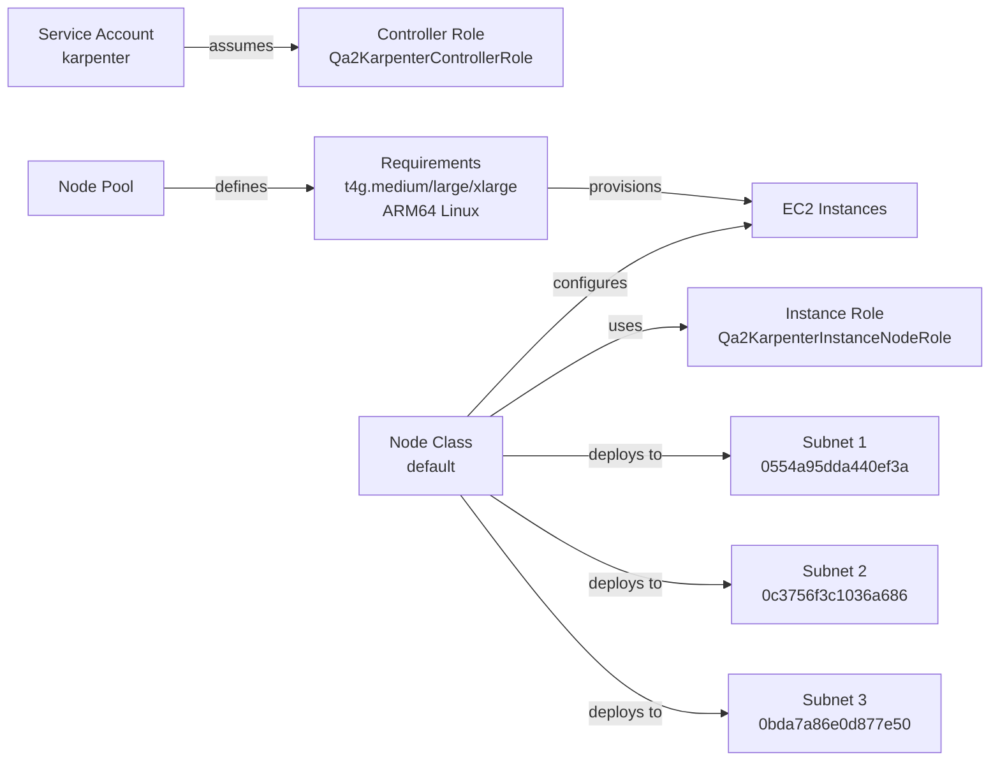
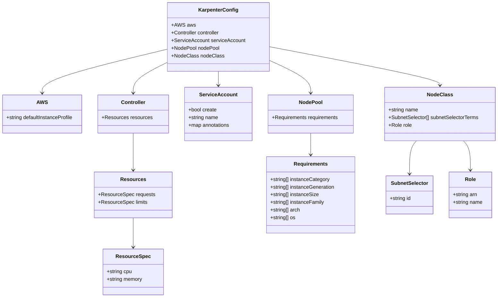

# Diagram: devops/k8s/karpenter/helm/values.qa2.yaml

> Auto-generated by Obscura crawlers

## Diagram 1

```mermaid
graph TD
    Root[Karpenter Configuration]
    Root --> AWS[AWS Settings]
    Root --> Controller[Controller]
    Root --> ServiceAccount[Service Account]
    Root --> NodePool[Node Pool]
    Root --> NodeClass[Node Class]
    
    AWS --> DefaultProfile["defaultInstanceProfile<br/>arn:aws:iam::591447794615:role/Qa2KarpenterInstanceNodeRole"]
    
    Controller --> Resources[Resources]
    Resources --> Requests[Requests]
    Resources --> Limits[Limits]
    Requests --> ReqCPU["cpu: 100m"]
    Requests --> ReqMem["memory: 200Mi"]
    Limits --> LimCPU["cpu: 200m"]
    Limits --> LimMem["memory: 200Mi"]
    
    ServiceAccount --> SACreate["create: true"]
    ServiceAccount --> SAName["name: karpenter"]
    ServiceAccount --> SAAnnotations[Annotations]
    SAAnnotations --> RoleArn["eks.amazonaws.com/role-arn<br/>arn:aws:iam::591447794615:role/Qa2KarpenterControllerRole"]
    
    NodePool --> Requirements[Requirements]
    Requirements --> InstCat["instanceCategory: t"]
    Requirements --> InstGen["instanceGeneration: 4"]
    Requirements --> InstSize["instanceSize: medium, large, xlarge"]
    Requirements --> InstFam["instanceFamily: t4g"]
    Requirements --> Arch["arch: arm64"]
    Requirements --> OS["os: linux"]
    
    NodeClass --> NCName["name: default"]
    NodeClass --> SubnetSelector[Subnet Selector Terms]
    NodeClass --> Role[Role]
    SubnetSelector --> Subnet1["subnet-0554a95dda440ef3a"]
    SubnetSelector --> Subnet2["subnet-0c3756f3c1036a686"]
    SubnetSelector --> Subnet3["subnet-0bda7a86e0d877e50"]
    Role --> RoleArn2["arn: arn:aws:iam::591447794615:role/Qa2KarpenterInstanceNodeRole"]
    Role --> RoleName["name: Qa2KarpenterInstanceNodeRole"]
```

### SVG

<svg id="container" width="4851.4921875" xmlns="http://www.w3.org/2000/svg" class="flowchart" height="534" viewBox="0 0 4851.4921875 534" role="graphics-document document" aria-roledescription="flowchart-v2"><g><marker id="container_flowchart-v2-pointEnd" class="marker flowchart-v2" viewBox="0 0 10 10" refX="5" refY="5" markerUnits="userSpaceOnUse" markerWidth="8" markerHeight="8" orient="auto"><path d="M 0 0 L 10 5 L 0 10 z" class="arrowMarkerPath" style="stroke-width: 1; stroke-dasharray: 1, 0;"></path></marker><marker id="container_flowchart-v2-pointStart" class="marker flowchart-v2" viewBox="0 0 10 10" refX="4.5" refY="5" markerUnits="userSpaceOnUse" markerWidth="8" markerHeight="8" orient="auto"><path d="M 0 5 L 10 10 L 10 0 z" class="arrowMarkerPath" style="stroke-width: 1; stroke-dasharray: 1, 0;"></path></marker><marker id="container_flowchart-v2-circleEnd" class="marker flowchart-v2" viewBox="0 0 10 10" refX="11" refY="5" markerUnits="userSpaceOnUse" markerWidth="11" markerHeight="11" orient="auto"><circle cx="5" cy="5" r="5" class="arrowMarkerPath" style="stroke-width: 1; stroke-dasharray: 1, 0;"></circle></marker><marker id="container_flowchart-v2-circleStart" class="marker flowchart-v2" viewBox="0 0 10 10" refX="-1" refY="5" markerUnits="userSpaceOnUse" markerWidth="11" markerHeight="11" orient="auto"><circle cx="5" cy="5" r="5" class="arrowMarkerPath" style="stroke-width: 1; stroke-dasharray: 1, 0;"></circle></marker><marker id="container_flowchart-v2-crossEnd" class="marker cross flowchart-v2" viewBox="0 0 11 11" refX="12" refY="5.2" markerUnits="userSpaceOnUse" markerWidth="11" markerHeight="11" orient="auto"><path d="M 1,1 l 9,9 M 10,1 l -9,9" class="arrowMarkerPath" style="stroke-width: 2; stroke-dasharray: 1, 0;"></path></marker><marker id="container_flowchart-v2-crossStart" class="marker cross flowchart-v2" viewBox="0 0 11 11" refX="-1" refY="5.2" markerUnits="userSpaceOnUse" markerWidth="11" markerHeight="11" orient="auto"><path d="M 1,1 l 9,9 M 10,1 l -9,9" class="arrowMarkerPath" style="stroke-width: 2; stroke-dasharray: 1, 0;"></path></marker><g class="root"><g class="clusters"></g><g class="edgePaths"><path d="M995.438,42.196L874.111,49.663C752.784,57.131,510.13,72.065,388.803,83.033C267.477,94,267.477,101,267.477,104.5L267.477,108" id="L_Root_AWS_0" class="edge-thickness-normal edge-pattern-solid edge-thickness-normal edge-pattern-solid flowchart-link" style=";" data-edge="true" data-et="edge" data-id="L_Root_AWS_0" data-points="W3sieCI6OTk1LjQzNzUsInkiOjQyLjE5NTc3NjAwMjM2NzIxfSx7IngiOjI2Ny40NzY1NjI1LCJ5Ijo4N30seyJ4IjoyNjcuNDc2NTYyNSwieSI6MTEyfV0=" marker-end="url(#container_flowchart-v2-pointEnd)"></path><path d="M995.438,47.973L936.816,54.477C878.195,60.982,760.953,73.991,702.332,83.995C643.711,94,643.711,101,643.711,104.5L643.711,108" id="L_Root_Controller_0" class="edge-thickness-normal edge-pattern-solid edge-thickness-normal edge-pattern-solid flowchart-link" style=";" data-edge="true" data-et="edge" data-id="L_Root_Controller_0" data-points="W3sieCI6OTk1LjQzNzUsInkiOjQ3Ljk3MjY5MzYyODUxMzMyfSx7IngiOjY0My43MTA5Mzc1LCJ5Ijo4N30seyJ4Ijo2NDMuNzEwOTM3NSwieSI6MTEyfV0=" marker-end="url(#container_flowchart-v2-pointEnd)"></path><path d="M1112.352,62L1112.352,66.167C1112.352,70.333,1112.352,78.667,1112.352,86.333C1112.352,94,1112.352,101,1112.352,104.5L1112.352,108" id="L_Root_ServiceAccount_0" class="edge-thickness-normal edge-pattern-solid edge-thickness-normal edge-pattern-solid flowchart-link" style=";" data-edge="true" data-et="edge" data-id="L_Root_ServiceAccount_0" data-points="W3sieCI6MTExMi4zNTE1NjI1LCJ5Ijo2Mn0seyJ4IjoxMTEyLjM1MTU2MjUsInkiOjg3fSx7IngiOjExMTIuMzUxNTYyNSwieSI6MTEyfV0=" marker-end="url(#container_flowchart-v2-pointEnd)"></path><path d="M1229.266,39.694L1425.652,47.578C1622.039,55.463,2014.813,71.231,2211.199,82.616C2407.586,94,2407.586,101,2407.586,104.5L2407.586,108" id="L_Root_NodePool_0" class="edge-thickness-normal edge-pattern-solid edge-thickness-normal edge-pattern-solid flowchart-link" style=";" data-edge="true" data-et="edge" data-id="L_Root_NodePool_0" data-points="W3sieCI6MTIyOS4yNjU2MjUsInkiOjM5LjY5Mzc2OTIyNjEyOTQ0fSx7IngiOjI0MDcuNTg1OTM3NSwieSI6ODd9LHsieCI6MjQwNy41ODU5Mzc1LCJ5IjoxMTJ9XQ==" marker-end="url(#container_flowchart-v2-pointEnd)"></path><path d="M1229.266,37.549L1607.217,45.791C1985.169,54.033,2741.073,70.516,3119.025,82.258C3496.977,94,3496.977,101,3496.977,104.5L3496.977,108" id="L_Root_NodeClass_0" class="edge-thickness-normal edge-pattern-solid edge-thickness-normal edge-pattern-solid flowchart-link" style=";" data-edge="true" data-et="edge" data-id="L_Root_NodeClass_0" data-points="W3sieCI6MTIyOS4yNjU2MjUsInkiOjM3LjU0OTQ3MDU2NjY1MDk0fSx7IngiOjM0OTYuOTc2NTYyNSwieSI6ODd9LHsieCI6MzQ5Ni45NzY1NjI1LCJ5IjoxMTJ9XQ==" marker-end="url(#container_flowchart-v2-pointEnd)"></path><path d="M267.477,166L267.477,170.167C267.477,174.333,267.477,182.667,267.477,190.333C267.477,198,267.477,205,267.477,208.5L267.477,212" id="L_AWS_DefaultProfile_0" class="edge-thickness-normal edge-pattern-solid edge-thickness-normal edge-pattern-solid flowchart-link" style=";" data-edge="true" data-et="edge" data-id="L_AWS_DefaultProfile_0" data-points="W3sieCI6MjY3LjQ3NjU2MjUsInkiOjE2Nn0seyJ4IjoyNjcuNDc2NTYyNSwieSI6MTkxfSx7IngiOjI2Ny40NzY1NjI1LCJ5IjoyMTZ9XQ==" marker-end="url(#container_flowchart-v2-pointEnd)"></path><path d="M643.711,166L643.711,170.167C643.711,174.333,643.711,182.667,643.711,192.333C643.711,202,643.711,213,643.711,218.5L643.711,224" id="L_Controller_Resources_0" class="edge-thickness-normal edge-pattern-solid edge-thickness-normal edge-pattern-solid flowchart-link" style=";" data-edge="true" data-et="edge" data-id="L_Controller_Resources_0" data-points="W3sieCI6NjQzLjcxMDkzNzUsInkiOjE2Nn0seyJ4Ijo2NDMuNzEwOTM3NSwieSI6MTkxfSx7IngiOjY0My43MTA5Mzc1LCJ5IjoyMjh9XQ==" marker-end="url(#container_flowchart-v2-pointEnd)"></path><path d="M576.953,276.126L554.374,283.272C531.794,290.418,486.635,304.709,464.056,317.354C441.477,330,441.477,341,441.477,346.5L441.477,352" id="L_Resources_Requests_0" class="edge-thickness-normal edge-pattern-solid edge-thickness-normal edge-pattern-solid flowchart-link" style=";" data-edge="true" data-et="edge" data-id="L_Resources_Requests_0" data-points="W3sieCI6NTc2Ljk1MzEyNSwieSI6Mjc2LjEyNjQ3NzYzMjY5NzIzfSx7IngiOjQ0MS40NzY1NjI1LCJ5IjozMTl9LHsieCI6NDQxLjQ3NjU2MjUsInkiOjM1Nn1d" marker-end="url(#container_flowchart-v2-pointEnd)"></path><path d="M710.469,276.153L733.007,283.294C755.544,290.435,800.62,304.718,823.158,317.359C845.695,330,845.695,341,845.695,346.5L845.695,352" id="L_Resources_Limits_0" class="edge-thickness-normal edge-pattern-solid edge-thickness-normal edge-pattern-solid flowchart-link" style=";" data-edge="true" data-et="edge" data-id="L_Resources_Limits_0" data-points="W3sieCI6NzEwLjQ2ODc1LCJ5IjoyNzYuMTUyNjI2Mjg2MDY3OX0seyJ4Ijo4NDUuNjk1MzEyNSwieSI6MzE5fSx7IngiOjg0NS42OTUzMTI1LCJ5IjozNTZ9XQ==" marker-end="url(#container_flowchart-v2-pointEnd)"></path><path d="M398.923,410L389.204,416.167C379.485,422.333,360.047,434.667,350.328,444.333C340.609,454,340.609,461,340.609,464.5L340.609,468" id="L_Requests_ReqCPU_0" class="edge-thickness-normal edge-pattern-solid edge-thickness-normal edge-pattern-solid flowchart-link" style=";" data-edge="true" data-et="edge" data-id="L_Requests_ReqCPU_0" data-points="W3sieCI6Mzk4LjkyMzIxNzc3MzQzNzUsInkiOjQxMH0seyJ4IjozNDAuNjA5Mzc1LCJ5Ijo0NDd9LHsieCI6MzQwLjYwOTM3NSwieSI6NDcyfV0=" marker-end="url(#container_flowchart-v2-pointEnd)"></path><path d="M484.03,410L493.749,416.167C503.468,422.333,522.906,434.667,532.625,444.333C542.344,454,542.344,461,542.344,464.5L542.344,468" id="L_Requests_ReqMem_0" class="edge-thickness-normal edge-pattern-solid edge-thickness-normal edge-pattern-solid flowchart-link" style=";" data-edge="true" data-et="edge" data-id="L_Requests_ReqMem_0" data-points="W3sieCI6NDg0LjAyOTkwNzIyNjU2MjUsInkiOjQxMH0seyJ4Ijo1NDIuMzQzNzUsInkiOjQ0N30seyJ4Ijo1NDIuMzQzNzUsInkiOjQ3Mn1d" marker-end="url(#container_flowchart-v2-pointEnd)"></path><path d="M803.036,410L793.293,416.167C783.55,422.333,764.064,434.667,754.321,444.333C744.578,454,744.578,461,744.578,464.5L744.578,468" id="L_Limits_LimCPU_0" class="edge-thickness-normal edge-pattern-solid edge-thickness-normal edge-pattern-solid flowchart-link" style=";" data-edge="true" data-et="edge" data-id="L_Limits_LimCPU_0" data-points="W3sieCI6ODAzLjAzNjQ5OTAyMzQzNzUsInkiOjQxMH0seyJ4Ijo3NDQuNTc4MTI1LCJ5Ijo0NDd9LHsieCI6NzQ0LjU3ODEyNSwieSI6NDcyfV0=" marker-end="url(#container_flowchart-v2-pointEnd)"></path><path d="M888.354,410L898.097,416.167C907.84,422.333,927.326,434.667,937.069,444.333C946.813,454,946.813,461,946.813,464.5L946.813,468" id="L_Limits_LimMem_0" class="edge-thickness-normal edge-pattern-solid edge-thickness-normal edge-pattern-solid flowchart-link" style=";" data-edge="true" data-et="edge" data-id="L_Limits_LimMem_0" data-points="W3sieCI6ODg4LjM1NDEyNTk3NjU2MjUsInkiOjQxMH0seyJ4Ijo5NDYuODEyNSwieSI6NDQ3fSx7IngiOjk0Ni44MTI1LCJ5Ijo0NzJ9XQ==" marker-end="url(#container_flowchart-v2-pointEnd)"></path><path d="M1025.391,160.411L1004.684,165.509C983.977,170.607,942.563,180.804,921.855,191.402C901.148,202,901.148,213,901.148,218.5L901.148,224" id="L_ServiceAccount_SACreate_0" class="edge-thickness-normal edge-pattern-solid edge-thickness-normal edge-pattern-solid flowchart-link" style=";" data-edge="true" data-et="edge" data-id="L_ServiceAccount_SACreate_0" data-points="W3sieCI6MTAyNS4zOTA2MjUsInkiOjE2MC40MTA1MjAwODU4MTc4Nn0seyJ4Ijo5MDEuMTQ4NDM3NSwieSI6MTkxfSx7IngiOjkwMS4xNDg0Mzc1LCJ5IjoyMjh9XQ==" marker-end="url(#container_flowchart-v2-pointEnd)"></path><path d="M1112.352,166L1112.352,170.167C1112.352,174.333,1112.352,182.667,1112.352,192.333C1112.352,202,1112.352,213,1112.352,218.5L1112.352,224" id="L_ServiceAccount_SAName_0" class="edge-thickness-normal edge-pattern-solid edge-thickness-normal edge-pattern-solid flowchart-link" style=";" data-edge="true" data-et="edge" data-id="L_ServiceAccount_SAName_0" data-points="W3sieCI6MTExMi4zNTE1NjI1LCJ5IjoxNjZ9LHsieCI6MTExMi4zNTE1NjI1LCJ5IjoxOTF9LHsieCI6MTExMi4zNTE1NjI1LCJ5IjoyMjh9XQ==" marker-end="url(#container_flowchart-v2-pointEnd)"></path><path d="M1199.313,160.151L1220.452,165.292C1241.591,170.434,1283.87,180.717,1305.009,191.358C1326.148,202,1326.148,213,1326.148,218.5L1326.148,224" id="L_ServiceAccount_SAAnnotations_0" class="edge-thickness-normal edge-pattern-solid edge-thickness-normal edge-pattern-solid flowchart-link" style=";" data-edge="true" data-et="edge" data-id="L_ServiceAccount_SAAnnotations_0" data-points="W3sieCI6MTE5OS4zMTI1LCJ5IjoxNjAuMTUwNzcxMDI5NzQ0OTN9LHsieCI6MTMyNi4xNDg0Mzc1LCJ5IjoxOTF9LHsieCI6MTMyNi4xNDg0Mzc1LCJ5IjoyMjh9XQ==" marker-end="url(#container_flowchart-v2-pointEnd)"></path><path d="M1326.148,282L1326.148,288.167C1326.148,294.333,1326.148,306.667,1326.148,316.333C1326.148,326,1326.148,333,1326.148,336.5L1326.148,340" id="L_SAAnnotations_RoleArn_0" class="edge-thickness-normal edge-pattern-solid edge-thickness-normal edge-pattern-solid flowchart-link" style=";" data-edge="true" data-et="edge" data-id="L_SAAnnotations_RoleArn_0" data-points="W3sieCI6MTMyNi4xNDg0Mzc1LCJ5IjoyODJ9LHsieCI6MTMyNi4xNDg0Mzc1LCJ5IjozMTl9LHsieCI6MTMyNi4xNDg0Mzc1LCJ5IjozNDR9XQ==" marker-end="url(#container_flowchart-v2-pointEnd)"></path><path d="M2407.586,166L2407.586,170.167C2407.586,174.333,2407.586,182.667,2407.586,192.333C2407.586,202,2407.586,213,2407.586,218.5L2407.586,224" id="L_NodePool_Requirements_0" class="edge-thickness-normal edge-pattern-solid edge-thickness-normal edge-pattern-solid flowchart-link" style=";" data-edge="true" data-et="edge" data-id="L_NodePool_Requirements_0" data-points="W3sieCI6MjQwNy41ODU5Mzc1LCJ5IjoxNjZ9LHsieCI6MjQwNy41ODU5Mzc1LCJ5IjoxOTF9LHsieCI6MjQwNy41ODU5Mzc1LCJ5IjoyMjh9XQ==" marker-end="url(#container_flowchart-v2-pointEnd)"></path><path d="M2327.07,262.505L2226.059,271.921C2125.047,281.337,1923.023,300.168,1822.012,315.084C1721,330,1721,341,1721,346.5L1721,352" id="L_Requirements_InstCat_0" class="edge-thickness-normal edge-pattern-solid edge-thickness-normal edge-pattern-solid flowchart-link" style=";" data-edge="true" data-et="edge" data-id="L_Requirements_InstCat_0" data-points="W3sieCI6MjMyNy4wNzAzMTI1LCJ5IjoyNjIuNTA1MjUxMzAwMDIzOX0seyJ4IjoxNzIxLCJ5IjozMTl9LHsieCI6MTcyMSwieSI6MzU2fV0=" marker-end="url(#container_flowchart-v2-pointEnd)"></path><path d="M2327.07,267.027L2269.082,275.689C2211.094,284.351,2095.117,301.676,2037.129,315.838C1979.141,330,1979.141,341,1979.141,346.5L1979.141,352" id="L_Requirements_InstGen_0" class="edge-thickness-normal edge-pattern-solid edge-thickness-normal edge-pattern-solid flowchart-link" style=";" data-edge="true" data-et="edge" data-id="L_Requirements_InstGen_0" data-points="W3sieCI6MjMyNy4wNzAzMTI1LCJ5IjoyNjcuMDI3MjA1OTIyNTc2Mn0seyJ4IjoxOTc5LjE0MDYyNSwieSI6MzE5fSx7IngiOjE5NzkuMTQwNjI1LCJ5IjozNTZ9XQ==" marker-end="url(#container_flowchart-v2-pointEnd)"></path><path d="M2348.754,282L2335.317,288.167C2321.88,294.333,2295.007,306.667,2281.57,316.333C2268.133,326,2268.133,333,2268.133,336.5L2268.133,340" id="L_Requirements_InstSize_0" class="edge-thickness-normal edge-pattern-solid edge-thickness-normal edge-pattern-solid flowchart-link" style=";" data-edge="true" data-et="edge" data-id="L_Requirements_InstSize_0" data-points="W3sieCI6MjM0OC43NTQxNTAzOTA2MjUsInkiOjI4Mn0seyJ4IjoyMjY4LjEzMjgxMjUsInkiOjMxOX0seyJ4IjoyMjY4LjEzMjgxMjUsInkiOjM0NH1d" marker-end="url(#container_flowchart-v2-pointEnd)"></path><path d="M2466.418,282L2479.855,288.167C2493.292,294.333,2520.165,306.667,2533.602,318.333C2547.039,330,2547.039,341,2547.039,346.5L2547.039,352" id="L_Requirements_InstFam_0" class="edge-thickness-normal edge-pattern-solid edge-thickness-normal edge-pattern-solid flowchart-link" style=";" data-edge="true" data-et="edge" data-id="L_Requirements_InstFam_0" data-points="W3sieCI6MjQ2Ni40MTc3MjQ2MDkzNzUsInkiOjI4Mn0seyJ4IjoyNTQ3LjAzOTA2MjUsInkiOjMxOX0seyJ4IjoyNTQ3LjAzOTA2MjUsInkiOjM1Nn1d" marker-end="url(#container_flowchart-v2-pointEnd)"></path><path d="M2488.102,269.277L2534.837,277.564C2581.573,285.851,2675.044,302.426,2721.78,316.213C2768.516,330,2768.516,341,2768.516,346.5L2768.516,352" id="L_Requirements_Arch_0" class="edge-thickness-normal edge-pattern-solid edge-thickness-normal edge-pattern-solid flowchart-link" style=";" data-edge="true" data-et="edge" data-id="L_Requirements_Arch_0" data-points="W3sieCI6MjQ4OC4xMDE1NjI1LCJ5IjoyNjkuMjc3MDE4OTgzMDk0OX0seyJ4IjoyNzY4LjUxNTYyNSwieSI6MzE5fSx7IngiOjI3NjguNTE1NjI1LCJ5IjozNTZ9XQ==" marker-end="url(#container_flowchart-v2-pointEnd)"></path><path d="M2488.102,264.476L2565.311,273.564C2642.521,282.651,2796.94,300.825,2874.15,315.413C2951.359,330,2951.359,341,2951.359,346.5L2951.359,352" id="L_Requirements_OS_0" class="edge-thickness-normal edge-pattern-solid edge-thickness-normal edge-pattern-solid flowchart-link" style=";" data-edge="true" data-et="edge" data-id="L_Requirements_OS_0" data-points="W3sieCI6MjQ4OC4xMDE1NjI1LCJ5IjoyNjQuNDc2MzczMTQ0ODM1N30seyJ4IjoyOTUxLjM1OTM3NSwieSI6MzE5fSx7IngiOjI5NTEuMzU5Mzc1LCJ5IjozNTZ9XQ==" marker-end="url(#container_flowchart-v2-pointEnd)"></path><path d="M3427.203,147.226L3365.32,154.522C3303.436,161.817,3179.669,176.409,3117.786,189.204C3055.902,202,3055.902,213,3055.902,218.5L3055.902,224" id="L_NodeClass_NCName_0" class="edge-thickness-normal edge-pattern-solid edge-thickness-normal edge-pattern-solid flowchart-link" style=";" data-edge="true" data-et="edge" data-id="L_NodeClass_NCName_0" data-points="W3sieCI6MzQyNy4yMDMxMjUsInkiOjE0Ny4yMjU4NjkwMTY1MTY4NH0seyJ4IjozMDU1LjkwMjM0Mzc1LCJ5IjoxOTF9LHsieCI6MzA1NS45MDIzNDM3NSwieSI6MjI4fV0=" marker-end="url(#container_flowchart-v2-pointEnd)"></path><path d="M3496.977,166L3496.977,170.167C3496.977,174.333,3496.977,182.667,3496.977,192.333C3496.977,202,3496.977,213,3496.977,218.5L3496.977,224" id="L_NodeClass_SubnetSelector_0" class="edge-thickness-normal edge-pattern-solid edge-thickness-normal edge-pattern-solid flowchart-link" style=";" data-edge="true" data-et="edge" data-id="L_NodeClass_SubnetSelector_0" data-points="W3sieCI6MzQ5Ni45NzY1NjI1LCJ5IjoxNjZ9LHsieCI6MzQ5Ni45NzY1NjI1LCJ5IjoxOTF9LHsieCI6MzQ5Ni45NzY1NjI1LCJ5IjoyMjh9XQ==" marker-end="url(#container_flowchart-v2-pointEnd)"></path><path d="M3566.75,142.729L3717.279,150.774C3867.807,158.819,4168.865,174.91,4319.393,188.455C4469.922,202,4469.922,213,4469.922,218.5L4469.922,224" id="L_NodeClass_Role_0" class="edge-thickness-normal edge-pattern-solid edge-thickness-normal edge-pattern-solid flowchart-link" style=";" data-edge="true" data-et="edge" data-id="L_NodeClass_Role_0" data-points="W3sieCI6MzU2Ni43NSwieSI6MTQyLjcyOTEwODYxODMyMjI3fSx7IngiOjQ0NjkuOTIxODc1LCJ5IjoxOTF9LHsieCI6NDQ2OS45MjE4NzUsInkiOjIyOH1d" marker-end="url(#container_flowchart-v2-pointEnd)"></path><path d="M3385.555,278.333L3353.188,285.11C3320.82,291.888,3256.086,305.444,3223.719,317.722C3191.352,330,3191.352,341,3191.352,346.5L3191.352,352" id="L_SubnetSelector_Subnet1_0" class="edge-thickness-normal edge-pattern-solid edge-thickness-normal edge-pattern-solid flowchart-link" style=";" data-edge="true" data-et="edge" data-id="L_SubnetSelector_Subnet1_0" data-points="W3sieCI6MzM4NS41NTQ2ODc1LCJ5IjoyNzguMzMyNTE1MzM3NDIzMzN9LHsieCI6MzE5MS4zNTE1NjI1LCJ5IjozMTl9LHsieCI6MzE5MS4zNTE1NjI1LCJ5IjozNTZ9XQ==" marker-end="url(#container_flowchart-v2-pointEnd)"></path><path d="M3496.977,282L3496.977,288.167C3496.977,294.333,3496.977,306.667,3496.977,318.333C3496.977,330,3496.977,341,3496.977,346.5L3496.977,352" id="L_SubnetSelector_Subnet2_0" class="edge-thickness-normal edge-pattern-solid edge-thickness-normal edge-pattern-solid flowchart-link" style=";" data-edge="true" data-et="edge" data-id="L_SubnetSelector_Subnet2_0" data-points="W3sieCI6MzQ5Ni45NzY1NjI1LCJ5IjoyODJ9LHsieCI6MzQ5Ni45NzY1NjI1LCJ5IjozMTl9LHsieCI6MzQ5Ni45NzY1NjI1LCJ5IjozNTZ9XQ==" marker-end="url(#container_flowchart-v2-pointEnd)"></path><path d="M3608.398,278.315L3640.803,285.096C3673.208,291.877,3738.018,305.438,3770.423,317.719C3802.828,330,3802.828,341,3802.828,346.5L3802.828,352" id="L_SubnetSelector_Subnet3_0" class="edge-thickness-normal edge-pattern-solid edge-thickness-normal edge-pattern-solid flowchart-link" style=";" data-edge="true" data-et="edge" data-id="L_SubnetSelector_Subnet3_0" data-points="W3sieCI6MzYwOC4zOTg0Mzc1LCJ5IjoyNzguMzE1MjMxNTUxMjUyOX0seyJ4IjozODAyLjgyODEyNSwieSI6MzE5fSx7IngiOjM4MDIuODI4MTI1LCJ5IjozNTZ9XQ==" marker-end="url(#container_flowchart-v2-pointEnd)"></path><path d="M4423.859,267.948L4393.59,276.457C4363.32,284.965,4302.781,301.983,4272.512,313.991C4242.242,326,4242.242,333,4242.242,336.5L4242.242,340" id="L_Role_RoleArn2_0" class="edge-thickness-normal edge-pattern-solid edge-thickness-normal edge-pattern-solid flowchart-link" style=";" data-edge="true" data-et="edge" data-id="L_Role_RoleArn2_0" data-points="W3sieCI6NDQyMy44NTkzNzUsInkiOjI2Ny45NDgwMTQ5NjA3MTA5Nn0seyJ4Ijo0MjQyLjI0MjE4NzUsInkiOjMxOX0seyJ4Ijo0MjQyLjI0MjE4NzUsInkiOjM0NH1d" marker-end="url(#container_flowchart-v2-pointEnd)"></path><path d="M4515.984,267.948L4546.254,276.457C4576.523,284.965,4637.063,301.983,4667.332,313.991C4697.602,326,4697.602,333,4697.602,336.5L4697.602,340" id="L_Role_RoleName_0" class="edge-thickness-normal edge-pattern-solid edge-thickness-normal edge-pattern-solid flowchart-link" style=";" data-edge="true" data-et="edge" data-id="L_Role_RoleName_0" data-points="W3sieCI6NDUxNS45ODQzNzUsInkiOjI2Ny45NDgwMTQ5NjA3MTA5Nn0seyJ4Ijo0Njk3LjYwMTU2MjUsInkiOjMxOX0seyJ4Ijo0Njk3LjYwMTU2MjUsInkiOjM0NH1d" marker-end="url(#container_flowchart-v2-pointEnd)"></path></g><g class="edgeLabels"><g class="edgeLabel"><g class="label" data-id="L_Root_AWS_0" transform="translate(0, 0)"><foreignObject width="0" height="0">

</foreignObject></g></g><g class="edgeLabel"><g class="label" data-id="L_Root_Controller_0" transform="translate(0, 0)"><foreignObject width="0" height="0">

</foreignObject></g></g><g class="edgeLabel"><g class="label" data-id="L_Root_ServiceAccount_0" transform="translate(0, 0)"><foreignObject width="0" height="0">

</foreignObject></g></g><g class="edgeLabel"><g class="label" data-id="L_Root_NodePool_0" transform="translate(0, 0)"><foreignObject width="0" height="0">

</foreignObject></g></g><g class="edgeLabel"><g class="label" data-id="L_Root_NodeClass_0" transform="translate(0, 0)"><foreignObject width="0" height="0">

</foreignObject></g></g><g class="edgeLabel"><g class="label" data-id="L_AWS_DefaultProfile_0" transform="translate(0, 0)"><foreignObject width="0" height="0">

</foreignObject></g></g><g class="edgeLabel"><g class="label" data-id="L_Controller_Resources_0" transform="translate(0, 0)"><foreignObject width="0" height="0">

</foreignObject></g></g><g class="edgeLabel"><g class="label" data-id="L_Resources_Requests_0" transform="translate(0, 0)"><foreignObject width="0" height="0">

</foreignObject></g></g><g class="edgeLabel"><g class="label" data-id="L_Resources_Limits_0" transform="translate(0, 0)"><foreignObject width="0" height="0">

</foreignObject></g></g><g class="edgeLabel"><g class="label" data-id="L_Requests_ReqCPU_0" transform="translate(0, 0)"><foreignObject width="0" height="0">

</foreignObject></g></g><g class="edgeLabel"><g class="label" data-id="L_Requests_ReqMem_0" transform="translate(0, 0)"><foreignObject width="0" height="0">

</foreignObject></g></g><g class="edgeLabel"><g class="label" data-id="L_Limits_LimCPU_0" transform="translate(0, 0)"><foreignObject width="0" height="0">

</foreignObject></g></g><g class="edgeLabel"><g class="label" data-id="L_Limits_LimMem_0" transform="translate(0, 0)"><foreignObject width="0" height="0">

</foreignObject></g></g><g class="edgeLabel"><g class="label" data-id="L_ServiceAccount_SACreate_0" transform="translate(0, 0)"><foreignObject width="0" height="0">

</foreignObject></g></g><g class="edgeLabel"><g class="label" data-id="L_ServiceAccount_SAName_0" transform="translate(0, 0)"><foreignObject width="0" height="0">

</foreignObject></g></g><g class="edgeLabel"><g class="label" data-id="L_ServiceAccount_SAAnnotations_0" transform="translate(0, 0)"><foreignObject width="0" height="0">

</foreignObject></g></g><g class="edgeLabel"><g class="label" data-id="L_SAAnnotations_RoleArn_0" transform="translate(0, 0)"><foreignObject width="0" height="0">

</foreignObject></g></g><g class="edgeLabel"><g class="label" data-id="L_NodePool_Requirements_0" transform="translate(0, 0)"><foreignObject width="0" height="0">

</foreignObject></g></g><g class="edgeLabel"><g class="label" data-id="L_Requirements_InstCat_0" transform="translate(0, 0)"><foreignObject width="0" height="0">

</foreignObject></g></g><g class="edgeLabel"><g class="label" data-id="L_Requirements_InstGen_0" transform="translate(0, 0)"><foreignObject width="0" height="0">

</foreignObject></g></g><g class="edgeLabel"><g class="label" data-id="L_Requirements_InstSize_0" transform="translate(0, 0)"><foreignObject width="0" height="0">

</foreignObject></g></g><g class="edgeLabel"><g class="label" data-id="L_Requirements_InstFam_0" transform="translate(0, 0)"><foreignObject width="0" height="0">

</foreignObject></g></g><g class="edgeLabel"><g class="label" data-id="L_Requirements_Arch_0" transform="translate(0, 0)"><foreignObject width="0" height="0">

</foreignObject></g></g><g class="edgeLabel"><g class="label" data-id="L_Requirements_OS_0" transform="translate(0, 0)"><foreignObject width="0" height="0">

</foreignObject></g></g><g class="edgeLabel"><g class="label" data-id="L_NodeClass_NCName_0" transform="translate(0, 0)"><foreignObject width="0" height="0">

</foreignObject></g></g><g class="edgeLabel"><g class="label" data-id="L_NodeClass_SubnetSelector_0" transform="translate(0, 0)"><foreignObject width="0" height="0">

</foreignObject></g></g><g class="edgeLabel"><g class="label" data-id="L_NodeClass_Role_0" transform="translate(0, 0)"><foreignObject width="0" height="0">

</foreignObject></g></g><g class="edgeLabel"><g class="label" data-id="L_SubnetSelector_Subnet1_0" transform="translate(0, 0)"><foreignObject width="0" height="0">

</foreignObject></g></g><g class="edgeLabel"><g class="label" data-id="L_SubnetSelector_Subnet2_0" transform="translate(0, 0)"><foreignObject width="0" height="0">

</foreignObject></g></g><g class="edgeLabel"><g class="label" data-id="L_SubnetSelector_Subnet3_0" transform="translate(0, 0)"><foreignObject width="0" height="0">

</foreignObject></g></g><g class="edgeLabel"><g class="label" data-id="L_Role_RoleArn2_0" transform="translate(0, 0)"><foreignObject width="0" height="0">

</foreignObject></g></g><g class="edgeLabel"><g class="label" data-id="L_Role_RoleName_0" transform="translate(0, 0)"><foreignObject width="0" height="0">

</foreignObject></g></g></g><g class="nodes"><g class="node default" id="flowchart-Root-0" transform="translate(1112.3515625, 35)"><rect class="basic label-container" style="" x="-116.9140625" y="-27" width="233.828125" height="54"></rect><g class="label" style="" transform="translate(-86.9140625, -12)"><rect></rect><foreignObject width="173.828125" height="24">

Karpenter Configuration

</foreignObject></g></g><g class="node default" id="flowchart-AWS-2" transform="translate(267.4765625, 139)"><rect class="basic label-container" style="" x="-76.875" y="-27" width="153.75" height="54"></rect><g class="label" style="" transform="translate(-46.875, -12)"><rect></rect><foreignObject width="93.75" height="24">

AWS Settings

</foreignObject></g></g><g class="node default" id="flowchart-Controller-4" transform="translate(643.7109375, 139)"><rect class="basic label-container" style="" x="-66.1875" y="-27" width="132.375" height="54"></rect><g class="label" style="" transform="translate(-36.1875, -12)"><rect></rect><foreignObject width="72.375" height="24">

Controller

</foreignObject></g></g><g class="node default" id="flowchart-ServiceAccount-6" transform="translate(1112.3515625, 139)"><rect class="basic label-container" style="" x="-86.9609375" y="-27" width="173.921875" height="54"></rect><g class="label" style="" transform="translate(-56.9609375, -12)"><rect></rect><foreignObject width="113.921875" height="24">

Service Account

</foreignObject></g></g><g class="node default" id="flowchart-NodePool-8" transform="translate(2407.5859375, 139)"><rect class="basic label-container" style="" x="-67.5" y="-27" width="135" height="54"></rect><g class="label" style="" transform="translate(-37.5, -12)"><rect></rect><foreignObject width="75" height="24">

Node Pool

</foreignObject></g></g><g class="node default" id="flowchart-NodeClass-10" transform="translate(3496.9765625, 139)"><rect class="basic label-container" style="" x="-69.7734375" y="-27" width="139.546875" height="54"></rect><g class="label" style="" transform="translate(-39.7734375, -12)"><rect></rect><foreignObject width="79.546875" height="24">

Node Class

</foreignObject></g></g><g class="node default" id="flowchart-DefaultProfile-12" transform="translate(267.4765625, 255)"><rect class="basic label-container" style="" x="-259.4765625" y="-39" width="518.953125" height="78"></rect><g class="label" style="" transform="translate(-229.4765625, -24)"><rect></rect><foreignObject width="458.953125" height="48">

defaultInstanceProfile arn:aws:iam::591447794615:role/Qa2KarpenterInstanceNodeRole

</foreignObject></g></g><g class="node default" id="flowchart-Resources-14" transform="translate(643.7109375, 255)"><rect class="basic label-container" style="" x="-66.7578125" y="-27" width="133.515625" height="54"></rect><g class="label" style="" transform="translate(-36.7578125, -12)"><rect></rect><foreignObject width="73.515625" height="24">

Resources

</foreignObject></g></g><g class="node default" id="flowchart-Requests-16" transform="translate(441.4765625, 383)"><rect class="basic label-container" style="" x="-63.2421875" y="-27" width="126.484375" height="54"></rect><g class="label" style="" transform="translate(-33.2421875, -12)"><rect></rect><foreignObject width="66.484375" height="24">

Requests

</foreignObject></g></g><g class="node default" id="flowchart-Limits-18" transform="translate(845.6953125, 383)"><rect class="basic label-container" style="" x="-51.9765625" y="-27" width="103.953125" height="54"></rect><g class="label" style="" transform="translate(-21.9765625, -12)"><rect></rect><foreignObject width="43.953125" height="24">

Limits

</foreignObject></g></g><g class="node default" id="flowchart-ReqCPU-20" transform="translate(340.609375, 499)"><rect class="basic label-container" style="" x="-66.5234375" y="-27" width="133.046875" height="54"></rect><g class="label" style="" transform="translate(-36.5234375, -12)"><rect></rect><foreignObject width="73.046875" height="24">

cpu: 100m

</foreignObject></g></g><g class="node default" id="flowchart-ReqMem-22" transform="translate(542.34375, 499)"><rect class="basic label-container" style="" x="-85.2109375" y="-27" width="170.421875" height="54"></rect><g class="label" style="" transform="translate(-55.2109375, -12)"><rect></rect><foreignObject width="110.421875" height="24">

memory: 200Mi

</foreignObject></g></g><g class="node default" id="flowchart-LimCPU-24" transform="translate(744.578125, 499)"><rect class="basic label-container" style="" x="-67.0234375" y="-27" width="134.046875" height="54"></rect><g class="label" style="" transform="translate(-37.0234375, -12)"><rect></rect><foreignObject width="74.046875" height="24">

cpu: 200m

</foreignObject></g></g><g class="node default" id="flowchart-LimMem-26" transform="translate(946.8125, 499)"><rect class="basic label-container" style="" x="-85.2109375" y="-27" width="170.421875" height="54"></rect><g class="label" style="" transform="translate(-55.2109375, -12)"><rect></rect><foreignObject width="110.421875" height="24">

memory: 200Mi

</foreignObject></g></g><g class="node default" id="flowchart-SACreate-28" transform="translate(901.1484375, 255)"><rect class="basic label-container" style="" x="-71.46875" y="-27" width="142.9375" height="54"></rect><g class="label" style="" transform="translate(-41.46875, -12)"><rect></rect><foreignObject width="82.9375" height="24">

create: true

</foreignObject></g></g><g class="node default" id="flowchart-SAName-30" transform="translate(1112.3515625, 255)"><rect class="basic label-container" style="" x="-89.734375" y="-27" width="179.46875" height="54"></rect><g class="label" style="" transform="translate(-59.734375, -12)"><rect></rect><foreignObject width="119.46875" height="24">

name: karpenter

</foreignObject></g></g><g class="node default" id="flowchart-SAAnnotations-32" transform="translate(1326.1484375, 255)"><rect class="basic label-container" style="" x="-74.0625" y="-27" width="148.125" height="54"></rect><g class="label" style="" transform="translate(-44.0625, -12)"><rect></rect><foreignObject width="88.125" height="24">

Annotations

</foreignObject></g></g><g class="node default" id="flowchart-RoleArn-34" transform="translate(1326.1484375, 383)"><rect class="basic label-container" style="" x="-245.703125" y="-39" width="491.40625" height="78"></rect><g class="label" style="" transform="translate(-215.703125, -24)"><rect></rect><foreignObject width="431.40625" height="48">

eks.amazonaws.com/role-arn arn:aws:iam::591447794615:role/Qa2KarpenterControllerRole

</foreignObject></g></g><g class="node default" id="flowchart-Requirements-36" transform="translate(2407.5859375, 255)"><rect class="basic label-container" style="" x="-80.515625" y="-27" width="161.03125" height="54"></rect><g class="label" style="" transform="translate(-50.515625, -12)"><rect></rect><foreignObject width="101.03125" height="24">

Requirements

</foreignObject></g></g><g class="node default" id="flowchart-InstCat-38" transform="translate(1721, 383)"><rect class="basic label-container" style="" x="-99.1484375" y="-27" width="198.296875" height="54"></rect><g class="label" style="" transform="translate(-69.1484375, -12)"><rect></rect><foreignObject width="138.296875" height="24">

instanceCategory: t

</foreignObject></g></g><g class="node default" id="flowchart-InstGen-40" transform="translate(1979.140625, 383)"><rect class="basic label-container" style="" x="-108.9921875" y="-27" width="217.984375" height="54"></rect><g class="label" style="" transform="translate(-78.9921875, -12)"><rect></rect><foreignObject width="157.984375" height="24">

instanceGeneration: 4

</foreignObject></g></g><g class="node default" id="flowchart-InstSize-42" transform="translate(2268.1328125, 383)"><rect class="basic label-container" style="" x="-130" y="-39" width="260" height="78"></rect><g class="label" style="" transform="translate(-100, -24)"><rect></rect><foreignObject width="200" height="48">

instanceSize: medium, large, xlarge

</foreignObject></g></g><g class="node default" id="flowchart-InstFam-44" transform="translate(2547.0390625, 383)"><rect class="basic label-container" style="" x="-98.90625" y="-27" width="197.8125" height="54"></rect><g class="label" style="" transform="translate(-68.90625, -12)"><rect></rect><foreignObject width="137.8125" height="24">

instanceFamily: t4g

</foreignObject></g></g><g class="node default" id="flowchart-Arch-46" transform="translate(2768.515625, 383)"><rect class="basic label-container" style="" x="-72.5703125" y="-27" width="145.140625" height="54"></rect><g class="label" style="" transform="translate(-42.5703125, -12)"><rect></rect><foreignObject width="85.140625" height="24">

arch: arm64

</foreignObject></g></g><g class="node default" id="flowchart-OS-48" transform="translate(2951.359375, 383)"><rect class="basic label-container" style="" x="-60.2734375" y="-27" width="120.546875" height="54"></rect><g class="label" style="" transform="translate(-30.2734375, -12)"><rect></rect><foreignObject width="60.546875" height="24">

os: linux

</foreignObject></g></g><g class="node default" id="flowchart-NCName-50" transform="translate(3055.90234375, 255)"><rect class="basic label-container" style="" x="-80.1875" y="-27" width="160.375" height="54"></rect><g class="label" style="" transform="translate(-50.1875, -12)"><rect></rect><foreignObject width="100.375" height="24">

name: default

</foreignObject></g></g><g class="node default" id="flowchart-SubnetSelector-52" transform="translate(3496.9765625, 255)"><rect class="basic label-container" style="" x="-111.421875" y="-27" width="222.84375" height="54"></rect><g class="label" style="" transform="translate(-81.421875, -12)"><rect></rect><foreignObject width="162.84375" height="24">

Subnet Selector Terms

</foreignObject></g></g><g class="node default" id="flowchart-Role-54" transform="translate(4469.921875, 255)"><rect class="basic label-container" style="" x="-46.0625" y="-27" width="92.125" height="54"></rect><g class="label" style="" transform="translate(-16.0625, -12)"><rect></rect><foreignObject width="32.125" height="24">

Role

</foreignObject></g></g><g class="node default" id="flowchart-Subnet1-56" transform="translate(3191.3515625, 383)"><rect class="basic label-container" style="" x="-129.71875" y="-27" width="259.4375" height="54"></rect><g class="label" style="" transform="translate(-99.71875, -12)"><rect></rect><foreignObject width="199.4375" height="24">

subnet-0554a95dda440ef3a

</foreignObject></g></g><g class="node default" id="flowchart-Subnet2-58" transform="translate(3496.9765625, 383)"><rect class="basic label-container" style="" x="-125.90625" y="-27" width="251.8125" height="54"></rect><g class="label" style="" transform="translate(-95.90625, -12)"><rect></rect><foreignObject width="191.8125" height="24">

subnet-0c3756f3c1036a686

</foreignObject></g></g><g class="node default" id="flowchart-Subnet3-60" transform="translate(3802.828125, 383)"><rect class="basic label-container" style="" x="-129.9453125" y="-27" width="259.890625" height="54"></rect><g class="label" style="" transform="translate(-99.9453125, -12)"><rect></rect><foreignObject width="199.890625" height="24">

subnet-0bda7a86e0d877e50

</foreignObject></g></g><g class="node default" id="flowchart-RoleArn2-62" transform="translate(4242.2421875, 383)"><rect class="basic label-container" style="" x="-259.46875" y="-39" width="518.9375" height="78"></rect><g class="label" style="" transform="translate(-229.46875, -24)"><rect></rect><foreignObject width="458.9375" height="48">

arn: arn:aws:iam::591447794615:role/Qa2KarpenterInstanceNodeRole

</foreignObject></g></g><g class="node default" id="flowchart-RoleName-64" transform="translate(4697.6015625, 383)"><rect class="basic label-container" style="" x="-145.890625" y="-39" width="291.78125" height="78"></rect><g class="label" style="" transform="translate(-115.890625, -24)"><rect></rect><foreignObject width="231.78125" height="48">

name: Qa2KarpenterInstanceNodeRole

</foreignObject></g></g></g></g></g></svg>

## Diagram 2

### SVG

<svg id="container" width="984.53125" xmlns="http://www.w3.org/2000/svg" class="flowchart" height="756" viewBox="0 0 984.53125 756" role="graphics-document document" aria-roledescription="flowchart-v2"><g><marker id="container_flowchart-v2-pointEnd" class="marker flowchart-v2" viewBox="0 0 10 10" refX="5" refY="5" markerUnits="userSpaceOnUse" markerWidth="8" markerHeight="8" orient="auto"><path d="M 0 0 L 10 5 L 0 10 z" class="arrowMarkerPath" style="stroke-width: 1; stroke-dasharray: 1, 0;"></path></marker><marker id="container_flowchart-v2-pointStart" class="marker flowchart-v2" viewBox="0 0 10 10" refX="4.5" refY="5" markerUnits="userSpaceOnUse" markerWidth="8" markerHeight="8" orient="auto"><path d="M 0 5 L 10 10 L 10 0 z" class="arrowMarkerPath" style="stroke-width: 1; stroke-dasharray: 1, 0;"></path></marker><marker id="container_flowchart-v2-circleEnd" class="marker flowchart-v2" viewBox="0 0 10 10" refX="11" refY="5" markerUnits="userSpaceOnUse" markerWidth="11" markerHeight="11" orient="auto"><circle cx="5" cy="5" r="5" class="arrowMarkerPath" style="stroke-width: 1; stroke-dasharray: 1, 0;"></circle></marker><marker id="container_flowchart-v2-circleStart" class="marker flowchart-v2" viewBox="0 0 10 10" refX="-1" refY="5" markerUnits="userSpaceOnUse" markerWidth="11" markerHeight="11" orient="auto"><circle cx="5" cy="5" r="5" class="arrowMarkerPath" style="stroke-width: 1; stroke-dasharray: 1, 0;"></circle></marker><marker id="container_flowchart-v2-crossEnd" class="marker cross flowchart-v2" viewBox="0 0 11 11" refX="12" refY="5.2" markerUnits="userSpaceOnUse" markerWidth="11" markerHeight="11" orient="auto"><path d="M 1,1 l 9,9 M 10,1 l -9,9" class="arrowMarkerPath" style="stroke-width: 2; stroke-dasharray: 1, 0;"></path></marker><marker id="container_flowchart-v2-crossStart" class="marker cross flowchart-v2" viewBox="0 0 11 11" refX="-1" refY="5.2" markerUnits="userSpaceOnUse" markerWidth="11" markerHeight="11" orient="auto"><path d="M 1,1 l 9,9 M 10,1 l -9,9" class="arrowMarkerPath" style="stroke-width: 2; stroke-dasharray: 1, 0;"></path></marker><g class="root"><g class="clusters"></g><g class="edgePaths"><path d="M181.922,47L191.301,47C200.68,47,219.438,47,237.529,47C255.62,47,273.044,47,281.757,47L290.469,47" id="L_SA_ControllerRole_0" class="edge-thickness-normal edge-pattern-solid edge-thickness-normal edge-pattern-solid flowchart-link" style=";" data-edge="true" data-et="edge" data-id="L_SA_ControllerRole_0" data-points="W3sieCI6MTgxLjkyMTg3NSwieSI6NDd9LHsieCI6MjM4LjE5NTMxMjUsInkiOjQ3fSx7IngiOjI5NC40Njg3NSwieSI6NDd9XQ==" marker-end="url(#container_flowchart-v2-pointEnd)"></path><path d="M486.043,414L508.657,399.167C531.271,384.333,576.499,354.667,608.95,339.833C641.401,325,661.076,325,670.913,325L680.75,325" id="L_NodeClass_InstanceRole_0" class="edge-thickness-normal edge-pattern-solid edge-thickness-normal edge-pattern-solid flowchart-link" style=";" data-edge="true" data-et="edge" data-id="L_NodeClass_InstanceRole_0" data-points="W3sieCI6NDg2LjA0Mjg0NjY3OTY4NzUsInkiOjQxNH0seyJ4Ijo2MjEuNzI2NTYyNSwieSI6MzI1fSx7IngiOjY4NC43NSwieSI6MzI1fV0=" marker-end="url(#container_flowchart-v2-pointEnd)"></path><path d="M496.359,453L517.254,453C538.148,453,579.938,453,618.029,453C656.12,453,690.513,453,707.71,453L724.906,453" id="L_NodeClass_Subnet1_0" class="edge-thickness-normal edge-pattern-solid edge-thickness-normal edge-pattern-solid flowchart-link" style=";" data-edge="true" data-et="edge" data-id="L_NodeClass_Subnet1_0" data-points="W3sieCI6NDk2LjM1OTM3NSwieSI6NDUzfSx7IngiOjYyMS43MjY1NjI1LCJ5Ijo0NTN9LHsieCI6NzI4LjkwNjI1LCJ5Ijo0NTN9XQ==" marker-end="url(#container_flowchart-v2-pointEnd)"></path><path d="M486.043,492L508.657,506.833C531.271,521.667,576.499,551.333,616.945,566.167C657.391,581,693.055,581,710.887,581L728.719,581" id="L_NodeClass_Subnet2_0" class="edge-thickness-normal edge-pattern-solid edge-thickness-normal edge-pattern-solid flowchart-link" style=";" data-edge="true" data-et="edge" data-id="L_NodeClass_Subnet2_0" data-points="W3sieCI6NDg2LjA0Mjg0NjY3OTY4NzUsInkiOjQ5Mn0seyJ4Ijo2MjEuNzI2NTYyNSwieSI6NTgxfSx7IngiOjczMi43MTg3NSwieSI6NTgxfV0=" marker-end="url(#container_flowchart-v2-pointEnd)"></path><path d="M456.314,492L483.883,528.167C511.452,564.333,566.589,636.667,611.317,672.833C656.044,709,690.362,709,707.521,709L724.68,709" id="L_NodeClass_Subnet3_0" class="edge-thickness-normal edge-pattern-solid edge-thickness-normal edge-pattern-solid flowchart-link" style=";" data-edge="true" data-et="edge" data-id="L_NodeClass_Subnet3_0" data-points="W3sieCI6NDU2LjMxNDM5MjA4OTg0Mzc1LCJ5Ijo0OTJ9LHsieCI6NjIxLjcyNjU2MjUsInkiOjcwOX0seyJ4Ijo3MjguNjc5Njg3NSwieSI6NzA5fV0=" marker-end="url(#container_flowchart-v2-pointEnd)"></path><path d="M162.461,187L175.083,187C187.706,187,212.951,187,236.167,187C259.383,187,280.57,187,291.164,187L301.758,187" id="L_NodePool_Requirements_0" class="edge-thickness-normal edge-pattern-solid edge-thickness-normal edge-pattern-solid flowchart-link" style=";" data-edge="true" data-et="edge" data-id="L_NodePool_Requirements_0" data-points="W3sieCI6MTYyLjQ2MDkzNzUsInkiOjE4N30seyJ4IjoyMzguMTk1MzEyNSwieSI6MTg3fSx7IngiOjMwNS43NTc4MTI1LCJ5IjoxODd9XQ==" marker-end="url(#container_flowchart-v2-pointEnd)"></path><path d="M547.414,187L559.799,187C572.185,187,596.956,187,630.303,189.207C663.651,191.415,705.575,195.83,726.537,198.037L747.499,200.245" id="L_Requirements_Instances_0" class="edge-thickness-normal edge-pattern-solid edge-thickness-normal edge-pattern-solid flowchart-link" style=";" data-edge="true" data-et="edge" data-id="L_Requirements_Instances_0" data-points="W3sieCI6NTQ3LjQxNDA2MjUsInkiOjE4N30seyJ4Ijo2MjEuNzI2NTYyNSwieSI6MTg3fSx7IngiOjc1MS40NzY1NjI1LCJ5IjoyMDAuNjYzNTEyOTU3NjMwNjJ9XQ==" marker-end="url(#container_flowchart-v2-pointEnd)"></path><path d="M463.175,414L489.6,385.833C516.025,357.667,568.876,301.333,616.269,269.553C663.663,237.774,705.599,230.547,726.567,226.934L747.535,223.321" id="L_NodeClass_Instances_0" class="edge-thickness-normal edge-pattern-solid edge-thickness-normal edge-pattern-solid flowchart-link" style=";" data-edge="true" data-et="edge" data-id="L_NodeClass_Instances_0" data-points="W3sieCI6NDYzLjE3NDgwNDY4NzUsInkiOjQxNH0seyJ4Ijo2MjEuNzI2NTYyNSwieSI6MjQ1fSx7IngiOjc1MS40NzY1NjI1LCJ5IjoyMjIuNjQxNTI0MjUxMTQ5OTJ9XQ==" marker-end="url(#container_flowchart-v2-pointEnd)"></path></g><g class="edgeLabels"><g class="edgeLabel" transform="translate(238.1953125, 47)"><g class="label" data-id="L_SA_ControllerRole_0" transform="translate(-31.2734375, -12)"><foreignObject width="62.546875" height="24">

assumes

</foreignObject></g></g><g class="edgeLabel" transform="translate(621.7265625, 325)"><g class="label" data-id="L_NodeClass_InstanceRole_0" transform="translate(-16.4921875, -12)"><foreignObject width="32.984375" height="24">

uses

</foreignObject></g></g><g class="edgeLabel" transform="translate(621.7265625, 453)"><g class="label" data-id="L_NodeClass_Subnet1_0" transform="translate(-38.0234375, -12)"><foreignObject width="76.046875" height="24">

deploys to

</foreignObject></g></g><g class="edgeLabel" transform="translate(621.7265625, 581)"><g class="label" data-id="L_NodeClass_Subnet2_0" transform="translate(-38.0234375, -12)"><foreignObject width="76.046875" height="24">

deploys to

</foreignObject></g></g><g class="edgeLabel" transform="translate(621.7265625, 709)"><g class="label" data-id="L_NodeClass_Subnet3_0" transform="translate(-38.0234375, -12)"><foreignObject width="76.046875" height="24">

deploys to

</foreignObject></g></g><g class="edgeLabel" transform="translate(238.1953125, 187)"><g class="label" data-id="L_NodePool_Requirements_0" transform="translate(-26.53125, -12)"><foreignObject width="53.0625" height="24">

defines

</foreignObject></g></g><g class="edgeLabel" transform="translate(621.7265625, 187)"><g class="label" data-id="L_Requirements_Instances_0" transform="translate(-37.5234375, -12)"><foreignObject width="75.046875" height="24">

provisions

</foreignObject></g></g><g class="edgeLabel" transform="translate(587.49259, 281.48992)"><g class="label" data-id="L_NodeClass_Instances_0" transform="translate(-37.3046875, -12)"><foreignObject width="74.609375" height="24">

configures

</foreignObject></g></g></g><g class="nodes"><g class="node default" id="flowchart-SA-0" transform="translate(94.9609375, 47)"><rect class="basic label-container" style="" x="-86.9609375" y="-39" width="173.921875" height="78"></rect><g class="label" style="" transform="translate(-56.9609375, -24)"><rect></rect><foreignObject width="113.921875" height="48">

Service Account karpenter

</foreignObject></g></g><g class="node default" id="flowchart-ControllerRole-1" transform="translate(426.5859375, 47)"><rect class="basic label-container" style="" x="-132.1171875" y="-39" width="264.234375" height="78"></rect><g class="label" style="" transform="translate(-102.1171875, -24)"><rect></rect><foreignObject width="204.234375" height="48">

Controller Role Qa2KarpenterControllerRole

</foreignObject></g></g><g class="node default" id="flowchart-NodeClass-2" transform="translate(426.5859375, 453)"><rect class="basic label-container" style="" x="-69.7734375" y="-39" width="139.546875" height="78"></rect><g class="label" style="" transform="translate(-39.7734375, -24)"><rect></rect><foreignObject width="79.546875" height="48">

Node Class default

</foreignObject></g></g><g class="node default" id="flowchart-InstanceRole-3" transform="translate(830.640625, 325)"><rect class="basic label-container" style="" x="-145.890625" y="-39" width="291.78125" height="78"></rect><g class="label" style="" transform="translate(-115.890625, -24)"><rect></rect><foreignObject width="231.78125" height="48">

Instance Role Qa2KarpenterInstanceNodeRole

</foreignObject></g></g><g class="node default" id="flowchart-Subnet1-5" transform="translate(830.640625, 453)"><rect class="basic label-container" style="" x="-101.734375" y="-39" width="203.46875" height="78"></rect><g class="label" style="" transform="translate(-71.734375, -24)"><rect></rect><foreignObject width="143.46875" height="48">

Subnet 1 0554a95dda440ef3a

</foreignObject></g></g><g class="node default" id="flowchart-Subnet2-7" transform="translate(830.640625, 581)"><rect class="basic label-container" style="" x="-97.921875" y="-39" width="195.84375" height="78"></rect><g class="label" style="" transform="translate(-67.921875, -24)"><rect></rect><foreignObject width="135.84375" height="48">

Subnet 2 0c3756f3c1036a686

</foreignObject></g></g><g class="node default" id="flowchart-Subnet3-9" transform="translate(830.640625, 709)"><rect class="basic label-container" style="" x="-101.9609375" y="-39" width="203.921875" height="78"></rect><g class="label" style="" transform="translate(-71.9609375, -24)"><rect></rect><foreignObject width="143.921875" height="48">

Subnet 3 0bda7a86e0d877e50

</foreignObject></g></g><g class="node default" id="flowchart-NodePool-10" transform="translate(94.9609375, 187)"><rect class="basic label-container" style="" x="-67.5" y="-27" width="135" height="54"></rect><g class="label" style="" transform="translate(-37.5, -12)"><rect></rect><foreignObject width="75" height="24">

Node Pool

</foreignObject></g></g><g class="node default" id="flowchart-Requirements-11" transform="translate(426.5859375, 187)"><rect class="basic label-container" style="" x="-120.828125" y="-51" width="241.65625" height="102"></rect><g class="label" style="" transform="translate(-90.828125, -36)"><rect></rect><foreignObject width="181.65625" height="72">

Requirements t4g.medium/large/xlarge ARM64 Linux

</foreignObject></g></g><g class="node default" id="flowchart-Instances-13" transform="translate(830.640625, 209)"><rect class="basic label-container" style="" x="-79.1640625" y="-27" width="158.328125" height="54"></rect><g class="label" style="" transform="translate(-49.1640625, -12)"><rect></rect><foreignObject width="98.328125" height="24">

EC2 Instances

</foreignObject></g></g></g></g></g></svg>

## Diagram 3

### SVG

<svg id="container" width="1563.728515625" xmlns="http://www.w3.org/2000/svg" class="classDiagram" height="934" viewBox="0 0 1563.728515625 934" role="graphics-document document" aria-roledescription="class"><g><defs><marker id="container_class-aggregationStart" class="marker aggregation class" refX="18" refY="7" markerWidth="190" markerHeight="240" orient="auto"><path d="M 18,7 L9,13 L1,7 L9,1 Z"></path></marker></defs><defs><marker id="container_class-aggregationEnd" class="marker aggregation class" refX="1" refY="7" markerWidth="20" markerHeight="28" orient="auto"><path d="M 18,7 L9,13 L1,7 L9,1 Z"></path></marker></defs><defs><marker id="container_class-extensionStart" class="marker extension class" refX="18" refY="7" markerWidth="190" markerHeight="240" orient="auto"><path d="M 1,7 L18,13 V 1 Z"></path></marker></defs><defs><marker id="container_class-extensionEnd" class="marker extension class" refX="1" refY="7" markerWidth="20" markerHeight="28" orient="auto"><path d="M 1,1 V 13 L18,7 Z"></path></marker></defs><defs><marker id="container_class-compositionStart" class="marker composition class" refX="18" refY="7" markerWidth="190" markerHeight="240" orient="auto"><path d="M 18,7 L9,13 L1,7 L9,1 Z"></path></marker></defs><defs><marker id="container_class-compositionEnd" class="marker composition class" refX="1" refY="7" markerWidth="20" markerHeight="28" orient="auto"><path d="M 18,7 L9,13 L1,7 L9,1 Z"></path></marker></defs><defs><marker id="container_class-dependencyStart" class="marker dependency class" refX="6" refY="7" markerWidth="190" markerHeight="240" orient="auto"><path d="M 5,7 L9,13 L1,7 L9,1 Z"></path></marker></defs><defs><marker id="container_class-dependencyEnd" class="marker dependency class" refX="13" refY="7" markerWidth="20" markerHeight="28" orient="auto"><path d="M 18,7 L9,13 L14,7 L9,1 Z"></path></marker></defs><defs><marker id="container_class-lollipopStart" class="marker lollipop class" refX="13" refY="7" markerWidth="190" markerHeight="240" orient="auto"><circle stroke="black" fill="transparent" cx="7" cy="7" r="6"></circle></marker></defs><defs><marker id="container_class-lollipopEnd" class="marker lollipop class" refX="1" refY="7" markerWidth="190" markerHeight="240" orient="auto"><circle stroke="black" fill="transparent" cx="7" cy="7" r="6"></circle></marker></defs><g class="root"><g class="clusters"></g><g class="edgePaths"><path d="M526.773,153.999L461.439,169.833C396.105,185.666,265.438,217.333,200.104,240.333C134.77,263.333,134.77,277.667,134.77,284.833L134.77,292" id="id_KarpenterConfig_AWS_1" class="edge-thickness-normal edge-pattern-solid relation" style=";;;" data-edge="true" data-et="edge" data-id="id_KarpenterConfig_AWS_1" data-points="W3sieCI6NTI2Ljc3MzQzNzUsInkiOjE1My45OTkxODg1NzE2NzI2Mn0seyJ4IjoxMzQuNzY5NTMxMjUsInkiOjI0OX0seyJ4IjoxMzQuNzY5NTMxMjUsInkiOjI5OH1d" marker-end="url(#container_class-dependencyEnd)"></path><path d="M526.773,195.027L508.926,204.023C491.078,213.018,455.383,231.009,437.535,247.171C419.688,263.333,419.688,277.667,419.688,284.833L419.688,292" id="id_KarpenterConfig_Controller_2" class="edge-thickness-normal edge-pattern-solid relation" style=";;;" data-edge="true" data-et="edge" data-id="id_KarpenterConfig_Controller_2" data-points="W3sieCI6NTI2Ljc3MzQzNzUsInkiOjE5NS4wMjc0NDQ3MTA4OTc5NX0seyJ4Ijo0MTkuNjg3NSwieSI6MjQ5fSx7IngiOjQxOS42ODc1LCJ5IjoyOTh9XQ==" marker-end="url(#container_class-dependencyEnd)"></path><path d="M683.57,224L683.57,228.167C683.57,232.333,683.57,240.667,683.57,248C683.57,255.333,683.57,261.667,683.57,264.833L683.57,268" id="id_KarpenterConfig_ServiceAccount_3" class="edge-thickness-normal edge-pattern-solid relation" style=";;;" data-edge="true" data-et="edge" data-id="id_KarpenterConfig_ServiceAccount_3" data-points="W3sieCI6NjgzLjU3MDMxMjUsInkiOjIyNH0seyJ4Ijo2ODMuNTcwMzEyNSwieSI6MjQ5fSx7IngiOjY4My41NzAzMTI1LCJ5IjoyNzR9XQ==" marker-end="url(#container_class-dependencyEnd)"></path><path d="M840.367,187.728L862.691,197.94C885.014,208.152,929.661,228.576,951.985,245.955C974.309,263.333,974.309,277.667,974.309,284.833L974.309,292" id="id_KarpenterConfig_NodePool_4" class="edge-thickness-normal edge-pattern-solid relation" style=";;;" data-edge="true" data-et="edge" data-id="id_KarpenterConfig_NodePool_4" data-points="W3sieCI6ODQwLjM2NzE4NzUsInkiOjE4Ny43Mjc2ODY3ODg3NTE3fSx7IngiOjk3NC4zMDg1OTM3NSwieSI6MjQ5fSx7IngiOjk3NC4zMDg1OTM3NSwieSI6Mjk4fV0=" marker-end="url(#container_class-dependencyEnd)"></path><path d="M840.367,145.868L930.602,163.057C1020.837,180.245,1201.306,214.623,1291.541,234.978C1381.775,255.333,1381.775,261.667,1381.775,264.833L1381.775,268" id="id_KarpenterConfig_NodeClass_5" class="edge-thickness-normal edge-pattern-solid relation" style=";;;" data-edge="true" data-et="edge" data-id="id_KarpenterConfig_NodeClass_5" data-points="W3sieCI6ODQwLjM2NzE4NzUsInkiOjE0NS44Njc5OTI5ODQyNDI1fSx7IngiOjEzODEuNzc1MzkwNjI1LCJ5IjoyNDl9LHsieCI6MTM4MS43NzUzOTA2MjUsInkiOjI3NH1d" marker-end="url(#container_class-dependencyEnd)"></path><path d="M419.688,418L419.688,426.167C419.688,434.333,419.688,450.667,419.688,470C419.688,489.333,419.688,511.667,419.688,522.833L419.688,534" id="id_Controller_Resources_6" class="edge-thickness-normal edge-pattern-solid relation" style=";;;" data-edge="true" data-et="edge" data-id="id_Controller_Resources_6" data-points="W3sieCI6NDE5LjY4NzUsInkiOjQxOH0seyJ4Ijo0MTkuNjg3NSwieSI6NDY3fSx7IngiOjQxOS42ODc1LCJ5Ijo1NDB9XQ==" marker-end="url(#container_class-dependencyEnd)"></path><path d="M419.688,684L419.688,696.167C419.688,708.333,419.688,732.667,419.688,748C419.688,763.333,419.688,769.667,419.688,772.833L419.688,776" id="id_Resources_ResourceSpec_7" class="edge-thickness-normal edge-pattern-solid relation" style=";;;" data-edge="true" data-et="edge" data-id="id_Resources_ResourceSpec_7" data-points="W3sieCI6NDE5LjY4NzUsInkiOjY4NH0seyJ4Ijo0MTkuNjg3NSwieSI6NzU3fSx7IngiOjQxOS42ODc1LCJ5Ijo3ODJ9XQ==" marker-end="url(#container_class-dependencyEnd)"></path><path d="M974.309,418L974.309,426.167C974.309,434.333,974.309,450.667,974.309,462C974.309,473.333,974.309,479.667,974.309,482.833L974.309,486" id="id_NodePool_Requirements_8" class="edge-thickness-normal edge-pattern-solid relation" style=";;;" data-edge="true" data-et="edge" data-id="id_NodePool_Requirements_8" data-points="W3sieCI6OTc0LjMwODU5Mzc1LCJ5Ijo0MTh9LHsieCI6OTc0LjMwODU5Mzc1LCJ5Ijo0Njd9LHsieCI6OTc0LjMwODU5Mzc1LCJ5Ijo0OTJ9XQ==" marker-end="url(#container_class-dependencyEnd)"></path><path d="M1307.985,442L1304.325,446.167C1300.664,450.333,1293.344,458.667,1289.684,476C1286.023,493.333,1286.023,519.667,1286.023,532.833L1286.023,546" id="id_NodeClass_SubnetSelector_9" class="edge-thickness-normal edge-pattern-solid relation" style=";;;" data-edge="true" data-et="edge" data-id="id_NodeClass_SubnetSelector_9" data-points="W3sieCI6MTMwNy45ODQ4OTQ2Mzg3NjE1LCJ5Ijo0NDJ9LHsieCI6MTI4Ni4wMjM0Mzc1LCJ5Ijo0Njd9LHsieCI6MTI4Ni4wMjM0Mzc1LCJ5Ijo1NTJ9XQ==" marker-end="url(#container_class-dependencyEnd)"></path><path d="M1455.566,442L1459.226,446.167C1462.886,450.333,1470.207,458.667,1473.867,474C1477.527,489.333,1477.527,511.667,1477.527,522.833L1477.527,534" id="id_NodeClass_Role_10" class="edge-thickness-normal edge-pattern-solid relation" style=";;;" data-edge="true" data-et="edge" data-id="id_NodeClass_Role_10" data-points="W3sieCI6MTQ1NS41NjU4ODY2MTEyMzg1LCJ5Ijo0NDJ9LHsieCI6MTQ3Ny41MjczNDM3NSwieSI6NDY3fSx7IngiOjE0NzcuNTI3MzQzNzUsInkiOjU0MH1d" marker-end="url(#container_class-dependencyEnd)"></path></g><g class="edgeLabels"><g class="edgeLabel"><g class="label" data-id="id_KarpenterConfig_AWS_1" transform="translate(0, 0)"><foreignObject width="0" height="0">

</foreignObject></g></g><g class="edgeLabel"><g class="label" data-id="id_KarpenterConfig_Controller_2" transform="translate(0, 0)"><foreignObject width="0" height="0">

</foreignObject></g></g><g class="edgeLabel"><g class="label" data-id="id_KarpenterConfig_ServiceAccount_3" transform="translate(0, 0)"><foreignObject width="0" height="0">

</foreignObject></g></g><g class="edgeLabel"><g class="label" data-id="id_KarpenterConfig_NodePool_4" transform="translate(0, 0)"><foreignObject width="0" height="0">

</foreignObject></g></g><g class="edgeLabel"><g class="label" data-id="id_KarpenterConfig_NodeClass_5" transform="translate(0, 0)"><foreignObject width="0" height="0">

</foreignObject></g></g><g class="edgeLabel"><g class="label" data-id="id_Controller_Resources_6" transform="translate(0, 0)"><foreignObject width="0" height="0">

</foreignObject></g></g><g class="edgeLabel"><g class="label" data-id="id_Resources_ResourceSpec_7" transform="translate(0, 0)"><foreignObject width="0" height="0">

</foreignObject></g></g><g class="edgeLabel"><g class="label" data-id="id_NodePool_Requirements_8" transform="translate(0, 0)"><foreignObject width="0" height="0">

</foreignObject></g></g><g class="edgeLabel"><g class="label" data-id="id_NodeClass_SubnetSelector_9" transform="translate(0, 0)"><foreignObject width="0" height="0">

</foreignObject></g></g><g class="edgeLabel"><g class="label" data-id="id_NodeClass_Role_10" transform="translate(0, 0)"><foreignObject width="0" height="0">

</foreignObject></g></g></g><g class="nodes"><g class="node default" id="classId-KarpenterConfig-0" transform="translate(683.5703125, 116)"><g class="basic label-container"><path d="M-156.796875 -108 L156.796875 -108 L156.796875 108 L-156.796875 108" stroke="none" stroke-width="0" fill="#ECECFF" style=""></path><path d="M-156.796875 -108 C-91.357684524519 -108, -25.918494049038003 -108, 156.796875 -108 M-156.796875 -108 C-62.40699223718602 -108, 31.982890525627965 -108, 156.796875 -108 M156.796875 -108 C156.796875 -49.87590563815134, 156.796875 8.248188723697325, 156.796875 108 M156.796875 -108 C156.796875 -64.13943089835756, 156.796875 -20.27886179671512, 156.796875 108 M156.796875 108 C69.76736865361748 108, -17.262137692765037 108, -156.796875 108 M156.796875 108 C57.32776440831071 108, -42.14134618337857 108, -156.796875 108 M-156.796875 108 C-156.796875 40.81157323416464, -156.796875 -26.37685353167072, -156.796875 -108 M-156.796875 108 C-156.796875 46.11251648723974, -156.796875 -15.774967025520525, -156.796875 -108" stroke="#9370DB" stroke-width="1.3" fill="none" stroke-dasharray="0 0" style=""></path></g><g class="annotation-group text" transform="translate(0, -84)"></g><g class="label-group text" transform="translate(-59.890625, -84)"><g class="label" style="font-weight: bolder" transform="translate(0,-12)"><foreignObject width="119.78125" height="24">

KarpenterConfig

</foreignObject></g></g><g class="members-group text" transform="translate(-144.796875, -36)"><g class="label" style="" transform="translate(0,-12)"><foreignObject width="70.578125" height="24">

+AWS aws

</foreignObject></g><g class="label" style="" transform="translate(0,12)"><foreignObject width="155.65625" height="24">

+Controller controller

</foreignObject></g><g class="label" style="" transform="translate(0,36)"><foreignObject width="229.703125" height="24">

+ServiceAccount serviceAccount

</foreignObject></g><g class="label" style="" transform="translate(0,60)"><foreignObject width="152.1875" height="24">

+NodePool nodePool

</foreignObject></g><g class="label" style="" transform="translate(0,84)"><foreignObject width="161.265625" height="24">

+NodeClass nodeClass

</foreignObject></g></g><g class="methods-group text" transform="translate(-144.796875, 108)"></g><g class="divider" style=""><path d="M-156.796875 -60 C-88.31780840438023 -60, -19.83874180876046 -60, 156.796875 -60 M-156.796875 -60 C-72.22059843954958 -60, 12.355678120900848 -60, 156.796875 -60" stroke="#9370DB" stroke-width="1.3" fill="none" stroke-dasharray="0 0" style=""></path></g><g class="divider" style=""><path d="M-156.796875 84 C-45.43674356763981 84, 65.92338786472038 84, 156.796875 84 M-156.796875 84 C-34.90635722773369 84, 86.98416054453261 84, 156.796875 84" stroke="#9370DB" stroke-width="1.3" fill="none" stroke-dasharray="0 0" style=""></path></g></g><g class="node default" id="classId-AWS-1" transform="translate(134.76953125, 358)"><g class="basic label-container"><path d="M-126.76953125 -60 L126.76953125 -60 L126.76953125 60 L-126.76953125 60" stroke="none" stroke-width="0" fill="#ECECFF" style=""></path><path d="M-126.76953125 -60 C-52.85797124397172 -60, 21.053588762056563 -60, 126.76953125 -60 M-126.76953125 -60 C-25.926893494829883 -60, 74.91574426034023 -60, 126.76953125 -60 M126.76953125 -60 C126.76953125 -26.21818929971959, 126.76953125 7.5636214005608196, 126.76953125 60 M126.76953125 -60 C126.76953125 -17.233761103155622, 126.76953125 25.532477793688756, 126.76953125 60 M126.76953125 60 C50.651646990352376 60, -25.46623726929525 60, -126.76953125 60 M126.76953125 60 C75.90295437975598 60, 25.036377509511965 60, -126.76953125 60 M-126.76953125 60 C-126.76953125 24.553724345177464, -126.76953125 -10.892551309645071, -126.76953125 -60 M-126.76953125 60 C-126.76953125 18.391245197044, -126.76953125 -23.217509605912, -126.76953125 -60" stroke="#9370DB" stroke-width="1.3" fill="none" stroke-dasharray="0 0" style=""></path></g><g class="annotation-group text" transform="translate(0, -36)"></g><g class="label-group text" transform="translate(-15.9921875, -36)"><g class="label" style="font-weight: bolder" transform="translate(0,-12)"><foreignObject width="31.984375" height="24">

AWS

</foreignObject></g></g><g class="members-group text" transform="translate(-114.76953125, 12)"><g class="label" style="" transform="translate(0,-12)"><foreignObject width="213.546875" height="24">

+string defaultInstanceProfile

</foreignObject></g></g><g class="methods-group text" transform="translate(-114.76953125, 60)"></g><g class="divider" style=""><path d="M-126.76953125 -12 C-73.22555550156358 -12, -19.68157975312714 -12, 126.76953125 -12 M-126.76953125 -12 C-54.553222450656165 -12, 17.66308634868767 -12, 126.76953125 -12" stroke="#9370DB" stroke-width="1.3" fill="none" stroke-dasharray="0 0" style=""></path></g><g class="divider" style=""><path d="M-126.76953125 36 C-51.845472561542735 36, 23.07858612691453 36, 126.76953125 36 M-126.76953125 36 C-39.160529498329055 36, 48.44847225334189 36, 126.76953125 36" stroke="#9370DB" stroke-width="1.3" fill="none" stroke-dasharray="0 0" style=""></path></g></g><g class="node default" id="classId-Controller-2" transform="translate(419.6875, 358)"><g class="basic label-container"><path d="M-108.1484375 -60 L108.1484375 -60 L108.1484375 60 L-108.1484375 60" stroke="none" stroke-width="0" fill="#ECECFF" style=""></path><path d="M-108.1484375 -60 C-63.504075064424434 -60, -18.859712628848868 -60, 108.1484375 -60 M-108.1484375 -60 C-23.759221739691014 -60, 60.62999402061797 -60, 108.1484375 -60 M108.1484375 -60 C108.1484375 -29.10451263495144, 108.1484375 1.790974730097119, 108.1484375 60 M108.1484375 -60 C108.1484375 -33.36550014601437, 108.1484375 -6.731000292028739, 108.1484375 60 M108.1484375 60 C41.36855211894182 60, -25.411333262116358 60, -108.1484375 60 M108.1484375 60 C23.423698805648996 60, -61.30103988870201 60, -108.1484375 60 M-108.1484375 60 C-108.1484375 31.558064746257042, -108.1484375 3.1161294925140837, -108.1484375 -60 M-108.1484375 60 C-108.1484375 15.46843026662087, -108.1484375 -29.06313946675826, -108.1484375 -60" stroke="#9370DB" stroke-width="1.3" fill="none" stroke-dasharray="0 0" style=""></path></g><g class="annotation-group text" transform="translate(0, -36)"></g><g class="label-group text" transform="translate(-36.796875, -36)"><g class="label" style="font-weight: bolder" transform="translate(0,-12)"><foreignObject width="73.59375" height="24">

Controller

</foreignObject></g></g><g class="members-group text" transform="translate(-96.1484375, 12)"><g class="label" style="" transform="translate(0,-12)"><foreignObject width="155.5" height="24">

+Resources resources

</foreignObject></g></g><g class="methods-group text" transform="translate(-96.1484375, 60)"></g><g class="divider" style=""><path d="M-108.1484375 -12 C-41.39628240378953 -12, 25.355872692420945 -12, 108.1484375 -12 M-108.1484375 -12 C-48.70560804865432 -12, 10.737221402691361 -12, 108.1484375 -12" stroke="#9370DB" stroke-width="1.3" fill="none" stroke-dasharray="0 0" style=""></path></g><g class="divider" style=""><path d="M-108.1484375 36 C-34.970939403635995 36, 38.20655869272801 36, 108.1484375 36 M-108.1484375 36 C-22.119413013529098 36, 63.909611472941805 36, 108.1484375 36" stroke="#9370DB" stroke-width="1.3" fill="none" stroke-dasharray="0 0" style=""></path></g></g><g class="node default" id="classId-Resources-3" transform="translate(419.6875, 612)"><g class="basic label-container"><path d="M-118.4296875 -72 L118.4296875 -72 L118.4296875 72 L-118.4296875 72" stroke="none" stroke-width="0" fill="#ECECFF" style=""></path><path d="M-118.4296875 -72 C-63.45761248427832 -72, -8.485537468556643 -72, 118.4296875 -72 M-118.4296875 -72 C-39.806642794220096 -72, 38.81640191155981 -72, 118.4296875 -72 M118.4296875 -72 C118.4296875 -28.507931842949993, 118.4296875 14.984136314100013, 118.4296875 72 M118.4296875 -72 C118.4296875 -32.12019866331551, 118.4296875 7.759602673368974, 118.4296875 72 M118.4296875 72 C41.08663076718899 72, -36.256425965622014 72, -118.4296875 72 M118.4296875 72 C67.63762853760247 72, 16.845569575204934 72, -118.4296875 72 M-118.4296875 72 C-118.4296875 19.362609420987006, -118.4296875 -33.27478115802599, -118.4296875 -72 M-118.4296875 72 C-118.4296875 31.841921925637678, -118.4296875 -8.316156148724644, -118.4296875 -72" stroke="#9370DB" stroke-width="1.3" fill="none" stroke-dasharray="0 0" style=""></path></g><g class="annotation-group text" transform="translate(0, -48)"></g><g class="label-group text" transform="translate(-37.265625, -48)"><g class="label" style="font-weight: bolder" transform="translate(0,-12)"><foreignObject width="74.53125" height="24">

Resources

</foreignObject></g></g><g class="members-group text" transform="translate(-106.4296875, 0)"><g class="label" style="" transform="translate(0,-12)"><foreignObject width="175.59375" height="24">

+ResourceSpec requests

</foreignObject></g><g class="label" style="" transform="translate(0,12)"><foreignObject width="153.53125" height="24">

+ResourceSpec limits

</foreignObject></g></g><g class="methods-group text" transform="translate(-106.4296875, 72)"></g><g class="divider" style=""><path d="M-118.4296875 -24 C-34.00987858123683 -24, 50.40993033752633 -24, 118.4296875 -24 M-118.4296875 -24 C-30.22964823358646 -24, 57.97039103282708 -24, 118.4296875 -24" stroke="#9370DB" stroke-width="1.3" fill="none" stroke-dasharray="0 0" style=""></path></g><g class="divider" style=""><path d="M-118.4296875 48 C-63.87015740515061 48, -9.310627310301214 48, 118.4296875 48 M-118.4296875 48 C-30.064288132762258 48, 58.301111234475485 48, 118.4296875 48" stroke="#9370DB" stroke-width="1.3" fill="none" stroke-dasharray="0 0" style=""></path></g></g><g class="node default" id="classId-ResourceSpec-4" transform="translate(419.6875, 854)"><g class="basic label-container"><path d="M-94.20703125 -72 L94.20703125 -72 L94.20703125 72 L-94.20703125 72" stroke="none" stroke-width="0" fill="#ECECFF" style=""></path><path d="M-94.20703125 -72 C-48.71352192024131 -72, -3.220012590482625 -72, 94.20703125 -72 M-94.20703125 -72 C-33.83352993124431 -72, 26.539971387511386 -72, 94.20703125 -72 M94.20703125 -72 C94.20703125 -29.291436861123593, 94.20703125 13.417126277752814, 94.20703125 72 M94.20703125 -72 C94.20703125 -28.62191031478718, 94.20703125 14.756179370425642, 94.20703125 72 M94.20703125 72 C32.74648828302566 72, -28.714054683948675 72, -94.20703125 72 M94.20703125 72 C54.23750443835038 72, 14.267977626700755 72, -94.20703125 72 M-94.20703125 72 C-94.20703125 27.30947191427554, -94.20703125 -17.38105617144892, -94.20703125 -72 M-94.20703125 72 C-94.20703125 20.39748518839489, -94.20703125 -31.205029623210223, -94.20703125 -72" stroke="#9370DB" stroke-width="1.3" fill="none" stroke-dasharray="0 0" style=""></path></g><g class="annotation-group text" transform="translate(0, -48)"></g><g class="label-group text" transform="translate(-51.0078125, -48)"><g class="label" style="font-weight: bolder" transform="translate(0,-12)"><foreignObject width="102.015625" height="24">

ResourceSpec

</foreignObject></g></g><g class="members-group text" transform="translate(-82.20703125, 0)"><g class="label" style="" transform="translate(0,-12)"><foreignObject width="80.328125" height="24">

+string cpu

</foreignObject></g><g class="label" style="" transform="translate(0,12)"><foreignObject width="113.40625" height="24">

+string memory

</foreignObject></g></g><g class="methods-group text" transform="translate(-82.20703125, 72)"></g><g class="divider" style=""><path d="M-94.20703125 -24 C-46.59932296493202 -24, 1.0083853201359574 -24, 94.20703125 -24 M-94.20703125 -24 C-53.24463005266854 -24, -12.282228855337081 -24, 94.20703125 -24" stroke="#9370DB" stroke-width="1.3" fill="none" stroke-dasharray="0 0" style=""></path></g><g class="divider" style=""><path d="M-94.20703125 48 C-36.389400744397655 48, 21.42822976120469 48, 94.20703125 48 M-94.20703125 48 C-53.79169535007614 48, -13.376359450152279 48, 94.20703125 48" stroke="#9370DB" stroke-width="1.3" fill="none" stroke-dasharray="0 0" style=""></path></g></g><g class="node default" id="classId-ServiceAccount-5" transform="translate(683.5703125, 358)"><g class="basic label-container"><path d="M-105.734375 -84 L105.734375 -84 L105.734375 84 L-105.734375 84" stroke="none" stroke-width="0" fill="#ECECFF" style=""></path><path d="M-105.734375 -84 C-45.034475847726085 -84, 15.66542330454783 -84, 105.734375 -84 M-105.734375 -84 C-46.68931395038187 -84, 12.355747099236254 -84, 105.734375 -84 M105.734375 -84 C105.734375 -43.940090524433785, 105.734375 -3.88018104886757, 105.734375 84 M105.734375 -84 C105.734375 -35.75347253698803, 105.734375 12.493054926023945, 105.734375 84 M105.734375 84 C61.31326744054456 84, 16.892159881089114 84, -105.734375 84 M105.734375 84 C37.97148298313142 84, -29.791409033737153 84, -105.734375 84 M-105.734375 84 C-105.734375 48.56785444167143, -105.734375 13.135708883342858, -105.734375 -84 M-105.734375 84 C-105.734375 33.643608898270514, -105.734375 -16.71278220345897, -105.734375 -84" stroke="#9370DB" stroke-width="1.3" fill="none" stroke-dasharray="0 0" style=""></path></g><g class="annotation-group text" transform="translate(0, -60)"></g><g class="label-group text" transform="translate(-55.671875, -60)"><g class="label" style="font-weight: bolder" transform="translate(0,-12)"><foreignObject width="111.34375" height="24">

ServiceAccount

</foreignObject></g></g><g class="members-group text" transform="translate(-93.734375, -12)"><g class="label" style="" transform="translate(0,-12)"><foreignObject width="89.96875" height="24">

+bool create

</foreignObject></g><g class="label" style="" transform="translate(0,12)"><foreignObject width="94.375" height="24">

+string name

</foreignObject></g><g class="label" style="" transform="translate(0,36)"><foreignObject width="131.796875" height="24">

+map annotations

</foreignObject></g></g><g class="methods-group text" transform="translate(-93.734375, 84)"></g><g class="divider" style=""><path d="M-105.734375 -36 C-37.47196594662985 -36, 30.790443106740298 -36, 105.734375 -36 M-105.734375 -36 C-40.05555993190198 -36, 25.623255136196036 -36, 105.734375 -36" stroke="#9370DB" stroke-width="1.3" fill="none" stroke-dasharray="0 0" style=""></path></g><g class="divider" style=""><path d="M-105.734375 60 C-50.54184539116548 60, 4.650684217669038 60, 105.734375 60 M-105.734375 60 C-26.051376193261945 60, 53.63162261347611 60, 105.734375 60" stroke="#9370DB" stroke-width="1.3" fill="none" stroke-dasharray="0 0" style=""></path></g></g><g class="node default" id="classId-NodePool-6" transform="translate(974.30859375, 358)"><g class="basic label-container"><path d="M-135.00390625 -60 L135.00390625 -60 L135.00390625 60 L-135.00390625 60" stroke="none" stroke-width="0" fill="#ECECFF" style=""></path><path d="M-135.00390625 -60 C-37.534434884868034 -60, 59.93503648026393 -60, 135.00390625 -60 M-135.00390625 -60 C-42.80406125865443 -60, 49.39578373269114 -60, 135.00390625 -60 M135.00390625 -60 C135.00390625 -30.010791384617946, 135.00390625 -0.02158276923589142, 135.00390625 60 M135.00390625 -60 C135.00390625 -22.530657743450888, 135.00390625 14.938684513098224, 135.00390625 60 M135.00390625 60 C58.95407357416143 60, -17.095759101677146 60, -135.00390625 60 M135.00390625 60 C42.63626352976357 60, -49.731379190472865 60, -135.00390625 60 M-135.00390625 60 C-135.00390625 31.75602032108161, -135.00390625 3.512040642163221, -135.00390625 -60 M-135.00390625 60 C-135.00390625 16.398779832471007, -135.00390625 -27.202440335057986, -135.00390625 -60" stroke="#9370DB" stroke-width="1.3" fill="none" stroke-dasharray="0 0" style=""></path></g><g class="annotation-group text" transform="translate(0, -36)"></g><g class="label-group text" transform="translate(-35.4765625, -36)"><g class="label" style="font-weight: bolder" transform="translate(0,-12)"><foreignObject width="70.953125" height="24">

NodePool

</foreignObject></g></g><g class="members-group text" transform="translate(-123.00390625, 12)"><g class="label" style="" transform="translate(0,-12)"><foreignObject width="210.53125" height="24">

+Requirements requirements

</foreignObject></g></g><g class="methods-group text" transform="translate(-123.00390625, 60)"></g><g class="divider" style=""><path d="M-135.00390625 -12 C-65.71701978004477 -12, 3.5698666899104694 -12, 135.00390625 -12 M-135.00390625 -12 C-28.514583227734946 -12, 77.97473979453011 -12, 135.00390625 -12" stroke="#9370DB" stroke-width="1.3" fill="none" stroke-dasharray="0 0" style=""></path></g><g class="divider" style=""><path d="M-135.00390625 36 C-57.67972900905049 36, 19.64444823189902 36, 135.00390625 36 M-135.00390625 36 C-76.44592951877682 36, -17.887952787553644 36, 135.00390625 36" stroke="#9370DB" stroke-width="1.3" fill="none" stroke-dasharray="0 0" style=""></path></g></g><g class="node default" id="classId-Requirements-7" transform="translate(974.30859375, 612)"><g class="basic label-container"><path d="M-140.27734375 -120 L140.27734375 -120 L140.27734375 120 L-140.27734375 120" stroke="none" stroke-width="0" fill="#ECECFF" style=""></path><path d="M-140.27734375 -120 C-52.84642155430299 -120, 34.584500641394015 -120, 140.27734375 -120 M-140.27734375 -120 C-61.52681960209715 -120, 17.223704545805703 -120, 140.27734375 -120 M140.27734375 -120 C140.27734375 -61.460686019597595, 140.27734375 -2.921372039195191, 140.27734375 120 M140.27734375 -120 C140.27734375 -71.56262728031695, 140.27734375 -23.125254560633905, 140.27734375 120 M140.27734375 120 C71.34503969837705 120, 2.4127356467541006 120, -140.27734375 120 M140.27734375 120 C49.46673638435537 120, -41.34387098128926 120, -140.27734375 120 M-140.27734375 120 C-140.27734375 40.27093890133213, -140.27734375 -39.45812219733574, -140.27734375 -120 M-140.27734375 120 C-140.27734375 55.121539345503365, -140.27734375 -9.75692130899327, -140.27734375 -120" stroke="#9370DB" stroke-width="1.3" fill="none" stroke-dasharray="0 0" style=""></path></g><g class="annotation-group text" transform="translate(0, -96)"></g><g class="label-group text" transform="translate(-50.9921875, -96)"><g class="label" style="font-weight: bolder" transform="translate(0,-12)"><foreignObject width="101.984375" height="24">

Requirements

</foreignObject></g></g><g class="members-group text" transform="translate(-128.27734375, -48)"><g class="label" style="" transform="translate(0,-12)"><foreignObject width="188.53125" height="24">

+string[] instanceCategory

</foreignObject></g><g class="label" style="" transform="translate(0,12)"><foreignObject width="205.5625" height="24">

+string[] instanceGeneration

</foreignObject></g><g class="label" style="" transform="translate(0,36)"><foreignObject width="154.15625" height="24">

+string[] instanceSize

</foreignObject></g><g class="label" style="" transform="translate(0,60)"><foreignObject width="171.546875" height="24">

+string[] instanceFamily

</foreignObject></g><g class="label" style="" transform="translate(0,84)"><foreignObject width="95.59375" height="24">

+string[] arch

</foreignObject></g><g class="label" style="" transform="translate(0,108)"><foreignObject width="80.984375" height="24">

+string[] os

</foreignObject></g></g><g class="methods-group text" transform="translate(-128.27734375, 120)"></g><g class="divider" style=""><path d="M-140.27734375 -72 C-82.38607030497216 -72, -24.49479685994433 -72, 140.27734375 -72 M-140.27734375 -72 C-75.35045572109233 -72, -10.423567692184662 -72, 140.27734375 -72" stroke="#9370DB" stroke-width="1.3" fill="none" stroke-dasharray="0 0" style=""></path></g><g class="divider" style=""><path d="M-140.27734375 96 C-58.85033694296959 96, 22.57666986406082 96, 140.27734375 96 M-140.27734375 96 C-63.657876813524226 96, 12.961590122951549 96, 140.27734375 96" stroke="#9370DB" stroke-width="1.3" fill="none" stroke-dasharray="0 0" style=""></path></g></g><g class="node default" id="classId-NodeClass-8" transform="translate(1381.775390625, 358)"><g class="basic label-container"><path d="M-173.953125 -84 L173.953125 -84 L173.953125 84 L-173.953125 84" stroke="none" stroke-width="0" fill="#ECECFF" style=""></path><path d="M-173.953125 -84 C-49.80706880022238 -84, 74.33898739955524 -84, 173.953125 -84 M-173.953125 -84 C-88.91010416333091 -84, -3.8670833266618274 -84, 173.953125 -84 M173.953125 -84 C173.953125 -17.132614500265348, 173.953125 49.734770999469305, 173.953125 84 M173.953125 -84 C173.953125 -42.99910590644455, 173.953125 -1.998211812889096, 173.953125 84 M173.953125 84 C68.58468710158272 84, -36.78375079683457 84, -173.953125 84 M173.953125 84 C62.34712081776466 84, -49.25888336447068 84, -173.953125 84 M-173.953125 84 C-173.953125 22.42630264699544, -173.953125 -39.14739470600912, -173.953125 -84 M-173.953125 84 C-173.953125 21.01495509604544, -173.953125 -41.97008980790912, -173.953125 -84" stroke="#9370DB" stroke-width="1.3" fill="none" stroke-dasharray="0 0" style=""></path></g><g class="annotation-group text" transform="translate(0, -60)"></g><g class="label-group text" transform="translate(-38.03125, -60)"><g class="label" style="font-weight: bolder" transform="translate(0,-12)"><foreignObject width="76.0625" height="24">

NodeClass

</foreignObject></g></g><g class="members-group text" transform="translate(-161.953125, -12)"><g class="label" style="" transform="translate(0,-12)"><foreignObject width="94.375" height="24">

+string name

</foreignObject></g><g class="label" style="" transform="translate(0,12)"><foreignObject width="285.875" height="24">

+SubnetSelector[] subnetSelectorTerms

</foreignObject></g><g class="label" style="" transform="translate(0,36)"><foreignObject width="72.71875" height="24">

+Role role

</foreignObject></g></g><g class="methods-group text" transform="translate(-161.953125, 84)"></g><g class="divider" style=""><path d="M-173.953125 -36 C-59.97491045309093 -36, 54.003304093818144 -36, 173.953125 -36 M-173.953125 -36 C-92.50616121080641 -36, -11.059197421612822 -36, 173.953125 -36" stroke="#9370DB" stroke-width="1.3" fill="none" stroke-dasharray="0 0" style=""></path></g><g class="divider" style=""><path d="M-173.953125 60 C-47.13462405618911 60, 79.68387688762178 60, 173.953125 60 M-173.953125 60 C-86.2080217241182 60, 1.537081551763606 60, 173.953125 60" stroke="#9370DB" stroke-width="1.3" fill="none" stroke-dasharray="0 0" style=""></path></g></g><g class="node default" id="classId-SubnetSelector-9" transform="translate(1286.0234375, 612)"><g class="basic label-container"><path d="M-74.1953125 -60 L74.1953125 -60 L74.1953125 60 L-74.1953125 60" stroke="none" stroke-width="0" fill="#ECECFF" style=""></path><path d="M-74.1953125 -60 C-41.69669408710255 -60, -9.1980756742051 -60, 74.1953125 -60 M-74.1953125 -60 C-33.55037766312727 -60, 7.094557173745457 -60, 74.1953125 -60 M74.1953125 -60 C74.1953125 -31.566986402242517, 74.1953125 -3.1339728044850332, 74.1953125 60 M74.1953125 -60 C74.1953125 -19.245309771743393, 74.1953125 21.509380456513213, 74.1953125 60 M74.1953125 60 C39.87672511835241 60, 5.558137736704822 60, -74.1953125 60 M74.1953125 60 C23.80136077281462 60, -26.592590954370763 60, -74.1953125 60 M-74.1953125 60 C-74.1953125 29.075367474542556, -74.1953125 -1.8492650509148874, -74.1953125 -60 M-74.1953125 60 C-74.1953125 26.14231413993962, -74.1953125 -7.715371720120757, -74.1953125 -60" stroke="#9370DB" stroke-width="1.3" fill="none" stroke-dasharray="0 0" style=""></path></g><g class="annotation-group text" transform="translate(0, -36)"></g><g class="label-group text" transform="translate(-56.453125, -36)"><g class="label" style="font-weight: bolder" transform="translate(0,-12)"><foreignObject width="112.90625" height="24">

SubnetSelector

</foreignObject></g></g><g class="members-group text" transform="translate(-62.1953125, 12)"><g class="label" style="" transform="translate(0,-12)"><foreignObject width="67.9375" height="24">

+string id

</foreignObject></g></g><g class="methods-group text" transform="translate(-62.1953125, 60)"></g><g class="divider" style=""><path d="M-74.1953125 -12 C-39.34753749821957 -12, -4.499762496439146 -12, 74.1953125 -12 M-74.1953125 -12 C-15.688544417273562 -12, 42.81822366545288 -12, 74.1953125 -12" stroke="#9370DB" stroke-width="1.3" fill="none" stroke-dasharray="0 0" style=""></path></g><g class="divider" style=""><path d="M-74.1953125 36 C-28.83412791672781 36, 16.527056666544382 36, 74.1953125 36 M-74.1953125 36 C-37.05975782536608 36, 0.0757968492678458 36, 74.1953125 36" stroke="#9370DB" stroke-width="1.3" fill="none" stroke-dasharray="0 0" style=""></path></g></g><g class="node default" id="classId-Role-10" transform="translate(1477.52734375, 612)"><g class="basic label-container"><path d="M-67.30859375 -72 L67.30859375 -72 L67.30859375 72 L-67.30859375 72" stroke="none" stroke-width="0" fill="#ECECFF" style=""></path><path d="M-67.30859375 -72 C-21.811339495267738 -72, 23.685914759464524 -72, 67.30859375 -72 M-67.30859375 -72 C-26.21232648498915 -72, 14.883940780021703 -72, 67.30859375 -72 M67.30859375 -72 C67.30859375 -38.926582438237844, 67.30859375 -5.853164876475688, 67.30859375 72 M67.30859375 -72 C67.30859375 -22.66361348369699, 67.30859375 26.672773032606017, 67.30859375 72 M67.30859375 72 C24.23885670712609 72, -18.83088033574782 72, -67.30859375 72 M67.30859375 72 C38.93484539639607 72, 10.561097042792142 72, -67.30859375 72 M-67.30859375 72 C-67.30859375 37.426760211553216, -67.30859375 2.8535204231064313, -67.30859375 -72 M-67.30859375 72 C-67.30859375 34.68109199963682, -67.30859375 -2.6378160007263602, -67.30859375 -72" stroke="#9370DB" stroke-width="1.3" fill="none" stroke-dasharray="0 0" style=""></path></g><g class="annotation-group text" transform="translate(0, -48)"></g><g class="label-group text" transform="translate(-16.2421875, -48)"><g class="label" style="font-weight: bolder" transform="translate(0,-12)"><foreignObject width="32.484375" height="24">

Role

</foreignObject></g></g><g class="members-group text" transform="translate(-55.30859375, 0)"><g class="label" style="" transform="translate(0,-12)"><foreignObject width="78.125" height="24">

+string arn

</foreignObject></g><g class="label" style="" transform="translate(0,12)"><foreignObject width="94.375" height="24">

+string name

</foreignObject></g></g><g class="methods-group text" transform="translate(-55.30859375, 72)"></g><g class="divider" style=""><path d="M-67.30859375 -24 C-15.79784157923126 -24, 35.71291059153748 -24, 67.30859375 -24 M-67.30859375 -24 C-35.56067216299309 -24, -3.812750575986186 -24, 67.30859375 -24" stroke="#9370DB" stroke-width="1.3" fill="none" stroke-dasharray="0 0" style=""></path></g><g class="divider" style=""><path d="M-67.30859375 48 C-16.043743452310522 48, 35.221106845378955 48, 67.30859375 48 M-67.30859375 48 C-34.49995573932537 48, -1.6913177286507448 48, 67.30859375 48" stroke="#9370DB" stroke-width="1.3" fill="none" stroke-dasharray="0 0" style=""></path></g></g></g></g></g></svg>
