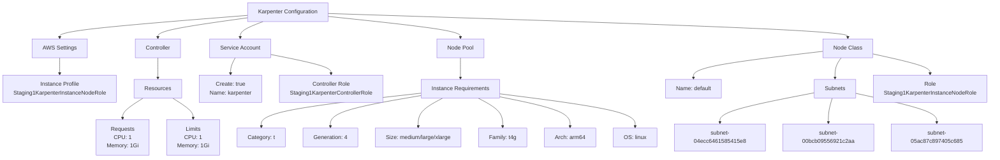
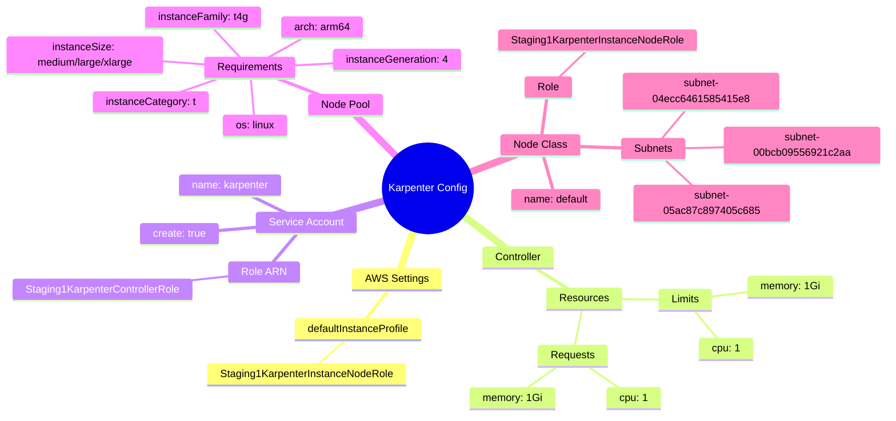
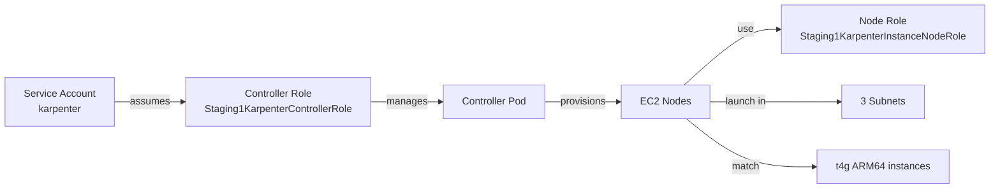

# Diagram: devops/k8s/karpenter/helm/values.staging1.yaml


> Auto-generated by Obscura crawlers

## Diagram 1

```mermaid
graph TB
      Karpenter[Karpenter Configuration]

      Karpenter --> AWS[AWS Settings]...
  └ 159 lines...
```

> SVG rendering failed for this diagram.

## Diagram 2



### SVG

<svg id="container" width="2815.7109375" xmlns="http://www.w3.org/2000/svg" class="flowchart" height="454" viewBox="0 0 2815.7109375 454" role="graphics-document document" aria-roledescription="flowchart-v2"><style>#container{font-family:"trebuchet ms",verdana,arial,sans-serif;font-size:16px;fill:#333;}@keyframes edge-animation-frame{from{stroke-dashoffset:0;}}@keyframes dash{to{stroke-dashoffset:0;}}#container .edge-animation-slow{stroke-dasharray:9,5!important;stroke-dashoffset:900;animation:dash 50s linear infinite;stroke-linecap:round;}#container .edge-animation-fast{stroke-dasharray:9,5!important;stroke-dashoffset:900;animation:dash 20s linear infinite;stroke-linecap:round;}#container .error-icon{fill:#552222;}#container .error-text{fill:#552222;stroke:#552222;}#container .edge-thickness-normal{stroke-width:1px;}#container .edge-thickness-thick{stroke-width:3.5px;}#container .edge-pattern-solid{stroke-dasharray:0;}#container .edge-thickness-invisible{stroke-width:0;fill:none;}#container .edge-pattern-dashed{stroke-dasharray:3;}#container .edge-pattern-dotted{stroke-dasharray:2;}#container .marker{fill:#333333;stroke:#333333;}#container .marker.cross{stroke:#333333;}#container svg{font-family:"trebuchet ms",verdana,arial,sans-serif;font-size:16px;}#container p{margin:0;}#container .label{font-family:"trebuchet ms",verdana,arial,sans-serif;color:#333;}#container .cluster-label text{fill:#333;}#container .cluster-label span{color:#333;}#container .cluster-label span p{background-color:transparent;}#container .label text,#container span{fill:#333;color:#333;}#container .node rect,#container .node circle,#container .node ellipse,#container .node polygon,#container .node path{fill:#ECECFF;stroke:#9370DB;stroke-width:1px;}#container .rough-node .label text,#container .node .label text,#container .image-shape .label,#container .icon-shape .label{text-anchor:middle;}#container .node .katex path{fill:#000;stroke:#000;stroke-width:1px;}#container .rough-node .label,#container .node .label,#container .image-shape .label,#container .icon-shape .label{text-align:center;}#container .node.clickable{cursor:pointer;}#container .root .anchor path{fill:#333333!important;stroke-width:0;stroke:#333333;}#container .arrowheadPath{fill:#333333;}#container .edgePath .path{stroke:#333333;stroke-width:2.0px;}#container .flowchart-link{stroke:#333333;fill:none;}#container .edgeLabel{background-color:rgba(232,232,232, 0.8);text-align:center;}#container .edgeLabel p{background-color:rgba(232,232,232, 0.8);}#container .edgeLabel rect{opacity:0.5;background-color:rgba(232,232,232, 0.8);fill:rgba(232,232,232, 0.8);}#container .labelBkg{background-color:rgba(232, 232, 232, 0.5);}#container .cluster rect{fill:#ffffde;stroke:#aaaa33;stroke-width:1px;}#container .cluster text{fill:#333;}#container .cluster span{color:#333;}#container div.mermaidTooltip{position:absolute;text-align:center;max-width:200px;padding:2px;font-family:"trebuchet ms",verdana,arial,sans-serif;font-size:12px;background:hsl(80, 100%, 96.2745098039%);border:1px solid #aaaa33;border-radius:2px;pointer-events:none;z-index:100;}#container .flowchartTitleText{text-anchor:middle;font-size:18px;fill:#333;}#container rect.text{fill:none;stroke-width:0;}#container .icon-shape,#container .image-shape{background-color:rgba(232,232,232, 0.8);text-align:center;}#container .icon-shape p,#container .image-shape p{background-color:rgba(232,232,232, 0.8);padding:2px;}#container .icon-shape rect,#container .image-shape rect{opacity:0.5;background-color:rgba(232,232,232, 0.8);fill:rgba(232,232,232, 0.8);}#container .label-icon{display:inline-block;height:1em;overflow:visible;vertical-align:-0.125em;}#container .node .label-icon path{fill:currentColor;stroke:revert;stroke-width:revert;}#container :root{--mermaid-font-family:"trebuchet ms",verdana,arial,sans-serif;}</style><g><marker id="container_flowchart-v2-pointEnd" class="marker flowchart-v2" viewBox="0 0 10 10" refX="5" refY="5" markerUnits="userSpaceOnUse" markerWidth="8" markerHeight="8" orient="auto"><path d="M 0 0 L 10 5 L 0 10 z" class="arrowMarkerPath" style="stroke-width: 1; stroke-dasharray: 1, 0;"></path></marker><marker id="container_flowchart-v2-pointStart" class="marker flowchart-v2" viewBox="0 0 10 10" refX="4.5" refY="5" markerUnits="userSpaceOnUse" markerWidth="8" markerHeight="8" orient="auto"><path d="M 0 5 L 10 10 L 10 0 z" class="arrowMarkerPath" style="stroke-width: 1; stroke-dasharray: 1, 0;"></path></marker><marker id="container_flowchart-v2-circleEnd" class="marker flowchart-v2" viewBox="0 0 10 10" refX="11" refY="5" markerUnits="userSpaceOnUse" markerWidth="11" markerHeight="11" orient="auto"><circle cx="5" cy="5" r="5" class="arrowMarkerPath" style="stroke-width: 1; stroke-dasharray: 1, 0;"></circle></marker><marker id="container_flowchart-v2-circleStart" class="marker flowchart-v2" viewBox="0 0 10 10" refX="-1" refY="5" markerUnits="userSpaceOnUse" markerWidth="11" markerHeight="11" orient="auto"><circle cx="5" cy="5" r="5" class="arrowMarkerPath" style="stroke-width: 1; stroke-dasharray: 1, 0;"></circle></marker><marker id="container_flowchart-v2-crossEnd" class="marker cross flowchart-v2" viewBox="0 0 11 11" refX="12" refY="5.2" markerUnits="userSpaceOnUse" markerWidth="11" markerHeight="11" orient="auto"><path d="M 1,1 l 9,9 M 10,1 l -9,9" class="arrowMarkerPath" style="stroke-width: 2; stroke-dasharray: 1, 0;"></path></marker><marker id="container_flowchart-v2-crossStart" class="marker cross flowchart-v2" viewBox="0 0 11 11" refX="-1" refY="5.2" markerUnits="userSpaceOnUse" markerWidth="11" markerHeight="11" orient="auto"><path d="M 1,1 l 9,9 M 10,1 l -9,9" class="arrowMarkerPath" style="stroke-width: 2; stroke-dasharray: 1, 0;"></path></marker><g class="root"><g class="clusters"></g><g class="edgePaths"><path d="M701.254,44.384L612.765,51.487C524.276,58.589,347.298,72.795,258.809,83.397C170.32,94,170.32,101,170.32,104.5L170.32,108" id="L_Karpenter_AWS_0" class="edge-thickness-normal edge-pattern-solid edge-thickness-normal edge-pattern-solid flowchart-link" style=";" data-edge="true" data-et="edge" data-id="L_Karpenter_AWS_0" data-points="W3sieCI6NzAxLjI1MzkwNjI1LCJ5Ijo0NC4zODQxOTg4Nzk3MDM4M30seyJ4IjoxNzAuMzIwMzEyNSwieSI6ODd9LHsieCI6MTcwLjMyMDMxMjUsInkiOjExMn1d" marker-end="url(#container_flowchart-v2-pointEnd)"></path><path d="M701.254,51.486L659.278,57.405C617.302,63.324,533.35,75.162,491.374,84.581C449.398,94,449.398,101,449.398,104.5L449.398,108" id="L_Karpenter_Controller_0" class="edge-thickness-normal edge-pattern-solid edge-thickness-normal edge-pattern-solid flowchart-link" style=";" data-edge="true" data-et="edge" data-id="L_Karpenter_Controller_0" data-points="W3sieCI6NzAxLjI1MzkwNjI1LCJ5Ijo1MS40ODU5OTEyMDgwOTI3OX0seyJ4Ijo0NDkuMzk4NDM3NSwieSI6ODd9LHsieCI6NDQ5LjM5ODQzNzUsInkiOjExMn1d" marker-end="url(#container_flowchart-v2-pointEnd)"></path><path d="M747.613,62L736.725,66.167C725.837,70.333,704.061,78.667,693.173,86.333C682.285,94,682.285,101,682.285,104.5L682.285,108" id="L_Karpenter_SA_0" class="edge-thickness-normal edge-pattern-solid edge-thickness-normal edge-pattern-solid flowchart-link" style=";" data-edge="true" data-et="edge" data-id="L_Karpenter_SA_0" data-points="W3sieCI6NzQ3LjYxMzQzMTQ5MDM4NDYsInkiOjYyfSx7IngiOjY4Mi4yODUxNTYyNSwieSI6ODd9LHsieCI6NjgyLjI4NTE1NjI1LCJ5IjoxMTJ9XQ==" marker-end="url(#container_flowchart-v2-pointEnd)"></path><path d="M935.082,47.241L998.373,53.867C1061.664,60.494,1188.246,73.747,1251.537,83.873C1314.828,94,1314.828,101,1314.828,104.5L1314.828,108" id="L_Karpenter_NP_0" class="edge-thickness-normal edge-pattern-solid edge-thickness-normal edge-pattern-solid flowchart-link" style=";" data-edge="true" data-et="edge" data-id="L_Karpenter_NP_0" data-points="W3sieCI6OTM1LjA4MjAzMTI1LCJ5Ijo0Ny4yNDA4Mjc0MDE3ODUzN30seyJ4IjoxMzE0LjgyODEyNSwieSI6ODd9LHsieCI6MTMxNC44MjgxMjUsInkiOjExMn1d" marker-end="url(#container_flowchart-v2-pointEnd)"></path><path d="M935.082,38.803L1182.029,46.836C1428.977,54.869,1922.871,70.934,2169.818,82.467C2416.766,94,2416.766,101,2416.766,104.5L2416.766,108" id="L_Karpenter_NC_0" class="edge-thickness-normal edge-pattern-solid edge-thickness-normal edge-pattern-solid flowchart-link" style=";" data-edge="true" data-et="edge" data-id="L_Karpenter_NC_0" data-points="W3sieCI6OTM1LjA4MjAzMTI1LCJ5IjozOC44MDMwNDAyNjIzMzkzMX0seyJ4IjoyNDE2Ljc2NTYyNSwieSI6ODd9LHsieCI6MjQxNi43NjU2MjUsInkiOjExMn1d" marker-end="url(#container_flowchart-v2-pointEnd)"></path><path d="M170.32,166L170.32,170.167C170.32,174.333,170.32,182.667,170.32,190.333C170.32,198,170.32,205,170.32,208.5L170.32,212" id="L_AWS_InstanceProfile_0" class="edge-thickness-normal edge-pattern-solid edge-thickness-normal edge-pattern-solid flowchart-link" style=";" data-edge="true" data-et="edge" data-id="L_AWS_InstanceProfile_0" data-points="W3sieCI6MTcwLjMyMDMxMjUsInkiOjE2Nn0seyJ4IjoxNzAuMzIwMzEyNSwieSI6MTkxfSx7IngiOjE3MC4zMjAzMTI1LCJ5IjoyMTZ9XQ==" marker-end="url(#container_flowchart-v2-pointEnd)"></path><path d="M449.398,166L449.398,170.167C449.398,174.333,449.398,182.667,449.398,192.333C449.398,202,449.398,213,449.398,218.5L449.398,224" id="L_Controller_Resources_0" class="edge-thickness-normal edge-pattern-solid edge-thickness-normal edge-pattern-solid flowchart-link" style=";" data-edge="true" data-et="edge" data-id="L_Controller_Resources_0" data-points="W3sieCI6NDQ5LjM5ODQzNzUsInkiOjE2Nn0seyJ4Ijo0NDkuMzk4NDM3NSwieSI6MTkxfSx7IngiOjQ0OS4zOTg0Mzc1LCJ5IjoyMjh9XQ==" marker-end="url(#container_flowchart-v2-pointEnd)"></path><path d="M407.643,282L398.106,288.167C388.569,294.333,369.495,306.667,359.959,316.333C350.422,326,350.422,333,350.422,336.5L350.422,340" id="L_Resources_Requests_0" class="edge-thickness-normal edge-pattern-solid edge-thickness-normal edge-pattern-solid flowchart-link" style=";" data-edge="true" data-et="edge" data-id="L_Resources_Requests_0" data-points="W3sieCI6NDA3LjY0MjcwMDE5NTMxMjUsInkiOjI4Mn0seyJ4IjozNTAuNDIxODc1LCJ5IjozMTl9LHsieCI6MzUwLjQyMTg3NSwieSI6MzQ0fV0=" marker-end="url(#container_flowchart-v2-pointEnd)"></path><path d="M491.154,282L500.691,288.167C510.228,294.333,529.301,306.667,538.838,316.333C548.375,326,548.375,333,548.375,336.5L548.375,340" id="L_Resources_Limits_0" class="edge-thickness-normal edge-pattern-solid edge-thickness-normal edge-pattern-solid flowchart-link" style=";" data-edge="true" data-et="edge" data-id="L_Resources_Limits_0" data-points="W3sieCI6NDkxLjE1NDE3NDgwNDY4NzUsInkiOjI4Mn0seyJ4Ijo1NDguMzc1LCJ5IjozMTl9LHsieCI6NTQ4LjM3NSwieSI6MzQ0fV0=" marker-end="url(#container_flowchart-v2-pointEnd)"></path><path d="M668.982,166L666.929,170.167C664.876,174.333,660.77,182.667,658.717,190.333C656.664,198,656.664,205,656.664,208.5L656.664,212" id="L_SA_SACreate_0" class="edge-thickness-normal edge-pattern-solid edge-thickness-normal edge-pattern-solid flowchart-link" style=";" data-edge="true" data-et="edge" data-id="L_SA_SACreate_0" data-points="W3sieCI6NjY4Ljk4MTg5NjAzMzY1MzgsInkiOjE2Nn0seyJ4Ijo2NTYuNjY0MDYyNSwieSI6MTkxfSx7IngiOjY1Ni42NjQwNjI1LCJ5IjoyMTZ9XQ==" marker-end="url(#container_flowchart-v2-pointEnd)"></path><path d="M769.246,156.165L798.658,161.971C828.07,167.777,886.895,179.388,916.307,188.694C945.719,198,945.719,205,945.719,208.5L945.719,212" id="L_SA_SARole_0" class="edge-thickness-normal edge-pattern-solid edge-thickness-normal edge-pattern-solid flowchart-link" style=";" data-edge="true" data-et="edge" data-id="L_SA_SARole_0" data-points="W3sieCI6NzY5LjI0NjA5Mzc1LCJ5IjoxNTYuMTY1NDk3NzA5MDQwNzh9LHsieCI6OTQ1LjcxODc1LCJ5IjoxOTF9LHsieCI6OTQ1LjcxODc1LCJ5IjoyMTZ9XQ==" marker-end="url(#container_flowchart-v2-pointEnd)"></path><path d="M1314.828,166L1314.828,170.167C1314.828,174.333,1314.828,182.667,1314.828,192.333C1314.828,202,1314.828,213,1314.828,218.5L1314.828,224" id="L_NP_Requirements_0" class="edge-thickness-normal edge-pattern-solid edge-thickness-normal edge-pattern-solid flowchart-link" style=";" data-edge="true" data-et="edge" data-id="L_NP_Requirements_0" data-points="W3sieCI6MTMxNC44MjgxMjUsInkiOjE2Nn0seyJ4IjoxMzE0LjgyODEyNSwieSI6MTkxfSx7IngiOjEzMTQuODI4MTI1LCJ5IjoyMjh9XQ==" marker-end="url(#container_flowchart-v2-pointEnd)"></path><path d="M1201.516,267.636L1124.75,276.197C1047.984,284.757,894.453,301.879,817.688,317.939C740.922,334,740.922,349,740.922,356.5L740.922,364" id="L_Requirements_Category_0" class="edge-thickness-normal edge-pattern-solid edge-thickness-normal edge-pattern-solid flowchart-link" style=";" data-edge="true" data-et="edge" data-id="L_Requirements_Category_0" data-points="W3sieCI6MTIwMS41MTU2MjUsInkiOjI2Ny42MzYyMTAxODI0MTIyfSx7IngiOjc0MC45MjE4NzUsInkiOjMxOX0seyJ4Ijo3NDAuOTIxODc1LCJ5IjozNjh9XQ==" marker-end="url(#container_flowchart-v2-pointEnd)"></path><path d="M1201.516,274.24L1157.582,281.7C1113.648,289.16,1025.781,304.08,981.848,319.04C937.914,334,937.914,349,937.914,356.5L937.914,364" id="L_Requirements_Generation_0" class="edge-thickness-normal edge-pattern-solid edge-thickness-normal edge-pattern-solid flowchart-link" style=";" data-edge="true" data-et="edge" data-id="L_Requirements_Generation_0" data-points="W3sieCI6MTIwMS41MTU2MjUsInkiOjI3NC4yNDA0NjAxNTEzMTF9LHsieCI6OTM3LjkxNDA2MjUsInkiOjMxOX0seyJ4Ijo5MzcuOTE0MDYyNSwieSI6MzY4fV0=" marker-end="url(#container_flowchart-v2-pointEnd)"></path><path d="M1263.244,282L1251.462,288.167C1239.681,294.333,1216.118,306.667,1204.336,320.333C1192.555,334,1192.555,349,1192.555,356.5L1192.555,364" id="L_Requirements_Size_0" class="edge-thickness-normal edge-pattern-solid edge-thickness-normal edge-pattern-solid flowchart-link" style=";" data-edge="true" data-et="edge" data-id="L_Requirements_Size_0" data-points="W3sieCI6MTI2My4yNDQwMTg1NTQ2ODc1LCJ5IjoyODJ9LHsieCI6MTE5Mi41NTQ2ODc1LCJ5IjozMTl9LHsieCI6MTE5Mi41NTQ2ODc1LCJ5IjozNjh9XQ==" marker-end="url(#container_flowchart-v2-pointEnd)"></path><path d="M1366.412,282L1378.194,288.167C1389.975,294.333,1413.538,306.667,1425.32,320.333C1437.102,334,1437.102,349,1437.102,356.5L1437.102,364" id="L_Requirements_Family_0" class="edge-thickness-normal edge-pattern-solid edge-thickness-normal edge-pattern-solid flowchart-link" style=";" data-edge="true" data-et="edge" data-id="L_Requirements_Family_0" data-points="W3sieCI6MTM2Ni40MTIyMzE0NDUzMTI1LCJ5IjoyODJ9LHsieCI6MTQzNy4xMDE1NjI1LCJ5IjozMTl9LHsieCI6MTQzNy4xMDE1NjI1LCJ5IjozNjh9XQ==" marker-end="url(#container_flowchart-v2-pointEnd)"></path><path d="M1428.141,278.139L1461.49,284.949C1494.839,291.76,1561.536,305.38,1594.885,319.69C1628.234,334,1628.234,349,1628.234,356.5L1628.234,364" id="L_Requirements_Arch_0" class="edge-thickness-normal edge-pattern-solid edge-thickness-normal edge-pattern-solid flowchart-link" style=";" data-edge="true" data-et="edge" data-id="L_Requirements_Arch_0" data-points="W3sieCI6MTQyOC4xNDA2MjUsInkiOjI3OC4xMzkyOTYwNDE0Nzk3fSx7IngiOjE2MjguMjM0Mzc1LCJ5IjozMTl9LHsieCI6MTYyOC4yMzQzNzUsInkiOjM2OH1d" marker-end="url(#container_flowchart-v2-pointEnd)"></path><path d="M1428.141,269.563L1492.251,277.802C1556.362,286.042,1684.583,302.521,1748.694,318.26C1812.805,334,1812.805,349,1812.805,356.5L1812.805,364" id="L_Requirements_OS_0" class="edge-thickness-normal edge-pattern-solid edge-thickness-normal edge-pattern-solid flowchart-link" style=";" data-edge="true" data-et="edge" data-id="L_Requirements_OS_0" data-points="W3sieCI6MTQyOC4xNDA2MjUsInkiOjI2OS41NjI5MzQzNzUwNDkwNX0seyJ4IjoxODEyLjgwNDY4NzUsInkiOjMxOX0seyJ4IjoxODEyLjgwNDY4NzUsInkiOjM2OH1d" marker-end="url(#container_flowchart-v2-pointEnd)"></path><path d="M2346.992,147.23L2285.141,154.525C2223.29,161.82,2099.589,176.41,2037.738,189.205C1975.887,202,1975.887,213,1975.887,218.5L1975.887,224" id="L_NC_NCName_0" class="edge-thickness-normal edge-pattern-solid edge-thickness-normal edge-pattern-solid flowchart-link" style=";" data-edge="true" data-et="edge" data-id="L_NC_NCName_0" data-points="W3sieCI6MjM0Ni45OTIxODc1LCJ5IjoxNDcuMjI5NTEzMTM1MTYxNDh9LHsieCI6MTk3NS44ODY3MTg3NSwieSI6MTkxfSx7IngiOjE5NzUuODg2NzE4NzUsInkiOjIyOH1d" marker-end="url(#container_flowchart-v2-pointEnd)"></path><path d="M2394.366,166L2390.909,170.167C2387.452,174.333,2380.539,182.667,2377.082,192.333C2373.625,202,2373.625,213,2373.625,218.5L2373.625,224" id="L_NC_Subnets_0" class="edge-thickness-normal edge-pattern-solid edge-thickness-normal edge-pattern-solid flowchart-link" style=";" data-edge="true" data-et="edge" data-id="L_NC_Subnets_0" data-points="W3sieCI6MjM5NC4zNjU2ODUwOTYxNTQsInkiOjE2Nn0seyJ4IjoyMzczLjYyNSwieSI6MTkxfSx7IngiOjIzNzMuNjI1LCJ5IjoyMjh9XQ==" marker-end="url(#container_flowchart-v2-pointEnd)"></path><path d="M2486.539,154.87L2513.014,160.891C2539.49,166.913,2592.44,178.957,2618.915,188.478C2645.391,198,2645.391,205,2645.391,208.5L2645.391,212" id="L_NC_Role_0" class="edge-thickness-normal edge-pattern-solid edge-thickness-normal edge-pattern-solid flowchart-link" style=";" data-edge="true" data-et="edge" data-id="L_NC_Role_0" data-points="W3sieCI6MjQ4Ni41MzkwNjI1LCJ5IjoxNTQuODY5NzM3NTYxNTA5MDN9LHsieCI6MjY0NS4zOTA2MjUsInkiOjE5MX0seyJ4IjoyNjQ1LjM5MDYyNSwieSI6MjE2fV0=" marker-end="url(#container_flowchart-v2-pointEnd)"></path><path d="M2314.18,266.808L2270.389,275.507C2226.599,284.206,2139.018,301.603,2095.228,317.801C2051.438,334,2051.438,349,2051.438,356.5L2051.438,364" id="L_Subnets_Subnet1_0" class="edge-thickness-normal edge-pattern-solid edge-thickness-normal edge-pattern-solid flowchart-link" style=";" data-edge="true" data-et="edge" data-id="L_Subnets_Subnet1_0" data-points="W3sieCI6MjMxNC4xNzk2ODc1LCJ5IjoyNjYuODA4MzQxNDE2MTAwODZ9LHsieCI6MjA1MS40Mzc1LCJ5IjozMTl9LHsieCI6MjA1MS40Mzc1LCJ5IjozNjh9XQ==" marker-end="url(#container_flowchart-v2-pointEnd)"></path><path d="M2366.555,282L2364.941,288.167C2363.326,294.333,2360.097,306.667,2358.482,320.333C2356.867,334,2356.867,349,2356.867,356.5L2356.867,364" id="L_Subnets_Subnet2_0" class="edge-thickness-normal edge-pattern-solid edge-thickness-normal edge-pattern-solid flowchart-link" style=";" data-edge="true" data-et="edge" data-id="L_Subnets_Subnet2_0" data-points="W3sieCI6MjM2Ni41NTUyOTc4NTE1NjI1LCJ5IjoyODJ9LHsieCI6MjM1Ni44NjcxODc1LCJ5IjozMTl9LHsieCI6MjM1Ni44NjcxODc1LCJ5IjozNjh9XQ==" marker-end="url(#container_flowchart-v2-pointEnd)"></path><path d="M2433.07,268.186L2471.25,276.655C2509.43,285.124,2585.789,302.062,2623.969,318.031C2662.148,334,2662.148,349,2662.148,356.5L2662.148,364" id="L_Subnets_Subnet3_0" class="edge-thickness-normal edge-pattern-solid edge-thickness-normal edge-pattern-solid flowchart-link" style=";" data-edge="true" data-et="edge" data-id="L_Subnets_Subnet3_0" data-points="W3sieCI6MjQzMy4wNzAzMTI1LCJ5IjoyNjguMTg2MTAzODE1MjIyOTZ9LHsieCI6MjY2Mi4xNDg0Mzc1LCJ5IjozMTl9LHsieCI6MjY2Mi4xNDg0Mzc1LCJ5IjozNjh9XQ==" marker-end="url(#container_flowchart-v2-pointEnd)"></path></g><g class="edgeLabels"><g class="edgeLabel"><g class="label" data-id="L_Karpenter_AWS_0" transform="translate(0, 0)"><foreignObject width="0" height="0"><div xmlns="http://www.w3.org/1999/xhtml" class="labelBkg" style="display: table-cell; white-space: nowrap; line-height: 1.5; max-width: 200px; text-align: center;"><span class="edgeLabel"></span></div></foreignObject></g></g><g class="edgeLabel"><g class="label" data-id="L_Karpenter_Controller_0" transform="translate(0, 0)"><foreignObject width="0" height="0"><div xmlns="http://www.w3.org/1999/xhtml" class="labelBkg" style="display: table-cell; white-space: nowrap; line-height: 1.5; max-width: 200px; text-align: center;"><span class="edgeLabel"></span></div></foreignObject></g></g><g class="edgeLabel"><g class="label" data-id="L_Karpenter_SA_0" transform="translate(0, 0)"><foreignObject width="0" height="0"><div xmlns="http://www.w3.org/1999/xhtml" class="labelBkg" style="display: table-cell; white-space: nowrap; line-height: 1.5; max-width: 200px; text-align: center;"><span class="edgeLabel"></span></div></foreignObject></g></g><g class="edgeLabel"><g class="label" data-id="L_Karpenter_NP_0" transform="translate(0, 0)"><foreignObject width="0" height="0"><div xmlns="http://www.w3.org/1999/xhtml" class="labelBkg" style="display: table-cell; white-space: nowrap; line-height: 1.5; max-width: 200px; text-align: center;"><span class="edgeLabel"></span></div></foreignObject></g></g><g class="edgeLabel"><g class="label" data-id="L_Karpenter_NC_0" transform="translate(0, 0)"><foreignObject width="0" height="0"><div xmlns="http://www.w3.org/1999/xhtml" class="labelBkg" style="display: table-cell; white-space: nowrap; line-height: 1.5; max-width: 200px; text-align: center;"><span class="edgeLabel"></span></div></foreignObject></g></g><g class="edgeLabel"><g class="label" data-id="L_AWS_InstanceProfile_0" transform="translate(0, 0)"><foreignObject width="0" height="0"><div xmlns="http://www.w3.org/1999/xhtml" class="labelBkg" style="display: table-cell; white-space: nowrap; line-height: 1.5; max-width: 200px; text-align: center;"><span class="edgeLabel"></span></div></foreignObject></g></g><g class="edgeLabel"><g class="label" data-id="L_Controller_Resources_0" transform="translate(0, 0)"><foreignObject width="0" height="0"><div xmlns="http://www.w3.org/1999/xhtml" class="labelBkg" style="display: table-cell; white-space: nowrap; line-height: 1.5; max-width: 200px; text-align: center;"><span class="edgeLabel"></span></div></foreignObject></g></g><g class="edgeLabel"><g class="label" data-id="L_Resources_Requests_0" transform="translate(0, 0)"><foreignObject width="0" height="0"><div xmlns="http://www.w3.org/1999/xhtml" class="labelBkg" style="display: table-cell; white-space: nowrap; line-height: 1.5; max-width: 200px; text-align: center;"><span class="edgeLabel"></span></div></foreignObject></g></g><g class="edgeLabel"><g class="label" data-id="L_Resources_Limits_0" transform="translate(0, 0)"><foreignObject width="0" height="0"><div xmlns="http://www.w3.org/1999/xhtml" class="labelBkg" style="display: table-cell; white-space: nowrap; line-height: 1.5; max-width: 200px; text-align: center;"><span class="edgeLabel"></span></div></foreignObject></g></g><g class="edgeLabel"><g class="label" data-id="L_SA_SACreate_0" transform="translate(0, 0)"><foreignObject width="0" height="0"><div xmlns="http://www.w3.org/1999/xhtml" class="labelBkg" style="display: table-cell; white-space: nowrap; line-height: 1.5; max-width: 200px; text-align: center;"><span class="edgeLabel"></span></div></foreignObject></g></g><g class="edgeLabel"><g class="label" data-id="L_SA_SARole_0" transform="translate(0, 0)"><foreignObject width="0" height="0"><div xmlns="http://www.w3.org/1999/xhtml" class="labelBkg" style="display: table-cell; white-space: nowrap; line-height: 1.5; max-width: 200px; text-align: center;"><span class="edgeLabel"></span></div></foreignObject></g></g><g class="edgeLabel"><g class="label" data-id="L_NP_Requirements_0" transform="translate(0, 0)"><foreignObject width="0" height="0"><div xmlns="http://www.w3.org/1999/xhtml" class="labelBkg" style="display: table-cell; white-space: nowrap; line-height: 1.5; max-width: 200px; text-align: center;"><span class="edgeLabel"></span></div></foreignObject></g></g><g class="edgeLabel"><g class="label" data-id="L_Requirements_Category_0" transform="translate(0, 0)"><foreignObject width="0" height="0"><div xmlns="http://www.w3.org/1999/xhtml" class="labelBkg" style="display: table-cell; white-space: nowrap; line-height: 1.5; max-width: 200px; text-align: center;"><span class="edgeLabel"></span></div></foreignObject></g></g><g class="edgeLabel"><g class="label" data-id="L_Requirements_Generation_0" transform="translate(0, 0)"><foreignObject width="0" height="0"><div xmlns="http://www.w3.org/1999/xhtml" class="labelBkg" style="display: table-cell; white-space: nowrap; line-height: 1.5; max-width: 200px; text-align: center;"><span class="edgeLabel"></span></div></foreignObject></g></g><g class="edgeLabel"><g class="label" data-id="L_Requirements_Size_0" transform="translate(0, 0)"><foreignObject width="0" height="0"><div xmlns="http://www.w3.org/1999/xhtml" class="labelBkg" style="display: table-cell; white-space: nowrap; line-height: 1.5; max-width: 200px; text-align: center;"><span class="edgeLabel"></span></div></foreignObject></g></g><g class="edgeLabel"><g class="label" data-id="L_Requirements_Family_0" transform="translate(0, 0)"><foreignObject width="0" height="0"><div xmlns="http://www.w3.org/1999/xhtml" class="labelBkg" style="display: table-cell; white-space: nowrap; line-height: 1.5; max-width: 200px; text-align: center;"><span class="edgeLabel"></span></div></foreignObject></g></g><g class="edgeLabel"><g class="label" data-id="L_Requirements_Arch_0" transform="translate(0, 0)"><foreignObject width="0" height="0"><div xmlns="http://www.w3.org/1999/xhtml" class="labelBkg" style="display: table-cell; white-space: nowrap; line-height: 1.5; max-width: 200px; text-align: center;"><span class="edgeLabel"></span></div></foreignObject></g></g><g class="edgeLabel"><g class="label" data-id="L_Requirements_OS_0" transform="translate(0, 0)"><foreignObject width="0" height="0"><div xmlns="http://www.w3.org/1999/xhtml" class="labelBkg" style="display: table-cell; white-space: nowrap; line-height: 1.5; max-width: 200px; text-align: center;"><span class="edgeLabel"></span></div></foreignObject></g></g><g class="edgeLabel"><g class="label" data-id="L_NC_NCName_0" transform="translate(0, 0)"><foreignObject width="0" height="0"><div xmlns="http://www.w3.org/1999/xhtml" class="labelBkg" style="display: table-cell; white-space: nowrap; line-height: 1.5; max-width: 200px; text-align: center;"><span class="edgeLabel"></span></div></foreignObject></g></g><g class="edgeLabel"><g class="label" data-id="L_NC_Subnets_0" transform="translate(0, 0)"><foreignObject width="0" height="0"><div xmlns="http://www.w3.org/1999/xhtml" class="labelBkg" style="display: table-cell; white-space: nowrap; line-height: 1.5; max-width: 200px; text-align: center;"><span class="edgeLabel"></span></div></foreignObject></g></g><g class="edgeLabel"><g class="label" data-id="L_NC_Role_0" transform="translate(0, 0)"><foreignObject width="0" height="0"><div xmlns="http://www.w3.org/1999/xhtml" class="labelBkg" style="display: table-cell; white-space: nowrap; line-height: 1.5; max-width: 200px; text-align: center;"><span class="edgeLabel"></span></div></foreignObject></g></g><g class="edgeLabel"><g class="label" data-id="L_Subnets_Subnet1_0" transform="translate(0, 0)"><foreignObject width="0" height="0"><div xmlns="http://www.w3.org/1999/xhtml" class="labelBkg" style="display: table-cell; white-space: nowrap; line-height: 1.5; max-width: 200px; text-align: center;"><span class="edgeLabel"></span></div></foreignObject></g></g><g class="edgeLabel"><g class="label" data-id="L_Subnets_Subnet2_0" transform="translate(0, 0)"><foreignObject width="0" height="0"><div xmlns="http://www.w3.org/1999/xhtml" class="labelBkg" style="display: table-cell; white-space: nowrap; line-height: 1.5; max-width: 200px; text-align: center;"><span class="edgeLabel"></span></div></foreignObject></g></g><g class="edgeLabel"><g class="label" data-id="L_Subnets_Subnet3_0" transform="translate(0, 0)"><foreignObject width="0" height="0"><div xmlns="http://www.w3.org/1999/xhtml" class="labelBkg" style="display: table-cell; white-space: nowrap; line-height: 1.5; max-width: 200px; text-align: center;"><span class="edgeLabel"></span></div></foreignObject></g></g></g><g class="nodes"><g class="node default" id="flowchart-Karpenter-0" transform="translate(818.16796875, 35)"><rect class="basic label-container" style="" x="-116.9140625" y="-27" width="233.828125" height="54"></rect><g class="label" style="" transform="translate(-86.9140625, -12)"><rect></rect><foreignObject width="173.828125" height="24"><div xmlns="http://www.w3.org/1999/xhtml" style="display: table-cell; white-space: nowrap; line-height: 1.5; max-width: 200px; text-align: center;"><span class="nodeLabel"><p>Karpenter Configuration</p></span></div></foreignObject></g></g><g class="node default" id="flowchart-AWS-2" transform="translate(170.3203125, 139)"><rect class="basic label-container" style="" x="-76.875" y="-27" width="153.75" height="54"></rect><g class="label" style="" transform="translate(-46.875, -12)"><rect></rect><foreignObject width="93.75" height="24"><div xmlns="http://www.w3.org/1999/xhtml" style="display: table-cell; white-space: nowrap; line-height: 1.5; max-width: 200px; text-align: center;"><span class="nodeLabel"><p>AWS Settings</p></span></div></foreignObject></g></g><g class="node default" id="flowchart-Controller-4" transform="translate(449.3984375, 139)"><rect class="basic label-container" style="" x="-66.1875" y="-27" width="132.375" height="54"></rect><g class="label" style="" transform="translate(-36.1875, -12)"><rect></rect><foreignObject width="72.375" height="24"><div xmlns="http://www.w3.org/1999/xhtml" style="display: table-cell; white-space: nowrap; line-height: 1.5; max-width: 200px; text-align: center;"><span class="nodeLabel"><p>Controller</p></span></div></foreignObject></g></g><g class="node default" id="flowchart-SA-6" transform="translate(682.28515625, 139)"><rect class="basic label-container" style="" x="-86.9609375" y="-27" width="173.921875" height="54"></rect><g class="label" style="" transform="translate(-56.9609375, -12)"><rect></rect><foreignObject width="113.921875" height="24"><div xmlns="http://www.w3.org/1999/xhtml" style="display: table-cell; white-space: nowrap; line-height: 1.5; max-width: 200px; text-align: center;"><span class="nodeLabel"><p>Service Account</p></span></div></foreignObject></g></g><g class="node default" id="flowchart-NP-8" transform="translate(1314.828125, 139)"><rect class="basic label-container" style="" x="-67.5" y="-27" width="135" height="54"></rect><g class="label" style="" transform="translate(-37.5, -12)"><rect></rect><foreignObject width="75" height="24"><div xmlns="http://www.w3.org/1999/xhtml" style="display: table-cell; white-space: nowrap; line-height: 1.5; max-width: 200px; text-align: center;"><span class="nodeLabel"><p>Node Pool</p></span></div></foreignObject></g></g><g class="node default" id="flowchart-NC-10" transform="translate(2416.765625, 139)"><rect class="basic label-container" style="" x="-69.7734375" y="-27" width="139.546875" height="54"></rect><g class="label" style="" transform="translate(-39.7734375, -12)"><rect></rect><foreignObject width="79.546875" height="24"><div xmlns="http://www.w3.org/1999/xhtml" style="display: table-cell; white-space: nowrap; line-height: 1.5; max-width: 200px; text-align: center;"><span class="nodeLabel"><p>Node Class</p></span></div></foreignObject></g></g><g class="node default" id="flowchart-InstanceProfile-12" transform="translate(170.3203125, 255)"><rect class="basic label-container" style="" x="-162.3203125" y="-39" width="324.640625" height="78"></rect><g class="label" style="" transform="translate(-132.3203125, -24)"><rect></rect><foreignObject width="264.640625" height="48"><div xmlns="http://www.w3.org/1999/xhtml" style="display: table; white-space: break-spaces; line-height: 1.5; max-width: 200px; text-align: center; width: 200px;"><span class="nodeLabel"><p>Instance Profile<br/>Staging1KarpenterInstanceNodeRole</p></span></div></foreignObject></g></g><g class="node default" id="flowchart-Resources-14" transform="translate(449.3984375, 255)"><rect class="basic label-container" style="" x="-66.7578125" y="-27" width="133.515625" height="54"></rect><g class="label" style="" transform="translate(-36.7578125, -12)"><rect></rect><foreignObject width="73.515625" height="24"><div xmlns="http://www.w3.org/1999/xhtml" style="display: table-cell; white-space: nowrap; line-height: 1.5; max-width: 200px; text-align: center;"><span class="nodeLabel"><p>Resources</p></span></div></foreignObject></g></g><g class="node default" id="flowchart-Requests-16" transform="translate(350.421875, 395)"><rect class="basic label-container" style="" x="-73.9765625" y="-51" width="147.953125" height="102"></rect><g class="label" style="" transform="translate(-43.9765625, -36)"><rect></rect><foreignObject width="87.953125" height="72"><div xmlns="http://www.w3.org/1999/xhtml" style="display: table-cell; white-space: nowrap; line-height: 1.5; max-width: 200px; text-align: center;"><span class="nodeLabel"><p>Requests<br/>CPU: 1<br/>Memory: 1Gi</p></span></div></foreignObject></g></g><g class="node default" id="flowchart-Limits-18" transform="translate(548.375, 395)"><rect class="basic label-container" style="" x="-73.9765625" y="-51" width="147.953125" height="102"></rect><g class="label" style="" transform="translate(-43.9765625, -36)"><rect></rect><foreignObject width="87.953125" height="72"><div xmlns="http://www.w3.org/1999/xhtml" style="display: table-cell; white-space: nowrap; line-height: 1.5; max-width: 200px; text-align: center;"><span class="nodeLabel"><p>Limits<br/>CPU: 1<br/>Memory: 1Gi</p></span></div></foreignObject></g></g><g class="node default" id="flowchart-SACreate-20" transform="translate(656.6640625, 255)"><rect class="basic label-container" style="" x="-90.5078125" y="-39" width="181.015625" height="78"></rect><g class="label" style="" transform="translate(-60.5078125, -24)"><rect></rect><foreignObject width="121.015625" height="48"><div xmlns="http://www.w3.org/1999/xhtml" style="display: table-cell; white-space: nowrap; line-height: 1.5; max-width: 200px; text-align: center;"><span class="nodeLabel"><p>Create: true<br/>Name: karpenter</p></span></div></foreignObject></g></g><g class="node default" id="flowchart-SARole-22" transform="translate(945.71875, 255)"><rect class="basic label-container" style="" x="-148.546875" y="-39" width="297.09375" height="78"></rect><g class="label" style="" transform="translate(-118.546875, -24)"><rect></rect><foreignObject width="237.09375" height="48"><div xmlns="http://www.w3.org/1999/xhtml" style="display: table; white-space: break-spaces; line-height: 1.5; max-width: 200px; text-align: center; width: 200px;"><span class="nodeLabel"><p>Controller Role<br/>Staging1KarpenterControllerRole</p></span></div></foreignObject></g></g><g class="node default" id="flowchart-Requirements-24" transform="translate(1314.828125, 255)"><rect class="basic label-container" style="" x="-113.3125" y="-27" width="226.625" height="54"></rect><g class="label" style="" transform="translate(-83.3125, -12)"><rect></rect><foreignObject width="166.625" height="24"><div xmlns="http://www.w3.org/1999/xhtml" style="display: table-cell; white-space: nowrap; line-height: 1.5; max-width: 200px; text-align: center;"><span class="nodeLabel"><p>Instance Requirements</p></span></div></foreignObject></g></g><g class="node default" id="flowchart-Category-26" transform="translate(740.921875, 395)"><rect class="basic label-container" style="" x="-68.5703125" y="-27" width="137.140625" height="54"></rect><g class="label" style="" transform="translate(-38.5703125, -12)"><rect></rect><foreignObject width="77.140625" height="24"><div xmlns="http://www.w3.org/1999/xhtml" style="display: table-cell; white-space: nowrap; line-height: 1.5; max-width: 200px; text-align: center;"><span class="nodeLabel"><p>Category: t</p></span></div></foreignObject></g></g><g class="node default" id="flowchart-Generation-28" transform="translate(937.9140625, 395)"><rect class="basic label-container" style="" x="-78.421875" y="-27" width="156.84375" height="54"></rect><g class="label" style="" transform="translate(-48.421875, -12)"><rect></rect><foreignObject width="96.84375" height="24"><div xmlns="http://www.w3.org/1999/xhtml" style="display: table-cell; white-space: nowrap; line-height: 1.5; max-width: 200px; text-align: center;"><span class="nodeLabel"><p>Generation: 4</p></span></div></foreignObject></g></g><g class="node default" id="flowchart-Size-30" transform="translate(1192.5546875, 395)"><rect class="basic label-container" style="" x="-126.21875" y="-27" width="252.4375" height="54"></rect><g class="label" style="" transform="translate(-96.21875, -12)"><rect></rect><foreignObject width="192.4375" height="24"><div xmlns="http://www.w3.org/1999/xhtml" style="display: table-cell; white-space: nowrap; line-height: 1.5; max-width: 200px; text-align: center;"><span class="nodeLabel"><p>Size: medium/large/xlarge</p></span></div></foreignObject></g></g><g class="node default" id="flowchart-Family-32" transform="translate(1437.1015625, 395)"><rect class="basic label-container" style="" x="-68.328125" y="-27" width="136.65625" height="54"></rect><g class="label" style="" transform="translate(-38.328125, -12)"><rect></rect><foreignObject width="76.65625" height="24"><div xmlns="http://www.w3.org/1999/xhtml" style="display: table-cell; white-space: nowrap; line-height: 1.5; max-width: 200px; text-align: center;"><span class="nodeLabel"><p>Family: t4g</p></span></div></foreignObject></g></g><g class="node default" id="flowchart-Arch-34" transform="translate(1628.234375, 395)"><rect class="basic label-container" style="" x="-72.8046875" y="-27" width="145.609375" height="54"></rect><g class="label" style="" transform="translate(-42.8046875, -12)"><rect></rect><foreignObject width="85.609375" height="24"><div xmlns="http://www.w3.org/1999/xhtml" style="display: table-cell; white-space: nowrap; line-height: 1.5; max-width: 200px; text-align: center;"><span class="nodeLabel"><p>Arch: arm64</p></span></div></foreignObject></g></g><g class="node default" id="flowchart-OS-36" transform="translate(1812.8046875, 395)"><rect class="basic label-container" style="" x="-61.765625" y="-27" width="123.53125" height="54"></rect><g class="label" style="" transform="translate(-31.765625, -12)"><rect></rect><foreignObject width="63.53125" height="24"><div xmlns="http://www.w3.org/1999/xhtml" style="display: table-cell; white-space: nowrap; line-height: 1.5; max-width: 200px; text-align: center;"><span class="nodeLabel"><p>OS: linux</p></span></div></foreignObject></g></g><g class="node default" id="flowchart-NCName-38" transform="translate(1975.88671875, 255)"><rect class="basic label-container" style="" x="-80.9609375" y="-27" width="161.921875" height="54"></rect><g class="label" style="" transform="translate(-50.9609375, -12)"><rect></rect><foreignObject width="101.921875" height="24"><div xmlns="http://www.w3.org/1999/xhtml" style="display: table-cell; white-space: nowrap; line-height: 1.5; max-width: 200px; text-align: center;"><span class="nodeLabel"><p>Name: default</p></span></div></foreignObject></g></g><g class="node default" id="flowchart-Subnets-40" transform="translate(2373.625, 255)"><rect class="basic label-container" style="" x="-59.4453125" y="-27" width="118.890625" height="54"></rect><g class="label" style="" transform="translate(-29.4453125, -12)"><rect></rect><foreignObject width="58.890625" height="24"><div xmlns="http://www.w3.org/1999/xhtml" style="display: table-cell; white-space: nowrap; line-height: 1.5; max-width: 200px; text-align: center;"><span class="nodeLabel"><p>Subnets</p></span></div></foreignObject></g></g><g class="node default" id="flowchart-Role-42" transform="translate(2645.390625, 255)"><rect class="basic label-container" style="" x="-162.3203125" y="-39" width="324.640625" height="78"></rect><g class="label" style="" transform="translate(-132.3203125, -24)"><rect></rect><foreignObject width="264.640625" height="48"><div xmlns="http://www.w3.org/1999/xhtml" style="display: table; white-space: break-spaces; line-height: 1.5; max-width: 200px; text-align: center; width: 200px;"><span class="nodeLabel"><p>Role<br/>Staging1KarpenterInstanceNodeRole</p></span></div></foreignObject></g></g><g class="node default" id="flowchart-Subnet1-44" transform="translate(2051.4375, 395)"><rect class="basic label-container" style="" x="-126.8671875" y="-27" width="253.734375" height="54"></rect><g class="label" style="" transform="translate(-96.8671875, -12)"><rect></rect><foreignObject width="193.734375" height="24"><div xmlns="http://www.w3.org/1999/xhtml" style="display: table-cell; white-space: nowrap; line-height: 1.5; max-width: 200px; text-align: center;"><span class="nodeLabel"><p>subnet-04ecc6461585415e8</p></span></div></foreignObject></g></g><g class="node default" id="flowchart-Subnet2-46" transform="translate(2356.8671875, 395)"><rect class="basic label-container" style="" x="-128.5625" y="-27" width="257.125" height="54"></rect><g class="label" style="" transform="translate(-98.5625, -12)"><rect></rect><foreignObject width="197.125" height="24"><div xmlns="http://www.w3.org/1999/xhtml" style="display: table-cell; white-space: nowrap; line-height: 1.5; max-width: 200px; text-align: center;"><span class="nodeLabel"><p>subnet-00bcb09556921c2aa</p></span></div></foreignObject></g></g><g class="node default" id="flowchart-Subnet3-48" transform="translate(2662.1484375, 395)"><rect class="basic label-container" style="" x="-126.71875" y="-27" width="253.4375" height="54"></rect><g class="label" style="" transform="translate(-96.71875, -12)"><rect></rect><foreignObject width="193.4375" height="24"><div xmlns="http://www.w3.org/1999/xhtml" style="display: table-cell; white-space: nowrap; line-height: 1.5; max-width: 200px; text-align: center;"><span class="nodeLabel"><p>subnet-05ac87c897405c685</p></span></div></foreignObject></g></g></g></g></g></svg>

## Diagram 3



### SVG

<svg id="container" width="100%" xmlns="http://www.w3.org/2000/svg" class="mindmapDiagram" style="max-width: 1457.294189453125px;" viewBox="5 5 1457.294189453125 658.9237060546875" role="graphics-document document" aria-roledescription="mindmap"><style>#container{font-family:"trebuchet ms",verdana,arial,sans-serif;font-size:16px;fill:#333;}@keyframes edge-animation-frame{from{stroke-dashoffset:0;}}@keyframes dash{to{stroke-dashoffset:0;}}#container .edge-animation-slow{stroke-dasharray:9,5!important;stroke-dashoffset:900;animation:dash 50s linear infinite;stroke-linecap:round;}#container .edge-animation-fast{stroke-dasharray:9,5!important;stroke-dashoffset:900;animation:dash 20s linear infinite;stroke-linecap:round;}#container .error-icon{fill:#552222;}#container .error-text{fill:#552222;stroke:#552222;}#container .edge-thickness-normal{stroke-width:1px;}#container .edge-thickness-thick{stroke-width:3.5px;}#container .edge-pattern-solid{stroke-dasharray:0;}#container .edge-thickness-invisible{stroke-width:0;fill:none;}#container .edge-pattern-dashed{stroke-dasharray:3;}#container .edge-pattern-dotted{stroke-dasharray:2;}#container .marker{fill:#333333;stroke:#333333;}#container .marker.cross{stroke:#333333;}#container svg{font-family:"trebuchet ms",verdana,arial,sans-serif;font-size:16px;}#container p{margin:0;}#container .edge{stroke-width:3;}#container .section--1 rect,#container .section--1 path,#container .section--1 circle,#container .section--1 polygon,#container .section--1 path{fill:hsl(240, 100%, 76.2745098039%);}#container .section--1 text{fill:#ffffff;}#container .node-icon--1{font-size:40px;color:#ffffff;}#container .section-edge--1{stroke:hsl(240, 100%, 76.2745098039%);}#container .edge-depth--1{stroke-width:17;}#container .section--1 line{stroke:hsl(60, 100%, 86.2745098039%);stroke-width:3;}#container .disabled,#container .disabled circle,#container .disabled text{fill:lightgray;}#container .disabled text{fill:#efefef;}#container .section-0 rect,#container .section-0 path,#container .section-0 circle,#container .section-0 polygon,#container .section-0 path{fill:hsl(60, 100%, 73.5294117647%);}#container .section-0 text{fill:black;}#container .node-icon-0{font-size:40px;color:black;}#container .section-edge-0{stroke:hsl(60, 100%, 73.5294117647%);}#container .edge-depth-0{stroke-width:14;}#container .section-0 line{stroke:hsl(240, 100%, 83.5294117647%);stroke-width:3;}#container .disabled,#container .disabled circle,#container .disabled text{fill:lightgray;}#container .disabled text{fill:#efefef;}#container .section-1 rect,#container .section-1 path,#container .section-1 circle,#container .section-1 polygon,#container .section-1 path{fill:hsl(80, 100%, 76.2745098039%);}#container .section-1 text{fill:black;}#container .node-icon-1{font-size:40px;color:black;}#container .section-edge-1{stroke:hsl(80, 100%, 76.2745098039%);}#container .edge-depth-1{stroke-width:11;}#container .section-1 line{stroke:hsl(260, 100%, 86.2745098039%);stroke-width:3;}#container .disabled,#container .disabled circle,#container .disabled text{fill:lightgray;}#container .disabled text{fill:#efefef;}#container .section-2 rect,#container .section-2 path,#container .section-2 circle,#container .section-2 polygon,#container .section-2 path{fill:hsl(270, 100%, 76.2745098039%);}#container .section-2 text{fill:#ffffff;}#container .node-icon-2{font-size:40px;color:#ffffff;}#container .section-edge-2{stroke:hsl(270, 100%, 76.2745098039%);}#container .edge-depth-2{stroke-width:8;}#container .section-2 line{stroke:hsl(90, 100%, 86.2745098039%);stroke-width:3;}#container .disabled,#container .disabled circle,#container .disabled text{fill:lightgray;}#container .disabled text{fill:#efefef;}#container .section-3 rect,#container .section-3 path,#container .section-3 circle,#container .section-3 polygon,#container .section-3 path{fill:hsl(300, 100%, 76.2745098039%);}#container .section-3 text{fill:black;}#container .node-icon-3{font-size:40px;color:black;}#container .section-edge-3{stroke:hsl(300, 100%, 76.2745098039%);}#container .edge-depth-3{stroke-width:5;}#container .section-3 line{stroke:hsl(120, 100%, 86.2745098039%);stroke-width:3;}#container .disabled,#container .disabled circle,#container .disabled text{fill:lightgray;}#container .disabled text{fill:#efefef;}#container .section-4 rect,#container .section-4 path,#container .section-4 circle,#container .section-4 polygon,#container .section-4 path{fill:hsl(330, 100%, 76.2745098039%);}#container .section-4 text{fill:black;}#container .node-icon-4{font-size:40px;color:black;}#container .section-edge-4{stroke:hsl(330, 100%, 76.2745098039%);}#container .edge-depth-4{stroke-width:2;}#container .section-4 line{stroke:hsl(150, 100%, 86.2745098039%);stroke-width:3;}#container .disabled,#container .disabled circle,#container .disabled text{fill:lightgray;}#container .disabled text{fill:#efefef;}#container .section-5 rect,#container .section-5 path,#container .section-5 circle,#container .section-5 polygon,#container .section-5 path{fill:hsl(0, 100%, 76.2745098039%);}#container .section-5 text{fill:black;}#container .node-icon-5{font-size:40px;color:black;}#container .section-edge-5{stroke:hsl(0, 100%, 76.2745098039%);}#container .edge-depth-5{stroke-width:-1;}#container .section-5 line{stroke:hsl(180, 100%, 86.2745098039%);stroke-width:3;}#container .disabled,#container .disabled circle,#container .disabled text{fill:lightgray;}#container .disabled text{fill:#efefef;}#container .section-6 rect,#container .section-6 path,#container .section-6 circle,#container .section-6 polygon,#container .section-6 path{fill:hsl(30, 100%, 76.2745098039%);}#container .section-6 text{fill:black;}#container .node-icon-6{font-size:40px;color:black;}#container .section-edge-6{stroke:hsl(30, 100%, 76.2745098039%);}#container .edge-depth-6{stroke-width:-4;}#container .section-6 line{stroke:hsl(210, 100%, 86.2745098039%);stroke-width:3;}#container .disabled,#container .disabled circle,#container .disabled text{fill:lightgray;}#container .disabled text{fill:#efefef;}#container .section-7 rect,#container .section-7 path,#container .section-7 circle,#container .section-7 polygon,#container .section-7 path{fill:hsl(90, 100%, 76.2745098039%);}#container .section-7 text{fill:black;}#container .node-icon-7{font-size:40px;color:black;}#container .section-edge-7{stroke:hsl(90, 100%, 76.2745098039%);}#container .edge-depth-7{stroke-width:-7;}#container .section-7 line{stroke:hsl(270, 100%, 86.2745098039%);stroke-width:3;}#container .disabled,#container .disabled circle,#container .disabled text{fill:lightgray;}#container .disabled text{fill:#efefef;}#container .section-8 rect,#container .section-8 path,#container .section-8 circle,#container .section-8 polygon,#container .section-8 path{fill:hsl(150, 100%, 76.2745098039%);}#container .section-8 text{fill:black;}#container .node-icon-8{font-size:40px;color:black;}#container .section-edge-8{stroke:hsl(150, 100%, 76.2745098039%);}#container .edge-depth-8{stroke-width:-10;}#container .section-8 line{stroke:hsl(330, 100%, 86.2745098039%);stroke-width:3;}#container .disabled,#container .disabled circle,#container .disabled text{fill:lightgray;}#container .disabled text{fill:#efefef;}#container .section-9 rect,#container .section-9 path,#container .section-9 circle,#container .section-9 polygon,#container .section-9 path{fill:hsl(180, 100%, 76.2745098039%);}#container .section-9 text{fill:black;}#container .node-icon-9{font-size:40px;color:black;}#container .section-edge-9{stroke:hsl(180, 100%, 76.2745098039%);}#container .edge-depth-9{stroke-width:-13;}#container .section-9 line{stroke:hsl(0, 100%, 86.2745098039%);stroke-width:3;}#container .disabled,#container .disabled circle,#container .disabled text{fill:lightgray;}#container .disabled text{fill:#efefef;}#container .section-10 rect,#container .section-10 path,#container .section-10 circle,#container .section-10 polygon,#container .section-10 path{fill:hsl(210, 100%, 76.2745098039%);}#container .section-10 text{fill:black;}#container .node-icon-10{font-size:40px;color:black;}#container .section-edge-10{stroke:hsl(210, 100%, 76.2745098039%);}#container .edge-depth-10{stroke-width:-16;}#container .section-10 line{stroke:hsl(30, 100%, 86.2745098039%);stroke-width:3;}#container .disabled,#container .disabled circle,#container .disabled text{fill:lightgray;}#container .disabled text{fill:#efefef;}#container .section-root rect,#container .section-root path,#container .section-root circle,#container .section-root polygon{fill:hsl(240, 100%, 46.2745098039%);}#container .section-root text{fill:#ffffff;}#container .section-root span{color:#ffffff;}#container .section-2 span{color:#ffffff;}#container .icon-container{height:100%;display:flex;justify-content:center;align-items:center;}#container .edge{fill:none;}#container .mindmap-node-label{dy:1em;alignment-baseline:middle;text-anchor:middle;dominant-baseline:middle;text-align:center;}#container :root{--mermaid-font-family:"trebuchet ms",verdana,arial,sans-serif;}</style><g><marker id="container_mindmap-pointEnd" class="marker mindmap" viewBox="0 0 10 10" refX="5" refY="5" markerUnits="userSpaceOnUse" markerWidth="8" markerHeight="8" orient="auto"><path d="M 0 0 L 10 5 L 0 10 z" class="arrowMarkerPath" style="stroke-width: 1; stroke-dasharray: 1, 0;"></path></marker><marker id="container_mindmap-pointStart" class="marker mindmap" viewBox="0 0 10 10" refX="4.5" refY="5" markerUnits="userSpaceOnUse" markerWidth="8" markerHeight="8" orient="auto"><path d="M 0 5 L 10 10 L 10 0 z" class="arrowMarkerPath" style="stroke-width: 1; stroke-dasharray: 1, 0;"></path></marker><g class="subgraphs"></g><g class="edgePaths"><path d="M687.841,273.253L699.843,277.33C711.845,281.408,735.848,289.562,759.851,297.717C783.854,305.872,807.858,314.027,819.859,318.104L831.861,322.181" id="edge_0_1" class="edge-thickness-normal edge-pattern-solid edge section-edge-0 edge-depth-1" style="undefined;;;undefined" data-edge="true" data-et="edge" data-id="edge_0_1" data-points="W3sieCI6Njg3Ljg0MTM0MDM4MTMxNzQsInkiOjI3My4yNTI5NzU0NzQ0NTcyfSx7IngiOjc1OS44NTExMTMxODYzNDYzLCJ5IjoyOTcuNzE3MTQwNzcyMDQ4Mzd9LHsieCI6ODMxLjg2MDg4NTk5MTM3NTIsInkiOjMyMi4xODEzMDYwNjk2Mzk1Nn1d"></path><path d="M860.217,331.975L870.224,335.489C880.231,339.002,900.246,346.028,920.26,353.055C940.275,360.081,960.289,367.108,970.297,370.621L980.304,374.135" id="edge_1_2" class="edge-thickness-normal edge-pattern-solid edge section-edge-0 edge-depth-3" style="undefined;;;undefined" data-edge="true" data-et="edge" data-id="edge_1_2" data-points="W3sieCI6ODYwLjIxNjc2NTYxMzA0NTMsInkiOjMzMS45NzUyMzI5NTIxNjU0N30seyJ4Ijo5MjAuMjYwMzYyMDIwMDgyMSwieSI6MzUzLjA1NDg3MDE3Mjk1MzQzfSx7IngiOjk4MC4zMDM5NTg0MjcxMTg5LCJ5IjozNzQuMTM0NTA3MzkzNzQxM31d"></path><path d="M1009.383,380.591L1032.355,382.88C1055.327,385.17,1101.271,389.749,1147.215,394.328C1193.16,398.907,1239.104,403.486,1262.076,405.775L1285.048,408.065" id="edge_2_3" class="edge-thickness-normal edge-pattern-solid edge section-edge-0 edge-depth-5" style="undefined;;;undefined" data-edge="true" data-et="edge" data-id="edge_2_3" data-points="W3sieCI6MTAwOS4zODMxNDg4MzcxOTUsInkiOjM4MC41OTA4NzUxMzE5NTU0NH0seyJ4IjoxMTQ3LjIxNTQ5MjM4NTMwNjgsInkiOjM5NC4zMjc4NDAyODA3NTIyNH0seyJ4IjoxMjg1LjA0NzgzNTkzMzQxODQsInkiOjQwOC4wNjQ4MDU0Mjk1NDkwNH1d"></path><path d="M680.608,281.71L685.427,290.893C690.245,300.076,699.882,318.443,709.519,336.809C719.156,355.175,728.793,373.541,733.612,382.724L738.43,391.907" id="edge_0_4" class="edge-thickness-normal edge-pattern-solid edge section-edge-1 edge-depth-1" style="undefined;;;undefined" data-edge="true" data-et="edge" data-id="edge_0_4" data-points="W3sieCI6NjgwLjYwODE1MjczNDA2MDIsInkiOjI4MS43MTAzNDA0NDA1OTc1fSx7IngiOjcwOS41MTkxMDQxOTA1NTMsInkiOjMzNi44MDg1ODkyMzgxMDI5N30seyJ4Ijo3MzguNDMwMDU1NjQ3MDQ1NywieSI6MzkxLjkwNjgzODAzNTYwODR9XQ=="></path><path d="M754.965,416.743L758.612,421.148C762.258,425.552,769.551,434.361,776.844,443.17C784.137,451.979,791.43,460.788,795.077,465.192L798.723,469.596" id="edge_4_5" class="edge-thickness-normal edge-pattern-solid edge section-edge-1 edge-depth-3" style="undefined;;;undefined" data-edge="true" data-et="edge" data-id="edge_4_5" data-points="W3sieCI6NzU0Ljk2NTQwMjIzMTI0NiwieSI6NDE2Ljc0MzM4NzYwMTY3OH0seyJ4Ijo3NzYuODQ0MzYxMTc2ODczMywieSI6NDQzLjE2OTg2MjkwNTc3ODM2fSx7IngiOjc5OC43MjMzMjAxMjI1MDA3LCJ5Ijo0NjkuNTk2MzM4MjA5ODc4N31d"></path><path d="M822.28,486.56L831.504,490.127C840.728,493.694,859.176,500.828,877.624,507.961C896.072,515.095,914.52,522.229,923.744,525.795L932.968,529.362" id="edge_5_6" class="edge-thickness-normal edge-pattern-solid edge section-edge-1 edge-depth-5" style="undefined;;;undefined" data-edge="true" data-et="edge" data-id="edge_5_6" data-points="W3sieCI6ODIyLjI3OTU1MjMzOTQ3ODMsInkiOjQ4Ni41NjAzMjA4MTYyMzM5fSx7IngiOjg3Ny42MjM1NTQ4MTQxNzk3LCJ5Ijo1MDcuOTYxMjQ3Nzk4ODgyN30seyJ4Ijo5MzIuOTY3NTU3Mjg4ODgxLCJ5Ijo1MjkuMzYyMTc0NzgxNTMxNX1d"></path><path d="M944.463,549.563L943.657,554.343C942.85,559.122,941.238,568.681,939.625,578.24C938.013,587.799,936.401,597.358,935.594,602.137L934.788,606.917" id="edge_6_7" class="edge-thickness-normal edge-pattern-solid edge section-edge-1 edge-depth-7" style="undefined;;;undefined" data-edge="true" data-et="edge" data-id="edge_6_7" data-points="W3sieCI6OTQ0LjQ2MjkxOTAzMTc4MDIsInkiOjU0OS41NjMxNTcxNzY3ODc5fSx7IngiOjkzOS42MjU0ODU1NDk3NDQ5LCJ5Ijo1NzguMjM5ODU5NjkwMzQ1N30seyJ4Ijo5MzQuNzg4MDUyMDY3NzA5NiwieSI6NjA2LjkxNjU2MjIwMzkwMzZ9XQ=="></path><path d="M961.925,535.76L973.753,536.541C985.58,537.322,1009.234,538.884,1032.889,540.445C1056.543,542.007,1080.197,543.569,1092.024,544.35L1103.852,545.131" id="edge_6_8" class="edge-thickness-normal edge-pattern-solid edge section-edge-1 edge-depth-7" style="undefined;;;undefined" data-edge="true" data-et="edge" data-id="edge_6_8" data-points="W3sieCI6OTYxLjkyNTQxMTk2MzIyMTgsInkiOjUzNS43NjAzMTA2NTg3NTk2fSx7IngiOjEwMzIuODg4NTE4NjI5MDE3NywieSI6NTQwLjQ0NTQ2MjIwMTczNTh9LHsieCI6MTEwMy44NTE2MjUyOTQ4MTM0LCJ5Ijo1NDUuMTMwNjEzNzQ0NzEyfV0="></path><path d="M797.083,491.121L792.408,495.28C787.733,499.439,778.383,507.758,769.034,516.076C759.684,524.395,750.335,532.713,745.66,536.872L740.985,541.032" id="edge_5_9" class="edge-thickness-normal edge-pattern-solid edge section-edge-1 edge-depth-5" style="undefined;;;undefined" data-edge="true" data-et="edge" data-id="edge_5_9" data-points="W3sieCI6Nzk3LjA4MjU2MTU5ODEwOSwieSI6NDkxLjEyMDk4NzEyNzQ5Njh9LHsieCI6NzY5LjAzMzg1Njk2Njc4OTQsInkiOjUxNi4wNzYyOTU4NDQ1MjM5fSx7IngiOjc0MC45ODUxNTIzMzU0Njk3LCJ5Ijo1NDEuMDMxNjA0NTYxNTUwOX1d"></path><path d="M733.584,565.512L734.827,570.253C736.071,574.995,738.558,584.479,741.045,593.963C743.532,603.447,746.019,612.931,747.263,617.672L748.506,622.414" id="edge_9_10" class="edge-thickness-normal edge-pattern-solid edge section-edge-1 edge-depth-7" style="undefined;;;undefined" data-edge="true" data-et="edge" data-id="edge_9_10" data-points="W3sieCI6NzMzLjU4MzY5MzUyMTMwNSwieSI6NTY1LjUxMTU3NDE3Mzg3NDR9LHsieCI6NzQxLjA0NTA4OTUxNjI1MDQsInkiOjU5My45NjI5MzAyOTQ5MjYyfSx7IngiOjc0OC41MDY0ODU1MTExOTU4LCJ5Ijo2MjIuNDE0Mjg2NDE1OTc4fV0="></path><path d="M715.015,553.652L704.139,555.604C693.264,557.557,671.513,561.461,649.762,565.365C628.011,569.269,606.26,573.174,595.384,575.126L584.509,577.078" id="edge_9_11" class="edge-thickness-normal edge-pattern-solid edge section-edge-1 edge-depth-7" style="undefined;;;undefined" data-edge="true" data-et="edge" data-id="edge_9_11" data-points="W3sieCI6NzE1LjAxNDU2NTExMjIyODUsInkiOjU1My42NTIzNTgxMTY0ODg1fSx7IngiOjY0OS43NjE3MTg0OTAxNDM1LCJ5Ijo1NjUuMzY1MjAzMTE1NDM5N30seyJ4Ijo1ODQuNTA4ODcxODY4MDU4NSwieSI6NTc3LjA3ODA0ODExNDM5MDl9XQ=="></path><path d="M660.647,275.925L650.151,281.982C639.655,288.038,618.664,300.151,597.673,312.264C576.681,324.378,555.69,336.491,545.194,342.547L534.699,348.604" id="edge_0_12" class="edge-thickness-normal edge-pattern-solid edge section-edge-2 edge-depth-1" style="undefined;;;undefined" data-edge="true" data-et="edge" data-id="edge_0_12" data-points="W3sieCI6NjYwLjY0NjU2MDE0OTYyNTUsInkiOjI3NS45MjQ5NTExMTAwNTAzfSx7IngiOjU5Ny42NzI2MDUwMjk3MTc5LCJ5IjozMTIuMjY0NDMwOTI5NjIzOH0seyJ4Ijo1MzQuNjk4NjQ5OTA5ODEwNSwieSI6MzQ4LjYwMzkxMDc0OTE5NzN9XQ=="></path><path d="M507.091,352.727L493.867,349.674C480.643,346.621,454.196,340.515,427.748,334.409C401.301,328.303,374.853,322.198,361.629,319.145L348.406,316.092" id="edge_12_13" class="edge-thickness-normal edge-pattern-solid edge section-edge-2 edge-depth-3" style="undefined;;;undefined" data-edge="true" data-et="edge" data-id="edge_12_13" data-points="W3sieCI6NTA3LjA5MTA1MjkyNzg3NjEsInkiOjM1Mi43MjY4MDk2MTM2ODJ9LHsieCI6NDI3Ljc0ODM2MDYwMDcyNDUsInkiOjMzNC40MDkzMDY3MDQ3NTIyfSx7IngiOjM0OC40MDU2NjgyNzM1NzI4NywieSI6MzE2LjA5MTgwMzc5NTgyMjQ0fV0="></path><path d="M525.44,370.629L526.682,375.465C527.925,380.301,530.41,389.972,532.895,399.644C535.38,409.316,537.865,418.987,539.108,423.823L540.35,428.659" id="edge_12_14" class="edge-thickness-normal edge-pattern-solid edge section-edge-2 edge-depth-3" style="undefined;;;undefined" data-edge="true" data-et="edge" data-id="edge_12_14" data-points="W3sieCI6NTI1LjQzOTU4NDEwODAzNjUsInkiOjM3MC42MjkxMTM3NzYwMzAwN30seyJ4Ijo1MzIuODk0OTM1MDMzMjU5NiwieSI6Mzk5LjY0NDAzMzYyNTUxMzAzfSx7IngiOjU0MC4zNTAyODU5NTg0ODI2LCJ5Ijo0MjguNjU4OTUzNDc0OTk2fV0="></path><path d="M507.473,360.834L496.705,364.415C485.938,367.995,464.403,375.156,442.868,382.317C421.333,389.478,399.798,396.639,389.03,400.22L378.262,403.8" id="edge_12_15" class="edge-thickness-normal edge-pattern-solid edge section-edge-2 edge-depth-3" style="undefined;;;undefined" data-edge="true" data-et="edge" data-id="edge_12_15" data-points="W3sieCI6NTA3LjQ3MjkyMjEyNjI0MzEsInkiOjM2MC44MzQxMjMwMjQwMjQ1fSx7IngiOjQ0Mi44Njc2OTk0NjA5NTc1LCJ5IjozODIuMzE3MDg4MjAyMzYxNn0seyJ4IjozNzguMjYyNDc2Nzk1NjcxOTQsInkiOjQwMy44MDAwNTMzODA2OTg3fV0="></path><path d="M349.39,411.805L336.667,414.649C323.944,417.493,298.498,423.18,273.052,428.868C247.606,434.556,222.16,440.243,209.437,443.087L196.715,445.931" id="edge_15_16" class="edge-thickness-normal edge-pattern-solid edge section-edge-2 edge-depth-5" style="undefined;;;undefined" data-edge="true" data-et="edge" data-id="edge_15_16" data-points="W3sieCI6MzQ5LjM5MDAxMTgxNDg4NDEzLCJ5Ijo0MTEuODA1MTc4ODY3Mjg3fSx7IngiOjI3My4wNTIyNjc3NTU5MDUxLCJ5Ijo0MjguODY4MTA2NjIzODU5NjZ9LHsieCI6MTk2LjcxNDUyMzY5NjkyNjA4LCJ5Ijo0NDUuOTMxMDM0MzgwNDMyM31d"></path><path d="M660.692,260.852L650.403,254.831C640.114,248.81,619.536,236.768,598.958,224.726C578.38,212.684,557.801,200.642,547.512,194.621L537.223,188.6" id="edge_0_17" class="edge-thickness-normal edge-pattern-solid edge section-edge-3 edge-depth-1" style="undefined;;;undefined" data-edge="true" data-et="edge" data-id="edge_0_17" data-points="W3sieCI6NjYwLjY5MjMzMTQxOTIyNTYsInkiOjI2MC44NTE5MjY4NzkyNDgxNH0seyJ4Ijo1OTguOTU3Nzc2NjgzMTc4NywieSI6MjI0LjcyNjEwNzgxOTQwMzg2fSx7IngiOjUzNy4yMjMyMjE5NDcxMzE4LCJ5IjoxODguNjAwMjg4NzU5NTU5NjV9XQ=="></path><path d="M509.493,178.487L495.688,176.118C481.883,173.749,454.273,169.011,426.663,164.273C399.053,159.535,371.443,154.797,357.638,152.428L343.833,150.059" id="edge_17_18" class="edge-thickness-normal edge-pattern-solid edge section-edge-3 edge-depth-3" style="undefined;;;undefined" data-edge="true" data-et="edge" data-id="edge_17_18" data-points="W3sieCI6NTA5LjQ5MzA1NTkzNDYzMDEsInkiOjE3OC40ODc0MDM5MjY0NDI1NH0seyJ4Ijo0MjYuNjYyNzgwOTcxMzY0LCJ5IjoxNjQuMjczMzE5NzE4NDkyNzN9LHsieCI6MzQzLjgzMjUwNjAwODA5NzksInkiOjE1MC4wNTkyMzU1MTA1NDI5Mn1d"></path><path d="M315.218,153.33L306.145,157.14C297.072,160.95,278.925,168.57,260.779,176.19C242.632,183.81,224.486,191.43,215.413,195.24L206.339,199.05" id="edge_18_19" class="edge-thickness-normal edge-pattern-solid edge section-edge-3 edge-depth-5" style="undefined;;;undefined" data-edge="true" data-et="edge" data-id="edge_18_19" data-points="W3sieCI6MzE1LjIxODQ1NjI0OTEyMTIzLCJ5IjoxNTMuMzI5NzM1NDE4MjgxNjR9LHsieCI6MjYwLjc3ODg5MzkwOTcyMTAzLCJ5IjoxNzYuMTg5NzMzODkxNzUxNDd9LHsieCI6MjA2LjMzOTMzMTU3MDMyMDg3LCJ5IjoxOTkuMDQ5NzMyMzY1MjIxM31d"></path><path d="M339.509,158.273L344.068,162.958C348.627,167.644,357.744,177.014,366.862,186.385C375.98,195.756,385.097,205.127,389.656,209.812L394.215,214.497" id="edge_18_20" class="edge-thickness-normal edge-pattern-solid edge section-edge-3 edge-depth-5" style="undefined;;;undefined" data-edge="true" data-et="edge" data-id="edge_18_20" data-points="W3sieCI6MzM5LjUwOTA1MzUyNzUyMjIsInkiOjE1OC4yNzMwMTUxMzcyNDYxNX0seyJ4IjozNjYuODYyMDIyMTk1NDU0NzYsInkiOjE4Ni4zODUxNDc1NTY5MTA1fSx7IngiOjM5NC4yMTQ5OTA4NjMzODczLCJ5IjoyMTQuNDk3Mjc5OTc2NTc0ODJ9XQ=="></path><path d="M315.13,141.931L302.967,137.046C290.804,132.16,266.478,122.389,242.153,112.618C217.827,102.847,193.502,93.076,181.339,88.19L169.176,83.305" id="edge_18_21" class="edge-thickness-normal edge-pattern-solid edge section-edge-3 edge-depth-5" style="undefined;;;undefined" data-edge="true" data-et="edge" data-id="edge_18_21" data-points="W3sieCI6MzE1LjEyOTU0MDM1ODI0NjksInkiOjE0MS45MzEyMTczNTEzNjc0OH0seyJ4IjoyNDIuMTUyOTQ2MTQwOTI3OSwieSI6MTEyLjYxNzg4NzMyMzQ0OTE0fSx7IngiOjE2OS4xNzYzNTE5MjM2MDg4NSwieSI6ODMuMzA0NTU3Mjk1NTMwOH1d"></path><path d="M314.06,148.108L297.796,148.744C281.533,149.38,249.005,150.652,216.477,151.924C183.95,153.196,151.422,154.468,135.159,155.104L118.895,155.74" id="edge_18_22" class="edge-thickness-normal edge-pattern-solid edge section-edge-3 edge-depth-5" style="undefined;;;undefined" data-edge="true" data-et="edge" data-id="edge_18_22" data-points="W3sieCI6MzE0LjA2MDA2MjI3MTQ1MTIsInkiOjE0OC4xMDgzNjY3MTQxMzkzMn0seyJ4IjoyMTYuNDc3NDI4MzExMzkxODYsInkiOjE1MS45MjQyOTg2MDcyNTUyNX0seyJ4IjoxMTguODk0Nzk0MzUxMzMyNTQsInkiOjE1NS43NDAyMzA1MDAzNzExOH1d"></path><path d="M334.615,133.593L336.649,128.504C338.683,123.415,342.75,113.237,346.818,103.058C350.886,92.88,354.953,82.701,356.987,77.612L359.021,72.523" id="edge_18_23" class="edge-thickness-normal edge-pattern-solid edge section-edge-3 edge-depth-5" style="undefined;;;undefined" data-edge="true" data-et="edge" data-id="edge_18_23" data-points="W3sieCI6MzM0LjYxNTA3NDU2NjkzNjM2LCJ5IjoxMzMuNTkzMzM4OTMxMTg5N30seyJ4IjozNDYuODE4MDA0NDgxNTU2LCJ5IjoxMDMuMDU4MDkyNzQxNzk2MzR9LHsieCI6MzU5LjAyMDkzNDM5NjE3NTYsInkiOjcyLjUyMjg0NjU1MjQwMzAxfV0="></path><path d="M343.504,143.518L355.24,140.267C366.976,137.016,390.448,130.514,413.92,124.012C437.392,117.51,460.864,111.008,472.6,107.757L484.336,104.506" id="edge_18_24" class="edge-thickness-normal edge-pattern-solid edge section-edge-3 edge-depth-5" style="undefined;;;undefined" data-edge="true" data-et="edge" data-id="edge_18_24" data-points="W3sieCI6MzQzLjUwNDIyNjMxMDg5OTI0LCJ5IjoxNDMuNTE3ODY1MzQwNjQ5NjJ9LHsieCI6NDEzLjkyMDEwODAxNDc4NzE2LCJ5IjoxMjQuMDExODIxNTU2Nzc3NzZ9LHsieCI6NDg0LjMzNTk4OTcxODY3NTEsInkiOjEwNC41MDU3Nzc3NzI5MDU4OX1d"></path><path d="M685.967,259.883L696.045,252.897C706.124,245.912,726.281,231.94,746.437,217.969C766.594,203.998,786.751,190.027,796.83,183.041L806.908,176.056" id="edge_0_25" class="edge-thickness-normal edge-pattern-solid edge section-edge-4 edge-depth-1" style="undefined;;;undefined" data-edge="true" data-et="edge" data-id="edge_0_25" data-points="W3sieCI6Njg1Ljk2Njc3NzgzMTU2MDgsInkiOjI1OS44ODI4ODI1MzQxNzQ4fSx7IngiOjc0Ni40Mzc0MzczMzA0NjA0LCJ5IjoyMTcuOTY5MzA2NjM4MjQ5MzV9LHsieCI6ODA2LjkwODA5NjgyOTM2LCJ5IjoxNzYuMDU1NzMwNzQyMzIzOX1d"></path><path d="M806.583,159.456L800.385,155.511C794.188,151.566,781.793,143.675,769.398,135.785C757.004,127.895,744.609,120.005,738.412,116.06L732.214,112.115" id="edge_25_26" class="edge-thickness-normal edge-pattern-solid edge section-edge-4 edge-depth-3" style="undefined;;;undefined" data-edge="true" data-et="edge" data-id="edge_25_26" data-points="W3sieCI6ODA2LjU4MjU2MzQyNTA2NDEsInkiOjE1OS40NTU3NTk1NzkwMDA3Nn0seyJ4Ijo3NjkuMzk4MzQ5NjE5MzkyMywieSI6MTM1Ljc4NTIzNDM5NTc5MTcyfSx7IngiOjczMi4yMTQxMzU4MTM3MjA2LCJ5IjoxMTIuMTE0NzA5MjEyNTgyN31d"></path><path d="M832.094,159.786L839.103,155.575C846.112,151.364,860.131,142.941,874.149,134.519C888.167,126.097,902.185,117.675,909.194,113.464L916.203,109.252" id="edge_25_27" class="edge-thickness-normal edge-pattern-solid edge section-edge-4 edge-depth-3" style="undefined;;;undefined" data-edge="true" data-et="edge" data-id="edge_25_27" data-points="W3sieCI6ODMyLjA5NDEwMTgwNDgyNDUsInkiOjE1OS43ODU3NDU5ODMwOTQzM30seyJ4Ijo4NzQuMTQ4Nzc4OTc5MDIsInkiOjEzNC41MTkwODU0Nzg3MjkyNH0seyJ4Ijo5MTYuMjAzNDU2MTUzMjE1NSwieSI6MTA5LjI1MjQyNDk3NDM2NDE1fV0="></path><path d="M917.367,92.133L912.104,87.905C906.841,83.677,896.314,75.22,885.788,66.764C875.261,58.307,864.734,49.851,859.471,45.622L854.208,41.394" id="edge_27_28" class="edge-thickness-normal edge-pattern-solid edge section-edge-4 edge-depth-5" style="undefined;;;undefined" data-edge="true" data-et="edge" data-id="edge_27_28" data-points="W3sieCI6OTE3LjM2NzM1MzI0Njc2ODcsInkiOjkyLjEzMzEyMzI2MTExNDk1fSx7IngiOjg4NS43ODc1OTUwNDMyNDY5LCJ5Ijo2Ni43NjM2ODk2MjcyMDkyN30seyJ4Ijo4NTQuMjA3ODM2ODM5NzI1NCwieSI6NDEuMzk0MjU1OTkzMzAzNTk1fV0="></path><path d="M943.359,106.062L953.932,109.415C964.504,112.769,985.649,119.475,1006.794,126.181C1027.939,132.888,1049.083,139.594,1059.656,142.947L1070.228,146.301" id="edge_27_29" class="edge-thickness-normal edge-pattern-solid edge section-edge-4 edge-depth-5" style="undefined;;;undefined" data-edge="true" data-et="edge" data-id="edge_27_29" data-points="W3sieCI6OTQzLjM1OTM1OTU0MzMwNDcsInkiOjEwNi4wNjIyMzk3NTg2ODk0fSx7IngiOjEwMDYuNzkzNzY2Mjk2NDgxLCJ5IjoxMjYuMTgxNDYwMTAyNjgwMjZ9LHsieCI6MTA3MC4yMjgxNzMwNDk2NTcyLCJ5IjoxNDYuMzAwNjgwNDQ2NjcxMTJ9XQ=="></path><path d="M943.734,98.409L957.049,95.579C970.364,92.749,996.994,87.088,1023.625,81.428C1050.255,75.768,1076.885,70.107,1090.201,67.277L1103.516,64.447" id="edge_27_30" class="edge-thickness-normal edge-pattern-solid edge section-edge-4 edge-depth-5" style="undefined;;;undefined" data-edge="true" data-et="edge" data-id="edge_27_30" data-points="W3sieCI6OTQzLjczMzUxNzE0MjYxMDUsInkiOjk4LjQwODgwNjM5ODcyNzg4fSx7IngiOjEwMjMuNjI0NzAxMjEyODQwNCwieSI6ODEuNDI3OTk0Mzc2NDY4ODJ9LHsieCI6MTEwMy41MTU4ODUyODMwNzAyLCJ5Ijo2NC40NDcxODIzNTQyMDk3Nn1d"></path><path d="M832.583,174.356L839.99,178.156C847.398,181.955,862.212,189.553,877.027,197.152C891.842,204.75,906.656,212.349,914.063,216.148L921.471,219.947" id="edge_25_31" class="edge-thickness-normal edge-pattern-solid edge section-edge-4 edge-depth-3" style="undefined;;;undefined" data-edge="true" data-et="edge" data-id="edge_25_31" data-points="W3sieCI6ODMyLjU4MzA5OTY2MzA0ODksInkiOjE3NC4zNTYzOTcxOTIwMzI1fSx7IngiOjg3Ny4wMjY5Mzc0OTYwNjA4LCJ5IjoxOTcuMTUxNzA4MDM5NzkzNX0seyJ4Ijo5MjEuNDcwNzc1MzI5MDcyNywieSI6MjE5Ljk0NzAxODg4NzU1NDUyfV0="></path><path d="M949.294,230.72L959.539,233.499C969.783,236.277,990.271,241.835,1010.759,247.393C1031.247,252.951,1051.735,258.508,1061.979,261.287L1072.224,264.066" id="edge_31_32" class="edge-thickness-normal edge-pattern-solid edge section-edge-4 edge-depth-5" style="undefined;;;undefined" data-edge="true" data-et="edge" data-id="edge_31_32" data-points="W3sieCI6OTQ5LjI5NDQxNTY0MjcyOTMsInkiOjIzMC43MTk2Nzk0OTEwNjQ5N30seyJ4IjoxMDEwLjc1ODk4ODk2MTE2NDUsInkiOjI0Ny4zOTI4NzI0MDI5ODA4Nn0seyJ4IjoxMDcyLjIyMzU2MjI3OTU5OTcsInkiOjI2NC4wNjYwNjUzMTQ4OTY3fV0="></path></g><g class="edgeLabels"><g class="edgeLabel"><g class="label" data-id="edge_0_1" transform="translate(0, 0)"><foreignObject width="0" height="0"><div xmlns="http://www.w3.org/1999/xhtml" class="labelBkg" style="display: table-cell; white-space: nowrap; line-height: 1.5; max-width: 200px; text-align: center;"><span class="edgeLabel"></span></div></foreignObject></g></g><g class="edgeLabel"><g class="label" data-id="edge_1_2" transform="translate(0, 0)"><foreignObject width="0" height="0"><div xmlns="http://www.w3.org/1999/xhtml" class="labelBkg" style="display: table-cell; white-space: nowrap; line-height: 1.5; max-width: 200px; text-align: center;"><span class="edgeLabel"></span></div></foreignObject></g></g><g class="edgeLabel"><g class="label" data-id="edge_2_3" transform="translate(0, 0)"><foreignObject width="0" height="0"><div xmlns="http://www.w3.org/1999/xhtml" class="labelBkg" style="display: table-cell; white-space: nowrap; line-height: 1.5; max-width: 200px; text-align: center;"><span class="edgeLabel"></span></div></foreignObject></g></g><g class="edgeLabel"><g class="label" data-id="edge_0_4" transform="translate(0, 0)"><foreignObject width="0" height="0"><div xmlns="http://www.w3.org/1999/xhtml" class="labelBkg" style="display: table-cell; white-space: nowrap; line-height: 1.5; max-width: 200px; text-align: center;"><span class="edgeLabel"></span></div></foreignObject></g></g><g class="edgeLabel"><g class="label" data-id="edge_4_5" transform="translate(0, 0)"><foreignObject width="0" height="0"><div xmlns="http://www.w3.org/1999/xhtml" class="labelBkg" style="display: table-cell; white-space: nowrap; line-height: 1.5; max-width: 200px; text-align: center;"><span class="edgeLabel"></span></div></foreignObject></g></g><g class="edgeLabel"><g class="label" data-id="edge_5_6" transform="translate(0, 0)"><foreignObject width="0" height="0"><div xmlns="http://www.w3.org/1999/xhtml" class="labelBkg" style="display: table-cell; white-space: nowrap; line-height: 1.5; max-width: 200px; text-align: center;"><span class="edgeLabel"></span></div></foreignObject></g></g><g class="edgeLabel"><g class="label" data-id="edge_6_7" transform="translate(0, 0)"><foreignObject width="0" height="0"><div xmlns="http://www.w3.org/1999/xhtml" class="labelBkg" style="display: table-cell; white-space: nowrap; line-height: 1.5; max-width: 200px; text-align: center;"><span class="edgeLabel"></span></div></foreignObject></g></g><g class="edgeLabel"><g class="label" data-id="edge_6_8" transform="translate(0, 0)"><foreignObject width="0" height="0"><div xmlns="http://www.w3.org/1999/xhtml" class="labelBkg" style="display: table-cell; white-space: nowrap; line-height: 1.5; max-width: 200px; text-align: center;"><span class="edgeLabel"></span></div></foreignObject></g></g><g class="edgeLabel"><g class="label" data-id="edge_5_9" transform="translate(0, 0)"><foreignObject width="0" height="0"><div xmlns="http://www.w3.org/1999/xhtml" class="labelBkg" style="display: table-cell; white-space: nowrap; line-height: 1.5; max-width: 200px; text-align: center;"><span class="edgeLabel"></span></div></foreignObject></g></g><g class="edgeLabel"><g class="label" data-id="edge_9_10" transform="translate(0, 0)"><foreignObject width="0" height="0"><div xmlns="http://www.w3.org/1999/xhtml" class="labelBkg" style="display: table-cell; white-space: nowrap; line-height: 1.5; max-width: 200px; text-align: center;"><span class="edgeLabel"></span></div></foreignObject></g></g><g class="edgeLabel"><g class="label" data-id="edge_9_11" transform="translate(0, 0)"><foreignObject width="0" height="0"><div xmlns="http://www.w3.org/1999/xhtml" class="labelBkg" style="display: table-cell; white-space: nowrap; line-height: 1.5; max-width: 200px; text-align: center;"><span class="edgeLabel"></span></div></foreignObject></g></g><g class="edgeLabel"><g class="label" data-id="edge_0_12" transform="translate(0, 0)"><foreignObject width="0" height="0"><div xmlns="http://www.w3.org/1999/xhtml" class="labelBkg" style="display: table-cell; white-space: nowrap; line-height: 1.5; max-width: 200px; text-align: center;"><span class="edgeLabel"></span></div></foreignObject></g></g><g class="edgeLabel"><g class="label" data-id="edge_12_13" transform="translate(0, 0)"><foreignObject width="0" height="0"><div xmlns="http://www.w3.org/1999/xhtml" class="labelBkg" style="display: table-cell; white-space: nowrap; line-height: 1.5; max-width: 200px; text-align: center;"><span class="edgeLabel"></span></div></foreignObject></g></g><g class="edgeLabel"><g class="label" data-id="edge_12_14" transform="translate(0, 0)"><foreignObject width="0" height="0"><div xmlns="http://www.w3.org/1999/xhtml" class="labelBkg" style="display: table-cell; white-space: nowrap; line-height: 1.5; max-width: 200px; text-align: center;"><span class="edgeLabel"></span></div></foreignObject></g></g><g class="edgeLabel"><g class="label" data-id="edge_12_15" transform="translate(0, 0)"><foreignObject width="0" height="0"><div xmlns="http://www.w3.org/1999/xhtml" class="labelBkg" style="display: table-cell; white-space: nowrap; line-height: 1.5; max-width: 200px; text-align: center;"><span class="edgeLabel"></span></div></foreignObject></g></g><g class="edgeLabel"><g class="label" data-id="edge_15_16" transform="translate(0, 0)"><foreignObject width="0" height="0"><div xmlns="http://www.w3.org/1999/xhtml" class="labelBkg" style="display: table-cell; white-space: nowrap; line-height: 1.5; max-width: 200px; text-align: center;"><span class="edgeLabel"></span></div></foreignObject></g></g><g class="edgeLabel"><g class="label" data-id="edge_0_17" transform="translate(0, 0)"><foreignObject width="0" height="0"><div xmlns="http://www.w3.org/1999/xhtml" class="labelBkg" style="display: table-cell; white-space: nowrap; line-height: 1.5; max-width: 200px; text-align: center;"><span class="edgeLabel"></span></div></foreignObject></g></g><g class="edgeLabel"><g class="label" data-id="edge_17_18" transform="translate(0, 0)"><foreignObject width="0" height="0"><div xmlns="http://www.w3.org/1999/xhtml" class="labelBkg" style="display: table-cell; white-space: nowrap; line-height: 1.5; max-width: 200px; text-align: center;"><span class="edgeLabel"></span></div></foreignObject></g></g><g class="edgeLabel"><g class="label" data-id="edge_18_19" transform="translate(0, 0)"><foreignObject width="0" height="0"><div xmlns="http://www.w3.org/1999/xhtml" class="labelBkg" style="display: table-cell; white-space: nowrap; line-height: 1.5; max-width: 200px; text-align: center;"><span class="edgeLabel"></span></div></foreignObject></g></g><g class="edgeLabel"><g class="label" data-id="edge_18_20" transform="translate(0, 0)"><foreignObject width="0" height="0"><div xmlns="http://www.w3.org/1999/xhtml" class="labelBkg" style="display: table-cell; white-space: nowrap; line-height: 1.5; max-width: 200px; text-align: center;"><span class="edgeLabel"></span></div></foreignObject></g></g><g class="edgeLabel"><g class="label" data-id="edge_18_21" transform="translate(0, 0)"><foreignObject width="0" height="0"><div xmlns="http://www.w3.org/1999/xhtml" class="labelBkg" style="display: table-cell; white-space: nowrap; line-height: 1.5; max-width: 200px; text-align: center;"><span class="edgeLabel"></span></div></foreignObject></g></g><g class="edgeLabel"><g class="label" data-id="edge_18_22" transform="translate(0, 0)"><foreignObject width="0" height="0"><div xmlns="http://www.w3.org/1999/xhtml" class="labelBkg" style="display: table-cell; white-space: nowrap; line-height: 1.5; max-width: 200px; text-align: center;"><span class="edgeLabel"></span></div></foreignObject></g></g><g class="edgeLabel"><g class="label" data-id="edge_18_23" transform="translate(0, 0)"><foreignObject width="0" height="0"><div xmlns="http://www.w3.org/1999/xhtml" class="labelBkg" style="display: table-cell; white-space: nowrap; line-height: 1.5; max-width: 200px; text-align: center;"><span class="edgeLabel"></span></div></foreignObject></g></g><g class="edgeLabel"><g class="label" data-id="edge_18_24" transform="translate(0, 0)"><foreignObject width="0" height="0"><div xmlns="http://www.w3.org/1999/xhtml" class="labelBkg" style="display: table-cell; white-space: nowrap; line-height: 1.5; max-width: 200px; text-align: center;"><span class="edgeLabel"></span></div></foreignObject></g></g><g class="edgeLabel"><g class="label" data-id="edge_0_25" transform="translate(0, 0)"><foreignObject width="0" height="0"><div xmlns="http://www.w3.org/1999/xhtml" class="labelBkg" style="display: table-cell; white-space: nowrap; line-height: 1.5; max-width: 200px; text-align: center;"><span class="edgeLabel"></span></div></foreignObject></g></g><g class="edgeLabel"><g class="label" data-id="edge_25_26" transform="translate(0, 0)"><foreignObject width="0" height="0"><div xmlns="http://www.w3.org/1999/xhtml" class="labelBkg" style="display: table-cell; white-space: nowrap; line-height: 1.5; max-width: 200px; text-align: center;"><span class="edgeLabel"></span></div></foreignObject></g></g><g class="edgeLabel"><g class="label" data-id="edge_25_27" transform="translate(0, 0)"><foreignObject width="0" height="0"><div xmlns="http://www.w3.org/1999/xhtml" class="labelBkg" style="display: table-cell; white-space: nowrap; line-height: 1.5; max-width: 200px; text-align: center;"><span class="edgeLabel"></span></div></foreignObject></g></g><g class="edgeLabel"><g class="label" data-id="edge_27_28" transform="translate(0, 0)"><foreignObject width="0" height="0"><div xmlns="http://www.w3.org/1999/xhtml" class="labelBkg" style="display: table-cell; white-space: nowrap; line-height: 1.5; max-width: 200px; text-align: center;"><span class="edgeLabel"></span></div></foreignObject></g></g><g class="edgeLabel"><g class="label" data-id="edge_27_29" transform="translate(0, 0)"><foreignObject width="0" height="0"><div xmlns="http://www.w3.org/1999/xhtml" class="labelBkg" style="display: table-cell; white-space: nowrap; line-height: 1.5; max-width: 200px; text-align: center;"><span class="edgeLabel"></span></div></foreignObject></g></g><g class="edgeLabel"><g class="label" data-id="edge_27_30" transform="translate(0, 0)"><foreignObject width="0" height="0"><div xmlns="http://www.w3.org/1999/xhtml" class="labelBkg" style="display: table-cell; white-space: nowrap; line-height: 1.5; max-width: 200px; text-align: center;"><span class="edgeLabel"></span></div></foreignObject></g></g><g class="edgeLabel"><g class="label" data-id="edge_25_31" transform="translate(0, 0)"><foreignObject width="0" height="0"><div xmlns="http://www.w3.org/1999/xhtml" class="labelBkg" style="display: table-cell; white-space: nowrap; line-height: 1.5; max-width: 200px; text-align: center;"><span class="edgeLabel"></span></div></foreignObject></g></g><g class="edgeLabel"><g class="label" data-id="edge_31_32" transform="translate(0, 0)"><foreignObject width="0" height="0"><div xmlns="http://www.w3.org/1999/xhtml" class="labelBkg" style="display: table-cell; white-space: nowrap; line-height: 1.5; max-width: 200px; text-align: center;"><span class="edgeLabel"></span></div></foreignObject></g></g></g><g class="nodes"><g class="node mindmap-node section-root section--1" id="node_0" transform="translate(673.6385980464132, 268.4278215734588)"><circle class="basic label-container" style="" r="70.6796875" cx="0" cy="0"></circle><g class="label" style="" transform="translate(-60.6796875, -12)"><rect></rect><foreignObject width="121.359375" height="24"><div xmlns="http://www.w3.org/1999/xhtml" style="display: table-cell; white-space: nowrap; line-height: 1.5; max-width: 200px; text-align: center;"><span class="nodeLabel"><p>Karpenter Config</p></span></div></foreignObject></g></g><g class="node mindmap-node section-0" id="node_1" transform="translate(846.0636283262794, 327.00645997063793)"><path id="node-1" class="node-bkg node-0" style="" d="M-66.875 12
    v-24
    q0,-5 5,-5
    h123.75
    q5,0 5,5
    v24
    q0,5 -5,5
    h-123.75
    q-5,0 -5,-5
    Z"></path><line class="node-line-" x1="-66.875" y1="17" x2="66.875" y2="17"></line><g class="label" style="" transform="translate(-46.875, -12)"><rect></rect><foreignObject width="93.75" height="24"><div xmlns="http://www.w3.org/1999/xhtml" style="display: table-cell; white-space: nowrap; line-height: 1.5; max-width: 200px; text-align: center;"><span class="nodeLabel"><p>AWS Settings</p></span></div></foreignObject></g></g><g class="node mindmap-node section-0" id="node_2" transform="translate(994.4570957138848, 379.1032803752688)"><path id="node-2" class="node-bkg node-0" style="" d="M-99.84375 12
    v-24
    q0,-5 5,-5
    h189.6875
    q5,0 5,5
    v24
    q0,5 -5,5
    h-189.6875
    q-5,0 -5,-5
    Z"></path><line class="node-line-" x1="-99.84375" y1="17" x2="99.84375" y2="17"></line><g class="label" style="" transform="translate(-79.84375, -12)"><rect></rect><foreignObject width="159.6875" height="24"><div xmlns="http://www.w3.org/1999/xhtml" style="display: table-cell; white-space: nowrap; line-height: 1.5; max-width: 200px; text-align: center;"><span class="nodeLabel"><p>defaultInstanceProfile</p></span></div></foreignObject></g></g><g class="node mindmap-node section-0" id="node_3" transform="translate(1299.9738890567287, 409.5524001862357)"><path id="node-3" class="node-bkg node-0" style="" d="M-152.3203125 12
    v-24
    q0,-5 5,-5
    h294.640625
    q5,0 5,5
    v24
    q0,5 -5,5
    h-294.640625
    q-5,0 -5,-5
    Z"></path><line class="node-line-" x1="-152.3203125" y1="17" x2="152.3203125" y2="17"></line><g class="label" style="" transform="translate(-132.3203125, -12)"><rect></rect><foreignObject width="264.640625" height="24"><div xmlns="http://www.w3.org/1999/xhtml" style="display: table; white-space: break-spaces; line-height: 1.5; max-width: 200px; text-align: center; width: 200px;"><span class="nodeLabel"><p>Staging1KarpenterInstanceNodeRole</p></span></div></foreignObject></g></g><g class="node mindmap-node section-1" id="node_4" transform="translate(745.3996103346927, 405.18935690274714)"><path id="node-4" class="node-bkg node-0" style="" d="M-56.1875 12
    v-24
    q0,-5 5,-5
    h102.375
    q5,0 5,5
    v24
    q0,5 -5,5
    h-102.375
    q-5,0 -5,-5
    Z"></path><line class="node-line-" x1="-56.1875" y1="17" x2="56.1875" y2="17"></line><g class="label" style="" transform="translate(-36.1875, -12)"><rect></rect><foreignObject width="72.375" height="24"><div xmlns="http://www.w3.org/1999/xhtml" style="display: table-cell; white-space: nowrap; line-height: 1.5; max-width: 200px; text-align: center;"><span class="nodeLabel"><p>Controller</p></span></div></foreignObject></g></g><g class="node mindmap-node section-1" id="node_5" transform="translate(808.289112019054, 481.1503689088096)"><path id="node-5" class="node-bkg node-0" style="" d="M-56.7578125 12
    v-24
    q0,-5 5,-5
    h103.515625
    q5,0 5,5
    v24
    q0,5 -5,5
    h-103.515625
    q-5,0 -5,-5
    Z"></path><line class="node-line-" x1="-56.7578125" y1="17" x2="56.7578125" y2="17"></line><g class="label" style="" transform="translate(-36.7578125, -12)"><rect></rect><foreignObject width="73.515625" height="24"><div xmlns="http://www.w3.org/1999/xhtml" style="display: table-cell; white-space: nowrap; line-height: 1.5; max-width: 200px; text-align: center;"><span class="nodeLabel"><p>Resources</p></span></div></foreignObject></g></g><g class="node mindmap-node section-1" id="node_6" transform="translate(946.9579976093054, 534.7721266889558)"><path id="node-6" class="node-bkg node-0" style="" d="M-53.2421875 12
    v-24
    q0,-5 5,-5
    h96.484375
    q5,0 5,5
    v24
    q0,5 -5,5
    h-96.484375
    q-5,0 -5,-5
    Z"></path><line class="node-line-" x1="-53.2421875" y1="17" x2="53.2421875" y2="17"></line><g class="label" style="" transform="translate(-33.2421875, -12)"><rect></rect><foreignObject width="66.484375" height="24"><div xmlns="http://www.w3.org/1999/xhtml" style="display: table-cell; white-space: nowrap; line-height: 1.5; max-width: 200px; text-align: center;"><span class="nodeLabel"><p>Requests</p></span></div></foreignObject></g></g><g class="node mindmap-node section-1" id="node_7" transform="translate(932.2929734901844, 621.7075926917355)"><path id="node-7" class="node-bkg node-0" style="" d="M-40.7421875 12
    v-24
    q0,-5 5,-5
    h71.484375
    q5,0 5,5
    v24
    q0,5 -5,5
    h-71.484375
    q-5,0 -5,-5
    Z"></path><line class="node-line-" x1="-40.7421875" y1="17" x2="40.7421875" y2="17"></line><g class="label" style="" transform="translate(-20.7421875, -12)"><rect></rect><foreignObject width="41.484375" height="24"><div xmlns="http://www.w3.org/1999/xhtml" style="display: table-cell; white-space: nowrap; line-height: 1.5; max-width: 200px; text-align: center;"><span class="nodeLabel"><p>cpu: 1</p></span></div></foreignObject></g></g><g class="node mindmap-node section-1" id="node_8" transform="translate(1118.8190396487298, 546.1187977145158)"><path id="node-8" class="node-bkg node-0" style="" d="M-64.609375 12
    v-24
    q0,-5 5,-5
    h119.21875
    q5,0 5,5
    v24
    q0,5 -5,5
    h-119.21875
    q-5,0 -5,-5
    Z"></path><line class="node-line-" x1="-64.609375" y1="17" x2="64.609375" y2="17"></line><g class="label" style="" transform="translate(-44.609375, -12)"><rect></rect><foreignObject width="89.21875" height="24"><div xmlns="http://www.w3.org/1999/xhtml" style="display: table-cell; white-space: nowrap; line-height: 1.5; max-width: 200px; text-align: center;"><span class="nodeLabel"><p>memory: 1Gi</p></span></div></foreignObject></g></g><g class="node mindmap-node section-1" id="node_9" transform="translate(729.7786019145248, 551.0022227802382)"><path id="node-9" class="node-bkg node-0" style="" d="M-41.9765625 12
    v-24
    q0,-5 5,-5
    h73.953125
    q5,0 5,5
    v24
    q0,5 -5,5
    h-73.953125
    q-5,0 -5,-5
    Z"></path><line class="node-line-" x1="-41.9765625" y1="17" x2="41.9765625" y2="17"></line><g class="label" style="" transform="translate(-21.9765625, -12)"><rect></rect><foreignObject width="43.953125" height="24"><div xmlns="http://www.w3.org/1999/xhtml" style="display: table-cell; white-space: nowrap; line-height: 1.5; max-width: 200px; text-align: center;"><span class="nodeLabel"><p>Limits</p></span></div></foreignObject></g></g><g class="node mindmap-node section-1" id="node_10" transform="translate(752.3115771179761, 636.9236378096141)"><path id="node-10" class="node-bkg node-0" style="" d="M-40.7421875 12
    v-24
    q0,-5 5,-5
    h71.484375
    q5,0 5,5
    v24
    q0,5 -5,5
    h-71.484375
    q-5,0 -5,-5
    Z"></path><line class="node-line-" x1="-40.7421875" y1="17" x2="40.7421875" y2="17"></line><g class="label" style="" transform="translate(-20.7421875, -12)"><rect></rect><foreignObject width="41.484375" height="24"><div xmlns="http://www.w3.org/1999/xhtml" style="display: table-cell; white-space: nowrap; line-height: 1.5; max-width: 200px; text-align: center;"><span class="nodeLabel"><p>cpu: 1</p></span></div></foreignObject></g></g><g class="node mindmap-node section-1" id="node_11" transform="translate(569.7448350657622, 579.7281834506412)"><path id="node-11" class="node-bkg node-0" style="" d="M-64.609375 12
    v-24
    q0,-5 5,-5
    h119.21875
    q5,0 5,5
    v24
    q0,5 -5,5
    h-119.21875
    q-5,0 -5,-5
    Z"></path><line class="node-line-" x1="-64.609375" y1="17" x2="64.609375" y2="17"></line><g class="label" style="" transform="translate(-44.609375, -12)"><rect></rect><foreignObject width="89.21875" height="24"><div xmlns="http://www.w3.org/1999/xhtml" style="display: table-cell; white-space: nowrap; line-height: 1.5; max-width: 200px; text-align: center;"><span class="nodeLabel"><p>memory: 1Gi</p></span></div></foreignObject></g></g><g class="node mindmap-node section-2" id="node_12" transform="translate(521.7066120130228, 356.1010402857888)"><path id="node-12" class="node-bkg node-0" style="" d="M-76.9609375 12
    v-24
    q0,-5 5,-5
    h143.921875
    q5,0 5,5
    v24
    q0,5 -5,5
    h-143.921875
    q-5,0 -5,-5
    Z"></path><line class="node-line-" x1="-76.9609375" y1="17" x2="76.9609375" y2="17"></line><g class="label" style="" transform="translate(-56.9609375, -12)"><rect></rect><foreignObject width="113.921875" height="24"><div xmlns="http://www.w3.org/1999/xhtml" style="display: table-cell; white-space: nowrap; line-height: 1.5; max-width: 200px; text-align: center;"><span class="nodeLabel"><p>Service Account</p></span></div></foreignObject></g></g><g class="node mindmap-node section-2" id="node_13" transform="translate(333.7901091884262, 312.7175731237156)"><path id="node-13" class="node-bkg node-0" style="" d="M-61.46875 12
    v-24
    q0,-5 5,-5
    h112.9375
    q5,0 5,5
    v24
    q0,5 -5,5
    h-112.9375
    q-5,0 -5,-5
    Z"></path><line class="node-line-" x1="-61.46875" y1="17" x2="61.46875" y2="17"></line><g class="label" style="" transform="translate(-41.46875, -12)"><rect></rect><foreignObject width="82.9375" height="24"><div xmlns="http://www.w3.org/1999/xhtml" style="display: table-cell; white-space: nowrap; line-height: 1.5; max-width: 200px; text-align: center;"><span class="nodeLabel"><p>create: true</p></span></div></foreignObject></g></g><g class="node mindmap-node section-2" id="node_14" transform="translate(544.0832580534963, 443.18702696523724)"><path id="node-14" class="node-bkg node-0" style="" d="M-79.734375 12
    v-24
    q0,-5 5,-5
    h149.46875
    q5,0 5,5
    v24
    q0,5 -5,5
    h-149.46875
    q-5,0 -5,-5
    Z"></path><line class="node-line-" x1="-79.734375" y1="17" x2="79.734375" y2="17"></line><g class="label" style="" transform="translate(-59.734375, -12)"><rect></rect><foreignObject width="119.46875" height="24"><div xmlns="http://www.w3.org/1999/xhtml" style="display: table-cell; white-space: nowrap; line-height: 1.5; max-width: 200px; text-align: center;"><span class="nodeLabel"><p>name: karpenter</p></span></div></foreignObject></g></g><g class="node mindmap-node section-2" id="node_15" transform="translate(364.02878690889224, 408.5331361189344)"><path id="node-15" class="node-bkg node-0" style="" d="M-53.0703125 12
    v-24
    q0,-5 5,-5
    h96.140625
    q5,0 5,5
    v24
    q0,5 -5,5
    h-96.140625
    q-5,0 -5,-5
    Z"></path><line class="node-line-" x1="-53.0703125" y1="17" x2="53.0703125" y2="17"></line><g class="label" style="" transform="translate(-33.0703125, -12)"><rect></rect><foreignObject width="66.140625" height="24"><div xmlns="http://www.w3.org/1999/xhtml" style="display: table-cell; white-space: nowrap; line-height: 1.5; max-width: 200px; text-align: center;"><span class="nodeLabel"><p>Role ARN</p></span></div></foreignObject></g></g><g class="node mindmap-node section-2" id="node_16" transform="translate(182.07574860291794, 449.2030771287849)"><path id="node-16" class="node-bkg node-0" style="" d="M-138.546875 12
    v-24
    q0,-5 5,-5
    h267.09375
    q5,0 5,5
    v24
    q0,5 -5,5
    h-267.09375
    q-5,0 -5,-5
    Z"></path><line class="node-line-" x1="-138.546875" y1="17" x2="138.546875" y2="17"></line><g class="label" style="" transform="translate(-118.546875, -12)"><rect></rect><foreignObject width="237.09375" height="24"><div xmlns="http://www.w3.org/1999/xhtml" style="display: table; white-space: break-spaces; line-height: 1.5; max-width: 200px; text-align: center; width: 200px;"><span class="nodeLabel"><p>Staging1KarpenterControllerRole</p></span></div></foreignObject></g></g><g class="node mindmap-node section-3" id="node_17" transform="translate(524.2769553199442, 181.02439406534896)"><path id="node-17" class="node-bkg node-0" style="" d="M-57.5 12
    v-24
    q0,-5 5,-5
    h105
    q5,0 5,5
    v24
    q0,5 -5,5
    h-105
    q-5,0 -5,-5
    Z"></path><line class="node-line-" x1="-57.5" y1="17" x2="57.5" y2="17"></line><g class="label" style="" transform="translate(-37.5, -12)"><rect></rect><foreignObject width="75" height="24"><div xmlns="http://www.w3.org/1999/xhtml" style="display: table-cell; white-space: nowrap; line-height: 1.5; max-width: 200px; text-align: center;"><span class="nodeLabel"><p>Node Pool</p></span></div></foreignObject></g></g><g class="node mindmap-node section-3" id="node_18" transform="translate(329.0486066227837, 147.5222453716365)"><path id="node-18" class="node-bkg node-0" style="" d="M-70.515625 12
    v-24
    q0,-5 5,-5
    h131.03125
    q5,0 5,5
    v24
    q0,5 -5,5
    h-131.03125
    q-5,0 -5,-5
    Z"></path><line class="node-line-" x1="-70.515625" y1="17" x2="70.515625" y2="17"></line><g class="label" style="" transform="translate(-50.515625, -12)"><rect></rect><foreignObject width="101.03125" height="24"><div xmlns="http://www.w3.org/1999/xhtml" style="display: table-cell; white-space: nowrap; line-height: 1.5; max-width: 200px; text-align: center;"><span class="nodeLabel"><p>Requirements</p></span></div></foreignObject></g></g><g class="node mindmap-node section-3" id="node_19" transform="translate(192.50918119665835, 204.85722241186645)"><path id="node-19" class="node-bkg node-0" style="" d="M-89.1484375 12
    v-24
    q0,-5 5,-5
    h168.296875
    q5,0 5,5
    v24
    q0,5 -5,5
    h-168.296875
    q-5,0 -5,-5
    Z"></path><line class="node-line-" x1="-89.1484375" y1="17" x2="89.1484375" y2="17"></line><g class="label" style="" transform="translate(-69.1484375, -12)"><rect></rect><foreignObject width="138.296875" height="24"><div xmlns="http://www.w3.org/1999/xhtml" style="display: table-cell; white-space: nowrap; line-height: 1.5; max-width: 200px; text-align: center;"><span class="nodeLabel"><p>instanceCategory: t</p></span></div></foreignObject></g></g><g class="node mindmap-node section-3" id="node_20" transform="translate(404.6754377681258, 225.24804974218446)"><path id="node-20" class="node-bkg node-0" style="" d="M-98.9921875 12
    v-24
    q0,-5 5,-5
    h187.984375
    q5,0 5,5
    v24
    q0,5 -5,5
    h-187.984375
    q-5,0 -5,-5
    Z"></path><line class="node-line-" x1="-98.9921875" y1="17" x2="98.9921875" y2="17"></line><g class="label" style="" transform="translate(-78.9921875, -12)"><rect></rect><foreignObject width="157.984375" height="24"><div xmlns="http://www.w3.org/1999/xhtml" style="display: table-cell; white-space: nowrap; line-height: 1.5; max-width: 200px; text-align: center;"><span class="nodeLabel"><p>instanceGeneration: 4</p></span></div></foreignObject></g></g><g class="node mindmap-node section-3" id="node_21" transform="translate(155.257285659072, 77.71352927526178)"><path id="node-21" class="node-bkg node-0" style="" d="M-120 24
    v-48
    q0,-5 5,-5
    h230
    q5,0 5,5
    v48
    q0,5 -5,5
    h-230
    q-5,0 -5,-5
    Z"></path><line class="node-line-" x1="-120" y1="29" x2="120" y2="29"></line><g class="label" style="" transform="translate(-100, -24)"><rect></rect><foreignObject width="200" height="48"><div xmlns="http://www.w3.org/1999/xhtml" style="display: table; white-space: break-spaces; line-height: 1.5; max-width: 200px; text-align: center; width: 200px;"><span class="nodeLabel"><p>instanceSize: medium/large/xlarge</p></span></div></foreignObject></g></g><g class="node mindmap-node section-3" id="node_22" transform="translate(103.90625, 156.326351842874)"><path id="node-22" class="node-bkg node-0" style="" d="M-88.90625 12
    v-24
    q0,-5 5,-5
    h167.8125
    q5,0 5,5
    v24
    q0,5 -5,5
    h-167.8125
    q-5,0 -5,-5
    Z"></path><line class="node-line-" x1="-88.90625" y1="17" x2="88.90625" y2="17"></line><g class="label" style="" transform="translate(-68.90625, -12)"><rect></rect><foreignObject width="137.8125" height="24"><div xmlns="http://www.w3.org/1999/xhtml" style="display: table-cell; white-space: nowrap; line-height: 1.5; max-width: 200px; text-align: center;"><span class="nodeLabel"><p>instanceFamily: t4g</p></span></div></foreignObject></g></g><g class="node mindmap-node section-3" id="node_23" transform="translate(364.58740234032825, 58.59394011195619)"><path id="node-23" class="node-bkg node-0" style="" d="M-62.5703125 12
    v-24
    q0,-5 5,-5
    h115.140625
    q5,0 5,5
    v24
    q0,5 -5,5
    h-115.140625
    q-5,0 -5,-5
    Z"></path><line class="node-line-" x1="-62.5703125" y1="17" x2="62.5703125" y2="17"></line><g class="label" style="" transform="translate(-42.5703125, -12)"><rect></rect><foreignObject width="85.140625" height="24"><div xmlns="http://www.w3.org/1999/xhtml" style="display: table-cell; white-space: nowrap; line-height: 1.5; max-width: 200px; text-align: center;"><span class="nodeLabel"><p>arch: arm64</p></span></div></foreignObject></g></g><g class="node mindmap-node section-3" id="node_24" transform="translate(498.7916094067906, 100.50139774191902)"><path id="node-24" class="node-bkg node-0" style="" d="M-50.2734375 12
    v-24
    q0,-5 5,-5
    h90.546875
    q5,0 5,5
    v24
    q0,5 -5,5
    h-90.546875
    q-5,0 -5,-5
    Z"></path><line class="node-line-" x1="-50.2734375" y1="17" x2="50.2734375" y2="17"></line><g class="label" style="" transform="translate(-30.2734375, -12)"><rect></rect><foreignObject width="60.546875" height="24"><div xmlns="http://www.w3.org/1999/xhtml" style="display: table-cell; white-space: nowrap; line-height: 1.5; max-width: 200px; text-align: center;"><span class="nodeLabel"><p>os: linux</p></span></div></foreignObject></g></g><g class="node mindmap-node section-4" id="node_25" transform="translate(819.2362766145076, 167.51079170303993)"><path id="node-25" class="node-bkg node-0" style="" d="M-59.7734375 12
    v-24
    q0,-5 5,-5
    h109.546875
    q5,0 5,5
    v24
    q0,5 -5,5
    h-109.546875
    q-5,0 -5,-5
    Z"></path><line class="node-line-" x1="-59.7734375" y1="17" x2="59.7734375" y2="17"></line><g class="label" style="" transform="translate(-39.7734375, -12)"><rect></rect><foreignObject width="79.546875" height="24"><div xmlns="http://www.w3.org/1999/xhtml" style="display: table-cell; white-space: nowrap; line-height: 1.5; max-width: 200px; text-align: center;"><span class="nodeLabel"><p>Node Class</p></span></div></foreignObject></g></g><g class="node mindmap-node section-4" id="node_26" transform="translate(719.5604226242772, 104.05967708854351)"><path id="node-26" class="node-bkg node-0" style="" d="M-70.1875 12
    v-24
    q0,-5 5,-5
    h130.375
    q5,0 5,5
    v24
    q0,5 -5,5
    h-130.375
    q-5,0 -5,-5
    Z"></path><line class="node-line-" x1="-70.1875" y1="17" x2="70.1875" y2="17"></line><g class="label" style="" transform="translate(-50.1875, -12)"><rect></rect><foreignObject width="100.375" height="24"><div xmlns="http://www.w3.org/1999/xhtml" style="display: table-cell; white-space: nowrap; line-height: 1.5; max-width: 200px; text-align: center;"><span class="nodeLabel"><p>name: default</p></span></div></foreignObject></g></g><g class="node mindmap-node section-4" id="node_27" transform="translate(929.0612813435324, 101.52737925441855)"><path id="node-27" class="node-bkg node-0" style="" d="M-49.4453125 12
    v-24
    q0,-5 5,-5
    h88.890625
    q5,0 5,5
    v24
    q0,5 -5,5
    h-88.890625
    q-5,0 -5,-5
    Z"></path><line class="node-line-" x1="-49.4453125" y1="17" x2="49.4453125" y2="17"></line><g class="label" style="" transform="translate(-29.4453125, -12)"><rect></rect><foreignObject width="58.890625" height="24"><div xmlns="http://www.w3.org/1999/xhtml" style="display: table-cell; white-space: nowrap; line-height: 1.5; max-width: 200px; text-align: center;"><span class="nodeLabel"><p>Subnets</p></span></div></foreignObject></g></g><g class="node mindmap-node section-4" id="node_28" transform="translate(842.5139087429617, 32)"><path id="node-28" class="node-bkg node-0" style="" d="M-116.8671875 12
    v-24
    q0,-5 5,-5
    h223.734375
    q5,0 5,5
    v24
    q0,5 -5,5
    h-223.734375
    q-5,0 -5,-5
    Z"></path><line class="node-line-" x1="-116.8671875" y1="17" x2="116.8671875" y2="17"></line><g class="label" style="" transform="translate(-96.8671875, -12)"><rect></rect><foreignObject width="193.734375" height="24"><div xmlns="http://www.w3.org/1999/xhtml" style="display: table-cell; white-space: nowrap; line-height: 1.5; max-width: 200px; text-align: center;"><span class="nodeLabel"><p>subnet-04ecc6461585415e8</p></span></div></foreignObject></g></g><g class="node mindmap-node section-4" id="node_29" transform="translate(1084.5262512494296, 150.83554095094198)"><path id="node-29" class="node-bkg node-0" style="" d="M-118.5625 12
    v-24
    q0,-5 5,-5
    h227.125
    q5,0 5,5
    v24
    q0,5 -5,5
    h-227.125
    q-5,0 -5,-5
    Z"></path><line class="node-line-" x1="-118.5625" y1="17" x2="118.5625" y2="17"></line><g class="label" style="" transform="translate(-98.5625, -12)"><rect></rect><foreignObject width="197.125" height="24"><div xmlns="http://www.w3.org/1999/xhtml" style="display: table-cell; white-space: nowrap; line-height: 1.5; max-width: 200px; text-align: center;"><span class="nodeLabel"><p>subnet-00bcb09556921c2aa</p></span></div></foreignObject></g></g><g class="node mindmap-node section-4" id="node_30" transform="translate(1118.1881210821484, 61.328609498519086)"><path id="node-30" class="node-bkg node-0" style="" d="M-116.71875 12
    v-24
    q0,-5 5,-5
    h223.4375
    q5,0 5,5
    v24
    q0,5 -5,5
    h-223.4375
    q-5,0 -5,-5
    Z"></path><line class="node-line-" x1="-116.71875" y1="17" x2="116.71875" y2="17"></line><g class="label" style="" transform="translate(-96.71875, -12)"><rect></rect><foreignObject width="193.4375" height="24"><div xmlns="http://www.w3.org/1999/xhtml" style="display: table-cell; white-space: nowrap; line-height: 1.5; max-width: 200px; text-align: center;"><span class="nodeLabel"><p>subnet-05ac87c897405c685</p></span></div></foreignObject></g></g><g class="node mindmap-node section-4" id="node_31" transform="translate(934.817598377614, 226.79262437654708)"><path id="node-31" class="node-bkg node-0" style="" d="M-36.0625 12
    v-24
    q0,-5 5,-5
    h62.125
    q5,0 5,5
    v24
    q0,5 -5,5
    h-62.125
    q-5,0 -5,-5
    Z"></path><line class="node-line-" x1="-36.0625" y1="17" x2="36.0625" y2="17"></line><g class="label" style="" transform="translate(-16.0625, -12)"><rect></rect><foreignObject width="32.125" height="24"><div xmlns="http://www.w3.org/1999/xhtml" style="display: table-cell; white-space: nowrap; line-height: 1.5; max-width: 200px; text-align: center;"><span class="nodeLabel"><p>Role</p></span></div></foreignObject></g></g><g class="node mindmap-node section-4" id="node_32" transform="translate(1086.700379544715, 267.9931204294146)"><path id="node-32" class="node-bkg node-0" style="" d="M-152.3203125 12
    v-24
    q0,-5 5,-5
    h294.640625
    q5,0 5,5
    v24
    q0,5 -5,5
    h-294.640625
    q-5,0 -5,-5
    Z"></path><line class="node-line-" x1="-152.3203125" y1="17" x2="152.3203125" y2="17"></line><g class="label" style="" transform="translate(-132.3203125, -12)"><rect></rect><foreignObject width="264.640625" height="24"><div xmlns="http://www.w3.org/1999/xhtml" style="display: table; white-space: break-spaces; line-height: 1.5; max-width: 200px; text-align: center; width: 200px;"><span class="nodeLabel"><p>Staging1KarpenterInstanceNodeRole</p></span></div></foreignObject></g></g></g></g></svg>

## Diagram 4



### SVG

<svg id="container" width="1580.875" xmlns="http://www.w3.org/2000/svg" class="flowchart" height="302" viewBox="0 0 1580.875 302" role="graphics-document document" aria-roledescription="flowchart-v2"><style>#container{font-family:"trebuchet ms",verdana,arial,sans-serif;font-size:16px;fill:#333;}@keyframes edge-animation-frame{from{stroke-dashoffset:0;}}@keyframes dash{to{stroke-dashoffset:0;}}#container .edge-animation-slow{stroke-dasharray:9,5!important;stroke-dashoffset:900;animation:dash 50s linear infinite;stroke-linecap:round;}#container .edge-animation-fast{stroke-dasharray:9,5!important;stroke-dashoffset:900;animation:dash 20s linear infinite;stroke-linecap:round;}#container .error-icon{fill:#552222;}#container .error-text{fill:#552222;stroke:#552222;}#container .edge-thickness-normal{stroke-width:1px;}#container .edge-thickness-thick{stroke-width:3.5px;}#container .edge-pattern-solid{stroke-dasharray:0;}#container .edge-thickness-invisible{stroke-width:0;fill:none;}#container .edge-pattern-dashed{stroke-dasharray:3;}#container .edge-pattern-dotted{stroke-dasharray:2;}#container .marker{fill:#333333;stroke:#333333;}#container .marker.cross{stroke:#333333;}#container svg{font-family:"trebuchet ms",verdana,arial,sans-serif;font-size:16px;}#container p{margin:0;}#container .label{font-family:"trebuchet ms",verdana,arial,sans-serif;color:#333;}#container .cluster-label text{fill:#333;}#container .cluster-label span{color:#333;}#container .cluster-label span p{background-color:transparent;}#container .label text,#container span{fill:#333;color:#333;}#container .node rect,#container .node circle,#container .node ellipse,#container .node polygon,#container .node path{fill:#ECECFF;stroke:#9370DB;stroke-width:1px;}#container .rough-node .label text,#container .node .label text,#container .image-shape .label,#container .icon-shape .label{text-anchor:middle;}#container .node .katex path{fill:#000;stroke:#000;stroke-width:1px;}#container .rough-node .label,#container .node .label,#container .image-shape .label,#container .icon-shape .label{text-align:center;}#container .node.clickable{cursor:pointer;}#container .root .anchor path{fill:#333333!important;stroke-width:0;stroke:#333333;}#container .arrowheadPath{fill:#333333;}#container .edgePath .path{stroke:#333333;stroke-width:2.0px;}#container .flowchart-link{stroke:#333333;fill:none;}#container .edgeLabel{background-color:rgba(232,232,232, 0.8);text-align:center;}#container .edgeLabel p{background-color:rgba(232,232,232, 0.8);}#container .edgeLabel rect{opacity:0.5;background-color:rgba(232,232,232, 0.8);fill:rgba(232,232,232, 0.8);}#container .labelBkg{background-color:rgba(232, 232, 232, 0.5);}#container .cluster rect{fill:#ffffde;stroke:#aaaa33;stroke-width:1px;}#container .cluster text{fill:#333;}#container .cluster span{color:#333;}#container div.mermaidTooltip{position:absolute;text-align:center;max-width:200px;padding:2px;font-family:"trebuchet ms",verdana,arial,sans-serif;font-size:12px;background:hsl(80, 100%, 96.2745098039%);border:1px solid #aaaa33;border-radius:2px;pointer-events:none;z-index:100;}#container .flowchartTitleText{text-anchor:middle;font-size:18px;fill:#333;}#container rect.text{fill:none;stroke-width:0;}#container .icon-shape,#container .image-shape{background-color:rgba(232,232,232, 0.8);text-align:center;}#container .icon-shape p,#container .image-shape p{background-color:rgba(232,232,232, 0.8);padding:2px;}#container .icon-shape rect,#container .image-shape rect{opacity:0.5;background-color:rgba(232,232,232, 0.8);fill:rgba(232,232,232, 0.8);}#container .label-icon{display:inline-block;height:1em;overflow:visible;vertical-align:-0.125em;}#container .node .label-icon path{fill:currentColor;stroke:revert;stroke-width:revert;}#container :root{--mermaid-font-family:"trebuchet ms",verdana,arial,sans-serif;}</style><g><marker id="container_flowchart-v2-pointEnd" class="marker flowchart-v2" viewBox="0 0 10 10" refX="5" refY="5" markerUnits="userSpaceOnUse" markerWidth="8" markerHeight="8" orient="auto"><path d="M 0 0 L 10 5 L 0 10 z" class="arrowMarkerPath" style="stroke-width: 1; stroke-dasharray: 1, 0;"></path></marker><marker id="container_flowchart-v2-pointStart" class="marker flowchart-v2" viewBox="0 0 10 10" refX="4.5" refY="5" markerUnits="userSpaceOnUse" markerWidth="8" markerHeight="8" orient="auto"><path d="M 0 5 L 10 10 L 10 0 z" class="arrowMarkerPath" style="stroke-width: 1; stroke-dasharray: 1, 0;"></path></marker><marker id="container_flowchart-v2-circleEnd" class="marker flowchart-v2" viewBox="0 0 10 10" refX="11" refY="5" markerUnits="userSpaceOnUse" markerWidth="11" markerHeight="11" orient="auto"><circle cx="5" cy="5" r="5" class="arrowMarkerPath" style="stroke-width: 1; stroke-dasharray: 1, 0;"></circle></marker><marker id="container_flowchart-v2-circleStart" class="marker flowchart-v2" viewBox="0 0 10 10" refX="-1" refY="5" markerUnits="userSpaceOnUse" markerWidth="11" markerHeight="11" orient="auto"><circle cx="5" cy="5" r="5" class="arrowMarkerPath" style="stroke-width: 1; stroke-dasharray: 1, 0;"></circle></marker><marker id="container_flowchart-v2-crossEnd" class="marker cross flowchart-v2" viewBox="0 0 11 11" refX="12" refY="5.2" markerUnits="userSpaceOnUse" markerWidth="11" markerHeight="11" orient="auto"><path d="M 1,1 l 9,9 M 10,1 l -9,9" class="arrowMarkerPath" style="stroke-width: 2; stroke-dasharray: 1, 0;"></path></marker><marker id="container_flowchart-v2-crossStart" class="marker cross flowchart-v2" viewBox="0 0 11 11" refX="-1" refY="5.2" markerUnits="userSpaceOnUse" markerWidth="11" markerHeight="11" orient="auto"><path d="M 1,1 l 9,9 M 10,1 l -9,9" class="arrowMarkerPath" style="stroke-width: 2; stroke-dasharray: 1, 0;"></path></marker><g class="root"><g class="clusters"></g><g class="edgePaths"><path d="M181.922,163L191.301,163C200.68,163,219.438,163,237.529,163C255.62,163,273.044,163,281.757,163L290.469,163" id="L_SA_CR_0" class="edge-thickness-normal edge-pattern-solid edge-thickness-normal edge-pattern-solid flowchart-link" style=";" data-edge="true" data-et="edge" data-id="L_SA_CR_0" data-points="W3sieCI6MTgxLjkyMTg3NSwieSI6MTYzfSx7IngiOjIzOC4xOTUzMTI1LCJ5IjoxNjN9LHsieCI6Mjk0LjQ2ODc1LCJ5IjoxNjN9XQ==" marker-end="url(#container_flowchart-v2-pointEnd)"></path><path d="M591.563,163L601.112,163C610.661,163,629.76,163,648.193,163C666.625,163,684.391,163,693.273,163L702.156,163" id="L_CR_Controller_0" class="edge-thickness-normal edge-pattern-solid edge-thickness-normal edge-pattern-solid flowchart-link" style=";" data-edge="true" data-et="edge" data-id="L_CR_Controller_0" data-points="W3sieCI6NTkxLjU2MjUsInkiOjE2M30seyJ4Ijo2NDguODU5Mzc1LCJ5IjoxNjN9LHsieCI6NzA2LjE1NjI1LCJ5IjoxNjN9XQ==" marker-end="url(#container_flowchart-v2-pointEnd)"></path><path d="M870.5,163L880.921,163C891.341,163,912.182,163,932.357,163C952.531,163,972.039,163,981.793,163L991.547,163" id="L_Controller_Nodes_0" class="edge-thickness-normal edge-pattern-solid edge-thickness-normal edge-pattern-solid flowchart-link" style=";" data-edge="true" data-et="edge" data-id="L_Controller_Nodes_0" data-points="W3sieCI6ODcwLjUsInkiOjE2M30seyJ4Ijo5MzMuMDIzNDM3NSwieSI6MTYzfSx7IngiOjk5NS41NDY4NzUsInkiOjE2M31d" marker-end="url(#container_flowchart-v2-pointEnd)"></path><path d="M1092.72,136L1108.876,121.167C1125.032,106.333,1157.344,76.667,1182.597,61.833C1207.849,47,1226.042,47,1235.138,47L1244.234,47" id="L_Nodes_NR_0" class="edge-thickness-normal edge-pattern-solid edge-thickness-normal edge-pattern-solid flowchart-link" style=";" data-edge="true" data-et="edge" data-id="L_Nodes_NR_0" data-points="W3sieCI6MTA5Mi43MjAwOTY5ODI3NTg2LCJ5IjoxMzZ9LHsieCI6MTE4OS42NTYyNSwieSI6NDd9LHsieCI6MTI0OC4yMzQzNzUsInkiOjQ3fV0=" marker-end="url(#container_flowchart-v2-pointEnd)"></path><path d="M1131.078,163L1140.841,163C1150.604,163,1170.13,163,1205.117,163C1240.104,163,1290.552,163,1315.776,163L1341,163" id="L_Nodes_Subnets_0" class="edge-thickness-normal edge-pattern-solid edge-thickness-normal edge-pattern-solid flowchart-link" style=";" data-edge="true" data-et="edge" data-id="L_Nodes_Subnets_0" data-points="W3sieCI6MTEzMS4wNzgxMjUsInkiOjE2M30seyJ4IjoxMTg5LjY1NjI1LCJ5IjoxNjN9LHsieCI6MTM0NSwieSI6MTYzfV0=" marker-end="url(#container_flowchart-v2-pointEnd)"></path><path d="M1096.113,190L1111.704,202.833C1127.294,215.667,1158.475,241.333,1192.904,254.167C1227.333,267,1265.01,267,1283.849,267L1302.688,267" id="L_Nodes_Requirements_0" class="edge-thickness-normal edge-pattern-solid edge-thickness-normal edge-pattern-solid flowchart-link" style=";" data-edge="true" data-et="edge" data-id="L_Nodes_Requirements_0" data-points="W3sieCI6MTA5Ni4xMTMyODEyNSwieSI6MTkwfSx7IngiOjExODkuNjU2MjUsInkiOjI2N30seyJ4IjoxMzA2LjY4NzUsInkiOjI2N31d" marker-end="url(#container_flowchart-v2-pointEnd)"></path></g><g class="edgeLabels"><g class="edgeLabel" transform="translate(238.1953125, 163)"><g class="label" data-id="L_SA_CR_0" transform="translate(-31.2734375, -12)"><foreignObject width="62.546875" height="24"><div xmlns="http://www.w3.org/1999/xhtml" class="labelBkg" style="display: table-cell; white-space: nowrap; line-height: 1.5; max-width: 200px; text-align: center;"><span class="edgeLabel"><p>assumes</p></span></div></foreignObject></g></g><g class="edgeLabel" transform="translate(648.859375, 163)"><g class="label" data-id="L_CR_Controller_0" transform="translate(-32.296875, -12)"><foreignObject width="64.59375" height="24"><div xmlns="http://www.w3.org/1999/xhtml" class="labelBkg" style="display: table-cell; white-space: nowrap; line-height: 1.5; max-width: 200px; text-align: center;"><span class="edgeLabel"><p>manages</p></span></div></foreignObject></g></g><g class="edgeLabel" transform="translate(933.0234375, 163)"><g class="label" data-id="L_Controller_Nodes_0" transform="translate(-37.5234375, -12)"><foreignObject width="75.046875" height="24"><div xmlns="http://www.w3.org/1999/xhtml" class="labelBkg" style="display: table-cell; white-space: nowrap; line-height: 1.5; max-width: 200px; text-align: center;"><span class="edgeLabel"><p>provisions</p></span></div></foreignObject></g></g><g class="edgeLabel" transform="translate(1189.65625, 47)"><g class="label" data-id="L_Nodes_NR_0" transform="translate(-12.7578125, -12)"><foreignObject width="25.515625" height="24"><div xmlns="http://www.w3.org/1999/xhtml" class="labelBkg" style="display: table-cell; white-space: nowrap; line-height: 1.5; max-width: 200px; text-align: center;"><span class="edgeLabel"><p>use</p></span></div></foreignObject></g></g><g class="edgeLabel" transform="translate(1189.65625, 163)"><g class="label" data-id="L_Nodes_Subnets_0" transform="translate(-33.578125, -12)"><foreignObject width="67.15625" height="24"><div xmlns="http://www.w3.org/1999/xhtml" class="labelBkg" style="display: table-cell; white-space: nowrap; line-height: 1.5; max-width: 200px; text-align: center;"><span class="edgeLabel"><p>launch in</p></span></div></foreignObject></g></g><g class="edgeLabel" transform="translate(1189.65625, 267)"><g class="label" data-id="L_Nodes_Requirements_0" transform="translate(-22.4921875, -12)"><foreignObject width="44.984375" height="24"><div xmlns="http://www.w3.org/1999/xhtml" class="labelBkg" style="display: table-cell; white-space: nowrap; line-height: 1.5; max-width: 200px; text-align: center;"><span class="edgeLabel"><p>match</p></span></div></foreignObject></g></g></g><g class="nodes"><g class="node default" id="flowchart-SA-0" transform="translate(94.9609375, 163)"><rect class="basic label-container" style="" x="-86.9609375" y="-39" width="173.921875" height="78"></rect><g class="label" style="" transform="translate(-56.9609375, -24)"><rect></rect><foreignObject width="113.921875" height="48"><div xmlns="http://www.w3.org/1999/xhtml" style="display: table-cell; white-space: nowrap; line-height: 1.5; max-width: 200px; text-align: center;"><span class="nodeLabel"><p>Service Account<br/>karpenter</p></span></div></foreignObject></g></g><g class="node default" id="flowchart-CR-1" transform="translate(443.015625, 163)"><rect class="basic label-container" style="" x="-148.546875" y="-39" width="297.09375" height="78"></rect><g class="label" style="" transform="translate(-118.546875, -24)"><rect></rect><foreignObject width="237.09375" height="48"><div xmlns="http://www.w3.org/1999/xhtml" style="display: table; white-space: break-spaces; line-height: 1.5; max-width: 200px; text-align: center; width: 200px;"><span class="nodeLabel"><p>Controller Role<br/>Staging1KarpenterControllerRole</p></span></div></foreignObject></g></g><g class="node default" id="flowchart-NR-2" transform="translate(1410.5546875, 47)"><rect class="basic label-container" style="" x="-162.3203125" y="-39" width="324.640625" height="78"></rect><g class="label" style="" transform="translate(-132.3203125, -24)"><rect></rect><foreignObject width="264.640625" height="48"><div xmlns="http://www.w3.org/1999/xhtml" style="display: table; white-space: break-spaces; line-height: 1.5; max-width: 200px; text-align: center; width: 200px;"><span class="nodeLabel"><p>Node Role<br/>Staging1KarpenterInstanceNodeRole</p></span></div></foreignObject></g></g><g class="node default" id="flowchart-Controller-6" transform="translate(788.328125, 163)"><rect class="basic label-container" style="" x="-82.171875" y="-27" width="164.34375" height="54"></rect><g class="label" style="" transform="translate(-52.171875, -12)"><rect></rect><foreignObject width="104.34375" height="24"><div xmlns="http://www.w3.org/1999/xhtml" style="display: table-cell; white-space: nowrap; line-height: 1.5; max-width: 200px; text-align: center;"><span class="nodeLabel"><p>Controller Pod</p></span></div></foreignObject></g></g><g class="node default" id="flowchart-Nodes-8" transform="translate(1063.3125, 163)"><rect class="basic label-container" style="" x="-67.765625" y="-27" width="135.53125" height="54"></rect><g class="label" style="" transform="translate(-37.765625, -12)"><rect></rect><foreignObject width="75.53125" height="24"><div xmlns="http://www.w3.org/1999/xhtml" style="display: table-cell; white-space: nowrap; line-height: 1.5; max-width: 200px; text-align: center;"><span class="nodeLabel"><p>EC2 Nodes</p></span></div></foreignObject></g></g><g class="node default" id="flowchart-Subnets-12" transform="translate(1410.5546875, 163)"><rect class="basic label-container" style="" x="-65.5546875" y="-27" width="131.109375" height="54"></rect><g class="label" style="" transform="translate(-35.5546875, -12)"><rect></rect><foreignObject width="71.109375" height="24"><div xmlns="http://www.w3.org/1999/xhtml" style="display: table-cell; white-space: nowrap; line-height: 1.5; max-width: 200px; text-align: center;"><span class="nodeLabel"><p>3 Subnets</p></span></div></foreignObject></g></g><g class="node default" id="flowchart-Requirements-14" transform="translate(1410.5546875, 267)"><rect class="basic label-container" style="" x="-103.8671875" y="-27" width="207.734375" height="54"></rect><g class="label" style="" transform="translate(-73.8671875, -12)"><rect></rect><foreignObject width="147.734375" height="24"><div xmlns="http://www.w3.org/1999/xhtml" style="display: table-cell; white-space: nowrap; line-height: 1.5; max-width: 200px; text-align: center;"><span class="nodeLabel"><p>t4g ARM64 instances</p></span></div></foreignObject></g></g></g></g></g></svg>
