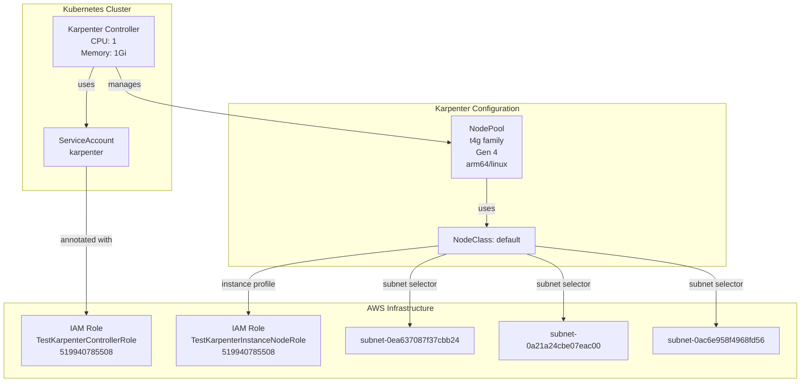
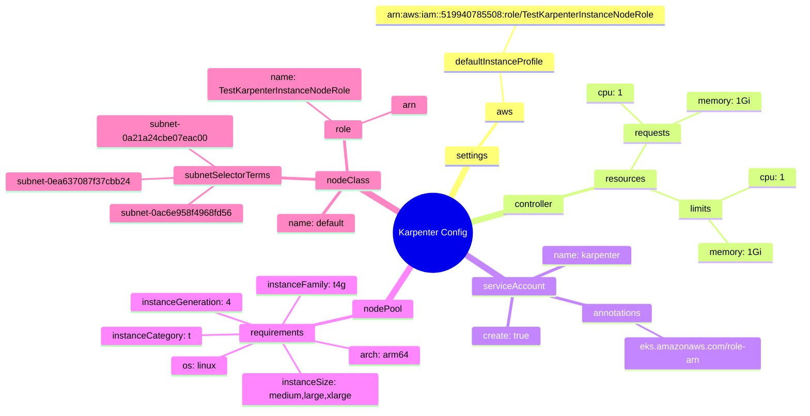
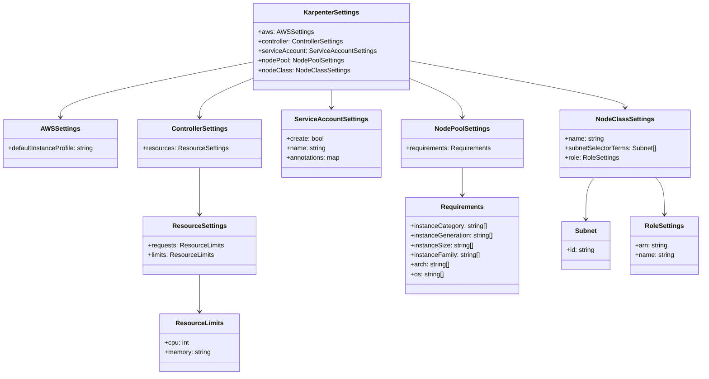

# Diagram: devops/k8s/karpenter/helm/values.test.yaml


> Auto-generated by Obscura crawlers

## Diagram 1

```mermaid
graph TB
      subgraph AWS["AWS Infrastructure"]
          IAM1["IAM Role<br/>TestKarpenterControllerRole<br/>519940785508"]
          IAM2["IAM Role<br/>TestKarpenterInstanceNodeRole<br/>519940785508"]...
  └ 271 lines...
```

> SVG rendering failed for this diagram.

## Diagram 2



### SVG

<svg id="container" width="1608.671875" xmlns="http://www.w3.org/2000/svg" class="flowchart" height="772" viewBox="0 0 1608.671875 772" role="graphics-document document" aria-roledescription="flowchart-v2"><style>#container{font-family:"trebuchet ms",verdana,arial,sans-serif;font-size:16px;fill:#333;}@keyframes edge-animation-frame{from{stroke-dashoffset:0;}}@keyframes dash{to{stroke-dashoffset:0;}}#container .edge-animation-slow{stroke-dasharray:9,5!important;stroke-dashoffset:900;animation:dash 50s linear infinite;stroke-linecap:round;}#container .edge-animation-fast{stroke-dasharray:9,5!important;stroke-dashoffset:900;animation:dash 20s linear infinite;stroke-linecap:round;}#container .error-icon{fill:#552222;}#container .error-text{fill:#552222;stroke:#552222;}#container .edge-thickness-normal{stroke-width:1px;}#container .edge-thickness-thick{stroke-width:3.5px;}#container .edge-pattern-solid{stroke-dasharray:0;}#container .edge-thickness-invisible{stroke-width:0;fill:none;}#container .edge-pattern-dashed{stroke-dasharray:3;}#container .edge-pattern-dotted{stroke-dasharray:2;}#container .marker{fill:#333333;stroke:#333333;}#container .marker.cross{stroke:#333333;}#container svg{font-family:"trebuchet ms",verdana,arial,sans-serif;font-size:16px;}#container p{margin:0;}#container .label{font-family:"trebuchet ms",verdana,arial,sans-serif;color:#333;}#container .cluster-label text{fill:#333;}#container .cluster-label span{color:#333;}#container .cluster-label span p{background-color:transparent;}#container .label text,#container span{fill:#333;color:#333;}#container .node rect,#container .node circle,#container .node ellipse,#container .node polygon,#container .node path{fill:#ECECFF;stroke:#9370DB;stroke-width:1px;}#container .rough-node .label text,#container .node .label text,#container .image-shape .label,#container .icon-shape .label{text-anchor:middle;}#container .node .katex path{fill:#000;stroke:#000;stroke-width:1px;}#container .rough-node .label,#container .node .label,#container .image-shape .label,#container .icon-shape .label{text-align:center;}#container .node.clickable{cursor:pointer;}#container .root .anchor path{fill:#333333!important;stroke-width:0;stroke:#333333;}#container .arrowheadPath{fill:#333333;}#container .edgePath .path{stroke:#333333;stroke-width:2.0px;}#container .flowchart-link{stroke:#333333;fill:none;}#container .edgeLabel{background-color:rgba(232,232,232, 0.8);text-align:center;}#container .edgeLabel p{background-color:rgba(232,232,232, 0.8);}#container .edgeLabel rect{opacity:0.5;background-color:rgba(232,232,232, 0.8);fill:rgba(232,232,232, 0.8);}#container .labelBkg{background-color:rgba(232, 232, 232, 0.5);}#container .cluster rect{fill:#ffffde;stroke:#aaaa33;stroke-width:1px;}#container .cluster text{fill:#333;}#container .cluster span{color:#333;}#container div.mermaidTooltip{position:absolute;text-align:center;max-width:200px;padding:2px;font-family:"trebuchet ms",verdana,arial,sans-serif;font-size:12px;background:hsl(80, 100%, 96.2745098039%);border:1px solid #aaaa33;border-radius:2px;pointer-events:none;z-index:100;}#container .flowchartTitleText{text-anchor:middle;font-size:18px;fill:#333;}#container rect.text{fill:none;stroke-width:0;}#container .icon-shape,#container .image-shape{background-color:rgba(232,232,232, 0.8);text-align:center;}#container .icon-shape p,#container .image-shape p{background-color:rgba(232,232,232, 0.8);padding:2px;}#container .icon-shape rect,#container .image-shape rect{opacity:0.5;background-color:rgba(232,232,232, 0.8);fill:rgba(232,232,232, 0.8);}#container .label-icon{display:inline-block;height:1em;overflow:visible;vertical-align:-0.125em;}#container .node .label-icon path{fill:currentColor;stroke:revert;stroke-width:revert;}#container :root{--mermaid-font-family:"trebuchet ms",verdana,arial,sans-serif;}</style><g><marker id="container_flowchart-v2-pointEnd" class="marker flowchart-v2" viewBox="0 0 10 10" refX="5" refY="5" markerUnits="userSpaceOnUse" markerWidth="8" markerHeight="8" orient="auto"><path d="M 0 0 L 10 5 L 0 10 z" class="arrowMarkerPath" style="stroke-width: 1; stroke-dasharray: 1, 0;"></path></marker><marker id="container_flowchart-v2-pointStart" class="marker flowchart-v2" viewBox="0 0 10 10" refX="4.5" refY="5" markerUnits="userSpaceOnUse" markerWidth="8" markerHeight="8" orient="auto"><path d="M 0 5 L 10 10 L 10 0 z" class="arrowMarkerPath" style="stroke-width: 1; stroke-dasharray: 1, 0;"></path></marker><marker id="container_flowchart-v2-circleEnd" class="marker flowchart-v2" viewBox="0 0 10 10" refX="11" refY="5" markerUnits="userSpaceOnUse" markerWidth="11" markerHeight="11" orient="auto"><circle cx="5" cy="5" r="5" class="arrowMarkerPath" style="stroke-width: 1; stroke-dasharray: 1, 0;"></circle></marker><marker id="container_flowchart-v2-circleStart" class="marker flowchart-v2" viewBox="0 0 10 10" refX="-1" refY="5" markerUnits="userSpaceOnUse" markerWidth="11" markerHeight="11" orient="auto"><circle cx="5" cy="5" r="5" class="arrowMarkerPath" style="stroke-width: 1; stroke-dasharray: 1, 0;"></circle></marker><marker id="container_flowchart-v2-crossEnd" class="marker cross flowchart-v2" viewBox="0 0 11 11" refX="12" refY="5.2" markerUnits="userSpaceOnUse" markerWidth="11" markerHeight="11" orient="auto"><path d="M 1,1 l 9,9 M 10,1 l -9,9" class="arrowMarkerPath" style="stroke-width: 2; stroke-dasharray: 1, 0;"></path></marker><marker id="container_flowchart-v2-crossStart" class="marker cross flowchart-v2" viewBox="0 0 11 11" refX="-1" refY="5.2" markerUnits="userSpaceOnUse" markerWidth="11" markerHeight="11" orient="auto"><path d="M 1,1 l 9,9 M 10,1 l -9,9" class="arrowMarkerPath" style="stroke-width: 2; stroke-dasharray: 1, 0;"></path></marker><g class="root"><g class="clusters"><g class="cluster" id="Config" data-look="classic"><rect style="" x="465.890625" y="209" width="992.8125" height="329"></rect><g class="cluster-label" transform="translate(875.3828125, 209)"><foreignObject width="173.828125" height="24"><div xmlns="http://www.w3.org/1999/xhtml" style="display: table-cell; white-space: nowrap; line-height: 1.5; max-width: 200px; text-align: center;"><span class="nodeLabel"><p>Karpenter Configuration</p></span></div></foreignObject></g></g><g class="cluster" id="K8s" data-look="classic"><rect style="" x="46.40625" y="8" width="303.44921875" height="377"></rect><g class="cluster-label" transform="translate(129.248046875, 8)"><foreignObject width="137.765625" height="24"><div xmlns="http://www.w3.org/1999/xhtml" style="display: table-cell; white-space: nowrap; line-height: 1.5; max-width: 200px; text-align: center;"><span class="nodeLabel"><p>Kubernetes Cluster</p></span></div></foreignObject></g></g><g class="cluster" id="AWS" data-look="classic"><rect style="" x="8" y="612" width="1592.671875" height="152"></rect><g class="cluster-label" transform="translate(736.984375, 612)"><foreignObject width="134.703125" height="24"><div xmlns="http://www.w3.org/1999/xhtml" style="display: table-cell; white-space: nowrap; line-height: 1.5; max-width: 200px; text-align: center;"><span class="nodeLabel"><p>AWS Infrastructure</p></span></div></foreignObject></g></g></g><g class="edgePaths"><path d="M176.039,336L176.039,344.167C176.039,352.333,176.039,368.667,176.039,383C176.039,397.333,176.039,409.667,176.039,426.5C176.039,443.333,176.039,464.667,176.039,484C176.039,503.333,176.039,520.667,176.039,535.5C176.039,550.333,176.039,562.667,176.039,575C176.039,587.333,176.039,599.667,176.039,609.333C176.039,619,176.039,626,176.039,629.5L176.039,633" id="L_SA_IAM1_0" class="edge-thickness-normal edge-pattern-solid edge-thickness-normal edge-pattern-solid flowchart-link" style=";" data-edge="true" data-et="edge" data-id="L_SA_IAM1_0" data-points="W3sieCI6MTc2LjAzOTA2MjUsInkiOjMzNn0seyJ4IjoxNzYuMDM5MDYyNSwieSI6Mzg1fSx7IngiOjE3Ni4wMzkwNjI1LCJ5Ijo0MjJ9LHsieCI6MTc2LjAzOTA2MjUsInkiOjQ4Nn0seyJ4IjoxNzYuMDM5MDYyNSwieSI6NTM4fSx7IngiOjE3Ni4wMzkwNjI1LCJ5Ijo1NzV9LHsieCI6MTc2LjAzOTA2MjUsInkiOjYxMn0seyJ4IjoxNzYuMDM5MDYyNSwieSI6NjM3fV0=" marker-end="url(#container_flowchart-v2-pointEnd)"></path><path d="M190.5,135L188.09,141.167C185.68,147.333,180.86,159.667,178.449,172C176.039,184.333,176.039,196.667,176.039,210.333C176.039,224,176.039,239,176.039,246.5L176.039,254" id="L_CTRL_SA_0" class="edge-thickness-normal edge-pattern-solid edge-thickness-normal edge-pattern-solid flowchart-link" style=";" data-edge="true" data-et="edge" data-id="L_CTRL_SA_0" data-points="W3sieCI6MTkwLjUwMDM5OTUwMjg0MDksInkiOjEzNX0seyJ4IjoxNzYuMDM5MDYyNSwieSI6MTcyfSx7IngiOjE3Ni4wMzkwNjI1LCJ5IjoyMDl9LHsieCI6MTc2LjAzOTA2MjUsInkiOjI1OH1d" marker-end="url(#container_flowchart-v2-pointEnd)"></path><path d="M235.68,135L238.733,141.167C241.785,147.333,247.891,159.667,250.943,172C253.996,184.333,253.996,196.667,362.102,215.915C470.208,235.163,686.419,261.325,794.525,274.406L902.631,287.488" id="L_CTRL_NP_0" class="edge-thickness-normal edge-pattern-solid edge-thickness-normal edge-pattern-solid flowchart-link" style=";" data-edge="true" data-et="edge" data-id="L_CTRL_NP_0" data-points="W3sieCI6MjM1LjY4MDA0MjYxMzYzNjM3LCJ5IjoxMzV9LHsieCI6MjUzLjk5NjA5Mzc1LCJ5IjoxNzJ9LHsieCI6MjUzLjk5NjA5Mzc1LCJ5IjoyMDl9LHsieCI6OTA2LjYwMTU2MjUsInkiOjI4Ny45NjgxNTM2MTg5MDY5N31d" marker-end="url(#container_flowchart-v2-pointEnd)"></path><path d="M981.242,360L981.242,364.167C981.242,368.333,981.242,376.667,981.242,387C981.242,397.333,981.242,409.667,981.242,421.333C981.242,433,981.242,444,981.242,449.5L981.242,455" id="L_NP_NC_0" class="edge-thickness-normal edge-pattern-solid edge-thickness-normal edge-pattern-solid flowchart-link" style=";" data-edge="true" data-et="edge" data-id="L_NP_NC_0" data-points="W3sieCI6OTgxLjI0MjE4NzUsInkiOjM2MH0seyJ4Ijo5ODEuMjQyMTg3NSwieSI6Mzg1fSx7IngiOjk4MS4yNDIxODc1LCJ5Ijo0MjJ9LHsieCI6OTgxLjI0MjE4NzUsInkiOjQ1OX1d" marker-end="url(#container_flowchart-v2-pointEnd)"></path><path d="M902.185,513L889.985,517.167C877.785,521.333,853.385,529.667,841.185,540C828.984,550.333,828.984,562.667,828.984,575C828.984,587.333,828.984,599.667,828.984,613.333C828.984,627,828.984,642,828.984,649.5L828.984,657" id="L_NC_SN1_0" class="edge-thickness-normal edge-pattern-solid edge-thickness-normal edge-pattern-solid flowchart-link" style=";" data-edge="true" data-et="edge" data-id="L_NC_SN1_0" data-points="W3sieCI6OTAyLjE4NTI0NjM5NDIzMDcsInkiOjUxM30seyJ4Ijo4MjguOTg0Mzc1LCJ5Ijo1Mzh9LHsieCI6ODI4Ljk4NDM3NSwieSI6NTc1fSx7IngiOjgyOC45ODQzNzUsInkiOjYxMn0seyJ4Ijo4MjguOTg0Mzc1LCJ5Ijo2NjF9XQ==" marker-end="url(#container_flowchart-v2-pointEnd)"></path><path d="M1060.299,513L1072.499,517.167C1084.699,521.333,1109.1,529.667,1121.3,540C1133.5,550.333,1133.5,562.667,1133.5,575C1133.5,587.333,1133.5,599.667,1133.5,613.333C1133.5,627,1133.5,642,1133.5,649.5L1133.5,657" id="L_NC_SN2_0" class="edge-thickness-normal edge-pattern-solid edge-thickness-normal edge-pattern-solid flowchart-link" style=";" data-edge="true" data-et="edge" data-id="L_NC_SN2_0" data-points="W3sieCI6MTA2MC4yOTkxMjg2MDU3NjkzLCJ5Ijo1MTN9LHsieCI6MTEzMy41LCJ5Ijo1Mzh9LHsieCI6MTEzMy41LCJ5Ijo1NzV9LHsieCI6MTEzMy41LCJ5Ijo2MTJ9LHsieCI6MTEzMy41LCJ5Ijo2NjF9XQ==" marker-end="url(#container_flowchart-v2-pointEnd)"></path><path d="M1078.82,497.092L1138.801,503.91C1198.781,510.728,1318.742,524.364,1378.723,537.349C1438.703,550.333,1438.703,562.667,1438.703,575C1438.703,587.333,1438.703,599.667,1438.703,613.333C1438.703,627,1438.703,642,1438.703,649.5L1438.703,657" id="L_NC_SN3_0" class="edge-thickness-normal edge-pattern-solid edge-thickness-normal edge-pattern-solid flowchart-link" style=";" data-edge="true" data-et="edge" data-id="L_NC_SN3_0" data-points="W3sieCI6MTA3OC44MjAzMTI1LCJ5Ijo0OTcuMDkxNzk0MDM5NzkxNjR9LHsieCI6MTQzOC43MDMxMjUsInkiOjUzOH0seyJ4IjoxNDM4LjcwMzEyNSwieSI6NTc1fSx7IngiOjE0MzguNzAzMTI1LCJ5Ijo2MTJ9LHsieCI6MTQzOC43MDMxMjUsInkiOjY2MX1d" marker-end="url(#container_flowchart-v2-pointEnd)"></path><path d="M883.664,496.674L820.702,503.562C757.74,510.45,631.815,524.225,568.853,537.279C505.891,550.333,505.891,562.667,505.891,575C505.891,587.333,505.891,599.667,505.891,609.333C505.891,619,505.891,626,505.891,629.5L505.891,633" id="L_NC_IAM2_0" class="edge-thickness-normal edge-pattern-solid edge-thickness-normal edge-pattern-solid flowchart-link" style=";" data-edge="true" data-et="edge" data-id="L_NC_IAM2_0" data-points="W3sieCI6ODgzLjY2NDA2MjUsInkiOjQ5Ni42NzQzMzY0Mjg2MzAxfSx7IngiOjUwNS44OTA2MjUsInkiOjUzOH0seyJ4Ijo1MDUuODkwNjI1LCJ5Ijo1NzV9LHsieCI6NTA1Ljg5MDYyNSwieSI6NjEyfSx7IngiOjUwNS44OTA2MjUsInkiOjYzN31d" marker-end="url(#container_flowchart-v2-pointEnd)"></path></g><g class="edgeLabels"><g class="edgeLabel" transform="translate(176.0390625, 486)"><g class="label" data-id="L_SA_IAM1_0" transform="translate(-55.1875, -12)"><foreignObject width="110.375" height="24"><div xmlns="http://www.w3.org/1999/xhtml" class="labelBkg" style="display: table-cell; white-space: nowrap; line-height: 1.5; max-width: 200px; text-align: center;"><span class="edgeLabel"><p>annotated with</p></span></div></foreignObject></g></g><g class="edgeLabel" transform="translate(176.0390625, 172)"><g class="label" data-id="L_CTRL_SA_0" transform="translate(-16.4921875, -12)"><foreignObject width="32.984375" height="24"><div xmlns="http://www.w3.org/1999/xhtml" class="labelBkg" style="display: table-cell; white-space: nowrap; line-height: 1.5; max-width: 200px; text-align: center;"><span class="edgeLabel"><p>uses</p></span></div></foreignObject></g></g><g class="edgeLabel" transform="translate(253.99609375, 172)"><g class="label" data-id="L_CTRL_NP_0" transform="translate(-32.296875, -12)"><foreignObject width="64.59375" height="24"><div xmlns="http://www.w3.org/1999/xhtml" class="labelBkg" style="display: table-cell; white-space: nowrap; line-height: 1.5; max-width: 200px; text-align: center;"><span class="edgeLabel"><p>manages</p></span></div></foreignObject></g></g><g class="edgeLabel" transform="translate(981.2421875, 422)"><g class="label" data-id="L_NP_NC_0" transform="translate(-16.4921875, -12)"><foreignObject width="32.984375" height="24"><div xmlns="http://www.w3.org/1999/xhtml" class="labelBkg" style="display: table-cell; white-space: nowrap; line-height: 1.5; max-width: 200px; text-align: center;"><span class="edgeLabel"><p>uses</p></span></div></foreignObject></g></g><g class="edgeLabel" transform="translate(828.984375, 575)"><g class="label" data-id="L_NC_SN1_0" transform="translate(-56.3125, -12)"><foreignObject width="112.625" height="24"><div xmlns="http://www.w3.org/1999/xhtml" class="labelBkg" style="display: table-cell; white-space: nowrap; line-height: 1.5; max-width: 200px; text-align: center;"><span class="edgeLabel"><p>subnet selector</p></span></div></foreignObject></g></g><g class="edgeLabel" transform="translate(1133.5, 575)"><g class="label" data-id="L_NC_SN2_0" transform="translate(-56.3125, -12)"><foreignObject width="112.625" height="24"><div xmlns="http://www.w3.org/1999/xhtml" class="labelBkg" style="display: table-cell; white-space: nowrap; line-height: 1.5; max-width: 200px; text-align: center;"><span class="edgeLabel"><p>subnet selector</p></span></div></foreignObject></g></g><g class="edgeLabel" transform="translate(1438.703125, 575)"><g class="label" data-id="L_NC_SN3_0" transform="translate(-56.3125, -12)"><foreignObject width="112.625" height="24"><div xmlns="http://www.w3.org/1999/xhtml" class="labelBkg" style="display: table-cell; white-space: nowrap; line-height: 1.5; max-width: 200px; text-align: center;"><span class="edgeLabel"><p>subnet selector</p></span></div></foreignObject></g></g><g class="edgeLabel" transform="translate(505.890625, 575)"><g class="label" data-id="L_NC_IAM2_0" transform="translate(-56.234375, -12)"><foreignObject width="112.46875" height="24"><div xmlns="http://www.w3.org/1999/xhtml" class="labelBkg" style="display: table-cell; white-space: nowrap; line-height: 1.5; max-width: 200px; text-align: center;"><span class="edgeLabel"><p>instance profile</p></span></div></foreignObject></g></g></g><g class="nodes"><g class="node default" id="flowchart-IAM1-0" transform="translate(176.0390625, 688)"><rect class="basic label-container" style="" x="-133.0390625" y="-51" width="266.078125" height="102"></rect><g class="label" style="" transform="translate(-103.0390625, -36)"><rect></rect><foreignObject width="206.078125" height="72"><div xmlns="http://www.w3.org/1999/xhtml" style="display: table; white-space: break-spaces; line-height: 1.5; max-width: 200px; text-align: center; width: 200px;"><span class="nodeLabel"><p>IAM Role<br/>TestKarpenterControllerRole<br/>519940785508</p></span></div></foreignObject></g></g><g class="node default" id="flowchart-IAM2-1" transform="translate(505.890625, 688)"><rect class="basic label-container" style="" x="-146.8125" y="-51" width="293.625" height="102"></rect><g class="label" style="" transform="translate(-116.8125, -36)"><rect></rect><foreignObject width="233.625" height="72"><div xmlns="http://www.w3.org/1999/xhtml" style="display: table; white-space: break-spaces; line-height: 1.5; max-width: 200px; text-align: center; width: 200px;"><span class="nodeLabel"><p>IAM Role<br/>TestKarpenterInstanceNodeRole<br/>519940785508</p></span></div></foreignObject></g></g><g class="node default" id="flowchart-SN1-2" transform="translate(828.984375, 688)"><rect class="basic label-container" style="" x="-126.28125" y="-27" width="252.5625" height="54"></rect><g class="label" style="" transform="translate(-96.28125, -12)"><rect></rect><foreignObject width="192.5625" height="24"><div xmlns="http://www.w3.org/1999/xhtml" style="display: table-cell; white-space: nowrap; line-height: 1.5; max-width: 200px; text-align: center;"><span class="nodeLabel"><p>subnet-0ea637087f37cbb24</p></span></div></foreignObject></g></g><g class="node default" id="flowchart-SN2-3" transform="translate(1133.5, 688)"><rect class="basic label-container" style="" x="-128.234375" y="-27" width="256.46875" height="54"></rect><g class="label" style="" transform="translate(-98.234375, -12)"><rect></rect><foreignObject width="196.46875" height="24"><div xmlns="http://www.w3.org/1999/xhtml" style="display: table-cell; white-space: nowrap; line-height: 1.5; max-width: 200px; text-align: center;"><span class="nodeLabel"><p>subnet-0a21a24cbe07eac00</p></span></div></foreignObject></g></g><g class="node default" id="flowchart-SN3-4" transform="translate(1438.703125, 688)"><rect class="basic label-container" style="" x="-126.96875" y="-27" width="253.9375" height="54"></rect><g class="label" style="" transform="translate(-96.96875, -12)"><rect></rect><foreignObject width="193.9375" height="24"><div xmlns="http://www.w3.org/1999/xhtml" style="display: table-cell; white-space: nowrap; line-height: 1.5; max-width: 200px; text-align: center;"><span class="nodeLabel"><p>subnet-0ac6e958f4968fd56</p></span></div></foreignObject></g></g><g class="node default" id="flowchart-SA-5" transform="translate(176.0390625, 297)"><rect class="basic label-container" style="" x="-84.84375" y="-39" width="169.6875" height="78"></rect><g class="label" style="" transform="translate(-54.84375, -24)"><rect></rect><foreignObject width="109.6875" height="48"><div xmlns="http://www.w3.org/1999/xhtml" style="display: table-cell; white-space: nowrap; line-height: 1.5; max-width: 200px; text-align: center;"><span class="nodeLabel"><p>ServiceAccount<br/>karpenter</p></span></div></foreignObject></g></g><g class="node default" id="flowchart-CTRL-6" transform="translate(210.43359375, 84)"><rect class="basic label-container" style="" x="-104.421875" y="-51" width="208.84375" height="102"></rect><g class="label" style="" transform="translate(-74.421875, -36)"><rect></rect><foreignObject width="148.84375" height="72"><div xmlns="http://www.w3.org/1999/xhtml" style="display: table-cell; white-space: nowrap; line-height: 1.5; max-width: 200px; text-align: center;"><span class="nodeLabel"><p>Karpenter Controller<br/>CPU: 1<br/>Memory: 1Gi</p></span></div></foreignObject></g></g><g class="node default" id="flowchart-NP-7" transform="translate(981.2421875, 297)"><rect class="basic label-container" style="" x="-74.640625" y="-63" width="149.28125" height="126"></rect><g class="label" style="" transform="translate(-44.640625, -48)"><rect></rect><foreignObject width="89.28125" height="96"><div xmlns="http://www.w3.org/1999/xhtml" style="display: table-cell; white-space: nowrap; line-height: 1.5; max-width: 200px; text-align: center;"><span class="nodeLabel"><p>NodePool<br/>t4g family<br/>Gen 4<br/>arm64/linux</p></span></div></foreignObject></g></g><g class="node default" id="flowchart-NC-8" transform="translate(981.2421875, 486)"><rect class="basic label-container" style="" x="-97.578125" y="-27" width="195.15625" height="54"></rect><g class="label" style="" transform="translate(-67.578125, -12)"><rect></rect><foreignObject width="135.15625" height="24"><div xmlns="http://www.w3.org/1999/xhtml" style="display: table-cell; white-space: nowrap; line-height: 1.5; max-width: 200px; text-align: center;"><span class="nodeLabel"><p>NodeClass: default</p></span></div></foreignObject></g></g></g></g></g></svg>

## Diagram 3



### SVG

<svg id="container" width="100%" xmlns="http://www.w3.org/2000/svg" class="mindmapDiagram" style="max-width: 1417.8826904296875px;" viewBox="5 5 1417.8826904296875 756.045654296875" role="graphics-document document" aria-roledescription="mindmap"><style>#container{font-family:"trebuchet ms",verdana,arial,sans-serif;font-size:16px;fill:#333;}@keyframes edge-animation-frame{from{stroke-dashoffset:0;}}@keyframes dash{to{stroke-dashoffset:0;}}#container .edge-animation-slow{stroke-dasharray:9,5!important;stroke-dashoffset:900;animation:dash 50s linear infinite;stroke-linecap:round;}#container .edge-animation-fast{stroke-dasharray:9,5!important;stroke-dashoffset:900;animation:dash 20s linear infinite;stroke-linecap:round;}#container .error-icon{fill:#552222;}#container .error-text{fill:#552222;stroke:#552222;}#container .edge-thickness-normal{stroke-width:1px;}#container .edge-thickness-thick{stroke-width:3.5px;}#container .edge-pattern-solid{stroke-dasharray:0;}#container .edge-thickness-invisible{stroke-width:0;fill:none;}#container .edge-pattern-dashed{stroke-dasharray:3;}#container .edge-pattern-dotted{stroke-dasharray:2;}#container .marker{fill:#333333;stroke:#333333;}#container .marker.cross{stroke:#333333;}#container svg{font-family:"trebuchet ms",verdana,arial,sans-serif;font-size:16px;}#container p{margin:0;}#container .edge{stroke-width:3;}#container .section--1 rect,#container .section--1 path,#container .section--1 circle,#container .section--1 polygon,#container .section--1 path{fill:hsl(240, 100%, 76.2745098039%);}#container .section--1 text{fill:#ffffff;}#container .node-icon--1{font-size:40px;color:#ffffff;}#container .section-edge--1{stroke:hsl(240, 100%, 76.2745098039%);}#container .edge-depth--1{stroke-width:17;}#container .section--1 line{stroke:hsl(60, 100%, 86.2745098039%);stroke-width:3;}#container .disabled,#container .disabled circle,#container .disabled text{fill:lightgray;}#container .disabled text{fill:#efefef;}#container .section-0 rect,#container .section-0 path,#container .section-0 circle,#container .section-0 polygon,#container .section-0 path{fill:hsl(60, 100%, 73.5294117647%);}#container .section-0 text{fill:black;}#container .node-icon-0{font-size:40px;color:black;}#container .section-edge-0{stroke:hsl(60, 100%, 73.5294117647%);}#container .edge-depth-0{stroke-width:14;}#container .section-0 line{stroke:hsl(240, 100%, 83.5294117647%);stroke-width:3;}#container .disabled,#container .disabled circle,#container .disabled text{fill:lightgray;}#container .disabled text{fill:#efefef;}#container .section-1 rect,#container .section-1 path,#container .section-1 circle,#container .section-1 polygon,#container .section-1 path{fill:hsl(80, 100%, 76.2745098039%);}#container .section-1 text{fill:black;}#container .node-icon-1{font-size:40px;color:black;}#container .section-edge-1{stroke:hsl(80, 100%, 76.2745098039%);}#container .edge-depth-1{stroke-width:11;}#container .section-1 line{stroke:hsl(260, 100%, 86.2745098039%);stroke-width:3;}#container .disabled,#container .disabled circle,#container .disabled text{fill:lightgray;}#container .disabled text{fill:#efefef;}#container .section-2 rect,#container .section-2 path,#container .section-2 circle,#container .section-2 polygon,#container .section-2 path{fill:hsl(270, 100%, 76.2745098039%);}#container .section-2 text{fill:#ffffff;}#container .node-icon-2{font-size:40px;color:#ffffff;}#container .section-edge-2{stroke:hsl(270, 100%, 76.2745098039%);}#container .edge-depth-2{stroke-width:8;}#container .section-2 line{stroke:hsl(90, 100%, 86.2745098039%);stroke-width:3;}#container .disabled,#container .disabled circle,#container .disabled text{fill:lightgray;}#container .disabled text{fill:#efefef;}#container .section-3 rect,#container .section-3 path,#container .section-3 circle,#container .section-3 polygon,#container .section-3 path{fill:hsl(300, 100%, 76.2745098039%);}#container .section-3 text{fill:black;}#container .node-icon-3{font-size:40px;color:black;}#container .section-edge-3{stroke:hsl(300, 100%, 76.2745098039%);}#container .edge-depth-3{stroke-width:5;}#container .section-3 line{stroke:hsl(120, 100%, 86.2745098039%);stroke-width:3;}#container .disabled,#container .disabled circle,#container .disabled text{fill:lightgray;}#container .disabled text{fill:#efefef;}#container .section-4 rect,#container .section-4 path,#container .section-4 circle,#container .section-4 polygon,#container .section-4 path{fill:hsl(330, 100%, 76.2745098039%);}#container .section-4 text{fill:black;}#container .node-icon-4{font-size:40px;color:black;}#container .section-edge-4{stroke:hsl(330, 100%, 76.2745098039%);}#container .edge-depth-4{stroke-width:2;}#container .section-4 line{stroke:hsl(150, 100%, 86.2745098039%);stroke-width:3;}#container .disabled,#container .disabled circle,#container .disabled text{fill:lightgray;}#container .disabled text{fill:#efefef;}#container .section-5 rect,#container .section-5 path,#container .section-5 circle,#container .section-5 polygon,#container .section-5 path{fill:hsl(0, 100%, 76.2745098039%);}#container .section-5 text{fill:black;}#container .node-icon-5{font-size:40px;color:black;}#container .section-edge-5{stroke:hsl(0, 100%, 76.2745098039%);}#container .edge-depth-5{stroke-width:-1;}#container .section-5 line{stroke:hsl(180, 100%, 86.2745098039%);stroke-width:3;}#container .disabled,#container .disabled circle,#container .disabled text{fill:lightgray;}#container .disabled text{fill:#efefef;}#container .section-6 rect,#container .section-6 path,#container .section-6 circle,#container .section-6 polygon,#container .section-6 path{fill:hsl(30, 100%, 76.2745098039%);}#container .section-6 text{fill:black;}#container .node-icon-6{font-size:40px;color:black;}#container .section-edge-6{stroke:hsl(30, 100%, 76.2745098039%);}#container .edge-depth-6{stroke-width:-4;}#container .section-6 line{stroke:hsl(210, 100%, 86.2745098039%);stroke-width:3;}#container .disabled,#container .disabled circle,#container .disabled text{fill:lightgray;}#container .disabled text{fill:#efefef;}#container .section-7 rect,#container .section-7 path,#container .section-7 circle,#container .section-7 polygon,#container .section-7 path{fill:hsl(90, 100%, 76.2745098039%);}#container .section-7 text{fill:black;}#container .node-icon-7{font-size:40px;color:black;}#container .section-edge-7{stroke:hsl(90, 100%, 76.2745098039%);}#container .edge-depth-7{stroke-width:-7;}#container .section-7 line{stroke:hsl(270, 100%, 86.2745098039%);stroke-width:3;}#container .disabled,#container .disabled circle,#container .disabled text{fill:lightgray;}#container .disabled text{fill:#efefef;}#container .section-8 rect,#container .section-8 path,#container .section-8 circle,#container .section-8 polygon,#container .section-8 path{fill:hsl(150, 100%, 76.2745098039%);}#container .section-8 text{fill:black;}#container .node-icon-8{font-size:40px;color:black;}#container .section-edge-8{stroke:hsl(150, 100%, 76.2745098039%);}#container .edge-depth-8{stroke-width:-10;}#container .section-8 line{stroke:hsl(330, 100%, 86.2745098039%);stroke-width:3;}#container .disabled,#container .disabled circle,#container .disabled text{fill:lightgray;}#container .disabled text{fill:#efefef;}#container .section-9 rect,#container .section-9 path,#container .section-9 circle,#container .section-9 polygon,#container .section-9 path{fill:hsl(180, 100%, 76.2745098039%);}#container .section-9 text{fill:black;}#container .node-icon-9{font-size:40px;color:black;}#container .section-edge-9{stroke:hsl(180, 100%, 76.2745098039%);}#container .edge-depth-9{stroke-width:-13;}#container .section-9 line{stroke:hsl(0, 100%, 86.2745098039%);stroke-width:3;}#container .disabled,#container .disabled circle,#container .disabled text{fill:lightgray;}#container .disabled text{fill:#efefef;}#container .section-10 rect,#container .section-10 path,#container .section-10 circle,#container .section-10 polygon,#container .section-10 path{fill:hsl(210, 100%, 76.2745098039%);}#container .section-10 text{fill:black;}#container .node-icon-10{font-size:40px;color:black;}#container .section-edge-10{stroke:hsl(210, 100%, 76.2745098039%);}#container .edge-depth-10{stroke-width:-16;}#container .section-10 line{stroke:hsl(30, 100%, 86.2745098039%);stroke-width:3;}#container .disabled,#container .disabled circle,#container .disabled text{fill:lightgray;}#container .disabled text{fill:#efefef;}#container .section-root rect,#container .section-root path,#container .section-root circle,#container .section-root polygon{fill:hsl(240, 100%, 46.2745098039%);}#container .section-root text{fill:#ffffff;}#container .section-root span{color:#ffffff;}#container .section-2 span{color:#ffffff;}#container .icon-container{height:100%;display:flex;justify-content:center;align-items:center;}#container .edge{fill:none;}#container .mindmap-node-label{dy:1em;alignment-baseline:middle;text-anchor:middle;dominant-baseline:middle;text-align:center;}#container :root{--mermaid-font-family:"trebuchet ms",verdana,arial,sans-serif;}</style><g><marker id="container_mindmap-pointEnd" class="marker mindmap" viewBox="0 0 10 10" refX="5" refY="5" markerUnits="userSpaceOnUse" markerWidth="8" markerHeight="8" orient="auto"><path d="M 0 0 L 10 5 L 0 10 z" class="arrowMarkerPath" style="stroke-width: 1; stroke-dasharray: 1, 0;"></path></marker><marker id="container_mindmap-pointStart" class="marker mindmap" viewBox="0 0 10 10" refX="4.5" refY="5" markerUnits="userSpaceOnUse" markerWidth="8" markerHeight="8" orient="auto"><path d="M 0 5 L 10 10 L 10 0 z" class="arrowMarkerPath" style="stroke-width: 1; stroke-dasharray: 1, 0;"></path></marker><g class="subgraphs"></g><g class="edgePaths"><path d="M784.273,396.159L785.078,386.826C785.883,377.493,787.493,358.827,789.103,340.161C790.713,321.495,792.323,302.828,793.128,293.495L793.933,284.162" id="edge_0_1" class="edge-thickness-normal edge-pattern-solid edge section-edge-0 edge-depth-1" style="undefined;;;undefined" data-edge="true" data-et="edge" data-id="edge_0_1" data-points="W3sieCI6Nzg0LjI3Mjk2MjY3NTc1NTUsInkiOjM5Ni4xNTg5NDM5MzkzMjQ4fSx7IngiOjc4OS4xMDI4NTI4MTIwMTg3LCJ5IjozNDAuMTYwNjY0MTUwNTczMTV9LHsieCI6NzkzLjkzMjc0Mjk0ODI4MTcsInkiOjI4NC4xNjIzODQzNjE4MjE1fV0="></path><path d="M804.449,257.392L807.889,252.982C811.329,248.573,818.209,239.755,825.089,230.937C831.969,222.118,838.849,213.3,842.289,208.891L845.729,204.482" id="edge_1_2" class="edge-thickness-normal edge-pattern-solid edge section-edge-0 edge-depth-3" style="undefined;;;undefined" data-edge="true" data-et="edge" data-id="edge_1_2" data-points="W3sieCI6ODA0LjQ0ODcwOTE2NzQwMjYsInkiOjI1Ny4zOTE1MTU3MTcxNzEwNX0seyJ4Ijo4MjUuMDg4OTc4NjMxMzM3MywieSI6MjMwLjkzNjYxODA2MDU5MDY2fSx7IngiOjg0NS43MjkyNDgwOTUyNzE5LCJ5IjoyMDQuNDgxNzIwNDA0MDEwM31d"></path><path d="M861.461,179.139L863.694,174.5C865.927,169.86,870.393,160.581,874.859,151.302C879.325,142.024,883.791,132.745,886.024,128.105L888.257,123.466" id="edge_2_3" class="edge-thickness-normal edge-pattern-solid edge section-edge-0 edge-depth-5" style="undefined;;;undefined" data-edge="true" data-et="edge" data-id="edge_2_3" data-points="W3sieCI6ODYxLjQ2MTM3ODg2NzAxNjIsInkiOjE3OS4xMzkzMzM3MzQwOTk4NH0seyJ4Ijo4NzQuODU4OTg1NDExNTQxMiwieSI6MTUxLjMwMjQ5NzE0MjQ4MTEyfSx7IngiOjg4OC4yNTY1OTE5NTYwNjYyLCJ5IjoxMjMuNDY1NjYwNTUwODYyNH1d"></path><path d="M903.31,97.624L906.39,93.182C909.47,88.741,915.63,79.858,921.79,70.975C927.95,62.092,934.11,53.209,937.19,48.768L940.27,44.326" id="edge_3_4" class="edge-thickness-normal edge-pattern-solid edge section-edge-0 edge-depth-7" style="undefined;;;undefined" data-edge="true" data-et="edge" data-id="edge_3_4" data-points="W3sieCI6OTAzLjMwOTY1MDQ4Nzg2MzcsInkiOjk3LjYyMzUxMzM5ODA3MDE5fSx7IngiOjkyMS43OTAwMDM4MDg5OTA2LCJ5Ijo3MC45NzQ4MTM1MDI5MDkyM30seyJ4Ijo5NDAuMjcwMzU3MTMwMTE3NCwieSI6NDQuMzI2MTEzNjA3NzQ4Mjd9XQ=="></path><path d="M796.654,404.929L807.701,399.94C818.747,394.95,840.84,384.972,862.933,374.993C885.026,365.015,907.119,355.036,918.165,350.047L929.212,345.057" id="edge_0_5" class="edge-thickness-normal edge-pattern-solid edge section-edge-1 edge-depth-1" style="undefined;;;undefined" data-edge="true" data-et="edge" data-id="edge_0_5" data-points="W3sieCI6Nzk2LjY1NDI3NDI1MTEwODksInkiOjQwNC45MjkwNTQ4NjY2NTE2NX0seyJ4Ijo4NjIuOTMzMTA0MzgwMzI1OSwieSI6Mzc0Ljk5MzE1NTY2ODI5ODJ9LHsieCI6OTI5LjIxMTkzNDUwOTU0MywieSI6MzQ1LjA1NzI1NjQ2OTk0NDd9XQ=="></path><path d="M957.559,335.787L968.939,333.387C980.318,330.987,1003.077,326.187,1025.836,321.387C1048.595,316.587,1071.354,311.787,1082.734,309.387L1094.114,306.987" id="edge_5_6" class="edge-thickness-normal edge-pattern-solid edge section-edge-1 edge-depth-3" style="undefined;;;undefined" data-edge="true" data-et="edge" data-id="edge_5_6" data-points="W3sieCI6OTU3LjU1OTMzNzkwMTA1NTEsInkiOjMzNS43ODczMzM0NTI5NzA4N30seyJ4IjoxMDI1LjgzNjQyNjk2Mzg4NDIsInkiOjMyMS4zODcxNjMwMzM4MjczfSx7IngiOjEwOTQuMTEzNTE2MDI2NzEzMywieSI6MzA2Ljk4Njk5MjYxNDY4Mzd9XQ=="></path><path d="M1118.518,292.473L1122.24,288.103C1125.963,283.734,1133.408,274.994,1140.853,266.255C1148.298,257.516,1155.743,248.777,1159.465,244.407L1163.188,240.037" id="edge_6_7" class="edge-thickness-normal edge-pattern-solid edge section-edge-1 edge-depth-5" style="undefined;;;undefined" data-edge="true" data-et="edge" data-id="edge_6_7" data-points="W3sieCI6MTExOC41MTc5MzQ2NzkyNDU2LCJ5IjoyOTIuNDczMDg1MzM0NzcxNDR9LHsieCI6MTE0MC44NTI5Mzk4NjcwODU4LCJ5IjoyNjYuMjU1MTQ4OTA3Njh9LHsieCI6MTE2My4xODc5NDUwNTQ5MjU5LCJ5IjoyNDAuMDM3MjEyNDgwNTg4NTV9XQ=="></path><path d="M1160.111,220.805L1153.864,216.992C1147.617,213.179,1135.123,205.554,1122.628,197.929C1110.134,190.304,1097.64,182.678,1091.393,178.866L1085.146,175.053" id="edge_7_8" class="edge-thickness-normal edge-pattern-solid edge section-edge-1 edge-depth-7" style="undefined;;;undefined" data-edge="true" data-et="edge" data-id="edge_7_8" data-points="W3sieCI6MTE2MC4xMTEzODUwMzMyNDk3LCJ5IjoyMjAuODA0NjYxNTk3Njg2Njd9LHsieCI6MTEyMi42Mjg0NzI3NDYzNTk5LCJ5IjoxOTcuOTI4OTQxODI4MTI4Nn0seyJ4IjoxMDg1LjE0NTU2MDQ1OTQ3LCJ5IjoxNzUuMDUzMjIyMDU4NTcwNX1d"></path><path d="M1185.726,220.816L1192.104,216.931C1198.482,213.046,1211.238,205.277,1223.994,197.507C1236.75,189.737,1249.506,181.968,1255.884,178.083L1262.262,174.198" id="edge_7_9" class="edge-thickness-normal edge-pattern-solid edge section-edge-1 edge-depth-7" style="undefined;;;undefined" data-edge="true" data-et="edge" data-id="edge_7_9" data-points="W3sieCI6MTE4NS43MjU5NDEzMzYwMzE0LCJ5IjoyMjAuODE1ODY4OTgxNzI1NjZ9LHsieCI6MTIyMy45OTM4MDEwOTE3ODMsInkiOjE5Ny41MDcwMzM2MDI2Nzc4NH0seyJ4IjoxMjYyLjI2MTY2MDg0NzUzNDgsInkiOjE3NC4xOTgxOTgyMjM2MzAwMn1d"></path><path d="M1123.141,308.259L1133.133,311.301C1143.126,314.342,1163.111,320.425,1183.096,326.508C1203.081,332.591,1223.066,338.674,1233.059,341.715L1243.051,344.756" id="edge_6_10" class="edge-thickness-normal edge-pattern-solid edge section-edge-1 edge-depth-5" style="undefined;;;undefined" data-edge="true" data-et="edge" data-id="edge_6_10" data-points="W3sieCI6MTEyMy4xNDA2NDg3Mzg1NTQzLCJ5IjozMDguMjU5MjAyNTc4MTg3MzR9LHsieCI6MTE4My4wOTU4NDg2NTYxOTk3LCJ5IjozMjYuNTA3ODI1ODA5NTU1N30seyJ4IjoxMjQzLjA1MTA0ODU3Mzg0NSwieSI6MzQ0Ljc1NjQ0OTA0MDkyNDA1fV0="></path><path d="M1270.619,342.033L1277.674,338.249C1284.728,334.464,1298.838,326.895,1312.947,319.326C1327.056,311.757,1341.166,304.187,1348.22,300.403L1355.275,296.618" id="edge_10_11" class="edge-thickness-normal edge-pattern-solid edge section-edge-1 edge-depth-7" style="undefined;;;undefined" data-edge="true" data-et="edge" data-id="edge_10_11" data-points="W3sieCI6MTI3MC42MTkxMzczMjc1MzMsInkiOjM0Mi4wMzMxNTg5NTI1NTc4N30seyJ4IjoxMzEyLjk0NzExNzM1NDg5NzUsInkiOjMxOS4zMjU3Mjc1NjI5NzM2fSx7IngiOjEzNTUuMjc1MDk3MzgyMjYyLCJ5IjoyOTYuNjE4Mjk2MTczMzg5MzV9XQ=="></path><path d="M1269.527,357.954L1275.079,361.996C1280.63,366.039,1291.734,374.123,1302.837,382.208C1313.941,390.293,1325.044,398.378,1330.596,402.42L1336.147,406.463" id="edge_10_12" class="edge-thickness-normal edge-pattern-solid edge section-edge-1 edge-depth-7" style="undefined;;;undefined" data-edge="true" data-et="edge" data-id="edge_10_12" data-points="W3sieCI6MTI2OS41MjcwNzM5OTA0NTgxLCJ5IjozNTcuOTUzNjY3MDM5MzAwMTd9LHsieCI6MTMwMi44MzcxNzc2NzQxNzY3LCJ5IjozODIuMjA4MjQyMDk2OTkwNX0seyJ4IjoxMzM2LjE0NzI4MTM1Nzg5NTMsInkiOjQwNi40NjI4MTcxNTQ2ODA4fV0="></path><path d="M796.822,416.892L808.17,421.639C819.518,426.386,842.213,435.879,864.909,445.373C887.605,454.866,910.3,464.36,921.648,469.107L932.996,473.853" id="edge_0_13" class="edge-thickness-normal edge-pattern-solid edge section-edge-2 edge-depth-1" style="undefined;;;undefined" data-edge="true" data-et="edge" data-id="edge_0_13" data-points="W3sieCI6Nzk2LjgyMjEwNDU3MzU5OTIsInkiOjQxNi44OTE5NDE4MTA1Mjk4M30seyJ4Ijo4NjQuOTA5MDg3NzUwMTg1NiwieSI6NDQ1LjM3MjcxNzgzMDA4NDN9LHsieCI6OTMyLjk5NjA3MDkyNjc3MjEsInkiOjQ3My44NTM0OTM4NDk2Mzg3N31d"></path><path d="M959.305,471.306L965.07,467.452C970.836,463.598,982.368,455.889,993.899,448.181C1005.431,440.473,1016.962,432.764,1022.728,428.91L1028.494,425.056" id="edge_13_14" class="edge-thickness-normal edge-pattern-solid edge section-edge-2 edge-depth-3" style="undefined;;;undefined" data-edge="true" data-et="edge" data-id="edge_13_14" data-points="W3sieCI6OTU5LjMwNDY0MTk5NDUyMzIsInkiOjQ3MS4zMDYwNDM5NjE3ODJ9LHsieCI6OTkzLjg5OTM0MTMxNjk4NDIsInkiOjQ0OC4xODEwNTkxNDI3OTY4fSx7IngiOjEwMjguNDk0MDQwNjM5NDQ1LCJ5Ijo0MjUuMDU2MDc0MzIzODExNjN9XQ=="></path><path d="M961.826,480.127L976.82,480.611C991.813,481.096,1021.8,482.066,1051.787,483.035C1081.774,484.005,1111.761,484.974,1126.755,485.459L1141.748,485.944" id="edge_13_15" class="edge-thickness-normal edge-pattern-solid edge section-edge-2 edge-depth-3" style="undefined;;;undefined" data-edge="true" data-et="edge" data-id="edge_13_15" data-points="W3sieCI6OTYxLjgyNjM1MzQ2MDU4OTgsInkiOjQ4MC4xMjY3MDQ3MTM3NzUzfSx7IngiOjEwNTEuNzg3MzY5MDI0ODg2LCJ5Ijo0ODMuMDM1MzM1MDk5NjU5ODV9LHsieCI6MTE0MS43NDgzODQ1ODkxODIzLCJ5Ijo0ODUuOTQzOTY1NDg1NTQ0Mzd9XQ=="></path><path d="M958.028,489.627L962.757,493.845C967.486,498.063,976.943,506.5,986.401,514.936C995.858,523.372,1005.316,531.809,1010.045,536.027L1014.774,540.245" id="edge_13_16" class="edge-thickness-normal edge-pattern-solid edge section-edge-2 edge-depth-3" style="undefined;;;undefined" data-edge="true" data-et="edge" data-id="edge_13_16" data-points="W3sieCI6OTU4LjAyNzkzNDg5NzMxODMsInkiOjQ4OS42MjY5NjU5Njc2NjcyfSx7IngiOjk4Ni40MDA3MzEzMTIzMDM2LCJ5Ijo1MTQuOTM1OTI0MDMzMjEzNn0seyJ4IjoxMDE0Ljc3MzUyNzcyNzI4ODksInkiOjU0MC4yNDQ4ODIwOTg3Nn1d"></path><path d="M1038.346,558.702L1045.619,563.68C1052.892,568.658,1067.438,578.614,1081.983,588.569C1096.529,598.525,1111.075,608.481,1118.348,613.459L1125.621,618.437" id="edge_16_17" class="edge-thickness-normal edge-pattern-solid edge section-edge-2 edge-depth-5" style="undefined;;;undefined" data-edge="true" data-et="edge" data-id="edge_16_17" data-points="W3sieCI6MTAzOC4zNDU1ODQ5MDQwOTYzLCJ5Ijo1NTguNzAyMDI4OTM1MjY0MX0seyJ4IjoxMDgxLjk4MzQ5NjA0Mzg1OTMsInkiOjU4OC41NjkzNzI4NjU5NzI5fSx7IngiOjExMjUuNjIxNDA3MTgzNjIyMywieSI6NjE4LjQzNjcxNjc5NjY4MTd9XQ=="></path><path d="M775.161,423.902L769.484,433.188C763.808,442.475,752.455,461.048,741.101,479.622C729.748,498.195,718.395,516.768,712.719,526.055L707.042,535.341" id="edge_0_18" class="edge-thickness-normal edge-pattern-solid edge section-edge-3 edge-depth-1" style="undefined;;;undefined" data-edge="true" data-et="edge" data-id="edge_0_18" data-points="W3sieCI6Nzc1LjE2MDgzMDY4MjMwMTYsInkiOjQyMy45MDE4MjY5NTU3NTA0fSx7IngiOjc0MS4xMDE0NzUwOTcxNzY0LCJ5Ijo0NzkuNjIxNTQ5MjI2OTYxMDZ9LHsieCI6NzA3LjA0MjExOTUxMjA1MTIsInkiOjUzNS4zNDEyNzE0OTgxNzE3fV0="></path><path d="M687.092,556.968L681.105,561.327C675.119,565.686,663.145,574.403,651.171,583.121C639.197,591.838,627.223,600.556,621.236,604.915L615.249,609.273" id="edge_18_19" class="edge-thickness-normal edge-pattern-solid edge section-edge-3 edge-depth-3" style="undefined;;;undefined" data-edge="true" data-et="edge" data-id="edge_18_19" data-points="W3sieCI6Njg3LjA5MjM2NzMwNTI0ODIsInkiOjU1Ni45NjgzMjQ5MDIxNzIzfSx7IngiOjY1MS4xNzA3Njk0NTMyNDg5LCJ5Ijo1ODMuMTIwODAyNjU1NDI3Nn0seyJ4Ijo2MTUuMjQ5MTcxNjAxMjQ5NiwieSI6NjA5LjI3MzI4MDQwODY4Mjl9XQ=="></path><path d="M588.351,615.494L572.621,612.717C556.892,609.94,525.433,604.386,493.973,598.831C462.514,593.277,431.055,587.723,415.325,584.946L399.596,582.169" id="edge_19_20" class="edge-thickness-normal edge-pattern-solid edge section-edge-3 edge-depth-5" style="undefined;;;undefined" data-edge="true" data-et="edge" data-id="edge_19_20" data-points="W3sieCI6NTg4LjM1MTAyODg1NDg0NDEsInkiOjYxNS40OTQwMjE1NzMzMTA5fSx7IngiOjQ5My45NzM0MzkxNTg3MDU5LCJ5Ijo1OTguODMxNDc5MzQ1NTk4N30seyJ4IjozOTkuNTk1ODQ5NDYyNTY3NywieSI6NTgyLjE2ODkzNzExNzg4NjZ9XQ=="></path><path d="M618.068,616.826L634.314,615.439C650.559,614.052,683.05,611.278,715.541,608.504C748.032,605.73,780.523,602.955,796.769,601.568L813.014,600.181" id="edge_19_21" class="edge-thickness-normal edge-pattern-solid edge section-edge-3 edge-depth-5" style="undefined;;;undefined" data-edge="true" data-et="edge" data-id="edge_19_21" data-points="W3sieCI6NjE4LjA2ODE5OTk5NTg1NDksInkiOjYxNi44MjU5MDA5NzM4MzM0fSx7IngiOjcxNS41NDExMzUyMzg3MTA2LCJ5Ijo2MDguNTAzNjA5NDUyMzkyNH0seyJ4Ijo4MTMuMDE0MDcwNDgxNTY2MSwieSI6NjAwLjE4MTMxNzkzMDk1MTR9XQ=="></path><path d="M601.536,633.018L600.879,639.194C600.222,645.37,598.908,657.722,597.594,670.074C596.28,682.426,594.966,694.778,594.309,700.954L593.652,707.13" id="edge_19_22" class="edge-thickness-normal edge-pattern-solid edge section-edge-3 edge-depth-5" style="undefined;;;undefined" data-edge="true" data-et="edge" data-id="edge_19_22" data-points="W3sieCI6NjAxLjUzNTg0MDE4NDE2NjQsInkiOjYzMy4wMTc4MDU3OTYwMzQ0fSx7IngiOjU5Ny41OTM4NDkwNDI0MDQ2LCJ5Ijo2NzAuMDczODA2MjI1NTIyOH0seyJ4Ijo1OTMuNjUxODU3OTAwNjQyNywieSI6NzA3LjEyOTgwNjY1NTAxMTN9XQ=="></path><path d="M588.538,621.608L574.514,624.978C560.489,628.349,532.44,635.091,504.391,641.833C476.342,648.575,448.294,655.317,434.269,658.688L420.245,662.059" id="edge_19_23" class="edge-thickness-normal edge-pattern-solid edge section-edge-3 edge-depth-5" style="undefined;;;undefined" data-edge="true" data-et="edge" data-id="edge_19_23" data-points="W3sieCI6NTg4LjUzNzk2NjIxMjI1OTYsInkiOjYyMS42MDc1NTMwNjA3MjM1fSx7IngiOjUwNC4zOTEzMjIxOTAzNzI2NSwieSI6NjQxLjgzMzIxMjIzNjQwNzl9LHsieCI6NDIwLjI0NDY3ODE2ODQ4NTg1LCJ5Ijo2NjIuMDU4ODcxNDEyMDkyM31d"></path><path d="M594.765,605.646L591.679,601.049C588.594,596.451,582.424,587.255,576.254,578.06C570.084,568.865,563.913,559.669,560.828,555.071L557.743,550.474" id="edge_19_24" class="edge-thickness-normal edge-pattern-solid edge section-edge-3 edge-depth-5" style="undefined;;;undefined" data-edge="true" data-et="edge" data-id="edge_19_24" data-points="W3sieCI6NTk0Ljc2NDYyMjI4OTc5OTYsInkiOjYwNS42NDYyNjA4Mzg2ODQ0fSx7IngiOjU3Ni4yNTM4MTE3NTI1OTcxLCJ5Ijo1NzguMDU5OTQwNzUzMDk0M30seyJ4Ijo1NTcuNzQzMDAxMjE1Mzk0OCwieSI6NTUwLjQ3MzYyMDY2NzUwNDN9XQ=="></path><path d="M617.493,622.402L628.738,625.767C639.983,629.132,662.474,635.862,684.964,642.592C707.454,649.322,729.944,656.052,741.19,659.417L752.435,662.782" id="edge_19_25" class="edge-thickness-normal edge-pattern-solid edge section-edge-3 edge-depth-5" style="undefined;;;undefined" data-edge="true" data-et="edge" data-id="edge_19_25" data-points="W3sieCI6NjE3LjQ5Mjk4MjY3MjE3MzIsInkiOjYyMi40MDIxMzI2NzQ4NDkyfSx7IngiOjY4NC45NjM4ODQ2NzkyMTQ1LCJ5Ijo2NDIuNTkxOTY2MDQwMDQwOX0seyJ4Ijo3NTIuNDM0Nzg2Njg2MjU1OCwieSI6NjYyLjc4MTc5OTQwNTIzMjZ9XQ=="></path><path d="M768.98,405.729L757.078,401.161C745.175,396.594,721.371,387.458,697.566,378.323C673.762,369.187,649.957,360.052,638.055,355.484L626.152,350.916" id="edge_0_26" class="edge-thickness-normal edge-pattern-solid edge section-edge-4 edge-depth-1" style="undefined;;;undefined" data-edge="true" data-et="edge" data-id="edge_0_26" data-points="W3sieCI6NzY4Ljk3OTg0MjU4ODMyODgsInkiOjQwNS43MjkwODM4NjA3MDgxfSx7IngiOjY5Ny41NjYxMjM2NjcyOTA2LCJ5IjozNzguMzIyNjE2Nzg4MDM3NjR9LHsieCI6NjI2LjE1MjQwNDc0NjI1MjQsInkiOjM1MC45MTYxNDk3MTUzNjcxN31d"></path><path d="M605.368,358.922L603.1,363.398C600.831,367.874,596.295,376.826,591.759,385.778C587.222,394.73,582.686,403.682,580.417,408.159L578.149,412.635" id="edge_26_27" class="edge-thickness-normal edge-pattern-solid edge section-edge-4 edge-depth-3" style="undefined;;;undefined" data-edge="true" data-et="edge" data-id="edge_26_27" data-points="W3sieCI6NjA1LjM2Nzk0NjA3OTY1NDUsInkiOjM1OC45MjE4ODQ0MDQzMDU2fSx7IngiOjU5MS43NTg1OTg2NDI0MzYsInkiOjM4NS43NzgyNDk0NTU4NTI0Nn0seyJ4Ijo1NzguMTQ5MjUxMjA1MjE3NSwieSI6NDEyLjYzNDYxNDUwNzM5OTN9XQ=="></path><path d="M597.209,346.892L581.979,348.269C566.75,349.646,536.29,352.399,505.831,355.152C475.371,357.906,444.912,360.659,429.682,362.036L414.452,363.412" id="edge_26_28" class="edge-thickness-normal edge-pattern-solid edge section-edge-4 edge-depth-3" style="undefined;;;undefined" data-edge="true" data-et="edge" data-id="edge_26_28" data-points="W3sieCI6NTk3LjIwOTE2OTM3MDk2NTUsInkiOjM0Ni44OTIxNzc0NDc4MjEzfSx7IngiOjUwNS44MzA2OTcxNTI4OTEzMywieSI6MzU1LjE1MjIzODMzNjgxNDJ9LHsieCI6NDE0LjQ1MjIyNDkzNDgxNzIsInkiOjM2My40MTIyOTkyMjU4MDcxfV0="></path><path d="M384.538,363.897L364.681,362.749C344.824,361.601,305.111,359.305,265.397,357.009C225.684,354.713,185.97,352.417,166.113,351.269L146.256,350.121" id="edge_28_29" class="edge-thickness-normal edge-pattern-solid edge section-edge-4 edge-depth-5" style="undefined;;;undefined" data-edge="true" data-et="edge" data-id="edge_28_29" data-points="W3sieCI6Mzg0LjUzODE0MTIyMTgzNTUzLCJ5IjozNjMuODk2OTI4ODQ4MzMwODR9LHsieCI6MjY1LjM5NzE5MjQ1Mzc1NDU0LCJ5IjozNTcuMDA4ODM5MDYzODQ1MjR9LHsieCI6MTQ2LjI1NjI0MzY4NTY3MzU1LCJ5IjozNTAuMTIwNzQ5Mjc5MzU5NjR9XQ=="></path><path d="M386.837,372.782L380.592,376.732C374.348,380.683,361.859,388.584,349.37,396.484C336.881,404.385,324.392,412.286,318.148,416.236L311.904,420.186" id="edge_28_30" class="edge-thickness-normal edge-pattern-solid edge section-edge-4 edge-depth-5" style="undefined;;;undefined" data-edge="true" data-et="edge" data-id="edge_28_30" data-points="W3sieCI6Mzg2LjgzNjc3MzI1NDE0MzgsInkiOjM3Mi43ODIwNDUxMjUyOTV9LHsieCI6MzQ5LjM3MDE1Mjg0ODAyODksInkiOjM5Ni40ODQyNDU0OTk2Mjc4M30seyJ4IjozMTEuOTAzNTMyNDQxOTE0LCJ5Ijo0MjAuMTg2NDQ1ODczOTYwN31d"></path><path d="M388.537,354.539L384.009,350.321C379.481,346.103,370.425,337.668,361.368,329.232C352.312,320.796,343.256,312.361,338.728,308.143L334.2,303.925" id="edge_28_31" class="edge-thickness-normal edge-pattern-solid edge section-edge-4 edge-depth-5" style="undefined;;;undefined" data-edge="true" data-et="edge" data-id="edge_28_31" data-points="W3sieCI6Mzg4LjUzNzExNTA1MzM3MjM2LCJ5IjozNTQuNTM4ODU4NDU3NjE1OTZ9LHsieCI6MzYxLjM2ODQzNzM1NjQwNDcsInkiOjMyOS4yMzIwMjMyOTg1NzI4fSx7IngiOjMzNC4xOTk3NTk2NTk0MzcsInkiOjMwMy45MjUxODgxMzk1Mjk2N31d"></path><path d="M608.079,331.104L606.698,326.207C605.318,321.309,602.557,311.514,599.796,301.719C597.035,291.924,594.274,282.129,592.894,277.231L591.513,272.334" id="edge_26_32" class="edge-thickness-normal edge-pattern-solid edge section-edge-4 edge-depth-3" style="undefined;;;undefined" data-edge="true" data-et="edge" data-id="edge_26_32" data-points="W3sieCI6NjA4LjA3ODc4NzEzODYzNDIsInkiOjMzMS4xMDQzNDM3NTI1Mjc1fSx7IngiOjU5OS43OTU5ODM5NjI3MjE3LCJ5IjozMDEuNzE5MTA5ODgzMTE0ODd9LHsieCI6NTkxLjUxMzE4MDc4NjgwOTIsInkiOjI3Mi4zMzM4NzYwMTM3MDIyNX1d"></path><path d="M572.672,255.289L565.164,253.964C557.655,252.639,542.638,249.989,527.621,247.338C512.604,244.688,497.587,242.038,490.079,240.712L482.57,239.387" id="edge_32_33" class="edge-thickness-normal edge-pattern-solid edge section-edge-4 edge-depth-5" style="undefined;;;undefined" data-edge="true" data-et="edge" data-id="edge_32_33" data-points="W3sieCI6NTcyLjY3MjAwNzI2NTQ4MzgsInkiOjI1NS4yODkzNzAzMDc5MDc4Nn0seyJ4Ijo1MjcuNjIxMTQxNDI4MDg1OCwieSI6MjQ3LjMzODI4ODc1MzMzOTI3fSx7IngiOjQ4Mi41NzAyNzU1OTA2ODc5LCJ5IjoyMzkuMzg3MjA3MTk4NzcwNjh9XQ=="></path><path d="M586.723,242.914L586.439,237.002C586.155,231.09,585.586,219.267,585.018,207.443C584.449,195.619,583.881,183.796,583.596,177.884L583.312,171.972" id="edge_32_34" class="edge-thickness-normal edge-pattern-solid edge section-edge-4 edge-depth-5" style="undefined;;;undefined" data-edge="true" data-et="edge" data-id="edge_32_34" data-points="W3sieCI6NTg2LjcyMzI4NzI2NDgyNjQsInkiOjI0Mi45MTM3NTU4NjM4ODg4fSx7IngiOjU4NS4wMTc3MjkwNzUxMzYsInkiOjIwNy40NDMwNTE5ODE2NzU4fSx7IngiOjU4My4zMTIxNzA4ODU0NDU1LCJ5IjoxNzEuOTcyMzQ4MDk5NDYyOH1d"></path></g><g class="edgeLabels"><g class="edgeLabel"><g class="label" data-id="edge_0_1" transform="translate(0, 0)"><foreignObject width="0" height="0"><div xmlns="http://www.w3.org/1999/xhtml" class="labelBkg" style="display: table-cell; white-space: nowrap; line-height: 1.5; max-width: 200px; text-align: center;"><span class="edgeLabel"></span></div></foreignObject></g></g><g class="edgeLabel"><g class="label" data-id="edge_1_2" transform="translate(0, 0)"><foreignObject width="0" height="0"><div xmlns="http://www.w3.org/1999/xhtml" class="labelBkg" style="display: table-cell; white-space: nowrap; line-height: 1.5; max-width: 200px; text-align: center;"><span class="edgeLabel"></span></div></foreignObject></g></g><g class="edgeLabel"><g class="label" data-id="edge_2_3" transform="translate(0, 0)"><foreignObject width="0" height="0"><div xmlns="http://www.w3.org/1999/xhtml" class="labelBkg" style="display: table-cell; white-space: nowrap; line-height: 1.5; max-width: 200px; text-align: center;"><span class="edgeLabel"></span></div></foreignObject></g></g><g class="edgeLabel"><g class="label" data-id="edge_3_4" transform="translate(0, 0)"><foreignObject width="0" height="0"><div xmlns="http://www.w3.org/1999/xhtml" class="labelBkg" style="display: table-cell; white-space: nowrap; line-height: 1.5; max-width: 200px; text-align: center;"><span class="edgeLabel"></span></div></foreignObject></g></g><g class="edgeLabel"><g class="label" data-id="edge_0_5" transform="translate(0, 0)"><foreignObject width="0" height="0"><div xmlns="http://www.w3.org/1999/xhtml" class="labelBkg" style="display: table-cell; white-space: nowrap; line-height: 1.5; max-width: 200px; text-align: center;"><span class="edgeLabel"></span></div></foreignObject></g></g><g class="edgeLabel"><g class="label" data-id="edge_5_6" transform="translate(0, 0)"><foreignObject width="0" height="0"><div xmlns="http://www.w3.org/1999/xhtml" class="labelBkg" style="display: table-cell; white-space: nowrap; line-height: 1.5; max-width: 200px; text-align: center;"><span class="edgeLabel"></span></div></foreignObject></g></g><g class="edgeLabel"><g class="label" data-id="edge_6_7" transform="translate(0, 0)"><foreignObject width="0" height="0"><div xmlns="http://www.w3.org/1999/xhtml" class="labelBkg" style="display: table-cell; white-space: nowrap; line-height: 1.5; max-width: 200px; text-align: center;"><span class="edgeLabel"></span></div></foreignObject></g></g><g class="edgeLabel"><g class="label" data-id="edge_7_8" transform="translate(0, 0)"><foreignObject width="0" height="0"><div xmlns="http://www.w3.org/1999/xhtml" class="labelBkg" style="display: table-cell; white-space: nowrap; line-height: 1.5; max-width: 200px; text-align: center;"><span class="edgeLabel"></span></div></foreignObject></g></g><g class="edgeLabel"><g class="label" data-id="edge_7_9" transform="translate(0, 0)"><foreignObject width="0" height="0"><div xmlns="http://www.w3.org/1999/xhtml" class="labelBkg" style="display: table-cell; white-space: nowrap; line-height: 1.5; max-width: 200px; text-align: center;"><span class="edgeLabel"></span></div></foreignObject></g></g><g class="edgeLabel"><g class="label" data-id="edge_6_10" transform="translate(0, 0)"><foreignObject width="0" height="0"><div xmlns="http://www.w3.org/1999/xhtml" class="labelBkg" style="display: table-cell; white-space: nowrap; line-height: 1.5; max-width: 200px; text-align: center;"><span class="edgeLabel"></span></div></foreignObject></g></g><g class="edgeLabel"><g class="label" data-id="edge_10_11" transform="translate(0, 0)"><foreignObject width="0" height="0"><div xmlns="http://www.w3.org/1999/xhtml" class="labelBkg" style="display: table-cell; white-space: nowrap; line-height: 1.5; max-width: 200px; text-align: center;"><span class="edgeLabel"></span></div></foreignObject></g></g><g class="edgeLabel"><g class="label" data-id="edge_10_12" transform="translate(0, 0)"><foreignObject width="0" height="0"><div xmlns="http://www.w3.org/1999/xhtml" class="labelBkg" style="display: table-cell; white-space: nowrap; line-height: 1.5; max-width: 200px; text-align: center;"><span class="edgeLabel"></span></div></foreignObject></g></g><g class="edgeLabel"><g class="label" data-id="edge_0_13" transform="translate(0, 0)"><foreignObject width="0" height="0"><div xmlns="http://www.w3.org/1999/xhtml" class="labelBkg" style="display: table-cell; white-space: nowrap; line-height: 1.5; max-width: 200px; text-align: center;"><span class="edgeLabel"></span></div></foreignObject></g></g><g class="edgeLabel"><g class="label" data-id="edge_13_14" transform="translate(0, 0)"><foreignObject width="0" height="0"><div xmlns="http://www.w3.org/1999/xhtml" class="labelBkg" style="display: table-cell; white-space: nowrap; line-height: 1.5; max-width: 200px; text-align: center;"><span class="edgeLabel"></span></div></foreignObject></g></g><g class="edgeLabel"><g class="label" data-id="edge_13_15" transform="translate(0, 0)"><foreignObject width="0" height="0"><div xmlns="http://www.w3.org/1999/xhtml" class="labelBkg" style="display: table-cell; white-space: nowrap; line-height: 1.5; max-width: 200px; text-align: center;"><span class="edgeLabel"></span></div></foreignObject></g></g><g class="edgeLabel"><g class="label" data-id="edge_13_16" transform="translate(0, 0)"><foreignObject width="0" height="0"><div xmlns="http://www.w3.org/1999/xhtml" class="labelBkg" style="display: table-cell; white-space: nowrap; line-height: 1.5; max-width: 200px; text-align: center;"><span class="edgeLabel"></span></div></foreignObject></g></g><g class="edgeLabel"><g class="label" data-id="edge_16_17" transform="translate(0, 0)"><foreignObject width="0" height="0"><div xmlns="http://www.w3.org/1999/xhtml" class="labelBkg" style="display: table-cell; white-space: nowrap; line-height: 1.5; max-width: 200px; text-align: center;"><span class="edgeLabel"></span></div></foreignObject></g></g><g class="edgeLabel"><g class="label" data-id="edge_0_18" transform="translate(0, 0)"><foreignObject width="0" height="0"><div xmlns="http://www.w3.org/1999/xhtml" class="labelBkg" style="display: table-cell; white-space: nowrap; line-height: 1.5; max-width: 200px; text-align: center;"><span class="edgeLabel"></span></div></foreignObject></g></g><g class="edgeLabel"><g class="label" data-id="edge_18_19" transform="translate(0, 0)"><foreignObject width="0" height="0"><div xmlns="http://www.w3.org/1999/xhtml" class="labelBkg" style="display: table-cell; white-space: nowrap; line-height: 1.5; max-width: 200px; text-align: center;"><span class="edgeLabel"></span></div></foreignObject></g></g><g class="edgeLabel"><g class="label" data-id="edge_19_20" transform="translate(0, 0)"><foreignObject width="0" height="0"><div xmlns="http://www.w3.org/1999/xhtml" class="labelBkg" style="display: table-cell; white-space: nowrap; line-height: 1.5; max-width: 200px; text-align: center;"><span class="edgeLabel"></span></div></foreignObject></g></g><g class="edgeLabel"><g class="label" data-id="edge_19_21" transform="translate(0, 0)"><foreignObject width="0" height="0"><div xmlns="http://www.w3.org/1999/xhtml" class="labelBkg" style="display: table-cell; white-space: nowrap; line-height: 1.5; max-width: 200px; text-align: center;"><span class="edgeLabel"></span></div></foreignObject></g></g><g class="edgeLabel"><g class="label" data-id="edge_19_22" transform="translate(0, 0)"><foreignObject width="0" height="0"><div xmlns="http://www.w3.org/1999/xhtml" class="labelBkg" style="display: table-cell; white-space: nowrap; line-height: 1.5; max-width: 200px; text-align: center;"><span class="edgeLabel"></span></div></foreignObject></g></g><g class="edgeLabel"><g class="label" data-id="edge_19_23" transform="translate(0, 0)"><foreignObject width="0" height="0"><div xmlns="http://www.w3.org/1999/xhtml" class="labelBkg" style="display: table-cell; white-space: nowrap; line-height: 1.5; max-width: 200px; text-align: center;"><span class="edgeLabel"></span></div></foreignObject></g></g><g class="edgeLabel"><g class="label" data-id="edge_19_24" transform="translate(0, 0)"><foreignObject width="0" height="0"><div xmlns="http://www.w3.org/1999/xhtml" class="labelBkg" style="display: table-cell; white-space: nowrap; line-height: 1.5; max-width: 200px; text-align: center;"><span class="edgeLabel"></span></div></foreignObject></g></g><g class="edgeLabel"><g class="label" data-id="edge_19_25" transform="translate(0, 0)"><foreignObject width="0" height="0"><div xmlns="http://www.w3.org/1999/xhtml" class="labelBkg" style="display: table-cell; white-space: nowrap; line-height: 1.5; max-width: 200px; text-align: center;"><span class="edgeLabel"></span></div></foreignObject></g></g><g class="edgeLabel"><g class="label" data-id="edge_0_26" transform="translate(0, 0)"><foreignObject width="0" height="0"><div xmlns="http://www.w3.org/1999/xhtml" class="labelBkg" style="display: table-cell; white-space: nowrap; line-height: 1.5; max-width: 200px; text-align: center;"><span class="edgeLabel"></span></div></foreignObject></g></g><g class="edgeLabel"><g class="label" data-id="edge_26_27" transform="translate(0, 0)"><foreignObject width="0" height="0"><div xmlns="http://www.w3.org/1999/xhtml" class="labelBkg" style="display: table-cell; white-space: nowrap; line-height: 1.5; max-width: 200px; text-align: center;"><span class="edgeLabel"></span></div></foreignObject></g></g><g class="edgeLabel"><g class="label" data-id="edge_26_28" transform="translate(0, 0)"><foreignObject width="0" height="0"><div xmlns="http://www.w3.org/1999/xhtml" class="labelBkg" style="display: table-cell; white-space: nowrap; line-height: 1.5; max-width: 200px; text-align: center;"><span class="edgeLabel"></span></div></foreignObject></g></g><g class="edgeLabel"><g class="label" data-id="edge_28_29" transform="translate(0, 0)"><foreignObject width="0" height="0"><div xmlns="http://www.w3.org/1999/xhtml" class="labelBkg" style="display: table-cell; white-space: nowrap; line-height: 1.5; max-width: 200px; text-align: center;"><span class="edgeLabel"></span></div></foreignObject></g></g><g class="edgeLabel"><g class="label" data-id="edge_28_30" transform="translate(0, 0)"><foreignObject width="0" height="0"><div xmlns="http://www.w3.org/1999/xhtml" class="labelBkg" style="display: table-cell; white-space: nowrap; line-height: 1.5; max-width: 200px; text-align: center;"><span class="edgeLabel"></span></div></foreignObject></g></g><g class="edgeLabel"><g class="label" data-id="edge_28_31" transform="translate(0, 0)"><foreignObject width="0" height="0"><div xmlns="http://www.w3.org/1999/xhtml" class="labelBkg" style="display: table-cell; white-space: nowrap; line-height: 1.5; max-width: 200px; text-align: center;"><span class="edgeLabel"></span></div></foreignObject></g></g><g class="edgeLabel"><g class="label" data-id="edge_26_32" transform="translate(0, 0)"><foreignObject width="0" height="0"><div xmlns="http://www.w3.org/1999/xhtml" class="labelBkg" style="display: table-cell; white-space: nowrap; line-height: 1.5; max-width: 200px; text-align: center;"><span class="edgeLabel"></span></div></foreignObject></g></g><g class="edgeLabel"><g class="label" data-id="edge_32_33" transform="translate(0, 0)"><foreignObject width="0" height="0"><div xmlns="http://www.w3.org/1999/xhtml" class="labelBkg" style="display: table-cell; white-space: nowrap; line-height: 1.5; max-width: 200px; text-align: center;"><span class="edgeLabel"></span></div></foreignObject></g></g><g class="edgeLabel"><g class="label" data-id="edge_32_34" transform="translate(0, 0)"><foreignObject width="0" height="0"><div xmlns="http://www.w3.org/1999/xhtml" class="labelBkg" style="display: table-cell; white-space: nowrap; line-height: 1.5; max-width: 200px; text-align: center;"><span class="edgeLabel"></span></div></foreignObject></g></g></g><g class="nodes"><g class="node mindmap-node section-root section--1" id="node_0" transform="translate(782.9839879363076, 411.10345945910876)"><circle class="basic label-container" style="" r="70.6796875" cx="0" cy="0"></circle><g class="label" style="" transform="translate(-60.6796875, -12)"><rect></rect><foreignObject width="121.359375" height="24"><div xmlns="http://www.w3.org/1999/xhtml" style="display: table-cell; white-space: nowrap; line-height: 1.5; max-width: 200px; text-align: center;"><span class="nodeLabel"><p>Karpenter Config</p></span></div></foreignObject></g></g><g class="node mindmap-node section-0" id="node_1" transform="translate(795.2217176877296, 269.21786884203755)"><path id="node-1" class="node-bkg node-0" style="" d="M-48.65625 12
    v-24
    q0,-5 5,-5
    h87.3125
    q5,0 5,5
    v24
    q0,5 -5,5
    h-87.3125
    q-5,0 -5,-5
    Z"></path><line class="node-line-" x1="-48.65625" y1="17" x2="48.65625" y2="17"></line><g class="label" style="" transform="translate(-28.65625, -12)"><rect></rect><foreignObject width="57.3125" height="24"><div xmlns="http://www.w3.org/1999/xhtml" style="display: table-cell; white-space: nowrap; line-height: 1.5; max-width: 200px; text-align: center;"><span class="nodeLabel"><p>settings</p></span></div></foreignObject></g></g><g class="node mindmap-node section-0" id="node_2" transform="translate(854.956239574945, 192.65536727914377)"><path id="node-2" class="node-bkg node-0" style="" d="M-33.7890625 12
    v-24
    q0,-5 5,-5
    h57.578125
    q5,0 5,5
    v24
    q0,5 -5,5
    h-57.578125
    q-5,0 -5,-5
    Z"></path><line class="node-line-" x1="-33.7890625" y1="17" x2="33.7890625" y2="17"></line><g class="label" style="" transform="translate(-13.7890625, -12)"><rect></rect><foreignObject width="27.578125" height="24"><div xmlns="http://www.w3.org/1999/xhtml" style="display: table-cell; white-space: nowrap; line-height: 1.5; max-width: 200px; text-align: center;"><span class="nodeLabel"><p>aws</p></span></div></foreignObject></g></g><g class="node mindmap-node section-0" id="node_3" transform="translate(894.7617312481374, 109.94962700581846)"><path id="node-3" class="node-bkg node-0" style="" d="M-99.84375 12
    v-24
    q0,-5 5,-5
    h189.6875
    q5,0 5,5
    v24
    q0,5 -5,5
    h-189.6875
    q-5,0 -5,-5
    Z"></path><line class="node-line-" x1="-99.84375" y1="17" x2="99.84375" y2="17"></line><g class="label" style="" transform="translate(-79.84375, -12)"><rect></rect><foreignObject width="159.6875" height="24"><div xmlns="http://www.w3.org/1999/xhtml" style="display: table-cell; white-space: nowrap; line-height: 1.5; max-width: 200px; text-align: center;"><span class="nodeLabel"><p>defaultInstanceProfile</p></span></div></foreignObject></g></g><g class="node mindmap-node section-0" id="node_4" transform="translate(948.8182763698437, 32)"><path id="node-4" class="node-bkg node-0" style="" d="M-252.7578125 12
    v-24
    q0,-5 5,-5
    h495.515625
    q5,0 5,5
    v24
    q0,5 -5,5
    h-495.515625
    q-5,0 -5,-5
    Z"></path><line class="node-line-" x1="-252.7578125" y1="17" x2="252.7578125" y2="17"></line><g class="label" style="" transform="translate(-232.7578125, -12)"><rect></rect><foreignObject width="465.515625" height="24"><div xmlns="http://www.w3.org/1999/xhtml" style="display: table; white-space: break-spaces; line-height: 1.5; max-width: 200px; text-align: center; width: 200px;"><span class="nodeLabel"><p>arn:aws:iam::519940785508:role/TestKarpenterInstanceNodeRole</p></span></div></foreignObject></g></g><g class="node mindmap-node section-1" id="node_5" transform="translate(942.8822208243442, 338.8828518774876)"><path id="node-5" class="node-bkg node-0" style="" d="M-55.53125 12
    v-24
    q0,-5 5,-5
    h101.0625
    q5,0 5,5
    v24
    q0,5 -5,5
    h-101.0625
    q-5,0 -5,-5
    Z"></path><line class="node-line-" x1="-55.53125" y1="17" x2="55.53125" y2="17"></line><g class="label" style="" transform="translate(-35.53125, -12)"><rect></rect><foreignObject width="71.0625" height="24"><div xmlns="http://www.w3.org/1999/xhtml" style="display: table-cell; white-space: nowrap; line-height: 1.5; max-width: 200px; text-align: center;"><span class="nodeLabel"><p>controller</p></span></div></foreignObject></g></g><g class="node mindmap-node section-1" id="node_6" transform="translate(1108.7906331034242, 303.89147419016695)"><path id="node-6" class="node-bkg node-0" style="" d="M-54.8828125 12
    v-24
    q0,-5 5,-5
    h99.765625
    q5,0 5,5
    v24
    q0,5 -5,5
    h-99.765625
    q-5,0 -5,-5
    Z"></path><line class="node-line-" x1="-54.8828125" y1="17" x2="54.8828125" y2="17"></line><g class="label" style="" transform="translate(-34.8828125, -12)"><rect></rect><foreignObject width="69.765625" height="24"><div xmlns="http://www.w3.org/1999/xhtml" style="display: table-cell; white-space: nowrap; line-height: 1.5; max-width: 200px; text-align: center;"><span class="nodeLabel"><p>resources</p></span></div></foreignObject></g></g><g class="node mindmap-node section-1" id="node_7" transform="translate(1172.9152466307473, 228.61882362519304)"><path id="node-7" class="node-bkg node-0" style="" d="M-51.375 12
    v-24
    q0,-5 5,-5
    h92.75
    q5,0 5,5
    v24
    q0,5 -5,5
    h-92.75
    q-5,0 -5,-5
    Z"></path><line class="node-line-" x1="-51.375" y1="17" x2="51.375" y2="17"></line><g class="label" style="" transform="translate(-31.375, -12)"><rect></rect><foreignObject width="62.75" height="24"><div xmlns="http://www.w3.org/1999/xhtml" style="display: table-cell; white-space: nowrap; line-height: 1.5; max-width: 200px; text-align: center;"><span class="nodeLabel"><p>requests</p></span></div></foreignObject></g></g><g class="node mindmap-node section-1" id="node_8" transform="translate(1072.3416988619724, 167.23906003106413)"><path id="node-8" class="node-bkg node-0" style="" d="M-40.7421875 12
    v-24
    q0,-5 5,-5
    h71.484375
    q5,0 5,5
    v24
    q0,5 -5,5
    h-71.484375
    q-5,0 -5,-5
    Z"></path><line class="node-line-" x1="-40.7421875" y1="17" x2="40.7421875" y2="17"></line><g class="label" style="" transform="translate(-20.7421875, -12)"><rect></rect><foreignObject width="41.484375" height="24"><div xmlns="http://www.w3.org/1999/xhtml" style="display: table-cell; white-space: nowrap; line-height: 1.5; max-width: 200px; text-align: center;"><span class="nodeLabel"><p>cpu: 1</p></span></div></foreignObject></g></g><g class="node mindmap-node section-1" id="node_9" transform="translate(1275.0723555528189, 166.39524358016263)"><path id="node-9" class="node-bkg node-0" style="" d="M-64.609375 12
    v-24
    q0,-5 5,-5
    h119.21875
    q5,0 5,5
    v24
    q0,5 -5,5
    h-119.21875
    q-5,0 -5,-5
    Z"></path><line class="node-line-" x1="-64.609375" y1="17" x2="64.609375" y2="17"></line><g class="label" style="" transform="translate(-44.609375, -12)"><rect></rect><foreignObject width="89.21875" height="24"><div xmlns="http://www.w3.org/1999/xhtml" style="display: table-cell; white-space: nowrap; line-height: 1.5; max-width: 200px; text-align: center;"><span class="nodeLabel"><p>memory: 1Gi</p></span></div></foreignObject></g></g><g class="node mindmap-node section-1" id="node_10" transform="translate(1257.4010642089752, 349.12417742894445)"><path id="node-10" class="node-bkg node-0" style="" d="M-40.34375 12
    v-24
    q0,-5 5,-5
    h70.6875
    q5,0 5,5
    v24
    q0,5 -5,5
    h-70.6875
    q-5,0 -5,-5
    Z"></path><line class="node-line-" x1="-40.34375" y1="17" x2="40.34375" y2="17"></line><g class="label" style="" transform="translate(-20.34375, -12)"><rect></rect><foreignObject width="40.6875" height="24"><div xmlns="http://www.w3.org/1999/xhtml" style="display: table-cell; white-space: nowrap; line-height: 1.5; max-width: 200px; text-align: center;"><span class="nodeLabel"><p>limits</p></span></div></foreignObject></g></g><g class="node mindmap-node section-1" id="node_11" transform="translate(1368.4931705008198, 289.5272776970028)"><path id="node-11" class="node-bkg node-0" style="" d="M-40.7421875 12
    v-24
    q0,-5 5,-5
    h71.484375
    q5,0 5,5
    v24
    q0,5 -5,5
    h-71.484375
    q-5,0 -5,-5
    Z"></path><line class="node-line-" x1="-40.7421875" y1="17" x2="40.7421875" y2="17"></line><g class="label" style="" transform="translate(-20.7421875, -12)"><rect></rect><foreignObject width="41.484375" height="24"><div xmlns="http://www.w3.org/1999/xhtml" style="display: table-cell; white-space: nowrap; line-height: 1.5; max-width: 200px; text-align: center;"><span class="nodeLabel"><p>cpu: 1</p></span></div></foreignObject></g></g><g class="node mindmap-node section-1" id="node_12" transform="translate(1348.2732911393782, 415.2923067650365)"><path id="node-12" class="node-bkg node-0" style="" d="M-64.609375 12
    v-24
    q0,-5 5,-5
    h119.21875
    q5,0 5,5
    v24
    q0,5 -5,5
    h-119.21875
    q-5,0 -5,-5
    Z"></path><line class="node-line-" x1="-64.609375" y1="17" x2="64.609375" y2="17"></line><g class="label" style="" transform="translate(-44.609375, -12)"><rect></rect><foreignObject width="89.21875" height="24"><div xmlns="http://www.w3.org/1999/xhtml" style="display: table-cell; white-space: nowrap; line-height: 1.5; max-width: 200px; text-align: center;"><span class="nodeLabel"><p>memory: 1Gi</p></span></div></foreignObject></g></g><g class="node mindmap-node section-2" id="node_13" transform="translate(946.8341875640637, 479.64197620105983)"><path id="node-13" class="node-bkg node-0" style="" d="M-74.21875 12
    v-24
    q0,-5 5,-5
    h138.4375
    q5,0 5,5
    v24
    q0,5 -5,5
    h-138.4375
    q-5,0 -5,-5
    Z"></path><line class="node-line-" x1="-74.21875" y1="17" x2="74.21875" y2="17"></line><g class="label" style="" transform="translate(-54.21875, -12)"><rect></rect><foreignObject width="108.4375" height="24"><div xmlns="http://www.w3.org/1999/xhtml" style="display: table-cell; white-space: nowrap; line-height: 1.5; max-width: 200px; text-align: center;"><span class="nodeLabel"><p>serviceAccount</p></span></div></foreignObject></g></g><g class="node mindmap-node section-2" id="node_14" transform="translate(1040.9644950699046, 416.7201420845338)"><path id="node-14" class="node-bkg node-0" style="" d="M-61.46875 12
    v-24
    q0,-5 5,-5
    h112.9375
    q5,0 5,5
    v24
    q0,5 -5,5
    h-112.9375
    q-5,0 -5,-5
    Z"></path><line class="node-line-" x1="-61.46875" y1="17" x2="61.46875" y2="17"></line><g class="label" style="" transform="translate(-41.46875, -12)"><rect></rect><foreignObject width="82.9375" height="24"><div xmlns="http://www.w3.org/1999/xhtml" style="display: table-cell; white-space: nowrap; line-height: 1.5; max-width: 200px; text-align: center;"><span class="nodeLabel"><p>create: true</p></span></div></foreignObject></g></g><g class="node mindmap-node section-2" id="node_15" transform="translate(1156.7405504857084, 486.42869399825986)"><path id="node-15" class="node-bkg node-0" style="" d="M-79.734375 12
    v-24
    q0,-5 5,-5
    h149.46875
    q5,0 5,5
    v24
    q0,5 -5,5
    h-149.46875
    q-5,0 -5,-5
    Z"></path><line class="node-line-" x1="-79.734375" y1="17" x2="79.734375" y2="17"></line><g class="label" style="" transform="translate(-59.734375, -12)"><rect></rect><foreignObject width="119.46875" height="24"><div xmlns="http://www.w3.org/1999/xhtml" style="display: table-cell; white-space: nowrap; line-height: 1.5; max-width: 200px; text-align: center;"><span class="nodeLabel"><p>name: karpenter</p></span></div></foreignObject></g></g><g class="node mindmap-node section-2" id="node_16" transform="translate(1025.9672750605434, 550.2298718653674)"><path id="node-16" class="node-bkg node-0" style="" d="M-63.828125 12
    v-24
    q0,-5 5,-5
    h117.65625
    q5,0 5,5
    v24
    q0,5 -5,5
    h-117.65625
    q-5,0 -5,-5
    Z"></path><line class="node-line-" x1="-63.828125" y1="17" x2="63.828125" y2="17"></line><g class="label" style="" transform="translate(-43.828125, -12)"><rect></rect><foreignObject width="87.65625" height="24"><div xmlns="http://www.w3.org/1999/xhtml" style="display: table-cell; white-space: nowrap; line-height: 1.5; max-width: 200px; text-align: center;"><span class="nodeLabel"><p>annotations</p></span></div></foreignObject></g></g><g class="node mindmap-node section-2" id="node_17" transform="translate(1137.9997170271752, 626.9088738665785)"><path id="node-17" class="node-bkg node-0" style="" d="M-120 24
    v-48
    q0,-5 5,-5
    h230
    q5,0 5,5
    v48
    q0,5 -5,5
    h-230
    q-5,0 -5,-5
    Z"></path><line class="node-line-" x1="-120" y1="29" x2="120" y2="29"></line><g class="label" style="" transform="translate(-100, -24)"><rect></rect><foreignObject width="200" height="48"><div xmlns="http://www.w3.org/1999/xhtml" style="display: table; white-space: break-spaces; line-height: 1.5; max-width: 200px; text-align: center; width: 200px;"><span class="nodeLabel"><p>eks.amazonaws.com/role-arn</p></span></div></foreignObject></g></g><g class="node mindmap-node section-3" id="node_18" transform="translate(699.2189622580452, 548.1396389948134)"><path id="node-18" class="node-bkg node-0" style="" d="M-54.6015625 12
    v-24
    q0,-5 5,-5
    h99.203125
    q5,0 5,5
    v24
    q0,5 -5,5
    h-99.203125
    q-5,0 -5,-5
    Z"></path><line class="node-line-" x1="-54.6015625" y1="17" x2="54.6015625" y2="17"></line><g class="label" style="" transform="translate(-34.6015625, -12)"><rect></rect><foreignObject width="69.203125" height="24"><div xmlns="http://www.w3.org/1999/xhtml" style="display: table-cell; white-space: nowrap; line-height: 1.5; max-width: 200px; text-align: center;"><span class="nodeLabel"><p>nodePool</p></span></div></foreignObject></g></g><g class="node mindmap-node section-3" id="node_19" transform="translate(603.1225766484527, 618.1019663160419)"><path id="node-19" class="node-bkg node-0" style="" d="M-68.640625 12
    v-24
    q0,-5 5,-5
    h127.28125
    q5,0 5,5
    v24
    q0,5 -5,5
    h-127.28125
    q-5,0 -5,-5
    Z"></path><line class="node-line-" x1="-68.640625" y1="17" x2="68.640625" y2="17"></line><g class="label" style="" transform="translate(-48.640625, -12)"><rect></rect><foreignObject width="97.28125" height="24"><div xmlns="http://www.w3.org/1999/xhtml" style="display: table-cell; white-space: nowrap; line-height: 1.5; max-width: 200px; text-align: center;"><span class="nodeLabel"><p>requirements</p></span></div></foreignObject></g></g><g class="node mindmap-node section-3" id="node_20" transform="translate(384.82430166895915, 579.5609923751556)"><path id="node-20" class="node-bkg node-0" style="" d="M-89.1484375 12
    v-24
    q0,-5 5,-5
    h168.296875
    q5,0 5,5
    v24
    q0,5 -5,5
    h-168.296875
    q-5,0 -5,-5
    Z"></path><line class="node-line-" x1="-89.1484375" y1="17" x2="89.1484375" y2="17"></line><g class="label" style="" transform="translate(-69.1484375, -12)"><rect></rect><foreignObject width="138.296875" height="24"><div xmlns="http://www.w3.org/1999/xhtml" style="display: table-cell; white-space: nowrap; line-height: 1.5; max-width: 200px; text-align: center;"><span class="nodeLabel"><p>instanceCategory: t</p></span></div></foreignObject></g></g><g class="node mindmap-node section-3" id="node_21" transform="translate(827.9596938289684, 598.905252588743)"><path id="node-21" class="node-bkg node-0" style="" d="M-98.9921875 12
    v-24
    q0,-5 5,-5
    h187.984375
    q5,0 5,5
    v24
    q0,5 -5,5
    h-187.984375
    q-5,0 -5,-5
    Z"></path><line class="node-line-" x1="-98.9921875" y1="17" x2="98.9921875" y2="17"></line><g class="label" style="" transform="translate(-78.9921875, -12)"><rect></rect><foreignObject width="157.984375" height="24"><div xmlns="http://www.w3.org/1999/xhtml" style="display: table-cell; white-space: nowrap; line-height: 1.5; max-width: 200px; text-align: center;"><span class="nodeLabel"><p>instanceGeneration: 4</p></span></div></foreignObject></g></g><g class="node mindmap-node section-3" id="node_22" transform="translate(592.0651214363564, 722.0456461350038)"><path id="node-22" class="node-bkg node-0" style="" d="M-120 24
    v-48
    q0,-5 5,-5
    h230
    q5,0 5,5
    v48
    q0,5 -5,5
    h-230
    q-5,0 -5,-5
    Z"></path><line class="node-line-" x1="-120" y1="29" x2="120" y2="29"></line><g class="label" style="" transform="translate(-100, -24)"><rect></rect><foreignObject width="200" height="48"><div xmlns="http://www.w3.org/1999/xhtml" style="display: table; white-space: break-spaces; line-height: 1.5; max-width: 200px; text-align: center; width: 200px;"><span class="nodeLabel"><p>instanceSize: medium,large,xlarge</p></span></div></foreignObject></g></g><g class="node mindmap-node section-3" id="node_23" transform="translate(405.66006773229276, 665.564458156774)"><path id="node-23" class="node-bkg node-0" style="" d="M-88.90625 12
    v-24
    q0,-5 5,-5
    h167.8125
    q5,0 5,5
    v24
    q0,5 -5,5
    h-167.8125
    q-5,0 -5,-5
    Z"></path><line class="node-line-" x1="-88.90625" y1="17" x2="88.90625" y2="17"></line><g class="label" style="" transform="translate(-68.90625, -12)"><rect></rect><foreignObject width="137.8125" height="24"><div xmlns="http://www.w3.org/1999/xhtml" style="display: table-cell; white-space: nowrap; line-height: 1.5; max-width: 200px; text-align: center;"><span class="nodeLabel"><p>instanceFamily: t4g</p></span></div></foreignObject></g></g><g class="node mindmap-node section-3" id="node_24" transform="translate(549.3850468567417, 538.0179151901468)"><path id="node-24" class="node-bkg node-0" style="" d="M-62.5703125 12
    v-24
    q0,-5 5,-5
    h115.140625
    q5,0 5,5
    v24
    q0,5 -5,5
    h-115.140625
    q-5,0 -5,-5
    Z"></path><line class="node-line-" x1="-62.5703125" y1="17" x2="62.5703125" y2="17"></line><g class="label" style="" transform="translate(-42.5703125, -12)"><rect></rect><foreignObject width="85.140625" height="24"><div xmlns="http://www.w3.org/1999/xhtml" style="display: table-cell; white-space: nowrap; line-height: 1.5; max-width: 200px; text-align: center;"><span class="nodeLabel"><p>arch: arm64</p></span></div></foreignObject></g></g><g class="node mindmap-node section-3" id="node_25" transform="translate(766.8051927099764, 667.08196576404)"><path id="node-25" class="node-bkg node-0" style="" d="M-50.2734375 12
    v-24
    q0,-5 5,-5
    h90.546875
    q5,0 5,5
    v24
    q0,5 -5,5
    h-90.546875
    q-5,0 -5,-5
    Z"></path><line class="node-line-" x1="-50.2734375" y1="17" x2="50.2734375" y2="17"></line><g class="label" style="" transform="translate(-30.2734375, -12)"><rect></rect><foreignObject width="60.546875" height="24"><div xmlns="http://www.w3.org/1999/xhtml" style="display: table-cell; white-space: nowrap; line-height: 1.5; max-width: 200px; text-align: center;"><span class="nodeLabel"><p>os: linux</p></span></div></foreignObject></g></g><g class="node mindmap-node section-4" id="node_26" transform="translate(612.1482593982736, 345.5417741169665)"><path id="node-26" class="node-bkg node-0" style="" d="M-56.875 12
    v-24
    q0,-5 5,-5
    h103.75
    q5,0 5,5
    v24
    q0,5 -5,5
    h-103.75
    q-5,0 -5,-5
    Z"></path><line class="node-line-" x1="-56.875" y1="17" x2="56.875" y2="17"></line><g class="label" style="" transform="translate(-36.875, -12)"><rect></rect><foreignObject width="73.75" height="24"><div xmlns="http://www.w3.org/1999/xhtml" style="display: table-cell; white-space: nowrap; line-height: 1.5; max-width: 200px; text-align: center;"><span class="nodeLabel"><p>nodeClass</p></span></div></foreignObject></g></g><g class="node mindmap-node section-4" id="node_27" transform="translate(571.3689378865985, 426.0147247947384)"><path id="node-27" class="node-bkg node-0" style="" d="M-70.1875 12
    v-24
    q0,-5 5,-5
    h130.375
    q5,0 5,5
    v24
    q0,5 -5,5
    h-130.375
    q-5,0 -5,-5
    Z"></path><line class="node-line-" x1="-70.1875" y1="17" x2="70.1875" y2="17"></line><g class="label" style="" transform="translate(-50.1875, -12)"><rect></rect><foreignObject width="100.375" height="24"><div xmlns="http://www.w3.org/1999/xhtml" style="display: table-cell; white-space: nowrap; line-height: 1.5; max-width: 200px; text-align: center;"><span class="nodeLabel"><p>name: default</p></span></div></foreignObject></g></g><g class="node mindmap-node section-4" id="node_28" transform="translate(399.5131349075091, 364.7627025566619)"><path id="node-28" class="node-bkg node-0" style="" d="M-96.5546875 12
    v-24
    q0,-5 5,-5
    h183.109375
    q5,0 5,5
    v24
    q0,5 -5,5
    h-183.109375
    q-5,0 -5,-5
    Z"></path><line class="node-line-" x1="-96.5546875" y1="17" x2="96.5546875" y2="17"></line><g class="label" style="" transform="translate(-76.5546875, -12)"><rect></rect><foreignObject width="153.109375" height="24"><div xmlns="http://www.w3.org/1999/xhtml" style="display: table-cell; white-space: nowrap; line-height: 1.5; max-width: 200px; text-align: center;"><span class="nodeLabel"><p>subnetSelectorTerms</p></span></div></foreignObject></g></g><g class="node mindmap-node section-4" id="node_29" transform="translate(131.28125, 349.2549755710286)"><path id="node-29" class="node-bkg node-0" style="" d="M-116.28125 12
    v-24
    q0,-5 5,-5
    h222.5625
    q5,0 5,5
    v24
    q0,5 -5,5
    h-222.5625
    q-5,0 -5,-5
    Z"></path><line class="node-line-" x1="-116.28125" y1="17" x2="116.28125" y2="17"></line><g class="label" style="" transform="translate(-96.28125, -12)"><rect></rect><foreignObject width="192.5625" height="24"><div xmlns="http://www.w3.org/1999/xhtml" style="display: table-cell; white-space: nowrap; line-height: 1.5; max-width: 200px; text-align: center;"><span class="nodeLabel"><p>subnet-0ea637087f37cbb24</p></span></div></foreignObject></g></g><g class="node mindmap-node section-4" id="node_30" transform="translate(299.22717078854873, 428.20578844259376)"><path id="node-30" class="node-bkg node-0" style="" d="M-118.234375 12
    v-24
    q0,-5 5,-5
    h226.46875
    q5,0 5,5
    v24
    q0,5 -5,5
    h-226.46875
    q-5,0 -5,-5
    Z"></path><line class="node-line-" x1="-118.234375" y1="17" x2="118.234375" y2="17"></line><g class="label" style="" transform="translate(-98.234375, -12)"><rect></rect><foreignObject width="196.46875" height="24"><div xmlns="http://www.w3.org/1999/xhtml" style="display: table-cell; white-space: nowrap; line-height: 1.5; max-width: 200px; text-align: center;"><span class="nodeLabel"><p>subnet-0a21a24cbe07eac00</p></span></div></foreignObject></g></g><g class="node mindmap-node section-4" id="node_31" transform="translate(323.2237398053003, 293.7013440404837)"><path id="node-31" class="node-bkg node-0" style="" d="M-116.96875 12
    v-24
    q0,-5 5,-5
    h223.9375
    q5,0 5,5
    v24
    q0,5 -5,5
    h-223.9375
    q-5,0 -5,-5
    Z"></path><line class="node-line-" x1="-116.96875" y1="17" x2="116.96875" y2="17"></line><g class="label" style="" transform="translate(-96.96875, -12)"><rect></rect><foreignObject width="193.9375" height="24"><div xmlns="http://www.w3.org/1999/xhtml" style="display: table-cell; white-space: nowrap; line-height: 1.5; max-width: 200px; text-align: center;"><span class="nodeLabel"><p>subnet-0ac6e958f4968fd56</p></span></div></foreignObject></g></g><g class="node mindmap-node section-4" id="node_32" transform="translate(587.4437085271699, 257.8964456492632)"><path id="node-32" class="node-bkg node-0" style="" d="M-34.1875 12
    v-24
    q0,-5 5,-5
    h58.375
    q5,0 5,5
    v24
    q0,5 -5,5
    h-58.375
    q-5,0 -5,-5
    Z"></path><line class="node-line-" x1="-34.1875" y1="17" x2="34.1875" y2="17"></line><g class="label" style="" transform="translate(-14.1875, -12)"><rect></rect><foreignObject width="28.375" height="24"><div xmlns="http://www.w3.org/1999/xhtml" style="display: table-cell; white-space: nowrap; line-height: 1.5; max-width: 200px; text-align: center;"><span class="nodeLabel"><p>role</p></span></div></foreignObject></g></g><g class="node mindmap-node section-4" id="node_33" transform="translate(467.7985743290019, 236.7801318574153)"><path id="node-33" class="node-bkg node-0" style="" d="M-32.1328125 12
    v-24
    q0,-5 5,-5
    h54.265625
    q5,0 5,5
    v24
    q0,5 -5,5
    h-54.265625
    q-5,0 -5,-5
    Z"></path><line class="node-line-" x1="-32.1328125" y1="17" x2="32.1328125" y2="17"></line><g class="label" style="" transform="translate(-12.1328125, -12)"><rect></rect><foreignObject width="24.265625" height="24"><div xmlns="http://www.w3.org/1999/xhtml" style="display: table-cell; white-space: nowrap; line-height: 1.5; max-width: 200px; text-align: center;"><span class="nodeLabel"><p>arn</p></span></div></foreignObject></g></g><g class="node mindmap-node section-4" id="node_34" transform="translate(582.591749623102, 156.9896583140884)"><path id="node-34" class="node-bkg node-0" style="" d="M-136.8125 24
    v-48
    q0,-5 5,-5
    h263.625
    q5,0 5,5
    v48
    q0,5 -5,5
    h-263.625
    q-5,0 -5,-5
    Z"></path><line class="node-line-" x1="-136.8125" y1="29" x2="136.8125" y2="29"></line><g class="label" style="" transform="translate(-116.8125, -24)"><rect></rect><foreignObject width="233.625" height="48"><div xmlns="http://www.w3.org/1999/xhtml" style="display: table; white-space: break-spaces; line-height: 1.5; max-width: 200px; text-align: center; width: 200px;"><span class="nodeLabel"><p>name: TestKarpenterInstanceNodeRole</p></span></div></foreignObject></g></g></g></g></svg>

## Diagram 4



### SVG

<svg id="container" width="1740.3515625" xmlns="http://www.w3.org/2000/svg" class="classDiagram" height="934" viewBox="0 0 1740.3515625 934" role="graphics-document document" aria-roledescription="class"><style>#container{font-family:"trebuchet ms",verdana,arial,sans-serif;font-size:16px;fill:#333;}@keyframes edge-animation-frame{from{stroke-dashoffset:0;}}@keyframes dash{to{stroke-dashoffset:0;}}#container .edge-animation-slow{stroke-dasharray:9,5!important;stroke-dashoffset:900;animation:dash 50s linear infinite;stroke-linecap:round;}#container .edge-animation-fast{stroke-dasharray:9,5!important;stroke-dashoffset:900;animation:dash 20s linear infinite;stroke-linecap:round;}#container .error-icon{fill:#552222;}#container .error-text{fill:#552222;stroke:#552222;}#container .edge-thickness-normal{stroke-width:1px;}#container .edge-thickness-thick{stroke-width:3.5px;}#container .edge-pattern-solid{stroke-dasharray:0;}#container .edge-thickness-invisible{stroke-width:0;fill:none;}#container .edge-pattern-dashed{stroke-dasharray:3;}#container .edge-pattern-dotted{stroke-dasharray:2;}#container .marker{fill:#333333;stroke:#333333;}#container .marker.cross{stroke:#333333;}#container svg{font-family:"trebuchet ms",verdana,arial,sans-serif;font-size:16px;}#container p{margin:0;}#container g.classGroup text{fill:#9370DB;stroke:none;font-family:"trebuchet ms",verdana,arial,sans-serif;font-size:10px;}#container g.classGroup text .title{font-weight:bolder;}#container .nodeLabel,#container .edgeLabel{color:#131300;}#container .edgeLabel .label rect{fill:#ECECFF;}#container .label text{fill:#131300;}#container .labelBkg{background:#ECECFF;}#container .edgeLabel .label span{background:#ECECFF;}#container .classTitle{font-weight:bolder;}#container .node rect,#container .node circle,#container .node ellipse,#container .node polygon,#container .node path{fill:#ECECFF;stroke:#9370DB;stroke-width:1px;}#container .divider{stroke:#9370DB;stroke-width:1;}#container g.clickable{cursor:pointer;}#container g.classGroup rect{fill:#ECECFF;stroke:#9370DB;}#container g.classGroup line{stroke:#9370DB;stroke-width:1;}#container .classLabel .box{stroke:none;stroke-width:0;fill:#ECECFF;opacity:0.5;}#container .classLabel .label{fill:#9370DB;font-size:10px;}#container .relation{stroke:#333333;stroke-width:1;fill:none;}#container .dashed-line{stroke-dasharray:3;}#container .dotted-line{stroke-dasharray:1 2;}#container #compositionStart,#container .composition{fill:#333333!important;stroke:#333333!important;stroke-width:1;}#container #compositionEnd,#container .composition{fill:#333333!important;stroke:#333333!important;stroke-width:1;}#container #dependencyStart,#container .dependency{fill:#333333!important;stroke:#333333!important;stroke-width:1;}#container #dependencyStart,#container .dependency{fill:#333333!important;stroke:#333333!important;stroke-width:1;}#container #extensionStart,#container .extension{fill:transparent!important;stroke:#333333!important;stroke-width:1;}#container #extensionEnd,#container .extension{fill:transparent!important;stroke:#333333!important;stroke-width:1;}#container #aggregationStart,#container .aggregation{fill:transparent!important;stroke:#333333!important;stroke-width:1;}#container #aggregationEnd,#container .aggregation{fill:transparent!important;stroke:#333333!important;stroke-width:1;}#container #lollipopStart,#container .lollipop{fill:#ECECFF!important;stroke:#333333!important;stroke-width:1;}#container #lollipopEnd,#container .lollipop{fill:#ECECFF!important;stroke:#333333!important;stroke-width:1;}#container .edgeTerminals{font-size:11px;line-height:initial;}#container .classTitleText{text-anchor:middle;font-size:18px;fill:#333;}#container .label-icon{display:inline-block;height:1em;overflow:visible;vertical-align:-0.125em;}#container .node .label-icon path{fill:currentColor;stroke:revert;stroke-width:revert;}#container :root{--mermaid-font-family:"trebuchet ms",verdana,arial,sans-serif;}</style><g><defs><marker id="container_class-aggregationStart" class="marker aggregation class" refX="18" refY="7" markerWidth="190" markerHeight="240" orient="auto"><path d="M 18,7 L9,13 L1,7 L9,1 Z"></path></marker></defs><defs><marker id="container_class-aggregationEnd" class="marker aggregation class" refX="1" refY="7" markerWidth="20" markerHeight="28" orient="auto"><path d="M 18,7 L9,13 L1,7 L9,1 Z"></path></marker></defs><defs><marker id="container_class-extensionStart" class="marker extension class" refX="18" refY="7" markerWidth="190" markerHeight="240" orient="auto"><path d="M 1,7 L18,13 V 1 Z"></path></marker></defs><defs><marker id="container_class-extensionEnd" class="marker extension class" refX="1" refY="7" markerWidth="20" markerHeight="28" orient="auto"><path d="M 1,1 V 13 L18,7 Z"></path></marker></defs><defs><marker id="container_class-compositionStart" class="marker composition class" refX="18" refY="7" markerWidth="190" markerHeight="240" orient="auto"><path d="M 18,7 L9,13 L1,7 L9,1 Z"></path></marker></defs><defs><marker id="container_class-compositionEnd" class="marker composition class" refX="1" refY="7" markerWidth="20" markerHeight="28" orient="auto"><path d="M 18,7 L9,13 L1,7 L9,1 Z"></path></marker></defs><defs><marker id="container_class-dependencyStart" class="marker dependency class" refX="6" refY="7" markerWidth="190" markerHeight="240" orient="auto"><path d="M 5,7 L9,13 L1,7 L9,1 Z"></path></marker></defs><defs><marker id="container_class-dependencyEnd" class="marker dependency class" refX="13" refY="7" markerWidth="20" markerHeight="28" orient="auto"><path d="M 18,7 L9,13 L14,7 L9,1 Z"></path></marker></defs><defs><marker id="container_class-lollipopStart" class="marker lollipop class" refX="13" refY="7" markerWidth="190" markerHeight="240" orient="auto"><circle stroke="black" fill="transparent" cx="7" cy="7" r="6"></circle></marker></defs><defs><marker id="container_class-lollipopEnd" class="marker lollipop class" refX="1" refY="7" markerWidth="190" markerHeight="240" orient="auto"><circle stroke="black" fill="transparent" cx="7" cy="7" r="6"></circle></marker></defs><g class="root"><g class="clusters"></g><g class="edgePaths"><path d="M627.648,154.236L548.335,170.03C469.022,185.824,310.396,217.412,231.083,240.373C151.77,263.333,151.77,277.667,151.77,284.833L151.77,292" id="id_KarpenterSettings_AWSSettings_1" class="edge-thickness-normal edge-pattern-solid relation" style=";;;" data-edge="true" data-et="edge" data-id="id_KarpenterSettings_AWSSettings_1" data-points="W3sieCI6NjI3LjY0ODQzNzUsInkiOjE1NC4yMzU1ODQ0ODY5ODM3OH0seyJ4IjoxNTEuNzY5NTMxMjUsInkiOjI0OX0seyJ4IjoxNTEuNzY5NTMxMjUsInkiOjI5OH1d" marker-end="url(#container_class-dependencyEnd)"></path><path d="M627.648,194.967L605.752,203.973C583.855,212.978,540.063,230.989,518.166,247.161C496.27,263.333,496.27,277.667,496.27,284.833L496.27,292" id="id_KarpenterSettings_ControllerSettings_2" class="edge-thickness-normal edge-pattern-solid relation" style=";;;" data-edge="true" data-et="edge" data-id="id_KarpenterSettings_ControllerSettings_2" data-points="W3sieCI6NjI3LjY0ODQzNzUsInkiOjE5NC45Njc0OTQ4OTY1NDE3Mn0seyJ4Ijo0OTYuMjY5NTMxMjUsInkiOjI0OX0seyJ4Ijo0OTYuMjY5NTMxMjUsInkiOjI5OH1d" marker-end="url(#container_class-dependencyEnd)"></path><path d="M819.656,224L819.656,228.167C819.656,232.333,819.656,240.667,819.656,248C819.656,255.333,819.656,261.667,819.656,264.833L819.656,268" id="id_KarpenterSettings_ServiceAccountSettings_3" class="edge-thickness-normal edge-pattern-solid relation" style=";;;" data-edge="true" data-et="edge" data-id="id_KarpenterSettings_ServiceAccountSettings_3" data-points="W3sieCI6ODE5LjY1NjI1LCJ5IjoyMjR9LHsieCI6ODE5LjY1NjI1LCJ5IjoyNDl9LHsieCI6ODE5LjY1NjI1LCJ5IjoyNzR9XQ==" marker-end="url(#container_class-dependencyEnd)"></path><path d="M1011.664,194.647L1033.78,203.706C1055.896,212.765,1100.128,230.882,1122.243,247.108C1144.359,263.333,1144.359,277.667,1144.359,284.833L1144.359,292" id="id_KarpenterSettings_NodePoolSettings_4" class="edge-thickness-normal edge-pattern-solid relation" style=";;;" data-edge="true" data-et="edge" data-id="id_KarpenterSettings_NodePoolSettings_4" data-points="W3sieCI6MTAxMS42NjQwNjI1LCJ5IjoxOTQuNjQ3MzQ2MTMzNDg3M30seyJ4IjoxMTQ0LjM1OTM3NSwieSI6MjQ5fSx7IngiOjExNDQuMzU5Mzc1LCJ5IjoyOTh9XQ==" marker-end="url(#container_class-dependencyEnd)"></path><path d="M1011.664,150.948L1101.448,167.29C1191.231,183.632,1370.798,216.316,1460.582,235.825C1550.365,255.333,1550.365,261.667,1550.365,264.833L1550.365,268" id="id_KarpenterSettings_NodeClassSettings_5" class="edge-thickness-normal edge-pattern-solid relation" style=";;;" data-edge="true" data-et="edge" data-id="id_KarpenterSettings_NodeClassSettings_5" data-points="W3sieCI6MTAxMS42NjQwNjI1LCJ5IjoxNTAuOTQ4MzAzMDk4MTc4OTR9LHsieCI6MTU1MC4zNjUyMzQzNzUsInkiOjI0OX0seyJ4IjoxNTUwLjM2NTIzNDM3NSwieSI6Mjc0fV0=" marker-end="url(#container_class-dependencyEnd)"></path><path d="M496.27,418L496.27,426.167C496.27,434.333,496.27,450.667,496.27,470C496.27,489.333,496.27,511.667,496.27,522.833L496.27,534" id="id_ControllerSettings_ResourceSettings_6" class="edge-thickness-normal edge-pattern-solid relation" style=";;;" data-edge="true" data-et="edge" data-id="id_ControllerSettings_ResourceSettings_6" data-points="W3sieCI6NDk2LjI2OTUzMTI1LCJ5Ijo0MTh9LHsieCI6NDk2LjI2OTUzMTI1LCJ5Ijo0Njd9LHsieCI6NDk2LjI2OTUzMTI1LCJ5Ijo1NDB9XQ==" marker-end="url(#container_class-dependencyEnd)"></path><path d="M496.27,684L496.27,696.167C496.27,708.333,496.27,732.667,496.27,748C496.27,763.333,496.27,769.667,496.27,772.833L496.27,776" id="id_ResourceSettings_ResourceLimits_7" class="edge-thickness-normal edge-pattern-solid relation" style=";;;" data-edge="true" data-et="edge" data-id="id_ResourceSettings_ResourceLimits_7" data-points="W3sieCI6NDk2LjI2OTUzMTI1LCJ5Ijo2ODR9LHsieCI6NDk2LjI2OTUzMTI1LCJ5Ijo3NTd9LHsieCI6NDk2LjI2OTUzMTI1LCJ5Ijo3ODJ9XQ==" marker-end="url(#container_class-dependencyEnd)"></path><path d="M1144.359,418L1144.359,426.167C1144.359,434.333,1144.359,450.667,1144.359,462C1144.359,473.333,1144.359,479.667,1144.359,482.833L1144.359,486" id="id_NodePoolSettings_Requirements_8" class="edge-thickness-normal edge-pattern-solid relation" style=";;;" data-edge="true" data-et="edge" data-id="id_NodePoolSettings_Requirements_8" data-points="W3sieCI6MTE0NC4zNTkzNzUsInkiOjQxOH0seyJ4IjoxMTQ0LjM1OTM3NSwieSI6NDY3fSx7IngiOjExNDQuMzU5Mzc1LCJ5Ijo0OTJ9XQ==" marker-end="url(#container_class-dependencyEnd)"></path><path d="M1475.124,442L1471.392,446.167C1467.659,450.333,1460.195,458.667,1456.463,476C1452.73,493.333,1452.73,519.667,1452.73,532.833L1452.73,546" id="id_NodeClassSettings_Subnet_9" class="edge-thickness-normal edge-pattern-solid relation" style=";;;" data-edge="true" data-et="edge" data-id="id_NodeClassSettings_Subnet_9" data-points="W3sieCI6MTQ3NS4xMjM3NjM2MTgxMTkzLCJ5Ijo0NDJ9LHsieCI6MTQ1Mi43MzA0Njg3NSwieSI6NDY3fSx7IngiOjE0NTIuNzMwNDY4NzUsInkiOjU1Mn1d" marker-end="url(#container_class-dependencyEnd)"></path><path d="M1625.607,442L1629.339,446.167C1633.071,450.333,1640.536,458.667,1644.268,474C1648,489.333,1648,511.667,1648,522.833L1648,534" id="id_NodeClassSettings_RoleSettings_10" class="edge-thickness-normal edge-pattern-solid relation" style=";;;" data-edge="true" data-et="edge" data-id="id_NodeClassSettings_RoleSettings_10" data-points="W3sieCI6MTYyNS42MDY3MDUxMzE4ODA3LCJ5Ijo0NDJ9LHsieCI6MTY0OCwieSI6NDY3fSx7IngiOjE2NDgsInkiOjU0MH1d" marker-end="url(#container_class-dependencyEnd)"></path></g><g class="edgeLabels"><g class="edgeLabel"><g class="label" data-id="id_KarpenterSettings_AWSSettings_1" transform="translate(0, 0)"><foreignObject width="0" height="0"><div xmlns="http://www.w3.org/1999/xhtml" class="labelBkg" style="display: table-cell; white-space: nowrap; line-height: 1.5; max-width: 200px; text-align: center;"><span class="edgeLabel"></span></div></foreignObject></g></g><g class="edgeLabel"><g class="label" data-id="id_KarpenterSettings_ControllerSettings_2" transform="translate(0, 0)"><foreignObject width="0" height="0"><div xmlns="http://www.w3.org/1999/xhtml" class="labelBkg" style="display: table-cell; white-space: nowrap; line-height: 1.5; max-width: 200px; text-align: center;"><span class="edgeLabel"></span></div></foreignObject></g></g><g class="edgeLabel"><g class="label" data-id="id_KarpenterSettings_ServiceAccountSettings_3" transform="translate(0, 0)"><foreignObject width="0" height="0"><div xmlns="http://www.w3.org/1999/xhtml" class="labelBkg" style="display: table-cell; white-space: nowrap; line-height: 1.5; max-width: 200px; text-align: center;"><span class="edgeLabel"></span></div></foreignObject></g></g><g class="edgeLabel"><g class="label" data-id="id_KarpenterSettings_NodePoolSettings_4" transform="translate(0, 0)"><foreignObject width="0" height="0"><div xmlns="http://www.w3.org/1999/xhtml" class="labelBkg" style="display: table-cell; white-space: nowrap; line-height: 1.5; max-width: 200px; text-align: center;"><span class="edgeLabel"></span></div></foreignObject></g></g><g class="edgeLabel"><g class="label" data-id="id_KarpenterSettings_NodeClassSettings_5" transform="translate(0, 0)"><foreignObject width="0" height="0"><div xmlns="http://www.w3.org/1999/xhtml" class="labelBkg" style="display: table-cell; white-space: nowrap; line-height: 1.5; max-width: 200px; text-align: center;"><span class="edgeLabel"></span></div></foreignObject></g></g><g class="edgeLabel"><g class="label" data-id="id_ControllerSettings_ResourceSettings_6" transform="translate(0, 0)"><foreignObject width="0" height="0"><div xmlns="http://www.w3.org/1999/xhtml" class="labelBkg" style="display: table-cell; white-space: nowrap; line-height: 1.5; max-width: 200px; text-align: center;"><span class="edgeLabel"></span></div></foreignObject></g></g><g class="edgeLabel"><g class="label" data-id="id_ResourceSettings_ResourceLimits_7" transform="translate(0, 0)"><foreignObject width="0" height="0"><div xmlns="http://www.w3.org/1999/xhtml" class="labelBkg" style="display: table-cell; white-space: nowrap; line-height: 1.5; max-width: 200px; text-align: center;"><span class="edgeLabel"></span></div></foreignObject></g></g><g class="edgeLabel"><g class="label" data-id="id_NodePoolSettings_Requirements_8" transform="translate(0, 0)"><foreignObject width="0" height="0"><div xmlns="http://www.w3.org/1999/xhtml" class="labelBkg" style="display: table-cell; white-space: nowrap; line-height: 1.5; max-width: 200px; text-align: center;"><span class="edgeLabel"></span></div></foreignObject></g></g><g class="edgeLabel"><g class="label" data-id="id_NodeClassSettings_Subnet_9" transform="translate(0, 0)"><foreignObject width="0" height="0"><div xmlns="http://www.w3.org/1999/xhtml" class="labelBkg" style="display: table-cell; white-space: nowrap; line-height: 1.5; max-width: 200px; text-align: center;"><span class="edgeLabel"></span></div></foreignObject></g></g><g class="edgeLabel"><g class="label" data-id="id_NodeClassSettings_RoleSettings_10" transform="translate(0, 0)"><foreignObject width="0" height="0"><div xmlns="http://www.w3.org/1999/xhtml" class="labelBkg" style="display: table-cell; white-space: nowrap; line-height: 1.5; max-width: 200px; text-align: center;"><span class="edgeLabel"></span></div></foreignObject></g></g></g><g class="nodes"><g class="node default" id="classId-KarpenterSettings-0" transform="translate(819.65625, 116)"><g class="basic label-container"><path d="M-192.0078125 -108 L192.0078125 -108 L192.0078125 108 L-192.0078125 108" stroke="none" stroke-width="0" fill="#ECECFF" style=""></path><path d="M-192.0078125 -108 C-56.71682262583141 -108, 78.57416724833718 -108, 192.0078125 -108 M-192.0078125 -108 C-108.76121030804384 -108, -25.514608116087686 -108, 192.0078125 -108 M192.0078125 -108 C192.0078125 -30.01332430329147, 192.0078125 47.97335139341706, 192.0078125 108 M192.0078125 -108 C192.0078125 -25.824952992880725, 192.0078125 56.35009401423855, 192.0078125 108 M192.0078125 108 C103.71079253423117 108, 15.413772568462349 108, -192.0078125 108 M192.0078125 108 C94.69795878044623 108, -2.6118949391075432 108, -192.0078125 108 M-192.0078125 108 C-192.0078125 27.810408895777897, -192.0078125 -52.379182208444206, -192.0078125 -108 M-192.0078125 108 C-192.0078125 64.23531710880155, -192.0078125 20.470634217603106, -192.0078125 -108" stroke="#9370DB" stroke-width="1.3" fill="none" stroke-dasharray="0 0" style=""></path></g><g class="annotation-group text" transform="translate(0, -84)"></g><g class="label-group text" transform="translate(-67.203125, -84)"><g class="label" style="font-weight: bolder" transform="translate(0,-12)"><foreignObject width="134.40625" height="24"><div xmlns="http://www.w3.org/1999/xhtml" style="display: table-cell; white-space: nowrap; line-height: 1.5; max-width: 181px; text-align: center;"><span class="nodeLabel markdown-node-label" style=""><p>KarpenterSettings</p></span></div></foreignObject></g></g><g class="members-group text" transform="translate(-180.0078125, -36)"><g class="label" style="" transform="translate(0,-12)"><foreignObject width="132.71875" height="24"><div xmlns="http://www.w3.org/1999/xhtml" style="display: table-cell; white-space: nowrap; line-height: 1.5; max-width: 190px; text-align: center;"><span class="nodeLabel markdown-node-label" style=""><p>+aws: AWSSettings</p></span></div></foreignObject></g><g class="label" style="" transform="translate(0,12)"><foreignObject width="218.21875" height="24"><div xmlns="http://www.w3.org/1999/xhtml" style="display: table-cell; white-space: nowrap; line-height: 1.5; max-width: 276px; text-align: center;"><span class="nodeLabel markdown-node-label" style=""><p>+controller: ControllerSettings</p></span></div></foreignObject></g><g class="label" style="" transform="translate(0,36)"><foreignObject width="292.8125" height="24"><div xmlns="http://www.w3.org/1999/xhtml" style="display: table-cell; white-space: nowrap; line-height: 1.5; max-width: 350px; text-align: center;"><span class="nodeLabel markdown-node-label" style=""><p>+serviceAccount: ServiceAccountSettings</p></span></div></foreignObject></g><g class="label" style="" transform="translate(0,60)"><foreignObject width="214.75" height="24"><div xmlns="http://www.w3.org/1999/xhtml" style="display: table-cell; white-space: nowrap; line-height: 1.5; max-width: 272px; text-align: center;"><span class="nodeLabel markdown-node-label" style=""><p>+nodePool: NodePoolSettings</p></span></div></foreignObject></g><g class="label" style="" transform="translate(0,84)"><foreignObject width="223.671875" height="24"><div xmlns="http://www.w3.org/1999/xhtml" style="display: table-cell; white-space: nowrap; line-height: 1.5; max-width: 281px; text-align: center;"><span class="nodeLabel markdown-node-label" style=""><p>+nodeClass: NodeClassSettings</p></span></div></foreignObject></g></g><g class="methods-group text" transform="translate(-180.0078125, 108)"></g><g class="divider" style=""><path d="M-192.0078125 -60 C-62.07141338401195 -60, 67.8649857319761 -60, 192.0078125 -60 M-192.0078125 -60 C-52.10997176035892 -60, 87.78786897928217 -60, 192.0078125 -60" stroke="#9370DB" stroke-width="1.3" fill="none" stroke-dasharray="0 0" style=""></path></g><g class="divider" style=""><path d="M-192.0078125 84 C-100.9058508041112 84, -9.803889108222393 84, 192.0078125 84 M-192.0078125 84 C-68.6846528449013 84, 54.63850681019741 84, 192.0078125 84" stroke="#9370DB" stroke-width="1.3" fill="none" stroke-dasharray="0 0" style=""></path></g></g><g class="node default" id="classId-AWSSettings-1" transform="translate(151.76953125, 358)"><g class="basic label-container"><path d="M-143.76953125 -60 L143.76953125 -60 L143.76953125 60 L-143.76953125 60" stroke="none" stroke-width="0" fill="#ECECFF" style=""></path><path d="M-143.76953125 -60 C-84.80532947488757 -60, -25.841127699775143 -60, 143.76953125 -60 M-143.76953125 -60 C-69.28383173493235 -60, 5.201867780135302 -60, 143.76953125 -60 M143.76953125 -60 C143.76953125 -15.564784584623233, 143.76953125 28.870430830753534, 143.76953125 60 M143.76953125 -60 C143.76953125 -32.02198868008786, 143.76953125 -4.04397736017571, 143.76953125 60 M143.76953125 60 C62.74640532264763 60, -18.276720604704735 60, -143.76953125 60 M143.76953125 60 C34.67127216209498 60, -74.42698692581004 60, -143.76953125 60 M-143.76953125 60 C-143.76953125 22.38331461441414, -143.76953125 -15.233370771171721, -143.76953125 -60 M-143.76953125 60 C-143.76953125 15.649633584918888, -143.76953125 -28.700732830162224, -143.76953125 -60" stroke="#9370DB" stroke-width="1.3" fill="none" stroke-dasharray="0 0" style=""></path></g><g class="annotation-group text" transform="translate(0, -36)"></g><g class="label-group text" transform="translate(-46.1484375, -36)"><g class="label" style="font-weight: bolder" transform="translate(0,-12)"><foreignObject width="92.296875" height="24"><div xmlns="http://www.w3.org/1999/xhtml" style="display: table-cell; white-space: nowrap; line-height: 1.5; max-width: 139px; text-align: center;"><span class="nodeLabel markdown-node-label" style=""><p>AWSSettings</p></span></div></foreignObject></g></g><g class="members-group text" transform="translate(-131.76953125, 12)"><g class="label" style="" transform="translate(0,-12)"><foreignObject width="217.390625" height="24"><div xmlns="http://www.w3.org/1999/xhtml" style="display: table-cell; white-space: nowrap; line-height: 1.5; max-width: 275px; text-align: center;"><span class="nodeLabel markdown-node-label" style=""><p>+defaultInstanceProfile: string</p></span></div></foreignObject></g></g><g class="methods-group text" transform="translate(-131.76953125, 60)"></g><g class="divider" style=""><path d="M-143.76953125 -12 C-34.280335283904535 -12, 75.20886068219093 -12, 143.76953125 -12 M-143.76953125 -12 C-33.000802924636716 -12, 77.76792540072657 -12, 143.76953125 -12" stroke="#9370DB" stroke-width="1.3" fill="none" stroke-dasharray="0 0" style=""></path></g><g class="divider" style=""><path d="M-143.76953125 36 C-75.33774428857353 36, -6.905957327147064 36, 143.76953125 36 M-143.76953125 36 C-59.45809209542213 36, 24.853347059155737 36, 143.76953125 36" stroke="#9370DB" stroke-width="1.3" fill="none" stroke-dasharray="0 0" style=""></path></g></g><g class="node default" id="classId-ControllerSettings-2" transform="translate(496.26953125, 358)"><g class="basic label-container"><path d="M-150.73046875 -60 L150.73046875 -60 L150.73046875 60 L-150.73046875 60" stroke="none" stroke-width="0" fill="#ECECFF" style=""></path><path d="M-150.73046875 -60 C-54.4927753559048 -60, 41.744918038190406 -60, 150.73046875 -60 M-150.73046875 -60 C-66.77904354816924 -60, 17.172381653661517 -60, 150.73046875 -60 M150.73046875 -60 C150.73046875 -25.34655365732901, 150.73046875 9.306892685341978, 150.73046875 60 M150.73046875 -60 C150.73046875 -31.88333611699994, 150.73046875 -3.766672233999877, 150.73046875 60 M150.73046875 60 C45.910846784533774 60, -58.90877518093245 60, -150.73046875 60 M150.73046875 60 C31.15209531804514 60, -88.42627811390972 60, -150.73046875 60 M-150.73046875 60 C-150.73046875 23.21825736676631, -150.73046875 -13.563485266467382, -150.73046875 -60 M-150.73046875 60 C-150.73046875 27.38832812035691, -150.73046875 -5.22334375928618, -150.73046875 -60" stroke="#9370DB" stroke-width="1.3" fill="none" stroke-dasharray="0 0" style=""></path></g><g class="annotation-group text" transform="translate(0, -36)"></g><g class="label-group text" transform="translate(-67.0390625, -36)"><g class="label" style="font-weight: bolder" transform="translate(0,-12)"><foreignObject width="134.078125" height="24"><div xmlns="http://www.w3.org/1999/xhtml" style="display: table-cell; white-space: nowrap; line-height: 1.5; max-width: 181px; text-align: center;"><span class="nodeLabel markdown-node-label" style=""><p>ControllerSettings</p></span></div></foreignObject></g></g><g class="members-group text" transform="translate(-138.73046875, 12)"><g class="label" style="" transform="translate(0,-12)"><foreignObject width="210.421875" height="24"><div xmlns="http://www.w3.org/1999/xhtml" style="display: table-cell; white-space: nowrap; line-height: 1.5; max-width: 268px; text-align: center;"><span class="nodeLabel markdown-node-label" style=""><p>+resources: ResourceSettings</p></span></div></foreignObject></g></g><g class="methods-group text" transform="translate(-138.73046875, 60)"></g><g class="divider" style=""><path d="M-150.73046875 -12 C-54.49082371383459 -12, 41.748821322330826 -12, 150.73046875 -12 M-150.73046875 -12 C-34.4937715405149 -12, 81.7429256689702 -12, 150.73046875 -12" stroke="#9370DB" stroke-width="1.3" fill="none" stroke-dasharray="0 0" style=""></path></g><g class="divider" style=""><path d="M-150.73046875 36 C-89.65085473730814 36, -28.571240724616274 36, 150.73046875 36 M-150.73046875 36 C-86.62285754955607 36, -22.515246349112147 36, 150.73046875 36" stroke="#9370DB" stroke-width="1.3" fill="none" stroke-dasharray="0 0" style=""></path></g></g><g class="node default" id="classId-ResourceSettings-3" transform="translate(496.26953125, 612)"><g class="basic label-container"><path d="M-138.21875 -72 L138.21875 -72 L138.21875 72 L-138.21875 72" stroke="none" stroke-width="0" fill="#ECECFF" style=""></path><path d="M-138.21875 -72 C-74.16627677064169 -72, -10.113803541283374 -72, 138.21875 -72 M-138.21875 -72 C-38.722165727102805 -72, 60.77441854579439 -72, 138.21875 -72 M138.21875 -72 C138.21875 -28.62156188076395, 138.21875 14.756876238472103, 138.21875 72 M138.21875 -72 C138.21875 -14.796223604982288, 138.21875 42.407552790035425, 138.21875 72 M138.21875 72 C54.93990938456243 72, -28.338931230875147 72, -138.21875 72 M138.21875 72 C55.965677081775425 72, -26.28739583644915 72, -138.21875 72 M-138.21875 72 C-138.21875 39.203390760066675, -138.21875 6.40678152013335, -138.21875 -72 M-138.21875 72 C-138.21875 17.693306361850816, -138.21875 -36.61338727629837, -138.21875 -72" stroke="#9370DB" stroke-width="1.3" fill="none" stroke-dasharray="0 0" style=""></path></g><g class="annotation-group text" transform="translate(0, -48)"></g><g class="label-group text" transform="translate(-63.640625, -48)"><g class="label" style="font-weight: bolder" transform="translate(0,-12)"><foreignObject width="127.28125" height="24"><div xmlns="http://www.w3.org/1999/xhtml" style="display: table-cell; white-space: nowrap; line-height: 1.5; max-width: 175px; text-align: center;"><span class="nodeLabel markdown-node-label" style=""><p>ResourceSettings</p></span></div></foreignObject></g></g><g class="members-group text" transform="translate(-126.21875, 0)"><g class="label" style="" transform="translate(0,-12)"><foreignObject width="188.796875" height="24"><div xmlns="http://www.w3.org/1999/xhtml" style="display: table-cell; white-space: nowrap; line-height: 1.5; max-width: 246px; text-align: center;"><span class="nodeLabel markdown-node-label" style=""><p>+requests: ResourceLimits</p></span></div></foreignObject></g><g class="label" style="" transform="translate(0,12)"><foreignObject width="166.734375" height="24"><div xmlns="http://www.w3.org/1999/xhtml" style="display: table-cell; white-space: nowrap; line-height: 1.5; max-width: 224px; text-align: center;"><span class="nodeLabel markdown-node-label" style=""><p>+limits: ResourceLimits</p></span></div></foreignObject></g></g><g class="methods-group text" transform="translate(-126.21875, 72)"></g><g class="divider" style=""><path d="M-138.21875 -24 C-81.35864191929676 -24, -24.49853383859353 -24, 138.21875 -24 M-138.21875 -24 C-50.47714789404557 -24, 37.264454211908856 -24, 138.21875 -24" stroke="#9370DB" stroke-width="1.3" fill="none" stroke-dasharray="0 0" style=""></path></g><g class="divider" style=""><path d="M-138.21875 48 C-66.95190575998703 48, 4.314938480025944 48, 138.21875 48 M-138.21875 48 C-63.85146382749022 48, 10.515822345019558 48, 138.21875 48" stroke="#9370DB" stroke-width="1.3" fill="none" stroke-dasharray="0 0" style=""></path></g></g><g class="node default" id="classId-ResourceLimits-4" transform="translate(496.26953125, 854)"><g class="basic label-container"><path d="M-98.515625 -72 L98.515625 -72 L98.515625 72 L-98.515625 72" stroke="none" stroke-width="0" fill="#ECECFF" style=""></path><path d="M-98.515625 -72 C-36.32104237792817 -72, 25.873540244143655 -72, 98.515625 -72 M-98.515625 -72 C-26.809732159182005 -72, 44.89616068163599 -72, 98.515625 -72 M98.515625 -72 C98.515625 -38.633926832678185, 98.515625 -5.26785366535637, 98.515625 72 M98.515625 -72 C98.515625 -20.117782038872342, 98.515625 31.764435922255316, 98.515625 72 M98.515625 72 C52.1780300354153 72, 5.840435070830594 72, -98.515625 72 M98.515625 72 C30.638561951244142 72, -37.238501097511715 72, -98.515625 72 M-98.515625 72 C-98.515625 21.264558244908137, -98.515625 -29.470883510183725, -98.515625 -72 M-98.515625 72 C-98.515625 35.43232202265149, -98.515625 -1.1353559546970189, -98.515625 -72" stroke="#9370DB" stroke-width="1.3" fill="none" stroke-dasharray="0 0" style=""></path></g><g class="annotation-group text" transform="translate(0, -48)"></g><g class="label-group text" transform="translate(-55.734375, -48)"><g class="label" style="font-weight: bolder" transform="translate(0,-12)"><foreignObject width="111.46875" height="24"><div xmlns="http://www.w3.org/1999/xhtml" style="display: table-cell; white-space: nowrap; line-height: 1.5; max-width: 160px; text-align: center;"><span class="nodeLabel markdown-node-label" style=""><p>ResourceLimits</p></span></div></foreignObject></g></g><g class="members-group text" transform="translate(-86.515625, 0)"><g class="label" style="" transform="translate(0,-12)"><foreignObject width="62.203125" height="24"><div xmlns="http://www.w3.org/1999/xhtml" style="display: table-cell; white-space: nowrap; line-height: 1.5; max-width: 120px; text-align: center;"><span class="nodeLabel markdown-node-label" style=""><p>+cpu: int</p></span></div></foreignObject></g><g class="label" style="" transform="translate(0,12)"><foreignObject width="117.296875" height="24"><div xmlns="http://www.w3.org/1999/xhtml" style="display: table-cell; white-space: nowrap; line-height: 1.5; max-width: 175px; text-align: center;"><span class="nodeLabel markdown-node-label" style=""><p>+memory: string</p></span></div></foreignObject></g></g><g class="methods-group text" transform="translate(-86.515625, 72)"></g><g class="divider" style=""><path d="M-98.515625 -24 C-34.903464455034054 -24, 28.70869608993189 -24, 98.515625 -24 M-98.515625 -24 C-28.64201360706234 -24, 41.23159778587532 -24, 98.515625 -24" stroke="#9370DB" stroke-width="1.3" fill="none" stroke-dasharray="0 0" style=""></path></g><g class="divider" style=""><path d="M-98.515625 48 C-39.63442315896258 48, 19.246778682074833 48, 98.515625 48 M-98.515625 48 C-58.964507450979355 48, -19.41338990195871 48, 98.515625 48" stroke="#9370DB" stroke-width="1.3" fill="none" stroke-dasharray="0 0" style=""></path></g></g><g class="node default" id="classId-ServiceAccountSettings-5" transform="translate(819.65625, 358)"><g class="basic label-container"><path d="M-122.65625 -84 L122.65625 -84 L122.65625 84 L-122.65625 84" stroke="none" stroke-width="0" fill="#ECECFF" style=""></path><path d="M-122.65625 -84 C-34.26917066299875 -84, 54.11790867400251 -84, 122.65625 -84 M-122.65625 -84 C-52.16138144047308 -84, 18.333487119053842 -84, 122.65625 -84 M122.65625 -84 C122.65625 -30.35215681251949, 122.65625 23.295686374961022, 122.65625 84 M122.65625 -84 C122.65625 -24.1557098331049, 122.65625 35.6885803337902, 122.65625 84 M122.65625 84 C69.57474219018138 84, 16.49323438036278 84, -122.65625 84 M122.65625 84 C25.819846305920862 84, -71.01655738815828 84, -122.65625 84 M-122.65625 84 C-122.65625 25.04005016199782, -122.65625 -33.91989967600436, -122.65625 -84 M-122.65625 84 C-122.65625 24.52424780269733, -122.65625 -34.95150439460534, -122.65625 -84" stroke="#9370DB" stroke-width="1.3" fill="none" stroke-dasharray="0 0" style=""></path></g><g class="annotation-group text" transform="translate(0, -60)"></g><g class="label-group text" transform="translate(-85.90625, -60)"><g class="label" style="font-weight: bolder" transform="translate(0,-12)"><foreignObject width="171.8125" height="24"><div xmlns="http://www.w3.org/1999/xhtml" style="display: table-cell; white-space: nowrap; line-height: 1.5; max-width: 218px; text-align: center;"><span class="nodeLabel markdown-node-label" style=""><p>ServiceAccountSettings</p></span></div></foreignObject></g></g><g class="members-group text" transform="translate(-110.65625, -12)"><g class="label" style="" transform="translate(0,-12)"><foreignObject width="93.8125" height="24"><div xmlns="http://www.w3.org/1999/xhtml" style="display: table-cell; white-space: nowrap; line-height: 1.5; max-width: 151px; text-align: center;"><span class="nodeLabel markdown-node-label" style=""><p>+create: bool</p></span></div></foreignObject></g><g class="label" style="" transform="translate(0,12)"><foreignObject width="98.21875" height="24"><div xmlns="http://www.w3.org/1999/xhtml" style="display: table-cell; white-space: nowrap; line-height: 1.5; max-width: 156px; text-align: center;"><span class="nodeLabel markdown-node-label" style=""><p>+name: string</p></span></div></foreignObject></g><g class="label" style="" transform="translate(0,36)"><foreignObject width="135.40625" height="24"><div xmlns="http://www.w3.org/1999/xhtml" style="display: table-cell; white-space: nowrap; line-height: 1.5; max-width: 193px; text-align: center;"><span class="nodeLabel markdown-node-label" style=""><p>+annotations: map</p></span></div></foreignObject></g></g><g class="methods-group text" transform="translate(-110.65625, 84)"></g><g class="divider" style=""><path d="M-122.65625 -36 C-59.26129323560563 -36, 4.133663528788745 -36, 122.65625 -36 M-122.65625 -36 C-68.17741408126538 -36, -13.698578162530765 -36, 122.65625 -36" stroke="#9370DB" stroke-width="1.3" fill="none" stroke-dasharray="0 0" style=""></path></g><g class="divider" style=""><path d="M-122.65625 60 C-61.683764769755925 60, -0.7112795395118496 60, 122.65625 60 M-122.65625 60 C-34.60684793558133 60, 53.442554128837344 60, 122.65625 60" stroke="#9370DB" stroke-width="1.3" fill="none" stroke-dasharray="0 0" style=""></path></g></g><g class="node default" id="classId-NodePoolSettings-6" transform="translate(1144.359375, 358)"><g class="basic label-container"><path d="M-152.046875 -60 L152.046875 -60 L152.046875 60 L-152.046875 60" stroke="none" stroke-width="0" fill="#ECECFF" style=""></path><path d="M-152.046875 -60 C-55.608173279898324 -60, 40.83052844020335 -60, 152.046875 -60 M-152.046875 -60 C-75.38559036036219 -60, 1.2756942792756263 -60, 152.046875 -60 M152.046875 -60 C152.046875 -26.49507630611955, 152.046875 7.0098473877608996, 152.046875 60 M152.046875 -60 C152.046875 -21.89671468051229, 152.046875 16.20657063897542, 152.046875 60 M152.046875 60 C32.47194894948697 60, -87.10297710102606 60, -152.046875 60 M152.046875 60 C49.89655729442927 60, -52.25376041114146 60, -152.046875 60 M-152.046875 60 C-152.046875 31.675806159444203, -152.046875 3.3516123188884066, -152.046875 -60 M-152.046875 60 C-152.046875 13.979312041212488, -152.046875 -32.041375917575024, -152.046875 -60" stroke="#9370DB" stroke-width="1.3" fill="none" stroke-dasharray="0 0" style=""></path></g><g class="annotation-group text" transform="translate(0, -36)"></g><g class="label-group text" transform="translate(-65.71875, -36)"><g class="label" style="font-weight: bolder" transform="translate(0,-12)"><foreignObject width="131.4375" height="24"><div xmlns="http://www.w3.org/1999/xhtml" style="display: table-cell; white-space: nowrap; line-height: 1.5; max-width: 179px; text-align: center;"><span class="nodeLabel markdown-node-label" style=""><p>NodePoolSettings</p></span></div></foreignObject></g></g><g class="members-group text" transform="translate(-140.046875, 12)"><g class="label" style="" transform="translate(0,-12)"><foreignObject width="214.375" height="24"><div xmlns="http://www.w3.org/1999/xhtml" style="display: table-cell; white-space: nowrap; line-height: 1.5; max-width: 272px; text-align: center;"><span class="nodeLabel markdown-node-label" style=""><p>+requirements: Requirements</p></span></div></foreignObject></g></g><g class="methods-group text" transform="translate(-140.046875, 60)"></g><g class="divider" style=""><path d="M-152.046875 -12 C-44.62826321162839 -12, 62.79034857674321 -12, 152.046875 -12 M-152.046875 -12 C-38.81959119747333 -12, 74.40769260505334 -12, 152.046875 -12" stroke="#9370DB" stroke-width="1.3" fill="none" stroke-dasharray="0 0" style=""></path></g><g class="divider" style=""><path d="M-152.046875 36 C-45.429904867290986 36, 61.18706526541803 36, 152.046875 36 M-152.046875 36 C-53.84862663006405 36, 44.34962173987191 36, 152.046875 36" stroke="#9370DB" stroke-width="1.3" fill="none" stroke-dasharray="0 0" style=""></path></g></g><g class="node default" id="classId-Requirements-7" transform="translate(1144.359375, 612)"><g class="basic label-container"><path d="M-142.19921875 -120 L142.19921875 -120 L142.19921875 120 L-142.19921875 120" stroke="none" stroke-width="0" fill="#ECECFF" style=""></path><path d="M-142.19921875 -120 C-75.92517193633259 -120, -9.651125122665178 -120, 142.19921875 -120 M-142.19921875 -120 C-55.59994997258919 -120, 30.999318804821627 -120, 142.19921875 -120 M142.19921875 -120 C142.19921875 -69.2325945001123, 142.19921875 -18.465189000224612, 142.19921875 120 M142.19921875 -120 C142.19921875 -52.695471951825866, 142.19921875 14.609056096348269, 142.19921875 120 M142.19921875 120 C73.41708914953934 120, 4.634959549078673 120, -142.19921875 120 M142.19921875 120 C52.07185972198815 120, -38.055499306023705 120, -142.19921875 120 M-142.19921875 120 C-142.19921875 24.17882513302419, -142.19921875 -71.64234973395162, -142.19921875 -120 M-142.19921875 120 C-142.19921875 35.10513750970367, -142.19921875 -49.789724980592666, -142.19921875 -120" stroke="#9370DB" stroke-width="1.3" fill="none" stroke-dasharray="0 0" style=""></path></g><g class="annotation-group text" transform="translate(0, -96)"></g><g class="label-group text" transform="translate(-50.9921875, -96)"><g class="label" style="font-weight: bolder" transform="translate(0,-12)"><foreignObject width="101.984375" height="24"><div xmlns="http://www.w3.org/1999/xhtml" style="display: table-cell; white-space: nowrap; line-height: 1.5; max-width: 151px; text-align: center;"><span class="nodeLabel markdown-node-label" style=""><p>Requirements</p></span></div></foreignObject></g></g><g class="members-group text" transform="translate(-130.19921875, -48)"><g class="label" style="" transform="translate(0,-12)"><foreignObject width="192.4375" height="24"><div xmlns="http://www.w3.org/1999/xhtml" style="display: table-cell; white-space: nowrap; line-height: 1.5; max-width: 250px; text-align: center;"><span class="nodeLabel markdown-node-label" style=""><p>+instanceCategory: string[]</p></span></div></foreignObject></g><g class="label" style="" transform="translate(0,12)"><foreignObject width="209.40625" height="24"><div xmlns="http://www.w3.org/1999/xhtml" style="display: table-cell; white-space: nowrap; line-height: 1.5; max-width: 267px; text-align: center;"><span class="nodeLabel markdown-node-label" style=""><p>+instanceGeneration: string[]</p></span></div></foreignObject></g><g class="label" style="" transform="translate(0,36)"><foreignObject width="157.984375" height="24"><div xmlns="http://www.w3.org/1999/xhtml" style="display: table-cell; white-space: nowrap; line-height: 1.5; max-width: 215px; text-align: center;"><span class="nodeLabel markdown-node-label" style=""><p>+instanceSize: string[]</p></span></div></foreignObject></g><g class="label" style="" transform="translate(0,60)"><foreignObject width="175.453125" height="24"><div xmlns="http://www.w3.org/1999/xhtml" style="display: table-cell; white-space: nowrap; line-height: 1.5; max-width: 233px; text-align: center;"><span class="nodeLabel markdown-node-label" style=""><p>+instanceFamily: string[]</p></span></div></foreignObject></g><g class="label" style="" transform="translate(0,84)"><foreignObject width="99.1875" height="24"><div xmlns="http://www.w3.org/1999/xhtml" style="display: table-cell; white-space: nowrap; line-height: 1.5; max-width: 157px; text-align: center;"><span class="nodeLabel markdown-node-label" style=""><p>+arch: string[]</p></span></div></foreignObject></g><g class="label" style="" transform="translate(0,108)"><foreignObject width="84.828125" height="24"><div xmlns="http://www.w3.org/1999/xhtml" style="display: table-cell; white-space: nowrap; line-height: 1.5; max-width: 142px; text-align: center;"><span class="nodeLabel markdown-node-label" style=""><p>+os: string[]</p></span></div></foreignObject></g></g><g class="methods-group text" transform="translate(-130.19921875, 120)"></g><g class="divider" style=""><path d="M-142.19921875 -72 C-71.02057192545533 -72, 0.15807489908934258 -72, 142.19921875 -72 M-142.19921875 -72 C-53.03585649622762 -72, 36.12750575754475 -72, 142.19921875 -72" stroke="#9370DB" stroke-width="1.3" fill="none" stroke-dasharray="0 0" style=""></path></g><g class="divider" style=""><path d="M-142.19921875 96 C-84.1930893601272 96, -26.18695997025442 96, 142.19921875 96 M-142.19921875 96 C-48.55441943534002 96, 45.090379879319954 96, 142.19921875 96" stroke="#9370DB" stroke-width="1.3" fill="none" stroke-dasharray="0 0" style=""></path></g></g><g class="node default" id="classId-NodeClassSettings-8" transform="translate(1550.365234375, 358)"><g class="basic label-container"><path d="M-161.578125 -84 L161.578125 -84 L161.578125 84 L-161.578125 84" stroke="none" stroke-width="0" fill="#ECECFF" style=""></path><path d="M-161.578125 -84 C-83.33695426255525 -84, -5.095783525110505 -84, 161.578125 -84 M-161.578125 -84 C-57.30532790130596 -84, 46.967469197388084 -84, 161.578125 -84 M161.578125 -84 C161.578125 -29.572830408292504, 161.578125 24.854339183414993, 161.578125 84 M161.578125 -84 C161.578125 -32.85428336442961, 161.578125 18.291433271140775, 161.578125 84 M161.578125 84 C55.41530410039401 84, -50.74751679921198 84, -161.578125 84 M161.578125 84 C52.088131743945354 84, -57.40186151210929 84, -161.578125 84 M-161.578125 84 C-161.578125 48.35447972397834, -161.578125 12.708959447956687, -161.578125 -84 M-161.578125 84 C-161.578125 41.57384709985995, -161.578125 -0.8523058002801065, -161.578125 -84" stroke="#9370DB" stroke-width="1.3" fill="none" stroke-dasharray="0 0" style=""></path></g><g class="annotation-group text" transform="translate(0, -60)"></g><g class="label-group text" transform="translate(-68.265625, -60)"><g class="label" style="font-weight: bolder" transform="translate(0,-12)"><foreignObject width="136.53125" height="24"><div xmlns="http://www.w3.org/1999/xhtml" style="display: table-cell; white-space: nowrap; line-height: 1.5; max-width: 184px; text-align: center;"><span class="nodeLabel markdown-node-label" style=""><p>NodeClassSettings</p></span></div></foreignObject></g></g><g class="members-group text" transform="translate(-149.578125, -12)"><g class="label" style="" transform="translate(0,-12)"><foreignObject width="98.21875" height="24"><div xmlns="http://www.w3.org/1999/xhtml" style="display: table-cell; white-space: nowrap; line-height: 1.5; max-width: 156px; text-align: center;"><span class="nodeLabel markdown-node-label" style=""><p>+name: string</p></span></div></foreignObject></g><g class="label" style="" transform="translate(0,12)"><foreignObject width="230.890625" height="24"><div xmlns="http://www.w3.org/1999/xhtml" style="display: table-cell; white-space: nowrap; line-height: 1.5; max-width: 288px; text-align: center;"><span class="nodeLabel markdown-node-label" style=""><p>+subnetSelectorTerms: Subnet[]</p></span></div></foreignObject></g><g class="label" style="" transform="translate(0,36)"><foreignObject width="135.109375" height="24"><div xmlns="http://www.w3.org/1999/xhtml" style="display: table-cell; white-space: nowrap; line-height: 1.5; max-width: 192px; text-align: center;"><span class="nodeLabel markdown-node-label" style=""><p>+role: RoleSettings</p></span></div></foreignObject></g></g><g class="methods-group text" transform="translate(-149.578125, 84)"></g><g class="divider" style=""><path d="M-161.578125 -36 C-85.9993890456619 -36, -10.4206530913238 -36, 161.578125 -36 M-161.578125 -36 C-63.49881210291234 -36, 34.58050079417532 -36, 161.578125 -36" stroke="#9370DB" stroke-width="1.3" fill="none" stroke-dasharray="0 0" style=""></path></g><g class="divider" style=""><path d="M-161.578125 60 C-51.438110636102394 60, 58.70190372779521 60, 161.578125 60 M-161.578125 60 C-73.94648829943753 60, 13.685148401124934 60, 161.578125 60" stroke="#9370DB" stroke-width="1.3" fill="none" stroke-dasharray="0 0" style=""></path></g></g><g class="node default" id="classId-Subnet-9" transform="translate(1452.73046875, 612)"><g class="basic label-container"><path d="M-60.91796875 -60 L60.91796875 -60 L60.91796875 60 L-60.91796875 60" stroke="none" stroke-width="0" fill="#ECECFF" style=""></path><path d="M-60.91796875 -60 C-33.08101756451856 -60, -5.244066379037115 -60, 60.91796875 -60 M-60.91796875 -60 C-34.01607236510063 -60, -7.11417598020126 -60, 60.91796875 -60 M60.91796875 -60 C60.91796875 -20.61387110658935, 60.91796875 18.7722577868213, 60.91796875 60 M60.91796875 -60 C60.91796875 -29.854417379928222, 60.91796875 0.29116524014355605, 60.91796875 60 M60.91796875 60 C17.068758606594407 60, -26.780451536811185 60, -60.91796875 60 M60.91796875 60 C31.920372077147864 60, 2.9227754042957272 60, -60.91796875 60 M-60.91796875 60 C-60.91796875 25.126492475523392, -60.91796875 -9.747015048953216, -60.91796875 -60 M-60.91796875 60 C-60.91796875 25.129925430686377, -60.91796875 -9.740149138627245, -60.91796875 -60" stroke="#9370DB" stroke-width="1.3" fill="none" stroke-dasharray="0 0" style=""></path></g><g class="annotation-group text" transform="translate(0, -36)"></g><g class="label-group text" transform="translate(-26.0546875, -36)"><g class="label" style="font-weight: bolder" transform="translate(0,-12)"><foreignObject width="52.109375" height="24"><div xmlns="http://www.w3.org/1999/xhtml" style="display: table-cell; white-space: nowrap; line-height: 1.5; max-width: 102px; text-align: center;"><span class="nodeLabel markdown-node-label" style=""><p>Subnet</p></span></div></foreignObject></g></g><g class="members-group text" transform="translate(-48.91796875, 12)"><g class="label" style="" transform="translate(0,-12)"><foreignObject width="71.78125" height="24"><div xmlns="http://www.w3.org/1999/xhtml" style="display: table-cell; white-space: nowrap; line-height: 1.5; max-width: 130px; text-align: center;"><span class="nodeLabel markdown-node-label" style=""><p>+id: string</p></span></div></foreignObject></g></g><g class="methods-group text" transform="translate(-48.91796875, 60)"></g><g class="divider" style=""><path d="M-60.91796875 -12 C-25.959209544017185 -12, 8.99954966196563 -12, 60.91796875 -12 M-60.91796875 -12 C-21.716151427779465 -12, 17.48566589444107 -12, 60.91796875 -12" stroke="#9370DB" stroke-width="1.3" fill="none" stroke-dasharray="0 0" style=""></path></g><g class="divider" style=""><path d="M-60.91796875 36 C-34.33177147817944 36, -7.7455742063588815 36, 60.91796875 36 M-60.91796875 36 C-16.545078144999117 36, 27.827812460001766 36, 60.91796875 36" stroke="#9370DB" stroke-width="1.3" fill="none" stroke-dasharray="0 0" style=""></path></g></g><g class="node default" id="classId-RoleSettings-10" transform="translate(1648, 612)"><g class="basic label-container"><path d="M-84.3515625 -72 L84.3515625 -72 L84.3515625 72 L-84.3515625 72" stroke="none" stroke-width="0" fill="#ECECFF" style=""></path><path d="M-84.3515625 -72 C-31.41783346870386 -72, 21.515895562592277 -72, 84.3515625 -72 M-84.3515625 -72 C-45.12665581312955 -72, -5.901749126259105 -72, 84.3515625 -72 M84.3515625 -72 C84.3515625 -19.609982971101005, 84.3515625 32.78003405779799, 84.3515625 72 M84.3515625 -72 C84.3515625 -18.75831494302698, 84.3515625 34.48337011394604, 84.3515625 72 M84.3515625 72 C18.324184223262705 72, -47.70319405347459 72, -84.3515625 72 M84.3515625 72 C31.90096893489944 72, -20.549624630201123 72, -84.3515625 72 M-84.3515625 72 C-84.3515625 17.725036308118476, -84.3515625 -36.54992738376305, -84.3515625 -72 M-84.3515625 72 C-84.3515625 29.964942390761834, -84.3515625 -12.070115218476332, -84.3515625 -72" stroke="#9370DB" stroke-width="1.3" fill="none" stroke-dasharray="0 0" style=""></path></g><g class="annotation-group text" transform="translate(0, -48)"></g><g class="label-group text" transform="translate(-46.484375, -48)"><g class="label" style="font-weight: bolder" transform="translate(0,-12)"><foreignObject width="92.96875" height="24"><div xmlns="http://www.w3.org/1999/xhtml" style="display: table-cell; white-space: nowrap; line-height: 1.5; max-width: 141px; text-align: center;"><span class="nodeLabel markdown-node-label" style=""><p>RoleSettings</p></span></div></foreignObject></g></g><g class="members-group text" transform="translate(-72.3515625, 0)"><g class="label" style="" transform="translate(0,-12)"><foreignObject width="81.71875" height="24"><div xmlns="http://www.w3.org/1999/xhtml" style="display: table-cell; white-space: nowrap; line-height: 1.5; max-width: 140px; text-align: center;"><span class="nodeLabel markdown-node-label" style=""><p>+arn: string</p></span></div></foreignObject></g><g class="label" style="" transform="translate(0,12)"><foreignObject width="98.21875" height="24"><div xmlns="http://www.w3.org/1999/xhtml" style="display: table-cell; white-space: nowrap; line-height: 1.5; max-width: 156px; text-align: center;"><span class="nodeLabel markdown-node-label" style=""><p>+name: string</p></span></div></foreignObject></g></g><g class="methods-group text" transform="translate(-72.3515625, 72)"></g><g class="divider" style=""><path d="M-84.3515625 -24 C-28.72823319917343 -24, 26.895096101653138 -24, 84.3515625 -24 M-84.3515625 -24 C-36.9056279771339 -24, 10.540306545732193 -24, 84.3515625 -24" stroke="#9370DB" stroke-width="1.3" fill="none" stroke-dasharray="0 0" style=""></path></g><g class="divider" style=""><path d="M-84.3515625 48 C-22.997589512232835 48, 38.35638347553433 48, 84.3515625 48 M-84.3515625 48 C-29.819917635347515 48, 24.71172722930497 48, 84.3515625 48" stroke="#9370DB" stroke-width="1.3" fill="none" stroke-dasharray="0 0" style=""></path></g></g></g></g></g></svg>
