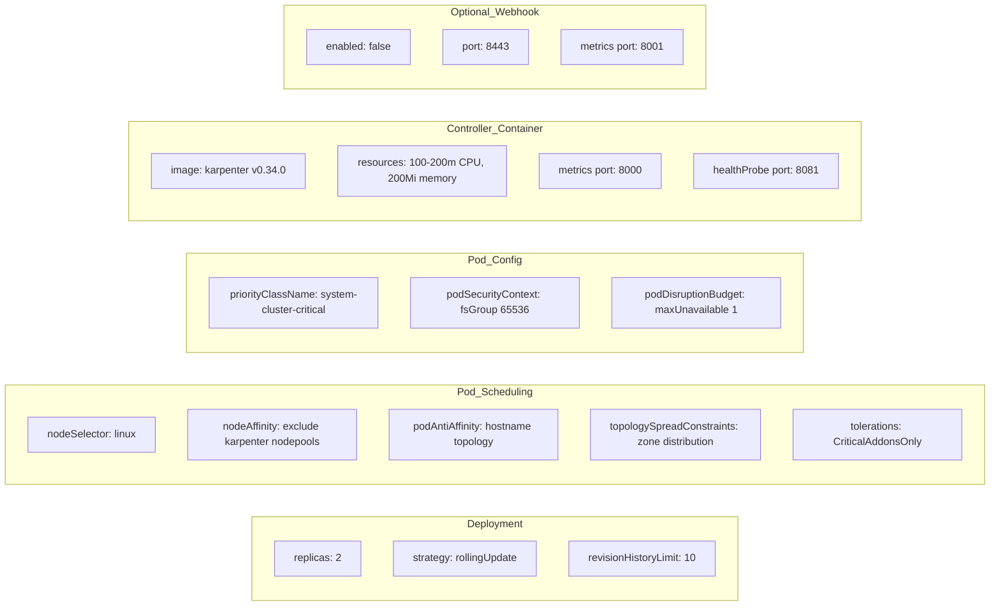
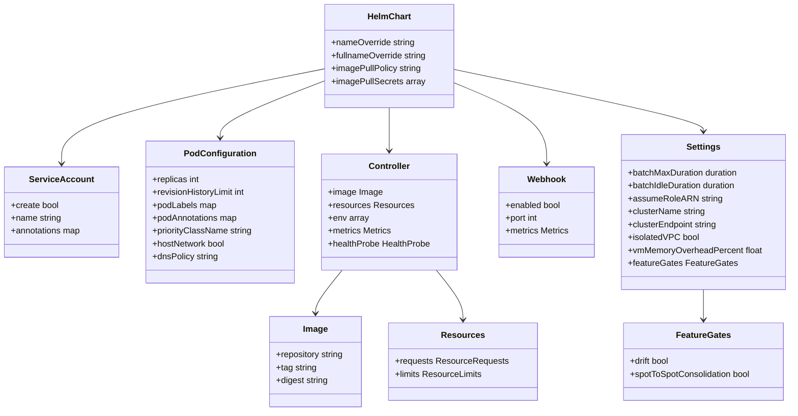

# Diagram: devops/k8s/karpenter/helm/values.yaml

> Auto-generated by Obscura crawlers

## Diagram 1

```mermaid
graph TD
    A[Helm Chart Configuration] --> B[Service Account]
    A --> C[Pod Configuration]
    A --> D[Controller]
    A --> E[Webhook]
    A --> F[Settings]
    A --> G[Monitoring]
    
    B --> B1[create: true]
    B --> B2[annotations]
    
    C --> C1[replicas: 2]
    C --> C2[podSecurityContext]
    C --> C3[priorityClassName]
    C --> C4[hostNetwork: false]
    C --> C5[dnsPolicy]
    C --> C6[nodeSelector]
    C --> C7[affinity]
    C --> C8[topologySpreadConstraints]
    C --> C9[tolerations]
    C --> C10[podDisruptionBudget]
    
    C7 --> C7A[nodeAffinity]
    C7 --> C7B[podAntiAffinity]
    
    D --> D1[image]
    D --> D2[resources]
    D --> D3[metrics port: 8000]
    D --> D4[healthProbe port: 8081]
    
    D1 --> D1A[repository]
    D1 --> D1B[tag: v0.34.0]
    D1 --> D1C[digest]
    
    D2 --> D2A[requests: 100m CPU, 200Mi memory]
    D2 --> D2B[limits: 200m CPU, 200Mi memory]
    
    E --> E1[enabled: false]
    E --> E2[port: 8443]
    E --> E3[metrics port: 8001]
    
    F --> F1[batchMaxDuration: 10s]
    F --> F2[batchIdleDuration: 1s]
    F --> F3[assumeRoleARN]
    F --> F4[clusterName]
    F --> F5[clusterEndpoint]
    F --> F6[isolatedVPC: false]
    F --> F7[vmMemoryOverheadPercent: 0.075]
    F --> F8[featureGates]
    
    F8 --> F8A[drift: true]
    F8 --> F8B[spotToSpotConsolidation: false]
    
    G --> G1[serviceMonitor enabled: false]
```

### SVG

<svg id="container" width="6643.62109375" xmlns="http://www.w3.org/2000/svg" class="flowchart" height="430" viewBox="0 0 6643.62109375 430" role="graphics-document document" aria-roledescription="flowchart-v2"><g><marker id="container_flowchart-v2-pointEnd" class="marker flowchart-v2" viewBox="0 0 10 10" refX="5" refY="5" markerUnits="userSpaceOnUse" markerWidth="8" markerHeight="8" orient="auto"><path d="M 0 0 L 10 5 L 0 10 z" class="arrowMarkerPath" style="stroke-width: 1; stroke-dasharray: 1, 0;"></path></marker><marker id="container_flowchart-v2-pointStart" class="marker flowchart-v2" viewBox="0 0 10 10" refX="4.5" refY="5" markerUnits="userSpaceOnUse" markerWidth="8" markerHeight="8" orient="auto"><path d="M 0 5 L 10 10 L 10 0 z" class="arrowMarkerPath" style="stroke-width: 1; stroke-dasharray: 1, 0;"></path></marker><marker id="container_flowchart-v2-circleEnd" class="marker flowchart-v2" viewBox="0 0 10 10" refX="11" refY="5" markerUnits="userSpaceOnUse" markerWidth="11" markerHeight="11" orient="auto"><circle cx="5" cy="5" r="5" class="arrowMarkerPath" style="stroke-width: 1; stroke-dasharray: 1, 0;"></circle></marker><marker id="container_flowchart-v2-circleStart" class="marker flowchart-v2" viewBox="0 0 10 10" refX="-1" refY="5" markerUnits="userSpaceOnUse" markerWidth="11" markerHeight="11" orient="auto"><circle cx="5" cy="5" r="5" class="arrowMarkerPath" style="stroke-width: 1; stroke-dasharray: 1, 0;"></circle></marker><marker id="container_flowchart-v2-crossEnd" class="marker cross flowchart-v2" viewBox="0 0 11 11" refX="12" refY="5.2" markerUnits="userSpaceOnUse" markerWidth="11" markerHeight="11" orient="auto"><path d="M 1,1 l 9,9 M 10,1 l -9,9" class="arrowMarkerPath" style="stroke-width: 2; stroke-dasharray: 1, 0;"></path></marker><marker id="container_flowchart-v2-crossStart" class="marker cross flowchart-v2" viewBox="0 0 11 11" refX="-1" refY="5.2" markerUnits="userSpaceOnUse" markerWidth="11" markerHeight="11" orient="auto"><path d="M 1,1 l 9,9 M 10,1 l -9,9" class="arrowMarkerPath" style="stroke-width: 2; stroke-dasharray: 1, 0;"></path></marker><g class="root"><g class="clusters"></g><g class="edgePaths"><path d="M3487.797,36.823L2931.229,45.186C2374.66,53.549,1261.523,70.274,704.955,82.137C148.387,94,148.387,101,148.387,104.5L148.387,108" id="L_A_B_0" class="edge-thickness-normal edge-pattern-solid edge-thickness-normal edge-pattern-solid flowchart-link" style=";" data-edge="true" data-et="edge" data-id="L_A_B_0" data-points="W3sieCI6MzQ4Ny43OTY4NzUsInkiOjM2LjgyMzI2NjAxOTc1NDk5Nn0seyJ4IjoxNDguMzg2NzE4NzUsInkiOjg3fSx7IngiOjE0OC4zODY3MTg3NSwieSI6MTEyfV0=" marker-end="url(#container_flowchart-v2-pointEnd)"></path><path d="M3487.797,37.851L3139.148,46.042C2790.499,54.234,2093.201,70.617,1744.551,82.308C1395.902,94,1395.902,101,1395.902,104.5L1395.902,108" id="L_A_C_0" class="edge-thickness-normal edge-pattern-solid edge-thickness-normal edge-pattern-solid flowchart-link" style=";" data-edge="true" data-et="edge" data-id="L_A_C_0" data-points="W3sieCI6MzQ4Ny43OTY4NzUsInkiOjM3Ljg1MDk2OTU3NDA2NTE1NH0seyJ4IjoxMzk1LjkwMjM0Mzc1LCJ5Ijo4N30seyJ4IjoxMzk1LjkwMjM0Mzc1LCJ5IjoxMTJ9XQ==" marker-end="url(#container_flowchart-v2-pointEnd)"></path><path d="M3487.797,53.05L3449.759,58.709C3411.721,64.367,3335.646,75.683,3297.608,84.842C3259.57,94,3259.57,101,3259.57,104.5L3259.57,108" id="L_A_D_0" class="edge-thickness-normal edge-pattern-solid edge-thickness-normal edge-pattern-solid flowchart-link" style=";" data-edge="true" data-et="edge" data-id="L_A_D_0" data-points="W3sieCI6MzQ4Ny43OTY4NzUsInkiOjUzLjA1MDM3NDM0MzUwMjA3fSx7IngiOjMyNTkuNTcwMzEyNSwieSI6ODd9LHsieCI6MzI1OS41NzAzMTI1LCJ5IjoxMTJ9XQ==" marker-end="url(#container_flowchart-v2-pointEnd)"></path><path d="M3730.484,48.861L3786.13,55.218C3841.775,61.574,3953.065,74.287,4008.71,84.144C4064.355,94,4064.355,101,4064.355,104.5L4064.355,108" id="L_A_E_0" class="edge-thickness-normal edge-pattern-solid edge-thickness-normal edge-pattern-solid flowchart-link" style=";" data-edge="true" data-et="edge" data-id="L_A_E_0" data-points="W3sieCI6MzczMC40ODQzNzUsInkiOjQ4Ljg2MTMxMjA1MjE3MzE3fSx7IngiOjQwNjQuMzU1NDY4NzUsInkiOjg3fSx7IngiOjQwNjQuMzU1NDY4NzUsInkiOjExMn1d" marker-end="url(#container_flowchart-v2-pointEnd)"></path><path d="M3730.484,38.587L4003.418,46.656C4276.352,54.725,4822.219,70.862,5095.152,82.431C5368.086,94,5368.086,101,5368.086,104.5L5368.086,108" id="L_A_F_0" class="edge-thickness-normal edge-pattern-solid edge-thickness-normal edge-pattern-solid flowchart-link" style=";" data-edge="true" data-et="edge" data-id="L_A_F_0" data-points="W3sieCI6MzczMC40ODQzNzUsInkiOjM4LjU4NzMwNTk1ODM4MjM3fSx7IngiOjUzNjguMDg1OTM3NSwieSI6ODd9LHsieCI6NTM2OC4wODU5Mzc1LCJ5IjoxMTJ9XQ==" marker-end="url(#container_flowchart-v2-pointEnd)"></path><path d="M3730.484,37.178L4193.007,45.482C4655.53,53.786,5580.576,70.393,6043.098,82.196C6505.621,94,6505.621,101,6505.621,104.5L6505.621,108" id="L_A_G_0" class="edge-thickness-normal edge-pattern-solid edge-thickness-normal edge-pattern-solid flowchart-link" style=";" data-edge="true" data-et="edge" data-id="L_A_G_0" data-points="W3sieCI6MzczMC40ODQzNzUsInkiOjM3LjE3ODQ2MjgxNjUzNzg1fSx7IngiOjY1MDUuNjIxMDkzNzUsInkiOjg3fSx7IngiOjY1MDUuNjIxMDkzNzUsInkiOjExMn1d" marker-end="url(#container_flowchart-v2-pointEnd)"></path><path d="M112.602,166L107.08,170.167C101.558,174.333,90.513,182.667,84.991,192.333C79.469,202,79.469,213,79.469,218.5L79.469,224" id="L_B_B1_0" class="edge-thickness-normal edge-pattern-solid edge-thickness-normal edge-pattern-solid flowchart-link" style=";" data-edge="true" data-et="edge" data-id="L_B_B1_0" data-points="W3sieCI6MTEyLjYwMjM4ODgyMjExNTM5LCJ5IjoxNjZ9LHsieCI6NzkuNDY4NzUsInkiOjE5MX0seyJ4Ijo3OS40Njg3NSwieSI6MjI4fV0=" marker-end="url(#container_flowchart-v2-pointEnd)"></path><path d="M214.007,166L224.133,170.167C234.26,174.333,254.513,182.667,264.639,192.333C274.766,202,274.766,213,274.766,218.5L274.766,224" id="L_B_B2_0" class="edge-thickness-normal edge-pattern-solid edge-thickness-normal edge-pattern-solid flowchart-link" style=";" data-edge="true" data-et="edge" data-id="L_B_B2_0" data-points="W3sieCI6MjE0LjAwNjUzNTQ1NjczMDc3LCJ5IjoxNjZ9LHsieCI6Mjc0Ljc2NTYyNSwieSI6MTkxfSx7IngiOjI3NC43NjU2MjUsInkiOjIyOH1d" marker-end="url(#container_flowchart-v2-pointEnd)"></path><path d="M1301.23,144.288L1161.843,152.073C1022.456,159.859,743.681,175.429,604.294,188.715C464.906,202,464.906,213,464.906,218.5L464.906,224" id="L_C_C1_0" class="edge-thickness-normal edge-pattern-solid edge-thickness-normal edge-pattern-solid flowchart-link" style=";" data-edge="true" data-et="edge" data-id="L_C_C1_0" data-points="W3sieCI6MTMwMS4yMzA0Njg3NSwieSI6MTQ0LjI4NzgxNzU2NzcwOTN9LHsieCI6NDY0LjkwNjI1LCJ5IjoxOTF9LHsieCI6NDY0LjkwNjI1LCJ5IjoyMjh9XQ==" marker-end="url(#container_flowchart-v2-pointEnd)"></path><path d="M1301.23,145.898L1198.055,153.415C1094.88,160.932,888.53,175.966,785.355,188.983C682.18,202,682.18,213,682.18,218.5L682.18,224" id="L_C_C2_0" class="edge-thickness-normal edge-pattern-solid edge-thickness-normal edge-pattern-solid flowchart-link" style=";" data-edge="true" data-et="edge" data-id="L_C_C2_0" data-points="W3sieCI6MTMwMS4yMzA0Njg3NSwieSI6MTQ1Ljg5NzU0OTcwOTEwNjY0fSx7IngiOjY4Mi4xNzk2ODc1LCJ5IjoxOTF9LHsieCI6NjgyLjE3OTY4NzUsInkiOjIyOH1d" marker-end="url(#container_flowchart-v2-pointEnd)"></path><path d="M1301.23,149.554L1239.265,156.461C1177.299,163.369,1053.368,177.185,991.403,189.592C929.438,202,929.438,213,929.438,218.5L929.438,224" id="L_C_C3_0" class="edge-thickness-normal edge-pattern-solid edge-thickness-normal edge-pattern-solid flowchart-link" style=";" data-edge="true" data-et="edge" data-id="L_C_C3_0" data-points="W3sieCI6MTMwMS4yMzA0Njg3NSwieSI6MTQ5LjU1MzcxNjAzMjMyNDI1fSx7IngiOjkyOS40Mzc1LCJ5IjoxOTF9LHsieCI6OTI5LjQzNzUsInkiOjIyOH1d" marker-end="url(#container_flowchart-v2-pointEnd)"></path><path d="M1301.23,161.117L1279.911,166.097C1258.591,171.078,1215.952,181.039,1194.632,191.519C1173.313,202,1173.313,213,1173.313,218.5L1173.313,224" id="L_C_C4_0" class="edge-thickness-normal edge-pattern-solid edge-thickness-normal edge-pattern-solid flowchart-link" style=";" data-edge="true" data-et="edge" data-id="L_C_C4_0" data-points="W3sieCI6MTMwMS4yMzA0Njg3NSwieSI6MTYxLjExNjYzMTI3NTk5NDZ9LHsieCI6MTE3My4zMTI1LCJ5IjoxOTF9LHsieCI6MTE3My4zMTI1LCJ5IjoyMjh9XQ==" marker-end="url(#container_flowchart-v2-pointEnd)"></path><path d="M1390.521,166L1389.691,170.167C1388.861,174.333,1387.2,182.667,1386.369,192.333C1385.539,202,1385.539,213,1385.539,218.5L1385.539,224" id="L_C_C5_0" class="edge-thickness-normal edge-pattern-solid edge-thickness-normal edge-pattern-solid flowchart-link" style=";" data-edge="true" data-et="edge" data-id="L_C_C5_0" data-points="W3sieCI6MTM5MC41MjE0MDkyNTQ4MDc2LCJ5IjoxNjZ9LHsieCI6MTM4NS41MzkwNjI1LCJ5IjoxOTF9LHsieCI6MTM4NS41MzkwNjI1LCJ5IjoyMjh9XQ==" marker-end="url(#container_flowchart-v2-pointEnd)"></path><path d="M1490.574,165.971L1505.217,170.142C1519.859,174.314,1549.145,182.657,1563.787,192.328C1578.43,202,1578.43,213,1578.43,218.5L1578.43,224" id="L_C_C6_0" class="edge-thickness-normal edge-pattern-solid edge-thickness-normal edge-pattern-solid flowchart-link" style=";" data-edge="true" data-et="edge" data-id="L_C_C6_0" data-points="W3sieCI6MTQ5MC41NzQyMTg3NSwieSI6MTY1Ljk3MDk1ODk3NDQ2ODcyfSx7IngiOjE1NzguNDI5Njg3NSwieSI6MTkxfSx7IngiOjE1NzguNDI5Njg3NSwieSI6MjI4fV0=" marker-end="url(#container_flowchart-v2-pointEnd)"></path><path d="M1490.574,152.446L1535.818,158.871C1581.063,165.297,1671.551,178.149,1716.795,190.074C1762.039,202,1762.039,213,1762.039,218.5L1762.039,224" id="L_C_C7_0" class="edge-thickness-normal edge-pattern-solid edge-thickness-normal edge-pattern-solid flowchart-link" style=";" data-edge="true" data-et="edge" data-id="L_C_C7_0" data-points="W3sieCI6MTQ5MC41NzQyMTg3NSwieSI6MTUyLjQ0NTYyNjMxMzU5OTU1fSx7IngiOjE3NjIuMDM5MDYyNSwieSI6MTkxfSx7IngiOjE3NjIuMDM5MDYyNSwieSI6MjI4fV0=" marker-end="url(#container_flowchart-v2-pointEnd)"></path><path d="M1490.574,147.207L1574.771,154.506C1658.969,161.805,1827.363,176.402,1911.561,189.201C1995.758,202,1995.758,213,1995.758,218.5L1995.758,224" id="L_C_C8_0" class="edge-thickness-normal edge-pattern-solid edge-thickness-normal edge-pattern-solid flowchart-link" style=";" data-edge="true" data-et="edge" data-id="L_C_C8_0" data-points="W3sieCI6MTQ5MC41NzQyMTg3NSwieSI6MTQ3LjIwNjg3Mjc0OTI5NTF9LHsieCI6MTk5NS43NTc4MTI1LCJ5IjoxOTF9LHsieCI6MTk5NS43NTc4MTI1LCJ5IjoyMjh9XQ==" marker-end="url(#container_flowchart-v2-pointEnd)"></path><path d="M1490.574,144.807L1616.081,152.506C1741.589,160.205,1992.603,175.602,2118.11,188.801C2243.617,202,2243.617,213,2243.617,218.5L2243.617,224" id="L_C_C9_0" class="edge-thickness-normal edge-pattern-solid edge-thickness-normal edge-pattern-solid flowchart-link" style=";" data-edge="true" data-et="edge" data-id="L_C_C9_0" data-points="W3sieCI6MTQ5MC41NzQyMTg3NSwieSI6MTQ0LjgwNzMwMzY0MjYwNTM1fSx7IngiOjIyNDMuNjE3MTg3NSwieSI6MTkxfSx7IngiOjIyNDMuNjE3MTg3NSwieSI6MjI4fV0=" marker-end="url(#container_flowchart-v2-pointEnd)"></path><path d="M1490.574,143.579L1653.989,151.482C1817.404,159.386,2144.233,175.193,2307.648,188.596C2471.063,202,2471.063,213,2471.063,218.5L2471.063,224" id="L_C_C10_0" class="edge-thickness-normal edge-pattern-solid edge-thickness-normal edge-pattern-solid flowchart-link" style=";" data-edge="true" data-et="edge" data-id="L_C_C10_0" data-points="W3sieCI6MTQ5MC41NzQyMTg3NSwieSI6MTQzLjU3ODc5NDU4MzY1NTh9LHsieCI6MjQ3MS4wNjI1LCJ5IjoxOTF9LHsieCI6MjQ3MS4wNjI1LCJ5IjoyMjh9XQ==" marker-end="url(#container_flowchart-v2-pointEnd)"></path><path d="M1718.096,282L1708.06,288.167C1698.024,294.333,1677.951,306.667,1667.915,318.333C1657.879,330,1657.879,341,1657.879,346.5L1657.879,352" id="L_C7_C7A_0" class="edge-thickness-normal edge-pattern-solid edge-thickness-normal edge-pattern-solid flowchart-link" style=";" data-edge="true" data-et="edge" data-id="L_C7_C7A_0" data-points="W3sieCI6MTcxOC4wOTY0OTY1ODIwMzEyLCJ5IjoyODJ9LHsieCI6MTY1Ny44Nzg5MDYyNSwieSI6MzE5fSx7IngiOjE2NTcuODc4OTA2MjUsInkiOjM1Nn1d" marker-end="url(#container_flowchart-v2-pointEnd)"></path><path d="M1817.406,268.366L1852.365,276.805C1887.323,285.244,1957.24,302.122,1992.198,316.061C2027.156,330,2027.156,341,2027.156,346.5L2027.156,352" id="L_C7_C7B_0" class="edge-thickness-normal edge-pattern-solid edge-thickness-normal edge-pattern-solid flowchart-link" style=";" data-edge="true" data-et="edge" data-id="L_C7_C7B_0" data-points="W3sieCI6MTgxNy40MDYyNSwieSI6MjY4LjM2NTc4NzUzNDk5MzR9LHsieCI6MjAyNy4xNTYyNSwieSI6MzE5fSx7IngiOjIwMjcuMTU2MjUsInkiOjM1Nn1d" marker-end="url(#container_flowchart-v2-pointEnd)"></path><path d="M3193.383,144.946L3107.949,152.622C3022.516,160.298,2851.648,175.649,2766.215,188.824C2680.781,202,2680.781,213,2680.781,218.5L2680.781,224" id="L_D_D1_0" class="edge-thickness-normal edge-pattern-solid edge-thickness-normal edge-pattern-solid flowchart-link" style=";" data-edge="true" data-et="edge" data-id="L_D_D1_0" data-points="W3sieCI6MzE5My4zODI4MTI1LCJ5IjoxNDQuOTQ2NDY2ODk2MTMyODJ9LHsieCI6MjY4MC43ODEyNSwieSI6MTkxfSx7IngiOjI2ODAuNzgxMjUsInkiOjIyOH1d" marker-end="url(#container_flowchart-v2-pointEnd)"></path><path d="M3204.716,166L3196.251,170.167C3187.786,174.333,3170.856,182.667,3162.391,192.333C3153.926,202,3153.926,213,3153.926,218.5L3153.926,224" id="L_D_D2_0" class="edge-thickness-normal edge-pattern-solid edge-thickness-normal edge-pattern-solid flowchart-link" style=";" data-edge="true" data-et="edge" data-id="L_D_D2_0" data-points="W3sieCI6MzIwNC43MTY0MjEyNzQwMzg2LCJ5IjoxNjZ9LHsieCI6MzE1My45MjU3ODEyNSwieSI6MTkxfSx7IngiOjMxNTMuOTI1NzgxMjUsInkiOjIyOH1d" marker-end="url(#container_flowchart-v2-pointEnd)"></path><path d="M3314.424,166L3322.889,170.167C3331.354,174.333,3348.285,182.667,3356.75,192.333C3365.215,202,3365.215,213,3365.215,218.5L3365.215,224" id="L_D_D3_0" class="edge-thickness-normal edge-pattern-solid edge-thickness-normal edge-pattern-solid flowchart-link" style=";" data-edge="true" data-et="edge" data-id="L_D_D3_0" data-points="W3sieCI6MzMxNC40MjQyMDM3MjU5NjE0LCJ5IjoxNjZ9LHsieCI6MzM2NS4yMTQ4NDM3NSwieSI6MTkxfSx7IngiOjMzNjUuMjE0ODQzNzUsInkiOjIyOH1d" marker-end="url(#container_flowchart-v2-pointEnd)"></path><path d="M3325.758,148.444L3375.465,155.537C3425.173,162.629,3524.589,176.815,3574.296,189.407C3624.004,202,3624.004,213,3624.004,218.5L3624.004,224" id="L_D_D4_0" class="edge-thickness-normal edge-pattern-solid edge-thickness-normal edge-pattern-solid flowchart-link" style=";" data-edge="true" data-et="edge" data-id="L_D_D4_0" data-points="W3sieCI6MzMyNS43NTc4MTI1LCJ5IjoxNDguNDQ0MTA3NDAxMjU0MX0seyJ4IjozNjI0LjAwMzkwNjI1LCJ5IjoxOTF9LHsieCI6MzYyNC4wMDM5MDYyNSwieSI6MjI4fV0=" marker-end="url(#container_flowchart-v2-pointEnd)"></path><path d="M2629,262.327L2562.245,271.772C2495.49,281.218,2361.979,300.109,2295.224,315.054C2228.469,330,2228.469,341,2228.469,346.5L2228.469,352" id="L_D1_D1A_0" class="edge-thickness-normal edge-pattern-solid edge-thickness-normal edge-pattern-solid flowchart-link" style=";" data-edge="true" data-et="edge" data-id="L_D1_D1A_0" data-points="W3sieCI6MjYyOSwieSI6MjYyLjMyNjc5Mjg2OTk3Mzc2fSx7IngiOjIyMjguNDY4NzUsInkiOjMxOX0seyJ4IjoyMjI4LjQ2ODc1LCJ5IjozNTZ9XQ==" marker-end="url(#container_flowchart-v2-pointEnd)"></path><path d="M2644.465,282L2636.171,288.167C2627.877,294.333,2611.288,306.667,2602.994,318.333C2594.699,330,2594.699,341,2594.699,346.5L2594.699,352" id="L_D1_D1B_0" class="edge-thickness-normal edge-pattern-solid edge-thickness-normal edge-pattern-solid flowchart-link" style=";" data-edge="true" data-et="edge" data-id="L_D1_D1B_0" data-points="W3sieCI6MjY0NC40NjUzOTMwNjY0MDYyLCJ5IjoyODJ9LHsieCI6MjU5NC42OTkyMTg3NSwieSI6MzE5fSx7IngiOjI1OTQuNjk5MjE4NzUsInkiOjM1Nn1d" marker-end="url(#container_flowchart-v2-pointEnd)"></path><path d="M2717.097,282L2725.391,288.167C2733.686,294.333,2750.275,306.667,2758.569,318.333C2766.863,330,2766.863,341,2766.863,346.5L2766.863,352" id="L_D1_D1C_0" class="edge-thickness-normal edge-pattern-solid edge-thickness-normal edge-pattern-solid flowchart-link" style=";" data-edge="true" data-et="edge" data-id="L_D1_D1C_0" data-points="W3sieCI6MjcxNy4wOTcxMDY5MzM1OTM4LCJ5IjoyODJ9LHsieCI6Mjc2Ni44NjMyODEyNSwieSI6MzE5fSx7IngiOjI3NjYuODYzMjgxMjUsInkiOjM1Nn1d" marker-end="url(#container_flowchart-v2-pointEnd)"></path><path d="M3089.043,281.79L3074.023,287.992C3059.004,294.194,3028.965,306.597,3013.945,316.298C2998.926,326,2998.926,333,2998.926,336.5L2998.926,340" id="L_D2_D2A_0" class="edge-thickness-normal edge-pattern-solid edge-thickness-normal edge-pattern-solid flowchart-link" style=";" data-edge="true" data-et="edge" data-id="L_D2_D2A_0" data-points="W3sieCI6MzA4OS4wNDI5Njg3NSwieSI6MjgxLjc5MDMyMjU4MDY0NTJ9LHsieCI6Mjk5OC45MjU3ODEyNSwieSI6MzE5fSx7IngiOjI5OTguOTI1NzgxMjUsInkiOjM0NH1d" marker-end="url(#container_flowchart-v2-pointEnd)"></path><path d="M3218.809,257.913L3445.551,268.094C3672.294,278.276,4125.78,298.638,4352.523,312.319C4579.266,326,4579.266,333,4579.266,336.5L4579.266,340" id="L_D2_D2B_0" class="edge-thickness-normal edge-pattern-solid edge-thickness-normal edge-pattern-solid flowchart-link" style=";" data-edge="true" data-et="edge" data-id="L_D2_D2B_0" data-points="W3sieCI6MzIxOC44MDg1OTM3NSwieSI6MjU3LjkxMzM0MDI5NDM5MjV9LHsieCI6NDU3OS4yNjU2MjUsInkiOjMxOX0seyJ4Ijo0NTc5LjI2NTYyNSwieSI6MzQ0fV0=" marker-end="url(#container_flowchart-v2-pointEnd)"></path><path d="M4000.582,155.824L3978.359,161.687C3956.137,167.55,3911.691,179.275,3889.469,190.637C3867.246,202,3867.246,213,3867.246,218.5L3867.246,224" id="L_E_E1_0" class="edge-thickness-normal edge-pattern-solid edge-thickness-normal edge-pattern-solid flowchart-link" style=";" data-edge="true" data-et="edge" data-id="L_E_E1_0" data-points="W3sieCI6NDAwMC41ODIwMzEyNSwieSI6MTU1LjgyNDI1NjgzNzA5ODd9LHsieCI6Mzg2Ny4yNDYwOTM3NSwieSI6MTkxfSx7IngiOjM4NjcuMjQ2MDkzNzUsInkiOjIyOH1d" marker-end="url(#container_flowchart-v2-pointEnd)"></path><path d="M4064.355,166L4064.355,170.167C4064.355,174.333,4064.355,182.667,4064.355,192.333C4064.355,202,4064.355,213,4064.355,218.5L4064.355,224" id="L_E_E2_0" class="edge-thickness-normal edge-pattern-solid edge-thickness-normal edge-pattern-solid flowchart-link" style=";" data-edge="true" data-et="edge" data-id="L_E_E2_0" data-points="W3sieCI6NDA2NC4zNTU0Njg3NSwieSI6MTY2fSx7IngiOjQwNjQuMzU1NDY4NzUsInkiOjE5MX0seyJ4Ijo0MDY0LjM1NTQ2ODc1LCJ5IjoyMjh9XQ==" marker-end="url(#container_flowchart-v2-pointEnd)"></path><path d="M4128.129,154.683L4152.742,160.736C4177.355,166.789,4226.582,178.894,4251.195,190.447C4275.809,202,4275.809,213,4275.809,218.5L4275.809,224" id="L_E_E3_0" class="edge-thickness-normal edge-pattern-solid edge-thickness-normal edge-pattern-solid flowchart-link" style=";" data-edge="true" data-et="edge" data-id="L_E_E3_0" data-points="W3sieCI6NDEyOC4xMjg5MDYyNSwieSI6MTU0LjY4Mjk5NzExODE1NTZ9LHsieCI6NDI3NS44MDg1OTM3NSwieSI6MTkxfSx7IngiOjQyNzUuODA4NTkzNzUsInkiOjIyOH1d" marker-end="url(#container_flowchart-v2-pointEnd)"></path><path d="M5308.805,142.691L5179.495,150.743C5050.186,158.794,4791.568,174.897,4662.258,188.449C4532.949,202,4532.949,213,4532.949,218.5L4532.949,224" id="L_F_F1_0" class="edge-thickness-normal edge-pattern-solid edge-thickness-normal edge-pattern-solid flowchart-link" style=";" data-edge="true" data-et="edge" data-id="L_F_F1_0" data-points="W3sieCI6NTMwOC44MDQ2ODc1LCJ5IjoxNDIuNjkxMTYyMDk0NTI5OH0seyJ4Ijo0NTMyLjk0OTIxODc1LCJ5IjoxOTF9LHsieCI6NDUzMi45NDkyMTg3NSwieSI6MjI4fV0=" marker-end="url(#container_flowchart-v2-pointEnd)"></path><path d="M5308.805,144.443L5224.29,152.202C5139.775,159.962,4970.745,175.481,4886.23,188.74C4801.715,202,4801.715,213,4801.715,218.5L4801.715,224" id="L_F_F2_0" class="edge-thickness-normal edge-pattern-solid edge-thickness-normal edge-pattern-solid flowchart-link" style=";" data-edge="true" data-et="edge" data-id="L_F_F2_0" data-points="W3sieCI6NTMwOC44MDQ2ODc1LCJ5IjoxNDQuNDQyNzY1NDEzMDI1NjN9LHsieCI6NDgwMS43MTQ4NDM3NSwieSI6MTkxfSx7IngiOjQ4MDEuNzE0ODQzNzUsInkiOjIyOH1d" marker-end="url(#container_flowchart-v2-pointEnd)"></path><path d="M5308.805,148.601L5265.175,155.668C5221.546,162.734,5134.286,176.867,5090.657,189.434C5047.027,202,5047.027,213,5047.027,218.5L5047.027,224" id="L_F_F3_0" class="edge-thickness-normal edge-pattern-solid edge-thickness-normal edge-pattern-solid flowchart-link" style=";" data-edge="true" data-et="edge" data-id="L_F_F3_0" data-points="W3sieCI6NTMwOC44MDQ2ODc1LCJ5IjoxNDguNjAxNDQwNTQ3MDE4NTR9LHsieCI6NTA0Ny4wMjczNDM3NSwieSI6MTkxfSx7IngiOjUwNDcuMDI3MzQzNzUsInkiOjIyOH1d" marker-end="url(#container_flowchart-v2-pointEnd)"></path><path d="M5312.652,166L5304.097,170.167C5295.543,174.333,5278.433,182.667,5269.879,192.333C5261.324,202,5261.324,213,5261.324,218.5L5261.324,224" id="L_F_F4_0" class="edge-thickness-normal edge-pattern-solid edge-thickness-normal edge-pattern-solid flowchart-link" style=";" data-edge="true" data-et="edge" data-id="L_F_F4_0" data-points="W3sieCI6NTMxMi42NTE5NjgxNDkwMzgsInkiOjE2Nn0seyJ4Ijo1MjYxLjMyNDIxODc1LCJ5IjoxOTF9LHsieCI6NTI2MS4zMjQyMTg3NSwieSI6MjI4fV0=" marker-end="url(#container_flowchart-v2-pointEnd)"></path><path d="M5423.52,166L5432.075,170.167C5440.629,174.333,5457.738,182.667,5466.293,192.333C5474.848,202,5474.848,213,5474.848,218.5L5474.848,224" id="L_F_F5_0" class="edge-thickness-normal edge-pattern-solid edge-thickness-normal edge-pattern-solid flowchart-link" style=";" data-edge="true" data-et="edge" data-id="L_F_F5_0" data-points="W3sieCI6NTQyMy41MTk5MDY4NTA5NjIsInkiOjE2Nn0seyJ4Ijo1NDc0Ljg0NzY1NjI1LCJ5IjoxOTF9LHsieCI6NTQ3NC44NDc2NTYyNSwieSI6MjI4fV0=" marker-end="url(#container_flowchart-v2-pointEnd)"></path><path d="M5427.367,148.106L5473.911,155.255C5520.454,162.404,5613.542,176.702,5660.085,189.351C5706.629,202,5706.629,213,5706.629,218.5L5706.629,224" id="L_F_F6_0" class="edge-thickness-normal edge-pattern-solid edge-thickness-normal edge-pattern-solid flowchart-link" style=";" data-edge="true" data-et="edge" data-id="L_F_F6_0" data-points="W3sieCI6NTQyNy4zNjcxODc1LCJ5IjoxNDguMTA1NTY0OTc4NTk2MjV9LHsieCI6NTcwNi42Mjg5MDYyNSwieSI6MTkxfSx7IngiOjU3MDYuNjI4OTA2MjUsInkiOjIyOH1d" marker-end="url(#container_flowchart-v2-pointEnd)"></path><path d="M5427.367,143.981L5520.624,151.818C5613.882,159.654,5800.396,175.327,5893.653,186.664C5986.91,198,5986.91,205,5986.91,208.5L5986.91,212" id="L_F_F7_0" class="edge-thickness-normal edge-pattern-solid edge-thickness-normal edge-pattern-solid flowchart-link" style=";" data-edge="true" data-et="edge" data-id="L_F_F7_0" data-points="W3sieCI6NTQyNy4zNjcxODc1LCJ5IjoxNDMuOTgxNDIyNjgyODg1Mjd9LHsieCI6NTk4Ni45MTAxNTYyNSwieSI6MTkxfSx7IngiOjU5ODYuOTEwMTU2MjUsInkiOjIxNn1d" marker-end="url(#container_flowchart-v2-pointEnd)"></path><path d="M5427.367,142.498L5564.368,150.582C5701.368,158.665,5975.37,174.833,6112.37,188.416C6249.371,202,6249.371,213,6249.371,218.5L6249.371,224" id="L_F_F8_0" class="edge-thickness-normal edge-pattern-solid edge-thickness-normal edge-pattern-solid flowchart-link" style=";" data-edge="true" data-et="edge" data-id="L_F_F8_0" data-points="W3sieCI6NTQyNy4zNjcxODc1LCJ5IjoxNDIuNDk3ODc0NjQxNTI1OH0seyJ4Ijo2MjQ5LjM3MTA5Mzc1LCJ5IjoxOTF9LHsieCI6NjI0OS4zNzEwOTM3NSwieSI6MjI4fV0=" marker-end="url(#container_flowchart-v2-pointEnd)"></path><path d="M6173.121,258.424L5948.273,268.52C5723.424,278.616,5273.728,298.808,5048.88,314.404C4824.031,330,4824.031,341,4824.031,346.5L4824.031,352" id="L_F8_F8A_0" class="edge-thickness-normal edge-pattern-solid edge-thickness-normal edge-pattern-solid flowchart-link" style=";" data-edge="true" data-et="edge" data-id="L_F8_F8A_0" data-points="W3sieCI6NjE3My4xMjEwOTM3NSwieSI6MjU4LjQyMzc0NDg4NTQwMjg3fSx7IngiOjQ4MjQuMDMxMjUsInkiOjMxOX0seyJ4Ijo0ODI0LjAzMTI1LCJ5IjozNTZ9XQ==" marker-end="url(#container_flowchart-v2-pointEnd)"></path><path d="M6301.001,282L6312.793,288.167C6324.586,294.333,6348.17,306.667,6359.962,316.333C6371.754,326,6371.754,333,6371.754,336.5L6371.754,340" id="L_F8_F8B_0" class="edge-thickness-normal edge-pattern-solid edge-thickness-normal edge-pattern-solid flowchart-link" style=";" data-edge="true" data-et="edge" data-id="L_F8_F8B_0" data-points="W3sieCI6NjMwMS4wMDEzNDI3NzM0Mzc1LCJ5IjoyODJ9LHsieCI6NjM3MS43NTM5MDYyNSwieSI6MzE5fSx7IngiOjYzNzEuNzUzOTA2MjUsInkiOjM0NH1d" marker-end="url(#container_flowchart-v2-pointEnd)"></path><path d="M6505.621,166L6505.621,170.167C6505.621,174.333,6505.621,182.667,6505.621,190.333C6505.621,198,6505.621,205,6505.621,208.5L6505.621,212" id="L_G_G1_0" class="edge-thickness-normal edge-pattern-solid edge-thickness-normal edge-pattern-solid flowchart-link" style=";" data-edge="true" data-et="edge" data-id="L_G_G1_0" data-points="W3sieCI6NjUwNS42MjEwOTM3NSwieSI6MTY2fSx7IngiOjY1MDUuNjIxMDkzNzUsInkiOjE5MX0seyJ4Ijo2NTA1LjYyMTA5Mzc1LCJ5IjoyMTZ9XQ==" marker-end="url(#container_flowchart-v2-pointEnd)"></path></g><g class="edgeLabels"><g class="edgeLabel"><g class="label" data-id="L_A_B_0" transform="translate(0, 0)"><foreignObject width="0" height="0">

</foreignObject></g></g><g class="edgeLabel"><g class="label" data-id="L_A_C_0" transform="translate(0, 0)"><foreignObject width="0" height="0">

</foreignObject></g></g><g class="edgeLabel"><g class="label" data-id="L_A_D_0" transform="translate(0, 0)"><foreignObject width="0" height="0">

</foreignObject></g></g><g class="edgeLabel"><g class="label" data-id="L_A_E_0" transform="translate(0, 0)"><foreignObject width="0" height="0">

</foreignObject></g></g><g class="edgeLabel"><g class="label" data-id="L_A_F_0" transform="translate(0, 0)"><foreignObject width="0" height="0">

</foreignObject></g></g><g class="edgeLabel"><g class="label" data-id="L_A_G_0" transform="translate(0, 0)"><foreignObject width="0" height="0">

</foreignObject></g></g><g class="edgeLabel"><g class="label" data-id="L_B_B1_0" transform="translate(0, 0)"><foreignObject width="0" height="0">

</foreignObject></g></g><g class="edgeLabel"><g class="label" data-id="L_B_B2_0" transform="translate(0, 0)"><foreignObject width="0" height="0">

</foreignObject></g></g><g class="edgeLabel"><g class="label" data-id="L_C_C1_0" transform="translate(0, 0)"><foreignObject width="0" height="0">

</foreignObject></g></g><g class="edgeLabel"><g class="label" data-id="L_C_C2_0" transform="translate(0, 0)"><foreignObject width="0" height="0">

</foreignObject></g></g><g class="edgeLabel"><g class="label" data-id="L_C_C3_0" transform="translate(0, 0)"><foreignObject width="0" height="0">

</foreignObject></g></g><g class="edgeLabel"><g class="label" data-id="L_C_C4_0" transform="translate(0, 0)"><foreignObject width="0" height="0">

</foreignObject></g></g><g class="edgeLabel"><g class="label" data-id="L_C_C5_0" transform="translate(0, 0)"><foreignObject width="0" height="0">

</foreignObject></g></g><g class="edgeLabel"><g class="label" data-id="L_C_C6_0" transform="translate(0, 0)"><foreignObject width="0" height="0">

</foreignObject></g></g><g class="edgeLabel"><g class="label" data-id="L_C_C7_0" transform="translate(0, 0)"><foreignObject width="0" height="0">

</foreignObject></g></g><g class="edgeLabel"><g class="label" data-id="L_C_C8_0" transform="translate(0, 0)"><foreignObject width="0" height="0">

</foreignObject></g></g><g class="edgeLabel"><g class="label" data-id="L_C_C9_0" transform="translate(0, 0)"><foreignObject width="0" height="0">

</foreignObject></g></g><g class="edgeLabel"><g class="label" data-id="L_C_C10_0" transform="translate(0, 0)"><foreignObject width="0" height="0">

</foreignObject></g></g><g class="edgeLabel"><g class="label" data-id="L_C7_C7A_0" transform="translate(0, 0)"><foreignObject width="0" height="0">

</foreignObject></g></g><g class="edgeLabel"><g class="label" data-id="L_C7_C7B_0" transform="translate(0, 0)"><foreignObject width="0" height="0">

</foreignObject></g></g><g class="edgeLabel"><g class="label" data-id="L_D_D1_0" transform="translate(0, 0)"><foreignObject width="0" height="0">

</foreignObject></g></g><g class="edgeLabel"><g class="label" data-id="L_D_D2_0" transform="translate(0, 0)"><foreignObject width="0" height="0">

</foreignObject></g></g><g class="edgeLabel"><g class="label" data-id="L_D_D3_0" transform="translate(0, 0)"><foreignObject width="0" height="0">

</foreignObject></g></g><g class="edgeLabel"><g class="label" data-id="L_D_D4_0" transform="translate(0, 0)"><foreignObject width="0" height="0">

</foreignObject></g></g><g class="edgeLabel"><g class="label" data-id="L_D1_D1A_0" transform="translate(0, 0)"><foreignObject width="0" height="0">

</foreignObject></g></g><g class="edgeLabel"><g class="label" data-id="L_D1_D1B_0" transform="translate(0, 0)"><foreignObject width="0" height="0">

</foreignObject></g></g><g class="edgeLabel"><g class="label" data-id="L_D1_D1C_0" transform="translate(0, 0)"><foreignObject width="0" height="0">

</foreignObject></g></g><g class="edgeLabel"><g class="label" data-id="L_D2_D2A_0" transform="translate(0, 0)"><foreignObject width="0" height="0">

</foreignObject></g></g><g class="edgeLabel"><g class="label" data-id="L_D2_D2B_0" transform="translate(0, 0)"><foreignObject width="0" height="0">

</foreignObject></g></g><g class="edgeLabel"><g class="label" data-id="L_E_E1_0" transform="translate(0, 0)"><foreignObject width="0" height="0">

</foreignObject></g></g><g class="edgeLabel"><g class="label" data-id="L_E_E2_0" transform="translate(0, 0)"><foreignObject width="0" height="0">

</foreignObject></g></g><g class="edgeLabel"><g class="label" data-id="L_E_E3_0" transform="translate(0, 0)"><foreignObject width="0" height="0">

</foreignObject></g></g><g class="edgeLabel"><g class="label" data-id="L_F_F1_0" transform="translate(0, 0)"><foreignObject width="0" height="0">

</foreignObject></g></g><g class="edgeLabel"><g class="label" data-id="L_F_F2_0" transform="translate(0, 0)"><foreignObject width="0" height="0">

</foreignObject></g></g><g class="edgeLabel"><g class="label" data-id="L_F_F3_0" transform="translate(0, 0)"><foreignObject width="0" height="0">

</foreignObject></g></g><g class="edgeLabel"><g class="label" data-id="L_F_F4_0" transform="translate(0, 0)"><foreignObject width="0" height="0">

</foreignObject></g></g><g class="edgeLabel"><g class="label" data-id="L_F_F5_0" transform="translate(0, 0)"><foreignObject width="0" height="0">

</foreignObject></g></g><g class="edgeLabel"><g class="label" data-id="L_F_F6_0" transform="translate(0, 0)"><foreignObject width="0" height="0">

</foreignObject></g></g><g class="edgeLabel"><g class="label" data-id="L_F_F7_0" transform="translate(0, 0)"><foreignObject width="0" height="0">

</foreignObject></g></g><g class="edgeLabel"><g class="label" data-id="L_F_F8_0" transform="translate(0, 0)"><foreignObject width="0" height="0">

</foreignObject></g></g><g class="edgeLabel"><g class="label" data-id="L_F8_F8A_0" transform="translate(0, 0)"><foreignObject width="0" height="0">

</foreignObject></g></g><g class="edgeLabel"><g class="label" data-id="L_F8_F8B_0" transform="translate(0, 0)"><foreignObject width="0" height="0">

</foreignObject></g></g><g class="edgeLabel"><g class="label" data-id="L_G_G1_0" transform="translate(0, 0)"><foreignObject width="0" height="0">

</foreignObject></g></g></g><g class="nodes"><g class="node default" id="flowchart-A-0" transform="translate(3609.140625, 35)"><rect class="basic label-container" style="" x="-121.34375" y="-27" width="242.6875" height="54"></rect><g class="label" style="" transform="translate(-91.34375, -12)"><rect></rect><foreignObject width="182.6875" height="24">

Helm Chart Configuration

</foreignObject></g></g><g class="node default" id="flowchart-B-1" transform="translate(148.38671875, 139)"><rect class="basic label-container" style="" x="-86.9609375" y="-27" width="173.921875" height="54"></rect><g class="label" style="" transform="translate(-56.9609375, -12)"><rect></rect><foreignObject width="113.921875" height="24">

Service Account

</foreignObject></g></g><g class="node default" id="flowchart-C-3" transform="translate(1395.90234375, 139)"><rect class="basic label-container" style="" x="-94.671875" y="-27" width="189.34375" height="54"></rect><g class="label" style="" transform="translate(-64.671875, -12)"><rect></rect><foreignObject width="129.34375" height="24">

Pod Configuration

</foreignObject></g></g><g class="node default" id="flowchart-D-5" transform="translate(3259.5703125, 139)"><rect class="basic label-container" style="" x="-66.1875" y="-27" width="132.375" height="54"></rect><g class="label" style="" transform="translate(-36.1875, -12)"><rect></rect><foreignObject width="72.375" height="24">

Controller

</foreignObject></g></g><g class="node default" id="flowchart-E-7" transform="translate(4064.35546875, 139)"><rect class="basic label-container" style="" x="-63.7734375" y="-27" width="127.546875" height="54"></rect><g class="label" style="" transform="translate(-33.7734375, -12)"><rect></rect><foreignObject width="67.546875" height="24">

Webhook

</foreignObject></g></g><g class="node default" id="flowchart-F-9" transform="translate(5368.0859375, 139)"><rect class="basic label-container" style="" x="-59.28125" y="-27" width="118.5625" height="54"></rect><g class="label" style="" transform="translate(-29.28125, -12)"><rect></rect><foreignObject width="58.5625" height="24">

Settings

</foreignObject></g></g><g class="node default" id="flowchart-G-11" transform="translate(6505.62109375, 139)"><rect class="basic label-container" style="" x="-69.4765625" y="-27" width="138.953125" height="54"></rect><g class="label" style="" transform="translate(-39.4765625, -12)"><rect></rect><foreignObject width="78.953125" height="24">

Monitoring

</foreignObject></g></g><g class="node default" id="flowchart-B1-13" transform="translate(79.46875, 255)"><rect class="basic label-container" style="" x="-71.46875" y="-27" width="142.9375" height="54"></rect><g class="label" style="" transform="translate(-41.46875, -12)"><rect></rect><foreignObject width="82.9375" height="24">

create: true

</foreignObject></g></g><g class="node default" id="flowchart-B2-15" transform="translate(274.765625, 255)"><rect class="basic label-container" style="" x="-73.828125" y="-27" width="147.65625" height="54"></rect><g class="label" style="" transform="translate(-43.828125, -12)"><rect></rect><foreignObject width="87.65625" height="24">

annotations

</foreignObject></g></g><g class="node default" id="flowchart-C1-17" transform="translate(464.90625, 255)"><rect class="basic label-container" style="" x="-66.3125" y="-27" width="132.625" height="54"></rect><g class="label" style="" transform="translate(-36.3125, -12)"><rect></rect><foreignObject width="72.625" height="24">

replicas: 2

</foreignObject></g></g><g class="node default" id="flowchart-C2-19" transform="translate(682.1796875, 255)"><rect class="basic label-container" style="" x="-100.9609375" y="-27" width="201.921875" height="54"></rect><g class="label" style="" transform="translate(-70.9609375, -12)"><rect></rect><foreignObject width="141.921875" height="24">

podSecurityContext

</foreignObject></g></g><g class="node default" id="flowchart-C3-21" transform="translate(929.4375, 255)"><rect class="basic label-container" style="" x="-96.296875" y="-27" width="192.59375" height="54"></rect><g class="label" style="" transform="translate(-66.296875, -12)"><rect></rect><foreignObject width="132.59375" height="24">

priorityClassName

</foreignObject></g></g><g class="node default" id="flowchart-C4-23" transform="translate(1173.3125, 255)"><rect class="basic label-container" style="" x="-97.578125" y="-27" width="195.15625" height="54"></rect><g class="label" style="" transform="translate(-67.578125, -12)"><rect></rect><foreignObject width="135.15625" height="24">

hostNetwork: false

</foreignObject></g></g><g class="node default" id="flowchart-C5-25" transform="translate(1385.5390625, 255)"><rect class="basic label-container" style="" x="-64.6484375" y="-27" width="129.296875" height="54"></rect><g class="label" style="" transform="translate(-34.6484375, -12)"><rect></rect><foreignObject width="69.296875" height="24">

dnsPolicy

</foreignObject></g></g><g class="node default" id="flowchart-C6-27" transform="translate(1578.4296875, 255)"><rect class="basic label-container" style="" x="-78.2421875" y="-27" width="156.484375" height="54"></rect><g class="label" style="" transform="translate(-48.2421875, -12)"><rect></rect><foreignObject width="96.484375" height="24">

nodeSelector

</foreignObject></g></g><g class="node default" id="flowchart-C7-29" transform="translate(1762.0390625, 255)"><rect class="basic label-container" style="" x="-55.3671875" y="-27" width="110.734375" height="54"></rect><g class="label" style="" transform="translate(-25.3671875, -12)"><rect></rect><foreignObject width="50.734375" height="24">

affinity

</foreignObject></g></g><g class="node default" id="flowchart-C8-31" transform="translate(1995.7578125, 255)"><rect class="basic label-container" style="" x="-128.3515625" y="-27" width="256.703125" height="54"></rect><g class="label" style="" transform="translate(-98.3515625, -12)"><rect></rect><foreignObject width="196.703125" height="24">

topologySpreadConstraints

</foreignObject></g></g><g class="node default" id="flowchart-C9-33" transform="translate(2243.6171875, 255)"><rect class="basic label-container" style="" x="-69.5078125" y="-27" width="139.015625" height="54"></rect><g class="label" style="" transform="translate(-39.5078125, -12)"><rect></rect><foreignObject width="79.015625" height="24">

tolerations

</foreignObject></g></g><g class="node default" id="flowchart-C10-35" transform="translate(2471.0625, 255)"><rect class="basic label-container" style="" x="-107.9375" y="-27" width="215.875" height="54"></rect><g class="label" style="" transform="translate(-77.9375, -12)"><rect></rect><foreignObject width="155.875" height="24">

podDisruptionBudget

</foreignObject></g></g><g class="node default" id="flowchart-C7A-37" transform="translate(1657.87890625, 383)"><rect class="basic label-container" style="" x="-74.1015625" y="-27" width="148.203125" height="54"></rect><g class="label" style="" transform="translate(-44.1015625, -12)"><rect></rect><foreignObject width="88.203125" height="24">

nodeAffinity

</foreignObject></g></g><g class="node default" id="flowchart-C7B-39" transform="translate(2027.15625, 383)"><rect class="basic label-container" style="" x="-84.21875" y="-27" width="168.4375" height="54"></rect><g class="label" style="" transform="translate(-54.21875, -12)"><rect></rect><foreignObject width="108.4375" height="24">

podAntiAffinity

</foreignObject></g></g><g class="node default" id="flowchart-D1-41" transform="translate(2680.78125, 255)"><rect class="basic label-container" style="" x="-51.78125" y="-27" width="103.5625" height="54"></rect><g class="label" style="" transform="translate(-21.78125, -12)"><rect></rect><foreignObject width="43.5625" height="24">

image

</foreignObject></g></g><g class="node default" id="flowchart-D2-43" transform="translate(3153.92578125, 255)"><rect class="basic label-container" style="" x="-64.8828125" y="-27" width="129.765625" height="54"></rect><g class="label" style="" transform="translate(-34.8828125, -12)"><rect></rect><foreignObject width="69.765625" height="24">

resources

</foreignObject></g></g><g class="node default" id="flowchart-D3-45" transform="translate(3365.21484375, 255)"><rect class="basic label-container" style="" x="-96.40625" y="-27" width="192.8125" height="54"></rect><g class="label" style="" transform="translate(-66.40625, -12)"><rect></rect><foreignObject width="132.8125" height="24">

metrics port: 8000

</foreignObject></g></g><g class="node default" id="flowchart-D4-47" transform="translate(3624.00390625, 255)"><rect class="basic label-container" style="" x="-112.3828125" y="-27" width="224.765625" height="54"></rect><g class="label" style="" transform="translate(-82.3828125, -12)"><rect></rect><foreignObject width="164.765625" height="24">

healthProbe port: 8081

</foreignObject></g></g><g class="node default" id="flowchart-D1A-49" transform="translate(2228.46875, 383)"><rect class="basic label-container" style="" x="-67.09375" y="-27" width="134.1875" height="54"></rect><g class="label" style="" transform="translate(-37.09375, -12)"><rect></rect><foreignObject width="74.1875" height="24">

repository

</foreignObject></g></g><g class="node default" id="flowchart-D1B-51" transform="translate(2594.69921875, 383)"><rect class="basic label-container" style="" x="-70.1015625" y="-27" width="140.203125" height="54"></rect><g class="label" style="" transform="translate(-40.1015625, -12)"><rect></rect><foreignObject width="80.203125" height="24">

tag: v0.34.0

</foreignObject></g></g><g class="node default" id="flowchart-D1C-53" transform="translate(2766.86328125, 383)"><rect class="basic label-container" style="" x="-52.0625" y="-27" width="104.125" height="54"></rect><g class="label" style="" transform="translate(-22.0625, -12)"><rect></rect><foreignObject width="44.125" height="24">

digest

</foreignObject></g></g><g class="node default" id="flowchart-D2A-55" transform="translate(2998.92578125, 383)"><rect class="basic label-container" style="" x="-130" y="-39" width="260" height="78"></rect><g class="label" style="" transform="translate(-100, -24)"><rect></rect><foreignObject width="200" height="48">

requests: 100m CPU, 200Mi memory

</foreignObject></g></g><g class="node default" id="flowchart-D2B-57" transform="translate(4579.265625, 383)"><rect class="basic label-container" style="" x="-130" y="-39" width="260" height="78"></rect><g class="label" style="" transform="translate(-100, -24)"><rect></rect><foreignObject width="200" height="48">

limits: 200m CPU, 200Mi memory

</foreignObject></g></g><g class="node default" id="flowchart-E1-59" transform="translate(3867.24609375, 255)"><rect class="basic label-container" style="" x="-80.859375" y="-27" width="161.71875" height="54"></rect><g class="label" style="" transform="translate(-50.859375, -12)"><rect></rect><foreignObject width="101.71875" height="24">

enabled: false

</foreignObject></g></g><g class="node default" id="flowchart-E2-61" transform="translate(4064.35546875, 255)"><rect class="basic label-container" style="" x="-66.25" y="-27" width="132.5" height="54"></rect><g class="label" style="" transform="translate(-36.25, -12)"><rect></rect><foreignObject width="72.5" height="24">

port: 8443

</foreignObject></g></g><g class="node default" id="flowchart-E3-63" transform="translate(4275.80859375, 255)"><rect class="basic label-container" style="" x="-95.203125" y="-27" width="190.40625" height="54"></rect><g class="label" style="" transform="translate(-65.203125, -12)"><rect></rect><foreignObject width="130.40625" height="24">

metrics port: 8001

</foreignObject></g></g><g class="node default" id="flowchart-F1-65" transform="translate(4532.94921875, 255)"><rect class="basic label-container" style="" x="-111.9375" y="-27" width="223.875" height="54"></rect><g class="label" style="" transform="translate(-81.9375, -12)"><rect></rect><foreignObject width="163.875" height="24">

batchMaxDuration: 10s

</foreignObject></g></g><g class="node default" id="flowchart-F2-67" transform="translate(4801.71484375, 255)"><rect class="basic label-container" style="" x="-106.828125" y="-27" width="213.65625" height="54"></rect><g class="label" style="" transform="translate(-76.828125, -12)"><rect></rect><foreignObject width="153.65625" height="24">

batchIdleDuration: 1s

</foreignObject></g></g><g class="node default" id="flowchart-F3-69" transform="translate(5047.02734375, 255)"><rect class="basic label-container" style="" x="-88.484375" y="-27" width="176.96875" height="54"></rect><g class="label" style="" transform="translate(-58.484375, -12)"><rect></rect><foreignObject width="116.96875" height="24">

assumeRoleARN

</foreignObject></g></g><g class="node default" id="flowchart-F4-71" transform="translate(5261.32421875, 255)"><rect class="basic label-container" style="" x="-75.8125" y="-27" width="151.625" height="54"></rect><g class="label" style="" transform="translate(-45.8125, -12)"><rect></rect><foreignObject width="91.625" height="24">

clusterName

</foreignObject></g></g><g class="node default" id="flowchart-F5-73" transform="translate(5474.84765625, 255)"><rect class="basic label-container" style="" x="-87.7109375" y="-27" width="175.421875" height="54"></rect><g class="label" style="" transform="translate(-57.7109375, -12)"><rect></rect><foreignObject width="115.421875" height="24">

clusterEndpoint

</foreignObject></g></g><g class="node default" id="flowchart-F6-75" transform="translate(5706.62890625, 255)"><rect class="basic label-container" style="" x="-94.0703125" y="-27" width="188.140625" height="54"></rect><g class="label" style="" transform="translate(-64.0703125, -12)"><rect></rect><foreignObject width="128.140625" height="24">

isolatedVPC: false

</foreignObject></g></g><g class="node default" id="flowchart-F7-77" transform="translate(5986.91015625, 255)"><rect class="basic label-container" style="" x="-136.2109375" y="-39" width="272.421875" height="78"></rect><g class="label" style="" transform="translate(-106.2109375, -24)"><rect></rect><foreignObject width="212.421875" height="48">

vmMemoryOverheadPercent: 0.075

</foreignObject></g></g><g class="node default" id="flowchart-F8-79" transform="translate(6249.37109375, 255)"><rect class="basic label-container" style="" x="-76.25" y="-27" width="152.5" height="54"></rect><g class="label" style="" transform="translate(-46.25, -12)"><rect></rect><foreignObject width="92.5" height="24">

featureGates

</foreignObject></g></g><g class="node default" id="flowchart-F8A-81" transform="translate(4824.03125, 383)"><rect class="basic label-container" style="" x="-64.765625" y="-27" width="129.53125" height="54"></rect><g class="label" style="" transform="translate(-34.765625, -12)"><rect></rect><foreignObject width="69.53125" height="24">

drift: true

</foreignObject></g></g><g class="node default" id="flowchart-F8B-83" transform="translate(6371.75390625, 383)"><rect class="basic label-container" style="" x="-130" y="-39" width="260" height="78"></rect><g class="label" style="" transform="translate(-100, -24)"><rect></rect><foreignObject width="200" height="48">

spotToSpotConsolidation: false

</foreignObject></g></g><g class="node default" id="flowchart-G1-85" transform="translate(6505.62109375, 255)"><rect class="basic label-container" style="" x="-130" y="-39" width="260" height="78"></rect><g class="label" style="" transform="translate(-100, -24)"><rect></rect><foreignObject width="200" height="48">

serviceMonitor enabled: false

</foreignObject></g></g></g></g></g></svg>

## Diagram 2

### SVG

<svg id="container" width="1531.15625" xmlns="http://www.w3.org/2000/svg" class="flowchart" height="933" viewBox="0 0 1531.15625 933" role="graphics-document document" aria-roledescription="flowchart-v2"><g><marker id="container_flowchart-v2-pointEnd" class="marker flowchart-v2" viewBox="0 0 10 10" refX="5" refY="5" markerUnits="userSpaceOnUse" markerWidth="8" markerHeight="8" orient="auto"><path d="M 0 0 L 10 5 L 0 10 z" class="arrowMarkerPath" style="stroke-width: 1; stroke-dasharray: 1, 0;"></path></marker><marker id="container_flowchart-v2-pointStart" class="marker flowchart-v2" viewBox="0 0 10 10" refX="4.5" refY="5" markerUnits="userSpaceOnUse" markerWidth="8" markerHeight="8" orient="auto"><path d="M 0 5 L 10 10 L 10 0 z" class="arrowMarkerPath" style="stroke-width: 1; stroke-dasharray: 1, 0;"></path></marker><marker id="container_flowchart-v2-circleEnd" class="marker flowchart-v2" viewBox="0 0 10 10" refX="11" refY="5" markerUnits="userSpaceOnUse" markerWidth="11" markerHeight="11" orient="auto"><circle cx="5" cy="5" r="5" class="arrowMarkerPath" style="stroke-width: 1; stroke-dasharray: 1, 0;"></circle></marker><marker id="container_flowchart-v2-circleStart" class="marker flowchart-v2" viewBox="0 0 10 10" refX="-1" refY="5" markerUnits="userSpaceOnUse" markerWidth="11" markerHeight="11" orient="auto"><circle cx="5" cy="5" r="5" class="arrowMarkerPath" style="stroke-width: 1; stroke-dasharray: 1, 0;"></circle></marker><marker id="container_flowchart-v2-crossEnd" class="marker cross flowchart-v2" viewBox="0 0 11 11" refX="12" refY="5.2" markerUnits="userSpaceOnUse" markerWidth="11" markerHeight="11" orient="auto"><path d="M 1,1 l 9,9 M 10,1 l -9,9" class="arrowMarkerPath" style="stroke-width: 2; stroke-dasharray: 1, 0;"></path></marker><marker id="container_flowchart-v2-crossStart" class="marker cross flowchart-v2" viewBox="0 0 11 11" refX="-1" refY="5.2" markerUnits="userSpaceOnUse" markerWidth="11" markerHeight="11" orient="auto"><path d="M 1,1 l 9,9 M 10,1 l -9,9" class="arrowMarkerPath" style="stroke-width: 2; stroke-dasharray: 1, 0;"></path></marker><g class="root"><g class="clusters"></g><g class="edgePaths"></g><g class="edgeLabels"></g><g class="nodes"><g class="root" transform="translate(430.265625, 0)"><g class="clusters"><g class="cluster" id="Optional_Webhook" data-look="classic"><rect style="" x="8" y="8" width="654.625" height="129"></rect><g class="cluster-label" transform="translate(266.453125, 8)"><foreignObject width="137.71875" height="24">

Optional_Webhook

</foreignObject></g></g></g><g class="edgePaths"></g><g class="edgeLabels"></g><g class="nodes"><g class="node default" id="flowchart-WE-15" transform="translate(123.859375, 72.5)"><rect class="basic label-container" style="" x="-80.859375" y="-27" width="161.71875" height="54"></rect><g class="label" style="" transform="translate(-50.859375, -12)"><rect></rect><foreignObject width="101.71875" height="24">

enabled: false

</foreignObject></g></g><g class="node default" id="flowchart-WP-16" transform="translate(320.96875, 72.5)"><rect class="basic label-container" style="" x="-66.25" y="-27" width="132.5" height="54"></rect><g class="label" style="" transform="translate(-36.25, -12)"><rect></rect><foreignObject width="72.5" height="24">

port: 8443

</foreignObject></g></g><g class="node default" id="flowchart-WM-17" transform="translate(532.421875, 72.5)"><rect class="basic label-container" style="" x="-95.203125" y="-27" width="190.40625" height="54"></rect><g class="label" style="" transform="translate(-65.203125, -12)"><rect></rect><foreignObject width="130.40625" height="24">

metrics port: 8001

</foreignObject></g></g></g></g><g class="root" transform="translate(190.625, 179)"><g class="clusters"><g class="cluster" id="Controller_Container" data-look="classic"><rect style="" x="8" y="8" width="1133.90625" height="153"></rect><g class="cluster-label" transform="translate(500.3125, 8)"><foreignObject width="149.28125" height="24">

Controller_Container

</foreignObject></g></g></g><g class="edgePaths"></g><g class="edgeLabels"></g><g class="nodes"><g class="node default" id="flowchart-IMG-11" transform="translate(161.1640625, 84.5)"><rect class="basic label-container" style="" x="-118.1640625" y="-27" width="236.328125" height="54"></rect><g class="label" style="" transform="translate(-88.1640625, -12)"><rect></rect><foreignObject width="176.328125" height="24">

image: karpenter v0.34.0

</foreignObject></g></g><g class="node default" id="flowchart-RES-12" transform="translate(459.328125, 84.5)"><rect class="basic label-container" style="" x="-130" y="-39" width="260" height="78"></rect><g class="label" style="" transform="translate(-100, -24)"><rect></rect><foreignObject width="200" height="48">

resources: 100-200m CPU, 200Mi memory

</foreignObject></g></g><g class="node default" id="flowchart-MP-13" transform="translate(735.734375, 84.5)"><rect class="basic label-container" style="" x="-96.40625" y="-27" width="192.8125" height="54"></rect><g class="label" style="" transform="translate(-66.40625, -12)"><rect></rect><foreignObject width="132.8125" height="24">

metrics port: 8000

</foreignObject></g></g><g class="node default" id="flowchart-HP-14" transform="translate(994.5234375, 84.5)"><rect class="basic label-container" style="" x="-112.3828125" y="-27" width="224.765625" height="54"></rect><g class="label" style="" transform="translate(-82.3828125, -12)"><rect></rect><foreignObject width="164.765625" height="24">

healthProbe port: 8081

</foreignObject></g></g></g></g><g class="root" transform="translate(282.578125, 382)"><g class="clusters"><g class="cluster" id="Pod_Config" data-look="classic"><rect style="" x="8" y="8" width="950" height="153"></rect><g class="cluster-label" transform="translate(442.8515625, 8)"><foreignObject width="80.296875" height="24">

Pod_Config

</foreignObject></g></g></g><g class="edgePaths"></g><g class="edgeLabels"></g><g class="nodes"><g class="node default" id="flowchart-PSC-8" transform="translate(173, 84.5)"><rect class="basic label-container" style="" x="-130" y="-39" width="260" height="78"></rect><g class="label" style="" transform="translate(-100, -24)"><rect></rect><foreignObject width="200" height="48">

priorityClassName: system-cluster-critical

</foreignObject></g></g><g class="node default" id="flowchart-PSEC-9" transform="translate(483, 84.5)"><rect class="basic label-container" style="" x="-130" y="-39" width="260" height="78"></rect><g class="label" style="" transform="translate(-100, -24)"><rect></rect><foreignObject width="200" height="48">

podSecurityContext: fsGroup 65536

</foreignObject></g></g><g class="node default" id="flowchart-PDB-10" transform="translate(793, 84.5)"><rect class="basic label-container" style="" x="-130" y="-39" width="260" height="78"></rect><g class="label" style="" transform="translate(-100, -24)"><rect></rect><foreignObject width="200" height="48">

podDisruptionBudget: maxUnavailable 1

</foreignObject></g></g></g></g><g class="root" transform="translate(0, 585)"><g class="clusters"><g class="cluster" id="Pod_Scheduling" data-look="classic"><rect style="" x="8" y="8" width="1515.15625" height="153"></rect><g class="cluster-label" transform="translate(707.59375, 8)"><foreignObject width="115.96875" height="24">

Pod_Scheduling

</foreignObject></g></g></g><g class="edgePaths"></g><g class="edgeLabels"></g><g class="nodes"><g class="node default" id="flowchart-NS-3" transform="translate(143.1875, 84.5)"><rect class="basic label-container" style="" x="-100.1875" y="-27" width="200.375" height="54"></rect><g class="label" style="" transform="translate(-70.1875, -12)"><rect></rect><foreignObject width="140.375" height="24">

nodeSelector: linux

</foreignObject></g></g><g class="node default" id="flowchart-NA-4" transform="translate(423.375, 84.5)"><rect class="basic label-container" style="" x="-130" y="-39" width="260" height="78"></rect><g class="label" style="" transform="translate(-100, -24)"><rect></rect><foreignObject width="200" height="48">

nodeAffinity: exclude karpenter nodepools

</foreignObject></g></g><g class="node default" id="flowchart-PAA-5" transform="translate(733.375, 84.5)"><rect class="basic label-container" style="" x="-130" y="-39" width="260" height="78"></rect><g class="label" style="" transform="translate(-100, -24)"><rect></rect><foreignObject width="200" height="48">

podAntiAffinity: hostname topology

</foreignObject></g></g><g class="node default" id="flowchart-TSC-6" transform="translate(1045.765625, 84.5)"><rect class="basic label-container" style="" x="-132.390625" y="-39" width="264.78125" height="78"></rect><g class="label" style="" transform="translate(-102.390625, -24)"><rect></rect><foreignObject width="204.78125" height="48">

topologySpreadConstraints: zone distribution

</foreignObject></g></g><g class="node default" id="flowchart-TOL-7" transform="translate(1358.15625, 84.5)"><rect class="basic label-container" style="" x="-130" y="-39" width="260" height="78"></rect><g class="label" style="" transform="translate(-100, -24)"><rect></rect><foreignObject width="200" height="48">

tolerations: CriticalAddonsOnly

</foreignObject></g></g></g></g><g class="root" transform="translate(378.6953125, 788)"><g class="clusters"><g class="cluster" id="Deployment" data-look="classic"><rect style="" x="8" y="8" width="757.765625" height="129"></rect><g class="cluster-label" transform="translate(342.9453125, 8)"><foreignObject width="87.875" height="24">

Deployment

</foreignObject></g></g></g><g class="edgePaths"></g><g class="edgeLabels"></g><g class="nodes"><g class="node default" id="flowchart-R-0" transform="translate(109.3125, 72.5)"><rect class="basic label-container" style="" x="-66.3125" y="-27" width="132.625" height="54"></rect><g class="label" style="" transform="translate(-36.3125, -12)"><rect></rect><foreignObject width="72.625" height="24">

replicas: 2

</foreignObject></g></g><g class="node default" id="flowchart-S-1" transform="translate(338.3359375, 72.5)"><rect class="basic label-container" style="" x="-112.7109375" y="-27" width="225.421875" height="54"></rect><g class="label" style="" transform="translate(-82.7109375, -12)"><rect></rect><foreignObject width="165.421875" height="24">

strategy: rollingUpdate

</foreignObject></g></g><g class="node default" id="flowchart-RH-2" transform="translate(615.90625, 72.5)"><rect class="basic label-container" style="" x="-114.859375" y="-27" width="229.71875" height="54"></rect><g class="label" style="" transform="translate(-84.859375, -12)"><rect></rect><foreignObject width="169.71875" height="24">

revisionHistoryLimit: 10

</foreignObject></g></g></g></g></g></g></g></svg>

## Diagram 3

### SVG

<svg id="container" width="1459.130859375" xmlns="http://www.w3.org/2000/svg" class="classDiagram" height="764" viewBox="0 0 1459.130859375 764" role="graphics-document document" aria-roledescription="class"><g><defs><marker id="container_class-aggregationStart" class="marker aggregation class" refX="18" refY="7" markerWidth="190" markerHeight="240" orient="auto"><path d="M 18,7 L9,13 L1,7 L9,1 Z"></path></marker></defs><defs><marker id="container_class-aggregationEnd" class="marker aggregation class" refX="1" refY="7" markerWidth="20" markerHeight="28" orient="auto"><path d="M 18,7 L9,13 L1,7 L9,1 Z"></path></marker></defs><defs><marker id="container_class-extensionStart" class="marker extension class" refX="18" refY="7" markerWidth="190" markerHeight="240" orient="auto"><path d="M 1,7 L18,13 V 1 Z"></path></marker></defs><defs><marker id="container_class-extensionEnd" class="marker extension class" refX="1" refY="7" markerWidth="20" markerHeight="28" orient="auto"><path d="M 1,1 V 13 L18,7 Z"></path></marker></defs><defs><marker id="container_class-compositionStart" class="marker composition class" refX="18" refY="7" markerWidth="190" markerHeight="240" orient="auto"><path d="M 18,7 L9,13 L1,7 L9,1 Z"></path></marker></defs><defs><marker id="container_class-compositionEnd" class="marker composition class" refX="1" refY="7" markerWidth="20" markerHeight="28" orient="auto"><path d="M 18,7 L9,13 L1,7 L9,1 Z"></path></marker></defs><defs><marker id="container_class-dependencyStart" class="marker dependency class" refX="6" refY="7" markerWidth="190" markerHeight="240" orient="auto"><path d="M 5,7 L9,13 L1,7 L9,1 Z"></path></marker></defs><defs><marker id="container_class-dependencyEnd" class="marker dependency class" refX="13" refY="7" markerWidth="20" markerHeight="28" orient="auto"><path d="M 18,7 L9,13 L14,7 L9,1 Z"></path></marker></defs><defs><marker id="container_class-lollipopStart" class="marker lollipop class" refX="13" refY="7" markerWidth="190" markerHeight="240" orient="auto"><circle stroke="black" fill="transparent" cx="7" cy="7" r="6"></circle></marker></defs><defs><marker id="container_class-lollipopEnd" class="marker lollipop class" refX="1" refY="7" markerWidth="190" markerHeight="240" orient="auto"><circle stroke="black" fill="transparent" cx="7" cy="7" r="6"></circle></marker></defs><g class="root"><g class="clusters"></g><g class="edgePaths"><path d="M597.102,128.352L516.521,144.46C435.94,160.568,274.779,192.784,194.198,222.059C113.617,251.333,113.617,277.667,113.617,290.833L113.617,304" id="id_HelmChart_ServiceAccount_1" class="edge-thickness-normal edge-pattern-solid relation" style=";;;" data-edge="true" data-et="edge" data-id="id_HelmChart_ServiceAccount_1" data-points="W3sieCI6NTk3LjEwMTU2MjUsInkiOjEyOC4zNTE3OTg1NTE4NjU2N30seyJ4IjoxMTMuNjE3MTg3NSwieSI6MjI1fSx7IngiOjExMy42MTcxODc1LCJ5IjozMTB9XQ==" marker-end="url(#container_class-dependencyEnd)"></path><path d="M597.102,151.13L565.279,163.442C533.456,175.753,469.81,200.377,437.987,217.855C406.164,235.333,406.164,245.667,406.164,250.833L406.164,256" id="id_HelmChart_PodConfiguration_2" class="edge-thickness-normal edge-pattern-solid relation" style=";;;" data-edge="true" data-et="edge" data-id="id_HelmChart_PodConfiguration_2" data-points="W3sieCI6NTk3LjEwMTU2MjUsInkiOjE1MS4xMjk5NDI3OTcxOTIzfSx7IngiOjQwNi4xNjQwNjI1LCJ5IjoyMjV9LHsieCI6NDA2LjE2NDA2MjUsInkiOjI2Mn1d" marker-end="url(#container_class-dependencyEnd)"></path><path d="M718.922,200L718.922,204.167C718.922,208.333,718.922,216.667,718.922,230C718.922,243.333,718.922,261.667,718.922,270.833L718.922,280" id="id_HelmChart_Controller_3" class="edge-thickness-normal edge-pattern-solid relation" style=";;;" data-edge="true" data-et="edge" data-id="id_HelmChart_Controller_3" data-points="W3sieCI6NzE4LjkyMTg3NSwieSI6MjAwfSx7IngiOjcxOC45MjE4NzUsInkiOjIyNX0seyJ4Ijo3MTguOTIxODc1LCJ5IjoyODZ9XQ==" marker-end="url(#container_class-dependencyEnd)"></path><path d="M840.742,154.841L868.76,166.534C896.778,178.227,952.814,201.614,980.832,226.474C1008.85,251.333,1008.85,277.667,1008.85,290.833L1008.85,304" id="id_HelmChart_Webhook_4" class="edge-thickness-normal edge-pattern-solid relation" style=";;;" data-edge="true" data-et="edge" data-id="id_HelmChart_Webhook_4" data-points="W3sieCI6ODQwLjc0MjE4NzUsInkiOjE1NC44NDExNDQ0MTIzMzMzNn0seyJ4IjoxMDA4Ljg0OTYwOTM3NSwieSI6MjI1fSx7IngiOjEwMDguODQ5NjA5Mzc1LCJ5IjozMTB9XQ==" marker-end="url(#container_class-dependencyEnd)"></path><path d="M840.742,129.397L917.17,145.331C993.597,161.265,1146.452,193.132,1222.879,212.233C1299.307,231.333,1299.307,237.667,1299.307,240.833L1299.307,244" id="id_HelmChart_Settings_5" class="edge-thickness-normal edge-pattern-solid relation" style=";;;" data-edge="true" data-et="edge" data-id="id_HelmChart_Settings_5" data-points="W3sieCI6ODQwLjc0MjE4NzUsInkiOjEyOS4zOTczODkyNTg4NzY2MX0seyJ4IjoxMjk5LjMwNjY0MDYyNSwieSI6MjI1fSx7IngiOjEyOTkuMzA2NjQwNjI1LCJ5IjoyNTB9XQ==" marker-end="url(#container_class-dependencyEnd)"></path><path d="M632.193,502L624.029,512.167C615.864,522.333,599.536,542.667,591.371,556C583.207,569.333,583.207,575.667,583.207,578.833L583.207,582" id="id_Controller_Image_6" class="edge-thickness-normal edge-pattern-solid relation" style=";;;" data-edge="true" data-et="edge" data-id="id_Controller_Image_6" data-points="W3sieCI6NjMyLjE5Mjg2MjQyNjAzNTUsInkiOjUwMn0seyJ4Ijo1ODMuMjA3MDMxMjUsInkiOjU2M30seyJ4Ijo1ODMuMjA3MDMxMjUsInkiOjU4OH1d" marker-end="url(#container_class-dependencyEnd)"></path><path d="M805.651,502L813.815,512.167C821.979,522.333,838.308,542.667,846.472,558C854.637,573.333,854.637,583.667,854.637,588.833L854.637,594" id="id_Controller_Resources_7" class="edge-thickness-normal edge-pattern-solid relation" style=";;;" data-edge="true" data-et="edge" data-id="id_Controller_Resources_7" data-points="W3sieCI6ODA1LjY1MDg4NzU3Mzk2NDUsInkiOjUwMn0seyJ4Ijo4NTQuNjM2NzE4NzUsInkiOjU2M30seyJ4Ijo4NTQuNjM2NzE4NzUsInkiOjYwMH1d" marker-end="url(#container_class-dependencyEnd)"></path><path d="M1299.307,538L1299.307,542.167C1299.307,546.333,1299.307,554.667,1299.307,564C1299.307,573.333,1299.307,583.667,1299.307,588.833L1299.307,594" id="id_Settings_FeatureGates_8" class="edge-thickness-normal edge-pattern-solid relation" style=";;;" data-edge="true" data-et="edge" data-id="id_Settings_FeatureGates_8" data-points="W3sieCI6MTI5OS4zMDY2NDA2MjUsInkiOjUzOH0seyJ4IjoxMjk5LjMwNjY0MDYyNSwieSI6NTYzfSx7IngiOjEyOTkuMzA2NjQwNjI1LCJ5Ijo2MDB9XQ==" marker-end="url(#container_class-dependencyEnd)"></path></g><g class="edgeLabels"><g class="edgeLabel"><g class="label" data-id="id_HelmChart_ServiceAccount_1" transform="translate(0, 0)"><foreignObject width="0" height="0">

</foreignObject></g></g><g class="edgeLabel"><g class="label" data-id="id_HelmChart_PodConfiguration_2" transform="translate(0, 0)"><foreignObject width="0" height="0">

</foreignObject></g></g><g class="edgeLabel"><g class="label" data-id="id_HelmChart_Controller_3" transform="translate(0, 0)"><foreignObject width="0" height="0">

</foreignObject></g></g><g class="edgeLabel"><g class="label" data-id="id_HelmChart_Webhook_4" transform="translate(0, 0)"><foreignObject width="0" height="0">

</foreignObject></g></g><g class="edgeLabel"><g class="label" data-id="id_HelmChart_Settings_5" transform="translate(0, 0)"><foreignObject width="0" height="0">

</foreignObject></g></g><g class="edgeLabel"><g class="label" data-id="id_Controller_Image_6" transform="translate(0, 0)"><foreignObject width="0" height="0">

</foreignObject></g></g><g class="edgeLabel"><g class="label" data-id="id_Controller_Resources_7" transform="translate(0, 0)"><foreignObject width="0" height="0">

</foreignObject></g></g><g class="edgeLabel"><g class="label" data-id="id_Settings_FeatureGates_8" transform="translate(0, 0)"><foreignObject width="0" height="0">

</foreignObject></g></g></g><g class="nodes"><g class="node default" id="classId-HelmChart-0" transform="translate(718.921875, 104)"><g class="basic label-container"><path d="M-121.8203125 -96 L121.8203125 -96 L121.8203125 96 L-121.8203125 96" stroke="none" stroke-width="0" fill="#ECECFF" style=""></path><path d="M-121.8203125 -96 C-29.52930856196126 -96, 62.76169537607748 -96, 121.8203125 -96 M-121.8203125 -96 C-70.58503750527714 -96, -19.34976251055427 -96, 121.8203125 -96 M121.8203125 -96 C121.8203125 -33.33906920992543, 121.8203125 29.321861580149147, 121.8203125 96 M121.8203125 -96 C121.8203125 -37.214025071123984, 121.8203125 21.57194985775203, 121.8203125 96 M121.8203125 96 C58.04073255267081 96, -5.738847394658379 96, -121.8203125 96 M121.8203125 96 C46.7596042002577 96, -28.301104099484604 96, -121.8203125 96 M-121.8203125 96 C-121.8203125 19.55852955753393, -121.8203125 -56.88294088493214, -121.8203125 -96 M-121.8203125 96 C-121.8203125 37.17302446706879, -121.8203125 -21.653951065862415, -121.8203125 -96" stroke="#9370DB" stroke-width="1.3" fill="none" stroke-dasharray="0 0" style=""></path></g><g class="annotation-group text" transform="translate(0, -72)"></g><g class="label-group text" transform="translate(-38.703125, -72)"><g class="label" style="font-weight: bolder" transform="translate(0,-12)"><foreignObject width="77.40625" height="24">

HelmChart

</foreignObject></g></g><g class="members-group text" transform="translate(-109.8203125, -24)"><g class="label" style="" transform="translate(0,-12)"><foreignObject width="157.125" height="24">

+nameOverride string

</foreignObject></g><g class="label" style="" transform="translate(0,12)"><foreignObject width="180.9375" height="24">

+fullnameOverride string

</foreignObject></g><g class="label" style="" transform="translate(0,36)"><foreignObject width="167.84375" height="24">

+imagePullPolicy string

</foreignObject></g><g class="label" style="" transform="translate(0,60)"><foreignObject width="172.921875" height="24">

+imagePullSecrets array

</foreignObject></g></g><g class="methods-group text" transform="translate(-109.8203125, 96)"></g><g class="divider" style=""><path d="M-121.8203125 -48 C-27.147416823342112 -48, 67.52547885331578 -48, 121.8203125 -48 M-121.8203125 -48 C-39.543848613244705 -48, 42.73261527351059 -48, 121.8203125 -48" stroke="#9370DB" stroke-width="1.3" fill="none" stroke-dasharray="0 0" style=""></path></g><g class="divider" style=""><path d="M-121.8203125 72 C-33.54586952429712 72, 54.728573451405765 72, 121.8203125 72 M-121.8203125 72 C-62.84885456413115 72, -3.8773966282623036 72, 121.8203125 72" stroke="#9370DB" stroke-width="1.3" fill="none" stroke-dasharray="0 0" style=""></path></g></g><g class="node default" id="classId-ServiceAccount-1" transform="translate(113.6171875, 394)"><g class="basic label-container"><path d="M-105.6171875 -84 L105.6171875 -84 L105.6171875 84 L-105.6171875 84" stroke="none" stroke-width="0" fill="#ECECFF" style=""></path><path d="M-105.6171875 -84 C-46.43133339894767 -84, 12.754520702104656 -84, 105.6171875 -84 M-105.6171875 -84 C-21.460583411069635 -84, 62.69602067786073 -84, 105.6171875 -84 M105.6171875 -84 C105.6171875 -33.02798636360592, 105.6171875 17.944027272788162, 105.6171875 84 M105.6171875 -84 C105.6171875 -20.567892128245106, 105.6171875 42.86421574350979, 105.6171875 84 M105.6171875 84 C28.71291269861318 84, -48.19136210277364 84, -105.6171875 84 M105.6171875 84 C33.471489459168154 84, -38.67420858166369 84, -105.6171875 84 M-105.6171875 84 C-105.6171875 21.222645453438638, -105.6171875 -41.554709093122725, -105.6171875 -84 M-105.6171875 84 C-105.6171875 46.86108074248192, -105.6171875 9.722161484963834, -105.6171875 -84" stroke="#9370DB" stroke-width="1.3" fill="none" stroke-dasharray="0 0" style=""></path></g><g class="annotation-group text" transform="translate(0, -60)"></g><g class="label-group text" transform="translate(-55.671875, -60)"><g class="label" style="font-weight: bolder" transform="translate(0,-12)"><foreignObject width="111.34375" height="24">

ServiceAccount

</foreignObject></g></g><g class="members-group text" transform="translate(-93.6171875, -12)"><g class="label" style="" transform="translate(0,-12)"><foreignObject width="89.96875" height="24">

+create bool

</foreignObject></g><g class="label" style="" transform="translate(0,12)"><foreignObject width="94.375" height="24">

+name string

</foreignObject></g><g class="label" style="" transform="translate(0,36)"><foreignObject width="131.5625" height="24">

+annotations map

</foreignObject></g></g><g class="methods-group text" transform="translate(-93.6171875, 84)"></g><g class="divider" style=""><path d="M-105.6171875 -36 C-46.6200618534287 -36, 12.377063793142597 -36, 105.6171875 -36 M-105.6171875 -36 C-58.1207799437591 -36, -10.624372387518207 -36, 105.6171875 -36" stroke="#9370DB" stroke-width="1.3" fill="none" stroke-dasharray="0 0" style=""></path></g><g class="divider" style=""><path d="M-105.6171875 60 C-52.24654552006259 60, 1.1240964598748207 60, 105.6171875 60 M-105.6171875 60 C-22.382388405700738 60, 60.852410688598525 60, 105.6171875 60" stroke="#9370DB" stroke-width="1.3" fill="none" stroke-dasharray="0 0" style=""></path></g></g><g class="node default" id="classId-PodConfiguration-2" transform="translate(406.1640625, 394)"><g class="basic label-container"><path d="M-136.9296875 -132 L136.9296875 -132 L136.9296875 132 L-136.9296875 132" stroke="none" stroke-width="0" fill="#ECECFF" style=""></path><path d="M-136.9296875 -132 C-36.05609644604577 -132, 64.81749460790846 -132, 136.9296875 -132 M-136.9296875 -132 C-80.25109952647517 -132, -23.57251155295036 -132, 136.9296875 -132 M136.9296875 -132 C136.9296875 -54.142817034921606, 136.9296875 23.714365930156788, 136.9296875 132 M136.9296875 -132 C136.9296875 -27.096775083923063, 136.9296875 77.80644983215387, 136.9296875 132 M136.9296875 132 C77.87180707098112 132, 18.81392664196224 132, -136.9296875 132 M136.9296875 132 C72.69190429862984 132, 8.454121097259673 132, -136.9296875 132 M-136.9296875 132 C-136.9296875 66.68779503037958, -136.9296875 1.3755900607591514, -136.9296875 -132 M-136.9296875 132 C-136.9296875 58.14959411863289, -136.9296875 -15.700811762734219, -136.9296875 -132" stroke="#9370DB" stroke-width="1.3" fill="none" stroke-dasharray="0 0" style=""></path></g><g class="annotation-group text" transform="translate(0, -108)"></g><g class="label-group text" transform="translate(-63.40625, -108)"><g class="label" style="font-weight: bolder" transform="translate(0,-12)"><foreignObject width="126.8125" height="24">

PodConfiguration

</foreignObject></g></g><g class="members-group text" transform="translate(-124.9296875, -60)"><g class="label" style="" transform="translate(0,-12)"><foreignObject width="88.515625" height="24">

+replicas int

</foreignObject></g><g class="label" style="" transform="translate(0,12)"><foreignObject width="177.609375" height="24">

+revisionHistoryLimit int

</foreignObject></g><g class="label" style="" transform="translate(0,36)"><foreignObject width="119.46875" height="24">

+podLabels map

</foreignObject></g><g class="label" style="" transform="translate(0,60)"><foreignObject width="160.6875" height="24">

+podAnnotations map

</foreignObject></g><g class="label" style="" transform="translate(0,84)"><foreignObject width="186.453125" height="24">

+priorityClassName string

</foreignObject></g><g class="label" style="" transform="translate(0,108)"><foreignObject width="137.6875" height="24">

+hostNetwork bool

</foreignObject></g><g class="label" style="" transform="translate(0,132)"><foreignObject width="123.15625" height="24">

+dnsPolicy string

</foreignObject></g></g><g class="methods-group text" transform="translate(-124.9296875, 132)"></g><g class="divider" style=""><path d="M-136.9296875 -84 C-37.0577834171752 -84, 62.8141206656496 -84, 136.9296875 -84 M-136.9296875 -84 C-80.3018853796315 -84, -23.674083259263 -84, 136.9296875 -84" stroke="#9370DB" stroke-width="1.3" fill="none" stroke-dasharray="0 0" style=""></path></g><g class="divider" style=""><path d="M-136.9296875 108 C-51.589824456390645 108, 33.75003858721871 108, 136.9296875 108 M-136.9296875 108 C-35.51016310977268 108, 65.90936128045465 108, 136.9296875 108" stroke="#9370DB" stroke-width="1.3" fill="none" stroke-dasharray="0 0" style=""></path></g></g><g class="node default" id="classId-Controller-3" transform="translate(718.921875, 394)"><g class="basic label-container"><path d="M-125.828125 -108 L125.828125 -108 L125.828125 108 L-125.828125 108" stroke="none" stroke-width="0" fill="#ECECFF" style=""></path><path d="M-125.828125 -108 C-64.34218554872024 -108, -2.8562460974404758 -108, 125.828125 -108 M-125.828125 -108 C-68.91374939412444 -108, -11.999373788248889 -108, 125.828125 -108 M125.828125 -108 C125.828125 -35.21029973553618, 125.828125 37.579400528927636, 125.828125 108 M125.828125 -108 C125.828125 -39.364330340436425, 125.828125 29.27133931912715, 125.828125 108 M125.828125 108 C60.87209707130155 108, -4.0839308573968935 108, -125.828125 108 M125.828125 108 C38.462256329469795 108, -48.90361234106041 108, -125.828125 108 M-125.828125 108 C-125.828125 27.25358227145543, -125.828125 -53.49283545708914, -125.828125 -108 M-125.828125 108 C-125.828125 59.646891643362906, -125.828125 11.293783286725812, -125.828125 -108" stroke="#9370DB" stroke-width="1.3" fill="none" stroke-dasharray="0 0" style=""></path></g><g class="annotation-group text" transform="translate(0, -84)"></g><g class="label-group text" transform="translate(-36.796875, -84)"><g class="label" style="font-weight: bolder" transform="translate(0,-12)"><foreignObject width="73.59375" height="24">

Controller

</foreignObject></g></g><g class="members-group text" transform="translate(-113.828125, -36)"><g class="label" style="" transform="translate(0,-12)"><foreignObject width="99.546875" height="24">

+image Image

</foreignObject></g><g class="label" style="" transform="translate(0,12)"><foreignObject width="155.5" height="24">

+resources Resources

</foreignObject></g><g class="label" style="" transform="translate(0,36)"><foreignObject width="74.921875" height="24">

+env array

</foreignObject></g><g class="label" style="" transform="translate(0,60)"><foreignObject width="119" height="24">

+metrics Metrics

</foreignObject></g><g class="label" style="" transform="translate(0,84)"><foreignObject width="190.859375" height="24">

+healthProbe HealthProbe

</foreignObject></g></g><g class="methods-group text" transform="translate(-113.828125, 108)"></g><g class="divider" style=""><path d="M-125.828125 -60 C-72.90618578406267 -60, -19.98424656812533 -60, 125.828125 -60 M-125.828125 -60 C-50.05098015617027 -60, 25.726164687659463 -60, 125.828125 -60" stroke="#9370DB" stroke-width="1.3" fill="none" stroke-dasharray="0 0" style=""></path></g><g class="divider" style=""><path d="M-125.828125 84 C-55.56618390027772 84, 14.695757199444557 84, 125.828125 84 M-125.828125 84 C-49.240161076497344 84, 27.347802847005312 84, 125.828125 84" stroke="#9370DB" stroke-width="1.3" fill="none" stroke-dasharray="0 0" style=""></path></g></g><g class="node default" id="classId-Image-4" transform="translate(583.20703125, 672)"><g class="basic label-container"><path d="M-87.0546875 -84 L87.0546875 -84 L87.0546875 84 L-87.0546875 84" stroke="none" stroke-width="0" fill="#ECECFF" style=""></path><path d="M-87.0546875 -84 C-47.16119536294288 -84, -7.267703225885754 -84, 87.0546875 -84 M-87.0546875 -84 C-23.607862710847982 -84, 39.838962078304036 -84, 87.0546875 -84 M87.0546875 -84 C87.0546875 -31.469985813773846, 87.0546875 21.060028372452308, 87.0546875 84 M87.0546875 -84 C87.0546875 -17.326467507454254, 87.0546875 49.34706498509149, 87.0546875 84 M87.0546875 84 C20.317426949877955 84, -46.41983360024409 84, -87.0546875 84 M87.0546875 84 C20.764548101656274 84, -45.52559129668745 84, -87.0546875 84 M-87.0546875 84 C-87.0546875 49.384119270878756, -87.0546875 14.768238541757512, -87.0546875 -84 M-87.0546875 84 C-87.0546875 27.020116247490805, -87.0546875 -29.95976750501839, -87.0546875 -84" stroke="#9370DB" stroke-width="1.3" fill="none" stroke-dasharray="0 0" style=""></path></g><g class="annotation-group text" transform="translate(0, -60)"></g><g class="label-group text" transform="translate(-22.0625, -60)"><g class="label" style="font-weight: bolder" transform="translate(0,-12)"><foreignObject width="44.125" height="24">

Image

</foreignObject></g></g><g class="members-group text" transform="translate(-75.0546875, -12)"><g class="label" style="" transform="translate(0,-12)"><foreignObject width="128.046875" height="24">

+repository string

</foreignObject></g><g class="label" style="" transform="translate(0,12)"><foreignObject width="76.3125" height="24">

+tag string

</foreignObject></g><g class="label" style="" transform="translate(0,36)"><foreignObject width="97.96875" height="24">

+digest string

</foreignObject></g></g><g class="methods-group text" transform="translate(-75.0546875, 84)"></g><g class="divider" style=""><path d="M-87.0546875 -36 C-28.525553360489234 -36, 30.003580779021533 -36, 87.0546875 -36 M-87.0546875 -36 C-25.03281086745531 -36, 36.98906576508938 -36, 87.0546875 -36" stroke="#9370DB" stroke-width="1.3" fill="none" stroke-dasharray="0 0" style=""></path></g><g class="divider" style=""><path d="M-87.0546875 60 C-27.307143384792575 60, 32.44040073041485 60, 87.0546875 60 M-87.0546875 60 C-49.252115793207636 60, -11.449544086415273 60, 87.0546875 60" stroke="#9370DB" stroke-width="1.3" fill="none" stroke-dasharray="0 0" style=""></path></g></g><g class="node default" id="classId-Resources-5" transform="translate(854.63671875, 672)"><g class="basic label-container"><path d="M-134.375 -72 L134.375 -72 L134.375 72 L-134.375 72" stroke="none" stroke-width="0" fill="#ECECFF" style=""></path><path d="M-134.375 -72 C-39.569691530012236 -72, 55.23561693997553 -72, 134.375 -72 M-134.375 -72 C-42.5411647303812 -72, 49.292670539237605 -72, 134.375 -72 M134.375 -72 C134.375 -21.491426523760232, 134.375 29.017146952479536, 134.375 72 M134.375 -72 C134.375 -19.614345466757456, 134.375 32.77130906648509, 134.375 72 M134.375 72 C42.53773560250929 72, -49.29952879498143 72, -134.375 72 M134.375 72 C66.21090354136356 72, -1.9531929172728724 72, -134.375 72 M-134.375 72 C-134.375 30.54591724001952, -134.375 -10.90816551996096, -134.375 -72 M-134.375 72 C-134.375 18.473030004252216, -134.375 -35.05393999149557, -134.375 -72" stroke="#9370DB" stroke-width="1.3" fill="none" stroke-dasharray="0 0" style=""></path></g><g class="annotation-group text" transform="translate(0, -48)"></g><g class="label-group text" transform="translate(-37.265625, -48)"><g class="label" style="font-weight: bolder" transform="translate(0,-12)"><foreignObject width="74.53125" height="24">

Resources

</foreignObject></g></g><g class="members-group text" transform="translate(-122.375, 0)"><g class="label" style="" transform="translate(0,-12)"><foreignObject width="207.484375" height="24">

+requests ResourceRequests

</foreignObject></g><g class="label" style="" transform="translate(0,12)"><foreignObject width="162.890625" height="24">

+limits ResourceLimits

</foreignObject></g></g><g class="methods-group text" transform="translate(-122.375, 72)"></g><g class="divider" style=""><path d="M-134.375 -24 C-72.57474075462176 -24, -10.774481509243529 -24, 134.375 -24 M-134.375 -24 C-62.70578231254255 -24, 8.963435374914894 -24, 134.375 -24" stroke="#9370DB" stroke-width="1.3" fill="none" stroke-dasharray="0 0" style=""></path></g><g class="divider" style=""><path d="M-134.375 48 C-38.82700562578468 48, 56.72098874843064 48, 134.375 48 M-134.375 48 C-47.19005759630795 48, 39.994884807384096 48, 134.375 48" stroke="#9370DB" stroke-width="1.3" fill="none" stroke-dasharray="0 0" style=""></path></g></g><g class="node default" id="classId-Webhook-6" transform="translate(1008.849609375, 394)"><g class="basic label-container"><path d="M-88.6328125 -84 L88.6328125 -84 L88.6328125 84 L-88.6328125 84" stroke="none" stroke-width="0" fill="#ECECFF" style=""></path><path d="M-88.6328125 -84 C-37.64725239924027 -84, 13.338307701519454 -84, 88.6328125 -84 M-88.6328125 -84 C-47.84013908848123 -84, -7.04746567696246 -84, 88.6328125 -84 M88.6328125 -84 C88.6328125 -38.62655547620372, 88.6328125 6.7468890475925605, 88.6328125 84 M88.6328125 -84 C88.6328125 -17.697695577437543, 88.6328125 48.604608845124915, 88.6328125 84 M88.6328125 84 C46.44877291964531 84, 4.264733339290615 84, -88.6328125 84 M88.6328125 84 C48.168034799796274 84, 7.703257099592548 84, -88.6328125 84 M-88.6328125 84 C-88.6328125 20.828395710492423, -88.6328125 -42.343208579015155, -88.6328125 -84 M-88.6328125 84 C-88.6328125 29.432208198482087, -88.6328125 -25.135583603035826, -88.6328125 -84" stroke="#9370DB" stroke-width="1.3" fill="none" stroke-dasharray="0 0" style=""></path></g><g class="annotation-group text" transform="translate(0, -60)"></g><g class="label-group text" transform="translate(-34.265625, -60)"><g class="label" style="font-weight: bolder" transform="translate(0,-12)"><foreignObject width="68.53125" height="24">

Webhook

</foreignObject></g></g><g class="members-group text" transform="translate(-76.6328125, -12)"><g class="label" style="" transform="translate(0,-12)"><foreignObject width="104.3125" height="24">

+enabled bool

</foreignObject></g><g class="label" style="" transform="translate(0,12)"><foreignObject width="62.703125" height="24">

+port int

</foreignObject></g><g class="label" style="" transform="translate(0,36)"><foreignObject width="119" height="24">

+metrics Metrics

</foreignObject></g></g><g class="methods-group text" transform="translate(-76.6328125, 84)"></g><g class="divider" style=""><path d="M-88.6328125 -36 C-51.18812983979138 -36, -13.743447179582759 -36, 88.6328125 -36 M-88.6328125 -36 C-48.46339564666471 -36, -8.293978793329416 -36, 88.6328125 -36" stroke="#9370DB" stroke-width="1.3" fill="none" stroke-dasharray="0 0" style=""></path></g><g class="divider" style=""><path d="M-88.6328125 60 C-25.62012448513046 60, 37.39256352973908 60, 88.6328125 60 M-88.6328125 60 C-53.00283155350766 60, -17.372850607015323 60, 88.6328125 60" stroke="#9370DB" stroke-width="1.3" fill="none" stroke-dasharray="0 0" style=""></path></g></g><g class="node default" id="classId-Settings-7" transform="translate(1299.306640625, 394)"><g class="basic label-container"><path d="M-151.82421875 -144 L151.82421875 -144 L151.82421875 144 L-151.82421875 144" stroke="none" stroke-width="0" fill="#ECECFF" style=""></path><path d="M-151.82421875 -144 C-47.280984032210085 -144, 57.26225068557983 -144, 151.82421875 -144 M-151.82421875 -144 C-34.72110397140872 -144, 82.38201080718255 -144, 151.82421875 -144 M151.82421875 -144 C151.82421875 -77.51911766887221, 151.82421875 -11.038235337744425, 151.82421875 144 M151.82421875 -144 C151.82421875 -52.57059508607159, 151.82421875 38.85880982785682, 151.82421875 144 M151.82421875 144 C76.368205150666 144, 0.9121915513320005 144, -151.82421875 144 M151.82421875 144 C54.42444138173663 144, -42.975335986526744 144, -151.82421875 144 M-151.82421875 144 C-151.82421875 33.26159392607781, -151.82421875 -77.47681214784438, -151.82421875 -144 M-151.82421875 144 C-151.82421875 52.78832828369241, -151.82421875 -38.423343432615184, -151.82421875 -144" stroke="#9370DB" stroke-width="1.3" fill="none" stroke-dasharray="0 0" style=""></path></g><g class="annotation-group text" transform="translate(0, -120)"></g><g class="label-group text" transform="translate(-30.2421875, -120)"><g class="label" style="font-weight: bolder" transform="translate(0,-12)"><foreignObject width="60.484375" height="24">

Settings

</foreignObject></g></g><g class="members-group text" transform="translate(-139.82421875, -72)"><g class="label" style="" transform="translate(0,-12)"><foreignObject width="206.90625" height="24">

+batchMaxDuration duration

</foreignObject></g><g class="label" style="" transform="translate(0,12)"><foreignObject width="205.609375" height="24">

+batchIdleDuration duration

</foreignObject></g><g class="label" style="" transform="translate(0,36)"><foreignObject width="170.578125" height="24">

+assumeRoleARN string

</foreignObject></g><g class="label" style="" transform="translate(0,60)"><foreignObject width="145.484375" height="24">

+clusterName string

</foreignObject></g><g class="label" style="" transform="translate(0,84)"><foreignObject width="169.265625" height="24">

+clusterEndpoint string

</foreignObject></g><g class="label" style="" transform="translate(0,108)"><foreignObject width="130.734375" height="24">

+isolatedVPC bool

</foreignObject></g><g class="label" style="" transform="translate(0,132)"><foreignObject width="249.40625" height="24">

+vmMemoryOverheadPercent float

</foreignObject></g><g class="label" style="" transform="translate(0,156)"><foreignObject width="199.078125" height="24">

+featureGates FeatureGates

</foreignObject></g></g><g class="methods-group text" transform="translate(-139.82421875, 144)"></g><g class="divider" style=""><path d="M-151.82421875 -96 C-33.73407528990526 -96, 84.35606817018947 -96, 151.82421875 -96 M-151.82421875 -96 C-32.25730015652486 -96, 87.30961843695027 -96, 151.82421875 -96" stroke="#9370DB" stroke-width="1.3" fill="none" stroke-dasharray="0 0" style=""></path></g><g class="divider" style=""><path d="M-151.82421875 120 C-62.73354119872377 120, 26.35713635255246 120, 151.82421875 120 M-151.82421875 120 C-71.07964621050677 120, 9.664926328986468 120, 151.82421875 120" stroke="#9370DB" stroke-width="1.3" fill="none" stroke-dasharray="0 0" style=""></path></g></g><g class="node default" id="classId-FeatureGates-8" transform="translate(1299.306640625, 672)"><g class="basic label-container"><path d="M-150.046875 -72 L150.046875 -72 L150.046875 72 L-150.046875 72" stroke="none" stroke-width="0" fill="#ECECFF" style=""></path><path d="M-150.046875 -72 C-37.89177726338788 -72, 74.26332047322424 -72, 150.046875 -72 M-150.046875 -72 C-45.63806285903797 -72, 58.770749281924054 -72, 150.046875 -72 M150.046875 -72 C150.046875 -40.83869132128906, 150.046875 -9.67738264257813, 150.046875 72 M150.046875 -72 C150.046875 -23.726086051863994, 150.046875 24.54782789627201, 150.046875 72 M150.046875 72 C85.18452497963436 72, 20.32217495926872 72, -150.046875 72 M150.046875 72 C69.20821028844723 72, -11.630454423105533 72, -150.046875 72 M-150.046875 72 C-150.046875 38.10820492610233, -150.046875 4.216409852204663, -150.046875 -72 M-150.046875 72 C-150.046875 18.986066893111, -150.046875 -34.027866213778, -150.046875 -72" stroke="#9370DB" stroke-width="1.3" fill="none" stroke-dasharray="0 0" style=""></path></g><g class="annotation-group text" transform="translate(0, -48)"></g><g class="label-group text" transform="translate(-48.15625, -48)"><g class="label" style="font-weight: bolder" transform="translate(0,-12)"><foreignObject width="96.3125" height="24">

FeatureGates

</foreignObject></g></g><g class="members-group text" transform="translate(-138.046875, 0)"><g class="label" style="" transform="translate(0,-12)"><foreignObject width="76.5" height="24">

+drift bool

</foreignObject></g><g class="label" style="" transform="translate(0,12)"><foreignObject width="227.9375" height="24">

+spotToSpotConsolidation bool

</foreignObject></g></g><g class="methods-group text" transform="translate(-138.046875, 72)"></g><g class="divider" style=""><path d="M-150.046875 -24 C-86.2677710268093 -24, -22.4886670536186 -24, 150.046875 -24 M-150.046875 -24 C-30.350708471691604 -24, 89.34545805661679 -24, 150.046875 -24" stroke="#9370DB" stroke-width="1.3" fill="none" stroke-dasharray="0 0" style=""></path></g><g class="divider" style=""><path d="M-150.046875 48 C-72.0700235397214 48, 5.906827920557191 48, 150.046875 48 M-150.046875 48 C-38.78009791153815 48, 72.4866791769237 48, 150.046875 48" stroke="#9370DB" stroke-width="1.3" fill="none" stroke-dasharray="0 0" style=""></path></g></g></g></g></g></svg>
