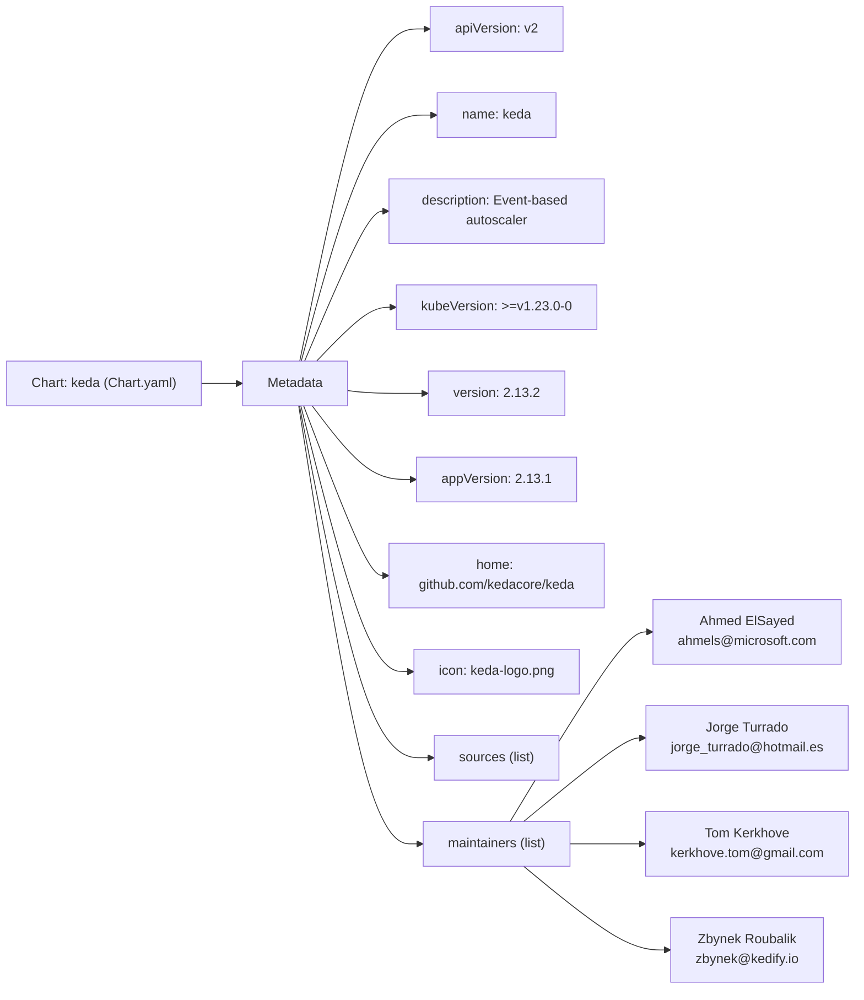

# Diagram: devops/k8s/keda/helm/Chart.yaml


> Auto-generated by Obscura crawlers

## Diagram 1

```mermaid
classDiagram
class Chart {
  +string apiVersion = "v2"
  +string name = "keda"
  +string description = "Event-based autoscaler for workloads on Kubernetes"
  +string kubeVersion = ">=v1.23.0-0"
  +string version = "2.13.2"
  +string appVersion = "2.13.1"
  +string home
  +string icon
  +string[] sources
}
class Maintainer {
  +string name
  +string email
}
Chart "1" --> "*" Maintainer : maintainers
Chart o-- "sources" : URLs
```

> SVG rendering failed for this diagram.

## Diagram 2



### SVG

<svg id="container" width="1120.5" xmlns="http://www.w3.org/2000/svg" class="flowchart" height="1194" viewBox="0 0 1120.5 1194" role="graphics-document document" aria-roledescription="flowchart-v2"><style>#container{font-family:"trebuchet ms",verdana,arial,sans-serif;font-size:16px;fill:#333;}@keyframes edge-animation-frame{from{stroke-dashoffset:0;}}@keyframes dash{to{stroke-dashoffset:0;}}#container .edge-animation-slow{stroke-dasharray:9,5!important;stroke-dashoffset:900;animation:dash 50s linear infinite;stroke-linecap:round;}#container .edge-animation-fast{stroke-dasharray:9,5!important;stroke-dashoffset:900;animation:dash 20s linear infinite;stroke-linecap:round;}#container .error-icon{fill:#552222;}#container .error-text{fill:#552222;stroke:#552222;}#container .edge-thickness-normal{stroke-width:1px;}#container .edge-thickness-thick{stroke-width:3.5px;}#container .edge-pattern-solid{stroke-dasharray:0;}#container .edge-thickness-invisible{stroke-width:0;fill:none;}#container .edge-pattern-dashed{stroke-dasharray:3;}#container .edge-pattern-dotted{stroke-dasharray:2;}#container .marker{fill:#333333;stroke:#333333;}#container .marker.cross{stroke:#333333;}#container svg{font-family:"trebuchet ms",verdana,arial,sans-serif;font-size:16px;}#container p{margin:0;}#container .label{font-family:"trebuchet ms",verdana,arial,sans-serif;color:#333;}#container .cluster-label text{fill:#333;}#container .cluster-label span{color:#333;}#container .cluster-label span p{background-color:transparent;}#container .label text,#container span{fill:#333;color:#333;}#container .node rect,#container .node circle,#container .node ellipse,#container .node polygon,#container .node path{fill:#ECECFF;stroke:#9370DB;stroke-width:1px;}#container .rough-node .label text,#container .node .label text,#container .image-shape .label,#container .icon-shape .label{text-anchor:middle;}#container .node .katex path{fill:#000;stroke:#000;stroke-width:1px;}#container .rough-node .label,#container .node .label,#container .image-shape .label,#container .icon-shape .label{text-align:center;}#container .node.clickable{cursor:pointer;}#container .root .anchor path{fill:#333333!important;stroke-width:0;stroke:#333333;}#container .arrowheadPath{fill:#333333;}#container .edgePath .path{stroke:#333333;stroke-width:2.0px;}#container .flowchart-link{stroke:#333333;fill:none;}#container .edgeLabel{background-color:rgba(232,232,232, 0.8);text-align:center;}#container .edgeLabel p{background-color:rgba(232,232,232, 0.8);}#container .edgeLabel rect{opacity:0.5;background-color:rgba(232,232,232, 0.8);fill:rgba(232,232,232, 0.8);}#container .labelBkg{background-color:rgba(232, 232, 232, 0.5);}#container .cluster rect{fill:#ffffde;stroke:#aaaa33;stroke-width:1px;}#container .cluster text{fill:#333;}#container .cluster span{color:#333;}#container div.mermaidTooltip{position:absolute;text-align:center;max-width:200px;padding:2px;font-family:"trebuchet ms",verdana,arial,sans-serif;font-size:12px;background:hsl(80, 100%, 96.2745098039%);border:1px solid #aaaa33;border-radius:2px;pointer-events:none;z-index:100;}#container .flowchartTitleText{text-anchor:middle;font-size:18px;fill:#333;}#container rect.text{fill:none;stroke-width:0;}#container .icon-shape,#container .image-shape{background-color:rgba(232,232,232, 0.8);text-align:center;}#container .icon-shape p,#container .image-shape p{background-color:rgba(232,232,232, 0.8);padding:2px;}#container .icon-shape rect,#container .image-shape rect{opacity:0.5;background-color:rgba(232,232,232, 0.8);fill:rgba(232,232,232, 0.8);}#container .label-icon{display:inline-block;height:1em;overflow:visible;vertical-align:-0.125em;}#container .node .label-icon path{fill:currentColor;stroke:revert;stroke-width:revert;}#container :root{--mermaid-font-family:"trebuchet ms",verdana,arial,sans-serif;}</style><g><marker id="container_flowchart-v2-pointEnd" class="marker flowchart-v2" viewBox="0 0 10 10" refX="5" refY="5" markerUnits="userSpaceOnUse" markerWidth="8" markerHeight="8" orient="auto"><path d="M 0 0 L 10 5 L 0 10 z" class="arrowMarkerPath" style="stroke-width: 1; stroke-dasharray: 1, 0;"></path></marker><marker id="container_flowchart-v2-pointStart" class="marker flowchart-v2" viewBox="0 0 10 10" refX="4.5" refY="5" markerUnits="userSpaceOnUse" markerWidth="8" markerHeight="8" orient="auto"><path d="M 0 5 L 10 10 L 10 0 z" class="arrowMarkerPath" style="stroke-width: 1; stroke-dasharray: 1, 0;"></path></marker><marker id="container_flowchart-v2-circleEnd" class="marker flowchart-v2" viewBox="0 0 10 10" refX="11" refY="5" markerUnits="userSpaceOnUse" markerWidth="11" markerHeight="11" orient="auto"><circle cx="5" cy="5" r="5" class="arrowMarkerPath" style="stroke-width: 1; stroke-dasharray: 1, 0;"></circle></marker><marker id="container_flowchart-v2-circleStart" class="marker flowchart-v2" viewBox="0 0 10 10" refX="-1" refY="5" markerUnits="userSpaceOnUse" markerWidth="11" markerHeight="11" orient="auto"><circle cx="5" cy="5" r="5" class="arrowMarkerPath" style="stroke-width: 1; stroke-dasharray: 1, 0;"></circle></marker><marker id="container_flowchart-v2-crossEnd" class="marker cross flowchart-v2" viewBox="0 0 11 11" refX="12" refY="5.2" markerUnits="userSpaceOnUse" markerWidth="11" markerHeight="11" orient="auto"><path d="M 1,1 l 9,9 M 10,1 l -9,9" class="arrowMarkerPath" style="stroke-width: 2; stroke-dasharray: 1, 0;"></path></marker><marker id="container_flowchart-v2-crossStart" class="marker cross flowchart-v2" viewBox="0 0 11 11" refX="-1" refY="5.2" markerUnits="userSpaceOnUse" markerWidth="11" markerHeight="11" orient="auto"><path d="M 1,1 l 9,9 M 10,1 l -9,9" class="arrowMarkerPath" style="stroke-width: 2; stroke-dasharray: 1, 0;"></path></marker><g class="root"><g class="clusters"></g><g class="edgePaths"><path d="M241.453,463L245.62,463C249.786,463,258.12,463,265.786,463C273.453,463,280.453,463,283.953,463L287.453,463" id="L_ChartYaml_Meta_0" class="edge-thickness-normal edge-pattern-solid edge-thickness-normal edge-pattern-solid flowchart-link" style=";" data-edge="true" data-et="edge" data-id="L_ChartYaml_Meta_0" data-points="W3sieCI6MjQxLjQ1MzEyNSwieSI6NDYzfSx7IngiOjI2Ni40NTMxMjUsInkiOjQ2M30seyJ4IjoyOTEuNDUzMTI1LCJ5Ijo0NjN9XQ==" marker-end="url(#container_flowchart-v2-pointEnd)"></path><path d="M361.167,436L375.08,369.167C388.992,302.333,416.816,168.667,442.537,101.833C468.258,35,491.875,35,503.684,35L515.492,35" id="L_Meta_ApiVersion_0" class="edge-thickness-normal edge-pattern-solid edge-thickness-normal edge-pattern-solid flowchart-link" style=";" data-edge="true" data-et="edge" data-id="L_Meta_ApiVersion_0" data-points="W3sieCI6MzYxLjE2NzI3NTExNjgyMjQ1LCJ5Ijo0MzZ9LHsieCI6NDQ0LjY0MDYyNSwieSI6MzV9LHsieCI6NTE5LjQ5MjE4NzUsInkiOjM1fV0=" marker-end="url(#container_flowchart-v2-pointEnd)"></path><path d="M362.971,436L376.583,386.5C390.194,337,417.418,238,444.226,188.5C471.034,139,497.427,139,510.624,139L523.82,139" id="L_Meta_Name_0" class="edge-thickness-normal edge-pattern-solid edge-thickness-normal edge-pattern-solid flowchart-link" style=";" data-edge="true" data-et="edge" data-id="L_Meta_Name_0" data-points="W3sieCI6MzYyLjk3MTM1NDE2NjY2NjcsInkiOjQzNn0seyJ4Ijo0NDQuNjQwNjI1LCJ5IjoxMzl9LHsieCI6NTI3LjgyMDMxMjUsInkiOjEzOX1d" marker-end="url(#container_flowchart-v2-pointEnd)"></path><path d="M367.112,436L380.033,405.833C392.955,375.667,418.798,315.333,435.219,285.167C451.641,255,458.641,255,462.141,255L465.641,255" id="L_Meta_Description_0" class="edge-thickness-normal edge-pattern-solid edge-thickness-normal edge-pattern-solid flowchart-link" style=";" data-edge="true" data-et="edge" data-id="L_Meta_Description_0" data-points="W3sieCI6MzY3LjExMTkyOTA4NjUzODQ1LCJ5Ijo0MzZ9LHsieCI6NDQ0LjY0MDYyNSwieSI6MjU1fSx7IngiOjQ2OS42NDA2MjUsInkiOjI1NX1d" marker-end="url(#container_flowchart-v2-pointEnd)"></path><path d="M381.694,436L392.185,425.167C402.676,414.333,423.658,392.667,439.652,381.833C455.646,371,466.651,371,472.154,371L477.656,371" id="L_Meta_KubeVersion_0" class="edge-thickness-normal edge-pattern-solid edge-thickness-normal edge-pattern-solid flowchart-link" style=";" data-edge="true" data-et="edge" data-id="L_Meta_KubeVersion_0" data-points="W3sieCI6MzgxLjY5Mzk1MzgwNDM0NzgsInkiOjQzNn0seyJ4Ijo0NDQuNjQwNjI1LCJ5IjozNzF9LHsieCI6NDgxLjY1NjI1LCJ5IjozNzF9XQ==" marker-end="url(#container_flowchart-v2-pointEnd)"></path><path d="M419.641,471.633L423.807,472.194C427.974,472.755,436.307,473.878,452.466,474.439C468.625,475,492.609,475,504.602,475L516.594,475" id="L_Meta_ChartVersion_0" class="edge-thickness-normal edge-pattern-solid edge-thickness-normal edge-pattern-solid flowchart-link" style=";" data-edge="true" data-et="edge" data-id="L_Meta_ChartVersion_0" data-points="W3sieCI6NDE5LjY0MDYyNSwieSI6NDcxLjYzMjc2MDQzNDkzNTF9LHsieCI6NDQ0LjY0MDYyNSwieSI6NDc1fSx7IngiOjUyMC41OTM3NSwieSI6NDc1fV0=" marker-end="url(#container_flowchart-v2-pointEnd)"></path><path d="M376.284,490L387.677,504.833C399.07,519.667,421.855,549.333,443.09,564.167C464.326,579,484.01,579,493.853,579L503.695,579" id="L_Meta_AppVersion_0" class="edge-thickness-normal edge-pattern-solid edge-thickness-normal edge-pattern-solid flowchart-link" style=";" data-edge="true" data-et="edge" data-id="L_Meta_AppVersion_0" data-points="W3sieCI6Mzc2LjI4NDIxMzM2MjA2ODk1LCJ5Ijo0OTB9LHsieCI6NDQ0LjY0MDYyNSwieSI6NTc5fSx7IngiOjUwNy42OTUzMTI1LCJ5Ijo1Nzl9XQ==" marker-end="url(#container_flowchart-v2-pointEnd)"></path><path d="M365.916,490L379.036,524.167C392.157,558.333,418.399,626.667,435.02,660.833C451.641,695,458.641,695,462.141,695L465.641,695" id="L_Meta_Home_0" class="edge-thickness-normal edge-pattern-solid edge-thickness-normal edge-pattern-solid flowchart-link" style=";" data-edge="true" data-et="edge" data-id="L_Meta_Home_0" data-points="W3sieCI6MzY1LjkxNTU0NDE4MTAzNDUsInkiOjQ5MH0seyJ4Ijo0NDQuNjQwNjI1LCJ5Ijo2OTV9LHsieCI6NDY5LjY0MDYyNSwieSI6Njk1fV0=" marker-end="url(#container_flowchart-v2-pointEnd)"></path><path d="M362.459,490L376.156,543.5C389.853,597,417.247,704,439.259,757.5C461.271,811,477.901,811,486.216,811L494.531,811" id="L_Meta_Icon_0" class="edge-thickness-normal edge-pattern-solid edge-thickness-normal edge-pattern-solid flowchart-link" style=";" data-edge="true" data-et="edge" data-id="L_Meta_Icon_0" data-points="W3sieCI6MzYyLjQ1OTMyMTEyMDY4OTY1LCJ5Ijo0OTB9LHsieCI6NDQ0LjY0MDYyNSwieSI6ODExfSx7IngiOjQ5OC41MzEyNSwieSI6ODExfV0=" marker-end="url(#container_flowchart-v2-pointEnd)"></path><path d="M360.869,490L374.831,560.833C388.793,631.667,416.717,773.333,443.145,844.167C469.573,915,494.505,915,506.971,915L519.438,915" id="L_Meta_Sources_0" class="edge-thickness-normal edge-pattern-solid edge-thickness-normal edge-pattern-solid flowchart-link" style=";" data-edge="true" data-et="edge" data-id="L_Meta_Sources_0" data-points="W3sieCI6MzYwLjg2ODg0Njc5MjAzNTQsInkiOjQ5MH0seyJ4Ijo0NDQuNjQwNjI1LCJ5Ijo5MTV9LHsieCI6NTIzLjQzNzUsInkiOjkxNX1d" marker-end="url(#container_flowchart-v2-pointEnd)"></path><path d="M359.873,490L374.001,578.167C388.129,666.333,416.385,842.667,440.367,930.833C464.349,1019,484.057,1019,493.911,1019L503.766,1019" id="L_Meta_Maintainers_0" class="edge-thickness-normal edge-pattern-solid edge-thickness-normal edge-pattern-solid flowchart-link" style=";" data-edge="true" data-et="edge" data-id="L_Meta_Maintainers_0" data-points="W3sieCI6MzU5Ljg3MzM3MDA1Mzk1NjgsInkiOjQ5MH0seyJ4Ijo0NDQuNjQwNjI1LCJ5IjoxMDE5fSx7IngiOjUwNy43NjU2MjUsInkiOjEwMTl9XQ==" marker-end="url(#container_flowchart-v2-pointEnd)"></path><path d="M615.988,992L639.097,953.833C662.206,915.667,708.423,839.333,737.262,801.167C766.102,763,777.563,763,783.293,763L789.023,763" id="L_Maintainers_M1_0" class="edge-thickness-normal edge-pattern-solid edge-thickness-normal edge-pattern-solid flowchart-link" style=";" data-edge="true" data-et="edge" data-id="L_Maintainers_M1_0" data-points="W3sieCI6NjE1Ljk4ODI4MTI1LCJ5Ijo5OTJ9LHsieCI6NzU0LjY0MDYyNSwieSI6NzYzfSx7IngiOjc5My4wMjM0Mzc1LCJ5Ijo3NjN9XQ==" marker-end="url(#container_flowchart-v2-pointEnd)"></path><path d="M632.336,992L652.72,975.167C673.104,958.333,713.872,924.667,738.466,907.833C763.06,891,771.479,891,775.689,891L779.898,891" id="L_Maintainers_M2_0" class="edge-thickness-normal edge-pattern-solid edge-thickness-normal edge-pattern-solid flowchart-link" style=";" data-edge="true" data-et="edge" data-id="L_Maintainers_M2_0" data-points="W3sieCI6NjMyLjMzNTkzNzUsInkiOjk5Mn0seyJ4Ijo3NTQuNjQwNjI1LCJ5Ijo4OTF9LHsieCI6NzgzLjg5ODQzNzUsInkiOjg5MX1d" marker-end="url(#container_flowchart-v2-pointEnd)"></path><path d="M691.516,1019L702.036,1019C712.557,1019,733.599,1019,747.62,1019C761.641,1019,768.641,1019,772.141,1019L775.641,1019" id="L_Maintainers_M3_0" class="edge-thickness-normal edge-pattern-solid edge-thickness-normal edge-pattern-solid flowchart-link" style=";" data-edge="true" data-et="edge" data-id="L_Maintainers_M3_0" data-points="W3sieCI6NjkxLjUxNTYyNSwieSI6MTAxOX0seyJ4Ijo3NTQuNjQwNjI1LCJ5IjoxMDE5fSx7IngiOjc3OS42NDA2MjUsInkiOjEwMTl9XQ==" marker-end="url(#container_flowchart-v2-pointEnd)"></path><path d="M632.336,1046L652.72,1062.833C673.104,1079.667,713.872,1113.333,743.108,1130.167C772.344,1147,790.047,1147,798.898,1147L807.75,1147" id="L_Maintainers_M4_0" class="edge-thickness-normal edge-pattern-solid edge-thickness-normal edge-pattern-solid flowchart-link" style=";" data-edge="true" data-et="edge" data-id="L_Maintainers_M4_0" data-points="W3sieCI6NjMyLjMzNTkzNzUsInkiOjEwNDZ9LHsieCI6NzU0LjY0MDYyNSwieSI6MTE0N30seyJ4Ijo4MTEuNzUsInkiOjExNDd9XQ==" marker-end="url(#container_flowchart-v2-pointEnd)"></path></g><g class="edgeLabels"><g class="edgeLabel"><g class="label" data-id="L_ChartYaml_Meta_0" transform="translate(0, 0)"><foreignObject width="0" height="0"><div xmlns="http://www.w3.org/1999/xhtml" class="labelBkg" style="display: table-cell; white-space: nowrap; line-height: 1.5; max-width: 200px; text-align: center;"><span class="edgeLabel"></span></div></foreignObject></g></g><g class="edgeLabel"><g class="label" data-id="L_Meta_ApiVersion_0" transform="translate(0, 0)"><foreignObject width="0" height="0"><div xmlns="http://www.w3.org/1999/xhtml" class="labelBkg" style="display: table-cell; white-space: nowrap; line-height: 1.5; max-width: 200px; text-align: center;"><span class="edgeLabel"></span></div></foreignObject></g></g><g class="edgeLabel"><g class="label" data-id="L_Meta_Name_0" transform="translate(0, 0)"><foreignObject width="0" height="0"><div xmlns="http://www.w3.org/1999/xhtml" class="labelBkg" style="display: table-cell; white-space: nowrap; line-height: 1.5; max-width: 200px; text-align: center;"><span class="edgeLabel"></span></div></foreignObject></g></g><g class="edgeLabel"><g class="label" data-id="L_Meta_Description_0" transform="translate(0, 0)"><foreignObject width="0" height="0"><div xmlns="http://www.w3.org/1999/xhtml" class="labelBkg" style="display: table-cell; white-space: nowrap; line-height: 1.5; max-width: 200px; text-align: center;"><span class="edgeLabel"></span></div></foreignObject></g></g><g class="edgeLabel"><g class="label" data-id="L_Meta_KubeVersion_0" transform="translate(0, 0)"><foreignObject width="0" height="0"><div xmlns="http://www.w3.org/1999/xhtml" class="labelBkg" style="display: table-cell; white-space: nowrap; line-height: 1.5; max-width: 200px; text-align: center;"><span class="edgeLabel"></span></div></foreignObject></g></g><g class="edgeLabel"><g class="label" data-id="L_Meta_ChartVersion_0" transform="translate(0, 0)"><foreignObject width="0" height="0"><div xmlns="http://www.w3.org/1999/xhtml" class="labelBkg" style="display: table-cell; white-space: nowrap; line-height: 1.5; max-width: 200px; text-align: center;"><span class="edgeLabel"></span></div></foreignObject></g></g><g class="edgeLabel"><g class="label" data-id="L_Meta_AppVersion_0" transform="translate(0, 0)"><foreignObject width="0" height="0"><div xmlns="http://www.w3.org/1999/xhtml" class="labelBkg" style="display: table-cell; white-space: nowrap; line-height: 1.5; max-width: 200px; text-align: center;"><span class="edgeLabel"></span></div></foreignObject></g></g><g class="edgeLabel"><g class="label" data-id="L_Meta_Home_0" transform="translate(0, 0)"><foreignObject width="0" height="0"><div xmlns="http://www.w3.org/1999/xhtml" class="labelBkg" style="display: table-cell; white-space: nowrap; line-height: 1.5; max-width: 200px; text-align: center;"><span class="edgeLabel"></span></div></foreignObject></g></g><g class="edgeLabel"><g class="label" data-id="L_Meta_Icon_0" transform="translate(0, 0)"><foreignObject width="0" height="0"><div xmlns="http://www.w3.org/1999/xhtml" class="labelBkg" style="display: table-cell; white-space: nowrap; line-height: 1.5; max-width: 200px; text-align: center;"><span class="edgeLabel"></span></div></foreignObject></g></g><g class="edgeLabel"><g class="label" data-id="L_Meta_Sources_0" transform="translate(0, 0)"><foreignObject width="0" height="0"><div xmlns="http://www.w3.org/1999/xhtml" class="labelBkg" style="display: table-cell; white-space: nowrap; line-height: 1.5; max-width: 200px; text-align: center;"><span class="edgeLabel"></span></div></foreignObject></g></g><g class="edgeLabel"><g class="label" data-id="L_Meta_Maintainers_0" transform="translate(0, 0)"><foreignObject width="0" height="0"><div xmlns="http://www.w3.org/1999/xhtml" class="labelBkg" style="display: table-cell; white-space: nowrap; line-height: 1.5; max-width: 200px; text-align: center;"><span class="edgeLabel"></span></div></foreignObject></g></g><g class="edgeLabel"><g class="label" data-id="L_Maintainers_M1_0" transform="translate(0, 0)"><foreignObject width="0" height="0"><div xmlns="http://www.w3.org/1999/xhtml" class="labelBkg" style="display: table-cell; white-space: nowrap; line-height: 1.5; max-width: 200px; text-align: center;"><span class="edgeLabel"></span></div></foreignObject></g></g><g class="edgeLabel"><g class="label" data-id="L_Maintainers_M2_0" transform="translate(0, 0)"><foreignObject width="0" height="0"><div xmlns="http://www.w3.org/1999/xhtml" class="labelBkg" style="display: table-cell; white-space: nowrap; line-height: 1.5; max-width: 200px; text-align: center;"><span class="edgeLabel"></span></div></foreignObject></g></g><g class="edgeLabel"><g class="label" data-id="L_Maintainers_M3_0" transform="translate(0, 0)"><foreignObject width="0" height="0"><div xmlns="http://www.w3.org/1999/xhtml" class="labelBkg" style="display: table-cell; white-space: nowrap; line-height: 1.5; max-width: 200px; text-align: center;"><span class="edgeLabel"></span></div></foreignObject></g></g><g class="edgeLabel"><g class="label" data-id="L_Maintainers_M4_0" transform="translate(0, 0)"><foreignObject width="0" height="0"><div xmlns="http://www.w3.org/1999/xhtml" class="labelBkg" style="display: table-cell; white-space: nowrap; line-height: 1.5; max-width: 200px; text-align: center;"><span class="edgeLabel"></span></div></foreignObject></g></g></g><g class="nodes"><g class="node default" id="flowchart-ChartYaml-0" transform="translate(124.7265625, 463)"><rect class="basic label-container" style="" x="-116.7265625" y="-27" width="233.453125" height="54"></rect><g class="label" style="" transform="translate(-86.7265625, -12)"><rect></rect><foreignObject width="173.453125" height="24"><div xmlns="http://www.w3.org/1999/xhtml" style="display: table-cell; white-space: nowrap; line-height: 1.5; max-width: 200px; text-align: center;"><span class="nodeLabel"><p>Chart: keda (Chart.yaml)</p></span></div></foreignObject></g></g><g class="node default" id="flowchart-Meta-2" transform="translate(355.546875, 463)"><rect class="basic label-container" style="" x="-64.09375" y="-27" width="128.1875" height="54"></rect><g class="label" style="" transform="translate(-34.09375, -12)"><rect></rect><foreignObject width="68.1875" height="24"><div xmlns="http://www.w3.org/1999/xhtml" style="display: table-cell; white-space: nowrap; line-height: 1.5; max-width: 200px; text-align: center;"><span class="nodeLabel"><p>Metadata</p></span></div></foreignObject></g></g><g class="node default" id="flowchart-ApiVersion-4" transform="translate(599.640625, 35)"><rect class="basic label-container" style="" x="-80.1484375" y="-27" width="160.296875" height="54"></rect><g class="label" style="" transform="translate(-50.1484375, -12)"><rect></rect><foreignObject width="100.296875" height="24"><div xmlns="http://www.w3.org/1999/xhtml" style="display: table-cell; white-space: nowrap; line-height: 1.5; max-width: 200px; text-align: center;"><span class="nodeLabel"><p>apiVersion: v2</p></span></div></foreignObject></g></g><g class="node default" id="flowchart-Name-6" transform="translate(599.640625, 139)"><rect class="basic label-container" style="" x="-71.8203125" y="-27" width="143.640625" height="54"></rect><g class="label" style="" transform="translate(-41.8203125, -12)"><rect></rect><foreignObject width="83.640625" height="24"><div xmlns="http://www.w3.org/1999/xhtml" style="display: table-cell; white-space: nowrap; line-height: 1.5; max-width: 200px; text-align: center;"><span class="nodeLabel"><p>name: keda</p></span></div></foreignObject></g></g><g class="node default" id="flowchart-Description-8" transform="translate(599.640625, 255)"><rect class="basic label-container" style="" x="-130" y="-39" width="260" height="78"></rect><g class="label" style="" transform="translate(-100, -24)"><rect></rect><foreignObject width="200" height="48"><div xmlns="http://www.w3.org/1999/xhtml" style="display: table; white-space: break-spaces; line-height: 1.5; max-width: 200px; text-align: center; width: 200px;"><span class="nodeLabel"><p>description: Event-based autoscaler</p></span></div></foreignObject></g></g><g class="node default" id="flowchart-KubeVersion-10" transform="translate(599.640625, 371)"><rect class="basic label-container" style="" x="-117.984375" y="-27" width="235.96875" height="54"></rect><g class="label" style="" transform="translate(-87.984375, -12)"><rect></rect><foreignObject width="175.96875" height="24"><div xmlns="http://www.w3.org/1999/xhtml" style="display: table-cell; white-space: nowrap; line-height: 1.5; max-width: 200px; text-align: center;"><span class="nodeLabel"><p>kubeVersion: &gt;=v1.23.0-0</p></span></div></foreignObject></g></g><g class="node default" id="flowchart-ChartVersion-12" transform="translate(599.640625, 475)"><rect class="basic label-container" style="" x="-79.046875" y="-27" width="158.09375" height="54"></rect><g class="label" style="" transform="translate(-49.046875, -12)"><rect></rect><foreignObject width="98.09375" height="24"><div xmlns="http://www.w3.org/1999/xhtml" style="display: table-cell; white-space: nowrap; line-height: 1.5; max-width: 200px; text-align: center;"><span class="nodeLabel"><p>version: 2.13.2</p></span></div></foreignObject></g></g><g class="node default" id="flowchart-AppVersion-14" transform="translate(599.640625, 579)"><rect class="basic label-container" style="" x="-91.9453125" y="-27" width="183.890625" height="54"></rect><g class="label" style="" transform="translate(-61.9453125, -12)"><rect></rect><foreignObject width="123.890625" height="24"><div xmlns="http://www.w3.org/1999/xhtml" style="display: table-cell; white-space: nowrap; line-height: 1.5; max-width: 200px; text-align: center;"><span class="nodeLabel"><p>appVersion: 2.13.1</p></span></div></foreignObject></g></g><g class="node default" id="flowchart-Home-16" transform="translate(599.640625, 695)"><rect class="basic label-container" style="" x="-130" y="-39" width="260" height="78"></rect><g class="label" style="" transform="translate(-100, -24)"><rect></rect><foreignObject width="200" height="48"><div xmlns="http://www.w3.org/1999/xhtml" style="display: table; white-space: break-spaces; line-height: 1.5; max-width: 200px; text-align: center; width: 200px;"><span class="nodeLabel"><p>home: github.com/kedacore/keda</p></span></div></foreignObject></g></g><g class="node default" id="flowchart-Icon-18" transform="translate(599.640625, 811)"><rect class="basic label-container" style="" x="-101.109375" y="-27" width="202.21875" height="54"></rect><g class="label" style="" transform="translate(-71.109375, -12)"><rect></rect><foreignObject width="142.21875" height="24"><div xmlns="http://www.w3.org/1999/xhtml" style="display: table-cell; white-space: nowrap; line-height: 1.5; max-width: 200px; text-align: center;"><span class="nodeLabel"><p>icon: keda-logo.png</p></span></div></foreignObject></g></g><g class="node default" id="flowchart-Sources-20" transform="translate(599.640625, 915)"><rect class="basic label-container" style="" x="-76.203125" y="-27" width="152.40625" height="54"></rect><g class="label" style="" transform="translate(-46.203125, -12)"><rect></rect><foreignObject width="92.40625" height="24"><div xmlns="http://www.w3.org/1999/xhtml" style="display: table-cell; white-space: nowrap; line-height: 1.5; max-width: 200px; text-align: center;"><span class="nodeLabel"><p>sources (list)</p></span></div></foreignObject></g></g><g class="node default" id="flowchart-Maintainers-22" transform="translate(599.640625, 1019)"><rect class="basic label-container" style="" x="-91.875" y="-27" width="183.75" height="54"></rect><g class="label" style="" transform="translate(-61.875, -12)"><rect></rect><foreignObject width="123.75" height="24"><div xmlns="http://www.w3.org/1999/xhtml" style="display: table-cell; white-space: nowrap; line-height: 1.5; max-width: 200px; text-align: center;"><span class="nodeLabel"><p>maintainers (list)</p></span></div></foreignObject></g></g><g class="node default" id="flowchart-M1-24" transform="translate(946.0703125, 763)"><rect class="basic label-container" style="" x="-153.046875" y="-39" width="306.09375" height="78"></rect><g class="label" style="" transform="translate(-123.046875, -24)"><rect></rect><foreignObject width="246.09375" height="48"><div xmlns="http://www.w3.org/1999/xhtml" style="display: table; white-space: break-spaces; line-height: 1.5; max-width: 200px; text-align: center; width: 200px;"><span class="nodeLabel"><p>Ahmed ElSayed\nahmels@microsoft.com</p></span></div></foreignObject></g></g><g class="node default" id="flowchart-M2-26" transform="translate(946.0703125, 891)"><rect class="basic label-container" style="" x="-162.171875" y="-39" width="324.34375" height="78"></rect><g class="label" style="" transform="translate(-132.171875, -24)"><rect></rect><foreignObject width="264.34375" height="48"><div xmlns="http://www.w3.org/1999/xhtml" style="display: table; white-space: break-spaces; line-height: 1.5; max-width: 200px; text-align: center; width: 200px;"><span class="nodeLabel"><p>Jorge Turrado\njorge_turrado@hotmail.es</p></span></div></foreignObject></g></g><g class="node default" id="flowchart-M3-28" transform="translate(946.0703125, 1019)"><rect class="basic label-container" style="" x="-166.4296875" y="-39" width="332.859375" height="78"></rect><g class="label" style="" transform="translate(-136.4296875, -24)"><rect></rect><foreignObject width="272.859375" height="48"><div xmlns="http://www.w3.org/1999/xhtml" style="display: table; white-space: break-spaces; line-height: 1.5; max-width: 200px; text-align: center; width: 200px;"><span class="nodeLabel"><p>Tom Kerkhove\nkerkhove.tom@gmail.com</p></span></div></foreignObject></g></g><g class="node default" id="flowchart-M4-30" transform="translate(946.0703125, 1147)"><rect class="basic label-container" style="" x="-134.3203125" y="-39" width="268.640625" height="78"></rect><g class="label" style="" transform="translate(-104.3203125, -24)"><rect></rect><foreignObject width="208.640625" height="48"><div xmlns="http://www.w3.org/1999/xhtml" style="display: table; white-space: break-spaces; line-height: 1.5; max-width: 200px; text-align: center; width: 200px;"><span class="nodeLabel"><p>Zbynek Roubalik\nzbynek@kedify.io</p></span></div></foreignObject></g></g></g></g></g></svg>
